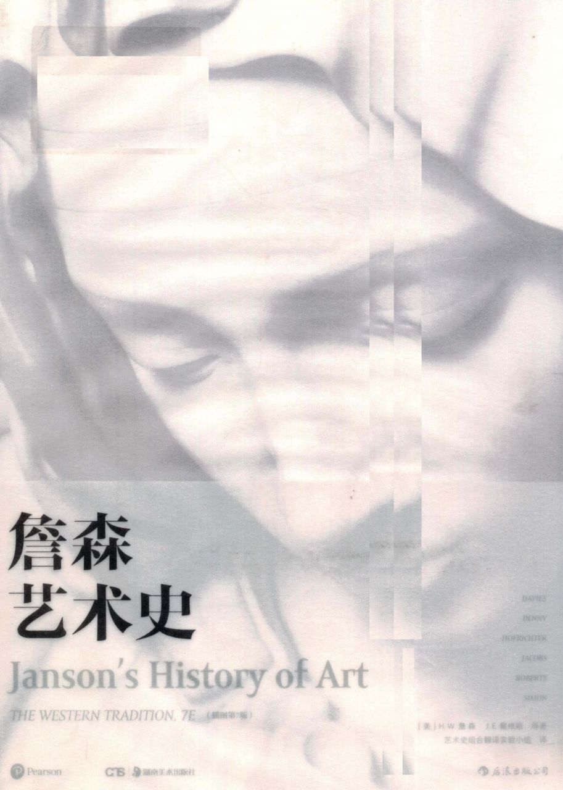

享誉全球五十载的艺术史划时代巨著

叙述时间跨度最长、门类最齐、插图最丰富的单卷本艺术史

艺术通史著作的典范，畅销半世纪的艺术类图书

——邵大箴，著名艺术史家，中央美术学院教授

——巫鸿，著名艺术史家，芝加哥大学教授

——查理·李特尔，大都会艺术博物馆

Pearson

www\.pearson\.com

——肯尼斯·E·西尔维，纽约大学艺术系主任

定价：888\.00元

詹森

艺术史

Janson's History of Art

THE WESTERN TRADITION, 7E

（插图第7版）

DAVIES

DENNY

HOFRICHTER

JACOBS

ROBERTS

SIMON

［美］H\.W\.詹森 J\.E\.戴维斯 等著

艺术史组合翻译实验小组 译

后浪出版公司

湖南美术出版社

图书在版编目（CIP）数据

詹森艺术史：插图第7版／（美）H．W．詹森

（H\.W\.Janson）等著；艺术史组合翻译实验小组译\.一

长沙：湖南美术出版社，2017\.10（2018\.5重印）

ISBN 978\-7\-5356\-8102\-7

I\.①詹···II\.①H···②艺···III\.①西方艺术\-艺术

史IV．①J110\.9

中国版本图书馆CIP数据核字（2017）第166622号

Authorized translation from the English language edition, entitled JANSON'S HISTORY OF ART: THE WESTERN TRADITION, 7E,9780131934559 by DAVIES,PENELOPE J\.E\.;DENNY,WALTER B\.; HOFRICHTER, FRIMA FOX;JACOBS,JOSEPH; ROBERTS,ANN M\.; SIMON,DAVID L\.,published by Pearson Education,Inc,Copyright © 2007 by Pearson Education,Inc\., All rights reserved\. No part of this book may be reproduced or transmitted in any form or by any means,electronic or mechanical,including photocopying,recording or by any information storage retrieval system,without permission from Pearson Education,Inc\.

CHINESE SIMPLIFIED language edition published by POST WAVE PUBLISHING CONSULTING \(BEIJING\) CO\.LTD\.Copyright ©2017\. 版权所有，盗印必究。未经培生教育出版集团许可，不得以任何方式复制或者传播本书的任何部分。

此书中文简体字版由后浪出版咨询（北京）有限责任公司出版。

本书封面贴有Pearson Education（培生教育出版集团）激光防伪标签。无标签者不得销售。

著作权合同登记号：图字18\-2017\-060

詹森艺术史（插图第7版）

ZHANSEN YISHUSHI \(CHATU DI\-QI BAN\)

出版人：李小山

著	者：	［美］H\.W\.詹森（H\.W\.Janson）等

译

者：艺术史组合翻译实验小组

出版策划：	后浪出版公司

责任编辑：贺澧沙

营销推广：ONEBOOK

出版统筹：吴兴元

特约编辑：蒋天飞 张鹏

装帧制造：墨白空间·王斑

出版发行：湖南美术出版社 后浪出版公司

开  本：	889x1194 1/16

印

印

刷：北京盛通印刷股份有限公司

张：77

版

次：	2017年10月第1版

印

次：2018年5月第2次印刷

号：	ISBN 978\-7\-5356\-8102\-7

书

定

价：888\.00元

读者服务｜reader＠hinabook．com 188\-1142\-1266

投稿服务｜onebook＠hinabook．com 133\-6631\-2326

直销服务｜buy＠hinabook．com 133\-6657\-3072

后浪官网｜www\.hinabook\.com

后浪出版咨询（北京）有限责任公司常年法律顾问：北京大成律师事务所 周天晖 copyright＠hinabook\.com

未经许可，不得以任何方式复制或抄袭本书部分或全部内容

版权所有，侵权必究

本书若有质量问题，请与本公司图书销售中心联系调换。电话：010\-64010019

序言

欢迎走进詹森经典教材的第七版，之前的版本曾向数代英语学子介绍了艺术史。对于众多教授艺术史入门课的教师而言，詹森这个名字与我们介绍的主题是同义的。1962年普兰蒂斯·霍尔出版公司首次出版《詹森艺术史》时，约翰·F·肯尼迪（John F\.Kennedy）仍执掌白宫，而安迪·沃霍尔还是一个刚刚崭露头角的艺术家。詹森的著作紧扣西方艺术，强调艺术技巧与风格，观点鲜明。

作者曾说，《詹森艺术史》并非简单串联有历史意义的艺术品，而是娓娓述说它们之间的关系\-是一部艺术风格及其转变的历史。詹森的著述关注其探讨的艺术品的视觉及技术特征，不乏异常雄辩之辞。本书为数代学者确立了一个艺术史的经典名录。

虽然经过了大幅修订，新版教材依然在主要方面承袭了詹森著作的先例：内容限于西方艺术，但另辟一章介绍伊斯兰艺术及其与西方艺术的联系（早期版本的读者会记起伊斯兰艺术是包含在第一版中的）。讨论始终集中于艺术品本身、艺术品的创作及其视觉特征；将艺术家的贡献作为分析的重点部分。新版教材结构沿用了詹森确立的主线，北方文艺复兴、意大利文艺复兴、巴洛克艺术、盛期文艺复兴分别单辟章节介绍，现代各重要时期则按其风格分别介绍。本版另新增文字，叙述不同文化框架下艺术随时间嬗变的过程。这些文化传统，欧洲称之为自己的遗产，美国人则通过与欧洲的联系也将它们称为自己的文化遗产。

新版《詹森艺术史》新颖在何处？

“以艺术史之博大，无人能胜任其中所有部分的研究。”

——H\.W\.詹森，摘自《詹森艺术史》第一版“序言”

《詹森艺术史》第七版是来自不同专业背景的学者们仔细修订、集体劳动的结晶，对艺术品的探讨颇有深度。书中融入了各个专业领域的新发现，包括考古学新发现，如《莫蒂阿的战车御者》；新的文献证据，如乌切洛的《圣罗马诺之战》的相关资料；以及新的解读方法，如民族主义在浪漫主义发展过程中的重要性。

调整结构，前后呼应

多数章节重新组织，按年代顺序讨论各时期艺术的同时，穿插介绍各种艺术表现方式，摒弃了前几版将二者孤立处理的更为形式主义的做法。我们不但按照詹森的做法，将不同艺术品联系起来，还强调艺术赞助和艺术品的功能及其创作的历史环境。我们探究了艺术品被用于支撑政治和社会权力的方式。

解读文化

西方艺术史涵盖众多独特的时间段和文化期，我们有意将此作为一个个独特的个体看待。于是我们提出，伊特鲁里亚艺术是伊特鲁里亚文化的体现，而不是罗马艺术的先驱抑或希腊艺术的追随者。我们自知对于某些历史时期的了解有限，但还是研究了艺术史家们如何从艺术品中得出结论。名为艺术史家的观点的专栏能帮助学生看清本学科的研究步骤，使他们更好地理解艺术史家进行论证的方法。原始文献是詹森著作各版本的独特之处，也已纳入书中各章，以支持所作的分析，并就正在探讨的文化为学生提供更多相关信息。

艺术史中的女性

本版《詹森艺术史》另一大特色，是女性的比重大大增加了。我们将这些女性作为艺术家、赞助人或艺术观赏者进行讨论。由于受到现代艺术史研究方法的启发，我们将艺术上对女性的描绘视为有关女性的特定文化观念的表达，或视为某种象征。

艺术品、媒介和技法

本版新添大量艺术品，以反映本学科的发展变化。大约四分之一的艺术品都是新增的。书中讨论的艺术媒介也有扩充，不仅包括现代艺术形式，如装置艺术、大地艺术，还涉及所谓的早期次要艺术，如挂毯、金属制品和瓷器。材料与技法专栏重点介绍了艺术史中的这一领域。

图像

本书不但增添艺术品，且对每幅作品进行了调色或专业审核，确保忠实原作。我们从艺术品所属机构直接获取了最新的照片，以保证得到最精确权威的插图。只要有可能，所有图像均为彩色。

逐章修订

各章均由六位专家审定，再经过一次全面彻底的互审，因此，修订内容纷繁复杂，难以尽数。每一变化均以方便艺术史师生使用为宗旨。以下列表列出了新版的主要内容：

走近艺术

这一全新的部分介绍了艺术史分析的模式，定义了艺术史各种术语，同时，还概述了本学科的重要问题。

第一章：史前艺术

本章增加篇幅，纳入了更多信息介绍艺术品发现的各种背景，详述了学者（包括历史学家和人类学家）理解艺术品

的方法。本章还提供了更多样的解读方式，并澄清学者们以某种方式重构史前世界的原因。

第二章：古代近东艺术

充实内容，调整结构，分别介绍古代近东在同一时期兴盛的各种文化。

第三章：埃及艺术

本章更新有关埃及世界观的讨论，并将埃及艺术品与之联系起来。收入更多表现女性的艺术品，例如著名的《王后泰伊雕像》。

第四章：爱琴艺术

这一部分分析我们如何通过研究艺术品和建筑来构建关于古代社会的认识。同时详细介绍那些为增进我们对古代社会认识的个人，例如海因里希·施利曼和阿瑟·埃文斯爵士。

第五章：希腊艺术

本章新增重要艺术品，例如精美的《莫蒂阿的战车御者》。文字结构彻底调整，更符合时间顺序，不再按照艺术表现形式叙述。扩充有关雅典卫城的建筑及整个希腊化艺术的讨论。

第六章：伊特鲁里亚艺术

修改关于伊特鲁里亚艺术的讨论，将其描述为当之无愧的视觉文化，并非希腊艺术的延续或罗马艺术的先驱。本章加入了慕罗的宫殿建筑。

第七章：罗马艺术

本章的特色是大幅增加对共和时期艺术的介绍，并更详细地讨论了广义上罗马时期的建筑。增添了新的作品，如壮观的庞培剧场。文字结构彻底调整，按时间顺序而非艺术形式来组织。

第八章：早期基督教与拜占庭艺术

本章突出介绍了基督教为罗马帝国认可时，在早期基督教艺术中发生的变革及政治因素，更深入地讨论建筑，强调当时人们如何体验各种建筑物，研究了所用形式的意象（即含义）。本章还增加篇幅，讨论圣像及具有争议的破坏圣像运动。

第九章：伊斯兰艺术

本章重新介绍伊斯兰艺术，试图在综述伊斯兰艺术的同时，强调其与欧洲（西方）艺术的联系。两种艺术共有的许多价值标准也在本章有所探讨。

第十章：早期中世纪艺术

本章加大对早期次要艺术的讨论，更深入地探讨爱尔兰手稿的含义，及其与罗马艺术的关系。增加篇幅讨论查理曼大帝的政治和社会目标，及如何运用艺术手段推进此进程。这一章更注重当时对女性的态度及艺术中表现女性的方法。

第十一章：罗马式艺术

加大对朝圣之路艺术的讨论，包括卡多那的圣文森特教堂和圣热尼·德·枫丹教堂。详细讨论女性作为艺术题材和

赞助人所发挥的作用。本章结构调整后，融入各种艺术表现形式，有助于获得以下认识：尽管这些艺术品存在本质区别，却表现出共有的愿望和恐惧。

第十二章：哥特式艺术

调整结构，删除意大利艺术（现收入第十三章）和部分国际哥特式的典范（现收入第十四章）。本章引入新例子（如拉昂大教堂和巴黎圣母院内景），使有关哥特建筑发展过程的介绍更具说服力。这一章还新增关于圣礼拜堂和西班牙哥特式艺术的讨论。

第十三章：13\-14世纪的意大利艺术

本章将13\-14世纪意大利艺术的发展情况与欧洲其他地方区分开，以便突出它在中世纪艺术与文艺复兴艺术之间所发挥的桥梁作用。新收入的作品包括西莫内·马丁尼的《圣母领报》和西班牙教堂内佛罗伦萨的安德烈亚所作的《救赎之路》。新增一部分讨论14世纪意大利北部的艺术。

第十四章：14世纪北部欧洲的艺术创新

本章置于15世纪意大利一章之前，新的结构融入了一个特定时期和地域的艺术品，历史背景得到凸显。本章更新了对于一些关键作品的讨论，详细介绍版画制作及印刷书籍。

第十五章：15世纪意大利的早期文艺复兴

将艺术置于特定的时刻或地理区域中，联系历史背景来讨论不同的表现形式。强调艺术赞助人的作用。新增部分介绍佛罗伦萨以外的艺术。这一章在国内背景之中，介绍了嫁妆箱奁的饰板和其他艺术品。包括的新作品有：安杰利科修士在圣马可修道院创作的《圣母领报》，布鲁内莱斯基的孤儿收容院，皮耶罗·德拉·弗兰切斯卡为乌尔比诺宫廷所作的作品，以及曼泰尼亚在曼图亚的作品《绘画之屋》。

第十六章：意大利的盛期文艺复兴：1495\-1520年

解释了六位重要艺术家一直得到学界专题式的详细研究的原因。集中讨论了1495至1520年这一段时期，将米开朗基罗和提香的相关内容移入第十七章。增加了达芬奇的画作《维特鲁威人》和米开朗基罗的《圣母哀子像》。更新了艺术作品的讨论，包括达芬奇的《岩间圣母》，乔尔乔内的《暴风雨》。

第十七章：16世纪意大利晚期文艺复兴与风格主义

本章按地理方位，首先讨论美第奇公爵统治下的佛罗伦萨，然后转向罗马、意大利北部及威尼斯等其他地区。强调宫廷及教皇对艺术的赞助，以及佛罗伦萨绘画学院的建立。讨论中涉及晚年的米开朗基罗和提香。新增部分讨论了布龙齐诺、提香的《乌尔比诺的维纳斯》，以及拉维尼娅·丰塔纳的作品。

第十八章：16世纪北部欧洲的文艺复兴与宗教改革

本章探讨了五大地理区域的艺术作品。在讨论宗教改革和其他危机的过程中，考虑到意大利文艺复兴风格的传播，及各个地方传统的发展。新增了关于《伊森海姆祭坛画》的讨论。

第十九章：意大利和西班牙的巴洛克艺术

本章研究了卡拉瓦乔和贝尼尼在反宗教改革运动中发挥的作用。讨论了宗教修道会和教皇制度，深入解释了女性、女艺术家、穷人和市井人物的作用，以及十七世纪生活方方面面的特点。新增的艺术品包括贝尼尼的《祭台华盖》和他的一件雕塑作品的草图，委拉斯凯兹的肖像画《胡安·德·帕雷哈像》，以及真蒂莱斯基的《隐喻画自画像》。

第二十章：尼德兰的巴洛克艺术

本章研究了荷兰政治、宗教方面的差别和艺术上的关联。通过研究鲁本斯的工作室，探讨了他的重要性。在讨论荷兰风景画、静物画、北部欧洲风俗画的过程中，这一章介绍了开放市场这一概念，并通过朱迪思·莱斯特（新增）、克拉拉·彼得斯（新增）和拉歇尔·鲁伊斯的画作，集中讨论了这些女性艺术家的新地位。

第二十一章：法国和英国的巴洛克艺术

本章通过普桑的画、琼斯和雷恩的建筑，对古典主义这一概念进行了思考。新的作品包括普桑的《罗马将军之死》和《在帕特莫斯岛的圣约翰与风景》，勒布仑的面部表情图，以及雷恩设计的圣玛莉里波教堂的尖塔。

第二十二章：洛可可艺术

本章以华托和弗拉戈纳尔的画作为例（包括《热尔桑画店》和《秋千》），探讨了路易十四统治的时代。介绍了罗萨尔巴·卡列拉的粉笔画，维热\-勒布伦的《玛丽·安托瓦内特和她的孩子们》，并以塞夫尔的瓷器为例，强调了装饰艺术在这个时代的重要性。

第二十三章：启蒙时代的艺术：1750\-1789年

本章经过重写，将重点更多地集中在由新古典主义转移到大致从1750至1789年的这一段时期，强调新古典主义对逻辑、道德和古典时代的依赖，同时指出，人们日益重视情感、非理性和艺术的崇高。本章收入了以下艺术家的作品：门格斯、巴托尼、汉密尔顿、德比的赖特、加布里埃尔和佩尔。

第二十四章：浪漫主义时代的艺术：1789\-1848年

本章结构经过了完全的修改，解释了浪漫主义这一概念，强调了情感、个人自由和个人经历的重要性，研究了想象力、天赋、自然和异国特色。这一时期，启蒙运动与法国大革命大势已去，本章将浪漫主义置于这样的背景中进行研究，更突出地将民族主义视为浪漫主义的一个主题。

第二十五章：实证主义时代：现实主义、印象主义和拉斐尔前派，1848\-1885年

本章以实证主义的概念为中心，以确凿事实和艺术家们记录的社会剧变为基础展开。本章还扩充了关于摄影的讨论，关注钢铁在工程和建筑上、特别是水晶宫和埃菲尔铁塔中的使用情况。将罗丹和象征主义联系起来，讨论现实主义时加入了杜米埃和米勒。

第二十六章：进步与无止境的渴望：后印象主义、象征主义和新艺术风格，1880\-1905年

本章强调历史背景而非现实主义传统，强调这一时期动荡的心理及其在艺术上的体现。有关弗兰克·劳埃德·赖特的内容置于本章芝加哥学派中。摄影部分现加入了了克泽比尔的《你，女人中神圣的艺术》，并在女权主义的背景下加以探讨。

第二十七章：走向抽象：现代主义革命，1904\-1914年

本章是按时间顺序大幅调整后有关现代艺术的三章内容的第一部分；这一章内部按照主题重新组织。引起1904至1914年之间艺术形式和风格巨变、并最终导致抽象主义诞生的各种社会力量在本章得到强调。本章极为重视杜尚的影响。新收入的作品包括勃拉克的《葡萄牙人》，杜尚的《下楼梯的裸体，2号》。这一部分还大幅度修订了美国艺术。

第二十八章：两次世界大战之间的艺术

本章的中心内容是一战的影响、创立乌托邦及揭示高层面现实的必要性，尤其是超现实主义所反映的现实。这一部分按时空顺序讨论达达主义，还详尽介绍杜尚在美国的经历，新增《泉》这一作品。这里以曼·雷和达利的作品为例介绍

电影。本章讨论还涉及蒙德里安和风格派的建筑、包豪斯艺术家和建筑师。

第二十九章：从战后到后现代：1945\-1980年

本章突出凯奇和劳申伯格对美国艺术发展的影响，加入了布莱希特的观念艺术、卡普罗的偶发艺术和环境艺术。其他添加内容包括：鲁沙、弗莱文、塞拉，以及关于白南准和海瑟的最新探讨。以新增的艺术家大卫·哈蒙斯和朱迪·芝加哥为例，这一部分关注了种族认同及性别问题。

第三十章：后现代时代：1980年至今的艺术

本章以简明的语言介绍了后现代主义的概念。突出了这一时期的多元主义，以及艺术无极限这一观点。新增建筑师包括文丘里、摩尔、约翰逊、哈迪德、里伯斯金和皮亚诺；新增艺术家包括巴斯克雅、霍尔泽、珀尔克、维奥拉、冈萨雷斯\-托雷斯、史密斯、赫斯特和蔡国强。

参考书目

由哈佛大学图书馆艺术分馆的玛丽·克莱尔·奥尔腾霍芬（Mary Clare Altenhofen）全面更新。

各章新特色

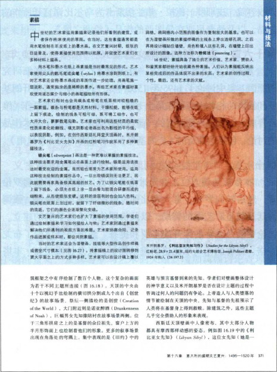

材料与技法：

图解说明了艺术家创作的步骤。

每位刚入门的艺术史学生都在努力掌握多种不

同的技能\-《詹森艺术史》的插图精美，语言生动，

能给学生们带来帮助。本书还新设专栏，加强学习

效果：

材料与技法

■艺术史家的观点

■大事年表

■原始文献

■小结

艺术史家的观点：

简要介绍了艺术史家的研究方法。

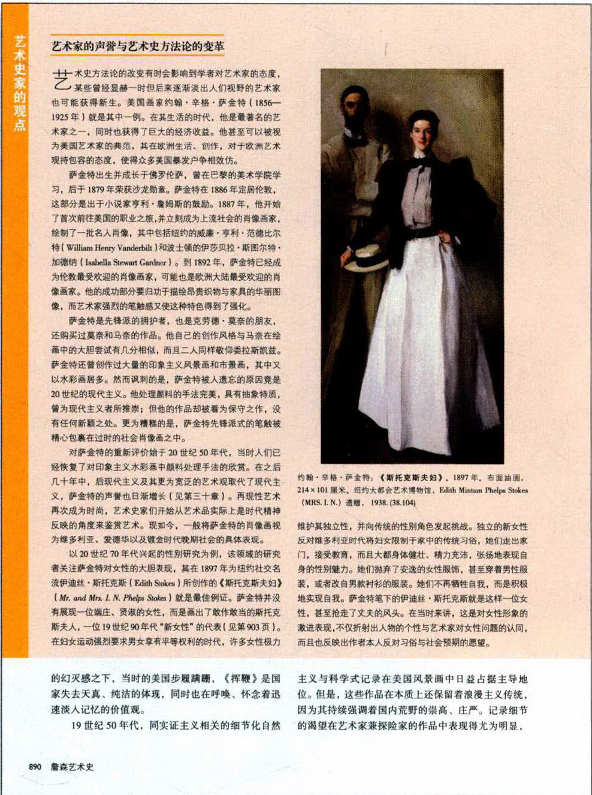

大事年表：

丰富的年表把艺术品和产生它们的时代相联系。

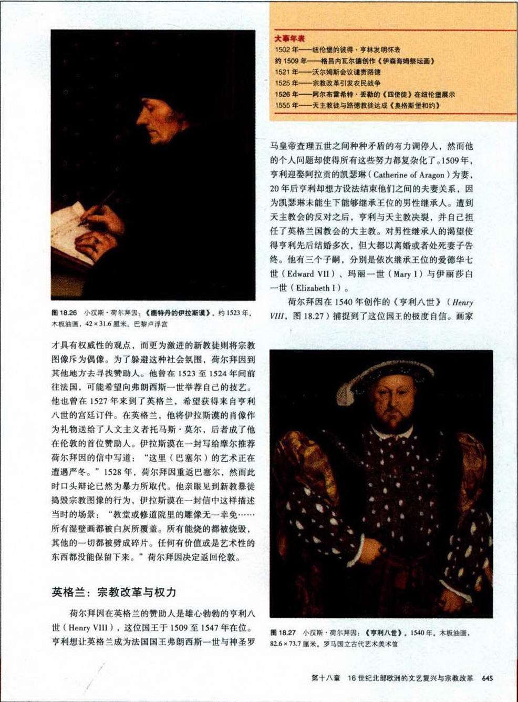

原始文献：

用历史文献将艺术和艺术家放置在更准确的时代背景中。

小结：

置于章末，点出重点。

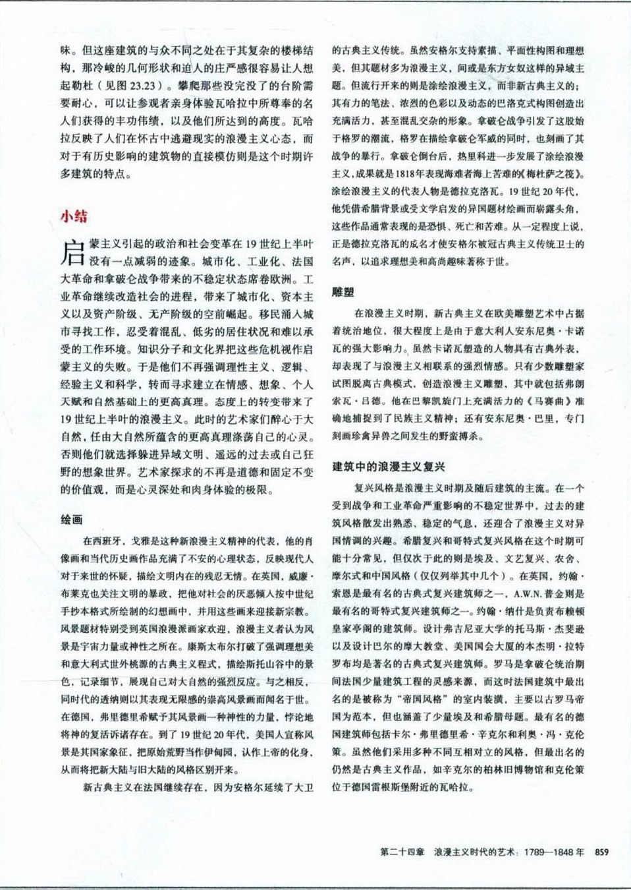

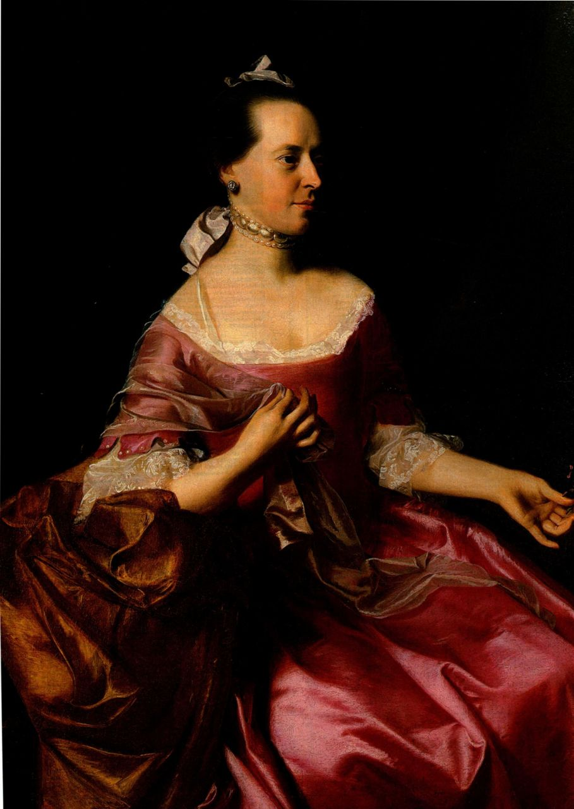

导论

走近艺术

谁是弗里洛夫·奥尔尼·斯科特（Freelove Olney Scott）？她的肖像（图L．1）

向我们展示的是一位容貌优雅的女士，我们猜测她可能出身贵族家庭，惯于

颐指气使。对于《约瑟夫·斯科特夫人像》（Mrs\.Joseph Scott）等约翰·辛格尔顿·

科普利（John Singleton Copley）为殖民时期的波士顿居民所作的肖像，我们

已经将之视为对画中人物及其生活方式的准确描绘。但其中有很多人并不是画上看到的那个

样子，斯科特夫人就是如此。她究竟是谁？让我们首先深入到这幅画的语境之中。

艺术语境

科普利属于首批享誉美国殖民地各州和英国的美国画家。他1754至1774年前后在波士顿从事创作，成为当时最炙手可热的肖像画家。科普利轻而易举地将那些“画脸的”甩在身后，后者是当时对肖像画家的蔑称，他们大都还得靠画招牌或马车装饰来维持生计。毕竟，成功的英国艺术家毫无理由远赴美国，因为经济困窘，殖民地不具备繁荣的艺术市场。只是偶尔才有人委托画像，而且人们把艺术家当成凭手艺而非头脑工作的匠人。同大多数殖民地肖像画家一样，科普利全凭自学，在观摹欧洲大师画作的黑白印刷品中习得了这门手艺。

正如我们在《约瑟夫·斯科特夫人像》中所见，科普利精于表现质感，而这一切他都无师自通，令人

图1\.1 约翰·辛格尔顿·科普利：《约瑟夫·斯科特夫人像》。

约1765年。布面油画，176\.5 x 100厘米。新泽西州纽瓦克市纽瓦

克博物馆（The Newark Museum），48\.508

更为惊叹。科普利创造的视幻效果极其逼真，我们甚至认为看到了真正的丝绸、缎带、花边、珍珠、皮肤、头发和大理石。科普利的同辈们也惊异于他的巧夺天工，任何殖民地画家都没有达到他这样的写实水准。

然而，科普利不仅要忠实地复制他的眼之所见，而且要把斯科特夫人表现成一位品性完美、家财万贯且身份高贵的女士。她手中的花束象征繁衍、忠贞以及女性的典雅，表明她既是贤妻良母，又不失女性魅力；昂贵的礼服和项链都是来自伦敦的进口货。或许是为了略微提升她的地位，科普利给她设计了效仿英法皇室肖像画的姿势，他手边无疑备有这些作品的印刷复制品。

科普利不仅向斯科特夫人出借了姿势，很可能也出借了衣着和项链，因为同一条项链还出现在科普利笔下另外三位女士的颈项上。换言之，它是画室的道具。事实上，除斯科特夫人的面孔之外，整张画都是虚构的，其用意在于美化这位波士顿商人的妻子，她的丈夫通过向英国驻军出售军需品而刚刚致富。斯科特一家不是世袭贵族，而是平民出身的暴发户。到18

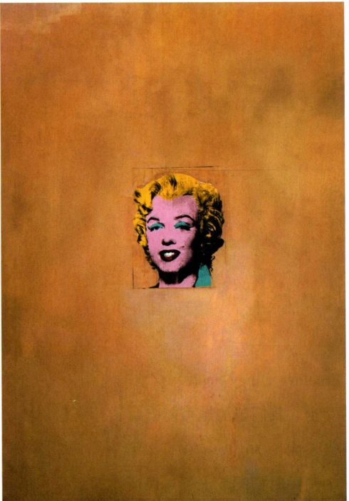

图1\.2 安迪·沃霍尔：《金色的玛丽莲·梦露》。1962年。合成高分子涂料、丝网印刷、布面油画。2\.12x1\.39米。纽约现代艺术博物馆。Philip Johnson 捐赠

世纪中叶，波士顿的有钱人开始想要有别于那些不甚成功的左邻右里。一个世纪以来他们都在努力摆脱自己的英国血脉，很多人逃离英国为的是获得宗教自由，现在他们却设法仿效英国贵族，甚至开始喝下午茶，豢养在英国只有贵族才被准许饲养的英国獚。

斯科特分别为妻子及他自己订制肖像，不仅是要记录他们的容貌，更是为了炫耀家族的财富。这两幅画极其昂贵，因此是地位的象征，正如今天的奔驰汽车或蒂凡尼钻戒。肖像被置于寓所中客人随时可以看到的公共空间，很可能挂在起居室的壁炉架两侧或门厅里。它们不是那种挂在家居私密空间中表达挚爱亲情的作品。如果买主需要爱人的珍藏肖像，他们会订制像尼古拉·希利亚德的作品（见图18\.28）那样的袖珍画。袖珍画在细节上惟妙惟肖，而且尺寸小巧，女士可以把它放进小盒，作为项链坠挂在脖子上，男士则可以把它放入靠近胸口的上衣内袋。而科普利所作肖像的尺幅和不菲价格赋予它象征社会地位的功能。

如果斯科特夫人的肖像富于深意，那么安迪·沃

霍尔在近两百年之后创作的《金色的玛丽莲·梦露》（图1\.2,1962年）也是如此。这幅画在某种意义上也可以被当作肖像，因为它描绘的是20世纪50年代那位成为性感偶像的著名影星。然而，不同于《约瑟夫·斯科特夫人像》的是，它并非梦露或其家人的委托作品。沃霍尔自选主题，并计划将这幅画展示于商业画廊，供私人收藏家购买用做家中陈设。他当然希望作品的最终归宿是博物馆，这样它就会展示在大量观众面前。科普利从未考虑过这种问题，因为他那个时代公共博物馆还不存在。与科普利相比，沃霍尔无需讨好他的人物，他也无需劳神费力地画出足以乱真的形象。《金色的玛丽莲·梦露》既无细节，也无质感，她的头发和肌肤看来出自同一种材料\-涂料。沃霍尔只是找来这位影星在报纸上的某幅著名照片，采用丝网印刷方式将之转印到画布上，其过程是首先用机器把照片转到网筛上，接着让油墨透过网筛在画布上印出图像。然后沃霍尔给梦露的头像粗涂了一大片金色背景。

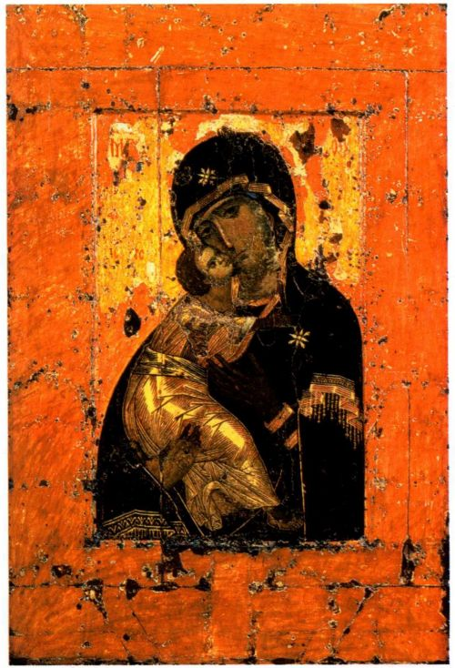

图1\.3《弗拉基米尔圣母》（Virgin of Vladimir），圣像画，可能来自君士坦丁堡。画像只有面部为12世纪的创作，其余部分曾经过修复。木板蛋彩画，高约78厘米。莫斯科特列季亚科夫画廊（TretyakovGallery\)

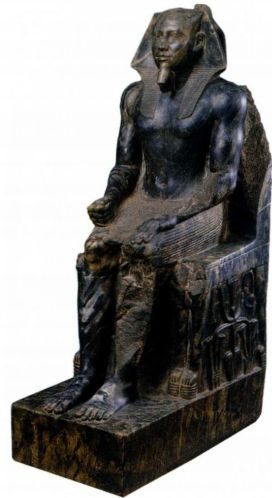

图1\.4《卡夫拉像》，出

自吉萨。约公元前2500年。闪长岩，高167\.7厘米，

开罗埃及博物馆

沃霍尔的画是对大众媒体所传播的梦露公众形象的仿作。他甚至模仿了当时报纸彩印那潦草粗糙的面貌，因为那时四色印刷的对版常常错位，因此颜色与图像参差不齐。我们看到的梦露是没有人性特征的传媒名流，艳红的唇膏和闪亮的金发本应让她魅力十足，可是艳俗的色彩（金发变成了亮黄色）和污浊的墨迹让她俗气得让人心生同情。我们难以察觉她的个性，一切都缩减为那抹尽人皆知的微笑。创作这幅作品的部分动机在于梦露此前不久的自杀。尽管她的形象魅力四射，但现实中的梦露却深受抑郁症折磨。沃霍尔出色地表现了大众媒体的冷漠，它迎合追星大众，崇拜名流的外在形象，但却不关注名流身上有价值的部分，对他们本人也毫不关心。玛丽莲·梦露的形象是在推广一件产品，就像布里洛牌（Brillo）肥皂盒的花哨包装或者坎贝尔牌（Campell）汤罐头的铁盒，设计出来只是为了销售产品，不涉及任何关于产品本身的情况。包装即遮蔽。沃霍尔让梦露的面庞荡漾在金色颜料的海洋中，这是仿照圣像画中基督和圣母形象的处理手法，传统上这些宗教人物都环绕在来自天国的金色神圣光环之中（图1\.3）。可是，沃霍尔那受万人仰慕的梦露在天堂般的金色里渺小得可悲，为这幅强有力的肖像增添了一丝酸楚，这是对公众形象与个人现实世界间巨大鸿沟的尖锐评论。

在审视《约瑟夫·斯科特夫人像》和《金色的玛丽莲·梦露》的创作背景时，我们开始理解语境对艺术品的形态、含义，以及它讲述的故事是多么重要。虽然科普利和沃霍尔都是美国艺术家，但他们的创作时代相差很大，使用的材料和技法不同，服务的委托

人不同，所有这些因素都极大地影响了其肖像作品的外观和含义。因为他们的艺术和所有艺术一样，都服务于某种目的，所以他们的作品不可能不代表某种观点，不可能不讲述一个故事或几个故事。正如伟大的文学或音乐，令人难忘的艺术品也会讲述刻骨铭心的故事，当我们探索作品创作不同层次的语境时，它们的含义就会更为清晰。

诸多因素决定着艺术品的风格与含义，成就着它们的有力存在。几个世纪以来，出于政治或宗教需要而创作的艺术，被国家和教会用于宣扬它们至高无上的权威形象。古埃及统治者谙熟艺术的力量，他们将自身的权势寓形其中，有时还披着仁慈的外衣。大型石雕表现的埃及国王和王后一手摊开以示仁慈，另一手紧握成拳（见图1\.4侧面），这是表现其形象的典型样式。诸如拉斐尔的《黎明时的圣母》（AlbaMadonna，图1\.5）等宗教形象表现的则是理想完美的生存状态，虔诚的资助人相信经由天主教就可以达到这一境界。众多为家庭陈设而作的风景画，或描绘水果、猎物、花卉的静物画，也蕴含有大量信息，绝不只是捕捉自然的壮丽多变，或用乱真的形象来炫耀画家的精湛技艺这么简单。在克拉拉·彼得斯的作品《有水果和花的静物》（见图20\.11）中，精心描绘的自然和器物不仅让观者联想到感官之乐，也提醒他这种享乐稍纵即逝。

艺术更有唤醒整个历史时期的力量。例如，我们将金字塔和狮身人面像（图1\.6）所带来的宏大感与古埃及文明系于一体。同样，格兰特·伍德于1930年创作的著名作品《美国哥特式》（图1\.7），则加深了我们对当时生活在美国中西部那些一本正经而又

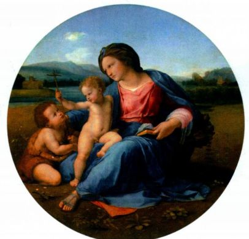

图1\.5 拉斐尔：《黎明时的圣母》。约1510年。木板油画，直径94厘米。华盛顿国家美术馆，Andrew Mellon 收藏

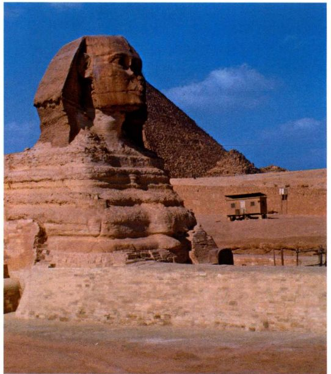

图1\.6 狮身人面像，吉萨。约公元前2570\-前2544年。砂岩，高19\.81米

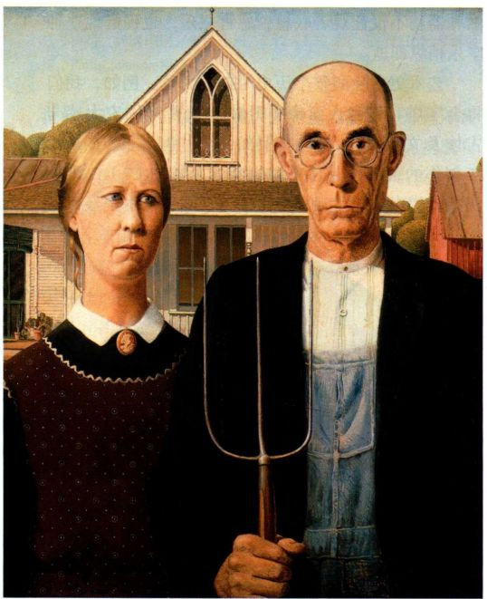

图1\.7 格兰特·伍德：《美国哥特式》。1930年。木纤维板油画，

74\.3x62\.4厘米。芝加哥艺术学院，美国艺术之友收藏

勤劳简朴的农民的认识。这幅画在大众神话的语境里几乎就是美国乡村的象征。

语境转换，意义变迁

《美国哥特式》还成了之后几代美国人幽默嘲讽的素材，他们把这位名声在外的持干草叉农民及其一脸苦相的女儿编进了各种各样与艺术家传达的信息无关的故事。观者常常把艺术品挪用在种种迥异于作品初衷的语境中，结果作品的意义就发生了根本的改变。一些纽约人对克里斯·奥菲利（Chris Ofili）的作品《圣母玛利亚》（The Holy Virgin Mary，图1\.8）的反应表明，艺术具有引发争议甚至激起愤怒的力量。1999年末，该作品在纽约布鲁克林博物馆举办的题为“感觉：萨奇画廊英国青年艺术家收藏作品展”的展览上展出。非裔英国艺术家奥菲利创作了一幅表现黑人圣母的巨像。他运用色点、闪光片、图钉以及出自流行杂志的女性生殖器来暗示子孙繁衍。在非洲传统中，许多表现女性的作品都与种族繁衍有关。奥菲利在这件作品里结合了非洲主题与基督教意象，这就无意间冒犯了许多不了解非洲文化传统的西方人。这件巨幅作品没有挂在墙上，而是置于两大堆大象粪便上，自1991年以来，艺术家已经多次采用这样的方式来展示他的大幅画作。大象粪便在津巴布韦被视为圣物，因此对于虔诚的天主教徒奥菲利而言，这幅作品表达的是圣母与生俱来的神圣。

许多艺术史家、批评家以及其他观众都认为这幅画美得非比寻常，作品在微妙短暂、超凡脱俗的气氛中熠熠生辉。然而，众多天主教观众却排斥憎恶这件作品，因为奥菲利使用了所谓的色情细节来表达对圣母的敬意。他们不是通过奥菲利的眼睛来看待作品，而是把它放进了自己的经验和信仰语境中。如此一来，他们就将表现大象粪便和生殖器视为渎神之举，可能还无法忍受圣母的黑色皮肤，尽管从没有人曾提及这一点。在展览开幕的日子里，这幅画不得不被放在一大面树脂玻璃屏的背后。某位艺术家向布鲁克林博物馆正面投掷马粪，声称“我在创造性地表达我自己”；另一位参观者则偷偷溜到屏障后面，用白色颜料涂抹圣母，要把她覆盖掉。而最猛烈的抨击则来自纽约市长鲁道夫·朱利安尼（Rudolph Giuliani），作为天主教徒，他对这件作品怒不可遏，以致试图取消对该博物馆的公共资助。他最终未能成功，不过那却是在博物馆提请了长期诉讼之后。奥菲利作品所引起的公愤只是漫长历史中的小插曲，这一历史或许可以上溯至人类制作图

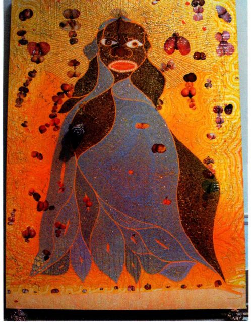

图1\.8 克里斯·奥菲利：《圣母玛利亚》，1996年。纸拼贴、油画

颜料、亮片、树脂、地图钉、大象粪便、亚麻布，2\.44 × 1\.83米。伦

敦萨奇画廊（The Saatchi Gallery）

像之初。在各个历史时期，艺术都经常激起愤怒，正如它也曾激发过骄傲、赞赏、热爱和崇敬。原因很简单。艺术从不是空洞的容器；相反，它满载意义，其意义可以作出多样化的解读，而且无一例外地表达着个人观点。

社会语境与女性艺术家

正如社会变动不已，审视艺术的语境也在不断变化，所以我们对艺术以及整个时代的解读和领悟也会演变。例如1962年本书第一版印行时，内容中并没有包括女性艺术家，这是当时教科书的通例。美国与世界上多数地方一样是男性主导的社会，历史也只关注男性。那个时代人们期待的是女性承担贤妻良母的角色，她们工作也不过是为了补贴家用。人们不认为她们会成为艺术家，仅有的几个知名特例也没有获得以男性居多的历史学家的认真对待。始于20世纪60年代中期的女性主义运动颠覆了对女性角色的狭隘认识。结果，在过去的四十年间，艺术史家（其中出现了很多女性）“重新发现”了为数众多的女性艺术家。她们当中有很多杰出艺术家，有生之年就已经赢得了人们的高度尊敬，尽管女性要成为职业艺术家，她们

必须努力克服来自社会乃至家庭的巨大阻力。

17世纪的荷兰画家朱迪思·莱斯特就是其中一位重获发现的女性艺术家，她若不是弗兰斯·哈尔斯的学生，至少也是他的追随者。几个世纪以来，莱斯特的所有画作都归于其他艺术家名下，其中包括哈尔斯和赫里特·凡·洪特霍斯特（Gerrit van Honthorst），或者标为“作者不详”。但在19世纪末，通过分析她的签名、文献和风格，人们重新发现了莱斯特，她的作品也逐一回归她的名下。惟有女性主义运动，才能将她从籍籍无名中提升为当时成就卓著的画家之一，其地位之重要足以载入艺术史册。女性主义运动启发了评价艺术的新语境，倾向于赞扬而不是否认女性的成就，关注研究与性别有关的问题，以及艺术中表现女性的方式。

从这一角度出发，莱斯特作于1633年前后的《自画像》（图1\.9）就尤为引人注目。从尺寸和年代上看，这可能是莱斯特为申请加入当地画家行会（哈勒姆的圣路加行会）而提交的作品。当时不鼓励女性加入行会，那是男性巩固其职业地位的专属领地。女性艺术家一般也不招收学生。当莱斯特在男性世界里开辟出自己的事业时，她同时打破了这两种传统的束缚。在这幅自画像中，她将自己表现为一位备有大量画笔的艺术家，以此表明她对该媒介的娴熟掌握，这正是用

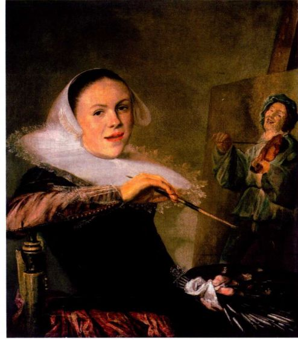

图1\.9 朱迪思·莱斯特：《自画像》。约1633年。布面油画，72\.3 × 65\.3厘米。华盛顿国家美术馆，Mr\.and Mrs\.Rober WoodsBliss 捐赠

于自荐的画作所要展示的内容。画架上的作品是一幅未完成的风俗画（日常生活一瞥），她以之成名的绘画类型。我们必须注意，当时的艺术家极少把自己画成在画架旁辛勤创作的样子。他们想让自己有别于低微的工匠，把自己表现为属于更高阶层的人物。然而，作为拒绝服从男性期待的女性，莱斯特需要清楚地表明她确实是一个艺术家。所以她很聪明地改变了作画时的装束，从而提升了自己的地位。画里的她着装得体，生活富足，就像其肖像中的顾客那样。这幅所谓“惟妙惟肖”的画作中，她微张的嘴唇赋予自身一种随意而自信的动感，好像她正与某位客人或观画者平等地交谈着。除莱斯特之外，本书也介绍了阿尔泰米西亚·真蒂莱斯基和伊丽莎白·维热\-勒布伦，她们的作品曾在1976年题为“女性艺术家：1550\-1950年”的大型展览上展出，此次画展先后在洛杉矶和纽约布鲁克林区举办，为确立女艺术家的重要地位发挥了很大的作用。

认识艺术

早年间的几代艺术史家几乎只关注雕塑、建筑和绘画这三种艺术类型，将其合称为“美术”。然而近年来，艺术家拓展了艺术创作所使用的材料，因此艺术史家也着手研究更为广泛的表达观念的媒介。我们试图定义艺术时就会发现这不只是物质形式的问题。艺术品中可观可感的东西只是问题的一部分。本书第一章讨论了西班牙和法国洞窟内的史前绘画杰作，其中部分作品的年代可追溯至公元前30,000年前后。《公牛大厅》（图1\.10）位于法国多尔多涅省拉斯科洞的洞壁上，其创作年代在公元前16,000年前后。虽然我们相信这些作品对其创作者而言具有某种功能，但洞壁上这些描绘手法如此自然主义的动物创作于文字出现之前，我们无从得知当时的人是否也像我们一样，把这些画工精湛的形式当作艺术品。甚至可以追问他们有没有“艺术”的概念，此处的艺术是一种特殊的交流方式，图像在其中扮演的角色不同于简单的日常符号，例如远足者在树上刻下的标识危险的记号。

除物质形式之外，“怎样认识艺术”这一问题还取决于我们怎样判断艺术与非艺术，无论它是抽象的观念还是诉诸感官的实在。艺术也是心智的产物，这种理论是西方文化中古老的观念。意大利文艺复兴艺术家米开朗基罗雕刻《大卫》（见图16\.13）时，他认为雕刻家的任务就是要利用自己的艺术才能，把大理石中所掩藏的形式“释放”出来。而20世纪西班

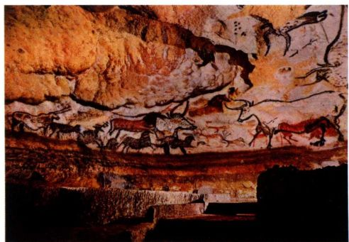

图1\.10《公牛大厅》，约公元前15,000年一前10,000年。法国多尔多涅省拉斯科洞

牙超现实主义画家萨尔瓦多·达利曾戏谑地谈到他那些梦境般画作（见图28\.18）的灵感来源，称这些创作想法是从周围空气中沿着他浓密的八字胡进入脑海的。即便那些对艺术及艺术史所知甚少的人也会对艺术是什么有自己的观点，原因很简单，我们已经从自身的文化里吸收了这些观念。1919年，机智的巴黎才子马塞尔·杜尚从卢浮宫博物馆买来一幅高17\.8厘米，宽12厘米的《蒙娜丽莎》复制品，并在她脸上画了两撇胡子（图1\.11）。他在画下写着“L．H．O．O．Q．”，用法语来读就是“elle a chaud au cul”，意思是“她的屁股热烘烘”。杜尚用这句话嘲笑的是大众对蒙娜丽莎那抹神秘微笑的痴迷，而大众开始对她的微笑发生兴趣始于19世纪，而且在杜尚的时代这一微笑尚未找到合适的解释。杜尚大不敬地暗示，蒙娜丽莎性别模糊，而且其性欲被激发了起来。杜尚借用给蒙娜丽莎加上两撇小胡子这种小儿把戏，还抨击了人们对绘画大师画作表示出的布尔乔亚式的平庸敬意，也抨击了认为油画代表艺术顶峰的观念。

杜尚要说的是，仅仅给批量生产的复制品涂上油墨就可以造就艺术。艺术不必然是画布上的油彩、浇铸出的青铜像或者雕凿过的大理石像。艺术家为了表达自己，可以借助任何方式，使用任何可以想见的媒介。他在宣称，艺术是经由视觉传达的观念，而不必是制作艺术品的材料，也不在于它是否与当下品位符合。这件异想天开、近乎欺骗的作品蕴涵了丰富的观念，杜尚是在告诉我们，艺术可以是任何东西，只要有人愿意称它为艺术，当然这并不等于说它就是好的艺术。进而言之，他表明艺术可以很小，《L．H．O．O．Q．》只及原作的零头那么大。杜尚挪用达芬奇的著名画作，并以迥异于传统的方式解读它，以此暗示“怎样认识艺术”这一问题的答案永远都不固定，答案会变，艺

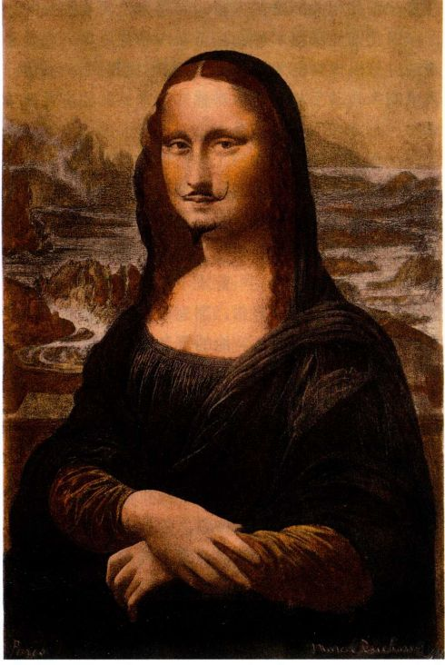

图1\.11 马塞尔·杜尚：《蒙娜丽莎（L．H．O．O．Q．）》。1919年。经改动的现成品，复制品上的铅笔画， 17 \.8 × 1 2厘米。私人收藏

术家、观众、作家、收藏家和策展人都会给出自己的答案，并按各自的目的使用它。最后，当然这也是杜尚对艺术的诸多杰出贡献之一，他告诉我们艺术可以很好玩；它可以挑衅那些关于美的习见，它以最为严肃的方式吸引我们心智的同时，也可以让我们微微一笑，甚或开怀大笑。

艺术与美学：美的观念流转更替

杜尚之所以选择《蒙娜丽莎》去“搞破坏”，原因之一必定在于很多人认为它是历史上最美的画作。的确，它即使不是世界上最有名的画作，也是最有名的画作之一。1919年，大多数持这种看法的人可能从没见过原作，只是见过它的复制品，而这些复制品的效果恐怕还不及杜尚在《L\.H\.O\.O\.Q\.》中用的那张！但他们仍然会认为达芬奇的原作才是美的，杜尚的滑稽版不美。杜尚将《L\.H\.O\.O\.Q\.》这种处理过的拾得物称为“挪用现成品”，《泉》（见图28\.2）是此类创作的又一例作。他坚称这些作品没有任何审美价值，不应视其为美，之所以选择它们是因为它们在美学上

的中性状态。杜尚感兴趣的是这些东西一旦被称为艺术品之后所体现的观念。

《L\.H\.O\.O\.Q\.》与关于这幅作品美不美的争议提出的是美学问题，美学研究美及其起源与意味，主要属于哲学范畴。对美学概念的兴趣在西方可追溯至古希腊。希腊人的美学理论反映着他们的文化观念和文化性格。希腊人把《克里提奥斯的少年》（见图1\.12）这样的雕像称为美，是指这尊雕像反映了被普遍接受的观念：比例恰当的青年男子是道德上至善或完美的化身。人们甚至认为，这个至善至美的理想化形式可以用来激发向上的情感，健全那些推崇它的优秀公民的品格，这种功能对动荡不安的城邦而言极其重要。

在现代世界，艺术史家同艺术家一样，也为各种各样的美学理论所影响，这些理论在根本上反映着当下在社会与文化发展方向上的指归。随着我们世界的日益变幻和支离破碎，关于真、善、美的美学理论也开始强调美学概念的相对性，而不再把它们视为一成不变的永恒。现在许多艺术史家都主张，只要有理可循，一件艺术品可以同时相容于几种关于美的解读或

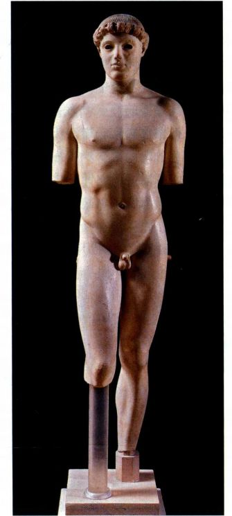

图1\.12 《克里提奥斯的少年》。约公元前480年。高116\.7厘米。

雅典卫城博物馆

其他美学概念，尽管它们之间经常互相抵触。所以尽可以抛开杜尚自己的声明，在他的挪用现成品中感受到美，当然，感受它的方式与感受达芬奇的《蒙娜丽莎》绝不相同。杜尚作品的美源于对智力的吸引，如果我们理解他所传达的信息，他的作品就会显得睿智甚至深刻。他的机智和对艺术的洞察把一件稍作修改的廉价黑白复制品转变为引人关注的艺术品，其方式与达芬奇有很大不同。《L\.H\.O\.O\.Q\.》吸引我们的品质是它的聪颖与机智，与达芬奇的《蒙娜丽莎》的内在技巧和涵义有天壤之别。《L\.H\.O\.O\.Q\.》中引人入胜的观念和机智使它超越了年轻人的单纯闹剧，指出了看待艺术的新方式。自问世以来，杜尚对于艺术本性的创新性反思已经对艺术家和美学理论产生了深远的影响。如果没有杜尚的作品，我们绝不可能会欣赏罗伯特·劳申伯格的《宫女碑》（见图29\.10），这件作品创作于20世纪50年代末期，由拾得材料组成，枕头和公鸡标本与那些充满性暗示的废弃物幽默诙谐地粘接在一起。

品质寓于心抑或出于手？

品质和原创性这样的词汇常用于对艺术品的讨论，尤其是在本书或其他类似书籍中决定作品取舍的时候。然而这些词在不同的批评家笔下却有不同的含义。例如，在漫长的艺术史中，绘画技艺或技巧都被看作评价品质时最重要的特点。为了拆穿品质只关乎技法这一神话并把握住它到底指涉什么，让我们再回到沃霍尔的《金色的玛丽莲·梦露》。这幅作品充满了故事，例如我们可以讨论它针对艺术意义或者名流重要性的提问方式。但沃霍尔避开了艺术创作中技艺是否重要这一问题，因为他本人可能连碰都没碰过这幅画！我们已经看到他怎样挪用了别人拍摄的玛丽莲·梦露的照片，他自己连照片都没拍过。之后，沃霍尔指导助手们准备印刷用的丝网。他们还准备了画布，以沃霍尔选择的颜色将图像印到画布上，有可能也是他们按照沃霍尔的要求涂上了金色，虽然我们对此并不确信。

沃霍尔让助手制作作品，是在告诉我们品质与艺术家的技艺无关，甚至与艺术家是否亲自动手创作无关，但它关乎艺术家以视觉语言传达观念的水准。艺术效果本身或其哲学的品质与实现该效果所采用的技术手段的品质一样，都是衡量艺术的标准。亲临纽约现代艺术博物馆观看《金色的玛丽莲·梦露》是一次震撼的体验。站在这幅高达1\.8米的画作前，这位最著名的美国性感偶像的空洞虚华一览无遗。由于同这

件特定作品相关的是艺术家的洞察力，而非其实际操作，因此即便沃霍尔可能除了在作品背后署名之外不曾动过一根指头也无关紧要。然而很快我们就会谈到，艺术家亲自动手与否经常对感知艺术品的原创性至关重要。

沃霍尔把他的曼哈顿工作室称为“工厂”，公开宣称他的艺术与他个人的技能无关。他告诉我们艺术是一件商品，他所做的就是制造甚至批量生产产品。“工厂”以同一张报纸照片为底本，炮制了很多幅梦露肖像和印刷品，纵使不曾成千上万也有成百上千。沃霍尔通常所做只是署名，因为很多人把署名当作艺术品不可或缺的一部分，他的署名强化了署名本身的重要性。讽刺的是，14世纪至18世纪间大部分绘画大师的作品都没有署名。事实上，几个世纪以来艺术家们都有助手协助他们作画。

安特卫普画家彼得·保罗·鲁本斯是17世纪上半叶最著名的画家之一，他有一间机械式生产画作的庞大画坊，尤其生产巨幅作品。他的助手们通常都是专攻花卉、动物或服装等的画家，其中不少人后来凭着各自的专长获得了成功。鲁本斯完成画面设计之后，按他的风格培训的助手就会绘制各自的部分。鲁本斯在最后阶段参与其中，根据需要完成作品。顾客的出价往往决定着鲁本斯实际参与作画的比例，事实上他

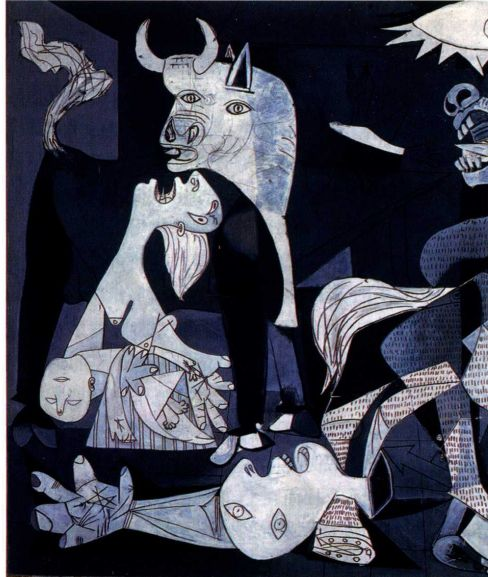

图1\.13 帕布罗·毕加索：《格尔尼卡》细部。1937年。布面油画，3\.51x7\.82米。马德里国家博物馆索菲亚皇后艺术中心，马德里普拉多博物馆永久出借

也独立完成了很多作品。鲁本斯辉煌炫丽的笔触在许多方面都对绘画的创作至关重要。他不仅确实在笔法上胜其助手一筹，而且其画作的本质特征或者生命，就得自他在画布上铺陈颜料的独特方式，这一点并不逊于他戏剧性的构图。在主顾们看来，鲁本斯的笔触成就甚至强化了他的题材。尽管鲁本斯画坊中出产的作品具有协作性质，但其中对观念及其有力的视觉传达形式的结合常常令人惊叹不已。作品的原创性正存在于这种结合之中。

因此，美、品质和原创性等概念，就不仅仅指涉物质对象，如色彩鲜艳的悦目画作，或造型完美的大理石像。它们是栖居在内容中的观念，体现为以视觉形式传达内容所能达到的程度。艺术史上某些最著名的绝世佳作中描绘着恐怖的场景，如砍头（见图19\.5）、钉十字架（见图18\.13）、死亡绝望（见图24\.18和24\.20）、情感焦虑（见图29\.9）以及对无辜妇孺的残暴屠杀（图1\.13）。杜尚的《L．H．O．O．Q．》和沃霍尔的《金色的玛丽莲·梦露》则既充满力量又引人入胜。有人甚至认为复杂的观念及其出人意料的表达使这些作品美得动人。

作为艺术的摄影

本书第一版所讨论的媒介并未包括摄影。四十多年后的今天，摄影的艺术价值已经不言自明。1839年摄影发明之初，艺术界普遍把它看作客观记录现实的机械过程而将之排除在外。在当时人眼中它是近乎魔术的方法，摄影者无须经过长期艺术训练就可以分毫不差地捕捉到人和物的细节。尽管有些艺术家对照片中通常客观且纯属偶然的性质产生了兴趣，许多批评家还是认为这种新媒介不具备足以让它与绘画和雕塑这两种主要美术形式相比肩的美学价值。似乎谁都可以从事摄影。乔治·伊斯特曼（George Eastman）于1888年发明了手持柯达相机，使摄影变成了男男女女的娱乐消遣。

摄影经过了长期的斗争才摆脱了流俗和机械的烙印。19世纪90年代，格特鲁德·克泽比尔等摄影师通过将照片洗印得柔和、精致和流畅，试图使这种艺术抛弃生硬而机械的外观（见图26\.46）。但在20世纪初，保罗·斯特朗等人开始热衷于黑白照片细节的硬边线，以及通过创造性裁切照片造成的抽象效果。他1917年的《辐条车轮》（见图28\.43）是对机械时代的赞颂，也是对绘画和雕塑领域最新潮流的赞美。20世纪40年代，黑白摄影已经被接受为一种艺术形式，但直至60年代，当摄影成为艺术院校课程设置

的重要组成部分时，黑白摄影才开始跻身于主要艺术形式之列。彩色摄影则花了更长时间才获得认真的对待。如今，黑白摄影、彩色摄影与电视电影一起，都已上升为重要的艺术媒介。19、20世纪的照片一度只被少数圈内人士关注，现在却成了抢手货，许多博物馆纷纷设立摄影部，建立起重要的收藏。换而言之，人们用了一百多年的时间才克服了对机械化工艺的偏见，并培养出发现摄影独特可能性与美的眼光。

只需观看李·弗里德兰德（Lee Friedlander）1972年拍摄的《阿尔伯克基城》（Albuquerque，图1\.14），就能明了摄影何以能在艺术价值上抗衡绘画和雕塑。在《阿尔伯克基城》中，弗里德兰德拍摄了一个精神空虚、死气沉沉的现代美国，并暗示这是技术发展的结果。他是怎样做到这点的呢？这幅照片的空虚感挥之不去。画面上空无一人，在随处突兀出现的种种物体之间，填充着由人行道和大街形成的诡异空旷的空间。生硬而怪诞的几何形主宰着画面，这见于立杆、大楼、消防栓和矮墙那坚挺的垂直线。到处都是柱体、矩形和圆形。注意背景中大楼上众多不同的矩形，或人行道上的长方地砖以及前景中的矮墙。

画面虽然寂静空旷，却是匆忙和烦躁的写照。竖直的立杆与平房、大楼上强烈的垂直元素共同敲响了震颤的断奏。无焦点无中心的不对称构图，以及街道与前景矮墙所呈的斜向交叉，进一步加强了这一断奏的能量。（注意看消防栓的影子如何与大街的走向成平行之势。）令人烦扰的元素遍布作品各个角落。从照片上部被裁掉而无法看到的街牌在矮墙上投下神秘的影子。立杆在视觉上把狗切成两半，狗与其象征性标志消防栓分离开来，也与其并未出现的主人分离开来了。反过来看，消防栓似乎也位置不对，因为它露

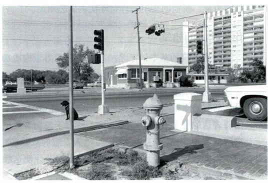

图1\.14 李·弗里德兰德：《阿尔伯克基城》。1972年。明胶银盐成像，

27 \.9 × 35\.6厘米

出地面的部分过长。右边的汽车被粗暴地裁掉了，而一根灯柱则怪异地从引擎盖上冒出。构图中央的电话线杆斜向一边，似乎是那辆从照片边缘驶进的汽车撞歪的，当然，汽车实际是停泊在此，并未行进。我们为什么认为这种空旷疯狂的品质是人为的？因为画面为人造物和技术所支配，我们看到的是电话线杆、电线、人行横道标牌、机器般丑陋的组装公寓楼、锃亮的汽车与消防栓。前景左下方被裁掉的是地下电缆的钢盖。

除了中景和远景中几株凌乱的树木，自然在各处都已为水泥所覆盖，只有消防栓旁边的杂草在疯长。在这幅出色的照片中，弗里德兰德呈现了他对现代美国的本质的看法：技术、对人造物的痴迷以及支离破碎的快节奏生活方式，已经催生了异化，造成了与自然界和精神生活的疏离。同样重要的是，他告诉我们现代化正在让美国变得千篇一律。从作品标题我们得知这是新墨西哥州的阿尔伯克基城，但如果没有这个标题，它可以是美国的任何地方。

弗里德兰德不只是发现了构图。他精心选取并制作了这一构图。他不只是需要阳光，而且必须耐心等到它出现在正确的位置，否则消防栓的阴影就无法与街道平行。弗里德兰德在组织构图时小心翼翼地在前景左下方安排了井盖的一角，同时砍下了右侧汽车的一部分。照片中的几何形也并非偶然，实属作者刻意为之。他没有运用会形成模糊且具有空气效果的柔焦，而是运用深焦产生出充满细节的锐利影像，人行道上每块长方形地砖都清晰可见。公寓楼、前景矮墙和画面左缘挡住汽车的设备箱都是竖直的矩形，它们强烈的白调子可能出自精密的暗房技巧，立有圆柱的平房入口处排布的矩形也是如此。弗里德兰德在生硬冷漠的干巴巴影像中暴露着现代美国的丑陋，正是这一信息的力量，使他创造出一件格外优美的艺术品。

作为艺术的建筑

虽然建筑的基本语汇是抽象的，且致力于构造功能性的空间，但它也成为强有力的观念传达者。例如1656年詹洛伦佐·贝尼尼受教皇亚历山大七世委托所设计的罗马圣彼得大教堂前的广场中，我们就看到了他所表达的复杂观念。一排立柱（柱廊）勾勒着贝尼尼所营造的空间，像是拥抱来客、给人安慰的双臂（图1\.15），鼓励敬拜者走进教堂。贝尼尼的设计使这幢建筑像是在欢迎每一位来客加入普世（天主）教会。几乎与此同时，法国建筑师克劳德·佩罗接受了设计路易十四王宫（巴黎卢浮宫）东立面的委托（图1\.16）。

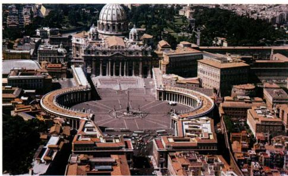

图1\.15 罗马圣彼得大教堂。卡洛·马代尔诺建造的中堂与立面，1607\-1615年；詹洛伦佐·贝尼尼建造的柱廊，设计于1657年

他将处理宫廷日常事务的底层设计为低矮的墩座；供路易起居的二层远高于底层，这也是宫殿最主要的楼层，昭示路易的伟大。佩罗在加高的二层中运用了使人联想起罗马神庙的设计，从而将路易十四同罗马帝国和天下王权联系在一起。刻意的对称设计进一步表达着路易对宫廷和国家的掌控。

现代巨贾所罗门·R·古根海姆（Solomon R\.Guggenheim）委托建筑师弗兰克·劳埃德·赖特在纽约市设计一座博物馆，以满足自己对现代艺术的挚爱之情。赖特的古根海姆博物馆坐落于上曼哈顿第五大道，俯瞰中央公园（图1\.17），是20世纪中叶最大胆的建筑宣言。该馆建于1956至1959年间，与周边的住宅样式迥异，由此即刻表明它的功能也与之不同。事实上，该馆根本不同于当时建造的任何建筑。可以说其外观就在宣称这是一座博物馆，因为它看起来不仅是一座功能性建筑，更像是一尊巨大的雕塑。

1945年构思古根海姆博物馆时，赖特想要创造一座有机的建筑，背离那种用方格子填满方盒子的常规静态设计。从20世纪早期开始，赖特就设计了一批在结构和材料上都与周围自然风景融为一体的住宅（见图26\.42）。无论是住宅还是商用建筑，他所设

图1\.16 路易·勒沃、克劳德·佩罗、夏尔·勒布仑：巴黎卢浮宫东立面。1667\-1670年

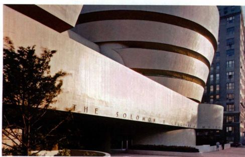

图1\.17 弗兰克·劳埃德·赖特：纽约古根海姆博物馆。1956\-1959年

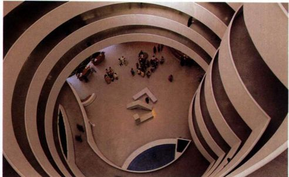

图1\.18 弗兰克·劳埃德·赖特：纽约古根海姆博物馆内部。1956\-1959年

计的结构都反映了自然的真实结构，他视之为连续的延伸。他的建筑或者从中央内核向外辐射，或者围绕着位于中央的虚空，但无论哪种情况，它们都像树叶或晶体那样蔓延生长，环环相扣，景象环生。

纽约古根海姆博物馆基于自然形式设计而成。它的设计围绕一条螺旋形坡道进行（图1\.18），意图再现螺旋形的贝壳。它的结构也会让人联想到陶瓶。建筑底部封闭，顶部开放，愈高处愈宽阔，最后以光线充足的玻璃天窗封顶。谈起古根海姆博物馆，赖特常会引用一句中国古语“埏埴以为器，当其无，有器之用”。在很大程度上，该馆的展览空间就是螺旋形参观坡道所形成的一间巨屋。赖特想让参观者先乘电梯直达坡道顶层，然后再沿着倾斜度为百分之三的斜坡缓缓下行，感受重力的徐徐牵引。因为坡道较窄，观众不可能远离展品，这就迫使他们与艺术品建立起亲密的关系。与此同时，他们还可以在开阔的室内空间中回望到走过的展区，比较眼前的作品与远处大圆弧上呈现的展览片段。他们也可以向前看，预览即将到达的展区。赖特将这幢建筑的延伸感和流动性视为有机的体验。自坡道上方俯瞰，凸凹形式的跌宕起伏反映着自然界生生不息的微妙运动。赖特甚至在底层布

了一池清水，迎接从天窗泻下的阳光。撇开规模不谈，没有哪一座博物馆曾营造出这样开放的空间感和连续的运动感，也没有哪一座博物馆怀有这样的社群精神；在古根海姆博物馆，所有的人都团结在同一屋檐下（见图1\.18）。

体验艺术

本书会介绍大量艺术作品，其中大多数都有复制图片。但只有当你看到原作，你才会扩展对这些作品的认识。无论本书中或别处的复制品多么精确，它们都只不过是原作的替身。我们希望你能去博物馆参观原作；但要记住，观看艺术并感受它全部的影响需要长时间反复观看。偶尔，你也许会对某件作品作深入的解读，这需要精察细节，需要追问它们为什么出现于此。理论上，博物馆会帮助你理解艺术。通常那里会有解说牌说明作品在某一特定展览或展厅中集中展示的原因，单件作品也常常都配有标签，以提供深入的信息。重要的临时展通常连带出版图录，提供其他层面的信息和解释。不过，解说牌、标签和图录一般反映的是某个人对作品的解读，而接近或思考作品的途径还会有很多其他方式。

虽然博物馆是观看艺术的有效途径，而且肯定也是最有效的途径，但相对而言艺术博物馆还只是新生事物。事实上，19世纪以前的艺术不是为在博物馆展出而作，而是用于家居、教堂或市政建筑。今天，我们在画廊、公司休息大厅或办公室、宗教场所，乃至私人住宅中都可以看到艺术品。从地铁站、车站到广场，从图书馆、音乐厅、剧院到市政厅，公共空间中艺术也无处不在。艺术不仅遍布于大学或学院的建筑内部，而且这些建筑本身也是艺术。正如杜尚所倡导的，你坐的椅子，你读此书时置身的建筑都是艺术品，它们不一定是伟大的艺术，但确实是艺术。甚至，你身上穿的衣服也是艺术。不管你在哪里找到艺术，它都会对你有所叙说并创造情境。

艺术不像许多人让我们认为的那样是奢侈品，而是日常生活的组成部分。无论我们意识与否，它都是影响我们的主要因素之一；当我们置身于充实且激动人心的视觉环境时，会对我们自身感觉更好。最重要的是，艺术激发我们的思考。即使它在挑衅激怒我们的时候，也通过让我们追问自己的心态、价值观和世界观，来拓展我们的体验。本书会引领你走进这个与我们的生活水乳交融的迷人领域。阅读本书之后，世界在你眼里将不复依旧······

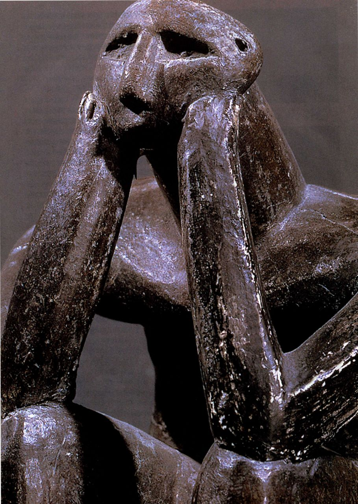

序言 17

简目

第十七章 16世纪意大利晚期文艺复兴与风格主义 587

导论 走近艺术 23

第十八章 16世纪北部欧洲的文艺复兴与宗教改革 621

第十九章 意大利和西班牙的巴洛克艺术 659

第一部分 古代世界

第二十章 尼德兰的巴洛克艺术 697

第二十一章 法国和英国的巴洛克艺术 733

第一章 史前艺术 1

第二十二章 洛可可艺术 757

第二章 古代近东艺术 21

第三章 埃及艺术 47

第四部分 现代世界

第四章 爱琴艺术 79

第五章 希腊艺术 101

第二十三章 启蒙时代的艺术：1750\-1789年 789

第六章 伊特鲁里亚艺术 161

第二十四章 浪漫主义时代的艺术：1789\-1848年 823

第七章 罗马艺术 177

第二十五章 实证主义时代：现实主义、印象主义与拉

斐尔前派，1848\-1885年 861

第二部分 中世纪

第二十六章 进步与无止境的渴望：后印象主义、象征

主义与新艺术风格，1880\-1905年903

第八章 早期基督教与拜占庭艺术 235

第二十七章 走向抽象：现代主义革命，1904\-1914年 945

第九章 伊斯兰艺术 277

第二十八章 两次世界大战之间的艺术 983

第十章 早期中世纪艺术 311

第二十九章 从战后到后现代：1945\-1980年 1037

第十一章 罗马式艺术 345

第三十章 后现代时代：1980年至今的艺术 1077

第十二章 哥特式艺术 385

重要词汇 1111

第三部分 从文艺复兴到洛可可

延伸阅读 1133

第十三章 13\-14世纪的意大利艺术 437

索引 1143

第十四章 15世纪北部欧洲的艺术创新 469

鸣谢 1188

第十五章 15世纪意大利的早期文艺复兴 503

译后记 1190

第十六章 意大利的盛期文艺复兴：1495\-1520年 555

出版后记 1196

3

目录

序言17

导论 走近艺术 23

第一部分 古代世界

第一章 史前艺术 1

旧石器时代的艺术 2

解读史前绘画 6

旧石器时代的雕刻 8

■背景知识；石器时代的分期 10

新石器时代的艺术 12

定居社会与新石器时代的艺术 13

欧洲建筑：坟墓和仪式 17

小结19

第二章 古代近东艺术 21

苏美尔艺术 22

神庙建筑：连接天地 23

雕塑与镶嵌 24

视觉叙事 27

圆筒印章 29

阿卡德艺术 29

雕塑：权力与叙事 31

新苏美尔复兴 31

建筑：乌尔的塔庙 32

雕塑：古蒂亚雕像 33

巴比伦艺术 33

《汉谟拉比法典》33

亚述艺术 34

帝国艺术：表现皇权 35

晚期巴比伦艺术 37

皇宫37

近东地区性艺术 38

赫梯人 38

腓尼基人 39

伊朗艺术 39

早期伊朗艺术 39

波斯帝国：美索不达米亚传统的世界继承人 40

波斯与伊斯兰统治之间的美索不达米亚 43

小结45

第三章 埃及艺术 47

前王朝时期和王朝初期艺术 48

《纳米尔国王石板》48

古王国：黄金年代 50

古王国墓葬群 50

■背景知识：古埃及的主要时期 51

吉萨金字塔：国王新角色的反映 52

表现人物 55

中王国：通过艺术重新肯定传统 59

皇家肖像：表情与比例的变化 60

墓葬建筑 60

新王国：重现光荣 62

帝王谷中的皇家陵墓 62

众神之庙 64

块雕67

新王国陵墓画像 68

阿肯纳顿与阿马尔纳风格 69

阿马尔纳风格 70

图坦卡蒙与阿马尔纳的余波 72

纸莎草卷：《亡灵书》73

晚期埃及 74

小结76

第四章 爱琴艺术 79

建筑 169

城市规划 170

米诺斯艺术 82

雕塑 171

克诺索斯王宫 84

赤陶和青铜中蕴含的活力 171

壁画：描绘仪式与自然 85

小结 175

米诺斯陶器 88

米诺斯雕花石器 89

第七章 罗马艺术 177

末期米诺斯艺术 91

罗马早期和共和国时期 177

迈锡尼艺术 92

建筑：混凝土革命 179

建筑：城堡 92

雕塑 184

迈锡尼墓葬及其内容物 96

绘画 189

雕塑 98

帝国初期	190

小结 99

肖像雕塑	191

浮雕 193

第五章 希腊艺术 101

建筑 201

希腊艺术的兴起：几何风格 102

行省艺术及建筑	209

■背景知识：希腊的男神与女神 102

民居艺术及建筑	212

几何风格陶器 103

帝国晚期 219

几何风格雕塑 105

肖像雕塑219

东方化风格：开拓视野	105

浮雕221

微型器皿 105

建筑 223

古风艺术：城邦的艺术 108

罗马帝国晚期的行省建筑 225

纪念性神庙建筑兴起	108

小结228

石雕 112

建筑雕塑：建筑焕发生机 115

第二部分 中世纪

瓶画：宴饮的艺术 119

古典时期 120

第八章 早期基督教与拜占庭艺术 235

古典雕塑 121

早期基督教艺术 237

雅典卫城的建筑与雕塑 128

君士坦丁之前的基督教艺术 237

古典时期晚期 140

■背景知识：耶稣生平 240

古典晚期建筑：城市建筑与宗教建筑 141

基督教得到官方承认后的基督教艺术 241

古典晚期绘画 145

拜占庭艺术 253

亚历山大时代和希腊化时期 146

早期拜占庭艺术 253

建筑：学者传统与戏剧风格 147

偶像破坏论战 264

城市规划 149

中期拜占庭艺术 265

希腊化时期雕塑：表情与运动 150

晚期拜占庭艺术 273

希腊化时期的绘画 157

■背景知识：《圣经》和天国人物 273

小结 158

小结 275

第六章 伊特鲁里亚艺术 161

第九章 伊斯兰艺术 277

墓葬艺术 162

■背景知识：伊斯兰教及其使者 278

坟墓及其内容物 162

伊斯兰艺术的形成 279

5

宗教建筑 279

世俗建筑 282

伊斯兰风格的发展	282

宗教建筑 283

奢侈艺术 285

伊斯兰艺术与波斯传统 286

建筑 286

伊朗的人物或动物艺术形式 288

古典时代 289

法蒂玛王朝的艺术影响 289

阿尤布人与小亚细亚的塞尔柱突厥人 291

古典末期的艺术和建筑 292

蒙古人的赞助 293

帖木儿的赞助 294

马穆鲁克人的赞助 295

纳斯瑞德人的赞助：阿尔罕布拉宫 297

晚期三帝国 299

欧洲和亚洲的奥斯曼人 300

伊朗的萨非时代 302

印度的莫卧儿时代 306

伊斯兰艺术的延续和变化 307

小结 308

第十章 早期中世纪艺术 311

盎格鲁一撒克逊和维京艺术 312

动物风格 314

爱尔兰一撒克逊艺术 316

手抄本 316

加洛林艺术 321

雕塑 321

绘画装饰书籍 322

建筑 325

奥托艺术 330

建筑 330

金属制品	333

帝国庄严的传达者：牙雕与手抄本 337

雕刻 338

小结 343

第十一章 罗马式艺术 345

罗马式风格的首次登场 347

建筑 347

大型石雕 348

成熟期的罗马式艺术 348

朝圣教堂及其艺术 349

克吕尼教派的建筑与雕刻 355

克吕尼教派壁画 364

西多会建筑与艺术 364

其他本笃会建筑与壁画 365

书籍插图 366

罗马式风格的地方变体 371

法国西部：普瓦图 371

法国东南部：普罗旺斯 371

托斯卡纳地区 373

默兹河谷的默兹风格 375

德国 375

诺曼底和英格兰 376

罗马式时期的悖论 382

小结 383

第十二章 哥特式艺术 385

法国早期哥特式艺术 387

圣德尼：絮热与哥特式建筑的开端 387

沙特尔大教堂 391

拉昂大教堂 393

巴黎圣母院 394

法国盛期哥特式艺术 396

沙特尔大教堂的重建 396

亚眠大教堂 405

兰斯大教堂 407

辐射式风格或宫廷风格 410

圣礼拜堂 412

特鲁瓦的圣乌尔班教堂 413

手抄本彩饰 413

法国晚期哥特式艺术 415

手抄本彩饰 415

雕塑 417

建筑：火焰哥特式 420

哥特式艺术的传播 420

英格兰 420

德国 425

西班牙 428

意大利：哥特式艺术预览 430

小结 431

第三部分 从文艺复兴到洛可可

第十三章 13\-14世纪的意大利艺术 437

教堂建筑与托钵会的成长 438

阿西西的方济各会 439

城市教堂及其陈设品 441

佛罗伦萨大教堂的扩建 445

市政府建筑：市政厅 448

托斯卡纳地区的绘画 448

奇马布埃与乔托 449

锡耶纳：杜乔和西莫内作品中对圣母的虔诚 452

彼得罗·洛伦泽蒂和安布罗焦·洛伦泽蒂 457

危难时期的艺术家与赞助人 460

意大利北部 463

威尼斯：稳定的政局与辉煌的建筑 463

米兰：维斯孔蒂家族与北欧的影响 463

小结 467

第十四章 15世纪北部欧洲的艺术创新 469

宫廷艺术：国际哥特式 471

法国王室雕刻 471

彩饰手抄本：《日课经》474

波希米亚与英格兰 475

中心城市与新艺术 477

图尔奈的罗伯特·康平 477

布鲁日的扬·凡·爱克 480

布鲁塞尔的罗杰·凡·德·维登 485

15世纪晚期的尼德兰艺术 488

贵族对珍玩宝器、个人书籍与挂毯的嗜好 488

南尼德兰的木板绘画 490

北尼德兰 492

早期尼德兰风格对各地区的影响 494

法国494

西班牙 495

中部欧洲 496

印刷与版画艺术 499

科尔马与巴塞尔的印刷中心 500

小结 501

第十五章 15世纪意大利的早期文艺复兴 503

佛罗伦萨（约1400\-1430年）：建筑与建筑雕刻的

古代灵感 505

洗礼堂之争 505

布鲁内莱斯基与佛罗伦萨大教堂穹顶 507

为圣米迦勒园中教堂创作的多那太罗

与南尼·迪·班科 507

布鲁内莱斯基的孤儿收容院 510

佛罗伦萨家族的礼拜堂与教堂：1420\-1430年 511

布鲁内莱斯基的圣洛伦佐教堂 512

布鲁内莱斯基在圣十字教堂：帕奇礼拜堂 514

斯特罗齐家族、圣三一教堂

与真蒂莱·达·法布里亚诺 515

马萨乔在新圣母教堂 516

布兰卡奇礼拜堂 518

佛罗伦萨风格的传播：1425\-1450年 519

比萨 519

锡耶纳 520

帕多瓦 521

美第奇时代的佛罗伦萨：1430\-1494年 522

雕塑与建筑雕塑 522

15世纪中期佛罗伦萨的教堂与女修道院 526

家庭生活：府邸、陈设与绘画，约1440\-1490年 530

贵族府邸 531

为佛罗伦萨收藏家创作的英雄形象 532

府邸绘画 534

肖像画 539

文艺复兴风格的回响：1450\-1500年 541意大利中部的皮耶罗·德拉·弗兰切斯卡 541在曼图亚工作的阿尔贝蒂与曼泰尼亚 544威尼斯 547罗马与教皇国 550

小结 552

第十六章 意大利的盛期文艺复兴：

1495\-1520年	555

佛罗伦萨与米兰的盛期文艺复兴 556

达芬奇在佛罗伦萨 556

达芬奇在米兰 557

改造女性肖像画 562

罗马复苏 563

布拉曼特在罗马 563

米开朗基罗在罗马与佛罗伦萨 565

米开朗基罗服务于教皇尤利乌斯二世 568

拉斐尔在佛罗伦萨和罗马 574

威尼斯 581

乔尔乔内 581

提香 584

小结 585

第十七章 16世纪意大利晚期文艺复兴

与风格主义 587

晚期文艺复兴的佛罗伦萨：教会、宫廷与风格主义 589

16世纪20年代的佛罗伦萨宗教绘画 589

佛罗伦萨的美第奇家族：从王朝到公国 590

罗马改革 596

米开朗基罗在罗马 596

天主教改革与耶稣堂 602

贡扎加家族统治的曼图亚 605

T型宫 605

帕尔马与波洛尼亚 607

柯勒乔与帕尔米贾尼诺在帕尔马 607

拉维尼娅·丰塔纳在波洛尼亚 608

威尼斯：祥和的共和国 609

桑索维诺在威尼斯 609

提香 610

提香的艺术遗产 613

安德烈亚·帕拉第奥与晚期文艺复兴建筑 615

小结 618

第十八章 16世纪北部欧洲的文艺复兴

与宗教改革 621

法国：偏好意大利形式的宫廷趣味 621

城堡与宫殿：意大利建筑的变体 622

城堡内部的艺术 625

西班牙：控制全球的权力与正教 628

埃斯科里亚尔宫 629

埃尔·格列柯在托莱多 630

中部欧洲：宗教改革与艺术 632

格吕内瓦尔德的《伊森海姆祭坛画》

633

阿尔布雷希特·丢勒与北方文艺复兴 635

改革时代的宗教与宫廷艺术 640

城市中的绘画：人文主义题材与宗教动乱 642

英格兰：宗教改革与权力 645

尼德兰地区：世界市场 648

城市与宫廷：大卫与戈萨埃特 649

安特卫普：商人、市场与道德观 651

小结 657

第十九章 意大利和西班牙的巴洛克艺术 659

意大利绘画 661

卡拉瓦乔与新风格 662

阿尔泰米西亚·真蒂莱斯基 665

天顶画与安尼巴莱·卡拉奇 668

意大利建筑 673

圣彼得大教堂完工与卡洛·马代尔诺 673

贝尼尼与圣彼得大教堂 674

装饰中的建筑元素 676

巴洛克的另类人物：弗朗切斯科·波洛米尼 677

都灵巴洛克：瓜里诺·瓜里尼 680

威尼斯巴洛克：巴尔达萨雷·罗根纳 682

意大利雕塑 683

早期巴洛克雕塑：斯蒂法诺·马代尔诺 683

巴洛克的发展：詹洛伦佐·贝尼尼 683

古典主义的另类人物：亚历山德罗·阿尔加迪 686

西班牙绘画 688

西班牙静物画：胡安·桑切斯·科坦 688

那不勒斯与卡拉瓦乔的影响：胡塞佩·里韦拉 689

迭戈·委拉斯凯兹：从塞维利亚到宫廷画师 690

修会与苏巴朗 694

虔诚的极致：巴托洛梅·埃斯特班·牟里罗 695

小结 695

第二十章 尼德兰的巴洛克艺术 697

佛兰德斯 698

彼得·保罗·鲁本斯与巴洛克风格的确立 699

安东尼·凡·代克：服务英格兰宫廷期间的历史画和

肖像画 705

佛兰德斯本土艺术和雅各布·约丹斯 706

布吕盖尔传统 706

静物画 707

荷兰共和国 710

哈勒姆学院：亨德里克·霍尔齐厄斯 711

荷兰的卡拉瓦乔主义者：亨德里克·特布吕根 711

哈勒姆艺术家与弗兰斯·哈尔斯 712

新一代哈勒姆画家：朱迪思·莱斯特 715

伦勃朗与阿姆斯特丹的艺术 716

市场：风景画、静物画和风俗画 721

风景画：扬·凡·霍延 723

城市风光画：雅各布·凡·雷斯达尔 723

建筑画与皮埃特·萨恩列达姆 725

静物画：威廉·克拉兹·海达 725

花卉画与拉歇尔·鲁伊斯 726

风俗画：扬·斯蒂恩 727

隐私风俗画与扬·维米尔 728

杰拉德·特·伯赫的精致风俗画 730

小结731

第二十一章 法国和英国的巴洛克艺术 733

法国：路易十四风格 735

法国油画和版画 735

法国的古典主义建筑 744

雕塑：贝尼尼的影响 749

英国的巴洛克建筑 750

伊尼戈·琼斯与帕拉第奥的影响 750

克里斯托夫·雷恩爵士 751

约翰·范布勒和尼古拉斯·霍克斯穆尔 754

小结 755

第二十二章 洛可可艺术 757

法国：洛可可的兴起 758

绘画：普桑派对鲁本斯派 759

法国洛可可式室内装饰 768

英国：绘画与版画制作 770

威廉·荷加斯与叙事画 770

托马斯·庚斯博罗与英国肖像画 772

乔舒亚·雷诺兹 773

德国、奥地利与中欧的洛可可艺术 775

约翰·菲舍尔·冯·埃拉赫 775

雅各布·普兰德陶尔 776

巴尔塔扎尔·诺伊曼 777

多米尼库斯·齐默尔曼 777

意大利 778

提埃波罗与幻景式天顶装饰画 778

卡纳莱托 780

小结 781

第四部分 现代世界

第二十三章 启蒙时代的艺术：

1750\-1789年789

1760年之前的罗马：新古典主义的源头 791

新古典主义的基本艺术原则：

门格斯、巴托尼、汉密尔顿 791

1760年之前的罗马：浪漫主义的源头 793

英国的新古典主义 795

雕塑与绘画：历史主义、道德观与古代 795

当代历史画的诞生 798

建筑与室内设计：帕拉第奥风格的复兴 799

英国早期浪漫主义 802

建筑与景观设计：崇高与如画 802

绘画：理智与情感并存 805

法国的新古典主义 809

建筑：理性古典主义 809

新古典主义建筑的高峰：朴素与空想 812

绘画与雕塑：表达启蒙运动价值观 814

新古典主义的顶峰：雅克\-路易·大卫的绘画 817

小结 821

第二十四章 浪漫主义时代的艺术：

1789\-1848年823

绘画825

西班牙：弗朗西斯科·戈雅 825

英国：精神强度及与大自然的纽带 827

德国：弗里德里希的泛神风景画 834

美国：作为隐喻的风景画以及风俗画的流行 835

法国：浪漫主义时期的新古典主义绘画 838

法国：涂绘浪漫主义与浪漫主义风景画 842

浪漫主义风景画 848

雕塑 851

浪漫主义时代的新古典主义雕塑：

安东尼奥·卡诺瓦 851

法国浪漫主义雕塑：与古典模式决裂 852

建筑中的浪漫主义复兴 853

英国：崇高和如画 854

美国：新生共和国的古代风格 855

法国：帝国风格 857

德国：创造一个新雅典 857

小结 859

第二十五章 实证主义时代：现实主义、印象主义

与拉斐尔前派，1848\-1885年861

法国的现实主义 862

19世纪40、50年代的现实主义：

描绘当下社会境况 863

现实主义对学院价值观与中产阶级品位的抨击 867

9

印象主义：现实主义的另类形式 872

英国的现实主义 880

拉斐尔前派 881

唯美主义运动：个人心理与压抑的性欲 884

美国的现实主义 888

科学现实主义：托马斯·埃金斯 888

人像与自然主义风景：温斯洛·霍默

与艾伯特·比尔施塔特 889

摄影：批量生产艺术的机械方法 891

首创 892

记录世界 892

报道新闻：新闻摄影报道 895

摄影作为艺术：画意摄影和组合成像 896

建筑与工业革命 898

钢铁玻璃建筑：火车站顶棚与展览会场 898

历史折衷主义与技术 899

宣示未来：埃菲尔铁塔 900

小结 901

第二十六章 进步与无止境的渴望：

后印象主义、象征主义与新艺术风格，

1880\-1905年903

后印象主义 905

保罗·塞尚：迈向抽象 905

乔治·修拉：寻找社会与画面的和谐	908

劳特雷克：半上流社会的艺术 911

文森特·凡高：借由色彩与象征的表达 912

保罗·高更：逃离现代社会 915

象征主义 918

纳比派 918

法国其他象征主义作品 919

法国之外的象征主义 920

美国艺术中的象征主义潮流 924

罗丹的雕塑 925

新艺术风格与对现代设计的追寻 928

新艺术风格的公共空间与私人空间 929

美国建筑：芝加哥学派 932

理查森：奠定现代主义建筑的基础 933

路易斯·沙利文与早期的摩天大楼 934

弗兰克·劳埃德·赖特与草原住宅 935

摄影 937

画意摄影与摄影分离派 938

纪实摄影 940

运动摄影与活动图片 941

小结 943

第二十七章 走向抽象：现代主义革命，

1904\-1914年 945

野兽派	946

立体主义 949

传统的折射与粉碎：《阿维尼翁少女》	949

分析立体主义：毕加索和勃拉克 952

综合立体主义：拼贴的力量 952

野兽派与立体主义的影响 954

德国表现主义 954

奥地利表现主义 961

毕加索与勃拉克之后的巴黎立体主义 962

意大利未来主义：行动主义与艺术 963

俄国的立体未来主义与至上主义 966

立体主义与幻想：夏加尔和基里科 968

马塞尔·杜尚与现代艺术的进退维谷 970

现代主义雕塑：布朗库西与马约尔 971

美国艺术 974

垃圾箱画派 974

军械库展览：现代主义进入美国 974

美国首批现代主义者：达夫与哈特利 975

欧洲的早期现代建筑 976

奥地利与德国的现代主义建筑 976

德国表现主义建筑 979

小结 980

第二十八章 两次世界大战之间的艺术 983

达达主义 985

苏黎世达达：让·汉斯·阿尔普 985

纽约达达：马塞尔·杜尚 986

柏林达达 987

科隆达达 991

巴黎达达：曼·雷 992

超现实主义 993

毕加索与超现实主义 994

巴黎的超现实主义 997

具象超现实主义：马格里特与达利 998

超现实主义与摄影 1000

超现实主义物品 1000

有机雕塑 1003

巴黎的让·阿尔普与亚历山大·考尔德 1003

英国的亨利·摩尔与巴巴拉·赫普沃思 1004

创造乌托邦 1004

俄国的构成主义：生产主义与功利主义 1005

风格派与普遍秩序 1007

包豪斯：创造“新人类”		1009

机器美学 1012

美国艺术：现代性、精神性与地方主义 1017

城市与工业 1017

装饰派艺术与国际风格 1020

寻求精神性 1022

地方主义与国家认同 1024

哈莱姆文艺复兴 1025

墨西哥艺术：寻求民族认同 1027

迭戈·里韦拉 1027

弗丽达与布拉沃 1028

第二次世界大战前夕 1029

美国：现代性的挫败 1030

欧洲：法西斯兴起 1031

小结 1034

第二十九章 从战后到后现代：

1945\-1980年	1037

纽约的存在主义：抽象表现主义 1038

超现实主义向抽象表现主义过渡的桥梁：

阿西里·戈尔基 1038

抽象表现主义：行动绘画	1039

抽象表现主义：色域绘画	1041

纽约雕塑：戴维·史密斯和路易丝·内维尔森 1043

欧洲的存在主义：人物表现主义 1044

让·迪比费 1045

弗朗西斯·培根 1045

摒弃抽象表现主义：50年代和60年代的美国艺术 1046

对生命的再次呈现与解剖绘画 1046

环境艺术与行为艺术 1048

波普艺术：以消费文化为主题 1051

50年代与60年代的形式主义抽象艺术 1055

形式主义绘画 1055

形式主义雕塑 1058

多元的70年代：后极少主义 1059

后极少主义雕塑：几何与情感 1059

大地艺术与特定地点艺术 1060

观念艺术：作为观念的艺术 1063

电视艺术：白南准 1064

具有社会关怀的艺术 1065

街头摄影 1066

非裔美国人艺术：种族认同 1066

女性主义艺术：朱迪·芝加哥与性别认同 1069

晚期现代主义建筑 1070

国际风格的持续：路德维希·米斯·凡德罗 1070

雕塑性建筑：具有意义的团块 1071

小结 1074

第三十章 后现代时代：

1980年至今的艺术 1077

建筑 1079

后现代建筑：有所指涉的风格 1079

新现代主义：高科技建筑 1083

解构主义：对抗现代主义的权威 1086

建筑、体验与记忆：丹尼尔·里伯斯金 1089

后极少主义与多元主义：无限可能 1090

绘画回归 1090

雕塑 1094

解构艺术：情境成为意义 1094

装置艺术与录像艺术的力量 1101

多种风格汇于一身：冈萨雷斯\-托雷斯 1103

对身体的执迷 1104

世界性艺术：蔡国强 1106

小结 1107

重要词汇 1111

延伸阅读 1133

索引 1143

鸣谢 1188

译后记 1190

出版后记 1196

材料与技法目录

第一章 史前艺术 1

洞窟绘画5

第二章 古代近东艺术 21

泥砖23

第三章 埃及艺术 47

建造金字塔 75

第四章 爱琴艺术 79

巨石工程 94

第五章 希腊艺术 101

间接失蜡法流程 124

第六章 伊特鲁里亚艺术 161

伊特鲁里亚黄金加工 164

第七章 罗马艺术 177

复制希腊雕塑 188

第八章	早期基督教与拜占庭艺术 235

镶嵌画 246

第九章 伊斯兰艺术 277

东方地毯 298

第十章 早期中世纪艺术 311

金属制品 313

第十一章 罗马式艺术 345

拱顶 378

第十二章 哥特式艺术 385

彩色玻璃窗画 403

第十三章 13\-14世纪的意大利艺术 437

湿壁画的创作与保存 442

第十四章	15世纪北部欧洲的艺术创新 469

木板蛋彩画与油画 479

版画 498

第十五章	15世纪意大利的早期文艺复兴 503

布鲁内莱斯基的穹顶 508

透视法 513

第十六章	意大利的盛期文艺复兴：1495\-1520年 555素描571

第十七章	16世纪意大利晚期文艺复兴与风格主义 587布面油画 610

第十八章	16世纪北部欧洲的文艺复兴与宗教改革 621文艺复兴时期挂毯的制作与保存 626

第十九章 意大利和西班牙的巴洛克艺术 659

贝尼尼的雕塑样稿 687

第二十章 尼德兰的巴洛克艺术 697蚀刻、干刻与选择性擦拭 720

第二十二章 洛可可艺术 757

色粉画 763

第二十三章 启蒙时代的艺术：1750\-1789年 789约赛亚·威基伍德与碧玉细瓷器 796

第二十四章 浪漫主义时代的艺术：1789\-1848年 823

布莱克制作版画的步骤 829

第二十五章 实证主义时代：现实主义、印象主义与拉

斐尔前派，1848\-1885年 861

印象主义的色彩理论 876

第二十六章 进步与无止境的渴望：后印象主义、象征

主义与新艺术风格，1880\-1905年903

石版印刷术 911

第二十七章 走向抽象：现代主义革命，

1904\-1914年945

德国表现主义木刻版画 958

第二十八章 两次世界大战之间的艺术 983

钢筋混凝土 1013

第三十章 后现代时代：1980年至今的艺术 1077建筑中的计算机辅助设计 1088

第二章 古代近东艺术 21

《吉尔伽美什史诗》25

拉加什及周边地区出土的古蒂亚雕像铭文，约

公元前2100年32

《汉谟拉比法典》34

第三章 埃及艺术 47

乌尼斯（公元前2341\-前2311年在位）金字

塔文节选 56

《情歌》70

《亡灵书》73

第五章 希腊艺术 101

亚里士多德（公元前384\-前322年）127

普鲁塔克（约公元46\-119年以后）131

第七章 罗马艺术 177

西塞罗（公元前106\-前43年）186

波利比乌斯（约公元前200年一

约公元前118年）190

约瑟夫斯（公元37／8一约100年）198

维特鲁威 212

菲洛斯特拉托斯（公元170\-247年）218

第一部分附加原始文献：

《汉谟拉比法典》230

《阿顿颂歌》230

老普林尼（公元23\-79年）230

维吉尔（公元前70\-前19年）231

维特鲁威（公元前1世纪）232

第八章 早期基督教与拜占庭艺术 235

《教皇书》（《教宗名录》） 244

凯撒利亚的普罗科庇厄斯（6世纪）	258

学者圣西奥多（759\-826年）266

原始文献目录

第九章 伊斯兰艺术 277

穆罕默德·伊本·马木德·阿拉穆利（伊朗，14世纪）280

奥斯曼苏丹塞利姆二世（1524\-1574年）302阿卜杜拉米德·拉霍里（死于1654年）308

第十章 早期中世纪艺术 311

《林迪斯法恩福音书》318

阿里乌尔夫（约1060\-1143年）328

圣安吉尔贝（约750\-814年）330

第十一章 罗马式艺术 345

出自《圣地亚哥\-德孔波斯特拉

朝圣指南》350

克莱尔沃的圣贝尔纳（1090\-1153年）358

第十二章 哥特式艺术 385

圣德尼修道院的絮热（1081\-1151年）

（《圣德尼教堂的祝圣》）388

圣德尼修道院的絮热（1081\-1151年）

（《关于修道院的管理》）390

西奥菲勒斯·普雷兹比特（12世纪）400

第二部分附加原始文献：

《圣经》432

教皇格里高利一世（590\-604年在位）	432

尼古拉斯·梅萨里特（约1163\-

1214年之后）432

《古兰经》：真主给虔诚的穆斯林的

天国许诺 432

努尔西亚的圣本笃（约480一约553年）433

出自《圣地亚哥\-德孔波斯特拉

朝圣指南》434

罗贝尔·德·托里尼（1186年去世）434

维拉尔·德·昂奈库尔（13世纪）	434

作者不详 435

第十三章	13\-14世纪的意大利艺术 437

阿尼奥洛·迪·图拉·德尔·格拉索 456锡耶纳市政厅湿壁画题词 460

第二十二章 洛可可艺术 757

让·德·朱利安那（1686\-1767年）	762

乔舒亚·雷诺兹爵士（1723\-1792年）774

第三部分附加原始文献：

乔瓦尼·薄伽丘（1313\-1375年）	782

第十四章

15世纪北部欧洲的艺术创新 469

佩特拉克（1304\-1374年）782

安科纳的奇里亚库斯（1449年）

486

但丁·阿利吉耶里（1265\-1321年）782

弗雷·何塞·德·锡古恩萨

（1544？\-1606年）492

节选自《圣沃尔夫冈祭坛》合同 496

第十五章 15世纪意大利的早期文艺复兴 503

节选自《佛罗伦萨颂》（约1403\-1404年），

作者莱奥纳多·布鲁尼 505

洛伦佐·吉伯尔蒂（约1381\-1455年）	506

莱昂·巴蒂斯塔·阿尔贝蒂 511

多梅尼科·韦内奇亚诺恳求工作 532

乔瓦尼·多米尼奇劝父母在家中放置

宗教图像 536

第十六章 意大利的盛期文艺复兴：1495\-1520年 555

560

莱奥纳多·达芬奇（1452\-1519年）

米开朗基罗解释梵蒂冈的《圣母哀子像》 565

拉斐尔之死 580

卡勒尔·凡·曼德尔（1548\-1606年）783

乔治·瓦萨里（1511\-1574年）783

摘自1563年特兰特宗教会议的教谕与

敕令（1563年）785

马丁·路德（1483\-1546年）785

乔瓦尼·彼得罗·贝洛里

（1613\-1696年）785

菲利波·巴尔迪努奇

（1625\-1697年）786

康斯泰因·惠更斯（1596\-1687年）786

克里斯托夫·雷恩爵士

（1632\-1723年）787

第二十三章 启蒙时代的艺术：1750\-1789年789

德尼·狄德罗（1713\-1784年）816

艾蒂安\-让·德雷克鲁兹

第十七章 16世纪意大利晚期文艺复兴与风格主义 587

（1781\-1863年）

818

诗人米开朗基罗 598

浪漫主义时代的艺术：1789\-1848年823

第二十四章

节选自宗教裁判所法庭在威尼斯对保罗·韦

罗内塞的一次讯问 614

约翰·康斯太布尔（1776\-1837年）

欧仁·德拉克洛瓦（1798\-1863年）

830

846

安德烈亚·帕拉第奥（1508\-1580年）	616

第十八章 16世纪北部欧洲的文艺复兴与宗教改革 621

本韦努托·切利尼（1500\-1571年）631

637

阿尔布雷希特·丢勒（1471\-1528年）

伊丽莎白时代的意象 648

卡雷尔·凡·曼德尔关于老彼得·布吕盖尔

的著述 654

第十九章 意大利和西班牙的巴洛克艺术 659

阿尔泰米西亚·真蒂莱斯基（1593\-

约1653年）667

第二十五章 实证主义时代：现实主义、印象主义与

拉斐尔前派，1848\-1885年 861

利拉·卡波·佩里（1848？\-1933年）874

詹姆斯·艾博特·麦克奈尔·惠斯勒

（1834\-1903年）889

夏尔·波德莱尔（1821\-1867年）898

第二十六章 进步与无止境的渴望：后印象主义、象征

主义与新艺术风格，1880\-1905年 903

保罗·塞尚（1839\-1906年）907

保罗·高更（1848\-1903年）917

安东尼奥·帕洛米诺（1655\-1726年）

692

第二十七章 走向抽象：现代主义革命，

第二十章 尼德兰的巴洛克艺术 697

1904\-1914年 945

彼得·保罗·鲁本斯（1577\-1640年）	701

第二十一章 法国和英国的巴洛克艺术 733尼古拉·普桑（1594\-1665年）738

瓦西里·康定斯基（1866\-1944年）

卡茨米尔·马列维奇（1878\-1935年）

960

969

第二十八章 两次世界大战之间的艺术 983

汉娜·霍赫（1889\-1978年）991

巴巴拉·赫普沃思（1903\-1975年）	1006

皮埃特·蒙德里安（1872\-1944年）	1008

勒·柯布西耶（1886\-1965年）1014

第二十九章 从战后到后现代：1945\-1980年 1037

杰克逊·波洛克（1912\-1956年）	1040

罗伊·利希滕斯坦（1923\-1997年）1053

弗兰克·斯特拉（生于1936年）1057

罗马尔·比尔登（1911\-1988年）1067

第三十章 后现代时代：1980年至今的艺术 1077

辛迪·舍曼（生于1954年）1099

伊利亚·卡巴科夫（生于1933年）1101

第四部分附加原始文献：

威廉·钱伯斯爵士（1723\-1796年）1108

让\-奥古斯特\-多米尼克·安格尔

（1780\-1867年）1108

罗莎·博纳尔（1822\-1899年）	1108

路易斯·沙利文（1856\-1924年）	1108

保罗·舍尔巴特（1863\-1914年）	1109

菲利波·托马索·马里内蒂

（1876\-1944年）1109

安德烈·布雷东（1896\-1966年）与

列夫·托洛茨基（1879\-1940年）1109

伊娃·海瑟（1936\-1970年） 1110

罗莎琳·克劳斯（生于1940年）1110

艺术史家的观点目录

第二章 古代近东艺术 21

盗掘造成的损失 42

第三章	埃及艺术 47

解读古代旅行作家 76

第四章	爱琴艺术 79

两名发掘者，传说与考古 85

第五章	希腊艺术 101

帕特农神庙檐壁：一种新解释 136

温克尔曼和《观景楼的阿波罗》	156

第七章 罗马艺术 177

复制品辨别：以《拉奥孔》为例 179

第八章 早期基督教与拜占庭艺术 235科顿藏书火灾 251

第九章 伊斯兰艺术 277

中世纪西班牙伊斯兰艺术与欧洲 287

第十一章 罗马式艺术 345

建筑的保存与修复 368

第十二章	哥特式艺术 385

模数与比例 402

第十三章	13\-14世纪的意大利艺术 437图像的社会功能 454

第十四章	15世纪北部欧洲的艺术创新 469从科学与技术角度研究绘画 488

第十七章	16世纪意大利晚期文艺复兴与风格主义 587图像志与图像学 594

第十八章 16世纪北部欧洲的文艺复兴与宗教改革 621

艺术经济 650

第二十章 尼德兰的巴洛克艺术 697

鲁本斯和伦勃朗作品的真伪以及两人的画坊 716

第二十一章 法国和英国的巴洛克艺术 733

伪作与《真本》743

第二十三章 启蒙时代的艺术：1750\-1789年 789韦斯特的《沃尔夫将军之死》的

难解之意 799

第二十五章 实证主义时代：现实主义、印象主义与

拉斐尔前派，1848\-1885年 861

艺术家的声誉与艺术史方法论的变革 890

第二十六章 进步与无止境的渴望：后印象主义、象征

主义与新艺术风格，1880\-1905年 903

女性主义艺术史 926

第二十七章 走向抽象：现代主义革命，

1904\-1914年945

原始的神话 951

第二十九章 从战后到后现代：1945\-1980年 1037

研究不存在的对象 1062

第十五章

15世纪意大利的早期文艺复兴 503

理论著述 514

第三十章 后现代时代：1980年至今的艺术 1077

变幻的艺术市场 1105

赞助人研究 518

第十六章 意大利的盛期文艺复兴：1495\-1520年 555

艺术品的清洗与修复 573

维拉尔·德·昂奈库尔（13世纪）	434作者不详 435

第十三章	13\-14世纪的意大利艺术 437

阿尼奥洛·迪·图拉·德尔·格拉索 456锡耶纳市政厅湿壁画题词 460

第二十二章 洛可可艺术 757

762

让·德·朱利安那（1686\-1767年）

乔舒亚·雷诺兹爵士（1723\-1792年）774

第三部分附加原始文献：

乔瓦尼·薄伽丘（1313\-1375年）782

第十四章

15世纪北部欧洲的艺术创新 469

佩特拉克（1304\-1374年）782

安科纳的奇里亚库斯（1449年）

486

但丁·阿利吉耶里（1265\-1321年）782

弗雷·何塞·德·锡古恩萨

（1544？\-1606年）492

节选自《圣沃尔夫冈祭坛》合同 496

第十五章 15世纪意大利的早期文艺复兴 503

节选自《佛罗伦萨颂》（约1403\-1404年），

作者莱奥纳多·布鲁尼 505

洛伦佐·吉伯尔蒂（约1381\-1455年）506

莱昂·巴蒂斯塔·阿尔贝蒂 511

多梅尼科·韦内奇亚诺恳求工作 532

乔瓦尼·多米尼奇劝父母在家中放置

宗教图像 536

第十六章 意大利的盛期文艺复兴：1495\-1520年 555

卡勒尔·凡·曼德尔（1548\-1606年）783

乔治·瓦萨里（1511\-1574年）783

摘自1563年特兰特宗教会议的教谕与

敕令（1563年）785

马丁·路德（1483\-1546年）785

乔瓦尼·彼得罗·贝洛里

（1613\-1696年）785

菲利波·巴尔迪努奇

（1625\-1697年）786

康斯泰因·惠更斯（1596\-1687年）786

克里斯托夫·雷恩爵士

（1632\-1723年）787

莱奥纳多·达芬奇（1452\-1519年）

560

第二十三章 启蒙时代的艺术：1750\-1789年 789

米开朗基罗解释梵蒂冈的《圣母哀子像》565

拉斐尔之死 580

德尼·狄德罗（1713\-1784年）816

艾蒂安\-让·德雷克鲁兹

第十七章 16世纪意大利晚期文艺复兴与风格主义 587

（1781\-1863年）

818

诗人米开朗基罗 598

第二十四章

浪漫主义时代的艺术：1789\-1848年 823

节选自宗教裁判所法庭在威尼斯对保罗·韦

约翰·康斯太布尔（1776\-1837年）

830

罗内塞的一次讯问 614

安德烈亚·帕拉第奥（1508\-1580年）	616

第十八章 16世纪北部欧洲的文艺复兴与宗教改革 621

本韦努托·切利尼（1500\-1571年）631

阿尔布雷希特·丢勒（1471\-1528年）637

伊丽莎白时代的意象 648

卡雷尔·凡·曼德尔关于老彼得·布吕盖尔

的著述 654

第十九章 意大利和西班牙的巴洛克艺术 659

阿尔泰米西亚·真蒂莱斯基（1593\-

约1653年）667

846

欧仁·德拉克洛瓦（1798\-1863年）

第二十五章 实证主义时代：现实主义、印象主义与

拉斐尔前派，1848\-1885年 861

利拉·卡波·佩里（1848？\-1933年）874

詹姆斯·艾博特·麦克奈尔·惠斯勒

（1834\-1903年）889

夏尔·波德莱尔（1821\-1867年）898

第二十六章 进步与无止境的渴望：后印象主义、象征

主义与新艺术风格，1880\-1905年 903

保罗·塞尚（1839\-1906年）907

保罗·高更（1848\-1903年）917

安东尼奥·帕洛米诺（1655\-1726年）

692

第二十七章 走向抽象：现代主义革命，

第二十章 尼德兰的巴洛克艺术 697

彼得·保罗·鲁本斯（1577\-1640年）	701

第二十一章 法国和英国的巴洛克艺术 733

尼古拉·普桑（1594\-1665年）	738

1904\-1914年 945

瓦西里·康定斯基（1866\-1944年）	960

969

卡茨米尔·马列维奇（1878\-1935年）

英国的亨利·摩尔与巴巴拉·赫普沃思 1004

创造乌托邦 1004

俄国的构成主义：生产主义与功利主义 1005

风格派与普遍秩序 1007

包豪斯：创造“新人类”	1009

机器美学 1012

美国艺术：现代性、精神性与地方主义	1017

城市与工业 1017

装饰派艺术与国际风格 1020

寻求精神性 1022

地方主义与国家认同 1024

哈莱姆文艺复兴 1025

墨西哥艺术：寻求民族认同	1027

迭戈·里韦拉 1027

弗丽达与布拉沃 1028

第二次世界大战前夕 1029

美国：现代性的挫败 1030

欧洲：法西斯兴起 1031

小结1034

第二十九章 从战后到后现代：

1945\-1980年	1037

纽约的存在主义：抽象表现主义 1038

超现实主义向抽象表现主义过渡的桥梁：

阿西里·戈尔基 1038

抽象表现主义：行动绘画 1039

抽象表现主义：色域绘画 1041

纽约雕塑：戴维·史密斯和路易丝·内维尔森 1043

欧洲的存在主义：人物表现主义 1044

让·迪比费 1045

弗朗西斯·培根 1045

摒弃抽象表现主义：50年代和60年代的美国艺术 1046

对生命的再次呈现与解剖绘画 1046

环境艺术与行为艺术 1048

波普艺术：以消费文化为主题 1051

50年代与60年代的形式主义抽象艺术 1055

形式主义绘画 1055

形式主义雕塑 1058

多元的70年代：后极少主义 1059

后极少主义雕塑：几何与情感 1059

大地艺术与特定地点艺术 1060

观念艺术：作为观念的艺术 1063

电视艺术：白南准 1064

具有社会关怀的艺术 1065

街头摄影 1066

非裔美国人艺术：种族认同 1066

女性主义艺术：朱迪·芝加哥与性别认同 1069

晚期现代主义建筑 1070

国际风格的持续：路德维希·米斯·凡德罗 1070

雕塑性建筑：具有意义的团块 1071

小结 1074

第三十章 后现代时代：

1980年至今的艺术 1077

建筑 1079

后现代建筑：有所指涉的风格 1079

新现代主义：高科技建筑 1083

解构主义：对抗现代主义的权威 1086

建筑、体验与记忆：丹尼尔·里伯斯金	1089

后极少主义与多元主义：无限可能 1090

绘画回归 1090

雕塑 1094

解构艺术：情境成为意义 1094

装置艺术与录像艺术的力量 1101

多种风格汇于一身：冈萨雷斯\-托雷斯 1103

对身体的执迷 1104

世界性艺术：蔡国强 1106

小结1107

重要词汇 1111

延伸阅读 1133

索引 1143

鸣谢 1188

译后记 1190

出版后记 1196

