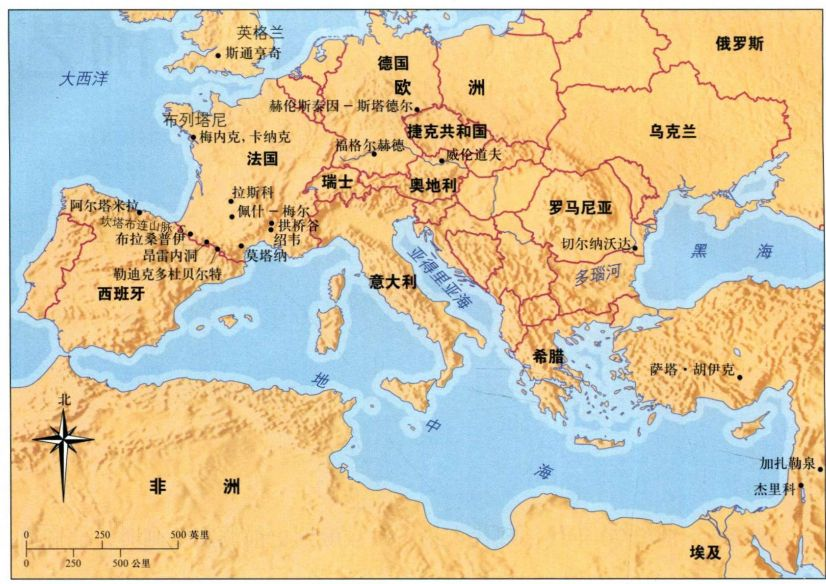

*图1.23 细部，出自切尔纳沃达的男塑像*

# 第一章 史前艺术

19世纪70年代，现代人第一次接触到史前洞窟壁画时，他们简直无法相信自己的眼睛。虽有证据表明西班牙的阿尔塔米拉（Altamira）遗址可追溯至公元前13,000年，但这些壁画绘制技艺之高、感受力之敏锐，仍然使得历史学家们起初认为它们是伪作（见图1.1）。自那时起，世界各地发现了约二百个类似遗址。1994年，法国东南部也发现了一个有壁画的洞窟（见图1.2），那里藏有几百幅壁画，从而将史前绘画的年代进一步往前推至将近公元前30,000年。在那里，人们还发现了一些同样古老的雕刻。

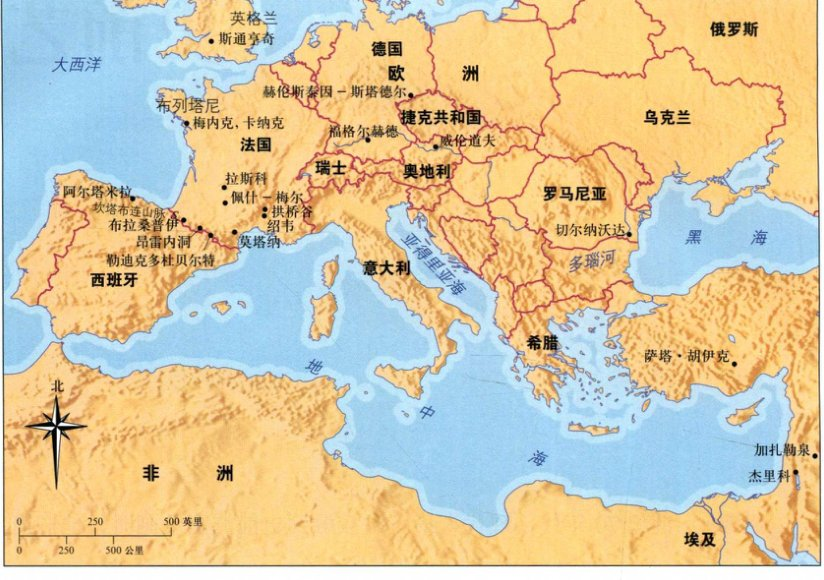

*地图1.1 史前时期的欧洲与近东*

这些最古老的艺术形式使我们产生了诸多疑惑：史前人类为什么要耗时耗力地创作艺术？这些图像有什么功能？有什么含义？21世纪的观赏者可能会赞赏这些画作的生命力及其直白的表达方式，但同时又仍会觉得这个奇异的远古世界实在令人难以捉摸。由于史前没有任何文字资料可供史学家参考，所以艺术史家在解释这些突出的艺术形式时，自然科学和人类学就成为两种辅助工具，为史前艺术品的断代提供证据，为解释这些艺术品的功能提供理论支持。由于时常有新发现，因此史前艺术研究不断进展，对史前艺术的分析论断也得以不断修订。

虽然完全意义上的现代人类已在地球上生活了十万余年，但人类发现的最早的可归类为“艺术”的物品却只能追溯到大约四万年前。之前，人类已能用石头、碎骨制作工具，然而，是什么激发他们用图像去详尽再现自然物的？一些学者推想，我们所知的图像制作和符号语言是晚期智人（homo sapiens sapiens）新型大脑结构的产物。艺术的起源，与完全意义上的现代人类从非洲向欧洲、亚洲和大洋洲迁徙、相遇并最终取代欧亚大陆西部更早的尼安德特人（Neanderthals，早期智人［homo neanderthalensis］）的时期大体一致。欧洲、亚洲、大洋洲每个大陆都发现了与晚期智人同时代的具象艺术品或人体装饰品。史前时期艺术作品有数以万计留存至今，其中大部分发现于欧洲。许多作品技艺高超，令人惊奇。

从那些能够确定年代的最早的艺术品来看，其制作技巧可能是人们在一个漫长而不为人知的时期进行雕刻和绘画试验的产物，因此，艺术创作活动可能比存世物品的年代要早很多。有些学者则对此持有异议。他们认为，大脑结构的神经性突变开启了抽象思维能力，符号语言和具象艺术是人类进化过程中的一个突发事件。无论是什么使人产生了艺术创造能力——不管是一个渐进的进化过程，还是某种突变——它都对人类文明的出现，包括写实形象的创造产生了巨大影响。这类作品迫使我们重新评价我们对艺术和创作过程的许多看法，并提出了一些根本性的问题，特别是：追根求源，人类为什么要创造艺术？

## 旧石器时代的艺术

一万到四万年前，旧石器晚期的彩绘图、线描图和雕刻大致同时出现在从欧亚大陆、非洲至澳大利亚的广阔地带上（见地图1.1）。这一时间段属于更新世（更常见的说法为冰河期）。这个时期，冰川（延展的极地冰盖）覆盖了北欧、北美和欧亚大陆的大部分地区，这些冰川的厚度有时可达三千米。旧石器早期和中期早于这个时期至少二百万年，那是更古老的人种生活的年代。虽然这些文明确实制作出了有一定形状的石器工具，却没有任何符号或具体形象。最近一个冰河期的结束恰与完全意义上的现代人类从非洲迁往欧洲同时发生。由于气候变暖，冰川消融，欧洲成了新的可居之地。

史前绘画最早为人所知是在1878年，那是在西班牙北部桑蒂亚那·德尔马尔（Santillana del Mar）村中的一个名为阿尔塔米拉的洞窟里。当时，唐·马塞里诺·桑斯·德绍托拉（Don Marcelino Sanz de Sautuola）伯爵正在地上搜寻燧石和兽骨，他12岁的女儿玛丽亚（Maria）陪着他。玛丽亚仰头张望时发现了洞顶用黑色粗线条勾勒并填以鲜亮的矿物颜料的野牛图（图1.1）。

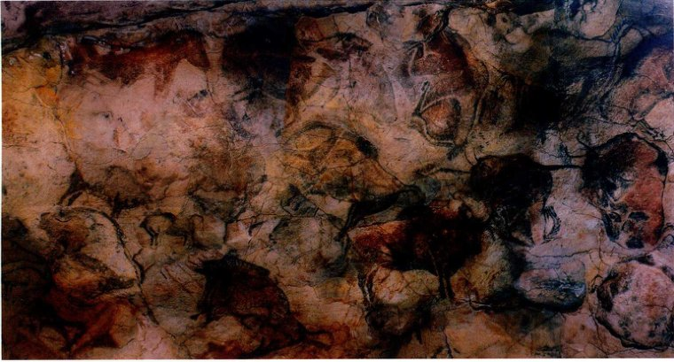

*图1.1《受伤的野牛》（Wounded Bison）。约公元前15,000-前10,000年。西班牙阿尔塔米拉*

在这个洞以及其他新近发现的洞里，绘制和刻制的图画以动物为主。1994年，三个业余探洞者在法国东南部拱桥谷（Vallon-Pont-d'Arc）附近庞大的绍韦（Chauvet）洞窟群中发现了迄今为止种类最为丰富的史前绘画。这个洞窟群是以一位探洞者的名字命名的。目前为止，这里已发现427幅动物绘画，共描绘了十七种动物，包括狮子、熊和野牛，它们以黑线或红线勾勒（图1.2、1.3），有时则涂以多种颜色（polychrome）并用到阴影法（shading）。

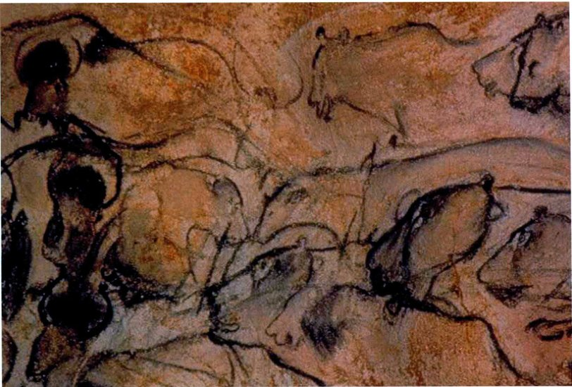

*图1.2《狮子和野牛》（Lions and Bison）。绍韦洞末厅，约公元前30,000一前28,000年。法国拱桥谷阿尔代什河河口(Ardèche Gorge)*

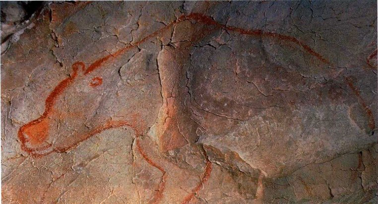

*图1.3《熊》（Bear）。绍韦洞熊凹（Recess of the Bears），约公元前30,000-前28,000年。法国拱桥谷阿尔代什河河口*

这里还发现了一幅用手指刻成的长耳猫头鹰图（图1.4）。动物旁边勾勒了一些记号和形状，看起来像某种符号，这些符号有时也单独出现，比如法国多尔多涅（Dordogne）地区的拉斯科洞（Lascaux）的《中国马》（Chinese Horse）旁显示的一些记号（图1.5）。人们把这些记号解释成武器、陷阱，甚至是昆虫。

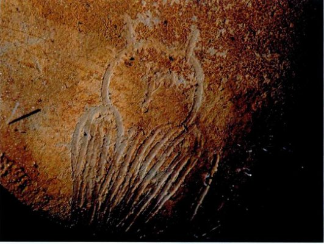

*图1.4 《长耳猫头鹰》（Long-Eared Owl）。绍韦洞，约公元前30,000一前28,000年。法国拱桥谷阿尔代什河河口*

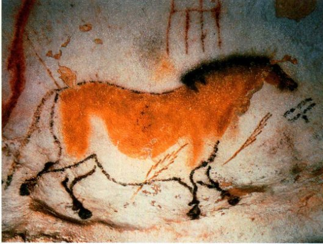

*图1.5《中国马》。拉斯科洞，约公元前15,000-前13,000年。法国多尔多涅*

洞壁上偶尔会出现着色手印，但通常是手部的阴文剪影（negative silhouette，见第5页的材料与技法）。极少数情况下，壁画中会出现较大的人形或半人形。如，考古学家们在绍韦中一块岩石的突起部分辨认出了一个妇女的下半身像。法国比利牛斯山脉（Pyrénées）的三兄弟洞（Les Trois Frères）中，绘有一个人的躯体，其内部的肌肉和骨骼都被一一画出，但上面却画着一个长角的动物脑袋。在拉斯科洞，一个头像鸟的棒状男性人体躺在一头长满厚毛的犀牛和一头肠子流出体外的野牛之间，旁边有一根鸟头棍或棒（图1.6）。

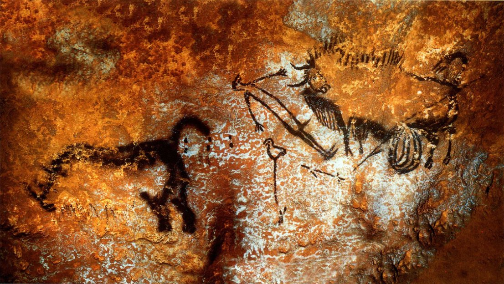

*图1.6《犀牛、受伤的男子和野牛》。拉斯科洞，约公元前15,000-前13,000年。法国多尔多涅*

> **材料与技法：洞窟绘画**
>
> 在旧石器时代的洞穴中进行创作的艺术家们用了多种技法来完成那些留存至今的图像。他们常在远离洞口的地方工作，用盛满油脂或骨髓的石灯照明。考古学家们已在拉斯科洞及其他洞窟发现了几个这样的石灯。有时，当用于作画的石壁离地面很高时，艺术家可能会用木头搭起脚手架，将木桩钉入表面的石灰岩，从而把脚手架固定在洞壁上。
>
> 他们处理石面时，用石器工具刮石灰岩，使其露出类似白垩的那种白色，以其作为画底。然后，他们把一些图像刻到洞壁上，如果石灰石够软，就用手指刻，如果石灰石较硬，就用锋利的燧石刻。有时，他们将这一技术与色彩的运用结合起来。黑色来自植物炭，也许还有烧焦的骨头。赭石（一种天然铁矿石）可提供一系列鲜艳的红色、褐色和黄色。作线描（比如勾勒动物的轮廓）时，用的是大块的像蜡笔一样的木炭和赭石；若要制造颜料，他们就把矿物放在一块平平的大石头上碾成粉。倘若施以高温，还能改变红色和黄色的深浅。然后可以用兽骨或芦苇制成的管子将这些矿物粉末吹到一只五指张开放在石面上的手上，制造出手印。
>
> 若要在动物或人的轮廓内填上颜色，他们就在粉末中调入溶剂，其成分包括洞中的水、唾液、蛋清、植物或动物油脂，或者血液；然后他们用小块的苔藓或皮毛，以及兽毛、羽毛制成的刷子或嚼过的树枝，把颜料涂到石灰石面上去。一些学者通过实验了解到，颜料常常是先放在口中咀嚼，然后直接吹或吐到洞壁上来作画。在某些情况下，如佩什-梅尔洞的《斑点马》或在绍韦的洞窟画，颜料呈点状涂在洞壁上，呈现出某些学者所描述的“点彩画”（pointilliste）效果。用蘸满赭石颜料的手掌按压在石灰石上，即可达到这种效果（如绍韦洞布鲁奈尔厅的《手点》）。
>
> 对这些标记的分析产生了丰富的成果：不仅可以通过手印辨别出不同的艺术家，还有可能确定，除了男人，妇女和少年也参加了创作。
> 
> 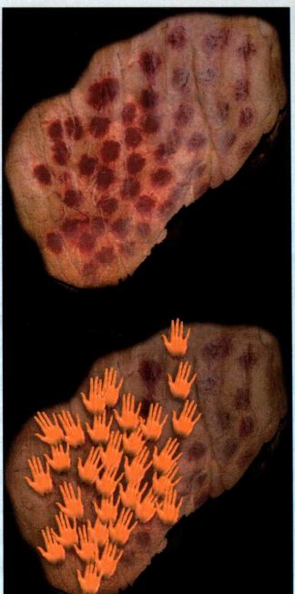
> 
> *绍韦洞布鲁奈尔厅（Brunel Chamber）的《手点》（Hand Dots）。当时的人在手掌部分涂上颜料，按压在壁面上形成这些大点。在原作面前，能够看到手指的印记。*_*

19世纪末，专家们第一次对阿尔塔米拉窟的绘画作出评价时，他们宣称这些画水平太高，不可能是真品，从而把它们当作一个恶作剧，暂且搁置。的确，虽然就我们所知，洞窟艺术代表了艺术的黎明，但它却常常高度成熟。阿尔塔米拉的野牛与绍韦及其他地方的野牛一样，尽管是根据记忆画成，然而它们的形态表明了画家们观察力十分敏锐，将记忆转化为图像的技艺也同样高超。这些野牛或是静静伫立，或是在地上吼叫翻滚。画中的它们其举止与在野外时无异。画家们精细的手法为大自然的形态增色：淡淡的阴影凸显出野牛腹部或母狮头部的轮廓，离观者较远的腿的前部轮廓常用较淡的颜色，以表现距离。在动物剪影内部，艺术家变换着形体上的光线效果，以表现动物的重量或体积。这种方法叫做塑造（modeling），它使动物的样子更为逼真。

起初，学者们运用风格分析法来推断洞窟壁画所处的年代。他们根据壁画所显示出的写实（naturalism）程度，即图像与真实自然物的相似度，来推断其年代。由于当时人们认为写实主义是最高级的艺术表现形式，所以图像越写实，就被认为发展程度越高，因而年代也就越晚。碳-14断代法暴露了这个方法的缺陷。绍韦的一些画由于其非同寻常的写实性而被判断为在整个发展序列中年代较晚，但最终证明，它们属于有记录以来最早的洞窟壁画，存在于32,000年前的奥瑞纳（Aurignacian）时期。的确，要是认为写实主义是旧石器时代的艺术家——或任何一个艺术家——的必然或唯一目标，那必将是个错误。在描绘个别种类的动物时，他们运用传统手法，违背自然（比如，拉斯科洞中的公牛是侧面的，它们的角却是正面的）；这些不是视觉图像（optical images），表现人所见的动物的真实样貌，而是复合图像（composite image），其中许多细节有助于将所画动物拼合完整，不过它们的位置在解剖学上不一定准确。正如拉斯科洞中的棒状人所表明的，艺术家们的评判标准可能与写实主义相距甚远。

## 解读史前绘画

这些绘画不仅气势恢弘，还极为神秘：它们有什么用途？最简单的看法就是它们仅仅用于装饰，即“为艺术而艺术”。不过这种可能性极小。现存的大部分洞窟壁画和岩刻都处在容易到达的地方，更多用来装饰开口直接朝外的洞穴的壁画可能已经损毁。但在拉斯科及其他地方，洞壁壁画位于大的洞窟群深处，远离居住区域，难以到达（图1.7）。在这些情况下，图像的力量可能存在于它的制作过程，而非观看过程中：根据一些试图解释这些图像的历史学家的说法，刻画图像的行为可能具有某种仪式或宗教目的。

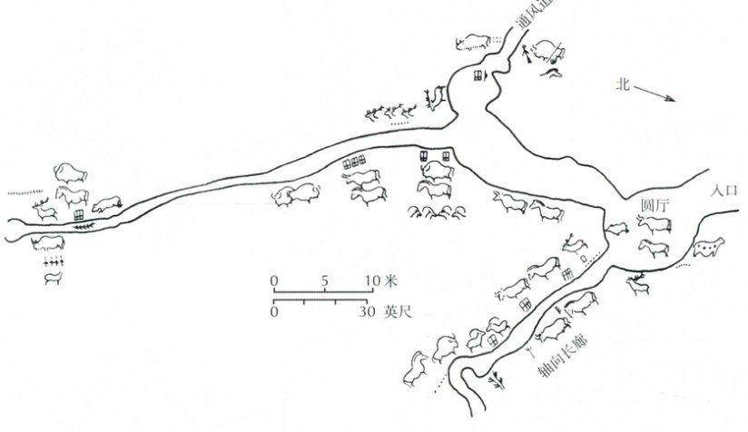

*图1.7 拉斯科洞系统概图（基于巴黎建筑部［Service de l'Architecture］的图纸绘制）*

艺术史家常用同时代的书面文献来帮助他们解读艺术。但是，史前艺术存在于文字产生之前的时代。实际上，艺术品是我们了解史前人类时可利用的唯一“文献”。从最初的发现开始，学者们致力于用人种志学者（研究文化行为的人类学家）发展起来的方法来解释这些洞窟壁画和岩刻。通常认为，创作这些作品是出于巫术宗教（magico-religious）动机。早期人类对图像的感知可能等同于对它所表现的动物的感知，因此，创造或拥有图像就要对它所描绘之物施加力量。人们可能认为图像制作是一种交感巫术，可以提高狩猎的成功率。洞壁上的凿痕表明，有时人们朝图像投掷长矛（图1.8）。以此类推，艺术家们可能会希望通过描绘怀孕的动物来激发大自然的生殖力，以确保丰足的食物供应。巫术-宗教的分析也许能解释艺术家为何不仅用轮廓线将动物定形，还要把它们表现得栩栩如生；而人类因受到同一种巫术影响产生的恐惧则可能解释拉斯科洞的“棒状人”（stick figure）显而易见的非写实和抽象特征。

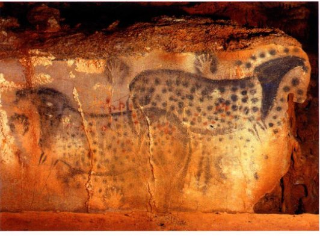

*图1.8《斑点马和人手》（Spotted Horses and Human Hands）。佩什-梅尔洞，法国多尔多涅。马：约公元前16,000年；手：约公元前15,000年。石灰石，高约3.4米*

关于萨满教的最新理论就建立在这种分析的基础上。这种宗教相信存在着一个对应的灵界，不同的意识状态都可以通达那里。这些理论认为，洞壁或洞顶上的隆起显出动物的身形之处，动物的“灵”尤为清晰可辨，就像法国西南部佩什-梅尔（Pech-Merle）洞的《斑点马》（Spotted Horse，图1.8）。艺术家或萨满的力量只是使那个灵魂显现出来。一些学者将绘画作为崇拜图像，让它们在早期宗教中扮演主角，而其他一些分析则更多地关注绘画的实际环境。这意味着要考察图像之间的关系，即在没有人造边框、地平线或背景的情况下，确认数量繁多的动物画像表示的是不同个体还是单个兽群。这类考察试图确定，这些图像对于早期社会来说是否代表着一种神秘的真实。拉斯科洞的《犀牛、受伤的男子和野牛》（Rhinoceros，Wounded Man，and Bison，图1.6）是互不相关的单个图像，还是已知最早的叙事性绘画？它讲述的这个血腥故事的主题是一次狩猎，还是勇士之死，抑或是萨满正遭遇灵兽？正如三兄弟洞的情形（图1.9）一样，刻制大量互相重叠的动物形象，其目的可能是记录兽类在整个迁徙季节的变动。

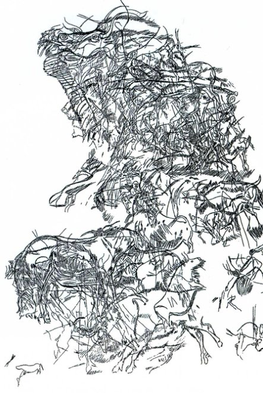

*图1.9 重叠的动物线刻画。约公元前40,000-前10,000年，法国三兄弟洞。石板拓片由Abbé Breuil制作，出自Begohen收藏*

> **大事年表**
>
> *   约公元前38,000年 - 最早的“艺术”品产生
> *   约公元前32,000年 - 已知最早的洞窟壁画，位于法国绍韦
> *   约公元前13,000年 - 在一片出露岩层上制作的两件野牛泥塑

对实际环境的关注还意味着，确定一个不足五米深的洞穴与另一个超过一千六百米深的洞穴之完全不同，可能用作不同的用途。类似地，实际环境表明，同样是在拉斯科洞中，宽敞的《公牛大厅》（Hall of the Bulls）中的绘画和位于一个不足五米深的竖井底部的棒状人图作用可能大不相同。对实际环境的关注还意味着要考虑洞穴中的体验，也就是说，要认识到一个史前观画者不得不与艰险小径、迷茫的摇曳火光、或远或近的回声、弥漫在整个地下空间里的糜烂的气息较劲，所有这一切都加强了观看这些图像的感受（图1.10）。最重要的是，近来的分析表明单一解释可能无法适用于所有的时间和地点。比如，即使交感巫术可以部分解释拉斯科洞中腹部隆起的《中国马》（见图1.5），它也几乎解释不了绍韦洞的艺术，从这个洞中发现的有机物遗存来辨别，这里所描绘的动物至少有百分之七十二不在人的捕猎范围之内。

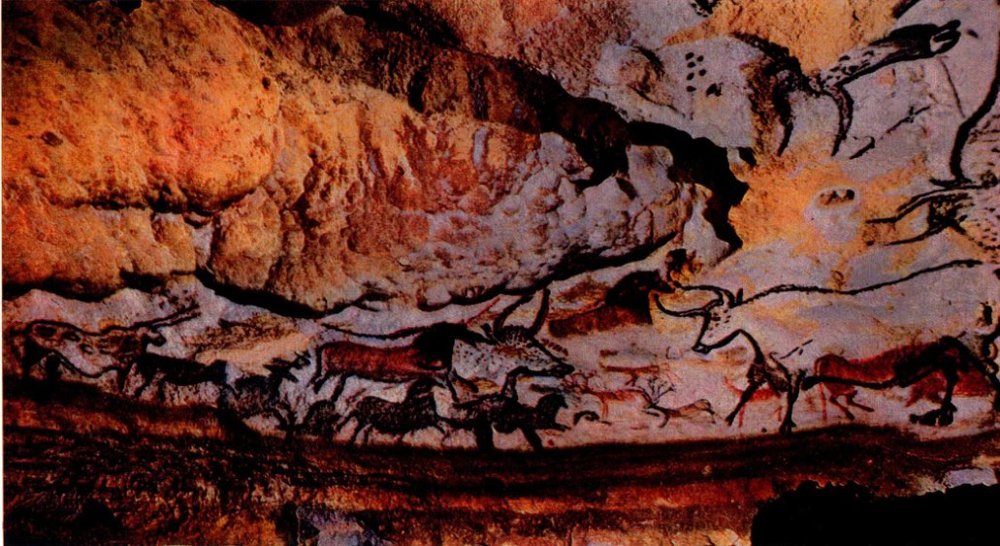

*图1.10《公牛大厅》。拉斯科洞，约公元前15,000-前10,000年。法国多尔多涅*

## 旧石器时代的雕刻

史前艺术家还用多种材料雕刻、塑造塑像和浮雕（relief）。德国赫伦施泰因-施塔德尔（Hohlenstein-Stadel）出土的一件较大的雕像（图1.11） 年代略晚于绍韦的绘画。它不足三十厘米高，展现的是一头站立的半人半猫科动物，用猛犸象牙雕刻而成。尽管其保存状况很差，但很明显，用原始的石器工具来制作这个雕像并非易事：需要先将弄干的猛犸象牙劈开，然后将其打磨成形，并用一块锋利的燧石刀刻出细小部分，如手臂上的条纹和口鼻。接下来要用赤铁矿粉作磨料将雕像抛光，此事费心费力。我们尚不清楚这个雕像究竟想要传达什么主题。与画在洞壁上的混合形象一样，它可能表示一个或许为了打猎而装扮成动物的人。一些史前史学家将这些合成的人命名为萨满或“巫师”，他们可以通过仪式性行为通灵。

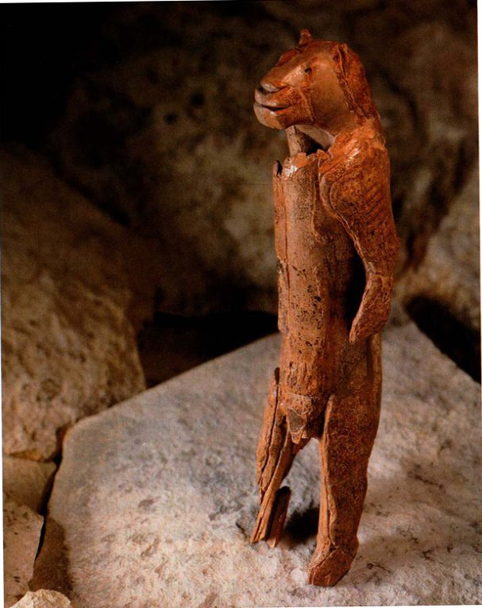

*图1.11 人身猫科动物头的混种雕像。约公元前40,000-前28,000年，德国巴登-符腾堡州（Baden Wurtemburg）赫伦施泰因-施塔德尔。猛犸象牙，高28.1厘米。乌尔马博物馆（Ulma Museum）*

与洞窟壁画一样，动物是雕塑的常见题材。德国境内多瑙河（Danube River）沿岸的福格尔赫德（Vogelherd）的一个洞里出土的奥瑞纳时期的微型马雕，以及马格德林（Magdalenian）时期的缠斗的大角野山羊雕像，分别出自旧石器时代晚期始末两期（图1.12和1.13）。（见本页的背景知识。）

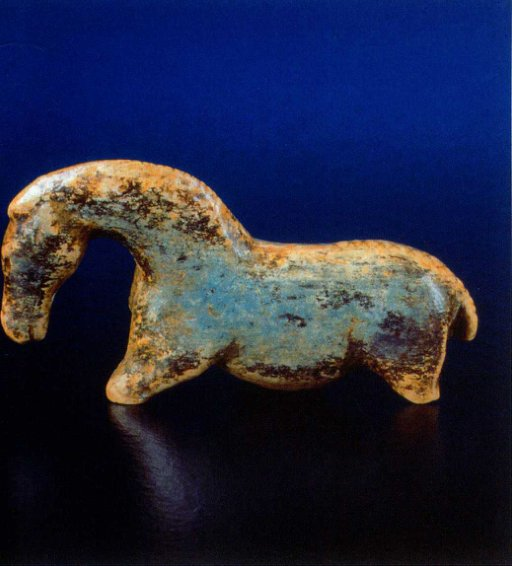

*图1.12《马》（Horse）。福格尔赫德洞（Vogelherd Cave），约公元前28,000年，德国。猛犸象牙，高5厘米。图宾根大学史前研究所（Institut für Urgeschichte，Universität Tübingen）*

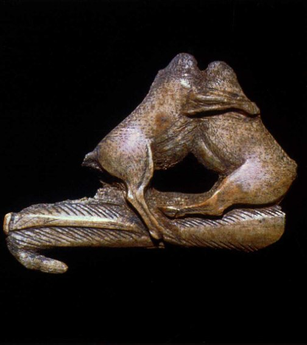

*图1.13《带勾缠大角野山羊的投矛器》（Spear Thrower with Interlocking Ibexes）。约公元前16,000年，昂莱内洞（Grotte d'Enlène），法国阿列日（Ariège）。驯鹿角，9 x 7厘米。巴黎人类博物馆（Musée de l'Homme）*

这匹马是身覆长毛的猛犸象牙制成的诸多可携雕件之一，大约可追溯至公元前28,000年。两条前腿之间有一个穿孔，表明它是一个挂件。大角野山羊雕像是约公元前16,000年用驯鹿角雕成的，可以用作投矛器。柄端有钩，可以挂在矛上，使猎人更有效地利用这件武器。这两件作品都展示了雕刻者对雕塑轮廓敏锐的感知力，并万分精心润饰其表面：用石器工具刻出的细小刻痕是大角野山羊的毛，并将表面磨得非常光滑。很显然，这两件物品有其实用目的。

> **背景知识：石器时代的分期**
>
> 地质学家在地球年龄的基础上发展出划分时期的方法，历史学家则把人类制造工具的活动当作衡量人类文明史的限定性要素。对于文字产生前的时代（史前期），石器工具的形状是区分史前各个不同文化的基础。石器时代从约二百万年前一直延续到约四千年前。
>
> 这个大的时段被划分为旧石器时代（Paleolithic Age，源自希腊语“palaio-”，意为“古代的”，以及“lithos”，意为“石头”）、中（meso-）石器时代和新（neo-）石器时代。旧石器时代从二百万年前延续到约公元前10,000年，中石器时代从约公元前10,000年到约公元前8000年，新石器时代从约公元前8000年到约公元前2000年。公元前3000年的某个时候，世界上的一些地区石器工具被金属工具取代，预示着欧洲和亚洲青铜时代（Bronze Age）的来临。
>
> 特定的人类文明在不同的时间进入这些阶段：如，西亚新石器时代的来临早于欧洲。但漫长的旧石器时代需要进一步细分。对旧石器时代遗址的挖掘提供了另一个划分时间的框架。挖掘时，最古老的材料位于底层，旧石器时代最早的那个阶段被称为旧石器时代早期（结束于约100,000年前）。旧石器时代中期始于约100,000年前，终于约40,000年前，对应于旧石器时代遗址的中层。旧石器时代晚期从约公元前40,000年到约公元前8000年，对应这类遗址中最晚的地层。
>
> 许多遗址和不同种类的工具及工具制造技术被用来鉴别旧石器时代晚期的特定文化群。如：奥瑞纳文化得名于法国西部的奥瑞纳（Aurignac）遗址，出自这个文化的物品年代在约公元前34,000一前23,000年。格拉维特文化得名于法国西南部的格拉维特（La Gravette）遗址，年代为约公元前28,000一前22,000年。这些文化中最晚的一个是马格德林文化，它以法国西南部的马格德林（La Magdeleine）遗址命名，年代为约公元前18,000一前10,000年。这些术语很多都是在19世纪创造出来的，这时史前文化研究刚刚建立。
>
> **旧石器时代**
> *   旧石器时代早期：公元前2,000,000-前100,000年
> *   旧石器时代中期：公元前100,000-前40,000年
> *   旧石器时代晚期：公元前40,000-前10,000年
>     *   奥瑞纳文化：公元前34,000一前23,000年
>     *   格拉维特文化：公元前28,000-前22,000年
>     *   梭鲁特（Solutrean）文化：公元前22,000-前18,000年
>     *   马格德林文化：公元前18,000-前10,000年
> *   中石器时代：公元前10,000-前8000年
> *   新石器时代：公元前8000-前2000年

洞窟艺术家有时把岩壁上的隆起部分变成动物画像。与之类似，法国比利牛斯山脉中的勒迪克多杜贝尔特（Le Tuc d'Audoubert）洞中，在约公元前13,000年的时候，一个雕刻家把一块天然岩石露出地面的部分抹上黏土，在上面塑了两头野牛（图1.14），本来还有一头小牛站在右边那头牛的前腿旁。每头野牛都长约六十厘米；它们的身体丰满，并向一头逐渐变细，以模仿真野牛的外形。然而，尽管这些雕塑具有立体感（注意其浑圆的腰臀、肩部和粗浓的鬃毛），但它们与洞窟绘画遵循的是相同的传统手法：它们表现为相当严格的侧面像，只能看到一面。这类物件的功能我们同样不明：这样的雕塑是否是打猎工具？在这组野牛雕塑旁边发现的人脚印中，有一名两岁孩子的脚印。这些跟法国贝代亚克（Bedeilhac）的一个洞中的一枚婴儿手印以及绍韦洞中的妇女手印一道，提示我们不要把旧石器时代艺术品设想成由男性主宰的狩猎社会中宗教仪式最重要的组成部分。

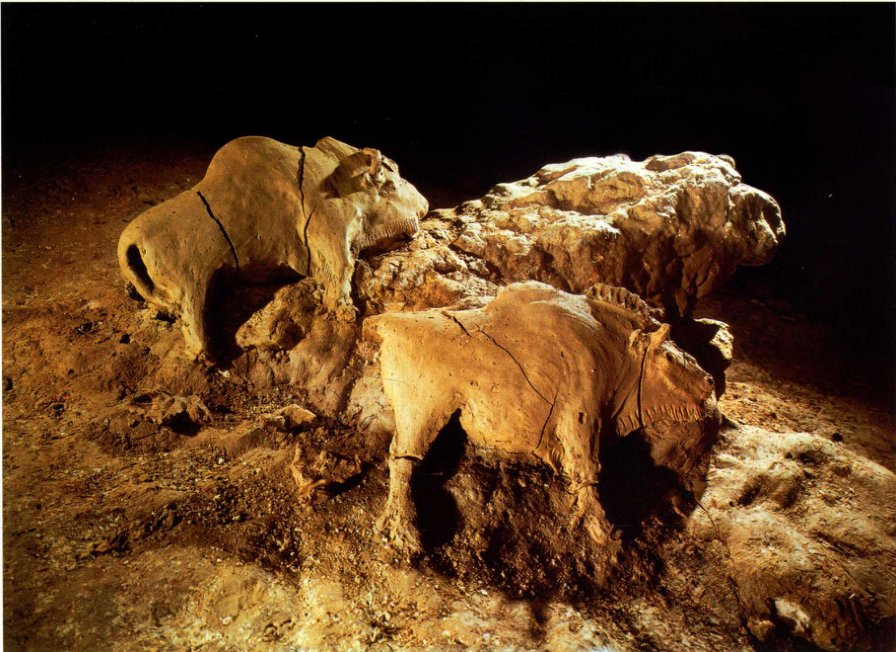

*图1.14《两头野牛》（Two Bison）。勒迪克多杜贝尔特洞，约公元前13,000年，法国阿列日。黏土，长60厘米*

妇女是史前雕塑中的常见主题，特别是在格拉维特（Gravettian）时期（见本页的背景知识）。当时的大部分雕塑都以妇女为题材，男性则很少作为雕塑主题。19世纪末，在法国南部布拉桑普伊（Brassempouy）的教皇洞（Grotte du Pape）同时发现了一组十二个象牙小雕像。其中有约公元前22,000年的《戴头罩的女子》，或叫《布拉桑普伊的女子》（Dame à la capuche［Woman from Brassempouy］，图1.15）。这件雕像实际上未及完工，只雕出了头和细长优美的颈部。通高3.6厘米长，可以轻松地用手托住，它可能最初就是常常被托于掌上观看的。

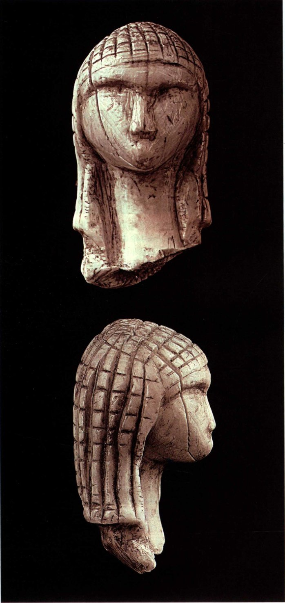

*图1.15 《戴头罩的女子》（《布拉桑普伊的女子》）。约公元前22,000年，教皇洞，法国布拉桑普伊。象牙，高3.6厘米。圣热尔曼昂莱的国家古代博物馆（Musée des Antiquités Nationales，Saint Germain-en-Laye）*

奥地利的石灰石裸体雕像《威伦道夫的女子》（Woman from Willendorf，图1.16） 也是手掌大小，时间稍早，大约公元前28,000至前25,000年。这尊雕像发现于1908年，其表面还残存着原先抹上去的赭色的颜料。以上这两个小雕像都高度抽象。艺术家并不像表现动物那样真实地表现人体，相反，雕像家只勾勒出基本形状。在《布拉桑普伊的女子》中，艺术家简略地表现了头发：先刻出深深的竖直沟槽，再垂直地刻上一道道浅横线，最后用力地抛光柔和这些线条。雕像没有嘴，只有一个勉强可辨的鼻子；高悬而深陷的眼窝、鼻梁两旁刻出的小洞让人联想到眼睛。仔细打磨过的雕像表面在变幻光线的照射下，显得优雅、活泼，富于动感，雕像身上静默的力量和活力存在于映照呈现的生动效果之中。

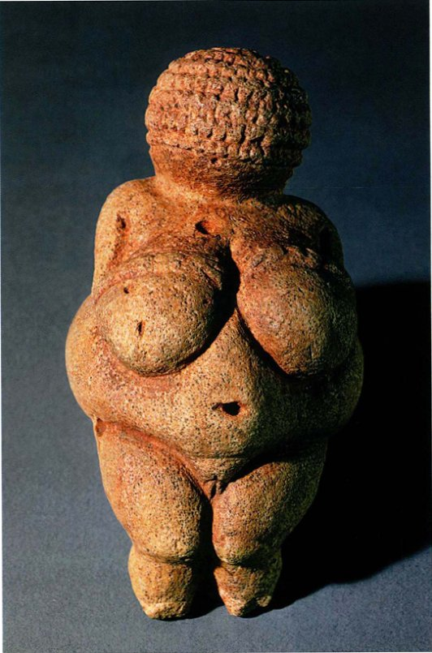

*图1.16《威伦道夫的女子》。约公元前2,000-前25,000年，石灰石，高11.1厘米。维也纳自然历史博物馆（Naturhistorisches Museum）*

在《威伦道夫的女子》中，作品的抽象特征似乎是在突出强大的生殖力。这种抽象还出现在其他许多小雕像身上；实际上，一些未完成的小雕像只刻画了女性的生殖器。显然，脸部特征不是优先考虑的对象：简略的头发覆盖了整个头部。相反，重点在人物的生殖特质上：细小的双臂搁在下垂的乳房上，乳房的浑圆形状与肥大的肚子和丰满的臀部相呼应。粗大的大腿之间是生殖器。对生殖特征的强调表明，这个雕像可能是一个生殖符咒，其用意可能是确保成功分娩，而非增加怀孕的次数。她也许是个漂亮女人，也许是可敬的祖先。在食物不足的年代，一个有如此身材的妇女当然非比寻常。

我们对《布拉桑普伊的女子》和《威伦道夫的女子》等雕像的分析并非定论，而过去用于描述它们的术语使问题变得更为复杂。像其他许多旧石器时代的女性小雕像一样，《威伦道夫的女子》被命名为“维纳斯”（Venus）雕像。这个术语从19世纪中叶发现第一批女性小雕像时起就存在了。维纳斯是希腊女神阿佛洛狄忒（Aphrodite）在罗马神话中的称呼，阿佛洛狄忒形象就是一个裸女；19世纪的考古学家认为这些雕像与这位罗马女神在功能上（如果不是在外形上）相似。当代学者仍在争论这些女性雕像的含义，并避免使用这类会使人误植年代的术语。我们不知道这个雕像表现的是某个具体的女人，还是一般性的或理想的妇女。甚至，这个雕像可能根本就没有表现妇女，而是要表达生殖观念，或者像某些学者所认为的那样，表现了丰产的自然界本身。

## 新石器时代的艺术

约公元前10,000年，地球气候逐渐变暖，覆盖了当今地球近三分之一面积的冰开始消融。融化的冰川汇入海洋，洪水引发潮涨将原本成片的陆地隔开，欧洲今日的地形大致形成。转暖的气候不仅促进了新生植物的生长，动物的分布也发生了变化：驯鹿从现代的法国地区向北迁徙到斯堪的那维亚半岛；浑身厚毛的猛犸和其他许多物种则灭绝了。动植物的这些变化不可避免地引起了人类习性的改变。作为新石器时代标志的新型文化期，其特征是人与环境之间不断变化的关系。虽然以前人类已在地形条件允许的情况下修建了简陋的小屋，在洞穴中栖身和举行仪式，但在新石器时代，他们开始建造更坚实的建筑，选择条件有利（如水源充足）的地点定居，而非随着季节的变换迁移。他们不再去野外打猎和采集大自然提供的食物，而是驯养动物、培育植物。这一变化是逐渐发生的，在不同时刻出现在不同地点；实际上，直到如今，狩猎和采集仍是现在世界上一些地区的生活方式。

### 定居社会与新石器时代的艺术

这些为适应环境变化而做出调整的最早证据，出现在肥沃的地中海东岸和幼发拉底河（Euphrates）与底格里斯河（Tigris）之间的美索不达米亚（Mesopotamia）地区。公元前第九个千年，约旦河边，一个定居点在《圣经》中著名的杰里科（Jericho）遗址（位于当今的西岸地区）发展起来。漫长的时间里，当地人用晒干的泥砖在石头地基上建房。他们把地板涂上灰泥，用树枝和泥土建造屋顶。遗存的骨骼表明，他们将死者的尸体埋在屋内地面之下，但对头颅却另作处理。头骨被陈放在地上，人们用着色灰泥模仿肌肉，用海贝的碎壳作眼睛，将它们复原（图1.17）。它们精细的造型、块面之间的过渡，以及对肌肉与骨骼的相互作用的精确观察，使这些作品异常逼真，每一件都如它所包裹的头骨一样具有个性。我们尚不清楚这些丧葬习惯是否反映了一种对来世的态度；至少，它们表示出了对死者的尊敬，或许是对祖先的崇拜。

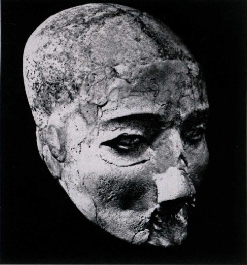

*图1.17 新石器时代泥塑头骨。约公元前7000年，约旦杰里科。真人尺寸。安曼古代考古博物馆（Archaeological Museum，Amman）*

当小镇成长起来，范围扩大到约六十亩，而且邻近的定居点开始对它造成威胁之时，防御的要求也加强了。于是，约公元前7500年，此时杰里科的人口已超过两千，人们挖了一条很宽的沟，并绕城筑起一道1.5米厚、4米高的坚固石墙。其中有一座巨大的圆形塔楼（它也许只是几座塔楼中的一座），高8.5米，基座直径有10米，内部有楼梯通往塔顶（图1.18）。随着这个仅用最简单的石器工具建造的防御系统的出现，大型建筑随之诞生。

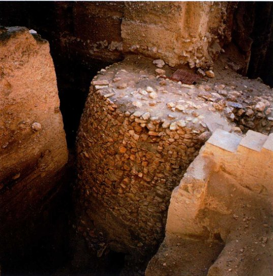

*图1.18 早期的新石器时代城墙与塔楼。约公元前7500年。约旦杰里科*

在约旦首都安曼附近的加扎勒泉（Ain Ghazal）发现的30多件残破灰泥塑像代表了一种与杰里科头像完全不同的雕塑传统（图1.19），这些塑像可追溯至公元前7000年中期。其中一些只有半身，但最高的塑像复原后可达九十厘米高，是已知最早的大型雕塑。保管者研究了这些塑像的制作技术，认定其设计背后的推动力量是大尺寸，这直接造成了它们扁平、偏薄的外型。这些研究发现，艺术家将灰泥抹在用绳子捆扎的新鲜芦苇束外面，在组装过程中，这些芦苇束一直平放着。艺术家分别为每个芦苇束加上腿，然后涂上颜料，嵌入珍贵的贝壳当作眼睛，再涂上沥青表示瞳孔。等灰泥一干，艺术家就把这些易碎的塑像竖立起来，可能还会给它们戴上假发，穿上衣服。与杰里科的头像一样，它们可能表现的是祖先。然而，由于有些人像有两个头，所以这些塑像可能有巫术功能。

*图1.19 人像。约公元前6750-前6250年，约旦加扎勒泉。较大人像高84厘米。安曼文物部（Department of Antiquities）*

**萨塔·胡伊克** 在安纳托利亚（Anatolia，现在的土耳其），1961年以来的考古发掘已使位于萨塔·胡伊克（Çatal Hüyük）的一座新石器时代城镇显露出来，它始建于约公元前7500年，比杰里科晚了一千年（见地图1.1）。该镇由于矿石（主要是黑曜岩，这是一种昂贵的像玻璃一样的火山石，经过削凿之后，可成为坚硬的利刃）贸易而兴盛起来。公元前6500至公元前5700年，这座城镇经历了12个连续建设期而得以迅速扩大。它最鲜明的特点就在于没有街道，房子没有门：一座座用泥砖和木料建造的房子紧挨在一起，只能通过梯子从房顶上的一个洞出入，这个洞还兼作烟囱（图1.20）。这种设计的优点一方面体现在结构上，即房子相互支撑；另一方面体现在防御上，因为任何一个进攻者都不得不攀爬外墙，继而在房顶遭遇抵抗。所有的活动都在房间里进行，从工作、做饭到睡觉，都在沿墙的台子上。跟在杰里科一样，墓穴在屋内地面之下。

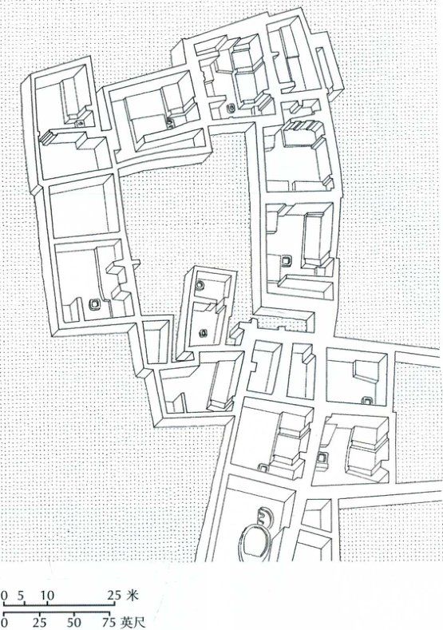

*图1.20 萨塔·胡伊克复原图，土耳其*

萨塔·胡伊克的一些房间用公牛角和灰泥塑的乳房作装饰，这可能象征着生殖力（图1.21）。一些考古学家认为，装饰较为华丽的房间可能是神庙，不过这仍是猜测。然而，大部分房间显然都涂上了灰泥，而且常常绘有图画。许多画描绘了狩猎场面，其中，看上去体形娇小的人在体形硕大的公牛或牡鹿周围奔跑。这些形象有一种静止的特性，跟之前的洞窟壁画大不一样：洞窟壁画上的形象似乎处于不断运动之中。

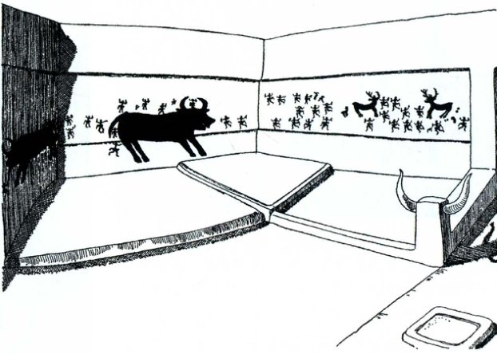

*图 1.21 《猎兽》（Animal Hunt）。A.III.1 龛主室的复原图，约公元前 6000 年。萨塔·胡伊克（据 Mellaart 图纸所作）*

在一个早期的房间内发现的一幅非常罕见的绘画似乎描绘了一排排形状不规则的街区式的房子，这很可能就是萨塔·胡伊克本身（图1.22）。城镇的上方，一个有黑色斑点、顶部绘有黑线和黑点的明红色物体可能表示哈桑山（Hasan Dag），这是一座从该镇能够望见的双峰火山。如果对这个遗址的解释是正确的，那么该画的重点就是风景，这使它成为风景画的鼻祖，且有别于不标示空间位置的洞窟壁画。这幅画可能表现了这个早期定居点中强烈的社群意识，这里的居民对地点有明确的认同感。

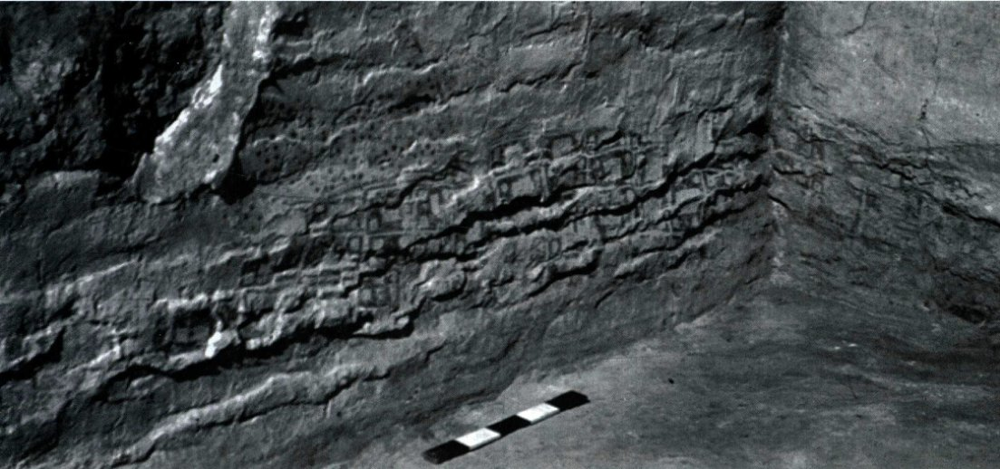

*图 1.22 《城镇与火山鸟瞰图》(View of Town and Vocalno)。约公元前 6000 年。壁画，VII.14 龛。萨塔·胡伊克*

**窑烧陶器** 新石器时代，一些新技术发展起来，表明了专业分工时代的开端。由于社群有定期的食物供应，所以一些成员就能够把时间用于研习新的技术。新技术包括制陶、纺织以及某种熔化铜和铅的技术。陶器保存得最好，因为窑烧陶器极为耐久，留存下来的常常是被丢弃的陶器碎片。虽然早期的杰里科没有陶器，但在美索不达米亚至埃及和安纳托利亚的所有地区都发现了绘有抽象图案的黏土器皿，种类非常丰富。在美索不达米亚，陶器可能起源于公元前第六个千年，而安纳托利亚的陶器在萨塔·胡伊克留存了下来（见地图1.1）。在安纳托利亚中部高原上的其他定居点也发现了陶器。考古学家还在巴尔干半岛发现了这一时期的陶器，到了约公元前3500年，制陶技术在西欧出现。

在欧洲，艺术家们也用黏土来制作小塑像，如罗马尼亚切尔纳沃达（Cernavoda）出土的一对约公元前3500年的男女塑像（图1.23）。与《威伦道夫的女子》和加扎勒泉小雕像一样，它们高度抽象，但其外形更加线条化，并不那么圆：女人的脸是一个扁平的椭圆，安在一个又长又粗的脖子上，明晰的棱边勾勒出她的身体——比如横越她乳房以及在她骨盆交叠处的那些棱边。她的两只手搁在抬起的膝盖上，无肘的手臂交合于此，在雕塑结构内部勾画出一个三角形的封闭空间。这反过来强化了小雕像的立体感，它鼓励观者从多个角度观赏它，可以绕着它走，也可以把它拿在手中转动。抽象突出的是姿态；但是，在尝试解释它——也许解释成风情绰约的女子——的含义时，我们应该谨慎，因为同一个姿势在不同文化里的意义差异极大。这个女子像和与其放在一起的男子像是在一个墓中发现的，它们可能表现的是死者，或者死者的伴侣或哀悼者；也许它们是下葬前具有某种目的的随葬品。

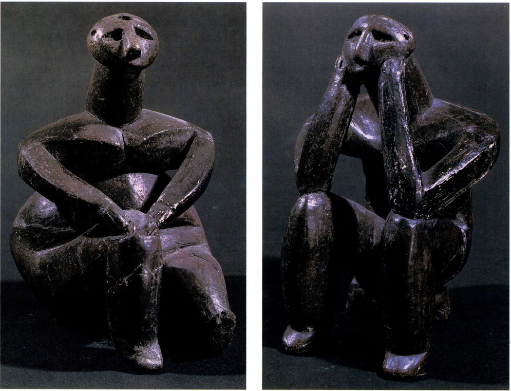

*图1.23 男女塑像。约公元前3500年，出自切尔纳沃达，罗马尼亚。陶像，高11.5厘米。布加勒斯特国家古物博物馆（National Museum of Antiquities, Bucharest）*

## 欧洲建筑：坟墓和仪式

在欧洲，大型建筑的产生并非出于防御需要，而是源于对葬礼和宗教仪式的关心。个人住宅主要用木头搭建框架，墙壁由编条（编成框架的枝条）和灰泥（涂在编条外面变干的泥土）制成，屋顶用茅草铺成，这些极少保留下来。而新石器时代的西欧和北欧人却用巨大石块来搭建坟墓和仪式场所，这种石块称为巨石（megaliths）。他们常常先搭起一个柱梁结构（post-and-lintel，两块直立的石头支撑一块横置的顶石，见图1.25）。运用这一方法，他们为死者建造了带有一间或两间墓室的坟墓，这被称作石台（dolmen）墓，它们给观者留下了深刻而持久的印象。

> **大事年表**
>
> *   约公元前10,000年 - 地球气候逐渐转暖
> *   约公元前7500年 - 杰里科的防御体系；大型建筑的出现
> *   约公元前3500年 - 制陶在西欧出现
> *   约公元前2100年 - “斯通亨奇”最后的建造阶段

其他一些遗址则以一种独特的方式呈现出划分为不同层次的水平空间，学者们认为这里是举行宗教仪式的场所。公元前4250至前3750年，在布列塔尼半岛（Brittany）南部海岸上的卡纳克（Carnac）地区的梅内克（Ménec，见地图1.1），三千多块竖立的巨石等距排成若干条笔直的长列，绵延达三公里多。其特点是，高约九十厘米的较小石块立在东侧，石块的高度逐渐增加；到了西侧，石块高达四米（图1.24）。石列的东西走向令学者们以为，石列用于测量一年之中不同时间太阳在天空中的位置，对于食物来源依赖于阳光的农业民族，它们起着日历的作用。开采、加工、运输和竖起这些石块是一个非凡的伟绩，除了要有出色的专业工程技术之外，它还要求有效地组织人力。这些石块的形状简单、重复，尺寸渐增；既是静止的，又会因太阳缓慢地不间断移动而变更。石块之间有一种平静的宏伟和庄严，给开阔的场地带来了静默的秩序。

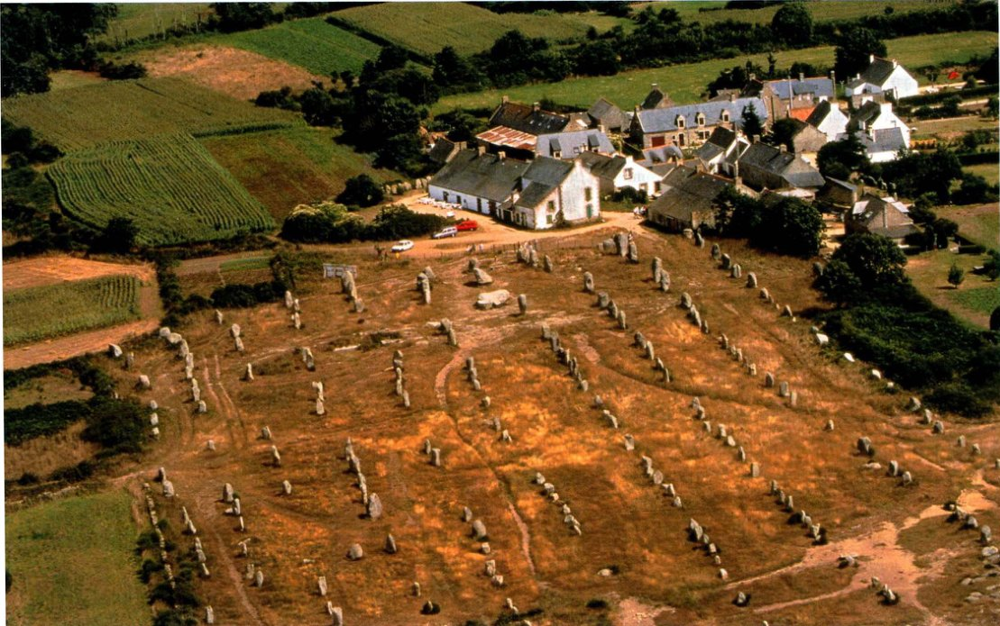

*图1.24 梅内克竖石阵列。约公元前4250-前3750 年。法国卡纳克*

巨石常常出现在被称为石圈（cromlech）的圆圈形建筑中。这是英国最常见的巨石排列方式，最著名的巨石建筑就是索尔兹伯里平原（Salisbury Plain）上的石圈“斯通亨奇”（Stonehenge）（图1.25和1.26）。现在看来统一的设计，实际上是至少四个建造阶段的结果。最初是在白垩地面上挖一条巨大的环形沟，围成一个直径约为一百米的圆圈；再沿沟内侧筑一圈约两米高的围堤。一条两旁排列着石块的宽阔大道向东北方向延伸，从圆圈一直通往一块灰白色的尖角砂岩巨石（砂岩漂砾［sarsen］），今天我们将其称之为踵石（heel stone）。越来越多的巨石被运进圆圈，所以到了约公元前2100年，“斯通亨奇”已发展成一个马蹄形的建筑，拥有五座砂岩三石塔（trilith，两块直立石支撑一块横置石）。环绕着它们的是一圈直立石块，它们顶部放着一道连接在一起的过梁（lintel），两个圈之间还有一圈较小的蓝砂岩石块。

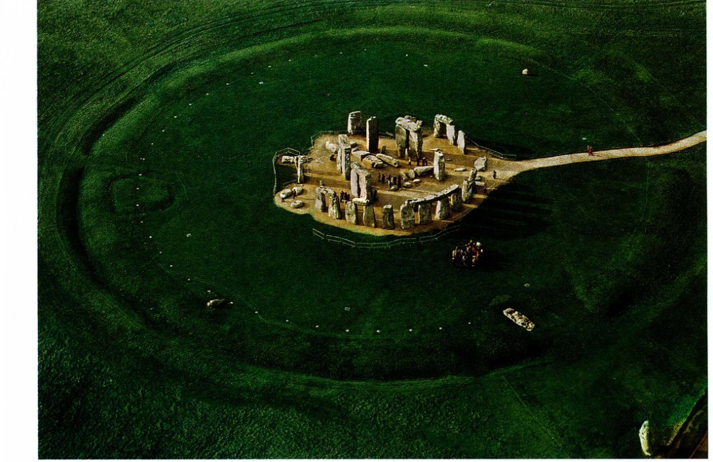

*图1.25 斯通亨奇（空中俯拍）。约公元前2100年，英国威尔特郡（Wiltshire）索尔兹伯里平原。石圈直径29.6米*

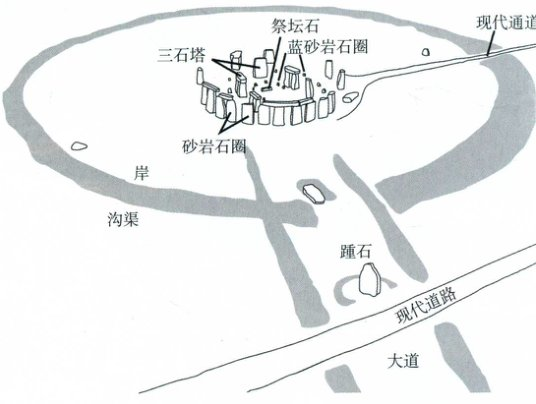

*图1.26 斯通亨奇巨石原始排列示意图*

“斯通亨奇”对于那些花费几个世纪的时间建造它的人们而言究竟意味着什么，依然是一个不解之谜。许多史前史学家相信，它有为流逝的时间作标记的作用，至少部分功能如此。由于它的纪念碑性，大多数史前史学家还一致认为它具有仪式功能；它那精心设计的圆形结构支持了这一猜测，因为在许多社会的宗教仪式中，圆形是一个重要标志。这两个特点甚至使得中世纪看到“斯通亨奇”的人认为它是亚瑟王（King Arthur）的术士梅林（Merlin）建造的，而且它至今仍在吸引着人们在夏至时前来。然而，可以确定的是，与梅内克巨石阵一样，“斯通亨奇”显示出了一流的人力组织和工程技术。“马蹄”中心那座最大的砂岩三石塔高达7.2米，支撑着一块4.5米长、0.9米厚的过梁。每块砂岩重达五十吨，是从三十七公里外的马尔博罗唐斯（Marlborough Downs）运来的；蓝砂岩产自三百二十公里外的威尔士的普雷塞利山（Preseli Mountains）中。同样令人印象深刻的是，这些完美的石块显示出了精细加工的痕迹。顶石上挖出的洞严丝合缝地套住了直立石上的突起（形成了一种榫头和榫眼的接合），成为一个稳固的结构。另外，石块经过削凿，达到了那种通常认为古典时代希腊的帕特农神庙才有的精巧（见图5.39）：直立的巨石向顶端逐渐变细，中部则鼓起，在视觉上造成一种负重的感觉，并表现出一种活力，能赋予石头生命力。对过梁的加工从两个方向上进行：它们的正面向外斜出约十五厘米，以使其从地面上看来是垂直的，同时，它们的侧面呈水平弯曲，以形成一个光滑的圆圈。

## 小结

史前时期，人类开始用形象化的方式表达自己，却没有留下任何解释其意图的文字记录，这样一来，史前艺术在陈述一些事情的同时，也带来了同样多的困惑。即便如此，到这个时期结束时，人们已掌握了绘画、雕塑和制陶技术，而且已开始建造巨大的建筑物。他们还产生了一种对图像和空间力量的强烈感觉。他们认识到了如何塑造令人难忘的形象，如阿尔塔米拉及其他洞穴中的那些形象，还认识到了怎样用完善的方法改变空间，例如梅内克和其他地方的巨石。

**旧石器时代的艺术**

石器时代，人类以狩猎和采集为生，不过已经有了创作艺术的时间和需要。旧石器时代的艺术主要以两种形式留存下来：洞壁上的绘画和用骨头或石头雕刻的小物品。最常见的题材是动物，以可供人类食用的动物为最多。这些刻画动物形态的作品极为生动、写实，但它们的功能和意义还未被彻底了解。相比之下，对人体的描绘要抽象得多。

**新石器时代的艺术**

新石器时代，人类以驯养家畜、种植庄稼为生，逐渐转向一种更稳定的生活方式。建筑材料比之前的旧石器时代住宅所用的更为耐久。随着人类社会的形成，专业化分工程度提高，制陶等新技术逐渐产生。雕塑和绘画显示出发展中的宗教习俗和对死者的关心。其他创新包括大规模的石墓建筑，以及其他一些大型建筑，许多学者认为是标记季节变迁的工具。