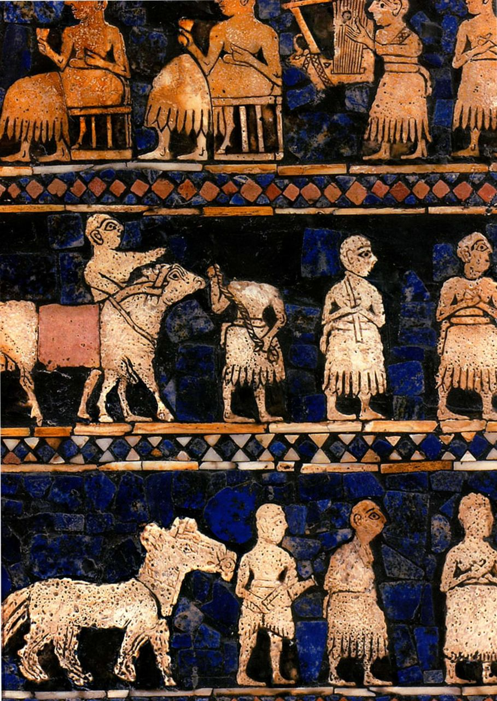

# 第二章 古代近东艺术

种植和储存农作物以及饲养动物作为食物，是新石器时代各民族的标志性成就，从此将逐渐改变文明的进程。人类过去以追逐野生动物群和采集食物为生，在摆脱这种状态之前不久，他们开始建立永久定居点。到了新石器时代末期，这些定居点的规模超出了村落的界线，发展成更大的城市。西亚各地都出现了小的农业乡镇，但在公元前第四个千年，人口多达四万的大规模城市开始兴起，

大多数位于底格里斯河与幼发拉底河之间的美索不达米亚。城市的出现对于人类生活和艺术作品的发展产生了极大的影响。

“两河之间的土地”为新石器时代的农人提供了许多机会。虽然在今天，这个地区基本上是块贫瘠的平原，但文字、考古和艺术方面的证据表明，在文明初现之时，那却是一片植被丰富的土地。那里的人们掌握了灌溉技术，充分利用两条大河及其支流，使肥沃的土地变得更加富饶。新技术和新发明，包括轮子和犁，以及用黄铜和青铜铸造工具，提高了食物产量，推动了贸易发展。这些族群在成长繁荣的过程中，发展成为社会组织分明的城邦，这种组织方式能够解决城市生活的种种问题。劳动、贸易和物质交换的专门化，争端解决的机制，以及防护墙的修建，都要求有一个中央权威和政府，而这种中央权威和政府也的确顺应需要发展起来了。

伴随这一社会组织形成的有效管理很可能产生了也许是最早的书写体系，该体系大约于公元前3400\-

前3200年形成，是用尖笔在黏土上按压而成的象形文字，这种文字被用于记录财产清单。到了约公元前2900年，美索不达米亚人已将象形文字改进成为一系列楔形符号，被称为楔形文字（cuneiform，源自拉丁语“cuneus”，意为“楔子”）。这种文字被用在早期的行政报告和公元前第三个千年末期苏美尔（Sumer）的《吉尔伽美什史诗》（Epic of Gilgamesh）中。近东古代的大部分时期一直使用楔形文字，在控制该地区的多个集团之间形成了一道文化桥梁。不同的集团用楔形文字来记录自己的语言。随着文字的发明，人类进入了历史时期。

美索不达米亚的地形对当地兴起的文明还有其他深远影响。城市兴盛在美索不达米亚和尼罗河谷的时期接近，但狭长而肥沃的尼罗河谷两面都有沙漠保护，而美索不达米亚是一个开阔的低谷，两条大河及其支流在这里纵横交错，几乎没有什么天然屏障。由于各个方向都畅通无阻，因此常常有想侵占这片肥沃土地的人闯入这一地区。实际上，近东的古代历史是一部多元文化史，城邦之间战火不断，只是间或实现统一。虽然权力更迭频繁，但美索不达米亚的视觉文化保持

图2\.8《乌尔皇家旗》细部

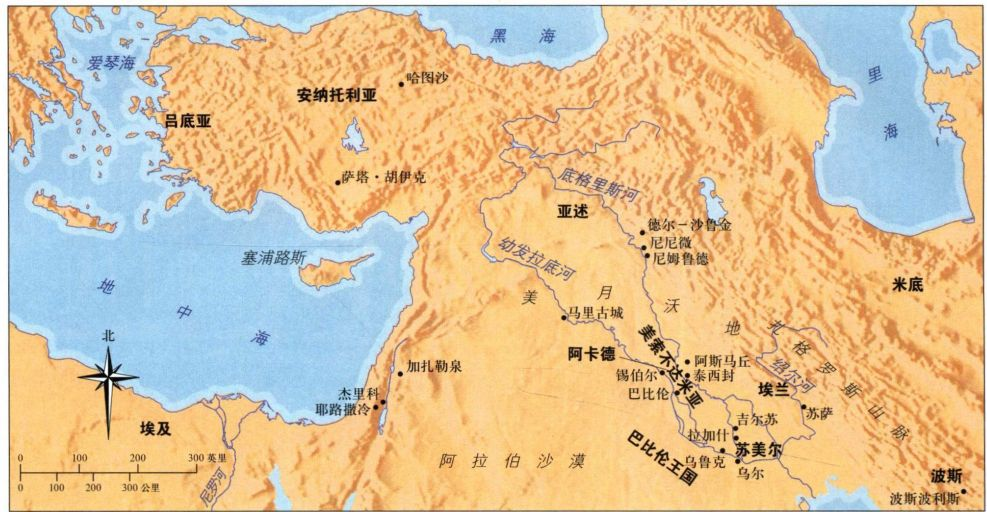

地图2\.1 古代近东

了一种惊人的稳定性。两大主题产生了：艺术被用于实现和反映政治权力；美索不达米亚人还使用了视觉叙事手法，探索通过艺术陈说故事的技巧。

苏美尔艺术

美索不达米亚的第一个重要文明出现于苏美尔地区南部，在底格里斯河与幼发拉底河交汇处附近，公元前4000年之前的某个时期，几个城邦在这里建立起来（见地图2\.1）。直至约公元前2340年，这些城市在苏美尔人的统治下欣欣向荣。我们不知道苏美尔人是什么人；学者们常常能够通过共同的语言习惯来确定各民族间的关联，但苏美尔语与其他任何已知语言都没有关系。自19世纪中叶以来，考古挖掘发现了许多早期的黏土板，上面刻有楔形文字，内容包括财产清单、国王名录，以及诗歌（图2\.1）。许多最早的发掘活动都集中在《圣经》中提到的苏美尔城市，如乌尔（Ur，亚伯拉罕［Abraham］的出生地）和乌鲁克（Uruk，即《圣经》中的以力［Erech］）。除建筑和文字以外，陶器、雕塑和浮雕艺术品也提供了关于苏美尔社会的信息。

对于苏美尔人来说，生命本身有赖于供享神明，神控制着自然力和自然现象，如天气和水、土地的肥沃程度以及天体的运动。每个城市都有一个守护神，居民们均应效忠并奉献贡品。神在凡间的管理人是城市的统治者，他控制着一大批在神庙中任职的行政人

员。因为城市土地上的出产物属于神，所以神职人员负责向农民提供种子、耕作用牲畜和工具。他们修建灌溉系统，储存收成，并将其分配给百姓。统一管理的食物生产过程使大多数人能够专门从事其他行业。

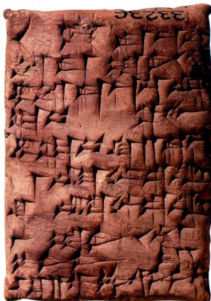

图2\.1 巴比伦的销售契约。约公元前1750年。这份契约清晰地展示了尖笔在柔软黏土上的印痕。西亚文物部，33236号。伦敦大英博物馆

> 材料与技法
> 
> 泥砖
> 
> 泥砖主要由当地的黏土制成。生黏土吸收水分，干后裂开。作为黏合剂，并且为了增加泥砖弹性、防止开裂，苏美尔的建筑工匠会在黏土中加入植物材料，例如稻草。制砖工人把这种泥土混合物压入木模，就能制出规格统一的长方形砖块。定形后，砖块就被磕出木模，在阳光下晒干。建墙时，建筑工匠用湿黏土把砖块黏合在一起。泥砖的缺点之一是不能耐久。所以苏美尔人会在重要的外墙上涂上黏稠的沥青，或者使用釉面砖（glazedbrick）。内墙墙面有时敷上灰泥。
> 
> 在今天，泥砖并不能激发人们多少想象力（比如像大理石那样），而且由于容易损坏，所以古代泥砖留存至今的寥寥无几，也就无法呈示苏美尔神庙曾经的模样。然而，新近的考古发现（comparanda），如摩洛哥阿特拉斯（Atalas）山脉以南位于埃本哈杜（Aït Ben Haddou）及其他地方的古城堡区（Kasbahs），显示了这种材料的惊人潜力。这些古城堡的建筑者利用泥砖的易塑性制造了独特的装饰效果，这种效果既是人为的，又与泥土的天然色调协调一致。与木制门窗相呼应的几何形设计也值得注意。这些城堡始建于公元16世纪，屡经修缮（最近的一次由联合国教科文组织出资），以消除风化造成的损害。当然，苏美尔神庙的形貌可能大不相同，但这些城堡仍然可以提醒我们，泥砖建筑是能够取得宏伟的效果的。

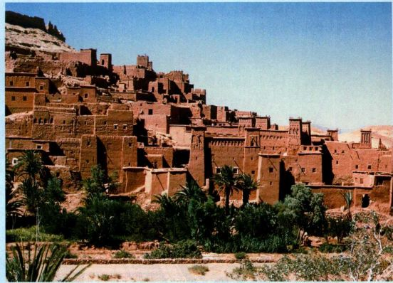

摩洛哥埃本哈杜的泥砖城堡

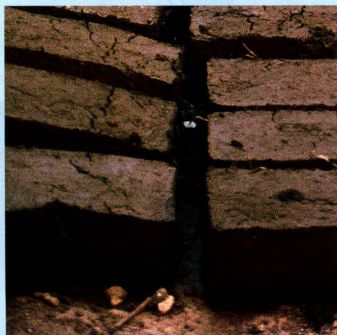

摩洛哥埃本哈杜的泥砖

反过来，他们又将自己劳动果实的一部分捐给神庙。（这一制度被称为神权社会主义。）

神庙建筑：连接天地

神庙是城市的建筑核心。优质石料极为稀少，因此苏美尔人使用的建筑材料主要是灰泥敷面的泥砖（见本页的材料与技法）。

学者们区分了两种不同的苏美尔神庙。“矮”神庙建在地面上，四个角通常朝向经纬上的基本方位。神庙分为三部分：中间是一个纵向的长方形内殿，两侧各有着一排房间，分别是行政室、祭司区和贮藏区。“高”神庙的基本特点与之相似，唯一不同的是有一个高于地面的平台；这些平台逐渐演变成低矮的阶梯式金字塔，称为塔庙（ziggurats）。一些塔庙的名字\-如巴比伦（Babylon）的巴别塔（Etemenanki），意为“自建庙宇，天地之间的纽带”\-表明，建造塔庙的目的可能是作为通往上天的桥梁或入口，祭司与神沟通的场所。

塔庙高约十二到十五米（如在瓦尔卡和乌尔的塔庙），起着类似于山陵的作用。对于苏美尔人而言，从平坦的平原上拔地而起的高山具有神圣的地位。塔庙将祭司带到神的近旁，而且水源由此流往谷地。在洪水泛滥时是避难所，象征着大地的生产力。实际上，苏美尔的母亲神就叫做山之女神（theLady of the Mountain）。重要的是，高神庙的高台使塔庙更加显眼了。美索不达米亚文献指出，“看”这个动作是至高无上的。若是看到一个物品并认为合乎自己的心意，神可能就会施恩于那位制造者。反之，建造者希望凡人看到他们的作品后表现出惊叹。最后，高神庙大概还有政治因素：从视觉上显示祭司与城中其他人的区别，从而强调并巩固了祭司的地位。塔庙和神庙区在苏美尔城市中占支配地位。

约公元前3500年，乌鲁克城（今天的瓦尔卡、《圣经》中的以力）通过交换剩余农产品而繁荣崛起，成

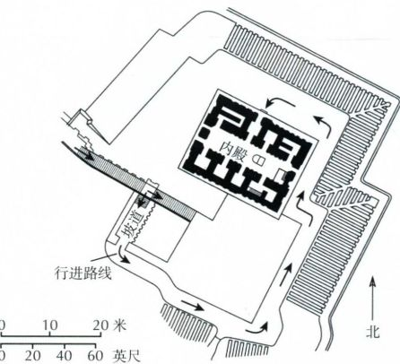
图2\.2 塔庙上的“白庙”遗址。约公元前3500\-前3000年，伊拉克乌鲁克（瓦尔卡）

图2\.3 塔庙上的“白庙”平面图（根据H．Frankfort的图绘制）

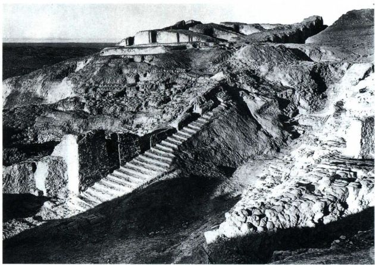

图2\.4 “白庙”内殿内部

为苏美尔文化中心。这里的神庙之一“白庙”因砖面粉刷成白色而得名，很可能是供奉苏美尔主神、天神阿努（Anu）的神庙（图2\.2）。神庙坐落在一个十二米高的土丘上，土丘是在古庙废墟的基础上砌砖建成，这表示，该地点本身就是神圣的（图2\.3）。凹凸的砖造结构清晰地勾勒出土丘的斜面。一系列阶梯和坡道绕着土丘逆时针上升，通向神庙北侧长边上的入口。这种迂回的通道是美索不达米亚神庙建筑的独有特征（和埃及典型的中轴通道形成对比），盘旋上升的路径模拟了朝拜者升入神界的过程。市民们还可以从三面目睹祭司和首领们攀登土丘的仪式\-只有这个精英集团才有权进入神庙。神庙上层结构的遗迹足以说明，在其中央有一个长方形大厅，称为内殿（cella），里面设有一个有台阶的祭坛，内殿外围是带有多道扶壁的厚墙（图2\.4）。沿着内殿的两条长边分布着几个较小的房间，形成了早期神庙典型的总体三分布局。

乌鲁克是传奇中的著名国王吉尔伽美什（Gilgamesh）的家乡，有史诗描写了这位国王的冒险经历。据这部史诗描述，吉尔伽美什修建了城墙和依南娜（Inanna）或伊斯塔尔（Ishtar）的神庙埃安纳（Eanna）。在埃安纳神庙区，考古学家发现了若干神庙，其墙壁饰有彩色石头或上色的黏土锥体，嵌入灰泥，组成镶嵌图案（见第25页的原始文献）。史诗描写了埃安纳神庙中闪闪发光的墙壁，称这些墙壁是用“窑烧的砖”建造而成。据称，吉尔伽美什把自己的故事刻在了一块石碑上\-这体现了叙事艺术在苏美尔文化中的重要性。

雕塑与镶嵌

乌鲁克白庙的内殿可能曾有一尊神像，现已佚失。

> 原始文献
> 
> 《吉尔伽美什史诗》
> 
> 《吉尔伽美什史诗》是最早的成文史诗之一，是用刻在泥板上的楔形文字存世。虽然现存最早的文本出自阿卡德时期的泥板，写于公元前2150年之后，但文本本身可回溯至约公元前2800年的苏美尔时期。史诗现存的部分讲述了乌鲁克国王吉尔伽美什的故事，他先是与野蛮人恩奇杜（Enkidu）交战，后来两人成为朋友。在朋友死后，吉尔伽美什出发去寻找一种战胜死亡的方法，但最终反而回到乌鲁克，接受了自己的死亡。节选部分是史诗开头的段落，描写了（与原文有出入）吉尔伽美什作为国王的功业。
> 
> 阿努赐予他一切学问。
> 
> 他看穿隐秘，发现藏珍，
> 
> 洪水未至，他先带来了信息。
> 
> 他跋涉千里，力尽筋疲，
> 
> 但终获平静。
> 
> 他把一切艰辛都刻入碑石，
> 
> 修筑起庇护所乌鲁克的城墙，
> 
> 也修筑起埃安纳神苑的高墙。
> 
> 瞧那外壁，铜一般光亮（？），
> 
> 瞧那内壁，什么也比不上！
> 
> 扶着那门槛石\-它是那么古色古香！
> 
> 走近埃安纳神庙，伊斯塔尔的家苑，
> 
> 它无与伦比，任凭后代的帝王俗夫！
> 
> 登上乌鲁克城墙，信步而游，
> 
> 察一察那地基，验一验那砖。
> 
> 那城墙（从里到外）难道不是窑砖砌成！
> 
> 那图纸难道不是七贤设计？
> 
> 乌鲁克城占去一平方里，棕榈园占去一平方里，
> 
> 低地也占去一平方里，那里是伊斯塔尔神苑的开阔地（？），
> 
> 它（城墙）围住了乌鲁克的三平方里和一片开阔地（？）。
> 
> 找到那放置石板的铜箱，
> 
> 打开它的青铜锁，
> 
> 解开它的暗扣，
> 
> 取出天青石板读一读，
> 
> 吉尔伽美什是怎样克服万难。
> 
> SOURCE:THE EPIC OF GILGAMESH, TR\. MAUREEN GALLERY KOVACS \(STANFORD, CA:STANFORD UNIV\.PRESS, 1989\)

但在乌鲁克属于依南娜的埃安纳庙中发现了一个约公元前3100年的女性头像，也许可以帮助我们了解神像的外观（图2\.5）。女性头像背面平整，脸部由白色石灰石雕成，细节部分曾添加了贵重材料：一顶金

图2\.5 《女性头像》	（Female Head）。约公元前3200一前3000年，伊拉克乌鲁克（瓦尔卡）。石灰石，高20\.3厘米。巴格达伊拉克博物馆（Iraq Museum）

制或铜制的假发，固定在头顶正中由上至下的隆起处，眼睛和眉毛皆由有色材料制作。虽然这些细节部分已经不复存在，但雕像并未丧失魅力：抽象的大眼睛和夸张的眉毛与脸颊的细腻造型形成了强烈对比。头像原本安在一个躯干上，推测躯干部分是用木头制成，完整的人像肯定接近真人大小。

阿斯马丘 大约在乌鲁克头像产生的五百年之后，雕塑工匠开始以石灰石、雪花石膏和石膏为材料制作人像，其范例是20世纪30年代在阿斯马丘（TellAsmar）的一座神庙中发掘的一组人像（图2\.6）。这些人像大小不等，高度从几厘米到76厘米，原本很可能是立在神庙内殿中的。也许在神庙重建或重新装潢时，人像被特意跟其他物品一起瘗埋在祭坛附近。其身份颇有争议：一些学者认为其中两尊较大的是阿布（Abu）及其妻子的神像。大多数学者则认为整组人像代表的都是供养人，他们把人像献给圣殿（sanctuary），希望永远陪伴在神明左右。其他地方发现的此类雕像甚至还刻有奉献者和神明的名字。

除一尊以外，这组人像全都以一种静止姿态站立着，双手交握于胸与腰之间。雕像明显是抽象风格：大部分男性立像以水平或锯齿形隆起表现长发和络腮胡；手臂从异常宽阔的两肩垂下；十指交叉，握住一个杯子；窄胸，向下逐渐变宽成阔腰；腿呈圆柱形。

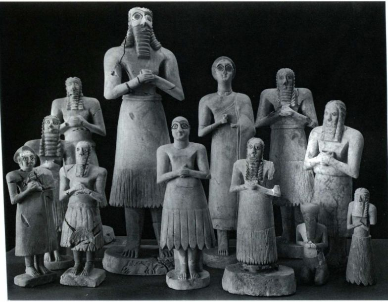

图2\.6 阿布神庙中的雕像。约公元前2700\-前2500年，伊拉克阿斯马丘。石灰石、雪花石膏和石膏，最高的雕像高约76\.3厘米。巴格达伊拉克博物馆和芝加哥大学东方学会博物馆

男像穿着饰有流苏的裙子，用一根腰带系住，下垂的裙摆形成僵硬的锥形，女像则身着及地的连衣裙。

人像的姿势和服饰都表现了苏美尔艺术的传统，这些传统被后来的美索不达米亚人采用。人像脸部最有特色，圆睁的眼睛占据了显著位置，嵌入的深色天青石和镶在沥青里的贝壳，以及在鼻梁上方相接的粗重眉毛，都使眼睛更加突出。人们极易透过染上基督教色彩的眼镜去研究这些人像及其他美索不达米亚雕塑，将放大的眼睛视为灵魂之窗。然而，这样一种解读误解了这些雕像所处的特定文化环境。学者们从现存的文献推断，“看”是与神交流的主要渠道，这些雕像睁大双眼，是在赞叹神明令人敬畏的力量。

乌尔的皇家墓地 美索不达米亚南部的苏美尔城市乌尔因其与《圣经》的关联而吸引着考古学家，但在20世纪20年代的发掘活动中，伦纳德·伍莱（Leonard Woolley）发现种类丰富的苏美尔文物的地点是乌尔的大规模墓地。墓地位于尼布甲尼撒二世所修的新城城墙之下，保存完好，包括一千八百四十多个公元前2600\-前2000年的墓穴。有些墓很简陋，而另一些则有坚固的地下结构和富丽豪奢的随葬品，为其赢得了“皇家墓穴”的称号，即使学者仍不确定墓穴主人究竟是王族、祭司还是其他精英集团的成员。最豪华的墓葬都附带有所谓的死人坑。其中最重要的是大死人坑（Great Death Pit），里面埋葬着七十四个士兵、仆役和乐师，他们显然是先被药麻醉，然后

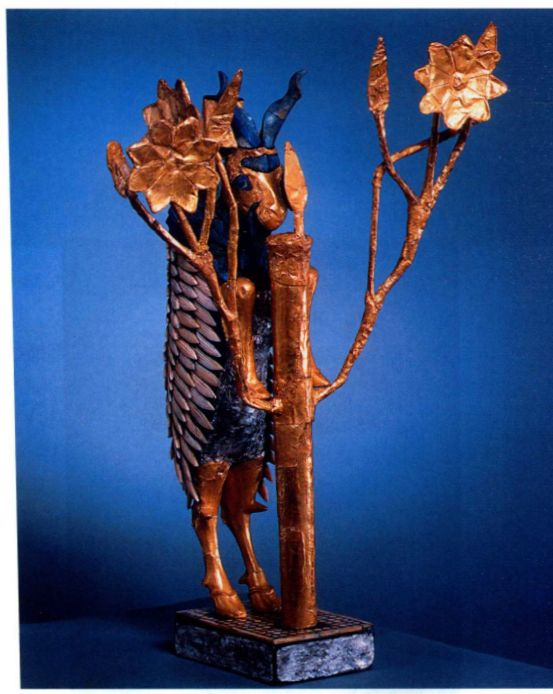

图2\.7 《丛林中的山羊（羊与树）》（Goat in Thicket［Ram andTreel），实物为一对，出土于乌尔皇家墓地大死人坑。约公元前2600年，伊拉克穆盖伊尔。木头、黄金和天青石，高50\.8厘米。费城宾夕法尼亚大学博物馆

放入坟墓中做了人牲。即使在死后，上流阶层仍保持着象征权势的服饰标志，并要求仆从继续为其服役。这些发现表明，苏美尔人可能相信有来世。

伍莱在皇家墓地发现了多种陪葬品，如兵器、首饰和器皿。许多陪葬品展现了苏美尔艺术家描绘大自然的高超技艺。其中有一对野山羊，用后腿直立起来，靠在一棵开花的树上，可能是用来放置敬神供品的架子（图2\.7）。作为主要材料的金箔包裹在树、山羊的头、腿和生殖器，以及从山羊背部竖起的一根圆柱形支柱上。山羊的身体和铜制双耳上点缀着贝壳碎片，配上羊角和颈部的天青石，显得更加完美。底座上是红色石灰石、贝壳和天青石组成的精致图案。圆筒印章上的图案说明，可能曾有一个碗或小碟子放置在

羊角和支柱上。这件雕塑作品结合了羊（献给塔穆兹［Tammuz］神）与精心排列的花朵（花饰献给依南娜），反映了苏美尔人对动植物生殖力的关注。

视觉叙事

在乌尔皇家墓地内发现的两件物品反映了美索不达米亚视觉叙事早期发展的概貌。约公元前2600年的《乌尔皇家旗》（Royal Standard of Ur）包括四块镶板，是在沥青中嵌入红色石灰石、贝壳和天青石制成，原本都套在一个木框里（图2\.8）。已经毁坏的侧板描绘的是动物活动的景象，而另外两块较大的镶板表现了一次军事胜利和一个庆祝活动或宗教宴会，每个画面都在上下叠置的三条画带（registers）中展开。在“战

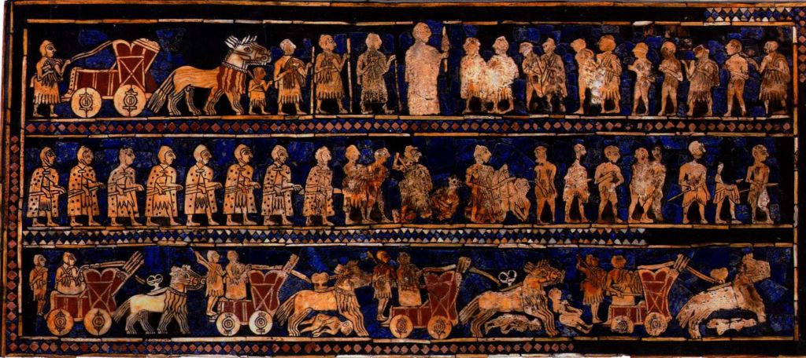

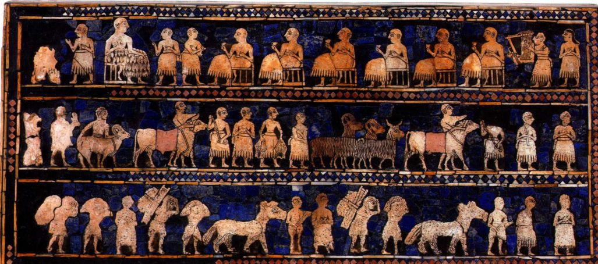

图2\.8《乌尔皇家旗》，正面和背面。约公元前2600年。木头，嵌有贝壳、石灰石和天青石，高20\.3厘米。伦敦大英博物馆

> 大事年表
> 
> 约公元前3500年\-苏美尔城市乌鲁克兴起
> 
> 约公元前2900年\-美索不达米亚人开始使用楔形文字
> 
> 约公元前2600年\-苏美尔的《乌尔皇家旗》

争”镶板中，底部画带表现了御者驾驭着由野驴拉的战车由左向右挺进，从敌人的尸体上辗过。在中部画带上，步兵在作战，押送被收缴兵器和衣物的战俘。在最上方的画带中，士兵们把战俘献给位于正中的一个人物，艺术家不仅通过他的位置，还通过他大于旁人的身量（一种名为神圣比例［hieratic scale］的方法）来显示这个人的重要地位；他的头甚至超出了画带的边框，充分强调了他的重要性。在“和平”镶板中，扛着战利品的人与野驴一起行进，中部画带描绘了为宴会准备的动物，而在最上方，宴会已经开始。一个弹竖琴的人和一个歌手在表演助兴，坐在宴席上的人和着乐声举起酒杯；画面左端一个较大的人物似乎是一位首领或国王，也许他就是“战争”镶板上的

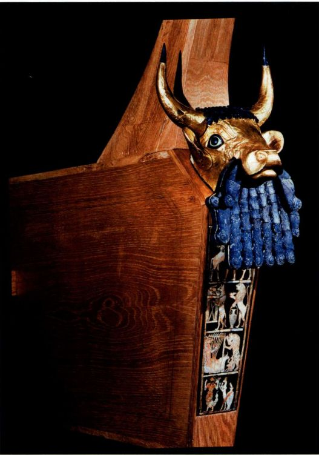

图2\.9 公牛竖琴，出土于普阿碧王后墓，伊拉克乌尔（穆盖伊尔）。约公元前2600年。木头，嵌有黄金、天青石、沥青和贝壳，重装在现代木支架中。费城宾夕法尼亚大学博物馆

那个大人物。所以镶板讲述了一个故事，当我们在人物动作的指引下一排排看过去时，故事情节就次第展开。画面中的形象虽然有动作，但他们都处于静态，这一点突出表现为各个人物之间相互分隔（一种断点处理）：他们的形象（一半正面、一半侧面）极少重叠。加上使用的材料色彩对比强烈，所以镶板上的故事即使从远处看来也清晰易辨。

在发掘出《乌尔皇家旗》之后，伍莱曾想象它是高挂在一根竿子上的军旗，并据此加以命名。事实上，这件物品的用途仍不确定；可能是一件弦乐器的音箱，这种弦乐器是墓葬中常见的陪葬品。在墓地最奢华的墓穴之一，“王后”普阿碧（Pu\-abi）之墓中，伍莱发现了一架竖琴，饰有用镀金和天青石制作的公牛头，其年代约为公元前2600年（图2\.9），可与“军规”上描绘的那架竖琴相比照。竖琴的音箱上有一块用贝壳嵌在沥青中制成的嵌板，以纹章式构图（heraldiccomposition）描绘了一个男性形象，他抱着两头人面公牛，正面朝向观者（图2\.10）。在下方的各个画带里，

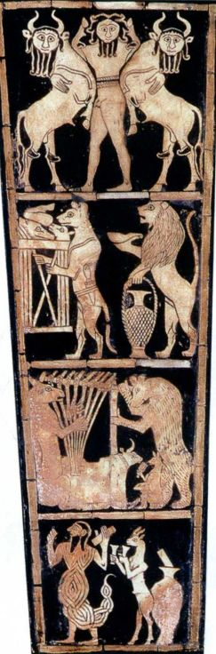

图2\.10 公牛竖琴音箱上的镶板，出土于伊拉克乌尔（穆盖伊尔）。

约公元前2600年。贝壳和沥青，3 J\. l × l 1\. 3厘米。费城宾夕法尼亚

大学博物馆

图2\.11《祭司喂神羊》

Feeding Sacred Sheep），出土于伊拉克瓦尔卡周边地区。约公元前3300年。圆筒大理石印章，高5\.4厘米，直径4\.5厘米。柏林国立博物馆，普鲁士文化遗产，近东博物馆

\(Vorderasiatisches Museum\)

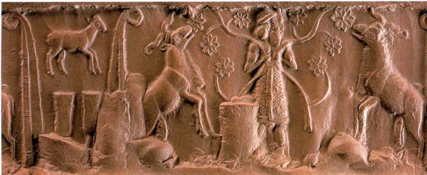

动物们做着人类的工作，如端食物和奏乐。这些场景可能会让现代人想到某个以书面或口头形式流传的神话或寓言，也许与丧葬有关。在一些文化中，奇形怪状的杂交生物有驱邪的（apotropaic）作用，能够驱走邪恶力量，例如那两头公牛和底部画面中那个身体像蛇一般缠成辫子的男人。

圆筒印章

美索不达米亚人还制作了大量圆筒印章，管理人员用来封住坛口和储藏室。这些印章呈一种圆筒状，通常由石头制成，中央有一个小孔贯穿两头。雕刻家在印章的曲面上阴刻图案，这样，将印章按压在柔软的泥土上时，就会出现凸起的反转图像，随着圆筒向前滚动，这个图案就会不断重复。大量印章和印画（印章的压纹）保存了下来，许多质量一般，表示其主要用于行政管理目的，但最精美的那些印章细节丰富，雕刻技巧达到了很高的水平。印章图案主题多样，从神界和皇家场景，到纪念建筑、动物和日常活动，提供了关于美索不达米亚生活方式和价值观念的重要信息。图例中的印章表现了喂食神庙畜群的场景，这些牲畜是神庙财产的重要组成部分（图2\.11）。图中人物颇具特色的服装和帽子也许表明了他是一位祭司国王；一些学者认为那些体积庞大的器皿与祭神供品有关，而且在乌鲁克的埃安纳神庙区发现了一个类似的瓶子，高度接近90厘米，制作于约公元前3200年。

阿卡德艺术

公元前2350年前后，苏美尔城邦开始交战，争夺水源和肥沃的土地。苏美尔城邦的社会组织逐渐转变，当地的“神的管理人”自命为统治一方的国王。其中豪杰试图通过征服邻邦来扩大自己的领土。在南方的许多地方，说闪米特（Semitic）语的民族（所用语言与希伯来语［Hebrew］和阿拉伯语［Arabic］同

属一个语系）逐渐取得统治地位。虽然他们吸收了苏美尔文明的许多特点，但他们较少受城邦传统的束缚。萨尔贡（Sargon，意为“真正的国王”）在约公元前2334年占领苏美尔，以及叙利亚北部和埃兰（Elam，位于苏美尔东面，见地图2\.1）。凭借萨尔贡以阿卡德城（Akkad，地点至今不明，但很可能位于苏美尔的西北方向，现在的巴格达附近）为大本营的势力，阿卡德语成了美索不达米亚的官方语言。萨尔贡的壮志宏图既关乎帝国，也关乎王朝。作为一个帝国的专制统治者，他将苏美尔神和阿卡德神集中在一个新的万神殿（pantheon）中，希望打破城邦与其本地神明之间的传统联系，并由此将这个地区统一在对他的个

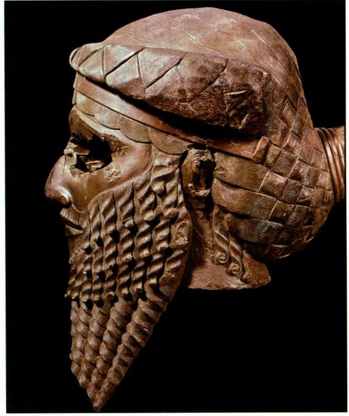

图2\.12 《阿卡德统治者头像》（Head of an Akkadian Ruler），出土于伊拉克尼尼微（库云吉克［Kuyunjik］）。约公元前2250\-前2200年。青铜，高30\.7厘米。巴格达伊拉克博物馆

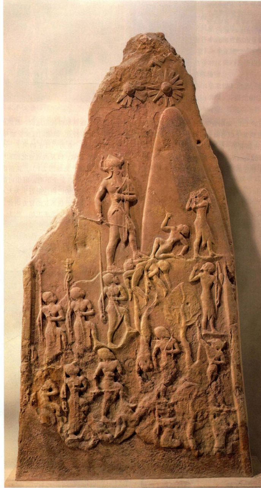

图2\.13 纳拉姆一辛石碑。公元前2254一前2218年在位。高2米。巴黎卢浮宫

人统治的忠诚之下。在他孙子纳拉姆一辛（Naram\-Sin，公元前2254\-前2218年在位）统治期间，阿卡德帝国的版图从南方的苏美尔扩展到东方的埃兰，后来又扩张到了西方的叙利亚和北方的尼尼微（Nineveh）。

雕塑：权力与叙事

在阿卡德人的统治下，视觉艺术越来越多地被用于确立和反映君主权力，这一作用也频见于艺术史上的其他时代。现存的此类阿卡德艺术品中最为突出的是一尊庄严的铜制头像，在尼尼微的一个弃物堆里被发现，制作年代为公元前2250至前2200年间，有时被认为是纳拉姆一辛本人（图2\.12）。脸部的非凡力量源于几个方面：正面观看的设计\-这种正面描绘（frontality）使它看起来恒久不变；对胡须和头发（梳理成苏美尔国王的发式）的抽象处理与平滑的肌肤形成对比，赋予头像一种令人难忘的简洁和强烈的对称感，象征着控制与秩序。头发和胡须复杂而清晰的纹路显示了金属工匠的中空铸造技术（见第124页的材料与技法）。此外，在一个冶金术尚未得到广泛了解的时代，将浇铸金属用于雕像制作，表明了赞助人控制着一种主要与兵器有关的技术。与其他现存雕像一样，这个头像的眼睛原本可能镶嵌着贵重和半贵重材料。头像可能是在公元前612年米底人（Medes）入侵尼尼微时遭到损坏的。敌人挖出了头像的双眼，砍掉了耳朵、鼻子和胡须下端，仿佛是在攻击头像所代表的那个人。许多文明，甚至是在当代，都会实施类似的破坏行为，这是象征性的暴力或抗议。

权力和叙事这两个主题在阿卡德城锡伯尔（Sippar）的一块石碑（stele，直立的纪念石碑）上结合起来，石碑高1\.98米，是在纳拉姆\-辛统治期间竖立起来的（图2\.13）。石碑上的高浮雕描写的是

> 大事年表
> 
> 约公元前2350年\-苏美尔城邦爆发战争，争夺水源和肥沃土地
> 
> 公元前2150年之后\-现存最早的写有《吉尔伽美什史诗》的阿卡德石板
> 
> 约公元前2100年\-由乌尔纳姆国王下令修建的乌尔大塔庙完工

纳拉姆\-辛征服美索不达米亚东部扎格罗斯（Zagros）山区民族鲁鲁比（Lullubi）的场景。这一次，故事不是分成多条画带来讲述的；浮雕上，一排排以复合视角呈现的士兵攀登着一座树木繁茂的高山。他们秩序井然的行军与敌人混乱的溃退形成了对比：当得胜的士兵们把倒地的敌人踩在脚下时，战败者或乞求饶恕，或躺在地上，身形因死亡而扭曲。在他们上方的是国王，他的高大身材和中央位置清楚地表明其尊贵身份。在背景的衬托下，他卓然独立，站在一个山峰旁，暗示着与神明接近。他那带角的王冠以前是神明独有的饰物，因此他是第一个神化自己的美索不达米亚国王（他的人民并非一致拥护这一举动）。肌肉发达的四肢和充满力量的姿势将他塑造为一个英雄式人物。众太阳神当空照耀，似乎在见证他的胜利。

纳拉姆\-辛石碑在一千多年后仍然传达出权力的寓意。公元前1157年，伊朗西南部的埃兰人（Elamites）入侵美索不达米亚，抢占了这块石碑，当作战利品。石碑上的一条铭文记载着，埃兰人将这块石碑安置在了苏萨（Susa）城中（见地图2\.1）。通过夺取战败城市的纪功碑，他们俨然获得了纳拉姆一辛曾经的荣耀，加倍地挫败了他们的敌人。

新苏美尔复兴

东北部的山地民族古提（Guti）夺取了美索不达

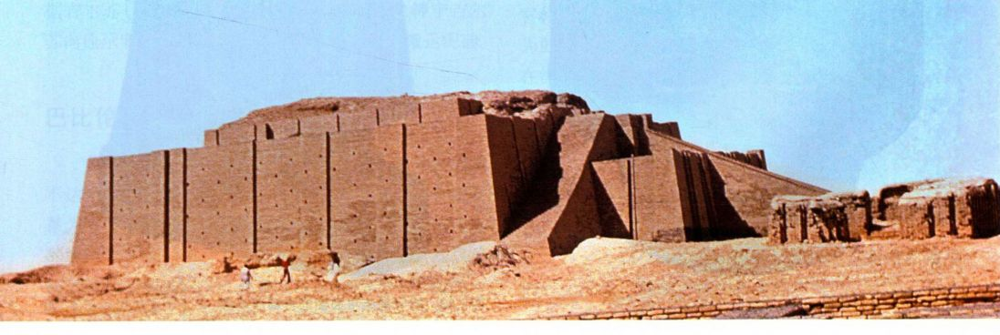

图2\.14 乌尔国王乌尔纳姆的大塔庙。约公元前2100年。伊拉克穆盖伊尔

> 原始文献
> 
> 拉加什及周边地区出土的古蒂亚雕像铭文，约公元前2100年
> 
> 拉加什统治者古蒂亚下令修建了大量神庙，还下令制作了许多他自己的雕像放在神庙里，许多雕像（对比图2\.15和2\.16）有用楔形文字篆刻的铭文，使人们对每个雕像的用途有深入了解。
> 
> 在这个节选部分中，宁吉尔苏神对古蒂亚讲话，鼓励他重修自己的神庙：		
> 
> 噢，忠心的牧羊人古蒂亚，
> 当你开始为我修造我的皇宫埃宁努（Eninnu）时，
> 我将从天上召来一股微风，
> 它会自上苍给你带来富足，
> 在你治下，
> 这个国家将得到大量财富。
> 我的宅邸奠基之日，
> 就是繁荣降临之时。
> 广袤的原野都将为你长出果实；
> 沟渠和运河都将为你而满溢；
> 在不常涨水的地方，
> 水将为你上涨到高地。
> 在你治下，将有丰足的油流入苏美尔，
> 在你治下，将有沉甸甸的羊毛产出。
> 
> SOURCE:H\. FRANKFORT,THE ART AND ARCHITECTURE OF THE ANCIENT ORIENT\. 4TH ED\. \(NEW HAVEN:YALE UNIVERSITY PRESS,1970,P\.98\)\.

米亚平原，阿卡德国王的统治就此终结。苏美尔城市奋起报复，公元前2112年，在乌尔（今天的穆盖伊尔［Muqaiyir］市，亚伯拉罕的出生地）的乌尔纳姆（Urnammu）国王领导下，他们赶走了入侵者。乌尔纳姆国王将苏美尔语重新确立为国语，他建立的统一王国后来延续了一百年。作为复兴计划的一部分，他还恢复了修建宏大建筑的传统。

建筑：乌尔的塔庙

乌尔纳姆的遗产包括建于约公元前2100年的乌尔的大塔庙，是供奉月神，苏美尔的南娜（Nanna，即阿卡德语中的辛［Sin］）的神庙（图2\.14）。基座

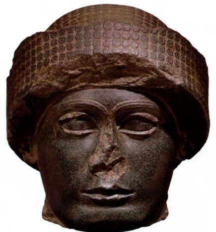

图2\.15 古蒂亚头像，出土于伊拉克拉加什（泰洛赫）。约公元前2100年。闪长岩，高23\.18厘米。波士顿美术馆，Francis Bartlett 赠品第1912\.26\.289号

长58米，宽40米，高15米，分为三层，有台阶相连。基座用坚硬的泥砖建成，表面是沥青固定的烧制砖块，沥青在这里用作黏合物。厚厚的扶壁（buttress，垂直的支撑结构）虽然没有实用性，却使墙连成一体，给人坚强有力的感觉。而且，四面八方大量向上延伸的线条为建筑的外表增添了活力。重新修葺过的三道阶梯都通向神庙的入口，入口已经经过加固。每道阶梯都有一百级台阶，其中一道与神庙垂直，另外两道与

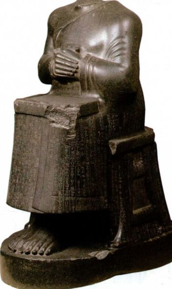

图2\.16 持有神庙平面图的古蒂亚坐像，出土于伊拉克吉尔苏（泰洛赫）。约公元前2100年。闪长岩，高约73\.66厘米。巴黎卢浮宫

基座墙平行。从入口处起，第四道阶梯（已毁）向上通往业已损毁的神庙主体。这些阶梯可能曾为仪式的行进队伍提供了气势雄伟的背景。现存的地基面积不够大，因此无法重修塔庙上层的建筑。

雕塑：古蒂亚雕像

在乌尔纳姆统治乌尔的同一时期，古蒂亚（Gudea）成为其邻邦拉加什（Lagash，现在的伊拉克）的统治者，拉加什是阿卡德帝国瓦解保持独立的苏美尔小城邦之一。谨慎的古蒂亚将国王头衔留给了拉加什的城市之神宁吉尔苏（Ningirsu），并借由重建宁吉尔苏神庙的宏伟工程促进了民众宁吉尔苏的崇拜。据铭文记载，古蒂亚梦见宁吉尔苏命令他在底格里斯河不上涨之后修建神庙。

这一建筑现已荡然无存，但有大约二十尊古蒂亚雕像保存了下来，他将这些雕像进献给了这座神庙和拉加什及其邻近地区的其他庙宇（图2\.15和2\.16）。这些雕像标志着他的虔诚，延续了颂扬国王的阿卡德传统。这些雕像是由一种罕见而昂贵的石料闪长岩雕成，加工十分困难，因此可以证实古蒂亚拥有巨大财富。无论是立姿还是坐姿，雕像外表都非常一致：身穿单肩长袍，通常头戴一顶厚厚的羊毛帽，双手交叉于身前，姿势类似于五百年前的阿斯马丘雕像。与阿斯马丘雕像一样，古蒂亚像也是双眼大睁，满怀敬畏。高度抛光的表面和精确的形貌令光线勾勒出人物的特征，显示了雕刻者的精湛技艺。圆润的线条强化了雕像的简洁，赋予雕像令人难忘的不朽力量。

图2\.16中那个真人大小的古蒂亚坐像的膝盖上放着神庙底层的平面图。雕像上的铭文显示，为了确保神庙的神圣，国王必须谨遵神谕。这些铭文还解释了古蒂亚修建神庙的动机：服从了神，他就能给自己的城市带来好运（见第32页的原始文献）。于是国王净化城市，扫去神庙基址上的土，露出岩床。然后，他根据吉尔苏（Girsu，现在的泰洛赫［Telloh］）之神宁吉尔苏向他示明的意旨来设计神庙，并参与制作和搬运泥砖。

巴比伦艺术

公元前第三个千年末期和第二个千年初期，美索不达米亚动荡不安，因为城邦交战，而这些战争主要是为了夺取航道。后来，这个地区在一个巴比伦王朝的统治之下统一了三百多年。在该王朝最著名的汉谟拉比（Hammurabi，公元前1792\-前1750年在位）统治期间，巴比伦城承担了以前由阿卡德和乌尔扮演的支配角色。汉谟拉比既英勇又崇拜苏美尔传统，他

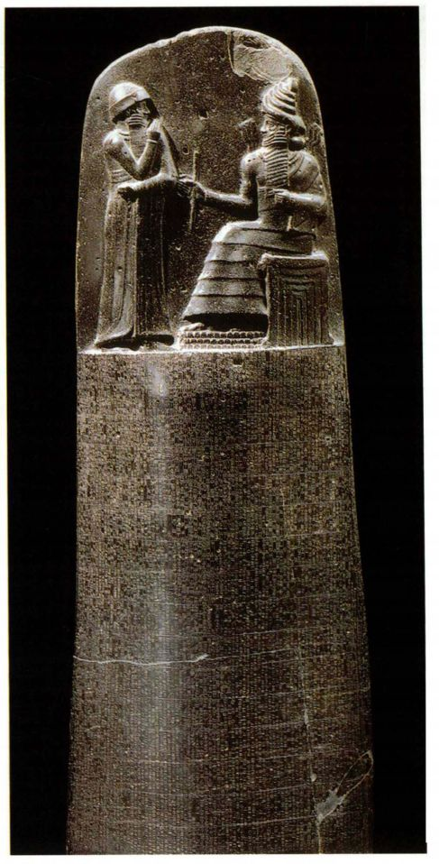

图2\.17 刻有《汉谟拉比法典》的石碑的上部。约公元前1760年。闪长岩，石碑高约2\.1米，浮雕高71厘米。巴黎卢浮宫

自命为太阳神沙玛什（Shamash）“心爱的牧羊人”，宣称他的使命是“让正义普照大地，摧毁卑劣和邪恶，为的是强者不能压迫弱者，弱者也无法烦扰强者”。在汉谟拉比及其继任者的统治下，巴比伦成为苏美尔文化中心，在其政治势力衰退之后，巴比伦的声望仍然维持了千年之久。

《汉谟拉比法典》

汉谟拉比最著名的是他颁布的法典，即《汉谟拉比法典》（The Code of Hammurabi）。这是现存最早的成文法律，刻在一块2米多高的黑色玄武岩石碑上（图2\.17）。与纳拉姆一辛石碑一样，汉谟拉比石碑也被埃兰人掳去了苏萨城。法典正文有三千五百行阿

> 原始文献
> 
> 《汉谟拉比法典》
> 
> 法典刻在图2\.17中的汉谟拉比石碑上，由汉谟拉比国王编纂而成，使我们能够一窥公元前第二个千年巴比伦人的生活和价值观。
> 
> 序言
> 
> 阿努那克（Anunaki）之王，至大之阿努，与决定国运之天地主宰贝尔（Bel），授予正义之神埃亚（Ea）之长子马尔杜克以统治全人类之权，表彰其于伊极极（Igigi）之中，以其庄严之名为巴比伦之名，使之成为万方之最强大者，并将其建成一个其根基与天地共始终之不朽王国；当这时候，阿努与贝尔命令我，荣耀而畏神的君主汉谟拉比，发扬正义于世，灭除不法邪恶之人，使强不凌弱，使我有如沙玛什，昭临黔首，光耀大地，增进人类福祉······
> 
> 汉谟拉比法典（节选）
> 
> 倘自由民控另一自由民犯罪，则被控者应行至于河而投入之。倘彼沉没，则控告者可占其房屋；倘河证其无罪而彼无恙，则控告者应处死，投河者取得控告者之房屋······
> 
> 自由民提起诉讼于长者之前，而所述无从证实，倘所控为死罪，则控告者应处死······
> 
> 自由民窃取寺庙或宫廷之财产者应处死，而收受其赃物者亦处死刑······
> 
> 自由民窃取牛，或羊，或驴，或猪，或船，倘此为神或宫廷之所有物，则彼应科以三十倍之罚金；倘此为国王之自由民所有，则应科以十倍之罚金；倘窃贼无物以为偿，则应处死······

> 自由民侵犯他人之居（以偷窃）者，应在此侵犯处处死并掩埋之······
> 
> 倘自由民怠于巩固其田之堤堰，而因此堤堰破裂，水淹（公社之）耕地，则应售卖堤堰发生破裂之自由民，卖得钱款应赔偿其所毁损之谷物······
> 
> 倘自由民于旅途中将银、金、宝石或任何动产交付另一自由民，并望取回此物，而此受托者未将所托之物带至指定之地，而私用之，则托物之主应检举其不交所托之物之罪，此自由民应按全部交彼之物之五倍以为偿······
> 
> 倘自由民意图离弃曾为之生子之妾，或曾为之生子之妻，则应将此女之嫁妆归还，并划予其部分田园及（动）产使用权，使其能抚养子女。至其已将子女抚养成人，则应就给予其子女之全部财产中，以相等于一继承人之一份予之，而后其可嫁与所喜爱之夫······
> 
> 倘子殴其父，则应断其手。
> 
> 倘自由民损毁他人之眼，则应毁其眼。
> 
> 倘彼折断他人之骨，则应折其骨。
> 
> 倘建筑工匠为自由民建屋不当，致其所建房屋倒毁，房主因而致死，则此工匠应处死。
> 
> 倘房主之子因而致死，则此工匠之子应处死。
> 
> 倘房主之奴因而致死，则此工匠应以奴还奴。
> 
> SOURCE:WORLD CIVILIZATIONS ONLINE CLASSROOM "THE CODE OF HAMMURABITRANSLATED BY L\. W\.KING\(1910\)\.EDITED BY RICHARD HOOKER WWW\.WSU\.EDU:8080/2DEE\.© 1996\.
> 
> 注：《汉谟拉比法典》结语在第230页。

卡德楔形文字，开头记述了汉谟拉比复原的那些神庙。最主要的内容是商业事务和财产法、对家庭争端的裁决以及人身伤害问题，详述了对违法者的惩罚（包括《旧约》中著名的“以眼还眼”原则，见本页的原始文献）。文本的结尾是一篇歌颂和平缔造者汉谟拉比的赞歌。

石碑顶部的浮雕中，汉谟拉比站在王座上的沙玛什面前，单臂抬起，表示问候，沙玛什的双肩放射出阳光。太阳神伸出一只手，手中握着象征王权的绳圈和量杆；仅这一个姿势，就把画面构图和两位主要人物所暗示的意图统一起来了。这件雕刻是圆筒印章上的“引见情景”的一个变体，在“引见情景”中，一个凡人虔诚地抬起手臂，在一位女神的引领下来到一个坐着的似神的人物跟前，凡人接受赐福。虽然汉谟拉比是祈求者，但他没有表现出受惠于神\-或有求于神\-的样子，这暗示了他与太阳神异常亲密的关系。虽然这件作品晚于古蒂亚雕像四个世纪，但两者在风格和技法上关系密切。异常高起的浮雕使得雕刻者能够立体地刻画眼部，制造出汉谟拉比和沙玛什凝神对视的效果。这件雕刻也沿用了阿卡德浮雕的手法，如复合视角的运用。但汉谟拉比与坐着的神比较而言，身形较为矮小，表明了他的身份是“牧羊人”，而不是神。浮雕构图对称，表面光滑，清晰地传达了神授权力这一意象，与美索不达米亚的传统完全一致。

亚述艺术

约公元前1595年，巴比伦被建国于安纳托利亚（现代的土耳其）的赫梯人（Hittites）征服。赫梯人随即就离开了，把削弱了的巴比伦国留给其他侵略者：来自西北的加喜特人（Kassites）和来自东方的埃兰人。虽然在伊辛王朝（Isin）的尼布甲尼撒一世（Nebuchadnezzar1，公元前1125\-前1104年在位）领导下，一个新的巴比伦王朝崛起并变得强大，但到了这个千年之末，亚述人（Assyrian）还是差不多控制了美索不达米亚南部。他们的大本营是亚述（Assur）城邦，以阿舒尔（Ashur）神命名，坐落在底格里斯河上游。

图2\.18 萨尔贡二世城堡复原线描图，伊拉克德尔\-

沙鲁金（豪尔萨巴德）。约公元前721\-前705年。

根据Charles Altman的图绘制

帝国艺术：表现皇权

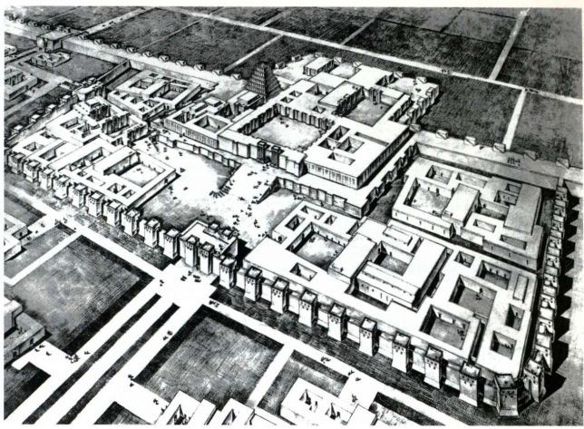

例的规模，张扬地表现出皇室的影响和主宰地位。

由阿舒尔\-乌巴利特（Ashur\-uballit，公元前1363\-前1328？年在位）开始，在一系列英明统治者的领导下，亚述王国不断扩张，最终覆盖了美索不达米亚及其周边地区。在公元前7世纪，处于鼎盛时期的亚述帝国从西奈半岛一直延伸至亚美尼亚；甚至还在约公元前670年成功地入侵埃及（见地图2\.1）。亚述人大量利用苏美尔人和巴比伦人的艺术成就，但根据自己的目的做出改造。他们的艺术显然是一种帝国艺术：具有宣传性和公共性，目的是宣扬和维持亚述文明的至高地位，尤其是表现帝国的军事力量。亚述人按照苏美尔的模式建造神庙和塔庙，但他们的建筑重心转移到了皇宫上。这些宫殿渐渐形成了史无前

亚述皇权的表现远在宫殿之外就已经开始，我们可以从德尔\-沙鲁金城（Dur Sharrukin，今天伊拉克的豪尔萨巴德［Khorsabad］）的规划图中看到这一点，萨尔贡二世（Sargon II，公元前721\-前705年在位）的皇家住地就在城中（图2\.18）。城市大部分仍未经发掘，占地近2\.6平方公里，外围是一道雄伟的泥砖防御墙。要到达皇宫，必须先穿过城市，通过露天市场并走过宽阔的坡道。在西北面，一座带有墙和角楼的堡垒将塔庙和皇宫围在中间，与城市其他部分隔开，强调了其支配地位。塔庙和皇宫都矗立在一个15米高的土丘上，使其高于洪泛平原，表现了国王高于社会其他阶层的地位。塔庙有至少四个高台，每个大约5\.5

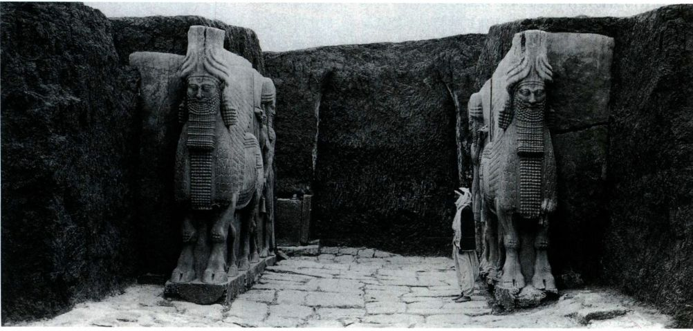

图2\.19 萨尔贡二世城堡大门，德尔\-沙鲁金（照片拍摄于发掘期间）。公元前742一前706年。（豪尔萨巴德），伊拉克

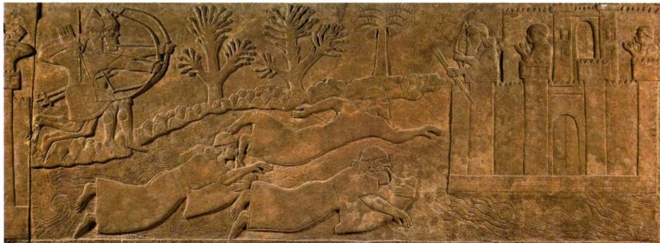

图2\.20 《逃亡者渡河》

\(Fugitives CrossingRiter\), 出自亚述纳辛巴二世的西北宫，伊拉克尼姆鲁德（卡拉哈）。约公元前883\-前859年。雪花石膏浮雕，高约98厘米。伦敦大英博物馆

米高，颜色各不相同，一道坡道沿高台四周盘旋而上。将神庙围在皇宫内，彰显了国王与神之间的特权关系。

皇宫建筑群由大约三十个庭院和二百个厅堂组成，不仅规模庞大，还记录了一些不朽的形象。在宫殿各个大门都立着巨大的、令人敬畏的守卫者雕像，称作拉玛苏（lamassu），就是长有翅膀的人首公牛（图2\.19）。插图是19世纪40年代在发掘中发现的一对豪尔萨巴德的拉玛苏；后来石匠们把其中一个锯成小块，运往巴黎的卢浮宫。这些巨大的怪物近乎为圆雕，但从侧面可以看到第五条腿，表明雕刻者原本的构想是在石块两面采用高浮雕，为的是雕像无论从正面还是侧面都可以看得清楚。雕像用石灰石雕制而成，从某种意义上说，是一种建筑雕塑。据文字记载，拉玛苏也有用青铜铸造的，但后来都被熔毁了，所以没有一件留存下来。拉玛苏头戴高耸的角状头饰，眼窝深陷，腿部和躯干上的肌肉在胡须和羽毛的精细纹样的衬托下更显孔武有力。这些雕像高高地俯临于来朝者之上，体现了国王令人畏惧的权威。亚述人可能相信人兽混合的生物具有驱赶恶灵的力量。

一踏入皇宫，就能看到亚述建筑的另一个特点：被称为竖石板（orthostats）的直立石膏板由建筑师安在矮墙边沿。从结构上看，石膏板能保护泥砖免于潮

湿和磨损，但也起着传递信息的作用。竖石板表面的浅浮雕是叙事性图像，在一些地方涂有彩色以示强调，这些图像用刻画入微的皇家花园猎狮和军事征服场面（附有铭文提供补充信息）来赞美国王。亚述军队不知疲倦地向前挺进，在帝国边境遭遇敌人，他们摧毁敌人的要塞，带走战利品和战俘。这些行动都发生在一个连续的长带中，促使观者一个个画面看过去，相同画面的重复制造了一种亚述人必胜的印象。插图所示的细节部分（图2\.20）来自尼姆鲁德（Nimrud，古代的卡拉［Kalah］，《圣经》中的卡拉哈［Calah］，在今天的伊拉克）的亚述纳辛巴二世（Ashurnasirpal II，公元前883\-前859年在位）皇宫，画面中，敌人为逃避一支先头部队的追赶，利用充气兽皮渡河。在设防的城市中，一名弓箭手\-可能是国王\-和两个女人在观望，他们激动地举起了双手。风景与人物穿插在一起，但艺术家没有表现相对比例或从一个视角来描绘所有元素。这表示，画面的主要目的是通过细节刻画来叙述具体的征服敌人的过程，写实并不是重点。

与在埃及一样（见第三章的讨论），皇家猎狮是在皇宫场地上进行的活动。动物从笼子里放到一个由持盾军队围成的方形场地上。以前的美索不达米亚统治者猎杀狮子是为了保护臣民，但到了亚述时代，

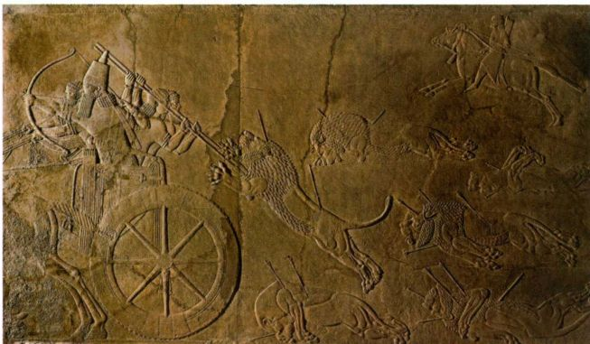

图2\.21 猎狮浮雕，亚述巴尼巴在位时期。

约公元前645年。伦敦大英博物馆

这项活动的象征意义已大大超过其实际意义，展示了国王的力量，是勇武的象征。亚述浮雕最著名的片断之一来自尼尼微的亚述巴尼巴（Ashurbanipal，公元前668\-前627年在位）的北宫，年代大致为公元前645年（图2\.21）。国王乘着战车前进，他开弓搭箭，所到之处留下或死或伤的狮子。当侍从们把长矛刺进一头受伤的狮子的胸口，狮子跃向战车，身体奋力扑向前，形成一条优美的斜线；伸出爪子，大张着嘴，仿佛痛苦中夹杂着孤注一掷的凶猛。显然，雕刻者把猎物高贵化了，被杀的动物身形无力地扭曲着，与那头跃起的狮子和国王一行旺盛的精力形成对比。但我们不应就此下结论说艺术家是想激起人们对猎物的同情心，或是想批评这种捕猎仪式的残忍；更为可能的是，通过把狮子高贵化，雕刻者更有力地对征服狮子的人\-国王\-进行了赞美。

晚期巴比伦艺术

一直处于威胁之中的亚述帝国在公元前612年走到了尽头，那一年，尼尼微被米底人（一个来自伊朗

> 大事年表
> 
> 约公元前1792\-前1750年\-汉谟拉比统治巴比伦
> 
> 约公元前1595年\-赫梯人攻占巴比伦
> 
> 约公元前668\-前627年\-亚述人建造亚述巴尼巴北宫

西部的印欧语民族）和复兴的巴比伦人攻陷。在迦勒底（Chaldean）王朝的统治下，古老的巴比伦城在公元前612\-前539年达到最后一次短暂的繁荣，这之后，被波斯人（Persians）占领。晚期巴比伦统治者中最著名的是尼布甲尼撒二世（Nebuchadnezzar II，公元前604\-约前562年在位），他是《圣经》所载巴别塔（Tower of Babel）的建造者，巴别塔高达82米，已经成为自负骄傲的象征。他还修建了著名的巴比伦空中花园（Hanging Gardens of Babylon），这些花园到了公元前2世纪已被认为是古代世界奇迹之一。

皇宫

巴比伦的皇宫规模几乎与亚述皇宫相当，有五个巨大的庭院，庭院四周有无数朝房。皇宫装潢方面，晚期巴比伦人使用了制成各种不同形状的烧制釉面砖，

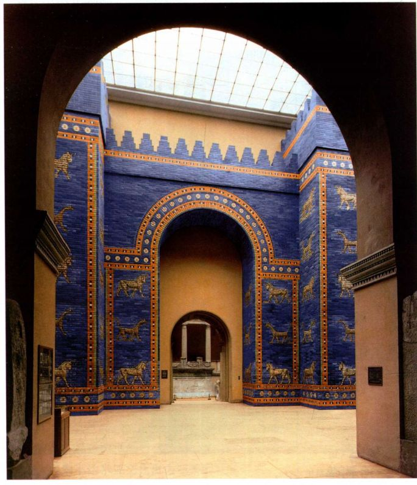

图2\.22 伊斯塔尔门（复原），出土于伊拉克巴比伦。约公元前575年。釉面砖。柏林国立博物馆，普鲁士文化遗产，近东博物馆

而不是在建筑表面覆以雕刻的石块。上釉就是把一层釉料涂在砖面上。晚期巴比伦人既用釉面砖来装饰建筑表面，也大规模用于浮雕。

在王座室（Throne Room）面向庭院的正立面（facade），通向伊斯塔尔门（Ishtar Gate）的行进大道以及现在在柏林重新组装起来的伊斯塔尔门上，都能看到釉面砖的强烈色彩效果（图2\.22）。在深蓝色背景上，一个由公牛、龙及其他动物组成的行进队伍被围在色彩明丽的饰带组成的边框之中，釉面砖令这些动物更加醒目。画面中描绘的动物是神圣的：白色和蓝色的蛇颈龙是巴比伦主神马尔杜克（Marduk）的圣兽；长着蓝毛的黄色公牛是暴风雨之神阿达德（Adad）的圣兽；白色和黄色的狮子是爱情与战争女神伊斯塔尔本人的圣兽。与高大强壮的拉玛苏不同，这些圣兽外形轻巧，动态灵活，在队列中跨步行进，伴随仪式队伍缓缓走向大门的拱形门洞。

近东地区性艺术

除了前后相继的美索不达米亚文明以外，各种其他文明也在两河之外的地区发展起来。其中一些民族亦曾侵略或征服了同时代的美索不达米亚文明，例如

北方的赫梯人和东方的伊朗人。其他民族，如西面地中海沿岸善于航海的腓尼基人（Phoenicians），与美索不达米亚文明进行贸易，在此过程中，他们把美索不达米亚视觉艺术形式传播到非洲和欧洲。他们的物质文明反映出与美索不达米亚传统的联系。

赫梯人

公元前1595年巴比伦灭亡与赫梯人有关。赫梯人是印欧语民族，很可能于公元前第三个千年末期从俄罗斯南部进入安纳托利亚（今天的土耳其），并在这个多石的高原上定居，成为在美索不达米亚之外发展起来的几个独立文明之一。公元前1800年左右，他们成为一个强国，一百五十年之后，在哈图西里一世（Hattusilis I）统治下，赫梯帝国迅速扩张。赫梯人接触美索不达米亚传统后，将楔形文字用于书写自己的语言，把本民族历史详细记录在泥板上。除了入侵美索不达米亚，赫梯人建立的帝国还覆盖现在属于土耳其和叙利亚的大部分地区，这使他们与埃及的帝国野心发生了冲突。赫梯帝国于公元前1400\-前1200年达到鼎盛。首都哈图沙（Hattusa）位于今天土耳其博阿兹科伊（Bogazköy）村附近，用该地富产的不规则巨石建成的防御工事保卫着国都。城市入口

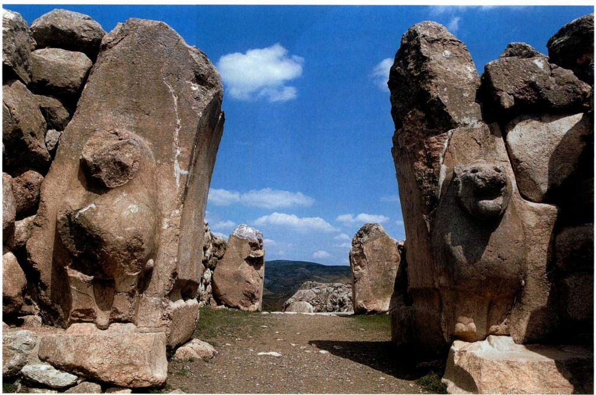

图2\.23 狮子门。约公元前1400年。安纳托利亚（土耳其）博阿兹科伊

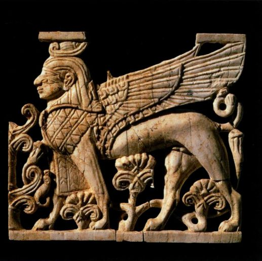

图2\.24 刻有一头有翼狮身人面兽的象牙饰板。腓尼基时期，约公元前8世纪。发现于伊拉克北部尼姆鲁德（古代的卡胡［Kalhu］）的萨尔玛那萨尔要塞。大英博物馆

两侧有巨大的石灰石狮子像和其他守卫者雕像，突出于门侧柱的石块（图2\.23）。博阿兹科伊的狮子门高2\.1米，虽然受到了严重的侵蚀，这些雕像的正面姿态和凶猛气势仍然给人以深刻印象。后来的亚述拉玛苏（见图2\.19）可能就是受到了这些守卫者雕像的启发。

腓尼基人

腓尼基人也为近东艺术贡献了独特的作品。公元前第一个千年中，他们居住在地中海东岸现为黎巴嫩的地区，逐渐拥有了强大的航海技术，因此可以在地中海偏西发现居住地（尤其是在北非海岸和西班牙）。他们成了东西方之间商品贸易和文化交流的枢纽和积极参与者。腓尼基人尤其擅长加工金属和象牙，在这些工艺品中结合埃及和地中海东岸的元素，他们还擅长制作彩色玻璃。插图中透孔镂刻的象牙饰板制作于公元前8世纪，发现于亚述首都尼姆鲁德的萨尔玛那萨尔（Shalmaneser）要塞，可能是被得胜的亚述王作为战利品带走的（图2\.24）。象牙饰板刻画了一个生有双翼的埃及狮身人面兽，虽然假发、围腰布以及惯用的植物等细节都属于埃及风格，但其双重王冠作了简化，以便能够规整地嵌合于饰板之中，这表明重要的是“埃及式”特质，而不是对埃及母题（motif）的精确描绘。通过匀称的外形和侧面构图，埃及主题被转化为美索不达米亚文化更为熟悉的视觉形式。

> 大事年表
> 
> 公元前1400一前1200年\-赫梯帝国的鼎盛时期
> 
> 公元前612年\-尼尼微被米底人和复兴的巴比伦人攻陷；亚述帝国终结
> 
> 约公元前604\-前562年\-晚期巴比伦统治者尼布甲尼撒二世在位约公元前575年\-巴比伦人建造伊斯塔尔门

伊朗艺术

美索不达米亚东面的伊朗从新石器时代起便有人居住，大约始于公元前7000年，那时伊朗是一个繁荣的农业中心。在那个时期，伊朗成为从亚洲大草原北迁以及从印度东徙的必经之路。古代伊朗艺术虽然独特，但也反映出许多与美索不达米亚文化的交叉。

早期伊朗艺术

来自该地区的一件艺术品是图2\.25中约公元前4000年的无柄陶杯，出产于绍尔河（Shaur River）边苏萨的一个陶器生产中心。淡黄色黏土制作的薄薄杯体上以褐色釉彩绘制了一头大角野山羊，大角野山羊

图2\.25 彩绘陶杯，出土于苏萨。约公元前5000\-前4000年。高28\.3厘米。巴黎卢浮宫

的外形被简化成几条夸张的大半径曲线。羊角组成的圆形在二维平面上反映出酒杯的三维圆筒形状。大角野山羊上方奔跑的猎犬被拉伸为水平的条纹，而杯口下方的垂直线条是许多只鸟被拉长的脖子。这个早期伊朗艺术的范例展示了陶匠在制作酒杯和设计图案方面的技艺，预示了后来伊朗和中亚游牧艺术对动物造型的喜爱。

早期游牧部落没有留下任何永久性的建筑或记录，但他们的随葬品显示出他们游牧区域的广袤\-从西伯利亚到中欧，从伊朗到斯堪的那维亚。这些随葬品由木头、骨头或金属制成，有共同的装饰元素，包括以抽象和装饰方式表现的动物主题，属于独特的便携艺术品，被称为游牧民用具，包括各种器皿、兵器、马笼头、扣环、搭扣（fibulae，大的钩环或别针）以及其他饰物。

波斯帝国：美索不达米亚传统的世界继承人

公元前6世纪中叶，整个近东逐渐被下美索不达米亚以东的小国帕尔萨（Parsa）控制。在阿黑门尼德（Achaemenid）王朝的统治者居鲁士大帝（Cyrus theGreat，公元前559一前530／529年在位）的领导下，波斯人推翻了米底人的国王，随后于约公元前547或546年占领了小亚细亚的大部分地区，于公元前538年征服巴比伦。居鲁士取得了“巴比伦之王”的头衔，

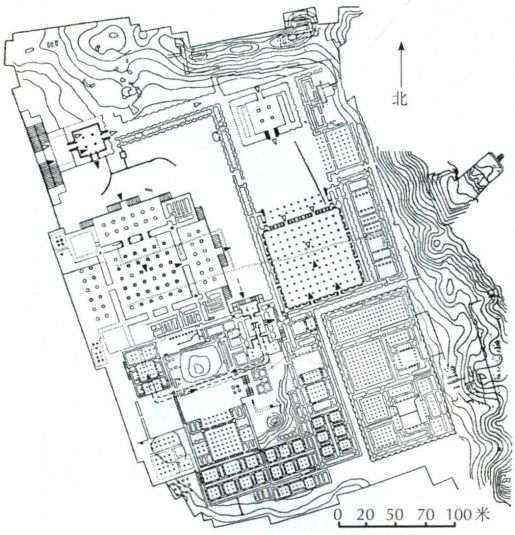

0	100 200 300 英尺

图2\.26 大流士和薛西斯一世在波斯波利斯的皇宫平面图。公元前518一前460年。实心箭头指出了波斯和米底权贵们所走的路线；空心箭头指出了代表团首领及其随从所走的路线

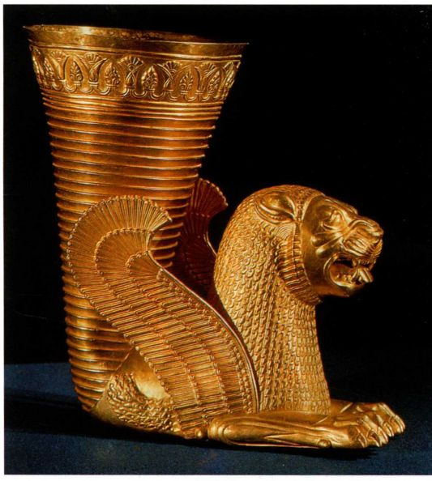

图2\.27 角状杯。阿黑门尼德时期，公元前5\-前3世纪。黄金。伊朗德黑兰考古博物馆

同时也具有了美索不达米亚统治者的那种野心。

他创立的帝国在其继任者的统治下继续扩张。公元前525年，埃及陷落，公元前五世纪初，希腊勉强逃过被波斯人统治的劫难。在大流士一世（Darius1，公元前521\-前486年在位）及其子薛西斯一世（Xerxes I，公元前485\-前465年在位）的统治下，波斯帝国达到鼎盛，其领土面积远远超过埃及和亚述两大帝国之和。波斯帝国的巨大版图维持了两个世纪，其间形成了有效的管理模式和不朽的艺术形式。

波斯人的宗教信仰与琐罗亚斯德（Zoroaster，即Zarathustra）的预言相关，其基础是善恶二元论，分别以阿乌拉马兹达神（Ahuramazda，光明）和阿瑞曼神（Ahriman，黑暗）为代表。阿乌拉马兹达神的崇拜仪式主要在露天的火祭坛上举行，因此，波斯国王并不建造宗教建筑。相反，他们将注意力和资源集中用于建设宏大壮观的皇宫。

波斯波利斯 波斯帝国最雄伟的一座宫殿位于帕尔萨或波斯波利斯（Persepolis），由大流士一世始建于公元前518年，后来的历任统治者都进行过扩建（图2\.26）。宫殿坐落在扎格罗斯丘陵地区的一个高地上，有大量房间、大厅和庭院，呈网格状布局，四处设防，整体建在一个平台上。宫殿综合了来自辽阔帝国四面八方的材料和设计传统，传递出国际主义的思想。大

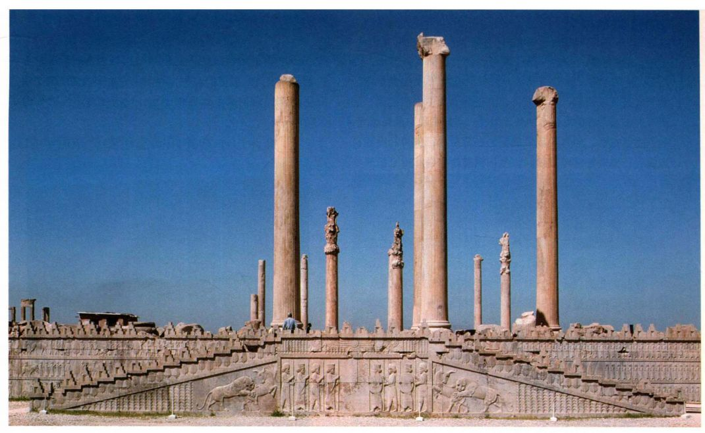

图2\.28 大流士和薛西斯谒见厅，约公元前500年。伊朗波斯波利斯

流士在他起草的铭文中夸耀说，宫殿所用的木料来自黎巴嫩（雪松）、犍陀罗（Gandhara）和卡尔马尼亚（Carmania，雅卡木），砖来自巴比伦。宫内使用的物品（如图2\.27中的角状杯［rhyton］或典礼用杯）是用萨迪亚（Sardian）和大夏（Bactrian）的黄金、埃及的白银、乌木以及粟特（Sogdianan）的天青石和玛瑙做的。为了加工这些材料，阿黑门尼德招募了来自帝国各地的工匠，这些工匠后来带着这种国际化风格回到了各自的家乡。图2\.27中的角状杯体现了美索不达米亚混合动物传统：由黄金制成，外形是神鸟森摩夫（senmurv），神话中的一种狮身怪物，长着狮鹫的翅膀和孔雀的尾巴。

从入口处开始，宫殿就处处体现出其帝国主题。在宏伟的“万国之门”（Gate of all the Lands）旁立着巨大的有翼人兽公牛，类似于亚述的拉玛苏（见图2\.19）。皇宫内部大量运用了柱子。走进边长66米的正方形大流士和薛西斯谒见厅（或叫阿帕达纳宫［apadana］），你会看到三十六根高达12米的柱子支撑着木制屋顶。其中几根今天仍屹立在原地（图2\.28）。集中使用柱子的建筑理念可能来自埃及；当然，底座和柱头的植物花纹也是来自埃及的元素。但是，柱身的外形却像希腊爱奥尼亚带有凹槽的细长支柱（见图5\.9）。柱头顶部是房梁的“支架”，由两头公牛或

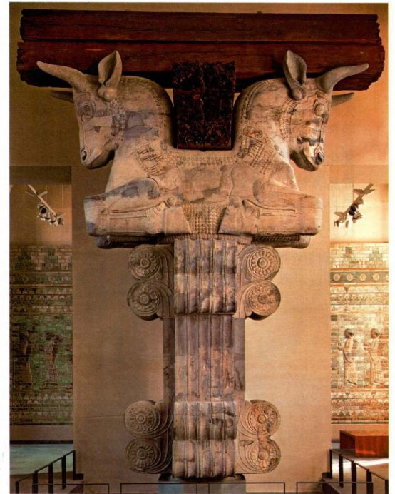

图2\.29 公牛柱头，出土于波斯波利斯。约公元前500年。巴黎卢浮宫

> 艺术史家的观点
> 
> 盗掘造成的损失
> 
> 考古学家最大的对手是盗掘者，他们洗劫古代遗址，为世界上第二大非法贸易，即非法文物交易提供货源。这个问题祸及全球，但最近公众的注意力集中在伊拉克，那里有上千座考古遗址仍有待合理发掘。盗掘者通常是当地人，他们生活贫困，但有更庞大的势力在背后进行支持和组织；盗掘者行动时经常组成团队，他们带着凿岩锤和推土机来到遗址所在地，手持武器，以对付可能存在的哪怕一丁点儿危险。他们通常使用最先进的工具，如遥感和卫星照相，肆无忌惮地在遗址中掘盗，不在乎自己在寻找宝物时破坏了什么。赃物一跨过国境就被迅速转手，在市场上卖得巨款。这笔巨资当地人只能获得一小部分，甚至一文不名。
> 
> 比起失去文化遗产，非法文物交易还带来其他威胁。一项考古发现的价值只有一部分存在于物品本身。更为重要的是物品发现现场（findspot）能为考古学家提供一些信息，考古学家运用这些信息来构建过去的这一段历史。一件物品在一个城市或建筑中所处的位置提示了它的使用方式。比如，一个小雕像可能是生殖物品、玩偶或崇拜偶像，这取决于其外部环境。一件物品所埋藏的确切层面或地层透露了其使用时间。在一些历史遗址中，地层学分析得出了非常精确的年代。如果一件物品在远离其产地的地方被发现，发现现场还能证明不同文明之间的交往。
> 
> 1970年的联合国教科文组织公约要求各成员国禁止进口从其他成员国盗来的文物，并为保护处于被盗危险之中的文化财产提供帮助。到目前为止，已有103个国家签署了公约。
> 
> 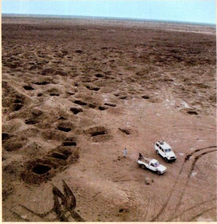
> 
> 2004年1月伊拉克南部伊辛考古遗址中的盗掘者

类似动物的前半身组成（图2\.29）。这些动物使人联想到亚述雕塑，但其身体只有前半部分，背靠背排列，令人回想起伊朗艺术的动物主题，如上文所述的角状杯。

谒见厅平台及其两道楼梯的浮雕表现了这个多元文化帝国的和谐与融合主题，与亚述人的军事叙事形成显著对比（图2\.30）。长长的行进队列中的人物代表着帝国的二十三个属国，其中还有皇家卫士和波斯权贵。这些队伍有时位于上下叠置的画带之中。每个属国的人物都穿着本土服装，带着来自地方的礼物，如贵重器皿和织物，进献给波斯国王。敷在浮雕上

的彩色石头和金属给大量雕刻细节增添了华美感。虽然浮雕非常浅，但人物的表面都保持圆润（因此在边缘投下了阴影），并且雕刻者去掉了背景，使用一片空白的平面，由此制造出了更强烈的纵深感。之前的美索不达米亚浮雕在描绘人物时混合了侧面和正面视角，而这些浮雕中的人物大部分以纯粹的侧面来刻画，虽然其中有些人转过头去跟后面的人说话。重复行进中的人体造成了一种强烈的动感，指引着人们穿过这个谒见厅的巨大空间。这种重复还使浮雕具有了一种永恒性，仿佛把动作定格在不朽的时间之中。如果像

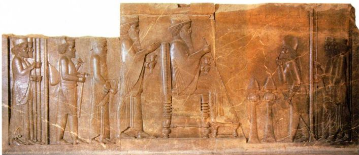

图2\.30《大流士与薛西斯一世谒见》\(Darius and Xerxes Giting Audience\)。约公元前490年。石灰石，高2\.5米。伊朗德黑兰考古博物馆

某些学者所认为的那样，浮雕表现的是一年一度的新年节庆活动，那么这种重复就格外适宜了。

波斯波利斯皇宫对阿黑门尼德各种艺术传统的综合证明了近东统治话语的持久性和灵活性。宫殿的宏大规模为帝国宫廷典礼提供了雄伟壮阔的背景。

波斯与伊斯兰统治之间的美索不达米亚

在攻占希腊的行动被挫败后，波斯帝国最终先后落入希腊和罗马之手，但与希腊帝国和罗马帝国的许多地区一样，仍旧保持了自身文化的许多方面。这一过程始于公元前331年亚历山大大帝（Alexander theGreat，公元前356一前323年）战胜波斯人。他焚毁了波斯波利斯王宫，这是一种象征性的挑衅行为。八年后，亚历山大大帝去世，他的王国被麾下的几位将军瓜分，塞琉古（Seleukas，公元前305\-前281年在位）得到了近东的大部分地区。伊朗游牧民族安息人（Parthians）继塞琉古王朝（Seleucids）之后于公元前238年统治了该地区。尽管与罗马人战争不断，但安息人还是抵御住了他们的进攻，直至公元2世纪初，罗马人在图拉真（Trajan）的率领下取得了短暂的胜利，此后，安息人的势力逐渐衰落。224年，最后一位安息人国王被他的一个总督阿尔达希尔（Ardasir，或叫阿尔塔薛西斯［Artaxerxes］）推翻。阿尔达希尔（死于240年）创建了以神话中的祖先萨珊（Sasan）命名的王朝，宣称自己是阿黑门尼德王室的直系后裔。这一地区也一直由萨珊（Sasanian）王朝统治，直到7世纪中叶为阿拉伯人所占领。

阿尔达希尔之子沙普尔一世（Shapur I，240\-272年在位）表现出与大流士相当的野心，他还把自己与大流士直接联系在一起。他大大地扩张了帝国领土，甚至还在3世纪中叶成功地打败了三位罗马皇帝。

> 大事年表
> 
> 约公元前559\-前530／529年\-居鲁士大帝统治时期，带领波斯人打败米底人
> 
> 约公元前518年\-位于波斯波利斯的波斯宫殿动工
> 
> 约公元前406年\-《俄狄浦斯王》作者索福克勒斯去世
> 
> 公元前331年\-亚历山大大帝打败波斯人

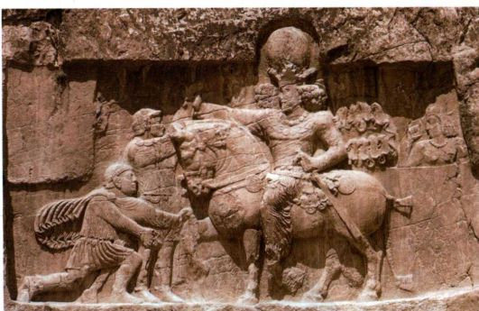

图2\.31《沙普尔一世战胜罗马皇帝阿拉伯人菲利普和瓦莱里安》

\(Shapur I Triumphing over the Roman Emperors Philip the Arab and Valerian）。公元260\-272年。伊朗纳卡什\-伊\-鲁斯塔姆（波斯波利斯附近）

沙普尔用大量浮雕来纪念其中的两次胜利，包括刻在波斯波利斯附近纳卡什\-伊\-鲁斯塔姆（Naksh\-i\-Rustam）的岩壁上的大型浮雕，大流士及其继任者的岩墓就位于波斯波利斯（图2\.31）。浮雕的主题是我们熟悉的类型：对罗马人来说，这是一个屡见不鲜的场面，马背上的胜利者抬起手，以示饶恕战败的“野蛮人”，“野蛮人”则恭顺地跪在他面前。这使浮雕具有了讽刺意味，因为得胜的沙普尔套用了敌人表现胜利的图像范式（iconography）。浮雕具有典型的罗

图2\.32 沙普尔一世皇宫。

公元242\-272年。伊拉克泰西封

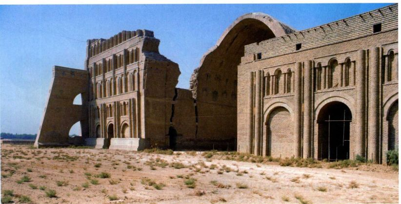

马晚期或行省地区的雕塑风格，比如皇帝鼓起的斗篷上的皱褶线。但沙普尔那精致的头饰和衣饰，盛装的马匹，以及他融合了复合视角的姿势都带有明显的近东艺术特征。

在位于巴格达附近泰西封（Ctesiphon）的沙普尔一世皇宫（242\-272年），罗马和近东元素再次结合起来，其表现就是宏伟的砖砌半圆形拱顶谒见厅或叫门厅（iwan，图2\.32）。利用拱架来建造巨大空间是罗马建筑的手法（见图7\.68），而门厅的拱顶高达27米。建筑正面也带有罗马的影子。一排排拱形假窗或假拱廊（blind arcades）可能采用了罗马建筑正面

的风格，如剧场舞台建筑或装饰性喷泉（见图7\.8）。但拱廊结构对称，纵深不强烈，形成了明显的东方式建筑表面样式，衬托着作为主体的高大入口。沙普尔一世使近东大型皇家建筑的传统得以延续。

在萨珊时期，以多种技法制作的金属制品继续繁盛。狩猎场面是流行题材，从图2\.33所示公元5世纪末的一个银碗就可看出这一点，银碗上的图案很可能表现了国王卑鲁斯一世（Peroz I）猎杀瞪羚的情景。银碗在车床上加工过，工匠由背面捶打出国王和猎物的形象（一种叫做敲花细工［repoussé］的技术），并用镀金加以强调。瞪羚角和箭囊上的图案等细节部

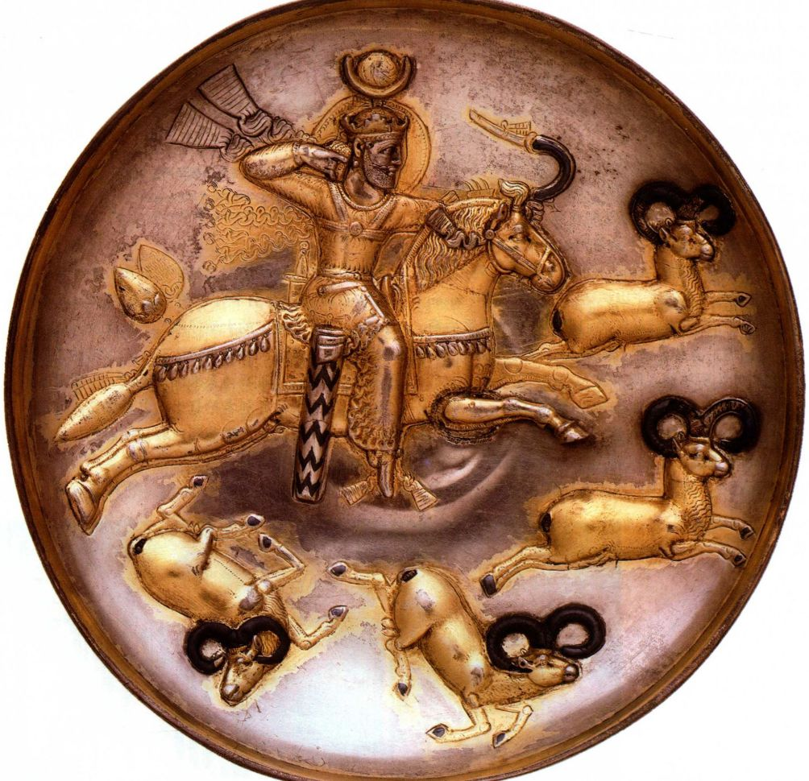

图2\.33《国王卑鲁斯一世猎瞪羚》（King Peroz I Hunting Gazelles）。公元457\-483年。镀金白银，线刻浮雕，镶嵌乌银，直径21\.9厘米，高4\.6厘米。Fletcher基金，纽约大都会艺术博物馆，1934（34\.33）

分镶嵌着乌银，这是一种硫化合物。狩猎题材延续了亚述人以及埃及人和罗马人所熟悉的传统。萨珊时期的器皿大部分出口到了君士坦丁堡（见地图8\.1）和西方的基督教国家，对这些地区的中世纪艺术产生了巨大影响。在7世纪中叶阿拉伯人攻陷萨珊王国之后，类似的器皿又恢复了生产，并成为伊斯兰艺术主题的一个源泉（见第九章）。

小结

公地和邻近的西亚土地上，众多文明兴衰消长，元前最后四个千年，在美索不达米亚的肥沃土但其种种艺术形式却保持了相当的稳定性，令人意外。艺术家和建筑师受命表现神明与统治者的权威；在此过程中，他们也对维护这种权威起到了关键作用。他们创作了大量纪念物，从宏伟的神庙和宫殿到浮雕和独立雕塑，这些纪念物常常具有宏大规模。他们还制作了小巧精美的圆筒印章，加工贵金属、象牙和石头来制成工艺品。他们也探求讲述故事和引导访者前进的复杂策略。那个时代所特有的民族、物品和观念的流动深深渗透在美索不达米亚的艺术之中。甚至到了今天，在丧失了其文化和政治背景之后，这种艺术仍然具有震撼人心的力量。

苏美尔艺术

苏美尔的艺术和文化是视觉交流的典范，后来进入美索不达米亚的各民族都根据各自的需要加以改造。苏美尔的塔庙为宗教建筑和宗教仪式提供了雄伟的平台。现存的苏美尔人物雕塑展示了一种精确但抽象的人物表现方法，不管是以质地坚硬的材料雕刻而成，还是以较为柔软的材料塑造或铸造而成。苏美尔上流阶层的随葬品所用的昂贵材料表现了这一集团对资源的控制和他们的权势。苏美尔器物也显示，这个文明钟情于用明白易懂的方式讲述故事。除文字外，苏美尔人还将他们的文化印刻在了雕刻的印章中。

阿卡德艺术

阿卡德帝国在其鼎盛时期跨越了从苏美尔到叙利亚再到尼尼微的广袤土地。阿卡德统治者吸收了苏美尔艺术的特色，但改造了其中的意象以创造自己的权力话语；人物表现方式继承了之前的苏美尔传统，但显示了阿卡德王权的专制性。现存最令人难忘的作品之一是在尼尼微发现的铜头像。

新苏美尔复兴

在公元前第三个千年即将结束之时，各个苏美尔城市重新使用苏美尔语，并将自己的古老艺术传统与阿卡德艺术传统融为一体。为本地神明修建大型塔庙是显示虔诚和权力的举动。这些苏美尔统治者遵循阿卡德人的榜样，也竭力将自己的形象用不朽的材料和形式保存下来。

巴比伦艺术

经过一个充满战乱的时期之后，巴比伦王朝统一了这一地区。这个时期最著名的统治者是汉谟拉比，他集勇武和对苏美尔传统的尊重于一身。这位统治者最知名的是他颁布的法典，是现存最早的成文法律之一。在这一时期，巴比伦城成为苏美尔文化中心。

亚述艺术

公元前第一个千年末期，亚述占领了美索不达米亚南部，随后边界不断拓展，帝国版图从西奈半岛一直延伸至亚美尼亚。亚述艺术的主题是统治者的权力，筑有城墙的城市和占地很广的宫殿都反映了亚述军事文化。大型守卫者雕像保卫着宫殿，而宫墙上的大量浮雕详尽地展示了国王的胜利和美德。

晚期巴比伦艺术

在被波斯人攻占之前，巴比伦古城有过一次短暂的复兴。晚期巴比伦统治者中最著名的是尼布甲尼撒二世，他修建了举世闻名的空中花园。这一时期建造的皇宫贴有彩色釉面砖，其上描绘着一个由上百头神兽组成的行进队伍。

近东地区性艺术

在两河流域之外，有各种其他文明与美索不达米亚之内的文明同时发展。这些民族中一部分是侵略者或占领者，其他则是贸易者。他们与美索不达米亚文明同时繁荣发展并交流往来，其中两个典型文明群体就是赫梯人和腓尼基人。

伊朗艺术

古代伊朗坐落在美索不达米亚以东，成为部落迁徙的要道，其艺术反映了许多这样的交融。在居鲁士大帝的统治下，波斯人逐渐控制了他们的邻邦，并最终在大流士及其子薛西斯一世在位期间占据了整个近东。古伊朗人的一个非凡艺术成就是位于波斯波利斯的宏伟宫殿，后来被征服古伊朗的亚历山大大帝付之一炬。