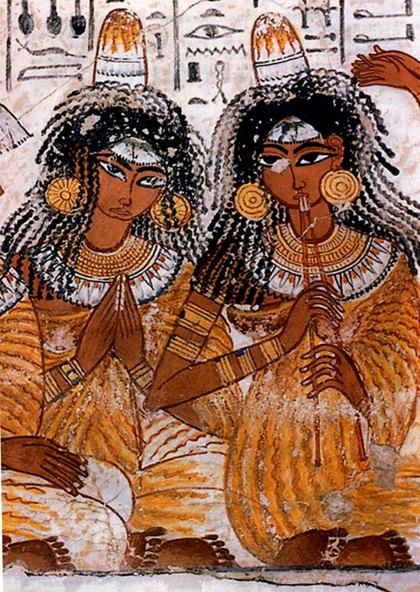

*图3.33《乐者与舞者》细部*

# 第三章 埃及艺术

数千年来，埃及令西方着迷。古希腊人和罗马人了解并崇拜埃及，他们的这份尊敬传给了文艺复兴时期的收藏家和学者。18世纪末拿破仑入侵埃及，将这里的艺术品和知识带回法国，激发了全欧洲的兴趣。19世纪以来，由欧洲人资助的发掘活动在埃及一直进行，不时有激动人心的成果，如1922年发现的图坦卡蒙（Tutankhamen）法老墓。如今进行的发掘和研究仍然吸引着现代人。

古埃及令我们神往的原因之一是它的艺术品那非同一般的技术和不朽特质。这些物品大部分出自埃及人修建的纪念墓葬。埃及坟墓的建造目的是确保死者有幸福的来世，其中的绘画、雕塑及其他物品都具有永恒的目的。艺术品要陪伴死者去往来世。因此，埃及艺术是一种恒久的艺术，而非变化的艺术。实际上，希腊哲学家柏拉图（Plato）就说过，埃及艺术一万年来没有变化。实际情况比这要复杂，但我们可以说埃及艺术家不努力求变或求新。他们宁愿固守表达特定观念的传统范式，所以形式与主题的连续性是古埃及艺术的一个特点。

埃及艺术家主要是为等级极其森严的上流阶层赞助人服务的。约公元前3000年埃及文字逐渐形成的同时，一个政治和宗教体系也发展起来，在这个体系中，神王（从新王国时期开始称为法老）掌握着这个国家及其人民物质和精神上的幸福。许多最为著名并引起人们无限联想的埃及艺术品就是为这些强大的统治者而创作的。皇家艺术表现了国王在人们眼中的多重形象：众神的人类代言人、神明、仁慈的统治者以及生命本身的象征。王室为来世而建的工程遍布埃及大地，并为所有权贵的墓葬提供了模本。因为国王们下令建造了埃及最雄伟的一些坟墓，所以王权的意象就与来世的意象强有力地交叉。

敕命工程和陪葬品这两种类型的艺术品构成了现存埃及艺术品的主体。埃及的宗教和地形是这两种艺术盛行的原因。埃及立国于尼罗河在北非的河流沿岸，周围有沙漠或称“红土地”的护卫。埃及由两个不同的地区组成。南部的上埃及包括现在的阿斯旺（Aswan）和三角洲起点之间的尼罗河谷，邻近古代的孟菲斯（Memphis）和现在的开罗。在北部的下埃及，尼罗河呈扇形展开形成三角洲。尼罗河每年泛滥一次，淹没两岸的土地。洪水退去之后，留下一片满是淤泥的肥沃的黑色土壤。这就形成被埃及人称为“黑土地”的沃土。人们在上面灌溉耕作，常获丰年。因此，埃及人能够实现分工，发展出复杂的文化。

埃及的农业社会依赖尼罗河一年一度的泛滥。国王必须向代表自然力量的神祈求，以确保生存的延续。埃及的主神是代表太阳的拉-哈拉克提（Ra-Horakhty）神。但对于关心来世幸福的埃及人而言，俄塞里斯（Osiris）和他的妻子伊西斯（Isis）以及他们的儿子荷鲁斯（Horus）这三位神祇起着至关重要的作用。众神有多种形象：拉（Ra）可能被描绘成鹰首人；被杀死后复活的俄塞里斯则以木乃伊形象出现。国王本人被称为拉之子和荷鲁斯的人类化身。他是与神平起平坐的人，控制着土地、未来和来世。辅佐国王的是一个庞大的祭司队伍、一批行政官员和一支强大的军队，至尊者可以指派任何人为其服役。

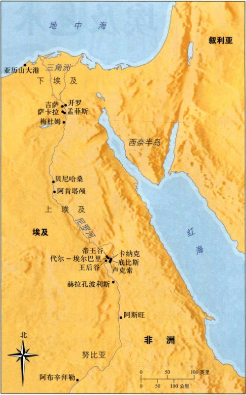

*地图3.1 古埃及*

## 前王朝时期和王朝初期艺术

埃及文明的源头可追溯至新石器时代。最晚截至公元前5000年，人类已经在尼罗河谷种植庄稼，驯养家畜了。那里的定居点逐渐转变为城镇。在上埃及，互相独立的城市共有一种丰富的文化，考古学家们称之为纳卡达II／III型（Naqada II／III，根据最早的发现地命名）。随着时间的流逝，上埃及文明逐渐北传，最终控制了下埃及的聚居区。经过短短几个世纪，上下埃及文明达到了统一，正如传说中那样，第一个王朝的首任国王在尼罗河三角洲口建立了孟菲斯城（见地图3.1）。

把埃及划分为上下两个不同地区的做法源自于埃及人的世界观。埃及人把世界视为一个二元对立的集合：上埃及与下埃及，沙漠的红土地与可耕种的黑土地，地神（盖布［Geb］）与天神（努特［Nut］）匹敌，俄塞里斯（文明之神）与赛特（Seth，混沌之神）对立。国王必须保持混乱和秩序这两种力量的平衡，他必须将玛特（ma'at，和谐或秩序）带到人间。认识到这种世界观后，一些学者开始重新审视关于上下埃及划分的传统解释：过去认为这是两个互相独立的地区，纳米尔（Narmer）国王在前王朝时期将它们统一。学者们现在认为，这种划分是对过去的想象构建，是从二元世界观衍生出来的。艺术家可能必须找到一种视觉手段来表现这个关于埃及起源的故事。

### 《纳米尔国王石板》

国王作为统一者的观念表现在约公元前3000年的《纳米尔国王石板》（Palette of King Narmer，图3.1） 中。这是一块石板，中央的凹陷部分用于研磨涂在眼周的保护性涂料。它的高度超过60厘米，表示这不是一般的用具，很可能是在典礼上用来为神像研磨眼部涂料的。这种宗教功能也许可以解释它的发现地点。考古学家是在赫拉孔波利斯（Hierakonpolis）的神庙发现这个石板的，与其他献给荷鲁斯神的祭品埋在一起。

石板两面都刻有浅浮雕带。在每一面顶部的中央，都用象形文字（hieroglyphe）写着纳米尔的名字，名字外围刻着代表王宫的抽象图形。埃及人发明这种文字的时间与美索不达米亚人发明楔形文字的时间大致相同。希腊人视象形文字为神圣文字，以“hieros”（神圣的）和“graphein”（写）为之命名，在宗教和行政事务中使用。埃及人自己把它们称作“神言”。象形文字两旁的母牛头象征着天空女神，这就表示国王身在天上。在石板的一面（图3.1左），纳米尔国王抓着一个倒地的敌人的头发，另一只手在另一侧举起象征王权的权杖。国王是以复合视角来表现的，这种视角后来成为埃及平面艺术的一大特点：眼睛、肩膀和手臂为正面观，头和腿为侧面观。国王头戴上埃及的白冠，裙子的腰带上挂着一条公牛尾，这是一种权力的象征，此后3000年都是埃及国王礼服的一部分。国王比浮雕上的其他人物要高大，这直接确立了他的权威。而倒地的敌人被剥光了衣服，就像底部那两个战败的敌人一样，这是对他们的一种羞辱。在国王身后，站在另一条地平线上的是一个手提国王凉鞋的侍从。象形文字标注出了提鞋者和敌人的身份。纳米尔的右方有一头猎鹰，它栖在一个纸莎草（papyrus）支架上，纸莎草从一块长着人头的土地上长出来；猎鹰抓着一根拴在人脸上的绳子。

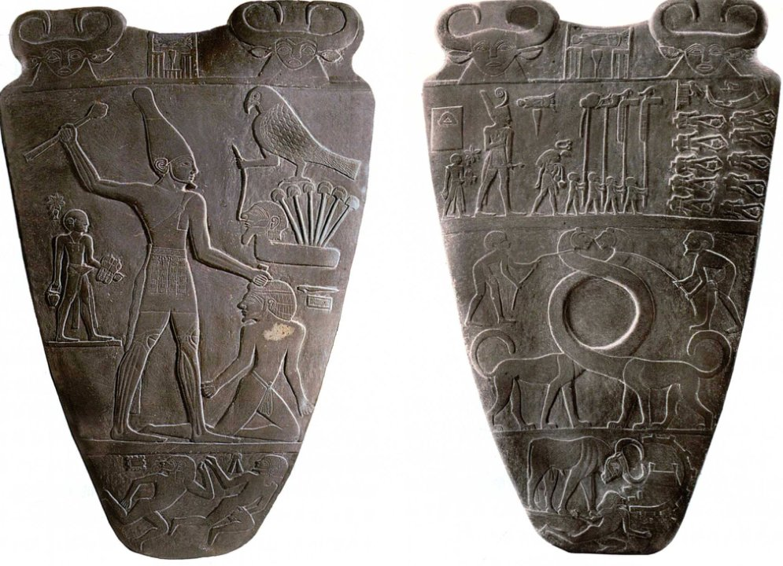

*图3.1《纳米尔国王石板》（两面），出土于赫拉孔波利斯。约公元前3150一前3125年。板岩，高63.5厘米。开罗埃及博物馆*

在石板的另一面（图3.1右），纳米尔出现在顶部的浮雕带中，这次他戴着下埃及的红冠，两侧分别是提鞋者和一个长发人物。他走在四名旗手后面，去视察被斩首的战俘，斩下的头颅被摆放在尸体两腿之间。在较宽的中部浮雕带中，两名男子各用绳牵着一只怪兽，怪兽的长脖子缠绕在一起，在画面上围成了一个圆。对称均衡的基调可能象征着“玛特”（秩序）。虽然两只怪兽在这个画面中的含意不明，但类似的怪兽也出现在同时代的美索不达米亚圆筒印章上，这件作品的图案可能就是受此影响。在底部浮雕带中，一头象征着国王的公牛进攻城池，踩踏敌人。

纳米尔石板意义重大，因为它在一件物品中融合了几种不同类型的符号来传达它的寓意。其中一些符号，如国王、侍从和战俘，是写实性图像。其他则是象征性图像，比如把国王描绘成一头公牛，象征了他的力量。象形文字，即以抽象形式表达概念的小符号，包含了更多的信息：在猎鹰与纸莎草的组合中，猎鹰代表荷鲁斯神（埃及人相信法老是荷鲁斯的化身），而人首纸莎草支架代表纸莎草丰茂的下埃及。一个合理的解释是，这个象形文字表现了纳米尔对那个地区的控制。最后，艺术家在作品中加入了用象形文字写成的标注。《纳米尔国王石板》上这些各异的符号集合在一起，就传达了关于埃及王权性质的重要历史信息：国王是统一的上埃及与下埃及的化身，具体表现为他在石板两面佩戴的不同王冠。虽然身为人类，但却担任神职，这体现在他的名字被置于空中，而天空是天神荷鲁斯的统辖范围。

到了第五王朝，荷鲁斯被认作伊西斯和俄塞里斯之子。在神话中，俄塞里斯是埃及的创立者。他的兄弟赛特（混沌之神）杀害并肢解了他，将其尸骨四处抛撒。俄塞里斯之妻伊西斯最终找回了他的尸骨，将它们重新拼合在一起，创造出第一个木乃伊，她使用这具木乃伊受孕，诞下儿子荷鲁斯。荷鲁斯在一系列决斗中打败了赛特，报了杀父之仇。埃及人认为国王是荷鲁斯在人间的化身；也就是说，他为王室的生命力（卡［ka］）提供了一个肉身，这种生命力在君主间代代相传。在等级森严的人类社会中，国王被置于最高点（体现在他的高大身形上），处于凡人和神明之间，是一种次神，他的职责是将秩序加诸与之对立的混乱。在石板中，他是通过征服外敌、对之建立实在的权威来做到这一点的。

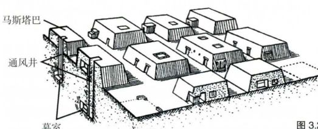

> **大事年表**
>
> 约公元前 5000 年——人类沿尼罗河谷定居
> 约公元前 3500 年——西欧出现制陶业
> 约公元前 3000 年——古埃及的《纳米尔国王石板》
> 约公元前 2900 年——美索不达米亚人开始使用楔形文字

## 古王国：黄金年代

《纳米尔国王石板》描绘了一种超越世俗权力的君王形象，它所表现的国王不仅是一个统治者，还是一个神。古王国（第三至第六王朝，约公元前2649-前2150年）的国王们找到了更加不朽的方式来表达这种观念。在此后的两千年中，他们的王朝和艺术品成为后人效仿的范本。

### 古王国墓葬群

在古王国时期，生者日常活动所使用的建筑主要是用不耐久的材料建成，所以留存至今的寥寥无几。大量的考古证据都出自丧葬建筑，即坟墓。绝大多数人很可能葬在沙漠中挖的浅墓穴中，但上流阶层有足够的资源来修建复杂的墓葬，筹备下葬仪式。这些坟墓能保存下来并非偶然；修建它们的目的就是追求万世不朽。

这些建筑有几个重要功能。与许多其他文明一样，坟墓对生者而言的作用是在地面上为死者留下一个永恒的标志。它们表明死者的身份，使他们永远不被遗忘。早期的贵族和皇家陵墓基本上都是以长方形泥砖或石砌大型建筑为标志（图3.2），这在今天被称为马斯塔巴（mastaba），源自阿拉伯语“凳子”。外墙倾斜，敷有灰泥并上了色，因而看上去像带有壁龛的宫殿的正面。这种地上建筑可能是实心的泥砖结构或填满碎石，但有时也设有多个存放葬礼用具的储藏室或一个墓堂。这些纪念性建筑同时也具有保存死者生命力，或称卡的关键作用。埃及人认为卡能在坟墓中继续存活，因此需要一个永久的住所。这就是为什么防腐师要花如此大的气力来制作木乃伊（这种方法在第十一和十二王朝方才达到成熟）。被做成木乃伊的尸体通常放入一口石棺（sarcophagus），埋在位于马斯塔巴下方一定深度的墓室中，其四周的墓室用于存放葬具。如果防腐师失败，尸体腐烂，雕像也可以充当替身，成为卡的住所，因此死者雕像也被放进墓室里。埃及人还在墓中放入日常生活用品供卡使用。

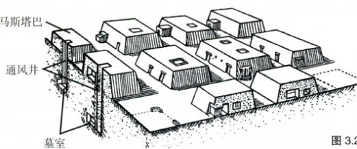

*图3.2 马斯塔巴群（根据A. Badawy的图绘制）。第四王朝*

*图3.3 伊姆霍台普：国王佐塞的阶梯式金字塔和墓葬群，萨卡拉。第三王朝，约公元前2681-前2662年*

> **背景知识：古埃及的主要时期**
>
> 在埃及社会，国王的一生就是衡量时间的尺度。为了梳理几千年的埃及文明，学者们使用了一份公元前3世纪由祭司兼史学家曼涅托（Manetho）设计的年表。曼涅托根据埃及文献，用希腊文为托勒密撰写了一部埃及史。他将历代埃及国王分成31个王朝，首先第一王朝，始于公元前3000年之后不久。现代学者把王朝组为三个王国，首先是约公元前2649一前2150年的古王国。从史前到第一王朝之前的时间被称为前王朝时期。古王国之后是中王国（约公元前2040-前1640年）和新王国（约公元前1550一前1070年）。这些时期跨度很大，对于其中的确切时间，甚至国王在位的实际年代仍有争议，因为曼涅托的表只提供了相对的年表，也就是国王即位的顺序，而没有具体的年代。
>
> **古埃及的主要时期**
>
> *   约公元前2920年之前 - 前王朝时期
> *   约公元前2640-前2649年 - 王朝初期（第一、二王朝）
> *   约公元前2649-前2150年 - 古王国（第三至六王朝）
> *   约公元前2040-前1640年 - 中王国（第十一、十二王朝）
> *   约公元前1550-前1070年 - 新王国（第十八至二十王朝）

**佐塞王墓葬群** 在埃及的墓葬传统中，已知最早的重要墓葬群位于萨卡拉（Saqqara，图3.3、3.4和3.5），是第三王朝的佐塞（Djoser或Netjerkhet）国王的陵墓，他的在位时间是公元前2630-前2611年。萨卡拉在尼罗河西岸，是位于下埃及的都城孟菲斯的大墓地（necropolis）或墓园。一道长方形石墙环绕着整个墓葬群，它全长超过1.6公里，高10米。一座阶梯式金字塔（见图3.3，横断面见图3.5）高出围墙，四面朝向东南西北这四个基本方位。它初建时是一座8米高的马斯塔巴，原本可能被围墙遮住。多年过去，由于添加了逐层缩小的石级，它增高到62米，这些石级最后形成一道阶梯，也许是国王登上众神之地的路径。“台阶”踏面向下倾斜，侧面则向外倾斜，因此整个建筑具有一种令人印象深刻的稳定感。位于金字塔下方27.5米处岩层中的一个小室就是停放尸体的墓室，四壁铺满阿斯旺花岗岩，另有其他房间用来存放食物。金字塔北面有一座迷宫般的陵庙，人们在那里为辞世的国王举行祭祀仪式。

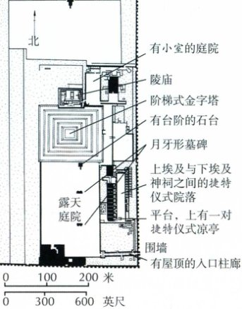

*图3.4 国王佐塞墓区平面图，萨卡拉（Claire Thorne根据Lloyd和Müller的图绘制）*

墓葬群中的建筑再现了国王在世时所住的宫殿建筑。在皇宫中，大的院落被用于举行王权仪式。与之相似，金字塔以南的大院落可能就曾举行纳贡或昭示皇权统治的仪式。金字塔以东的长方形院落较小，两侧分别是上埃及和下埃及的神祠，可能是捷特仪式（sed-festival）的庆祝场所，也就是纪念国王在位30年并使他恢复活力的一种仪式。两组仪式都被认为是由死去的国王制定的。与宫殿的结构不同，墓葬群中的许多建筑都没有实用性：在仿照宫殿正面的带壁龛围墙上有14个入口，其中只有一个（在东南角上）可以通过，而其他都是假门。同样，献给当地神明的庙堂也仅仅是造有假门的立面，其中的房间都填满了碎石或砂砾。此外，建造宫殿用的是不耐久的材料——主要是泥砖——而墓葬群却全由石灰石建成，为的是永久保存。石匠将围墙的石灰石块打磨光滑，以模仿泥砖砌成的带壁龛的建筑正面。此外，有一座经过重建的神祠的正面看起来很像上埃及的篷房，高高的杆子支撑着用席子铺成的屋顶，席子被风吹起。壁柱模仿埃及建筑师用来支撑泥砖墙的纸莎草秆或芦苇束，柱头呈花朵状（图3.6）。石楣表面的涂料使它们看起来像木制结构，在墓室内部，蓝色和绿色的瓦贴满假门，模拟卷起的芦苇门帘。

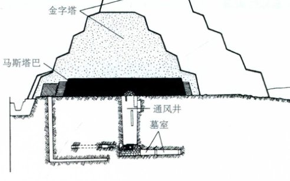

*图3.5 国王佐塞阶梯式金字塔的横断面，萨卡拉*

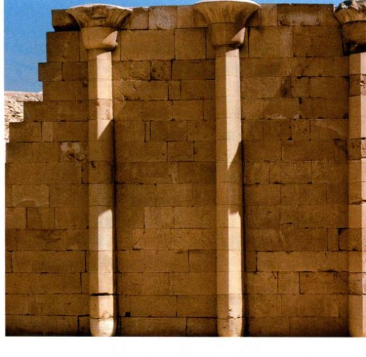

*图3.6 纸莎草形半柱。北宫，国王佐塞墓葬群，萨卡拉*

墓葬群中的许多结构不是供活人使用的，而是要为死去的国王提供永恒的场所，让他能够一直举行王权仪式，维持人世间秩序的仪式。陵庙东面的一个小室（serdab，一个没有入口的封闭房间）中安放着一尊真人大小的法老坐像，这保证了法老在墓葬群中的存在。小室前壁上有两个洞，便于栖居在雕像中的法老之卡能够看到纪念他的仪式，以及从供奉的供品和熏香中汲取营养。整个墓葬群为南北走向，国王的雕像直视北方天空中的拱极星。在墓区的主体是帮助国王升向太阳的阶梯式金字塔，在这片区域中，国王的卡将永远存在并保持警觉。

在墓葬群中发现的雕像残片上刻有墓葬群修建主事者的姓名，他是佐塞朝中的一名高官，叫伊姆霍台普（Imhotep），常被认为是历史上第一个留下姓名的建筑师。伊姆霍台普是太阳神拉的大祭司，据说他的睿智以及天文学、建筑学和医学知识促进了埃及文明，他在其所处时代及后世备受敬重，因而被尊为神明。这个墓葬群是第一座完全用石头建造的大型建筑，至少保存了他留给后世的遗产之一。

### 吉萨金字塔：国王新角色的反映

其他国王纷纷效法佐塞，但在约公元前2575-前2465年即第四王朝期间，墓葬建筑有了很大的改变。在现代人看来，最显著的变化是阶梯式金字塔变成了光面金字塔。梅杜姆（Meidum）的一座据说为第四王朝开创人斯尼夫鲁（Sneferu）所建的金字塔突出了这一转变的蓄意：它原本是一座阶梯式金字塔，但梯级后来被填充成平面。

但最著名的金字塔是吉萨（Giza）的三座大金字塔（图3.7），为纪念斯尼夫鲁之子胡夫（Khufu，第一座也是最大的一座金字塔）、卡夫拉（Khafra，较小的金字塔）和孟卡拉（Menkaure，最小的金字塔）而建。在建成之后的岁月中，这三座金字塔一直吸引着世人，令人神往，而且这种魅力有因可循。它们经久不衰的庄严宏伟源于惊人的规模（胡夫金字塔的塔基占地5.3公顷，时至今日，它的高度仍然达到约137米）和非凡的简洁。金字塔锥体底面为正方形，四个侧面为等边三角形，自荒漠沙地中升起，直指苍天。在白天的任何时刻，都有一个面能被阳光完全照射到，而相对的那个面则没入阴影。原本每座金字塔表面都覆盖着一层白色石灰石，但这些石块后来被伊斯兰建筑者取用，现在只有卡夫拉金字塔顶端的石灰石保存了下来；而且，每座金字塔的塔尖都贴着薄薄的一层黄金。在卡夫拉金字塔的底面，有一层红色花岗岩，衬托着白色的石灰石。每座金字塔的入口都在北面，墓室隐藏在实心的石堆内部某处，而不是在地下，这是为了迷惑盗墓者（图3.8）。每座金字塔都有一道围墙环绕，四周群集着几座较小的金字塔和马斯塔巴，那是王室成员和高级官员的陵墓。

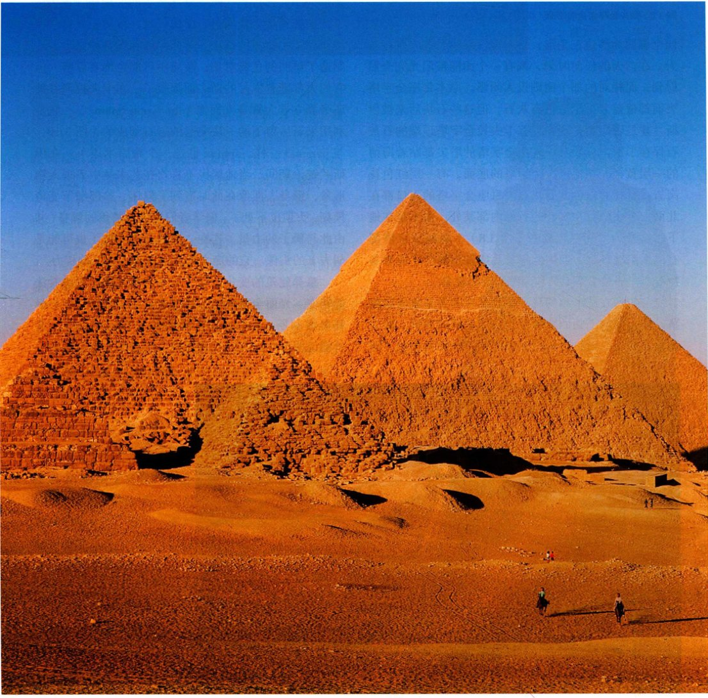

*图3.7 孟卡拉金字塔，约公元前2533-前2515年。卡夫拉金字塔，约公元前2570一前2544年。胡夫金字塔，约公元前2601-前2528年。吉萨*

与佐塞在萨卡拉的墓葬群及其后的大多数皇家陵墓一样，第四王朝的陵墓也坐落在尼罗河西岸，即太阳落下的那一面，与东岸生者的居住地隔河相对（图3.9）。但佐塞墓葬群布局紧凑，为南北走向，而吉萨金字塔群则是沿着一条延长的东西走向的轴线排列的。葬礼开始时，尸体运过尼罗河到达西岸。一离开农耕地区，送葬队伍就到达了河谷神庙，它与尼罗河通过一条运河相连。卡夫拉河谷神庙的特点是有一个T形中央走廊，走廊的墙和支柱（pillar）以昂贵的红色阿斯旺花岗岩建成，被白色的方解石地板衬托得更加鲜艳。光线透过墙的上部和红色花岗岩屋顶的缝隙，洒满这个走廊。

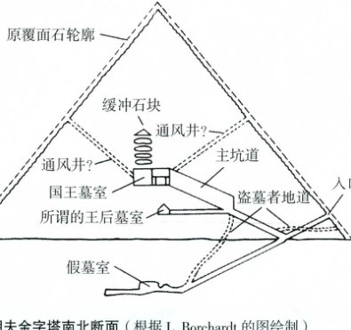

*图3.8 胡夫金字塔南北断面（根据L. Borchardt的图绘制）*

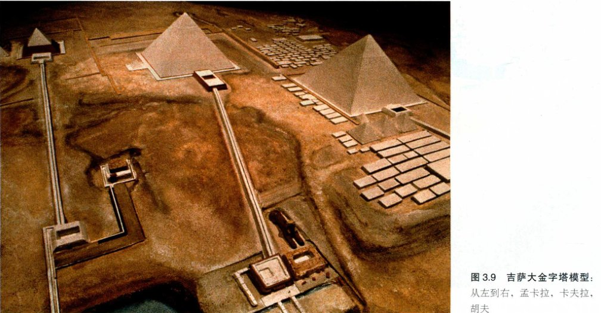

*图3.9 吉萨大金字塔模型：从左到右，孟卡拉，卡夫拉，胡夫*

一条隆起的隐蔽堤道从河谷神庙向西进入沙漠，延伸约500米后到达毗邻金字塔东面的陵庙。死去国王的遗体被运至陵庙进行防腐处理，生者也在这里永续对国王生命力的祭祀。陵庙同样利用各种坚硬石块制造了鲜明的色彩对比；陵庙中可能也饰有浮雕，但它们大都随着岁月的逝去而损毁了。在卡夫拉河谷神庙旁矗立着大狮身人面像（the Great Sphinx），它是利用采石后留下的一块突起的岩石刻成的（图3.10，与pyramid一样，sphinx也是一个希腊术语）。在伊斯兰统治期间，当地居民不喜欢在艺术品中表现人物形象，狮身人面像在此时遭到了损坏，脸部细节变得模糊，头顶也不见了，但学者们相信与蹲伏的狮身（并由此与狮子的力量）连在一起的是卡夫拉（也可能是胡夫）的头像。它的庞大外形也表现了国王的权力。

墓葬建筑的变化反映了埃及人对其统治者的看法的转变。光面金字塔的形状像放置在太阳崇拜中心赫利奥波利斯（Heliopolis）的本本石（ben-ben）。这可能说明这些巨大的坟墓强调了法老与太阳有关的一面；事实上，这种建筑形式的改变与法老自称“拉（太阳神）之子”大致同时发生。墓葬群朝向的变化也意味着法老的陵庙不再像以前那样面朝北方的星辰，而是朝着东方的旭日，表示经由太阳日复一日的升落达到永生。与佐塞墓葬群（见图3.3和3.4）形成对比的是，吉萨金字塔群内没有用于重现王权仪式的建筑，这表明，不断举行这些仪式已不是死去国王的任务。现在，他的职责是沿着阳光（金字塔的斜面可能就是其象征）上升到太阳神那里去，陪伴他进行永不止息，周而复始的重生。

后来的一些古王国金字塔的内部刻有生动描述国王新角色的文字。这些铭文是刻在金字塔内墙上的赞美诗或祷文。原始文献出自位于萨卡拉的乌尼斯（Unis）金字塔，年代约为公元前2320年，描写的是国王复活和升天。

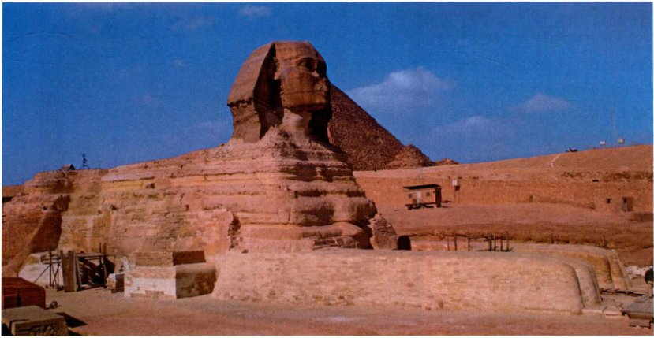

*图3.10 大狮身人面像。约公元前2570-前2544年。吉萨。砂岩，高19.8米*

### 表现人物

卡夫拉河谷神庙大厅地面上的凹陷表明，曾有一排共23尊国王坐像沿墙边放置。考古学家们发现了其中基本完好的一尊和损毁严重的六尊，它们都被埋在神庙的地下。保存得最好的雕像表现了国王直挺挺的正面坐姿（图3.11）。这个姿势使得他能够观看为纪念他而举行的仪式，并且从某种意义上说能够参与这些仪式；正面描绘使他能够到场和存在。在他身后，代表荷鲁斯的猎鹰张开双翅，护住他的头。与《纳米尔国王石板》一样，这尊雕像简洁地表现了王权的性质。荷鲁斯宣称国王是他在尘世的化身和被保护人，国王健壮的外形表现出他的权力。他的脸上没有皱纹，永不衰老，显示了他的不朽，而雕像紧凑的构型又赋予了它象征永恒的坚实感。刻在椅子腿之间的枝蔓缠绕的植物是纸莎草，另一种可能是芦苇，分别是上埃及和下埃及的特产，象征着王权统治的领土范围。甚至雕像使用的材料也表现了国王对遥远土地的控制。这种石头是闪长岩，来自努比亚（Nubia）沙漠。这种坚硬的石头适于雕刻微小的细节以及作高度的抛光，埃及的强烈阳光透过神庙屋顶的天窗照进来，又被白色方解石地面反射开来，雕像在这阳光中必定闪闪发亮。

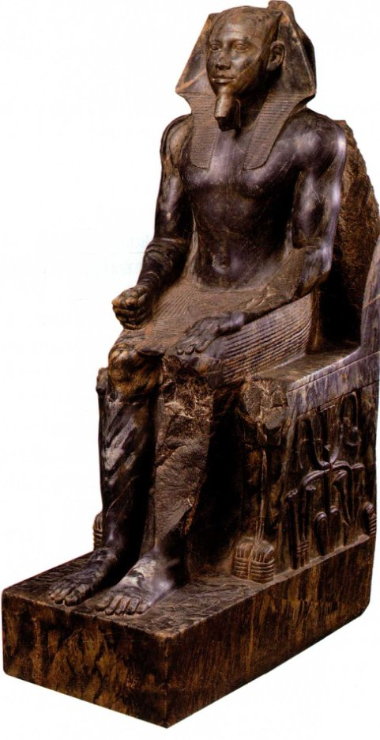

*图3.11《卡夫拉雕像》（Sculpture of Kafra），出土于吉萨。约公元前2500年。闪长岩，高167.7厘米。开罗埃及博物馆*

> **原始文献：乌尼斯（公元前2341-前2311年在位）金字塔文节选**
>
> 第五王朝的国王乌尼斯在萨卡拉建了一座金字塔，它的墙上刻着一系列为法老前往来世而准备的咒语和祷文。在整个埃及历史中，这种称为金字塔文的铭文被放置在皇家和非皇家墓葬中。其中的一些惯用说法经过改编后用于不同版本的《亡灵书》祷文的年代是约公元前2320年，但它们的创作时间可能比这早得多。
>
> **国王乌尼斯复活**
>
> 暗淡的天空渐黑，星辰隐没，
> 天神射手之国被摇撼，
> 地神之骨在震颤 -
> 万物休止，静观乌尼斯王之灵
> 升起于荣光之中，变形为神，
> 永生于先祖父辈之间，上古的母辈将他养育。
> 这就是王！深谙曲幽之道的大智之王
> （他的生母也不知其名），
> 他的庄严照亮黑暗的天空，
> 他的力量在复活之地放射光芒 -
> 就像生他之父阿图姆（Atum）一样；
> 一旦降生，子强于父！
> 王之灵在他四周盘旋；
> 女精灵扶握他的双脚；
> 常现的神明俯临其上；
> 眼镜蛇（Uraei）自他双眉挺立；
> 引路的蛇神走在前方：
> “看顾王灵！小心，噢，易怒者！”
> 所有强大的同伴都在护王伴驾！
>
> *SOURCE: ANCIENT EGYPTIAN LITERATURE: AN ANTHOLOGY. TR. JOHN I. FOSTER (AUSTIN, TX: UNIVERSITY OF TEXAS PRESS, 2001)*

一组表现国王孟卡拉及其王后卡蒙若内比提二世（Khamerernebty II）的雕像比卡夫拉坐像的制作时间稍晚，它用片岩雕刻而成，有真人的四分之三大小（图3.12）。与卡夫拉像一样，它也是用一块石头雕成，后部是一面直立的石板，人物同样也是直挺挺的正面姿势。选择这种姿势可能是由雕像计划放置的地点和功能所决定的。与卡夫拉像一样，这组雕像可能也是放在国王的河谷神庙中的。

孟卡拉与卡蒙若内比提王后有几个共同点。高度几乎完全一样，都是左腿向前迈出，一动不动。孟卡拉的头巾与卡蒙若内比提的发型相似，虽然国王比王后强壮，但两人的身体表面都很光滑，经过了高度抛光，尽管其中一人身着长摺衣，另一人则是半裸（王后穿着一件薄薄的长裙，裙摆齐踝镶边）。这些共同点形成了一种统一感，王后的拥搂进一步把两人结合在一起。

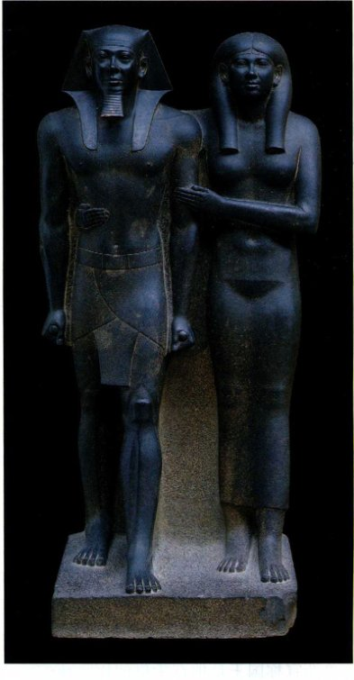

*图3.12《孟卡拉王及其妻卡蒙若内比提王后雕像》（Sculpture of Menkaure and His Wife，Queen Khamerernebty II），出土于吉萨。约公元前2515年。板岩，高138.4厘米。波士顿美术馆，哈佛大学与波士顿美术馆联合考察队*

有些雕像带有颜料痕迹，说明雕刻者会在雕像细节部分添加颜色，但他们在用高质量的硬石刻制雕像时是否都采用这种做法则还有待探究。在梅杜姆的一个马斯塔巴墓中出土了一对第四王朝坐像，雕像中的人物是拉霍泰普（Rahotep）及其妻子诺菲尔特（Nofret），它们用石灰石刻成，这种石头比闪长岩软，无法表现出精致的表面细节（图3.13）。在这对雕像中，艺术家用颜料表现出了肤色、头发、服装和首饰，使用的是标准的传统手法：男性肤色较深，女性则较为白皙。铭文标明了两人的身份，描述了他们的社会地位：他是政府官员，而她则“依附于国王”。瞳孔部分镶嵌水晶，令双眼富有生气，以至于后世的盗墓者在洗劫坟墓之前，都要把类似雕像的双眼挖出。与皇家肖像一样，这些雕像也是正面姿态，摆出仪式化的手势。

僵硬的正面描绘是王室和权贵圆雕的规范。在浮雕和绘画中的人物姿态也存在着明显的一致性。正如在萨卡拉的一座马斯塔巴（主人是佐塞的朝臣海西拉［Hesy-ra］）中出土的木碑所示，这种标准站姿是十分不自然的（图3.14）。与《纳米尔国王石板》（图3.1）中的姿势一样，肩膀、手臂和短裙为正面观，与侧面观的头（眼睛为正面）和双腿结合在一起；人物有两只左脚，足弓很高，只有一个脚趾。这种表现方式是概念化的或知识性的，而不是视觉化的：艺术家描绘头脑所知的，而非双眼所见的。这种不真实的站姿有助于理解人物形象，但也使人物呈现静态。

**准则** 在王室和权贵圆雕以及浮雕和绘画中，人体比例也高度一致，使学者认为艺术家在设计人物形象时参考了一定的基准。这种基准的痕迹在浮雕和绘画中仍然可以看到。基准图法始于第五王朝，最初由一列七行网格组成，纵列由耳际起贯穿全身，横行根据标准尺寸划分身体。随着时间的推移，基准图发生了变化，但这种“准则”的原则却保持不变：虽然身体各部分的大小因人而异，但各部分之间的关系是固定的。只要确定了这种关系，知道身体某个部分的尺寸，艺术家就能够描绘出任意大小的人像来，因为他可以从模本上找到其他重要部分的比例。今天我们所知的透视法用人物的大小反映与观者的距离，而在埃及准则中，人物尺寸表示的是社会地位。

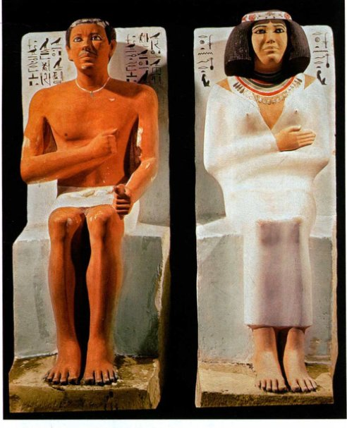

*图3.13《拉霍泰普王子及其妻诺菲尔特雕像》（Sculpture of Prince Rahotep and His Wife，Nofret）。约公元前2580年。彩绘石灰石，高120厘米。开罗埃及博物馆*

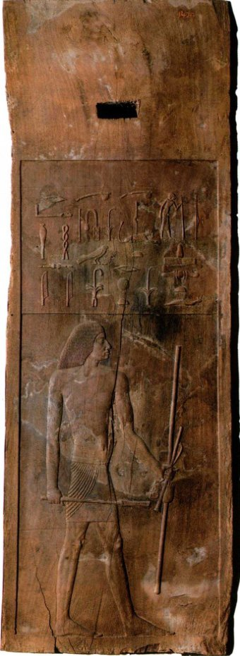

*图3.14《海西拉浮雕板》（Relief Panel of Hesy-ra），出土于萨卡拉。约公元前2660年。木头，高114.3厘米。开罗埃及博物馆*

贵族男性官员被描绘成两类理想形象，每种都表现了一个不同的生命阶段。一种是年轻的、身体强健的形象，如海西拉或卡夫拉。另一种是成年形象，常常是大腹便便、肥肉堆叠或肌肉松弛，脸上有衰老的迹象。一位书吏的彩绘石灰石像就属于第二种类型，这位书吏可能名叫凯伊（Kay），石像出土于他位于萨卡拉的马斯塔巴中（图3.15）。书吏直挺挺地端坐，为正面观，这一点与卡夫拉像一样，但与那位永葆青春的君王不同，他的身体显出了松弛的迹象：双颊蜡黄、下巴松垂和小腹松弛。由于埃及大多数人是文盲，书吏的地位就提高了；的确，这尊坐在地板上的人像被刻画成正在书写的样子，他的地位也就存在于这项技能中。这个形象暗示了书吏的社会地位：它表现了一个事业成功的官员，衣食无忧，有下人为其服务。一位名叫卡培尔（Ka-Aper）的官员的木像（也来自他位于萨卡拉的马斯塔巴）也表现出同样的形象（图3.16）。尽管木像呈迈步状，甚至颜料也剥落了，这个镶着水晶眼睛，脸庞刻画细腻的人像看上去还是异常逼真；双下巴，大肚子，再加上没有背板，使它显得更加自然。与书吏一样，卡培尔也携带着其官职的象征——权杖。

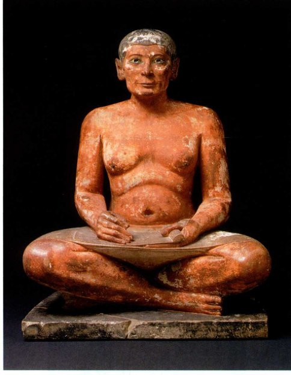

*图3.15《书吏坐像》（Sculpture of Seated Scribe），出土于萨卡拉。约公元前2400年。石灰石，高53.3厘米。巴黎卢浮宫*

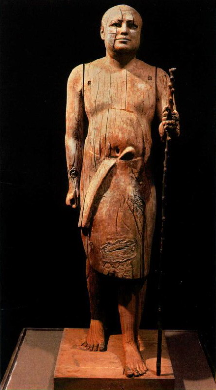

*图3.16《卡培尔雕像》，出土于萨卡拉。约公元前2450-前2350年。木制，高约109厘米。开罗埃及博物馆*

这些关于姿势、比例和外貌的规则只适用于地位最高的社会阶层——王族和朝臣。相比之下，人物的地位越低，他们的姿势就越放松，越自然。一旦规则确定下来，忽视它们就可能导致人物含意改变，尤其是地位的改变，使人物从国王或官吏降格成仆人或俘虏。在位于萨卡拉的第五王朝高官梯（Ti）的陵庙中有一幅精美的浮雕画，简洁地概括了社会等级与写实程度之间的这种相互关系（图3.17）。在插图所示部分，梯站在纸莎草丛中的一条船上观看猎河马。他的僵直站姿遵从传统的复合视角，腿和头为侧面，躯干和眼睛为正面，而猎手们身形较小，从另一条船上攻击猎物，他们做出的各种灵活姿势更加写实。船下方的锯齿状蓝线表示河流，处于自然界最低一级的河马和鱼自由自在地活动。同样，筑巢的鸟和捕食的狐狸也在纸莎草花丛中自由地活动。

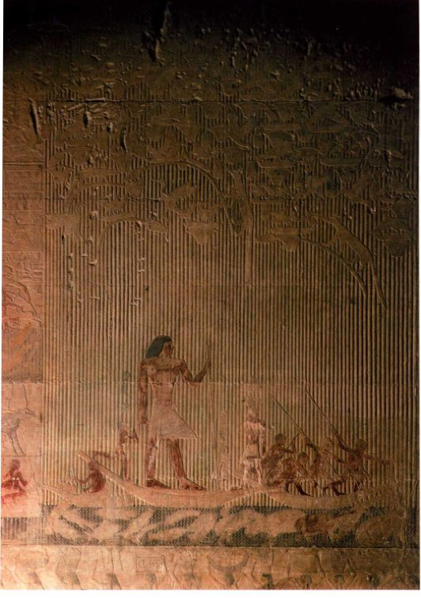

*图3.17《梯观猎河马》。约公元前2510-前2460年。彩绘石灰石浮雕，高约114.3厘米。萨卡拉，梯陵墓*

**绘画与浮雕** 与墓中的雕像一样，这类绘画和浮雕在埃及信仰体系中也起着重要作用。《梯观猎河马》（Ti Watching a Hippopotamus Hunt）之类的图像使死者能够继续他或她在世时喜欢的活动。但它们也有多种隐喻作用。比如，征服大自然象征着战胜死亡。死亡是冥神俄塞里斯管辖的领域，但他在被赛特杀害后复活，所以尼罗河也是他的辖地。毕竟，俄塞里斯是生育和复活之神，人们会将死者比作他。而且，由于伊西斯把荷鲁斯藏在一丛纸莎草中，使他免受赛特的伤害，所以纸莎草架就被认为是重生之所，很像坟墓本身。此外，船是在来世的无尽旅途中一路运送卡的传统交通工具。与之相反，破坏庄稼的河马常被视作一种代表邪恶和混乱的动物，所以是性喜破坏的沙漠统治者赛特的化身。

整幅画可能隐含着其墓葬环境特有的意义。其他古王国墓画描绘了葬在主墓主人旁边或在来世陪伴卡的家庭成员。一些画面描绘了纪念死者的祭祀仪式，或是为卡提供永久食粮的献祭或农业活动。在这些画面中，死者通常只旁观而不参与。

> **大事年表**
>
> *   公元前2630一前2611年 - 国王佐塞的统治；葬于萨卡拉
> *   约公元前2575一前2465年 - 古埃及第四王朝；吉萨大金字塔修建
> *   约公元前2100年 - “斯通亨奇”进入最后建造阶段

## 中王国：通过艺术重新肯定传统

约公元前2152年，古王国集权政府随着第六王朝国王佩皮二世（Pepy II）晏驾而瓦解。随后是长达一个多世纪的混乱的第一中间期，地方或地区君主加剧了上埃及和下埃及的敌对。这两个地区在第十一王朝重新统一起来，当时在位的国王蒙图霍特普二世（Mentuhotep II，约公元前2061-前2010年）逐渐在整个埃及重新确立了王权。第十一王朝和第十二王朝合称中王国（约公元前2040-前1640年），这一时期的艺术品大多刻意模仿古王国的样式，尤其是丧葬艺术。这种艺术维护了与以前统治者的连续性，但王室成员雕像也表现出了打破传统的特点。

### 皇家肖像：表情与比例的变化

一尊残缺的森乌塞特三世（Senwosret III，公元前1878-前1841年在位）石英石像显示出背离传统的王族表现方式（图3.18）。过去一千多年来，艺术家在表现王族时都会雕刻一张肌肤光滑的脸，经过了美化，没有岁月痕迹，而这座石英石像的雕刻者却刻画了一个已显老态的国王。他皱着眉头，眼皮下垂，眼睛下方有皱纹。学者说这尊雕像中的国王“正在沉思”，并把它放在森乌塞特三世在努比亚进行艰难的军事南扩这一背景下来解读，将国王形象的缺陷都视作压力的外在表征。但脸部表情或衰老迹象对于不同的社会来说意味迥异，也有可能沉默寡言的表情反映了君王权威的新形象，表达了坚定的决心。衰老的脸往往与一个年轻强壮的身体结合在一起。

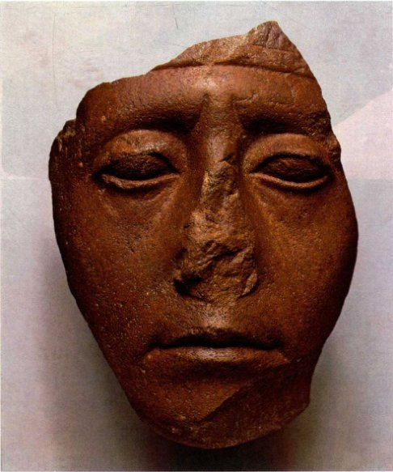

*图3.18《森乌塞特三世雕像》（Sculpture of Senuosret III，残片）。约公元前1850年。石英岩，高16.5厘米。纽约大都会艺术博物馆。购入，Edward S. Harkness赠，1926（26.7.1394）*

皇家雕像上出现更为写实的面部表情并非中王国的唯一革新。这一时期的比例准则也改变了。如果我们把古王国的卡蒙若内比提王后像（图3.12）与在上努比亚（Upper Nubia）的凯尔迈（Kerma）发现的森努威夫人（Lady Sennuwy，一个行省长官的妻子）雕像（图3.19）进行比较，就能发现明显的比例变化。在中王国时期，妇女形象肩更窄，腰更细，四肢更修长。男性形象则是头部适当缩小，并且不再有古王国男子那种紧实的肌肉。这些微妙的变化将不同时期的人体表现形式区别开来。

### 墓葬建筑

在中王国时期，朝臣与其他权贵的墓葬样式相对固定，大多数人更喜欢死后葬入开凿的墓穴和马斯塔巴。这一时期特别流行的是石窟墓，这种墓在古王国就已出现。其中的一些位于贝尼哈桑（Beni Hasan），这里是第十一王朝和第十二王朝时期统治埃及中部的一个强大家族的墓地（图3.20）。这些墓开凿在尼罗河东岸一个岩石平地上，隔河望去，景象壮丽。在其内部，入口处的门厅通往立有圆柱的大厅和墓室，死者的雕像就立在墓室的一个壁龛里（图3.21）。与古王国坟墓一样，这里有彩绘浮雕装饰墙面。图3.22所示的片段来自修复后的卡努姆霍特普（Khnum-hotep）墓，表现了工人制服和喂食非洲大羚羊（羚羊的一种，在沙漠中捕获后，当作宠物豢养）的情景。

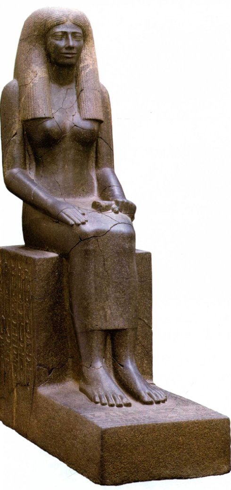

*图3.19《森努威夫人雕像》（Sculpture of the Lady Sennuwy）。约公元前1920年。花岗岩，高172厘米，纵深116.5厘米。波士顿美术馆，哈佛大学与波士顿美术馆联合考察队*

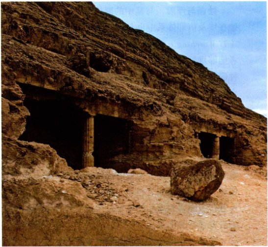

*图3.20 贝尼哈桑石窟墓，B-H 3-5。第十一、十二王朝，约公元前1950-前1900年*

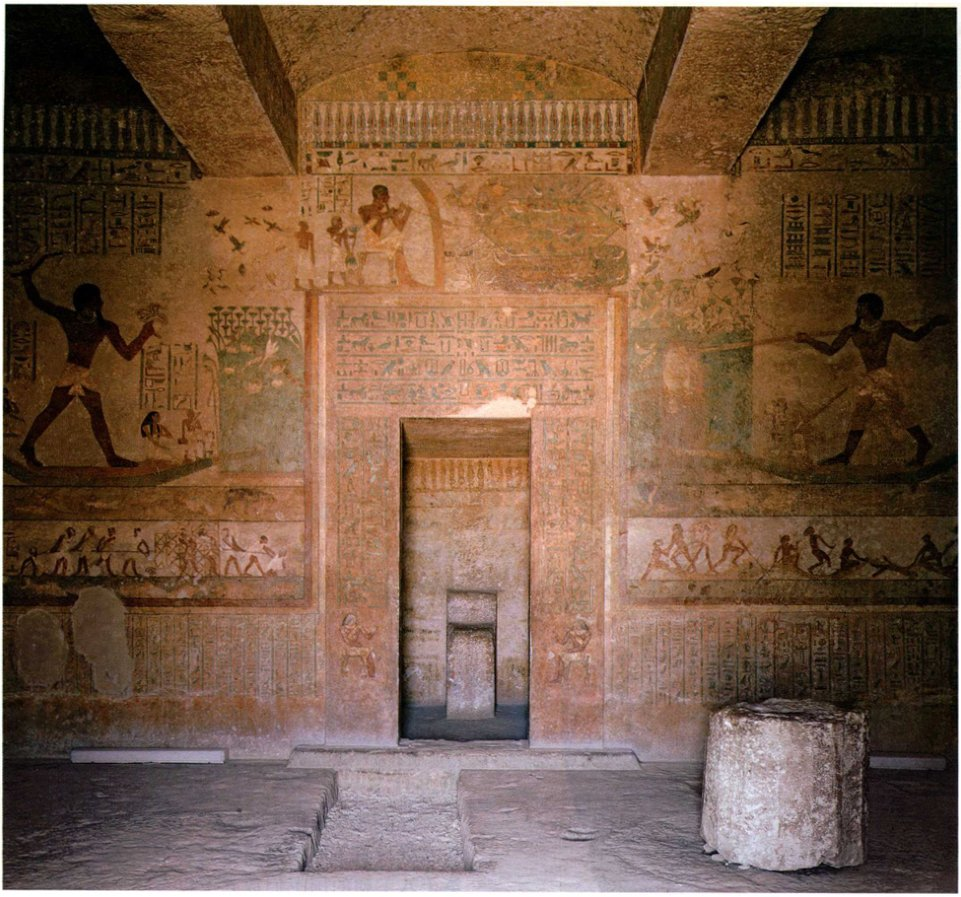

*图3.21 石窟墓内厅，B-H2，贝尼哈桑。第十二王朝，约公元前1950-前1900年*

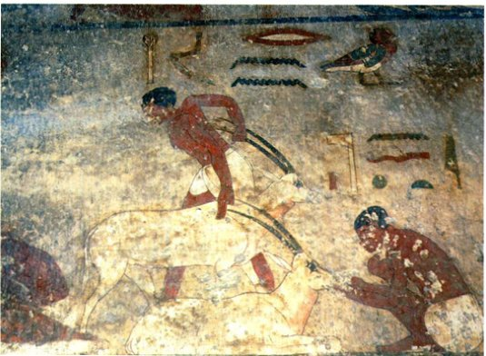

*图3.22《喂羚羊》（Feeding the Oryxes）。约公元前1928-前1895年。壁画细节部分。贝尼哈桑卡努姆霍特普陵墓*

与在古王国一样，墓室绘画被认为能为死者提供食粮、陪侍和消遣。墓室中有种类丰富的陪葬品，包括玻璃釉（faience）制品，一种玻璃浆烧制的工艺品，成品不透明，表面有光泽。图3.23所示的小雕像出土于底比斯（Thebes）的一个墓中，表现了一个图式化的女人。膝盖以下部分省略，可能是为了限制行动，或是因为它们对于她的功能来说并不重要。与之不同的是，雕像细致刻画了她的乳房和阴部，一条画上去的子安贝（cowrie）腰带突出了她的腹部和臀部。这个小雕像可能是作为一种生殖符咒，提高生者家庭的延续性，增进死者在来世的新生。上釉玻璃的蓝绿色与生殖力、女神哈索尔（Hathor）和重生相关。

> **大事年表**
>
> *   约公元前2040年 - 古埃及中王国开始
> *   约公元前19世纪70-40年代 - 国王森乌塞特三世的写实雕像
> *   公元前1792-前1750年 - 汉谟拉比统治巴比伦
> *   公元前1785年之后 - 喜克索人控制尼罗河三角洲

中王国的物主恢复了古王国的一些形式和习惯，以此维护与往昔的黄金岁月的纽带。但这种稳定的状态并没有维持下去。由于中央政权在约公元前1785年之后被削弱，地方长官僭取了权力。在第十二王朝时期，来自巴勒斯坦的移民迁入尼罗河三角洲，逐渐控制了这一地区，迫使国王南退至底比斯。这个民族被称为喜克索人（Hyksos，源于埃及语“外邦之王”），他们的统治时期称作第二中间期。

## 新王国：重现光荣

喜克索人最终被第十八王朝首任国王雅赫摩斯（Ahmose，公元前1550-前1525年）逐出埃及。在此之后的500年时间，即第十八、十九和二十王朝，被称为新王国，对于埃及来说，这是一个重新开疆拓土和尽享繁荣的时期，也是一个艺术活跃期。以底比斯（今日的卢克索［Luxor］）地区为中心，沿尼罗河流域展开了庞大的建筑工程。在这些工程中，宫殿和堡垒等许多世俗建筑是用泥砖建造的，所以后来都损毁了。但石墓和石庙还保留了些许往昔的辉煌。

### 帝王谷中的皇家陵墓

古王国与新王国的主要差异反映在丧葬习俗上。在亲眼目睹了致使皇家陵墓被盗的无序状态之后，第十八王朝的国王们放弃了以金字塔标记陵墓的惯例。他们改而在底比斯以西的帝王谷（Valley of the Kings）的石壁上开凿墓穴，安葬后将入口隐藏起来。考古发掘活动已显示，这些墓穴都有一条走廊向岩石深处延伸，直抵墓室，墓室两侧有储藏室。墓室里的装饰绘画描绘了国王与俄塞里斯、阿努比斯（Anubis）和哈索尔在一起的情景，这三位冥界之神确保国王进入来世。丧葬仪式的地点远离墓穴，在一块朝东的地表岩石上，在耕种地区边缘的一座庙宇中。

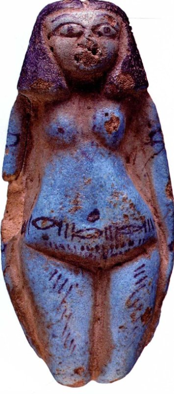

*图3.23《女性小像》（Female Figurine），出土于底比斯。第十二至十三王朝。釉陶，高8.5厘米。伦敦大英博物馆*

**哈特舍普苏特陵庙** 保存最为完好的一座新王国陵庙属于女王哈特舍普苏特（Hatshepsut），由女王的建筑师塞内姆特（Senenmut，约公元前1478-前1458年）修建（见图3.24）。哈特舍普苏特是图特摩斯二世（Thutmose II）的正妻和同父异母姐姐。图特摩斯二世于公元前1479年去世后，王位传给了妃子所生的幼子图特摩斯三世。哈特舍普苏特被指定为幼王的摄政女王，与他共同执政，直至公元前1458年去世。她宣称其父图特摩斯一世曾有意让她继承王位。

哈特舍普苏特陵庙被代尔-埃尔巴里（Deir Bahri）的绝壁环抱，位于壮观的第十一王朝的蒙图霍特普二世陵庙之侧（图3.25），这位国王曾在500多年前的中王国时期重新统一埃及。设计哈特舍普苏特陵庙的建筑师们可能模仿了这座古庙的一些特点，如梯台伸向崖壁，最高一层有一座金字塔或马斯塔巴。哈特舍普苏特陵庙曾经通过一条堤道与尼罗河边的一座河谷神庙相连，它与周围的环境相得益彰，完美交融。它的白色石灰石庭院逐层上升，由位于中轴线上的宽阔坡道连接，与清晰的沙漠地平线和上方的崖顶相呼应。同时，由明亮光线和柱廊阴影共同形成的大量竖直线条与悬崖上的裂缝和谐一致。这座皇家建筑的简洁外形给不那么规则的自然形态添加了秩序，正如国王的任务是在混乱中建立秩序。通往陵庙的入口两旁树木成行，还有成对的狮身人面像相对而立。在陵庙的尽头，有一个从岩壁中凿出的主圣殿，供奉的是夕阳之神阿蒙-拉（Amun-Ra）。一些较小的神殿则尊奉防腐之神阿努比斯和西方女神哈索尔。上层梯台上立着一座献给主神拉-哈拉克提的祭坛。

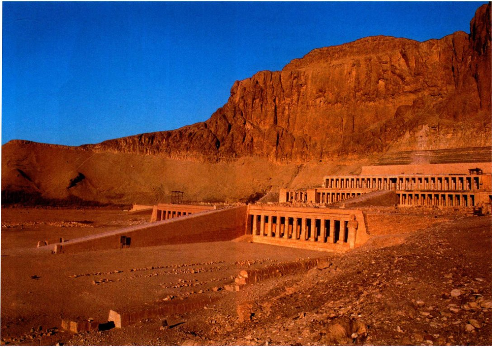

*图3.24 哈特舍普苏特陵庙，代尔-埃尔巴里。约公元前1478-前1458年*

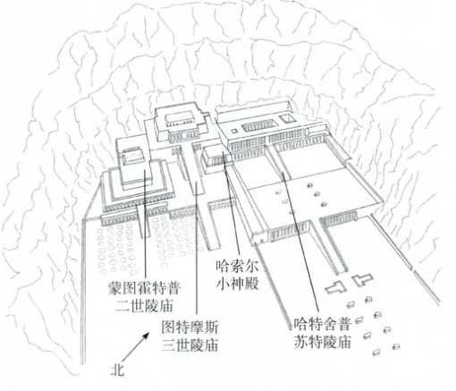

*图3.25 代尔-埃尔巴里各庙宇复原图，包括蒙图霍特普二世、图特摩斯三世和哈特舍普苏特陵庙（根据意大利Vercelli White Star档案馆所藏Andrea Mazzei的素描绘制）*

彩绘浮雕遍布整个建筑群，让墙壁活了起来，它们描绘了战争，为寻找栽种在梯台上的没药树而对庞特（Punt）国进行的皇家远征，以及图特摩斯一世将其女儿不寻常的统治合法化的场面。庙中有大量国王和神祇雕像。图3.26所示的红色花岗岩雕像是第三个庭院中的八尊巨型雕像之一，刻画了哈特舍普苏特跪着向神献上两个坛子的模样。因为国王被规定为由男性担任，所以她穿戴的都是代表男性国王的标志性衣物：褶裙、假胡须和白冠。虽然她在一些雕像中明显是一位女性，但在这一尊和其他许多尊雕像中，她们都是没有乳房的。

哈特舍普苏特死后的某个时候，图特摩斯三世修建了自己的陵庙，位于其母的陵庙和蒙图霍特普庙之间，目的是盖过哈特舍普苏特陵庙的光芒。他指定，在代尔-埃尔巴里举行的瓦迪（Wadi）节中，阿蒙（Amun）圣舟行驶的目的地就是自己的陵庙。他的努力产生结果之一就是，许多哈特舍普苏特像被毁，在哈特舍普苏特陵庙的一些铭文中，她的名字被图特摩斯三世所取代。尽管如此，哈特舍普苏特陵庙仍是一件纪念这位女王的不朽杰作。

### 众神之庙

除了为自己建造陵庙，第十八王朝的国王们还耗费大量资源修建神庙，如敬献给底比斯三神阿蒙、其妻努特与其子柯恩斯（Khons）的庙宇。在卡纳克（Karnak）及其附近的卢克索，历任国王为三位神祇建造了两座宏伟的神庙群，而且在特定的节日中会以圣舟沿水路在神庙之间运送神像。

**阿蒙-拉神庙** 在卡纳克的阿蒙-拉神庙中，有一道巨大的墙环绕着神庙建筑（图3.27）。进入建筑群时，你要走过为纪念列王而建的巨大塔门（pylon）。（在建筑历时多年之后，这些塔门有时会被拆除。）当仪式队伍在建筑内部前进时，塔门标示了它逐渐深入圣域的进程。在庙区内，一般人到达巨大的多柱厅（hypostyle）后便不能再前进，但祭司和王族不受此限制（图3.28）。这里如林耸立的柱子令观者心生敬畏，它们的庞大体积使人变得近乎渺小。柱子排列紧密，以支撑石梁屋顶。与木梁不同，这些石梁必须造得很短，否则会由于自身的重量而断裂。不过，建筑师把柱子造得比实际所需的要重得多，如此一来，就令观者感觉到石头无处不在，它们沉重、坚固、永恒。

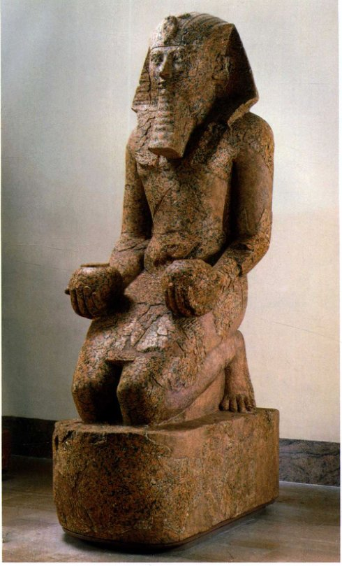

*图3.26《哈特舍普苏特王后跪像》（Kneeling Figure of Queen Hatshepsut），出土于代尔-埃尔巴里。约公元前1473-前1458年。红色花岗岩，高约2.59米。纽约大都会艺术博物馆。Rogers基金，1929(29.3.1)*

神庙的仪式功能中最重要的是隐喻价值，它象征着初生的世界，大殿中的柱子以象征性造型表现了沼泽植物：柱头被设计成类似纸莎草花朵和花苞的形状——因此这个建筑再现了潮湿的混沌沼泽，创世之丘便升起于斯。神庙由此成为国王以石头记下的劝勉，劝告众神维持宇宙秩序。多柱厅外有一个圣池，国王和祭司在进入神殿主体之前先在此沐浴。他们向前穿过更小的厅堂、沐浴在阳光中的庭院和饰有方尖碑（obelisk）的行进大道，方尖碑是一种有金字塔状尖顶（pyramidion）的高大石柱，也是太阳崇拜的象征。在最深处最幽暗的圣殿中安放着神的雕像。只有祭司和国王才能进入圣殿，每天早晨，他们都要清洗神像，给它穿衣喂食。

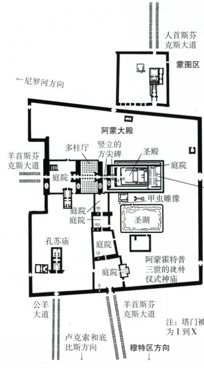

*图3.27 阿蒙－拉神庙平面图，卡纳克，底比斯*

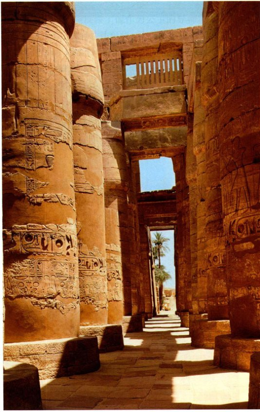

*图3.28 多柱厅，阿蒙大神庙，卡纳克。第十九王朝，约公元前1290-前1224年*

在连续不断的增修过程中，神庙变成了一个庞大的建筑群。数位国王在卡纳克建造了塔门，将其作为通往神庙的巨大关口。塔门不仅标示了神庙入口，还将其与外界的混乱和嘈杂隔绝开来。倾斜的墙面象征着地平线，太阳从两座塔楼之间升起。

塔门及神庙外墙表面饰有凹浮雕（sunken relief），这种技术是新王国时期的创新。与常见的浅浮雕不同，这种浮雕的形象是刻进表面的，而不是从表面凸出来的。这种技法不仅更易于在坚硬的石材上施展，而且在强烈的阳光下，凹陷的线条能产生深邃的阴影，从而使图像更加清晰。图3.29所示的浮雕带描绘的是塞提一世（Seti I）洗劫奥龙特斯（Orontes）河边的赫梯城市卡迭什（Kadesh），下层浮雕带则展现了狩猎场面，与在亚述一样（见图2.21），狩猎是一种象征着勇武的活动。遵循传统表现手法，国王和他的马车保持静止姿态，背景则是许多象形文字和士兵，士兵的身材比国王矮小得多，为的是美化国王的形象。国王及其马匹比周围的图像刻得更深，所以轮廓比其他图像更为清晰。国王的威力及其军队毫不留情的进攻似乎确保了胜利，虽然这两场战斗实际都没有决定性作用。通过征服外国军队，国王确立了秩序，也就是埃及古语玛特。

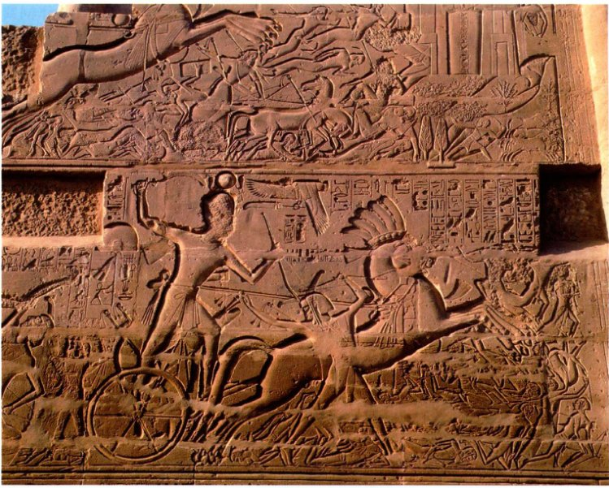

*图3.29《塞提一世作战》（Seti l's Campaigns），阿蒙神庙，卡纳克，底比斯（多柱厅北面外墙）。约公元前1280年。砂岩，凹浮雕。埃及*

**阿布辛拜勒** 在第十九王朝，塞提一世之子拉美西斯二世（Ramses II）在位67年（约公元前1290-前1224年），他下令修建的建筑工程超过埃及的其他国王，其中包括一座献给他自己以及阿蒙、拉-哈拉克提和卜塔（Ptah）的宏伟神庙，是在尼罗河西岸阿布辛拜勒（Abu Simbel）的砂岩上开凿出来的（图3.30）。单是这个地点本身就是一个有力的标榜：国王以这个神庙昭示他对下努比亚（Lower Nubia）的库施（Kush）国的所有权，库施是黄金、象牙和兽皮等贵重资源的产地。一个宏伟的岩石立面取代了塔门，入口两侧排列着四尊硕大的国王坐像，它们高约21米，任何人站在它们旁边都显得渺小。坐像两腿之间的小雕像代表的是王室成员。入口上方的壁龛中有一尊太阳神像，鹰首人身，头顶日轮。在其两侧的浮雕中，拉美西斯向太阳神举起一尊秩序女神玛特（Ma'at）的神像。因此这幅图像表明了国王应众神要求维持人间秩序的角色。在神庙内部有更多拉美西斯巨像，这些雕像及其后方的柱子都是用同一块岩石凿刻而成的。它们高9.8米，呈正面姿势，令在庙内主持仪式的祭司心生敬畏（图3.31）。

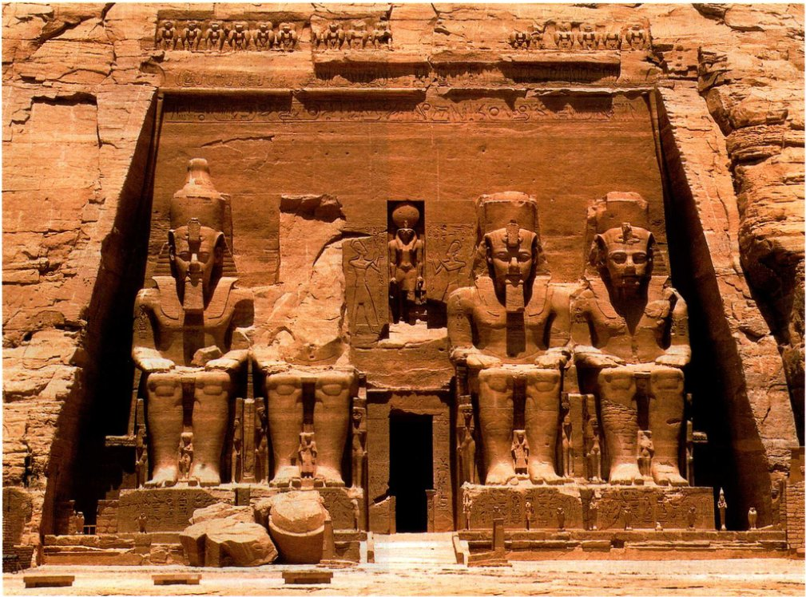

*图3.30 拉美西斯二世神庙，阿布辛拜勒，第十九王朝。约公元前1279-前1213年*

作为补充，拉美西斯还下令在离自己的神庙152米远的地方修建了另一座神庙，献给他的妻子涅菲尔塔里（Nefertari）和来世女神哈索尔。这座神庙的正面也是由岩壁上凿刻出的雕像形成。神庙规模巨大，但远远比不上拉美西斯庙。两座庙的地形关系可能有特殊意义。将它们的中轴线向前延伸，就会在赐予生命的尼罗河中相交，所以它们的位置可能表现了与这对皇室伴侣相关联的生殖力。这种关系在今天已很难辨识了，因为在20世纪60年代，因修建阿斯旺大坝，拉美西斯神庙遗址被淹没，为了使神庙超过洪水水位，工程师们将神庙上移了213米。

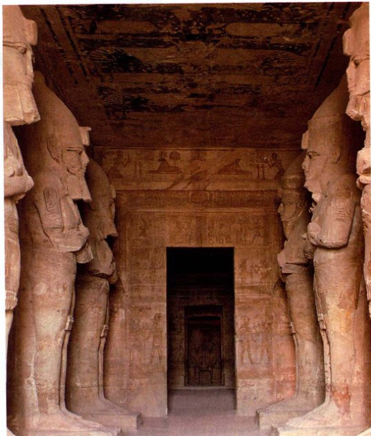

*图3.31 拉美西斯二世神庙内部，阿布辛拜勒。第十九王朝，约公元前1279-前1213年*

#### 块雕

在新王国，一种从古王国末期已为人所知的雕塑类型重新流行起来。这就是块雕（block statues），人坐在地上，膝盖蜷到胸前，被一块斗篷包裹起来，这样人体就被简化成了一个抽象的立方体。在块状体上方有一个头像，双脚则自底部伸出；有时双臂交叠放在膝盖上。与更为传统的全身像一样，这些雕像也是卡在墓中的住所。它们在第六王朝首次出现时，是放在模型丧船中的，这些船只运送死者前往俄塞里斯崇拜中心阿比多斯（Abydos）。所以它们可能是表现死者在这次来世之旅中神圣化过程。图3.32所示的例子可能来自卡纳克神庙。它展示了两个人的肖像。上方是塞内姆特的头像，他是哈特舍普苏特和图特摩斯三世时期的高官以及代尔-埃尔巴里陵庙的工程总管。在他的头像下方有一个非常小的头像，这是哈特舍普苏特和图特摩斯二世的女儿纳芙瑞（Nefrua）。她的头从块状体中露出来，后面是塞内姆特的脸，仿佛被他拥在怀中，这可能反映了他作为公主的导师负有保护她的职责。为了维持块体形状，人体特征被忽略掉了，留出了足够的表面空间用来铭刻象形文字祷文或献辞。

### 新王国陵墓画像

艺术家们继续用绘画来装饰墓堂，这些画让人想起古王国和中王国的类似画面。然而，新王国时期新出现了一些表现死者敬拜神祇的画像，最典型的是俄塞里斯和阿努比斯，他们能助死者顺利渡向来世。艺术家们还绘制表现墓堂宴会的画，这种宴会是底比斯一年一度的瓦迪节的一部分，在这个节日中，生者会渡河到达尼罗河西岸，与死者一同享受盛宴。音乐和舞蹈是庆祝活动的一部分，来自底比斯的内巴蒙墓（Nebamun，约公元前1350年）的一块壁画残片显示，建立于一千年前古王国时期的等级制度仍然存在（图3.33）。上流社会的进餐者坐在上层，姿势僵硬，以复合视角表现，而下层的乐师和舞者则自由地活动，淋漓尽致地展现自己的技艺。吹笛人和拍手者的脸部完全是正面观，她们甚至还把脚底冲着观者——这是与上流社会姿态相对的极度放松。裸体舞者扭动旋转，表演者长发松开，束束分明，显示他们在运动。这些人物中内在的自由动感使一些学者想到，同时期的克里特艺术也许为这些画家提供了学习的范例。其他地方的绘画明显是来自这个爱琴海岛屿的艺术家的杰作。绘画右面的罐子暗示有大量美酒。音乐、舞蹈和美酒都是献给西方女神哈索尔的，她能带领死者穿越死亡与来世之间危险的边界。

> **大事年表**
>
> *   约公元前1595年 - 赫梯人占领巴比伦
> *   约公元前1550-前1525年 - 雅赫摩斯统治；喜克索人被逐出埃及
> *   约公元前1458年 - 哈特舍普苏特去世；其陵墓由塞内姆特设计
> *   约公元前1290一前1224年 - 国王拉美西斯二世统治；他下令在阿布辛拜勒修建一座巨大的神庙

新王国艺术家和赞助人在设计坟墓图像时也遵循中王国和古王国的先例。位于底比斯的未修完的拉莫斯（Ramose）墓中就有遵循这些传统的浮雕（图3.34）。他是阿蒙霍特普三世（Amenhotep III，约公元前1375年）的宰相。这幅浮雕描绘了拉莫斯的兄弟迈（Mai）及其妻子乌里尔（Urel），技艺极其娴熟。浮雕很浅，但精湛的雕刻将不同结构区分开来。乌里尔拥抱着丈夫，她的体态和手势反映了传统的表现手法，这种手法至少可上溯至古王国时期，但比例准则与以往的作品不同，而且这对夫妻的侧面像也糅合了其他新王国艺术品中的写实风格。在这幅浮雕中，丈夫与妻子永远同甘共苦，可与一首新王国情歌相媲美，这首情歌赞美了在爱人的陪伴下度过“悠闲时光”的欢喜愉悦（见第70页的原始文献）。

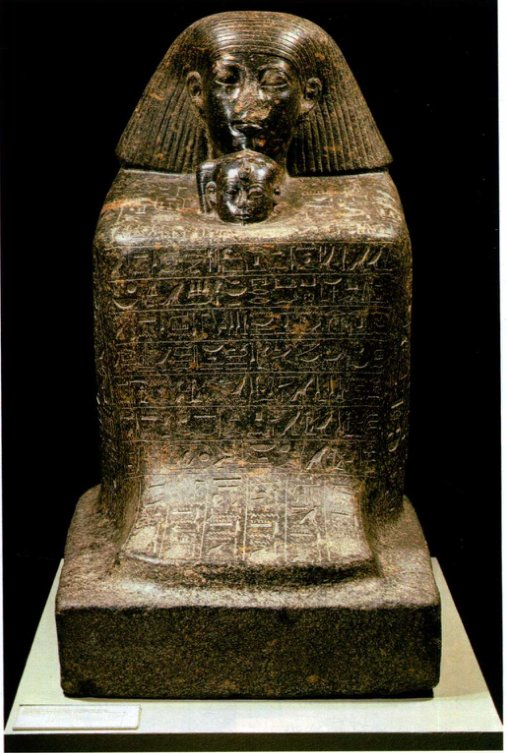

*图3.32 《塞内姆特与纳芙瑞像》（Sculpture of Senenmut with Nefrua）， 出土于底比斯。约公元前1470-前1460年。花岗岩，高约107厘米。柏林埃及博物馆*

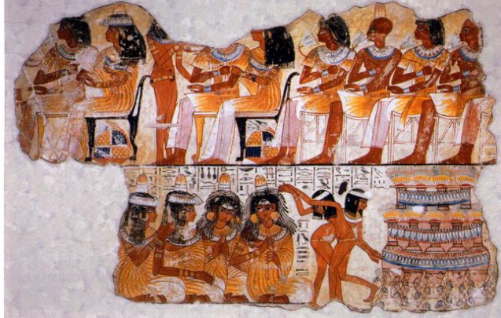

*图3.33 《乐者与舞者》（Musicians and Dancers），壁画残片，内巴蒙墓，底比斯。公元前1350年。高61厘米。伦敦大英博物馆*

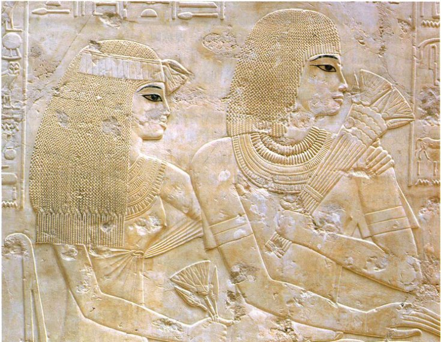

*图3.34 《迈及其妻乌里尔》（Mai and His Wife Urel）。约公元前1375年。石灰石浮雕细节部分。拉莫斯墓，底比斯*

## 阿肯纳顿与阿马尔纳风格

拉莫斯是阿蒙霍特普三世的宰相，这位国王在位期间（公元前1391-前1353年）大兴太阳神信仰。在卡纳克及其他地方的神庙群中，阿蒙霍特普三世建造了宽敞的露天庭院，为的是在这里敬拜太阳的化身，即天空中的圆盘（或阿顿［Aten］）。在他的儿子阿蒙霍特普四世治下，阿顿信仰愈加强大。阿蒙霍特普四世强调太阳的赐生力量，太阳神的形象开始由传统的鹰首人身变为一个放射光芒的圆盘，光线末端都是人手。年轻的法老试图在底比斯等传统宗教中心倡导这种新信仰，他的尝试遭到了强大的保守祭司阶层的阻挠。因此，阿蒙霍特普四世在埃及中部的尼罗河东岸上建立了一个新城市，阿顿是这座新城敬奉的唯一神明。他将新城命名为阿肯塔顿（Akhetaten，现称阿马尔纳［Amarna］），意为阿顿的地平线，他还将自己的名字改为阿肯纳顿（Akhenaten），意为“奉侍阿顿”。阿肯纳顿相信阿顿是生命之源，《阿顿颂歌》中就表现了这种理念，有时据说这首歌是阿肯纳顿所作。原文描写太阳出现时世界苏醒的情景，表达了目睹太阳每日升起时的喜悦之情。阿肯纳顿轻视和否定其他传统宗教，似乎打算让阿顿教成为一神教，此举激怒了其他教派的祭司。阿肯纳顿的新教派和新建的城市与其创建者同生同灭；在他死后，城市就被夷为平地。尽管如此，考古遗迹表明，阿肯纳顿在建造神庙时采用的是当时的风格，像卡纳克的神庙一样使用了厚重的塔门和方尖碑，但阿顿神庙更强调阳光照射下的露天庭院。

> **原始文献：《情歌》（Love Song）**
>
> 这首“情歌”写在一块写字板上，写字板现存于开罗博物馆。此诗作于新王国时期，公元前1300至公元前1100年之间。
>
> 你的爱，亲爱的人，对于我是如此可爱
> 仿佛涂在躁动者四肢上的油，甜蜜芬芳，抚平不安，
> 仿佛神体身穿的洁净礼袍，
> 仿佛归家者身上的熏香
> 因行程的气息而浓烈。
> 它像手中的成熟浆果，
> 像掺入啤酒的谷饭奇香，
> 像与面包一同入口的美酒。
> 悠闲的时光转瞬即逝，
> 让我们在平静的爱恋中扶持，
> 淡然走向老年的尽头。
> 而我会在每一个从容的日子里伴你左右，
> 这个女子只有一个愿望：凝目
> 一世，夫君的脸庞。
>
> *SOURCE: LOVE SONGS OF THE NEW KINGDOM. TR. BY JOHN I. FOSTER (AUSTIN, TX: UNIVERSITY OF TEXAS PRESS, 1974)*

### 阿马尔纳风格

阿肯纳顿及其家人的雕像背离了长期以来描绘王室对象的传统规范。在大量雕像中，阿肯纳顿的身体比例与以前的国王完全不同。例如公元前1353-前1335年安放在卡纳克的阿蒙-拉神庙中的阿肯纳顿巨像，国王在这些雕像中是肩窄（没有肌肉）、肚大、臀阔、腿胖的形象（图3.35）。宽厚的嘴唇、独特的鼻子和下巴、细长的眼睛使他的脸极易辨认。这些不寻常的肖像令学者困惑。一些人把这些雕像当作讽刺国王的艺术品，但这种昂贵而重要的雕像一定经过了国王的认可。还有人试图从这些雕像上判断国王的体格状况；国王的相貌被解读为弗勒里希综合症（Frolich's Syndrome）的症状，这是一种荷尔蒙缺乏症，会使男子产生女性特征。更为可能的一种解释是，他的“女性化”外表是为了表现阿顿的特点，生命创造者阿顿就是两性同体的。这种风格并不限于国王像，也影响到了朝臣和其他人的雕像。

阿肯纳顿与家人——妻子奈费尔提蒂（Nefertiti）和三个年长的女儿——在一起的组像有其不寻常之处，那就是人物之间明显很亲密。一块祭坛碑的凹浮雕画面清晰地表现了这一特点，埃及人常在自己家中和花园中的小神龛里树立这种祭坛碑（图3.36）。在日轮下方，赋予生命的阳光被描绘成向下放射的线条，线条末端是一只只手。国王与王后面对面坐在凳子上。逐渐变细的芦苇柱表明他们是在一个花阁里，阁中存有酒罐。他们抱着三个活泼的女儿，这三位公主爬上他们的膝头，爬进他们的怀抱，整个浮雕中充满生气的姿势把构图统一起来，与其他时代的静态画面形成了明显的对比。特意强调女儿的孩子气标志着一种变化：过去，儿童是用象形文字画表示的，就是一个正在吮吸手指的缩小的成人。对儿童的强调集中体现了这对皇家夫妻，尤其是作为太阳神阿顿化身的国王所代表的重生。

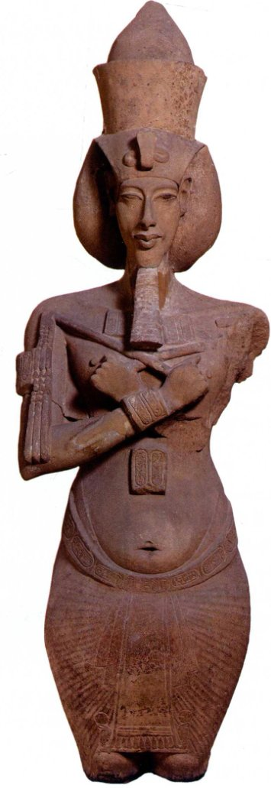

*图3.35《阿肯纳顿雕像》（Sculpture of Akhenaten），出土于卡纳克，底比斯。公元前1353一前1335年。砂岩，高约3.96米。开罗埃及博物馆*

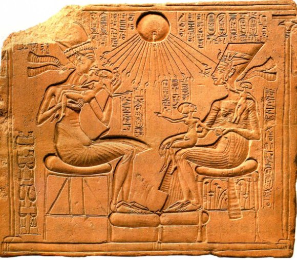

*图3.36《阿肯纳顿及其家人》（Akhenaten and His Family）。约公元前1355年。石灰石，31.1 × 38.7厘米。柏林国立博物馆，普鲁士文化遗产，埃及博物馆*

**泰伊王后** 图3.36中儿童的青春年少和活泼姿态暗示了令人惊讶的短暂无常，阿肯纳顿的母后、阿蒙霍特普三世的正妻泰伊（Tiy）的一尊三分之一真人大小的雕像也具有这一特点。雕像精妙地刻画了一个正在老去的女人（图3.37）。艺术家以黑色的紫杉木为主料，用贵金属和半宝石点缀细节，在理想化的容貌和衰老迹象之间达到了微妙的平衡。双颊为光滑平面，抽象的轮廓线描绘出双眉，眉毛下方那对镶嵌着乌木和雪花石膏的眼睛令人印象深刻。但我们仍然能看到暗示岁月流逝的痕迹，那就是下垂的嘴角，以及从鼻翼到嘴角的皱纹。

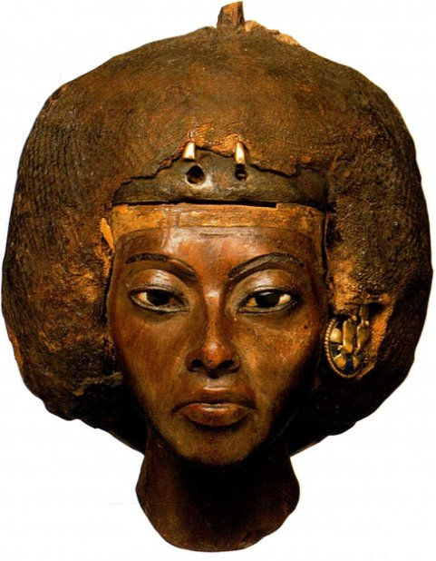

*图3.37《王后泰伊雕像》（Sculpture of Queen Tiy），出土于Kom Medinet el-Ghurab，约公元前1352年。紫杉、乌木、玻璃、白银、黄金、天青石、布、黏土和蜡，高9.4厘米。柏林国立博物馆，普鲁士文化遗产，埃及博物馆*

雕像的设计经过了两个阶段：起初，王后戴着黄金首饰和一件带有金制眼镜蛇的银头饰，这些饰物将她与丧葬女神伊西斯和奈芙蒂斯（Nephthys）联系起来。这件头饰后来被藏在一顶假发下，假发点缀着玻璃珠，上有一顶羽冠，其附属部分仍然保存着。虽然这尊雕像是与王后之夫阿蒙霍特普三世的陪葬品一同被发现的，但这些改动说明，为适应阿肯纳顿新倡的一神教信仰，雕像曾进行过改造。即使是一个小雕像在这类仪式中也起着重要作用。

**奈费尔提蒂像** 与阿肯纳顿像一样，早期的奈费尔提蒂王后雕像通过纤腰与粗腿、肥臀的对比，强调她的生殖能力。不过，造于阿肯纳顿统治后半期的雕像就没那么夸张了。在阿马尔纳，考古学家发现了国王的首席雕刻师的工作室，宫廷档案称其为“国王的宠臣和工程总管”。工作室出土了处于不同制作阶段的雕刻品：石英和碧玉做的头和四肢，以及王室雕像的躯干，头和四肢可安在上面。还发现了石膏模型，它们是利用参照真人制作的黏土或蜡制模子做成的。阿马尔纳出土的雕像中最著名的是一尊奈费尔提蒂胸像，是在石膏内核表面抹上灰泥，再加以彩绘制成，也许是一尊可供其他雕像模仿的母像（图3.38）。雕像右眼有镶嵌物而左眼没有，说明胸像仍未完成，但其异乎寻常的优雅源自于雕刻师对精确而微妙的几何学的掌握，称其精确是因为胸像脸部是完全对称的。公元前1335年，阿肯纳顿去世后，雕刻师从阿马尔纳迁往孟菲斯，这件作品和另一尊类似头像就被遗弃在工场里。阿肯纳顿的去世为他的教派和他所创建的城市敲响了丧钟。

### 图坦卡蒙与阿马尔纳的余波

阿肯纳顿死后不久，一位年幼的国王登上了王位。图坦卡蒙登基时年仅9或10岁，他娶了阿肯纳顿的女儿为妻，甚至他本人或许就是阿肯纳顿的儿子之一。也许是受阿蒙祭司的影响，小国王把王室迁回了孟菲斯，并复兴了被阿肯纳顿忽视的那些传统教派。他更名为图坦卡蒙，以示重建国王与阿蒙之间的联系。他的统治标志着埃及正统宗教的回归，尽管他在年仅19岁时就毫无预兆地身亡。他的突然死亡引发了许多关于谋杀和阴谋的猜测，但对其木乃伊进行的最新科学研究表明，他是因自然原因死亡。

图坦卡蒙最大的名声并非他的生平建树，而是由于他的死亡以及1922年英国考古学家霍华德·卡特（Howard Carter）发现其陵墓。虽然该墓已两次被盗，但墓的大部分原封未动。这座陵墓有楼梯、走廊和四个墓室，以皇家陵墓的规格来说异常狭小，这令学者们猜测，在国王意外早逝之后，人们为他选择了一座非皇家墓。尽管陵墓本身不宏伟，陪葬品无论从数量上还是质量上来说都丝毫不逊于其他帝王。事实上，这些物品的巨大价值使人们很容易理解，为什么埃及的盗墓活动自古王国时期以来就一直如此猖獗。墓中放有葬具，如棺材、雕像和面具，还有国王在世时使用的物品，如家具、衣服和双轮车。在许多物品上，图坦卡蒙都是以对战并击溃外敌的形象出现，这是他身为国王的使命——在混乱中维持秩序。国王被制成木乃伊的尸体保存在三层棺椁里，最里面的一层（图3.39）为黄金打造，重达114千克。更加令人难忘的是棺盖的精致做工，高度抛光的黄金表面嵌入彩色材料，熠熠生辉。像图坦卡蒙这样一位不太重要的国王都有如此壮观的陪葬品，那么更强大、寿命更长的法老想必有更加华丽的墓葬品，令人不由得为这些珍宝的丢失感到惋惜。

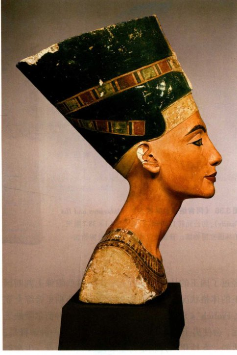

*图3.38《奈费尔提蒂王后雕像》（Sculpture of Queen Nefertiti）。约公元前1348一前1336／5年。石灰石，高48.3厘米。柏林国立博物馆，普鲁士文化遗产，埃及博物馆*

恢复旧宗教的过程由图坦卡蒙短命的继任者、年老的阿伊（Ay）延续了下来。他娶了图坦卡蒙的寡妻，这也许是为了保住王位，而非篡夺王位。旧宗教的复兴最终由哈伦海布（Horemheb）完成，他是图坦卡蒙时期的军队统帅，后成为第十八王朝的末代国王。他打算消除阿马尔纳革命的一切痕迹，他修补被损坏的神像，重修神庙；但阿肯纳顿统治带来的影响在后来的一段时间内仍然在埃及艺术中表现出来。

### 纸莎草卷：《亡灵书》

墙上的铭文以及家具陈设是用于图坦卡蒙墓等皇家陵墓的，但到了中王国，其他阶层的赞助人也渴望在墓中放置陪伴国王前往来世的祷文和咒语。到了新王国，赞助人们已开始委托书吏制作图文并茂的丧文，如最早出现于第十八王朝的《亡灵书》（The Book of the Dead，见本页的原始文献）。这篇丧文集合了200多条咒语或符咒，这些咒语来自中王国棺文，后来被抄录到纸莎草秆制成的卷轴（scroll）上。《亡灵书》在新王国时期的流行象征着埃及人来世信仰的变化：精英阶层的任何成员都可以享有来生，只要死者生前践行玛特的要求，而且能通过冥神的考验。死者的亲属一般都会把一卷《亡灵书》放入棺材，或把它包在木乃伊的绷带里面，这是为了确保死者拥有通过考验前往来世所需的知识。书中描绘了送葬、称量心脏和进供死者等场景。

现存最好的一例是约公元前1285年的《哈尼佛亡灵书》（The Book of the Dead of Hunefer）。图中所示画面（图3.40）表现的是第125篇中称量心脏和俄塞里斯审判死者的内容（见第73页的原始文献）。它符合许多工场都采用的业已完善的类型。为适应卷轴的布局，源于传统墓室绘画的图像经过了改造，成为一种连环叙事画，主角反复出现在一个接一个的画面中，画面之间没有间隔。在左方，冥界的狼面守护神阿努比斯领着哈尼佛进入双真厅（the Hall of the Two Truths）。然后，阿努比斯称量哈尼佛放在一个小瓶里的心脏，天平另一端是玛特的鸵鸟毛。玛特是真理与正义女神，象征神圣秩序，指导道德行为，她的头出现在天平顶端。长着朱鹭头的书记神透特（Thoth）记下称量结果。阿穆特（Ammut）饶有兴致地在一旁观看。她的身体由多种猛兽组成——鳄鱼头、狮子的身体和前腿以及河马的后半身，吞食因生前不义而不配前往来世的人。

死者必须向上方的每位神明发誓自己是遵照玛特生活的。神明宣布他“讲了真话”之后，他就被荷鲁斯带到其父俄塞里斯座前，俄塞里斯持有君主标志，全身裹在一块木乃伊般的白色尸布里，坐在一个浮在泡碱（natron）湖上的亭子中，泡碱是一种用来保存尸体的盐。陪伴在他身边的是伊西斯和她的姐妹、阿努比斯之母、亡者保护人奈芙蒂斯。在王座前方，荷鲁斯的四个儿子站在一朵象征重生的白莲花上。他们也是代表东西南北的四神，保护防腐过程中被取出的内脏，这些内脏被放入称为礼葬瓮（canopic jars）的容器中。上方的荷鲁斯手持一根鸵鸟毛，它象征着玛特作出的赞成判决。使俄塞里斯恢复健康的乌加特（udjat）眼表明了荷鲁斯的身份。与在人间一样，来世对秩序的要求是至高无上的。

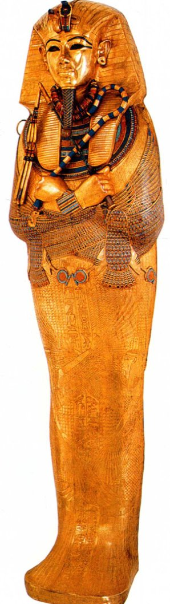

*图3.39 图坦卡蒙棺盖。第十八王朝。黄金，高182.9厘米。开罗埃及博物馆*

> **原始文献：亡灵书**
>
> 这篇文字是第十八王朝后半期的阿尼（Ani）纸莎草卷三号图版上的一条咒文，现藏于大英博物馆。这条咒文在称量灵魂出现，称重场面绘于密切相关的《哈尼佛亡灵书》中（见图3.40）。
>
> 透特，俄塞里斯驾前诸神之公正法官，言曰：尔等听裁决如下。彼之灵实已比照俄塞里斯之心称重，此灵即为其证；判决即在圣秤之上。未察彼道德败坏；未曾耗费庙中供祭之食；无为害之举；生时口中未吐恶语。
>
> 诸神告（居于）赫尔莫波利斯（Hermopolis，上埃及尼罗河沿岸的透特崇拜中心）之透特曰：汝口中之言即为天裁。俄塞里斯即真、即义，书吏阿尼得胜。吾视彼无罪行，亦未作恶。勿令阿穆特（Amemet或Ammut，即噬灵者）取之。予其糕饼，准其往见俄塞里斯，赐彼一地于和平之地（Sekhet-hetepu），如荷鲁斯之信众。

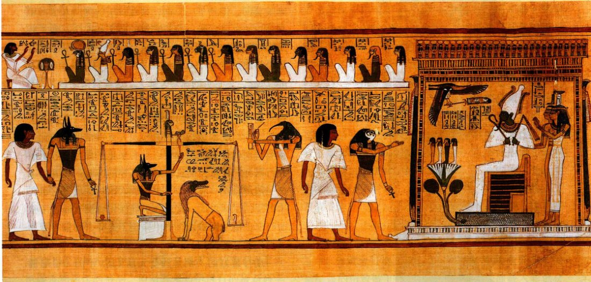

*图3.40《称量心脏与俄塞里斯裁决》（The Weighing of the Heart and Judgment by Osiris），出自《哈尼佛亡灵书》。公元前1285年。彩绘纸莎草，高39.5厘米。伦敦大英博物馆*

> **大事年表**
>
> *   约公元前1400-前1200年 - 赫梯帝国鼎盛期
> *   约公元前1353一前1335年 - 国王阿肯纳顿统治；新宗教中心阿马尔纳
> *   约公元前1348-前1336／5年 - 阿肯纳顿之妻奈费尔提蒂的石膏和石灰石胸像

## 晚期埃及

图坦卡蒙复兴阿蒙和《亡灵书》的古老源头说明，新王国时期的埃及人对往日的传统怀有深深的敬意。甚至在拉美西斯二世在位期间，随着国界向南和向东延伸，宗教中心卢克索和卡纳克也吸收了大量财富，产生了重要影响。约公元前1076年，即拉美西斯三世统治结束后仅仅70年，祭司的权势越来越大，直至第二十王朝期间，阿蒙教统治了整个埃及。此后，努比亚人、波斯人和马其顿人等外族接踵而至，相继控制了这片地区。

古埃及的最后阶段属于希腊和罗马历史的一部分。亚历山大大帝征服埃及之后，在自己去世（公元前323年）前创建了亚历山大港（Alexandria）。他的将军托勒密（Ptolemy，死于公元前284年）成为该地区的国王，并开创了一个王朝。这个王朝维持了近300年，直至托勒密十四世去世，这位国王是克里奥帕特拉（Cleopatra）与罗马独裁者尤利乌斯·恺撒（Julius Caesar）的儿子。公元前30年，罗马统治者屋大维（Octavian，不久后成为罗马皇帝奥古斯都［Augustus］）宣布埃及为罗马行省。不过，在希腊人和罗马人的统治下，埃及经济繁荣。在托勒密时期，亚历山大港成为希腊文化世界最有活力的文化和学术中心之一，它的港口为活跃的贸易活动提供了保证，这些贸易远达中国和印度。在罗马统治时期，孕育生命的尼罗河水使埃及成为帝国的主要粮食产地，赢得了罗马谷仓的美誉。

除了这种商业作用以外，埃及还为罗马及其后继者提供了壮观的王权典范和经久不衰的意象体系。从金字塔时代到托勒密时代，在这大约3000年当中，埃及列王修建了宏伟的建筑，来展现他们的财富，显示对国家及其资源的控制。皇家赞助的各个方面都表明了国王与神的紧密联系。通过使用石料来建造规模宏大的建筑，埃及国王试图使人感到王权统治的必要和必然。表现国王权力的模式与埃及一样古老。

埃及的国王及其他精英阶层的赞助人大兴建设，既是为了生者，也是为了死者。放在他们墓中供来世之用的器物和画像使现代人得以一窥他们在世时所享有的物质财富。坟墓是死者肉身和灵魂（卡）的安息之所。它们的修建目的就是要永存不朽，里面置有大量死者雕像。这些雕像也是要永久留存下来的，因为它们都是用最耐久的材料制成的。追求永恒还包括始终如一地使用传统手法来表现上流权贵。埃及艺术形式历久不衰，这表明埃及的社会结构、政治组织和宗教信仰稳固长久。

> **材料与技法：建造金字塔**
>
> 尽管已经进行过许多研究，但金字塔设计的许多方面对于埃及学家们来说仍是个谜。在新王国陵墓和庙宇的墙上保存着其他建筑类型——如宫殿和塔门——的立视图，还有几幅平面图留存至今。金字塔建筑师们可能利用类似的基准图进行工作，但其施工平面图皆已不存。让金字塔朝向东西南北四个基本方位似乎是至关重要的，古埃及人或许是通过观察星象来确定方位。偏差最大的是佐塞金字塔，它向东北方偏离了不到3度。
>
> 在古王国和中王国，金字塔的核心部分是用当地石灰石建造的。在大金字塔和大狮身人面像周边还可见到采石场（见图a和图3.10）。人们从远处运来图拉（Tura）石灰石和阿斯旺花岗岩来造覆面（外层表面），因为它们不是本地材料。工人们用铜制工具、杠杆和绳子在岩石中挖槽，撬出的石块多数为0.5至1.5米见方，但有时比这大得多。这些石块被设法经陆路拖至施工地点，用的是专门为此修建的被填塞得很坚固的堤道。
>
> 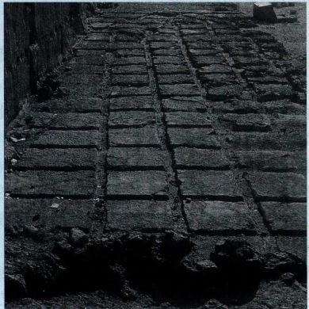
> *(a) 卡夫拉金字塔北面的石灰石采石场；*
>
> 一些学者认为它们被放在雪橇上，由一队队人或牛拖曳。这种观点的依据主要是一幅墓室画，画中是172个人用雪橇拉着一尊第十二王朝的杰胡蒂霍普特巨像（Djehutihopte）。当一个记录片摄制组试图用石块再现这一过程时，他们发现这样异常缓慢不便。但用23年建成的胡夫金字塔上估计有230万块石头，这就表明采石场移动石头的速度一定极快：大约1500个人一天必须开采至少300块石头。在哈特舍普苏特陵庙中，皮特里（Petrie）发现了木支架模型，其形状为四分之一个圆。如果把四个支架固定在一块石头的四个面上，仅用一小组人就可以较快地滚动石块。
>
> 金字塔的考古遗迹显示，建造方法随着时间的推移而发展变化。早期金字塔中运用了一种扶壁技术，就是围绕一个居于中心的内核部分垒起一层层石块，每一层都是倾斜的，其高度由内至外逐渐降低（图b）。然后以光滑的琢石覆面，琢石与地面成一定角度。这项技术在第四王朝之初被证明不稳定，此后，建筑师们转而使用逐层筑起的石层。覆面石被切割成直角梯形状，随着金字塔增高，以平行于地面的角度铺置（图c）。
>
> 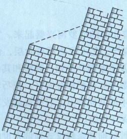
> *(b) 扶壁技术*
>
> 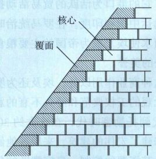
> *(c) 分层技术*
>
> 学者们认为，在金字塔越建越高时，工人们修了一些坡道，好把石块上移到相应的位置。这些坡道在用过之后可能就被拆除了，在考古资料中只留下几不可察的痕迹。最简单的办法就是用施工过程中废弃的碎石，沿金字塔的某一面修一条向上的直线坡道。但当金字塔越来越高时，坡道会越来越陡，需要加上台阶，工人们才能把石块拖上去。此刻，只有用杠杆才能移动石块。如果修建环绕金字塔的螺旋形坡道，则坡度会小一些，但会遮住金字塔基部的四个角，给测量员的计算带来困难，而且这样一条坡道到了最高层就很难修造了。另一个方案是在金字塔的一面建一条锯齿形坡道。有一个学者提出，大金字塔底部约六分之一用到了沙子和碎石坡道，以上的部分则改用由未经修整的外台阶支撑的石坡道。在坡道移开后，覆面石会被打磨光滑，形成一个斜面。

> **艺术史家的观点：解读古代旅行作家**
>
> *很多希腊人前往埃及；正如我们所料，一些人是去经商，一些人去参军服役，但还有一些人只是为了看看这个国家。——希罗多德*
>
> 艺术史家所能得到的原始文献之一是古代旅行者的著述。尽管在古代旅行会遭遇船难和偷窃等许多危险，但埃及从约公元前1500年起就已成了猎奇者的主要目的地，在公元第1、2世纪达到高潮。当地人使尽浑身解数吸引旅行者。在罗马时代，来自吉萨附近的布西里斯人（Busiris）会攀爬金字塔滑溜溜的斜面，以招徕游客。一些早期旅行者在艺术品上涂写或刻划上自己的名字，其中就有哈德良（Hadrian）的妻子萨拜娜（Sabina）。另一些人则写下游记，对于我们了解古迹文物作出了重要贡献，虽然解读起来也较为复杂。公元前5世纪初，希罗多德（Herodotus）出生在哈利卡纳苏斯（Halicarnassos，现今土耳其的博德鲁姆［Bodrum］）， 他成年后的大部分时间都在游历地中海和近东。他对其埃及之行的记述存世至今。公元前5世纪末，希腊地理学家斯特拉波（Strabo）也写了一篇很有价值的游记，描述他在埃及和其他地方的经历。
>
> 这些作家亲眼目睹了“七大奇迹”，这些奇迹那时比今天要完好得多。他们的描述常常能为古迹重建提供必不可少的信息，又如艺术家、建筑师或赞助人姓名等其他细节，但不加鉴别地相信他们的话是个很容易犯的错误。这些古代旅行者的关注点通常不同于现代艺术史家，这自然会影响到他们的记述的准确性。比如，比起艺术品或建筑，希罗多德对宗教更感兴趣。这使他提供的遗迹信息没有我们所希望的那么详细或准确。人们也实在太容易忘记，就算古代旅行者也是在金字塔及其他纪念性建筑物建成至少一千年后才来到埃及的。此外，他们信赖由向导和当地人口述的传说，但研究表明，这些信息常常有误。希罗多德坚称，胡夫金字塔的石块全都有至少9米长，但实际上0.9米可能更为准确。他还认为金字塔是由奴隶建造的，因而将胡夫斥为暴君。公元前5世纪，当地的祭司可能传播了这一说法，以取悦他们的波斯统治者。比起其他类型的证据，更相信古代文献，这是学者中一个由来已久的传统，在许多情况下，这使得他们对古代作家的话过分信以为“真”，甚至在考古证据与此相左的时候也是如此。

## 小结

古埃及沿着北非的尼罗河兴盛起来。它的社会等级极其森严，艺术家为精英阶层，包括权力集于一身的神王及王室制作绘画、雕塑和其他艺术品，其中许多历经数千年依然保存完好。技巧非凡和规模宏大是埃及艺术的共同特点，它很快就发展成为框定形式和主题的保守传统。

复杂的宗教信仰和宗教仪式强调来世的重要性，几千年中的种类繁多的古埃及艺术品大部分用在统治阶级复杂精美的陵墓中。现代考古发掘和研究不断为这份财富增添新的发现和信息。

**前王朝时期和王朝初期艺术**

虽然史学家们仍在为详细而精确的古埃及断代而争论不休，现代学者将古埃及王朝分成三个主要时期：古王国、中王国和新王国。古王国之前的时期被称为前王朝时期和王朝初期。在埃及王朝初期，埃及艺术形成了此后被赞助人和艺术家循蹈数千年的模式。精英阶层的赞助人委任艺术家制造丧葬建筑和陈设品，以及创造雕塑和绘画来表现他们理想化和不朽的形象。

**古王国**

古王国延续了五个世纪，其统治者下令制作的艺术品在后来的两千年中成为艺术家效仿和赶超的目标。艺术家遵循一个固定的程式，按照一套发展演化的比例来表现理想化的人体。而且，由于埃及人相信人的卡或生命力能在墓中存活下去，所以防腐师千方百计保存死者的尸体，使之不朽。古王国最重要的成就包括位于萨卡拉的佐塞墓葬群和建在吉萨的三座大金字塔，每座陵墓都表现了统治者在宗教和政治上的巨大影响力。

**中王国**

中王国持续约四百年，之前是古王国末期的一段统治分裂时期。在这个时代，艺术家故意模仿古王国样式，尤其是在丧葬领域，但中王国的创新之一就是王室雕像的表情更加写实。这一时期的权贵陵墓盛行使用石窟墓，而非金字塔。与之前的墓葬一样，这些坟墓中饰有设计精巧、色彩明丽的壁面浮雕。

**新王国**

喜克索人被逐出埃及之后，新王国开始，维持了约五个世纪。这是一个重新开始领土扩张和极度繁荣的时代，艺术也十分兴盛。尼罗河大部分河段沿岸展开了大型工程建设，尤其是在底比斯（今天的卢克索）附近。雄伟的墓葬群都是为统治者而建，包括壮观且保存良好的哈特舍普苏特崖边陵庙。国王也在献给神明的建筑上倾注了大量财力，如位于卡纳克的巨大的阿蒙-拉神庙和阿布辛拜勒的著名神庙，阿布辛拜勒神庙敬奉的是众神以及下令修建神庙的神王——拉美西斯二世。

**阿肯纳顿与阿马尔纳风格**

国王阿肯纳顿建新城阿肯塔顿（现称阿马尔纳）献给太阳神阿顿。阿肯纳顿不承认其他传统教派，欲使阿顿教成为一神教，这激怒了其他教派的祭司。新的宗教和城市在阿肯纳顿死后被彻底摧毁，但国王、王后奈费尔提蒂及其家人的肖像保存了下来。这些作品背离了既定的肖像规范，其中一些表现了人物之间明显的亲密关系，这在以往是极为罕见的。阿肯纳顿的继任者都是短命的国王，包括图坦卡蒙，他的陵墓1922年被发现，墓中有数量惊人的精美珍宝。