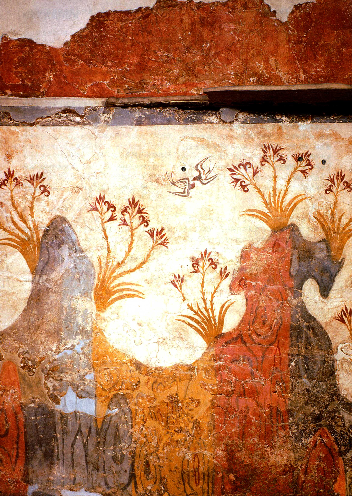

*图4.9《春天壁画》细部*

# 第四章 爱琴艺术

地中海是联结各古代文明的主要航路之一。这片海域南接埃及和北非，东连亚洲，西岸和北岸则是欧洲，它使迥然不同的文明经由贸易或交战的方式产生接触。地中海在希腊和土耳其之间的部分被希腊人称为爱琴海（Aegean Sea），它是传奇的特洛伊（Troy）战争以及其后的故事发生的地方（见地图4.1）。公元前第三个和第二个千年，在与爱琴海相邻的岛屿和半岛上形成了几种密切相关但截然不同的文明。

基克拉迪（Cycladic）文明得名于克里特（Crete）以北的群岛，这些岛组成了一个不规则的圆圈。英国考古学家阿瑟·埃文斯爵士（Sir Arthur Evans）将克里特岛上的文明命名为米诺斯（Minoan）文明（即克里特文明），此名来自传说中的米诺斯王（Minos），他是希腊神祇宙斯与凡间公主欧罗巴（Europa）之子。大陆上的文明叫做希腊底（Helladic）文明，该词源自希腊语Hellas，这是传说中一位祖先的名字。这些各自独立的文明组成了我们今天所说的爱琴文明，这个名字就来源于那片既是阻隔又是纽带的大海。

直到19世纪下半叶，人们对爱琴文明的了解主要还是来自《伊利亚特》（Iliad）和《奥德赛》（Odyssey），这两部史诗讲述了众神、国王和英雄的传奇，被认为是公元前8世纪希腊诗人荷马（Homer）的作品。特洛伊围城及其战局的故事仍能激发现代人的无限想象。德国考古学家海因里希·施利曼（Heinrich Schliemann）受到这些故事的启发，并渴望探寻其背后是否有事实依据，于19世纪70年代在小亚细亚和希腊挖掘遗址。阿瑟·埃文斯以这位德国人为榜样，1900年开始在克里特进行考古挖掘。从那时起，大量考古学证据纷纷出现，有一些印证了荷马的故事，但大部分与之矛盾。虽然在米诺斯和迈锡尼（Mycenae）文明中都发现了文字，但学者们几乎无法破译这些文字。（见谅本章没有原始文献。）因此，我们对爱琴文明的了解不如对埃及或古代近东文明的了解。

早在旧石器时代，爱琴海地区就出现了人类居住的迹象，但定居点的扩散和发展主要是在新石器时代和青铜时代初期。学者将爱琴文明的青铜时代分为初期、中期和末期三个阶段，各阶段又进一步分为I、II、III三个时期。与绝对年代相比，考古学家更喜欢使用这些相对年代，因为爱琴文明青铜时代的年表存在诸多争议。初期（约公元前3000-前2000年）大致对应埃及的前王朝和古王国时期，以及美索不达米亚的苏美尔与阿卡德文明时期。中期（约公元前2000-前1600年）对应埃及的中王国时期和巴比伦在美索不达米亚兴起的时间。与末期（约公元前1600-前1100年）同时发生的是埃及的第二中间期和新王国的开端，在美索不达米亚则是赫梯人打败巴比伦以及亚述人在美索不达米亚崛起。由于某种原因，爱琴文明地区遭到大规模毁灭，导致公元前1200年左右人口锐减，虽然后来稍有起色，但到了公元前1100年，爱琴文明的青铜时代依然走到了尽头。

这些文明各自都产生了不同的艺术形式。程式化的大理石人像和壁画是基克拉迪群岛（Cyclades）最重要的艺术类型。克里特则主要是带有精美墙饰的宏伟宫殿。希腊大陆上留下了城堡和随葬品。我们只能解读一小部分米诺斯和迈锡尼文字，所以艺术品能够帮助我们了解这些文明的习俗和观念。荷马史诗和希腊神话都记录了这些文明，证实了它们对晚期希腊文化发展的重要性。

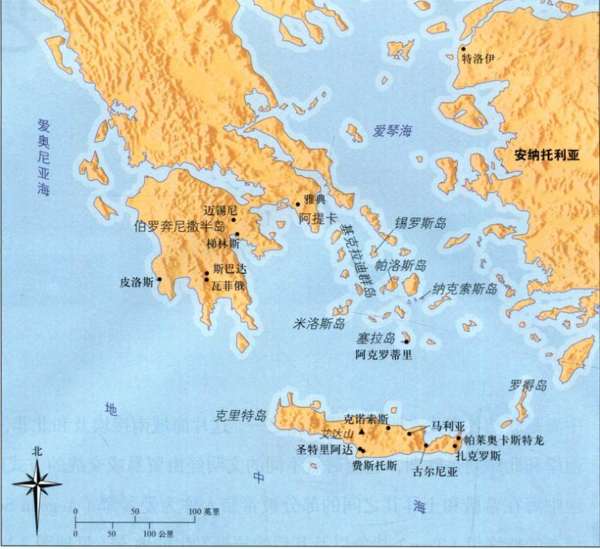

*地图4.1 青铜时代的爱琴海地区*

## 初期基克拉迪艺术

关于基克拉迪群岛文化的信息全都来自考古资料。留存至今的艺术品有限，但这些物品显示，青铜时代之初的贸易发展，尤其是黑曜石（一种黑色的火山石）贸易为基克拉迪群岛积聚了财富。

财富增长的表现之一是葬礼习俗。在希腊文明青铜时代初期开始时，即公元前2800年左右，岛民开始把死者葬在石块衬砌的墓坑里，墓坑以石板密封，称为箱形石坟（cist graves）。虽然没有大型标志物，但其中一些墓里有随葬品，如兵器、首饰和陶器等。在基克拉迪文化初期，陶器采用手工制作。除了饮食用具，陶工还生产带柄的扁平圆形器物，现今根据其形状称之为“煎锅”（图4.1）。它们饰有雕刻或压印的螺旋纹和圆圈纹，有时还可以见到代表船的抽象图形。这些煎锅可能是用来调配化妆品的调色板，或经打磨后成为一种早期的镜子。

*图4.1“煎锅”，出土于锡罗斯岛卡兰得里阿尼（Chalandriani，Syros）。初期基克拉迪II期，约公元前2500一前2200年。赤陶，直径28厘米，深6厘米。雅典国家考古博物馆*

一些基克拉迪墓葬内有引人注目的人像，通常是女性，用当地的白色大理石雕刻而成。插图所示的基克拉迪初期II期人像代表了最常见的类型（图4.2）。人像为裸体，双臂合抱于腰前，脚趾伸展。身体扁平，背部挺直，脖子长而粗，支撑着盾形的脸，脸部微微倾斜。艺术家利用磨料——很可能是产自纳克索斯岛（Naxos）的金刚砂——来加工人像的一些细节部分，如脊状的长鼻子、小而尖的乳房、三角形的阴部和八个脚趾。几尊现存人像上的色素痕迹表明，其他细节是画上去的，如双眼、头发、珠宝首饰以及类似于文身的身体标记。

> **大事年表**
>
> 约公元前2800年 - 基克拉迪岛民开始将死者葬入石块衬砌的墓坑
> 约公元前2500年 - 基克拉迪白色大理石人像
> 约公元前2575-前2465年 - 古埃及第四王朝；吉萨三大金字塔修建

这些雕像尺寸不一（最大的长达1.5米，最小的不过十几厘米），但造型相当一致，学者据此认为存在一种人体比例的指导性准则，正如埃及雕像的情况一样（见第三章）。尽管如此，有一些人像显然未遵循这个准则。有些人像似乎有孕在身，有些是男性，而有一组独特的人像是乐师，如长笛演奏者或图4.3所示的竖琴演奏者。

*图4.2 人像，基克拉迪群岛。约公元前2500年。大理石，高40厘米。Nicholas P. Goulandris基金，雅典基克拉迪艺术博物馆。Nicholas P. Goulandris藏品，第206号*

有些人像象征着什么？有何作用？学者提供了几种可能的答案。多年以来，考古学家一直称它们为基克拉迪“偶像”，想象它们在以某位母神为核心的宗教中占据中心地位。近来，学界又提出了至少两种似乎合理的说法来解释这些人像的功能。也许人像制作纯粹是出于丧葬目的，代表仆人或替代人牲，甚至作为死者尸体的替身。另一种可能是，在被埋葬之前，这些人像或许一直在基克拉迪居民的日常生活中发挥作用，大概是放置在家庭神龛里。虽然大部分人像被发现时是平放着的，但可能原本有东西支撑它们直立。最大的人像大概是神像。一些雕像有用金属丝修补的痕迹，有力地证明了这些人像在入土前曾被使用和珍藏。

或许，任何一种解释都无法适用于所有雕像。在确定其意义和功能方面，最大的障碍是我们不了解出处（provenance），即它们是在哪里发现的，如何被发现的，以及发现后的经历。人像的风格，尤其是其简洁和清晰的几何形，对于偏爱简单、朴素的几何形的20世纪和21世纪美学极具吸引力。正因为这些人像具有上述特质，并且是以漂亮的白色大理石制成，所以它们大量出现在艺术品市场上，通常没有任何关于其考古环境的记录。为了更加了解这些人像，考古学家需要把它们放在原初环境中进行研究，无论那是坟墓还是生者的住所。

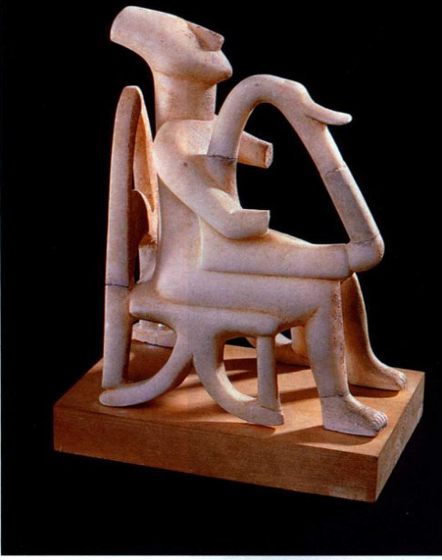

*图4.3《竖琴演奏者》（Harpist），出土于基克拉迪群岛阿莫戈斯岛（Amorgos）。公元前第三千年下半叶。高21.5厘米。雅典基克拉迪艺术博物馆*

这些爱琴海岛屿留存至今的妇女和乐师雕像似乎借鉴了旧石器和新石器时代的雕像，如《威伦道夫的女子》（图1.16）。但这些人像的特殊样式——它们所遵循的准则——是这些岛屿（以及克里特，那里已出现了一些类似人像）所特有的。用岛上出产的大理石制作人像这一传统成为后来希腊艺术的首要特征。

## 米诺斯艺术

考古学家们在克里特发现了种类更多的物品和建筑。这座大岛位于基克拉迪群岛南面，埃及亚历山大港西北约644公里处，东西长200公里，中间被山脉分隔，几乎没有大面积的平坦耕地（见地图4.1）。因此岛上的居住区一般都小而分散。岛上的地形，加之整个青铜时代持续不断的迁徙，促进了岛民的多样性和独立性。几个世纪以后，荷马这样评价克里特岛：“岛上的人口众多，不可胜数，还有90个城市。他们口音不同，语言混杂。这里住着亚该亚人（Achaeans），那里住着豪爽的克里特本地人，而另一处则是赛多尼亚人（Cydonians），还有分为三支的多利安人（Dorians），以及高贵的佩拉斯吉人(Pelasgians)。”

荷马和希腊人把克里特与传说中的国王米诺斯联系在一起，后来，岛上的青铜时代文化就被称作米诺斯文化。米诺斯艺术的主要繁荣期在公元前2000年左右，那时克里特的各个城市文明在克诺索斯（Knossos）、费斯托斯（Phaistos）和马利亚（Mallia） 兴建大型“宫殿”。与此同时，最早的爱琴文字也出现了，称为线形文字A（Linear A）。学者把这段时间称做第一宫殿期，包括中期米诺斯I期和II期。这场突然迸发的大规模建筑活动几乎没有留下任何痕迹，因为三个早期文化中心在约公元前1700年都被严重损毁，其原因可能是地震。不久以后，米诺斯人又在这些地方建起了新的建筑，并且比以前的规模更大。这一阶段是第二宫殿期，包括中期米诺斯II期以及末期米诺斯IA期和IB期。约公元前1450年，这些文化中心也毁于地震。在那之后，费斯托斯和马利亚的宫殿便被废弃了，而几乎是立即控制了全岛的迈锡尼人在克诺索斯定居下来。

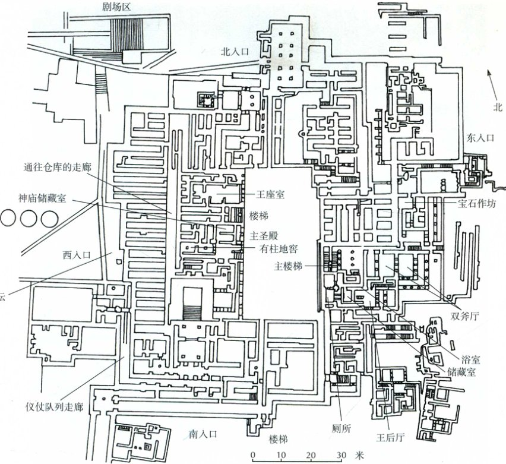

*图4.4 克里特克诺索斯宫殿群平面图*

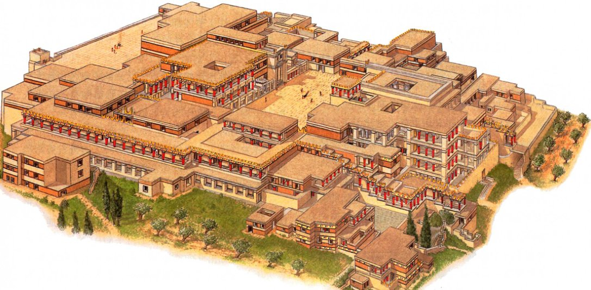

*图4.5 克诺索斯宫殿群复原图（全景）*

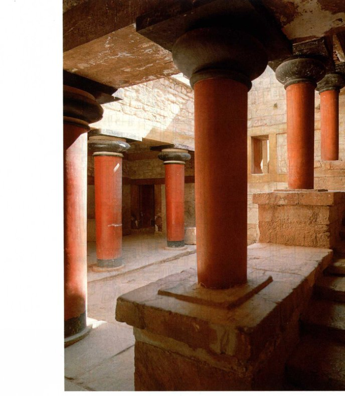

*图4.6 楼梯，东翼，宫殿群。约公元前1500年。克里特克诺索斯*

### 克诺索斯王宫

第二宫殿期的房屋为我们提供了关于米诺斯建筑的主要信息。最大的建筑在克诺索斯，发掘者阿瑟·埃文斯将其称为米诺斯王宫（图4.4和4.5）。事实上，克诺索斯城可能是青铜时代中期和末期最强大的克里特中心，城中气势恢宏的建筑兴建于公元前1700-前1400年。1900-1932年在克诺索斯王宫进行工作的阿瑟·埃文斯重新构想并用混凝土重建了王宫大部（见第85页的艺术史家的观点）。王宫中有院落、厅堂、工作室和储藏室（放置着装油和其他食物的巨大陶瓮），也许还有由走廊、楼梯和柱廊（colonnade）连接的院落。天井随处可见，保障了内部空间的光照和通风（如图4.6所见）。宫中的其他便利设施包括一个由陶管组成的排水系统。

墙以木料为边框，由碎石或泥砖筑成。有些墙用的是方石砌体（ashlar masonry），使其外表更富有装饰性。支撑柱廊的柱子多为木制，柱基则为石制。这些柱子形状奇特，柱头呈宽大的坐垫状，柱身光滑，越到下端越细。柱身横断面通常为椭圆形而非圆形。壁画显示，柱子整体都上了色：柱头为黑色，柱身为红色或白色。这类立柱的起源仍是个谜。

乍一看，王宫的规划（见图4.4）混乱而随意。也许正是因其迷宫般的特点，后来的希腊传说称之为弥诺陶（Minotaur）居住的迷宫。弥诺陶是一头半人半牛怪物，他吞食作为贡品献给他的雅典青年，后来忒修斯（Theseus）闯进迷宫，杀死了他。岛上的地形也许为这座王宫提供了天然的屏障。宫外没有阻挡进攻的防御工事，所以迷宫般的房间布局可能是内部防御策略的一部分；当然，王宫的入口建得并不突出。

虽然如此，王宫的设计从根本上说是有某种逻辑的。它的核心是一个大型中庭，重要的房间都通向这里。中庭大致沿南北轴线将王宫平面一分为二。在西面，一条走廊由北向南延伸，将西头狭长的储藏室与靠近中庭的形状不一的房间隔开，这些房间可能是用于举行仪式的。一条东西走向的走廊把东翼分为北面的工场区（这只是猜测）和南面的主厅。王宫似乎是从中庭为起点向外扩展的，平屋顶（而非尖屋顶）的使用便于添加新的结构。与亚述和波斯宫殿，如萨尔贡二世王宫（图2.18）或位于波斯波利斯的大流士和薛西斯王宫（图2.26）相比，克诺索斯王宫的整体效果是质朴的；各个房间都比较小，房顶低矮。但一些房间中的精美墙饰呈现了一种优美外观。我们还应想到，王宫现存的部分大多属于地下或地面层结构，而考古学家一直认为，上层结构更加宏伟，但这些都未能留存下来。

> **艺术史家的观点：两名发掘者，传说与考古**
>
> 19世纪中叶，大部分学者相信荷马关于特洛伊战争及其结局的史诗故事《伊利亚特》和《奥德赛》只不过是神话资料。但仅仅过了几十年，这个观点就被颠覆了。两位杰出的男性是其中的关键人物。一位是海因里希·施利曼（1822-1890年）。他生于德国，是一个牧师的儿子，通过一连串投机生意而发家致富，41岁就退休。从年轻时起，他就沉迷于荷马笔下众神与英雄的世界，发誓要学会古希腊语（他最终掌握的15种语言之一）。他逐渐相信荷马的诗是有历史构架支撑的，而且在广泛的游历中，他了解到，有少数考古学家认为土耳其的希萨尔利克（Hissarlik）遗址有可能就是荷马笔下的特洛伊。在获得土耳其政府的许可之后，他于1871年正式开始发掘工作。他在出版物中描述了一些轰动一时的发现，其中之一是“普里阿摩斯宝库（Priam's Treasure）”，这批宝藏中有器皿、首饰和贵重金属制作的兵器，以荷马笔下特洛伊国王的名字命名。接着，施利曼将注意力转向迈锡尼，发现了墓圈A中的竖井墓，其中一些藏有华贵的随葬品，如图4.27中的金面具。
>
> 施利曼也对克里特岛上的克诺索斯遗址感兴趣，但他无力购买这片土地。机会转而落入阿瑟·埃文斯（1851-1941年）手中，他是英国一位知名自然学家的儿子，而他本人是牛津阿什莫尔（Ashmolean）博物馆馆长。到了1900年，他已开始发掘位于克诺索斯的称为米诺斯王宫的遗址，并且收获惊人。1911年，为了表彰他在考古学领域所作的贡献，埃文斯被封为爵士。
>
> 学界对这两位早期考古学家的评价大相径庭。施利曼的发掘方式被认为是破坏性的，而且他本人与寻宝者几乎毫无差别。一些学者质疑，他是否发现了普里阿摩斯宝库，还是将零散发掘到的物品拼凑在一起来吸引更多新闻报道。他的发掘故事经过渲染已近乎神话。有传闻称，施利曼让他的希腊妻子索菲娅（Sofia）当模特，展示古代珠宝首饰；还有人说，在迈锡尼发现了一个金面具之后，施利曼给一家希腊报社发电报说：“我见到了阿伽门农的脸。”只是到了最近，学者才认识到用现代科学标准来评价施利曼是不公平的，他们也承认，在激发学者和大众对前希腊世界的兴趣方面，施利曼起到了关键作用。
>
> 埃文斯的名声远远胜过施利曼，很大程度上是因为他密切关注地层学，就是在发掘过程中利用沉积层来估计相对年代。这项技术是由17、18世纪的地质学家发展起来的，经改进后至今仍在使用。埃文斯利用地层学来估定墙和其他结构的相对位置，据此建立了整个遗址的相对年表。他对米诺斯初期、中期和末期的界定为青铜时代的整个爱琴世界提供了一个重要的历史框架。埃文斯在克诺索斯的工作包括大量遗址重建。重建有助于普通人了解这个遗址，但也能误导无知的观众。事实上，参观者在克诺索斯所见到的大部分建筑不是由米诺斯人建造的，而是出自埃文斯之手。埃文斯在克诺索斯所做的复原工作带来了巨大影响，它在遗迹保护者中引发了一场争论，争论的焦点是修复的限度以及如何清晰地区分古代遗迹和现代复原部分。

克里特的宫殿具体是如何起作用的，什么人住在里面，这些问题直至今日仍在探讨中。阿瑟·埃文斯在初次发掘这个建筑群时，将其形容为一个“王宫”（并用王室名为许多房间命名），无论准确与否，这一名称一直沿用下来。埃文斯认为这个建筑群是王宫或贵族的府邸有若干原因。他一方面受到了后文所述的迈锡尼本土其他新发现的影响，一方面是因为建筑群中有一个富丽堂皇的王座室。但埃文斯的祖国的社会和政治现实恐怕对他产生了更大的影响。他非常熟悉英国维多利亚末期许多为王室所有的大宫殿。实际上，对克诺索斯建筑群的发掘表明，有多种类型的活动都在那里进行。占地很广的储藏区支持了一种假设：王宫是一个加工、行政和贸易中心。此外，建筑群中有仪式场所，如有三角形加高堤道的大院和放置着宗教用具的小神祠，表明政治活动和宗教仪式也在此进行。我们没有理由认为米诺斯人会像现代人那样清楚地区分这些活动。而且我们没有证据证明，克诺索斯及别处的许多宫殿功能相同，或者这些功能不随时间而改变。

### 壁画：描绘仪式与自然

在克诺索斯和其他地方的宫殿中，那些富丽堂皇的房间都饰有绘画。许多绘画被发现时已极不完整，所以我们今天所见的是大规模修复后的面貌，可能并非完全可靠。这些壁画的特点是运用了鲜亮的矿物颜料，大块的色彩被平涂到湿或干的灰泥上，没有明暗处理，以几何图案构成的宽带为精美外框。克诺索斯壁画中出现频率最高的主题有助于证明在王宫进行仪式活动的假设。比如，一幅约公元前1500年的第二宫殿期小型壁画描绘了一群观众参加一场仪式或游戏的情景，被称为《大看台壁画》（Grandstand Fresco，图4.7）。中央是一座三进建筑。学者们确认它是一座神庙，因为房顶和正面有牛角标志。建筑两侧各坐着一组活跃的妇女，她们上身裸露，下身着荷叶边裙子。在壁画的上部和下部有无数没有躯体的头颅，用简单、印象化的黑色线条勾勒而成，以速写技法来指代人群，一行行褐色头颅代表男性，白色的代表女性。他们的尺寸比中层的妇女小，表明他们没有后者重要。壁画可能表现了发生在王宫中庭的一个事件，因为在庭院的西面发现了一座由三部分组成的神庙的遗迹。

其他许多米诺斯绘画以大自然为表现对象。在一个天井中发现的一幅壁画残片经过复原，已经放回到克诺索斯王宫东翼的一个房间中，这个房间被阿瑟·埃文斯称为王后正厅（The Queen's Megaron，图4.8）。在绘有蓝色条纹的淡黄色背景上，蓝色和黄色的海豚安适地游弋，与小鱼一同腾跃。在上下边框中，绿色的多叶状图案代表植物或岩石。弯曲起伏的轮廓线勾勒出生物的外形，而遍布整个构图的弧形和自然元素使壁画充满生机。类似对自然形态的生动表现在各种形式的米诺斯艺术中俯拾皆是。众多的海洋生物形象可能反映了米诺斯人对大海的深刻了解和尊敬。米诺斯图画表现出的轻松随意与许多埃及绘画的刻板和永恒形成了强烈对比，尽管有可靠证据表明，米诺斯与埃及是有艺术交流的。

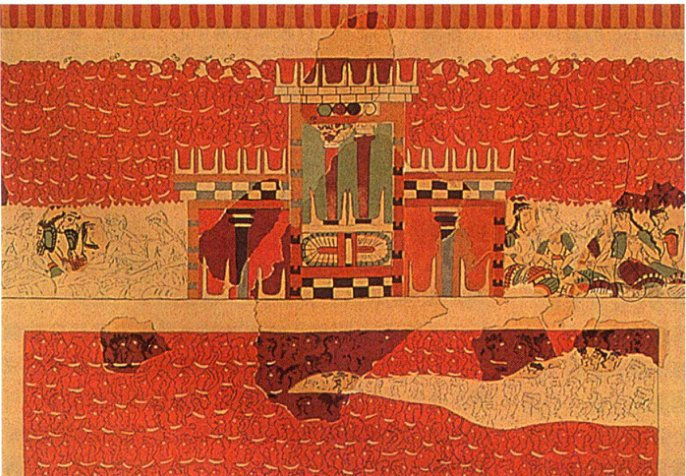

*图4.7《大看台壁画》，出土于克里特克诺索斯，克里特。约公元前1500年。克里特伊拉克列翁（Iráklion）考古博物馆*

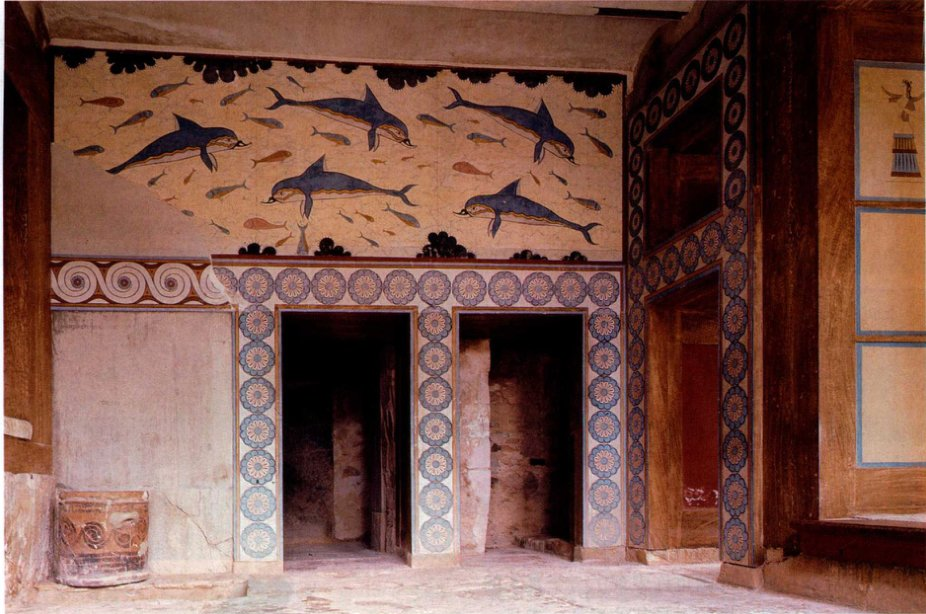

*图4.8 王后正厅。约公元前1700一前1300年，克里特克诺索斯。克里特伊拉克列翁考古博物馆*

**一个海滨小镇的风景画** 公元前第二个千年中叶，克里特以北约100公里的塞拉岛（Thera，今天的圣托里尼［Santorini］）上有一座火山喷发了，将阿克罗蒂里（Akrotiri）镇埋在一层厚厚的火山灰和浮石之下。从1967年开始，斯皮里东·马林那托斯（Spyridon Marinatos）和克里斯托斯·道马斯（Christos Doumas）先后在这里主持发掘，发现了建于中期米诺斯III期（约公元前1670-前1620年）的一些房屋，保存下来的部分最多有两层楼高。这些房屋的墙上有一系列不寻常的图画。大部分是风景画。在一个一楼小房间里，一幅岩石地貌的风景画占据了几乎整个墙面，被称为《春天壁画》（Spring Fresco，图4.9）。但见画中地形崎岖，跌宕起伏，黑色轮廓线内填满了薄薄的一层色彩，有红色、蓝色和赭石色，这些颜料可能就来自于岛上的火山土，涡卷的黑色线条在其间描绘出岩石纹理。鲜红色的百合三朵为一组，在岩石上绽放，在花朵间翩飞的，是寥寥几笔勾勒而成的飞燕。

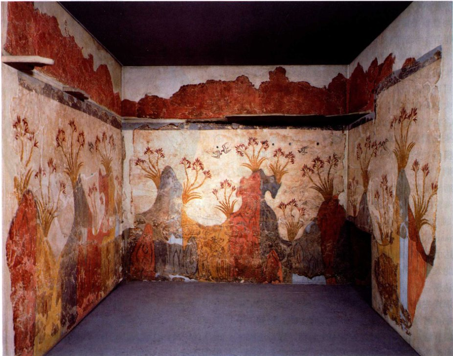
*图4.9 《春天壁画》，出土于塞拉岛阿克罗蒂里镇。约公元前1600-前1500 年。雅典国家考古博物馆*

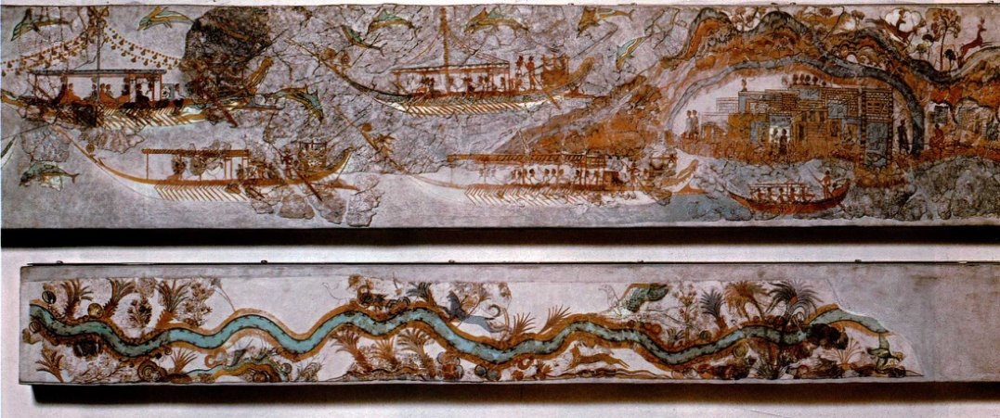

*图4.10《船队壁画》（Flotilla Fresco），出土于塞拉岛阿克罗蒂里镇。约公元前1600-前1500年。雅典国家考古博物馆*

在阿克罗蒂里其他房间的壁画中，风景中穿插着人物，通常有真人大小，有时比真人略小，如在一个二楼大房间中，一幅壁画横跨了至少三面墙上部，画中的人物就比真人小（图4.10）。这幅画反映了小镇作为海港的作用：一支船队往来岛屿之间渡运乘客，海中满是跃起的海豚。船只各不相同，有的扬帆航行，有的则靠桨手划桨，但都是画家匠心妙笔的成果。岛屿也是精心描绘而成，每个岛上都有一个港口城市，城中的石料房屋笔触细腻。人群从街上、房顶上和窗户中观看这一壮观场面。此画也许表现了一个真实的事件，可能是一次值得纪念的对异邦的远征，或是一个一年一度的节日。

### 米诺斯陶器

与壁画一样，米诺斯陶画的灵感也源于爱琴海的自然世界。米诺斯陶工细腻地在器皿上描绘生动的自然图形，与陶瓶的弧形外观相得益彰。到了中期米诺斯和末期米诺斯时期，人们已开始使用转轮制造陶器，因此可以创造出各种各样的圆润造型和多种尺寸。粗糙的大型器皿用于贮存物品，最精巧的器物则是王宫用品，它们的器壁通常都很薄。

**卡巴雷斯陶器** 图4.11所示陶瓶的形状代表了一种模仿自然的制陶工艺，这个陶瓶制作于中期米诺斯II期（约公元前1800年），来自克里特南部的费斯托斯。陶瓶颈部向上弯曲呈喙状，陶画家在上面画上了一只眼睛加以强调。陶瓶底色为黑色，其上绘有醒目的白、红、橙、黄曲线图形，这称为卡巴雷斯（Kamares）陶器风格，最早出现于中期米诺斯初期，在艾达山（Mount Ida）的卡巴雷斯洞中首次被发现，并以此发现地命名。彩绘图案抽象，赋予陶器一种活力和动感。

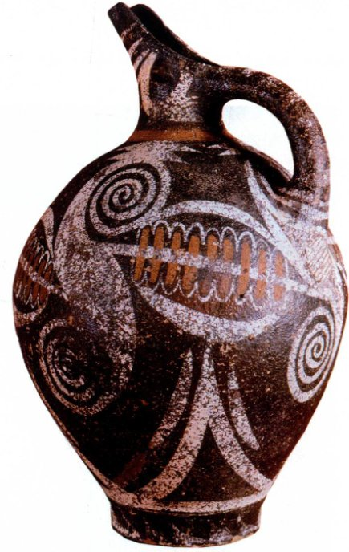

*图4.11 鸟嘴壶（卡巴雷斯陶器），出土于费斯托斯。约公元前1800年。高27厘米。克里特伊拉克列翁考古博物馆*

**海洋主题** 在稍后的末期米诺斯IB期的米诺斯陶器中，海洋主题变得更加普遍。其生动示例是一个镫形罐，罐口窄小，两边各有一个圆柄，罐身画着一条双目圆睁、触手卷曲的黑色章鱼，与蛋壳色的陶土形成对比（图4.12）。一丛丛海藻漂浮在触手之间的空隙里。与米诺斯壁画一样，这幅陶画的特点也在于其非凡的动感和写实性。而且，画中的图案表现出了它们所装饰的器皿的形状。海洋生物的圆形轮廓强调了膨出的罐腹，其触手的曲线与罐口的弯柄相呼应。就在罐口下面，一条触手末端卷起，形成一个与罐口同样大小的圆圈。

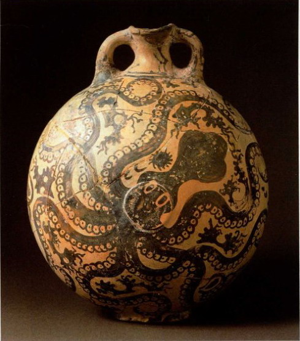

*图4.12 《章鱼陶罐》（Octopus Vase），镫形瓶，出土于克里特帕莱奥卡斯特龙（Palaikastro）。约公元前1500年。高28厘米。克里特伊拉克列翁考古博物馆*

### 米诺斯雕花石器

从很早开始，米诺斯艺术家们还用软石制作器皿，有时使用本地出产的黑色滑石（蛇纹石），有时使用从其他爱琴海岛屿进口的石料。他们用质地更坚硬的石制工具来雕刻软石，用由弓带动的石钻将石料内部挖空，然后用产自基克拉迪岛纳克索斯的一种研磨料（很可能是金刚砂）给表面抛光。残留的少量黄金表明，石器当时是镀金的。考古学家认为，许多石器都是在仪式中使用的。在克里特南面的圣特里阿达（Hagia Triada）发现了这类作品的碎片，包括插图所示的黑色滑石器皿（图4.13）。这类器皿被称为角状杯（rhyton，复数：rhyta），其顶部有一个大孔，底部有一个较小的孔，用于倾倒液体祭品或饮酒。

图4.13中的角杯名为《丰收者陶罐》（Harvester Vase），只有上部保存了下来。陶罐上的27个精壮的男子近乎半裸，头戴扁帽，身着短裤，似乎在欢快而喧闹地绕着陶罐行进。他们充满活力的动作与米诺斯陶瓶和壁画上生气勃勃的形象类似。四个没有戴帽子的歌手把长柄工具举在肩上，用尽全力放声歌唱。他们的指挥者胸部扩展，根根肋骨透过皮肤似乎清晰可见。一个身披鳞片状斗篷的长发男子手持一根长杖，似乎是队列之首。歌手的指挥者手持一个叉铃（sistrum），这是一种起源于埃及的铃鼓。画中有叉铃这一细节，并且以复合视角来表现人体，这为克里特与埃及的交流提供了证据。

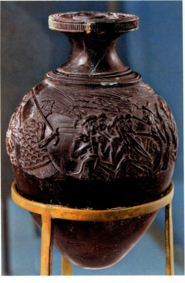

*图4.13《丰收者陶罐》，出土于圣特里阿达。约公元前1500-前1450年。石头／滑石，宽11.3厘米。克里特伊拉克列翁考古博物馆*

对这个场景的理解部分取决于辨识这群人所带的工具和挂在他们腰带上的物品。如果是锄头和谷种袋，那么画面主题就可能是一个播种节；如果是扬谷耙和磨刀石，那么所表现的更可能是一个丰收节。也有一些学者认为这个场景是战士凯旋，而还有学者认为画面中表现的是强制劳动。若没有考古或文字方面的更多证据，关于这幅图像的含义的争论一定会继续下去。

另一个华丽的牛头形角状杯来自克诺索斯，制于第二宫殿期（约公元前1500-前1450年，图4.14）。与《丰收者陶罐》一样，它也是用滑石雕成，牛的口鼻周围镶嵌着白色贝壳。艺术家在牛眼里嵌入白水晶，水晶底面绘有红色的瞳孔、黑色的虹膜和白色的角膜，所以双眼看起来异常逼真。现已修复的牛角原为镀金木制。浅细的刻纹（incision）上撒有白色粉末，再现了蓬松散乱、色彩斑驳的动物毛皮。液体从颈部的一个孔注入器皿，嘴下方还有一个孔，这是杯口。在克里特的其他地方也发现了类似器皿，比如在克里特东海岸的扎克罗斯（Zakros）王宫。大致同时期（公元前1500-前1450年）的埃及墓画描绘了克里特人运送牛头形角状杯的情景，这表明与克里特人通商的各个文明都将此类器皿视为米诺斯人的标志。公牛主题盛行，加之发现了以牛角为装饰的祭坛，这两项证据表明了公牛在米诺斯宗教仪式中有一定作用。角状杯被发现时常常是破碎的。虽然这可能是因为后来的人为破坏或地震，但它们的破损状况表明，礼器用过即毁也是仪式的一部分。

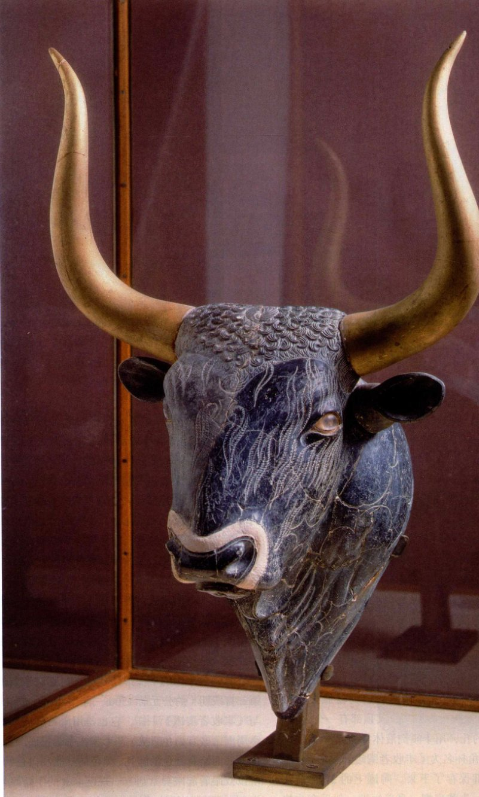

*图4.14 牛头形角状杯，出土于克诺索斯。约公元前1500-前1450年。蛇纹石、滑石、水晶及镶嵌贝壳（牛角为复原物），高20.6厘米。克里特伊拉克列翁考古博物馆*

米诺斯时期克里特的宗教活动集中在被认为神圣的天然场所，如山洞、峰顶或小树林。没有发现任何神庙或大型神像。考古学家的确在克诺索斯找到了两个中期米诺斯III期（约公元前1650年）的釉陶小雕像。其中一个表现的是一名女子，她双手各举一条蛇，戴着一块头巾，头巾顶部有一只猫（图4.15）。她穿着一条荷叶裙，类似于《大看台壁画》（图4.7）中妇女所穿的那种裙子，胸脯裸露。她腰肢纤细，这是另一个经常出现在米诺斯人像中的特点，如同《丰收者陶罐》（图4.13）上的男子一样。在一些古代宗教中，蛇是与土地神祇和男性生殖力联系在一起的，同样，这尊人像的裸胸也暗示着多产。另外，这些雕像是在被称为庙仓的坑洞里发现的。这些坑洞是在中庭西侧一个房间的地上挖出来的。雕像被放在那里，并且附近还有神庙器具的残骸，学者据此将雕像与某位母神联系起来，但它们也可能只是仪式用品。

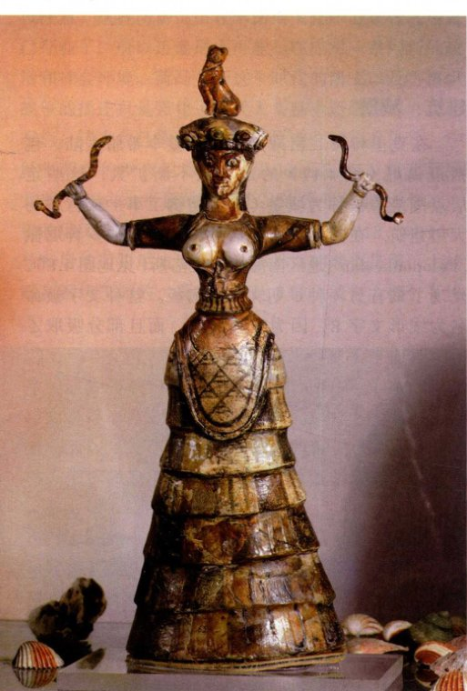

*图4.15《执蛇女神》（Snake Goddess），出土于克诺索斯宫殿群。约公元前1650年。釉陶，高29.5厘米。克里特伊拉克列翁考古博物馆*

> **大事年表**
>
> 约公元前1792-前1750年 - 汉谟拉比统治巴比伦
> 约公元前1700-前1400年 - 米诺斯人在克诺索斯兴建第二宫殿
> 约公元前1628年 - 塞拉岛火山喷发
> 约公元前1500-前1450年 - “海洋风格”陶器之一《章鱼陶罐》
> 约公元前1450年 - 地震摧毁克诺索斯和其他米诺斯文化中心；迈锡尼人入侵克里特

## 末期米诺斯艺术

学界仍在争论是什么终结了米诺斯文明。一些人认为塞拉岛的火山喷发可能加速了这个文明的衰落。然而，近年来的发现和对这次喷发留下的火山灰的年代鉴定说明，克里特岛文明在这次自然灾难中幸存了下来，尽管它可能因此而被削弱。约公元前1450年（末期米诺斯II期），克里特的宫殿被来自希腊大陆的入侵者占领，考古学家称这些人为迈锡尼人。他们住进了克诺索斯王宫，直至约公元前1375年，克诺索斯被毁，迈锡尼人离弃大部分克里特居住地。但在迈锡尼统治期间，克诺索斯的艺术家沿袭了米诺斯时代形成的风格。

残损的《斗牛士壁画》（Toreador Fresco）作于迈锡尼人统治克诺索斯的时期（末期米诺斯II-IIIA期），似乎是一组壁画中的一幅（图4.16），这组壁画装饰的是王宫东北部的一个楼上厅房。学者们把画中的跳牛场面解释为一种仪式性游戏，游戏表演者要跳过牛背。在深蓝色背景上，一个身穿短裙的白皮肤的人紧紧抓着一头巨大公牛的双角，全速飞奔的公牛全由曲线勾勒。在公牛身后，另一个白皮肤的人踮脚站立，双臂张开，而在牛背上，一个皮肤黝黑的人正向后翻筋斗。这几个人四肢修长，腰身异常纤细，但他们的表现手法都是真正的侧面观。壁画采用薄涂（wash）色，人物姿势尽管有些程式化，但充满生气，这两点表明，米诺斯的艺术习惯延续到了末期。

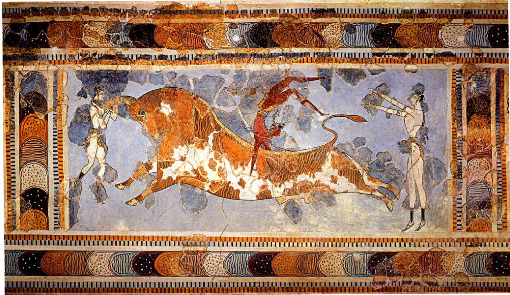

*图4.16《斗牛士壁画》，出土于克诺索斯宫殿群。约公元前1550一前1450年（复原）。包括上部边框高约62.3厘米。克里特伊拉克列翁考古博物馆*

学者仍在争论这幅壁画的含义。虽然大部分人同意跳牛具有仪式作用的看法，但跳牛的目的和参与者的身份还是个谜。按照地中海地区普遍以肤色区分性别的惯例，埃文斯将肤色浅的人认作女性，而肤色深的人认作男性。其他学者则认为这三个人像连续表现了同一个人，这个人参加的是一种成年仪式，在这种仪式中，男孩们摆脱他们早先的“女性”表象而变成男人。许多学者认为妇女在米诺斯意象体系中的突出地位证明了她们在仪式活动中的重要性。

## 迈锡尼艺术

在占领克里特之前，迈锡尼人已经在希腊大陆上建起了自己的城市，而这一活动始于末期希腊底之初。他们可能很早就与米诺斯时期的克里特建立了往来，这对他们自身的文化产生了重要影响。历史文物再次提供了关于这个文明的最佳线索。根据迈锡尼遗址的年代测定和在遗址中发现的物品，考古学家确定该文明的兴盛期为约公元前1500-前1200年（末期希腊底III期）。最壮观的遗迹是一些城堡，分别位于荷马笔下的迈锡尼、皮洛斯和梯林斯（Tiryns）。这一文明得名于迈锡尼，传说中阿伽门农（Agamemnon）的家乡，在荷马所记的特洛伊战争中，这位国王是希腊联军的统帅。

### 建筑：城堡

在克里特第二宫殿期之初，整个希腊大陆，包括迈锡尼（图4.17）的定居点不断扩大，这些定居点围绕着被称为城堡（设有防御工事）或宫殿的大型建筑。在其中一些定居点，尤其是伯罗奔尼撒（Peloponnesian）地区南海岸的皮洛斯（见地图4.1），发现了刻有另一种早期文字的陶板。这种文字被命名为线形文字B，因为它呈线状，而且部分吸取了更早时期米诺斯线形文字A的特点。迈克尔·文特里斯（Michael Ventris）于1952年破译了线形文字B。证实陶板原本是财产清册和档案文件，线形文字B现在被认为是希腊语的一种早期形式。因此，这些青铜时代末期遗址的居民是较晚年代的希腊人的祖先。

线形文字B陶板提到了一位国王（wanax），透露出关于迈锡尼社会等级的一些情况。迈锡尼的城堡和宫殿中可能有王室居所。渐渐地，许多城堡和宫殿被雄伟的外墙包围，这些外墙通常分若干阶段扩建和改良，在建造过程中充分利用了当地的地形。这些防御工事是用巨大的石块层层累叠而成，筑成的墙体有时能达到6米厚。外墙还有通向井边的地道，以便围城期间能够取得水源。这些墙以及地道使学者认为迈锡尼人与米诺斯人截然不同，迈锡尼文化的焦点主要是战争。

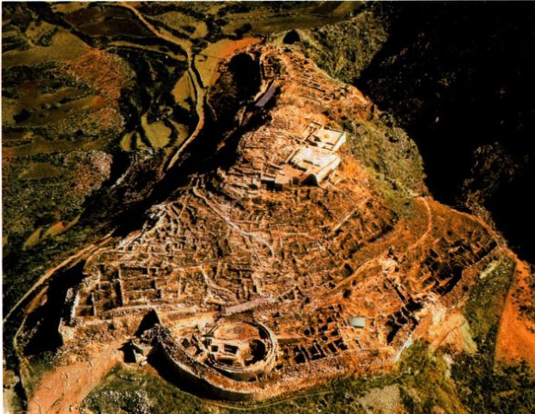

*图4.17 希腊迈锡尼的鸟瞰图。约公元前1600-前1200年*

这种对比常被说成是米诺斯人与迈锡尼人的根本性格差异，一个热爱自然，一个嗜武好战。但我们应该注意，这些防御工事在米诺斯文化中心被毁之后就已存在了，所以迈锡尼人可能是在应对一系列新的政治和社会环境。荷马关于这个时代的诸王以及特洛伊战争的描述只是强化了现代人头脑中迈锡尼人好战的观念。诗人自己称梯林斯为“巨墙之城梯林斯”，该城坐落在伯罗奔尼撒半岛（Peloponnesus）东北部阿戈斯（Argos）平原的岩层上。约公元前1365年，这里的居民分阶段加强了城堡的防卫（图4.18、4.19）。与稍后的迈锡尼城墙一样，梯林斯的墙也是用巨大的石灰石块筑成的，最大的重达5吨。墙上大部分石块形状不规则（或为多边形），石块之间用较小的石头和陶器碎片楔合在一起。在入口处或其他醒目的地方，石块可能是用锯锯开并打磨过的，或者是用锤子敲打平整的。完工的外墙厚达6米，还有一道同样体积庞大的内墙。几个世纪之后，这些雄伟的城墙令希腊人望而生畏，他们因此宣称这是神话中的独目巨人族库克洛佩斯（Cyclopes）所造。甚至到了今天，这些墙还被称为库克洛佩斯墙（Cyclopean，见本页的材料与技法）。

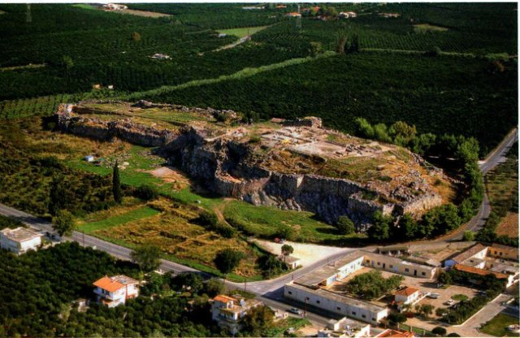

*图4.18 希腊梯林斯的鸟瞰图。约公元前1400-前1200年*

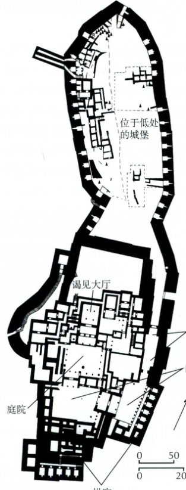

*图4.19 希腊梯林斯宫殿及城堡平面图。约公元前1400-前1200年*

> **材料与技法：巨石工程**
>
> 梯林斯和迈锡尼等地的防御工事以巨大的石灰石块筑成，每块石头重达5吨。墙上的大部分石块都几乎未经修整，所以形状不规则（或为多边形），用较小的石头和压紧的黏土楔合在一起。这种构筑方式似乎深受赫梯建筑的影响，如安纳托利亚的博阿兹科伊（见图2.23）等遗址。在入口或其他十分显眼的地点，如狮门（见图4.22），建筑工人有时会使用今天称为方石砌体的技术。他们先把一块块由卵石和沉渣构成的砾石用锯子切割开来，然后用锤子打磨，最后整齐地一层层垒起来。
>
> 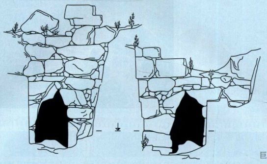
> 
> *巨石工程建造示意图*

精心设计的梯林斯防御工事能控制外来者的入城路径，使居民们在军事上处于有利地位，稍早的赫梯防御工事也是如此（见图2.23）。一条被墙围起的狭窄坡道环绕着城墙，如此一来，沿顺时针方向前进的侵略者就没有任何掩护，容易被城墙上的守卫者攻击。如果侵略者到达城门，两组设置了防御工事的门道（propylaeum）会带来更多障碍，进攻者会被困住，受到来自上方的攻击。墙体内的房间和走廊被称为暗堡（casemates），是储藏武器的地方。在遭到外来攻击时，暗堡还能为市民或士兵提供庇护（图4.20）。梯林斯的走廊是用一种叠涩（corbel）技术建造的：每一层石头都比下方那层稍稍向外突出一点，直至两面墙相接为一个不规则的拱形，合拢跨度（图4.21）。使用叠涩来制作一个完整场地的屋顶叫叠涩拱顶（corbel vault），就像在梯林斯一样。

在约公元前1250年迈锡尼城的狮门（Lion Gate）上，叠涩拱也产生了良好效果。狮门形成了进入迈锡尼城堡的主入口，在扩建城墙以提升防御能力时建造（图4.22）。两根厚重的石柱支撑着一根巨梁，形成了一个开口。在梁的上方，一个叠涩拱结构将厚墙的重量引向其下方的坚固石柱。这样，叠涩技术就减轻了石梁承受的重量，而石梁本身就重达25吨；这称为缓冲三角。为了封住由此形成的缺口，石梁上方嵌入了一块三角形灰色石灰石板，石板上刻有一对巨兽，很可能是母狮（但也可能是狮身人面兽或狮身鹰头兽）。它们以纹章式姿势（heraldic pose）相对站立，形象完全相同，前爪都搭在米诺斯风格的祭坛上，立于一根上粗下细的米诺斯风格的柱子两旁。颈部有暗榫孔，表明兽头是另加上去的，可能以木头制成，或是另一种石料，如滑石或白色大理石。这幅浮雕高近3米，是希腊大陆上已知最早的大型雕塑。两兽之间的柱子可能支撑着另一个结构。母狮起着卫士的作用，它们紧绷的强壮身体以及对称设计反映了来自近东的影响。宫门处使用动物守卫这一概念可能来自类似的建筑，如位于安纳托利亚博阿兹科伊的赫梯狮门（图2.23）。迈锡尼人在埃及和安纳托利亚等地中海地区探险，而且赫梯人的记载表明他们与可能是迈锡尼人的民族有来往。

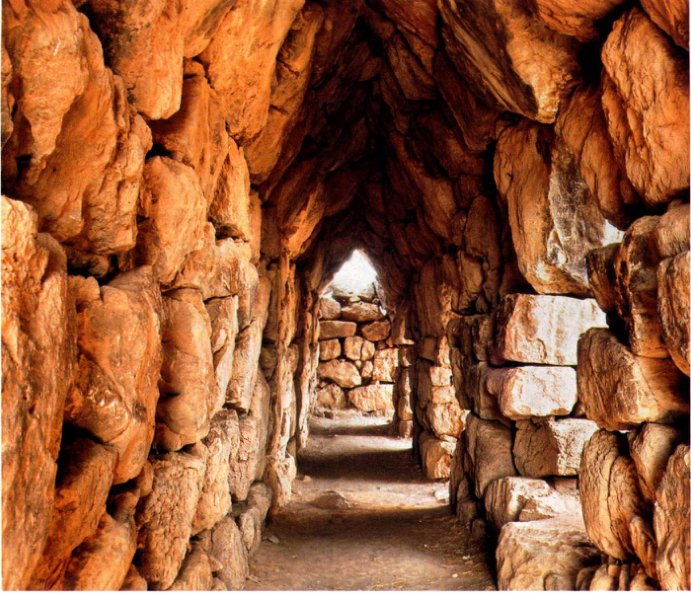

*图4.20 希腊梯林斯的叠涩暗堡。约公元前1400-前1200年*

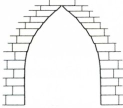

*图4.21 叠涩拱示意图*

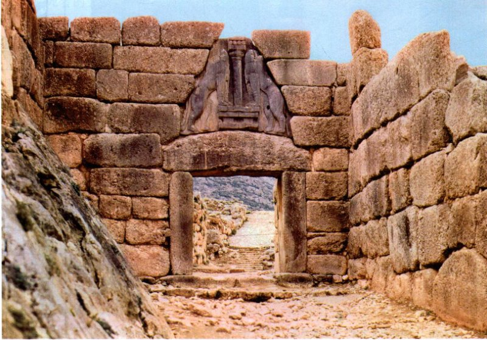

*图4.22 狮门，希腊迈锡尼。约公元前1250年*

迈锡尼城堡的外墙保护着各种建筑（见图4.17）。这些内部建筑是木制骨架，碎石筑成，与米诺斯宫殿一样，有时表面覆有石灰石。主体建筑是谒见大厅（megaron），一个长方形的谒见厅。梯林斯（见图4.19）的谒见大厅旁边是一个开阔的庭院。两根柱子勾勒出一个幽深的门廊（porch），门廊通往前厅，然后通往大厅。大厅里有一个宝座，中央有一个陶制大壁炉，表面刷上了一层细灰泥（stucco），四周树立着四根支撑顶梁的柱子。壁炉上方的天花板或敞开或被凸起的屋顶覆盖，便于排烟透光。

谒见大厅的设计基本上是将以前的简易房屋扩大；其历史可追溯到公元前3000年的特洛伊。一处保存良好的谒见大厅在伯罗奔尼撒半岛南部的皮洛斯王宫里，建于约公元前1300年。大厅中的壁炉置于涂着灰泥的地板上，地板装饰模仿由各种装饰石组成的石板（图4.23）。一组色彩鲜艳的壁画和装饰性雕刻使谒见大厅更加富丽堂皇。宝座背靠东北墙，两侧绘有狮身鹰首兽，与装饰克诺索斯王座室的那种怪兽相似，而这个王座室就建于迈锡尼统治时期。其他装饰元素，如柱子的形状和入口周围的饰物，反映了米诺斯文明对皮洛斯的影响。

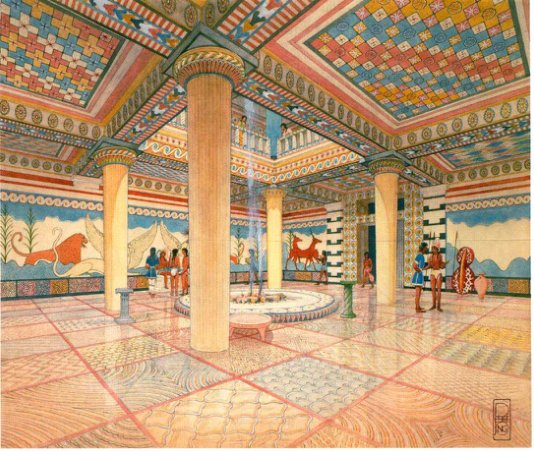

*图4.23 皮洛斯谒见大厅复原图。约公元前1300-前1200年*

### 迈锡尼墓葬及其内容物

在迈锡尼城，到了中期希腊底末期，统治阶层开始将死者葬在长方形井穴里，地面竖起形状像方尖碑的石头作为标记。墓葬分为两组（分别称为墓圈A［Grave Circles A］和墓圈B），后人在此基础上加上了一道环形矮墙，使墓葬更具有纪念性。随着时间推移，上流阶层建造了一种更为壮观的圆形坟墓，这种圆形墓叫做圆墓（tholos）。希腊大陆已知有100多个圆墓，其中9个在迈锡尼城附近。

保存得最好也是最大的圆墓在迈锡尼城，建于约公元前1250年（希腊底晚期IIB期）。它被称作“阿特柔斯宝库”（Treasury of Atreus），以荷马笔下迈锡尼的部族首领命名。一条通道或地道（dromos）通往壮观的入口，地道两侧排列着精心切割铺设的方石（图4.24）。门向内倾斜，其风格使人联想到埃及建筑。门口两侧立着用埃及绿色大理石制成的石柱，上面刻有螺旋纹和锯齿纹（图4.25）。在入口上方，以小柱子为边框的大理石装饰带遮住了横梁上方的缓冲三角。

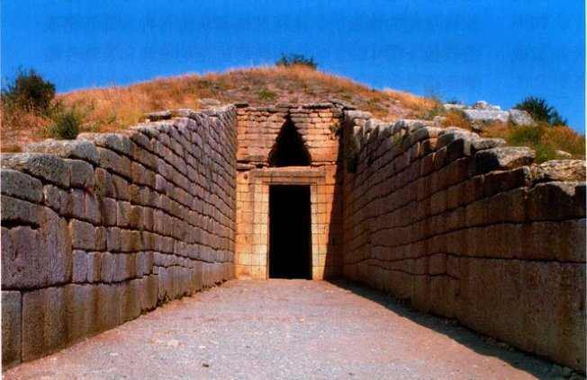

*图4.24 “阿特柔斯宝库”，希腊迈锡尼。约公元前1300-前1250年*

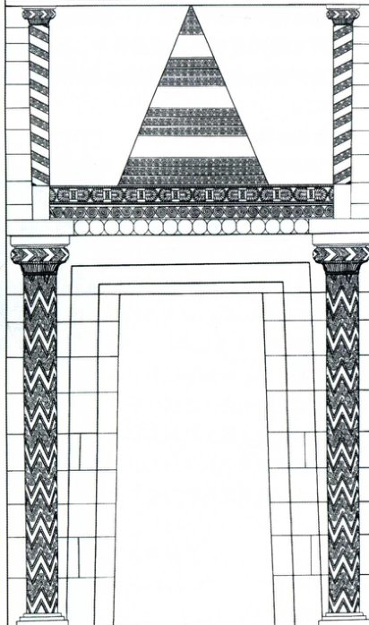

*图4.25 “阿特柔斯宝库”正面复原图，希腊迈锡尼。约公元前1300-前1250年*

坟墓本身包括一个圆形大墓室，墓室的构造是先向坡地内挖掘，然后从地面建起一个叠涩拱顶：也就是方石块向上逐层外突直至封顶（图4.26）。因为整个墙体呈环形而不是平行排列（与梯林斯的情况相同，见图4.21），叠涩拱顶就使石头墓顶形成了一种蜂窝状剖面。墓外覆盖着泥土，有助于稳固石层，形成了小丘，四周以石头环绕。叠涩拱顶高13米，占地直径14.6米。这种没有支撑物的大跨度结构一直到罗马时代才重新出现在万神殿中。拱顶上的方石块可能曾有镀金花饰，模仿繁星点点的夜空。主室一旁的一个长方形小室存放着从葬者的尸体。

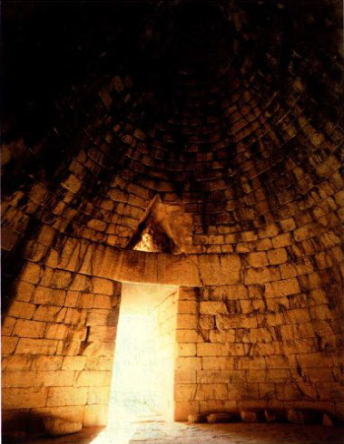

*图4.26“阿特柔斯宝库”内部，希腊迈锡尼。约公元前1300-前1250年*

**金属制品** 与埃及大金字塔一样，这些巨大的圆墓通过吸引人们的注意力来彰显死者的荣耀。结果这也引来了各个时代的盗墓者，原本堆满“阿特柔斯宝库”的随葬品早已流散。许多早期的竖井墓里也有大量随葬品，从奢华的衣物、家具到精巧的兵器。在发掘墓圈A时，施利曼发现了5个奇特的死者面具，它们用黄金锤打而成，戴在男性死者脸上。虽然面具完全不写实，但面具对外貌的处理各有特色：一些带有胡须，而另一些则无须。这说明，这些面具被赋予了几分个性，以此对应死者的外貌。1876年发现图4.27所示的面具后，施利曼就向新闻界宣布：“我见到了阿伽门农的脸。”因为根据现代考古学鉴定，这个面具制作于公元前1600-前1500年，而特洛伊战争如果确实发生过，就会是在约公元前1300-前1200年，所以这肯定不是阿伽门农的面具。但考虑到面具的高昂造价及其周围发现的其他物品，它可表现的可能是一位有所成就的迈锡尼国王。在随葬兵器中，有精工细制的装饰性青铜匕首。

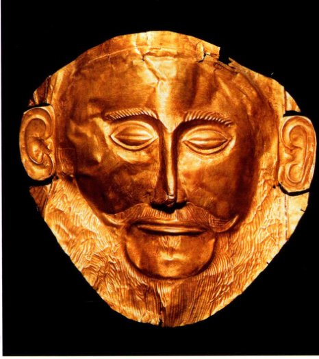

*图4.27 《阿伽门农面具》（Mask of Agamemnon），出土于墓圈A中的一个竖井墓，迈锡尼。约公元前1600一前1500年。黄金，高35厘米。雅典国家考古博物馆*

匕首刃上常常镶嵌着黄金、白银和乌银（niello，一种硫合金，加热后与银结合，在表面产生一种黑色的金属光泽），构成螺旋纹或表现人物或动物的场景。图4.28中的图案描绘了一只狮子追捕瞪羚的情景；狮子的掠夺力量暗指匕首主人的权势。

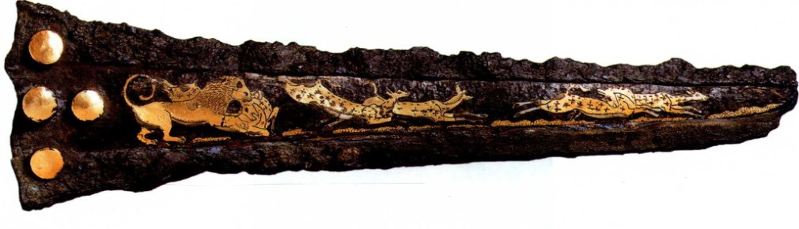

*图4.28 嵌花匕首，出土于墓圈A的4号竖井墓，希腊迈锡尼。约公元前1600-前1550年。长23.8厘米。雅典国家考古博物馆*

**《瓦菲俄金杯》** 竖井墓使用的墓葬方法具有明显的迈锡尼特色，但在墓中发现的珍宝使我们不由得猜测米诺斯人与迈锡尼人之间的往来交流。许多物品显示出米诺斯文化的影响，而其他一些物品具有强烈的米诺斯风格，甚至可以肯定它们来自克里特或是出自克里特工匠之手。两个出土于迈锡尼墓葬的金杯尤其令人惊叹（图4.29），这座墓葬位于伯罗奔尼撒半岛南部的瓦菲俄（Vaphio），邻近斯巴达（Sparta）。金杯可能制作于公元前1500-前1400年，由两层黄金组成，外层浮雕为捕牛场景，这一主题源自米诺斯文化，内层光滑。杯侧钉有一个圆筒形的杯柄。其中一个金杯的图案是捕牛人试图用网抓住公牛，而在另一个金杯上，一头母牛被放到牧场上去诱捕公牛。杯身图案的题材表明，两者互为照应，但严格说来，它们并不是一对。其中一个金杯的图案上层有一道边框，而另一个则没有，而且对其风格的分析表明，这两只金杯是由不同的艺术家制作的。有些人认为，做工更为“精细”的那一个（有牧场画面）来自米诺斯，因为它具有平和宁静的特点，而另一个则富有崇尚武力的迈锡尼色彩，可能出自某个迈锡尼或米诺斯艺术家之手。瓦菲俄金杯表明，我们对米诺斯和迈锡尼艺术家交流往来的了解是如此之少，并且区分这两种艺术的企图是多么武断和主观。

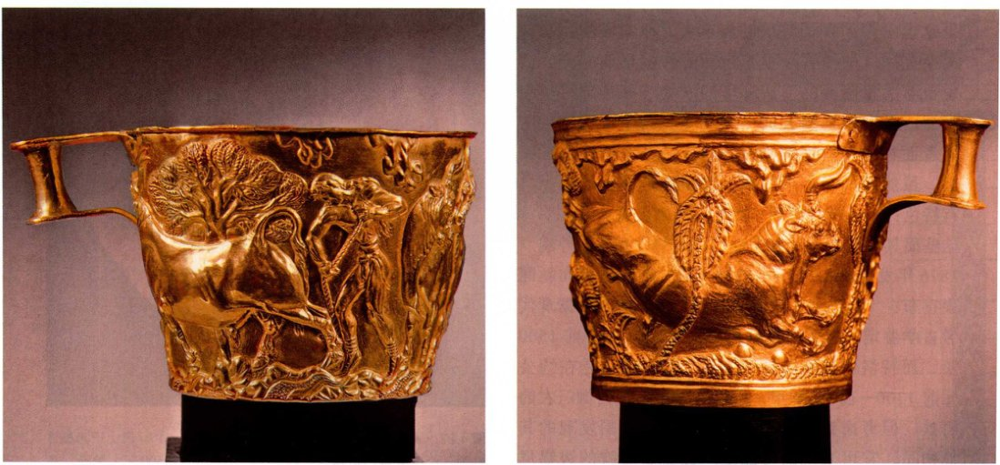

*图4.29《瓦菲俄金杯》（Vaphio Cups）。约公元前1500一前1450年。黄金。雅典国家考古博物馆*

### 雕塑

与在克里特一样，迈锡尼宗教建筑显然较为朴素，有别于宫殿建筑。在这些小神庙中，迈锡尼人敬奉着多位神明。线形文字B陶板上记录的名字显示，其中一些神祇，如波塞冬（Poseidon），是后来希腊奥林匹亚（Olympian）诸神的前身。希腊语中的波塞冬是海神，对于以航海为业的迈锡尼人必定具有一定的重要性。

独立式雕塑很少见，但1939年在迈锡尼王宫旁边的一座神庙里发现了一件雕工精细的小型象牙组雕，是两个跪着的妇女和一个年幼的孩子（图4.30）。妇女都穿着荷叶裙，类似于米诺斯《执蛇女神》（见图4.15）所穿的那种裙子，表明这件作品来自克里特，或由一个在希腊大陆上为迈锡尼赞助人工作的克里特艺术家制作。但所用的象牙很可能产自叙利亚或埃及，这证明了迈锡尼的贸易联系。人物四肢交缠，孩子姿势不稳，刻画出了一个转瞬即逝的短暂瞬间。一些学者认为，人物之间亲密的肢体关系说明这个小艺术品表现的是一家人，包括祖母、母亲和孩子。其他学者则认为它表现了三位不同的神，其中一位以孩童形象出现。

这件以进口象牙为材料的小型雕塑具有米诺斯风格，是为一个迈锡尼物主制作的。这件雕塑，加上仿效埃及建筑的阿特柔斯宝库，混合了米诺斯和近东影响的狮门，从青铜时代的希腊留存至今的物品反映了一种交往遍及地中海的文化。无论那些交往是源自战争还是贸易，迈锡尼时期的希腊文化都能接纳其他地区的观念和形式。尽管迈锡尼文明好战而精悍，它还是在公元前1200或前1100年左右败落了，可能是因为新的民族来到希腊大陆，引起了混乱。不管这些强大城堡中的居民是否真的进军过小亚细亚的特洛伊，他们的后代都相信，自己的祖先确实参加了传说中的这场十年围城战。对于希腊人，对于诗人荷马，迈锡尼时代是一个英雄时代。

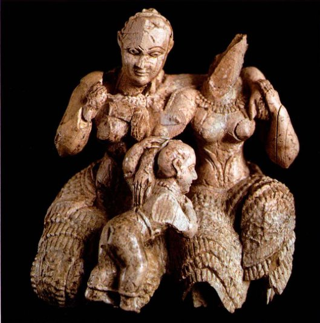

*图4.30《三神像》（Three Deities），出土于迈锡尼。公元前14-前13世纪。象牙，高7.5厘米。雅典国家考古博物馆。文化部考古收入基金会。7711*

> **大事年表**
>
> 约公元前1600-前1500年 - 黄金打制的迈锡尼死者面具
> 约公元前1500-前1200年 - 迈锡尼文化鼎盛期
> 约公元前1290-前1224年 - 古埃及法老拉美西斯二世统治
> 约公元前1250年 - 迈锡尼城修建狮门

## 小结

地中海是古代不同文明交往的要道，这种交往可能是以贸易或战争为目的。公元前第三个和第二个千年，在爱琴海海域内和邻近的岛屿和半岛上，几种联系密切却又截然不同的文化发展起来。其中包括以克里特北面群岛命名的基克拉迪文化；在克里特兴建华美宫殿的米诺斯文化；以及在希腊大陆留下恢宏城堡和随葬品的迈锡尼文化。各种文化所创造的不同艺术形式使我们得以了解古代爱琴民族的习俗和观念。

**初期基克拉迪艺术**

公元前第三个千年，基克拉迪群岛最典型的艺术形式是表现妇女和乐师的大理石雕像。虽然这些雕像的含义和功能尚不清楚，但其造型抽象，简洁的几何外形和光滑的表面对现代观众有极大的吸引力。

**米诺斯艺术**

尽管在克里特及其他爱琴海遗址的考古调查已逾百年，米诺斯文化仍然神秘难解。克里特的景观主要是复杂的大型宫殿，既是皇家住宅，可能也是行政和仪式中心。这些建筑有许多壁画及其他装饰元素，以生动活泼的形式突出表现了自然世界。米诺斯陶器、雕塑和仪式用品既返璞归真又充满活力，显示了高水平的制作工艺。

**迈锡尼艺术**

迈锡尼人得名于迈锡尼城，是希腊大陆伯罗奔尼撒地区筑有防御工事的一个定居点。迈锡尼城堡有巨大的外墙、大型防御工事和防守布局，表明迈锡尼文化注重抵御外敌，如果这个民族本身不好战的话。然而，迈锡尼墓葬中的奢侈品以及宫殿中的奢华装饰表明，这个民族乐于接受来自地中海各地的影响。米诺斯、埃及和美索不达米亚文明都影响了迈锡尼艺术。