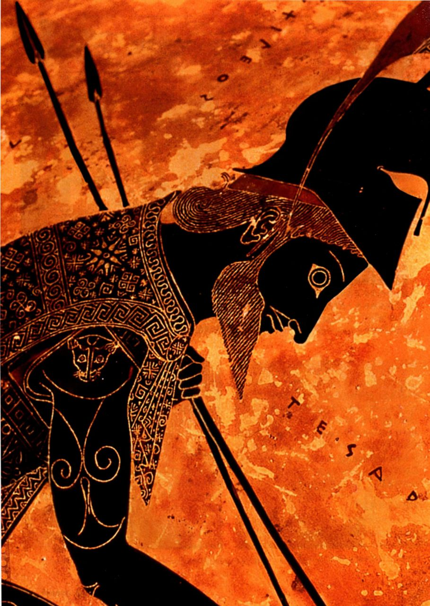

第五章 希腊艺术

此前讨论的艺术作品无论多么杰出，对我们而言依旧显得陌生。产生这些艺术品的古代文明与我们的文明迥然不同，我们很难在那些作品中找到与当今时代的关联。然而，希腊建筑、雕塑和绘画却能一眼就看出是西方文明的祖先，虽然它们也继承了前人的艺术。一座希腊神庙会使人想起无数政府建筑、银行和大

学校园；一尊希腊雕像会使人联想起现代的无数雕塑；一枚希腊钱币也与今天的硬币差别甚微。

这既非巧合也非必然。西方文化是以希腊罗马世界为典范精心建构而成。对于试图理解希腊罗马视觉文化的艺术史学家来说，这就带来了一个特殊的挑战：我们很容易以为，事物表象相似，则于今于昔都有着相同的意义，但学者们屡屡发现，这是一个危险的错误推论。

研究希腊艺术还会遇到另一个难题，那就是有三个不同的资料来源，有时会出现相互矛盾的信息。其一是艺术作品本身，真实可靠，可惜仅有少量存世。其二是希腊原作的罗马复制品，尤其是雕塑，它们能提供一些关于重要作品的信息，否则我们对此将一无所知。但复制品也有其自身的问题。没有原作，我们就无从判断复制品的忠实程度，有时多个复制品会呈现出同一原作的不同版本。更为复杂的是，罗马复制者对于复制品的看法与今人不同。一件罗马复制品不必精密地模仿，而是可以根据复制者的趣味、技巧或订件人的意愿加以发挥或修改。不仅如此，有些希腊雕塑的品质主要在于表面加工工艺，而这在复制品中

就完全取决于复制者了。假如原作是青铜制品，而复制品是采用大理石材料，表面效果就会相去甚远。在极少数情况下，有些艺术品虽分明不是原作，但其精湛工艺让人不禁犹疑它们是否乱真。

第三种关于希腊艺术的信息来源是文献记载。希腊人是最早对自己的艺术家进行详尽描述的西方民族。罗马作家吸纳了希腊人的记载，许多历史记录得以存世，尽管大多只剩断简残篇。根据这些书面记载，我们可以略知，在希腊人眼中，本民族最重要的建筑、雕塑和绘画成就是什么。这类文字证据帮助我们确定一些著名的艺术家和艺术作品，尽管其中提到的大多数作品已不存在。而另外有一些流传至今、被我们尊为旷世杰作的希腊艺术品，却在所有文献中完全不见踪影。全面考虑文字记载与复制品及原作，将所有线索交织融汇，重现希腊艺术的发展历程，这是几个世纪以来考古学家和古代艺术史学家面临的考验。

古代希腊艺术的伟大繁荣只是包罗万象的人性和宗教探索中的表现之一。艺术家、作家和哲学家苦苦探求一些共同的问题，这些问题至今仍保存在大量作品中。他们的发问直指人类生存的核心，构成了西方

图5\.26《阿基里斯和埃阿斯掷骰子》细部

第五章 希腊艺术 101

背景知识

希腊的男神与女神

所有早期文明和文字出现之前的文化都有创世神话，解释宇宙的起源和人类在宇宙中的地位。这些神话逐渐演变出复杂的体系，代表着了解世界的普遍尝试。希腊的男神和女神虽然永生不朽，种种行为却几乎与人类无异。他们相互争吵，与配偶生儿育女，也时常与凡人繁育后代。他们有时受到亲生子女的威胁甚至被推翻。几位主要的希腊神祇见下文，括号中是对应的罗马名字。

宙斯［Zeus］（朱庇特［Jupiter］）：克洛诺斯［Kronos］ 和瑞亚［Rhea］的儿子，天空和天气之神，奥林匹亚诸神之王。在杀死克洛诺斯之后，宙斯与妹妹赫拉［Hera］（朱诺［Juno］）成婚，与几位兄弟抽签决定了各自在宇宙中的管辖范围：波塞冬［Posidon］（涅普顿［Neptune］）得到海洋，哈迪斯［Hades］ （普鲁托［Pluto］）得到冥界，与王后珀尔塞福涅［Persephone］（普罗赛尔皮娜［Proserpina］）共同统治。

宙斯和赫拉育有几个孩子：

阿瑞斯［Ares］（马尔斯［Mars］），战神

赫柏［Hebe］，青春女神

赫淮斯托斯［Hephaistos］（伏尔坎［Vulcan］），跛脚的金工和锻造之神

宙斯与多位女神和凡间女子有过风流韵事，她们也为宙斯生育了子女，包括：

雅典娜［Athena］（密涅瓦［Minerva］）司战争等技艺，因此也是智慧女神。她是英雄的保护神，并挫败对手波塞冬成为雅典的庇护女神。她赠给这座城市一株橄榄树，使它在雅典卫城发芽。

哲学的主干。他们大多接受泛神论，这些接受膜拜的神以人形出现（见本页的背景知识）。然而他们对神的本质和人神关系争论不休。命运是否决定人类的行动，是否存在自由意志？倘若如此，德行的本质是什么？

希腊思想者以二元对立的概念构建生活的各个方面。秩序（希腊语cosmos）永远与无序（chaos）相对，并且世间万物都包含这二极。在他们的观念中，文明就是希腊人的世界，与之相对的是希腊以外的蛮荒世界，所有非希腊人都是“野蛮人”，因为这些人的语言在希腊人听来都是毫无意义的“bar\-bar\-bar\-bar”的声音。理性也有它的对立面：非理性，反映在光明与黑暗，男人与女人的对立中。在希腊文学与艺术中，古希腊人探讨了这些对立两极间的冲突与张力。

希腊艺术的兴起：几何风格

第一批讲希腊语的部落大约于公元前2000年来

阿佛洛狄忒［Aphrodite］（维纳斯［Venus］），司爱、美及女性生育的女神。赫淮斯托斯之妻，却有许多风流韵事。她育有哈耳摩尼亚［Harmonia］、厄洛斯［Eros］、安忒洛斯［Anteros］（这些是与阿瑞斯所生）、汉马福迪托斯［Hermaphroditos］（与赫尔墨斯所生）、普瑞尔珀斯［Priapos］ （与狄俄尼索斯所生）、埃涅阿斯［Aeneas］（与特洛伊王子安喀塞斯［Anchises］所生）。

阿波罗［Apollo］（阿波罗），孪生妹妹为阿耳忒弥斯，司里拉琴与弓箭，因此掌管音乐与诗歌，射杀犯罪者。他是男性美的化身，还是预言与医药之神。

阿耳忒弥斯［Artemis］（狄安娜［Diana］），孪生哥哥为阿波罗，司狩猎的处女神，也是年轻女性的保护神。有时也与塞勒涅［Selene］一同被尊为月亮女神。

狄俄尼索斯［Dionysos］（巴库斯［Bacchus］），司掌恍惚的意识状态，尤其是酒醉状态。狄俄尼索斯与阿波罗的秉性截然相反，他在尼萨山（Mount Nysa）长大，在那里发明了酿酒技术。他娶了阿里亚德妮［Ariadne］公主为妻，公主原本与英雄忒修斯［Theseus］在一起，后被遗弃在纳克索斯。他的追随者包括淫荡的萨梯尔［Satyr］和他们的女伴，宁芙［nymphs］和被称为美娜德［maenads］（酒神女祭司［bacchantes］）的人类，他们狂欢无度。但狄俄尼索斯的性格中有较温和的一面。他是农业丰收神，还司掌植物、和平、好客和戏剧。

赫尔墨斯［Hermes］（墨丘利［Mercury］），诸神的信使，是指引灵魂到哈迪斯面前的引导者，还是旅行者和商业之神。

到希腊。这些外来者带来的新文化迅速扩展到希腊本土的大部分、爱琴海诸岛以及克里特岛。到公元前1000年时，希腊人已经征服了小亚细亚西海岸和塞浦路斯岛（Cyprus）。在这一时期我们可以区分出三支主要的分支族群：聚居于伯罗奔尼撒半岛的多利安人；居住在阿提卡（Attica）、优卑亚岛（Euboea）、基克拉迪群岛和小亚细亚中部海岸的爱奥尼亚人（Ionians）；以及最终定居于爱琴海东北部的伊奥利亚人（Aeolians，见地图5\.1）。尽管存在文化差异，而且散居各方，但希腊人之间存在着很强的亲缘感，这种感情建立在语言与共同的信仰之上。公元前8世纪中叶到公元前6世纪中叶有一次殖民潮，其间希腊人扩张到整个地中海，甚至远至黑海，在西西里和意大利南部（统称大希腊地区）以及北非建立了重要聚居地。

迈锡尼文明衰落之后，艺术基本上走向非具象形式，并且持续了几个世纪。公元前8世纪，我们所知的艺术中最古老的希腊风格发展形成，现在称为几何

102 詹森艺术史

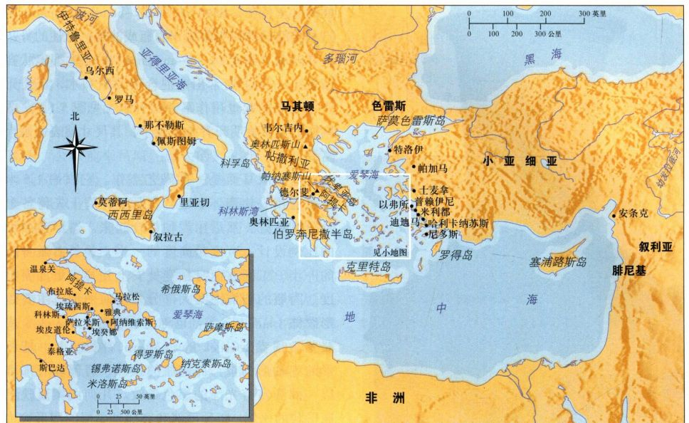

地图5\.1 古代希腊世界

风格。图像出现的时期大约与开始使用字母的时间相同（受近东地区的强烈影响）。诗人荷马（或者是一群诗人）的作品也在同一时代，他创作了两部传世史诗《伊利亚特》和《奥德赛》，讲述特洛伊战争和其中一位英雄奥德修斯（Odysseus）返回家乡伊萨卡岛（Ithaka）的传说。当时还有彩陶和以陶土或青铜制作的小型雕像。两者关系密切：彩陶的装饰图案经常是雕塑中表现的形象。

几何风格陶器

陶器成为一种艺术形式后，希腊的陶匠很快开始发展出数量庞大但相当标准化的陶器形制（图5\.1）。每种类型都与其功能相契合，而功能就反映在形式中。因此，每种器皿形状对画师而言都是独一无二的挑战，有些人就开始专门装饰某些种类的陶器。大型陶器吸引的通常是最有雄心的工匠，因为他们有足够的绘画空间，可以尽情挥洒。制作和装饰画瓶是复杂的工艺

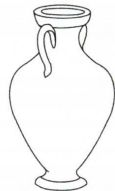

双耳细颈瓶

\(amphora\)

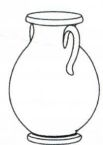

双耳细颈罐

\(pelike\)

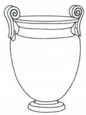

涡耳酒瓮

\(volute krater\)

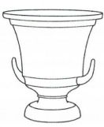

酒瓮

\(krater\)

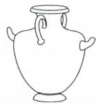

水罐

\(hydria\)

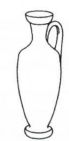

长身细颈瓶

\(lekythos\)

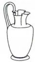

单耳细颈瓶

\(amphora\)

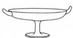

细脚杯

\(kylix\)

双耳酒杯

\(skyphos\)

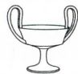

高耳酒杯

\(kantharos\)

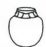

芳油瓶

\(aryballos\)

图5\.1 一些常见的希腊陶器形式

第五章 希腊艺术 103

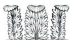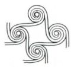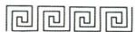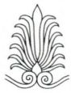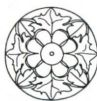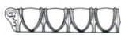

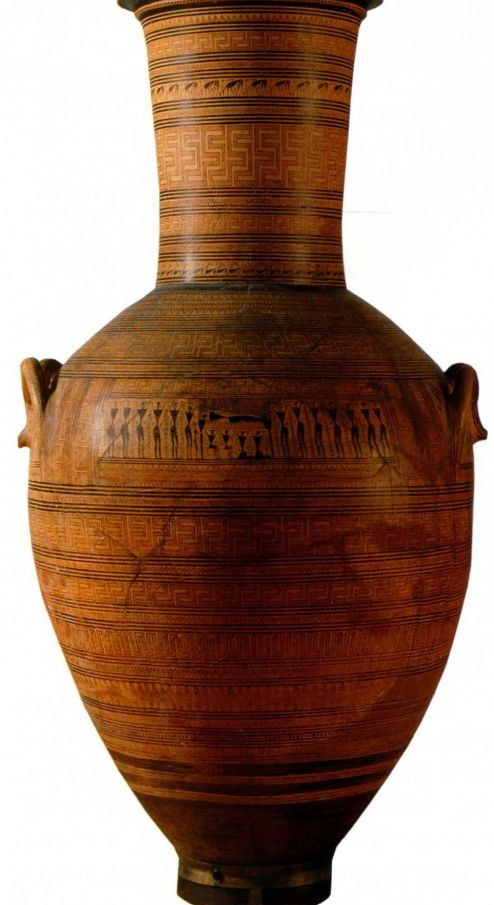

图5\.2 狄庇隆大师创作的晚期几何风格腹柄双耳陶瓶，出土于雅典狄庇隆墓地。约公元前750年。高1\.55米。雅典国家考古博物馆

程序，通常由不同的工匠完成。陶器画师最初使用抽象的装饰图案，如三角形、“棋盘方格形”和同心圆等。接近公元前800年时，人和动物的形象开始出现在几何图案框架内，在一些最精美的陶器图画中，这些形象还构成了叙事场面。

插图中展示的陶瓶出土于一座墓葬，邻近雅典西北角的狄庇隆门（Dipylon gate），制作于约公元前750年（图5\.2）。这件艺术品被称为狄庇隆陶瓶\(Dipylon	Vase），是一组特大型陶器中的一个，用作墓葬的部件。底部有孔，液体祭品（奠酒）可由此渗入地下，供墓主享用。在此之前，雅典人将死者火化，骨灰装入陶瓶，陶瓶形状根据死者性别而定。女

性的骨灰装在腹柄双耳瓶（belly\-handled amphora）中，这种类型的器皿更常用作酒瓶或油罐；男性的骨灰则盛在颈柄双耳瓶（neck\-amphora）中。大型碗状容器酒瓮（krater）通常用来混合葡萄酒和水，自公元第一个千年初起也用作墓葬的标志（见图5\.1）。图示陶瓶的形状表明死者是个女子，其尺寸就表明她十分富有。

这个双耳瓶是一件陶艺杰作。它高逾1\.5米，不可能用一块陶坯制成。实际上，陶工先将各个部分分别造好，然后用泥釉粘合起来。器形遵循细致的比例设计：宽度是高度的一半，颈长占瓶身高度的一半。工匠在瓶身最宽处安上瓮耳，更加突出宽度。陶瓶的装饰图案大部分是几何图形，主要是回形纹饰（meander），也称为迷宫图案（maze）或希腊钥匙图案（Greek key pattern，图5\.3），是长方形的卷轴形饰带，而陶瓶的颈部、肩部和底部都饰以一圈圈富有光泽的黑色条纹。几何图案反映出陶瓶形状的比例。瓶颈顶部和底部是单层的回形纹饰，中间是三重的回形纹饰，突出了颈部的长度。瓶身的双重或单层回形纹饰较为粗大，恰好与鼓起的瓶身相配。在颈部三重回形纹饰的上方，鹿儿在吃草，一只接着一只，相同的形象重复出现，环绕着陶瓶。这种动物饰带预示了这一主题在公元前7世纪的广泛使用。而在瓶颈的基部，它们都将头转向身体上方，就像是动物形成的回形纹饰，永远往前运动，又一直返回自身。

在瓶身中部的双耳之间，有一个叙事场景。死者

花形饰            卵锚饰

图5\.3 常见的希腊装饰母题

扭索饰           莨苕叶饰

棕叶饰            回形纹饰

104 詹森艺术史

躺在一张灵床上，盖着一件方格图案的寿衣。两侧站立的人双臂上举，以示哀悼，灵床下方还有四个人，或跪或坐。画师并未着意写实，而是以实心的黑色几何形式构成人体。一个三角形代表躯干，而举起的双臂则以两肩的延长线表示。场景本身表现的是奠礼（prothesis），属于雅典葬礼的一部分，灵堂庄严隆重，公众前来吊唁。盛大的葬礼是一个展示财富与地位的机会，哀悼的人越多越好，所以死者家人会雇佣职业的哭丧人。因此在墓葬标示物上描绘葬礼场面就不仅是描述这个事件，而是直观地记录死者的崇高社会地位。

考古学家在意大利、近东以及希腊都发现了几何风格陶器。其分布广泛，表明不仅是希腊人，腓尼基人、北叙利亚人和其他近东民族都促进了几何风格陶器在整个地中海的传播。不仅如此，自公元前18世纪下半叶起，陶器上的铭文表明希腊人已将腓尼基人的字母为己所用。

几何风格雕塑

插图中是一个小型的青铜组雕，表现的是一名男子和一个马人（Centaur），制作时期与狄庇隆双耳瓶大致相同，两者表现人物造型的方式也明显相似（图5\.4）。手臂细长，扁平的胸部呈三角形，与较为饱满的臀部和腿形成强烈反差。头颅浑圆，胡须和鼻子是附加上去的。艺术家将组雕浇铸为一体，男性与马人由共同的基座和交缠的姿势联系在一起。这件组雕可能发现于奥林匹亚的圣殿。根据其象征性质，昂贵材料以及讲究技法来看，它可能是一件奢侈的还愿作品（votive）。组雕中的两个形象有着明显的互动关系，表明艺术家对叙事的兴趣，这一主题贯穿于希腊艺术史。我们很难断言，艺术家是否在表现观众所熟知的一个故事。这两个形象都戴着头盔，表明他们是在武力较量，男子体形较大，暗示他将是竞争的胜利者。许多学者认为他代表的是希腊人的英雄，宙斯的儿子赫剌克勒斯（Herakles），他在传说中历经磨难，多次与马人交手。

大事年表

约公元前8世纪\-荷马著《伊利亚特》和《奥德赛》

公元前776年\-第一届奥林匹克运动会

约公元前753年\-罗马建成

约公元前750年\-狄庇隆陶瓶制作

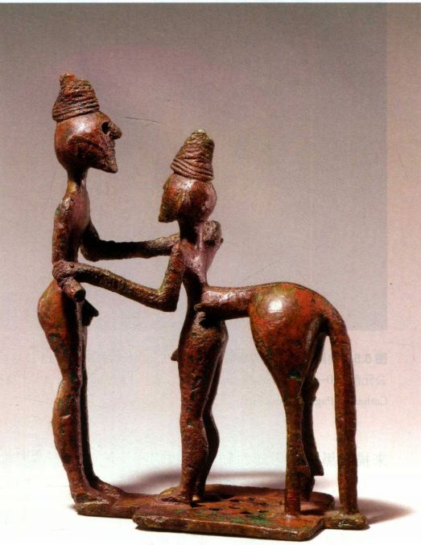

图5\.4《男子与马人雕像》（Man and Centaur），可能出自奥林匹亚。约公元前750年。青铜，高11\.1厘米。纽约大都会艺术博物馆。J．Pierpont Morgan赠品，藏品号1917\.17\.190\.2072

收东方观念后，画师和雕塑师掌握了新的艺术形式，由此带来了不断创新实验的时期。

在雅典等许多希腊城邦，东方化风格取代了几何

（Corinth），是通往伯罗奔尼撒半岛东北角的门户。

这个城邦成为希腊在地中海西部殖民的领导力量，

并控制了出口贸易。科林斯的作坊有悠久的陶器制作

历史。陶瓶画师学会了制作一种细腻的光亮黑釉，用

公元前725至前650年，希腊出现了一种新的陶 风格。然而这种风格最重要的生产中心之一在科林斯

东方化风格：开拓视野           微型器皿

器和雕塑风格，最初是受到近东的巨大影响，后来又受埃及影响。学者称这一时期为东方化时期，当时希腊艺术文化迅速吸收了一大批东方母题与观念，包括狮身鹰首兽（griffin）	和狮身人面兽等混种生物。吸

第五章 希腊艺术 105

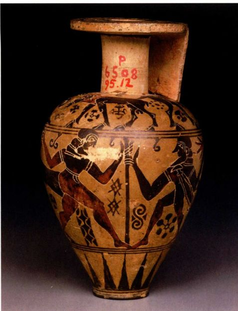

图5\.5 埃阿斯画师：芳油瓶（香水瓶）。原始科林斯中期IA风格，公元前690\-前675年。陶，高7\.3厘米，直径4\.4厘米。波士顿美术馆。Catharine Page Perkins 基金

来描绘黑色剪影或勾勒图像的轮廓。他们还能在泥釉上刻划，为作品添加细节，更有生气。他们尤其擅长制作微型器皿，插图所示的例子是一个原科林斯风格的芳油瓶	（aryballos），即香水瓶，制作于约公元前680年（图5\.5）。考古学家在整个希腊地区都发现了类似的陶器，有些留在神殿中作为敬神祭品，有些则是作为随葬品。这件陶器玲珑小巧，表面却饰有精致的图案。瓶肩有一圈动物形象，使人想起近东的动物母题和狄庇隆双耳瓶上见到的早期范例（见图2\.25和5\.2）。描绘真实和想象中的动物形象的饰带是科林斯陶器及其他东方化陶器的典型特征，后来的陶瓶更是从上至下布满了这种装饰图案。瓶耳处饰有扭索饰（guilloche pattern），瓶口和瓶耳的边缘则饰以曲折纹（见图5\.3）。主要的人物形象饰带是图画叙事的又一早期例证，但几何风格陶器上的日常生活场景已经被想象中的神话世界所取代。在陶瓶的一面，一名健壮的裸体男子挥舞宝剑，冲向架上的一个陶瓶。在图示的画面上，一名蓄须的男子正从一个马人的手中抢夺权杖或棍棒。一种意见认为，饰带中表现的是赫剌克勒斯在佩利翁山（Mount Pholoë）上与一群马

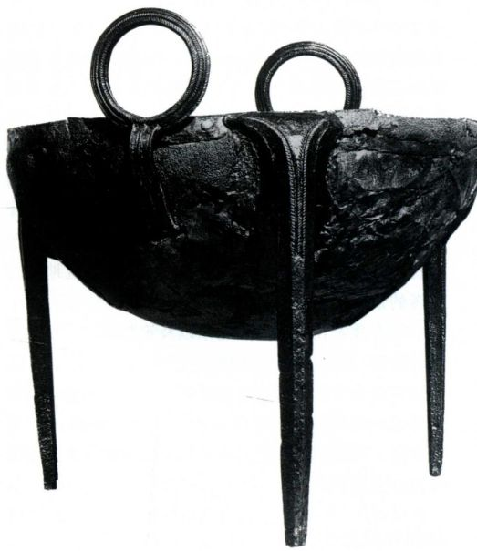

图5\.6 奥林匹亚的几何风格三足鼎。公元前8世纪。高65厘米。奥林匹亚博物馆

人冲突的情景。在希腊神话中，马人是臭名昭著的酒鬼，陶瓶另一面画着一个调酒的碗，这可能解释了它们粗暴的行为。另一些人则认为，画面中的人物其实是宙斯，正在挥舞他的霹雳或闪电。无论如何解读这个场面，有一点是明确无疑的\-它试图使人想到一个神话传说。

青铜三足鼎 几何风格时期，希腊人有时会在神殿摆放青铜三足大鼎，作为献给诸神的礼物（图5\.6）。这是表示虔诚的姿态，但也是展示财富的方式，有些三足大鼎体积十分庞大。从公元前7世纪初开始，希腊出现了一种新的纪念性器皿\-东方化的大鼎。青铜器工匠可能在边缘加上手柄（protomes），其外形是生有双翼的女海妖塞壬（siren）和狮身鹰首兽，都是近东著名的神兽。插图所示的铜铸手柄来自罗得岛（Rhodes），表现了一个十分邪恶的生物，静静注视着祭献的过程（图5\.7）。它双耳竖起，头顶有一直竖的突起物，与颈部、头部、眼部和嘴部的大弧度曲线形成鲜明对比，弯曲的舌头令人感到危险，方向与喙的曲线恰好相反。竖直的线条看起来使曲线更富动感，仿佛这只危险的怪兽正要腾跃而起。

106 詹森艺术史

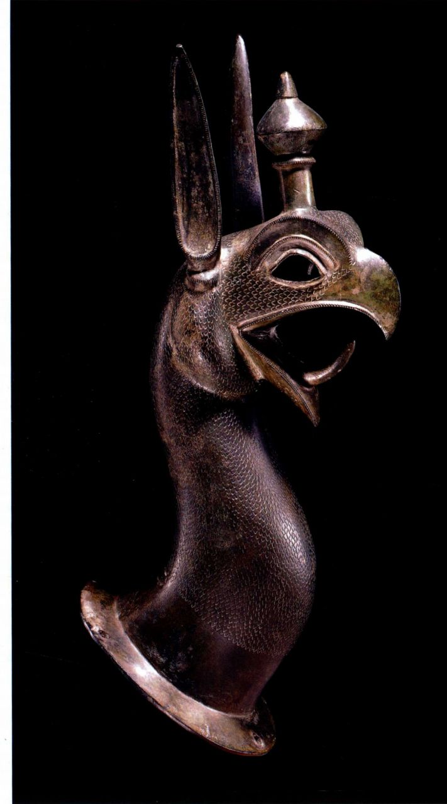

图5\.7 青铜三足鼎的鹰兽手柄，出自罗得岛卡梅罗斯（Kameiros）。约公元前650年。铸造青铜。伦敦大

英博物馆

大事年表

约公元前680年\-科林斯风格香油瓶

公元前7世纪中叶\-黑绘瓶画技法发展成熟

约公元前650年\-希腊人在埃及建立贸易点

约公元前620年\-德拉古编撰雅典法典

古风艺术：城邦的艺术

公元前7世纪和前6世纪，希腊人似乎完善了这一观念，即城邦。城市过去只是一座堡垒，一个危机时刻的避难所，此后却逐渐成为社会群体和身份标志。我们所了解的城邦有几种不同的统治方式，包括君主政治（源自“monarches”，意为“唯一的统治者”）、贵族政治（源自“aristoi”和“kratia”，意为最好的统治）、僭主政治（源自“tyrannos”，意为“独裁者”）、寡头政治（源自“oligoi”， 意为“少数人”，指少数处于统治地位的精英）以及雅典实行的民主政治（源自“demos”，意为“人民”）。通往民主的道路进展缓慢，起点是公元前6世纪末雅典的梭伦（Solon）改制。但即使到了公元前462年伯里克利（Perikles）推行激进改革的时期，女性依旧不能直接参与公共生活，而且雅典依然承认奴隶制，与其他希腊城邦无异。随着城邦理念的演变，它的外在形态也发生了变化。

纪念性神庙建筑兴起

公元前7世纪某个时刻，希腊建筑师开始考虑使用石料而不是木材来建造神庙。最早的一座很可能在科林斯，采用多立克风格（Doric style），因源于多立克地区而得名。石造神庙的观念由科林斯传播到连接伯罗奔尼撒半岛与希腊大陆的地峡，沿海岸线向北传到德尔斐（Delphi）和科孚岛（Corfu），然后迅速传遍了整个希腊世界。爱琴海群岛和小亚细亚海岸地区迅速形成了爱奥尼亚（Ionic）风格。科林斯风格直到公元前4世纪才形成（见第142页）。希腊人当时就认识到了这场建筑革命的重要性：建筑师开始撰写关于建筑的论文，这是已知最早的建筑论著，他们的建筑作品也为他们赢得了声誉，并且一直流传至今。

罗马时代建筑师维特鲁威（Vitruvius）在著作中描述了多立克和爱奥尼亚风格（Ionic style），他的论述是我们了解希腊建筑的基础。然而我们并不是直接解读他的文本，而是通过早期近代的注释和插图来理解原文本，注释和插图中使用的名称是多

立克和爱奥尼亚“柱式”而不是“类型”，但“类型”更加贴近维特鲁威原文中的“genera”。两种名称的区别是非常重要的：“柱式”代表一成不变的性质，僵化固定的建筑准则，而实际上现存的希腊建筑有着微妙而丰富的变化。

虽然多立克和爱奥尼亚神庙在建筑规模和地区偏好上有所差异，但基本功能构件非常相似（图5\.8）。这种建筑的核心是它的主室，称为内殿（cella，或内厅［naos］），实际上也是其建造目的所在。内殿中放着一尊神像，就是整座神庙所敬奉的神祇。通常有立柱沿内壁排列，在视觉上衬托出神像，同时支撑屋顶。靠近内殿的是门廊，又称前殿（pronaos），在某些神庙中，内殿后还有第二个门廊，使设计更加对称，也可以放置宗教用品。在较大的神庙中，位于中央的内殿和门廊外围还有柱廊，称作围柱廊（peristyle），这种建筑便被称作围柱式神庙（peripteral temple）。围柱式设计一般是前后各有6至8根立柱，在侧面通常有12至17根，四角上的立柱计算两次。最大的爱奥尼亚神庙有双层柱廊。

柱廊不仅为神庙增添庄严，还为祭拜者挡风遮雨。它既不算外部结构，也不属于内部空间，因此起到了过渡区域的作用，横亘于凡俗世界与神圣内殿之间。有些神庙建在神圣的树丛中，耸立的坚固廊柱使神庙融入自然。柱廊又与内殿中的立柱遥相呼应，使建筑内外合为一体。大多数希腊神庙入口朝东，面向朝阳。神庙东面通常是祭坛，是祭祀活动必不可缺的。祭坛面朝神像和希腊城邦中前来祭拜的民众，希腊人正是在祭坛上举行祭神活动。

多立克和爱奥尼亚风格的区别在建筑的正面表现得最为明显。希腊人描述建筑构件的许多术语，如图5\.9所示，到今天仍然通用。建筑主体在一个高于地面的平台上，平台一般有三级台阶，称为台基（stereobate）和柱基（stylobate）。多立克式立柱（Doric column）由柱身（shaft）和柱头（capital）构成，柱身上通常有竖直的浅槽，即柱槽（fluting）。柱头包括一个外扩的钟形饰（echinus）和一块称作柱顶板（abacus）的方石板。檐部（entablature）包括立柱支撑的所有水平构件，又分为额枋（architrave，直接由立柱支撑的一排石板）、檐壁（frieze，由三垄板［triglyphs］和嵌板［metopes］交替组成，三垄板带有三个沟槽，嵌板光滑或带有雕饰）以及一个突出的水平檐口（cornice），或称檐楣（geison），檐口上有时有檐沟（sima）。檐部又支撑着呈三角形的三角楣（pediment）和屋顶的构件（倾斜的檐楣和檐沟）。

108 詹森艺术史

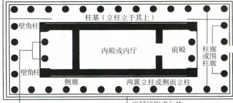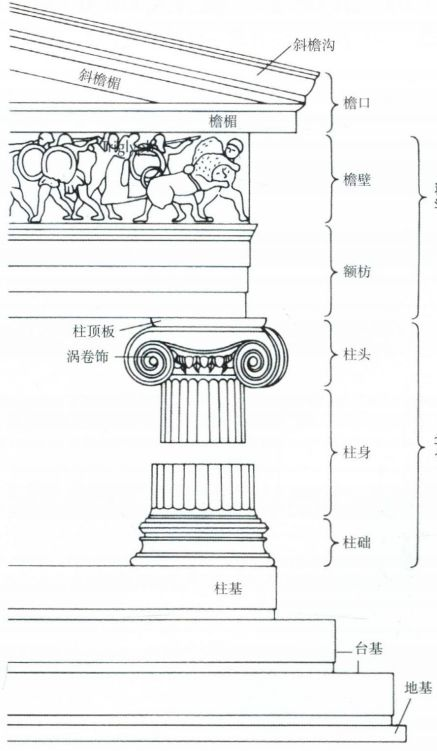

图5\.8 希腊典型围柱

式神庙的平面图（根据

Grinnell的图绘制）

扶壁间立柱

爱奥尼亚神庙通常多一层水平基座，或称地基（euthynteria），同样有三级台阶。爱奥尼亚式立柱（Ioniccolumn）与多立克立柱的不同之处在于每根立柱都有一个装饰性柱础（base），也许一开始是用来防止柱子底部被雨水侵蚀的。柱身较细，向上收窄也较不明显，柱顶板下方有一个双重的涡卷形结构，或称涡卷饰（volute），宽度远远超过柱身。与希腊大陆的风格相比，爱奥尼亚式立柱缺少那种结实强健的特质。相反，它使人联想起一株正在生长的植物，一株棕榈树，这一点与早先的埃及立柱相同，尽管它可能并非

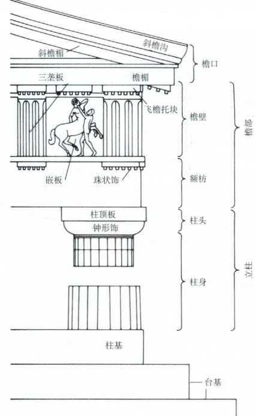

底层结构或台基

直接源于埃及。额枋上方的檐壁是连续的，而不是直观地分为三垄板和嵌板。

多立克式和爱奥尼亚式神庙都是用石板拼成，不用灰浆，因而要求石板的形状十分精确，以保证结合部位平整。必要时用金属暗销和扣钉将石块连在一起。除极少数特例以外，立柱一般由一段段鼓石（drum）构成。整个立柱组装到位以后才开凿柱身的柱槽。木椽上覆以陶瓦形成屋顶，天花板采用木制横梁。因此火灾一直威胁着神庙的安全。

这两种风格是如何在希腊出现的，为什么会如此

立柱

图5\.9 多立克和爱奥尼亚风格立视图

第五章 希腊艺术 109

迅速地形成简洁凝练的体系，这些问题依旧令人疑惑。端，木梁原本由下方的木楔固定，后来演变成水珠状

装饰物，名为珠状饰（guttae）（见图5\.9）。嵌板则

是从填补三垄板之间空隙以抵御天气变化的木板演变

而来。飞檐托块（mutules，扁平的突出石块）则对应

了木质屋顶中椽的末端。然而有些推论较有说服力。

部分学者提出，三垄板的垂直分隔代表着三根半圆木，

这种说法看来几乎不可能，柱身凹槽也未必是表现了

树干上的锛痕，因为埃及的建筑师也在立柱上凿出柱

槽，但他们很少使用木材来做支撑构件。建筑史学家

需要不断思考如何从功能上对风格特征加以解释。

佩斯图姆的多立克式神庙 早期多立克式神庙

的范本是意大利南部城市佩斯图姆（Paestum）两座

保存完好的神庙，古风时期，那里曾是一个繁荣兴盛

的希腊殖民地。两座神庙供奉的都是宙斯之妻，也就

是赫拉女神，只是赫拉神庙II（Temple of Hera II）

的建造时间要晚将近一个世纪，赫拉神庙I的结构被

称为“公堂”（Basilica），即长方形的公共建筑（图

5\.10）。两座神庙的比例截然不同。神庙I（图5\.10

左侧）显得低矮平展，而神庙II则显得高大紧凑。

这并不仅仅是因为神庙I的檐部大部分已不复存在，

还因为神庙I是九柱式（enneastyle）建筑，而神庙

II则是六柱式（hexastyle）。立柱外形改变也是原因

现存最古老的神庙遗迹表明，公元前600年之后不久，多立克风格的主要特征便已初具雏形。早期运用石料的希腊建筑家看来有三个不同的灵感来源：迈锡尼和埃及的石质建筑，以木头与泥砖为原料的希腊前古风建筑。希腊神庙的中央部分，即内殿和前殿，可能源自迈锡尼王宫谒见大厅的布局（见图4\.19），这种借鉴也许是传统的延续，或是传统的复兴。若果真如此，这层关系或许就反映了迈锡尼文化在晚期希腊神话中的崇高地位。多立克式立柱的柱身由下而上逐渐变细，而米诺斯\-迈锡尼式柱身是上粗下细。在此之前两千多年，在萨卡拉的佐塞金字塔墓葬区就有柱身带柱槽的半柱（见图3\.6）。此外，神庙应该用石料建造并有大量立柱，这一观念也是来自埃及的，尽管埃及神庙规模更加宏大，内部空间更加开阔。学者猜测，希腊人自埃及汲取了许多切割和砌筑石料的技艺，以及一些建筑装饰与几何知识。从某种意义上说，希腊的围柱式神庙可以视为埃及圣殿的柱式庭院，只不过内外结构恰好相反。

一些学者将多立克式建筑的发展看作木制形式的石材化（即向石材的转化），因而以石制结构实现木材的功能。由此推论，三垄板一度用于遮挡木梁顶

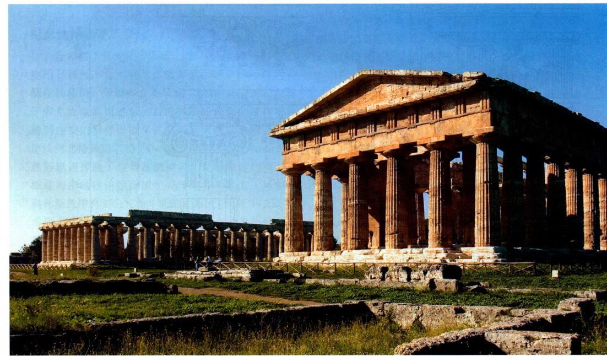

图5\.10 赫拉神庙1（“公堂”），约公元前550年，赫拉神庙II（“波塞冬神庙”），约公元前500年。佩斯图姆

110 詹森艺术史

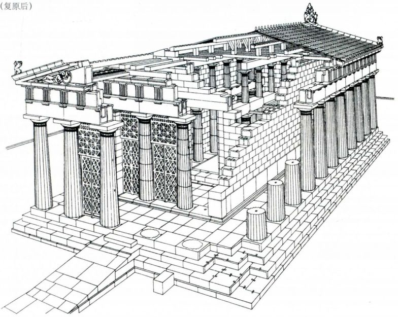

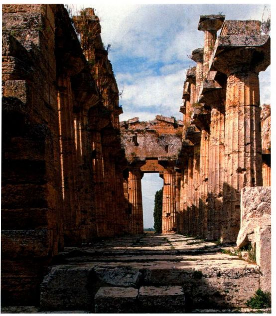

之一。在这两座神庙中，立柱的柱身都不是上下一般粗细，柱身三分之一处略为向外鼓出，到三分之二处又缩回。这种鼓起的效果称为凸肚（entasis），在建成较早的神庙I中更为明显。观者会觉得立柱在上层结构的压力下向外鼓出，而纤细的柱顶尽管有向外伸出的垫状柱头相助，也几乎难以承受沉重的压力。整个建筑由此获得了非凡的生命力，俨然有一种压力正蓄势待发。

赫拉神庙II是保存最好的多立克式神庙之一（图5\.11），向我们展示了大型多立克式神庙中支撑天花板的方式。内殿内部有两排立柱，每排上方又各有一组较小的立柱，尽管中间隔着额枋，但仍然形成了柱身自下而上不断变细的效果。这种双层内部结构最早见于埃癸娜岛（Aegina）的阿维亚神庙（Temple of Aphaia），建于约公元前5世纪初。插图所示是那座神庙的复原图（图5\.12），可见神庙结构的细节。

早期爱奥尼亚神庙 爱奥尼亚风格的出现比多立克风格约晚半个世纪。由其植物装饰来看，似乎深受

图5\.11 赫拉神庙II内部。约公元前500年

图5\.12 埃癸娜岛阿维亚神庙剖面图（复原后）

第五章 希腊艺术 III

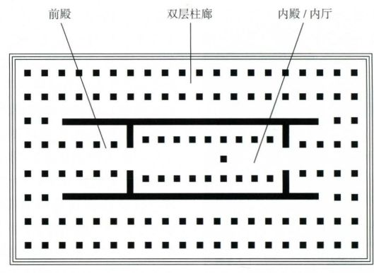

图5\.13 阿耳忒弥斯神庙复原平面图，土耳其以弗所。约公元前560年

近东风格的启发。与爱奥尼亚柱头最接近的是伊奥利亚（Aeolic）柱头，发现于老士麦拿（Old Smyrna）地区、希腊东部以及爱琴海东北部，而它本身明显是源自北叙利亚和腓尼基。最早的爱奥尼亚神庙建于希腊的爱奥尼亚区，主要城邦竞相在那里建起规模宏大、装饰富丽的神庙，彼此公开竞争。这些早期建筑很少留存至今。以弗所（Ephesos）的阿耳忒弥斯神庙（Templeof Artemis）在古代享有盛名，是古代世界七大奇迹之一。约公元前560年，以弗所人（Ephesians）聘请西奥多罗斯（Theodoros）在神庙地基上动工。此前不久，西奥多罗斯刚和另一个建筑师罗伊科斯（Rhoikos）在萨摩斯岛（Samos）设计了一座巨大的赫拉神庙。克诺索斯建筑师契斯佛龙（Chersiphron）及其子梅塔杰那斯（Metagenes）撰写过一篇论著，专门论述西奥多罗斯和罗伊科斯的建筑。与萨摩斯岛的神庙相似，以弗所的神庙也是双层围柱（dipteral）结构，外周有两排立柱（图5\.13）。加上柱头类似植物，这座建筑看起来就犹如一片森林。阿耳忒弥斯神庙比赫拉神庙更大，还是第一座几乎全部采用大理石建造的纪念性建筑。这些爱奥尼亚立柱象征意义明显：它们强调了各自城市对地区的领导权。

石雕

据文献记录，公元前8世纪时，希腊人用木材雕刻神像，这些神像都非常简单，但由于木材腐朽，它们无一存世。到了约公元前650年，雕塑家也像同时期的建筑师一样改用石料创作，由此开创了希腊艺术的一个伟大传统。新的雕刻主题使东方化风格区别于几何风格，它们到达希腊的主要渠道是来自近东地区的象牙雕刻与金属制品，同时也反映了埃及的影响。

112 詹森艺术史

但这些都是可以随身携带的物品，不能解释大型石制建筑与雕塑的兴起，这一兴起的基础必定是对埃及艺术品及其制造工艺进行细致的现场观察。对于生活在尼罗河三角洲西部商贸营地的希腊商人来说，只需获得埃及国王萨姆提克一世（Psammetichus I，公元前664\-前610年在位）准许，就能有如此近距离研究的机会。

考丽与库罗斯 早期希腊雕塑明显借鉴了埃及雕刻家的技法和比例体系。图示中即为两尊早期希腊雕像，一尊是约公元前630年的小型女像，可能出自克里特（图5\.14），另一尊是真人大小的男青年裸像，约制作于公元前600年（图5\.15），现陈列在纽约的大都会艺术博物馆，所以被称为纽约的库罗斯（New York Kouros）。与早先的埃及雕像一样（见图3\.11和3\.12），考丽与库罗斯都取僵硬的正面观，构思时考虑到了四个不同的面，反映了所用石块的形状。女像并腿站立，左臂垂于体侧，右臂举到胸前。与孟卡拉相似，希腊男青年像身材修长，肩部宽阔，左腿前伸，双臂垂在身侧，双拳紧握。他的肩膀、臀部和膝盖都是水平的。两尊雕像都采用了某种固定风格，头发像假发一样，与埃及的雕像相似，但也存在显著的差异。首先，希腊雕塑是真正的自立式，不再像埃及石像一样使用背部石板支撑。事实上，它们是艺术史上最早脱离支撑结构的大型石雕人像。不仅如此，希腊雕刻家还使用了透空技法（例如在两腿之间以及双臂与躯干之间雕出空隙），而埃及的石像几乎没有缝隙，各部分之间的空隙也并不凿穿。早期的希腊雕塑比埃及前辈风格更加固定。最明显的便是瞪大的双眼，粗重弯曲的眉毛使之更加醒目，并且人体构造都采用线性

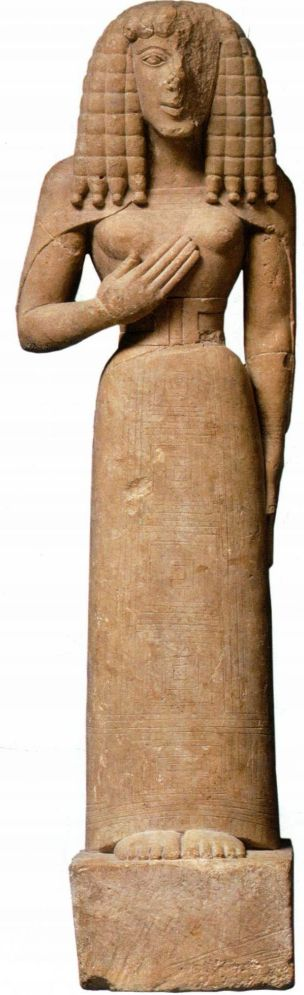

图5\.14《考丽［少女像］》（Kore（Maiden］）。约公元前630年。石灰石，高62\.3厘米。巴黎卢浮宫

处理：青年男子的胸肌和胸廓就像是蚀刻在石头表面一般，而不像孟卡拉像那样是塑造而成。考丽像与大多数早期希腊女性雕像一样身着长裙。她的衣服紧贴身体，坦露胸部，但盖住了臀部和腿部，事实上，比起卡蒙若内比提王后像，这件长裙更像埃及块雕（见图3\.12）。希腊女像和孟卡拉像都着衣，而希腊男像裸体。其中反映了这样一个事实：在古希腊，男子可以在公共场所裸体，但女子不行。

整个希腊世界有数十件这类古风雕像存世。有些是在神殿和墓地中发现，但大多数雕像根据发现地点

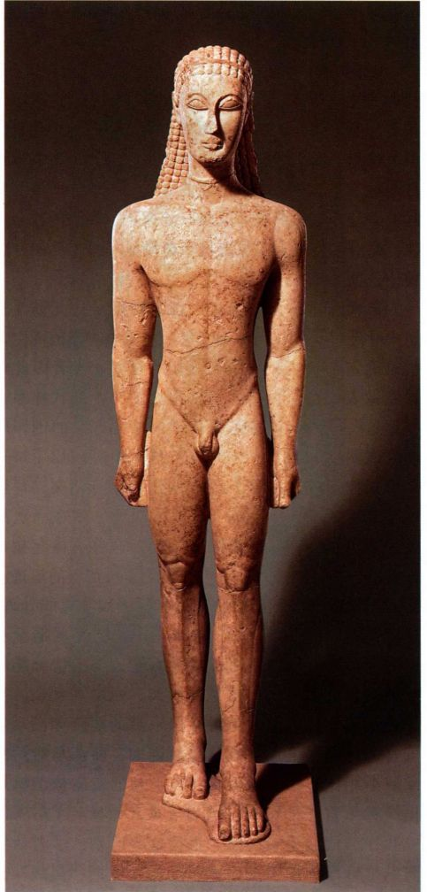

图5\.15 《库罗斯［少男像］》（Kouros／Youth］）。约公元前600\-前590年。大理石，高1\.88米。纽约大都会艺术博物馆

来看是重复使用的，这就使得我们难以理解它们的功能。学者以希腊术语来命名这些雕像，女像统称为考丽（Kore，复数为korai，即少女），男像统称为库罗斯（Kouros，复数为kouroi，即少男）。这种称呼回避了进一步确认雕像身份的困难。一些雕像上刻有艺术家的姓名（“我出自某某人之手”）或给神祇的献辞，主要是给阿波罗的颂词。由此看来，这些雕像就是还愿物品。但在大多数情况下，我们不知道它们代表的是谁，是供奉者、神祇、还是如神明一般受到民众景仰的人，如体育竞赛中的优胜者。那些放置在坟墓上

第五章 希腊艺术 113

的雕像可能代表墓中的死者，但也偶见女子墓地上立着一尊库罗斯。

雕刻家并未着意表现个性特征，因此这些雕像只能笼统地代表死者。就其背景环境来看，这些雕像很可能是人神共有的完美体态与生命力的理想化身。但显然只有富人才有财力建造它们，因为许多雕像远远超过真人大小，并且是用上等大理石雕刻而成。实际上，这些雕像的统一风格可能揭示了它们的社会功能：富有的赞助人借订造这类雕像显示了自己的社会地位，也表明了自己属于统治社会的精英分子。

年代测定和自然主义 古风时期从公元前7世纪中叶延续至约公元前480年。在这一时间范围内，很难确定自立式雕像更加确切的年代。学者因此根据雕像表现自然风格的程度建立了一个断代体系。根据这一体系，雕像越显现出风格化，它的创作时期应该就越早。对比图5\.15与图5\.16就可以了解这个模式如何运作。图5\.16中底座上刻有铭文，写明这是克罗索斯（Kroisos）的墓葬雕像，他在一次战役中英勇献身。与同类雕像一样，这尊雕像起初也曾着色，头发和瞳孔部位仍然可见颜料留下的痕迹。不同于纽约的库罗斯所表现的生硬平面和直线处理，这尊出土于阿纳维索斯（Anavysos）的库罗斯全身以突起的曲线塑造而成。注视着它，观者仿佛能感受到雕琢过的石头中包裹着肌肉、肌腱和骨骼。身体更富于弹性，使人觉得它似乎真的能自如活动。五官的比例也更加自然。总的说来，面部与纽约的库罗斯相比不那么像面具，但上翘的双唇依旧呈现出一种不自然的微笑，名为古风式的微笑（ArchaicSmile），眼睛不带笑意。根据这些区别，学者认为阿纳维索斯的库罗斯要比纽约的库罗斯“高级”，并推断前者的制作时间晚约75年。鉴于希腊雕塑此后的发展轨迹，我们有充分的理由相信这种鉴定古风雕塑年代的方法多少是准确的（考虑到地区差异等因素）。尽管如此，此处应当强调的是这种方法的基础不是事实，而是假设，即假设雕塑家或其顾客是力求实现自然主义风格的。

考丽雕像的发展程式看来与库罗斯相似。例如图5\.17中的考丽，她身体呈块状，强调腰部，看来是图5\.14中考丽的“直系后裔”。由于她身着厚实的羊毛衣服（peplos），也被称为《穿羊毛衣裙的考丽》（PeplosKore）。左手原本向前伸出，托着一件还愿品，如果没有断落的话，一定会赋予她不同于早期考丽像的空间感。头发的处理也大有新意，因为头发更加自然，一绺绺柔和卷曲的长发自肩垂下，同图5\.14中僵直的

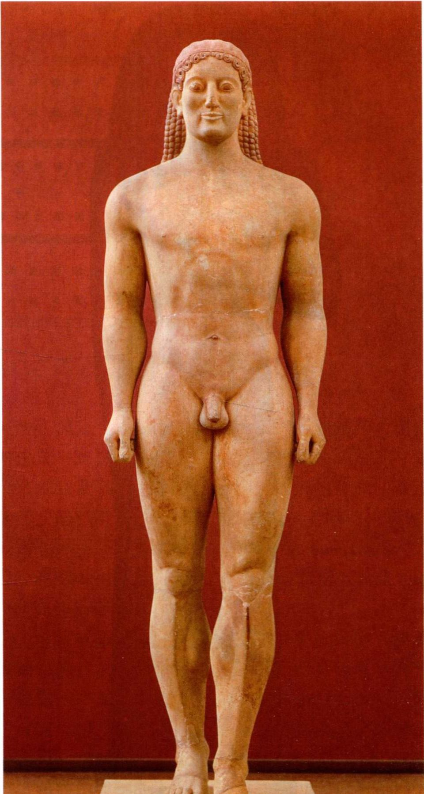

图5\.16《克罗索斯［阿纳维索斯的库罗斯］》（Kroisos／Kouros fromAnarysos］）。约公元前540一前525年。大理石，高1\.9米。雅典国家博物馆

假发全然不同。面庞更为丰腴，微笑非常温柔自然，笑意从嘴角一直漾到脸颊。学者因此推断这尊雕像比图5\.14中的作品晚了整整一个世纪。

尽管如此，考丽类型比库罗斯的变化更为丰富。部分原因是考丽像都穿着衣服，因此涉及如何处理身体和服装的关系。同样还能反映出服饰习惯的演变或地方风格的差异。图5\.18中的考丽像比《穿羊毛衣裙的考丽》要晚约十年，毫无后者的那种质朴感。两尊雕像都发现于雅典卫城，但她可能来自希腊爱奥尼亚地区的希俄斯岛（Chios）。与此前讨论过的考丽像不同，这尊雕像中的少女斜披着较为厚实的

114 詹森艺术史

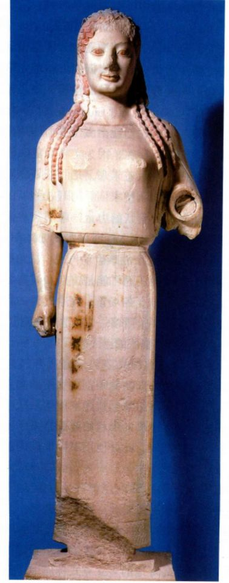

图5\.17 《穿多利安式羊毛衣裙的考丽》（Kore in Dorian Peplos），又名《穿羊毛衣裙的考丽》。约公元前530年。大理石，高122厘米。雅典卫城博物馆

大方袍（himation），方袍内是轻便的爱奥尼亚式束腰长袍（chiton），这种装束取代了流行的披肩。不同层次的衣服垂下，形成柔和的曲线，但衣服的繁复褶皱、褶痕及丰富的布料材质几乎有些喧宾夺主。色彩在这类作品中起着十分重要的作用，幸运的是这尊考丽像的色彩脱落并不十分严重。

建筑雕塑：建筑焕发生机

初次营造石制神庙后不久，希腊人也开始用建筑雕塑来装饰这些神庙。事实上，萨摩斯岛的西奥多罗斯等早期的希腊建筑师常常也创作雕塑，雕塑能将建筑连结为一个整体，使它富有活力。这些雕塑上残留

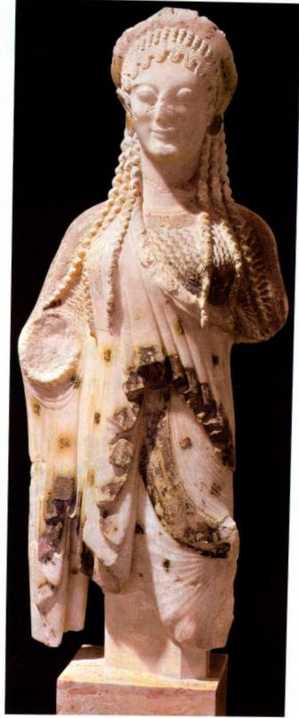

图5\.18《考丽》（Kore），出自希俄斯岛（？）。约公元前520年。大理石，高55\.3厘米。雅典卫城博物馆

的颜料表明它们通常都涂有鲜艳的色彩，颠覆了以往认为古代雕塑就是使用洁白无色的大理石的观念。

自古王国时期起，埃及人就一直用大量浮雕来装饰墙壁和立柱。但是，这些浮雕很浅（如图3\.29），并不会打破表面的连续性，其本身也没有什么重量和体积，所以它们与建筑背景的关系就像壁画一样。亚述王国、巴比伦王国和波斯帝国的建筑浮雕也是如此（如图2\.21和2\.22）。

但古代近东地区还存在另一种建筑雕塑，可能由赫梯人首创，即在砌筑城堡或宫殿入口的大石块上雕刻凸出的守护怪物（见图2\.23）。这一传统可能直接或间接地影响了迈锡尼狮门的雕塑（见图4\.22）。

科孚岛的阿耳忒弥斯神庙 只要看到科孚岛上阿耳忒弥斯神庙的正立面就会知道，后来的希腊建筑雕塑从观念上来说确实继承沿袭了狮门浮雕。这座神庙建于公元前600年之后不久，属早期古风风格（图5\.19和5\.20）。其雕塑也局限在三角楣内，即天花板与屋

第五章 希腊艺术 115

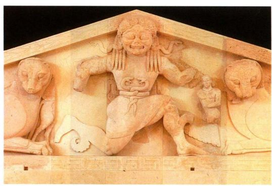

图5\.19 阿耳忒弥斯神庙西三角楣中部，希腊科孚岛。约公元前600一前580年。石灰石，高2\.8米。希腊科孚岛考古博物馆

顶之间的三角形区域。三角楣就像一道屏障，防止后面的木椽受潮。它也成为三角楣雕塑的背景。

从技法上来说，这些雕塑是高浮雕，与迈锡尼的守护母狮相同。然而特别的是，狮身雕得很深，几乎与背景脱离，看起来似乎独立于背景建筑。实际上，中间人物的头部竟然超出了三角区的内沿，仿佛正从三角楣上探身出来。雕刻家的这一处理加强了雕像的视觉冲击力，也强化了她的功能。虽然这座神庙是为阿耳忒弥斯女神而建，但雕像表现的是蛇发美杜莎（Medusa），希腊神话中的戈耳贡女妖（Gorgon）之一。据说美杜莎外貌可怖，任何人见到她都会变成石头。珀耳修斯（Perseus）得众神襄助，通过盾牌映出的影子来判断方向，用剑砍下了她的头。

美杜莎过去一直被认为是视觉上的守护形象，但最近的研究提出她是神祇威力的直观表现。她被构想为动物的女主人，见证着女神的权势及其对自然的统

治。两只大型猫科动物卧于美杜莎两侧，这种纹章式布局可见于迈锡尼狮门等许多早先的近东雕塑。为了突出雕塑家的意旨，三角楣中还加入了叙事元素。在主要组像之间及组像之后的空间内，雕塑家嵌入了不少次要形象。美杜莎两旁是她的孩子，飞马珀加索斯（Pegasus）和克律萨俄耳（Chrysaor），美杜莎被珀耳修斯砍下头颅时，它们就由溅出的血滴中诞生。从逻辑上讲，它们尚不存在，因为美杜莎的头还安然无恙，但它们的出现预示着未来，珀耳修斯将获得戈耳贡女妖的力量，正如雕塑家依靠阿耳忒弥斯的帮助在雕塑中获得了戈耳贡女妖的力量。雕塑家将同一故事中两个不同的时刻融合为一，即采用概观叙事（synopticnarrative）手法，使这个故事生动再现。三角楣的角落中另有两组形象，表现的可能是宙斯和波塞冬与巨人族作战（gigantomachy）的场景，这个凡界的种族妄想推翻诸神。与浮雕中央的形象一样，他们也使世人警醒，因为诸神消灭了野心膨胀的巨人族。

两只猫科动物的斜靠姿势恰好适合三角楣的形状。然而为了在美杜莎两侧雕刻珀加索斯和克律萨俄耳，并在角落中雕出组像，雕塑家使用了比主要形象小得多的比例。三角楣的形状给雕塑带来了困难，由后人的解决方法来看，此处使用不同比例的做法并不尽如人意。

除在三角楣平面饰以浮雕外，希腊人可能还在其两端及中部顶端上方安放一些独立雕塑，名为檐饰（acroteria，常以赤陶制成），使建筑顶部单调的轮廓线略显柔和（见图5\.21）。希腊雕塑师还以雕塑装饰檐壁。在科孚岛等地的多立克式神庙中，檐壁包括互相间隔排列的三垄板与嵌板，嵌板常以人物场景装饰。在爱奥尼亚建筑中，檐壁上有一条连续的绘画或

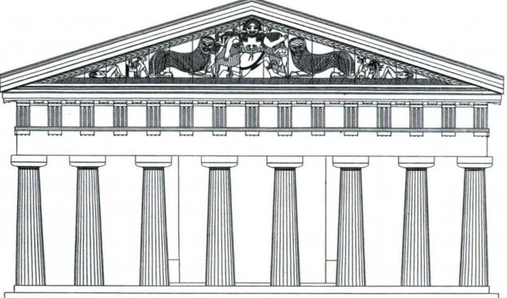

图5\.20 科孚岛阿耳忒弥斯神庙西立面的复原图（根据Rodenwaldt的图绘制）

116 詹森艺术史

雕塑。此外，爱奥尼亚建筑有时还以女性雕像取代立柱支撑门廊的屋顶，称为女像柱（caryatids），别具装饰意味（见图5\.21和5\.53）。

德尔斐城的锡弗诺斯宝库 德尔斐的一座宝库集中体现了这些爱奥尼亚建筑特征，宝库由爱奥尼亚地区的锡弗诺斯（Siphnos）岛民所建，时间是公元前525年前不久。宝库就像小型的神庙，用来存放还愿物品，通常富丽堂皇。虽然锡弗诺斯宝库（Treasuryof the Siphnians）已不复存在，但考古学家依旧能够根据残存部分完成复原图（图5\.21和5\.22）。支撑着门廊额枋的是两根女像柱。额枋上方的檐壁雕饰精细。图示的细节部分（图5\.22）刻画了希腊神话中诸神与巨人战斗的一个场面：在画面最左端，为母神库柏勒（Cybele）拉战车的两头狮子将一个巨人撕成两半，巨人显得痛苦万分；在它们前方，阿波罗同阿耳忒弥斯并肩前进，引弓搭箭，射向巨人的方阵，他们的武器原本是以金属铸造后添加上去的；一位死去的巨人被剥光了盔甲，倒在他们脚下。如同科孚岛神庙上的三角楣一样，这处雕塑表现的故事也是一种警戒，提醒凡人不要妄图僭越他们在万物秩序中的自然地位。尽管题材是神话故事，但它提供了大量有关当时武器和战术的细节。

令人赞叹的是，这面浮雕的深度只不过区区几厘米。在有限深度的空间内，雕刻家们（可以看出出自多人之手）实现了多重空间深度。最靠近观者的人物的胳膊和腿是采用圆雕技法；第二层和第三层的形体较浅，但即使是离观者最远的人物也没有隐入背景。

由此形成的人物关系显出了战争中的冲突和张力，此前的叙事浮雕从未取得如此效果。

如同科孚岛浮雕一样，主角人物充满了整个雕饰区域，增加了檐壁的表现力。这是希腊艺术古风和古典时期的主要特色。随着时间推移，制作三角楣雕塑的雕刻家尝试各种新方法，既能填满这个三角形区域，又能保持比例一致。他们或许由锡弗诺斯宝库的檐壁浮雕等范例中得到启示，开始使用一系列不同的姿势，并在表现自然运动的人体方面迈进了一大步。这一点在阿维亚神庙的三角楣上体现得很明显，这座神庙位于埃癸娜岛上，那是萨罗尼克（Saronic）海湾中的一座岛屿，与阿提卡隔海相望（见图5\.12）。

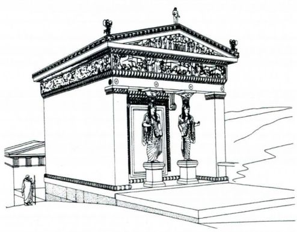

图5\.21 锡弗诺斯宝库复原图，位于德尔斐的阿波罗圣殿。约公元前525年

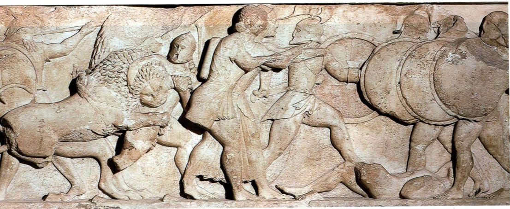

图5\.22《诸神与巨人族之战》（Battle of the Gods and Giants），出自德尔斐锡弗诺斯宝库的北部檐壁。约公元前530年。大理石，高66厘米。德尔斐考古博物馆

第五章 希腊艺术 117

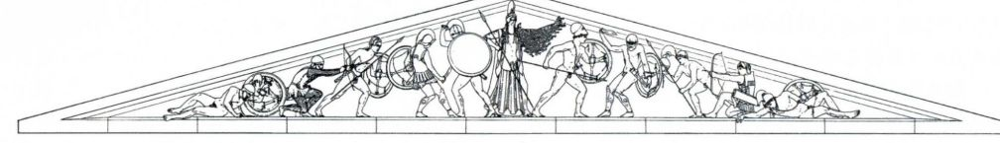

图5\.23 埃癸娜岛阿维亚神庙东三角楣的复原图（根据Ohly的图绘制）

埃癸娜岛阿维亚神庙的三角楣 公元前490年，波斯人占领了埃癸娜岛，他们可能毁坏了神庙东面的三角楣。公元前480年，埃癸娜岛民在萨拉米斯（Salamis）战役中击败波斯人，之后定做了现存的这个三角楣（图5\.23）。它描绘的是第一次洗劫特洛伊的场景，领导者是赫剌克勒斯和萨拉米斯国王特拉蒙（Telamon）。西面的三角楣约为公元前510\-前500年制成，描绘的是由赫剌克勒斯的亲戚阿伽门农领导的第二次对特洛伊的围城之战（《伊利亚特》中有详细描述）。采用这一对题材是为了纪念埃癸娜岛英雄在两场战争中所起的重要作用，进一步来说，是纪念埃癸娜海军对萨拉米斯战役胜利的贡献。通过寓言故事将历史事件升华为普遍真理正是希腊艺术的典型特征。

两面三角楣中的人物都完全是圆雕，独立于其背景。东三角楣被发现时已成地上的碎片，学者对于这些碎片的准确排列位置还有争议，但它们在三角楣中的相对位置比较确定。设计者在雕像中使用了一系列动态的姿势，人物高度顺着三角区斜边变化，但比例不变（图5\.23）。根据高度的差异可以确定各个人物在浮雕中的原始位置。中间赫然而立的是女神雅典娜，

她主宰着希腊人与特洛伊人的战争，激烈的战斗就在她身旁展开。三角楣两端各有一名跪射的弓箭手遥相呼应。中线两侧人物动作对称，形成平衡的构图，因此虽然单个人物姿态各异，它们仍然构成统一的装饰图案。

将西三角楣上一个倒地的勇士（图5\.24）与年代较晚的东三角楣上的相同人物（图5\.25）相比较，我们能够看到，在这几十年的间隔中，雕塑家越来越接近自然风格。对比的两个人物都在垂死中倒地，这样的姿态巧妙地解决了填充角落空间的难题。西三角楣上的勇士是单臂撑地，而晚期制作的勇士则是以盾牌支撑，摇摇欲坠，沉重的身体看来随时会使他倒地。两位雕塑家都试图表现垂死勇士在死亡的痛苦中身体的扭曲：早期的雕塑家将勇士的腿交叉成怪异的姿势，而晚期的雕塑家采用了较为自然的姿势，勇士扭转腰部，左肩转到另一个平面。尽管后一个勇士的身体结构依旧没有完全顺应他的姿势（如右臂用力，但胸部几乎没有相应扩张），但他的身体较之前一个勇士更接近真人。他也不再像以往的雕像一样凝视正面，而是将目光投向他面前的地面。这一姿态暗示他在内省：早期勇士神秘莫测的微笑表情被摈弃了，取而代之的是一个勇士在生命最后时刻的痛苦和情感。

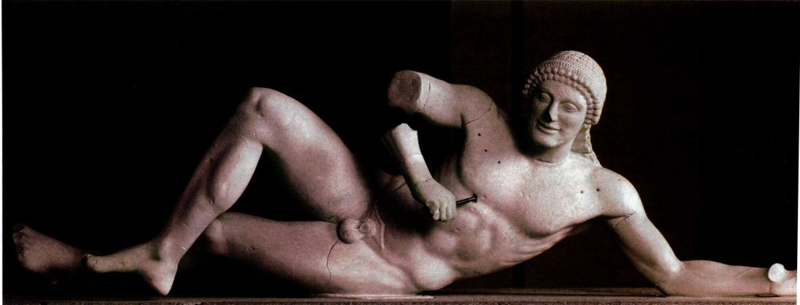

图5\.24《垂死的勇士》（Dying Warrior），出自阿维亚神庙的西三角楣。约公元前500\-前490年。大理石，长1\.59米。慕尼黑州立文物博物馆

118 詹森艺术史

瓶画：宴饮的艺术

在瓶画艺术领域，古风风格取代了东方化风格，雅典和其他文化中心的作坊生产出十分精美的陶器，绘有取材自神话传说和日常生活的场景。下列图示中的陶器都是酒具，但并不用于日常生活。希腊人日常使用的酒具一般较为质朴，不加装饰。彩饰的陶器只在宴饮（symposium）等重要场合使用，这是只有男人和高等妓女参与的酒会，妻子和其他良家妇女都不能参加。房间四周放置着躺椅，宴饮者倚卧于躺椅上，房间中央有一个彩绘的大调酒器（酒瓮［krater］），宴会主持者就用这个调酒缸给他们斟酒。欢宴中有音乐、诗歌、说书和文字游戏，最后常常是以欢爱结束，这样的情形经常描绘在酒杯上。然而正如柏拉图和色诺芬（Xenophon）所述，宴饮也有严肃的一面，那就是关于政治、伦理和道德的辩论。希腊人在其哲学、文学和戏剧中反复思索的大问题，例如美德的本质、个人生命的价值以及人神关系，就反映在身边的艺术图像之中，也受到这些图像的启发。

公元前6世纪中叶之后，许多最精致的陶器都有制作者的签名，表明制陶师与画师都为自己的工作自豪。在多数情况下，瓶画画家的风格各有不同，因此即使没有签名，学者也能辨认出他们的作品，并以现代的名称来分辨这些作品。有时同一制作者的作品可能会有数十件存世（最多的超过了200个），学者可以借此追踪一位匠师在长时间内的技艺发展。

东方化风格与古风风格瓶画的差异主要在于技法。在科林斯出土的芳油瓶（见图5\.5）上，人物部分是实心的黑色剪影，部分是仅仅勾勒轮廓的形象，

也有的是两者的结合。到公元前7世纪末，在科林斯产品的影响之下，雅典瓶画家开始采用黑绘技法（black\-figured technique）：整个图案都以黑色涂料描画，与红色黏土形成鲜明对照；内部细节用针尖刻出，然后在黑釉表面加上白色和紫色颜料来达到突出强调的效果。这种技法能够形成一种装饰性强的二维空间效果。技术进步也标志着一个强大出口产业的兴起，主要的买主是伊特鲁里亚人（Etruscans）。大量黑绘画瓶在伊特鲁里亚的墓葬中出土。因此，尽管这些画瓶（以及后来的红绘画瓶）从理论上来说代表着希腊（尤其是雅典）艺术的重要时期，但论其实际功能，我们便可以认为画瓶是伊特鲁里亚视觉艺术和墓葬文化的重要组成部分。

黑绘技法的典型范例之一是一尊雅典双耳瓶，从签名来看，制陶师和画师都是埃克基亚斯（Exekias），制作于公元前6世纪下叶（图5\.26）。画面中是荷马史诗英雄阿基里斯（Achilles）和埃阿斯（Ajax）在掷骰子玩。这个情节在现存的文献资料中找不到，它表明埃克基亚斯的灵感来源极其丰富。画中人物身体前倾，倚靠着各自的长矛，他们的盾牌搁在身后，靠在营帐内侧。黑色轮廓组成了一个协调的构图，桌子置于正中，其他元素在两侧对称排布。在黑色颜料面内，埃克基亚斯刻出了大量细节，尤其是两名勇士的斗篷；它们质地细密，与武器的黑亮光泽恰成对比。

这个场景的不同寻常的力量源于其内在张力。两名勇士在激烈战斗的间隙忙中偷闲，即便如此他们的武器也不离身，一只脚跟抬起，好像随时准备跃起，这是一种紧张的姿态。埃阿斯的右前方刻有一个字，

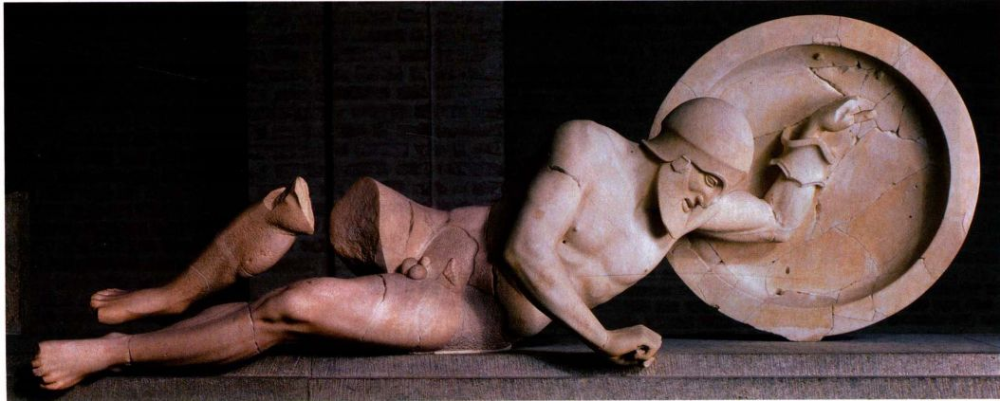

图5\.25 《垂死的勇士》，出自阿维亚神庙的东三角楣。约公元前480年。大理石，长1\.83米。慕尼黑州立文物博物馆

第五章 希腊艺术 119

写着“三”，就像是他喊出了自己的点数。阿基里斯戴着头盔，显得略占优势，他答“四”，宣布自己是赢家。但许多希腊人能够理解这个场景的讽刺意味，因为当他们重返战场时，阿基里斯将战死，埃阿斯要把朋友的尸体背回希腊军营，之后他将在绝望中自刎。事实上埃克基亚斯本人可能还画过他们的悲壮结局。这个双耳瓶是已知第一个表现这一游戏场面的陶器，这一题材后来广为流行，表明瓶画并不是孤立隔绝的艺术活动，画师会迅速对其他人的作品作出反应，时常交流切磋。

剪影般的黑绘技术尽管极具装饰效果，但艺术家对细节的刻画受到了限制。到公元前6世纪末，画师们发展出相反的程序：让形象保持陶土的红色，把背景涂黑。公元前520\-前500年间，这种红绘技法（red\-figured technique）逐步取代了原来的方法。在随后几十年间，新技法的效果越来越明显，但在

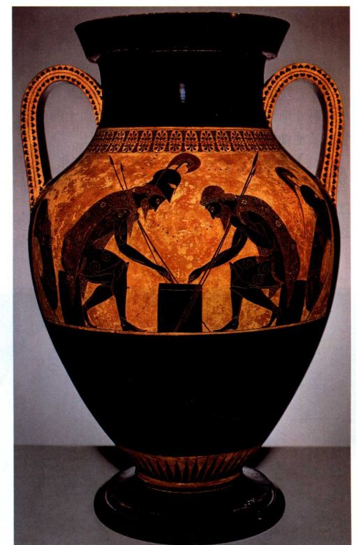

图5\.26 《阿基里斯和埃阿斯掷骰子》（Achilles and Ajax PlayingDice），黑绘双耳罐，画师兼制陶师署名为埃克基亚斯。约公元前540\-前530年。高61厘米。梵蒂冈博物馆

约作于公元前510\-500年间的一个双耳瓶上这些效应已然可见，瓶上署名欧西米德斯（Euthymides，图5\.27）。瓶画场景不再受轮廓描绘限制，画师可以自由挥洒，画笔下踏舞作乐的人物因而表现出自然的动态。他们纵情舞动，身体姿态各异，显示出欧西米德斯对于人体构造把握自如。比如，正中人物的肩胛不是水平的，而是反映出了手臂抬起的动作。人物正在转身，这样欧西米德斯就能采用透视缩短法（foreshortening），在一个平面上画出不同层面的身体结构（例如扭转的肩膀）。这是一个艺术家不断尝试创新的时代，事实上欧西米德斯对自己的画作如此自得，他在署名中还调侃了另一位同时代的画师，署名是“绝不是欧弗洛尼奥斯（Euphronios）”。图5\.28所示的细脚杯（kylix）出自多里斯（Douris）之手，约制于公元前490\-前480年，瓶画中是曙光女神厄俄斯（Eos）深情地抱起儿子门农（Memnon）的尸体（图5\.28），厄俄斯与阿基里斯的母亲争相向宙斯求情，但后来门农死于阿基里斯之手。多里斯深谙如何表现衣服下的肢体轮廓，也懂得如何将刚健有力的轮廓同纤细柔和的细节相结合，如那些表示门农躯体细节结构的线条。厄俄斯上举的翅膀反衬出门农沉重的尸体，或许这是在讽刺宙斯，因为他仅仅用一个灵魂的天平决定两位勇士的命运，而天平倾向了门农，宣判了他的死亡。杀死门农后，阿基里斯还剥下他的铠甲以示羞辱。在画中人像重叠之处，厄俄斯的束腰长袍轻盈飘逸，衬托着门农的裸体。他的脆弱又反衬了母亲无力救助自己儿子的悲痛绝望。

画面的核心是自然流露的情感。多里斯细腻地表达了无情命运带来的苦难和诸神对凡人的冷漠无情。一如我们在埃癸娜三角楣上所见到的，描绘苦难以及人如何面对苦难是晚期古风艺术最卓越的成就。在这个神话场景中，雅典人可能看见了自己在波斯战争中所经历过的恐惧。从铭文判断，这个陶器是用于日常生活的，带有画师与制陶师的签名，还有一则典型的希腊陶器献辞：“美丽的赫莫杰尼斯（Hermogenes）”。

古典时期

公元前5世纪以危机开始。许多爱奥尼亚城邦起兵反抗波斯的统治，并得到雅典增援。波斯人在大流士一世率领下入侵希腊大陆。公元前490年，在马拉松战役（Battle of Marathon）中，雅典的万人军队联

120 詹森艺术史

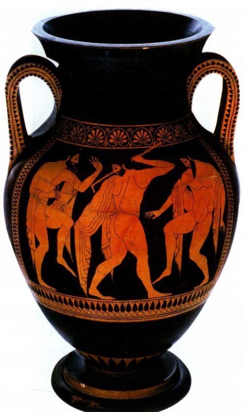

图5\.27 欧西米德斯：《欢舞》（Dancing Retelers）。红绘双耳瓶。约公元前510一前500年。高60厘米。慕尼黑Museum AntikerKleinkunst

同来自布拉底（Plataea）附近的一个营击退了波斯人的九万大军。十年后，大流士之子薛西斯一世率领着一支更加庞大的军队卷土重来。在温泉关（Thermopylae）攻克斯巴达人的抵抗之后，他们攻占了雅典，洗劫焚毁了神庙和雕像。公元前480\-前479年，希腊人在萨拉米斯和布拉底两地与波斯人决战，最终击溃了入侵者。这些战役对于希腊人是转折点，是生死攸关的时刻，他们先是面对城邦被毁，经历了波斯入侵的恐怖后，终于迎来了胜利的狂欢，重获自信。至少在雅典，考古记录中都记载着波斯人对公共纪念物和公共建筑的毁坏，对于考古学家和艺术史家而言，这标志着古风时期的结束和古典时代的到来。

和波斯人进行的战争是对新建立不久的雅典民主政权的严峻考验，雅典不但取得了胜利，而且在战争结束时更加凝聚统一。雅典在抵御波斯人的同盟中成为领导城邦，并迅速发展成为一个政治经济帝国，

大事年表

公元前7世纪\-多立克和爱奥尼亚风格形成

公元前600年\-科孚岛阿耳忒弥斯神庙

公元前6世纪初\-萨福的诗歌盛行

约公元前500年\-红绘瓶画技法开始流行

公元前490年\-希腊人在马拉松战役中击败波斯人

图5\.28 多里斯画师：《厄俄斯与门农》（Eos and Memnon）。希腊红绘浅杯的内面。约公元前490一前480年。直径26\.7厘米。巴黎卢浮宫

推进了许多建筑和艺术工程。学者将波斯战争结束至

公元前4世纪末亚历山大大帝逝世这段时期称作古典

时期。这一时期涌现出了至今闻名的剧作家阿里斯托

芬（Aristophanes）、埃斯库罗斯       、索

福克勒斯（sophocles）和欧里庇得斯（Euripides），

他们为宗教节日表演创作了大量戏剧，还有苏格拉底

（Socrates）、柏拉图和亚里士多德（Aristotle）这样

的思想家潜心于哲学探索。当时最有影响力的政治领

袖或许是伯里克利，公元前5世纪中期，他成为雅典

的公众领袖，直到公元前429年去世，一直在这座城

市的历史中扮演着关键角色。他大力支持艺术发展，

大部分力量集中在美化城市的至高点：雅典卫城。

古典雕塑

波斯人在公元前480年洗劫了雅典卫城，从他们留下的断壁残垣中挖掘出了许多雕像，其中有一尊库

第五章 希腊艺术 121

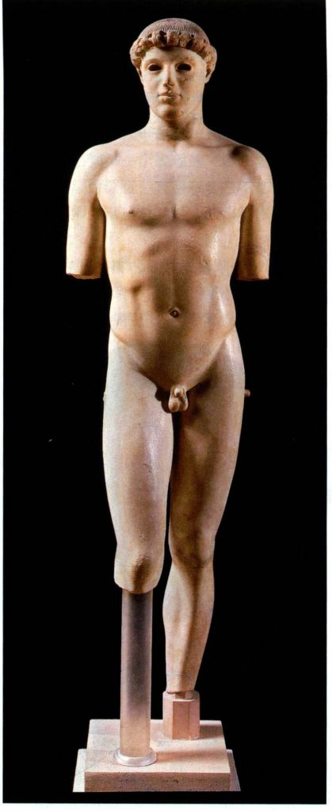

图5\.29 《克里提奥斯的少年》。约公元前480年。大理石，高116\.7厘米。雅典卫城博物馆

罗斯像与众不同（图5\.29）。一些人认为这件作品出自雅典雕塑家克里提奥斯（Kritios）之手，因此称之为《克里提奥斯的少年》（Kritios Boy）。根据其出土地点，考古学家推断它的制作年代稍早于波斯人入袭的时期。它与上文讨论的古风库罗斯（见图5\.15、5\.16）有着显著的区别，这不仅因为它是已知第一尊在完全意义上“站立”的雕像。尽管早期的库罗斯也是身体竖直，并没有依靠物体，也不是坐、跪或跑，但其姿势只是行走中凝固的瞬间，身体的重量均衡地分布在两条腿上。这样的姿势僵硬而不自然。和以前

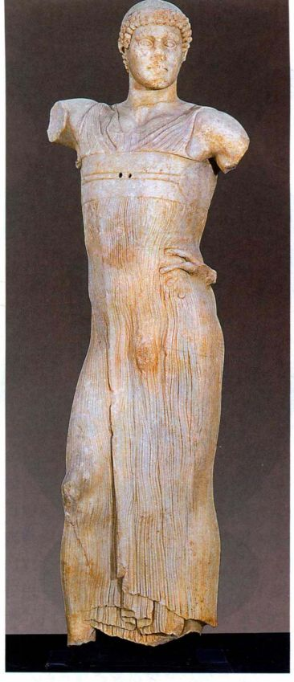

图5\.30《莫蒂阿的战车御者》（Charioteer from Motya），西西里莫蒂阿。约公元前450一前440年。大理石。莫蒂阿朱塞佩·惠特克（GiuseppeWhitaker）博物馆

的库罗斯一样，《克里提奥斯的少年》也是一条腿在前，但是出现了一个重要的变化。雕塑家使青年的重心移动，他身体两侧形成一种精心安排的非对称性：前面那条腿的膝盖略低，右臀倾向内下方，左臀则向外上挺出；身体的轴线不是垂直线，而是呈倒S形。综合起来，这些微小的不对称因素表明身体的重量主要在左腿上，右腿则起着支撑作用，保持身体平衡。

《克里提奥斯的少年》不仅是站立着的，而且姿态轻松。艺术家敏锐地注意到了这种放松自然的站姿所形成的非对称平衡，艺术史家称之为对立平衡（contrapposto，出自意大利语）。担负主要重量的那条腿一般称为“承重腿”，另一条腿称为“自由腿”。这一简单发现带来了惊人的成果，人们开始认识到当身体的一部分动作时，其他部分会发生相应变化。自

122 詹森艺术史

由腿膝盖微屈，骨盆会随之轻微转动，脊椎相应弯曲，双肩也会因此而倾斜。这种将人体视为统一整体的方法使艺术家能以一种新的自然主义来表现人体运动。的确，虽然《克里提奥斯的少年》是静止的，但他的肌肉似乎在运动，雕像仿佛具有了生命，他仿佛能够真的动起来。艺术家同时还意识到严格取法自然未必能得到满意的效果。因此，就像后来帕特农神庙（Parthenon）中的雕像一样（见第132和134页），《克里提奥斯的少年》也是精心提炼的成果。雕塑家强调了骨盆上肌肉的线条，使大腿和躯干更加协调，从身体正面到背部的过渡更流畅。这使得雕塑更具立体感，也吸引观者由不同角度全面地欣赏雕像。

对肌肉系统的创新表现手法首次给予观者这样的印象：在大理石下有骨有肉，骨骼将雕像全身连接成一个真正的有机体。一种对于肉体和大理石表

面的处理手法加强了这种印象。肉体有了一种美感，一种迥异于早期库罗斯的细腻柔和，雕塑家还反复打磨大理石表面使之显出温润的光泽。古风式的微笑也不见了，很可能归功于对人类面容的细致观察。脸部显得柔软丰腴，尤其是在下颌部位，这将成为古典时期早期雕塑的特征。头部稍稍偏离正面，不同于早期库罗斯的正面直视，这尊雕像中的人物仿佛沉浸在自己的思绪中。

在西西里岛西部莫蒂阿（Motya）的希腊\-迦太基（Greco\-Punic）殖民地出土的一尊雕像也表现出类似的美感（见地图5\.1和5\.30）。与《克里提奥斯的少年》相似，这尊雕像中的年轻人也是以对立平衡姿势站立，身体略微弯曲，头部稍稍转离中轴。这个男青年身着战车驭者的吐尼克袍（tunic），胸前有一条宽阔的系带。雕塑家以轻柔的织物“遮掩”住身体

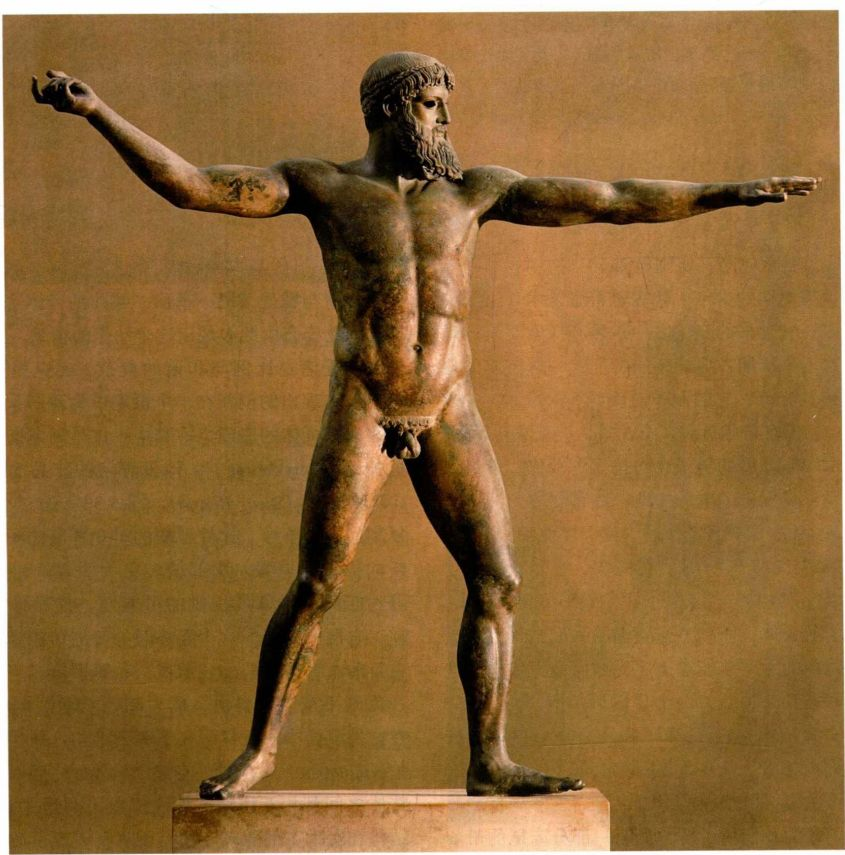

图5\.31《宙斯或波塞冬像》（Zeus or Poseidon）。约公元前460\-前450年。青铜，高1\.9米。雅典国家考古博物馆。文化部考古收入基金会。15161

第五章 希腊艺术 123

材料与技法

间接失蜡法流程

宙斯／波塞冬像（图5\.31）是现存最早以间接失蜡法制作的希腊雕像之一。使用这一技法，雕塑家的作品形式在空间上比石雕更为自由。伸出的四肢可以分别制作，然后焊接到躯干上，因而不再需要有碍美观的支撑物。可以比较宙斯自由伸出的双臂和《尼多斯的阿佛洛狄忒》中连结在臀部和衣物之间的支撑物（图5\.60）。			

埃及人、米诺斯和早期的希腊人经常以直接失蜡法制造实心的青铜小雕像。这种技法很简单：雕塑家先用蜡塑像，表面敷上黏土，形成一个模具，加热使蜡流出；在坩埚中以9：1的比例熔化铜和锡，将制好的合金倒入黏土模具中“蜡流失”后形成的空间。但因为以这种方式制作的雕像是实心的，所以就有其严重的局限性。实心浇注的真人大小的雕像造价昂贵，无比沉重，在合金冷却时还容易形成看不见的气泡和裂缝。因而从公元前8世纪至前6世纪，希腊人开发出了间接失蜡法，借此可以铸造任何比例的空心雕像。

首先，雕塑家先以黏土塑造出金属雕像的基本形状，在黏土表面敷上一层蜡，厚度与最终金属浇注（casting）的厚度相当，在蜡层上精心雕刻出雕塑的细节。然后将塑像切分成头、躯干和四肢等部分。每一部分在蜡层表面敷上厚厚

的黏土，以金属销钉与内芯的黏土固定在一起。整体加热使蜡熔化流出。将熔好的金属\-通常是青铜，有时也用金或银\-灌入“蜡流失”后形成的空间。待金属冷却后，卸掉外层和内层的模具，便得到一个金属铸件：雕像的头、躯干、手臂等等。雕塑家再将各个部分焊接在一起做出雕塑。最后打磨表面，雕凿头发和皮肤褶皱等细节，以象牙、宝石、铜、玻璃或贵金属镶嵌眼睛、牙齿、嘴唇、乳头等面貌特征和衣服上的图案。

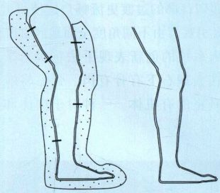

间接失蜡法流程

将一系列动作用一个姿势集中表现出来，躯干猛烈扭曲，手臂与腿处于同一平面。蜷曲的身体达到完美平衡，人物姿态由此表现出这个动作的精髓。

持矛者：比例与和谐的典范《克里提奥斯的少年》体现出的创新在半个世纪中为雕塑家所探索，孜孜以求人体的表现力。其中一位是阿戈斯的波利克里托斯（Polykleitos），他最著名的作品《持矛者》（Doryphoros［Spear Bearer］，图5\.33）通过无数罗马复制品流传至今。这件雕塑的对立平衡比《克里提奥斯的少年》更强，头部偏转更为明显。艺术家似乎着迷于对立平衡所提供的可能性，精确研究了身体左、右两侧在采取这个姿势时的解剖结构变化。“受力”的左臂与在前的“承重”右腿平衡，“放松”的右臂则平衡着“自由”的左腿。然而波利克里托斯在这件雕塑中不仅仅研究了解剖结构。他探索了匀称（symmetria）的原则，使部分与部分之间以及部分与整体之间都相互协调。他还提出了韵律（rhythmos，结构和运动）的原则。《持矛者》表现了波利克里托斯的理想比例系统，不仅考虑身体各部分的比例，还适用于部分与部分之间及其与整个身体的关系。据一

的全部曲线，看似遮蔽，实则显露。

《克里提奥斯的少年》代表着希腊艺术一个至关重要的阶段。它带来的变化之一是热心探索对于运动的表现，这正是早期古典雕塑的特征。一尊杰出的裸体青铜像是其典范，它的制作时间约为公元前460\-前450年，打捞自希腊近海（图5\.31）。雕像高近2\.1米，是一个四肢伸展的男子在作投掷的动作。学者认为他可能是正要发出闪电的宙斯，或是要掷出三叉戟的海神波塞冬。雕像兼具动作的力度和坚实的稳定性，两者又形成对比，产生了庄严的效果，显示出神祇令人畏惧的力量。这件作品表明，艺术家不但善于观察，了解运动中的人体，而且熟谙青铜的强度，正因为这种强度，雕像的手臂才能够不用支撑而笔直伸出（见本页的材料与技法）。大约十年以后，即公元前450年前后，米隆（Myron）创作了在当时享有盛誉的青铜雕像《掷铁饼者》（Diskobolos［Discus Thrower］）。和大多数希腊青铜雕塑一样，它也是因其罗马复制品（图5\.32）才为我们所了解（见第一部分末尾的附加原始文献）。假如说宙斯／波塞冬的青铜像通过刻画动作发出前的时刻来表现即将发生的动作，米隆则是

124 詹森艺术史

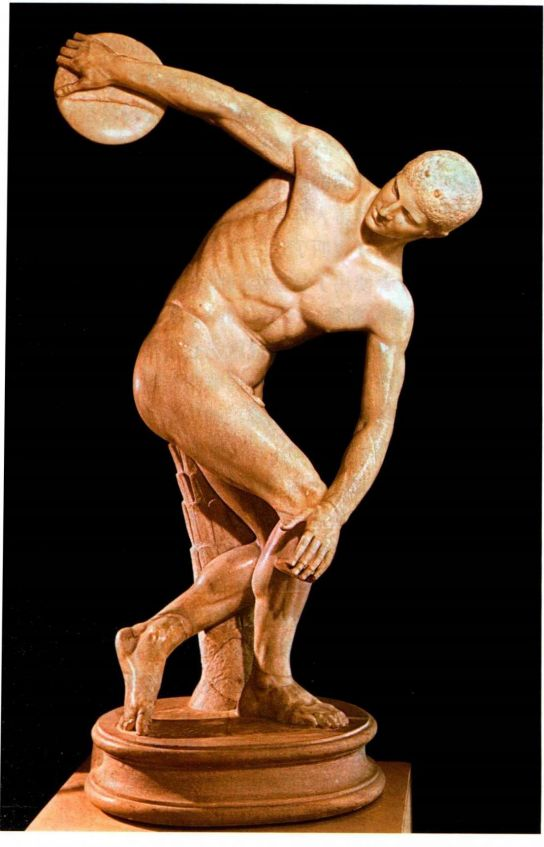

图5\.32 《掷铁饼者》（Diskobolos），罗马大理石复制品，希腊青铜原作时间为约公元前450年，米隆作。真人大小。罗马浴场博物馆

位古典作家记载，这尊雕像后来被认为是波利克里托斯的“法则”（Kanon［canon］指“规则”或者“准绳”，见第一部分末尾的附加原始文献）。埃及艺术家在这之前就试图以比例为基础设立表现人体的准则。然而对于波利克里托斯而言，探求理想的比例系统不仅是为艺术家提供辅助手段，而是植根于对阐释的哲学追求，其基础是相信存在于音乐、宇宙和万物中的和谐（harmonia）能够以数学的方式表达。这件雕塑问世后不久，柏拉图将数字定为他的理想形态学说的基础，并且承认美的观念通常是取决于比例。哲学家甚至援引艺术品来解说他们的理论。美对于古典时期的雅典人不仅是闲适的自我欣赏，更具有道德意义。姿态和表情反映了性格和情感，流露出内在的人性和与之并存的品质或美德（arete）。因此醉心于和谐的比例可以说就是对美德的沉思（见第127页的原始文献）。

我们无从得知《持矛者》原来的风貌有多少在复制过程中丢失了，毕竟青铜和大理石在质地和外观上相去甚远。存世的希腊青铜像极度稀少，因此当人们1972年在意大利里亚切（Riace）附近海域发现一对比真人还大的青铜像时，它们引起了一场轰动（图5\.34）。如图5\.34所示，雕像保存良好，充分显示制作者的精湛技艺。在公元前5世纪，青铜是制作自立雕像的首选材料，雕塑家采用的技法在近东艺术家所熟悉的失蜡法基础上进行了改良。这与石雕截然不同，

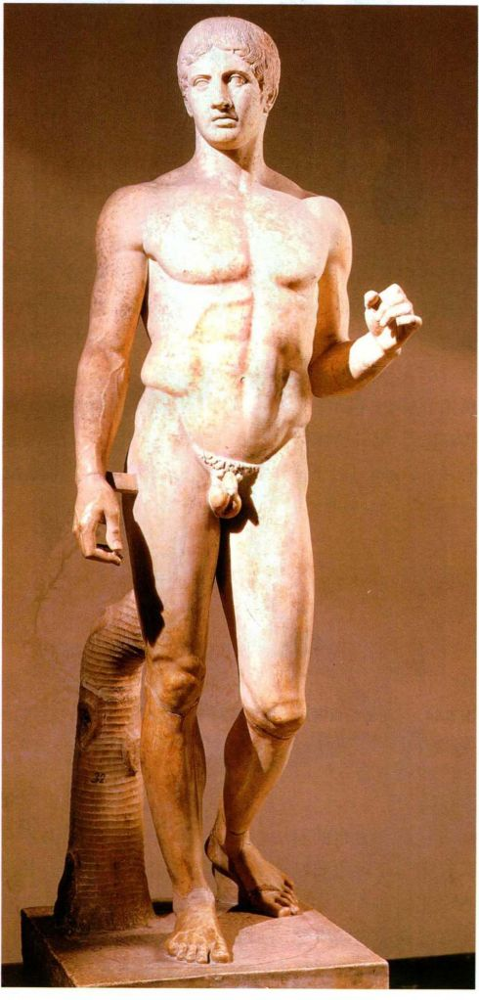

图5\.33《持矛者》（Doryphoros），罗马复制品，希腊原作时间为约公元前450一前440年，波利克里托斯作。大理石，高2米。那不勒斯国家考古博物馆

第五章 希腊艺术 125

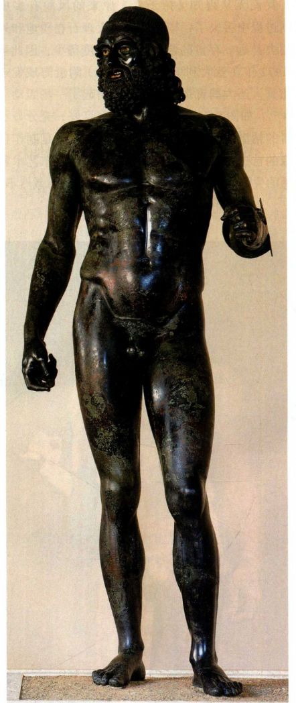

图5\.34 《里亚切青铜武士像1号》，发现于意大利里亚切海域。约公元前450年。青铜，高2\.03米。意大利雷焦卡拉布里亚（ReggioCalabria）考古博物馆

后者是凿去多余的石头，而前者属于添加过程（艺术家在第一个阶段要制造一个黏土模具）。其次，大理石吸光，而青铜表面反射光，这使得雕塑家可以利用丰富多样的表面质感，例如头发和皮肤的质感就不同。在细节部位还能添加不同的材料：眼睛有象牙和琉璃，睫毛为青铜，嘴唇和乳头则为红铜。图示中的雕像A（名为《里亚切青铜武士像1号》［Riace Warrior A］）有着白银制成的牙齿。我们仍不清楚这两个雕像代表

的是什么人，可能是两位英雄，或是两位勇士。它们可能是某个纪念物的一部分。尽管两尊雕像的姿态极为相似，但人物体型不同，有些学者因而认为它们出自不同年代的两位雕塑家之手。它们也可能仅仅是同一个艺术家尝试表现不同个性与年龄的习作。

奥林匹亚宙斯神庙的雕像 填充神庙三角楣带来的挑战可能激发了理解人体运动的迫切愿望。埃癸娜岛的阿维亚神庙同样表明了这一点：为填充窄长的三角形背景，设计者使用了从立姿到卧姿的不同姿势的人像。奥林匹亚宙斯神庙（Temple of Zeus）的两面三角楣是早期古典风格的最高成就。它们约刻于公元前460年，可能出自阿戈斯附近的雕塑家阿格拉达斯（Ageladas）之手，奥林匹亚当地的博物馆将其复原。公元前470年，伊利斯（Elis）战胜了它的邻邦比萨（Pisa），战利品为这座神庙的修建提供了资金来源。东面三角楣表现的正是这一次胜利，与埃癸娜岛神庙的三角楣一样，也是借神话来隐喻当世。其主题是珀罗普斯（Pelops）在一次马车赛中战胜比萨国王欧诺玛奥斯（Oinomaos），胜者将得到国王的女儿希波达弥亚（Hippodameia）。珀罗普斯（伯罗奔尼撒即以他命名）在希腊有着特殊地位，因为他被视为奥林匹亚运动会的开创者。但是由于他以诡计赢得胜利，他和他的后代都被诅咒了，迈锡尼国王阿伽门农也是其中之一。因而对于游行经过神庙的奥林匹克竞技者而言，珀罗普斯是一个前车之鉴。

西三角楣表现的是来自帖撒利亚（Thessaly）的拉皮泰族人（Lapiths）与马人之间的争斗。马人是拉皮泰王伊克西翁（Ixion）和赫拉的后代，伊克西翁在奥林匹斯山（Olympos）时设法引诱了赫拉。为了惩罚他不恭的行为，伊克西翁被链条锁在一个火轮上，永世在地狱深渊中受罚。马人作为拉皮泰人的异母兄弟，应邀参加拉皮泰王佩里图斯（Peirithoös）和德达墨亚（Deidameia）的婚礼。不胜酒力的马人喝得大醉，与拉皮泰人扭打起来，拉皮泰人在佩里图斯的朋友忒修斯的帮助下制伏了他们。

构图中央是威严的阿波罗，他伸长右臂，头有力地转向一侧，眼神犀利，表明了他在这一事件中的主动作用，他希望拉皮泰人取胜。然而他镇定、静止的姿态又超脱于周围其他人的行动，他没有亲身援战。在阿波罗左侧，马人国王欧律提翁（Eurytion）抓住了德达墨亚。两个人物的形体都坚实而简单，轮廓柔和，表面起伏。艺术家使他们形成一个紧凑的整体，充满了交错运动，不同于埃癸娜三角楣雕中单独表现各个人物的手法。此外，艺术家不仅是

126 詹森艺术史

亚里士多德（公元前384\-前322年）

《政治学》卷八

《政治学》（The Politics）探讨国家构建，与柏拉图的《理想国》同样举足轻重。卷七和卷八陈述良好公民应受的教育。绘画归属人文学科（liberal arts），也就是说它不仅是有用的技艺，而且有益于更高层次的活动。但他认为绘画和雕塑触动灵魂的能力有限。

有一种教育，父辈应授予诸子，并非为其必需或实用，而是因其自由高尚······再次，儿童显然应习得实用之技，譬如阅读书写，因其非但实用，更是获得其他知识的途径。同样，教授绘画之意也不在于避免误购器物，或免于在艺术品交易中受人蒙骗；而是要培养他们鉴别人类形体的美丑。事事必求实用，则灵魂不得解脱升华······

通过动作和姿势来表现人物斗争：痛苦映现在马人的脸上，他们的苦痛和绝望与年轻新娘脸上的镇静形成鲜明对比。通过将马人明显遭受的痛苦与拉皮泰人的冷静并置，兽性的马人和人类之间划出了清晰的道德分界，人类身上有着阿波罗神的高贵。阿波罗是音乐与诗歌之神，也是光明与理性之神，代表着面对逆境时的理性行为。因为分享神圣的理性，人类战胜了兽性。这种理性与非理性、秩序与混沌之间的斗争是希腊艺术题材与形式的核心。它显示出希腊人对自身的观照，他们代表着与野蛮相对的

原始文献

仅见艺术表现即或感欢喜或感苦痛，则真实事物也会触发类似情感。例如，有人喜欢一座雕塑，仅仅因为它美，那他见到原物也必定欢喜。味觉和触觉等其他感官的对象都不具备此种与道德品质的联系；视觉对象中也只有少数，因为有些形象虽具备道德特点，却程度轻微，且并非全部视觉对象都介入道德体验。在此重申一点，形象与色彩并非对品德的模仿，而是其标识，是身体对情感状态的表达。它们与道德仅有微弱联系，但只要有联系存在，就应教授年轻人观赏······波利诺塔斯（Polygnotus）或任何表现出品德的画家或雕塑家［的作品］。

SOURCE:THE POLITICS BY ARISTOTLE,ED\.BY STEPHEN EVERSON \(NY: CAMBRIDGE UNIVERSITY PRESS,1988\)

文明，而野蛮总是以波斯人来表现。

与西三角楣一样，东三角楣的题材可能也关乎当世，或许是提倡奥林匹克竞技者公平竞争。嵌板上的雕刻肯定是契合主题的，因为它们刻画的是珀罗普斯的曾孙赫刺克勒斯的业绩，传说正是他建造了奥林匹亚的竞技场。自公元前6世纪初起，叙事场面一直是嵌板雕刻的特征，但在奥林匹亚，雕塑的图示性和戏剧表现力首次得到充分应用。图示中的嵌板安置在神庙东面入口的醒目位置，表现的是阿特拉斯（Atlas）给赫剌克勒斯带回了赫斯帕里德斯（Hesperides）看

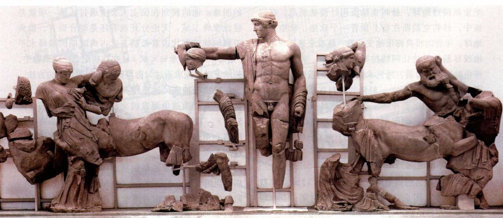

图5\.35《拉皮泰人与马人之战》（Battle of the Lapiths and Centaurs）的摄像复原图（部分），出自奥林匹亚宙斯神庙的西三角楣。约公元前460年。大理石，略大于真人尺寸。奥林匹亚考古博物馆

第五章 希腊艺术 127

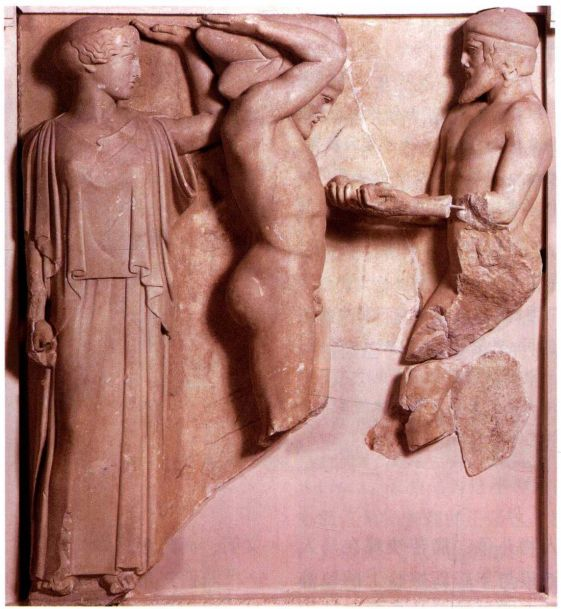

图5\.36 《阿特拉斯为赫刺克勒斯带回赫斯帕里德斯的苹果》（Atlas BringingHerakles the Apples of the Hesperides），约公元前460年。大理石，高160厘米。奥林匹亚考古博物馆

守的苹果（图5\.36）。阿特拉斯是一位泰坦巨人，他们是在奥林匹亚诸神之前统治世界的神族。阿特拉斯的职责是扛住地球。赫剌克勒斯答应帮他暂时扛着地球，说服他去赫斯帕里德斯看守的花园取来苹果，完成12项任务中的一项。阿特拉斯返回后拒绝重新接过地球，赫剌克勒斯用计使他就范。在嵌板中，赫剌克勒斯在肩上顶着一个软垫，软垫托着地球，年轻的雅典娜帮他支撑着，她看来毫不费力。他绞尽脑汁设法让阿特拉斯交出苹果，满脸讶异的神色。这不是希腊古风艺术惯常表现的残酷战争（如图5\.24和5\.25所示），魁梧的赫剌克勒斯显出古典精神中核心的沉思神情。这些人像具有早期希腊雕塑的所有特征：面庞柔软，姿势和表情简洁凝练，服装朴素庄重。

雅典卫城的建筑与雕塑

雅典卫城自迈锡尼时代即约公元前1250年起就是一个要塞（图5\.37和5\.38）。古风时期，卫城建有至少一座献给城市守护神雅典娜的大型神庙，还有几座较小的神庙和宝库，以及数不胜数的雕像。公元前480年，波斯人摧毁了卫城建筑，推倒了卫城雕像。

在长达30多年的时间里，雅典人一直没有修复这些神圣纪念物，他们要让自己牢记波斯人的野蛮行径。然而公元前5世纪中期，随着伯里克利登上政治舞台，这一情况改变了。伯里克利为雅典设计了宏伟蓝图，包括使这座拥有十五万人口的城邦成为地中海地区的明珠。他的规划在民主大会上通过，第一项就是建设雅典卫城。无论分开观看还是综合而言，雅典卫城的建筑都代表着希腊艺术古典时期的巅峰水平（见第131页的原始文献）。在这些纪念性建筑物中，艺术家继续探求通过匀称原则创造和谐效果的方法。

帕特农神庙 这是雅典卫城上主要的神庙，也是伯罗奔尼撒战争爆发前完成的唯一一座神庙（图5\.39），其设计理念就是要在卫城的雅典娜崇拜中扮演核心角色。没有证据表明它直接用于祭祀活动：它的东面没有祭坛，而祭坛是希腊仪式活动和祭祀的核心地点。主要的祭祀活动中心仍然是帕特农神庙北面的厄瑞克透斯神庙（Erechtheion，见图5\.53）。帕特农神庙以取自附近潘泰利孔（Pentelikon）山上雪白大理石建成，屹立在卫城南端一个凸出的位置上。它雄踞于城市和周围的郊野之上，东西北三面群山环绕，更烘托出其壮丽不凡。当时的建筑记录

128 詹森艺术史

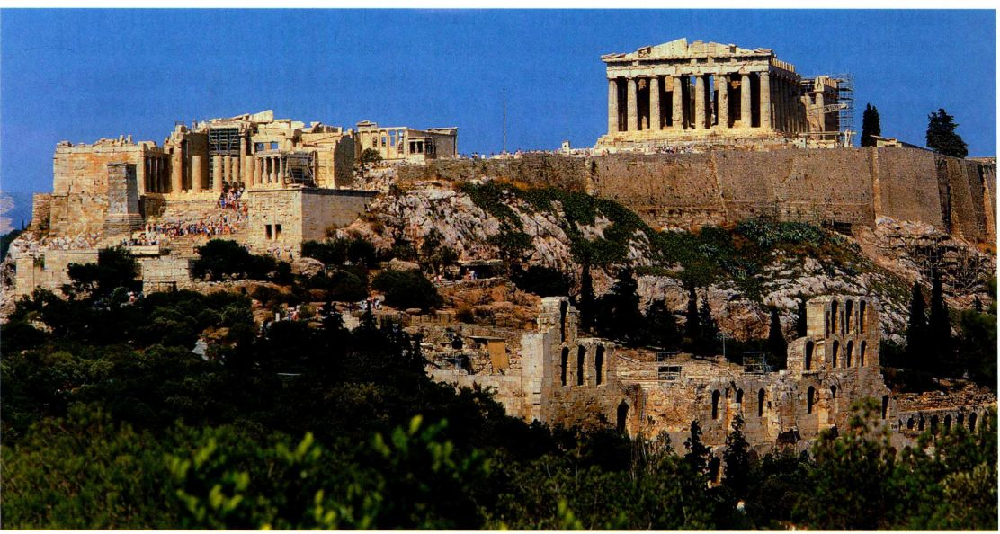

图5\.37 雅典卫城（西面观）。卫城山门，公元前437\-前432年；雅典娜\-尼刻神庙，公元前427\-前424年

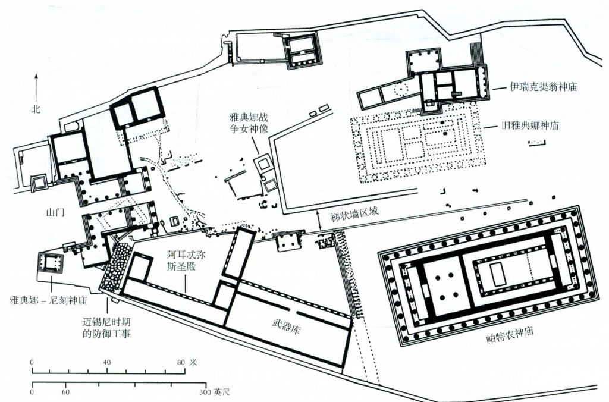

图5\.38 公元前400年雅典卫城平面图（A．W．Lawrence绘制）

第五章 希腊艺术 129

和普鲁塔克（Plutarch）撰写的伯里克利传记显示，伊克提诺斯（Iktinos）和卡利克拉特（Kallikrates）两位建筑师在公元前447\-前432年这段时间内监督过建筑工程。帕特农神庙是当时希腊大陆最宏伟奢华的神庙，为了支付庞大的建造费用，伯里克利动用了部分提洛同盟（Delian League）的基金。提洛同盟是雅典参加的一个城邦联盟，其目的是共同抵御波斯人。虽然波斯看起来不再构成威胁，但挪用同盟基金削弱了雅典与其他盟邦的关系。数个世纪后，希腊作家依旧不忘指责伯里克利把这座城市装扮得“像娼妓一样，满是奇珍异宝、雕像和神庙，耗费上千塔兰特（talent）”。

即使不考虑对古风或古典比例的个人偏好，仅从古典时期希腊的建筑概念来看，帕特农神庙也是一座精雕细琢的建筑（图5\.39）。神庙各部分彼此契合，因此空间并不显得分散，而是相互融合。同样，建筑和雕塑也相互渗透，因而不能将两者分而论之。在纪念雅典娜的泛雅典娜节期间，将有盛大的游行队

伍蜿蜒穿过城市攀上卫城，神庙就位于游行结束的终点附近，因而帕特农神庙不仅在远处望去显得无比庄严，它还是供人深入体验的建筑。帕特农神庙效仿古风时期爱奥尼亚宏伟的神庙，较窄的两面排列着八根立柱（octastyle）。它异常宽阔，面积广大，为内部的U形柱廊和巨型雅典娜像提供了充分的空间，雕像出自著名雕塑家菲迪亚斯（Pheidias）之手，取站立姿势，右手托着一个胜利女神，一面盾牌靠在她的左侧。雕像以象牙和黄金制成（这种结合称为牙金技术［chryselephantine］），由木制支架支撑（图5\.40）。它价值连城，而建筑的形式也吸引着观者入内瞻仰。与所有的围柱式神庙一样，环绕四周的柱廊使人觉得好像从任何一面都能进入神庙。进入内殿要通过一个六根立柱的前柱式门廊（立柱的位置在侧壁前，而不是在侧壁之间）。爱奥尼亚式后殿（opisthonaos）的入口也是类似的布局。这些门廊进深都格外浅，因此阳光能照进内殿，不然就只能通过内殿主入口两旁的两扇大窗透入。神庙内部敞亮，并合理借用柱廊将内

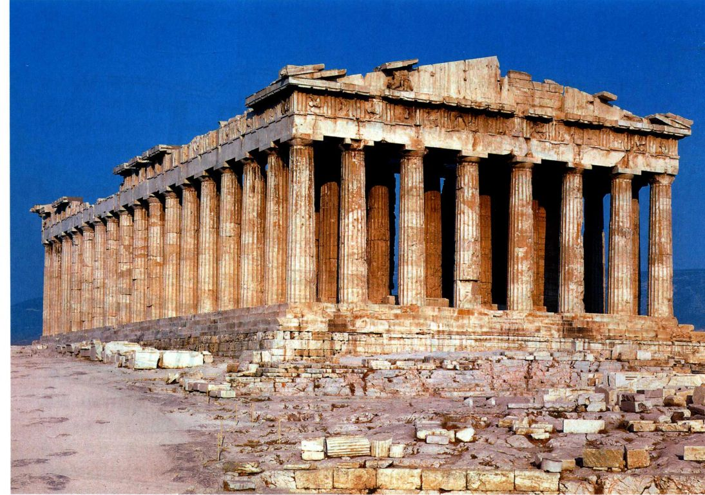

图5\.39 伊克提诺斯与卡利克拉特：帕特农神庙（西面观）。雅典卫城。公元前447\-前432年

130 詹森艺术史

普鲁塔克（约公元46\-119年以后）

《希腊罗马名人传》，选自伯里克利和费比乌斯·马克西姆斯传

罗马时期的一位希腊作家普鲁塔克撰写了《名人传》（Parallel Lives），以表明古希腊人的伟大人物与罗马领袖比肩甚至更为优秀。对比伯里克利（卒于公元前429年）与费比乌斯·马克西姆斯（Fabius Maximus，卒于公元前203年）之后，他得出的结论是伯里克利下令修建的建筑超越了所有的罗马建筑。在所有古代资料中，只有普鲁塔克的著作中提到菲迪亚斯是伯里克利的工程监督者。

但它为雅典增添了最怡人的装扮，给其他人带来无可比拟的惊叹，它足以向希腊人证明，传述已久的古希腊威权与辉煌并非杜撰\-我指的是他所建造的神圣建筑······伯里克利的作品因此更加令人赞叹：它们耗时不多，却可传世不朽。每一座建筑，因其美丽，甚至在甫建之时即刻成为

部空间连通，两者的这种结合打破了传统，希腊建筑由此开始重视内部空间的布置。

与佩斯图姆的赫拉神庙II相比（见图5\.10右侧），尽管帕特农神庙的实际规模较大，却显得娇小许多。原因之一是自古风时期以来比例经过了调整，建筑各部分更为轻巧。帕特农神庙的立柱要细得多，收分和凸肚也不那么明显；柱头的体积和外扩程度也变小了。立柱的直径大小部分取决于实际需要。为求便捷，同时也是为了节省开支，建筑师们利用了未完工的第一座帕特农神庙的许多鼓石，但他们在设计新神庙时就需要考虑如何使这些立柱与建筑的其他部分相协调。例如立柱的间距比以往的建筑要宽，檐部相对立柱高度和神庙宽度而言降低了些，檐口突出得也较少。帕特农神庙中的立柱承受的重量看起来减轻了，因此神庙的支撑结构显得轻松自如，这种感觉是以往的建筑所没有的。

这些比例背后的主要原则是9：4或

例如，正立面共8根（x）立柱，因此侧面就排布17

根（2x＋1）立柱。此外，立柱间距与立柱底部的直

径之比也是9： 4。这不仅是出于设计方便的考虑，

也是力图通过数值关系创造和谐的效果。这种比例

组合的首次运用见于奥林匹亚的宙斯神庙，建筑者

是来自伊利斯的利本（Libon）。帕特农神庙则大量

运用了这一原则，但绝不是刻板遵守，而是随时进

行细微调整。

尽管这一原则要求相对精确，但帕特农神庙（以

文物；但因其活泼生机，时至今日，它依旧如初建一般。正是因其绽放的永恒青春，他的这些作品似乎从来不受时光侵蚀，仿佛注入了不朽的灵魂，永远在吐纳呼吸。

他的主要管理者和监督者是菲迪亚斯，虽然有几件作品也有伟大的建筑师和艺术家参与。如帕特农神庙，其中长约30米的内殿就是由卡利克拉特和伊克提诺斯······

伯里克利用伟大的公共建筑、神庙和庄严的庞大建筑来装扮雅典，与这些艺术品相比，历代罗马人尝试创造的那点辉煌，连同恺撒时代在内，全都不值一提，非但如此，两者实在高下悬殊，论其恢宏设计和浩大工程，雅典建筑都是古罗马所不能企及的。

SOURCE:PLUTARCH'S LIVES,VOL\. 3, TR\. BY BERNADOTTE PERRIN \(CAMBRIDGE: HARVARD UNIVERSITY PRESS,1916\)

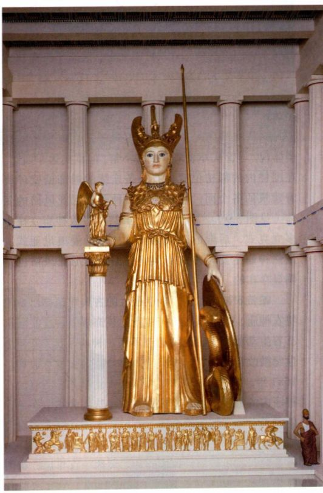

图5\.40《处女雅典娜》（Athena Parthenos）的模型，原作由菲迪亚斯作。约公元前438年。多伦多安大略皇家博物馆

第五章 希腊艺术 131

及其他神庙）有意识地在设计上偏离了严格的几何规整。例如，立柱不是竖直的，而是向内殿倾斜（角柱倾向两个方向），角柱和相邻立柱之间的距离小于整个柱廊的标准空隙。不仅如此，神庙的台基也不是完全水平的，而是向上隆起，长边中央比两端高出约10厘米。神庙的整个檐部也呈现相似的弯曲，柱廊上的每个柱头都稍有变形，以适应弯曲的额枋。这些不规整之处无疑是有意为之，因为石工们为此精心切割打磨了每一块石料。至于为何要作这些调整还不清楚。

再往前追溯大约一百年，建筑者首次在神庙中引入这些不规则性可能是为了解决排水问题。但帕特农神庙中的不规则更加明显，学者们因此认为它们是矫正视错觉的手段。例如从远处看，绝对平直的水平线好像中部下凹，但如果它们向上凸起，看起来反而是平直的。在近处看，一根长的直线会像地平线一样呈弧形，假如增加这个弧度，建筑师就能使神庙在视觉上扩大。这两个看似矛盾的原理可以协同作用，因为观者的观看位置变化，视觉变形也发生改变。可以肯定的一点是，这些修正手段使神庙呈现一种张力，如若没有它们，这种感觉就可能缺失。建筑不再是四平八稳地坐落在平台上，鼓起的形状给建筑注入了能量，仿佛它要挣开石块喷薄而出。通过修正，神庙具有了生命。

帕特农神庙经常被视为古典多立克式建筑的完美体现。尽管从外表来看或许不错，但事实远非如此。在围柱内的额枋位置，有一条连续的雕饰檐壁环绕着建筑的各个面，它呈现出一种爱奥尼亚风格的变体（见图5\.9）。不仅如此，虽然大多数神庙立柱为多立克式，后殿的四根细长立柱却是爱奥尼亚式。虽然神庙主要是多立克风格，但爱奥尼亚风格也是明显存在的。

帕特农神庙雕塑 现存最大的古典雕塑群出自帕特农神庙，超过以往任何神庙的装饰规模。这些雕塑有着生动的历史，也常遭遇不幸。神庙可能在公元6世纪被改造成教堂，东面的大部分装饰被肆意毁坏。1687年，威尼斯军队的炮弹引爆了土耳其军队存放在神庙内的火药。西三角楣的雕像在这次爆炸中幸存，但它没有逃过战争的余殃。威尼斯指挥官们要将雕像运往威尼斯，在拆除过程中使用了一架起重机，许多雕像被起重机敲落，摔成碎片。大约一百年后，英国驻土耳其大使埃尔金勋爵（Lord Elgin）尽其所能移走了神庙的装饰，于1801至1803年间用船运回英国。

1816年，因为需要钱，他将这些文物卖给了大英博物馆，博物馆虽不齿他的行为，却又希望得到这些雕塑品。它们被称为埃尔金石刻（Elgin Marbles），如今保存在大英博物馆专门修建的馆区中。在归还民族珍贵文物的激烈争论中，埃尔金石刻是论争的焦点。帕特农神庙建筑雕塑的其他部分陈列在全欧洲各个博物馆内。

在帕特农神庙爆炸之前第十三年，一位名叫雅克·凯利（Jacques Carrey）的艺术家跟随拜会奥斯曼（Ottoman）朝廷的法国大使旅经雅典。他画了一系列素描，记录了当时存留的帕特农神庙雕塑，这些素描成为了解神庙整体装饰格局的珍贵资料（图5\.41）。以凯利的素描以及文献资料为主要依据，我们知道了西三角楣刻画的是雅典娜与波塞冬这两位神祇争夺雅典的斗争，东三角楣表现的则是雅典娜在众神环列之下从宙斯的头颅中诞生。除主要人物之外，雕塑的其他部分几乎都还在，人们可以根据凯利素描复原布局。左侧角冲进来的是太阳神赫利俄斯（Helios）的上半身，他背后的几匹马将他带入了人们的视线。右侧角与他遥相呼应的是月亮女神塞勒涅，也可能是黑夜女神尼克斯（Nyx），与她的马儿一同沉没。这两位天神代表着昼夜的流逝，同时也将整个场景置于永恒的天界。赫利俄斯右边是一个半斜倚的男性裸体雕像，人们认为这是狄俄尼索斯（图5\.42）。三角楣的另一侧是一组关联密切的三女神，通常被认为是赫斯提亚（Hestia），狄俄涅（Dione）和阿佛洛狄忒（图5\.43）。

作为一个组雕，这些三角楣雕像令人印象深刻。就像整座建筑一样，它们形式有力而坚实，雕像所蕴含的威严与慵懒的姿态恰成对比，由这种对比而获得力量。男性裸像的威严在于形体的简洁有力和自然写实，仿佛是轻松自如地雕刻而成。女性组像的亮点则是涓涓细流般的衣褶，几乎使人忘记了大理石的厚重。衣服似乎是“出水”般贴在她们身上，看似遮掩，却更显露。然而这些衣饰与其说是顺应身体曲线，倒不如说是与之相抵牾，在腿周围堆叠出大片皱褶。其效果是不同寻常的：尽管观者只能从正面欣赏这些女神，雕像看似只有二维平面，然而深深刻入的衣褶曲线呈现的仿佛是一个纵切面（insection，也就是一个从前到后的假想竖直切面），因此加强了它们的三维立体感。在雕塑中，真实的表象比真实本身更能表现自然。雕塑家的这一视觉手段与神庙建筑中的刻意变形相对应。

132 詹森艺术史

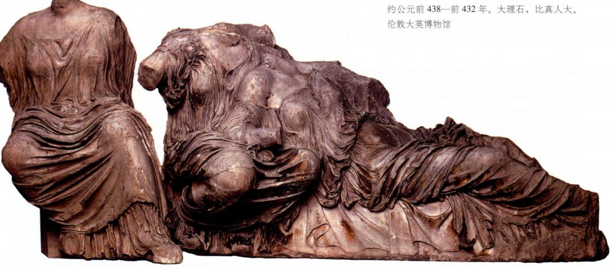

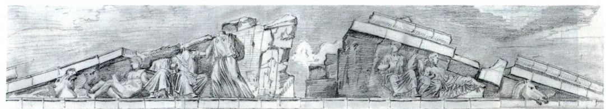

图5\.41 雅克·凯利：帕特农神庙东三角楣的素描。1674年。巴黎国家图书馆

图5\.42 帕特农神庙东三角楣上的狄俄尼索斯。约公元前438一前432年。大理石，比真人大。伦敦大英博物馆

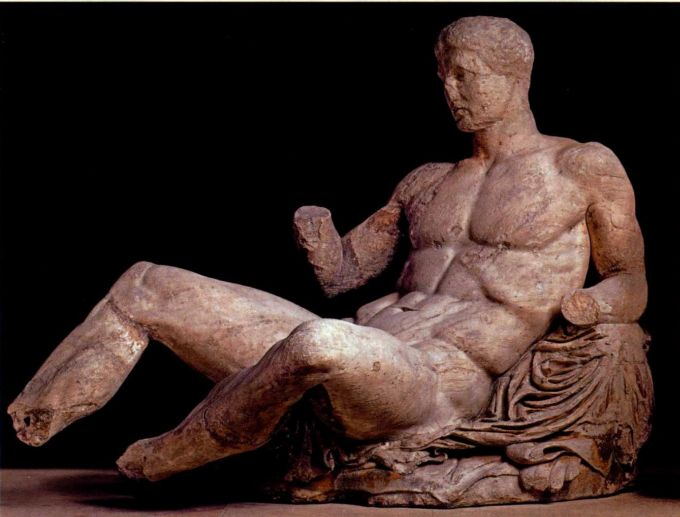

图5\.43 三女神像，出自帕特农神庙东三角楣。

约公元前438\-前432年。大理石，比真人大。

伦敦大英博物馆

第五章 希腊艺术 133

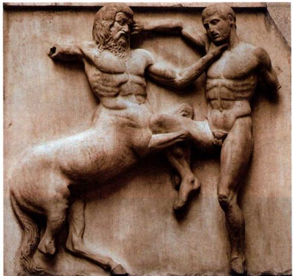

图5\.44《拉皮泰人和马人》，帕特农神庙南面嵌板。约公元前440年。大理石，高142\.2厘米。伦敦大英博物馆

环绕整个建筑（而不是仅限于两端）的是一套共92块嵌板，表现的都是动作剧烈的场景。西面的嵌板表现的是希腊人和阿玛宗族之间的战争（Amazonomachy，阿玛宗族［Amazon］是一个传说中的女战士族）。北面的嵌板刻画的是劫掠特洛伊（Ilioupersis），迈锡尼国王的弟妹，斯巴达王妃海伦（Helen）被特洛伊王子拐走，引发了希腊与特洛伊之间的战争，战争的结局就是劫掠特洛伊。东面是诸神与巨人对战，与科孚岛阿耳忒弥斯神庙的雕刻类似。这些雕塑品现在所剩无几，所幸南边的嵌板相对保存较好，大部分刻画的是拉皮泰人与马人之间的争斗。这四个系列共同构成一个寓意丰富的整体：它们都刻画了文明与非文明、秩序与混沌的冲突，因而都隐喻着雅典对波斯的胜利。历史事实披上了神话的外衣，秩序战胜混沌成为注定和必然。

这些嵌板的品质差别很大，这使我们想到，为了在短时间内完成帕特农神庙，一定有大批工匠参与了工作：两面三角楣和檐壁只用了不到十年的时间（约公元前440\-前432年）。例如，读者可以对照一下图5\.44中怪异的扭打姿势和图5\.45中轻盈的步伐。两位艺术家都想填满雕塑空间，也都试图将扭斗的人物交织在一起，但结果则截然不同。

帕特农神庙的观者能从远处看到三角楣和嵌板，但要观赏檐壁，只能靠近神庙并且绕着它边走边看。

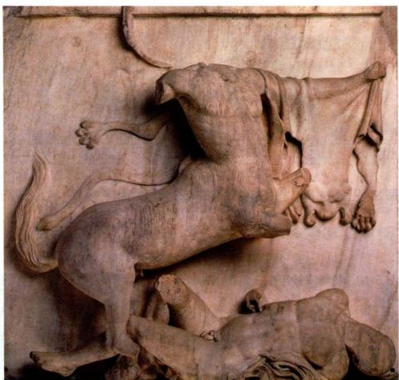

图5\.45《拉皮泰人和马人》，帕特农神庙南面嵌板。约公元前440年。大理石，高142\.2厘米。伦敦大英博物馆

在一条长约160米的连续雕刻饰带上（图5\.46），刻画着一个行进行列，从西至东，引观者绕建筑一周。骑手、乐手和抬水的人推推搡搡，献祭用的动物也拥挤其中，形象互相重叠，仿佛重现了喧闹景象，而浮雕其实深不过几厘米。动物的躁动反衬出人物的镇定（图5\.47），他们都有着《持矛者》般完美的比例。

浮雕最令人不解的是图5\.48中的细节。这面作品位于神庙东端的中部，刻画的五个人物难以辨认，其中三个是年轻人，有两个头上顶着带软垫的矮凳，而第三个则和大人站在一起，手里拿着一块布。根据传统观点，这块布是雅典娜的新袍服，由雅典城的姑娘和妇人们织成，布上的图案表现了雅典娜在与巨人的战斗中取得的胜利。这个队列是泛雅典娜节的游行。雅典城每年都会举行一次节庆，在其他奥林匹亚神面前向雅典娜致敬，并且每隔四年的庆典尤其隆重。游行就是庆典中的一部分。檐壁上的人物及其分组是泛雅典娜游行中常见的，但却是这个事件的理想化表现，而不是某一特定时刻的忠实记录。一些学者提出，这种“英雄化”的表现是为了纪念马拉松战役（这是希腊对波斯取得的首次重大胜利，约有6400名波斯人被杀）中牺牲的192位雅典人，他们的依据是檐壁上可能原有约192位骑马者。始建于公元前490年，后来被波斯人焚毁的那座旧帕特农神庙纪念的就是这些

134 詹森艺术史

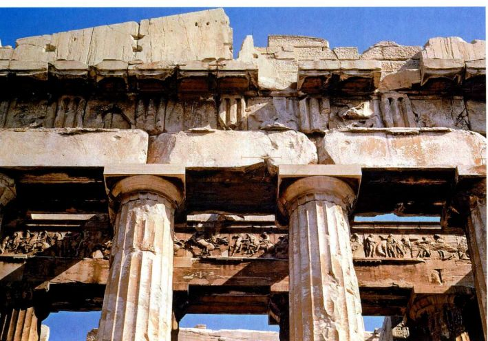

图5\.46 帕特农神庙内殿西面入口上方的檐壁。约公元前440\-前432年，大理石，高109\.3厘米

图5\.47 《骑马者》（Horseman）， 出自帕特农神庙的西面檐壁。约公元前440一前432年。大理石，高109\.3厘米。伦敦大英博物馆

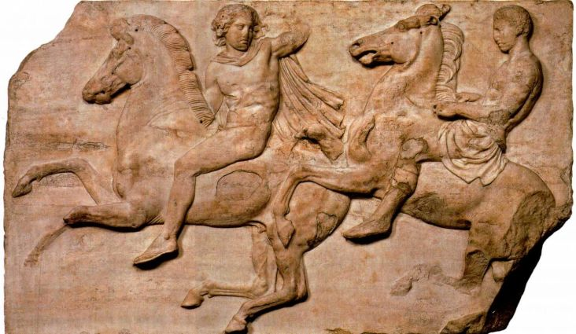

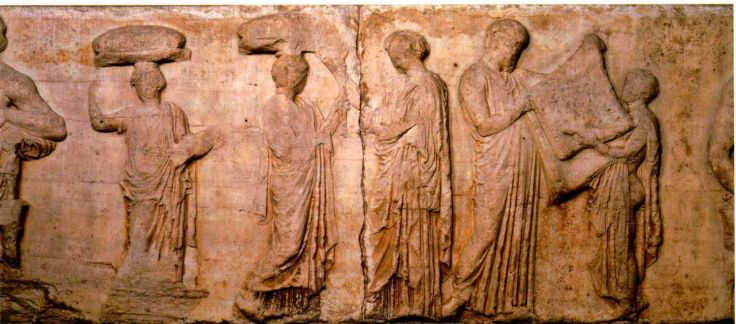

图5\.48 帕特农神庙的东面檐壁。约公元前440年。大理石，高109\.3厘米。伦敦大英博物馆

第五章 希腊艺术 135

艺术史家的观点

帕特农神庙檐壁：一种新解释

学雕像。左右两边的坐像比中间部分的其他人像刻得大，者长期以来一直难以解读帕特农神庙东端的中间部分他们显然是奥林匹亚的神祇。假如檐壁的其他部分表现的是泛雅典娜节游行，那么整个檐壁尤其是东面这段就明显缺乏空间的统一性（也就是说行动在多个地点发生）。最近的一个假说将整个檐壁置于神话背景内，由此解决了这个问题。这种阐释认为雕刻场景描绘的是厄瑞克透斯国王的三个女儿。在雅典神话中，德尔斐的神谕说若想击退外敌保住雅典，国王的一个女儿必须献出生命。雕塑所表现的就是一个女儿镇定地接过她将要穿上祭台的袍服。战胜波斯人以后，

牺牲的雅典战士。倘若这一观点成立，而檐壁表现的又是泛雅典娜节游行，那么这种做法就值得关注，因为身为凡人的雅典人被刻画在通常保留给神祇和神话场景的空间里，这是非同寻常的赞誉。对檐壁的另一种解释见本页的艺术史家的观点。

菲迪亚斯风格 帕特农神庙雕像长期以来一直与菲迪亚斯这个名字联系在一起，据希腊传记家普鲁塔克记载，此人监督主持伯里克利兴建的所有艺术工程（见第131页的原始文献）。在伯里克利聘用他时，菲迪亚斯的两件雕像作品已经享有盛名，一件是处女雅典娜的巨大雕像，另一件是奥林匹亚宙斯神庙中以象牙和黄金制成的巨大宙斯坐像，这不仅是因为它们具有宗教意义，也是因为它们体积庞大，材料珍贵。菲迪亚斯还塑造了一尊同样巨大的雅典娜青铜像，伫立在雅典卫城，面朝山门。这些是仅有的几件直接出自他手的作品，但无一存世，后来的一些小型复制品难以传达出原作的威严。菲迪亚斯可能还亲自参与了帕特农神庙匠师云集的雕饰工作，但也有可能他仅仅是一位有能力的主管人。因此，我们对菲迪亚斯的艺术风格所知甚微。

然而菲迪亚斯已经与帕特农神庙风格联系在一起，后者也时常称为“菲迪亚斯风格”（Pheidianstyle）。这个术语传达的理想不仅是艺术的也是哲学的：理想化的面庞和比例使雕塑中的雅典人由他们生活的非文明世界之中升华。他们具有神一般的平静，他们了解人事，却又超然脱俗，践行着自己在宇宙中的使命。

既然帕特农神庙有着突出地位，那么菲迪亚斯风格主导雅典雕塑直到公元前5世纪末期以后也就

这个神话显然在雅典人中产生了共鸣，剧作家欧里庇得斯根据这一题材创作了一出悲剧。这种假说引发了很多争议，关键在于右边的年轻人是个女孩还是男孩，而学者们越来越相信是男孩。且不管结论如何，檐壁的图像将雅典人、神界、时间以及仪式场面融为一体，反映出雅典人的优越感和自信。在帕特农神庙近期的维护和重建过程中又有新发现，使檐壁问题变得更为复杂，原来在前殿的上层部分还有另一个檐壁。这一檐壁已经全然无存，但假如它的题材与内殿四周的檐壁相关联，那我们就失去了有助于我们确定和解释檐壁图像的重要证据。

不足为奇，即使当时由于伯罗奔尼撒战争，大型雕塑已经逐渐式微。最后那批大型工程的其中一项建于约公元前410\-前407年，是卫城上小型的雅典娜\-尼刻神庙（Temple of Athena Nike）的栏杆，菲迪亚斯风格在其中还清晰可见（见图5\.52）。与帕特农神庙的檐壁一样，这里表现的也是庆典游行队伍，但参加者不是雅典的公民，而是生有双翼的胜利的化身尼刻（Nike［Victory］）。一位尼刻正在脱鞋，表示她即将踏上圣地（图5\.49）。双翼维持了她的身体平衡，因此这个通常较为怪异的动作她却做得优雅自如。菲迪亚斯风格最明显的表现在于“出水”般的衣服上深深刻出的皱褶，长裙紧贴在身上，双腿间衣褶垂坠。

《希盖索墓碑》（Grave Stele of Hegeso，图5\.50） 同样制作于公元前5世纪末期，人物的衣物也表现了菲迪亚斯风格，这一风格也表现在理想化面庞的光滑平面以及场景的恬静气氛中。艺术家塑造的女性死者坐在一张雅致的椅子上，这是平凡的生活场景，也是年轻女子墓葬雕刻或绘画的标准形象。她从侍女手捧的盒子里取出一件首饰，似乎在仔细端详它。作品的精致雕工在离观者最远的部位表现得尤为明显，如女仆的左臂和希盖索右肩后的纱巾，浮雕在这些位置缓缓融入了背景，更加使人感到背景仿佛是虚无的空间，而不是一块石板。自约公元前425年起，雅典雕刻家制作了大量纪念物，《希盖索墓碑》就是其中的精品。这些作品的输出必定有助于菲迪亚斯风格传遍希腊。

雅典卫城山门 帕特农神庙落成的同一年，即公元前437年，伯里克利又下令开始另一项耗资巨大的

136 詹森艺术史

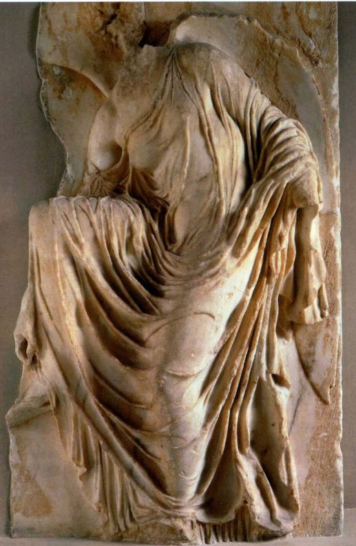

图5\.49《尼刻》（Nike），出自雅典娜\-尼刻神庙的栏杆。约公元前	410\-前	407年。大理石，高106\.7厘米。雅典卫城博物馆

工程，那就是坐落在卫城西端的宏伟入口，称为雅典卫城山门（Propylaea，见图5\.37）。主管建筑师是明希凯尔斯（Mnesikles），他在五年内完成了山门的主要部分，剩余部分由于伯罗奔尼撒战争爆发而被迫放弃。整个建筑以大理石构成，也含有与帕特农神庙相似的一些修正因素。明希凯尔斯出色地将多立克式神庙的元素运用于一个完全不同的建筑，使之适应崎岖陡峭的地形。山门设计为两层，将一条乱石间的崎岖山路变成了直指圣所的雄伟通道。如今只有东面的门廊（亦即正立面）还大体保存着。它类似于古典多立克式神庙的正立面，只是三四柱间的距离较宽，可由此进入卫城，这一特征常见于爱奥尼亚式建筑。西面的门廊两翼都有建筑（图5\.51），因受地形限制，大小不一（图5\.38）。北翼的一座较大，内有一个画廊（pinakotheke），是已知专为

展示绘画而设计的第一座公共厅堂。山门中部入口的甬道两旁排列着爱奥尼亚立柱，柱身较细，与帕特农神庙中的爱奥尼亚立柱遥相呼应。

雅典娜\-尼刻神庙 设计帕特农神庙和山门的建筑师们引入爱奥尼亚元素有其设计考虑，可能也有同样重要的政治原因。在前古典时期，希腊大陆上仅有的爱奥尼亚建筑是小型宝库，例如锡弗诺斯宝库（图5\.21），由东部希腊各城邦在德尔斐按其各自的地方风格建造。在雅典建筑师使用爱奥尼亚风格时，伯里克利可能有意是作出了一个象征性姿态，试图将希腊的不同地区统一在一种跨越地域的风格中。雅典卫城实际上包括了现存爱奥尼亚风格的典范之作。其中之一是山门南面小型的雅典娜\-尼刻神庙（图5\.52），可能是公元前427\-前424年间根据20年前卡利克

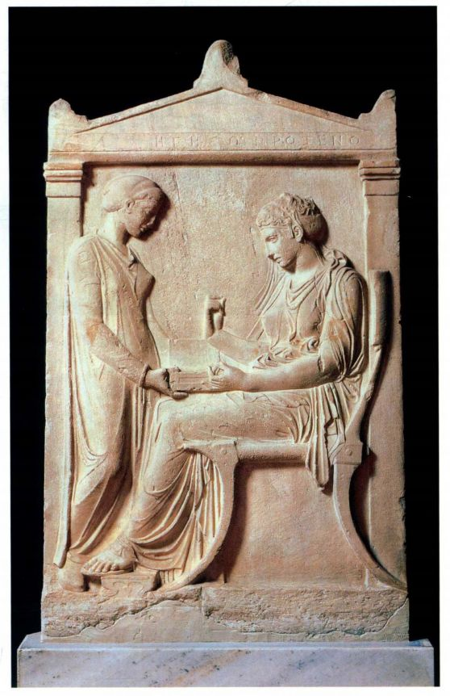

图5\.50《希盖索墓碑》。约公元前410\-前400年。大理石，高150厘米。雅典国家考古博物馆

第五章 希腊艺术 137

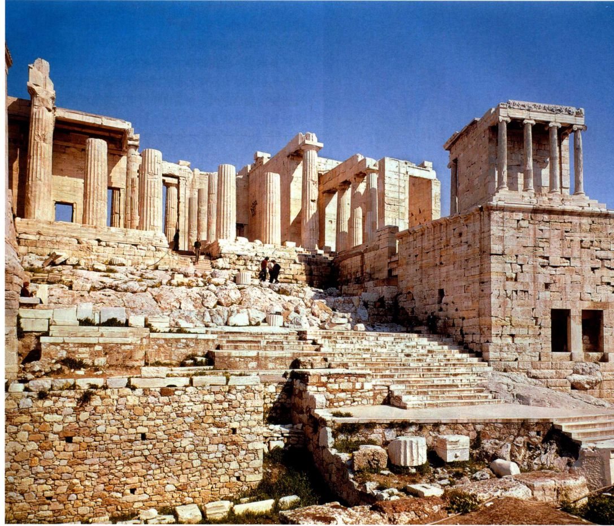

图5\.51 明希凯尔斯：卫城山门，公元前437\-前432年（西面观）。雅典卫城

拉特的设计建造，以庆祝雅典战胜波斯。爱奥尼亚风格极具装饰性，其比例较多立克风格纤细，因而成为这一小巧玲珑的建筑的当然之选。雅典娜\-尼刻神庙矗立在一块凸起的岩石上，是人们进入雅典卫城后看到的第一座建筑。

厄瑞克透斯神庙 另一座更大的爱奥尼亚式建筑坐落在帕特农神庙旁边，这就是厄瑞克透斯神庙，它建于公元前421\-前405年，很可能是明希凯尔斯的另一件作品（图5\.53）。同卫城山门的情形一样，建筑师必须解决复杂的地势问题：这一地点不仅是陡坡，而且早已建有与雅典建城的神话相关的若干神殿，它们不能被移走。例如，雅典人认为它的下方就是雅典娜与波塞冬为成为雅典守护神而斗争的地点，帕特农

神庙的东三角楣上就刻画了这一场景（见图5\.41）。除了雅典娜在斗法中赐予雅典城的橄榄树，神庙中还有一个咸水池，据说是从波塞冬掷出的三叉戟落下的地点喷水而成。因此，厄瑞克透斯神庙实质上身兼多种宗教用途。它的平面十分不规则，包括四个大厅以及西面的一个地下室（见图5\.38）。主厅东厅献给帕拉斯·雅典娜（Athena Polias，城市守护女神雅典娜），内有一尊旧神像，一块不成形的橄榄木，这是雅典崇拜中最神圣的物品。西厅献给波塞冬。另一间大厅里则举行对厄瑞克透斯（Erechtheus）的祭祀，这位传说中的雅典王推广对雅典娜的崇拜，这座建筑就以他命名。

厄瑞克透斯神庙西侧没有建立面，而是在两侧

138 詹森艺术史

各加了一个门廊，大门廊朝北，献给波塞冬，是神庙的主入口；而较小的一个朝向帕特农神庙伸出，这就是著名的“女柱廊”（Porch of the Maidens）（见图5\.53，左面），廊顶由高挡墙（parapet）上的六根女像柱而不是普通立柱支撑，故得此名。维特鲁威写道，这些人像立柱表现的是卡利亚（Caryae）的女子，这个伯罗奔尼撒半岛上的城邦在希波战争中与波斯人结成了联盟。战争结束后，获胜的希腊人杀光了卡利亚的男子，将他们的女人掳作奴隶，却强迫她们继续穿戴华服美饰，作为她们羞耻的标志。因而，维特鲁威继续写道，建筑师们在构思中使用了这些女子的形象，让她们永远背负着自己城邦的耻辱。女像柱早在希波战争之前就出现在锡弗诺斯宝库等希腊建筑中，维特鲁威对于女像柱的解释与此事实不符，但它可能揭示了战争之后雅典人赋予女像柱的新意义。厄瑞克透斯神庙的三角楣上空无一物，也许是因为伯罗奔尼撒战争后期资金匮乏；有雕刻装饰的檐壁也只有很少一部分保存下来。但立柱的柱础和柱头，以及门框和窗棂上的装饰雕刻却格外精美丰富。根据该建筑开支的石刻记录，这类雕刻的耗费甚至超过了神庙的人像雕塑。

大事年表

约公元前480年\-《克里提奥斯的少年》

公元前478年\-提洛同盟建立

公元前458年\-埃斯库罗斯创作《奥瑞斯提亚》三部曲

约公元前447年\-伯里克利下令修建帕特农神庙

公元前431一前404年\-伯罗奔尼撒战争

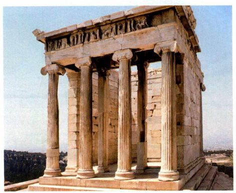

图5\.52 雅典娜\-尼刻神庙。公元前421\-前405年（西面观）。

雅典卫城

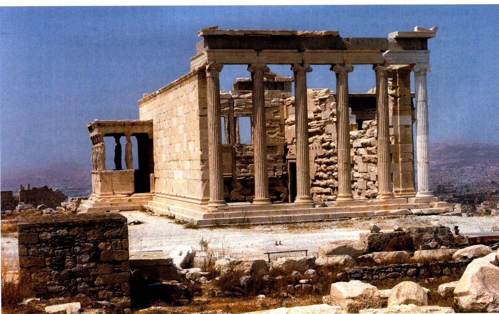

图5\.53 厄瑞克透斯神庙。公元前421\-前405年（东南面观）。雅典卫城

第五章 希腊艺术 139

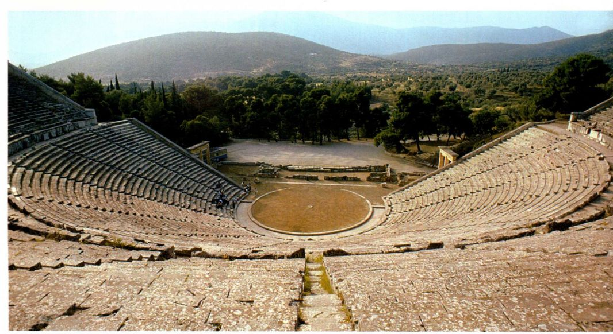

图5\.54 剧场，埃皮道伦。公元前3世纪早期至公元前2世纪

尽管建造时间前后长达数十年，但伯里克利的雅典卫城显然是要构成一个有计划的整体。多立克式帕特农神庙和山门坚实而庄严，雅典娜\-尼刻神庙和厄瑞克透斯神庙则更为轻巧，更具装饰性，两者相得益彰。

古典时期晚期

公元前460年起，雅典与伯罗奔尼撒的两个城邦科林斯和斯巴达之间冲突不断，逐渐升级为公元前431\-前404年的伯罗奔尼撒战争，雅典战败。公元前4世纪期间，希腊各城邦之间经常发生矛盾。公元前338年，在北面的马其顿王国（Macedon）即位的腓力二世（Philip II）利用希腊人的不和入侵希腊，并在希腊中部的查罗奈亚战役（Battle of Chaironeia）中彻底击溃了雅典人和底比斯人（Thebans）。

公元前5世纪末，雅典的霸主地位衰落。自约

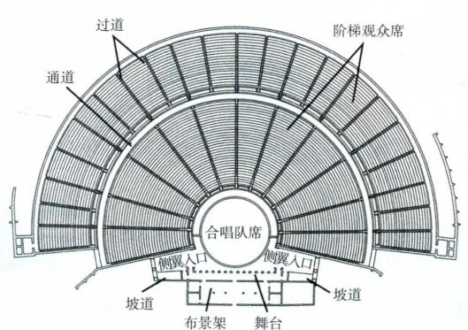

图5\.55 埃皮道伦剧场的平面图（根据	Picard\-Cambridge的图绘制）

140 詹森艺术史

古典晚期建筑：城市建筑与宗教建筑

公元前5世纪末和前4世纪在纪念性建筑领域出现了两个重要变化。一个是重心的转移：除建造神庙外，建筑师们拓展了一系列建筑类型，其中有许多类型历史久远，例如有顶柱廊（stoa）和议会的会议大厅等，但是现在规模更为宏大。例如，剧场形式更加标准化。因为在狄俄尼索斯节中，合唱表演以及后来的戏剧演出都是核心活动，所以剧场早已成为希腊城邦宗教景观的一部分。修建剧场的基本前提是有一个观众能够就座的山坡（即梯形观众席［cavea］），以及一个供演出的水平区域（即合唱队席 ［orchestra］）。

埃皮道伦剧场 这些基本条件逐渐成为建筑形式，产生了位于埃皮道伦（Epidauros）的壮观石制剧场，剧场就建在医神阿斯克勒庇俄斯（Asklepios）的圣所中（图5\.54和5\.55）。工程始于公元前3世纪初，剧场上层直到公元前2世纪才完成。一排排石椅顺着山坡排列，覆盖的扇形区域略大于一个半圆。为方便进出，观众席分成一个个楔形区（cunei），以台阶隔开，一条宽阔的水平甬道将观众席分为上下两部分。演出在中央的水平圆形区域内进行，背后有一个舞台建筑（skene）用作背景，里面还有服装室和道具室。凡去过剧院的人都熟悉这种建筑形式，现代人也不例外，这正表明了它的成功。由于剧场是露天的，没有屋顶支撑结构挡住观看演出的视线，并且许多座位还是欣赏美景的绝佳位置。然而这个剧场最令人惊叹的一点或许是它出色的音响效果，今天人们还能实地体验到这一点：它的漏斗形状甚至能将最轻微的低语清晰地传到最远处的观众席。

哈利卡纳苏斯的毛索洛斯王墓庙 在哈利卡纳

苏斯（Halikarnassos，今日土耳其西南部的博德鲁

姆，见地图5\.1），修建大型纪念建筑的风潮产生了

壮观的毛索洛斯（Mausolos）的陵墓，由其妻阿尔

泰米西亚（Artemisia）修建。毛索洛斯于公元前377

至前353年统治波斯帝国属地卡里亚（Caria）地

区。这个陵墓在众多古迹中享有盛名，被列入古代

世界七大奇迹，在罗马帝国时期，毛索洛斯的墓庙

（Mausoleum）已经成了指称所有巨型陵墓的术语。

墓庙由普赖伊尼（Priene）的皮泰欧（    设计，

建成后一直保存完好，直到公元13世纪一场地震使

墓庙上层倾塌。后来在15世纪和16世纪初，圣约

翰骑士团将剩余部分的石料用于重新加固当地城堡。

再后来，1857年英国考古学家查尔斯·牛顿（Charles

Newton）在这个地点发掘，将许多雕塑残块运到了

大英博物馆。丹麦考古学家的发掘工作也发现了重要信息，与文献资料相结合就有可能复原墓庙，尽管还没有一个公认的复原结果（见第一部分末尾的附加原始文献）。图5\.56展示的是其中一种假设，陵墓平面呈长方形，高42\.6米，至少可分为三部分，布满雕塑装饰。这三部分包括一个高基座，一个爱奥尼亚式柱廊和一个金字塔形庙顶，顶部有一层层梯级，最高处是一个平台，台上屹立着毛索洛斯或他的某位祖先站在战车中的雕像。

将这些元素结合在一个纪念性建筑中，这进一步证明了建筑逐步增加的多样性。它们可能也具有宣传功能。墓庙颂扬毛索洛斯是哈利卡纳苏斯的伟大奠基者。它结合了利西亚（Lycia）地区的巨型墓葬建筑传统、希腊的围柱结构和雕塑，以及埃及金字塔，因此可能显示了卡里亚在这个地区的统治地位，以及希腊文化与非希腊文化的共生状态，这种状态可能通过建立一个由哈利卡纳苏斯领导的卡里亚帝国而达到。

科林斯柱头 公元前5世纪后期建筑领域的另一个重大变化是科林斯柱头（Corinthian Capital）的

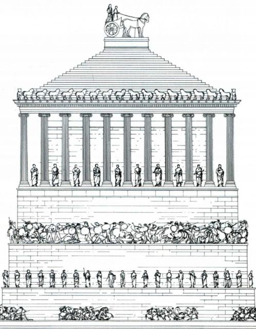

0			10米

0	10	20 30 英尺

图5\.56 哈利卡纳苏斯的毛索洛斯王墓庙复原示意图。约公元前359\-前351年（根据H．Colvin的图绘制）

第五章 希腊艺术 141

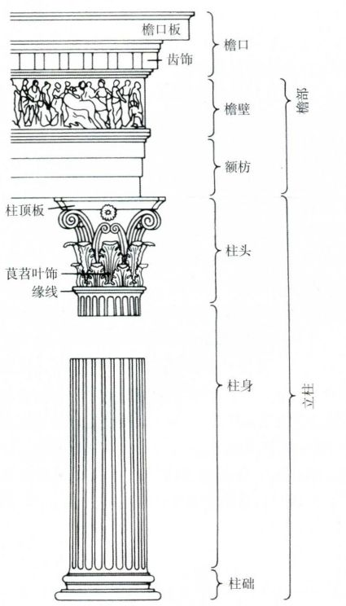

图5\.57 科林斯立柱风格立视图

诞生（图5\.57）。科林斯柱头比爱奥尼亚柱头更为精致。四个世纪后，罗马建筑师维特鲁威在他的巨著中将科林斯柱头的发明归功于金工匠人卡利马科斯（Kallimachos）。它的形状宛如一口倒钟，覆以卷曲嫩芽形装饰和莨苕叶饰（acanthus），仿佛柱身顶部萌发出了枝叶（图5\.73）。科林斯柱头起初仅用于神庙内部，其原因可能是希腊建筑较为保守，或是它的植物形状使人感受到神圣。直到公元前2世纪，科林斯柱头才开始出现在建筑外部。图5\.58中的柱头来自位于埃皮道伦的一个圆形神殿（tholos），由小波利克里托斯（Polykleitos the Younger）设计。神殿呈圆形，显示出对新建筑类型的偏爱。精致的内部设计延续了帕特农神庙以来强调内部空间连接的传统。

古典晚期雕塑 菲迪亚斯风格散发着对雅典城邦超群地位的自信，但它没能避开伯罗奔尼撒战争雅典战败后的厄运。公元前5世纪末，雕塑所呈现的情绪出现了明显转变，似乎表明人们对与人类在宇宙中的地位有了新的看法，并且这种看法也不再像过去那样

乐观。

学者们试图将存世的雕塑与文献中提到的几位公元前4世纪的雕塑家对应起来，其中之一是帕洛斯岛（Paros）的斯科帕斯（Skopas）。据罗马作家普林尼（Pliny）记载，有四位大师被选中参与哈利卡纳苏斯的毛索洛斯王墓庙工程，斯科帕斯就是这四位大师之一，墓庙部分檐壁上刻画着希腊人与阿玛宗族之间的战争，被认为是他刚健有力的风格。然而他最为著名的还是在人物面部注入激情的方式。图示的头部残块出自雅典娜·阿莱亚神庙（Templeof Athena Alea）的三角楣，位于泰格亚（Tegea），创作于约公元前340年，可能是斯科帕斯本人的作品，或是出自一位深受其作品影响的艺术家之手（图5\.59）。作品头上蒙着狮皮，表明这个人物是赫剌克勒斯或是他的儿子忒勒福斯（Telephos）。脸部平滑丰腴，与帕特农神庙雕塑的脸部处理一样，是古典艺术的典型特征。而其创新之处在于，雕塑家在双眼上方朝着鼻梁的方向深凿，形成阴影效果。外眼角处眼睑鼓起，悬垂在眼睛上，这一简单改动使面

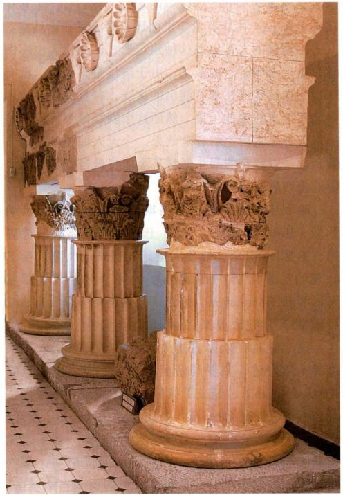

图5\.58 小波利克里托斯：科林斯柱头，出自埃皮道伦的圆形神殿。

约公元前350年。希腊埃皮道伦博物馆

142 詹森艺术史

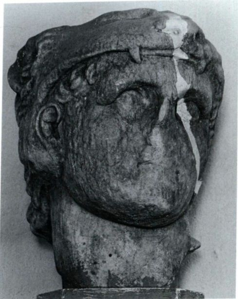

图5\.59 赫刺克勒斯或忒勒福斯的头像，出自泰格亚的雅典娜·阿莱亚神庙的西三角楣。约公元前340年。大理石，高31\.8厘米。原存于泰格亚考古博物馆，后失窃

部充满了一种前所未见的强烈情感，微启的嘴唇和头部的剧烈扭转加深了人物情感。

普拉克西特勒斯 假如说古典晚期的希腊人对于他们的地位不再那么自信，那么他们对于自己与命运以及诸神的关系也不再那么肯定。这一点也反映在普拉克西特勒斯（Praxiteles）的作品中。他是与斯科帕斯大致活跃于同一时期的雕塑家，塑造了许多神像，更喜欢使用大理石而不是青铜。公元前5世纪的艺术家强调神的威严，普拉克西特勒斯则赋予他们一种青春的美感，或许暗示了他们像人类一样任性和喜怒无常。他最著名的作品是一尊阿佛洛狄忒像，创作于公元前340\-前330年（图5\.60）。据普林尼记载，科斯岛（Kos）人请这位雕塑大师制作一尊裸体的阿佛洛狄忒像，但后来又没有接收，而是选了一尊身着长袍的女神像。尼多斯（Knidos）人把裸体像买了下来，这个大胆的举动使他们获益：雕像的声名迅速传播开来，各地游客都为观赏她而来到尼多斯（见第一部分末尾的附加原始文献）。她如此引人关注或许是因为未着片缕：这是希腊世界中第一座纪念性的裸体女神像。即使此时的艺术家主要只用裸体来表现女奴隶和女仆，但公元前5世

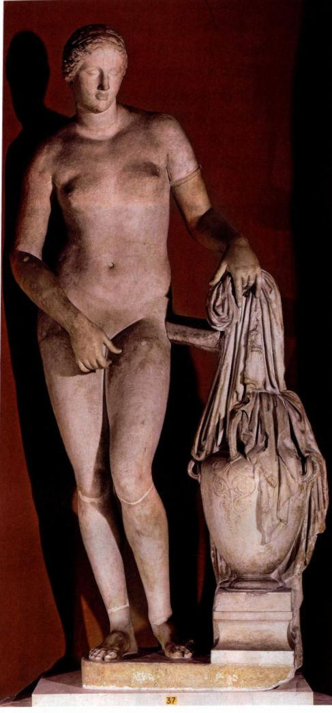

图5\.60《尼多斯的阿佛洛狄忒》（Aphrodite of Knidos），罗马复制品，原作时间约为公元前340\-前330年，由普拉克西特勒斯创作。大理石，高2米。罗马梵蒂冈博物馆

纪雕像中那些紧贴肌肤的衣服与其说是遮蔽胴体，倒不如说是使女性的身体展露无遗。她的魅力不但在其裸体，而且可能还在于其赤裸裸的情欲。观赏者可能认为雕像中的阿佛洛狄忒正要入浴，或是刚刚出浴。她用右手羞怯地遮住私处，左手则抓着一件衣服。她的头略略偏转，所以没有直视观者，但观者无论是否愿意，都与雕像达到了一致，因为他不小心看到了女神的裸体。阿佛洛狄忒任性多变，或许她在沐浴时就有意要被陌生人看到，但这个陌

第五章 希腊艺术

生人的身份是不确定的，这更增加了爱神形象的情色成分。在一些记载中，尼多斯人将普拉克西特勒斯的这件作品陈列在一个前后都有入口的圆形神殿中，人们就可以从各个角度来观赏她。

我们对普拉克西特勒斯的阿佛洛狄忒的了解只是通过其罗马复制品。更复杂的是赫尔墨斯怀抱婴儿狄俄尼索斯的一件组雕（图5\.61）。罗马作家保萨尼阿斯（Pausanias）提到，他曾见过普拉克西特勒斯的这样一件作品，摆放在奥林匹亚的赫拉神庙中，图示的大理石雕塑于1877年在那里被发现。作品工艺精湛，因此长期以来一直被认为是普拉克西特勒斯晚期的原作。但现在大多数学者认为它是一件公元前1世纪的精美复制品，因为作品还留有支撑结构，背部也未经

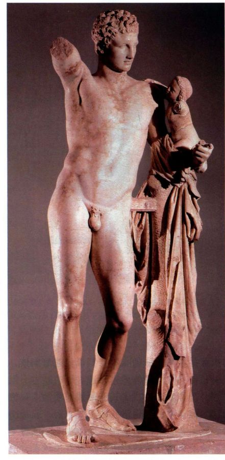

图5\.61 《赫尔墨斯》，罗马复制品，原作时间约为公元前320\-前310年，由普拉克西特勒斯创作。大理石，高2\.16米。奥林匹亚考古博物馆

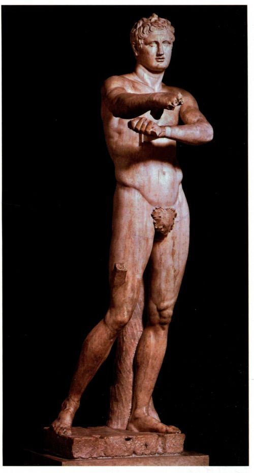

图5\.62 《刮汗污的运动员》，罗马大理石复制品，原作时间约为公元前330年，由利西波斯以青铜制作。高2\.1米。罗马梵蒂冈博物馆

打磨，而对大理石表面工具痕迹的分析也支持年代鉴定的结论。尽管如此，这件作品还是具有普拉克西特勒斯雕塑的所有特征。与波利克里托斯的持矛者相比，赫尔墨斯的比例更加修长（见图5\.33），对立平衡强化，躯干因此形成松弛慵懒的曲线。持矛者中的人体构造明显，在这里却柔和弱化了，表现出一种青春的美感，而不是运动的力量。大理石表面的处理十分纯熟，皮肤光滑柔软，头发粗糙而带有表现主义风格，两者恰成对比。组像还有普拉克西特勒斯作品特有的幽默感：信使之神原本在狄俄尼索斯面前摇晃着一串葡萄逗他，而他兴致勃勃地想要够到葡萄，预示着他日后会成为酒神。但对于有着不同情绪或世界观的观赏者，赫尔墨斯飘渺的眼神可能也意味着他漠视孩子

144 詹森艺术史

想拿到葡萄的努力。

利西波斯公元前4世纪雕塑界的第三位大师是利西波斯（Lysippos），他的艺术生涯相当漫长，可能始于约公元前370年，一直持续到公元前4世纪末。我们也是从罗马复制品了解了他的作品《刮汗污的运动员》（Apoxyomenos，一个用刮板刮去身上油垢的年轻人），原作创作于约公元前330年，显然是对波利克里托斯的《持矛者》有所借鉴（图5\.62；见图5\.33）。利西波斯表现的运动员身材比例更加修长，是八头身，而波利克里托斯使用的比例是七头身（第一部分末尾的附加原始文献）。运动员身体后倾，再次构成对立平衡，这是受普拉克西特勒斯影响的标志；自由腿斜向外侧，也显示出运动的自由。然而最具革新性的是运动员手臂的位置。伸出的手臂向前进入观者的空间。因为手臂从正面看去经过了透视，这吸引着观者绕着雕塑转动，以便理解运动员的整个动作。利西波斯因此打破了一座立像正面视角的优先地位。运动员左臂弯曲，在胸部高度接触到右臂，雕塑的布局内也就有意包含了空间。利西波斯挑战雕塑及其环境间的截然对立，二者开始融合。这一手法显示了古典晚期和希腊化时代对于高度写实的幻觉主义（illusionism）的关注。

古典晚期绘画

文献证据列举了一些古典时期的著名画家，说明了大量关于绘画演变的情况，但它们很少进行细节描述，我们就很难想象那些绘画是什么样子。希腊绘画的伟大时代开始于古典早期，代表画家为萨索斯（Thasos）的波利格诺托斯（Polygnotos）及其

图5\.63 尼俄柏画师：红绘萼形酒瓮（calyx krater），出自奥维托。约公元前460\-前450年。巴黎卢浮宫

合作者雅典的米康（Mikon），他们同时也是雕塑家。波利格诺托斯在绘画中引入了若干创新技法，包括“情感和性格的表现以及构图模式的运用”，与古典雕塑一样，这种创新也成为了古典绘画的核心。他也是第一个描绘身着透明衣物的女子的画家。他还破除了单一地平线的观念，将同一个背景中人物排布在不同高度。

在不同高度描绘人物的做法看来也影响了当时

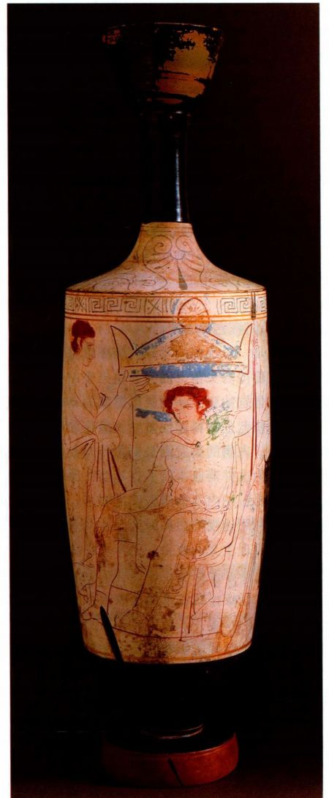

图5\.64 里德画师：白底长身细颈瓶。约公元前425\-前400年。

雅典国家考古博物馆

第五章 希腊艺术 145

__大事年表__

公元前 387 年——柏拉图成立雅典学院  
公元前 351 年——狄摩西尼进行了他的三大著名演说中的第一次，题为《反腓力辞》  
公元前 340 年——利西波斯创作《刮汗污的运动员》  
公元前 338 年——马其顿国王腓力二世入侵希腊  
公元前 335 年——亚里士多德在雅典建立吕克昂哲学学院

的一位瓶画家，今天人们称他为尼俄柏画师（NiobidPainter），图5\.63所示是他的名作。这个花萼形酒瓮（一种调酒碗）上描画的是一个神话故事，司掌狩猎的阿波罗和阿耳忒弥斯两兄妹用箭射死了尼俄柏（Niobe）的儿女们，因为她愚蠢地夸耀自己的子女比两位神祇的母亲勒托（Leto）更多更漂亮。每个人物都有各自的地平线，高低不平，显示地形崎岖起伏。阿波罗和阿耳忒弥斯站在两个受害者上方，这两个人在巨石上挣扎，但我们显然应该能理解地形在逐渐往后延伸。

显著的技术差异使壁画区别于红绘瓶画。更接近壁画的是一个几乎仅用于葬礼祭品的种类：白底瓶画。艺术家是在一层白釉底色上加绘各种颜色，并且偏爱绘画葬礼中使用的一种油瓶，名为长身细颈瓶（lekythos）。图示中的例子作于公元前5世纪最后25年，学者们将它归为里德画师（Reed Painter）的作品。画中是一个忧郁的年轻人坐在坟墓台阶上。右侧的女子拿着他的头盔，而另一名男子站在左侧，举起手臂作出告别的姿势。场景以黑线勾勒，填绘鲜活的色彩。一些蓝色颜料还残留在坟墓部分和坐着的男子的斗篷上，人物的头发则是褐色，但大多数颜料都已消失，因为这件器皿本就不打算长久保留或重复使用，颜料只要短期内不会消失就足够了。这种技法使画家能自如利用透视缩短和深度，并以简练流畅的线条达到极具表现主义的效果。死者双眼深陷，似乎在沉思，表明艺术家能够捕捉住这种情感。因为这种白底技术的艺术优点，我们可能会以为它一定会得到更广泛的应用。但事实并非如此。相反，从公元前5世纪中叶起，大型绘画的影响逐渐夺去了瓶画的光辉。有些例子中瓶画画家试图复制大型绘画的构图，但成效甚微。

亚历山大时代和希腊化时期

公元前336年，马其顿国王腓力二世驾崩，王位传给了他的儿子亚历山大。亚历山大大帝是历史上的传奇人物，他的军事天才、个人魅力和英勇威武天下

闻名。一登上王位，他就开始了一个伟大的征服计划，逐个征服埃及、波斯、美索不达米亚，直至今日的阿富汗。他一生建立了超过70座城市，公元前323年驾崩，年仅33岁。亚历山大的征服彻底改变了希腊世界的面貌，将它扩张到前所未闻的地区，创建了新的政治联盟，打破了文化的疆界。

亚历山大大帝逝世时没有指定继承人。他死后的那些年，皇室成员和将领之间争斗不断，每个人都想自立为亚历山大的唯一继承人，但没有一个如愿以偿。公元前275年前后，亚历山大的疆土合并成为三大王国，一直控制地中海地区，直至罗马逐渐兴起。托勒密继承了埃及并建立王朝，托勒密王朝的统治结束于公元前31年，屋大维，即后来的罗马皇帝奥古斯都，击败克里奥帕特拉七世。在东边，塞琉古家族于公元前312年攻取巴比伦，以叙利亚为中心统治着一个王国，塞琉古王国鼎盛时期的疆域从今天的土耳其西部一直延伸到阿富汗。后来帕加马（Pergamon）周围的一小块地区落入亚太利人（Attalids）之手，公元前133年这座城池又被拱手让给罗马人。公元前64年，逐渐萎缩的塞琉古王国只剩下叙利亚北部的一小块地区，后来也被罗马人统治。争夺最激烈的是亚历山大的故国马其顿，它于公元前276年落入安提柯人（Antigonids）之手，公元前168年被罗马人攻占，安提柯王国终结。在这些王国内出现了大型城市，其中包括亚历山大港、安条克（Antioch）和帕加马，汇集了大批来自整个新希腊世界的人。它们相互竞争，希望夺取文化领先地位，艺术在这种较量中扮演了重要角色。希腊化时期的文化与古典时代截然不同。领土扩张意味着希腊的文化制度传播到了广袤的地域，而这些制度又与当地人民牢固的文化传统相融合，产生了一个丰富多彩的社会。

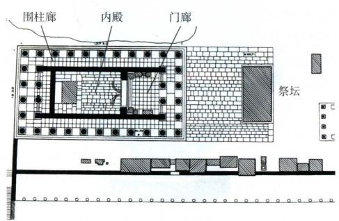

图5\.65 皮泰欧：普赖伊尼的雅典娜神庙平面图。公元前334年

146 詹森艺术史

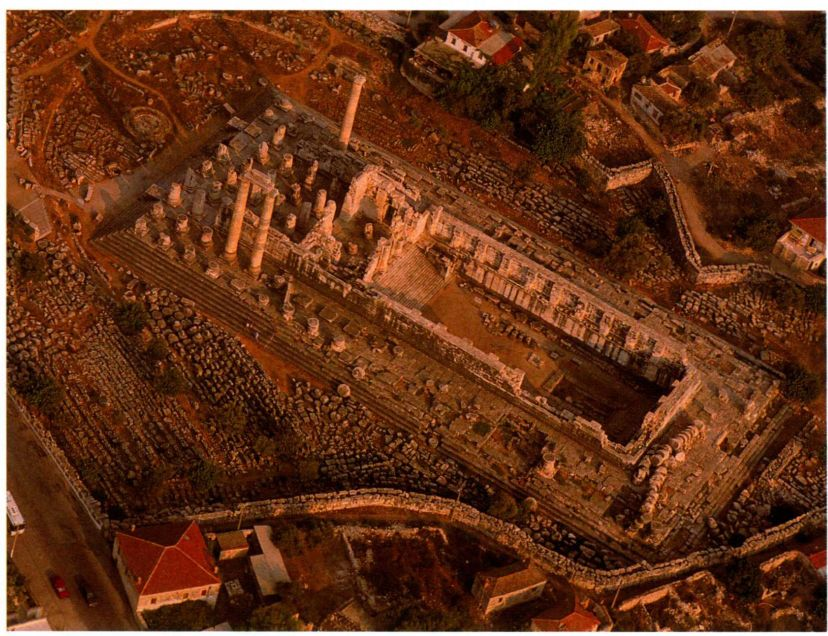

图5\.66 以弗所的帕奥涅斯和米利都的达佛涅斯：阿波罗神庙，土耳其迪迪马。于公元前313年动工

建筑：学者传统与戏剧风格

在希腊化世界的文化中心，各学院纷纷成立，促进了学者对众多领域的热烈探讨。除其他各领域以外，他们还对艺术进行了深入探讨，并且形成了评判文学、艺术和建筑作品的准则。可以预见到，这种风气在建筑界推动了对比例系统的关注，当时建筑实践者的论著中便有此记载。维特鲁威断言这场运动的倡导者是来自普赖伊尼的一位建筑师皮泰欧，他可能是负责哈利卡纳苏斯的毛索洛斯王墓庙的建筑师之一（见图5\.56）。他的论著与大多数人的一样没有留存下来，但维特鲁威提到他特别排斥多立克风格，因为四个角上的三垄板的空间排布问题使得这种风格在应用时必须做出修改。皮泰欧转而以爱奥尼亚风格创作，例如建于公元前334年的普赖伊尼的雅典娜神庙（图5\.65）。神庙柱廊的立柱数目是横6纵11，平面呈网格状，每格边长6雅典尺（1雅典尺比1英尺［约0\.3米］略长），这种布局主导着所有组成结构的比例。

比例也制约着高度：例如立柱高43雅典尺而檐部高7雅典尺，共50雅典尺，正是内殿外部长度的一半。与帕特农神庙以及其他古典时期的神庙不同，普赖伊尼的雅典娜神庙没有偏离或修正比例规则。神庙是思维能力的作品，是说教传统的产物，而不是理

论与实践磨合的结果。事实上维特鲁威也批评皮泰欧未能在二者之间作出区分。

在学者传统兴盛的同时，古典晚期出现的建筑准则的放松和不同建筑类型的融合预示着希腊化时期另一重要发展的来临。这是一股新潮流，追求别出心裁的选址、精心的景观设计和“峰回路转”的布局。学

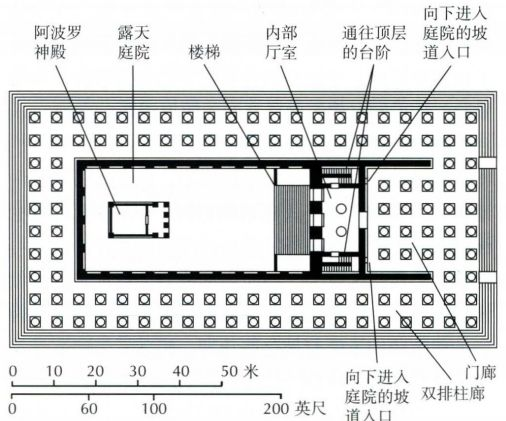

图5\.67 以弗所的帕奥涅斯和米利都的达佛涅斯设计：阿波罗神庙平面图，土耳其迪迪马。于公元前313年动工

第五章 希腊艺术 147

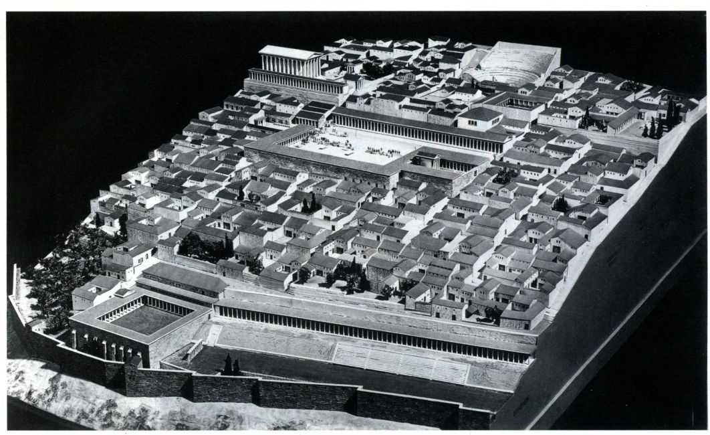

图5\.68 普赖伊尼城的模型。公元前4世纪以后。柏林国家博物馆

者称这一运动为戏剧风格，它平衡并补充了学者传统。在雅典的辉煌衰落后，雅典人和其他希腊人不再将自己视为城邦的成员，而是更多地视为个人，建筑相应地开始越来越注重个人体验，经常引导观者达到一种意味深长的境界。

迪迪马的阿波罗神庙 迪迪马（Didyma）的阿波罗神庙（Temple of Apollo）始于约公元前300年，直至罗马时期末仍未完成，是戏剧风格建筑的典范（图5\.66和5\.67）。这里原有一座古风式神庙，公元前494年被波斯人摧毁，后在原址上以同样的规模重建了阿波罗神庙。平面图和神庙设计的建造者似乎是希腊化时期的知名建筑师以弗所的帕奥涅斯（Paionios）和米利都（Miletos）的达佛涅斯（Daphnis）。

神庙位于一片神圣的小树林中，从外表看与这一地区其他的爱奥尼亚式建筑很相似。柱基很高，有七级巨大的台阶，神庙外围是两排高挑的立柱。观者可能会自然而然地以为，神庙内部将遵循标准希腊宗教建筑的格局，就像帕特农神庙一样，但其实不然，神庙的建筑师们不断打破这些预期，将观者带向富于情感张力的景观，这也许是为了升华宗教体验。

尽管神庙看起来从各个方向都能进入，但它的台阶太高，不能拾级而上。实际上，观者在正面走上几级平缓的台阶之后就进入了门廊，门廊内巨柱林立，

模拟神庙四周的树林。与预想的一样，有一个入口将观者引向内殿，但内殿离地约有1\.5米高，人们不可能进入。学者认为，宣布神谕的女祭司在这个高台上诵出她的预言，向高台下方站在门廊中的人群宣布结果。如想进一步深入神庙，可走这个抬高的入口右边或左边的通道，然后有黑暗的拱顶隧道通向下方。对于一个希腊观者而言，拱顶隧道象征洞穴或黑暗的内在，但这些通道不是通向一个封闭的内殿，而是一个宏大开阔的庭院，洒满了明媚的阳光：在经过隧道的狭隘之后，它给人的感觉一定是豁然开朗。

庭院末端是神殿主体，一个供奉阿波罗的小巧简朴的爱奥尼亚式建筑。神殿近旁是神圣的月桂丛和一眼圣泉。在神殿前转身回望，观者面对的是另一个惊人的景象：进入这个庭院的隧道与一片宽广陡峭的台阶相比黯然失色，台阶的末端是一对高高耸立的科林斯式附壁圆柱。这可能标志着它们身后的厅堂是最内部的圣所，可能是女祭司的起居处。但这位居住者的身份也许无法确定，因为人们对希腊神庙内部的运作情况所知甚少。然而这个内部台阶似乎是为游行队伍所设，加上内部庭院的巨大规模，表明有可能大批的崇拜者聚集于此瞻仰祭祀仪式。同样功能不明的还有从圣所通向柱廊廊顶的小台阶。建筑铭文称它们为“迷宫”，而台阶上方的天花板确实装饰着色彩亮丽的回

148 詹森艺术史

形纹饰（见图5\.3），是埃及象形文字中代表迷宫的符号。建小台阶或许是出于修葺的需要，但也同样可能是用于向阿波罗致敬的神启戏剧。总而言之，神庙安排观众通过意想不到的线路，并不断给人惊喜。这种戏剧风格也是当时许多其他建筑的特征。

除了给人以惊喜体验之外，阿波罗神庙之所以引人注目还有另一个原因。在庭院内部一束低斜的光线下，考古学家不经意间发现了墙上雕刻的示意图（刻得很浅，几乎看不出来），其中有建筑设计中各部分的比例图，从柱头装饰到立柱凸肚都涵盖在内。它们提供了一个非常难得的机会，帮助我们了解希腊建筑的设计过程，否则我们对此仍然是一知半解。这些示意图的存在表明，在建造过程中，一个建筑的设计图会画在已建好的表面，大体完工后再将其抹去。这座神庙恰好还未完工，因此设计图才得以保留。

城市规划

雅典等早期希腊城市都是自然发展，从小型聚居地逐渐转化成较大规模的城市。街道通常是曲折蜿蜒的，建筑街区也不规则。从公元前7世纪开始，殖民运动为整体规划城市以及评价不同的城市规划类型提供了契机。米利都的希波达摩斯（Hippodamos）是撰写此类论著的第一人，他推崇棋盘形的城市布局，也就是将城市街道排布成纵横相交的形式，许多西方城市至今仍然沿用这一模式。对于一名建筑师而言，横平竖直的棋盘形具有规整的优点；而对于城市居民而言，它便于辨认方向。公元前5世纪中期，希波达摩斯按棋盘布局设计了雅典附近的比雷埃夫斯（Piraeus），普赖伊尼居民于公元前350年左右为避洪患而迁移城市，新城就采用了已有先例的棋盘布局（图5\.68）。如模型所示，设计者过于遵循棋盘布局，反而忽略了城市的坡形地势，一些纵向轴线上沿笔直陡峭的斜坡设有台阶。尽管行人可以拾级而上，穿行于坡形的街道，但靠轮子推进的交通工具就只能望阶兴叹了。

帕加马：戏剧风格布局 走入帕加马城观者会有一种全然不同的感受。约公元前2世纪初，帕加马统治者尤米尼兹二世（Eumenes II）和他的建筑师们为扩大城市规模进行设计，但他们没有采用棋盘布局（图5\.69）。居民区域主要位于凯库斯河（KaikosRiver）平原，旁边是居高临下的卫城。城市的地势由南向北明显抬高，新的规划就顺应并利用了这种地势变化，抬升过程显然也获得了象征意义。在地形较低处是日常生活场所，例如市场。道路沿南面坡地向

图5\.69 土耳其帕加马城平面图

上通往卫城，经过入口处的拱顶隧道，到达三所学校（gymnasia），第一所教育男童，第二所教育15至17岁的少年，第三所级别最高，教育青年男子。沿着这条路再往上走是赫拉和德墨忒尔（Demeter）的圣所，这两位是帕加马城的重要女神。

这条路蜿蜒向前，顺着地势，经过以前的一个市场（agora），现在主要用作法律和政治活动，最后到达卫城，这里有一个壮观的庭院，里面有供奉主神宙斯的祭坛（见图5\.73和5\.74）。再往前行，东边是一个武英神殿（Heroön）。一条长长的门廊暂时挡住了视线，穿过门廊，观者就进入了雅典娜圣所，城中最古老的神庙就屹立于此，在它旁边是尤米尼兹著名的图书馆，馆内有一个比真人还大的处女雅典娜大理石像。这个圣所标志着知识在帕加马文化中的崇高地位。神庙本身并没有独特之处，它的意义在于，要到达神庙就必须通过上文所描述的这条象征之旅。由圣所望去，平原上的壮阔美景尽收眼底，平原那

第五章 希腊艺术 149

端狄俄尼索斯剧场的梯形观众席也一览无余。圣所的东北方向是王宫和卫士营房。从这些地方也能欣赏到河流和郊野的景色，清爽的微风从山谷吹来，一定吹散了卫城上炎炎夏日的暑热。帕加马城的规划处处都将观者的体验考虑在内。它精心的视角设计和不断给人惊喜的设计是希腊化时期建筑中戏剧风格的典型特征。

希腊化时期雕塑：表情与运动

与城市规划一样，希腊化时期的雕塑也发生了剧烈变化。公元前4世纪的雕塑家已经开始关注表现情感和探索三维空间运动，而希腊化时期的艺术家在这些方面更是向前迈了一大步。二者都会增加雕塑的戏剧性以及与观众的互动。虽说如此，人们对于希腊化时期的雕塑只能做出粗略的归纳，因为很难鉴定它们的年代或准确的创作地点。通常学者只能依据风格将一件雕塑归为这一时期的作品。就算这样也存在问题：尽管有许多证据表明雕塑家之间存在着相互影响，但他们在如此广大的地域上创作，必定有无数的地方因素起作用，这使得雕塑实体远不如古典时期那样风格统一。

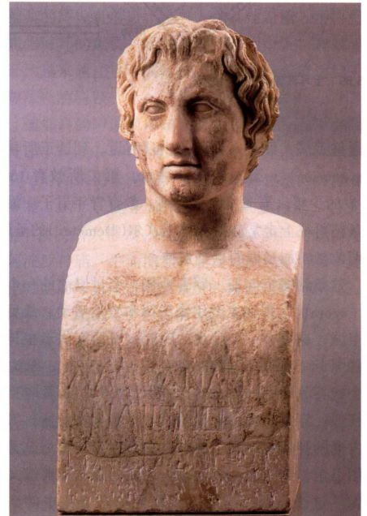

图5\.70 利西波斯创作：《亚历山大大帝肖像》，又称“阿扎拉胸像”。大理石，高68厘米。公元前4世纪晚期希腊原作的罗马复制品。巴黎卢浮宫

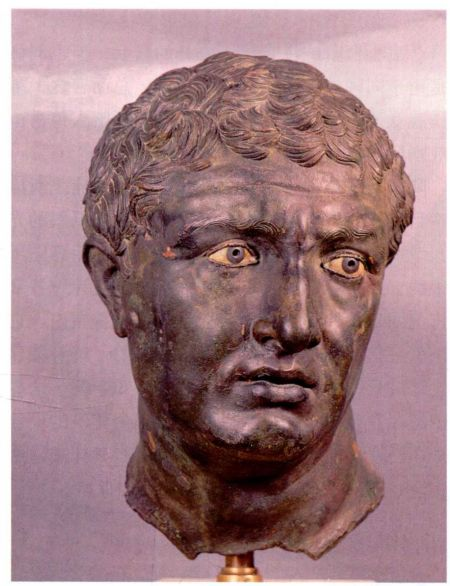

图5\.71《头像》，出自得罗斯岛。约公元前80年。青铜，高32\.4厘米。雅典国家考古博物馆。希腊文化部考古收入基金会。14612

肖像 这一时期最早的雕塑发展之一是对肖像的兴趣。假如说古风时期雕像表现了任何个体的话，那也是以通用人物库罗斯和考丽的形象出现的。个人的形似在古典时期的艺术中也无迹可寻，那时追求的是永恒的完美。例如，作于约公元前425年的一尊著名的伯里克利雕像，其复制品与帕特农神庙檐壁上的理想化年轻人几乎完全相同，区别仅仅在于伯里克利蓄有胡须，戴着头盔。后来在公元前4世纪中期，肖像成为希腊雕塑中的主要分支，在希腊化时期继续盛行。这一转变的推动因素之一是亚历山大大帝。因为深知一致的视觉形象具有巨大力量，他只聘请利西波斯为他雕刻肖像，而不允许其他雕塑家这么做。保留了利西波斯手法的原作没有存世，但学者认为“阿扎拉胸像”（Azara herm）相对忠实于原作（图5\.70）。当然脸部有理想化的特质：面部尤其是双眉附近表面平滑。但不羁的头发表现出了个人特点，前额头发蓬乱翘起（anastole），正是亚历山大大帝所特有的；个人特点也体现在颈上头部的扭转中，它们使肖像脱离了永恒的世界，具有行动的活力。不仅如此，这位统帅并没有直视观者，而是带着深邃而狂热的眼光。这些特征将成为亚历山大大帝的标志，希腊化时期与罗马时期的将军们也将把它们用在自己的肖像中。伴随着这一尊亚历山大肖像，个性开始进入雕塑，而肖像

150 詹森艺术史

世（Attalos I）击败高卢人（Gauls）。以神话中的冲

突隐喻敌人的古典传统不见了（见图5\.44和5\.45），

相反，雕塑家要点出敌人是高卢人，细致地刻画了他

浓密的头发和胡须，以及颈部编结的金属项圈。雕塑

家也不再试图显示被征服者的低贱卑劣。高卢人高贵

地死去，他静静地倒向大地，或是挣扎着要支撑住自

己，血从胸膛上的一个伤口涌出。他体魄强健，孔武

有力。他独自面对着自己的痛苦，完全意识不到观者

的存在。而观者则被这一时刻的隐秘孤独吸引着走进

雕像，而金字塔形布局和各个角度都存在的透视缩短

则吸引他绕着雕像观赏。《垂死的号手》很可能属于

一个组像，但古典战斗场景中常见的胜利者在此却消

失了。这尊纪念雕像是借褒扬战败的敌人来称颂征服

者的英勇：敌人越伟大，胜利越辉煌。罗马作家普林

尼记载了一尊埃皮哥努斯（Epigonos）的著名雕像，

塑造的是一个号手，可能就是这件罗马复制品所反映

的原作。倘若如此，埃皮哥努斯在希腊化时期一定是

运用激情和戏剧风格的领军人物。

戏剧风格的胜利纪念碑 帕加马大宙斯祭坛上的

雕塑装饰是这种情感丰沛、富于戏剧张力的风格最高

发现了两个雕像基座，其中一个基座上的雕像可能就 水平的典范（图5\.73和5\.74）。这个纪念性建筑由

是《垂死的号手》，纪念约公元前233年阿塔罗斯一 阿塔罗斯一世的儿子兼继承人尤米尼兹二世于约公元

作为一个艺术种类也开始发展。

与大多数希腊雕塑一样，希腊化时期的肖像原作罕有存世。其中之一是在得罗斯岛（Delos）找到的一个栩栩如生的青铜头像，约制作于公元前1世纪早期（图5\.71）。与罗马人不一样，希腊人不是将个人的个性抽离至胸像中，而认为它应当赋予全身以生气。因而这个头像就只是一尊全身雕像的一部分。男子的身份不明，他可能是一个商人，因为得罗斯岛是一个繁忙的商业港口，有许多商人在那里变成巨富。这个肖像融合了亚历山大般的英雄特征（例如头部奇异的扭转，满头乱发）和不光滑的表面。略显柔弱的五官造型流畅，嘴唇忧郁迟疑，双眉紧锁，似乎表示他是一个性格内向的人，不过与埃及肖像的情形一样，我们不宜在解读另一种文化的作品时给它加上心理特征的意义。

希腊化时期的雕塑家似乎与建筑家一样想要使观众参与到作品的体验中来，并且偏爱以饱满的激情表现具有戏剧张力的题材。《垂死的号手》（The dyingtrumpeter）就是一个早期的范例（图5\.72）。这尊雕像只有罗马复制品存世。帕加马卫城的雅典娜圣所中

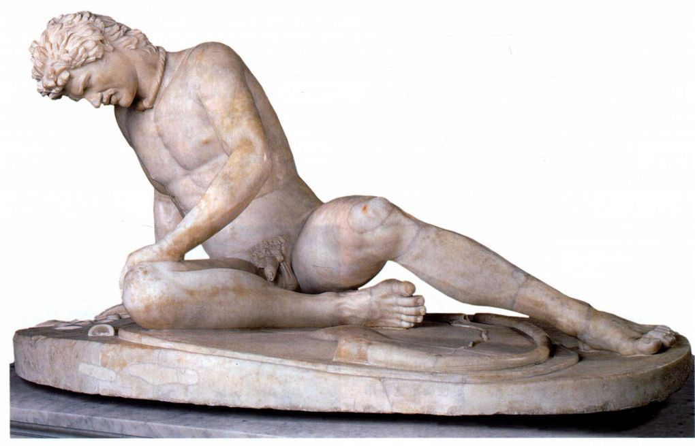

图5\.72 帕加马的埃皮哥努斯（？）：《垂死的号手》。也许是罗马复制品，青铜原作制于约公元前230\-前220年，出自土耳其帕加马。大理石，真人大小。罗马加比多里诺博物馆（Museo Capitolino）

第五章 希腊艺术 151

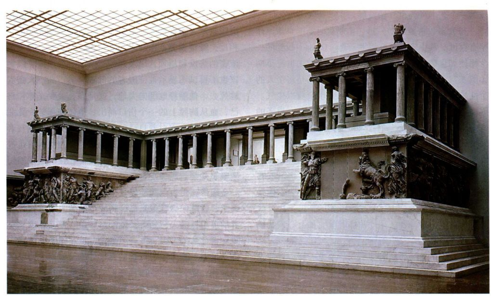

图5\.73 帕加马宙斯大祭坛的西立面（复原后），柏林国家博物馆，普鲁士文化遗产，古代艺术品陈列馆

前180年兴建，纪念胜利夺取篷托斯（Pontos）和比提尼亚（Bithynia）以及确立一个盛大的胜利庆典尼刻弗里亚（Nikephoria）。祭坛建于高台上，外围巨大，呈长方形，由爱奥尼亚式柱廊围成，可以从正面宽阔的台阶拾级而上。祭坛及其外围统称为大祭坛，原本屹立于帕加马卫城的一个台地上。1878至1886年间，一支德国考古队发掘到了这个纪念性建筑，它的整个西立面，包括通往入口的壮观台阶都在柏林被复原（图5\.73）。这种巨大的外围结构属于爱奥尼亚式大型祭坛的悠久传统，但帕加马的这一座在存世的祭坛当中最为精美复杂。它最突出的特征是环绕底座的饰带浮雕，长达120米，高逾2米，题材是诸神与巨人族之战，是建筑雕塑的常用主题。同以往的雕塑一样，这里也是以隐喻的手法象征尤米尼兹的胜利。然而此处的处理方式如此激烈，极具戏剧张力，却是前所未见的。构图中约排布了84个人像，还有许多动物散布其间。这绝不是普通的壮举：雕塑家在创作中肯定参考了当时学者的研究（例如马洛斯［Mallos］的克拉底［Krates］，一位著名的斯多噶派［Stoic］理论家和文学批评家），他们在帕加马的图书馆中研究资料，以便确定这场伟

图5\.74《雅典娜和阿尔库俄纽斯》（Athenaand Alkyoneus），出自帕加马的宙斯大祭坛大檐壁的东面，约公元前166\-前165年。大理石，高2\.29米。柏林国家博物馆，普鲁士文化遗产，古代艺术品陈列馆

大战斗中的各个主人公。他们可能还协助创造了一种含义丰富的均衡构图，因为这件作品看起来是一片混战，底下却潜藏着清晰的主导原则。学者们依旧在为完全理解这些原则而努力，虽然檐壁上方的檐部嵌线表面铭刻了几位神祇的名字，巨人的名字出现在底层的嵌线上。在东面的檐壁上，面朝圣所宏伟入口和朝阳的是奥林匹亚诸神，其中占据最显要位置的是帕加马的守护女神雅典娜。沐浴在阳光中的南面檐壁刻画着神圣的光明诸神如赫利俄斯，而阴影笼罩的北面是司掌黑夜的神祇。大地和海洋诸神在西面。构图上的平行对应使四面统一为一个整体。这个檐壁直接证明

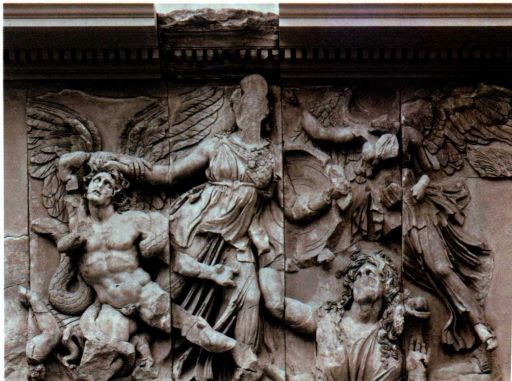

152 詹森艺术史

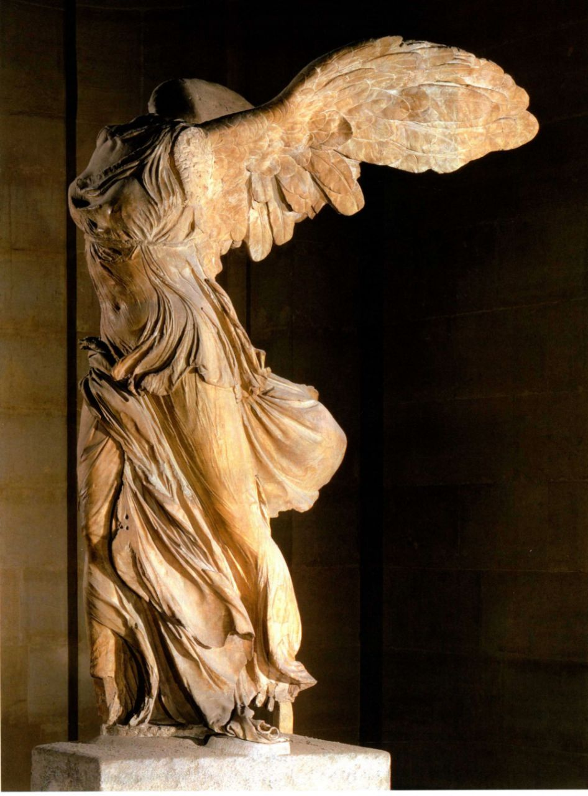

图5\.75 罗得岛的派托克里托斯（？）：《萨莫色雷斯岛的胜利女神像》，约公元前190年。大理石，高2\.44米。巴黎卢浮宫

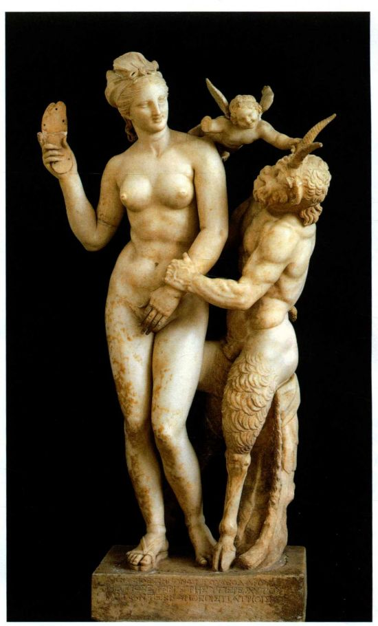

图5\.76《阿佛洛狄忒、潘神与厄洛斯》（Aphrodite，Pan and Eros）。大理石，

约公元前100年。高1\.32米。雅典国家考古博物馆

了希腊化时期学者传统的影响。

另一方面，檐壁也浸透了希腊化时期的戏剧风格。雕像刀笔极深，许多地方底部刻去极多，几乎成了圆雕。在台阶上看，他们似乎要脱身而出，冲到台阶上，与拾级而上的观者同行。高浮雕形成了生动的明暗对比。壮健结实的身体互相冲撞着，重叠纠缠在一起（图5\.74）。巨人的四肢如同蛇一般缠绕扭曲，与一绺绺粗绳般的卷发相呼应。翅膀扇动，衣服在风中猛烈鼓动，或者缠绕在它们所遮蔽的身体上，不是为了显出身体的结构，而是为了制造动感。翅膀和衣服仿佛有自己的生命力，它们的质感与巨人的光滑肌理构成了对比。巨人战败，痛苦地挣扎着，双眉因剧痛而皱紧，眼睛深陷，其夸张风格使人联想到斯科帕斯。一种扭动翻腾的动势贯穿整个雕塑，将所有人物统一于单一

连贯的节奏中。这种节奏与诸神古典式的安详表情构成了一种统一感，这种统一感驾驭了斗争的狂暴，使其不致冲破整座建筑的框架，但也险些驾驭不住。在表现这一争斗的悠久传统中，观者首次切身感受到这场战争是多么可怕的宇宙危机。

这场诸神与巨人族之战（gigantomachy）厚重实在，因而成为建筑入口平台处檐壁主题的不二之选。另一处檐壁环绕着柱廊内部，题材较为轻松，可能动工稍晚。檐壁刻画了赫剌克勒斯之子忒勒福斯的生平，他是传说中帕加马地区的米西亚（Mysia）的奠基者。

公元前2世纪初另一件纪念胜利的艺术品也集合了充满戏剧张力的风格和陈列位置，它就是《萨莫色雷斯岛的胜利女神像》（Nike［Victory］of Samothrace， 图5\.75）。雕像所纪念的很可能是尤达摩斯（Eudamos）

154 詹森艺术史

在海战中的辉煌战绩，他是罗得岛海军统帅，于公元前190年率舰队大败安条克大帝（Antiochos the Great）和他的塞琉古国大军。雕塑基座以罗得岛大理石制成，各种铭文也表明雕塑来自罗得岛，而且可能是这座岛上著名艺术家派托克里托斯（Pythokritos）的作品。胜利女神可能刚刚降落到一只船头上，仿佛要给尤达摩斯戴上胜利的桂冠。她也可能正要飞起。巨大的翅膀在她身后张开，将大理石的强度利用到了极致。上扬的翅膀使整座雕像显得轻盈，尽管它是由大块石料雕成。雕像采用了一种新的对立平衡，两条腿都没有承受身体的全部重量。是翅膀和衣褶赋予雕像以如此的动感。衣褶在女神的身体周围翻卷，显露出身体结构，强调了身体的优美曲线。但它也有自己的功能：衣褶翻卷，表明她迎风而立，风向又平衡了女神落地时向前的冲力。可以说，衣褶创造了人物所处的环境。

在原址发现纪念艺术品的情况非常罕见，这座雕塑就是一个特例。1863年，她在萨莫色雷斯岛的诸神圣所（Sanctuary of the Great Gods）被发现。石头雕成的船首高高屹立于平台上，俯瞰剧场和大海，平台在一个水池中，池水映照着尼刻的白色大理石的身姿。

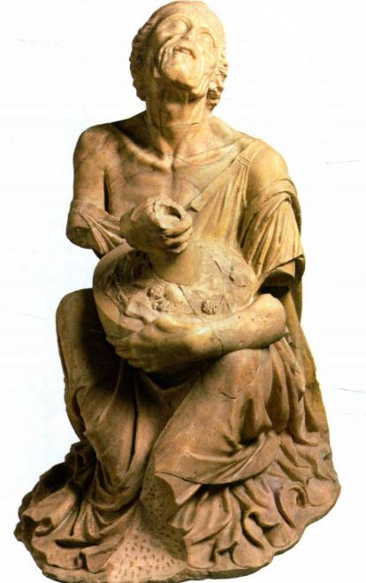

图5\.77 《醉酒的老妇》（Drunken Old Woman），罗马复制品，原作作于公元前3世纪或前2世纪晚期。大理石，高0\.92米。慕尼黑雕塑美术馆

大事年表

公元前336\-前323年\-亚历山大大帝统治

约公元前300年\-迪迪马的阿波罗神庙动工

公元前264\-前241年\-第一次布匿战争

公元前86年\-雅典沦陷

公元前30年\-埃及被罗马征服

水池下方还有另一个布满石块的盛水池，象征海岸。

雕塑中的风情 大宙斯祭坛和《萨莫色雷斯岛的胜利女神像》情感强烈，姿态夸张，选址富于戏剧效果，学者用“巴洛克”（baroque）来概述这些特征。它最初用于描述17世纪的艺术，研究希腊化时期艺术的学者看到了两者的相似性，因此借用了这个术语。希腊化时期的巴洛克风格极具戏剧张力，使同时代的许多其他雕塑趋势相形失色。其中一种趋势是喜好轻松且有时略带色情的作品。它们似乎是要一反巴洛克风格的凝重，有时带有一种模拟戏仿的意味，表明雕塑家希望弱化古典和巴洛克风格的宏大主题，使之带上诙谐幽默的色彩。虽然并非恰如其分，这类作品有时也可以用术语“洛可可”（rococo）来描述，同样是借用自后来的欧洲艺术研究领域。它们有些表现的是神或半神与人类之间的风流韵事。图示中的例子创作于约公元前100年，阿佛洛狄忒正要用一只拖鞋挡开好色的潘神（Pan），这位森林之神上半身是人下半身是山羊（图5\.76）。厄洛斯调皮地飞翔在他们中间。女神体态圆润优美，手势含羞带怯，显然使人联想起尼多斯岛上那尊普拉克西特勒斯的名作，《尼多斯的阿佛洛狄忒》（见图5\.60）。普拉克西特勒斯作品中的暧昧挑逗在这里得到了毫不迟疑的回应，而且回应者还是这样一个滑稽又讨厌的对象。崇高的阿佛洛狄忒没有拽紧衣袍维护威严，却是自贬身份，随随便便拿只拖鞋来自卫。

希腊化时期的写实主义 学者有时将这些轻松俏皮的雕像与表现非理想化现实生活的一系列作品归为一类，这种类型被称为希腊化时期的写实主义，一个醉酒的老妇人雕像就是其中的范例（图5\.77）。我们也是通过罗马复制品才了解了这件作品，原作有时被认为是底比斯的米隆所作，他可能曾在帕加马工作过。这样的证据还不够充分，而雕塑中的形象可能与亚历山大港的文化背景更相配，写实主义在那里似乎非常流行。老妇蹲在地上，攥着一个酒瓶，头高高仰起。她皱纹满面，裸露的肩膀和胸口的皮肤也因为衰老而松弛下垂。衣服在身体周围垂下，形成了一个实体的金字塔形，老妇仿佛是从金字塔中冒出来。她穿一件

第五章 希腊艺术 155

艺术史家的观点

温克尔曼和《观景楼的阿波罗》

尽管当代艺术史家百般努力，今日许多艺术评价还是深受根植于希腊古典主义对美的观念的影响。这种偏见由来已久，但它持久的威力也是来自一位划时代的德国文物研究者约翰·约阿希姆·温克尔曼（Johann JoachimWinckelmann），他常被称为艺术史之父。温克尔曼于1717年出生于普鲁士（Prussia）的施滕达尔（Stendal），他先在哈勒（Halle）和耶拿（Jena）学习，后来成为德累斯顿（Dresden）附近海因里希·冯·比瑙伯爵（Count Heinrich von Bünau）的图书管理员。他正是在伯爵的图书馆中获得了视觉艺术的教育，这促使他于1755年发表了第一篇论著《关于绘画和雕塑对希腊艺术之模仿的思考》（Reflections on the Imitation ofGreek Works of Art in Painting and Sculpture）。同年，他移居罗马，很快被任命为枢机主教亚历山德罗·阿尔巴尼（AlessandroAlbani）的图书管理员和顾问。1764年，发表了影响深远的《古代艺术史》（History of Art of Antiquity）之后，他成为罗马的教皇文物研究员和文物主管。《未发表的古代文物》（Unpublished Antiquities）于1767发表，是他死前最后的作品，一年后他被一个轻罪犯杀死，未得善终。

他的作品影响巨大。例如他第一个断言大多数希腊雕塑（他经常把罗马复制品误认为原作）表现的不是历史人物而是神话人物。更具重大意义的是，他指出希腊艺术达到的是一种超越自然的理想美。他建立了一种艺术发展的模型，这个模型将艺术史分为与政治事件相应的几个时期。原初风格（Older Style）产生在盛期风格（High Style）之前。然后是精美风格（Beautiful Style），最后是模仿者风格（Style of theImitators）。在古代艺术中，这些风格对应于古风时期、公元前5世纪的古典时期、晚期古典时期，以及希腊化和罗马时期。由上升而至最后衰落的这一过程至今仍是大多数艺术史研究的核心，而不论研究的是哪个时代。在将艺术品按时期归类时，温克尔曼可谓是掉入了自己的陷阱。因为不愿意将自己欣赏的作品分配到希腊化和罗马艺术这一“衰落”期，他经常把雕塑的年代推前，例如《拉奥孔》（Laocoōn）被定为公元前4世纪，而坚持《观景楼的阿波罗》（The ApolloBelvedere）是希腊原作。

《观景楼的阿波罗》于公元15世纪首次被发现，很快便成为教皇尤利乌斯二世的收藏品。雕像中的神以开放姿势站立，左臂向外伸出，可能持着一张弓。温克尔曼只是许多被这尊雕像深深打动的文物鉴赏家中的一个。在它的形式中，他感受到力量与魅力的结合，于是他写下了一段热情洋溢的描述，其中隐约透露着暧昧之意。他写道：“见到这一艺术的奇迹，我忘记了一切。我的心胸似乎在扩张，充满了敬意。”

带搭扣的束腰外袍，这表明是富有阶层的成员。其他这类雕像着力表现困苦生活对穷人的摧残，例如年老的牧羊妇人，但在这尊雕像中，艺术家努力表现的却

今天很少有学者对这件作品怀有像他一样的激情。对艺术史家而言，它的重要性不是在古代文明中的地位，更多是在其近代的接受情况，例如它对满怀倾慕的文艺复兴艺术家的影响。至于作品年代，许多学者现在认为它制于公元2世纪，是对希腊原作的复制或演绎，原型或被推定为活跃于公元前4世纪末的莱奥卡雷斯（Leochares）的作品。

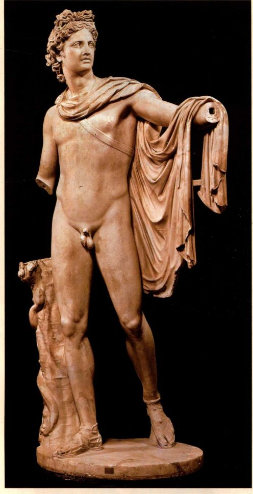

《观景楼的阿波罗》。罗马大理石复制品，可能是根据公元前4世纪晚期的一件希腊原作制成。高2\.3米。罗马梵蒂冈博物馆

是醉态与衰老。缺乏对这个形象所处文化环境的进一步了解，我们难以知晓雕塑家是意图表达对人物的同情，赞美她的高贵，还是要痛斥社会。

156 詹森艺术史

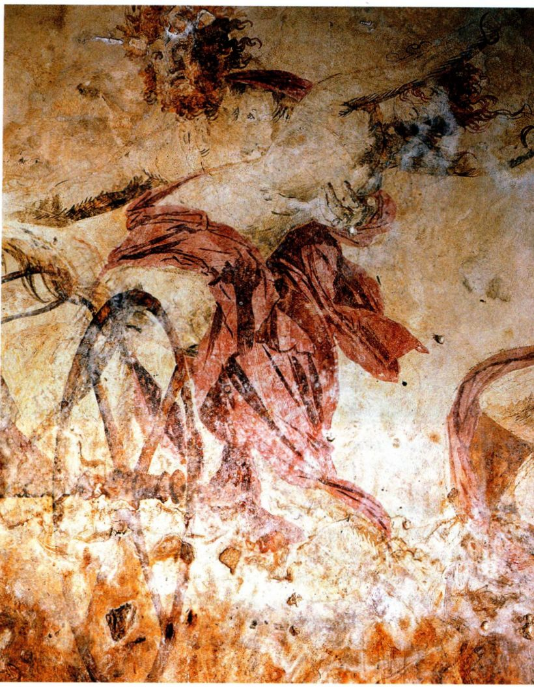

图5\.78《珀尔塞福涅被劫》（The Abduction of Persephone），一号墓壁画局部，马其顿维尔吉纳。约公元前340一前330年

希腊化时期的绘画

希腊壁画直到公元前4世纪才进入繁盛期。普林尼列举了许多主要艺术家，但是按照他的记述，现存的绘画中没有一幅能断定是他们所作（见第230页的原始文献）。虽说如此，绘画仍然被保存在马其顿的墓葬中，其中一些已经出土，在希腊北部（马其顿地区）还不断有新发现。它们使人得以窥见画家所达到的艺术高度。1976年新发现的这些墓葬十分重要，因为其中有现存唯一一批保存相对完好的希腊壁画。图示部分描绘的是劫持珀尔塞福涅（图5\.78），出自维尔吉

纳（Vergina）的一个小型墓葬，绘于约公元前330年。壁画主题切合墓葬这一背景：地主宰普鲁托劫持了珀尔塞福涅当他的王后。出面，珀尔塞福涅获准每年重返人间六个月选取的瞬间是普鲁托将珀尔塞福涅抓到他飞中，女神的侍女跟在后面，惊恐万状。这是冲突的时刻，当时珀尔塞福涅还不知道宙斯个折中的办法，她无谓的挣扎似乎是唯一逃界的方法。画面捕捉到了这个传说中的全部珀尔塞福涅的身体后仰，而战车和她的劫持

第五章

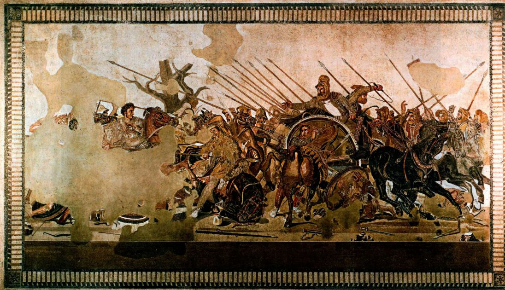

图5\.79《伊苏斯之战》（The Battle of Issos）或《亚历山大与波斯之战》（Battle of Alexander and the Persians）。约公元前100年。镶嵌画复制品，

来自庞贝城，希腊化风格原作绘于约公元前315年。		米。那不勒斯国家考古博物馆

分的人物当中就有亚历山大。它有可能是公元前4世

纪晚期一幅希腊化时期绘画的忠实复制品。镶嵌画采

用当时使用广泛的四色组合（黄红黑白，见第230页

的原始文献）。拥挤的人群，躁动的气氛，结实有力

而经过透视的形象，以及精确的阴影都使人将整个画

面归入公元前4世纪的作品，类似的因素还有对风景

的简约处理，例如画面中线的左侧只有一棵枯树。

小结

经	过一波波移民、侵略和殖民浪潮之后，希腊文

明于约公元前8世纪产生。共同的语言和信仰

将不同族群的希腊人统一在一起，他们的聚居中心是

希腊大陆、爱琴海群岛和克里特岛，但在公元前6世

纪中期扩展到了意大利南部、非洲北部和小亚细亚沿

海地区。作为分析性思考已知最早的实践者，古希腊

人不断探求哲学问题，这些问题一直延续至今。世界

的二元性，以及人在世界中的位置，成为所有希腊艺

术的持久主题。因为西方社会深受希腊启迪，这些艺

术品可能显得十分熟悉。但我们切不可将自己的阐释

贝城（Pompeii）宅邸中（图5\.79）。画面右侧描绘

的是大流士和溃败的波斯人，左侧毁损严重，这一部 强加于作品之上，因为它们对希腊人来说经常有着完

飞奔，肢体的交错象征了人物之间的冲突。战车朝着观者冲过来，车轮的透视效果强烈。挥洒自如的笔触使画面跌宕起伏。艺术家以迅疾流畅的线条表现飞扬的头发和长袍，并使衣服显得轻盈柔软。影线表现身体的肌肉，在手臂和肩膀处都可见到。壁画以薄涂着色，色彩鲜亮，并利用明暗处理来制造质感。文献中称明暗处理（shading，即通过光线和阴影的对比调整物体体积）为“skiagraphia”，将它的发现归功于一个名为阿波罗多洛斯	（Apollodorus）的画家，他可能早在公元前5世纪就在使用这种技法。他们还认为空间透视是源自阿加萨科斯	（Agatharchos）以及雅典戏剧全盛时期中的舞台布景艺术。公元前4世纪，这两种手法的探索和完善证明了这一时期对“幻觉主义”的热衷。

罗马复制品和仿制品使人大概了解到希腊壁画可

能的面貌。根据普林尼的记载，公元前4世纪末，埃

瑞特里亚（Eretria）的画家菲罗克西诺斯（Philoxenos）

曾画过亚历山大大帝在伊苏斯（Issos）大败大流士三

世的场景。这个题材出现在一幅技艺精湛的巨型地面

镶嵌画中，画作发现于约公元前100年建造的一座庞

158 詹森艺术史

全不同的意义。我们必须凭据考古和文献记载，将希腊艺术品置于恰当的背景中来理解它们的真实含义。

在长达七个多世纪的时间内，希腊内部及其与相邻民族之间的战争持续塑造着希腊的文明与艺术。贸易和旅行普遍，交通网络遍布整个小亚细亚和地中海地区。顺畅的交流带来了异域影响，为希腊艺术家所欣赏和吸收，同时希腊文明本身又对遥远国度的文明产生了影响。

几何化时期

约公元前8世纪，希腊人开始发展出一系列陶器形式，它们的彩绘装饰显示了已知最古老的希腊风格：几何化风格。制于约公元前750年狄庇隆陶瓶覆盖着独特的回形纹饰和几何化图案，动物和人物形象又给这个墓葬用双耳瓶增添了叙事性。雕塑家们也以陶土和青铜塑造了外形相似的小雕像。许多画瓶上都有铭文，这也正是荷马创作史诗和希腊引进字母的时代。

东方化风格

公元前725\-前650年间，新生的希腊城邦日渐繁荣，市民们希求来自小亚细亚、东方和埃及的贸易伙伴带来的奢侈品。希腊艺术家迅速吸收了东方的影响，不断实验新的技法，并发展出了一种东方化风格。港口城市科林斯主导着陶器生产，瓶画师们开发出一种黑色的光滑釉层，在釉层上画出剪影式图像的轮廓，再刻出细节。塞壬、狮身鹰首兽和其他东方神话母题无论在小型或大型陶器上都随处可见。

古风艺术

在希腊强盛且越来越个性鲜明的诸多城邦之中，雅典逐渐崭露头角，民主的产生便始于这一时期。在那个创造力勃发的时代，出现了树立纪念性石雕和修建神庙建筑的伟大传统。受埃及范例的启发，雕塑家和建筑师们实验性地运用比例系统，并用比真人还大的雕像装饰建筑。佩斯图姆的两座赫拉神庙和以弗所的阿耳忒弥斯神庙显示了多立克和爱奥尼亚风格的演变，以及一种相对标准的神庙布局的发展，布局包括中央内殿和门廊。大规模使用雕塑为建筑增添了生机，尤其是阿耳忒弥斯神庙和后来的阿维亚神庙，它们的三角楣揭示了艺术家试图寻求合适的解决方法，使生动的叙事场面能够置入三角形空间。与此同时，越来越自然并向自立式发展的雕像，如库罗斯和考丽，见证着希腊人专注于表现具备完美形体的理想人物。瓶画领域也有重要进展，包括黑绘技法和红绘技法的发展。

古典时期

雅典在公元前5世纪面临重重危机，当时它受到波斯人

入侵的毁灭性威胁。然而一旦脱离战争的破坏，这座城市就重建为一个政治和经济帝国。雄心勃勃的政治家伯里克利极大地影响了雅典的社会和政治，雅典文艺很快便百花齐放，从埃斯库罗斯的感人悲剧，柏拉图的深奥哲学到伊克提诺斯和卡利克拉特的精妙建筑。雕塑家在自然表现人体方面大有进步，《克里提奥斯的少年》的对立平衡姿势标志着希腊艺术的一个关键时期，雕塑家还挑战用石头和青铜来表现写实动作。在奥林匹亚的宙斯神庙和雅典卫城的雕饰工程中，艺术家继续探索复杂叙事和二元对立的主题。

在伯里克利的治理下，雅典从战争的废墟中崛起，成为地中海地区的璀璨明珠。帕特农神庙的辉煌反映出这座城市当时的荣光。在卫城神圣位置上的帕特农神庙以其精妙的比例、非凡的雕塑和怡人的和谐成为希腊古典艺术巅峰的代表之作。卫城的其他纪念性建筑也投入了建造，包括卫城山门、雅典娜\-尼刻神庙和厄瑞克透斯神庙，尽管这样大型的建筑项目随着伯罗奔尼撒战争爆发而衰退。

古典时期晚期

公元前431\-前404年的伯罗奔尼撒战争终结了雅典的霸主地位。随后是希腊城邦之间长达一个世纪的相互争斗，直到最后马其顿国王腓力二世于公元前338年前后入侵希腊。这段时期的特点是已有建筑类型的细化，例如会议厅、剧场和陵墓。由爱奥尼亚式立柱发展形成了科林斯柱头。这个时代犹疑而有些悲观的心态在雕塑中得到了最充分的反映。普拉克西特勒斯的作品使人感受到神祇像人类一样反复无常，而利西波斯的《刮汗污的运动员》以它经过透视的前伸手臂突入观者的空间。强烈的情感和逼真表现的空间也成为壁画和瓶画的特征，在白底技法绘成的墓葬用画瓶中尤其明显。

亚历山大时代和希腊化时期

公元前336年，腓力二世驾崩，亚历山大即位，他所开创的庞大王国扩张了希腊的影响。公元前323年，亚历山大逝世，他死后的明争暗斗产生了三个独立王国：托勒密王国、塞琉古王国和马其顿王国，各自拥有社会多元的大都市。随着城邦解体，希腊人的个人意识越来越强，艺术再一次反映了这种新的心态。

建筑物的规划，例如迪迪马的阿波罗神庙和帕加马城，通过出其不意的行进路线、壮观的全景和强烈的戏剧性提供了一种更为人性化的体验。希腊化时期的雕塑在古典晚期作品的基础上也偏爱强烈的戏剧张力和更多的观者介入。情感化题材和极具戏剧风格的写实主义盛行，肖像成长为一个新的艺术门类，在亚历山大大帝的推崇下繁荣兴盛。壁画表现出挥洒自如的笔触、精心处理的明暗对比，以及空间透视。

第五章 希腊艺术 159

