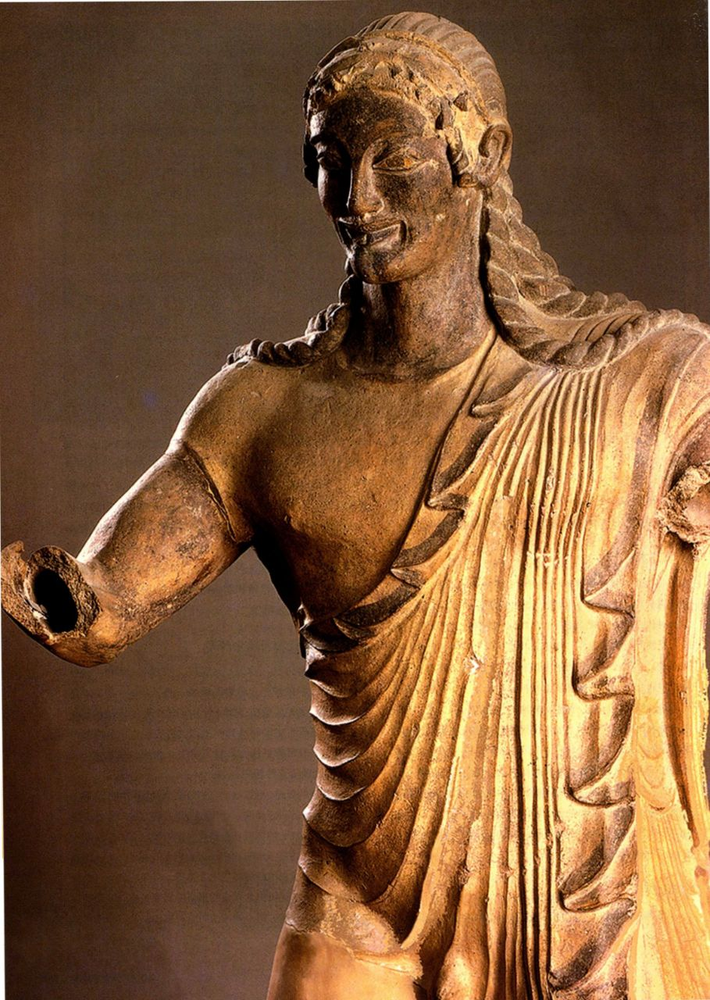

*图6.16 《阿波罗》细部*

# 第六章 伊特鲁里亚艺术

早期伊特鲁里亚文明被称为维拉诺瓦（Villanovan），于公元前10世纪出现在意大利半岛上。伊特鲁里亚人究竟是谁，这一直是个谜；就连在古代，作家也在为他们的出身而争论不休。古希腊史学家希罗多德认为，伊特鲁里亚人在约公元前1200年离开他们的原住地，此地位于小亚细亚的吕底亚（Lydia）。据他记述，他们定居在今天的托斯卡纳（Tuscany）、翁布里亚（Umbria）和拉齐奥（Lazio），大致就在现代佛罗伦萨（Florence）和罗马之间的地区（见地图6.1）。其他人则断言伊特鲁里亚人是一个原生的民族。无论他们来自何方，伊特鲁里亚人与小亚细亚和古代近东都有紧密的文化联系。事实上，他们的视觉文化是一个丰富多彩的混合体，既有鲜明的伊特鲁里亚特色，又融合了来自东方和希腊的影响。伊特鲁里亚人是水手，也是商人，足迹遍布地中海，由于从公元前8世纪起，希腊城邦就已在意大利建立殖民地，这些文化之间就必然有交流往来。到公元前8世纪末，伊特鲁里亚人开始使用希腊字母，我们因此能够解读他们数千年前留下的铭文；但他们的语言与其他任何语言都没有关联，所以我们有时也无法完全理解铭文的含义。

*地图6.1 伊特鲁里亚时代的意大利*

公元前7世纪和前6世纪，伊特鲁里亚文化达到鼎盛，恰好也是希腊的古风时期。因为伊特鲁里亚与希腊的艺术形式之间存在紧密关系，学者使用与希腊艺术术语类似的术语来定义伊特鲁里亚艺术的风格时期（见下表）。他们的城市可与希腊城邦相匹敌；他们的舰队称霸地中海西部，保卫着一个与希腊人和腓尼基人竞争的庞大贸易网络；他们的领土北起波河（Po）下游河谷，向南延伸至那不勒斯（Naples）。但与希腊人一样，伊特鲁里亚也从未建立过一个统一的国家。他们始终是由各个独立城邦形成的松散联盟，通过共同的语言和宗教联结在一起，但相互之间容易发生冲突，而且无法迅速联合起来一致对抗外敌。这也许是他们逐渐衰落的一个原因。公元前474年，伊特鲁里亚舰队被主要对手叙拉古王国（Syracuse）的海军击败。随后在公元前5世纪和前4世纪，伊特鲁里亚城市相继被罗马攻陷。到了公元前270年，所有伊特鲁里亚城邦都沦为罗马属地，但许多城邦在这一政治纷争时期依旧繁荣，判断依据是其墓葬的壮观程度。

我们对伊特鲁里亚文化的了解大部分来自其艺术，尤其是众多装饰着雕塑和绘画的大型墓葬。从这些丧葬建筑出土的物品证实，伊特鲁里亚人确实善雕刻，长于金属工艺。在这些墓葬中还发现了大量阿提卡彩绘陶器，既帮助我们深入了解希腊艺术史，还证明了伊特鲁里亚与希腊之间存在紧密的贸易联系。坟墓本身为我们提供了关于伊特鲁里亚建筑实践的情况，而且墓画中常有反映伊特鲁里亚生活的画面。罗马人借鉴了所有这些艺术形式，对其加以改造，纳为己用。

> **伊特鲁里亚艺术分期**
>
> *   约公元前700-前600年 - 东方化时期
> *   约公元前600-前480年 - 古风时期
> *   约公元前480-前300年 - 古典时期
> *   约公元前300年 - 伊特鲁里亚文化逐渐融入罗马文化

## 墓葬艺术

与史前欧洲其他地方的墓葬一样，意大利铁器时代的墓葬也是朴实无华的。死者或葬在不深的墓穴里，或火化后骨灰盛入陶器或骨灰瓮，再放入一个简单挖成的墓坑。一些死者有陪葬品：男性是兵器，女性则是首饰和纺织工具。公元前7世纪初，伊特鲁里亚人开始将同一家族的死者安葬在一起，男性和女性的葬俗都变得更为复杂，而且富人的坟墓逐渐演变成巨大的墓葬建筑。

### 坟墓及其内容物

塞维特里（Cerveteri）的雷格利尼-加拉西墓（Regolini-Galassi Tomb）以其发掘者——一位业余考古学家的名字命名，它是丧葬习俗复杂化之后的早期范例，年代为公元前7世纪中叶被称为东方化的时期，当时的伊特鲁里亚艺术明显表现出东方母题的影响。伊特鲁里亚人在当地的火山石上开凿墓穴，或是堆筑名为坟冢（tumuli）的土墩。这些墓都集中分布在城镇的生活区之外，形成了亡灵之城（city of the dead），或大墓地。在雷格利尼-加拉西墓中，有一条长长的墓道（dromos，复数dromoi）或甬道通向墓中，墓道上方遮覆着用石块平行叠建的叠涩拱，就像梯林斯的暗堡一样（见图4.20）。

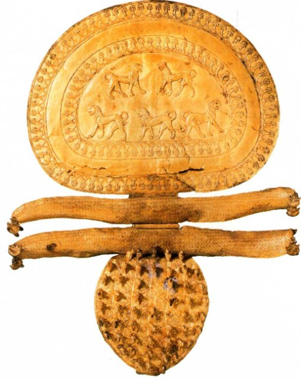

*图6.1 出土于塞维特里雷格利尼-加拉西墓的搭扣。约公元前670-前650年。黄金，长29厘米。罗马梵蒂冈博物馆，格里高利伊特鲁里亚分馆（Museo Gregoriano Etrusco）*

在出土的随葬品中有一枚华丽的搭扣（图6.1）。搭扣形似胸针或装饰性的安全别针，常用来扣住外衣的领口。这枚华贵的搭扣长29厘米，是黄金工艺（见本页的材料与技法）的杰作（tour de force），证明了伊特鲁里亚金匠在古代的盛名。下方叶片状部分覆盖着55只圆雕的鸭子。上部形状像四分之三个月亮，饰有踱步的雄狮图案，以压花工艺制作。这很可能是伊特鲁里亚的工艺，但其动物主题表明伊特鲁里亚人熟知近东文明的艺术品（见图2.11）。压花狮子的侧面姿势和挺直的站姿可能源自腓尼基的先例。同时期的墓葬中还发现了象牙等来自古代近东的贵重物品。

> **材料与技法：伊特鲁里亚黄金加工**
>
> 在其历史之初，伊特鲁里亚人就已成为天才的金属工匠，尤其精通黄金加工。制作图6.1中那枚搭扣的金匠掌握了两种复杂的技术：细丝工艺和颗粒工艺。
>
> **细丝工艺（filigree）**是将单根或多股捻成绳状的细金丝焊到金器上的技术。金匠运用此法在搭扣表面勾勒出装饰纹样，描绘出动物的二维图像。伊特鲁里亚艺术家技术高超，甚至不需要衬板也能制作透雕图案。
>
> **颗粒工艺（granulation）**指的是将微小的金球或金粒焊到金器上的过程。娴熟的伊特鲁里亚艺术家能用直径只有0.14毫米的金粒来点缀面积很大的区域，或者勾勒线形或几何形图案。他们间或将颗粒工艺与压花图案相结合，或焊上成片的颗粒，形成一个剪影式图案；他们也有可能将背景缀满颗粒，而图案的轮廓则留空。
>
> 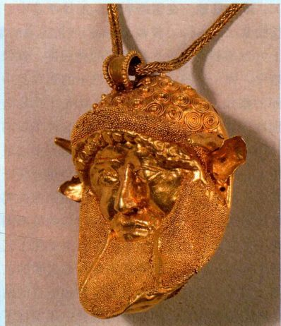
>
> *阿谢洛斯（Acheloos）头像挂饰，以颗粒工艺装饰。公元前6世纪。巴黎卢浮宫*
>
> 颗粒工艺在中世纪初的欧洲失传了，因为人们的趣味改变了，更倾向于别种黄金工艺。今天的学者尝试了各种方法，却仍然无法确知伊特鲁里亚金匠制备金粒的方法：也许他们把碎金块放入一口坩埚，用木炭隔开金块。加热以后，金块会熔化形成小球，被木炭分隔开，然后再将木炭拿掉。另一种可能是，他们把熔化的黄金从一定高度倒入水中，或倒入一个装满木炭的器皿。黄金遇水后冷却凝固；把它从高处倒下就能确保形成球形的微小颗粒。除最简单的图案是直接焊贴外，制作其他图案可能都是先将金粒按照刻在石板或金属板上的图案排列。接着，金匠将一张涂有黏合剂的纸莎草纸或皮革覆在图案上粘起颗粒，纸或皮革固定在一根管子末端。然后将金粒涂上焊料，转移到金衬板上。

到约公元前100年为止，塞维特里附近的大墓地在几个世纪里修建了众多“坟冢”或坟丘，雷格利尼-加拉西墓不过是其中之一（图6.2）。该地区的石头是一种名为凝灰岩（tufa）的火山岩，质地柔软，易于切割，长时间暴露于空气中便会变硬。建造坟冢的人会向岩床内挖掘，开出墓道和墓室。再用挖出来的石头环绕墓室砌起一道挡土墙，在墙上方堆起泥土。一个坟丘常常有好几条墓道，通往相互独立的墓室系统（图6.3）。墓室布局千变万化，学者倾向于认为这些冥宅再现了同时期房屋的概貌。这可能是真的，但关于伊特鲁里亚住宅的资料十分稀少，这种说法无法得到证实。无论如何，雕刻师常常用岩石雕出椅子或床来布置墓室。塞维特里的浮雕墓是晚期墓葬的例子，墓中有死者在来世可能需要的一切东西，以灰泥制成，贴覆在墙上（图6.4）。壁龛之间的墩柱（pier）和墙面覆满了兵器、盔甲、家庭用具和驯养的小动物的形象。有两尊已毁的胸像，可能代表死者或冥界神祇。虽然埋入来世可能有用的物品这一观念使人想起埃及的丧葬习俗，但实物的复制品与埃及墓葬中发现的物品有明显差异。

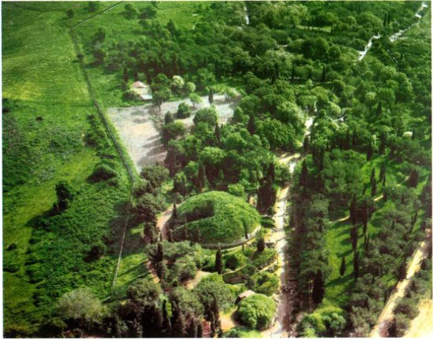

*图6.2 班迪塔其亚（Banditaccia）墓地局部空中俯瞰图。公元前7-前2世纪。意大利塞维特里*

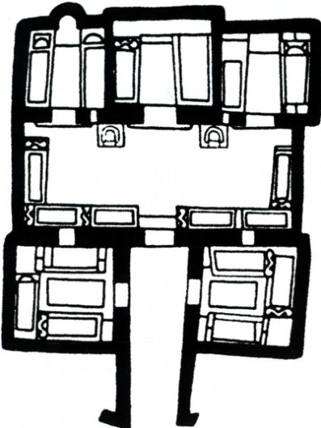

*图6.3 盾与椅之墓平面图。约公元前550一前500年。意大利塞维特里*

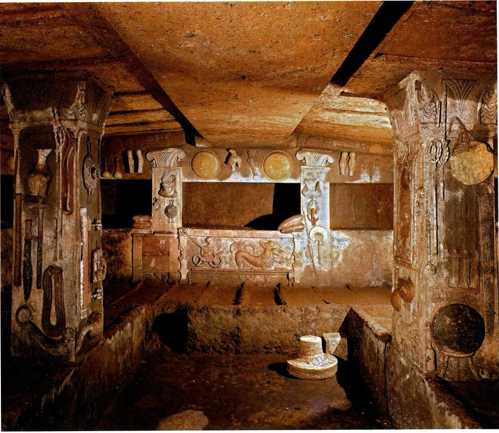

*图6.4 浮雕墓墓室。公元前3世纪。意大利塞维特里*

在塞维特里北面的塔尔奎尼亚（Tarquinia），一种非常独特的装饰使坟墓显得生机盎然。墓室都是向地下开挖的，一条陡直的墓道通向各个墓室，墙面覆盖着色彩鲜艳的绘画。这些画是趁灰泥正湿的时候画上去的，反映了死者生前喜爱的一些活动。图示中的壁画来自约公元前530-前520年古风时期的猎渔之墓（Tomb of Hunting and Fishing，图6.5）。墓室低矮，一端有一幅海洋全景图。在广袤浩瀚的水天之域，渔夫从船上抛出鱼线，色彩鲜亮的海豚破浪跃起。一个弹弓能手站在海角岩石上，将弹丸瞄准天空中疾翔而过的鲜红、鲜蓝和鲜黄色大鸟。希腊风景画都是人物凌驾于环境之上，而在这里，人物只是全局构图的一部分。色彩缤纷，姿势丰富，也是典型的伊特鲁里亚风格。但与大部分坟墓一样，这幅壁画中对衣服和人体的处理仍然反映出伊特鲁里亚墓画家深受成长中的希腊绘画影响。事实上，伊特鲁里亚坟墓出土了大量阿提卡彩绘陶瓶。

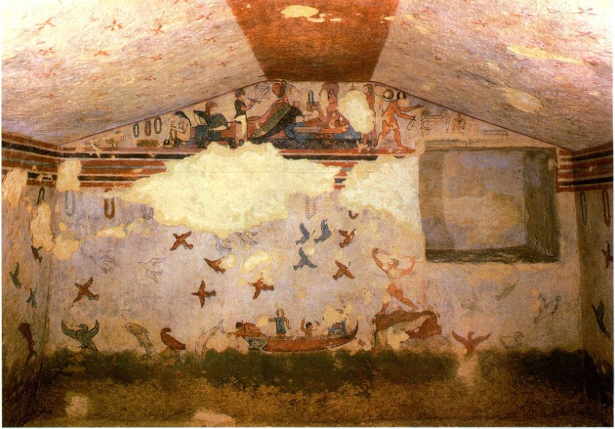

*图6.5 猎渔之墓。约公元前520年。意大利塔尔奎尼亚*

伊特鲁里亚艺术家的构想似乎是要描绘从一个帐篷或小屋看出去的景色，以檐口处的宽色带为界，顶部覆有浅色挂毯。檐口垂下的是节日花环，可能用于葬礼仪式。许多墓室的山墙绘满了动物——有时是豹子，或是形态奇异的混合生物——也许是当作驱邪的护卫者。海景上方的壁画是一个宴会，一男一女斜倚在一起，乐师演奏着乐器，仆人服侍着他们。一个仆人从调酒缸中汲酒，另一个则在编制花环。与只限男性和高级妓女参加的希腊酒会（宴饮）截然不同，伊特鲁里亚的宴会有体面的妇女参加，她们与男子倚靠在一起。宴会画经常出现在伊特鲁里亚坟墓中；体育活动是另一个常见题材，乐师和舞者画也很普遍，如图6.6中栩栩如生的作品，它来自约公元前470-前460年的躺椅墓（Tomb of Triclinium，图6.6）。

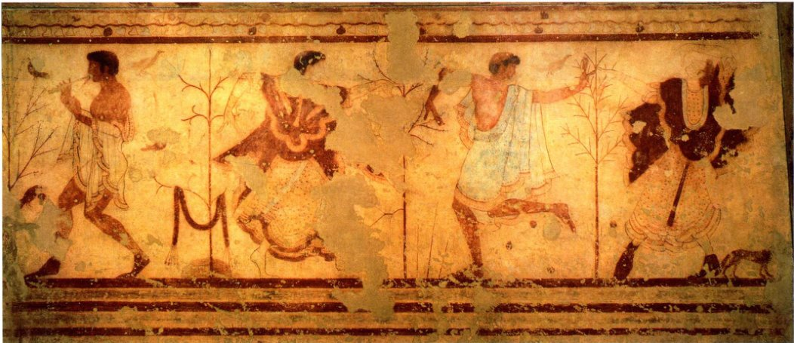

*图6.6 躺椅墓。约公元前470-前460年。意大利塔尔奎尼亚*

这些画更深层的意图就比较隐晦了。它们可能记录并永久保存了葬礼上举行的仪式（事实上，体育活动也许就是罗马角斗竞技的鼻祖）。或者，与埃及墓室绘画一样，它们也是为死者提供来世之需。解读墓画存在困难，其核心原因是我们一般不了解伊特鲁里亚人关于死亡和来世的信仰。罗马作家把他们描述成一个极其虔诚的民族，据说他们的祭司可以从天空不同区域的飞鸟姿态看出深意。这些墓画虽然神秘，却构成了我们理解伊特鲁里亚信仰的主要根据。有几个墓的绘画似乎表现了希腊神话，但从某种意义上说，它们只是使问题更加复杂了，因为我们无法确定伊特鲁里亚人想要表达的意义是否与希腊艺术家相同。

不管我们怎样解释这些古风和古典时期的图像，墓室绘画的内容显然在公元前4世纪的古典末期发生了明显变化，其例证是位于塔尔奎尼亚的奥库斯之墓（Tomb of Orcus），墓葬年代是公元前4世纪下半叶（图6.7）。这幅残损的画描绘了一位贵族妇女的头像，据铭文所述，她来自韦尔察（Velcha）家族。一片乌云映衬着她苍白的侧脸，先前墓画中的亮红和亮黄等鲜艳色调都被弃用，颜色较深的暗色系取而代之。在这个时期，丧葬绘画常常以幽暗的冥界为背景，或描绘护送死者前往冥界的队伍。一种莫大的伤感取代了古风和古典时期积极的基调。阴郁的主题可能反映了时世的艰难。在公元前4世纪下半叶，罗马攻占了伊特鲁里亚城市，强迫它们俯首称臣。这一时期的一些墓中出现了不祥的死亡恶魔，被涂成绿色或蓝色。

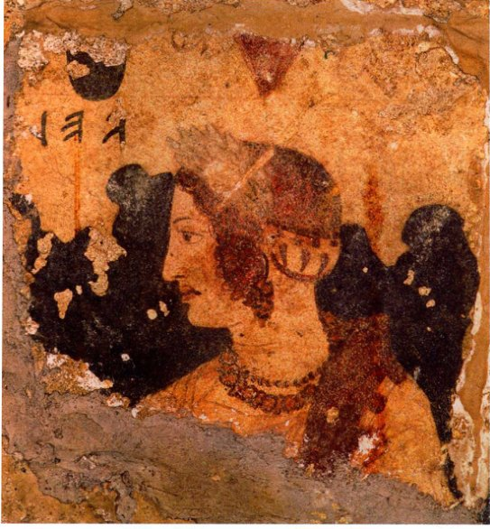

*图6.7 奥库斯之墓。公元前350一前300年。意大利塔尔奎尼亚*

用于装殓死者遗体的容器也发生了变化。在东方化时期，传统上用于盛装骨灰的陶瓮逐渐塑成人形（图6.8）。盖子变成人头外形，也许是想要表现死者，器身上也出现了人体标志。头发和珠宝可能都装在陶瓮表面的小孔中。有时陶瓮被安放在墓中类似王座的地方，或许表明死者有很高的地位。

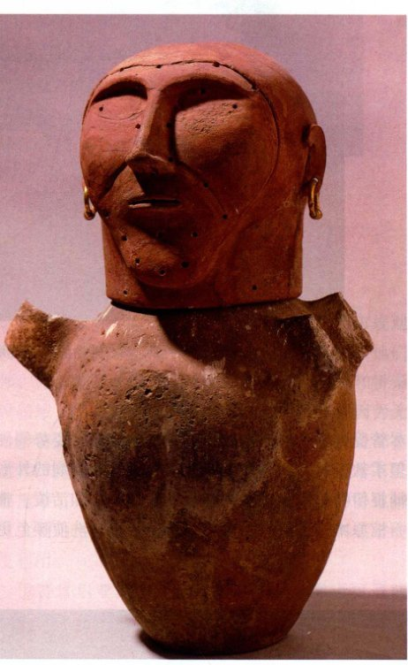

*图6.8 人首骨灰瓮。约公元前675-前650年。赤陶，高64.7厘米。意大利丘西伊特鲁里亚（Chiusi Etruscan）博物馆*

在塞维特里发现了两具古风时期的重要石棺，以赤陶制成，分为两半。其中一个年代约为公元前520年，如图6.9所示。棺盖形似卧榻，上面有一对男女的全身雕像，他们斜倚在一起，大概是一对夫妇。女人的左肘下垫的不是枕头，而是一只酒囊（一种由兽皮制成的软水壶），男人的胳膊搂着女人的肩膀。两人伸出的手原本都拿着东西——可能是杯子或细颈瓶（alabastron，一种香水容器），或是象征永生的鸡蛋。尽管受到了古风风格的限制，造型抽象，姿势僵硬，但柔软的材料使得雕刻家能够塑造丰满圆润的外形，捕捉伊特鲁里亚艺术中超乎寻常的率真和活泼。整个石棺原本涂有鲜艳的颜料，最近一次清洗使颜色更清晰地显现出来。

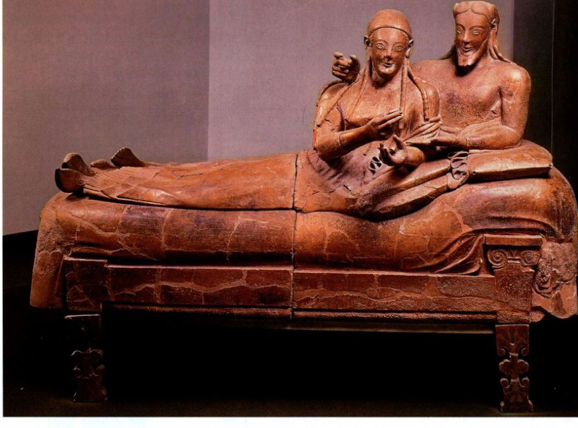

*图6.9 石棺，出土于塞维特里。约公元前520年。赤陶，长2米。罗马朱利亚别墅国家博物馆*

基调从乐观转为忧郁是公元前5世纪至前4世纪间墓室绘画的特点，这一变化在丧葬品中也同样明显，比较一下图6.9中的石棺与稍晚于公元前400年的一个软石制成的骨灰容器（图6.10），我们就可以看出这一点。与同时期壁画中的场景一样，一个女人坐在卧榻下首。但她不是那个年轻男子的妻子。她生有双翼，表明是来自冥界的魔鬼，左手握着的卷轴可能记录着男子的命运。男子身上穿的披风脱至腰间，这是伊特鲁里亚的风尚。两个人物各据沙发一端，形成了一种平衡的格局，但两人的分立透露出一种新的与死亡相关的忧郁情绪，而死亡是每个人都必须独自面对的。尽管如此，富有的伊特鲁里亚人还是继续把死者葬在家族墓中，与图示类似的骨灰瓮所承载的家族背景一定能够帮助减轻死亡的孤独（图6.11）。

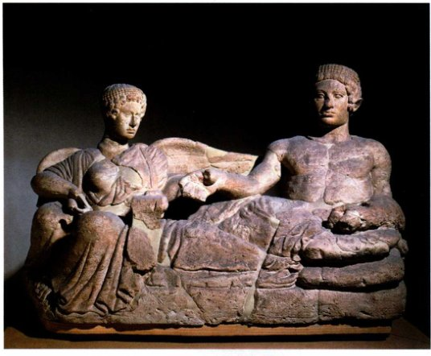

*图6.10 《青年与女魔鬼》（Youth and Female Demon），骨灰容器。公元前4世纪初。石制（pietra fetida），长119.4厘米。佛罗伦萨国家考古博物馆*

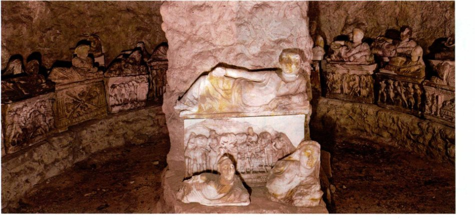

*图6.11 英吉拉米（Inghirami）墓中的骨灰瓮。希腊化时期。意大利沃尔特拉*

另外，虽然这类骨灰瓮很有代表性，大部分瓮盖上只有一尊斜倚的人像，但有几具尺寸较大的石棺保存了下来。其中一具石棺的棺盖上刻着一对温柔相拥的男女，他们躺在一床被单下面，仿佛卧于婚床之上（图6.12）。发型和胡须反映了希腊的时尚潮流，棺侧刻有受希腊图像范式影响的战争场面，但成品明显属于伊特鲁里亚风格。

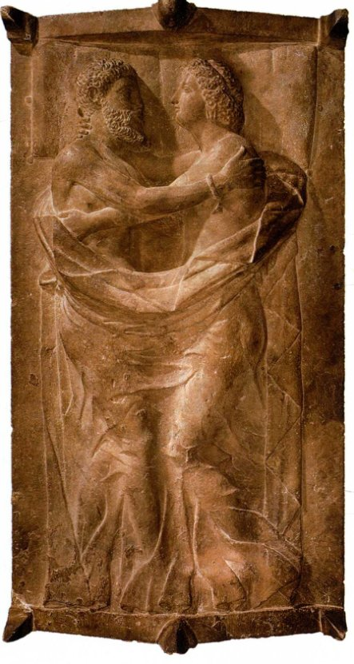

*图6.12 拉尔特·泰特尼斯（Larth Tetnies）与坦奇韦尔·塔尔奈（Thanchvil Tarnai）石棺棺盖。约公元前350-前300年。大理石，长2.13米。波士顿美术馆。Gardner Brewer女士赠。*

## 建筑

罗马作家称伊特鲁里亚人是建筑工程、城市规划和测勘方面的能手。几乎可以肯定，罗马人是以他们为师，尤其是在水管理（排水系统和高架渠）和桥梁建设领域，但我们说不准罗马人学到了多少，因为无论是伊特鲁里亚建筑还是罗马初期建筑，存世者都寥寥无几。这些建筑主要用木头或泥砖建造，通常不能保存至今。另外，许多伊特鲁里亚城市如今静静地躺在意大利山区市镇的地下，建筑中的耐久材料还常被重复利用。

伊特鲁里亚城市通常坐落在山顶，靠近可通航河流或大海。一些城市自公元前7世纪起增建了厚实的防护墙。城市建筑的一个晚期例子保存在佩鲁贾市（Perugia），那里依然耸立着几段城墙和部分城门。其中最著名的是建于公元前2世纪的战神之门（Porta Marzia），后来修的一道墙将城门上部围了起来（图6.13）。它是楔拱的一个早期范例，楔拱由一系列切割成楔形的石块（楔形拱石［voussoirs］）构成，在建造过程中使用可抽除的木支架将拱石排列成半圆形。排列好的楔拱会异常牢固；任何向下的推力（如门洞上方的墙的重力）只会把拱石挤压得更加紧密，加固它们之间的接合。拱上被半露方柱（pilaster）分隔开的是丁尼亚（Tinia，伊特鲁里亚神，相当于宙斯或朱庇特）及其诸子（相当于卡斯托尔和波吕克斯［Pollux］）的雕像，他们的马越过栏杆向外看。这个拱门直观证明，在公元纪年前的最后几个世纪里，地中海地区普遍存在文化融合。

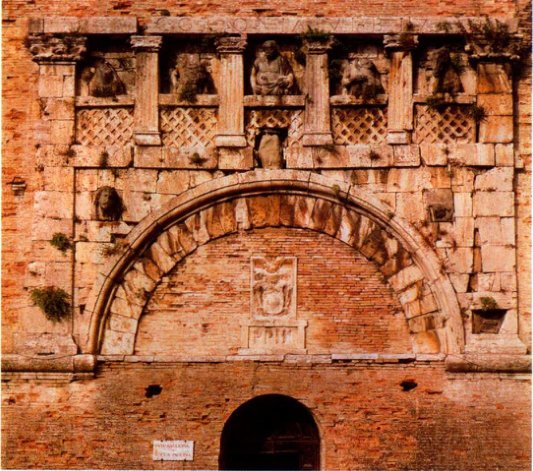

*图6.13 战神之门。公元前2世纪。意大利佩鲁贾*

### 城市规划

伊特鲁里亚的山顶不适合棋盘式布局，但在马尔扎博托（Marzabotto）等遗址有足够的证据表明，自公元前6世纪起，当伊特鲁里亚人在意大利北部波河河谷的平原地区开拓居住地时，他们将新建城市设计成一个街道网。其中心是两条主干道的交叉点，一条干道为南北走向（cardo），另一条为东西走向（decumanus）。由此形成的四个街区可以根据需要进一步细分或扩大。这种体系似乎反映了伊特鲁里亚人的宗教信仰，他们正是遵循这些信仰，按照罗盘方位将天空划分成不同的区域。罗马人也将这种体系用于他们遍布意大利、西欧和北非的新建殖民地，并且还用于军营。

伊特鲁里亚城市的房屋鲜有存世。与坟墓不同，房屋是用一种类似于抹灰篱笆墙或风干土坯的夯土技术（pisé）建造的，只有地基使用石头。就连这些石头都难以辨认痕迹，因为伊特鲁里亚人偏爱的山顶宝地后来几乎一直不乏居住者。但有几个城市发掘出了大型建筑群的遗迹。这些建筑群可能是宫殿或大庄园。其中的突出范例位于公元前6世纪的奇韦塔特岗（Poggio Civitate，现在的慕罗［Murlo］），众多房间围成了一个中央大院（图6.14）。这类建筑可能是罗马典型的中庭住宅（见图7.50）的观念起源。

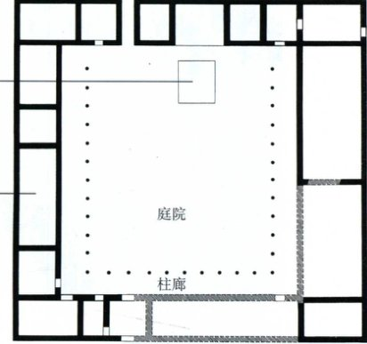

*图6.14 住宅群平面图。公元前6世纪。意大利慕罗（奇韦塔特岗）*

神庙用泥砖和木头建造，同样只有石头地基保存下来。早期神庙几乎只有一个不大的长方形内殿（用于放置神像的长方形房间）。后来的神庙深受至尊朱庇特神庙的革新性设计影响，这座神庙位于罗马的加比多里山（Capitoline Hill），罗马当时由伊特鲁里亚国王统治（见图7.1）。因此，后期神庙的特点是建在高基座或高台上，只有正面有台阶（图6.15）。台阶通向由一排排立柱支撑的深门廊，进入门廊后的内殿，内殿通常分为三个隔间。陶瓦屋顶由墙沿伸出很远，形成宽大的屋檐，保护泥砖免遭雨淋。

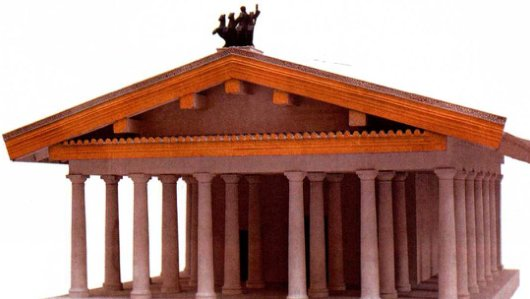

*图6.15 一座伊特鲁里亚神庙，根据维特鲁威的描述复原。罗马大学伊特鲁里亚与意大利古物博物馆（Museo delle Antichità Etrusche e Italiche）*

> **大事年表**
>
> *   约公元前1000年 - 意大利半岛出现伊特鲁里亚文化
> *   公元前6世纪末 - 伊特鲁里亚人开始在罗马以南的平原地区居住
> *   公元前447一前432年 - 雅典修建帕特农神庙
> *   公元前331年 - 亚历山大大帝击败波斯人
> *   公元前3世纪末 - 唯一存世的伊特鲁里亚城门战神之门建成

## 雕塑

与希腊神庙一样，伊特鲁里亚神庙极其华丽，但希腊人用大理石来装饰庙宇，伊特鲁里亚人却得不到多少这种材料。伊特鲁里亚神庙装饰一般使用色彩鲜艳的彩绘陶板，铺在额枋和屋顶边沿，防止受潮。约公元前400年之后，伊特鲁里亚艺术家有时会设计大型的赤陶群像来填充门廊上方的三角楣。但最出彩的雕塑是在屋脊上，即人字形屋顶顶端的横梁。屋脊上的陶像不仅表现单个人物，还具有叙述性。现存最著名的神庙雕塑之一来自罗马以北约27公里处的遗址韦伊（Veii）。罗马文献和考古证据都表明，韦伊是公元前6世纪末一个重要的雕塑中心。

### 赤陶和青铜中蕴含的活力

公元前6世纪末的韦伊神庙可能是献给梅涅瓦（Menrva）、阿里提米（Aritimi）和图拉（Turan）的。四尊真人大小的陶像立在屋脊顶部（图6.15的复原模型中有类似陶像）。它们形成了一组生气勃勃、互相关联的群像，表现了赫克勒（Hercle，赫刺克勒斯）和阿普鲁（Aplu，阿波罗）在其他神祇面前争夺圣鹿（雌鹿）的情景。群像中保存得最好的是阿普鲁像（图6.16）。他身着一件披风，边缘弯曲，罗马人后来称之为托加袍（toga）。衣袍顺着身体垂下，形成装饰性的花纹，展现出他魁梧的身躯和结实强壮的双腿。雕像风格与同时期希腊的库罗斯和考丽相似，表明希腊雕塑一定对伊特鲁里亚产生了影响。但这位神祇快速而坚定地阔步前行，类似的步伐在同时代的希腊独立雕像中是看不到的。赤陶这种材料赋予雕刻家更大的自由，他们可以尝试表现各种姿势，这是伊特鲁里亚独有的活力和激情。这些雕像被认为出自韦伊的乌尔卡（Vulca）之手，我们从拉丁文献中了解到这位著名伊特鲁里亚雕刻家。

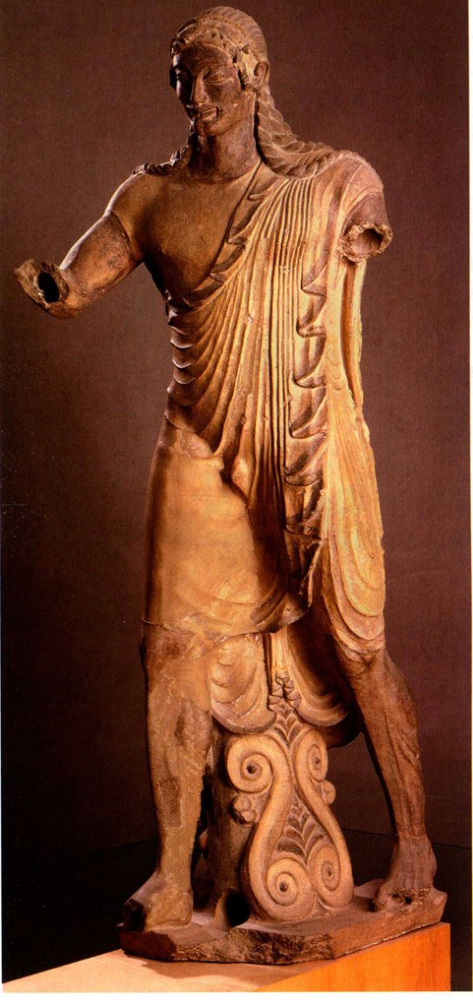

*图6.16 《阿波罗［阿普鲁］》（Apollo /Apluj），出土于韦伊。约公元前510年。赤陶，高1.75米。罗马朱利亚别墅国家博物馆（Museo Nazionale di Villa Giulia）*

伊特鲁里亚雕刻家在青铜铸造方面也表现出了卓越技艺。最有名的伊特鲁里亚雕塑作品之一是青铜像《母狼》，现存于罗马的加比多里诺博物馆内（图6.17）。它作于公元前5世纪，由其做工判断，几乎可以肯定它的制作者是一位伊特鲁里亚艺术家。对鬃毛和颈毛的程式化、图案化处理衬托出了母狼身上平滑的肌肉，它身体紧绷，准备攻击。简洁的线条增加了它的力量：平直的颈背与突然转向观众的头部形成对比，突出了它的凶猛。金属表面打磨光滑，看起来几乎泛着水光；母狼的獠牙似乎在闪闪发亮。这件雕像的早期历史和题材不明。但有证据表明，它在古代后期备受追捧，尤以罗马人为甚。传说，罗马是由孪生兄弟罗慕路斯（Romulus）和雷穆斯（Remus）于公元前753／52年创建的，他们的祖先是来自小亚细亚的特洛伊难民。两兄弟尚在襁褓之时就被遗弃，由野外一头母狼喂养长大。后来的罗马人可能认为这尊伊特鲁里亚青铜像表现了他们传说中的狼母。公元4世纪初的罗马皇帝马克森提乌斯（Maxentius）修建了一座宏伟的宫殿，宫殿内有一个走道围成的大门廊（凹室），考古学家在其中发现了一个雕像基座，上面的接头与母狼的足印刚好吻合。母狼身下的孪生婴儿罗慕路斯和雷穆斯是在1471-1473年加上去的，添加者可能是安东尼奥·波拉尤奥洛，目的是使雕像吻合罗马钱币上母狼哺育婴儿的画面。

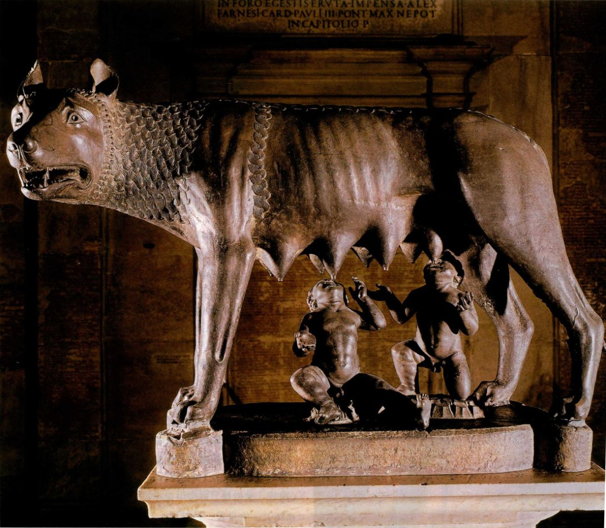

*图6.17 《母狼》（She-Wolf）。约公元前500年。青铜，高85厘米。罗马加比多里诺博物馆（Museo Capitolino）*

伊特鲁里亚人关注死者形象，我们也许会因此推测他们会很早就对肖像产生兴趣。但诸如图6.9和6.10那样的丧葬雕像却表现出程式化特征，而非个性化形貌。直到一个世纪以后，也就是接近公元前300年的时候，伊特鲁里亚雕塑中才出现了个人特征的体现。这一变化可能是受希腊雕塑的影响，但伊特鲁里亚雕塑多用赤陶，因此容易塑造出各不相同的面部特征。一些最优秀的伊特鲁里亚雕塑是青铜头像，如插图中的男孩肖像（图6.18）。其创作者是个中高手，充分利用了青铜能够产生的所有表面效果，从粗糙的眉毛到呈条纹状的绺绺头发，再到光滑、有立体感的肌肉。

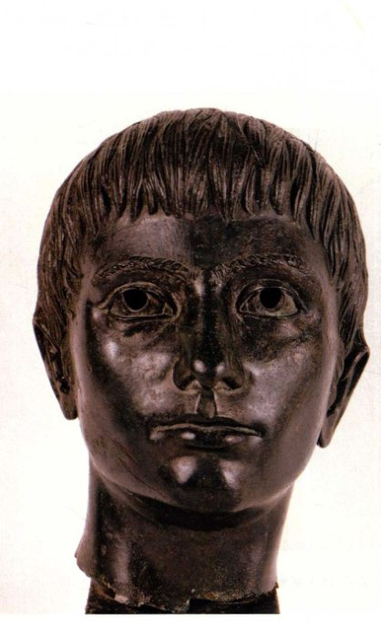

*图6.18《少年像》（Portrait of a Boy）。公元前3世纪初。青铜，高23厘米。佛罗伦萨国家考古博物馆*

一尊真人大小的演说者青铜像使我们知道，这些全身像曾经是多么令人印象深刻（图6.19）。大多数学者将《演说家》（L'Arringatore［the Orator］） 的年代定为公元前1世纪初。它出土于伊特鲁里亚版图中部的特拉西美诺湖（Lake Trasimene），上有一条伊特鲁里亚铭文，提到了奥勒·梅特利（Aule Meteli，拉丁语为Aulus Metellus）这个名字，可能就是雕像中的人物。铭文显示，雕像是由伊特鲁里亚工匠制作，但演说者穿着高筒靴，表明他是一个罗马人，或至少是一名由罗马帝国指派的官员。胳膊举起是表示发言和问候的手势，可在数百尊罗马雕像中见到。这尊雕像使我们不得不思考，在被罗马占领的伊特鲁里亚土地上，艺术家与赞助人是怎样的角色。这些青铜作品的铸造和抛光技术都非常纯熟，不负古代伊特鲁里亚金属工匠的盛名。在一个以开采铜铁银为财富基础的国度，如此技艺不足为奇。

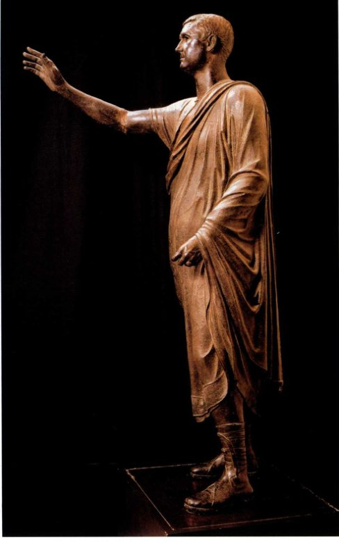

*图6.19《演说家》。公元前1世纪初。青铜，高280厘米。佛罗伦萨国家考古博物馆*

> **大事年表**
> 
> *   约公元前 510 年——位于韦伊的伊特鲁里亚神庙  
> *   约公元前 500 年——伊特鲁里亚青铜母狼雕像  
> *   约公元前 450—前 440 年——波利克里托斯的《持矛者》  
> *   约公元前 300 年——伊特鲁里亚艺术出现个人肖像

自公元前6世纪起，伊特鲁里亚人就开始大量用青铜制作雕像、镜子及其他物品，供应国内外市场。铜镜背面常刻有取材于希腊神话的画面，不过都是经过了本土化的版本，这些故事专门讲述诸神的情史。铜镜本就是用来自我欣赏的器物，爱情题材与此再契合不过。图示中的铜镜背面图案（图6.20）却属于另一种类型，其创作年代是公元前400年之后不久，显示了伊特鲁里亚人是怎样改造吸收希腊传说的。在围成一圈的波浪形葡萄藤内站着一个老者，他生有双翼，一只脚抬起，踏在一块岩石上。铭文注明他是先知沙尔沙斯（Chalchas）——荷马史诗《伊利亚特》中的希腊先知沙尔沙斯在伊特鲁里亚的变体。但借用仅仅到此为止，因为这位长有双翅的守护神（Genius）正在进行伊特鲁里亚仪式中的重要环节：他正在目不转睛地盯着一头祭牲的肝，搜寻预兆或征兆。

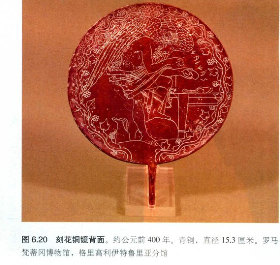

*图6.20 刻花铜镜背面。约公元前400年。青铜，直径15.3厘米。罗马梵蒂冈博物馆，格里高利伊特鲁里亚分馆*

伊特鲁里亚人相信，神的意愿是通过自然界的种种迹象表达出来的，比如雷雨，或者上文提到的飞鸟的姿态，甚或是祭牲的内脏。事实上，他们认为肝是一种小宇宙，可分为不同部分，对应天空的16个区域。解读自然迹象被称为占卜术（augury），擅长占卜的祭司能够确定神是否赞同他们的行为。这些祭司享有巨大的威望和权力，在伊特鲁里亚文化被罗马人征服后很长一段时间，他们仍然兴盛不衰。罗马人自已也会在所有重大公共事务或私人活动之前请占卜师占卜。正如罗马哲学家兼政治家塞涅卡（Seneca）所写：“这就是我们与伊特鲁里亚人的不同……因为他们将一切都归因于神力，所以他们认为事物能揭示未来并不因其已经发生，而是事物之所以发生正因其注定要揭示未来。”镜子能照见未来，所以也得到珍视，这很可能就是图示中的铜镜刻有占卜场景的原因。

## 小结

伊特鲁里亚文化于公元前1000年左右产生于意大利半岛。古伊特鲁里亚人是熟练的水手和商人，他们的财富基础是开采铜铁银矿。留存下来的伊特鲁里亚文化物品大部分来自为数众多的坟墓。艺术家制作的物品种类繁多，从小件首饰到真人大小的雕像。一些艺术品所用材料——如象牙——是通过贸易获得的。伊特鲁里亚祭司享有极大的威望和权势，甚至在他们的文化臣服于罗马文化之后也几乎未减分毫。

**墓葬艺术**

公元前7世纪初，伊特鲁里亚人开始将同一家族的死者安葬在一处。随着时间的推移，富人的墓葬建筑变得更加雄伟。许多坟墓是在当地的火山石上开凿出来的，其中的随葬品蔚为壮观，包括用黄金和象牙制成的贵重物品。一些墓冢饰有色彩鲜艳的壁画，存放着令人赞叹的随葬品，如上有斜倚人物的赤陶石棺。

**建筑**

伊特鲁里亚城市一般坐落在山顶上，山丘靠近可通航河流或大海。有充分证据表明，一些平原地带的城市被设计成一个街道网，这个方法被罗马人采用。存世的伊特鲁里亚建筑极少，因为他们的住宅和神庙是用夯土和泥砖建造的。但城市建筑中有一个特例保存了下来，那就是佩鲁贾市的一道石门。

**雕塑**

伊特鲁里亚人用赤陶装饰物来美化神庙。常见的有色彩鲜艳的彩绘陶板和成组雕像。杰出的青铜像也保存了下来，反映了伊特鲁里亚金属工匠出色的才华。