*图7.21 《马可·奥勒利乌斯骑马像》细部*

# 第七章 罗马艺术

遍观古代世界各文明，古罗马最容易为现代学者所了解。从诗歌、历史到记载日常生活的铭文，大量文字资料揭示出罗马生活的方方面面。罗马人还在整个帝国范围内建造了许多雄伟建筑，至今保存良好。但除了了解“什么是罗马艺术”之外，还有一些更加难以解答的问题。

许多罗马公共艺术大量借鉴希腊艺术，包括古典和希腊化时期的风格。在19世纪和20世纪初，受温克尔曼等早期艺术史家影响（见第179页的艺术史家的观点），艺术鉴赏家们将希腊古典主义奉为艺术风格成就的顶峰，而罗马艺术算是由希腊艺术衍化出的末篇。这个观点日后发生了重大变化，尤其是在纯粹的艺术鉴赏让位于艺术史的其他分支后。学者现在对其他问题更感兴趣，比如一件艺术品在其社会和政治背景中扮演什么角色。但无论我们如何评价罗马艺术家对希腊艺术的一贯效仿，罗马世界却绝不是只有这一种风格。例如罗马有过明显的“埃及热”（Egyptomania）时期，而行省及平民艺术品则自成一派，如古代晚期的艺术品便有自身的独特风格。

罗马艺术既是共和国的艺术也是帝国的艺术，是一个小城成长为庞大帝国的艺术。它的创造者既有罗马艺术家，也有希腊艺术家，图拉真时代最伟大的建筑师可能来自大马士革（Damascus）。也许理解罗马艺术的最好方法是将其视为一个艺术的融合体（syncretism）——来源各异的元素聚会一处，产生了某种全新的艺术，并且极具信息承载能力。融合是深植于罗马的一种态度，或许也正是罗马惊人扩张的秘诀。罗马社会从一开始就异常包容非罗马的传统，只要国家壮大不受影响。新征服地区的人基本上并不归服罗马的风俗，而其中许多人最终被赋予了公民权，他们的神祇在首都也得到尊崇。罗马文明融合了无数其他文化，孕育出一个丰富多彩的世界。

## 罗马早期和共和国时期

在罗马传说中，罗慕路斯于公元前753或前752年建造了罗马城，城址就在台伯河（Tiber River）畔的拉丁姆（Latium）地区。但考古证据表明，早在公元前1000年，这片地区就已经有人居住。公元前8世纪至前6世纪，罗马在几任国王统治下逐步扩张。这一“王权（regal）时期”结束后，几代伊特鲁里亚国王开始了在罗马的统治，他们切实地改善了罗马的状况：沿居住地建起了第一道防护墙，疏浚和填平了现为罗马广场（forum）的泥泞地带，在加比多里山上建起了一座宏伟的神庙，如此一来，先前不过是一群村落的地方变成了城市中心。这些国王建立了许多长期沿用的体制，例如神职制度以及罗马的作战技术。据文献记载，公元前509年前后，罗马人驱逐了伊特鲁里亚国王。随后几个世纪，罗马贵族逐渐建立了共和国，以一部不成文宪法治国。

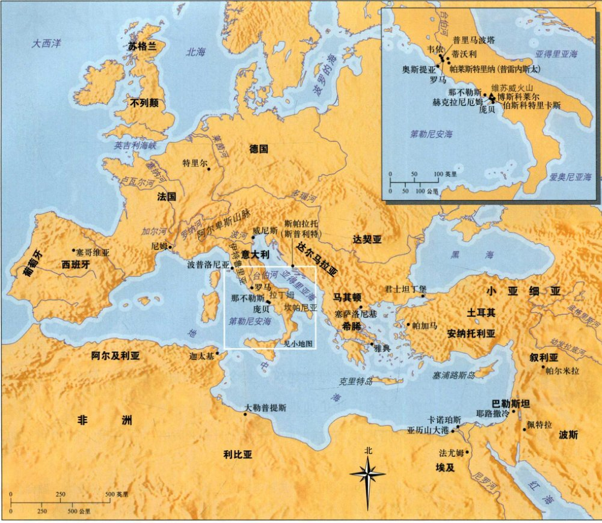

*地图7.1 古代罗马世界*

在共和国时期，一批通过选举产生的官员在两位执政官领导下管理着这个崛起的国家，还有一个元老院作为咨询委员会辅政。接下来的二百年内，一系列起义暴动持续不断，为非贵族阶层争取到了更大的权利，统治机构也越来越能够代表他们的利益。所有财产达到一定数量的罗马人都有义务服兵役，而事实上服兵役是从政的前提。在共和国期间，罗马逐渐控制了意大利半岛。公元前396年，罗马人先是和盟友拉丁联盟扫平了伊特鲁里亚南部的韦伊城。公元前390年，来自北方的高卢人洗劫罗马，然而这看来只是刺激了罗马去实施更大规模的征服。四十多年后，各拉丁城市失去独立，到公元前275年，罗马已经征服了整个意大利，包括南部的希腊殖民地。接着它很快又进行了三次布匿战争（布匿［Punic］在拉丁语中意为腓尼基），对手是北非的迦太基（Carthage）。公元前146年，战争以摧毁迦太基城而告终。同样在公元前2世纪，整个希腊和小亚细亚（Asia Minor）也落入罗马人手中，希腊的艺术和文化因此大量涌入罗马。

公元前133至公元前31年，后期共和国陷入混乱。派系政治、暴民骚乱、暗杀、贵族斗争，这一切都导致宪制土崩瓦解，内战开始。公元前46年，尤利乌斯·恺撒成为终身独裁者，其他元老们无法容忍如此高位。两年后他在罗马的元老院被刺杀。继任者屋大维对谋杀恺撒的布鲁图斯（Brutus）和卡西乌斯（Cassius）实施了报复，然后又剪除了自己的政敌马克·安东尼（Mark Antony）。公元前27年，元老院尊屋大维为奥古斯都·恺撒（Augustus Caesar），他成为第一公民（princeps）。历史上认为他是第一个罗马皇帝。在整个共和国以及相继的帝国早期，官员们委派建筑工程和雕塑作品，既可装点城市，又能提高自己的声望。建筑和雕塑的设计都受到海外征服以及罗马建筑技术发展的强烈影响。

> **艺术史家的观点**
> 
> **复制品辨别：以《拉奥孔》为例**
>
> 在《埃涅阿斯纪》（Aeneid）最有表现力的一个片段中，维吉尔（Vergil）描绘了拉奥孔的受罚。传说拉奥孔是特洛伊战争时期的一位祭司，他警告特洛伊人不要接受木马，其中藏匿着入侵的希腊人，特洛伊木马后来世人皆知。希腊人的庇护女神密涅瓦要惩罚拉奥孔，她派遣两条巨蟒去吞食他和他的儿子们。维吉尔描绘了这两条蛇如何由大海中蜿蜒而出，到达拉奥孔正在主持祭祀的祭坛，用它们可怕的盘锁力量将他绞死，祭祀者变成了祭品（见第一部分末尾的附加原始文献）。
>
> 1506年1月，一个组雕在罗马埃斯奎里内山出土，组雕表现了拉奥孔和他的儿子们在巨蟒缠绕下痛苦挣扎的残酷场面，文艺复兴时期的人文学者立即认为这是一件希腊雕塑原作。他们认为这就是老普林尼在他的《自然史》（NaturalHistory，成书于公元77年）一书中盛赞的那件雕塑。普林尼相信，放置在提图斯宫中的《拉奥孔》出自三位来自罗得岛的雕刻家之手：哈格桑德罗斯（Hagesandros），波利多斯（Polydorus）和阿泰诺多斯（Athenodorus）。组雕在埃斯奎里内山出土后不到一年就归教皇尤利乌斯二世（Julius II）所有，被摆放在梵蒂冈的观景楼（Belvedere）庭院中，是教皇的私人雕塑陈列。《拉奥孔》很快成为当时的艺术家们关注的焦点，他们将它视作模范，还力图复原《拉奥孔》残损的右臂（现在右臂弯折于身后，这被认为是正确的位置）。它骤享盛名，部分原因是这座重见天日的雕塑完全契合古典文献的记载：这件杰作表现了罗马旷世史诗中戏剧性的一刻，其描述者又是一位很有威望的罗马作家。
>
> 《拉奥孔》组雕引起了18世纪艺术史家温克尔曼的关注（见第156页的艺术史家的观点），他意识到，题材所表现的死亡的剧痛与观者欣赏这件杰出作品而产生的愉悦之间产生了一种强烈的张力。他对这件作品钦佩非常，唯有将其归入古典时期，并将作品年代定为公元前4世纪，倘若再往后推就是希腊化时期，那在他眼里可是艺术的衰落期。由此开始了一场广泛的论争，探讨这件作品的年代以及它是否是原作。对许多学者而言，这个特洛伊祭司和他儿子们的痛苦挣扎表现出希腊化时期巴洛克风格的所有特征，如同在帕加马宙斯大祭坛的诸神与巨人之战浮雕（见图5.73和5.74）。这是希腊化时期的一件杰作，其年代应为公元前3世纪或前2世纪。另一方面，有铭文将老普林尼提到的三位艺术家与活跃在公元前1世纪中期的几位雕刻家联系在了一起，如此一来，这件雕塑的年代就要大大后移，并且不再处于希腊化时期的巅峰。但有些时候，艺术家的名字会沿用好几代，我们也不清楚这件组雕是否就是老普林尼欣赏到的那一个。
>
> 普林尼特别指出《拉奥孔》是用一整块大理石雕凿而成，而这件雕塑却不是。更具说服力的是，雕塑后部的祭坛有一块卡拉拉大理石板，而这种大理石一直到奥古斯都治下（公元前27一公元14年在位）才开始使用。那么这件雕塑就是帝国早期的艺术品？或者这件受到盛赞的杰作是一件希腊化作品的罗马复制品？果真如此，那它的地位是否就降低了？似乎嫌这些争论还不够，最近出现的一个论点甚至将《拉奥孔》彻底拉出了古典时期，而将它归为文艺复兴时期米开朗基罗的作品。援引的证据包括米开朗基罗作于1501年的一张表现男性躯体的钢笔习作，酷似《拉奥孔》。现在关于《拉奥孔》只有一件事情是确定无疑的，那就是16世纪的崇拜者们所构想出的明晰图像现在已经变得扑朔迷离了。

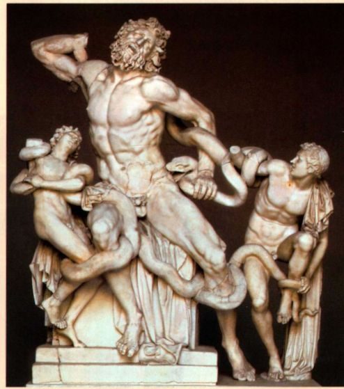

*《拉奥孔》组雕。公元1世纪。大理石，高2.1米。罗马梵蒂冈博物馆，庇奥·克里门提诺（Pio Clementino）分馆，八角中庭（Cortile Ottagono）*

### 建筑：混凝土革命

罗马建筑对西方建筑的影响比其他任何古代传统都更为持久，这么说并不过分。这些建筑富有力量，力量通过坚固的形式以及人们由此得到的体验传达。罗马建筑家显然继承了希腊传统，尤其是在多立克、爱奥尼亚和科林斯风格的运用上，但最终完成的建筑物却是地道的罗马风格。

加比多里山上的至尊朱庇特神庙（Temple of Jupiter Optimus Maximus，图7.1）是罗马的第一座真正的大型纪念性建筑。工程发起者是公元前6世纪的两位国王，古老者塔奎尼乌斯（Tarquinius the Ancient）和高傲者塔奎尼乌斯（Tarquinius the Proud），但将完工神庙献给朱庇特的却是罗马最早的一位执政官。这座神庙规模宏大，在意大利半岛上开创了先例，却有希腊东部雄伟的爱奥尼亚式神庙的遗风。它挺立在一座高高的石台上，有梯级通往正立面。正面六根木制立柱，两侧各有六根立柱支撑，纵深的门廊由两排立柱支撑。后世的罗马历史学家告诉我们，一位伊特鲁里亚艺术家，来自韦伊的乌尔卡，为三角楣的顶端精心制作了一个巨大的赤陶像，雕像中是朱庇特乘坐在四驱战车中。木框泥砖的墙围出三间平行的内殿，里面分别供奉着朱庇特、朱诺和密涅瓦的神像。近期的发掘表明，内殿后部还有首尾相连的两个横向房间，可由两侧柱廊到达。长方形格局，多用立柱，山形屋顶，这些都是受希腊影响的明证；但高台以及刻意强调的正面入口则与之意趣不同。这些特征成为随后几个世纪罗马神庙的特色。

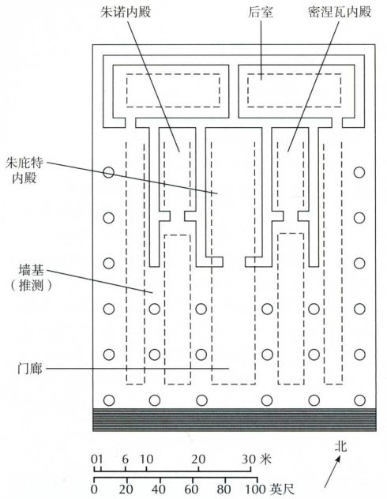

*图7.1 至尊朱庇特神庙复原平面图，罗马加比多里山。约公元前509年完工*

尽管借用希腊形式的做法早在共和国早期就已经开始，但到了罗马征服希腊的过程中才变得尤其明显，那时不仅模仿希腊的基本建筑形式，而且还使用希腊的建筑材料。公元前146年，在庆祝了对马其顿人的胜利之后，梅特路斯（Metellus）将军下令建造了罗马第一座全大理石神庙，并且为此雇用了一位希腊建筑师赫墨多路斯（Hermodorus）。神庙虽已不复存在，但它的外形很可能接近台伯河畔保存完好的河港之神波尔图纳斯神庙（Temple of Portunus，图7.2），以往它常被误称为福尔图娜神庙（Temple of Fortuna Virilis）。

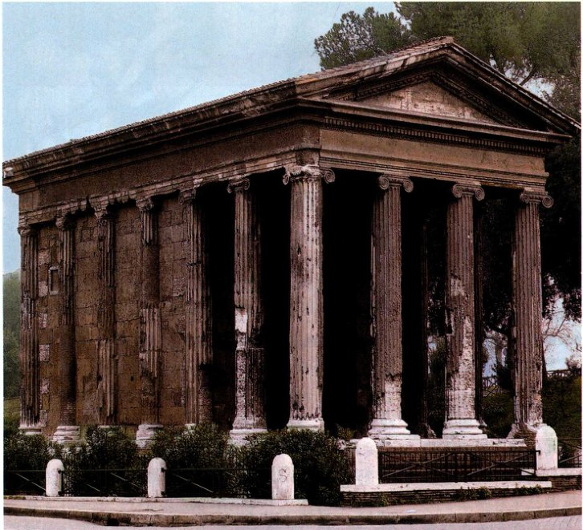

*图7.2 波尔图纳斯神庙，罗马。约公元前80-前70年*

罗马建筑师很快就将希腊建筑典型的方直结构与拱（arch）的弧形结构相结合（图7.3）。一个拱结构可以独立支撑，自成巨构，也可以作为建筑的组合元素，通常构成入口。真拱使用楔形拱石，例如位于伊特鲁里亚佩鲁贾的战神之门（见图6.13），比叠涩拱（见图4.20）牢固许多。真拱不是罗马人或伊特鲁里亚人的发明，埃及建筑师早在公元前2700年左右就已经使用，包括其拓展形式筒拱（barrel vault），但主要用于地下墓葬和实用建筑中，不用于大型公共建筑。美索不达米亚建筑师将真拱用于城门或其他建筑，希腊建筑师将它们用于地下结构和简单的门道。罗马人却将它们广泛应用于公共建筑，使之成为罗马建筑的一个标志。

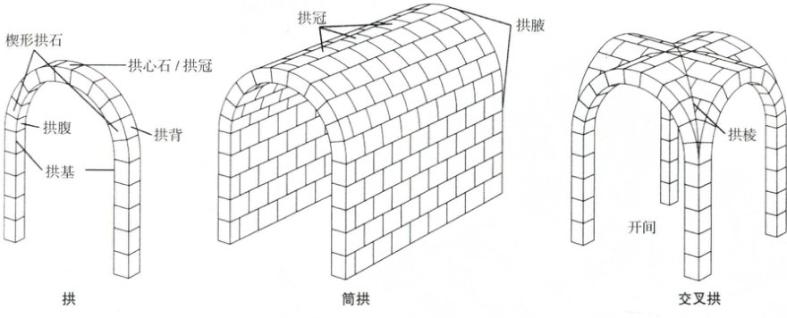

*图7.3 拱，简拱，交叉拱*

然而是混凝土的出现促使罗马建筑发生了天翻地覆的变化。混凝土是灰泥与凝灰岩、石灰石、砖块等碎块的混合物。罗马建筑师最初将它用作填料，灌在墙间或墩座墙（podium）里。然而在灰浆中加入火山灰（pozzolana）之后，就形成了一种耐久性优良的材料（甚至在水下也可固化），于是从公元前2世纪起，他们就越来越大胆地使用这种改良过的混凝土。尽管混凝土强度一流，外表却并不美观，于是建筑家会在表面敷上一层石面、砖块或膏泥（图7.4）。这些贴面没有结构功能，不同时期的贴面有所变化，因此成为考古学家断定建筑物年代的宝贵依据。混凝土的优点很快就显露出来：它坚固又便宜，并且操作起来不需要熟练的技术，适应性也很强。过去使用石块、木材和泥砖相当耗时或完全不可能筑成的形状，现在只需搭建好木制框架，向其中倒入混凝土，就可以将它模塑成型。在某种意义上，罗马建筑史是两种力量的交流融合，一方面是传统的希腊方直形式与早期意大利的柱梁结构，另一方面是可塑性极高的混凝土对建筑形式的解放。

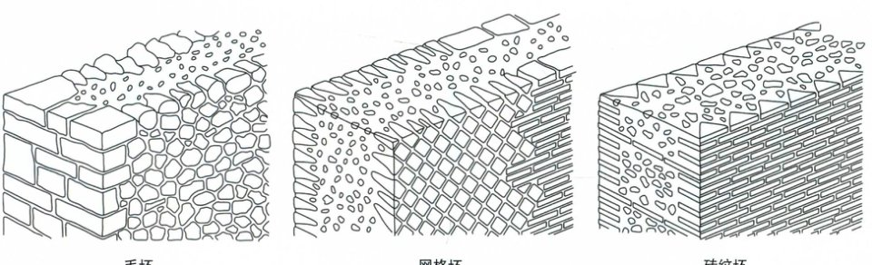

*图7.4 罗马混凝土表面图示。左：毛坯（opus incertum），主要用于公元前2世纪至公元前1世纪早期。中：网格坯（opus reticulatum），用于公元前1世纪与公元1世纪。右：砖纹坯（opus testaceum），自公元1世纪中叶起开始使用*

两座很不相同的共和国建筑都显示出混凝土的优点。公元前2世纪早期的艾米利亚柱廊（Porticus Aemilia）是已知最早完全采用混凝土的罗马建筑，以承建第一阶段的地方官员名字命名，是罗马商业港区的一个大仓库，用来分类存储河船上卸下的货物。仓库规模惊人：沿着台伯河延伸1600罗马尺（约473米），进深300罗马尺（约89米）。如图7.5的部分复原图所示，建筑师们利用新材料的优势制造出非常开阔的内部空间。高耸的筒拱覆盖在50个横向过道上方，顺应坡面地势构成四个渐升的分区。支撑拱顶的墙壁开出拱门，工人在任一仓储区都可以看到相邻的区域，也便于空气自由流通。

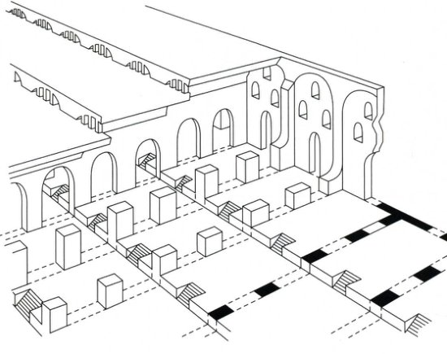

*图7.5 艾米利亚柱廊，罗马。公元前2世纪上半叶。部分复原图*

罗马东部亚平宁山脉（Apennines）山麓的帕莱斯特里纳城（Palestrina，古代的普雷内斯太［Praeneste］）坐落着另一座混凝土结构的杰作（图7.6和7.7）。这座宏伟圣殿供奉着命运女神福尔图娜（Fortuna Primigenia），年代鉴定为公元前2世纪末或公元前1世纪初。它是一个神谕中心，祭司在此占卜来解读神意。建筑师们在整个山坡表面用混凝土进行浇筑，精心构筑出引领并且升华观者体验的空间。圣殿共七层，层层升高。底层有一座早期神庙、一座长方形公堂（见第224页）以及一座用于公民集会的议事厅。上方各层台地围绕中轴线缓缓升高，包括一系列像龛和台阶。观者从侧面的台阶到达第三层台地，那里有陡峭的坡道通向上方，坡道上覆有倾斜的筒拱。坡道尽头的阳光引领人走上一个开阔的平台，可以俯瞰郊野美景，平台之上还有其他绝佳的风景观赏点。

第四层是祭坛，外周围绕着柱廊林立的敞座间（exedrae）。柱廊顶部覆盖着筒拱，在水平方向和垂直方向都形成了半圆形。这些曲线形式使直线显得灵动起来，因为立柱排列成半圆形（环形［annular］筒拱），观者每走一步，柱子与背景的关系都会变化。中央的宽阔台阶通往下一层。三四层之间的坡道覆有拱顶，而台阶却是露天的，使人想到风雨的侵蚀。第五层是商店，可能出售纪念品和还愿品。观者的脚下正是一片筒拱支撑的空间，可见建筑者对这种结构的充分信心。再上一层是一个开阔的庭院，三面围绕着一个环形双重柱廊。祭神表演就在此举行，背景就是下方壮阔的坎帕尼亚（campagna）。所有人都能看到女神，她的圆形神庙就是整个建筑群的顶点。神庙规模虽小，却因圣殿整体的宏伟而显庄严，整个建筑群都是用混凝土浇注而成。这种材料自如地适应了山势，利用自然来升华观者的宗教体验。

*图7.6 福尔图娜神庙，普雷内斯太（帕莱斯特里纳）。公元前1世纪早期*

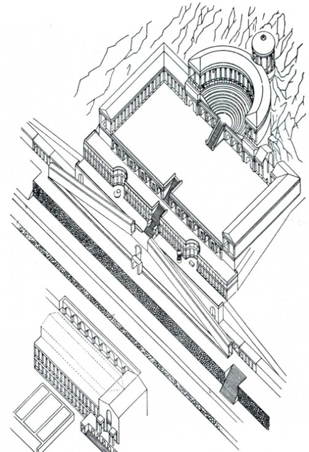

*图7.7 福尔图娜神庙复原轴测图，普雷内斯太（帕莱斯特里纳）*

学者认为这座圣殿建于公元前1世纪早期，假如这一判断正确，那就可能是在苏拉（Sulla）独裁时期（公元前82一前79年）。内战时，苏拉在帕莱斯特里纳取得了一次重大胜利。甚至可能正是他亲自下令建造了这座圣殿，既是感激命运女神，又为纪念自己的功名。可以肯定的一点是，公元前1世纪是将建筑用于政治目的的一个转折点。这个时期最宏伟的建筑之一是庞培大剧场，此后也一直是古罗马最重要的剧场。与苏拉及其后的尤利乌斯·恺撒一样，庞培（Pompey）也是凭借权术达到罗马的权力顶峰，并且使用建筑来显示自己不合宪法的权势，并使其合法化。为纪念自己的战功，他计划在紧邻城市北部的战神广场（Field of Mars）建一座剧场，献给他的保护女神征服者维纳斯（图7.8）。上层结构的一些残留部分包藏在原址的后世建筑物中，其弧线外形至今仍反映在街道布局中。另外，剧场的平面图刻在了一块完成于公元3世纪早期的大理石城市地图上，而新近由詹姆斯·帕克（James Packer）主持的发掘工作有望发现更多的拱顶下层结构。因此图7.8只是临时复原图，糅合了考古证据和推测，如发现新证据，它就有可能发生改变。就某些方面而言，庞培剧场与其希腊原型相似，都有半圆形阶梯状排布的座位，底层的乐队区域，以及一个布景景壁高起的舞台。但在另一些重要方面，庞培剧场却是全然不同的。例如，它不是利用天然的山坡，而是靠建筑师用混凝土构建出一个人造斜坡，沿放射状排布的筒拱上升，筒拱相互支撑，构成一个坚固的结构。换言之，混凝土使得设计者摆脱了地形的局限。而且梯形座位区形成了一个真正的半圆，而不是希腊剧场中比半圆略大的扇形。座位区顶端是三个神龛和一个维纳斯神庙。正立面呈弧形，其中陈设着一系列雕像，代表庞培征服的国家。在剧场外，紧邻舞台建筑的后方，有一个门廊围成的大花园，里面收罗了大批艺术珍品，包括雕塑、绘画和挂毯，其中有许多来自希腊。这个公共花园是庞培送给罗马民众的礼物，是收买人心的手段。

在庞培的剧场一门廊建筑群面前，此前任何官员下令建造的零散建筑物都相形见绌。这也是罗马第一座常设剧场。如同在希腊一样，戏剧是罗马宗教庆典中至关重要的一部分，而用于戏剧表演的建筑一直是木质的，需要时搭建起来，过后就拆除。事实上，罗马贵族基于道德原因公开反对建造常设剧场。庞培绕开了这样的责难，他声称建于顶端的维纳斯神庙才是主体，剧场只是附属结构。这座庞然大物实际上为尤利乌斯·恺撒的大广场以及随后的各个帝国广场开了先河（见第203页）。

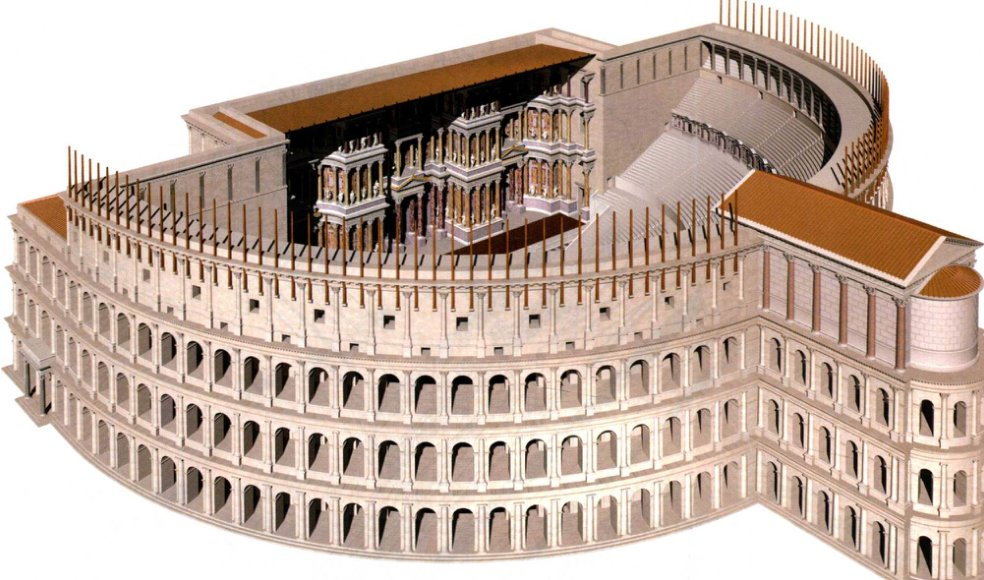

*图7.8 庞培大剧场建筑（Theater Complex of Pompey），罗马。落成于公元前55年。James E．Packer和John Burge绘制的复原图*

### 雕塑

**浮雕** 与建筑一样，雕塑经常用来纪念特定事件，正像它在古代近东的功能（见图2.20和2.21）。古典时期的希腊雕塑是给历史事件披上了神话的外衣，例如拉皮泰人和马人之战，或是希腊人与阿玛宗族之战（见图5.44、5.45、5.47），只有希腊化时期才略微打破了这一惯例。罗马人与此相反，他们表现真实事件，形成了长期以来被称为历史浮雕的雕塑形式，尽管许多浮雕并不是完全与史实相符。图7.9中的浮雕很可能是一组群雕的基座，学者们认为它原来是放置在凯旋队伍穿过罗马城的线路旁。它过去被称为多米提乌斯·阿赫诺巴布斯祭坛基座（Altar Base of Domitius Ahenobarbus），现在有时被称为马库斯·安东尼乌斯基座（Base of Marcus Antonius）。其中一个长段表现的是公民调查仪式，根据个人财产记录确定服役资格。左侧是排成一列的士兵和市民，等待进行公民调查。祭坛两侧有两个体形较大的人像，一个是战神马尔斯，另一个是主持仪式的调查员，有可能就是他下令修建了这个纪念性建筑物。仆从们带进来一头公牛、一只羊和一头猪，作为祭坛上的供品，也为公民调查仪式画上句号。

浮雕其余部分刻画的是穿越海洋的一支行进队伍（thiasos），他们是去参加海神涅普顿和海仙女安菲特里忒（Amphitrite）的婚礼。但这些浮雕的风格截然不同，婚礼队伍回旋的动势和希腊化的形式与公民调查部分的凝滞外观和人物的敦实比例形成对比。除此之外，这两块浮雕板还是以不同的大理石雕刻而成。学者推测海中行进队伍的浮雕部分原本不是基座的一部分，而是从希腊带回的战利品，用以装点纪念凯旋的建筑物，它本身就可以说是征服的证明。相反，公民调查的浮雕则是在罗马雕刻而成，用来补充完成基座的剩余部分。这些浮雕可能共同表现了建造者的骄人功绩。

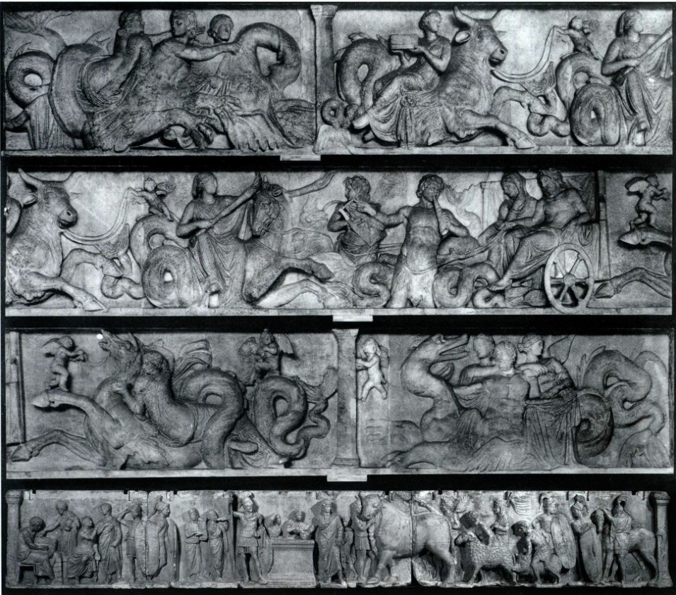

*图7.9 雕像基座的浮雕，表现的是海中的行进队伍和公民调查仪式。被称作多米提乌斯·阿赫诺巴布斯祭坛基座或马库斯·安东尼乌斯雕像基座。公元前2世纪晚期至公元前1世纪早期。大理石。巴黎卢浮宫，及慕尼黑巴伐利亚州立博物馆（Staatliche Antikensammlungen）古代雕塑展览分馆（Glyptothek）*

**圆雕** 罗马人也将希腊雕塑用于其他用途。公元前1世纪中期律师兼作家西塞罗在一系列信件中请求在雅典的友人阿提库斯（Atticus）为他寄运一些雕塑，好让他装饰自己的别墅（villa，见第186页的原始文献）。学者相信，这类需求并不少见：随着公元前2世纪逐步征服希腊，希腊艺术品作为战利品大量涌入罗马，掀起了一股对希腊艺术的狂热。事实上，这股热潮非常强烈，引来了公元前1世纪末的诗人贺拉斯（Horace）的讥讽：“希腊被征服了，它也征服了野蛮的征服者，将艺术带到了乡野的拉丁姆地区。”在跟随凯旋队伍穿过罗马街道之后，这些艺术品到达了旅途终点：装饰公共空间，例如庞培剧院的门廊。

> **原始文献：西塞罗（公元前106-前43年）**
>
> 马库斯·图利乌斯·西塞罗（Marcus Tullius Cicero）生活在动荡的共和国晚期，是罗马杰出的政治家和演说家，以写作题材广泛而著称，包括讲演、修辞学和哲学论著以及书信。与许多其他罗马政治家一样，他在自己的众多宅邸和别墅中摆满了希腊艺术品，其中有原作也有复制品。阿提库斯是他的儿时伙伴，迁往雅典以后仍然与西塞罗保持着书信往来，代他购买艺术品。
>
> 九
> 
> *西塞罗致阿提库斯，问候*
>
> 你很容易找到要来罗马的人代为传送信件，我却难以觅到要去雅典的人，考虑到这一点，你写的信实在太少，而且间隔时间太长。况且你较能确信我在罗马，我却不好肯定你是否在雅典。此信甚短，因为我对你的行踪把握不定。未确知你身在何处，我不愿私人信件落到陌生人手里。
>
> 我在不安地等待来信中提到的麦加拉大理石像及那些赫尔墨斯像。若手头还有类似物件，假如与我的学园相配，就速速寄来吧。我的钱囊还足够宽裕。这是我小小的软弱之处。我尤其想要的适宜放在健身房里的物品。兰图鲁斯（Lentulus）答应提供船只。请代为费心。泰伊鲁斯（Thyillus）请你，也就是托我请你寻找关于欧墨尔波斯家族（Eumolpidae）祭典的书籍。
>
> *SOURCE:CICERO, LETTERS TO ATTICUS, IN 3 VOLS. TR. BY E.O. WINSTEDT (1912-1918)*

这些光彩夺目的青铜和大理石杰作引起了强烈反响。大多数罗马人将其视为罗马文化进步的肇端，比起本土的陶像，它们的材料更有吸引力，视觉效果更加使人愉悦。也有少数尖锐的批评。其中最激烈的是“道德家”加图（Cato），对他而言，传统的罗马艺术形式象征着坚定的道德和宗教价值，它们是罗马政治崛起的源泉和凭据。但不管他如何反对，罗马贵族还是收集了大批希腊艺术品，并以展示这些藏品来显示自己的博雅。赫克拉尼厄姆（Herculaneum）的帕比里（Papyri）别墅就在原处保存了大量艺术品，部分在加州马里布市（Malibu）的盖蒂（Getty）博物馆复原。在得不到希腊原作时，模仿者就会根据知名希腊艺术家的风格制作替代品（见第188页的材料与技法；第179页的艺术史家的观点）。风格上的借用也表达着一种张狂的政治意味，那就是罗马已经击败了伟大的希腊文化。

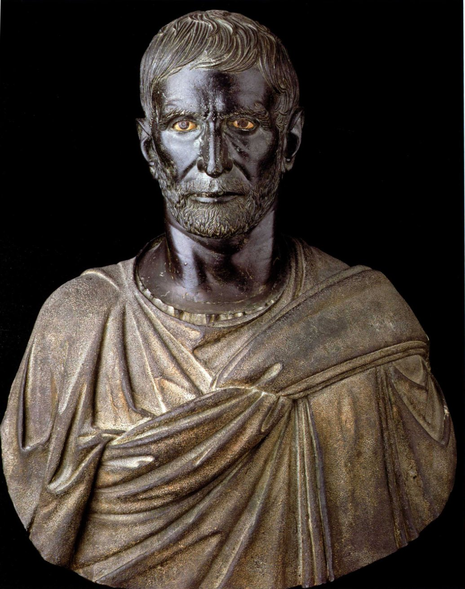

*图7.10 《布鲁图》（Brutus）。公元前 4 世纪晚期或公元前 3 世纪早期。青铜，比真人略大。罗马护宫博物馆（Museo del Palazzo dei Conservatori）*

> **材料与技法：复制希腊雕塑**
>
> 为满足日益增长的对希腊雕塑的需求，艺术家们在雅典和罗马设立了复制工坊，在那里生产著名“杰作”的复制品。有些复制品可能相对忠实于原作；有些则进行了改动，复制者自己的创造力得到自由展现。由于现存的希腊原作数量稀少，学者通常难以断定原作的外形，因此也难以判断哪些复制较为精确，而哪些有改动之处。要识别一个青铜原作的大理石复制品（是精确的复制品还是有自由发挥之处），线索之一是看有无加固石材的支撑物，因为大理石与青铜的抗拉强度不同（见图5.33臀部的树干和支撑物）。
>
> 长期以来，学者都认为罗马复制者使用了一种打点的设备，与19世纪早期的打点设备类似，但由未完成的雕塑来看，复制可能使用的是另一种技术，称为三角测量法，使用的工具是测径规。在模型上选定三个点，再在石料上标出间距相同的三个点，艺术家就能将原件上的任意一点测定并转移到复制品上。雕塑家测量这第四个点分别到三个点的距离，然后用测径规根据测量值在石料上以三点作弧，弧线交汇之处就是复制品上的第四点（见图）。如果不是按原作大小来制作复制品，艺术家只需以一定比例放大或缩小这些测量值。如此确定若干点之后，雕刻家就凿去点与点之间的石材。复制成品的精确度取决于雕刻家取点的多少。

> 

> *三角测量法过程*

**肖像雕塑** 据历史文献记载，元老院和罗马人民为了表示对功勋卓著的政治或军事领袖的崇敬，将他们的雕像树立在公共场所，通常是市中心的罗马广场。这种习俗从共和时代早期开始，一直延续到帝国末期。许多早期人像是铜质的，没有保留下来，因为它们后来被熔化，用于铸造钱币或兵器。图示是一件庄严的青铜男性头像，铸于公元前4世纪晚期或公元前3世纪早期，虽只是全身像的一部分，却已能使人感受到这些雕像整体的风韵（图7.10）。它发现于16世纪，古物研究者当时称它为“布鲁图”，也就是共和国的奠基者和第一任执政官。这尊肖像比真人要大，其特点在于面貌棱角分明：脖颈结实，短须使得下颏更显方正，颧骨突出，额头光洁。这个形象的力量不是来自古典时期的理想化，或是阿卡德君王肖像那样的程式化特质（见图2.12），而是来自记录着跌宕人生的皱纹和沟壑。略向下颔首的姿态也许说明人物全身像是骑在马上，高于观者的平面。

大部分共和国时期的肖像都制作于公元前2世纪末和公元前1世纪，以石料刻成。多数表现的都是老年男子（图7.11）。皱纹满面，在脸颊和额头刻下深深的痕迹。疣、鹰钩鼻或后移的发际线等面部特征都被加以强调而不是遮掩。在图示肖像中，这个男子的秃头原先被遮住，表明他是一位祭司。尽管本人的相貌无从得知，雕像看来十分写实，学者们称这种风格为写真主义（veristic），源于拉丁语的“verus”一词，意即“真实”。在一个21世纪的观者看来，这些形象绝不是理想化的。但应当记住，各个文化都有自己的理想化形象。罗马人认为，责任和阅历是随着年龄增长积累起来的，大部分地方官职都有最低年龄限制。因此带有岁月痕迹的形象传达了赢得政治选票必备的资质。

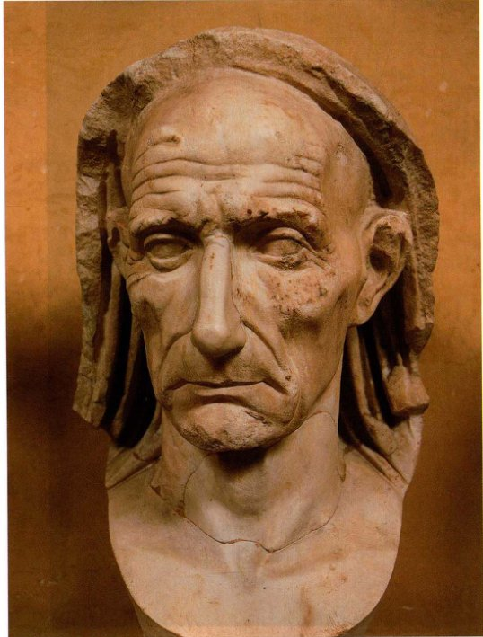

*图7.11 写真主义的男性肖像。公元前1世纪早期。大理石，真人大小。罗马梵蒂冈博物馆*

刻画逼真形象的动力来自何方，这是学者一直期望解答的问题。有人认为它源自古希腊的一个还愿习俗，就是在圣所设立运动员和其他重要人物的雕像，而确实有一些罗马雕像是采用希腊化风格。希腊化时期的统治者肖像也起了一定作用，庞培的肖像有亚历山大大帝一样的乱发，及其标志性的额前翘起的一绺头发，以显示年轻领袖的个人魅力（图7.12，见图5.70）。其他人则认为它来源于意大利地区在家中保存祖先面模作为家谱的习俗，因为在意大利，良好的出身是公共事业中最可靠的进身之阶。据公元前2世纪中期的希腊史学家波利比乌斯（Polybius）记载，在埋葬一位家庭成员前，在世的亲属会戴祖先的面模走在葬礼行列中，在旁观者眼前展示家族的历史（见第190页的原始文献）。他的描述经常被用来解释图7.13中的雕像，一个男子身着托加袍，手中捧着两尊胸像。然而，尽管雕像本身可能也有纪念意义，三维的胸像与面模还是截然不同的。滑稽的是，这个雕像自身的头部并不属于这尊雕塑，而是来自另一尊雕塑。

> **大事年表**
>
> *   约公元前509年 - 罗马人推翻王政，废除最后几位国王
> *   约公元前484-前425年 - 希腊史学家希罗多德在世
> *   约公元前300年 - 罗马青铜头像《布鲁图》
> *   至公元前275年 - 罗马征服意大利全境

对于这类共和国时期的肖像，学者难以确认其中的人物，指明肖像对象的铭文很少见，而有助于辨认公众人物的钱币肖像直到公元前1世纪中叶才开始出现。与此相反，我们可以轻松辨认出相关类型纪念物所表现的个体。在共和国晚期和奥古斯都时期，解放的奴隶定做浮雕群像，摆放在路边的墓葬纪念碑上（图7.14）。这些人像通常为齐肩胸像，四周环以长方形边框。仅仅是视觉表现本身就表明他们已恢复了自由身，其他细节线索也强调了这一信息，例如在男子手上描画或雕刻出戒指，或男子与女子右手相握，象征婚姻，这在奴隶之间是非法的。有一则铭文标出了他们的名字，并注明他们已获自由。在图示例子中，他们过去的主人出现在浮雕正中。

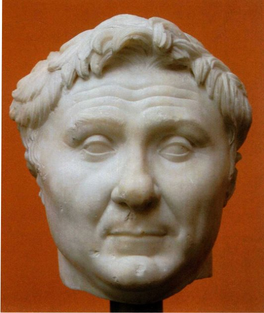

*图7.12《庞培像》。克劳狄复制品，原作制于约公元前50年。出自罗马“盐之路”的李锡尼墓（Licinian tomb）。哥本哈根卡尔斯伯艺术博物馆*

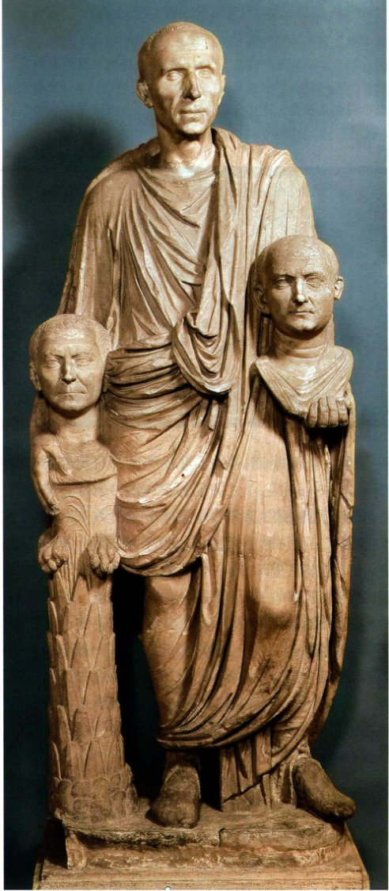

*图7.13 手捧胸像的着袍男像。公元前1世纪晚期。大理石，真人大小。罗马蒙特马蒂尼博物馆（Museo Montemartini）*

### 绘画

令人惋惜的是，独立肖像的背景环境只有极少数是我们已经了解的。除了在家中和公共场所摆放肖像，罗马人还将它们放在墓中。墓葬不仅仅是死者的安息地；它是葬礼仪式的中心，在共和国时期，它成为了展示祖先功绩、提高家族地位的舞台。墓葬内外的绘画很好地达到了这一目的。

罗马埃斯奎里内山（Esquiline Hill）的一座墓葬出土了一张绘画残片，年代为公元前4世纪晚期或公元前3世纪早期，描绘的是罗马人与相邻部族萨姆尼人（Samnites）之间的冲突（图7.15）。右上方一个着托加袍的人物标为昆图斯·法比乌斯（Quintus Fabius），也许就是墓主人。他手持长矛，刺向左边的萨姆尼人法尼乌斯（Fannius），后者身着缠腰布和金色护胫甲，身后是一堵雉堞状城墙。上层标注表明这个图像记载了特定的事件，与上文讨论过的浮雕表述建造人的生前功绩相关。据文献记载，罗马将领们会命人将他们最引以自豪的战功画在画板上，在凯旋的队伍中公开展示，然后放入神庙等公共建筑中。

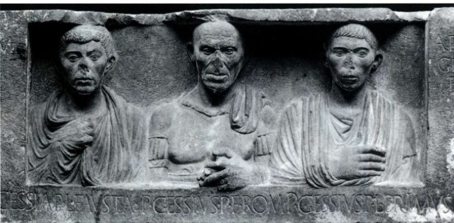

*图7.14 盖西（Gessii）墓石浮雕。约公元前50年。大理石，高65 ×宽204.5 × 厚34 厘米。波士顿美术馆，Archibald Cary Coolidge 基金*

> **原始文献：波利比乌斯（约公元前200年一约公元前118年）**
>
> **《历史》，出自第六卷**
>
> 波利比乌斯，希腊史学家，活跃于罗马征服希腊时期。他的著作《历史》记录了公元前3世纪罗马兴起直至公元前146年科林斯陷落。在第六卷中，他探讨了罗马胜利的文化原因和其他因素。
>
> 每当杰出人物去世······他们就将死者的像放在屋内最醒目的位置，收在一个木质龛盒里。这个像是一个面具模，精准地复制了死者的面部特征和表情。在公共祭祀的场合，他们会将这些面具陈列出来，并精心装饰；每遇家族内显赫人物过世，他们就会在出殡时使用面具，挑选与死者身材仪态最相近的人戴上面具。这些代表身着托加袍，若死者是执政官或行政长官则镶紫边，调查官为全紫，若曾有战功或类似功勋则镶金边。他们都乘坐在二轮战车中，前导的有束棒、斧头和其他代表权势的器物。到达演讲台后，都在一排象牙椅上坐下。对于一个渴望声名与崇高的年轻人来说，很难找到一个更使人尊贵的场面了。这些声名卓著的人物同时出现，仿佛他们还活着，还在呼吸，谁不会为此情此景所鼓舞？·····通过这种方式，通过不断重复英勇人物的正面事迹，那些丰功伟绩的缔造者也得以不朽。······然而最重要的结果是，年轻人由此受到激励，为人民福祉忍受磨难，期望赢得与那些伟人同等的荣誉。
>
> *SOURCE:POLYBIUS: THE HISTORIES, VOL. 3, TR. BY W.R. PATON (CAMBRIDGE, MA: HARVARD UNIVERSITY PRESS,1923)*

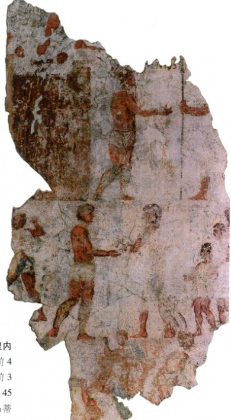

*图7.15 埃斯奎里内墓葬绘画。公元前4世纪晚期或公元前3世纪早期。87.6x45厘米。罗马蒙特马蒂尼博物馆*

## 帝国初期

共和国最后一个世纪，罗马纲纪渐乱，野心勃勃的人物为了罗马的至高权力争夺不休。公元前44年3月15日，尤利乌斯·恺撒遇刺，这是维护宪法的最后努力。公元前27年，元老院宣布屋大维为奥古斯都·恺撒。他声称自己恢复了共和，同时开创了一个新的和平时代。事实上，由奥古斯都开始，君主制重新进入罗马，并将持续数代王朝，直至权力逐渐转移到君士坦丁堡（Constantinople，开始于约公元330年），其间仅受到零星挑战。罗马帝国的诞生为地中海地区带来前所未有的安定。罗马的疆域持续扩张，在图拉真治下（98-117年）达到顶峰，其时帝国占据欧洲大部，北达英格兰北部，跨越包括亚美尼亚（Armenia）和亚述在内的中东大部，直抵北非沿海地区。所有这些地区都实行了罗马化。罗马的政治、社会及宗教体制与本土体制相融合，在罗马世界的大部分地区实现了一定程度的同化。皇室逐渐成为罗马公共艺术和建筑的主要赞助人。这些公共纪念性建筑通常强调皇室的合法性。

> **大事年表**
>
> *   公元前200一前150年 - 罗马的艾米利亚柱廊，已知最早的全混凝土建筑
> *   公元前106年 - 罗马演说家和政治家西塞罗诞生
> *   公元前2世纪末 - 希腊和小亚细亚被罗马征服
> *   公元前80-前70年 - 建造罗马的波尔图纳斯神庙

### 肖像雕塑

尤利乌斯·恺撒被刺杀时，他的养子兼继承人屋大维只有18岁。他为恺撒雪仇，击溃马克·安东尼和克里奥帕特拉时，也仅仅35岁。共和国时期风行的写真主义肖像风格难以捕捉他青春的活力，事实上可能会适得其反，凸显他继承罗马皇权与合法性的悖离。与之前的庞培一样，屋大维转而采用一种更希腊化的风格。直到古稀之年辞世，肖像中的他依然青春永驻，例如在他的妻子利维亚（Livia）的第一执政宅邸中发现的奥古斯都像（图7.16）。雕像中的皇帝一身戎装，右臂举起，似要发表演说。这个肖像显示出一系列与以往的艺术品和历史事件的关联，试图以此巩固奥古斯都权威的正统性。

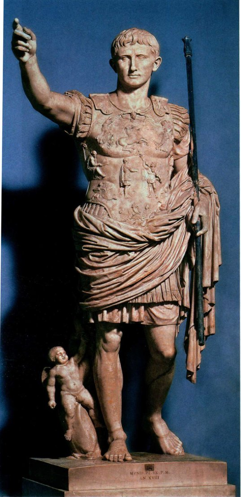

*图7.16 《第一执政奥古斯都》。可能是罗马时的复制品，原作制于约公元前20年。大理石，高2.03米。罗马梵蒂冈博物馆新馆（Braccio Nuovo, Musei Vaticani)*

对立平衡的姿势和柔和的脸部特征颇具波利克里托斯的《持矛者》的特色（见图5.33）。二者如此相似，我们甚至可以断言，奥古斯都刻意模仿了这个著名的形象。这样的仿效是有充分理由的：古典希腊风格带来了雅典文化的鼎盛期，显示奥古斯都治下的罗马既继承了希腊的文化优越地位，又是希腊文化的征服者。这种风格也用于表现其他皇室成员，如利维亚，她的肖像与希腊女神像相似（图7.17）。就连奥古斯都的头发也与《持矛者》类似，只不过皇帝前额的发绺略为分开，含蓄地模仿了另一位年轻将帅——亚历山大大帝，额前翘起的头发正是亚历山大肖像的突出特征（见图5.70）。

在奥古斯都的右脚踝边，有一个顽皮的小天使骑在海豚背上，正起到支撑大理石像的作用。大多数罗马人都会认为，那个小丘比特（Cupid）——或称厄洛斯，维纳斯之子——表明奥古斯都宣称自己是爱神的后裔，特洛伊勇士埃涅阿斯的后代。海豚使人想到海洋，尤其是亚克兴角（Actium）近海，因为奥古斯都曾在那里击败马克·安东尼和克里奥帕特拉。通过联系历史或神祇形象，雕像使奥古斯都具有了人神共赋的力量，超于其他政治家之上。

皇帝护胸甲上的图像也有类似的作用，意在提示人们公元前20年的一次重大外交胜利。公元前53年，安息人夺取了罗马军队的军旗，使罗马极为羞愧；公元前20年，他们归还了这些军旗。接过军旗的人物通常被认为是奥古斯都的最终继承者提比略（Tiberius），或是战神马尔斯，移交军旗的安息人战士可能就是安息国王弗拉特斯四世（Phraates IV）。场景四周环绕着天神和尘世间的形象，赋予这一事件以伟大永恒的意义。这一外交胜利在奥古斯都的政治宣传中举足轻重。护胸甲上的场景也表明雕像制作于约公元前19年。皇帝赤足，这通常显示神圣的地位。在罗马帝国后期和东罗马帝国，皇帝在世时也有可能被描绘成神，但在罗马人对恺撒还记忆犹新时，奥古斯都不太可能如此张狂。一些学者推论，这尊雕像是奥古斯都死后的复制品，原作是完成于约公元前20年的一尊青铜像。

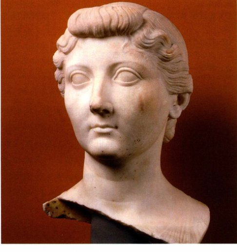

*图7.17《利维亚像》（Portrait of Liria），出自法尤姆。公元14年后。大理石。哥本哈根卡尔斯伯艺术博物馆*

《第一执政奥古斯都》（The Primaporta Augustus） 说明罗马艺术倾向于通过联系以往的作品来传达某种信息。当然，不是所有罗马人都能理解某件作品的所有关联，但经常进行视觉艺术的“引经据典”表明罗马人与许多其他古代民族一样，非常善于运用视觉力量。事实上，罗马肖像的历史与罗马艺术的许多其他分支一样，是一个与以往图像不断关联和背离（或者说是持续偏离）的过程。例如奥古斯都帝位继承人的肖像，看起来很像传下皇权的第一位皇帝，虽然他们几乎没有血缘关系（或者至多也只是远亲）。自弗拉维安（Flavian）王朝的奠基者维斯帕芗（Vespasian）皇帝开始（图7.18），肖像风格逐渐回归真实。他经过一年内战，于公元69年掌权，学者推断这种风格变化是他试图恢复社会秩序的策略。行伍出身的维斯帕芗以战功来确立权威，粗犷写实的形象将助他赢得军心。数年后，图拉真的肖像恢复了奥古斯都所用的古典主义风格，模仿了后者浓密的头发和光滑的面庞，似乎永远处于壮年。继位者哈德良进一步推行希腊风格，由于崇尚希腊文化，他被称为“小希腊人”（The Greekling）。肖像中的他蓄着希腊哲人一样的络腮胡（图7.19），关于他试图掩饰痘疤的传说不足为信。在哈德良统治期间，雕刻家开始雕刻眼睛的瞳孔和虹膜，而不是采用描画的方法。

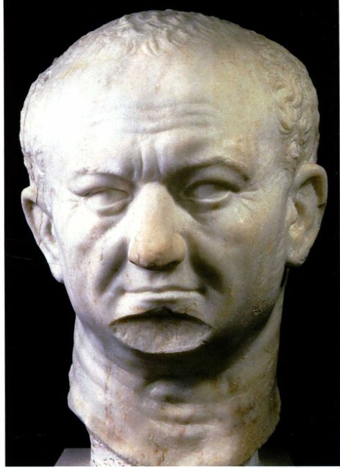

*图7.18《维斯帕芗像》（Portrait of Vespasian），约公元75年。大理石，真人大小。罗马国家博物馆（Museo Nazionale Romano）*

诸如此类的皇室肖像大量存世。总体而言，它们可归为几类，表明存在一个原版肖像，多是为某个特殊场合制作，由原版复制而成的作品用以在罗马内外广泛流通。雕刻家也会复制这些复制品，如同不断扩散的涟漪，遍及整个帝国。还有许多非王室肖像也留存下来。学者很难确认他们的身份，但可以根据与皇室肖像的相似性确定制作年代。在研究女性肖像时，发型特别有用，因为它们变化比较快。利维亚的发型相对朴素，额前有一个发卷（见图7.17），而维斯帕芗之子图密善（Domitian）的妻子发髻高耸（图7.20），二者相去甚远。她的头发盘绕一个支架，本身就是一件杰作，在雕塑中出现则表明了这位女性的地位，也给了雕刻家一个难得的机会来探索皮肤和头发之间的质感对比，充分运用大理石来表现光影的强烈变化。

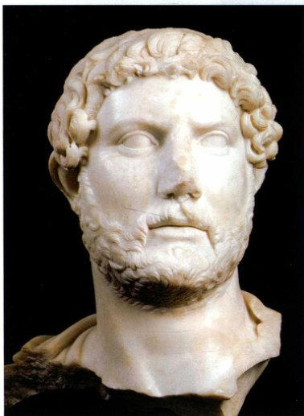

*图7.19 《哈德良像》（Portrait of Hadrian）。公元117年后。大理石。罗马国立博物馆*

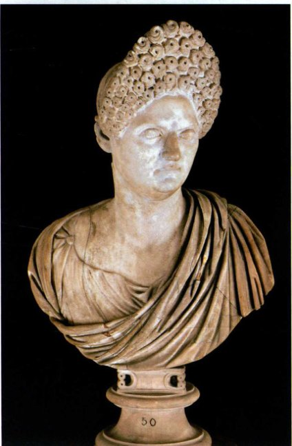

*图7.20 《图密西娅·隆吉娜像》（Portrait of Domitia Longina）。公元1世纪晚期。大理石，高60.8厘米。承蒙得克萨斯圣安东尼奥艺术博物馆（San Antonio Museum of Art）允许。Gilbert M. Denman，Jr. 捐赠*

自公元2世纪下半叶起，罗马肖像逐渐变得更加抽象，尤其体现在对眼睛的处理上，厚重的眼睑使它们显得冷漠疏离。一座马可·奥勒利乌斯（Marcus Aurelius）的杰出鎏金青铜像就是其代表，中世纪时，因为基督徒误将它认作基督教的卫护者君士坦丁大帝（Constantine the Great），这座雕像才没有被熔毁（图7.21）。皇帝威严地坐在一匹骏马上，单臂前伸，表示宽恕。坐骑右前蹄抬起，蹄下曾经踩着一个被征服的野蛮人。哈德良与大多数二三世纪男性雕像都蓄有胡须，这尊雕像也不例外。与哈德良一样，马可·奥勒利乌斯热衷哲学，他的斯多噶主义思想至今保存在《沉思录》（Meditations）中，而这种抽象思索也反映在当时的雕像中。例如，马可·奥勒利乌斯之妻福斯蒂娜（Faustina）的精美大理石像就清晰地反映了抽象特征（图7.22）。她的面部经过了细微的理想化处理，眼睑慵懒地搭在瞳孔上。头发的程式化装饰性处理强化了整体的风格化特性。马可·奥勒利乌斯的战袍昭显他的将帅身份，而福斯蒂娜的长袍和披风则是适宜罗马贵妇的庄重装束。这位皇后为她的丈夫生了两个儿子，他们都伴随皇帝出征，为她赢得了军营之母的称号。她的一生体现了最重要的女性美德，皇帝后来将她尊为女神，司掌多产、谦恭、忠诚，以及对家庭的虔诚。

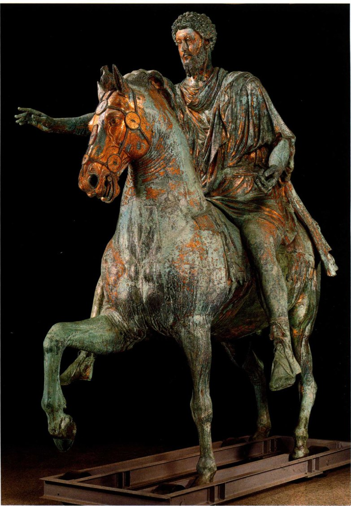

*图7.21 《马可·奥勒利乌斯骑马像》（Equestrian Statue of Marcus Aurelius）。公元161-180年。青铜，比真人大。罗马护宫博物馆*

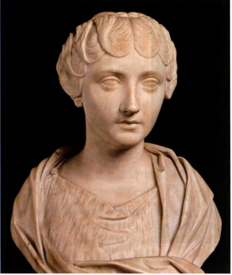

*图7.22 《年轻的福斯蒂娜像》 (Portrait of Faustina the Younger)。约公元147-148年。大理石，高60厘米。罗马加比多里诺博物馆*

### 浮雕

共和国时期定做叙事浮雕来记录特定事件的习俗在帝国时期得到了充分继承。这些浮雕被安放在公共建筑和纪念物中，如奥古斯都和平祭坛（Altar of Augustan Peace ［Ara Pacis Augustae］，图7.23）。公元前13年，元老院和罗马民众许愿，假如奥古斯都从西班牙和高卢平安归来，就建造一座祭坛。公元前9年，祭坛建成。它四周是一圈大理石围墙，全部露天，墙面布满雕饰。东西入口两旁都有浮雕面，刻画的是寓言形象、神明化身和罗马传说中的形象。西端的一块残缺浮雕面表现的是一匹母狼给婴孩时的罗慕路斯和雷穆斯哺乳，在一旁看护的是牧羊人福斯图卢斯（Faustulus），正是他发现并抚养了这两个孩子。在第二块浮雕上，埃涅阿斯（根据最近的解读，也可能是罗马的第二任国王努马［Numa］）在一个以粗石建成的祭坛上举行祭祀。东端浮雕描画的是罗马女神坐在自己的武器上，与她相对的是一个代表和平的女性形象（女神维纳斯或刻瑞斯，也有可能是和平女神或大地之母）。这些浮雕面共同传达了奥古斯都期望宣扬的和平信息，与此前内战的悲惨黯淡形成对比。同样的信息也显现在环绕围墙下部的茛苕叶饰浮雕中。植物生长茂盛，枝叶翻卷，蜥蜴和蛙等小动物安居其中。

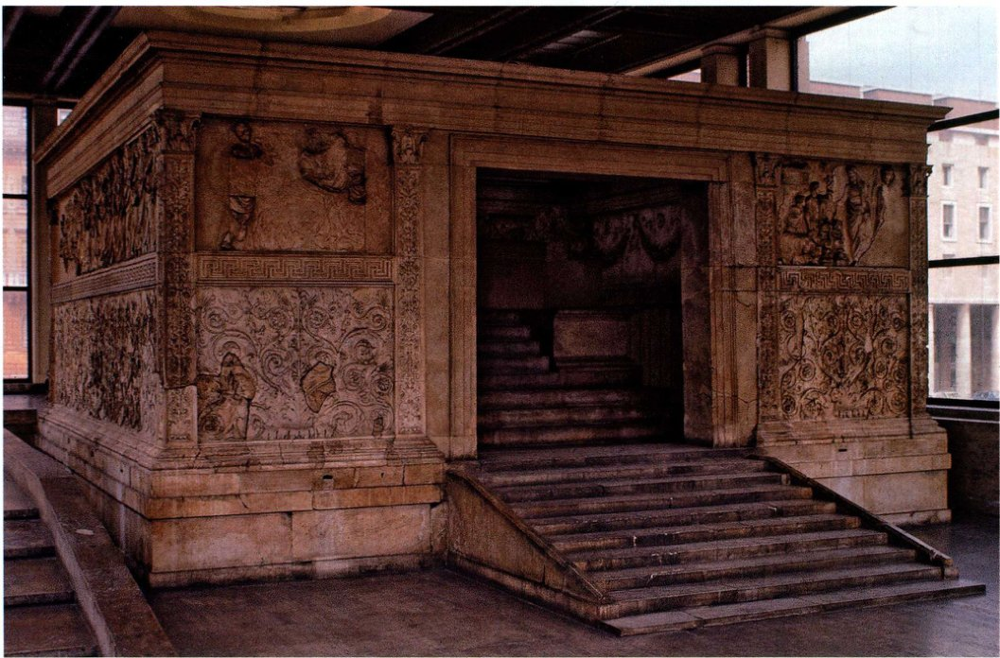

*图7.23 奥古斯都和平祭坛，西立面。公元前13一前9年。大理石，祭坛宽约10.7米。罗马和平祭坛博物馆*

南面和北面的上层浮雕是一支连续的行进队列，其中有皇室的特定成员以及祭司和元老（图7.24）。这组檐壁浮雕似乎记录了一个特定事件，可能是一次祭祀活动，或是祭坛建成的典礼。浮雕上奥古斯都所在的位置恰好有一个大豁口，假如他的动作被刻画出来，或许就能揭示出这究竟是什么事件。尽管如此，这些浮雕带仍然有许多重大意义。它们的外形与希腊帕特农神庙的檐壁雕饰（见图5.46至5.48）相似，再次证明奥古斯都时代对希腊风格的偏好。浮雕中有利维亚等皇室显贵女子，还有孩童。一位学者有力地论证说，将他们刻画在队列中表明家族和王室的重要性，暗示皇帝规定的道德律令：贵族禁止通奸，鼓励生育。

*图7.24 奥古斯都和平祭坛，南面檐壁的皇室队伍。公元前13-前9年。大理石，高1.6米。罗马*

浮雕也用于装饰独立的拱门。共和国时期，凯旋的将领首次立起了拱门，但这些早期建筑无一存世。历经岁月交替，许多拱门都颂扬着赫赫战功，同时也是阵亡者的纪念碑。我们很容易理解，为什么它们对西方建筑产生了持久影响：作为有着独立立柱的结构，它们存在的理由（raison d'être）主要是传达视觉信息。这些拱门通常矗立在公共空间的入口处或入口附近，形成两地之间的过渡空间或者阈界（liminal，源自拉丁语limen，意为门槛）。阈界在许多文化中被认为是不安宁的，需要防护，大家可能注意到，美索不达米亚的拉玛苏就守护着入口（见图2.19）。提图斯（Titus）是维斯帕芗的儿子和继承人，他的凯旋门立在罗马广场的最东端。这是罗马存世最早的独立拱门，不过有相当一部分在1822-1824年经过了瓦拉迪耶（Valadier）修复（图7.25）。拱门有可能是一座凯旋纪念建筑，但它的铭文和一小块浮雕明确地将提图斯刻画为神，所以拱门更有可能是在公元81年提图斯驾崩后对他的神化。主要的两段浮雕都位于柱间板（bay），表现的均是公元70年征服耶路撒冷后的凯旋场景。在其中一段浮雕中，士兵们正扛着战利品穿过街道，战利品中有一座七枝烛台（一种犹太烛台）和其他从耶路撒冷的神庙中掠取的圣物（图7.26）。这块浮雕处理空间的手法标志着向幻觉主义的发展。雕刻家以不同深度的浮雕刻画了两个层次的任务。表现背景人物的浮雕很浅，仿佛他们渐渐消融在远方。队伍行列在边缘处戛然而止，似乎他们还在观者的视线外继续前行。右侧的队列消失在一座凯旋门中，凯旋门与背景形成一定角度，只有靠近观者的一半在浮雕中表现出来，造成一种空间纵深的幻觉。浮雕面中央甚至稍稍隆起，这样在一个站在拱门内侧的观者看来，队伍就似乎转向右侧，于是观者也融入其中。

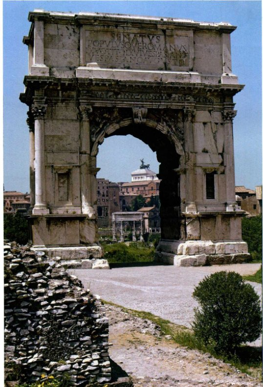

*图7.25 罗马提图斯凯旋门。约公元81年。大理石*

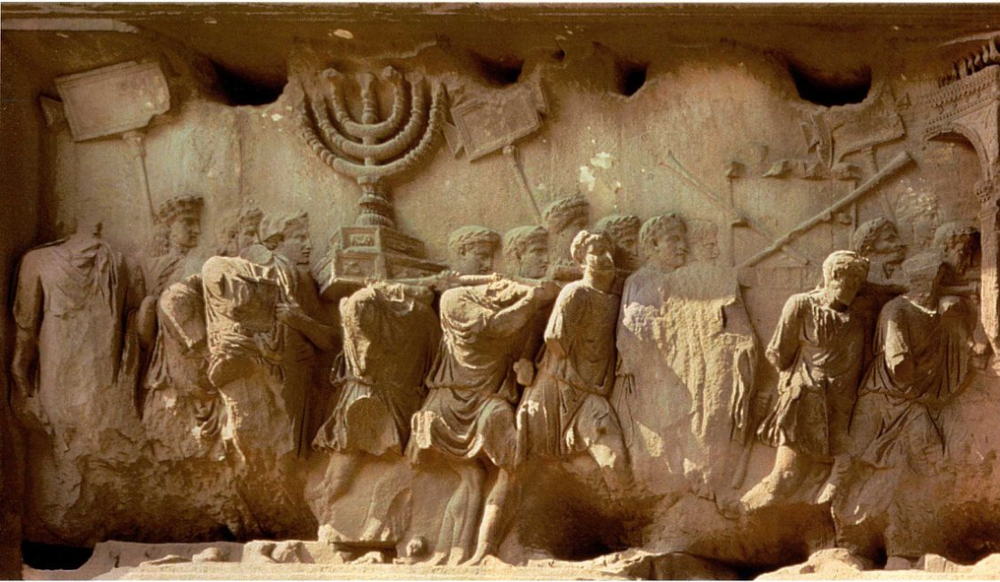

*图7.26 提图斯凯旋门柱间板浮雕，展示从耶路撒冷神庙掠取到的战利品。约公元81年。大理石，高2.39米。罗马*

在另一块浮雕上，意气风发的提图斯站在战车中，下方是密集的人群，同样运用了多层次的浮雕技法（图7.27）。马匹都是侧面观，战车则是正面观，使人觉得凯旋的队伍正迎面走来。在皇帝身后，胜利的化身正为他的战功加冕，其他神祇的化身（荣誉之神和美德之神，也可能是罗马神）伴随着马车前进。场景中有几位神祇，却没有维斯帕芗，而根据犹太历史学家约瑟夫斯（Josephus）的记载，他应该身在其中。对于那些误以为罗马视觉叙事准确描述了历史事件的人而言，这正是一种提醒。（见第198页的原始文献。）这些叙事所表现的事件都是经过编排构建的，服务于建造者的意愿。

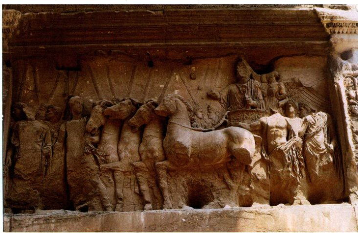

*图7.27 提图斯凯旋门柱间板浮雕，表现提图斯乘战车凯旋*

> **原始文献：约瑟夫斯（公元37/8-约100年）**
>
> **《犹太战争》（Jewish War），出自第七卷**
>
> 犹太战士兼历史学家约瑟夫斯·弗拉维斯（Josephus Flavius）出生于耶路撒冷，原名约瑟夫·本·马提亚斯（Joseph Ben Matthias）。在尼禄统治期间，公元66至70年间反抗罗马起义的时候，他被任命为加利利（Galilee）的指挥官。降敌之后，他得到了将军提图斯·弗拉维斯·撒比努斯·维斯帕芗（Titus Flavius Sabinus Vespasian）的青睐，并且被赐予弗拉维斯这个名字。约瑟夫斯来到了罗马，在那里撰写了战事记录（公元75-79年）和《犹太古迹》（Antiquities of the Jews，公元93年）。以下这个段落摘自他所书写的起义历史，描绘了公元70年攻克耶路撒冷（Sack of Jerusalem）之后，军队进入罗马的凯旋仪式，这一场景也被表现在提图斯凯旋门上（见图7.26、图7.27）。
>
> 如此恢宏壮丽的场面与辉煌，以每一种可以想见的形式发生着，这里有艺术品、令人眼花缭乱的财宝，还有极其罕有的自然物品，让人难以做出一种有价值的描述。富有的人们曾经收藏过的几乎所有奇妙和昂贵的东西，一件又一件，来自世界各地，都汇聚在这一天里展出，这是罗马帝国之伟大的真实写照。人们可以看到被做成各种形状和物品的大量金银与象牙，它们给人的印象并不是游行队伍扛着展示物，或许大家更愿意把它们比作流淌的河水。织毯也被展示出来，一些被染成紫色，极其罕有；另外一些则以高度精确的技法，绣上了各种生动的人物图案，这是巴比伦人的杰作。透明的宝石或被嵌入金冠，或以其他方式来展示，成担的宝石出现在游行之中，以至于人们以前视之为稀有之物的想法似乎变得毫无意义。尺寸巨大、做工精湛的罗马神奇图像也在这里展示，而且无一不是使用昂贵的材料制成的·······
>
> 其余的战利品随意地堆在一起被人抬出来，其中最有意义的是从耶路撒冷的圣殿缴获的战利品：重达很多塔兰特的金桌，还有金子做的灯台，它的形状与我们通常使用的灯台形状并不一样。灯台上有一个固定在基座上的中心轴，然后从中心轴上延伸出拱形支架来，形成类似三叉戟的形状，支架的每一个末端都锻造着一盏灯。灯盏共有7个，强调出犹太人赋予数字七的尊贵地位。犹太人的律法作为最后一件战利品展出。下一段游行队伍中出现了大量的胜利女神形象。所有女神像都由象牙和黄金制成。维斯帕芗在之后驾车前来，提图斯紧随其后。图密善骑马走在他们身旁，身着令人眩目的华服，跨下坐骑也颇为引人注目。
>
> *SOURCE: J.J.POLLITT.THE ART IN ROME, C. 753 B.C.-A.D. 337, SOURCES AND DOCUMENTS (NJ: CAMBRIDGE UNIVERSITY PRESS, 1983)*

对空间和叙述策略的探索在图拉真凯旋柱（Column of Trajan，图7.28）达到顶峰。纪念柱于公元106-113年间立于图拉真广场西面的一个小庭院内（见图7.33和7.35）。公元117年图拉真去世，骨灰存入柱子的基座内。柱高38米，柱顶立着一尊皇帝的镀金像，已于中世纪时遗失。柱身内部有螺旋形阶梯盘绕而上，直达观景台，观者可以在此俯瞰图拉真的宏伟建筑群。独立的柱子自希腊化时期起就在希腊用作纪念性建筑，但仅凭其规模和观景功能，图拉真凯旋柱就堪称世界奇迹。人们常认为它的设计者是阿波罗多洛斯，曾任图拉真的军事建筑师。但艺术史家通常不关注它所代表的工程奇迹，而是逆时针盘绕于柱身的叙事连续浮雕，浮雕全长约200米，歌颂皇帝战胜达契亚人（Dacians，在今天的罗马尼亚）。

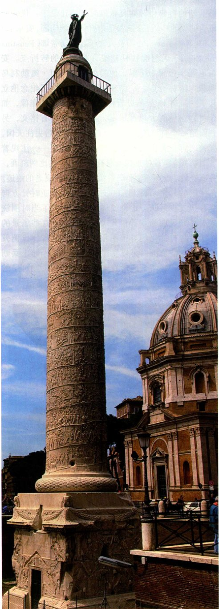

*图7.28 图拉真凯旋柱，罗马。公元106-113年。大理石，高38米*

叙事画面开始于罗马军队跨过多瑙河进入达契亚领地（图7.29）。河流以巨大的河神来表现，左边是载满物资的河船和石岸上的罗马城镇。第二层是图拉真皇帝对部队训话，还有士兵在构建防御工事。在第三层，军队在搭建营帐和桥梁，而罗马骑兵正出发去侦察敌情。在第四层中央，步兵正涉过山溪，右侧是皇帝在达契亚人堡垒前对他的军队慷慨陈词。这些场景足以说明柱上所记录的全部事件。这150多个场景鲜少涉及真正的战争场面，注意力主要放在远征的地理、后勤及政治方面，尤利乌斯·恺撒大帝征服高卢的文献记载也是如此。

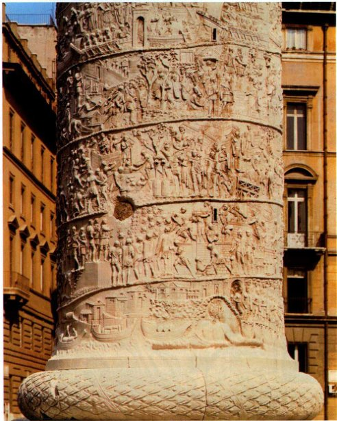

*图7.29 图拉真凯旋柱下部，罗马。公元106-113年。大理石，浮雕带高度约127厘米*

单个的场景之间并未清晰地分隔开来，雕刻家以树木和建筑物来暗示分隔，但所有的场景依旧融合成一个连续的整体，只是图拉真等重要人物多次出现。视觉的连续性得以保持，同时又没有牺牲各个场景的连贯性。尽管亚述和埃及的艺术家们开创了军事征服的视觉叙事形式，但这幅浮雕人物数量之繁，叙述内容之充实，堪称旷世之作。要理解它并不是一件简单的事情。连续的叙事长卷（rotuli）可能是构图的灵感来源，只是目前未发现凯旋柱建成以前的长卷。更成问题的是人们如何观看这幅叙事浮雕。要顺次观看所叙述的故事，就必须仰着头，不断绕着柱子走动。尽管浮雕上涂有颜料，更显生动，但到第四圈或第五圈时，那些细节仅凭肉眼也已难以辨认。

古代或许可以从周围建筑的阳台上看到上层的螺旋形浮雕带，但依旧需要围绕凯旋柱移动。这些问题促使学者提出了阅读这个浮雕的各种方案。他们早就注意到浮雕是程式化的，也就是说一组数量有限的常用画面多次重复。其中包括祭祀场面，皇帝向军队训话，士兵构筑防御工事和摧毁敌城等。虽说重复画面不是完全相同，但也十分近似，在远处也能马上辨认出来，所以上层的浮雕带更加容易理解。设计者还可能将有代表性的重要场景安排在凯旋柱的主轴线上，便于人们从一个角度就能了解浮雕整体的概况。但不能排除设计者想让观者绕柱观看的可能性。还需注意，这个凯旋柱同时也是图拉真的墓葬，而绕圈行进正与广为流行的罗马丧葬仪式（decursio）完全相符，在这个仪式中，凭吊者围绕着墓葬转圈，保护墓中的死者，阻挡鬼邪进入，并对死者表达永久的敬意。

图拉真凯旋柱仍然明显表现出古典化风格，罗马雕塑的古典化时期究竟何时开始让位于古代晚期更为抽象的特质，这依旧是个有争议的问题。安东尼·庇护（Antoninus Pius）及其妻子老福斯蒂娜（Faustina the Elder）的纪念柱柱础或许是关键的转折点。安东尼死于公元161年，他的继位者马可·奥勒利乌斯和卢修斯·维鲁斯（Lucius Verus）为了纪念他立起了一座高15米的斑岩柱，柱顶安有他的雕像，如今仅存白色的大理石基座。柱础一面刻有铭文，另一面是一个有翼的人像正背着皇帝和皇后去往天国，战神之野（火化地点）和罗马的化身在一旁注视着（图7.30）。这些形象身材修长，以古典比例刻画，脸部经理想化处理，平滑柔和，没有任何衰老的痕迹。在柱础的其余两面上，一支罗马骑兵沿逆时针方向绕着一支步兵队行走，或许是如实再现了当时围绕着火葬堆行进的丧葬仪式（图7.31）。这些场景的雕塑风格与神化场景很不相同，士兵的身体比例敦实健壮，整个画面是以鸟瞰的视角展开，而士兵则是侧面观。这两个因素在各行省以及非贵族阶层的雕塑订件中都有同样表现。图7.32是非贵族订件的一个例子，是纪念一个屠夫和一位妇人的墓葬浮雕。图像有一种平面感，与提图斯凯旋门浮雕中对于空间的幻觉处理大不相同（见图7.26和7.27）。人物形象敦实，屠夫的头相对于身体而言显得很大。艺术家的选择或许情有可原：这个浮雕板可能是安置在墓的正面，需要便于人们从远处辨认。图像的线性处理和形式的粗犷正好符合这个目的。将这些特性引入罗马的皇家订件标志着国家艺术中信息表达的方式发生了转变。

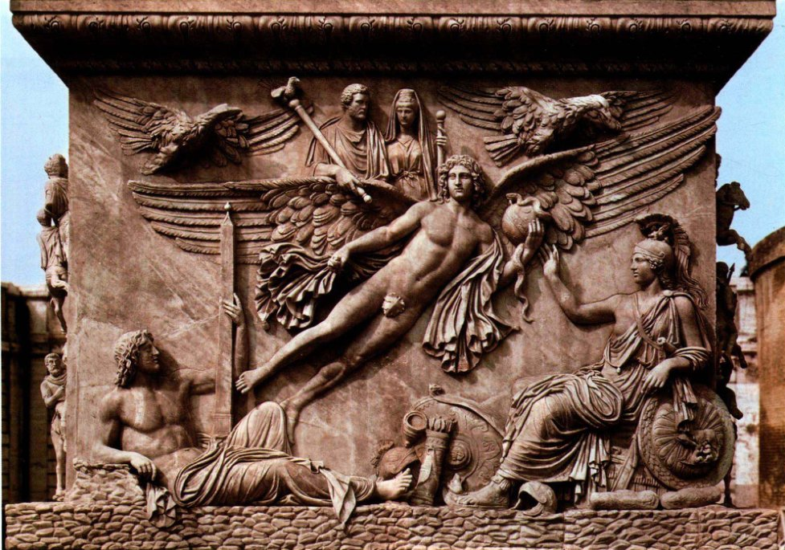

*图7.30 安东尼·庇护及其妻子老福斯蒂娜纪念柱的柱础，《神化》（Apotheosis）浮雕。约公元161年。大理石。罗马梵蒂冈博物馆*

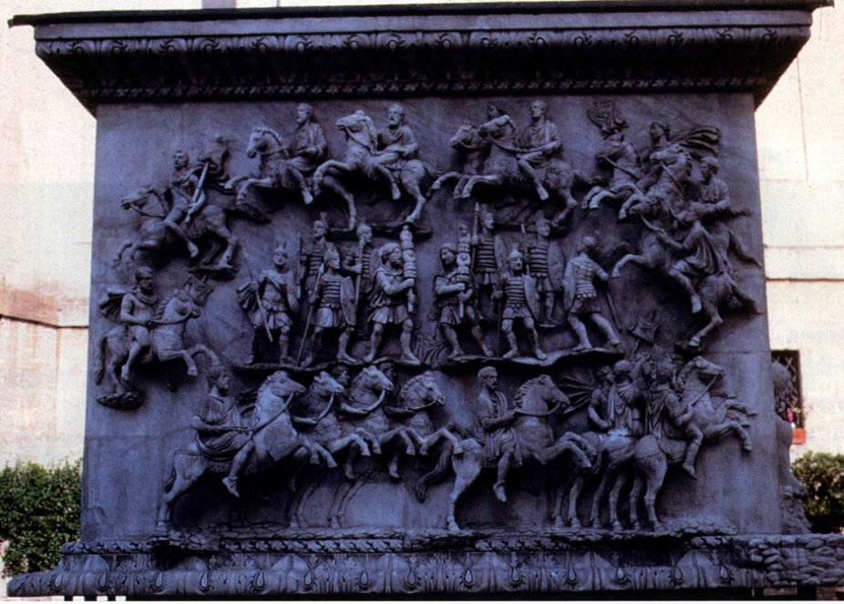

*图7.31 安东尼·庇护及其妻子老福斯蒂娜纪念柱的柱础，《葬礼》（Decursio）浮雕。约公元161年。大理石。罗马梵蒂冈博物馆*

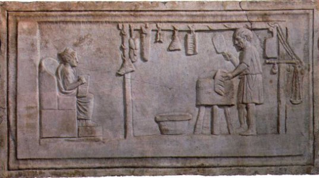

*图7.32 一个屠夫与一位妇人的墓葬浮雕。公元2世纪中叶。大理石，34.5x67.3厘米。德累斯顿国家艺术博物馆*

### 建筑

庞培剧场是罗马独裁者为讨好民众而实施的一系列大型市政建设之一。随后尤利乌斯·恺撒和奥古斯都各自建了一个广场，维斯帕芗、图密善和图拉真都追随了由此创立的传统。如图7.33的平面图所示，这些广场在空间分布上联系密切，邻近的建筑也赋予它们重要意义。进入奥古斯都广场的观者要直接穿过恺撒广场，尤利乌斯·恺撒已被神圣化，也是奥古斯都的先人，这无形中强化了二者的联系。奥古斯都广场包括一个宏大开阔的广场，两条长边排列着柱廊（图7.34）。广场末端是一座雄伟的复仇者马尔斯神庙，是恺撒遇刺后奥古斯都立誓复仇而建。较之普雷内斯太的福尔图娜神庙的自由形式，奥古斯都广场极为规整，受到古典主义影响，这一点与奥古斯都统治时期的大多数建筑一样。这种刻意的选择使人联想到在公元前5世纪，雅典的希腊文化达到顶峰，而大理石的大量使用（可以从卡拉拉［Carrara］新辟的采石场得到）强化了这种效果。雕塑在这个建筑群中无处不在。柱廊中竖立着真人大小、标明身份的伟人像，既有传说中的历史人物，也有当时的人物，显示出今昔关联。在柱廊的顶层，附墙女像柱中间是饰有朱庇特·阿蒙（Jupiter Ammon，撒哈拉［Sahara］之神，有时表现为亚历山大大帝的父亲）头像的盾牌。女像柱模仿了雅典卫城厄瑞克透斯神庙南面门廊的形象，而奥古斯都的建筑师曾经参与过那里的复原工作。过去由加比多里山上的朱庇特神庙（Temple of Capitoline Jupiter）等历史性建筑承担的功能此后都移至奥古斯都广场，通过将国家事务和祭祀活动转移到一个以他的名字命名的场所，奥古斯都明确地将自己置于罗马公共生活的中心。

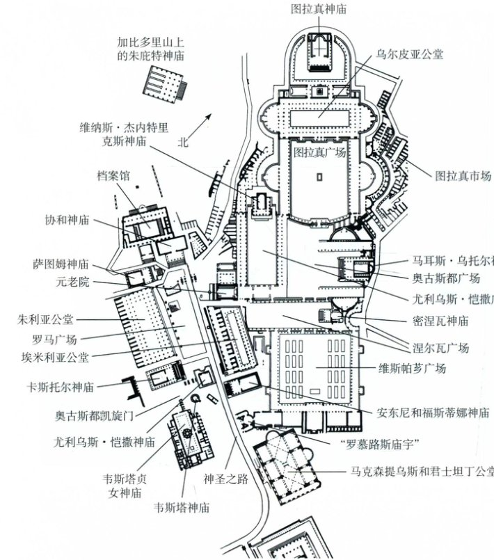

*图7.33 帝国广场平面图，罗马*

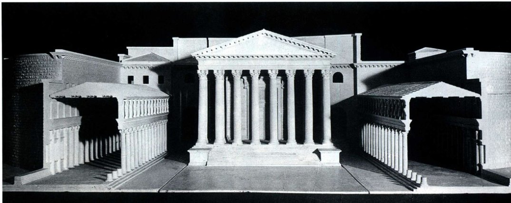

*图7.34 奥古斯都广场，罗马。公元前2世纪完成。模型由Italo Gismondo完成*

在所有的皇家广场中，图拉真广场是最大的，战胜达契亚人获得的战利品提供了充足的财力支持。最近公布的建筑群复原图（图7.35）使人可以遥想它往昔的辉煌。它位于奥古斯都广场一侧，创造性地采用了前者的许多特征，产生了全新的效果。例如，用外来大理石雕刻的达契亚战俘代替了雅典式柱廊的女像柱。在远端的一个公堂之外，两个图书馆和一座神庙形成一个小庭院，那里矗立着图拉真凯旋柱（见图7.28和7.29）。广场传达了一个鲜明信息：罗马在达契亚战争中获益匪浅。与许多社会一样，统治阶层希望通过视觉宣传来消除战争的残酷。

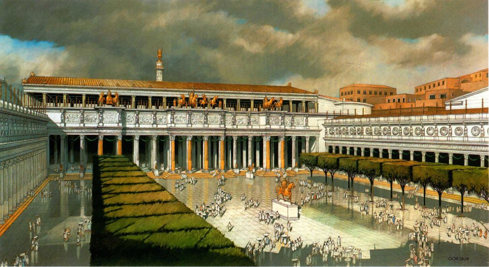

*图7.35 图拉真广场，罗马。复原图由Gilbert Gorski完成*

除了以和平的名义建立一座宏伟广场之外，维斯帕芗还首次在罗马建起了角斗表演的圆形竞技场（amphitheater，图7.36, 7.37和7.38），这种表演是罗马主要的娱乐活动。以往的角斗表演在罗马广场举行，观众区是临时搭建的露天看台。维斯帕芗没有等到斗兽场（Colosseum）完工就去世了，他的儿子提图斯于公元80年主持了落成典礼，随后是长达一百多天的角斗表演，超过9000头动物被杀死。仅就规模而言，这是世界上最大的独立建筑之一：高48.5米，长188米，宽156米，能够容纳45,000至50,000名观众。混凝土建成，表面涂以石灰，这就是它成功的秘诀。在斗兽场的平面图中，80个筒拱的楔形单元呈放射状排列，中央是一个椭圆形的竞技场地。相邻的筒拱互相支撑，使整个环形十分稳固。与庞培剧场一样，这些楔形单元从外缘向场地内侧倾斜，支撑座席，楔形单元内部有无数阶梯和过道，以确保人们能够顺畅进出座席区域和竞技场地。在一年最炎热的日子里，驻扎在附近的水手可以为座席区上方拉起巨大的船帆。庄严而宏伟的大斗兽场外部反映了它的内部结构。斗兽场有80个拱门入口，门框是附在墙上的托斯卡纳式圆柱（Tuscan column，这种柱式与多立克柱式类似，但柱础更简单）。第二层由爱奥尼亚式立柱形成第二圈拱门，第三层饰有科林斯式附壁圆柱（engaged column）。第四层则是科林斯式半露方柱框饰的假拱廊。

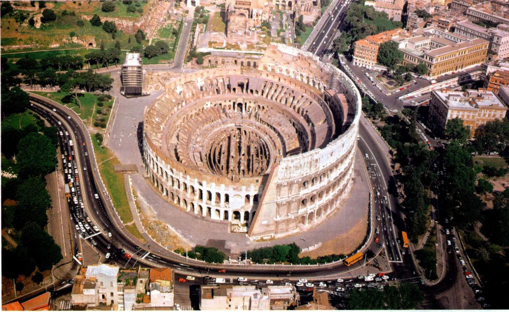

*图7.36 罗马斗兽场。公元72-80年*

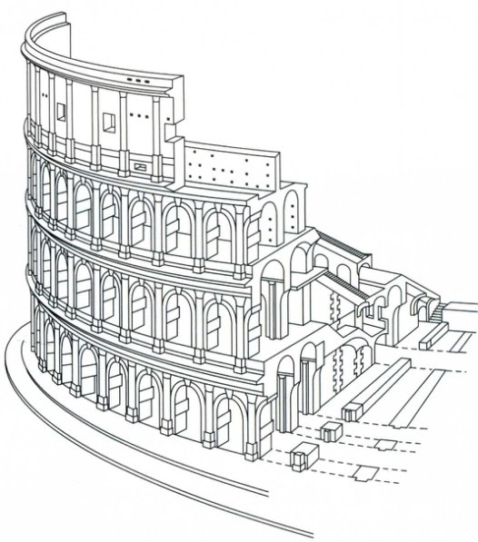

*图7.37 斗兽场截面图*

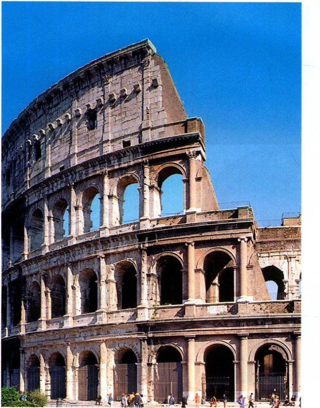

*图7.38 斗兽场外部*

> **大事年表**
>
> *   约公元20年 -《第一执政奥古斯都》原件
> *   公元23/24至79年 - 老普林尼在世；著《自然史》
> *   公元106-113年 - 图拉真凯旋柱在罗马建立
> *   公元117-125年 - 罗马建万神殿

在所有罗马建筑师用混凝土构建的杰作中，最惊人的也许是万神殿（Pantheon，图7.39）。顾名思义，这是一座献给众神的神庙。究其源流，这是一个希腊化时期的观念，在世和亡故的皇室成员也被列入神族。奥古斯都的得力亲信阿格里帕（Agrippa）在现在的位置上建起了第一座万神殿，公元80年被烧毁，图密善进行了重建，却又被闪电击中摧毁。现存的万神殿是哈德良治下所建，哈德良本人可能也参与了修建工作，因为他是一个颇有成就的建筑师。为表崇敬，哈德良在铭文中留下了阿格里帕的名字。这座建筑建于公元117-125年，它的外形与以往的神庙迥然不同。它是罗马保存最为完好的异教神庙之一，这得益于它在公元7世纪早期被改造成一座教堂。但万神殿周围的环境却在时间的流逝中面目全非，观者对这座建筑的体验也因此发生了深刻变化。

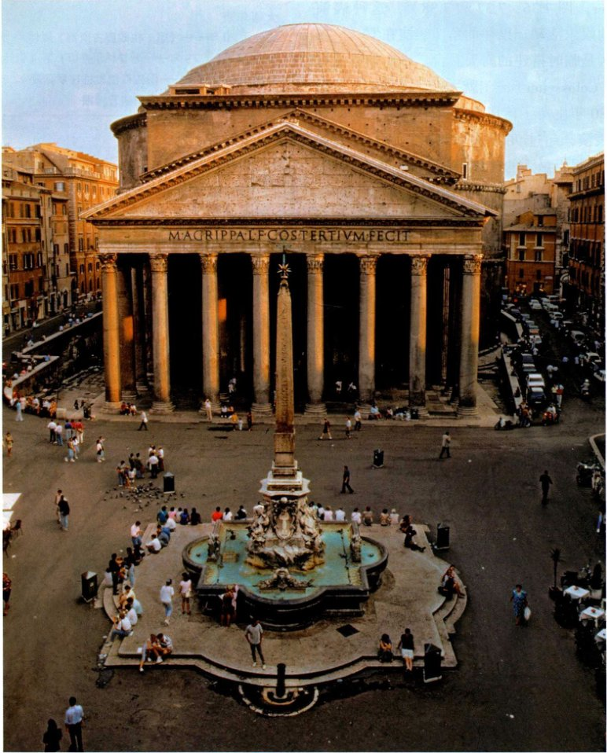

*图7.39 万神殿，罗马。公元117-125年*

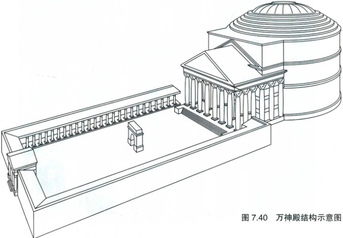

*图7.40 万神殿结构示意图*

在罗马时期，万神殿耸立在一个墩座上，位于一个长方形大庭院的南端（图7.40），柱廊环绕着庭院其余三面，并延伸到南面万神殿山形墙下的门廊。由于柱廊阻挡，观者就看不到神殿的鼓形壁。走近神殿由八根立柱支撑的宽阔立面时，你会被高耸的立柱所震撼，它们都是以单块灰色或粉红色花岗岩凿成。在大多数方面，万神殿与其他神庙的形式大同小异，巨大的青铜门后可以想象是一个长方形内殿，里面供奉着一尊巨大的神像。但惊喜还在后面，一跨过门槛，一道亮丽的光柱就夺走了所有的视线，从头顶的高处一下划破了黑暗（图7.41和7.42）。等到观者的眼睛逐渐适应了黑暗，就会看见一个巨大的圆形殿堂，底层的基本方位上排列着七个大型壁龛。半露方柱和青铜栅栏装饰着阁楼，殿顶是一个硕大的穹顶，一个直径8.2米的明窗（oculus）通向天穹。穹顶与鼓形壁的高度相等，内部的总高度是43.6米，正好等于穹顶的直径。许多古代观者认为，由此形成的球形空间是永恒与完美的体现，而穹顶内部的藻井表面曾饰有青铜花形纹样，一定使人联想起群星闪耀的夜空。

进入内殿后没有明显的导向标记，所以观者只能朝着光亮走向中央。事实上只有站在明窗下才能理解穹顶的藻井（coffer）。观者到达中央后，精心塑造的空间和装饰就共同形成惊人的效果。从文艺复兴开始，学者就发现了万神殿建筑者的一个“纰漏”：穹顶藻井的拱肋没有对齐阁楼中层区域的半露方柱和底层的立柱。但顶层与底层纵向线条不连贯，就视觉上来说，会使人感到仿佛穹顶没有锚定，自由地漂浮在头顶，既像是受它庇护，又像是通过它与天空相通。穹顶似乎处在永恒的运动之中，在头顶旋转，如同它所模拟的苍穹。中央处的地面微微隆起，几乎察觉不到，增强了这种晕眩的不安感。观者的本能反应是退避到墙边。这种感觉必须亲身体验，照片无法传达它的神韵。据文献记载，哈德良乐于在此举行朝会，接见外国使节和裁断争端。神殿的外形将皇帝置于至尊地位，控制着围绕他旋转的世界。在宾客看来，他一定显得像位神明，而他们在这座建筑的掌控下早已满怀敬畏。

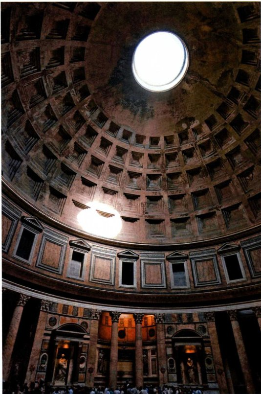

*图7.41 万神殿内部*

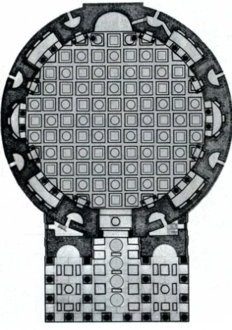

*图7.42 万神殿平面图*

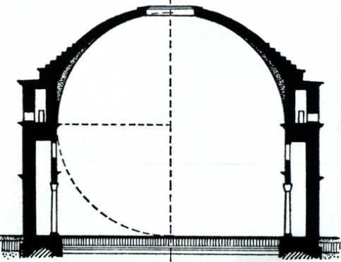

*图7.43 万神殿横剖面图*

万神殿是充分信任混凝土的功能和强度而产生的非凡成果。随着建筑升高，建筑师小心地调整混凝土的骨料来减轻重量，从石灰石到凝灰岩，然后加砖，最后是浮石。穹顶的重量并非均匀地落在鼓形壁（drum）上，而是集中在八根粗大的支柱上（见图7.42）。由于有立柱遮挡，壁龛在视觉上仿佛减轻了墙壁的凝重感，而遍布内部表面的彩色大理石也为建筑整体增添了活力。如同在图拉真广场一样，万神殿的大理石也有象征意味。它们显示了帝国的辽阔疆域，使人联想起与世界各地的贸易往来和控制：埃及（灰色和粉红色的花岗岩，斑岩），弗里吉亚（弗里吉亚的紫色和白色岩石），提奥斯岛（奢华的红色和黑色岩石），突尼斯（Tunisia）的切姆彤地区［Chemtou］（努米底亚［Numidia］黄石）。

自帝国始建，皇帝的主要住所就在罗马的帕拉蒂内山（Palatine Hill，表示王宫的“palace”一词即源于此）。然而与许多贵族一样，皇帝有多处地产，许多是位于罗马之外。最著名的皇家庄园是位于提布尔（Tibur，即今日的蒂沃利［Tivoli］）的哈德良别墅，建于一座共和国时期的别墅的原址之上，由一大片建筑群构成，其中部分或全部可能是哈德良自己设计的。别墅的外形看似顺应地形的自然起伏，但事实上大规模地重整了地形，使其适应建筑，形成开阔视野，幽凉的荫蔽处和柳暗花明的布局。水随处可见，或为池塘或为水渠，叮咚作响，生机盎然，折射光影，消解暑热。别墅中布满镶嵌画、绘画和雕塑，部分是皇帝在各处巡游时搜罗所得，尤其是在埃及和希腊。有些建筑可能意在使人联想到幅员辽阔的帝国：一本4世纪的传记声称哈德良建造蒂沃利别墅时别出心裁，将部分建筑以各行省和地方的名胜命名，例如吕克昂（Lyceum），学院（Academy），公共会堂（prytaneum），卡诺珀斯（Canopus），波耶希尔（Poecile）和潭蓓（Tempe）。“为穷尽万象，他甚至还设计了“地狱”。”这段叙述使现代学者为别墅的许多地方冠上富于想象力的名字。其中大多数不是基于考古证据，因而会使观者误解这些建筑的功能。图7.44所示的水道长久以来一直根据埃及的一个城镇命名为卡诺珀斯，只到最近才开始使用较为中性的名称，布景水道（Scenic Canal）。别墅的其他部分也是如此。

*图7.44 布景水道，蒂沃利的哈德良别墅。约公元130-138年*

## 行省艺术及建筑

罗马威权扩张到辽阔的地域，对那些地区的艺术和建筑也有着深远的影响。因为历史总是由当权者书写，我们通常难以了解当地人对外来统治者的反应。毋庸置疑，罗马统治带来了一些益处。罗马的工程师们掌握了高效输水的技艺，整个帝国内各城镇中心迅速出现的水道沟渠肯定大幅度提高了当地的生活水平。西班牙的塞哥维亚（Segovia）至今留有一条引人注目的水渠（aqueduct），其修建年代为公元1世纪至2世纪上半叶（图7.45）。它从17公里开外的里奥弗里奥（Riofrío）取水，大部分是地下管道，但在接近市镇处，为了跨越山谷，建筑师修建了一座长813米、高30米的宏伟桥梁。水道由118道拱券支撑，在最高处有两层拱相叠。如同大多数行省建筑者一样，这些建筑师使用的是当地的石料，在此例中是花岗岩，堆砌时没有使用灰泥，表面不经打磨，给人坚固结实的印象。除了明显优点之外，水渠也证明了罗马建筑如何影响统治区域。拱券是纯粹的罗马形式，它坚毅地横贯整个疆域，在延伸中象征着征服。甚至输水也是一种征服，对自然的征服。

*图7.45 高架水渠，塞哥维亚。公元1世纪或2世纪早期*

罗马人将他们的生活方式传遍整个帝国，到处兴建罗马风格的剧场和竞技场，以及用于举行宗教仪式的神庙。法国城镇尼姆（Nimes，古称Nemausus［尼玛苏斯］）就有一座保存良好的神庙，名为方形神殿（Maison Carrée）。这是一座典型的罗马神庙，底下是高墩座，正面有一段阶梯。正面横向排列着六根科林斯立柱，通向一个纵深的门廊和后面的内殿，内殿外墙饰有附壁圆柱。学者根据暗榫洞复原了额枋上的青铜铭文，他们长期以来一直认为神庙是在奥古斯都时期献给罗马和奥古斯都的。檐壁上涡卷形的茛苕叶饰使人想起和平祭坛，而石工的风格则与奥古斯都广场上的复仇者马尔斯神庙类似。事实上，学者认为这座神庙证明当时存在流动工坊，这些工坊在罗马和行省作业。最近的研究却对这种观点提出了质疑，它表明历史学家构造了自己希望看到的历史，这是一种危险的做法。暗榫洞其实可以支持任何数目的不同铭文，而整个建筑所使用的模块直到图拉真时期才开始使用。从文献来看，这座建筑甚至可能是祭献图拉真之妻普罗提娜（Plotina）的。

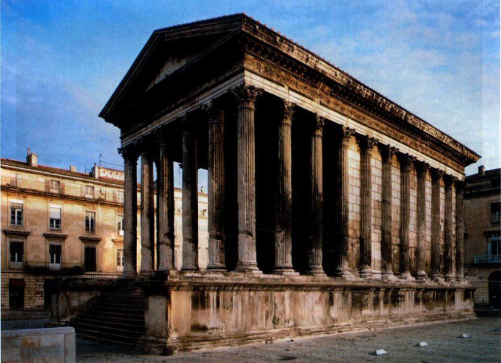

*图7.46 方形神殿，尼姆。公元2世纪早期（？）*

在一些情况下，当地的建筑传统会与罗马风格结合，产生强有力的新效果。艾尔卡兹尼（El Khasneh）宝库就是一例，它位于佩特拉（Petra），在今天的约旦境内，是一处巧夺天工的凿岩正立面（图7.47）。当观者在穿越狭长蜿蜒的西克（Siq）峡谷前往城镇中心之时，首先进入他视线的就是这个正立面。在公元106年罗马人控制这个地区之前，一支叫纳巴泰（Nabataeans）的游牧部落在这里居住，部落中富人的墓穴开凿在玫瑰红的砂岩崖壁上，有些学者认为艾尔卡兹尼就是其中之一。但大多数人都认同它是属于图拉真或哈德良时期。它从一片天然岩石上刻出，类似一座神庙的正面，有六根立柱，立柱上方是饰有花形纹样的额枋和三角楣。在第二层，两旁的柱子支撑着开口三角楣的两个边角，中间是一个圆锥形屋顶的圆形建筑，上有一个装饰性的尖顶（finial）。在较晚近的时期，当地人想象海盗们在尖顶中藏匿了财宝，这座建筑物也由此得名，而尖顶上面的弹孔表明人们曾试图把它打下来。这座建筑突出地融合了纳巴泰的观念和罗马的装饰特征——例如科林斯式柱头和植物纹样。这些建筑元素不具备结构功能，设计也因此可以自由发挥，充满幻想气息，与第二风格壁画中的幻想式远景（见第216页）不无相似之处。轻松处理原本有结构功能的元素，这一手法在公元2世纪的行省和罗马流行起来，学者有时称它为巴洛克阶段，因其与意大利巴洛克建筑有相似之处。这一纪念性建筑的功能可能因罗马人的使用而改变过：立柱间的浮雕表现的似乎是伊西斯崇拜中的形象，表明它可能是一座神庙。在某些情况下，能够找到铭文和其他的书面文献指明在行省定做纪念性建筑的人，定件人可能是当地人或罗马官员，甚至可能是皇帝本人。但更常见的情况是无据可循，就像艾尔卡兹尼一样，因此很难断言选择某种风格的用意。

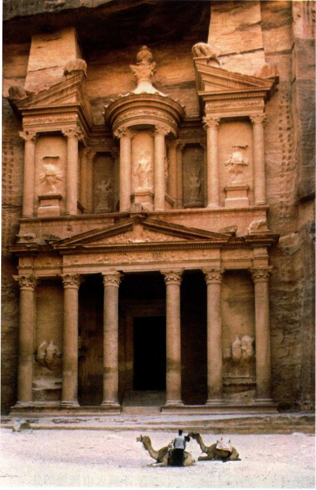

*图7.47 艾尔卡兹尼，约旦佩特拉。可能是公元2世纪早期*

罗马行省的雕塑也别有一番风貌，通常是不同传统融合的结果。图7.48所示的雕像是公元2世纪下半叶的一尊石灰石墓葬浮雕，出自叙利亚帕尔米拉（Palmyra）地区。它原本在一座典型的帕尔米拉塔墓中，封住墓的入口。一则阿拉米语（Aramaic）铭文说明了浮雕中的人物是提布南（Tibnan），一位贵妇，她怀里还抱着一个小孩。这种语言还道出了她的出身，而雕像的严格正面观、凝视的大眼睛、当地的服饰以及发饰带都使她区别于罗马的贵妇（见图7.17, 7.20和7.22）。尽管如此，这尊肖像依旧有着明显的罗马特质：例如她举起右手握住面纱，这一姿势在罗马很常见，象征着贞洁（pudicitia，以示女子对丈夫的忠诚）。肖像简洁地概括了这位外省女子既是罗马人又是帕尔米拉人的双重身份。

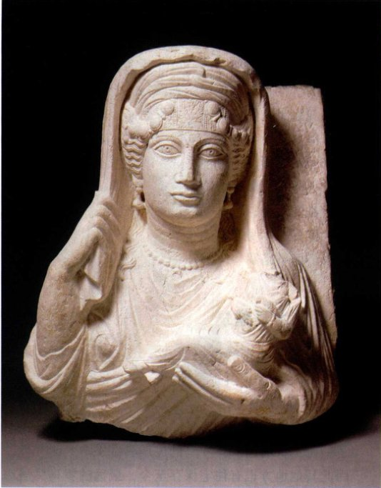

*图7.48 提布南墓葬浮雕，出自叙利亚帕尔米拉。约公元150-200年。绘彩石灰石。巴黎卢浮宫*

> **原始文献：维特鲁威**
>
> 维特鲁威是一位罗马建筑师，他在尤利乌斯·恺撒和奥古斯都时期撰写了一部建筑方面的论著。学者们曾根据他对绘画的评论复原室内装饰，并了解罗马绘画技法和风格的总体发展。
>
> **第七书第五章：绘画中的正确性：概论**
>
> 1．在其余房间，即春室、秋室和夏室，以及在中庭和围柱廊，古人基于可靠的现象为绘画确立了某些可靠的标准。因为绘画表现存在或可能存在的事物，例如人物、建筑、船只及其他形体明确的物件，能够找到它们的实例并模拟描绘。依此原则，开创灰泥壁画的古人先是模仿大理石饰面的多样变化及其排布，然后是模仿檐口和赭石镶嵌的丰富图案。
>
> 2．后来他们进入了下一个阶段，开始模仿建筑物的外形，模仿立柱和三角楣在空间中的投射，而在诸如敞间这样的开放空间，因为墙面很大，他们就画上了悲剧、喜剧和滑稽剧风格的布景，狭长的走道就画上各种风景，根据各地风貌的特色创作而成。港口、海岬、海滨、河流、泉水、海峡、祭坛、圣林、山脉、牧群和牧羊人都一一描画，有些地方还画在纪念性绘画中，与神明相联系上，或有精心安排的神话叙事，诸如特洛伊战争，或尤利西斯四海漂泊的经历，以及其他根据类似原则创造的自然题材。
>
> 3．然而这些以实物为模本的绘画在今天却与败坏的品位冲突。因为如今壁画中画的是怪物而不是明确事物的可靠图像。苇草取代了立柱，三角楣和小卷上缠绕着一圈圈翻卷的叶子和涡卷饰，枝形大烛台托起神龛像，而在这些的三角楣上方，从根部抽出几条卷绕的嫩枝，其中莫名其妙地藏着一些小雕像，或者枝条裂开两半，一些挂着人头雕像，另一些则挂着兽头雕像。
>
> 4．既然这些东西并不存在，不可能存在，也从不曾存在，而新风气已经发展到如此地步，拙劣的鉴赏家就将正确的艺术实践鄙斥为缺乏技巧。但是，请告诉我，一根苇草真能支撑起屋顶？一个枝形大烛台真能承托住一个三角楣的装饰？柔嫩纤细的莨苕枝条真能负载住栖息其上的小雕像？根和枝条又如何能一面绽放花朵一面结出小雕像？但人们看到这些骗人的把戏时，从来不去批评，反而感到愉悦，他们也不曾注意过这一切是否可能。被软弱无力的评判标准所蒙蔽的心灵无法辨识哪些符合理性权威和正确的原则。与真实不相似的图像不应得到认可，即使技艺高雅，也绝不应不假思索地给予好评，除非它们的题材充分遵循可靠原则而无所妨碍······
>
> 在此揭示为何谬论压倒真理并非不合时宜：古人付出辛劳，争取赢得对他们技艺的赞美，而今日，（壁画画家）则是凭借色彩的铺陈和讲究的外观赢得喝彩，虽然刻意求工可以暂时提高作品的声望，但如今华丽堆砌已凌驾一切之上，使它不再令人向往。

罗马帝国的存世绘画大部分是壁画，但下埃及的法尤姆（Fayum）沙洲保存了一大批绘彩肖像，它们原本附着在死者经过防腐处理的木乃伊脸部（图7.49）。最早的绘彩肖像看来制作于公元2世纪。艺术家使用蜡画法（encaustic）在木板上作画，也就是将颜料调和于融蜡之中。这种混合物可能像油画颜料一样粘稠而不透明，也有可能稀薄呈半透明状。这种材料耐久性良好，板面绘画保持得十分鲜艳，而蜡的光泽又赋予人物鲜活感。肖像的品质差别悬殊，最好的作品具有令人过目难忘的即时性，很大程度上是因为必须在蜡凝固前快速完成绘画。图示中的女子身穿深红色长袍，佩戴着许多首饰。一排排黑色圆圈表现的是她的发鬈，以一根金色发带束起。她外貌像罗马人，但肖像本身表明她是当地人，因为墓葬是遵循埃及风俗而不是罗马风俗。

> **大事年表**
>
> *   公元1世纪初 - 西班牙塞哥维亚的水渠建成
> *   约公元46-120年 - 希腊传记家普鲁塔克在世
> *   公元1世纪初 - 约旦佩特拉的艾尔卡兹尼建成
> *   公元1世纪早期 - 出自下埃及法尤姆的最早的绘彩肖像

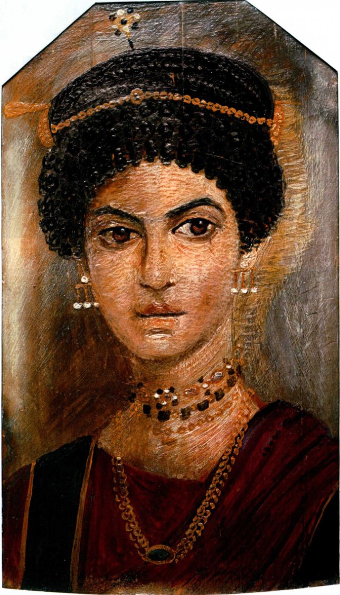

*图7.49《女性肖像》（Portrait of a Woman），出自下埃及法尤姆地区的哈瓦拉（Hawara）。约公元110-130年。木板蜡画。苏格兰皇家博物馆*

## 民居艺术及建筑

遗留下丰富的民居建筑及其装饰的古代民族极少，罗马人是其中之一。公元79年，维苏威火山（Vesuvius）爆发，庞贝和赫克拉尼厄姆这两座城市被掩埋，对于亡者而言是悲惨的，却为考古学者留下了一份无价的遗产。罗马的民居具有杰出的耐久性，因此其他地方也有住宅保存至今，最远的罗马民居在摩洛哥（Morocco）和约旦。被维苏威火山掩埋的住宅近乎完好无损，因而成为学术讨论的中心，本书亦重点探讨这些遗址；然而尽管整个帝国内的罗马住宅有许多共性，各地区之间也存在差异，以适应气候等当地条件。并且在任何地区都有贫富差异。因此在构想一座“典型的”罗马住宅时应当谨慎。

由维特鲁威和其他古代文献可知（见第一部分末尾附加原始文献），学者以拉丁文“domus”（中庭式住宅）来描述罗马贵族的住宅。独门独户住宅最大的特征是有中庭（atrium），也就是一个方形或长方形的中央大厅，顶部开有采光的天窗，下方是一个浅水池，或方形蓄水池（impluvium），用于积蓄雨水。这种住宅的源头也许是伊特鲁里亚的贵族宅邸，例如慕罗的建筑群（见图6.14）。中庭是存放祖先肖像的传统地点。它的空旷空间赋予住宅一种庄严的气息，如图中的维梯之家（House of Vettii，图7.50）。卧室（cubicula）等其他房间都分布在中庭四周，通常通向接待室（tablinum），它是主客厅，家庭的记录也保存于此。接待室远处是一个花园，四周围有柱廊（围柱式结构）。住宅背后可能有一些附属房间。朝街的墙一般没有窗户，但不要因此误认为罗马住宅格外私密。入口两侧的房间经常用作店铺，而前门通常是大开的。罗马社会是基于宾一主关系建立的，宾客会定期到东家家中拜访。主人也会在家中甚至卧室里谈事务。根据访客与主人的关系，不同宾客可以进入的住宅部分也不同，但大多数访客是在较大的中央房间受到接待。

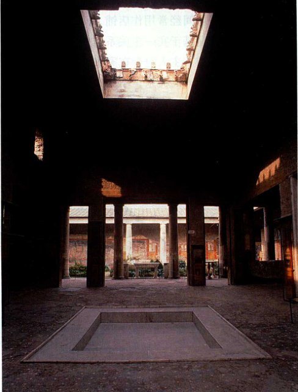

*图7.50 维梯之家的中庭，庞贝。公元前2世纪一公元79年*

在罗马及其港口城市奥斯提亚（Ostia）留存了许多街区建筑（insulae，字面意义是“岛屿”）。不如上文描述的住宅那么雅致，却有今天公寓楼群的许多特征。一个街区建筑通常是一个大型的混凝土一砖结构建筑（或一连串的建筑群），中间围成一个中央小庭院。底楼是沿街开放的店铺和酒馆，楼上就是许多家庭的居住空间。有些街区建筑高达五层，二楼以上都有阳台。

与希腊绘画相比，罗马民居绘画的存世数量很大，其中多数是壁画，主要来自庞贝和赫克拉尼厄姆，也有来自罗马及其郊区的壁画。罗马绘画的年代大多在一个200年的时间范围内，即公元前2世纪末至公元1世纪晚期。考虑到中庭式宅邸的开放性，这些绘画不仅仅是装饰，它们还是家族财富与地位的证明。

以维特鲁威对绘画的论述为部分基础，19世纪末的德国艺术史家奥古斯特·马乌（August Mau）将罗马壁画划分为四个阶段（图7.51）。这四种风格并非无可置疑，但作为一般准则是行之有效的（见第212页的原始文献）。第一风格的年代为公元前2世纪晚期，艺术家以颜料和灰泥模仿昂贵的彩色大理石板，例如赫克拉尼厄姆的萨姆尼人之家（Samnite House，图7.52）。地中海东部也存在这种风格的例证。约从公元前100年起，第二风格的画家尝试突破墙面的平板宽阔，引入建筑特征和图像。庞贝城近郊的秘仪庄园（Villa of the Mysteries）建于约公元前60一前50年，在其中的一个房间，墙裙下方和檐口水平线上方的墙面都绘以斑斓的颜料，模仿异域的石料（图7.53）。在墙裙和檐口之间绘有人物，他们仿佛在一个狭窄平台上活动，背景是深红色，由代表风格化立柱的竖直黑条纹连接为整体。人物在进行着各种狄俄尼索斯秘密仪式，这据说是源自希腊的神秘宗教之一。场景中描绘的可能是女子成年礼或婚姻，在狄俄尼索斯与女神阿里亚德妮面前举行，在场的还有一队萨梯尔（satyr）和西勒尼（sileni）。人物接近真人大小，显得坚实厚重，涂绘出的身体外形粗犷，人物姿态安详各异，赋予这个房间一种无声的力量和强烈的张力。

> 奥古斯特·马乌（1840-1909年）的阐释至今仍是所有分析庞贝室内装饰的基础：他将壁画分为四种“风格”，每一种都代表庞贝绘画的一个历史阶段，从公元前2世纪直至公元79年的火山爆发。
>
> 1. “第一风格，又称嵌入风格（Incrustation style）”：墙面彩绘（以灰泥塑形），模仿石块，无形象场景。公元前2世纪。
> 2. “第二风格，又称建筑风格（Architectural style）”：典型特征是幻觉的建筑景深图。约公元前100一前15年。
> 3. “第三风格，又称装饰风格”：建筑景深图被精致的装饰图案取代，装饰风格以匀称的装饰为主。约公元前15-公元50年。
> 4. “第四风格，又称复杂风格（Intricate style）”：一种更加恣意图绘的风格，充分利用装饰方式。约公元50年。

> 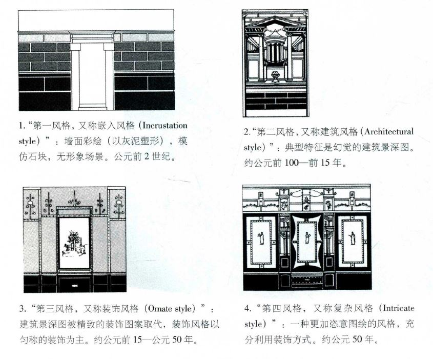

> *图7.51 奥古斯特·马乌分析的四种庞贝壁画风格*

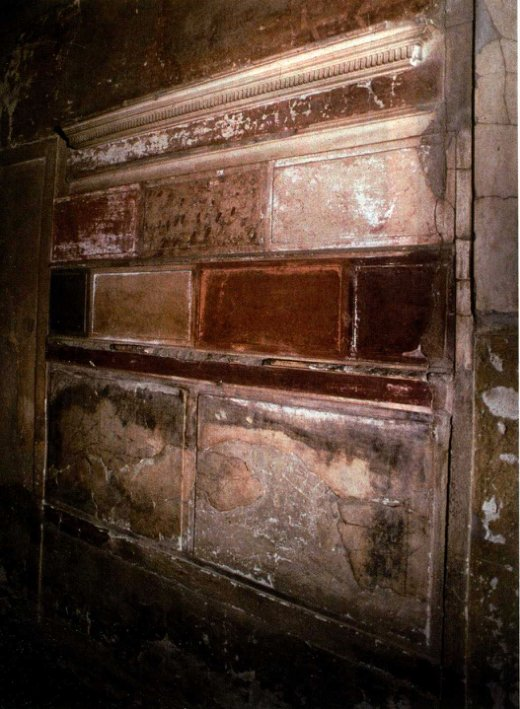

*图7.52 萨姆尼人之家的第一风格绘画，赫克拉尼厄姆。公元前2世纪晚期*

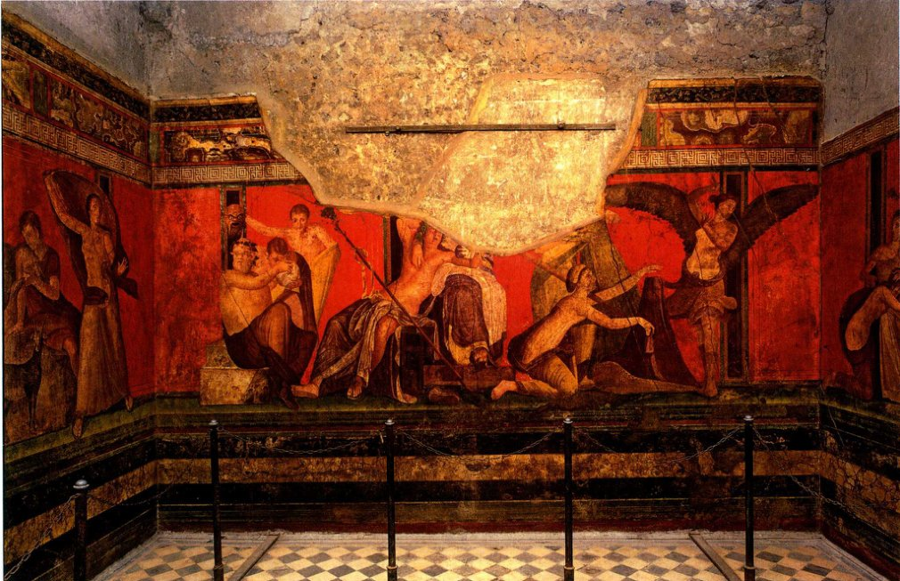

*图7.53《狄俄尼索斯神秘崇拜》（Scenes of Dionysiac Mystery Cult），秘仪庄园中的第二风格壁画，庞贝。约公元前60一前50年*

在某些情形下，第二风格的艺术家利用建筑景深图使墙面看似通向一个虚幻的世界，仿佛房间外别有洞天。这一趋势可能反映出同时期剧场的建筑布景。普布利乌斯·法尼乌斯·希尼斯特（Publius Fannius Synistor）别墅的壁画就是展现了这种效果，这座别墅位于庞贝附近的博斯科莱尔（Boscoreale），壁画如今已在纽约的大都会艺术博物馆复原（图7.54）。一段彩绘胸墙沿墙面下部延伸，胸墙上是立柱，支撑着檐口。这些建筑性特征构成前景，背后是以不同的透视视角向后收进的结构，有长廊、圆形建筑和观景亭，彼此交错，形成一座幻想的建筑迷宫，其间洒满阳光，使人感到里面是一个宽敞的空间。观者很难理清这些建筑的关系，它们的大小和空间关系都含糊不清。这个绘画的世界是一个观者无法进入的世界，漂浮于触及范围之外。在普里马波塔（Primaporta）的利维亚别墅（Villa of Livia）中，格栅篱笆和花园矮墙之外的世界是田园诗般的大自然，一个鸟语花香、绿树成荫的怡人花园（图7.55）。尽管生机诱人，但这座花园也是一个只能以视觉享受的幻想世界。此处使用了一种不同形式的透视法，称为“空气透视法”：在植物和动物退至背景中时，它们的外形也变得不太清晰，表明距离较远。

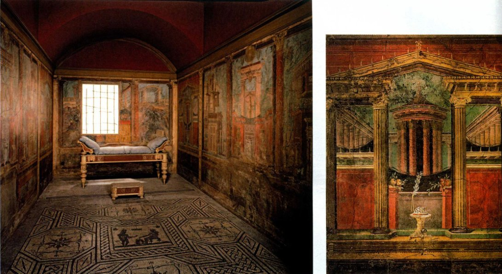

*图7.54 希尼斯特别墅的第二风格壁画，庞贝附近。公元前1世纪中叶。石膏上的湿壁画，高265.4厘米，长583.9厘米，宽334厘米。纽约大都会艺术博物馆，Rogers基金，1903（03.14.13）*

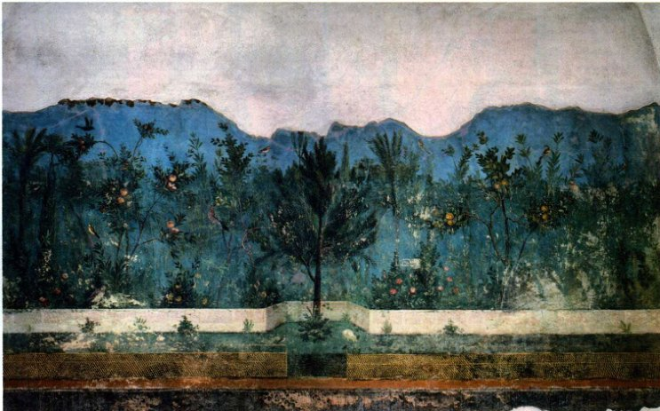

*图7.55 花园壁画，出自普里马波塔的利维亚别墅。约公元前20年。罗马浴场博物馆*

第三风格流行于约公元前20年至公元1世纪中叶。在这一阶段，艺术家摒弃了幻觉主义，偏爱使用大块的强烈色块，如黑色和红色，色块之间通常用弱化的建筑特征和仿绘板面连接。伯斯科特里卡斯（Boscotrecase）的阿格里帕·波斯杜穆斯庄园（Villa of Agrippa Postumus）中的壁画就是范例，年代约为公元前10年（图7.56）。纤细的立柱立于狭窄平台上，勾勒出一个细巧的小龛（aedicula，一个小型的龛状结构），但它们只是纯粹的装饰，并无充用结构性元素的意图。第四风格盛行于公元79年维苏威火山爆发时期，在四种风格中最为复杂，融合了前三种风格的各个方面，创造出一种铺陈繁复的效果。此处是庞贝城维梯之家中的伊克西翁房间（Ixion Room，图7.57），它结合了仿绘大理石板，模拟嵌板画的框边神话场景，还有渐渐伸向远方的建筑景深图。

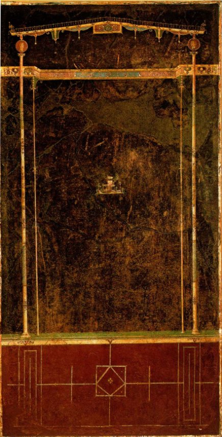

*图7.56 阿格里帕·波斯杜穆斯庄园的第三风格壁画，伯斯科特里卡斯。约公元前10年。石膏上的壁画，高233.1厘米。纽约大都会艺术博物馆，Rogers基金，1970(20.192.1)*

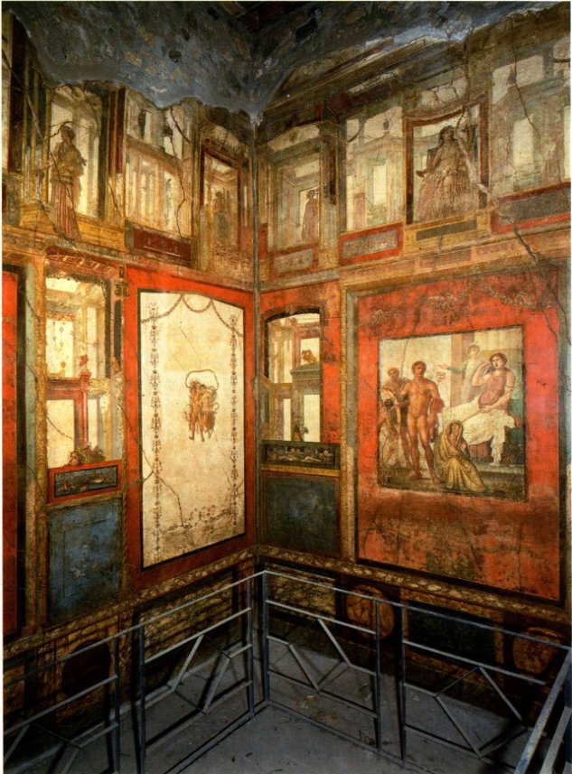

*图7.57 维梯之家伊克西翁房间的第四风格壁画，庞贝。公元63-79年*

> **原始文献：菲洛斯特拉托斯（公元170-247年）**
>
> **《意象》（The Imagines）**
>
> 公元3世纪，希腊作家菲洛斯特拉托斯（Philostratus）在雅典和罗马生活讲学。他研习修辞学，其著作为他赢得了智者的名望。《意象》一书是一系列关于绘画的论述，据称这些作品属于Neapolis（今天的那不勒斯）一位富有的收藏家。这些画作是否真实存在并不那么重要，因为这篇文字并非意在描述，而是想教授学生观看绘画的方法。
>
> **好客（Xenia）1**
>
> 好的欣赏方法是注意无花果而不是忽略它们。藤蔓上结满汁液饱满的紫色无花果，果皮上画出了裂缝，有些将近开裂，蜜一样的果汁淌了出来，有些已经裂开，它们都熟透了。果实旁边横着树枝，我以宙斯的名义发誓，那树枝绝不是光秃秃的，也不是没有果实，只是无花果藏在叶子的阴影中，有些还很青涩，尚未成熟，有些果皮发皱，已然熟过了头，有些即将变色，透着果汁的晶莹，而在枝头，一只麻雀埋着头好像在啄食那颗最甜的无花果。地上撒满了栗子，有些刺壳已经搓掉，有些还紧闭着，有些则刚裂开缝。再看这里，梨和苹果一只摞着一只，数十个一堆，都泛着成熟的芳香和光泽。你会说它们的红润不是从外部描画上去的，而是从内部透显出来的。这边是樱桃树的馈赠，那边是果篮里堆满的水果，而编织果篮的不是别的枝条，就是这种植物本身的树枝。假如你看到交织缠绕的藤蔓以及从上面悬垂下来的簇簇果实，又看到葡萄一粒粒饱满诱人，你一定会赞美狄俄尼索斯，并称葡萄藤是“女皇般慷慨的葡萄施与者”。你会说就连画中的葡萄都那么甘甜，美味多汁。而最为诱人的还是：在一根树叶繁茂的树枝上，一个蜂巢中的金黄蜂蜜已经酿熟，只需轻轻一挤就会流淌出来，在另一片叶子上，奶酪刚刚凝结，还在微微颤动，而一碗碗牛奶不但色泽洁白，还泛着柔和的光，因为有奶油在表面漂浮。

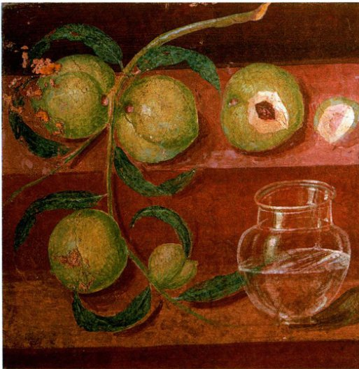

*图7.58 静物画：桃与水罐，出自赫克拉尼厄姆。约公元50年。那不勒斯国家考古博物馆*

在这些第四风格装饰样式内，时或可见画有静物（still life）的绘板，这些画面的形式通常是几可乱真（trompe l'oeil）的壁龛或橱柜，物品放在板架上。一个21世纪的观者也许不认为这有什么特别之处，但在世界其他地方，对平淡无奇的无生命物品的视觉研究直到现代早期才为人所知。当时许多罗马绘画的驱动力是叙事，而这些静物绘画却是要表现对生活的细致分析。图示中的例子描绘的是几只青桃和一个半满的玻璃水罐（图7.58）。白色颜料的笔触捕捉到了玻璃罐表面和罐中水的光线效果，还有青桃周围的阴影。阴影从各个方向投下，表明艺术家更倾向于用阴影来形成青桃之间及其与环境之间的空间关系，而不是指示单一的光源。画作也有可能反映了在艺术家作画过程中阴影的移动。

与维梯之家伊克西翁房间的画作相似（见图7.57），许多罗马绘画的题材取自希腊。有记录的少数几位画家的名字表明，其中至少有一部分是希腊人。有一些彼此十分相似的画例（或者画作中的单个元素）足以表明，艺术家在创作时借助了模本；有时他们可能是以希腊原作为底本，根据他们自己的目的自由地改变图像。庞贝城农牧神之家（House of the Faun）中的亚历山大镶嵌画可能模仿了一幅希腊的著名绘画，只是换用了不同的媒介（见图5.79）。但考虑到希腊壁画非常罕见，能够证明在希腊原作和罗马仿作之间存在明显联系的例子也就极其罕见。鉴于罗马绘画整体上具有显著的创新性，我们没有理由假定，当罗马艺术家想要创造自己的构图和叙事时，他们会无能为力。近些年来，学术界不再如此热衷于追溯罗马绘画中的希腊影响，而是更加关注绘画整体如何影响观者体验，或如何引导人们在整个住宅中移动，并且表达主人的地位。事实上，有一类称为图说（ekphrasis）的古代文献，对真实或想象绘画的主题都进行了精辟的解释（见本页的原始文献）。以这些文献为基础，学者认为住宅的主人有时会将房中的绘画作为与客人交谈的话题，在用餐时就可能谈论到它们。因而设计绘画方案就有了新的意义，因为它可能微妙地透露出主人的博学、地位和抱负。

> **大事年表**
>
> *   公元前60-前50年 - 秘仪庄园绘画，庞贝城外
> *   公元79年 - 维苏威火山爆发

## 帝国晚期

### 肖像雕塑

在马可·奥勒利乌斯统治时期，与日耳曼（German）及多瑙河地区的交界处侵扰不断，给帝国带来威胁。公元180年，马可之子康茂德（Commodus）即位，公元192年遇刺。因而在公元193年，皇权跌到了前所未有的低谷，皇位鬻以豪富。在塞维鲁（Severan）王朝治下，罗马得到短暂的平静，但随之就陷入长达半个世纪的内战，一长串皇帝走马灯一般轮番登场，来去匆匆。当时的皇室肖像具有一种威严的军人气质，意在获得军心。胡须和头发都修剪得很短，一绺一绺的头发常是用快速的手法凿成，学者称之为凹雕（图7.59）。扭转的头部，紧锁的眉头和忧心忡忡的整体表情表现出来的是一个有行动力的军队领袖。

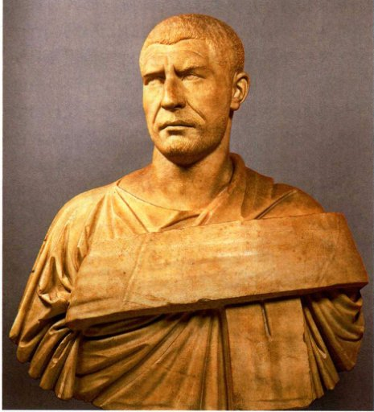

*图7.59 《阿拉伯人菲利普肖像》（Portrait of Philip the Arab）。公元244-249年。大理石，真人大小。罗马梵蒂冈博物馆新馆*

在戴克里先（Diocletian，公元284-305年在位）治下，皇权最终得以恢复。他的策略是在市民生活和军事领域的各个方面施行严格规定。他认识到帝位脆弱，因而将权力分予四人，史称四帝共治（tetrarchs）。其中两人为正职，称奥古斯都（Augustu），其余两人为副职，称恺撒（Caesar）。任期都有限制，由恺撒继任奥古斯都。有两件斑岩组雕的年代鉴定为这一时期，现在藏于威尼斯的圣马可大教堂中，它们原本很可能是安放在立柱上的（图7.60）。每一组都是两个全副武装的男子，头戴扁平的潘诺尼亚（Pannonian）帽，手持鸟首剑柄。

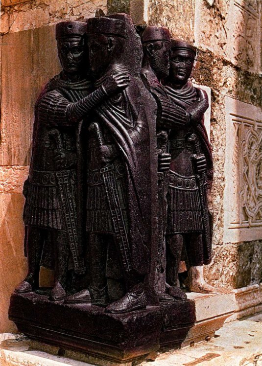

*图7.60 四帝共治组像。约公元305年。斑岩，高129.5厘米。威尼斯圣马可（San Marco）大教堂*

他们紧紧相拥，几乎无法区分（唯一的区别就是，每组都是一个有须一个无须）。他们比例敦实不自然，脸部特征抽象而不具个人特点。这些肖像表明权力归于皇位，而不是身在皇位的个人。肖像的酷似强调了四帝相互平等，而拥抱则强调了一致与团结。材质的选择也有深意：斑岩是来自埃及的深紫色坚硬石材，长期以来都专用于皇室肖像。

公元4世纪早期，四帝分治逐步解体，君士坦丁大帝掌权。公元312年，他在罗马米尔维桥（Milvian Bridge）一役中击败了主要对手马克森提乌斯。图7.61中这个硕大的头像原先属于一尊巨大的坐像，坐像原本位于一座宏伟的公堂建筑的半圆室（apse，见图7.68和7.69）。仅这个头像就高达2.4米，脸部最主要的特征是那双眼睛，尺寸巨大，不合比例。刻凿深凹，凝视远方，加上脸部完全为正面观，赋予雕像以抽象的圣像特质。一些学者将这类转变与帝国晚期新的信仰联系在一起，而新信仰的典型表现就是君士坦丁皈依基督教。这双眼睛或许正凝视着尘世之外，或许它们就是灵魂的窗户。与此同时，脸颊和嘴唇都显得松软，使肖像比四帝共治时期的作品显得更加写实。此外，人物头发浓密，胡须剃净，似乎直接联系到图拉真和奥古斯都，他们都是历史上伟大的皇帝，他们的功绩依然赋予皇权以权威。

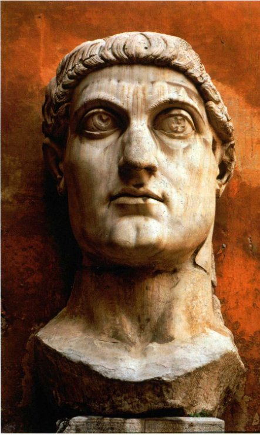

*图7.61《君士坦丁大帝像》（Portrait of Constantine the Great）。公元4世纪早期。大理石，高2.4米。罗马护宫博物馆*

### 浮雕

公元2世纪，罗马人的墓葬风俗改变。土葬逐渐取代火葬，但皇室依旧采用火葬。对大理石棺的需求因此大量增加，取代了骨灰瓮。石棺通常饰以大量图案，这些图案很快就在作坊之间流传，其流传形式也许是图样书。人们的偏好随时间而变化，例如在马可·奥勒利乌斯统治期间，订件人喜欢有战斗场景的石棺，到公元3世纪时则流行表现死者生平和历史场景的石棺。最流行的场景取自希腊神话，其目的也许是通过描绘历史传说中的英雄来譬喻美化死者，也有可能是借此展示订件人的博学。图7.62表现的是墨勒阿革洛斯（Meleager）神话中的一幕。据荷马记述，墨勒阿革洛斯杀死一头凶残的野猪，解救了卡吕冬（Calydon），这只野猪是阿耳忒弥斯派来的，意图摧毁他父亲的土地，然后他在争夺野猪皮时战死。墨勒阿革洛斯是男性高贵英勇的典范之一。英雄行为和为国献身为他赢得了不朽之名。浮雕的风格深受希腊雕塑影响，但整个石棺表面布满图像，这却是罗马雕塑所特有的。

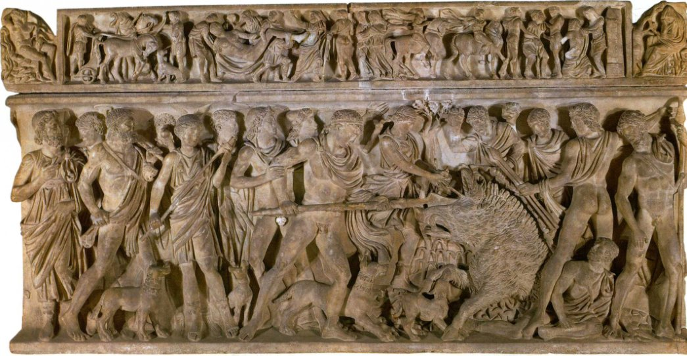

*图7.62 《墨勒阿革洛斯石棺》（Meleager Sarcophagus）。约公元180年。大理石。罗马多里亚·潘菲利美术馆（Galleria Doria Pamphili）*

公元315年，元老院和罗马人民在斗兽场附近建起一座三拱的君士坦丁凯旋门，纪念君士坦丁即位十周年和战胜马克森提乌斯（图7.63）。作为最大的皇家凯旋门之一，它最大的不寻常之处在于，布满表面的浮雕几乎无一是专为这座凯旋门设计的（图7.64）。

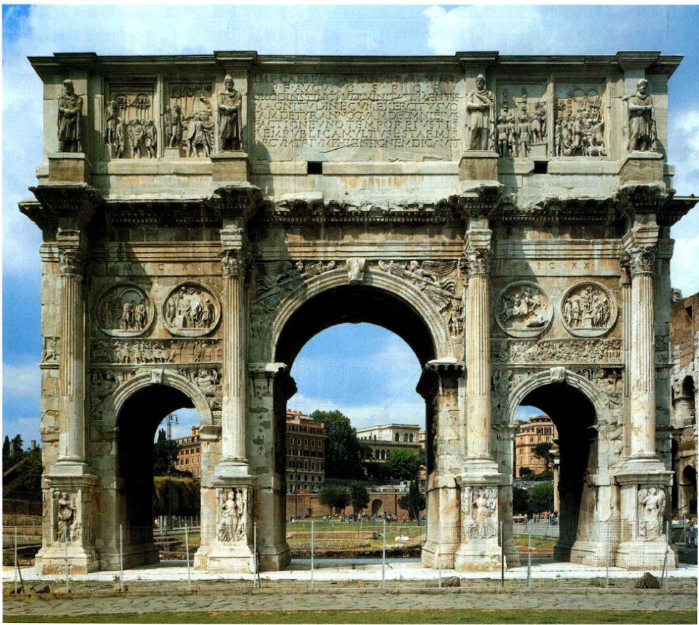

*图7.63 君士坦丁凯旋门，罗马。公元312-315年*

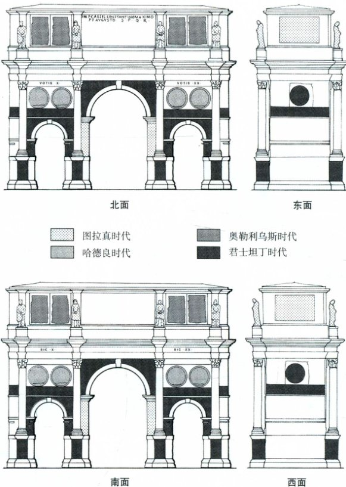

*图7.64 君士坦丁凯旋门，罗马。重复使用的雕塑图解。北面、东面、南面、西面。图拉真时代、奥勒利乌斯时代、哈德良时代、君士坦丁时代*

顶层的独立达契亚战俘像可能原本安放在图拉真广场，顶层两端及中拱内壁上的大图拉真雕饰带也是如此。在两个侧拱上方有八个狩猎和献祭题材的圆形浮雕（tondo），它们原本属于哈德良式的纪念建筑，而顶层上的八个奥勒利乌斯饰板可能曾是一座马可·奥勒利乌斯凯旋门的装饰。在建造这座凯旋门时，雕刻家重新修饰了先帝的头像，使它们形似于君士坦丁和他的共治皇帝李锡尼乌斯（Licinius）。最近的一次复原将其中一部分换成了图拉真的头部。

在描绘这种雕塑和建筑的借用时，学者使用了现代术语夺用（spolia），其词源是拉丁语“spolium”，意为“动物身上剥下的兽皮”，原本是指战争中获得的战利品。没有存世的古代资料能证实或解释这种做法，因而夺用为我们提出了各种问题。例如罗马人如何看待为建一座纪念性建筑而拆卸另一座？假如原来的那座纪念建筑还屹立不倒的话，它会变成什么样子？20世纪50年代，艺术史家伯纳德·贝伦森（Bernard Berenson）发表了对古代晚期雕塑的著名批判，他指出夺用是古代晚期艺术形式普遍衰退的证据，至于衰退的原因，他认为是罗马已近败落，使得大量工匠和艺术家在时局不稳时逃离。另一些学者假定罗马人和今人一样认识到风格的差异，这些学者将夺用视为合法化意识的一部分，认为它们体现了“王道”。通过联系以往“贤君”的声望和功绩，君士坦丁可能希望利用前人的威望，以及在流逝的岁月中怀旧情绪对这些威望的理想化。君士坦丁完全有理由需要证明自己权威的正统：马克森提乌斯曾是一个可怕的对手，因其尝试过以复兴政策使罗马重新成为帝国中心。此外，君士坦丁作为第一个公开皈依基督教的皇帝，冒险疏远了异教的元老院。假如这种解释正确的话，就与多米提乌斯·阿赫诺巴布斯祭坛基座的解读颇有相似之处，那个基座部分由希腊浮雕组成（见图7.9）。

为了补充装饰凯旋门的剩余部分，君士坦丁时代的艺术家们雕刻了拱门两侧立柱的柱础，侧拱上方是连续的一圈浮雕带，凯旋门两侧则有圆形壁饰。图示表现的是公元312年君士坦丁入主罗马后，正站在广场的讲坛（rostrum）上向元老院和罗马人民发表讲演（图7.65）。整个场景刻满了人像。人物的头大得不合比例，身体矮壮，姿势僵硬不自然。立体感不见了，取而代之的是以刻在平面上的线条，勾勒出人体结构的细节。艺术家没有使用提图斯凯旋门饰板上制造空间深度的手法，而是将第二排人头安排在第一排上方，这样就算表示了空间纵深（见图7.26和7.27）。贝伦森断言君士坦丁时期浮雕的风格就像夺用的行为一样粗俗。但它们手法抽象，在远处就非常清晰可辨，这也正是人们观看这些浮雕的角度。构图表现出精心设计的秩序，皇帝占据正中位置，并且完全是正面观，而其他人都朝向他，专注地聆听讲演。背景建筑很容易辨认，即使在今天也能一眼看出那是罗马广场。艺术家选择突出浮雕传达信息的能力，而不是尝试以幻觉主义或自然主义表现。

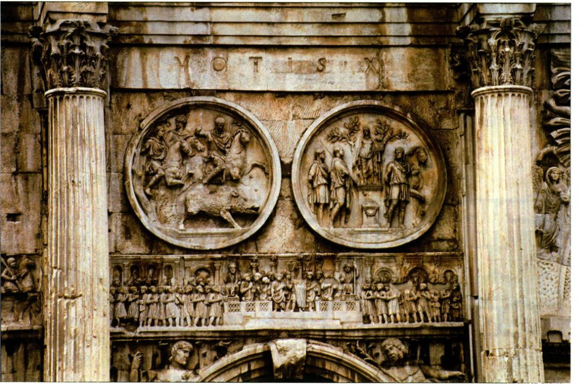

*图7.65 君士坦丁凯旋门上的君士坦丁时代浮雕，罗马*

### 建筑

到了帝国晚期，罗马建筑师已经或多或少放弃了直接采用柱梁结构。他们的兴趣似乎转移到了混凝土搭建起的内部空间。立柱、额枋和三角楣承担起装饰功能，叠加在拱结构的砖一混凝土内核上。帝国的浴场建筑是一个佳例。自公元3世纪初开始，公共浴场成为罗马人生活中的一个悠久传统。按照惯例，帝王会在城市中修建浴场，获取人心。大多时候，家中没有私人浴室的罗马人期待着能去公共浴场，而浴场也有其他功用。它们成为社交场所，人们可以在那里交易，富人还能炫耀自己成群的奴隶。卡拉卡拉浴场（The Baths of Caracalla）建于公元211-216年，是所有浴场中规模最大也最奢华的一个（图7.66和7.67）。长方形围墙内是一些基本的洗浴设施：一间冷室（frigidarium），一间圆形热室（caldarium），一间暖室（tepidarium），还有一个巨大的游泳池（natatio），更衣室以及运动场地（palaestra）。浴场内还包括演讲厅、图书馆和神庙，适应多种需求。在卡拉卡拉浴场修建之时，浴场建筑的一般布局已经标准化了。房间供热的技术也趋于完备。浴场地板悬空，底下是一根根砖墩（brick pier），热空气从锅炉中导入砖墩之间的空间。这就是热炕系统。尽管如此，卡拉卡拉浴场的宏伟规模就足以使人震惊：主要建筑长220米，宽114米。冷室是最大的房间，屋顶由三个巨大的交叉拱构成。墙面覆盖着奢华富丽的大理石板，壁龛中的雕塑给房间增添了生气。

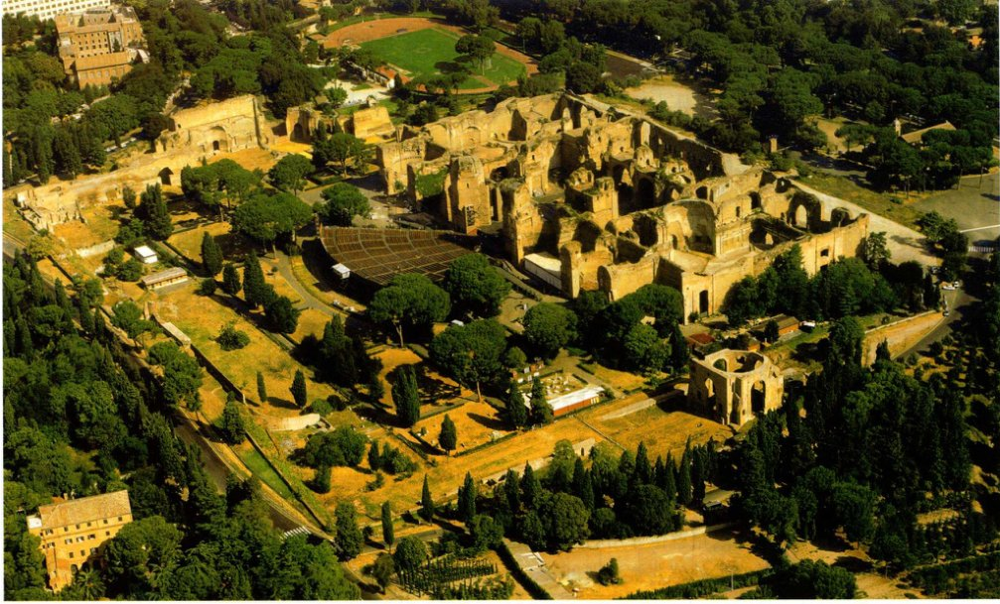

*图7.66 卡拉卡拉浴场，罗马。约公元211-216年*

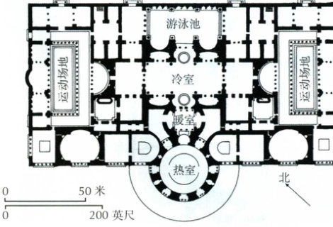

*图7.67 卡拉卡拉浴场平面图，罗马。约公元211-216年*

这种设计影响深广。当马克森提乌斯下令在罗马市中心建造一座巨大的长方形公堂时，建筑师们就从浴场宏大绵延的空间中寻求灵感。长方形公堂（basilica，源自希腊语“basileus”，意为“国王”） 在罗马有着悠久历史。从共和国时期起，它们就用作市政厅，并且迅速成为罗马城镇的特征。其主要功能之一是为法庭提供一个威严的场所，以皇帝的名义施行正义。维特鲁威规定了这类建筑的布局和比例原则，但在具体实践中并不固守单一的类型，而是各地都不相同。马克森提乌斯公堂（Basilica of Maxentius，图7.68和7.69）的规模超过了卡拉卡拉浴场，可能是罗马市内最大的室内空间。它分隔成三个殿堂，如今仅存北侧堂。两侧侧堂覆盖横向的筒拱结构，中堂最宽最高，覆盖着三个巨大的交叉拱。交叉拱形似华盖（canopy），所有重量和外推力（thrust）都集中在四个角上（见图7.3），因而中堂墙壁的上部就可以开出高侧窗。所以虽然长方形公堂非常高大，内部仍然具有良好的采光和通风效果。建筑有两个入口：东侧门厅，还有朝南面向罗马广场的有台阶的大门。每个入口都对着半圆室。击败马克森提乌斯后，君士坦丁将这座公堂据为己有，冠以自己的名字，并将自己的一座巨型雕像放在西半圆室中（见图7.61）。这种做法在罗马并不少见，可见当时实体存在是多么重要。

> **大事年表**
>
> *   公元2世纪晚期 - 内战中皇权衰落
> *   公元211-216年 - 罗马卡拉卡拉浴场完工
> *   公元4世纪 - 君士坦丁大帝
> *   公元315年 - 罗马君士坦丁凯旋门落成

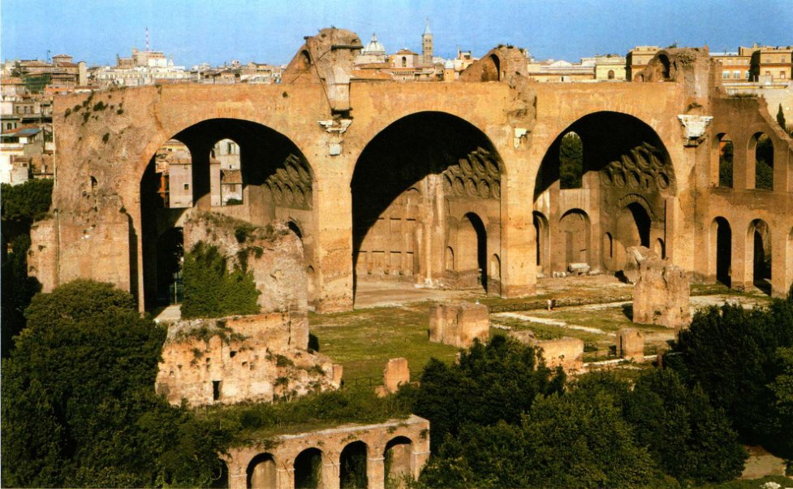

*图7.68 马克森提乌斯公堂，重新命名为君士坦丁公堂。约公元307年。罗马*

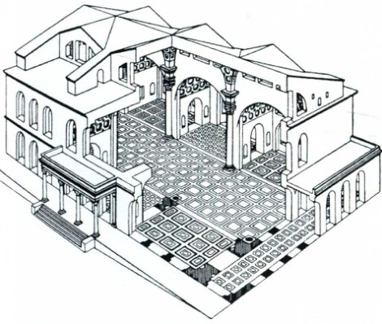

*图7.69 马克森提乌斯公堂（重新命名为君士坦丁公堂）复原图（根据Huelsen的图绘制）*

### 罗马帝国晚期的行省建筑

到公元2世纪初，罗马帝位已不再是意大利人的天下：图拉真来自西班牙，塞普蒂默斯·塞维鲁（Septimius Severus）来自北非，两位皇帝都在自己的故土大兴土木。塞维鲁的家乡大勒普提斯（Lepcis Magna）在今天的利比亚（Libya），保存得非常良好。皇帝下令在那里兴建了一座宏伟的新广场和一座壮观的长方形公堂，中堂很长，两端各有一个半圆室（图7.70）。柱廊分两层，可由此进入两旁的侧堂，侧堂通常比中堂低，便于中堂在墙的上部开出高侧窗。木质屋顶已不复存在。

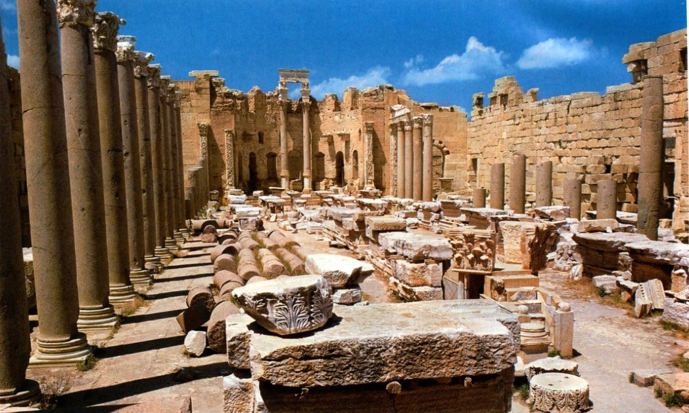

*图7.70 长方形公堂，大勒普提斯，利比亚。公元3世纪早期*

戴克里先即位之后，罗马建筑的发展似乎就与他变革社会的举措同步。最明显的表现就是他在斯帕拉托（Spalato，位于克罗地亚［Croatia］）的宫殿，这座宫殿濒临亚得里亚海（Adriatic Sea），作为他公元305年退位后的宅邸（图7.71和7.72）。尽管以居住为修建目的，但它实际上是个军事堡垒，有防御用的城墙、城门和塔楼。与军营一样，城门之间有两条带柱廊的街道相连，这两条街道交叉，将城墙内长198米、宽152米的空间分隔成四个主街区。主城门后的街道通向一个低陷的围柱庭院。两旁的立柱支撑着弓形的楣，在帝国早期这种建筑方式还只是偶或一见，到帝国晚期就变得流行。它们引领观者一直望向庭院远端，那里有两根中央立柱支撑着一个内弓形的三角楣，构成了一个景框。退位的皇帝正是在这里公开露面。走过这个庄严的入口就是一个门厅，通往谒见大厅。围柱庭院左侧是一座巨大的八角形陵墓（见图7.39至7.43），这种皇陵可能是基督教殉道者陵墓的原型之一。庭院右边是一座小神庙，献给戴克里先的保护神朱庇特。陵墓与神庙的地形关系意味着皇帝与神比高。

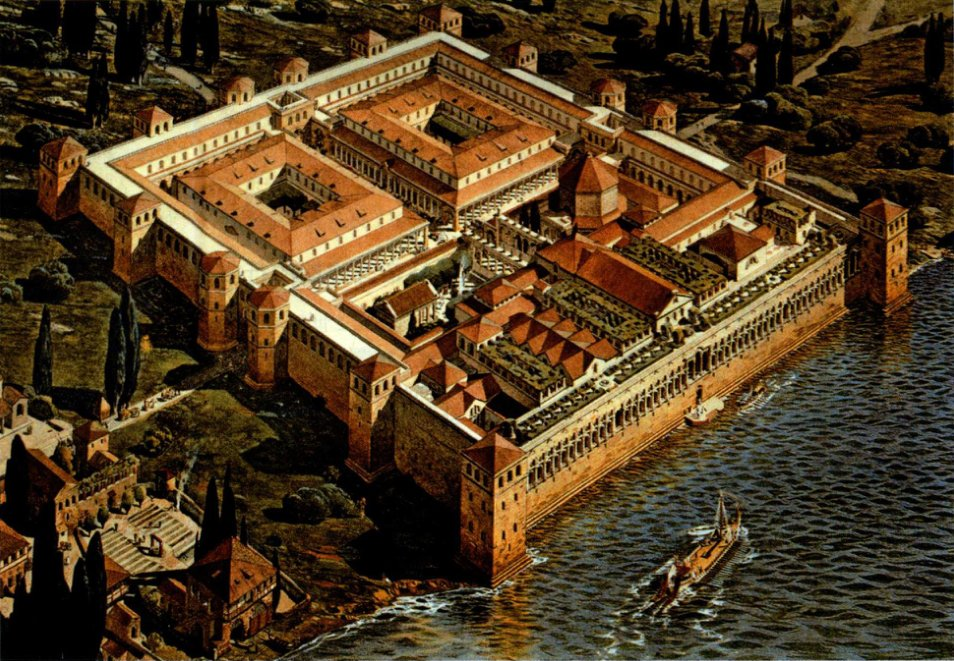

*图7.71 戴克里先宫殿，斯帕拉托，克罗地亚。约公元300年*

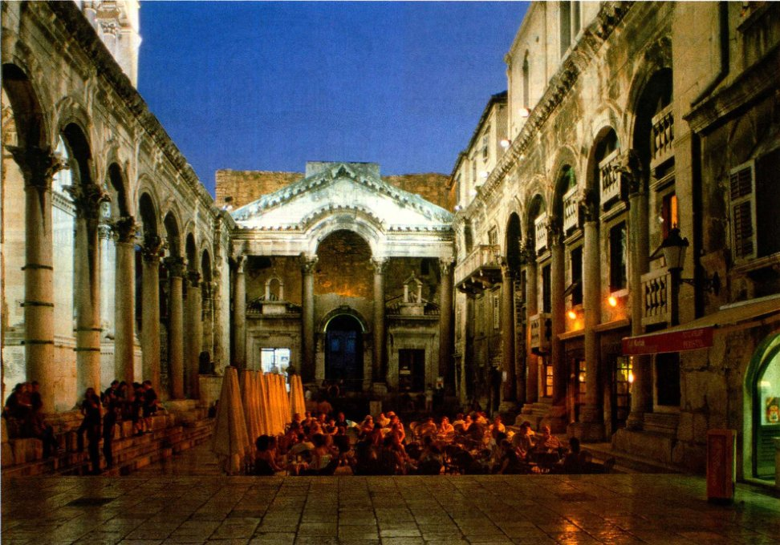

*图7.72 围柱庭院，戴克里先宫殿，斯帕拉托，克罗地亚。约公元300年*

戴克里先在四帝之间分配了权力，他们每人在帝国各自的封地设立首府，并且使之具备应有的庄严规模。君士坦丁大帝的父亲君士坦提乌斯·克洛卢斯（Constantius Chlorus）将首府设在今日德国境内的特里尔（Trier）。他在这里也建起了一座长方形公堂，如今改作了基督教堂（图7.73和7.74）。在这座建筑的设计中，古典形式已经完全消失，只剩下坚固而空旷的巨大抽象空间。大片墙面被不断延伸的拱形打断，在视觉上成为窗户外的一圈扶壁，窗户下方是阳台。内部空间本已十分宽广，建筑师仍着力营造出更加广大的空间感。半圆室的窗户明显比边墙的小，半圆室的天花板也比中堂的天花板低。这两种手法都使半圆室看起来比实际更远。不仅整座建筑显得更宏伟，而且因为半圆室是皇帝施政或者安放帝像的地方，修改后的空间将他反衬得更加魁梧威严。换言之，罗马建筑的建筑语言发生了变化，但它依旧是一座象征权力的建筑。

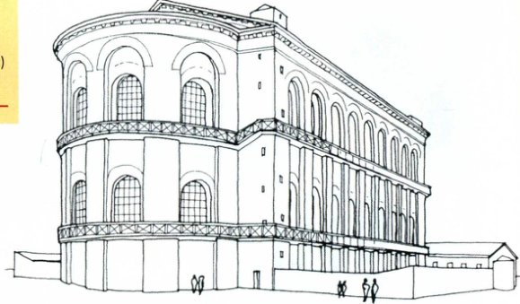

*图7.73 君士坦提乌斯·克洛卢斯公堂，特里尔，德国。公元4世纪早期*

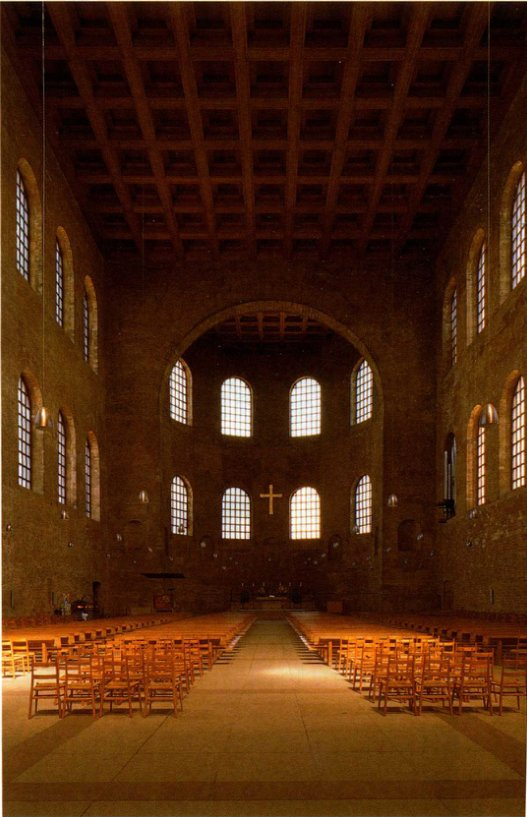

*图7.74 君士坦提乌斯·克洛卢斯公堂内部，特里尔，德国。公元4世纪早期*

在近一千年的历程中，罗马从一个小城镇崛起为一个幅员辽阔、文化多元的帝国首都。建筑获得了长足发展，部分是得益于技术革新，同样重要的原因则是政治的推动。混凝土使得柱梁结构能够结合自由形式，然后又让位于新的抽象空间。建筑在一定程度上提高了行省的生活水平，但也有助于巩固罗马的统治，使人即使远离行政中心也能一直感受到罗马权威的存在。雕塑和绘画遍布公共和私人建筑。雕塑通常传达了强烈的政治信息，风格的选择总是为了切合内容。与建筑类似，帝国晚期雕塑开始流行一种抽象的风格，可能是由于信仰兴起及权位观念改变。存世的大量住宅和绘画表明，艺术在民居里和在公共场所一样扮演了重要的角色，为其他人展示了一个订件人的形象。

> **大事年表**
>
> *   约公元300年 - 戴克里先在斯帕拉托（克罗地亚）建造宫殿
> *   公元4世纪早期 - 君士坦提乌斯·克洛卢斯在特里尔（德国境内）建造了一座长方形公堂

## 小结

在一个幅员辽阔、文化多元的帝国首都。建筑发近一千年的历程中，罗马从一个小城镇崛起为生了重要发展，部分是得益于技术革新，同样重要的原因则是政治的推动。建筑在一定程度上提高了行省的生活水平，但也有助于巩固罗马的统治，使人即使远离行政中心也能一直感受到罗马权威的存在。雕塑和绘画遍布公共和私人建筑。雕塑通常传达了鲜明的政治信息，风格的选择总是为了切合内容。

**共和国时期**

罗马建筑师受惠于希腊先辈，尤其是在多立克、爱奥尼亚和科林斯柱式的应用上。但罗马建筑师采用了拱券结构等形式，使得他们的建筑深具罗马特色。混凝土作为一种建筑材料为罗马人充分利用，他们也因此构建出宽广开阔的内部空间，艾米利亚柱廊便是一例。政治领袖也利用建筑和雕塑来显示和维护自己的权力，也用它们来纪念特定事件。

**帝国初期**

在奥古斯都时期，罗马肖像雕塑由早先的共和国真实风格转变为与古希腊联系紧密的古典化风格。奥古斯都在位期间，其雕像一直是一个青春永驻的年轻人形象，后来的图拉真和哈德良也延续了这一风格传统。定做叙事浮雕来记录特定事件的惯例依旧流行，如和平大祭坛和图拉真凯旋柱上的浮雕。帝国早期的混凝土建筑杰作包括斗兽场和万神殿，都建在罗马。

**行省艺术及建筑**

古罗马的势力扩张到广阔疆域后，它对那些地区的艺术、建筑和日常生活都产生了重大影响。罗马统治带来了实际的利益，例如建设水渠输水。它也引入了新的生活方式，包括经常性的公众娱乐活动以及罗马的宗教习俗，这二者反映在帝国各地建起的剧院、竞技场和神庙中。

**民居艺术及建筑**

维苏威火山爆发掩埋了庞贝和赫克拉尼厄姆，也保存了大量的住宅、壁画、镶嵌画和日用品。这笔遗产是无价之宝，它们表明艺术在家庭和公共场所都扮演了重要角色，为其他人展示了一个订件人的形象。遥远的摩洛哥、约旦和意大利的奥斯提亚也都留存着罗马民居建筑。

**帝国晚期**

马可·奥勒利乌斯逝世不久，罗马帝国陷入长达近百年的动荡，直到戴克里先掌权。在帝国晚期，罗马的建筑和雕塑开始流行一种抽象风格，可能是由于信仰兴起及权位观念改变。这种转变的一个实例是一件表现四帝共治的斑岩组雕，现存于威尼斯。

**罗马帝国晚期的行省建筑**

在罗马帝国晚期，有几位皇帝的出生地或生活地不在意大利。塞普蒂默斯·塞维鲁来自利比亚的大勒普提斯，他为自己的故土兴建了新的建筑，戴克里先在位于克罗地亚的斯帕拉托修建了一座堡垒般的宫殿。在四帝共治时期，四位皇帝在罗马之外的四个首府统治着帝国，他们也用新的公共建筑来装点首府城市，例如德国特里尔的君士坦提乌斯·克洛卢斯公堂。

***

## 附加原始文献

> **《汉谟拉比法典》结语**
>
> 我，汉谟拉比，守护之王。
>
> 我未尝蔑视贝尔所赐予之黔首，而马尔杜克委我以统领黔首之任，我亦未尝疏忽，我为黔首寻觅安全之居地，解决重大之困难，以光明照耀彼等。我以萨巴巴（Zamama）及伊斯塔尔所赐予我的强大武器，以埃亚所赋予我的锐视，以马尔杜克所授予我的智慧，驱逐上下之敌（在南面和北面），征服土地，使国家得享太平，人民栖息之所有所庇护，而无惊恐之虞。
>
> 我受命于伟大神明，为仁慈之牧者，其王笏正直；恩泽被于吾城，保护苏美尔与阿卡德人于我怀抱之中，庇护世人安享和平，以吾智慧保护彼等。为使强不凌弱，为使孤寡各得其所，在其首领为阿努与贝尔所赞扬之巴比伦城，在其根基与天地共始终之神庙埃·沙吉刺（E-Sagil），为使国中正义得伸，为消弭纷争，为弥祸去害，我立此良言，铭刻于石柱之上，置于我公正之王的肖像之前。
>
> 我凌驾众王之上，我言辞睿智，莫可与敌。奉天地伟大法官沙玛什之命，正义须照耀于世，遵吾主马尔杜克之旨意，我之创制无人可以变更。在我所爱之埃·沙吉刺中，但呼吾名永被追思。使有涉讼的受害自由民，来我公正之王之像前，诵读柱上铭文，听吾良言，铭文将为彼阐释案件，使彼得获公正，使其心胸愉悦，大声言曰：······
>
> （世界著名法典汉译丛书编委会译）
>
> *SOURCE: WORLD CIVILIZATIONS ONLINE CLASSROOM,"THE CODE OF HAMMURABI." TR. LW KING. 1910, ED.RICHARD HOOKER, 1996,WWW.WSU. EDU:8080/~DEE*

> **《阿顿颂歌》（Hymn to Aten）**
>
> 这篇文字刻在阿肯那顿建立的首都阿马尔纳的一座墓上，它表达了阿肯那顿对日轮阿顿的信仰。这是颂歌第一段：
>
> 黎明时分，你在天边起身，
> 你，阿顿，高举这白昼，
> 赶走黑夜
> 送来光明。
> 上下埃及每天都在歌唱：
> 人们苏醒站立，
> 你将他们唤起：
> 洗净身体，换上新衣，
> 高举双臂迎接你。
>
> 世界各地，人们开始劳作，
> 牲口放牧在茂盛牧场，
> 草木苍翠，染绿了大地；
> 鸟儿飞出巢，
> 展开双翅赞美你。
> 羊群欢跃，飞鸟振翼，
> 你的黎明赋予它们生机，
> 船只驶向远方，
> 你升起之时，处处通途。
>
> 鱼儿在你面前跳跃，
> 你的光线透入深海。
>
> *SOURCE: AMELIE KUHRT, THE ANCIENT NEAR EAST, VOL.1.(LONDON: ROUTLEDGE,1995)*

> **老普林尼（公元23-79年）《自然史》**
>
> 罗马博物学家和历史学家普林尼的著作是保存至今最早的艺术史，他生活于罗马帝国初期，死于毁灭了庞贝的维苏威火山喷发。普林尼从未谈论过瓶画。对他而言，绘画的伟大时代开始于公元前5世纪，在公元前4世纪达到顶峰。普林尼列举了许多艺术家及其作品，若没有他的著作，这些名家今天将无人知晓。他记载的许多轶事表明希腊和罗马都将写真主义置于艺术的至高地位。普林尼的著作影响了吉伯尔蒂和瓦萨里等文艺复兴时期的艺术史家。
>
> **选自卷35（论希腊绘画）**
>
> 绘画的起源不明······但所有人都赞同绘画开始于勾勒人影，这是第一步，第二步是上单一色彩，发现了更加精巧的技法之后，这种风格得到了单色画（monochrome）的名称，此风格至今流行······
>
> 只有四种颜料——来自米洛斯岛（Melos）的白色，来自雅典的黄色，来自黑海边的锡诺普（Sinope）的红色，以及称为“atramentum”的黑色——被阿派里斯（Apelles）、阿克西翁（Action）、墨兰提俄斯（Melanthios）和尼可玛可斯（Nikomachos）用于他们的······作品；他们都是杰出艺术家，仅仅一幅画作便价值连城······
>
> 雅典的阿波罗多洛斯（于公元前408-前405年）首次赋予形象以写实外观。（他）打开了艺术的大门，后来赫拉克利亚（Herakleia）的宙克西斯（Zeuxis，于公元前397年）通过了这扇大门。有一则故事说，帕拉修斯（Parrhasios）和宙克西斯两人比试，宙克西斯的画上画着葡萄，十分逼真，引来许多鸟雀。帕拉修斯的画则是一幅亚麻幕布，幕布画得如此逼真，还为小鸟的评判而洋洋自得的宙克西斯大声喊道，他的对手现在该把幕布拉掉展示画作了。发现了自己的错误后，他将奖赏拱手让给帕拉修斯，诚心认输，说他虽骗过了鸟雀，身为画家的自己却被帕拉修斯骗过······
>
> 科斯岛的阿派里斯（活跃于公元前332-前329年）是一位空前绝后的绘画大家。他个人对于绘画的贡献也许超过其他所有人的总和。他也有艺术理论的论著······
>
> 尼可玛可斯的弟子是他的兄弟阿里斯顿（Ariston）、儿子阿里斯提德（Aristeides）和埃瑞特里亚的菲罗克西诺斯，菲罗克西诺斯为加桑德（Kassander）国王画过亚历山大与大流士之战，这幅画举世无双（参见图5.79）。
>
> **选自卷34（论青铜像）**
>
> 除了他无与伦比的作品奥林匹亚宙斯（Olympian Zeus）外，菲迪亚斯还制作了雅典的雅典娜象牙雕像，就竖立在帕特农神庙里······他被公认为是揭示出雕塑的可能性并指出其方法的第一人。
>
> 波利克里托斯······做过一个头上系着发带的运动员雕像，它售得了整整一百个塔兰特，因而名声大噪。这件作品······被描述为“一个男子，但还稚气未脱”，······而持矛者（见图5.33）则是“一个男孩，却具有男子气概”。他还做过那尊被雕刻家称为“典范”的作品，他们将其奉为标准，从中研习艺术的首要法则。论及在单件作品中包含自己的所有艺术准则，他也是公认的惟一一人······他被认为使雕塑艺术的科学知识臻于完美，并使这门由菲迪亚斯揭示出可能性的艺术系统化了。他的创作特征是将人物重心放在一条腿上······
>
> 米隆······（做过）一个掷铁饼的运动员像（见图5.32），一个珀耳修斯像，······以及斗兽场附近的庞培（Pompeius）神庙中的赫刺克勒斯像。······他比波利克里托斯更多产，也更为严格地遵奉对称原则。但他也只关注身体的外形，而不表达内心的感受······
>
> 利西波斯比其他任何艺术家的作品都多，正如我之前所说，拥有多产的天分。这些作品中就有刮汗污的人（见图5.62）······提比略皇帝对这尊雕像赞赏不已，······忍不住将它挪到了自己的私室，而将复制品放在原处。······利西波斯对雕塑艺术的主要贡献据说在于对头发的生动处理，以及将雕像的头做得较小，而身体更加纤长匀称，人物看上去更高。拉丁文中没有词汇可以形容他恪守的对称法则，他在以往艺术家传统的法则中加入了许多前人从未想过的创新。他经常说自己和前辈艺术家的区别在于：他们依照人本来的模样塑造雕像，而他则依照人被看成的样子来塑造雕像。他的主要特征是于毫微处亦见精细。
>
> **选自卷36（论大理石像）**
>
> （大理石）雕像艺术的历史远远长于绘画和青铜雕塑，后两种艺术都始于菲迪亚斯。······而普拉克西特勒斯······的大理石作品的声名甚至超过了他自己。······闻名······全世界的是他的阿佛洛狄忒像，许多人漂洋过海到尼多斯岛来观赏（见图5.60）。他同时提供过两尊阿佛洛狄忒像以供出售，第二尊着衣，被科斯岛人选中；二者价钱一样，但科斯岛人自夸这证明了他们品行端庄。另外那尊雕像由尼多斯人买下，后来它所享有的声誉远为卓著。尼克密德斯（Nikomedes）国王后来想要买走它，他开出了免除尼多斯全部公共债务的高价。他们却宁愿承担最坏的可能，显示出了他们的智慧，因为正是这座雕像使尼多斯岛声名远扬······
>
> 布吕亚克斯（Bryaxis）、提莫修斯（Timotheos）和莱奥卡雷斯（Leochares）是与斯科帕斯同时代的艺术家，他们也是竞争对手，应当一同探讨，因为他们共同参与了毛索洛斯墓庙工程（图5.56）。这是阿尔泰米西亚为纪念她的丈夫毛索洛斯而修建的墓葬，······它能跻身于世界七大奇迹，很大程度上要归功于这些伟大的雕刻家。墓庙南北长49.7米，两正立面较短，周长为134米，高度为11.4米，共有36根立柱。······东面正面的雕塑由斯科帕斯完成，北面布吕亚克斯，南面提莫修斯，西面莱奥卡雷斯。······柱廊上方是一个金字塔，与下层结构高度相等，24级台阶逐渐升高收分，形成锥形。顶点是皮泰欧用大理石做的一辆四驱战车。······
>
> *SOURCE: THE ELDER PLINY'S CHAPTERS ON THE HISTORY OF ART.TR.K JEX-BLAKE.(LONDON, NY: MACMILLAN, 1896)*

> **维吉尔（公元前70-前19年）**
> 
> **《埃涅阿斯纪》，选自卷二**
>
> 维吉尔是最伟大的拉丁语诗人，奥古斯都时代文学的主要倡导者。《埃涅阿斯纪》是一首关于英雄埃涅阿斯的史诗，希腊人摧毁特洛伊时，他逃出生天，在意大利定居下来。卷二讲述的是特洛伊陷落，包括密涅瓦惩罚拉奥孔，因为拉奥孔意图警告特洛伊人不要中木马计。《拉奥孔》雕塑见于第179页艺术史家的观点，很接近维吉尔的描述。
>
> 拉奥孔，中签当选为涅普顿的祭司，
> 其时正在举行祭礼的神坛前
> 献祭一头大公牛，忽然
> 两条巨大的水蛇，自忒涅多斯岛（Tenedos）的方向，
> 划破平静的深海。·······
> 它们不住地舔嘴，发出嘶叫声，蛇信抖动。
> 我们面无血色，四散奔逃。
> 它们直奔拉奥孔而去。
> 先是各自缠住
> 拉奥孔的一个儿子，咬食
> 他们纤小柔弱的肢体。然后这两条蛇
> 缠住了拉奥孔，他正拿着武器来救自己的儿子。
> 蛇绕着他的腰，紧紧缠绕了两圈
> 在他的脖颈。披着鳞甲的脊梁将他勒绞；
> 它们的头颈高高昂起。
> 拉奥孔挣扎着用手拉扯巨蛇，
> 发带沾满血污和黑色毒液，
> 他的凄厉呼叫直达云霄，
> 就像一头受伤公牛的怒吼。
>
> *SOURCE:THE AENEID OF VIRGIL TR.ALLEN MANDLEBAUNI.(NY:BANTAM BOOKS. A DIVISION OF RANDOM HOUSE INC., 1971)*

> **维特鲁威（公元前1世纪）**
> 
> **《建筑十书》**
>
> 与普林尼一样，维特鲁威也是一位景仰希腊人成就的罗马作家。他是尤利乌斯·恺撒和奥古斯都手下的建筑师，关于建筑的论著（著于约公元前35-前25年）反映了当时的古典化品位。对追求复古的文艺复兴建筑师来说，维特鲁威的作品是一个主要依据。他关于希腊风格起源的描述是半传说、半理性的推测。他建议不同职业不同阶层的人要有与身份相符的家居空间，这有助于学者重建罗马人的生活习俗。
>
> **第六书，第5章：装潢适当**
>
> 一旦根据天空的分区确定了这些事情，接下来也要注意依据什么原则来规划私人建筑中给家长使用的个人空间，以及在规划公共空间时考虑到来访者。个人空间是未经邀请不能进入的空间，例如卧室、餐厅、浴室和其他有此类功能的房间。公共空间是指未受邀请者也有权进入的空间，包括门厅、中央庭院、围柱中庭和其他承担此类功能的房间。
>
> 因此对于中等阶层来说，宏大的门厅、记事室和中庭就没有必要，因为他们经常去别人家拜访，而鲜少在家中接待访客·····放贷者和税务员则需要宽敞、美观、安全的公共空间；对于律师和演说家，公共空间应高雅宽阔，足以举办会议。而对于最显赫的公民，他们拥有尊号和行政职位，应当履行对公民的职责，他们的门厅应高大气派，中庭和围柱廊应尽可能宽敞，花园华美，步行道宽广，如此方与他们的尊贵身份相称。
>
> **第四书，第1章：均衡的发现**
>
> （爱奥尼亚的希腊人）决定建造一座神庙献给泛爱奥尼亚节上的阿波罗（Panionian Apollo），就像他们在亚该亚（Achaea）见到的那些神庙一样，这座神庙被称为“多立克”，因为他们最早是在多利安人的城市见到这种类型的神庙。
>
> 6．当他们决定在神庙中安放立柱时，发现难以达到均衡，于是探索使这些立柱既适宜承重又悦目美观的原则。他们测量了一个男子的脚长，将其与他的身高比较，发现男子的脚长是身高的六分之一，于是将这一比例用于立柱。选定柱础直径后，柱身加柱头的总长度便是直径的六倍。这样多立克立柱开始呈现出男性身体的比例和阳刚之美。
>
> 7．在此之后，爱奥尼亚人也建造了一座狄安娜神庙，试图探求一种新的外观。他们同样取了脚长与身高的比例，但对象是窈窕女子，立柱的直径变成了柱高的八分之一，因此立柱看起来更高挑。柱础也换成了有凸圆线脚的形式；柱头如同秀发，两侧垂下发卷般的涡卷饰。正面装点线脚和垂花饰，形如树木，又在整个柱身上开出道道凹槽，形貌安详，模仿女子长袍。因此他们对立柱的创新源于两套标准：一种为男性，不加修饰，简单朴实；另一种为女性，注重修饰，比例修长。
>
> 8．后世的审美趣味偏爱优雅精致，喜好较为纤细的比例，于是多立克立柱的高度变为直径的七倍，而爱奥尼亚立柱的则是九倍。那种立柱被称为爱奥尼亚式，因为首先创造它的是爱奥尼亚人。
>
> **科林斯式均衡的发现**
>
> 这第三种类型被称为科林斯式，模仿了少女的窈窕，因为年纪尚幼，少女肢体明显更加纤柔，装扮起来分外妩媚。
>
> 9．相传这种柱头是这样出现的。一位具有公民身份的科林斯少女已到了婚嫁年龄，却突然被病魔夺去了生命。少女下葬以后，她的奶妈把她生前的心爱之物都收在一个篮子里，将篮子放在墓顶。为使这些祭品能多放一些时日，她在篮子上压了一片房瓦。这个篮子大概正巧放在了莨苕根上。春天到来时，一直压在篮子底下的莨苕根就开始长出叶子和卷须，卷须顺着篮子边缘生长，碰到房瓦后向外翻卷，起初是末端卷起，最后在边缘形成了涡卷形。
>
> **第四书，第2章：建筑装饰**
>
> 古代的工匠······架起从内墙延伸至（建筑）外沿的托梁。······后来他们认为应该把突出墙面以外的部分切掉，为求美观，他们又装上了饰板来挡住截面，外形便似今天的三垄板，然后在外层涂上蓝色的蜡，托梁的截面就不会显得碍眼。
>
> 于是由多立克式建筑中被遮挡的托梁切面产生了三垄板与嵌板（在托梁之间）的排布。
>
> 3．后来在其他各类建筑中，多位建筑师又延长了与三垄板垂直的横梁，并切掉了伸出的部分。正如三垄板源自横梁的排列，由外伸的椽也衍生出檐口下方的飞檐托块。石质和大理石建筑的情形大体如此，只是飞檐托块被切割成斜面，模仿椽的外形。······因此多立克式建筑中，三垄板和飞檐托块的基本原理都是源自这样的模仿。
>
> *SOURCE:VITRIVIUS: TEN BOOKS ON ARCHITECTURE. TR.INGRID D. ROWLAND: COMMENTARY THOMAS NOBLE HOWE.(NY:CAMBRIDGE UNIVERSITY PRESS.1999)*