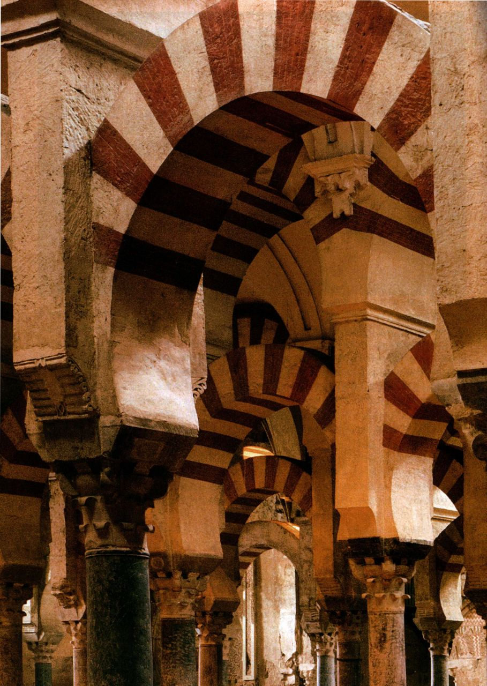

# 第九章 伊斯兰艺术

人们熟知的伊斯兰教形成于7世纪初的阿拉伯半岛（见第278页的背景知识）。

632年，也就是伊斯兰教创始人、先知穆罕默德（Muhammad，也被称作真

主的使者）去世将近30年后，阿拉伯战士就把这种新宗教带入了现在中东

的大部分地区。先知去世一个世纪后，伊斯兰教在西方穿越非洲，传入西班牙，

向东则传入印度河流域和中亚（地图9\.1）。伊斯兰教最初的信徒群体因柏柏尔人（Berbers）、

西哥特人、土耳其人和波斯人的加入而壮大，今日伊斯兰世界的复杂状态几乎是从一开始就存在的。随着伊斯兰教的不断扩张，旧文化与新宗教不可避免的碰撞和融合造就了伊斯兰艺术充满活力的传统。

综观伊斯兰艺术的形成过程，我们就能看到艺术史中的奇异的融合（syncretism）现象。融合是一个过程，在新的意识形态的推动下，作为已有艺术观念创造性结合的产物，一种新的艺术传统产生。正如最早的基督教艺术，从各种已有的、经过改造的古典和近东艺术观念的混合体发展而来，以满足宗教和王室赞助人的需要（见第八章），新兴的伊斯兰艺术起先也表现为一系列对既存的希腊\-罗马、拜占庭基督教和萨珊形式的借用，并形成了一种新的综合体，服务于新兴的伊斯兰宗教和君主。

伊斯兰艺术广大的地理和时间跨度意味着它无法为简单的定义所囊括。在伊斯兰文化中，伊斯兰教是一个重要的元素，但伊斯兰艺术远不止是一种宗教艺术；它包含了世俗元素，以及对一些伊斯兰神学家来

图9\.8细部，科尔多瓦大清真寺

说虽非禁止但确实反对的元素。与所有的艺术一样，伊斯兰艺术包含并反映了赋予其生命的社会和文化之间的和谐与矛盾。

尽管伊斯兰艺术在不同时间、不同地点有许多

互不相同的风格，伊斯兰教内部存在各种宗派分歧，

但伊斯兰艺术有一些统一的主题。首先就是对天经

（《古兰经》      ）及其所用语言（阿拉伯

语）的崇敬，这种崇敬反映在优美的书法艺术中。

从早期带棱角的、横向的库法体（kufic）字母（图

9\.1）到后来发展起来的复杂的草书体，伊斯兰艺术，

无论是宗教性的还是世俗性的，都表现出了和书法

不同寻常的密切联系，不管是经文还是世俗的叙事

诗（见第280页的原始文献）。另一个主题是独立

于人形的艺术表现形式的发展。由于许多伊斯兰宗

教传统对人物形象持怀疑态度，我们在伊斯兰艺术

中看到了精致而繁复的植物、花卉和几何图案语言，

与漂亮的书法结合使用。第三个主题是各艺术类型

的平等。要理解和欣赏伊斯兰艺术，我们需要抛弃

欧洲传统中以（人物）绘画和（人物）雕塑为首的

观念。在伊斯兰世界，陶器、金属器皿、纺织和贵

🔴第九章 伊斯兰艺术 277

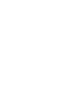

伊斯兰教及其使者

伊斯兰教（伊斯兰是阿拉伯语，指的是对真主意志的服从）是世界上一片广大区域最主要的宗教。这个区域横跨非洲、欧洲和亚洲，有多个不同种族、文化、语言以及社会和政治组织形式。穆斯林（服从者）相信，来自阿拉伯半岛西部麦加城一个大部落的孤儿穆罕默德（约570\-632年）被真主（在阿拉伯语中称为安拉［Allah］）挑选来担任真主在人间的使者或先知。据说穆罕默德领受了天使长加百列（Jibra＇il）带给他的真主之言。这是一系列韵文体诵文（在阿拉伯语中称为“Qur＇an”）。穆罕默德熟记、背诵这些诗一般的韵文，并把它们传授给其追随者。这些祷文、故事、训词和戒律被编排成章，并最终在632年穆罕默德去世后形成文字，组成了伊斯兰教的圣书《古兰经》。《古兰经》，加上真主使者的穆罕默德的模范生平内容的官方圣训（hadith）集，一起构成了伊斯兰宗教准则和法律的基础。

当先知迅速赢得拥护者之时，麦加的当权者受到了来自新宗教对他们的政治和经济权力提出的挑战。622年，先知被迫带着几个追随者离开麦加，移居往北约145公里的麦地那。穆罕默德的团体虽然经常与南边的麦加人发生冲突，但仍不断壮大，并领受了更多的启示。先知在麦地那按露天广场的形式建造的宅邸成为之后多个世纪中无数清真寺的原型。

穆罕默德把伊斯兰教解释成从真主与易卜拉欣［Ibrahim］（亚伯拉罕）立约开始的先知传统的巅峰。《古兰经》重点提到了希伯来《圣经》中的许多重要人物，如易卜拉欣、穆萨［Musa］（摩西）和苏莱曼［Sulayman］（所罗门），以

及先知尔撒［＇Isa］（耶稣）和他的母亲玛利亚姆［Maryam］（玛利亚）。伊斯兰教的基本信条非常简括：要成为一个穆斯林，就需深信不疑地重复“万物非主，唯有真主；穆罕默德是真主的使者”这句话。信仰的表白是所谓的伊斯兰教五大基础的头一项。其他四项是礼拜（每日五次礼拜和每周五，即穆斯林集会日中午的聚礼）、斋戒（阴历斋月每天日间戒饮食）、朝觐（阿拉伯语为hajj，即在阴历朝觐月［Dhu＇l Hijja］前往麦加）、施舍（一种正式的什一税制，用以救济伊斯兰社会中的病弱者和贫穷者）。

另外，伊斯兰教还宣布了将对艺术产生重大影响的三大信条。第一条是“圣书民族”\-犹太人和基督徒\-\-在穆斯林社会中的地位受到保护。这是由真主在《古兰经》中规定的。以先知生平中的几件轶事为依据的第二条是对某些图像的深刻怀疑\-人和动物的画像和雕塑，认为它们可能导致偶像崇拜。伊斯兰教和犹太教都持有这一观点，而且偶尔也影响到基督教艺术史。第三条与犹太教一致，却与同时代的基督教明显不同，其内容是对读写能力以及个人阅读和研究经文的高度重视。在伊斯兰教的大部分历史中，与之相关的是对手写字母的尊敬\-在伊斯兰教里就是对阿拉伯字母的尊敬。在早期伊斯兰教中，阿拉伯字母使用的是一种名为库法体的带棱角的字体（见图9\.1）。这种字体线条粗细对比，以一种几乎成韵律的视觉节奏从右至左书写，它的美被认为与真主本人诗一般的语言相称。这三个因素，在伊斯兰教信仰和早期伊斯兰政治史的大背景下，将对伊斯兰艺术传统的形成产生深刻影响。

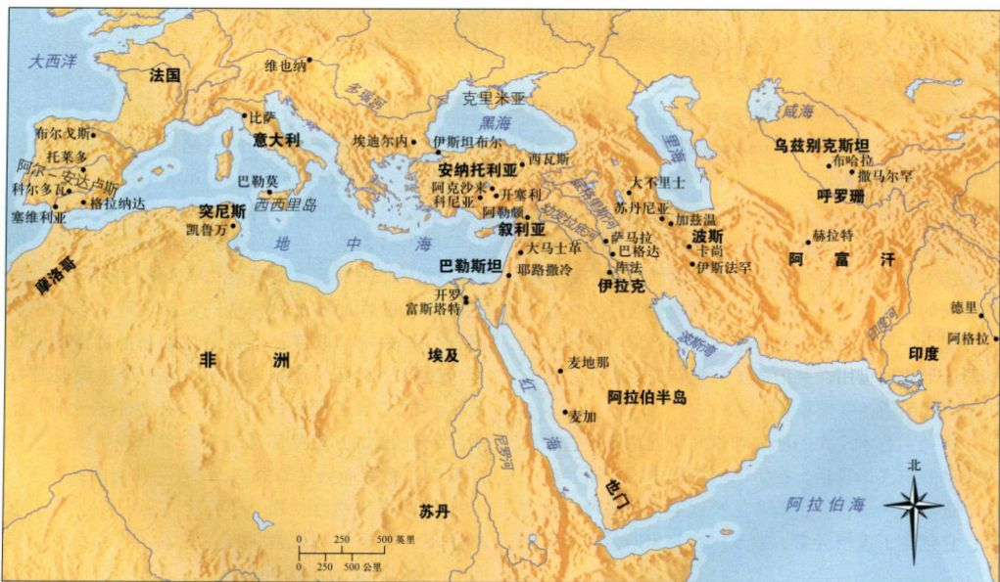

地图9\.1 伊斯兰世界

🟩8 詹森艺术史

厘米。蒙亚瑟·萨克勒（Arthur M\.Sackler）博物馆提供。哈佛大学博物馆，剑桥，马萨诸塞州，Francis Burr纪念基金，1967\.23

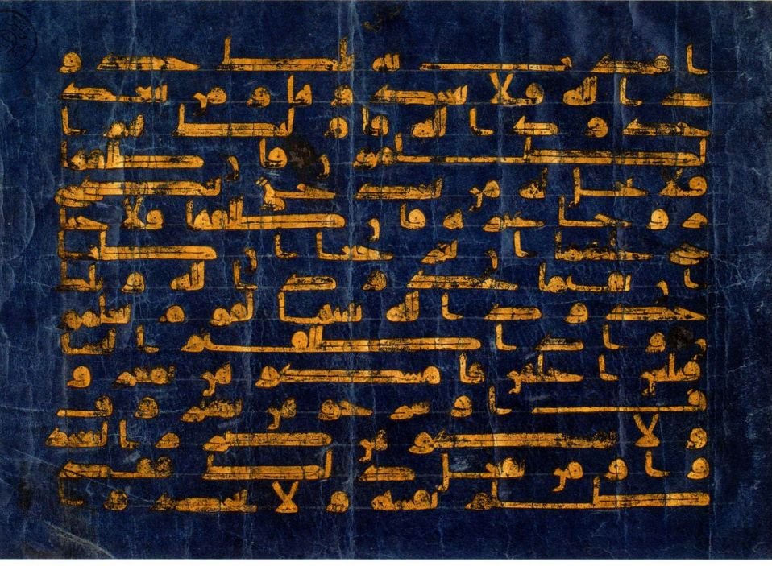

图9\.1 一本阿拔斯时期的《古兰经》中有库法体手写文字的一页，可能来自突尼斯。公元9世纪。墨、颜料、金色和银色、染蓝的犊皮纸，28\.6 × 37 \. 5

重材质雕刻艺术与其他艺术形式同属一个艺术领域，这个领域不存在西方那种导致“美术”与“装饰艺术”之分的刻板的等级差异。从这个意义上来讲，对伊斯兰艺术的研究兼具启发性和开放性。

伊斯兰艺术的形成

伊斯兰艺术最初表现为一系列对既存的希腊\-罗马、拜占庭基督教和萨珊形式的借用。对这些艺术形式的借用又形成了一种新的综合体，服务于新兴的伊斯兰教的需要以及伊斯兰君主的欲望和政治目标。对既存的形式的借用和改造，以服务于新兴的伊斯兰文化，这一点在建筑中表现得尤为明显。

宗教建筑

新的宗教需要某些类型的特殊建筑，如外观体现新信仰的公共礼拜场所。新的伊斯兰统治者需要与其权力和财富相称的住宅。最后，新的信仰需要纪念性

的建筑，来纪念伟大的统治者、圣人或历史事件。最终，伊斯兰建筑形成了丰富多样的形式和类型，以及成为伊斯兰象征的一系列独具特色的装饰。

圆顶清真寺 要论保存至今、历史最久远的重要伊斯兰建筑，当属位于耶路撒冷的圆顶清真寺（Domeof the Rock，图9\.2）。耶路撒冷是仅次于麦加（Mecca）和麦地那（Medina）的最神圣的伊斯兰圣地。对于最早的穆斯林而言，耶路撒冷的圣殿山是真主考验易卜拉欣（Ibrahim）忠诚的地方。他要求易卜拉欣将其头生子伊斯梅尔（Ismail）作为献祭。根据后来的伊斯兰传说，先知也是从此处被加百列带走，踏上体验天堂和地狱的精神之旅（mi＇raj）。因为穆罕默德是唯一被允许在死前看到这些地方的凡人。

圆顶清真寺建在耶路撒冷的摩利亚山（Moriah）上远非巧合。这里原本是第一（所罗门）庙和第二（希律王）庙的所在地，是犹太教的地理中心。圆顶清真寺带有穹顶的外形和环状的平面布局（图9\.3）与6世纪拜占庭式圣墓教堂在形式上的相似也绝非偶

🔴第九章 伊斯兰艺术 279

原始文献

穆罕默德·伊本·马木德·阿拉穆利（Muhammad Ibn Mahmud Al\-Amuli，伊朗，14世纪）

（在他不容置疑的《启示录》中，他的名被视为神圣）立誓\-“以笔和他们所写的盟誓”（《古兰经》68\.1），以及他说的这番话：“你当宣读！你的主是最尊严的，他曾教人用笔写字，他曾教人知道自己所不知道的。”（《古兰经》96\.3\-5）

书写之笔的荣耀、尊崇

选自《知识之美》

无数伊斯兰谚语和轶事证实了优雅书法的重要和优美。书法是伊斯兰神学家无条件认可的唯一一种艺术形式。阿拉穆利关于知识的百科全书式的论述称赞优美的书法艺术是对真主意志的实现，能给书写者带来尊重和荣誉。

书法艺术是高尚的艺术，是滋养灵魂的才艺；作为一门手上技艺，总是那么优雅，得到大众的赞许；在每个国度都受人尊敬；获得了卓越的地位，赢得了每个阶层的信任；在人们的心目中，始终地位崇高、身份高贵，所以不会遭到压制。在每个国家，都保存在人们的回忆中，每一面墙都有书法装饰。在这一点上，它得到的荣耀莫过于万主之主

然。圣墓教堂标志着耶稣的埋葬之地，就位于圆顶清真寺以西几百米处。圆顶清真寺由艺术家和工匠建成。他们中的许多人必定是当地的基督徒或新近皈依伊斯兰教的信徒。圆顶清真寺可能是穆斯林哈里发（caliph，源于阿拉伯语“khalifa”，意为“继承人”）阿卜杜勒马立（Abd al\-Malik）在690年前后下令修建的。矗立在这样一个神圣之地，同时又是城市的制高点，圆顶清真寺无可争辩地宣告了伊斯兰教对耶路撒冷的统治。

永远在于主是凭着笔起誓的

先知（愿他安息！）说过：“你对书法之美负有不可推辞的责任，因为它是人谋生之道的关键之一。”一位智者曾说：“书写是一种精神图形，由一种物质工具加工而成。”

SOURCE:SIR THOMAS W\. ARNOLD,PAINTING IN ISLAM:A STUDY OF THE PLACE OF PICTORIAL ART IN MUSLIM CULTURE,\(NY:DOVER,1965\)

仔细观察这座建筑，就可以看出早期伊斯兰艺术融合的特点和真主使者的视觉艺术观对它的影响。这一建筑的平面图（见图9\.3）中，两条回廊围绕着中央裸露的岩石，对于组织大量朝圣者来寺参观来说十分理想。不仅有圣墓教堂之风，还让人想到罗马末期的集中式穹顶教堂。就在圆顶清真寺的南面，有一座同样令人肃然起敬的伊斯兰建筑，在圆顶清真寺旁边提供了一个礼拜的去处，它就是今天被称为阿克萨清真寺（al\-Aqsa Mosque）的公共礼拜堂。圆顶清真寺

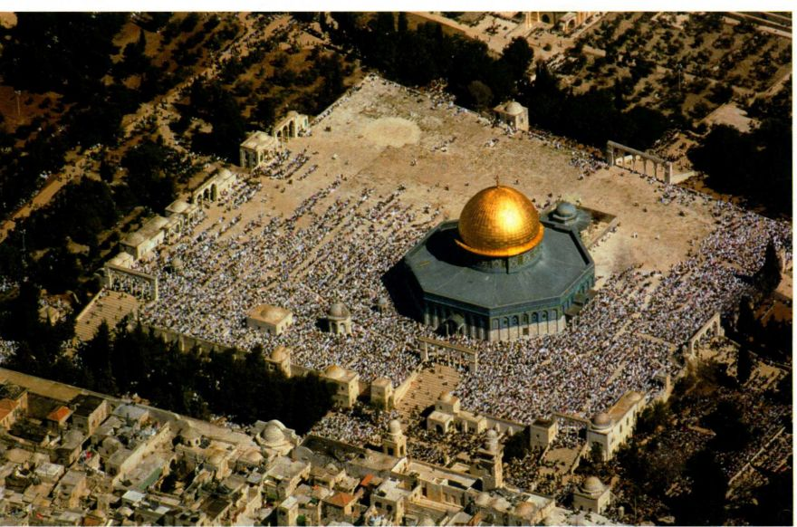

图9\.2 圆顶清真寺，耶路撒冷。约690年及之后

🟩280 詹森艺术史

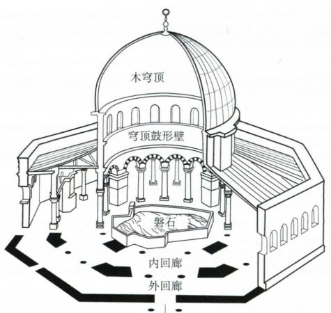

入口（四个入口之一）

图9\.3 圆顶清真寺剖面图，耶路撒冷

本身的穹顶是公认的天穹象征，联想到真主使者神秘的精神之旅的终点，这一象征显得尤为恰当。取自古典建筑遗迹的圆柱和柱头，向穆斯林和非穆斯林传达出一种传统和永恒、财富和权力的感觉。

原有的镶嵌画装饰（图9\.4）包括阿拉伯文草书、重复的几何图案以及高度程式化的植物和花卉元素。这些设计元素最终会形成一系列伊斯兰特有的装饰。一种是用在众多宗教铭文中的阿拉伯文草书。另两种是与实物不甚相似的涡卷形藤蔓、叶片和花朵，以及重复的几何图案。这两种艺术语汇都是古典末期和萨珊艺术的主要成分。第四组基本图案包括珠宝和镶有珠宝的物品，它们是皇室的象征。与希腊\-罗马和基督教艺术传统明显不同的是，圆顶清真寺中没有出现任何人物或动物的造型。圆顶清真寺中的铭文是从《古兰经》里精心挑选出来的，以强调建筑本身的重要性，圆顶清真寺在犹太人、基督徒和穆斯林共有的圣城中具有象征性的位置，以及其在特定宗教和社会中的地位。这种宗教和社会自视为之前两大圣书传统的巅峰，并得到了基督徒和犹太人的容忍和接受。

多柱式清真寺 在伊斯兰教所有的纲领中，礼拜这一宗教义务被证明是伊斯兰建筑发展过程中最重要的因素。在大马士革这样的大城市里，伊斯兰教初期阿拉伯倭马亚王朝（Umayyad）的哈里发们或兴建，或把业已存在的建筑加以改造，形成了最早的大

型穆斯林公共礼拜建筑，称作清真寺（mosque，源自阿拉伯语“masjid”，意为“跪拜之所”）。这些最早的清真寺，旨在容纳城中全体男性市民做礼拜五的午间祈祷。清真寺在形式上模仿位于麦地那的真主使者的宅邸，都有一个长方形的庭院，庭院通常被有屋顶的连拱廊环绕，在麦加朝向（qibla），即面朝麦加的那一面，有一个更大的多柱厅。这种建筑式样强调了全体穆斯林在真主面前的平等，以及伊斯兰教不任命神职人员的事实：早期的阿拉伯清真寺很少有轴对称的\-不存在一条在建筑的任何地方都看得到的、通向建筑中心的又长又直的主道。由于礼拜者直接向真主祷告，无需任命神职人员或追封圣徒来代为祈求，早期清真寺的内部空间在根本上取决于实用性而非仪式的需要。因此，不存在用来奏乐或游行的空间；所设置的多扇门是为了最大程度地方便礼拜者每日的进出；集中式或轴心式的大空间对于基督教弥撒的戏剧性场面来说如此重要，在此则被认为是不必要的。一个简易的敏拜尔（minbar，讲坛）即可满足礼拜五午间祈祷之后讲道的需要，一个中空的米哈拉布（mihrab，壁龛）安装在麦加朝向墙上，指示着麦加

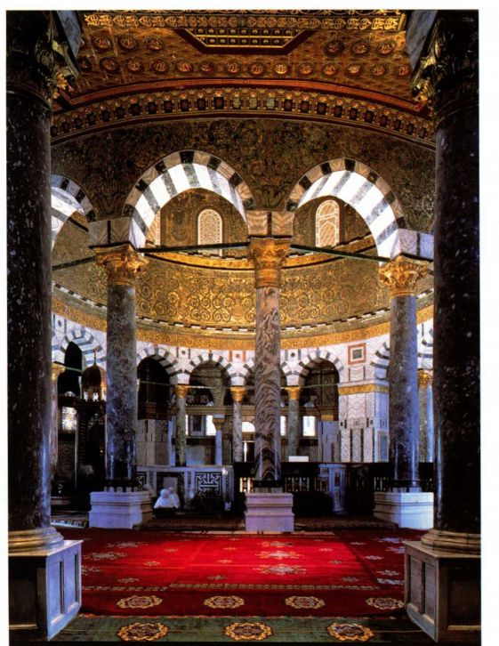

图9\.4 圆顶清真寺内部，耶路撒冷

🔴第九章 伊斯兰艺术 281

大事年表

632年\-先知穆罕默德去世

约690年\-耶路撒冷修建圆顶清真寺

约700年\-《林迪斯法恩福音书》在英格兰制作完成

到8世纪\-伊斯兰教传至西班牙和中亚

的方向（图9\.5）。地板上铺的多是青草垫或灯芯草垫，后来则改用羊毛毯。这样就有了一个干净的场地，人们可以在背诵祷文的同时站立、鞠躬、下跪和膜拜，并且前额短促地碰地，这都是伊斯兰教礼拜仪式的主要内容。油灯为晨礼和宵礼提供照明。庭院中的水池或喷泉可供信徒们在礼拜前行规定的净手净足礼。后来，一种称为宣礼塔（minaret）的高塔宣示了清真寺的存在。一名宣礼人还会在塔上一日五次召唤信徒前来礼拜。宣礼人（muezzin）通常因为嗓音优美、洪亮而被选中。在一些清真寺中，还设有被称作地卡（dikka）的小平台供宣礼人高声唱诵祷文。

世俗建筑

伊斯兰教的出现并不意味着世俗艺术在近东的终结。早期的伊斯兰王侯赞助人是来自倭马亚王室的阿拉伯人。他们除了确立了伊斯兰教礼拜堂的规范式样，还很快受到萨珊和希腊\-罗马豪奢艺术的诱惑。

虽然他们修建在城市中的宫殿已荡然无存，但他们也在远离都市的沙漠中建造豪华和幽僻的宅邸，其中的一些已经在近代被重新发现。为统治者和朝臣修建的带有围墙的住宅，依照的是古罗马军营传统的中空四方式样。除此而外，倭马亚人还建造了带有娱乐厅的大型豪华浴场，通常是极尽奢华，铺有罗马末期风格的镶嵌地板，装饰着华贵的画像和雕像。所描绘的题材包括王室狩猎、宫廷乐师（图9\.6）、享受罗马式沐浴、舞妓、日常生活场景和源于古代的象征生殖力、性和君王勇武的形象。这样一来，宗教的禁欲要求立刻就与代表皇家财富、奢华和娱乐的古老象征发生了冲突。王权的艺术形象深植于中东的力量是如此巨大，它很快就对新兴的伊斯兰统治精英的物质文化产生了影响。

伊斯兰风格的发展

到了750年，以古罗马的叙利亚为大本营的倭马亚王朝已被以美索不达米亚为中心的阿拔斯（Abbasid）王朝取代。新的哈里发们在底格里斯河边建起首都巴格达，后来又在巴格达以北的萨马拉（Samarra）修建了一座庞大的宫城。原先的巴格达团城的遗址如今深埋于现在巴格达市的地下。早在1258年蒙古人（Mongol）洗劫该城之前，它就已经被遗弃、损毁了，

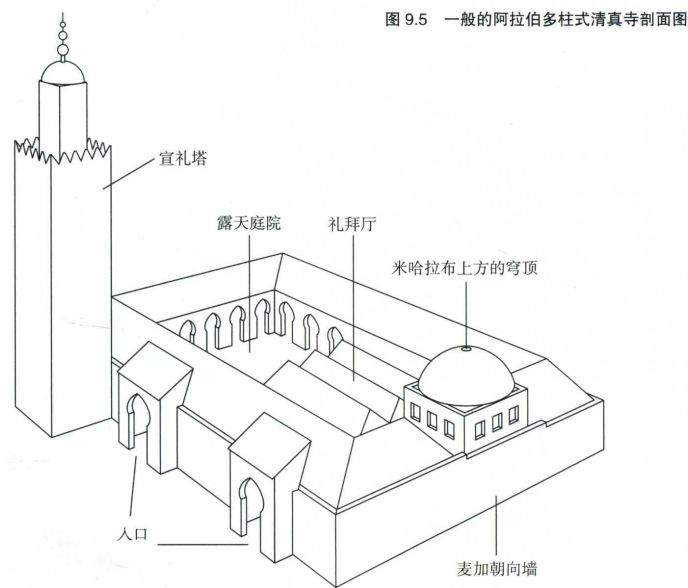

🟩282 詹森艺术史

图9\.6 描绘了两名宫廷乐师和一名骑马猎手的地面湿壁画，来自海尔堡（Qasral\-Hayr，西）。约730年。大马士革国家博物馆

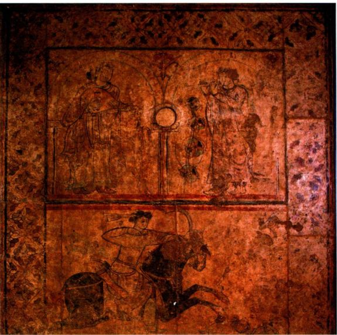

但阿拉伯诗歌和散文里一直保留着对它的深切记忆。萨马拉令人难忘的泥砖废墟至今还沿着底格里斯河绵延数公里。阿拔斯王朝统治时期，在辽阔无边的伊斯兰帝国，新占领区的清真寺修建工作进展得非常迅速。

宗教建筑

新建筑中最重要的是大型的阿拔斯集会清真寺，是用于礼拜、讲道和宗教教育的宗教集会场所，兼具实用性和象征性。大型清真寺建在伊拉克各地、埃及及其他地方，其中不少已成废墟。一个典型的例子是

位于凯鲁万（Kairouan）的主要建于9世纪的集会性清真寺。凯鲁万是一座创建于阿拔斯王朝时期的城市，位于今天突尼斯的所在地。

凯鲁万大清真寺 与所有大型的阿拉伯清真寺一样，凯鲁万大清真寺（Great Mosque of Kairouan）也是以麦地那的先知宅邸和正方形的地中海庭院住宅为蓝本。如今，这些特征在凯鲁万大清真寺仍然随处可见。它包括一个长方形庭院，四周是有屋顶的厅堂，一个多柱式礼拜大厅和一座高耸的宣礼塔（图9\.7）。两个穹顶标示着不同的区域：一个位于米哈拉布前方，

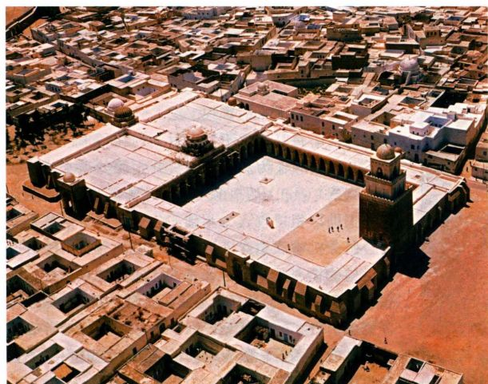

图9\.7 凯鲁万大清真寺鸟瞰图，突尼斯。8世纪及

之后

🔴第九章 伊斯兰艺术 283

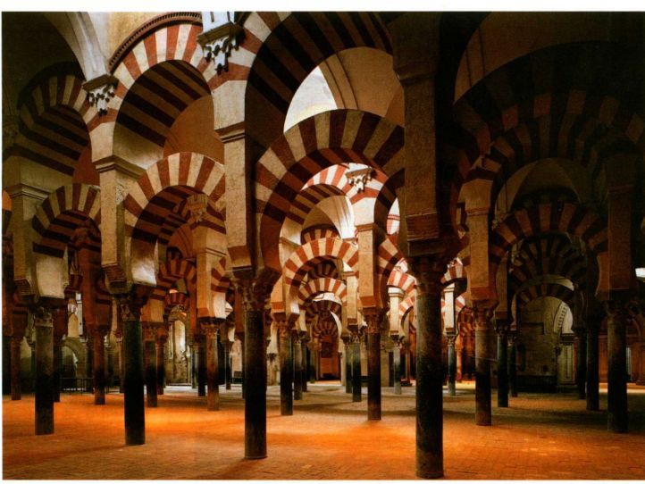

图9\.8 礼拜厅内部，科尔多瓦大清

真寺

另一个位于面朝庭院的礼拜厅的中央。除此之外，在建筑的三面开的大量入口，是为了方便人们每日五次礼拜时的进出，也无需设置供神职人员行进之用的中轴线；早期的基督教公堂式教堂需要根据神职仪式进行布局，而凯鲁万大清真寺正好相反。清真寺的朴素反映了伊斯兰教礼拜仪式的简朴。清真寺既非轴对称，也没有连续的内部空间，其根源在于，在伊斯兰教中，礼拜者之间不存在等级差异，也不任命任何神职人员。每位礼拜者直接向真主祷告，使用的是简单的仪式惯用语，通常几分钟就能说完。艺术家的注意力倾注在雕花大理石和陶瓦建造的米哈拉布，以及用印度柚木精心雕刻的敏拜尔上。在凯鲁万清真寺里，有一面木雕屏风，主要是出于安全的考虑而非仪式的需要。这面屏风在米哈拉布附近围出一小块区域，称为私室（maqsura），供统治者单独做礼拜。

科尔多瓦大清真寺 再往西，在西班牙，被推翻的倭马亚王室唯一幸存的王子于750年之后创建了一个独立国家。西班牙南部阿尔\-安达卢斯（al\-Andalus，现在的安达卢西亚［Andalusia］）的科尔多瓦城（Córdoba）发展成了一个辉煌的伊斯兰文化中心。到了10世纪，在一系列装饰和扩建之后，科尔多瓦大清真寺（Great Mosque of Córdoba）已成为最华美的伊斯兰礼拜所之一。科尔多瓦清真寺是一个典型的阿拉伯多柱式会堂，经过几次扩建，内部实际上成了一片柱林（图9\.8）。它特有的“马蹄铁”连拱廊由用红白相间的楔形拱石制作的拱券组成，还包括这样的一个设计：一组拱券叠置于由拉长的拱墩支撑的另

一组拱券。这造成了一种近乎无限的空间感\-但这个空间是由反复出现的小的建筑构件组成的。与圣索菲亚大教堂（见图8\.28和8\.29）或旧圣彼得教堂（见图8\.4和8\.5）这样的基督教建筑相比，科尔多瓦清真寺有一个同样大的内部区域，但它没有用来举行基督教仪式的那种集中空间。清真寺的内部，包括米哈拉布附近的私室区，装饰着大量拼花石和石刻。麦加朝向墙上10世纪的大理石花格窗（图9\.9）展示了所谓几何式阿拉伯花纹（geometric arabesque）的早期例子：艺术家用大理石雕出的基本上就是一根缠绕在一起的带状线条，形成了一块特别的有星形和多边形图案的透孔隔板。这类几何图形如此之美，许多穆斯林从中看到了真主对天地万物的影响。

除了充当公共的礼拜所之外，大型伊斯兰清真寺如科尔多瓦清真寺作为公共机构的作用还常常包括学院和大学、公共浴场、医院和医学院、赈济施粥场、旅客和商人的客栈、公共计时器（知道正确的时间对于每日五次不固定时间的礼拜来说十分重要）、公厕和作为周边地区公共水源的喷水池。被称为公产（waqf）的捐助支持着清真寺的许多功能，这种捐助以租赁收入为基础。公产的设立也是为了社会服务机构和独立于清真寺之外的寺庙。赠给这类机构的精美还愿品，如《古兰经》抄本、灯、漂亮的木家具、地毯及其他物品，理论上应永久保存，也变成了公产的一部分。因此，这类机构常常成为艺术品的大磁石，随着时间的流逝，它们积聚了重要的藏书和精美的陈设品。

🟩284 詹森艺术史

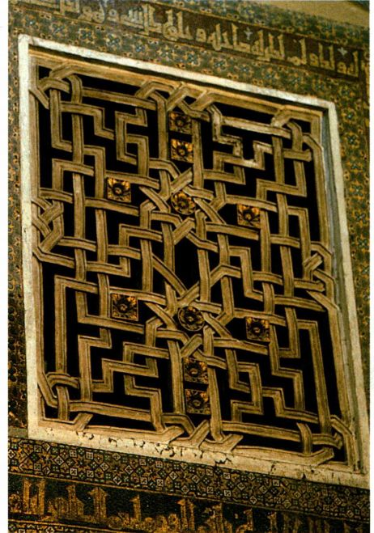

图9\.9 科尔多瓦大清真寺麦加朝向墙上的石雕花格窗。10世纪中叶

奢侈艺术

在科尔多瓦郊区，倭马亚人建了另一座巨大的伊斯兰宫城，名叫麦地那\-阿尔扎赫拉（Medina al\-Zahra）。这个现已成废墟的宫殿群曾拥有皇家工场，制造丝织品和牙雕之类的奢侈品。这些奢侈品是皇家财富和权力的象征，也是皇家仪式的礼品。为一位10世纪的倭马亚王子制作的一个圆盖小盒（pyxis，象牙盒），上面的装饰是伊斯兰皇家意象和象征的缩影，包括对鹰猎和狩猎、游戏和宫廷乐师的描绘。它们被丰富的植物雕饰和一条库法体铭文带包围。这类奢侈品具有一种重要的象征意义，远远超出其作为首饰或化妆品容器的实际用途。它们复杂的多层象征以及作为皇家赠礼的重要性和象征性，至今仍是学者们的研究课题。

在11世纪，效忠于北非阿尔莫拉维德（Almoravid）王朝的柏柏尔人军队将麦地那\-阿尔扎赫拉夷为平地；虽说他们和继任的阿尔莫哈德（Almohad）王朝在马格里布（Maghreb，今天的摩洛哥和非洲西北部）和阿尔\-安达卢斯建造了重要的纪念性建筑。来自北方的日益增长且从未间断的基督教再征服的压力导致

大事年表

8世纪\-西班牙科尔多瓦大清真寺开工建造

750年\-阿拔斯王朝取代倭马亚王朝

11世纪\-柏柏尔军队摧毁麦地那\-阿尔扎赫拉

1215年\-英格兰国王约翰签署《大宪章》

1258年\-蒙古人洗劫巴格达

到14世纪\-阿尔莫哈德首都塞维利亚被卡斯蒂尔国王攻陷

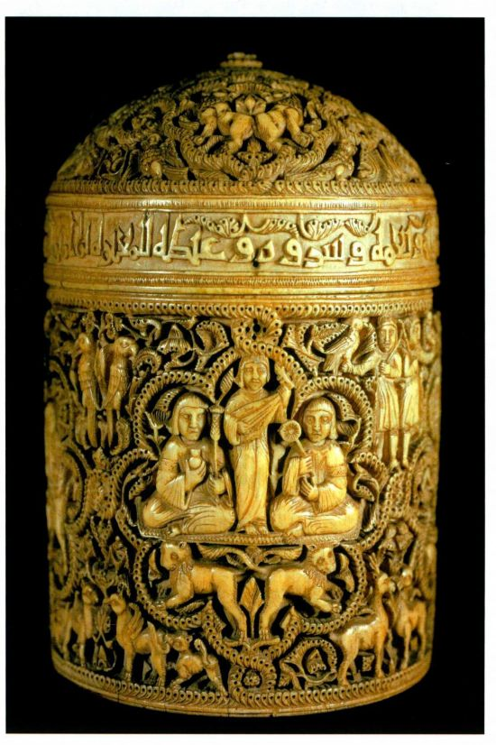

图9\.10 阿穆吉拉（al\-Mughira）象牙首饰盒，来自科尔多瓦。约960年。高15厘米，直径8厘米。巴黎卢浮宫，Inv．4068

🔴第九章 伊斯兰艺术 285

大事年表

242\-272年\-萨珊统治者沙普尔一世在伊朗泰西封修建谒见厅10世纪初\-在布哈拉为波斯萨曼尼德王朝修建伊斯兰陵墓11世纪中叶\-塞尔柱突厥入侵者开始其统治

穆斯林在西班牙的势力急剧衰落。到了14世纪，阿尔莫哈德王朝的都城塞维利亚（Seville）被卡斯蒂尔（Castile）的国王们攻陷，在基督教统治下活跃的穆斯林（被称为穆德哈尔人［Mudéjar］），在基督教的支持下延续着伊斯兰的艺术传统（见第287页的艺术史家的观点）。

伊斯兰艺术与波斯传统

在中西部伊斯兰国家，从西班牙到地中海西部沿海地区，伊斯兰艺术在具有希腊\-罗马传统的地理和文化范围内发展；但在东部，情况在许多方面都大不相同。在美索不达米亚和伊朗，阿拉伯穆斯林征服者遇到了萨珊王朝的文化。萨珊王朝是有一千多年历史的波斯文化的继承者。波斯文化拥有令人印象深刻的艺术和建筑传统。这种传统包括记载盛典、战事和皇家狩猎活动（见图2\.21）等皇家形象，以及宏伟的大型宫殿建筑。

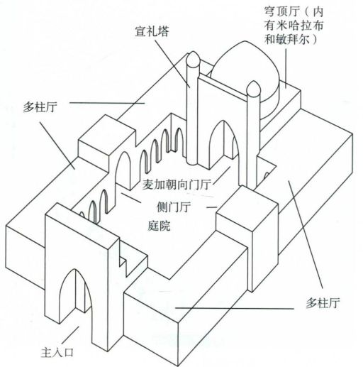

图9\.11 一般的波斯四门厅清真寺剖面图

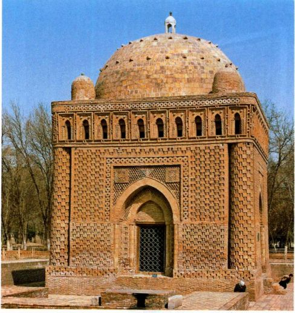

图9\.12 萨曼尼德王朝陵墓，布哈拉，乌兹别克斯坦。约901年

建筑

在东部伊斯兰世界，按照前伊斯兰的建筑惯例，最常用的砖石建筑材料是砖，而非石头。巨大的砖墩柱常常取代圆柱形立柱，成为建筑中的垂直支撑结构，而且人们常常选择沉重的穹顶而非木梁瓦片屋顶来遮盖内部空间。美索不达米亚、伊朗和中亚的伊斯兰建筑以独特的方式反映了这些地区的可用材料、早期文化传统，甚至气候。它们也是世俗建筑和宗教建筑奇特的混合体；在西部伊斯兰世界，露天的连拱廊庭院是清真寺和宫殿的主要特征，而在东部，另一种名为门厅（iwan）的形式成为皇家和宗教建筑的主要特征。

四门厅清真寺 最早的一面开口（这一面称为门厅）的大型拱顶砖建筑之一是由萨珊统治者沙普尔一世建造的，它是其位于美索不达米亚泰西封皇宫中的一个谒见厅（见图2\.32）。在伊朗，这种式样起初似乎象征着皇权，在伊斯兰教的统治下，它最终融入了一种新的礼拜建筑类型，即四门厅清真寺（four\-iwanmosque），融合的方式是在长方形庭院每一面的中部设置一个厚实的砖壁龛（图9\.11）。从12世纪起，四门厅庭院成为伊朗和信奉伊斯兰教的中亚地区的清真寺和名为穆斯林学院（madrasa）的宗教学校的标准特征。与在美索不达米亚一样，在伊朗大部分地区，砖是首选的建材，伊朗清真寺的拱顶以巨大的砖墩柱为支撑。

萨曼尼德王朝陵墓 在阿拉伯人占领伊朗后，波

🟩286 詹森艺术史

中世纪西班牙伊斯兰艺术与欧洲

7Ziyad）率领的阿拉伯和柏柏尔联军渡过直布罗陀海峡。11年，由穆斯林指挥官塔里克·伊本·齐亚德（Tariq ibn到了716年，西班牙大部已落入穆斯林手中。在倭马亚王朝（751\-1017年）统治下，科尔多瓦成为一个繁荣、宽容、强大的西班牙穆斯林王国的首都。在这个国家里，基督徒和犹太人在文化生活中起着重要作用。11和12世纪，在倭马亚王朝垮台后，来自北非的柏柏尔人（先后为阿尔莫拉维德人［Almoravids］和阿尔莫哈德人［Almohads］）的连续入侵给西班牙带来了新的穆斯林王朝赞助人。他们主导了值得称赞的新艺术生产。然而，面对北方日益强大的基督教势力，他们也遭到了一系列军事失败。在穆斯林在西班牙的统治进入衰退期之后形成的几个伊斯兰小国中，有一个，即1230\-1492年统治格拉纳达的纳斯瑞德王国（Nasrids），在被费迪南德（Ferdinand）和伊莎贝拉（Isabella）领导的卡斯蒂尔和阿拉贡（Aragon）联军击败前，经历了最后一次辉煌的艺术繁荣。

在西班牙南部艺术中占统治地位的穆斯林风格以多种复杂的方式影响了非穆斯林的艺术创造。从10世纪到12世纪，在基督教控制的北方，在那些穷困的山区公国里，基督教建筑师以莫扎勒布（mozarab）风格来建造小教堂和修道院，用到了在穆斯林控制的南方看到的马蹄铁形拱券、两色相间的楔形拱石和彩色石头镶嵌画。与此同时，在北方的修道院里，艺术家僧侣们为利巴纳的贝亚图斯（Beatus of Liebana）的《论《启示录》》（Commentaries on the Apocalypse）抄本配上插图，同样反映了居于支配地位的穆斯林风格。越过比利牛斯山脉，在通往法国的中世纪朝圣之路沿线，穆斯林风格的一些方面甚至影响了法国的罗马式艺术；12世纪法国勒皮伊（Le Puy）大教堂的木门上有一条复杂的库法体阿拉伯铭文：“mashallah”\-“愿真主保佑此地”。

在基督教对西班牙南部中心地区的再征服于13世纪末呈现增强势头之后，生活在基督教统治下的被征服的穆斯林民族（被称为穆德哈尔人）中，为天主教赞助人工作的工匠继续创造穆斯林风格的艺术品\-包括建筑、地毯、瓷器和牙雕。最重要的穆斯林艺术杰作是14世纪卡斯蒂尔国王佩德罗（Pedro）在塞维利亚建造的城堡或皇宫，其风格与那时邻

斯的文化传统在许多方面逐渐凸显出来。现存最早的伊斯兰王朝陵墓之一是10世纪初为波斯的萨曼尼德（Samanid）王朝修建的，位于布哈拉（Bukhara），奥克苏斯河（Oxus）对岸的一个东方城市，在现在的乌兹别克斯坦境内（图9\.12）。这座小型的立方体建筑的基本设计是一个由四根粗大的墩柱支撑的半球形穹顶，这显然部分源自用于祆教礼拜活动的萨珊火庙的式样。正方形的墓室通过角上的四个内角拱把穹顶

国格拉纳达正在修建的阿尔罕布拉宫（见图9\.27）的风格非常相似。同样值得注意的是现存的科尔多瓦、格拉纳达和托莱多（Toledo）穆哈德尔犹太会堂（synagogue）；由萨穆埃尔·阿莱维·阿布拉菲亚（Samuel Halevy Abulafia）创建，一般被称为圣母升天教堂（El Tránsito）的托菜多犹太会堂（约1360年）的装饰紧紧追随穆斯林风格，其中希伯来铭文与阿拉伯铭文混在一起。这似乎证明了，西班牙说阿拉伯语的犹太人中的重要成员那时感觉自己已完全融入主流的艺术文化。

欧洲的民族主义学者曾经喜欢忽略或抨击中世纪西班牙的这种文化混合现象，但近来的学术和展览再度激起了人们的兴趣\-西班牙穆斯林对欧洲的影响，以及中世纪穆斯林西班牙的共同生活时期基督教和犹太文化发展的性质。16世纪初费迪南德和伊莎贝拉的种族净化运动把穆斯林和犹太人最终逐出西班牙，这使这种建设性的共生在很大程度上不幸地终结了。

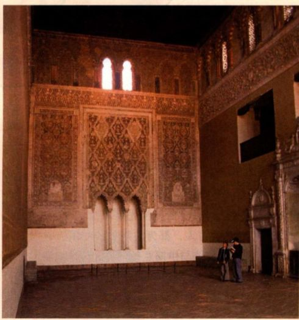

圣母升天犹太会堂内部。约1360年。西班牙托莱多

撑起，易得且较粗糙的材料\-砖的运用达到了令人赞叹的效果，各种各样的表面纹理类似于苇编、库法体铭文，以及四角上看起来像附墙圆柱的柱子。虽然真主的使者反对一切神庙和为国王、圣徒建造耀眼的墓葬建筑，因其暗示着多神崇拜或偶像崇拜，但与王朝君主制相联系的象征体系以及对伊斯兰教主要宗教人物的崇敬意味着，陵墓和庙宇将在整个伊斯兰世界的建筑史中扮演重要的角色。

🔴第九章 伊斯兰艺术 287

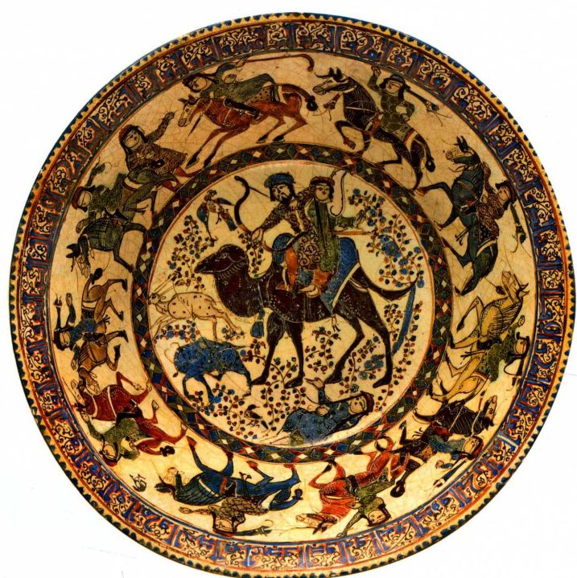

图9\.13 描绘巴赫拉姆·古尔与阿扎德故事的米娜盘，来自伊朗。约1200年。在白色复合胎体上施彩色釉上彩珐琅，直径

22\.2厘米，高9\.7厘米。纽约大都会艺术博物馆。Rogers基金购藏，Shiff基金会遗赠，1957（57\.36\.13）

伊朗的人物或动物艺术形式

伊斯兰世界伊朗语区继承了丰厚的物质文化传统，伊朗的历任统治者，不管其祖先是阿拉伯人、波斯人、土耳其人还是蒙古人，都为波斯传统的诱人魅力而折服。他们把波斯传统与伊斯兰教信仰和传统结合起来。10世纪和11世纪繁荣的伊朗城市留存至今的有精美的瓷器，上面装饰着优美的书法书写的箴言、祝福或祷文，还有人物和动植物图案。除了陶瓷，还有一些特别的丝织品和金属物品。从11世纪中叶起统治伊朗的塞尔柱（Seljuks）土耳其入侵者不仅兴建大型清真寺和墓葬建筑，还统治着一个繁盛的城市文化，这个文化最重要的一点是造就了已知最丰富的装饰陶瓷传统。这些陶瓷包含各种各样的人物或动物形象，运用了多种复杂的技法，包括在釉面上喷一种名为虹彩釉（luster）的金属颜料，以及被称为米娜（mina＇i）的彩色珐琅装饰，为中等阶层的需求者表现了极其多样的题材：波斯传奇和神话故事、苏菲派（sufism，伊斯兰教的神秘主义宗教传统）主题以及现在为人们所熟知的伊斯兰皇家狩猎和其他王室娱乐场景。陶

瓷、金属制品和书籍插图最喜欢描绘的故事是关于皇家猎手巴赫拉姆·古尔（Bahram Gur）和他猜忌的情人、竖琴好手阿扎德（Azadeh）。一只米娜盘（mina＇iplate）表现了两个连续叙述的事件：阿扎德与她的皇家爱人同坐在一匹骆驼上。后来，她言语冲撞，贬低这位英雄的射术，被推下骆驼（图9\.13）。

同样值得注意的技艺是把贵金属嵌入黄铜器或青铜器，常用于表现人物和动物的形象。这种艺术形式显然于12世纪起源于呼罗珊（Khurasan，古伊朗的东北部），并于13世纪初逐渐向西传入美索不达米亚北部。这些华丽的物品囊括了全部皇家题材，甚至连上面铭文的字母也不时表现为人的轮廓（图9\.14）。制作于伊朗塞尔柱王朝统治时期的还有刻画人形的灰泥浮雕。这种人物或动物的艺术表面上与严格的伊斯兰教教义相矛盾。是什么原因导致了这些形象的突然出现？塞尔柱王朝时期的伊朗人是讲求实际的，并不信奉教条。他们显然认为人物或动物形象并不一定等同于多神崇拜或偶像崇拜，而是能够满足世俗和宗教的需要，并且不会使观者道德败坏。

🟩288 詹森艺术史

古典时代

在一些学者所称的伊斯兰古典时代（约800\-

1250年），处于伊斯兰世界中心的美索不达米亚的势

力和影响随着阿拔斯哈里发政权的衰落而减弱。969

年，自称为真主使者之女法蒂玛（Fatima）后裔的北

非阿拉伯法蒂玛（Fatimid）王朝占领了阿拔斯王朝在

埃及的重要城市富斯塔特（Fostat），并把附近的开

罗城立为新都。法蒂玛人是什叶派（Shiites）\-相

信只有穆罕默德的后裔才能合法领导伊斯兰社会的穆

斯林。他们的名字取自“       （“阿里的追随

者”）一词，阿里是穆罕默德的女婿、法蒂玛的丈夫、

先知的孙子哈桑（Hasan）和侯赛因（Husein）的父亲。

什叶派穆斯林本身分成几个大的和多个小的教派。这

些教派全都反对逊尼派（Sunni）或正统派伊斯兰教

的基本政治原则。逊尼派或正统派伊斯兰教认为拥有

真主使者的血统并非掌握政治权力的一个先决条件。

10世纪法蒂玛王朝崛起的同时，占据巴格达的

阿拔斯王朝的势力逐渐衰微，哈里发的权力也削弱了。到了11世纪，塞尔柱突厥人（Seljuk Turks）已向西迁出中亚，为的是先控制伊朗，然后控制美索不达米亚北部和小亚细亚；与此同时，1099年，第一次十字军东征的诺曼士兵夺取了耶路撒冷。塞尔柱人是逊尼派穆斯林；他们鼓励各种门类的艺术，创办多所穆斯林学院传授逊尼派法律，以维护逊尼派的教旨。12世纪末，另一个逊尼派王朝\-阿尤布（Ayyubids）王朝将异教的基督徒逐出耶路撒冷，艺术上也有短时期的重要发展。

法蒂玛王朝的艺术影响

法蒂玛王朝统治下的埃及经历了一次重大的艺术复兴。11世纪的开罗城墙采用了最新的前沿军事技术，是用从附近吉萨的金字塔外部拆下的石块建造的。城内修建了两座大型宫殿，装饰着以音乐、舞蹈、狩猎和皇家仪式为内容的人物画像，精心安排的阅兵和典礼游行显示了王朝的权势。在法蒂玛王朝统治下，开

图9\.14 穆罕默德·伊本·阿卜德·阿尔瓦希德（Muhammad ibn abd al\-Wahid，铸工）和马苏德·伊本·艾哈迈德·阿尔纳卡什（Masud ibn Ahmad al\-Naqqash，镶嵌工）：铸青铜合金吊桶，镶嵌白银和黄铜，出自赫拉特。1163年。圣彼得堡埃尔米塔什博物馆（The State Hermitge Museum），Inv．no．IR2268

🔴第九章 伊斯兰艺术 289

图9\.15 阿克马尔清真寺，开罗。约1026年

罗兴建了两座集会清真寺。此外，还有为城市各个街区服务的较小的清真寺。到了12世纪，开罗城已不断扩大，超出了原有城墙的范围。

阿克马尔清真寺 在开罗最漂亮的法蒂玛王朝修建的清真寺中，有一座被称为阿克马尔（al\-Aqmar）的小清真寺（图9\.15），由一位法蒂玛贵族修建。它被巧妙地建在一块不规则的土地上，其离轴的正立面与原有的街道相契合。除了石刻、阿拉伯铭文和装饰性的壁龛，我们还在正门两侧看到了一种复杂的壁龛式样（muqarnas）。独特的几何图案、近乎水晶刻面

的装饰，由小的壁龛状结构组成，后来成为从大西洋到奥克苏斯河以外地区的一种代表性的伊斯兰装饰类型。

纺织品和牙雕 在法蒂玛王朝时期，埃及与意大利之间兴旺的海上贸易印现在伊斯兰艺术对12世纪巴勒莫（Palermo）、萨勒诺（Salerno）、阿马尔菲（Amalfi）和比萨等港口城市的意大利建筑的影响中。另外，虽然出现了包括从伊朗或中国进口的丝绸在内的新进的纺织品，但以前就已存在的、主要由本地科普特（Coptic）基督徒经营的传统纺织业继续兴盛。12世纪，在刚被诺曼底人占领的西西里岛的巴勒莫工

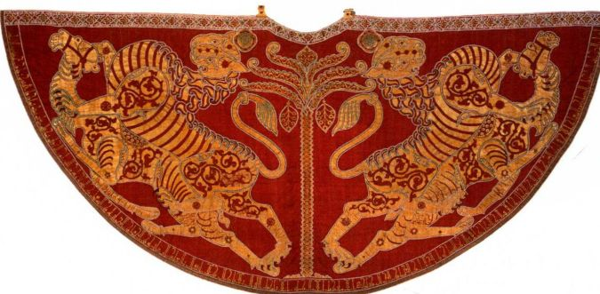

图9\.16 西西里罗杰二世的披肩。用丝绸和珍珠绣花的红色丝绸披肩。12世纪。直径342厘米。1133\-1134年为罗杰二世的加冕礼而制。维也纳艺术史博物馆（Kunsthistoriches Museum）

🟩290 詹森艺术史

图9\.17 宫廷情景牙雕框细部，埃及。12世纪。44\.9 × 36\.5厘米。柏林国家博物馆\-普鲁士文化遗产，伊斯兰艺术博物馆（Museum für

Islamische Kunst\),1\.6375

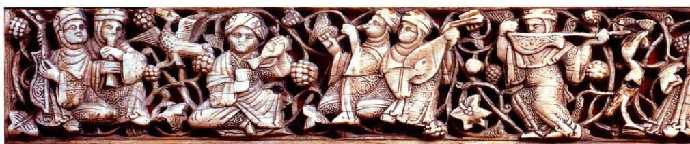

作的穆斯林工匠为国王罗杰二世（Roger II，1095\-1154年在位）制作了一件精致的绣花披肩（图9\.16），上面有颂扬天主教统治者的阿拉伯文题铭。在几百年的时间里，它都出现在哈布斯堡（Habsburg）王室的加冕礼中。除了出色的虹彩釉瓷器、织物、水晶和玻璃器皿，法蒂玛艺术家还制作牙雕器物，因其美观和对法蒂玛宫廷生活细致入微的观察而具有重要价值。其中的一件，即现藏于柏林的一个象牙框（图9\.17），表现了众多充满活力的人物，他们沉湎于跳舞、奏乐、打猎和饮酒。虽然《古兰经》禁酒，但这并不妨碍伊斯兰宫廷的饮酒习俗并以艺术加以描绘。

阿尤布人与小亚细亚的塞尔柱突厥人

在塞尔柱突厥人统治巴勒斯坦中部和北部期间，第一次十字军东征的欧洲士兵于1099年夺取耶路撒冷。此后，耶路撒冷曾一度处在基督徒的短暂统治之下。1187年，耶路撒冷被阿尤布王朝的苏丹萨拉·阿丁（Salah ad\-Din），即西方人所说的萨拉丁（Saladin）收复。十字军东征一直持续到14世纪。那时，十字军东征王国的最后一支残余势力从地中海东部消失了。在整个东征期，天主教的欧洲和伊斯兰教的中东在艺术上大量地相互吸取养分。在十字军撤退后，这一过程还持续了很久。12世纪，阿尤布王朝（一个兴起于叙利亚北部的库尔德［Kurdish］王朝）为逊尼派伊斯兰教夺回了大叙利亚和埃及。他们的短暂统治终结于13世纪中叶，却在建筑和各类艺术上取得了非凡成就。阿尤布军事建筑，如阿勒颇（Aleppo）和开罗的城堡，体现了最新的军事技术，并将影响到罗马式和哥特时期建造的大批欧洲城堡。在阿尤布王朝统

图9\.18 亚希阿·伊本·穆罕默德·阿勒瓦西提（Yahya ibn Mahmudal\-Wasiti）：《阿拉伯村景》（Scene in an Arab Village），一个木卡姆（Maqamat）抄本的插图。约1237年。纸上不透明水彩，34\.8 × 26厘米。巴黎国家图书馆，MS．arabe 5847，folio 138r

治下，镶嵌金属制品、瓷器和珐琅玻璃器皿工艺也很发达。

在东边，古老的阿拔斯首都巴格达在其荣光的迟暮中经历了13世纪初的一次书籍艺术的复兴。亚希阿·伊本·阿勒瓦西提（Yahya ibn al\-Wasiti）等艺术家创作了许多细密画（miniature），以其幽默、对日常生活的观察和对人性弱点的洞察而著称（图9\.18）。

在北边，塞尔柱突厥人终于在1071年之后进入了拜占庭帝国在小亚细亚的核心地带。在他们此后

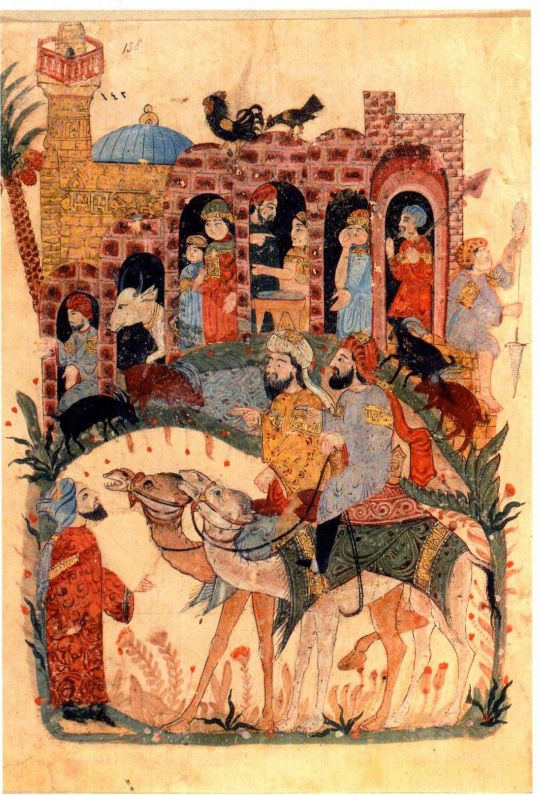

🔴第九章 伊斯兰艺术 291

__大事年表__

962 年——奥托一世被立为神圣罗马皇帝  
969 年——开罗成为法蒂玛人的首都  
约 1026 年——建造开罗的阿克马尔清真寺  
1099 年——第一次十字军东征的士兵夺取耶路撒冷

200年的统治中，由于小亚细亚各个繁华城市的穆斯林和基督教团体的艺术人才的积极参与，罗马塞尔柱王朝（Seljuks of Rum）时期的艺术和建筑蓬勃发展。来自伊朗、叙利亚和埃及的手工艺者和艺术家在塞尔柱王朝苏丹的慷慨赞助下工作。

客栈 塞尔柱人在小亚细亚建造的最大型的建筑是一类集旅馆、货栈和马厩于一身的设防的路边建筑，它在土耳其语中叫“han”，在西方被称为“caravansaray（客栈）”。在连接小亚细亚各个城市的商旅要道旁，这类建筑有着固定的间距，通常包括一个外庭和一个盖着穹顶的内厅。外庭有安置驮马的马厩、一个供旅客使用的浴室、一个小清真寺和一个厨房。内厅是存放货物、旅客休息的地方，常有一个高高的内角拱穹顶。顺着大道，从很远的地方就能看见锥形的穹顶。

穹顶厅

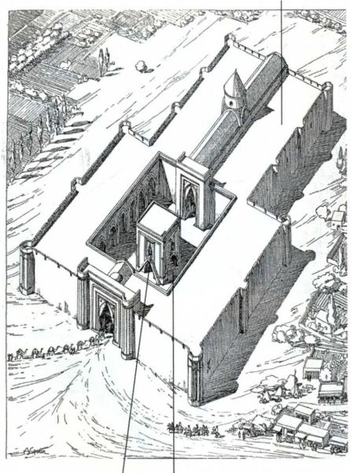

清真寺	外庭

图9\.19 苏丹客栈，开塞利\-西瓦斯路，约1229年，土耳其。Albert Gabriel绘图，《安纳托利亚的土耳其建筑》（Monuments Turcs d'Anatolie\)\(Paris,E\.Boccard,1931,p\.99\)

规模最大、最为美观的小亚细亚客栈是一个苏丹客栈，1229年左右由苏丹阿拉埃丁·凯库巴德（AlaeddinKeykubad）建造，位于科尼亚（Konya）城与阿克沙来（Aksaray）城之间。它有通向庭院的雕刻精美的门道和拱顶内厅，其建造过程显然用到了当地和叙利亚的石雕匠。今天，在土耳其，我们仍可见到这位统治者在开塞利（Kayseri）到西瓦斯（Sivas）的道路上修建的一座类似的苏丹客栈（图9\.19）以及许多其他客栈。它们为整个小亚细亚的贸易提供了便利。12和13世纪，小亚细亚各地都建起了造型美观、装饰繁复的清真寺、穆斯林学院和宫殿。

古典末期的艺术和建筑

到了13世纪20年代，在中亚、伊朗、埃及、叙利亚和小亚细亚的各个伊斯兰国家，关于一股有威胁的势力正在东方崛起的传闻渐起。成吉思汗（GenghisKhan）的蒙古继任者的最终胜利给地中海以东的伊斯兰世界的大部分地区带来了毁灭。一些地区，如小亚细亚，相对来说未受影响。其他地区，如中亚城市布哈拉（1220年被洗劫并焚毁）和阿拔斯王朝的首都巴格达（1258年被洗劫并摧毁），在重要建筑物和艺术品方面遭受了不可估量的损失。基础设施，如灌溉渠、道路和社会公共设施所受到的破坏更加严重。到了13世纪末，被称为“可汗”的西部蒙古统治者已皈依伊斯兰教，他们及其继任者的赞助给伊朗及其周边地区带来了另一个艺术繁荣期。在此期间，西亚艺术家受到了新近来自中国的艺术影响。这种影响穿越蒙古版图西传，取道现代史学家所称的丝绸之路（SilkRoad）。这是一个长8000公里的商旅路网，起自河南（今天的洛阳），经过伊斯兰世界到达欧洲。

蒙古人对中亚和伊朗的统治是短暂的，但蒙古人的艺术传统在帖木儿王朝（Timurids）时期仍在延续。到了14世纪末，帖木儿已在以前蒙古人的土地上建立了自己的帝国，并创造了一个辉煌的宫廷传统，从地中海东部到印度中部都能发现这种传统的遗迹。在遥远的西部和南部，1260年之后，什叶派法蒂玛王朝的首都开罗的继承者\-叙利亚和埃及的逊尼派马穆鲁克人（Mamluks）开始对国土进行象征性的改造。他们通过一种有高穹顶和结构复杂的宣礼塔的新建筑式样，以及一种简洁的艺术形式，融合了统治阶层的突厥趣味与本地埃及传统。开罗与意大利之间的贸易活跃，马穆鲁克人的艺术生产有时甚至反映了马穆鲁克艺术品在欧洲的商业诱惑力。

🟩292 詹森艺术史

蒙古人的赞助

在艺术和建筑领域，蒙古人以前人已有成就为基础向前发展。后世以巴格达为中心的阿拉伯书籍插图艺术禀承了大不里士（Tabriz）的传统。14世纪初蒙古人的赞助主要集中在大不里士，蒙古在西方的首都，位于伊朗西北部。大不里士的艺术家以一种新风格来作画。这种风格结合了中国水墨画和中国山水画的章法。在其他重要的蒙古地区，中国的图案和原料促成了丝织业的复兴，原有的镶嵌金属制品和虹彩釉瓷器这两种传统工艺则朝着新的方向发展。与从亚历山大大帝时期起征服过伊朗的所有外来者一样，蒙古统治者很快就被波斯化了，他们下令撰写以波斯民族史诗《帝王纪》（Shah\-nameh）为内容的插图抄本，

建造波斯风格的四门厅砖结构清真寺和高穹顶墓葬建筑。蒙古人在伊朗的赞助活动的性质可由可汗完者都（Oljeytu，1304\-1317年在位）修建的陵墓反映出来。完者都的父亲是一个逊尼派穆斯林，母亲是一个基督徒。他以苏丹尼亚（Sultaniya）为其新都，召集了全国各地的艺术家和建筑师来装饰新都。在首都的中心矗立着一座巨大的建筑，宏伟的尖穹顶表面贴满了湖蓝色瓷砖。这座建筑就是完者都的皇陵（图9\.20）。陵墓内部既有经过雕刻和彩绘的灰泥装饰（图9\.21），也有精致的瓷砖装饰。就一座伊斯兰寺庙或坟墓而言，它的大小和规模都是空前的。苏丹尼亚的这座大型穹顶建筑表现了可汗们宏大的艺术雄心，以及他们对在已有的波斯传统范围内进行艺术创新的开明支持。

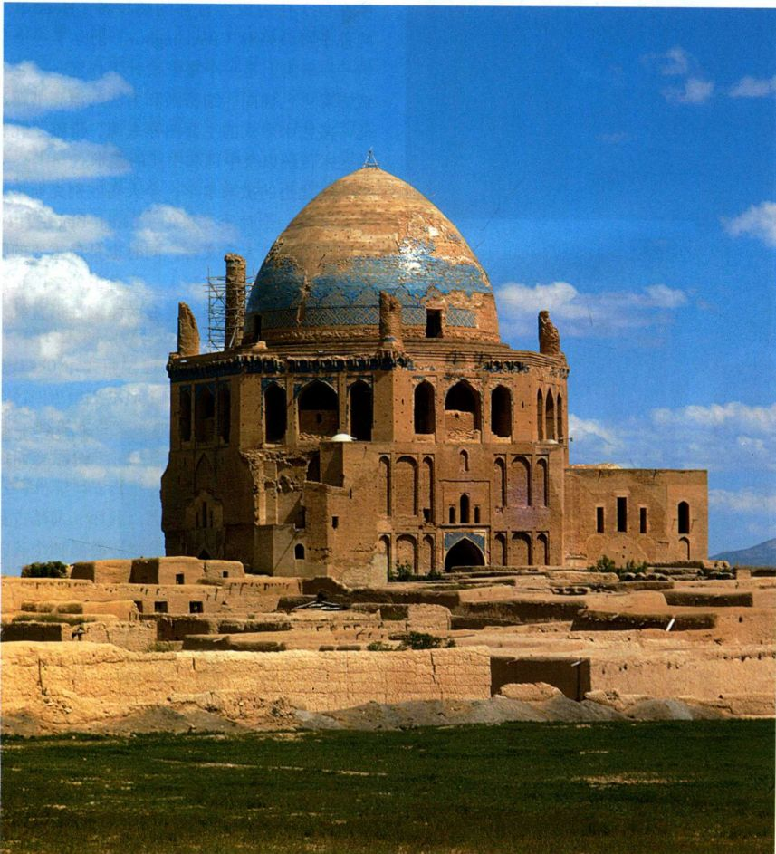

图9\.20 完者都陵墓，苏丹尼亚，伊朗。约1314年

🔴第九章 伊斯兰艺术 293

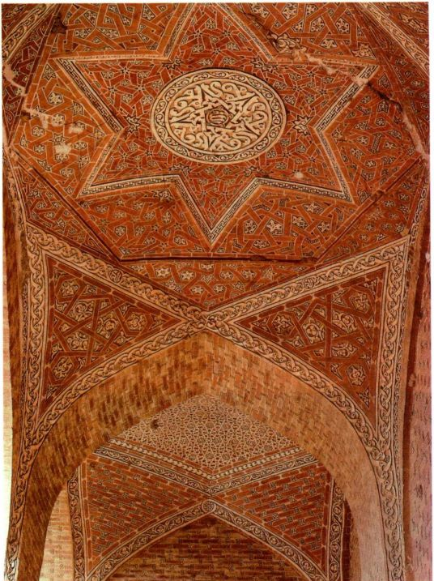

图9\.21 完者都陵墓内部，伊朗

帖木儿的赞助

在短命的可汗王朝的最后一位统治者于1337年去世后，伊朗和信奉伊斯兰教的中亚分裂成更小的公国。其中之一的札刺亦儿王朝（Jalayrid）在大不里士和巴格达延续着蒙古的绘画传统。到了14世纪末，另一个突厥\-蒙古强国已在奥克苏斯河畔崛起，统治它的是战略天才帖木儿（Timur，约1370\-1405年在位），西方人称他为跛帖木儿（Tamerlane）。

建筑及其装饰 14世纪90年代，帖木儿在其都城撒马尔罕（Samarkand）修建了一座巨大的集会清真寺，是伊朗历史上最大型的四门厅清真寺。建在附近他的出生地的阿克萨拉伊宫（Aq Saray）的规模也同样庞大。15世纪，帖木儿王朝的艺术野心达到了顶点。在帖木儿之子鲁克王（Shah Rukh，1405\-1447年在位）任内成为首都的赫拉特（Herat），帖木儿的孙子拜桑格赫（Baysunghur）创办了一个皇家图书馆\-事实上是一个皇家设计工作室\-它不仅制作装饰着彩色插图、细密画和书法的漂亮书籍，还是其他许多艺术形式的主要图样来源，借鉴了札刺亦儿人的艺术传统以及中国和中亚的艺术。

在北边的撒马尔罕，今天乌兹别克斯坦境内，帖木儿的另一个孙子兀鲁伯（Ulugh Beg）于1420年左右建造了一座大天文台，同时也是最重要的帖木儿穆斯林学院之一（图9\.22）。兀鲁伯的学院正门前有一个宏伟的门厅。此外，还有两座圆柱形宣礼塔。大量

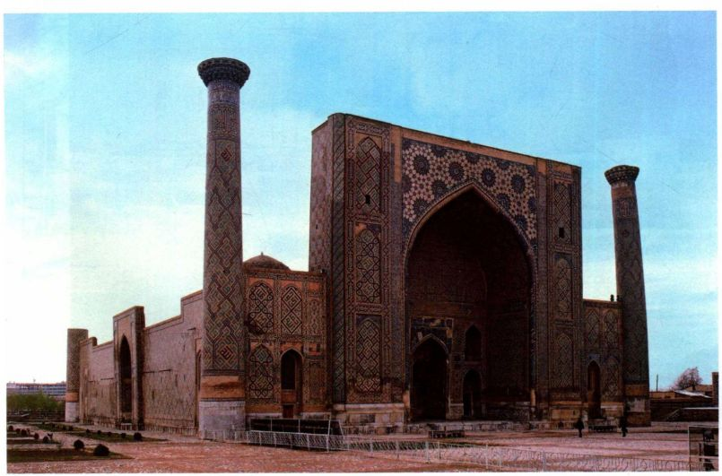

图9\.22 兀鲁伯穆斯林

学院。约1435年。撒马尔罕，乌兹别克斯坦

🟩294 詹森艺术史

精心制作的精美几何和植物图案彩色瓷砖镶嵌画装饰着整个正立面。在帖木儿王朝及被其取代的前朝统治期间，中亚的陶瓷建筑装饰种类之丰富、形式之复杂，随后的大伊朗疆域中的艺术史只可与其并驾齐驱，却从未能超越。

书籍插图 在赫拉特，15世纪末帖木儿王朝的衰退期，漫长而复杂的波斯书籍绘画史写下了最辉煌的篇章。15世纪80和90年代，名家贝扎德（Behzad）和他的同僚对伊斯兰绘画进行的一系列改进，具有传奇色彩。贝扎德本人不仅对波斯诗歌中的抒情和英雄主题敏感，还能敏锐地观察身边的世界。在他为诗歌作品创作的许多插图中，如这幅出自萨迪（Sa＇di）《诗园》（Bostan）的一个抄本的插图，赫拉特日常生活的核心内容得到了精彩的描绘（图9\.23）。在这个位于一座清真寺外的场景中，较高的观察点使我们能看到庭院里的情景。同时，在门口，一个富人遇见了一个乞丐，而另一个人则在喷水池边洗手净足。贝扎德的空间安排和叙事手法十分清晰，运用一种高观察点，巧妙地重叠，造成一种三维感。同时，把所有主角表现成同等大小，从而给这些细密画注入了新的力量。这些画的尺寸并未对其宽广的画面空间、复杂的背景和庞大的角色阵容造成限制。

马穆鲁克人的赞助

在中部伊斯兰国家中，只有一个强国成功地击退了13世纪蒙古人的入侵。在埃及的最后一位阿尤布统治者于1250年去世之后，他的妻子嫁给了他的大将。此人名叫巴伊巴尔斯（Baybars），是马穆鲁克人或奴隶兵，拥有钦察突厥血统。他于1260年成为苏丹或统治者。那一年，在艾因札鲁特（Ain Jalut，在今天以色列北部）战役中，一支马穆鲁克军队打败了可汗的蒙古部队。因此，埃及和叙利亚大部在马穆鲁克王朝的各个时期都一直免受蒙古人的统治。马穆鲁克王朝从1250年起以开罗和大马士革为中心进行统治，直至1517年开罗被奥斯曼土耳其人攻占。

建筑 纵观从法蒂玛、阿尤布到马穆鲁克时代的埃及艺术，可以容易地看出一个演化发展的过程。马

图9\.23 贝扎德：《一个穷人被清真寺拒之门外》 \(A Poor Man

Refused Admittance to a Mosque），出自萨迪的叙事诗集《诗园》的

抄本插图，来自赫拉特。1486年。纸上不透明水彩、墨和金色，页

面尺寸30\.5 × 21\.5厘米。埃及书刊出版总署（General Egyptian Book

Organization），开罗，Adab Farsi 908。埃及国家图书馆，开罗

穆鲁克人的赞助有时十分慷慨，现代开罗的艺术特色大部分形成于马穆鲁克时期。在这座拥挤的埃及大都会中，多为形状通常不规则的小块土地。得到马穆鲁克王朝支持的建筑师们克服种种限制，建起了清真寺、穆斯林学院、陵墓以及结合了公共图书馆和公共喷水池的独特建筑。这些作品的特点是采用了一种新式样：装饰繁复的高穹顶、复杂的多阳台宣礼塔、包括雕刻和彩色大理石拼花镶板在内的丰富装饰。作为生活在什叶派法蒂玛王朝影响中的逊尼派穆斯林，说突厥语、多数不会说或写阿拉伯语的马穆鲁克人不仅建造清真寺，还修建数量相当大的穆斯林学院或逊尼派高等教育机构，以满足当地民众的需要。

其中规模最大、最令人印象深刻的是苏丹哈桑的穆斯林学院兼陵墓（图9\.24），建于1354\-1361年。其建造者、马穆鲁克苏丹纳西尔·阿勒丁·哈桑（Nasirad\-Din al\-Hasan）因此建筑而为人铭记。本世纪中叶

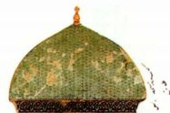

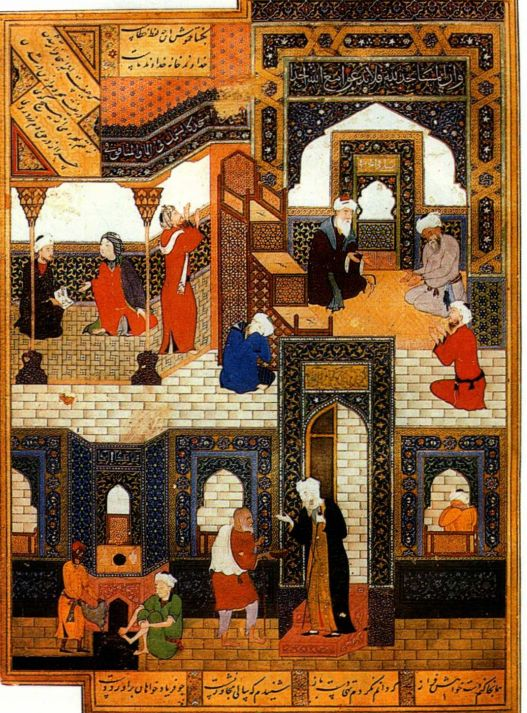

🔴第九章 伊斯兰艺术 295

的黑死病造成大量人口死亡，留下许多数额巨大的财产无人继承。结果，财富源源不断地流入了哈桑的国库。这座大型建筑内设四个独立学院（图9\.25），每个学院专门讲授伊斯兰法学四大学派中的一派。大得惊人的四门厅庭院的麦加朝向门厅内有一座清真寺，另外还设有教室、宿舍，在南面麦加朝向墙后方是苏丹哈桑本人巨大的穹顶陵墓。苏丹哈桑的穆斯林学院兼陵墓装饰着彩色大理石拼花镶板，有壮观的雕花大门、镶金嵌银的青铜门，以及一个大理石敏拜尔兼宣礼台、一个镶嵌着乌木和象牙的胡桃木诵经台，表现了马穆鲁克人在规模、花费和美观方面与其东北方的蒙古对手相当的艺术追求。在1517年被奥斯曼帝国

征服以前，埃及和叙利亚的马穆鲁克赞助人持续不断地建造了大量美轮美奂的建筑，包括今天集中在开罗北墓地的著名陵墓。

珐琅玻璃、金属制品和地毯 马穆鲁克人在叙利亚和埃及的赞助活动也继承了始于阿尤布时期的珐琅玻璃制造传统。到了14世纪初，有鲜艳彩饰的马穆鲁克玻璃器皿已是世界闻名。许多马穆鲁克贵族订制玻璃油灯，悬挂在其坟墓和清真寺中。艺术家则在装饰中加入赞助人的纹章（图9\.26）。在马穆鲁克王朝统治下，到了1300年左右，在青铜器和黄铜器上镶嵌金银的技术也达到了其在伊斯兰艺术中的最高点。在马穆鲁克王朝后期，从15世纪起，各个马穆鲁克

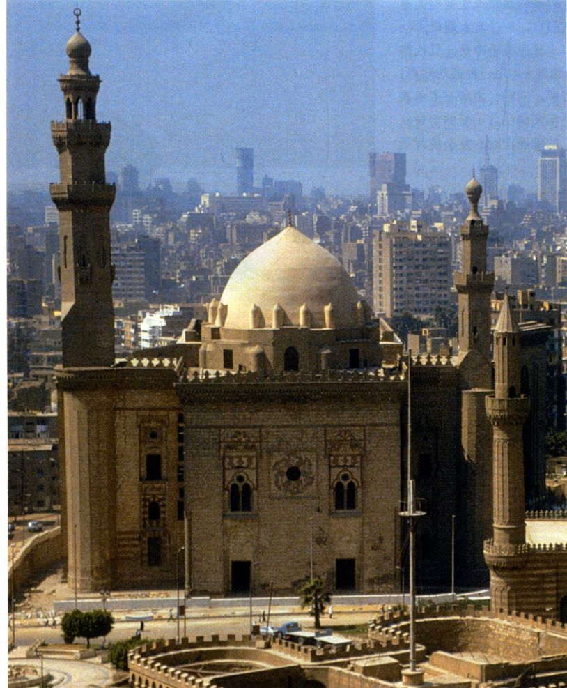

图9\.24 苏丹哈桑的集穆斯林学院、清真寺和陵墓于一身的综合建筑，开罗。约1354\-1361年

🟩296 詹森艺术史

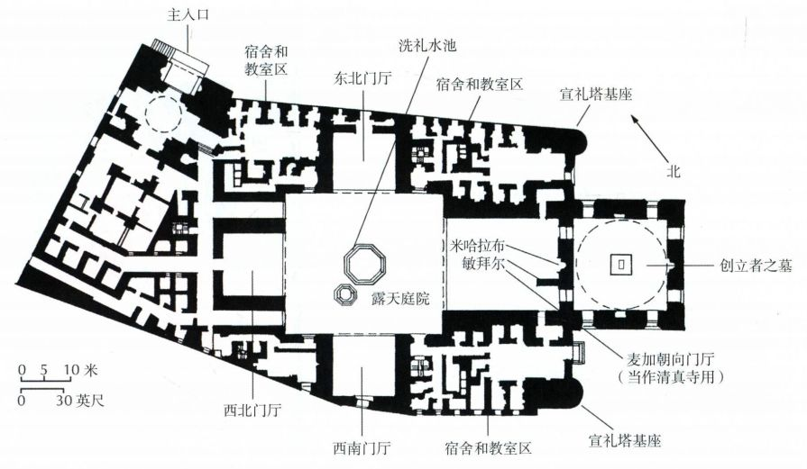

图9\.25 苏丹哈桑的综合建筑的平面图，开罗

国家都生产出口到欧洲的奇丽地毯。与珐琅玻璃一样，在欧洲倍受珍视（见第298页的材料与技法）。

纳斯瑞德人的赞助：阿尔罕布拉宫

14世纪中期，信奉伊斯兰教的安达卢斯大部分在基督教再征服过程中陷落；塞维利亚和科尔多瓦成为卡斯蒂尔王国领土的一部分，只有南方位于内华达山脉（Sierra Nevada）附近的山区王国格拉纳达（Granada）仍在穆斯林的控制之下，由纳斯瑞德（Nasrid）王朝统治着。在一座高耸于格拉纳达城之上的平坦小山上，格拉纳达王朝的君主们修建了一座宫殿，称作红宫（al\-Qasr al\-Hamra），在历史上则被称为阿尔罕布拉宫（Alhambra）。与大多数伊斯兰宫殿一样，阿尔罕布拉宫的最初构思是在一个或多个花园庭院四周修建一系列楼阁和较小的建筑，是一座象征着人间天堂的皇宫。墙壁上的铭文是由当时一位重要的阿拉伯诗人撰写的，构成了一首对宫殿的赞美诗。虽然现存的阿尔罕布拉宫的遗迹只是原宫殿的一小部分，其余部分已被一座文艺复兴时期的巨型宫殿和一座同样巨大的方济各会修道院占用，但阿尔罕布拉宫保存下来的庭院中最美丽的狮庭（Court of the Lions）向我们生动地展现了纳斯瑞德宫廷的高雅、优美和奢华（图9\.27）。在庭院中央，一个由十二头狮子的背部支撑的石制大水池内盛着一股持续喷水的喷泉，加压的水流来自很远的山里。水池里有四道水沟，象征着四条天堂之河，

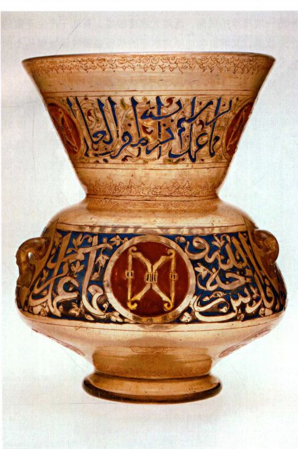

图9\.26 饰有纹章的清真寺灯，来自开罗。约1285年。珐琅、染色和镀金玻璃。高26\.2厘米，宽21厘米。纽约大都会艺术博物馆。J．Pierpont Morgan 遗赠，1919 17\.190\.985

🔴第九章 伊斯兰艺术 297

东方地毯

没有哪种伊斯兰世界的艺术品在原产地之外比绒毯（pilecarpet），即一般所说的东方地毯更为有名。地毯是厚重的织物，离开织工的织机时的状态基本上就是它们在使用时的状态。也就是说，它们不经过切割或剪裁，而且通常是作为完整的艺术品而非以尺寸为单位剪裁出售的织物进行织制的。它们的用途很广，从地板遮盖物到建筑装饰，从坐垫和靠垫到各种尺寸和形状的手袋和大袋，从动物饰品到宗教用品（为穆斯林礼拜提供干净席位的礼拜毯）。它们可用作世俗性或宗教性的墙饰。地毯纺织是一种深深植根于许多伊斯兰社会文化之中的技艺，是构成伊斯兰艺术家织工主体的年轻妇女社会化的一部分，不仅能在游牧部落营地和村庄中见到，还存在于城市的商业性纺织机构中，从前亦见于伊斯兰国家在宫廷直接扶植下运营的专门工场。

伊斯兰地毯有几种不同的纺织技法，但最著名的是绒毯，即在成对的竖直经线上水平地打上一行行彩色的毛线结，然后用一种类似于梳子和锤子的混合工具翼子板把每行结敲打至适当位置，之后再穿入一根或多根水平纬线，把结固定住。每个结的末端垂直地突出于地毯的上面或“正”面，形成一层厚厚的绒面，既对光高度敏感，有助于产生丰富的色彩效果，又能出色地隔离冰冷的地板或游牧民帐篷的土铺地面。

地毯这一类型可能最初起源于伊斯兰以前的中亚游牧民族。大多数现存的早期伊斯兰地毯，可能织于13\-15世纪。它们在图案和技法上都表现出与过去游牧岁月的关联。15世纪，由于地毯图案革命，伊斯兰地毯生产所依据的图案都是先由宫廷艺术家设计，再转成给织毯工的操作指南。这些地毯多供皇室使用，或作为献给皇室的礼物。

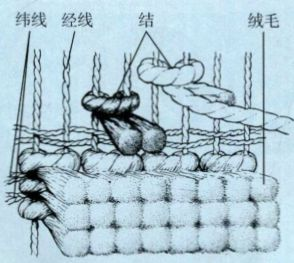

许多突厥和外高加索（Transcaucasian）

地毯中使用的对称打结结构

说明：系在两根竖直经线上的单结排成行，经过绑系、剪切，被紧紧地敲打至适当位置，并被一对水平纬线固定住

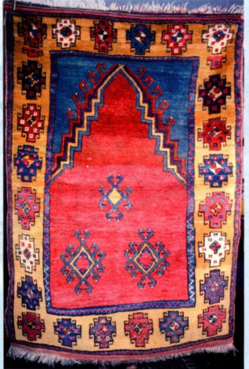

几何图案的乡村地毯，科尼亚地区，土耳其。18和19世纪。私人收藏。蒙Gerard Paquin 提供

地毯图案与用喷墨打印机所印图画的图案一样，都是通过彩色点网产生的。这个点网由一个个小的彩色毛线结组成，合起来看时，就会形成图案。一些地毯的织法相当粗糙，有一层长绒；这类地毯多运用轮廓清晰的几何图案和鲜艳的颜色。其他地毯，如根据宫廷或商业艺术家设计的图案制作的地毯，会用精细得多的织法（最多时每平方英寸［约6\.5平方厘米］有两千多个结）和短绒来表现曲线形装饰图案、书法。在大块地毯中，甚至还会描绘人和动物形象（见图9\.32）。每个等级的地毯的意象体系都极其复杂，从具有部族意义的图腾式图案，到拥有神秘的宗教或世俗含义的复杂的人或动物图案。

伊斯兰绒毯从14世纪起出口欧洲，在历史上已成为一座东西方文化的桥梁。在欧洲，它们不仅装点着贵族的豪宅和富有的城市商贾的住所，还被用在教堂这种宗教殿堂中，而且也是世俗和宗教典礼的一部分。伊斯兰地毯作为被看重的艺术品以及地位和财富的象征，其形象常常出现在欧洲绘画作品中（见图14\.16、14\.23和20\.36）。地毯纺织在今天的中东仍是一个兴旺的行业。实际上，在20世纪末、21世纪初，东方和西方对伊斯兰地毯的鉴赏力和需求都提高了。

🟩298 詹森艺术史

把水从水池引向庭院四面的四个亭子。原本涂有多种颜色的雕刻精美的灰泥面，由细长的多柱或单柱支撑的雅致精美的壁龛和复杂的题字，阿尔罕布拉宫纹理丰富、几乎是反重力的建筑式样营造了一种令人敬畏的感觉。阿尔罕布拉宫影响到接下来多个世纪的艺术意识。16世纪的摩洛哥以及19世纪的欧洲和美国都有其艺术之遗风。

晚期三帝国

在伊斯兰后期，三大帝国构成了伊斯兰艺术成就的几大中心：奥斯曼帝国、萨非帝国（Safavid）和莫卧儿帝国（Mughal）。13世纪末，在小亚细亚的一角，距拜占庭帝国首都君士坦丁堡仅几十公里，日渐衰落的塞尔柱苏丹国的一个名叫奥斯曼（Osman，约1281\-1324年在位）的封臣建立了一个很小的边境公国，供养了许多渴望通过消灭基督徒来扩大伊斯兰教范围的武士。从这粒种子里成长起一个强大的帝国，

大事年表

1258年\-蒙古人洗劫并摧毁巴格达

13世纪末\-西部蒙古的统治者皈依伊斯兰教

14世纪中期\-穆斯林阿尔\-安达卢斯大部重新受基督教统治

1354\-1391年\-阿尔罕布拉宫，狮庭

1486年\-贝扎德为叙事诗集《诗园》描绘的书籍插图

到了16世纪中叶，几乎把地中海变成了一个土耳其内湖。它的疆域从开罗到维也纳郊区，从阿尔及尔（Algiers）到伊朗西北部。这个帝国一直持续到1922年。16世纪初，奥斯曼人占领君士坦丁堡并以之为首都50年后，一位来自伊朗西北部的有超凡魅力的什叶派武士、萨非王子伊斯梅尔（Ismail，1501\-1524年在位）建立了另一个大帝国。在其历座都城大不里士、加兹温（Qazvin）和伊斯法罕（Isfahan），萨非政府把多种门类的艺术在伊斯兰世界内部的成就和声誉提高到新水平。在18世纪中叶以前，萨非人一直是奥斯曼人的主要对手。他们在建筑、书籍绘画

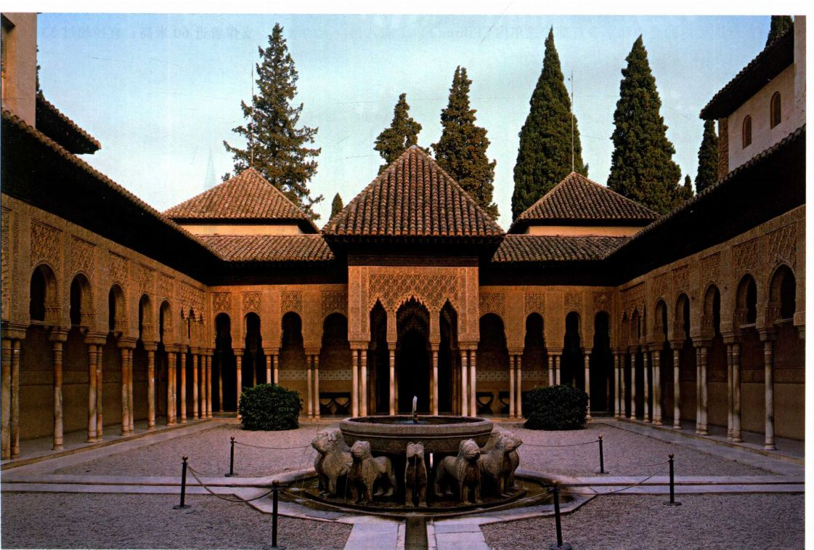

图9\.27 狮庭，阿尔罕布拉宫。14世纪中叶。格拉纳达，西班牙

🔴第九章 伊斯兰艺术 299

以及地毯和丝织品这两项实用艺术方面的独特风格影响了其西边和东边的邻国。1526年，一位来自中亚名叫巴伯尔（Babur，1526\-1530年在位）的突厥王子入侵印度北部。在一连串失败和恢复之后，巴伯尔的孙子阿克巴大帝（Akbar the Great，1556\-1605年在位）在印度次大陆上稳固地建起了莫卧儿王朝。在接下来的150多年里，莫卧儿都城德里（Delhi）、阿格拉			和法塔赫布尔西克里（Fatehpur Sikri）的宫殿和纪念性建筑，都有穆斯林和欧洲游客前来观光。俨然成为世界上美丽、奢侈和华丽的伊斯兰艺术的代表。

欧洲和亚洲的奥斯曼人

起初，奥斯曼帝国（在意大利，“Osman”被称为“Ottomano”）与填补了塞尔柱政权崩溃留下的真空状态的十几个小亚细亚伊斯兰小国之间几乎没有区别。然而，到了1357年，奥斯曼人已横渡欧亚之间狭窄的达达尼尔（Dardanelles）海峡，进入巴尔干半岛，并最终于1453年夺取了君士坦丁堡，也就是第二个罗马、东部基督教世界的首都。在这座被改称为伊斯坦布尔的都城，以及在向西193公里位于欧洲境内的夏季和军事首都埃迪尔内（Edirne），

奥斯曼人动用他们庞大的经济力量，以空前的规模来赞助艺术和建筑。

建筑 来自伊朗、埃及、巴尔干半岛甚至西欧的艺术家群聚到位于伊斯坦布尔的托普卡皮宫（Topkapi Palace）中。在16世纪，一位被后世称为思南大师（Sinan the Great）的建筑师主持的建筑机构修建了上百座桥梁、客栈、穆斯林学院、宫殿、浴场、市场和清真寺。奥斯曼帝国的大型皇家清真寺在设计中加入了一个类似于中庭的连拱廊庭院，以此来向传统的阿拉伯清真寺致敬。然而，对于奥斯曼人来说，查士丁尼的圣索菲亚（见图8\.31和8\.32）巨大的内部空间和大胆的设计，与他们自成一派的传统结合在一起，刺激他们在建筑方面作出创新，多数建于有多雨和冬雪气候中的奥斯曼清真寺与传统的阿拉伯或伊朗清真寺迥然不同。1572年，思南为苏丹塞利姆二世（Selim II，1566\-1574年在位）在埃迪尔内建了一座宏伟的皇家清真寺，并视之为自己的代表作（图9\.28）。四周被连拱廊环绕、中央有喷泉的庭院让人想到阿拉伯清真寺的典型设计，但包着铅板的巨大穹顶和四座形似铅笔、带三个阳台的宣礼塔显示了奥斯曼的建筑风格，广阔的内部有八根巨大的墩柱，支撑着近60米高、直径超过33

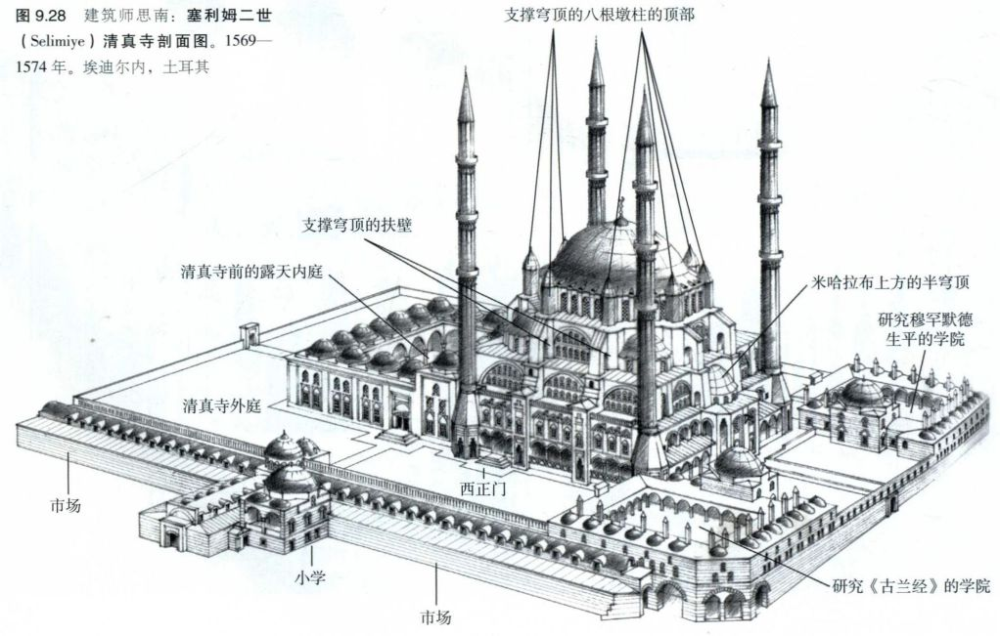

🟩300 詹森艺术史

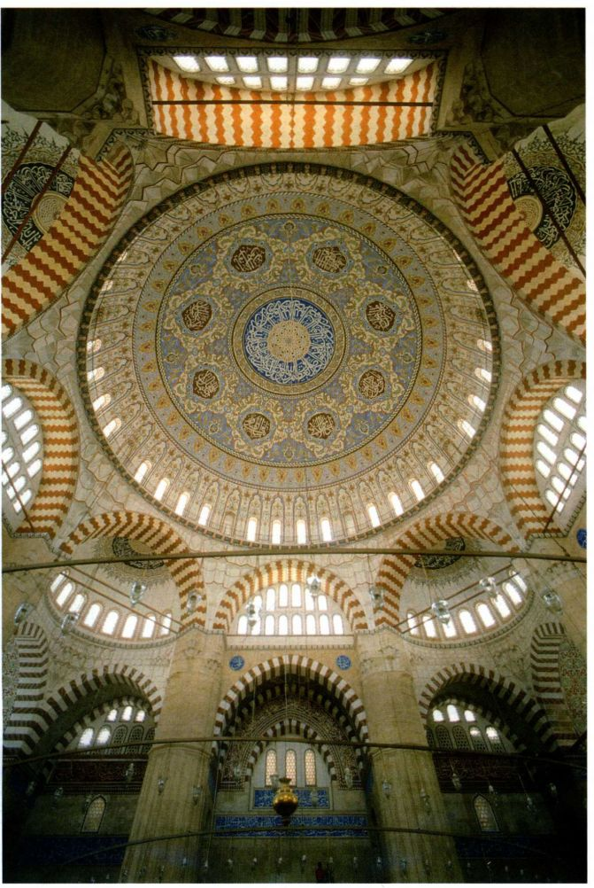

米的穹顶，空间统一、轮廓清晰（图9\.29），完全不同于阿拉伯多柱式清真寺的不连续空间，也全然异于圣索菲亚神秘而模糊的结构和空间。在思南的建筑中，类似肌肉和经腱的结构性成分并没有被隐藏起来，而是建筑的视觉吸引力的首要来源。奥斯曼人更喜欢朴素的外表，不作任何装饰的发白的石头与用来给穹顶和半穹顶防水的深灰色铅板形成对比，而建筑的内部常常贴有美丽的彩色瓷砖，上绘极其写实的花卉图案（见第302页的原始文献）。

奥斯曼宫廷风格 与之前的帖木儿政权一样，奥斯曼人于1500年建立了一个皇家设计工作室，称为“设计院”，是皇家艺术赞助的中心。在“大帝”

苏莱曼一世（Süleyman I，1520\-1566年在位）、其子塞利姆二世（1566\-1574年在位）及其孙穆拉德三世（Murad III，1576\-1595年在位）的扶植下，工作室达到了全盛时期。在这个几乎涉及所有媒介和类型的艺术家群体所产生的多项艺术创新中，有一种被一些人称为萨兹（saz）的装饰风格，此名来自传说中的一座中了魔法的森林；另一些人称它为哈塔伊（hatayi）\-即“来自中国”或“中国”。其创造者之一是一名来自大不里士的流亡艺术家，叫沙赫·库鲁（Shah Kulu）。16世纪中叶，他成了奥斯曼皇家工作室的负责人。这种风格的特点是构图充满活力而十分优雅，弯曲的叶片和复杂的花一

图9\.29 塞利姆二世清真寺内部

🔴第九章 伊斯兰艺术 301

原始文献

奥斯曼苏丹塞利姆二世（1524\-1574年）

圣谕

1572年春，苏丹的埃迪尔内清真寺正在施工中。身处皇宫的苏丹以一种似乎与微观管理相似的方式密切关注着事态的进展。他甚至还指定了铭文的内容和在建筑中的位置。

致首席建筑师：

就朕下令在埃迪尔内修建的清真大寺目前所需铭文一事，你要求书法家莫拉·哈桑（Molla Hasan）的帮助。如今，

般的棕叶饰被看起来互相重叠和贯穿的藤蔓连起，有时其中还点缀着鸟儿或奇异的类似羚羊的动物。萨兹或哈塔伊风格见于陶瓷、手抄本彩饰、地毯、丝织品、为皇家收藏者的集画本创作的一系列手绘图画，以及一些可能出自沙赫·库鲁本人之手的出色的蓝色和青绿色瓷砖画（图9\.30）。奥斯曼陶瓷和丝绸大量出口到俄国和欧洲。在那里，与倍受珍视的小亚细亚地毯一道，迅速地融入了欧洲的物质文化。

伊朗的萨非时代

1500年后不久，波斯西北部一个受人尊敬的什叶派神职人员家族的后代、年轻而具有领袖气质的王子伊斯梅尔自封为伊朗的萨非王。这位年轻的统治者很快占领了以前帖木儿王朝的大部分领土，定都伊朗西北部的大不里士城。它曾是两个地方性土库曼（Turkmen）王朝的首都，位置靠近逊尼派奥斯曼帝国的东部边境，并不安全。在帖木儿（1501\-1523年在位）及其继任者塔赫马斯普（Tahmasp，1523\-1576年在位，于1548年向东迁都至战略上更为安全的加兹温）统治下，大不里士的艺术蓬勃发展。

书籍插图和地毯：大不里士 16世纪初，年事已高的画家贝扎德从东方被请到大不里士。在这里，他的风格与当地萨非时期之前的土库曼画风结合在一起，产生了一种不寻常的艺术综合体。在伊斯兰艺术的伟大天才之一、土库曼裔艺术家苏丹\-穆罕默德（Sultan\-Muhammad，皇家工作室的艺术家名

图9\.30 绘有萨兹图案的哈塔伊风格的瓷砖，作者为沙赫·库鲁。

约 1525\-1550年。涂有白色泥釉的复合琉璃质胎体上的深蓝色和青

绿色釉底画，127 × 48\.5 厘米。托普卡皮皇宫博物馆，伊斯坦布尔

此人已因上述事由而被聘请并派出。朕已有令，收到及执行此谕之时，你须向他指示将在清真大寺内何处布置恰当、相称的铭文，是烧制在瓷砖上还是仅为简单的涂绘铭文。

传令人：首席瓷砖工

980年穆哈兰姆（Muharrem）月8日（1572年5月21日）

SOURCE: AHMED REFIK,MIMAR SINAN, TR\.WALTER DENNY\. \(ISTANBUL: KANAAT KUTUPHANESI,1931\)

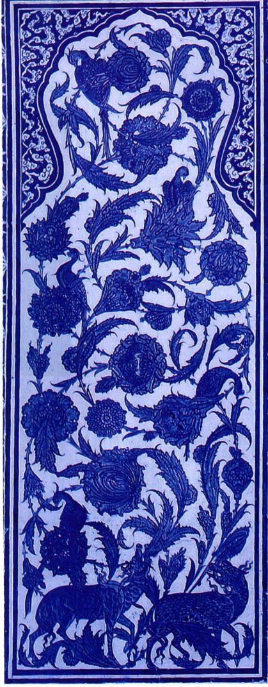

🟩302 詹森艺术史

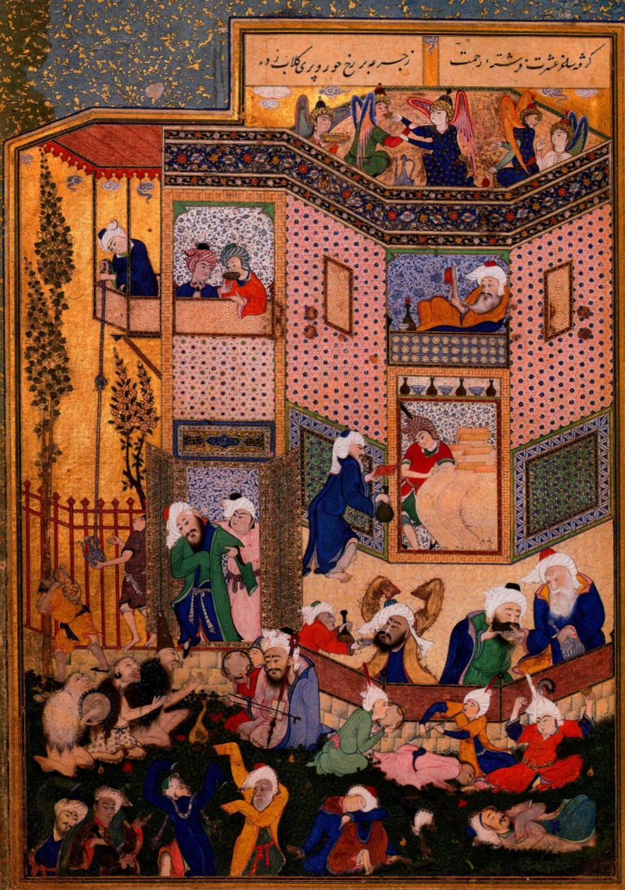

图9\.31 苏丹\-穆罕默德：《天堂与世间醉酒的寓言》（Allegory of Heavenly and Earthly Drunkenness），出自哈菲兹的抒情诗《诗集》（Divan）来自大不里士。约1529年。纸上不透明水彩、墨和金色，28\.9x21\.6厘米。Stuart Cary Welch Jr．夫妇预备捐赠品。部分所有权归纽约大都会艺术馆和哈佛大学亚瑟·萨克勒博物馆，1988（1988430）

第九章 伊斯

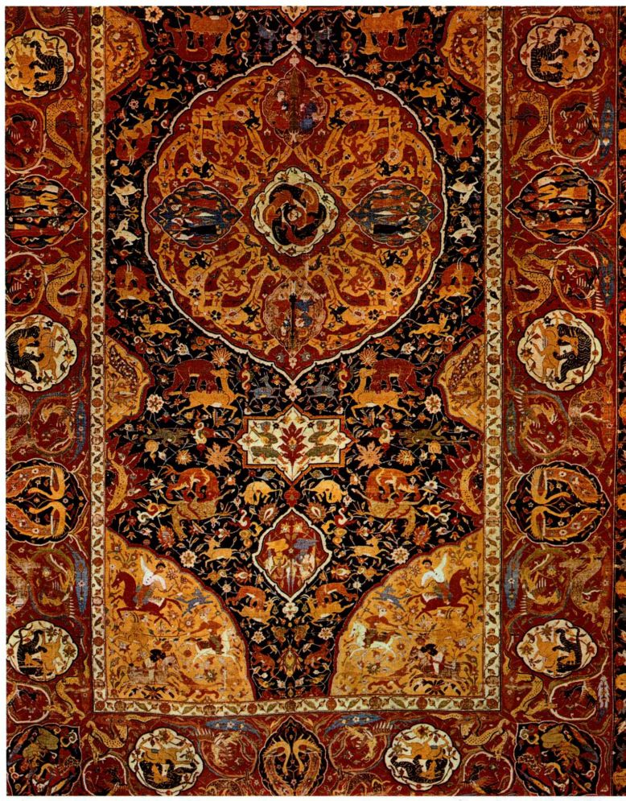

图9\.32 桑古什卡（Sanguszko）人物和动物图案地毯细部，来自伊朗。约1575\-1600年。在棉制经纬线上打

羊毛绒结；整块地毯为6\.4 × 3\.3米。私人收藏

字中带有“shah［国王］”、“sultan［统治者］”或“aqa ［贵族］”等敬语并不少见）手中，新的萨非细密画风格在表现力和技法上达到了新的高度。这位画家最吸引人的作品之一是一幅纸上不透明水彩插图，于1529年作于大不里士，是为14世纪的诗人哈菲兹（Hafiz）的一部诗集的皇家抄本创作的。这部诗集的主题是天国和尘世之迷醉，是波斯神秘主义诗歌最常见的一个主题（图9\.31）。这幅画表现的是一群来自宗教学院的老年布道者，处于不同程度的狂乱迷醉状态，身边陪同的仆人有的奉承谄媚，有

的显然受到了惊吓，而一组衣着古怪、举止滑稽的乐师在演奏着背景音乐。在房顶上，天使加入了这场狂欢。在阳台上，喝醉了的诗人哈菲兹在努力写诗。苏丹\-穆罕默德运用一种极其细腻的笔法，以厚涂的白色来体现萨非白色丝绸头巾的质地，头巾特有的彩色棒状饰物从顶部伸出来。这幅作品告诉我们，无论是从比喻意义上还是从确切意义上说，伊斯兰文明并不缺乏幽默或享乐。

色彩鲜艳、表情生动、体态多样、背景多为满是鲜花的风景或豪华建筑的书籍绘画新风格可直接

🟩304 詹森艺术史

用于其他艺术形式。16世纪下半叶在萨非境内某地织成的一块地毯表现了这种细密画人物风格在有着复杂象征、以皇家和天国为主题的作品中的运用（图9\.32）。它描绘了皇家狩猎、在天国般的环境中饮酒以及许多飞鸟走兽。这些形式服从于一个复杂的象征分层体系，常把神圣与凡俗混杂一处。这个体系反映了苏菲派神秘主义在萨非文化中的强大作用，以及波斯人对美酒、诗歌和漂亮财物的由来已久的爱好。

建筑：经过规划的伊斯法罕城 17世纪初，萨非王朝的首都再次迁到位于波斯心脏地带的伊斯法罕古城。活跃而强势的阿拔斯一世（Abbas I，1588\-1629年在位）在伊斯法罕原来的市中心南面设置了一个新城。新城有大型的公共场地、宽阔的大道、贵族的豪宅和一个亚美尼亚基督教商人区。伊斯法罕的壮丽和繁荣吸引了全世界的贸易和游客。

集市上出售的奢侈品，从丝绸、瓷器到金属器皿和地毯，与它美丽的花园和富有的居民一起，促生了一句波斯谚语：“伊斯法罕就是半个世界。”在一个朝向北极星的露天大广场（maidan）的一端，阿拔斯王建造了他的皇家清真寺（图9\.33）。由于麦加朝向的一面在西南面，所以清真寺的方位必须完全不同于广场。在正门背后旋转45度，即轻易地找到方向，来到清真寺巨大的露天庭院。清真寺的穹顶集会大厅则位于麦加朝向门厅的后面，表面都贴满了色彩鲜亮的瓷砖。

排列在广场四面的商铺都把租金捐给清真寺的公产或捐赠基金。在广场西侧的中央，阿拔斯王修建了一座宫殿，可以从宫殿的阳台上观看广场上的游行和娱乐活动。经过规划的伊斯法罕城的其余部分大多是环绕萨非贵族楼阁状豪宅的开阔花园。

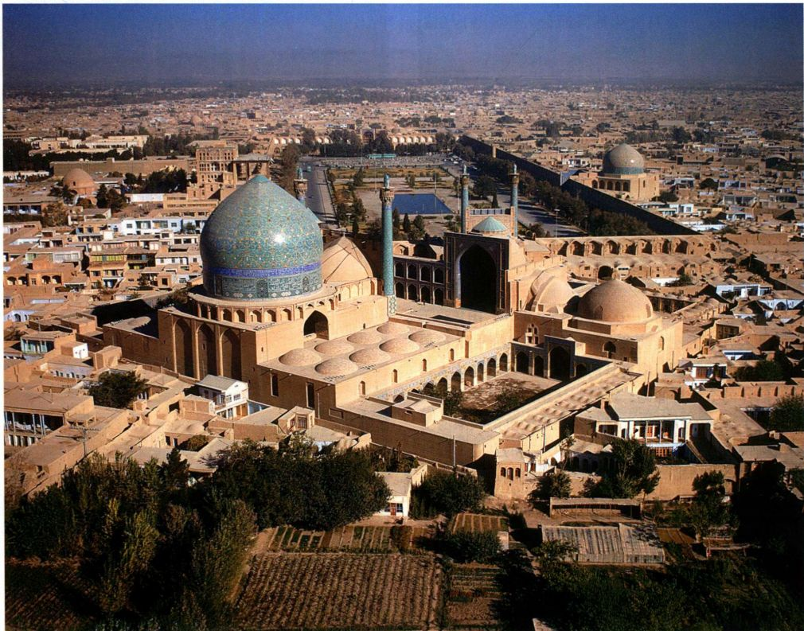

图9\.33 阿拔斯一世（Masjid\-i Shah）清真寺鸟瞰图。1611\-1616年。伊斯法罕

🔴第九章 伊斯兰艺术 305

印度的莫卧儿时代

1526年，自称为蒙古人帖木儿后代（“Mughal［莫卧儿］”之名由“蒙古”而来）的巴伯尔在印度北部打败了一支印度诸侯联军，在次大陆上建立了莫卧儿王朝。虽然从1200年左右起，伊斯兰教就已经在印度的德里存在了，但莫卧儿帝国将为次大陆带来伊斯兰艺术和建筑的新的繁荣。以都城阿格拉、德里和法塔赫布尔西克里为中心的莫卧儿风格建立在中亚、萨非时期的波斯以及印度本土的艺术和文化融合的基础上。巴伯尔的孙子阿克巴大帝（1556\-1605年在位）是一位非常能干、充满超凡魅力的统治者。在他的统治下，莫卧儿的艺术风格呈现出与众不同的形态。阿克巴本人是一位极其宽容的统治者。他着迷于印度教，对波斯诗歌和艺术感兴趣，还是一个重要的印度苏菲派教团的保护人。在他的支持下，一个由波斯和本地艺术家组成的皇家作坊把两种传统结合起来，形成了一种新的细密画风格。另外，中亚、波斯和当地的建筑师、工匠还把各自的建筑风格和技术结合起来，创造了一种新的莫卧儿建筑风格。三座莫卧儿都城都是大规模建房和制造艺术品之地。

从某种意义上说，印度的莫卧儿艺术酷爱极端\-最大和最小的伊斯兰细密画、最大的伊斯兰地毯和织得最细的小地毯、最壮观的伊斯兰墓葬建筑、最奢侈的珠宝首饰和最奇特的硬石雕刻都能在莫卧儿时期的印度找到。

书籍插图 一幅可能由宫廷艺术家马诺哈（Manohar）和阿布哈桑（Abul Hasan）于1620年左右完成的纸本不透明水彩细密画展现了莫卧儿风格的特点。它描绘的是对莫卧儿皇帝查罕杰（Jahangir，1605\-1627年在位）的一次正式谒见（darbar，图9\.34）。莫卧儿人喜欢表现当前发生事件的写实场面；人群中的每一张面孔都是一幅逼真的肖像画，通过对比大约同时制作的个人肖像画，可以辨认出图中几乎每一个人。除了来访的欧洲黑衣僧侣，甚至微笑的大象身上的精确性，此画还表现出了对华丽细节的喜爱，而空间是以古老的伊斯兰方式，通过运用高视点和重叠技法创造出来的。

装饰艺术 莫卧儿艺术的另一面体现在一只用半

图9\.34 马诺哈和阿布哈桑：《查罕杰典礼的观众》（CeremonialAudience of Jahangir），出自《查罕杰本纪》	（Jahangir\-nama）的一个抄本，印度北部。约1620年。纸上不透明水彩和墨，35 × 20厘米。波士顿美术馆

透明白玉做的酒杯（图9\.35）中，其主人是皇帝沙·贾汉（Shah Jahan，1628\-1657年在位）。花瓣娇嫩的花朵构成酒杯的凹部，平缓地向一头逐渐变尖，成为一个长胡子的克什米尔（Kashmir）山羊形状的手柄。尽管玉石质地坚硬，需要分毫打磨经天累月，但成品就像花朵般鲜嫩。这种对植物写实的关注可见于多种莫卧儿艺术形式，从纺织品和地毯到雕花和嵌花大理石制品的花卉装饰。

建筑：泰姬陵 莫卧儿时期所有艺术品中最有名的无疑是泰姬陵（Taj Mahal）。这座位于阿格拉的皇陵于1650年左右建成，沙·贾汉为纪念去世的妻子姬蔓·芭奴（Mumtaz Mahal）而建（图9\.36）。这座建筑的平面图与中亚帖木儿时期的花园凉亭或宫殿相

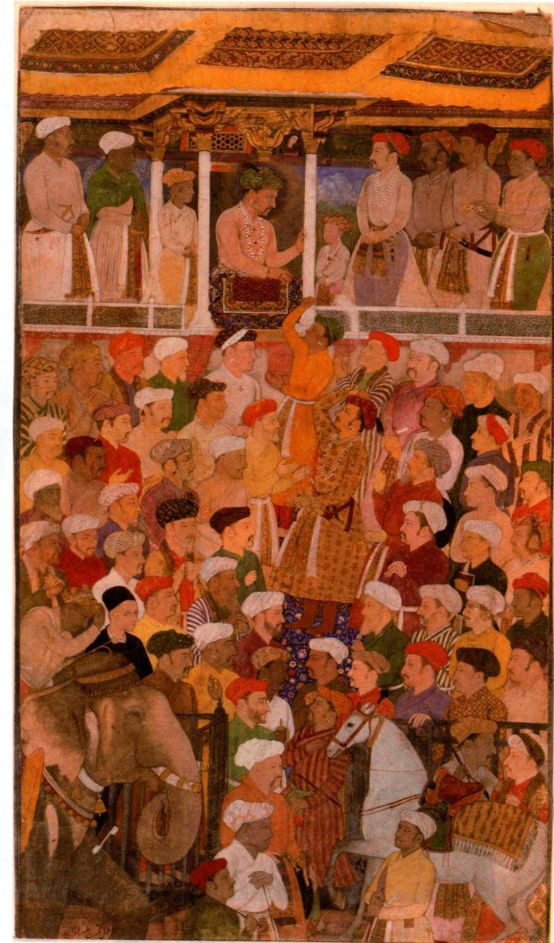

🟩306 詹森艺术史

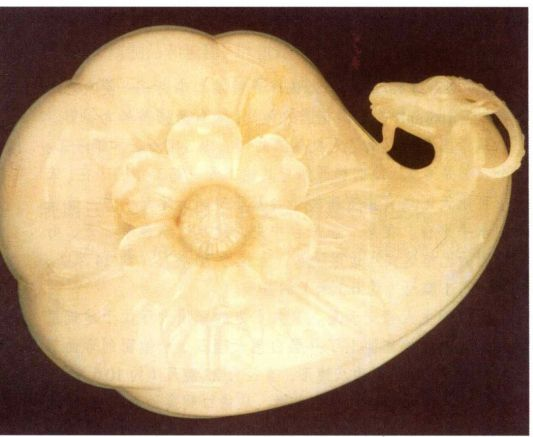

图9\.35 沙·贾汉酒杯，来自印度北部。17世纪中叶。白玉，

5\.7x17\.14厘米。伦敦维多利亚和阿尔伯特博物馆（Victoria andAlbert Museum\)

同，而中央穹顶类似于伊斯法罕皇家清真寺的穹顶（见第308页的原始文献）。雪白的大理石上镶嵌着大量彩色次等宝石，组成花朵、藤蔓和漂亮的草书体铭文的形状。泰姬陵位于一座构造复杂的花园的一端。花园分成四部分，沿轴心的方向分布着四个波斯式水池，形式规整。泰姬陵远不止是一座皇陵或一个王朝纪念物。铭文让人想起《古兰经》中应许给虔诚信徒的天国花园的比喻。这座穹顶建筑是对真主宝座的尽力重现，将其再造于一个人间天堂之中。

伊斯兰艺术的延续和变化

18、19世纪，伊斯兰艺术的重要传统在喧嚣的转变期中延续着。经济衰退导致了皇家赞助的缩减，而皇家赞助在以前的年代里曾经造就了一些最引人注目的作品；不过，伊斯兰世界每个重要地区的风格传统仍保持了下来，尽管存在政治和经济混乱、欧洲殖民主义以及日常生活中工业制品的增加等因素。媒介极其多样化的各类艺术今天在伊斯兰世界各地的国家蓬勃发展，大部分甚至被专攻伊斯兰艺术的史学家忽视了，因为他们接受的训练是研究年代更早的艺术品。

大事年表

1453年\-奥斯曼人宣布君士坦丁堡为其首都

1501年\-伊斯梅尔王子在伊朗创建萨非帝国

1556\-1605年\-阿克巴大帝统治印度莫卧儿帝国

1616年\-英国剧作家威廉·莎士比亚逝世

1650年\-印度阿格拉的泰姬陵完工

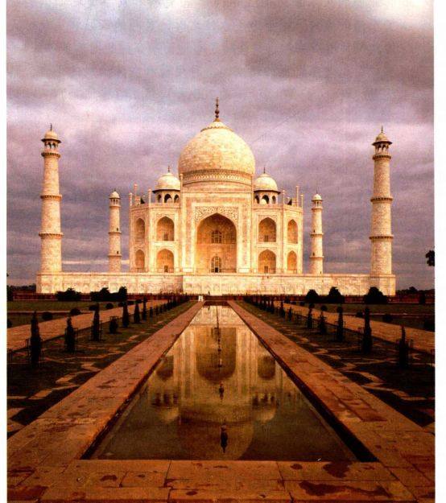

图9\.36 泰姬陵，阿格拉，印度。约1650年

慢慢地，通过与新媒介和新风格的接触、与20世纪末遍布全球的欧美传统的接触，以及与自己过去历史的重新接触，穆斯林艺术家开始创造新的传统。这些传统试图表达几乎每个艺术传统在几乎每个时代始终包含的东西\-在内容丰富、充满意义的历史背景下进行新的创造。

🔴第九章 伊斯兰艺术 307

阿卜杜拉米德·拉霍里（Abd Al\-Hamid Lahori，死于1654年）

选自《帝王纪》（Padshah Nama）

阿卜杜拉米德·拉霍里是沙·贾汉的官方宫廷史学家。沙·贾汉修建泰姬陵以纪念爱妻姬蔓·芭奴。《帝王纪》分为三卷，每一卷对应于沙·贾汉任内的一个十年。在完成第三卷前，拉霍里患了病，他年轻的同事穆罕默德·瓦里斯（MuhammadWaris）于1657年完成了余下的工作。以下选段出自一段篇幅很长的关于泰姬陵修建的讨论。这段讨论中还有对陵墓本身、附属建筑和周围花园的详尽描写。

在庄严的登基大典后的第五年（1632年1月），挖掘工作开始，以便为这座华厦铺设地基。泰姬陵俯瞰流经其北面的朱木拿河（Jumna）。当臂膀和双手健壮如钢的铲工不停歇地向下挖至地下水位之时，灵巧的石匠和成就惊人的建筑师用石头和灰浆修建了与地面平齐的稳固的地基。

在此地基之上，还立起一种用砖和灰浆砌成的平台，呈坚固的块状，长374腕尺（约200米），宽140腕尺（约67米），

小结

在伊斯兰教传播的过程中，这种新宗教与旧文化之间的冲突和融合产生了一个生气勃勃的伊斯兰艺术传统。由于巨大的地理和时间跨度，伊斯兰艺术无法被简单地定义，但它的确具有一些统一的主题，包括与人形无关的艺术表现方式的发展，促使伊斯兰艺术家使用繁复的植物、花卉和几何图案语汇。另一个主题是各艺术类型的平等；不存在把“美术”与“装饰艺术”区分开来的等级差异。因此，制陶、金属器皿制造、纺织和雕刻都处于同等地位。它们的地位也与使用其他媒介的艺术品平等。

伊斯兰艺术的形成

伊斯兰艺术起初是对希腊\-罗马、拜占庭基督教和萨珊艺术形式的一系列借用。新兴的伊斯兰教需要特殊的建筑，如公共礼拜场所，由此产生了象征着这种信仰本身的种类繁多的建筑式样。耶路撒冷的圆顶清真寺是一个重要的早期范例。伊斯兰建筑的其他范例包括多柱式清真寺和世俗建筑，如宫殿和浴场。

伊斯兰风格的发展

阿拔斯王朝以美索不达米亚为中心。它的统治者取代了倭马亚王朝，在巴格达、萨马拉及其他地方修建新建筑。其中有大型清真寺，包括凯鲁万大清真寺。再往西，一名倭马亚王朝的幸存者建立的一个独立国家\-西班牙的科

高16腕尺（约7\.7米），乃该尊贵陵墓之基座\-使人想起里兹万（Rizwan）的天国花园的美景，宛如天国神居之缩影。

从帝国各地召集了大批熟练的切石工、宝石匠和镶嵌工。每个人都是专家，他们都开始与其他工匠一起工作······在［宏大］可比天国之真主宝座的平台基座中间，建起了另一座坚固的水平平台。在第二座平台中央，建起这座巍峨如天、好似天国的巴格达式八边形陵墓，直径为70腕尺（约34米），有一个高1腕尺（约0\.5米）的基座。

墓穴的主人领受天恩。墓穴上方的穹顶大厅位于建筑正中央，从内到外都铺上了一层白色大理石。从地面到弯曲部分，穹顶下方的大厅为八边形，直径为22腕尺（约10\.6米）。弯曲部分装饰着壁龛样式的主题，从檐口到离地面32码（约29\.3米）高的穹顶内顶，都整齐地铺着几何图案的大理石板······

SOURCE: W\.E\. BEGLEY AND Z\.A\. DESAI, TAJ MAHAL: THE ILLUMINED TOMB\. TR\. BY W\.E\.BEGLEY AND Z\.A\. DESAI \(CAMBRIDGE MA: AGA KAHN PROGRAM FOR ISLAMIC ARCHITECTURE, 1989\)

尔多瓦成为一个辉煌的伊斯兰文化中心和另一座大清真寺的所在地。

伊斯兰艺术与波斯传统

在东部伊斯兰国家，阿拉伯穆斯林征服者遭遇到萨珊人\-波斯文明的文化传统的继承者。他们把这些传统与自己的伊斯兰教信仰和传统结合起来，建造了令人印象深刻的大型宫殿建筑，这些砖造穹顶建筑不同于中部和西部伊斯兰国家的石头建筑。一个繁荣的城市文化兴起，产生了有史以来最丰富的装饰陶瓷传统之一。

古典时代

当伊斯兰世界的中心美索不达米亚势力衰弱之时，法蒂玛人成为重要力量，把开罗设为新都。在他们的统治下，埃及经历了一次重大的艺术复兴。新的城墙、清真寺和宫殿建起；早期的纺织业传统兴盛；艺术家制作牙雕器物。在十字军东征时期，天主教的欧洲与伊斯兰教的中东之间在艺术上相互吸取养分，阿尤布王朝和塞尔柱王朝的建筑与艺术成就卓著。

古典末期的艺术和建筑

到了13世纪末，摧毁地中海以东伊斯兰世界大部分地区的西部蒙古统治者已皈依伊斯兰教。他们及其继任者给伊朗带来了又一个艺术繁荣期。这份遗产在帖木儿王朝时期得以传承。在帖木儿王朝的赞助下，产生了建筑和书籍插图的杰作。在其他地方，如叙利亚和埃及等伊斯兰国家，

🟩308 詹森艺术史

马穆鲁克人的赞助成果是复杂精美的建筑以及倍受赞誉的玻璃、金属制品和地毯。14世纪中叶，伊比利亚半岛（IberianPeninsula）上的山区王国格拉纳达是以前属于穆斯林的安达卢斯唯一仍被穆斯林控制的部分。在这里，纳斯瑞德君主们建造了著名的“红宫”，史称阿尔罕布拉宫。

晚期三帝国以及伊斯兰艺术的延续和变化

在后来的岁月中，三个伊斯兰大帝国形成了主要的艺

术中心。最终占领君士坦丁堡的强大的奥斯曼帝国修建了精美的清真寺和托普卡皮宫。奥斯曼人的主要对手萨非人在书籍插图、地毯制造和建筑方面形成了独特的艺术风格。在印度次大陆，莫卧儿人兴建华丽的宫殿和纪念性建筑，包括泰姬陵。18和19世纪，大规模的皇家赞助日趋减少，但风格传统在每个地区延续，今天，穆斯林仍在创造新的艺术传统。