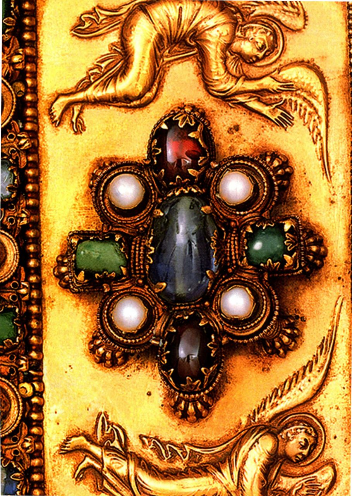

第十章 早期中世纪艺术

早期中世纪一词用于统称罗马覆灭（公元476年）至11世纪这段时间里，西欧诸多文化与地区的艺术（见地图10\.1）。在罗马帝国衰亡过程中，日耳曼民族（包括法兰克人［Franks］、西哥特人、东哥特人和撒克逊人［Saxons］）移民影响重大，他们迁徙到欧洲各地，最终在阿尔卑斯山脉以

北、意大利、西班牙和法国南部建立了永久聚居地。这无疑与当地居民冲突不断并最终融合，

其中包括铁器时代欧洲居民的后裔凯尔特人（“Celt”一词语焉不详，因为它也用来指5至12世纪居住在不列颠和爱尔兰的部落）。入侵者在建立永久聚居地时，吸收了许多当地的传统习俗。在这种混合体之上则是罗马的传统，其中也包含基督教传统，许多被罗马帝国征服的部族都已接纳了征服者的传统。

基督教既传达精神层面的信息，又在动荡的时代为四分五裂的社会带来秩序结构，由此产生的吸引力再次发挥了强大力量。然而，由异教崇拜转向基督教，在当时不再像早期基督教时期那样是个人的选择，而是社会的整体选择。通常情况下，如果某一部族首领决定皈依基督教，几乎其全部子民也都会追随。例如在496年圣诞节时，兰斯（Reims）的三千名法兰克人就与国王克洛维（Clovis）一起接受了洗礼。

教会逐渐成为促进欧洲统一的关键力量，即便如此，对家庭和部族的忠诚仍然支配着社会联盟和政治联盟。强大的首领把持着统治权，建立部族间的臣服关系与政治经济交流手段，最终带来了一种政治体制

在整个欧洲的发展，那就是封建制（feudalism）。诸多社会与政治联盟造就了一系列王朝，这些王朝的强大统治者在位期间不断开疆拓土。这些王朝雄心勃勃，要在罗马衰亡后陷入分裂的欧洲重建中央集权，其中最主要的是加洛林和奥托这两个王朝。建立稳定政体的尝试即使不是以罗马帝国的真实状况为基础，至少也是基于流传下来的种种理念。

这种文化互通产生了充满活力且来源多样的艺术。移民带来的艺术技巧、材料和传统与当地原有的主流习俗融合，此类艺术以精美的串联交织图案为特征，用于奢华的个人装饰品，反映了所有者的社会地位。教会在艺术品定件方面的重要性日益增长，主要的艺术品类型也发生了变化。教会建造并装饰了大量宗教建筑，建立起众多修道院团体。在修道院内部，缮抄室制作精美书籍，由传教士带往四方，教化民众。

加洛林王朝和奥托王朝的艺术家自觉效仿罗马帝国来建造教堂和设计建筑，以此来传达王朝统治者的帝国雄心。源自罗马的早期基督教公堂式建筑成为阿尔卑斯山脉以北地区大批建筑的范本；为宫廷服务的艺术家复制古代书籍；而罗马覆灭后几乎绝迹的

图10\.16《林道福音书》细部

第十章 早期中世纪艺术 311

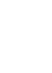

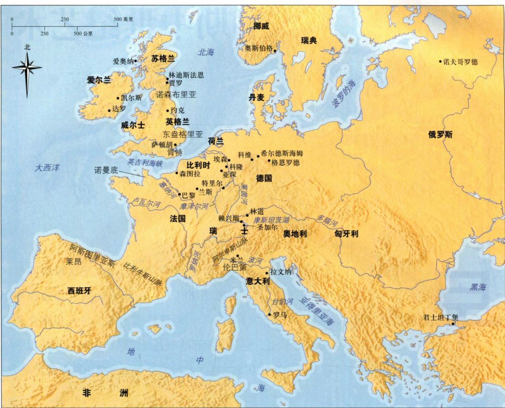

地图10\.1 早期中世纪的欧洲

圆雕，也再次引起艺术家及其赞助人的兴趣。如此多元甚至相互冲突的力量交织混合，随着新的社会与文化的发展，在这种混合体中诞生了复杂多样又令人振奋的艺术。

盎格鲁一撒克逊和维京艺术

各民族大规模移民改变了欧洲的面貌。376年，匈奴人（Huns）从中亚一直挺进到黑海以西，对欧洲构成了严重威胁。他们将日耳曼西哥特人从多瑙河向西驱赶至罗马帝国境内。451年，在其首领阿提拉（Attila，死于453年）带领下，匈奴人入侵高卢，即现在法德两国地区，当时居住着凯尔特人。同样是在5世纪，盎格鲁人（Angles）	和撒克逊人从今天的丹麦和德国北部入侵不列颠群岛，后者在过去几个世纪一直都是凯尔特人的殖民地。许多日耳曼民族部落

都发展成为实际上的王国：西班牙的西哥特王国、高卢的勃艮第（Burgundians）王国和法兰克王国，以及意大利的东哥特王国和伦巴第（Lombards）王国。维京人（Vikings）控制着斯堪的纳维亚地区，长于航海，因此时常进行远途航行。

日耳曼民族随身携带着各种轻巧的艺术品，如编织品、金属制品、珠宝和木雕。使用这些材质制作艺术品需要训练与技巧，其中金属制品的内在价值最高，因为通常用金银制作并镶嵌宝石。金属工匠社会地位高，既是尊重他们的劳动，也是尊重他们劳动成果的价值（见第313页的材料与技法）。在某些日耳曼民族传说中，金属工匠的能力如此不同寻常，甚至被描述为魔法。数不胜数的小型器具反映出这些迁徙民族所制作的艺术形式具有强大的生命力，呈现出一种迥异于希腊罗马传统的美学观，然而这些民族拥有同样丰富的神话与意象传统。

312 詹森艺术史

金属制品

金属在中世纪是一种昂贵的商品。即使是在古典时期，贸易与殖民模式也可与寻求各种所需金属联系在一起，例如意大利的希腊聚居地和西班牙的罗马聚居地都是为寻找金属而建立。中世纪早期常用金属有金、银、铜、铁和青铜。打造金属的方式多种多样，这无疑是它最突出的特征。金属可以被压平、拉丝或镂空（openwork）制成细丝工艺品（filigree）。它还可以锻造、雕刻、冲压、印花，并装饰上彩石、玻璃和珐琅。

萨顿胡船冢出土的金带扣（见图10\.1）使用了近半公斤黄金，此仅为船冢中大量黄金制品中的一件而已。中世纪早期墓葬出土了大量金器，反映出金属在当时的价值。此外，黄金接触土壤与水不会被损坏，而银等金属暴露在自然环境中会逐渐氧化。尽管自罗马时代以来欧洲就开始开采金矿，但最常见的采金方式还是从河流和溪水中拾捡天然金块或淘取金粒（称为冲积矿）。日耳曼民族聚居在莱茵河、台伯河、波河、罗纳河（Rhone）和加龙河（Garonne）沿岸，这些河流正是重要的冲积黄金来源，中世纪记载将这种黄金称为“沙金”。

萨顿胡出土的金带扣上有颗粒工艺（granulation）和乌银镶嵌工艺（inlaid niello），前者是将金粒粘合到黄金表面，后者则是以深色材料衬托出点线构成的精美交织图案。乌银是一种含硫的银、铜或铅合金，加热后会与其周围的金属熔合，产生近乎黑色的物质，此处是与金熔合。闪亮的黑色乌银突出了黄金的耀眼，同时也强调了复杂图案的细节。

12世纪早期德国修士西奥菲勒斯（Theophilus）撰写的论文解释了镶嵌乌银上光的方法。首先，艺术家使用经唾液润湿的软石磨平乌银表面；接着用一小块椴木沾上软石粉和唾液来打磨。之后，他写道：

长时间地用小木块和软石粉轻轻地打磨，不断加入唾液使乌银保持湿润，直到它全部发亮为止。然后用细麻布将乌银擦干，从耳朵里掏出一些耳蜡涂在表面，用羊皮或鹿皮轻轻擦拭，直至乌银通体光亮。

\-THEOPHILUS\.DE DIVERSIS ARTIBUS\. TR\.C\. R\.DODWELL

AS THEOPHILUS:THE VARIOUS ARTS\.LONDON:NELSON, 1961,P\.92\.

萨顿胡出土的囊盖（图10\.3）和铰链扣（图10\.2）也以其掐丝工艺（cloisonné）而闻名。掐丝是一种古老的技术，早在公元前2000年，地中海东部就开始运用这种技术。将金属丝（法语称cloison，即分割之意）窄边黏在底板上，如同小小的围墙，围绕镶嵌的玻璃或宝石形成一个个小格。萨顿胡出土的珠宝中大量使用红色石榴石，多达四千颗以上。这些器物上也使用了彩色玻璃，通常排列为棋盘图案。铰链扣

的主要装饰区域就使用了掐丝工艺，围绕彩色玻璃形成了阶梯状图案，增强了整体装饰效果。

盎格鲁\-撒克逊金属制品中的大量装饰技术和材料后来为爱尔兰金属工匠所用。其中最突出的例子是《塔拉饰针》（Tara Brooch），1850年在爱尔兰米斯郡（Meath）海边被一个玩耍的孩子偶然发现。这个饰针相当于某种领带夹，用来将外衣前襟扣在一起。珠宝直径还不足9厘米，却密集了大量装饰图案，包括螺旋线、鸟兽、人头和交织图案。饰针背面是细金丝焊成的嵌板，与镶嵌有铜丝涡形图案的银板合在一起。编织而成的金属线可能是安全链。

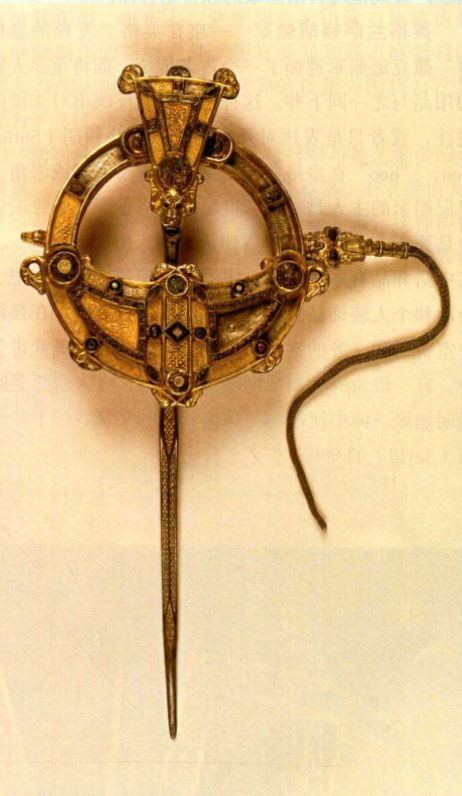

《塔拉饰针》，来自爱尔兰米斯郡的贝蒂城（Bettystown）。8世纪。贴金、青铜、玻璃、珐琅。直径8\.7厘米。都柏林爱尔兰国家博物馆

图10\.1 金带扣，出自萨顿胡船冢。7世纪上半叶。黄金，长13\.4厘米。伦敦大英博物馆

动物风格

日耳曼民族的艺术传统被某些学者称为动物风格（animal style），因为他们大量使用程式化的动物形态，融合凯尔特人精湛的金属饰品工艺，创造出抽象与自然、严谨规范与自由想象的独特结合体。

英格兰萨顿胡船冢 一座在英格兰发现的盎格鲁一撒克逊船冢遵循了一个古老传统，即将重要人物的用品与之一同下葬。这种习俗可能反映出对来世的关注，或者只是表达对死者的崇敬。萨顿胡（SuttonHoo，“hoo”在盎格鲁一撒克逊语中指海岬或海角）双层船冢的主人是一位7世纪的盎格鲁国王（普遍认为是死于625年前后的雷德沃尔德［Raedwald］）。墓中陪葬品有军用装备、银器、珐琅器、皇家标记、金币和个人装饰品。学者很早以前就注意到，在强调皇室责任和义务的盎格鲁\-撒克逊史诗《贝奥武甫》中，有一段为葬礼而装配船只的描写，令人联想到萨顿胡船冢。诗中所写的是贝奥武甫的父亲、国王希尔德（Scyld）的葬礼：

他们将备受爱戴的王，王戒的让渡者

放在船的中央，那桅杆所在的地方

身边堆着四方财宝

我从未听闻有哪艘船装载过

如此多的武器、战刀和

锁子甲。成堆的财宝

就这样摆满他胸前，将随着他驶向远方

投入大海的怀抱

\-Translated by Seamus Heaney,Beowulf\.A New Verse Translation\.

New York: Farrar, Straus & Giroux, 2000

尽管《贝奥武甫》描述的事件至少早于萨顿胡一个世纪，但是诗歌本身可能写于葬礼发生百年之后甚至更晚。所以，《贝奥武甫》虽然不应被看作文献记录，但它确实为我们了解萨顿胡遗址提供了皇家葬礼的背景知识。

萨顿胡出土的大金带扣（图10\.1）布满精美的动物风格图案。连接舌片的饰钮上装饰着两条缠绕撕咬的蛇。饰钮被钉在饰板上，缠绕扭结的蛇和鹰头几乎占据了饰板的所有空间。传统上，学者认为

图10\.2 铰链扣，出自萨顿胡船冢。7世纪上半叶。黄金、石榴石、珐琅，长12\.7厘米。伦敦大英博物馆

314 詹森艺术史

这种填满空间的装饰是恐惧空虚（horror vacui）的体现，即惧怕出现空白空间。然而如此命名其实是将当代价值观念强加于相异文化。希腊和罗马人运用空间幻觉来赋予艺术以活力，日耳曼和凯尔特艺术家却与之不同，他们使用复杂的纹样来使这些珍贵器物的表面生机盎然。尽管在我们看来，这些图案混乱无序，令人惊悚，但图案与图案之间有着一种持续且刻意的紧密联系。

墓中出土的一对铰链扣（图10\.2）同样装饰有缠绕的蛇，用于装饰边框，边框内是石榴石与玻璃镶嵌而成的斜向棋盘。两个扣环的末端都附有曲线形饰板，上面有几对野猪背对背蹲伏着，应该承认，其中的含义难以解释。这些动物图案如此完美结合，很难确定到底是为了表现野猪图案而使用曲线饰板，还是为了适应饰板外形而使动物背部隆起。

萨顿胡还出土了一件金珐琅加石榴石镶嵌的囊盖（图10\.3），原有的象牙或骨质衬板已经遗失，此处为替代品。囊盖上有四组对称图案，各自有其独特特征，表明它们来源各不相同。其中底部位于相对的两只动物之间的人形图案就有着悠久历史。再前溯3200多年，美索不达米亚艺术中（见图2\.10）首次发现了这种人形。囊盖上部中央图案的来源则较晚。这是一群互相撕咬的动物，尾巴、腿和口都被拉长为条带状，构成复杂的交织图案。上部左右

两侧是第四组图案，以交织的条带为装饰元素。这种条带与动物风格的组合似乎在该囊盖制作前不久才出现。

萨顿胡出土的器物说明了装饰母题与技术在不同民族移民过程中的传播，这一点至关重要。它们不仅证明了与日耳曼民族的文化交流，来自斯堪的纳维亚的艺术，而且还展现了其他值得关注的关联。据说雷德沃尔德国王既祭祀异教祖先神又敬拜基督。在萨顿胡出土的许多器物就明显与基督教有关，其中包括装饰着十字的银碗，无疑是与地中海地区进行贸易的结果。另外还有一套刻着扫罗和保罗字样的羹匙，可能意指皈依基督教（扫罗在改宗时易名为保罗）。有些学者认为，刻在铰链扣（见图10\.2）玻璃棋盘上的十字是刻意指涉新宗教，这一观点是否只是臆想？这对链扣的装饰纹样虽然为盎格鲁一撒克逊风格，但其外形与罗马服饰中的扣件极其相似。事实上，萨顿胡船冢中除当地模仿帝国形制制作的器物之外，还有罗马和拜占庭器具。有人因此认为，萨顿胡中埋葬的首领力图将自己表现为罗马统治者。

动物风格的主要媒介显然是材料与技艺繁多的金属制品。它们小巧耐用且大多工艺精湛，需求量很大，这也是为什么动物风格样式迅速传播开来。这种传播不仅限于不同地域之间的流传，还从一种材料扩展到

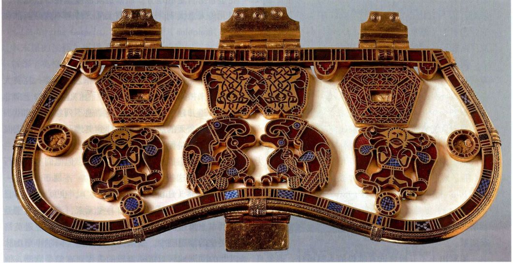

图10\.3 囊盖，出自萨顿胡船冢。7世纪上半叶。黄金、石榴石、珐琅，长20\.3厘米。伦敦大英博物馆

第十章 早期中世纪艺术 315

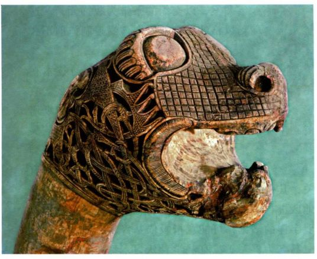

图10\.4《兽头》（Animal Head），出自奥斯伯格船冢。约834年。木制，高约12\.7厘米。挪威奥斯陆大学文化历史博物馆

其他材料，首先是用于金属，之后扩展到木雕、石刻，甚至绘画。它们用来传达多种信息，有些具有明显的异教意味，有些则为基督教所用。

挪威奥斯伯格船冢 制作于9世纪早期的一个华

丽兽头（图10\.4）展示出动物风格的所有特征。它发

现于挪威南部奥斯伯格（Oseberg）的一艘陪葬维京船，

原本是木制桅杆顶端的装饰。将显贵埋葬在船中的习

俗似乎始于斯堪的纳维亚，而此地动物风格的兴盛时

间远远长于其他任何地方，一直持续到日耳曼\-北欧

移民进入该地区很久之后。“Viking”一词容易让人

误解，因为它出自古挪威语“     ，意指海盗

或袭击者。当这些人驶离自己的海域，前往英格兰或

俄罗斯掳掠的时候，他们确实只是“海盗”。

奥斯伯格船并非用于劫掠，而是用于游乐，在平静的水域行驶。船内有两名妇女躺在墓室的床上，随船下葬，此外还有船桨、扶梯、雪橇、一辆精雕细刻的马车和至少十具马的骸骨。盗墓者盗走了这艘随葬船中他们认为有价值的珠宝和金属制品。

近期的学术研究采用了树木年代学（即分析树木或木器的年轮）方法，将奥斯伯格船冢的年代定为834年。其中一位陪葬妇女通常被认为是古德勒德大帝（Gudröd the Magnificent，约780\-820年）的妻子， 亚撒（Asa）王后，因为只有皇族才有力量订造如此奢华的器物，但近期学术界开始质疑它是否确实是皇家墓冢。

船冢出土了五根装饰有吼兽的木制桅杆，形象肖似神话中的海龙。尽管有人提出这些桅杆可能用在行

进队列中，或具有某种宗教功能或仪礼用途，但其实际功用尚不得而知。图10\.4中所示兽头的基本外形极为写实，牙齿、齿龈和鼻孔等细节部分也是如此。兽头上布满了交织的几何图案，深削和隆起的部分突出了表面纹样。尽管这里所出现的纹样都可以从日耳曼和盎格鲁一撒克逊艺术中找到根源，但艺术家大刀阔斧地改造了这些纹样，使其适应兽头灵动的曲线外形。

爱尔兰\-撒克逊艺术

在中世纪早期，爱尔兰人（爱尔兰［Ireland］的罗马名称为海伯尼亚［Hibernia］，所以他们也被称为海伯尼亚人［Hibernians］）是西欧的精神和文化领袖。爱尔兰从来都不是罗马帝国的属地，因此当来自英格兰的传教士于5世纪到达这里时，他们看到的凯尔特社会依据罗马标准来看仍处于野蛮状态。但是爱尔兰人欣然接受了基督教，这让他们开始接触地中海文明。但是，爱尔兰民族改造了外族文化，反映出自身的独特环境。

因为罗马教会的机构体系从根本上来说是城市化的，不适合爱尔兰的乡村生活方式。这里的基督教徒更愿意遵循埃及和近东荒漠圣徒的方式，在荒野的孤独之中寻求精神的完满，教徒群体就是在荒野之中创建了最早的修道院。因此，爱尔兰的修道院都建造在与世隔绝的偏远地区，甚至是远离大陆的小岛和必须完全自给自足的地方。而修道院制度是在5世纪末，向北传入意大利，经由欧洲大陆，传遍不列颠西部和爱尔兰。

手抄本

爱尔兰修道院很快成为学术和艺术中心，耗费大量精力来抄写文学和宗教文本。他们也派遣修士向非教徒布道并建立修道院，足迹踏遍不列颠北部和欧洲大陆，从今天的法国一直延伸到奥地利。每座修道院的缮抄室都是促进这种风格发展的艺术中心。爱尔兰修士鲜少关心描绘圣经事件的插图，但他们努力进行装饰美化。这些手抄本中最精美的一本属于爱尔兰一撒克逊风格（Hiberno\-Saxon style），也就是在基督教艺术中融合了凯尔特和日耳曼元素，不仅兴盛于爱尔兰本土修道院，也流行于爱尔兰修士在撒克逊英格兰兴建的修道院中。爱尔兰修士加速了阿尔卑斯山脉以北的欧洲地区皈依基督教的进程。在整个欧洲，他们使修道院成为文化中心，因此在几百年间影响着中

316 詹森艺术史

世纪文明。

为了传播有关基督、上帝之国和救赎的信息（即福音），爱尔兰修道院需要手工抄写大量《圣经》和其他基督教典籍。每份手抄本都被认为是承载着上帝之言的圣物，需要华美的外观来反映内容的珍贵。爱尔兰修士必定十分熟悉早期基督教的彩饰手抄本（illuminated manuscript），但他们再一次发展出了独立的传统，而不是简单复制过去的版本。最早爱尔兰一撒克逊彩饰绘制者只保留了早期基督教手抄本图像系统中四位福音书作者（Evangelists）的标志，可能因为这些标志很容易转变为他们自己的装饰性风格。这四个标志分别为：男子或天使（圣马太）、狮子（圣马可）、公牛（圣路加）和鹰（圣约翰），出自《旧约·以西结书》（1：5\-14）和福音作者圣约翰的《启示录》（4：6\-8），被圣杰罗姆（St．Jerome）等早期注经家指定为四位福音书作者的象征。

《达罗书》（Book of Durrow）中代表圣马太的标志的插图（图10\.5）展示出纹样如何在突出装饰之时，仍能赋予人物形象以活力。人体部分由带边框的棋格盘图案构成，使人联想到萨顿胡铰链扣（见图10\.2）的装饰特点。添加的头部正面朝向观众，双脚则是侧面观，装饰母题由此被转变为人像。先前见于金属制品的活泼精美的纹样，此处被用来显示圣马太所传达的信息是何等尊贵。爱尔兰抄写人和艺术家因其能力和成就而受人敬仰。一份中世纪资料就记载着某位爱尔兰抄写人死后，他的一双巧手被当作能够施展神迹的圣物保存起来。

《林迪斯法恩福音书》《林迪斯法恩福音书》（Lindisfarne Gospels）的书尾题署（colophon，手抄本末尾的注释）提供了大量信息，使我们了解到这份制作于英格兰诺森布里亚（Northumbria）的手抄本的来源，其中包括译者和抄写人的姓名，分别为奥尔德雷德（Aldred）和主教伊德弗里思（Eadfrith），后者可能也绘制了其中的图案花饰（见第318页的原始文献）。考虑到爱尔兰抄写员和艺术家所受到的尊重，一位主教被委以书写和装饰这一手抄本的任务也就不足为奇了。在爱尔兰修道院中，修士分为三类：初级修士（juniors，学生和新入院者）、工作修士（workingbrothers，从事体力劳动）和高级修士（seniors，经验最为丰富者），负责抄写圣书的是高级修士。

《林迪斯法恩福音书》中画有十字架的书页（图10\.6）是异常复杂的艺术成果。细密图画家的创作精确度媲美珠宝匠，在几何框架之中倾注了如此密集又充满动感的动物交织纹样，就连萨顿胡囊盖（见

大事年表

5世纪初\-盎格鲁人与撒克逊人入侵不列颠群岛

451年\-匈奴王阿提拉入侵欧洲

476年\-罗马衰败

约570年\-先知穆罕默德在麦加诞生

7世纪初期\-英格兰萨顿胡双层船冢

图10\.3）上的斗兽也相形见绌。为了达到这样的效果，艺术家必须遵循严格的原则，仿佛遵守特定的规则。作画之前要设计好最微小的母题和尺寸最大的图案。用尺子和圆规在页面上或手绘或针刺标记网格点线。上色时，艺术家严格遵循之前描好的图案。不容许任何印迹破坏部分元素或整体设计的严格平衡。学者弗朗索瓦·亨利（Françoise Henry）提出，艺术家将

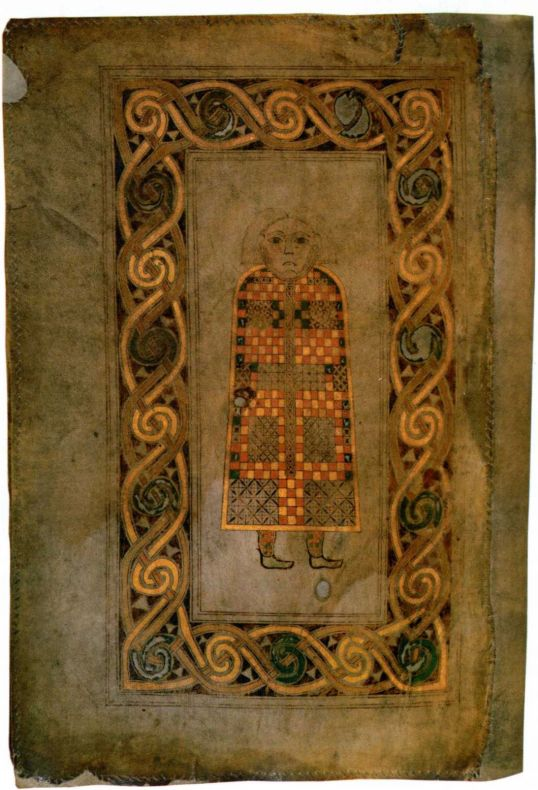

图10\.5《圣马太标志》（Symbol of Saint Matthew），出自《达罗书》。

约680年。犊皮纸蛋彩画，24\.7 x 1 5\.7厘米。都柏林圣三一学院（Trinity

College\)

第十章 早期中世纪艺术 317

《林迪斯法恩福音书》

书尾题署

该词指某些手抄本末尾所写的注释，记录该书由何人在何时为何人而作。《林迪斯法恩福音书》（约700年）书尾题署的年代比正文要晚250年左右，但大多数学者认为它的信息准确可信。其中写明了抄写员、装订员、装帧用金属饰物的制作者以及拉丁文本的英文译者的名字，却唯独没有画家的名字。似乎装饰图画的作者就是抄写员伊德弗里思。

书写该书。林迪斯法恩岛民主教埃塞尔瓦尔德（Ethelwald）为其压印加封，他深谙此技。隐士比尔弗里斯（Billfrith）为封皮铸造装饰，饰以黄金、宝石和通体贴金的银\-纯金属制成。卑微的修士奥尔德雷德，得上帝与圣卡斯伯特之助，在行间为其作英语注释。······

SOURCE:COTTON MS NERO,D\.IV\.THE BRITISH LIBRARY

林迪斯法恩教会主教伊德弗里思，为上帝、为圣卡斯伯特（Saint Cuthbert）······以及所有圣骨存于本岛的圣徒，

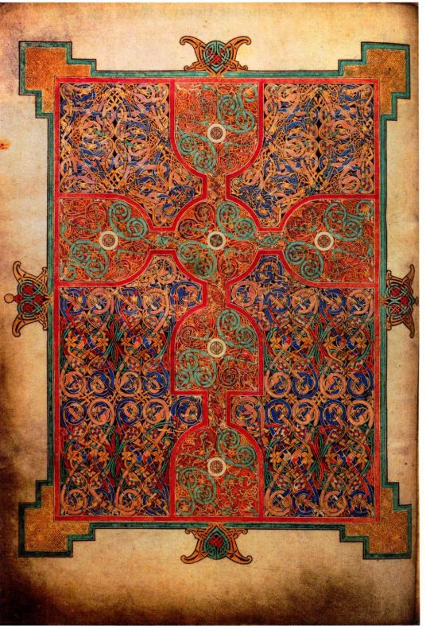

图10\.6 十字架书页，出自《林迪斯法恩福音书》。约700年。犊

皮纸蛋彩画，34\. 3 × 23\. 5厘米。伦敦大英图书馆

自己的作品视为“某种神圣谜语”，构成谜语的抽象形式等待人们去分析解读。自然图形与几何图形必须分隔开来。在动物题材单元里，每条线都必须属于某个动物身体的一部分。其他规则包括对称（插图可以横向、纵向，甚至按对角线平分）、镜像效果、形式与色彩重复。只有认真观看图画，我们才能领悟这一迷宫般世界的精神。仿佛这些撕咬抓挠的怪兽都被十字架的力量震慑，转而为基督教服务，正如凯尔特部族所做的那样。

若干因素共同促成了爱尔兰一撒克逊风格的发展：爱尔兰在地理位置上的隔绝，隐避世外的修道院中的高水平缮抄室，以及传播基督箴言的热望。随着时间演变，随着与欧洲大陆特别是罗马的接触增加，爱尔兰一撒克逊艺术反映出了新的影响。《林迪斯法恩福音书》中表现马太的插图（图10\.7）迥异于《达罗书》中的圣马太（见图10\.5），而后者的年代不过只早数十年而已。在《林迪斯法恩福音书》中，马太正在认真地研究文本，艺术家通过扭转人体来暗示空间感，以斜置的长凳制造出景深；《达罗书》中的马太则双手垂于体侧，两眼直直地盯着观者。《达罗书》的画面中仅有马太这一个人物，而在《林迪斯法恩福音书》中，打结挽起的窗帘后还有一个身份不明的人物，有些学者认为他是手捧《旧约》的摩西，有些则认为是手持《新约》的基督。此外，《达罗书》中的马太服装平板，而《林迪斯法恩福音书》中马太的衣物则绘有衣褶，深色内衣区别于浅色长袍，显示衣料的柔软贴身。

这一转变如何解释呢？在7、8世纪期间，爱尔兰与罗马的联系日益频繁，并开始采用罗马的礼拜仪式。例如，据说林迪斯法恩附近的贾罗（Jarrow）

318 詹森艺术史

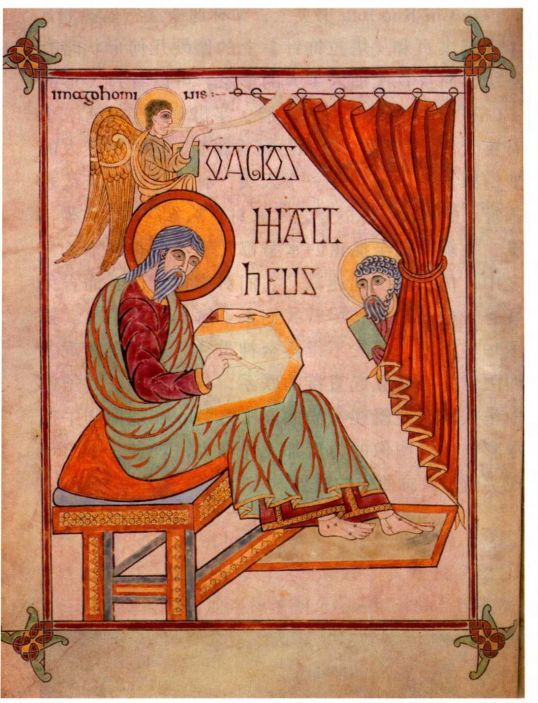

图10\.7《圣马太》，出自《林迪斯法恩福音书》。约700年。

犊皮纸蛋彩画，34 \.3 × 23 \.5厘米。伦敦大英图书馆（手稿编号MS

Cotton Nero D\.4\)

修道院的院长于7世纪末从罗马返回，带回一大批手抄本。贾罗修道院的艺术家很可能将其中的插图作为模本。《阿米提奴抄本》（Codex Amiatinus）中先知以斯拉（Ezra）恢复圣经的插图（图10\.8）无疑是借用改造了当时修道院中的罗马手抄本。艺术家以斜角来描绘书橱、桌子、长凳和脚凳，表现出某种透视感，仿佛物体退入纵深空间之中；衣物的明暗和地上墨水池的阴影同样产生深度感。艺术家还运用色彩混合来造型，这在以斯拉的衣服、手、脸和脚的部分尤为明显。特别值得注意的是，以斯拉的坐垫似乎在其身体的重量下被压扁，先知形象因此更加有实体感。

有些学者认为，绘制《林迪斯法恩福音书》中圣马太（见图10\.7）的艺术家伊德弗里思与绘制以斯拉的艺术家都参照了同一个罗马手抄本，但后者更为忠实。确实，两个人物姿势相同，还有长凳等相似元素，如此明显的共性难以忽视。但伊德弗里思更热衷于保留一些爱尔兰一撒克逊的传统技巧，或者他被要求这

样做；绘制以斯拉的艺术家则不同，他以多种纹样装饰长凳，并使用近乎互补色的色彩来表现衣物的深度，在绿色调的衣服上衬出红色衣褶。伊德弗里思运用了他在非人物插图（如十字架书页，见图10\.6）中使用的僵硬轮廓、几何纹样和平涂色彩。

《凯尔斯书》在《林迪斯法恩福音书》出现一百年之后，爱尔兰一撒克逊抄本艺术达到顶峰，其成果就是《凯尔斯书》（Book of Kells），凯尔特艺术最为精美的抄本。它可能制作于8世纪末或9世纪初，至少也是始于这一时期，出自爱奥纳岛（IonaIsland）上的修道院。该修道院遥隔于苏格兰西海岸，6世纪时由爱尔兰修士建立。这一抄本得名于爱尔兰的凯尔斯修道院，是9世纪晚期至17世纪收藏它的地点。其中许多书页反映出多种多样的艺术影响，其来源从地中海一直延伸至英吉利海峡。Chi Rho

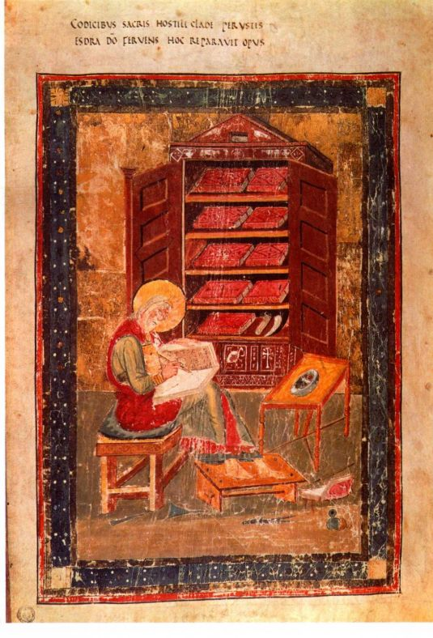

图10\.8 《以斯拉恢复圣经》（Ezra Restoring the Bible），出自《阿米提奴抄本》。8世纪早期。犊皮纸蛋彩画，50\.5x34\.3厘米。佛罗伦萨美第奇·洛伦佐图书馆（Florence Biblioteca MediceaLaurenziana\)

第十章 早期中世纪艺术 319

图10\.9 Chi Rho lota 书页，出自《凯尔斯书》中的《马太书》（1：18）。约800年。犊皮纸墨彩画，33 × 24 \. 1厘米。都柏林圣三一学院图书馆

大事年表

约700年\-《林迪斯法恩福音书》制作于英格兰

726年\-圣像破坏论战开始

787年\-有文献记载的维京人对不列颠群岛的首次入侵

约800年\-《凯尔斯书》制作于爱奥纳岛

Iota书页（图10\.9）上绘制着基督姓名的希腊文首字母缩写XPI，同时还有“Christi autem generatio”字样，即“耶稣基督诞生之事如下”，表示《马太福音》（1：18）将开始，该福音书中歌颂了耶稣的降生。Chi Rho Iota 书页中有大量与《林迪斯法恩福音书》的十字架书页相同的涡形纹样，当时的珠宝也使用类似图案，例如《塔拉饰针》（见第313页的材料与技法）。

在Chi Rho Iota书页上，《林迪斯法恩福音书》十字架书页和《塔拉饰针》上的僵硬几何形状略有舒缓，而且首次加入了人的形象。可以看到X形的“Chi”顶端生长出一张人脸，字母笔画旁还有三个有翼天使。P形的“Rho”宛若藤蔓，呈现出迷人的梦幻感，笔画末尾是一个人头，有人提出那是代表基督。更令人吃惊的是艺术家对自然界的描绘。猫、鼠、蝴蝶，甚至抓鱼的水獭都几乎淹没在装饰纹样之中，仿佛在玩捉迷藏。它们对中世纪读者而言无疑有着象征功能，尽管我们不了解其中的意义。插图华美繁复，使人不得不全神贯注，这样就在观者和图像之间建立起直接的联系，与早期拜占庭圣像中圣人的坚定凝视有异曲同工之妙。在圣像和手抄本彩饰中，图像的力量都无比强大，观者几乎忘却现实而走入画面中的世界。

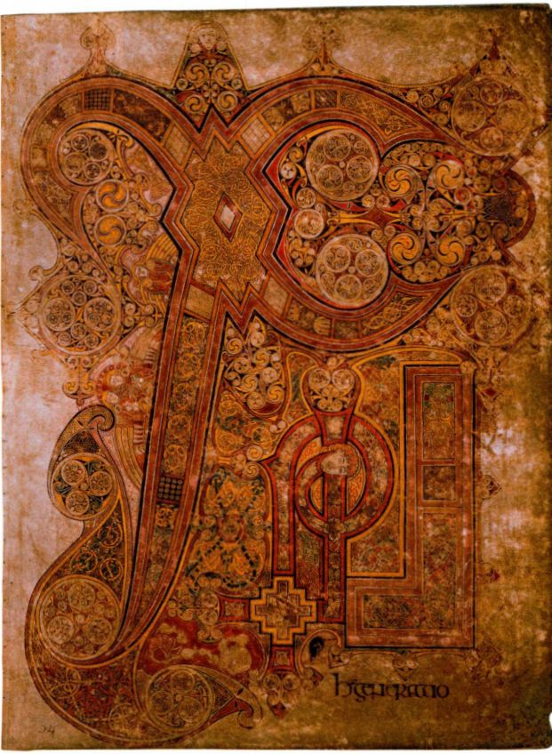

320 詹森艺术史

加洛林艺术

8世纪晚期，在控制欧洲北部大陆的诸多部落与王国之中，一个新帝国兴起。它统一了欧洲的大部分地区，疆域从北海延伸到西班牙，南端直达意大利北部的伦巴第地区（Lombardy），它的建立者就是768年登基成为法兰克国王的查理曼大帝（Charlemagne）。公元800年圣诞节，教皇利奥三世在旧圣彼得教堂加冕他为罗马皇帝，宣称他是第一位基督教皇帝君士坦丁的继承者。教皇一直试图将自己的权威加诸这一新建天主教帝国之上，尽管查理曼大帝有能力抵制教皇的企图，但当时在精神权威与政治权力、教会与国家之间，存在着一种相互依赖的关系，并且将决定此后数百年的西欧历史。

皇帝在罗马加冕，但他并不在此驻跸。查理曼大

帝将帝都设定在自己的权力中心\-亚琛（Aachen，

又写作“           ，位于现在德国境内，

靠近法国、比利时和荷兰。查理曼大帝及其继任者

统治时期被称为加洛林王朝（Carolingian，源自查理

曼大帝的拉丁文名“Carolus Magnus”，意为“查理

大帝”），统治时期大约为768至877年。查理曼

大帝的目标包括改善国家管理和传授基督教义，他

在宫廷中聚集了当时的精英之士，其中包括最为博

学的学者约克的阿尔昆（Alcuin of York）。查理曼

大帝委任这批学者恢复古罗马的学术成就，并在每

座大教堂和修道院建立起学校系统。皇帝在这场复

兴中发挥了积极作用，不仅仅是出于对古代典籍的

兴趣，而是有其政治目的。他以君士坦丁和查士丁

尼而非其他异教先皇为榜样调整了自己的统治方式，

并声称这是“renovatio imperii romani”，即“罗马

帝国的复兴”。他的努力得到了教皇的支持，教皇

加冕他为神圣罗马皇帝。为查理曼大帝及其他加洛

林王朝统治者服务的艺术家刻意模仿罗马艺术，通

过融合对古代艺术的崇敬和北部欧洲的本土特色，

他们创作出了具有高度艺术价值的原创作品。

雕塑

《加洛林王朝统治者骑马像》（Equestrian Statueof a Carolingian Ruler，图10\.10）曾被认为是查理曼大帝本人，现在学者普遍认为是他的孙子秃头查理（Charles the Bald）。这尊青铜像传达出加洛林王朝的政治目标。雕像中的统治者身着皇袍，庄严地端坐于马上，如同端坐于宝座之上。他手持圆球，意喻统治全世界。查理曼大帝曾从拉文纳带回古罗马狄奥多

里克骑马像，装饰皇宫庭院，现已遗失。该像可能就是以此古罗马像为范本。也可能存在其他来源，如马可·奥勒利乌斯的青铜骑马像（见图7\.21），曾被误认为是首位基督教皇帝君士坦丁，对于雄心勃勃的查理曼大帝而言也是极佳的效仿榜样。

这尊加洛林王朝像并非盲目模仿古代范本。相较于马可·奥勒利乌斯骑马像，这件作品更为简朴，细节上更加有序，以便传达重要信息，即加洛林统治者是罗马帝国宝座的继承人。两者最为显著的差别在于尺寸：马可·奥勒利乌斯像高达3\.35米，而这尊加洛林王朝骑马像只有24\.4厘米。尺寸虽小，加洛林雕像依然表现出与大雕像同等的庄严与高贵。考虑到法兰克人的金属制作传统，小型化不仅是适当之选，而且可能本身就暗示着价值的珍贵。虽然根据尺寸来看，

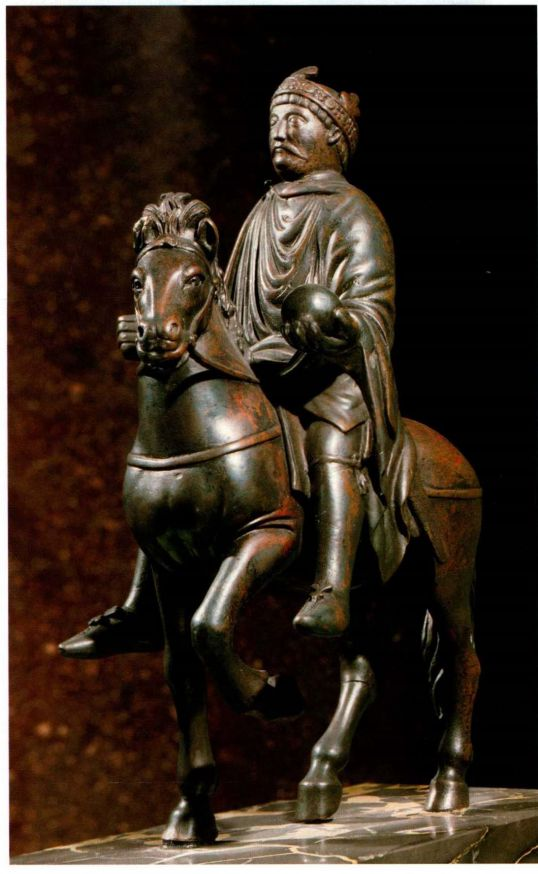

图10\.10 《加洛林统治者骑马像（秃头查理？）》（EquestrianStatue of a Carolingian Ruler［Charles the Bald？］）。9世纪。青铜，高24\.4厘米。巴黎卢浮宫

第十章 早期中世纪艺术 321

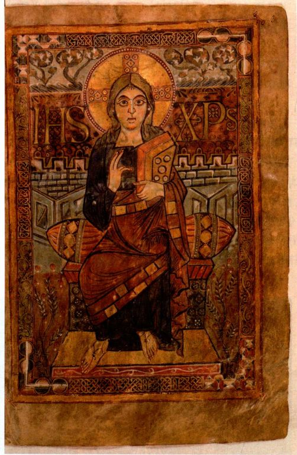

图10\.11《升座基督图》（Christ Enthroned），出自《戈德斯卡尔克

福音书（读经集）》。781\-783年。犊皮纸蛋彩画，32\.4 × 2 1\.2厘米。

巴黎国家图书馆

它可能是为随身携带而制作，但遗憾的是我们不了解它面向的人群和用途。

绘画装饰书籍

查理曼大帝十分关注发展学术与文化，他的缮抄室因此必须制作大量书籍。他在宫廷中建立了一所“学院”，鼓励收集和复制大批古罗马文学作品。事实上，留存至今的许多古典拉丁语作家最古老的作品文本都出自加洛林手抄本，而它们长期以来却被认作古罗马原作。现在的英文字母就源自加洛林手抄本，正因为上文提到的混淆，这些字母才被称为罗马字母而非加洛林字母。

《戈德斯卡尔克福音书》查理曼大帝的皇家缮抄室制作的最早一批手抄本中包括《戈德斯卡尔克福音书》（Godescalc Gospels），它得名自在书中署名的修士。学者通常认为它反映了查理曼大帝从

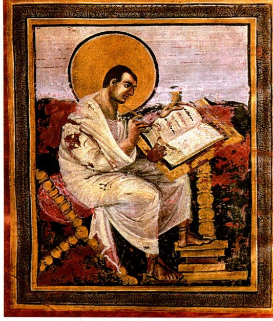

图10\.12《圣马太》，出自《查理曼大帝福音书（加冕福音书）》。约800\-810年。犊皮纸墨彩画，33x25\.4厘米。维也纳艺术史博物馆

罗马带回的手抄本和器物的影响。其中最引人注意的图像是一幅大型基督升座图（图10\.11），基督双眼大睁，径直望向观者。他身穿紫色外衣，显示皇家身份（在罗马时代，紫色是皇族的专用色）。对于皇帝形象的关注透露了查理曼大帝的个人雄心，他的宏愿在二十年后终于实现，公元800年，查理曼大帝被加冕为神圣罗马皇帝。基督膝盖部分的生硬线条和涡形图案显示出衣物垂落，手部、颈部和面部的白线则表示高光。看上去艺术家是意图效仿罗马的造型手法，但他采用的却是北部欧洲运用线性图案的方式。

基督坐在一座封闭的花园中，使人联想到罗马绘画的母题（见图7\.55）。但这里的花园却变形为扁平的装饰元素，几乎像是地毯上的图案。基督名字与整幅画的外框均由交织纹样构成，这是金属制品（见图10\.1\-10\.3）和爱尔兰一撒克逊图案花饰（见图10\.5\-10\.7）的特点。这位伟大的画家融合了罗马的艺术遗产与北部欧洲艺术家传统上使用的装饰技法。

这本手抄本中有一首题诗，纪念781年教皇哈德良（Pope Hadrian）在罗马为查理曼大帝的孙子施洗礼。

322 詹森艺术史

查理曼大帝携孙至罗马接受洗礼，也就承认了教皇在基督教事务中的权威；相应地，教皇将自己与整个西方基督教世界都置于皇帝的保护之下。

《查理曼大帝福音书》《查理曼大帝福音书》（Gospel Book of Charlemagne）亦称《加冕福音书》（Coronation Gospels），因为后来的德国皇帝在加冕礼中都要对此书立誓。据说它发现于查理曼大帝的陵墓，被认为是这位皇帝的宫廷制品。看到书中画有圣马太（图10\.12）的那一页，很难相信这是在北部欧洲创作的作品，并且距《戈德斯卡尔克福音书》还不到二十年。如果不是因为巨大的金色光轮，圣马太极有可能被错认为古典作家的肖像，例如近八个世纪之前庞贝壁画中的米南德（Menander，图10\.13）。因为画家显得极其熟悉罗马绘画传统，而且其绘画手法显然源自地中海，因此有些学者认为他一定来自拜占庭或意大利。这一点在整幅作品中表现得非常明显，从形式的涂绘式造型，到装饰在宽阔边框上的茛苕叶饰，这些边框使画面看起来像个窗口。

《兰斯大主教埃博福音书》《兰斯大主教埃博福音书》（Gospel Book of Archbishop Ebbo of Reims）创作于三十余年后，其中一幅小型插图（图10\.14）虽然古典范本的特色较少，但同样以它们为创作基础。这幅作品的题材仍是圣马太，姿势也与《查理曼大帝福音书》中的十分相似，但却充满活力，使画面中每一元素都运动起来。笔触浓重的衣物裹缠着身体，山丘向上拱起，建筑与植物似乎是被旋风席卷，就连边框中的茛苕叶饰也具有火焰般的古怪特征。这位福音书作者从沉思冥想的罗马作家转变成被狂乱的神圣灵感控制的男子，转变成记录上帝之言的媒介。艺术家传递这种力量的方式，尤其是表现性地运用颤动的线条，仿佛手中的不是画笔而是一管鹅毛笔，使人想起爱尔兰一撒克逊手抄本装饰中往复不断的交织运动（见图10\.6、10\.9）。

《乌得勒支诗篇》制作《埃博福音书》的兰斯皇家缮抄室也制作了《乌得勒支诗篇》（UtrechtPsalter），可能是所有加洛林手抄本之中最为杰出的作品（图10\.15）。《诗篇》是《旧约》中的一卷，包括赞美诗和圣歌，传统上认为是由大卫王所作。《乌

图10\.14《圣马太》，出自《兰斯大主教埃博福音书》。816\-835年。犊皮纸墨彩画，26 × 22\.2厘米。法国艾佩尔内（Épernay）市立图书馆

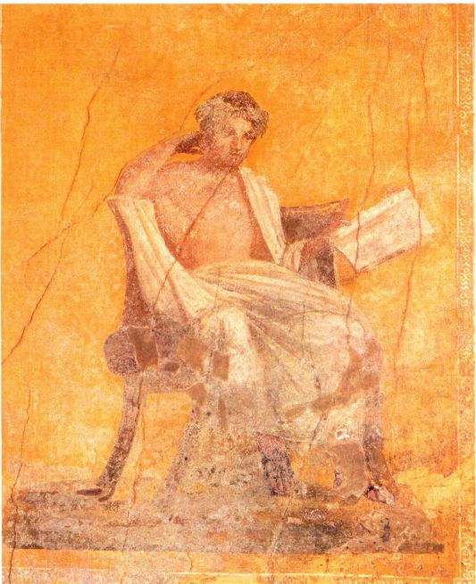

图10\.13《米南德画像》（Portrait of Menander）。约70年。壁画。庞贝米南德之家

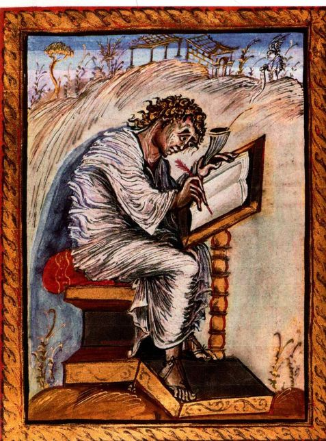

第十章 早期中世纪艺术 323

图10\.15 《诗篇》43\-44节插图，出自《乌得勒支诗篇》。约820\-832年。犊皮纸墨水画，33 × 25厘米。荷兰乌得勒支市大学图书馆

得勒支诗篇》中以鹅毛笔素描表现了具有动感的形式。场景中的建筑与风景令人回想起图拉真凯旋柱（见图7\.29），表明艺术家遵循了非常古老的艺术模式。另一线索则是罗马大写字体的运用，这种字体在几个世纪以前就已鲜少使用。但绘图技法中的韵律感赋予素描一种具有表现力的统一性，这在早先的图画中是不存在的。如果没有这种韵律感，《乌得勒支诗篇》中的素描将失去其魅力，因为诗篇中的诗歌语言不像《圣经》中的叙事部分那么便于用图画来阐释。采用素描而非涂绘风格也可能是受某个现已遗失的古代卷轴影响。

艺术家逐句解读，再以某种方式将其视觉化，以此来描绘诗篇。因此，图示中上部的图像表现的就是“求你的亮光和真实引导我，带我到你的圣山，到你的居所”（《诗篇》43：3）。而在下部，基督斜倚在床上，两侧是正在哀求的天使。这一图像表现

的是“主啊，求你睡醒，为何尽睡呢？”（《诗篇》44：23）。左边是蜷伏在神殿前的信徒（“······我们的肚腹紧贴地面”［《诗篇》44：25］），在前景所绘的城门处，他们将被杀死（“如将宰的羊”［《诗篇》44：22］）。若在一位想象力较少的艺术家笔下，这可能会变成乏味的游戏；此处却具有强烈的戏剧感染力。绝佳的韵律感与动感使得这些素描既连贯一致，又感人至深。

《林道福音书》封面 兰斯画派的风格在《林道福音书》（Lindau Gospels）封面的浮雕（图10\.16）中也清晰可辨。考虑到加洛林王朝在保存和美化书籍方面的慷慨，这一奢华封面确实是适宜的书籍保护手段。这件黄金制品杰作制作于875\-900年，显示出加洛林王朝在复兴罗马帝国的过程中如何将日耳曼金属制品传统化为己用。大量次宝石并非直接镶嵌在黄金底板上，而是由爪形托或拱形塔托（turret，塔状突

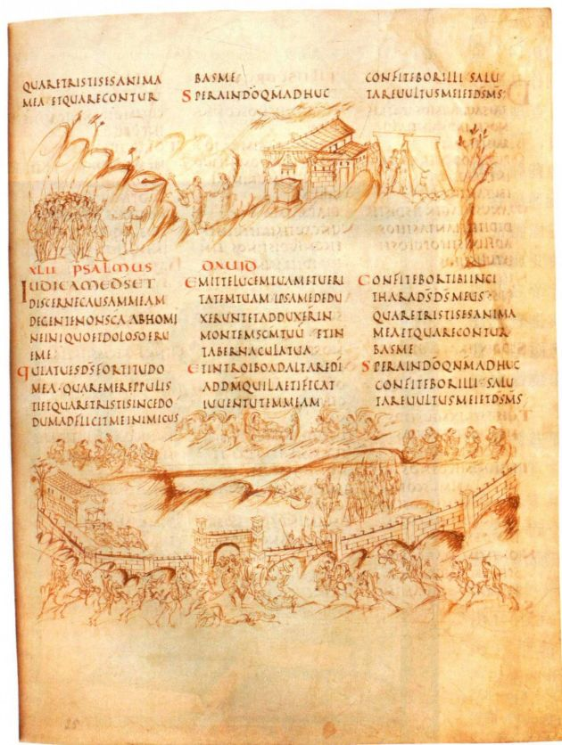

324 詹森艺术史

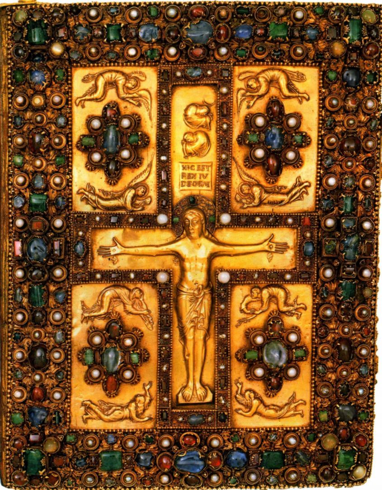

图10\.16 《林道福音书》装帧封面。约870年。黄金、宝石，35 × 26\.7厘米。纽约皮尔蓬特·摩根图书馆

，因此光线由下方折射出来，充分展现出宝。钉在十字架上的基督没有任何痛苦或死亡似乎是站立着，而不是挂在十字架上，双主严肃穆。

相对而言，加洛林王朝建筑罕有存世，但表明这一时期的建筑活动曾有明显增长，

显示查理曼大帝治下帝国安定繁荣。与画家一样，查理曼大帝的建筑师们也致力于复兴罗马帝国的辉煌，他们的方法就是效仿罗马和拉文纳的建筑，查理曼大帝曾游历过这两个城市。虽然罗马曾是帝国首都，但拉文纳才是基督教帝国的前哨，因此论及查理曼大帝期望在自己领土中建立的城市，拉文纳正是绝佳原型。

亚琛查理曼大帝宫殿礼拜堂 8世纪末，查理曼

第十章 早期中世纪艺术 325

大帝在亚琛兴建皇宫。在此之前，他的宫廷处于流动状态，随着政治形势的需要不断转移地点。为表明查理曼大帝作为基督徒统治者的身份，建筑师以君士坦丁在罗马的拉特兰宫（Lateran Palace）为原型修建了他的宫殿群，其中包括一座称为皇家大厅（Royal Hall）的公堂式建筑，与宫殿礼拜堂相连（图10\.17）。这座礼拜堂的平面设计灵感很可能来源于查理曼大帝亲临参观的拉文纳圣维塔莱教堂（见图8\.21\-8\.24）。宫殿礼拜堂的设计者是来自梅斯的奥多（Odo of Metz），大概是最早留名的阿尔卑斯山以北的建筑师。查理曼大帝信任的顾问兼传记作者艾因哈

德（Einhard）监督整个工程。

这座礼拜堂对圣维塔莱教堂的处尤为明显（crossing，图10\.18，又但它的设计绝不只是重复效仿，而是释。墩柱与圆拱都远比圣维塔莱教单元在几何结构上的清晰明了又截流动性空间。在北部欧洲的土地上是一项艰难的任务：立柱与青铜屏栅熟练的石工想必也很难找到。礼拜有立柱，在结构上并非必需，但是却而且提供了展现罗马建筑细节的机

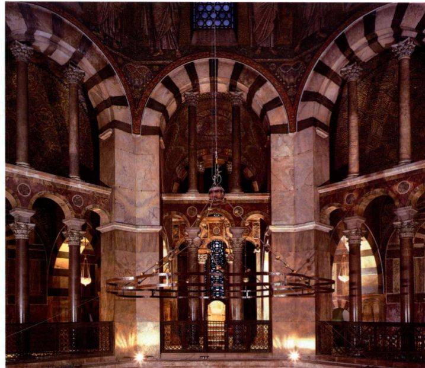

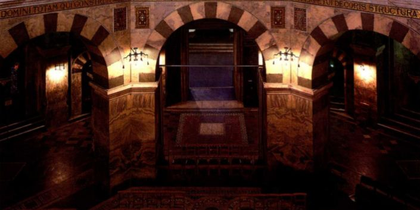

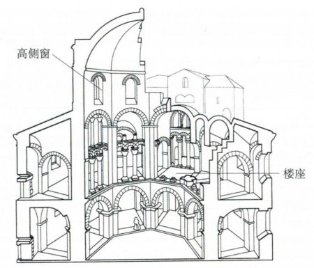

图10\.18 查理曼大帝宫殿礼拜堂截面图（根据Kubach的图所绘）

堂设计的理念在于暧昧不明，建造一个彼岸世界般的内部空间。相比而言，亚琛的礼拜堂更为坚固沉稳。圣维塔莱教堂那柔软凸起的连拱在亚琛变成了轮廓清晰的墩柱。它们支撑着沉重穹顶，以此凸现自己的强大力量，而圣维塔莱教堂的穹顶看起来却轻盈得像是飘浮在建筑的内部空间之上。

奥多对西部入口的设计也同样重要，现已大部分为后来加建或改建的部分所遮蔽。圣维塔莱教堂的入口是一个宽阔的半独立式前廊，两侧各有一座阶梯式小角塔（turret），前廊的中轴线与教堂的中轴线相交成奇特的角度。而亚琛礼拜堂则将这些部分整合为一个高大紧凑的结构，与礼拜堂相连，且与主中轴吻合。这一巨大结构被称为西面工程（westwork，出自德语Westwerk），是史上首次出现。

查理曼大帝将自己的宝座放在入口背面门洞上方的楼座（tribune，即西面工程中的走廊）。众人聚集在下方中庭，皇帝就在楼座中出现。宝座正对着一座基督祭坛，穹顶镶嵌画中的基督仿佛由上方赐福皇帝。因此，尽管当时的文献罕有提及西面工程的功能，但它可能最初是用作皇家隔间或礼拜堂。

圣里基埃修院教堂 法国东北部森图拉修道院（Monastery of Centula）的圣里基埃修院教堂（Abbey Church of Saint\-Riquier）是加洛林王朝时期最为宏伟的公堂式教堂之一，它的西面工程更加复杂精致。修道院由院长安吉尔贝（Abbot Angilbert）于790年重建，他是查理曼大帝宫廷的诗人兼学者。修道院早已成为废墟，但是通过文字描述、素描和印刷品可以了解它

的形貌，例如此处的版画（图10\.19）。修道院不仅包括献给圣里基埃的修院教堂，还建有两座礼拜堂，一座献给圣母玛利亚，另一座献给本笃会（BenedictineOrder）的创建者圣本笃（St\.Benedict），此处的修士即遵循本笃会规（见第328页的原始文献）。

努尔西亚的本笃（Benedict of Nursia）于529年在罗马以南的蒙特卡西诺（Monte Cassino）成立了一所修道院，建立起他的教派。本笃会规要求修士劳动、学习和祈祷，既为修道院提供了健全的管理，而且满足修士个人的精神需求（见第二部分末尾的附加原始文献）。到公元9世纪，主要因为查理曼大帝支持，本笃会关于修院生活的会规为欧洲地区广泛接受。查理曼大帝认识到本笃会规井然有序，与他的宏大目标一致，即通过健全有效的社会和宗教管理体系实现帝国稳定。

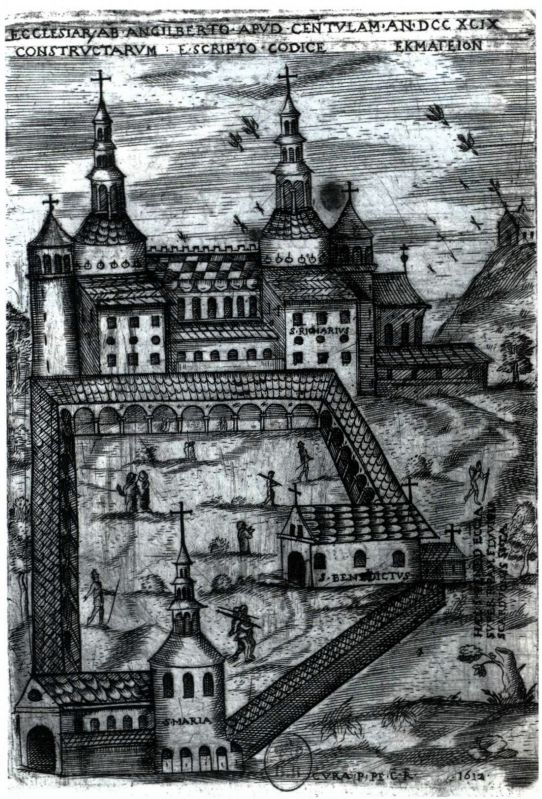

图10\.19 法国森图拉修道院的圣里基埃修院教堂。约790年启用。

1612年Petau依据11世纪的手抄本彩饰创作有一幅风景画，此图为该画的版画复制品（1673年）。巴黎国家图书馆

第十章 早期中世纪艺术 327

原始文献

阿里乌尔夫（约1060\-1143年）

选自《圣里基埃修道院史》（History of the Monastery ofSaint\-Riquier\)

阿里乌尔夫（Hariulf）曾是圣里基埃的修士，1105年成为比利时奥登布尔格（Oudenbourg）的圣彼得修道院院长。

敬堂······在同时代教堂中最为著名······东面塔楼靠近圣献给救世主与圣理查理乌斯（St\.Richarius）的这座教理查理乌斯的陵墓······西面塔楼特地敬献给耶稣基督。······

经过实地考察，人们会发现最大的教堂位于北部，敬献

森图拉修道院的三座建筑由一条有顶走廊连接，形成了三角形的修院回廊（cloister，由有顶的连拱廊围成的露天庭院，供修士冥想、学习、劳作之用）。这种形状具有象征意义，表明这座修道院敬献给圣三位一体。圣里基埃教堂的平面图是传统的公堂式布局，

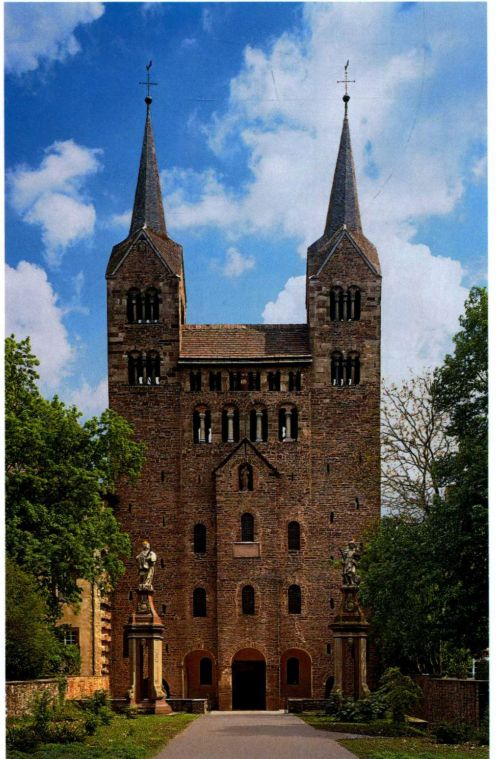

图10\.20 修院教堂西面工程。9世纪晚期，附有晚近的加建部分。

德国科维

给圣理查理乌斯。第二座教堂规模略小，位于河流南岸，敬献给圣母玛利亚。第三座，也是最小的一座教堂位于东部。修士回廊呈三角形，一道屋顶从圣理查理乌斯教堂延伸至圣母教堂，另一条从圣母教堂延伸至圣本笃教堂，第三条从圣本笃教堂延伸至圣理查理乌斯。······修道院布局依据圣本笃制定的会规，所有习艺活动与必要劳动都可以在修道院围墙内进行。河流流经修道院内部，为众兄弟推动磨坊。

SOURCE: CAECILIA DAVIS\-WEYER,EARLY MEDIEVAL ART 300\-1150\(UPPER SADDLE RIVER,NJ:PRENTICE HALL,1st Ed\.1971\)

中堂两侧建有侧堂，末端为耳堂和半圆室。事实上，查理曼大帝曾遣人到罗马绘制和测量传统的公堂式建筑，为本国建筑师提供指导。然而由立面来看，圣里基埃教堂的多塔楼结构强调垂直高度，与早期基督教公堂式教堂（如旧圣彼得教堂，见图8\.5）的纵深设计截然不同。

圣里基埃教堂的西面工程与耳堂在视觉上的重量感和教堂的东部结构形成平衡，同时也为修道院内的众多教众礼拜提供了附加空间，这个大群体包括修士三百多名，见习修士（novice）一百多名，还有大量工作人员。西面工程的入口处展示着25件与基督相关的圣物，入口上方就是敬献给基督的上层礼拜堂。每到基督教节日，特别是复活节之时，修道院众人就在此集合，开始铺陈的游行仪式。因此，西面工程在某种程度上具有独立的纪念建筑的功能，其理念与早期基督教的陵墓或殉道者教堂相同，只不过现在与公堂式教堂连为一体。

科维修院教堂 圣里基埃教堂广为其他加洛林王朝修道院所仿效，其中保存最为完好的是建于873\-885年的科维（Corvey）修院教堂（图10\.20）。除上层建于1146年前后之外，西面工程其余部分基本保持原貌。这一西面工程之所以令人印象至深不仅是因为它的高度，而且也在于它表面开阔，强调外部清晰的几何结构与有力的质量感。入口适宜帝王出入，这也是它最为重要之处。但它同时还具有功能上的优越性。楼座墙面上刻着音符，表明那里可能是男童合唱团的位置，他们的歌声不但扩散到整座教堂，还会向上方飘扬。

圣加尔修道院平面图 中世纪早期，修道院的文化重要性及其与皇廷的紧密联系在瑞士圣加尔（St\.Gall）修道院的平面图（图10\.21）中表现得非常明显。这份平面图是一幅线描，页面由五张羊皮纸缝成，现

328 詹森艺术史

存于圣加尔修道院的教士图书馆。平面图是由赖兴瑙的海托（Haito of Reichenau）院长赠予圣加尔修道院院长戈兹贝尔（Gozbert）的，帮助他重建修道院，但“仅供参考”。因此我们可以视之为模型或理想化设计，根据当地需求加以修改。

修道院整体为长方形，宽约152\.4米，长约213\.4米，是一个复杂封闭的建筑群，各个建筑依照其功能合理布局。主入口通道由修道院最西端起，由马厩与客栈之间通过，伸向大门。大门处有一座半圆形圆柱式门廊（portico），侧面是两座圆形塔楼，构成西面工程，高于低矮的外围建筑。平面图的布局强调了教堂作为修道院集聚中心的地位。教堂是传统的公堂式建筑（见图8\.4\-8\.6），东西两端各有一座半圆室。中堂与侧堂中有众多祭坛，并不形成单一的连续空间，而是由隔屏分割为若干隔间。教堂入口很多：西半圆室旁两个，其余入口在南北面。

这种布局反映出一座修院教堂的功能，它更多地

是用于修士礼拜，而不是为世俗集会服务。紧挨教堂南面有一个连拱廊围成的庭院，周围环绕着修士的宿舍（东侧）、餐厅、厨房（南侧）和地窖。教堂北面的三座大型建筑分别是客房、学校和院长宅邸。教堂东面有医院、礼拜堂、见习修士（修道院新成员）住所、墓地（标有大十字架）、花园和饲养鸡鹅的栏舍。南面则分布着作坊、谷仓和其他服务性建筑。

圣加尔修道院的平面设计以模数（module，标准单位）为基础。一个模数为6\.35厘米，平面图中从教堂的间隔到墓地的长度，无一不是模数的倍数或分割值。圣加尔修道院平面图采用模数是管理秩序与稳定的有形体现，这是查理曼大帝的愿望，也是修道院制度的目标，正如努尔西亚的本笃在《会规》（Rule）中所规定的那样。

遗憾的是稳定难久。840年，查理曼大帝之子路易一世（Louis I）刚刚去世，众皇子就开始争夺祖父建立的帝国。终于，三兄弟在843年达成协议，将帝

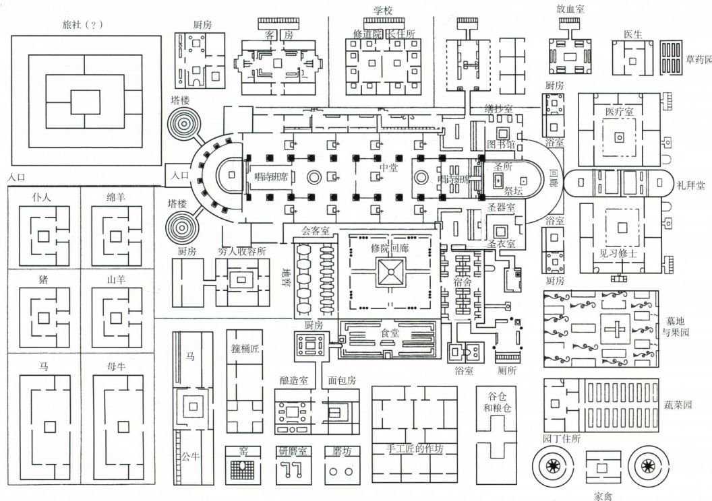

图10\.21 修道院平面图。复制画，原件绘于约820年，有根据拉丁文原文译成的英文题字。羊皮纸上红墨水画，71\.1x112\.1厘米。瑞士圣加尔市修道院图书馆

第十章 早期中世纪艺术 329

原始文献

圣安吉尔贝（St．Angilbert，约750\-814年）

出自《各种祈祷方法的惯例》（Customary for the DifferentDevotions\)

安吉尔贝是查理曼大帝的宫廷成员，781年成为圣里基埃修道院的在俗院长，并资助该修道院重建。他在文中描述了院中修士如何吟唱着本笃会《会规》所指定的祈祷圣歌在教堂中行进。

当众兄弟在耶稣基督祭坛唱响晚祷和晨祷之时，一队唱诗班应该下行至基督复活一侧，另一队则至基督升天

一侧。在那里祈祷之后，队伍应该照之前的方式行唱至圣约翰和圣马丁祭坛。再次祈祷之后，他们应该由两侧穿过教堂中央的几道拱门，至耶稣受难像前祈祷。接着应前往圣理查理乌斯祭坛。祈祷完毕，他们应该像之前一样分开，走向圣司提反（St\.Stephen）和圣劳伦斯（St\.Lawrence）祭坛，并从那里行唱至圣十字祭坛。之后，他们要再一次行进到圣莫里斯（St\.Maurice）祭坛，并沿长廊前往圣本笃教堂。

SOURCE: CAECILIA DAVIS\-WEYER,EARLY MEDIEVAL ART 300\-1150 \(UPPER SADDLE RIVER,NJ: PRENTICE HALL, 1st Ed\. 1971\)

国分为西、中、东三部分：秃头查理成为西法兰克王国国王，建立的法国加洛林王朝发展为今天的法国；日耳曼人路易（Louis the German）统治东法兰克王国，其领土范围大致是今天的德国；洛泰尔一世（LothairI）则成为神圣罗马皇帝，统治从尼德兰（Netherlands）到意大利之间的中部地区。路易的子嗣对加洛林王朝疆域的瓜分削弱了帝国，使其文化发展停滞，最终使欧洲大陆受到各方侵略，这些侵略者包括来自南方的穆斯林、来自东方的斯拉夫人（Slavs）和马扎尔人（Magyars），以及来自北方的维京人。维京人侵入法国西北部，并经由秃头查理授予的领土，占领了今天的诺曼底地区。

尽管查理曼大帝的后人最终未保政治稳固，加洛林王朝时期的艺术家却创造了持久的艺术，融合北方对外观、图案、线条等装饰的依赖和地中海地区对实体感与纪念性的关注。在此后几个世纪，当查理曼大帝建立统一稳定的欧洲这一宏愿再次出现时，加洛林艺术成为值得艺术家和赞助人竞相效仿的范本。

奥托艺术

公元911年，最后一位东法兰克王国君主辞世之时，政治权力中心已在原加洛林帝国的东部地区得以巩固，大致相当于今天的德国，由属于撒克逊后裔的日耳曼国王统治。自亨利一世（HenryI）开始，这些国王击退了入侵民族，重新建立了有效的中央政府，改善了贸易与经济状况，开启了一个全新的王朝，史称奥托王朝（Ottonian），因其三位主要统治者奥托一世（Otto I）、奥托二世和奥托三世而得名。奥托王朝由919年持续至1024年，在此期间，德国是欧

洲政治和艺术的领导者。它在这两个领域的成就始于复兴加洛林传统，但很快就发展出自己的特色。

奥托国王中最伟大的奥托一世重拾查理曼大帝的帝业雄心。951年，他娶了一位伦巴第国王的遗孀，将其统治范围拓展到今天意大利北部的大部分地区。962年，他由教皇约翰十二世（Pope John XII）加冕为皇帝，并应教皇求援攻占了罗马。这位教皇后来被皇帝以忤逆罪名废除。

建筑

奥托皇帝最为关注的事务之一就是改革腐化堕落、疏于管理的教会。他们采取的措施是与教廷建立紧密联系，推进修道院改革，通过资助兴建大批宗教建筑予以支持。大型建筑项目的复兴有效地重现了祖辈加洛林王朝的建筑雄心，同时也传达和增强了奥托皇帝恢复基督教罗马帝国荣耀的渴望。

格恩罗德圣西利雅库斯女修院教堂 保存最为完好的奥托王朝时期教堂之一是位于格恩罗德（Gernrode）的圣西利雅库斯（St\.Cyriakus）女修院教堂。这座教堂由奥托一世的边疆伯爵（军事统治者）杰罗（Gero）于961年兴建，敬献给圣西利雅库斯，以早期基督教的公堂式（见图8\.4\-8\.6）基本形式为基础，公堂式也是加洛林王朝时期建筑平面布局的主导形式（见第328页）。但圣西利雅库斯教堂在中堂连拱廊与高侧窗之间加入了一条楼廊，这是公堂式建筑中没有的结构。一系列圆柱与墩柱将它分割开来，楼廊的墩柱就在中堂连拱廊的墩柱正上方。这种方式反复强调了垂直感，有效地将建筑分割为纵向区段。

这种对垂直感的强调不同于早期基督教建筑中强烈的纵深效果，也显示出日后中世纪建筑的重要趋势。这一长廊的起源与功能设计都不清楚。某些学者

330 詹森艺术史

注意到它与拜占庭带长廊的教堂相似，例如希腊萨洛尼卡（Salonika）地区两座建于5世纪的教堂。圣西利雅库斯教堂的长廊可能曾安置有祭坛，与加洛林时期教堂西面工程的楼座一样，如科维的修院教堂（见图10\.20）。这样的长廊也可能是唱诗班站立的位置，这一点又与科维修院教堂类似（见第328页）。

希尔德斯海姆的圣米迦勒教堂 奥托王朝时期最为雄心勃勃的建筑与艺术赞助人是贝恩瓦尔德（Bernward），他担任宫廷牧师之后成为希尔德斯海姆（Hildesheim）主教。在奥托三世的母亲、皇后狄奥法诺（Theophano）摄政期间，他还是皇帝的家庭教师。这位皇后是奥托二世的妻子，自己还是拜占庭

大事年表

785年\-西班牙科尔多瓦大清真寺开始修建

约820\-832年\-《乌得勒支诗篇》制作于法国

843年\-查理曼大帝的三位皇孙三分帝国

公主。贝恩瓦尔德最主要的建筑就是位于希尔德斯海姆的圣米迦勒（St\.Michael＇s）本笃会修院教堂。该教堂的平面设计（图10\.23）借鉴森图拉的圣里基埃教堂（见图10\.19）。它的双唱诗班和侧入口布局又与圣加尔教堂平面图（见图10\.21）相似。但圣米迦勒教堂更强调对称。教堂建有两个完全相同的耳堂，耳堂与中堂交叉处各有一座塔楼，各耳堂两端建有

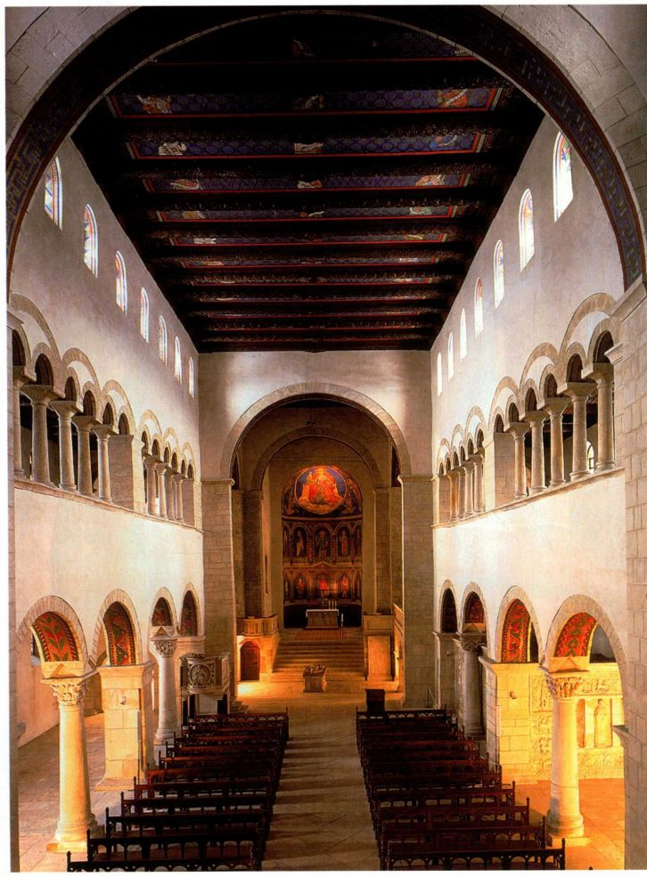

图10\.22 圣西利雅库斯教堂东面

内景。建于961年。德国格恩罗德

第十章 早期中世纪艺术 331

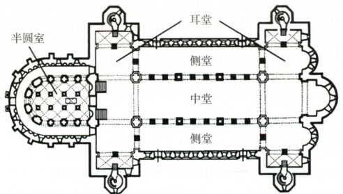

图10\.23 圣米迦勒修院教堂复原平面图。1001\-1033年。德国希尔德斯海姆。（根据 Beseler的图所绘）

一对阶梯式小角塔（图10\.24；另见图10\.23）。但是中堂连拱廊的支撑结构不统一，而是采用了两圆柱一方形墩柱依次间隔的设计（图10\.25）。这种交替结构将连拱廊分割为三个相等的单元，各都有三个开口。它们的长度与耳堂宽度相同，耳堂也同样被分为三个隔间。

因此此处与圣加尔的平面图一样，空间划分都遵

循模数系统。建筑外部可以视为连续堆砌的一系列立方体，因此也能看到模数的存在。教堂的第一和第三个单元分别与入口相对，平行于耳堂的中轴线。此外，考虑到侧堂与中堂的长度，它们都异常宽阔，因此建筑师的目的想必是要在贯穿建筑的横轴和纵轴之间建立和谐的平衡关系。

圣米迦勒教堂在第二次世界大战期间遭到严重破坏，但复原后的内部（见图10\.25）在连拱与高侧窗之间有极其宽阔的墙壁空间，保持了原设计的宏伟庄严。

（圆柱柱头雕刻于12世纪之后；彩绘木制天花板制于13世纪。）西部唱诗班席尤其引人注目。建筑师提升了这里的地面高度，因而可以容纳一个半地下的礼拜堂或称地下礼拜堂（crypt）。修士可以从西部和耳堂进入这个地下礼拜堂，这里显然是专门存放圣徒遗物的圣地。墙面上开有拱形通道，将地下礼拜堂与环绕着它的U形回廊连接。回廊外侧墙面开有窗户，因此起初人们在地面上一定可以看到它，使唱诗班席的外部层次显得更加丰富。在加洛林王朝时期，西方教堂建筑引入了这种带有回廊的地下礼拜堂，通常包含圣

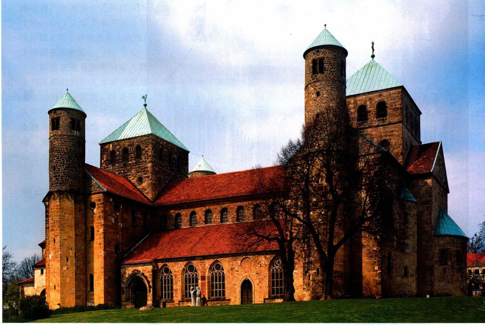

图10\.24 圣米迦勒修院教堂外景。德国希尔德斯海姆

332 詹森艺术史

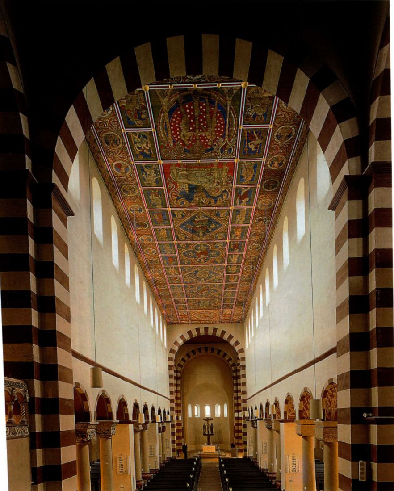

图10\.25 圣米迦勒修院教堂内景，面向半圆室（1950\-1960年修复后）。德国希尔德斯海姆

徒的墓地，在格恩罗德的圣西利雅库斯半圆室地下也建有地下礼拜堂。然而圣米迦勒教堂中的地下礼拜堂规模宏大，且巧妙地与建筑其他部分结合，其设计因而与众不同。

金属制品

奥托王朝的皇帝依赖教会权威来加强自己的统治，这促使他们不仅修建了众多新教堂，而且提供了

奢华的艺术品来装饰这些教堂。皇帝及其同辈所赞助的艺术品都非常贵重，通常由昂贵材料制成。

希尔德斯海姆的贝恩瓦尔德主教青铜门 贝恩瓦尔德为希尔德斯海姆的圣米迦勒教堂定做了一对饰满雕刻的青铜门（图10\.26、10\.27），完工于1015年，正是地下礼拜堂建成的同一年。据其传记作者、海德堡的汤格玛（Thangmar of Heidelberg）记载，贝恩瓦尔德在艺术方面造诣极高，“尤以通晓金属制品的科

第十章 早期中世纪艺术 333

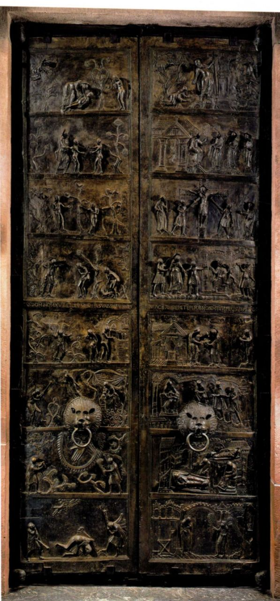

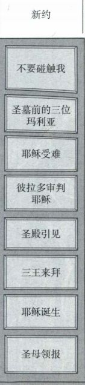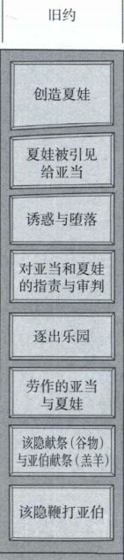

旧约

主题比较

新约

不要碰触我

创造夏娃

失去乐园，

之后重获天堂

致意

圣墓前的三位

玛利亚

夏娃被引见

给亚当

诱惑与堕落

知识之树（罪）vs\.

生命之树

（十字架、救赎）

耶稣受难

对亚当和夏娃

的指责与审判

审判

彼拉多审判

耶稣

逐出乐园

被上帝离弃

VS\.

与上帝和解

圣殿引见

劳作的亚当

与夏娃

夏娃的头子（该隐）

与玛利亚的头子（耶

稣）；贫穷vs\.财富

三王来拜

该隐献祭（谷物）

与亚伯献祭（羔羊）

亚伯献祭的羔羊

SA

耶稣，上帝的羔羊

耶稣诞生

该隐鞭打亚伯			VS\.

绝望、罪恶、谋杀

希望与永生

圣母领报

图10\.27 贝恩瓦尔德主教大门的场景示意图

学和所有建筑艺术而著称”。因此他在青铜门的制作过程中一定投入颇多心力。设计理念可能来自他的罗马之旅，在那里他或许见过古代罗马（可能也有拜占庭）的青铜门或木门。他必定也知道查理曼大帝为亚琛皇宫礼拜堂定制的青铜门。

这对希尔德斯海姆青铜门被很多学者认为是史上首件以失蜡法制作的大型雕塑（见第124页的材料与技法）。门扇为单件浇铸，高达4\.8米。它们也是早期基督教以来第一对装饰有叙事场景的大门。图示中的细节（图10\.28）表现的是上帝指责与审判亚当和夏娃的场景，因为他们偷食伊甸园中的禁果，犯了原罪（这个故事被称作诱惑与堕落）。下方显示的是嵌入铭文的一部分，标明了年代和贝恩瓦尔德的名字，使用了古典罗马字体。铭文是1035年前后添加的，当时人们将这对青铜门从圣米迦勒修道院迁到希尔德斯海姆大教堂的西面工程，在那里会有更多的人能够欣赏到它们。新址的突出位置表明这对门在当时极受重视。

这对青铜门的构图很可能出自一本彩饰手抄本，因为在中世纪《圣经》中有极其相似的场景。但青铜门并不是单纯的模仿，故事的表达极富直接性和表现

力。上帝指向罪人的手指背后衬着大片空白，是戏剧的焦点。它指向畏缩的亚当，亚当将罪责推给夏娃，而夏娃又推给脚边的蛇。

左门扇上的题材取自《旧约》，右门扇的取自《新约》（见图10\.26）。旧约故事按照时间顺序由上至下排列，新约故事则顺序相反，暗示基督教圣经所传达的信息使人升华。如按水平方向成对观看，则这些场景通过预示论系统传达罪的起源与救赎的信息，即旧约预示着新约。例如诱惑与堕落（图10\.29）与耶稣受难相对。左门扇中部有一棵树，正是它的果实引发了原罪；与之对应的右门扇中部则是耶稣被钉的十字架，中世纪的基督教徒认为它是由伊甸园中的树木制成，因此被作为原初所犯之罪的救赎工具。两个场景构图相似，强调了它们之间的预示关系：左边亚当和夏娃的手分别由两侧伸向十字架形的树木，右边则是士兵们用长矛刺入基督的身体，两者构成了视觉上的对称。

夏娃在这里的意义尤其重要。事实上，故事就开始于创造夏娃，而非人们所预想的那样是创造亚当。在诱惑与堕落场景中，夏娃的姿态和手势与右侧的蛇类似，蛇像夏娃一样也捧出一个苹果。这种呼应关系使夏娃引诱人的角色变得明显，而她手持苹果的方式也强调了这一角色。夏娃捧着苹果的手紧贴胸前，她看起来像是紧握着自己的乳房而不是苹果。借由这种姿态，夏娃在人类被逐出伊甸园中的罪责和她的性特征都得到了强调。

早期基督教作家认为夏娃应当为原罪负责，而在奥托王朝时期，对她的罪孽的指涉大大增加并且愈发激烈。这可能是贝恩瓦尔德主教等人努力改善教士道德的结果，为的是恢复神父与修士的禁欲誓约，有些神父与修士允许自己的妻儿共同生活在修道院之中。因此，教士道德败坏的责任实际上就落在了夏娃头上，她是第一个女人，也是第一个引诱者。

希尔德斯海姆的贝恩瓦尔德主教立柱 曾游览希尔德斯海姆圣米迦勒修道院或曾在其中生活的人会将贝恩瓦尔德的青铜门视作珍品，与帝国建筑相称，即使只是因为它令人回想起查理曼大帝为亚琛制作的大门和罗马的其他青铜门。贝恩瓦尔德为圣米迦勒教堂定做了一尊青铜柱，柱身以螺旋条带浮雕来表现耶稣生平，其中暗喻罗马的意图更加明显（图10\.30）。青铜柱现在在大教堂的耳堂中，形体肖似图拉真凯旋柱（见图7\.28），尽管它的尺寸只有后者的十分之一。主教贝恩瓦尔德清晰地推广着奥托王朝延续古代罗马皇帝统治的信息。

第十章 早期中世纪艺术 335

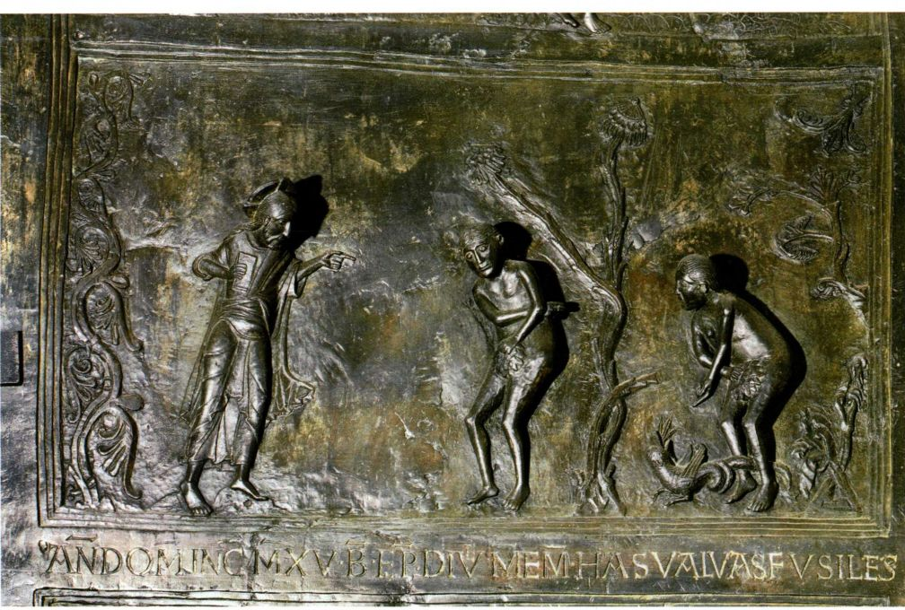

图10\.28《指责审判亚当和夏娃》（Accusation and Judgment of Adam and Ete），出自贝恩瓦尔德主教大门。青铜，约58\.3x109\.3厘米。德

国希尔德斯海姆

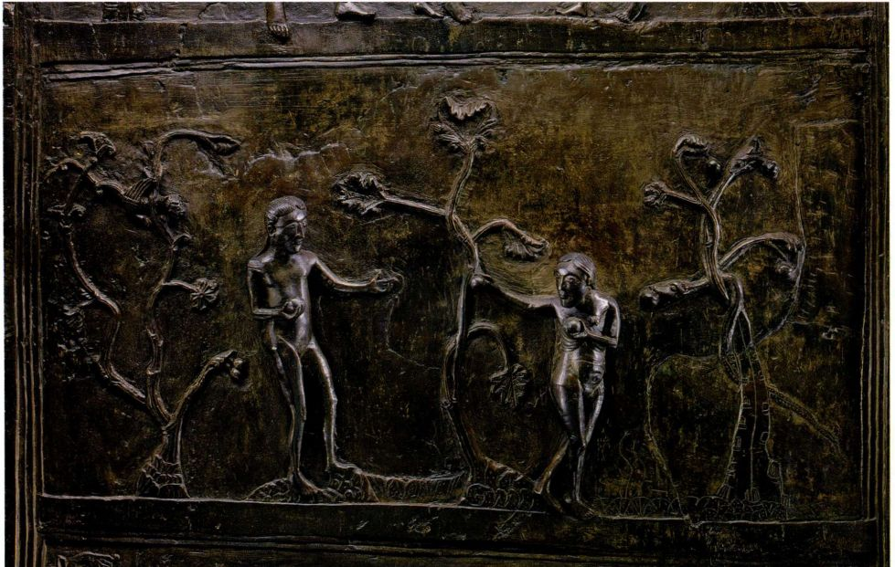

图10\.29《诱惑与堕落》（Temptation and Fall），出自贝恩瓦尔德主教大门。青铜，约58\.3 × 1 09\.3

厘米。德国希尔德斯海姆

336 詹森艺术史

帝国庄严的传达者：牙雕与手抄本

奥托王朝君主自称罗马皇帝的权威受到拜占庭统治者的挑战，即使在4世纪末之后，罗马帝国完全分裂为东西两部分，东罗马皇帝仍宣称他们才是这一称谓的所有者。当奥托二世迎娶拜占庭公主狄奥法诺之时，他才能够无所妨碍地使用神圣罗马皇帝这一称号。奥托王朝早期的绘图者为宫廷学校忠实地复制着加洛林王朝手抄本的特色，晚期的手抄本则融合了加洛林和拜占庭艺术元素，形成题材范围广、具有非凡力量的新风格，牙雕也是如此。拜占庭宫廷艺术家推动了新的宗教与帝国表现方式。奥托王朝的手抄本显示出艺术家和赞助人日益关注表现耶稣生平的叙事场面，这是该时期对圣像学（iconography）最重要的贡献。

基督赐福奥托二世与狄奥法诺 一件题为《基督赐福皇帝奥托二世与皇后狄奥法诺》（ChristBlessing Emperor Otto II and Empress Theophano）的牙雕（图10\.31）纪念两人的加冕，并表明这一事件受到神的准许。在构图与风格方面，这件作品十分接近制作于数十年前的拜占庭牙雕《基督为罗曼诺斯与尤多基亚加冕》（见图8\.42）。两者构图相同：长发蓄须的基督（依据印有十字架的光环确定其身份）位于中央高台上，为两侧的皇帝皇后施涂油礼。两件作品中帝后的服装都饰以相似的繁复几何纹样。这种相似性证明，奥托二世牙雕来自东方，牙雕上的铭文也是如此，它似乎出自希腊人之手，同时使用了希腊文和拉丁文。然而，奥托二世的服饰并非拜占庭君主加冕礼的规定着装，而且铭文也写明捐赠人（donor）是一位在意大利居住的奥托王朝主教（他蜷缩在奥托的脚凳前，手抓着基督所立脚凳的凳腿），因此这件作品更可能制作于意大利的奥托王朝辖区。不论它制作于何处，这件作品都表示，奥托宫廷不但重视外来的拜占庭器物，还输入拜占庭风格，因此在另一层次上建立起与地中海地区艺术的联系。国王再一次被表现为神圣罗马皇帝，表现为神授统治者。

《奥托三世福音书》《奥托三世福音书》（GospelBook of Otto III，图10\.32）是为奥托二世与狄奥法诺之子而作，与夫妇两人的牙雕传达出同等的帝王庄严。皇帝展示着皇权象征物品，王冠、鹰头杖与刻有十字的球体，宝座则装饰着帝国雄狮。武官与教士分立皇帝两侧，象征他在这两个领域的统治权，这让人回想起圣维塔莱教堂镶嵌画（见图8\.25）中，查士丁尼大帝的两侧也是军事与宗教人员。在对页上，帝国的四块属地斯拉夫尼亚（Slavinia）、日耳

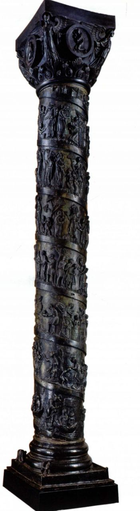

图10\.30 贝恩瓦尔德主教立柱，希尔德斯海姆大教堂（原为圣米迦勒修院教堂用）。1015\-1022年。青铜，高3\.8米。德国希尔德斯海姆

第十章 早期中世纪艺术 337

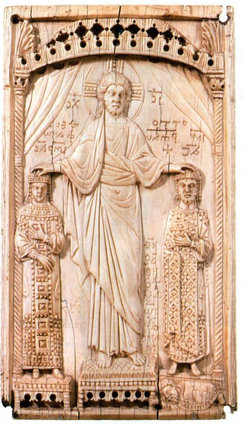

图10\.31《基督赐福皇帝奥托二世与皇后狄奥法诺》．982\-983年。

象牙，1 8 \.3 × 1 0\.3厘米。巴黎中世纪博物馆（克吕尼）

曼尼亚（Germania）、高卢（Gallia）和罗马正前来朝觐。他们的姿态使人想到东方三博士向基督敬献礼物的传统表现方法，正如拉文纳圣维塔莱教堂镶嵌画（见图8\.26）中装饰狄奥多拉长袍的场景一样。

奥托三世于986年在亚琛加冕为德意志国王，993年在罗马加冕为神圣罗马皇帝，这份手抄本制作于1000年前后，即两次加冕后不久。因此奥托三世在手抄本中的形象与历史事件相呼应，他在这里被表现为罗马与拜占庭皇帝、甚至是查理曼大帝的合法和正当的继位者，其帝王尊严又因与基督关联而得以增强。恰与早期基督教的表现方式相反，当时基督因被表现为罗马皇帝的相貌而倍显高贵。背景柔和浅淡的色调使人想起古典风景画和《奎德林堡＜圣经＞残本》（见图8\.18）。这样的风格表明艺术家很可能了解罗

马和拜占庭的表现手法。

《奥托三世福音书》中包含最丰富的一套基督生平系列插图。《耶稣为圣彼得洗脚》（Jesus Washingthe Feet of St\.Peter，图10\.33）中再一次呈现出经由拜占庭艺术而流传下来的古代绘画的强烈影响。围绕耶稣的建筑框架源自罗马壁画中的建筑透视图（见图7\.52、图7\.56），炫目的金底则效仿拜占庭绘画与镶嵌画，奥托王朝的艺术家将之挪为新用。博斯科莱尔壁画（见图7\.54）中的建筑深景在这里变成了天堂之城（Heavenly City），耶和华之殿（House of the Lord），其间满布天空的金色，与外部世俗空间形成鲜明对比。

人物形象也发生了改变。在古代艺术中，这种站立的人物将手臂伸向正在座椅上祈求的人物，周围环绕着旁观者和助手的构图被用来表现医生治疗病人的场景。此处重点由身体动作转向了精神活动。这种新的活动类型不仅经由眼神与姿态传达出来，而且也表现在尺寸方面。耶稣及其使徒彼得是画面中最具动感的形象，尺寸比其他人物大；基督的“主动”手臂长于“被动”手臂。另外八位仅仅旁观的使徒被压缩在一个狭小的空间里，与早期基督教的扇形排列（见图8\.17）相比，他们身体的物质属性不再明显。古典元素与拜占庭元素的混合造就了表现性抽象的新风格。

《奥托三世福音书》中一幅《圣路加》（St\.Luke）细密画（图10\.34）尽管尺寸微小，却象征着极富震慑力的威严。与加洛林手抄本中对《福音书》作者的表现（见图10\.12、图10\.14）不同，圣路加并没有在书写。相反，《福音书》已然完成，放在他的膝头。这位作者似乎不仅是《福音书》的展示者，而更像是这一神秘场景的一部分。他升座于两道彩虹之上，高举着一团令人敬畏的云彩，云彩向四面八方发射出光线。云团中绘有象征圣路加的公牛，身边环绕着五位《旧约》中的先知，最外圈环绕着几个天使。在画面底部，两只羔羊喝着从圣路加脚下流出的生命之泉。设计的关键在铭文中作出了说明：“公牛由父辈之源为羔羊引来水流（Fonte patrum ductas bosagnis elicit undas）。”奥托王朝的艺术家真正“图示”了这一简言片语的含意。

雕刻

大型雕塑和圆雕在中世纪早期极为罕见，一方面是因为对偶像崇拜的恐惧挥之不去，另一方面则是因为大众的兴趣在于便携式器具，大型创作几乎

338 詹森艺术史

图10\.32《奥托三世接受帝国四区朝拜》及《奥托三世在教会与政府之间》，出自《奥托三世福音书》

尺寸为33 × 23\.8厘米。慕尼黑国家图书馆

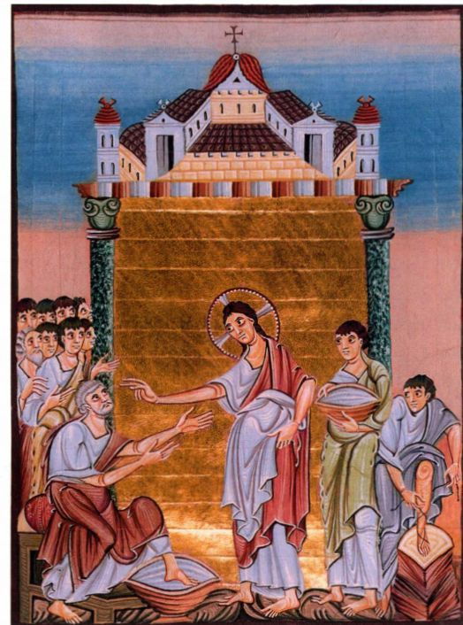

图10\.33 《耶稣为彼得施洗脚礼》，出自《奥托三世福音书》。约1000年。犊皮纸蛋彩画，对页尺寸为33 × 23 \. 8厘米。慕尼黑国家图书馆

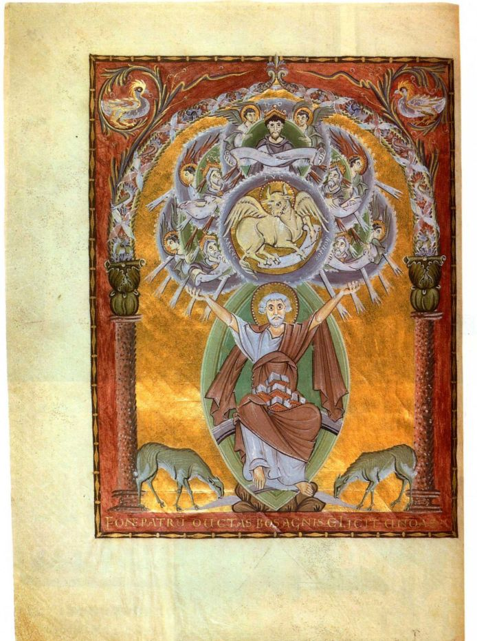

图10\.34《圣路加》，出自《奥托三世福音书》。约1000年。犊皮纸蛋彩画，对页尺寸为33 × 23\.8厘米。慕尼黑国家图书馆

被完全排除。然而，在奥托王朝统治期间，雕刻的尺寸逐渐增大，希尔德斯海姆的圣米迦勒教堂的贝恩瓦尔德青铜门就是例证，甚至许多小型作品都呈现出宏大气势。

《杰罗十字架》 《杰罗十字架》（Gero Crucifix，图10\.35）以科隆大主教杰罗（Archbishop Gero ofCologne）的名字命名，他于970年前后订制了这个十字架。它使用真人尺寸，是大型作品的实例，效果壮观，还表明奥托王朝的雕刻家即使是处理传统题材也能进行重大改革。如果将《杰罗十字架》与《林道福音书》封面上的基督（见图10\.16）进行比较，就可以清晰看出雕刻家是如何改革的。两件作品前后仅相隔100余年，却呈现出惊人的反差。《杰罗十字架》

以雕刻形式表现基督蒙难，是西方艺术中的创新之举，这一形象充满了对基督苦难的深切同情。它由彩绘贴金橡木制成，充满立体感。尤为人注意的是基督沉重的身体向前隆起，强调手臂和肩膀所承受的拉力，使得他看来在承受非人的折磨。他脸庞瘦削，刻痕很深，那是一张痛苦的面孔，生命正从中流逝。

奥托王朝的雕刻家如何形成如此大胆的构思呢？《杰罗十字架》明显受到中期拜占庭艺术的影响，后者在其他媒介中创造了倾注怜悯情感的基督受难形象（见图8\.46）。然而仅此一个来源还不足以解释奥托艺术的成果。奥托王朝的雕刻家还需要将拜占庭图像用大型雕刻表现出来，并将其中温和的哀婉转变为富于表现力的现实。即使当时有些教士重新激发对偶

340 詹森艺术史

像崇拜根深蒂固的恐惧，他们也无法阻挡新出现的对基督人性的强调以及日益增长的对圣体的关注。实际上，在《杰罗十字架》的基督头部背后留有一个空间，用来承放圣体（the Host，在弥撒［the Mass］中用作圣餐的面包或圣饼），这座雕刻于是被转变为圣物箱（reliquary，供奉圣物或圣体的容器）。

《埃森圣母像》980年，奥托一世的孙女、女修道院长马蒂尔达（Matilda）将《埃森圣母像》（Virginof Essen，图10\.36）赠予埃森大教堂。几乎可以肯定这是一件圣物箱，尽管难以最终确定，因为原有的木制内核未能保存下来，只有外部所贴的金箔存世。马

大事年表

911年\-最后一位东法兰克王国君主去世

962年\-奥托一世加冕为神圣罗马皇帝

1015年\-德国希尔德斯海姆的圣米迦勒修院教堂的贝恩瓦尔

德青铜门制作完成

图10\.35《杰罗十字架》。约970年。彩绘贴金橡木，高1\.88米。

德国科隆大教堂

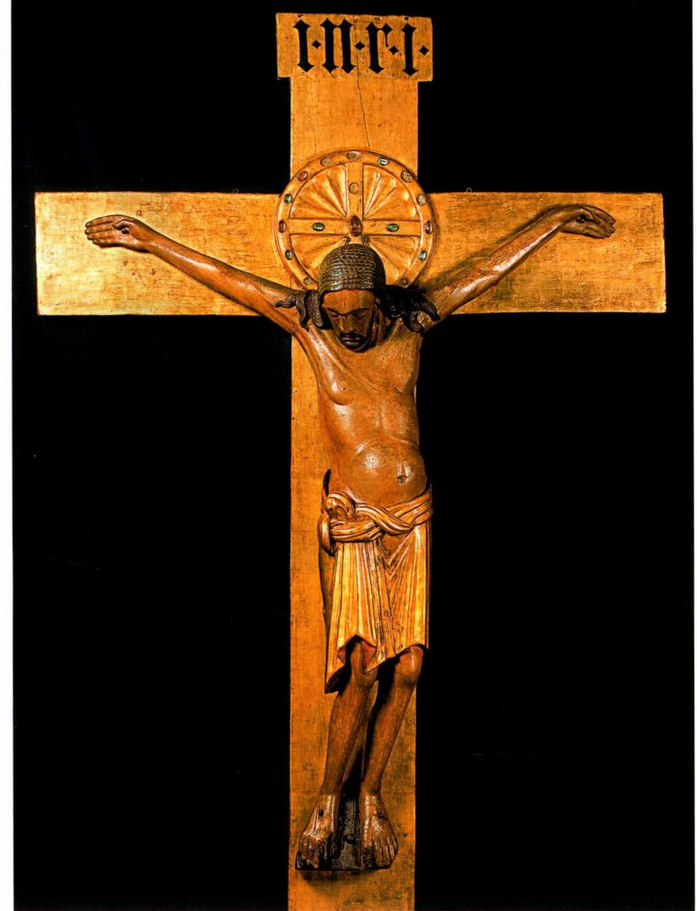

第十章 早期中世纪艺术 341

除却玛利亚与基督脆弱森圣母像》有一种居高临下亚的正面姿态，她那双凝神辉。苹果、基督书册和光轮装更增强了这种效果。衣褶等抑制，重心放在了人物躯体离了早期日耳曼艺术对线条

图10\.36《埃森圣母像》。约980年。木制包金、珐琅、金丝、宝石，

高75\.6厘米。德国埃森大教堂珍宝馆

蒂尔达还赠予埃森大教堂两三件镶嵌珠宝的黄金珐琅十字架。这些珍贵的财宝在烛光照耀的祭坛上熠熠生辉，想必十分耀眼，同时也显示这座教堂受到一位皇族成员的赞助。《埃森圣母像》是最早表现圣母玛利亚的独立雕塑之一。玛利亚手中的金苹果象征她将成为新夏娃；因此这座雕刻在观念上与贝恩瓦尔德青铜门（见图10\.26）传达的信息相关。

342 詹森艺术史

尺寸较小，高度只有75\.6厘米，但简单的形体与抽象形式使它朝着宏大性迈出了显著的一步，这也是《杰罗十字架》的特征。这些作品预示了新的美学目标，在11世纪，这些目标将支配整个欧洲的雕塑艺术。

小结

罗马覆灭之后，西欧孕育出多种文化。移民与入侵时有发生，族群之间冲突频繁又相互融合。

在这一融合体之上的是罗马文化传统，其中也包括基督教。教会逐渐成为欧洲统一的重要力量，强大的政治领袖统治着交替更迭的王朝，其中包括加洛林王朝和奥托王朝。早期中世纪文化交流产生了富有活力且丰富多彩的艺术。艺术家们创作出精美而奢华的金属制品，兴建并装点了众多教堂与修道院建筑，制作出大量装饰精美的书籍。

爱尔兰一撒克逊艺术

中世纪早期，爱尔兰修道院成为学术与艺术中心，尤为关注手抄并有彩饰的文学与宗教文本。其中最为精美的手抄本属于爱尔兰一撒克逊风格，同时还结合了基督教、凯尔特与日耳曼艺术元素，代表作品有《林迪斯法恩福音书》和《凯尔斯书》。

加洛林艺术

8世纪晚期，一个新的帝国在欧洲形成，这就是由查理曼大帝建立的加洛林王朝，它最终统一了北起北海，南抵西班牙及意大利北部的地域。加洛林时期为查理曼大帝及其继任者服务的艺术家们在对古典艺术的崇敬中融入了北部欧洲本地的艺术特征。当时高水准的作品包括青铜雕塑和带有图案花饰的书籍。建筑项目日益增多，如兴建亚琛皇宫和圣里基埃修院教堂，也反映出当时帝国的稳定与繁荣。

盎格鲁一撒克逊与维京艺术

公元4至5世纪期间，欧洲移民普遍，日耳曼民族是其中的一支，他们的艺术品都便于携带，包括金属制品和珠宝饰品。这些器物工艺精湛，往往由金银和宝石制成。这些民族的艺术传统有时被称为“动物风格”，因为其中运用了程式化的动物形态。这一传统与其他民族的艺术传统相融合，产生出独一无二的器物，例如在英格兰萨顿胡的盎格鲁一撒克逊船冢中发现的物品。

奥托艺术

最后一位加洛林君主去世后，属于撒克逊后裔的日耳曼国王在帝国东部地区巩固起自己的政治权力。这些统治者击退了入侵民族，重建了有效的中央政府，开启了新的王朝\-奥托王朝。他们的要务是改革教会。希尔德斯海姆的本笃会圣米迦勒修院教堂是此时兴建的宏伟建筑之一。奥托王朝艺术家制作的牙雕和手抄本融合了加洛林和拜占庭艺术元素，他们对大型雕刻的兴趣也日渐增长。

第十章 早期中世纪艺术 343

