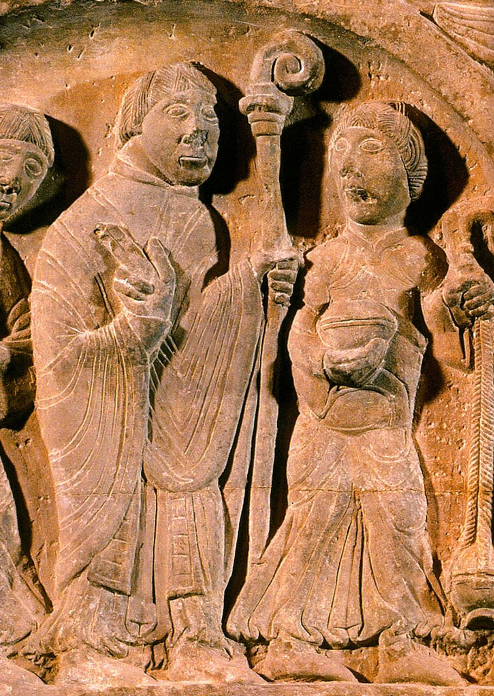

# 第十一章 罗马式艺术

罗马式（Romanesque）的字面意义是“依照罗马的样式”。现在，这一风格语汇主要用于指代11世纪与12世纪的艺术风格。对古典艺术中细节与特征的借鉴并不能将罗马式艺术与古典时期之后其他的艺术区分开来，因为早期基督教、拜占庭、加洛林与伊斯兰艺术在形式和表达语汇方面同样从

罗马艺术中借鉴了许多东西。然而，在罗马式艺术中，罗马原型的美学完整性和宏大性，

获得了比之前任何一个时代都更为生动且引人注目的保留。即使在罗马帝国经历了古典末期与中世纪早期的动乱、沉沦之后，驻留在其不朽建筑中的力量与荣耀仍然是动人心魄的典范。但是，罗马艺术并非这个时代艺术灵感的唯一来源：罗马式时期的艺术家们从加洛林与奥托艺术中汲取滋养，同时还受到来自早期基督教、拜占庭、凯尔特一日耳曼（Celtic\-Germanic）与伊斯兰艺术传统的影响。

与主要回应宫廷文化与活动的加洛林与奥托艺术相反，罗马式艺术几乎在同一时期兴起，并在西欧地区广为流行，甚至产生了各种各样的地方风格，不过它们之间并没有紧密的联系。将这诸多变体融合为统一风格的力量并非唯一，而是若干因素共同作用的结果。

首先，基督教即将遍及整个欧洲。9、10世纪期间，维京人的掠夺使英伦诸岛和欧洲大陆人心惶惶，而这些海盗当时仍然主要信奉异教神。后来，不论诺曼底（Normandy）还是斯堪的纳维亚，维京人最终还是投

入了基督教的怀抱。1031年，科尔多瓦哈里发分裂为众多穆斯林小城邦，这也使基督教吸纳伊比利亚半岛成为可能。

另一个因素则是人们宗教热情的日益高涨。千禧年（1000年）已经到来，然而圣经《启示录》中的末日预言并没有发生。写于耶稣升天约50年之后的《新约·启示录》在其中第20章预言了基督再临（SecondComing）。正如我们知道的，基督将在千年之后再次降临人世，并终结这一世界。学者们认为，当时许多畏惧末日的人们对千年的临近心怀恐慌，随后又因平静度过而如释重负。在某些地区，人们的精神甚至得到了升华。这一点通过大量前往神圣之地的朝圣人群就可以看出，同时还表现为多次攻打圣地穆斯林的十字军东征以及修道院数量与规模的增长，这些同时又反映了当时大范围的人口增长与经济繁荣。

同等重要的因素还有威尼斯、热那亚（Genoa）、阿马尔菲、比萨和里米尼（Rimini）等地船队所再次开启的地中海贸易航线（见地图11\.1）。贸易与旅行的复苏在商业与文化层次上将欧洲各地联系在一起，并且刺激了城市生活的发展。在当时的朝圣指南中，

图11\.20《唐纳·桑查石棺》细部

🔴第十一章 罗马式艺术 345

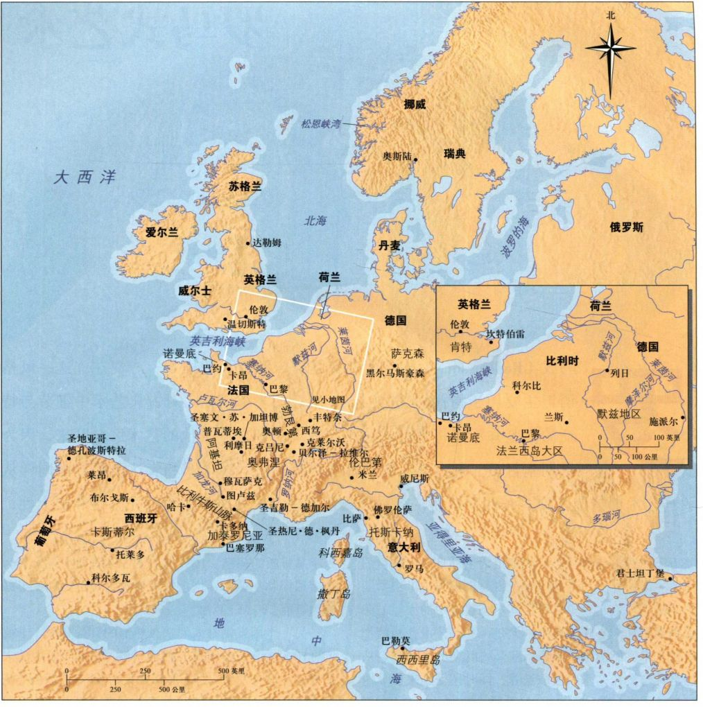

地图11\.1 罗马式时期的欧洲

对于宗教与世俗生活中的新步调进行了生动描述。

中世纪早期行将结束之时，欧洲的主要地区仍停留在农业社会。今天被称为封建制的割据政治与社会体系主要在法德地区发展起来，这种制度在以上两地具有深厚的历史基础。在封建体系中，拥有土地的领主将自己的若干土地授予骑士（他们最初为骑兵团军官），这样的小块土地则称为封地（fief），或采邑（feud）。作为回报，骑士为领主提供军事和其他服务。骑士与领主之间具有复杂的个人盟约关系，这种称为效忠（vassalage）的联系从下至上普遍存在，甚至一直延伸到国王。由大批的农民组成的农奴（serf）

阶层实质上毫无权利、饱受欺压，是土地真正的耕种者。市镇的规模在中世纪早期的移民与入侵中缩小，以罗马为例，公元300年时人口约为100万，但此时还不足5万。有些小城市甚至已经荒无人烟。现在这些市镇开始逐渐恢复之前的规模。新市镇如雨后春笋般在各地出现，通过与封建领主缔结盟约的方式获得了独立权；盟约文书中列举了包括一个城镇要获得领主的保护所需让出的特权与豁免权。

诸如改良的磨坊与便于深耕的铁犁等农业技术的进步也使得这些社会变革成为可能。自罗马覆灭以来，食物产量首次超出了农民们自身所需的口粮数

🟩346 詹森艺术史

量。于是在很多方面，1050至1200年间的西欧比起6世纪以来的状况更为“罗马化”（Roman\-esque）；在贸易模式、城市品质和军事力量方面都几乎达到了帝国时期的水平。当然了，当时欧洲还没有形成政治上的中央集权制度，各地的割据小国家仍由强大的家族进行统治。即便是法国国王，他所管辖的区域也不过仅限于巴黎周边地区。然而，某些修道院开始触碰国王们的权力与财富，而教皇作为精神王国的唯一权威则承担起统一欧洲的使命。1095年，教皇乌尔班二世（Urban II）发起了第一次十字军东征（FirstCrusade），以求解放穆斯林统治下的圣地耶路撒冷，并帮助拜占庭皇帝对抗日益逼近的土耳其人。十字军庞大的人数远远超过一个世俗统治者为同等目标所能召集的士兵数量。

第一次十字军东征开始之后三年，就完成了攻占耶路撒冷的目标，但其后的几次十字军东征都损失惨重。土耳其人占领埃德萨（Edessa）之后，克莱尔沃的圣贝尔纳（St\.Bernard of Clairvaux）所发起的第二次东征（1147\-1149年）仅仅占领了阿拉伯人控制之下的里斯本（Lisbon），而始于1189年的第三次东征最终也未能将耶路撒冷从两年前占据那里的苏丹萨拉丁手中夺回。第四次，也是最后一次大规模的东征行动，几乎未能阻挡伊斯兰的扩张，其唯一成果就是于1204年占领了君士坦丁堡。

这段简短的历史背景介绍概述了促成欧洲稳定的一系列机构体制。修道院制度、封建制度、城市化、商业、朝圣、十字军东征、教皇制度和宫廷都在国际化过程中发挥了自身的作用，同样影响了艺术形式的转变。人口增长与新市镇的出现则刺激了建筑活动，其中大部分都是基督教建筑。石锯等改良工具的发展大大改进了石工技巧。很多新建筑都采用切割准确、平直方正的石方，不仅宏大、坚固，在规模上也可与罗马建筑的成就相比。厚重的墙壁成就了坚实持久的建筑，成功传达出封闭与安全之感，覆盖在建筑之上的石砌拱顶同样增强了其稳固的感觉。这些拱顶与建筑雕刻的流行是对罗马建筑与设计的刻意模仿。收藏有圣物及其他装饰品（包括彩饰手抄本）的美丽教堂与修道院满足了本地居民与朝圣者们的要求。

罗马式风格的首次登场

虽然罗马式风格短时间内就传遍欧洲，但其最初出现于从意大利伦巴第经法国南部直至西班牙北部加泰罗尼亚（Catalonia）一带。即使今天，这个地区仍

然保留了大量具有墙面连拱（wall arcades）和建筑雕刻等罗马式早期阶段典型特征的石拱建筑。

建筑

罗马式艺术最显著的功效就是使得建筑活动产生了惊人增长。11世纪的修士拉乌尔·格拉伯（RaoulGlaber）的记述就表达了这一时期对建筑的狂热：

······此时在世界各地，特别是意大利和高卢，兴起了重建教堂的热潮······每一个基督徒都竭尽全力，为的就是让自己的教堂更为华丽。此景有如大地抖落其古老外壳，换上了一件教堂的白色外衣。

E\.G\. Holt, A Documentary History of Art\.Vol\.1,1957,p\.18\.

这些教堂不仅在数量上远超基督教早期，而且规模也更为庞大、装饰更加丰富，同时还更像“罗马样式”（Roman\-looking）。其中堂覆盖有石砌拱顶，而非木制天花板；内部既有建筑装饰，也有建筑雕刻。最为重要的罗马式建筑分布在天主教世界代表性最强的地区：自西向东从西班牙北部直至莱茵兰（Rhineland），自北向南从苏格兰、英格兰的边界延伸到意大利中部。

卡多那的圣文森特教堂 圣文森特（SantVincenç）教务会教堂（图11\.1）是罗马式建筑早期阶段的杰出范例，其修建于加泰罗尼亚地区比利牛斯山脉南麓的卡多那（Cardona）城堡围墙之内，从1029年开始修建，并于1040年进行祝圣仪式。这座教堂的平面结构和立面结构都拥有简洁明了的风格。拥有筒形拱顶的中堂所创造出的连续空间被横切拱分割为各个空间单元，后者称为开间（bay）。高坛（chancel）前面的开间覆盖有穹顶，此处是容纳祭坛、教士与唱诗班席位的部分，即教堂的仪礼中心。这一开间墙壁上的盲龛造就了一定的韵律变化，又由中堂处复合墩柱（compound piers）的交错结构而加强；这些墩柱的四面附有长方形突出结构，是坚固的石砌支撑柱。柱身的突出部分表明此处结合了支撑建筑的不同结构元素，其中一条直升到中堂顶部以承载横切拱，另一条则延伸至侧堂，形成了一条跨越侧堂的拱。另外两条负责连接中堂连拱廊的拱。

圣文森特教堂中，墩柱与拱顶在立面上的整合无疑来自早期基督教建筑对统一立面的要求，亚琛的加洛林宫殿礼拜堂（见图10\.17）与格恩罗德的奥托王朝教堂（见图10\.22）也是如此。然而，后者的墙

🔴第十一章 罗马式艺术 347

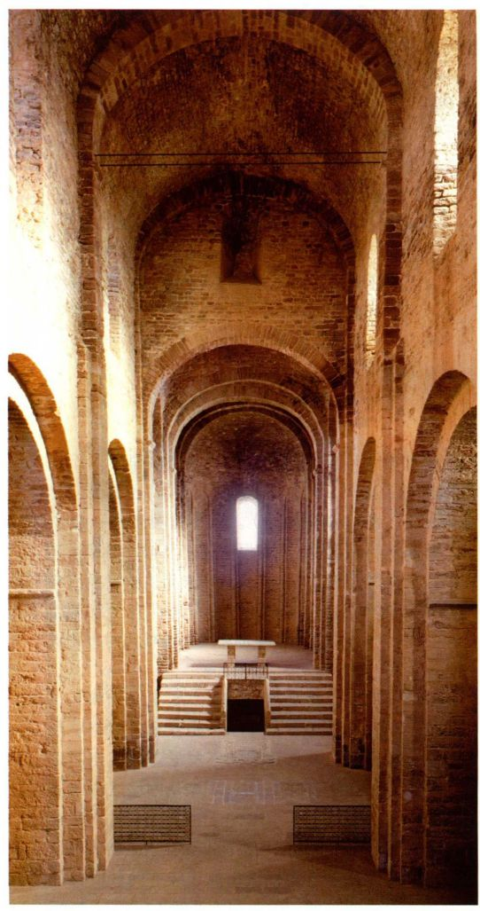

图11\.1 圣文森特教堂中堂与祭坛，东向观。约	1029\-1040年。西班牙卡多那

面较之圣文森特教堂的棱角墙面稍显平板单调，而圣文森特教堂在结构上的清晰性赋予建筑一种显著的和谐、统一之感。实际上，复合墩柱是罗马式时期重要的建筑创新。有限的光照与粗壮的石砌结构使得建筑内部既隐秘安全，又易于触发灵感。各种形式极为简单，却异常有力，全部经过精心的安排，呈现质朴的面貌。

大型石雕

罗马式时期，与其建筑成就同等重要的还有大型

石雕的复兴。圆雕自5世纪以来在西欧几乎绝迹，仅有石板浮雕中作为建筑装饰或平面装饰的部分得以留存，而三维雕塑则极为罕见。因此，中世纪早期唯一保持下来的雕塑传统只有小型雕塑，即小型浮雕或偶然出现的金属或象牙雕像。经由贝恩瓦尔德主教的青铜门，奥托艺术拓展了这一传统并不深厚的领域，但是并没有改变其精神主旨。此外，真正大型雕刻的成就几乎都只局限在木雕领域，《杰罗十字架》（见图10\.35）就是如此。

圣热尼·德·枫丹教堂的门楣 位于比利牛斯山脉北侧法国境内的圣热尼·德·枫丹教堂（Saint\-Genis\-des\-Fontaines）保存有一条大理石门楣（图11\.2）；根据铭文，其雕刻年代大约在1020至1021年之间。这条门楣位于教堂门口之上，是罗马式时期人物雕刻的最早例证之一。铭文中提到了该时期两个制衡体制的领袖：国王罗贝尔（King Robert［RotbertoRege］）和修道院长威廉（Willelmus Aba［Abbot William］），前者是封建领主，后者则是修道院的领导者。门楣的核心题材是庄严基督像（Christ inMajesty），他由两位天使托举起来，身侧还有六位使徒。每位使徒都手持书册，站立在拱形建筑之下。基督的光轮由两个相交的圆环构成，一个象征尘世，另一个则象征天国，皆为基督所掌管的国度。

这一门楣的尺寸较小，仅有61厘米宽，213厘米长。其中采用了线条来刻画面部特征、衣褶和装饰纹样，这显然是受到中世纪早期手抄本彩饰的影响，其根源则可以追溯到爱尔兰一撒克逊时期（见图10\.7）。平面雕刻技法与器具艺术相似，特别是象牙雕刻和金属制品。这一点可以通过对比金属制品技法（见图10\.1）中的某些图案得到确认，例如围绕着拱的圆珠图案。两者之间的联系可以解释为什么石刻几乎被遗忘了几个世纪之后，雕刻家还能从中寻求灵感来源。

尽管门楣中人物的发式、面部表情与身体姿态各不相同，但他们无疑出自相同的模式。每个人物都符合周围的形式框架，很难判断人物究竟是受框架统领，还是拱顶根据人物形状而弯曲。此处，框架与人物之间的均衡并行于建筑与装饰之间的和谐制衡关系，这也正是早期罗马式建筑的典型特征，此处卡多那的圣文森特教堂就是如此。

成熟期的罗马式艺术

罗马式早期的试验集中在依赖石工与雕刻工技术

🟩348 詹森艺术史

的厚重建筑方面，由此逐渐产生了运用更多雕刻部件和日益精湛拱券技术的建筑。雕刻装饰被纳入复杂而富于宣教目的的圣像系统。这个时代的建筑与雕刻继续传达出与庇护和性灵有关的信息，并运用当时手抄本和金属制品中同样出现的一致的美学方法。随着罗马式艺术的发展，其最终遍及欧洲，成为一种泛欧洲艺术。

朝圣教堂及其艺术

11、12世纪期间，欧洲最为重要的社会现象之一就是各阶层大为增长的旅行能力。有些行程是贸易拓展的结果，另外一些在表面上则是出于宗教目的，例如十字军东征和朝圣之旅。个人朝圣者出于不同的目的前往圣地，但其中大多数人都希望在旅途中找到奇迹，或者得到赦免。朝圣并非罗马式时期的发明，早在4世纪晚期，西班牙女朝圣者埃吉里娅（Egeria）就曾前往耶路撒冷，参观了基督当初生活过的中心地区并将其记录下来，其中包括圣墓教堂（见图8\.9）。奇异而不可思议的力量常常与这些圣所联系在一起，并附着于圣物（relics），即圣徒的部分身体或者曾接触过基督、他最亲近的门徒（见第二部分末尾的附加原始文献）、乃至其他圣徒，特别是圣母玛利亚的器物。

中世纪时，前往耶路撒冷的旅程颇为艰难，在某

大事年表

1020／21年\-法国圣热尼·德·枫丹教堂的大理石门楣

约1026年\-修建开罗阿克马尔清真寺

1031年\-科尔多瓦哈里发分裂

1040年\-西班牙卡多那市圣文森特教堂祝圣

种程度上是由于穆斯林控制这些地区。一方面，这种情形激发了东征热情，另一方面也使得信徒们热衷前往欧洲境内请取重要圣物、或瞻仰曾经发生过特殊事件的其他神圣之地。罗马尤其受到信徒仰慕，而这主要应该归功于圣彼得与圣保罗两人头上的神圣光环；这两位圣徒都曾生活并于此地安葬（见第242页）。伊比利亚半岛上的圣地亚哥\-德孔波斯特拉（Santiagode Compostela）也是相同的情况。文化人类学者曾试图解释，朝圣对中世纪人、乃至对当代人而言那种难以置信的普遍性和重要性；他们声称当朝圣者启程之际，就进入了一个特殊的过渡地带，在那里社会准则与等级都为某种集体经验意识取代。这就创造出一个暂时的社群环境，不同背景与社会阶层的人们在其中可以平等交流。在社会动荡平息之后，向往脱离日常焦虑的要求并不难理解。朝圣者参访、经历的胜迹与器物则日益滋养着他们之间休戚与共的感情。

原始文献

出自《圣地亚哥\-德孔波斯特拉朝圣指南》

这本成书于12世纪中期的《朝圣指南》生动记述了通向圣地亚哥\-德孔波斯特拉使徒雅各陵墓的道路状况（见地图11\.2）和朝圣者沿途会遭遇的情形。同时还提供了关于大教堂圣陵修建者的重要信息。

通向圣地亚哥的道路有四条，并于西班牙境内的蓬特\-拉莱纳（Puente la Reina）合而为一。一条穿过圣吉勒（见图11\.32）、蒙彼利埃（Montpellier）、图卢兹（见图11\.6\-11\.9）与松波尔特（Somport）关卡；另一条穿过勒皮伊圣母院、孔克的圣弗依教堂和穆瓦萨克的圣皮埃尔教堂（见图11\.13、图11\.14）；第三条穿过维策莱的圣马德莱娜教堂（Saint\-Marie\-Madeleine）教堂、利穆赞（Limousin）地区的圣莱奥纳尔（Saint\-Léonard）教堂与佩利格（Périgueux）市；最后一条穿过图尔的圣马丁教堂、普瓦蒂埃的圣伊莱尔（Saint\-Hilaire）教堂、圣让\-当热教堂（Saint\-Jean\-d＇	Angély\)、桑特（Saintes）的圣特投普（Saint\-Eutrope）教堂和波尔多（Bordeaux）市······

之后还要穿越波尔德莱的朗德（Landes of the Bordelais），但已经旅途劳累的朝圣者还有三日的路程。

此处村庄稀少，是一片缺乏任何给养的荒凉之地，找不到面包、葡萄酒、肉、鱼、水或泉眼。平坦的沙地到处都是蜂蜜、谷子、短叶黍（糜子）和野猪。如果你偶然在夏季穿越此地，小心保护自己的面孔，以防苍蝇的攻击，因为这里苍蝇极多，在俗语中被称作“黄蜂”或“马蝇”；而如果脚下稍不留神，你很快就会被无边的海沙淹没至膝盖。

穿过这片地区就来到了盛产白面包和优质红葡萄酒的加斯科尼（Gascon）地区······加斯科尼人巧言令色、喋喋不休、惯于嘲讽、耽于酒色、饮食无度······然而他们却是训练有素

圣地亚哥\-德孔波斯特拉 圣雅各（St\.James）葬于西班牙西北部的城市圣地亚哥\-德孔波斯特拉，这里是基督教世界的最西端。传统上认为，使徒雅各（西班牙语为Santiago）曾在伊比利亚半岛宣讲基督教教义，而在其死后又戏剧性地回到了这里。关于这座坟墓神奇力量的传说吸引了大批欧洲各地的朝圣者来到此处。很多人都必须勇于忍受艰难的海上航行，或者千辛万苦地翻越比利牛斯山脉才能抵达圣地亚哥\-德孔波斯特拉的圣徒之墓（见本页的原始文献）。12世纪中的一段时间，数以万计的朝圣者完成了这样的旅程，而旅途中的艰辛又增强了此地的吸引力。由于西班牙的大部分地区处于穆斯林控制之下，朝圣者们将圣地亚哥\-德孔波斯特拉之旅等同为圣地之旅，因为后者也同样为穆斯林所占据。

圣地亚哥\-德孔波斯特拉大教堂为那些到达此处的勇敢、幸运者们展示了颇为丰富的内容。教堂平面

的斗士，对待穷人大度、热情······

他们不习惯在餐桌上就餐，而且一般众人共用一个酒杯。事实上，他们饮食丰厚，衣着却相当寒酸，佣人和男女主人都可怜地睡在一张窄小恶臭的稻草铺上。

离开这个地区······通往圣雅各之路还有两条河流······没有木筏就无法渡河。愿这些摆渡船夫遭到天谴！······不论贫穷还是富有，每位想要渡河的旅人都必须缴纳一枚硬币，至于马匹，他们无耻地强行勒索每匹马4枚硬币的摆渡费······一旦上船，大家必须极其注意，以免失足落入水中······

很多时候，船夫收取摆渡费之后，因为登船的朝圣者人数太多，船只很容易倾覆，导致朝圣者溺死。船夫占有了死者的遗物，邪恶的心中充满欢喜。

（圣雅各）教堂的石工及其工作的开始与完成

最早承建这座由天国雅各所庇护的大教堂的石工共计约50余人，其中包括技艺高明的天才匠人老贝尔纳（Bernardthe elder）师傅以及罗伯特等人。他们在西班牙国王阿方索（Alphonso）统治时期、在骁勇战士和慷慨之人唐·迭戈一世（Don Diego I）担任主教期间，通过唐·塞格雷多（DonSegeredo）教会的负责人唐·维卡特（Don Wicart）和修道院院长唐·贡德辛多（Don Gundesindo）最为可靠的管理勤勉地工作。

教堂始建于本纪元1116年······从这一年奠下第一块基石直到最后一块石方安放完毕，一共经历了44年光阴。

SOURCE:THE PILGRIM'S GUIDE TOSANTIAGO DE COMPOSTELA, ED\.AND TR\. WILLIAM MELCZER \(NY:ITHACA PRESS,1933\)

图（图11\.3）中的侧堂环绕着教堂，并在半圆室周围形成了回廊，参观者可以在其中巡行，即使当中堂和十字交叉处正在举行宗教仪式时也不会受到影响。次半圆室（apsidiole）或类似半圆室的小礼拜堂则沿耳堂的东壁和半圆室外侧依次排开，为朝圣者想要敬拜的圣物提供了足够的展示空间。当朝圣者从西入口处进入中堂，穿行于建筑之中时，他们可以有意识地朝向教堂东部的半圆室、祭坛和圣物箱行进。

于是，大教堂中的行进路线就成为了朝圣者户外长途跋涉的缩影，当然人们也可以直接将教堂本身称为朝圣式布局（pilgrimage plan）教堂。虽然并非全部朝圣式教堂都具有这样的平面布局，但是在通向圣地亚哥\-德孔波斯特拉的道路之上，兴建了一批规模各异、细节有别的著名教堂，其平面形制与圣地亚哥\-德孔波斯特拉大教堂完全相同。在穿过法国的四条主要朝圣路线上，建有四座采用朝圣式布局的重要

🟩350 詹森艺术史

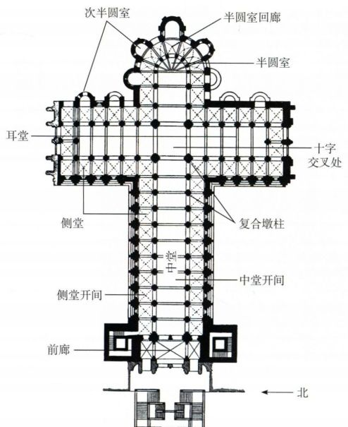

图11\.3 西班牙圣地亚哥\-德孔波斯特拉大教堂平面图（根据Dehio的图绘制）

教堂，分别是：图尔的圣马丁教堂（Saint\-Martin at

Tours，位于始自巴黎的朝圣路线上）、利摩日的圣

马夏尔教堂（Saint\-Martial at Limoges，位于始自维

策莱      的朝圣路线上）、孔克的圣弗依教

堂（Sainte\-Foy at Conques，位于始自勒皮伊的朝圣

路线上）和图卢兹的圣塞尔南教堂（Saint\-Sernin at

Toulouse，位于始自圣吉勒\-德加尔

\[Saint\-Gilles\-

的朝圣路线上）。（见地图11\.2。）

圣地亚哥\-德孔波斯特拉大教堂的平面结构（见图11\.3）由多重模块单元组成，令人回想起中世纪早期的模块累积建筑布局系统（见第329\-332页）。中堂开间和耳堂的面积是十字交叉处正方形面积的一半，侧堂正方形开间的面积则是其四分之一，即中堂开间的二分之一。建筑的立面（图11\.4）折射出平面结构的清晰简明。同卡多那的圣文森特教堂（见图11\.1）一样，复合墩柱所附的四根小型圆柱也体现了建筑的结构成分。然而，圣地亚哥\-德孔波斯特拉大教堂中堂的墙壁面积较小，而且小型附壁圆柱（colonnette）也丰富了复合墩柱的结构。

为了避免减弱筒拱的坚固性，圣地亚哥\-德孔波斯特拉大教堂筒拱的起拱点位置并没有开设高侧窗，而此处正需要最大程度的支撑。散漫的光线微弱朦

胧，从侧堂和高处的楼廊透入中堂。有关楼廊的功能

引起了很大争议。可以想见，其为前来参观的大批朝

圣者提供了空间，特别是在节日期间。而事实上，作

于1130年的著名《朝圣指南》       曾

提及此处楼廊里的祭坛。但是楼廊使得建筑内部结构

优雅精致，正如《朝圣指南》中所明确表述的：

这座教堂实在没有任何缺点或瑕疵，其建构令人惊叹，宏伟宽敞、明亮且规模有度，长宽高比例和谐，建筑工艺令人钦佩至极。两层的教堂，宛若皇家宫殿。毫无疑问，无论何人前来参观楼廊，即便上楼时满心忧伤，眼见过这座圣殿的无瑕之美之后，也必定会幸福欣喜。

Paula Gerson,Annie Shaver Crandell,Alison Stoves and Jeanne Krochalis,Pilgrim's Guide to Santiago de Compostela:A Critical Edition,

II,London,1998,pp\.69\-71\.

《朝圣指南》中所描述的情感与精神反应的综合体来自于罗马式建筑者融合建筑与美学的能力。在这

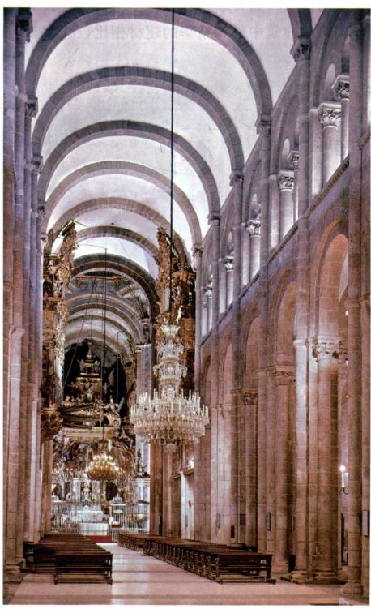

图11\.4 西班牙圣地亚哥\-德孔波斯特拉大教堂中堂。约1075\-

1120年

🔴第十一章 罗马式艺术 351

图11\.5 装饰有《四福音书》作者象征形象的圣物箱。

约1150年。镀铜底镂刻珐琅镶嵌，1 2\.4 × 18 \.9 × 8\.5厘米。纽约大都会艺术博物馆，J\.Pierpont Morgan于

1917年捐赠（17\.190\.685\-687,695,710\-711）

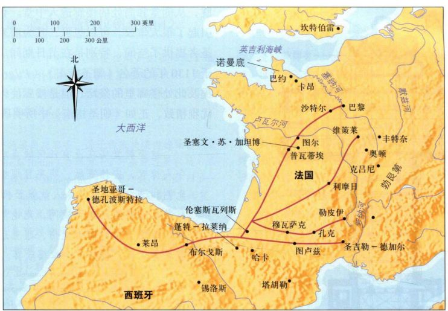

地图11\.2 通向圣地亚哥\-德孔波斯特拉的朝圣路线

本书的另一章节之中，作者满怀崇敬地记录了石工的相关品质\-“如大理石般坚固”。通过将教堂所用石材同古典建筑中最为精华的建材相比较，作者清晰表达出至今也会加以赞赏的事实：无论在细节还是施工方面，圣地亚哥\-德孔波斯特拉大教堂都十分成功地模仿了罗马建筑的高贵、庄严。

圣物箱 在朝圣者前往圣地亚哥\-德孔波斯特拉和罗马途中，下图中的12世纪骨灰盒（图11\.5）是装饰圣物箱的典型样式，现藏于纽约大都会艺术博物

馆。这个圣物箱可能是出产于利摩日，这里是通向圣地亚哥\-德孔波斯特拉的重要驿站，也是珐琅器的制作中心，当地建有一座大型的朝圣式布局教堂。这件作品所用的材料以及枝蔓与《福音书》作者的象征所用的大胆平涂的色彩都将其与移民艺术传统、中世纪早期的金属制品（见图10\.3）联系在一起。其所采用的镂刻镶嵌（champlevé）技术源自掐丝工艺（见第313页）。掐丝工艺将金属丝粘合在器物表面以形成小单元，镂刻镶嵌则在金属表面凿刻出凹入隔间以装

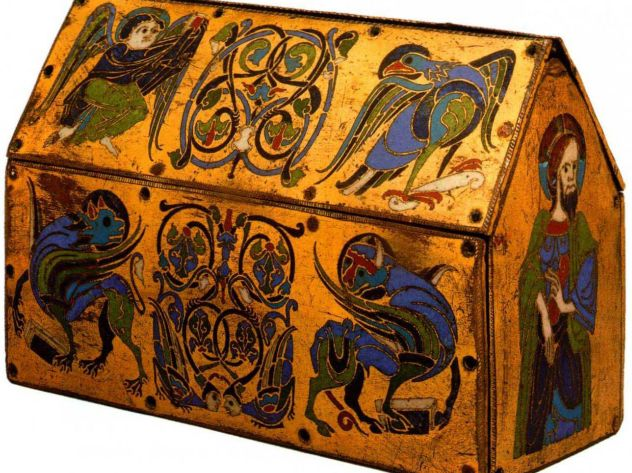

🟩352 詹森艺术史

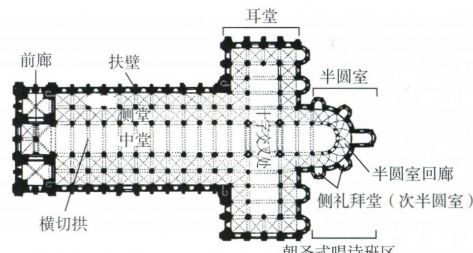

朝圣式唱诗班区

图11\.6 圣塞尔南教堂平面图（根据Conant的图绘制），

图卢兹。约1070\-1120年

设彩色珐琅。这件圣物箱使用了昂贵的镀铜珐琅材料，而且装饰奢华，与其内容物的特殊神圣性相得益彰。据说其中收藏有圣马夏尔的遗物，盒子另一侧的铭文也证实了这一点，而这件圣物箱正出自距利摩日90余公里处的尚巴纳（Champagnat），那里也有一座为了纪念这位圣徒而建的教堂。

图卢兹的圣塞尔南教堂 图卢兹位于法国西南部，是朝圣路途必经之地。此处圣塞尔南教堂的平面结构（图11\.6）几乎与圣地亚哥\-德孔波斯特拉大教堂的平面（见图11\.3）如出一辙，只不过前者的中堂两侧建有双侧堂。这一布局还令人回想起旧圣彼得教堂（见图8\.4）。很有可能建筑师在设计圣塞尔南教堂时，脑海中所浮现的就是罗马的长方形公堂。

在圣塞尔南教堂外部（图11\.7），错落有致的屋顶高度大幅加强了各个部分之间的关系，并将中堂与耳堂同内外两道侧堂、半圆室、回廊及其辐射式礼拜堂（radiating chapels）区分开来。这一效果由于扶壁而凸现，扶壁加固了窗户之间的墙体，使其可以承受拱顶向外的推力，而其形成的装饰性骨架又强调了窗户的结构。十字交叉处的塔楼完工于几个世纪之后，属于另一风格，而且比原初设计更佳。遗憾的是正面两座塔楼一直未能完工，只留有基座，在图11\.7中无法看到。

在中堂内部（图11\.8），拱顶、连拱、附墙圆柱和半露方柱紧密地结合成为一体，遵循了一贯的规则，对古代罗马建筑语汇和构造的运用则达到了非同寻常的程度。然而圣塞尔南教堂的中堂不再着重表达希腊罗马建筑中强健的物质力度。附墙圆柱仿佛受到某种巨大无形的力量挤压，迫不及待地向上升起，与分割中堂筒拱的横切拱交汇在一起。这种效果的成功再次要归功于美学与工程学两者紧密结合。

圣塞尔南教堂无疑需要详细、系统的设计图作为

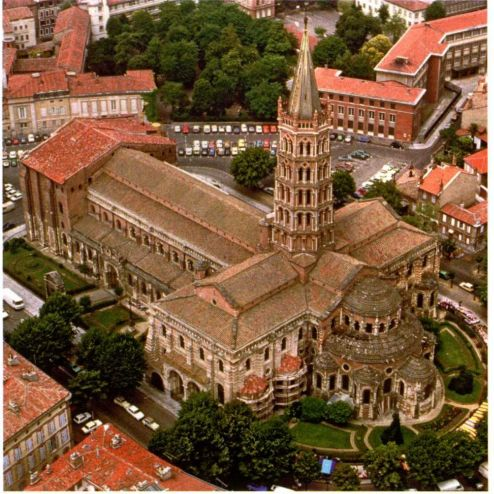

图11\.7 圣塞尔南教堂鸟瞰图，图卢兹

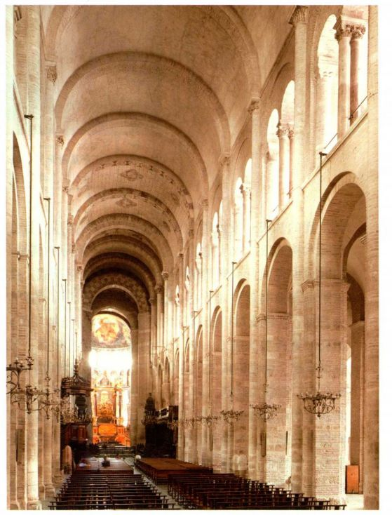

图11\.8 圣塞尔南教堂中堂与朝圣式唱诗班区，图卢兹

🔴第十一章 罗马式艺术 353

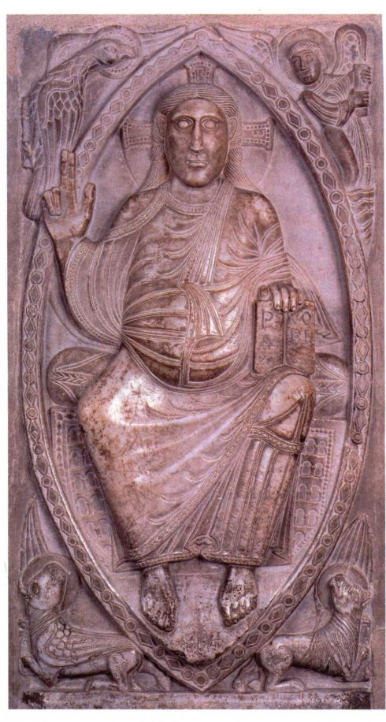

图11\.9《庄严基督像》（Maiestas Domini）。约1096年。大理石，

高127厘米。图卢兹圣塞尔南教堂

雕板制作于公元1100年左右。其中六块雕刻有天使与使徒，另一块表现了基督的坐姿形象，即《庄严基督像》（Christ in Majesty，图11\.9）。虽然其原始位置已经不复可考，但很可能是祭坛和圣塞尔南圣殿（shrine）周围条带的装饰，美化了朝圣者脑中特别神圣的部分。

基督雕板的浅浮雕形式与诸多装饰效果使人联想到早期的金属制品和象牙雕刻品（见图10\.16、10\.31）。其中双线得以大量运用，有些为阳线，另外的则为阴线，大大增强了人物的体量感。这件作品的手法与手抄本彩饰也有关联，特别是加洛林与奥托时期的作品，同时也包括拜占庭手抄本。在人物形象的安排方面，衣褶呈线性排列，装饰图案形式多样，这与《戈德斯卡尔克福音书》（见图10\.11）中的基

其工程的基础。设计师为中堂建造了石砌拱顶，旨在消除木构屋顶的火灾危险，这不仅是出于实际的需要，同时也向建筑师荣耀耶和华之殿的能力发起挑战。拱顶距地面愈高就愈难支撑，因此每一处资源都得以充分发掘，以建造尽可能高耸的中堂。此处与圣地亚哥\-德孔波斯特拉大教堂一样，内侧堂之上建有楼廊，楼廊则承受了中堂拱顶发出的横向压力。圣塞尔南教堂提醒我们，建筑与政治一样，是一项极具潜能的艺术。这座教堂的建筑结构在此以及别处的成功，度量着建筑师们探索的能力，考验其在特定的条件之下，在结构与美学两个领域中，探索可能性限度的脚步能走多远。

圣塞尔南教堂的雕刻 圣塞尔南教堂与圣地亚哥\-德孔波斯特拉大教堂的内部和大门都装饰有石雕。现在存放于圣塞尔南教堂回廊中的一系列大型大理石

🟩354 詹森艺术史

督相去不远，而这本福音书在中世纪期间就保存在圣塞尔南教堂。

基督的身形略大于半身真人，而且并没有被设计为仅供近距离观看的样式。这一形象具有惊人的体积感和重量感，即使从远处观看也一样突出。对体量感的强调暗示着在大型雕塑复苏的背后，可能存在的主要灵感来源。较之绘画，坚固且具有三度空间的石雕形象更为“真实”。对于沉湎于抽象神学的教士而言，这看来也许无关宏旨，甚至充满危险，但对于单纯的世俗信徒而言，庄严的雕刻反而具有更大的吸引力。

克吕尼教派的建筑与雕刻

圣塞尔南教堂雕刻装饰制作期间，教会正处于本笃会克吕尼（Cluny）修道院众修士的主持之下，这里也是当时最为重要的本笃会修道院。克吕尼是附属修院联网的核心，其子院遍布欧洲，数目多达1400座。这是克吕尼派影响与规模扩大的有力证明，甚至可以决定教皇的人选，并发起攻打穆斯林的十字军东征。对于罗马式艺术而言，不同修会教派的兴起与传播对其发展意义重大，但无一能超越克吕尼教派的重要程度。

克吕尼修院教堂 克吕尼教派（cluniac Order）

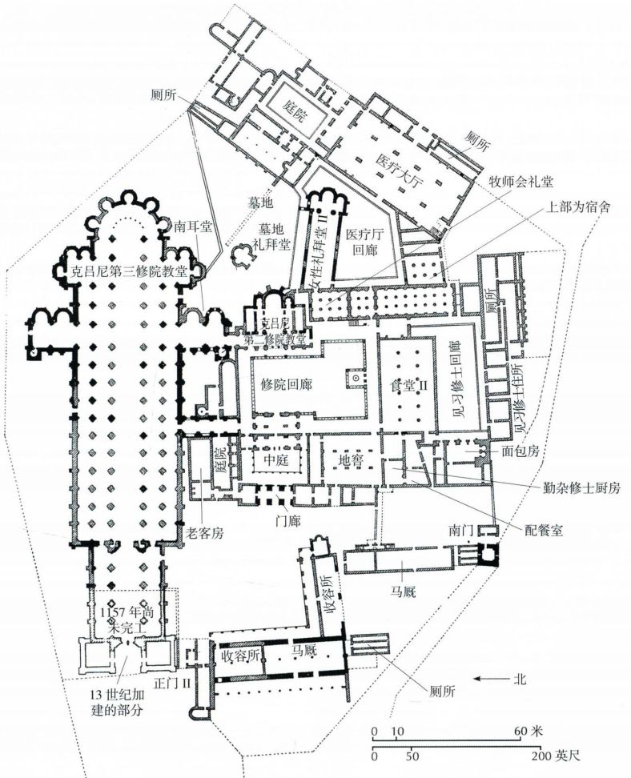

图11\.10 刚佐等人：法国克吕尼第三修院教堂平面图（根据Conant的图绘制）。约1088\-1130年。黑色部分表明的是现在缺失的部分

🔴第十一章 罗马式艺术 355

的迅速扩大还在以下事件之中有所表现：建于910年的公堂式教堂仅在七十余年之后，就于1088年一座历史上规模最为庞大的罗马式教堂所取代，这就是克吕尼第三修院教堂（Cluny III，图11\.10）。正如人们所知，该教堂在法国大革命之后被毁，只有南耳堂（位于平面图中的右侧）保存了下来，十分遗憾；而耳堂上部还建有全欧洲现存塔楼中最为壮观宏大的八角塔楼。诸如圣里基埃教堂（见图10\.19）这样的加洛林建筑之中，对塔楼的运用达到了顶峰。克吕尼教堂东端的次半圆室、半圆室和塔楼造就了前所未有的高耸建筑结合体。每个单独结构协同作用以创造出和谐感（图11\.11，建有八角塔楼的南耳堂位于复原图的左侧）。

克吕尼第三教堂的比例以“完美”数比率以及音律和谐为基础，提醒我们注意音乐在中世纪教堂中的重要性。修士们每天要在该教堂中唱响八次祈祷文，而克吕尼第三教堂的建筑师之一刚佐（Gunzo）就以其音乐才能著称。共鸣是石砌拱顶建筑的优点之一，还可能使其更为流行，或者至少让庞大的建筑资金为社区民众所接受。即便时至今日，聆听格利高利圣咏在

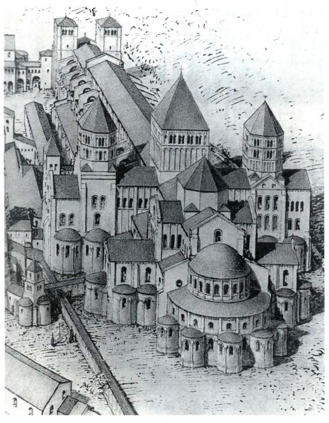

图11\.11 克吕尼第三修院教堂复原图，东向观（根据Conant的图绘制）

罗马式教堂的拱顶下唱响仍是一种感人至深的体验。

克吕尼第三教堂（图11\.12）的内部宏伟而优雅，其拱顶高达30米。高侧窗之下常见的楼廊为三联拱廊（triforium）所取代，这是一条由多组三联拱（每开间一组）构成的长廊；其创造了墙体之中的空间，在实际重量和视觉方面都使墙体更为轻盈。每一开间的高侧窗、三联拱廊各自的连接处都设置了装饰有科林斯式柱头的壁柱带，不禁令人回想起罗马建筑装饰。中堂连拱廊那有些许尖角的拱门并非罗马结构，该设计被认作是与伊斯兰文化（见图9\.12）接触的结果。半圆拱受重力牵引最严重，现在除去半圆拱的中心部分，让余下的两条拱弧通过相互支撑的方式构成尖拱。因为尖拱较之半圆拱所产生的外推力更小，所以不仅尖拱本身可以建造得更陡，墙体也可以获得更多开口，从而显得更为轻盈。

穆瓦萨克修道院 穆瓦萨克（Moissac）的圣皮埃尔隐修院（Priory of Saint\-Pierre）位于临近图卢兹的朝圣路上，也处于克吕尼教派管辖之下，是罗马式艺术的另一个重要中心。紧挨修院教堂的修院回廊为修士们专用，由四条有顶走廊构成，中央是一处露天花园（图11\.13）。修士们在这里可免于日晒雨淋，进行精神修炼。修院回廊是修院生活的中心，并在修院建筑群中占据中央位置，圣加尔和克吕尼两处修院的平面图中都是如此。76个雕刻柱头在穆瓦萨克这一私密地带中起到了装饰作用。尽管其中兼有旧约和新约故事，但是许多柱头上都雕刻有枝蔓、鸟兽和怪物。

虽然罗马式时期在时间上与早期基督教厌恶造像的年代相去甚远，但即便在这个时期，也有人站出来抗议视觉形象那种使人堕落的力量，其中之一就是西多会（Cistercian Order）修士克莱尔沃的圣贝尔纳。西多会是源自本笃会的改良教派，作为克吕尼教派在经济与政治上日益成功的抵抗力量，创建于1100年前后。事实上，很难将穆瓦萨克或克吕尼这样的修道院所取得的世俗成就与修士们在传统上所追求的价值观联系在一起。前者意味着修道院既拥有大量财富，又具有政治上的影响力；而后者则基于对世俗享乐的摒弃，转而追寻精神上的完美。对于基督教题材的图像再现，人们经常引用下面这句著名评论：“Quodlegentibus scriptura，hoc idiotis\.\.\.pictura\.”大致而言， 这句话是说绘画向目不识丁者传达上帝之言。尽管圣贝尔纳并不明确反对艺术的教化功能，但他在教堂中几乎不使用装饰，而且还坚决反对穆瓦萨克修院在修院回廊中滥用装饰的做法；他认为这些装饰显然不仅诉诸精神，同时还会诱惑人们的眼睛。在一

🟩356 詹森艺术史

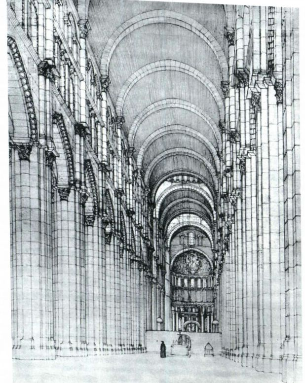

图11\.12 克吕尼第三修院教

堂复原图，中堂与内部（根据Conant的图绘制）

图11\.13 修院回廊，法国穆瓦萨克圣皮埃尔

隐修院。约1100年

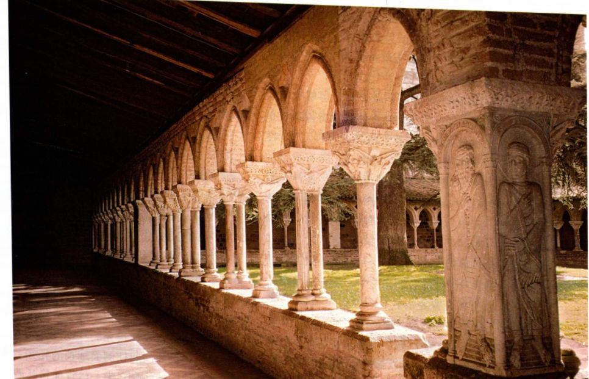

原始文献

克莱尔沃的圣贝尔纳（1090\-1153年）

出自《向圣蒂埃里修道院院长威廉的致歉信》（Apologiato Abbot William of Saint\-Thierry\)

克莱尔沃的圣贝尔纳是西多会的一员，这是为反对本笃会日益增长的财富而于11世纪建立的苦修教派。贝尔纳在1127年前后写给本笃会圣蒂埃里修道院院长威廉的信中，谴责了修道院的全部奢侈品，特别是修院回廊中的艺术作品。同其他很多人一样，贝尔纳认为修士在精神上优于注重肉欲的俗士，因此不需要物质刺激来坚定信仰。

作为一名修士，我想向各位同仁提出异教徒指责其他异教徒时惯于提出的问题：“神甫，告诉我，在这神圣之所黄金何用？”然而我要说······“穷人们，告诉我，如果你们真是穷人，那么在这神圣之所黄金何用？”当然，主教们有自己的事务，修士们的事务也不相同。我们（修士）知道，由于他们（主教）既要对智者负责，也要兼顾愚人，于是才用物质装饰来引诱对一个肉身之人的崇拜，因为无法用精神材料完成这种工作。但是我们离俗避世，因基督之故抛弃世上珍贵美丽之物，所有华美之物、抚慰之音、惬意之香、甘甜之味、愉悦之触；简而言之，对于所有物质享乐，我们都视之如粪土······我要问，在所有这些当中我们努力激发的究竟是谁人的虔诚？

难道不是贪婪引发了所有这一切吗？如此挥霍金钱的目的在于收获更多的利益。看到这些昂贵、奇妙的幻象，激发的恰恰是人们的捐献之心，而非祈祷之心。财富正在以这

种方式制造财富。眼睛紧盯覆盖着黄金的圣物，钱包也随之打开。男女圣徒以极其美丽的形象得以展示，而且似乎形象愈多彩，圣徒就愈神圣一般。人们蜂拥而至，亲吻圣像，他们被邀来捐献，而他们赞赏美丽甚于崇敬神圣。在这当中所追求的是什么？悔过者的内疚还是凝视圣像时人们内心的惊愕？哦！虚空中的虚空！教会的四壁熠熠生辉，而匮乏者还囿于贫困。穷人付出代价以悦富人之目。好奇者找到令人愉悦之物，而危难者却寻不到可赖以生存的给养。

但除此之外，在修院回廊之中，当兄弟们潜心阅读之时，展示在他们眼前的荒诞畸形又有何用？这是美的一种奇异变形还是美丽的残缺？污秽的猴子在此何用？还有残忍的狮子、凶暴的人马、半人半兽的造物、斑纹老虎、打斗的士兵、吹响号角的猎人，所有这些在此何用？在一颗头下，你会看到多个身体，相反多个头下却只有一个身体。这边蛇尾长在四足兽身上，那边兽头出现在鱼身上；那里前半为马后半为羊，这里头上长角身体为马。简而言之，到处都是令人惊异的对立形式，人们只会更专注于此，而非去阅读书籍；将整日时光耗费在对其中某个形象的困惑之中，而非冥想上帝的律法。上帝啊！如果无人以此类荒谬为羞耻，为什么不让他至少因为花费而苦恼呢？

SOURCE:CONRAD RUDOLPH\.THE "THINGS OF GREATER IMPORTANCE": BERNARD OF CLAIRVAUX' S APOLOGIA AND THE MEDIEVAL ATTITUDE TOWARD ART\.\(PHILADELPHIA:UNIVERSITY OF PENNSYLVANIA PRESS, 1990\)

条带图案的边缘以及飘动的衣袍造就了规模与姿态方

面的层次感。在为宗教服务的热诚中所采用的抽象手

法与早期中世纪艺术相类似，例如《埃博福音书》（见

图10\.14）和《乌得勒支诗篇》（见图10\.15）中的手

抄本彩饰。然而穆瓦萨克的图像却具有宏大、突出的

规模。

穆瓦萨克大门的其他部分也以雕刻手法来制作。

门间柱（trumeau，支撑门楣的中央柱）和侧壁（jambs，

门道的两侧）都是按照常见的伊斯兰设计，拥有扇贝

形边角线（见图11\.14）。基督徒们通过在穆瓦萨克

及其他教堂中借鉴伊斯兰艺术的形式，表达出对于阿

拉伯艺术成就由衷的敬仰与关注。与此同时，这种挪

用行为也表明基督教统治穆斯林的雄心。前往圣地亚

哥\-德孔波斯特拉的朝圣就是反伊斯兰情感的相似表

现形式。

框架入口的扇贝形边角线十分生动，并将人们进

入教堂时的体验表现得充满戏剧性。人形与兽形雕塑

地纳入不稳定的柱身之中，尽管他挣扎着要将自己从

他们在这非凡的景象之前，难以抑制自己激动的心情。 柔韧曲折，例如门间柱侧面细长的先知就似乎被完美

封1127年写给圣蒂埃里（Saint\-Thierry）修道院长威廉（William）的信中，圣贝尔纳谈论了克吕尼派教堂的装饰，并谴责了为修士默祷而制作的艺术品。（见本页的原始文献。）

如果说对穆瓦萨克的修士而言有足够吸引其注意力的雕塑，那么对于前来参观圣皮埃尔修院教堂的朝圣者和俗士也是如此。该教堂精雕细刻的大门（图11\.14）制作于修院回廊完工一代之后，具有典型的罗马式大门的各个组成部分（图11\.15）。庄严基督像设置在半月楣（tympanum）的中央，即门楣上方的半圆形饰面。其中的基督为再次降临时的形象，正如《启示录》（4：1\-8）中所言：在末日结束之后，基督重返世间，以审判人类，看其得到救赎还是遭受处罚。此外，基督身旁伴随有四只野兽，这一点与圣经内容相符，而野兽身旁还依次有两位天使和24位长老。他们脚下的波浪线代表“玻璃海如同水晶”。长老的身形比其他人物稍小，其中很多人都打有手势；雕刻风格具有抽象与运动的特点，颤抖的线条、蜿蜒

🟩358 詹森艺术史

图11\.14 半月楣上饰有《基督再临》（SecondComing of Christ）的南大门，穆瓦萨克圣皮埃尔教堂。约1115\-1130年

图11\.15 罗马式大门整体结构

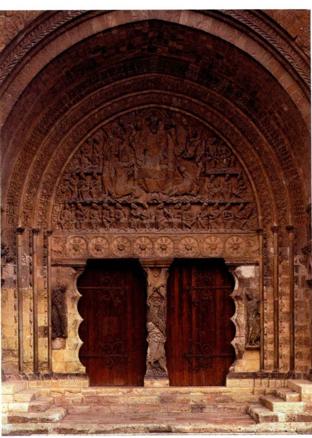

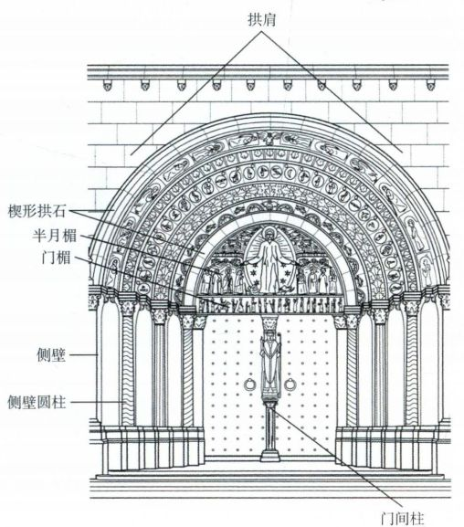

石头中解放出来（图11\.16）。先知的双腿优雅地交错，在打开手中卷轴的同时将头转向教堂内部。门间柱正面交叉狮子构成的对称锯齿形赋予柱身活力，这和爱尔兰细密画（建筑师正是从中获取灵感）中交织野兽纹样赋予画面生机的手法如出一辙。

交叉狮子的纹样可以经由织物追溯到波斯的金属制品，尽管后者并没有高耸的形式。其根源来自古代近东艺术中的纹章式动物图形（见图2\.10）。然而我们仍然无法解释这一纹样在穆瓦萨克仅仅作为装饰所具有的有效性。其属于罗马式艺术中庞大的野兽与怪物家族，即使必须承担支撑功能，这些纹样仍然保持了恶魔般的生命力。运用这种元素的目的并非仅仅在于装饰，还在于表现；它们是黑暗力量的化身，或者被吸纳入守护者体内，或者被禁锢在雕刻所在的位置永世不得释放，无论怎样咆哮反抗都无济于事。一位中世纪主教曾指出，教民看到教堂中雕刻的动物会十分恐惧，而这将有助于他们节制。

🔴第十一章 罗马式艺术 359

深邃且两侧末端均有繁复雕刻的门廊将穆瓦萨克的大门环绕起来。东侧的连拱内（图11\.17）雕刻有圣母领报，下部的空间从左到右是圣母往见（玛利亚前去拜望施洗约翰的母亲以利沙伯，并告知自己已经受孕），拱下的两块雕板则是三王来拜的场景。基督生平的早期事件雕刻在上方的檐壁之中。所有人物形象都同门间柱的先知一样，肢体纤长，姿态动人。特别值得注意的是，圣母往见和圣母领报中对双手的非凡展现（圣母领报中的天使是现代复制品）。在图中并未显示的西侧，还雕刻有作为童贞玛利亚美德对立面的欲望（肉欲）之罪。这两者的并置令人回想起中世纪早期夏娃的罪恶与玛利亚的纯洁成对出现的情形（见图10\.26）。穆瓦萨克所传达的信息显然具有教诲目的，有所贬斥，亦有所褒扬。当沿朝圣路而来的参观者面对教堂的深邃入口时，他们其实陷入了雕刻所精心组成的包围，令跨入教堂的最初体验终生难忘。进入教堂的过程成为真正的转变仪式，这种转变既是

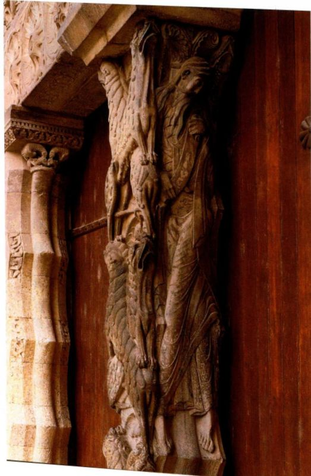

图11\.16 南大门门间柱与侧壁\-

肉体层面的，也是精神层面的。

奥顿圣拉扎尔大教堂 圣拉扎尔大教堂（Cathedralof Saint\-Lazare）邻近并附属于克吕尼修道院，其西大门半月楣（图11\.18）所展现的末日审判是基督教艺术中最令人敬畏的图景。这一场景之中，基督再临之后，将最终得救与永久受罚的人区分开来。远大于其他人的基督形象在半月楣之中占据着中心位置。雕刻家吉斯勒贝尔（Gislebertus）以超常的力度来处理基督形象，并将自己的名字铭刻在基督脚下，位于半月楣的中央。而他只是诸多罗马式雕刻家之一，具有独特的艺术个性，而姓名又为我们所知。吉斯勒贝尔的风格为他所特有，后来的学者们也基本确认，在跻身奥顿（Autun）雕刻大师行列以前，他曾在克吕尼接受训练。

在半月楣左部，圣徒们监督着右部正在进行的称量灵魂活动。角落中的四位天使则吹响了末日的号角。在底部，死者从坟墓中爬起，在恐惧中瑟瑟发抖，其

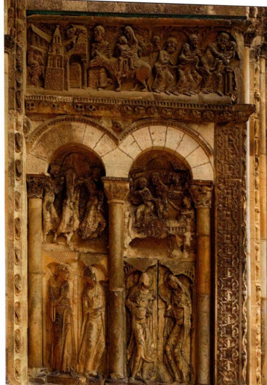

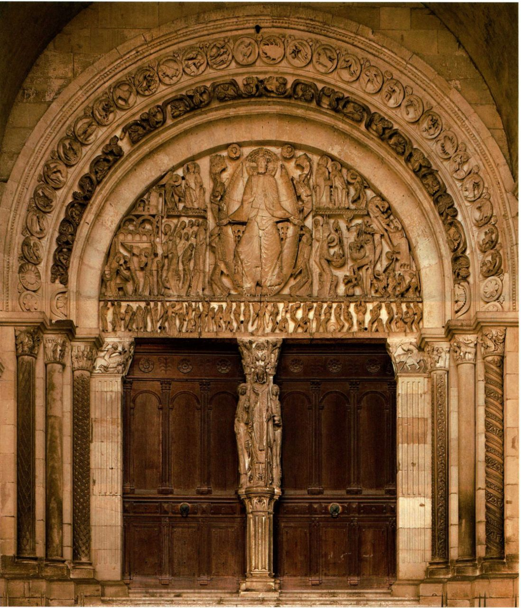

图11\.18 法国奥顿市圣拉扎尔大教堂西大门，半月楣雕刻《末日审判》（Last Judgment）由吉斯勒贝尔创作。约1120\-1135年

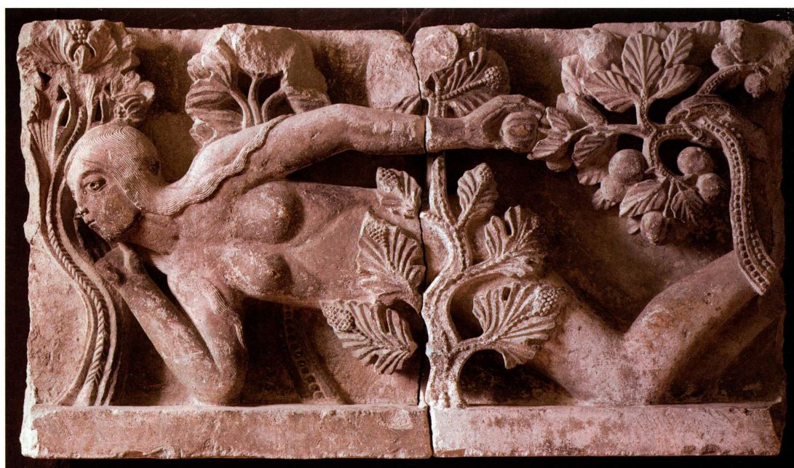

图11\.19 吉斯勒贝尔：《夏娃》，奥顿的圣拉扎尔大教堂北门门楣右半部。1120\-1132年。

厘米。奥顿市罗林美术馆

中有些人已经受到了蛇的围攻，或者被爪形巨手紧紧攥住。在上部，他们的命运悬于天平之上，一端是用力猛拉的魔鬼，另一端则是天使。得救的灵魂像孩子般依附在天使身边，以求在升入天国耶路撒冷（左边尽头处）之前得到保护；而那些被宣告有罪的人则被狞笑的魔鬼攫住，丢入地狱之口（右边尽头处）。噩梦般的魔鬼基本都为人形，但具有鸟一样的双腿、毛茸茸的大腿、尾巴，以及尖耳朵和血盆大口。具有等级划分、抽象且样式化的基督形象比任何写实图像都更为有效地传达令人敬畏的力量。人们在“阅读大理石”（借克莱尔沃的圣贝尔纳之语）之后，无不带着历经磨炼的精神进入教堂。

旨在强调报应的末日审判是罗马式教堂半月楣的标准题材。之所以选择这一题材的原因可能是因为中世纪时期的审判都在教堂大门之前举行，即“在教会面前（ante ecclesium）”。因此，实际的司法行为与此处神的审判并行不悖。审讯通过考验（ordeal）进行，被告只有经受住肉体的折磨与考验，才会被认定无罪。实际上，考验本身就像半月楣中描绘的场景一样骇人。

奥顿大教堂西面半月楣的外圈拱门饰（archivolt，拱形装饰带）将其围绕起来，其由表现月历场面的圆

形浮雕构成，其中包括黄道带（zodiac）象征与各月相应的劳作，这是典型的中世纪风格。月历场面将末日审判中的可怕事件置于宇宙时间之中，置于我们在世间所占据的物质世界之内。

大教堂的北大门在18世纪时被拆除，但吉斯勒贝尔雕刻有《夏娃》的部分门楣（图11\.19）得以保存下来，现藏于罗林美术馆（Musée Rolin）。这件作品显示了雕刻家那极其广泛的表现范围。门楣另一半对应亚当的形象。而主题的选择则再次与大门的礼仪功能联系在一起，因为公开的苦行赎罪仪式就在北大门前举行。毕竟亚当和夏娃的原罪要在苦行赎罪仪式中提及，而那些寻求宽恕的罪人们不得不参加这种仪式。浮雕中夏娃摘取苹果，仿佛陷入沉思而抚摸面颊的一系列微妙姿态形成了极具诱惑和肉感的轮廓。她的姿态并非仅仅顺从于所在的狭长水平空间，而是在模仿游走在地面的蛇，因此夏娃在诱惑他人的同时，也正受到诱惑。正如在贝恩瓦尔德主教青铜门（见图10\.26）中所见，夏娃在中世纪人的眼里象征着化身为全世界世俗女性的蛊惑魅力，然而并非欧洲所有地区的罗马式艺术都对女性持如此否定的态度。

🟩362 詹森艺术史

《唐娜·桑查石棺》中世纪时期，世俗妇女并非总被表现为品质恶劣的形象。1120年前后为西班牙北部阿拉贡王国的公主唐娜·桑查（Doña Sancha）所制作的石棺情况就完全不同。阿拉贡与克吕尼修道院联系密切。在雕刻桑查石棺的50年前，她的兄长国王桑乔·拉米雷斯（Sancho Ramírez）在自己的王国之中推行了克吕尼教派的修道院改革。这是国王努力加强西班牙的基督教基础，以对抗伊比利亚半岛穆斯林的措施之一。桑查曾十分积极地支持兄长的决策。

《唐娜·桑查石棺》（Sarcophagus of Doña Sancha， 图11\.20）一侧的中央部分里，两位天使托起了杏仁状光轮中的裸体人像，代表死者的灵魂被提升到天堂，这是丧葬纪念物的一般题材。左侧，拱门下的三位教士在为死者举行弥撒，右侧，两位可能是桑查姐妹的女性也栖身拱门之下，侍从在登座公主两侧。右侧这块雕板的布局表明了形象较大的桑查所具有的威严和重要性。这种布局出自古代艺术传统，例如4世纪的《朱尼乌斯·巴苏斯石棺》（见图8\.20）就是如此。

石棺背面是三位位于拱门之下的鞍上人物。两位

持械的骑士正面对峙，第三位则跨骑在狮子身上，双手抓住狮子张开的大口。关于作战骑士最具有信服力的解释是他们代表善与恶之间的战斗，这也是基督教艺术中的常见题材。关于右侧拱门下的骑狮人身份则没有定论，曾有人认定其为长发的参孙（Samson）或年轻时的大卫，两者都是旧约中基督教战胜魔鬼的原型。石棺将桑查的陵墓与早期基督教坟墓（见图8\.2、8\.20）联系在一起，因此其形相设定也与早期基督教中的论证法（methods of argument）相关。

当时穆斯林控制着伊比利亚半岛大部分地区，阿拉贡国王为从他们手中收复西班牙而进行奋力的抗争，桑查在她的王国之中是举足轻重的人物。即使可以进行象征化或隐喻化的解读，一般都认为战争场面是适合女性石棺题材的现象，是西班牙罗马式时期的文化特点，一位学者曾称之为“为战争而组织的社会”。许多关于女性在防御中所起作用的传奇故事出现于基督徒新近占领的地区。对定居与常设组织的迫切需求使得女性在男性参加军事远征的时代，积极投身于土地等财产的获取与交换。

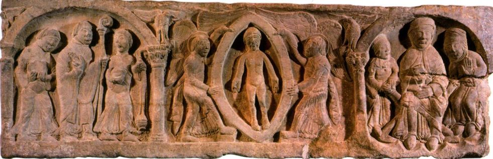

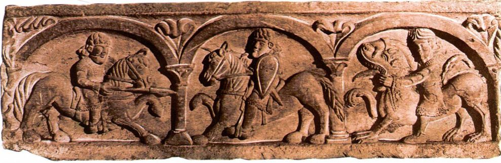

图11\.20 《唐娜·桑查石棺》，前板与后板。约1120年。石头，			厘米。西班牙哈卡市（Jaca）本笃会修道院（Monastério de lasBenedictinas\)

🔴第十一章 罗马式艺术 363

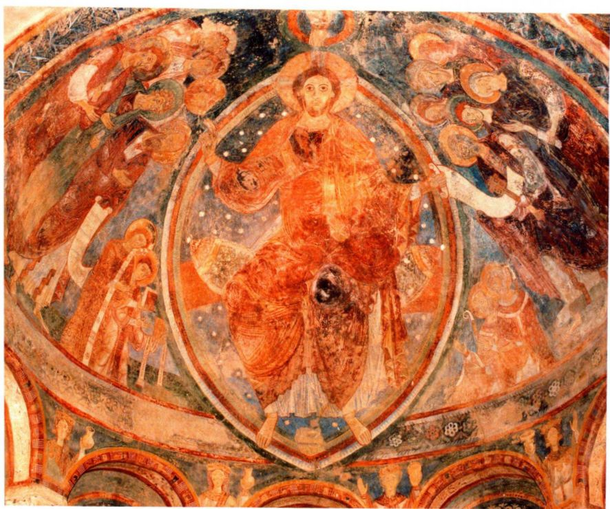

图11\.21《基督与使徒》（Christ and Apostles），半圆室壁画。12世纪早期。法国贝尔泽\-拉维尔隐修院

唐娜·桑查本人就在宫廷与王国之中担任要职，其中包括管理她自己的大庄园。而且常年以来她都是潘普洛纳（Pamplona）主教区的管理者，对女性而言这是一个非同寻常的头衔。如果桑查只是贵妇享有特权的孤例，那对增进我们了解罗马式时期的情况就无甚助益。但是事实上，11、12世纪的女性在政治结构的形成与艺术品委托方面，都扮演了极其重要的角色。

桑查石棺表现出对于成功的渴望，又因对灵魂的微妙再现而得以平衡；后者温柔的面容中既有希冀，也有焦虑，这是人类注视死亡时的普遍反应。特别要注意的是，唯独中央一组人物没有被拱门覆顶，这一安排强调了上冲之感，因此说明这是一场天国之旅。

克吕尼教派壁画

因克吕尼修院的建筑被毁，导致了大量壁画遗失，只有通过分析与之相关的建筑，才能更好地欣赏克吕尼原来的壁画作品。贝尔泽\-拉维尔隐修院（priory of就是达成这一目的的上佳选择。

贝尔泽\-拉维尔半圆室 贝尔泽\-拉维尔隐修院位于克吕尼东南方14公里处，于12世纪早期修建，最初作为克吕尼修道院院长的隐退之所。礼拜堂之中的半圆室壁画（图11\.21）模仿了克吕尼母院（motherhouse）教堂中的作品。庄严基督像占据了画面的中心位置，其四周均是使徒。拉长的面孔，以及衣袍裹体的优雅方式，赋予了形象以雅致优美的特质。通过富有韵律感的同心线图案与明亮的高光表现了衣物的多重皱褶。尽管这些设计归根结底是出自拜占庭艺术，例如《巴黎诗篇》（见图8\.40），但对这一渊源的借鉴却并不十分直接；其实是来自意大利地区的拜占庭艺术，而非君士坦丁堡。克吕尼修道院图书馆馆藏的意大利一拜占庭抄本相当丰富，并且克吕尼本地的抄本彩饰也偏好这种风格。

西多会建筑与艺术

正如我们所见，克吕尼教派的成功使之成为众人攻击的对象，而来自西多会的谴责尤为激烈。西多会的母院位于勃艮第的西笃（Cîteaux）。除祈祷之外，

🟩364 詹森艺术史

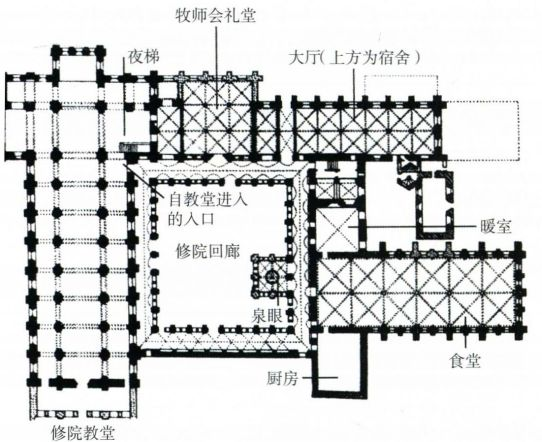

图11\.22 法国丰特奈修道院平面图

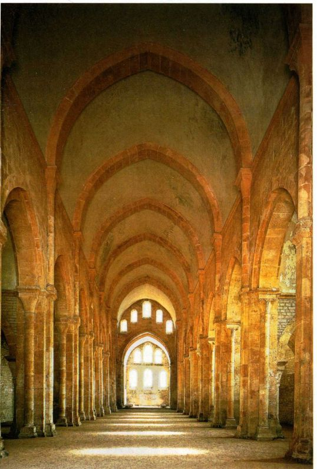

图11\.23 丰特奈修院教堂中堂。约1139\-1147年

西多会修士还投身于艰苦劳动，保证了其取得的重大成功。合理的经济规划、农业与畜牧业技术以及富有的捐助者都大大推进了他们事业的发展。西多会及其艺术风格传遍了欧洲，到了12世纪末期，其已经控制了将近700座修道院。西多会建筑以其简洁之风与克吕尼派建筑形成了鲜明对比。

丰特奈修院教堂 丰特奈（Fontenay）距离西笃不远，此处的修院教堂始建于1139年，即圣贝尔纳在此建立修道院一个世代之后。这是12世纪上半叶保存最为完好的西多会教堂，充分展现了该教派崇尚的简单朴实风格，而且反对本笃会所宣扬的富足。在轮廓上，该修院的简单几何形组合平面（图11\.22）所基于的修道院形制，可以向上一直追溯至圣加尔修道院（见图10\.21）。较之克吕尼那由庞大教堂统领蔓生建筑群的铺陈平面布局（见图11\.10），丰特奈修道院具有精确、纯粹以及紧凑的均衡感，平衡了各部分之间的关系。

丰特奈修院教堂的东端既无半圆室，也无塔楼。由于西多会不容许任何雕刻与壁画存在，因此教堂内部没有任何装饰（图11\.23）。高侧窗与楼廊也被取消。然而，界定中堂与侧堂入口的横切尖拱的清晰线条，以及无框的窗户设计造就了一种优美雅致之感，简单的形式更是显得高雅动人。这座教堂再次成为逃避世俗冗务、安全宁静的精神避难所，尽管其在效果上与其他罗马式教堂（见图11\.1、11\.4和11\.8）为防护所提供的封闭性全然不同。

其他本笃会建筑与壁画

本笃会修院教堂圣塞文·苏·加坦博教堂（Saint\-Savin\-sur\-Gartempe）属于所谓的厅堂式教堂（hall church， 图11\.24）。中堂拱顶没有横切拱，重量直接落在中堂连拱廊上，后者则由成组的庄严立柱支撑。中堂内采光情况还算良好，因为两侧堂的高度与中堂基本相当，而且外墙还开有宽大的窗户。

尽管圣塞文·苏·加坦博教堂具有奢华的雕刻与装饰丰富的门道，但厅堂式教堂的设计旨在为壁画提供连续的平面。《建造巴别塔》（The Building ofthe Tower of Babel，图11\.25）是拱顶所绘庞大旧约组画的一部分，其构思极具戏剧性，满是紧张的运动场景。上帝本人位于左端尽头处，直接参与到故事之中，正在与巴别塔的建造者交谈。右端的巨人宁录（Nimrod）与上帝的形象在视觉上构成平衡，他是建筑项目的领导者，将石方疯狂垒砌在巴别塔墙体上。整个场景成为了上帝与人类之间一场有关

🔴第十一章 罗马式艺术 365

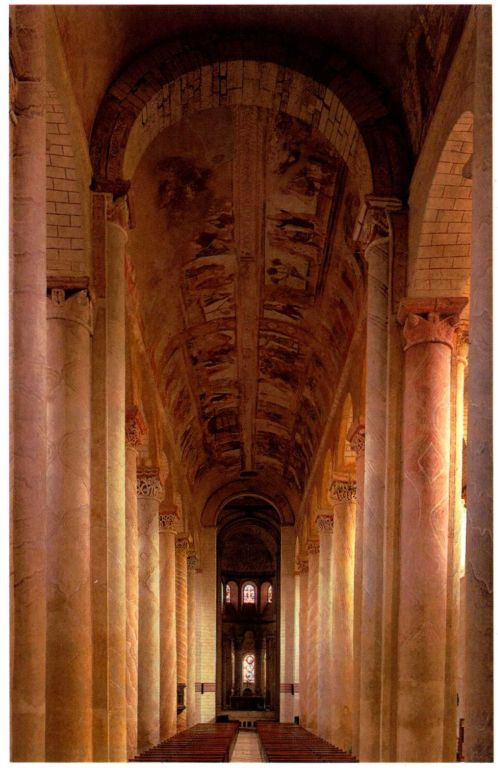

图11\.24 朝圣式唱诗班区（约1060\-1075年）与中堂（约1095\-1115年）。法国圣塞文·苏·加坦博教堂

力量的大考验。粗重、深沉的轮廓线与显著的姿态使得画面从下方看来也非常清晰。教堂别处还绘有新约故事和当地圣徒生平故事。虽然绘画并不必然是罗马式教堂中的标准式样，却具有共同的面貌。许多壁画因修复工程而未能保存下来（见第368页的艺术史家的观点）。

书籍插图

同中世纪早期一样，罗马式时期的手抄本制作依然主要由修道院缮抄室负责，工作都要在修士的监督下进行。克吕尼教派缮抄室制作的手抄本在风格上与该教派教堂的壁画相似，而其中表现的兴趣点通常也与当时建筑师、雕刻家所关注的内容相差不远。这些手抄本极具创新风格，常常基于对日常生活的观察。而西笃修道院制作的作品则表现出来自英格兰的强烈影响，并且有些手抄本可能就由英格兰插图画家所作。罗马式时期，修道院社群间的相互关系解释了不同地区手抄本制作中的一致性。有些制作的风格与法国北部、比利时和英格兰南部的手抄本十分接近，有时甚至令人难以判断其究竟出自英吉利海峡的哪一侧。

《克吕尼经文选》《圣灵降临》（Pentecost，图11\.26）是一幅出自《克吕尼经文选》（ClunyLectionary）的插图，描绘基督复活之后圣灵降临在使徒面前的场景。如同贝尔泽\-拉维尔半圆室的壁画

图11\.25《建造巴别塔》，中堂拱顶壁画细部。12世纪早期。法国圣塞文·苏·加坦博教堂

🟩366 詹森艺术史

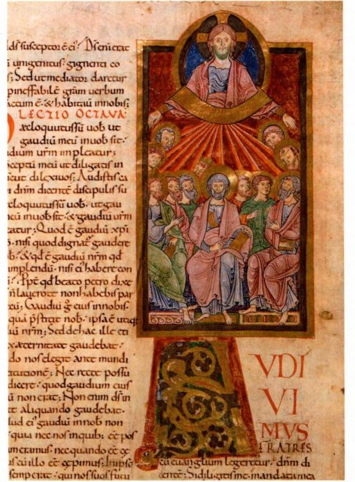

图11\.26《圣灵降临》，出自《克吕尼经文选》。12世纪早期。

犊皮纸蛋彩画，22\.9 × 1 2\.7厘米。巴黎国家图书馆

（见图11\.21）一样，高光处理过的衣袍将肢体严严实实地包裹起来。画中的其他风格特征还使人想到拜占庭图案。某些先知孱弱的古典式面孔再现了中世纪拜占庭绘画（见图8\.39、8\.40）的特征；其他髭髯浓重的先知形象则采用了表现圣徒与先知的拜占庭手法（见图8\.41）。即便是书页上部的基督，也被表现为典型的拜占庭式万能之主（Pantocrator）。位于使徒中央的是彼得，他在贝尔泽\-拉维尔的半圆室壁画中也是从上帝手中接过了卷轴。既然克吕尼是献给圣彼得的建筑，那么强调其重要性也就成为了顺理成章之事，但是其中还隐含有政治寓意。克吕尼修道院的创立文书声称，该修道院只对彼得宝座的继承者罗马教廷与教皇负责，而非任何一位国王或皇帝。这一特权确保了克吕尼的巨大权力及其最终的成功。

《科尔波提努斯抄本》《科尔波提努斯抄本》（Codex Colbertinus）中的插图《圣马太》（St\.Matthew， 图11\.27）在理念和姿态上与很多罗马式雕刻相似，

特别是穆瓦萨克修院回廊中的立柱浮雕（见图11\.13）。这份手抄本就是在雕刻家创作修院回廊的时候于该修道院或附近地区制作的。马太的形象出现在《马太福音》的开头，与花写字母L相邻，而L正是“Liber”（书）的首字母。人物、动物、枝蔓和装饰图案与该字母的形状一致，正如罗马式雕刻中形象对外在框架的符合（见图11\.12）。

与首字母中布局自由的小型人物和动物相反，圣马太的形象直对观众。虽然他占据了建筑背景中的全部可用空间，但某些特征仍否定了其实体性。粗重的轮廓线和大胆的色彩是珐琅制品（见图11\.5）的回响，

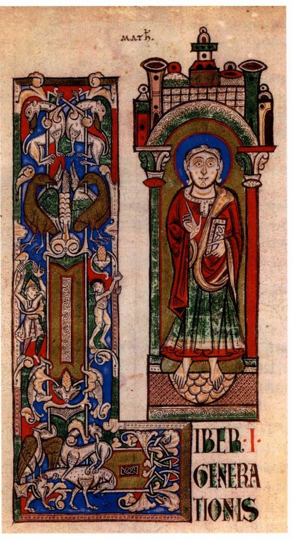

图11\.27《圣马太》，出自《科尔波提努斯抄本》。约1100年。

犊皮纸蛋彩画，1 9 × 1 0\. 1 6厘米。巴黎国家图书馆

🔴第十一章 罗马式艺术 367

建筑的保存与修复

对	于全部艺术作品来说，保存与保护都是一项精密的工作。建筑方面的问题尤为尖锐，因为除遵循美学标准之外，修复者还必须考虑建筑的功能。例如在面对一座已经失去原有功能的建筑时，建筑师应该怎么处理呢？这正是中世纪城堡和宫殿所面临的问题，位于因人口迁移而教区缩小之处的教堂也是如此。可以将这些建筑翻新改作他用，即使改变其原有特点也在所不惜吗？

罗马式建筑的修复提出了某些特殊问题。在欧洲许多地区，几乎每座村庄都有自己的罗马式教堂，但是教区主教和政府机构却难以获得保存工作所需的资金。此外，罗马式建筑以其多样性著称，因此一刀切的方法可能只在实际操作层面上有效，但可能将罗马式建筑的独特品质一并抹杀。

艺术史家C·艾德森·阿尔米（C\.Edson Armi）有关法国勃艮第地区近期罗马式教堂修复的著述”颇具洞察力。尽管法国修复部（French Restoration Service）介入古建保护的传统由来已久，但缺少修复所有残损建筑的资金，所以不得不将重点逐渐集中在最为危急的问题上。而在大多数情况下，此时已然回天无力了。另外，在建筑修复方式上，这一机构运用了普适模式，并非针对建筑本身采取特定的措施。20世纪中期，将罗马式教堂表面2\.5厘米的墙体予以清除曾是一种风尚，于是修复者不加区别地去除了所有表面附着物，有时甚至包括原有部件，只为了展示其下的石方或砖材。当时认为，通过展示材料和结构，才能揭示出建筑的真正表现特性。

到了20世纪末期，天平倾向了另外一端。此时的准则转变为在罗马式教堂的内外两层墙面上分别施涂灰泥，虽然有些教堂在几十年前才刚刚被拆剥干净。然而中世纪时期，虽然砖石建筑的表面确实大多涂有灰泥，但情形并不总是如此。阿尔米论述了近期的修复工作如何掩盖了有关原初材料

结合了多种并置的图案，使得形象趋于平板。这些设计说明了中世纪早期流行的形式延续的活力所能达到的程度。

科尔比福音书 科尔比（Corbie）福音书制作于12世纪早期，因为其中《圣马可》（St．Mark，图11\.28）的宏大感，也可以与罗马式雕刻联系在一起。运动的姿态和锯齿形构图可与穆瓦萨克门间柱上的先知（见图11\.16）相提并论。圣马可、翼狮、卷轴乃至窗帘上线条的扭曲运动又令人想起了兰斯画派的加洛林细密画，例如《埃博福音书》（见图10\.14）。

这些相似之处也有助于我们认识二者之间的不同。在罗马式手抄本中，全无古典绘画中的幻觉主义。

与结构的珍贵证据，而其所提供的信息将会帮助建筑史家“认识诸如设计理念、建造过程以及建筑历史等重大问题”。因为阿尔米指出，石匠的技巧如同画家或雕刻家的技巧一样都有独到之处，被掩盖的信息很可能是将某座建筑纳入其艺术史背景的关键。阿尔米提出了预防性保护的项目建议，以免不必要的重建工作，而重建往往是基于猜想，而非事实。他还要求修复者在承接项目之前，必须彻底了解某一建筑与各地区的历史与建筑环境，建议审查委员会参与到重要建筑的修复决策之中。阿尔米曾以1964年“威尼斯历史古迹建筑师及技师国际会议（Venice International Congress of Architects and Technicians of Historic Monuments）”所制定的准则为指导； 该准则要求不论采取何种措施，都必须表明“对原初材料与可信文献的尊敬······一旦有任何猜想的成分就必须停止”。所有修复部分“必须与原初部分区别开来，以使修复部分不致篡改艺术与历史证据”。

我们还需要追问，如何决定是接受还是摒弃之前对建筑所做的改动。根据假想恢复建筑的原始面貌是否总是至关重要？还是将建筑视为在时光中逐渐改变的整体更为恰当？是否存在某个修复者应该致力保存的理想时刻？何时去除建筑中后建的附加部分是合理的，而何时又应该将其保留？在这一点上，早期基督教公堂式教堂庄严圣母教堂的半圆室就是一个很好的例子（见248\-249页）。最初的5世纪半圆室遭到毁坏，后于1290年增建了一座新半圆室。在其后35年间，当时的一流艺术家们又在其中装饰了华丽的镶嵌画。在这种情况下，将建筑修复为5世纪面貌所带来的损失要远远大于恢复原始形式所带来的好处。

·C\. EDSON ARMI, "REPORT ON THE DESTRUCTION OF ROMANESQUE ARCHITECTURE IN BURGUNDY,JOURNAL OF THE SOCIETY OF ARCHITECTURAL HISTORIANS, VOL\. 55, 1996, PP\.300\-327\.

兰斯画派中流畅的造型及其所暗示的光影和空间感，在这里为填充有明亮纯色的坚实轮廓所取代。基于此点，画面的三维空间被缩减为交叠的平面。然而通过牺牲光影这一最后的造型语汇，罗马式艺术家赋予其作品清晰、精确的特质，而这在加洛林或奥托王朝时期都不可能实现。在这幅作品里，画面中的具象元素、象征元素和装饰元素浑然一体。

格里高利一世的《《约伯记》中的伦理》 尽管在原则上，西多会手抄本仅能使用非人物形象的单色花体词首大写字母（initial）装饰，而事实上该教派仍然制作了大量美丽迷人的手抄本。很难解释为什么这种艺术有所例外，虽然这可能要归因于禁止手抄本

🟩368 詹森艺术史

装饰的官方条例直至1134年才颁布（有些学者认为是1152年）。教皇格里高利（Pope Gregory）的《＜约伯记》中的伦理》（Moralia in Job）于1111年于西笃完成，这是一件动人的作品（图11\.29）。在这份手抄本中，装饰有花体首字母，描绘了修道院的某些

大事年表

11世纪中期\-塞尔柱土耳其入侵者开始统治伊朗

约1075\-1120年\-建造西班牙圣地亚哥\-德孔波斯特拉大教堂1099年\-第一次十字军东征，占领耶路撒冷

12世纪末\-西多会掌控700多座修道院

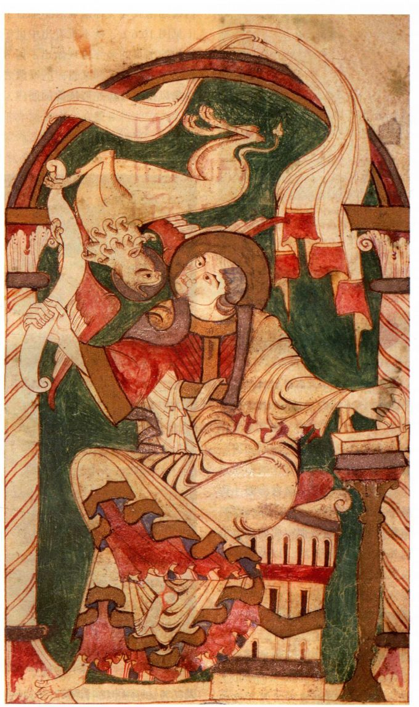

图11\.28《圣马可》，出自科尔比修道院制作的福音书。12世纪早期。犊皮纸蛋彩画，

27\.3 × 20厘米。法国亚眠市立图书馆（Bibliothèque Municipale）

🔴第十一章 罗马式艺术 369

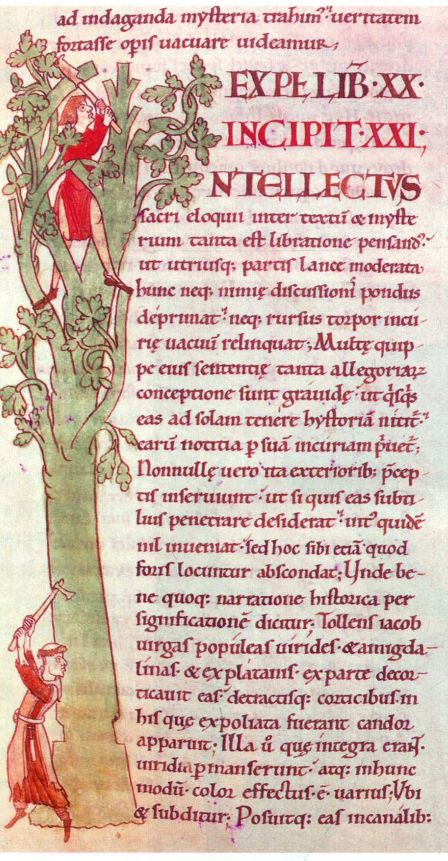

图11\.29 首字母1，出自格里高利一世的《《约伯记》中的伦理》。

1111年。犊皮纸蛋彩画，      厘米。法国第戎市立图书馆

\(Bibliothèque Municipale\)

日常活动，其中一个首字母I被表现为树木，而一位在平信徒修士（lay brother）与一位修士正在合作伐树。明亮平涂的色彩和图案化的枝叶与看似写实的细节形成鲜明对比。修士的外衣、挽起的裤脚，以及悬挂在腰带上的短剑，都表现出修道院生活的世俗特质。12世纪下半叶，除极少特例之外，西多会手抄本都仅仅保持了最为简单的装饰，似乎是法令禁止繁冗装饰的结果。

《修道院长维德里库斯福音书》《修道院长维德里库斯福音书》（Gospel Book of Abbot Wedricus） 中圣约翰细密画（图11\.30）的风格兼具法国北部和英格兰特色，而线性的绘图手法又受到拜占庭艺术的影响。注意衣袍上绳子般的环状曲线，就可以发现

其来源可以追溯到达夫尼的《耶稣受难图》（见图8\.46），甚至更早的象牙雕刻《天使长米迦勒》（见图8\.34）。然而，科尔比风格中统一构图的动感韵律（见图11\.28）并没有完全消失。在主要人物形象和边框之中，每一轮廓克制的动态将画面各个部分都整合到一起。这种线性特征透露出凯尔特\-日耳曼艺术遗产这一最初来源。

如果比较《修道院长维德里库斯福音书》中的圣约翰细密画与《林迪斯法恩福音书》中的十字架书页（见图10\.6），就不难看出中世纪早期的交织纹样为圣约翰书页的最终出现做出了何等贡献。衣褶与成簇的花饰具有冲动却又自律的活泼之感，实际上是对于动物风格中凶猛蛇形怪兽的回应，尽管这里的枝蔓出

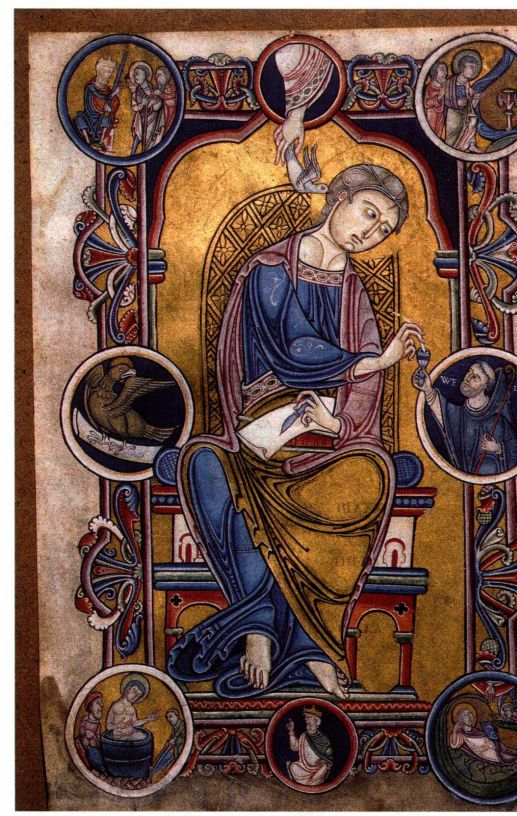

图11\.30《福音书作者圣约翰》（St．John the Evangelist），出自《修

道院长维德里库斯福音书》。约1147年。犊皮纸蛋彩画，     厘米。

法国埃尔普上阿韦斯纳市         考古与历史协会（Société

Archéologique et Historique\)

🟩370 詹森艺术史

自古典时期的茛苕叶饰；而人物形象则基于加洛林和拜占庭原型。本页中的统一之感不只是通过形式，也经由内容传达出来。圣约翰将框架中的空间占据得异常完满，似乎不除去其位于页面边框圆形画中的墨水来源（由手抄本捐献者修道院院长维德里库斯奉上）、灵感来源（上帝手中代表圣灵的鸽子）或象征（鹰），就无法移动分毫。另外一些圆形画与主要人物联系不甚紧密，展示了圣约翰的生平场景。

罗马式风格的地方变体

尽管经由各种介质表达出的共同美学目标将罗马式时期欧洲不同地区的艺术联系在一起，但仍可从中辨识出各种不同的地方性方式。这些独特的方式不仅出现在今天的法国境内，还有其他欧洲地区，例如意大利的托斯卡纳、默兹河谷（Meuse Valley）、德国和英格兰。罗马式艺术中的地方变体折射出11、12世纪西欧的政治环境，当时的西欧由稍许松散的封建王公联盟统治。语言的差别也影响了地区间的差异。例如，在法国内部就使用多种语言，其中包括法国西南部的“奥克语”（langue d＇oc）和中北部的“奥依语”（langue d＇oil）。不同地区的艺术家和赞助人各有不同的艺术资源。德国和北部欧洲其他地区，奥托艺术是令人钦佩的榜样；而在意大利和法国南部，古典艺术遗存数不胜数；艺术家从中有所借鉴，并将罗马形式转变为能够实现罗马式美学目标的艺术。英格兰1066年为诺曼底大公所占领，法国诺曼底艺术则为之提供了示例样本。

法国西部：普瓦图

罗马式时期，一个所谓的雕刻装饰流派在普瓦图（Poitou）地区出现。此地位于法国西南部，是阿基坦公国（Duchy of Aquitaine）的一部分。公爵府所在地的普瓦蒂埃（Poitiers）建有一座大圣母教堂（Notre\-Dame\-la\-Grande），日后成为了该流派的杰出代表。

普瓦蒂埃的大圣母教堂 大圣母教堂宽大的屏风式立面（图11\.31）为雕刻装饰提供了充足空间。精致的重边连拱之下满是或坐或立的房屋大小的人像，之下是一条横穿立面的宽浮雕带。亚当与夏娃的堕落与玛利亚的生平故事并置，其中包括圣母领报和耶稣诞生，夏娃与玛利亚的形象再次同时出现（见第335、342页）。亚当和夏娃旁边升座的人物就是《旧约》中提到的巴比伦国王尼布甲尼撒，其上的铭文确

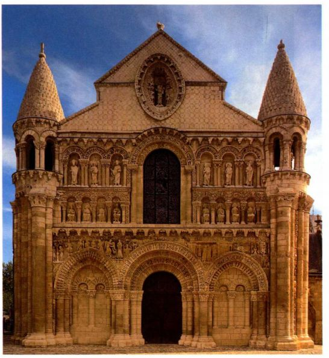

图11\.31 法国普瓦蒂埃市大圣母教堂西立面。12世纪早期

定了其身份。《亚当故事》（Play of  Adam ，12世纪的中世纪戏剧，传统上在教堂内上演）可能是大圣母教堂人物选择与安排的来源。尼布甲尼撒身旁，即大门左侧拱的中央，四位人物每人手持一部卷轴或书籍，

其上铭刻有出自《亚当故事》中的词句。在这部剧中，亚当与夏娃是主要角色，尼布甲尼撒也得以提及。

深深凹进的门道对丰富雕刻效果至关重要，此处虽无半月楣，但大门为众多拱门和多重拱门饰所环绕。塔楼的圆锥形顶端几乎与山墙（gable，立面顶部的三角形墙体）等高，后者要高于其背后的实际屋顶。山墙上表现的是基督与天使，其高度在构图上就显示出神圣的地位。遍布教堂立面的这组雕刻刻意将基督教教义表现为一场盛筵，既为了观众的眼睛，还为了人的心灵。

法国东南部：普罗旺斯

在法国勃艮第以南的普罗旺斯（Provence）地区，罗马式艺术从其周边到意大利的艺术中受益颇多。“普罗旺斯”一词出自其古代的名称“罗马行省”（ProvinciaRomana），确认了其与罗马在政治与文化上的密切联系。时至今日，当地仍保有丰富的罗马艺术与建筑遗迹，例如尼姆的方形神殿（见图7\.46）。

圣吉尔\-德加尔 圣吉尔\-德加尔修院教堂的正

🔴第十一章 罗马式艺术 371

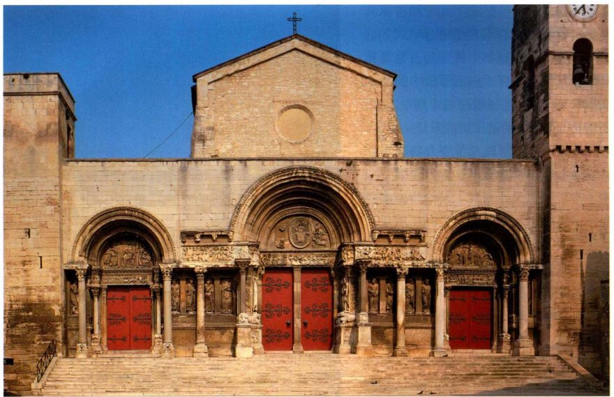

图11\.32 法国圣吉尔\-德加尔教堂西立面。12世纪中期

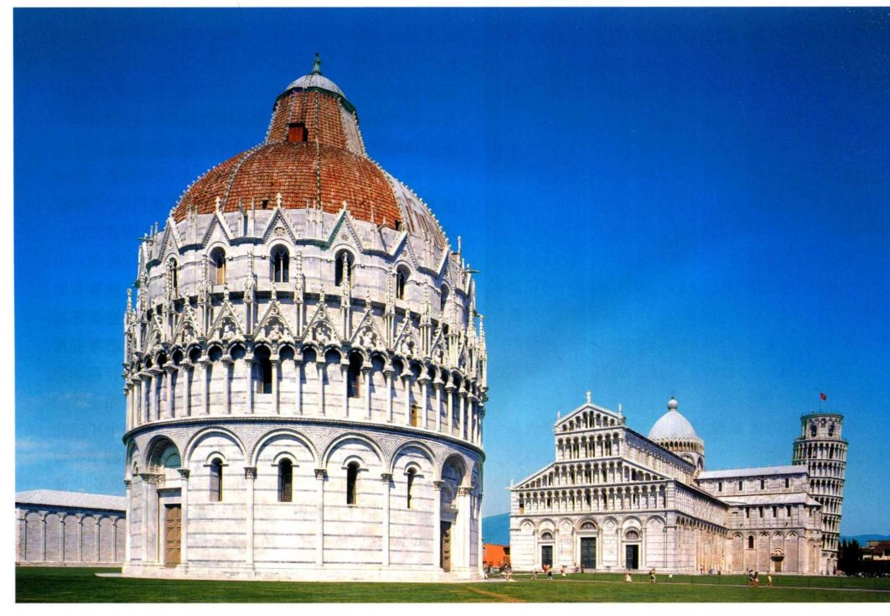

图11\.33 意大利比萨洗礼堂、大教堂和钟楼（自西向东观）。1053\-1272年

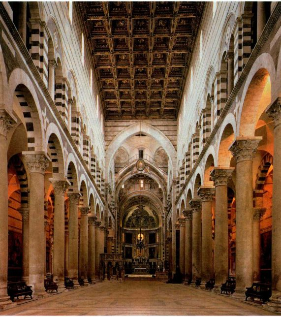

图11\.34 比萨大教堂内部

立面（图11\.32）如同大圣母教堂的正立面一样将教堂屏蔽起来。圣吉尔\-德加尔教堂正立面由三座拱门组成，其灵感来自罗马凯旋门（见图7\.65），旨在将古代的凯旋意象与进入教堂的重要界域功能联系在一起。考虑到当时对基督教胜利的关注，特别是征服穆斯林的努力，这种立面与罗马凯旋建筑的形式联系一定看来颇为恰当。支撑左侧半月楣的门楣上，对基督胜利进入耶路撒冷的描绘对当时的观众而言一定具有特别意味。他们明白，位于罗纳河口的圣吉尔城正是法国十字军向圣地进发的开拔之地。

托斯卡纳地区

罗马式时期，意大利西北部的托斯卡纳地区分裂为若干独立城邦，其中最重要的是比萨、佛罗伦萨、普拉托（Prato）和利沃诺（Liverno）。这些城市仍保存了早期基督教的基本建筑形式，然而同时也受到罗马建筑的启发，增加了装饰。

比萨大教堂 最为著名的意大利罗马式建筑就是托斯卡纳地区的比萨斜塔（Leaning Tower of Pisa），其举世闻名其实要归功于一场事故。雕刻家波纳诺·皮萨诺（Bonanno Pisano，活动于1174\-1186年） 所设计的拙劣地基，在建筑施工之时就开始倾斜（图11\.33）。这种独立钟楼（campanile）设计早在9、10

世纪就出现于意大利。这一传统在意大利影响强烈，导致当地几乎没有与教堂合体的钟楼。比萨建筑群包括一座教堂和一座位于西部的圆形穹隆顶洗礼堂。这些建筑物在城市北部的开阔地上完成，表现出自1062年当地舰队在巴勒莫击溃穆斯林以来，比萨城市共和国所拥有的财富与自豪。

1153年，比萨洗礼堂由迪奥蒂萨尔维（Diotisalvi）开始修建，但是第一层连拱廊之上的所有部分在一百年之后不得不进行返工。贯穿中世纪始终，托斯卡纳地区十分注重古典文化遗产。独立洗礼堂的理念就来自基督教早期先例，例如拉文纳的东正教洗礼堂（见图8\.13）。比萨洗礼堂设计有浑圆形式及新颖的圆锥形拱顶，反映出耶路撒冷圣墓复原后的圆形建筑的影响（见图8\.9）。比萨人无疑十分清楚这种对比的含义\-比萨水手从运送十字军和朝圣者前往圣地的过程中获益匪浅。贸易与旅行增长所带来的机会、朝圣的吸引力，以及伊比利亚半岛和地中海东部正在进行中的反穆斯林战争，再一次成为塑造罗马式建筑的决定性力量。

比萨大教堂的平面基于基督教早期的公堂式设计，但又通过增建耳堂的方式将其转换为拉丁十字（Latin cross，十字三臂等长，另外一臂则长于其他三臂），使得本身具有半圆室的耳堂俨然一座小型公

🔴第十一章 罗马式艺术 373

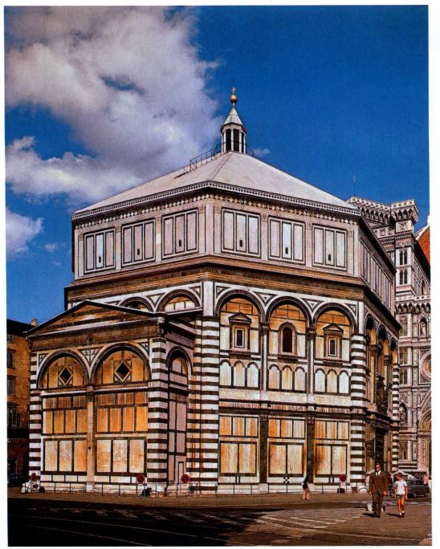

图11\.35 意大利佛罗伦萨圣乔瓦尼洗礼堂。约1060\-1150年

堂式教堂。十字交叉处建有穹顶，除侧堂外的其余部分均使用了木质屋顶。侧堂共有六道，包括中堂四道和耳堂两道，被两个筒拱相交形成的交叉拱所覆盖。大教堂内部（图11\.34）在比例上较之早期基督教的公堂式教堂更为高耸，因为侧堂之上另有楼廊和高侧窗。然而支撑中堂与侧堂连拱廊的古典圆柱依然令人回想起安然伫立于早期基督教公堂式教堂中的柱式（见图8\.6）。

托斯卡纳建筑刻意复兴古代罗马风格的方法就是在教堂外部贴覆五颜六色的大理石“外皮”。罗马建筑中此类镶嵌遗留甚少，因为其中大部分都被挪用来装饰后来的建筑。但是万神殿内部仍为我们提供了此类装饰当初的面貌（见图7\.41）。比萨大教堂及其附属建筑均为白色大理石所覆盖，其上用暗绿色大理石镶嵌了水平条带和装饰图案。装饰设计结合了假拱廊和楼廊两种形式。这些造就的华丽感与早期基督教教堂简朴的外观有着天壤之别。

佛罗伦萨圣乔瓦尼洗礼堂 佛罗伦萨在商业和艺术方面都领先于比萨，该地大教堂（见图13\.11）对面的圣乔瓦尼洗礼堂（Baptistery of San Giovanni，图11\.35）是托斯卡纳地区罗马式建筑最为杰出的代表。

这是一座拥有宏大穹顶的八角形建筑，始建于11世纪中期。八边结构的象征意义在洗礼堂设计中具有悠久历史（见第247页）。绿白相间的大理石嵌板设计呈现出严格的几何线条，是典型的佛罗伦萨罗马式（Florence Romanesque）风格。第二层假拱廊的三联拱与凯旋门式设计在比例和细节方面都极具古典意味。

佛罗伦萨圣明尼亚托教堂 宏伟的本笃会修道院圣明尼亚托教堂（San Miniato al Monte）可以俯瞰佛罗伦萨全城，而这一选址也反映出中世纪修道院的高贵地位。教堂正立面建有山墙（图11\.36），与这座建有侧堂的木顶公堂式教堂相得益彰。圣明尼亚托教堂动工于圣乔瓦尼洗礼堂开工两年之后，与后者一样，立面绿白相间的大理石贴面布局拥有相当精确的几何形。托斯卡纳地区尽管在表面处理和材料方面与众不同，但是各种元素的组织仍与其他地区的罗马式布局有可比之处。装饰佛罗伦萨罗马式建筑的独立附加单元与朝圣式教堂（见图11\.14、11\.18）中的开间划分，以及法国罗马式大门（见图

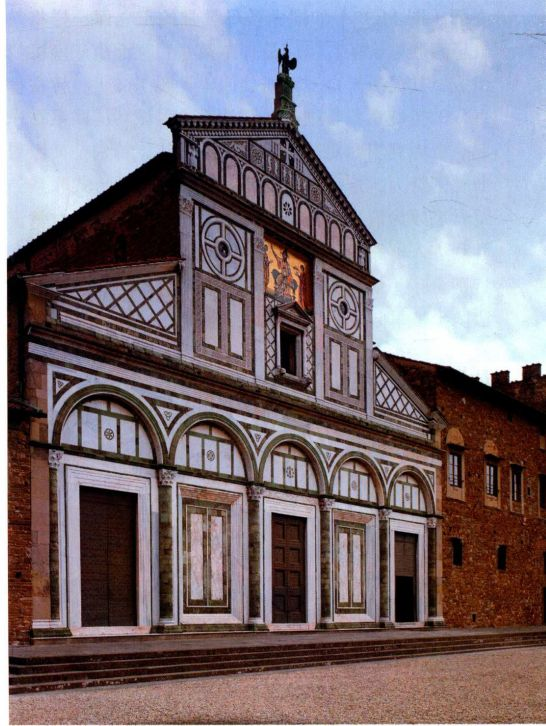

图11\.36 意大利佛罗伦萨圣明尼亚托教堂正立面。1062\-1150年

🟩374 詹森艺术史

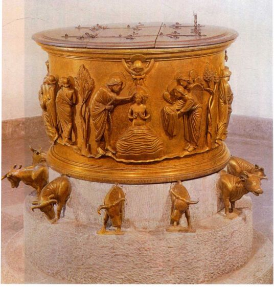

图11\.37 余伊的雷尼尔：洗礼盆。1107\-1118年。青铜，高63\.5厘米。比利时列日圣巴泰勒米教堂

11\.14、11\.31、11\.32）有异曲同工之妙，后者也是由独立单元构成，通过功能上的协调使其统一起来。有意识使用罗马艺术元素复兴的手法使之与众多此类罗马式建筑相关联。此处表现为大理石的运用以及跨在科林斯式圆柱上的重复的拱。

默兹河谷的默兹风格

一批以金属制品见长的罗马式雕刻家活跃在默兹河谷地区，这条河流从法国东北部流入现在的比利时与荷兰。该地区在加洛林王朝时期是经典兰斯风格的发源地（见图10\.14\-10\.16）。罗马式时期，对古典艺术的关注充分在其艺术作品中表现出来，该地区的艺术则称为“默兹艺术”（Mosan art）。列日（Liège）修道院院长何里纳斯（Hellinus）为当地的方茨圣母教堂（Notre\-Dame\-aux\-Fonts）定制了一个青铜洗礼盆（图11\.37）。普遍认为这件作品出自余伊的雷尼尔（Renier of Huy）之手；他是我们所知最早的一位默兹艺术家，而这一情况其实纯属偶然。洗礼盆完工于1118年底，现存于圣巴泰勒米（Saint\-Barthélemy）教堂。这是一件非凡的杰作，单体浇铸而成，高63\.5厘米，直径1米有余。洗礼盆由12头公牛顶起，正如《旧约·列王记上》中描述的所罗门在耶路撒冷神殿中的铜海一样：“他又铸一个铜海······有十二只铜牛驮海······牛尾都向内。”（7：23\-25）基督教教义

将所罗门的铜海作为洗礼盆的原型，而12头公牛正是使徒的前身。

洗礼盆上的浮雕与希尔德斯海姆贝恩瓦尔德主教青铜门（见图10\.26）的单块装饰在高度上大致相同。然而，奥托时期作品中粗糙的表现力在洗礼盆上为设计的和谐均衡、雕刻平面的精妙处理和对有机体的深入认识所取代。就一件中世纪的作品而言，其拥有惊人的古典风格。左侧树后背对观众的人物动态优雅，身着希腊式长袍，极可能是直接出自古代作品。雷尼尔使用青铜而不是具有宏大感的石雕，也表现出他对古典艺术形式的兴趣。北部欧洲强大的金属制品传统在此被用于传达古典价值，与中世纪早期占据该领域的金属匠人风格格格不入。

默兹地区的罗马式艺术对古典风格的复兴起到了十分独特的贡献，与其他地区的抽象和装饰化特色截然不同，说明虽然各个地区的罗马式艺术都具有复兴古典形式的兴趣，但是这种古典主义的表达方式却千差万别。列日的洗礼盆和其他默兹雕刻均为高浮雕、甚至圆雕，解剖细节和比例方面均令人信服。然而，正如其他地区的罗马式作品一样，默兹雕刻并非是自然主义风格。在这里，正是由于对理想形式的关注才有了古典形式的运用。

德国

神圣罗马帝国（Holy Roman Empire）的传统在德国俨然是复兴罗马形式的过滤器。因此，集中在莱茵兰的德国罗马式建筑，在其结构与形式语汇方面，都依赖于加洛林和奥托统治者们赞助兴建的建筑。

施派尔大教堂 施派尔大教堂（Cathedral ofSpeyer）于1061年祝圣，其中容纳了诸位神圣罗马帝国皇帝的陵墓。其中堂覆盖有木构屋顶（图11\.38），这点与其他加洛林和奥托的建筑不同。在1080年的一次重要重建工程中，中堂屋顶改为交叉拱顶（图11\.39），解决了困扰罗马式建筑师们的问题：虽然在之前的教堂中，筒拱在美学上令人愉悦，在声学上可以产生共鸣，而且具有防火的优势，但是却严重限制了进入中堂的光线。问题在于此类拱顶最薄弱的部分起拱点（springing，拱在其支撑物顶端开始起筑的着力点）正位于高侧窗所需的位置。诸如卡多那的圣文森特教堂（见图11\.1）和克吕尼修院教堂（见图11\.12）等建筑也开有高侧窗，但是前者的窗户数目与尺寸都较小，而后者则必须采用尖拱和增厚的扶壁等措施，才能为高大的筒拱提供足够的支撑力。

最终施派尔大教堂的建筑师们通过交叉拱的方法

🔴第十一章 罗马式艺术 375

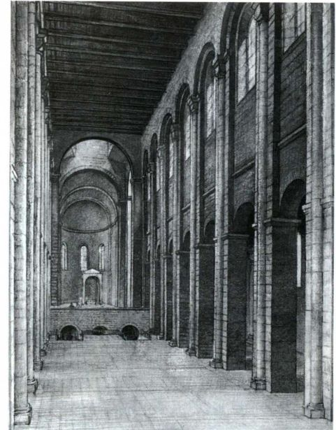

图11\.38 德国施派尔大教堂内部复原图（根据Conant的图绘制）。约1030\-1061年

解决了这个问题（见第378页的材料与技法）。罗马人曾相当成功地使用过交叉拱（见第378页），将外推力有效地疏导向四角。这使得拱下的开敞空间成为可能，在此处开窗并不会降低拱的坚固程度。在施派尔大教堂的重建工程中，随中堂交叉拱而来的是高侧窗的扩大。罗马式建筑师们掌握交叉拱的建筑技术，曾在较低的空间上建有此类拱顶，例如地下礼拜堂的侧堂，在比萨就是如此（见第373页），显然他们缺乏勇气来修建大规模的交叉拱。施派尔大教堂就成为了建筑技术上真正的突破。这座教堂宏伟非凡，当时任何一座教堂在其面前都相形见绌。

施派尔大教堂各个单独的交叉拱开间组成了一系列间隔的空间单元。每个交叉拱都覆盖了原初中堂的两个开间。附在间隔性复合墩柱上的半圆柱清晰表现出其承载拱顶重量的功能。对复合墩柱的运用将施派尔大教堂与其他地区的罗马式建筑联系在一起（见图11\.1、11\.4和11\.8）。交替支撑系统所造就的韵律必定在德国产生了令人感到熟稔的回响，格恩罗德的圣西利雅库斯教堂（见图10\.22）与希尔德斯海姆的圣米迦勒修院教堂（见图10\.25）中都出现过这种结构，只不过单纯将其用作美学目的而已。

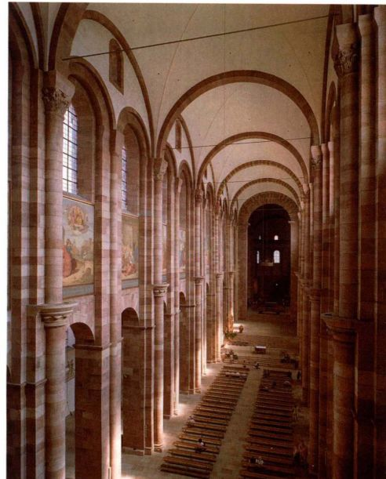

图11\.39 德国施派尔大教堂内部，约1030\-1061年；拱顶，约1080\-1106年

诺曼底和英格兰

在北部的诺曼底，基督教得到诺曼底公爵和贵胄们的大力支持；他们是早期的维京人，后来将诺曼底转变成为强大的封建领地，与修道院院长和主教一同建立了侍臣联盟，谋求土地授权。诺曼底公爵威廉二世（William II）积极推进修院的制度改革，并建立了大量的修道院。诺曼底迅速成为当时重要的国际文化中心。当威廉于1066年入侵盎格鲁一撒克逊领土英格兰并成为当地国王时，英格兰在政治上与法国北部结为同盟。因此诺曼底与英格兰的罗马式艺术具有众多相同的风格特征。

《巴约挂毯》诺曼底人与英格兰人间的复杂关系在《巴约挂毯》（Bayeux Tapestry，图11\.40、11\.41）中显露端倪。事实上这并非一条挂毯，因为不是编制而来，其实是一条长达70余米的亚麻刺绣饰带。现存的50个场景记录了大量历史事件，最终的事件是1066年征服者威廉（William the Conqueror）穿越英吉利海峡，并于国王忏悔者爱德华（Edwardthe Confessor）死后成功夺取了英格兰王位。根据挂毯上的描述，盎格鲁一撒克逊伯爵哈罗德（Harold）为了得到英格兰贵族许诺给他的王位而背弃了效忠威

🟩376 詹森艺术史

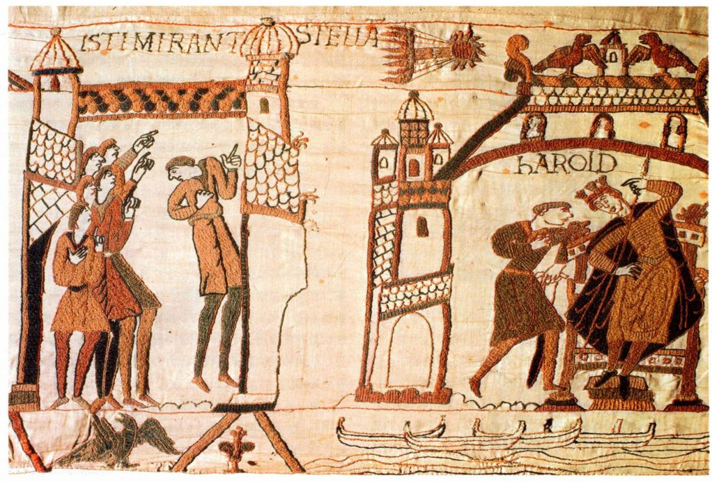

图11\.40《人群敬畏地凝视彗星；哈罗德被告知预兆》（Crouds Gaze in Ate at a Comet as Harold Is Told of an Omen），《巴约挂毯》细部。

约1066\-1183年。亚麻布羊毛刺绣，高50\.7厘米。法国巴约征服者纪尧姆中心（Centre Guillaume le Conquérant）

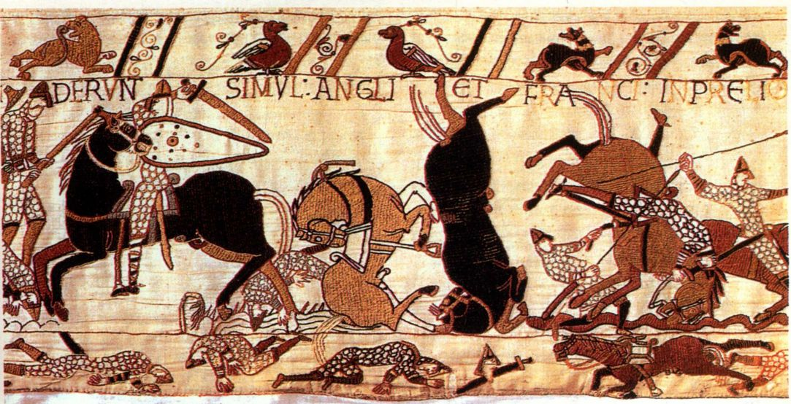

图11\.41 《黑斯廷斯战役》（The Battle of Hastings），《巴约挂毯》细部。约1066\-1183年。亚麻布羊毛刺绣，高50\.7厘米。法国巴约征服者纪尧姆中心

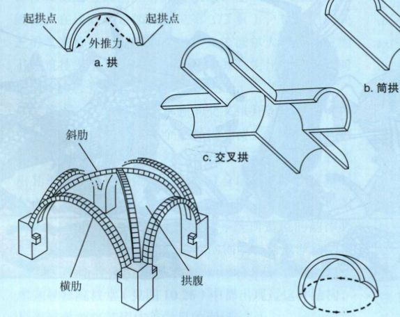

拱顶

拱顶是拱形结构（arcuation）建筑的屋顶建造技术，即建筑中所采用的拱形（a）。尽管美索不达米亚、埃及和希腊建筑中都曾经运用拱顶，但将其用于美学目的则是伊特鲁里亚人和罗马人（见第224\-225页）。最早的中世纪建筑覆盖有木屋顶，在罗马式时期，拱顶则成为了主导的屋顶类型。11世纪对拱顶的再次运用是罗马式时期复兴罗马艺术形式的主要成就。罗马拱顶主要由混凝土制成，而中世纪拱顶则通常采用碎石或石方，并使用灰泥作为粘合剂。

中世纪建筑中修建石砌拱顶需要耗费极大的人力和财力，但其优势不胜枚举。其中一项就是防火，这对依靠蜡烛照明，且容易引来雷击的高耸建筑尤为重要。中世纪建筑史大致上就是一部火灾史。来自维京人、马扎尔人和穆斯林的频繁侵袭也使人们希望获得坚固的建筑。此外，石砌拱顶具有卓越的音响效果，这对教堂之内举行的吟咏圣歌活动十分重要。其在美学上的优越之处也不亚于这些实际的好处：拱顶可以使建筑显得威严宏大，烘托出一种明确的包容之感。拱顶类型众多，包括筒拱、四分拱、交叉拱、肋拱和穹隆顶。

单拱纵深延长形成的筒拱（barrel vault）是最基本的形式，也是中世纪建筑者最初采用的拱顶类型，因为其可以完全覆盖长方形公堂。遗憾的是筒形拱顶建筑内部采光较差，原因在于中堂墙体上的高侧窗会降低拱顶最脆弱部分起拱点（springing）的支撑力。而拱基的起拱点处则使得贯通整个拱顶的重力向两侧形成外推力。这种外推力需要有所支撑，通常的解决方式就是筑起厚重的墙壁来扶助拱顶。

在建有宽侧堂的罗马式教堂中，建筑师要面对这样的问题\-如何将筒拱的外推力通过侧堂传递给外墙。于是他们通过在侧堂顶部的楼廊上筑起四分拱（quadrant vaults，半筒形拱）的方式，使之支撑中堂的筒拱，从而解决了这个问题。

但建筑内部昏暗依旧，光线仅可以通过筒拱两端和侧墙上的窗户进行，而之前还要先经过侧堂和楼廊。

交叉拱（groin vault）的出现使建筑内部采光情况得到改善，而在建筑材料的使用上也更为节约，因此建筑显得更为明亮、轻盈。两条筒拱相交形成了交叉拱（c），每条拱的外推力都受到与之垂直的另外一条拱的反作用力（“groin”一词指两拱的交汇处）。通过这种方式，得以将外推力导向四角，使得在每一交叉处下方的墙体上开窗或开其他孔洞成为可能。

肋拱（ribbed vault）首次出现在达勒姆大教堂，可能最初只是一种设计中的装饰样式（d），其结构优势之后才为建筑师和石工所认识。砌于拱顶交叉处的较大石方意在形成斜拱，其功能正如固定的脚手架，负责支撑拱顶的曲面，填充拱肋（rib）之间空间必不可少的拱腹（webs）。肋拱较之非肋拱更容易建造，而且对于中心确定的要求也不严格。拱腹可以采用较轻的建筑材料，因为有肋交叉拱疏卸外推力的效率更高。

罗马式石工也会建造穹顶（dome），这种拱顶实质上是由单拱沿中轴线旋转而成（e）。在罗马式教堂中，穹顶用于集中式建筑之中，或者用来表明重要的部分，例如耳堂与中堂相交之处。拱顶施工难度很大，而且罗马式拱顶十分沉重，厚度通常超过30厘米，重达几吨。拱形结构的各个部分相互联结，构成了一种动态系统，这也意味着只有在完工之后拱顶才能达到稳固状态。在建造过程之中，需要为其提供支撑，也就是一种称为定心装置（centering）的木头支架。一旦拱顶完工且扶壁就位，拱顶就可自承其重，定心装置也可拆除。罗马式时期拱顶的广泛运用及其日益精致的结构是一项重大成就，对于中世纪建筑的持续发展至关重要，特别是在哥特式时期。

拱的形式：a\.拱；b\.筒拱；c\.交叉拱；d\.有肋交叉拱；e\.穹顶

d\.有肋交叉拱

e\.穹顶

🟩78 詹森艺术史

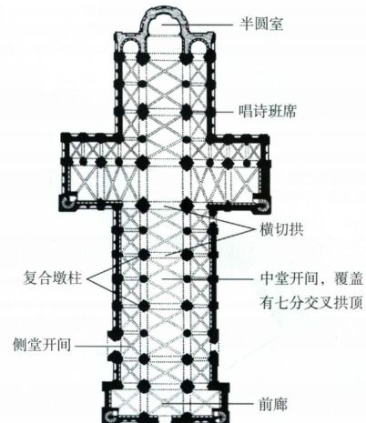

廉的誓言。威廉因此将入侵英格兰作为报复，诺曼底军队攻占英格兰，哈罗德阵亡。由于该“挂毯”的委托人可能是诺曼底人，故事的叙述就以占领者的视角展开，尽管一般认为其制作者是英格兰缝纫女工。她们在中世纪时就以其精湛的技艺而享有盛名。

大事年表

约1066\-1083年\-制作《巴约挂毯》

1093年\-英格兰达勒姆大教堂开始建造

达勒姆大教堂 诺曼底人的建筑中出现了许多建筑工程学上的重大突破，而这些突破都发生在英格兰，占领此地之后，威廉赞助兴建了一批诺曼底风格的建筑。始建于1093年的达勒姆大教堂（DurhamCathedral，图11\.42）是中世纪欧洲规模最大的教堂之一，不仅中堂比圣塞尔南教堂宽出三分之一，而且总长度也更大，竟然达到了120余米。中堂最初设计为拱顶，东端拱顶完成于1107年，工期短得令人震惊，

外推力与整个拱顶的重量集中在楼廊层拱肋起拱的六个安全支撑点上。拱肋是稳固交叉拱的骨架，拱肋之间的空间则采用了较薄的砌筑结构，因此减轻了拱顶的重量与外推力。扶壁又将拱顶重量与外推力传递给侧堂的外墙（图11\.44）。这种灵活的结构使得

《巴约挂毯》所展示出宏大感以及对于叙事风格的浓厚兴趣与《修道院长维德里库斯福音书》（见图11\.30）如出一辙，后者与诺曼底和英格兰都有关联。挂毯的设计者通过极其熟练的手法将叙事性与装饰性融为一体。两条边饰点缀在主要场景两侧，其中有些图像是装饰，另外一些则是对于挂毯连贯叙事的注释。在图11\.40所示的场景中，上边框里描绘了拖着火红尾巴、旋转着的星星，一位侍从向新近加冕的哈罗德叙说这一令人惊异的自然现象。题字ISTI MIRANTSTELLA（“这些人因星星而惊奇”）则记录了1066年哈雷彗星的华丽登场，而这恰恰发生在哈罗德加冕之后不久。对中世纪的观众而言，自然现象的预言意义想必清晰无误，特别是他们还亲眼见到了预言成真。在哈罗德脚下，幽灵一般的船正等待着诺曼底人，后者正准备渡过英吉利海峡。这一场景预示了即将到来的暴力事件。

图11\.42 英格兰达勒姆大教堂平面图（根据Conant的图绘制）。1093\-1130年

中堂其余部分的拱顶则于1130年建成（图11\.43）。

尽管《巴约挂毯》没有采用古典绘画的绘画方法，例如透视缩短和重叠（见图5\.79），依然生动、详实地记述了11世纪的战争场面，并且提供了大量有关诺曼底建造者修建要塞式城堡的信息。希腊罗马绘画中的体量感为一种新型的个人主义风格所替代，使得每个人物都拥有成为英雄的可能，而通过武力还是计谋的方式达到这一点似乎无关紧要。图11\.41中，一位士兵从后腿腾空的马上跌落，于是猛拉对手坐骑的腹带以使其倾倒。挂毯与科尔比福音书手抄本（见图11\.28）的亲缘关系在马匹生动的翻筋斗姿态中表现得十分明显，也与福音书中狮子的姿势十分相似。在中世纪，由于宗教领域与世俗领域的区分并不明显，因此两者可能会运用同样的图画设计。《巴约挂毯》与科尔比福音书中的力量与线性的清晰性不禁令观者联想到罗马式雕刻中的大型人像。

这座拱顶极具价值，其最早在三层中堂内系统运用了有肋交叉拱，标志着超越施派尔大教堂的根本进步。在大教堂的平面图（图11\.42）中，侧堂分为几个相通的近正方形交叉拱隔间。长方形的中堂开间被有力的横切拱分开，同样覆盖有交叉拱，每一开间的拱肋构成了双X型，称为七分（septpartite）交叉拱。由于中堂开间的长度是侧堂开间的两倍，横切拱只出现于中堂连拱廊的奇数墩柱上（见图11\.43），因此墩柱的安排显得错落有致。与施派尔大教堂（见图11\.39）每一墩柱均有增强其支撑力的附壁圆柱不同，达勒姆大教堂的奇数墩柱与偶数柱有本质区别。奇数柱为复合墩柱，成束的圆柱和半露方柱附着在长方形或正方形的中心柱上，而偶数柱则是较为纤细的圆筒形墩柱。

🔴第十一章 罗马式艺术 379

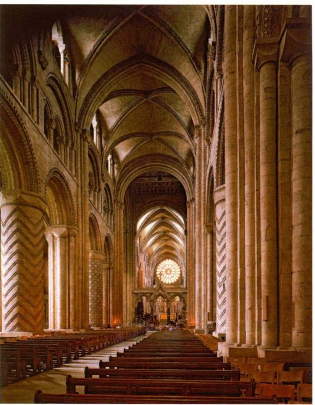

图11\.43 英格兰达勒姆大教堂中堂，东向观

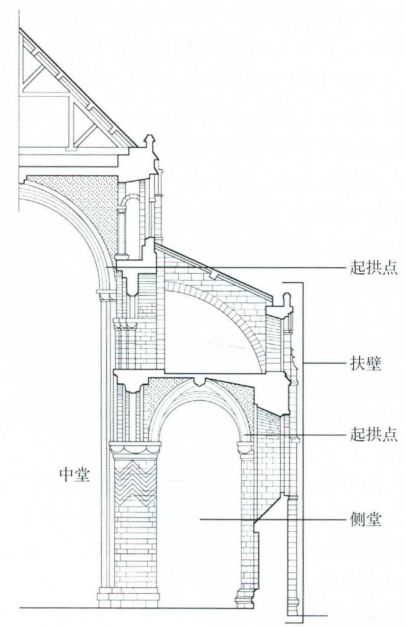

砌筑拱顶的工程效率更高，费用也更低廉。如此精巧的设计是否为达勒姆大教堂的原创尚不得而知，但不太可能出现于更早的年代，因为这一结构还处于试验阶段。十字交叉处的横切拱仍为半圆拱，而西端的横切拱却略呈尖拱的样式，这表明建筑者正在寻求技术上的改进（见图11\.43）。

有肋交叉拱系统还有其他的优势。从美学角度来看，达勒姆的中堂堪称罗马式建筑中最为精美的建筑之一。交替墩柱所具有的坚固感与明亮拱顶那船帆般的表面空间形成了鲜明对比。这种相对较轻且灵活的结构，使得高大宽阔的空间之上还能砌筑防火的石砌拱顶，同时还保留了高侧窗以提供充足的光照。达勒姆大教堂展示出强大的建筑活力，即便如此，圆柱上各不相同的线刻装饰与拱肋所构成的图案仍是盎格鲁一撒克逊民族热爱装饰、关注平面图案（见图10\.1\-10\.3）的表现。

卡昂圣艾蒂安教堂 卡昂（Caen）的圣艾蒂安（Saint\-Étienne）修院教堂（图11\.45）由征服者威廉建立，工程始于1066年其入侵英格兰之前的一至两年，但这座教堂最终耗费了一百余年才得以完工。在这期间，达勒姆大教堂的成果有肋交叉拱技术趋于成熟。圣艾蒂安教堂的西立面（图11\.46）与普瓦蒂埃的大圣母教堂（图11\.31）以及其他罗马式教堂的西立面（图11\.15、11\.18、11\.32）形成了鲜明对比，表示此处为一座皇家教堂。这种西立面最近的先例是加洛林王朝时期的教堂，例如由皇家出资兴建的科维修院教堂（见图11\.20）。与之相似的是，圣艾蒂安教堂的西立面装饰也极其精简。四座巨大的扶壁将立面垂直分为三个部分，推力向上延伸到两座塔楼。即使没有后来增建的塔尖，这两座塔楼的高度也令人惊叹。圣艾蒂安教堂显得冷静、沉着，使得观众专注于其优雅的比例，而这也是众多其他罗马式建筑共有的特色。

在圣艾蒂安教堂内部（图11\.47），最初设计的中堂为木构屋顶，并建有楼廊和高侧窗。但经过达勒姆大教堂的试验之后，12世纪早期为中堂砌筑交叉拱顶的设想终于成为可能，只需在墙壁设计上略作改动即可。此处的中堂开间近似于正方形（见图11\.45），而达勒姆大教堂的中堂开间则为长方形。因此，双X形拱肋设计可以替换为单X形外加一条横切拱肋的样式，这样就产生了六分（sexpartite）交

图11\.44 英格兰达勒姆大教堂横剖面图（根据Acland的图绘制）

🟩380 詹森艺术史

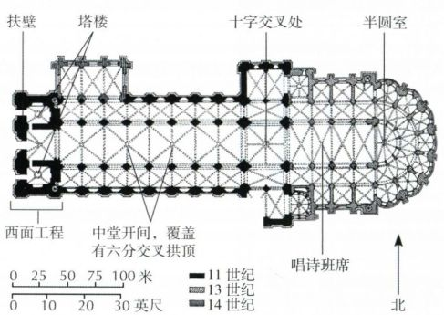

图11\.45 法国卡昂圣艾蒂安大教堂平面图。始建于1068年

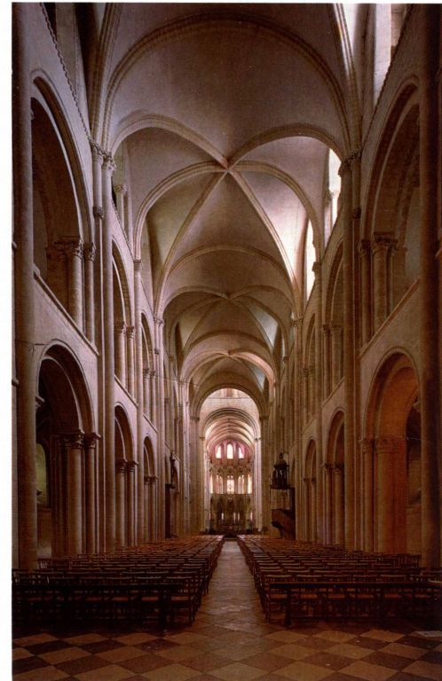

图11\.47 法国卡昂圣艾蒂安大教堂中堂，拱顶建于约1115\-1120年

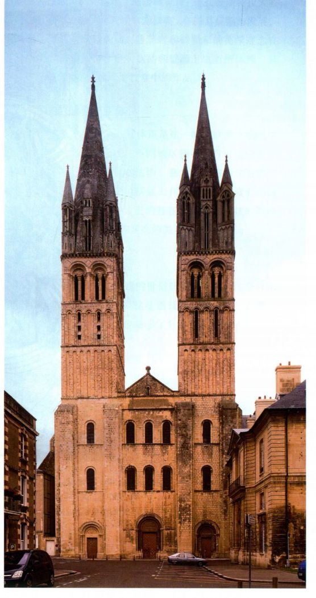

图11\.46 法国卡昂圣艾蒂安大教堂西立面

叉拱，拱腹被分割为6部分，而非7部分。这些拱顶不再由沉重的横切拱来进行分割，取而代之的是简单的拱肋。其结果是拱顶重量的减轻，并使得中堂拱顶整体具有了强烈的连续感，墩柱的交替也不再那么明显。与达勒姆大教堂相比，圣艾蒂安教堂中堂轻盈得仿佛空气一般。

🔴第十一章 罗马式艺术 381

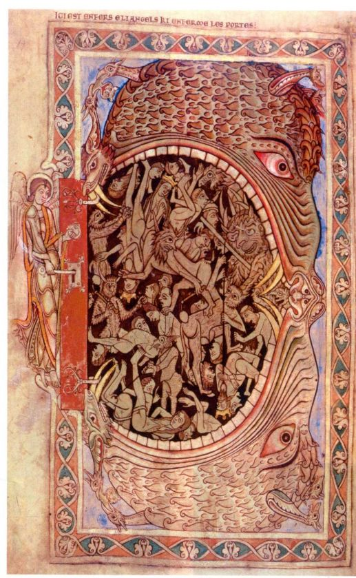

图11\.48 《地狱之口》	\(Mouth		，出自《温切斯特诗篇》。约1150年。该作品来自英国温切斯特。犊皮纸蛋彩画，32\.5 × 23厘米。伦敦大英图书馆（MS Cotton Nero D．4）

罗马式时期的悖论

达勒姆大教堂和卡昂圣艾蒂安教堂标志着罗马式建筑试验的顶峰。本章开篇时曾对与欧洲经济条件的改善和政治上的日益稳定进行概述，而这在建于12世纪的世俗建筑中均有所体现。但是，建筑的防御性质也暗示了一个悖论：这些坚固、有力的建筑在表达一种新近获得的自信同时，也暴露出挥之不去的恐惧感。恐怖的末日审判场景（见图11\.18）以及罗马式艺术中其他表现怪物和恶魔式生物的图景都证明了这种焦虑。12世纪中期作于英格兰的《温切斯特诗篇》（Winchester Psalter，图11\.48）里，有一页画着一个巨大的地狱之口：头部畸形的魔鬼大张着血盆大口，吞噬各个阶层的罪人。题词为盎格鲁一诺曼底（Anglo\-Norman）地区的法语：“此处是地狱，以及

锁了门的天使。”（ICI EST ENFERS E L＇ ANGELS RT ENEGRWE LES PORTES\.）影响罗马式雕刻与建筑至深的厚重墙壁和多重围栏在此也得以再现。轮廓明晰、具有装饰的边框作为平静的终曲，环绕并控制着那些令人恐惧的形象。

这份手抄本由温切斯特主教布卢瓦的亨利（Henryof Blois）定制，他曾是克吕尼修道院的修士，并在多次罗马之行中收集了大量古典雕塑和拜占庭绘画。《温切斯特诗篇》说明，在罗马式时期国际性的艺术影响力可以帮助艺术家创作出这样的图景，而图中表达出一个社会的希望与恐惧，渴求受到保护，免于黑暗力量的伤害。其同时还具有某种教育意义，人类最终需要某种天国造物的协助来克制魔鬼的巨大力量，也就是那位锁上地狱之口大门的天使。

🟩382 詹森艺术史

小结

11艺术名下。这一术语意为“依照罗马的样式”，和12世纪的大部分西欧艺术都被归于罗马式但是罗马式建筑师与艺术家同样受到来自加洛林、拜占庭、伊斯兰以及其他艺术传统的影响。人口、贸易与旅行的增加和新聚居地的开发都刺激了建筑活动的展开，而其中大部分都为基督教所用。这一时期的大型建筑一般都装有石砌拱顶，并辅以建筑雕刻装饰，堪与罗马建筑的成就相媲美。

罗马式风格的早期呈现

罗马式艺术在欧洲大陆缺乏中央集权的时期传播开来，而当时存在着各种联系紧密的地方风格。最初出现在意大利、法国和西班牙的部分地区。早期罗马式建筑的杰出范例是西班牙卡多那的圣文森特教堂，这座建筑展示了修建石砌拱顶的精湛技巧。人像雕刻也是该时期的重要成就之一，例如法国圣热尼·德·枫丹教堂的大理石门楣。

成熟期的罗马式艺术

罗马式成熟期风格的建筑运用了更多的雕刻和日益复

杂的拱顶技术，例如西班牙的圣地亚哥\-德孔波斯特拉大教堂和法国穆瓦萨克的圣皮埃尔隐修院。伴随其成熟与发展，罗马式风格传遍欧洲大陆。建筑者和雕刻家的美学观念在该时期的彩饰手抄本、金属制品和壁画上也有所体现，其中包括圣塞文·苏·加坦博教堂中的作品。

罗马式风格的地方变体

罗马式艺术中的地方变体正是这一时期欧洲大陆处于松散王公联盟统治的反映。不同地区拥有各自可用的艺术来源，独特的艺术手法也在法国、意大利、德国和英格兰的部分地区出现，其中就包括意大利的比萨大教堂和德国的施派尔大教堂。著名的《巴约挂毯》则见证了该时期英格兰与诺曼底艺术之间错综复杂的关系。

罗马式时期的悖论

罗马式时期，西欧修建的世俗建筑反映出经济条件的改善与政治的稳定。然而，这些建筑的防御性质，以及该时期手抄本中骇人的图像也暗示了社会中萦绕不去的焦虑和对于保障的渴望。