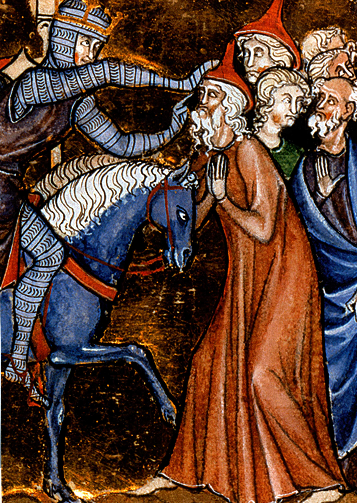第十二章 哥特式艺术

我们总是将历史看作是在时间中展开的事件，却很少意识到这些事件在空间上的展开。我们将历史想象成相互叠加的年代层或时期，每一层都因其持续时间不同而厚度不同。对于我们所知甚少的遥远过去，这样简化的想象还算合情合理。然而，愈靠近现代，我们的知识就愈精确，再作

如此的想象就不能令人满意了。因此，我们不能只依据年代来界定哥特式艺术时期，

同时也应该考虑其在地域上的变化，因为哥特式艺术同样也在空间中展开。

最初，约1140年前后，哥特式艺术的地域范围还很小。只包括现在的法兰西岛大区（Île\-de\-France，巴黎及其周边地区），即法国王室的领地（见地图12\.1）。百年以后，从西西里到冰岛，欧洲大部分地区都接纳了哥特式风格，而罗马式仅有零星残存。然而，到了1400年左右，哥特式艺术便已开始退潮。在意大利这种艺术风格已经不再风行，及至1550年，除英格兰之外，它在整个欧洲几乎都已销声匿迹。有鉴于此，代表哥特式艺术时期就具有了相当复杂的轮廓。在某些地方，它的影响绵延不绝可达近400年，而在另一些地方却不过150年。而且，并非所有视觉艺术形式都具有同样清晰的历史断代。

“哥特式”（Gothic）一词在16世纪时指代一种被认为是源自哥特人（Goths）的建筑风格，哥特人在中世纪早期占据着北欧地区。虽然这种风格的起源并不像早期研究所声称的那样直接，但其对这种艺术

样式在地域分布上的记载是准确的，因为该风格在阿尔卑斯山脉以北表现得最为明显。当哥特式艺术从法兰西岛传播到法国各地而后再到全欧洲，在当时被称为“现代作品”（opus modernum）或“法国作品”（opus francigenum）。这些名称意义重大，因为它们表明，在这种风格所处的时代，它被看作一种艺术创新，且源自法国。在整个13世纪，这种新风格的传播日益减退，各种地方的变体开始流行起来。

从1150至1250年，包含大教堂时代	\(Age ofthe Great Cathedrals）的这一百年间，建筑学在哥特风格的连贯形成中发挥了决定性的作用。除宗教建筑之外，包括城堡、宫殿，以及诸如医院等公共建筑在内的世俗建筑，也在哥特式艺术时期繁荣了起来。哥特式雕刻最初在实质上仍严格遵循建筑框架，但1200年以后则更趋于独立。早期的哥特式雕刻与绘画反映出其建筑背景的依赖，而晚期哥特式建筑与雕刻追求的则是更具图像效果。

艺术的发展大致与政治舞台上的事件齐头并进，因为哥特式艺术时期既是一个在艺术上具有鲜明特色，也在政治领域与众不同的时期。借助火炮与铁制

图12\.39《亚扪人拿辖在雅比威胁犹太人》细部

第十二章 哥特式艺术 385

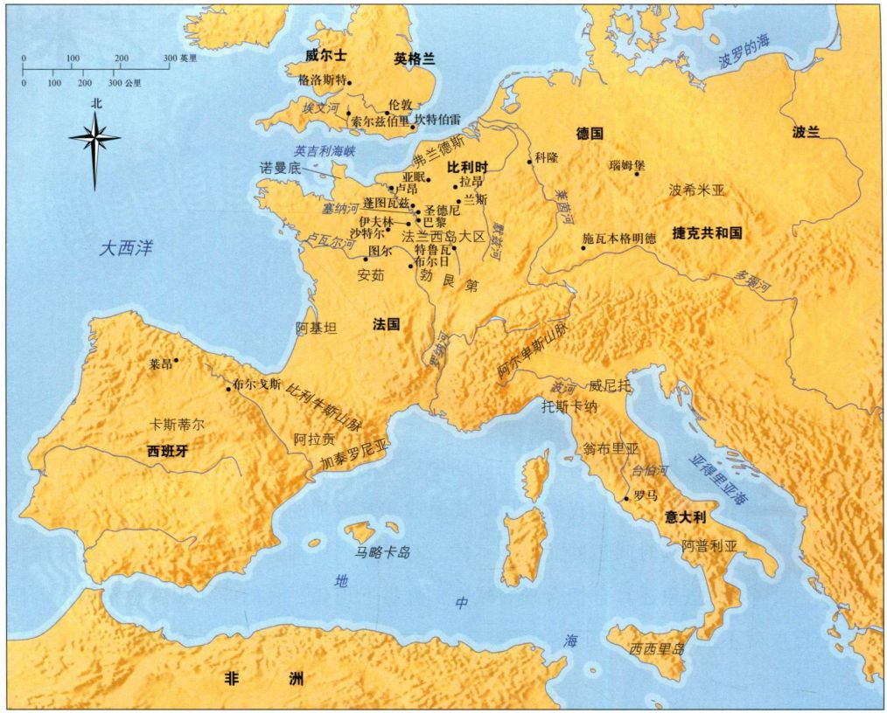

地图12\.1 哥特式艺术时期的欧洲

十字弩的进步，王公们所征服的领地日益扩大。封臣为他们管理这些土地，并征集税收来维持陆、海军。在法国，卡佩家族（Capetian）最初只统治着法兰西岛的肥沃土地，但到了1300年，这个家族的领地已经囊括了先前由佛兰德斯伯爵（Count of Flanders）统治的领土的大部，布尔日（Bourges）、图尔、亚眠（这三地都将兴建起重要的哥特式大教堂）的全部，以及奥弗涅（Auvergne）地区中部的若干省份和朗格多克（Languedoc）地区的南部省份。法王菲利普·奥古斯都（Philip Augustus，1180\-1223年间在位）在位期间更是将王室领地扩大了三倍，与此同时还以国王身份建立起中央权威。法国诸国王还从英格兰人手中夺回了诺曼底，这也引发了争夺法国王位的百年战争（Hundred Years＇War，1339\-1453年），而不论是在英格兰还是在法国，膨胀中的民族主义情绪都因这场战争大大强化。虽然大部分哥特式艺术似乎都依照合理且进步的方式发展，但是百年战争本身以及它

所造成的各国联盟关系的分合、对社会经济与政治稳定的威胁，都对欧洲某些地区哥特式艺术的发展产生了影响。

当时的德意志仍然是一群由选帝侯统治的独立城邦，选帝侯们的诸多职责之一就是决定国王的人选。因此德意志的王权就受到了严格的限制。法国与英格兰国王通过不断调整与教廷的联盟关系而得到教会支持，他们于13世纪早期以德意志地区的分裂为代价，崛起为一流强国，这一时期也是一段和平与繁荣的时期。然而，1290年之后，权力制衡被迅速打破。

城市的日益发展繁荣，大教堂作为主教升座之地的日趋重要，都是哥特式时期发展的特点。在法王路易九世（Louis IX，死于1270年）去世之前的这个世纪里，法国境内建起了80座天主教大教堂，其中很多是新建的建筑。大学脱离教会学校发展成为主要的学术中心，由此承担起之前由修道院所承担的责任，教授神学、哲学、法律和医学，这些领域都被认为是“通

386 詹森艺术史

识教育”（universitas litterarum）所必不可少的内容。与此同时，与拉丁文写作相对的俗语文学开始出现，这就扩大了读者的范围。法语正是在13世纪成为国家的官方语言。罗马式艺术主要在乡村与修道院盛行，而哥特式艺术恰好相反，日益发展成为一种世界性艺术。

城市的发展与经济、社会与人口的变化相互促进，相辅相成。农业生产效率提高，耕地面积扩大，剩余产品成为了用于买卖的商品。这就产生了基于投资、利润与贸易的货币经济，取代了以往的易货贸易。由此，货币取代个人服务成为引导社会交换的主轴，而流通中日益增长的货币流通也造就了真正的中产阶级，他们生活在贸易与商业的中心\-城市。一旦摆脱了封建枷锁，中产阶级的商人与艺术家就拥有了组建行会以控制物品与服务的生产与分配的自由。普遍的人口大幅增长也刺激了城市的发展。公元1000年前后，欧洲人口约为4200万，而到了1300年，已经增加到了7300万。

自从约850年前的圣奥古斯丁（Saint Augustine）与圣杰罗姆以来，天主教在13世纪终于有了自己最伟大的智者圣托马斯·阿奎那（St\.Thomas Aquinas）。阿奎那是一位意大利神学家，曾求学于罗马并在巴黎授课。他的论证方法称为经院哲学（scholasticism），旨在运用理性去理解和阐释信仰。经院哲学在欧洲思想产生了深远的影响，其调和理性与灵性的做法，有力地鼓励了将一切自然现象都看作是上帝真理的表达这一系统化的研究。哥特式建筑师们认可经院哲学家们的这种品质。他们运用逻辑清晰的工程学原理揭示神启，运用物质力量去创造精神体验的和谐，正如经院哲学家运用阐明与澄清来构筑他们精心创立的论点。

法国早期哥特式艺术

哥特式艺术最早出现于法兰西岛（巴黎及其周边地区）的原因尚不明了。有些学者认为这是由于该地区在罗马式艺术盛行时期还没有发展出一种有代表性的地方风格，因而对于来自其他地区的创新和影响就显得尤为开放。另有一些学者则认为这与法国国王提高自身声望的努力相一致，毕竟这里是王室所统治的地区。法兰西岛的地理位置无疑得天独厚，接近法国的中心，是法国西部和南部的交通枢纽，这两地在罗马式艺术时期出现了大批重要的雕刻；毗邻诺曼底，包括有肋交叉拱在内的许多建筑创新正是经由诺曼底进入法国（见第380\-381页）。

圣德尼：絮热与哥特式建筑的开端

对哥特式艺术的研究以重建的圣德尼修院教堂（Abbey Church of Saint\-Denis）为对象开始最为合适。这是一座王家修院教堂，正位于巴黎城边。这座在历史上享有盛名的教堂于1137至1144年间重建，主持者是修道院长絮热（Suger）。他雄心勃勃的重建计划旨在强调圣德尼修道院与法国君主之间的关系。法国国王是卡佩家族的后裔，他们的权威源自加洛林传统。然而，国王们的权力在当时事实上小于贵族，即他们那些名义上的封臣。国王唯一能够直接统治的地区就是法兰西岛，但即使是在那里，他的权威也时常受到挑战。直到12世纪早期，王室的权力才开始扩张。絮热作为国王路易六世（Louis VI）的首席顾问，协助王室完成了这一过程，也正是他缔结了君主制法国与教会之间的盟约。这一联盟使得法国主教们及其管辖的城市倒向国王一方，国王反过来则要支持教廷对抗神圣罗马皇帝的斗争。

絮热也投身于宗教政治。他赋予君主政体以宗教意义，将其作为强大的公义之臂而使之倍享荣耀，力图将全法兰西民族都团结在国王周围。圣德尼修院教堂是他计划的关键一步。该教堂建立于8世纪晚期，具有宗教与世俗的双重声望，是法国使徒圣德尼之墓的所在地，也是加洛林王朝的主要纪念堂。查理曼大帝及其父亲丕平（Pepin）都在圣德尼教堂加冕为国王。这里还是铁锤查理（Charles Martel）、丕平和秃头查理几位国王的寝陵所在地。絮热立志将这座修道院建

半圆室侧礼拜堂

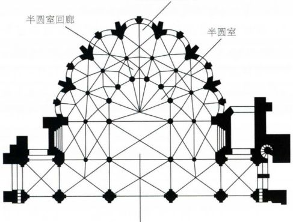

唱诗班席

图12\.1 法国圣德尼修院教堂唱诗班席与半圆室回廊平面图。

1140\-1144年（Peter Kidson）

第十二章 哥特式艺术 387

原始文献

圣德尼修道院的絮热（1081\-1151年）

出自《圣德尼教堂的祝圣》（On the Consecration ofthe Church of Saint\-Denis\)

修道院长絮热留下了两本重建圣德尼修院教堂的记录：一本小册子记述了从教堂构思设计直到1144年6月11日新半圆区（chevet）祝圣的整个过程；另一本则在回顾自己任职期间的成就中，记录了教堂内部的珍贵陈设，其中包括彩色玻璃窗。下文摘录的部分出自第一本记录（1144\-1147年），其中絮热论证了扩建加洛林时期建筑的必要性，因为每逢宗教节日，旧修道院总是人满为患。他还叙述了施工过程中，幸运地发现了一座当地采石场，以及工程所需工人出现的情形。在加洛林教堂的西端重建工程完结之后，絮热拆除了东端的半圆室，在古老的地下礼拜堂之上，重建起一座规模更大且更复杂精致的唱诗班区。他将安装了彩色玻璃窗的辐射式礼拜堂看作自己最主要的创新。

信徒的数量增加了，他们更频繁地聚集在教堂，以寻求圣徒们的庇护，这种幸运情况的出现，终于使得（老）教堂因诸多不便而不堪重负。节日期间，教堂里总是挤满了人，无处容身的信徒因逆人流而行被挤出门外，先到的人流在离开时不仅阻碍其他人进入教堂，而且把那些已经进来的信徒也挤到了外面。有时你看到由于人流密度太大，没有人能够挪动半步，而由于拥挤，每个人都如大理石像般僵立着，除非最终忍不住大叫出来。妇女们承受了难以忍受的巨大压力，最终可怕地哭喊起来，有几位妇女在尽责男士的帮助下，被托举到人群之上，在人头上如同在人行道上一般向前行走。更多的人则精疲力竭，在修院回廊处气喘吁吁，人人都对这

成法国的精神中心，既是令其他地方黯然失色的朝圣教堂，又是宗教精神与爱国主义的中心。而为了达到这一目标，教堂原有的建筑必须被重建和扩大。这位伟大的修道院长亲手撰写了两部关于教堂及其重建的记录。（见本页和第390页的原始文献。）

回廊与唱诗班区 自罗马式朝圣式唱诗班区（pilgrimage choir）出现以来，在具有连拱的半圆室周围建筑回廊和辐射式礼拜堂（图12\.1、12\.2）已成为人所熟知的结构（对比图11\.3、11\.6），但是在圣德尼教堂，这些元素将以新的方式整合在一起。诗唱班区的布局与结构如同任何一座罗马式教堂一样规划合理，然而在整体上，各部分以一种新的几何秩序结合在一起（见图12\.1）。七个几乎完全相同的楔形单元从半圆室中心点开始，呈扇形排开，半圆室侧礼拜堂不再是独立的结构，而是连在一起，实质上构成了第二道回廊。这两道回廊给我们的体验不是一系列单独的隔间，而是连续的空间，细长的拱、拱肋、支撑拱顶的圆柱所构成的网络勾勒出它们的轮廓。工程中

种情况感到绝望。

由于上帝的恩赐，人们发现了一个出产坚硬石材的新采石场，产量与品质在当地首屈一指。一群技艺高超的石工、石匠、雕刻师以及其他工人来到这里，因此在另一方面，上帝也解脱了我们的忧虑，并以他的恩典安慰我们，给我们提供了出乎意料的资源。我惯于将世间最小的事物与最大的作对比：这座教堂若非有同一造物主（上帝）为他的子民提供大量的帮助，那么，即使堪比所罗门之伟大，他的财富也不足以建造这座神殿。造物主的身份与这项工程的宗教性质对工人来说就是他们最大的满足。

经过考虑，人们认为原有拱顶与更高的部分不相匹配，决定将其拆除。新拱顶将要覆盖供奉主保圣人遗体的半圆室，一直下行至地下礼拜堂的顶部，因此地下礼拜堂的屋顶将会成为地面，参观者由两侧楼梯进入，这里处于他们视线的上方，可以用来展示因黄金宝石而熠熠生辉的圣物箱。此外，这样还巧妙地提供了空间，可以在地下礼拜堂的立柱与拱顶之上设置另外一层立柱与拱顶。老教堂的中堂也应该协调一致，借助几何与建筑措施，增建中堂。同样，老教堂的侧堂也应该按新尺寸扩建，但延伸出来的一圈半圆礼拜堂由于布局优雅，值得称道，因此不在扩建之列。而且，整座教堂也会被通过明亮窗户射入的奇妙且不受遮蔽的光线所照耀，美在教堂内部弥漫。

SOURCE:ABBOT SUGER ON THE ABBEY CHURCH OF SAINT\-DENIS AND ITS ART TREASURES,ED\.AND TR\.ERWIN PANOFSKY\.\(PRINCETON,NJ: PRINCETON UNIVERSITY PRESS, 1946\)

普遍采用了基于尖拱的有肋交叉拱顶。尖拱可以被“拉长”到任何想要的高度，而不必顾虑拱基的跨度。从此时开始，尖拱成为有肋交叉拱的一个基本组成部分，不再只局限于正方形或近正方形的开间。尖拱具有了新的灵活性，使其得以能够覆盖几乎任何形状的空间，例如此处回廊中的梯形与五边形。

使圣德尼教堂的内部（图12\.2）从早期教堂中脱颖而出的是它的轻盈与明亮。建筑结构较之罗马式建筑的厚重坚固，显得优雅而且几乎毫无重量。圣德尼唱诗班区中流畅的宽阔感是运用细长圆柱的结果，拱顶重量的相对减轻使得细柱的运用成为可能。此外，窗户的尺寸非常宽大，不再仅仅是墙体中的开口，而实际上成为安装了彩色玻璃从而透明的墙面。而整座建筑内部轻盈明亮的原因在于礼拜堂之间伸出的厚重扶壁承载了拱顶的外推力。在平面图中（见图12\.1），扶壁犹如短粗的箭头，指向半圆室的中心。既然最沉重的建筑骨架被转移到外部，那么内部的轻盈也就不足为奇了。如果能够见到圣德尼教堂唱诗班

388 詹森艺术史

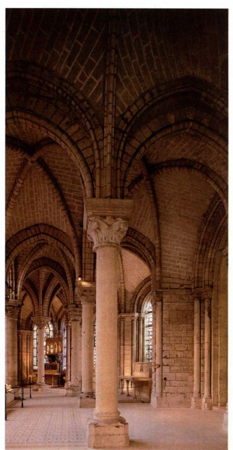

图12\.2 圣德尼修院教堂回廊

区的全部面貌，我们的印象将会更为深刻，因为建于双回廊之上的半圆室上层部分，具有极其宽大高耸的窗户。遗憾的是后来对建筑的改造破坏了唱诗班区最初的效果。

在介绍圣德尼教堂的回廊与唱诗班区的同时，实际上也就介绍了哥特式建筑的要素，虽然构成该设计的各个元素没一个是真正的新生事物。朝圣式唱诗班区平面布局、尖拱和有肋交叉拱在法国地方风格与盎格鲁\-诺曼底地区的罗马式建筑中都可以找到。然而，在絮热以前，正如他的记录中所说的那样，这样的结构却从来没有同时出现在同一座建筑之中，直到他将各个地区的不同匠人集中在一起修建圣德尼教堂。但是，不能因此就得出哥特式建筑只是罗马式建筑特征的综合这一结论。否则在解释其中的新精神，特别是哥特式建筑对光线的需求时我们就会倍感窘迫，这已

经突出地表现在圣德尼教堂之中。在絮热关于重建教堂的记录中，他强调明亮的光线是新建筑所取得的最重要成就。这样一来，絮热便可宣称，“这不可思议”的经由“最神圣”的彩色玻璃窗充溢在祭坛周围的光线乃是神之光（Light Divine），是对上帝神灵性质的揭示。絮热还称，教堂各个部分在数学比例或比率上和谐完美，充分说明了上帝的理性在创世时所用法则，因而是美的源泉。

这种对光线与数字和谐的象征化解读，早在絮热的时代之前就已经根深蒂固地存在于基督教思想之中。这种解读最早出自一位6世纪的希腊神学家笔下，中世纪时人们错误地认为他是大法官丢尼修（Dionysius the Areopagite），圣保罗的雅典门徒，关于他的事略曾在《新约》的《使徒行传》中出现。在法国，作家丢尼修被认定为圣德尼，因为这位圣徒的拉丁文名字就拼作丢尼修。絮热在圣德尼修道院的图书馆中可以看到他的作品，并认为这些作品具有极大的权威性，这一点也在意料之中。而丢尼修的光与数的理论对絮热尤其具有吸引力。

在絮热心中，圣德尼教堂的奥义在于物质王国是通向精神冥想的台基这一信仰，于是，通过教堂彩色玻璃窗进入的昏暗而宛若珠宝的光线，会将观者带入“宇宙中某个奇异的地方，既不完全属于混沌的世间，也不完全属于纯洁的天堂”。因此，圣德尼教堂唱诗班区设计的成功并不仅仅在于建筑上的出众，而且也在于其所造成的极大的心理震撼。观者似乎在这两方面都被完全征服，几十年以后，这一新风格远远传播到了法兰西岛以外的地方。

絮热与中世纪建筑师 尽管絮热不是建筑师，但缺乏专业训练与他宣称为“他的”新教堂的技术进步和风格负责之间并不矛盾。在12世纪，“建筑师”一词的含义与这个词的现代意义迥然不同。中世纪的人们认为，建筑项目的总负责人就是建筑师本人。甚至于作为宇宙创造者的上帝，有时也会被认为是运用建筑工具的建筑师。毕竟教堂的功能不仅仅是用最少的材料建设出最大的空间，而且也需要体现和传达宗教思想。对于修建圣德尼教堂唱诗班区的那些大师而言，拱顶的技术问题一定与形式及其意义这些问题密不可分。设计当中有些元素虽然看似具有建筑功能，但实际上并不承担这一功能，例如那细长的壁联柱（responds）就是如此，表面看来，壁联柱似乎是将拱顶的重量引向教堂的地板，但实际并非如此。

为了传达一种观念，中世纪的建筑者需要宗教权威的指导。最低限度的指导可能是简单直接地提供某

第十二章 哥特式艺术 389

圣德尼修道院的絮热（1081\-1151年）

出自《关于修道院的管理》（On What Was DoneUnder His Administration\)

圣德尼是一座本笃会修道院，尽管教堂对普通民众开放，吸引了无数参观者。炫耀性的教堂装饰是克莱尔沃的圣贝尔纳所深恶痛绝的物质炫耀类型。絮热对此所作的描述记录于1144至1149年之间，流露出在他感官上对珍贵材料的喜爱，但也表明了他的信念，认为凝视这些珍贵材料能将信徒带入精神高度觉醒的状态。正如拜占庭对圣像的解释一样，“奥义说”（anagoge）在另外一种艺术媒介中的表现也受到新柏拉图主义的影响。

我们坚持认为值得崇敬、赋予生命的十字架应该被装饰。因此我们自己或者派遣代表到各地去搜集珍珠与宝石。这件圣物联系着主施与我们的喜悦而著名的神迹，我们不愿意忽视。当我找不到需要的宝石时，或者不能找到足够多的宝石时（因其罕见使之极其昂贵），两个教派的三座修道院（西笃修道院、另一座西多会修道院、丰特夫罗［Fontevrault］修道院）的修士提供给我们大量待售的宝石，有锆石、蓝宝石、红宝石、绿宝石和黄宝石，这些东西可能原本我们在十年之内都不指望能够找到。它们是来自蒂博伯爵（CountThibaut）的施舍，而他则是经兄长英王斯蒂芬（Stephen，1135\-1154年在位）之手，得自已故王叔（国王亨利一世，1100\-1135年在位）的宝库，后者曾将这些毕生所得的宝石收藏在精美的容器之中。然而，我们免除了寻找宝石的担忧，

感谢上帝，我们为此付出了400镑，尽管宝石的价值远大于此。

我们迫不及待地装饰受主庇佑的德尼的主祭坛，因为我们在这里宣誓进入修院生活，那里只有一块来自第三位皇帝秃头查理（843\-877年）的美丽而珍贵的前饰板。

后方饰板的工艺奢侈豪华、令人惊叹（因为野蛮人艺术家比我们还要奢侈），我们用同样样式绝妙、材料优良的镂空浮雕作品来装饰，显得更为高贵。这样的装饰我们得到的越多，就越担心失去，例如一个金圣杯就被人从底座上拆走，还有其他一些器物也遭此命运，因此我们要求一定要将饰板固定牢靠。

我们经常凝望着新旧不一的装饰。当多彩宝石的可爱将我从庞杂事务的烦扰中唤走，有价值的冥想促使我去反省，根据各种神圣美德，将物质的转化为非物质的，那一刻，我好像看到自己身处宇宙中某个奇异的地方，既不完全属于污浊的世间，也不完全属于纯洁的天堂，感谢上帝恩典，我能以奥秘的方式从平凡混沌的人间被提升到更高的世界。

我们还借助众多来自各地的大师，绘制了各种壮观的新玻璃窗画。

因为（这些窗户）制作巧妙、价格昂贵，彩绘玻璃与宝石蓝玻璃花费无数，我们专门指定一位工艺大师负责保护与维修。

SOURCE:ABBOT SUGER ON THE ABBEY CHURCH OF SAINT\-DENIS AND ITS ART TREASURES,ED\.AND TR\. ERWIN PANOFSKY\. \(PRINCETON, NJ: PRINCETON UNIVERSITY PRESS, 1946\)

个既有范例。然而絮热更为积极地介入其中，提出种种目标，而对这些目标，工匠们想必也会各个回应。赞助人与建筑师或高明的工匠的密切合作之前也有先例，例如佐塞和伊姆霍台普（第三章）、伯里克利和菲迪亚斯（第五章），而今天的情况也是如此。

建造圣德尼教堂 建造圣德尼教堂是一项耗资巨大的复杂工程，需要教会与国家两方面的资源支持。絮热用蓬图瓦兹（Pontoise）附近采石场的石材建设回廊立柱，用伊夫林（Yvelines）地区森林中的木材来修建屋顶。这两种材料都必须经过水路和陆路才能运抵圣德尼，整个运输是一个漫长且代价高昂的过程。大匠作可能雇用了几百名石匠与两倍或三倍于石匠人数的小工。战争激发的技术进步改善了对修建新型有肋拱顶至关重要的建筑施工设备。尤为重要的是改良以后的起重机，由绞盘与踏板驱动，运用了平衡锤和滑轮，效率大增。这些装置易于安装和拆卸，使得搭建在地面的脚手架能够为悬于墙面的较轻脚手架所取代。

西立面 虽然絮热院长计划全部重建圣德尼教

堂，但在他有生之年建完的部分并非唱诗班区和回廊，而是教堂的西立面。圣德尼教堂西立面（图12\.3）的整体脱胎于诺曼底的罗马式立面，与卡昂圣艾蒂安教堂西立面（见图11\.46）的对比表明，两者具有许多共同的基本特征：加固塔楼边角并将立面垂直分为三个主要部分的墩柱、大门位置以及三层格局。不同的是，圣德尼教堂的三座大门远比圣艾蒂安教堂或其他任何一座诺曼底罗马式教堂的大门都更为宽阔，雕刻装饰的也更加富丽。由此可知絮热院长极其重视圣德尼教堂的雕刻装饰，尽管他关于教堂的记录没有详细地提及这一点。

大门上的装饰性雕刻包括半月楣、拱门饰和侧壁。这种布局令人想起法国西南部某些教堂的立面（例如穆瓦萨克的修院教堂，见图11\.14），以及勃艮第地区的大门雕刻（例如奥顿的圣拉扎尔大教堂，见图11\.18）。这种相似性也印证了絮热关于他的工人包括了来自众多地区的艺术家的说法。遗憾的是，圣德尼教堂于1770、1771年间加宽中央大门时，门间柱雕像与侧壁上的雕像柱被移走。几年之后，在法国大

390 詹森艺术史

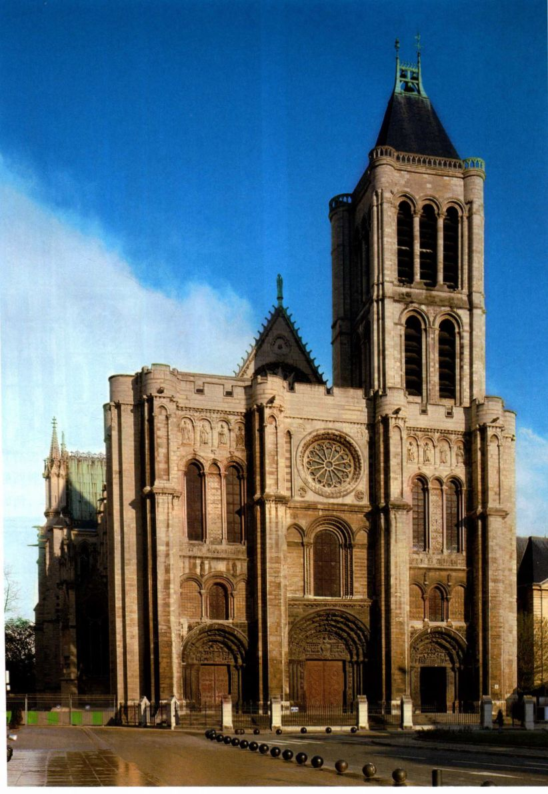

图12\.3 圣德尼修院教堂西立面。约1137\-1140年

，一群暴民破坏了剩余雕像的头部，并将金毁。遭遇了这些破坏，再加上18、19世纪一系列拙劣的修复，现在我们对絮热关于圣雕刻作用的观念，只能获得一些概略的印象。圣德尼西大门的原貌，我们要转而考察沙特（Cathedral of Chartres 或 Cathedral of Notre\-

Dame，Chartres），圣德尼教堂的雕刻家随工作过。

沙特尔大教堂

将近1145年时，沙特尔的主教开始献给圣母玛利亚的新风格大教堂，其为絮热

第十二章

具有与之相同的观念。50年之后，一场大火席卷了几乎整座教堂，只有东端的地下礼拜堂与西立面保存下来。（见第二部分末尾的附加原始文献。）

西立面 幸存下来的西立面（图12\.4）在很多方面都与圣德尼教堂相似，由成双和成三的单元构成，是清晰性的典范。然而，由于工程分阶段进行，并且从未全部完工，建筑最终表现出来的协调性与其说是系统的，毋宁说是演化的。以两座西面塔楼为例，尽管相似但绝不相同。此外，两者的尖塔（spire，具有尖细屋顶的高塔）也迥然不同：图12\.4中左侧塔楼的尖塔建于16世纪早期，比右侧的晚了将近300年。

根据圣德尼教堂从前的图样来判断，沙特尔大教堂的侧壁（图12\.5、12\.6）与圣德尼教堂最初的侧壁极为相似，几乎可以确信同一批雕刻家曾先后在两座教堂工作。两座教堂的门道两侧都有附于柱身的高大人像。罗马式大门侧壁或门间柱虽然也都曾出现过人

图12\.4 法国沙特尔大教堂西立面。约1145\-1220年（左侧尖塔建于16世纪以后）

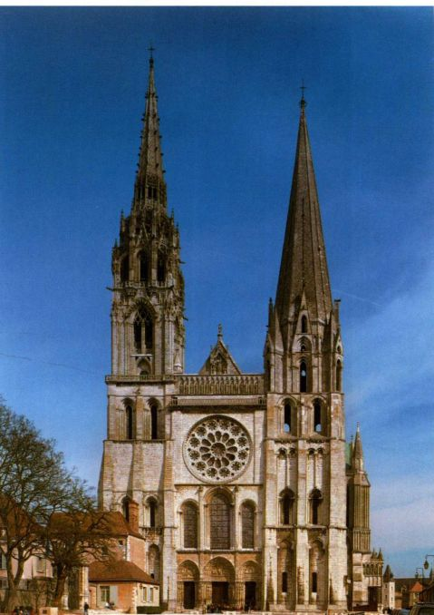

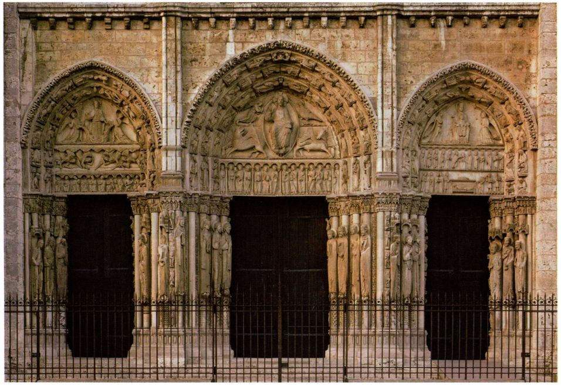

图12\.5 沙特尔大教堂西大门（亦称王家大门）。约1145\-1150年

392 詹森艺术史

像（见图11\.14、11\.16），但那只是在门道墙体上的浮雕。而沙特尔大教堂的侧壁雕像却大不相同，本质上是圆雕，每座都具有自己的中轴线。至少在理论上，这些雕像与柱身是可分离的。这是具有革命意义的真正进展，显然只有借用圆柱形的柱身来雕刻人像才能实现这一进展。人物身体的浑圆赋予其更为真切的存在感，在这方面超越了所有罗马式雕刻。人物的头部表现出文雅的人性特征，显示出哥特式雕刻中的自然主义倾向。

在沙特尔大教堂的西大门上，自然主义似乎源自对罗马式艺术中稀奇古怪的恶魔式形象的对抗，这一对抗在人物肃穆的态度与增加的体量中可见一斑。对比沙特尔大教堂中央半月楣的基督（见图12\.5）与穆瓦萨克修院教堂半月楣的基督（见图11\.14），使这一点更为明显，同样也表现在沙特尔大教堂整体雕刻方案背后的象征体系规则之中。一旦具备了了解该象征体系深奥意义所必需的神学知识，当时由沙特尔大教堂学校的顶尖学者所教授，主要原理立刻一清二楚。

侧壁雕像将三座大门构成了一个连续序列（见图12\.5），表现的是圣经中的先知、国王与王后。其目的在于宣称法国的统治者是旧约王族在精神上的后裔，在于强调神父（或主教）的神权与国王的世俗权力之间的和谐，而这些都是之前由絮热院长所提出的理念。主门道之上，四位福音书作者的象征物环绕着庄严基督像，使徒位于他们下方，而24位长老则占据着外围的两轮拱门饰。尽管这里的格局安排与穆瓦萨克修院教堂半月楣的题材相似，但是沙特尔大教堂半月楣的效果更为平静，令人心感慰藉，而穆瓦萨克半月楣则具有使人激越的效果。沙特尔大教堂右边的半月楣表现的是基督转世的场景：基督诞生、神殿引见以及坐在圣母膝头的圣婴，圣母是教会的象征。基督或位于马槽之中、或位于祭坛之上、或位于圣母膝头，通过将基督提升到每个半月楣的中央部分，整体设计具有了构图与主题上的统一感。环绕着的拱门饰以人文学科代表了人类的智慧，表现了对基督神圣智慧的敬意。最后，在左边的半月楣中，永恒的天国基督（或者可能是升天中的基督）为周而复始的年度时间周期所环绕，后者表现为黄道十二宫及与其相对应的人世活动，即12个月间的劳作。

拉昂大教堂

由于沙特尔大教堂西立面背后建于12世纪中期的建筑毁于1194年的火灾，我们必须对拉昂大教堂（Laon Cathedral）加以观察才能对早期哥特式建筑的

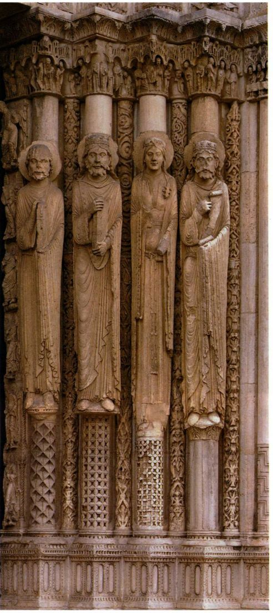

图12\.6 沙特尔大教堂西大门侧壁雕像

第十二章 哥特式艺术 393

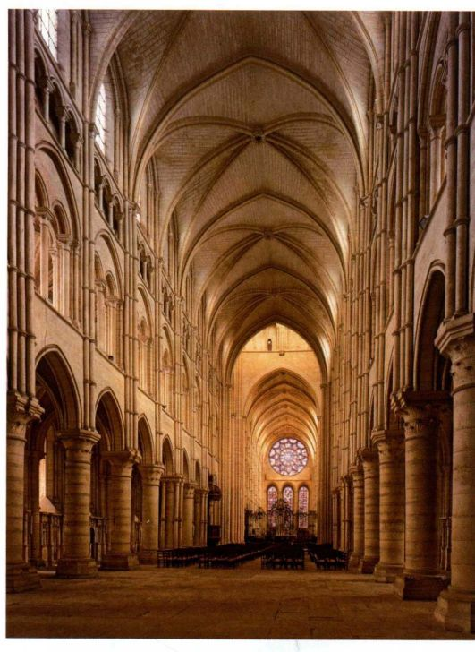

图12\.7 法国拉昂大教堂中堂。约1160\-1210年

内部构造有所了解。拉昂大教堂始建略早于1160年。

中堂 拉昂大教堂内部立面（图12\.7）包括中堂连拱廊、楼廊、三联拱廊和高侧窗四部分，所有这些特征都可以在罗马式建筑中找到，但从未集中体现在同一座建筑之中。四层叠加是哥特式的创新，这种叠加减轻了墙体的重量。这一立面显示出合理协调的特点：中堂连拱廊单个拱门上方相应的楼廊单元开有双拱，在之上的三联拱廊中又成为三拱形式，而高侧窗一层宽大的窗户又形成了与连拱廊中单拱的平衡，整体形成纵向序列。这种具有韵律感的布局清晰地表达出对垂直感的强调，多个的开口使得更多的光线直接通过高侧窗，或者间接通过楼廊和侧堂进入中堂。

拉昂大教堂中堂的近正方形开间上覆盖着六分拱顶，这一安排延续了罗马式建造者在卡昂圣艾蒂安修院教堂（见图11\.45）与达勒姆大教堂（见图11\.42）所开始的建筑试验。拉昂大教堂全面运用了达勒姆大教堂中堂西部开间中首创的有肋尖拱顶。沿墙面交替升起的成束壁柱反映出其上六分拱顶的形态：五根一组的小型附壁圆柱簇标示着横切拱跨越中堂的位置，

三根一组的小型附壁圆柱簇则对应着中间的墩柱。尽管这一系统从罗马式建筑实践发展而来（见第347、349页），但各个元素在哥特式建筑中似乎更为精致。相形之下，诸如圣塞尔南教堂（见图11\.8）与达勒姆大教堂（见图11\.43）这样的罗马式建筑内部，强调的是支撑拱顶重量所需的极大努力。

拉昂大教堂设计中的一处变化展现出该建筑设计者们目标的演进。在中堂东端工程开始的地方，墙体与墩柱上都附有成束的壁柱，但在建于其后的西向开间中，圆形墩柱上并无壁柱。之前交替墩柱布局所造就的参差节奏被取代，这一变化产生出了更为流畅的效果。无论如何，为使得新型布局具有更大统一性的折衷处理，导致了结构清晰性的丧失。

巴黎圣母院

据巴黎圣母院（Cathedral of Notre\-Dame at Paris）的平面图上记载，该建筑始建于1163年，即拉昂大教堂动工仅仅几年之后，然而事实证明，施工可能早在12世纪50年代中期就开始了。巴黎圣母院极其紧凑简洁，达到了罗马式建筑或者早期哥特式建筑所无法企及的和谐一致（图12\.8）。

中堂 与中堂相交的耳堂仅略微超出西立面的宽度。如同圣德尼教堂（见图12\.1）一样，半圆室的双回廊直接延伸到两侧的侧堂，但这里并没有辐射

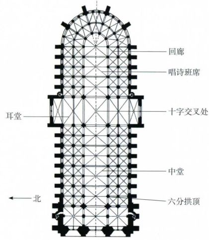

图12\.8 巴黎圣母院平面图。约1155\-约1250年

394 詹森艺术史

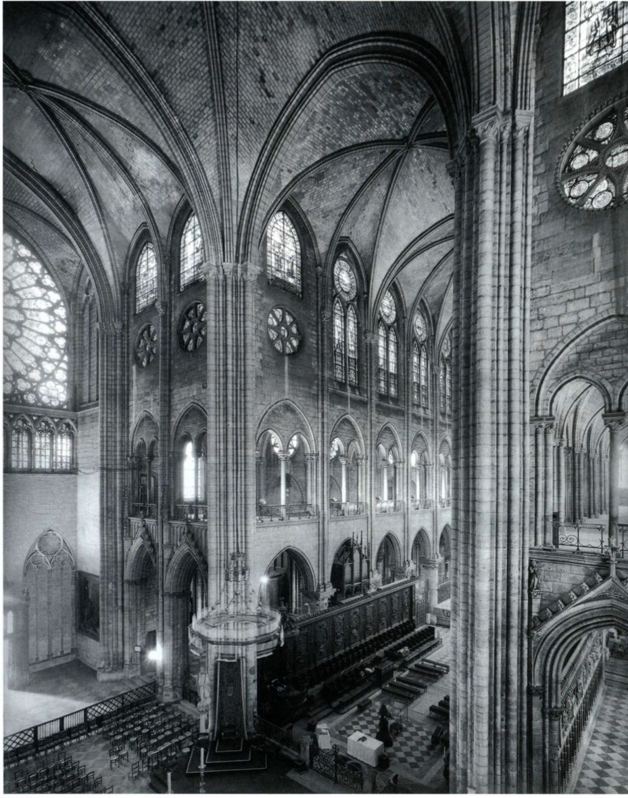

图12\.9 巴黎圣母院中堂

式礼拜堂。平面布局中对统一性的强调也表现在立面的处理中，尽管采用了六分拱顶，支撑系统并没有出现交替形式。巴黎圣母院的立面最初也同拉昂大教堂（见图12\.7）一样，设计为四层，尽管加拱的三联拱廊为圆窗（oculus）所取代。在该建筑开始修建的时候，这样的改变可能美观，但13世纪的一

次重建工程完全取消了三联拱廊，以便扩大高侧由于19世纪的修缮工作恢复了若干开间立面原四层结构，我们就得以比较建筑原貌与重建后同（图12\.9）。这一设计上的改变揭示出缩减空间、增加建筑光照量的一贯追求。宽大的高与轻盈纤细的形式使得中堂墙壁看起来似乎薄

第十二章 哥特式

图12\.10 巴黎圣母院西立面。约1200\-1250年

人。这就造成了轻盈的效果。

正如平面布局对统一性的强调，教堂内部立面对垂直感的强调也是明晰的哥特式特征。垂直感不仅出自中堂的实际比例，而且还基于对上升动势持续反复地强调，以及显而易见的轻松从容，高度感由此获得。

西立面 巴黎圣母院外部最为宏大的部分就是其西立面（图12\.10），除雕刻以外，基本保持原貌。雕塑在法国大革命期间遭到严重破坏，现大致修复。西立面的所有细节都结合成为有序的整体。这里也表现出絮热曾强调过的那种和谐、几何秩序和比例，其程度甚至甚于圣德尼教堂，成就远远超过了沙特尔大教堂的西大门。

这一形式法则在雕刻的设置中也同样明显。雕刻不再表现出罗马式风格自发生长的典型特征，而相反被纳入建筑框架之中，承担着精确的功能。与此同时，立面的四平八稳因花边一般的连拱廊与窗户开口而得

半圆室侧礼拜堂

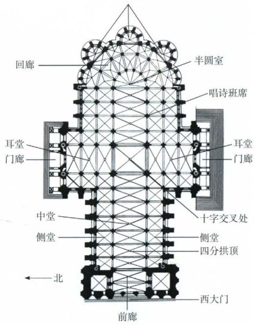

图12\.11 沙特尔大教堂平面图（1194年后重建的布局）

到缓和，墙面空间的连续性被打破，从而在整体上产生出极其轻盈的镂空屏风式效果。

法国盛期哥特式艺术

13世纪法国政治与经济的稳定促进了城市的持续发展，而城市为建造重要建筑提供了适宜条件。有些艺术史学家将早期哥特式艺术中对结构与设计的整合看作一系列试验，而哥特式盛期为它们提供了解答。这在某种程度上无疑是正确的，但是13世纪的艺术也综合工程学与美学，表现出追求优雅精致的兴趣。因此，盛期哥特式艺术既是早期哥特式试验的继续，同时也是其顶峰。正是在这一时期，之前大多籍籍无名的建筑师开始大量留下他们的姓名，这反映出其成就价值的提高，也反映出对个体身份逐日递增的兴趣。对个体的关注也体现在变动着的社会阶层结构之中，从事贸易与商业的阶层日益独立起来。

沙特尔大教堂的重建

1194年大火（见第393页）之后，对沙特尔大教堂的重建标志着哥特式建筑发展中的又一个阶段。新工程在短短26年就基本完工。地下礼拜堂中珍藏着沙特尔大教堂最为重要的财产：传说中耶稣降生时，

396 詹森艺术史

圣母玛利亚所穿长袍的残片。沙特尔的这座大教堂就敬献给圣母。这件圣物奇迹般地幸免于1194年的大火，吸引了来自全欧洲的朝圣者。

西立面与大门同样也未受火灾影响，决定保留这些部分的做法值得注意，因为火灾发生在最初的建筑完工50年之后，这些遗存下来的建筑样式肯定已经不再流行，也不再具有建筑上的价值。在经历过最初因火灾损失所造成的绝望之后，市民与教会中的权威人士将这场大火解释为圣母本人愿望的表达，需要兴建一座更为辉煌的新教堂，以鼓励信徒。由于教堂的西端与著名的圣母长袍残片一样，幸免于火灾，也应该被视为值得保存的圣物。在令人挫折的场景中辨识出上帝的安排，从而激起了人们重建教堂的热情，也解释了何以工期如此之短。

为了在不妨碍参加礼拜者的情况下给大批瞻仰者留下空间，沿中堂与耳堂建有一座宽大的侧堂（图12\.11），唱诗班席处又有一条侧堂与之相接，形成连接半圆室侧礼拜堂的回廊。参加礼拜的人群从原来的

大事年表

1137\-1144年\-絮热于巴黎城外重建圣德尼修院教堂

1163年\-开始兴建巴黎圣母院

西大门进入教堂，经过相对低矮的前廊。他们想必也需要一段时间才能使自己的眼睛适应教堂内部的昏暗。即使是日常生活的喧闹声也被隔在门外，建筑内最初被奇异地消音了。当他们从这种迷幻的效果中恢复过来，他们会看到一瞥微弱的光线，指引他们进入巨大洞穴般的教堂。这一过渡微妙而深刻，强调了进入教堂的重大意义。正如罗马式和拜占庭教堂的入口一样（见第254、360、363页），这里是一个临界或过渡地带，提请瞻仰者将世俗世界抛在身后。一座宗教建筑的赞助人、设计师和建筑者再一次找到了意味深长的物质形式，以鼓励并保持参观者强烈的精神体验。

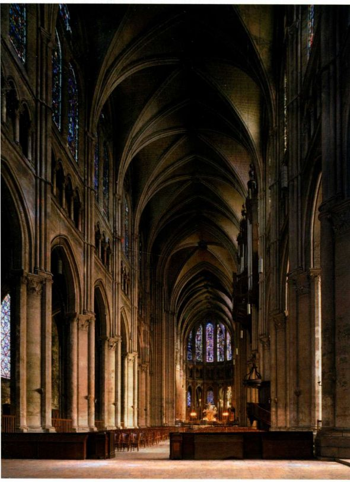

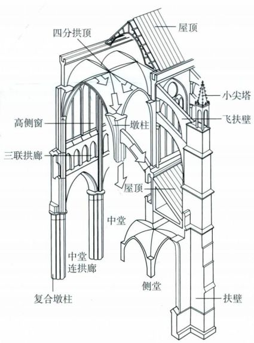

图12\.13 盛期哥特式大教堂轴测图（根据Acland的图绘制）

图12\.12 沙特尔大教堂中堂与唱诗班区。

约1194\-1220年

第十二章 哥特式艺术 397

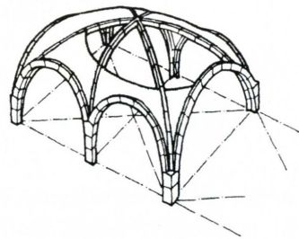

六分拱顶（sexpartite vault）

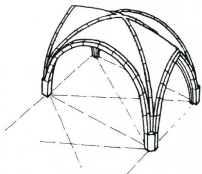

四分拱顶（quadripartite vault）

图12\.14 （a）六分拱顶（b）四分拱顶

中堂 沙特尔大教堂重建的中堂（图12\.12）其 层，正是试图与沙特尔大教堂的盛期哥特式建筑相匹

敌，见图12\.9。）附于墩柱的壁柱强调着垂直线条的

延伸感，将我们的目光引向拱顶，如同一张轻柔的网，

舒展于纤细的拱肋之上。四分拱顶取代了早期哥特式

建筑中的六分拱顶（图12\.14），由此建筑者不需要

再考虑交替支撑系统的问题。更短的长方形开间加快

了空间节奏，使中堂展开的步调更为紧凑。中堂连拱

墩开口较之以往更高更狭长；高侧窗也更宽大，与连

拱廊等高。由于墙体很少，广阔的内部空间乍看之下

设计比巴黎圣母院晚一个世代，是成熟期或盛期哥特式建筑的首件杰作。这一风格具有若干鲜明特点（图12\.13）。沙特尔圣母堂的设计师们去除了楼廊，在墙壁上采用了三层立面结构。罗马式时期的建筑者也曾采用三分墙面的分割方式（见图11\.12、11\.43、11\.47），但是沙特尔大教堂的方案减弱了水平感，将墙壁表面作为条理分明的垂直单元来处理。（在巴黎圣母院，中堂最初的早期哥特式四层结构改建为三

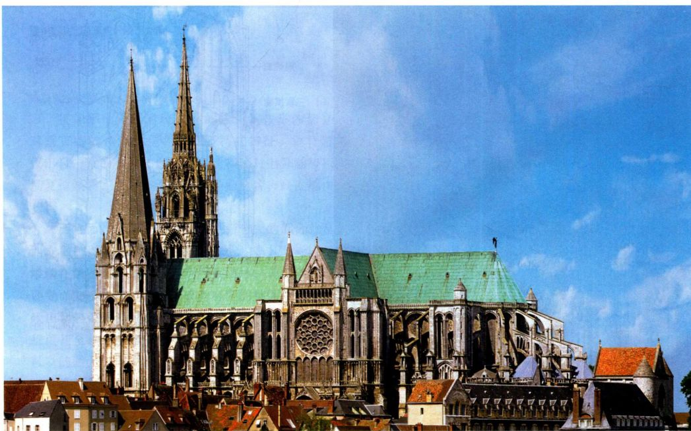

图12\.15 沙特尔大教堂（自南向北观）

398 詹森艺术史

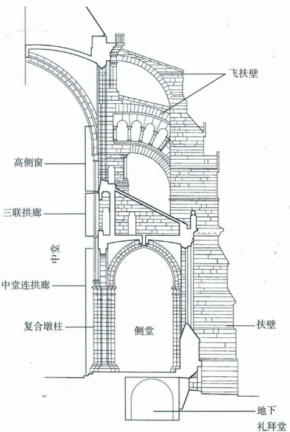

图12\.16 沙特尔大教堂横剖面图

（根据Acland的图绘制）

仿佛缺少清晰的边界。

扶壁 与絮热的圣德尼教堂唱诗班区一样，沙特尔大教堂的扶壁（沉重的建筑骨架）也只见于建筑外部（图12\.15\-12\.17）。在平面图（见图12\.11）中，表现为巨大的石砌体，如一排牙齿般在建筑外部伸出。在侧堂之上，这些墩柱转变为飞扶壁（flyingbuttress），这是向上延伸至高侧窗之间临界点的拱桥，中堂拱顶的外推力就集中在这些临界点（见图12\.16）。作飞扶壁设计也是为了抵挡大风对尖屋顶的巨大压力。这种加固拱顶的方法是典型的哥特式建筑特征，开始一定是出于功能上的考虑。当然，飞扶壁也是构成建筑美学与表现特色所不可或缺的组成部分（见图12\.17）。根据设计者对风格的把握，外形上可以通过多样的方式既表现出垂直感，也在实际承担支撑功能之余表现出扶助感。

建造大教堂所运用的石工技术同时需要力量与技巧。细石工（freemason）加工质地均匀、砍凿时不会破裂的石材（freestone），他们将石材切割为石方，

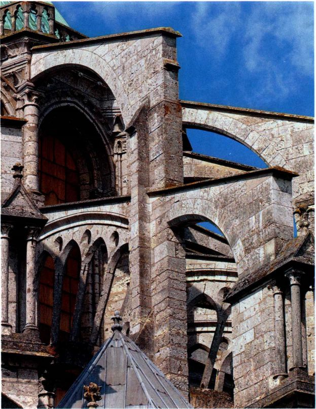

图12\.17 沙特尔大教堂飞扶壁

第十二章 哥特式艺术 399

西奥菲勒斯·普雷兹比特（Theophilus Presbyter，12世纪）

出自《不同技艺论》第二册：《玻璃工的技艺》（Dediversis artibus, Book II:"The Art of the Worker in Glass”\)

“西奥菲勒斯”可能是黑尔马斯豪森的罗杰（Roger ofHelmarshausen）的笔名，他是一位本笃会修士兼金工匠人。这部书第三卷的主题是金工制品，前两卷分别是绘画和彩色玻璃窗画。西奥菲勒斯的文本写于12世纪，是西欧历史上第一部从业者记录其艺术生产技术的书籍。

第17章：安装窗户

安装玻璃窗户时，首先需要一块平滑的木板。然后用小刀刮出白垩笔末，撒满整块木板，再全部喷上水，用布把木板擦净。木板完全晾干之后，测量出窗户中某一部分的尺寸，用尺子和圆规将这部分画在木板上。想画多少人物都可以。首先用铅（针）或锡（针），然后用红、黑颜料。每一条线都要小心谨慎，因为当你在玻璃上作画时，必须要使所有阴影与高光符合木板（上的设计）。之后安排不同的长袍样式，为其选定各自的颜色，标出其所在位置，接着用

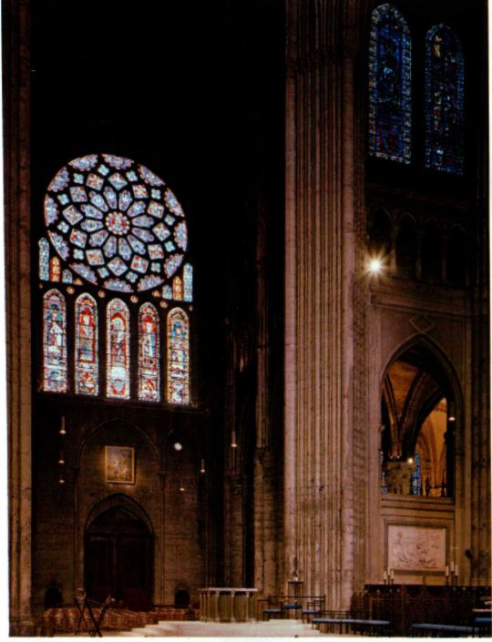

图12\.18 沙特尔大教堂北耳堂

400 詹森艺术史

字母标明其他所有你想画的东西的颜色。

完成这些以后，拿一个铅壶，放入白垩笔渣和水。做两三只笔，既可以用貂、獾、松鼠或猫的尾毛，也可以用驴的鬃毛。而后随便选一块玻璃，但各边的尺寸均须大于将来装设位置的尺寸，放在木板上相应的位置。这时你就可以透过玻璃看到木板上的图画，用白垩笔在玻璃上描出轮廓。

第18章：切割玻璃

接着在火炉中烧热切割玻璃用的铁器，形状应该只有末端厚，其他部分都薄。当厚的部分烧红之后，放到将要切割的玻璃上，很快玻璃就会开始开裂。如果玻璃很硬（无法立刻开裂），就在你要切开的地方用手指涂上唾液，把它打湿。玻璃会立刻裂开，你也要立刻将工具沿着切割线划过去，玻璃随之就会被切开。

SOURCE: THHEOPHILUS,ON DIVERS ART:THE FOREMOST MEDIEVAL TREATISE ON PAINTING,GALSSMAKING,AND METALWORK,TR\.BY JOHN G\.HAWTHORNE AND SYRIL STANLEY SMITH \(NY: DOVER PUBLICATIONS, 1979\)

用来砌筑内外墙面。中间部分则以灰浆和。碎石填充，这一工作由技术尚不够熟练的粗石工（roughmason）完成。内外壁两端用工整石方砌筑封口，后者同时还起着加固墙体的作用。

彩色玻璃窗画 在所有重要的哥特式大教堂之中，只有沙特尔大教堂仍保留了180多面原有的彩色玻璃窗（图12\.18）。珠宝般的光线从高侧窗射入，其魅力任何曾亲眼见过的人都难以忘记。窗户的通光量远少于人们的预期，主要功能是滤光，从而改变日光的性质，赋予它诗意和象征的涵义，这正是絮热修道院长所期许的。光线的灵动消解了教堂的物质体量感，由此拉近了世俗与天国之间的距离。这种“超自然的光线”成就了作为哥特式艺术精神核心的高度神秘的体验。

沙特尔大教堂庄严的《华窗圣母》（Notre Damede la Belle Verrière，图12\.19）仿佛毫无重量，轻轻地漂浮在模糊的空间之中。这面窗户是西立面唯一幸免于1194年大火的窗户，由几百个彩色玻璃小片用铅条连缀在一起。中世纪的玻璃制造工艺使得每一块玻璃片的尺寸不能做得很大，因此图案并不能简单地“画在玻璃上”，而是“用玻璃来画”。图案更像是镶嵌画或七巧板一样拼接在一起，被切割成各种不规则的形状以符合外轮廓线（见本页的原始文献）。这样的制作过程促进了倾向于压制立体效果的抽象装饰

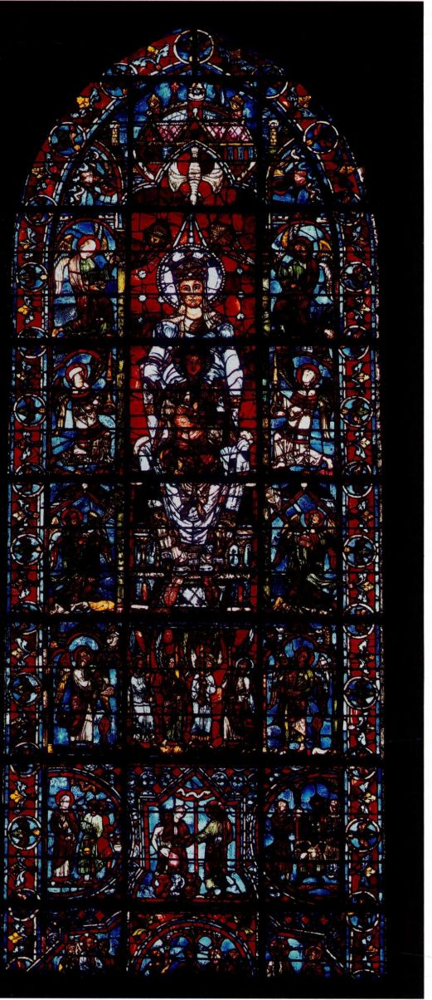

图12\.19 彩色玻璃窗《华窗圣母》。约1170年（窗框为13世纪制作）。高约4\.27米。沙特尔大教堂

风格。只有在大师的手中，错综复杂的铅条才能造就出如此宏大的形式（见第403页的材料与技法）。

考虑到对图案和装饰效果的强调，彩色玻璃在中世纪如此流行就在意料之中了。闪耀的表面宛若早期备受珍爱的平光宝石和珐琅（见图10\.2），而珐琅实际上就是玻璃的一种。观者与这些图像之间的紧密关系，与中世纪早期大多数艺术之中观者与作品间显而易见的直接联系如出一辙。达夫尼的圣母安息大教堂中的拜占庭镶嵌画（见图8\.45、8\.46）可与《华窗圣母》相比照，因为引发注意、与观者直接交流的方式都相同。两者都采用了非现实的光线来传达宗教意味：一个用投射过彩色玻璃的日光，另一个则用黄金、玻璃镶嵌块上反射开来的折射光。

安装哥特式大教堂窗户的彩色玻璃工，也要面对窗面面积巨大而带来的困难。这一工作要求一定程度的规划，这在中世纪绘画当中并没有先例。只有建筑师和石工懂得如何处理这种问题，玻璃工正是借鉴了他们的方法来安排自己的设计。哥特式建筑设计需要依靠几何关系来建立以数字表达的和谐（见第402页的艺术史家的观点），同样的规则可以用来调控彩色玻璃窗画甚至单独形象的设计。

维拉尔·德·昂奈库尔（Villard de Honnecourt） 于1240年编汇的手册中，某些草图为我们提供了了解这一过程的材料。这位建筑师游历广泛，对他所调查过的重要建筑均作了记录。（见第二部分末尾的附加原始文献。）《幸运之轮》（Wheel of Fortune，图12\.20）并不是设计的终稿，而是艺术家作为构图基础的圆形与三角形系统。出自同一本手册中的草图《狮子正面观》（Front View of a Lion，图12\.21）表明了这类几何原理的极端重要性。据旁边的题字所言，维拉尔的这幅图是写生稿。但是，仔细观察便会发现，只有事先确定了几何图样之后他才能完成写生，狮子面部的圆形（双眼之间的点是圆心）和身体部分较大的圆形说明了这一点。因此，对于维拉尔而言，写生的意义与我们今天所说的大不相同，他所认为的写生就是在抽象框架之中填补基于直接观察得来的细节。

耳堂及其雕刻 沙特尔大教堂两端耳堂各有三座深凹入墙体且装饰铺陈的大门、五面尖顶窗（lancet，顶端为尖拱的狭长窗户）以及巨大的玫瑰窗（rosewindow），后者是立面中央的圆形团花大窗（见图12\.15、12\.18）。耳堂南北两面墙壁稳固性较差，开口如此之多，几近骨骼框架。在年代较早、教堂主入口所在的西立面，1194年火灾之后增建的玫瑰窗是在西立面厚实的墙体上开出（见图12\.4）。相形

第十二章 哥特式艺术 401

艺术史家的观点

模数与比例

正如音乐学家力图恢复中世纪音乐的真实演奏状况一样，建筑史学家也努力去寻找支配中世纪建筑设计与结构的内在系统，以便理解当时建筑师们的意图与所使用的方法。中世纪建筑师与石工如何决定采用多大尺寸与何种设计是一个有意思的问题，19世纪以来，建筑史家们一直对此进行着不断地探索。建筑师个人怎样着手确定他要采用的精确尺寸？中世纪的文献对这一点大都语焉不详。于是，学者们不得不测量建筑物本身，对测量数据加以分析，以求破解当时设计所采用的系统。这不是一件简易的工作。中世纪时各地区的度量标准并不统一，因为当时各地的度量衡都由本地统治者来确立。例如，某一特定尺度在巴黎的长度就经常与法国其他城市不一样。

确立一座建筑的比例体系最基本的方法就是连乘或切分某一单位尺度，9世纪的圣加尔修道院平面图（见图10\.21）与后来的一些建筑采用的都是这种方法，例如圣地亚哥\-德孔波斯特拉大教堂（见图11\.3）和图卢兹的圣塞尔南教堂（见图11\.6），在圣塞尔南之中，建筑师取中堂十字交叉处的正方形开间尺寸的二分之一，作为中堂开间尺寸，取四分之一，作为侧堂开间尺寸。中世纪建筑师也会采用更为复杂的比例设计。例如，将正方形对角线旋转，设计师就可以得到一个长方形，比例基于2的平方根（1\.414），具有稳定的关系，即短边与长边之比为1：1\.414。这一比例系统曾在古代得到广

泛运用，例如在维特鲁威的著作中便出现过（见第一部分末尾的附加原始文献）。运用这些比例来设计图形，建筑师只需要直角板、测量杆、圆规或者量绳等工具，后者可以用于旋转对角线以形成拱形。

艺术史学家们还尝试去理解中世纪测量系统中的哲学与象征意义。奥托·冯·辛森（Otto von Simson）在其分析哥特式大教堂的著作中描述了圣奥古斯丁的观点，他认为模数能够创造完整与完美的系统，这种系统事实上能反映出宇宙的秩序。尽管奥古斯丁的作品写于公元5世纪，但其在整个中世纪都具有特殊的重要性，他对《圣经》中关于全能上帝的描写深信不疑（《所罗门智训》11：21①，Wisdom of Solomon11：21），上帝“将万物以度量衡加以规矩”。对奥古斯丁而言，在艺术与音乐中运用比例，不仅是为了创造美，而且也是为了让人们对上帝的法则得以鉴赏。建筑史学家已经证明，中世纪的建筑师们也已对柏拉图几何学中的图形有所理解并且加以运用，例如五边形、等边三角形和正方形。柏拉图认为这些形式与构成宇宙的元素有关。于是，中世纪的建筑师们再次找到了表达宇宙之完整与完美的物质体系。

由于哥特式大教堂的平面与立面被看作是神圣真理的镜子，这些建筑就可以被领会为工程学与神学的统一体、建筑与意义的统一体。毋庸置疑，在中世纪人看来，建筑设计所需的数学知识和比例、几何图形的象征意义是一个密不可分的整体。

图12\.20 维拉尔·德·昂奈库尔：《幸运之轮》。约1240年。犊皮纸上墨水画。巴黎国家图书馆

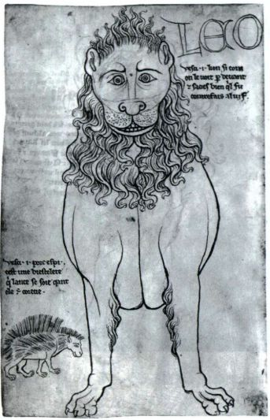

图12\.21 维拉尔·德·昂奈库尔：《狮子正面观》。约1240年。

犊皮纸上墨水画。巴黎国家图书馆

①节选部分原句为“然而这些全都没有必要。你本可以用正义追逐他们，抑或用你那大能的轻轻一呼。来击毙他们；然而你已经选择了你处理万事的度量衡”。这是《旧约》次经的一部分，天主教译作《智慧篇》，基督教译作《所罗门智训》。此处译文为基督教版本。基督教的译本出处为11：20，章节与英文版有出入。\-译注

402 詹森艺术史

彩色玻璃窗画

在哥特式大教堂窗户上熠熠生辉的彩色玻璃对13世纪的人们而言并非新生事物。彩色玻璃的历史可以追溯到3000年前的埃及，而大量的证据也表明，罗马人曾在他们的建筑中运用过半透明的玻璃薄片。某些具有实物佐证的文献也有过关于基督教早期、拜占庭时期、穆斯林以及中世纪早期建筑中运用彩色玻璃的描述。

在写于12世纪的艺术家手册《不同技艺论》中，修士西奥菲勒斯·普雷兹比特极其详细地描述了制作彩色玻璃的技术（见第400页的原始文献）。制造玻璃需要将硅（主要是沙子）、钾盐（用以降低硅的熔点）和石灰（稳定剂）的混合物熔化，之后添加金属氧化物给玻璃染色：氧化钴产生蓝色、氧化铜产生红色、氧化锰产生紫红色。玻璃工在烧木材的熔炉中加热混合溶液，接着倒入模子冷却，或者用吹管将柔软的玻璃吹成椭圆的球体或圆柱，之后再切开并压平。

设计者在一块事先涂过粉笔的木板上绘出与窗户同等尺寸的草图。他用热铁棒切出符合草图的各块彩色玻璃片，将之排列在木板上。面部特征与衣褶等更为精细的部分直接用铅化物画在玻璃上，之后玻璃被放入柴窑里烧，按照设计绘出的图案就会烧结在玻璃上。具有延展性的铅条将每块玻璃都联结在一起，称作带槽铅条（cames）。为了使玻璃窗画保持的更长久，将它安装在窗户开口处设置的铁框之中。12世纪早期的铁框是正方形网格，每个正方形边长约为60厘米（见图12\.19）。到13世纪，装玻璃工人采用了更为复杂的图形，包括圆形、菱形和四叶形，以创造日益繁复的图案（见图12\.34）。

彩色玻璃制造是一件昂贵且费时费工的工作，生产流程要求有明确的分工：制作玻璃的工匠辅助玻璃安装工进行安装，后者也负责设计和制作窗户。

尽管彩色玻璃在欧洲各处都有出现（见图12\.59），但玻璃制造最重大的成就还是出现在欧洲北部。生产玻璃需要大量的木材，加热熔炉、火窑和制作钾盐都不可或缺，只有欧洲北部的茂密森林才能够支撑玻璃制造业。同样也只有在欧洲北部，人们才会对进入建筑的光线的价值最为珍视。

在玻璃表面反射与在空间之中折射出的多彩光线在实质上改变了哥特式建筑的艺术效果。玻璃工匠需要考虑如何才能达成单个玻璃窗与它所在的建筑之间和谐一致，如何才能实现将单个玻璃窗与大型宗教与美学系统要求协调统一。以沙特尔大教堂为例，北耳堂的玫瑰窗以蓝色玻璃为主，而南耳堂玫瑰窗则以透光量较少的红色玻璃为主。由于大教堂南侧射入的光线远强于北侧，这样，玻璃色彩不同的两座玫瑰窗在控制进入建筑的自然光线量方面就达到了平衡。彩色玻璃也有助于叙述故事和表现图像，使其蕴藏有隐喻的气氛。13世纪的作家蒙多的威廉·杜朗德斯（William Durandusof Mendo）在他的《合理的圣礼》（Rationale divinorum officiorum）中写道：“教堂的窗户就是一部《圣经》，隔绝百无一利的风雨，纳入纯正的神圣日光，进入信徒们的心中。”而克莱尔沃的圣贝尔纳（见第356页）则解释说，光线可以穿透玻璃而不造成损伤，正如上帝之福音进入童贞玛利亚的子宫而没有玷污她。

到了13世纪晚期，人们对彩色玻璃窗画的偏好逐渐消退，透明玻璃在教堂建筑中成为主流（见图12\.36）。虽然人像部分仍然使用艳丽的彩色玻璃，但这些人像在大片灰白的单色玻璃画（grisaille glass）上仍然颇为孤立，四周的黄色玻璃表现的是围绕在人像周围的建筑框架。较为暗淡的玻璃能够让光线更充分地照亮晚期哥特式建筑中的日益繁复的细节。

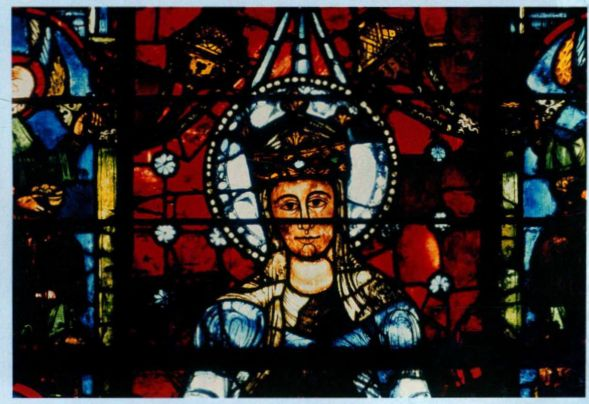

沙特尔大教堂彩色玻璃窗《华窗圣母》局部。约1170年

第十二章 哥特式艺术 403

图12\.22 沙特尔大教堂北耳堂大门。约1204\-1230年

之下，北耳堂的玫瑰窗玻璃则镶嵌于网状结构之中。

艺术史学家用板窗格（plate tracery）和棱窗格（bartracery）这样的术语来指代此处两种不同的构造方法。耳堂玫瑰窗的棱窗格创造出了复杂的装饰图案，并且扩大了玻璃相对于窗框和墙面的面积。

北耳堂（图12\.22）是为圣母玛利亚所建。她的形象已经出现在西立面右侧大门之上，表现为传统的圣母形象，端坐于象征神的智慧的宝座之上（见图12\.5）。新近出现的对圣母形象的强调反映出对圣母的崇拜日趋重要。而自罗马式时期以来，教会就一直在积极地推动这种崇拜。众所周知，圣母学（Mariology）的发展与对神性之爱的再次强调密切相关，作为哥特时期日渐普及的人性论的一部分，为信徒们欣然接受。约1204年，沙特尔大教堂得到了圣安娜的颅骨，由此圣母崇拜在沙特尔也具有了特别的意义。这件圣物与若干年前幸免于大火的圣母长袍一起，使沙特尔大教堂在所有献给圣母的教堂中具有了特殊的地位。

建造于1210年前后的北大门半月楣表现的主题与圣母升天节相关，描述的是圣母升入天堂的场景（图12\.23），包括“圣母安息”（Death［Dormition］）、“圣母升天”（Assumption）与“圣母加冕”（Coronation of the Virgin），与“圣母领报”（Annunciation）一

图12\.23《圣母加冕》（半月楣）与《圣母安息和圣母升天》（门楣），沙特尔大教堂北大门，约1210年

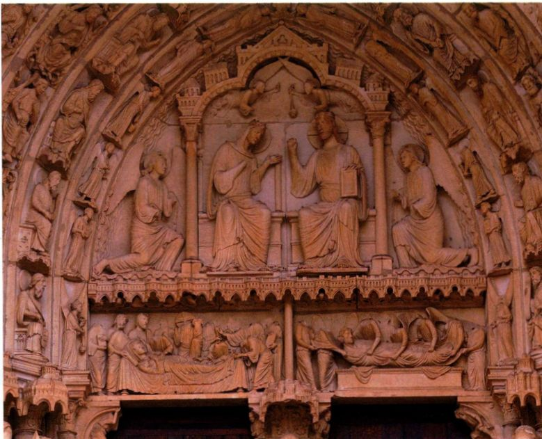

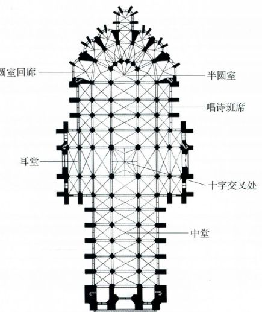

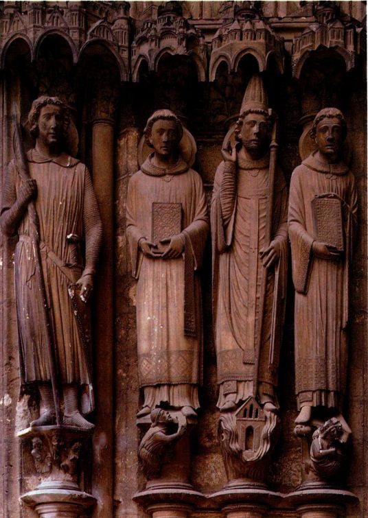

图12\.24 沙特尔大教堂南耳堂大门侧壁雕像。约1215\-1220年，最左侧的雕像（圣西奥多）作于1230年

起，都是表现圣母生平最常见的题材。它们将圣母等同于被称为基督的新妇（Bride of Christ）和天堂的入口（Gateway to Heaven）的教会，此外圣母还担有其传统的神圣调解人的角色。她不仅是基督的伴侣，而且还成为基督的天后。与早期大多基于拜占庭教堂中范例的形象不同，处理手法是欧洲西部地区的创造。以前的中世纪雕刻之中从未出现类似于此处圣母所表现出的宏伟。再者，处理手法具有极其显著的绘画感，似乎图像超越了它所填充的建筑框架，获得了独立。

部不再严格地符合身体的中轴线，它们整体仍然采用早期哥特式侧壁雕像的圆柱外形（见图12\.6）。相形之下，同样在左侧的骑士圣西奥多雕刻于10至15年之后，他的站姿则非常放松，有如古典时期的对立平衡。他的双脚站在水平平台上，而非像以前的雕像那样一样站在倾斜的搁板上；身体的中轴线也不再是直线，而是呈曲度虽小但仍可辨识出来的S形曲线。更为突出的是他武器上表现的细节的精致以及束腰外衣与锁子甲的质感。而最重要的是雕像身体表现出的栩栩如生的人体结构，自从罗马时期以来，从来没有哪座雕像如此地富有生命气息。然而圣西奥多雕像最令人印象至深的特点还不是它的自然主义特征，而是它所传达出的安详与和谐。这一理想化的基督教士兵形象以前所未有的形式表现了十字军的精神。

亚眠大教堂

几十年后，沙特尔大教堂所确立的盛期哥特式风格在亚眠大教堂（Amiens Cathedral，图12\.25、12\.26）的内部构造中达到了极致。1218年，一场大火将原有的大教堂烧毁，两年之后，亚眠大教堂在原址上开始重建，那时沙特尔大教堂尚未完工。亚眠大教堂中堂拱顶在1236年完工，而唱诗班区的修建又持续了25年。该教堂的建筑师是罗贝尔·德·吕扎尔谢（Robert de Luzarches）、托马斯·德·科尔蒙（Thomas de Cormont）以及他的儿子雷诺·德·科尔

半圆室回廊

然而《圣母加冕》只是盛期哥特式雕塑早期阶段的作品，耳堂大门的侧壁雕像具有明显的演变轨迹，即使是这些雕像之间也是如此，因为它们雕刻于不同的年代。雕像与圆柱之间的联系开始淡化，华盖的明显突出、雕像宽度的加大及其底座的精雕细刻都使得圆柱实质上被遮蔽。

我们可以在南耳堂大门侧壁（图12\.24）中看到雕像与圆柱关系变化的实例。尽管右面三位圣徒的头

图12\.25 罗贝尔·德·吕扎尔谢、托马斯·德·科尔蒙与雷诺·德·科尔蒙：亚眠大教堂平面图。始建于1220年

第十二章 哥特式艺术 405

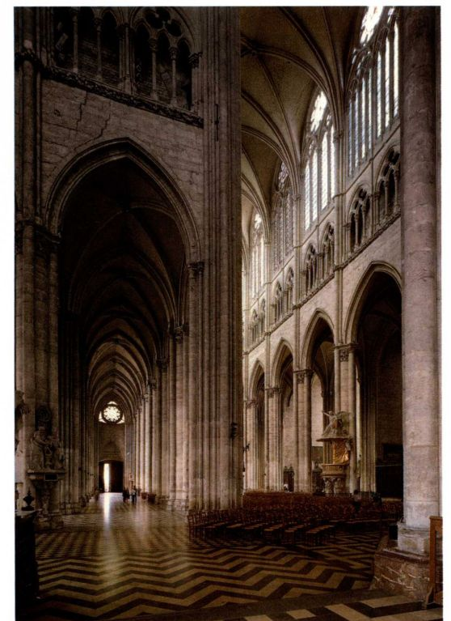

图12\.26 亚眠大教堂中堂与侧堂

蒙（Renaud de Cormont），建筑师的姓名开始流传这一事实具有重大意义，因为它表明，在这一时期，建筑师的社会地位有所提高。

中堂 中堂（图12\.26）的惊人高度是亚眠大教堂在建筑技术与美学上所取得的最主要成就。通过对早期哥特式风格的巴黎圣母院、盛期哥特式风格的沙特尔大教堂与亚眠大教堂这三者的中堂立面加以比较（图12\.27），人们可以清晰地看到，法国哥特式大教堂建筑发展相对较快且其垂直性不断加强。亚眠大教堂中堂连拱廊十分高大，在周围墙面整体高度的比例下，产生出了一种高耸的效果。仅连拱廊的高度（21\.34米）就近乎拉昂大教堂四层高度（23\.77米）的总合。中堂整体的高度为42\.67米，而沙特尔大教堂从地面到拱顶的高度仅为35\.97米。此外，在宽度与高度比上，亚眠大教堂的宽度较窄，这一比例在巴黎圣母院为1：2\.2，在沙特尔大教堂为1：2\.4，而在此处则达到了1：3。因此，垂直高耸之感由于直接缩小中堂宽度比例而得以加强。在墩柱柱头上直接升起的立柱也增加了整体上的垂直感。再者，三联拱廊与高侧窗在视觉上因中间的小型附壁圆柱而连接在一起，由此中堂连拱廊之上的墙壁被垂直地合而为一。亚眠大教堂的拱顶如同薄膜一般紧绷而细薄，肋拱式结构被运用到了极限。

图12\.27 中堂立面同比

例对比（根据Grodecki的图绘制）

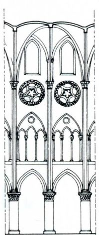

巴黎圣母院

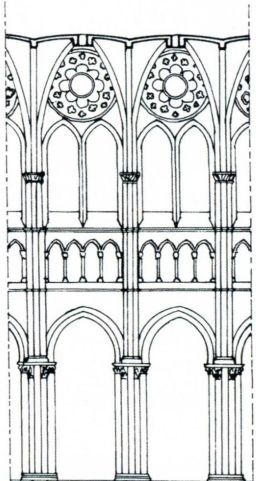

沙特尔大教堂

亚眠大教堂

406 詹森艺术史

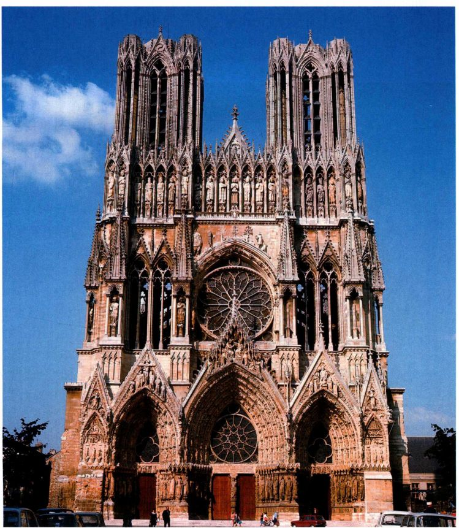

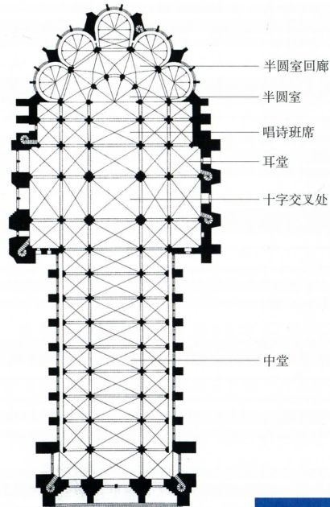

兰斯大教堂

盛期哥特式建筑立面的发展中也可以追索到这种对垂直性与透明感的强调。虽然兰斯大教堂（ReimsCathedral）只比巴黎圣母院晚建不到30年，但对前者正立面与后者正立面的比较很有启发意义。兰斯大教堂是法国国王的加冕地，而巴黎是王宫所在地，它们之间关系紧密。两座教堂具有许多共同特征，例如宽阔的耳堂都只是略微突出于教堂主体，但它们的整体面貌建造得极其不同（图12\.28）。

西立面 兰斯大教堂西立面的大门（图12\.29）并非像巴黎圣母院那样凹入墙体（见图12\.10），而是突出于墙外，入口上方的半月楣也为窗户所取代。巴黎圣母院西立面的国王雕像群在其一层与二层之间呈水平带状分布，而在此处却被提升到第三层，乃至雕像与这一层的连拱融为一体。除玫瑰窗之外，每一细部较之以往都更高更瘦。为数众多的小尖塔

图12\.28 兰斯大教堂平面图。

约1225\-1290年

图12\.29 兰斯大教堂西面观

第十二章 哥特式艺术 407

大事年表

1180\-1223年\-法国国王菲利普·奥古斯都统治时期

1194年\-大火烧毁了法国沙特尔大教堂的大部分建筑

1252年\-意大利神学家托马斯·阿奎那开始在巴黎执教

（pinnacle，加在墩柱、扶壁及其他建筑部件顶端的尖头部分）加强了无穷尽的向上运动趋势。此处的雕刻装饰前所未有的奢华，它们不再仅仅设在确定区域之内，而是扩展到众多新位置，不仅包括建筑的西立面，而且还涵盖了它的两侧。教堂外部整体开始看起来俨然一座供雕像栖息的鸽舍。

西大门雕刻 兰斯大教堂的侧壁雕像现在所在的地方并非它们的原始位置，因为西立面与耳堂大门的某些雕像曾被互换过。因此，雕像风格与设计的连贯性不复可考。然而，我们仍可以在此处对某些风格不同而品质出众的单个雕像加以研究。兰斯大教堂的某些雕像是哥特式古典主义（见第405页）顶峰时期的作品。其中最为著名的一组雕刻是《圣母往见》（Visitation，图12\.30，右部的两座人像），它创作于1230至1233年之间，表现的是玛利亚前往其表姐

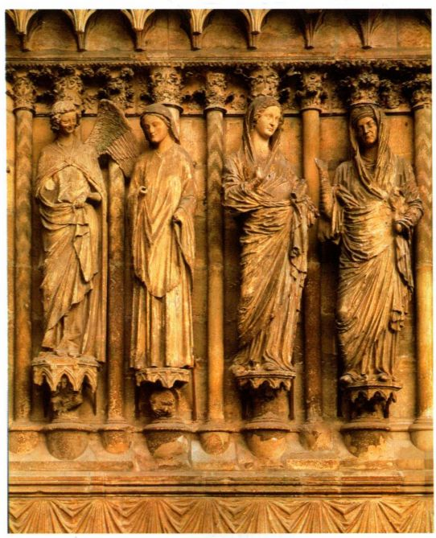

图12\.30《圣母领报》与《圣母往见》，兰斯大教堂西大门。约1230\-1265年

以利沙伯处告知自己受孕的消息。

在早期哥特式雕刻中，像这样以描述性场景为主体的侧壁雕像本不大可能实现，因为即使是在统一的设计之中，单个人物也是孤立的。现在《圣母往见》组像人物之间表现出了明显的互动，这表明圆柱退入背景的程度到了何等地步。在这里，由特征突出的对立平衡所产生的S形曲线比沙特尔大教堂的圣西奥多（见图12\.24）明显得多，它不仅支配着雕像的正面，而且支配着它们的侧面。雕像之间互相做着手势，仿佛它们隔着区分他们的空间进行交流，这种运用开敞空间的方式令人联想到盛期哥特式建筑中空间所发挥的更为活跃的作用。

女体腹部的水平衣褶突出了她们身体的体量感。玛利亚与以利沙伯令人立即联想到古罗马时期的妇人雕像，甚至让人怀疑艺术家是否受到了大型罗马雕塑的启发（对比图7\.13）。一座留存至今的罗马大门表明罗马人曾到达过兰斯，而且上个世纪的考古发掘证实，这一基址上的首座大教堂就建于罗马浴场之上。因此负责兰斯工程的雕刻家很有可能见过罗马雕塑的原型。

由于兰斯大教堂的雕刻项目在规模与时间上跨度都很大（其他大教堂也是如此），主持者必然雇佣了多位风格不同的雕刻家。其中的两种风格同时出现在《圣母领报》（Annunciation）这组雕刻中，它们明显不同于《圣母往见》中的古典主义（图12\.30，左部的两座雕像）。这组雕像中的风格差别是由以下事实造成的：天使加百列与圣母原本并非设计为一对，但现在所见的却是被放置在一起。圣母雕刻于1240至1245年间，人像遵循严格的垂直轴线。她的外衣呈现出笔直的管状衣褶，相交处呈锐角。这一简朴的风格可能由巴黎圣母院西大门的雕刻家创造于1220年前后，并从那里传播到兰斯和亚眠。与之形成对照的天使则极其优雅，它比这组雕像中的圣母至少晚十年，雕刻于1255至1265年之间。他们的小圆脸为卷发所衬托、脸上具有明显的微笑表情、纤细的身形体现出了强烈的S形曲线，衣褶的变化也很丰富，一种所谓的“优雅风格（elegantstyle）”由此而生，并在之后的几十年间传播到了许多地区。事实上它很快就成了哥特式雕刻的标准样式。许多年后，其影响不仅见于法国境内，而且传播到其他地方。

浮雕《旧约》组雕《麦基洗德与亚伯拉罕》（Melchizedek and Abraham，图12\.31）是上述优雅风格的成熟范例，它雕刻于13世纪中期之后不久，是

408 詹森艺术史

图12\.31《麦基洗德与亚伯拉罕》，

兰斯大教堂内部西墙。约1260\-1270年

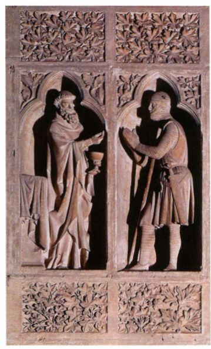

兰斯大教堂内部的西墙装饰。这些雕刻在题材的选择上可能与大教堂中举行的王家加冕典礼有关。选择麦基洗德与亚伯拉罕题材的原因在于，他们都是《旧约》中神圣不可侵犯的国王，这一场景强调了世俗权力得自教会所举行的宗教仪式。亚伯拉罕身着中世纪骑士的服装，雕刻家对衣饰的关注令人联想到沙特尔大教

堂圣西奥多雕像所表现的强烈的写实主义特征（见图12\.24）。而麦基洗德则明显表现出与《圣母领报》（见图12\.30）中天使雕像的相似性，他的卷发与胡须更为精致，宽大的衣袍几乎将身体淹没于衣褶的变化之中。深入的凹进与明显突出的边缘展示出雕刻家新的对光影效果的关注，它们的雕刻美轮美奂，如同绘画

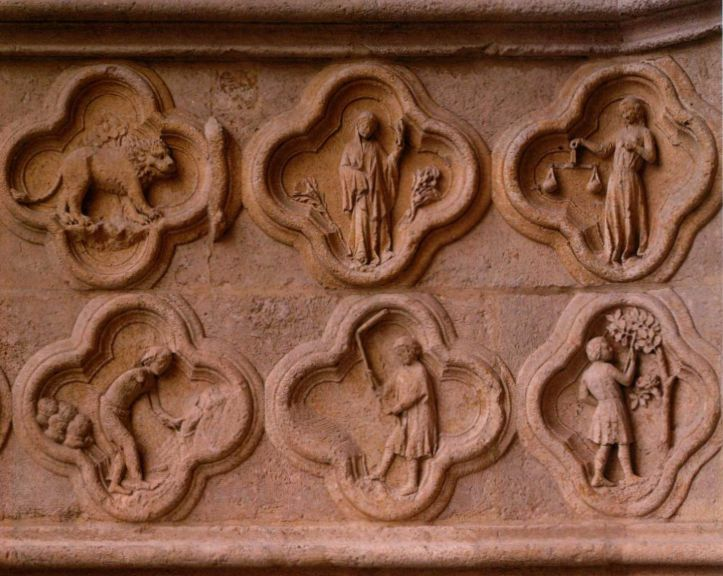

图12\.32《十二宫》（狮子座，处女座和天秤座）与《月时劳作》（七月，八月和九月），亚眠大教堂西立面。约1220\-1230年

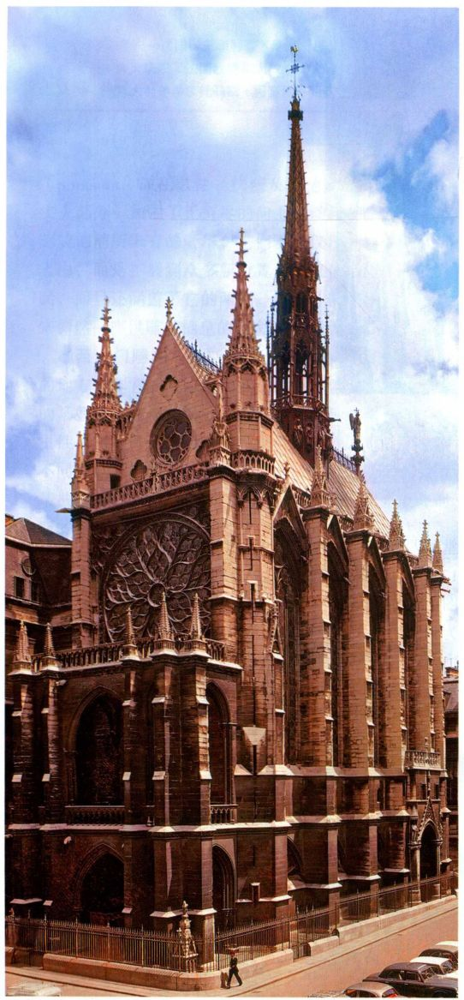

图12\.33 巴黎圣礼拜堂（西南向观）。1241\-1248年（玫瑰窗开于15世纪晚期）

一般。这种绘画性在人物之间的相互关系上也表现的同样明显，尽管他们都被安置在深深的壁龛之中。这些人像的写实特征因填充其周围框架的枝蔓而进一步得到加强，枝蔓表现的是可辨识的确定植物，如橡树叶、无花果叶和橡树果。

哥特式雕刻日益增长的写实主义特色需要某种条件，因为这种风格的雕刻从来都缺乏系统性。更确切地说，它是一种精密现实（realism of particulars），关注具体细节甚于整体结构。其最典型的作品不仅包括13世纪早期与中期具有古典主义倾向的侧壁雕像和半月楣，也包括小型雕刻，例如亚眠大教堂西立面四叶形饰（quatrefoil）边框内的《月时劳作》和《十二宫》（Labors of the Months 和	Signs of the Zodiac，图12\.32）。相同的题材也曾运用于罗马式与早期哥特式大门，但是亚眠大教堂的作品则表现出一种对日常生活的讨人喜欢的观察力。雕刻家将独立场景安排在装饰性的四叶形饰之中，表现出了相当的才气，因为这种形状在构图上本就难以处理。

法国盛期哥特式大教堂体现出当时人们的努力几乎是空前绝后的。这些具有代表意义的国家性建筑所需的庞大资金由举国各个地区、各个阶层捐献而来。大教堂表现的是一种宗教狂热与爱国热忱的融合，而这正是修道院长絮热当初所追求的目标。然而，修建这些建筑的庞大费用和因此而强加的赋税还是激起了强烈的反抗。例如1233年，兰斯大教堂建造工程就因市民反对教堂权势的运动而搁置了三年。工程的中断也是造成风格多样的原因之一。到了13世纪中期，修建大型建筑的热潮开始衰退，大规模工程的施工速度从这时比先前缓慢。新工程的数目减少，而且规模也不再像先前那样庞大。由此，之前在大教堂工地上形成的组织严密的石工与雕刻工团队逐渐分散为合作小组。

辐射式风格或宫廷风格

法王路易九世是13世纪中期仍有意愿也有财力来修建大型建筑的人物之一。1297年，即他去世近三十年之后，路易九世被追封为圣路易（St\.Louis）。在他统治期间，英法之间签订了最终确认由法国统治诺曼底的条约，法国的领土范围开始呈现当今法国的面貌。这一时期，君主权力与巴黎（宫廷所在地）日益重要，这一点在路易九世对宫廷风格的影响程度上得到了反映。巴黎被认作艺术中心实际上就始于圣路易的治下。

410 詹森艺术史

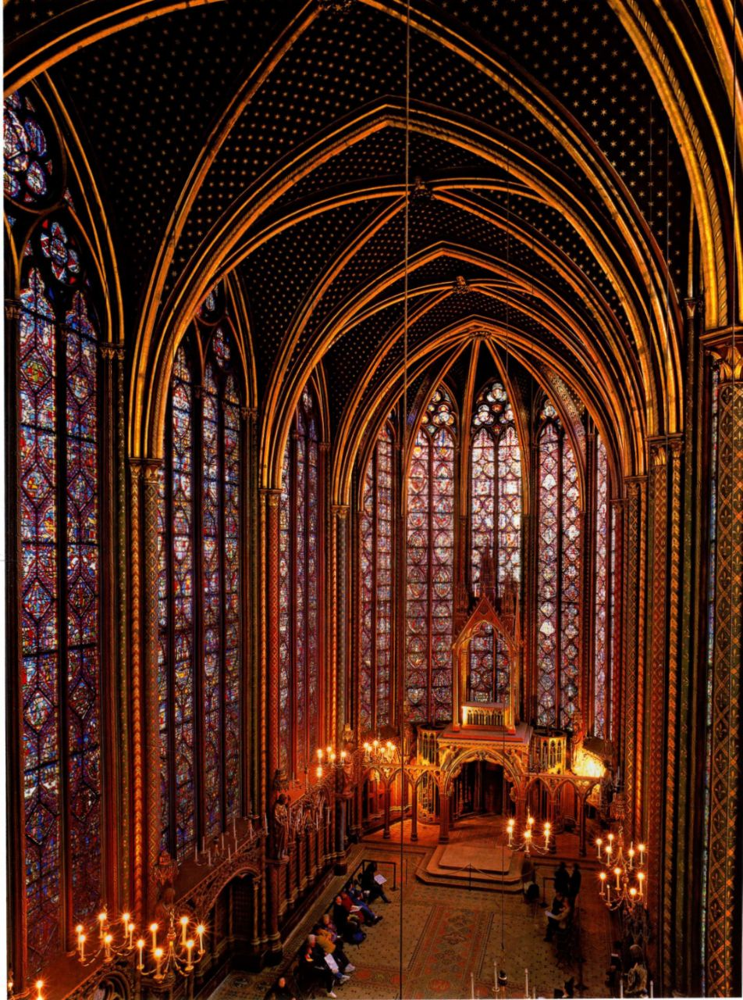

圣礼拜堂

圣路易在哥特式风格演进中所留的印记最突出地表现在他的宫廷礼拜堂中。这座礼拜堂被称为圣礼拜堂（Sainte\-Chapelle），1241年设计完毕，七年后完工（图12\.33）。它分为两层，下层相对较低，是廷臣所在之处；上层礼拜堂专属王室，王室成员可以从宫中的寝殿直接进入。这座建筑在本质上是王家礼拜堂，查理曼大帝的亚琛宫殿礼拜堂（见图10\.17）是其原型。

路易从他的表兄弟君士坦丁堡皇帝鲍德温二世（Baldwin II）手中买下了耶稣受难时所戴的荆冠以及其他圣物，包括真十字架残片、铁矛、海绵及一个钉子。这些都成为了他修建圣礼拜堂的动因，这些圣物需要在一个辉煌的所在予以展示。礼拜堂色彩极为丰富、图案非常精美，大量金色覆盖着圣礼拜堂的墙面、拱顶等部分（图12\.34）。这些装饰与几乎覆盖圣礼拜堂大部分墙面的彩色玻璃相映生辉。祭坛之上建有一座高圣龛，用来放置和展示圣物。圣龛背后敞开，以使备受崇拜的圣物沐浴在透过彩色玻璃窗射入的绚丽光线之中。建筑精巧的玻璃框架，进入其中的珠宝般

艳丽的光线，这些都使整座礼拜堂实际上产生出一件大型圣物的效果。尽管它实际上规模不及其他大教堂，但其瘦高的尖顶窗极大地加强了建筑的垂直感，从而表现出较之任何其他大教堂也毫不逊色的宏伟感。走进礼拜堂之时，参观者几乎浸没在它的光环之中，这种体验与任何来自现实世界的正常体验都不相同。因此，正如圣索菲亚教堂（见第256\-259页）一样，宗教精神在这里再次通过建筑及其装饰传达了出来。

考虑到玻璃和窗户在墙面上所占的比例相当大，圣礼拜堂外部的扶壁就显得相对较小（见图12\.33）。为了最大限度地减少了窗户处的阴影，建筑师尽量使扶壁靠近建筑主体。为了承受通常只能由更大的扶壁才能支撑的推力，建筑师将两道铁链水平穿过礼拜堂的窗户以加固建筑，从建筑结构与美学角度而言，这是一个极其有效的解决方案。

哥特式建筑的这个阶段通常被称为辐射式（rayonnant），该词汇出自法语“rayonner”，即放射光芒之意。它源自当时建筑中设计放射状棱窗格的流行做法，棱窗格的运用最初出现于玫瑰窗，后来开

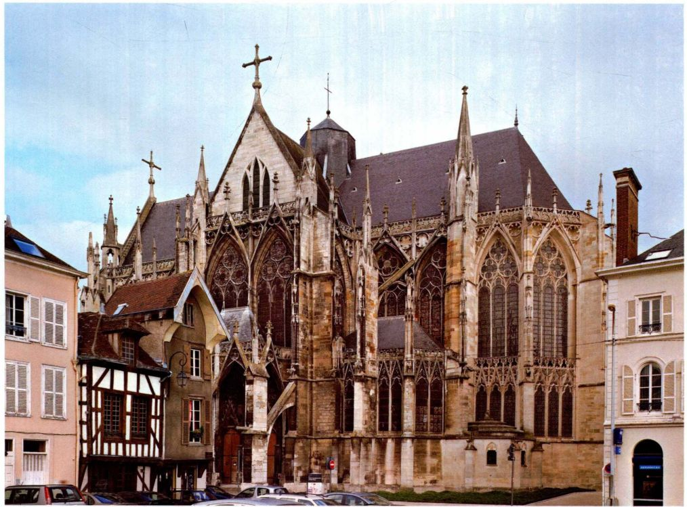

图12\.35 法国特鲁瓦的圣乌尔班教堂。始建于1262年

412 詹森艺术史

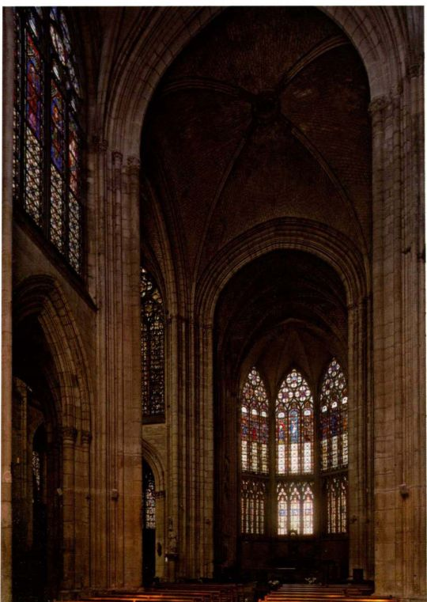

始扩大到整座教堂。这一与宫廷有着密切关系的风格传遍王室领地之后，又流传到欧洲大部分地区。

特鲁瓦的圣乌尔班教堂

特鲁瓦的圣乌尔班教堂（Saint\-Urbain inTroyes，图12\.35、12\.36）建于13世纪晚期，由教皇乌尔班四世（Urban IV，1261\-1264年任教皇）委托建造，即为纪念他的出生地，也是一份给他的主保圣人的敬献。设计师未用三联拱廊，对平面布局加以简化，创造了一座仅两层、晶莹细致的玻璃结构建筑，略为宽大的上层实际上全部由玻璃构成，内部极其通透明亮。唱诗班区的窗户饰有精美窗格，就开在距离地面仅3米多高的墙面上，突出了光线所造成的梦幻般的屏风效果。支撑建筑的飞扶壁纤细到难以觉察的地步。建筑装饰也具有同样纤细优雅的特征：山墙上的装饰完全脱离了支撑它的窗面墙壁。乌尔班教堂的细致精美无疑说明哥特式艺术风格中追求宏伟壮丽的时代已经一去不返，细节的精致才是现在人们的主要关注。

图12\.36 特鲁瓦的圣乌尔班教堂内部

手抄本彩饰

某些学者认为“辐射式”一词仅适用于建筑学。当时，路易九世的宫廷与上层社会阶层之中，绘画领域里也取得了重大的成就，于是，他们提出了宫廷风格（court style）这一术语，并将其作为“辐射式”的同义语来指称这一时期的艺术风格。事实上，建筑艺术与那些装饰有精美细密画的宗教性手抄本具有诸多联系，后者或者服务于王室的欣赏和教育，或者为那些富有而有教养的阶层而作。法国手抄本作坊的作品品位优雅，使得巴黎宫廷艺术成为全欧洲的标准。

《卡斯蒂尔的布朗什诗篇》这部诗篇集（图12\.37）就表现了这两者之间的关联，它创作于1230年前后，主人是国王路易九世的母亲卡斯蒂尔的布朗什（Blanche of Castile）。这部作品可能作于布朗什

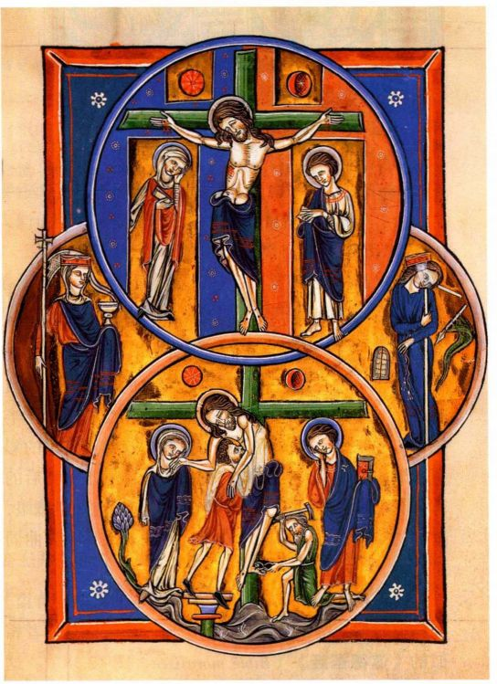

图12\.37《耶稣受难与耶稣下葬》（Crucifixion and Deposition），出自《卡

斯蒂尔的布朗什诗篇》（Psalter of Blanche of Castile）。约1230年。犊

皮纸上墨水、蛋彩与金箔，1 9\.9 × 1 5 \.4厘米。巴黎国家图书馆军械库

分馆（Bibliothèque del＇Arsenal），编号 Res ms 1186

第十二章 哥特式艺术 413

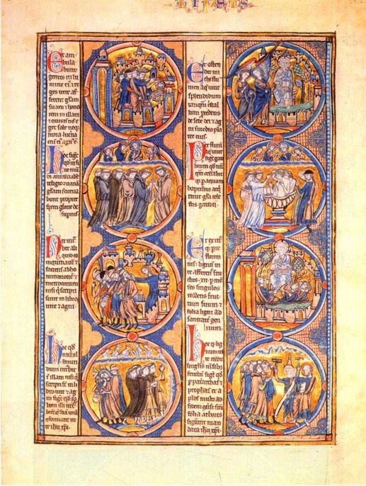

图12\.38《启示录场景》（Scenes from the Apocalypse），出自《道德圣经》。约1225\-1235年。犊皮纸上墨水、蛋彩与金箔，	38 × 26\.6厘米。纽约皮尔庞特图书馆

摄政期间（1226\-1234年），当时继承了王位的路易仅仅12岁，离他亲政尚有六年。作品色彩的范围与浓淡（特别是红色和蓝色）、粗重的轮廓线，以及将场景放置在几何图形之中（此处是相交的圆形与半圆形）的构图，这些特点都令人联想起曾经见过的彩色玻璃窗画的手法与布局，例如圣礼拜堂圣龛背后的部分（见图12\.34）。插图书页光亮的金底色灿烂耀眼，这与透过彩色玻璃射入教堂的光线的效果具有异曲同工之妙。

《道德圣经》几乎在《卡斯蒂尔的布朗什诗篇》的同一时期，法国王后又定制了另一部风格与前者相似的《道德圣经》（Bible moralisée，图12\.38）。这部书中的图画只配有相对简短的圣经文字或道德教诲性质的注释，文字为拉丁语和法语。原书将近3000页，均配有插图，现在一分为二，分别收藏于西班牙托莱多大教堂（Cathedral of Toledo）和纽约皮尔蓬特·摩

根图书馆（Pierpoint Morgan Library）。与此同类的《道德圣经》还有若干部，但最早一部可能也是在巴黎为布朗什而作，作于上述这部作品之前的几年。

这些圣经为法国国王和王后个人所使用，既被视为艺术珍品，也是良好操行的指导。在自己强势母亲的教导之下，路易日后的性格和成就与这些书中的指导密不可分。路易成为了狂热的基督教战士，虔诚且富于同情心，他组织并亲自参加了两次十字军东征，最终在东征途中于1270年死在突尼斯。

此处插图中，圣经书页上的场景被安排在垂直堆叠的圆盘之中，圣礼拜堂长狭的窗户（见图12\.34）再一次显著地提供了清晰的比照对象。手抄本里，圆盘之间的空间充满了花饰和菱形图案，与圣礼拜堂窗户上场景周围的装饰纹样类似。

《圣路易诗篇》制作于1260年的《圣路易诗篇》（Psalter of Saint Louis，图12\.39）也许是最接近建筑形式的绘画。此处表现的是《撒母耳记》上篇11：2

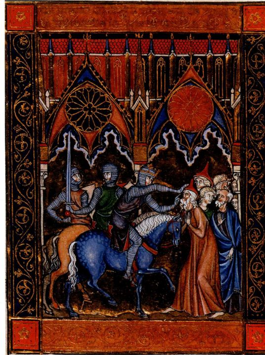

图12\.39《亚扪人拿辖在雅比威胁犹太人》（Nahash the AmmoniteThreatening the Jeus at Jabesh），出自《圣路易诗篇》。1253\-1270年。犊皮纸上墨水、蛋彩与金箔，13\.6x8\.9厘米。巴黎法国国家图书馆

414 詹森艺术史

图12\.40 奥诺雷大师：《大卫与歌利亚》（David and Goliath），

出自《美男子腓力四世的祈祷书》。1296年。犊皮纸上墨水、蛋彩，

20\.2 × 1 2\.5厘米。巴黎法国国家图书馆

节的插图，亚扪人拿辖（Nahash the Ammonite）在雅比（Jabesh）威胁犹太人的场景。手抄本中所绘的建筑直接以圣礼拜堂（见图12\.33）为原型。这幅插图同时也令人联想起沙特尔大教堂侧壁雕像头顶的华盖（见图12\.24），以及兰斯大教堂浮雕装饰中围绕着《麦基洗德与亚伯拉罕》的双壁龛（见图12\.31）。在书页的平面背景之中，人物流畅娴熟的造型使其具有了突出画面的浮雕感。外轮廓则以粗重深暗的线条为主，与彩色玻璃窗上的铅条如此相似。这些人物将若干年前由雕刻家所创造的优雅风格的全部特征表现得一览无余：优美的手势、富有动感的姿态、微笑的面容，以及整齐卷曲的头发（对比图12\.30《圣母领报》中的天使与图12\.31《麦基洗德与亚伯拉罕》）。由此，这幅细密画成为了巴黎宫廷艺术雅致品位的典型代表。

大事年表

1241年\-设计法国国王路易九世的宫廷礼拜堂：圣礼拜堂1265年\-意大利诗人、《神曲》的作者但丁出生1273年\-哈布斯堡家族兴起，鲁道夫一世当选为国王

法国晚期哥特式艺术

尽管晚期哥特式艺术的发展以早期哥特式艺术的成就为基础，但是这一时期的艺术家们开始大胆背离既有的艺术样式。建筑师们虽然很关注布局的整体性，但他们也会运用对结构上的清晰性有一定影响的复杂的曲线装饰手法，而这一点正是早期哥特式建筑中极其强调的。相互重叠的镂空平面在布局上错综复杂，制造出繁复的视觉效果。晚期哥特式的手抄本与雕刻同样也装饰得极其奢华、表面处理极为丰富，强调着它们的珍贵品质。

手抄本彩饰

13世纪以前，彩饰手抄本一直都在修道院缮抄室中制作。现在，和其他许多曾为神职人员所专门从事的活动一起，手抄本的制作也转移到由教会之外所组织的城市作坊之中，这正是今天出版社的前身。雕刻与彩色玻璃窗画作坊再次成为它们效仿的榜样。巴黎作为手抄本制作中心而闻名于世，即便是在今天，人们仍可明确指出当时各个作坊聚集的街区。

《美男子菲利普四世祈祷书》有些新出现的世俗插图画家留下了他们的姓名。其中之一是巴黎的奥诺雷大师（Master Honoré），他在1296年绘制了由路易九世的孙子定制的《美男子菲利普四世祈祷书》

（Prayer Book of Philip IV the Fair）中的细密画（图12\.40）。此处的插图表明艺术家的绘画风格源自《圣路易诗篇》（见图12\.39），然而画面的框架不再统领构图。人物形象更大，造型的浮雕感也更突出，这是色彩的柔和变换与白色高光调节的效果，与早期手抄本中典型的平涂色彩的手法截然不同。人物站立的姿态并不自如，因为他们外翻的双脚在画面上看起来十分平板。但是人物可以踩在框架之上，这有助于使他脱离背景中的平面性，因此在画面中引入细微然而写实的深度感。这种空间的暗示增强了图像的故事性。在下部的场景中，大卫和歌利亚（Goliath）各出现了两次。在一个富于表情的细节中，歌利亚将手放在自己的额头上，仿佛已经处于痛苦之中，而此时大卫手中的石块尚未投出。

第十二章 哥特式艺术 415

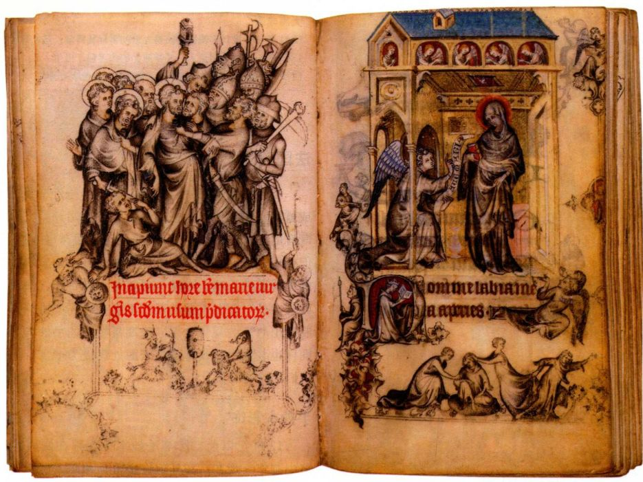

图12\.41 让·皮塞尔：《出卖耶稣》与《圣母领报》，出自《让娜·德夫勒日课经》（Hours of Jeanne d＇Étreux）。1325\-1328年。羊皮纸上蛋彩与金箔，每页	8\.9 × 6\.2厘米，此处图片大于实际尺寸。纽约大都会艺术博物馆，修道院收藏（TheCloisters Collection），1954年购入（编号54\.1\.2）

《让娜·德夫勒日课经》对表现具有立体雕塑般人像的兴趣在插图画家让·皮塞尔（Jean Pucelle）的一部袖珍私人祈祷书（称为日课经［book ofhours］）中进一步加深。这部书于1325至1328年间在巴黎为法国王后让娜·德夫勒（Jeanne d＇Évreux）所作（图12\.41）。本书右页插图是《圣母领报》，左页是《出卖耶稣》（Betrayal of Jesus）。人像的创作风格类似于奥诺雷大师（见图12\.40），但是精细的单色画（grisaille）增加了作品形式上的圆雕感。而这还不是皮塞尔唯一的贡献：建筑内景在空间感上显示出进深趋势，这是之前的北欧绘画所不具备的。在《圣母领报》中，加百列跪在前厅，天使们站在阁楼的窗户上，代表圣灵的鸽子正是从那里翩然落下。

在表现新型的绘画空间方面，皮塞尔不得不考虑手抄本书页的特殊要求。圣母的房间并没有充满整个画面，看起来它与其他装饰结构一样，好像是一座飘浮在空白背景上轻盈的笼子（请注意右侧支撑房间的天使），这样才能使整幅页面成为一个和谐的整体。其中的许多细节都与手抄本的宗教目的无关。花体首

字母D中呈跪姿的王后当然是正在祈祷的让娜·德夫勒，仿佛她的高度虔诚营造了一个真实的圣母领报景象。她身旁的那位男子虽然看似一位侍从，正在聆听头顶枝蔓上鲁特琴演奏者的音乐，但他的身份却不明朗。场景的结合是对日常经验的注解，尽管它们缺乏实体感但仍有可能实实在在地发生：音乐既现实又昙花一现，正如让娜的宗教幻象。

其他一些迷人的小插图填充于页面之间。左侧的女孩脚下，一只兔子从地洞中探看，引向花体首字母的枝蔓中绘有一只猴子和一只松鼠。这些页边设计（称为滑稽图饰［drôlerie］）是北部哥特式手抄本的共同特征，它早在让·皮塞尔时代之前的一个世纪，就诞生于英吉利海峡两岸，并迅速传播到巴黎及其他哥特式艺术中心。此类页边装饰的设计题材相当广泛：幻想、寓言、荒诞幽默以及各种日常生活场景，都可以与宗教主题共存。滑稽图饰的本质是其幽默性，艺术家在这个特殊的领域之中，享受着几乎没有任何限制的自由，堪与弄臣相比。而小丑弄臣的存在正解释了中世纪晚期人们对滑稽图饰的普遍青睐。

416 詹森艺术史

尽管如此，皮塞尔看似单纯的滑稽图饰背后，还隐藏着严肃的意图，这种意图在右页底部的滑稽图饰中表现得尤为明显，这种插图被称为页底饰（法语：bas\-de\-page）。画中央四个人正在玩一种被称为“青蛙（Froggy）”的游戏，暗指对页上的《出卖耶稣》。《出卖耶稣》下方两位骑羊骑士在用长矛捅戳木桶。这幅图的用意并不仅仅为嘲笑宫廷骑士团，而且暗指

耶稣是“替罪羊”，骑士手中的长矛就是耶稣受难时刺穿耶稣身体的长矛。

雕塑

哥特式晚期，早期与盛期哥特式最为关注的大门雕刻相对而言不再重要。独立圆雕人像大多为宗教仪礼对象，完全脱离建筑背景。由于社会中个人的重要

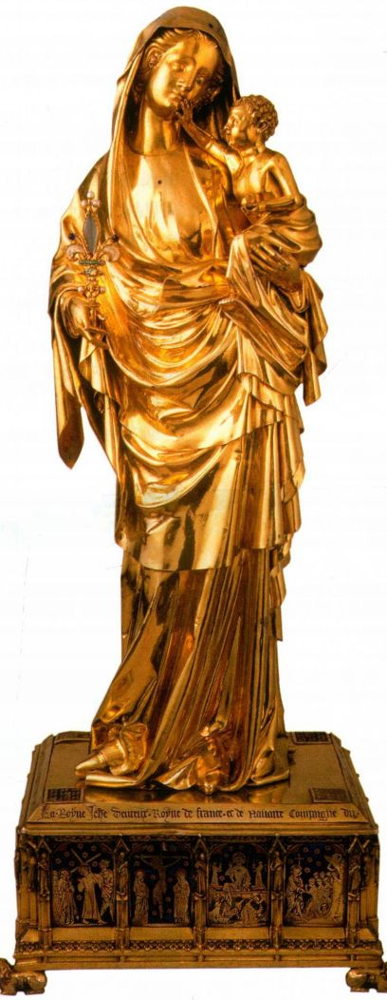

图12\.42《让娜·德夫勒圣母像》。1339年。镀金银像，珐琅镶嵌，高68厘米。巴黎卢浮宫（编号 MR342；MR419）

第十二章 哥特式艺术 417

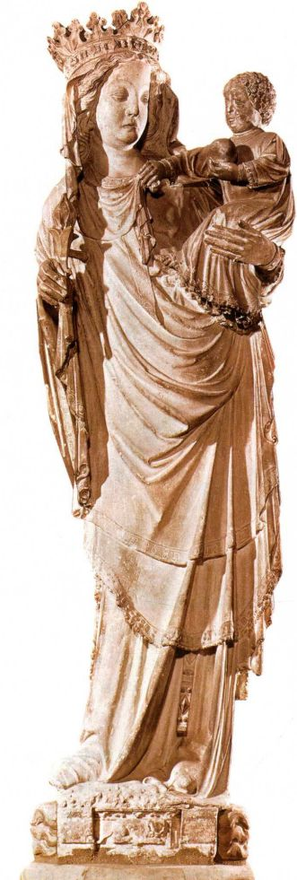

图12\.43 《巴黎圣母像》。14世纪早期。石雕。巴黎圣母院

性有所增加，因此单人雕像成为主流。这时的雕塑行会组织完善，两位由国王指定的大师确保行规在雕刻作坊的贯彻。除石雕之外，雕刻家也用金属与象牙制作了一大批珍贵作品。

《让娜·德夫勒圣母像》 皮塞尔《圣母领报》中的圣母具有一种泰然自若的优雅，同一位赞助人于1339年送给圣德尼修道院的镀金银像（图12\.42）是它卓越的对应作品。《让娜·德夫勒圣母像》（Virginof Jeanne d＇Évreux）的优雅与精致使我们认识到，在中世纪早期如此重要的金属制品，此时仍旧价值昂贵。即使是在早期哥特式时期，修道院长絮热就曾清楚地

开列出赞助人在制作圣物箱、圣龛、祭坛装饰和祭祀用器方面所愿意投资的数目清单。而且根据计算，荆冠圣物箱的制作费用是圣礼拜堂修建费用的两倍，礼拜堂是为陈放圣物箱而建造。

在《让娜·德夫勒圣母像》中，衣袍下垂褶皱及其相互映照的柔软曲线十分和谐，与圣母身体优雅倾斜的姿态十分协调。圣婴碰触她嘴唇的动作温柔而亲昵。雕像底座上的铭文表明，这座雕像是王室呈献的供奉，圣母手中象征法国王室的百合花（fleur\-de\-lis）预示着圣母具有王者至尊，与捐赠者身份相同。

《巴黎圣母像》在另一座14世纪早期的圣母像上，古典主义遗风如何在哥特式雕塑中逐渐消失，而优雅则臻至极端。因此巴黎圣母院中《巴黎圣母像》（Virgin of Paris，图12\.43）这一人像表现出抽象倾向，出人意料。雕像表面多为凹陷，突起部分缩减到令人只见线条、不见体量的程度。从严格意义上说，它彻底脱离了物质实体，人物倾斜的姿态几乎与古典的对立平衡毫无关系，因为它不再是使雕像保持平衡所必需的方法。与这种绝世的优雅相比，兰斯大教堂《圣母领报》中的天使（见图12\.30）显得极具现实感，然而已经埋下了与这座雕像本质相同的种子，后来惊人地表现在《巴黎圣母像》之中。哥特式自然主义的早期实例（见第410页）关注细节，在此处表现为一

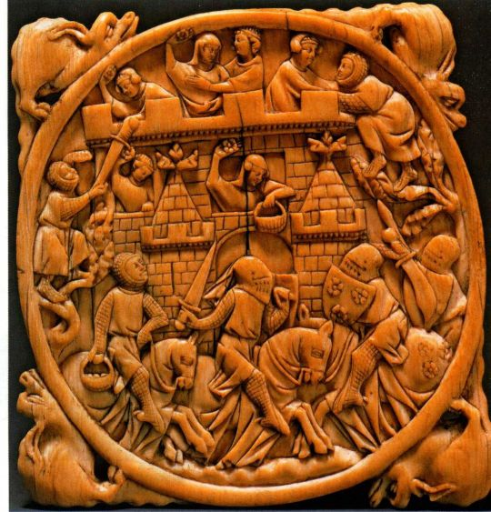

图12\.44《围攻爱堡》，镜子背面装饰。约1320\-1350年。象牙，

1         厘米。西雅图艺术博物馆（Seattle Art Museum），

Donald E．Frederick 纪念收藏（编号49\.37）

418 詹森艺术史

种秘而不宣的现实主义，在观者前，圣婴已不再是救世主的缩影，而是摆弄着母亲面纱的寻常儿童。

这种风格优雅的新样式受到了法国宫廷的鼓励，拥有了特殊的权威性。也正是这种优雅的表现特征，而不是现实主义或古典主义，才是哥特式艺术的精髓。哥特式艺术晚期雕塑或许缺少早期哥特式雕塑的宏伟面貌，但它们依然是令人印象至深的作品，并且与同时期其他材质的雕刻作品存在密切关系，例如牙雕。

《围攻爱堡》《让娜·德夫勒圣母像》与《巴黎圣母像》均为推崇优雅奢华、品位精致的观众而作。这些赞助人也定制供自己使用的非宗教体裁作品，而受他们委托的也大多是制作宗教体裁作品的艺术家。此类器物使用的材料多为象牙等珍贵材料，装饰体裁也多是当时流行的浪漫宫廷文学中的场景。这些故事多由抒情诗人来讲述，爱情的甜蜜与苦涩是他们最青睐的主题。《围攻爱堡》（Siege of the Castle ofLove，图12\.44）雕刻在一面14世纪象牙镜架上，起初装的是一块抛光了的金属圆盘制成的镜面。一群骑士正在攻打一座妇女居住的城堡，群骑争夺。然而，战斗场面被刻意设计得毫不激烈。因为左方的骑士更关注城堡中那些向进攻者投掷玫瑰的女子，而不是正在他面前发生的战斗。画面右侧上方，一位骑士在城

堡中仕女的帮助下爬上墙头。另一侧，士兵爬到树上欲将手中的宝剑递给一位手持玫瑰的女子。

这里描绘的场景与13世纪的叙事长诗《玫瑰传奇》（Roman de la Rose）极其相近。这部长诗用俗体法语写成，作者是纪尧姆·德·洛里斯（Guillaume deLorris）和让·德默（Jean de Meung），讲述的是一位骑士及其同伴围攻爱堡的故事。牙雕那梦幻般的效果折射出诗歌的意象，有如梦境。故事本身就是一个隐喻，城堡象征女性，攻打城堡则象征着求爱。因此，即使这里发生的不是真实的战斗，无论女子还是骑士也都不会空手而归。

这件女性题材的宫廷作品与器物本身非常相称，因为镜子本来就是女性妆奁。女性都会随身携带，悬于腰间。实际上，化妆品在12世纪时才再次进入西欧。虽然化妆品的使用在古代相当普遍，但罗马陷落之后就不再有人问津。十字军为重拾化妆习惯助了一臂之力，因为他们抵达地中海东部地区，那里的人们自古代以来就有化妆的习惯。

这件象牙雕刻制作于巴黎，当时那里的象牙梳子与镜子制作行会留有记录。14世纪中期以后，由于百年战争导致了经济混乱，象牙奢侈品逐渐消失。

图12\.45 皮埃尔·罗宾与安布鲁瓦兹·哈勒尔：法国鲁昂的圣马克卢教堂西立面。1434\-1490年

第十二章 哥特式艺术 419

__大事年表__

1325—1328 年——皮塞尔绘制法国王后让娜·德夫勒的日课经彩饰  
1339—1453 年——英法百年战争  
1347 年——黑死病开始流行，欧洲人口大量减少  
1431 年——法国女英雄贞德被处以火刑

建筑：火焰哥特式

虽然晚期哥特式建筑或火焰哥特式（FlamboyantGothic）阶段要追溯到13世纪末，但它的发展却因英法百年战争（1338\-1453年）而停滞。因此直到15世纪早期，才出现了成熟的建筑实例。正如其字面意义所言，“火焰”指的是波动回卷的曲线，它们是晚期哥特式棱窗格的主要特征。在建筑结构上，火焰哥特式几乎没有自身的创新。

鲁昂的圣马克卢教堂 鲁昂的圣马克卢教堂（Saint\-Maclou at Rouen，图12\.45）丰富的装饰清晰地显示出火焰式风格，并使其有别于特鲁瓦的圣乌尔班教堂（见图12\.35）。1434年，皮埃尔·罗宾（PierreRobin）完成了教堂设计；1467至1480年间，安布鲁瓦兹·哈勒尔（Ambroise Harel）指挥了施工过程。在此期间，西立面的主体已经建成，但直到1490年前后才得以竣工。西立面的两边向后翻卷到侧立面，从而突出了中央大门，形成具有层级划分的形式，大门的高度变化也强调了这一点。

哈勒尔在圣马克卢教堂的建筑构架上附着了密集奇特的装饰网，使得建筑本身几乎完全隐而不现。在线条的奇特纠结中寻找建筑结构如入迷阵。即便是对建筑外部的仔细考察，也无助于辨识教堂的内部布局。诸如尖顶山墙饰（pointed gable）等反复出现的样式既融合于建筑之中，也高耸于建筑之上。玫瑰窗位于中央山墙饰的背后而不是它的上部。之前作为围栏式元素的山墙饰（见图12\.22、12\.29）如今被摇曳的窗花格侵占殆尽，而成为纯粹的装饰形式，塑造了轻快活泼的效果。建筑形式因运用了空间处理手法而被激活，这与晚期哥特式雕刻家与画家对体量感、深度感的关注如出一辙。

哥特式艺术的传播

巴黎周边地区的法国王室风格具有雅致的品位，受到各国的热烈欢迎，它们将其调和为适应本地环境的各种变体。事实上，19世纪早期，英德两国的哥特式建筑甚至成为强烈民族自豪感的体现，他们

甚至都宣称哥特式是一种本土风格。哥特式艺术迅速传播的因素不一而足，其中不可忽视法国建筑师与石工的熟练技巧与法国作为学术中心的显赫声望，例如沙特尔教堂学校与巴黎大学。不过人们还是质疑这些解释是否真正触及了问题的核心。哥特式艺术得以广泛传播的最基本原因，无疑还是这一风格本身所具有的魅力。即使远离法兰西岛文化氛围的地区，哥特式艺术也激起了人们的想象力，触动了他们的宗教情感。

英格兰

英格兰特别善于接受新的风格。法兰西岛的哥特式风格与盎格鲁\-诺曼底地区的罗马式特色相融合，并在此得以进一步发展。1175年，一位法国建筑师重建了坎特伯雷大教堂（Canterbury Cathedral）的祭坛，由此将法国哥特式引入英格兰。在不到五十年的时间里，英格兰哥特式拥有了自己的特色，被称为早期英格兰风格（Early English style），并于1225至1250 年间占据主流地位。尽管在这些年间兴建了大批建筑，但它们主要是增建已有的盎格鲁一诺曼底地区建筑。始建于罗马式时期的许多英格兰大教堂尚未竣工，它们在此时得以竣工或扩建。因此，整体设计为早期英格兰风格的教堂极其少见。

索尔兹伯里大教堂 英格兰很多哥特式教堂的建设都跨越了不同时期，而且混杂了不同风格，不过索尔兹伯里大教堂（Salisbury Cathedral，图12\.46\-12\.48）是一个例外。它始建于1220年，亚眠大教堂也于同年开工。索尔兹伯里大教堂外观（见图12\.47）与法国哥特式教堂（见图12\.10、12\.22、12\.29）的区别显而易见，用同样的标准来评判它们显然徒劳。相比紧凑感与垂直感而言，纵深低矮的延伸之感表现得更为明显。（十字交叉处的钟楼虽然与总体建筑极其协调，但它比其他建筑晚一个世纪，高度也远远超过了最初的设想。）由于高度不是主要的目标，飞扶壁就只不过是事后的补充，而不是完整设计的一部分。西立面被设计为宽于教堂本身的屏幕式墙壁，它在水平方向上分为三条装饰与雕像带，两座塔楼缩短为小角塔。该教堂的平面布局（见图12\.46）具有双耳堂，并且仍保持了罗马式时期的空间分割特点，然而正方形的东端结构采用了西多会建筑的样式（见图11\.22）。

一旦踏入中堂（见图12\.48），许多在当时法国教堂内部常见的元素就映入眼帘（例如沙特尔大教堂，见图12\.12）。但是英格兰对它们的处理却呈现出迥

420 詹森艺术史

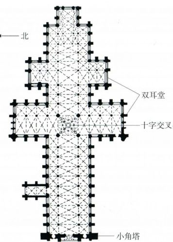

图12\.46 英格兰索尔兹伯里大教堂平面图。1220\-1265年

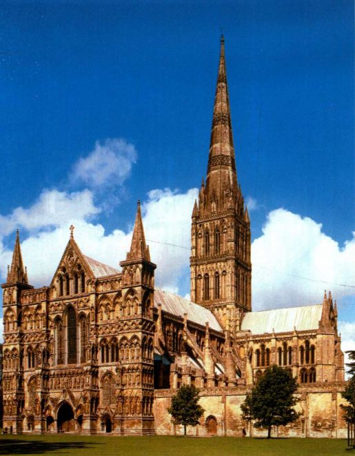

然不同的效果。与西立面一样，横向分割取代了纵向分割，因为中堂墙壁给人的感觉不再是纵向开间，而是一系列连拱与支柱。这些支柱由暗色石材雕刻而成，在其他部分的映衬下脱颖而出。对其独特功能的强调是早期英格兰风格的标志之一，色彩间隔条带的运用也强调了立面的水平性。

中堂拱顶的陡峭弧线是它的又一独特之处。拱肋全部自三联拱廊那一层向上升起，使得高侧窗看起来似乎隐藏在各个拱顶之间。早一个世纪建立的达勒姆大教堂，出于技术上的需要，采用了同样的做法（见图11\.43、11\.44）。而此处则属于风格的范畴，它与英格兰的早期哥特式风格整体协调一致。或许可以被认为是保守特征的长处。它运用了法国的形式，但不尚创新，从而体现了盎格鲁一诺曼底地区艺术传统的连续性。其实，具有过道的厚重墙壁结构融合了法国风格的元素，这与达勒姆大教堂的情况非常相似。索尔兹伯里大教堂建于14世纪的十字交叉处的塔楼醒

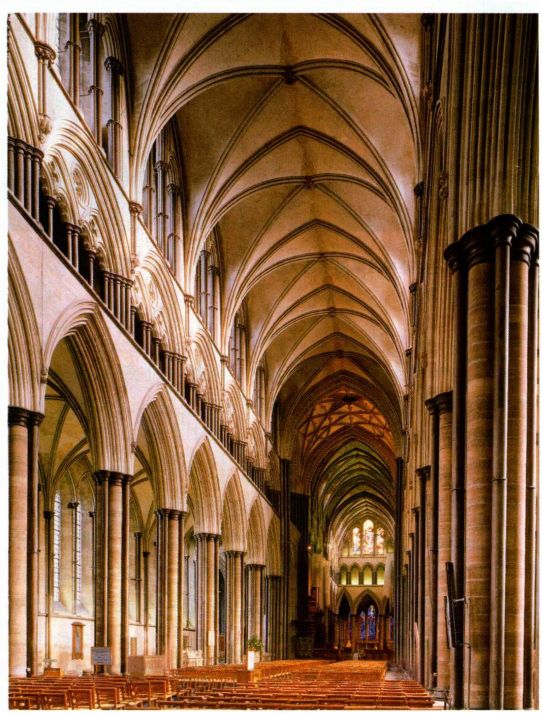

图12\.48 索尔兹伯里大教堂中堂

图12\.47 索尔兹伯里大教堂（西南面观，尖塔建于约1320\-1330年）

第十二章 哥特式艺术 421

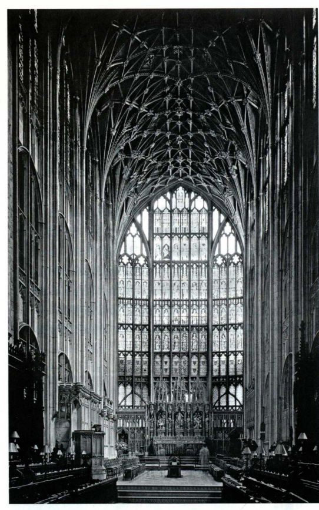

图12\.49 英格兰格洛斯特大教堂圣歌坛。1332\-1357年

目地伸向天空，而建于13世纪的其他部分则从容地水平展开，两者之间的对比说明英格兰哥特式在其间的一百年中开辟了新的方向。

格洛斯特大教堂 英格兰哥特式风格的变化在索尔兹伯里大教堂内部与格洛斯特大教堂（GloucesterCathedral，图12\.49）祭坛的对比中清晰可见。格洛斯特大教堂建于1332至1357年间，是英格兰晚期哥特式风格的杰出代表，该风格也被称为垂直哥特式风格（Perpendicular Gothic style）。这一名称显然再合适不过，因为英格兰早期哥特式所缺的垂直感此时已占据了主导地位。垂直上升的效果在格洛斯特大教堂最为明显，壁联柱一直从地面延伸到拱顶。在这方面，垂直哥特式与法国的传统风格更为相似，但由于其具备了太多英格兰特色，将它纳入欧洲大陆的艺术体系会显得格格不入。样式一致的小型窗花格板反复出现，

这令人联想到索尔兹伯里大教堂西立面的雕像带（见图12\.47）。它的正方形东端结构再现了英格兰早期教堂半圆室的样式，拱顶上升的弧线与索尔兹伯里大教堂中堂（见图12\.48）一样陡峭。

另一方面，拱肋具有了新的功能。拱肋的数目增加到足以形成装饰网的地步，它屏蔽了开间之间的边界，使整座拱顶构成一个连续的平面。天顶仿佛是飘浮在教堂内部上方的华盖。这一效果反过来又强调了内部空间的统一性。将经典的四分拱顶运用到极致也是欧洲大陆火焰哥特式的特征（见第420页），但英格兰在这方面起步更早，进展更大。

亨利七世礼拜堂 亨利七世礼拜堂（Chapel ofHenry VII）惊人的悬吊拱顶将垂直哥特式推到了顶峰，它在16世纪之初建于威斯敏斯特修道院（WestminsterAbbey，图12\.50）。在礼拜堂内部，灯笼般的突起挂在回卷成圆锥形的“扇面”上，拱肋与窗花格式构件混合成为令人眼花缭乱的建筑幕帐。如此复杂的拱顶设计与墙体或拱顶本身都毫无关联，正像鲁昂的圣马克卢教堂的装饰特点一样（见图12\.45），复杂精美的图案使建筑结构晦暗不明。

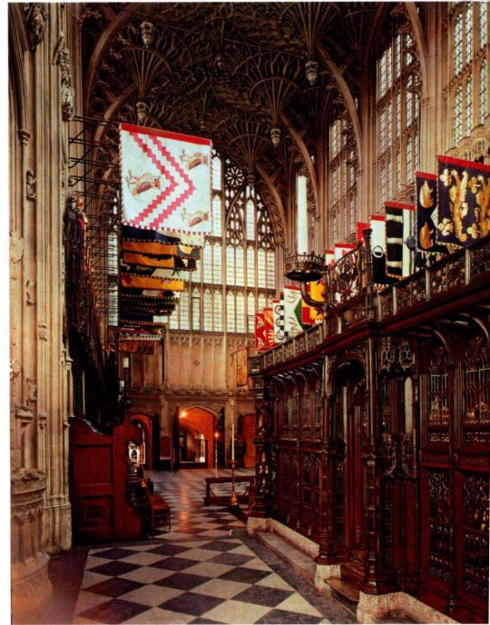

图12\.50 英格兰伦敦威斯敏斯特修道院亨利七世礼拜堂。1503\-1519年

422 詹森艺术史

1 7\.9 × 门。5厘米。伦敦大英图书馆（编号ROY．2．B．VIIf151）

《玛丽王后诗篇》与哥特式建筑一样，英格兰的手抄本彩饰也显示出与法国样式的丝缕联系。它的某些特征与法国作品极其相似，而另外一些则更多地体现了英格兰传统中由来已久的形式与表现手法。《玛丽王后诗篇》（Queen Mary Psalter，图12\.51）大约有1000幅独立作品，其中包括《旧约》与《新约》场景，圣徒生平与狩猎场面。《耶稣在圣殿布道》（JesusTeaching in the Temple）这一页上出现了两种不同类型的绘画，这两种类型的绘画也出现在整部手稿中。

主要画面是具有装饰性的金色背景与建筑框架的彩色绘画作品，而页底饰则为淡彩画（tinted drawing）。尽管绘画技巧不同，但两幅作品都出自同一位艺术家之手，这部手稿中的全部画作都由他绘制。这是一项惊人的成就，因为该艺术家至少还创作了另外两部彩饰书籍。虽然有学者认为，这部作品的场景安排、温文尔雅的人体姿态以及对页底饰的运用都表现出对法国艺术手法的依赖，不过绘画风格却几乎都是线描，且少用阴影，这更接近以前的英格兰样式。

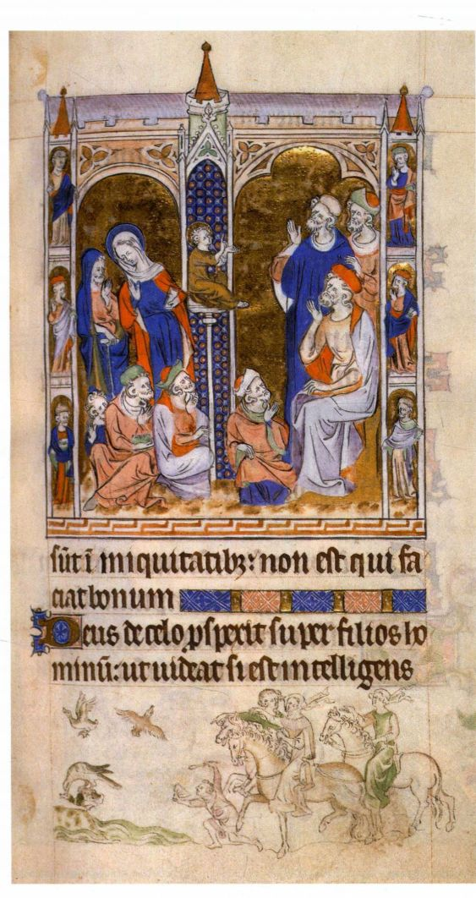

图12\.51《耶稣在圣殿布道》（Jesus Teaching in the Temple）与《狩猎》（Hunting

Scene），出自《玛丽王后诗篇》。约1310\-1320年。犊皮纸上墨水，蛋彩与

金箔，

第十二章 哥特式艺术 423

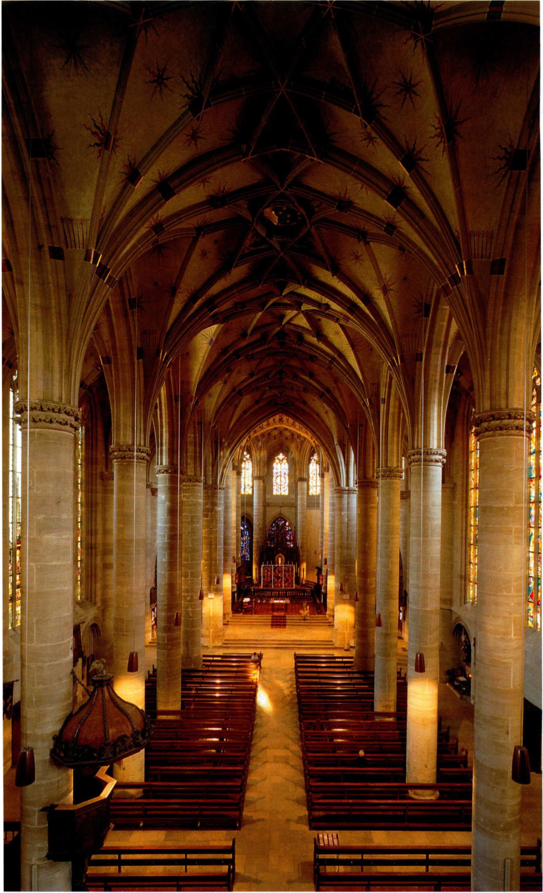

页底饰描绘着马背上一对带鹰行猎的优雅夫妇，一位骑马的女侍和一位步行的男仆陪伴着他们。这幅取自贵族日常生活的场景描绘得栩栩如生，无论是左下方的猎鹰捕捉野鸭，还是男骑者和伴侣的亲昵，途中两人的手指正指向面前的狩猎场面，所有细节都表现得自然得体。马鬃处活跃的波浪式线条与男仆的姿态描绘出他们的行进状态。在主要画面中，敏感而又精确的线条也传达着某种意义。描绘圣母玛利亚脸旁头发与衣服的线条柔软平滑，与犹太人发须处明显的曲线形成鲜明对比，后者正坐在神殿中听从圣子的教诲。

页底的小插图与圣经场景之间的圣像学关联尚不清楚。但显而易见的是，宫廷生活场景与圣经场景相互交织，或者至少并存在一起。同一时期的法国手抄本也是如此。然而在英格兰手抄本中，页边的插图具有连贯性，一页一页延续下去，正如圣经故事的循环。尽管普遍认为这部手稿手抄本作于1310至1320年之间，其华丽程度也说明这是王室定件，但并不知道它究竟是为何人而作。最肯定的观点认为这是国王爱德华二世（Edward II，1307\-1327年在位）为他的王后法国的伊莎贝拉（Isabella of France）定做的。之所以今天称为《玛丽王后诗篇》，是因为这部书在16世纪时献于都铎王朝的玛丽王后（Queen MaryTudor\)。

德国

哥特式建筑在德国生根发芽的速度大大慢于英格兰。直到13世纪中期，尽管早期哥特式元素已渐趋流行，但罗马式传统与持久的奥托特色仍占据主导地位。大约从1250年开始，法兰西岛的盛期哥特式风格对莱茵兰地区产生了强烈的冲击。始建于1248年的科隆大教堂就是运用成熟的法国样式、超越亚眠大教堂的大胆尝试。直到近代它才得以完工，这是一座前所未有的教堂。与德国建筑师不同，虽然有些德国雕刻家对法国样式仰仗有加，其他人则追寻更为独立的方向。德国的哥特式雕刻或富于表现、或强烈感人、或栩栩如生，但它们都表达着深切而时有克制的情感。

施瓦本格明德的圣十字教堂 德国哥特式的典型建筑是厅堂式教堂（Hallenkirche）。这种类型出自罗马式建筑风格，侧堂与中堂等高（见图11\.24）。虽然法国也有类似建筑，但它在德国得到了最充分的发展。德国中部有很多这样的教堂，施瓦本格明德的圣十字教堂（Heiligenkreuz in Schwäbish\-Gmünd，图

12\.52）只是其中之一。老海因里希·帕尔勒（HeinrichParler the Elder）于1317年开始建造圣十字教堂，但1351年唱诗班区扩建的工程很可能是他的儿子彼得监造。（老帕尔勒至少还有两个儿子、两个孙子与一个曾孙，也都是建筑师。）教堂内部空间具有流畅延展之感，仿佛在我们面前打开了一顶巨型华盖，令人回想起格洛斯特大教堂的空间效果（见图12\.49）。此处没有引导我们的明确方向感。集柱（支柱簇）不间断的线脚分叉为花边般的拱肋，覆盖着拱顶，似乎回应着我们在空间中所体会到的持续动感。

瑙姆堡大教堂 德国哥特式雕刻的发展轨迹清晰可辨。13世纪20年代以来，在法国大教堂的雕刻作坊中受过训练的德国巧匠们将新风格带回了家乡。因为当时的德国建筑仍主要为罗马式风格，于是像沙特尔大教堂与兰斯大教堂那样的大型组雕在教堂立面上就没有了用武之地。因此，德国哥特式雕刻与建筑联系趋向松散。事实上，最为精美的作品通常都为教堂内部而作。

这种独立性使得德国雕刻比法国雕刻具有更大的表现自由，在瑙姆堡大师（Naumburg Master）的作品中表现得尤为清晰。这位艺术家最知名的作品是在1255年前后为瑙姆堡大教堂（Naumburg Cathedral）创作的雕像与浮雕系列。《耶稣受难》（Crucifixion，图12\.53）是唱诗班席隔屏（choir screen）的中心题材，它的两侧分别是《圣母》与《福音约翰》（John theEvangelist）。围在具有山墙饰的深凹门廊之中，这三座雕像建构出中堂通向圣殿的围屏入口。通常人们会把组雕安置在围屏之上，雕刻家突破常规，把组雕安置在地上，从而无论从实际位置来看还是从情感上而言都把题材拉得离我们更近。通过强调耶稣身体的体量感，他的痛苦就成为一种活生生的现实。玛利亚与约翰恳切向人，生动感人地传达着他们的哀痛之情，前所未有。

与兰斯大教堂《圣母往见》（见图12\.30）中的舒缓之情相比，这些雕像的哀痛怅惋显得豪迈感人。如果法国古典的盛期哥特式雕刻可被誉为菲迪亚斯式的“静穆的克制”，那么瑙姆堡大师的作品在气质上就是希腊化艺术激越感性的化身（见图5\.72）。

同样的情感强度也弥漫在耶稣受难场景之中，例如《犹大之吻》（The Kiss of Judas，图12\.54），犹大的顺服与圣彼得手挥宝剑的暴烈形成了鲜明对比。唱诗班席内的壁联柱上附有12座真人尺寸的贵族雕像，11世纪大教堂的修建与他们密切相关。瑙姆堡主教迪特里希二世（Dietrich II）为筹措资金兴建新

第十二章 哥特式艺术 425

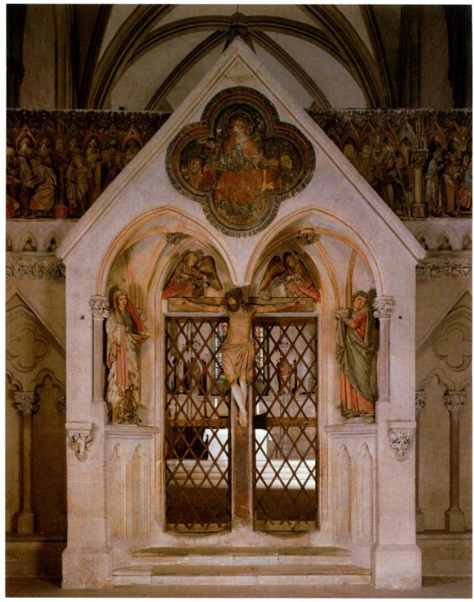

图12\.53 瑙姆堡大师：唱诗班席隔屏雕刻《耶稣受难》，《圣母》和《福音约翰》。约1255年。石雕。德国瑙姆堡大教堂

图12\.54 瑙姆堡大师：唱诗班席隔屏雕刻《犹大之吻》。约1255年。石雕。德国瑙姆堡大教堂

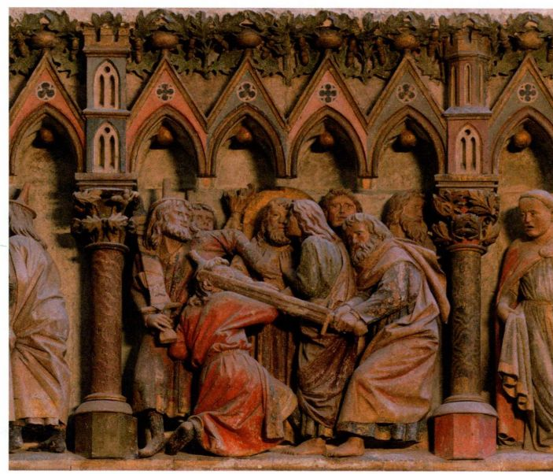

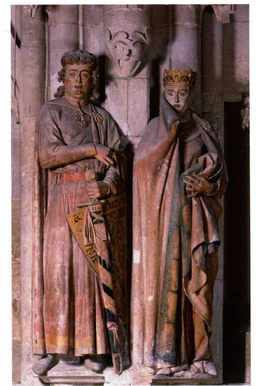

的大教堂而制作了这些雕像。通过宣传原有建筑的慷慨捐赠者，主教鼓励教民支持新的建筑工程，加入到慷慨赞助大教堂的行列之中。雕像所表现的人物形象并非艺术家同时代的人物，对艺术家而言他们不过是编年史上的几个名字而已。然而《埃克哈德与乌塔》（Ekkehard and Uta，图 12\.55）是如此独特和现实，好像真人肖像画一般。他们手臂的姿势、衣褶的处理，以及凝视的目光，极其微妙地传达出人性之感。雕像的个性与特征提醒我们，对个人身份与个体的关注标志着哥特时期的社会变化。现实主义趋势并非此处的特有现象，它令人回想起兰斯大教堂（见图12\.30、12\.31）。将历史人物置于神圣之所这一举动非比寻常，不过可能是因为这些人去世已久，才可如此安置。

瑙姆堡大教堂内部雕刻上仍保留着彩绘的痕迹，这有助于我们领会哥特式雕刻的原始面貌。哥特式建筑的内部曾施有精美的彩绘，正如圣礼拜堂修复后的状况一样。置于建筑外部的雕刻也有彩绘，但很少留存至今。

图12\.55《埃克哈德与乌塔》。约1249\-1255年。

石雕。德国瑙姆堡大教堂

《勒特根圣母哀子像》 正如我们目前所知，哥特式雕刻反映出赋予传统基督教艺术题材以更大的情感诉求的愿望。13世纪末，这一趋势造就了一种新的宗教图像（见第二部分末尾的附加原始文献）。它最初为个人祷告而设计，通常人们称之为沉思像（出自德语“Andachtsbild”），因为德国在这种艺术形式的发展中具有领先地位。最广为传播的形象是以圣母哀悼已死去的耶稣为题材的，称为圣母哀子（Pietà）。这个意大利词汇源自拉丁语“pietas”，“pity（怜悯）”与“piety（虔诚）”都以它为词根。这样的场景并没有出现在关于耶稣受难的文字描写当中，它形成的时间与地点都不得而知，但它是表现圣母七苦（SevenSorrows of the	Virgin\)	的图像之一，因此也与圣母七乐（Seven Joys of the	Virgin）中的圣母子（Madonna and Child）题材相对应。

《勒特根圣母哀子像》（Roettgen Pietà，图12\.56）为色彩鲜艳的彩绘木雕。与大多数此类雕像相同，这

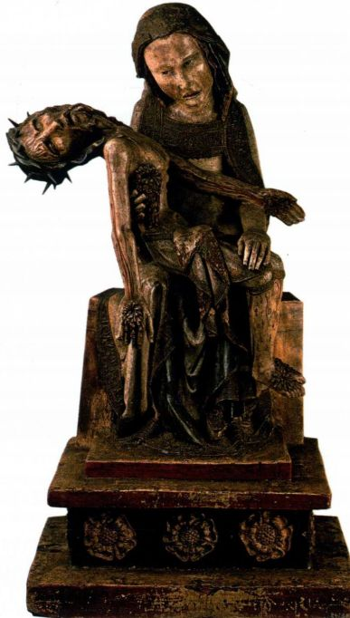

图12\.56《勒特根圣母哀子像》。14世纪早期。木质，高87\.5厘米。

波恩莱茵河地区国家博物馆（Rheinisches Landesmuseum）

第十二章 哥特式艺术 427

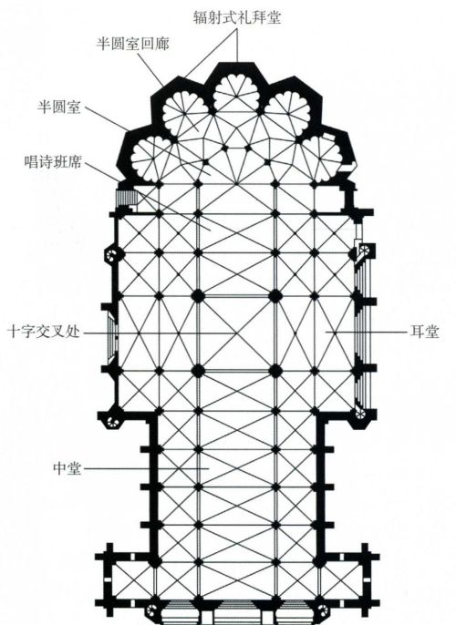

图12\.57 西班牙莱昂圣母大教堂平面图。始建于13世纪40年代（此图由Giroux根据 De los Rios的图纸所画）

座大型圣像最初是为祭坛而作。它的主题与风格都表达着虔诚的俗士们所具有的炽烈情感。此类雕像强调个人与上帝的关系，这也是14世纪时席卷欧洲的神秘论潮流的一部分。此处的写实主义纯然是增强作品冲击力的手段。人物面孔中流露着难以承受的痛苦与悲伤；伤口处的夸张荒诞不经；身体与四肢细瘦僵硬得如同木偶。显而易见，这样的设计是要营造一种浓郁的恐怖气氛，并引起人们的同情，让虔诚的教徒体会耶稣所遭受的痛苦并分担伤心欲绝的圣母的悲伤。其实，建立这样一种情感联系的终极目的是实现灵性转变，通过“同情”（意为一同受苦）来领会上帝道成肉身的核心秘义。

乍看之下，《勒特根圣母哀子像》与同时期的《巴黎圣母像》（见图12\.43）并无相似之处。不过身体外形平瘦，“灰心丧气的”，因此都激起观者产生情感共鸣。这些都是13世纪晚期至14世纪中期北部欧洲艺术的典型特征。直到14世纪中期以后，人们才开始关注建筑物的重量和体积，并希望在教堂的外观中注入一些现实的元素。

西班牙

罗马式时期，西班牙艺术家们吸纳了法国人的建筑与装饰手法，部分原因是要脱离与其共处于伊比利亚半岛的穆斯林，实则为了显示他们相对于穆斯林的优越地位。法国风格被认定为基督教胜利的体现，从而推动了13世纪西班牙对哥特式风格的接受，当时基督教所取得的多次胜利（其中主要是1212年纳瓦斯\-德托洛萨［Navas de Tolosa］战役的胜利）将穆斯林向南愈逐愈远。

莱昂 莱昂长期以来都是王国的首都。这里的圣母大教堂（Cathedrl of Santa María in León，图12\.57、12\.58）使人联想到与君主政体相关的法国盛期哥特式建筑，特别是作为法国国王加冕地的兰斯大教堂（见第407\-410页）。莱昂圣母大教堂的东端建有回廊与五座辐射式礼拜堂，与兰斯大教堂的布局（见图12\.28）颇为相似。因此，尽管人们对莱昂圣母大教堂出自何人有所争议，但无不认为他是法国人，而且对兰斯大教堂了如指掌。对法式建筑风格的借鉴解释了建筑工期的滞后，因为莱昂圣母大教堂直到13

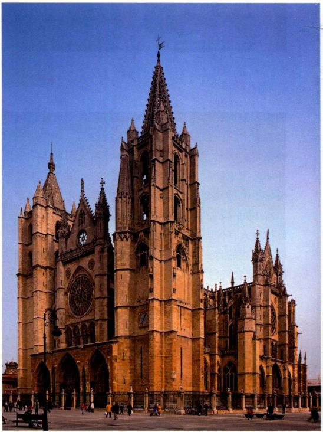

图12\.58 莱昂圣母大教堂外部

428 詹森艺术史

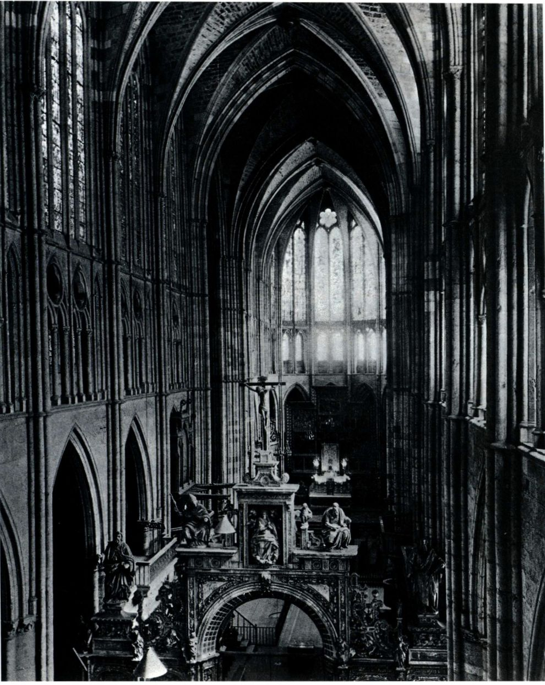

图12\.59 莱昂圣母大教堂内部

世纪40年代才开始施工，较兰斯大教堂晚将近30年。年，费迪南德三世（Ferdinand III）统一了莱昂与卡

斯蒂尔王国，但是王室仍继续关注着卡斯蒂尔的首都

布尔戈斯（Burgos），这座城市早些年被称为王国所

有教会的“母亲与头脑”。1221年，一座法国风格的

哥特式大教堂开始在此兴建。莱昂人以新建成的大教

莱昂圣母大教堂内部立面（图12\.59）的样式更为新颖，

高侧窗瘦长的尖顶类似于圣礼拜堂，后者完工于莱昂

圣母大教堂始建的那十年间。

此时莱昂与法国王室建筑的关联意义重大。1230

第十二章 哥特式艺术 429

大事年表

1220年\-英格兰的索尔兹伯里大教堂开始建造

1230年\-西班牙国王费迪南德三世统一莱昂与卡斯蒂尔王国

约1254年\-威尼斯旅行家与冒险家马可·波罗出生

约1255年\-为德国瑙姆堡大教堂制作雕像与浮雕

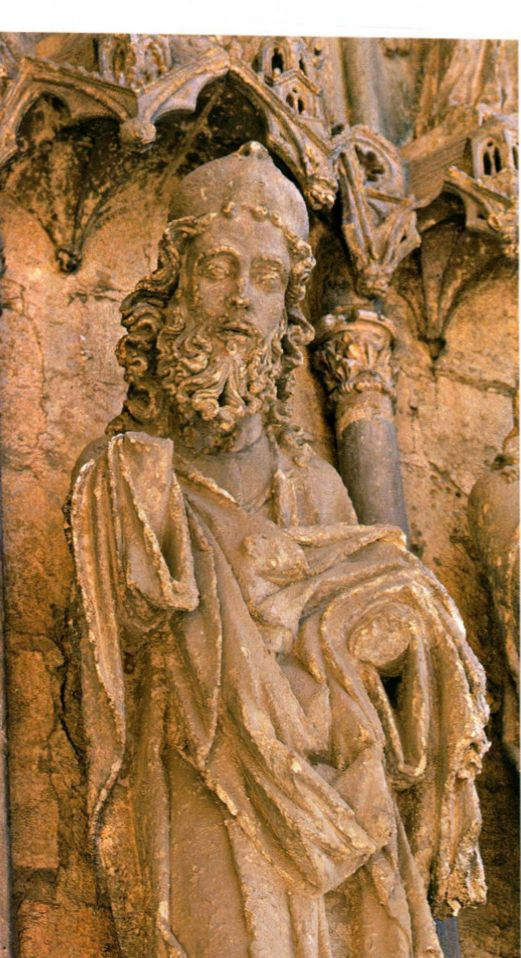

堂传扬着该市作为王国首都的历史地位，具有布尔戈斯市无法企及的庄严与崇高。

尽管莱昂圣母大教堂的许多侧壁雕刻都已搬离了它们的原始位置，但雕刻家对法国盛期哥特式雕刻手法的借鉴十分明显。《新约》中将幼年的耶稣认作救世主的预言家西缅的雕像（图12\.60），雕刻于13世纪末的几十年间，位于西立面右侧大门的门廊之中。这座雕像被拉长的优雅身体、衣袍复杂卷曲的褶皱以及波浪式的浓密胡须，都令人联想到兰斯大教堂的雕刻作品（见图12\.30、12\.31）。

西班牙一些哥特式大教堂的设计灵感来源于法国艺术，莱昂圣母大教堂就是其中之一。托莱多和布尔戈斯都宣称自身具有君王气派，也依照法国样式设计建造了它们的建筑。毫无疑问，他们雇佣的是法国建筑师。因此哥特式风格的王室出身显然没有被遗忘，尽管此时这一自法国引进的风格已然诞生了一百余年。

意大利：哥特式艺术预览

意大利的哥特式艺术极其独特，不同于欧洲其他地区。文中已经讨论过哥特式艺术中日益显著的对个体的关注，这在意大利发展得最为充分，并成为此地哥特式艺术试验的焦点所在。意大利在哥特式艺术方面取得的成就如此重要，并对日后的西欧艺术影响深远，因此本书随后另立一章单独介绍。在某种程度上，对中世纪末期意大利艺术贡献的认识，形成了艺术史上某种引人注目的对称性。与古典时期不同，我们对中世纪的讨论的焦点是欧洲文明的重心迁移至阿尔卑斯山脉以北地区，这里曾是罗马帝国的北方边界。重心北移导致了中世纪早期以及罗马式时期、哥特时期艺术交流的活跃。然而，即使阿尔卑斯北部的欧洲艺术在接下来的几个世纪中繁荣依旧，但意大利艺术将再一次成为舞台上的主角。

图12\.60《西缅》（Simeon），莱昂圣母大教堂西立

面南大门侧壁酸像 1280	\-1300年

小结

哥特式风格于12世纪中期兴起于巴黎周边地区。一百年间，欧洲大部分地区都采用这一风格。人口增长、城市扩张与大教堂日趋重要都是哥特时期的特点。此时欧洲的王公贵族征服的领土日益扩大，对王位的争夺引发了英法之间的一系列战争，即百年战争。在欧洲的某些地区，战争阻碍了艺术的发展。及至1400年，哥特式艺术开始衰退，1550年，哥特式艺术几乎绝迹于欧洲大陆，唯有英格兰照旧。

法国早期哥特式艺术

建筑在形成统一的哥特式风格中起到了主导作用，因此我们的研究始于对圣德尼皇家修道教堂的考察。该教堂于12世纪上半叶建在巴黎城外，它优雅的建筑形式和宽大的窗户与罗马式风格的厚重坚固形成对比。巴黎圣母院紧凑和谐的平面布局是早期哥特式风格的又一重要实例。

法国盛期哥特式艺术

13世纪，法国保持着稳定的政治与经济环境，为促生具有重要雕刻装饰的大型建筑提供了理想的温床。沙特尔大教堂的火灾后重建标志着哥特式建筑发展的又一个里程碑。法国的亚眠大教堂与兰斯大教堂强调垂直性和透明感，也是盛期哥特式艺术的杰出范例。

辐射式风格或宫廷风格

法国君主地位的日益显赫与巴黎的蒸蒸日上反映在国王路易九世的宫廷礼拜堂\-圣礼拜堂之中。这一阶段的哥特式艺术也被称为辐射式风格，取法语“放射光芒”之意。因与法国王室联系密切，该风格传播到国王领地乃至欧洲的大部分地区。该时期建筑艺术与复杂精美的宗教作品之间同样具有明显的关联，例如《道德圣经》。

法国晚期哥特式艺术

晚期哥特式时期，艺术家摆脱原有的设计框架，自由发挥。建筑者运用精心的布局来制造复杂的视觉效果，火焰式风格中的起伏曲线就是如此。晚期哥特式绘画表现出对空间深度的兴趣，例如让·皮塞尔为让娜·德夫勒（法王查理四世的第三任妻子）所作的日课经。此期的雕刻塑以人像雕刻为主。

哥特式艺术的传播

巴黎地区的法国王室风格受到各国的热切欢迎，并被转变为适合本地环境的各种变体。它在英格兰的影响可见于索尔兹伯里等地的大教堂，以及《玛丽王后诗篇》。它在德国的影响可由瑙姆堡大教堂的雕刻与《勒特根圣母哀子像》来证明。莱昂圣母大教堂则是法国盛期哥特式艺术被引入西班牙的实例。

第十二章 哥特式艺术 431

《圣经》

《出埃及记》20：1\-5

《旧约·圣经》共有五部书（称摩西五经［Pentateuch］，是希伯来律法）《出埃及记》是其中的第二部，传为摩西所述作。《出埃及记》讲述了公元前十三世纪犹太人出离埃及的史实。在第20章，讲述西奈山上，上帝亲授摩西十诫（TenCommandments）。其中第二诫有关图像。

神吩咐这一切的话说，

我是耶和华你的神，曾将你从埃及地为奴之家领出来。

除了我以外，你不可有别的神。

不可为自己雕刻偶像，也不可作什么形象仿佛上天，下地，和地底下，水中的百物。

不可跪拜那些像，也不可事奉它。

教皇格里高利一世（590\-604年在位）

出自致马赛的色雷努斯（Serenus of Marseille）的一封信

显而易见，色雷努斯主教已经开始阻止教徒们过分地沉溺于绘画，为此他毁坏了一些图像。教皇大格里高利（PopeGregory the Great）在这封写于公元600年的信中训斥了他，提醒他图像可以用来教化那些不识字的信徒。整个中世纪，这都是西方教会为人物绘画与雕刻进行的通常的辩护。

据说你破坏了表现圣徒们的图画，理由是它们不应该受到敬拜。事实上我们完全赞同你的理由，但你要为破坏它们而受到责备。敬拜图像是一回事，但用图像来教化教众什么应该受到敬拜是另一回事。因为文字写给识字的人，图像画给文盲。后一种人要通过图像来了解他们必须知道的东西，他们经由阅读图像中获得这些，因为他们不能从阅读书籍中获得。这对异教徒来说尤为如此。因此，生活在异教徒中的你不能因为热情而失去自制，从而招致野蛮人的流言蜚语。因此，你不应当破坏教堂中的图像，不是让图像们得到敬拜，而是要用它们来指导无知者。我们的传统允许将圣徒们的事迹画在神圣之处不是没有道理的。

SOURCE: CAECILIA DAVIS\-WEYER,EARLY MEDIEVAL ART 300\-1150\. \(ENGLEWOOD CLIFFS, NJ: PRENTICE HALL, 1ST ED\., 1971\)

尼古拉斯·梅萨里特（Nicholas Mesarites，约1163\-1214年之后）

出自《圣徒教堂记》（Description of the Church of the Holy Apostles\)

位于君士坦丁堡的圣徒教堂毁于15世纪，其中曾装饰着艺术家欧拉利奥斯（Eulalios）在12世纪时制作的镶嵌画。

诗人康斯坦丁努斯·罗蒂乌斯（Constantinus Rhodius）晚年时写下了这段描述那些镶嵌画的文字，虽然不够完整（某些规定题材被略去），但却极其生动。它主要描述了拜占庭中后期的镶嵌画与壁画中出现的十二大瞻礼（Twelve GreatFeasts）组画。

内部布满了镀金玻璃，上至穹顶与凹陷的拱门，下至多彩大理石（铺面）与第二层檐口无不如是。此处描绘的是圣子降临时的事迹与庄严举止，（圣言、上帝）与他在凡人中的显现。

第一个神迹是加百列带给童贞玛利亚道成肉身（的消息），并使她充满神的喜悦。

第二个神迹是圣母在伯利恒的山洞中无痛分娩，裹在襁褓之中的圣婴斜倚着破旧的马槽，哦！神迹！天使们唱响赞美诗，牧人粗陋的竖琴拨响耶稣诞生之歌。

第三个神迹是东方三王匆匆从波斯赶来，敬拜纯洁无瑕的圣子。

第四个神迹是老人西缅怀抱着年幼的基督。古怪年老的女先知安娜向所有前来倾听的人预言这个婴儿将来注定要完成的事功（神殿引见）。

第五个神迹是约翰以约旦河之水为耶稣施洗；圣父在天上认他为子，圣灵降临在他身上，形状仿佛鸽子。

第六个神迹是基督登上无比荣耀的塔博尔山（Tabor），带领着拣选出的门徒与友人，并在他们面前变了形象。脸面明亮如日头，衣裳洁白如光（基督变容）。

接下来是被抬在棺架上即将下葬的寡妇之子复活并欢喜返回家中（拿因城［Nain］寡妇之子复活）

之后，下葬四天已经腐臭的拉撒路像羚羊一样从坟墓中跃起，逃离腐烂的命运，重获生命。

之后，基督骑着驴驹，向那弑神之城进发。当他到达耶路撒冷城门之时，欢呼的人群挥舞着棕榈枝叶，认他为主。

除以上神迹之外，还有卑鄙的犹大，出卖了他的主与夫子，任魔鬼与邪恶之人将他杀害。

第七个（实际上是第十一个）神迹是耶稣受难（钉十字架）。紧绷在十字架上的赤裸耶稣，位于其他两个罪犯中间，他的手脚被钉子穿透，在十字架横木上悬挂至死。他面前是圣洁的圣母玛利亚以及在场的门徒（路加福音）。

SOURCE:CYRIL MANGO\.THE ART OF THE BYZANTINE EMPIRE,312\-1453:SOURCES AND DOCUMENTS\. \(ENGLEWOOD CLIFFS\.NJ: PRENTICE HALL, 1ST ED\.1972\)

《古兰经》：真主给虔诚的穆斯林的天国许诺

第55章：《至仁主》（The All\-Merciful）45\-78

以下这段话来自《古兰经》，是这部圣典的著名节选，其中运用了重复的修辞法对那些怀疑真主恩典的人进行质让。文中将天国描述为一个极乐世界，虔诚的穆斯林抛弃了一切肉体欢愉。在天国的花园里，遵从真主戒律的信徒可以

432 詹森艺术史

在更高的精神层面上享受快乐。

你们究竟否认你们的主的哪一件恩典呢？

凡怕站在主的御前受审问者，都得享受两座乐园。

你们究竟否认你们的主的哪一件恩典呢？

那两座乐园，是有各种果树的。

你们究竟否认你们的主的哪一件恩典呢？

在那两座乐园里，有两洞流行的泉源。

你们究竟否认你们的主的哪一件恩典呢？

在那两座乐园里，每种水果，都有两样。

你们究竟否认你们的主的哪一件恩典呢？

他们靠在用锦缎做里子的坐褥上，那两座乐园的水果，都是手所能及的。

你们究竟否认你们的主的哪一件恩典呢？

在那些乐园中，有不视非礼的妻子；在他们的妻子之前，任何人和任何精灵都未与她们交接过。

你们究竟否认你们的主的哪一件恩典呢？

她们好像红宝石和小珍珠一样。

你们究竟否认你们的主的哪一件恩典呢？

行善者，只受善报。

你们究竟否认你们的主的哪一件恩典呢？

次于那两座乐园的，还有两座乐园。

你们究竟否认你们的主的哪一件恩典呢？

那两座乐园都是苍翠的。

你们究竟否认你们的主的哪一件恩典呢？

在那两座乐园里，有两洞涌出的泉源。

你们究竟否认你们的主的哪一件恩典呢？

在那两座乐园里，有水果，有海枣，有石榴。

你们究竟否认你们的主的哪一件恩典呢？

在那些乐园里，有许多贤淑佳丽的女子。

你们究竟否认你们的主的哪一件恩典呢？

她们是白皙的，是蛰居于帐幕中的。

你们究竟否认你们的主的哪一件恩典呢？

在他们的妻子之前，任何人或精灵，都未曾与她们交接过。

你们究竟否认你们的主的哪一件恩典呢？

他们靠在翠绿的坐褥和美丽的花毯上。

你们究竟否认你们的主的哪一件恩典呢？

多福哉，你具尊严和大德的主的名号！

SOURCE: QUR' AN, SURA 55, TR\. A\. J\. ARBERRY \(NY: SIMON AND SCHUSTER\. 1955\)

努尔西亚的圣本笃（约480\-约553年）

出自《本笃会会规》（The Rule）

修道院团体通常都有自己的会规，或者说是一系列规定其成员日常生活戒律的规章制度。圣本笃为意大利南部他所在的蒙特卡西诺修道院（Monte Cassino Abbey）所写的会规得到教皇大格里高利与查理曼大帝的赞扬。查理曼大帝于787年参观蒙特卡西诺修道院时，索取了这份会规的完整抄

本。《本笃会会规》要求修士们弃绝尘世，以确保日常的集体祷告与每天吟唱七次赞美诗。此外，修士们每天还要用四个小时阅读《圣经》与冥想，也要从事一定的体力劳动。

第16章：日课

先知说：“我因你公义的典章，一天七次赞美你。”（《诗篇》119：164）。我们要忠于这个神圣的数字，每天在拂晓、第一个时辰（约6点）、第三个时辰（约9点）、第六个时辰（约12点）、第九个时辰（约15点）、黄昏、夜里进行祷告。如同先知说的：“我一日七次赞美你。”若是我们在念赞美经，一时经，三时经，六时经，九时经，晚经及补充经时，尽了我们服役的本分，我们就可满全这“七”的神圣数目。

第17章：日课赞美诗数目

黎明时，要按照《荣耀颂》的曲调分别唱三篇赞美诗。唱赞美诗前要先咏唱诗篇······唱完赞美诗之后，会诵读早期教父的著作。最后，这次祷告在启应祷文之后结束。早晨、正午和下午的祷告也按同样的顺序进行。一时经：念圣咏三篇，要分开念而不隶同一“光荣颂”之下。念启应经：“主，求你速来救我”以后，在开始念圣咏以前，则念本时的圣诗。念完三首圣咏，随后念一段诵读，启应经及“上主求你垂怜”礼毕。三时经，六时经，九时经也照同样施行，就是启应经，各该时的圣诗，三首圣咏，诵读，启应经，“上主求你垂怜”及结束经文。如果团体人数众多，应歌唱圣咏与对经；人数若少，可单唱圣咏。

第22章：修士如何睡眠

每个修士都有自己的床位······睡觉时，会尽量把他们安排在同一间屋子里。但人太多的话，就会把他们分为十人一组或二十人一组，每组由一位资深兄弟负责。蜡烛整夜不熄。他们和衣而卧，束上腰带，不许带刀，以免在睡眠中扎伤自己。修士要随时准备听到信号起床，并快速前往参加日课。但在行动迅速的同时，他们也要稳重谦恭。

年轻兄弟们的床位不会彼此挨着，会由年长兄弟的床位隔开。兄弟们起身进行日课时，应该互相鼓励，因为困乏者总是会找很多借口。

第48章：日间劳作

游手好闲是灵魂之敌。因此，兄弟们应该按照计划，或忙于劳作，或忙于阅读圣经······从复活节到10月，兄弟们应该从第一个时辰劳作到第四个时辰。第四个时辰到第六个时辰应该阅读。晚饭后他们应该安静地（在床上）休息。如果有人想读书也可以，不过不能打扰其他兄弟。

第八个半时辰时，所有人都应该已经祷告完毕。第九个时辰的祷告应该在第八个时辰的中间完成。之后，每个人要一直劳作到晚祷时。如果要求他们到田间劳作（收割），他们不应该感到悲伤，因为他们是真正的修士，必须依靠劳作来养活自己，正如我们的父辈与使徒一样。为避免大家心存畏惧，任何事情都应适度而行······

所有人在礼拜六都要阅读，除非有任务。如果有人懒到不愿或不能阅读学习的地步，他将被指派劳作任务，以免无所事事。

第二部分附加原始文献 433

第53章：接待客人

修道院长和客人的厨房应该与团体的厨房分开，以免打扰各位修士，因为来访者总是为数众多，而且来去时间不定······

任何人不得擅自与客人交往或谈话。如果碰到客人，他应该谦卑地致意······并要求祝福。如果客人开口说话，修士应该告知客人他们不能与客人讲话，然后继续自己的事情。

第55章：衣服与鞋

每个修士只需两件带风帽的长袍，这样他就有了夜间所穿和用来换洗的衣服。其他任何东西都是多余，应该被禁······T

床铺应该有床垫、床单、毯子和枕头。修道院长会经常检查床铺，以免有人私藏东西。任何违规行为都会受到最严厉的处罚，这样才能彻底消除私藏东西的行为。所有必需品由修道院长提供，包括风帽、长袍、鞋、长袜、腰带、刀、笔、针、毛巾和写字板。

第57章：工匠和手艺人

获得修道院长的允许后，修道院里的工匠应该以谦卑之心锻炼自己的工艺。倘若有人为自己的技巧以及带给修道院的好处而骄傲自满，他应该停止工匠的工作而进行日常劳作，直到他自感谦卑，且修道院长满意的时候。出售自己的作品时，工匠不应该有任何欺诈行为······

在价格上，他们绝不应该贪婪，出售价格应低于市价。

第66章：修道院守门人

若有可能，修道院的规划应该将水源、磨坊、花园和作坊等所有必需设施规划在围墙之内。这样修士们就不需要在外面徘徊，这对他们的灵魂也有好处。

SOURCE:ANTHONY C\.MEISEL,THE RULE OF ST\.BENEDICT\.TR\.M\.L\. DEL MASTRO\. \(DOUBLEDAY,A DIVISION OF RANDOM HOUSE,INC\.,1975\)

出自《圣地亚哥\-德孔波斯特拉朝圣指南》

这本成书于12世纪中期的朝圣指南，记述着通向圣地亚哥\-德孔波斯特拉使徒雅各坟墓沿途所遇的重要场所（见地图11\.2）。以下这段描写维兹雷抹大拉的玛利亚教堂（Sainte\-Madeleine）的文字记述了这样一个中世纪传奇：抹大拉的玛利亚在基督死后前往法国，并死于普罗旺斯地区艾克斯（Aix\-en\-Provence）。

从圣莱奥纳尔通向圣地亚哥途中，朝圣者首先一定要敬拜受主庇佑的抹大拉的玛利亚的遗骨，这是最有价值的圣物。她······荣耀的玛利亚，在麻风病人西门的家中，用自己的泪水洗濯主的双脚，用自己的头发把它们擦干，又用嘴连连亲吻他的脚，涂上珍贵的香膏······也是她，在基督升天之后从耶路撒冷乘船渡海，远行到普罗旺斯地区的马赛（Marseille）港口。

在那里，她多年来······独身生活，最终埋葬在艾克斯

市······但是多年以后，一位安享修院生活的高贵男子巴迪隆（Badilon），将她最为珍贵的遗骨从艾克斯送到维策莱，时至今日，这些遗骨一直保藏在备受尊崇的坟墓之中。此地建起一座修道院和一座美丽无双的宏伟教堂。因为她的爱，罪人们的过失为神所宽恕，盲者复明，哑巴开口讲话，跛足能够直立，魔鬼附身的获得释放，她还给了许多人无以言状的好处。六月二十二日是纪念她的神圣节日。

SOURCE:THE PILGRIM'S GUIDE TO SANTIAGO DE COMPOSTELA\. ED\.AND TR\. WILLIAM MELCZER\. \(NY:ITALICA PRESS, 1993\)

罗贝尔·德·托里尼（Robert de Torigny，1186 年去世）

出自《编年史》（Chronicle）

12世纪，沙特尔大教堂曾两次被烧毁，分别在1134年与1194年。以下文字记录了12世纪40年代重建西立面（见图12\.4）的场景，强调了大量世俗志愿者的参与。这种虔诚的做法后来被称为“推车礼拜（cult of the carts）”。

同年，人们最初在沙特尔开始自己拖着装满石头、木材、粮食及其他物资的货车前往教堂工地，此时正在兴建塔楼。这在我们的时代前所未有。不仅在这里，甚至在全法国、诺曼底以及其他许多地方，到处都有苦行和对罪孽的宽恕，到处都有哀祷与忏悔。你会见到妇女也像男人一样拉着（货车）穿过深陷至膝盖的泥沼，用鞭子抽打自己。无数神迹在各处发生，人们吟唱圣歌与赞美诗献给我们的主。

SOURCE:CHARTRES CATHEDRAL\.ED\.ROBERT BRANNER\. \(NY:W\.W\.NORTON AND CO\.,1969\)

维拉尔·德·昂奈库尔（13世纪）

出自《草图集》（Sketchbook）

以下第一段文字写给这部书的读者，简述其用途。另一段文字是对图12\.20与12\.21的说明。

维拉尔·德·昂奈库尔向您致意，恳求所有使用本书中所绘设计的人，为他的灵魂祈祷，并将他铭记在心。因为在这本书中，您会找到石工与木工的合理设计方案。您还会在绘图方面获益匪浅，书中提供了几何技艺方面的经验。

这是一只正面的狮子。切记本图为写生稿。这是一只豪猪，受到刺激就会竖起刚毛的小动物。下面是幸运之轮上的7个人物，每一个都描绘准确。

SOURCE:THE SKETCHBOOK OF VILLARD HONNECOURT\.ED\. THEODORE BOWIE\. \(BLOOMINGTON,IN:INDIANA UNIVERSITY,1962\)

434 詹森艺术史

作者不详

出自《关于基督生平的沉思》（Meditations on the Lifeof Christ\)

这篇文字写于13世纪晚期，是致方济各会的某位修女。文中用杜撰的细节来美化《新约》中关于基督生平的叙述，这一趋势由来已久。与早期的溢美之词不同，本文详述了故事人物的情感。12世纪以来，信徒们（特别是女性）被鼓励用思维图像和情感去体验《圣经》，而不只局限于阅读文字本身。《沉思》原本是要讲述图12\.56所展示的形象。

请仔细留意下十字架的方式。两把梯子分别立在十字架两侧。（亚利马太的［Arimathea］）约瑟爬上右边的梯子，想要拔出基督手上的钉子。但这很困难，不用力压住基督的手就不可能拔出钉子。钉子拔出后，约翰示意约瑟将钉子给他，这样圣母就不会看到它。然后，尼哥底母（Nicodemus）拔出基督左手的钉子，同样交给了约翰。尼哥底母从梯子上下来，去拔脚上的钉子。约瑟托着基督的身体。实际上约瑟是有福的，因此他配得上拥抱基督的身体！脚上的钉子拔出

后，约瑟向下走了几步，所有人都上来托住基督的身体，把他放在地上。圣母将基督的头与肩膀放在自己膝头，抹大拉的玛利亚抱着她之前就认为无比优雅的双脚。其他人站在周围，无不为他痛哭流涕：所有人都为他悲伤痛哭，就像自己的长子弃世。

很快，夜幕降临。约瑟恳求圣母准许他将基督裹在麻布之中安葬。她不同意，说道：“我的朋友，不要这么快就带走我的孩子，除非你们连我一同下葬。”她无法克制自己的眼泪，端详着基督手中的伤痕，手心、手背，轮番检视；她凝视着基督的面孔和头部，看到荆冠留下的印迹；他的胡须遭人撕扯，他的脸上满是唾液与血污；他的头发被人剃去。圣母止不住泪流满面地盯着他看。夜色渐渐深沉，约翰说道：“圣母，让我们同意约瑟和尼哥底母，准许他们准备，埋葬我们的主。”她不再坚持，为基督祝福，让人们将他清洗装殓。抹大拉的玛利亚似乎已因悲痛而昏厥。她盯着基督被刺穿受伤、干枯血污的双脚，流出痛苦的眼泪。她伤心欲绝；显然，如果可能，她宁愿欣然死于主的脚下。

SOURCE:MEDITATIONS ON THE LIFE OF CHRIST\.TR\.ISA RAGUSA\.\(PRINCETON, NJ: PRINCETON UNIVERSITY PRESS\.1961\)

第二部分附加原始文献 435

