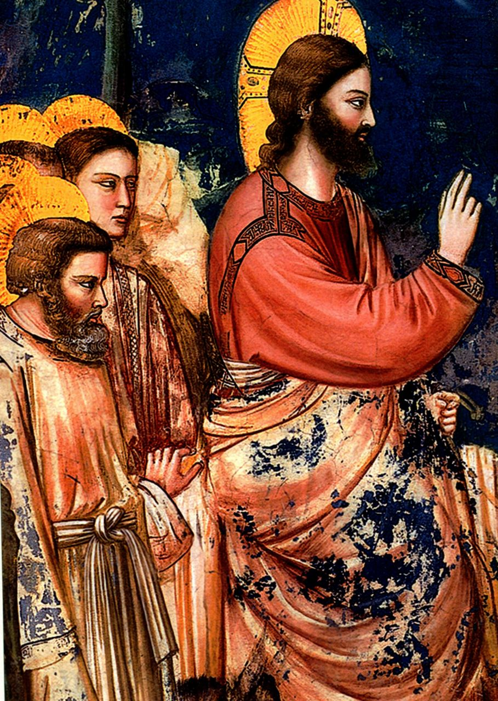

*图13.20细部，乔托：《基督进入耶路撒冷》*

# 第十三章 13-14世纪的意大利艺术

虽然意大利的艺术家和赞助人与当时欧洲其他地方的艺术家及赞助人关注的问题相同，但是出于地理、历史以及经济原因，意大利艺术却朝着不同的方向发展。许多15至16世纪意大利文艺复兴时期所特有的创新，在13至14世纪期间的意大利就埋下了种子。

在13世纪欧洲大陆的绝大部分地区，政治与文化权力掌握在拥有土地的贵族手中。为他们创造了财富的土地代代相传。尽管世袭统治者控制着大部分地区，他们通常还是要效忠国王或是神圣罗马皇帝。但是，意大利几乎没有稳固的王国或者强大的中央集权。在中世纪的大部分时间里，意大利政局掌握在神圣罗马帝国与教廷这两个国际性权势的麾下。皇帝大多生活在阿尔卑斯山脉以北，仅地理距离就限制了他们对意大利的控制。14世纪期间，由于教廷迁往法国，罗马大部分时间都没有教皇在世俗方面发号施令。世袭统治者控制了意大利南部和米兰附近的地区，然而意大利的大部分地区都是独立的城邦，它们在政治影响力与财富方面相互角逐。其中最重要的城邦有佛罗伦萨、锡耶纳（Siena）、比萨和威尼斯。

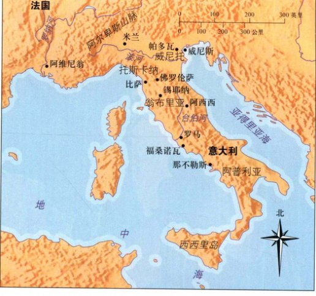

*地图13.1 13至14世纪的意大利*

由于地理特点，特别是地中海和亚得里亚海漫长的海岸线，经过长期贸易实践，意大利在整个中世纪都是贸易中心。13至14世纪时，贸易与城市工匠的有偿劳动已经由来已久。城市中新生的商人与工匠团体的数量与日俱增，他们的政治力量也随之发展起来。

最为富有也最具影响力的城市成为了代议制共和国，其中包括佛罗伦萨和锡耶纳。为了抑制世袭权力，有些城市甚至将拥有土地的贵族排斥在政治活动之外。有些人支持君主或贵族势力，即支持皇帝，有些人则支持教廷和商团，他们之间的冲突时有爆发。在佛罗伦萨、威尼斯、比萨和锡耶纳，权力往往集中在最主要的商业家族手中，他们的财富来自贸易、制造业和银行业。这些家族的成员即成为意大利最早的艺术赞助人。

意大利艺术家提升个人技艺的环境与欧洲其他地方不同。贯穿整个中世纪，古罗马和早期基督教艺术是意大利建筑师与雕刻家的灵感来源，从比萨大教堂（见图11.33）等建筑中便可看出。13世纪中期，曾在意大利南部生活过的神圣罗马帝国皇帝腓特烈二世（Frederick II，1194-1250年）处心积虑地复兴了罗马帝国的风格，以表达他作为罗马帝国继承人的政治野心。另一个帝国拜占庭，则通过拉文纳、西西里岛（Sicily）和威尼斯的镶嵌画，以及艺术家与圣像画（例如《升座圣母》，图8.50）的流布，影响了整个意大利。另一个影响力就是法国的哥特式风格，艺术家与赞助人的流动将之引入意大利。

在众多游历者之中，传教士、学者兼诗人的弗朗切斯科·佩特拉克（Francesco Petrarch）体现了14世纪意大利文化的另一侧面，即对个人艺术创造日渐高涨的兴趣。佩特拉克及其同时代的但丁·阿利吉耶里（Dante Alighieri）、乔瓦尼·薄伽丘（Giovanni Boccaccio）等思想家与作家，都转向研究古典文学、历史与艺术作品，去寻求美丽正确的形式。佩特拉克也在寻找改进拉丁书面文体的方法，在这方面他效仿了古罗马作家维吉尔和西塞罗。对古典思想与艺术的研究使得人们开始寻求道德的清明和行为楷模，这种探索后来成为人文主义（humanism）。人文主义者对古典文学和视觉艺术品给予了很高评价，他们在古典时期中寻找现代问题的解答。他们尤为敬仰古罗马作家，因为这些作家捍卫了市民与个人道德，例如为国家服务以及困难时期信奉斯多噶主义。虽然古希腊著作和思想在当时也受到推崇，但人文主义者认为古罗马的体裁才最具权威性，因此也是最有价值的效仿对象。

对古罗马与古希腊艺术的研究将深刻地改变欧洲艺术与文化的面貌，社会鼓励艺术家仔细观察自然，并将人的体验作为正当的艺术题材。这些趋势也得到托钵会在观念与神学上的支持，例如多明我会（Dominican Order），该修会推崇古典学术，再如方济各会（Franciscan Order），它的创立者在自然之美中发现了上帝。

## 教堂建筑与托钵会的成长

西多会等国际性修会也于中世纪在意大利出现，这与它们在欧洲其他地方出现的时间相当。它们也是各种促进法国哥特式建筑技术与视觉创新在意大利传播的力量之一。意大利西多会修道院追随着法国修道院，建造了不加装饰的大型石拱顶建筑。它们与兰斯大教堂（见图12.29）等装饰豪华的法国哥特式大教堂形成了鲜明对比。西多会修士在很大程度上决定着他们修道院的设计。位于罗马以南近100公里处的福桑诺瓦教堂（Church of Fossanova），代表了从地处勃艮第的母院传入意大利的西多会教堂设计布局（图13.1）。这座教堂于1208年祝圣，是一座拱顶公堂式教堂，侧堂较短，一直延伸至东端尽头的正方形礼拜堂，与位于丰特奈的西多会教堂一样（见图11.23）。交叉拱覆盖着中堂与较小的侧堂，然而它没有采用哥特式建筑中常见的拱肋。福桑诺瓦教堂西面没有钟楼，也没有矗立的尖顶。内部空间开阔，各区域所占比例较大而且相互协调，没有繁复的雕刻和狭小的空间。

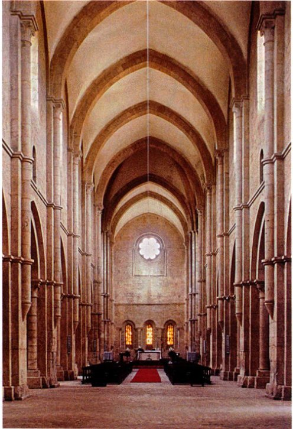

*图13.1 意大利福桑诺瓦修院教堂中堂与唱诗班席。1208年祝圣*

建筑的简洁与西多会致力改革的声望激励了新的托钵会运动，这些运动从13世纪起就在意大利占据了主导地位，并且一直持续到意大利文艺复兴时期。两个最主要的托钵会是方济各修会和多明我修会。和他们的修道会教友一样，两个托钵会各自建立了国际性“修会”，虽然其布道团形式与传统的修士不同。

两个修会都是为了在快速扩张的城市之中向世俗民众传播教义而成立，它们并不远离俗世，而是参与其中。它们也都在能够向大批民众布道的城市里修建教堂。多明我（西班牙名为多米尼克·德·古斯曼［Dominic de Guzmán］）于1216年建立的多明我修会尤其关注与异端邪说的斗争；阿西西的方济各（Francis of Assisi）于1209年建立的方济各会活动于城市之中，旨在为穷人带来更深刻的属灵认识与慰藉。方济各修会的修士发愿终身忍受贫穷，致力于对俗世民众的传道，鼓励他们追求精神上的成长。为了实现这一目标，他们讲述故事、运用图像来解释并强调教会的传教布道。典型的方济各会做法是，要求信徒以清晰的方式想象耶稣诞生等事件，包括在教堂内设置耶稣诞生的场面（马槽），作为一种祈祷的辅助手段。

### 阿西西的方济各会

魅力超凡的方济各于1226年去世，两年后被追封为圣徒。他的家乡建有一座大型公堂式教堂，以示对他的纪念。这座教堂由教皇斥资兴建，1228年方济各封圣之后不久开始动工兴建。建成后的几年间，这座多层建筑便成为了一个朝圣场所。简朴中堂的宽阔墙壁上装饰着以《旧约》和《新约》为题材的湿壁画，还有解说与纪念圣方济各功绩的组画。学界尚在讨论，为完成如此巨大的组画，从13世纪90年代到14世纪早期究竟有多少艺术家曾在这里工作，但是他们似乎来自罗马、佛罗伦萨、锡耶纳等其他地方。阿西西成为14世纪意大利艺术发展的实验室。此地众多湿壁画中最为难忘的作品之一是《圣方济各向鸟群布道》（Saint Francis Preaching to the Birds），这幅壁画是13世纪后十年或14世纪初教堂装修工程的一部分。整幅组画描绘了方济各的生平故事，内容以和他一起传道的人为他所写的传记为蓝本。其中一个主题就是他与自然的联系，而自然被看作是上帝造物的显现。方济各向鸟群布道例证了他认为万物之间存在联系的观点。湿壁画中的方济各身着灰色长袍，站在风景之中，正对着一群鸟讲话。令他的同伴惊异不已的是，他似乎可以跟围在他脚边倾听的小鸟们交流。

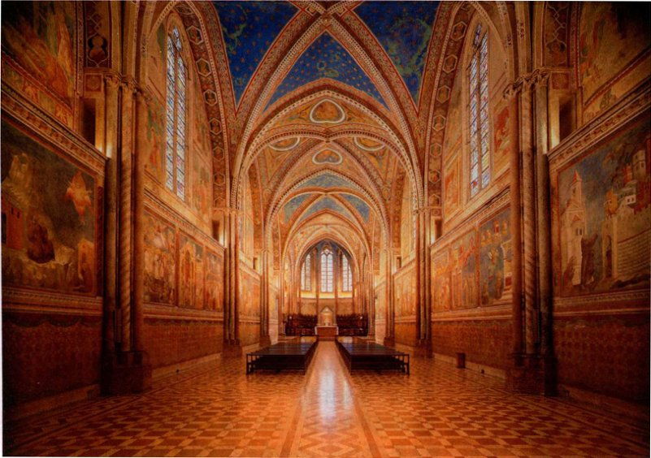

*图13.2 阿西西的圣方济各公堂式教堂上教会内部。始建于1228年，于1253年祝圣*

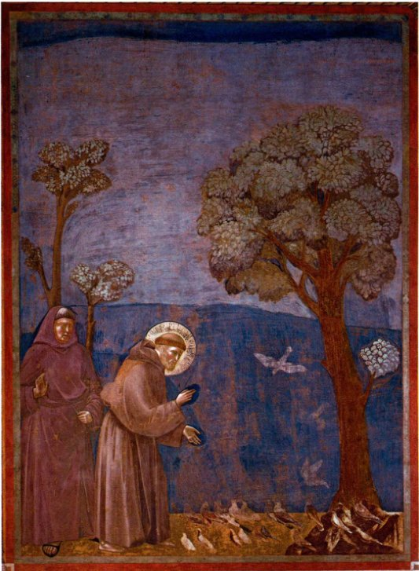

*图13.3 作者不详：《圣方济各向鸟群布道》。13世纪90年代（？）。阿西西圣方济各教堂湿壁画*

树木既是画面的边框，又表明这一场景发生在户外；其他部分的背景是蓝色的，细节较少。艺术家运用写实的手法，让身着长袍的方济各和他的同伴表现出高大的形象，因为艺术家描绘了光线照在他们身上的情形。方济各所处的中央位置、头上的光环与向下的目光使之成为画面的重心。他身体前屈，做着手势，这一肢体语言表明他在热切地与作为自然代表的鸟群进行交谈。简洁的构图使这幅湿壁画清晰易懂，令人难以忘怀。

绘制圣方济各教堂湿壁画的艺术家身份还存在争议，难以确定。是罗马的彼得罗·卡瓦利尼（Pietro Cavallini），还是另一位佛罗伦萨的乔托·迪·邦多纳。但是缺乏文献证据，鉴定意见又时有变化。有些学者宁愿将这些作品归于某位佚名大师，称之为阿西西绘画大师。无论是出于艺术家之间的相互影响还是竞争，新一代画家在阿西西崭露头角。

尽管与男修士的相比，方济各会女修士的修道院及教堂在经济方面不甚健全，她们还是以发愿成为修女的方式礼拜上帝。修女们属于方济各会的分支，由方济各的同伴、1255年封圣的圣克莱尔（Saint Clare）建立。她所建立的教堂与修道院仍在阿西西传教布道，其中一座敬献给圣克莱尔的早期祭坛画（图13.4）还保留在原位。这是一幅以彩粉画画法绘制在一块高高的长方形木板上的祭坛画，创作于1280年。圣克莱尔占据着画面的中心，她身着自己修会的长袍，面对着观者，手持修道院长的手杖。这不是具有个人特征的肖像画，圣克莱尔的脸上有着一双大眼睛，以及拜占庭圣母式的几何结构（见图8.37），而她的身体似乎出现在一个平面上。圣克莱尔两侧各有四幅袖珍故事画，讲述她的生平、死亡与神迹。这些小画展示了她响应神召、服从方济各和教会以及服侍随行修女的事迹。画面本身并无任何对三维形式或空间结构的追求，而却将注意力集中到了人物及其传达故事的动态上。方济各会的布道者为修女们撰写了向妇女信众传教的布道文与论文，鼓励她们通过以极其真实的方式想象圣经事件来思考经文。（见第二部分末尾的附加原始文献。）

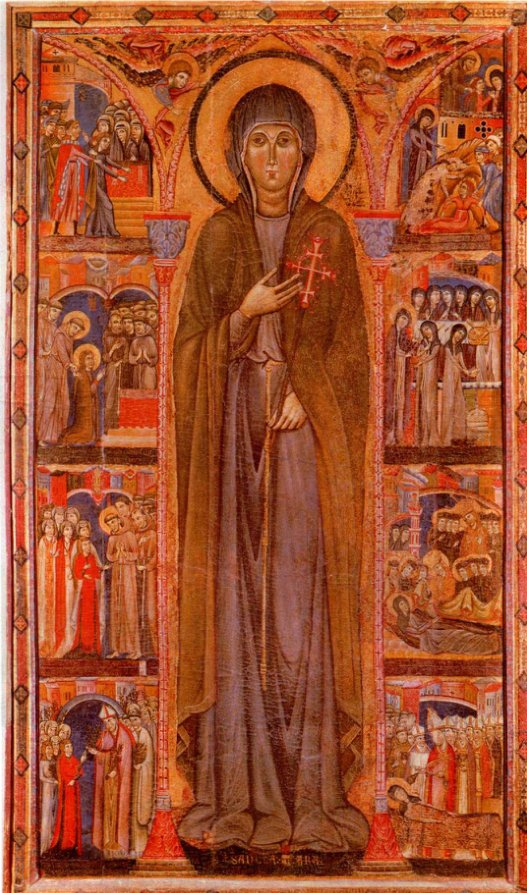

*图13.4 《圣克莱尔祭坛画》（Altarpiece of Saint Clare）。约1280年。木板蛋彩画，2.73 × 1.65米。阿西西圣克莱尔女修院（Convent of Santa Chiara）*

### 城市教堂及其陈设品

方济各会传道士们管理城市居民的精神生活时，该修会的教堂也在意大利各地出现。位于佛罗伦萨的典型实例是始建于1295年的圣十字教堂（Santa Croce，图13.5、13.6），建筑师可能是托斯卡纳雕刻家阿诺尔福·迪·坎比奥。圣十字教堂具有某些北部欧洲哥特式教堂的特色，但同时也具有鲜明的意大利元素。这是一座公堂式教堂，东端主要为长方形结构，正如西多会教堂一样。它在比例上更显宽阔而不是纵向垂直。中堂的拱廊采用了哥特式的尖拱，垂直的线脚将人们的目光引向天花板。虽然人们的预期是看到这样的线脚支撑着一个拱顶，但是圣十字教堂的中堂却覆盖着木质桁架。唯一建有拱顶的是半圆室，以及耳堂末端的几处礼拜堂。

*图13.5 佛罗伦萨圣十字教堂中堂与唱诗班席。始建于约1295年*

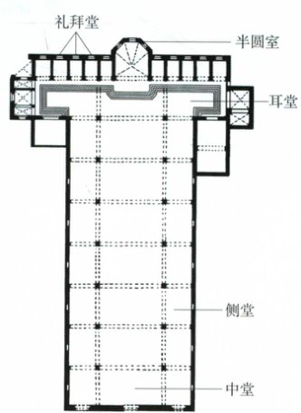

*图13.6 圣十字教堂平面图*

为中堂选择木制屋顶似乎另有深意，因为从结构角度无法解释这一设计。可能该地区对木制天花板有一种偏好，比萨的罗马式大教堂就采用了木制屋顶。圣十字教堂带有高连拱廊的宽阔中堂也让人联想到早期基督教的公堂式教堂，例如老彼得教堂或庄严圣母教堂（见图8.6、8.15）。它的木制屋顶也许是要再现早期基督教公堂式教堂的简洁，由此将方济各会安于贫穷与早期教会的传统联系起来。

圣十字教堂宽敞空间的功能之一是容纳前来聆听布道的大批民众。为了在仪式与布道中朗诵《圣经》，布道者经常定制雕刻有故事场景或象征性意象的大型讲道坛（pulpit）。有些讲道坛出自比萨的一个雕刻世家，其中包括尼古拉·皮萨诺（Nicola Pisano，约1220/25-1284年）和他的儿子乔瓦尼·皮萨诺（Giovanni Pisano，1265-1314年）。虽然这两人曾在意大利各地工作，但他们都为比萨大教堂与洗礼堂制作了重要讲道坛。

> **材料与技法：湿壁画的创作与保存**
>
> 湿壁画是在墙壁上施涂颜料，以产生持久鲜亮图像的技法。湿壁画（fresco）表面层层相叠：首先在粗糙的墙面上打一层以石灰为主料的粗石膏底子，称为**粗灰泥层**（arriccio）。之后，艺术家在这一层上画出最初的草图。因为这些草图通常用红石颜料来画，所以被称为**铁锈红**（sinopia），这个意大利词出自古代小亚细亚地区的锡诺普，当地以出产砖红色土性颜料而闻名。接着再涂一层**细灰泥层**（intonaco），只需涂出足够一天绘画工作量的面积，称为**一天之量**（giornata，出自意大利语 giorno，意为“天”）。当这层灰泥尚且湿润的时候，艺术家用浸泡过石灰水的颜料进行绘画。细灰泥层阴干之后，颜料就与之凝固在一起，形成了**好壁画／湿壁画**（buon fresco），字面即“好的壁画”之意。细灰泥层一天就会干，因此每次只能施涂一天之内能够画完的面积。绘制工作不得不在脚手架上进行，通常的作画顺序是从上到下，一次大约绘制长约1.2至1.8米的水平条带。一层的画作完成后，脚手架就降低至下面一层。为了避免与灰泥层的石灰发生化学反应，某些色彩必须**干涂**（secco）上去；许多画面的细节也都采用这种处理办法。**干壁画**（fresco secco）并不像湿壁画那样与灰泥层牢固地凝为一体，所以随着时间的流逝就会剥落。因此，有些湿壁画曾经过了蛋彩颜料的润色。
>
> 尽管耐久性是湿壁画技术的主要追求，但多年来的战争与洪水仍旧对它造成了损坏。现代博物馆的工作人员发明了将湿壁画从墙壁上揭下来并转移到别处进行保护的技术。1966年阿诺河泛滥之后，佛罗伦萨的许多湿壁画就利用这种方法而得以保存下来。这并不仅仅意味着保存艺术品，而且极大地丰富了关于保护湿壁画这一任务的知识与技术。移动湿壁画时，需要在画面周围开出相应的切口。接着用水溶胶将画布式的固定材料粘着在壁画表面，这一部分的壁画就可以被轻柔地剥离下来，转移到新的支撑媒介上，除去固定材料之后悬挂别处。此类转移湿壁画的做法也使许多铁锈红草图重见天日，例如此处插图中。弗朗切斯科·特拉伊尼创作的湿壁画（见图13.32），在1944年的大火中遭到严重破坏，不得不从墙壁上剥离下来以保存未遭火灾损害的部分。在剥离过程中，细灰泥层下的底稿显露出来。它们与壁画作品尺寸相同，在风格上比完成后的壁画自由。与壁画相比，这样的草图通常更为直接地揭示着艺术家的个人风格，而壁画的创作往往是在助手们的协助下完成的。

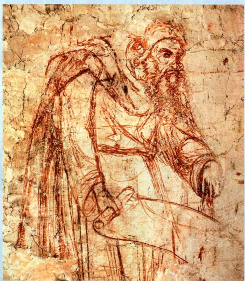

*作者不详（弗朗切斯科·特拉伊尼？）：《死神的胜利》（局部）铁锈红草图，比萨纳骨室*

尼古拉为比萨洗礼堂雕刻了一座六角形大理石讲道坛（图13.7），于1260年前后完工。这件作品高达4.6米，民众聆听布道时也可以看到布道者；讲道坛的六边由彩色大理石圆柱支撑，柱头雕刻源自古典时期。柱头上的叶形装饰中刻有小型人像，象征各种美德，人像站在扇贝形拱之间，而先知则坐在拱肩（spandrel）之上。令人震惊的是，其中有一座裸体男子雕像（图13.8），一只幼狮盘踞在他的肩头，手臂上搭有一张狮皮。根据形象与狮皮判断，这是希腊英雄赫刺克勒斯，他在基督教中象征勇气。在人体结构、比例和姿态上，这座雕像可能是尼古拉·皮萨诺研习古罗马与早期基督教雕刻的结果。他曾在罗马为腓特烈二世效劳，所以一定对古典形式认识颇深。裸体并不意味着淫欲，而是确定人物身份的手段。

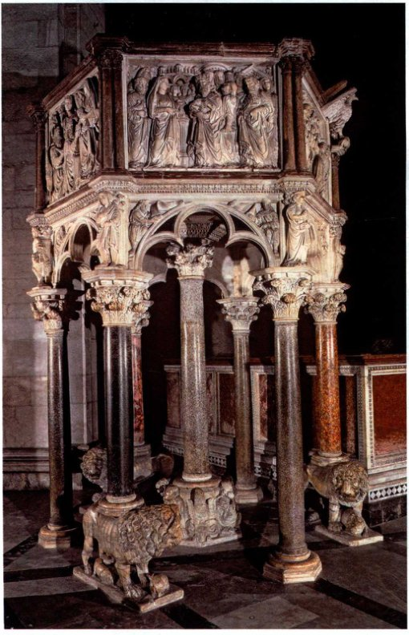

图13.7 尼古拉 · 皮萨诺：比萨洗礼堂讲道坛。1259—1260 年。大理石，高 4.6 米

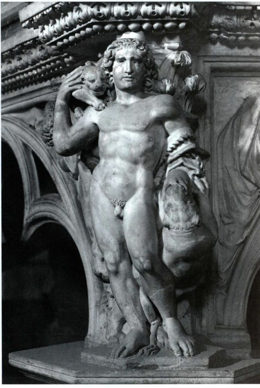

图13.8 《刚毅》（Fortitude），尼古拉 · 皮萨诺讲道坛局部。1260 年

尼古拉对古罗马形式的研究为他的讲道坛提供了许多其他元素，其中包括他在讲道坛六个长方形台边上所雕刻的故事场景。这些浮雕场景取自耶稣生平。图13.9将耶稣诞生与圣母领报结合在一起，形成了极其密集的构图。浮雕被处理为充塞着坚实突起的浅盒子，这是古罗马石棺的手法，比萨的寝陵墓地保存着很多这样的石棺。这里的人像几乎是对和平祭坛队列中人物的复制，高贵的圣母具有古罗马贵妇的气度（见图7.22）。尼古拉可能也知晓拜占庭艺术中的耶稣诞生图像，因为他所选择的圣像系统反映了这一传统。作为最大且位于中央的人物形象，斜倚着的圣母是画面中的核心元素。她周围的叙事细节与背景赋予该浮雕人性的气息，例如助产士为婴儿洗浴、约瑟惊异地凝视着眼前的场景。尼古拉雕刻的人体宽阔厚实，裹在古典式的衣袍之中，使整个场景具有了庄严感与道义的分量。

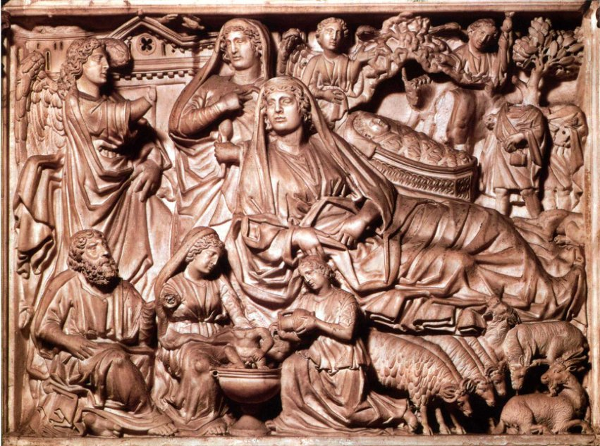

*图13.9《耶稣诞生》（Nativity），尼古拉·皮萨诺讲道坛局部*

约50年之后，当他的儿子乔瓦尼·皮萨诺为比萨大教堂雕刻讲道坛之时，这位艺术家选择了不同的重点。尽管规模和材质相同，但是大教堂讲道坛（图13.10）的耶稣诞生浮雕与他父亲那件早期的作品形成了鲜明对比。乔瓦尼的作品描绘了耶稣诞生和天使向牧羊人报喜的场景，他详细表现了风景与动物元素：羊群与树木占据着画面的右侧边缘，耶稣诞生场面则设置在一个浅洞之中。圣母仍然是画面的重心，但她看上去不再是罗马贵妇。相反，她被表现为一位注视着自己儿子的年轻母亲。圣母体形是修长的，而非强健的。乔瓦尼没有仿效古罗马或古典范例，而是研究了当时的法国作品，将优雅与对自然的细致观察引入了作品。他所雕刻的每个形象都有属于自己的小小的凹陷空间。尼古拉的耶稣诞生为凸起的结构所占据，而乔瓦尼的作品似乎由凹陷与阴影构成。他的作品中光与影的相互作用展示出动态的特征，这与他父亲作品中的宁静平和截然不同。

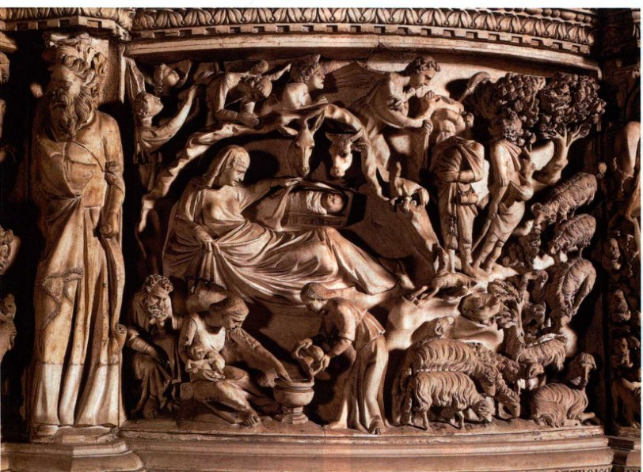

*图13.10 乔瓦尼·皮萨诺：《耶稣诞生》（The Nativity），比萨大教堂讲道坛局部。1302-1310年。大理石*

### 佛罗伦萨大教堂的扩建

佛罗伦萨位于比萨以东的阿诺河（Arno）畔，它日益增长的财富鼓舞该城兴建了重要的大教堂与洗礼堂，与其邻城一争高下。尼古拉·皮萨诺的一位学生阿诺尔福·迪·坎比奥（Arnolfo di Cambio，约1245-1302年）被选中为佛罗伦萨设计新的大教堂，以取代原址上另一座较小的教堂。佛罗伦萨大教堂（Florence Cathedral，图13.11-13.13）始建于1296年，这样的工程耗费了几代人的才能与精力，它的平面图修改过不止一次。弗朗切斯科·塔冷蒂（Francesco Talenti，活动于1325-1369年间）在1357年修改了该教堂的平面图。他接手了这一工程，并将之向东延伸出很大一块空间。1367年底，工程的监督人员咨询了一个艺术家委员会，决定在教堂东部兴建高大的穹隆顶。雕刻西立面与其他入口装饰的工程贯穿了文艺复兴时期的始终，而建筑中的大理石贴面直到19世纪才得以完成。建造佛罗伦萨大教堂（意大利语 Duomo）的意图不仅在于使之成为该城的精神中心，而且也是佛罗伦萨财富与重要地位的宣示。

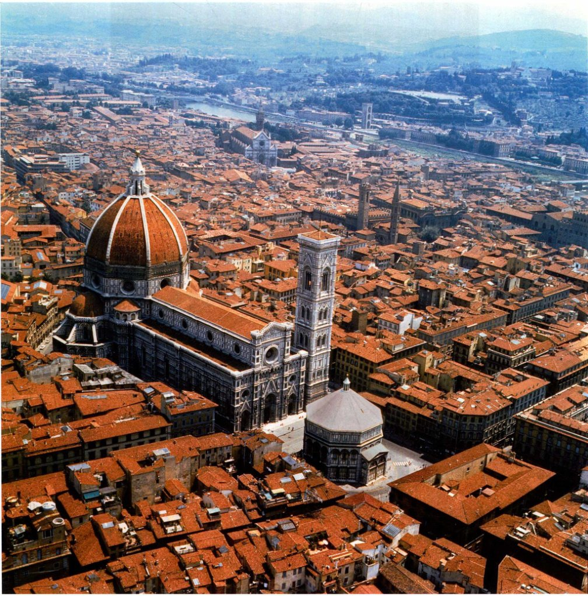

*图13.11 佛罗伦萨大教堂与洗礼堂鸟瞰图。大教堂始建于1296年*

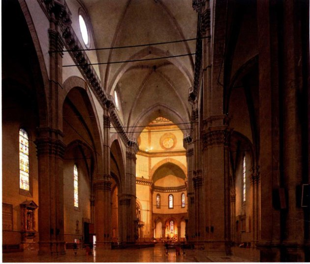

*图13.12 佛罗伦萨大教堂中堂与唱诗班席*

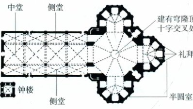

*图13.13 佛罗伦萨大教堂与钟楼平面图*

阿诺尔福设计的是一座宏大的公堂式教堂，建有高大的连拱廊，比例宽大，与当时法国的哥特式建筑（对比图13.12与图12.26）形成了对比。墩柱上连接着叶形柱头，支撑着延伸至高侧窗层的装饰线脚。高侧窗与侧堂的窗户相对较小，与法国的大教堂相比，留出了较大的墙面空间。虽然原初的设计是要按照托斯卡纳传统，建造木桁架屋顶，但是这一设计在14世纪中期之后改为更接近北部欧洲哥特式品位的有肋交叉拱顶。后来的平面图扩大了教堂的东部，尽头为三座多面形建筑，围绕着八边形的十字交叉处，此处将要建起穹隆顶（该设计出现在图13.33的湿壁画中）。最初计划的穹隆顶的规模提出了一些工程学上的难题，直到15世纪早期才得到解决。大教堂没有建造与西立面结为一体的高大塔楼，而是按照意大利传统选择建造了独立的钟楼，它是佛罗伦萨画家乔托及其后继者的作品。如果说佛罗伦萨大教堂的拱顶与连拱廊具有哥特式元素，那么这些外来形式也因本地艺术传统的融入而不甚明显了。

庄严的佛罗伦萨洗礼堂位于城市的中心，于11世纪建在更古老的建筑基址上。当时的佛罗伦萨人认为这一建筑具有罗马风格，并在当下的时代看到了光辉历史。圣施洗约翰是该市的主保圣人，因此，在敬献给他的洗礼堂中受洗就不仅意味着成为基督徒，而且也是成为佛罗伦萨市民的标志。1330年，洗礼堂的工程监督委托另一位来自比萨的雕刻家安德烈亚·达·皮萨诺（Andrea da Pisano，约1295-1348年，与尼古拉和乔瓦尼·皮萨诺没有亲缘关系）为洗礼堂铸造一对新的青铜门（图13.14）。大门于1336年完工并装设在了洗礼堂，两面门扇共由28块独立的青铜镀金嵌板组成，其中主要表现施洗约翰的生平场景。每幅图画都被环绕在哥特式的四叶饰框架之内，一似法国大教堂的外部。然而，在大多数四叶形边框之内，安德烈亚设计了一条棱边来托起人物、风景或建筑背景。浮雕《基督受洗》显示了他清晰的构图技巧：基督位于中心，右侧是正在施洗的约翰，左侧是见证盛典的天使，代表圣灵的鸽子位于基督的头顶（图13.15）。关键人物得到了凸显，几乎没有细节转移人们对主要情节的注意，只有一些细小的元素暗示故事发生在约旦河畔。

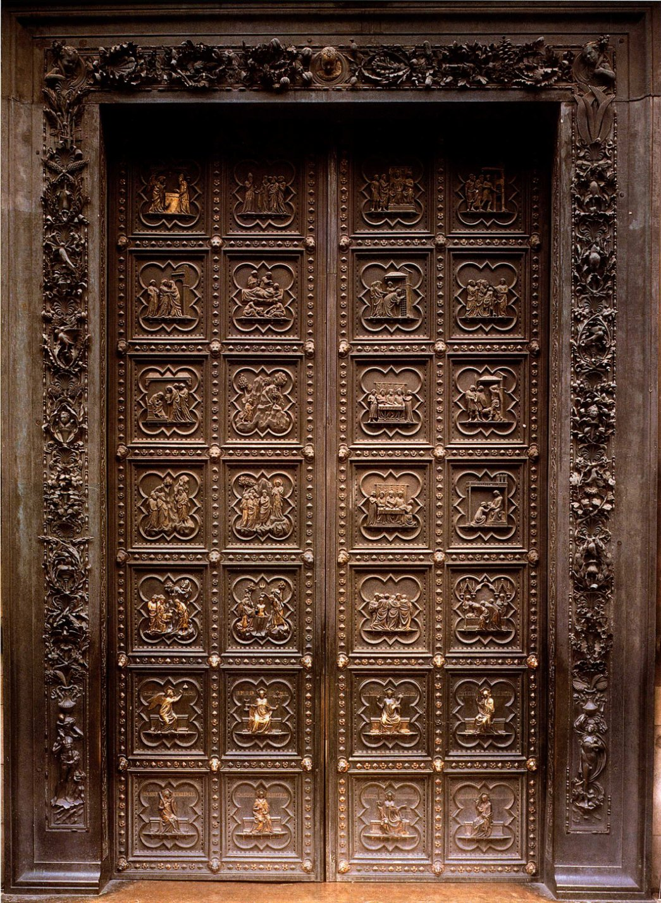

*图13.14 安德烈亚·达·皮萨诺：佛罗伦萨圣乔瓦尼洗礼堂南大门。1330-1336年。青铜镀金*

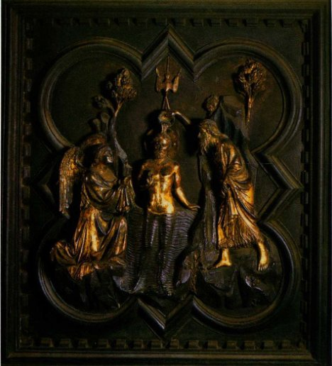

*图13.15 安德烈亚·达·皮萨诺：《基督受洗》（The Baptism of Christ），出自佛罗伦萨圣乔瓦尼洗礼堂南大门。1330-1336年。青铜镀金*

### 市政府建筑：市政厅

当佛罗伦萨市民兴建宏大教堂之时，支持教廷而非神圣罗马帝国的政治派别在该城的权力得到了巩固。拥护教皇的派别主要由商人构成，他们试图抑制支持皇帝的贵族们复辟王朝的野心，斥资修建了一座宏伟的市政议会建筑，以此作为该城政治独立的象征。这座市政厅（Palazzo della Signoria）也被称作旧宫（Palazzo Vecchio，图13.16），很可能由阿诺尔福·迪·坎比奥设计。始建于1298年，完工于1310年，后来又经扩建与改建。

这是一座高大结实的堡垒式建筑，与这一地区的防御城堡类似。宫殿底层的石墙十分坚固，为了提供更大的支撑力，石墙表面经过了粗糙化处理。三层的结构之上建有厚重的雉堞（battlement），还有一座极高的塔楼。这座塔楼不仅是城市骄傲的象征，也具有防御功能。它略为偏离建筑中心的原因有两点：塔楼建于一座古老塔楼的基址之上；现在的位置让人们可以从城中的一条主要街道上看到它。拥有佛罗伦萨最高塔楼的市政厅占据了城市的天际线，表明公共利益战胜了强大家族的力量。

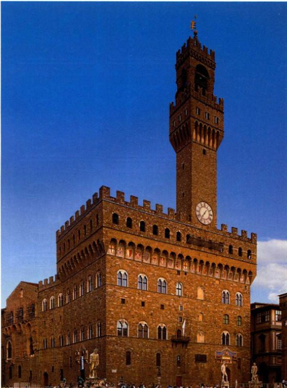

*图13.16 佛罗伦萨市政厅（又称旧宫）。始建于1298年*

## 托斯卡纳地区的绘画

13世纪时，意大利绘画风格的起点与其他艺术形式一样，不同于欧洲其他地区。意大利与昔日罗马帝国及当时的拜占庭帝国的联系都将启发意大利的画家用自然主义和宏大意象来表现形式。整个中世纪期间，拜占庭镶嵌画与壁画都为意大利艺术家所熟知。威尼斯与拜占庭帝国之间的贸易联系由来已久，而十字军东征使得意大利与拜占庭联系更为密切，其中包括将目标转向君士坦丁堡的第四次东征活动。

1204至1261年间，拉丁民族短暂地占领了君士坦丁堡。这一事件的结果之一就是将拜占庭艺术形式与艺术家输入了意大利，对意大利哥特式艺术的发展产生了重大影响。后来的学者观察了1300至1550年间意大利绘画的快速变化，将这些变化的起点描述为“希腊样式”（Greek manner）。乔治·瓦萨里在成书于16世纪的著作中写道：13世纪时，“佛罗伦萨市政府将一些希腊画家召集到城中，不为别的，只为复兴绘画，因为那里的艺术与其说是品质低劣，不如说是完全丧失了”。瓦萨里认为中世纪的意大利绘画几乎消失殆尽，并且将13世纪时意大利艺术的发展归因于拜占庭艺术的巨大影响。此时，意大利艺术家更为彻底地从拜占庭传统中汲取养分，其程度前所未有。当哥特式风格开始影响那些依据拜占庭传统进行创作的艺术家时，托斯卡纳地区的城邦中出现了一批具有创新性且多产的画家，他们革命性地将两种艺术风格融为一体。

### 奇马布埃与乔托

佛罗伦萨的奇马布埃（Cimabue of Florence，约1250-1300年之后）就是一位这样的艺术家，瓦萨里称，他曾经是一位希腊画家的学徒。奇马布埃的大型木版画《升座圣母》（Madonna Enthroned，图13.17）为佛罗伦萨圣三一教堂（Church of Santa Trinità）的祭坛而作，这幅祭坛画尺寸极大，高近4米，成为教堂礼拜的中心。作品的构图具有强烈的拜占庭圣像画特色，例如当时的作品《升座圣母》见图8.50），但它的规模与垂直性却更接近圣克莱尔祭坛画（见图13.4）而不是任何拜占庭样式。圣母与耶稣端坐在具有镶嵌装饰的木制宝座上，宝座由两侧的天使托扶着，放在旧约先知头顶的基座上。圣母身着鲜蓝的长袍，在金色背景的映衬下，成为画面的焦点。像拜占庭画家一样，奇马布埃也运用金色的线性元素来增强圣母的高贵感，但在他的笔下，金线条所织就的网络将圣母的形体更为有机地彰显出来。朴素的设计与庄重的表达与这幅绘画的宏大规模相得益彰。

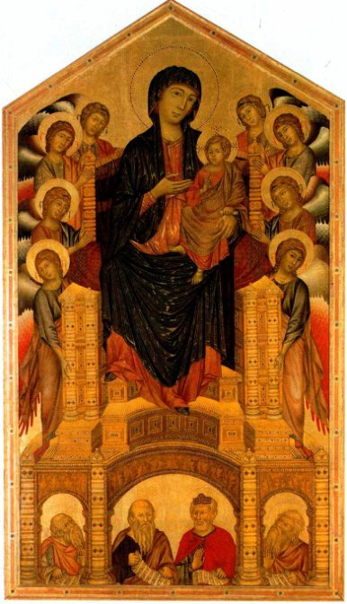

*图13.17 奇马布埃：《升座圣母》。约1280-1290年。木板蛋彩画，3.9 × 2.2米。佛罗伦萨乌菲齐美术馆*

> **大事年表**
>
> *   1204年 - 第四次十字军东征，攻克君士坦丁堡
> *   1226年 - 阿西西的方济各去世
> *   1260年 - 尼古拉·皮萨诺雕刻比萨洗礼堂讲道坛
> *   1291年 - 土耳其人将十字军逐出耶路撒冷

之后的意大利文艺复兴艺术家，例如洛伦佐·吉伯尔蒂（见第十五章）和乔治·瓦萨里（见第十六章）认为奇马布埃是乔托·迪·邦多纳（Giotto di Bondone，约1267-1336/37年）的老师，后者是艺术史上的关键人物。如果真是如此，那么乔托就学习了奇马布埃所运用的“希腊样式”。许多学者认为乔托是在阿西西进行创作的众多艺术家之一，因此很有可能知晓罗马画家彼得罗·卡瓦利尼的作品。乔托也曾在罗马作画，那里到处都有可以学习借鉴的古代与早期基督教艺术。然而，同样重要的影响来自比萨艺术家尼古拉·皮萨诺和乔瓦尼·皮萨诺，他们融汇了古典主义与哥特式的自然主义风格，将之结合在情感表达日渐浓厚的作品之中（见图13.9、13.10）。

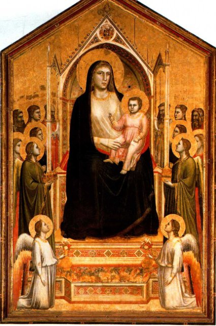

*图13.18 乔托：《升座圣母》。约1310年。木板蛋彩画，3.3 × 2米。佛罗伦萨乌菲齐美术馆*

乔托于1310年前后为佛罗伦萨万圣教堂（Church of All Saints［Ognissanti］）创作了《升座圣母》（图13.18）。这一作品既显示出与老师奇马布埃的同名高大祭坛画的联系，也表现出很大的不同。与奇马布埃为圣三一教堂所作的圣母一样，乔托也在天使之中，金色背景之上描绘了宝座上的天国之母与她的儿子。圣母深蓝色的长袍与高大的身材将观赏者的目光直接引向她自己与膝头的圣子。其他所有人物都凝望着他们，这也表明并突出了他们的重要性。与老师的作品不同，乔托的人物都沐浴在光线之中，似乎是坚实的雕像。奇马布埃将光线转化为金线织成的网，乔托则描绘了由亮入暗的光线渐变，因此人物看上去就像是立体的形象。

虽然转变为圣龛式结构，但宝座的样式是基于意大利的哥特式建筑。它在三面环绕着圣母，将之与金色背景区隔开来。空间深度通过重叠的人物进一步表现出来，他们并没有围绕宝座，却仿佛依次前后排列开来。作品中豪华的装饰还具有一个尤为有趣的特点：基座与山墙饰下的四叶形饰的彩色大理石贴面。古代画家曾高度发展了这种具有视幻效果的石材肌理（见图7.52），它也在此处的出现，表明乔托对中世纪期间仍保存在罗马的任何古典壁画都相当熟悉。

**帕多瓦的斯克罗韦尼礼拜堂** 乔托不仅在光影、空间方面有所创新，而且还具有叙事的天才，这在他的湿壁画组画中尤为突出。尽管学者们并不确定他是否参与了阿西西圣方济各教堂中堂湿壁画的创作，但他的作品中具有与之相同的形式与叙事特色。在存世的乔托壁画中，作于1305至1306年间帕多瓦市（Padua）的斯克罗韦尼礼拜堂（Scrovegni Chapel）的湿壁画保存最为完好，也最为著名。这座礼拜堂紧挨着帕多瓦银行家恩里科·斯克罗韦尼（Enrico Scrovegni）的豪宅。（它也被称为竞技场礼拜堂［Arena Chapel］，因为它也靠近古罗马竞技场。）建筑本身是一座内部没有分割的厅堂，覆盖有筒拱（图13.19）。

*图13.19 意大利帕多瓦竞技场（斯克罗韦尼）礼拜堂内部。1305-1306年*

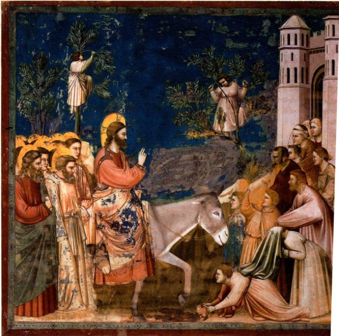

*图13.20 乔托：《基督进入耶路撒冷》。1305-1306年。湿壁画。意大利帕多瓦竞技场（斯克罗韦尼）礼拜堂*

乔托和他的画坊以湿壁画技法，绘制了从地板到天花板的所有壁面。拱顶上所绘的蓝底金星象征着天堂，其下的墙面被分为三个水平条带，每一条带又被分为若干长方形格子，其中描绘的主要是基督生平的场景。叙事始于祭坛所在端的《圣母领报》，终于礼拜堂西端的《末日审判》。沿着墙面的展开，最高处的条带中是圣母玛利亚及其父母的早年生活；中间的条带以基督的公共生活与神迹为中心；最底部的条带则描绘了他的受难、死亡与复活。叙事画面之下的墙壁看起来如同点缀着雕像的大理石嵌板，但其实这也是画出来的。

表现基督公共生活的场景之一是《基督进入耶路撒冷》（Christ Entering Jerusalem，图13.20），基督徒在棕枝全日（Palm Sunday，复活节前的星期日）纪念这一事件。乔托处理这一场景的手法让观赏者自感极其接近事件本身，他的同辈人一定觉得自己是其中的参与者而非旁观者。设计画面时，乔托将整个场景放在前景之中，并将观者在礼拜堂内所处的位置也考虑计算在内，从而获得了这样的效果。而且，他笔下的形态具有强烈的立体感，看上去几乎像雕塑一样坚实。浑圆的形式造就了空间的幻觉，人物如同演员一般存在于其中。

除孩子们所爬的树木和右侧的城门之外，乔托对该事件所处的背景几乎毫不关心。简单宽大的形式、清晰的人物分组以及有限的场景深度赋予画面以非同寻常的整体感。左侧的一群使徒静立且分布密集，右侧欢迎基督的人群则呈向上缩减的样式，两者之间形成了对比。而基督独自一人位于画面的中央，成为连接两组人物的桥梁。骑在驴上，即便是入城赴死，他的孤立与高贵仍使画面笼罩在庄严的气氛之中。

从最低一层表现耶稣受难的条带中，可以领略乔托将构图与意义完美结合的技艺。观者的视线与这一层等高，所以他利用了这一关系来组织画面。其中最令人难忘的一幅作品是《哀悼基督》（The Lamentation，图13.21），表现的是圣母、友人与基督死别永隔的一刻。虽然福音书中并没有对这一事件的描写，但到中世纪末，拜占庭艺术与西方中世纪艺术中都出现了该主题的若干版本。

*图13.21 乔托：《哀悼基督》。1305-1306年。湿壁画。意大利帕多瓦竞技场（斯克罗韦尼）礼拜堂*

《哀悼基督》具有该时期宗教文本中所描写的悲剧性气氛，不仅是人物的姿态与表情造就了这一效果，设计上的形式韵律也发挥了它的功效。画面重心位于下方中央，弯下腰来的人物、淡漠的色彩与毫无遮蔽的天空都传达着阴郁的情调。乔托极其大胆地将诸位哀痛凝固的凡人哀悼者与云朵间挥泪狂乱的天使并置在一起。似乎地面上的人物受其责任的束缚，必须一动不动地保持构图的稳定，而细小轻盈如鸟儿一般的天使却在飞动，自由自在。

简洁的背景再一次突出了戏剧场面的冲击力。斜伸下来的小山坡似乎是一个协调因素，将人们的注意力引向基督与圣母的头部，即画面的焦点。即便是树木也具有双重功能，它的孤单与光秃说明世间万物都因基督之死而悲痛不已，但它还传达着更为精确的具有象征意义的信息，意指知识之树（Tree of Knowledge）。亚当与夏娃所犯的罪使之枯萎，基督神圣的死亡将让它复活。

乔托在竞技场礼拜堂所作的湿壁画让他在同时代艺术家中声名鹊起。在写于1315年的《神曲》（Divine Comedy）中，伟大的意大利诗人但丁提到了这位年轻的佛罗伦萨画家日渐高涨的声望：“昔日奇马布埃认为自己独霸画坛，而今乔托风行一时，让其他人的光环都黯然失色。”（见第三部分末尾的附加原始文献。）竞技场礼拜堂的湿壁画完成之后，乔托又在佛罗伦萨工作了三十年，1334年被任命为佛罗伦萨大教堂的建筑师，他为这座教堂设计了钟楼（见图13.11、13.13）。乔托必然影响下一代画家，而且影响所有意大利艺术家。

### 锡耶纳：杜乔和西莫内作品中对圣母的虔诚

年纪稍长乔托的同时代艺术家、锡耶纳人杜乔·迪·博尼塞尼亚（Duccio di Buoninsegna，约1255-1319年之前）在佛罗伦萨附近的锡耶纳管理着另一个繁忙而颇具影响力的画坊。锡耶纳在军事、经济和文化等很多方面都与佛罗伦萨互争高下，并培育出独特的个性与视觉艺术传统。在取得了一次关键性的军事胜利并建立起由九人执政会（Nove）领导的共和国之后，锡耶纳将圣母玛利亚奉为它的主保圣人，并将该城的13世纪大教堂敬献给她。这座大教堂的建筑于1260年全部完工，具有法国哥特式新风格建筑的某些特色：支撑连拱廊的复合墩柱与法国的大教堂相仿，而且建有拱顶。它的立面（见图13.22）在1284年交付给了雕塑家乔瓦尼·皮萨诺，但他于1295年离开此地时尚未完成。这一正立面也表现出法国特色，例如三座大门之上围绕着半月楣的山墙饰，外侧入口上方有假拱廊，先知和其他人物雕像或者位于大门之间的平台上，或者站立在立面外缘的小角塔上。

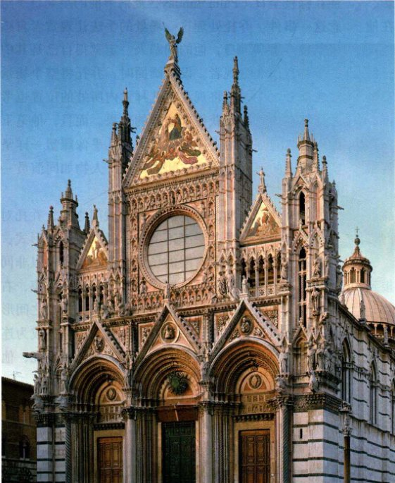

*图13.22 锡耶纳大教堂。约1260年完工，立面下部为乔瓦尼·皮萨诺于1284-1299年前后设计建造*

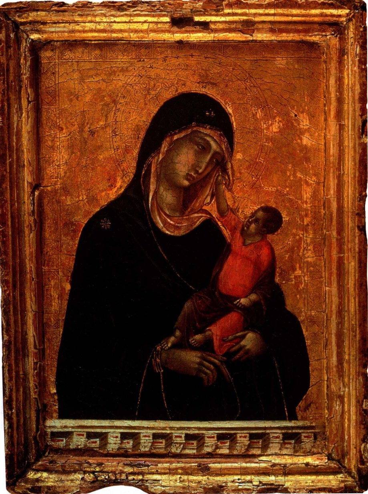

*图13.23 杜乔：《圣母子》。约1300年。木板蛋彩、贴金，28×20.8厘米。纽约大都会艺术博物馆（编号2004.442）*

> **艺术史家的观点：图像的社会功能**
>
> 关于庆典的记录见证着这幅画作对整个城市的重要性。杜乔的《庄严圣像》进入大教堂时举行了盛大庆典，它是锡耶纳市民骄傲的源泉，也是圣母庇佑该城的有力体现。尽管现代观众习惯于在博物馆中看到艺术品，并与之发生感应，但艺术史家们证明，艺术在中世纪的欧洲服务于不同的目的。现在，西方几乎没有人相信一件艺术品竟然可以影响周围的事件或者改变人的生活。但是在14世纪，欧洲人看待图像的方式要积极得多。艺术可能是通向神圣的路径，或者是艰难时刻的一个救世力量。
>
> 例如在1354年的旱灾中，佛罗伦萨市政府的主要成员举着一幅能够行神迹的圣母像，从因普鲁内塔（Impruneta）村开始，穿过城市进行游行，希望天气状况能够改善。病人或健康欠佳者敬拜佛罗伦萨至圣领报教堂（Santissima Annunziata）中一幅《圣母领报》的湿壁画，他们向这幅画作献上赠礼，希望能够缓解各自的问题。当瘟疫席卷佛罗伦萨时，人们委托艺术家创作描绘圣塞巴斯蒂安及其他圣徒的画作，因为他们认为这些圣徒能够抵御致命的疾病。
>
> 作为神圣之所的教堂之外也出现了圣像，以帮助人们解决所遇的困难。为了延续始于14世纪的一项传统，意大利街口通常放置着圣母像，行人可以向她祷告或者表示敬意。人们为此类图像点上蜡烛，奉上礼物，希望得到圣母的援助。艺术史家们也研究了艺术品如何在中世纪晚期发挥作用，巩固社会群体之间的关系，激发群体中的认同感。例如，在修道院的围墙之外，市民们形成了各种社会团体，他们都有各自的主保圣人。对于一个团体而言，它的主保圣人的图像就是确定其身份的重要元素。

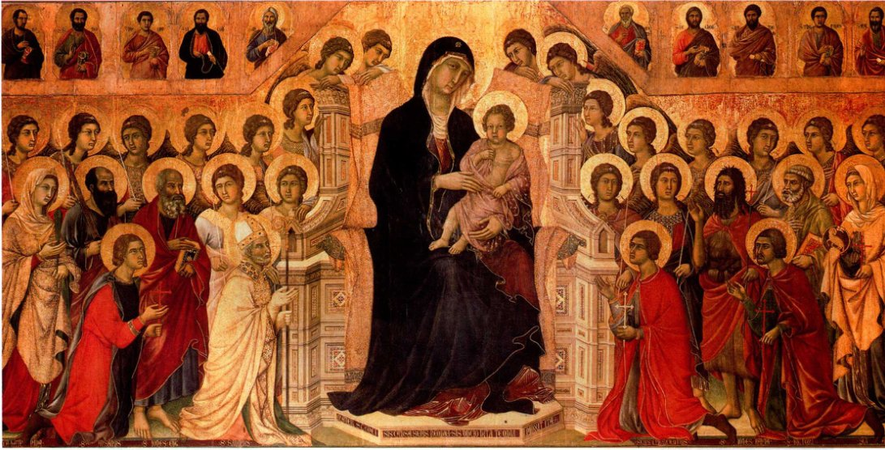

*图13.24 杜乔：《升座圣母》，《庄严圣像》祭坛画中央部分。1308-1311年，木板蛋彩画，高2.1米。锡耶纳大教堂艺术品博物馆（Museo dell'Opera del Duomo）*

杜乔在1300年前后绘制的小型木版画《圣母子》（Virgin and Child，图13.23）也许最能体现锡耶纳人对圣母的虔诚。这幅作品保存极其完好，甚至保留了最初的画框，最近纽约大都会艺术博物馆从一位私人收藏家手中买下了它。在袖珍的画面上，描绘着圣母与圣子之间的温情：圣母将圣子揽在怀中，圣子伸手去拉她的面纱。相对于圣母而言，他那小小的身躯看上去极其柔弱。杜乔将两个人物都笼罩在温暖的光线之下，光线虚化了轮廓线，形体具有了立体感。但背景却是灿烂的金色，与圣母的蓝色长袍形成了鲜明的对比。她凝视幼子的愁苦眼神使整幅画面具有了忧郁之感。

杜乔受锡耶纳大教堂各位主管的委托，为上祭坛绘制了巨幅祭坛画《庄严圣像》（Maestà，此处为庄严圣母子像，图13.24）。该画定制于1308年，1311年在该市的游行与庆典之中被放入大教堂（见第456页的原始文献；第454页的艺术史家的观点）。杜乔在宝座底部的签名表明他对这件作品引以为豪：“圣母啊，请赐予锡耶纳和平，请赐予杜乔生命，因为他如此敬绘了您。”

与大都会艺术博物馆所藏《圣母子》的微小尺寸相反，杜乔的这件作品规模巨大，具有帝王气派。在《庄严圣像》中，宝座上的圣母子身旁围绕着他们的“廷臣”，圣徒与天使的位置设置细致平衡。至今为止，圣母是最大且最令人印象深刻的形象，包裹在当时专用于描绘圣母的华美蓝色之中。锡耶纳的其他主保圣人跪在第一排，每个人都有自己的姿态并凝望着圣母。这里的圣母形象与奇马布埃的作品很相像，因为两者都源自希腊样式，然而杜乔放松了传统上严格生硬的衣袍线条，从而产生出起伏的柔软之感。许多人物的身体、面庞与双手似乎都充满了生命的三维立体感，因为画家研究了光线落在形体上的效果。显然，希腊与罗马时期的幻觉主义手法在很大程度上启发了杜乔。这种艺术遗产尽管已经湮没，却一直潜藏于拜占庭的艺术传统之中。即便如此，杜乔的作品也反映出当时哥特式艺术中的感性，衣袍流畅连贯，人物自然动人，彼此间用眼神进行着交流。尽管有证据表明杜乔可能前往巴黎旅行，在那里直接接触了法国哥特式风格，但是这一哥特式影响的主要来源可能还是乔瓦尼·皮萨诺的作品，他于1285至1295年间作为雕刻家、建筑师负责锡耶纳大教堂的正立面的工程。

除主画面之外，《庄严圣像》的正反两面还有众多描绘基督与圣母生平的小画作。在这些作品中，杜乔融合了哥特式与拜占庭元素，从而催生出一项重大的新发展：一种新的绘画空间以及其中的新叙事手法。祭坛画正面的《报圣母逝世的消息》（Annunciation of the Death of the Virgin，图13.25）表现的是两位人物，透视缩短的墙与天花板桁条表明人物处于建筑内部，它们造就并限定了人物可以安身的空间。但杜乔并不单纯地关注空间本身，运用建筑是为了将人物整合在令人更为信服的场景之中。这一题材与圣母领报相对应（对比图13.27），此处画面中描绘的是天使加百列再次降临，来到年老的圣母面前，告知她死亡即将来到。建筑框架将两人分离开来，但两人都处于同一间整洁有序的房间里。虽然共处一室，每个人物却各自孤立。杜乔创新性地运用建筑来增强他绘画中的叙事感，这启发了当时较为年轻的法国画家让·皮塞尔，后者在《让娜·德夫勒日课经》（见图12.41）中借鉴了《报圣母逝世的消息》的构图。

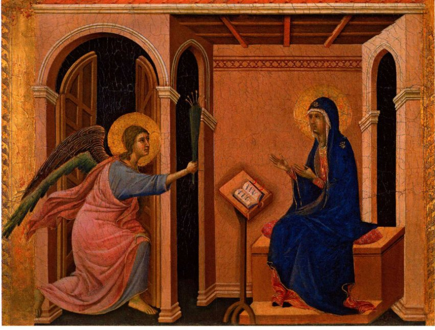

*图13.25 杜乔：《报圣母逝世的消息》，出自《庄严圣像》祭坛*

即便是在《庄严圣像》背面的室外场景画中，建筑也同样起着创造空间的作用，如：《基督进入耶路撒冷》（图13.26）。就在几年前，乔托在帕多瓦也有过同样题材的作品。不过，乔托的作品中，基督位于两组人物的中央，而杜乔画中的基督则更靠近使徒。他并没有通过人物来表现具有深度的斜向运动，因为所有人物的尺寸都相同，而是运用了入城道路两侧的墙壁、挤满了欢迎人群的城门，以及背景建筑的表现手法。题材处理方面，乔托通过若干人物和一片荒凉的背景来表现题材，杜乔却不仅详尽地展现了建筑元素，而且还画了许多爬到树上摘取棕榈叶的儿童，以及在二楼窗口探出头来注视街上人群的人。杜乔将事件描述得更为复杂，相形之下，乔托的作品则强调这一瞬间的教义和心理作用。两位画家目的不同，表现手法也不同。

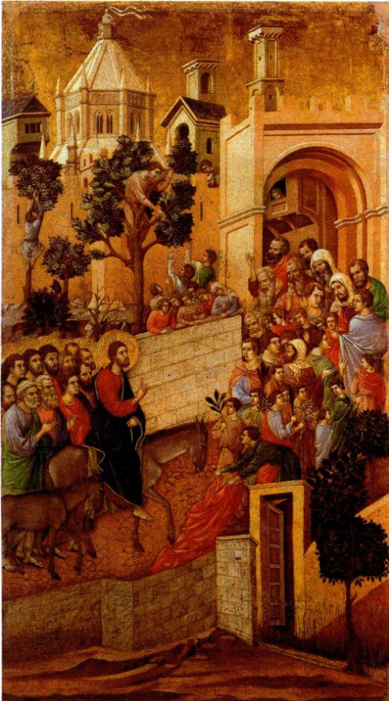

*图13.26 杜乔：《基督进入耶路撒冷》，《庄严圣像》祭坛背面画作。1308-1311年。木板蛋彩画，103 × 53.7厘米。锡耶纳大教堂艺术品博物馆*

> **原始文献：阿尼奥洛·迪·图拉·德尔·格拉索（Agnolo di Tura del Grasso）**
> 
> **出自他的著作《编年史》（Chronicle）**
>
> 之前，杜乔的《庄严圣像》（图13.24）一直都放置在锡耶纳大教堂主祭坛之上。1506年，人们将其挪到耳堂。1771年，这组祭坛画被锯开，其中部分作品为欧美的博物馆所收购。以下这段话讲述了1350年前后当地的历史，描述了1311年放置祭坛画时所举行的城市庆典。
>
> 这些画作（《庄严圣像》）出自杜乔大师之手，他是尼科洛（Nicolò）之子、锡耶纳画家、当时世界最杰出的艺术家。他在穆奇亚蒂（Muciatti）宫里创作了祭坛画，此处位于拉特里诺（Laterino）郊区，斯塔罗莱基（Stalloreggi）的城门之外。（1311年）6月9日中午时分，杜乔满怀虔诚，带着祭坛画随游行队伍前往大教堂，队伍中有卡索勒的罗杰（Roger of Casole）主教、大教堂全体神职人员、锡耶纳市全体修士与修女、九人执政会、市长、将军等市政官员，以及全体市民。其中富人们排成一列，手持燃烧着的蜡烛，走在祭坛画旁边，之后是虔诚的妇女与儿童，就这样一路将画护送到大教堂。队列到达坎波广场（Piazza del Campo）周围时，悦耳的钟声响起。出于虔诚，所有店铺都歇业关门。锡耶纳施予了大量救济品给穷人，人们向上帝与圣母祈祷，希望圣母能够保佑并维护城市的和平、安康与权利，让它免于所有的危险与邪恶，因为她是该城的辩护人与庇护者。就这样，祭坛画被放在大教堂的主祭坛上。它的背面画着《旧约》故事和耶稣受难，正面画着圣母玛利亚怀抱圣子，众多圣徒站立在侧。整幅作品由黄金装饰。这组祭坛画价值3000个弗罗林金币。
>
> *SOURCE: TERESA G. FRISCH, GOTHIC ART 1140-C 1450. (ENGLEWOOD CLIFFS, NJ: PRENTICE HALL, 1971.)*

杜乔为锡耶纳培育了下一代画家，西莫内·马丁尼（Simone Martini，约1284-1344年）是他的得意门生，曾在阿西西工作，晚年在阿维尼翁度过，这是法国南部的一个城市，14世纪很长一段时间内，教皇驻跸于此。1333年，锡耶纳大教堂的主管们委托西莫内创作另外一组祭坛画，作为《庄严圣像》的补充。他的《圣母领报》（图13.27）保留了原先的尖拱形式，外框是后来的修复品，再现了《庄严圣像》被锯开之前所可能具有的哥特式画框。西莫内的祭坛画《圣母领报》描绘了耀眼的金色背景下的两位本地圣徒，他们分立在主场景两侧。为了使圣母看上去与《庄严圣像》中的圣母有所关联，西莫内将她画在一座相似的覆布宝座上，身上的长袍也与前者类似。

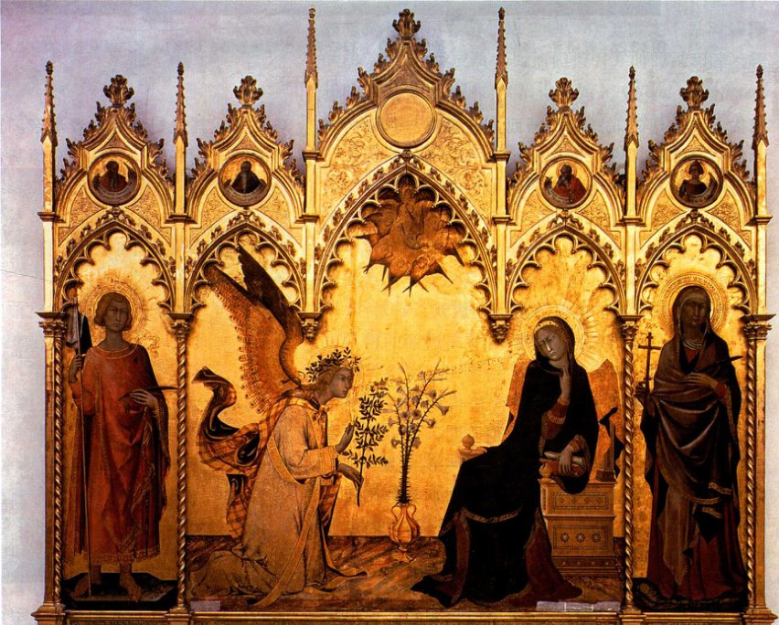

*图13.27 西莫内·马丁尼：《圣母领报》。约1330年。木板蛋彩画，3x2.7米。佛罗伦萨乌菲齐美术馆*

天使加百列从左方走向圣母，向她宣告：“蒙大恩的女子，我问你安，主和你同在了。（Ave Maria Gratia Plenum Dominus Tecum）”。西莫内将这些话置入画面上的显眼位置，用同样的金箔装饰，将这一场景转变为天国景象。叙事的同时，画家表达了一丝怀疑，因为来访者让玛利亚感到惊讶，她的身体向后退去。代表圣灵的鸽子等候着她的重大抉择，即允诺承担赋予她的责任，成为圣子的母亲，从而开启救赎之门。像乔托一样，西莫内将叙事简化到极致；但与杜乔不同，他的人物显得优雅且有诗情画意般的感觉，这使他们超凡脱俗，进入了属灵的王国。

### 彼得罗·洛伦泽蒂和安布罗焦·洛伦泽蒂

锡耶纳大教堂的另一组祭坛画是1342年由彼得罗·洛伦泽蒂（Pietro Lorenzetti，活跃于约1306-1348年）绘制的《圣母诞生》（Birth of the Virgin，图13.28）。这部作品的风格很朴实。彼得罗和他的兄弟安布罗焦·洛伦泽蒂（Ambrogio Lorenzetti，活跃于约1317-1348年）曾在锡耶纳学艺，不过他们的作品也受到乔托的影响。据说彼得罗曾在阿西西工作，而安布罗焦直到14世纪30年代才出现在佛罗伦萨画家行会的名册上。与西莫内一样，彼得罗的祭坛画也是三联作品，不过作品的原始画框已经遗失。在这组三联画中，画面上的建筑与画框的实际结构紧密联系在一起，看上去浑然一体。另外，圣母降生的拱顶房间占据了两幅画板，但它的空间整体感并没有因此而打断，因为中间的画幅和右翼的画幅之间有一根柱子，看上去，房间就在柱子后面展开。左翼上画着一间通向哥特式庭院的小房间。可以看出，彼得罗在空间感方面的成就，是对30年前杜乔作品的发展。他将画面看作是透明的窗户，透过这扇窗户，观者可以体验到堪比现实世界的空间感。以杜乔为榜样，彼得罗·洛伦泽蒂在绘画中将建筑作为整体背景，从中开创空间，并将人物置于其中。不过，在技法上他也受到乔托的启发，即：赋予人物明显的体量感，从而使人物本身也体现空间感。这幅作品描述了圣母生平的又一重大时刻，也是教会规定的重大纪念节日。彼得罗·洛伦泽蒂以自己的创新满足了锡耶纳大教堂的叙事与仪礼需要。圣安娜躺在产床上，助产士照料着刚刚出生的玛利亚，其他妇女照料着母亲。正在泼水给婴儿洗澡的助产士好像是乔托《哀悼基督》中那位背对着观众的人物（见图13.21），父亲约阿希姆（Joachim）则在屋外等候。用建筑区隔男女的方式正如杜乔在《报圣母逝世的消息》（见图13.25）中区隔天使与圣母的手法一样。

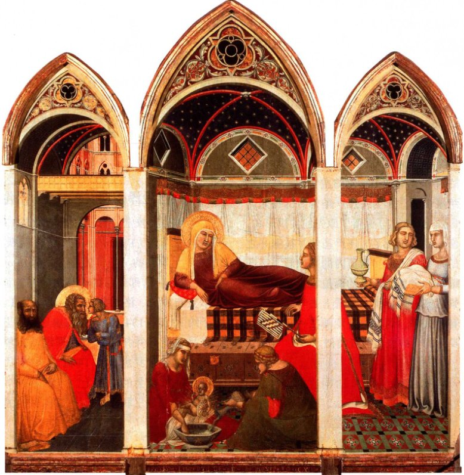

*图13.28 彼得罗·洛伦泽蒂：《圣母诞生》。1342年。木板蛋彩画，1.9x1.8米。锡耶纳大教堂艺术品博物馆*

**治世与乱世** 彼得罗的兄弟安布罗焦·洛伦泽蒂将同样的艺术手法融会于1338至1340年间为锡耶纳市政厅所作的大型组画中。统治该城的九人执政会委托他为会议大厅创作一组湿壁画，主题为治世与乱世的对比。这样的主题是不无益处的，正如他们所想，可以在壁画中看到两种统治的不同效果。表现乱世的反面教材遭到了严重的破坏，而表现治世的积极榜样却保存得极其完好（图13.29）。房间里较短的那面墙上，安布罗焦绘制了《治世的寓言》（Allegory of Good Government）。作品描绘了众多美德的化身，她们支撑着端坐在宝座上的锡耶纳，拟人化的城市。左侧另一宝座上的人物是公正的化身，智慧的化身正在给她以启迪。众美德之下站着锡耶纳法院的24位成员，为他们指引方向的是和睦。较长的那面墙上绘制着《治世之城》（Good Government in the City，图13.30），其中有一段题词赞美了公正以及由她而来的诸多好处（见第460页的原始文献）。安布罗焦在这幅画中描绘了锡耶纳的建筑。为了展示治世之城的生活，艺术家不仅描绘了街道和房屋，而且也展现了那里人们所进行的大量活动。熙熙攘攘的人群使建筑街景具有了惊人的现实感，这是引入人物作为比例参照的结果。在右侧的城墙之外，《治世之野》（Good Government in the Country，图13.31）展现了锡耶纳农田的景象，远处的山脉依稀可见，安全的化身站在山顶俯视众生。这是古罗马时期以来第一幅真正的风景画（见图7.55）。画面充满着一览无余的深度，但在秩序感上却与古典风景画不同，使之具有了人工的气息。画中的人物与自然融为一体：他们在山坡上开出梯田种植葡萄，将山谷规划为几何形的田地与牧场。安布罗焦如实描绘了农民们的季节性劳作，600多年来，这一托斯卡纳乡村生活的场景几乎保持不变。

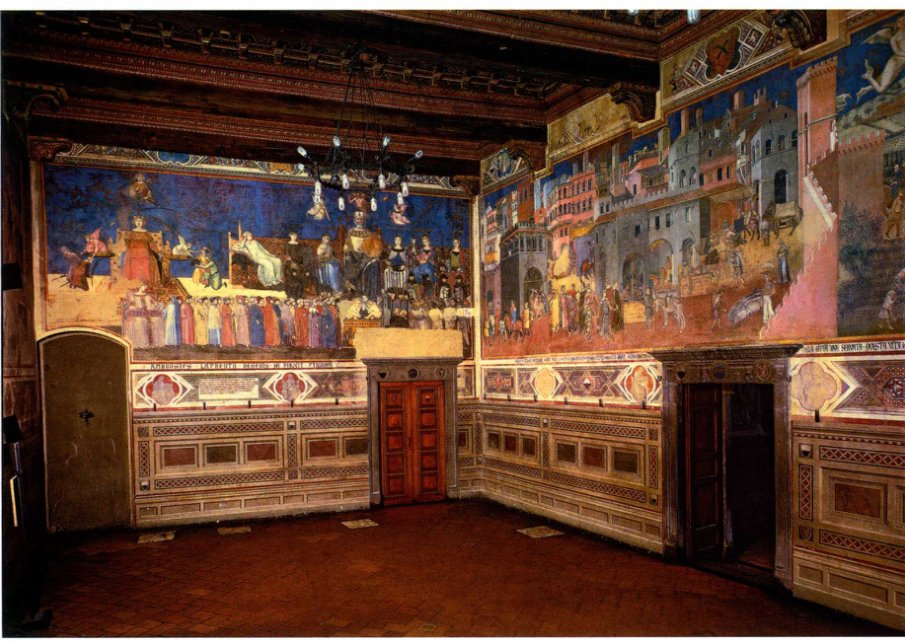

*图13.29 安布罗焦·洛伦泽蒂：《治世的寓言》（左）、《治世之城》和《治世之野》（右）。1338-1340年。湿壁画。锡耶纳市政厅和平大厅（Sala della Pace，Palazzo Pubblico）*

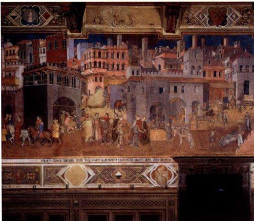

*图13.30 安布罗焦·洛伦泽蒂：《治世之城》*

> **原始文献：锡耶纳市政厅湿壁画题词**
>
> 第一段题词位于治世的画面（见图13.29、13.30）之下，时代为1338至1340年之间。第二段题词出现在安全的化身手持的文书上，她飘浮在图13.31的风景之中。
>
> “将你的目光转向她，
> 你（公正），身为一个统治者，
> 被人们描绘于此，
> 由于她的光芒而赋予你权力，
> 她总是给与每个人应得的。
>
> 看，多少美德因她而生，
> 生活多么美好，多么恬适，
> 在这个保留着公正美德的城市
> 她的光芒无人能及
> 她看护保卫着尊重她的人
> 给他们滋养，让他们生长
> 光明因她而诞生
> 报答行善之人
> 惩罚邪恶之人”
>
> “脱离恐惧，人人都能自由旅行
> 人人都能耕地播种
> 只要这个村庄
> 能够挽留至高无上的（公正）女神
> 因为她，清除了一切权力中的邪恶”
>
> *SOURCE: RANDOLPH STARN AND LOREN PARTRIDGE, ARTS OF POWER: THREE HALLS OF STATE IN ITALY, 1300-1600. (BERKELEY: UNIVERSITY OF CALIFORNIA PRESS, 1992)*

### 危难时期的艺术家与赞助人

安布罗焦对城市及其郊区的理想化描绘，可以使人们了解和平繁荣时期的锡耶纳市民如何想象他们的政府与城市。14世纪初的30年间，锡耶纳和佛罗伦萨都处于政治稳定、经济扩展的昌盛时期，杰出的艺术作品也纷纷涌现。然而到了40年代，这两座城市都经历了一系列贻害多年的灾难。

持续的战争导致银行商户纷纷破产；内部动乱使得政府风雨飘摇；庄稼歉收与饥荒屡屡发生。1348年，流行性黑死病（淋巴腺鼠疫）席卷欧洲，使两城人口削减了一半以上。饥饿、身上满是跳蚤的老鼠从贫瘠的乡村蜂拥到城市来寻找食物，疾病由此传播蔓延。民众对这些事件的反应五味杂陈，许多人将之视为上帝愤怒的征兆，警告罪孽深重的人类放弃尘世间的享乐。就这些人而言，黑死病增强了他们对宗教和美好天国的向往。还有一些人，如：每日以讲述薄伽丘《十日谈》（Decameron）中的故事来取乐的行乐之人，死亡的恐惧使他们更加强烈地渴望在终期未到时享受生活。（见第三部分末尾的附加原始文献。）

中世纪晚期，人们经常要面对人生无常和死神的威胁。毗邻比萨大教堂的纳骨室（Camposanto）是一个大型的丧葬建筑，墙壁上绘有一系列湿壁画，展现出对死亡的不同回应。由于作品传达的信息抑郁沉重，人们曾推断其创作于黑死病爆发之后，但是近期的研究表明该作品创作于14世纪30年代。这组大型湿壁画的作者尚不确定，而有些学者认为可能是比萨艺术家弗朗切斯科·特拉伊尼（Francesco Traini，文献记载约1321-1363年间）的作品。这组规模宏大的湿壁画由于1944年二战的轰炸而遭到破坏，包括效果动人的《末日审判》（Last Judgment）与一幅称为《死神的胜利》（The Triumph of Death）的作品。后者宣称，无论富人还是穷人、圣徒还是罪人，大家终有一死。在别具戏剧性的细节中（图13.32），一群衣着优雅的男女骑者突然遇到三具躺在棺材里的腐烂尸体。尸体腐烂的气味使马匹都受到了惊吓。只有弃绝红尘的隐士大圣玛加里（Saint Macarius）指出了这一场景中所蕴涵的教训，他的手卷上写着：“如果你的头脑意识清楚，那么在此睁大眼睛，你的虚荣终将溃退，你的骄傲终将消散。而且，当你看到这些文字的时候，你会再次意识到这一点。”山上的隐士们清晰地重述了他的观点，即：只有抛弃俗世，才能过上属灵的生活。画面中央，死者与濒于死亡的农民正在恳求死神：“解脱所有痛苦的良药啊，请给我们最后的一餐。”画面右侧，远处一些廷臣正在宜人的风景中享受世俗之乐，这时死神猛扑下来，天使与魔鬼在头顶的天空中为争夺死者的灵魂而搏斗。艺术家的风格使人联想到安布罗焦·洛伦泽蒂作品中的现实主义特色，不过这里的形式更为严格，更具表现力。

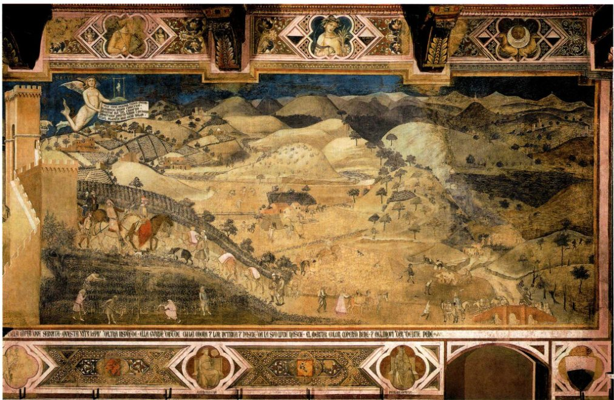

*图13.31 安布罗焦·洛伦泽蒂：《治世之野》*

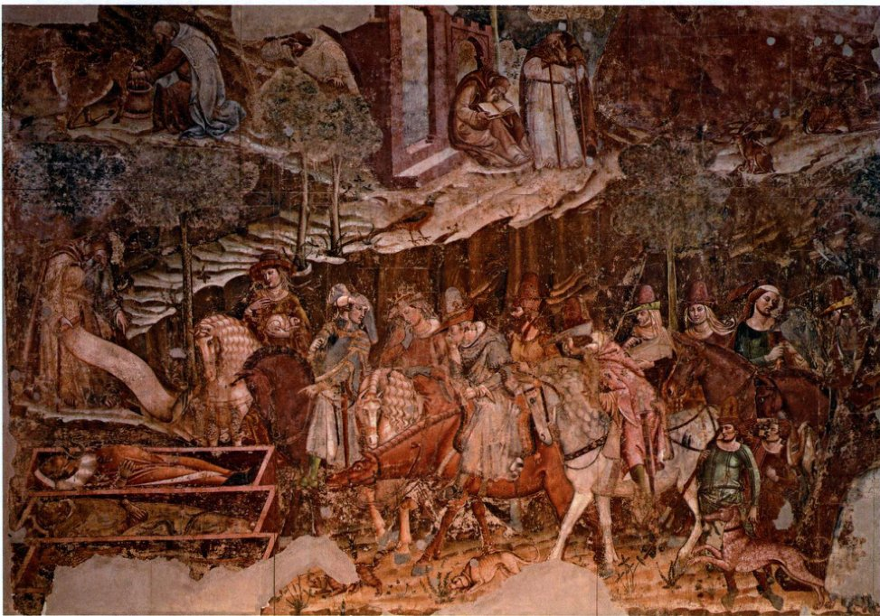

*图13.32 作者不详（弗朗切斯科·特拉伊尼？）：《死神的胜利》。1330年代。湿壁画。比萨纳骨室*

正如成千上万的托斯卡纳人一样，洛伦泽蒂兄弟可能也死于1348年四处蔓延的黑死病。学者们推测了黑死病对14世纪下半叶的艺术家与艺术赞助人的影响。可以假定众多画家已经死亡，因此从事此业的人想必为数不多。文献研究表明，私人礼拜堂、坟墓和葬礼弥撒随着人们对死亡的担忧而增加。许多这样的葬礼和捐赠都在托钵会的教堂举行，例如方济各会的圣十字教堂、多明我会在佛罗伦萨的新圣母教堂(Santa Maria Novella)。

伯纳米科·吉达洛蒂（Buonamico Guidalotti）是一位佛罗伦萨商人，死于1355年。他在遗嘱中写道要提供资金为多明我会的新圣母教堂建造一座新教士礼拜堂，并将他安葬于此。这座礼拜堂后来用作托钵修士的会见室，因此墙面上绘制的湿壁画表现了多明我会修士为获得救赎所做的努力。吉达洛蒂礼拜堂中的一幅湿壁画由安德烈亚·博纳尤蒂（Andrea Bonaiuti，亦称佛罗伦萨的安德烈亚［Andrea da Firenze］，活跃于1346-1379年）于1365至1367年间创作，描绘着多明我会修士确保信徒进入天国的场景，因此它被命名为《救赎之路》（The Way of Salvation，图13.33）。湿壁画的下方，教会与政府领导者聚集在当时尚未完工的佛罗伦萨大教堂之前。成群的多明我会修士在向俗士布道，让异教徒皈依。中间有一只黑白相间的狗，源于多明我会的谐音——“主的猎犬”（Domini canes）。作品的右上方，一些轻浮的贵族在享受感官之乐，而作品的中央，一位多明我会修士正在向一些虔诚者指示天国之路，天国的大门由圣彼得把守。安德烈亚的作品受到安布罗焦·洛伦泽蒂的《治世》组画（见图13.29）与比萨大教堂附近纳骨室湿壁画（见图13.32）的双重影响。但在对称性与秩序感之中，它寻求的是清晰而不是幻觉，是静穆而不是激情。

然而，佛罗伦萨没能在14世纪完成它的大教堂，它也不具有安德烈亚湿壁画中描绘的那种平静气氛。1363年，黑死病卷土重来，政治精英与教廷发生冲突，工人暴动造成了混乱的社会经济局面。1381年，富有阶层再次掌权。佛罗伦萨度过了这些难关，于15世纪再度繁荣，成为经济强大、政治务实、文化领先的中心城市。15世纪伊始，新一代佛罗伦萨艺术家回顾乔托及其同辈的艺术，以寻找视觉表达的新形式。

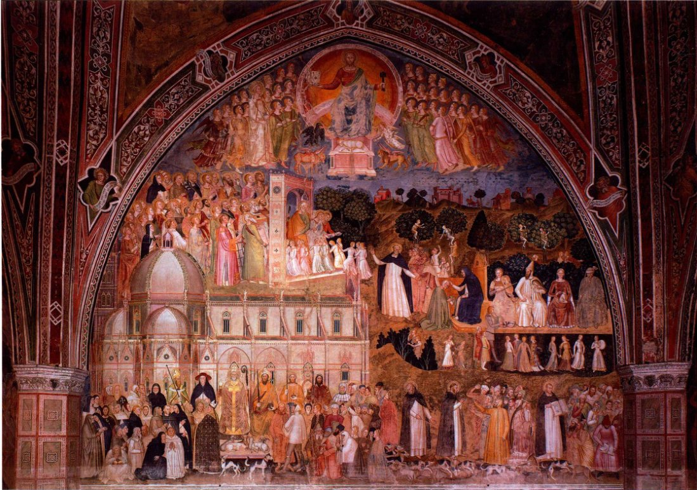

*图13.33 佛罗伦萨的安德烈亚：《救赎之路》。1365—1367 年。湿壁画，宽 11.6 米。佛罗伦萨新圣母教堂吉达洛蒂礼拜堂*

## 意大利北部

14世纪时的政治斗争并没有给威尼斯造成恐慌。与因派系斗争而分裂的佛罗伦萨不同，威尼斯在14世纪保持了政治上的稳定。1297年以来，该城限制了参与政府的商业寡头集团的人数，城市的领袖总督就从这个团体中选出。因此，威尼斯的市政与公共建筑都不需要类似于佛罗伦萨的防御功能，例如市政厅（见图13.16）。米兰的气氛又略有不同，它位于威尼斯以西的伦巴第地区，贵族化的政府由个别极具王朝野心的家族掌控。伦巴第地区与北部欧洲保持着政治和文化联系，这对当地的艺术类型和风格有着深远影响。

> **大事年表**
>
> *   1305-1378年 - 教廷迁往阿维尼翁
> *   1307-1321年 - 但丁创作《神曲》
> *   1311年 - 杜乔在锡耶纳完成《庄严圣像》
> *   1341年 - 佩特拉克在罗马封为桂冠诗人
> *   1347-1348年 - 黑死病肆虐欧洲

### 威尼斯：稳定的政局与辉煌的建筑

佛罗伦萨与威尼斯不同的政治局面影响了官邸的设计。佛罗伦萨的官邸坚不可摧，而威尼斯的官邸则轻盈开敞，到处都是毫无防御功能的窗户与连拱廊。威尼斯建筑师借鉴了哥特式和伊斯兰建筑风格的元素，优雅地展示着该城的富足与安宁。当市议会需要一座更大的会议厅建筑时，威尼斯在1340年决定扩建圣马可教堂附近的总督府（Doge's Palace，图13.34），扩建工程一直持续到15世纪中期。与佛罗伦萨堡垒式的市政厅不同，总督府的底层是敞开的，上层建筑由两层尖拱廊支撑着。下层拱廊形成了环绕建筑的走廊，上层则是阳台。丰富的线脚与连拱廊的四叶形饰使建筑极具装饰感，上层连拱廊节奏的加倍又强化了这一效果。墙壁上装饰着钻石图案的石材镶嵌，看上去墙壁更为轻盈，也更为华丽。

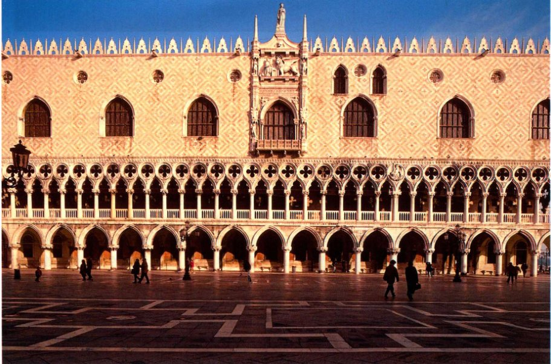

*图13.34 威尼斯总督府。始建于1340年*

### 米兰：维斯孔蒂家族与北部欧洲的影响

威尼斯以西和以北的伦巴第地区，政治结构又有所不同，这里与哥特式时期的法国关系更为密切，这点可以从此地的视觉艺术中看出。这里的农田土地肥沃，产量很高，维斯孔蒂（Visconti）家族从中获利颇丰。除了控制着该地区外，维斯孔蒂家族还通过与意大利和欧洲贵族的联姻而跻身于欧洲首要家族之列。1395年，吉安加莱佐·维斯孔蒂（Giangaleazzo Visconti）被封为米兰大公，他娶了法国国王的女儿，并将自己的女儿嫁给了奥尔良公爵路易（Louis，Duke of Orleans）。

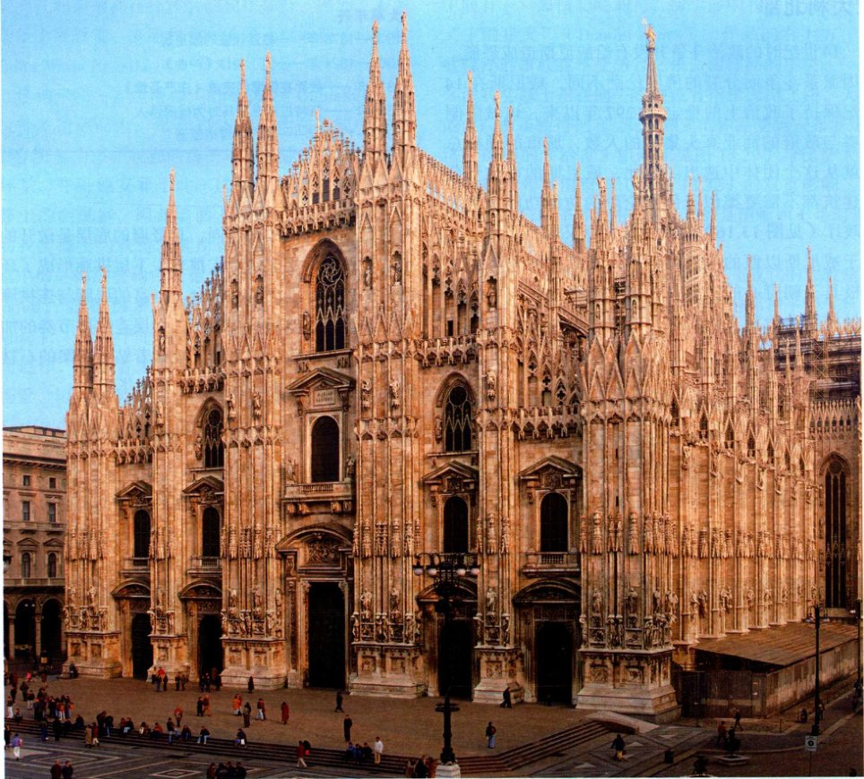

*图13.35 米兰大教堂。始建于1386年*

所有这些与北部欧洲的联系在14世纪的米兰建筑中都有所反映。1386年，米兰城、米兰大主教和吉安加莱佐·维斯孔蒂决定联合起来建造一座新的大教堂，而该教堂在一百余年之后才得以完工。米兰大教堂是法国哥特式在意大利最为惊人的变体（图13.35）。当地建筑师启动该项目时，曾就设计与施工问题咨询过善于建造哥特式高耸建筑的法国、德国建筑师。然而，由于宽阔的空间与坚固的结构在当地比较流行，因此双侧堂赢得人们的偏好，并放弃了飞扶壁结构（对比图12.15、图12.17）。大教堂的西立面界定着内部空间，虽然外部的垂直线脚丰富繁多，但呈阶梯状的内外两道侧堂仍旧清晰可辨。侧堂墙壁持续的实体性并没有因沿屋顶边缘展开的三角形小尖塔而减弱。后来，山墙、半露方柱等更多受古典艺术启发的元素在15、16世纪被嵌入哥特式立面。

维斯孔蒂家族在米兰的独裁统治性质，在吉安加莱佐的叔叔博纳博·维斯孔蒂（Bernabò Visconti）为自己的坟墓所定的作品（图13.36）中可见一斑。虽然现藏于博物馆，但博纳博的骑马像却曾被放置在米兰某座教堂的祭坛上。这件大理石雕刻由当地雕刻家博尼诺·达·坎皮奥（Bonino da Campione，活跃于1357-1397年）完成于1363年前后，包括一具石棺，支撑着马背上的博纳博雕像。他站在那里，而不是坐在马上，在教堂的祭坛之上充满力量地俯视着下方。表现统治者的骑马像观念要追溯到古典时期，马可·奥勒利乌斯骑马像（见图7.21）整个中世纪期间都伫立在罗马。

欧洲贵族宣称他们享有骑马像的特权。这件雕刻作品中，马背上的博纳博僵硬而刻板。雕像最初贴有银箔和金箔，以进一步增强它给人的震撼感。然而在马匹的处理上，博尼诺采用了微妙的比例和观察入微的解剖结构，表现出伦巴第地区对自然表现手法的兴趣，可能是接受当时法国艺术的影响。

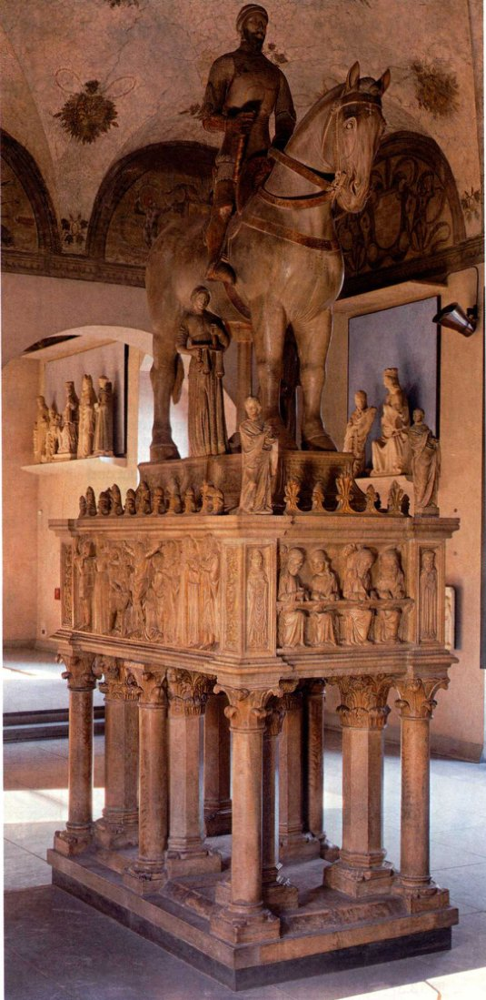

*图13.36 博纳博·维斯孔蒂之墓。1363年之前。大理石，6米。米兰斯福扎城堡（Castello Sforzesco）*

> **大事年表**
>
> *   1271-1295年 - 马克·波罗前往中国
> *   1277年 - 维斯孔蒂家族控制米兰
> *   1386年 - 米兰大教堂开始修建

在协助建造米兰大教堂、并为成为大公而活动的期间，吉安加莱佐·维斯孔蒂还定制了彩饰手抄本，正如法国贵族一样。他的《日课经》由乔瓦尼诺·迪·格拉西（Giovannino dei Grassi，活跃于约1380-1398年）于1395年前后创造，其中具有大量吉安加莱佐和指涉大公的图像。图13.37中的一页是大卫《诗篇》中一篇的开头，花体首字母D中画着大卫王的形象。大卫既是这一文本的作者，也是《圣经》中仁慈统治者的典范。一条装饰着法国百合花图案的缎带形成了字母D，四角的盾牌上有维斯孔蒂家族的纹章图案蛇。文字下方是吉安加莱佐·维斯孔蒂的侧面像，这种样式在古典时期的钱币上极其常见。虽然肖像具有自然主义特点，但它被设置在波浪形的边框之中，日光从四周射出，这是维斯孔蒂家族的另一个纹章。肖像两旁，乔瓦尼诺·迪·格拉西绘制了牡鹿与猎犬，极尽活灵活现地表现自然生物。华丽页面中的现实主义亮点反映出赞助人和艺术家对发展国际哥特式风格所作的贡献。订制如此豪华的书籍体现着吉安加莱佐·维斯孔蒂想要拥有的地位与权力。他野心勃勃，一心想要统治意大利北部地区，这将对15世纪早期托斯卡纳地区的艺术产生深远影响。

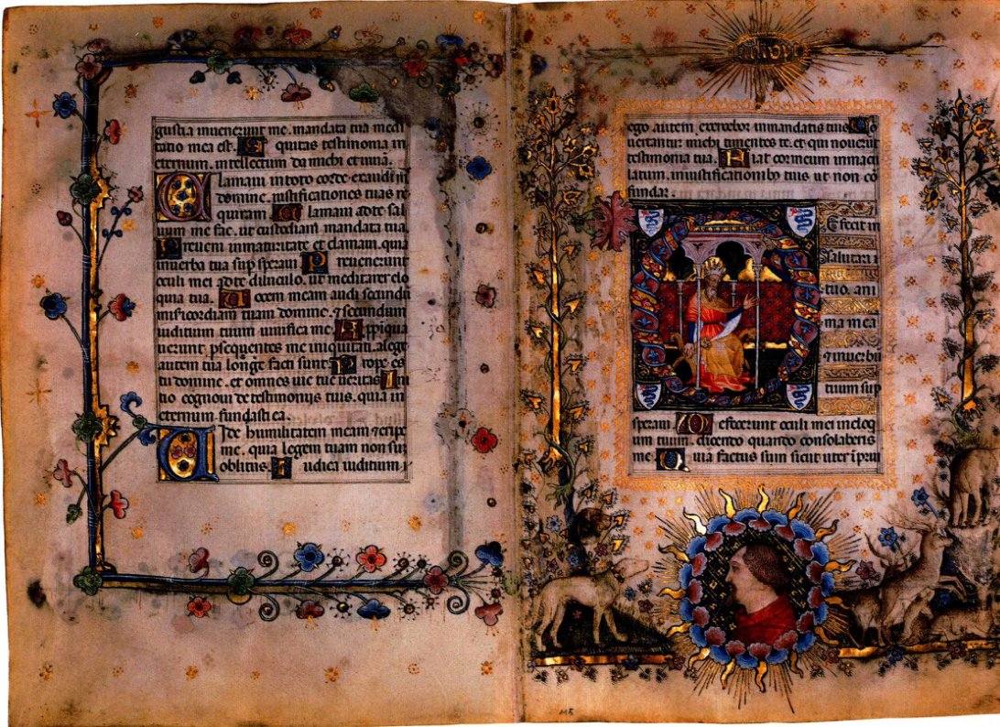

*图13.37 乔瓦尼诺·迪·格拉西：《吉安加莱佐·维斯孔蒂日课经》。约1395年。羊皮纸上蛋彩、贴金，24.7 × 17.5厘米。佛罗伦萨国家图书馆珍本库（编号397 folio 115/H）*

## 小结

13世纪与14世纪的意大利艺术根植于拜占庭艺术形式，也源自意大利艺术家与古罗马和早期基督教艺术作品的接触。此时的艺术作品通常是商业团体和城市贵族订制，而不是受到大贵族赞助人的委托而创作的。托钵会的活动激发了城市中新一轮的宗教热情，他们生动的布道再加上图像的叙事效果，可以向俗世观者更直接更形象地传达信息。

**教堂建筑与托钵会的成长**
托钵会布道团带来了大型城市教堂的兴建，以供布道而用。这些建筑运用了北方的哥特式创新手法，造就了宽阔的内部空间和高耸的比例，不过同时也保留了当地流行的木构天顶、坚实的壁面和无钟楼的西立面。这些教堂中的雕刻以简洁形象的方式讲述着《圣经》或圣徒的故事，增强了信徒们的体验。讲道坛和大门上，意大利雕刻家所雕刻的故事场景基于他们从古罗马艺术和北方哥特式艺术中得到的灵感。受托钵会观点的启迪，他们将不朽的圣人形象呈现在人间境况之中，激发了城市居民的宗教感受。

**托斯卡纳地区的绘画**
面对同样的观众，画家们创造了浑然天成的新技巧。13、14世纪的意大利画家首先认真研习了根植于古典风格的拜占庭绘画传统，探究图像的表现方式，创造出比中世纪早期艺术更接近自然的绘画手法。这一代艺术家在技法的探索上，寻求表现立体形式的光线效果，并在画面中创造空间错觉。艺术家们用这些技法来增强圣人们的属灵魅力，使故事的叙述更为有效更有感染力。乔托、杜乔等14世纪画家的创新手法提供了自然主义的绘画语言，全欧洲艺术家都从中受益匪浅。

**意大利北部**
意大利北部中心城市威尼斯和米兰发展出各自的哥特式艺术形式。受威尼斯政治环境及其与远东和中东贸易的影响，具有豪华外观和开敞拱廊的建筑较受欢迎。此时的米兰处于雄心勃勃的王朝统治下，他们更多地仿效欧洲北部地区。米兰比意大利任何城市都更为仔细地研习了法国哥特式建筑，而且其统治者所定制的艺术品也效仿着法国贵族的品位。