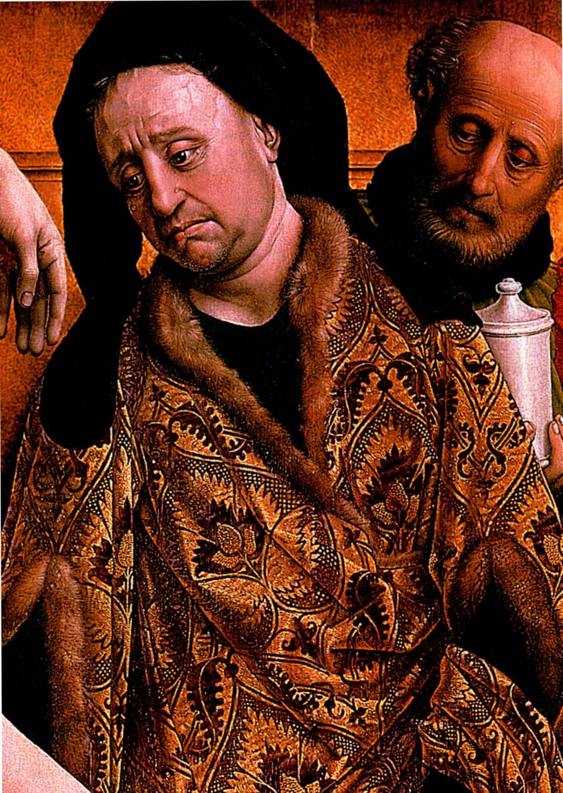

# 第十四章 15世纪北部欧洲的艺术创新

到了1400年，欧洲哥特式时代的众多大教堂都已基本完工，它们是教士、领主和普通信众齐心协力的产物。作为代表基督教信仰的纪念碑，它们是典型的中世纪建筑作品。但大教堂也属于重要的城市建筑，许多重大的社会与经济变革将在那里发生，它们都将为现代社会的成型奠定基础。14世纪结束之

时，中世纪的农耕经济让位于以制造业与贸易为基础的经济形式，后者主要集中在中心城市。

伴随这种经济转型的是社会生活的变化。许多城市

居民属于中产阶级，社会地位较高，受过良好教育，

生活安逸，拥有可以随意支配的收入。有了这些优势，

中产阶级在社会事务中的影响力与文化生活中的重

要性大为加强，超过了在教士与贵族把持的中世纪

时期他们所具有的地位。这一转变对包括视觉艺术

发展在内的欧洲文化，产生了深刻的影响。

正在改变，这两个变革影响最为深远。14世纪期间，

教廷一度迁往阿维尼翁（Avignon），两位教皇分庭

抗礼，此种情况导致了教会的分裂。虽然这一切在

1417年都宣告结束，但它所造成的影响却已无法消除。

对教会的失望使很多信徒都转向其他宗教运动，鼓励

教徒自己阅读《圣经》、思考经文，并建立起个人与

上帝之间的联系。其中一个运动称为新灵修（Modern

Devotion），然而托钵会修士以及其他传教士也鼓励

这种新的世俗宗教形式。尽管教会对这一现象并不完

全赞同，但它还是发生了。宗教热情与民众教育水平

的提高造成了对俗语书籍，即当地语言写就的书籍的

需求，其中也包括《圣经》译本。印刷机的出现使得

书籍更易于获得，从而又进一步刺激了这一趋势的发

展以及知识的传播。

政治领域的变革逐渐确定了现代欧洲各国的疆

域。英法百年战争终于在1453年结束，君主制法国

因此而恢复元气，但由于内战，直到15世纪末，英

格兰的政局动荡不稳。而法国国王也不得不设法对付

与其沾亲的勃艮第宫廷，后者控制着欧洲北部贸易的

集散中心，即南尼德兰的佛兰德斯（Flanders，比利时）

巴黎、伦敦、布拉格（Prague）、布鲁日（Bruges）、巴塞罗那（Barcelona）以及巴塞尔（Basel）等城市里，云集着工匠、按日计薪的工人、商人，乃至贵族。城市经济更多地以货币和工资为基础，而不是地产，这就产生了对银行家、律师和企业家的需求。追求新产品与新市场的投资者鼓励技术创新，例如印刷机就是这一背景下的产物，这一发明即将改变整个世界。贸易使得商人与工匠手中拥有了更多的流动资金，让他们勇于从传统的贵族手中争取更多的自主权，而后者则竭力维持既有的封建制度。

能读会写的人日益增多，宗教情感的表达方式也

图14\.17细部，罗杰·凡·德·维登：《下十字架》

🔴第十四章 15世纪北部欧洲的艺术创新 469

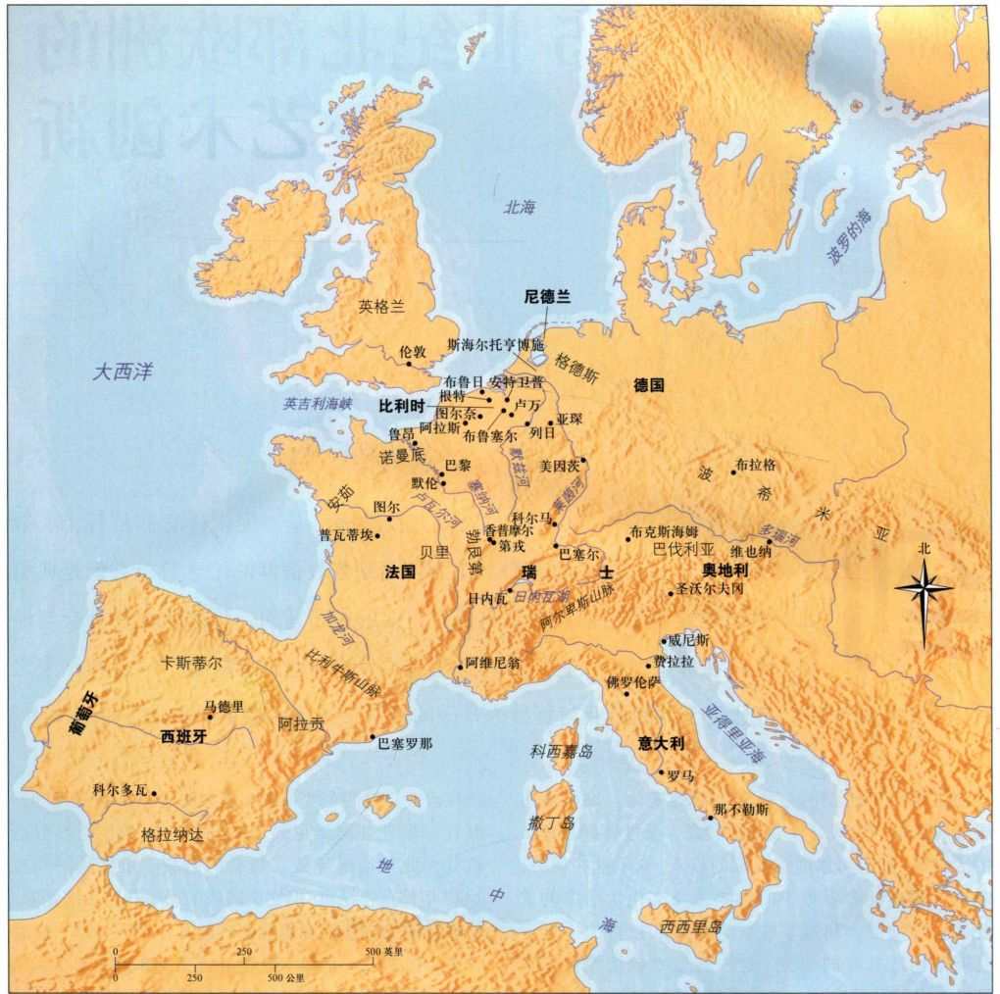

地图14\.1 15世纪的欧洲

和北尼德兰（荷兰）。事实上，勃艮第公爵好人菲利普（Philip the Good，1419\-1467年在位）是该世纪最为强大的统治者。

在靠东的中欧地区，神圣罗马皇帝虽然具有名义上的统治权，但帝国各地的领主却经常藐视他的权威。在伊比利亚半岛，卡斯蒂尔女王伊莎贝拉与阿拉贡国王费迪南德的联姻产生了重大影响，统一的西班牙王国得以创立并日益重要起来。欧洲列强在贸易路线上的竞争促生了哥伦布的远航，这一活动将西班牙王室的财富大为增加并改变了整个世界。

随政治与社会变革而来的是强调自然主义的视觉

艺术新风格。贵族与教士仍在订制艺术品，但官员与商人作为新兴社会阶层也成为了艺术界的赞助人。画家们为这些居住在中心城市的商人与中产阶级，以新的媒介绘制了具有新风格的绘画。尼德兰艺术家运用油画颜料作画，他们的作品即使是在今天，也因其酷似人们所见的世界而令观者惊叹不已。15世纪中期时，这种强烈的自然主义风格已成为北部欧洲的主流视觉艺术语言，吸引了许多国家各个社会阶层的主顾。

这一脱离中世纪的转型是渐次实现的，而且并非所有地区都是如此。面对成长中的中产阶级，传统的贵族试图继续维持他们的特权与地位。当时的法

🟩470 詹森艺术史

国、神圣罗马帝国、英格兰和勃艮第公爵统治的尼德兰，都是由贵族组成的宫廷统治，他们之间大多通过条约或婚姻联系在一起。对于一种极其精致的哥特式艺术形式的偏好由此而生，该风格被称为国际哥特式（International Gothic）。然而即便在这些宫廷艺术之中也隐藏着日渐明显的自然主义风格的种子，它会在15世纪蓬勃发展。

宫廷艺术：国际哥特式

14世纪将尽之时，全欧洲的贵族都表现出一种对材质豪华、形式优雅的哥特式风格艺术品的青睐。由于哥特式风格与法国君主制的兴起与威望息息相关，它的最新发展阶段也受到法国艺术形式与传统的巨大影响。阿维尼翁与巴黎这种王室所在的国际大都市吸引了来自全欧洲不同地区的艺术家，各种艺术观念在此处交流碰撞。在这样的环境之中产生了后来艺术史家称为国际哥特式的建筑艺术风格。采用国际哥特式风格的艺术家们也吸收了14世纪时意大利的某些艺术元素，其中包括借鉴自杜乔和彼得罗·洛伦泽蒂表现背景空间的技巧，以及某些主题和构图，例如贵族游乐乡间的题材（见图13\.31、13\.32）。这一风格发展的时间脉络在某种程度上变动不定，有些被归为国际哥特式的作品在年代上属于14世纪中期，而另外一些则可能晚至15世纪中期。

创作国际哥特式风格作品的艺术家来自意大利、法国、佛兰德斯、德国、西班牙、波希米亚、奥地利、英格兰等地。这些作品为地位显赫的人士而作，材质昂贵、工艺精湛，有时具有极其复杂的图像范式。艺术家们运用哥特式技巧，将作品形式以几何图案加以表现，以达到理想化的状态，正如图12\.21中维拉尔·德·昂奈库尔的作品所示的那样；但他们的作品中流露出了对自然直接观察的痕迹，尤其是在细节方面。许多学者认为，国际哥特式中出现的细节化自然主义是促生早期佛兰德斯画家那种彻底的自然主义风格的关键因素，也是影响15世纪时众人追随的重要原因。

法国王室雕刻

法国王室是最为活跃的国际哥特式赞助人之一，当时王室成员在法国所统治的地域前所未有的广大。国王查理五世（Charles V）	的一位兄弟大胆菲利普（Philip the Bold）在1363年成为勃艮第公爵，之后他与马勒的玛格丽特（Margaret of Mâle）联姻，又使他获得了佛兰德斯伯爵的头衔。这些使得之后的勃艮第公爵在15世纪的军事与经济斗争中成为实力强大的协调者。艺术品进一步提升了大胆菲利普的地位，也为他的后继者树立了重要的榜样。

在他所统治的勃艮第地区，公爵大胆菲利普在第戎（Dijon）城外建立了从属于加尔都西会（CarthusianOrder）的香普摩尔的夏尔特尔会修道院（Chartreuse

图14\.1 克劳斯·斯留特尔：香普摩尔的夏尔特尔会修道院大门。1385\-1393年。石雕。法国第戎

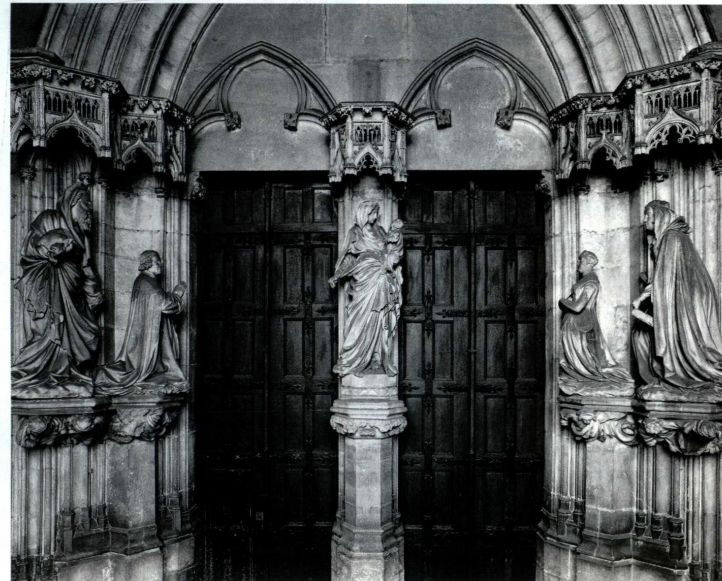

🔴第十四章 15世纪北部欧洲的艺术创新 471

de Champmol）。尽管这座修道院在18世纪末几乎 似乎正与左右两组人物交谈。圣母长袍上深凹的衣褶

增加了雕像的体量和活力，与《巴黎圣母像》（见图

12\.43）相比，这座圣母像的实体感大为增强了。大

门表现了公爵夫妇的虔诚与富有，将他们展现在极其

接近天国之母的地方。

被破坏殆尽，但某些建筑残迹仍保存了下来，其中

最著名的是大胆菲利普与妻子玛格丽特的雕像。大

胆菲利普召集了一群艺术家来建造这座修道院，其

中许多艺术家来自尼德兰。领导这组艺术家的人是

来自布鲁塞尔（Brussels）的雕刻家克劳斯·斯留特

尔（Claus Sluter），遗留至今的大门雕刻及其他雕

刻就出自其手。

夏尔特尔会修道院的大门雕刻于1385至1393年间，如同13世纪的哥特式教堂大门一样（见图12\.29），它的两侧是侧壁雕像（图14\.1）。然而，这里的雕像变得非常大，几乎超出了它们所依附的框架，例如人像的衣袍已经漫过了脚下的底座。这组雕像有一尊是大胆菲利普，左侧站立着他的主保圣人施洗约翰，还有其妻玛格丽特及其主保圣人亚历山大港的圣凯瑟琳。公爵夫妇视线交错，凝视着圣母与圣子，将5座雕像结为一体。圣母怀抱圣子，形象颇具动感，

墓地与讲道坛也是斯留特尔为香普摩尔的夏尔特尔会修道院创作的作品，但最能代表国际哥特式风格的作品是《摩西之井》（Well of Moses，图14\.2）。这座六角形的井曾经环绕着旧约先知的雕像，顶部还有一个十字架，这是《新约》履行《旧约》的视觉表现。王者风范十足的摩西留着飘然长须，流畅的衣袍仿佛宽大的外壳包裹着他的身体。隆起的形式显得人像似乎要步入周围的空间，并直接与观者进行互动。雕像的尺寸与自然主义所表现出来的生命感因画家让·马卢埃尔（Jean Malouel）所施的彩绘而极大地增强，可惜雕像上大部分的彩绘现在已经褪色。摩西的右侧是大卫王，他的个性特征与大门边公爵夫妇的雕像性

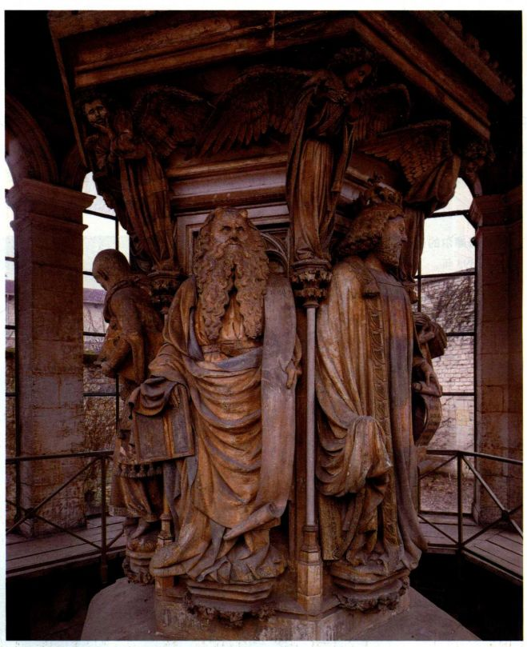

图14\.2 克劳斯·斯留特尔：《摩西之井》，出自香普摩尔的夏尔特尔会修道院。1395\-1406年。

石雕，高约1\.8米

🟩472 詹森艺术史

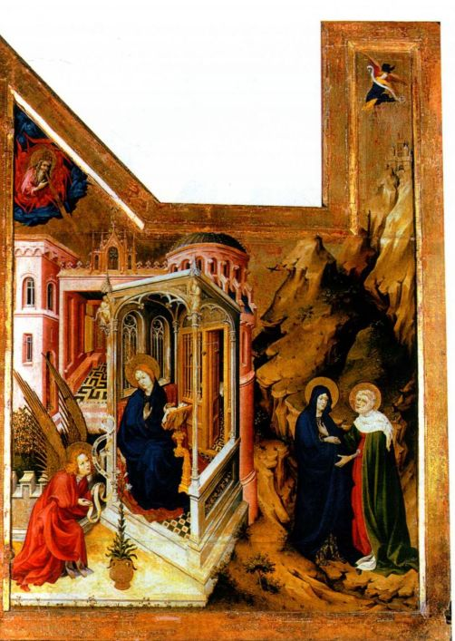

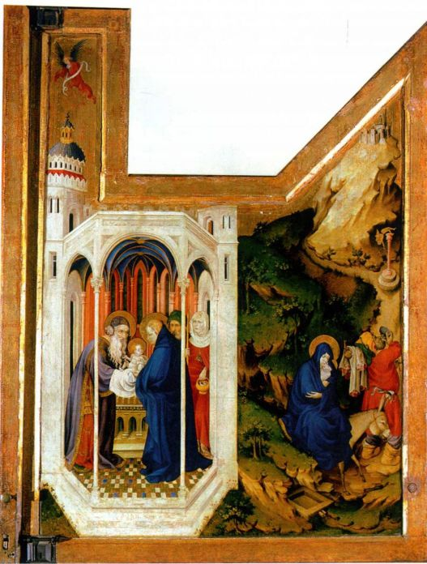

图14\.3 麦尔乔尔·布罗德尔兰：《基督幼年故事》（Infancy of Christ），香普摩尔的夏尔特尔会修道院祭坛作品两侧屏。1394\-1399年。

木板蛋彩画，每块板面为1 67 × 125厘米。法国第戎美术馆

布罗德尔兰的作品表现出了国际哥特式风格的另

外一个特征，即对细部特征作写实主义的描绘。类似

的写实主义手法在某些哥特式雕刻中也可见到（见图

12\.30），如《让娜·德夫勒日课经》等手抄本的页边

滑稽图饰（见图12\.41，多为表现寓言或日常生活的

小画）。在布罗德尔兰所绘制的《圣母领报》中，此

种现实主义表现在左侧加百列身后花园中精心描绘的

枝叶与花朵上。在右侧屏上，自然主义细节表现的痕

迹在快乐的驴子、蹄下的泉眼，以及村夫形象的圣约

瑟身上都可以看到。与圣母贵族化的精致之美相比，

圣约瑟只是一个普通的农民。尽管两块画板的高度达

到了1\.6米以上，这些煞费苦心的细节使这幅作品简

直成了放大了的细密画，而不是一般的大型绘画。但

是，这种种细节不仅仅赋予画面写实主义的光点，它

们还表达着特定意义。例如左侧屏中的百合花象征着

圣母的童贞，她身旁封闭的花园也具有同样的意义。

功能。

质相同。这种表现某个特定个体的手法将斯留特尔的自然主义风格与13世纪的自然主义风格区别开来，也是国际哥特式的标志之一。

也与人物不成比例。但微妙的造型却让画面表现出强 罗马式建筑与哥特式建筑则分别象征《旧约》和《新

烈的深度。柔和浑圆的形体、深暗轻柔的阴影产生出 约》。布罗德尔兰的画作令人心迷，同时也具有教育

香普摩尔的夏尔特尔会修道院祭坛作品 公爵大胆菲利普为香普摩尔的夏尔特尔会修院教堂订制了一组祭坛作品，它们制作于1394至1399年间，包括雅克·德贝尔兹（Jacqes de Baerze）表现三王来拜、耶稣受难和耶稣下葬景象的精美中央浮雕，以及画家麦尔乔尔·布罗德尔兰（Melchior Broederlam）绘制的两侧屏（图14\.3）。两侧屏复杂的外形是呼应中央部分的要求，分别绘有两幅基督幼年生活的场景：左侧屏上是圣母领报和圣母往见；右侧屏上是神殿引见和逃亡埃及。画家运用风景与建筑元素来界定叙事场景，填补板面上形状不规则部分的空间。尽管艺术手法上借鉴了杜乔和洛伦泽蒂兄弟（见图13\.25、13\.28），但画面上的建筑看上去仿佛是玩具屋，而风景的细节了重量感，而对宽大松散的衣袍衣褶的处理则令人联想到了斯留特尔的雕刻。

图14\.4 布西科画师：《圣母往见》书页，出自《布西科元帅的日课经》

（Hours of Marshal Boucicaut）。约1408\-1410年。27 \. 3 × 1 9\.1厘

米。巴黎法兰西研究院雅克马尔\-安德烈博物馆（Institut de France\-

Musée Jacquemart\-André\)

彩饰手抄本：《日课经》

尽管木板绘画日益重要，书籍彩饰仍然是北部欧洲重要的艺术形式。布西科画师（Boucicaut Master）是法国宫廷曾经雇佣过的众多一流手抄本画家之中的一位，他的名字来自1410年前后为让·布西科（JeanBoucicaut）元帅所绘制的日课经，他本人可能是布鲁日艺术家雅克·克恩（Jacques Coene）。这部日课经同《圣母往见》（图14\.4）中所示相同，书中有大量整页的金边细密画，装饰性的常春藤枝蔓环绕其间。在这幅画中，有孕在身的圣母与其表姐以利沙伯在一片深邃朦胧的空间里相会，其中勾画着大小不一的树木、隆起的山丘以及遥远的地平线。地平线附近的景物模糊不清，好像空气弥漫在观者与远处的景物之间。这种技法称为空气透视（atmospheric perspective，见图7\.55）。两位女子修长优雅的形象是画中的主体，

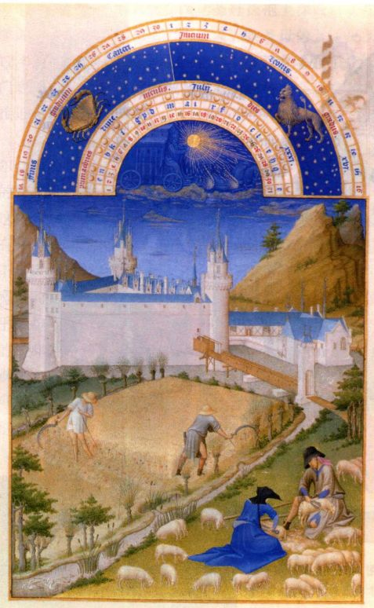

图14\.5 林堡兄弟：《七月》		，出自《贝里公爵的精美日课经》。1413\-1416年。	22\.5 × 1 3\.7厘米。法国尚蒂伊孔德博物馆（MuséeCondé,Chantilly\)

她们的身旁陪伴着一对侍从天使。圣母倾斜的体态令人联想起《巴黎圣母像》（见图12\.43）中圣母的形象，两者的衣袍设计极为相似，衬托出了人物的体态。

《贝里公爵的精美日课经》（Les Très RichesHeures du Duc de Berry\[The Very Rich Hours of the Duke of Berry］）是宫廷国际哥特式风格的杰作，是为大胆菲利普和查理五世的兄弟贝里公爵让（Jean，Duke ofBerry）而作，这位公爵是当时最为慷慨的艺术赞助人。这部书的制作者是波·德·林堡（Pol de Limbourg）和两位兄弟赫尔曼（Herman）与让（Jean）。兄弟三人经其叔父让·马卢埃尔引见而进入宫廷，这位叔父正是为斯留特尔的《摩西之井》施涂彩绘的画家。三兄弟中肯定至少有一位曾经游历过意大利，因为他们的作品中有大量借鉴自托斯卡纳和伦巴第艺术家的题材与构图。这三人都被任命为公爵宫廷画家，这反映

🟩474 詹森艺术史

图14\.6 狄奥多里克大师：《圣马太与天使》。

约1360\-1365年。木板画，川5 × 0\.93米。布拉

格国家美术馆（National Gallery，Prague）

🔴第十四章 15世纪北部欧洲的艺术创新 475

出他们的艺术成就受到的高度认可。

《贝里公爵的精美日课经》定制于1413年，而1416年林堡兄弟过世时尚未绘完，他们可能死于瘟疫。因此，有些书页在他们去世之后很久才完成。书中最著名的书页绘制的是日历、人类活动与自然的循环更替。关于自然的循环，最初的设计是绘制12个人像，每人都进行一项季节性的活动，这也是中世纪艺术中表现此种主题的传统。

描绘七月的书页（图14\.5）显示出兰堡兄弟对上述传统的创新。书页中以多种方式来表示日期：顶部的半圆形部分以数字形式记录着七月的每一天，还有该月的星座符号。日期下面描绘的是本月的劳作，田间的农民在收割小麦，牧场中的牧民在剪羊毛。这一场景上方有一座描绘精确的城堡，那是贝里公爵位于普瓦蒂埃市的克兰堡（Château du Clain），现已无存，但留有完备的文献记载。这张书页上描绘的是城堡主人眼中想要看到的景象，肥沃的土地上，安详的农民们有条不紊地进行收割。在这里，画面中的空间向上升起而不是向后退去，通过在这样选定的空间内纳入城堡、绵羊或长柄镰刀等自然主义细节，艺术家描绘

大事年表

1348年\-皇帝查理四世在布拉格建立大学

1385年\-斯留特尔开始在第戎香普摩尔的夏尔特尔会修道院工作

1387年\-乔叟撰写《坎特伯雷故事集》

约1413年\-林堡兄弟开始制作《贝里公爵的精美日课经》

了一幅封建社会秩序的理想图景。精心设计的构图将三个主要部分联系为一个三角构图，如同七巧板一样契合在一起。日历部分那珠宝般的色彩与斑驳闪亮的金箔赋予了书页豪华的效果。这部日课经有着显赫的赞助人，在图像方面也进行了大量创新，特别是日历部分，这使得日后出现了众多摹本。

波希米亚与英格兰

欧洲其他宫廷与地区也同法国一样钟爱这种国际哥特式风格。中欧波希米亚（Bohemia）的首都布拉格成为了重要的国际性城市，这要归功于查理四世皇帝（Emperor Charles IV，1316\-1378年）。他曾在法国国王查理四世于巴黎的宫廷之中就学，并娶公主为妻，出于对查理四世的敬意他改掉了自己的原名文

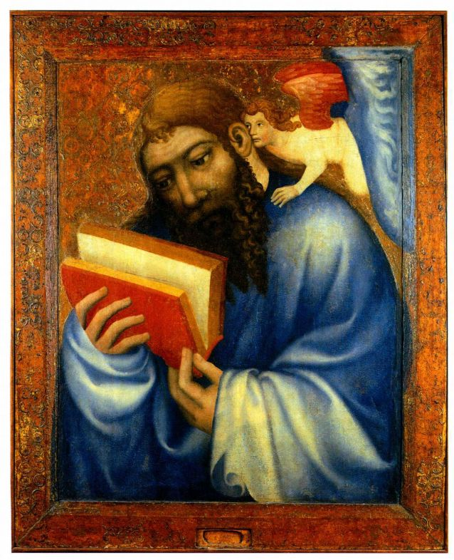

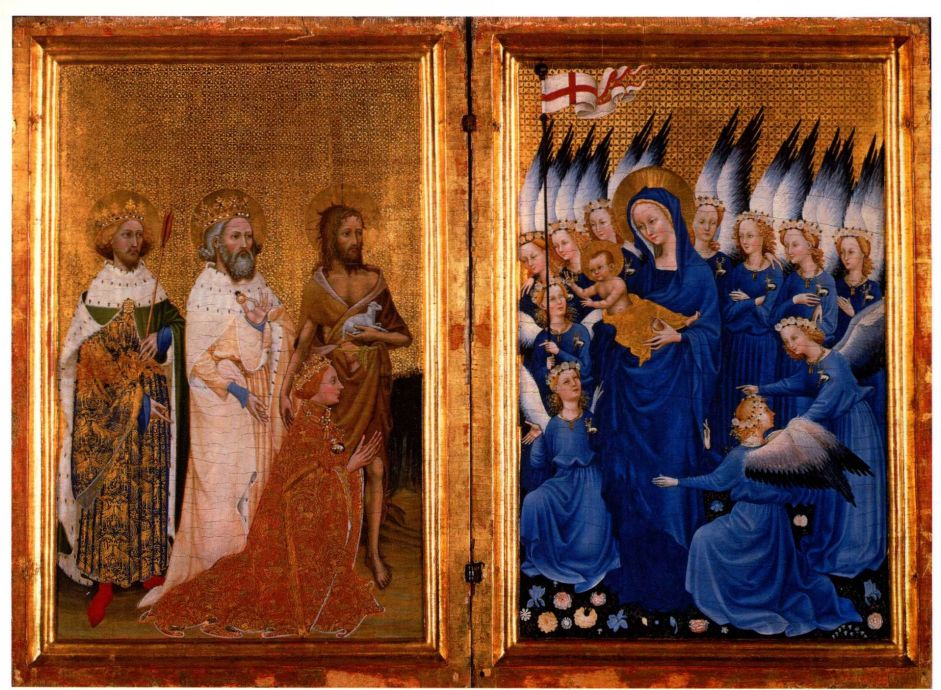

图14\.7 《威尔顿双联画》，约1400年。木板画，53 × 37厘米。伦敦国家美术馆

策斯劳斯（Wenceslaus）。返回布拉格并继承他父亲的波希米亚王位以后，查理在1349年被亚琛的德意志选帝侯推举为神圣罗马皇帝，加冕礼于1355年在罗马举行。

查理想使布拉格成为学术中心，他于1348年在这里效仿巴黎成立了一所大学。很快，布拉格吸引了许多欧洲学界精英。他同时也成为各种艺术的支持者，并为艺术家建立起行会。除鼓励当地艺术家之外，查理还将欧洲各地的艺术家请到自己的首都。在他位于布拉格城外的卡尔斯坦因（Karlstein）城堡之中，他效仿路易九世的圣礼拜堂（见图12\.34）建起一座敬献给圣十字架的礼拜堂。由布拉格画家行会的首领狄奥多里克大师（Master Theodoric）所绘制的壁画取代了玻璃窗画。这些壁画作于1357至1367年间。

图14\.6中的《圣马太与天使》（Saint Matthewand the Angel）正是礼拜堂壁画的一部分。此处，福音书作者用手指触摸着书本，一位天使在他耳旁轻语。中世纪传统的福音书作者象征因此就成为圣徒创作中一位积极的参与者。马太被表现为具有三维立体感的人物，蓝色长袍裹着他的身体，衣褶柔和松软。这一

风格可能是狄奥多里克在其家乡奥地利或布拉格时研究意大利艺术家作品的结果。

皇帝查理四世之女波希米亚的安妮（Anne ofBohemia）在1382年嫁给了英格兰国王理查二世（Richard II，1377\-1399年在位）。《威尔顿双联画》（The Wilton Diptych，图14\.7）中描绘的就是理查的形象，这件作品得名自它的一位收藏者。这幅双联画（diptych）是两块尺寸相对较小的木板画，两者中间装有铰链，可以像书册一样打开。作品中，国王理查二世跪在他的主保圣人身前，敬拜着圣母与圣子。与斯留特尔的大门雕刻（见图14\.1）相仿，这里人物的目光也越过画板而彼此相交。优美的圣母身旁陪伴着天使，仿佛宫廷侍卫环绕着的王后。圣子嬉戏着将身体探向国王。压印精美的金色背景上，色彩奢华艳丽、体态修长轻盈的人物站立在具有永恒之感的环境之中。然而天使所着衣袍的造型与狄奥多里克大师的作品《圣马太与天使》具有相同的自然主义特征。至今，学者们还在争论这位融合了哥特式天国格调与自然观察的艺术家到底来自何方，法国、英格兰、波希米亚还是其他地方。

🟩476 詹森艺术史

中心城市与新艺术

许多受到宫廷赞助人青睐的艺术家来自南尼德兰的城市，如布鲁日、布鲁塞尔、根特（Ghent）以及图尔奈（Tournai）。这些地方当时是国际商业的中心，街道上可以听到各国的语言，因为全欧洲的商人都在这里做买卖。这些城市所享有的独立实体的地位以及由此而生的自治权、关税权和军权令其他地方艳羡不已。它们的独立要求经常与贵族领主征税、控制人口与敛财的意图相抵触。建造诸如布鲁日市政厅（TownHall of Bruges，图14\.8）这样的建筑不仅是为举行城市会议提供场所，也是宣示这些城市独立与特权要求的象征。布鲁日市政厅建于1376至1402年间，属于北部欧洲最早的一批此类建筑。它位于布鲁日的一个大广场上，外观好像是一座宗教建筑，具有高耸的山墙形屋顶，窗户上饰有棱窗格，内部还建有拱顶。它的立面也效仿了哥特式教堂，雕刻有众多表现当地统治者佛兰德斯伯爵的人像。该建筑在法国大革命期间遭到破坏，立面的雕像为现代作品。建筑内部的功能是实施自治、公布判决的会议大厅，而外部的雕像则表现出佛兰德斯伯爵名义上的统治。伯爵与佛兰德斯市民之间的紧张关系在15世纪时曾经激化过几次。正是在佛兰德斯的城市之中，一场艺术上的革命得以肇始。不论是为宫廷还是市民创作，艺术家都开始用

油画颜料表现圣徒形象，仿佛他们生活在自然世界之中，宗教的神圣世界似乎触手可及。

图尔奈的罗伯特·康平

上述自然主义革命的早期先驱是罗伯特·康平（Robert Campin，1378\-1444年），他是比利时西南部贸易重镇图尔奈最为著名的画家。当时康平经营着一间繁忙的画坊，其中若干位成功的画家脱颖而出，其中包括罗杰·凡·德·维登。

《梅罗德三联画》 康平所创作的最著名的作品是《梅罗德三联画》（Mérode Triptych，图14\.9）， 根据其风格判断，它创作于1425年前后。画名来自该画作一位早期收藏者的名字。但是中央画板的题材是圣母领报，这是之前的基督教艺术作品中常见的题材。描绘圣母领报的早期作品通常都将这一事件设置在教堂（见图14\.3）或其他神圣的场所（见图13\.27），但是康平却将圣母与天使加百列画在貌似中产阶级家庭的主厅之内，其中有打开的百叶窗、陈旧的壁炉以及一条放有坐垫的长凳。尽管画作的主题本身是超自然的，但观者却似乎感到能够穿过画作表象，看到一个模拟现实的世界。康平运用了若干技巧创造出了这种效果。他将器物与人物放入空间“盒子”之中，甚至有时这种安排让人感到不太自然。但是康平对细节的描绘异常细致，尽力使每一件器物在造型、

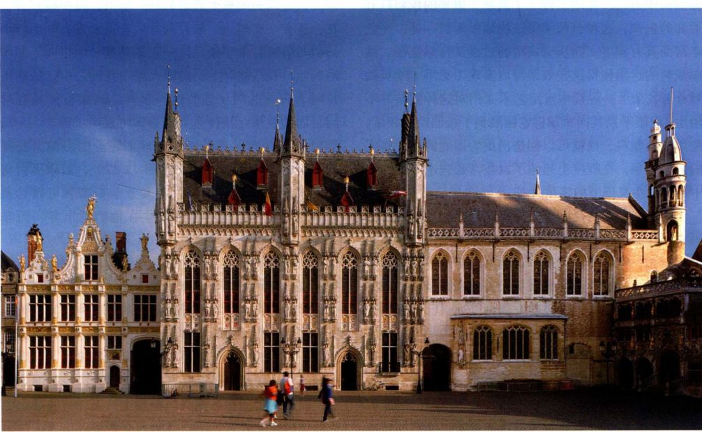

图14\.8 布鲁日市政厅立面。始建于1376年

🔴第十四章 15世纪北部欧洲的艺术创新 477

64 \.5 × 27\.6厘米。纽

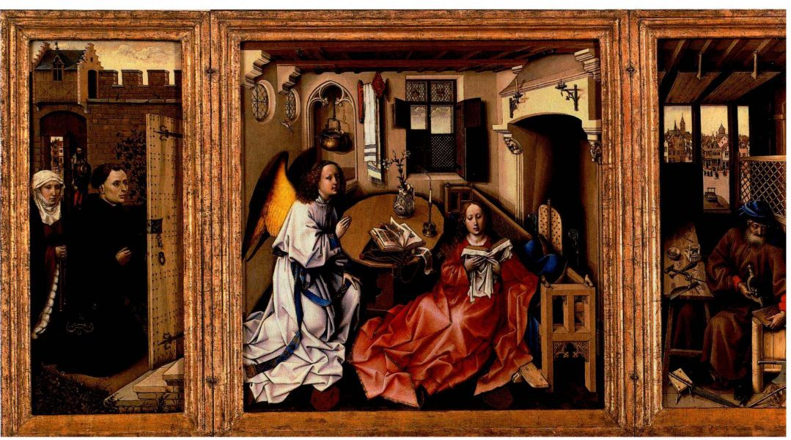

图14\.9 罗伯特·康平：《梅罗德三联画》。约1425\-1430年。木板油画，中央画板为64 × 63\.2

厘米，两扇侧屏约为

约大都会艺术博物馆，修道院收藏，1956年入馆

尺寸、色彩和质感上都尽可能真实。他还描绘了两种不同的光线，一种是能够产生柔和的阴影和亮度微妙渐变的漫射光；另一种则是更为直接的光线，它从两面圆窗中射入，在墙上投下了阴影。康平的色彩具有柔和的色调，这种色调使得三块画板浑然一体。亮色丰富而具有深度，而从亮到暗的过渡又自然流畅。油画颜料的运用使得这些效果得以实现（见第479页的材料与技法）。尽管中世纪艺术家们对这种颜料并不陌生，但康平及其同辈却将它拓展到了板面绘画领域。使用油画颜料，他就可以创造出更为彻底的体现真实的艺术效果，在程度上超越了以往宫廷艺术家的作品中那自然主义细节的零星火花。

康平并不是宫廷画家，而是满足市民品位的城市画家，这些市民是与画中虔诚地跪在圣母房门外那两位捐赠人一样的普通民众。这两人的身份并不煊赫，正如中央画幅窗户上的纹章所代表的家族至今仍未得到确定。但他们一定已经富有到可以为自己的家中定制三联画的程度，只不过因为这种画作的尺寸较小，不适合放置在公共教堂。或许这也是艺术家能够进行创新的原因之一，他得以在若干方面突破传统。这里的圣母领报的场景发生在具有各种日常用品的居家内景之中，人物是具有体量感的真实形象。他们的长袍下垂出深深的衣褶，人物与克劳斯·斯留特尔在其雕

刻中所作的一样，锚定在地板上（见图14\.1）。加百列半跪着，抬起右手，准备讲话。玛利亚坐在地板上，手捧书本，红色的衣服将人们的注意力吸引到她身上。这两人之间的圆桌上放着另外一本书，瓶中插着百合花，还有一支蜡烛。加百列背后头顶上方，一个纤小的幼儿肩负着十字架，这一定是基督，他正向下飘向玛利亚。在左侧屏上，捐赠人跪在花园之中，仿佛正在隔着打开的门见证着这一事件。画面整体具有时间凝固的效果：某件重大之事即将发生。西莫内·马丁尼将加百列与圣母表现为纤细轻盈的形象，安置在永恒的金色背景之中（见图13\.27），而康平则将他们描绘成真实的肉体，将其置于捐赠者可以目及的日常环境中。这一事件发生在他们的世界，而非天国。

右侧屏是正在工作的木匠约瑟，他在制作什么仍有争议。窗户外架子上那个盒子一样的物体又是什么呢？学者们将其认定为捕鼠器，基督教神学家圣奥古斯丁曾用它作为隐喻来解释上帝的救赎之道，他这样说道：“主的十字架就是对付魔鬼的捕鼠器。”因此画中的这个捕鼠器可能是基督转世成为肉身的图像暗示，而这就是即将在中央画幅发生的事件。约瑟手中的器物同样令人百思不得其解，有些学者认为它是防火屏，就像中央画幅上的那个一样；而另一些学者则

🟩478 詹森艺术史

	木板蛋彩画与油画

14、15世纪时，画家使用液体调制颜料在木板上作画。木板的材质因地区不同而各不相同，但北欧地区偏好橡木，因为橡木可以被锯成很薄的木板供作画之用。当时人们也使用松木、果木和白杨木。画板锯好之后，通常要由木匠把它嵌入画框之中加以固定。之后在画板表面涂一层底料（gesso），

材料与技法

体效果所需的色调渐变就很难实现。

中世纪艺术家也会因特殊目的而运用油性颜料，诸如在石材或金属表面作画，而扬·凡·爱克和罗伯特·康平等佛兰德斯艺术家则开始将其运用到木板绘画的制作中。油性颜料是一种粘稠且凝固很慢的介质，从轻薄透明的薄膜（透明

这是一种石膏粉，为的是使得绘画平面光滑。当时艺术家往往需要先在石膏层上画出底稿，作为艺术家或其助手涂绘时的根据。

颜料先被研磨成粉末，再与某种液体介质调和在一起，才可以凝固在画板上。中世纪木板绘画颜料最基本的介质是蛋彩（tempera），即将颜料粉末与稀释的蛋黄混合在一起，“tempera”有混合之意。由此种颜料画出的色彩涂层既细且

薄、可迅速凝固且附着力强，

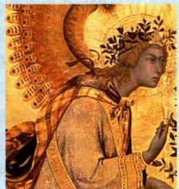

西莫内·马丁尼的“加百列”用蛋彩画成，画面干得很快，因此颜料层不相融合，每一笔都清晰可见。

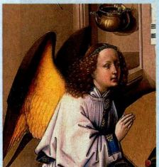

康平的加百列用油画颜料画成，画面干得慢并具有透明感。每一层颜料都与之前画下的那层颜料相融合，末层颜料涂上去之后产生出镜面般的效果。

色料［glaze］）到乳状的高黏度颜料堆积（厚涂［impasto］），它能创造出不同的艺术效果。色彩也能产生连续的色阶变化，包括柔和的暗影。与蛋彩画、蜡画和湿壁画相比，油画还具有另外一个优势：使艺术家在创作绘画的过程中可以改变他们的想法，修改原来的画面。当油画颜料的使用传遍欧洲时，有些艺术家采用了一种混合技法，运用蛋彩颜料画底层，再罩以透明油彩。尽管蛋彩颜料的使用仍持续了一段时

十分适合中世纪偏好鲜亮的平涂色彩的品位。然而，运用蛋彩不能舒畅地表现画面中不同色调交汇的部分，因此产生立

认为它是榨汁机的一部分，用来压榨葡萄制作葡萄酒，指代圣餐。

间，但调色油自那时起就已成为画家最基本的调色介质，这种情况直到晚近才改变。

行直接的观察与描绘？或者新的宗教实践形式激发了新的艺术风格？

圣母领报这一题材具有重要的仪礼与神学意义，但这也是一个关于孕育孩子的故事，左侧屏那对夫妇虔敬地跪在仪礼之前。从他们的角度而言，这件三联画可能铭刻着他们自己对孩子的渴望，或者对圣家族的崇敬，并希望以之为榜样。个人如此接近圣徒与神圣的场景是中世纪末期宗教生活的重要特点。信徒们被鼓励在布道中、在耶稣受难剧以及文本中将神圣观念视觉化为他们可以理解的形式，他们也被鼓励去冥想基督生平中的故事，以增加他们的同情心和虔诚心。尽管修士与修女长期以来都实践着这样的静修活动，但一个名为新灵修的宗教运动促使这些观念在普通信徒之中传播开来。诸如托马斯·肯皮斯（Thomas à Kempis）所作的《效法基督》（Imitation of Christ）这样的新宗教文献为希望追随基督的普通信徒提供了指导。康平这样的艺术家可能正是以此对这种将现实世界看作上帝真理显现的召唤作出了回应，在日常生活之中创作出了虔诚感人的宗教艺术形象。

康平的画作中出现了如此之多精心描绘的器物，说明这些细节构成了一个富有象征意义的系统，这种安排既可能是由艺术家构思，也可能是捐赠人所设计的。康平作品中那些需要专门的神学知识体现的象征意义可能来自神学家或学者，但只有艺术家才能找到适当的方式，将这种复杂的象征语汇用现实世界中所能观察到的形式表现出来。直到今天，学者们还在就康平及其同时代的艺术家为何如此忠实地记录世界的原因这一问题争执不休。是不是因为当时关于自然与自然世界的哲学发生了转变？还是奉行实用主义的商人们要求对他们所见的事物进

细节的选择如此精心，这令许多学者相信康平在用形象作为象征来传达宗教意义。例如百合花与圣母相关，象征她的童贞等美德。花束旁余烟袅袅的蜡烛的象征意义则不够明朗，令人困惑。红热的烛芯与弯曲的烟说明它刚刚熄灭。但为什么要在日光充足的白天点蜡烛？又是什么扑灭了烛火？难道是真正光明（基督）的到来熄灭了这世俗之光？

🔴第十四章 15世纪北部欧洲的艺术创新 479

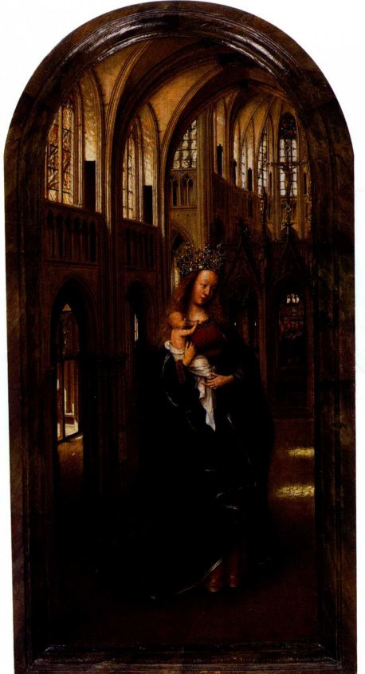

图14\.10 扬·凡·爱克：《教堂中的圣母》。约1425\-1432年。橡木板油画，3 1 x 14厘米。柏林国家博物馆画廊\(Gemäldegalerie,Staatliche Museen\)

布鲁日的扬·凡·爱克

诸如《梅罗德三联画》这样的画作中所体现的艺术革新不仅得到了佛兰德斯赞助人的认同和欣赏，而且也获得了意大利赞助人的青睐。国外对佛兰德斯这批艺术革新人士的最早评价就来自意大利评论家。他们认为在佛兰德斯绘画中惊人的自然主义及其唤起的宗教情感借重于油画技法，并将油画的“发明”归功于扬·凡·爱克（Jan van Eyck，1390\-1441年）。（见第三部分末尾的附加原始文献。）他也由此跻身于15世纪艺术界最著名的人士之列，而且关于他的生平，我们也所知甚多。

扬最初为荷兰伯爵工作，之后从1425年开始供职于当时在位的勃艮第公爵好人菲利普，直到1441年在布鲁日去世。扬既是市民也是宫廷画家，他极受

好人菲利普的赏识，这位公爵偶尔也指派给他一些外交使命。扬存世的作品中有几幅落有签名和年代，这在他那个时代非比寻常。这些款识能够帮助艺术史家对他的作品进行鉴别，并以署名作品的特征为依据，推定其他未署名作品。

《教堂中的圣母》（Madonna in a Church，图14\.10）是一幅被认定为凡·爱克名下的小幅油画，关于它的创作年代许多学者认为应在15世纪20年代晚期。这幅作品绘在木板上，尺寸仅略微大过八开书本而已。尺幅虽小，但这件作品在重现哥特式教堂内部的细节方面令人惊叹，画面中高侧窗射入的阳光使得教堂内部温暖明亮。这里的圣母令人联想到哥特式圣母雕像，她的形象具有立体感，身体略微倾斜，怀中抱着体形虽小却栩栩如生的基督。在凡·爱克的笔下，《巴黎圣母像》（见图12\.43）似乎获得了生命。在教堂唱诗班席隔屏上还有一座圣母雕像，天使在隔屏上手捧赞美诗集正在歌唱。这里透露出神迹的些许线

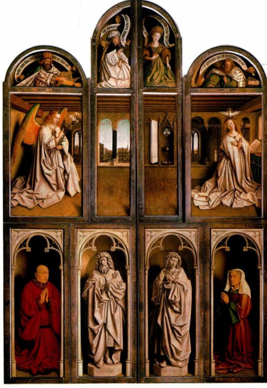

图14\.11 休伯特·凡·爱克与扬·凡·爱克：《根特祭坛画》（闭合状态）。完成于1432年。木板油画，3\.4x2\.25米。比利时根特市圣巴沃（St\.Bavo）教堂

🟩480 詹森艺术史

索：虽然对教堂内部的描绘采用的是现实主义手法，但圣母的身量与其他一切物件都不成比例。她几乎与这座哥特式教堂的三联拱廊等高。另外一个超自然的细节是光，照亮她的光线来自北面的窗户，这在北部欧洲是一个奇异的现象。光线不仅是造型手段，也丰富了画面的内容。圣母长袍上有一段出自《旧约·雅歌》的题词：“皎洁如日头······”这句歌词也印证了画中光线所具有的象征意义。扬·凡·爱克运用油画来创造模仿日常生活中的形象，但油画颜料的艺术效果同时又将这些现实形象转化为超自然的情景。他的“现实主义”有所选择地再现现实世界，为的是让宗教世界里的人物看起来好像寓居在世俗世界之中。

《根特祭坛画》 当凡·爱克完成《根特祭坛画》（Ghent Altarpiece，图14\.11\-14\.14）时，他的声望最终得以确立，这幅作品是早期佛兰德斯绘画最著名的画作之一。从它被放置在根特市圣约翰大教堂（Cathedral of Saint John）的礼拜堂内的那一刻开始（见图14\.14），它就吸引了众多参观者。阿尔布雷希特·丢勒曾在1520年前来观看，安格尔等后来的

艺术家都从中汲取过灵感。作品的画框上曾有一段题字，写明这件多块画板组成的祭坛画出自扬·凡·爱克之手，完成于1432年5月，并且提到他的兄长休伯特·凡·爱克（Hubert van Eyck，死于1426年）也曾参与创作。这件复杂作品的基本结构是一幅中央画幅加两块侧屏的三联画（triptych），这是南尼德兰祭坛作品（altarpiece）的标准样式。但是此处三个基本组成部分各自又包括四块画幅。侧屏的内外两侧都有画作，因此全套作品共有尺寸各异、形状不同的图画20幅。各个画面之间的不连贯，说明创作计划在绘制过程中曾经有过变更。似乎扬接手了若干休伯特生前未能完成的作品，将它们画完，并增添了他独自创作的画面，最后应富有的捐赠者约迪屈斯·菲伊德（JodicusVijd）的要求，将所有画作安装在一起。当三联画合上时，两侧板面上分别是菲伊德及其妻子伊丽莎白·博尔吕特（Elizabeth Borluut）的画像（图14\.11）。

他们的肖像位于最下面的一行，与之同行的还有另外两个人物，这四人的画像都分别安置在由虚拟的哥特式窗花格所围绕的单独壁龛中。捐赠者身旁的两

图14\.12 休伯特·凡·爱克与扬·凡·爱克：《根特祭坛画》（打开状态）。

🔴第十四章 15世纪北部欧洲的艺术创新 481

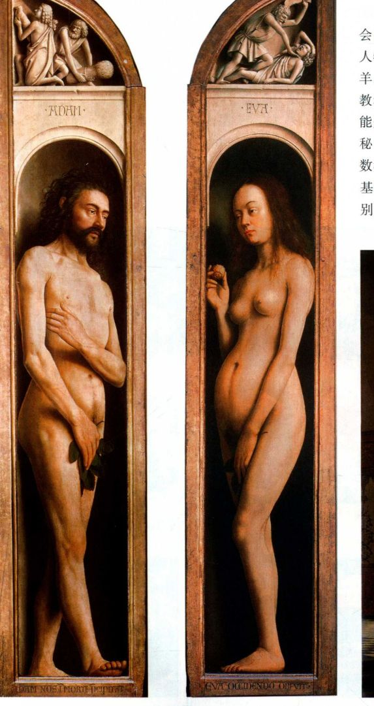

位人物分别是施洗约翰和福音约翰，均以模仿雕塑色彩的单色画手法画成。上面一层为两对宽度不一的画幅。艺术家结合这四块画幅的板面，绘制出一个整体的内部场景，透视深进的木屋顶横跨四块画板，于是将难以处理的问题转变成为巧妙的安排。除了营造空间上的连续性，扬·凡·爱克还在圣母房间的地板上绘制了阴影，似乎这是画幅板面框架所投下的影子，由此更增强了空间幻象感。先知与女先知（Sibyls）处于最上层，他们头顶的卷轴上有哥特式字体记录的各自所做的预言。

两块侧屏打开之后，观者就会看到一幅对天国集会的详细描绘（见图14\.12）。最下方的一层，各组人物都向中央祭坛聚集，祭坛上站立着围以光环的羔羊。人物包括天使、使徒、教皇、神学家、贞洁的殉教者、隐士、朝圣者、骑士和法官（其中一位人物可能是扬·凡·爱克的雇主公爵好人菲利普）。这群神秘的人物聚集在一片苍翠的风景之中，天际耸立着无数教堂的塔楼。壮观的天庭高踞在这人间天堂之上，基督位于画面中央，身着鲜亮的红色长袍。他身旁分别是圣母与施洗约翰。他们的左右两侧，唱诗班的天

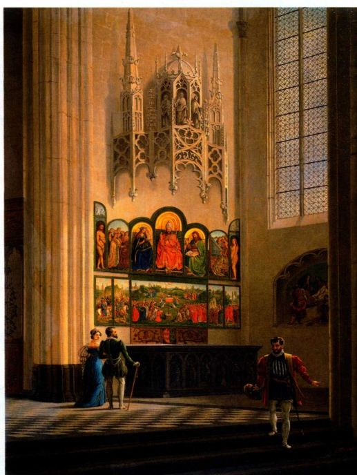

图14\.13 休伯特·凡·爱克与扬·凡·爱克：《亚当和夏娃》，《根特祭坛画》局部，左右侧屏部分

🟩482 詹森艺术史

图14\.14 表现《根特祭坛画》在礼拜堂中的绘画作品，阿姆斯特丹国家博物馆（Rijksmuseum）

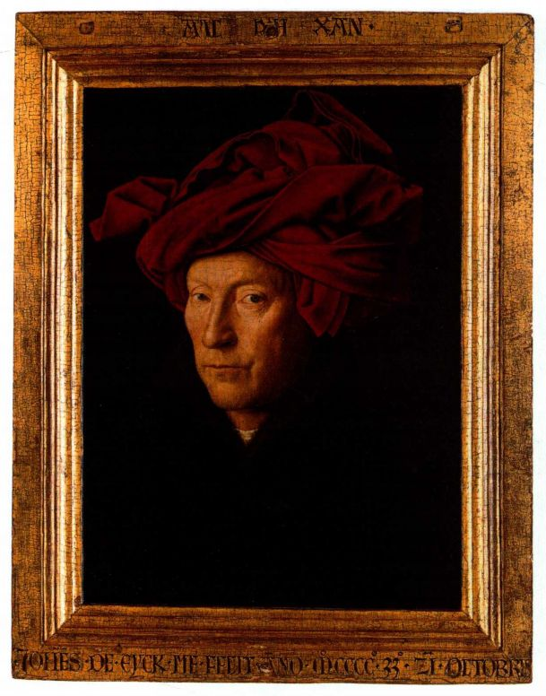

图14\.15 扬·凡·爱克：《戴红头巾的男子》（自画像？）。1433年。木板油画，33 × 26厘米。伦敦国家美术馆（The National Gallery）

使分别在吟咏圣歌、弹奏乐器。这层最外侧是亚当和夏娃，他们赤裸着身体，站在浅龛之中。两人头顶上是表现亚伯（Abel）与该隐（Cain）故事的单色画。亚当与夏娃的身量几乎与真人等高，解剖学细节描绘得非常仔细，沉浸在微妙的光影中（图14\.13）。

此处人物的姿态与哥特式手抄本中的人物姿态有相似之处，但在这幅画中，艺术家精确地描绘了人体的质感与色彩，从而将生命注入绘画形式之中。在根特市圣约翰大教堂菲伊德礼拜堂的祭坛上看到这幅画（图14\.14），观者一定会对其规模与布局印象至深。它的整体格调与庄严气势同《梅罗德三联画》家庭式的亲近感迥然不同。其功能在于说明在祭坛前举行的仪式。当它打开时，展现的是设置在天堂背景中的弥撒场景。画面中的多部书籍以及展示基督教知识的旁征博引的题词，令很多学者认为扬在构图时曾得到某位教士或神学家的指导。但他却完成了将各块分离的画板结为一体的艰难任务，给人们带来了强烈隽永的体验。

扬的这件作品虽然规模宏大，但其中充满了观察自然得来的细节以及炽烈的色彩。他采用施涂多道稀

薄的油画颜料的技法来塑造色彩，营造出高饱和度的色调，而有条理且缓慢地笔触又使得颜料融合在一起，呈现出镜面般的平滑效果。扬为人们展现出天堂一瞥，激发了他们的虔诚。如果像某些学者所认为的那样，整幅祭坛画嵌在哥特式建筑的框架之中，那么这些图像就具有体现教会重要性的意味，教会既是人世间的宗教机构，也是通向天国的路径。

世俗图像 扬·凡·爱克也创作纯粹的世俗绘画，满足宫廷和佛兰德斯中产阶级市民的需求。他的《戴红头巾的男子》（Man in a Red Turban，图14\.15）创作于1433年，落款署名，表现的是一位半侧面的中年男子，头上缠绕着引人注目的头饰。独特的面孔映衬在深色的背景里，整幅画面充满了温暖的光线，照亮了人物质感与形体的每一个细节，使其显示出近似显微镜一样的精确性。艺术家并没有探索画中人物的性格，然而男子望向画外的目光仍与参观者产生了眼神的交流。这种创新性的表现方式，以及眼珠略为斜视、可能盯着一面镜子的姿态显示这可能是一幅自画像。画作所要求的自我意识或许与画在边框上的题字相互照应，这里写着“ALSICH KAN”（“如我所能”

🔴第十四章 15世纪北部欧洲的艺术创新 483

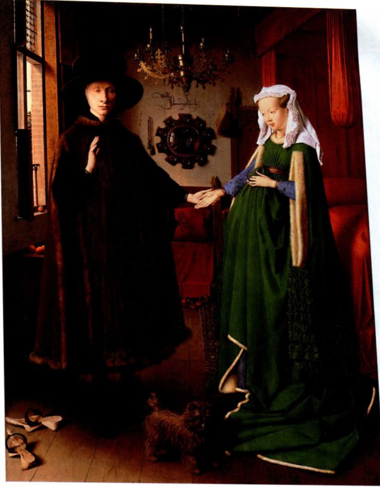

图14\.16 扬·凡·爱克：《阿诺尔菲尼夫妇像》（Arnolfni Portrait）。1434年。木板油画，

83\.8 x 57\.2厘米。伦敦国家美术馆

或“尽我所能”）。同样的箴言在扬的其他画作上也有出现，可能是为了激励别的艺术家做得更好，因为他尽了全力。有意思的是，这些题词为佛兰德斯语，但却转写为希腊字母。难道扬不仅想挑战他的同辈艺术家，还想挑战古代画家？无论这样书写的原因是什么，我们都可以将它看作扬作为一名艺术家对其画作及他个人历史地位的自我认识与肯定的标志。

扬·凡·爱克的署名题词也给解读其作品的现代学者带来了挑战。他现存画作中最具争议的一幅作品表现的是一对男女，他们站在富丽堂皇的房间之中，室内有黄铜烛台、镜子与带罩篷的床（图14\.16）。扬的署名并非像他通常那样落在画框上，而是直接

留在画面中。他在镜子的上方，用正式字体留下了署名，英语意为“扬·凡·爱克在此，1434年”。如果在女子身上表现得还不够明显，那么男子所具有的特征已经足够明确地显示出这是一幅肖像，画作本身非同寻常，使得学者们根据后来的文献，确定男子的身份为生活在布鲁日的意大利商人乔瓦尼·阿诺尔菲尼（Giovanni Arnolfini）。多年以来学者们都相信画中的女子应该是阿诺尔菲尼的妻子乔瓦娜·切娜米（Giovanna Cenami），然而最近的研究对这一结论提出了质疑，因为他们的婚期远远晚于1434年。

无论画中人物姓甚名谁，这对夫妇所处的场景都是15世纪家庭中的主室。他们看起来相当孤独，两

🟩484 詹森艺术史

手相牵，男子举起右手，仿佛正在庄严宣誓。然而他们身后的镜子里，却反射出已经进入房间的两位男子。由于署名就在镜子上方，许多学者认为这两位男子之一肯定就是扬·凡·爱克，可能就是戴红头巾的那一位。结合签名与措辞的华丽以及镜中男子的图像，说明扬可能正在见证房间里正在进行的某一事件。

多年以来，学者们都认为这幅作品表现的是两人的婚礼或者订婚仪式，不论是哪种仪式，都要求男女双方两个家族之间订立法律与经济契约。若如此解读，则意味着此画是对这对夫妇结合的纪念。倘若如此，镜子中的另一个男子可能就是新娘的父亲，他可能曾为女儿的婚礼订立了上述契约。女子扯起她厚重礼服的姿势可能表现了她对孩子的渴望，她身后的床则意味着婚礼的完成。考虑到画作的世俗性质，学者们对它的现实主义手法有所争论，到底是为了真实记录事件本身及室内场景，还是这些细节具有更为象征化的意义？夫妇两人脱下鞋子只是习俗所致，还是提醒我们他们已站在“婚姻的神圣之地”？（这一场景的象征意义源于摩西的圣经故事，上帝法驾到来时，身处山火肆虐的西奈山上的摩西情不自禁脱掉了鞋子。）画中的小狗仅仅是宠物还是忠诚的象征？（拉丁语中

的“Fides”意为忠诚，这也是小狗称作“Fido”的词源。）室内的其他陈设也为人们提出了另外一些类似的问题。为什么在大白天要点燃烛台上的一支蜡烛？窗台上为什么有水果？镜子的功能又是什么？只有镜框圆盘饰中的耶稣受难与复活的图像的象征意义毫无疑义，表现的是宗教主题。扬·凡·爱克创作此画的目的何在？他为谁人而作？赞助人要这样的画作何用？这些问题的答案在近期的解读中变得更富有争议，因为之前学者们感到确定的图像意义现在却变得不太确定了。

布鲁塞尔的罗杰·凡·德·维登

作为宫廷画家，扬·凡·爱克可以不为其他佛兰德斯的艺术家受到的约束所限制。行会是艺术家们建立的旨在保护行会成员的利益的职业组织，它们制定了训练艺术家与约束艺术市场的种种规则。有抱负的艺术家在经核准的画师的作坊中当学徒，学习技艺。经过一定时间之后，学徒就成为熟练工人或者按日计薪的工人，他们就可以为顾客提供服务，但还不能开设自己的作坊。熟练工人通常四处旅行，从自己老师之外的艺术家那里学习技巧。成为画师必须完成一件

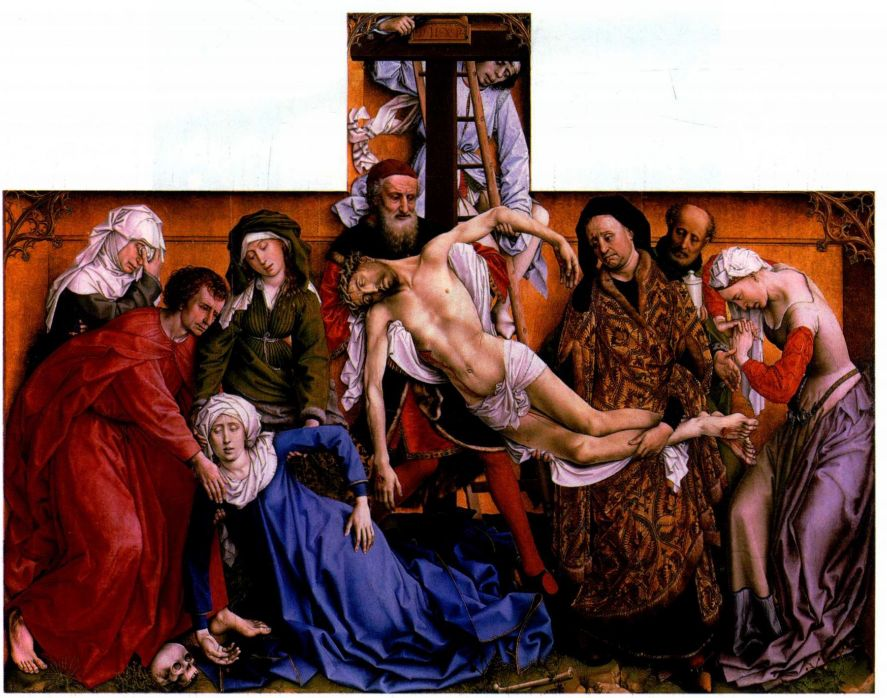

图14\.17 罗杰·凡·德·维登：《下十字架》。约1435年。木板油画，2\.2 × 2\.6米。马德里普拉多博物馆（Museo del Prado）

🔴第十四章 15世纪北部欧洲的艺术创新 485

原始文献

安科纳的奇里亚库斯（1449年）

罗杰·凡·德·维登可能曾游历过意大利，有文献表明他为费拉拉（Ferrara）的埃斯特家族（Este family）等显赫的意大利赞助人创作过若干幅画作。他在意大利最为人们所津津乐道的作品得到了安科纳的奇里亚库斯的赞扬，后者是一位人文主义者兼外交官，曾侍从意大利王公四处旅行。

继著名的布鲁日画家约翰内斯（Johannes）之后，布鲁塞尔的罗杰堪称我们这个时代最出类拔萃的画家。大名鼎鼎的埃斯特的里奥内洛（Lionello of Este）亲王在1449年6月8日于费拉拉向我展示的一幅精美作品就出自这位优秀的画家笔下。在这幅极其虔诚的画作中，人们可以看到我们的

先祖，他们经历着基督下十字架时的严酷考验，一大群男女伫立其中，深深的哀悼着。所有人物的描绘都令人赞叹，我要说这是神来之笔，而不是人的艺术。你会看到画中活人的面孔具有生命，仿佛正在呼吸，而死者毫无一丝生命迹象。特别值得注意的是人物所着的长袍、各色的士兵斗篷以及因紫色、金色、珍珠宝石等装饰而倍显尊贵的服饰等，人们会认为它们不是出自人类双手的技巧，而是出自包罗万象的自然本身。

SOURCE:NORTHERN RENAISSANCE ART 1400\-1600: SOURCES AND DOCUMENTS\. ED\.WOLFGANG STECHOW\.\(EVANSTON,IL:NORTHWESTERN UNIVERSITY PRESS, 1989\)

由行会领袖认可的“杰作”（masterpiece）。行会不仅对培训进行管制，而且限制其他城市与本城艺术家的竞争，调查成员之间的争端，并照管成员们的社会与经济需要，例如负担他们的葬礼、养老金，以及照顾寡妇等。行会既是经济组织，也是社会机构，既确保了艺术品的质量，又承担着成员们的福利。

罗杰·凡·德·维登（Rogier van der Weyden， 1399／1400\-1464年）是一位行会系统出身的杰出画家，他曾就学于图尔奈的罗伯特·康平，但一定对扬·凡·爱克的作品也有所了解。1435年，他在布鲁塞尔建立起一间生意兴隆的画坊，为远至意大利和西班牙的客户绘制订件作品。维登最具影响力的作品是《下

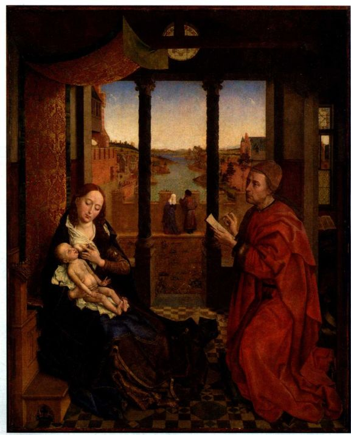

图14\.18 罗杰·凡·德·维登：《圣路加为圣母画像》。约1435\-1440年。木板蛋彩与油彩，

1\.38 × 1\. 11米。波士顿美术馆（Museum of Fine Arts），Henry Lee Higginson夫妇捐赠

🟩486 詹森艺术史

十字架》（Descent from the Cross，图14\.17），该画作于1435年前后，是布鲁塞尔附近卢万市（Louvain）的弩手行会为当地教堂定制的祭坛画的中屏画。维登为他们绘制了基督的尸体被从十字架上放下来的那一刻，一群哀悼者占满了浅盒子般的空间。画面中的形体造型精细，具有雕塑感，而且其细节充分显示出各种质感的微妙差别。

维登的意图在于增强画面表现的内容。他突出了下十字架场面对所有在场者的情感冲击。哀痛铭刻在每个人的脸上，身体的姿态体现着他们对基督离世这一损失的反应。左侧的福音约翰和右侧的抹大拉的玛利亚都因悲痛而屈下身来，圣母的昏厥与基督的姿势表情相呼应。她的痛苦与悲哀极其强烈，参观者的心中也被激起了同样的怜悯之情。维登将场景设置在浅壁龛或圣殿里，而不是风景之中。这一大胆的设计将参观者的注意力集中到前景，艺术家也得以将众人协调为和谐一致的群组。进而言之，画家对基督的身体着重强调并将之放在构图的中心，暗示着圣餐礼就在该祭坛前举行。这些极度忧伤的体态与表情来源于雕塑而不是绘画。在瑙姆堡的唱诗班席隔屏（见图12\.53）与《勒特根圣母哀子像》（见图12\.56）的圣母中，人物具有与此处哀悼者们相同的强烈情感。维登的这幅作品对后来的众多绘画和雕塑摹本都产生了重大影响。

维登画中高度的情感为意大利外交官安科纳的奇里亚库斯（Cyriacus of Ancona）所注意，他在1449年还见过艺术家另外一幅相同题材的作品，他对画家这种情感大为赞赏（见第486页的原始文献）。这位评论者在赞赏画面人物逼真如生的同时，还单独探讨了作品中的自然主义。其他意大利评论家也对佛兰德斯绘画中的自然主义与虔敬之情做了评价。佛兰德斯的观众们在深思基督的牺牲之时，想必也将他们个人的兴趣灌注到对维登作品的体验之中。

《圣路加为圣母画像》（Saint Luke Painting the Virgin，图14\.18）是维登另一幅作品，这幅画作于1435至1440年间，表现出他对早期佛兰德斯艺术家的借鉴。画中喂养圣子的圣母形象显示出了康平的持续影响，而构图则以扬·凡·爱克的作品为基础。与《下十字架》不同，维登在这里绘制了一片向远处延伸的深邃风景。人物所处的房间面朝一座由堡垒防御着的

图14\.19 盖拉德·洛伊特：《大胆查理像》。约1471年。

53 × 32 × 17\.8厘米。列日大教堂珍宝库

大事年表

1384年\-勃艮第公爵大胆菲利普继承佛兰德斯的统治权

1432年\-扬·凡·爱克完成《根特祭坛画》

1453年\-英法百年战争结束

花园。一对男女在城垛上眺望着远处繁忙的佛兰德斯城市，那里店主们正在准备开张，市民们行走在街道上。

画中的福音书作者圣路加正在进行另外一件工作\-为圣母与圣子绘制肖像。拜占庭传统中曾提到，圣母神迹般地显现在路加面前，这样后者就可以为她绘制肖像。这一传说有助于解释为何中世纪晚期会出现大量圣母像。在维登的笔下，圣母显灵时，手持银尖笔的路加正在描画她的面貌特征。此类素描是当时大部分画作的开始阶段。也是由于这一传说，圣路加成为全欧洲画家行会的主保圣人。维登的这幅作品后来可能被赠予布鲁塞尔的圣路加行会，因为晚期圣路加行会的文献记录表明在其礼拜堂中曾有一幅这样的作品。由于这一绘画表现的是绘画的创作本身，因此它可能是维登对于绘画与画家尊严的自觉宣言。15世纪时出现了大批该画的复制品，甚至有些就出自维登

🔴第十四章 15世纪北部欧洲的艺术创新 487

艺术史家的观点

从科学与技术角度研究绘画

当代材料科学中的研究工具为我们提供了关于古代艺术家艺术实践的新信息。艺术品的物质实体性使得研究考古学的方法也同样适用于对绘画的研究。通过对颜料与色素进行化学分析，我们就可以知道艺术家所使用的颜料配比及其成分。这一信息可以用来分析画坊的习惯方法，进而确定作品真伪，并为画作的保护提供建议。

现代学者运用多种技术手段来研究绘画。X光成像法可以透过画面表层，进而对作品绘制过程中铅的用量进行图像分析。因为古时候要想使颜料色彩变浅要使用铅白，X光照片就让研究者可以分析艺术家如何运用较浅的色彩来构图。它还能揭示艺术家的笔触和创作过程中的画面改动等细节。其他可使用的技术手段还有红外线，它能够透过画面表层，找出白色画板上的深色斑点。在特殊的红外线照相机（该技

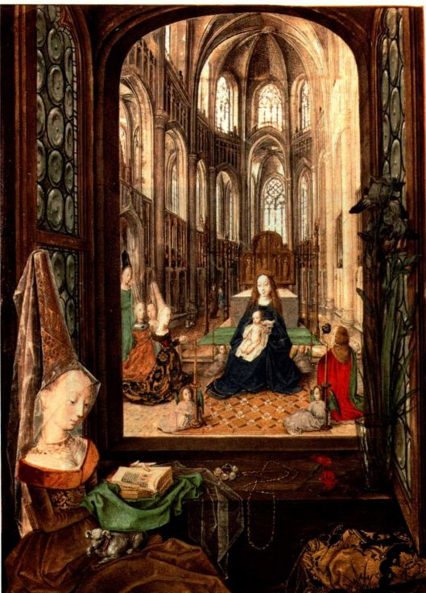

图14\.20 勃艮第的玛丽画师：《窗前女子》（Lady at Window），出自《勃艮第的玛丽日课经》。约1480年。	1 8\.7 × 1 3厘米。维也纳奥地利国家图书馆（Osterreichisches Nationalbibliothek，Vienna）

术称为红外线反射成像）的帮助下，研究者能够透过表层拍出画面底层的草图与表层之下的最初涂层，计算机通过比较这些照片就可以产生出绘画准备阶段的各层图像。这些信息对于研究创作过程非常宝贵。它也对确定维登《圣路加为圣母画像》（见图14\.18）诸多版本的创作顺序很有帮助。

由于大部分文艺复兴时期的绘画都是画在木板上，学者们就可以确定某一特定画板的木材年轮数目，这种技巧称为树轮年代学（Dendrochronology）。之后将这一数据与年轮数据库中有纪年的年轮相对比，就可以确定该画板所用木材被砍伐的大致年代，进而为推断绘画的年代提供辅助证据。此类证据使得某些学者将博斯的《尘世乐园》（见图14\.24）创作年代确定至1480年前后。科学研究同样可以揭示哥特式雕塑中所使用的石灰石的构成以及古代青铜器的化学成分。

自己的画坊。近年来，学者们一直在运用现代科技设备来分析此类绘画，借以研究艺术家所采用的技法。（见本页的艺术史家的观点。）

15世纪晚期的尼德兰艺术

罗伯特·康平、扬·凡·爱克和罗杰·凡·德·维登的作品不同凡响，成为了尼德兰及其他地方的艺术家创作的范例。15世纪晚期，宫廷赞助人仍然偏好昂贵材料所制作的艺术品，尤其青睐金器。他们也定制手抄本和挂毯。与此同时，商人阶层购藏者的队伍继续扩大，画家们也开始得到来自中产阶级的定件委托。虽然如此，绘画这一艺术形式在15世纪期间获得了很大声誉，引起了来自贵族阶层的兴趣与订单。尽管绘画艺术品市场得以扩大，但大型雕塑在15世纪的尼德兰仍保有它的市场，可是由于战争破坏、社会剧变与品位变化等原因，这些雕塑很少留存至今。存留更少的是材质珍贵的器具艺术品，因为制作它们的原材料价值昂贵，在货币匮乏时很容易就被回炉再利用了。

贵族对珍玩宝器、个人书籍与挂毯的嗜好

整个15世纪，贵族赞助人都在定制小型的珍玩宝器。其中一件是《大胆查理像》（Statuette ofCharles the Bold，图14\.19），现藏于比利时东部列日大教堂的珍宝库中，它在艺术上表现出的光辉成就令人不禁惋惜其他未能保存至今的同类作品。这件作品由金匠盖拉德·洛伊特（Gerard Loyet，1442\-

🟩488 詹森艺术史

1500年）受托制作，勃艮第公爵大胆查理（Charlesthe Bold）于1471年将它赠予列日大教堂，此举可能意在宣示他在这个难以驾驭的城市中的统治权。此像高53厘米，材质为金银，细节部分镶嵌着珐琅，表现的是手持圣物盒的大胆查理，身后站着的是他最喜爱的主保圣人圣乔治，圣乔治被表现为手抬头盔致敬的姿态。公爵身着盔甲，跪在垫子上奉献圣物盒。这件作品显示了洛伊特的技巧以及此类艺术品在勃艮第宫廷的影响。

宫廷也偏好珍贵的书籍。虽然当时印刷术已经为传统的上流社会之中所熟悉（见第498页），但代表着所有者的身份与影响的手抄本仍然保持着它的吸引力。按照每日时刻来组织祈祷文的日课经尤其受到女性的青睐，其中一部引人瞩目的典范是工艺、装饰奢华的《勃艮第的玛丽日课经》（Hours of Mary of

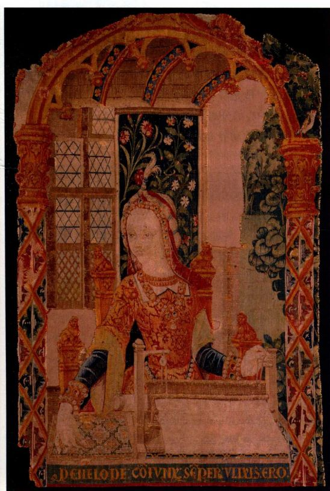

图14\.21 《珀涅罗珀织布》，《珀涅罗珀的故事与辛布里妇女的故事》（The Story of Penelope and the Story of the Cimbri Women）的残片。约1480年。	00 × 1 50厘米。波士顿美术馆（编号26\.54），MariaAntoinette Evans 基金

Burgundy）。书中有玛丽的纹章，她是勃艮第公爵大胆查理的女儿，也是最后一位勃艮第女公爵，纹章的存在说明在1482年去世之前，她一直是这部书的主人。

图14\.20中的女性可能就是玛丽本人。佚名的艺术家被以该书的名字称呼，他描绘的是一位衣着优雅的年轻女子阅读书籍的场景，她手中的那部书与《勃艮第的玛丽日课经》相似。金色的锦缎、透明的面纱、珠宝与花朵围绕着她，一只小狗趴在她的膝头：女子的服饰与所处的环境表明了她的身份。她坐在一座私人礼拜堂之中，窗外对着一幅光线充足的哥特式教堂内景。通过窗户，人们可以看到圣母与圣子坐在祭坛处，两侧各有一位天使。除了这些宗教人物之外，画面右侧跪着一组贵族妇女，她们所享有的靠近圣母子的殊荣可能就是前景中年轻女子所祈祷的内容。

在这幅作品中，艺术家创造了画中画，因为教堂内景一瞥完全被框在女子礼拜堂的建筑之中。布西科画师等早期手抄本艺术家用植物及其他装饰纹样装点边框，目的只为画面主景营造空间背景（见图14\.4），此处的艺术家则把边框作为与主要画面联系在一起的自在实体加以处理。艺术家精心描绘了小狗皮毛的质感、玻璃花瓶的透明感以及窗台上珍珠的反光。这幅手抄本画作因此具有了木板绘画同样的感染力。

宫廷也是繁荣的挂毯制造业的重要市场。布鲁塞尔、图尔奈和阿拉斯（Arras）都有大的作坊，阿拉斯的城市名甚至成为了这一艺术形式的同义语。挂毯用彩色羊毛线或丝线织成，通常由宫廷阶层或教会中的高层人士订制。以《珀涅罗珀织布》（PenelopeWeaving，图14\.21）的残片为例，它就是图尔奈主教在1480年前后订制的系列挂毯“著名女士”的一部分。这块挂毯上描绘的是奥德修斯（或尤利西斯［Ulysses］）正在织布的妻子。根据荷马的《奥德赛》，珀涅罗珀以织布为由回绝了许多求婚者，她坚称在没有完成织布之前绝不再婚，而每天晚上她都把白天织好的部分拆开。虽然珀涅罗珀是远古的古典人物，但她的衣着却与15世纪的女士相仿。绘画对这一作品的影响显而易见，这表现在对空间的暗示、珠宝与外衣的细节处理以及人物本身。画中珀涅罗珀身后的墙上画着挂毯中的挂毯，那是一块平面花纹的挂毯，因其重复的花朵纹样被称为百花毯（millefleurs），是15世纪最畅销的挂毯设计之一。勃艮第宫廷与当时的意大利宫廷一样，也有借古喻今的兴趣，但他们以同时代而非历史的形式来再现这些故事。佛兰德斯画家的自然主义风格为挂毯工人提供了满足宫廷品位的艺术语言。

🔴第十四章 15世纪北部欧洲的艺术创新 489

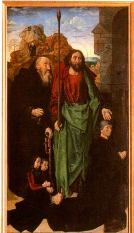

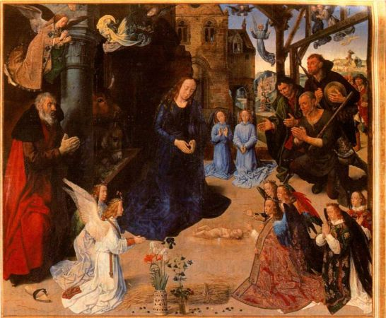

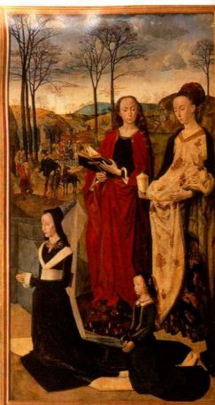

图14\.22 雨果·凡·德·格斯：《波蒂纳里祭坛画》（The Potinari Altarpiece，打开状态）。约1474\-1476年。木板蛋彩与油彩，中央画板为

米；两侧屏各为：2\.5 × 1\.4米。佛罗伦萨乌菲齐美术馆

南尼德兰的木板绘画

宫廷贵族收集珍玩、插图抄本和挂毯之时，中产阶级对于木板绘画的需求继续增长。行走于各国的生意人斥资向雨果·凡·德·格斯（Hugo van derGoes，约1440\-1482年）等佛兰德斯艺术家订制绘画作品，以此来提高他们的财富与声望。格斯曾任根特画家行会会长，1475年作为平信徒修士进入了布鲁塞尔附近的一家修道院，他在那里持续创作，直到1482年去世。这位画家最著名的作品是于1474年前后为美第奇银行在布鲁日的代理创作的巨型祭坛画（图14\.22），订件者用船将该作品运回佛罗伦萨。它宽达3米的中央画板上表现的是圣母、圣约瑟与牧人在伯利恒敬拜新生圣子的场景。两侧屏上的人物是捐赠者的家族成员，包括托马索·波尔蒂纳里（Tommaso Portinari）及其妻子玛丽亚·玛德莱娜·巴隆切利（Maria Madelena Baroncelli）与子女，他们都呈跪姿面向中央图像。开阔的风景将三块画板统一在一起，光秃的树木与冬日的天空表明这里不是圣地耶路撒冷而是佛兰德斯。远处的景物因大气作用而呈现蓝色，空气透视的运用为画面注入了冷色调。格斯以浓烈饱和的色彩绘制风景中的人物与器物，细节极为真实准确。

然而他对风景与人物的写实描绘手法与人物尺寸的变化相矛盾。天使、跪着的波尔蒂纳里家族成员与其他画中人物相比形同侏儒；而两翼上的主保圣人却与中央画板上的圣约瑟、圣母及牧人大小相同。比例的改变与艺术家为人物设置的如画般的背景相抵触。

另外一处明显冲突在于牧人的躁动无序与所有其他人物具有礼仪般的庄重。尽管圣母所坐的位置才是构图上的中心，但这些田野中的人物屏息凝神地盯着刚刚出生的基督，他是身旁所有人目光的焦点。画面中心与人物心理中心的分离、故事人物与真人比例的差别，以及人物姿态的动静有别，所有这些精心设计的对比使得观者在面对画面时产生了不安困惑的反应。

画面背景中是支持主要故事的叙事细节。左侧屏面人物的身后，玛利亚与约瑟正前往伯利恒；右侧屏圣徒身后则是向中央画板中的人物行进的东方三博士。中央画幅上，天使沐浴在自然与超自然的光线里，他们的运动姿态摇摆不定，艺术家在前景中刻意绘制了一朵优美的花卉静物与一捆麦秆。与佛兰德斯绘画中其他大量的现实主义细节相同，它们也具有象征意义。小麦代表圣餐礼中的面饼，花卉则指代圣母的贞洁。波尔蒂纳里在1483年将此三联画运往佛罗伦萨，安放在圣埃吉迪奥救济院（hospital of Sant＇Egidio）的家族礼拜堂中。它表现了捐赠者的艺术品位、财富与虔诚。从意大利画家效仿该作品的情形来看，他们前来观赏它时，对其中的自然主义与对牧者形象的非理想化表现尤为赞赏。

三联画通常为礼仪场合而设计。倘若放置在家居场所，赞助人则会定制小型作品。例如年轻有为的布鲁日市民马丁·范尼乌文霍费（Martin vanNieuwenhove）在1487年向汉斯·梅姆灵订制的作品（图14\.23）就是如此。汉斯·梅姆灵（HansMemling，约1435\-1494年）出生于德国，习艺于布

🟩490 詹森艺术史

2\.19 × 0\.97米。马德

里普拉多博物馆

🔴第十四章 15世纪北部欧洲的艺术创新 491

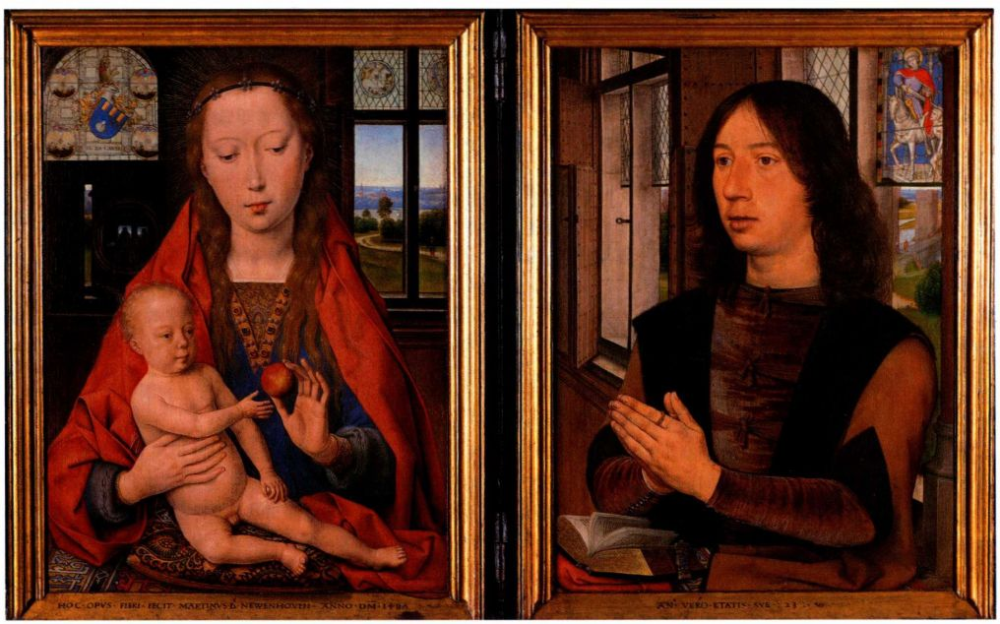

图14\.23 汉斯·梅姆灵：《圣母子》（Madonna and Child），《马丁·范尼乌文霍费双联画》（Diptych of Martin ran Nieuwenhove）左侧屏。1487年。木板绘画，44 × 33厘米。布鲁日市圣让救济院（Sint\-Jans Hospital）布鲁日博物馆（Musea Brugge）中的汉斯·梅姆灵分馆

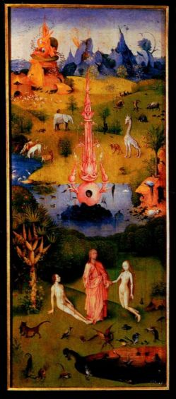

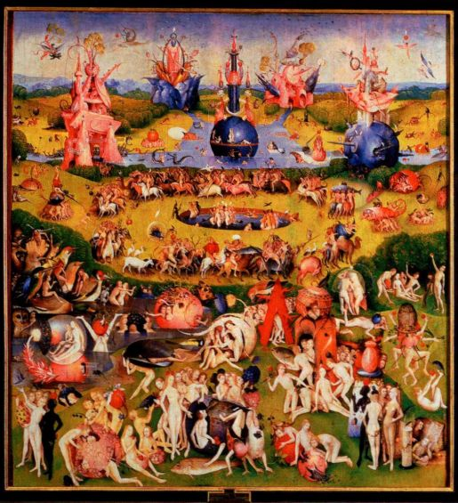

图14\.24 希罗涅缪斯·博斯：《尘世乐园》。约1480\-1515年。木板油画，中央画板为

2 \. 1 9 川\.94米；两侧屏各为：

原始文献

弗雷·何塞·德·锡古恩萨（1544？\-1606年）

出自《圣杰罗姆会史》（The History of the Order of St\.Jerome\)

希罗涅缪斯·博斯的作品被西班牙国王菲利普二世（1556\-1598年在位）收藏并展示在他位于马德里附近的埃斯科里亚尔宫（Escorial）中，锡古恩萨曾是宫中的图书管理员。解读博斯的作品在当时与现今一样困难，也引发了许多分歧。在下面这段文字中，锡古恩萨尝试阐释我们称为《尘世乐园》（图14\.24）的作品。

在德国与佛兰德斯绘画中······一位名叫杰罗尼莫·博斯（Geronimo Bosch）的画家的作品在这里有很多。我想就他多写几句，原因如下：首先，因为他创造力之伟大值得人们的关注；其次，虽然人们将他的作品嗤之以荒谬，但其实他们对他的作品所察甚少；最后，因为我认为这些人将博斯的作品视为受异教玷染之作的说法毫无道理······

在我看来，此人的画作与其他人的不同在于，其他人尽力按照人的外在样貌来描绘人，而他却敢于描绘人的内心······

这幅作品基本的题材是花朵与我们称之为草莓的水果······为了让人理解他的想法，我将按照他的条理来详细进行解释。该作品包括较小的两块侧屏与较大的中屏画，两块侧屏可以像门板一样合拢遮住中央部分。第一块画板上画的是上帝造人，表现上帝如何将人放入无忧无虑的天堂······上帝如何为了考验他的忠诚与信仰，命令他不得摘食树上的果实，以及后来魔鬼如何化身为蛇欺骗了他。以致他违背了上

鲁日，他以维登与扬·凡·爱克的风格为基础，形成了自己的优雅风格，并以此获得了来自全欧洲的委托。布鲁日的意大利人对他的画坊尤为推崇，不断预订作品，本地人如范尼乌文霍费等也是如此。这幅双联画的画框上有一段题字标明了赞助人的身份与年龄，画面中他时髦的长袍与镀金边的祈祷书则显示了他的社会地位。身后彩色玻璃窗画上是他的主保圣人圣马丁。年轻的赞助人的目光望向左画板上的圣母子。圣母子身后的窗户上绘有范尼乌文霍费家族的纹章，这暗示圣母子降临在他的家中。该意念在后方镜面的反射中进一步得到了表达，艺术家将圣母子与马丁·范尼乌文霍费都映现在镜像之中。这里梅姆灵借鉴了扬·凡·爱克在《阿诺尔菲尼夫妇像》（见图14\.16）中的凸透镜，将双联画的两部分结合为一个整体。

梅姆灵的作品显示出肖像画创作中的新趋势，即在描绘人物特征之余，他还为人物创造了所处的环境。通向天国之路一直是凡人念念不忘的话题，在这间明亮的房间里，马丁·范尼乌文霍费一直呈跪姿，祈祷不止，以此表现他的虔诚。但同时这又是一幅自我宣

帝的律法，被逐出天堂，并被剥夺了造人时所赋予他的高贵与尊严······此处（显示）的千般幻象与图景都是对人的警告······

在较大的中屏画上，他绘制了人被逐出天堂进入世间之后的追求，表现了他对荣耀的追逐，而其实所谓的荣耀不过是干草或麦秆，是不结果的树，转天就会被投入炉火之中·······由此揭示了生命的本质，暴露出这些因罪受罚的子孙们的行为与想法，他们忘记了上帝的命令······追求肉体的享乐······

在画中，我们能够找到无数出自《圣经》章节、描述人类罪恶的图像，它们的描绘栩栩如生、清晰逼真······驯顺、狂野、凶猛、懒惰、精明、残酷、嗜血的驮兽与骑兽表达了讽喻或隐喻的意义······这里还展示了毕达哥拉斯（Pythagoras）、柏拉图以及其他诗人的灵魂轮回······以此向我们表明人类遮蔽其凄惨灵魂的丑恶习性、衣着服饰、脾气秉性，或者阴郁邪恶，骄傲者变身为狮子，复仇者变身为老虎，淫欲者变身为骡马与猪，暴虐者变身为鱼，虚荣者变身为孔雀，狡诈者变身为狐狸，贪食者变身为猿与狼，无情者与邪恶者变身为驴，愚蠢者变身为绵羊，轻狂者变身为山羊······

人对这里切实描绘的人类内心活动的观察中必定获益良多······他会在最后一块画板上看到人类悲惨的结局与其追求的最终结果：痛苦、努力······以及短暂的享乐如何转变为永恒的惩罚，尊严尽失，永无希望。

SOURCE:BOSCH IN PERSPECTIVE, ED\.JAMES SNYDER\.\(NY:SIMON AND SCHUSTER,1973\)

传的作品，因为其中出现了众多赞助人的器物，它们都是对他的自信与社会地位的展示。

北尼德兰

15世纪早期画家们的创新迅速传播到了北尼德兰（今荷兰），此地后来诞生了15世纪最著名的绘画作品之一：希罗涅缪斯·博斯的《尘世乐园》（The Garden of Earthly Delights，图14\.24）。博斯（Hieronymous Bosch，约1450\-1516年）出身于绘画世家，终生都在总督府所在地斯海尔托亨博斯（＇sHertogenbosch）度过，他的艺术声誉也在此地建立。博斯的作品获得了勃艮第公爵的赞助，并被西班牙国王菲利普二世在16世纪时收藏。弗雷·何塞·德·锡古恩萨（Fray José de Sigüenza）正是在菲利普二世的藏品中看到了博斯的画作（见本页的原始文献）。锡古恩萨的记录一直是解读这一令人惊叹的复杂画作的重要文献，这幅画作的主题与意义后来曾引发了激烈的争论。

《尘世乐园》分为三联，表现的是人类在自然界

🟩492 詹森艺术史

中的场景。连贯的风景将三部分统一成一个整体，高起的地平线与空气透视表明这是一幅从天国之上、全知全能的角度俯瞰人世的深景图。绿色调团块所营造的起伏地势中分布着灌木丛与水流。人类与其他细小生物挤满了画面各个角落，间或出现奇石等物体。左侧屏表现的似乎是伊甸园中的场景，上帝将亚当介绍给新创造的夏娃。虚幻的风景中到处是动物，其中包括大象、长颈鹿等异域物种，还有各种稀奇古怪的杂交怪兽。中央画板上，小小的人物嬉闹在巨型水果、鸟类等其他生物之中。中景里的人物骑着各种兽类环绕中央的水池进行游行。许多人与巨鸟、水果、花朵或海洋生物交合。右侧屏描绘的是下界，可能是地狱场景，混种怪兽按照各人所犯的罪而惩罚折磨渺小的人类。然而在两侧屏背面，艺术家画了一个巨型水晶球，球中陆地正从洪水中升起，上帝在天堂俯视着一切。

尽管该作品采用了三联画形式，但它并非传统的祭坛画，而是一件世俗作品。它曾经属于拿骚伯爵亨利三世（Count Henry III of Nassau），安放在他位于布鲁塞尔的宫殿之中，根据记载，这幅作品创作于1517年，然而近期的研究表明它的创作年代可能更早，是在1480年。对该画的解读众说纷纭，有人认为它表现的是诺亚时代的场景，因为该三联画外侧绘有大洪水的图像；有人认为成群的裸体表现的是异教团体崇尚自由之爱的观点；还有人认为右侧屏的下界场景

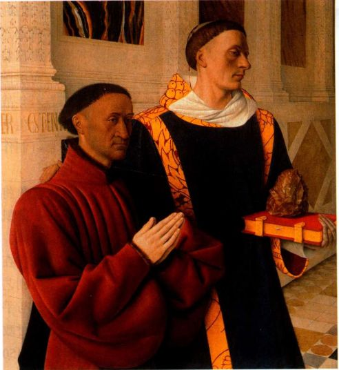

图14\.25 让·富凯：《艾蒂安·谢瓦里埃与圣司提反》（ÉtienneChevalier and St．Stephen），《默伦双联画》左侧屏。约1450年。木板油画，		92\.7 × 85厘米。柏林国家博物馆画廊

大事年表

1455年\-玫瑰战争在英格兰爆发

1477年\-勃艮第公爵大胆查理战死沙场

1483年\-《波尔蒂纳里祭坛画》抵达佛罗伦萨

1488年\-佛兰德斯市民揭竿而起，反抗马克西米连一世

寓意着对肉欲之罪的道德谴责。

这些解释都表明博斯是一位相信人类已经堕落的悲观主义者。这正是何塞·德·锡古恩萨描述该作品的方式，尽管在行文里，他也提出了画面具有若干“讽喻与隐喻”。然而画作本身绘制的非常优美，如同中屏画中部池塘中的塞壬一样魅惑诱人。这幅人类活动的全景图描绘得细致入微，甚至赋予了某种单纯甚至诗意的美，精心表达出对其中人类行为的谴责之外的其他意味。如此的矛盾交织促生了大量的解释方式，近期甚至有一种解释认为这里描绘的是另一种历史景象，即亚当与夏娃没有犯下原罪，因此人类继续生活在单纯无知的状态之中。

也许对这幅画最为系统的解释是将画作与炼金术联系在一起，将炼金术作为救赎的象征。众多奇形怪状、体量超大的形体暗指炼金术所用的工具与容器，这一活动也是中世纪人们认识世界的方法之一。炼金过程需经历四个阶段：第一阶段为联合或混合，亚当与夏娃的结合即为这一过程的隐喻；第二阶段为发酵

图14\.26 让·富凯：《圣母子》（Madonna and Child），《默伦双联画》右侧屏。约1450年。木板油画，93 × 85厘米。比利时安特卫普市皇家美术馆（Koninklijk Museum Voor Schone Kunsten，Antwerpen Belgie）

🔴第十四章 15世纪北部欧洲的艺术创新 493

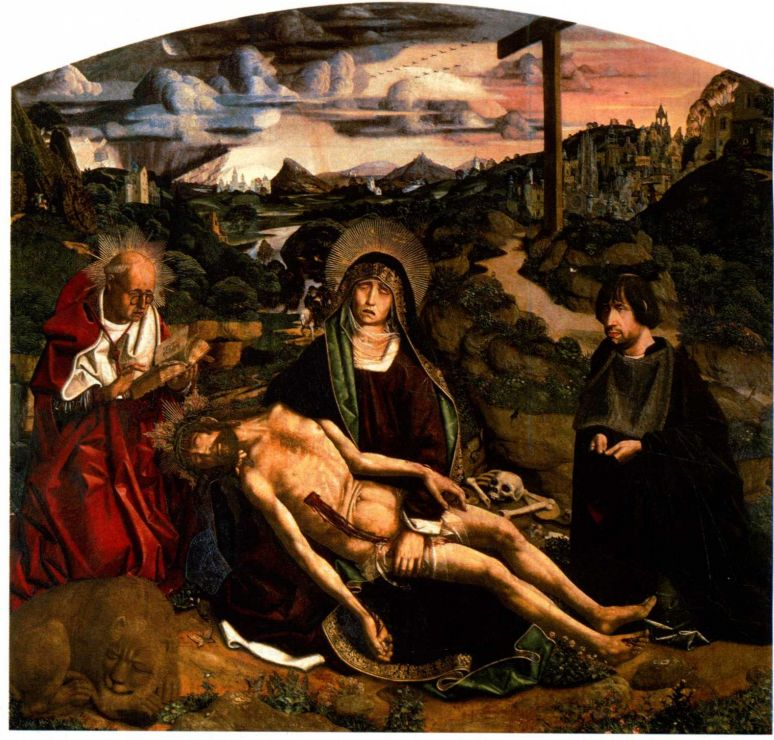

图14\.27 巴托洛梅·贝尔梅约：《圣母哀子图》。1490年。木板画，1 89 × 1 75厘米（包括画框）。巴塞

罗那大教堂

\(child's play\)，指加热不同成分使其发酵的缓慢过程，即中屏画中的景象；第三阶段为分解，即焚烧物质，这与右侧屏的地狱场景相对应；最后阶段为物质的提纯，表现为三联画外侧的画作。博斯的妻子是一位药剂师的女儿，他因此有意地运用炼金术作为视觉象征来创造自然进程中令人难以忘怀的一瞬。

早期尼德兰风格对各地区的影响

欧洲很多地区的艺术家都对罗伯特·康平与扬·凡·爱克一代画家在形式与技法方面所取得的成就作出了响应。各地的反应因其传统与品位而各不相同，但同尼德兰一样，赞助人纷纷认为新风格中的自然主义对实现他们的宗教与社会目的有帮助。法国、西班牙与中欧国家都各自产生了这一新风格为基础的变体。

法国

法国与勃艮第公爵治下的尼德兰不仅地理位置邻近，而且在贸易、语言和政治关系上都具有密切联系，

这促进了绘画技法的创新与新风格在法国全境的传播。法国艺术家或者游历于佛兰德斯各个城市，或者通过效仿维登与格斯的画面效果，发展出具有他们自己特色的自然主义风格（见图14\.18、14\.22）。然而法国艺术也有自己的特色与传统。15世纪上半叶，百年战争所引发的动荡影响了人们在艺术方面的花费。生活在因战事而满目疮痍的城市中的市民几乎不再订制作品，但教会与宫廷早先的赞助形式仍继续保持。

法国国王查理七世（Charles VII）在百年战争将尽之时确立了他的统治，随后任命图尔的让·富凯（Jean Fouquet，约1420\-1481年）为他的宫廷画家。让·富凯既是书籍插图画家，也是木板画家，他曾在1445年前后前往意大利，在那里学习到当时意大利艺术的一些创新之处。然而他的作品在技法、色彩与手法上，更多地受尼德兰风格的影响。查理七世的财政大臣艾蒂安·谢瓦里埃（Étienne Chevalier）在1450年前后向富凯订制了一幅双联画，该作品称为《默伦双联画》（Melun Diptych，图14\.25、14\.26），表现的是这位财务大臣及其主保圣人司提反身处圣母子近

🟩494 詹森艺术史

et d＇Histoire），编号1843\.11

🔴第十四章 15世纪北部欧洲的艺术创新 495

旁的场景。与其同辈的佛兰德斯画家相同，富凯描绘了身着皮毛镶边大氅的赞助人那独特的相貌特征。圣司提反手托书籍与殉教时击打他的石头，他的面容看起来同赞助人几乎一样真实。

他们所在的房间铺着大理石地板，墙上受古代风格影响的半露方柱间装饰有大理石嵌板，墙壁与地板都向后延伸，以突出空间感。两位男子的目光穿过画框，望向宝座上的圣母子。依据一项古老的传说，这里的圣母像是一幅肖像，采用的是查理七世的情人阿涅丝·索蕾尔（Agnès Sorel）的形象。倘若真是如此，这幅画表现的就是一位宫廷美妇人，其风采与头戴王冠恰如天后、为唱诗班天使所环侍。富凯刻意频繁营造出天国与人世的对比。左画板画面中具有深度的空间与右画板截然不同，极为生动，后者的画面呈向上升起的三角形，活跃的红蓝两色天使衬托着用冷色调表现的圣母子。与当时的佛兰德斯画家不同，富凯对表现对象特定的质感并不感兴趣，他强调作品中的细

节应从属于画面整体，应按几何结构来组织构图，表现理性而非情绪。

西班牙

15世纪时，尼德兰艺术中的自然主义在伊比利亚半岛引起了强烈的反响。艺术家们往返于佛兰德斯与西班牙之间，贸易、外交与王室联姻将卡斯蒂尔\-阿拉贡联合王国同佛兰德斯日益紧密地联系在一起。这些联系也体现在佛兰德斯出口到西班牙的艺术作品以及西班牙艺术家在本土所创作的作品之中。

西班牙艺术家阐释佛兰德斯自然主义的一幅力作是巴托洛梅·贝尔梅约（Bartolome Bermejo，约1440\-1500年）于1490年为巴塞罗那大教堂执事所绘制的《圣母哀子图》（Pietà，图14\.27）。贝尔梅约出生于科尔多瓦，但他曾在西班牙各地创作过，并且可能在布鲁日学过艺。他的《圣母哀子图》将因儿子死亡而悲痛不已的圣母安置在昏暗且具有空气氛围

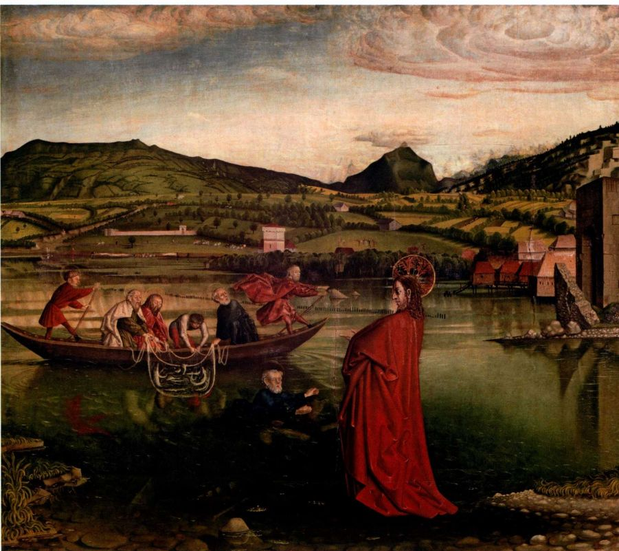

图14\.28 康拉德·维茨：《捕鱼的神迹》。1444年。木板油画，

129 \.5 × 154 \.9厘米。瑞士日内瓦艺术与历史博物馆（Musée d＇Art

原始文献

节选自《圣沃尔夫冈祭坛》合同

米夏埃尔·帕赫用了十年时间（1471\-1481年）来为圣沃尔夫冈朝圣教堂完成这件复杂精美的祭坛作品，它至今仍保存在最初的位置。

下一方是极受尊敬的本笃会蒙德湖（Mondsee）修道院院文是订制圣沃尔夫冈祭坛作品的契约与合同，签约的长及其修道院，另一方是布鲁尼科（Brunico）画师米夏埃尔，合约签订于1471年圣露西日（St．Lucy＇sday）。

条款一：祭坛的立面、设计与尺寸必须严格符合画家向蒙德湖修道院所呈递的方案；

条款二：圣台龛内部必须镀金，人物必须包括呈坐姿且怀抱圣子的圣母、约瑟以及携带礼物的东方三贤。如果这些人物不够充满圣台龛，他必须制作更多人像或身着铠甲的士兵，人物必须全部镀金；

条款三：主圣龛必须表现加冕的圣母与天使形象，人物衣着要镀金，画家要尽其所能，达到他最高的水平；

条款四：一边要有圣沃尔夫冈，须头戴主教法冠，一手持牧杖，一手托教堂，配有短柄斧，另一边要有圣本笃，须

的背景之中，空荡荡的十字架是这一场景的主体。与乔托不同，画中并没有安排那群画面叙事所必不可少的哀悼者（见图13\.21），画面中，圣母与基督左侧是圣杰罗姆，狮子是其象征，右侧是大教堂执事的肖像。这样一来，尽管人物与风景在细节上的精确源自佛兰德斯的典范，该主题严格的叙事背景反而弱化，不再是类似《勒特根圣母哀子像》（见图12\.56）那样的对观圣像。与富凯的冷静理性不同，贝尔梅约的作品具有高度的情感与表现力。

中部欧洲

由于与尼德兰有贸易与政治上的联系，中部欧洲的艺术家与赞助人也接纳了这种新风格，在莱茵河沿岸的城市中尤为如此（见地图14\.1）。代表艺术家是康拉德·维茨（Conrad Witz，1400／10\-1445／46年）， 在巴塞尔宗教会议结束时，他成为了巴塞尔的市民以及该城画家行会的画师。此次宗教会议从1431年持续到1434年，讨论到底是教皇一人还是主教理事会享有解释教义的权力。这些具有争议的问题在康拉德·维茨于1444年为日内瓦主教所绘的画作中也有体现，这是一组为圣彼得大教堂（Cathedral of Saint Peter）创作的画。

这组木板油画表现的是圣彼得的生平故事，包括《捕鱼的神迹》（The Miraculous Draught of Fishes， 图14\.28）。画面中基督召唤彼得徒步穿越加利利海

头戴修士帽，手持牧杖和圆底杯；通体镀金，必要处镀银；

条款五：祭坛两侧必须制作身穿精美铠甲的圣弗洛里安（St\.Florian）和圣乔治，必要处镀金银；

条款六：两翼内侧必须绘有精良的画作，板面必须镀金并装设山墙饰和小尖塔，表现四个主题，每一个······

条款七：祭坛合拢时显露的两翼外侧必须用优质颜料来绘画，颜料中要掺金粉，主题为圣沃尔夫冈生平故事······

条款八：艺术家Michael在圣沃尔夫冈制作并安装祭坛期间，我们必须为他提供饮食，以及安装祭坛所需的铁器等各种必要的工具，并在安装时提供一切必要的帮助；

条款九：本合约定价为1,200个匈牙利盾（Hungarianguilders）或杜卡特金币（ducats）；

条款十：如果双方中任一方认为祭坛价值不足或超过这一数字，且经过协商无法达成一致，双方有权各自选择数目相同的专家仲裁。

SOURCE:NORTHERN RENAISSANCE ART 1400\-1600:SOURCES AND DOCUMENTS\. ED\.WOLFGANG STECHOW\.\(EVANSTON,IL:NORTHWESTERN UNIVERSITY PRESS\. 1989\)

跟从他。造型坚实的基督形象是右侧构图的主体，部分原因是因为他红色的外袍与绘画整体的绿色基调形成了鲜明的对比。画中彼得的形象出现了两次，一次出现在船上被称为“渔人”的众使徒之中，第二次出现是在水里，基督似乎漂浮在水面之上，而彼得却沉入水中。作品的技法与风格虽然在很大程度上取自佛兰德斯艺术家，但维茨将他的注意力集中在风景方面。他用日内瓦湖替代了加利利海，突出了本地的地貌特征，基督头顶与众不同的山峦也是如此。画家精确描绘了水面的每一处倒影，我们甚至可以看到前景中的湖底，还可以看到远景中湖面波纹的荡漾。维茨将过去的历史事件安置在当下的背景里。彼得沉入水中的状态说明他需要救助，这或许就是暗示主教支持理事会有权进谏教皇（彼得之绝对权威）的证据。

保存在最初位置的祭坛作品 维茨的画作本是一件祭坛作品的侧屏，当时众多此类作品的中央部分或主体（corpus）均为雕塑。在德语地区，此种雕刻通常为工艺复杂的巨型木雕。16世纪的新教改革者们破坏了大量宗教绘画与雕刻，因此那个时代能够遗留至今的祭坛作品实属罕见。蒂罗尔（Tyrolean）雕刻家兼画家米夏埃尔·帕赫（Michael Pacher，约1435\-1498年）所创作的《圣沃尔夫冈祭坛》（St．Wolfgang Altarpiece，图14\.29）之所以非比寻常，一方面在于其宏大的规模，另一方面则是因为它仍保存在最初安置的环境之中。

🟩496 詹森艺术史

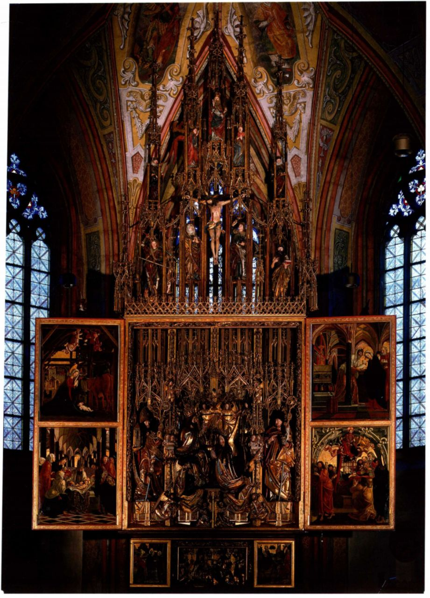

图14\.29 米夏埃尔·帕赫：《圣沃尔夫冈祭坛》。1471\-1481年。木雕，人像为真人尺寸；两侧屏为木板油画。奥地利圣沃尔夫冈教堂

🔴第十四章 15世纪北部欧洲的艺术创新 497

版面

版画是大量复制同一图像的技术。15世纪，尽管某些也

采用羊皮纸印制，但大多数印刷品都是将黑墨水印在

纸张上。版画工人运用多种技法印制图像，最普遍的类型是

凸版印刷（relief print）和凹版印刷（intaglio），前者雕刻时

要去掉白底，只留下需要印制的线条；后者

这种技术也遇到困难。到15世纪50年代为止，这个问题因出现了制模浇铸的金属活字而得到解决，现代书籍印刷术就在此时登上了历史舞台，直到20世纪末仍被广泛采用。因为文字为凸版印刷，与之相配的图像显然也应该采用同样的方法印刷，这样才能在印刷机上一次性地将母

则在印版上刻入需要印刷的线条。印刷时翻

印在纸张上的图像与文字实际上是原有图案

的反像。到1500年时，印刷术的发展使得

以多种方法来复制图像成为可能，这些方法

是与活字印刷同时发展起来的。

木刻（woodcut）：木刻中运用的手法是减地浮雕，因此印制出来的是版面突起部分所呈现的图像。线条之间间隔愈小雕刻难度就愈大，所以这一阶段的工作往往由专业技师来完成。早期的木刻上常有题词，但是在木板上雕刻反向的凸版文字想必风险很大，稍一疏忽整页雕刻就会前功尽弃。于是，很

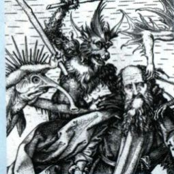

顺高尔的《圣安东尼的诱惑》局部，

版画，见图14\.32

版（matix）上的所有信息都印在纸上。

雕版（engraving）：雕版技法是在金属表面刻划图画作为装饰的技法，它出现于古典时期（见图6\.20），整个中世纪都有所采用（见图10\.2）。金匠与盔甲设计者对这种技艺的运用尤为擅长，金匠可以运用这些技巧将金属板加以雕刻，制作成为可供印刷之用的母版。由于雕刻的图案凹入金属板之中，因此设计中就能够加入线描成分。在雕版中，V型的线条开槽用一种名为雕版刀（burin）的特殊雕刻刀完成，铜版是最常用的版型，因为铜的材质相对较软，易于雕刻。印刷时，

自然印刷工人很快就想到了分别雕刻每个字母的单独模板这一办法。手工雕刻的较大木活字十分方便，但雕刻小活字的情形却另当别论，而在印刷像《圣经》这样的长篇巨著时，

订制该作品的修道院长与艺术家所签署的合同保留至今，其中明确规定了作品的主题、运用的材料与工艺要求（见第496页的原始文献）。这是当时委托艺术家制作昂贵作品的标准合同样式。

与扬·凡·爱克创作的《根特祭坛画》大致一样，帕赫也创作了一幅描述天堂的图景：雕刻主体表现的是圣母加冕为天后的场景，她身旁围绕着修道院的诸位主保圣人。雕刻家采用了材质较软的木材，以便刻出较深的皱褶与突出的边缘。这件镀金兼施彩绘的华丽作品从火焰哥特式华盖投下的阴影中显现之时，简直令人眼花缭乱。中屏上的人物与背景仿佛融为扭曲的线条图案，只容许人像的头部作为独立元素显现出来。

在作品主体中占主导地位的是复杂工艺与装饰，它们同两侧屏内侧表现圣母生平的画作形成鲜明对比。艺术家在此处将人物描绘得很高大，为他们提供了具有深度的空间，明亮的光线发挥着重要的造型功能。他把观众的视点也考虑在内，因此上部的画面采用了仰视角度。此类透视法想必是受到当时意大利绘画进展的启发。几乎可以肯定帕赫曾越过阿尔卑斯山脉到过意大利北部，他在当地曾接受过若干订单，因此也学习了设计空间的新技法（比较他与曼泰尼亚的透视法，见图15\.53）。不过，这种透视法只出现在

先将墨水灌入刻刀刻出的开槽之中，之后再擦去雕版表面多余的墨水，再将潮湿的纸张覆在它上面，经过印刷机的印压，墨水就被吸到纸上，从而印出图形。

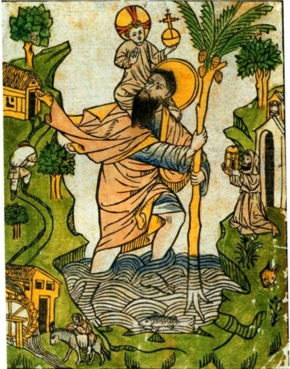

nftofon fanan me quanuno tms:\- mlldmio ccc°

图14\.30 《布克斯海姆的圣克里斯托弗》。1423年。木刻，

28 \.9 × 20\. 6厘米。John Rylands大学博物馆

🟩498 詹森艺术史

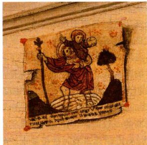

图14\.31《圣克里斯托弗木刻》，罗伯特·康平（？）的《圣母领报》局部。约1435年。比利时皇家美术馆（Musées Royaux de Beaux\-Artsde Belgique\),Inv\.3937

侧屏，然而过去的事件却被置于类似当时奥地利的地域之中。例如举行割礼的圣庙具有与晚期哥特式教堂极其相似的拱顶。与中央部分的天国景象相比，帕克使得两侧屏中的历史场景具有更明显的世俗感。

印刷与版画艺术

随着15世纪绘画技法的创新，这时的欧洲又发展出版画这一新的艺术形式。活字与印刷术的发明将为后来西方文明的发展带来不可估量的影响。传统上认为活字印刷术的发明归功于约翰·谷登堡（JohannGutenberg，约1397\-1468年），但实际上印刷技术的源头要追溯到5000年前的近东地区。苏美尔人是最早的“印刷者”，因为他们曾雕刻石印，在陶土上加盖图像与文字（见图2\.11）。印章的使用从美索不达米亚传播到印度，最终传入中国。中国人在印章上涂上墨，以便在木材或丝绸上盖印，他们又在公元2世纪发明了纸。到9世纪，中国人已经在使用凸版浮雕来印刷图像与书籍，200年之后，他们又发明了活字印刷术。一些中国印刷品可能经由伊斯兰人传到了中世纪时的西方。

造纸术也同样通过与伊斯兰地区的联系而进入欧洲，然而纸作为羊皮纸的廉价替代品，它的普及是一个非常缓慢的过程。虽然中世纪晚期欧洲也有木板印刷品，但它的运用只限于印制织物上的装饰图案。将近100年之后，惊人的进展出现了，此时的印刷术能够印制几百本同一版本的相对廉价的书籍。这一新技术迅速传遍欧洲，新的书籍印刷业由此产生。印刷书籍较之手工抄本便宜很多，但对于不识字的人而言它们毫无价值。社会底层人士的教育水平开始提高，这种变化随后将对西方文明造成深刻的影响。为了与彩

大事年表

1444年\-维茨创作《捕鱼的神迹》

1469年\-阿拉贡的费迪南德与卡斯蒂尔的伊莎贝拉联姻

1486年\-哈布斯堡家族的马克西米连成为神圣罗马帝国皇帝

1492年\-西班牙征服穆斯林王国格拉纳达

饰手抄本竞争，印刷书籍中也印制有图像，但通常以手工上色，模仿的也是价格昂贵的手抄本。最终，印刷书籍几乎完全取代了彩饰手抄本。

印刷书籍中图文并茂的情况在其产生之初就有。14世纪晚期，欧洲出现了将图案设计雕刻在木板上，再涂以墨水印制于纸张上的工艺。今天，此类印刷品中的存世作品被称为木刻（woodcut），它们出自当时的法国、尼德兰和德国。图案设计可能出自画家或雕刻家之手，但在木板上进行实际雕刻的却是另外的专业工匠（关于印刷图像与书籍的各种技巧，见第498页的材料与技法）。

《布克斯海姆的圣克里斯托弗》（Buxheim SaintChrstopher，图14\.30）是一件有纪年的早期木刻作品，名称来自其收藏地，德国南部一座小城的修道院。这件手工上色的单页木刻画上，印有1423年的字样以

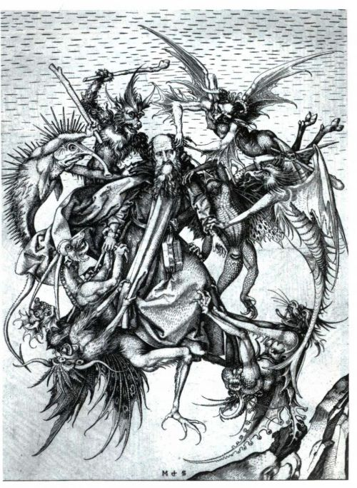

图14\.32 马丁·顺高尔《圣安东尼的诱惑》约1480\-1490年。雕版画，

29\.2 × 2 1\.9厘米。纽约大都会艺术博物馆，Rogers基金，1920年

🔴第十四章 15世纪北部欧洲的艺术创新 499

大事年表

约1250年\-欧洲出现造纸厂

约1455年\-谷登堡在德国美因茨印刷《圣经》

约1476年\-威廉·卡克斯顿在英格兰制造印刷机

约1480年\-马丁·顺高尔创作《圣安东尼的诱惑》

及一段向圣徒祈祷的文字。此类图文并置的木刻作品过去有时被集结成册，编成通俗的图画书，称为印版图书（block books）。在这件印刷品中，简单粗重的线条塑造着印刷形体以及人物那下垂的衣袍和各种物体的轮廓。平行排列的垂直线称为影线（hatching），用以表现阴影或物体的质感，但是构图本身具有严格的平面特征，图中的风景部分沿页面两侧升起，围绕着中央的人物。根据传说，克里斯托弗是渡人过河的巨人，某天一个孩子的体重让他大为吃惊，结果发现这个孩子就是基督。克里斯托弗这个名字就出自他与基督（Christ）会面的典故。

《布克斯海姆的圣克里斯托弗》中的艺术形式受哥特式风格影响很大，但这些印刷品的观赏者并不是中世纪的贵族。15世纪的木刻作品是一种大众艺术。

一块模板就能够印制出上千份复制品，每幅仅售几分钱，这使得在历史上首次出现了几乎任何人都可以拥有属于自己的图画的情况。图14\.31为某幅佛兰德斯板面绘画《圣母领报》的局部，它显示了当时人们如何使用这样的印刷品。一张近似《布克斯海姆的圣克里斯托弗》的印刷品被钉在了一个普通家庭的墙壁上。

雕版（engraving）自其发展之初，针对的就是受教育水平较高的少数人群。存世年代最为久远的雕版画作于15世纪30年代，当时已经显示出佛兰德斯画家的影响。早期的雕版画家通常都接受金匠的艺术训练，但他们的作品却反映的是当地的绘画风格。作品中的形式具有对称感，其中运用了精细的影线，并且常常呈现出逼真的透视效果，即便是最早的雕版作品也展示出多种不同的风格。当时，雕版画家会在作品中刻入自己的姓名缩写和年代。因此15世纪晚期许多雕版画家的姓名留存至今。

科尔马与巴塞尔的印刷中心

德国科尔马（Colmar）的马丁·顺高尔（MartinSchongauer，约1435／50\-1491年）师从其父学习过

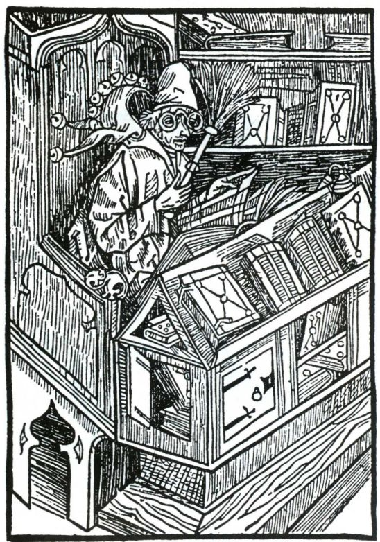

图14\.33 木刻作品《书房中的学者》（Scholar in Study），出

自塞巴斯蒂安·布兰特的《愚人船》。1494年出版于巴塞尔

🟩500 詹森艺术史

金匠技巧，但他在日后成为了一名版画家和画家。他曾研习过罗杰·凡·德·维登的画作，这可能对他的雕版画风格产生了影响。他的作品中复杂的设计、空间的深邃和质感的丰富使其堪与木板绘画相媲美。他的作品也为某些艺术家创作大型绘画提供了灵感，同时也成为其他版画制作者效仿的模本。《圣安东尼的诱惑》（The Temptation of St．Anthony，图14\.32）是顺高尔最著名的作品之一，它在16世纪时的意大利为人所熟知并备受推崇。这张版画表现的是圣安东尼抗拒魔鬼故事的高潮部分。魔鬼发现无法诱其犯罪，就派遣恶魔来折磨他。作品展示出大范围的亮度变化，它的线条具有韵律感，艺术家通过刻痕类型的变化，生动地描绘了刺、鳞、羽、毛等每一种东西的质感。

自维茨的时代以来，瑞士的巴塞尔就一直引进印刷书籍的新技术，并逐渐成为重要的出版中心。一群具有改革思想的学者与作家撰写供出版印刷的文本，平面艺术家则为这些文本提供木版雕刻。塞巴斯蒂安·布兰特（Sebastian Brant）的讽刺文学作品《愚人船》（Ship of Fools）是当时最畅销的作品之一，该书于1494年出版于此地。布兰特在作品中讽刺了他所观察到的当时社会中的众多弊病，正如标题所示，他把那时的社会看作由愚人所驾驶的航船。书中探讨到的一个重要问题是当时人们对教会的不满。当1517年维滕贝格市（Wittenberg）张贴出路德对教会的批判时（见第632页），反对僧侣阶层的情绪已然成为社会浪潮。但如在图14\.33中所见，布兰特嘲讽的目光也落在他所属的文人群体上。画中一位学者在书房中为大量书籍所包围，但他并不是在阅读这些书籍，而是拿着掸子掸去书上的灰尘。他的服饰以及风帽上的铃铛都暗指这是一个傻子。与《布克斯海姆的圣克里斯托弗》相比，创作该作品的那位佚名艺术家加大了影线的密度，以表现图中人与物的质感与体量，并尝试为形式创造空间背景。木刻因其自成一格的审美习惯致使彩色印刷的发展最终半途而废。

小结

虽然所有的艺术都以过去为基础，但15世纪的北部欧洲艺术却与其之前的艺术有着深刻的不同。除了贵族们喜爱的哥特风格的书籍与珍玩，油画这种新艺术形式也在诞生之中。罗伯特·康平、扬·凡·爱克和罗杰·凡·德·维登的作品之所以出类拔萃不是因其材料的珍贵，而是因为这些画家所采用的技法记录了自然，以此强化了观者的精神体验。这些艺术

家们在视觉艺术中开拓的创新传遍北部欧洲，并对多种不同的艺术类型产生了影响。如果我们将北部欧洲的15世纪看作是一个文化艺术繁荣发展、并且对未来影响深远的时期，那就是“文艺复兴”。

宫廷艺术：国际哥特式

国际哥特式对宫廷最具吸引力，它脱胎自法国哥特式风格，并且融合了欧洲其他地区的风格特征。这些贵族赞助人订制的奢华作品虽然以哥特式艺术传统为基础，但其中也流露着自然主义细节。它们为精英阶层而作，因此通常包含着复杂深奥的意象。赞助人之间的超越国家和地域的社会关系也将这一风格推广至欧洲各国宫廷。

中心城市与新艺术

相形之下，南尼德兰中心城市的艺术家们所创造的用以记录自然世界、创造宗教图像的技法与风格，更多的是直接面对中产阶级赞助人。创作这些作品的材料不过只是木材与油画颜料，但其中的宗教人物酷似常人，其身体具有质感与重量感，生动地表达着人类情感。肖像画则极其精确地描绘了赞助人的面部特征。背景或衣袍的细节不仅增强了图像的现实主义效果，同时还赋予它象征意味。

15世纪晚期的尼德兰艺术

这种新的绘画风格很快传遍尼德兰，并在1500年左右对从事手抄本、挂毯、雕塑等其他类型创作的艺术家产生了影响。尽管各国宫廷仍然对奢华艺术品青睐有加，但绘画的艺术地位和赞助人数量都在增长。来往于各国的商人所购买的画作中，画中将赞助人与神圣人物描绘得关系亲近。这些作品既表达着赞助人的虔诚，也昭示着他们的社会抱负。

早期尼德兰风格对各地区的影响

欧洲其他地区的艺术家们吸收了尼德兰绘画艺术的技法及其风格上的创新。法国人将这种自然主义风格融入他们所偏好的几何秩序与清晰结构，营造出庄严肃穆的图像，而西班牙艺术家则造就了更为活泼、更富表现力的作品。中欧艺术家将自然主义风格拓展开来，把当地特定的环境作为神圣故事的背景，使得宗教教义更能接近观者。

印刷与版画艺术

诞生于北部欧洲的新型印刷技术促进了尼德兰自然主义风格各种变体的传播。早期的木刻与雕版借鉴了源自绘画的题材与构图方式，将之转化为严格的线条因素。不过，到了15世纪末，版画创作者已经能够创作技艺精湛、堪与自然主义绘画相媲美的新颖作品。