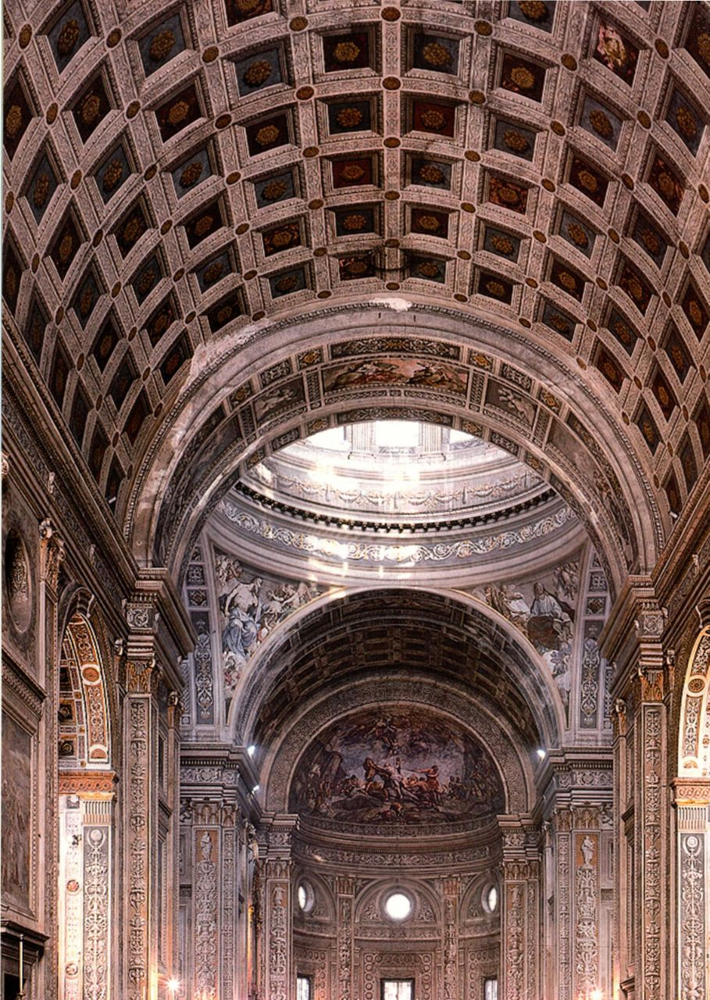

第十五章 15世纪意大利的早期文艺复兴

无论是13世纪时在巴黎撰写法国史的学者，还是14世纪时在布鲁日拟订合同

的公证人，他们都不会想到自己生活在“中”世纪，而只会认为他们的时代

是古代的延续。但是，15世纪的意大利知识分子认为自己生活在与之前几个

世纪截然不同的“新”时代。对历史差异的自觉将15、16世纪的思想家同其

前辈们区分开来。这些思想家贬低古罗马之后的时代，即中世纪，并认为通过复兴古代文化，

即希腊罗马文化中最优秀的特色，就能够提升自己的文化。这些人复兴文化的努力始于15世纪的意大利，开创了欧洲历史上一次意义重大的文化繁荣局面。

这一时期最初被称为“rinascimento”，即意大利语“重生”之义，后来以其法文名称“Renaissance”更为常用。最初使用这一称谓的人将其定义为古典学识、文学和艺术的复兴。现代历史学家将意大利文艺复兴分为若干阶段：15世纪的早期文艺复兴、成就杰出的盛期文艺复兴，以及主要作为历史断代名词的晚期文艺复兴。无论是将文艺复兴界定为复兴古典形式的定义，还是其年代划分，对意大利之外的国家都不甚适用。但是在广义上将文艺复兴视为文化与艺术复兴的观念则普遍适用于各个地区。正如十四章中所谈论的，北欧地区的学者与艺术家虽然也研习古代，但对复兴古代并没有如此热衷。最重要的还是意大利经济与文化得到了发展，从而取得了影响深远的技术与文化成就。

意大利文化繁荣的原因错综复杂，因为历史事件、

图15\.50细部，莱昂·巴蒂斯塔·阿尔贝蒂：圣安德烈亚教堂内景

大众、观念与社会变动汇集为一场革命，造就了现代欧洲文明的众多特征。正因如此，某些学者将这个时期称为“现代早期”。此时的文化变革在根本上具有知性特征。14世纪作家佩特拉克的追随者们开始在精神内容以及行文风格等多方面研习希腊罗马的著作。他们致力于人文学科（studia humanitatis），即研究人的作品，强调修辞、文学、历史、道德哲学与艺术形式。尽管这一活动的源头根植于重视神学的中世纪大学之中，但这种教育方式被称为人文主义，旨在创造供现实世界实践所用的知识，供律师、官员、政治家、外交家与商人所用。人文主义教育使得知性活动游离于教会控制之外。

人文主义者详查细读古典著作，不仅加深了他们关于拉丁语作家的认识，而且也激发了对亚里士多德、柏拉图、欧几里得（Euclid）和托勒密等希腊大思想家的研究。人文主义者的分析方法与经验主义的观察方式促进了众多领域中新思想的产生，其中包括数学与自然科学。研究历史告诉人们个人的重要性，他们在世间的活动是为了确保个人声誉，然而该思想也鼓励受过教育的人士通过参与市政活动而为公益服务。

第十五章 15世纪意大利的早期文艺复兴 503

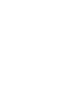

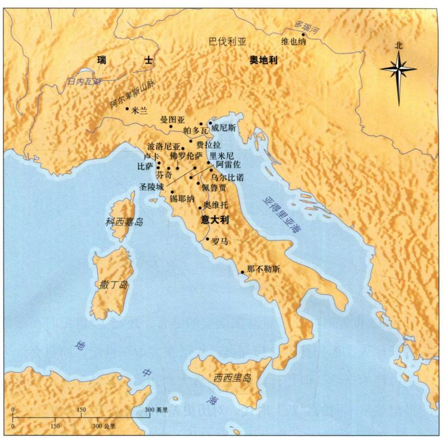

地图15\.1 文艺复兴时期的意大利

印刷机在1464年被引入意大利，使得更多人能够接触到书籍，人文主义教育理念由此也迅速在意大利传播开来。君主、教皇以及选举产生的议会等意大利全境的统治阶层，都在自己的官僚体系或宫廷中聘用了人文主义者来管理他们的事务。

人文主义观念影响了艺术家以及雇用他们的赞助人。在人文主义者研习古典著作时，艺术家们则在学习古典艺术，不只是为了模仿其细节或母题，而是要理解古典建筑的设计法则，以及古代雕塑实现其自然主义所依照的法则。文艺复兴时期的艺术家们重拾在艺术中与自然一争高低的古代理想，但他们运用了实践技巧去实现理性的目标。他们采用了透视法等技法，并掌握了诸如油画和版画等新技术，以推进他们重现自然世界的目标，并传播自己的思想。

艺术家运用其观念与技巧创造艺术，以满足赞助人的精神与政治需求。教派、行会与教会等中世纪机构委托修建了教堂，制作了建筑雕刻、壁画、祭坛陈设以及其他器物，这与早几个世纪中的情形相同，然而不同的是世俗赞助人的队伍壮大了。艺术家们也借

此赢得了个人的荣誉，因此在15世纪末，艺术家的社会地位发生了变化。在中世纪的大部分时间里，艺术家的社会与经济地位与其他工匠不相上下。他们以手工技巧而受到尊重，但并不被当作知识分子来看待。许多15世纪意大利的艺术家们表现得很像知识分子，他们研究历史，运用科学方法解决问题，因此艺术家的地位也随之上升。

这一时期还没有意大利这一统一的政治实体。大小有别、政治体制各异的众多地区在经济上相互竞争，甚至经常在战场上一决高下。南部的那不勒斯王国采用君主政体，公爵、王公与专制君主将意大利北部瓜分为诸多城邦，其中包括米兰、曼图亚（Mantua）和乌尔比诺（Urbino）。教皇从阿维尼翁返回罗马，重获对教皇国的统治权。威尼斯和佛罗伦萨两座主要的贸易城市建立起共和国，商人中的精英分子把持着政治权力。尽管我们称之为文艺复兴的文化繁荣局面出现于意大利全境，但众多现代学者认为，佛罗伦萨是其发祥之地。

504詹森艺术史

因此，本城还缺少什么装饰？它的哪一项努力不是值得赞扬、无比伟大？前辈的品性又如何？他们怎会不是罗马人的后裔？荣耀又如何？无论国家内外，佛罗伦萨曾经取得过，并且每天都在持续取得彰显高贵与美德的丰功伟绩。建筑、城区、清洁、财富、人口众多、环境健康怡人又如何？

节选自《佛罗伦萨颂》（约1403\-1404年），作者莱奥纳多·布鲁尼

一座城市还期望些什么呢？别无其他。因此我们现在应当关注什么？还剩下什么要我们去做？除虔诚于无比慷慨的上帝，向他祈祷之外，别无其他。因此，是我们全能的上帝、永恒的上帝，在他的教堂、他的祭坛佛罗伦萨人的礼拜最为虔诚；还有您，圣母，佛罗伦萨为你建造了一座精美且闪闪发光的大理石庙宇，在你曾一度为人母的地方，最纯洁的处子照料着你最可爱的孩子；还有您，施洗约翰，本城的主保圣人。是你们保卫着这座最优美、最杰出的城市，使它免于所有灾祸、所有邪恶。

SOURCE: "PANEGYRIC TO THE CITY OF FLORENCE",TR\. BENJAMIN G\.KOHL IN THE EARTHLY REPUBLIC:ITALIAN HUMANISTS ON GOVERNMENT AND SOCIETY\. \(PHILADELPHIA: UNIVERSITY OF PENNSYLVANIA PRESS,1978\)

原始文献

莱奥纳多·布鲁尼（1370\-1444年）出生于阿雷佐，之后移居佛罗伦萨学习法律并从事人文学科研究。他的导师科卢乔·萨卢塔蒂是佛罗伦萨的秘书长，布鲁尼在1406年继任该职。他是一位热心于古典文学的学生，效仿古希腊与古罗马作家的作品写作。吉安加莱佐·维斯孔蒂曾消除了米兰对佛罗伦萨的威胁，他去世之后，布鲁尼撰写了这段颂词。

佛罗伦萨（约1400\-1430年）：建筑与建筑雕刻的古代灵感

佛罗伦萨在文艺复兴史上脱颖而出的原因之一在于，许多早期人文主义者是佛罗伦萨人，他们满怀爱国热忱赞颂着自己的家乡。佛罗伦萨是重要的制造业中心、贸易中心、国际银行业中心，它的财富与社会所具有的活力吸引了众多人才。这里掌控政府的不是世袭贵族，而是银行家与商人。商人与工匠团体在行会（经济与社会组织）中联合起来，以巩固他们的地位。政府议会被称为执政府（Signoria），其成员从行会与显赫的商业家族中选出。政体为共和国制，该词对佛罗伦萨人来说意味着他们是古代罗马帝国的继承者。

科卢乔·萨卢塔蒂和莱奥纳多·布鲁尼（ColuccioSalutati 和 Leonardo Bruni，两人前后任执政府的秘书长）等政治家为佛罗伦萨建立丰功伟绩的强烈愿望带来了雄辩的声音。1401至1402年间，米兰大公威胁要入侵佛罗伦萨。鼓动全城反抗米兰的萨卢塔蒂，号召人们效仿古罗马时期佛罗伦萨。度过危机之后，莱奥纳多·布鲁尼声称佛罗伦萨之所以能够抵御米兰，原因在于它的共和国体制、文化成就与民族起源。在他撰写的《佛罗伦萨颂》（In Praise of the Cit ofFlorence，1403\-1404年）中，作者将佛罗伦萨的优势与5世纪时击退波斯人入侵的雅典相提并论。他还赞颂了佛罗伦萨教堂建筑中体现的虔诚和热情（见本页的原始文献）。文艺复兴时期的人文主义者希望调和古代训诫与基督教信仰。

布鲁尼的文字或许解释了务实的佛罗伦萨人大

量投资文化活动的原因。执政府及其所代表的团体发起了众多公共项目来美化并改善城市的环境。个人、家族乃至商业行会都资助公共项目，而且商业行会还在艺术家间开展竞争委托权的比赛。成功完成公众关注的项目增强了赞助人或赞助团体的威望，并将各地艺术家吸引到此。许多当地人的子弟也成为雕塑家、画家和金匠，当时不允许女性加入行会，因此几乎没有女性艺术家。佛罗伦萨礼拜堂与大教堂穹顶竞争项目的获胜者分别是洛伦佐·吉伯尔蒂和菲利波·布鲁内莱斯基。此外，行会定制了各自的主保圣人雕像，放置在位于城中、被称为圣米迦勒园中教堂（Or SanMichele）的外龛之中。为这些圣龛创作雕刻的艺术家包括多那太罗和南尼·迪·班科。

洗礼堂之争

安德烈亚·皮萨诺为洗礼堂铸造的青铜门（见图13\.14）于1360年完工，这是佛罗伦萨的品位与虔诚的有力典范。这一成功鼓舞了洗礼堂工程的监督者羊毛商行会，他们决定再举办一次竞赛，铸造第二对青铜门。每位参赛者要围绕以撒献祭（Sacrificeof Isaac）为主题进行设计，曾有6位艺术家为参加竞赛而创作了浮雕方案，但只有其中两件流传至今，它们的创作者分别是菲利波·布鲁内莱斯基和洛伦佐·吉伯尔蒂（Lorenzo Ghiberti，1381\-1455年）。羊毛商行会最终选择了后者来铸造礼拜堂的第二对青铜门（图15\.1）。吉伯尔蒂留下了一段有关竞赛的文字，关于取得胜利的记录出现在他晚年撰写的《评论集》（Commentaries）之中（见第506页的原始文献）。

第十五章 15世纪意大利的早期文艺复兴 505

原始文献

洛伦佐·吉伯尔蒂（约1381\-1455年）

节选自《评论集》第二卷

吉伯尔蒂未完成的《评论集》是重要的早期艺术史文献。第一卷主要由普林尼和维特鲁威的著作节选组成，第二卷则记录了13世纪与14世纪的意大利艺术，结尾处有一段对他自己作品（图15\.1）的评述。

尽管幸运女神的礼物来之易去之捷，但关于头脑的训练永远不会用尽，而且保持到最后一刻······我向自己的父母献上无比崇高的谢意······他们曾精心地教我艺术，而目不识丁者不可能研习艺术······然而由于父母的照料和自己对规则的学习，我在文学与语言学方面走得很远，并且热衷于创作评论。我用这些财富充实了自己的头脑，这些财富的最终果实就是，我不需要任何产业或钱财，几乎无欲无求······我曾尝试着探究自然如何运行······我怎样才能离她更近，被看见的事物如何到达眼睛，视力如何发挥作用，视觉······如何运作，可视之物如何移动，如何追寻雕塑与绘画的原理。

在我的年轻时期，我主诞生1400年的时候，我离开了佛罗伦萨，因为那里空气腐臭、国家腐败······我基本上心向绘画······然而······我的朋友写信告诉我，圣施洗约翰教堂的理事会在寻找技艺精湛的艺师，并希望他们提交一件设计方

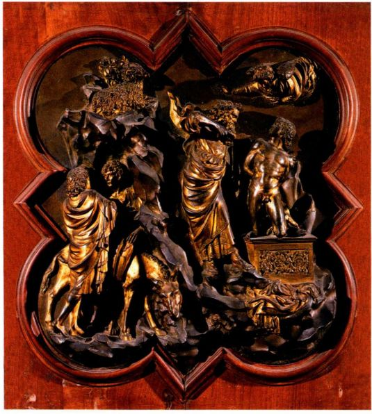

图15\.1 洛伦佐·吉伯尔蒂：《以撒献祭》。1401\-1403年。镀金青铜浮雕板，53\.3x43\.2厘米。佛罗伦萨巴杰罗国家博物馆（MuseoNazionale del Bargello\)

案。意大利全国上下很多资深艺师都参加了这场竞赛······每人提交4块青铜浮雕板。作为水平的证明，教堂理事会要求每人制作一幅······以撒献祭······这些试样要在1年内完成······参赛者有······菲利波·迪塞尔·布鲁内莱斯科（Filippodi ser Brunellesco）、西莫内·达科勒（Simone da Colle）、尼科洛·达雷佐（Niccolo d＇Arezzo）、锡耶纳的雅可布·德拉奎尔恰（Jacopo della Quercia）、弗朗切斯科·达法尔达布里诺（Francesco da Valdambrino）、尼科洛·兰贝尔蒂（Nicolo Lamberti）······胜利的棕榈枝奖给我是众望所归，与我竞赛的对手们也期望如此。无一例外，全体都同意将荣誉授予我。经过饱学之士的讨论与检验，每个人都认为我超越了当时所有艺术家，无人能出我之上。

······评审共有34位，包括本城评审与外来评审。所有评审、领事、教堂理事以及商人行会会员都选我作为优胜者，该行会正是圣施洗约翰教堂的主管。······最终决定由我制作教堂的青铜门，为此我极其勤奋。这是顶尖之作，连门框计算在内，总价约为22,000弗罗林（florins）。

SOURCE: CREIGHTON GILBERT,ITALIAN ART 1400\-1500:SOURCES AND DOCUMENTS\.\(EVANSTON,IL:NORTHWESTERN UNIVERSITY PRESS, 1992\)

吉伯尔蒂的浮雕试样展示了他构图的力量、表现人体的技巧以及对自然细节的入微观察。他沿用了安德烈亚·皮萨诺在洗礼堂第一对青铜门中（见图13\.15）所采用的哥特式四叶饰形式，同时也提出了某些设计上的挑战。艺术家如何才能在填满四叶饰四瓣空间的同时，传达出叙事的简洁与自然？吉伯尔蒂采用了叙事细节边缘化、焦点中心化的手法来解决难题。由此，山上的公羊就出现在左上方，采用透视手法表现的天使位于右上方。中央部分亚伯拉罕的姿态令人注目，他正要献祭自己那个祭坛上裸身捆绑的儿子。以撒转头面向父亲，形态优美的躯干与父亲瀑垂的衣袍形成鲜明对比。嵌入场景的山峦将另一组人物与主要场面区隔开来。吉伯尔蒂的设计成功地结合了运动感、集中感与叙事性。与此同时，他对国际哥特式抒情风格的兴趣又使得此场景中的残忍野蛮趋于缓和。亚伯拉罕呈瀑布状下垂的衣袍与斯留特尔《摩西之井》（图14\.2）中的摩西衣袍相似。除设计本身之外，吉伯尔蒂的参赛作品还具有技术上的高妙之处。与布鲁内莱斯基不同，他的作品为一次铸造成形，这可能也是他说服评审、获得委托的原因之一。吉伯尔蒂的作坊耗费了二十年之功来铸造这对青铜门。铸门期间，许多后来名声显赫的下一代艺术家都曾在他的作坊中学习和工作。

506 詹森艺术史

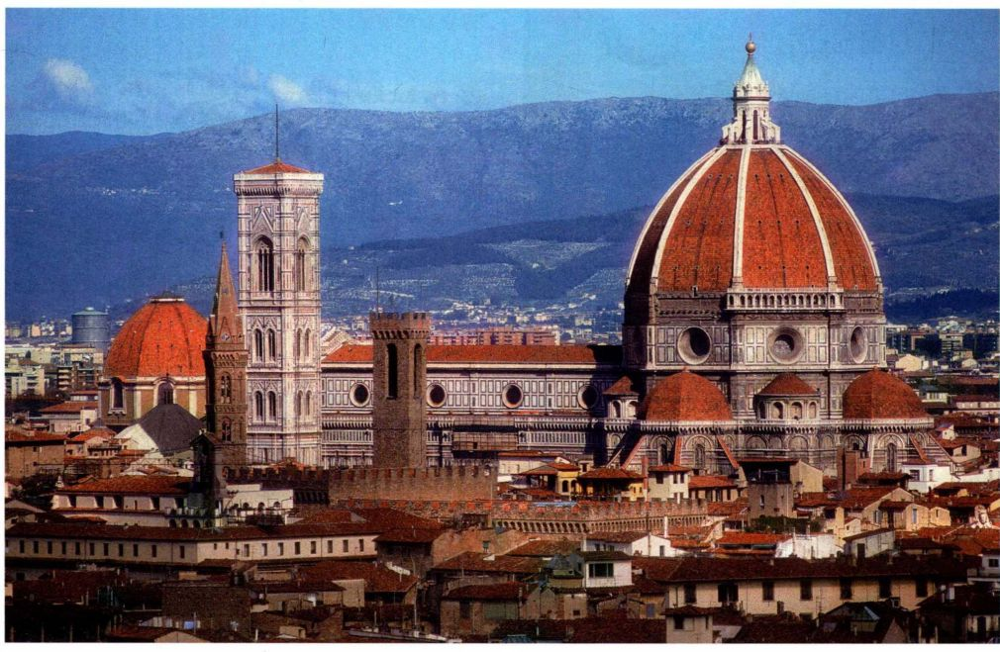

图15\.2 菲利波·布鲁内莱斯基：佛罗伦萨大教堂穹顶（鲜花圣母教堂［Santa Maria del Fiore］）。1420\-1436年。高30\.5米，直径140米

布鲁内莱斯基与佛罗伦萨大教堂穹顶

在洗礼堂青铜门的竞争中失败之后，菲利波·布鲁内莱斯基（Filippo Brunelleschi，1377\-1446年） 改变了他的艺术创作重心。他与其友雕塑家多那太罗前往罗马，在那里研习古典建筑，据记载，他还曾测量过这些建筑的精确尺寸。他寻求一种能精确记录古典建筑外观的方法，而他对线性透视（本章后文中详细讨论）的发现很可能源于此。我们对于他在这个时期所做的其他事情一无所知，但在1417至1419年间，他再一次与吉伯尔蒂一决高下，这次是为了建造佛罗伦萨大教堂穹顶（图15\.2）的工程。穹顶的规划在50多年前就已经完成，因此只能在细节上进行改动，而且穹顶的庞大规模也提出了建筑上的难题。布鲁内莱斯基的方案是他研究哥特式、古罗马、拜占庭，甚至可能还有波斯建筑的果实，但是建造穹顶既是建筑风格上的首创，也是工程技术上的壮举（见第508页的材料与技法）。这个工程几乎占据了布鲁内莱斯基的余生，使之成为佛罗伦萨创造力、虔诚心、抱负与高超技艺的象征。

屹立于地面30余米之上的穹顶使得佛罗伦萨其他所有建筑都相形见绌。它建于围绕着大教堂东端的小半穹顶之上，拱肋有力地向上升起，汇集于一座

大理石圆顶阁（cupola）或称灯笼式天窗。布鲁内莱斯基设计这个灯笼式天窗的目的在于联结外部的八条拱肋，但它也标示着这种上升运动的顶点。大教堂在1436年3月25日祝圣之时，佛罗伦萨举城欢庆。佛罗伦萨证明了它对圣母的虔诚，也表达出在文化上威震四邻的雄心。佛罗伦萨完全有理由自豪，她的孩子如此聪慧地完成了前几代人未竟的事业。布鲁内莱斯基的样式将会影响托斯卡纳地区以外的建筑风格。

为圣米迦勒园中教堂创作的多那太罗与南尼·迪·班科

佛罗伦萨大教堂穹顶还在建造之时，另一项竞赛在近旁的圣米迦勒园中教堂拉开了帷幕。这座建筑始建于1337年，它既是谷仓，也是教堂，其中放置着一件在当地广受敬拜的圣母子题材作品。佛罗伦萨的各个行会监管这一建筑，每个行会负责为一座外部圣龛定制雕塑作品。1406年，该城确定作品创作的最后期限为10年。在此后的几十年间，行会与受委托的雕塑家争相创作表现其主保圣人且令人过目难忘的作品。重要的行会委托洛伦佐·吉伯尔蒂为圣米迦勒园中教堂创作若干雕塑，而一些年轻雕塑家则赢得了势力较小的行会的委托。

第十五章 15世纪意大利的早期文艺复兴 507

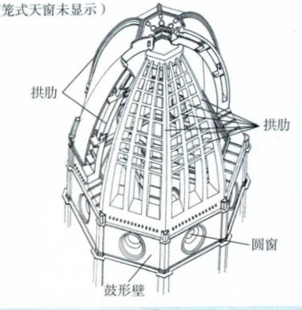

材料与技法

布鲁内莱斯基的穹顶

由于佛罗伦萨大教堂的基本规模与平面布局于14世纪就已确立，布鲁内莱斯基首先决定以中堂之上的鼓形壁为基础修建穹顶，从而减轻墙壁的承重。他建议将穹顶分为两层骨架来建造，这是一种在伊斯兰世界、特别是波斯地区较为常见的方法，而在意大利建筑中并不多见，参见修建于14世纪位于伊朗苏丹尼亚的伊儿汗国（II\-Khan）君主完者都的陵寝（见图9\.21）。这两层骨架由一系列拱肋来支撑，八条拱肋显露于外部，其余则藏于穹顶之中。纵向拱肋之间连接有成行的水平拱肋，这一系统可能受到万神殿（见图7\.43）格子穹顶的启发。拱肋与尖耸的外形反映出哥特式风格的特征。双层骨架减轻了整体重量，因为相对于双层骨架的大小而言，墙体厚度相对较薄。布鲁内莱斯基采用了鱼尾形布瓦法，一方面防止了聚顶时的割裂瓦块，另一方面减轻了砌体重量，距顶端愈近，瓦块愈窄。

除这些设计特色之外，布鲁内莱斯基在建筑工艺上也提出了创新。传统上，首先要横穿穹顶跨度建造一个木制中心结构，以便在施工过程中支撑穹顶，但这就需要巨大的木材。布鲁内莱斯基设计了一个新系统来取而代之。这种系统利用悬臂将临时性脚手架托出鼓形壁之外，由此减少了建筑过程

吉伯尔蒂以前的助手多那太罗（Donatello，1389\-1466年）就是这些年轻雕塑家中的一员。1410至1417年间，他为军械行会雕刻了《圣乔治圣龛》（St．George Tabernacle，图15\.3），人物所在的壁龛如此之浅以至于他似乎正要踱步而出。尽管身着盔甲，但圣乔治看起来能活动自如。身体重量放在向前迈出的腿上，这样的姿态表明他已经做好了战斗的准备。雕像的右手最初持有一把真剑或长矛，而且头戴真正的头盔，这些都有效地展示着该行会的商品。圣乔治身体里有所克制的能量反映在他的双眼之中，这双眼睛似乎审视着地平线，寻找敌人的踪影。他以基督教战士的形象出现，这在精神上与沙特尔大教堂的圣西奥多雕像（见图12\.24）以及其他表现骑士团战士的作品一脉相承。

壁龛下方有一块表现圣乔治屠龙的浮雕饰板，这是他最著名的功绩。浮雕右部站着他将去解救的公主。多那太罗在此处设计了一种称为扁浮雕（schiacciato，意为“扁平”）的浮雕新样式，却创造了一种深度无限延伸的幻觉。浮雕中人物所处的背景有微妙的表面起伏，捕捉着来自各个角度的光线。每一处微小起伏所具有的空间表现力都远大于它的实际深度。雕刻家的刻刀正如画家的画笔，成为创造明暗变化的工具。前景中，动感十足的圣乔治骑在马上与恶龙战斗，他

（灯笼式天窗未显示）

布鲁内莱斯基穹顶等角投影图（P\.Sanpaolesi绘制）

中的木材用量，并降低了所需木材的尺寸要求。他还设计了新型起重机，以取代沿坡道运送建筑材料至各层的做法。布鲁内莱斯基的整个方案反映出他大胆且善于分析的头脑，一旦设计出更妥善的解决办法，他乐于抛弃惯常的处理方式。

的形象突出在具有朦胧效果的背景中。公主则在旁观。整件作品表现了对危机的警觉与准备。

亚麻织工行会也委托多那太罗为其创作圣龛雕刻，该作品可能完成于1413年（图15\.4）。这件作品中，行会的主保圣人圣马可高达2\.4米，但高度只是让这件作品如此令人难忘的特征之一。圣马可有力的大手握着一本书，很可能就是他所撰写的福音书。身体的站姿是多那太罗研习古典艺术的产物：一条腿放松而另一条腿以对立平衡的姿势支撑着身体的重量（见图5\.29）。圣马可下垂的衣袍有深深的褶皱，揭示并强调了他的姿势。

多那太罗将人体当作各部分相互关联且能够运动的结构来处理，他刻刀下的衣袍是一个独立的元素，基于人的形体来塑造，而非某种样式或是外部强加。多那太罗仿效诸如《持矛者》（见图5\.33）这样的古典范例，精心地保持了构图的平衡。因此从观者的角度看去，左边的元素强调垂直感与稳定性，而右边的则突出了倾斜感与运动性。圣马可深陷的双目与波浪起伏的胡须是统领整座人像的首要元素，而他的衣袍则让参观者联想到亚麻织工行会的产品。这件作品表明多那太罗对指引古典艺术家的法则有深刻的领悟，以及他对这些法则的信奉。圣马可雕像说明多那太罗在研习古典雕塑作品时学到了以下几点：强调自然主

508 詹森艺术史

义形式、身体与衣物各自独立、构图平衡而错落有致、潜在运动趋势以及心理刻画。

不仅各个行会通过这些作品相互竞争，艺术家们也激励彼此作出新的努力。多那太罗的作品对他的同辈人而言无疑是一种启示。木石雕工行会雇用了南尼·迪·班科（Nanni di Banco，约1380\-1421年）为其在圣米迦勒园中教堂的壁龛创作雕刻《四圣徒》（QuattroCoronati，图15\.5）。该作品创作于1409至1416／17年间，表现的是四位基督徒雕刻家，他们因拒绝为罗马皇帝戴克里先雕刻异教偶像而被处决。真人尺寸的圣徒们

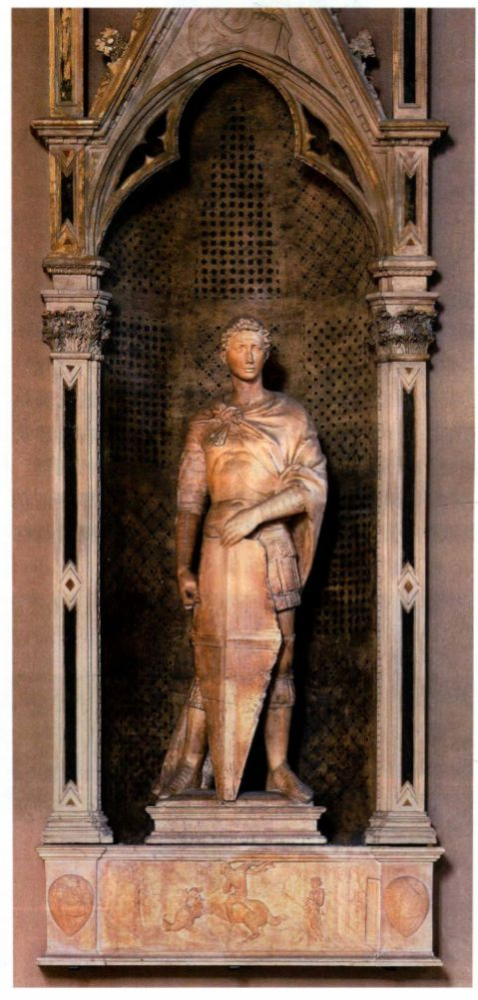

图15\.3 多那太罗：《圣乔治圣龛》，出自佛罗伦萨圣米迦勒园中教堂，约1410\-1417年。大理石，雕像高2\.1米；浮雕厘米。佛罗伦萨巴杰罗国家博物馆

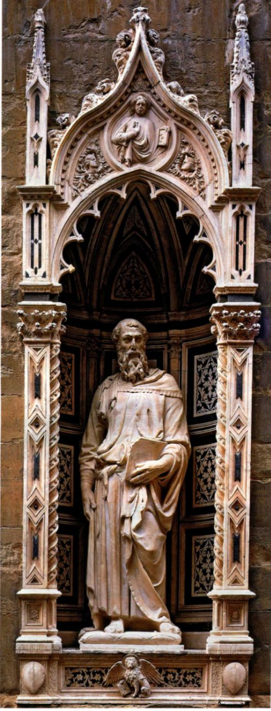

图15\.4 多那太罗：《圣马可》。约1411\-1413年，大理石，雕像高2\.4米。佛罗伦萨圣米迦勒园中教堂，现为佛罗伦萨圣米迦勒园中教堂博物馆（Museo di Or San Michele）

第十五章 15世纪意大利的早期文艺复兴 509

大事年表

1401年\-吉伯尔蒂赢得佛罗伦萨洗礼堂北大门定件委托

1402年\-吉安加莱佐·维斯孔蒂去世，结束了对佛罗伦萨的威胁1406年\-佛罗伦萨占领比萨

1420年\-布鲁内莱斯基开始建造佛罗伦萨大教堂穹顶

站立在哥特式壁龛之中，仿佛正在讨论他们即将临头的大难。人物的身体似乎突出到圣龛边界之外，为托加袍厚重的褶皱所覆盖。这些长袍与第二、第三位圣徒的头部令人直接回想起公元1世纪时的罗马肖像雕刻（见图7\.12）。南尼·迪·班科似乎将这些殉道者放入了他们所属的历史时刻。他所雕刻的人物效仿着古罗马的真实风格与纪念性质。圣徒下方的浮雕表现正在工作的雕刻工，一方面解释了殉教故事，另一方面也为该作品赞助人的技艺做了广告。

布鲁内莱斯基的孤儿收容院

另外一家佛罗伦萨行会为该城赞助了一件类型不同的公共作品，意在解决社会问题。丝绸织造者与金匠行会雇用菲利波·布鲁内莱斯基为弃儿在至圣领报教堂（Santissima Annunziata）附近设计一座收容院。孤儿收容院（Ospedale degli Innocenti）始建于1421年，然而在布鲁内莱斯基去世后很久都未能完工。收容院的正面（图15\.6）由有顶过廊或凉廊（loggia）构成，这是一条略高于地平面的连拱廊。连拱之上是突出的水平线脚，再往上则采用了山墙形窗户这种简单布局。

在这座建筑的设计中，布鲁内莱斯基重现了古典时期的建筑形式，可以从圆柱、柱头、拱门与檐部看

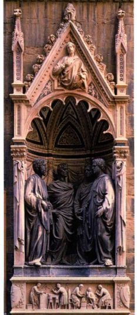

图15\.5 南尼·迪·班科：《四圣徒》。约1409\-1416／17年。大理石，高1\.83米。佛罗伦萨圣米迦勒园中教堂，现为佛罗伦萨圣米迦勒园中教堂博物馆

出这一点。这就要求他在设计这些元素时遵循严格的规则。与中世纪圆柱不同，古典建筑中的圆柱界定严格，它的细节与比例只能在极其有限的范围内变化。与马蹄拱、尖拱等其他类型的拱不同，古典的半圆拱只有唯一一种可能的形式，那就是半圆形。古典建筑的额枋、剖面以及装饰同样都必须符合严格的规则。但这并不意味着古典形式完全不可改变，但即便是在最具原创性的古罗马建筑中，仍然可以感受到希腊柱

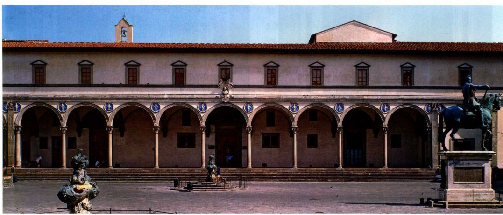

图15\.6 菲利波·布鲁内莱斯基：佛罗伦萨孤儿收容院。始建于1421年

510 詹森艺术史

古代最专业的艺术家们都认为，建筑如同动物，因此在建造它的过程之中我们应该模仿自然。在那些被认为美丽的动物身上，身体各部分或器官显然并不总是相同的，但即使是在变化最多的部分，我们也能找到某些固有的东西，它们灌注在各个极其不同的动物之中，让它们每一个看起来都很美。但是，你对某一事物是否美丽的判断并不出自单纯的看法，而是出自在头脑中秘密进行着的争论与对话。在建筑的轮廓与形式中无疑存在着杰出之处和自然之美，它会立刻让你的头脑感受到愉悦与赞赏。我认为，美、庄严、优雅以及类似的吸引力正存在于特殊细节之中，如果你改变或者

莱昂·巴蒂斯塔·阿尔贝蒂（Leon Battista Alberti）

去除这些细节，那么整体就会丧失吸引力而令人不快。在各个不同部分的连接与联系之中有某种东西存在，它赋予整体美和优雅，我们称之为所有优雅美丽之物所具有的一致性，我们或许可以将这种优雅美丽视作创造性。不论这样的结构是以视觉、听觉还是任何其他感觉的形式来传达自身，我们都立刻感知到这种一致性，因为出于天性，我们渴望事物达到完美，并在这些事物展现于我们面前时将之与愉悦感联系在一起。一致性并不突出地呈现于它所在事物或其各个部分之中，也不凸显与其本身或自然，因此它真正的位置是我们的头脑和理性。这正是建筑所要达到的主要目标，她由此获得了自身的美、尊严与价值。

SOURCE:A DOCUMENTARY HISTORY OF ART, VOL\.I,ED\. ELIZABETH GILMORE HOLT\.P\.235\-237

原始文献

节选自《论建筑》，1452年

该书仿照公元1世纪维特鲁威的《建筑十书》写就，虽然完成于1452年，但直到1485年阿尔贝蒂去世之后才得以出版。

式的法则，这一法则需要规则性，阻碍对规则的任意背离。布鲁内莱斯基运用了这些“标准化”形式，将收容院的正立面设计为一系列尺寸相同的空间段，具体表现为连拱的一系列开间。每一开间都区隔出一块正方形空间，其上覆盖着建于穹隅上的穹顶，拱廊内部的横切拱分隔着各个穹顶。布鲁内莱斯基运用石材色彩的对比，强调了空间单元的边缘，又没有打断它们之间具有韵律感的序列。

还有一条法则促成了该建筑设计的平衡感。对布鲁内莱斯基而言，好建筑的秘诀在于为所有重要的单位尺寸选择“正确”的比例，即以简单整数所表达的比率。例如，檐部所在位置的高度是圆柱高度的2倍，它们之间的比例即为2：1。他认为古代人掌握了这一秘诀，因此试图通过测量他们的建筑来发现这一点。他发现了什么，他又是如何运用的？对此我们不得而知。但是他可能将自己的知识传授给了莱昂·巴蒂斯塔·阿尔贝蒂。在《论建筑》（Treatise onArchitecture）中，阿尔贝蒂主张决定乐律和谐的数学比率也应该指导建筑学，因为它们在宇宙中反复出现，因此在起源上是神圣的（见本页的原始文献）。希腊哲学家毕达哥拉斯表达过相似的观点，在中世纪曾流行一时，但从未像现在这样表达得如此直接简洁。布鲁内莱斯基在孤儿收容院中运用比率来支配各部分之间的关系：窗户位于圆柱之间的中央位置；圆柱之间的间隔等长于它们的高度；两圆柱间的跨度等长于圆柱到墙壁的距离。比例将布局结构锁定为一个平衡的整体。连拱廊由当地出产的深色砂岩（pietra serena，意为宁静之石）建造，其中支撑拱的圆柱比例优美，

这些都赋予建筑立面以优雅律动之感。

拱肩之上装饰着卢卡·德拉·罗比亚作坊中制作的圆盘赤陶浮雕，表现婴儿的形象，他们正是该建筑之所以得名的“孤儿”。布鲁内莱斯基的孤儿收容院不仅服务于佛罗伦萨的穷人，还勾画出一座广场。建筑的凉廊构成了垂直于至圣领报教堂的广场一边，周围的其他建筑界定着广场另外的边界。这种公共空间具有社会、宗教与政治功能。而且，通过模仿古罗马广场的样式，表现了佛罗伦萨自诩为罗马继承者的意识。

文艺复兴时期的建筑在恢复古典形式之中找到了标准的语汇。和谐比例的理论赋予它在中世纪建筑中几乎完全丧失的“句法”。同样，对古典形式与比例的复兴，使得布鲁内莱斯基得以将他所在地区的建筑“俗语”，转变为稳定、精确、连贯的系统。布鲁内莱斯基的成就在于，他使建筑具有了坚实根基，并将古典时期的经验运用于现代基督教阶段的终曲。进而言之，他对古典建筑的研究以及运用古典几何比例的实践，很可能激发他发现了表现立体维度的形式系统。该技法后来被称为线性透视法或科学透视法（见第513页的材料与技法）。

佛罗伦萨家族的礼拜堂与教堂：1420\-1430年

佛罗伦萨的建筑工程囊括的范围远不止大教堂和收容院等市政机构。私人赞助人与贵族家族在该城各处斥资兴建教堂与礼拜堂，为佛罗伦萨的建筑与其他艺术的繁荣做出了贡献。捐赠者往往以虔诚之名定制

第十五章 15世纪意大利的早期文艺复兴 511

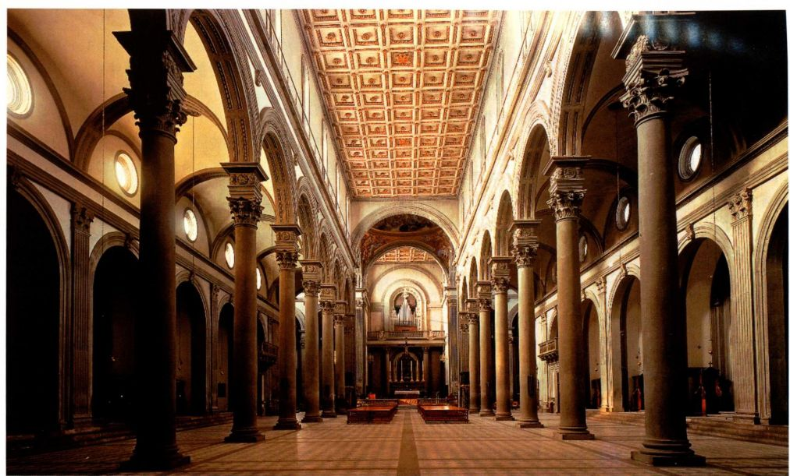

图15\.7 菲利波·布鲁内莱斯基：佛罗伦萨圣洛伦佐教堂中堂。约	1421\-1469年

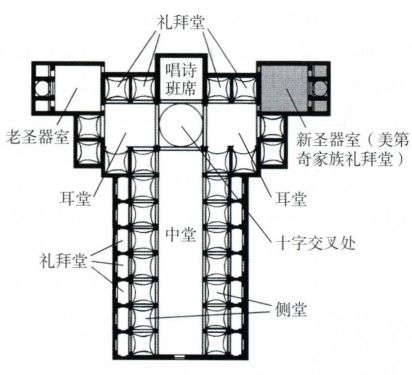

图15\.8 圣洛伦佐教堂平面图

此类作品，例如资助修建丧葬礼拜堂以便能够长期为过世的家族成员举行弥撒。但是，向邻近教堂提供物质性捐助也提高了捐赠者的社会威望，我们甚至可以通过佛罗伦萨各大家族所赞助的此类艺术项目，来勾勒他们的命运走向（见第518页的艺术史家的观点）。

出于对其教区圣洛伦佐教堂（San Lorenzo）的关注，美第奇家族委托布鲁内莱斯基改造这座建筑。该家族的宿敌帕奇（Pazzi）家族则雇用同一位建筑师完成在方济各会圣十字教堂的建筑项目。斯特罗齐（Strozzi）家族在圣三一教堂（Santa Trinità）修建起他们的家族礼拜堂，并委托真蒂莱·达·法布里亚诺为礼拜堂创

作一件祭坛作品。年轻的马萨乔获得了新圣母教堂与加尔默罗会圣母（Santa Maria del Carmine）教堂两处的委托，为其他显赫家族创作作品。这些艺术家为15世纪早期佛罗伦萨城的改建做出了贡献，并促成了在当地诞生革命性的艺术新风格。

布鲁内莱斯基的圣洛伦佐教堂

早在15世纪之初，美第奇家族就计划重建其教区教堂。1419年，乔瓦尼·迪·比奇·德·美第奇（Giovannidi Bicci de＇Medici）委托布鲁内莱斯基为罗马式风格的圣洛伦佐教堂增建一座圣器室（sacristy），该建筑也将成为美第奇家族的丧葬礼拜堂。美第奇家族对布鲁内莱斯基的圣器室设计非常满意，于是委托他重新设计整座教堂。布鲁内莱斯基所指导的工程始于15世纪20年代，但是施工进程时断时续。中堂直到1469年才得以完工，此时建筑师已然过世20余年。时至今日，教堂的外部仍未能完工。然而，该建筑目前所具有的型制在本质上仍保持着布鲁内莱斯基在15世纪20年代所构想的面貌，这是其建筑目标的首次完整呈现（图15\.7、15\.8）。

初看之下，教堂的平面图并无新奇之处。与西多会哥特式教堂相同，其东端为正方形，并且避免装饰（见图13\.1）。然而，未加拱顶的中堂与耳堂则令人回想起诸如圣十字教堂这样的方济各会教堂（见图

512 詹森艺术史

透视法

文艺复兴时期具有划时代的发明之一就是线性透视法或科学透视法，有时也被称为焦点或中心点透视法。这是一系列几何学方法所构成的系统，将空间错觉投射在二维平面上。它的核心特征是灭点（vanishing point），任何一组平行线条似乎都在这一点上交汇。如果这些线条垂直于画面，它们的灭点就会落在地平线上。此类线条称为正交线（orthogonal）。平行于画面的线条称为截线（transversal，图中未示），为了进一步将空间明晰化，这些截线的间距要保持一致，根据几何法则绘制而成。

据传，布鲁内莱斯基发展了这一系统，但至少从古典时

材料与技法

在文艺复兴早期的意大利，科学透视法通过运用数学与几何学使空间的投射系统化，颠覆了过去直觉式的透视实践。这种制作绘画、版画、素描或者浮雕等任何图像的“科学”方法，成为将美术提升为人文学科之一的根据。1453年，莱昂·巴蒂斯塔·阿尔贝蒂在《论绘画》中记录了布鲁内莱斯基的发现，该书是文艺复兴时期第一部关于绘画的著述。直到今天，布鲁内莱斯基的发现都是绘图教育的基本元素。

该技法的优势之一在于，艺术家可以调整透视系统，使之符合观者所看到的实际空间。这种方法预先假定观者的眼睛位于空间中某个固定的点上，所以透视绘画就指明了观者

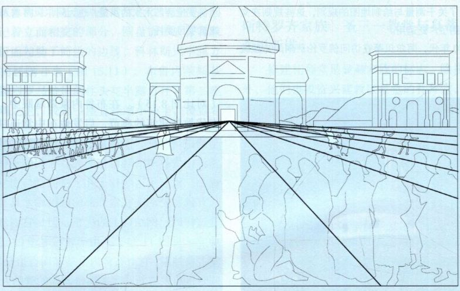

根据彼得罗·佩鲁吉诺的《交付天国钥匙》绘成，原作为罗马西斯廷礼拜堂湿壁画，见图15\.59

期开始，艺术家们就在实验于平面中创造深度幻觉的技法。庞贝的壁画家有时运用色彩来暗示空间深度（见图7\.55），这种技法被称为大气或空气透视法。它认识到眼睛无法感知远处色彩，某些特定色彩就会在地平线附近转变为浅蓝色或灰色。此外，形式本身也经常变得模糊起来（见凡·爱克《根特祭坛画》的下部，图14\.11）。艺术家们还调整空间元素使之符合人们眼睛所看到的状况，有时也取得了出色的效果，例如凡·爱克的《阿尔诺菲尼夫妇像》（见图14\.6）。

13\.6）。布鲁内莱斯基的设计受到新近完工的圣器室以及原有教堂的限制，但是强调对称性与匀称性的手法使圣洛伦佐教堂卓尔不群，其中还包括了受古典建筑启发并按照比例精心组织的建筑元素，正如他在孤儿收容院所实现的那样。教堂底层的布局显示了布鲁内莱斯基运用正方形空间单元组织建筑的技巧，中堂每一开间的宽度都是侧堂宽度的两倍，十字交叉处与

要正确观看时应站的位置。因此，艺术家如果事先知道图像将出现在观者视线之上或之下，就能够在建构透视的时候使之符合这些条件（例如图15\.59）。但是有些时候，有利的观看位置极其反常，以至于在图像设计方面必须将透视缩短运用到极致，例如观者须仰望才能得见的天顶画。在这种情况下，艺术家可能会为图像创造出一位“理想的旁观者”，而不去考虑观众们实际所在的视角。

东端的方形凹龛是侧堂宽度的四倍。

教堂内部，沉静的柱式取代了沙特尔大教堂（见图12\.12）这样哥特式的流动空间运动感。观者能够从大门处清晰地看到建筑整体，几乎就像看着一幅科学透视示意图。这一效果令人回想到“旧式”的托斯卡纳罗马式建筑，例如比萨大教堂（见图11\.34），以及罗马的庄严圣母教堂等早期基督教公堂式教堂

第十五章 15世纪意大利的早期文艺复兴 513

艺术史家的观点

理论著述

人文主义者研究历史以指导当下的理想激发了文艺复兴时期各个学科的理论著述。此类原始文献讨论艺术家与人文主义者所共同关注的理论问题，并帮助艺术史家解读那个时代的艺术作品。其中一部著述为马萨乔那一代画家提供了发展绘画新技法的理论与实践指导。它的作者是莱昂·巴蒂斯塔·阿尔贝蒂（1404\-1472年），他既是牧师，也是世俗之人。他的家族曾是佛罗伦萨望族，后被逐出该城，因此阿尔贝蒂出生并成长于热那亚。完成法律学习之后，他进入罗马的教廷，并终其一生服务于教会。阿尔贝蒂兴趣广泛，涉猎众多学科，其中包括道德哲学与地理，他从1432年开始写作论文《论家庭》（On the Family）。他在1435年前后完成的论文陈述了关于测量与绘制地图的规则，这些规则在文艺复兴时期得到了广泛运用。

15世纪30年代，阿尔贝蒂在访问佛罗伦萨期间与该城

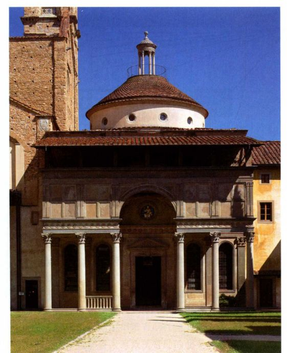

图15\.9 菲利波·布鲁内莱斯基等建筑师：帕奇礼拜堂，位于佛罗伦萨圣十字教堂。建于1442\-1465年

当时的一流艺术家相交熟识。结果，他第一个撰写了文艺复兴时期关于雕塑（约1433年）与绘画（约1435年）的论文。《论绘画》题献给布鲁内莱斯基，其中提到了“我们亲爱的朋友”多那太罗并赞扬了马萨乔，这部论文首次系统地论述了线性透视法。1438年驻留于费拉拉宫廷期间，阿尔贝蒂受托恢复维特鲁威关于建筑的著述，当时该书具有多种版本的手抄本。5年后，阿尔贝蒂一返回罗马便开始系统地研究古罗马建筑，最终写就了《论建筑》。该书成于1452年，出版于1485年，以维特鲁威的著作为蓝本，是自维特鲁威以来第一部建筑学著作（见第511页的原始文献）。阿尔贝蒂的著作促进了佛罗伦萨艺术创新在整个意大利的传播，并提高了佛罗伦萨艺术家的声望，也为阿尔贝蒂本人带来了重要的建筑项目委托。

（对比图8\.15）。在布鲁内莱斯基眼中，这些建筑是古代教堂建筑的典范，启发他在中堂连拱廊中运用了半圆拱与圆柱，而不是墩柱。然而这些早期建筑缺乏圣洛伦佐教堂的轻盈与明亮，它们的圆柱更粗，间隔更小，以至于这些柱子几乎将侧堂与中堂屏隔开来。只有佛罗伦萨洗礼堂外部的假拱廊才具有圣洛伦佐教堂这样的比例结构上的优雅，但是它们却不具备支撑功能（见图11\.35）。由于该洗礼堂的前身可能是一座古典神殿，它对布鲁内莱斯基而言恰是灵感的来源，同时也启发着新一代美第奇家族的赞助人。

布鲁内莱斯基在圣十字教堂：帕奇礼拜堂

佛罗伦萨的其他家族也选择布鲁内莱斯基来完成建筑项目，其中包括贵族帕奇一家。该家族雇佣布鲁内莱斯基设计一座毗邻方济各会圣十字教堂的礼拜

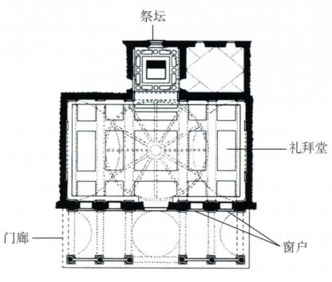

图15\.10 帕奇礼拜堂平面图

514 詹森艺术史

堂。礼拜堂（图15\.9）的修建始于1442年前后，并一直持续到1465年，因此对布鲁内莱斯基在最终完成的建筑中参与到何种程度，众说纷纭。例如，现在的门廊与正立面可能并非他的设计。平面图（图15\.10）中标明门廊处有两个筒拱，用以辅助支撑一座小穹顶，该结构与礼拜堂内部交相呼应。但是门廊挡住了布鲁内莱斯基为礼拜堂入口一面所设计的四扇窗户，遮蔽了由此进入的光线，这说明后来有某位建筑师改变了他最初的平面布局。

然而，礼拜堂内部似乎全然出自布鲁内莱斯基之手。长方形的空间覆盖着建于穹隅之上的穹顶，穹顶两侧各有一个筒拱。从内部看来，这座穹顶附有12条拱肋，由布鲁内莱斯基最钟爱的深色砂岩连接。同样的石材标记着立面相交的部分，圆盘饰中放置着雕塑，正方形板面勾勒了筒拱的边线，科林斯式半露方柱将墙面纵向区隔开来（图15\.11）。布鲁内莱斯基选择了具有强烈罗马特征的柱头与半露方柱。第二座穹顶建于穹隅之上，较第一座直径缩小一半，覆盖着

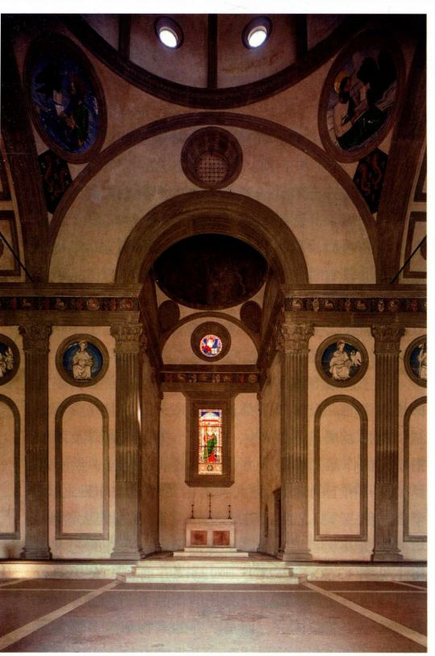

图15\.11 菲利波·布鲁内莱斯基及其他建筑师：帕奇礼拜堂内部

祭坛上方的正方形空间。正如孤儿收容院一样，比例统领着一切设计元素。此处的目的似乎是要在本质上呈纵向延伸的平面中，造就集中式空间布局，布鲁内莱斯基精心地将圆形与正方形结合在一起，使其统一为理性冷静的内部空间形式。

礼拜堂中色彩与雕塑的有限运用加强了稳定的视觉效果。其中最具色彩感的元素是中央穹顶穹隅上的大型圆盘饰，其中放置着表现福音书作者的赤陶浮雕。这些可能都是布鲁内莱斯基本人的设计。墙壁上另有12个表现使徒的小型浮雕，瓦萨里认为是卢卡·德拉·罗比亚及其作坊的作品（见图15\.24）。然而雕刻元素在此完全是建筑的附属品。

斯特罗齐家族、圣三一教堂与真蒂莱·达·法布里亚诺

修建礼拜堂是显赫家族的标志。除托钵会教堂之外，他们也投资兴建教区教堂的礼拜堂，例如为哥特式圣三一教堂所建的礼拜堂。此处的圣器室由斯特罗齐家族所捐献，这是佛罗伦萨最为富有的家族之一。为了完成该项目，帕拉·斯特罗齐（Palla Strozzi）委托真蒂莱·达·法布里亚诺（Gentile da Fabriano，约1385\-1427年）绘制祭坛画《三王来拜》（Adoration of the Magi，图15\.12），画作中题有艺术家的名款与1423年字样。法布里亚诺的创作足迹遍及意大利北部，他的风格富有某些北欧国际哥特式风格的因素。这幅祭坛画用奢华的三联拱镀金画框围绕着单幅中央画板，表现的是三王前往伯利恒朝拜并尊新生耶稣为王的场景，在祭坛台座（predella）与联拱山墙饰中也绘有人像。衣着华丽的人群、马匹与狗，以及驴、豹、骆驼等异国动物所组成的队伍填充着画面的前景，三贤王走上前去敬拜新生儿，他坐在画面左端圣母的膝头。在形式稳固坚实的前景之后，是一片扶摇而上直至画框联拱的风景。在远处的深景部分描绘着三位贤王，他们正在通向伯利恒的路途中跋涉，城镇与城堡标记着他们的道路。这样看来，尽管风景具有明显的统一性，但其中仍然插入了叙事情节。祭坛台座上绘制着故事的其他部分：耶稣诞生、逃亡埃及以及神殿引见。山墙形拱饰中的图像以圣母领报引出了故事的开端。

真蒂莱的祭坛画以文雅华丽的语言设想了三王来拜这一事件。不仅画面中充斥着身着光鲜锦缎、被服饰鲜亮的侍从簇拥的优雅人物，而且画板本身也在金箔与印花的装饰下熠熠生辉。圣母与圣约瑟的光环中的题词为仿库法字体，证明法布里亚诺接触过伊斯兰

第十五章 15世纪意大利的早期文艺复兴 515

图15\.12 真蒂莱·达·法布里亚诺：《三王来拜》。1423年。木板蛋彩画，		米。

佛罗伦萨乌菲齐美术馆

作品，他可能在威尼斯见到过这样的作品。三贤王的头部也有光环，他们不仅表示对基督神性的世界性认同，而且代表人类年龄的不同阶段：青年、中年与老年。艺术家在空间中填满了人物与动物，其中包括几匹表现手法绝佳的马匹，欢庆的人群几乎淹没了画面左部的圣家族。尽管拥挤，但一束金色的光芒统一了整个画面，照亮了动物的身体与人物的面庞，以及风景的某些部分。这些形体造型柔和，以显示人物的厚重感，并与金色所产生的强烈平面效果相抵消。祭坛台座上的《耶稣诞生》（The Nativity，图15\.13）进一步表现出法布里亚诺在这方面的艺术技巧，他强调了线条之上的光线塑造形式的功能。而且，塑造人物的光线和流溢到祭坛台座中的光线正来源于圣婴自身所散发出的神秘之光。法布里亚诺的画作展示出他将光线用作意义载体的意识。

马萨乔在新圣母教堂

法布里亚诺的优雅风格使他在整个意大利的贵族赞助人中广受欢迎，但强烈影响年轻一代艺术家的则是他用光的技巧。受其影响颇深的艺术家是马萨乔（Masaccio，原名 Tommaso di Ser Giovanni di Mone

Cassai，1401\-1428年）。他的同代人莱昂·巴蒂斯塔·阿尔贝蒂在其于1435年前后完成的论文《论绘画》（On Painting）中赞扬了马萨乔（见第514页的艺术史家的观点）。瓦萨里曾提到众多16世纪艺术家对马萨乔的敬仰，尽管如此，他却在16世纪50年代改造新圣母教堂时，覆盖了马萨乔最为著名的作品中的一幅（图15\.14，以下简称《圣三位一体》）。这种做法可能最终保护了马萨乔的作品，但是关于作品的定件与特殊含义等大量信息仍然不为人知。

由于这幅湿壁画最初位于朗齐（Lenzi）家族陵墓碑板的正面，众多学者都认为正是该家族向马萨乔定制了这幅表现圣三位一体、圣母、福音约翰以及两位捐赠人的作品。作品下方与底部的坟墓相连，绘有一具躺在石棺上的骨架。意大利语铭文写道：“昨日之我，今日之你；今日之我，明日之你。”作品的宏大规模、均衡构图以及雕塑般的厚重感都表现出乔托的艺术风格（见图13\.20、13\.21）。对马萨乔而言，乔托的艺术是他的出发点，但是在乔托的作品中，人物身体与衣袍是一个完整体块，而马萨乔的人物却像多那太罗的雕塑，是“着衣的裸体”，下垂的衣物表现穿着衣物的身体。

516 詹森艺术史

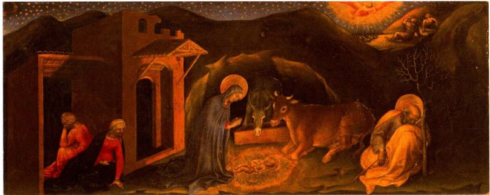

图15\.13 真蒂莱·达·法布里亚诺：《耶稣诞生》，《三王来拜》局部，位于祭坛台座。1423年。木板蛋彩画，

31x75厘米

画作背景表明艺术家对布鲁内莱斯基新建筑及其透视法的认识（见第513页的材料与技法）。绘有图案的圆柱两侧那高大的半露方柱令人回想起布鲁内莱斯基为帕奇礼拜堂所做的设计，勾勒拱门的简单线脚与虚构的礼拜堂中的檐部也是如此。马萨乔对透视法的运用，为观者提供了测量画面建筑内部的深度、绘制其平面图以及想象这个建筑的三维结构的全部必要信息。这座建有筒拱的房间并非浅壁龛，而是人物可以在其中自由运动的深度空间。画面空间独立于人物之外，人物寓居于这一空间之中，但并不创造这一空间。马萨乔运用布鲁内莱斯基的发明在空无一物的墙面上造就了空间的幻觉。

在精通透视法的观者看来，所有正交于画面的线条都交汇在十字架脚下的一点，它位于捐赠人下跪的平台上。要正确地观赏这幅湿壁画，我们必须正对这一点，大约处于教堂地面以上1\.5米高的视线位置。房间中的人物身高也为1\.5米左右，略矮于真人，而更靠近观者的捐赠人则与真人等高。所以作品的框架为“实物尺寸”，因为它正位于捐赠人的身后。在他们背后延展的礼拜堂似乎也具有同样的比例，礼拜堂向后延伸至空间深处，覆盖着筒拱。沿拱顶弧线的八块正方形藻井将其分隔开来，模仿了万神殿穹顶。整体空间似乎可以测量，可被触及。然而圣父的位置却令人迷惑。他的双臂托起十字架，靠近前景平面，但他的双脚却站立在紧贴墙壁的壁架上。壁架的深度有多少？如果它紧靠着后墙，那么上帝的形象就破坏了空间效果。但是，透视法则为什么要限制上帝？另外一种可能性在于，马萨乔意图将壁架设计在紧挨十字架背后的位置，圣约翰在墙壁上所投下的明显阴影或许可以解释这一点。那么，上帝到底站在哪里？同样的问题再次出现，自然法则是否也适用于造物主？

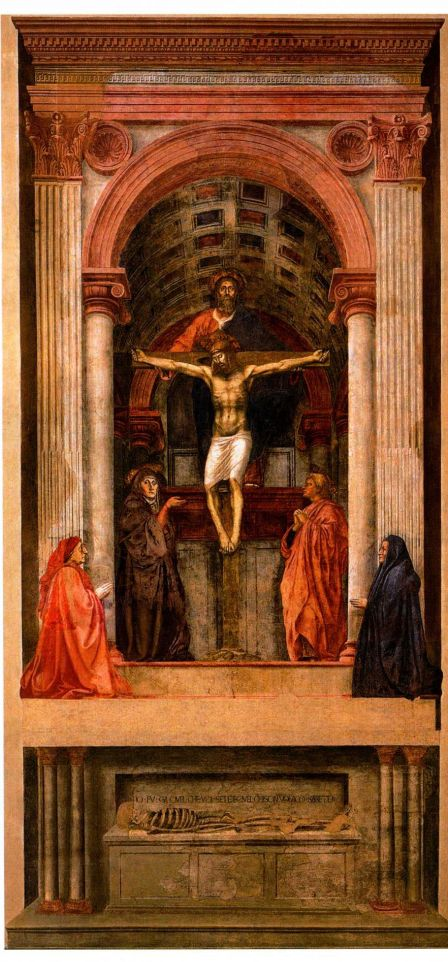

图15\.14 马萨乔：《圣三位一体与圣母、圣约翰以及两位捐赠人》

（The Holy Trinity with the Virgin，St．John，and Tuo Donors）。约1425年。

从原位置揭剥下来的湿壁画，6\.67 × 3\.17米。佛罗伦萨新圣母教堂

第十五章 15世纪意大利的早期文艺复兴 517

艺术史家的观点

赞助人研究

现	代观众在博物馆中观看艺术品时，可能不会意识到作品的原初功能或创作背景，也不会了解作品之所以被创造出来的详细情形。众多艺术史家认为，调查这一情境的重要途径之一就是研究艺术品的赞助人。此类研究可能包括在文献中寻找何人支付艺术家报酬的证据；分析赞助人在决定艺术风格与主题中所起的作用；评估艺术家与赞助人之间的关系；并从中总结出赞助人所期望的艺术品的用途。

文艺复兴时期赞助人与艺术家的关系多种多样：在宫廷之中，艺术家可能被看作王室的侍从，需要完成大量的日常琐事，他也可能被视为君主周围小圈子中受人尊重的人士，享有特殊的地位与声望。在中心城市里，艺术家们可能以更为平等的社会地位与赞助人交往，但艺术品的购买者对于完

圣父托举着圣子，象征圣灵的鸽子是两者之间进一步的联系纽带。马萨乔通过三角形构图来表达三位一体的主题，这个三角形始于两位捐赠人，终于上帝的光环。色彩的运用也细致地平衡了构图。正如上帝所着衣袍中红蓝两色的对立统一。整幅画面弥漫着悲剧气氛，圣母手指钉十字架场面的沉静姿态使画面更显凝重，福音约翰有所压抑的悲痛也加强了这种凝重。死亡的现实与复活的许诺对于丧葬纪念堂而言恰如其分。

布兰卡奇礼拜堂

即便《圣三位一体》湿壁画的捐赠人身份不明，我们也知道是谁支付了马萨乔现存作品中规模最大的一组。为了实现叔叔彼得罗	（Pietro）的遗愿，费利切·布兰卡奇（Felice Brancacci）承担了加尔默罗圣母教堂中布兰卡奇礼拜堂（Brancacci Chapel）湿壁画（图15\.15\-15\.18）的费用，这组湿壁画表现了圣彼得的生平。礼拜堂湿壁画的创作始于1425年，当时由马萨乔与年纪稍长的画家马索利诺（Masolino，1383\-约1440年）合作进行。两位艺术家都因其他委托而前往别处创作的时候，湿壁画尚未完成。马萨乔去了罗马，并于1428年在那里辞世。布兰卡奇礼拜堂的湿壁画最终由佛罗伦萨画家菲利皮诺·利皮（Filippino Lippi，1457／58\-1504年）绘制完成，他在15世纪80年代创作了礼拜堂两壁下层的全部绘画。这些湿壁画将礼拜堂的空间转变成为《圣经》故事的陈列室。

这组湿壁画中最著名的作品是位于上层、由马萨乔创作的《纳税钱》（The Tribute Money，图15\.17），它将《马太福音》17：24\-27中的故事表现为一幅连续的叙事场面。在中央部分，基督指示彼得前去抓鱼，鱼口中将含有要交纳给税吏的钱币。在画

成的作品仍然具有较大的发言权。对于献给教堂的赠礼，赞助人们可能要求艺术家把他们的肖像画入其中，或者要求突出展示他们的家族纹章，以便提醒观者捐赠人的身份，这种做法在中世纪末期广为流行。意大利的赞助人制度是范围更广的社会网络的一部分。在佛罗伦萨，某一地区的名门望族经常是服务于整个社区的大型项目的主要赞助人，例如美第奇家族对圣洛伦佐教堂的赞助，以及鲁切莱家族对新圣母教堂的赞助。其他家族或群体通常出于政治、社会或商业原因而与名门望族建立起联盟关系。在某些情况下，这种关系导致艺术作品表现或者指涉名门望族。受重要赞助人青睐的艺术家们，也会获得其他追随这些赞助人的客户的委托。研究这些问题增强了我们对艺术品在当时如何发挥其功能的理解。

面左部远处，彼得从鱼口中取出钱币，画面右部，他将钱币交给了税吏。马萨乔运用透视法为叙事创造了具有深度的空间，但是为了将画面空间与观者所在的空间连结在一起，他在塑造画面形体时借助了似乎是来自现实中礼拜堂窗户的光线。马萨乔还运用了空气透视法赋予风景以微妙的色调，使各种形式具有某种程度的模糊性，在扬·凡·爱克的《根特祭坛画》中也可以看到这种技法（见图14\.11）。画面效果还令人回想起十余年前多那太罗在圣乔治圣龛中所创作的小型浮雕（对比图15\.3）。

《纳税钱》中的人物多于《圣三位一体》中的人物数目，显示了马萨乔将乔托式人物的厚重感与人物身体和衣袍新呈现方式相融合的能力。所有人物都以平衡的对位姿态站立。五条划入灰泥的垂直线构成了贯穿各个人物从头顶到承重腿脚跟的中轴线。人物符合这种庄重的格调，看起来相当稳固。马萨乔笔下的人物并没有采用剧烈的身体运动，而是通过紧张的眼神以及若干有力的手势传达出叙事情节。但在紧邻该作品左侧的《逐出乐园》（The Expulsion fromParadise，图15\.18）中，马萨乔展现了运动中的人体。狭长的画面尺幅没有留出绘制空间背景的余地。天堂之门只露出极少的一部分，背景中仅有几处模糊荒凉的斜坡。然而，柔和且具有模糊效果的造型，特别是以大胆的透视手法所表现的天使，都传达出一种空间无限的感觉。马萨乔笔下极度悲伤的亚当与夏娃是对人类裸体之美及其力度的惊人再现。

马萨乔的绘画与真蒂莱·达·法布里亚诺作品中的流畅优雅（见图15\.12、15\.13）对照鲜明，再现了一个不那么美好的现实。尽管如此，马萨乔在布兰卡奇礼拜堂以及其他地方，曾与深受法布里亚诺影响的

518 詹森艺术史

马索利诺一同创作。这两位画家合作默契，甚至共同绘制了某些湿壁画，《纳税钱》中基督的头部可能就出自马索利诺之手。他们之间风格的鲜明差异在马索利诺创作的《诱惑》（The Temptation，图15\.16上层右部）中表现得最为惊人。此处的亚当与夏娃恬静优美，沐浴在自然的光线之中，而马萨乔的亚当与夏娃则通过他们真实的身体表现出强烈的情感。马萨乔在完成布兰卡奇礼拜堂湿壁画之前就赶赴罗马，为另一项委托而创作。他虽然在罗马英年早逝，但他的作品激励了其他画家继续透视空间的试验。

佛罗伦萨风格的传播：1425\-1450年

佛罗伦萨大教堂穹顶、圣米迦勒园中教堂的雕刻以及无数重建的礼拜堂，使得佛罗伦萨在1425至1450年间成为艺术家们的繁忙之所。布鲁内莱斯基、多那太罗与马萨乔的创新性作品以其表现力与权威性，给来自其他城市的观者留下了深刻的印象。诞生于佛罗伦萨的新风格通过赞助人与艺术家的旅行而传播到意大利的其他城市。起初，诸如比萨和锡耶纳等临近城市的赞助人雇用了马萨乔与多那太罗，但远至帕多瓦和罗马等地的赞助人很快也向他们定制了作品。

大事年表

1417年\-天主教会宗派分裂结束

1420年\-教廷从阿维尼翁迁回罗马

约1425年\-马萨乔在新圣母教堂创作湿壁画《圣三位一体》

1439年\-佛罗伦萨教务会议试图统一罗马教会与拜占庭教会

比萨

马萨乔的作品在罗马几乎没有存留，但他也为佛罗伦萨之外的其他赞助人创作作品。在临近的托斯卡纳城市比萨，他于1426年为加尔默罗会教堂的一座礼拜堂完成了一件由多块木板组成的祭坛作品（即多联作品［polyptych］）。现存的画板散落于不同艺术收藏机构。中央画板（图15\.19）表现的是位于宏大的佛罗伦萨式构图中的《升座圣母》，这种构图最初由奇马布埃创造，后经乔托改造（见图13\.17、13\.18）。与这些早期的绘画相同，马萨乔的作品也具有金色的底色与巨大的高背宝座，天使侍从分列宝座两侧（此处只显露出两位天使）。尽管具备这些传统元素，但该作品在某些方面却具有革命性。乔托作品中跪着的天使在此处转变为坐在宝座最下一层台阶上的鲁特琴演奏者。形体坚实的圣母所穿的长袍并没有以优雅的瀑状下垂，而是围裹着她的身体，正如多那太罗《圣马可》的衣袍一样。天真烂漫的基督也没

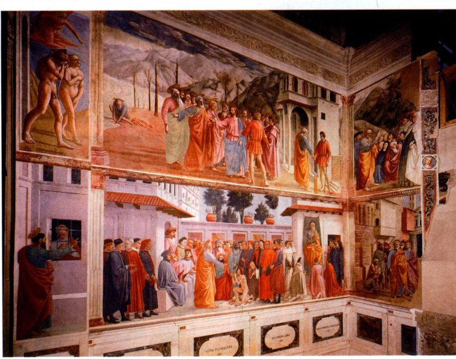

图15\.15 布兰卡奇礼拜堂左墙，由马萨乔等艺术家绘制的湿壁画。佛罗伦萨加尔默罗会圣母教堂

第十五章 15世纪意大利的早期文艺复兴 519

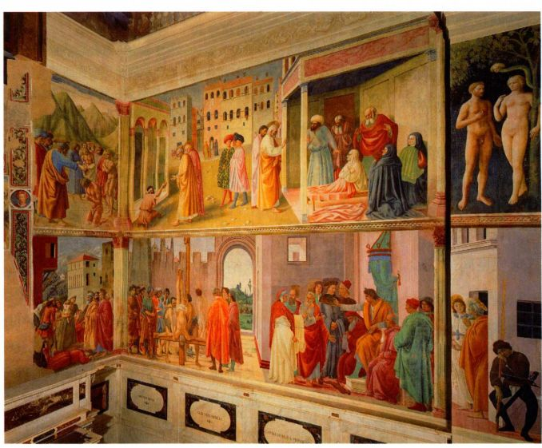

图15\.16 布兰卡奇礼拜堂右墙，由马萨乔、马索利诺与菲利皮诺·利皮绘制的湿壁画。佛罗

伦萨加尔默罗会圣母教堂

有作出祝福的姿态，而是吃着一串葡萄，这指涉葡萄酒与圣餐礼。最重要的是，人物强有力的比例使得他们甚至比乔托笔下的人物还要真实动人。这是一位十足的人间圣子。马萨乔用布鲁内莱斯基风格坚固朴素的石座取代了乔托式华丽而精巧的哥特式宝座，并出色地运用了透视法（特别注意两把鲁特琴的画法）。而根据湿壁画《圣三位一体》中的建筑来判断，他的这些手段并不出人意料。

除了以上这些元素，马萨乔还微妙且精确地描绘了画中人物与器物表面的光线。画面中阳光从左方射入，如同落日余晖。马萨乔避免了光影之间的强烈对

比，转而采用不完全的阴影，造就了变化丰富的渐变色调。光线照亮了形体，几乎消融了画面中的轮廓线，因此人物就具有了雕塑感。马萨乔创作此画时年仅25岁。三年后艺术家便弃世，终止了其绘画中所出现的革命性趋势。

锡耶纳

佛罗伦萨艺术家也得到了托斯卡纳地区其他城市的关注与委托定件。1416年，洛伦佐·吉伯尔蒂聚集起一批艺术家为锡耶纳的圣乔瓦尼洗礼堂创作一个新洗礼盆。洗礼盆为六边形，其中一块侧饰板交由多

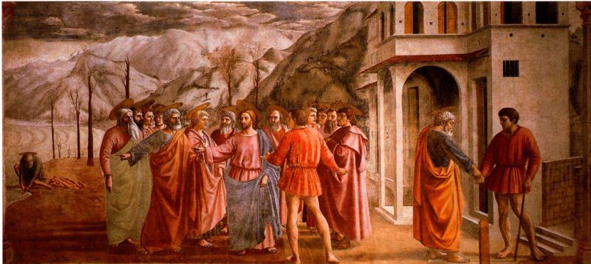

图15\.17 马萨乔：《纳税钱》。约1425年。湿壁画，

520 詹森艺术史

2\.46 × 5\.97米。位于布兰卡奇礼拜堂

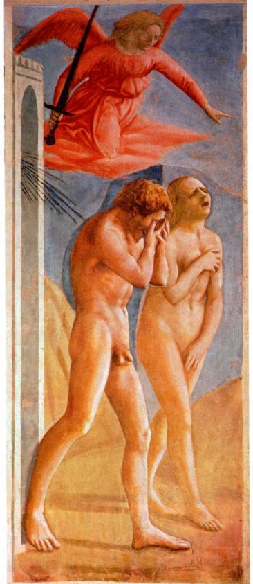

图15\.18 马萨乔：《逐出乐园》。约1425年。湿壁画，2\. 1 4 × 0\.90米。位于布兰卡奇礼拜堂

那太罗来完成，当时他正在吉伯尔蒂的作坊中工作。

1425年前后，多那太罗完成了题为《希律王的飨宴》（The Feast of Herod，图15\.20）的饰板，这块青铜镀金浮雕板具有与吉伯尔蒂的作品同样精致的表面（见图15\.1），但却更具表现力。行刑者向希律王呈上圣施洗约翰的头颅这一戏剧的焦点被安置在最左侧，舞动的莎乐美（Salome）与绝大部分观者则充塞在浮雕的右部，然而，中央部分却是空景。多那太罗创造了空洞以增加这一骇人听闻的场景的冲击力，这一点也表现在事件目击者的手势和表情中。再者，人物的离心运动表明画面空间并没有结束于饰板本身，它还在向各个方向延伸。因此边框就成为一个窗口，通过它我们看到了延深空间的一个片断。饰板中的拱形开口框出了这一空间现实的另外片段，将观者引入空间深处。

饰板中的建筑具有半圆拱、凹槽圆柱与半露方柱，

反映出菲利波·布鲁内莱斯基的设计。更重要的是，《希律王的飨宴》是运用布鲁内莱斯基线性透视法创造绘画空间的实例。一系列处于不同空间深度的拱为这一圣经故事的不同人物与时刻提供了背景：远景中，仆人托着施洗约翰的头，将其呈献给处于前景的希律王。多那太罗运用透视法将情节组织成为连贯的叙事，使其沿时间与空间展开。

帕多瓦

多那太罗在托斯卡纳地区的成功为他在1443年赢得了来自威尼斯共和国的委托定件。威尼斯军队的指挥官纳尔尼的埃拉斯莫（Erasmoda Narni，绰号加塔梅拉塔［Gattamelata］）刚刚过世，威尼斯城打算立一座雕像来表彰他的功勋。多那太罗用青铜铸造他所做

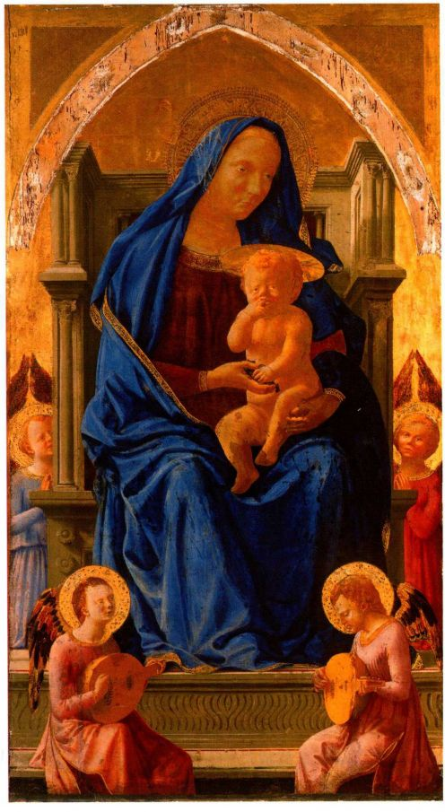

图15\.19 马萨乔；《升座圣母》。约1426年。木板蛋彩画，

142x74厘米。伦敦国家美术馆

第十五章 15世纪意大利的早期文艺复兴 521

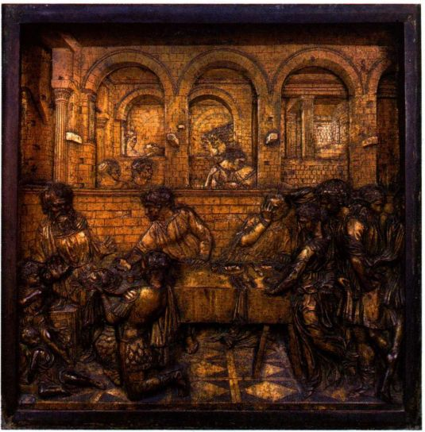

图15\.20 多那太罗：《希律王的飨宴》。约1425年。青铜镀金，59 \.7 × 59\.7厘米。锡耶纳大教堂洗礼盆

的最大的圆雕《加塔梅拉塔骑马像》（The EquestrianMonument of Gattamelata，图15\.21），这尊雕塑一直保存在原初位置，至今仍伫立在帕多瓦圣安东尼教堂（St\.Anthony）旁边的基座（pedestal）上。多那太罗曾在罗马游历，他必定了解以《马可·奥勒利乌斯骑马像》（见图7\.21）为代表的骑马像传统，但他也知晓在米兰的博纳博·维斯孔蒂墓葬雕像（见图13\.36）中所体现的中世纪传统。与《马可·奥勒利乌斯骑马像》相同，《加塔梅拉塔骑马像》十分高大，给人以深刻的印象，并创造出一种平衡感与高贵感。为了背负身披全副盔甲的加塔梅拉塔，他胯下的马匹如此沉重庞大，以至于骑者必须以其个性力量来驾驭它，而不是凭借体格上的优势。这件作品与维斯孔蒂墓葬雕像的共同之处在于，它们都属于表现军事领袖骑马像的丧葬雕像传统。在这件生动表现将军的作品中，多那太罗精心地以写实手法描绘了盔甲与装备，并强有力地刻画了加塔梅拉塔本人的特征，再次为这一传统注入活力。

美第奇时代的佛罗伦萨：1430\-1494年

美第奇家族在1434至1494年间统治着佛罗伦萨城。四代美第奇家族成员中，均有子弟活跃于政坛和商界，而该家族的女性则在城市的社会与宗教生活中扮演着重要角色。美第奇家族的财富来自商业与银行业收益，以及同佛罗伦萨与其他意大利中心城市所建

立的明智的政治联盟。作为服务于教皇的银行家，美第奇家族的成员成为佛罗伦萨教皇党派的领袖，并最终成为该城的实际统治者。

他们的财富始自14世纪末乔瓦尼·迪·比奇·德·美第奇（1360\-1429年）的精明投资，其子科西莫·德·美第奇（Cosimo de＇Medici，1389\-1464年）， 卷入了15世纪30年代的宗派纷争，于1433年被逐出佛罗伦萨。但他所属的宗派在1434年取得了胜利，于是科西莫返回该城并成为政府的领导者。科西莫的儿子皮耶罗·德·美第奇（Piero de＇Medici，1416\-1469年），与乔瓦尼（Giovanni）追随了父亲的足迹，皮耶罗的儿子洛伦佐·德·美第奇（Lorenzode＇Medici，1449\-1492年）成为15世纪最为知名且交友广泛的人，被称为“伟大的洛伦佐”（Lorenzothe Magnificent）。除与佛罗伦萨以及其他城市中的名门望族建立联系之外，美第奇家族还促进了佛罗伦萨人文主义者的文学与教育创新，并积极地运用艺术品来展现他们的政治与社会地位。

其他各大家族或者与美第奇家族缔结联盟，或者在商业、政治，乃至艺术领域与其一争高下。在此期间，佛罗伦萨城也继续定制艺术作品来增加它的荣耀。美第奇家族统治期间，15世纪早期艺术中的风格继续得到发展，并且出现了新的艺术题材。布鲁内莱斯基的形式在佛罗伦萨建筑中占据了主导地位，莱昂·巴蒂斯塔·阿尔贝蒂的观念与设计也是如此。包括吉伯尔蒂和多那太罗在内的15世纪上半叶的雕塑家们，对年轻一代雕塑家产生了强烈的影响，例如卢卡·德拉·罗比亚、贝尔纳多·罗塞利诺、安东尼奥·德尔·波拉尤奥洛与安德烈亚·德尔·韦罗基奥。宗教团体与教堂为墙壁空间或者祭坛购入了绘画作品，创作这些作品的画家受到马萨乔的古典主义与自然主义，以及真蒂莱·达·法布里亚诺的优雅风格的强烈影响。艺术家们为具有广泛文化与学识兴趣的富有赞助人发展出了绘画和雕塑的新形式与新题材。

雕塑与建筑雕塑

吉伯尔蒂为佛罗伦萨洗礼堂创作的第一组青铜门令监管该建筑的羊毛商行会印象至深，他们再次委托这位艺术家铸造第二对青铜门。这对青铜门始作于1425年，但直到1452年都未能完工，最终被装设在洗礼堂的东大门，面对着佛罗伦萨大教堂。这个区域被称为天堂，所以这里的大门被称作“天堂之门”（Gatesof Paradise，图15\.22）。两幅门扇各由五块正方形大型饰板组成，与之前那对青铜门的28块四叶饰形小

522 詹森艺术史

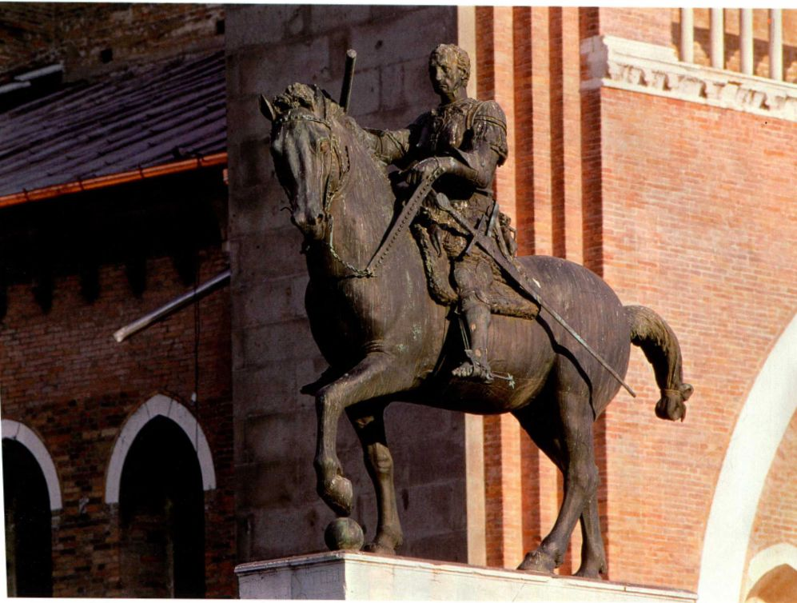

图15\.21 多那太罗：《加塔梅拉塔骑马像》。1445\-1450年。青铜，约3\.35x3\.96米。帕多瓦圣徒广场（Piazza del Santo）

饰板相比，此处具有更大的装饰区域。饰板上表现的是《旧约》中的故事场景，就此使得三对青铜门的整体设计得以完满：一对表现施洗约翰生平，一对表现基督生平，这一对则以《旧约》为题材。这组青铜门的设计可能出自人文主义者安布罗焦·特拉维尔萨里（Ambrogio Traversari，1386\-1439年），并经秘书长莱奥纳多·布鲁尼（见第505页）补充，后者曾指示这些青铜门应该既宏伟壮观，又意义丰富。为了造就壮丽感，吉伯尔蒂将青铜通体镀金，并在饰板边框中设计了带人物的小龛、具有头像的圆盘饰以及花叶装饰。主题的选择与清晰的叙事则传达了丰富的意义。

在设计浮雕之时，吉伯尔蒂运用了自己以及竞争对手们为创造图像而开创的新手法，其中包括多那太罗创作圣米迦勒园中教堂的圣乔治时所采用的扁浮雕样式，以及由布鲁内莱斯基发展并被马萨乔所运用的线性透视法。人物优美的比例、雅致的姿态与流畅的衣袍说明吉伯尔蒂个人对国际哥特式风格的忠诚。《以撒献祭》（见图15\.1）中对空间的细微暗示在《雅各与以扫》（The Story of Jacob and Esau，图15\.23）中发展成为一种更深邃的空间样式，由用于容纳人物的

建筑拱门来界定。这些人物反复出现于建筑之中，构成连续的叙事情节。浮雕讲述了以撒祝福幼子雅各而不是长子以扫的故事。浮雕左部，双目失明的以撒遣以扫前去狩猎，右部则是以撒祝福伪装成哥哥的雅各的场景。对于中世纪的神学家而言，以撒偏爱幼子雅各而舍弃长子以扫预示着基督将取代犹太教的地位。吉伯尔蒂作品中宽敞的厅堂是文艺复兴早期建筑设计的优秀实例。

佛罗伦萨城中，并非每一工程的造价都堪比《天堂之门》，但是卢卡·德拉·罗比亚（Luca dellaRobbia，1400\-1482年）的赤陶雕塑则是一种具有吸引力且造价低廉的替代品。卢卡在本色粘土表面覆盖了瓷釉般的釉层，以保护雕塑免受天气条件的损害。他运用此类技术创作的最精美的作品，表明了艺术家以古典形式的新语言，创造清晰易懂且以神圣题材为主题的叙事场景的雄心。这类作品包括佛罗伦萨大教堂一座大门之上的《基督复活》（The Resurrection，图15\.24）。基督的形象在构图中占据着主导地位，他飘浮在与半月形饰面底边平行的石棺之上。卢卡在石棺两侧设置了身着盔甲的古罗马士兵，其灵感来自

第十五章 15世纪意大利的早期文艺复兴 523

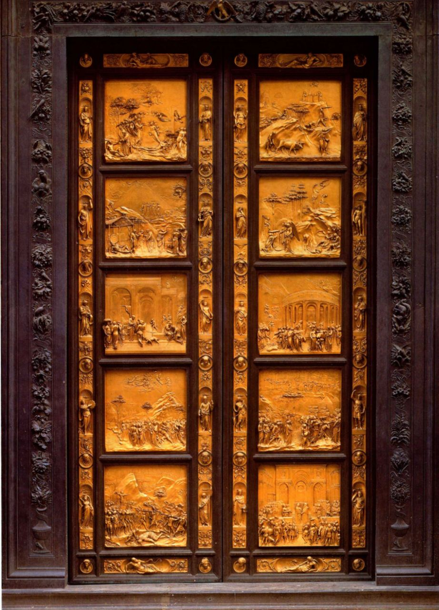

图15\.22 洛伦佐·吉伯尔蒂：《天堂之门》，佛罗伦萨圣乔瓦尼洗礼堂东大门复制品。1425\-1452年。青铜镀金，高4\.57米

森艺术史

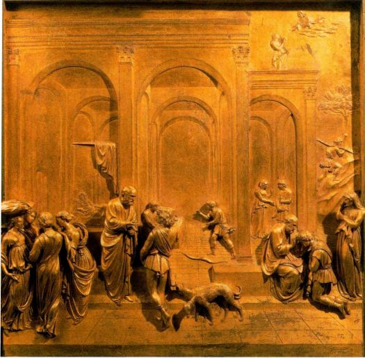

图15\.23 洛伦佐·吉伯尔蒂：《雅各与以扫》，《天堂之门》饰板。约1435年。青铜镀金，高79\.5厘米。佛罗伦萨圣乔瓦尼洗礼堂

古典原型。白色釉层在半月形饰面深蓝底色的衬托下产生出大理石般的效果，使作品构图更为清晰明畅。此类大理石与青铜雕塑的替代品价格低廉，吸引了众多购买者，德拉·罗比亚家族的作坊变成了工厂，生产出成百件圣母小饰板、祭坛作品与建筑雕塑，至今仍装设在佛罗伦萨城各处及其周边的村庄里。

即便是最著名的艺术家也会运用廉价的材料进行创作。尽管我们对定件的情况不甚了解，但多那太罗无疑在15世纪中期创作了极具感染力的《抹大拉的

大事年表

1431年\-圣女贞德在卢昂被处决

1437年\-黄金之屋在威尼斯完成

1445年\-多那太罗创作《加塔梅拉塔骑马像》

玛利亚》（Mary Magdalen，图15\.25）。这件真人大小的雕像材质为白杨木，经过了彩绘与贴金处理。中世纪晚期抹大拉的玛利亚生平中所增添的部分陈述了这样的故事，她在晚年时进入沙漠，在悔过与隐修中了结余生。在创作自己的玛利亚形象时，多那太罗在柔软的木材上雕刻出复杂的质感，表现出她粗糙的长袍与头发，并使人物展现出憔悴消瘦的面容。她的肢体与面部施有赭红色，正如在沙漠中生活的人的肤色，但是她的头发最初曾贴有金箔。这件作品的创作年代可以追溯到15世纪30年代至50年代之间。许多学者将它视为多那太罗晚年所创作的作品，由此他们认为作品所具有的精神强度表明艺术家晚年的心绪发生了变化。无论如何，《抹大拉的玛利亚》显示出多那太罗作为雕刻家的创作广度，因为他运用了另一种的雕刻媒介来探索艺术表现的可能性。

人文主义者之墓杰出的秘书长莱奥纳多·布鲁尼去世时，佛罗伦萨城为他在圣十字教堂建造了一座纪念墓（图15\.26）来表达对他的敬意。自从15世纪初以来，这位人文主义政治家在佛罗伦萨的市政事务中起到了至关重要的作用。于他1444年过世之际，该城为他举行了“古代礼制”的盛大葬礼。这座墓葬由贝尔纳多·罗塞利诺（Bernardo Rossellino，1409\-1464年）创作完成，他是一位来自佛罗伦萨乡村地区

图15\.24 卢卡·德拉·罗比亚：《基督复活》。1442\-1445年。釉面赤陶，1\.6 × 2\.22米。佛罗伦萨巴杰罗国家博物馆

第十五章 15世纪意大利的早期文艺复兴 525

的雕塑家。由于布鲁尼出生在阿雷佐（Arezzo），他的家乡可能曾为这一项目贡献资金，并且促成了曾在阿雷佐生活过的罗塞利诺获得委托定件。

作为政治家、历史学家以及文学家，布鲁尼对佛罗伦萨的贡献塑造了该城人民将自身视为罗马文化继承者的观念，罗塞利诺的设计正是对这一主题表示敬意。坟墓中的形象反映了布鲁尼葬礼的面貌，他的雕像躺在罗马雄鹰托举的棺架上，头戴桂冠，右手放在一本书上，这本书可能就是他所撰写的《佛罗伦萨史》（History of Florence）。石棺上有两位带翼人物抬着一段铭文。唯一的宗教元素出现在半月形饰面之中，圆盘饰中的圣母子俯视着下方的雕像。拱门之上是由天使托举且置于桂冠之中的狮子纹章。

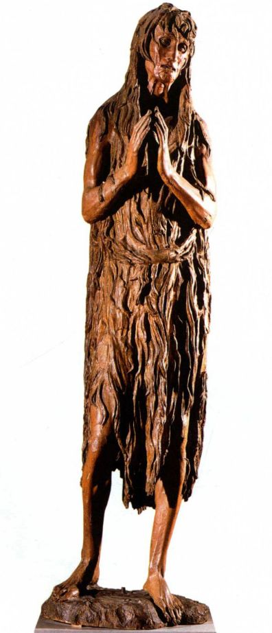

图15\.25 多那太罗：《抹大拉的玛利亚》。约1430\-1450年。彩绘贴金木雕，高1\.85米。佛罗伦萨大教堂博物馆

这是佛罗伦萨的象征，它将布鲁尼同其所服务的城市联系在一起，并将佛罗伦萨与布鲁尼复兴罗马功业的目标联系在一起。

韦罗基奥为圣米迦勒园中教堂所作的雕塑 15世纪下半叶，圣米迦勒园中教堂发出了更多的雕塑委托定件。1462年之后的某个时间，一座由多那太罗所做的雕塑被移走，空出的壁龛重新分配给了商业行会的仲裁人组织。该团体雇用安德烈亚·德尔·韦罗基奥（Andrea del Verrocchio，1435\-1488年）雕刻一件能反映其职业活动的作品，以传统上与正义有关的题材为主题。壁龛的构造仍保持着多那太罗所设计的样式，所以韦罗基奥在创作《多马的疑惑》（TheDoubting of Thomas，图15\.27）时，没有将人物挤压进壁龛的浅短空间之中。青铜铸成的人物紧挨着彼此，使徒多马将手探向基督体侧的伤口，寻找复活神迹的证据。韦罗基奥身兼雕刻家与画家二职，这件作品具有当时画家所关注的质感变化、厚重衣褶中的光影交响以及幻觉主义手法。壁龛几乎无法容纳尺寸过大的人物，所以多马的一只脚踏在框架界限之外，将路人与该场景联系在一起。多马的身体扭向壁龛之中，观赏者的目光由此被引向基督的温和表情。多马和基督生动的姿态与其在姿态上的大胆交流传达出这一场面的戏剧性。韦罗基奥运用衣褶深厚、形态翻动的长袍表现出基督的平静安详与多马的心神不宁。米开朗基罗因这件作品的人物之美而赞叹不已；达·芬奇则从他的老师韦罗基奥那里学会了如何塑造那些动作表达内心激情的人物。

15世纪中期佛罗伦萨的教堂与女修道院

佛罗伦萨大教堂、洗礼堂与圣米迦勒园中教堂的艺术创作进行的同时，该城其他地方也出现了修建与翻新工程。全城上下的教堂和女修道院都经历了重建或扩建，为之定制相应装饰的情形也时有发生。提倡恢复修道院生活，并更为严格地奉行此类机构的古代规则是15世纪宗教生活的重要特色之一。奉行教规运动的领袖经常能够获得市民的敬仰与支持。文艺复兴时期的艺术家与赞助人希望将新风格融入那些表现他们信仰的作品之中。运用自然主义与空间效果所创作出的形象更为有力地向信徒们传达着信息。透视法和其他技法能够将观者与宗教故事联系在一起，唤起他们的心神交融之感。通过研习古典艺术，产生了关于得体的绘画的新观念，这些新观念启发艺术家创造了具有高贵人物、构图平衡的作品。然而在15世纪，并非所有教会人士都赞同宗教艺术中日益增加的

526 詹森艺术史

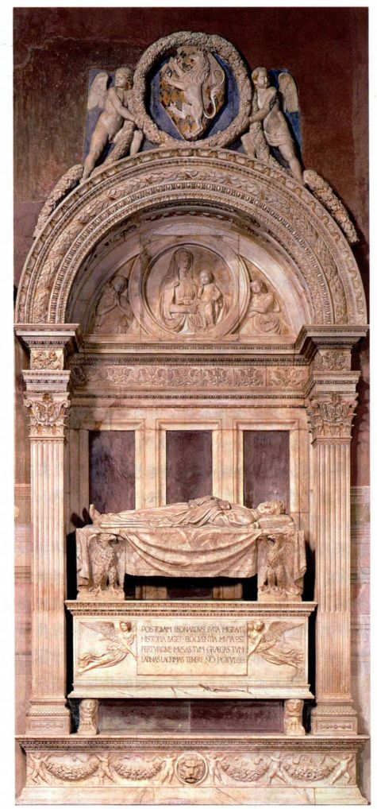

图15\.26 贝尔纳多·罗塞利诺：《莱奥纳多·布鲁尼之墓》。约1445\-1450年。大理石，至拱门顶部高6\.1米

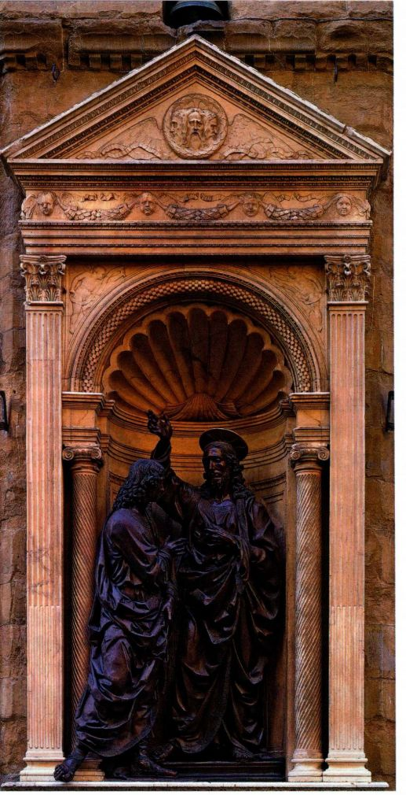

图15\.27 安德烈亚·德尔·韦罗基奥：《多马的疑惑》。1467\-1483年。青铜，基督高2\.3米、多马高2米。佛罗伦萨圣米迦勒园中教堂（复制品）

生活区的大量湿壁画。他的湿壁画作品《圣母领报》

（Annunciation，图15\.28）创作于1440至1445年间，

位于修士们住所入口处的墙面上，夺人眼目。他将这

一重大事件中的两位主角安置在与修道院真实建筑极

其相似的拱顶之下。虽然空间按照透视法来设定，但

人物形体太大，置身其中显得局促。圣母与天使加百

列四目相望，他们谦恭地将双手交叠在胸前，表达着

对上帝意志的服从。画面中形式优雅，整个场景疏朗

简朴而不铺陈夸张。色彩朦胧淡薄，构图更是精简到

构图具有马萨乔的简洁与精致空间（见图15\.17），

利科修士（Fra Angelico，约1400\-1455年）。安杰 极致，柔和温暖的光线笼罩着所有形象。安杰利科的

自然主义与古典化形式。基督教艺术形式与古典艺术形式之间的紧张之势在15世纪末达到爆发阶段，多明我会布道者吉罗拉莫·萨沃纳罗拉（GirolamoSavonarola）强烈谴责了这些“异教”图像。

圣马可修道院的安杰利科修士 在科西莫·德·美第奇的支持下，多明我修士于1436年在佛罗伦萨修建了一座供男修士修行的修道院。该院成员中有一位来自佛罗伦萨乡村的天才画家，他就是乔瓦尼·达·菲耶索莱修士（Fra Giovanni da Fiesole），人称安杰利科为这座新修道院绘制了祭坛画、书籍，以及修士

第十五章 15世纪意大利的早期文艺复兴 527

图15\.28 安杰利科修士：《圣母领报》。约1440\-1445年。圣马可修道院修士住所一层的湿壁画，			2\. 1 6 × 3 \.2米。佛罗伦萨圣马可博物馆（Museo di San Marco）

然而他的人物像真蒂莱·达·法布里亚诺的人物一样优美雅致（见图15\.12）。湿壁画底部的题词要求修士们在经过此处时口念万福玛利亚（Ave Maria）。这幅作品无疑丰富了他们的祈祷与冥想生活，这正是此类意象在宗教僧团中所要达到的目标。

圣阿波洛尼亚女修道院的卡斯塔尼奥 佛罗伦萨拥有大量的女修道院，修女们同样希望美化她们的处所，但是女修道院的修女们几乎没有人能像安杰利科那样成为技艺高超的画家。因此安德烈亚·德尔·卡斯塔尼奥（Andrea del Castagno，约1423\-1457年） 等职业画家就被雇来运用适当的图像装饰修道院的空间。1447年前后，卡斯塔尼奥为本笃会的圣阿波洛尼亚（Sant＇Apollonia）女修道院绘制了他最为著名的湿壁画作品《最后的晚餐》（The Last Supper，图15\.29）。这件作品是他为饭厅所创作的一组湿壁画中保存最为完好的一幅。画家将事件安置在一间装设有丰富饰板的凹室之中，凹室四边分别环绕着古典化的半露方柱与其他装饰纹样。卡斯塔尼奥通过巧妙地运用透视法，为事件创造出类似于舞台的空间。强烈的明暗对比塑造出环坐在桌边、雕塑般假想的人物。正如中世纪时期对该题材的表现那样，犹大独自坐在桌子的左侧。色彩鲜艳的嵌板强调了建筑的对称性，建筑的对称又迫使人物的排列具有相类似的秩序，并且显示出将他们囚禁于其中的威胁。除偶尔的目光与手势之外，使徒之间几乎没有任何交流，因此某种若隐若现的沉默笼罩着整个画面。卡斯塔尼奥打破了传统与透视法的规则，运用一种大胆的设计来打断画面

中的对称，且聚焦于场景的戏剧性。桌子背后，墙壁上六块大理石嵌板中的五块都填充着柔和的着色大理石。然而圣彼得、犹大与耶稣头顶的那块嵌板却具有如此炫目暴烈的纹理，似乎一道闪电击打在犹大的头上，将人们的注意力吸引到这些关键人物身上。在这幅湿壁画前用餐的修女们能够从中看到自己应该追随的榜样，以及应当避免的恶行。

麦诺利的圣露西教堂的多梅尼科·韦内奇亚诺 世俗阶层也需要宗教意象来装饰教区教堂的祭坛。15世纪40年代，祭坛饰板的设计发生了重大的改变，可能这一改变首先出现在安杰利科修士的作品中，之后不久为众多画家所采纳。早期祭坛画正如法布里亚诺的《三王来拜》（见图15\.12）一样，是具有精雕细刻边框的复杂综合体，但是新型祭坛作品则强调清晰的几何装饰甚于强调流金溢彩的木工工艺。1445年前后，画家多梅尼科·韦内奇亚诺（DomenicoVeneziano，约1410\-1461年）为佛罗伦萨的麦诺利的圣露西教堂（Santa Lucia dei Magnoli）的主祭坛绘制了《圣母子与圣徒》（Madonna and Child withSaints，图15\.30）。正如他的名字所显示的，多梅尼科来自威尼斯，他在1439年前往佛罗伦萨寻找工作机会。一封他于1438年写给科西莫·德·美第奇之子的信表明，多梅尼科了解许多关于该城在竞赛中脱颖而出的艺术品的情况（见第532页的原始文献），并且其作品也显示出他对佛罗伦萨艺术家的研究。多梅尼科为圣露西教堂所绘制的祭坛画表现了升座的圣母子，他们身处建筑框架之中，周围环绕着诸

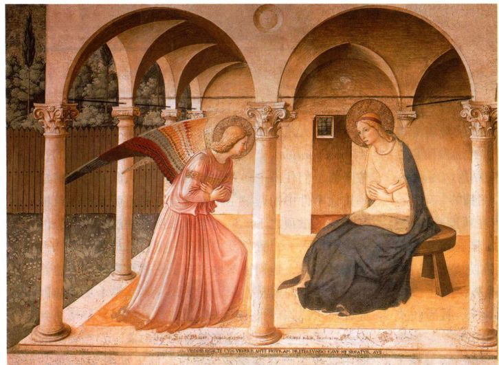

528 詹森艺术史

图15\.30 多梅尼科·韦内奇亚诺：《圣母子与圣徒》。约1445年。木板蛋彩画，2\.08x2\.13米。佛罗伦萨乌菲齐美术馆

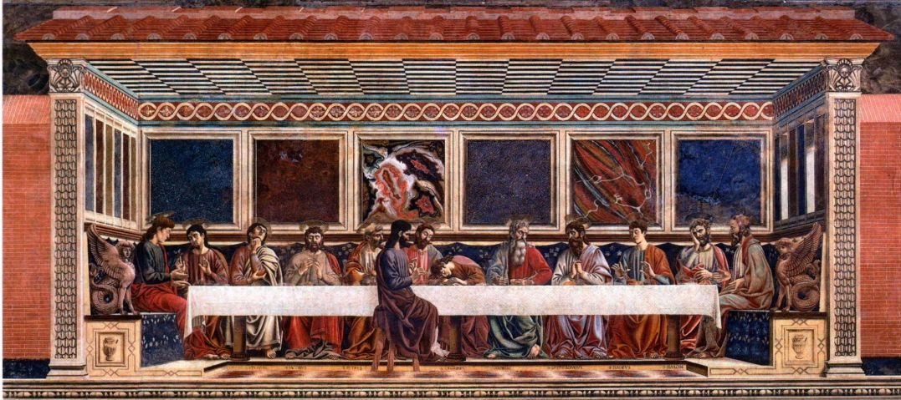

图15\.29 安德烈亚·德尔·卡斯塔尼奥：《最后的晚餐》。约1445\-1450年。湿壁画。佛罗伦萨圣阿波洛尼亚修道院

位圣徒，其中包括佛罗伦萨的主保圣人之一芝诺比乌斯（Zenobius）与基督教早期的殉教者圣露西（St\.Lucy），后者手中托着的盘子里放着她的双眼。

圣母位于中心，周围环绕圣徒或天使的题材通常被称为神圣会谈（sacra conversazione），这表明该意象并非叙事场景，而是寓居着高贵端庄廷臣的天庭一瞥。多梅尼科将这一聚会设想在光线充足且装饰着粉绿两色大理石的凉廊之中。建筑结构清晰，令人信服，然而

它所界定的却是高于世俗世界的理想空间。多梅尼科可能依据马萨乔的《圣三位一体》湿壁画（见图15\.14）塑造了这一空间，因为他作品中的圣约翰（左起第二位人物）望向观者却手指圣母，其眼神与手势与马萨乔的圣母如出一辙。多梅尼科的透视背景堪与马萨乔比肩，然而他的建筑形式却具有哥特式的比例与拱门样式。男性圣徒消瘦而筋骨十足的身体以及高度个性化、富于表情的面孔都显示出多那太罗的影响（见图15\.3）。

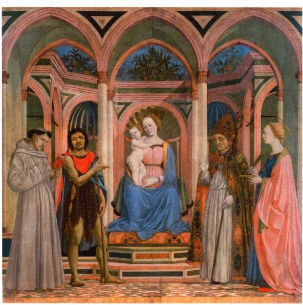

第十五章 15世纪意大利的早期文艺复兴 529

多梅尼科将色彩当作画面整体的组成部分，这幅神圣会谈作品在色彩组合与构图方面都值得关注。红、蓝、黄的色点点缀在粉色、浅绿色和白色色块之中，和谐融洽，如此浅淡的色调让哥特式木板绘画的明亮与自然光线和透视空间达到了协调。日光从右侧流泻而下，圣母身后投射出的阴影表明了这一点。画中各种表面如此强烈地反射着光线，以至于阴影部分都洋溢着鲜亮的色彩。这幅作品中的色彩、光线与空间协同作用，创造出信徒可以从中得到慰藉的天堂之景。

阿尔贝蒂为新圣母教堂修建的新正立面 多梅尼科《圣母子与圣徒》中虚构建筑的大理石表面是佛罗伦萨教堂立面的理想化翻版。但是佛罗伦萨很多重要教堂在15世纪时仍缺少正立面，其中包括新圣母教堂。这座多明我会教堂的外部主要建于1278至1350年间，多彩哥特式壁龛之上的部分与哥特式大门，由两侧墙壁延伸出来所构成，还没有完工。

修复与改善一座教堂是虔诚之举，这样的动力对教区成员乔瓦尼·鲁切莱（Giovanni Rucellai）而言已然足够充分，他使这一正立面在1458年前后终于得以完工（图15\.31）。鲁切莱雇用了莱昂·巴蒂斯塔·阿尔贝蒂来设计安装大理石贴面。多彩大理石嵌镶的正立面是托斯卡纳地区的传统。阿尔贝蒂参照了佛罗伦萨大教堂（见图15\.2）以及该城的其他教堂，其中包

括洗礼堂（见图11\.35）与圣明尼亚托教堂（见图11\.36），引人注目的连拱廊的设计的灵感可能就出自后者。

除入口和固定的巨型圆窗以外，阿尔贝蒂的正立面掩饰了它与教堂其他部分的关系。建筑师决定不受教堂内部结构的限制，自由地将正立面设计为众多正方形组合而自成体系。三个主要的正方形分割立面：两个位于底层那座极其古典化的正门两侧，同样，檐壁之上的神庙形立面构成了另一个正方形。数学比率将这三个正方形锁定在与立面整体及设计中其他元素构成的关系网络之中。阿尔贝蒂运用优雅的旋涡饰来弥补神庙形立面与檐壁间的宽度落差，这确实是创新之举，并对日后的建筑产生了极其深刻的影响（对比图17\.21）。这种设计使高侧窗隐而不现，从而掩盖了正立面与教堂主体的松散关系。就在三角楣下方，神庙形立面的檐壁带上，阿尔贝蒂设置了一段题词，将教堂立面得以完工的功绩归于乔瓦尼·鲁切莱。因建造而赢得荣耀的是赞助人，而非艺术家。

家庭生活：府邸、陈设与绘画，约1440\-1490年

诸如乔瓦尼·鲁切莱或者科西莫·德·美第奇这样的赞助人，要求艺术家为教会创作作品的同时，也

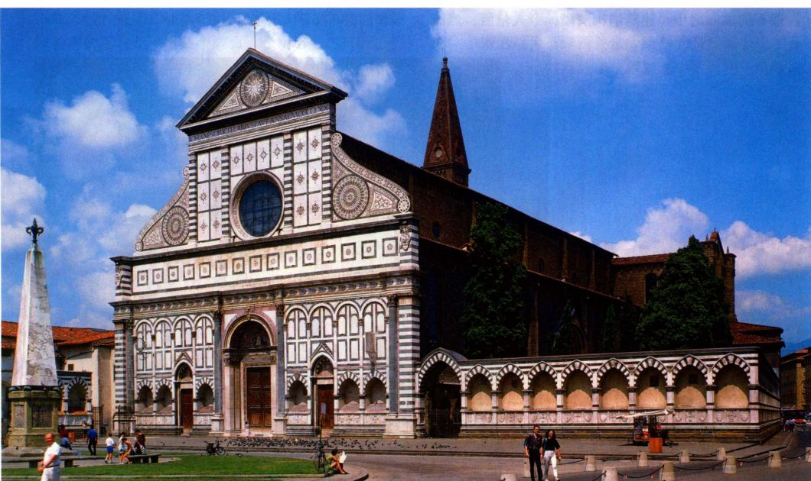

图15\.31 莱昂·巴蒂斯塔·阿尔贝蒂：佛罗伦萨新圣母教堂的正立面。1458\-1470年

530 詹森艺术史

为自己的家庭定制艺术品。随着家族财富的积累，他们就需要建造或改造府邸，为家居提供适当的环境，并向人炫耀。家里的陈设也要显示家族的地位。新型雕塑与绘画，例如嫁妆箱奁绘画，表明了家族之间的联系。艺术品表现着新的题材，其中很多都受到古典艺术的启发，展现出艺术家与赞助人所接受的人文主义教育。在雕塑领域，长寿的多那太罗成为波拉尤奥洛等年轻雕塑家的导师。画家则在马萨乔的庄重简洁与真蒂莱·达·法布里亚诺的理想化优美形式之间左右摇摆，力图在古典艺术世界中找到描绘意象的正确语言。阿尔贝蒂与米开罗佐等建筑师通过运用古典形式，赋予他们所建造的家居住宅以高度的庄严之感。

贵族府邸

早在阿尔贝蒂为新圣母教堂制作定制作品之前，鲁切莱家族就委托他设计府邸（图15\.32）。阿尔贝蒂还是只负责设计建筑外部，可能还得到了贝尔纳多·罗塞利诺的协助，三种中世纪样式融合于一座府邸的设计之中。石砌立面试图规则条理化这座三层建筑。它包括三列半露方柱，其间间隔着宽阔的额枋，这是模仿罗马斗兽场的样式（见图7\.38）。然而半露方柱如此扁平，与壁面合为一体，整个立面则像是艺术家将罗马斗兽场外部的线性示意图投射于其上的一个平面。

阿尔贝蒂在此处力图解决文艺复兴时期建筑中一个基础性的问题，即如何将古典系统运用于非古典的建筑外部。檐部所形成的强烈水平感将建筑分为三层，但是略突出于壁面的半露方柱所形成的重复，产生出与水平感相制衡的垂直感。而且，底层的半露方柱比第三层的更为突出，底层为多立克柱式而顶层为科林斯柱式所支撑，这样的半露方柱布局在实际作用上以及在形式感上，都减轻了自身的重量。阿尔贝蒂均衡地处理半露方柱、檐部与拱券等元素，使其统一于设计整体之中。最终形成了一个强调壁面线性形式的网络，并成功地将古典形式用于家居住宅。无需大量花费，这座府邸就成为鲁塞莱家族高贵身份的宣言。

考虑到自身在佛罗伦萨的地位，美第奇家族需要一座更为华丽的府邸，以供家庭成员居住，并满足政治与外交需求。然而，科西莫·德·美第奇拒绝了布鲁内莱斯基所做的一项设计，可能他认为该设计过于张扬。设计委托最终落到了年轻建筑师米开罗佐·迪·巴托罗梅奥（Michelozzo di Bartolomeo，1396\-1472年） 头上，他曾作为雕塑家与吉伯尔蒂和多那太罗合作过。米开罗佐的设计（图15\.33）令人回想起防御工事般

大事年表

1434年\-科西莫·德·美第奇成为佛罗伦萨政府的领导者

1450年\-弗朗切斯科·斯福尔扎攫取米兰的统治权

1452年\-吉伯尔蒂的佛罗伦萨洗礼堂《天堂之门》完工

1453年\-奥斯曼土耳其人占领君士坦丁堡，奥斯曼帝国兴起

的佛罗伦萨旧宫，或许正是这种保守风格吸引了科西莫。底层的窗户是1516至1517年间米开朗基罗增设的部分，整个建筑在17世纪时由里卡尔迪（Riccardi）家族扩建。

米开罗佐借鉴了佛罗伦萨市政厅的若干窗户设计与粗面石工（rustication，对比图13\.16）技术，但他让形式轻盈了许多。建筑的三层构成阶梯状的序列：底层以粗凿的粗面石为特色；第二层是表面平滑的石砖；第三层则是一个完整的平面。建筑顶部“盖”着一座极其突出的檐口，正如罗马神庙中的屋顶。在内部，府邸的空间面向一座中央庭院开放，庭院四边

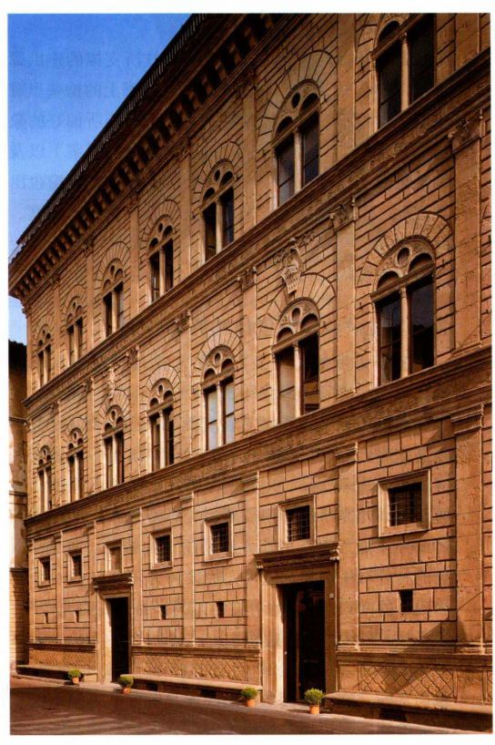

图15\.32 莱昂·巴蒂斯塔·阿尔贝蒂：佛罗伦萨鲁切莱府邸正立面。

1446\-1451年

第十五章 15世纪意大利的早期文艺复兴 531

原始文献

多梅尼科·韦内奇亚诺恳求工作

这位威尼斯画家在1438年给皮耶罗·德·美第奇写了一封信，请求他考虑把该家族将要分发的一项委托指派给自己。这封信表明多梅尼科对这件委托作品的了解，以及他应该得到委托的理由。

致佛罗伦萨尊敬慷慨的皮耶罗·迪·科西莫·德·美第奇\(Piero di Cosimo de'Medici\)······

尊敬慷慨的先生。在适当的问候之后，我告知您：感谢上帝的恩典，我一切都好。我希望您也同样健康快乐。我已经多次询问过您的情况······首先获知您身在何处，这样我就可以写信给您，这是我的职责，也让我内心感到慰藉。我低微的身份不配给您这样高贵的人写信，但是我对您、对您所有臣民完满良好的爱，让我斗胆给您写信，而且这也是我应尽的责任。

最近我听闻科西莫（皮耶罗之父）决定委托绘制一幅华丽壮观的祭坛画，这件作品令我非常高兴。如果您能慷慨地将这幅作品交给我完成，我将会更为高兴。如果这个愿望能

围绕着由布鲁内莱斯基式古典化圆柱所支撑的连拱廊（图15\.34，见图15\.6、15\.7）。连拱廊上的檐壁里雕刻着圆形浮雕，其中的形象是美第奇家族所偏好的象征图案（七个圆球是美第奇家族纹章上的图案）以及刮刻装饰（sgraffito ornament）。立面中的双拱窗也出现在此。建筑整体的效果旨在为美第奇家族的家庭、社会、经济与政治事务提供壮丽辉煌的环境，于是统领内部的宽阔庭院就具有实用与仪礼上的双重功能。

为佛罗伦萨收藏家创作的英雄形象

多那太罗的《大卫》文艺复兴时期最具争议的作品之一是多那太罗的青铜《大卫》（David，图15\.35），这件作品曾放置在美第奇府邸中央庭院的一座高基座上。它可能是自古典时期以来第一座真人尺寸的裸体圆雕作品。用青铜浇铸此类完整人像并部分镀金，如此高昂的费用需要像美第奇家族这样的富有赞助人才能承担。多那太罗采用了失蜡法（见第124页的材料与技法），他将人物设计为可从任何一个侧面观看的样式，雕像的对位姿态与作品很高的抛光度，需要观者环绕它边行边看。

《大卫》的创作年代介于15世纪20年代至60年代之间，这一断代与作品的意义引发了各种争议。最大的问题在于大卫的很大一部分形象与《圣经》中的描述相抵触。年轻的大卫将左脚踏在巨人歌利亚被砍掉的头颅上，他奇迹般地打败了这个对手。但是，

够实现，我希望上帝会帮助我绘制出非凡的作品，虽然还有其他大师，例如菲利波修士（利皮）和乔瓦尼修士（安杰利科），但是他们有太多的作品需要完成。特别是菲利波修士，他要为圣灵（Santo Spirito）教堂绘制一幅木板绘画，即使他日以继夜地工作，五年后也不会完成，因为这件作品是如此的巨大。无论结果怎样，出于我想要服务于您的良好愿望，我将自己推荐给您。万一我的表现比其他人都差，我愿意接受任何应得的惩罚。我也愿意提供任何所需的测试样本，以表示对所有人的尊重。如果这件作品尺幅巨大，科西莫决定交由若干位画家完成，或者由某位画家完成主要的部分，我恳请您，如同一位仆人恳求他的主人那样，发挥您的力量，帮助我获得其中一部分，哪怕是很小一部分的工作······我保证自己的作品将会带给您荣耀······

您最忠诚的仆人画家多梅尼科·韦内奇亚诺敬上，将自已推荐给您，1438年4月1日于佩鲁贾。

SOURCE: CREIGHTON GILBERT\. ITALIAN ART 1400\-1500: SOURCES AND DOCUMENTS\.\(EVANSTON,IL:NORTHWESTERN UNIVERSITY PRESS, 1992\)

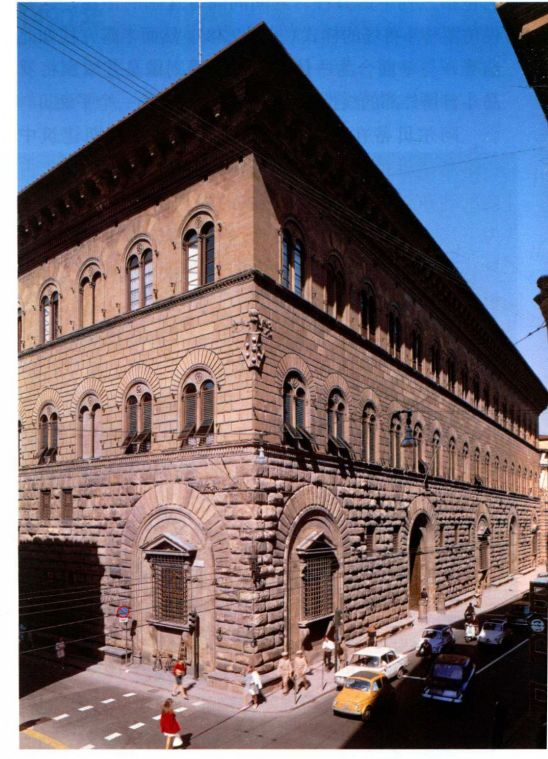

图15\.33 米开罗佐·迪·巴托罗梅奥：佛罗伦萨美第奇\-里卡尔迪

府邸（Palazzo Medici\-Riccardi）。始建于1444年

532 詹森艺术史

如果大卫已经打败了歌利亚，他的手中为什么还拿着石块？最不合陈规之处在于，多那太罗塑造了大卫的裸体像，可能是试图以古典模式暗示人物的英雄身份。但多那太罗并没有将他表现为希腊运动员式的发育完全的青年，而是把他塑造为身躯柔软美好的少年，正如吉伯尔蒂饰板竞赛作品中的以撒（见图15\.1）。《大卫》的对位姿态说明雕刻家受到古典艺术的启发，然而雕像让裸体的青年表现出疲倦慵懒的面貌，有些批评家将之视为性暗示。宽边帽子与长筒靴似乎强化了大卫的裸露感。他手握着歌利亚那柄对他而言尺寸过大的长剑。如果我们考虑到他方才经历的极大恐惧，他的目光似乎冷漠呆滞。

解读《大卫》意义的关键之一可能是曾经题写在基座上的一段铭文，它将大卫称为祖国的卫士。由于大卫曾被尊为佛罗伦萨的庇护者，美第奇家族就挪用了佛罗伦萨城市美德的象征，并将之放置在自己的宅邸之中。多那太罗早些年间曾为佛罗伦萨市政厅雕刻过一尊大理石大卫像，所以雕塑家的选择可能别有深意。但是，学者们就雕像的特定关联争论不已，《大卫》是在纪念佛罗伦萨城某次特别的胜利？还是纪念美第奇家族在政治上的胜利？它代表着佛罗伦萨的警惕？还是共和国体制战胜暴政的象征？或者雕像放置于美第

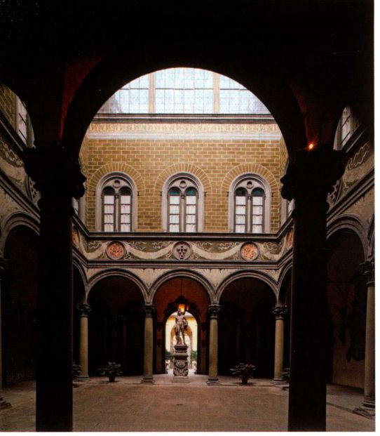

图15\.34 米开罗佐·迪·巴托罗梅奥：美第奇\-里卡尔迪府邸的庭院

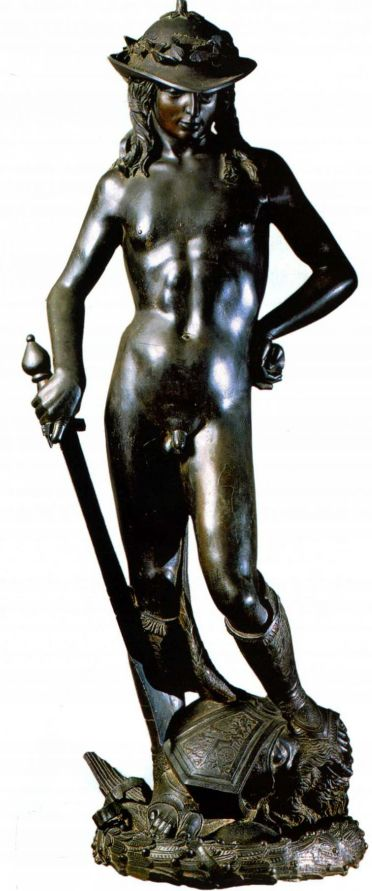

图15\.35 多那太罗：《大卫》。约15世纪20年代至60年代。青铜，高158厘米。佛罗伦萨巴杰罗国家博物馆

奇府邸这一事实让它转变为王朝权力的象征？大卫的年青与裸露如何影响它的意义？对15世纪的佛罗伦萨人如何看待这一雕塑的理解仍在逐步进展之中。

赫剌克勒斯形象 美第奇家族似乎将借用佛罗伦萨城市意象为其府邸所用变成了一种习惯。1475年前后，安东尼奥·德尔·波拉尤奥洛（Antonio delPollaiuolo，1431\-1498年）为该家族创作了《赫剌克勒斯与安泰俄斯》（Hercules and Antaeus，图15\.36）。这是一件摆在桌上的雕像，高仅45厘米左右，但它却具有大型雕塑的力量。这件作品表现的是该城另一位庇护者赫剌克勒斯与地母的儿子安泰俄斯作战的场景。赫剌克勒斯的对手从与大地的接触中获得力量，因此为了打败对手，就必须把他托举起来，使之离开地面。波拉尤奥洛可能就在吉伯尔蒂的作坊中学

第十五章 15世纪意大利的早期文艺复兴 533

习过金匠与金属制造的技艺，但他深受多那太罗与安德烈亚·德尔·卡斯塔尼奥作品以及古典艺术的影响。这些影响使得该小雕像显示出独特的风格。

创造两位打斗人物所构成的圆雕群像富有挑战，即便作品规模较小。无论是古典时期还是之前的文艺复兴群雕之中，都未曾出现过此类设计的先例。作品中更为大胆的是结构上的离心力量。人物肢体似乎向各个方向往外伸展，所以观者必须从各个侧面来欣赏这一雕像。虽然动作剧烈，但这一组雕具有完美的平衡感。为了强调中心轴，波拉尤奥洛事实上将安泰俄斯身体的上半部嫁接在了赫剌克勒斯的下半部身体之上，仿佛后者挣扎着将安泰俄斯举起。波拉尤奥洛不仅是青铜雕塑家，也是画家和雕版画家，他在1465年前后为美第奇家族创作了一幅与赫剌克勒斯和安泰俄斯密切相关的绘画作品。

波拉尤奥洛的绘画作品罕有传世，雕版画只有一件存世，即《十裸者之战》（Battle of the Ten NakedMen，图15\.37）。据我们所知，这是他最为精致的版画设计。其主题不得而知，尽管故事题材有可能出自古典文本。该版画的目的之一是为了显示艺术家精

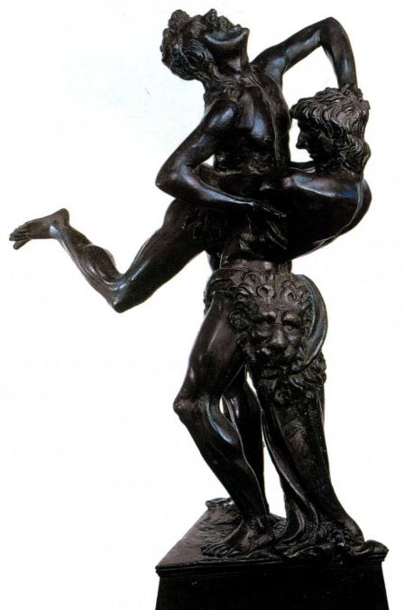

图15\.36 安东尼奥·德尔·波拉尤奥洛：《赫剌克勒斯与安泰俄斯》。约1475年。青铜，连底座高45\.8厘米。佛罗伦萨巴杰罗国家博物馆

通表现运动裸体的手法，因此也可能为其高超技艺做宣传。这或许可以解释版画中明显的题字，艺术家写道“佛罗伦萨的安东尼奥·波拉尤奥洛之作（OpusAntonii Pollaioli Florentini）”。该作品可能印制于1465至1470年间，当时表现运动中的裸体仍是一个新问题，波拉尤奥洛在绘画、雕塑与版画中对这一问题进行了探索。他认识到，对运动的充分理解需要详细的解剖学知识，了解最细微的肌肉与肌腱。这些裸体男子看起来几乎像是被剥掉了皮肤，以展示下面的肌肉运动。《赫剌克勒斯与安泰俄斯》中的两个人物或多或少也体现了这一点。

府邸绘画

贵族的府邸并不只是家庭生活的私人空间与环境，也是家庭成员得以履行其公民角色的公共空间。参观者可能在此类处所看到以宗教题材居多的绘画与雕塑。事实上，15世纪早期的某位托斯卡纳的教会领袖就曾规劝人们在家庭之中陈设宗教图像。在一篇撰写于1403年的论文中，枢机主教乔瓦尼·多米尼奇（Giovanni Dominici）劝告众人，在家中陈设基督、圣母或圣徒的形象，能够鼓励子女效仿这些神圣人物。（见第536页的原始文献。）

贵族家庭中还陈设有嫁妆箱奁（cassone），这是一种雕刻或彩绘的珍宝箱。手艺高超的木工、雕工与画家相互合作，创作出此类通常富于装饰的产品，其中有些以骑士精神为题材，如图15\.38所示，这里描绘的是发生在圣十字教堂广场（Piazza Santa Croce）中的一场比武。箱奁上面也装饰有神话、历史或传奇故事场景。人们经常在婚礼上将成对的箱奁送给新娘，它们象征着两个家族的联合，因此在体现婚姻关系的同时也反映着家族的社会地位。箱奁上具有教育意义或旁征博引的故事经常出自对普鲁塔克、奥维德（Ovid）或维吉尔等古代作家作品的研究，由此箱奁嵌板所展示的是一个家族的财富、学识以及对人文主义的兴趣，有时还显示他们的爱国情感，更多的则是新娘将随身带入新家庭的训诫。

圆形画（tondo）是另外一种家庭用的图像，这是佛罗伦萨的特殊偏好。15世纪后几十年间的一流画家都创作过圆形画，其中包括菲利波·利皮修士（FraFilippo Lippi，约1406\-1469年），《圣母子与圣母诞生》（Madonna and Child with the Birth of the Virgin，图15\.39）出自他的手笔。佛罗伦萨银行家里奥纳多·巴尔托里尼·萨利姆贝尼（Lionardo BartoliniSalimbeni）可能是该作品的定件者，用以庆祝家中新

534 詹森艺术史

图15\.38 装饰有比武场景的嫁妆箱奁。约1460年。木板蛋彩画，箱子102 × 203 × 36

图15\.37 安东尼奥·德尔·波拉尤奥洛：

《十裸者之战》。约1465\-1470年。雕版画，		38 \.3 × 59厘米。美国俄亥俄州辛辛那提艺术博物馆（Cincinnati Art Museum）， Herbert Greer French 遗赠，编号1943\.118

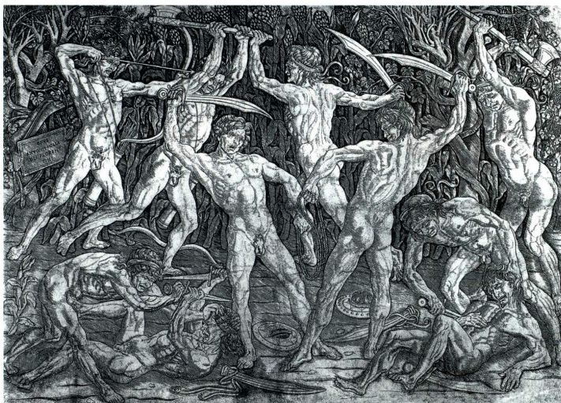

得婴孩。利皮将圣母与婴儿耶稣描绘为理想的母子模样。他们在某些方面令人想起马萨乔的《升座圣母》（见图15\.19），但是利皮笔下年轻的圣母具有纤细优雅与柔和甜美之感。圣母的头巾具有波浪形边缘，斗篷上卷曲的褶皱垂落在身体左侧，这些细节突出了圣母身体右转的姿态，为该形象增添了一抹柔情的色彩。耶稣从石榴中摘取种子，这是永恒生命的象征。与此同时，这些种子也象征着子孙繁衍，因为画面的第二主题正是圣安娜产下圣母玛利亚。

圣母身后是一幅类似于舞台且极其零乱的场景，该场景由具有多个灭点的透视手法构建而成。叙事中的不同情节出现在圆形画的不同部分。背景左侧是表

现圣母诞生的室内场景，圣安娜正躺在产床之上。右侧则是上帝遣天使分别出现在圣安娜与其丈夫圣约阿希姆面前，许诺赐予他们孩子之后，两人在耶路撒冷金门（Golden Gate）相会的场景。与所有关于这个传说的描述不同，画中这一事件仿佛发生在一间私人住宅的门口。

利皮很可能从多那太罗与吉伯尔蒂的浮雕中学到了这种连续叙事手法，整合相似的复杂空间来叙述故事（对比图15\.20的《希律王的飨宴》与图15\.23的《雅各与以扫》，这两件作品均结合了复杂的空间以讲述它们要表现的故事）。利皮将吉伯尔蒂浮雕中的形象挪用作圣母右侧的女仆。马萨乔过世之后，多那太罗

厘米；饰

板

38 × 1 3 0厘米。伦敦国家美术馆

第十五章 15世纪意大利的早期文艺复兴 535

原始文献

乔瓦尼·多米尼奇劝父母在家中放置宗教图像

多米尼奇出生于佛罗伦萨，后加入多明我会，并参与了其中的改革事务。成书于1403年的《家训》（Regola delgoverno di cura familiare）是他的著述之一，下文即节选于此书。

第上帝抚养他们······你应该遵守5条小规则······第一，四部分（论对子女的管理）：首先要考虑的是，要为在家中放置圣童或少女的绘画，这样你的孩子即便仍在襁褓中也会感到愉悦，因为这些形象与孩子相似，所以可以利用此类事物，通过行动与符号来吸引幼儿。我这样来谈论绘画，也要这样来谈论雕塑。画中有圣母玛利亚是很好的选择，她怀抱圣子，圣子手持小鸟或石榴。一个好的形象还包括耶穌吃奶、耶稣睡在圣母膝头、耶稣文雅地站在圣母身前、耶稣抚弄圣母正在缝纫的裙边。同样，孩子会将自己投射到身着骆驼皮的施洗约翰身上，这个走入沙漠的小男孩与鸟群嬉戏，吸吮甘甜的树叶，睡在地上。耶稣或施洗约翰、年幼的耶稣与施洗约翰在一起以及被杀害的无辜者，让孩子看到这

些毫无害处，他们会感受到对武器与持械之人的恐惧。对小女孩也是如此，她们应该在可以看到11,000位殉教童贞女讨论、战斗与祈祷的环境中被抚养长大。我愿意让她们看到与肥硕羔羊在一起的圣艾格妮丝、头戴玫瑰花环的塞西莉娅（Cecilia）、为玫瑰花所簇拥的以利沙伯、车轮上的凯瑟琳，以及其他能够让她们热爱童贞与母亲的乳汁、渴望基督、憎恨罪恶、厌恶虚空、脱离不良同伴、通过思考圣徒的行为而开始冥想圣中至圣的图像······我告诫你们，如果你出于此目的而在家中放置绘画，那么要避免使用金银画框，以免孩子们崇拜偶像胜过虔诚之心，因为如果他们看到，在镀金与装饰有宝石的图像面前，更多的蜡烛被点燃、更多的帽子被脱下、更多的膝盖跪倒下来，他们只会学到对黄金与珠宝的尊敬，而不是对图像本身，更不是对图像所代表的真理的尊敬。

SOURCE:CREIGHTON GILBERT,ITALIAN ART 1400\-1500:SOURCES AND DOCUMENTS\.\(EVANSTON, IL:NORTHWESTERN UNIVERSITY PRESS\.1992\)

与吉伯尔蒂的年纪、经验与声望赋予他们当时任何在世的画家都无法企及的权威。他们二人以及佛兰德斯绘画大师对利皮的观念的影响至关重要，因为后者将在15世纪下半叶的佛罗伦萨绘画发展方向的形成过程中，发挥了至关重要的作用。

保罗·乌切洛的《圣罗马诺之战》 可能向利

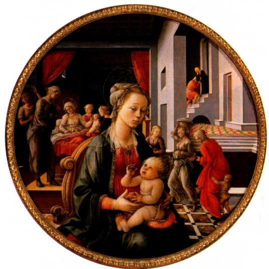

图15\.39 菲利波·利皮修士：《圣母子与圣母诞生》（巴托里尼圆形画［The Bartolini Tondo］）。1452\-1453年。木板蛋彩画，直径134\.6厘米。佛罗伦萨皮蒂宫

皮定制圆形画的同一家族也定制了另一组经历离奇的壁画作品。佛罗伦萨艺术家保罗·乌切洛（PaoloUccello，1397\-1475年）绘制了《圣罗马诺之战》（Battle of SanRomano，图15\.40），这是描绘1432 年佛罗伦萨与卢卡之战的三幅木板绘画中的一幅。佛罗伦萨在这场战斗中的胜利是科西莫·德·美第奇得以巩固其权力的诸多因素中的一个。保罗·乌切洛描绘了由科西莫的支持者尼科洛·达·托伦蒂诺（Niccolòda Tolentino）所领导的军队发动的攻击，后者位于画面中央，胯下一匹白马，挥舞着将军的权杖。由于这一题材对美第奇家族的重要性，长期以来学者们认为是该家族定制了这件作品。有人认定这三幅作品就是1492年一份文件中记述的放置在洛伦佐·德·美第奇卧室中的作品。然而，最近的研究表明，曾是战争期间佛罗伦萨政府议会成员的里奥纳多·巴尔托里尼·萨利姆贝尼在1438年前后，委托乌切洛为他在佛罗伦萨的住宅绘制了这三幅作品。这位议员过世之后，洛伦佐·德·美第奇试图获得这些作品，在提出购买而遭到拒绝后，就采用强制手段占有了它们。原所有者的儿子提起了诉讼，要求返还作品。这些情况表明此作品对两个家族而言都非常重要。

乌切洛的作品并没有渲染战争的暴烈，而是创造出一种仪式般的效果，因为人物与马匹的造型行进在由散落的武器与盔甲残片所构成的网格中。这些物体构成了透视设计的正交线，它们排列巧妙，将一位坠落马下的战士包括其中。一排浓密的树篱界定出前景

536 詹森艺术史

空间，其上是一片风景，在画面中向上升起，而不是退入空间深处。画面的图案因鲜亮的色点与大量运用金箔而得到加强，作品最初一定更为绚丽夺目，因为覆盖某些盔甲的银箔现在已经暗淡无光。如此华丽的画作令人回想起真蒂莱·达·法布里亚诺的作品（见图15\.12）。乌切洛对国际哥特式中展示昂贵材料与观察自然的手法借鉴良多，他同时在作品中融入了表现形体与空间的透视元素。

波提切利为美第奇府邸所作的绘画 除在佛罗伦萨通过委托定件、购买以及武力手段来获取绘画作品之外，美第奇家族还与北欧地区保持着大量联系，这种联系的实现不仅有外交交流还有其银行业务。美第奇家族在布鲁日的代理人将许多艺术品运往佛罗伦萨，当时的财产目录证明了这一点。在这方面，美第奇家族的做法与众多在意大利掌握统治权的家族如出一辙，因为佛兰德斯艺术在那不勒斯、威尼斯、费拉拉以及米兰这些相距甚远的城市中都得到了广泛赞赏。通过以上手段，美第奇府邸中充塞着来自北方的木板绘画与挂毯。这些作品给佛罗伦萨的艺术家们留下了深刻印象，其中包括乌切洛、菲利波·利皮、吉兰达约，以及年轻的桑德罗·波提切利。

波提切利（Sandro Botticelli，1445\-1510年）曾

大事年表

约15世纪20年代至60年代\-多那太罗创作《大卫》

1452年\-阿尔贝蒂完成《论建筑》

1469年\-伟大的洛伦佐在文艺复兴盛期的佛罗伦萨获得统治权1478年\-帕奇阴谋刺杀伟大的洛伦佐失败

约1485年\-波提切利创作《维纳斯的诞生》

跟随韦罗基奥学习艺术，后来成为美第奇家族圈子中最受青睐的画家之一。这个圈子以美第奇家族的族长、在1469至1492年间实际统治佛罗伦萨的伟大的洛伦佐为首，由他身边的贵族、学者和诗人组成。《春》（Primavera，图15\.41）可能是为一位在伟大的洛伦佐家中长大的表亲所绘制的作品。这件作品以及另外两幅以爱为题材的画作可能是为这位年轻人的婚礼而定制，他的婚礼于1482年举行，而婚礼举行的日期通常也正是画作定制的年代。

学者们对这一图像提出过无数种解读方式。画面表现的是位于其圣林之中的维纳斯，小爱神在她头顶飞翔。作为维纳斯的同伴，美惠三女神（Three Grace）与赫尔墨斯（罗马神墨丘利）位于画面左部；画面右部则是抓着宁芙克罗瑞斯（Chloris）的西风之神泽费罗斯（Zephyr），他将克罗瑞斯变成了花神弗洛拉（Flora）。

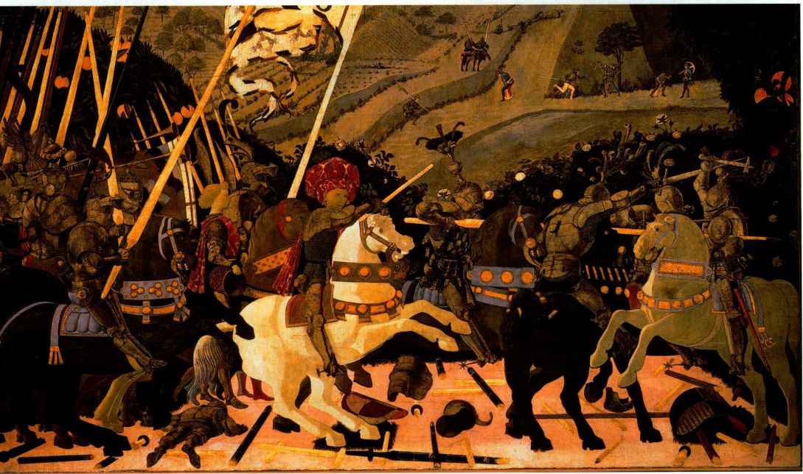

图15\.40 保罗·乌切洛：《圣罗马诺之战》。约1438年。木板蛋彩与银箔，1\. 8 × 3\.2米。伦敦国家美术馆

第十五章 15世纪意大利的早期文艺复兴 537

一种解读将《春》与新柏拉图主义者马尔西利奥·菲奇诺（Marsilio Ficino，1433\-1499年）的著作联系在一起，这位哲学家在美第奇宫廷中备受尊重，他的作品也被广为阅读。透过他的著述，此作品可被看作是关于两位朋友间柏拉图式爱恋的寓意画：墨丘利指出了化身为维纳斯的通向神圣之爱的道路，维纳斯源于美惠三女神，是美的象征。与之相对的是由花神所代表的肉体之爱，她曾被泽费罗斯玷污。另外的解读则认为《春》寓意着灵魂不朽，将克罗瑞斯对应于珀尔塞福涅被玷污的故事，或者寓意将维纳斯比作基督教中的圣母，将其他人物比作出现在末日审判中的人物。然而，考虑到该画的创作与婚礼相关，它可能意在庆祝婚姻，祝福子孙繁衍，其中所画的浓密桔树林与似锦繁花都暗示了这一点。这幅画作激发了各不相同的解读，这些则取决于欣赏它的观者。

在公众想象中常与《春》成对出现的作品是波提切利最为著名的《维纳斯的诞生》（The Birth ofVenus，图15\.42）。这件作品也曾挂在美第奇别墅之中，但是它的创作年代可能比《春》晚几年。这幅作品构图的中心人物也是维纳斯，然而此处的她缓缓地向海

岸漂去，岸边一位身着花衣的女子等待着为她披上满是花朵的长袍。维纳斯在有克罗瑞斯（弗洛拉）陪伴的西风之神的帮助下漂向岸边。与《春》不同，此处人物背后的空间仿佛通向远方，天空与水面为画面创造出一种明亮冷静的色调。然而在人物身上，平浅的造型与对轮廓线的强调产生出浅浮雕的效果，而不像是坚实的立体。身体的重量似乎全部被抽干，以至于即使脚触大地，人物仍然像在飘浮。

这些轻盈优美的人物是对古典形式的再创造。波提切利的维纳斯形象基础是普拉克西特勒斯创作的《尼多斯的阿佛洛狄忒》（见图5\.60）的某一变体。其主题本身可能与荷马的《阿佛洛狄忒颂》（Hymnto Aphrodite）有关，诗歌开头写道：“我要歌颂美丽的阿佛洛狄忒······她出生在花的海洋所围绕的塞浦路斯之地，温柔的西风吹送着柔软泡沫中的她飘浮在波浪之上。头系金带的霍莉（Horae）轻柔地接纳她，为她披上神圣的长袍。”而且，没有一个文学出处能完整解释这一画面的构思。它可能还从奥维德以及诗人波利齐亚诺（Poliziano）的作品中借鉴了若干元素，而波利齐亚诺与波提切利一样，都是美第奇家族圈子

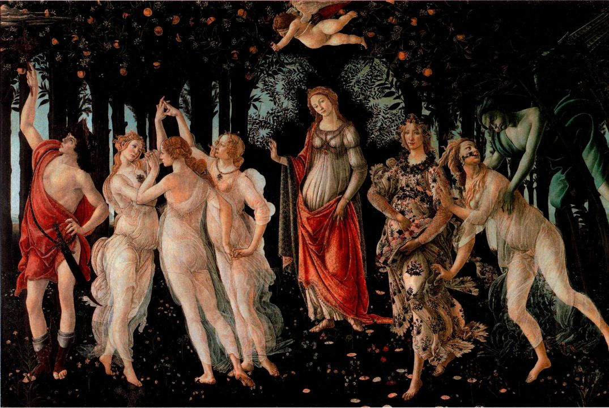

图15\.41 桑德罗·波提切利：《春》。约1482年。木板蛋彩画，2\.03x3\.15米。佛罗伦萨乌菲齐美术馆

538 詹森艺术史

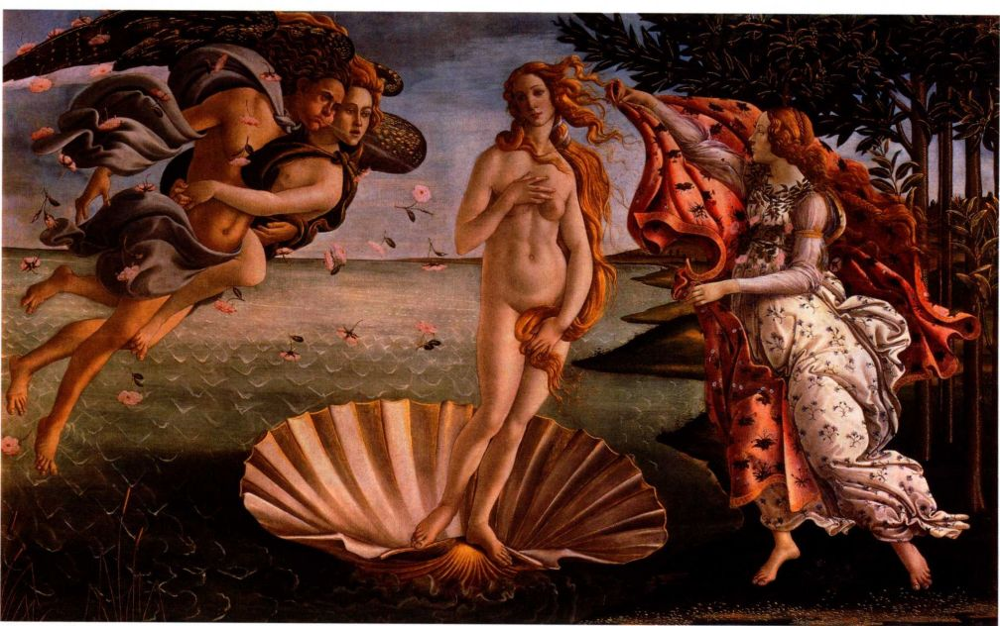

图15\.42 桑德罗·波提切利：《维纳斯的诞生》。约1485年。木板蛋彩画，1\.8 × 2\.8米。佛罗伦萨乌菲齐美术馆

里的成员。但是，马尔西利奥·菲奇诺的思想可能再一次发挥了作用。在新柏拉图主义者眼中，维纳斯表现为两种形象，分别为天堂维纳斯与世俗维纳斯。前者是神圣之爱的源泉，后者则生发出肉体之爱。《维纳斯的诞生》对于具有新柏拉图主义哲学情调的观众而言，可能意寓着天堂维纳斯的起源。波提切利画作中优雅的形式与完美的感觉，结合了基于古典哲思的深奥主题，体现了美第奇宫廷的品位。

肖像画

关于历史、当下事件或古代神话的图像证明文艺复兴时期的艺术对世俗题材的关注日益增加。肖像画是另一种需求很大的图画。除表现国王的宫廷绘画或者纪念战争英雄的纪念作品之外，商人、新娘与艺术家的个人肖像作品在15世纪下半叶大量出现。

记录人物相貌的观念源于15世纪个人意识的增强，同时也源自对具有大量肖像作品的古罗马艺术的研究。艺术家们已经在创作捐赠人的肖像，正如马萨乔的《圣三位一体》（见图15\.14）、布鲁尼之墓的丧葬纪念像（见图15\.26），以及多那太罗的《加塔梅拉塔骑马像》（见图15\.21）一类的公共纪念像，但15世纪时肖像画的新形式得到了发展。

意大利艺术中具有悠久的创作捐赠人肖像的传

统，可以上溯至早期基督教时期。但肖像画在15世纪获得了新的突显。在新圣母教堂的一组湿壁画里，佛罗伦萨画家多梅尼科·吉兰达约（DomenicoGhirlandaio，1449\-1494年）将托纳布奥尼（Tornabuoni）家族众多成员的肖像绘在其中各个显眼的位置，正是这个家族出资赞助了这组作品。吉兰达约在《圣母诞生》（图15\.43）中运用透视法建构了一个玩偶之家般的场景，表现出一间装饰精美的卧室，圣安娜在其中看着产婆为她新生的孩子洗浴。房间内部具有装饰性半露方柱与饰板，其中一条雕刻着小天使（putti）的檐壁则令人回想起多那太罗与卢卡·德拉·罗比亚的作品，似乎是为了庆祝新生儿的诞生。檐壁下的题词赞颂着基督之母的诞生，墙壁上的其他文字表明吉兰达约是作品的创作者。他的家族姓氏为比戈尔迪（Bigordi），但父亲是花冠制作者（garlandmaker），所以其子以父亲的绰号而命名。15世纪80、90年代，吉兰达约的作坊是佛罗伦萨诸多作坊中最为繁忙的一家，年轻的米开朗基罗正是在那里习得湿壁画技法。

吉兰达约将当时的人物置于这一神圣事件之中，使其抢尽了历史人物的风头：一群衣着华丽、姿态端庄的女子见证着圣母的诞生。画面中央以侧面表现的年轻女士是赞助人的女儿卢多维卡·托纳布奥

第十五章 15世纪意大利的早期文艺复兴 539

图15\.43 多梅尼科·吉兰达约：《圣母诞生》。约1485\-1490年。湿壁画。佛罗伦萨新圣母教堂庄严礼拜堂

\(Cappella Maggiore\)

尼（Ludovica Tornabuoni）。众人身后那位身材高挑、着蓝色长裙的女子是卢克雷齐娅·托纳布奥尼（Lucrezia Tornabuoni），她嫁入了美第奇家族，其子正是洛伦佐·德·美第奇。正如《圣母诞生》所示，吉兰达约不仅是出色的叙事者，也是娴熟的肖像画家。他用侧面表现中央人物卢多维卡的手法，反映出15世纪中期意大利艺术家与赞助人对侧面像的偏爱。侧面肖像采用的是古罗马钱币中的样式，这些钱币一直从侧面来展示皇帝的形象。但在1480年前后，吉兰达约及其年轻的同行波提切利都开始在肖像画中采用四分之三侧面的角度，这一做法迅速得到广泛传播。

吉兰达约最为动人的个人肖像画中，有一件题为《老年男子与男孩》（An Old Man and a Young Boy，图15\.44）的作品，通常将其创作年代定为1480年前后。虽然老人看来具有非常特殊的病理征兆，因为他的鼻子因红斑痤疮（俗称酒糟鼻，一种皮肤失调的病症）而变形，但是这两位人物的身份及其关系仍不为人所知。两人姿态的亲昵暗示他们可能是同一家族的两代人，如果是这样，那么该画作就表现了家族血缘的延续。虽然画面中的质感具有某种模糊处理的倾向，而且构图遵循着几何秩序，但是吉兰达约对细节的关注反映出他可能谙熟尼德兰艺术。穿透画面平面的窗户以及其中的风景也是北部欧洲艺术观念的反映（见梅姆灵的《马丁·范尼乌文霍费肖像》，图14\.23）。然而北部欧洲艺术对该画最为突出的贡献是从四分之三侧面来表现人物面部，佛兰德斯艺术自15世纪20年代以来就采用了这种样式。

诸如托纳布奥尼这样的重要家族在其所定制的艺术品中囊括了美第奇家族成员的肖像，以此作为他们与统治宗派结盟的声明。美第奇家族也为其府邸与友人定制了大量家庭成员的肖像作品。他们更偏好胸像（portrait bust），这是一种表现肩部以上面貌特征的雕塑作品，美第奇家族对这种形式的青睐可能是要将自身比附于古罗马的贵族，当年贵族就曾拥有大量的祖先胸像（见图7\.13）。然而佛罗伦萨的胸像赞颂生者而非死者，其材质包括大理石、青铜与赤陶，由这一世纪一流雕塑家作成。1480年前后，安德烈亚·德尔·韦罗基奥或其作坊创作了一尊洛伦佐·德·美第奇的胸像（图15\.45）。作品抓住了人物的相貌特征，但是专注的目光与紧抿的双唇赋予他以某种紧张感，意在表现他的个性特征。洛伦佐成为统治党派首脑时年纪尚轻，这尊胸像中的他具有古罗马长者的庄严持重，似乎以此弥补其年龄上的不足。

伟大的洛伦佐的朝臣博学多闻、雄心勃勃且修养甚深。洛伦佐本人是许多人文主义者、哲学家、诗人与艺术家的赞助人，这些人中也包括年轻的米开朗基罗。然而才臣辈出的宫廷盛世在洛伦佐于1492年去世之后却未能持久。他的继任者皮耶罗·德·美第奇并不具有父亲那样的外交才华。再者，他还必须面对日益动荡的经济局势（银行于1494年破产），以及来自法国与西班牙的军事入侵。皮耶罗在处理这些危机上的无能激起了1494年的佛罗伦萨起义，结果美第奇宗派遭到驱逐，人们致力于恢复共和体制。权力的真空在短时间内被多明我会布道士吉罗拉莫·萨沃

540 詹森艺术史

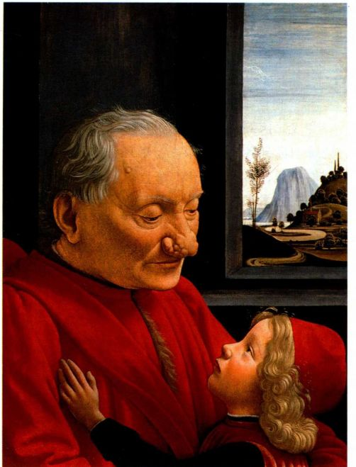

图15\.44 多梅尼科·吉兰达约：《老年男子与男孩》。约1480年。

木板蛋彩画、油画，6 1\.3 × 45\.7厘米。巴黎卢浮宫

纳罗拉所占据，他攻击“异端崇拜”以及他在佛罗伦萨文化中所看到的物质主义。萨沃纳罗拉在布道中号召悔罪，并强烈地抨击佛罗伦萨乃至教会阶层中的腐败，为此他树敌颇多，最终于1498年被处死。15世纪将尽之际，佛罗伦萨为了自己的命运与来自教廷、法国与西班牙的强大势力进行殊死搏斗。

文艺复兴风格的回响：1450\-1500年

佛罗伦萨的探索与创新激发了意大利全境乃至国外的艺术家的创作，但是他们以各自不同的方式来回应这些新风格。此外，意大利赞助人也认识到以指涉古典的图像与文字来表达其权威性的优势所在。至15世纪中期，线性透视法得到了广泛运用，众多艺术家都采用了以光线来塑造形体的佛罗伦萨技法。皮耶罗·德拉·弗兰切斯卡在自身的艺术魅力之中融入了数学法则、古典世界意象与佛兰德斯绘画特色，创造出为若干意大利宫廷所青睐的个人风格。佛罗伦萨人文主义者兼建筑师莱昂·巴蒂斯塔·阿尔贝蒂在意大利北部设计了具有影响力的建筑，其中包括为曼图亚侯爵所设计的府邸，这位赞助人也吸引来画家同时也是考

古学家的安德烈亚·曼泰尼亚为其服务。威尼斯委托安德烈亚·德尔·韦罗基奥这样的佛罗伦萨艺术家创作重要作品，但威尼斯本地的建筑与绘画传统仍具有很强的影响力。乔瓦尼·贝里尼等威尼斯画家发展出颇具影响力的文艺复兴画派，与佛罗伦萨风格争相媲美。由于教廷重新获得了罗马的统治权，佩鲁吉诺、卢卡·西尼奥雷利以及罗马本地画家梅洛佐·达·福尔利等人得以联合创作那些歌颂教皇权力的作品。

意大利中部的皮耶罗·德拉·弗兰切斯卡

15世纪下半叶最独特且最具原创性的艺术家之一是皮耶罗·德拉·弗兰切斯卡（Piero dellaFrancesca，约1420\-1492年），他曾游历佛罗伦萨，并在此期间师从于多梅尼科·韦内奇亚诺（见图15\.30）。弗兰切斯卡来自托斯卡纳东南部的圣陵城（Borgo San Sepolcro），并在那里完成了他早期几件重要的委托作品。他服务于托斯卡纳、里米尼以及费拉拉的赞助人，并于1470年前后为费德里戈·达·蒙泰费尔特罗（Federico da Montefeltro）创作了若干重要作品，这位赞助人由雇佣军统帅（condottiere）上升为托斯卡纳东南部乌尔比诺城的大公。弗兰切斯卡早期跟随韦内奇亚诺的学习成果表现在色彩方面，

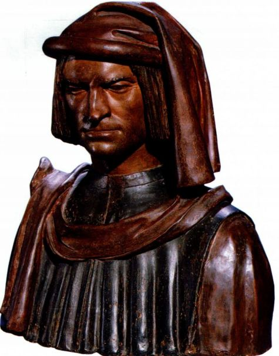

图15\.45 安德烈亚·德尔·韦罗基奥：《洛伦佐·德·美第奇胸像》。约1480年。彩绘赤陶。华盛顿特区国家美术馆，Samuel A．Kress收藏，编号1943\.4\.92

第十五章 15世纪意大利的早期文艺复兴 541

但其坚实简洁的形体与构图的庄重性则明显来自于马萨乔。15世纪早期对透视法的系统化对于弗兰切斯卡而言至关重要，他日后成为一位以数学方法来确定空间透视或在空间中表现人体的大师，并且撰有专题论文来阐述其中方法。弗兰切斯卡可能曾与阿尔贝蒂有所交往，他们有共同的赞助人，以及共同的艺术理论兴趣点。

弗兰切斯卡为其家乡创作的一件作品反映了以上影响在他作品中的融合。1460年前后，圣陵城委托他为该城的公共大厅（Palazzo Communale）创作一幅湿壁画。为了契合该城的名字“圣陵”，弗兰切斯卡选择了基督复活走出坟墓的主题（图15\.46）。基督的形象是画面的焦点，他的正面形象与三角形构图可能出自马萨乔的湿壁画《圣三位一体》（见图15\.14），但日出时的光线与浅淡的色彩则折射出多梅尼科·韦内奇亚诺的艺术特色。弗兰切斯卡特别关

注睡在圣陵前的罗马士兵的安排，这些士兵是在空间中表现人体这一题材的不同变体。观者必然抬头望向基督无比荣耀的身体，它在解剖学上如此完美，而外貌上又如此庄严，因为基督战胜了死亡。

弗兰切斯卡的艺术作品使他受到了颇有修养的费德里戈·达·蒙泰费尔特罗大公的关注，大公曾将一批来自欧洲各地的艺术家召集到他乌尔比诺的宫廷中。在那里，弗兰切斯卡与来自意大利、西班牙和佛兰德斯的艺术家们结识相交，甚至可能相互竞赛。弗兰切斯卡从他们身上学到了运用透明油彩作画的新技法，并成为该技法在意大利中部的早期实践者。他平静开阔的复杂画面，因借鉴了佛兰德斯艺术风格中更为明亮的色彩与质感效果而倍显光彩。作于1472年前后的巴蒂斯塔·斯福尔扎（Battista Sforza）与费德里戈·达·蒙泰费尔特罗双联肖像（图15\.47）就表现了弗兰切斯卡运用油画所能实现的丰富色调和质感

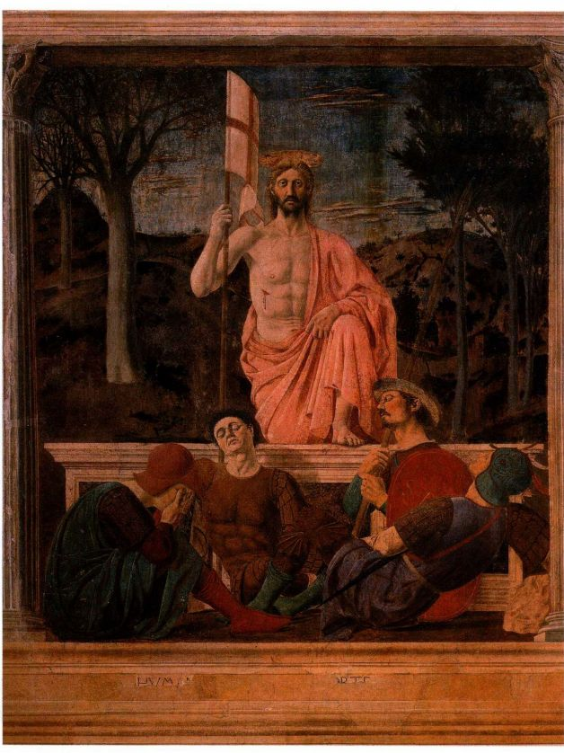

图15\.46 皮耶罗·德拉·弗兰切斯卡：《基督复活》（Resurrection）。约1463年。湿壁画，

2\.26 × 1\.99米。圣陵城的公共大厅

542 詹森艺术史

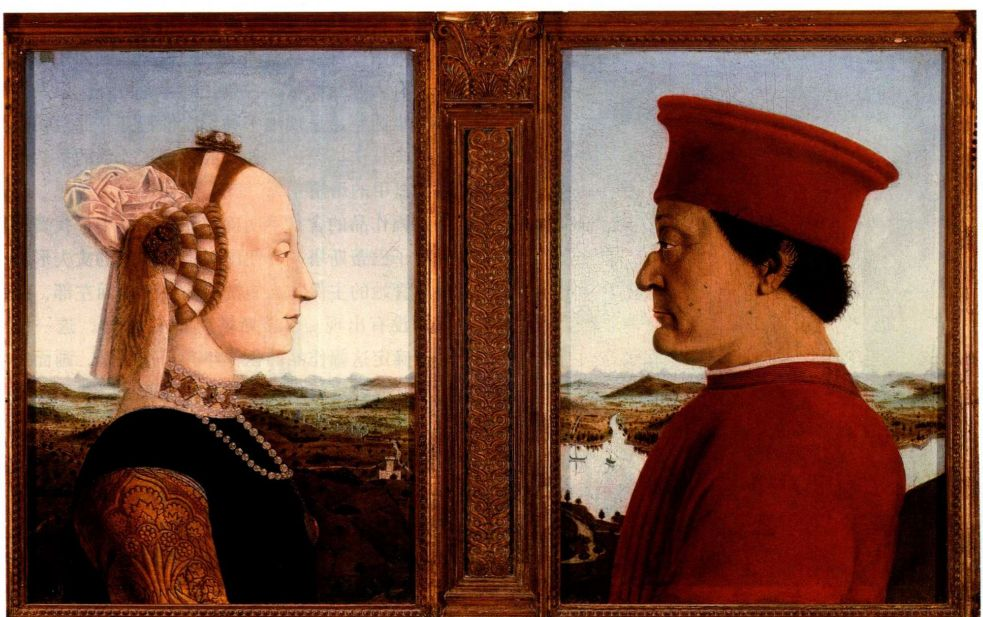

图15\.47 皮耶罗·德拉·弗兰切斯卡：《巴蒂斯塔·斯福尔扎与费德里戈·达·蒙泰费尔特罗双联肖像》（Double Portrait of Battita

Sforza and Federico da Montefeltro）。约1472年。木板油彩与蛋彩，每块画板47 × 33厘米。佛罗伦萨乌菲齐美术馆

变化，从而实现对空间的娴熟塑造与形式上的清晰明了。该双联肖像表现的是大公夫妇两人面面相对的样子，身后是一片深邃绵延的风景。费德里戈的面部在一次比武中受伤变形，此处向观者展现的是未受损伤的左侧面，即观者的右首。他的妻子巴蒂斯塔刚刚因热病而过世，弗兰切斯卡赋予她观者左首的位置，以此表示尊敬。巴蒂斯塔苍白的面容环绕在复杂的发型与珠宝锦缎之中。一道阴影落在她身后的风景里，而她丈夫身后的风景则明亮而繁荣。

大约与此同时，大公指派弗兰切斯卡创作另一幅更大的画作，该作品最终成为赞助人坟墓之上的纪念画（图15\.48）。弗兰切斯卡为该作品选择了神圣会谈的主题，圣母与她沉睡的圣子为众圣徒和天使所环绕，而赞助人费德里戈则跪拜在她的面前。人物站立的姿态与他们身后墙壁上的半露方柱一样垂直静止。强烈的光线从画面左侧进入，在右侧投下了宽阔的阴影，并界定出半圆室的深度。圣母头部周围环绕着远

图15\.48 皮耶罗·德拉·弗兰切斯卡：《升座圣母、圣徒与费德里

戈·达·蒙泰费尔特罗》（Enthroned Madonna and Saints with Federico

da Montefeltro）。约1472\-1474年。木板油画，2\.49 x 1\.7米。米兰

布雷拉美术馆（Pinacoteca di Brera）

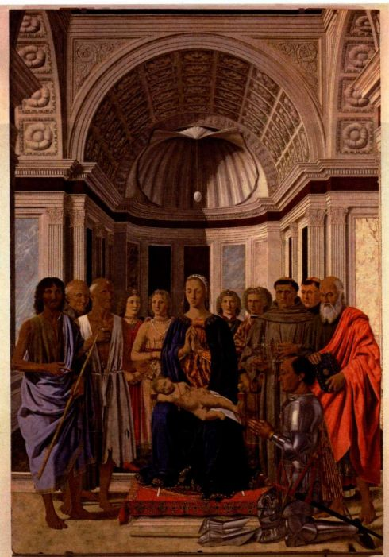

第十五章 15世纪意大利的早期文艺复兴 543

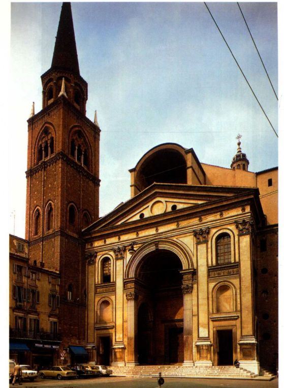

图15\.49 莱昂·巴蒂斯塔·阿尔贝蒂：曼图亚的圣安德烈亚教堂。

设计于1470年

处墙壁上的大理石嵌板，同挂在半圆室顶部贝壳形曲面上的鸡蛋一样，具有卵圆形的轮廓。画面中教堂的建筑具有大理石嵌板、古典化的半露方柱，以及建有筒拱的半圆室，呈现出一种纪念性特征。弗兰切斯卡运用油画技法描绘出大理石的纹理，地毯的柔软与费德里戈盔甲的熠熠光辉。

这幅作品的含义不明确。观者在其中寻找费德里戈的妻子巴蒂斯塔，以便配对跪倒在地的丈夫形象，但是尽管她的主保圣人施洗约翰站在画面左部，但她本人却没有出现。巴蒂斯塔死于1472年，这一信息有助于确定这幅作品的创作年代。很明显，画面中她不在场，或许这就是画作含义的一部分。弗兰切斯卡笔下的费德里戈敬拜着圣婴基督，带着一片用以驱除疾病的珊瑚，仿佛在感恩于自己继承人的出生，尽管他失去了妻子。然而沉睡的圣婴代表着基督的最终死亡与复活，因此体现了丧葬主题。弗兰切斯卡的天才在于，他能够创造出传达尊严与忧伤的意象，并有精心布局的平衡感与构图上的开阔感。

在曼图亚工作的阿尔贝蒂与曼泰尼亚

北部波河谷的曼图亚曾为贡扎加（Gonzaga）家族统治一个多世纪之久。该家族建立了一个才华横溢的宫廷圈子，其中包括人文主义者、教育家与艺术家。卢多维科·贡扎加侯爵（Ludovico Gonzaga）娶了一位德国公主\-勃兰登堡的芭芭拉（Barbara ofBrandenburg）为妻，使其宫廷具有了国际化的特色。

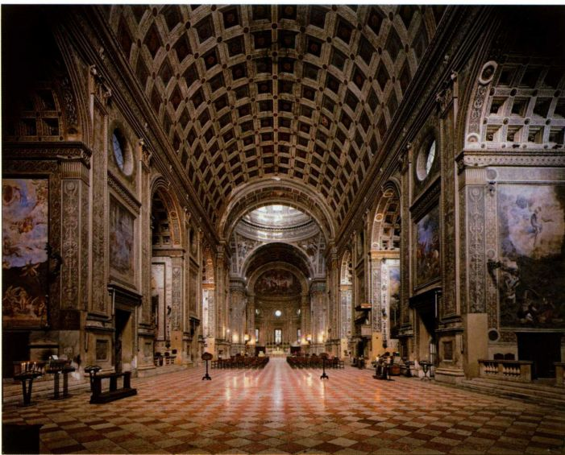

图15\.50 莱昂·巴蒂斯塔·阿尔贝蒂：圣安德烈亚教堂内景

544 詹森艺术史

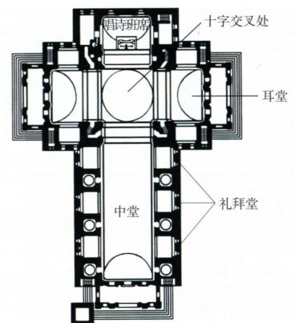

图15\.51 圣安德烈亚教堂平面图（耳堂、穹顶与唱诗班席为晚期加建部分）

《论建筑》（约1452年）之类的作品为阿尔贝蒂赢得了显赫的声望，贡扎加家族则吸引了这位艺术家为之服务。

时至1470年，阿尔贝蒂在曼图亚设计了圣安德烈亚教堂（Sant＇Andrea，图15\.49），这是他最后的作品。宏伟庄严的正立面表达出阿尔贝蒂融合古典神庙形式与传统公堂式教堂的终极目标。他在此处加入了凯旋门样式，将巨大深凹的中央壁龛作为大门，拥有古典神庙式的前部。与鲁切莱府邸的外部相同（见图15\.32），阿尔贝蒂运用了扁平的半露方柱，强调壁面至上的观念，并以此保持了垂直与水平这两种对立形式间的平衡。他使用两种尺寸的半露方柱来达到这种平衡：较小的半露方柱支撑着巨型中央壁龛的拱，较大的则支撑连续的额枋以及轮廓鲜明的三角楣。这些较大的半露方柱被称为巨柱式（colossal order），意指它高于建筑中任何一层的高度。高大的半露方柱平衡了设计中的水平与垂直元素。

为了进一步统一立面，阿尔贝蒂将整体设计嵌入正方形之中，即使这让立面比中堂的高度矮了许多。中堂西墙突出于山墙之上，这一效果在图中比实际看到的更令人困扰，因为站在街道上几乎看不到这一部分。尽管立面与建筑主体区别显著，但它却提供了教堂内部构造的“预览图”，同样的巨柱式、同样的比例、同样的凯旋门样式将再次出现于中堂墙壁之中（图15\.50\)。

与布鲁内莱斯基的圣洛伦佐教堂（见图15\.8）相比，该教堂的平面图（图15\.51）极其紧凑。如果能够按原设计来完成建筑，那么两座教堂之间的差别将更为明显。阿尔贝蒂的设计没有耳堂、穹顶和唱诗班

席，这些都是18世纪中期增建的部分。最初设计只有一座中堂，延伸至半圆室。阿尔贝蒂沿用了君士坦丁公堂（见图7\.68、7\.69）的样式，将侧堂替换为相互交替的大礼拜堂与拱顶小礼拜堂，并取消了高侧窗。巨大的半露方柱与大礼拜堂的拱门支撑着规模惊人的格子筒拱（中堂与立面等宽）。此处，阿尔贝蒂利用了他从研究古罗马浴场与公堂的大型拱顶厅堂中所得到的经验，但以自由的手法重新阐释了这些原型，创造出堪称真正“基督教神殿”的建筑。这样一种古典形式与基督教功能的结合，是15世纪人文主义者及其贵族赞助人的首要目标。阿尔贝蒂在圣安德烈亚教堂实现这一目标将会启发众多建筑师采用相同的方法。

多年以来，曼图亚人文主义气息浓郁的宫廷一直礼聘着15世纪最具知识分子倾向的艺术家之一，

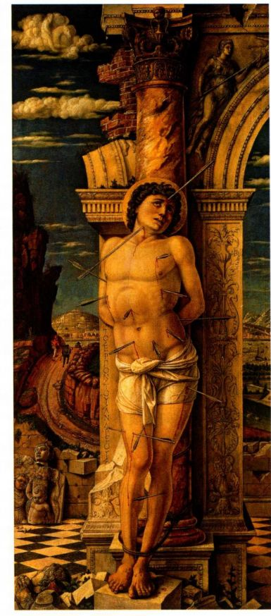

图15\.52 安德烈亚·曼泰尼亚：《圣塞巴斯蒂安》。约15世纪50年代。木板蛋彩画，		68 × 30\.6厘米。维也纳艺术史博物馆

第十五章 15世纪意大利的早期文艺复兴 545

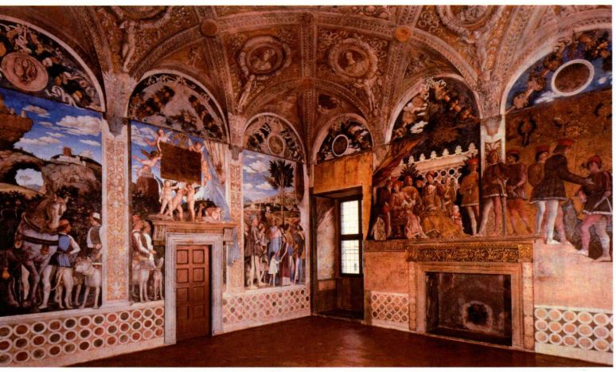

图15\.53 安德烈亚·曼泰尼亚：《绘画之屋》。1465\-1474年。湿壁画。曼图亚公爵府

安德烈亚·德尔·曼泰尼亚（Andrea del Mantegna，1431\-1506年）。他曾在帕多瓦学习艺术，但对威尼斯、佛罗伦萨与罗马的艺术潮流也有所了解。1460年，曼泰尼亚成为贡扎加家族的宫廷画家，他担任此职直到75岁高龄去世为止。作为画家、人文主义者以及考古学家，他所关注的问题都体现在木板画作《圣塞巴斯蒂安》（St．Sebastian，图15\.52）之中，该作品可能绘制于15世纪50年代。塞巴斯蒂安是一位基督教早期的殉教者，被判乱箭穿身而死。他的伤口全部愈合，这或许可以解释他的形象经常用来抵御瘟疫的原因。曼泰尼亚在解剖学上准确地描绘了圣徒身体且比例匀称，他被绑缚在一根古典圆柱上。形体的线条清晰、造型明确，以造就雕塑般的效果。圣徒脚下、身后以及身旁遍布着古典建筑与雕塑的遗迹，画面左侧有艺术家以希腊语题写的署名。一条道路通向远方，刚刚射杀圣徒的弓箭手正在这条路上行进。通过这一设计，曼泰尼亚使得依据透视法建构的空间也表现出时间的流动。弓箭手的远处是一片朦胧的风景，深蓝的天空中点缀着朵朵柔软的云彩。场景沐浴在温暖的午后阳光之中，创造出一种忧郁的情调。背景中明亮的风景显示出曼泰尼亚对佛兰德斯绘画的研究，这些作品到1450年时已传播到佛罗伦萨与威尼斯，曼泰尼亚可能曾在以上两地得以看到。

曼泰尼亚《圣塞巴斯蒂安》的赞助人身份不得而知，但是作为宫廷画家，他所服务的是曼图亚侯爵，为其别墅与宫殿绘制作品。他于1465年开始为侯爵在曼图亚的宫殿绘制一整间房间的画作，这一房间后来

被称为《绘画之屋》（Camera Picta，图15\.53）。房间本身是多功能的拱顶建筑，它有时用作卧室，有时又用作接待大厅，曼泰尼亚在1474年完成了其中的全部画作。他在墙壁上绘制了贡扎加家族成员及其侍从、子女的肖像，以及家族的财产。房间赞颂了侯爵卓尔不群的宫廷，他的政治成就与财富，所有这些都以新颖的方式展现出来，对于前来参观的人文主义者、政治家、艺术家与王公贵族而言，它们都是引人入胜的场景。通过这种方式，贵族们运用艺术提高了自身的社会与政治地位。《绘画之屋》同时也是对曼泰尼亚精湛技巧的赞美，为他在同时代的人当中赢得了声誉。

曼泰尼亚运用支撑拱顶的梁托、壁炉上方的壁炉架等真实的建筑构件，来创造贡扎加家族成员活动于家中的幻影般的瞬间。绘制而成的半露方柱成为窗户的边框，透过窗户得以观看身处户外的家族成员；仆人们对卢多维科与他新近成为枢机主教的儿子弗朗切斯科（Francesco）很是顺从，马匹与狗群位于主大门的另外一侧。除明确的人物特征与细节上的自然主义之外，曼泰尼亚对透视法的娴熟掌握使他能够将绘画中的世界与观者所处的真实世界连为一体。这一幻觉的极致位于拱顶的最高处，曼泰尼亚在此绘制了一面圆窗，通过它观者仿佛可以看到真实的蓝天。他在此处运用了多种设计来表现视幻效果，其中包括似乎在屋外微风下轻轻飘动的衣袍，以及拱顶上绘制而成的罗马皇帝浮雕。壁炉架之上，卢多维科的形象再次出现，此处的场景设置更为正式，他身边环绕着家人与廷臣。曼泰尼亚杰出的湿壁画绝佳地捕捉到了宫廷的卓越光彩。

546 詹森艺术史

威尼斯

虽然威尼斯与其近邻在领土、贸易路线与影响力方面相互竞争，但它却在15世纪期间一直有稳定的共和国政府。威尼斯的统治权掌握在根基十分牢固的商业贵族手中，几乎从未发生过内部冲突，总督府的建筑（见图13\.34）得以弃置所有防御功能。同样，威尼斯贵族的住宅也不需要防御功能，因此它们发展成为优美且具有装饰性的建筑。黄金之屋（Ca＇d＇Oro，图15\.54）始建于1421年，为马里诺·孔塔里尼（MarinoContarini）而建，其家族因贸易获利而长盛不衰。为了维护家族的地位，孔塔里尼不惜花费重金修建了位于大运河上的住宅。这座建筑曾大量运用金箔装饰其立面，并因此而得名。

这一宅邸的设计部分反映出不同的建筑功能。底层被用作船坞与仓库，第二层则主要用作会客大厅，在右部还建有若干较小的房间。私人区域主要位于最上一层。拱肋的交叉在立面上形成了精美的斜条格子图案，与耀眼的色彩及金箔交相辉映，显示出该家族的财富、地位与雄心。

多那太罗《加塔梅拉塔骑马像》的回响 威尼斯的艺术传统逐渐让位于来自佛罗伦萨的对古典艺术的

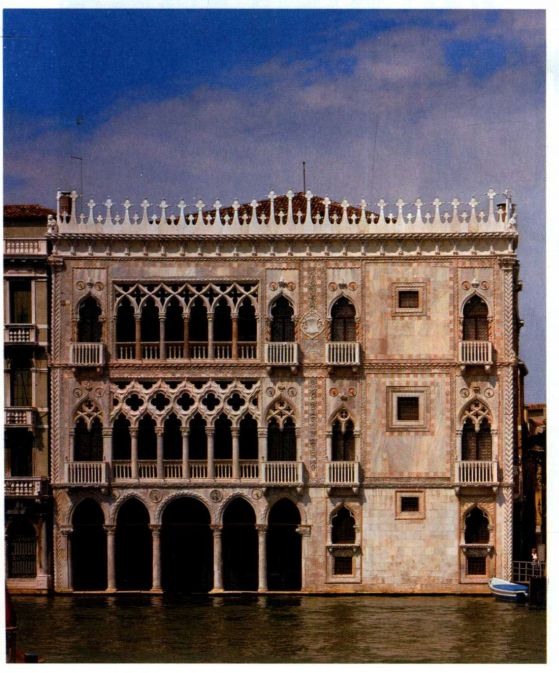

图15\.54 威尼斯黄金之屋。1421\-1440年

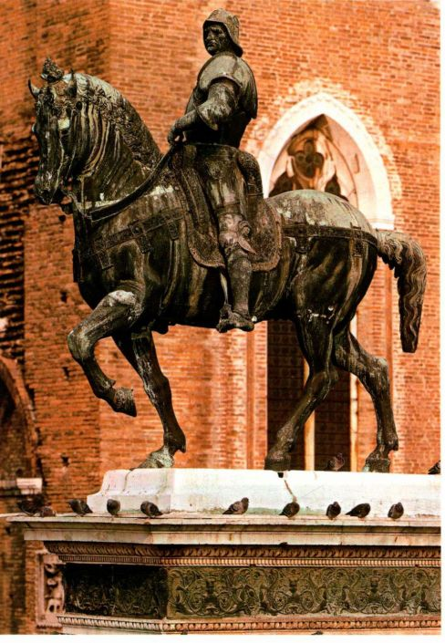

图15\.55 安德烈亚·德尔·韦罗基奥：《科莱奥尼骑马像》（EquestrianMonument of Colleoni）。约1483\-1488年。青铜，高3\.96米。威尼斯圣乔凡尼和圣保罗广场（Campo Santissimi Giovanni e Paolo）

兴趣。15世纪时，包括多那太罗和安德烈亚·德尔·卡斯塔尼奥在内的几位佛罗伦萨艺术家被聘到威尼斯创作重要的定件作品。威尼斯也赞赏并收藏佛兰德斯绘画。作为国际性贸易中心，它为来自北方的商人们提供了侨居之所。15世纪末，威尼斯也将新的艺术技法与古典艺术形式作为表达自身的实用工具。这种情形的最好例证就是威尼斯共和国向韦罗基奥定制的大型青铜骑马像，以纪念威尼斯军队的统帅巴尔托洛梅奥·科莱奥尼（Bartolommeo Colleoni，图15\.55）。科莱奥尼在他的遗嘱中要求制作这样一尊塑像，他留给威尼斯共和国一笔巨大的财产。科莱奥尼显然知道多那太罗的《加塔梅拉塔骑马像》（见图15\.21），并希望拥有同样的荣耀。韦罗基奥可能将多那太罗的作品作为自己这尊塑像的原型，然而他并非只是单纯模仿。他将绘画技巧融入了对质感与塑像细节的描绘之中。

科莱奥尼胯下的马匹与其说是健壮平静，毋宁说是优雅俊发，它细薄的皮毛中显现出血管、肌肉与筋腱，与它背上那位全副武装的人物所具有的刚强外表形成鲜明对比。与《加塔梅拉塔骑马像》相比，这匹马与

第十五章 15世纪意大利的早期文艺复兴 547

骑马人的比例上相对略小，因此端坐在马鞍上的科莱奥尼就展示出力量十足的统治者形象。他双腿笔直，一旁的肩膀耸向前方，俯视眼前场景的姿态具有与多那太罗的《圣乔治》（见图15\.3）相同的专注感。这尊科莱奥尼塑像与多那太罗的作品一样，都反映了博纳博·维斯孔蒂之墓（见图13\.36）中所体现的丧葬传统，并提示人们铭记这位统帅为威尼斯共和国所做的贡献。

贝里尼与油画 除古罗马艺术形式的复兴之外，威尼斯传统因其艺术家对油画这一新介质的探索而在15世纪晚期得到了进一步的加强。将油画引入威尼斯的一位关键性人物可能是墨西拿的安东奈罗（Antonelloda Messina），一位来自意大利南部的画家，他可能游历佛兰德斯并学习过这种技法，15世纪70年代的威尼斯文献中有关于他的记录。在乔瓦尼·

贝里尼（Giovanni Bellini，约1430\-1507年）的绘画里，佛兰德斯艺术家所开拓的油画技法与佛罗伦萨的空间营造、威尼斯的光线与色彩被结合在一起。贝里尼是曼泰尼亚的姻亲，出身于一个绘画世家。

贝里尼的《圣方济各的神迷》（St\.Francis inEcstasy，图15\.56）创作于1480年前后，是艺术家综合以上元素所创造的具有完全原创性的图像。在这幅画作中，圣方济各刚刚踏出他隐居的斗室，那是树荫下一处放有写字桌的岩凹。他将木凉鞋留在身后，入神地抬头望着天空。许多学者认为该画表现的是方济各在1224年圣十字节（Feast of the Holy Cross）时领受圣痕（stigmata，即基督身体上的五处伤痕）的情景，当时他身处托斯卡纳的拉维尔纳山（Mount LaVerna），一位钉在十字架上的六翼天使出现在他的面前。其他学者则认为该画作是《日头颂》（Hymn

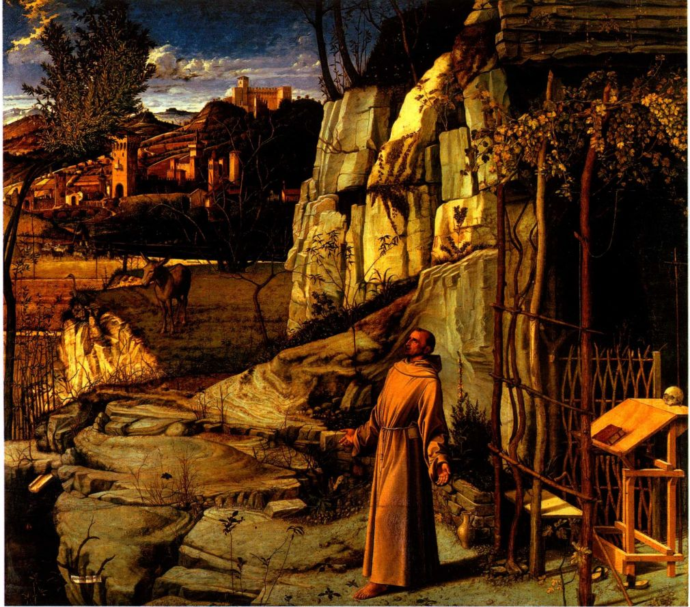

图15\.56 乔瓦尼·贝里尼：《圣方济各的神迷》。约1480年。木板油彩与蛋彩，124\.5x141\.9厘米。纽约弗里克美术馆（The Frick Collection）

548 詹森艺术史

图15\.57 乔瓦尼·贝里尼：《圣母与圣徒》。1505年。木板油画，5 × 2\.36米。

威尼斯圣扎卡里亚女修道院

of the Sun）的“图解”。1225年，方济各完成他每年一度在家乡阿西西附近隐居处进行的斋戒之后创作了这部作品。无论画面中描绘的是哪一个叙事场景，它都表达着方济各会的理想。对圣方济各而言，“日头兄弟······使白昼出现······美丽而光辉灿烂”，它是上帝的象征。他在画面中凝望的不是太阳本身，因为太阳被云朵遮挡了，他凝望的是展现为神圣之光的上帝。这一神迹般的光线非常强烈，它照亮了整个场景。

背景中壮丽的意大利乡村景色绵延不绝。与周围背景相比，圣方济各很小，似乎成了附属元素。然而，他在可视世界之美面前的那种神秘的投入，将观者的反应引向此处所展现的景观。它广阔无垠而又亲密私隐。圣方济各相信，上帝为人类创造了自然，而贝里尼运用文艺复兴艺术家的技巧重新创造了一幅自然美景。画面的深邃空间源自对透视法则的运用，画家描绘了精细的质感与形体来充实风景。其中有些形体可

能表达着方济各会的其他价值观念。方济各认为通向救赎的道路在于禁欲的隐居生活，这正是岩凹的象征意义。毛驴可能代表圣方济各本人，他曾将自己的身体称为应当接受训诫的驴子兄弟。苍鹭、麻鸦和野兔等其他动物与修士一样，都是基督教徒眼中独居的生物。然而贝里尼柔和的色彩与炽热的光线向画面中灌注了一股暖意，使独居生活不仅可以忍受，而且令人向往。

作为威尼斯的一流艺术家，贝里尼创作了一批神圣会谈类型的祭坛作品。其中最晚且规模最大的作品是1505年完成的《圣母与圣徒》（Madonna andSaints，图15\.57），这是为古老的本笃会圣扎卡里亚女修道院（San Zaccaria）所创作的作品。天国之后与圣子高踞宝座之上，圣彼得、圣凯瑟琳、圣露西与圣杰罗姆站在她的面前。设置女性圣徒可能反映了定制这一祭坛画的修女的要求。当这幅画在十余年后被安装在目前这个画框中时，它的两侧被裁切移除，其中

第十五章 15世纪意大利的早期文艺复兴 549

一块被放置在画面顶端。与韦内奇亚诺在60年前创作的神圣会谈题材作品（见图15\.30）相比，该画作的环境更为简朴但带给人的印象却更加深刻。圣徒上方的哥特式华盖没有出现，取而代之的是具有威尼斯中世纪传统与镶嵌画的半圆穹顶（见圣马可教堂，图8\.48）。弗兰切斯卡的乌尔比诺圣母（见图15\.48）提供了与此画更为接近的原型，但是贝里尼的人物更为从容地置身于半圆室空间之内，而且金字塔形的构图也更为稳固。建筑本身显然不是真实存在的教堂，因为它的两侧是敞开的，场景沐浴在日光之中。圣母的高背宝座与宝座最低一层台阶上演奏音乐的天使，可与马萨乔于1426年创作的《升座圣母》（见图15\.19）中的人物相比照。

这幅作品不同于早期佛罗伦萨画作的地方不仅在于设计上的开阔感，还在于它宁静默想的情调。人物似乎并未“交谈”，而是陷入沉思之中，因此任何姿势都显多余。艺术家用微妙的薄雾笼罩着场景，从而加强了画面的静默感。其中没有强烈的对比，光与影融合为几乎无法觉察的渐变层次，新颖丰富的色彩熠熠生辉。贝里尼创造了天庭的一瞬，在这完美的空间之内寓居着完美的人物。

罗马与教皇国

教皇驻跸阿维尼翁期间，罗马长久为人们所忽视，但在15世纪晚期它再次成为重要的艺术中心。由于教廷重新获得了意大利的统治权，几位教皇就开始美化梵蒂冈与罗马城。他们也再次宣布了教皇作为世俗领主在罗马与教皇国所享有的权力。这些教皇认为，罗马城在基督教时期的建筑必须胜过之前的异教建筑。为了达到这一目标，他们在15世纪将佛罗伦萨及罗马周边的大批艺术家召唤至罗马，其中包括真蒂莱·达·法布里亚诺、马萨乔、安杰利科修士、皮耶罗·德拉·弗兰切斯卡与桑德罗·波提切利。与其他意大利宫廷相同，教廷也认识到斥资装饰教会建筑与家庭居所的价值。

教皇西克斯特斯四世（Sixtus IV della Rovere，1471\-1484年）在1475至1500年间赞助了若干重大艺术项目，修建梵蒂冈图书馆就是其中之一。为了纪念该工程，西克斯特斯雇用当地画家梅洛佐·达·福尔利（Melozzo da Forli，1438\-1498年）绘制一幅湿壁画，表现教皇及其教廷授予巴托罗梅奥·普拉提纳（Bartolomeo Platina）梵蒂冈图书馆馆长一职的仪式（图15\.58）。教皇坐在宝座之上，周围环绕着他

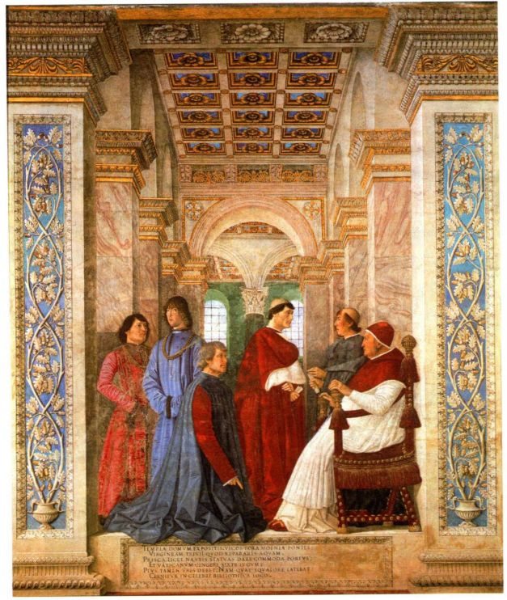

图15\.58 梅洛佐·达·福尔利：《西克斯特斯四世授职

教廷图书馆馆长的仪式》（Sixtus IV Confirming the Papal

Librarian）。约1480年。从原位置揭剥下来的湿壁画，

3\.66 × 3\. 15米。罗马梵蒂冈博物馆

550 詹森艺术史

的子侄。将职务授予家庭成员是一种普遍的做法，称为裙带关系（nepotism），该词出自意大利语的“子侄”一词。站在中央的人物是朱利亚诺·德拉·罗维里（Giuliano delle Rovere），即西克斯特斯的侄子，未来的教皇尤利乌斯二世（Julius II）。梅洛佐所设计的湿壁画形成了画面空间延续真实建筑空间的视幻效果，但是现实中的建筑已被破坏。观者抬头会望见天顶、台柱与房间的窗户。而且，建筑表面极其奢华，梅洛佐描绘了大理石的纹理、精美的装饰线脚以及框架元素中的装饰形式。方柱中的橡树树叶与果实指涉教皇的姓氏，“Rovere”为“橡树”之意。“Platina”指向一段称颂西克斯特斯改良罗马的题词。

西斯廷礼拜堂 西克斯特斯对罗马的改进措施之一就是在梵蒂冈为教皇修建一座新礼拜堂，它以西克斯特斯四世的名字命名为西斯廷礼拜堂（SistineChapel）。大约1481至1482年期间，西克斯特斯委托艺术家在该礼拜堂的墙壁上绘制一组湿壁画，左墙面表现摩西生平，右墙面表现基督生平，以此分别代表《旧约》与《新约》。为完成这组作品，他雇用了意大利中部一些最为重要的画家，波提切利、吉兰达约与人称佩鲁吉诺（Perugino，约1450\-1523年）的彼得罗·万努奇（Pietro Vanucci）都名列其中。佩鲁吉诺出生于佩鲁贾附近的翁布里亚（托斯卡纳东南部），与佛罗伦萨保持着紧密的联系。他于1482年

大事年表

1464年\-罗马附近装配出意大利首台印刷机

1470年\-阿尔贝蒂在曼图亚开始修建圣安德烈亚教堂

1471年\-西克斯特斯四世当选为教皇

约1480年\-乔瓦尼·贝里尼创作《圣方济各的神迷》

1492年\-哥伦布向西航行

完成了湿壁画《交付天国钥匙》（The Delivery of theKeys，图15\.59）。

这组湿壁画设计上严格对称，传达出其主题在特定背景之中的特殊重要性。圣彼得作为第一任教皇的权威以及众人对他的追随，都基于基督本人授予他天国钥匙这一事实。人物具有韦罗基奥作品中的细碎衣褶与理想化的特征（见图15\.27），佩鲁吉诺曾在这位艺术家的作坊中度过一段时间。除其他门徒之外，一群极具个性化特征的旁观者也见证着这个庄严的时刻。

在宽广的背景中出现了另外两个叙事情节：中景左侧是纳税钱的故事，右侧则是犹太人试图向基督扔石头的场景。两座罗马凯旋门模仿了君士坦丁凯旋门（见图7\.63），上面的题词将西克斯特斯四世比作修建耶路撒冷圣殿的所罗门。两座凯旋门中间的穹顶建筑似乎从阿尔贝蒂《论建筑》中关于理想教堂的描述里得到了灵感。同样具有阿尔贝蒂特色的是计算准确的透视法，赋予了画面空间清晰感。作品中的对称与

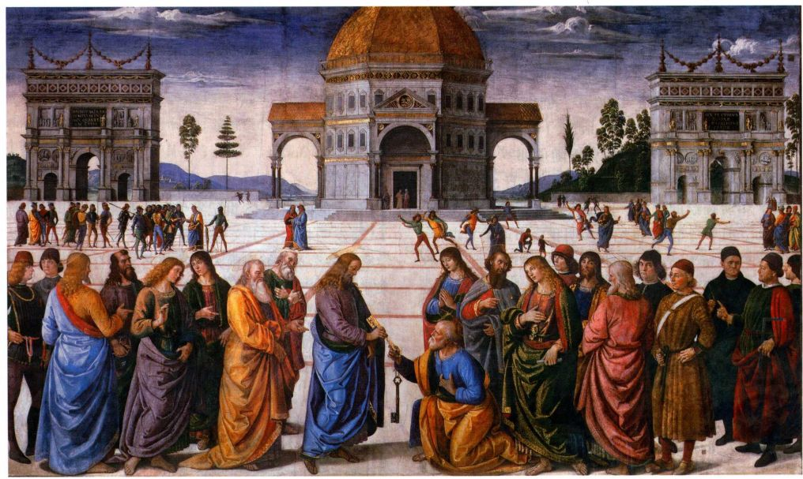

图15\.59 彼得罗·佩鲁吉诺：《交付天国钥匙》。1482年。湿壁画，3\.5x5\.7米。罗马梵蒂冈宫西斯廷礼拜堂

第十五章 15世纪意大利的早期文艺复兴 551

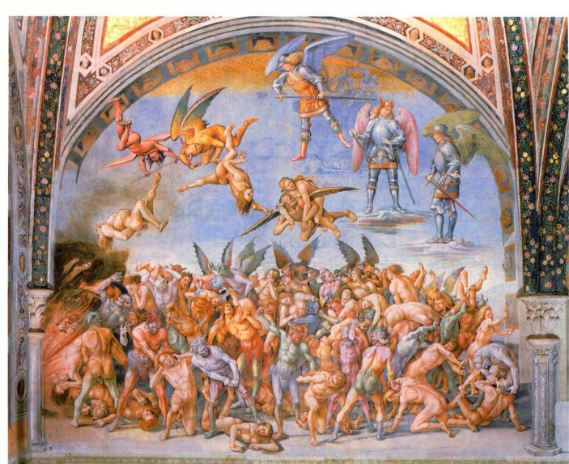

图15\.60 卢卡·西尼奥雷利：《罪人被投入地狱》。1499\-1500年。湿壁画，宽约7米。奥维托的圣布里齐奥礼拜堂

空间的清晰表现了西克斯特斯四世的统治特色，不仅在宗教领域，在世俗领域也是如此。

西尼奥雷利的圣布里齐奥礼拜堂 西克斯特斯统治教皇国的权力由他的继任者亚历山大六世（AlexanderVI）接管。后者为追求世俗权力，不仅采用了精神措施，而且运用了武力手段。这样的行径受到了意大利以及其他地方基督徒的谴责，助燃了下一世纪的反教权情绪。翁布里亚地区的奥维托城（Orvieto）表现出对教廷的极大效忠，作为回报，教皇出资为该城大教堂的圣布里齐奥（San Brizio）礼拜堂绘制了一组湿壁画装饰。这组湿壁画始作于1499年，创作的任务落在了卢卡·西尼奥雷利（Luca Signorelli，1445／50\-1523年） 的肩上。这位托斯卡纳画家曾跟随皮耶罗·德拉·弗兰切斯卡学画。湿壁画的主题为世界末日，正如《启示录》中所描绘的那样，但是圣奥古斯丁、托马斯·阿奎那、但丁乃至15世纪的多明我会布道士文森特·费瑞（Vincent Ferrer）都曾详尽阐述过这一主题。这组湿壁画中最令人难忘的是《罪人被投入地狱》（TheDamned Cast intoHell，图15\.60）。西尼奥雷利将这个场景设想为大量人类躯体被用力挤向下方，被魔鬼折磨或被地狱之火灼烧的场面，而天使长米迦勒则身处上方俯瞰着这些惩罚。西尼奥雷利受到波拉尤奥洛表现肌肉形式的启发，将裸体作为一种表现手段。被判有罪的人身体扭曲旋转，表现了他们面临着的折磨。作品中无序的构图与压缩的空间，与佩鲁吉诺《交付天国钥匙》（见图15\.59）中的理性与宁静形成了鲜

明对比。1500年即将到来之际，西尼奥雷利绘制了这些令人惊恐不安的末日场景，许多人认为这一年预示着世界末日。

15世纪90年代晚期是意大利极其动荡不安的时期。美第奇家族被逐出佛罗伦萨，法国于1494年大举入侵；黑死病再次席卷各个城市；土耳其人仍未放松对欧洲的侵袭。1499年，土耳其人在希腊勒盘托（Lepanto）歼灭了基督教军队，这次战败的耻辱于1571年于同一地点所进行的第二次战役中得以洗雪。对“末日”将近的恐惧因萨沃纳罗拉以及其他人的布道而愈燃愈烈。

小结

世界的面貌在15世纪发生了极大变化。印刷机的发明将人文主义者的新学识传播开来，并使哲学家与科学家能够在前人的基础之上以有效的新方法来建构其智慧。土耳其人占领了地中海东部地区，驱使葡萄牙与西班牙这这两个大西洋沿岸国家开拓通向亚洲的其他贸易路线，促成了环非洲大陆的航行以及美洲的发现。教廷陷入分裂，15世纪晚期教皇显现出世俗化特点，人们对宗教机构仍旧不满，文化中的世俗倾向越来越突出。竞争与贸易普及了以资本和货币为基础的经济体制，由此中产阶级的扩大改变了社会的面貌。

15世纪的意大利艺术家参与了这些变革，他们

552 詹森艺术史

在自己的作品中发展出描绘世界的新方法。意大利雕塑家、画家与建筑师从研究寓于古罗马及其艺术作品中的历史开始，创造出了统一古典形式与当代内容的艺术作品。在古代学者与同时代人文主义者的影响下，这些艺术家撰写了一些理论著述，仿佛他们也是学者，从而提高了艺术在文化中的地位。他们创造了运用透视法、自然主义以及人体形式来再现世界的系统，该系统不仅对于他们，而且对于其后几个世纪的大部分欧洲艺术家而言，都是创作的标准与规范。早期文艺复兴使欧洲看待艺术品与艺术家身份的方式发生了根本性转变。

建筑与建筑雕刻的古代灵感

佛罗伦萨极其重视修建公共建筑与利用大量艺术品来美化这些建筑。艺术家之间与赞助人之间的竞争造就了一系列非凡的创新性建筑，其中大部分建筑都从对古典艺术的研究中获得了灵感。布鲁内莱斯基结合了对古罗马建筑的研究与哥特式建筑技巧，以自己所设计的古典化建筑改变了佛罗伦萨城的景观。他的建筑运用了根据几何与比例法则组织的古罗马形式，创造出和谐理性的空间。年轻的多那太罗则效仿古代作品，赋予自己的人物雕塑以高度的自然主义特征，但同时也注入了庄重感和动态感。

佛罗伦萨家族的礼拜堂与教堂：1420\-1430年

显赫的佛罗伦萨各大家族为兴建与装饰教堂而耗资不菲，以此表达他们的虔诚之心与社会名望。布鲁内莱斯基为佛罗伦萨的名门望族设计了整座教堂与私人礼拜堂，而他所发明的线性透视法为艺术家们提供了在作品中创造空间幻觉的手段。画家绘制了祭坛画与湿壁画来装饰家族礼拜堂。马萨乔的宗教题材湿壁画充分利用了透视法的优势，同时也展示出他运用光线与人体所能具有的表现力来造型的创新手法。

佛罗伦萨风格的传播：1425\-1450年

佛罗伦萨艺术家的创新迅速传遍意大利。锡耶纳主教或比萨加尔默罗会修士这样的赞助人在选择所要雇用的艺术家时，可能得到了佛罗伦萨贵族的建议。这些艺术家本人曾在托斯卡纳地区游历甚广，以完成重要的委托定件作品，也将他们在透视、造型与表现性形式方面的高超技艺传播开来。罗马与威尼斯等其他城市的赞助人也借助马萨乔与多那太罗的才能来实施艺术项目。

美第奇时代的佛罗伦萨：1430\-1494年

15世纪中期，佛罗伦萨的艺术家继续在古典经验中探索不已，并挖掘了多那太罗、吉伯尔蒂、马萨乔与布鲁内

莱斯基所开创的制造画面空间的潜能。吉伯尔蒂为佛罗伦萨洗礼堂创作了第二对青铜大门，该作品重在表现幻觉空间中出自《旧约》的复杂故事场景，同时多那太罗还探索了众多雕塑材质。他们的影响则在下一代雕塑家与画家的作品中显现出来。男女修道院与名门望族都委托这些艺术家创作宗教图画或装饰教堂。阿尔贝蒂为新圣母教堂设计的立面中，将本地传统与古典建筑理论融为一体。

家庭生活：府邸、陈设与绘画，约1440\-1490年

佛罗伦萨各大家族的府邸展示着他们的社会地位与公民价值观，这些内容通过古典形式得到了视觉上的传达。阿尔贝蒂与米开罗佐吸纳改进了出自古罗马建筑的一些元素，创造出了兼具家庭生活居所与公共活动场所双重功能的府邸。这些建筑富于陈设、绘画与雕塑作品，既有宗教主题又有世俗主题。美第奇家族在其府邸中陈设了很多佛罗伦萨城市庇护者的形象，例如多那太罗的《大卫》与波拉尤奥洛的《赫剌克勒斯与安泰俄斯》。两位雕塑家都为家居环境创作了裸体人物，这一做法显然受到了古典雕像的启发。府邸中嫁妆箱奁也以绘画来装饰，此外还有圆形画。府邸墙壁上的绘画作品以当时那个时代的历史或是希腊神话为主题。个人与家族成员的肖像画不仅在宗教作品中或是在陵墓碑板中作为捐赠人出现，而且出现在神圣故事中作为参与者，同时还作为独立的绘画类型与胸像。

文艺复兴风格回响：1450\-1500年

古典的权威与佛罗伦萨风格的强烈感染力激励其他地方的艺术家们争相效仿，并重新阐释这些新风格。皮耶罗·德拉·弗兰切斯卡曾在佛罗伦萨驻留，但在发展其自身风格的时候，这位艺术家吸收了透视法、古典艺术以及马萨乔的特色，并在其中增加了新的油画技法。阿尔贝蒂接受了来自意大利北部宫廷的定件委托，因此将他的古典化建筑带到了意大利其他地区。艺术家兼人文主义者安德烈亚·曼泰尼亚在曼图亚创作的作品受到了考古学兴趣的启发，然而，作为宫廷画家，他创作的具有视幻效果的湿壁画满足了雇主的虚荣心。威尼斯继续发扬着它建筑艺术中的本地传统，但却雇用韦罗基奥雕塑了一尊效仿古典艺术的将军骑马像。威尼斯画家关注佛罗伦萨新风格所带来的自然主义艺术手法的可能性，但他们也对油画颜料所能造就的色彩与光影的微妙变化敞开了大门。教皇们重建罗马城之际，他们雇用了来自佛罗伦萨以及其他地区的艺术家创作作品，以显示他们作为圣彼得继承者的正统性，以及他们作为教皇国统治者所拥有的政治权力。文艺复兴时期的自然主义与古典主义实际出自对各种需求的回应。

第十五章 15世纪意大利的早期文艺复兴 553

