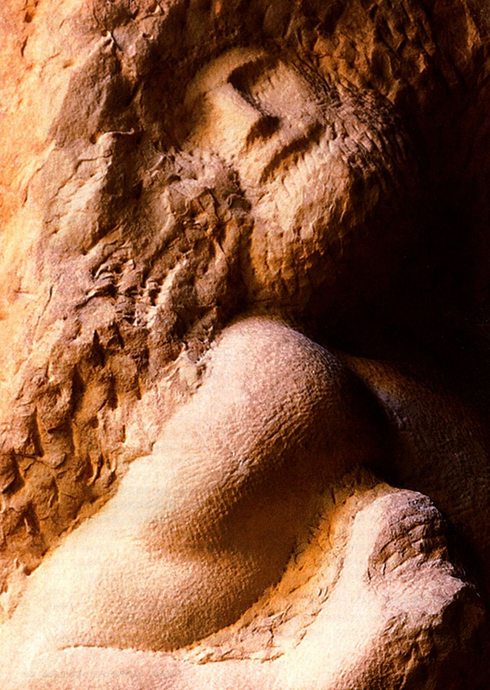

# 第十六章 意大利的盛期文艺复兴：1495\-1520年

1550年，在回顾15世纪的艺术家时，艺术家暨艺术史学家乔治·瓦萨里写道：“真正的伟大之处在于这些杰出的大师在建筑、绘画与雕塑艺术领域所实现的进展·····．”在瓦萨里看来，先前的艺术家为16世纪的同行奠定了基础，使得后来者能够“超越古代”。以后的艺术家与评论家都对他的判断深表赞

同，都认为1500年前后几十年间的艺术家在艺术上达到了一种完美的境界，值得敬仰与效仿。

瓦萨里认为，这一代艺术家堪称艺术家的典范。瓦萨里之后的许多世纪里，艺术家与艺术教师纷纷按照他的观点，将1495至1520年这25年间的作品作为评价自身作品的基准，而这一时期也被称为盛期文艺复兴。然而“盛期”（High）的观念预设了这样的条件，即该时期承继的则是某个“低潮”（lower）的时期，倘若如此来描述15世纪充满创新与活力的意大利艺术就显得违背常理了。出于这个原因以及其他一些理由，近几十年间，学者们对关于盛期文艺复兴的评价作了重新判断。但无论如何，这个短暂的时期里产生了今天在全世界最受推崇的西方艺术作品。这些作品出自艺术史上最为著名的艺术家之手，如瓦萨里的编年体著作《意大利杰出画家、雕塑家与建筑师传》（The Lives of the Most Eminent Painters，Sculptors and Architects of ltaly）所记录的那样。这部书将艺术家的生平置于艺术史学研究的中心，并成为编修艺术史的典范。事实上，16世纪早期不同于以前时代的一个特点是艺术家开始成为社会英杰。

图16\.16细部，米开朗基罗：《苏醒的囚徒》

达芬奇、布拉曼特、米开朗基罗、拉斐尔、乔尔乔内与提香在16时期早期的意大利备受推崇，而1520年之后，米开朗基罗与提香，在其有生之年就成为享誉国际的艺术家。他们获得此种显赫声望的部分原因在于，整个15世纪，艺术家的地位就已经逐渐发生了整体性的改变，而伴随上述杰出艺术家的出现，这种社会地位的提高进一步得到加强。尽管他们的出身未必显赫，作品风格各有千秋，乃至性格也千差万别，但是由于知识分子与人文主义者的努力，艺术家们获得了人们的尊重。他们的社会地位可与位高权重的宫廷人士并驾齐驱。有时，艺术家甚至被冠以“天才”或“神圣”的称号，其中有些人还获得了贵族头衔。

当时的赞助人常常委托这一小批才华横溢、志向远大的人为自己创作艺术品，产生上述对艺术家尊重与崇拜的另一部分原因与这些赞助人也不无关系。这一时期出现了艺术品位精致的君主、教皇与贵族赞助人同富于创造精神的艺术家不期而遇的情况。赞助人之间为这些艺术家们的作品相互竞争，同时也将艺术家置于与其他艺术家相竞争的境地。这种模式早在15世纪早期就已在佛罗伦萨出现，人们让艺术家一较高

🔴第十六章 意大利的盛期文艺复兴：1495\-1520年 555

下，以对他们的技艺进行测试，并以此激励他们在技法与艺术表现方面不断革新。赞助人的威望赋予艺术家某种神秘气氛，而艺术家的声誉反过来又增加了赞助人的威望。这群艺术家在选择艺术媒介与采用表达风格中都表现出了高超的技巧，而这才是他们真正的不同凡响之处。每位艺术家都发展出独特的视觉风格，这些风格都源自15世纪的艺术观念，但是通过艺术家个人的洞察力、对其时代艺术潮流的把握以及艰苦创作，他们创造出的艺术品在其同时代人眼中不仅超越了自然，而且超越了古人。他们的绘画作品具有某些共同之处：绘画是摹仿自然的艺术形式，但即使在严格描绘自然之时，绘画中再现的事物也会产生理想化的特征；画作以对古典形式的理解与仰仗为基础；作品构图清晰平衡；富于情感力量。

同样不同凡响的是如此经典而和谐的作品竟然创作于充满危机与动荡的25年间。在此期间，意大利受到了来自伊斯坦布尔的土耳其人扩张的威胁，被法国侵略并因内战而四分五裂。佛罗伦萨的美第奇家族被迫流亡，吉罗拉莫·萨沃纳罗拉继而崛起，随后又成立共和国，最后美第奇家族卷土重来。威尼斯的领土被其对手蚕食。米兰先为暴君统治，后为法国所占领。教廷制定了领土收复与扩张计划，随后陷入与周边国家的纷争之中。马丁·路德（Martin Luther）对天主教教条与宗教实践进行了抨击，罗马教会还不得不应对这一神学挑战所带来的冲击。全欧洲都因发现

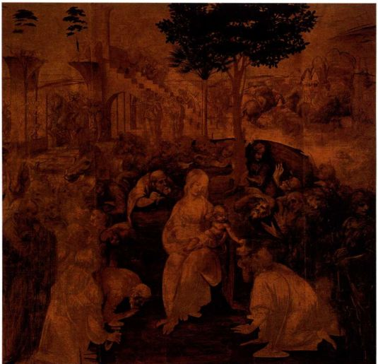

图16\.1 莱奥纳多·达芬奇：《三王来拜》。1481\-1482年。木板单色画，2\.43x2\.46米。佛罗伦萨乌菲齐美术馆

大洋彼岸的新大陆与新民族而震惊不已，这对他们以往关于世界形态的观念形成了巨大挑战。

佛罗伦萨与米兰的盛期文艺复兴

15世纪末期，佛罗伦萨作为艺术中心的声誉使它对艺术家与赞助人产生了巨大的吸引力。洛伦佐·德·美第奇宫廷的光辉在他于1492年去世及之后其子被迫退位以后消失殆尽。萨沃纳罗拉怂恿佛罗伦萨人改变自己的信仰与生命，许多人听从了他的警告，弃绝了美第奇宫廷的世俗文化。在萨沃纳罗拉的影响下，“异端”书籍与艺术品在市政广场（Piazza dellaSignoria）被付之一炬，画家桑德罗·波提切利将自己的若干画作也投入火中。然而，萨沃纳罗拉所要求的强烈赎罪狂热在1498年这位教士被处死之后旋即烟消云散。佛罗伦萨恢复了共和政体，但是该政府只不过维持到1512年，美第奇家族的新一代政治家再次控制了政府。政局动乱似乎激发了艺术上的巨大创新，达芬奇与米开朗基罗的作品正是其见证。

达芬奇在佛罗伦萨

莱奥纳多·达芬奇（Leonardo daVinci）既是科学家、画家、雕塑家，也是音乐家、建筑师与工程师。其父是一位公证人，他本人于1452年出生在托斯卡纳小城芬奇（Vinci），曾在佛罗伦萨韦罗基奥繁忙的作坊中学习绘画。1482年前后，达芬奇离开佛罗伦萨，前往米兰为卢多维科·斯福尔扎（Ludovico Sforza）大公效力，但当时他的身份首先是军事工程师，然后才是艺术家。1499年，斯福尔扎因法国占领米兰而下野，达芬奇随之前往威尼斯、罗马和佛罗伦萨，并在1503至1505年间在佛罗伦萨完成了若干委托制作。从1506年直到1516年，达芬奇在罗马和佛罗伦萨从事创作，其间再次返回米兰。米兰的法国领主弗朗西斯一世（Francis I）邀请达芬奇至卢瓦尔河（Loire）河谷的一座城堡之中颐养天年，达芬奇于1519年在那里去世。

1482年离开佛罗伦萨时，达芬奇一直在创作一幅题为《三王来拜》（Adoration of the Magi，图16\.1）的大型木板绘画，这是某个佛罗伦萨修士团体的定件。但是除底色与底稿之外，这幅作品并没有完成。虽然作品题材传统，但它却表现出了达芬奇描绘事物时的创造性手法。他在背景的建构中运用了精确的透视法与几何秩序，令人回想起马萨乔的作品（见图15\.14）。达芬奇将主要人物安排在金字塔形布局之中，圣母的头部位于塔尖，身旁围绕着呈大尺度拱

🟩556 詹森艺术史

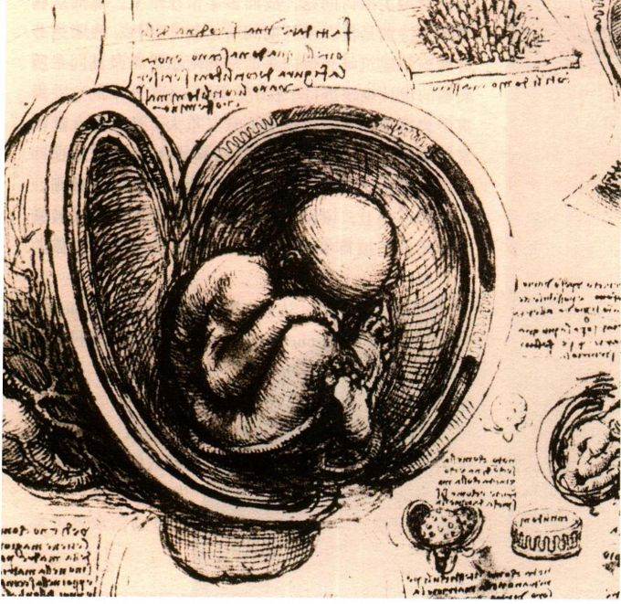

图16\.2 莱奥纳多·达芬奇：《子宫中的胎儿》。

约1510年。钢笔画局部， 30\.4 x 2 1\.5厘米。英

国皇家图书馆温莎城堡（Windsor Castle，Royal

Library\)

形排列的旁观者。尽管画面中央绘有树木，但前景人物与背景元素之间的联系似乎并不明显。尽管画作中的大部分内容都具有革新之处，但圣母与圣子的优雅姿态却也表现出了1480年前后的佛罗伦萨风格。

画面处理尤为如此。虽然达芬奇只完成了画作的最初几层，但对画中描绘对象的表现却显得柔和、流畅，始终未与那种朦胧的气氛相脱离。与菲利波·利皮或波提切利不同，达芬奇不以轮廓线塑造形体，而是试图通过光在三维形体上不同程度的光影效果表现人物（对比图15\.39与图15\.42）。这种造型方法称为明暗对照法（chiaroscuro，意大利语，意为“明亮与昏暗”）。达芬奇首先在画面上绘制出中间明暗过渡的部分，之后加深形体的阴影部分、提亮高光部分。画中的人与物不再排列于虚空之中、互相之间毫无关系，而以柔化的轮廓线统一于同一艺术氛围之中。

达芬奇同时还追求情感的连续性。达芬奇的这件作品里没有法布里亚诺《三王来拜》（1423年，见图15\.12）中分散观者注意力的大量人物、动物等形象。之所以如此安排，为的就是使所有人物都凝望画面中心的圣母与圣子。人物形象突出得自于艺术家通过姿态与表情来表达情感的表现手法，这是达芬奇研习波拉尤奥洛与韦罗基奥的作品（见图15\.36、15\.27）时

学到的。尽管作品未能完成，但其中大胆的技法与情感的深度都表现出达芬奇即将走上的艺术道路。

达芬奇在米兰

达芬奇没有完成这幅木板绘画就离开佛罗伦萨前往米兰，并在那里供职于米兰大公卢多维科·斯福尔扎。在那里，他以工程师、宫廷艺术家与军事设计师的身份工作，直到1499年才离开。正如先辈布鲁内莱斯基，达芬奇开始转向分析与研究，解决种种关于艺术与科学的问题。他相信人们可以凭借数学对这个世界加以理解，数学也是他调查研究的基础。因此艺术家不仅必须了解透视法则，而且必须了解所有自然法则。对他而言眼睛是获得此类知识的最佳途径。数百份素描与笔记体现了达芬奇研究范围的广阔，他原本希望能够根据这些材料写出百科全书式的论文集。动物、水流、解剖学与思维的运作，他对自然中所有的事物全都着迷。达芬奇是否原本就是科学家仍是一个讨论中的问题，但无论如何，他创造了现代意义上的科学示意图，这是今天解剖学家与生物学家的基本工具。他的素描，例如《子宫中的胎儿》（Embryo inthe Womb，图16\.2），结合了他本人的生动观察与清晰的分析图解，或者，用达芬奇自己的话来说，结合了视觉与洞察力。插图16\.2中这页研究资料的产生取

🔴第十六章 意大利的盛期文艺复兴：1495\-1520年 557

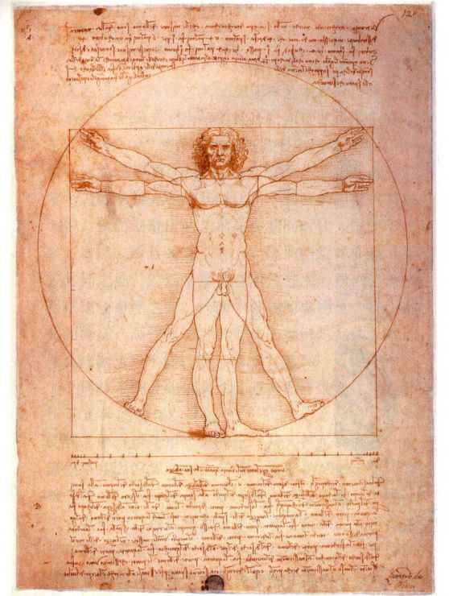

图16\.3 莱奥纳多·达芬奇：《维特鲁威人》（Vitrurian Man）。约1487年。纸上钢笔画，34\.3x24\.1厘米。威尼斯学院美术馆（Galleriedell'Accademia\)

决于他描绘眼睛所见之物的能力，也仰仗于他以视觉形式和文字对细节所作的不掺情感的准确记录，图中采用的是从右到左的镜像书写方式。

像15世纪的其他学者一样，达芬奇也通过阅读古代典籍来支持自己的研究。为获取解剖学知识，他阅读了古希腊医生盖伦（Galen）的著作。对建筑与工程学的兴趣将他引向了古罗马建筑师维特鲁威的著作，后者的论文在十五世纪早些时候启发了阿尔贝蒂。达芬奇在15世纪80年代晚期创作了一件素描（图16\.3），将维特鲁威的观念付诸图像，即人体可被用来绘制圆形和正方形这样完美的几何形式。人文主义者与建筑师认为这些几何元素不仅是视觉形式，也承载着深刻的意义，达芬奇的这张素描是表达该价值观的重要图像。他与其他人文主义者一样，对于人在宇宙中的位置这一问题很有兴趣。

达芬奇本人曾被认为是一名建筑师。然而，他似乎更关心解决结构与设计中的问题，而不是实际的建造活动。他素描中所设计的众多建筑项目，其中大部

分只是为了探讨问题，故而多半留在纸上。然而这些草图，特别是他在米兰期间所绘制的那些，表明达芬奇对前辈建筑师布鲁内莱斯基和阿尔贝蒂及其同辈所面临的设计难题进行了探究。图16\.4中所示的这一类集中式穹顶教堂在建筑史上意义重大。达芬奇在这幅素描里设计了一座由圆形与正方形构成的建筑，这些几何形遵循比例布局，清晰地表达着古典建筑法则。在设计思想上，该设计承接着佛罗伦萨的穹顶大教堂与罗马新圣彼得大教堂，后者是16世纪最为宏伟的建筑项目。

抵达米兰后不久，达芬奇为无玷受孕会（Confraternityof the Immaculate Conception）在大圣弗朗切斯科教堂（San Francesco Grande）的一座礼拜堂绘制了《岩间圣母》（The Virgin of the Rocks，图16\.5）。童年圣约翰在圣母面前敬拜耶稣是该画的主题，这也是15世纪晚期佛罗伦萨流行的题材。当时人们对耶稣及其表兄施洗约翰童年生活的推测产生了关于他们孩提时曾经相遇的故事。方济各会教士鼓励信众思考耶

图16\.4 莱奥纳多·达芬奇：《教堂设计	》（Project fora Church，手稿B）。

约1490年。钢笔画，23 × 1 7厘米。巴黎国家图书馆军械库分馆

🟩558 詹森艺术史

稣生活的“人性”一面，此类故事就由此而产生。在类似传说中，年轻的施洗约翰被描述成一位终身隐士，有时身着皮毛外衣。达芬奇关于他们会面的设想，则几乎是一幅基督在荒野中显灵于幼年施洗约翰面前的景象。年幼的施洗约翰跪在画面左部，双眼凝视正为他祝福的耶稣。画面中的圣母玛利亚起着连接两个孩子的作用，她的一只手护着施洗约翰，另一只手则张开并伸向耶稣头顶上方。身着红斗篷的天使衣褶翻卷，一手扶着耶稣，另一手指向

施洗约翰，目光却转向观众。

作品在诸多方面都具有神秘感。偏僻的岩间背景、前景中的池塘以及精心描绘的植物都有象征意义，但是学者们仍在细节方面争论不休。人物从岩窟的晦暗不明中显现出来，栖身在潮湿的空气里，这给人物的形体蒙上了一层微妙的薄纱。创作这种精美的薄雾的艺术手法称为渐次渲染（sfumato），它能赋予场景非比寻常的温暖与私密之感。光线将观众的注意力引向孩童们美好的身体，以及成人优美的头部。达芬奇将

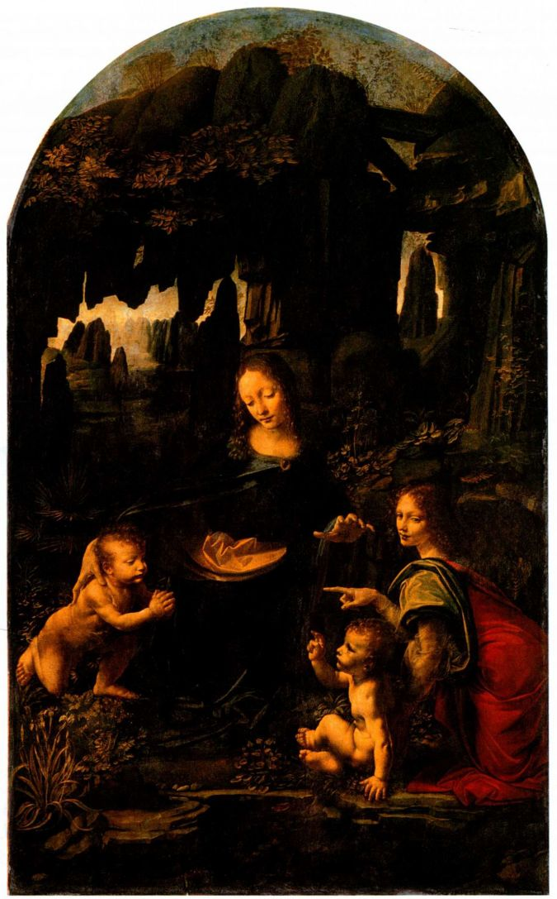

图16\.5 莱奥纳多·达芬奇：《岩间圣母》。约1485年。转到画布上的木板油画，1\.98 × 1\.22米。巴黎卢浮宫

🔴第十六章 意大利的盛期文艺复兴：1495\-1520年 559

原始文献

莱奥纳多·达芬奇（1452\-1519年）

节选自他的手稿，日期不详

达芬奇是盛期文艺复兴在各方面都取得杰出成就的伟大人物，他的写作题材十分广泛。在当时学者的视野中，各类艺术之间的比对是众所关注的一个主题。

轻视绘画之人既不热爱哲学，也不热爱自然。

绘画是自然界一切事物唯一的模仿者，如果你轻视它，那么你必然轻视蕴含哲理的微妙创造，轻视关于自然所有形式的微妙思索，海洋、陆地、植物、动物、青草、花朵，所有这一切都包裹在光与影之中。真正的绘画是一门科学，它是真正的自然之子。因为绘画生于自然，更确切地说它是自然的孙辈，因为世间一切可见之物均生于自然，它们才是自然之子，而绘画又进而始于这些可见之物，因此，准确地说，我们应当将绘画称为自然之孙，将其看作与神相关的艺术。

诗歌与绘画之比较

单凭想象无法表达出亲眼所见的视觉之美，因为眼睛接收到的是事物真实的外貌或图像，并能通过感觉器官将这些外貌或图像传递给具有判断能力的大脑。但是想象永远不能脱离大脑之外······如果想象的对象并非美得令人难以忘却，它也就只会仅止于记忆，并终了于此。因此，诗歌诞生于头脑之中，更确切地说是诞生于诗人的想象之中，因为诗人像画家一样描绘同样的事物，居然声称与画家同等！······想象的对象并不来自外界，它也来自看不见的头脑之眼中。在看

人物布局为金字塔形，实现了构图的稳定与平衡，但是人物的姿态牵引着观众的视线往复流转，暗示着人物之间的关系。精心选择的光线、宁静祥和的气氛与柔和闲适的姿态营造出遥远的、梦幻般的感觉，使得画面表现出诗意般的幻想，而非现实情景。

关于达芬奇心目中诗歌与绘画之间关系的问题，我们还有很多可以讨论。他认为视觉是最高的感官，而画家在表现所见或所想象的事物方面具有得天独厚的优势。他的笔记中有大量关于诗画对比（paragone）的评论。各种艺术形式之间的对比源于古罗马诗人贺拉斯关于诗歌近于绘画的评述（ut pictura poesis［诗如画］），盛期文艺复兴的艺术家们将其重新加以解释，认为绘画应当与诗歌同源（见本页的原始文献）。达芬奇又把关于诗歌绘画之争的思考扩展到了绘画与雕刻之间。他认为绘画高于雕刻，主要因为绘画提供了如《岩间圣母》中所出现的那种创造幻觉空间与质感的可能。此外，画家在制作时也能够衣着优雅，不需要像雕刻家那样遭受灰尘困扰或者付出蛮力。与他同时代的艺术家并非都同意这一观点。米开朗基罗就是反对者之一，他主张雕刻艺术高于绘画，理由非常

不见的头脑之眼中形成此类光线的精神图像，与在冥想之外实际看到它简直是天壤之别！

如果你是一位诗人，要表现一场残酷的战斗，必须描述致命的器械所产生的烟雾使得空气模糊暗淡，厚重的灰尘污染了大气，因死亡而恐惧战栗的不幸之人惊慌逃散。在这种情况下，画家所做的将在你之上，因为画家运用他的科学能够即刻展示出这一切，而你纵使写到笔墨用尽、说到口干舌燥、疲惫不堪、饥饿难忍，也无法充分描述画家所展示的一切。

关于雕刻家与画家

雕刻艺术比绘画需要更多的体力，就是说，雕刻家的创作活动具有机械性，相应的精神上的努力也较少。与绘画相比，雕刻几乎不需要科学研究，因为雕刻家的工作总是剔除，而画家的工作总是在增补。雕刻家剔除的总是同一种材料，而画家增添的却是多种材料。雕刻家只需将其全部注意力投入到其所雕刻的材料的线条，画家则不仅要研究同样的线条，还要研究光影、色彩与透视。而至于上述这些画家必须另外考虑的因素，雕刻家自始至终都得到了自然的帮助，自然为他的作品提供了光影与透视。画家必须运用其聪明才智才能获得这些，他自身在其中扮演了自然的角色，然而，这一切对雕刻家而言则都是现成。

SOURCE:THE LITERARY WORKS OF LEONARDO DA VINCI, ED\.JEAN PAUL RICHTER\. \(LONDON: PHAIDON PRESS LTD\., 1975\)

明确，正好因为雕刻创造的是真正的立体形式，而绘画只会制造幻象。

达芬奇创造幻象的技巧及其实现幻象的开创性方法在《最后的晚餐》（The Last Supper，图16\.6）中展露无遗。这件作品创作于1495至1498年间，达芬奇的赞助人卢多维科·斯福尔扎大公委托他创作一幅绘画，作为多明我会感恩圣母修道院（Santa Mariadelle Grazie）膳堂的装饰，该修道院也是大公的家族礼拜堂所在地。完成的画作立刻声名大噪，并被其他艺术家大量模仿。尽管画面最近经过了修复，但是现代观众只能凭想象才能感受它最初的辉煌。达芬奇不满足于传统湿壁画技法的限制，尝试性地运用油与蛋彩（oil\-tempera）作为调色介质，在干燥的灰泥层上作画，在米兰的潮湿环境之中，这种颜料并不能良好地附着在墙面上。更有甚者，作品的尺寸由于后来墙壁的损坏与翻新而减小，不过存留下来的部分已经足以展示画作最初所具有的巨大艺术影响。

正如卡斯塔尼奥在半个世纪之前所创作的同名作品（见图15\.29）那样，“最后的晚餐”这一主题是修道院膳堂的传统题材。修士与修女在基督与门徒用

🟩560 詹森艺术史

餐的场景前默默进餐。与卡斯塔尼奥一样，达芬奇也创作了空间背景，仿佛那是饭厅现实内景的延伸，然而却比卡斯塔尼奥的背景更为深邃，也更有气氛。透视系统的中央灭点位于画面的正中心，恰好在耶稣头部后方，如此一来画面具有了象征意味。同样具有象征意义的还有耶稣身后墙壁上的开口，以建筑形式表现的神圣光环。卡斯塔尼奥运用爆裂的大理石纹理与人工制造的金盘实现这一目的，而达芬奇却以自然的光线环绕着耶稣。光线、构图、色彩、背景，所有画面元素都将观者的注意力吸引到耶稣身上。

耶稣可能刚刚说出那句字字千钧的话：“你们中间有一个人要出卖我了。”门徒们问道：“主，是我么？”耶稣两侧的门徒对这句话并不是以简单的言辞作出反应，每个人都表现出了自己的个性及与耶稣的关系。耶稣右部的一组门徒中，彼得冲动地攥着刀子，彼得身旁的约翰似乎在沉思中失神；犹大（位于耶稣右侧，斜倚着桌子）则退向背离耶稣的阴影中。达芬奇精心计算了每个人物的姿势与表情，使得戏剧性的场面铺满整个绘画平面。这些人物印证了艺术家在一份笔记中所写的内容：绘画最高且最难达到的目标是通过姿态与肢体运动来表现“人类灵魂的意图”。

但仅将此画看作一场心理戏剧中的某一刻并非是对达芬奇意图的恰当评价，他想表现的远远超过依

大事年表

1498年\-萨沃纳罗拉于佛罗伦萨被处死

1499年\-法国占领米兰

约1503年\-达芬奇创作《蒙娜丽莎》

1512年\-佛罗伦萨共和国解体，美第奇家族复辟

照表面意义表现圣经故事。他无疑是要凝炼绘画与宗教两方面的主题，前者依靠紧凑且深具意味的人物分组，后者则通过同时表达多重意义来实现。因此，耶稣的姿势既是对神的旨意的服从，也是一种献祭。位于餐桌中央的他举止平静，喻示了在宣布被出卖这一戏剧情节之外，耶稣还创立了圣餐礼，面包与葡萄酒在仪式中分别代表他的身体与血液。这样多重的意味将成为生活在画作所处环境中的多明我会修士的精神食粮。

1499年，米兰公国败于法国，达芬奇在短暂的曼图亚与威尼斯之行后返回佛罗伦萨。他想必发现那里的政治氛围与记忆中的迥然不同。佛罗伦萨人在洛伦佐·德·美第奇之子皮耶罗的统治下已经开始不满，并于随后驱逐了美第奇家族。在1512年美第奇家族复辟之前的这一短暂的十多年，佛罗伦萨再次成为共和国。在这段时间里，达芬奇似乎主要活跃在工程学与测量学领域。1503年，佛罗伦萨城委托他为市政厅

	图1 6\.6 莱奥纳多· 达芬奇： 《最后的晚餐》。约1495\- 1498 年。油彩和蛋彩混合材料壁画\. 4\.6 × 8\.8 米。米兰感恩圣母修道院

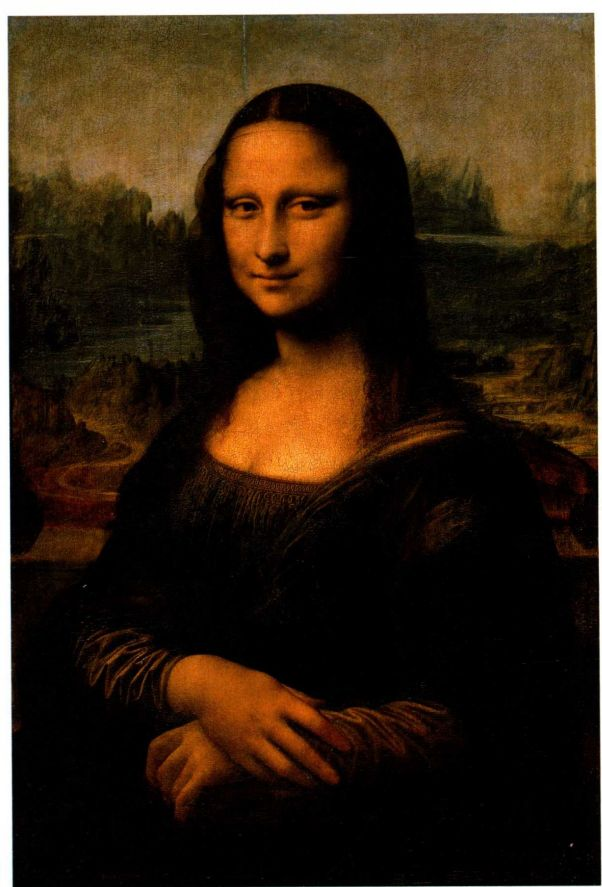

图16\.7 莱奥纳多·达芬奇：《蒙娜丽莎》。约1503\-1505年。木板油画，77 × 53\.5厘米。巴黎卢浮宫

的议会大厅创作一幅壁画，但他在1506年放弃了该画作并回到米兰。

改造女性肖像画

在为市政厅绘制壁画期间，达芬奇还创作了一幅女性肖像画，瓦萨里认为其中的女子是弗朗切斯科·德尔·乔孔多（Francesco del Giocondo）的妻子丽莎·迪·盖拉尔多（Lisa di Gherardo），这幅作品就是著名的《蒙娜丽莎》（Mona Lisa，图16\.7）。不过并非所有人都认为这是画中女子的真实身份，但如果她确实是丽莎夫人，那么在肖像画绘制之时她应该芳龄25岁。但不知为什么，达芬奇自己保留了这幅作品，在他于法国去世之后，该肖像画进入了弗朗西斯一世的收藏，进而又从王室收藏转为卢浮宫博物馆的镇馆之宝。在某种程度上，这件作品的声名的传播也得自于其所有者的地位。

当然，这件作品声名卓著也是出自画作的品质，

达芬奇在其中对女性肖像画进行了改造。直到15世纪，女性才在婚礼时被画入肖像画，通常为侧面像，突出表现她们昂贵的衣饰而不是本人的个性或细部特征。在这幅作品中，达芬奇采用了北欧的四分之三侧面姿势，描绘了女子的整个上半身，因此她的双手也出现在画面中，整体构图呈稳固的金字塔形。倾泻在她身上的光线将人们的注意力吸引到她的面颜。人物形体以多层清薄的油画颜料层建构，以至于似乎有某种柔和的光线从画板内部微微透出，尽管上光油因年久污浊，画面暗淡模糊，这种效果依旧。这位女子坐在一片怡人的风景前，山峦从渐次渲染的冷色调背景中浮现出来，而其间交错的水流桥梁则与女子衣袍上的高光相映成趣。早期肖像画在表现女性所佩戴的珠宝上所花的心思几乎与在表现人物上的相当，达芬奇却集中地描绘了她按照当时的流行样式拔除眉毛后露出来的前额。他处理女子面纱与手部的技巧赋予人物的鲜明特色不亚于那抹闻名遐迩的微笑。瓦萨里为这

🟩562 詹森艺术史

幅作品声誉的传播起到了很大的推动作用，因为他声称这幅肖像画是“艺术能够在多大程度上忠实地模仿自然”的绝好例证。瓦萨里认为，正是这种技巧才是达芬奇艺术天分的根源（见第三部分末尾的附加原始文献）。

罗马复苏

15世纪末，返回罗马的教廷巩固了自己的统治地位。教皇们不仅对教会进行精神控制，而且对罗马城附近的教皇国实施政治与军事统治。重建罗马城表达了教皇希望对该地进行统治的愿望，在众多建筑项目之中，西克斯特斯四世借助西斯廷礼拜堂工程很好地证明了这一点。1492年，教皇亚历山大六世登基，他利用自己的教皇身份，并通过其子切撒雷·博尔吉亚（Cesare Borgia）所领导的军事扩张来扩大教皇国领地，使得他的教廷可以与当时意大利任何君主国的宫廷相匹敌。亚历山大六世去世后，新教皇尤利乌斯二世（1503\-1513年在位）以重建罗马城为目标，希望借此重现其在古罗马时期的荣耀。为此，这位教皇投入了大量资金，兴修了许多大型建筑，创作了众多大型雕塑与绘画，并召集无数艺术家为他工作。在尤利乌斯二世治下，罗马最终成为盛期文艺复兴的大熔炉。

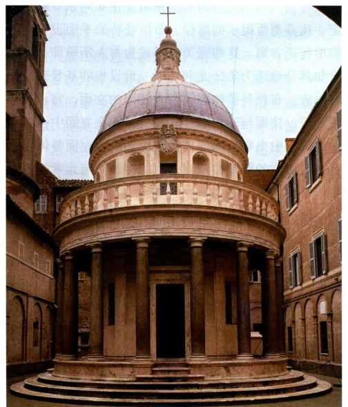

图16\.8 多纳托·布拉曼特：罗马蒙特里诺圣彼得教堂的小神殿。

约1502\-1511年

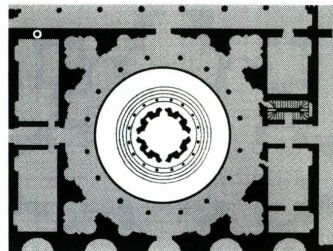

图16\.9 布拉曼特的小神殿平面图（出自塞尔里奥：《建筑的一般规则》［Regole generali di architettura］）

布拉曼特在罗马

尤利乌斯二世统治时期，罗马最著名的建筑师当属多纳托·布拉曼特（Donato Bramante，1444\-1514年）。这位建筑师出生于乌尔比诺，最初从事湿壁画创作。在皮埃尔·德拉·弗兰切斯卡与安德烈亚·曼泰尼亚的影响下，布拉曼特在用准确透视描绘建筑背景方面技艺娴熟。他可能也受到过达芬奇的影响，两人都曾服务于米兰宫廷。布拉曼特将布鲁内莱斯基和阿尔贝蒂的建筑作为自己创作的起点。

1499年米兰被法国占领之后，布拉曼特前往罗马，并在那里得以直接体验古罗马建筑。西班牙裔教皇亚历山大六世此时刚刚开始扩建并增强教廷的进程，他获得了强大的西班牙君主费迪南德与伊莎贝拉的支持。西班牙国王在1500年前后委托布拉曼特为蒙特里诺圣彼得教堂（San Pietro in Montorio）建造一座附属建筑（图16\.8），施工地点是人们所认为的圣彼得被钉十字架之地。由于这座建筑强烈地令人回想起古罗马圆形神殿，因此它被称为小神殿（Tempietto）。这是一座殉道堂，一种与殉教者相关的特殊礼拜堂。

在早期基督教的罗马，此类建筑通常采用集中式布局。然而布拉曼特似乎从阿尔贝蒂的建筑规则与达芬奇的试验中得到了重要启发，这种启发丝毫不亚于罗马本地建筑风格对他的影响。与他同时代的塞巴斯蒂亚诺·塞尔里奥（Sebastiano Serlio）在一部出版于16世纪40年代的建筑论文中记载了布拉曼特的设计。根据平面图，布拉曼特在小神殿周围添置了一个有柱廊的圆形庭院，这个庭院与神殿相照应。这种设计礼拜堂的观念大胆新颖（图16\.9），不仅礼拜堂的柱廊控制着庭院柱廊的节奏，而且庭院中的墙壁上还开有凹入的壁龛，与礼拜堂的立面相互呼应。

礼拜堂立面建有三级台阶的平台，采用了朴素的托斯卡纳多立克柱式，比任何一座15世纪的建筑都

🔴第十六章 意大利的盛期文艺复兴：1495\-1520年 563

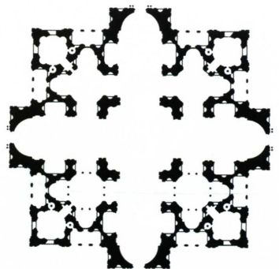

图16\.10 多纳托·布拉曼特：罗马圣彼得大教堂的初始设计图（根据Geymuller的图绘制）。1506年

与古罗马神殿更为近似（对比图7\.46）。而且，神殿整体设计以立柱为模数单位，例如立柱之间的间距是其直径的四倍，立柱与墙壁之间的距离为其直径的两倍。这种严格的布局逻辑符合维特鲁威所确定的神殿设计规则。同样令人震撼的是，如在平面图所见，布拉曼特在礼拜堂与庭院中都采用了“雕刻式”墙壁。礼拜堂上层深陷入墙壁的壁龛与穹顶凸起的圆面互相协调，也与显著突出的线脚与檐口相匹配。这座小神殿由此获得了本来以它较小的规模所无法达到的宏大感。该礼拜堂在嵌板与环绕底座的饰带中都雕刻有装饰图案，它是宣扬教皇权威的杰出建筑作品。小神殿宣称基督与教皇（被看作圣彼得的继承者）是古罗马

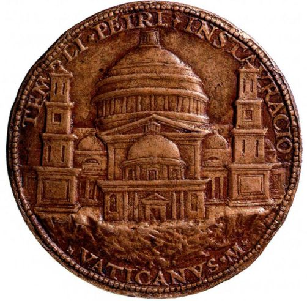

图16\.11 克里斯托弗罗·弗帕·卡拉多索（Cristoforo FoppaCaradosso）：表现布拉曼特圣彼得大教堂设计的青铜纪念章。1506年。伦敦大英博物馆

的直接继承者。布拉曼特运用古罗马的建筑语汇来表达当世教皇的主张。塞尔里奥记载该设计的建筑论文发表促进了某些特定元素以及建筑设计理念的传播，小神殿也成为了具有巨大影响的建筑。

此类作品使布拉曼特引起了亚历山大六世的继任者尤利乌斯二世的注意，后者在1503年至1513年间就任教皇。他原名朱利亚诺·德拉·罗维里，是西克斯特斯四世的侄子，曾出现于梅洛佐·达·福尔利在梵蒂冈所作的湿壁画中（见图15\.58），他可能是文艺复兴时期最世俗化、最雄心勃勃的教皇。尤利乌斯二世将艺术与艺术家当作实现恢复教皇在基督教世界权威的工具。这在他下令拆除君士坦丁的旧圣彼得教堂中表现得淋漓尽致，当时旧圣彼得教堂原有的建筑损坏严重，教皇决定建造一座令所有古罗马建筑黯然失色的宏伟教堂。尤利乌斯二世将工程委托给布拉曼特，并在1506年奠基。对布拉曼特最初设计的了解主要通过一幅平面图（图16\.10）以及施工伊始所铸造的纪念章上（图16\.11），大致呈现了建筑的外观。这些图像都揭示了布拉曼特在设计这座规模宏大、概念新颖的建筑中所采用的创新手法。

平面图与纪念章表明，布拉曼特最初设计了一座类似于万神殿的巨型穹顶，来覆盖希腊十字两臂相交而成的十字交叉处，十字的两臂上另建有筒拱。四座较小的穹顶，分别覆盖着礼拜堂，与主要空间相呼应，中央穹顶四周耸立着高大的角塔。正如阿尔贝蒂所规定、达芬奇所提示的那样，布拉曼特的平面设计基于圆形与正方形。这些完美的形式为古人所敬仰，并被恰如其分地选为象征尤利乌斯二世设想的基督教帝国的标志。布拉曼特构想了四个相同的立面，穹顶、半圆穹顶、柱廊与三角楣这些古典形式在立面中占据主导地位。中央穹顶周围也以柱廊围绕。立面整体将具有和谐对称的雕塑性形式，由比例与几何元素间的交互作用而连为一体。

但这种形式上的逻辑关联也要与建筑的规模相联系，因为尤利乌斯二世预计将这座教堂设计成长达150余米的巨构。这样的建筑工程需要大量资金投入，圣彼得大教堂的工期进展异常缓慢，到1514年布拉曼特去世时，只完成了四座交叉的墩柱。在之后的三十年间，工程在布拉曼特所培训的多位建筑师的主持下继续进行，他们对布拉曼特的设计做了多处改动。米开朗基罗在1546年承接了这项工程，圣彼得大教堂建筑历史的决定性新阶段开始了。17世纪时，教堂的设计又做了改动。无论如何，布拉曼特最初为圣彼得大教堂设计的平面布局，都是要以罗马帝国与

🟩564 詹森艺术史

米开朗基罗解释梵蒂冈的《圣母哀子像》

米开朗基罗为枢机主教让·德维利耶·德拉格罗斯菜耶（Jean de Villiers de la Groslaye）所创作的《圣母哀子像》现藏于圣彼得大教堂，这件作品为米开朗基罗奠定了他作为雕刻家的声誉。在首次出版于1553年的《米开朗基罗传》（Lifeof Michelangelo Buonarotti）中，他的友人兼传记作家阿斯卡尼奥·康迪维引用了米开朗基罗本人对这件作品的解释。

稍刻一流的圣母像······（她）坐在插着十字架的岩石上，后，圣德尼的枢机主教······委托他用一块大理石来雕将死去的圣子抱在膝头，姿态之凄美无与伦比、世所罕见，凡是见到她的人无不心生深切的感动与怜悯。这样的形象完全符合上帝之子与这位母亲所具有的人性特征，尽管有人批评圣母相对于她的儿子过于年轻。但是当我在一次与米开朗基罗讨论此事之时，他这样答复我：“你不知道贞洁的妇女比结了婚的妇女更青春常驻吗？圣母更是如此，她从未有过丝毫可能会改变其身体的情欲。而且我还要补充一点，除了

早期基督教时期的建筑形式为文艺复兴时期教皇的宗教与世俗野心服务。

米开朗基罗在罗马与佛罗伦萨

尤利乌斯二世的野心同样激发了艺术史上另一位关键人物，这就是米开朗基罗·迪·卢多维科·博纳罗蒂·西蒙尼（Michelangelo di Lodovico Buonarroti Simoni，1475\-1564年）。他是艺术史上影响最大、最常被人效法的艺术家之一，有生之年就为同辈人所称赞，身后为后人所敬仰，瓦萨里甚至称其为“神”。才华横溢的米开朗基罗是典型的天才，既是雕塑家、建筑师，也是画家与诗人，他的头脑与才华使其得以在多个艺术领域硕果累累。米开朗基罗超越古代艺术家的雄心得到了教皇尤利乌斯二世的鼓励，后者提供机会，使他创作了最震撼人心、最为著名的一些作品。

米开朗基罗是一位彻底的雕刻家，这一点他与达芬奇不同，后者认为绘画是所有艺术类型中最高贵一种，因为绘画容纳了世界的所有可见方面。更确切地说，米开朗基罗是专攻大理石雕像的雕刻家。达芬奇批评雕刻艺术的种种局限，诸如机械、肮脏与缺乏想象力在米开朗基罗眼中全是优点。只有从顽固的材料中“解放”真实立体的人体才能令他得意。对米开朗基罗而言，绘画应该模仿雕刻形体的立体感，而建筑同样也应该具有人体的有机特征。

米开朗基罗将人的形象作为表达的最高媒介，这种观念赋予他一种与古典雕塑的亲近感，在这方面任

原始文献

她自然地保持着青春之花的纯洁之外，我们可以相信上帝的力量帮助了她，以此向世界证明圣母的童贞与永恒之纯洁。而与之相反，在圣子身上就不必如此。因为将上帝之子表现为真正的人的身体，并且表现出他经受除了罪之外的凡人所经受的一切，上帝就没有必要保持他的肉身，而是要让圣子适应肉身所应经历的一切，于是上帝之子所表现的年龄就正是他的实际年龄。出于这些理由，我将至圣的圣母\-神之母表现得远比她的儿子年轻，也远比她的实际年龄年轻，而将圣子表现为他的实际年龄，你不应感到惊讶。”

这一思考是神学家的思考······米开朗基罗创作这件作品时年仅24岁或25岁。他因该作品获得了极大的名声与荣誉，事实上，所有人都认为他不仅超越了自己的同辈，超越了他之前的艺术家，而且可与古人一争高下。

SOURCE:MICHELANGELO,LIFE,LETTERS AND POETRY, ED\. AND TR\. GEORGE BULL\. \(OXFORD:OXFORD UNIVERSITY PRESS, 1987\)

何文艺复兴时期的艺术家都达不到他的程度。在意大利艺术大师之中，米开朗基罗对乔托、马萨乔与多那太罗的赞赏远胜同辈艺术家。尽管他的家族出身贵族，因而反对他成为艺术家，米开朗基罗还是在吉兰达约手下做了学徒，研习绘画技法。他受到了洛伦佐·德·美第奇的关注，后者邀请他到美第奇家族一所住宅的花园里研究古典雕塑。花园中的雕塑由伯托尔多·迪·乔瓦尼（Bertoldo di Giovanni，约1420\-1491年）负责管理，他是多那太罗的学生，米开朗基罗雕塑的基本知识可能就是由他教授。然而从一开始，米开朗基罗选择雕刻而不做堆塑。除草样之外，他几乎不用黏土进行创作。他偏好用凿子处理的坚硬材料，尤爱大理石。

15世纪80年代至90年代期间，佛罗伦萨的文化氛围对这位年轻艺术家的艺术思想塑造起到了决定性作用，尽管这里的动乱迫使他于1496年前往罗马避难。1492年洛伦佐·德·美第奇的死亡终结了他所培育的文化氛围。随后美第奇家族被驱逐，狂热的教士萨沃纳罗拉掌权，这些都带来了对精神觉醒与弃绝“异端”和物质主义的号召。菲奇诺的新柏拉图主义与萨沃纳罗拉的宗教改革都对米开朗基罗影响至深。这两种相互冲突的影响增强了他性格中的张力，导致他喜怒无常，并感到与自我、与世界格格不入。正如他将自己的作品视为从大理石监狱中释放的人体，他同时又将肉身视为囚禁灵魂的人间监狱，肉身虽比大理石略微高贵，但仍是监狱。这种身体与精神的二元论赋予他的雕像非比寻常的感伤力。尽管人物外表平静，但这

🔴第十六章 意大利的盛期文艺复兴：1495\-1520年 565

些雕像似乎为势不可挡的精神能量所鼓动，任何身体运动都无法使之释放。

《圣母哀子像》米开朗基罗在美第奇家族被逐后离开了佛罗伦萨，前往波洛尼亚（Bologna）工作，稍后来到罗马。1498年，他在罗马受法国枢机主教的委托，为其附属于圣彼得大教堂的墓葬礼拜堂雕刻一尊《圣母哀子像》（Pietà，图16\.12）。米开朗基罗在合同中保证雕刻出“罗马最美的大理石作品”。尽管圣母哀悼她死去的儿子这一题材在乔托的竞技场礼拜堂湿壁画等作品里也出现过（见图13\.21），但《圣母哀子像》这类作品在欧洲北部还是比在意大利更为人所熟知，通常出现在《勒特根圣母哀子像》（见图12\.56）一类作品中。然而米开朗基罗将圣母与圣子的诀别设定为一个平静超然的时刻，而不是充满痛苦与绝望的一刻。这件作品结构坚实，圣母略大于常人的身体与满是深褶的长袍稳定地支撑着死去的圣子。

雕刻人物形象优美而不痛苦。圣母与她怀中成年的圣子相比年轻很多，根本不像母子，所以该作品可

能不只是圣母哀子，而且隐喻着圣母与圣婴的题材。根据友人兼传记作家阿斯卡尼奥·康迪维（AscanioCondivi）的记载，米开朗基罗本人希望通过圣母的年轻来表现她永恒的童贞（见第565页的原始文献）。艺术家并非单纯地讲故事，而是向观众提供了像圣母那样凝神思考基督教信仰中心教义的机会，即作为神的基督化身为人，牺牲自己来救赎有原罪的人类。《圣母哀子像》1499年首次展现在世人面前时，围绕它的创作者身份产生了一些争论。于是，米开朗基罗将自己的名字刻在圣母的肩带上，从而平息了纷争。这段铭文骄傲地宣布，出生于佛罗伦萨的米开朗基罗是这一作品的创作者。从此，年仅24岁，米开朗基罗就已成名。

《大卫》《圣母哀子像》完成之后，米开朗基罗回到了重建起共和政体的佛罗伦萨。1501年，佛罗伦萨大教堂的工程总监们委托他为教堂扶壁创作一尊雕像。为这件作品而备的大理石块高近5\.5米，先前另一位雕塑家已经在上面下凿。但是米开朗基罗

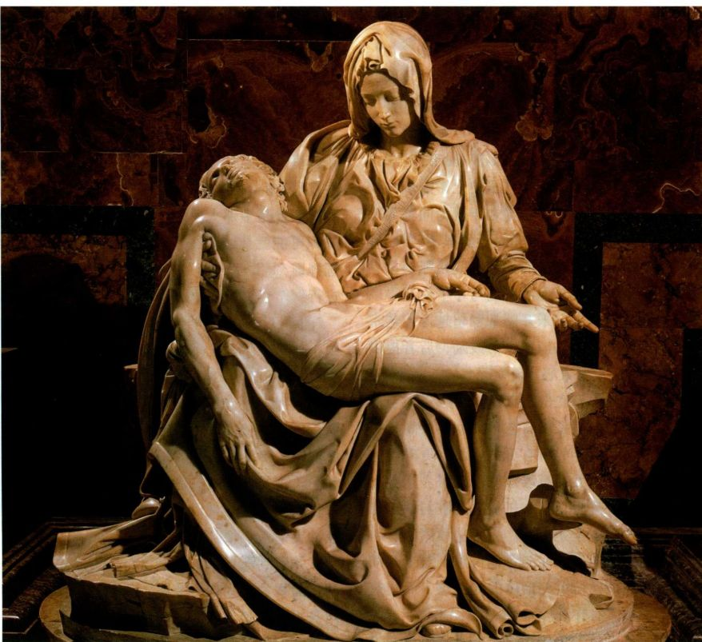

图16\.12 米开朗基罗：《圣母哀子像》。约1498年。大理石，高1\.74米。罗马圣彼得大教堂

🟩566 詹森艺术史

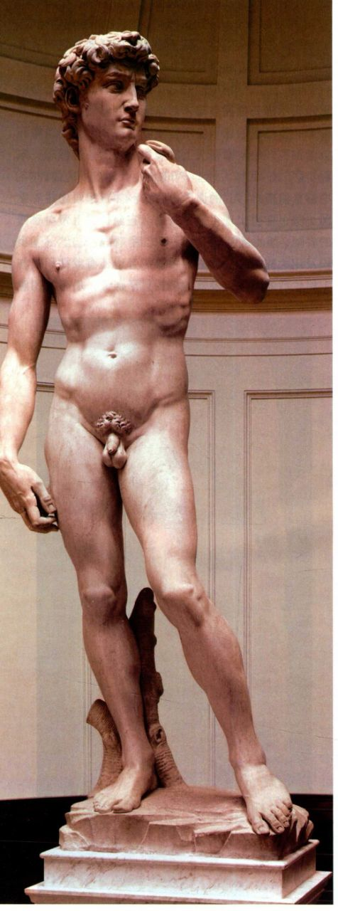

图16\.13 米开朗基罗：《大卫》。1501\-1504年。大理石，高4\.09米。佛罗伦萨学院美术馆（Galleria dell＇Accademia）

还是接受了这一挑战，打算创造一件不朽之作。完成的作品就是巨型雕刻《大卫》（David，图16\.13）。1504年作品完工时，由市民领袖与艺术家组成的委员会决定，不将他安放在佛罗伦萨大教堂，而是立在佛罗伦萨政府所在的市政厅门前。他们沿雕像的髋部装饰了一圈镀金的青铜叶子，并给它戴上了镀金的青铜花冠。佛罗伦萨城将这座雕像作为该城共和精神的象征。

米开朗基罗没有把这位《圣经》中的人物当作胜利的英雄来处理，而是把他表现为时刻警惕的佛罗伦萨守护者。与多那太罗为美第奇家族铸造的青铜《大卫》（见图15\.35）不同，米开朗基罗省略了歌利亚的头颅，他作品中的大卫紧张地握着手中的投石器，双眼盯着远处的对手。尽管多那太罗与米开朗基罗都将大卫表现为裸体，但是后者的风格所表达的理想，与多那太罗雕像中年轻大卫的削瘦结实迥然不同。虽然米开朗基罗只在罗马生活过几年，但他已经对情感充沛、肌肉凸显的希腊化雕塑留下了深刻的印象，罗马收藏有大量希腊化时期的雕塑（见第156页的艺术史家的观点）。这些作品宏大的规模、超越常人的力与美，以及夸张的形式都融入到米开朗基罗的个人风格中，并通过他而成为文

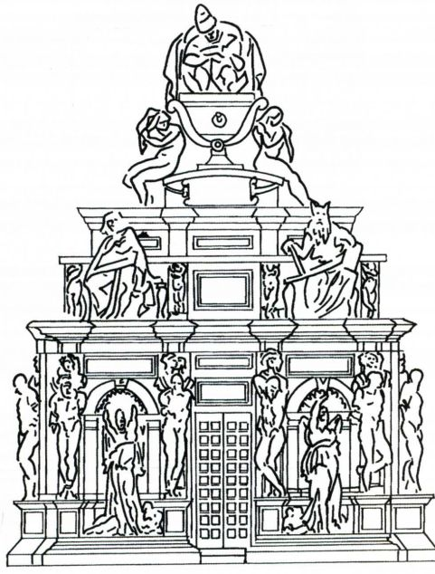

图16\.14 米开朗基罗的教皇尤利乌斯二世之墓（约1505年）设计复原图（根据Tolnay的图绘制）

🔴第十六章 意大利的盛期文艺复兴：1495\-1520年 567

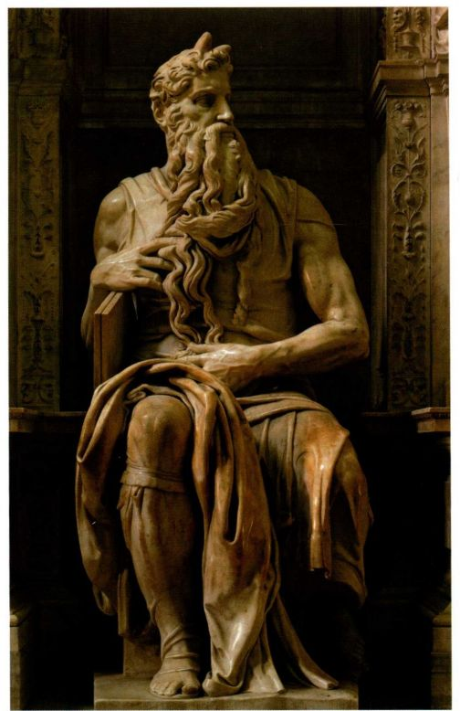

图16\.15 米开朗基罗：《摩西》。约1513\-1515年。大理石，高2\.35米。罗马圣彼得锁链教堂

艺复兴时期雕塑艺术的一般风格。米开朗基罗以《大卫》与古人平等竞争，并以自己的作品超越了古代的作品。他并没有像希腊化雕塑那样塑造感情外露的人物，他的《大卫》既平静又紧张，既活跃又静止，充满了运动的潜能，却并不张扬。

米开朗基罗服务于教皇尤利乌斯二世

不断创作雄浑有力的艺术品的雄心是米开朗基罗艺术生涯的一大特点。这在他所承接的尤利乌斯二世之墓中再次得到证实，该陵墓计划建造在新的圣彼得大教堂之中。工程委托始于1505年，但尤利乌斯二世打断了进程，当他于1513年去世时，工程还未完工。继任教皇在其后三十年间与米开朗基罗不断协商，让他创作一座比最初设计规模稍小的墓葬。图16\.14是重构后的设计，整件作品将雕刻与建筑合二为一，是教皇巨大荣耀的宏伟宣言。尤利乌斯二世的石棺就被安置在这座建筑的顶端，而在最初的设计中，整座建筑计划修成一座可将棺椁安放于其中的密闭墓室。

米开朗基罗在它的底层设计了圣保罗和摩西的雕像，《摩西》（Moses，图16\.15）在十年之后才得以完成。《摩西》被雕刻成供人从下方观看的样式，它所具有的令人敬畏的力量被瓦萨里称为“敬畏”（terribilità），含有与“崇高”相类似的意义。摩西的姿态警觉而沉思，展示出一位拥有雄才伟略而又会勃然大怒的王者形象。作品中的场景显示他刚刚获得《十诫》，将石板紧抱在怀中。摩西头上的双角是他的传统标志，来源于《圣经》武加大译本（Vulgate，又称拉丁通俗译本）中对希伯来语“光”的误译，斯留特尔的《摩西之井》见图14\.2）中也出现过这一特征。它象征着上帝对摩西的眷顾，摩西从西奈山上下来之后“面皮发光”（《出埃及记》34）。强壮的摩西雕像旁边还有象征积极与沉思生活的雕像以及被捆绑的男子雕像，后者的用意

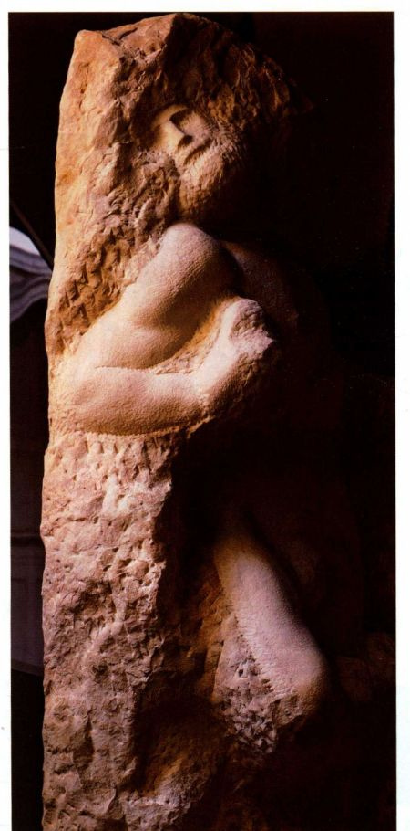

图16\.16 米开朗基罗：《苏醒的囚徒》。约1525年。大理石，高2\.72米。佛罗伦萨学院美术馆

🟩568 詹森艺术史

至今仍不清楚。包括《摩西》在内的部分雕像被放置在罗马圣彼得锁链教堂（San Pietro in Vincoli）的尤利乌斯二世墓上，其规模比最初的设计小了许多。

米开朗基罗后来又为该墓室雕刻了《苏醒的囚徒》（Awakening Prisoner，图16\.16），虽然该作品未能完工， 但是对于领悟他的艺术个性与创作方法具有不可估量的价值。对米开朗基罗而言，创作雕塑作品是一个苦乐交织的过程，充满了惊喜，无论从哪个方面来说都不能称之为机械。在雕刻开始之前，他似乎首先力图去感知取自采石场的石方中的人物。有时他甚至在采石场挑选石材时就已经在心中形成了人物的形象。他可能相信自己能够在大理石中看到“生命的迹象”，看到人物的膝盖或者手肘被挤压在石头表面之下。这种艺术创作心理在他于1540年前后写就的十四行诗

之中表现得淋漓尽致，这是他最为著名的诗作之一：

杰出艺术家即便构想

亦于大理石块中深含蕴藏

唯有顺从于智识的手

才能将之释放。

Source:James Saslow's translation,from The Poetry of Michelangelo\.New Haven,CT:Yale University Press,1991,p\.302\.

为了更确切地把握他对石头中人物所具有的模糊感知，米开朗基罗在下手雕刻大理石之前会绘制大量素描，有时也会创作小型的蜡制或黏土模型。这些练习是为了在面对石方时就对创作对象成竹在胸。而一旦他开始雕刻，每下一凿，他对藏在石头中的形象的感知就更为清晰。只有当他对石中形体的猜想正确时，

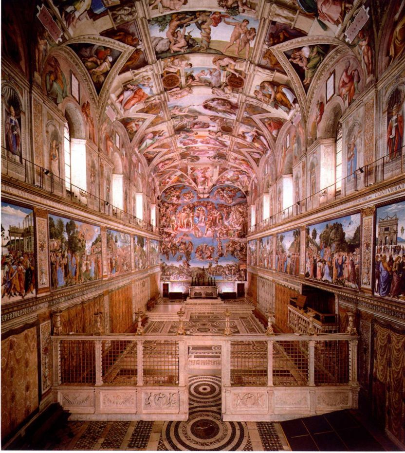

图16\.17 西斯廷礼拜堂内景，米开朗基罗所作的天顶画。罗马梵蒂冈

🔴第十六章 意大利的盛期文艺复兴：1495\-1520年569

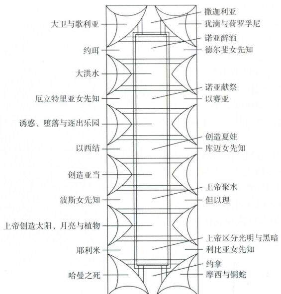

图16\.18 西斯廷礼拜堂湿壁画题材示意图。罗马梵蒂冈

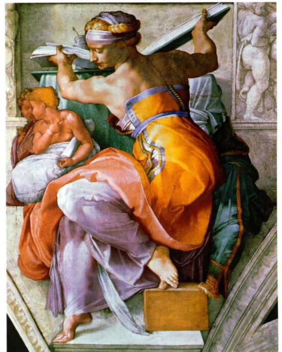

图16\.19 米开朗基罗：《利比亚女先知》，西斯廷礼拜堂天顶画局部

大理石才会让他把人物解放出来。有些时候大理石会拒绝释放其中人物的某些关键部分，米开朗基罗就会放弃这些作品。他本人可能反而更欣赏未完成的作品所具有的表现性特质。尽管他放弃《苏醒的囚徒》是出于其他原因，但该人物的每一个姿势似乎都记录着他为释放人物所进行的卓绝努力。

教皇尤利乌斯二世在米开朗基罗在其陵墓创作早期曾打断他的工作。因为教皇本人在此期间曾决定扩建圣彼得大教堂，并在1506年把委托交付给布拉曼特。于是教皇赞助项目的优先次序发生了改变，米开朗基罗被迫停工，艺术家因此勃然大怒，愤然离开了罗马。两年以后，教皇软硬兼施，将他再次召回罗马，委托他绘制梵蒂冈西斯廷礼拜堂的天顶画。

西斯廷礼拜堂的天顶湿壁画 西斯廷礼拜堂得名于教皇西克斯特斯四世，他是尤利乌斯二世的叔叔，在1477至1482年间修建装饰了这座礼拜堂。继续墓葬雕刻的愿望驱动着米开朗基罗，从1508至1512年，他仅用了四年时间就完成了西斯廷礼拜堂的天顶湿壁画（图16\.17）。在如此紧张短促的创作时间里，运用他从不认为适合自己的材料，米开朗基罗却创造了一件具有真正划时代意义的作品。

西斯廷礼拜堂的天顶呈浅筒形拱顶，两壁窗户上方的位置间隔着支持拱顶的三角形拱肩。米开朗基罗将这一空间当作一个统一的整体来处理，在绘制的建

🟩570 詹森艺术史

素描

中世纪的艺术家运用素描来记录他们所看到的建筑，或者保存将来使用的草图。在当时，这些素描通常都是用水笔绘制在羊皮纸上的墨水画。在文艺复兴时期，纸张的日益普及，使得素描使用范围得以拓展，并促使艺术家们在多种材料上描画。

用水笔和墨水在纸上画素描是当时最常见的形式，艺术家使用尖头的鹅毛笔或尖笔（stylus）将墨水涂到到纸上。有时艺术家还会将墨水画成的草图作进一步处理，用画笔施一层淡彩，通常施涂的是稀释的墨水。有些艺术家在素描时喜欢使用液态媒介与细小的画笔描绘所有形体。

艺术家们有时也会用碳条或粉笔在纸面相对较粗糙的一面素描。碳条与粉笔都是天然材料，干燥松脆，能够在纸上留下痕迹，绘制的线条可粗可细，既可精工细作，也可大开大合，寥寥数笔勾勒。艺术家也可利用这些材质的柔软性质来柔化轮廓线、填充阴影或者画出名为影线的平行线，以表现阴影。例如，在创作西斯廷礼拜堂天顶画时，米开朗基罗为《利比亚女先知》所画的红粉笔习作就采用了多种素描技法。

银尖笔（silverpoint）画法是一种更难以掌握的素描技法。这种技法要求用金属笔尖在画面上进行绘制。银是运用该技法时最受欢迎的金属，虽然铅也常常为艺术家所使用。运用这种技法绘制的素描作品中，一旦出现错误则无法更正，因此就需要画家具备极其高超的技艺。为了让银尖笔能在纸面上留下线条，必须先在纸上涂一层由骨与胶混合研磨而成的细粉末，从而使纸张变硬。这样的涂层有时也会加入色料。银尖笔在纸面上划过时，就留下了纤细微妙的线条，随时间的流逝，它们的颜色会逐渐氧化变暗。

文艺复兴的艺术家们也扩大了素描的使用范围。学徒们通过绘制素描来学习如何描绘人与物；艺术家则通过素描来解决他们所遇到的视图方面的难题。艺术家协商合同、记录作品进展或样本时，都会用到素描。

当时的艺术家还会为湿壁画、挂毯等大型作品创作样稿或者全尺寸模本（见图16\.27）。将素描稿上的设计图转移到更大平面之上的方式多种多样。艺术家可以在设计稿上覆以

筑框架之中有序绘制了数百个人物。这个复杂的画面为若干不同主题所连接（图16\.18）。天顶的中央由十个以视幻手法绘制的横切拱分割成九个出自《创世纪》的故事场景，祭坛一侧描绘的是创世（Creationof the World），大门附近则是诺亚醉酒（Drunkennessof Noah），巨幅男女先知像陪衬在故事场景两侧。位于三角形拱肩之上的是基督的众位祖先，窗户上方的半月形饰面上也绘制着他们的形象。更多的叙事场景出现在角落处的穹隅上，集中表现的是《旧约》中的

材料与技法

网格，将网格内小范围的图像作为复制放大的基准。也可以在为湿壁画所做的素描样稿的主线条上穿出连续孔洞，之后再将设计稿贴住墙壁，用色粉填入这些孔洞，在墙壁上印出所设计的图像。这种方法称为粉拓法（pouncing）。

16世纪，素描具备了独立的艺术价值，艺术家、赞助人和鉴赏家都纷纷开始收藏各种素描。人们认为素描能反映出某些完成后的作品体现不出来的东西：艺术家的创作过程、个性，最后，还有艺术家的天赋。

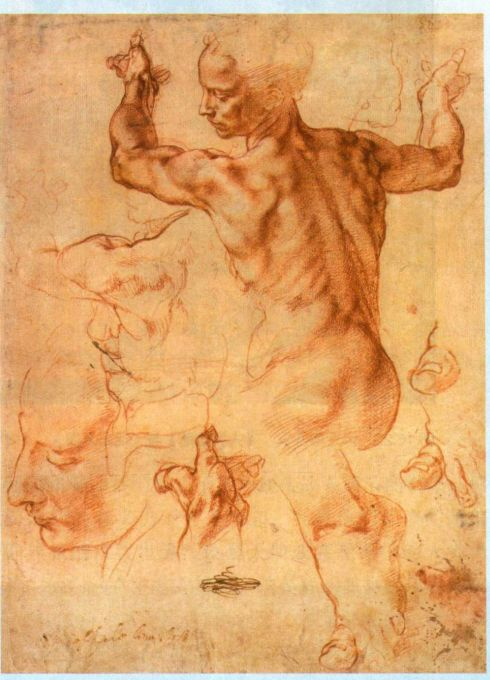

米开朗基罗：《利比亚女先知习作》（Studies for the Libyan Sibyl）。红粉笔，28 \.9 × 2 1\.4厘米。纽约大都会艺术博物馆，Joseph Pulitzer遗赠，1924年购入（24\.197\.2）

英雄与预言基督到来的先知。学者们对壁画整体设计的神学意义以及米开朗基罗是否在设计主题的过程中咨询过何人的问题仍有争论。上帝造人与人类堕落的情节被绘制在天顶的中央，先知与基督的先祖预示了人类将在基督身上得到救赎。除建筑之外，这些主题几乎完全借助人的形象来表现。

西斯廷天顶壁画中人像密布，其中大部分人物都具有摩西那样动感的姿态。例如图16\.19中的《利比亚女先知》（Libyan Sibyl），这位女先知（她是一

🔴第十六章 意大利的盛期文艺复兴：1495\-1520年 571

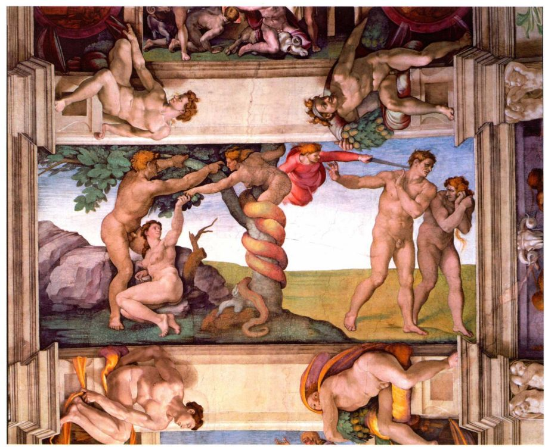

图16\.20 米开朗基罗：《人类堕落》与《逐出乐园》，西斯廷礼拜堂天顶画局部。1508\-1512年。罗马梵蒂冈

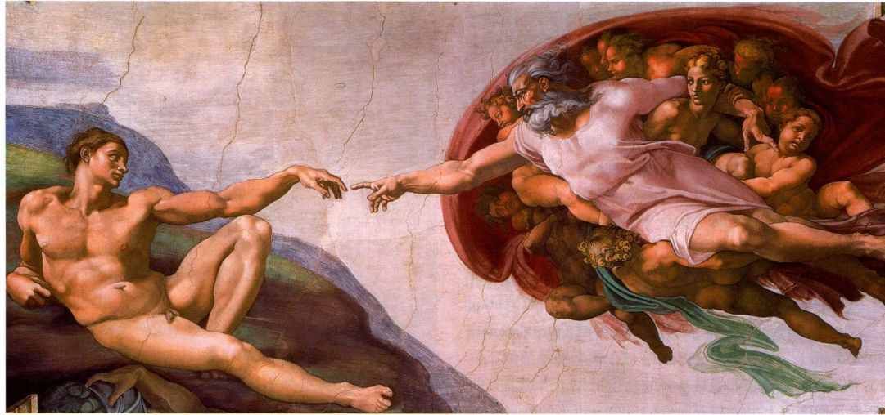

图16\.21 米开朗基罗：《创造亚当》。1508\-1512年。西斯廷礼拜堂天顶画局部

艺术品的清洗与修复

是否应该对宝贵但脏污的艺术品进行清洗以及如何清洗，是当代艺术史中最具争议的问题之一。围绕艺术品的清洗与修复经常伴随着激烈的交锋、质疑甚至法律诉讼。清洗的定义仅指去除艺术作品表面的炭灰、污垢、污染性物质，但有时也要去除若干层上光油，或者早前的所有者所使用的其他保护性材料。而艺术品的修复有时则要添加作品中缺失的部分，以向观众展现艺术品创作完成时的原貌。这两种处理过程在今天都争论颇多。

文艺复兴时期许多最为著名的作品都是这种争议的焦点：马萨乔绘制的布兰卡奇礼拜堂、达芬奇的《最后的晚餐》、米开朗基罗的西斯廷礼拜堂天顶画，而最近（2004年）再次引爆此种激辩的作品则是米开朗基罗的《大卫》。之所以产生这种争议的原因在于清洗作品有可能给作品带来不伦不类的艺术效果。例如，20世纪80年代清洗西斯廷礼拜堂的天顶画时，批评家们就批评清洗活动去除了最上面的一层颜料，只留下“艳俗”的底色。经过对天顶湿壁画的清洗，米开朗基罗作为色彩大家的声誉被永远改变了。

清洗的技术根据艺术品的材质与保存状况而各有不同，但是清理技师会尽可能采用对作品损害最小的溶剂，并且记录下他们所进行的每一个步骤。清洗工作可能会十分漫长，如同当年对《最后的晚餐》清洗时的情况一样。这件作品的清洗耗时20年，因为清洗者必须对早期“修复者”遗留的痕

艺术史家的观点

迹进行处理，后者用新颜料填绘了画面的缺失部分。当下的清洁工作要去除覆盖色，用可清除的水溶性颜料填充画面缺失的部分。现代的修复技师十分小心，他们只使用在不损坏原作的情况下就可以去除的材料。

博物馆需要经常清洗艺术品以便保存它们。大的博物馆都设有大型艺术品维护实验室来处理艺术品。通常当某件作品收到重大展览请求时，也就具备了清洗与修复该作品的理由与资金。清洗修复西斯廷礼拜堂的天顶画时，一家公司提出可以负担作品的清洗费用，但作为交换，馆方须同意让其将清洗过程拍摄为电影。慈善机构与企业捐赠对近期的大量清洗工作提供了支持。

《大卫》是说明艺术品为何需要清洗的良好例证。1873年被移入佛罗伦萨学院美术馆之前，这件作品暴露在市政广场已达四个世纪之久，遭受了污染与湿气的侵蚀（目前广场中的雕像为复制品）。2003年，《大卫》的清洗工程在抗议声中展开，批评家们希望采用侵害最小的干洗法，类似于一个小心翼翼的除尘过程；而博物馆的清洗技师最终却使用了蒸馏水、黏土与纤维素浆料，将污染物从大理石中吸附出来，并使用矿物精油来去除大理石表面的蜡质。

或许盛期文艺复兴时期作品中现在最需要清洗的是达芬奇的《蒙娜丽莎》，但这一项目不太可能实现。卢浮宫的主管们已经说过，永远也不会清洗该作品。

间隔相等，共同构成了某种连接故事情节的链条，然而他们的意义仍不为人所知。究竟他们代表的是信仰异教的古代世界？还是天使或者想象中的人类灵魂？他们的手中拿着橡果，这是表示教皇姓氏里维尔（Revere）的符号，“Revere”为橡果之意。这些裸体的男女青年还托举着看似奖牌的青铜圆盘，让观众联想到尤利乌斯二世遍及意大利的赫赫武功。

中央部分叙事场景中最令人难忘的是《创造亚当》（The Creation of Adam，图16\.21）。这幅湿壁画着重表现的并不是亚当的身体，而是他身上神的火花\-灵的传递，因此这幅作品实现了一种戏剧性的关系，无人企及。在米开朗基罗的设计下，泥土粘合而成的亚当与急速飞越天空的上帝那生机勃勃的身体形成了鲜明对比，曾有人把亚当比作正从睡梦中醒来的河神，亚当的目光不但凝视着他的创造者，而且也关注着上帝左臂下襟护着的那些人物。关于这些人物的身份引发了激烈的讨论：那位女性可能是夏娃，正等待着在下一个场景中被创造出来；另一种假设认为她是圣母玛利亚，她膝下的孩子是命中注定要拯救堕落的人类的耶稣。整幅作品被看作米开朗基罗对自身

同样的动感也出现在中央部分的叙事场景之中。《人类堕落》与《逐出乐园》（The Fall of Man与The Expulsion from the Garden of Eden，图16\.20）展现出极度强烈的色调以及富于表现力的身体语言，这也是天顶画的整体特征。米开朗基罗的人物充满了生命力，在稀疏的风景中上演着他们的壮丽史诗。在知识之树的左侧，亚当与夏娃的姿态呈螺旋形，手则伸向禁果，而《逐出乐园》的构图在剧情紧张程度上则与马萨乔的作品极其相近（见图15\.18）。散布在天顶主要场景之间的年轻男女裸像（ignudi）也在米开朗基罗的设计中扮演着重要的视觉角色。他们之间的

位异教先知，但基督徒可以从她的预言中看到基督降临的证据）几乎不是坐在她的宝座上，而是托着她的大书扭身向后。肌肉分明的形体源自米开朗基罗的一幅青年男子素描（见第571页的材料与技法）。天顶画中的人物形象也得益于艺术家对古典雕塑的深入研究，他希望自己能够超越古人的作品。在20世纪80年代清理天顶湿壁画时，学者们开始对米开朗基罗作品中灿烂的色彩以及他在衣袍中运用互补色的手法进行研究（见本页的艺术史家的观点）。

🔴第十六章 意大利的盛期文艺复兴：1495\-1520年 573

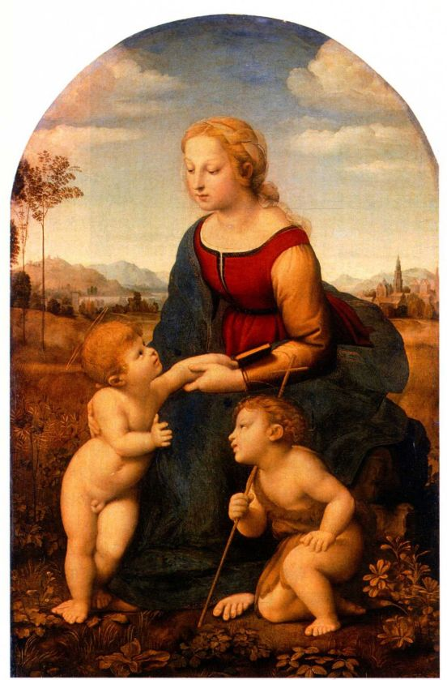

图16\.22 拉斐尔：《园丁圣母》。1507年。木板油画，		1 22 × 80厘米。巴黎卢浮宫

艺术创造力所做思索的完美表达。

尤利乌斯二世1513年去世之后，米开朗基罗又回到了教皇陵墓的创作。但是当洛伦佐·德·美第奇之子继任教皇，成为利奥十世（LeoX）时，他又将米开朗基罗遣回佛罗伦萨，为复辟的美第奇家族创作作品。米开朗基罗的风格在那里进一步发展演变，直到他于16世纪30年代最终返回罗马。

拉斐尔在佛罗伦萨和罗马

如果说米开朗基罗是一位孤独的天才，那么乌尔比诺的拉斐尔（Raphael，拉斐罗·桑齐奥［RaffaelloSanzio］，1483\-1520年）则恰好与之相反。拉斐尔是一位融入社会的艺术家。两人之间的对比在他们同时代人的眼中再明显不过，两人都享有极高的声望。瓦萨里在他的著作中将米开朗基罗奉为当时最杰出的艺术大师，致使后人对米开朗基罗的敬仰超过了拉斐

尔，其中部分原因在于两位艺术家传记的不同。米开朗基罗与他的艺术和赞助人之间的戏剧性冲突是撰写故事的良好素材，而拉斐尔的艺术生涯俨然是一部成功史，他的作品烙印着不费吹灰之力的优雅，太过轻松，难以与米开朗基罗作品中悲剧性的英雄主义相抗衡。拉斐尔的天赋表现在他的高超技法、构建画面的高明方式，以及他与当时其他艺术家的交流。他是盛期文艺复兴绘画领域的核心人物。在他相对短暂的创作生涯中，拉斐尔创作的绘画数量在文艺复兴时期仅次于提香，后者的艺术以其多样性与力度而闻名遐迩。拉斐尔还主持着一家活跃的大型作坊，这间作坊后来涌现出大批艺术家，由此也将拉斐尔的声名稳固地铭刻在了整个文艺复兴时期的艺术史中。

拉斐尔早期的圣母像 拉斐尔具有一种兼收并蓄的天赋，这让他能够融合达芬奇与米开朗基罗的优点。其作品抒情生动，具有浓浓的画意与坚实的雕塑感。这些品质在他创作于佛罗伦萨的圣母像中就已经出现，拉斐尔在1504至1508年间生活在此，师从佩鲁吉诺。在被称为《园丁圣母》（La Belle Jardinière，意为美丽的女园丁，图16\.22）的作品中，那种沉思默想的宁静仍折射出他老师的风格。然而，画中人物的形体却更为丰满，明暗对照法的运用也达到了一流水准。年幼的耶稣与施洗约翰的身体完美无瑕，以优雅的姿态互动，并与圣母互相呼应。为了创作这件作品，拉斐尔借用了一个出自达芬奇的构图，但他把《岩间圣母》中谜一般的人物姿势替换为富有节奏的温柔体态。他还将复杂的人物分组替换为稳固的金字塔形构图，构图的僵硬严肃又因圣母翻卷的斗篷而得到缓和。同样动人的是画中细致入微的风景，明亮的光线与自然之美为这组人物提供了恰如其分的背景。

虽然这幅作品明显地借鉴了《岩间圣母》，但是让两幅作品产生差异的原因之一在于米开朗基罗的影响，这种影响表现在人物形象的塑造之中。然而，只有在拉斐尔创作于罗马的作品中，才能充分感受到米开朗基罗影响的力度。1508年，在米开朗基罗开始创作西斯廷礼拜堂的天顶画时，拉斐尔应尤利乌斯二世之召从佛罗伦萨来到罗马，尤利乌斯二世的这一决定是在同样出生于乌尔比诺的布拉曼特建议下作出的。初到罗马，拉斐尔还在之前学自佩鲁吉诺的观念中发展，但是罗马在艺术上彻底地将他改变，同布拉曼特一样。拉斐尔在罗马经历了令人难以置信的成长。

签字大厅的湿壁画 拉斐尔的上述艺术转变在签字大厅的湿壁画中（Stanza della Segnatura，图16\.23） 就有所表现，这是教皇委托他装饰的梵蒂冈一系列宫

🟩574 詹森艺术史

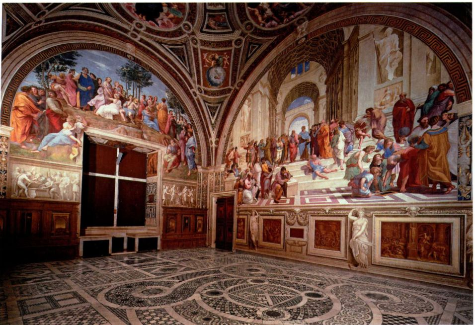

图16\.23 拉斐尔：签字大厅湿壁画。1508\-1511年。罗马梵蒂冈宫

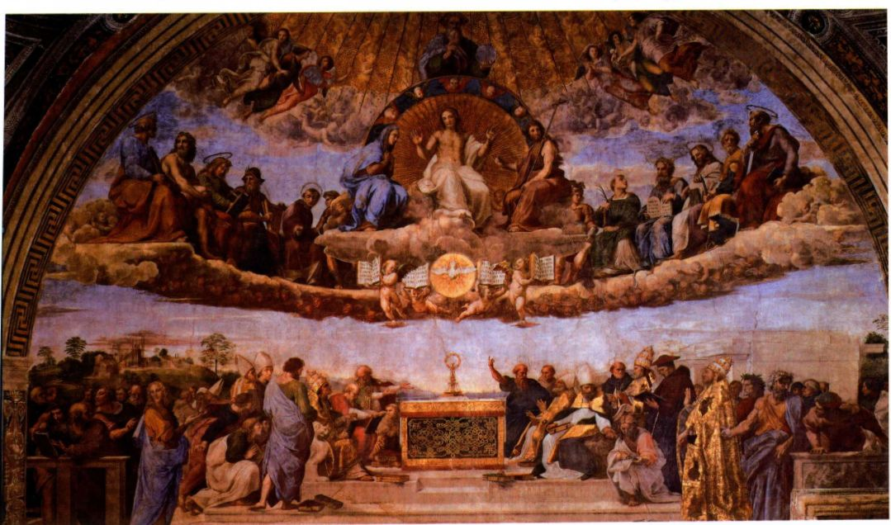

图16\.24 拉斐尔：《争辩》，签字大厅湿壁画局部。1508\-1511年。湿壁画，高5\.79米

🔴第十六章 意大利的盛期文艺复兴：1495\-1520年 575

图16\.25 拉斐尔：《雅典学院》，签字大厅湿壁画。1508\-1511年。罗马梵蒂冈宫

室中的首例。拉斐尔在这座大厅绘制的湿壁画在创造大胆的叙事型作品方面表现出了几乎永无穷尽的丰富性。签字大厅的名字得自于其以后的功能，这里最初曾是尤利乌斯二世的私人图书馆，后来成了教皇签署谕令的场所。拉斐尔在签字大厅的创作始于1508年，他在四壁与天顶上绘制了一组壁画，涉及神学、哲学、法律与艺术四个领域的知识。总体而言，签字大厅的画作体现了盛期文艺复兴人文主义的全部积累，因为它试图将各个学科的知识集中体现在一幅宏大的绘画当中。拉斐尔的创作过程中可能有多位学者与神学家作为顾问，但是所有设计肯定由他独自完成。

神学是这间大厅最早一幅湿壁画的主题（图16\.24）。从17世纪起，这幅作品被称为《争辩》（Disputà），或者《圣体争辩》（The Disputation Over the Sacrament）。引起争论的主题是圣餐变体论这一教义，该教义声称在圣餐礼中，葡萄酒与圣餐饼分别象征基督的血与圣体。拉斐尔将半月壁区分为两个部分，下方是人世场景，神学家们聚集在祭坛旁边，上方则是天堂之景。上方的基督坐在天堂的宝座上，圣母与施洗约翰分立两侧。圣父在基督的头顶，诸位圣徒与先知在他两旁。代表圣灵的鸽子盘旋在下方的圣餐之上。画面下半部分的祭坛旁边，环绕着教会的博士、教皇、艺术家、诗人（但丁在其中）

等其他名人。

然而，作为圣餐礼及其在基督教信仰中核心地位的亲身见证，画面中的参与者争辩得并不激烈。祭坛上放在圣匣之中的圣餐饼是构图的基点，支配着壁画中人世部分与天堂部分所有人物的布局。鸽子周围的圣光与基督的光环都与圣匣的圆形形式相呼应，三者均位于画面的纵向中心轴上。基督之上的上帝为作品增添了三位一体的宗教意义。天庭的弧形布局照应着半月壁的曲线。在人世场景中，拉斐尔创造了类似于佩鲁吉诺《交付天国钥匙》（见图15\.59）中的空间，该作品就位于梵蒂冈宫内临近的大厅之中。但是在绘制风景时，拉斐尔运用了精微的空气透视原理来突出圣餐饼。无论是天国场景还是人世，其中都绘有书籍与文字，这也与大厅作为图书馆的用途相适宜。

在左侧大门的半月壁上，绘制着人格化的《司法三德行》（The Three Legal Virtues），包括刚毅（Fortitude）、审慎（Prudence）与节制（Temperance）。下方左侧为《颁发公民法》（The Granting of CivilLaw），右侧为《颁发教会法》（The Granting of Canon Law），代表的是法律知识。对面的右侧大门上则绘制着阿波罗的帕纳塞斯山（Parnassus）。缪斯（Muses）现身于从古代直到拉斐尔时代的伟大诗人中间，这是因为，文艺复兴时的人文主义者认为，自

🟩576 詹森艺术史

从但丁与佩特拉克的时代以来，艺术灵感都是神对人的一种启示。这幅作品折射出教廷希望在尤利乌斯二世治下诞生一个黄金时代的梦想，届时，梵蒂冈山将会成为新的帕纳塞斯山。签字大厅的湿壁画表达着这样的意义：古代的哲学、知识与艺术，都是来自于上帝启示的人间形式。这些学科能将人类引向宗教真理，但学科本身又从属于宗教真理。

长期以来，签字大厅的湿壁画中正对《争辩》的《雅典学院》（The School of Athens，图16\.25）被认为是拉斐尔的代表作，也是盛期文艺复兴中古典精神的象征。与《争辩》一样，该画的标题也是后人所命名的，它的题材曾引起大量争论。画中表现的似乎是一群著名的古希腊哲学家，他们聚集在柏拉图与亚里士多德身边，每个人都姿态不同、行为各异。当时拉斐尔可能对临近完成的西斯廷礼拜堂天顶画的部分内容已经作过研究。拉斐尔借鉴了米开朗基罗作品中人物的表现力、形体力度，以及对人物所做的戏剧性分组。然而他并非单纯地借用米开朗基罗笔下人物的姿势与体态，而是将其加以消化吸收，使之融入自己的风格，以此赋予它们新的意义。人物的身体与精神、动作与情感和谐一致，这场大聚会中的每个人物角色都异常清晰而明朗。

《雅典学院》的构思流露出达芬奇《最后的晚餐》的痕迹，因为拉斐尔作品中的人物组织与达芬奇作品中的群组类似。与达芬奇不同的是，他进一步突出了个人与群组之间的关系，将他们用正式的韵律加以联系（艺术家创作了大量素描以构思人物的姿态，其中很多出自写生）。对称设计、人物与建筑背景之间的相互依赖关系也是达芬奇的艺术特点。与达芬奇的作品相同，拉斐尔作品中建筑的开口也是环绕关键人物的框架。但是拉斐尔笔下的建筑在作品构图方面发挥着比《最后的晚餐》中的大厅更大的作用。高大的穹顶、筒拱以及巨大的雕像都表明这些建筑具有古典精神，但表达的却是基督教的意义。根据瓦萨里的记载，拉斐尔画中的对建筑的表现受到了布拉曼特的启发，布拉曼特曾在这方面帮助过拉斐尔。画面中的建筑俨然是新圣彼得大教堂的预览图，它将在以后被变成现实。建筑内部宽敞豪华，气势恢弘，它的灵感更多地来自古罗马建筑，例如马克森提乌斯及君士坦丁公堂（见图7\.68），古希腊建筑对其影响较小。然而统领这场聚会的却是两座雕刻的古希腊神像，与会人士也都是希腊历史上的博学鸿儒，左边的神是手持七弦琴的阿波罗，他是艺术的保护神，右边则是显现为密涅瓦的智慧女神雅典娜。

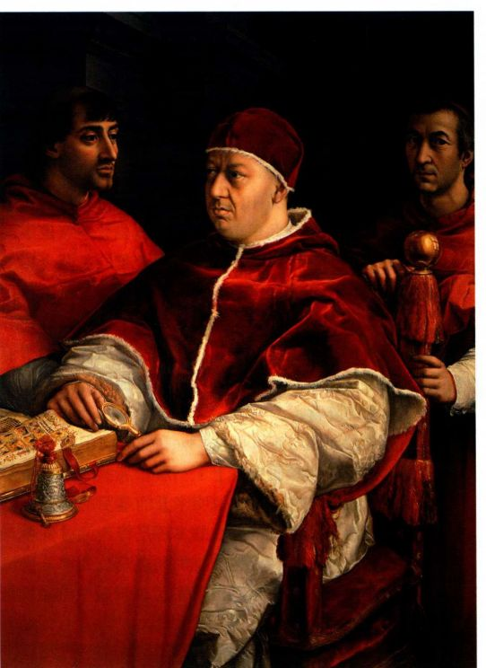

图16\.26 拉斐尔：《教皇利奥十世与枢机主教朱利奥·德·美第奇、路易吉·德罗西》。约1517年。木板油画，154 × 119厘米。佛罗伦萨乌菲齐美术馆

《雅典学院》反映出当时最为博学的人文主义，直至今天它仍是学者们所阐释说明的对象。自从瓦萨里的时代以来，艺术史学家们就一直试图确定画面壮丽空间中的人物的身份。画面中央是面容酷似达芬奇的柏拉图，他的手中拿着自己的著作《蒂迈欧篇》（Timaeus），这是一本关于宇宙天体学与数字命理学的书，也是渗透进基督教的新柏拉图主义的主要基础。柏拉图的左侧（观众右侧）是他的学生亚里士多德，他手中握着的是一卷自己的《伦理学》（Ethics），这部著作正如他的科学一样，以物质世界的可知部分为基础。这两部书籍解释了为什么柏拉图在修辞意义上指向天国，而亚里士多德指涉人世。这两位人物是古希腊最重要的哲学家，他们的研究方法尽管貌似对立，但文艺复兴时期的众多学者都认为两者其实可以互补。在这幅绘画中，两种哲学流派齐聚一堂。

有些学者认为，拉斐尔将两派哲学家组织在一起，以表现唯心主义与经验主义两大阵营。画面中柏拉图右侧是他的导师苏格拉底，他正在对着一群学生演讲，

🔴第十六章 意大利的盛期文艺复兴：1495\-1520年 577

扳着手指列数自己的论点。站在台阶前的人物代表数学与物理学（它们曾被看作哲学的下属分支，是通向高一级知识的必经之路）。这里画面上出现的是蓄须的毕达哥拉斯，他认为，万物的真理都可以在数字中找到。这位数学家将自己的数字序列与和谐比率排列在一对倒转的表格中，每一组的最终结果都是神圣数字十。画面平行的另一侧，拉斐尔借用了布拉曼特的相貌特征来描绘欧几里得的头部。这位数学家位于画面前部下方的右侧，正在运用圆规测量绘制两个相互叠加的三角形。欧几里得身后两位手持地球仪的人物可能是天文学家琐罗亚斯德与地理学家托勒密。瓦萨里的记载使我们知道，上述科学家身后那位戴黑帽子的人物是拉斐尔的自画像，他将自己也置身于亚里士多德学派的阵营。

尽管拉斐尔与米开朗基罗存在竞争，但他在最后一刻（拉斐尔在画面中涂上了一层新灰泥或细灰泥用来绘制新人物，这一事实说明米开朗基罗的形象是拉斐尔在最后一刻才绘制上去的）还是将这位对手画入了自己的作品之中，为他安排的角色是公元前6世纪的哲学家赫拉克利特（Heraclitus）。画面中的赫拉克

利特坐在柏拉图学派阵营一方的台阶上，陷入了沉思。在当时，赫拉克利特的形象常常与犬儒学派的第欧根尼（Diogenes）成对出现，图中后者躺在柏拉图与亚里士多德脚下。学者们指出，赫拉克利特这个人物并不仅仅是米开朗基罗的肖像，画中的人物还具有附近西斯廷礼拜堂天顶画的人物绘画风格。如此之多的艺术家济济一堂，尽管他们都披着著名哲学家的外衣，但其中都体现了艺术家新近获得的社会地位。虽然这种地位的取得来之不易，但艺术家群体在此时显然已经成为了知识界的一部分。

教皇与私人委托 1513年尤利乌斯二世去世之后，继任教皇利奥十世继续雇用拉斐尔。这位新教皇要求拉斐尔完成梵蒂冈宫中教皇住所的绘画。利奥十世还让拉斐尔为自己绘制坐像。在创作于1517年前后的《教皇利奥十世与枢机主教朱利奥·德·美第奇、路易吉·德罗西》（Portrait of Pope Leo Xwith Cardinals Giulio de＇Medici and Luigi de＇Rossi，图16\.26）中，拉斐尔对教皇厚重的双下巴以及他身边同僚的面容几乎未作任何修饰（在利奥十世左侧的人物是朱利奥·德·美第奇，他在1523年接任教皇一职，

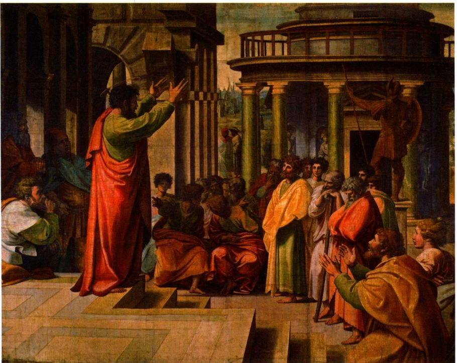

图16\.27 拉斐尔：《圣保罗在雅典布道》。1515\-1516年。样稿，纸上水彩画，3\.43x4\.42米。伦敦维多利亚和阿尔伯特博物馆

🟩578 詹森艺术史

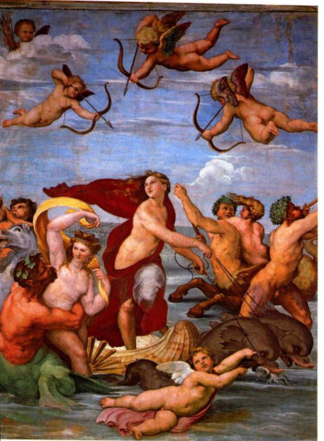

图16\.28 拉斐尔：《伽拉忒亚》。约1513年。湿壁画，2\.95 × 2\.24米。罗马法尔内塞别墅

大事年表

1503年\-教皇尤利乌斯二世继位，罗马与教廷在其治下繁荣昌盛

1508年\-米开朗基罗开始绘制西斯廷天顶湿壁画

约1510年\-拉斐尔创作《雅典学院》

1517年\-路德张贴《95条论纲》，开启宗教改革

是为克莱门特七世［Clement VII］）。画中三位人物聚在桌旁，桌上放着一个做工精美的铃铛与一本彩饰手抄本。这里的教皇并没有被表现成一位精神领袖或者宗教斗士，而是一位正在检查某件珍贵器物的艺术收藏家与鉴赏家。锦缎的质感与毛皮镶边的外衣增加了画面的世俗感。光线从右侧的窗户射入空间，窗户的外形映在椅背顶端的黄铜球中。画面感觉中的沉思情调具有尼德兰艺术格调。

拉斐尔的作品无疑赢得了新教皇的欢心。1514年布拉曼特去世以后，拉斐尔被任命为圣彼得大教堂的建筑师，后来又成为罗马古迹的总监。1516年，教皇利奥十世将米开朗基罗遣往佛罗伦萨为美第奇礼拜堂创作作品，于是拉斐尔成了留在罗马的一流艺术家。这时的拉斐尔订单无数，这些作品的创作必然要依赖拉斐尔日益壮大的作坊。

1515至1516年间，教皇委托拉斐尔以《使徒行传》（Acts of the Apostles）为主题，为西斯廷礼拜堂设计一组挂毯。这个任务将他置于与米开朗基罗直接竞争的境地。拉斐尔怀着极大的热情，精心设计并绘

图16\.29 马尔坎托尼奥·拉伊蒙迪印制，拉斐尔设计：《帕里斯的裁判》。约1520年。版画。纽约大都会艺术博物馆，Rogers基金，1919年（藏品编号19\.74\.1）

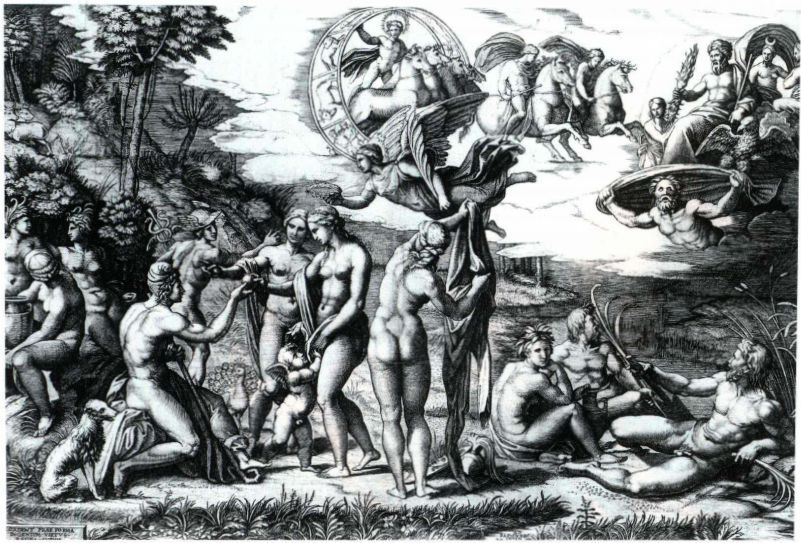

🔴第十六章 意大利的盛期文艺复兴：1495\-1520年 579

图16\.30 乔尔乔内（或提香）：《田园协奏曲》。约1509\-1510年。布面油画，l10 × 138厘米。巴黎卢浮宫

原始文献

拉斐尔之死

拉斐尔于1520年4月死于罗马。曼图亚女公爵、人文主义者潘多尔福·皮科·德拉·米兰多拉（Pandolfo Pico dellaMirandola）在写给伊莎贝拉·德·埃斯特（Isabella dEste）的信中，讲述了拉斐尔的死亡以及罗马失去艺术家之后的反响。

······现在，我要告诉你······乌尔比诺的拉斐尔的死讯，他在昨夜去世，时值耶稣受难节，宫廷上下都陷于无以复加的悲痛之中，因为人们所期望于他的伟大的一切、期望他带给我们这个时代荣耀的希望都已随他而去。事实上，据说他

制了十幅巨型样稿（见第571页的材料与技法）。这些样稿被送往佛兰德斯织成挂毯，这样，它们就将盛期文艺复兴的艺术观念从意大利传播到北欧地区。这组样稿中最具影响力的作品是《圣保罗在雅典布道》

（Saint Paul Preaching at Athens，图16\.27），将拉斐尔融会贯通的天赋展露无遗。在创作圣保罗威严的形象时，拉斐尔借鉴了马萨乔布兰卡奇礼拜堂湿壁画中人物的严肃与简约（见图15\.16、15\.17）。这位圣徒言辞的力量不仅表现在他的姿势上，而且表现在周围衣着宽松的听众的反应之中。界定空间的建筑的设计受到了布拉曼特的启发，背景中圆形神殿那朴素的托斯卡纳式圆柱令人回想起后者主持建造的小神殿（见图16\.8）。为了不让观者的目光迷失在深度空间之中，拉斐尔将空间限定为前景平面，前景中的台阶邀请观

承诺将每件事做到极致，我们已经在他的作品里看到了这一点，在他刚开始创作的更为伟大的作品中看到了这一点······这里人们除了谈论这位杰出人士的死亡之外别无其他，他的生命结束时年仅33岁，然而他声望的生命将穿越时间与死亡的桎梏，通过他的作品与饱学之士将要为他书写的赞誉之词而成为永恒。

SOURCE:KONARD OBERHUBER, RAPHAEL, THE PAINTINGS\. \(MUNICH AND NEW YORK:PRESTEL:1999,P\.9\.\)

者步入其中。整个画面的构思简洁庄严，以大胆清晰的语汇传达着故事情节，画面与人物的巨大尺幅更是加强了这种效果。

拉斐尔繁忙的作坊也为权势显赫的锡耶纳银行家阿格斯蒂诺·基吉（Agostino Chigi）服务，装饰他在罗马的一座新别墅，这座别墅的所有权后来易手，今天它的名称为法尔内塞别墅（Villa Farnesina）。这座建筑处处体现着基吉追求古董、炫耀和情爱的格调。他为整座别墅定制的湿壁画以古代异教为题材。为此，拉斐尔在1513年前后绘制了《伽拉忒亚》（Galatea，图16\.28）。这幅画描绘的是巨人波吕斐摩斯（Polyphemus）徒劳无功地追求美丽的宁芙伽拉忒亚的场景。这个故事出自希腊神话，通过奥维德的诗歌流传到文艺复兴时期的意大利。拉斐尔的《伽拉

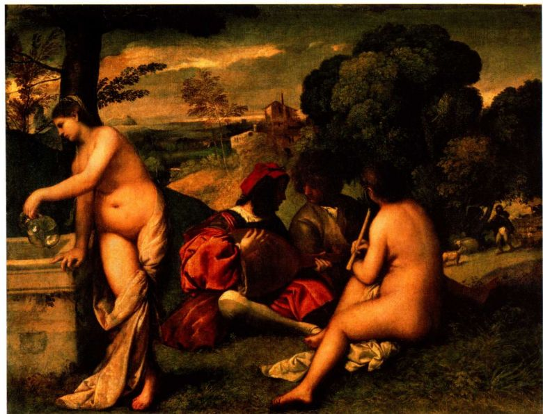

🟩580詹森艺术史

忒亚》正面表现了异教精神中的肉欲，仿佛那是一种生机勃勃的力量。虽然画面中裸体女性乘驾贝壳的细节令人联想到波提切利的《维纳斯的诞生》（见图15\.42），拉斐尔可能在佛罗伦萨见过这件作品，然而恰恰是它们之间的相似凸显了两者的深刻不同。拉斐尔的人物具有强健的雕塑感，围绕在扭转身躯的伽拉忒亚周围，处于充满动感的盘旋运动之中。在波提切利的作品中，运动感的产生不是来自于人物，而是得自所有人物身上的线性装饰图案，这些图案将人物固定在同一个平面上。拉斐尔的手法与米开朗基罗相似，他没有使用任何细节性的透视设计，而是运用人物的布局来唤起空间感，来创造强烈的运动感。

拉斐尔笔下圆润的雕塑式人物表明他曾认真研究过古罗马雕塑，正如米开朗基罗那样，他也希望能够在艺术上超越古代作品。拉斐尔运用古典艺术素材更直接的例子是他所设计的雕版画《帕里斯的裁判》（The Judgment of Paris，图16\.29），该作品于1520年前后由马尔坎托尼奥·拉伊蒙迪（MarcantonioRaimondi）刻制。当时的收藏家们日益渴望得到拉斐尔的素描作品，所以他采用了版画技法来记录与传播自己的设计。这件作品参考了某个古罗马艺术收藏中的罗马石棺棺面，拉斐尔阐释了原型而不是简单模仿。版画表现的是帕里斯裁判金苹果归属的场景，上界奥

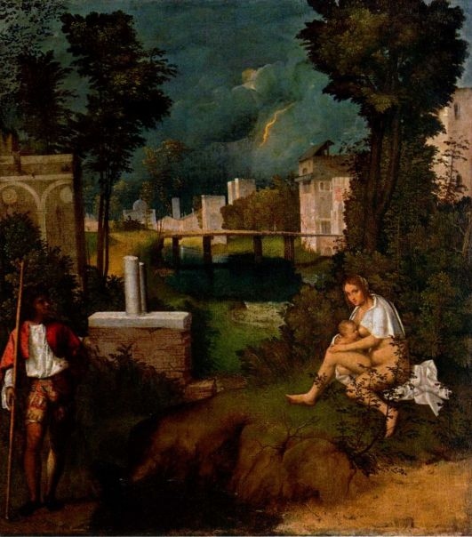

图16\.31 乔尔乔内：《暴风雨》。约1505年。布面油画，79\.3 × 73厘米。威尼斯学院美术馆

大事年表

约1505年\-乔尔乔内创作《暴风雨》

1509年\-对抗威尼斯的康布雷联盟成立

1513年\-马基雅维利撰写《君主论》

1521年\-埃尔南·科尔特斯为西班牙占得墨西哥

1526年\-提香创作《圣母与佩萨罗一家》

林匹亚山众神与画面下方右侧的诸位河神是裁判的见证。强烈的轮廓线与明暗对照法清晰地构成雕塑般的人物，它们占据着图像的整个前景。在这样的作品里，拉斐尔为后辈艺术家传承了古典艺术。

拉斐尔的生命在1520年戛然而止，他死于一场突发疾病。根据见证者的记载，全罗马沉痛哀悼他的离去（见第580页的原始文献）。按照与艺术家群体新近获得的地位相符合的礼遇，拉斐尔死后下葬在万神殿。这位杰出的艺术家对当时的罗马艺术界产生了巨大的影响，晚辈的一流艺术家之中，很多人都出自拉斐尔的作坊，并将他的风格作为自己的出发点。

威尼斯

当罗马成为教廷艺术的中心时，威尼斯则承受着近邻的敌意与其在意大利北部的领地解体带来的影响。当时，威尼斯共和国已经逐渐将其影响拓展到意大利北部，但在那里它受到了康布雷联盟（League ofCambrai）的威胁，这是一个成立于1509年旨在对抗威尼斯的国际军事联盟。然而，威尼斯在1529年化解了危机，并且收复了大部分失地。同时，为了抵抗土耳其人对欧洲的入侵，威尼斯海军在地中海东部坚决遏制了土耳其海军的威胁。在动荡局势之中，威尼斯的艺术家以15世纪的艺术遗产为基础，结合乔瓦尼·贝里尼的创新，创造出了独特的视觉艺术语言。其中两位艺术家尤为引人注目，他们是乔尔乔内和提香，两人都创造了新的题材、绘画方式与技法。

乔尔乔内

乔尔乔内·达·卡斯特尔弗兰科（Giorgione daCastelfranco，1478\-1510年）摆脱了乔瓦尼·贝里尼的艺术影响（见图15\.57），创作出了一些文艺复兴时期最为神秘、最令人着迷的画作。尽管他也绘制宗教题材作品，但似乎更擅长画富有收藏家家居陈设用的小型世俗题材绘画。乔尔乔内英年早逝，可能死于瘟疫，也因此为自己年轻的同行提香留下了一片宽阔的艺术发展空间，后者曾在乔尔乔内的画坊中工作

🔴第十六章 意大利的盛期文艺复兴：1495\-1520年 581

图16\.32 提香：《酒神祭》。约1518年。布面油画，1\.74 × 1\.93米。马德里普拉多博物馆

过一段时间。事实上，近年来一些在历史上认为是乔尔乔内绘制的作品被认为出自提香之手。

《田园协奏曲》（Pastoral Concert 或 Fête Champêtre，图16\.30）就是这样一件作品。它原为法国王室收藏，19世纪进入卢浮宫。这件作品描绘了一组聚集在苍翠风景中演奏音乐的年轻人，一位牧羊人赶着羊群向他们走来。一直以来，试图为这幅图像寻找故事主题的努力都徒劳无功，这件作品似乎不是出自任何一个文学作品。最令人迷惑的是两位裸体女子，其中一人正要吹响笛子，另一位在舀取泉水。她们的身份被认作缪斯\-掌管艺术灵感的古代女神。画中人物的绘制采用了柔和的明暗对照法，以此营造一种柔软浑圆的形体从朦胧的风景中浮现出来的艺术效果。风景从暗到亮，再从亮到暗，最后隐入迷茫的远方。艺术家绘制这幅作品似乎不是要讲述故事，而是要唤起某种情绪。

乔尔乔内的《暴风雨》（The Tempest，图16\.31）也同样特立独行、神秘莫测。关于这件作品的记录

首次出现在商人加布里埃勒·文德拉明（GabrieleVendramin）的藏品目录中，他是威尼斯当时最著名的艺术赞助人。作品描绘的是一幅暴雨将至的场景，画面左侧站着一个牧羊人，右侧是一位正在哺乳的母亲，学者们对这件作品做出了多种解释。乔尔乔内画中的风景才是解读作品的关键，而不是人物。场景宛若令人着迷的田园风光，一个如画的梦境，然而它很快就会被暴雨冲得七零八落。过去，只有诗人才能捕捉到这种思乡的情感，而现在它却进入了艺术家的世界。实际上，这幅作品在感情上与雅各布·桑那扎罗（JacopoSannazaro）的诗歌《阿卡迪亚》（Arcadia）十分类似，这部诗歌的主题就是乔尔乔内时代所流行的单恋之情。因此《暴风雨》开创了艺术上即将出现的一项重要传统\-绘制充满诗意，而非简单叙事的作品。

瓦萨里批评乔尔乔内在绘画过程中不作素描稿（见第三部分末尾的附加原始文献）。这位艺术评论家沉浸在达芬奇、米开朗基罗和拉斐尔所成就的佛罗伦萨传统之中，认为素描（disegno）是任何好的绘画作品

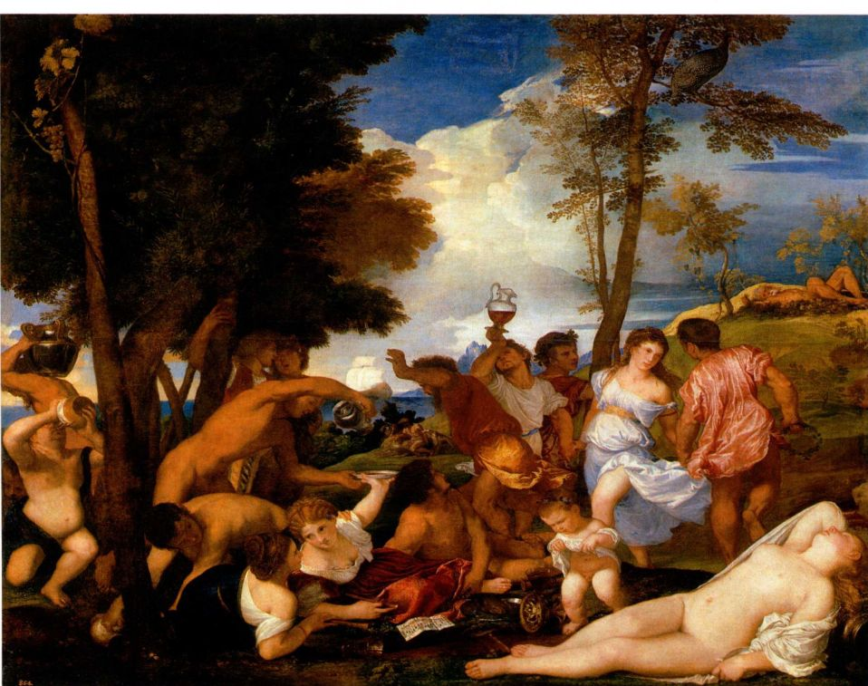

🟩582 詹森艺术史

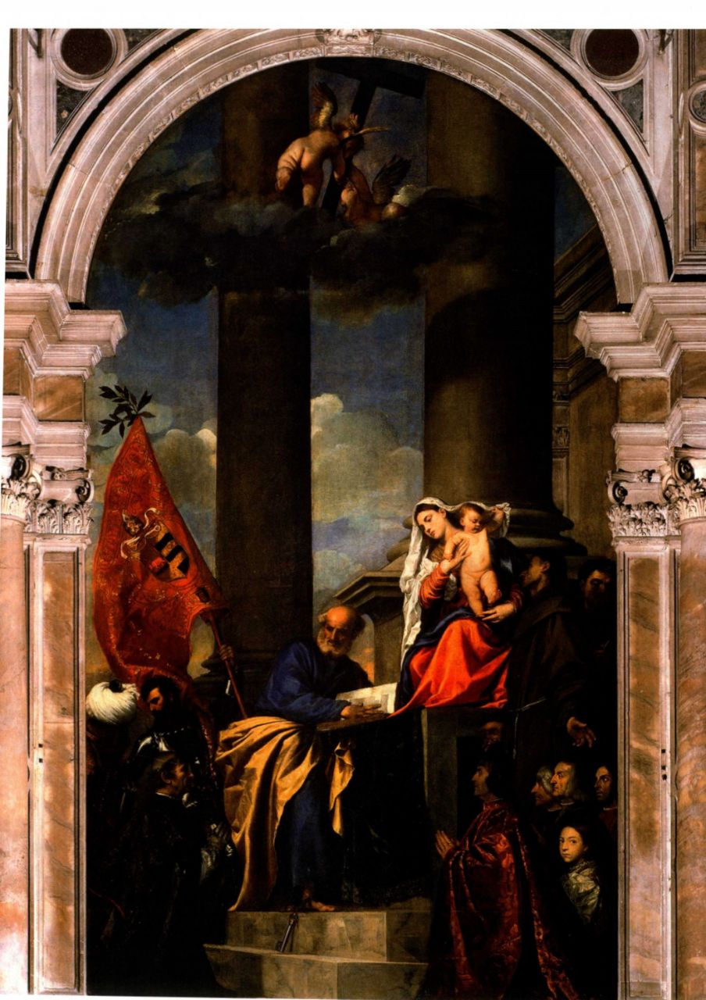

图1 6\.33 提香《圣母与佩萨罗一家》。1 526 年。布面油画， 4\.88 × 2\.69 米。威尼斯弗拉里圣母荣光教堂

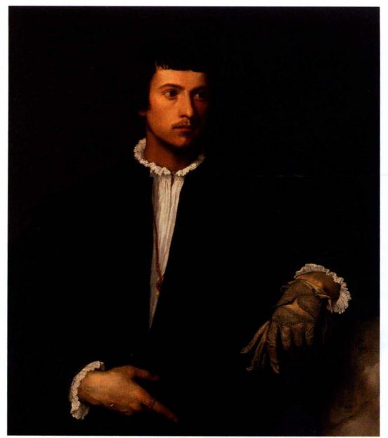

图16\.34 提香：《戴手套的男子》。约1520年。布面油画，

100\.3 × 88\.9厘米。巴黎卢浮宫

的基础。然而威尼斯艺术家在创作其具有感官特色的绘画时，将光线与颜色置于所有其他因素之上。瓦萨里对此颇不以为然，他将这些统归于色彩（colore），并认为这是绘画过程中的次要部分。这一素描与色彩之争成了16世纪之后很多年绘画评论的基础。

提香

未及充分发掘《暴风雨》中所创造的美好的抒情世界，乔尔乔内就溘然早逝。这个任务由提香（Titian，提齐亚诺·维切洛［Tiziano Vecellio］，1488／90\-1576年）承担了起来，这位画家曾先后师从贝里尼与乔尔乔内，甚至临摹过他们的作品，威尼斯绘画之后的半个世纪将由他主导。在提香长寿的一生中，他获得了来自欧洲最著名的赞助人的订单，并指导了众多16世纪的威尼斯艺术家。

提香对乔尔乔内艺术遗产的阐释在《酒神祭》（Bacchanal，图16\.32）之中得以体现，这件作品由费拉拉公爵阿方索·德·埃斯特（Alfonso d＇Este）于1518年前后为他的雪花石膏小屋（Camerino d＇Alabastro）定制。作品中，提香试图再现一幅罗马绘画，关于该画的情况只有罗马作家菲洛斯特拉托斯有过一些描述。画面主题是酒河对安德罗斯岛（Andros）居民的

影响。提香绘制了一群高举酒壶、衣衫半褪、举止不端的人物，他们醺醉程度不一。提香在此处不仅挑战了古代艺术，也挑战了文学传统。他的风景中充满了冷暖色调的对比，继承了乔尔乔内作品的诗意，但是人物却属于另一个类型。这里的人物活跃而强健，他们的活动欢快而自由，这些都令人联想到拉斐尔的《伽拉忒亚》（见图16\.28）。

到了提香所在的年代，米开朗基罗与拉斐尔的许多作品都已被翻刻成版画，提香通过这些复制品对罗马的盛期文艺复兴艺术已经非常熟悉。画面中至少有一个人物可能模仿了米开朗基罗作品中的人物\-河边弯下身用酒壶盛酒的男子。《酒神祭》中的许多人物还反映出古典艺术的影响，然而提香对古典艺术的处理手法与拉斐尔截然不同。他将古代的神话王国视为自然世界的一部分，其中寓居着的是有血有肉的人物，而不是活动着的雕像。为了愉悦观众，提香在画面右下角画了一位醉倒的年轻裸体女子，以其姿态炫耀着她娇嫩丰腴的胴体。《酒神祭》中人物的理想化程度恰到好处，刚好点明画中人物生活在消逝已久的黄金时代，似在邀请观众分享这种极乐状态，在这一点上，《伽拉忒亚》相形之下显得冷淡疏离。

提香改变艺术传统的能力也在《圣母与佩萨罗一家》（Madonna with Members of the Pesaro Family， 图16\.33）中可见一斑。这件作品定制于1519年，1526年安放在方济各会弗拉里圣母荣光（Santa MariaGloriosa dei Frari）教堂的无玷受孕祭坛上。提香在此处采用了多梅尼科·韦内奇亚诺和乔瓦尼·贝里尼所开创的神圣会谈传统手法（见图15\.30、15\.57），并重新安排了画面的构图与人物。他将圣母与圣子安排在三角形人物布局的顶端，但是通常作品中的正三角形构图为斜三角形所取代，因而画面效果要活跃得多。幼年耶稣与《酒神祭》中的儿童一样自然，小耶稣天真地玩弄着圣母的面纱。圣母与圣彼得则面向捐赠者雅各布·佩萨罗（Jocopo Pesaro），神情庄重，后者虔诚地跪在画面左侧，右侧人物是他的兄弟、儿子与圣方济各和圣安东尼。

圣母坐在一座宏伟教堂的台阶上。高高耸起的圆柱是背景设置中的关键，它们象征天堂之门，传统上天堂之门形象化为圣母本人。作品赞颂了她的无玷受孕，生就无罪。由于画面构图呈斜向，所以背景中的大部分区域都是广阔的天空与云朵。除了跪倒在地的捐赠人之外，每个人物都在运动之中。军官手中的旗帜上绘有佩萨罗和教皇亚历山大六世的纹章，他几乎像是在指挥一场冲上台阶的冲锋。这位人物很可能是

🟩584 詹森艺术史

圣莫里斯（St\.Maurice），与圣毛罗（Santa Mauro） 之战同名的圣徒。在那场战役中，帕福斯	\(Paphos\)主教佩萨罗所指挥的教皇舰队与其堂弟本内德托·佩萨罗（Benedetto Pesaro）所率领的威尼斯海军于1502年击退了土耳其人，请注意他身旁那位缠着头巾的人物。圣彼得代表着天主教教会对伊斯兰教的胜利，脚下的钥匙暗示了他的身份。作为佩萨罗的主保圣人，他扮演着向圣母求情的角色。虽然充满了强烈的戏剧性，但是画面的构图和谐自足。每一种色彩与画面都在灿烂的阳光下熠熠生辉，与祭坛的欢乐气氛相呼应。关于悲剧的唯一暗示是两个小天使所抬的十字架，它隐在云朵之中，与神圣会谈中的当事人隔离开来，使画面流露出一缕辛酸。

拉斐尔去世之后，提香成为当时最受欢迎的肖像画家。他的杰出天赋在《圣母与佩萨罗一家》中的捐赠人肖像上已经展露无遗，而在《戴手套的男子》（Manwith the Glove，图16\.34）中也有同样惊人的体现。这幅肖像具有梦幻般的亲密感，人物轮廓柔和，阴影深暗，反映出乔尔乔内所采用的柔和明暗对照法。人物面容中的些许忧伤具有《暴风雨》所蕴含的那种诗意般的感染力。在提香笔下，他创造出了鲜亮的乳白色高光与透明而调和精妙的深暗色调，油画技法的各种可能得到了充分地实现，明显的笔触，运用愈发自由，前所罕见。提香对油画颜料的处理在他的晚期作品中具有日益增强的涂绘性，为将来的艺术家带来了另一种值得探索的艺术工具。

小结

在察力的艺术家不仅并存于世，而且相为竞发，16世纪之初的短暂时期里，技艺高超、富有洞在各自的领域中试图超越他人。因此，盛期文艺复兴这一时期被视为欧洲艺术的最高峰。达芬奇善于探究的头脑与对光线见解深刻的处理、布拉曼特在建筑中融合古代形式与现代功能的雄心、米开朗基罗对人体的有力表现、拉斐尔完美无缺的构图、乔尔乔内对情绪的敏锐表现以及提香对色彩与颜料的杰出把握，所有这些一经出现即得到了世人的赞颂。

他们的艺术创作发生在一个动荡却又创造力勃发的时期，得到了重要艺术赞助人的鼓励。后来，赞助

人的缺失与艺术家的死亡和流散缓和了这种竞争。到了1520年，达芬奇、布拉曼特、乔尔乔内和拉斐尔都已离开人世。天主教会这个曾经极其慷慨的赞助人此时也受到了年轻的马丁·路德在维滕贝格所发起的挑战，支持宗教改革的力量逐渐加强。米开朗基罗与提香则经历了盛期文艺复兴的全过程，他们在1520年之后变化的局面中仍然继续进行艺术创作。

佛罗伦萨与米兰的盛期文艺复兴

恢复了共和政体的佛罗伦萨是达芬奇和米开朗基罗这两位文艺复兴时期最具影响力的艺术家的故乡。受到15世纪艺术创新的熏陶，这两位艺术家分别在各自偏爱的绘画与雕塑领域发展出伟大的技巧。他们的成就将许多其他艺术家吸引到佛罗伦萨，其中包括乌尔比诺的拉斐尔。精通明暗对照法的达芬奇对自然的研究永不停息，这使他得以创作出情感充沛而又极具自然主义风格的宗教与世俗作品。米开朗基罗对人体的专注促使他对古代的雕塑进行研究，这不仅赋予其作品显著的自然主义特征，而且将强烈的情感冲击赋予其中。

罗马复苏

致力于重建罗马的教皇尤利乌斯二世将米开朗基罗、布拉曼特与拉斐尔等艺术家召集到罗马。他渴望让这座古城重新成为基督教世界的首都，胜过该城的昔日异教历史的光辉。为了实现这一目标，布拉曼特设计了一座宏伟的新圣彼得大教堂，意欲与古罗马的万神殿一争高下。尤利乌斯二世认为，米开朗基罗有力的人体与他的墓葬以及西斯廷天顶画这样宏大的工程相得益彰。拉斐尔在罗马的成就则是将达芬奇的绘画创新与米开朗基罗坚实的雕像风格融合在一起。他将两种风格置于个人天才的驾驭之下，创造出和谐的构图与深邃的意味。

威尼斯

尽管威尼斯在16世纪早期的政治环境动荡不已，但是赞助人们仍然委托画家乔尔乔内与提香创作生动华丽的宗教与世俗作品。运用强调色彩与光线的油画介质作画的乔尔乔内创造了能够唤起诗意幻想气氛的绘画。提香则充分发掘了威尼斯的艺术传统，他所绘制的作品栩栩如生、娇嫩婉转，令人惊诧。