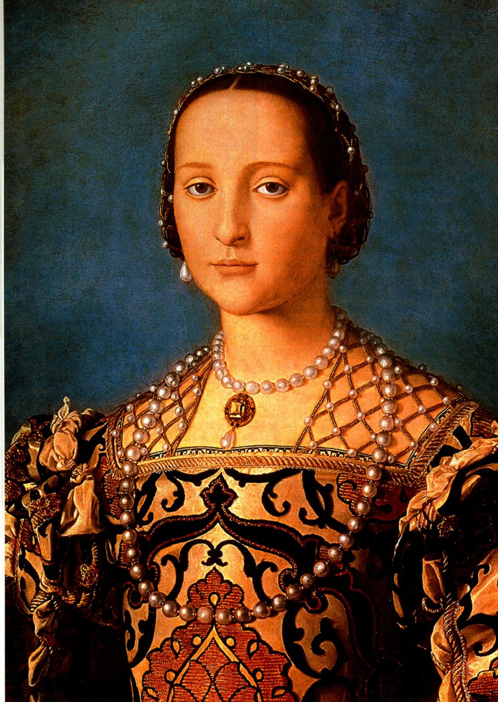

*图17.7细部，阿尼奥洛·布龙齐诺《托莱多的埃莉诺拉与其子乔瓦尼·德·美第奇》*

# 第十七章 16世纪意大利晚期文艺复兴与风格主义

从1517年马丁·路德在维滕贝格张贴他对罗马天主教会的挑战书的那一刻起，欧洲的政治与文化面貌开始发生变化。由于大片地区脱离天主教会，欧洲宗教表面统一，实则变得四分五裂。法国、西班牙与德国的强大势力在意大利半岛上相互开战，即使当时土耳其人在欧洲的扩张威胁临头，也仍然如此。宗教改革在精神上的挑战以及强大世俗政权的崛起影响了这一时期的意大利艺术家，它们改变了艺术家进行创作的氛围和艺术赞助的性质。所有艺术家的创作都属于传统上被称为晚期文艺复兴的艺术，他们受到了盛期文艺复兴艺术成就的深刻影响，但是没有一种艺术风格在16世纪的意大利占据主导地位。

盛期文艺复兴那一代艺术家的权威不仅滋养了后世艺术家，而且也给他们设置了屏障。在达芬奇、拉斐尔、布拉曼特与乔尔乔内的作品中，年轻的艺术家们可以观察前辈们技艺高超的明暗对照法、透视法与渐次渲染法，以及他们对古代艺术的推崇。新一代艺术家模仿了他们的技法、构图与主题。与此同时，盛期文艺复兴的艺术家们仍在探索解决图像问题的新方法。事实上，两位盛期文艺复兴的关键人物在此时转变了自己的风格，他们是米开朗基罗与提香，前者于1564年去世，后者则活到了1576年（见地图17.1）。

之前人们认为艺术家是特别有创造力的人物，这一观念也流传到了之后的几代人，但却发生了很大的改变。各国对意大利的干预在1527年达到了顶点，当时罗马被入侵，遭到哈布斯堡王朝军队的洗劫。三年后，查理五世在波洛尼亚加冕为神圣罗马皇帝，他对意大利产生了重大的影响。1530年，查理五世推翻了重建的佛罗伦萨共和国，支持美第奇家族的复辟。美第奇家族的科西莫一世（Cosimo I）于1537年成为佛罗伦萨公爵，并于1569年成为托斯卡纳大公。查理五世还助长了贡扎加家族对曼图亚的统治，并赐封提香为骑士。他与自己的继任者都是提香热心的赞助人，将意大利文艺复兴风格的影响与声誉传遍欧洲大地。

由于随着路德、茨温利、加尔文等神学家拒绝接受教皇的权威，并重新界定了基督教教义，新教改革运动在北欧地区迅速传播。有些改革人士极力要求他们的追随者破坏宗教图像，直指此为偶像崇拜，结果绘画、玻璃窗画以及其他宗教艺术品遭受了大范围的破坏。作为罗马天主教教会的大本营，罗马抵制着新信仰的侵蚀。尽管如此，天主教会中的改革压力在16世纪上半叶逐渐增大。传统上，罗马教会肯定绘画作为教育信众、鼓励虔诚的工具所具有的功能，而改革者则将这一立场视为天主教会的官方伎俩（见第三部分末尾的附加原始文献）。由于天主教会的权威因新教改革而受到威胁，它坚持对图像内容与风格的控制，以保证教义上的正确性。在天主教会寻求区别于新教改革运动的过程中，宗教艺术品日益趋于标准化。

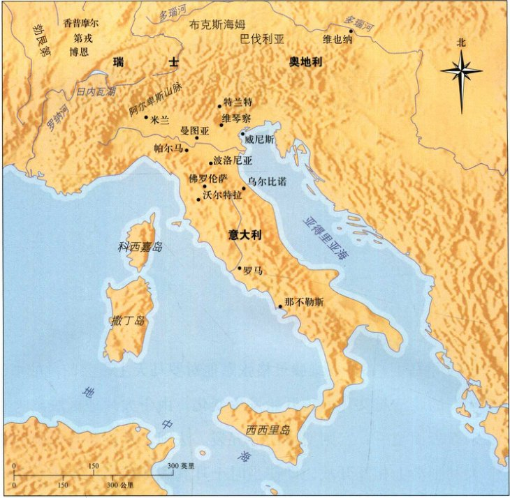

*地图17.1 16世纪的意大利*

艺术家们对所有这些现象做出了回应。1527年罗马被洗劫，定居罗马的众多艺术家流落到意大利与欧洲各地。委托定件大多来自宫廷，所以艺术家的作品折射出强大的世俗精英所关注的问题与品位。宫廷之间的联系促进了一种新风格的传播，这种风格被命名为风格主义（Mannerism），在16世纪的大部分阶段盛行。其以绘画与雕塑为典型代表，某些建筑也展示出风格主义倾向。

风格主义一词来源于意大利语“maniera”，意指手法或风格，即当时的艺术家们所赞许并采用的手法与风格。16世纪20年代以及稍晚时期的艺术家们在米开朗基罗和拉斐尔成就的基础上，发展出另一种风格，强调精湛的技巧、博学的题材、美丽的人物，以及能够呈示矫饰品位的复杂构图。风格主义成为极度精致的风格，强调优雅、变化与风格技巧的展示，而不重清晰与统一。风格主义的艺术家们自觉地探索了美的定义，即所谓与其重复古代的形式，不如进行比例、理想化人物类型与特殊构图的实验。与盛期文艺复兴的艺术家一样，他们的目标是原创性与个人体验，在他们眼中，这是艺术家作为享有特权的创造者所应做的事情。

风格主义到底代表什么一直是学者们讨论的问题。有些人认为这种风格是一种衰退，因为它放弃了盛期文艺复兴的艺术标准。显然，这些评论家偏爱盛期文艺复兴的“经典”作品。艺术家放弃了盛期文艺复兴艺术中的稳定、信念与理想化形式，如此并不能很好地理解他们这样做的原因。也许新一代艺术家试图与自己的前辈拉开距离，或者风格主义可以被看作文化危机的表达。有些学者将它与宗教改革与天主教反宗教改革两股势力所带来的精神危机联系在一起，而其他学者则将风格主义视为精英阶层表达其身份与品位的产物。虽然学者们讨论着风格主义的起因与意味，但是风格主义作品最早出现在16世纪20年代的佛罗伦萨，这一事实清晰无误。而当时的佛罗伦萨与1505年的佛罗伦萨已大相径庭。

## 晚期文艺复兴的佛罗伦萨：教会、宫廷与风格主义

在1512至1527年美第奇家族统治期间，佛罗伦萨的艺术家们吸收了盛期文艺复兴的艺术创新。教皇利奥十世将米开朗基罗从罗马遣回佛罗伦萨，为美第奇家族创作。拉斐尔的艺术传人也来到了这个城市。佛罗伦萨的艺术家为早期与盛期文艺复兴做出了很大贡献，此时他们发展出一种新风格的文艺复兴艺术，似乎要弃绝盛期文艺复兴艺术的平静与自信。运用从达芬奇、米开朗基罗和拉斐尔那里习得的自然主义、明暗对照法和人物构图等技法，这一代艺术家创作出的作品与之前艺术家的作品相比，平衡感较弱而表现力更强。在16世纪20年代的创作中，一群佛罗伦萨艺术家采用新风格创造出了具有深度神圣力量的作品。宗教的复苏可能是对宗教改革挑战的回应，或者可能来自狂热的教士萨沃纳罗拉所遗留下来的影响，他在15世纪90年代曾在佛罗伦萨宣讲悔罪。

### 16世纪20年代的佛罗伦萨宗教绘画

这种新风格的一个早期作品是罗索·菲奥伦蒂诺（Rosso Fiorentino，1495-1540年）的《下十字架》（The Descent from the Cross，图17.1）。这位艺术家的风格非常特别。一个自笞者团体在1521年委托罗索绘制了这幅祭坛画。这种天主教团体在苦行仪式中会鞭打自己以表示悔过。托斯卡纳地区沃尔特拉城（Volterra）的十字架纪念团体选择了画作的主题，即将基督的尸体从十字架上取下的场景，罗杰·凡·德·维登作于1438年的绘画中采用过这一主题（见图14.17）。为了体现赞助组织的名字，罗索大力凸显了十字架本身。画面的构图部分受到早期文艺复兴艺术的影响，例如马萨乔的《圣三位一体》湿壁画（见图15.14），然而这里的构图远没有马萨乔的三角形构图那样稳定。所有形象并没有缓慢谨慎地退入空间，而是出现在了同一个平面上。活跃的人物那肌肉强健的身体让人想起米开朗基罗，但是衣袍却由显得锋利而坚挺的平面构成。靠近下方的地平线使得人物映衬在深暗的天空背景中，造就了令人不安的效果。画面的色彩并没有采用原色，而是对比极其鲜明，明亮的光线落在人物身上，有违常理。

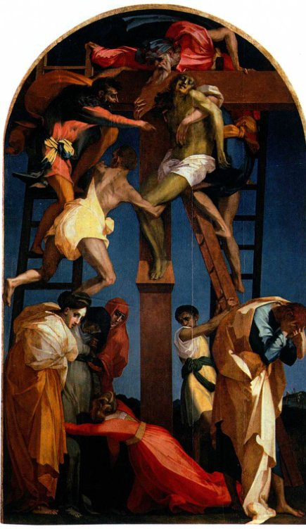

*图17.1 罗索·菲奥伦蒂诺：《下十字架》。1521年。木板油画，3.35 × 1.96米。沃尔特拉的市立美术馆（Pinacoteca Comunale）*

与达芬奇《最后的晚餐》（见图16.6）中宁静、深邃、有序的空间不同，罗索在压缩的空间里创造了一个不稳定的构图，其中充塞着动作狂暴的人物，他们正取下基督的尸体。在一群情绪激动的人物之中，只有基督看上去平静祥和。风格主义对盛期文艺复兴理想的弃绝使得罗索能够创作出《下十字架》这样的作品，它尤其契合定制这件作品的兄弟会成员的虔诚之心。1527年哈布斯堡王朝统治者查理五世的军队洗劫罗马之后，罗索本人离开了意大利中部，他后来被聘请到法国，为弗朗西斯一世的枫丹白露（Fontainebleau）宫创作作品（见第十八章）。

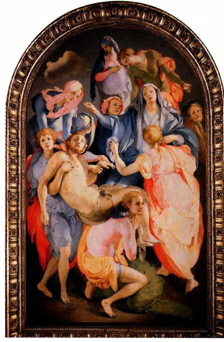

*图17.2 雅克布·达·庞多尔摩：《基督下葬》。约1526-1528年。木板油画，3.12 × 1.93米。佛罗伦萨的圣菲利琪大教堂*

罗索的朋友、与他年龄相仿的艺术家雅克布·达·庞多尔摩（Jacopo da Pontormo，1494-1556年）发展了属于他个人的风格主义样式。1526年前后，他为卡博尼（Capponi）家族的礼拜堂绘制了《基督下葬》（The Entombment，图17.2），这一礼拜堂位于佛罗伦萨古老的圣菲利琪（Santa Felicita）大教堂中。这件作品与罗索的《下十字架》对比鲜明。画面中没有十字架或者任何其他关于特定故事情节的暗示，所以它的主题显得晦暗不明。圣母昏厥过去，两位性别不明的人物托举着基督的身体，以供众人瞻仰。罗索笔下的人体被拉长了，而庞多尔摩的人物则展示出理想之美与雕塑般的坚实感，这种特点的灵感来自米开朗基罗。然而，庞多尔摩将这些人物压挤进了令人难以置信的狭窄空间里。

在庞多尔摩的画作里，一切都从属于优雅韵律的展示，相互紧密关联的人物造就了这种韵律。所有色彩都偏离了原色：淡蓝色、粉色、桔色与绿色，这些可能受到了西斯廷天顶画在色彩上的启发（见图16.17）。虽然哀悼者看起来似乎在一起活动，但是他们都沉浸在个人化的悲痛之中，无暇与他人一起行动。在静穆的气氛中，痛苦转化为细腻感受的抒情表达。整幅场景萦绕于心，正如昏倒的圣母右边庞多尔摩的自画像一样。基督的身体被抬举起来以供瞻仰，仿佛圣餐礼中的圣体被举到信徒面前，这一图像向信徒们传达出基督献身这一悲剧的力度，圣餐礼再次展现为基督献身的场景。庞多尔摩也许抛弃了盛期文艺复兴的艺术价值，但是他赋予了作品深沉动人的情感。

## 佛罗伦萨的美第奇家族：从王朝到公国

在1527年罗马遭受洗劫后的混乱局势中，美第奇家族被再次逐出佛罗伦萨，这个城市重建了共和国政体。但是，教皇与神圣罗马皇帝之间关系的恢复让美第奇家族在1530年重返佛罗伦萨。出生于美第奇家族的教皇克莱门特七世（1523-1534年在位）提携了本家族的利益，并致力于增强它在佛罗伦萨的统治权。尽管米开朗基罗是一位激烈的共和主义者，但他仍继续为美第奇家族服务，创作旨在颂扬佛罗伦萨美第奇王朝的作品。

**新圣器室** 米开朗基罗的创作活动集中在美第奇家族的圣洛伦佐教堂。一个世纪以前，布鲁内莱斯基设计了这个教堂的圣器室（见圣洛伦佐教堂平面图，图15.8），其中埋葬着美第奇家族前一代人的遗骨。教皇利奥十世决定建造一座与之相匹配的新圣器室。其中将安置利奥十世的父亲、伟大的洛伦佐、洛伦佐的兄弟朱利亚诺以及另外两位也是名为洛伦佐与朱利亚诺的美第奇家族年轻成员的坟墓。在众多助手的协助下，米开朗基罗于1519至1534年间为这个项目进行创作，并完成了圣器室建筑与其中的两座坟墓，即小洛伦佐墓与小朱利亚诺墓（图17.3）。这两座坟墓几乎就是彼此的镜像。米开朗基罗将新圣器室构思为一个建筑雕塑体。建筑从布鲁内莱斯基式样的半露方柱与檐部开始，使用了深色砂岩来建构墙壁，正如布鲁内莱斯基之前所作的那样。然而，米开朗基罗对待前者建筑原型的态度是随意的，他将墙壁也看作一种雕塑形式，这是布鲁内莱斯基决不会采用的方式。新圣器室用于安置雕像，并作为雕像背景的绝好作品，尽管雕像的确切位置仍难于确认。米开朗基罗为美第奇家族设计的这几座坟墓的平面结构在施工过程中经过了多次修改。他又设计了其他的造像与浮雕，但未能完成。美第奇家族坟墓的现状未必就是米开朗基罗最终所期望的，因为1534年他离开了佛罗伦萨后再没有回来，坟墓的建造进程被搁置。

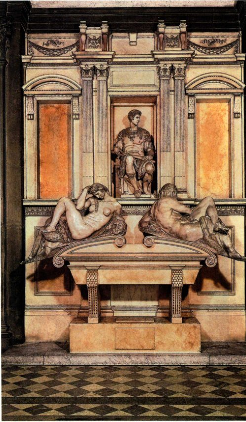

*图17.3 米开朗基罗：朱利亚诺·德·美第奇墓。1519-1534年。大理石，中央雕像高180.5厘米。佛罗伦萨圣洛伦佐教堂的新圣器室*

朱利亚诺的坟墓是一个气势恢宏的视觉整体，其中包括石棺与石棺上的两座裸体人像，最上部端坐着一位身着盔甲的人物，米开朗基罗创造性地重现了古典建筑，将所有人物置于一个框架之中。中央的壁龛刚刚能够容纳下其中的坐像，它两侧是成对的半露片柱，支撑着横贯上方的檐部。更外侧是空白的盲窗，涡形饰支撑着窗上的圆弧三角楣，这些形式都照应了下方石棺的外形。雕像形成的三角形被约束在垂直元素与水平元素所构成的网络之中，这些元素具有纤细锋利的形式，与雕像的浑圆及重量感形成鲜明的对比。

这种设计表现出与早期文艺复兴时期坟墓的亲缘关系，例如罗塞利诺设计的莱奥纳多·布鲁尼墓（见图15.26），但两者的区别也很明显。这座坟墓上没有直接的基督教图像，没有铭文，死者的雕像为两位寓言式人像所替代，右侧是《昼》（Day），左侧是《夜》（Night）。米开朗基罗绘制的一幅素描中有一段附属文字，表明了这些雕像的含义：“昼与夜会讲话，他们说：我们自己快速地将朱利亚诺公爵带入坟墓······正是这样，他将光明从我们这里带走，从而复仇。他双眼紧闭，将我们关在其中，我们不再向世人显现。”这两位斜倚着的形象来自古代的河神，他们的精神状态形成了对比：米开朗基罗有意不完成《昼》的面孔，这座雕像似乎陷入了深思；而《夜》则好像处于不停的运动之中。朱利亚诺的理想化雕像穿着古代军人的服装，与死者本人毫无相似之处。据说米开朗基罗曾经这样说道：“一千年之后，没有人会知道他的样貌。”这座雕像比例优美的形体似乎正准备有所行动，人物的双手握着权杖，坐立不安。他的目光指向那永远也不可能完成的伟大的洛伦佐之墓。米开朗基罗并没有遵循传统来设计一座纪念堂，在其中回顾死者的成就。他所创作的朱利亚诺墓与新圣器室是一个整体，用来表达美第奇家族对时间的征服。

米开朗基罗在新圣器室对布鲁内莱斯基的再创造激发瓦萨里写下了这样的话：“所有艺术家都受到米开朗基罗伟大永久的恩惠，他打破了之前羁绊艺术家们的锁链，使他们不再囿于创造传统形式。”然而，米开朗基罗作为建筑形式创造者的全部力量，在圣洛伦佐教堂毗邻的洛伦佐图书馆的前厅中才得到首次展示。

**洛伦佐图书馆** 克莱门特七世在1523年委托建造了这座图书馆（Laurentian Library，图17.4），用来收藏美第奇家族数量庞大的书籍和手稿，并对公众开放。这类工程显示了美第奇家族对佛罗伦萨城的恩惠，以及他们对学术的鼓励。洛伦佐图书馆是一间狭长的大厅，入口处有一座气势宏大的前厅，前厅始建于1523年，但很久之后都没能完工。

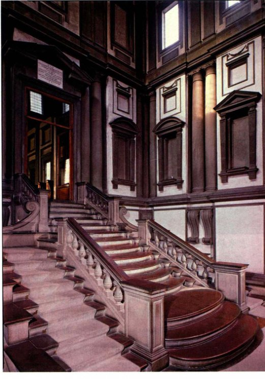

*图17.4 米开朗基罗：佛罗伦萨洛伦佐图书馆的前厅。始建于1523年，楼梯设计于1558-1559年。*

根据布拉曼特或者维特鲁威的标准，前厅中没有一样设计是正确的。门上的三角楣被打断，空壁龛两侧半露方柱的下部越来越细，圆柱不属于任何可辨识的柱式，涡形托架（bracket）上一无所有。所有设计中最矛盾的是凹陷式的圆柱，这一特色公然违抗了习俗与传统。在古典的柱梁系统中，圆柱、半露方柱和檐部必须突出墙面，以加强它们的区隔功能，正如罗马的波尔图纳斯庙（见图7.2）那样。这个系统可以缩减为线性平面，和鲁切莱府邸（见图15.32）中的情形相同，但是在米开朗基罗之前没有人敢违背这一传统，将圆柱嵌入墙面之中。在狭窄的前厅空间里，米开朗基罗没有突出圆柱而是将之纳入前厅的墙面，从而赋予墙壁极高的庄严感。他后来又设计了宽大的楼梯，并由巴尔托洛梅奥·阿曼内蒂建造。这座楼梯层叠流淌的形式活跃了前厅的空间。

**皮蒂宫与乌菲齐宫** 美第奇家族集中赞助了与圣洛伦佐教堂相关的项目，延续了15世纪时的模式。但是家族的公爵们并不满足于居住在米开罗佐建造的美第奇府邸。科西莫一世·德·美第奇（Cosimo I de' Medici）于1540年搬入了位于市中心的市政厅（见图13.16）。早先几代美第奇统治者将自己的私人宅邸与政府所在地分隔开来，而现在的公爵们则尽力让这两种建筑达到统一。因此，早先市政厅的内部就需要改造，开辟出居住空间，并形成了为宫廷和政府所用的新空间。

美第奇家族寻找着合适的宫廷建筑地点，他们买下了阿诺河另一边的皮蒂宫（Palazzo Pitti），这座建筑建于15世纪。雕塑家巴尔托洛梅奥·阿曼内蒂（Bartolommeo Ammanati，1511-1592年）扩建了皮蒂宫，于1558至1570年间修建了其中的庭院（图17.5）。与米开罗佐设计的府邸一样（见图15.33），这座庭院的空间兼有实用与仪式庆典两种功能。15世纪的建筑装饰华丽、精致，但这个庭院则具有防御工事的特色。建筑三层叠加柱式（superimposed orders）的设计源于罗马斗兽场，这种布局的表面覆盖着夸张且具有粗面石工的式样，将圆柱“禁锢”在粗面石之中。尽管圆柱粗壮，但仍被降格为次要的作用。阿曼内蒂创造性地结合了古典艺术语汇与非正统的粗砺石工处理手法，产生出力量的生猛表达。皮蒂宫现在已经成为博物馆，展示美第奇家族收藏的大量艺术品。

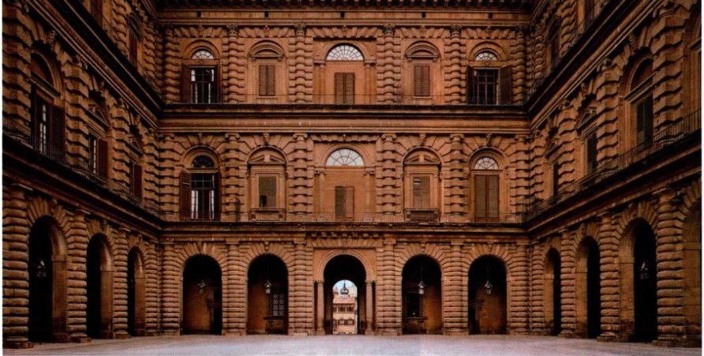

*图17.5 巴尔托洛梅奥·阿曼内蒂：佛罗伦萨皮蒂宫的庭院。1558-1570年*

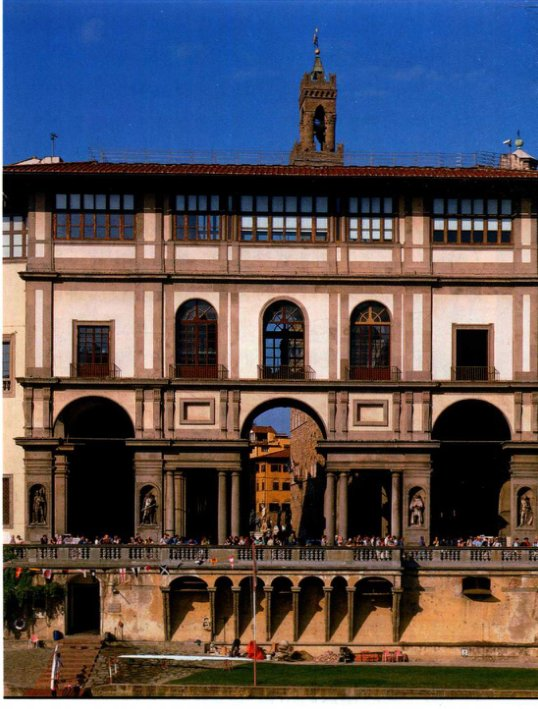

*图17.6 乔治·瓦萨里：佛罗伦萨乌菲齐宫正立面。始建于1560年*

科西莫一世在1560年委托建造一座新的行政建筑来容纳其宫廷的官僚机构。这个项目被委派给了画家、历史学家与建筑师乔治·瓦萨里（Giorgio Vasari，1511-1574年）。乌菲齐宫（Palazzo Uffizi）的建造完成于1580年前后，由相互面对的两翼构成，其间是一道狭长的庭院，两翼的一端以凉廊或前廊（testata）连接在一起（图17.6）。这个庭院在原本的设计中是一座巨型广场，但是科西莫认为这一设计过于浮夸。乌菲齐宫位于市政厅与阿诺河之间，它调整了城市的空间，而且服务于分散在各处的佛罗伦萨市政部门。尽管受到米开朗基罗在圣洛伦佐教堂的设计影响，这里的庭院还带有古罗马广场的影子，因此将科西莫与罗马皇帝联系在一起。

**肖像画与寓意画** 美第奇家族具有优雅的品位，并且深谙运用视觉艺术表达其新地位的方式。与15世纪的情形相同，美第奇家族的这一代赞助人也将肖像画作为达到该目的的手段。阿尼奥洛·布龙齐诺（Agnolo Bronzino，1503-1572年）所创作的《托莱多的埃莉诺拉与其子乔瓦尼·德·美第奇》（Portrait of Eleanora of Toledo and Her Son Giovanni de' Medici，图17.7）就是这种宫廷肖像画新类型的典范。画面中的埃莉诺拉被高度理想化了，她是科西莫一世的妻子，现在看来暗淡的头发原本是金色，容貌特征也被表现得至臻至美。画中的埃莉诺拉是美的化身，正如她的丈夫因男性之美与勇气而受到敬仰。

> **大事年表**
>
> *   约1526年 - 庞多尔摩创作《基督下葬》
> *   1537年 - 科西莫一世统治佛罗伦萨
> *   1542年 - 葡萄牙人成为日本的首批欧洲来客
> *   1563年 - 佛罗伦萨绘画学院成立

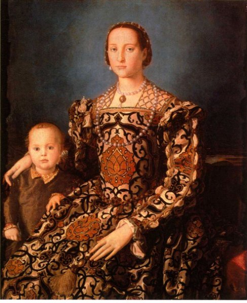

*图17.7 阿尼奥洛·布龙齐诺：《托莱多的埃莉诺拉与其子乔瓦尼·德·美第奇》。约1550年。木板油画，115 × 96厘米。佛罗伦萨乌菲齐美术馆*

肖像画中蕴含着一个重要的信息，那就是美第奇王朝的延续，因为埃莉诺拉手揽着王朝的男性继承人，即出生于1543年的乔瓦尼，然而他比自己的母亲先离人世。这位母亲生育了11个孩子，其中有8个儿子，她在1562年因肺结核病逝，享年43岁。图像需要传达关于王朝的信息，这就要求它具备仪式性，人物姿势固定，目光冷淡。埃莉诺拉僵直地坐着，手臂放在她安静而目不转睛的儿子肩头。她身穿一件做工复杂的锦缎礼服，佩戴的珠宝显示着她的财富与地位。布龙齐诺将两人描绘成近乎圣母子的样子，巧妙地将埃莉诺拉比作圣母。这或许解释了她面庞周围的蓝色背景变亮的原因，是在寓意神圣光环。图像中包含着一系列复杂的典故与暗示，也充满了对埃莉诺拉外表的奉迎与美化。布龙齐诺将笔下的人物表现为尊贵社会阶层的一员，而不是有独特个性的人物。这种形式化且有距离感又富于象征意味的肖像画，迅速成为全欧洲理想的宫廷肖像画类型（例如图18.29，《伊丽莎白一世肖像》）。

布龙齐诺是埃莉诺拉喜爱的画家，并获得了宫廷的任命。他对素描的激情和诗歌天赋在众多的作品之中结合了起来。这一点在《维纳斯的寓言》（Allegory of Venus，图17.8）中体现得最为明显，科西莫将这幅作品送给了法国国王弗朗西斯一世。布龙齐诺运用了这些资源，绘制了这幅复杂的寓意画，艺术史家们仍在探究其中的意义，他们所采用的方法被称为图像志与图像学（见本页的艺术史家的观点）。

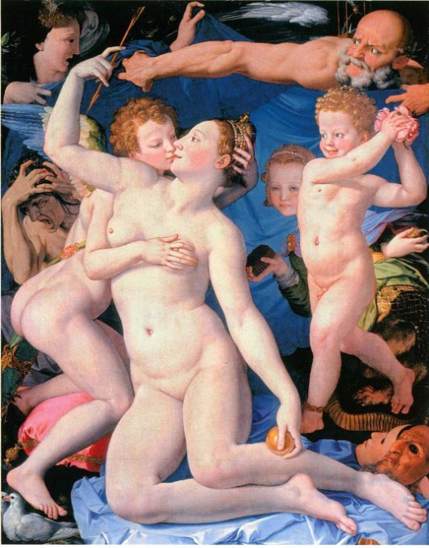

*图17.8 阿尼奥洛·布龙齐诺：《维纳斯的寓言》。约1546年。木板油画，146 × 116厘米。伦敦国家美术馆*

> **艺术史家的观点：图像志与图像学**
>
> 大部分艺术史家都要依据某种形式来解读艺术品，试图为当代观众解释形式的意义与信息。在艺术史家推进这一过程所借用的各种方法中，包括了图像志与图像学。图像志（Iconography）处理关于艺术品主题与内容的问题，确定艺术家在传达思想时所采用的主题、人物或象征。
>
> 图像学（Iconology）也关注作品的解读，但是方法不同。它的目的在于理解艺术品与其历史时期之间的关系：特定题材怎样在特定时期承载意义，为什么有些主题在艺术中出现复又消失。在这一定义的基础上，图像学考察形式、内容与历史时期之间的关系。而图像志学者则会检索圣徒类型或象征意义的辞典，给作品主题贴上一个标签。对图像学感兴趣的学者会考虑同一时期中其他类型的文化产物，以确定与主题、题材或特定形象相关的深层文化含义。
>
> 图像学这一术语是学者欧文·潘诺夫斯基（Erwin Panofsky）的创造，他对文艺复兴时期艺术的很多研究成果仍然具有很大的影响力。他所关注的主题之一是古典题材在文艺复兴时期的运用。在解读诸如提香的《达娜厄》这样的作品时，他追问为什么艺术家会选择这些题材，绘制的图像与同类题材的文学文本有怎样的关系，该时期对古代文化的评价以及其他涉及艺术品创作背景的问题。

在一个接近绘画表面的狭窄平面里，布龙齐诺绘制了很多人物，我们仅能尝试性地推断他们的身份：秃头的“时光老人”撕下帘幕，露出了帘幕背后左方上部角落里的“欺骗”，揭示了维纳斯与丘比特的乱伦关系，“愚蠢”手捧玫瑰，愉快欣喜；惊恐地撕扯自己头发的人可能是“嫉妒”或者“痛苦”。在画面右部，半人半蛇的“享乐”奉上一个蜂巢。布龙齐诺这幅作品可能具有这样的道德寓意：愚蠢与享乐使人看不到嫉妒和肉体之爱的欺骗，而时间会揭示这一切。

布龙齐诺的绘画具有高度的风格化倾向，是一幅精美的色情典范，将肉欲缩减为人物之间优雅的姿势交流，人物本身也光滑僵硬，一如大理石雕像。这幅寓意画的文学特质折射出布龙齐诺作为诗人的造诣。构思的复杂性与构图的复杂性相吻合，技术的精良与内容的巧妙相吻合。在他身上，美第奇家族找到了一位技术精湛、图像复杂、构图创新的艺术家，与他们的品位完美相称，并且是风格主义的绝佳例证。科西莫将这样一幅内涵丰富、技法高超的绘画作品赠送给法国国王，展示着他的王国在文学与视觉艺术领域所取得的成就。

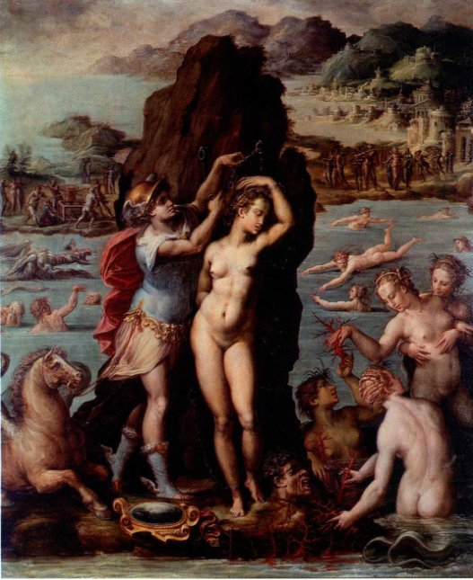

*图17.9 乔治·瓦萨里：《珀耳修斯与安德洛墨达》。1570-1572年。石板油画，117.6 × 86.4厘米。佛罗伦萨旧宫*

此类深奥博学的处理手法也出现在乔治·瓦萨里所创作的《珀耳修斯与安德洛墨达》（Perseus and Andromeda，图17.9）中，乔治·瓦萨里负责市政厅中若干重要的艺术项目。这幅绘画是他为科西莫之子，佛罗伦萨的弗朗切斯科一世·德·美第奇（Francesco I de' Medici）的书房所创作的装饰性题材作品的一部分。这组装饰画以古代的四大元素水、风、土、火为题，由人文主义者文森佐·博尔吉尼（Vincenzo Borghini）设计。为了表现水，瓦萨里绘制了珊瑚的故事。传说中，珀耳修斯拯救安德洛墨达时杀死了怪兽，怪兽的血变成了珊瑚。该题材为展示色情的裸体提供了借口，水神或者海中仙女（Nereids）是拉斐尔《伽拉忒亚》（见图16.28）中神话人物的轻松变体，把玩着在海中发现的珊瑚。位于中央的安德洛墨达消极地等待着珀耳修斯的拯救。她的身体比例纤长精巧，姿势优雅，反映出美第奇宫廷所偏爱的理想之美。

**绘画学院** 大公的目标之一是在托斯卡纳地区推广艺术，这也是乔治·瓦萨里的目标，他将自己首次出版于1550年的艺术家传记题献给了科西莫一世。这位大公在1563年出资创立了绘画学院（Accademia del Disegno），旨在加强对艺术家的教育，提高艺术的社会地位。布龙齐诺与乔治·瓦萨里是学院的奠基者。学院的教育强调素描与人体研究，不仅通过写生，也通过解剖深化这种研究。当时人们尊崇自然与古人，米开朗基罗的艺术被认为是当时最高的成就。学院不仅重视艺术家的技巧，而且强调对历史与文学的学习。托斯卡纳地区对素描的特殊关注折射出其创立者的独特的地方性期望，他们强调艺术是一种智力活动，而不仅是单纯的技艺。

学院里迎来了来自法国北部杜埃（Douai）的天才雕塑家让·德·博洛涅（Jean de Bologne，1529-1608年），他在弗朗西斯一世的宫廷里接触了意大利风格。他在公爵的宫廷里得到了委任，并取了一个意大利语名字乔瓦尼·博洛尼亚（Giovanni Bologna），成为16世纪最后三十年间佛罗伦萨最为重要的雕塑家。为了展现技艺，博洛尼亚选择了对自己而言难度最大的雕刻：将三个差别悬殊的人物统一在一个动作之中。在创作这座群雕时，博洛尼亚的头脑中并没有明确的题材，但作品完成之后，他接受了别人的建议，将作品取名为《劫掠萨宾妇女》（The Rape of the Sabine Woman，图17.10）。公爵很欣赏这件作品，将之安放在市政厅附近。

这尊雕塑主题来自于古罗马传说。故事中，罗马城的创立者是一群越洋过海来到这里的男性先驱，他们没能获取邻城萨宾妇女的欢心并娶她们为妻。于是，他们设下诡计，邀请整个萨宾部落来罗马参加庆典，并在此时袭击萨宾人，用武力抢夺了萨宾妇女，由此确保了种族繁衍。在艺术手法上，博洛尼亚去除了这种原始野蛮行为中令人厌恶的因素，三位人物的运动姿态呈螺旋形盘旋而上，仿佛经过了排演。艺术家想要展示自己的精湛技艺，仅从形式语言的角度来看待这件作品。为了在一块体量庞大的大理石上进行创作，雕刻家要考虑各个侧面的构图。风格主义倾向于鼓励形式与内容的对比，这一特点在这件作品里表现得最为显著。

*图17.10 乔瓦尼·博洛尼亚：《劫掠萨宾妇女》。完成于1583年。大理石，高4.1米。佛罗伦萨兰齐长廊（Loggia dei Lanzi）*

## 罗马改革

当美第奇家族在佛罗伦萨巩固自身权力的时候，罗马教皇尤利乌斯二世与利奥十世正寻求渠道结合他们的宗教权威与世俗权力。教廷与欧洲君主之间的冲突就自然而然地产生了。教廷和神圣罗马帝国之间的角逐导致1527年哈布斯堡军队洗劫罗马。教皇利奥十世的堂弟克莱门特七世逃亡，对罗马的大量破坏接踵而来。尽管这一事件损害了罗马与教廷的尊严，克莱门特最终还是加冕查理五世为皇帝，并再一次恢复了他提携美第奇家族的活动。1534年，克莱门特去世，各枢机主教希望有一个出身于罗马显赫家族且具有改革头脑的人来复兴教廷。他们选举亚历山德罗·法尔内塞（Alessandro Farnese）为教皇保罗三世（Paul III）。他是利奥十世的童年好友，曾在伟大的洛伦佐的宫廷中接受教育。加冕之后，保罗三世鼓励查理五世促使德意志君主重返罗马教会的行动，与此同时，他又再三向法国国王弗朗西斯一世保证，德意志的权力不会超过法国。

保罗三世非常担忧宗教改革所带来的精神危机。马丁·路德挑战教义的同时，也挑战了教会的权威，经他改革后的新教掌控了广大的北欧地区（见第十八章）。为了回应新教改革的挑战，保罗三世于1545年召集了特兰特宗教会议（Council of Trent），并在1564年颁布了它所制定的条款。这次宗教会议重新确定了传统的天主教教义，建议对宗教仪式、教会活动与艺术作品进行改革（见第三部分末尾的附加原始文献）。

天主教会影响最为深远、最强大的对抗异教的武器就是宗教裁判所（Inquisition），于1562年在意大利成立，用来调查未经批准或者可疑的宗教活动。被确认参与异教活动而被判有罪的人会关进监狱或者遭受死刑。为了进一步控制非正统宗教形式的蔓延，教会在1557年编辑了《禁书目录》（Index Librorum Prohibitorum）。凡是作者可疑或题材看来不健康的文本都要查缴或禁止出版。

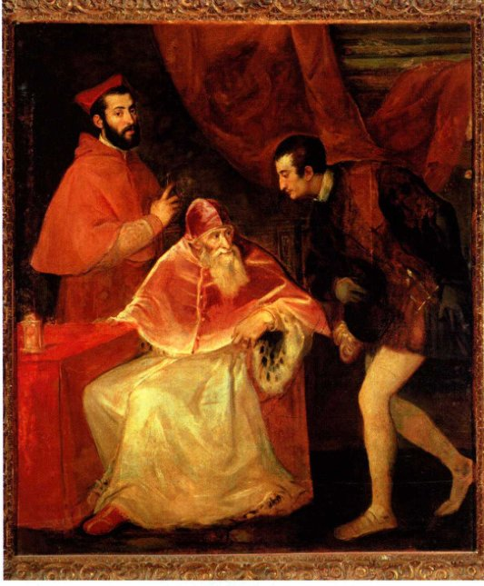

*图17.11 提香：《教皇保罗三世和他的孙辈》。1546年。布面油画，2.1 × 1.7米。那不勒斯卡波迪蒙特画廊博物馆（Museo e Gallerie Nazionale di Capodimonte）*

在《教皇保罗三世和他的孙辈》（Pope Paul III and His Grandsons，图17.11）中，提香捕捉到了教皇的特征。这幅画作于1546年，威尼斯画家提香曾在此时短暂地访问过罗马。画面里，教皇身边陪伴着他的孙辈（或子侄），他力图提拔这些后辈，而后辈对教皇的仰仗正反映在构图之中。构图出自拉斐尔的《教皇利奥十世与枢机主教朱利奥·德·美第奇、路易吉·德罗西》（见图16.26），但是拉斐尔在描绘那位出自美第奇家族的教皇时，运用了细腻且色彩平滑过渡的笔法。而提香在这里却使用了快速而跳动的笔法，使得整幅画面像草图一样呈现出自然流畅的特点。实际上，画面某些部分并没有完成。教皇的身材瘦小，因年事已高而颓唐，然而他以令人敬畏的权威控制着自己身材高大的孙子。

### 米开朗基罗在罗马

保罗三世与前几任教皇一样，看到了向当时的一流艺术家定制大规模艺术项目的价值所在。因此他将米开朗基罗召回罗马，为自己创作重要艺术品。从此以后，米开朗基罗就一直生活在罗马。1527年罗马遭洗劫之后以及天主教改革期间的新氛围，都反映在为西斯廷礼拜堂重大定件所选择的题材中。该项目始于1534年，米开朗基罗为保罗三世绘制了气势恢宏的《最后的审判》（The Last Judgment，图17.12），这幅湿壁画耗时6年才得以完成，并于1541年揭幕。

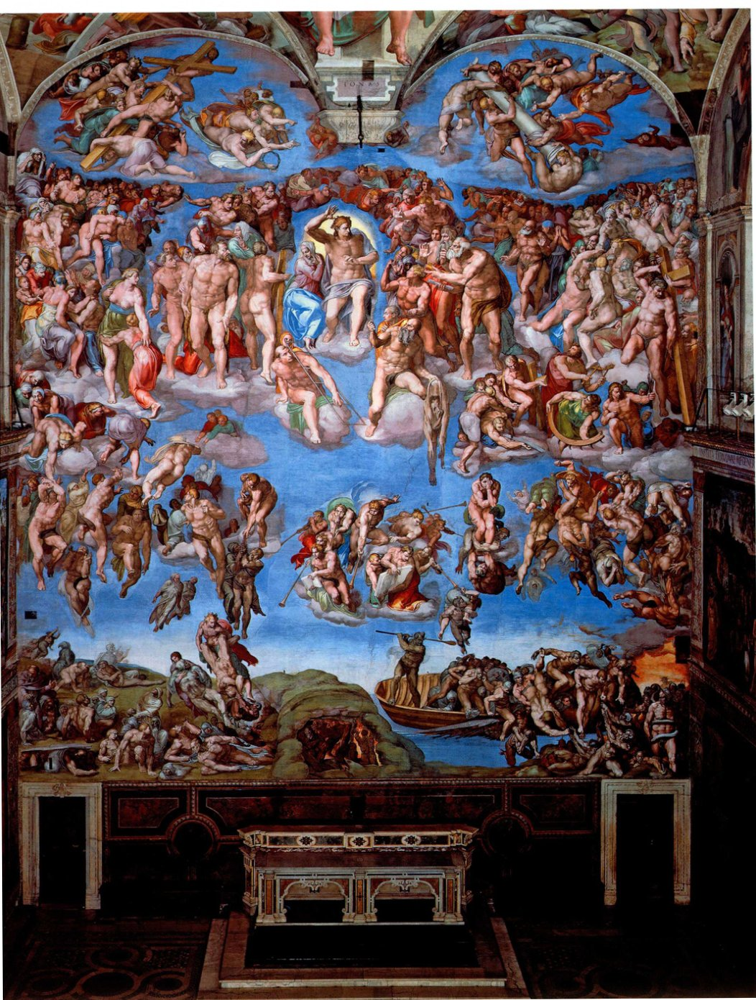

*图17.12 米开朗基罗；《最后的审判》。1534-1541年。湿壁画。西斯廷礼拜堂*

> **原始文献：诗人米开朗基罗**
>
> 米开朗基罗惊人的创造力表现在许多艺术形式之中，包括雕塑、绘画、建筑与诗歌。他的诗歌富于典故和意象，并不解释他所创作的视觉艺术品，但有时表现的是相同的主题。下面这首诗所采用的隐喻也出现在西斯廷礼拜堂的《最后的审判》中。这是赠给他的友人罗马贵族托马索·卡瓦列里（Tommaso Cavalieri）的诗歌，据说也是他的情人。
>
> *凤凰在柴堆里寻找再生；*
> *我也正是如此，离开人的躯体*
> *渴望辉煌纯净的新生*
> *带着死亡与时间永远也不能使之疲乏的灵魂*
> *这具有转变力量的火带来了好运*
> *燃尽了我的生命，将我变旧为新*
> *铁匠在火焰中煅铸钢铁*
> *以寻找与他头脑中的美相称的形式；*
> *只要有火，就可以帮助艺术家找到*
> *提高普通金属的方式*
> *点它成金；*
> *尽管我也会列入亡灵的名单。*
> *火焰确实展翅飞向天堂*
> *而我要让它带着我*
> *飞到那有爱驻留的天空。*
>
> SOURCE: MICHELANGELO BUONAROTTI, LIFE LETTERS AND POETRY, ED. AND TR. G BULL. (OXFORD: OXFORD UNIVERSITY PRESS, 1987, P.142.)

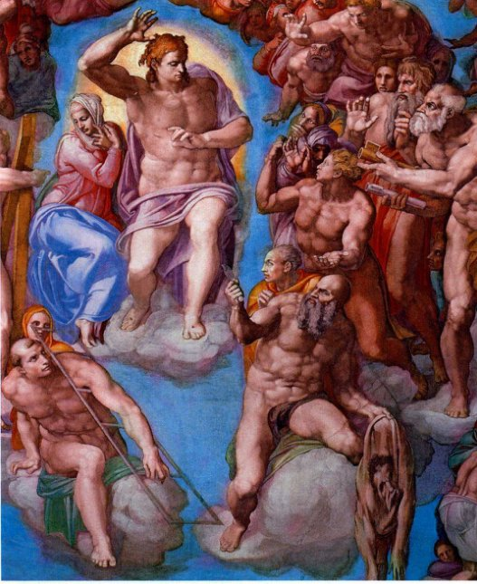

*图17.13 米开朗基罗：《最后的审判》局部，其中有艺术家的自画像*

为了在西斯廷礼拜堂祭坛之上的壁面中表现最后审判（《马太福音》24：29-31）的主题，米开朗基罗不得不覆盖西克斯特斯四世在15世纪时定制的湿壁画，而且还覆盖了他自己所绘的天顶画的一部分，即上层半月壁中的画面。此类题材的传统表现形式将地狱构想为让人饱受折磨的地方，其中包括乔托在帕多瓦竞技场礼拜堂所绘的作品（见图13.19）。在构思自己的湿壁画时，米开朗基罗一定或多或少地留意过卢卡·西尼奥雷利为奥维托大教堂所创作的作品（见图15.60），其中肌肉强健的裸体处于剧烈的运动之中。米开朗基罗用精神的痛苦取代了肉体的折磨，骚动气氛中极端扭曲的人体表达了这一点。一位天使模样的号手宣告了时间的终结，基督位于运动之轮的支点上：当他举起手臂，画面下方左部的死者从大地上升起，向往着圣徒云集的天堂。被判有罪者从天堂向卡戎（Charon）坠落，他会将这些人摆渡到下界。在整幅画面中，人物或弯曲，或扭转，或攀爬，或坠落，或凝望着基督，他们的形体几乎具有超人的力量。裸体人像表现出米开朗基罗认为人体圣洁的信仰，这点让同代人感到不安。1564年米开朗基罗去世后不久，他的一位助手就受托增绘了小片衣物，来遮挡那些裸露的身体。这幅湿壁画在1994年做过清洗，显露出原本鲜丽的色彩、紧凑的空间与戏剧性的构图。这些特色将该作品与风格主义联系在一起，虽然米开朗基罗拒绝接受此类标签。

这幅湿壁画表达了米开朗基罗本人对世界末日的想象，其中一个细节体现了这一点。就在基督下方，使徒巴多罗买跨骑在云朵上，他手中拿着一张人皮，代表他殉道时所遭受的剥皮酷刑（图17.13）。人皮上的面孔并不是圣徒本人，而是米开朗基罗自己。这幅恐怖的自画像隐藏得很深，直到近代才被辨识出来。在艺术家笔下，他的肉体不值得复活，这正是画面的关键主题。米开朗基罗60多岁的时候就经常在他当时创作的诗歌与艺术品中思考死亡与救赎。他在1532年前后创作的诗歌表达了类似的观点与隐喻（见第598页的原始文献）。

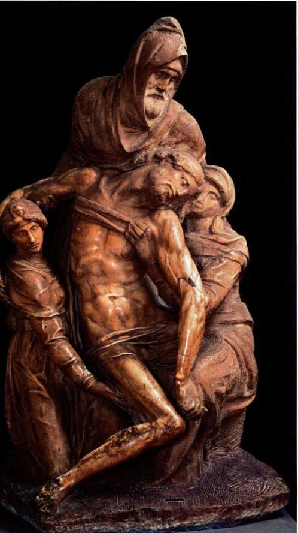

*图17.14 米开朗基罗：《圣母哀子像》。约1546年。大理石，高2.34米。佛罗伦萨大教堂艺术品博物馆（Museo del Opera del Duomo）*

米开朗基罗所关注的问题也表现在他于1546年前后开始创作的《圣母哀子像》（Pietà，图17.14）中。他在这件作品中也使用了自己的肖像，头戴兜帽、抱住基督残缺身体的尼哥底母正是他本人。米开朗基罗计划将这组群雕放置在自己的坟墓上。通过把自己表现为守护基督尸体的门徒，米开朗基罗用形式造就了个人直接接近上帝的观念。在天主教改革期间，随着新教在全欧洲的传播，罗马教会的权威也逐渐得到恢复，天主教会一定认为这样的观念过于激进。不论出于何种原因，米开朗基罗在1555年打碎了这尊雕像，一直也没有完成创作。与他在1499年创作的《圣母哀子像》（见图16.12）相比，这件作品的表现力胜于优美感，似乎他年轻时代的理想被精神追求所具有的更大严肃性所取代。米开朗基罗晚年的很多作品都没有完成，其中包括尤利乌斯二世墓，当时他的创作转向了建筑。

**重造圣顶广场** 米开朗基罗在罗马度过了他人生的最后三十年，这期间他主要的创作领域是建筑，其中包括若干公共建筑项目。1537至1539年间，米开朗基罗获得了艺术生涯中最艰巨的委托项目：重造圣顶广场（Campidoglio），即罗马加比多里山山顶，将其改建为一片广场，周围要建设与这个地方重要地位相称的大型建筑，因为这里曾经一度成为古罗马中心的象征。这是规划大型项目的绝好机会。教皇保罗三世与罗马城市权威人士（监督官）一起合作重建工程，并指派米开朗基罗为设计师。尽管直到米开朗基罗去世后很久该项目都未能完工，但是施工基本上都按照他的设计进行。圣顶广场成为有史以来最为壮观的城市中心，成为无数城市效仿的榜样。教皇保罗三世将《马可·奥勒利乌斯骑马像》（见图7.21）从拉特兰宫转移到圣顶广场，并将之安放在米开朗基罗所设计的基座上。这尊雕像位于一座起势缓和的椭圆形小丘顶，小丘同时也使这一空间轮廓分明，于是雕像成为整体布局的聚焦点（出于保护目的，雕像最近被移入室内）。人们认为它所表现的人物是君士坦丁，第一位拥护基督教的罗马皇帝，也是支持教廷获得世俗权力的创始人。将这样一尊雕像放在世俗政府所在地的中心，教皇就强烈地宣扬了教廷在世俗事务中的权威。

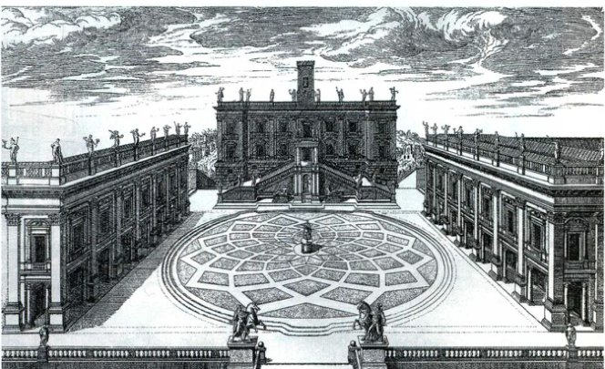

*图17.15 米开朗基罗：圣顶广场，雕版画为艾蒂安·杜佩拉克（Étienne Dupérac）所作。1569年*

广场的三边都建有宫殿。一幅基于米开朗基罗的设计所作的雕版画（图17.15），并没有完整地传达宫殿立面所造就的空间效果。这幅版画展示出布局上的对称性，以及沿中心轴线向元老院（Senator's Palace）推进的渐进感，与之相对的台阶通向广场。然而，广场的形状并不是长方形而是梯形，这是当地地形形成的一个特殊状况。元老院与右侧的卫宫（Conservator's Palace）都是年代久远的建筑，必须在新外观的内里部分保留，但是它们的角度为80度而不是直角。米开朗基罗将这一难题转变成了一个优势，在左侧增建了“新宫”，在风格与布局上补充了卫宫。米开朗基罗让元老院看起来比实际规模要大，这样建筑就在这个广场中占据了首要地位。

圣顶广场的整体构思具有舞台效果。三座建筑虽然很长但相对较窄，仿佛展出的前台，而背后几乎空无一物。然而它们并不是进深浅短的屏风，而是立体的建筑（图17.16）。“新宫”和与之相配的卫宫融合了空旷感与坚固感、水平性与垂直性，其整体塑造在古罗马以来任何一座建筑中从来没有过。两座宫殿里开敞的门廊进一步将广场与宫殿的立面联系在一起，与庭院与回廊连拱间的联结方式相同。

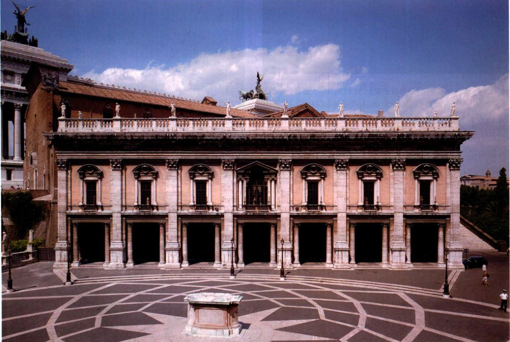

*图17.16 米开朗基罗：罗马圣顶广场的卫宫。设计于约1545年*

门廊的圆柱与过梁包含着巨柱式半露方柱，后者支撑着顶部建有栏杆的沉重檐口。阿尔贝蒂曾在曼图亚的圣安德烈亚教堂尝试过巨柱式（见图15.49），但是米开朗基罗充分发掘了这种设计的意义。他在元老院也使用了巨柱式，并在高基座上建了栏杆，这就强调了建筑的厚重感。双斜坡楼梯通向顶部的同一个入口（见图17.15），似乎通过椭圆形小丘与周围环绕的建筑，将所有流动空间的力量聚集在一起，由此广场就成为引人注目的焦点。与圣顶广场的规模与力量相比，布鲁内莱斯基为佛罗伦萨孤儿收容院设计的立面中（见图15.6），托斯卡纳式圆柱纤细修长，拱门具有韵律感，形成广场的精致框架。米开朗基罗这一建造城市空间的强有力的规划对后来全欧洲的城市规划者而言都至关重要。

**圣彼得大教堂** 米开朗基罗再一次在圣彼得大教堂的外部运用了巨柱式（图17.17）。布拉曼特过世之后，这个建筑项目在若干位建筑师手中相继施工。1546年，负责项目的建筑师小安东尼奥·达·圣加罗（Antonio da Sangallo the Younger）去世，米开朗基罗接受了设计教堂的工作，并且几乎彻底改动了前任的设计。他将平面恢复为集中式布局，采用了卫宫的形式系统，将之曲线化来适应大教堂的结构，并且用窗户代替了开敞的凉廊，用阁楼（attic）代替了栏杆。

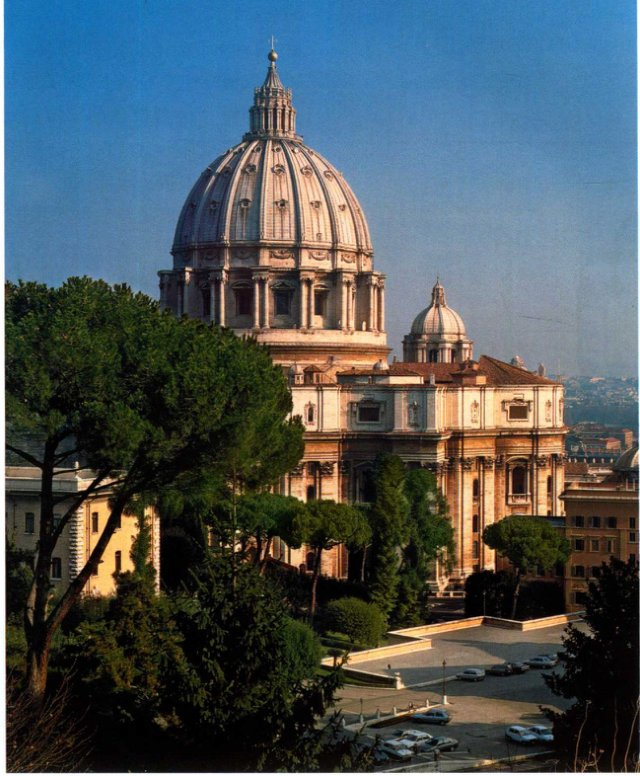

*图17.17 米开朗基罗：圣彼得大教堂西面观。1546-1564年，穹顶由贾科莫·德拉·波尔塔完成于1590年*

与布拉曼特设计中各部分逐级上升的情况不同（见图16.11），米开朗基罗运用了巨柱式半露方柱来强调建筑主体与结构的紧凑性，由此将穹顶衬托得更为宏伟壮观。同样，为了产生紧凑感和有机统一体，他简化了内部空间（图17.18），将布拉曼特设计的复杂空间序列（见图16.10）转变为十字形与正方形，支撑中央穹顶的巨大墩柱约束着几何形的空间。米开朗基罗修改了东端的半圆室，并为它增加了一个门廊，从而进一步确定了建筑的中轴线。然而其东部的设计一直未能实施。无论如何，大教堂的穹顶在各个重要方面都反映了米开朗基罗的构想，虽然艺术家去世之后穹顶才得以完工，而且比原始设计更为高耸。

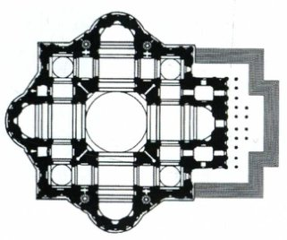

*图17.18 米开朗基罗：圣彼得大教堂平面图*

布拉曼特设计的穹顶是一座建在狭窄鼓形壁上的阶梯式半球体，这种样式会让教堂看起来似乎受到了压迫。米开朗基罗的设计则与此形成了鲜明的对比，具有强大的牵引力，将力量从建筑主体中向上牵引。他不仅借鉴了佛罗伦萨大教堂穹顶的双层建筑结构，而且采用了它的哥特式外形（见图15.2，另见第508页的材料与技法），然而两者的效果却有很大差异。布鲁内莱斯基穹顶的光滑表面丝毫没有显示出内部的作用力。而米开朗基罗则赋予各种作用力雕塑化的外形，在视觉上将它们与建筑其余部分联系在一起。高处鼓形壁的双圆柱延续着巨柱式半露方柱的纵向推力，将它传递到拱肋，沿穹顶曲面向上延伸，最终聚集在高耸的灯笼式天窗中。这一设计的逻辑性如此顺理成章，以至于几乎所有建于1600至1900年间的穹顶都受其影响。

> **大事年表**
>
> *   1527年 - 哈布斯堡王朝的军队洗劫罗马
> *   1534年 - 米开朗基罗开始创作《最后的审判》
> *   1540年 - 罗耀拉的圣依纳爵成立耶稣会
> *   1541年 - 约翰·加尔文在日内瓦创立归正宗
> *   1545年 - 特兰特宗教会议召开，天主教改革开始

### 天主教改革与耶稣堂

米开朗基罗为圣彼得大教堂设计的集中式布局，对于改革后的天主教会而言仍是一个问题，因为教会在1564年特兰特宗教会议商议结束时重新确立了它的仪轨。这次宗教会议所提议的礼拜仪式最适合在公堂式建筑中进行。教会法令规定，在弥撒中信徒们应该看到圣体被高高举起，而只有在纵伸的公堂式厅堂内，信徒才能不受阻挡地看到祭坛。16世纪中期成立的一批改革教派中，最具野心也最积极的教派是耶稣会（Jesuit Order），它由罗耀拉的圣依纳爵（Ignatius of Loyola）创立，并得到了保罗三世的支持。1540年，耶稣会得到教会的批准；到1550年，该教派在罗马的教堂耶稣堂（Il Gesù）正处于设计过程之中。米开朗基罗答应为这个项目设计一个方案，但是显然未能完成。这座教堂最终采用的设计方案是米开朗基罗的一位名叫贾科莫·维尼奥拉（Giacomo Vignola，1507-1573年）的助手在1568年设计的。教堂立面由贾科莫·德拉·波尔塔（Giacomo della Porta，约1540-1602年）设计，直到1584年才得以完工。作为耶稣会的母堂，耶稣堂的设计方案一定受到了严格的监督，确保它符合该教派的目标。耶稣会士既是知识分子、神秘主义者，还是传教士，他们的任务就是在欧洲抵制异教，并将基督教传播到亚洲与美洲。他们要求教堂建筑坚持特兰特宗教会议的训令，宏大庄严，给人留下深刻印象，同时避免任何过分的装饰。

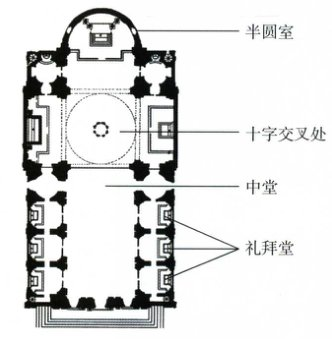

*图17.19 贾科莫·维尼奥拉：罗马耶稣堂平面图。1568年*

耶稣堂可以被看作天主教改革精神的建筑化身。耶稣堂是一座简洁紧凑的公堂式建筑，巨大的中堂统领着建筑空间（图17.19）。侧堂为若干礼拜堂所取代，因此会众就集中在一个宏大的厅堂式空间里，直面祭坛。会众的注意力被急剧导向祭坛与讲道坛，这两处是内部仪式展示的代表（图17.20）。图中描绘了从街道望入教堂的场景，似乎正立面的中央部分被去除了。中堂拱顶的装饰是后来添加的，详情请见图19.12。这幅绘画还表现了平面图无法展示的特色：得益于穹顶鼓形壁上的大窗户，教堂东端光线充足，而中堂则昏暗少光，二者形成了强烈的对比。光线的表现潜能被有意识地发掘出来，使耶稣堂获得了之前任何教堂都不具备的强烈情感焦点，这是一种新颖的设计，最具戏剧性。

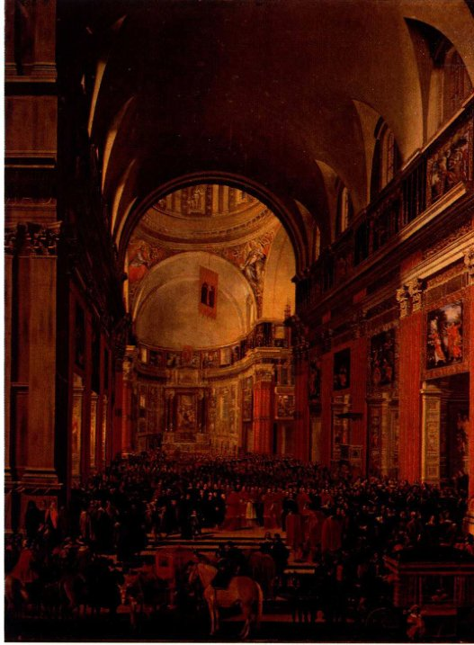

*图17.20 安德烈·萨奇（Andrea Sacchi）与让·米耶尔（Jan Miel）：《乌尔班八世参观耶稣堂》（Urban VIII Visiting Il Gesù）。1639-1641年。布面油画。罗马国立古代艺术美术馆（Galleria Nazionale d'Arte Antica）*

贾科莫·德拉·波尔塔所设计的正立面与平面布局一样大胆（图17.21）。立面被显著突出的檐部分为两层，支撑檐部的成对半露方柱显然受到米开朗基罗的影响，德拉·波尔塔曾与他一起工作。同样的模式也出现在上层结构之中，只是规模较小，起支撑作用的半露方柱只有四对而不是六对。为了衔接宽度上的差异并隐藏屋顶边缘线，德拉·波尔塔嵌入了两堵涡卷形扶壁。这种解决办法出自阿尔贝蒂所设计的佛罗伦萨新圣母教堂（见图15.31），形成了向大型山墙顶部结构过渡的优雅样式，并保持了文艺复兴建筑的经典比例：建筑的高度与宽度相同。

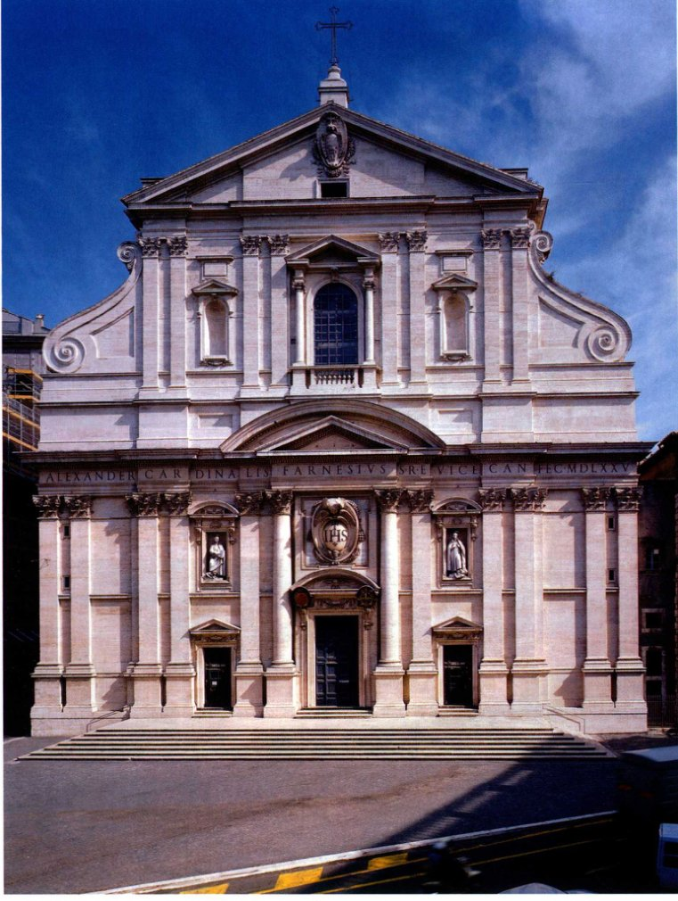

*图17.21 贾科莫·德拉·波尔塔：罗马耶稣堂正立面。约1575-1584年*

德拉·波尔塔巧妙地将立面各个部分整合为一体。每一层都具有相同的纵向节奏，即使是水平元素也服从这一节奏，檐部沿口不连贯的设计对应半露方柱的布局。而水平方向的区隔决定着纵向结构的尺寸，所以此处并没有采用巨柱式。米开朗基罗启发了建筑师运用雕塑手法处理立面，这种手法更为强调主大门。主大门采用了双层门框，两座山墙分别由成对的半露方柱与圆柱支撑，它突出于立面的其他元素，使观看者的目光聚焦于整体设计。自哥特式时期以来，没有哪一座教堂的入口具有如此生动浓缩的特色。这座立面与在其中增添运动感和造型因素的自由性，成为耶稣会教堂的重要先例，并影响了之后几个世纪的教堂建筑。

## 贡扎加家族统治的曼图亚

意大利北部分为众多公国，它们的规模都小于托斯卡纳大公国与教皇国。曼图亚是其中最为稳定的公国，这里的贡扎加家族将侯爵头衔一直保留到16世纪。曼图亚在15世纪时有一些重要的艺术家，其中包括阿尔贝蒂和曼泰尼亚。贡扎加家族赞助艺术的传统不仅传承给了男性成员，也为女性家族成员所继承。弗朗切斯科二世·贡扎加（Francesco II Gonzaga）的妻子伊莎贝拉·德·埃斯特（Isabella d'Este）就是16世纪早期最为活跃的赞助人之一。她的儿子费德里戈在1519年成为侯爵，他一直享有这个爵衔，直到1530年查理五世赐封他为公爵。伴随头衔争夺的常是通过艺术来炫耀财富与品位的活动。

### T型宫

作为头衔争夺战的组成部分，费德里戈二世·贡扎加委托朱利奥·罗马诺（Giulio Romano，约1499-1546年）为他设计一座城外别墅，称为T型宫（Palazzo del Te），用来安置外室和接驾。朱利奥曾是拉斐尔在罗马时的主要助手，但在1524年追随曼泰尼亚和阿尔贝蒂来到了曼图亚。

他所设计的T型宫是一座低矮的建筑，适合当地平坦的地形。朱利奥在面向庭院的建筑立面里（图17.22）运用了别墅与宫殿赞助人们所熟识的形式语汇，例如粗面石方、平滑的托斯卡纳式附壁圆柱以及它们所支撑的突出檐部。朱利奥采用了米开朗基罗设计洛伦佐图书馆的手法，颠覆了传统的古典建筑惯例。空白盲窗处的拱心石似乎随时会冲破上方的三角形过梁。唯一真正意义上的拱横跨在主入口上方，但是却架设在三角楣之下，这就违背了古典规则。每对圆柱之间中央位置的三陇板“滑”向下方，完全不管所有的逻辑性，因此让人感到整条檐壁似乎就要在眼前崩塌。朱利奥打破了既有规则，似乎是在宣称，这些陈规不适用于自己，也不适用于他的主人。

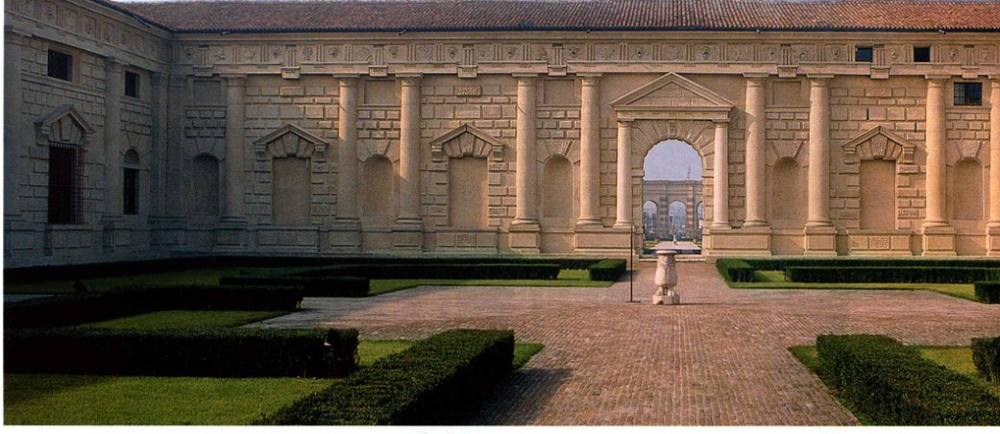

*图17.22 朱利奥·罗马诺：曼图亚T型宫的庭院。约1527-1534年*

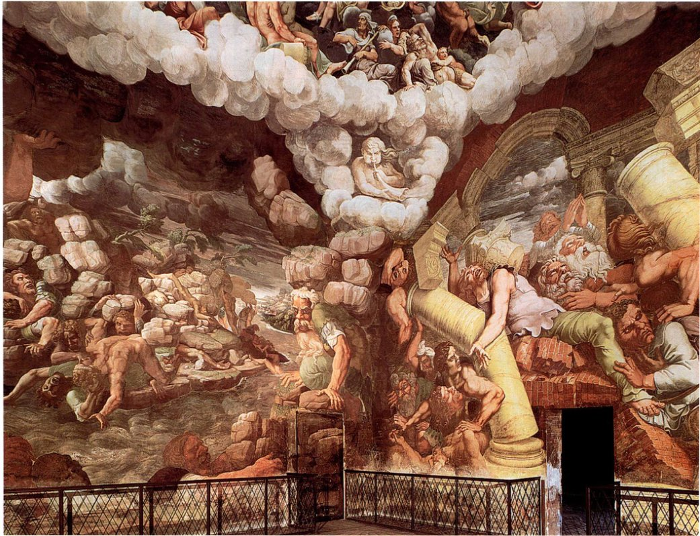

*图17.23 朱利奥·罗马诺：《巨人从奥林匹斯山坠落》（Fall of the Giants from Mount Olympus），出自巨人厅。约1530-1532年。曼图亚T型宫*

在T型宫外部仅仅存在可能性的设计元素在其内部设计中得到延续，朱利奥运用视幻手法在一系列房间内绘制了古典题材的湿壁画。与拉斐尔在罗马的作品不同，这些绘画并不表现遥远美好的黄金时代，而是大胆生动地表达了权力。在T型宫的巨人厅（Sala dei Giganti，图17.23）里，朱利奥把众神将巨人族驱逐出奥林匹斯山的场景描绘成一场大灾难，到处都是坠落的人体与倒塌的圆柱。在观赏者看来，似乎整座神庙都在坍塌崩溃。出现在墙壁上方角落处的风神将建筑部件吹落，巨人族的庞大身躯就要被落下的这些部件压扁。观者仿佛见证着奥林匹斯山新神的力量，身临其境般地感受到这一事件中的恐惧。当然，公爵本人在绘画构思中被设想为宙斯（朱庇特），所以整幅画面表明了费德里戈公爵的权力。

同样的构想也出现在几乎同一时期的曼图亚公爵府绘画之中，这些作品的创作者是安东尼奥·阿雷格里·达·柯勒乔（Antonio Allegri da Correggio，1489/94-1534年），人称柯勒乔。这位意大利北部的天才画家生命短暂，他在帕尔马（Parma）度过了大部分时光，吸收了达芬奇、米开朗基罗、拉斐尔以及威尼斯艺术家的影响，发展出一种独特且突出感性的风格。费德里戈公爵定制了一系列有关朱庇特爱情故事的作品，《朱庇特与伊俄》（Jupiter and Io，图17.24）是其中的一幅。根据奥维德的叙述，朱庇特无数次变身来引诱情人。画面中的宁芙伊俄昏厥在化为云朵的朱庇特怀中。渐次渲染法结合了威尼斯式的色彩感与质感，创造出比提香的《酒神祭》（见图16.32）更直白的淫欲。柯勒乔表现朱庇特烟雾般外貌的手法具有极其卓越的视幻效果。图像的情色表达反映了众多欧洲宫廷所共有的艺术品位，这在布龙齐诺的《维纳斯的寓言》（见图17.8）与提香的《达娜厄》（见图17.31）中都可以看到。

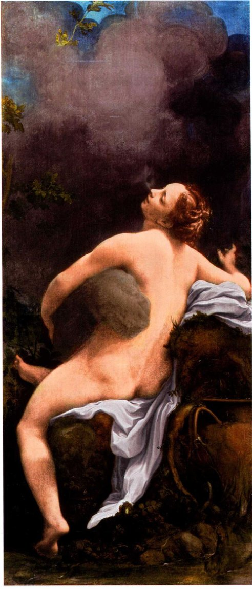

*图17.24 柯勒乔：《朱庇特与伊俄》。约1532年。布面油画，163.8 × 70.5厘米。维也纳艺术史博物馆*

## 帕尔马与波洛尼亚

意大利较大的政治实体意图吞并较小的国家。中北部的帕尔马与波洛尼亚两城在16世纪之初就附属于教皇国。罗马、佛罗伦萨及米兰各个宫廷所建立的艺术与赞助形式在这里被市民模仿。

### 柯勒乔与帕尔米贾尼诺在帕尔马

柯勒乔的大部分艺术生涯都在帕尔马度过，当时帕尔马刚成为教皇国成员。这种新的附属关系给这个城市带来了新的财富，并激励了当地的艺术与建筑赞助人，柯勒乔不止一次成为他们所礼聘的艺术家。他将自己的才智集中于帕尔马大教堂穹顶的项目上，在1522至1530年间绘制了湿壁画《圣母升天》（The Assumption of the Virgin，图17.25）。在柯勒乔的视幻透视法作用下，穹顶的表面消失了。当天空开敞迎接升入一片光明之中的圣母遗体时，站在下面的观者就被引入了天堂。

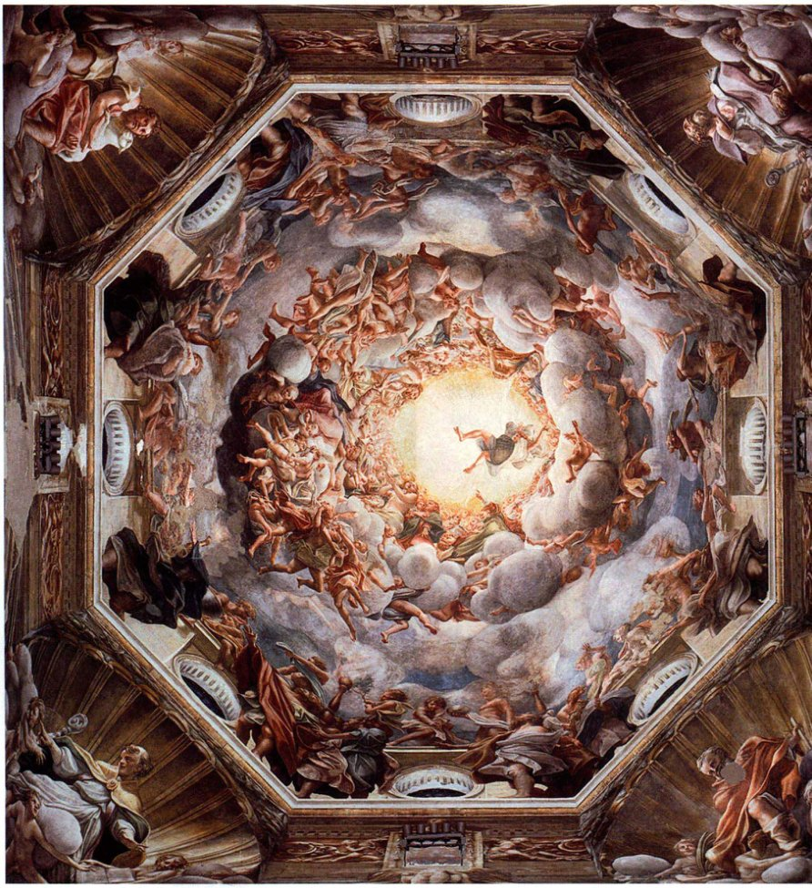

*图17.25 柯勒乔：《圣母升天》。约1522-1530年。湿壁画，穹顶底部直径为10.93 × 11.56米。意大利帕尔马市大教堂穹顶内*

柯勒乔在这里首创了一种新型的幻象表现方式，通过神奇的透视法与他本人的精湛技艺，将天堂与尘世在视觉与精神上结合在一起。自从曼泰尼亚在曼图亚绘制《绘画之屋》（见图15.53）以来，还没有任何一个天顶能够如此完全地被绘制的幻像所取代。这种概念将在17世纪其他艺术家的作品中产生反响，正如彼得罗·达·科尔托纳（见图19.11）与高利（见图19.12）的作品所显示的那样，天顶将通过视幻设计而消失。柯勒乔也赋予人物欣喜自若的活动能力，似乎重力对他们而言不复存在，而他们则毫无掩饰地沉浸在轻盈失重的喜悦中。人物的塑造折射出提香的影响，他们健康活跃、有血有肉，使得圣母升天这一事件显得更具神迹性。

帕尔马是另一位天才画家的诞生地，他就是吉罗拉莫·弗朗切斯科·马利亚·马佐拉（Girolamo Francesco Maria Mazzola，1503-1540年），人称帕尔米贾尼诺（Parmigianino）。这是一位早熟且聪颖的画家，1530年返回帕尔马之前，他已经在罗马、佛罗伦萨等其他地方小有名气。作为示范作品的《自画像》（Self Portrait，图17.26）表现出他的自信。艺术家外表温和，修饰得体。对面貌特征的描绘具有拉斐尔的流畅完美，笼罩在一层达芬奇式（Leonardoesque）渐次渲染的朦胧中。画面中记录了帕尔米贾尼诺在凸面镜中所看到的自己的影像，包括凸镜折射之后手的变形。这幅绘画堪比镜中之像，画家还使用了特制的曲面画板作画。作品展示了帕尔米贾尼诺记录眼睛所见之物的技巧，与此同时，通过巧妙影射那喀索斯（Narcissus）的神话，这幅作品还表现出他的学识。根据希腊神话中的描述，那喀索斯望向池水，爱上了自己的倒影。

*图17.26 帕尔米贾尼诺：《自画像》。1524年。木板油画，直径24.4厘米。维也纳艺术史博物馆*

> **大事年表**
>
> *   1522年 - 鼠疫再次侵袭意大利
> *   1530年 - 查理五世在波洛尼亚加冕为神圣罗马皇帝
> *   1532年 - 科勒乔创作《朱庇特与伊俄》
> *   1535年 - 帕尔米贾尼诺创作《长颈圣母》
> *   1543年 - 维萨里出版第一本人体解剖著作
> *   1543年 - 哥白尼出版《天体运行论》

帕尔米贾尼诺的高超技艺在他最著名的作品《长颈圣母》（The Madonna with the Long Neck，图17.27）中显露无遗，这是帕尔马的一位贵妇在1535年为仆从圣母教堂（Santa Maria dei Servi）中的家族礼拜堂定制的绘画。尽管帕尔米贾尼诺对拉斐尔和柯勒乔有很深的研究，却具有不同的审美理想，画面左侧人物抱着的双耳陶瓶表达了他的理念。在这幅作品里，圣母具有完美的椭圆的头型与天鹅般的脖子，隆起的身体逐渐向下收缩至脚部，模仿着双耳陶瓶的外形。拉斐尔的《园丁圣母》（见图16.22）则与之形成鲜明对比，似乎是圆形和方块构成了人体，圣母容貌特征中甜美胜于高傲。帕尔米贾尼诺也没有打算模仿拉斐尔稳定的构图。他作品中沉睡的幼年圣子躺在圣母膝头，并不稳定，圣母则将那柔若无骨的手放在胸前。构图与人物姿势一样缺少平衡感，画面左部沉重而右部则开阔遥远。所有人物的肢体都被拉长，而且如象牙一般光滑，空间得到了压缩。这些经过风格主义方式处理的元素，将人们的注意力吸引到艺术家的技巧上，以及他对拉斐尔理想范例的颠覆。

帕尔米贾尼诺的选择可能反映了画作的意义。圣母膝头身材偏大的圣子令人回想起圣母哀子的主题，表明耶稣已经对自己的命运了然于心。画面的背景也不像它所表现得那样随心所欲。巨型圆柱通常与圣母联系在一起，象征着通向天堂与永恒生命的大门以及无玷受孕。它同时还可能指涉耶稣在受难过程中遭到鞭笞时被绑缚的圆柱，柱下那个缩小的先知在其卷轴上预言了这一切。《长颈圣母》表现的是非世俗的完美，具有冷静而动人的优雅。

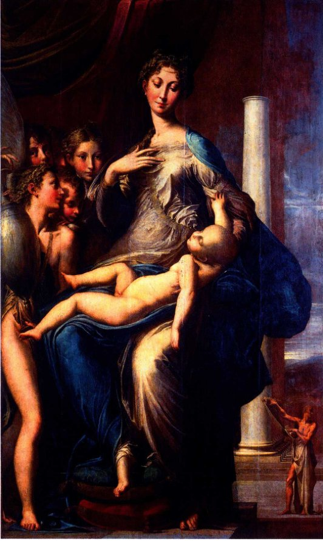

*图17.27 帕尔米贾尼诺：《长颈圣母》。约1535年。木板油画，2.16 × 1.32米。佛罗伦萨乌菲齐美术馆*

### 拉维尼娅·丰塔纳在波洛尼亚

帕尔米贾尼诺曾在波洛尼亚停留过一段时间，这是佛罗伦萨以北的一个重要城市。波洛尼亚长期以来就是教皇国的成员，当时并不是由君主来统治，而且受到来自罗马与当地贵族组成的元老院的联合控制。古老大学的存在也塑造了城市的文化特色。虽然波洛尼亚的绘画并不像佛罗伦萨和威尼斯的绘画那样博得众人喝彩，但16世纪期间这里却诞生了几位女性艺术家。其中最重要的女性艺术家之一是拉维尼娅·丰塔纳（Lavinia Fontana，1552-1614年），她在有生之年就获得了极高的声誉，只是后来鲜有人知。

丰塔纳是画家普罗斯佩洛·丰塔纳（Prospero Fontana）的女儿，她的父亲是一位杰出画家，多次担任画家行会的首领。幼年的成长环境让拉维尼娅学习到了在学院中日益受到新教育方式排挤的艺术形式。追随父亲学画，以及在波洛尼亚对拉斐尔、柯勒乔和帕尔米贾尼诺作品的研究使她形成了自己的风格。她有一个赞助人圈子，其中很多人都是波洛尼亚的贵妇。拉维尼娅为她们绘制肖像画和宗教题材的作品。

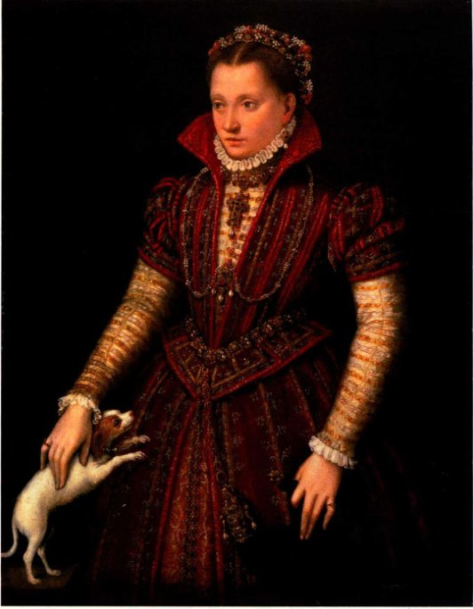

*图17.28 拉维尼娅·丰塔纳：《贵妇》。约1580年。布面油画，115 × 89.5厘米。华盛顿特区国家女性艺术博物馆（National Museum of Women in the Arts），Wallace and Wilhelmina Holladay捐赠*

创作于16世纪80年代的《贵妇》（Portrait of a Noblewoman，图17.28）是她作品的一个很好例证。年轻的女子身着婚礼时所穿的华丽服饰，映衬在深暗背景之中。光线从画面左方流淌而下，区分出各个形体。拉维尼娅精心描绘了衣着、珠宝与头饰的细节。这位年轻女子面对她即将到来的婚礼时宛若一尊端庄的装饰人像，她的目光避开了观者的视线，似乎在表现自己的端庄。女子的一只手抚摸着小狗，可能是她的宠物，又或许是忠贞的象征。她的另一只手拿着一块用珠宝首饰挂在腰间的皮毛，这是另一个象征，在那个时代象征子孙繁衍。拉维尼娅精于绘制这种讨人欢心的华丽图像，使得她成为当时最受青睐的艺术家之一。

## 威尼斯：祥和的共和国

尽管威尼斯在16世纪之初遭到了侵袭，但到1529年时已经收复了大部分领土与财富。在这个世纪，贵族政府重新确立了政治与文化权力，为艺术家和赞助人创造了独特的环境。威尼斯没有宫廷，保持了名义上的共和政体，由洛雷当（Loredan）、文德拉明、巴尔巴洛（Barbaro）等古老家族控制。除宗教艺术品之外，这些家族还为他们的城市住宅与乡村别墅定制艺术品，因此艺术家的创作题材相当广泛。威尼斯城通过公共艺术项目来表达它的地位，这些项目的赞助人是历任市长，意在美化“最祥和的共和国”（Serenissima）。其中之一就是16世纪30年代进行的市中心改造项目，兴建了两座建筑，使得圣马可教堂与圣马可运河之间形成了一个小广场。

### 桑索维诺在威尼斯

为了设计这些建筑，统治威尼斯的十人议会（Council of Ten）在1535年发起了一场竞赛，题目是设计新的国家造币厂（图17.29左部）。他们选择了佛罗伦萨雕塑家雅各布·桑索维诺（Jacopo Sansovino，1486-1570年）的设计，这位艺术家在1527年罗马之劫后离开那里，来到了威尼斯，并成为威尼斯最重要的建筑师。他的建筑具有雕塑特色并不令人吃惊。桑索维诺延续了近旁黄金之屋（见图15.54）与总督府（见图13.34）等早期威尼斯建筑的理念，在造币厂的立面中设计了众多拱门开口与巨大的窗户。然而起支撑作用的拱门和圆柱更强调贯穿整体的乡村特色，增强了建筑的宏大效果。这一建筑在1560年前后增建了顶层部分。

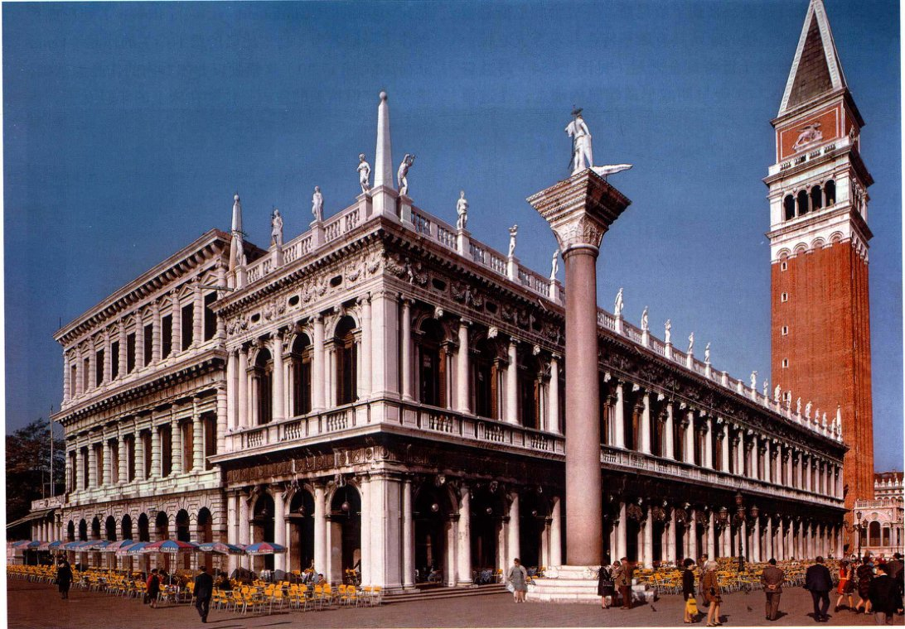

*图17.29 雅各布·桑索维诺：威尼斯圣马可造币厂（图左）与图书馆。始建于1535/37年*

之后，圣马可教堂的管理人雇用桑索维诺修建圣马可图书馆（图17.29右部），这是一座公共图书馆，收藏了丰富的希腊文与拉丁文书稿。图书馆毗邻造币厂，它的建筑语汇更为优雅。这是一座狭长的两层建筑，一系列拱门支撑着沉重的檐口。建筑底层的拱门两侧分布着罗马多立克式立柱，这种灵感来自斗兽场；上层则采用了手法精美的爱奥尼亚式立柱（每组包括三根附壁圆柱），它们支撑着花环装饰的檐部。建筑顶端为栏杆所环绕，每个立柱都对应着栏杆上一尊真实尺寸的雕像，四角则树立着方尖碑。造币厂与图书馆的奢华装饰令人感受到共和国的富足，宣示着威尼斯就是新罗马。

### 提香

提香在16世纪的威尼斯画坛占据了主导地位。他同米开朗基罗一样长寿，并且有众多学生，能够传播他的观念与技法。他的声望极高，以至于16世纪30年代最顶尖的一批欧洲赞助人都渴望获得他的作品。例如在1538年，乌尔比诺公爵圭多巴尔多二世·德拉·罗维里（Guidobaldo II della Rovere）委托提香创作了一幅名为《乌尔比诺的维纳斯》的作品（Venus of Urbino，图17.30）。这幅画以乔尔乔内的作品为基础，描绘了陈设精美的室内一位躺在床上的年轻女子。背景中的两位妇女在大箱中寻找着什么，可能是一件长袍。画面中诸如大箱与小狗等细节让有些学者认为，这可能是一幅庆祝结婚的作品。然而画作的所有者只是称之为“裸女”。提香的色彩记录了女性身体丰腴的质感，而身体迎向观看者，目光与观众的视线对望。这件作品可能只是表达色情，而不是古典题材。

> **材料与技法：布面油画**
>
> 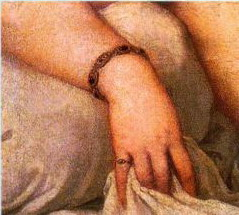
>
> *提香的《达娜厄》局部*
>
> 在中世纪与文艺复兴的大部分时期里，画家直接在墙上或者坚固的木制平面上作画。木画板由几板块粘合而成，有时能够看到木板间的接缝。虽然保存时间持久，但是木材沉重且容易变形。15世纪时，有些意大利和北欧的艺术家开始在织物表面作画，通常采用帆布或亚麻布，作为木板的廉价替代品。而且，布面更轻，便于携带。自佛兰德斯的布面画作称为“画布”（panni dipinti），曾大量出口到意大利。
>
> 在威尼斯的潮湿环境里，湿壁画和木板绘画都不容易保存，因此艺术家们更喜欢在布面上作画，创作大型作品时尤为如此。16世纪中叶，画布开始取代木材而成为首选。到1600年为止，布面油画是绝大多数艺术家与赞助人所喜爱的材料，人们不再定制湿壁画。一旦帆布被紧绷在木画框中，它会被涂上一层胶质材料，以填补纤维间的缝隙。然后再涂几层底料，干燥之后就可以用来作画。
>
> 创作大幅作品也启发威尼斯画家对油画颜料进行实验。艺术家不再将轻薄的油画颜料逐层施涂于整个画面，而是用画笔蘸取更浓厚的颜料，大笔将颜料画在作品上。有时颜料厚重得像是蜡画，该技法称为厚涂法（impasto）。在这种情况下，绘画表面就不具有镜面般的平滑效果，而是粗糙且对光线的反射不均匀。
>
> 提香是这种技法的创新者之一。他的作品启发了巴洛克时期绘画艺术家，其中包括鲁本斯、伦勃朗和委拉斯凯兹。

无论画中的女子是不是维纳斯，这种偏重感官的女性裸体形象是提香画坊的主要产品，定件人是那些有权有势的男性。以奥维德的《变形记》（Metamorphoses）为基础，提香为西班牙的菲利普二世（Phillip II，查理五世之子）绘制了系列作品朱庇特之爱。他为奥塔维奥·法尔内塞（Ottavio Farnese）创作了《达娜厄》（Danaë，图17.31），并在罗马短暂停留期间亲自送给了这位定件人。画作中的朱庇特化身为金雨去引诱一位年轻女子，她被父亲关在塔中，和所有追求者隔离开来。通过变化颜料的饱和度，提香极其精准地捕捉到了达娜厄身体的感觉，将肌肤与床衾明显地区别开来。为了传达这些可感可触的特质，提香运用透明清薄的油画颜料层来建构作品，各层之间的相互作用在色彩上产生出无与伦比的丰富性和复杂性。颜料层如此之薄，几乎和消散于天空的云朵一样透明。

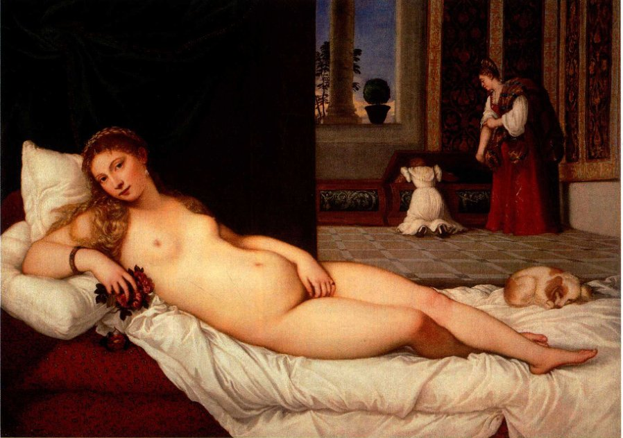

*图17.30 提香：《乌尔比诺的维纳斯》。约1538年。布面油画，119 × 166厘米。佛罗伦萨乌菲齐美术馆*

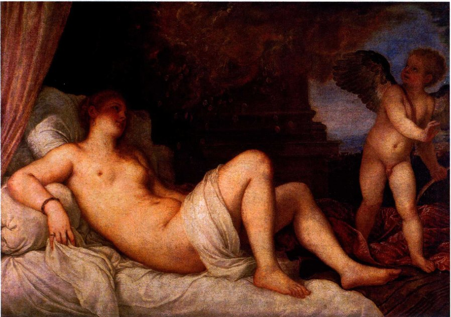

*图17.31 提香：《达娜厄》。约1544-1546年。布面油画，120 × 172厘米。那不勒斯卡波迪蒙特国家画廊博物馆*

提香的人物形象表现出米开朗基罗为朱利亚诺·德·美第奇墓创作的《夜》的影响，提香可能见过这件作品的版画复制品。据说米开朗基罗在提香的画室里看到这幅作品之后，赞扬了他的色彩，却批评了他的素描。米开朗基罗在雕刻人像之前要绘制大量细节性的素描，提香作品的素描初稿却没有流传下来。尽管提香是一位优秀的构图大家，但他显然直接在画布上作画，并在创作过程中进行调整，通过逐层色彩来建构形体。强调色彩而不是素描是威尼斯绘画的独特性之一，一直以来受到来自佛罗伦萨绘画学院及其后继者的批评。

### 提香的艺术遗产

提香试验了包括印刷在内的多种艺术形式，但他最为不朽的创新在于布面油画技法（见第610页的材料与技法）。提香的晚期作品展示出他最为自由的笔触，他曾试图为自己在弗拉里圣母荣光教堂的墓葬创作一幅《圣母哀子图》（图17.32），但在1576年去世时仍未完成，而是由他的一个学生完成。与米开朗基罗晚年的《圣母哀子像》（见图17.14）一样，提香描绘了躺在圣母怀抱中的基督，以及周围哀痛的友人与门徒。沉重粗犷的壁龛两侧分别站立着摩西和女先知像，令人联想到桑索维诺所设计的造币厂立面（见图17.29）。这幅巨型油画具有的力量不仅来自它的宏大规模与生动构图，虽然它们也是在这方面发挥作用的元素，还来自提香的高超技法。人物从全部由光线与色彩构成的晦暗背景中浮现出来。艺术家施涂了厚重的颜料，然而尽管运用了厚涂法，画面上却不具有物质实体的蛛丝马迹。抹大拉的玛利亚的姿态与圣母面部表情中的哀痛为这一场景增添了悲切之情。跪倒在地的人可能是圣杰罗姆，代表提香本人，满怀敬畏地伸手去触摸基督的身体。这种平静得近乎顺从的情绪被画面中天国的各种形式强化了。

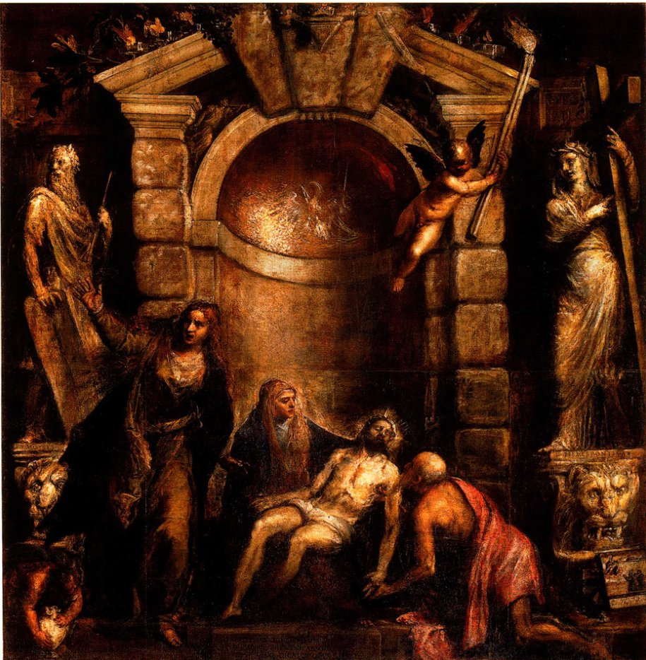

*图17.32 提香：《圣母哀子图》。约1576年。布面油画，3.51 × 3.89米。威尼斯学院美术馆*

提香创造性的作品与声望吸引了大批艺术家来到他的画坊工作，但是他对那些画坊之外的艺术家们也产生了巨大的影响。当时被威尼斯占领的克里特岛上，有一位名叫多梅尼科·塞奥托科普洛斯的画家，人称埃尔·格列柯，他在前往西班牙之前曾进入提香的画坊学习（见第十八章）。提香之后两位重要的威尼斯画家是韦罗内塞和丁托列托，他们的艺术发展方向各自不同。韦罗内塞所创作的图像以提香早期作品为基础，例如《圣母与佩萨罗一家》（见图16.33），他追求的是自然主义。而丁托列托则发掘了提香晚期作品中的戏剧性与流动笔触，例如《圣母哀子图》。

**保罗·韦罗内塞** 画家保罗·卡利亚里（Paolo Cagliari），人称保罗·韦罗内塞（Paolo Veronese，1528-1588年），出生并习艺于维罗纳（Verona），他的绘画开始于对提香风格中自然主义的继承，但是其中增添了对日常现实细节的关注，这点表现在动物、织物与食物图像中，它们为巨大的建筑框架所围绕。在巨幅布面油画《利未家的宴会》（Feast in the House of Levi，图17.33）中，韦罗内塞回避了一切指涉神秘的图像。其中对称的构图可以追溯到达芬奇与拉斐尔的画作，而场景中欢乐享宴的气氛则反映出提香16世纪20年代作品的影响，所以这幅作品初看之下仿佛是晚出50年的盛期文艺复兴作品。然而，韦罗内塞并不像达芬奇那样关注对精神或心理深度的表现。他的作品最初为多明我会修道院的饭厅而作，描绘了一场豪华的宴席，这是真正的视觉享宴。韦罗内塞与其他地方的意大利同时代画家一样，特意不表明画家描绘的是耶稣生平的哪一重要事件。被宗教裁判所的法庭传唤之后，他给作品改成了现在的标题。他被指控的罪名是在画面中绘制不适合该主题的“小丑、醉汉、日耳曼人、侏儒之类的粗俗内容”。讯问记录表明，宗教法庭认为他对“最后晚餐”的表现是无礼且缺乏虔诚之心的（见第614页的原始文献）。面对法官们的质疑，韦罗内塞选定了一个不同的名称，即《利未家的宴会》，使他得以适当摆脱这些令人不快的指控。韦罗内塞说，这些形象并不比米开朗基罗《最后的审判》中裸体的耶稣和天堂中的人物更为有伤风化。然而，法庭并没有看到两者之间的相似之处，他们的理由是“最后审判不需要画衣服，这些人物无不属灵”。保罗·韦罗内塞要求有“我认为合适的方式作画”的权力。

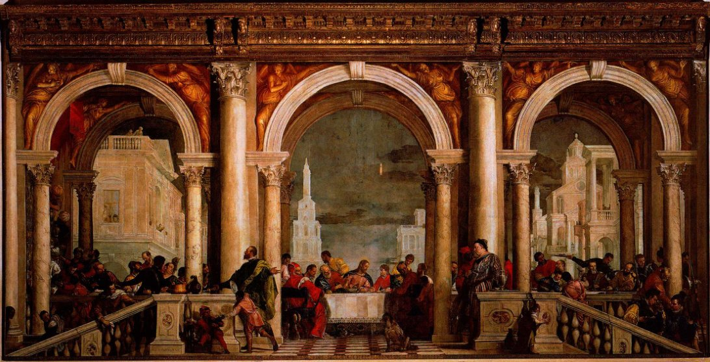

*图17.33 保罗·韦罗内塞：《利未家的宴会》。1573年。布面油画，5.54 × 12.8米。威尼斯学院美术馆*

> **原始文献：节选自宗教裁判所法庭在威尼斯对保罗·韦罗内塞的一次讯问**
>
> 由于威尼斯具有自由的宗教气氛，保罗·韦罗内塞并没有按照宗教裁判所法庭在这次讯问中所提出的要求，对他的《最后的晚餐》（见图17.33）进行各种修改。只将作品题目改为《利未家的晚餐》（Supper in the House of Levi，现名《利未家的宴会》）似乎就使各方人士都感到满意。
>
> 今天是1573年6月18日星期六，受到宗教法庭的传唤，维罗纳的保罗·卡利亚里来到神圣的法庭，接受对他职业的讯问：
>
> 答：我作画，也绘制人像。
>
> 问：你知道自己被传唤的原因吗？
>
> 答：不知道，先生。
>
> 问：你能想象得出来吗？
>
> 答：我很容易就想象得到。
>
> 问：说说你认为是什么原因。
>
> 答：尊敬的神父、圣乔治与圣保罗（SS. Giovanni e Paolo）修道院院长对我说过，他曾来过这里，尊敬的阁下命令他（在画中）画上抹大拉的玛利亚来替代狗。我回答他说，我很乐意为了自己和我作品的名誉做任何必需的事情，但是我不能理解为什么抹大拉的玛利亚适合那个位置。
>
> 问：你说的是哪一幅画？
>
> 答：耶稣基督与他的门徒在西蒙家里吃的最后晚餐，是这幅画。
>
> 问：在我主的晚餐上你还画了其他人物吗？
>
> 答：是的，大人物。
>
> 问：你画了多少个人物，描述一下每个人的姿势。
>
> 答：我画了客栈老板西蒙，此外还有一个招待，我想他出于自己的乐趣到餐桌旁来看看事情是怎么发生的。还有好多人物，我想不起来了，因为画完这幅画已经有段时间了。
>
> 问：在你为圣乔治与圣保罗修道院画的晚餐里面，画那个鼻子流血的人有什么用意？
>
> 答：我想表现一个仆人，他的鼻子因为什么事故而流血。
>
> 问：画那些手拿战戟、身穿日耳曼人盔甲的人又有什么用意？
>
> 答：我们画家所有的特许权跟诗人和小丑的是一样的。我画了两个手拿战戟的人，一个在喝酒，另一个在台阶附近吃东西。之所以把他们画在那里是因为他们可能有用，我认为合适。人们告诉我，客栈的主人有钱有势，应该有这样的仆人。
>
> 问：有一个男人穿得像个小丑，手腕上站着一只鹦鹉，你出于什么目的把他画在画面上呢？
>
> 答：为了装饰，像大家平常习惯的那样。
>
> 问：我主的餐桌上有谁？
>
> 答：十二门徒。
>
> 问：第一个人圣彼得在做什么？
>
> 答：他在切羊肉，好把肉传给桌子另一端的人。
>
> 问：他旁边的门徒在做什么？
>
> 答：他拿着一个盘子，准备接圣彼得要给他的食物。
>
> 问：这个人旁边的人又在做什么？
>
> 答：他拿着一根牙签在剔牙。
>
> 问：有人委托你在画中画日耳曼人、小丑还有其他类似的东西吗？
>
> 答：没有，大人。但是他们委托我按我认为合适的方式装饰这幅画。在我看来画很大，应该能画很多人物。
>
> 问：你们这些画家习惯性地添加在画里的装饰是否适合主题？是否适合主要人物？还是说这纯粹是出于娱乐？是你自己想象出来的，既不审慎也不明智？
>
> 答：我按照自己认为合适的方式作画，只要我的能力允许。
>
> 问：在我主的最后晚餐里画小丑、醉汉、日耳曼人、侏儒之类的粗俗内容合适吗？
>
> 答：不合适，大人。
>
> 问：在德国和其他受异教污染的地方，经常可以见到各种充满污秽的画，类似的作品嘲笑、辱骂和蔑视神圣的天主教会，为的是向愚蠢无知的人传授坏教义，你知道这些吗？
>
> 答：是的，这不对。
>
> 讯问结束后，法官宣布保罗必须在本次警告发出后的3个月内，遵照宗教法庭的意见和决定，在他的绘画上作出改进和变动，修改所需的一切费用由画家本人承担。如果拒不修改，画家有可能受到宗教法庭的责罚。这样宗教法庭以最合适的方式公布了这一判决。
>
> SOURCE: A DOCUMENTARY HISTORY OF ART, VOL. 2, ED. ELIZABETH GILMORE HOLT. (PRINCETON, NJ: PRINCETON UNIVERSITY PRESS, 1982)

**雅各布·丁托列托** 雅各布·罗布斯蒂（Jacopo Robusti，1519-1594年）人称丁托列托（Tintoretto），他的作品世俗倾向少。据说他想要“色彩如提香，素描如米开朗基罗”。然而丁托列托并没有模仿两位在盛期文艺复兴时期的作品，而是吸收了他们的晚期风格，在画面效果上更具有表现力而较少写实。丁托列托为威尼斯兄弟会创作了大量巨幅作品，这是一个为宗教活动集结而成的平信徒团体。丁托列托在这些作品中结合了提香晚年画作的梦幻效果，以及米开朗基罗晚期的饱满构图。他的最后一幅重要作品是完成于1594年的《最后的晚餐》（The Last Supper，图17.34），是一幅壮观的画作。韦罗内塞的作品体现了几乎整整一百年前达芬奇同名作品中的平衡与清晰，然而丁托列托的作品似乎以每一种可能的方式回避着这种平衡与清晰。耶稣自然仍是构图的中心，但灿烂的光环将他在透视中缩小的形象从中景里区分开来。丁托列托几乎没有暗示出犹大背叛所造成的人性戏剧效果，这在达芬奇的作品中却至关重要。可以看见犹大独自一人坐在桌子对面靠近耶稣的地方（与卡斯塔尼奥在圣阿波洛尼亚修道院湿壁画中的布局相同，见图15.29），但是，他的角色无关紧要，几乎会被人错认为一个随从。此处的桌子通过夸张的透视法与绘画平面呈锐角相交，这样的设计有其特殊目的。这是为了与威尼斯庄严圣乔治教堂（San Giorgio Maggiore）的高坛空间相接，《最后的晚餐》正是为这个教堂创作的。当本笃会修士跪在祭坛围栏前领受圣餐时，这件作品就挂在旁边的墙上，从那个角度看去，画面透视中后退的程度比迎面看要缓和。

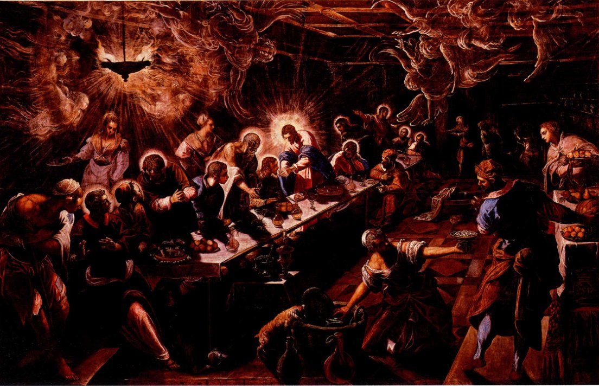

*图17.34 雅各布·丁托列托：《最后的晚餐》。1594年。布面油画，3.7 × 5.7米。威尼斯庄严圣乔治教堂*

丁托列托将最后晚餐设置在日常背景之中，其中满是随从、食器、酒器和家畜。耶稣头顶也聚集着来自天堂的人物，此时耶稣正在以面包和葡萄酒的形式，向门徒分发他的身体与血。炽燃的油灯所产生的烟神迹般地转化为成群的天使，将自然与超自然的界线模糊了，也把整个场景转变为极其协调的图像。丁托列托关注的主要问题是圣餐神迹的凸显，在现实与象征双重意义上，尘世的食物转变为神圣的食粮。在天主教改革期间，圣餐礼作为核心教义的重要地位得到了再次确立。这幅作品和它在庄严圣乔治教堂中的位置尤其适合，该教堂在天主教改革运动中起到了突出的作用。

### 安德烈亚·帕拉第奥与晚期文艺复兴建筑

1565年，修建庄严圣乔治教堂的项目委托交付给了文艺复兴时期最有影响力的建筑师之一，安德烈亚·帕拉第奥（Andrea Palladio，1508-1580年）。尽管帕拉第奥的艺术生涯主要在他的家乡，即威尼斯附近的维琴察（Vicenza）度过，他的建筑与理论著作却为他赢得了国际声誉。帕拉第奥认为，建筑必须受理性的支配，必须受古典建筑例证的法则支配，他赞同莱昂·巴蒂斯塔·阿尔贝蒂比例意义重大的观点（见第511页的原始文献）。然而，这两位建筑师的不同在于他们结合理论与实践的方式。在阿尔贝蒂的建筑中，理论与实践的联系是灵活机动的，而帕拉第奥却在实践中严格遵循着他所宣扬的理论。这种观点可能部分源自他早期职业生涯的影响，他曾作过石工和雕塑家，后来进入了维琴察吉安乔治·特里西诺（Giangiorgio Trissino）伯爵的人文主义圈子。帕拉第奥在那里学习了维特鲁威等古代作家的著作，并被引荐给威尼托地区（Veneto）的重要艺术赞助人。

> **原始文献：安德烈亚·帕拉第奥（1508-1580年）**
>
> *节选自《建筑四书》*
>
> 帕拉第奥于1570年出版的《建筑四书》对欧洲同时代人产生了巨大影响。他的著作是17、18世纪许多法国与英国建筑的基础。
>
> 受自然天性的引导，我在早年就潜心学习建筑，而且我一直认为，古罗马人的建筑技巧极其高超，大大超越了他们之后的所有人，他们在其他很多方面也是如此。我把维特鲁威当作自己的导师，他是唯一一个谈论建筑艺术的古代作家。我亲自调查了所有古代建筑遗迹，虽然时光流逝再加上蛮族的残忍破坏，还是有些建筑保存了下来。我发现它们比我最初想象的还值得观察。我尽可能仔细谨慎地测量它们的每一个部分，由此我成为了奔走于各处的检查者，不仅经常在意大利各地旅行，而且还去国外，但没有发现任何不合理性或者不符合优美比例的东西。
>
> 于是，当我看到建筑的普通功能与我所观察到的不同，与我在维特鲁威、阿尔贝蒂以及其他杰出的作者书中所读到的不同之时，我就认为，对于一个应当不只为自己活着，也为其他人服务的人来说，出版这些建筑的设计、简明扼要地记录那些应该加以思考的各种问题，是值得去做的事情。我花费了大量时间来搜集资料，历尽艰辛。而且，我所观测到的那些规则也出现在时下修建的建筑之中。本书读者，可能从中找到了可以利用的东西，将之运用于我无法做到的事情之中。人们可能学会渐渐地弃绝古怪陋习、野蛮人的发明以及过量的支出，更重要的是，可以避免许多建筑遭受各种各样的持续性破坏。
>
> SOURCE: ANDREA PALLAIDIO, THE FOUR BOOKS OF ARCHITECTURE, REPRINT OF 1738 EDITION. (NY: DOVER PUBLICATIONS, 1965)

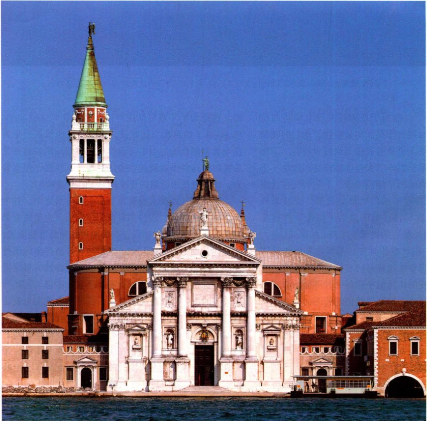

*图17.35 安德烈亚·帕拉第奥：威尼斯庄严圣乔治教堂。设计于1565年*

始建于1565年的庄严圣乔治教堂（图17.35）是帕拉第奥在威尼斯进行的第一个重大项目。他同前辈们一样，认为圆形神庙是一种理想形式，因为圆是均衡与永恒的象征。然而他与赞助人选择了公堂式的平面布局，因为只有这种布局才适合基督教的礼拜仪式。庄严圣乔治教堂的平面图（图17.36）反映出它的双重目的，既是本笃会修院教堂，也是平信徒的聚会场所。教堂主体呈强烈的集中样式，耳堂与中堂等长，穹顶标明了十字交叉处的位置。但是纵向轴线一直延伸到主祭坛所处的独立隔间，以及专供修士进行礼拜的大型唱诗班席。帕拉第奥在建筑立面中运用了古典建筑语汇，希望借此表达教堂的庄严高贵。他在入口外面设计了一座扁平的神庙式门廊，理由在于“神庙应该建有宽大的门廊，它的圆柱应该比其他建筑所需的还要粗壮，它们应该宏伟壮观·······比例宏大优美。它们必须由最优质、最珍贵的材料建成，这样神才得到最大程度的荣耀”。为了达到这一目的，帕拉第奥在教堂正面低矮宽阔的神庙式立面之上，增建了一座高而窄的神庙式立面，以此来反映教堂内部中堂与侧堂的高度差。四根巨大的圆柱将整个设计联系在一起，它们在功能上是阿尔贝蒂的巨柱式的变体。

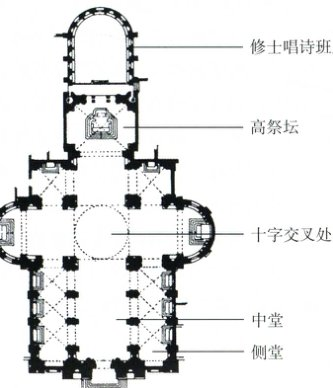

*图17.36 庄严圣乔治教堂平面图*

> **大事年表**
>
> *   1538年 - 提香创作《乌尔比诺的维纳斯》
> *   1570年 - 帕拉第奥的《建筑四书》出版
> *   1571年 - 威尼斯与西班牙海军在雷帕特击败土耳其舰队
> *   1596年 - 莎士比亚创作《罗密欧与朱丽叶》

帕拉第奥所设计的大部分建筑是城市住宅与乡间别墅。圆厅别墅（Villa Rotonda，图17.37）是他最精美的建筑之一，是建筑师对古典建筑诠释的一个例证。这座乡间别墅位于维琴察附近，始建于1567年，它的所有者是人文主义教士保罗·阿梅里克（Paolo Almerico）。别墅本身是一座建有穹顶的正方形建筑，四面建有完全一致的神庙式门廊。阿尔贝蒂将理想的教堂定义为这种对称的集中式建筑，但是帕拉第奥却将相同的原则调整并运用于构建理想的乡间别墅。根据维特鲁威和普林尼的著作，他确信古罗马的私人住宅具有这样的门廊。然而，之后的考古发掘证明他是错的。帕拉第奥在此处运用神庙式立面并不只是表达他对古代的尊重，而是认为这种样式是正统的，也是合乎规范的，而规范则意味着适当、优美、和谐与实用，这些都符合“伟人”住宅的特色。这种观念包含在16世纪晚期的社会整体观念之中，后者要求人们展示财富与品位来彰显自己的社会地位。帕拉第奥的设计也利用了建筑所在地各个方向的怡人景观。圆厅别墅的门廊与它背后的墙壁以及周围的风光美妙地联系在一起，赋予建筑宁静的高贵与愉悦的优雅，各立面的雕塑进一步强化了这种氛围。

仅建筑一项就足以使帕拉第奥成为艺术史上的重要人物，但是他的著作将其影响传播到意大利之外，甚至欧洲之外的地方。帕拉第奥在建筑领域最为重要的著述是1570年写就的论著《建筑四书》（The Four Books of Architecture，见第616页的原始文献中的节选）。虽然包括阿尔贝蒂在内的若干建筑师在15世纪时就有建筑方面的著述，但塞巴斯蒂亚诺·塞尔里奥与帕拉第奥的作品则是16世纪最畅销的印刷书籍。帕拉第奥的论著比阿尔贝蒂的更为实用，这一点或许可以解释它广受建筑师欢迎的原因，而且帕拉第奥的许多建筑都更为直接地与他的理论相联系。有些学者认为，帕拉第奥从自己的观点出发，只设计那些为古人所认可的建筑样式。事实上，通常人们会给帕拉第奥的建筑与理论贴上“古典化”（classicizing）的标签。这个术语表示有意识地追求在古典艺术中所发现的特性，尽管其结果可能与古典作品并不相似。只要后来的建筑师想要通过古典形式来表达其理念，他们就会参考帕拉第奥的《建筑四书》。例如，托马斯·杰斐逊曾把这本著作称为“圣经”，并以其中的例子为基础设计了几座建筑。此类论著中包括设计优美建筑的规则，正确比例的公式，以及大量建筑平面图与立面图的木刻版画插图，它们是欧洲各地及后世整个世界建筑师的宝库。

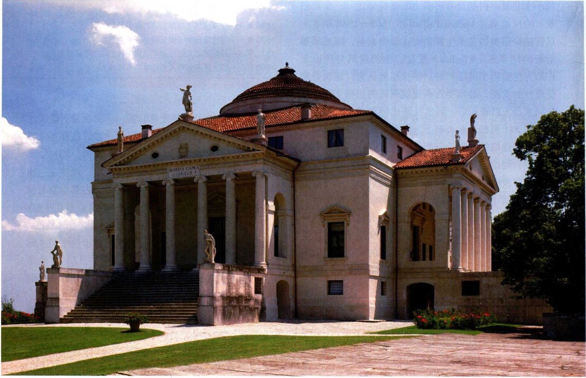

*图17.37 安德烈亚·帕拉第奥：维琴察的圆厅别墅。约1567-1570年*

## 小结

16世纪晚期，君主与教皇的权力在意大利各城中日益扩大。宫廷是重要的艺术赞助人，君主与公爵们具有相同的品位，偏好具有博学特色且复杂优美的艺术形式。这种趋势正是风格主义的标志，因为它对技艺精湛的艺术家们的技巧与手法有很高的依赖性。对这些艺术家而言，作品的主题与器物的功能通常都不如技巧的水平重要。

**晚期文艺复兴的佛罗伦萨：教会、宫廷与风格主义**

公爵制之下的佛罗伦萨是风格主义艺术发展的重要中心，艺术家们弃绝了之前艺术中的清晰与平衡，偏好更为复杂甚至有时令人眩惑的图像。美第奇家族统治者们建造了礼拜堂与府邸，成立了培训艺术家的学院，并将艺术品作为外交礼物送给他国。他们所雇用的艺术家们技艺超群且闻名遐迩，不仅创作肖像与宗教题材作品，也创作基于古典文学与艺术的寓意性作品。各国赞助人争相求取米开朗基罗的作品，艺术家们也到访其他国家宫廷，乔治·瓦萨里出版了《意大利杰出画家、雕塑家与建筑师传》，这些因素帮助佛罗伦萨建立起了艺术摇篮的美名。

**罗马改革**

为王公贵族创作的繁复、世俗且通常具有色情意味的作品与天主教会呼吁精神与道德复兴的号召相抵触。新教改革的挑战，1527年罗马大劫举世震惊，这些都鼓励教皇拓展他们在宗教与世俗领域的权威性。教廷的计划包括位于梵蒂冈以及罗马市中心的艺术项目。米开朗基罗是16世纪罗马绘画、雕塑与建筑中的关键人物。他的作品沉浸在艺术家对古典艺术的敬畏之中，然而米开朗基罗自由地处理着借鉴自古典艺术的语汇。天主教改革激发耶稣会等新近成立的教派修建起宏大的公堂式教堂，以满足他们的需要，从而抛弃了文艺复兴早期的集中式教堂布局。

**贡扎加家族统治的曼图亚**

意大利内外的各个宫廷都雇用曾在佛罗伦萨和罗马研习过的艺术家，创作宣示当地统治者权力的视觉作品。朱利奥·罗马诺在T型宫中出人意料地打破了建筑规则，这不过是他奉迎赞助人才智与老练品位的一种方式而已。在技巧精湛的绘画与雕塑中，希腊与罗马诸神的形象代表着这位统治者本人。

**帕尔马与波洛尼亚**

诸如帕尔马与波洛尼亚这样的小城市的社会结构使得精英家族成为艺术赞助人，尽管他们并不是君主。在这些城市中所创造的作品也反映出风格主义的创新，例如帕尔米贾尼诺的《长颈圣母》。这里的赞助人们也定制高度自然主义，接近盛期文艺复兴艺术价值标准的作品。

**威尼斯：祥和的共和国**

威尼斯保持了共和国政体，并坚持着15世纪的艺术传统。城市建筑将14和15世纪威尼斯风格的连拱廊与罗马建筑启发下形成的巨柱式及墙壁处理手法融合在一起。提香长寿而多产的一生使得他的风格在威尼斯占据了主导地位，尽管他的技法与观念也随时间而改变。提香的追随者们将威尼斯绘画对色彩与写实的偏好，拓展成为巨幅布面油画作品，让观者深为折服。帕拉第奥的建筑比较拘谨，使古典形式为富有的赞助人与教会服务。