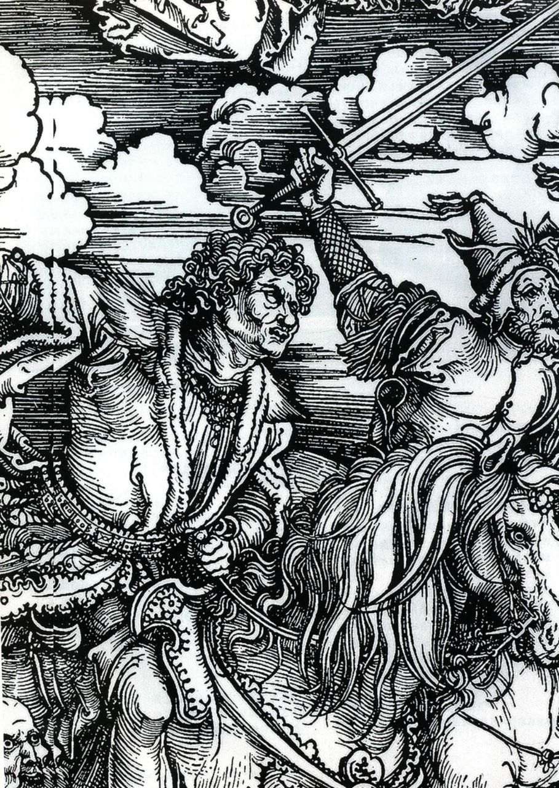

第十八章 16世纪北部欧洲的文艺复兴与宗教改革

意大利半岛以北的欧洲人也遭遇了意大利人在16世纪时所经历的那种与传统的决裂。除宗教改革的挑战与文艺复兴种种新的文化表现形式之外，北部欧洲的中央集权国家法国、英格兰、西班牙和神圣罗马帝国的权力日益增长，欧洲的经济扩张蔓延到世界各地。伴随着北部欧洲经历的向现代社会转型所带

来的阵痛，各国的艺术家们纷纷将本地的艺术传统加以调整，以便与这些新的社会变化相适应。

治者还是在各自领地确立了统治。

北部欧洲的艺术家应时而动。绘画的重要性日益

增加，部分原因在于新教改革派对雕塑这种艺术形式

持怀疑态度。随着教会赞助的减少，艺术家开始转向

世俗题材。为了在开放市场上竞争，他们开始专攻某

一特定主题或题材。意大利文艺复兴的成就也对北部

欧洲的艺术家带来挑战，他们吸收了意大利艺术大师

的构图、人物类型化以及仿古。各国宫廷发现意大利

的风格对于宣扬他们的权力特别有效，于是也修建豪

华宫殿。信奉天主教的统治者常常运用意大利化的艺

术形式宣示信仰。

宗教改革对罗马天主教会所造成的挑战将在根本上改变欧洲的社会面貌。宗教改革的倡导者如路德、乌尔里希·茨温利（Ulrich Zwingli）、约翰·加尔文（JohnCalvin）等人吸引了众多追随者，整个社区、整座城市，甚至整个国家都皈依了新教，这使得先前欧洲宗教统一的局面分崩离析。信奉天主教的地区与信奉新教的地区激烈对抗，人口锐减。法国和西班牙仍然信奉天主教，而德意志、英格兰和尼德兰地区则因教派纷争而陷于分裂。更为激进的改革派教义谴责天主教中的宗教圣像与圣物传统，在皈依新教的地区发动了圣像破坏运动。

在这样的形势下，艺术家们不得不为他们的行业寻找新的出路，并为其作品开拓新的市场。这些艺术品市场将延续15世纪时出现的趋势。土地作为财富的象征的意义降低，成长中的资本主义经济大大增加了城市财富与人口。制造业和贸易兴起，特别是跨大西洋贸易路线及美洲和亚洲的殖民地得以开发。尽管城市的经济与社会重要性不断增长，但日渐集权的统

图18\.17细部，阿尔布雷希特·丢勒：《启示录四骑士》

法国：偏好意大利形式的宫廷趣味

法国是当时移植意大利艺术观念的沃土。法国国王介入意大利的政治事务已达几个世纪之久，这使得他们对意大利艺术与建筑的进展极为熟悉。法国国王查理七世在1499年入侵米兰，他的继任者继续插手意大利半岛的政治。弗朗西斯一世（1515\-1547年在位）邀请达芬奇前往卢瓦尔河谷为他创作，体现了

第十八章 16世纪北部欧洲的文艺复兴与宗教改革 621

波罗

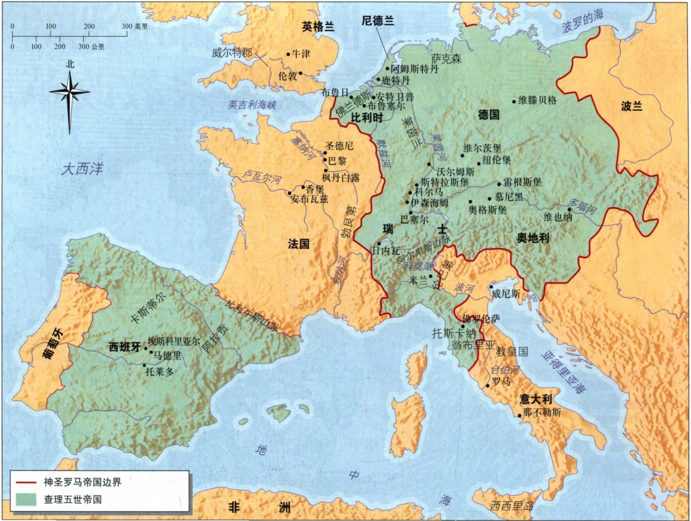

地图18\.1 16世纪的欧洲

这位国王对意大利艺术的赞赏。在1519年于安布瓦兹（Amboise）去世之前，达芬奇为国王设计了一座从未开工建设的城堡。弗朗西斯对意大利艺术的欣赏及其挥霍无度的天性，使得他的宫廷吸引了众多艺术家，罗索·菲奥伦蒂诺、弗朗切斯科·普里马蒂乔、本韦努托·切利尼等意大利以及欧洲其他地区的艺术家们都纷纷来到这里。法国建筑师在王室建筑中诠释意大利观念时，对法国艺术传统也加以保留。

城堡与宫殿：意大利建筑的变体

文艺复兴时期，法国的城堡以往的防御功能逐渐淡化，成为了享受乡村生活的宫殿。意大利建筑设计思想在众多新建的城堡式建筑中产生了影响，其中一个重要的早期实例是卢瓦尔河谷的香堡（Château ofChambord，图18\.1）。这座城堡始建于1519年，是弗朗西斯一世的狩猎行宫。城堡的设计结合了传统的法国城堡建筑特征与意大利建筑的布局。中央部分的平面图（图18\.2）表明，这是一座四角建有圆形塔楼作为护卫的正方形建筑。它的形式来源于要塞（keep），即中世纪城堡内防御最为坚固的中心部分。然而城堡

内部空间却按照希腊十字分割为四部分，每一部分再细分为一个大间、两个小间及一个密室。这种功能性的分组借鉴自意大利建筑，后来成为法国建筑设计的标准模式。四条走廊的交点上建有一座大型的双螺旋形楼梯，这种集中式布局正是当时的意大利建筑理论所提倡的形式。即使半露方柱与栏杆等元素模仿了意大利的建筑元素，但是垂直的墙体、角塔、陡峭的屋顶、狭长的窗户以及高耸的烟囱仍反映了法国传统的城堡设计风格与哥特式建筑的比例结构。

意大利建筑设计思想对法国的影响，在巴黎以南的枫丹白露森林中弗朗西斯一世修建的城堡中表现得更为明显。1528年，弗朗西斯一世决定对这座路易九世时常驾临的中世纪猎宫进行扩建。最初的计划是对其仅作适度扩建，但工程很快就发展成为一座规模庞大的宫殿群。工程的最初设计主要出自石工吉尔·勒布雷东（Gilles Le Breton，1553年过世）之手，他的父亲让·勒布雷东（Jean Le Breton，1543／44年过世）曾参与过香堡的设计。枫丹白露的建筑设计在后来多年的施工过程中经过了大量修改，它确立了意大利建筑的法国变体，并于随后成为风尚，之后250年间几

622 詹森艺术史

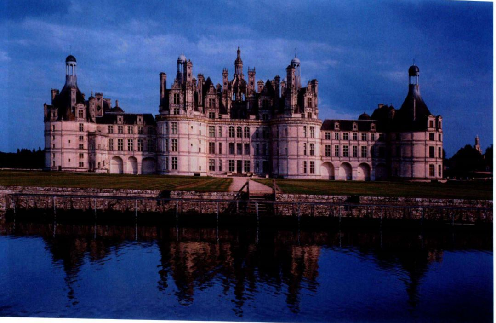

图18\.1 法国香堡北面。始建于1519年

乎所有的法国城堡都竞相追随枫丹白露的建筑风格。

白马庭院（Cour du Cheval Blanc，图18\.3）是整个枫丹白露建筑设计的典型，其中必定融入了活泼的风尚，新一代赞助人与建筑师在漫长的施工过程中不断为其增添某些新样式与新元素。在此，作为整个庭院核心的意大利化楼梯是由让·安德鲁埃·杜塞尔索（Jean Androuet du Cerceau）在1634年修建的。香堡的那种圆形塔楼在此处为长方形角楼所代替，角楼之间距离相等。建筑立面借鉴了意大利建筑的元素：半露方柱区分每一楼层；檐部在水平方向上将整个立面联成一体；底层与桑索维诺在威尼斯造币厂中所使用的半露方柱一样，采用了粗面石材半露方柱（见图17\.29）。但是这些元素都与垂直比例融合在一起，在窗户与屋顶轮廓线部分表现得尤为明显。

卢浮宫 虽然战事不断，政务缠身，弗朗西斯一世却热衷于委托大规模建筑项目。1546年，他决定拆除巴黎的哥特式皇家城堡卢浮宫，在原址上建造一座新宫。不过直到弗朗西斯一世去世时，该建筑几乎未曾动工。但是他的建筑师皮埃尔·莱斯科（PierreLescot，约1515\-1578年）在后继者亨利二世治下，

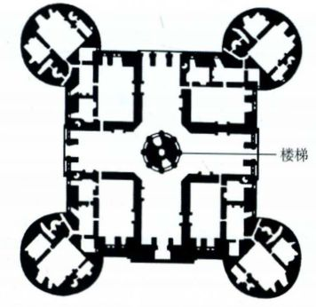

图18\.2 香堡中央部分平面图（根据Du Cerceau的图绘制）

按原计划开工并加以扩建。整个建筑工程持续了一个多世纪都没有全部完工。莱斯科主持修建了庭院西侧的南半部分（图18\.4），这部分的建筑风格与香堡或枫丹白露宫相比，意大利风格更加彻底。

卢浮宫的建筑设计展现了传统法国城堡与意大利宫殿的真正融合。层层叠加的古典柱式、山墙式窗框以及底层的连拱廊都是意大利样式。而三座突出的角

第十八章 16世纪北部欧洲的文艺复兴与宗教改革 623

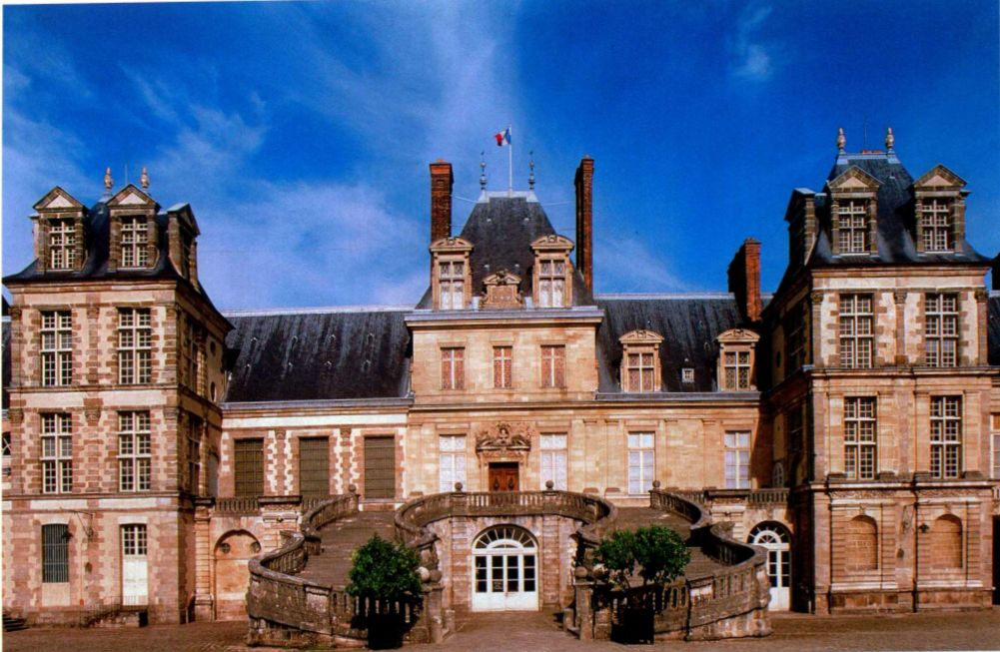

图18\.3 吉尔·勒布雷东：枫丹白露宫白马庭院。1528\-1540年

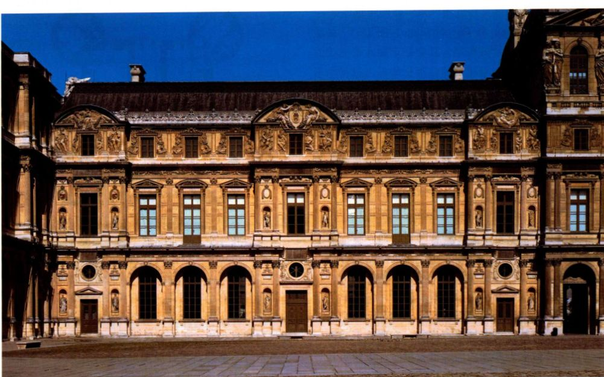

图18\.4 皮埃尔·莱斯科：巴黎卢浮宫方形庭院。始建于1546年

楼取代了城堡中的塔楼，这种布局也打破了建筑立面的连续性。陡峭的屋顶也是法国样式。对垂直感的强调和狭长的窗户与水平元素形成了鲜明对照。建筑的整体效果具有对称感，结构布局非常完善，雕刻装饰富丽堂皇，不仅半露方柱及其柱头上雕满装饰，第三层的几乎全部墙面都布满了浮雕图案。这些浮雕与建筑优美地融为一体，它们出自法国16世纪的雕塑家让·古戎（Jean Goujon，约1510\-1565年）之手，莱斯科经常与他合作。

城堡内部的艺术

虽然当时的法国国王表现出对意大利风格的青睐，但某些法国宫廷人士仍继续定制具有中世纪风格的艺术品。印刷机发明之后的很长时间里，法国贵族仍旧继续定制奢华的手工日课经以及其他彩饰书籍。法国教堂建筑则利用了哥特式风格的各种可能性，达到了新的高度。对于当时的高层赞助人而言，彩色玻璃窗与挂毯仍然是重要的艺术门类。这些上层人士在他们住宅的墙壁上挂满了一组组的织毯，题材通常是世俗或寓意性的。挂毯织造业在当时的法国和尼德兰地区都是重要的行业（见第626页的材料与技法）。

保存至今最著名的一组挂毯是《猎取独角兽》（Hunt for the Unicorn），该作品于1500年前后于南尼德兰或者法国北部织成。这组作品讲述的故事始于猎取独角兽，终于独角兽之死，《被俘获的独角兽》

（The Unicorn in Capitivity，图18\.5）是整个故事的高潮，神话中这种长着独角的神兽只能被处女捕获。在这组由7块挂毯组成的作品中，表现了独角兽被俘获、杀死、之后又复活的种种情节。主题实际上描绘的是宫廷的打猎消遣，但是独角兽本身被解读为基督的象征（图像的细节表明了这一点），在世俗世界中，它也是新郎的象征。《被俘获的独角兽》高近4米，宽2米有余，表现的是关在围栏中的独角兽，它卧在一棵石榴树下，无数花朵植物使青翠的背景显得生机勃勃。虽然对植物花朵等特定元素的处理极其细致入微并具有自然主义特征，但是整幅挂毯却是一种华丽的平面效果。独角兽雪白的身体位于繁花环绕之中，是画面的焦点。石榴象征着子孙繁茂、生生不息，这些细节与大量的动植物一起不仅暗示的是基督教的救赎主题，同时也具有婚姻和生殖的意味。有些学者指出这组挂毯是为了纪念某人的婚姻，可能织在树枝间的A与反向的E就是丈夫与妻子的姓名首字母。虽然经过了极为深入的研究，订件人的身份仍无法确定。鉴于17世纪哥白林（Gobelins）皇家织造厂的建立极大

图18\.5 《被俘获的独角兽》。约1500年。挂毯，出自独角兽挂毯，产自尼德兰南部或法国。羊毛线、羊毛、丝绸、银和镀金纬线，3\.68x2\.52米。纽约大都会艺术博物馆，Jr．John D．Rockefeller捐赠，1937\.37\(37\.80\.6\)

地推进了挂毯业的繁荣，可以认定挂毯一直是当时法国的重要艺术类型。

枫丹白露派 弗朗西斯一世对意大利艺术的青睐在枫丹白露的城堡中表现得很明显。这位国王当时召集了一批意大利艺术家在此地工作，他们之中的大多数都属于风格主义艺术家，他们开创了后来被称为枫丹白露派（School of Fontainebleau）的艺术流派。为了装饰弗朗西斯一世长廊，国王又将罗索·菲奥伦蒂诺从意大利召至这里。从1531至1540年，罗索绘制了长廊中边缘装饰着灰泥小天使像的湿壁画。这种绘画与雕塑图像相结合的手法启发了另一位意大利移民艺术家弗朗切斯科·普里马蒂乔（FrancescoPrimaticcio，1504\-1570年），他后来取代罗索成为这座皇家城堡的总设计师。帕尔米贾尼诺对普里马蒂乔的影响在国王的情妇埃当普女公爵（Duchessed＇Étampes）的卧室装饰中清晰可见（图18\.6），这是普里马蒂乔遗存至今最重要的作品。普里马蒂乔保

第十八章 16世纪北部欧洲的文艺复兴与宗教改革 625

文艺复兴时期挂毯的制作与保存

挂纪一直到巴洛克时期，挂毯都是一种重要的艺术形式。毯是一种织有图案、挂在墙上的编织工艺品，从中世当时，欧洲高层的赞助人都会定制或购买挂毯来装饰宫殿和城堡的石砌墙面。那时，阿拉斯、图尔奈和布鲁塞尔是佛兰德斯最重要的挂毯织造中心。在法国，路易十四在巴黎成立了哥白林皇家织造厂，将挂毯织造与王室联系在一起。这家工厂直到18世纪都占据着法国挂毯织造业的统治地位。

毯分为“高经纱密度”（high\-warp）和“低经纱密度”（low\-warp）

两种。高经纱密度织法将经纱沿织机纵向拉开，而低经纱密

度织法则是将经纱横向拉开。图中珀涅罗珀使用的是一架小

型低经纱密度织机，这在当时是佛兰德斯常见的一种织机。

在织机下面，并将纬纱挤进经纱之间，通过变换色彩织出图案，之后将纬纱在它们应在的位置上挤实，从而织出致密的织物。因为织工依据样稿工作时面对的是挂毯的背面，所以这一面会出现不同色线交替的线头与线结，而供人们观看的正面则是与样稿设计相反的图案。

从15世纪开始，挂毯的设计越来越多地由画家们来完成。随着画家在绘画方面雄心的日渐增长，织工们也发展出不同

织物在织机上生产出来，织机的样式与插图14\.21中《珀涅罗珀织布》的织机相仿。在开织之前，赞助人与作坊的师傅先要选择设计，再将设计画成一种织工以后按样操作的同等尺寸样稿（cartoon）。

的纺织技术来与之相适应。样稿中的视幻手法日益增多，这对织工们产生了启示，激发他们运用更精细的线来织造挂毯，使其更为复杂。《被俘获的独角兽》（见图18\.5）中的花朵、枝叶和动物形象用羊毛线、丝线和金线织成，极其巧妙地展现出它们的细节。某位学者曾做过估算，编织如此繁密的图案，每个小时只能织成约6\.5平方厘米的图案。以这种速度计算，一队织工一年时间才能完成一幅挂毯。

编织时，织工要围绕织机的边框拉开名为经纱（warp）的支撑线，织机的大小与需要的尺寸相当。经纱由坚韧的纤维制成，通常是羊毛或亚麻。彩色的羊毛线、丝线或金属丝被用来织出图案，这种线被称为纬纱（weft），它们在织机上与经纱编织在一起。

织工将水平方向的线（纬纱）与垂直方向的线（经纱）缠绕在一起

不久以前，这组独角兽挂毯的保管者对其进行了处理，去除了挂毯的亚麻背衬，打算用其他织物来取代。由此人们得以看

根据织机的结构，文艺复兴时期的挂

到挂毯背面的情形，背面各种纺线的色彩丰富得令人难以置信，而正面的色彩却随着时间的流逝已经黯淡褪色。随后，工作人员又将挂毯浸入提纯过的水中加以清洗，晾干后再补织上新背衬。

经纱在织机上拉开之后，织工就将先前绘制好的样稿放

留了罗索的整体规划，将绘画嵌入奢华的灰泥雕塑框架之中，这些灰泥雕塑占据绝大多数平面，几乎使绘画淹没其中。然而，其中人物的肢体则被巧妙地拉长了，这正是帕尔米贾尼诺的风格。插图中四位女性人物虽然令人回想起西斯廷天顶画中的裸体人像，但她们并没有什么特殊的寓意。这些垂柳般柔美的人物（令人联想起古希腊建筑中的女像柱）环绕着以亚历山大大帝为主题的绘画，画面则由助手根据普里马蒂乔的设计绘制而成。

插图18\.6表现的是阿派里斯绘制亚历山大诱拐康巴斯白（Campaspe）的场景，当画家坠入康巴斯白的爱河时，亚历山大将自己这位宠妾赐给了他。当时，以此类古罗马文本为主题的作品将亚历山大的慷慨作为这位皇帝对其宫廷艺术家高度尊敬的表现。此类暴力与色情混合的作品对普里马蒂乔所服务的廷臣具有极大的吸引力。这幅画作将弗朗西斯一世比作亚历山大，将他的情人女公爵比作康巴斯白，女公爵对普里马蒂乔也是爱护有加，艺术家可能将自己视为阿派里斯。

1540至1546年间，另一位来到枫丹白露的意大利艺术家叫做本韦努托·切利尼（Benvenuto Cellini，1500\-1571年），他是佛罗伦萨金匠兼雕塑家，他的声望多半来自其多姿多彩的自传。切利尼唯一一件存世金属作品是一个纯金盐罐，艺术家在枫丹白露期间为弗朗西斯一世制作（图18\.7）。这个闻名遐迩的艺术品2003年被盗，至今下落不明。这件奢华器物的主要功能显然是盛装调料。由于盐多半产自海洋，胡椒来自土地，所以盐碟就采用了船型，并由海神涅普顿来守护。胡椒则盛在一座微小的凯旋门里，由大地的拟人化形象为其守护，她很可能是海神的妻子安菲特里忒。底座上是象征一年四季与一日四时的人物。这些典故令人联想到美第奇家族的陵墓，因为两者对大地的拟人化手法如出一辙。切利尼想以自己的天才与技巧给观众留下深刻印象，在自传（见第631页的原始文献）中他解释了自己如何构思这个盐罐的模型设计与如何选择人物形象。他将大地设计成“一个女人，尽我所能表现她美丽的身体的可爱与优雅······”

626 詹森艺术史

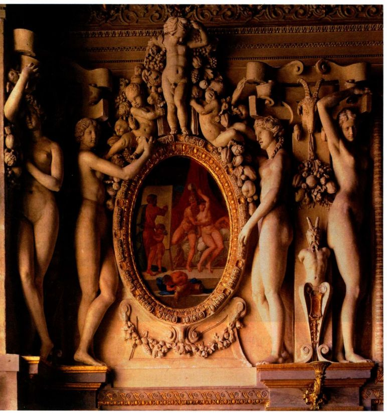

图18\.6 弗朗切斯科·普里马蒂乔：灰泥人像。约	1541\-1545年。弗朗西斯一世长廊，该作品为法

国枫丹白露城堡埃当普女公爵的卧室而设计

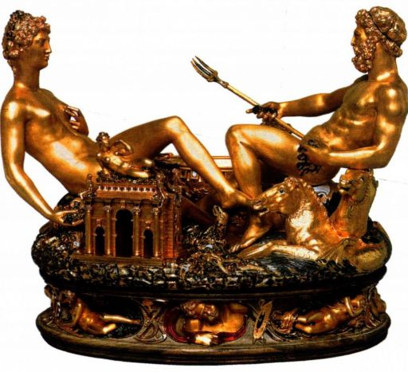

图18\.7 本韦努托·切利尼：《弗朗西斯一世盐罐》（Saltcellar ofFrancis I）。1540\-1543年。黄金、珐琅，26 × 33 \. 3厘米。原藏于维也纳艺术史博物馆（2003年被盗）

在典型的风格主义风尚中，图像的寓意只不过是展示精湛技巧的形式。切利尼在后文中谦逊地记载了弗朗西斯一世对他作品的反应：“这是他的杰作。这个人应该永不停歇地创作！”

圣德尼修院教堂的皇家陵墓 枫丹白露聚集了众多意大利艺术家，使这座城堡成了意大利艺术风格的实验室，许多法国艺术家也都从中汲取灵感。例如雕塑家热尔曼·皮隆（Germain Pilon，约1553\-1590年）创作的大型雕塑就借鉴了枫丹白露派的优雅，同时也融合了古典雕塑、哥特式传统与米开朗基罗的影响。他主要从事陵墓雕塑，《亨利二世与凯瑟琳·德·美第奇之墓》（Tomb of Henry II and Catherine de＇ Medici，图18\.8）就是一例，这件作品为圣德尼修院教堂里法国王室的宗祠而创作。普里马蒂乔设计的是建筑框架，这是一座饰以青铜与大理石浮雕的独立礼拜堂，建在平台上。角落处象征美德的优雅年轻女子

第十八章 16世纪北部欧洲的文艺复兴与宗教改革 627

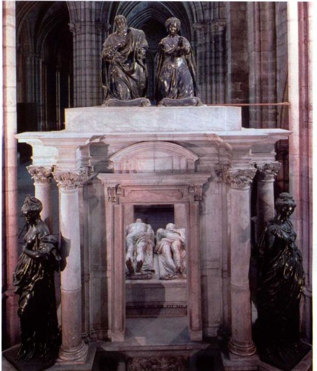

图18\.8 弗朗切斯科·普里马蒂乔和热尔曼·皮隆：《亨利二世与凯瑟琳·德·美第奇之墓》。1563\-1570年。现存于巴黎圣德尼修院教堂

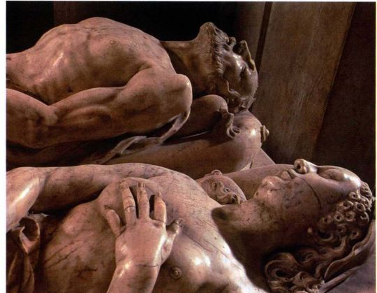

图18\.9 热尔曼·皮隆：《国王与王后卧像》（Gisants of the kingand queen），《亨利二世与凯瑟琳·德·美第奇之墓》局部

也是他设计的。皮隆是雕塑的制作者。陵墓顶上是国王与王后的跪拜青铜像，而在礼拜堂内部，这对夫妇的形象再次出现，不过材质换成了大理石，姿态也成了仰卧（或称为死者卧像			，图18\.9）。这座陵墓由亨利在1547年定制，其设计理念来自于弗朗西斯一世与妻子法兰西的克劳德（Claude ofFrance）的陵墓，该陵墓也在同一座教堂内。

对照遗体雕刻是14世纪以来哥特式墓葬艺术的典型特征，它一直延续到16世纪并形成了一种潮流。死者卧像表达的是肉体昙花一现的观念，通常表现尸体进入腐烂阶段的状况，有时还会雕刻出尸体腐烂处蠕动的蛆虫。皮隆改变了这一观念，他不再表现腐烂中的肉体，而是表现理想化的裸体。跪在礼拜堂顶上的国王夫妇像记录了他们有生之年的面貌特征，死者卧像则将他们再次表现为美好的事物：王后被表现为古典维纳斯的典型姿势，国王则与死亡的基督相仿。他们既不令人恐惧，也不令人感到遗憾。而是美得令人心生悲悯之情，这种美甚至在死亡之后仍绵延永驻。

亨利二世于1559年去世，他的小儿子继承了王位，于是王太后凯瑟琳·德·美第奇（Catherine de＇Medici）就在那个动荡的时期承担起听政的责任。之后天主教徒与被称为胡格诺派（Huguenots）的新教徒之间的冲突日益增多，并最终激化成1562至1598年间的教派屠杀与宗教战争，直到亨利四世最终颁布了正式的宗教宽容法令。

西班牙：控制全球的权力与正教

16世纪早期，若干历史事件汇集在一起，使得西班牙成为欧洲政治大国。1500年，哈布斯堡王朝的马克西米连的儿子与费迪南德和伊莎贝拉的女儿生下了未来的查理五世，这位王子因此成了后来西班牙、阿拉贡和勃艮第地区的王位继承者，神圣罗马帝国的帝位也在他所应有的继承权范围之内。查理五世还声称西班牙有权统治意大利南部的那不勒斯王国。西班牙由此比前几个世纪更深入地介入到了欧洲政治权力斗争之中。与此同时，哥伦布（Columbus）在美洲占领的殖民地为西班牙带来了巨大的财富。殚精竭虑的统治如此广大的领土让查理五世精疲力竭，于是他在1556年退位，并将帝国一分为二，分别交给自己的儿子菲利普和弟弟费迪南德统治。费迪南德统治传统上属于哈布斯堡王朝的中欧地区。菲利普二世则在1556至1598年担任西班牙、尼德兰和美洲新西班牙的国王，同时，他

628 詹森艺术史

也继承了当年令其父亲倍感困扰的难题。1557年成功地粉碎了土耳其人对欧洲的入侵之后，他将注意力转移到宗教改革给信奉天主教的欧洲所带来的宗教剧变。菲利普是虔诚热心的天主教徒，他曾试图镇压北尼德兰的加尔文教派（Calvinist）起义。1588年，又发动了入侵英格兰的战争，遭到惨败，无敌舰队在英吉利海峡遭受重创。

埃斯科里亚尔宫

菲利普也继承了其父的艺术品收藏品位，他不仅向提香等意大利艺术家定制作品，而且还搜寻15世纪佛兰德斯地区的作品，特别是博斯的画作。许多此类艺术品被陈列在他建于马德里（Madrid）城外一处被称为埃斯科里亚尔（Escorial）的新建筑群中，这既是一座宫殿，也是修道院，当初修建它是为了纪念菲利普在1557年对法国的胜利。这座规模庞大的建筑群（图18\.10）始建于1563年，设计师是胡安·包蒂斯塔·德·托莱多（Juan Bautista de Toledo，1567 年过世），他曾在罗马与米开朗基罗一起进行过艺术创作。建筑群整体取对称式布局，圣洛伦佐教堂

大事年表

约1527年\-弗朗西斯一世修建枫丹白露的城堡1536年\-约翰·加尔文出版《基督教要义》约1540年\-切利尼创作《弗朗西斯一世盐罐》1562年\-宗教战争开始

为其核心，布局折射出意大利文艺复兴建筑风格的影响，但是建筑立面的尺寸与简洁则是受国王菲利普指示。继胡安·包蒂斯塔·德·托莱多之后担当埃斯科里亚尔宫建筑师的是胡安·德·艾瑞拉（Juan deHerrera），在咨询了包括帕拉第奥和维尼奥拉在内的一流意大利建筑师之后，他扩大了原有设计，并将古典化建筑细节引入其中，例如为圣洛伦佐教堂和宫殿主大门的正立面所修建的神庙式立面。然而他运用了非常朴素的多立克柱式，整座立面表现出严肃庄重之感，这可能是对菲利普所致力实现的天主教改革理想的表达。整个建筑群囊括了修道院、教堂、宫殿、神学院、图书馆以及西班牙国王的丧葬礼拜堂。菲利普本人的晚年就是在这里度过的。

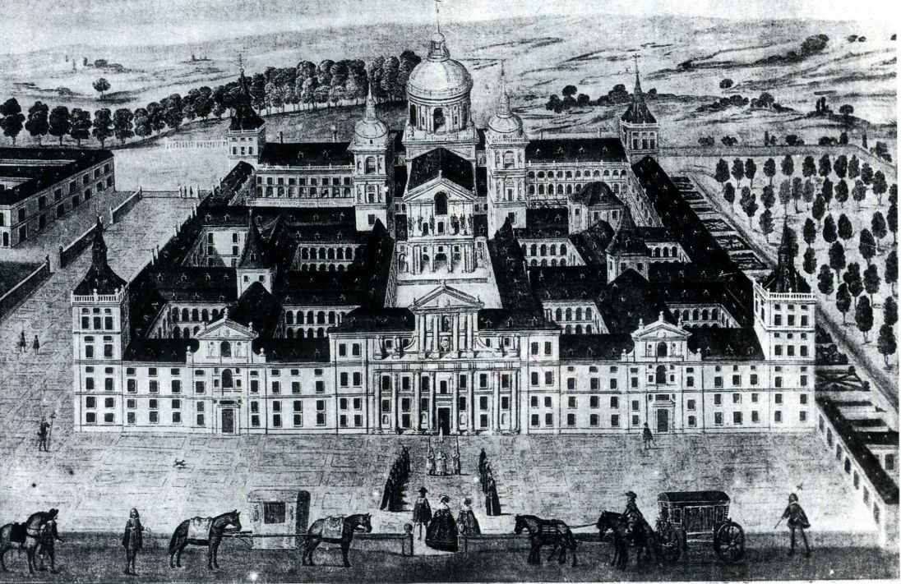

图18\.10 胡安·包蒂斯塔·德·托菜多与胡安·德·艾瑞拉：马德里附近的埃斯科里亚尔宫。始建于1563年

第十八章 16世纪北部欧洲的文艺复兴与宗教改革 629

埃尔·格列柯在托莱多

对于西班牙16世纪最著名的画家、人称埃尔·格列柯的多梅尼科·塞奥托科普洛斯（El Greco［DomenikosTheotokopoulos］，1541\-1614年）的作品，菲利普却并不十分热心。这位画家出生在威尼斯统治时期的克里特岛，可能曾在那里学习过绘制圣像画。至迟1568年他来到威尼斯，在那里他迅速吸收了提香与丁托列托的艺术风格，对拉斐尔、米开朗基罗和意大利风格主义的艺术也并不陌生。格列柯于1576／77年前往西班牙，并在那里度过了余生，他成为了该城一流知识圈子内的一员。托莱多当时是欧洲重要的学术中心，也是西班牙天主教改革的权力中心。格列柯的绘画汲取了多种多样的艺术源泉，展示出高贵的情感主义倾向。他的作品似乎是对神秘主义的回应，神秘主义在阿维拉的特雷莎（Theresa of Ávila）时期的西班牙尤为盛行。特雷莎是一位16世纪的修女，也是一位宗教改

革人士，写下过富有见解的宗教檄文，敦促教徒与上帝接近（见图19\.30）。

《奥尔伽兹伯爵的葬礼》（The Burial of CountOrgaz，图18\.11、图18\.12）是格列柯最令人印象深刻的作品之一，该画于1586年为托莱多的圣托梅（Santo Tomé）教堂而创作。委托文件表明，这件作品要强调罗马天主教会的立场，即获得救赎需要勤恳工作，圣徒是人世与天堂间的联系人。这一巨幅画作中表现的是一位中世纪的捐赠人倍享荣耀的场景，他的虔诚甚至感动了圣司提反和圣奥古斯丁，使得这两位圣人都在他的葬礼上神迹般地出现，并亲自将遗体放入坟墓。尽管画中葬礼的原型发生在1323年，格列柯却把它当成一个当代事件来加以表现，于是众多当时本地贵族和教士也出现在画中的随从当中。作品中的色彩与盔甲衣物的质感反映出格列柯曾在威尼斯学过绘画。画面上部是伯爵的灵魂（一个小小的云雾

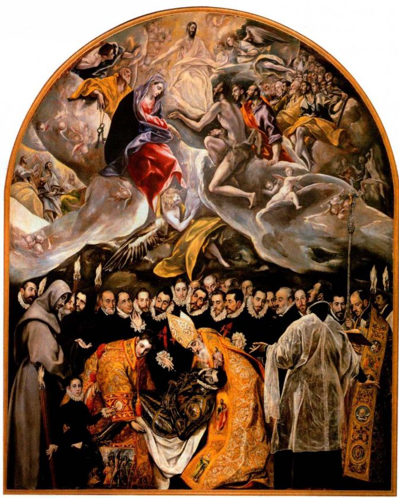

图18\.11 埃尔·格列柯：《奥尔伽兹伯爵的葬礼》。1586年。布面油画，4\.88x3\.61米。西班牙托莱多的圣托梅教堂

630 詹森艺术史

本韦努托·切利尼（1500\-1571年）

节选自本韦努托·切利尼的《自传》（The Autobiography）

这位佛罗伦萨雕塑家的自传撰写于1558至1566年间。切利尼的这部作品回顾他早年的生活、习艺经历及在艺术上的成功。但直到18世纪这部书才得以出版，激励了那个时代以及19世纪的艺术家。这段节选的主要内容是《弗朗西斯一世盐罐》的设计及其验收时的情况。切利尼在制作这件器物时接受了若干位廷臣的建议，但他最终自己决定了器物的样式。

我做了一个半臂多长的椭圆形容器\-实际长度差不多有三分之二臂长。在这个容器上，为了表现海洋拥抱陆地，我做了两个比手掌略大的精美人物，他们对膝而坐，如同长长的海湾延伸到陆地之中。在象征大海的男人掌握之中，我设计了一艘精心锻造、装饰奢华的航船，船舱可以轻松容纳大量的盐。我在这个人物身下设计了四匹海马，他的

图18\.12 《奥尔伽兹伯爵的葬礼》所在的礼拜堂，西班牙托莱多的圣托梅教堂

手中拿着三叉戟。我将大地表现成一个女人，她美丽的身体充满了魅力与优雅，我尽自己所能将魅力与优雅表现到极致。她手中是一座神庙，它建在大地上，装饰豪华富丽。女人的身体斜倚着，手抚在神庙上。我造神庙的目的在于盛放胡椒。我还设计了象征丰饶的羊角，用我所知的世界上一切美好的材质来装饰它。在女神的身体及象征陆地的那部分，我制作了大地上所有最为美丽的动物。在海神所统领的那半部分，我安排了这个狭小的空间所能容纳的所有美丽的鱼类和小蜗牛。在椭圆形最宽的地方，我制作了极其丰富的装饰······我（在国王面前）将模型呈现出来，他惊异地说道：“这比我能想象的还要精美百倍。这是他的杰作。这个人应该永不停歇地创作！”之后他满脸喜悦地转向我，说他非常喜欢这件作品，希望我用黄金来制作它。

SOURCE: MY LIFE\(VITA\)BY BENVENUTO CELLINI TR\. JULIA CONAWAY BONDANELLA AND PETER BONDANELLA\.\(NY:OXFORD UNIVERSITY PRESS,2002\)

般人物与丁托列托《最后的晚餐》［见图17\.34］中的天使相类似），由一位天使引领升入天堂。画面的上半部集中表现的是天堂的众位人物，其绘画手法迥异于下半部的凡间人物。云朵、肢体和衣袍等每一个形体都聚向基督，像火焰一样处于大幅度运动之中。格列柯画作中压缩的构图、超凡的光线与轻盈的人体具有与罗索的《下十字架》（见图17\.1）相似的意大利风格主义作品的特征。

这幅作品的全部意味只有将其放在它的原始背景中观看（图18\.12）才更加清晰。如同一面巨大的窗户，画面占据了礼拜堂的整面墙壁。画布底端距离地面约1\.8米，由于礼拜堂进深仅有约5\.5米，观众必须尽力仰头向上才能看到画面的上半部分。经过计算，格列柯采用了极端的透视缩短手法，以营造出画面上方空间无垠的视觉效果，而下半部前景中的人物如同置身于舞台之上。嵌入墙壁的大石板也是画作整体的一部分，它在画中是石棺的正面，两位圣徒正将伯爵的遗体放入石棺中，这就解释了画面中人物的动作。于是，观众此时能够感知到三个层次的现实感。第一层是坟墓本身，它在想象中就放在墙体之中与视线平齐的位置，并由真实的石板将其封闭起来；第二层现实感是神迹葬礼的重现；第三层现实感则是某些参与者所亲眼见证的天堂荣耀之景。这种神秘主义具有与耶稣会的创立者、罗耀拉的圣依纳爵所作的《神操》（Spiritual Exercises）的某些部分相似的特点。为了服务于天主教的改革目标，圣依纳爵教导信众们如何沉思，以使他们获得极其真实的幻象，就像展现在人们眼前的真实场景一样。这样的神秘主义体验只能在

第十八章 16世纪北部欧洲的文艺复兴与宗教改革 63

__大事年表__

1519 年——麦哲伦从西班牙出发，开始环球航行  
1521 年——科尔特斯占领墨西哥  
1563 年——埃斯科里亚尔宫开建  
1586 年——埃尔·格列柯创作《奥尔伽兹伯爵的葬礼》

人们高度虔诚、尽力沉思时才能实现。信众们的这种努力通过格列柯作品中的强烈艺术效果得到了反映，作品表达了紧张的精神斗争。

中部欧洲：宗教改革与艺术

当法国、西班牙和意大利各国坚定信仰天主教时，欧洲其他地区的宗教与艺术状况却更为复杂。除西班牙之外，查理五世还继承了许多地区的统治权，他当时的辽阔领地囊括了今天的德国、奥地利、匈牙利和捷克共和国。统治差异如此之大的地区是一个极大的挑战，而当查理五世于1556年退位之后，问题又转移到他的弟弟费迪南德手中。尽管许多地区间都存在着语言、文化与贸易联系，但也有些地区事实上享有独立地位，只在名义上受神圣罗马皇帝的统治。1517年之后的宗教改革导致了宗教信仰的分裂，这些地区间曾经可能拥有的统一又遭受了另一次打击。

1517年10月，前奥古斯丁会修士、时任维滕贝格大学神学教授的马丁·路德对当时的神学和天主教会制度发起了公开挑战。他将那份后来闻名于世的《95条论纲》（Ninety\-five Theses）钉在了维滕贝格城堡教堂的大门上。在这份檄文中，路德抨击了天主教会出售赎罪券作为罪行偿还的允诺的活动，他也对圣母与圣徒崇拜提出了反对。而路德撼动了天主教教义基础的抨击则在于，他宣称《圣经》与自然理性是宗教权威的唯一基础，教士与圣徒的介入对救赎毫无必要，因为救赎本来就是上帝的慷慨赠予。这就意味着，宗教权威将从教皇手中转移到每位信徒个人的良心之中。作为回应，天主教会在1521年对路德进行了谴责。但是他的批评主张却得到许多欧洲天主教徒的赞同，这最终激起了政治冲突、动乱和战争。德意志北部的许多地区皈依了新教，而许多南部地区如巴伐利亚（Bavaria）则保持着天主教信仰。在反思这些宗教信仰的基本问题过程中，其他宗教改革者也走上了路德的道路。

瑞士牧师乌尔里希·茨温利试图通过强调教徒可以自由阅读宗教文献和布道追求宗教的本质。在释读《圣经》之后，他不仅谴责教会出售赎罪券的行为，

而且对各种视觉艺术也加以抨击。茨温利将圣餐礼中分享面包与酒解释为一种象征性仪式，而不是实际发生的事件，这造成了他与马丁·路德在神学上永远无法愈合的分歧。各派宗教改革者共同关注的首要问题是如何获得信仰与救赎中的恩典与自由意志，这两个问题事实上相辅相成。1531年茨温利死于天主教会的军队手中时，新教神学的理论要点仍然没有界定清楚。日内瓦的约翰·加尔文直到16世纪中期才将这些信条条理化，他所主张的建立在逐字逐句阅读《圣经》基础之上道德生活的设想当时产生了极大的影响。新教信仰的传播引发了长达几十年的暴力，包括1525年的农民起义以及皈依新教信条地区的诸次战争。从1546至1555年，德意志诸公国与神圣罗马皇帝查理五世宣战，直到1555年奥格斯堡和平协定（Peace ofAugsburg）签订后战事才告终结。根据这一协定，德意志各个独立地区确立了教随国定的原则。此举深化了改革信仰在该地区的传播，但同时也加剧了政治分裂。

这些历史事件对同时期艺术的影响同样重大。尽管路德本人对视觉艺术爱恨交织，但他也认同艺术作为教育工具的价值（见第三部分末尾的附加原始文献）。一些更为激进的宗教改革者在中世纪与文艺复兴的艺术中只看到了偶像崇拜，认为必须将之荡涤。受到这些改革者热情的激发，各个城市的市民领袖、工匠和工人纷纷破坏城市中的宗教图像。这几次破坏艺术图像的浪潮被称为破坏圣像运动（iconoclasm），大量早些年间的艺术品蒙受损失。此外，由于中欧的大片地区皈依了新的信条，许多教堂被以白粉粉刷，宗教订单的枯竭使得艺术家曾经赖以为生的众多艺术形式消失了。各个艺术领域的艺术家们不得不为自己的作品寻找新的风格、题材与市场。

人文主义和新的印刷技术在宗教改革中扮演了至关重要的角色。孜孜探索的精神与对原始文本的尊重激发了一大批著名学者与教师从事写作，如鹿特丹（Rotterdam）的德西德里乌斯·伊拉斯谟（Desiderius Erasmus）、德意志的菲利普·墨兰顿（Philip Melancthon）和英格兰的托马斯·莫尔（Thomas More）。印刷版的拉丁文本将各种新思想传遍了欧洲。就这样，印刷机就成为宗教改革思想发展与传播的重要因素。个人能够阅读《圣经》是新教徒的基本宗旨，因此他们需要精美的《圣经》文本和它的各种日用地方语言的译本。路德自己就将《圣经》译成了德文。印刷图像也为新教观念的传播做出了贡献，廉价的木刻作品讽刺了天主教教士阶层，而将新教徒表现为英雄。印刷品也阐释了新教教义。

632 詹森艺术史

格吕内瓦尔德的《伊森海姆祭坛画》

然而并非所有欧洲德语地区都皈依了新教，新教也是直到16世纪20年代才在较广泛的区域被接受，因此16世纪时也出现了一些服务于天主教赞助人的传统艺术品。这批艺术品中的许多都令人难忘，马蒂亚斯·戈特哈特·尼塔特（Matthias Gothart Nithart）创作的祭坛画就是其中的一件。几个世纪以来，这位画家都被人们称为格吕内瓦尔德（Grünewald，约1475\-1528年）。这是17世纪的作家给他起的绰号。现代德国的艺术家们开始寻找其艺术根源时，他们通过这个绰号发现了艺术家本人，这个绰号却流传至今。格吕内瓦尔德出生在德意志中部的维尔茨堡（Würzburg），为美因茨（Mainz）的大主教作画。他最为著名的作品是称为《伊森海姆祭坛画》（Isenheim Altarpiece）的异形三联画，在结构上与帕赫的《圣沃尔夫冈祭坛》相类似（见图14\.29）。这组作品于1509或1510至1515年间为阿尔萨斯（Alsace）地区伊森海姆圣安东尼会的修院教堂而作，这座教堂离该作品目前在科尔马市的收藏地（之前是一座修道院）不远。

这座修院教堂当时服务于圣安东尼会的修士以及修道院附属医院的病人。这些修士当时专门照料罹患圣安东尼热（即丹毒）的病人。该疾病是一种因食用腐败黑麦所造成的生理机能紊乱，它能引起多种痛苦的症状，包括肠道紊乱、肢体坏疽与幻觉。治疗手段主要为镇定浴，有时则要截肢。格吕内瓦尔德创作的祭坛画安置在修院教堂的高祭坛上，当年教堂的修士与医院中的病人想必都能看到。这组杰作被置于一件由尼古拉斯·哈格瑙（Nicolas Hagenau）在1505年前后制作的巨型木雕圣龛中。中央雕刻部分嵌入了九块画板，它们被组织成活动的两组侧屏。祭坛整体分三个打开的阶段或“场景”。所有侧屏闭合时为第一组场景，展示的是中央画板的《耶稣受难》（The Crucifixion，图18\.13），从周一到周六人们看到的都是这一图像。左右两侧屏分别是《圣塞巴斯蒂安》（St\.Sebastian）和《修道院长圣安东尼》（St\. Anthony Abbot），人们祈求前者对抗圣安东尼热（对比图15\.52），后者则被当作治病的良医而受到崇拜。中央的《耶稣受难》汲取了中世纪晚期的沉思像传统（对比图12\.52），强调耶稣所受的苦难与圣母的哀痛。耶稣血流如注，扭曲的身躯遍体鳞伤，这与14世纪神秘主义者圣布里奇特（St\.Bridget）在她的《启示录》（Revelations）中所描写的景象相符合，这部书于1501／02年出版了德语版本。

格吕内瓦尔德将十字架上的耶稣表现为主体，统

领其他人物与背景。耶稣受难脱离了事件的常见背景，成为一个孤独的事件，映衬在恐怖的风景与幽蓝的天空之中。尽管景物一片黑暗，但是一抹神秘的光照亮了前景中的人物，引起了观众对他们的注视。画面左边的玛利亚身着白衣，因看到自己的儿子饱受折磨而昏厥不醒，圣约翰的红色长袍更衬托出了她的苍白。根据手边香膏罐判断，十字架下的人物是抹大拉的玛利亚，她悲痛地跪倒在地，失声恸哭。画面右侧，施洗约翰手指十字架上的耶稣，他的手旁写着这样的文字：“他必兴旺，我必衰微”，暗示基督牺牲的伟大意义。他身后的水体令人联想到洗礼的治愈力量。施洗约翰脚下的羊羔如《根特祭坛画》（见图14\.12）中的将血滴进圣杯。流血的羔羊暗示着圣餐礼，该仪式就在这组祭坛画前举行。在下方的祭坛台座上，一座坟墓正准备接纳耶稣那遭受折磨的尸体，圣母及众人与他诀别。祭坛台座在耶稣的膝盖处分为两半，被截肢的病人可能因此会将自己所受的痛苦与这幅图像联系起来。

周日或节日时，外层侧屏会打开，《伊森海姆祭坛画》的气氛会发生戏剧性的变化（图18\.14）。此时展现的将是第二组图像，《圣母领报》、《圣母子与天使》（Madonna and Child with Angels）和《基督复活》（图18\.15），场景的喜悦，一如耶稣受难图像的抑郁。这组图像表现了从基督化成肉身到复活救赎的全过程，它为患有疾病的人提供了一剂精神良药，让他们心中存有天国的应许。格吕内瓦尔德在这组画面中描绘了医院向病人推荐的各种疗法：音乐、草药、洗浴和光照。祭坛台座上耶稣的躯体与右侧画板中复活的基督形成鲜明对比，为垂死的人提供了慰藉。

格吕内瓦尔德通过色彩和构图将各个画板上的内容联系在一起。左侧《圣母领报》中的红色与粉色贯穿于中央的几块画板上并渐次加强，最终在右侧复活的基督周围那灿烂的色彩中达到顶点。祭坛台座上，圣母与友人怀抱着的死去耶稣的形象为中央画板上圣母怀中的幼年耶稣形象平添了几许悲哀。在中央画板上，发生圣母领报场景的简单哥特式礼拜堂变成了一个新奇的圣龛（tabernacle），一群唱诗班天使伴随着弦乐演奏在其中歌唱。圣龛之下是圣母的形象，她头戴圣冠，光芒如烛火一般洞照。此处环绕圣母的光环预示了右侧屏上基督复活时似乎要消融于光线之中的光辉形象。位于图像中心的圣母温柔地怀抱圣子，纯净光线形成的天堂幻景出现在她的头顶。

这些元素将观众的视线引向右侧屏，在祭坛台座上曾被放入石棺的基督此时飘浮于石棺之上。被遣去

第十八章 16世纪北部欧洲的文艺复兴与宗教改革 633

2\.69 × 3\.42米。

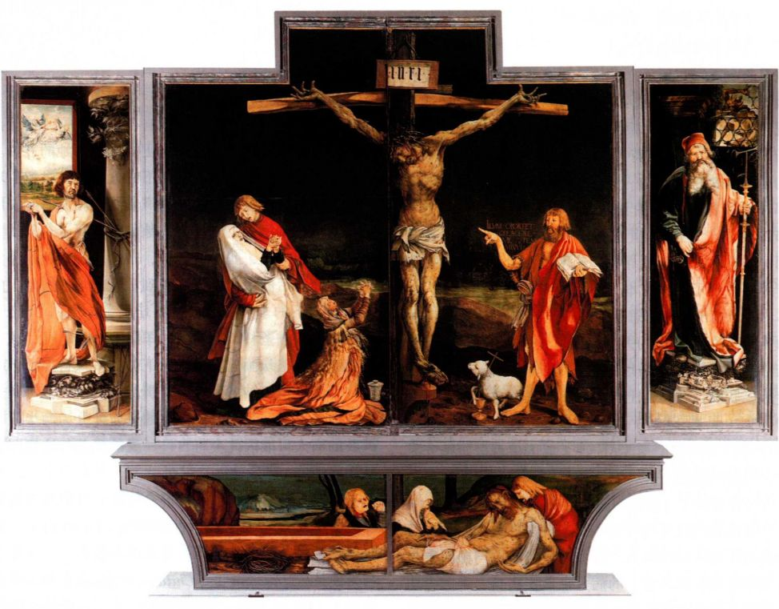

图18\.13 马蒂亚斯·格吕内瓦尔德：《圣塞巴斯蒂安》、《耶稣受难》、《修道院

长圣安东尼》；祭坛台座作品：《哀悼基督》，《伊森海姆祭坛画》（闭合状态）。

约1509／10\-1515年。木板油画，主体2\.98x3\.28米，祭坛台座0\.75x3\.40米。法国

科尔马市菩提树下博物馆（Muséed＇Unterlinden）

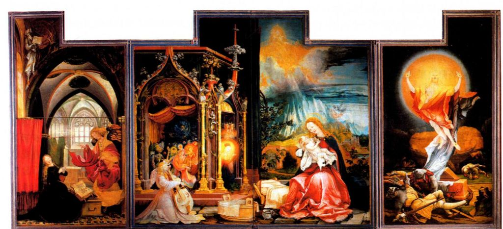

图18\.14 马蒂亚斯·格吕内瓦尔德：《圣母领报》、《圣母子与天使》、《基督复活》，《伊森海姆

祭坛画》（打开状态）。约1509／10\-1515年。木板油画，两侧屏

2\.69 × 1\.42米，中央画板

法国科尔马市菩提树下博物馆

634 詹森艺术史

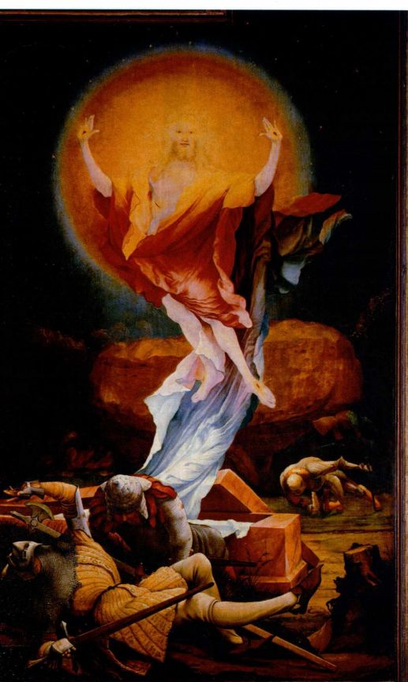

图18\.15 马蒂亚斯·格吕内瓦尔德：《基督复活》，《伊森海姆祭坛画》（打开状态）。法国科尔马市菩提树下博物馆

看守坟墓的士兵因神迹的出现而惊恐失神，士兵的形象按照透视法则精心组织在一起，与基督容光焕发的轻盈身体形成了对照。基督举起双手，裹尸布从他身上滑落，他在死亡时所遭受的伤痕一一显露，现在，基督与包裹他的光环一样灿烂夺目。这个形象与十字架上的人物极其不同，身体上没有任何疤痕，其比例也更接近皮耶罗·德拉·弗兰切斯卡的《基督复活》（见图15\.46）中意大利式的理想比例。

格吕内瓦尔德令人惊异、特色鲜明的造型手法是以15世纪建立的北部欧洲文艺复兴传统为基础的。他的油画技法、杰出的用色以及对器物的细节描绘都出自这一传统，但是他必定也从意大利文艺复兴艺术中受过教益。低矮的地平线为人物提供了一片深邃的空间，对基督脚下坟墓的描绘则得自于对透视法的研究。然而格吕内瓦尔德并不注重让观众信服于自己笔

下人物的重量感与实体感，他的目标是利用画面的冲击力，引起观众情感上的共鸣。

阿尔布雷希特·丢勒与北方文艺复兴

德意志地区文艺复兴的主要人物是与格吕内瓦尔德同时代的阿尔布雷希特·丢勒（Albrecht Dürer，1471\-1528年）。这位艺术家的风格形成于北部欧洲的现实主义传统（第十四章中有所讨论），但他也对意大利艺术的各种创新与可能进行了深入钻研。在家乡纽伦堡（Nuremberg）学习了绘画与版画制作之后，丢勒在1494／95年游历了北部欧洲诸国与威尼斯，然后才返回家乡开始自己的职业生涯。这次旅行不仅扩展了丢勒的视觉艺术经验，而且对他的世界观以及对艺术家在社会中作用的认识也有所改变。（他在1505年曾再次前往意大利。）丢勒采纳了艺术家既是绅士也是人文主义学者的观念，并接受了美术属于人文学科的意大利艺术界的观念，这一点与曼泰尼亚和阿尔贝蒂等艺术家的主张相同（见第十五章）。通过培养自己对艺术与学术方面的兴趣，丢勒将史无前例的多样化题材与技巧结合在作品中。他的绘画技法从佛兰德斯绘画大师那里受益良多，但是对意大利绘画的临摹也让他习得了意大利文艺复兴艺术的特色。丢勒能够在自己的绘画与版画中将这些传统综合在一起。他是当时最伟大的版画家，通过行销于整个欧洲的木刻与雕版画作品，对16世纪的艺术产生了广泛的影响。丢勒的印制版画让他获得了极其巨大的名望与财富，以至于抱怨他从绘画中所赚酬劳相比之下少得可怜。

在丢勒的大量素描与水彩画初稿中，清晰地显示出扬·凡·爱克和罗杰·凡·德·维登对他的影响。他在1502年创作的水彩画《野兔》（Hare，图18\.16），表明这位艺术家具有清晰的洞察力，对形象的表现十分自信。这幅再现自然世界的小型作品在处理手法上表现出了高贵感，与自然本身相称，十分类似于扬·凡·爱克在《阿诺尔菲尼夫妇像》（见图14\.16）前景中所绘的小狗。丢勒运用了水彩技法来描绘兽皮上的每一根毛发、耳朵的曲线与眼睛的光泽。画面下方的花押字表明丢勒是作品的创作者，这是他在自己版画上的惯用署名。

丢勒作为绘画大师的能力也对他的版画作品产生了影响。他曾学习过木刻和雕版画两种技艺，并将两种技艺推向极致。版画是大众艺术，不会有单个赞助人定制，而是为开放的市场而制作，所以丢勒不得不在其中投入自己的时间与材料。这种企业家气质十分适合他，因为他的版画作品销路宽广，供不应求。

第十八章 16世纪北部欧洲的文艺复兴与宗教改革 635

1500年前夕，欧洲人因各种迹象和征兆而焦虑不安，例如土耳其人入侵的威胁，以及畸形动物的出现等。年关临近，很多人相信基督马上就会再次降临，并着手准备迎接新世纪。丢勒由此察觉到市场上需要关于流行的末日恐惧的作品，于是，他在1498年创作了一系列作为《启示录》插图的木刻版画。这是他1495年从意大利返回之后的几年间所创作的最有雄才大略的版画作品。恐怖的《启示录四骑士》（The FourHorsemen of the Apocalypse，图18\.17）以令人惊异的视觉艺术形式向观众展现了《启示录》的内容。这幅作品描绘了战争、大火、饥荒和死亡屠戮生灵的情景。在1494年的意大利之旅中，丢勒见到了曼泰尼亚的版画，并精心复制了那些作品。他尤其赞赏曼泰尼亚在《圣塞巴斯蒂安》（见图15\.52）等绘画中表现出的雕塑性效果。这组启示录系列版画中的人物具有巨大的能量与饱满的身体，这一点尤其得益于丢勒对意大利艺术的融会贯通，尽管他出于对属于精神层次的平面空间的偏爱而回避了透视空间。丢勒运用雕版画的线性设计使木刻的艺术效果更为丰富，从而重新定义了木刻艺术。他摒弃了早期木刻中用于造型的宽轮廓线和间杂其间的影线，大片的影线、宽度各异的线条以及强烈的黑白对比，使得木刻作品具有了突出的绘画效果（对比图14\.30中作于1425年的《布克斯海姆的圣克里斯托弗》与丢勒的作品）。丢勒所创立的新形式迅速普及为全欧洲的木刻技法。

丢勒对北部欧洲与意大利艺术传统的融合在他作于1504年的雕版画《亚当与夏娃》（Adam andEve，图18\.18）中表现得非常明显。水彩画《野兔》是为这幅作品所作的探索性研究。这一取自《圣经》的题材使得丢勒能够将这对人类始祖表现为完美的裸体：他们仿佛是浓密丛林中的阿波罗与维纳斯。与作品中如画的背景与动物不同，亚当与夏娃的形象不是出自对真实人体的观察，而是以维特鲁威的艺术观念为基础，按照丢勒自己所认为的完美比例构造的（见第637页的原始文献）。丢勒再一次突破了雕版画家所能运用的描绘性镌刻版画的极限，渐细渐粗的线条，以各种角度交叉排列，刻线或延伸、或终止、或消解为碎点，这种手法称为点刻法（stipples），结果这幅单色画似乎在色调与质感上具有了丰富的变化。伊甸园中动物的选择别有深意：猫、鼠、牛和麋鹿都被解读为中世纪人格心理理论中的象征，肉体的流变控制着个性，动物被用来指代各种气质。猫代表易怒的胆汁质；牛代表无精打采反映迟钝的粘液质；驼鹿代表忧郁严肃的抑郁质；兔子代表精力旺盛耽于性欲的多

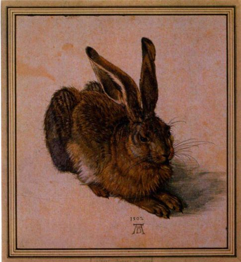

图18\.16 阿尔布雷希特·丢勒：《野兔》。1502年。水彩画，

25\.1 x 23 \.5厘米。维也纳阿尔贝蒂娜美术馆（Albertina）

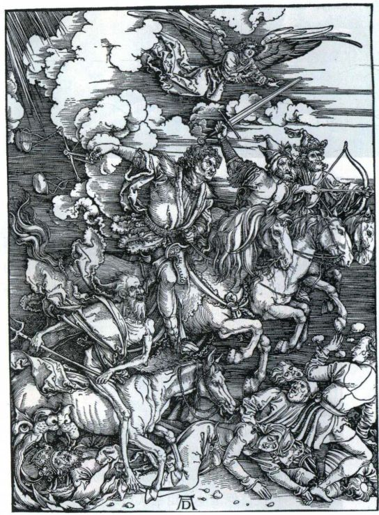

图18\.17 阿尔布雷希特·丢勒《启示录四骑士》。1498年。木刻版画，39\.4 × 28\.3厘米。纽约大都会艺术博物馆，Junius S．Morgan于1919年捐赠

636 詹森艺术史

阿尔布雷希特·丢勒（1471\-1528年）

节选自《论人体比例》（The Book on Human Proportions） 的草稿

丢勒曾两次前往意大利，耳濡目染了那里所讨论的新艺术理论，这些理论给他留下了深刻的印象。然而，丢勒并没有不加批判地全盘接受这些理论，他对意大利艺术观念的思考经常只在作品初稿中出现，比如以下这段写于1512至1513年间的草稿。

如何判断美与不美是一个需要仔细考虑的问题。······我们认为在某些事物上认为美的在其他地方可能被认为不够美。关于美，想要辨别清楚“好”和“更好”并不容易，因为我们完全可能创作两个不同的形象，一个矮胖一个高瘦，但我们几乎不能判定哪个的美更胜一筹。我也不知道什么是美，尽管它在很多事物上都有所表现。当我们希望在我们的作品中创造美感时，会发现这非常困难。我们必须四处求索去搜集美，特别是在人的形象中寻找美······人们可能在两百或者三百个男子中间都找不到可以利用的点滴之美。因此，如果你想要创作一个美丽的人像，就必须从某些人的头部借

鉴一些，再从另外一些人的胸部、手臂、腿和手足借鉴一些。······

很多人只按照自己的品位决定美丑，这是错误的。因此每个人都要当心，不要让自己的好恶蒙蔽自己的判断。因为儿不嫌母丑。······

关于此类问题，人们再三考虑，形成了无数不同的意见，并各自寻求自己想要的东西，尽管丑比美更容易发现。既然我们处于这样的错误情势之中，我不明白如何才能坚定而一劳永逸地确定，哪种方法更接近绝对的美。······

对我而言，一个人不可能指出人体最好的比例，因为谎言就存在于我们的感知之中，我们内心的黑暗非常顽固，即使我们摸索也会失败。·······

然而，既然我们不可能达到完美，那么我们是否就应该因此而停止对美的探索呢？我们不能接受这个荒唐的想法。恶与善就呈现在人的面前，一个理智的人应该选择较好的那一个。

SOURCE: THE WRITINGS OF ALBRECHT DURER,TR\.AND ED\.BY WILLIAM MARTIN CONWAY\. \(NY:PHILOSOPHICAL LIBRARY,1958\)

血质。在堕落之前的时刻，各种气质仍然平衡共存，人类的始祖仍保持着理想的美。构图本身也因色调效果而平衡统一。丢勒那著名的署名落在亚当头旁的饰板上，他的这幅作品影响深远，其中男女人物的完美造型以其品质成为无数艺术家效仿的典范。

关于艺术性的图像 尽管丢勒的版画作品最为出名，但他在素描方面也很有天赋，也是一位技艺精湛的油画家。他在13岁时所作的一幅自画像素描预示了这位艺术家对自我形象的执迷，这种迷恋后来贯穿于他的整个艺术生涯。丢勒作于1500年的《自画像》（Self\-Portrait，图18\.19） 令人印象深刻，刻画极具深度。从绘画的角度来讲，这幅作品的风格属于以扬·凡·爱克的《戴红头巾的男子》（见图14\.15）所代表的佛兰德斯绘画传统，但是画中人物庄重的姿态与理想化的面容所体现出来的自信在之前绝大多数自画像中都不曾发现。丢勒没有采用肖像画惯用的四分之三侧面姿势，而是以正面示人，这种姿势当时通常用来表现神灵。事实上，这件木板油画似乎是一幅世俗化的圣像，因为它借鉴了基督像的模式。这既反映出了丢勒的虔诚，也体现出他对自己作为艺术家与知识分子所承担的使命的严肃态度。

艺术家的社会地位可能也是丢勒另一幅版画的主题，这是他最为著名但也最令人迷惑的一件

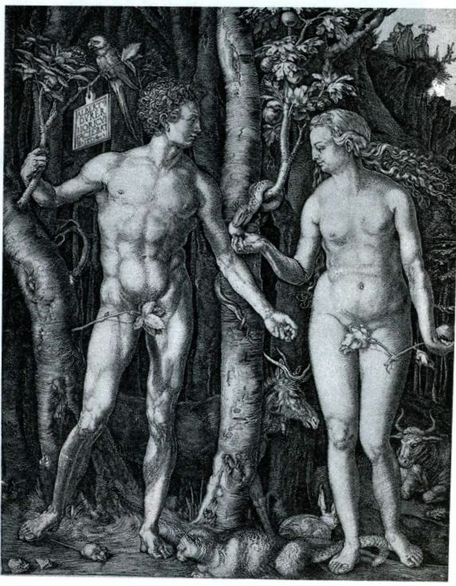

图18\.18 阿尔布雷希特·丢勒：《亚当与夏娃》。1504年。雕版画，

25\.1 × 1 9\.4厘米。波士顿美术馆，Landon T\.Clay百年赠礼

第十八章 16世纪北部欧洲的文艺复兴与宗教改革 637

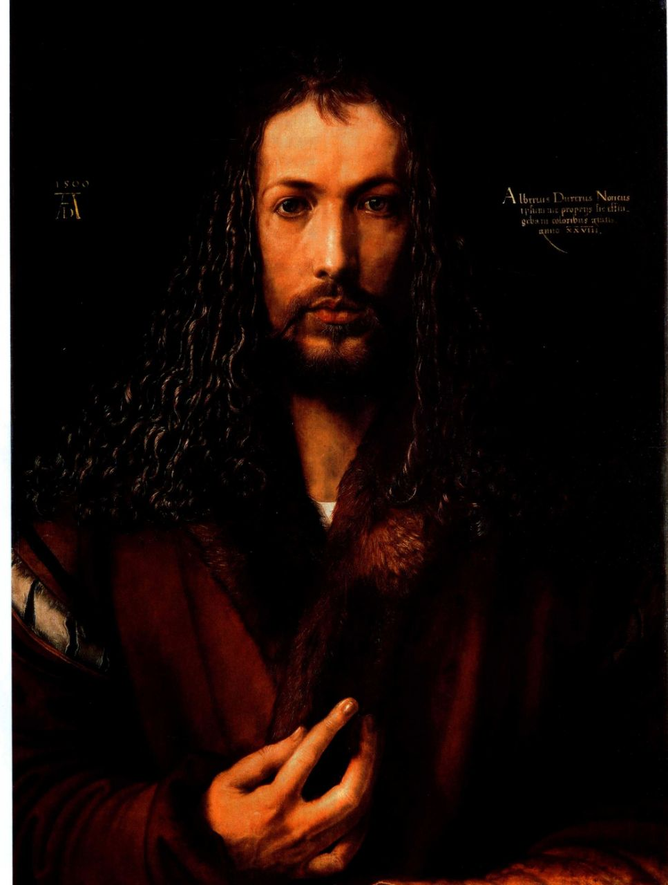

图1 8\. 1 9 阿尔布雷希特· 丢勒， 《自画像》。1 500 年。木板油画， 66 \. 7 × 48\.9 厘米。慕尼黑老绘画馆（ A il e Pinako lhek\)

图18\.20 阿尔布雷希特·丢勒：《忧郁1》。1514年。

雕版画，      厘米。伦敦维多利亚和阿尔伯特博

物馆

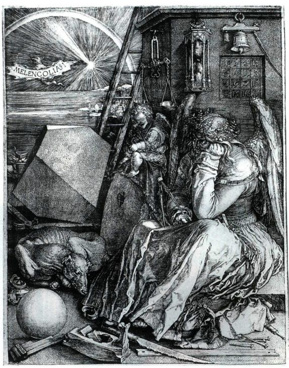

作品。这件雕版画名为《忧郁I》（Melencolia 1，图18\.20），是丢勒出售或赠送他人的一套三联版画中的一幅。这件作品创作于1514年，表现了一位手持一个圆规的有翼女性，她的身旁布满了数学家与艺术家所使用的工具。她手中拿着几何工具，身边却是一片杂乱。这个人物的形象可能是拟人化的，然而关于她的身份却引发了争议：她代表忧郁？代表几何？还是天赋？她的脸隐在阴影之中，坐姿长久以来也是与忧郁联系在一起，而忧郁本身就与智力活动与创造才能相关联。若将她的姿态与拉斐尔在《雅典学院》（见图16\.25）中描绘为赫拉克利特的米开朗基罗相比，可以发现，丢勒与拉斐尔一样，都将天才人物的面孔遮蔽在阴影中，似乎他们陷入了沉思。丢勒的人物思考却不能行动，在石板上乱涂的小孩儿象征实用知识，他能够行动却不会思考。丢勒在此处就艺术气质及其与忧郁情绪的关系进行了陈述。

意大利人文主义者马尔西利奥·菲奇诺将忧郁视作神启的源泉（他自己就受到了这种影响）。他将忧郁与代表世界之智（Mind of the World）的土星联系在了一起。在当时人们的观念里，土星是各个行星中最古老也是离人间最远的星球，菲奇诺认为它的地位

甚至高于代表世界之魂（Soul of the World）的金星。菲奇诺的这种忧郁精神观念在丢勒的时代流传甚广。丢勒的这件作品中包括了种种与土星、金星、神启及几何学理论相关的细节。这幅版画宣称，视觉艺术家（抑或丢勒本人？）所具有的那种特殊身份\-如果说不是受忧郁激发，也是受神启示的天才。

改革派艺术家 尽管丢勒与格吕内瓦尔德一样，仍继续为信仰天主教的赞助人服务，但他却是马丁·路德早期一位热忱的追随者。他在信仰上的这种新变化可从其1520年之后创作的宗教作品的题材及其日益朴素的风格中窥得一二。《四使徒》（The FourApostles，图18\.21）是这一趋势的高潮，这对木板油画可以被后人恰如其分地称为丢勒的艺术遗嘱。他于1526年将这件作品送给了纽伦堡，该城在前一年加入了路德派的阵营。画中的四个人物是新教教义的基础性人物。路德所偏爱的圣经作者约翰与保罗在前景中对面而立，彼得和马可分别站在他们身后。由路德翻译，出自他们著作的引文铭刻在画面下方，警告纽伦堡城不要以上帝的意志为借口而犯下人类的错误。他们既驳斥了天主教徒的说法，也驳斥了新教徒中的激进分子的观点。但在另一种更广泛的意义上来说，这四位人

第十八章 16世纪北部欧洲的文艺复兴与宗教改革 639

物代表着四种气质，并暗指宇宙中多种与“四”有关的现象：一年四季、四大元素、一日四时与人生的四个阶段。画面中的圣徒具有雕塑般的坚实感，这令人联想到了南尼·迪·班科的《四圣徒》（见图15\.5）。而人物厚重的衣袍则具有拉斐尔的《圣保罗在雅典布道》（见图16\.27）那幅挂毯样稿中人物的重量感与真实感，丢勒可能于1521年的尼德兰之旅中见过拉斐尔的这件作品。丢勒以其油画的力量、版画的便于传播以及他的作坊的声名成为了16世纪德意志最有影响力的艺术家。

改革时代的宗教与宫廷艺术

宗教改革造成了德意志文化与社会的重组，这要求艺术家必须对他们的风格和题材作相应改变，以适应改革后的宗教信仰。版画在当时是传播新教教义的重要工具。而对宫廷里的赞助人，艺术家则要为其创作古典题材的作品，并运用本土视觉艺术传统强调细节、质感和自然环境，对此种题材加以表现。

在宗教改革时期的德意志地区，画家不得不对新教领袖在宗教视觉艺术方面的犹豫不决想方设法予以

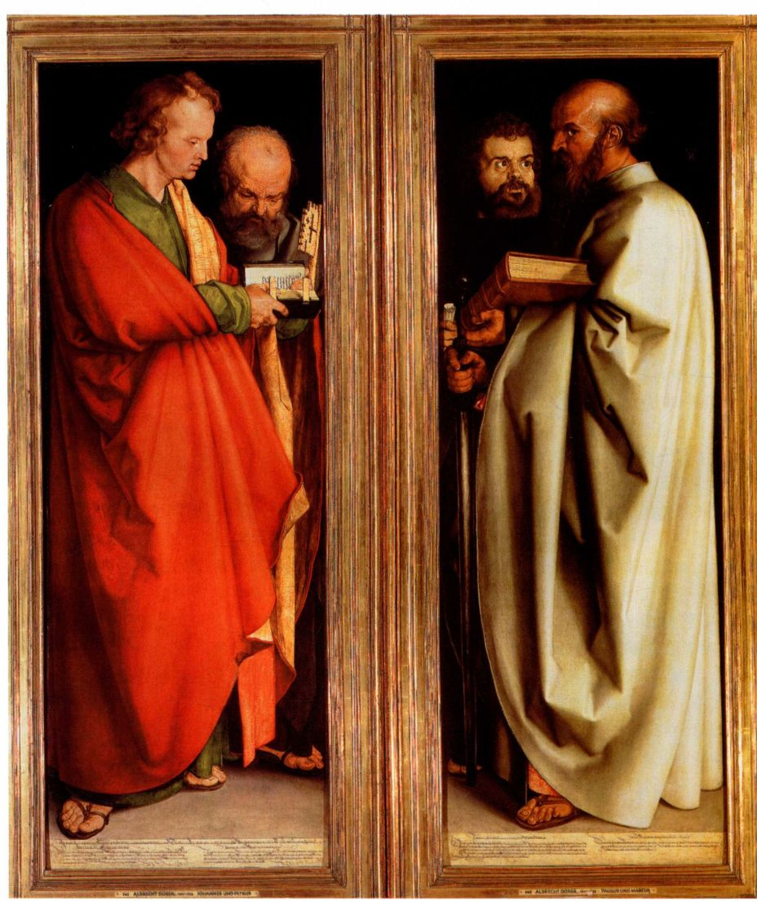

图18\.21 阿尔布雷希特·丢勒：《四使徒》。1523\-1526年。木板油画，每块画板为2\.16x0\.76米。慕尼黑老绘画馆

640 詹森艺术史

图18\.22 老卢卡斯·克拉纳赫：《法律与恩典的寓言》。约1530年。木刻版画，27 × 32 \.4厘米。伦敦大英博物馆

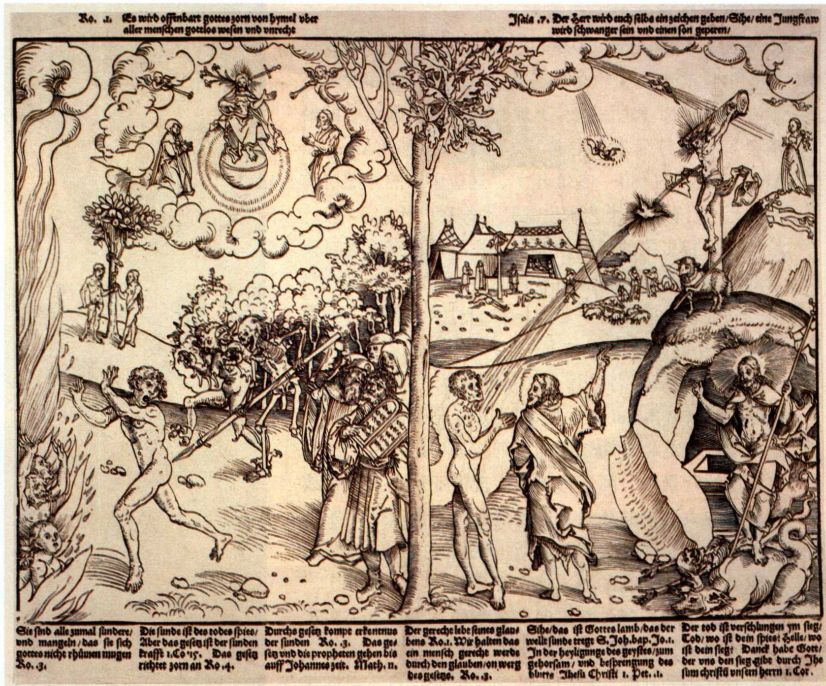

纳赫使得自己的作品几乎像文字作品一样直观可读、

易于理解。

除了创作与路德派新教内容有关的视觉艺术作

品之外，克拉纳赫在肖像画与神话题材作品方面也表

现出了杰出才能，此类作品一般是为萨克森（Saxony）

及其他德意志诸侯绘制，这些人中既有天主教徒，

也有新教徒。在创作于1530年的《帕里斯的裁判》The

Judgment of Paris，图18\.23）中，克拉纳赫再现了

希腊神话中特洛伊城王子帕里斯挑选奥林匹斯山最

美丽女神的一段情节。他将帕里斯描绘成一位身着

流行于萨克森宫廷的贵族盔甲的德意志骑士。画中

三位女神在王子面前展示着她们纤瘦结实的身体以

便让他做出判断。帕里斯将自己的选择结果透露给

了同样身着盔甲的墨丘利。与当时众多为贵族赞助

人创作作品的意大利艺术家一样，克拉纳赫也在其古

典题材作品中故意加入了色情元素以增加其感染力，

他会邀请观众与帕里斯享受同样的待遇\-观赏女性

裸体。不过那种细致入微、细密画式的技法与轻盈的

女体是克拉纳赫作品的独特之处。画面中另一个动人

的特色在于风景，虽然克拉纳赫将枝叶夸张为一种

令人想起丢勒的《亚当与夏娃》（见图18\.18）。

版画相比，克拉纳赫的这幅图像相当简单直白，没 自然之美的可感知幻象，但那繁茂苍翠的植物还是

应对。一旦某种信仰将文字置于图像之上，那图像就将成为文字的附属物。尽管马丁·路德本人对宗教视觉艺术的存在持宽容态度（见第三部分末尾的附加原始文献），但当时以路德派为主题的艺术作品通常都是附有平实插图的文本。

老卢卡斯·克拉纳赫：宗教改革者与宫廷艺术家 老卢卡斯·克拉纳赫（Lucas Cranach the Elder，1472\-1553年）是马丁·路德的一位密友，他曾经试图解决用视觉艺术形式表现路德学说这一难题，并为此创作了无数版画与油画，用以表达新教教义。克拉纳赫于1530年前后创作了一幅名为《法律与恩典的寓言》（An Allegory of Law and Grace，图18\.22） 的木刻版画，画中对比了天主教徒与路德宗教徒的不同归宿。画面左侧描绘的场景与天主教教义有关，亚当和夏娃的子孙受到原罪玷染，必须根据《摩西律法》履行特定的行为。如果这种自我救赎不能成功，他们的灵魂在末日审判时就会被打入地狱。而右侧描绘的则是受基督钉十字架时所流鲜血洗礼的信徒，这些人只需要信仰基督，他们的救赎就得到了保障，这正是路德所主张的观点。与丢勒复杂深奥的木刻有复杂的节奏、空间幻觉或者对质感的强调。克拉

第十八章 16世纪北部欧洲的文艺复兴与宗教改革 641

阿尔特多弗的《伊苏斯之战》克拉纳赫与丢勒都在多瑙河画派（Danube School）的风景画发展过程中扮演了至关重要的角色，该画派在16世纪上半叶出现于德意志南部和奥地利。但这个画派中的最重要人物却是阿尔布雷希特·阿尔特多弗（AlbrechtAltdorfer，约1480\-1538年），这位画家的年纪比前两位稍小，他的整个艺术生涯几乎都在巴伐利亚度过。虽然阿尔特多弗的版画和油画题材非常丰富，但对风景的沉迷还是他的作品最显著的特点。阿尔特多弗对风景的处理主要是为了增加作品的艺术表现力。绘制于1529年的《伊苏斯之战》（The Battle of Issus，图18\.24）是他最著名的作品，这幅画为巴伐利亚公爵威廉四世（William IV）的慕尼黑宫殿而创作，是一组描绘历史英雄丰功伟绩的系列作品中的一件。在一览无遗的背景中，阿尔特多弗表现了亚历山大大帝战胜波斯的大流士的场景，这场战役公元前333年发生于伊苏斯。希腊画家阿派里斯也创作过一幅同样题材的作品，以镶嵌画的形式保留在庞贝（见图5\.79）。为了突出主题，阿尔特多弗在悬空的写字板上书写了一段解说词，并在旗帜上留下题字，还标出了大流士逃跑时乘坐的战车，旗帜上的题字可能出自雷根斯堡的人文主义者阿文蒂努斯（Aventinus）之手。阿尔特多弗力图将古代有关这场战役的记载中所叙述的战役规模与参战兵种重现于画中，并尝试再现地中海沿岸地区的地理环境。

阿尔特多弗采用了全景视角，似乎从极高处俯瞰整个战役，将战场上的一切都尽收于画面之中。从这种俯瞰大地的视角出发，观众必须仔细搜寻才能发现淹没在密如集蝗的军队中的两位皇帝。画家对自然现象的描绘较之对人的描绘更为磅礴壮美，远景中太阳正在落下，月亮已经升起，观众几乎能够感觉到地球的转动。弯曲的地平线，荡气回肠的云朵以及高耸的悬崖峭壁，这些景象在视觉上都使成群的军队显得渺小。这样的细节表明此处描绘的事件具有震动世界的重要意义，符合这场战役的历史地位。然而，士兵的盔甲和远景中雉堞林立的城池都无疑是16世纪的样式，这就促使我们寻找画面所具有的借古喻今的意义。这件作品创作之时，奥斯曼土耳其人正企图入侵维也纳，之前他们已经控制了东欧的大部分地区。虽然神圣罗马帝国的军队这次击退了土耳其人，但土耳其在未来的250年里继续威胁欧洲。阿尔特多弗的作品表明，当时即将发生那场欧洲人与土耳其人之战将如同亚历山大大帝与大流士之战一样，具有世界历史上的重大意义。

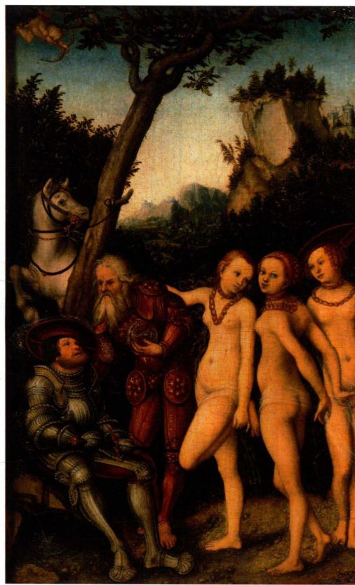

图18\.23 老卢卡斯·克拉纳赫：《帕里斯的裁判》。1530年。木板油画，34\.3x24\.1厘米。德国卡尔斯鲁厄市州立美术馆（StaatlicheKunsthalle,Karlsruhe\)

城市中的绘画：人文主义题材与宗教动乱

莱茵河沿岸的众多城市当时是商业、出版业和人文主义中心，其中尤以斯特拉斯堡（Strasbourg）和巴塞尔为代表。古老的斯特拉斯堡在商业上的成功要归功于它的地理位置与手工业。过斯特拉斯堡，沿莱茵河向下就到了巴塞尔，这座城市当时不仅拥有一所大学，还有一所早期印刷厂，1494年版本的塞巴斯蒂安·布兰特的《愚人船》（见图14\.33）就是在这里印刷的。与其他城市一样，宗教改革与人文主义思想的传播深刻地影响了这里的艺术，这在汉斯·巴尔东·格里恩和汉斯·荷尔拜因的作品中表现得十分清晰。

人文主义与道德观：汉斯·巴尔东·格里恩的《死神与少女》人文主义对德意志艺术家的影响可在汉斯·巴尔东·格里恩（Hans Baldung Grien，

642 詹森艺术史

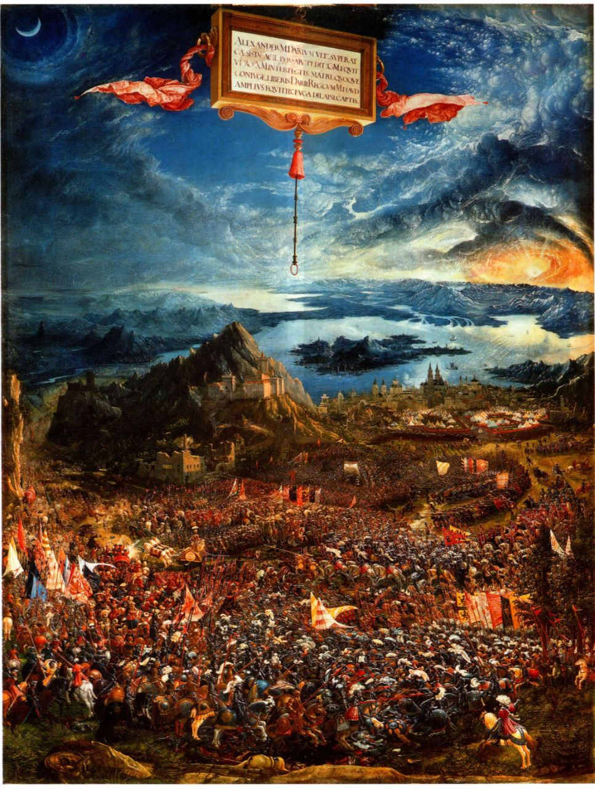

图18\.24 阿尔布雷希特·阿尔特多弗：《伊苏斯之战》。1529年。木板油画，157\.5x119\.4厘米。慕尼黑老绘画馆

第十八章 16世纪北部欧洲的文艺复兴与宗教改革 643

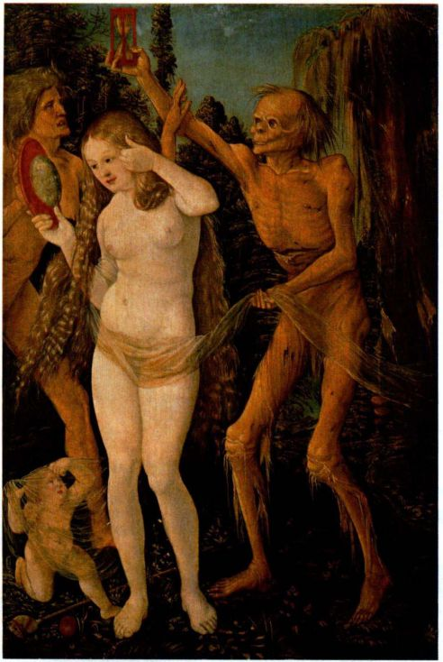

图18\.25 汉斯·巴尔东·格里恩：《死神与少女》。约1510年。木板油画，		40 × 32\.4厘米。维也纳艺术史博物馆

1484／85\-1545年）的作品中看到。这位艺术家既是油画家，也是版画家。他曾是丢勒门下的学徒，在斯特拉斯堡度过了艺术生涯的大部分时间。巴尔东·格里恩虽然创作过若干宗教作品，但也创作了大量探究巫术、魔法和死亡的世俗题材作品，其中一个的典型例证是作于1510年的《死神与少女》（Death andthe Maiden，图18\.25）。画面描绘了一位自我欣赏的年轻裸体女子，她正观察着自己在镜子中的映像，而骷髅般的死神却在她的头顶上耀武扬威地举着一个沙漏。与少女相伴的是她不同年龄阶段的自己：一个玩弄着缠绕女子身体的透明轻纱的小孩儿；一位为避开死神而行动仓促的老年女人。这三个形象代表人生的三个阶段：童年、成年和老年，这些都在镜子里显现出来。然而，尽管三张面孔都绝望无助地盯着年轻的少女，少女却显然在拨弄着自己的长发。这位少女是虚荣这一缺点的人格化形象，但即使虚荣也要屈从于死亡。这种以表现美丽脆弱易逝，死亡终不可免为主题的绘画被称为虚空（Vanitas）寓意画，在当时那个猝死经常发生的时代非常流行。巴尔东·格里恩这幅

作品中人物形象的来源包括丢勒的版画《亚当与夏娃》中的夏娃以及扬·凡·爱克对镜中人的再现手法（见图14\.16）。此处风景所具有的繁茂奇异之感在克拉纳赫的作品里也有出现。尽管该作品的赞助人不得而知，图像本身却让观众在欣赏年轻女性身体美的同时思索死亡将至。

汉斯·荷尔拜因在宗教改革时期的巴塞尔 小汉斯·荷尔拜因（Hans Holbein the Younger，1497\-1543 年）是画家之子，出生于奥格斯堡并在那里度过了童年，但他的职业生涯是在巴塞尔建立起来的。巴塞尔位于今天的瑞士境内，当时也是莱茵河畔的一个学术、出版业与商业中心。到1520年时，汉斯·荷尔拜因已经是那里的知名画家，同时也是木刻版画设计师。他同时也是当地人文主义圈子中的一员，这个圈子中还包括作家德西德里乌斯·伊拉斯谟（1466\-1536年）。

荷尔拜因将丢勒的风格作为自己的艺术基础，但他后来受尼德兰现实主义与意大利构图技巧的启发，发展出了自己的独特风格。荷尔拜因的肖像画最为出名，例如肖像画《鹿特丹的伊拉斯谟》（Erasmusof Rotterdam，图18\.26）。这幅作品画于著名作家伊拉斯谟定居巴塞尔之后不久。伊拉斯谟是那个时代最为多产的人文主义者之一，与当时众多一流思想家都有书信往来。荷尔拜因的肖像反映出德西德里乌斯·伊拉斯谟的学术权威与地位，他描绘的是这位学者的侧面像，画中的作家正奋笔疾书。这种侧面肖像画曾在意大利早期文艺复兴时期广为流行（见图15\.47），只不过荷尔拜因取的是呈坐姿的人物正在活动的样式。尽管构图运用了较老的意大利模式，荷尔拜因却从细节化的现实主义角度来描绘人物及其背景。简单的构图使得画面的焦点聚于坐着的人物身上。这幅作品是对学者极其理想化的再现，伊拉斯谟的肖像充满了沉静的理性之光，俨然是一位学术权威，而以前这种权威只为教会的博士所专有。这种相似可能是有意为之，因为伊拉斯谟非常敬仰将《圣经》翻译为拉丁语（即武加大译本）的圣杰罗姆。圣杰罗姆的著作也是伊拉斯谟的著作所效仿的典范，伊拉斯谟曾出版印刷本《圣经》，其中包括希腊文本与他自己翻译的拉丁语译本。伊拉斯谟版的《圣经》于1516年出版于巴塞尔，马丁·路德随后将其翻译成了德语。

宗教改革的扩大搅乱了巴塞尔的人文主义圈子。到1525年，茨温利的追随者们开始宣扬唯有《圣经》才具有权威性的观点，而更为激进的新教徒则将宗教图像斥为偶像。为了躲避这种社会氛围，荷尔拜因到

644 詹森艺术史

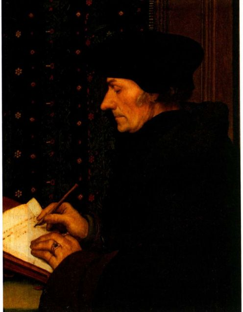

图18\.26 小汉斯·荷尔拜因：《鹿特丹的伊拉斯谟》。约1523年。木板油画，	42 × 3 1\.6厘米。巴黎卢浮宫

其他地方去寻找赞助人。他曾在1523至1524年间前往法国，可能希望向弗朗西斯一世举荐自己的技艺。他也曾在1527年来到了英格兰，希望获得来自亨利八世的宫廷订件。在英格兰，他将伊拉斯谟的肖像作为礼物送给了人文主义者托马斯·莫尔，后者成了他在伦敦的首位赞助人。伊拉斯谟在一封写给摩尔推荐荷尔拜因的信中写道：“这里（巴塞尔）的艺术正在遭遇严冬。”1528年，荷尔拜因重返巴塞尔，然而此时口头辩论已然为暴力所取代。他亲眼见到新教暴徒捣毁宗教图像的行为，伊拉斯谟在一封信中这样描述当时的场景：“教堂或修道院里的雕像无一幸免······所有湿壁画都被白灰所覆盖。所有能烧的都被烧毁，其他的一切都被劈成碎片。任何有价值或是艺术性的东西都没能保留下来。”荷尔拜因决定返回伦敦。

英格兰：宗教改革与权力

荷尔拜因在英格兰的赞助人是雄心勃勃的亨利八世（Henry VIII），这位国王于1509至1547年在位。亨利想让英格兰成为法国国王弗朗西斯一世与神圣罗马皇帝查理五世之间种种矛盾的有力调停人，然而他

大事年表

1502年\-纽伦堡的彼得·亨林发明怀表

约1509年\-格吕内瓦尔德创作《伊森海姆祭坛画》

1521年\-沃尔姆斯会议谴责路德

1525年\-宗教改革引发农民战争

1526年\-阿尔布雷希特·丢勒的《四使徒》在纽伦堡展示

1555年\-天主教徒与路德教徒达成《奥格斯堡和约》

的个人问题却使得所有这些努力都复杂化了。1509年，亨利迎娶阿拉贡的凯瑟琳（Catherine of Aragon）为妻，20年后亨利却想方设法结束他们之间的夫妻关系，因为凯瑟琳未能生下能够继承王位的男性继承人。遭到天主教会的反对之后，亨利与天主教决裂，并自己担任了英格兰国教会的大主教。对男性继承人的渴望使得亨利先后结婚多次，但大都以离婚或者处死妻子告终。他有三个子嗣，分别是依次继承王位的爱德华七世（Edward VII）、玛丽一世（MaryI）与伊丽莎白一世（Elizabeth I）。

荷尔拜因在1540年创作的《亨利八世》（HenryVIII，图18\.27）捕捉到了这位国王的极度自信。画家采用了丢勒曾用于其自画像的那种严格的正面像来表

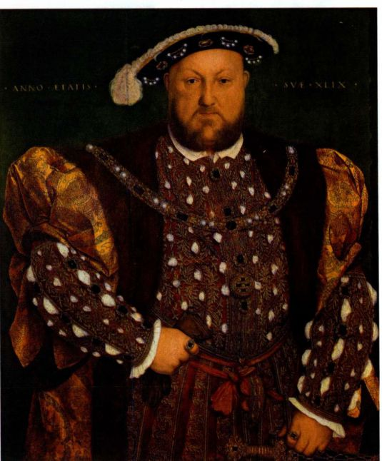

图18\.27 小汉斯·荷尔拜因：《亨利八世》。1540年。木板油画，

82\.6 × 73\.7厘米。罗马国立古代艺术美术馆

第十八章 16世纪北部欧洲的文艺复兴与宗教改革 645

现这位享有绝对权力的国王几乎等同于神的权威。国王壮硕的身材营造出一种强烈的冷酷无情、威风凛凛的个性。这幅肖像画与布龙齐诺的《托莱多的埃莉诺拉与其子乔瓦尼·德·美第奇》（见图17\.7）一样，具有相同的沉稳姿态和不可接近的气势，也同样都对人物的服装珠宝做了精致描绘。

亨利的女儿伊丽莎白于1558年继承王位，当时她年方20岁，个性精明加上些许好运使她一直统治英格兰到1603年。她设法让这个因宗教纷争而不幸分裂的国家团结一致，并通过自己的外交手腕、对顾问和海军将领的敏锐选择及果敢卓识的性格提升了英格兰的财富与地位。1588年击败入侵英格兰的西班牙无敌舰队是伊丽莎白一生中最光辉的胜利，但伊丽莎白时代也以其音乐和文学艺术而闻名于世。

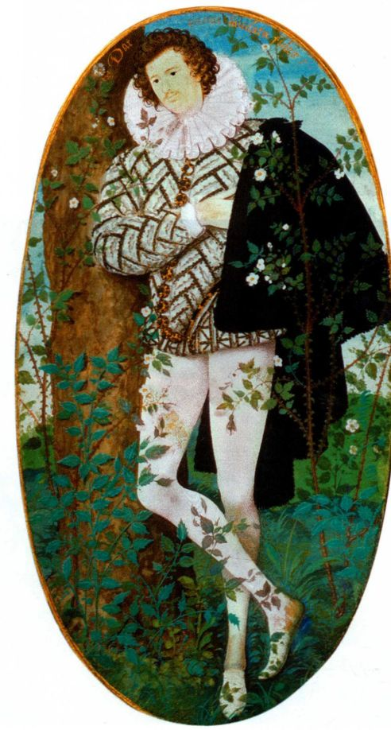

图18\.28 尼古拉·希利亚德：《玫瑰丛中的青年男子》。约1588年。羊皮纸上油画，13\.7x7	厘米。伦敦维多利亚与阿尔伯特博物馆

646 詹森艺术史

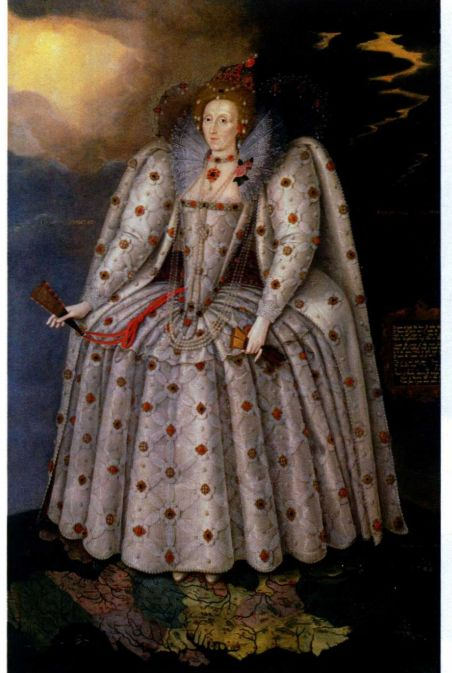

图18\.29 小马库斯·海拉茨：《伊丽莎白一世像》（又名《迪切利

肖像》）。约1592年。布面油画， 241\.3 × 152\.4厘米。伦敦国家肖

像画廊（The National Portrait Gallery）

伊丽莎白时代诗歌的影响可以在英格兰肖像画家尼古拉·希利亚德（Nicholas Hilliard，1547\-1619年） 所创作的一幅通常被称为《玫瑰丛中的青年男子》（AYoung Mzn Among Roses，图18\.28）袖珍肖像中看到。受到古代宝石雕刻（cameo）的启发，此类便于携带的肖像画绘在羊皮纸上，在当时也是一种小型纪念品，通常被作为首饰来佩戴。希利亚德的风格甚至在光线的表现与精致细节的描绘方面都体现了荷尔拜因的影响。然而，人物瘦高纤细的比例、精美的服饰与倦怠但不失优雅的姿态可能都反映的是意大利风格主义的影响，这种影响或许是经由枫丹白露传播到英格兰的，比较一下这位廷臣的姿态与普里马蒂乔为法国的枫丹白露宫所作的灰泥人物塑像（见图18\.6），就能够看到其中的相似。虽然这幅袖珍肖像高仅10余厘米，但画家却在极小的画面中囊括了大量精妙的细节。希利亚德服饰、人物、树木以及围绕着青年男子的花朵都一一作了记录。画中的题字表明这位男子正饱受爱情之苦。黑白相间的服装与玫瑰的品种等细节都暗示伊丽莎白正是他所深爱的人，这不禁引发了人们对他的身份的猜测。画中的人物可能是埃塞克斯（Essex）

伯爵罗伯特·德弗罗（Robert Devereaux），他一度曾是伊丽莎白的宠臣。栖身花间、为爱憔悴的诗人形象是伊丽莎白时代十四行诗的常见题材，埃德蒙·斯宾塞（Edmund Spenser）与威廉·莎士比亚的作品中就有此类诗作。伊丽莎白时代的许多视觉艺术作品都取材于伊丽莎白宫廷礼仪与文学，具有文本或象征意义（见第648页的原始文献）。

伊丽莎白与其父亨利八世一样，具有控制自己形象的天才。她虽然没有安排荷尔拜因式的画家为她掌控宫廷的艺术生活，但却会指示身边的众多艺术家如何去表现自己的形象，这位女王甚至还将未经批准而绘制她形象的人关进监狱。伊丽莎白对自己神圣形象的这种精心控制在佛兰德斯艺术家小马库斯·海拉茨（Marcus Gheeraerts the Younger）为她绘制的一幅《迪切利肖像》（The Ditcheley Portrait，图18\.29）表现得淋漓尽致。画中的伊丽莎白站在她所统治的王国地图上，人物的体量与正面姿态对王国的地图呈压倒性态势。伊丽莎白的廷臣之一亨利·李（Henry Lee）爵士可能是作品的定件人，这位爵士的领地迪切利位于牛津郡附近。伊丽莎白身着一件她所喜爱的精美华贵的白色长裙，白色象征童贞。她一生坚决拒绝婚姻，宣称自己嫁给了英格兰。背景的一侧天空昏暗阴沉，一场暴风雨刚刚过去，太阳再次照耀大地。一段不完整的十四行诗表达着对神恩的感激。整幅作品尊贵无比，具有至高无上的权威感。

关于这幅肖像画曾有这样一个假想，它是为伊丽莎白对亨利·李爵士迪切利领地的出访留念而作。此

大事年表

1509年\-欧洲开始与美洲进行奴隶贸易

1515年\-托马斯·莫尔出版《乌托邦》

1534年\-亨利八世与罗马决裂，建立英格兰国教会

1572年\-威尔特郡开始修建朗莱特宅邸

1588年\-英格兰击退西班牙无敌舰队

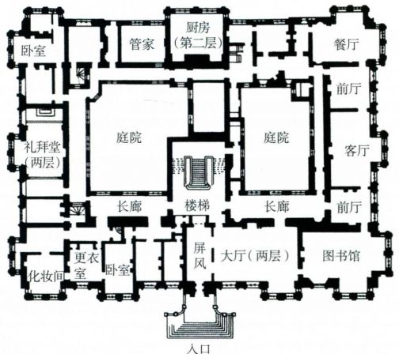

图18\.31 威尔特郡的朗莱特宅邸平面图（出自Sir Bannister Fletcher《建筑史》的插图）

类出访当时被称为巡游（progresses），在伊丽莎白时代的英格兰这种巡游是常例性的礼仪，表现的是君主与臣属之间的亲切关系。有时，受访的领主会建造一整栋行宫，仅供女王及其宫廷巡游时接待之用。罗伯

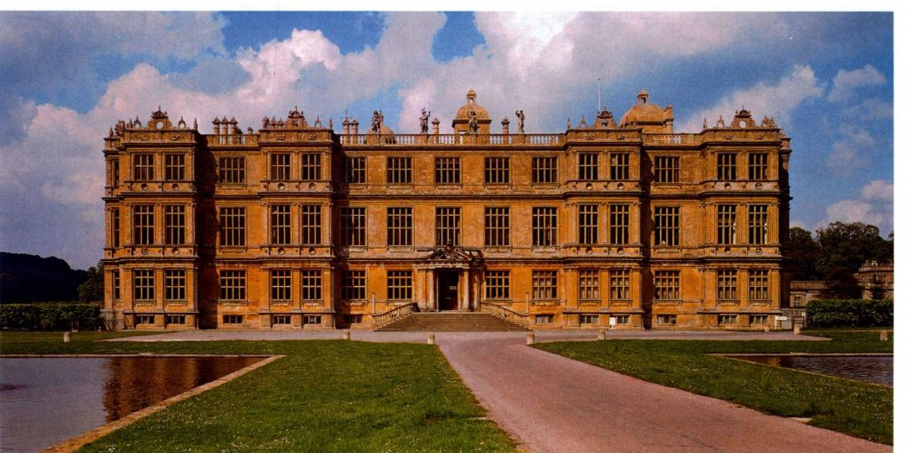

图18\.30 罗伯特·史密森与艾伦·马纳尔等人：英格兰威尔特郡的朗莱特宅邸。1572\-1580年

第十八章 16世纪北部欧洲的文艺复兴与宗教改革 647

原始文献

伊丽莎白时代的意象

伊丽莎白时代，英格兰的诗人与剧作家创作了英语文学史上最为经典的一些作品。经佩特拉克而使用成为诗歌形式的十四行诗，是埃德蒙·斯宾塞和威廉·莎士比亚创作爱情诗所采用的格式。埃德蒙·斯宾塞（约1552\-\-1599年）的代表作史诗《仙后》（The Faerie Queen）是一首隐喻伊丽莎白一世的诗歌。威廉·莎士比亚（1564\-1616年）的戏剧虽然更为知名，但他也创作了许多十四行诗，其意境与尼古拉·希利亚德的画作一样鲜活生动。

埃德蒙·斯宾塞，十四行诗之六十四，选自《小爱神》（Amoretti，1595年）

去吻她的双唇，如此优雅呵，似乎我能闻得到甜美的花园，迷人的芬芳从双唇弥散开来，少女适于装饰那情人的凉亭：她的双唇好似开放的紫罗兰；她的面颊好似盛放的红玫瑰；她的额头雪白如含苞的贝拉茉①；她的双眼可爱如新生的石竹；她的胸口宛若优美的草莓床；她的脖子宛若一簇簇耧斗菜；她的乳房恰似褪去的百合叶；

特·史密森（Robert Smythson，约1535\-1614年）就曾设计过若干座此类行宫，包括威尔特郡（Wiltshire）的朗莱特宅邸（Longleat House，图18\.30）。这处建筑工程经历了多个施工阶段才得以完成，史密森与法国雕塑家艾伦·马纳尔（Allen Maynard，活跃于1563一约1584年）的才智都曾奉献其中，建筑的烟囱部件与装饰就是由马纳尔雕刻的。朗莱特宅邸的平面图（图18\.31）表明，这座府邸的四边完美对称，空间围绕一对内部庭院进行组织。立面比例优美，部分使用了意大利建筑形式，例如栏杆和檐部。朗莱特宅邸更趋向于法国风格而不是意大利风格，这也折射出其主人约翰·锡恩（John Thynne）爵士的品位。寓居在乡村庄园中的朗莱特宅邸是伊丽莎白行使其王权仪式的完美舞台。

尼德兰地区：世界市场

此种对贵族权力的展示在16世纪的尼德兰是引人争议的。尼德兰地区包括今天的荷兰和比利时，是阿尔卑斯山以北历史最为动荡的地区。15世纪时，

她的乳头恰似初放的茉莉花；

如此芬芳的花朵是最为馨香，

但她的甜美还胜过以上所有。

威廉·莎士比亚，十四行诗第十八首（虽然这些诗作于16世纪90年代，但直到1609年才结集出版）

我怎么能够把你来比作夏天？你不独比它可爱也比它温婉：狂风把五月宠爱的嫩蕊作践，夏天出赁的期限又未免太短：天上的眼睛有时照得太酷烈，它那炳耀的金颜又常遭掩蔽：被机缘或无常的天道所摧折，没有芳艳不终于凋残或销毁。但是你的长夏永远不会凋落，也不会损失你这皎洁的红芳，或死神夸口你在他影里漂泊，当你在不朽的诗里与时同长。只要一天有人类，或人有眼睛，这诗将长存，并且赐给你生命。

（卞之琳译）

尼德兰在勃艮第统治者手中曾一度统一，后来，勃艮第的玛丽与马克西米连一世联姻，这个地区又归于哈布斯堡王朝治下。宗教改革开始时，尼德兰属于查理五世神圣罗马帝国的一部分，查理五世同时也是西班牙国王。北尼德兰信徒迅速皈依新教，而西班牙统治当局对新教传播的种种镇压导致了一场反抗西班牙统治的起义，并最终以1579年北尼德兰宣告独立而告终。经过一场血腥的斗争，北部各省（NorthernProvinces，今天的荷兰）在16世纪末建立了名义上仍归西班牙统治但实际上独立的国家。

南部各省（Southern Provinces，大致相当于今天的比利时）仍处于西班牙的统治之下，人民信奉罗马天主教。查理五世和西班牙的菲利普二世都曾派遣总督管理南尼德兰地区，治所设在南部的城市之中。这一时期政治与宗教环境的重大改变也伴随着经济上的变革。曾一度繁荣的南尼德兰港口布鲁日逐渐淤塞，它曾经作为商业中心的地位被安特卫普（Antwerp）取代。安特卫普以其优良的深水港和战略性的地理位置成了南尼德兰地区的商业与艺术中心。而在北尼德兰，阿姆斯特丹（Amsterdam）则

①花名未知。原文为“bellamours”，意为“美丽的爱情／情人”。\-译者注

648 詹森艺术史

构图与技法上；另外一些艺术家则完全投入到意大利风格之中。这些艺术家受到了丢勒作品的启发，也汲取了他们在尼德兰所见的米开朗基罗和拉斐尔的作品的灵感，他们自己对意大利艺术风格的体验也对其创作产生了影响。

城市与宫廷：大卫与戈萨埃特

布鲁日位于信仰天主教的南尼德兰地区，尽管十六世纪早期这座城市的贸易与财富大量转移到了安特卫普，但直到当时也还是重要的商业中心。在凡·爱克和梅姆灵的作品中我们就见识了布鲁日绘画的独特传统，这时杰拉德·大卫（Gerard David，约1460\-1523年）又将其继承了下来。大卫的画坊直到16世纪中期在南尼德兰都占据着主导地位。1509年，他创作了一幅大型木板油画，并将其作为礼物送给了布鲁日的加尔默罗会女修道院。这幅绘画（图18\.32）描绘了为处女圣徒所环绕的圣母与圣子，两位天使为这场女性的聚会演奏着小夜曲，大卫及其妻子柯妮莉亚·克努普（Cornelia Cnoop）的肖像也出现在角落处。根据佛兰德斯的传统，画面形式以其对质感细致入微的表现，灿烂的色层和对有象征作用的形式的运用来增强画面的意味，例如幼年基督手中的葡萄与诸位圣徒的特点。然而大卫笔下沉静的色彩与柔

成了那里的国际贸易中心。

这一时期宗教斗争的副产品之一是在破坏圣像运动狂潮中对艺术品的破坏，破坏圣像运动是新教徒对宗教图像质疑的结果。在南北尼德兰两地，大量中世纪与早期文艺复兴时期的艺术品，特别是宗教作品与雕塑遭到毁坏，狂热的改革者一旦认为艺术品涉及偶像崇拜就会对其予以查抄或焚毁。尼德兰近代早期的雕塑市场也因此而发生了改变，油画等平面艺术形式在艺术创作当中占据主导地位。虽然某些新教徒也还是允许油画或版画的存在，以作为教授信徒教义的手段，但是在经过宗教改革的地区，天主教那种为教堂定制大型圣徒或圣母雕像的活动完全消失了。艺术家们的创作在这样的条件下也发生了改变，由于教会订件的枯竭，艺术家不再等候赞助人雇佣他们，而是主动创作艺术品，并在市场上公开出售，这种情况在北尼德兰尤为明显（见第650页的艺术史家的观点）。这种局面的结果之一就是新艺术类型的出现，它将补充并最终取代传统的宗教题材作品。

新的意大利艺术风格当时正受宫廷青睐，尼德兰艺术家也受到了这种风格的挑战。他们对意大利艺术的反应多种多样，有些艺术家认为没有理由改变他们世代相传的北部欧洲视觉艺术传统；有些艺术家将意大利风格的装饰形式嫁接到尼德兰传统的

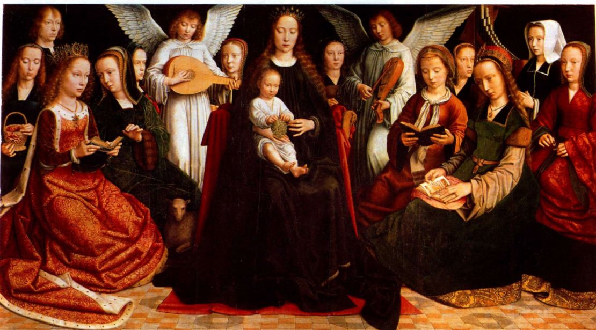

	图18\.32 杰拉德· 大卫：《圣母与诸圣女》（ Virg川Among Vir,百ι，is\) , 1509 年．木板油画， 门9\.1 × 212\.1 厘米＠鲁昂美术馆（ 岛1usfr de s

BeaιL Art s \)

图18\.33 扬·戈萨埃特：《达娜厄》。

1527年。木板油画，113x95厘米。慕尼黑老绘画馆

艺术史家的观点

艺术经济

随着贸易的发展、社会生产分工的细化以及商品经济在中世纪之后的北部欧洲地区逐渐占据主导地位，艺术品创作与销售也随之发生改变。赞助人与艺术家之间签订合同规定作品样式与酬金多少的这种关系也开始让位于市场机制。艺术家们开始创作作品并在市场上出售。近些年来，艺术史学家在艺术商品领域对此种改变一直进行着研究和著述，他们的研究对象主要集中于布鲁日、安特卫普、代尔夫特（Delft）、哈勒姆（Haarlem）和阿姆斯特丹这些中心城市。

学者们利用文献、编年史以及对作品本身的研究来探究当时为适应这些经济变革所产生的艺术品市场体制。对这一时期的艺术家行会及管理艺术品贸易法规的研究揭示了当时艺术品交易的一个方面：自中世纪以来，形形色色的行会组织就艺术家的培训与其艺术品交易活动进行管制，并控制着所辖地区艺术家之间的竞争。新的版画技术使得艺术家能够大量印制不受行会约束的图像。版画在贸易集市上与其他商品一起出售，修士与修女有时也出售版画来维持修道院的运

转。丢勒1521年从纽伦堡到安特卫普的旅费就是通过在沿途销售版画获得的。

通过对近代早期艺术品价格波动的追踪，学者们得以将艺术品的价格与同时期其他商品的价格相比较，从而分析出艺术品交易的行情对艺术家本人的影响。研究人员还对当时有关市场的文献、市场的布局与位置，以及艺术家向顾客展示作品以供他们选购的市场周边环境进行了考察。随着艺术贸易中的经济变革，艺术品市场中出现了中间商这一新的环节，他们充当艺术家与购买者之间的中间人。

对艺术史学家而言，一个重要的问题是，这些与艺术品创作和销售相关的新的经济变革与环境究竟是如何影响艺术本身的发展的。有证据表明，艺术家与画坊从此开始将生产技术逐渐标准化，并将艺术品中的某些部分分包给他人，自己专攻某一特定的艺术形式或主题。当时对艺术品题材的选择也开始对艺术品市场的变革作出回应，阿尔岑的《肉摊》（见图18\.36）等作品表现并诠释的就是市场本身。

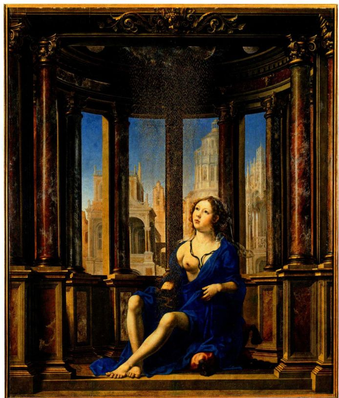

650 詹森艺术史

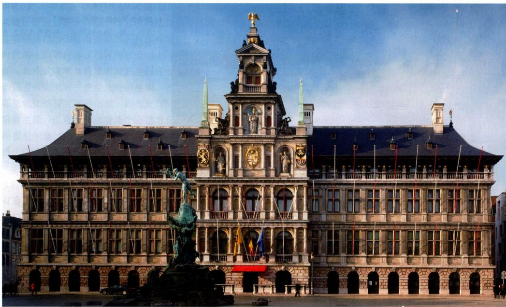

图18\.34 柯内利斯·弗洛里斯与威廉·凡·德·布鲁克（Willem van den Broek）：安特卫普市政厅。1561\-1566年

和的造型赋予这些人物以平静与高贵之感，平衡的构图更加强了这种感觉。这些沉默的处女聚集在圣母与圣子身旁，正如修道院的修女聚在一起祈祷一样。

大卫既为赞助人制作，也会创作作品在开放的市场销售，但是与他同时代的某些艺术家却在尼德兰的贵族宫廷中找到了职位，扬·戈萨埃特（JanGossaert，约1478\-1532年）就是其中之一，他有一个绰号马布斯（Mabuse），取自其家乡的名字莫伯日（Maubeuge）。戈萨埃特早年生活在安特卫普，但是他在1508年随同勃艮第海军上将菲利普前往意大利旅行，意大利文艺复兴与古典艺术给他留下了深刻印象。戈萨埃特也为尼德兰总督奥地利的玛格丽特（Margaret of Austria）服务过。戈萨埃特的作品将意大利艺术的宏大感与尼德兰传统中的细节化技法融合在了一起。他为宫廷赞助人创作神话题材的作品，例如创作于1527年署名戈萨埃特的《达娜厄》（Danaë，图18\.33）。传说达娜厄被关在男人无法看到的地方，然而朱庇特还是化身为一场金雨，达成对她的引诱。这幅作品或许可以被看作与柯勒乔的《朱庇特与伊俄》（见图17\.24）相同主题的作品，柯勒乔的创作仅晚了几年而已。柯勒乔笔下丰满圆润的伊俄似乎迷失在朱庇特所化云朵的拥抱之中，而戈萨埃特作品中的达娜厄则呆呆地凝视着落向她的金雨。柯勒乔的作品将

注意力集中于伊俄，只是暗示出空间背景而并未刻意对其加以界定。戈萨埃特则精心地构建了一座圆形神庙（可能暗指罗马的韦斯塔贞女神庙），并描绘出建筑背景，分散了观众对人物的注意力。达娜厄的形象与戈萨埃特的圣母像类似，她也穿着传统上圣母所着的蓝色长袍。戈萨埃特的《达娜厄》显示出画家对古典艺术以及意大利式透视法的着迷，同时也展示了他在表现质感、细节与丰富色彩方面的技巧。

安特卫普：商人、市场与道德观

作为商业中心，安特卫普的兴起为该城带来了新的财富以及表达这种财富的欲望。与早期尼德兰各个城市的情形一样，市政厅是安特卫普最为重要的城市公共建筑。16世纪中期，安特卫普又发起了征集新市政厅设计的竞标。安特卫普本地的雕塑家暨建筑师柯内利斯·弗洛里斯（Cornelis Floris，1514\-1575年） 最终胜出，获得了委托，工程于1561年开始。弗洛里斯之前曾游历过意大利并对意大利的古典与当代建筑作过研究。在为安特卫普市政厅的设计中，他将意大利文艺复兴建筑的要素与北部欧洲传统建筑风格相结合，设计出了规模宏大、气势非凡的建筑，整个工程于1566年完工（图18\.34）。市政厅采用了许多意大利的样式：底层建有粗面石砌的连拱廊，与阿曼

第十八章 16世纪北部欧洲的文艺复兴与宗教改革 651

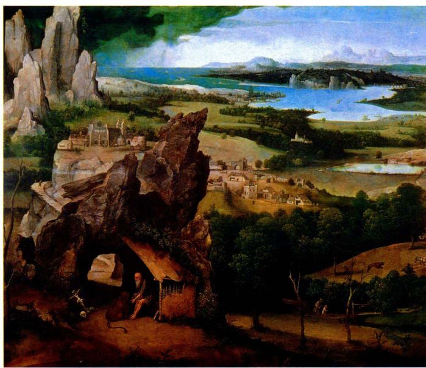

图18\.35 约阿希姆·帕提尼尔：《风景中的圣杰罗姆拔去狮爪上的刺》。约1520年。木板油画，		74 x 91厘米。马德里市普拉多博物馆

内蒂的皮蒂宫（见图17\.5）颇为相似；上面三层依次运用了多立克、爱奥尼亚和科林斯柱式，与阿尔贝蒂的鲁切莱府邸相同（见图15\.32）；中央的楼阁则将雕塑与建筑混合在一起，宛若一座罗马凯旋门（见图7\.63）。然而建筑的比例却是垂直性的，屋顶的轮廓线更多借鉴了尼德兰的传统风格，中央楼阁上繁复的雕刻使人们的视觉焦点集中在立面中这一高耸部分。安特卫普市政厅融合意大利艺术风格的方式不同于法国、西班牙或英格兰对这些外来艺术观念的表达（对比图18\.4、18\.10和18\.30）。此时的安特卫普已经成为了世界市场，在这里交易的商品种类繁多，从织物到食品无所不包，货源来自全世界，包括美洲和亚洲。视觉艺术参与这一市场的方式也是多种多样。挂毯经安特卫普出口到其他地区；这座城市的版画市场欣欣向荣；普朗丁\-莫雷图斯印刷厂（Plantin\-MoretusPress）印制的各种书籍销售到世界各地。画家尤其注意发展新的艺术形式来与这一扩大的市场接轨。自国际哥特式风格以来就被佛兰德斯画家所开发出的静物画、风景画与风俗画（日常生活图像），在15世纪期间作为宗教题材的背景变得更加重要。16世纪的有些安特卫普艺术家专门从事此类绘画的创作，并将之作为其主业，这可能是为了适应失去宗教赞助后的艺术品市场，也或者是一种获得市场份额的方式。这些作品通常具有多重意义，一方面描绘世间的享乐，另一方面则对这些享乐提出警告。

帕提尼尔：作为寓意画的风景画 安特卫普的约阿希姆·帕提尼尔（Joachim Patinir，约1480\-1524年）是一位早期专门从事风景画的画家，丢勒于1521年访问安特卫普时曾看过他的作品并对其赞赏有加。帕提尼尔的《风景中的圣杰罗姆拔去狮爪上的刺》Landscapewith St\. Jerome Removing the Thorn from the Lion's Paw，图18\.35）创作于1520年前后，这幅作品表明，帕提尼尔曾研习过希罗涅缪斯·博斯的作品，既学习了他处理自然的手法，也学习了他对题材的选择。风景在帕提尼尔的画中占据主导地位，但是人物才是构图与主题的中心。圣杰罗姆的传记中记载，他曾为一只进入其隐居之所的狮子拔去爪上的刺，结果狮子成了他的朋友。画中前景左下方，隐士形象的圣杰罗姆手握狮爪，其隐居处毗邻一块形状奇特的岩石，这块石头将他与风景的其他部分隔开。但是画面中的叙事情节完全从属于深邃的大地风光，田野、树林、山脉、海洋与天空占据了画面的绝大部分空间。在这幅风景画中，人物都非常渺小。一些细小的人物游荡在画中的世界里，远处的村庄、城市乃至船只都可以辨识出来。意味深长的是，距离杰罗姆隐居处最近的建筑是宗教建筑，尽管他似乎对这一点毫无察觉。

这种风景画在16世纪的欧洲收藏家中非常流行，被称为“世界风景”（world landscape），因为画面关注的是延伸向远方的深邃景观。帕提尼尔与阿尔特多弗一样，采用高视点，从而使对远处风景的表现成为

652 詹森艺术史

Uppsala University\)

第十八章 16世纪北部欧洲的文艺复兴与宗教改革 653

可能，然而他还在前景中为叙事情节提供了一隅空间。实现近景与远景之间的平滑过渡对帕提尼尔而言并不如描绘蓝色的山脉与苍翠的丛林那样重要。帕提尼尔时代的人们如何解读这样的风景仍不完全清楚。一方面，表现景观本身就要求对其进行仔细的观测，观众会观看画面同时去想象远处的地貌，不必亲身旅行到那里就能够探究它的面貌。而与此同时，画面还具有宗教主题，这可能传达着某个道德教化的信息。或许帕提尼尔通过比较圣徒隐士对俗事的弃绝，评说着世俗生活的种种危害。

阿尔岑的《肉摊》北尼德兰画家皮特·阿尔岑（Pieter Aertsen，1507／08\-1575年）的静物画也具有道德含义。这位画家的早年在安特卫普度过，后于1557年回到了阿姆斯特丹，在那里亲历了1566年破坏圣像运动对宗教艺术作品的破坏。《肉摊》（The MeatStall，图18\.36）完成于1551年，当时艺术家仍在安特卫普，这幅作品乍看上去是一幅纯粹的世俗主题作品。画面前景中，肉铺里各种待售的肉类细节毕现，画中的人

大事年表

1509年\-伊拉斯谟出版《愚人颂》

1568\-1648年\-荷兰独立战争，对抗西班牙

1565年\-老彼得·布吕盖尔创作《狩猎归来》

1579年\-荷兰共和国成立

物位于背景中，相对很小，几乎被这些商品遮蔽起来。画面右部上方的招牌也是一张出售农场的广告，市场经济的力量在作品中得到了明显反映。

静物在画面中占据绝对优势的地位，显得它似乎与背景中的宗教题材独立开来。但是在左面远景中人们可以看到逃往埃及途中的圣母与圣子，他们在给穷人分发面包，排成队列参加教堂礼拜的信徒却对之视而不见。画面右部描绘的是客栈场景，过度的纵欲享乐则是这里的商品（大量的牡蛎壳表明了这一点，牡蛎是传说中的壮阳药）。再来浏览一下展示着的货物：有些是饕餮者的最爱；有些是大斋节的食品，例如椒盐饼；还有些货品或许含有宗教意义，例如象征钉十

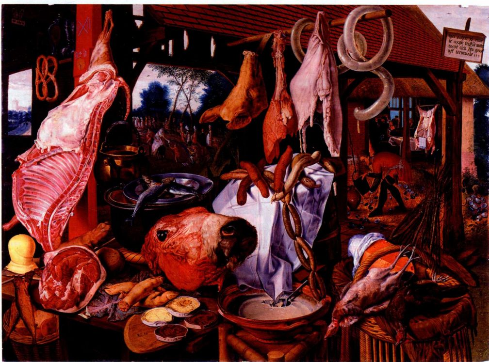

图18\.36 皮特·阿尔岑：《肉摊》。1551年。木板油画，

1 2 3 \. 2 × 150厘米。现属于瑞典乌普萨拉大学艺术收藏（University Art Collection，

卡雷尔·凡·曼德尔关于老彼得·布吕盖尔的著述

节选自《画家之书》（Het Schilder Boeck，1604年）

凡·曼德尔对老彼得·布吕盖尔的才能非常赞赏，他所著的传记是关于这位艺术家个人情况的重要文献。

在旅行中，布吕盖尔做了大量写生。据说在穿越阿尔卑斯山脉时，他将所有的山脉与岩石都在笔下咀嚼了一遍，并在返程之后，将所有这些铺撒在画布与画板上，他的作品非常精密，以至于可以在其中追索自然，正如在自然的其他造物中所能做的那样······

布吕盖尔（在安特卫普）为高尚正直的商人汉斯·弗兰柯特创作了大量作品，这位商人与布吕盖尔相处得极好，每天都会与他见面。他们常常一起下到乡间，观察集市与婚礼中的农民。他们也会装扮成农民的样子，并像其他客人一样送上礼物，声称是新娘或者新郎的亲戚。布吕盖尔喜欢在此种场合观察农民们的滑稽举止，看他们怎样吃饭、喝酒、跳舞、踏歌或者做爱，他能够很好地将所有这一切巧妙幽默地再现

原始文献

出来······他将坎彭（Campine）等地区的男女农民栩栩如生地再现出来，将他们行走、舞蹈、行止的粗笨稚拙表现得淋漓尽致。

······阿姆斯特丹的艺术爱好者赫尔曼·皮尔格里姆斯（Herman Pilgrims）先生拥有一幅油画《农民婚礼》，这是极为优美的作品。画中农民们裸露在外的面孔与肢体被阳光晒成黄褐色，他们的肌肤粗陋，与城市居民的皮肤截然不同······

······布吕盖尔的许多幽默题材作品都很奇特并意味深长，这些作品中的许多都被制成了版画。但是此类题材他创作更多的是以精致优美的素描的形式，素描上还会增添题词。然而其中有些作品过于尖锐，他在临终之时不得不让妻子烧掉，这样做是出于自责或是恐惧，担心妻子因此惹上麻烦，并为这些作品付出代价。······

SOURCE:DUTCH AND FLEMISH PAINTERS BY KAREL VAN MANDER, TR\. CONSTANT VANDE WALL\.\(MANCHESTER,NH:AYER COMPANY PUBLISHERS,1978\)

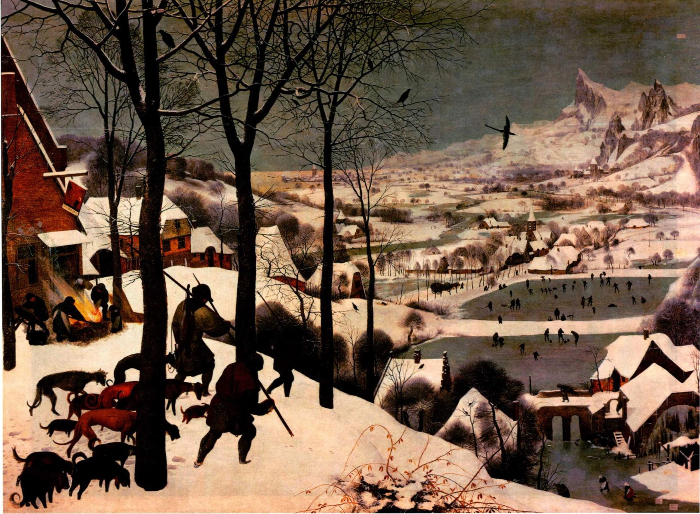

	图18\.37 老彼得· 布吕盖尔《猝猎归来》。1 565 年。木板油画， l 18 x 1 62 厘米。维也纳艺术史博物馆

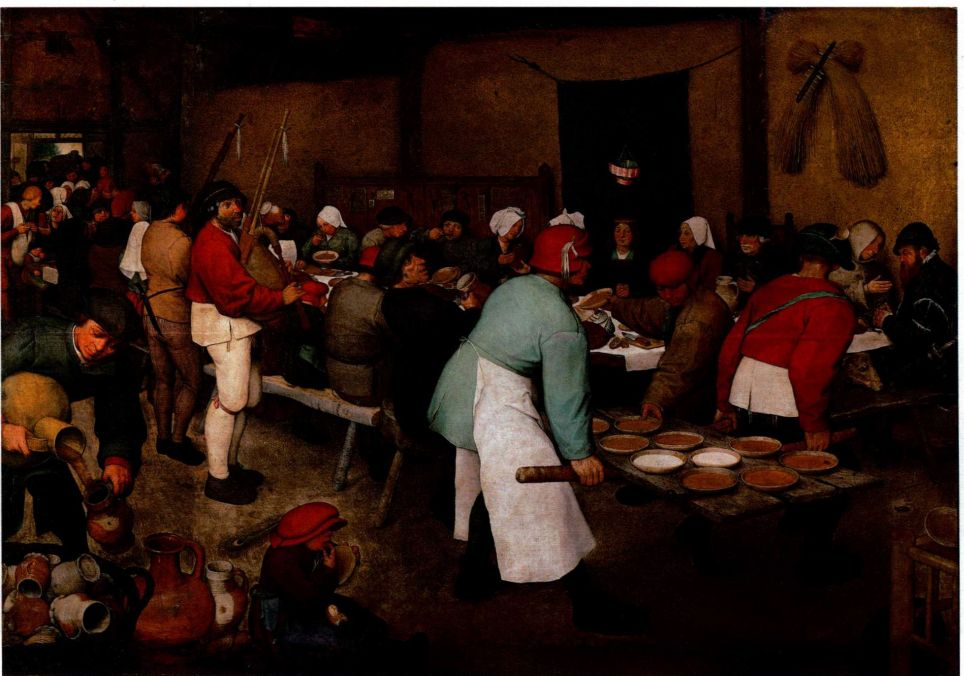

图18\.38 老彼得·布吕盖尔：《农民婚礼》。约1568年。木板油画，

l 1 4 × 1 62\.6厘米。维也纳艺术史博物馆

字架的两对交叉的鱼。背景中两个不同场景暗示出观众可能做出的不同选择：放荡的生活和施舍的生活。前景及其对商品的强调可能暗示安特卫普在这两种不同选择中兴旺起来的主要行业。

老彼得·布吕盖尔 较阿尔岑年轻的同时代艺术家老彼得·布吕盖尔（Pieter Bruegel the Elder，1525／30\-1569年）也居住在安特卫普，他在作品中同样运用了“倒置”透视法，在大量画作中将明显为作品主题的题材置于背景之中。布吕盖尔在创作中探索过风景、农民生活与道德寓言等题材。虽然他的艺术生涯主要在安特卫普和布鲁塞尔度过，但他可能出生于希罗涅缪斯·博斯的家乡斯海尔托亨博斯附近。博斯的画作无疑令他印象至深，受其影响，布吕盖尔自己的作品也同样晦涩难懂。尽管我们并没有关于这位画家个人情况的确切记载，但可以确定的是，布吕盖尔同时代的人对他的机智与模仿自然的能力十分敬仰。

布吕盖尔既是画家又是版画设计师，他的作品显示了他对民间习俗和普通人日常生活的兴趣。布吕盖尔本人受教育程度很高，他是许多人文主义者的友人，这些人和富有商人是他的主要顾客。当时城市中的精英阶层有收集关于乡村与农民主题作品的习惯。布吕盖尔还创作了一些后来学者们认为对哈布斯堡王朝统

治南尼德兰政治评论性质的作品。哈布斯堡王朝的宫廷人士也收藏布吕盖尔的作品，但是在16世纪60年代的动荡时期\-即西班牙的菲利普二世试图镇压尼德兰地区的新教徒起义之时，布吕盖尔开始担忧他那些尖刻的政治性作品可能会给自己的家庭带来麻烦（见第654页的原始文献）。

正如同时代追随丢勒的艺术家一样，布吕盖尔也在1552至1553年间游历了意大利，访问了罗马、那不勒斯和墨西拿海峡。然而，他对那些为其他北部欧洲艺术家所敬仰并摹写的名胜似乎并不感兴趣。布吕盖尔返乡时带回的却是一批壮丽的风景素描，特别是阿尔卑斯山地区的风光。这次旅行成就了布吕盖尔风格成熟期的作品中连绵的风景。《狩猎归来》（TheReturn of the Hunters，图18\.37）是描绘月时的系列画作之一（布吕盖尔经常绘制成组的作品，这组作品在完成一年之后，于1566年被安特卫普商人尼克拉斯·荣格黑利克［Niclaes Jonghelick］购走）。作品中的此类场景来源于中世纪的岁时书插图，例如《贝里公爵的精美日课经》（见图14\.5）中的插图。只不过在布吕盖尔的作品中，自然的重要性已经不仅仅是人类活动的背景，已经成为画面的主题。

布吕盖尔采用了与帕提尼尔相同的手法，在《狩猎

第十八章 16世纪北部欧洲的文艺复兴与宗教改革 655

图18\.39 老彼得·布吕盖尔：《瞎子领路》。约1568年。木板油画，87\.6 × 1 54厘米。那不勒斯卡波迪蒙特画廊博物馆

归来》的前景中也设置了一隅空间，朝远处的地平线迅速地延伸入远景之中。在白雪覆盖的景物中，猎人与猎犬所组成的狩猎队伍正在返归村庄，在阿尔卑斯山以北的灰暗冬天里，他们的猎物少得可怜。队伍沿小丘而下，向村子走去。此时河水封冻，成了一个娱乐之所，或者有人蹋冰而过，急切地回家。在布吕盖尔的这幅作品中，人类活动充分融入了自然风景之中。

创作于1568年前后的《农民婚礼》（PeasantWedding，图18\.38）是布吕盖尔描绘记忆中的农民生活的场景。他的传记作家卡雷尔·凡·曼德尔（Karelvan Mander）对此已有记载，布吕盖尔和他的赞助人汉斯·弗兰柯特（Hans Franckert）经常扮成农民参加他们的狂欢，以此观察农民的生活并将其用速写记录下来（见第654页的原始文献）。在这幅作品中，布吕盖尔描绘了在谷仓中聚会的村民，谷仓加以装饰供婚礼之用。他已经完全掌握了意大利透视法，所以观众发现观赏作品时自己仿佛身处一间宽敞的屋子，其中婚礼宾客聚饮的桌子占据了大部分空间。新娘坐在一块绿色帘幕前，使她的形象非常突出，而要确定哪一位是新郎则较为困难。前景中人们正在分发食物，而画面左下方的大量空酒壶说明人们已经豪饮过一番。与阿尔岑《肉摊》中所表现的多种肉类与鱼不同，这里的食物只是简单的麦片粥。风笛手站在一旁，正

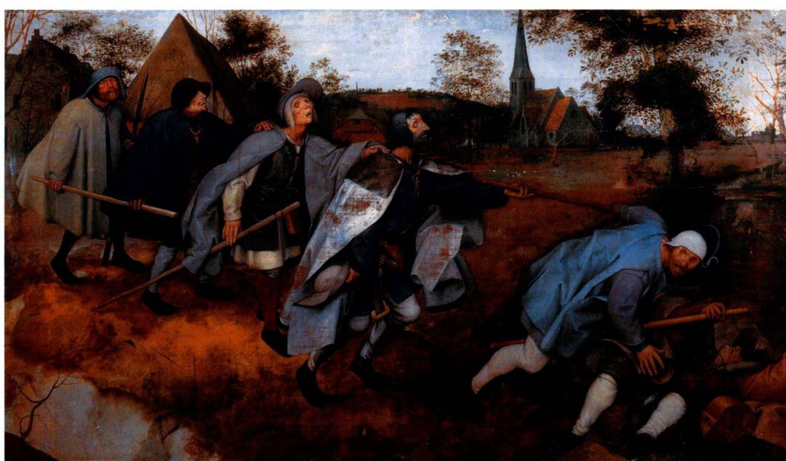

准备演奏，但如此之多的人物在陶杯的碰撞声中喧嚷谈笑，屋中声浪迭起。布吕盖尔的技法与众多佛兰德斯先辈艺术家一样精准细致，而他的人物所具有的坚实体量更增强了作品的现实感。

解读布吕盖尔的农民题材作品对艺术史学家构成了极大挑战。有些学者将布吕盖尔的农民画看作供城市居民消遣而对乡下人的无礼调侃讽刺。如此解读，意味着城里人嘲弄他们乡下亲戚的种种行止。尽管如此，布吕盖尔仍然将作品中描绘的乡村婚礼当作严肃的事件来对待，如果说他记录了农民们的粗俗举止，那他同时也记录了他们乡亲之间的情谊。他连如画面前部舔碗的小孩子这种最为微不足道的细节也描绘了下来，并把这些都作为值得观看与记录的对象。对布吕盖尔而言，普通人在万物中占据着尊贵的地位。

布吕盖尔的许多作品都有晦涩的训诫含义，其中一部分以尼德兰文学中的谚语古训为基础。《瞎子领路》（The Blind Leading the Blind，图18\.39）是他晚期作品之一，这幅画就是对口口相传的谚语的视觉阐释。作品的典故来源于福音书，耶稣在谈论法利赛人（Pharisees）时说道：“若是瞎子领瞎子，两人都要掉在坑里。”（《马太福音》15：12\-19）这个典故不仅经常出现在人文主义著作中，也在通俗文学里可以见到，布吕盖尔早期曾创作过至少一幅该题材的作

656 詹森艺术史

品。无论如何，布吕盖尔作品的悲剧深度使得题材具有了紧迫感。他运用尼德兰传统中的细节描绘手法，表现了行走于乡村背景之中瞎子乞丐的衰弱与贫穷。画中所有人物沿向下的斜线排列，每个前面的人的姿势都比后面的人更为危急，毫无疑问，他们最终都会随着领路人掉进坑里。在两组人物之间缝隙的画面上方，布吕盖尔绘制了一座乡村教堂，对某些评论家来说，这种安排暗示，正是教会才使人产生了盲目感。但是其他解读也可以成立。教堂的存在或许指的是人们在精神上的盲目？可能他认为这个寓言的意味特别针对当时那个时代，在宗教与政治方面弥漫着不理智的狂热。布吕盖尔作品含义的晦暗不明在后来好几个世纪激发了无数评论家与艺术家的灵感。

小结

16世纪的北部欧洲不得不适应各种传统的土崩瓦解以及各地创新的出现。关于世界的知识通过对亚洲、美洲的探索和殖民活动进一步拓展。天主教受到挑战，传统宗教秩序四分五裂。政治疆域被重新界定，新兴国家纷纷建立。科学家与人文主义者发展着关于宇宙以及人类在其中位置的新观念。旧的财富形式让位于新的资本主义经济。视觉艺术家感受到了适应新视觉语言的必要，这种语言已在意大利形成。

法国：偏好意大利形式的宫廷趣味

法国赞助人与建筑师尤其愿意接受意大利艺术的影响。尽管法国建筑的比例较之意大利建筑更具有垂直倾向，但以宫殿为主的法国宫廷建筑还是追随着意大利建筑的布局以及在建筑外部运用古典柱式的设计观念。意大利风格主义在枫丹白露宫的采用形成了法国宫廷对纤细优雅的裸体和古典题材的偏好。

西班牙：控制全球的权力与正教

来自美洲大陆的黄金、哈布斯堡王朝统治者广袤的欧洲领土，这些都使得16世纪的西班牙富甲一方，在当时成为了世界性的大国，并与天主教会保持着高度的联盟关系。西班牙赞助人订制的宗教艺术品或者受到意大利艺术原型

的强烈影响，或者进行创作的艺术家就曾在意大利游学。菲利普二世在埃斯科里亚尔的宏伟修院式建筑群表现出16世纪意大利艺术风格对西班牙的冲击。埃尔·格列柯的艺术则将风格主义的构图技法与威尼斯的色彩加以融合，创造出了梦幻般的宗教艺术作品。

中欧：宗教改革与艺术

宗教改革深刻地影响了欧洲德语地区的艺术。部分清教徒对宗教艺术的憎恶导致了破坏圣像运动以及宗教艺术项目的萎缩。在天主教仍然盛行的地方，宗教艺术作品则汲取了北部欧洲的现实主义传统，并加入了意大利艺术的影响。丢勒是文艺复兴德意志地区卓越的艺术家，他有力地融汇了北部欧洲与意大利的艺术传统，致力于知识分子艺术家的理想，丢勒对通俗的版画创作技法的杰出掌握使他的声誉遍及欧洲各地。版画也促进了宗教改革思想的传播。在教会订单彻底断绝的地方，艺术家们开始专注于世俗的题材，例如风景画、古典神话作品和肖像画。

英格兰：宗教改革与权力

这一时期英格兰的宗教改革也使宗教艺术市场萎靡不振，肖像画遂成为亨利八世和伊丽莎白一世统治时期的主要艺术形式。来自欧洲大陆的艺术家带去了德意志、尼德兰、法国和意大利的风格。荷尔拜因的肖像画结合了北部欧洲传统风格与意大利艺术的影响。伊丽莎白时代的艺术延续着荷尔拜因所取得的成就，但是增添了逢迎女王的复杂图像志。在建筑方面，伊丽莎白时期的乡间别墅用为女王巡访的驻跸之所。

尼德兰地区：世界市场

尼德兰15世纪艺术颇具特色的自然主义成了该地区16世纪艺术风格发展的基础。宗教改革的冲击在这里也产生了重要影响，导致了破坏圣像运动的发生与南北尼德兰的政治分野。在信仰天主教的南尼德兰地区，有些艺术家仍继续接受订单创作宗教艺术品，而众多艺术家则开始在市场上公开出售作品。伴随着艺术家吸引各阶层顾客的努力，风景画、静物画与风俗画等新题材作品的地位越来越重要。人文主义者激发了新的题材，这些题材能够以意大利文艺复兴艺术所影响的风格来表现，或者深植于尼德兰本地的传统风格，布吕盖尔即是范例。

第十八章 16世纪北部欧洲的文艺复兴与宗教改革 657

