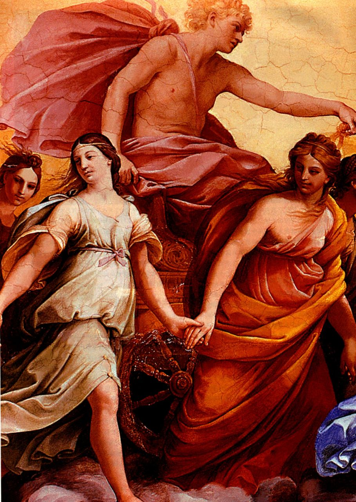

第十九章 意大利和西班牙的巴洛克艺术

巴洛克一词可能来源于葡萄牙语“barrocco”，即形状不规则的珍珠，意指扭曲甚至怪诞，取其贬义以指代17世纪华丽、骚乱、动荡乃至泛滥的一种艺术风格。艺术史家们对巴洛克的定义仍存在分歧。巴洛克这一术语是否只用于17世纪的主流风格，还是应该包括当时的其他艺术趋势，例如与之关系

复杂的古典主义？巴洛克艺术在时间跨度上是否应包括1700至1750年间的洛可可时期？

更重要的是，巴洛克艺术是否在本质上不同于文艺复兴和现代的艺术？虽然将巴洛克作为文艺复兴的终章是方便之举，但我们仍应将其作为一个独特的艺术时期。它是现代早期的开端，诸如性别、阶级和性等现代社会所关注的问题在那时都是人们探究的对象。诉诸感官以唤起情感、惯用戏剧化方式来说服观众的愿望奠定了巴洛克艺术的基调。某些典型的巴洛克特征表现为华丽壮观、情感丰沛、注重感官、富于张力与运动感，以及将多种艺术形式成功地结合在一起。

巴洛克艺术的宏大趋势和表现力，与17世纪期间欧洲在地理、政治和宗教上影响的实际扩张相得益彰。主要由西班牙、葡萄牙和英格兰发起的勘探新大陆的活动始于16世纪（见地图19\.1），至17世纪时发展成为殖民运动，首批殖民者占据了南北美洲的东海岸，后来又拓展到波利尼西亚（Polynesia）和亚洲。荷兰东印度公司发展与东方的贸易，将总部设在印度尼西亚。耶稣会传教士的足迹曾到达日本、中国和印度，并在南北美洲扎下脚跟。巴洛克艺术在风格与精

图19\.9细部，圭多·雷尼：《奥罗拉》

神方面都达到了全球化的范畴。

由于天主教教会试图用艺术向信徒宣教，并以此传达反宗教改革运动的精神，因此巴洛克也被称为说教风格。16世纪，教会试图阻止新教在欧洲的传播，17世纪末，教会宣布抵制新教的努力大获成功并颂扬自己的胜利。17世纪期间，民间有影响力的家族、有望产生教皇的家族、其他私人赞助者以及耶稣会、基廷会（Theatine Order）、加尔默罗会（Carmelite Order）与祈祷会（Oratorian Order）等教派，都在罗马修建起规模宏大的新教堂。文艺复兴时期规模最为庞大的圣彼得大教堂重建工程终于完工，该建筑及其复杂精美的装饰深刻体现着教会的新荣耀。

此次教会改制开启了持续到18世纪中期的追封圣徒浪潮。耶稣会教士罗耀拉的圣依纳爵和方济各·沙勿略（Francis Xavier）、阿维拉的特雷莎与菲利波·内里（Filippo Neri）等反宗教改革运动中的英雄被尊为圣徒，卡洛·博罗梅奥（Carlo Borromeo）早在1610年就享有了圣徒头衔。相较于宗教改革者的虔诚与事功，教会新贵们则出于给教会增添荣耀及建立各自家族持久声望的双重目的，成为艺术的踊跃赞助者。

第十九章 意大利和西班牙的巴洛克艺术 659

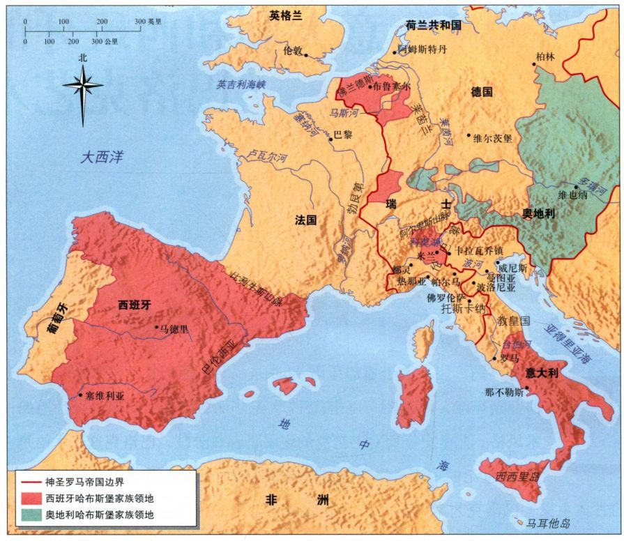

地图19\.1 17世纪的欧洲

17世纪上半叶期间，欧洲在连绵不断的战火中四分五裂。战争牵涉到了几乎所有处于变动的复杂同盟关系中的欧洲国家。三十年战争（The Thirty Year＇War，1618\-1648年）在法国国王和哈布斯堡家族之间展开，前者怀有统治欧洲的野心，后者则不仅统治着奥地利与西班牙，而且掌控着南尼德兰、波西米亚和匈牙利。虽然主战场在德意志地区，但战事在实质上几乎吞噬了整个欧洲。1648年签署的《威斯特伐利亚和约》（Treaty of Westphalia）宣告停战，并正式承认了联省共和国或称荷兰共和国的独立，而到1679年，荷兰又被卷入一系列对抗英法的战争之中。德意志分裂成300余个小国，且大多处于经济崩溃状态，但是除德意志以外，战事纷争和这一时期的艺术之间并无相互关联之处。实际上，17世纪被称为法国、荷兰、佛兰德斯和西班牙绘画的黄金时代。

巴洛克艺术还被贴上了“专制风格”（style ofabsolutism）的标签，表明统治中央集权国家的独裁者享有无限权利。17世纪下半叶，规模日趋宏大的巴洛克宫殿展示着其所有者的权势和显贵。建筑强调庞

大厚重的体量、辉煌的空间与光影效果、遍布地面乃至天花板的装饰以及奢华的材质，建筑被用来显现政治和经济力量。专制风格在17世纪晚期路易十四治下达到顶峰，这体现在他建于凡尔赛（Versailles）的宫殿之中，建筑、绘画、室内装潢和广阔的花园在这里结合为华丽的整体。但专制风格也可以与梵蒂冈和教皇的势力联系在一起，教皇宣称他在反宗教改革运动的胜利中重建了自己的权威。专制权力展示出压倒一切并激发观者敬畏的风格，而这正是巴洛克绘画、雕塑和建筑的艺术特色。

虽然产生于16世纪末的罗马，但这种新风格并不为意大利所特有，它也不局限于宗教艺术。巴洛克艺术元素中戏剧性的光影效果和连绵曲折的面貌融入到北部欧洲艺术语汇之中。而静物画、风俗画和风景画等新题材，则通过蚀刻版画和油画迅速进入北方新教地区的艺术领域。静物画和风景画中充满了对自然的科学观察。

承认巴洛克艺术与科学之间的微妙关系，对于理解这个时代至关重要。人文主义者那种赋予万

660 詹森艺术史

物以宗教意义且复杂的形而上学被一种新的物理学取代。这一变化始于尼古拉斯·哥白尼（NicholasCopernicus）、约翰尼斯·开普勒（Johannes Kepler） 和伽利略·伽利莱（Galileo Galilei），在勒内·笛卡尔（René Descartes）和艾萨克·牛顿（Isaac Newton）那里达到顶峰。他们的宇宙论使人们对感知有了科学的理解。它把太阳而非地球（以及人类）置于宇宙中心，否定了我们的眼睛所见（和常识）：太阳绕着地球转。这时的科学家把数学和几何术语中存在的基本关系解释为一个简单有序的力学系统的一部分。不仅17世纪的世界观本质上不同于文艺复兴时期的世界观，而且17世纪对视觉真实的理解也被新科学永远改变了，这是由于光学物理和生理学取得了进步。因此我们可以说，巴洛克时期的科学家和艺术家差不多是在用新的眼睛看世界。

这些科学家互相认识，或有书信往来，他们也与同时代的艺术家有书信往来，他们的观点和发现为更大范围的知识界和艺术界所熟知。克里斯托夫·雷恩爵士知道牛顿的数学理论，并可能将其运用于伦敦和圣保罗大教堂的重建（见第二十一章）。做过光学效应进行实验的维米尔（见第728\-730页）可能熟识显微镜的发明者安东尼·凡·列文虎克（Anthony vanLeeuwenhoek），哲学家、科学家笛卡尔请弗兰斯·哈尔斯为自己画像。笛卡尔把他有争议的著作《论世界》（TheWorld）推迟至自己死后才出版，因为他听说了伽利略入狱的消息，而且他担忧自己的灵魂永恒，因为他也是一个天主教徒。伽利略在科学和宗教上的敌人是耶稣会士，他们认为伽利略的观点与教会的教义对立。反对伽利略的还有教皇乌尔班八世（Urban VIII，巴贝里尼［Barberini］），他就是那位构想新罗马的教皇，他也是贝尼尼最重要的赞助人。布满巴洛克时期重要的天文和占星形象的天顶画被制作出来，表现赞助人无所不包的权力，暗喻他甚至掌控着头顶的苍天。

科学的兴起还产生了取代自然巫术的作用，自然巫术是现代科学的先驱，它包括占星术和炼金术。与新科学不同，自然巫术试图通过预言和法术来支配世界；它的方式是揭示大自然的“秘密”而非自然法则。然而，由于它与宗教和道德的关系，自然巫术在17世纪之后很久仍存在于通俗文学和民间传说中。

民间传说、文学和戏剧成为巴洛克艺术的题材，它们通常被描绘成17世纪成为流行主题的风俗（genre）场景，即日常生活场景。这些风俗画包含了人们用餐、玩棋盘游戏、喝酒、抽烟和弹奏乐器的情景。但有时它们也是谚语、戏剧和人的感官的图解。

它们多为说教性的；也就是说，它们常常告诫人们警惕它们所描绘的事物！这类绘画在16世纪就已有人绘制（见第653页的布吕盖尔部分），但在17世纪的几乎每一个欧洲国家\-意大利、西班牙、佛兰德斯、荷兰共和国及法国\-它们与风景画和静物画一起发展成为一支重要的力量。以食物\-平常的和奇珍的\-和乡村、城市或异乡风景为内容的绘画广受欢迎。也有刻画普通人的肖像，多为身处于家庭情境之中。这一题材的所有作品向我们提供了通往巴洛克世界的大门。土耳其地毯、非洲大象和狮子、巴西鹦鹉、明朝花瓶以及非洲、印度和南美洲各民族人像都可在17世纪的艺术中见到。这份名单部分代表了“奇风异俗”，但异国情调是17世纪的一个重要构成，因为那时的人喜好远游，艺术家尤甚。

最后，巴洛克艺术并不是简单的宗教、政治、知识或社会发展的结果：强化了的天主教信仰、专制国家、新科学和现代世界的初期阶段结合成一个不稳定的混合体，赋予了巴洛克时代极具魅力的多样性。这个复杂的时代根本的统一因素是对人类及其与宇宙的关系的重新评价。哲学家把人的激情提高到更重要的地位，这种激情所包含的情感和社会阶层的种类比以往任何时候都要多。作为物理学中牛顿统一力学先导的科学革命也受到了这种新的人类观的影响，这种观点认为，人由于其理解和影响周围世界的能力而具有更为能动的作用。值得注意的是，现代世界初期阶段始终是一个宗教信仰拥有很高地位的时代，无论人们忠诚的程度如何不同。或许可以将激情、理性与性灵三者的相互作用视作形成了一种对话，却从未真正得到诠释。

意大利绘画

在1600年左右，通过吸引其他地区的艺术家，罗马成为巴洛克的发源地，正如一个世纪以前它成为盛期文艺复兴的发源地一样。历任教皇和许多新的教会团体（耶稣会、基廷会和祈祷会），以及很多来自显赫家族（法尔内塞、巴贝里尼和潘菲利［Pamphili］）的私人赞助者大规模地订制艺术品，其目的是宣传自己，以及使罗马成为基督教世界最美丽的城市，“为上帝和教会增添更大的荣耀”。这一运动早在1585年就已开始（实际上，我们甚至可以把这个复兴运动的年代定为尤利乌斯二世在位时期），17世纪初，罗马吸引了雄心勃勃的年轻艺术家，特别是来自意大利北部的艺术家。正是他们开创了新的风格。

第十九章 意大利和西班牙的巴洛克艺术 661

卡拉瓦乔与新风格

这些年轻艺术家中最重要的一位是天才画家米开朗基罗·梅里西（Michelangelo Merisi，1571\-1610 年），因其米兰附近的出生地而被称为卡拉瓦乔（Caravaggio）。他先师从于一名二流米兰画家，完成学业后，于1590年之前来到罗马，出师之前，他做过多位艺术家的助手。他的绘画风格、新题材、对明暗分布的运用和自然主义观念使绘画领域发生了变革。卡拉瓦乔的风格是巴洛克最初的标志，在艺术界引起了轰动（见第三部分末尾的附加原始文献）。他拥有大量追随者和模仿者，意大利和北部欧洲的批评家都撰文评论他的作品，所以卡拉瓦乔及其画作几乎立刻就变得为欧洲各国所熟知。

卡拉瓦乔接到的第一个重要的公共订件是献给圣马太的一组巨型油画，它们一共三幅，从1599年到1602年，卡拉瓦乔都在为法国人圣路易教堂（SanLuigi dei Francesi）的孔塔列里（Contarelli）礼拜堂绘制这组画（图19\.1）。这个为在罗马的法国人而建的教堂1518年由枢机主教朱利奥·德·美第奇（即后来的教皇克莱门特七世）创办，设计者是贾科莫·德拉·波尔塔，于1589年完工。圣路易的礼拜堂

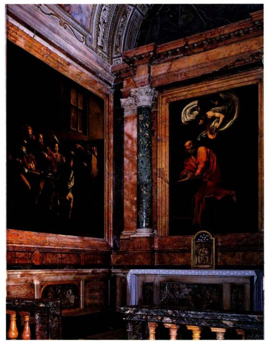

图19\.1 孔塔列里礼拜堂，罗马法国人圣路易教堂

是1565年由法国枢机主教马修·孔特莱尔（MathieuContrel，即孔塔列里）捐资建造的，但其装潢并未马上完成。多年后，由于卡拉瓦乔的赞助人枢机主教德尔·蒙泰（del Monte）的介入，他最终接受了完成这一工作的委托。

作为装饰，孔塔列里组画的功能与文艺复兴时期的系列湿壁画相同。我们这里的礼拜堂照片包括了三幅画中的两幅。在这张照片中，我们看到了《圣马太与天使》（St\.Matthew and the Angel），它画的是税吏马太急转过身，向口授福音书的天使寻求指示。左方的礼拜堂主画是《召唤圣马太》（The Calling ofSt．Matthew，图19\.2）。第三幅油画描绘了圣徒的殉难。卡拉瓦乔的风格与风格主义和盛期文艺复兴都相去甚远。他的自然主义是崭新而彻底的。根据当时的记述，与提香一样，卡拉瓦乔直接在画布上作画，但他以真人为模特。他画自己贴近的世界，因此他的油画中全是普通人，人物不像盛期文艺复兴人物那样被理想化，也没有古典式的躯体、整洁的服饰和完美的容貌。但他们也不像风格主义人像那样被扭曲、拉长，或优雅过度。这是一种全新的观念，它自然、直接、明了。

对于卡拉瓦乔来说，写实本身不是目的，而是传达深刻的精神内涵的手段。《召唤圣马太》（图19\.2）显示了这些特性。以前我们从未见过哪个宗教人物被如此彻底地按照同时代社会底层人士的样貌来表现。衣冠楚楚的税吏马太跟一些带着武器的人坐在一个普通空旷的房间里，那些人很可能是他的代理人。卡拉瓦乔一定非常熟悉这种环境和服饰。两个人从右边走近这些人。来人的赤脚和朴素的《圣经》式装扮与马太和他的同伴华美的服饰形成了强烈的对比。

卡拉瓦乔的画具有一种“世俗基督教”的特质，对天主教徒和新教徒都有极大的吸引力。除去其宗教背景，坐在桌旁的人就像是风俗场景中的人物。事实上，卡拉瓦乔的画将成为类似世俗画的一个源头。同样，奇装异服，如开叉的衣袖和插着羽毛的扁圆帽，也将出现在卡拉瓦乔追随者的作品中。只露上半身的人物也将是卡拉瓦乔及其追随者其他作品的一个常见要素（见图20\.15）。

为什么我们感觉这个场景具有一种宗教性质，而不会把它误认为一个日常事件？什么因素表明右方走近马太并对他说“跟从我”的人就是基督？肯定不是他的光环，虽然它是画中唯一的超自然要素，但它是一个我们很容易忽略的细金箍。我们的目光集中在基督的命令手势上，这个手势是从米开朗基罗《创造亚

662 詹森艺术史

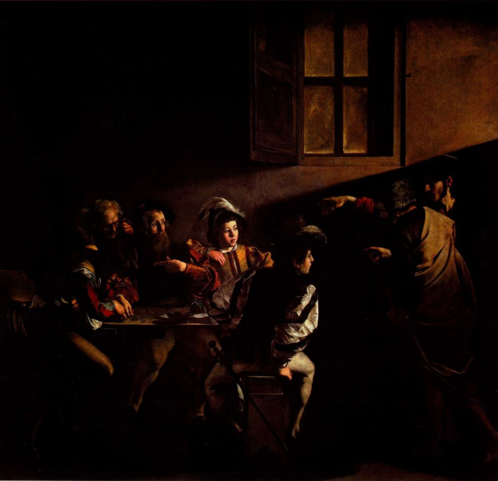

图19\.2 卡拉瓦乔：《召唤圣马太》。约1599\-1600年。布面油画，3\.4 × 3 \.5米。罗马法国人圣路易教堂孔塔列里礼拜堂

当》（见图16\.21）中的亚当像上借鉴过来的，它是联结两组人物的桥梁，并在马太身上得到了回应，因为他疑惑地指着自己。

坐在桌子右首的人似乎并未参与周围正在发生的事，而左边的人注意力则集中在数钱上。身处暗处的他们没有察觉基督进了房间\-其中一人甚至还戴着眼镜。卡拉瓦乔在这个场景中用射入室内的光来宣告基督的到来，因为基督本人带来了光：“我是世界的光。跟从我的，就不在黑暗里走，必要得着生命的光。”（《约翰福音》8：12）

耶稣上方黑暗中的那道阳光在意义和风格上都具有决定性作用。暗色的画法被称为暗影。昏暗背景中的强烈光线被称为暗影效果或暗影主义（tenebrism）。

卡拉瓦乔用光照亮处于阴暗室内的基督的脸和手，所以我们能看见他召唤马太的那一瞬间，见证宗教史和个人皈依过程中的一个关键片断。没有这道如此普通却又充满如此重大意义的光，这幅画就会丧失使观众意识到神之存在的力量。卡拉瓦乔直接表现了某些反宗教改革的圣徒所共有的一种看法：信仰的奥秘不是由玄想揭示的，而是通过一种人人都有的内心体验显露出来的。把巴洛克与反宗教改革早期区别开来的是神秘幻象的外化，这种外化呈现在我们面前时已处于完成状态，不带一丝精神挣扎的痕迹。

这种强烈、极端、生动的暗影主义是卡拉瓦乔风格的基础，在其《圣保罗皈依》（The Conversion，图19\.3）中产生了鲜明的效果。他用这

第十九章 意大利和西班牙的巴洛克艺术

种技法来增强戏剧性，同时表现圣光。这幅是一对画

中的一幅（另一幅是《圣彼得被钉上十字架》［The

Crucifixion       ，这两幅画分别位于安尼巴莱·

卡拉奇色彩浓艳、丰富的祭坛画《圣母升天》的左右

两侧，卡拉瓦乔在创作这件作品之前，应该见过这幅

祭坛画。与之不同的是，卡拉瓦乔用的是柔和的色调

和接近黑色的背景。他既不用色彩也不用线条（实际上，

我们从未见过他创作的素描）来讲故事。他用光来吸

引观众的注意力，甚至使他们震惊。扫罗（皈依后将

成为圣保罗）仰面朝天倒在地上，软弱无助，上帝之光照在他身上，也照亮了他那匹占去大部分空间的大马的肋腹和鬃毛。有一道强烈的斜光从左方一个看不见的光源射出，用于塑造形体并创造质感。对于这个空间来说，这些形象几乎太大了，让我们感受到强烈的震撼，因为我们想象它们实际上比这还要大，光只照出了一部分。有选择的突出亮点使这些与实物同样大小的形象具有一种惊异感，是典型的巴洛克风格。

卡拉瓦乔作品的另一个方面是集中表现音乐和

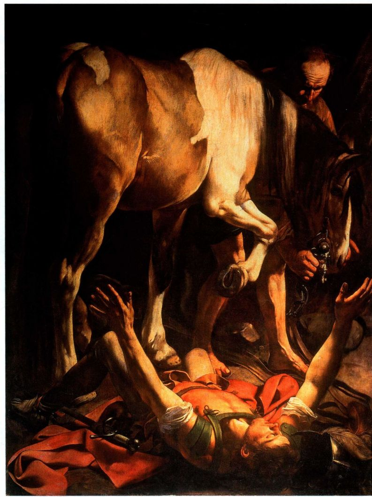

图19\.3 卡拉瓦乔：《圣保罗皈依》。约1601年。布面油画，2 \.3 × 1\. 75米。罗马人民圣母教堂切拉西（Cerasi）礼拜堂

664 詹森艺术史

图19\.4 卡拉瓦乔：《乐师》。约1595年。布面油画，92\. 1 x 1 1 8\.4厘米。纽约大都会艺术博物馆。Rogers基金，1952年

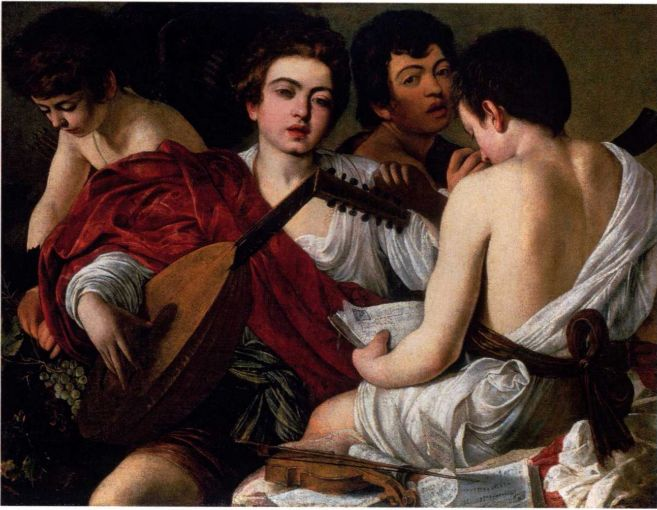

年轻男子的肉欲、色情的特点，他笔下的年轻男子都呈现出引诱的姿态。我们可以在《乐师》（TheMusicians，图19\.4）中见到这些要素，画面中有四个男女不分的半裸青年。实际上，这可能是从两个观察点看到的两个青年。这些乐师只露出上半身，但他们与真人一样大；他们红扑扑的脸颊和丰满的嘴唇暗示着性爱、声色之乐，他们不但互相迷恋，还邀请某个观画人同享。那位观画人（赞助人）就是枢机主教德尔·蒙泰，他是一位有权势的赞助人，不仅为卡拉瓦乔安排了圣马太订件，还委托卡拉瓦乔绘制其他同性恋绘画。这些半裸男子周围的鲁特琴、小提琴和乐谱，甚至一旁被人摘弄的葡萄，都表明这是当时的一场狂欢盛宴。这种题材可能令人厌烦不安，但这是欲望与激情主题的一部分，既在肉身，也在性爱，巴洛克艺术着力探索，后来的艺术品争相模仿。

对性爱、声色之乐的兴趣可从卡拉瓦乔的个性中反映出来。极其好辩的卡拉瓦乔身佩宝剑，常因打架而触犯法律。在一次因游戏而起的决斗中，卡拉瓦乔杀死了一个朋友，随后他逃到罗马，并在逃亡中度过他短暂生命的余年。他先是到了那不勒斯，然后是马耳他岛（Malta），后来短暂回到那不勒斯。他在迁回罗马的途中去世，而他原本希望在那里获得赦免。在意大利，卡拉瓦乔的作品得到了艺术家和鉴赏家的称赞\-以及批评。保守的批评家认为卡拉瓦乔缺乏规范\-宗教题材所要求的得体和敬畏。许多人不喜欢卡拉瓦乔本人，观其画，不得不承认他的风格深入人心。卡拉瓦乔的风格和意象的影响力一直持续到17

世纪30年代，这时他的风格融入了巴洛克的其他发展倾向之中。

阿尔泰米西亚·真蒂莱斯基

大多数艺术家都是子承父业，17世纪为数不多的女艺术家中的大部分人也是如此。阿尔泰米西亚·真蒂莱斯基（Artemisia Gentileschi，1593\-约1653年） 出生于罗马，是卡拉瓦乔的朋友和追随者奥拉齐奥·真蒂莱斯基（Orazio Gentileschi）的女儿，后来成为那一时代的重要艺术家之一。她对自己的作品深感自豪，却发现女性艺术家的前进之路充满艰辛。在1649年的一封信（见第667页的原始文献）中，她写下了“人们欺骗了我”这样的句子，还写道，她把一幅图样交给一个赞助人，他却委托“另一个画家利用我的图样来绘制油画。如果我是个男人，我无法想象事情会变成这样······”阿尔泰米西亚的典型主题是女英雄：大卫王发泄情欲的不幸对象拔示巴（Bathsheba），以及砍下荷罗孚尼（Holofernes）的头、拯救了族人的犹滴（Judith）。这两个主题在喜欢色情、暴力场面的巴洛克时期都很流行。阿尔泰米西亚经常描绘这些《圣经》中的女英雄（她常把自己画成主角），这反映出她动荡的一生中根深蒂固的对男性的矛盾感情（阿尔泰米西亚曾被其老师阿格斯提诺·塔西［见图19\.10］奸污，在一次陪审团审讯中，塔西被宣告无罪，但被驱逐出罗马）。

阿尔泰米西亚的《砍下荷罗孚尼头颅的犹滴和侍女》（Judith and Her Maidservant with the Head of

第十九章 意大利和西班牙的巴洛克艺术 665

1\. 84 × 1 \.4 1米

1625年。布面油画，

图19\.5 阿尔泰米西亚·真蒂莱斯基：《砍下荷罗孚尼头颅的犹滴和侍女》。约

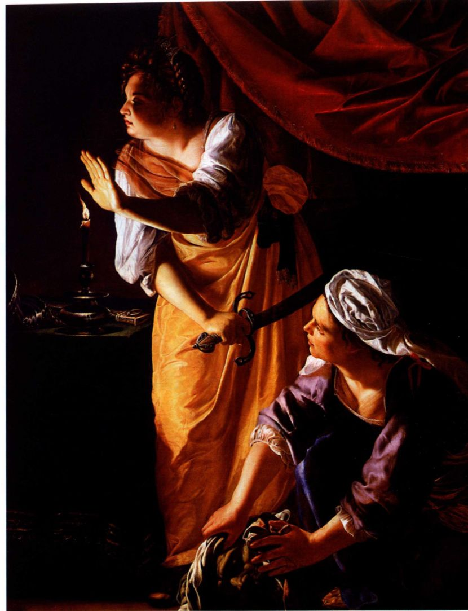

底特律艺术学院。Leslie H\.Green 赠

有表现砍头的场面，而是刻画了砍头后的一

把荷罗孚尼的头颅塞进一个大口袋。我们始

吸引她们注意的是什么，这增强了悬疑和阴

万籁俱寂、烛光摇曳的氛围，暗影法制造了

营造出一种神秘的感觉，它以超群的理解力

犹滴的复杂感情。阿尔泰米西亚1630年定

斯，她丰富的用色对那里的绘画产生了强烈

我们知道，阿尔泰米西亚可能也在伦敦

剧性的大型作品，力量并不因本身的克制而减弱。画 滴有片刻的分神，她夸张地做着手势，而她

Holofernes，图19\.5）是一件完全成熟、独立、富于戏的主题是《次经》中犹太寡妇犹滴的故事：为救族人，犹滴带着侍女来到亚述将军荷罗孚尼的营帐，把他灌醉，然后用他的剑砍下他的头；它与大卫和歌利亚的故事异曲同工\-强权被美德和纯洁制伏。但就犹滴谋杀荷罗孚尼这一主题而言，人们对胜利者的看法并不总是肯定的，而是带着几分怀疑，因为她的胜利是欺骗的胜利：暗含的性爱的允诺并未兑现。艺术家没

666 詹森艺术史

阿尔泰米西亚·真蒂莱斯基（1593\-约1653年）

选自一封致唐·安东尼奥·鲁弗（Don Antonio Ruffo）的信

阿尔泰米西亚·真蒂莱斯基1649年11月13日写给她的赞助人的信揭示了两人的关系，解释了原创性、画价、用模特作画等问题\-而且，这封信通篇都显露出她敏锐的意识，甚至她对那些只因为她是个女人就不那么公正地对待她的人的鄙视。

收到了您10月26日的信，对此深为感激，特别注意我“我的雇主总是那么关心我，而不管我的功劳是多么微不足道。在信中，您告诉我，那位先生希望得到我的一些画，他想要一幅《伽拉忒亚》和一幅《帕里斯的裁判》，《伽拉忒亚》要不同于阁下所拥有的那幅。您没有必要催促我做这件事，既然承蒙上帝和至圣之圣母的恩典，他们［顾客］来找一个有这种才能\-即能够画各种不同的题材\-的女人；从来没有人能在我的画中找出任何重复的创意，甚至连一只手也不会重复。

关于这位先生希望在作品完成之前了解价格一事······我只能非常勉强地答应······我从未在作品完成之前报过价。但

年（约       年），1626至1639年，她的父

亲在那里任英王查理一世（Charles I）的宫廷画家。

在国王被处死后，他的财产清单中的确记录了阿尔泰

米西亚的几幅画作。其中就有她最大胆、最富创造性

的《隐喻画自画像》（Self\-Portrait as the Allegory of

Painting，图19\.6），这是巴洛克时期最具创新性的

自画像之一。

在这里，阿尔泰米西亚能做到男性艺术家无法做到的事：她把自己描绘成象征绘画（La Pittura）的女性寓言人物。人物的衣着和动作都符合切萨雷·里帕（Cesare Ripa）在其广受欢迎的《图像学》（Iconologia， 1593年）中对“绘画”的描写，《图像学》是一本供艺术家参考的关于寓言和象征的书。在书中，寓言人物“绘画”在某种程度上被描写成一个漂亮女人，她有蓬乱的黑发，脖子上挂着一条金链，一手拿画笔，一手拿调色板。所以，这幅画是在维护阿尔泰米西亚作为女性画家的特殊身份\-不只表现她本人，还代表着绘画的全部，并反映了艺术家新的、更高的地位。

图19\.6 阿尔泰米西亚·真蒂莱斯基：《隐喻画自画像》。约

1638\-1639年。布面油画，98\.6 × 75 \.2厘米。皇家收藏

原始文献

是，既然阁下希望我这样做，那么我只有遵命。告诉这位先生，两幅画我需要500杜卡特；他可以把画给全世界的人看，如果有谁认为这些画最多只值200斯库多（scudo），那么我不会要求他按议价付款。我向阁下保证，这些画中有裸体人物，需要给女模特支付高额费用，这是一个令人头痛的大问题。当我找到好的模特时，她们欺骗我，而在别的时候，我必须以约伯的耐心忍受［她们的］卑鄙。

至于要我画一幅图样寄出，我已庄严地起过誓，绝不再寄送我的图样，因为人们欺骗了我。特别是，就在今天，我发现······我曾为圣加塔主教（Bishop of St\.Gata）画了一幅炼狱鬼魂的图样，而他为了少花钱，居然委托另一个画家用我的图样来画油画。如果我是男人，我无法想象事情会变成这样······

我必须告诫阁下，我并不按照那不勒斯的惯例来要价，那不勒斯人开价30杜卡特，却以4个杜卡特卖出。我是罗马人，因此我应始终按罗马方式来办事。

SOURCE: GENTILESCHI'S LETTERS IN THE VOICES OF WOMEN ARTISTS, ED\.THE WENDY SLATKIN \(ENGLEWOOD CLIFFS,NJ: PRENTICE HALL, 1993\)

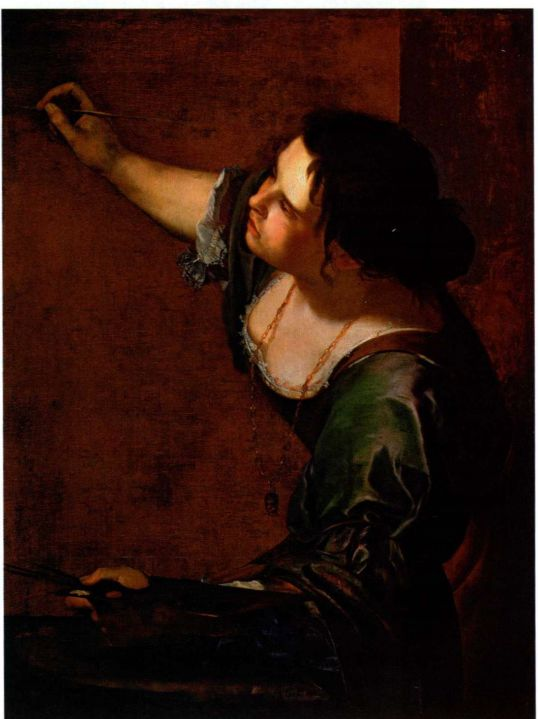

第十九章 意大利和西班牙的巴洛克艺术 667

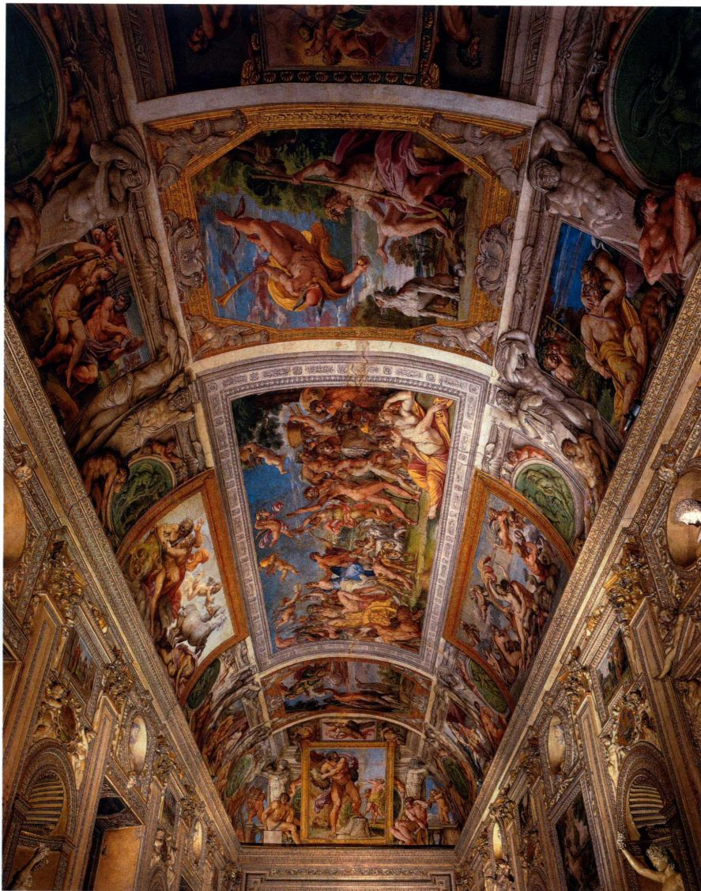

图19\.7 安尼巴莱·卡拉奇：《众神之爱》。1597\-1601年。天顶湿壁画。罗马法尔内塞宫长廊

天顶画与安尼巴莱·卡拉奇

许多意大利赞助人兴趣保守，那些相比卡拉瓦乔不那么激进的艺术家迎合了这种品位，他们延续着一种古典意味更加浓厚的传统，这种传统曾渗透在盛期文艺复兴的观念中。这些艺术家中的领军人物是1595年来到罗马的安尼巴莱·卡拉奇（AnnibaleCarracci，1560\-1609年）。安尼巴莱来自波洛尼亚，

668 詹森艺术史

16世纪80年代，他和家族中另外两位成员在那里组建了一个“学院”（另见第595页瓦萨里和第711页霍尔齐厄斯），并在意大利北部现实主义和威尼斯艺术的基础上发展出一种反风格主义画风。他是改良家而非革命者。虽然我们不完全了解这个“学院”的活动内容是什么，但似乎包括模特写生和古代雕塑临摹。与对他有很高评价的卡拉瓦乔一样，安尼巴莱对罗马

古典主义的体验改变了他的艺术。他也感觉到绘画必须回归自然，这与作为卡拉瓦乔作品基础的理论并无不同，但他的方法强调复兴古典艺术，而对他来说，古典艺术就意味着古代艺术。安尼巴莱也试图仿效拉斐尔、米开朗基罗、提香和柯勒乔。在他最好的作品里，他能把这些不同的要素结合起来。

1597到1601年间，安尼巴莱在法尔内塞宫的长廊中创作了一幅天顶湿壁画《众神之爱》（Loves ofthe Gods，图19\.7），这是他最有气魄的作品，很快就名声大振，以至于在当时地位仅次于米开朗基罗和拉斐尔的壁画。虽然我们已见过文艺复兴时期的天顶画\-15\-16世纪曼泰尼亚、柯勒乔的作品，当然还有米开朗基罗，他的西斯廷礼拜堂天顶画可成为评判其他所有天顶画的标准\-不过，与这种绘画形式关系最紧密的还是巴洛克时期。

绘制在礼拜堂、教堂和私人住宅\-入口、走廊和餐厅\-里的天顶画意在表现赞助人的权势、统治地位甚至奢侈。人们在进入这样一个华丽的房间时，不可能不带有一丝敬畏之情。从17世纪初到世纪末，天顶画的风格变得越来越奢华，甚至还向米开朗基罗的那种庄严宏伟提出挑战。法尔内塞宫的天顶画是为庆祝一场家族婚礼而订制的，它以轻松愉快的基调来呈现其人文主题：古代诸神的风流韵事。与西斯廷天顶画一样，叙事性画面被绘制而成的建筑物、仿造的雕塑和裸体青年包围着，它们都经过了精心的透视处理，并由来自下方的光线照亮，所以看起来几可乱真。

但这幅湿壁画并不仅仅以米开朗基罗的杰作为依据。主要的画面以架上画的形式表现出来，这是一种源自拉斐尔的方法。天花板上以乱真画法绘制的“加框”画、“圆雕饰”和“雕塑”被称为转绘式天顶画（quadroriportato），即移至天花板上的、不考虑观众视角的画（当把观众视角考虑在内时，艺术家就是在使用仰角透视法［di sotto in su］\-从字面上解释就是“从下到上”，如曼泰尼亚的作品［图15\.53］和柯勒乔的作品［图17\.25］）。这幅天顶画反映了法尔内塞家族的收藏，实际上这些藏品就放在那个房间里。矮墙上正在“架上画”中投石的波吕斐摩斯像以“法尔内塞的赫剌克勒斯”（Farnese Hercules）为原型，这是法尔内塞家族所有的一尊希腊化时期的雕像，陈列在庭院之中。天顶画统一于一种幻景设计，这种设计反映出安尼巴莱对柯勒乔（见图17\.25）和韦罗内塞（见图17\.33）的了解。这些不同程度的真实性中，每一种都经过了高超技巧的处理，整幅天顶画充满了活力，将它与风格主义和盛期文艺复兴艺术区别开来。

法尔内塞长廊中雕塑般的精确只向我们展示了安尼巴莱·卡拉奇风格的一个方面。另一个重要方面体现在他的风景画中，如《逃亡埃及途中的风景》（Landscape with the Flight into Egypt，图19\.8）。它的田园情调以及柔和的光线和氛围可回溯至乔尔乔内和提香（见图16\.30和16\.31）。然而，人物在这里只居于次要地位。他们像所有北部欧洲风景画中的人物那样既小又不重要（对比图18\.35）。这幅风景画

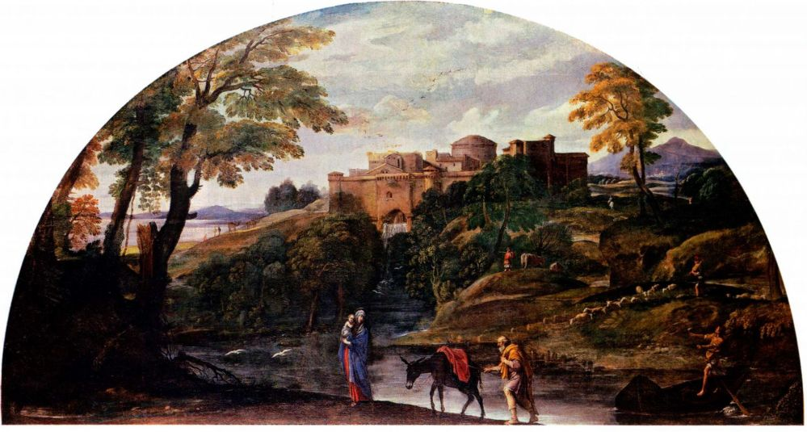

图19\.8 安尼巴莱·卡拉奇：《逃亡埃及途中的风景》。约1603年。布面油画，

1\.22 × 2 \.50米。罗马多利亚·潘菲利美术馆

第十九章 意大利和西班牙的巴洛克艺术 669

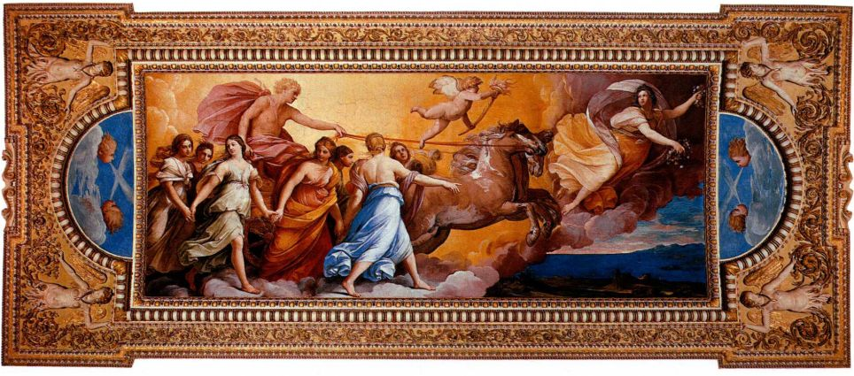

图19\.9 圭多·雷尼：《奥罗拉》。1613年。天顶湿壁画。罗马罗斯皮格里奥希\-帕拉温奇（Rospigliosi\-Pallavinci）宫，奥罗拉之家

只是间接暗示了逃亡埃及的故事（在山坡上有一些骆驼）。这样的景致放在几乎任何故事中都同样适合。古堡、道路和田野、羊群、摆渡人和他的船，所有这一切都表明人们在这个“文明”、宜人的乡村安居已久。因此人物不管有多小，也没有消失，亦不容忽视。他们的存在通过有序、具有当地特色的环境间接地表现出来。这片稳固地构筑起来的“理想风景”再现了一幅优雅而质朴、壮丽而亲切的大自然图景。

圭多·雷尼和圭尔奇诺 在罗马，以卡拉奇幻景式的法尔内塞宫天顶画为开端的巴洛克天顶画在安尼巴莱的波洛尼亚追随者圭多·雷尼（Guido Reni，1575\-1642年）和被称为圭尔奇诺（Guercino）的乔瓦尼·弗朗切斯科·巴比埃利（Giovanni FrancescoBarbieri，1591\-1666年）手中继续发展，这两个人都受到了安尼巴莱的影响。圭尔奇诺是波洛尼亚画派的实际领袖，但17世纪20和30年代，他和雷尼都在罗马工作，也是在这时进行天顶画创作。

法尔内塞长廊似乎为他们和其他受其影响的画家提供了两种选择。若采用拉斐尔式的神话题材的画面，他们就能达到一种精雕细琢的“正统”古典主义；或者他们可以仿效幻景框架技法。采取的方法因个人风格和作品的具体位置而不同。第一种方法最早的例子有雷尼的转绘式天顶湿壁画《奥罗拉》（Aurora，图19\.9），它表现了阿波罗在奥罗拉（黎明）的指引下驾驭马车（太阳）的情景。在此，优雅变成了对纯美的追求。浮雕般的画面、鲜亮的色彩、富于表现力的光赋予了画作一种单靠人物永远无法获得的情感力量。这种风格被称作巴洛克古典主义（BaroqueClassicism），用来与之前所有类型的古典主义相区别，

不论它从之前的古典主义获益多少。

雷尼完成《奥罗拉》后不到10年，圭尔奇诺也创作了一幅天顶画《奥罗拉》（图19\.10），正好与雷尼的相反。在这里，被称为幻真画（quadratura）的幻景框架（由阿格斯提诺·塔西［Agostino Tassi］绘制）与柯勒乔的绘画幻景技法（见图17\.25）以及提香的强光和重彩结合起来，把整个天花板表面变成了一个无限的空间，人物在其中像风一般掠过。在雷尼的画中，我们看到的是侧面的奥罗拉，与之不同，在这里，我们显然是站在画的下方向上看，甚至能看见从我们的头顶疾驰而过的骏马的下腹部。圭尔奇诺通过此画延续并扩展了起源于柯勒乔的传统，并由此掀起了此类视景的浪潮，这种视景是1630年后强有力地推行的风格，即盛期巴洛克的特点。

彼得罗·达·科尔托纳与巴贝里尼天顶画 这些幻景式天顶画中最强有力的是彼得罗·达·科尔托纳（Pietro da Cortona， 1596\-1669年）在罗马巴贝里尼宫的大厅中创作的湿壁画（图19\.11）。这幅巨画集合了全部三种幻景技法\-用幻真画法绘制建筑框架，用转绘式天顶画技法绘制侧面的画，用仰角透视法设定观众的视角，从而充分理解这幅天顶画。这件作品是一个复杂的寓言，美化了出身于巴贝里尼家族的教皇乌尔班八世的统治。女性寓言人物神佑（DivineProvidence，其中心主题）在整幅天顶画中居于支配地位，她宣布教皇是由她选定的，并非因政治特权而胜出。实际上，据说就在他当选之前，一大群蜜蜂（巴贝里尼家族纹章的一部分，是天顶画的主要角色）降临梵蒂冈。乌尔班八世是第一位通过枢机主教团新的无记名投票法选举产生的教皇。寓言人物强调了教皇

670 詹森艺术史

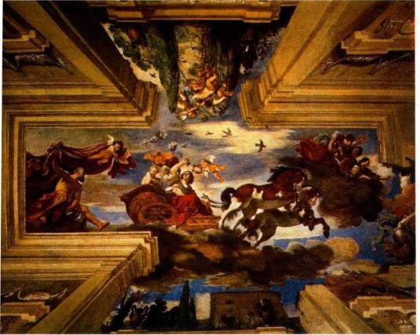

图19\.10 圭尔奇诺和阿格斯提诺·塔西：《奥罗拉》。1621\-1623年。天顶湿壁画。罗马路德维希（Ludovisi）别墅

的神圣地位：巴贝里尼蜜蜂被“神学美德”\-信仰、希望和博爱\-包围着，而“罗马”捧着教皇的三重冠，“宗教”手持圣彼得的钥匙。与法尔内塞长廊一样，天花板区被一个模仿建筑和雕塑的绘制框架划分成几个部分，但在框架之外，我们看见无垠的天空，就像在圭尔奇诺的《奥罗拉》中见到的一样。一群群高坐云端或自由翱翔的人盘绕在这个框架的上下方。他们营造出了双重幻觉：一些人似乎在厅内盘旋，离我们很近，而另一些人则退入远景。

科尔托纳的湿壁画是以夸张和狂欢风格为特征的盛期巴洛克与发源于从法尔内塞长廊天顶画的巴洛克古典主义之间分歧的焦点。古典主义者坚称，艺术具有道德功能，必须遵守清晰、和谐、得体的原则。而且，在一种基于贺拉斯的名言“诗如画”的传统的支持下，他们主张绘画应以悲剧性诗歌为榜样，通过最少的人

图19\.11 彼得罗·达·科尔托纳：《神佑的寓言》。1633\-1639年。天顶湿壁画（从预设角度看）。罗马巴贝里尼宫

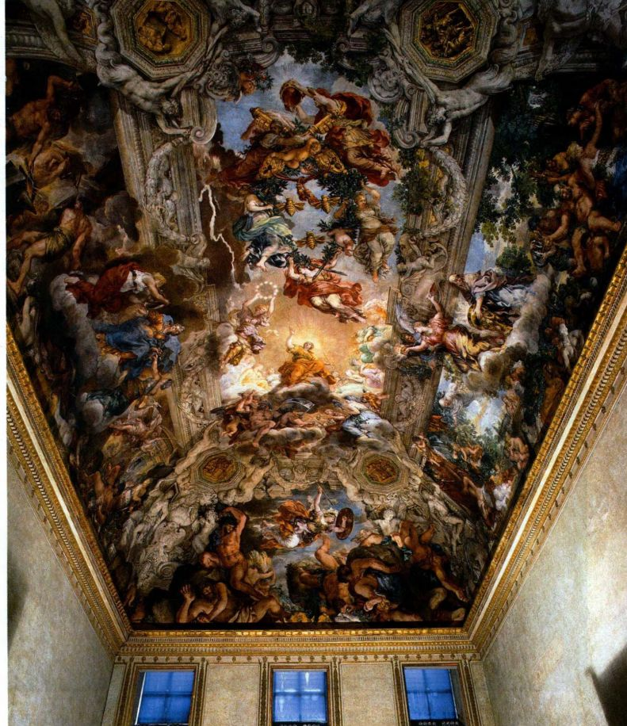

第十九章 意大利和西班牙的巴洛克艺术 671

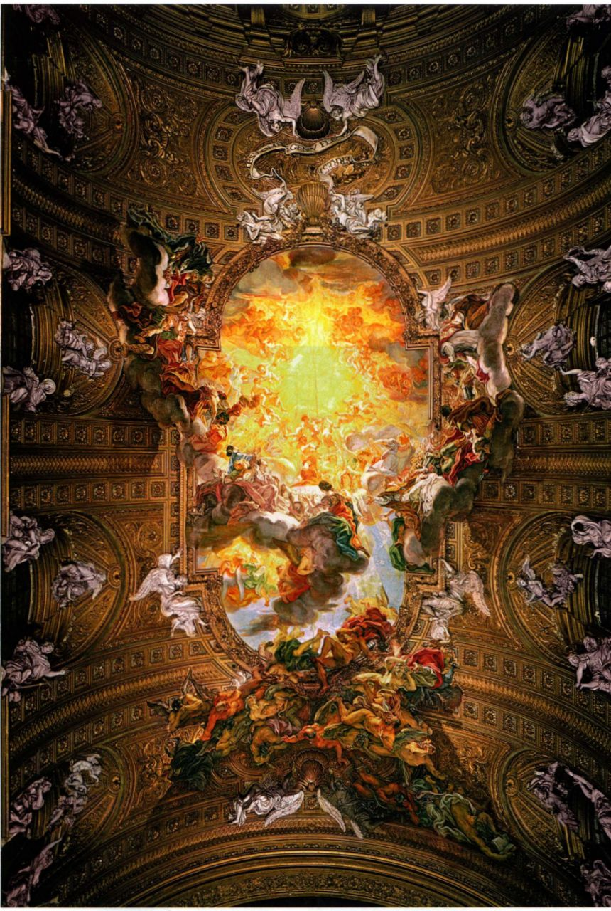

图19\.12 乔瓦尼·巴蒂斯塔·高利：《耶稣之名的胜利》（Triumphof the Name of Jesus）。1672\-1679年。天顶湿壁画。罗马耶稣堂

森艺术史

物，以明白易懂的动作、手势和表情来传达意义。科尔托纳虽然并不反对古典主义，但他提出，艺术就像史诗，众多演员和事件围绕着核心主题表演和展开，产生壮丽的效果。他第一个指出艺术具有感官吸引力而且这种吸引力本身就是艺术的目标之一。虽然关于幻景式天顶画的争论主要在理论层面上进行，但它所涉及的不只是艺术讲故事和表达思想时所采取的对立手段。争议的关键在于巴洛克的本质。通过把不同层面的真实性融入一个统一的画面，幻景技法使艺术家能够克服这个时代各种显而易见的矛盾，这个统一画面具有震撼人心的宏大效果，能扫清这些层面之间的所有差异。尽管争论很激烈，但实际上，关于架上绘画，双方少有争执，在这方面，科尔托纳和卡拉奇两人的追随者之间并不总是泾渭分明的。令人惊讶的是，科尔托纳在整个职业生涯中一直从古典艺术和拉斐尔那里寻找灵感。带头反对盛期巴洛克之“过度”的既不是湿壁画画家，也不是意大利人，而是居住在罗马的法国艺术家尼古拉·普桑（见第737页），他很早就进入了科尔托纳所在的古物爱好者圈子，但他从中得到的是极为不同的经验。

乔瓦尼·巴蒂斯塔·高利与耶稣堂 科尔托纳完成他的《神佑的寓言》（Allegory of DivineProvidence）之后，就几乎不再有人创作天顶湿壁画了，这是一个奇怪的现象。讽刺的是，由弗朗切斯科·波洛米尼和瓜里诺·瓜里尼（见第677\-682页）发展起来的新建筑风格给装饰提供的空间并不多。但1670年之后，这类湿壁画在老式建筑中重获新生，这次复兴在耶稣会母堂耶稣堂的室内（图19\.12）达到最高潮。虽然这个世纪最伟大的雕塑家、建筑师詹洛伦佐·贝尼尼（见第674页）在这里只起到了顾问的作用，但显然是他策划了这项工程。在他的建议下，天顶湿壁画被委托给他年轻的徒弟乔瓦尼·巴蒂斯塔·高利（Giovanni Battista Gaulli，1639\-1709年），此人又被称作巴奇乔（Baciccio）。富有才干的助手安东尼奥·拉吉（Antonio Raggi，1624\-1686年）负责制作灰泥雕饰。这个后来影响极大的工程体现了贝尼尼极富想象力的胆略。与科尔纳罗礼拜堂（Cornaro Chapel，见图19\.31）一样，天顶画被当作一个整体来处理，描绘了一幅神秘的幻象。明暗对比强烈的中堂湿壁画的画面明显溢出其边框，变成人物雕像，这就把绘画、雕塑和建筑结合了起来。在此，巴洛克幻景技法得到了终极的表现。天顶画的主题是位于金光中央那个灿烂夺目的耶稣之名\-IHS。这是一种激动人心的象征，不仅与信奉耶稣之名的耶稣会有关，也与基督是

大事年表

1597年\-卡拉奇创作《众神之爱》

1599\-1600年\-卡拉瓦乔的《召唤圣马太》

1609年\-伽利略·伽利莱改进天文望远镜

世界之光这一观念有关。后来，在耶稣的光与圣洁的影响下，骚动四起，并且弥漫开来，于世界末日之时从天际涌出，将耶稣会传教士们的话传播开来：“因耶稣的名无不屈膝······”（《腓立比书》2：10）。

意大利建筑

巴洛克建筑风格与绘画风格一样起源于罗马，从16世纪末直到17世纪中叶，罗马一直是一个巨大的建筑工地。反宗教改革的目标促使教会启动了一项大的建筑计划。新教堂被建造起来，新的圣彼得大教堂也最终完工。虽然许多建筑工程开始于文艺复兴时期，但由于是在巴洛克时期完工的，所以它们形成了迥然不同的特色。一些建筑师继续沿用古典建筑语汇，但对其进行了扩充或延展，所以完美这一概念不再被认为是一个圆，而是一个椭圆（这是一个现代概念，它常成为天文学讨论的对象）。这类建筑有米开朗基罗式（图17\.17）的穹顶，但穹顶的外形更陡，有直插云霄之感，产生了更强的戏剧效果；另外一些建筑师设计以不规则形状为基础的建筑，采用古典主义的装饰，而非古典主义的原则。

圣彼得大教堂完工与卡洛·马代尔诺

16世纪即将结束时，罗马开始了一项庞大的教会建筑工程，卡洛·马代尔诺（Carlo Maderno，约1556\-1629年）是这一工程中崭露头角的最有才华的年轻建筑师。1603年，他接到了完成圣彼得大教堂（图19\.13）的任务，而教堂完工持续了很长时间。教皇克莱门特八世（Clement VIII）决定在米开朗基罗所建部分的两端增加一个中堂和前廊，把它变成一座公堂式教堂。1514年，拉斐尔就已建议过更改教堂的设计，这一改动使圣彼得大教堂能够与其右方的梵蒂冈宫连接起来（图19\.14）。

马代尔诺的正立面设计沿用了由米开朗基罗确定的教堂外部样式。它用一种巨柱来支撑顶楼，但重心显然放在大门上。其效果只能被形容为从边角向中央渐趋高潮：柱子的间距越来越小，半露方柱变成了圆柱，正立面的墙逐步外凸。这种加快的节奏在前代贾科莫·德拉·波尔塔的耶稣堂正立面（见图17\.21）

第十九章 意大利和西班牙的巴洛克艺术 673

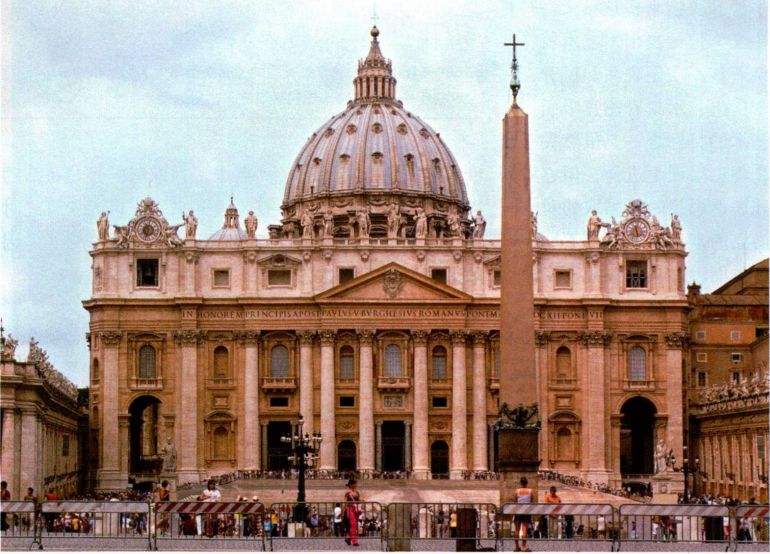

图19\.13 卡洛·马代尔诺：罗马圣彼得大教堂正立面。1607\-1612年

中就已有所表现。不仅在圣彼得大教堂中，在较小的教堂中，马代尔诺也以此作为自己正立面设计的主导原则。在这个过程中，他用与前方开阔空间有动态联系的“纵深正立面”取代了教堂正立面为连续墙面的传统概念，耶稣堂的正立面也仍未背离这种传统概念。这一始于米开朗基罗的卫宫（图17\.16）的新方法所包含的可能性直到150年后才得以完全发掘出来。最近人们在对圣彼得大教堂正立面的清洁过程中

发现它原是一种温暖的淡黄色，这种颜色强化了它的雕塑感。

贝尼尼与圣彼得大教堂

马代尔诺于1629年去世后，他的助手詹洛伦佐·贝尼尼（Gianlorenzo Bernini，1598\-1680年）获得了“圣彼得大教堂建筑师”的称号。贝尼尼认为，无论作为建筑师还是作为雕塑家，自己都是米开朗基罗

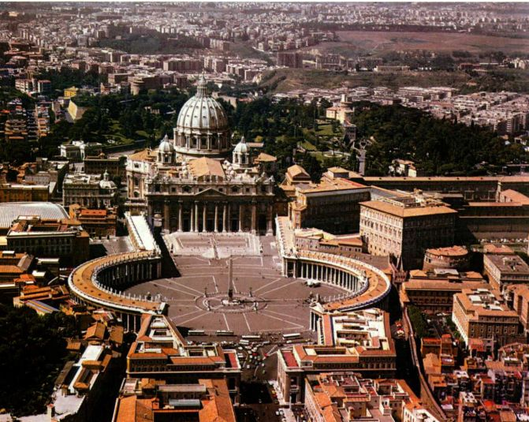

图19\.14 罗马圣彼得大教堂俯瞰图。中堂和正立面由卡洛·马代尔诺设计（1607\-1612年），柱廊由詹洛伦佐·贝尼尼设计（1657年）

674 詹森艺术史

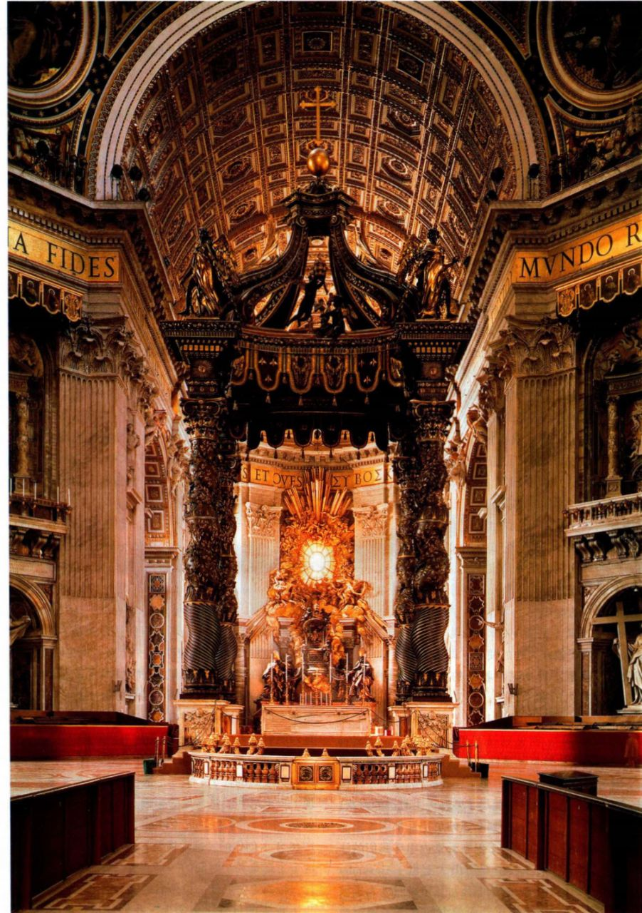

图19\.15 贝尼尼：祭坛华盖。1624\-1633年。位于罗马圣彼得大教堂十字交叉处

第十九章 意大利和西班牙的巴洛克艺术 675

的后继者，所以他既指导建筑计划，又协调教堂内部的装饰和雕塑。考虑到要完成这些任务，圣彼得大教堂的庞大规模对每一个试图整合建筑和雕塑的人都提出了同样的挑战。它的宏大建制怎样才能与人的比例联系起来，并带上几分情感的温暖？中堂一旦按照马尔代诺的设计扩大，贝尼尼就意识到，室内这个广阔空间需要有一个内部焦点。他的对策是设计了一种雕塑与建筑的巨型复合结构，即祭坛华盖（Baldacchino，图19\.15），它被用作圣彼得大教堂主祭坛的“华盖”，主祭坛位于耳堂与中堂的交叉处，米开朗基罗设计的穹顶（见图17\.17）的正下方，供教皇做弥撒的真正的圣彼得地下墓室的上方。这件30米高的雕塑与建筑的混合作品主要用从古代万神殿（见图7\.39）柱子上剥下来的青铜制成（华盖由四根绞绳柱支撑），这些柱子让人想到旧圣彼得教堂的柱子（这些柱子也被认为照搬了所罗门神庙柱子的样式）。贝尼尼并没有在柱子之间架设一个建筑上的檐部，而是创造性地提出在柱子间挂上织物。祭坛华盖绝妙地融合了雕塑与建筑。在它的四个角上有天使雕像和弯曲弧度很大的涡卷形花饰，这些涡卷形花饰顶起一个金球，球顶有一个十字架，这十字架象征着基督教在全世界的胜利。整个结构富于表现力，充满了生机，可以视作巴洛克风格的典范。一个与之相关的证据是，我们透过祭坛华盖的柱子看到了教堂半圆室内圣彼得宝座（Cathedra Petri）上雕刻而成的圣骨匣，这也是由贝尼尼设计的。

教皇的象征\-三重冠和圣彼得的十字形钥匙\-和资助制作祭坛华盖的那位教皇的纹章\-乌尔班八世的巴贝里尼蜜蜂\-是祭坛华盖重要的装饰元素。同样的标志物也可在科尔托纳为巴贝里尼家族绘制的天顶画（见图19\.11）中见到。贝尼尼的祭坛华盖对上帝和他在人间的使者，即教皇的力量和权威都表示了敬意。贝尼尼与教皇的关系是赞助史上最成功和最有力的关系之一。事实上，据说乌尔班八世当选为教皇之后，曾对这位艺术家说：“卡瓦列里（Cavaliere），能见到马菲奥·巴贝里尼（MaffeoBarberini）成为教皇，是你的大好运气；但我更加幸运，因为卡瓦列里·贝尼尼生活在我的任期内。”（但是，这位教皇的艺术目标耗尽了罗马天主教会的财富，在乌尔班死后，教皇和受到牵连的贝尼尼都因挥霍无度而遭到责难。）贝尼尼不仅在教堂内引导我们的注意力，他也（后来在教皇亚历山大七世［AlexanderVII，1655\-1667年］的赞助下）引导我们进入圣彼得大教堂的过程。他把正立面前方的开阔场地塑造成了一个宏伟的椭圆形广场，极像一件雕塑（见图

19\.14）。这座“前庭”为散乱的梵蒂冈建筑群中注入了一定程度的统一感，充当着一个被柱廊环抱的巨大中庭的角色，同时隔开周围的贫民区。这个被贝尼尼本人比作教会慈母般包容一切的臂膀的设计并非新的创造。16世纪50年代雅各布·维尼奥拉（JacopoVignola）为法尔内塞家族设计的私人别墅就已用到这种设计；但它在这些别墅里实际上只是通向整齐的后花园的观景楼（belvedere）。新颖之处在于把它设置在建筑主入口处的想法。其巨大的规模也是前所未有的。就十足震撼人心而言，这种把建筑与宏大背景相结合的做法只有位于帕莱斯特里纳的古罗马神庙（见图7\.6）才可与之匹敌。在圣彼得大教堂的视觉效果方面，贝尼尼的一大败笔是他无法建成布拉曼特原先设计的钟楼（见图16\.10）。在着手修建后，他发现原来的结构不牢固，会对正立面造成物理损伤，必须拆除。贝尼尼对这次失败耿耿于怀，但这一事件将为其意大利对手波洛米尼和后来英格兰的雷恩提供了一个颇具竞争力的资源。

装饰中的建筑元素

巴洛克建筑的宏大规模、雕塑般充满动感的活力以及华丽装饰也体现在装饰艺术中。图19\.16中160厘米高的时钟由彩色大理石、天青石、乌木和镀金青铜制成，上面绘有一幅铜板油画。

17世纪的时钟还不精确，走起来肯定有声响，夜间也看不清时间。这台钟是一种夜钟\-在夜间也能工作的钟，这是皮埃尔·托马索·坎帕尼（PierTommaso Campani，活跃于约1650\-1700年）的一项新发明。贝尼尼1665年在法国见到了一台夜钟，认为它是一个真正的奇迹。这里的这台钟是为教皇亚历山大七世制作的，这位教皇是一个有名的失眠症患者，他要求钟在黑暗里也能显示时间，而且走起来没有声音。这台钟上的时间是用罗马数字标注的，这些数字是镂空的，以便藏在钟内的一盏油灯的灯光能够透过它们照射出来；还有一个鼓轮用来消除钟摆的滴答声。

钟被包裹在一个复杂的建筑式构架里，这个构架包括成对的柱子、涡卷形底座，像一个圣龛。它体现了贝尼尼和波洛米尼的影响。位于中心的画是弗朗切斯科·特列维萨尼（Francesco Trevisani，1656\-1746年）创作的《逃亡埃及》（Flight into Egypt）。这个主题是关于时间的一种双关\-时间飞逝犹如逃亡。特列维萨尼是一位著名的罗马画家，这幅画也绝非不重要的订件。事实上，我们知道，耶稣堂（图19\.12）天顶画家高利也为这类钟作画。

676 詹森艺术史

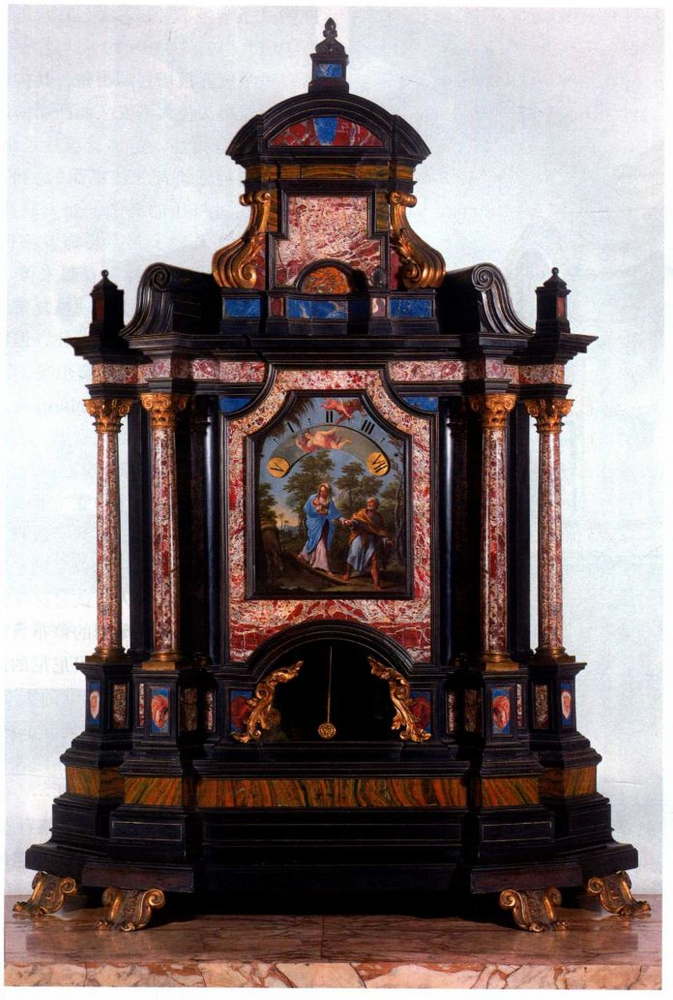

图19\.16 皮埃尔·托马索·坎帕尼和弗朗切斯科·特列维萨尼：《夜钟》（Nocturnal Clock）。

约1680\-1690年。乌木及其他种类的硬木、铜板油画、镀金青铜、彩石，1 60 x 门5 × 47厘米。

罗马加比多里诺博物馆

巴洛克的另类人物：弗朗切斯科·波洛米尼

作为一个名人，贝尼尼代表了我们在文艺复兴初期见到的一类艺术家：自信、深谙世故。他在建筑领域最大的对手弗朗切斯科·波洛米尼（FrancescoBorromini，1599\-1667年）则恰好相反：他是一个内敛、情绪反复无常的天才，最终自杀。巴洛克加剧了这两类人之间的紧张状态。即使没有同时代人的记述，单从他们的作品看，两者的差异就已很明显了。他们都代表着罗马巴洛克建筑的巅峰。但贝尼尼设计的教堂非常简单、统一，波洛米尼的建筑则过于复杂。

贝尼尼建筑的内部面貌极其华丽，波洛米尼的则出人意料地朴素。它们借助波洛米尼对空间几何非凡的把握力来产生精神效果。贝尼尼本人与那些指责波洛米尼公然漠视古典传统的人意见是一致的，被文艺复兴理论和实践奉为圭臬的古典传统认为，建筑必须反映人体比例。无疑，在这两人当中，贝尼尼虽然身处巴洛克的鼎盛时期，但他更受古典语汇的束缚。不过，也许贝尼尼对波洛米尼的批评只代表人与人之间自古皆然的相轻。

四喷泉圣卡罗教堂 波洛米尼的第一个重要工程是

第十九章 意大利和西班牙的巴洛克艺术 677

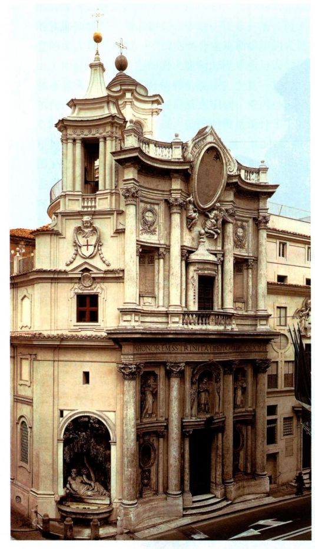

图19\.17 弗朗切斯科·波洛米尼：罗马四喷泉圣卡罗教堂正立面。约1665\-1667年

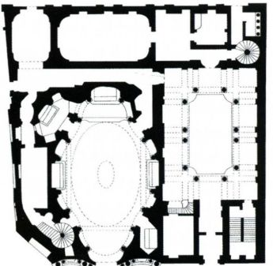

图19\.18 四喷泉圣卡罗教堂平面图。1638\-1641年

四喷泉圣卡罗教堂（San Carlo alle Quattro Fontane， 图19\.17、19\.18和19\.19），这是一栋小型建筑，坐落在一个位置很局促的街角，其构造方式（而非建筑语汇）新颖却让人不安。凹凸面的连续运用使整个结构显得富有弹性，仿佛受压变了形，而这种压力是以前的任何建筑都无法承受的。平面图（图19\.18）是一个经过挤压的椭圆，让人联想到一个膨胀的、部分消散的希腊十字。装饰着镶板的穹顶内部（图19\.19）跟平面图一样，看起来像“被拉伸开来”：如果拉力放松，它就会迅速恢复常态。从窗口透进的光虽有一部分被穹顶底部遮住，但由于有了这光和由造型奇特的藻井拼成的蜂窝图案，穹顶显得轻盈通透。在这座为三位一体会（Trinitarians，一个信奉三位一体教理的修会）修建的教堂里，三位一体的标志物出现在灯笼式天窗的拱顶上。

在近30年后设计的正立面（图19\.17）上，压力与反压力的紧张对抗达到了顶峰。波洛米尼将建筑与雕塑相结合的方式肯定曾令贝尼尼震惊。自哥特式艺术以来，还从未有人尝试过这样的结合。入口上方的雕像看起来像是从薄薄的幕布后走上舞台的演员。有趣的是，这些雕像是由贝尼尼的助手安东尼奥·拉吉制作的，他也曾为耶稣堂的天花板做过雕饰（图19\.12）。四喷泉圣卡罗教堂确立了这位建筑师的声望。委托建造这座教堂的宗教团体的领导人曾写道：“它在世界上是独一无二的。那些······试图得到平面图副本的外国人可以证明这一点。德意志人、弗兰德斯人、法国人、意大利人、西班牙人甚至印度人都向我们索要过这些平面图。”

圣伊沃教堂 波洛米尼的圣伊沃教堂（Sant＇Ivo，图19\.20和19\.21）建在一条回廊的尽头，这条回廊保存至今。它是为一所大学，即不久后的罗马大学建造的。这座教堂比圣卡罗教堂更简洁，但设计却同样大胆。圣伊沃教堂是一座基本形状为六角星形的集中式小教堂。六角星形的设计象征着智慧（Sapienza），但这座教堂最初修建时正值教皇乌尔班八世（巴贝里尼）统治期间，当时人们都说这个设计象征着巴贝里尼蜜蜂，这个形象在贝尼尼的祭坛华盖和科尔托纳的天顶画（图19\.15和19\.11）中都曾出现过。在设计这座独特的教堂时，波洛米尼可能曾考虑过像拉文纳的圣维塔莱教堂（图8\.21）那样的八边形结构，但其结果却是全新的。教堂内部的体验是完整、统一、有机的，墙把平面设计延伸至以波洛米尼独特的螺旋形灯笼式天窗为顶点的穹顶内部。穹顶把六角星图形向上延续到灯笼式天窗基座。墙上的星形图案代表的是

678 詹森艺术史

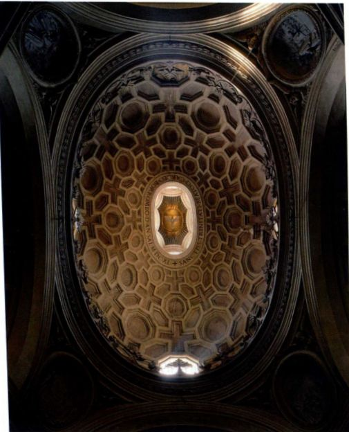

图19\.19 四喷泉圣卡罗教堂穹顶。1638\-1641年

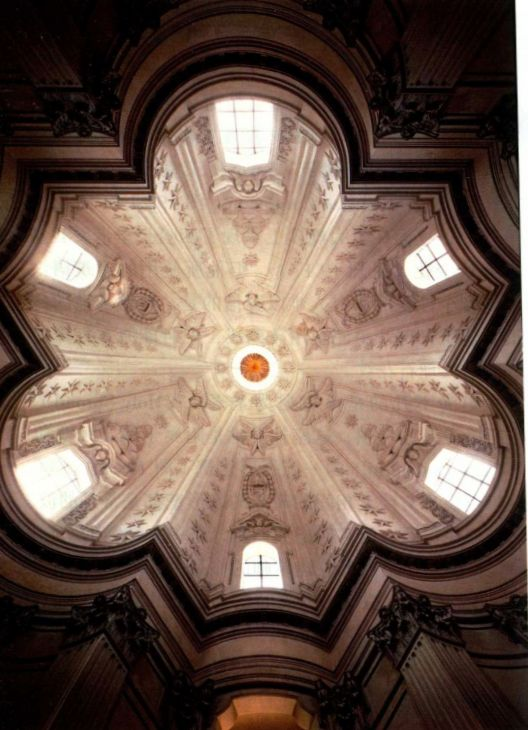

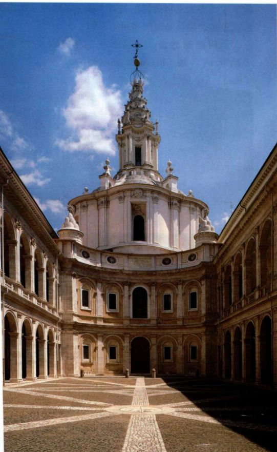

图19\.20 弗朗切斯科·波洛米尼；罗马圣伊沃教堂外部。1642年开工

图19\.21 圣伊沃教堂穹顶

第十九章 意大利和西班牙的巴洛克艺术 67

教皇亚历山大七世所属的基吉（chigi）家族。这座建筑就是在这位教皇在位期间完工的。

圣阿涅塞教堂 波洛米尼的第三个工程是位于纳沃纳广场（Piazza Navona）的圣阿涅塞教堂（Sant＇Agnese，图19\.22和19\.23），作为对圣彼得大教堂的批判，它有着特殊的重要性。在建圣彼得大教堂时，马代尔诺有两个无法解决的难题。虽然从远处看，他的正立面与米开朗基罗的穹顶构成了一个令人印象至深的整体，但当我们走近教堂时，穹顶就逐渐被新的正立面挡住了。它仿佛在“下沉”。而且，他为两端设计的塔楼造成了难以克服的结构性困难。在克服这些困难的初次尝试失败之后，贝尼尼建议把

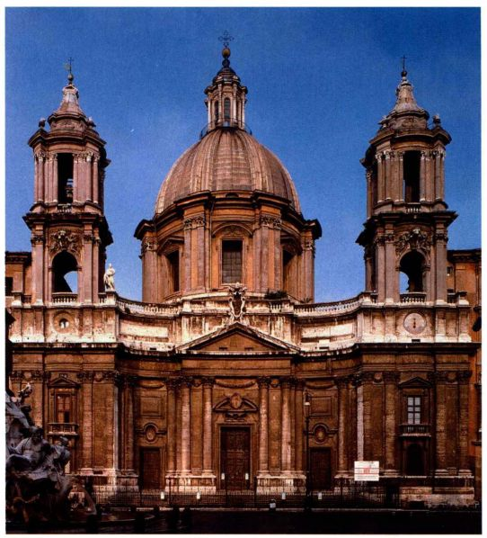

图19\.22 弗朗切斯科·波洛米尼：圣阿涅塞教堂，罗马纳沃纳广场。1653\-1663年

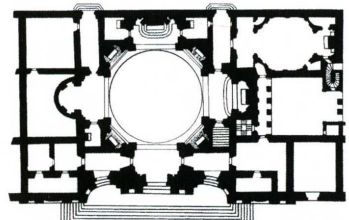

图19\.23 弗朗切斯科·波洛米尼：圣阿涅塞教堂平面图

塔楼独立出来，但这个方案遭到了严厉的批评，所以他被迫放弃。圣阿涅塞教堂的正立面出色地解决了这两个问题。波洛米尼接手了之前一年由另一位建筑师卡罗·拉依纳尔迪（Carlo Rainaldi，1611\-1691年）开始的这个工程，并作了彻底的改动，但又部分保留了希腊十字式样。他的设计基本上是集中式的（图19\.23），而且穹顶也丝毫没有后移。正立面的下部从圣彼得大教堂的正立面改造而来，但它向内弯曲，所以穹顶（属于米开朗基罗式，但更高、更窄）充当了正立面的上部。由于穹顶接近入口，所以“下沉”穹顶的问题就解决了\-当然也不存在圣彼得大教堂及其拉丁十字式样所固有的那种难题。富于表现力的凹凸面并置是波洛米尼的特色，与穹顶构成一个宏伟组合的两座塔楼使这一特色更为突出。波洛米尼再次将哥特式和文艺复兴要素\-双塔正立面和穹顶\-结合成一个特别富于伸缩性的复合体。

都灵巴洛克：瓜里诺·瓜里尼

由波洛米尼提出的新观念在皮埃蒙特区（Piedmont）首府都灵（Turin）得到了进一步的发展，而非罗马，17世纪即将结束之时，都灵成为意大利的一个富于创造性的巴洛克建筑中心。1666年，波洛米尼最有才华的后继者、工程师和数学家瓜里诺·瓜里尼（Guarino Guarini，1624\-1683年）被卡罗·艾曼纽二世（Carlo Emanuele II）公爵召至都灵。瓜里尼是一名基廷会牧师，他的才能建立在哲学和数学的基础上。他为属于萨伏依（Savoy）王室庶系分支的卡里尼亚诺宫（Palazzo Carignano，图19\.24和19\.25） 设计的正立面在更大规模上重现了四喷泉圣卡罗教堂的起伏变化（见图19\.17），但他所使用的建筑语汇是高度个性化的。令人难以置信的是，按照当地的传统，建筑外部几乎完全用砖砌成，但可能原本打算粉刷成仿大理石花纹。

更为不凡的是瓜里尼为圣寿衣（Holy Shroud）礼拜堂设计的穹顶，这座礼拜堂是附属于都灵大教堂（Turin Cathedral）的一栋圆形建筑（图19\.26）。穹顶以及窗户与壁龛相间的高高的鼓形壁都是常见的波洛米尼式母题。但它们把我们带入了一个纯粹的幻觉王国，这是在之前那位建筑师的作品中从未见过的。在这里，表面消失于一片奇特的迷宫般的肋拱棱中，这是利用重复的几何形造出来的。在这个似乎无边无际的漏斗状空间之上，代表圣灵的鸽子在一个十二角星内翱翔。这座礼拜堂保存着基督教世界最珍贵的圣物之一：基督的寿衣。

680 詹森艺术史

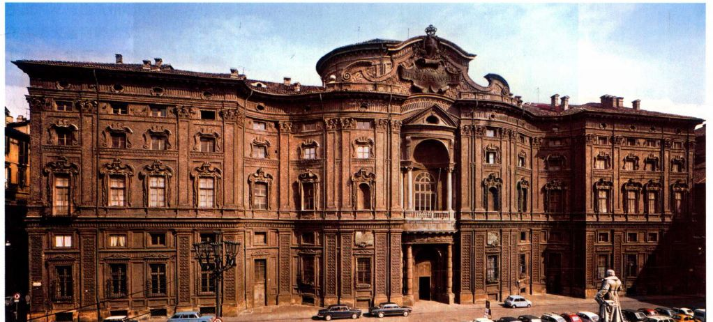

图19\.24 瓜里诺·瓜里尼：都灵卡里尼亚诺宫正立面。1679年开工

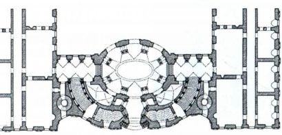

图19\.25 卡里尼亚诺宫平面图

图19\.26 瓜里诺·瓜里尼：圣寿衣礼拜堂穹顶，都灵大教堂。

1668\-1694年

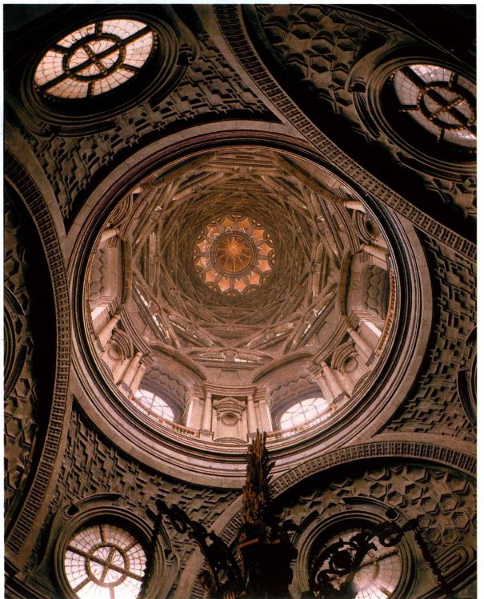

第十九章 意大利和西班牙的巴洛克艺术 681

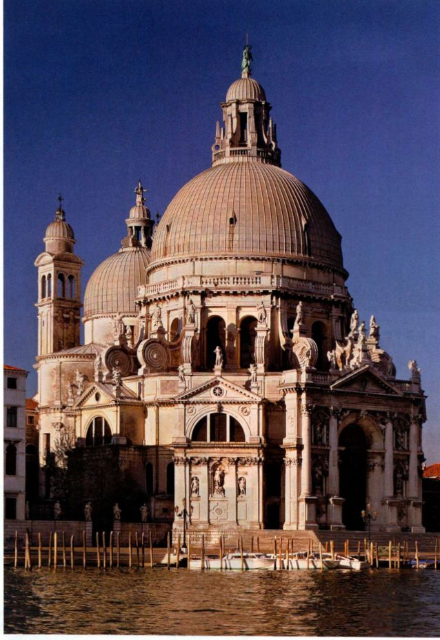

图19\.27 巴尔达萨雷·罗根纳：威尼斯安康圣母教堂。1631\-1687年

保留了天穹这一象征意义。它以柯勒乔在其《圣母升天》（见图的效果。由一圈圈相间的光与影强了幽深的错觉，明亮的光线则上人想起基督的受难。文艺复兴时成了主观的和谐，成为对无垠空修道院长絮热的那种无限中所蕴义（见第388\-389页）。如果说表现出哥特式与文艺复兴融合的更进了一步。在其著述中，瓜里古代建筑和仿佛只靠某种奇迹才给人的印象，对两者表示了同等他本人的实践完全相符。瓜里尼

和波洛米尼一心致力于创新，不现这一目标。瓜里尼用当时最先了比看似轻盈的哥特式建筑更大架在三个而非通常采用的四个三种对传统式样全新的处理方式。

威尼斯巴洛克：巴尔达萨雷·

位于威尼斯大运河源头的安Maria della Salute，图19\.27）是年鼠疫结束而下令修建的。它由\(Baldassare Longhena,1598\-1 建筑1631年开工，于罗根纳死后建过程正处于这个世纪最重要的

杰出的罗马建筑相媲美。安康圣母教堂（“Salute”）高耸于大运河畔，从那时起，它就成了威尼斯地平线上的一个焦点\-独特、优雅、古典，但装饰华丽。

这座建筑最重要的特点是，它的平面图是一个正八边形，这种特别的形状体现在它的多个立面上，而其穹顶则耸立在八边形中心。每个立面都是一个双柱式凯旋拱门，圆柱都矗立在高高的底座上。檐部通过许多雅致而独特的涡卷形大雕饰与鼓形壁连接起来。鼓形壁、双柱和八边形等元素都起源于教会初期以及布拉曼特和帕拉第奥的作品，但却成为威尼斯巴洛克的标志。

意大利雕塑

与巴洛克绘画一样，巴洛克雕塑生动、有力、充满激情和活力，表现行动和深刻的情感。题材的选取以激起观众的情感反应为目的。雕塑通常为真人大小，但它们给人以高贵的感觉，让人以为它们表现的是大于真人的人物；许多人像的确气势雄伟，经过深雕的脸部表情和衣饰捕捉光线、投下阴影，产生的不仅是深度，还有戏剧效果。

早期巴洛克雕塑：斯蒂法诺·马代尔诺

巴洛克雕塑发端于斯蒂法诺·马代尔诺（StefanoMaderno，约1576\-1636年）《圣塞西莉娅》（Santa

大事年表

1607年\-马代尔诺开始续建圣彼得大教堂

1623年\-乌尔班八世登基为教皇

1629年\-贝尼尼受托完成圣彼得大教堂

1633年\-宗教裁判所逼迫伽利略·伽利莱放弃其主张

1642年\-波洛米尼开始建造圣伊沃教堂

Cecilia，图19\.28）优雅的自然主义。马代尔诺塑造的《圣塞西莉娅》并不像几乎所有的圣徒像那样，是一个活着并站立着的圣徒，而是一具横卧的死尸。就在一年前，人们在特拉斯特维雷（Trastevere）的圣塞西莉娅教堂里发现了这位5世纪圣徒未腐烂的尸体。在这一消息的促动下，巴洛克艺术中出现了大量的圣塞西莉娅\-保护音乐的圣徒\-的形象，但这些形象往往是年轻的、尚在人世的、忙碌的，还常常演奏着某种乐器。在这里，她向右侧卧在一块大理石板上，衣服被两膝夹住并拉长至脚尖，仿佛她正躺在床上，而非停尸板上。脖子上的伤口和扭向一旁的头颅表明她已死去。圣塞西莉娅躺在那里，即使死去也显得莫名地脆弱，令人感伤。这种动人的描绘是巴洛克的特点之一。

巴洛克的发展：詹洛伦佐·贝尼尼

贝尼尼既是建筑师，也是雕塑家，正如我们在祭坛华盖（图19\.15）中见到的，在他的作品中，雕塑

图19\.28 斯蒂法诺·马代尔诺：《圣塞西莉娅》。1600年。大理石，真人大小。圣塞西莉娅教堂，罗马特拉斯特维雷

第十九章 意大利和西班牙的巴洛克艺术 683

与建筑的关系从来就没有间隔。他的父亲，曾在佛罗伦萨、那不勒斯和罗马工作的雕塑家彼得罗·贝尼尼（Pietro Bernini，1562\-1629年）是他的老师，但他也受到过乔瓦尼·博洛尼亚（见图17\.10）的影响。因此，贝尼尼的风格从多个方面来看都是风格主义雕塑发展的一个直接产物，但单凭这一继承关系，却无法解释他从业之初就已显露的革命性品质。

《大卫》 与圣彼得大教堂柱廊（见图19\.14）的情形一样，我们常常可以发现，贝尼尼的雕塑与古代风格之间存在着一种稳固的关系。如果比较一下贝尼尼的《大卫》（图19\.29）和米开朗基罗的《大卫》（见图16\.13），问一问哪件作品更接近帕加马祭坛浮雕或《拉奥孔》（见图5\.74和第179页），我们

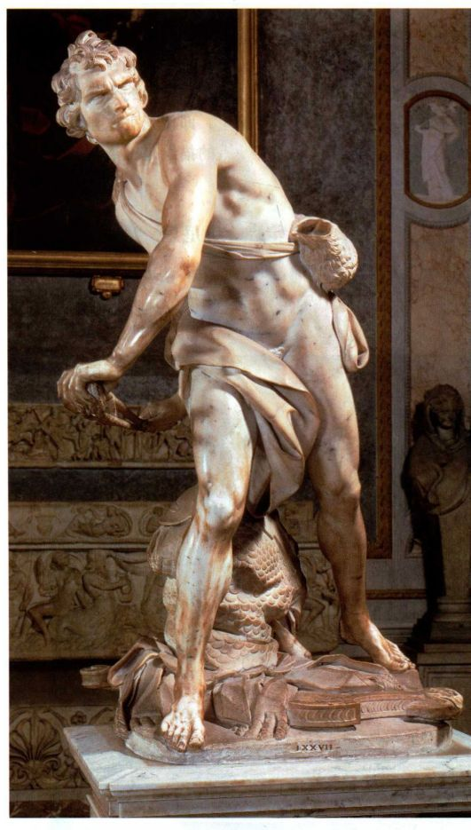

图19\.29 詹洛伦佐·贝尼尼：《大卫》。1623年。大理石，真人大小。罗马博尔盖塞美术馆（Galleria Borghese）

定会倾向贝尼尼，因为他的雕塑与希腊化时期的雕塑作品一样，都表现出了肉体与精神、动作与情感的统一，而米开朗基罗则有意弱化二者的关系。这并不意味着米开朗基罗（他曾亲眼目睹《拉奥孔》的发掘）比贝尼尼更接近古典主义。只是表明，巴洛克和盛期文艺复兴从古代艺术中得到的经验是不同的。

贝尼尼的《大卫》让人联想到《拉奥孔》极其强烈的表情、动作和活力（见第687页的材料与技法）。从一定程度上讲，使之归入巴洛克艺术品行列的是暗示歌利亚的在场。与早先的大卫雕像，如多那太罗的大卫像（见图15\.35）不同，贝尼尼的大卫像让人觉得这不是一个独立自足的人物，而是一对人物中的一个，他的整个行为焦点都集中在对手身上。贝尼尼的《大卫》清楚地告诉我们他所看到的敌人的位置。因此，大卫与他看不见的对手之间的空间充满了能量\-这种能量“属于”雕像。

贝尼尼的《大卫》向我们展示了巴洛克雕塑的突出特征：它与周围空间之间有一种新的能动关系。但与其他大多数巴洛克雕塑一样，观赏者应从一个主视角来看它。贝尼尼向我们呈现了动作的“瞬间”，而不仅仅是击杀歌利亚的意志，如米开朗基罗的作品；或击杀之后的情景，如多那太罗的作品。巴洛克雕塑时常体现出更旺盛的生命力和活力。它摒弃自足的状态，转而用雕像的动作暗示关于某种存在或力量的假象。由于常常要呈现“无形的补足物”（就像贝尼尼的《大卫》中的歌利亚），巴洛克雕塑尝试了传统上不会出现在大型雕塑上的绘画效果。这种让空间充满能量的做法实际上是巴洛克艺术的一个基本特征。卡拉瓦乔在其圣马太中通过一束聚光的帮助做到了这一点。正如我们在高利的耶稣堂天顶画（图19\.12）中见到的那样，绘画和雕塑甚至都可以跟建筑结合起来，制造一种类似于舞台上的那种复合幻觉。

科尔纳罗礼拜堂：《圣特雷莎的沉迷》 贝尼尼对剧场有一种强烈的兴趣，他还是一个富于创新精神的舞台布景设计师。当时有人写道，贝尼尼“上演了一部知名的歌剧，在其中，他负责绘制布景、制作雕像、发明道具、作曲、编写喜剧、搭建剧场”。所以，当他能够把建筑、雕塑和绘画融为一体时，就是他的全盛时期（见第三部分末尾的附加原始文献）。贝尼尼这种风格的代表作是放置在维多利亚圣母教堂（Vittoria Santa Maria）的科尔纳罗礼拜堂中的著名组雕《圣特雷莎的沉迷》（The Ecstasy of St\.Theresa， 图19\.30和19\.31）。阿维拉的特雷莎是反宗教改革的重要圣徒之一，于1622年被再度封圣。组雕描写

684 詹森艺术史

图19\.30 詹洛伦佐·贝尼尼：《圣特雷莎的沉迷》（组雕细部）。1645\-1652年。大理石，真人大小。科尔纳罗礼拜堂，罗马维多利亚圣母教堂

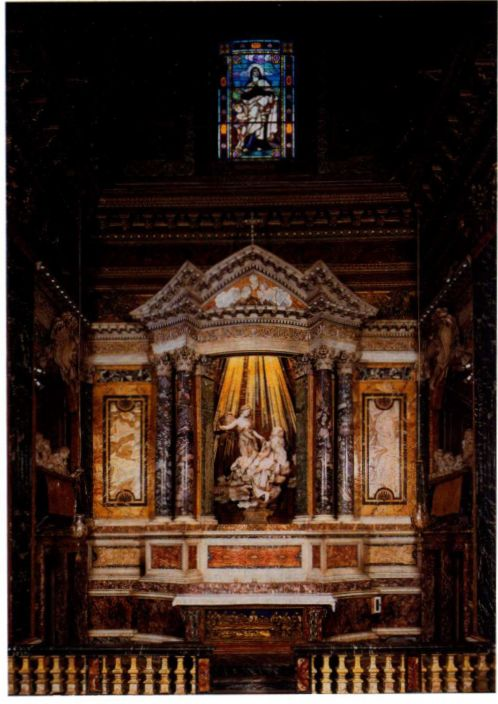

图19\.31 詹洛伦佐·贝尼尼：《圣特雷莎的沉迷》（全貌）。1645\-1652年。大理石，真人大小。科尔纳罗礼拜堂，罗马维多利亚圣母教堂

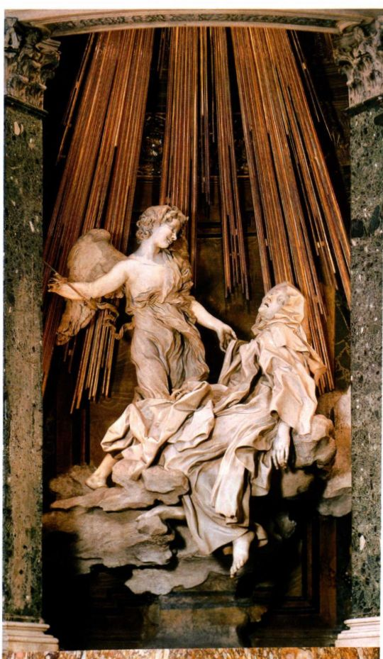

了一位天使是如何把一支燃烧的金箭刺入她的心脏的：“剧痛使我高声尖叫；但与此同时，我又感到无尽的甜蜜，我希望永远痛下去。这不是肉体的痛，而是心灵的痛，虽然它某种程度上也对肉体起了作用。这是上帝对灵魂最甜蜜的爱抚。”

贝尼尼使特雷莎的幻觉体验具有了柯勒乔的《朱庇特与伊俄》（见图17\.24）那种感官上的真实。圣徒的狂喜显而易见。（若换一种情景，天使也可以是丘比特。）从上方一个隐蔽的窗户射入的光线照射着这两个浮云上的人物，使他们看起来超凡脱俗。因此，观众会感觉他们就像幻影。这里的“无形的补足物”不像《大卫》的那么具体，但同样重要，那就是把人物带往天国并使其衣物凌乱的那股力量。发自祭坛高处的金光暗示了它的神圣性质。在礼拜堂拱顶上的一幅由圭多巴尔多·阿巴蒂尼（Guidobaldo Abbatini）

第十九章 意大利和西班牙的巴洛克艺术 685

大事年表

1607年\-第一部歌剧，克劳迪奥·蒙特威尔第的《奥菲欧》上演

1622年\-耶稣会创办人罗耀拉的依纳爵和方济各·沙勿略、阿

维拉的特雷莎、菲利波·内里同被封圣

1645年\-贝尼尼开始创作《圣特雷莎的沉迷》

创作的幻景式湿壁画中，天国的荣耀被呈现为一束炫目的光，一群群喜气洋洋的天使从中一拥而出。这种神圣的爆发往天使刺箭的动作中注入了力量，也使圣徒的迷狂变得完全可信。

为使这一幻觉更加完美，贝尼尼甚至还为他的“舞台”设计了永久的观众。在礼拜堂的两侧有模仿剧院包厢的楼座，里面放置着科尔纳罗家族成员的大理石像，他们也是这一幻象的目击者。他们与我们处在同一空间，因而是日常现实的一部分，而围在壁龛当中的圣徒迷狂的景象则占据着一个真实但无法企及的空间，因为那是一片圣界。

最后，天顶湿壁画代表着天国的无限空间。我们

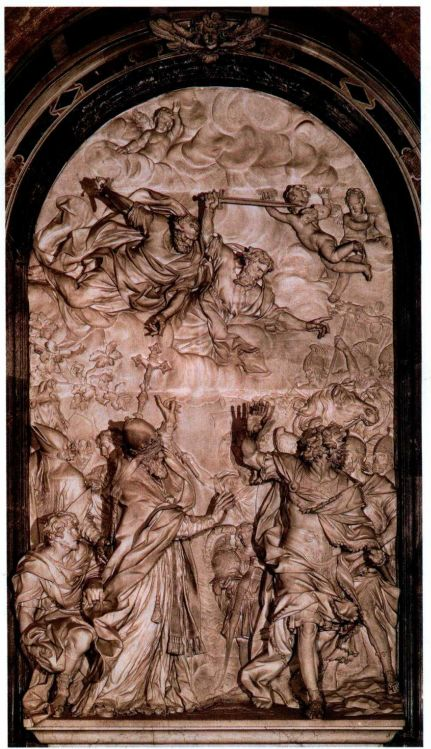

图19\.32 亚历山德罗·阿尔加迪：《教皇利奥一世和阿提拉的会面》。

1646\-1653年。大理石，8\.5 × 4\.9米。圣彼得大教堂，梵蒂冈，罗马

也许会想起，《奥尔伽兹伯爵的葬礼》及其中的背景部分也形成了一个包括三个现实层面在内的整体（见图18\.12）。但这两个礼拜堂之间存在着根本差异。埃尔·格列柯的风格主义营造的是一个虚无缥缈的幻象，其中只有石棺的石板是“真实”的，与之形成对比的是贝尼尼的巴洛克式舞台表演：幻觉与真实的差别几乎消解了。《圣特雷莎的沉迷》会很容易被当作剧场陈列品，但贝尼尼还是一个虔诚的天主教徒，他（与米开朗基罗一样）相信自己的灵感直接来自上帝。与罗耀拉的圣依纳爵的《神操》（贝尼尼本人也曾照此练习）一样，他的宗教雕塑试图通过强烈的感官魅力来帮助观众认同神迹。宗教礼拜仪式中的戏剧风格是反宗教改革的基础，因为反宗教改革常把教会说成是人生剧场：它选择巴洛克给这一理想赋予生命力。

贝尼尼潜心钻研文艺复兴人文主义，他的雕塑的核心就是姿势和表情在激发情感方面的作用。这些手段在文艺复兴时期也很重要（如达芬奇的作品），贝尼尼却随意地运用它们，这种随意看似反古典。不过，他基本上是遵循得体原则的（这也解释了为何他的《大卫》不是全裸的），而且他精心设计所要达到的效果，根据表现对象的不同来变换效果。与法国人尼古拉·普桑（他尊重普桑，正如他尊重安尼巴莱·卡拉奇）不同，贝尼尼这样做是为了造成富于表现力的效果，而不是为了达到概念上的清晰。这两位艺术家的方法也完全相反。对贝尼尼而言，古代只不过是其独创性的起点，而对普桑来说，古代是进行比较的标准。然而，贝尼尼的理论比其艺术保守得多，这是巴洛克的特有现象。所以他常常支持古典主义者，反对同道的盛期巴洛克艺术家，特别是彼得罗·达·科尔托纳，这位艺术家与之前的拉斐尔一样，也对建筑作出了重要贡献，是贝尼尼在这个领域的一个竞争对手。

古典主义的另类人物：亚历山德罗·阿尔加迪

不同寻常的是，科尔托纳是雕塑家亚历山德罗·阿尔加迪（Alessandro Algardi，1598\-1654年）最亲密的朋友，因为阿尔加迪被认为是意大利巴洛克时期最重要的古典主义雕塑家。他的主要作品是《教皇利奥一世和阿提拉的会面》（The Meeting of Pope Leo Iand Attila，图19\.32），这是在教皇英诺森十世（InnocentX）在位期间他接替贝尼尼在圣彼得大教堂工程中的职务时创作的。这件作品采用了一种新型的高浮雕，这种高浮雕很快就风靡各地。贝尼尼一直回避浮雕创作（当他不得不制作浮雕时，他的工作室就负责这类项目的具体实施），但阿尔加迪喜欢用这种绘画性更

686 詹森艺术史

贝尼尼的雕塑样稿

为大型雕塑或建筑而作的小件雕塑稿本被用作模型、练习素材或艺术家给赞助人的看样。这些雕塑模型被称为小稿（bozzetto）或样稿（modello）。小稿的意思是草稿，它通常比样稿更小、更粗糙，而样稿则可能更接近成品，或用另一种方式来说，是在最后工序完成之前给赞助人看的“成品”。

艺术家会为成品画几幅草图，做若干小稿。实际上，贝尼尼在准备一件作品时，既用鹅毛笔和墨水或者红色或黑色粉笔，甚至混合使用粉笔和鹅毛笔来画草图，也制作小稿。贝尼尼的小稿和样稿用黏土（赤陶土）制成，但雕塑完成品的材料是大理石。这不仅有材质的不同，还有技法的差异。大理石雕像是通过减除法制作的\-大理石被凿掉。但黏土既可用添加法，也可用减除法加工，而且我们知道，贝尼尼的黏土作品大都采用添加法。

贝尼尼为一尊真人大小的圣杰罗姆大理石全身像制作了一个与实物等大的黏土小稿《圣杰罗姆头像》，我们可以看到，他在其中运用了多种方法和工具。对这件泥塑的分析显示，与其他许多泥塑一样，由经过揉压的黏土制成，就是把新鲜的黏土反复碾压、捣碎、再碾压，排出里面的空气，然后再“捏”。黏土要用手指（最可能的是大拇指、食指和中指）来捏，辅以指甲（刻出沟沟道道）和带齿工具。

艺术家用自己的手\-自己的手指\-来捏黏土的想法很有吸引力。大型雕塑以及复杂的雕塑与建筑混合作品会用到几个助手来凿刻大理石。但在小稿中，我们会发现艺术家手工的痕迹\-指纹。人们已研究了贝尼尼的几件雕塑稿，看黏土上是否留下了指纹，而他们的确发现了许多。在福格艺术博物馆收藏的15件贝尼尼雕塑稿（这是其雕塑稿最大的单批收藏）中，13件有指纹，相同的指纹又有多个。已发现了34个指纹，在相隔数年的雕塑稿上还找到了一些相同的指纹，所以，这些指纹更有可能是贝尼尼本人的。他摩平表面、添加黏土、用指甲刻出线条和棱边、用手指抹压黏土。

《圣杰罗姆头像》上有贝尼尼的指纹、指甲划痕和他在添加更多的黏土来塑造头发和鼻子时带齿工具留下的痕迹。

强的雕塑形式进行创作。

浮雕描绘了452年阿提拉率领的匈奴人在威胁要进攻罗马，后来却撤退的情景，这是基督教早期历史中的一个决定性事件，因为这时基督教正处于生死安危之际。（真实情况却与此不同：利奥说服了匈奴人不发动进攻，就像三年后他对汪达尔人所做的那样。两位主角都骑着马，而不像这里是步行。）这个题材重现了我们所熟悉的古代主题：对野蛮势力的胜利。但这里是教会而非文明取胜了，而且这个胜利是精神上的，而非军事上的。

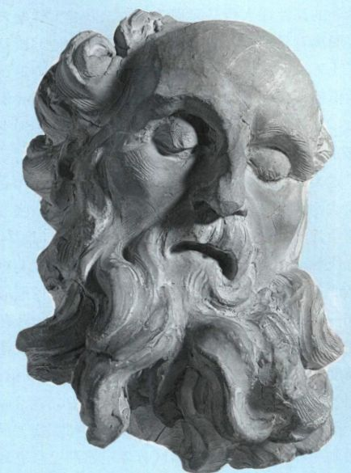

詹洛伦佐·贝尼尼，《圣杰罗姆头像》。约1661年。赤陶土，高36\.2厘米。承蒙马萨诸塞州剑桥市哈佛大学艺术馆福格艺术博物馆（Fogg Art Museum，Harvard University Art Museum）允许。Alpheus Hyatt购，Friends of the Fogg Art Museum 基金会，1937\.77

我们知道，用手指掏出空洞后，泥塑要从背后被挖空。因为要在脸部和头发上添加黏土，所以破裂和折断的可能性就加大了。在这件小稿中，我们发现了多处裂痕。很明显，许多地方都被特意弄平，以防止这种情况的出现。还有更多的证据表明，头像上曾盖着布块，这既是为了保持黏土的湿润，以便继续加工，也是为了防止进一步断裂。

《圣杰罗姆头像》具有极强的表现力，圣杰罗姆眼窝深陷，脸颊凹陷，形容枯槁，仿佛正遭受着折磨和痛苦，不过，这副面容令人难以忘怀是出自黏土上的纹理。

这一订件采取雕塑形式，是因为它位于圣彼得大教堂的一道旧门内（而且要穿过大半个教堂才能到达），这个位置会产生水汽凝结，所以不可能在此作画。但绘画所面临的观看难题对浮雕来说也是难以解决的。之前从未有意大利雕塑家尝试过制作如此大型的浮雕\-它高逾8\.5米，是吉伯尔蒂的青铜门《天堂之门》（图15\.22）的近2倍。把一种绘画构思（拉斐尔在梵蒂冈厅室中就曾表现过这样一种构思）转变成一幅如此巨大的浮雕，这个过程中产生的问题难以措手。即使阿尔加迪没有成功地解决每一个细节，他

687

第十九章 意大利和西班牙的巴洛克艺术

的成就也仍然是惊人的。通过改变雕刻的深浅，他几乎使我们相信这个场面就发生在我们所处的空间里。前景处的高浮雕人像凸起程度很大，以至于看起来就像要脱离背景似的。为了强调这一效果，他们所站的台子比外围壁龛向外突出了数米。所以，当阿提拉逃离两位使徒保卫信仰这一幻象时，他就像要朝我们冲过来，既恐惧又震惊。最终的效果在视觉和表现力方面都非常令人信服。

这类幻景技法从本质上说是巴洛克式的。作品强烈的戏剧性也是这样，而人物扭动的姿势和夸张的手势都增强了这种戏剧性。阿尔加迪显然对贝尼尼的天赋有所触动。奇怪的是，这件浮雕在一定程度上重现了庄严圣母教堂中由贝尼尼的父亲彼得罗·贝尼尼于1606\-1610年创作的《圣母升天》的特点。只有在遵守传统的浮雕三高度（低、中和高，而非连续变化的高度）、对正面姿势的偏爱和处理激烈动作时有所克制等方面，阿尔加迪才能被称为古典主义者，而且这个称号完全是相对意义上的。显然，在雕塑方面，与绘画一样，我们很难清晰区分界定盛期巴洛克和巴洛克古典主义。

西班牙绘画

17世纪，政治、艺术和对天主教会共同的忠诚把意大利与西班牙联系在一起。仍挣扎于宗教裁判所（1478年在西班牙成立的一个独立的中世纪机构，坚持正统教义，1542年在意大利重新设立）统治之下的西班牙持坚定的保守立场，毫不退缩；它的国王被尊称为“最忠诚的天主教国王陛下”。西班牙只允许那些公开声明自己忠心不渝的人进入教会，囚禁、处死或驱逐违抗的人，而梵蒂冈则动用各种资源使改革者和不满者重新回到教会。反宗教改革或天主教改革与巴洛克风格一同发端于罗马，巴洛克的目标是使观众相信天主教会及其赞助人和拥护者的活力和力量。而且，在17世纪初，意大利本土最大的城市那不勒斯正处于西班牙的统治之下。所以罗马的巴洛克艺术对那不勒斯和西班牙艺术的影响是深刻的。

16世纪时，西班牙的政治和经济实力达到了巅峰，涌现出许多伟大的圣徒和作家，却没有一流的艺术家。埃尔·格列柯的存在也没能刺激本土人才的产生。西班牙宫廷和大多数贵族不尊重本国艺术家，只要有可能，他们宁可雇用外国画家\-特别是提香。因此，艺术上的影响主要来自意大利和当时被西班牙统治的尼德兰。扬·凡·爱克（见第480\-485页）到过西班牙，

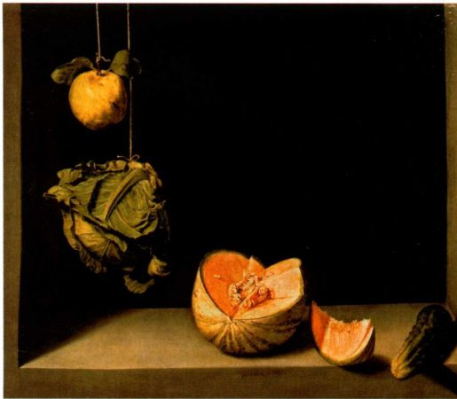

图19\.33 胡安·桑切斯·科坦：《榅桲果、卷心菜、甜瓜和黄瓜》

（Quince，Cabbage，Melon，and Cucumber）。约1602年。布面油画，68\.8 × 84\.4厘米。圣地亚哥艺术馆	\(San Diego Museum of Art\)。Anne R\.小姐和Amy Putnam小姐赠

并激励了那里的追随者。提香为西班牙的查理五世创作过。17世纪，鲁本斯也至少两次到访西班牙，在那里，他的作品得到了人们的交口称赞。西班牙的巴洛克艺术受卡拉瓦乔的风格和题材影响很深，这种影响或为直接或者经由那不勒斯产生，但更加刻板。西班牙自然主义可能会在表现对象上投射更刺眼、更强烈的光，但从根本上说，其感动人的效果至少是相同的。

西班牙静物画：胡安·桑切斯·科坦

在阿尔岑及其他尼德兰画家榜样作用的激励下，西班牙艺术家开始在16世纪90年代发展他们自己的静物画，鉴赏家们也大量收藏这类作品。我们可以在胡安·桑切斯·科坦（Juan Sánchez Cotán，1561\-1627年）的作品（图19\.33）中看到这个新题材的特点。这名二流宗教艺术家后来成为加尔都西会修士，今天却作为静物画中托莱多画派最早和最出色的成员之一而被人铭记。科坦的画条理清晰、朴实无华，这种特点完全是在艺术家的控制下产生的。他用一根细绳把一些蔬菜高低错落地挂起，以协调构图，而其他蔬菜则平放在窗台上。窗户充当了静物画的画框：把静物摆放在直射的阳光中，以无法穿透的黑暗为背景，这是早期西班牙静物画的特点。精细的写实手法和抽象的形式为不起眼的果蔬勾画了一幅令人难忘的画像。

虽然桑切斯·科坦可能把意大利北部绘画当作了自己的起点，但他的静物画令人想到卡拉瓦乔，不过，卡拉瓦乔对西班牙艺术的影响要到很久之后才显现出

688 詹森艺术史

来。我们不完全了解卡拉瓦乔主义的传播途径。最有可能是通过那不勒斯，因为卡拉瓦乔曾避难到那里，而那不勒斯此时正被西班牙统治。他在那里的主要追随者是胡塞佩·里韦拉。

那不勒斯与卡拉瓦乔的影响：胡塞佩·里韦拉

在当时处于西班牙统治下的那不勒斯，卡拉瓦乔的主要追随者是西班牙人胡塞佩·德·里韦拉（Jusepede Ribera，1591\-1652年）。在定居那不勒斯之前，里韦拉在罗马见到了卡拉瓦乔的画。里韦拉描绘圣徒、先知和古代行乞哲学家的画尤其受人欢迎。它们所表现出的苦行主义对专注于精神世界的西班牙天主教有

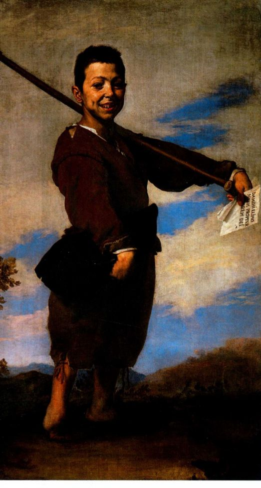

图19\.34 胡塞佩·德·里韦拉：《畸足少年》。1642年。布面油画，

164 × 93厘米。巴黎卢浮宫

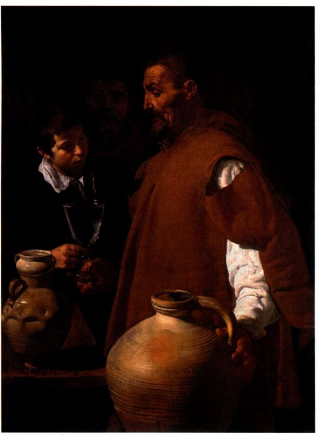

图19\.35 迭戈·委拉斯凯兹：《塞维利亚运水者》。约1619年。

布面油画，LOS\.3 × 80 厘米。惠灵顿博物馆（Wellington Museum）

强烈的吸引力。这类绘画也反映了西班牙贵族深厚的人文主义素养，这些人是艺术家的主要赞助人。里韦拉笔下的人物大都具有精神力量与热情集于一身的特点。

他的《畸足少年》（The Club\-Footed Boy，图19\.34） 朝我们展露出灿烂、可人的笑容，脸蛋上露出酒窝，虽然他的乡下人打扮、行乞举动和残疾可能会令我们稍感不适。他手中的纸上写着（翻译过来就是）：“看在上帝之爱的份上，给我一点施舍吧。”在反宗教改革理论中，这种对施舍的乞求表明，富人只有做善事才有希望获得救赎。实际上，这幅画是为那不勒斯总督绘制的，总督是一个富有的收藏家，在他眼中，此画可能是对基督教博爱精神以及对穷人的仁慈的重要性的证明。画中的男孩看起来就像个扛枪的士兵，他背朝宽广的天空站着，地平线很低，这样一来，他的身形就几乎显得伟岸了；但他肩上扛的不是兵器，而是他的拐杖。他那条畸形的腿在阴影中若隐若现，观者一开始看得并不十分清楚，但既然光线照到了这条腿上，那么里韦拉显然是要把我们的注意力引向这里。残疾可能实际上指的不是那只内弯足，而是指脑瘫。

第十九章 意大利和西班牙的巴洛克艺术 689

无论是哪种情况，在17世纪，这样的残疾都注定让人终身行乞。

里韦拉还创作了其他以乞丐、穷人和盲人为对象的大型绘画作品。这些也是老彼得·布吕盖尔用过的题材（《瞎子领路》，图18\.39），他创作过使用各种拐杖的乞丐的版画和素描。与布吕盖尔的作品一样，《畸足少年》有着一种道德用意。男孩微笑甚至可能是大笑的时候，他自己似乎就是快乐的化身。人们认为这是主人公对抗不幸的一种方式，因为他拥有广施恩惠\-给他人行善的机会\-的能力。里韦拉运用自然主义的做法是西班牙和那不勒斯油画、蚀刻版画的一个特点，扩大了卡拉瓦乔的影响。卡拉瓦乔主义的影响在塞维利亚表现得尤其明显，这里是1640年以前最重要的西班牙巴洛克画家迭戈·委拉斯凯兹的家乡。

迭戈·委拉斯凯兹：从塞维利亚到宫廷画师

迭戈·委拉斯凯兹（Diego Velázquez，1599\-1660年）早年在塞维利亚时以一种卡拉瓦乔式的风格

作画。那时，他的兴趣主要是进餐、饮酒等平民主题，而非宗教主题。这种画被称为酒店画（bodegónes），是从17世纪初佛兰德斯艺术家带到西班牙的桌上品类画发展而来的。委拉斯凯兹20岁时创作的《塞维利亚运水者》（The Water Carrier of Seville，图19\.35）明显表现出里韦拉的影响，但已显露出他自己的天赋。他对人物的个性和庄重气质的有力把握使这一日常情景具有了仪式般的庄严感。这个场景与七善事之一\-给口渴的人喝水有关，七善事是当时卡拉瓦乔风格的画家中间流行的一个题材。委拉斯凯兹对聚光的运用，对形状、纹理、表面\-从装水的玻璃杯到陶罐上的水珠\-的呈现都几乎达到了令人惊叹的程度。当他把这幅画送给其支持者\-一名塞维利亚皇家牧师时，他自己肯定也是这样想的，而他赠画无疑是希望得到皇室的注意。

17世纪20年代末，委拉斯凯兹被任命为菲利普四世（Philip IV）的宫廷画师，菲利普四世1621至1665年在位，这段时间是西班牙绘画的重要时期。

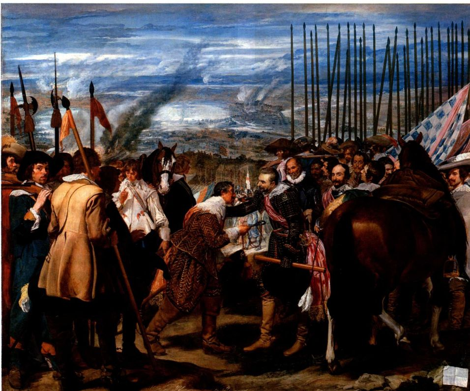

图19\.36 迭戈·委拉斯凯兹：《布雷达的投降》。1634\-1635年。布面油画，3\.07x3\.7米。马德里普拉多博物馆

690詹森艺术史

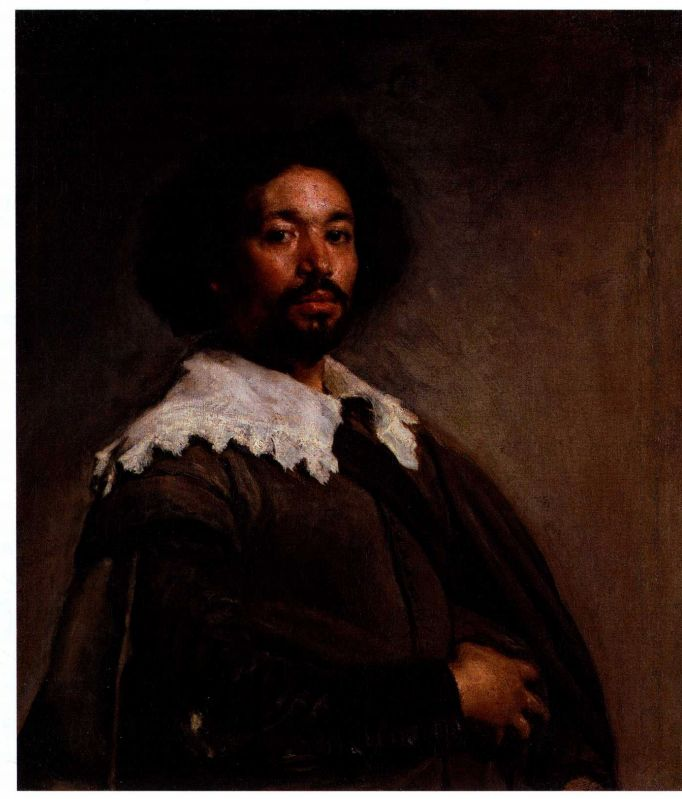

图19\.37 迭戈·委拉斯凯兹：《胡安·德·帕雷哈像》。1650年。布面油画，8 1\.3 × 69\.9厘

米。纽约大都会艺术博物馆。Fletcher and Rogers基金会购，Adelaide Milton de Groot小姐（1876\-

1967年）遗赠，通过交换获得，附Friends of the Musuem 赠品

这主要应归功于奥利佛（Olivares）公爵，他在很大程度上恢复了西班牙的财富，还支持了一个雄心勃勃的艺术赞助计划，以称颂君主政体的伟大。迁居马德里后，委拉斯凯兹很快就取代了曾受菲利普三世和他的首相勒玛（Lerma）公爵宠爱的佛罗伦萨人。这位艺术家还是个老练的朝臣，他不久就成为国王的亲信和侍从。委拉斯凯兹的余生大部分在马德里度过，他在那里主要是为皇室成员画像。这些肖像画中较早的作品仍带有他塞维利亚时期的那种光影界线分明、轮廓清晰的特点，但他的作品很快就有了一种新的流畅、华美风格。

《布雷达的投降》1628年，在出访西班牙宫廷执行外交任务期间，佛兰德斯画家彼得·保罗·鲁本斯（见第699\-704页）帮助委拉斯凯兹发现了国王藏品中多幅提香作品的优点。我们可以从委拉斯凯兹的《布雷达的投降》（Surrender at Breda，图19\.36） 中最直接地看出这一点。这是一幅生动而富丽的画，

用色如提香作品一样浓重。它也可能曾是皇家藏品，原本是为布恩丽池宫（Buen Retiro Palace）创作的组画中的一幅。此画的主题是表现了荷兰联省与西班牙战争中的一个事件，这场战争于1625年爆发，仅仅几年后，委拉斯凯兹就创作了这幅画。虽然布雷达投降确实发生过，但并不像画中这么文雅。这里有两位将军，左边拿骚的查士丁（Justin of Nassau）躬身把布雷达城的钥匙交给安布鲁乔的斯宾诺拉（Ambrogiode Spinola）将军，将军刚刚下马，来迎接甚至是安慰这位荷兰将军，因为他把手放在这个战败军官的肩头。硝烟从左方升起，飘扬在荷兰士兵的头上，这些士兵显得有点茫然和凄凉，象征着布雷达的失败。右方是西班牙军队，他们站在长矛前面，因此看起来好像站得更加笔直。画面中央的远处有更多长矛，让我们感到西班牙军队在人数上超过了荷兰军队。

事实上，尼德兰对西班牙的反叛到1585年左右就已结束了，1609年签订了停战协定，但战斗仍不断

第十九章 意大利和西班牙的巴洛克艺术 691

原始文献

安东尼奥·帕洛米诺（1655\-1726年）

选自《绘画博物馆与光学比例：论委拉斯凯兹》（Elmuseo pictórica y escala óptica:On

1724年，帕洛米诺撰写了一部西班牙艺术家传记，此书以委拉斯凯兹为重点，因为委拉斯凯兹是帕洛米诺最敬重的艺术家。以下是关于委拉斯凯兹的《宫娥》的一段描写，其中点明了画中人物的身份，还对它所受到的欢迎作了评论。

在皇后玛格丽塔·玛丽亚（Margarita María，当时是西班委拉斯凯兹那些了不起的作品中，有一幅画有奥地利牙公主）幼年时期的肖像油画······跪在公主脚边的是王后的侍女玛丽亚·奥古斯丁娜（María Agustina），她正把装在一个小巧器皿中的水递给公主。公主的另一边是伊莎贝尔·德·贝拉斯科（Isabel de Velasco），她也是一名女官，好像正在说话。前景处有一条狗躺在侏儒尼古拉斯·佩尔图萨托（Nicolas Pertusato）身边，他的脚踩在狗身上，以表明它虽然外表凶猛，但却是头温驯的动物。这两个形象处于暗影之中，极大地协调了构图。他们身后是面目狰狞的侏儒马里·巴尔沃拉（Mari\-Bárbola），再往后一点，色彩更暗的是女官们的随从玛尔塞拉·德·乌尤亚（Marcela de Ulloa）和一个侍卫。在他们的对面，迭戈·委拉斯凯兹正在作画；他左手拿调色板，右手握笔。他的腰间挂着国王卧室的钥匙，胸前佩戴着圣地亚哥会的十字勋章，这个勋章是委拉斯凯兹死后由国王下令加上去的，因为在创作此画时，委拉斯凯兹还不是该会的成员·······

爆发。并不存在什么开启布雷达城的钥匙，而且将军可能也没有下马。但委拉斯凯兹让这两位将军不是带着仇恨而是带着认同感面对彼此，从而把一个军事事件变得有了人情味。委拉斯凯兹所设计的场景可能出自当时的一部戏剧，其中，斯宾诺拉说道：“查士丁，我接受它们（钥匙），并完全承认你的英勇，因为战败者的英勇让胜利者扬名。”

《胡安·德·帕雷哈像》 在宫廷里，委拉斯凯兹作为肖像画家而闻名。所以，当菲利普四世1648年派委拉斯凯兹去罗马购买油画和古代雕塑时，他也准许艺术家为教皇英诺森十世画像。但当委拉斯凯兹1649年抵达罗马时，他的名声似乎还未传到那里，所以他只能等待。正是在这段时间里，他为陪同他一起去罗马的胡安·德·帕雷哈（Juan de Pareja，约1610\-1670年）绘制了肖像画，帕雷哈是他的塞维利亚助手兼仆人，有摩尔人血统，而且也是一名艺术家（图19\.37）。这幅肖像画的逼真程度十分惊人，在1650年4月罗马万神殿举行的一个年度艺术展上，得到了好评。据说，在所有展出的画作中，这一件才是“真实”的。作品画的是帕雷哈的上半身，他转过

他正在创作的油画很大，我们看不到画面内容，只能看到画的背面。

委拉斯凯兹以巧妙的方式透露出他所画的内容，以此证明了他的伟大才华。他利用陈列室后方的镜子让我们看到了我们的天主教君主菲利普和玛丽亚娜（Mariana）王后映在其中的形象。在这间被称为太子室的陈列室里，委拉斯凯兹常在这里作画，我们可以模糊地看到有几幅画挂在墙上。我们知道，它们是鲁本斯的画，表现的是奥维德的《变形记》中的故事。这个陈列室的几扇窗户都是用透视法绘制的，这样能使房间显得更大。光来自［画的］左方，但只通过前窗和后窗射入······镜子左边有一个敞开的门，王后的司礼官约瑟夫·内托（Joseph Nieto）站在门口。虽然距离很远，光线又暗，但我们能清楚地看到他。人物之间充盈着空气。这幅人物画卓然出众，构思新颖，简而言之，对此画作多高的评价都不过分，因为它就是真实存在，而不是画。委拉斯凯兹是在1656年完成它的······

国王陛下极为珍视此画，他常去观赏它。这幅画与其他优秀作品一同放在国王楼下套房中的办公室里。在我们这个时代，查理二世（Charles the Second）曾问及卢卡·乔尔达诺（Luca Giordano）对此画的看法，他答道：“阁下，这就是绘画中的神学。”

SOURCE: ITALIAN & SPANISH ART, 1600\-1750: SOURCES AND DOCUMENTS\.ED\. BY ROBERT ENGGASS AND JONATHAN BROWN\.\(EVANSTON, IL:NORTHWESTERN UNIVERSITY PRESS,1999\)

四分之三个侧面，但面朝观众\-这是文艺复兴盛期拉斐尔和提香发展起来的一种三角形构图样式，以《蒙娜丽莎》（图16\.7）为出发点，但作了简化。这里所用的构图样式强健有力，把我们的注意力都集中在主人公的脸部。又轻又软的镶花边衣领采用了明亮的颜色，与脸部的高光相呼应，塑造出一副令人生畏的雕塑般的面孔。帕雷哈衣服肘部有一块白色补丁，也就是一个裂口，它提醒着观众他所属的阶层，这是委拉斯凯兹以前在《塞维利亚运水者》（图19\.35）中用过的一种方法。这幅肖像画的成功和委拉斯凯兹在罗马获得的新名声也许促使教皇愿意坐下来让他为自己画像，而教皇不久后的确这样做了。

《宫娥》 委拉斯凯兹成熟期的风格在《宫娥》（The Maids of Honor，图19\.38）中表现得最为充分。它既是群像画，也是风俗画，可加上“艺术家在画室中”这个副标题，因为委拉斯凯兹把自己画成正在创作一幅巨大的油画。画面的中心是玩伴和宫女簇拥着的玛格丽塔公主（Princess Margarita），她刚为画家摆好姿势。她的父母\-国王菲利普四世和王后玛丽亚·安娜（Maria Anna）\-的脸出现在后墙上的镜

692 詹森艺术史

子中。他们的位置也表明，他们的观看点与我们的稍有不同，实际上，整幅画中有好几个不同的观察点。艺术家大概想以这种方式含蓄地把观众纳入画面，尽管此画显然是为国王绘制并悬挂在其避暑地堡宫（Alcázar Palace）的办公室里。最早评论《宫娥》的安东尼奥·帕洛米诺（Antonio Palomino）写道：“····· 委拉斯凯兹之名将与那最出众、最美丽的玛格丽塔一道万世流传，在玛格丽塔的影子里，他的形象得到了永生。”多亏了帕洛米诺（见第692页的原始文献），我们才得以了解画中每个人的身份。由于公主、国王和王后的在场，图中的油画就记录了委拉斯凯兹作为皇家画师的地位以及他获得圣地亚哥修会（Order ofSantiago）骑士身份的渴望，圣地亚哥修会是一个隶属于罗马天主教会的军事性修会，在创作此画的三年后，

大事年表

1605年\-塞万提斯撰写《堂吉诃德》

1642年\-里韦拉创作《畸足少年》

1656年\-委拉斯凯兹创作《宫娥》

他才万般艰难地得到了入会的许可。在画中，他佩戴着修会的红色十字勋章，这是在他死后才加上去的。

从入宫之日起，委拉斯凯兹就一直在努力争取自己在宫廷中的地位。即使按惯例进行的家庭调查（近150个亲友接受了访问）支持他获得贵族身份的要求，职业的性质还是给他造成了妨碍。“从事手工劳动”，这一评价表明委拉斯凯兹的身份正与贵族相反。只是由于教皇的特准，他才被接纳。所以，《宫娥》是个

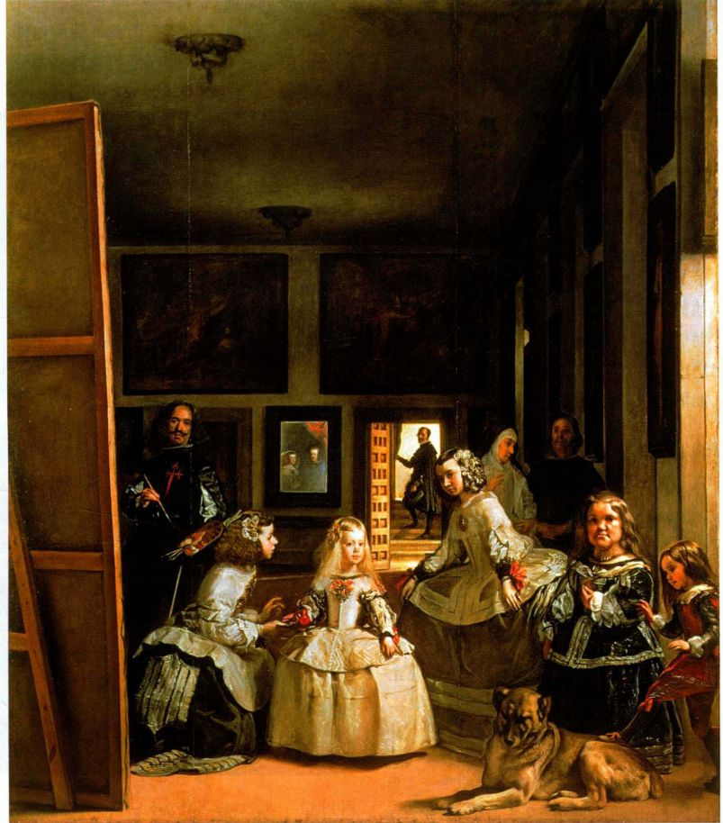

图19\.38 迭戈·委拉斯凯兹：《宫娥》。1656年。布面油画，3\.2x2\.7米。马德里普拉多博物馆

第十九章 意大利和西班牙的巴洛克艺术 693

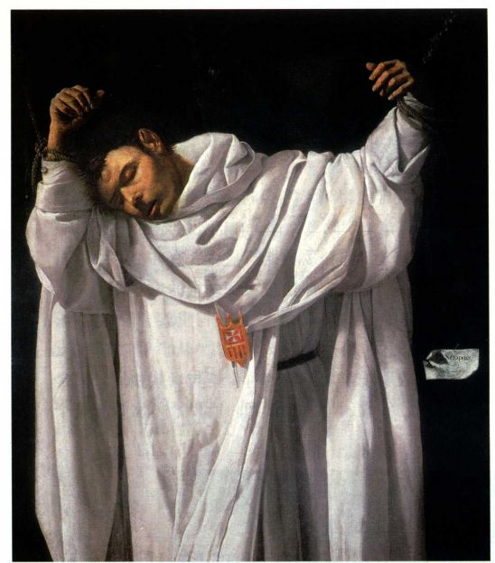

图19\.39 弗朗西斯科·德·苏巴朗：《圣塞拉皮昂》。1628年。

布面油画，1 20\.7 × 1 04\.4厘米。康涅狄格州哈特福德市沃兹沃斯艺

术博物馆（Wadsworth Atheneum，Hartford，Connecticut）。Ella Gallup

Sumner与 Mary Catlin Sumner藏品

人雄心的一个反映；它不仅是对绘画行为高贵性的声明，也是对艺术家本人贵族身份的声明。国王和王后的在场肯定了他的地位。西班牙宫廷授予提香和鲁本斯荣誉（虽然勋位不同），而且由于这些艺术家极受尊重，所以他们成了委拉斯凯兹的榜样。这两位艺术家的荣华以及他们的画风对委拉斯凯兹产生了持续、重大的影响。

这幅画表明委拉斯凯兹对作为视觉基础的光非常热衷。艺术家要求我们将镜中形象与同一面墙上挂着的那些画以及站在敞开门口的那名男子的“画像”进行比较。虽然侧光和光影的强烈对比仍然显示出卡拉瓦乔的影响，但委拉斯凯兹的技法要细腻得多。亮丽的色彩有威尼斯画派的浓烈用色，但笔法比提香的更为自由、简略。委拉斯凯兹比同时代的其他任何画家都更充分地研究了光的光学特性。他的目标是表现光本身的运动以及光在形体和色彩上产生的无穷效果。与荷兰的扬·维米尔（见第728\-730页）一样，对委拉斯凯兹而言，光创造了可见世界。

修会与苏巴朗

与委拉斯凯兹一样，弗朗西斯科·德·苏巴朗

（Francisco de Zurbarán，1598\-1664年）最开始是一名塞维利亚画家，因其宁静中蕴含力量的风格从同时代人中脱颖而出。他最重要的作品都是为修会创作的，它们充溢着西班牙所特有的苦修式虔诚。《圣塞拉皮昂》（St．Serapion，图19\.39）表现了慈悲会（Mercedarians）的一个早期成员，他于1240年被海盗残忍地杀害，但在此画完成的100年后才被封圣。这幅油画作为祈祷像放置在修会的丧葬礼拜堂里，这一修会最初信奉自我牺牲。

苏巴朗的画让我们想起卡拉瓦乔。画中的圣塞拉皮昂和真人一般大，虽然只露出全身的四分之三，但填满了整个画面：他既是英雄，也是殉道者。白袍与黑色背景的对比增强了人物存在的视觉感和表现力，所以观众注视着这位被害的僧侣时，心中既怜悯又敬畏。在此，绘画上的纯净与精神上的纯净合而为一，人物的静止营造出一种令人肃然起敬的气氛，为刻板的写实主义增添了色彩。因此，我们认同的是圣塞拉皮昂的信念的力量，而非他的肉体所遭受的痛苦。正

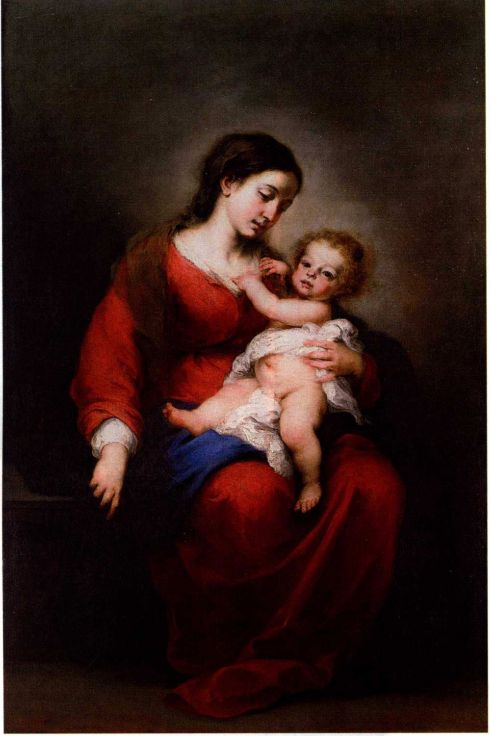

图19\.40 巴托洛梅·埃斯特班·牟里罗：《圣母子》。约1675\-

1680年。布面油画，165\. 7 × 1 09\.2厘米。纽约大都会美术馆。Rogers

基金，1943年（43\.13）

694 詹森艺术史

是因为不存在浮夸的引人悲悯的因素，这个形象才能深深地打动人心。

虔诚的极致：巴托洛梅·埃斯特班·牟里罗

苏巴朗之后最重要的塞维利亚画家是巴托洛梅·埃斯特班·牟里罗（Bartolomé Esteban Murillo， 1617\-1682年），他的作品在所有西班牙巴洛克艺术家的作品中是最具国际性、最平易近人的。因此，牟里罗拥有无数追随者，但浅薄的模仿掩盖了牟里罗真正的成就。牟里罗从北部欧洲艺术家，包括鲁本斯和凡·代克那里所学的跟他从意大利人如雷尼和圭尔奇诺那里所学的几乎同样多。《圣母子》（The Virginand Child，图19\.40）融合了北部欧洲和意大利艺术家的影响，但此画仍然具有明显的西班牙特点。他的许多宗教画，尤其是《圣母子》和《无玷成胎的圣母》（The Virgin of the Immaculate Conception），标志着西班牙艺术把圣母加入17世纪视觉艺术语汇的坚决主张，仿效者颇多。对圣母形象的强调是对新教在欧洲大部分地区产生的影响的反抗。牟里罗作品中常见的人物脸部所流露出的温柔的哀婉表情比苏巴朗朴素的虔诚更加动人。这种人性的温暖反映了宗教观念的根本变化。它也是在规范的祈祷像中注入新的生命力的一种尝试，在二流艺术家手中，这些祈祷像已被简化成公式。牟里罗异常老练的笔法和细腻的用色体现了委拉斯凯兹的影响。他极为成功，以至于之后的150年中，绝大部分西班牙及其南美殖民地的宗教绘画都以牟里罗的作品为范本。

小结

巴洛克\-17世纪广泛流传的戏剧性风格\-起源于意大利，通过艺术家和赞助人的游历传遍欧洲。它传达的是活力和强烈的情感，被当作反宗教改革的专用风格，宣告教会对新教的胜利。它的影响见于当时的绘画、雕塑、建筑、工艺和华丽繁缛的装饰。

这个时期的另一个特点是各国政府和宗教团体对美洲和东方的殖民，他们已于16世纪探究了这些地区，17世纪则开始在那里定居。阶级、性别、科学、医学和奇风异俗等主题成为这个时期生活和艺术的中心内容，我们今天称这个时期为早期现代世界。

意大利绘画

卡拉瓦乔是最重要的巴洛克画家，因为他在17世纪初所作的革新以及他长久的影响力。在意大利有许多追随者，

包括阿尔泰米西亚·真蒂莱斯基。在整个欧洲，特别是荷兰和佛兰德斯也有不少追随者。他的创新体现在题材上：引进风俗画法，人物通常坐在桌子后面露出上半身，而且是真人大小，中间调子的背景。他的创新也体现在风格上：戏剧性、明暗分布、表现瞬间动作。他的祭坛画是真正具有革命性的作品。

天顶画也成为巴洛克时期各种富有的私人赞助者和教会团体的一个重要选择，用以表现他们对天国强有力的统治。许多艺术家创作幻景式天顶画，这些画作要么挑战空间，其中的人物像是要从天国坠落；要么用湿壁画模仿雕塑或建筑。在这个领域进行创作并不断创新的众多艺术家中包括安尼巴莱·卡拉奇、圭尔奇诺和彼得罗·达·科尔托纳。

意大利建筑

16世纪末、17世纪初动工的新圣彼得大教堂完工于巴洛克时期，并成为教会复兴及其生命力的最大象征。内部装饰的中心是贝尼尼制作的融雕塑与建筑为一体的祭坛华盖（中心祭坛）。教堂外部是一个巨大的椭圆形广场，也是由贝尼尼设计的，是一个值得注意的发展，让人联想到教会包容一切的双臂。形状不规则但有组织的、由波洛米尼设计的复杂穹顶的小教堂也成为这个时代的标志。

意大利雕塑

巴洛克雕塑表现行动、活力和情感\-有的是单人像，有的是更为复杂的戏剧风格作品，如贝尼尼的《圣特雷莎的沉迷》。贝尼尼是最重要的雕塑家，既是因为他自己的作品，也是因为他作为圣彼得教堂装饰工程的协调人，向其他艺术家分派任务。

西班牙绘画

西班牙巴洛克艺术主要通过那不勒斯受到了意大利艺术和卡拉瓦乔的影响。在那不勒斯工作的里韦拉绘制的风俗画（《畸足少年》）和宗教画都反映了他对自然主义的赞赏。

表现强烈的宗教虔诚的画通常是由修会订制的，苏巴朗的作品就是如此。西班牙这个黄金时代最重要的艺术家委拉斯凯兹在马德里任菲利普四世的宫廷画师，但他是在塞维利亚以卡拉瓦乔式的风格开始其职业生涯的。提香的画作被西班牙皇室收藏，以及重要的佛兰德斯艺术家鲁本斯到过西班牙并建议委拉斯凯兹研究提香作品，他们影响了西班牙艺术和委拉斯凯兹的作品。虽然风俗画和静物画也很流行，但圣母在西班牙艺术中的地位得到了提高，变成了一个重要题材（如牟里罗的作品），这解释了西班牙的天主教保守艺术及其在对抗北欧宗教改革中的作用。

第十九章 意大利和西班牙的巴洛克艺术 695

