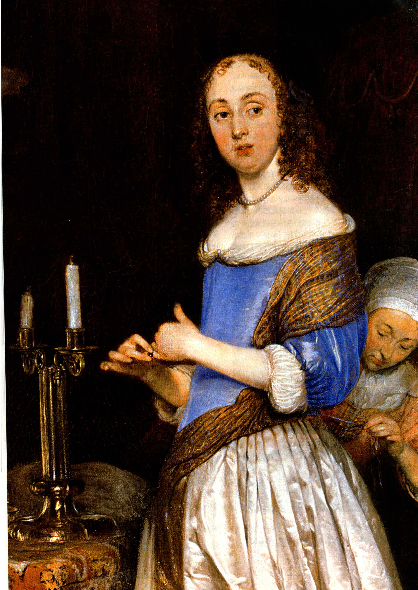

第二十章 尼德兰的巴洛克艺术

17世纪时，尼德兰一分为二：北尼德兰（今天的荷兰）和南尼德兰（今天的比利时和法国部分地区）。（见地图20\.1。）一直以来，人们常用这两个地区各自最重要的省份来称呼它们：北尼德兰常被称为荷兰，南尼德兰则被称为佛兰德斯。16世纪时，信奉天主教的西班牙哈布

斯堡王室统治着尼德兰，但菲利普二世残酷镇压新教徒并企图削弱新教徒组建的地方政府，

尔是南尼德兰政府的所在地，但后来安特卫普又逐渐

恢复了其作为佛兰德斯商业和艺术中心的地位。然而，

作为《明斯特和约》的一部分，通向安特卫普港的斯

海尔德河（Scheldt）不再通航，使接下来两个世纪此

地的贸易遭受了严重损害。由于佛兰德斯仍然处于哈

布斯堡王朝委派的西班牙总督的统治之下，而这个王

朝又自封为“真正”（即天主教）信仰的卫道士，所

以佛兰德斯艺术家当时主要依赖教会和政府的订件，

但贵族和富商也是他们重要的赞助人。

与佛兰德斯相反，荷兰以其来之不易的自由感到

自豪。虽然这里最主要的宗教是归正宗，但那时的荷

兰人也因宗教宽容而著称。甚至天主教也依然活跃，

许多艺术家也继续信奉天主教，犹太人则把荷兰当作

逃避迫害的避难所。虽然与佛兰德斯的文化联系依然

牢固，但若干因素鼓励了荷兰艺术传统的迅速发展。

佛兰德斯所有的艺术活动都是以安特卫普为中心向外

辐射，荷兰则与其不同，她拥有多个地方画派。除

商业中心阿姆斯特丹以外，哈勒姆、乌得勒支、莱顿

（Leiden）、代尔夫特等城市也有重要的艺术家，这

这导致了一场持续15年的反抗。1581年，在出身于 人口损失了一半。许多人迁往北尼德兰。虽然布鲁塞

奥兰治家族（House of Orange）的拿骚的“沉默者”威廉（William the Silent）领导下，尼德兰的北部各省宣布独立，从此不受西班牙统治。不久，西班牙收复南尼德兰，天主教仍是那里的官方宗教。经过长期斗争，北尼德兰的七个主要省份（居民绝大多数属于新教归正宗［Reformed Church］）成立了联省共和国并获得自治，自治权得到了1609年停战协定的承认。虽然1621年战争再次爆发，但荷兰人的自由却再也没有受到过严重威胁。最终，结束三十年战争的《明斯特和约》（Treaty of Münster）承认了荷兰的独立。荷兰共和国作为一个独立国家得到了欧洲其他国家的正式承认。

尼德兰的分裂对南方和北方的经济、社会结构、文化以及宗教产生了迥然不同的影响。与此同时，整个17世纪，两地的人们都往来于南北之间，这种活动在南北方社会和文化方面建立了一定联系。1576年遭西班牙军队洗劫后，南尼德兰第一大港安特卫普的

图20\.36细部，杰拉德·特·伯赫：《梳洗的淑女》

第二十章 尼德兰的巴洛克艺术 697

地图20\.1 1648年的欧洲

些城市都以本地教师为中心建立了当地的艺术风格。这样，荷兰就产生了数量极多的艺术大师和艺术风格。

这个新国家是商人、农民和水手的国家，他们可能以地方性商业如海产品贸易为生，但随着成立于1602年的著名的荷兰东印度公司（根据其荷兰语名称的首字母简称为VOC）和与之对应的成立于1621年的荷兰西印度公司的发展，他们得到了更多的去远方冒险的机会。这两家公司在东亚（中国、日本和印度尼西亚）和美洲发展贸易，把异国的器皿、长相奇特的人种以及奇异的动植物带回国，还从事探险、绘图和殖民地开发活动。这些探险给整个荷兰经济都带来了影响：尽管探险活动的经历者是水手，但它们也对公司的董事和理事产生了直接影响，因为他们就是靠这些冒险事业发财。就连留在国内的城镇居民也能买到或至少见到从遥远的地方带回来的一些珍奇的物品。从这时起，荷兰就不能再被视作穷乡僻壤；甚至那些不出海的人也应被视为并自认为是世界大国的人民。

由于归正宗反对偶像崇拜，所以荷兰艺术家极少能接到那种在天主教世界常有的教堂大型祭坛画

订单。虽然海牙（Hague）的奥兰治家族以及市政府

和市民团体如市民警卫队提供了一部分艺术赞助，

但他们的需求有限。因此，私人收藏家的需求成为

了画家主要的生计来源。这种情况在1600年之前就

已如此，但这类赞助对荷兰艺术的影响在17世纪后

才能完全体现出来。作品产量并未萎缩。相反，公

众变得异常爱好绘画，乃至全国都掀起了一场收藏

热。在1641年的荷兰之旅期间，英格兰旅行家约翰·

埃韦林（John Evelyn）在日记中提到：“·······一个

普通的农场主在这种商品上花费2000或3000英镑

是常事，他们的房子里放满了画，并在市集上出售，

获利极大。”虽然当时农民的房子里不太可能挂满画，

埃韦林也不太可能造访这些农舍，但可以确定的是，

当时的绘画作品已经不只是为教会和宫廷而绘制。

在北尼德兰（以及南尼德兰），一个新的藏家阶层\-

富有的商人兴起了。

佛兰德斯

17世纪的佛兰德斯艺术是以彼得·保罗·鲁本斯

698 詹森艺术史

为代表的。鲁本斯不仅使佛兰德斯\-实际上是安特卫普\-享誉国际，也把西方世界的艺术介绍到了佛兰德斯。他做到这一切主要是通过旅行（把新观念带回安特卫普）、接受订单和其业务广泛的画坊实现的。

佛兰德斯的巴洛克艺术是以订件制作为基础发展起来的。此时，由于停战，佛兰德斯的众多教堂得以重建并重新装饰。哈布斯堡的大公和大公夫人、他们的家族以及私人赞助者成了这些订件的委托人。鲁本斯本人的兴趣主要在绘画方面，但他在雕像、雕饰、建筑、服装和插图书籍（由安特卫普著名的普拉丁［Plantin］出版社出版）等方面也发挥了重要影响。这些艺术类型的发展都直接受到了鲁本斯及其艺术的影响。

佛兰德斯艺术和鲁本斯绘画的题材以宗教为主\-这些作品多为真人大小的大型祭坛画\-但肖像画也是常见的题材。虽然鲁本斯也画风景画，但其他艺术家如弗兰斯·斯奈德斯、克拉拉·彼得斯、扬·德·黑姆和老扬·布吕盖尔常画静物画或野味画。曾经做过鲁本斯助手的安东尼·凡·代克以及雅各布·约丹斯都是肖像、宗教和神话画方面的佼佼者，雅各布·约丹斯还画风俗画。但所有这些画家的艺术创作都受到了鲁本斯的影响。

彼得·保罗·鲁本斯与巴洛克风格的确立

虽然巴洛克风格诞生于罗马，但它很快传遍了全欧洲。伟大的佛兰德斯画家彼得·保罗·鲁本斯（PeterPaul Rubens，1577\-1640年）在这一过程中起到了绝无仅有的重要作用。他是巴洛克理想中艺术大师的典范：当过外交官和顾问，访问过欧洲各个宫廷。他博览群书，遍游欧洲，通晓古典文学，掌握多种语言。人们对他的才智以及他身上的活力大加称赞，这种活力使他能够把自然与超自然结合起来，创造出我们在贝尼尼作品（见第十九章）中见到的那种巴洛克式的戏剧性和生动性。他继承了百年以前由丢勒开创，并为扬·戈萨埃特和柯内利斯·弗洛里斯所发展的事业（见第十八章）：打通北部与南部欧洲之间的艺术隔阂。鲁本斯的父亲是一位著名的安特卫普新教徒，在尼德兰独立战争期间，他逃到了德国，以躲避西班牙当局的迫害。家人在他死后返回安特卫普，这时的鲁本斯只有10岁，长大后成了一个虔诚的天主教徒。1598年，受训于本地画家的鲁本斯出师，但其个人风格在过了两年去意大利之后才形成。

在意大利的八年里，在艺术和赞助中心曼图亚、热那亚、佛罗伦萨和罗马，他远比之前所有到过意大

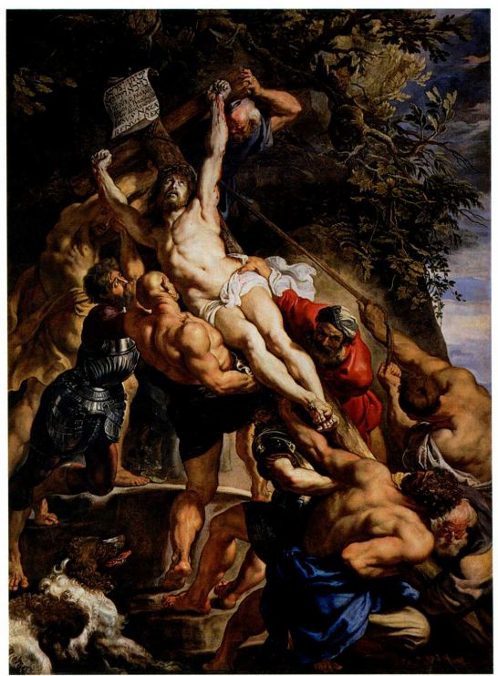

图20\.1 彼得·保罗·鲁本斯：《竖起十字架》，1610\-1611年。

一套三联画的中央画板，4\.6 × 3\.4米。比利时安特卫普大教堂

利的北部欧洲艺术家都充分地吸收了意大利传统。他如饥似渴地研究古代雕塑、盛期文艺复兴杰作以及卡拉瓦乔和安尼巴莱·卡拉奇的作品。事实上，鲁本斯的水平与当时最优秀的意大利艺术家已不相上下，完全可以在意大利发展他的事业。他在那里也确实得到了重要的肖像画和祭坛画订单。

鲁本斯与祭坛画《竖起十字架》（The Raisingof the Cross，中央画板，图20\.1）是1609年鲁本斯回到安特卫普后画的第一幅较大的祭坛画，它的主题证明了巴洛克风格的活力，表明他从意大利之行中获益匪浅。人物发达的肌肉表现了他们的力量和强烈感情，从中可以看到鲁本斯所见、所仿、所藏的古色古香的希腊化雕塑（见第701页的原始文献）以及他所临摹的西斯廷礼拜堂天顶画人像（图20\.2）的影子。这些作品都是鲁本斯一生所绘英雄人物的原型。他也从法尔内塞长廊获得灵感，但画中的光影效果又让人想起卡拉瓦乔的作品（见图19\.1\-19\.4）。祭坛画的构图类似于罗索的《下十字架》（图17\.1），但在尺寸和构思上，它都比以往任何北部欧洲绘画更有英雄主义

第二十章 尼德兰的巴洛克艺术 699

图20\.2 彼得·保罗·鲁本斯：《据米开朗基罗西斯廷天顶画裸像所作的素描》（Drawing after Michelangelo＇s Ignudi from the Sistine Chapel Ceiling）。约1601\-1602年。红粉笔、少许淡红色水彩，38\.9x27\.8厘米。伦敦大英博物馆

图20\.3 彼得·保罗·鲁本斯：《竖起十字架草图》

（Sketch for the Raising of the Cross）。约 1610年。木板油画（共三块），67 × 25厘米、68 × 5 1厘米、67 × 25厘米。MNR411。巴黎卢浮宫

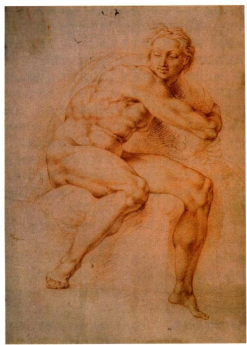

彼得·保罗·鲁本斯（1577\-1640年）

选自一封致达德利·卡雷顿的信

1618年，鲁本斯开始与英格兰驻海牙大使达德利·卡雷顿爵士（Sir Dudley Carleton，1573\-1632年）通信，为的是用自己的画换这个英格兰人的古代雕塑。卡雷顿游历广泛，曾当过驻巴黎和威尼斯的外交官（后来被任命为国务大臣），他在意大利期间（1610\-1615年）收藏过一批非常有名的古代雕塑。鲁本斯也有一批藏品，是从游学意大利期间（1600\-1608年）开始收集的。在他写给卡雷顿的第一封信里，鲁本斯建议用“我画的画”来交换，在这封信里，他解释说，他所提议交换的画是“他作品中的精华”，这表明鲁本斯的许多画实际上不是受托创作的，而是他自己观赏的（他列出了放在他家中的12幅画）。这项交易完成了，鲁本斯拥有了北部欧洲最精美的一批古代雕塑藏品，直至多年后他陆续卖掉其中的一部分。最后，卡雷顿用123尊大理石雕塑换得了鲁本斯的9幅画、丁托列托的3幅画以及鲁本斯收藏的一套挂毯。

尊敬的爵士

通过我经纪人的指点，我获悉阁下有意用您的古物与我交换；得知您认真地着手办这件事，并告诉我的经纪人您为它们所支付的确切价格，我对这桩生意充满了信心。在这件

色彩。作品丰富的色彩和光的效果从根本上说是受了提香的影响（对比图16\.32）。所以，这幅木板油画的成功主要应归功于鲁本斯结合意大利影响和尼德兰风格的才能，这种结合产生了全新的风格。在树叶、士兵盔甲和前景处的卷毛狗等细节的处理上，鲁本斯主张佛兰德斯的写实主义。这些不同的元素被整合在一起，产生了巨大的艺术冲击力。不稳定的人体金字塔在激烈动作的拉扯下摇摇欲坠，以一种典型的巴洛克方式突破了画框的界限，使观众仿佛身临其境。

油画草图《竖起十字架》是为圣沃尔布加教堂（St\.Walburga，今已无存）的高祭坛创作的，但从鲁本斯为此画绘制的一幅早期油画草图（图20\.3）可以看出，巴洛克风格所特有的充满动感的特点当时还不存在。这幅草图中人物更多、画面中心更不集中，基督被平放的身体几与画面垂直。但在油画中，基督与画面平行，所以我们可以完全看到基督被抬起受刑的情景。“升”是一个巴洛克概念，指的是运动和那个瞬间发生的行为。整个画面也是生动、有力和宏伟的。这幅油画草图是鲁本斯为其最终作品绘制的上百幅光影效果和色彩的准备稿中的一幅，它只能部分反映成品的概貌\-高10\.5米的祭坛画，这是三联画中间一幅（两侧屏未在插图中展示），上方原本有一幅圣父

原始文献

事上，我愿意全心全意地信任您那骑士般的诺言······阁下可以放心，我会像现金交易那样在我的画上标明价格；在这方面，我恳请您信赖一个诚实的人所说的话。我的作品中的精华，特别是一些我留着自己欣赏的画，目前就存放在我家里；其中一些甚至是我用比卖价更高的价格重新买回来的。但这些画都可属于阁下，因为我喜欢那种双方只报一次价的简短谈判。说实话，我对订单已经感到厌倦，不管是为公还是为私，在未来的若干年内，我都不会再承揽订单。不过，如果我们像我所希望的那样达成一致，我就会尽快完成所有列在信中所附清单中但至今仍未完全画完的画［注：大部分已完成］。已完成的画我将马上寄给阁下。简而言之，如果阁下像我信任您那样信任我，这件事就解决了。虽然我至今还没有见到这些古物的清单，也不知道它们的数量，但无论如何我相信您的话，并愿意用下面所列的我的亲笔画（照目前的现金售价，共值6000弗罗林）来交换阁下家中的所有古物。已完成的画我会马上寄给阁下，至于我手头仍未画完的画，我向阁下提供充分的保证，并尽快完成它们·······

阁下最忠实的仆人：彼得·保罗·鲁本斯

安特卫普，1618年4月28日

SOURCE:THE LETTERS OF PETER PAUL RUBENS,ED\.AND TR\.RUTH SAUNDERS MAGURN,\(CAMBRIDGE,MA:HARVARD UNIVERSITY PRESS,1971\)

上帝画像（已佚），这幅画展示的是基督看向天上的哀求目光。《竖起十字架》放在19级台阶顶端的高祭坛上，所以这组作品当时占据的是教堂内部的最高点。

鲁本斯的大型油画表现了盛期巴洛克绘画的视野和风格。它们似乎蕴含着无穷的活力和创造力，这种活力和创造力与他英雄式的裸体人物一样，以最丰沛的形式表现了人物的生命力。他的肖像画也同样具有独创性和表现力。

作为肖像画家的鲁本斯 鲁本斯是17世纪最伟大也是最具影响力的肖像画家之一，他用画笔记录下了赞助人（多为贵族）的财富和名望。鲁本斯还在意大利时就已经作了若干幅肖像画，离开意大利多年后，他还与许多热那亚赞助人保持着联系。他1606年画了一幅华丽恢弘的肖像画《布里吉达·斯宾诺拉·多里娅侯爵夫人》（Marchesa Brigida Spinola Doria，图20\.4），画中人物是统治热那亚的银行家家族的一个成员，这个家族在非洲和东方贸易都有投资，这幅作品可能是为了女主人公的婚礼而作（这年她22岁）。

虽然这幅作品在今天看来尺寸已算很大，但在17世纪时，它的尺寸还更大，当时大约有近3米高，后来它的四条边都被裁短了。从19世纪以此画为原型的一幅石版画来看，画中的侯爵夫人原本为真人大

第二十章 尼德兰的巴洛克艺术 701

图20\.4 彼得·保罗·鲁本斯：《布里吉达·斯宾诺拉·多里娅侯爵夫人》。1606年。布面油画，152\.2x98\.7厘米。华盛顿

国家美术馆。Samuel H．Kress藏品，1961\.9\.60

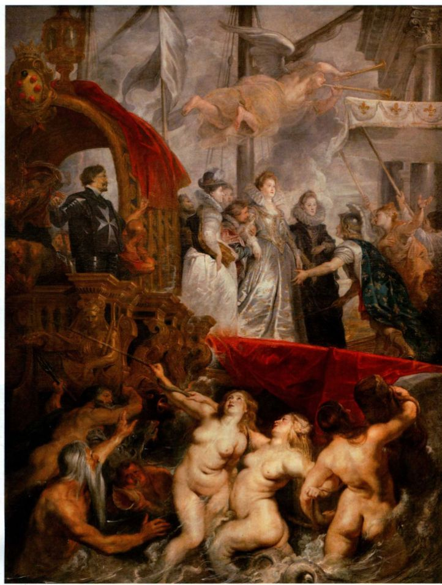

图20\.5 彼得·保罗·鲁本斯：《法国王后，玛丽·德·美第奇在马赛登陆（1600年11月3日）》（Marie de＇ Medici，Queen of France，Landing in Marseilles （3 November 1600］），1622\-1625年。布面油画， 3\.94x2\.95米。巴黎卢浮宫

小，正大步走下她住所的月台。人物身着华丽的白色缎裙，披着一块与衣服搭配的披肩，戴着一条点缀着缟玛瑙和红宝石的金绳。围住她的脸的硕大的多层绉领是她那个时代和她所属阶层所特有的服饰，她的红发梳得非常整齐，装饰着珍珠和羽毛做的梳簪。身后飘扬的宽大红布与她的衣服形成了色彩上的对比，突出了她面部的颜色。这块布倾斜的移动方向也表明她正大步向前走。作品的尺寸、全身像、多种运动要素和衬托人物脸部的颜色只是影响鲁本斯的学生兼助手安东尼·凡·代克（见图20\.7和20\.8）的肖像画的其中几个方面。之后，18和19世纪的华贵肖像也将反映出这些影响。

玛丽·德·美第奇组画 17世纪20年代，鲁本斯通过颂扬亨利四世遗孀、路易十三（Louis XIII）之母玛丽·德·美第奇（Marie de＇Medici）生平的著名组画，展示了他在肖像画和大型历史题材绘画方面的深厚造诣。这组画共有21幅，最少有4米高，其中一些宽达8\.5米，当时陈列在巴黎的卢森堡宫中。这里选的一幅表现了年轻的王后在马赛登岸时的情景（图20\.5）。这很难说是一个令人感到兴奋的题材，但鲁本斯却描绘出了一个融合现实与寓言、壮丽无比的场面。已在佛罗伦萨通过代理人与亨利四世结婚的玛丽沿着踏板向下（她实际上是向上而非向下走的\-鲁本斯为在构图上形成一条对角线对史实做了

第二十章 尼德兰的巴洛克艺术

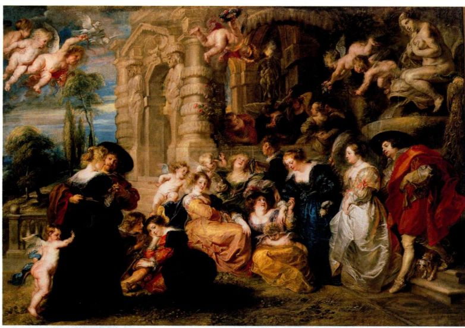

图20\.6 彼得·保罗·鲁本斯：《爱之园》。约1638年。布面油画，2 × 2\.8米。马德里普拉多博物馆

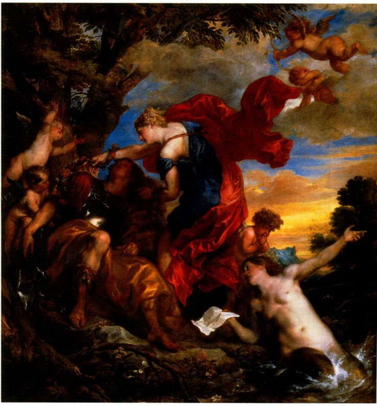

图20\.7 安东尼·凡·代克：《里纳尔多和阿米达》。1629年。布面油画，2\.36x2\.24米。巴尔的摩美术馆，马里兰。Jacob Epstein 藏品

704 詹森艺术史

改动）进入法国境内时，她还没有与丈夫见过面。她由妹妹和婶婶陪伴，“声望”在她头顶飞翔，恰似两支喇叭吹出胜利的号角声。她受到了“法国”\-个身披百合花饰披肩的寓言人物\-的欢迎。一路保护王后的海神和一群长着鱼尾的海中仙女升出海面；他们为她的顺利抵达而欣喜不已。天堂与人间、历史与寓言，一切都运动着，令人目眩。

鲁本斯的画坊 为了创作这些大型油画、组画、天顶画和祭坛画，鲁本斯建立了一个大画坊，本章我们将要讨论的大多数佛兰德斯艺术家都曾跟随鲁本斯在此学习。他们常像鲁本斯那样去旅行，在他起头或绘制的草图上作画，或者画开头部分，由他来完成。

鲁本斯既是画家，也是王室使节。身负的外交使命使他得以接触各大国的王室，从那里他接到过许多订单。因为出访欧洲各国宫廷，他到过巴黎、伦敦和马德里\-此前已去过意大利\-他还曾前往北尼德兰为他的作品寻找雕版师。他是个名副其实的国际艺术家。

晚期的鲁本斯 17世纪30年代，53岁的鲁本斯再次结婚，婚后，他的艺术题材趋于内向，画了许多描绘他那年轻漂亮的妻子、住所和孩子们的画。他甚至写道：“在家里，我感到心满意足。”鲁本斯的《爱之园》（The Garden of Love，图20\.6）是对生活乐趣的一篇热烈赞美。画中，在一栋酷似鲁本斯自己位于安特卫普的意大利式住宅前面的花园里，有情侣、小爱神和一尊栩栩如生的维纳斯像（右上方）。有人认为，左边的男子是鲁本斯，有几个女子（尤其是中间坐着的那位）长得很像他的后来的妻子海伦娜·弗尔蒙特（Hélène Fourment）。《爱之园》中其乐融融的场面无疑与画家自己的生活相像。此画（以及它的几幅复制品和草图）和巴黎的玛丽·德·美第奇组画以后将会对18世纪的洛可可绘画（见第二十二章）产生影响。

安东尼·凡·代克：服务英格兰宫廷期间的历史画和肖像画

佛兰德斯巴洛克艺术家中除了鲁本斯，只有一位享誉国际：安东尼·凡·代克（Anthony van Dyck，1599\-1641年）。他是一位罕见的画家：一个神童。还不满20岁时，他就已成为鲁本斯最重要的助手。与鲁本斯一样，他的风格成熟也是在去了意大利之后。

作为历史题材画家，安东尼·凡·代克最擅长以神话爱情为题材的抒情风格画。《里纳尔多和阿米达》（Rinaldo and Armida，图20\.7）取材于托尔夸托·塔索（Torquato Tasso）一首广为流传的关于十字军东征

的诗《被解放的耶路撒冷》（Jerusalem Freed，1581年），这首诗给全欧洲带来了一种新的优雅典范，并为许多歌剧和绘画作品（它成为提埃波罗的一个很受欢迎的题材）提供了灵感。在许多宫廷假面舞会上，男人们和女人们扮成基督教骑士和惑人的女巫，演绎这个爱情冒险故事。在凡·代克的画中，女巫也爱上了她原打算杀死的基督教骑士。这幅油画反映了英王查理一世的观念，此画就是为他而作，而他也发现自己的一生与塔索的史诗有许多相似之处。这位英王是新教徒，他娶了他的主要对手法国国王的妹妹\-信奉天主教的亨莉雅妲·玛丽亚（Henrietta Maria）为妻。查理自认为是一个德行高尚的统治者，统治着一个很像阿米达带里纳尔多去的那个幸福岛（Fortunate Isle）的和平王国。（具有讽刺意味的是，查理的统治以内乱告终。）凡·代克用提香和韦罗内塞那优美的绘画语言讲述了他关于理想爱情的故事，其表现力和丰富性能让任何一个威尼斯画家自愧弗如。此画完成后立刻引起轰动，凡·代克两年后也因此获得了英格兰宫廷的任用。

凡·代克的名声主要来自他1632\-1641年在伦

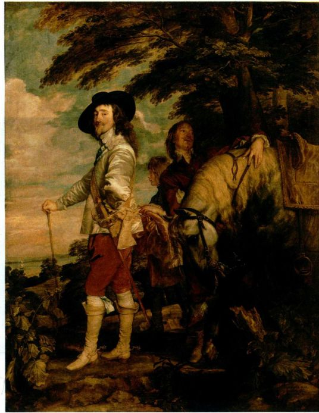

图20\.8 安东尼·凡·代克：《查理一世狩猎像》。约1635年。布面油画，2\.7 × 2\. l米。巴黎卢浮宫，Inv．1236

第二十章 尼德兰的巴洛克艺术 705

图20\.9 雅各布·约丹斯：《敬奉波蒙娜《丰饶的寓言》》。约1623年。布面油画，1\.8 × 2\.4米。布鲁塞尔皇家艺术与历史博物馆（Musées Royauxd'Art et d'Histoire\),Inv\.119

敦所作的肖像画。《查理一世狩猎像》（Portrait ofCharles I Hunting，图20\.8）画的是国王站在一匹马旁边，背景中有两个马夫。此画表现的是君主休闲时的情景，可被称为“下马的骑手像”，效果与荷尔拜因的《亨利八世》（图18\.27）截然不同。画中人没有正式的典礼像那般呆板，但几乎与之一样庄重高贵，因为国王仍然保持着对国家的绝对统治；象征着国家的骏马向着它的主人低下了头。流畅的背景使国王自信优雅的姿态更加完美，这种优雅是对希利亚德肖像画中程式化的温文尔雅风度的延续（对比图18\.28）。但查理一世当时的统治地位并不像他的自信所表现得那么稳固。这位国王的统治以内战而告终，他本人于1649年被斩首。查理死后掌权的是清教领袖奥利弗·克伦威尔（Oliver Cromwell）及其追随者，这些人由于其短发而被称为“圆颅党人”。而英王的发式与圆颅党人不同，请注意画中查理一世的卷发是按照法国（天主教）式样垂到了肩下。但查理之子查理二世后来登上了王位，史称王政复辟。

凡·代克在鲁本斯和提香的基础上，使宫廷肖像画跟上了时代潮流。他于查理一世被斩首的八年前去世，所以不曾为查理一世之后的宫廷服务。但他创造了一种新的贵族肖像画传统，这种传统在英格兰一直延续到了18世纪末，对欧洲大陆也产生了相当大的影响。

佛兰德斯本土艺术和雅各布·约丹斯

雅各布·约丹斯（Jacob Jordaens，1593\-1678年） 是继鲁本斯和凡·代克之后佛兰德斯最重要的艺术家，而且他的寿命比这两人都要长。与两位前辈不同，他没到过意大利，他的赞助人也大都是中产阶级。虽然约丹斯不是鲁本斯的学生，但他是鲁本斯画坊的一员，曾与鲁本斯合作过，而且在其整个职业生涯中，他一直从鲁本斯那里寻求灵感。约丹斯最典型的题材是有关宁芙和萨梯尔狂欢的神话。与其阐释通俗谚语的饮食男女绘画一样，他的神话主题作品表明他仔细观察过平民百姓。他的《敬奉波蒙娜《丰饶的寓言》》（Homage to Pomona ［Allegory of Fruitfulness］，图20\.9）里的林中居民住在一个田园诗般的国度里，不为人间忧愁所扰。画面的处理表现出鲁本斯的强烈影响，但巨大的人物则缺乏鲁本斯的那种英雄主义气势；平静、匀称、朴实的人物是其作品的突出特点。

布吕盖尔传统

前一代的领军人物老扬·布吕盖尔（Jan Brueghelthe Elder，1568\-1625年）是其著名的父亲老彼得·布吕盖尔（见第十八章）所开创的绘画传统的主要继承者，他几乎不了解父亲，却模仿他的艺术风格。扬·布吕盖尔是佛兰德斯独有的“艺术收藏”绘画的开创

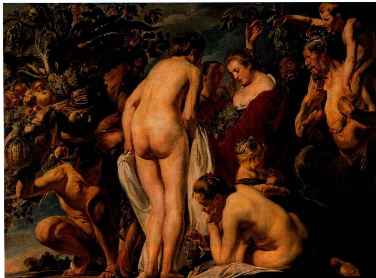

706 詹森艺术史

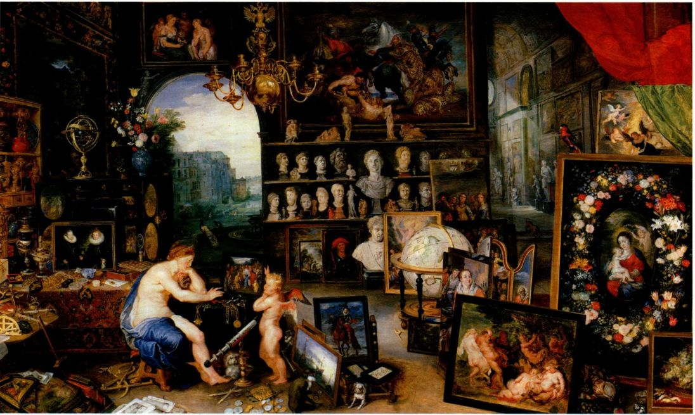

图20\.10 老扬·布吕盖尔和彼得·保罗·鲁本斯：《视觉的寓言》，约1617\-1618年。木板油画，65 x 109厘米。马德里普拉多博物馆

者之一，这种画为我们提供了了解欧洲“艺术收藏”的深度和多样性的一个途径，后者是17世纪在安特卫普的王侯府第中发展起来的。这些经过精挑细选的收藏被称为“kunstkammern”（字面意义为“艺术馆”）或“wunderkammern”（“珍宝馆”），从海贝、昆虫和珍奇花卉到科学仪器和绘画作品，让我们一窥那时的贵族和富人搜集的众多奇珍异宝的概貌。

扬·布吕盖尔的《视觉的寓言》（Allegory of，图20\.10）出自与鲁本斯共同绘制的一套名为《五种感官》（The Five Senses）的组画，它描绘的就是这样一个珍宝馆或艺术馆。《视觉的寓言》是放在画廊里供人观看的，而且人们只有通过观看才能欣赏它，所以它无疑是一个视觉双关语。扬·布吕盖尔还画过其他寓意画\-《四季》（The Seasons）和《四种元素》（The Four Elements）\-他在这种绘画以及类似绘画上成就卓著，乃至安特卫普城的市长委派他指导包括鲁本斯和弗兰斯·斯奈德斯在内的杰出画家创作两幅名为《五种感官》的画送给大公。这里表现的收藏室就属于哈布斯堡家族的大公夫妇（阿尔伯特 ［Albert］和伊莎贝拉［Isabella］），画中左方的双人像（鲁本斯作）画的就是他们本人。大公夫妇信奉天主教，会把这种对物质世界的敬意看作对心灵洞

察力的尊崇（这解释了圣母与圣子画像出现在前景处的原因）。我们只能粗略地看到前景处的部分藏品，而右方的背景暗示还有其他房间收藏着更多的藏品，但在这里，绘画是主要藏品。我们可以看到科学仪器（望远镜、地球仪）、一块波斯地毯（象征着世人的仁爱）、古罗马胸像以及大大小小的绘画作品：肖像画、神话绘画和静物画。一些画可以辨认出是出自鲁本斯的手笔\-从右下方一幅描绘赛利纳斯（Silenus）的神话绘画，到左上方的一幅猎狮虎图，表明他取材之广泛。在饰有花环的《圣母与圣子》右侧，有一大幅画，和《圣母与圣子》一样，它也是扬·布吕盖尔与鲁本斯的共同作品，鲁本斯负责人物部分。扬·布吕盖尔也跟其他艺术家合作，他还是著名的花卉画家。

静物画

17世纪的佛兰德斯静物画题材多样，有花卉、野味、食物和贵重物品。就连扬·布吕盖尔的《视觉的寓言》（图20\.10）也属于这个门类。我们通常都不知道这些作品的订件人是谁，所以假定是私人藏家为家庭装饰订制的。

17世纪初期静物画的主要特点是朴实无华，但到了中期便开始以当时数量剧增的精美收藏为主题。

第二十章 尼德兰的巴洛克艺术 707

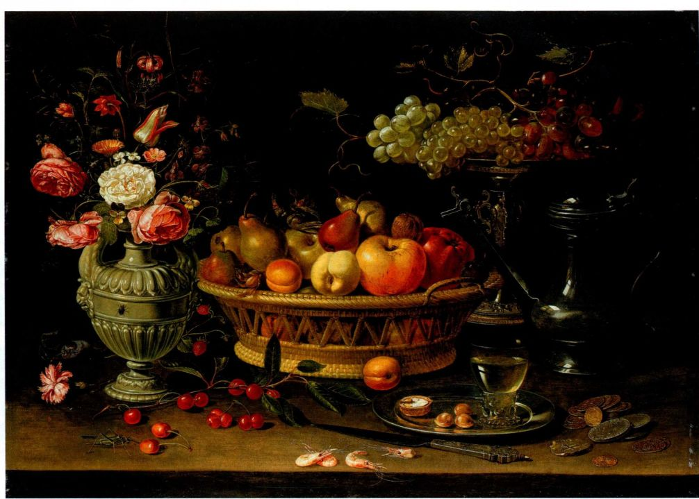

图20\.11 克拉拉·彼得斯：《有水果和花的静物》。约1612年。铜板油画，64 × 89厘米。阿什莫尔博物馆，牛津大学

早期静物画：克拉拉·彼得斯 克拉拉·彼得斯（Clara Peeters，活跃于1607一约1621年）很可能出生于安特卫普，她与这座城市的关系最为密切，她可能也在荷兰的哈勒姆工作过。但尽管这些城市的同业公会当时已开始接纳妇女，而且署有克拉拉·彼得斯名字的作品数量表明她是职业艺术家，但这些地方却没有任何一份档案记载了她的名字。对于她的生平、赞助人或老师，我们都知之甚少。然而，她却创作了最早的一批静物画。《有水果和花的静物》（StillLife with Fruit and Flowers，图20\.11）便是一件早期作品，这幅画细致刻画了花卉和水果以及各式容器，对各种物体的质地进行了探索。画面中央是一篮水果（苹果、梨子、李子、杏和榛子），左侧的白色陶瓶里插着一束花（玫瑰、郁金香、耧斗菜、金盏草、矢车菊、琉璃苣、野生三色堇、勿忘我草和百合花）。右侧则是一个白镴大酒壶（上面有彼得斯的倒影）和一个盛着葡萄的银制高足盘（tazza，一种意大利制造的盘子）。右边还有一个白镴盘子，里面放着一杯白葡萄酒和一些坚果。木桌面上散放着对虾、康乃馨、李子、樱桃、蚱蜢、草莓、金银币和餐刀。

虽然画中描绘了大量物品，但就确定画的年代和可能的用途或含义来说，意义最重要的物品还是钱币和餐刀。经鉴定，钱币的年代已被确定为阿尔伯特大公和伊莎贝拉大公夫人统治时期（1598\-1621年），而且根据画的风格，有人提出它是1612年创作的。这把餐刀（这里没有画出与它配套的餐叉）相当特别，它是一种结婚或订婚礼物。这把刀曾多次出现在彼得斯的画中，很可能是照着实物画的。刀上刻着意为“忠诚”和“节制”的拉丁文词语，还配有图画：包含寓意的小人儿，人们可以看见他们的心和紧握的手。这类刀常会刻上新娘的名字，画中的这把刀就刻着“克拉拉·彼得斯”的字样。所以有人认为，她画这幅画是为了庆祝她自己的婚礼\-画中所有的水果和花都象征着这件喜事中收到的赠礼和它所蕴含的无限希望。此类画常挂在住宅的餐厅里，为进餐和节庆增光添彩。克拉拉·彼得斯的许多画今天仍属私人藏品。

野味静物画：弗兰斯·斯奈德斯 常与鲁本斯合作的弗兰斯·斯奈德斯（Frans Snyders，1579\-1657年）曾跟随小彼得·布吕盖尔（Pieter Brueghel the

708 詹森艺术史

Younger，1564\-1638年）学习，小彼得·布吕盖尔是老扬·布吕盖尔的哥哥、老彼得·布吕盖尔的另一个儿子。斯奈德斯的兴趣集中在繁杂的桌面静物画上，画中的桌子上往往是成堆的美食。他的《市场摊位》

（Market Stall，图20\.12）是其早期杰作，也是同类画中的佼佼者，毫无掩饰地刺激着观众的感官。艺术家喜欢用显示其高超技艺的涂色法来表现各种野味的质感。掏摸老者口袋的年轻人和前景中打架的母鸡（一只猫躲在安全的矮凳下旁观）使画面更加生动活泼。

鲁本斯的影响甚至在这里也能看到：作品的构图源自1609年左右斯奈德斯和鲁本斯从意大利回国后不久他们合作的一幅以鲁本斯的构思为基础的画。《市场摊位》可被认为是皮特·阿尔岑的《肉摊》（见图18\.36）的更新版。但与阿尔岑不同，斯奈德斯让画面中的一切服从于巴洛克风格所特有的繁复、直接的艺术效果。此画歌颂的是1609年停战之后的那段和平繁荣的时期，正是在此期间，禁猎地恢复了捕猎。

豪奢静物画：扬·德·黑姆 到了17世纪中叶，静物画多数已经成了铺张的陈示，因其华丽的视觉效

大事年表

1598年\-阿尔伯特大公和伊莎贝拉共同统治西属尼德兰1610／11年\-鲁本斯创作《竖起十字架》

约1612年\-克拉拉·彼得斯创作《有水果和花的静物》

1621年\-菲利普四世成为西班牙国王

约1635年\-安东尼·凡·代克创作《查理一世狩猎像》

1638年\-鲁本斯创作《爱之园》

果而在当时被称为豪华静物画（pronk），“一词即意为“卖弄的”或“招摇的”。这种类型的静物画在扬·德·黑姆（Jan de Heem，1606\-1684年）的作品中达到了极致。德·黑姆事业的开始是在荷兰，但他不久就迁居佛兰德斯，并在那里以他独特的炫丽风格改造了静物画。在《有鹦鹉的静物》（Still Lifewith Parrots，图20\.13）中，德·黑姆描绘了来自世界各地的美食、奇鸟和奢侈品：可能来自新大陆的海螺和鹦鹉螺的壳、鹦鹉、龙虾，塞维利亚的橙子、李子、葡萄、柠檬、甜瓜、石榴和牡蛎，这些在当时都是进口商品，在市场上价格极为昂贵。

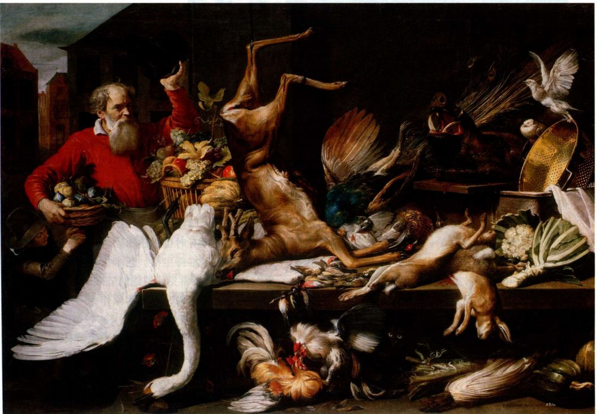

图20\.12 弗兰斯·斯奈德斯：《市场摊位》，1614年。布面油画，2\.1 × 3米。芝加哥艺术学院。Charles H．和Mary F．S．Worcester基金，1981\.182

第二十章 尼德兰的巴洛克艺术 709

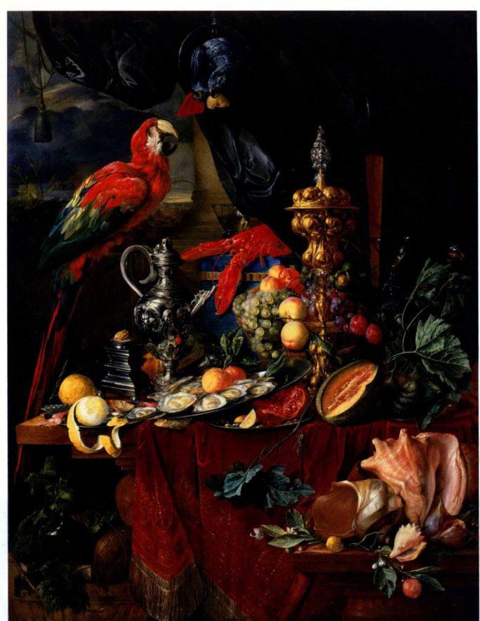

图20\.13 扬·德·黑姆：《有鹦鹉的静物》。17世纪40年代末。布面油画，150\.5x115\.5厘米。John Ringling 遗赠。约翰·林灵和马贝尔·林灵美术馆（John and Mable Ringling Museum ofArt）收藏，佛罗里达州立美术馆，萨拉索塔（Sarasota），佛罗里达

食物堆在白镴盘中，这些大浅盘虽然放得不稳，但在当时却是奢华的象征。与17世纪初彼得斯平衡的水平构图不同，这些银的、白镴的、玻璃的和镀金的器皿高低错落地摆放在一起，越堆越高，鹦鹉则居于它们的顶部。德·黑姆想把这个场面设计成一个舞台的样子，他像是拉开幕布让观众观看。甚至背景处的柱子也意在为作品增添气势非凡的感觉。其结果就是让人眩晕，这也是豪华静物画的构成要素。

荷兰共和国

与佛兰德斯艺术不同，当时荷兰共和国的艺术不是以教会或政府订单为主，而是主要通过私人赞助和开放的艺术品市场来运作。绘画作品成为了一

种商品，它们的交易遵循供求法则。许多艺术家为市场而不是为赞助人作画。他们在获得成功的憧憬的诱惑下成为画家，但这种愿望常常落空，就连最好的绘画大师有时也倍感压力，用自己的技艺挣得的钱还不足以维持生活。艺术家开酒馆或做点小生意贴补家用十分常见。但他们坚持了下来\-虽然不如过去那样有保障，但艺术家作为一个群体而言，比过去要自由许多。

当时的荷兰存在着许多艺术家群体\-在哈勒姆、乌得勒支、阿姆斯特丹和代尔夫特都有，而这只是列举了其中的几个。艺术家时常往来于这些城市之间，也许对彼此的作品也有所了解，但大多数艺术家通常只待在一个地方\-霍尔齐厄斯和弗兰斯·哈尔斯在哈勒姆；特布吕根在乌得勒支；伦勃朗在阿姆斯

710 詹森艺术史

特丹；维米尔在代尔夫特。一些画在本质上是宗教性质的，但大部分不是。既有肖像画、市民团体订制的群像画，又有风景画、城市风光画、建筑画、静物画和风俗画。

绘画种类繁多，尺寸大小不一\-某些绘画小到可以用手拿或可以挂在普通人家的墙上。

哈勒姆学院：亨德里克·霍尔齐厄斯

与鲁本斯、凡·代克甚至老扬·布吕盖尔一样，许多荷兰艺术家是在亲自造访罗马后才了解到罗马当时艺术的精华及其古典根源的。其中的一些人，如亨德里克·霍尔齐厄斯（Hendrick Goltzius，1558\-1617年）在旅居罗马期间画了大量版画和素描，并把它们携带回国，供自己和其他艺术家参考。1585年，霍尔齐厄斯（与另两位艺术家卡雷尔·凡·曼德尔和柯内利斯·柯内利茨·凡·哈勒姆［Cornelis Corneliszvan Haarlem］）在哈勒姆创立了一个“学院”。关于这个学院的情况我们知之甚少，但我们知道临摹版画和古代作品以及互相临摹是他们的课程的一部分。学院还为年轻一代艺术家安排教师，把哈勒姆城变成了早期荷兰油画、版画和素描的中心。

学院的合作成果似乎仅限于霍尔齐厄斯根据其同事的设计或油画作品创作的雕版画。霍尔齐厄斯是一位大师级的雕版画家，虽然一只手受过伤（在童年的一次事故中被烧伤），但却似乎非常有力，令他能够在金属上刻出深深的曲线（见第498页的材料与技法）。他也创作木刻版画，1600年后才开始画油画。

雕版画《法尔内塞的赫剌克勒斯》（FarneseHercules，图20\.14）表现的是法尔内塞家族拥有的一尊希腊化雕像的背部，这尊雕像摆放在法尔内塞宫中，其形象也永远留在了法尔内塞宫的天顶画（图19\.7）中。这幅雕版画中，两个荷兰人\-大概是霍尔齐厄斯1590至1591年的意大利之旅的两个旅伴\-正在观看这尊比真人还大、充满英雄主义特色的巨型雕像。在许多方面，这幅雕版画都象征着荷兰人在遍地古代遗迹、建筑和雕塑的罗马大开眼界时的感受。（实际上，荷兰人后来决定把那些几乎被西班牙人毁掉的建筑作为废墟保存下来\-为的是拥有见证荷兰人自己英勇历史的遗迹。）这幅《法尔内塞的赫剌克勒斯》与他这一系列雕版画中的其他作品一样，也是一幅非常大的版画\-对艺术家来说肯定是一件艰巨的工作。霍尔齐厄斯访问意大利的时间早于卡拉瓦乔和巴洛克风格的产生，因此他所受的影响来自古代艺术，而非当时的意大利作品。

荷兰的卡拉瓦乔主义者：亨德里克·特布吕根

巴洛克风格传入荷兰的途径有两个：一个是从安特卫普经由鲁本斯的作品传入；另一个则是通过与卡拉瓦乔追随者的接触从罗马直接传过来的。虽然大多数荷兰画家没有到过意大利，但17世纪初前往意大利的那些艺术家大部分来自乌得勒支，这是一个具有强烈天主教传统的城市。亨德里克·特布吕根（Hendrick Terbrugghen，1588\-1629年）也是这些乌得勒支艺术家中的一个，他在意大利工作过几年，是首批回到北方的“卡拉瓦乔主义者”之一。他对卡拉瓦乔风格稍作改变，不仅用于宗教画创作，也用于单人风俗画。特布吕根的《鲁特琴演奏者》（SingingLute Player，图20\.15）受到了卡拉瓦乔同类题材作品的启发，如《乐师》（图19\.4）及其他一些类似作品，如《召唤圣马太》（图19\.2）中穿开叉紧身上衣、戴着用羽毛做装饰的扁圆帽的年轻男子。特布吕根的这个真人大小的半身人像占据了整个画面，这种样式后来成了乌得勒支绘画中的一个常见类型，也在荷兰其

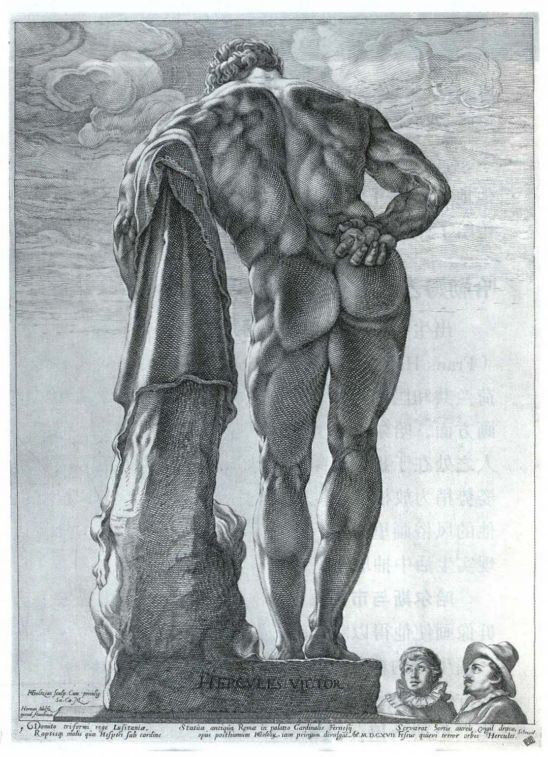

图20\.14 亨德里克·霍尔齐厄斯：《法尔内塞的赫剌克勒斯》。约1592年，雕版画，418x301厘米。纽约大都会艺术博物馆。HenryWalters赠，1917年（17\.37\.59）

第二十章 尼德兰的巴洛克艺术 711

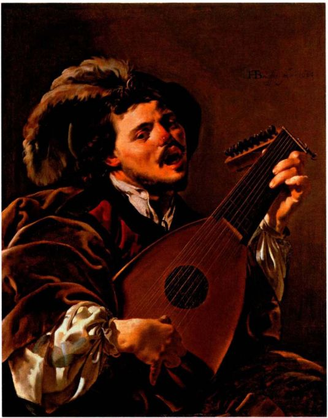

图20\.15 亨德里克·特布吕根《鲁特琴演奏者》，1624年。布面油画，1 00\.5 × 78 \.7厘米。伦敦国家美术馆。由国家美术馆受托保管

他地方流行开来。乌得勒支画派也把卡拉瓦乔的风格传给了弗兰斯·哈尔斯等荷兰绘画大师。

哈勒姆艺术家与弗兰斯·哈尔斯

出生于安特卫普的哈勒姆艺术家弗兰斯·哈尔斯（Frans Hals，约1585\-1666年）是最先从这些传入荷兰共和国的艺术观念中获益的人。在肖像画和风俗画方面，哈尔斯是其同代画家中的佼佼者，而他的过人之处在于把两者结合起来\-使肖像画中的人物的姿势稍为放松甚至随便一点，从而使人像变得有生气。他的风俗画里通常只有一个人物，这些人物仿佛是从现实生活中抽取出来似的。

哈尔斯与市民警卫队 哈尔斯的六幅市民警卫队群像画使他得以将多个充满活力的单人像集中表现在一幅生动的群像中。市民警卫队是成立于14世纪的地方性志愿民兵组织，通过军事服务为保卫城市出力。他们也须承担公民和宗教义务，从16世纪初开始，市民警卫队开始请艺术家为自己画集体肖像。尽管他们在16世纪80年代成功地抵抗了西班牙人，保卫了他们的城市，而且他们也确实为这一胜利感到骄傲，

但1609年停战后，市民警卫队变得更像市民共济会了，他们每年举行一次宴会，就像《圣乔治市民警卫队官员之宴》（Banquet of the Officers of the St\.George Civic Guard，图20\.16）画的那样。自卫队的军事性实际上已从属于一种仪式上的普遍富足感。画面中央靠后的自卫队队长挥着一把小刀，这可不是武器，他是要切烤肉。旗手正扛着一面展开的旗走进门，按照习惯，左边的上校向着门口举起酒杯。在场的高级军官都坐着，军阶较低者和仆人则靠后站着。这群人要么面对面，要么转过头对着观众，他们围坐在一张摆满食物铺有白色花缎桌布的桌子上。但12个人围着一张桌子的情形是在特意唤起观众对达芬奇的《最后的晚餐》（图16\.6）的联想。但这幅画确实是世俗画，只不过画中场景充满了仪式性。

虽然此画惟妙惟肖地表现出这是一次真实发生的聚会上的一幕，但艺术史学家却认为哈尔斯的画是虚构的。军官们并未根据这种座位安排来摆姿势。现实感来自人物的尺寸，他们的手势，以及用宽窄、长短不一的笔画趁湿涂抹颜料所形成的立体感。这种立体感为画面注入了活力，把这些人变成了“会说话的肖像”。以市民警卫队为对象的画将成为哈勒姆和阿姆斯特丹的一个主要绘画题材。伦勃朗的《夜巡》（图20\.23）表现的就是这种标准画法的另一种形式。

在哈尔斯的画中，红白相间的肩带使服装的黑白式样和背景活跃了起来，创造出了一个明亮生动的画面。这些连队军官也是殷实的市民（在哈勒姆，他们是酿酒者和商人），他们利用这种公共服务的经历来拓展自己在政府中的事业。一些人甚至请哈尔斯为自己和家人画单人像，而哈尔斯本人也于1612年成为这个连队的一员。

婚礼肖像画《花园里的结婚画像，伊萨克·马萨和比阿特丽克斯·凡·德·莱恩肖像》（MarriedCouple in a Garden,Portrait of Isaac Massa and Beatrix van der Laen，图20\.17）是哈尔斯唯一的一幅双人肖像画，这幅作品大概是为庆祝1622年伊萨克·马萨（1586\-1643年）与妻子比阿特丽克斯·凡·德·莱恩的婚礼而画。作品融合了风俗画那种松弛的、不拘礼节的气氛与肖像的逼真，画中的夫妇也像在肖像画中那样身着礼服。画中的夫妇与真人等大，彼此似乎很恩爱，他们相依而坐，含蓄地表达着两人之间的感情。妻子的手臂挽着丈夫的臂弯，露出了她的婚戒（按照风俗，戒指戴在她的食指上）；他们的笑容很灿烂，双眸神采奕奕，坐在一个花园里，想象中的爱之园，周围是象征坚定爱情、忠贞和忠实的常春藤。实际上，

712 詹森艺术史

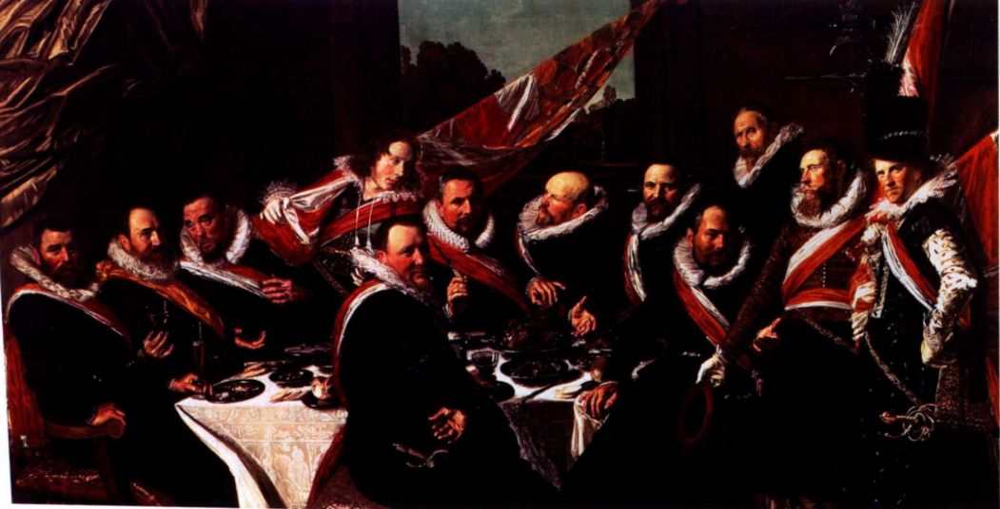

图20\.16 弗兰斯·哈尔斯：《圣乔治市民警卫队官员之宴》。1616年。布面油画，175 × 324厘米。弗兰斯·哈尔斯博物馆，哈勒姆

图20\.17 弗兰斯·哈尔斯：《花园里的结婚画像，伊萨克·马萨和比阿特丽克斯·凡·德·莱恩肖像》。约1622年。

布面油画。

1 40 × 1 66\.5厘米。阿姆斯特丹国家博物馆

第二十章 尼德兰的巴洛克艺术 713

他们看上去深爱着对方。丈夫的右手轻触胸口（心脏的位置），以表明对女主人公的爱意。这幅画与扬·凡·爱克的《阿诺尔菲尼夫妇像》（图14\.16）形成了鲜明的对比。不管我们把较早的那幅作品中的夫妇所处的场合解释成订婚还是结婚，我们都可以发现，阿诺尔菲尼夫妇之间的感情关系不是凡·爱克所强调的。这不仅是个人艺术风格的不同，还是文艺复兴风格与巴洛克风格之间的差异，这种差异的形成横跨200年的漫长过程。在凡·爱克和哈尔斯之间还有一个鲁本斯，他也画了一幅他自己与第一任妻子的结婚像，这可能为哈尔斯的作品提供了范例。

哈尔斯巧妙地让这对夫妇的位置偏离画面中心，而且使观众感到马萨仿佛张嘴在对我们述说什么，这些都使画面显得更加自然。他们的衣服上有昂贵的花边袖口；男主人公戴着当时男士常戴的花边衣领，女主人公戴着磨石领（绉领），她头戴一顶通常在室内戴或是戴在另一顶帽子下面的缎带绣花帽。她的裙子是丝制的，紧身胸衣则是天鹅绒缝制。

哈尔斯曾为伊萨克·马萨这位显要而富有的外交官至少画了两幅单人像。马萨的生活有些冒险：他是一位地理学家、还是西伯利亚地区的测绘学家。他于1600年前往俄国，并在那里住了8年，学了一口流利

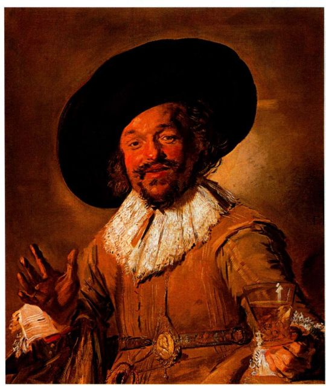

图20\.18 弗兰斯·哈尔斯：《快乐的酒鬼》。约1628\-1630年。

的俄语。他积极参与毛皮贸易，在开发尼德兰与俄国之间的商路方面也发挥过影响。但在这幅以他自己的花园为背景的婚礼肖像画中，他的见多识广、精明世故表现得并不明显。

哈尔斯与风俗画 《快乐的酒鬼》（The JollyToper，图20\.18）体现出了哈尔斯的成熟风格，此画表现的可能是一个关于五种感官之一\-味觉的寓言，五种感官是17世纪最流行的题材之一。这幅画既有鲁本斯作品中的那种充沛的活力，又着重刻画了一个“戏剧性瞬间”，后者肯定是从乌得勒支的卡拉瓦乔式画家那里学来的。闪亮的双眼，半张的嘴，抬起的手，摇摇欲坠的酒杯，最重要的是快速的落笔定形，这里的一切都表现了彻底的本能冲动。哈尔斯的笔法迅疾有力，每一笔都清晰可见，我们几乎能数出“笔画”总数。由于采用了这种豪放的快速技法，作品便具有了速写的那种即时性。画家给人的这种争分夺秒的感觉当然不是真的。哈尔斯画这幅真人大小的油画花了数个小时，但他一直让人产生一种错觉，好像它是在一眨眼间完成的。

与我们将在本章中讨论的伦勃朗·凡·莱茵和扬·维米尔一样，哈尔斯与后来被称作荷兰艺术黄金时代的时期关系紧密。这三位艺术家分别在哈勒姆、阿姆

图20\.19 朱迪思·莱斯特：《自画像》。约1633年。布面油画，

布面油画，

8 1 x 66\.6厘米。阿姆斯特丹国家博物馆

72\.3 × 65 \.3厘米。华盛顿国家美术馆。Robert Woods Bliss夫妇赠

714 詹森艺术史

图20\.20 朱迪思·莱斯特：《年轻的鲁特琴演奏

者》。约1635年。布面油画，72\.1 × 61\.9厘米。

斯德哥尔摩国家博物馆

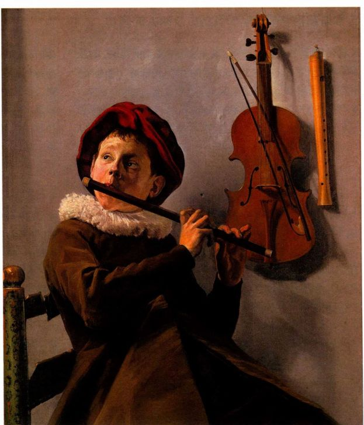

斯特丹和代尔夫特以北尼德兰艺术传统为基础，发展创造出了17世纪荷兰艺术的独特风格。哈尔斯、伦勃朗和维米尔都没有去过意大利。

新一代哈勒姆画家：朱迪思·莱斯特

哈尔斯最重要的追随者是朱迪思·莱斯特（Judith

Leyster，1609\-1660年），尽管她也画过与哈尔斯

风格全然不同的作品：烛光画和探讨男女之间关系的

画，但莱斯特的一些作品还是曾被归在哈尔斯的名下。

她也画肖像画和静物画，但主要画风俗画。莱斯特的

《自画像》        ，图20\.19）表明她既是肖

像画家，也是风俗画家，画家的目的无疑是要表明她

对两种绘画类型都精通。这幅作品可能是1633年她

出师以后作为自己的代表作品赠送给哈勒姆圣路加同

业公会的，这一年她当上了师傅，有了自己的学生。

画架上的画是她的一幅广受欢迎的作品的细节特征，

因此她是在宣扬自己的多才多艺。她坐在画室里，张

着嘴，漫不经心地与我们交谈着，手中还拿着多支画

笔和一个调色板，显示出她技艺高超。当时的许多女

性艺术家都像莱斯特那样，在作品中表现自己正在作

画的样子\-藉以表明她们新的专业人士身份和独一

无二的地位。实际上，阿尔泰米西亚·真蒂莱斯基创作于同一时期的《隐喻画自画像》（图19\.6）表现的也是同样的主题。

莱斯特并非出身艺术世家，但其夫家确实是艺术家庭，她的丈夫扬·米恩斯·莫勒奈尔（Jan MienseMolenaer，约1610\-1668年）是哈尔斯的一个同乡学生，他也擅长风俗画和肖像画。夫妻二人当年一道从哈勒姆搬到阿姆斯特丹。莱斯特的《年轻的鲁特琴演奏者》（Young Flute Player，图20\.20）中， 墙上的八孔竖笛上签着她的花押字\-连在一起的J、L和星形图案，星星是她名字的双关语，而她名字的意思就是“明星”。实际上，在她的有生之年，她已经被人们誉为一颗艺术上的“明星”。画中全神贯注的乐手可能象征着听觉，出色地营造出一种抒情的气氛，而且由于她曾在乌得勒支逗留过一段时间，所以这个乐手的形象被认为受了特布吕根的《鲁特琴演奏者》（图20\.15）的影响也并不令人感到惊讶。莱斯特着力表现了从画面左侧射入的光的诗性，她在这上面倾注的热情使人认为她的作品是卡拉瓦乔主义者与扬·维米尔（见图20\.34和20\.35）之间的桥梁。

第二十章 尼德兰的巴洛克艺术 715

艺术史家的观点

鲁本斯和伦勃朗作品的真伪以及两人的画坊

当时许多艺术家都开办了雇用其他艺术家的画坊，鲁本斯和伦勃朗也在此列。安东尼·凡·代克、弗兰斯·斯奈德斯和老扬·布吕盖尔既与鲁本斯合作，也独立创作。鲁本斯的画常被归于“鲁本斯与画坊”。另一方面，伦勃朗与画坊中他人合作这一观点为人们接受则是一个很缓慢的过程。伦勃朗是个孤独的天才这样的观念贯穿于20世纪始终，只是到了最近，才有人开始改变这种看法。一些并非完全由伦勃朗创作的画被“降级”，归到他画坊中某位艺术家的名下。艺术史学家们也由此开始重新思考画坊中的艺术创作。

根据一些艺术史学家的说法，伦勃朗的作品总数达近千幅；另一些艺术史学家则认为他只创作了几百幅。20世纪60年代，在筹办纪念伦勃朗逝世300周年展览（1969年举行）的过程中，艺术史学家们显然对于伦勃朗其人、其作有着不同观点。于是，1968年人们发起了伦勃朗研究计划，在这个计划中，一个艺术史学家小组将运用科学方法和艺术鉴赏手段来确定原本归在伦勃朗名下的那些作品的真伪。研究人员将对木制画框和画布进行研究，以确定木头的年代（这种方

图20\.21 伦勃朗·凡·莱茵：《莎斯姬亚·凡·优伦堡像》。1633

年。银尖笔、经过处理的顶部呈拱形的白色羊皮纸，185 × 107厘

米。柏林国家博物馆\-普鲁士文化遗产素描部（Staatliche Museen

Preussischer Kulturbesitz,Kupferstichkabinett\),Inv\.Kdz 1152

法叫树轮年代学），使用X光，利用红外线摄影技术，考察颜料和画底样本，还会把画分组并放在倾斜的（强）光中研究。研究者们撰写了报告，并共同发表了一部三卷本的《伦勃朗绘画研究文集》，对伦勃朗作于1625\-1631年、1631\-1634年和1635\-1642年的画的研究结果进行了报告。目前，由于研究人员的死亡和退休，该委员会的人员有了变动，但这个项目并未中止。

虽然这些研究者慎重而科学的研究极有价值，可作为其他研究者的典范，但他们把伦勃朗名下作品分为A、B、C三类，这种分析引起了很大的争议：“A”代表伦勃朗的真迹；“B”代表无法确认真伪的作品（最近，人们讥讽地给“B”类起了个绰号“麻烦”）；“C”代表赝品，它们的作者另有其人，通常为著名的伦勃朗追随者。在这份清单中找不到合作这一概念\-指我们在鲁本斯的作品和画坊中见到的那种惯常的画坊创作方法。虽然伦勃朗和鲁本斯在他们的艺术生涯中都拥有活跃的画坊，但艺术史学家对出自这些画坊的作品的看法是不同的。

伦勃朗与阿姆斯特丹的艺术

与哈尔斯和莱斯特一样，伦勃朗·凡·莱茵（Rembrandt van Rijn，1606\-1669年）也通过乌得勒支画派间接地受到了卡拉瓦乔的影响。与伦勃朗有竞争关系的鲁本斯是当时最为人知的艺术家，但在今天，伦勃朗可能更为知名。他既是油画家、素描大师，也是版画家，他在每一种艺术形式上都取得了重要成就，在不断发展和繁荣的中心城市阿姆斯特丹他确立了自已作为著名艺术家的声名与地位。伦勃朗不仅因为其作品亲切、动人的形象体现了人与人之间的关系和情感\-一个前人极少涉足的方面\-而闻名（见第三部分末尾的附加原始文献），还以绘制大型群像画和历史题材绘画而著称。他拥有一个活跃了40年的画坊（见本页的艺术史家的观点），许多追随者后来也成了其家乡莱顿和阿姆斯特丹的重要艺术家。

伦勃朗的素描 伦勃朗素描的动人之处可见于他的许多“写生”作品，即面对模特而作。他通常用鹅毛笔和墨水、淡彩、红色或黑色粉笔或者银尖笔作画，有时还会把这些工具综合运用。伦勃朗在订婚时为未婚妻画的素描像《莎斯姬亚·凡·优伦堡像》（Portraitof Saskia van Uylenburgh，图20\.21）就是用银尖笔在羊皮纸上画的，银尖笔是一种一旦落笔就不能改动的线描工具（在发明铅笔之前），它要求画家的笔画要

716 詹森艺术史

精准，下笔要有把握。显然，这是一幅非常特别的素描，是他们的订婚纪念。作品中的题字（用荷兰语）写道：“今天是1633年6月8日，我们订婚的第三天，这幅画是照着我妻子21岁时的样子画的。”他们一年后结了婚，这幅素描描绘的莎斯姬亚双眼迷离，看上去一副与对望者（艺术家）热恋的样子。她头戴一顶草帽，这种草帽常常让人联想到牧羊女以及田园和爱情的画面。帽子上插的和手中拿的花使这种感觉更加突出。莎斯姬亚出身于一个富裕家庭，是伦勃朗经纪人的外甥女。她的容貌出现在伦勃朗的许多油画和蚀刻画习作中，直至她1642年去世，年仅30岁。

伦勃朗的油画 伦勃朗最早的绘画作品尺寸较小，明暗对比强烈，具有浓重的现实主义风格。许多都以《旧约》为题材，这也是他终生喜爱的一个题材（见第三部分末尾的附加原始文献及图20\.26）。这些作品既体现了他更为强烈的写实风格又反映了画家新的情感态度。伦勃朗以及许多17世纪的新教徒，基本上就是以与卡拉瓦乔看待《新约》相同的方式看待《旧

约》故事的，将之看作上帝对其所创造之人类的态度的直接记述。这些画有一部分是为海牙的国民议会（尽管发生了宗教改革运动，但对此类绘画的使用很难彻底消亡）和私人赞助者创作的。

《刺瞎参孙》（The Blinding of Samson，图20\.22） 可以说明这些圣经故事对伦勃朗的影响有多强烈。此画以他迁居阿姆斯特丹后于17世纪30年代形成的巴洛克风格绘成，显示出伦勃朗具有高超的叙事才能。艺术家笔下的《旧约》世界充满了东方式的华美和动荡，作品也表明他通过乌得勒支的卡拉瓦乔主义者受到了卡拉瓦乔的直接影响。射入昏暗帐篷里的光具有舞台灯光的特点，这增强了作品的戏剧效果，达到了鲁本斯的《竖起十字架》（见图20\.1）的那种程度，而鲁本斯一直是伦勃朗的竞争对手。但伦勃朗决定不去意大利观摩古代或文艺复兴的艺术品，这或许局限了他的艺术思维（见第三部分末尾的附加原始文献）。不过，他把外部世界带到了自己面前。伦勃朗热衷于收藏近东器物，这些藏品常常成为其画中的道具。

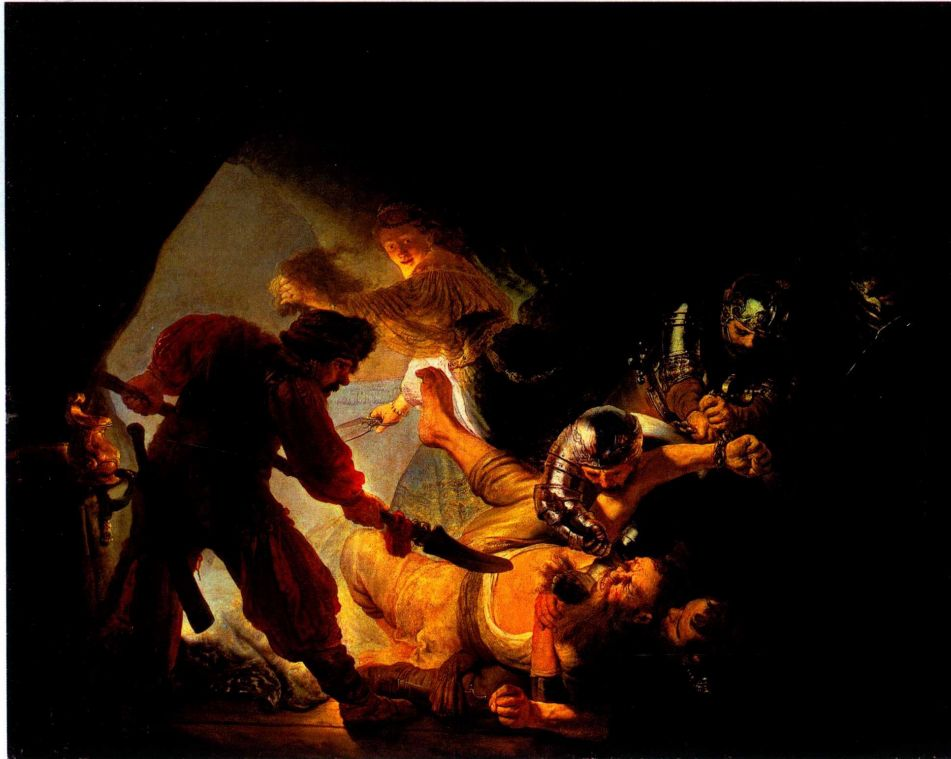

图20\.22 伦勃朗·凡·莱茵：《刺瞎参孙》。1636年。布面油画，2 \.4 × 3米。法兰克福施塔德尔艺术学院和市立美术馆（StädelschesKunstinstitut und Stadtische Galerie\)

第二十章 尼德兰的巴洛克艺术 717

图20\.23 伦勃朗·凡·莱茵：《夜巡》或《弗兰斯·班宁·柯克队长的连队》（The Company of Captain Frans Banning Cocq）。1642年。布面油画，

3\.8x4\.4米。阿姆斯特丹国家博物馆

伦勃朗与市民警卫队 到了17世纪40年代，伦勃朗已成为阿姆斯特丹最受欢迎的肖像画家，拥有了相当可观的财产。《夜巡》（The Night Watch，图20\.23）是他的一幅著名群像画，作于1642年，因其表面有一层年代已久、颜色变暗的清漆（现已被清除）而得名。这幅作品描绘的是与哈尔斯笔下的市民警卫队（图20\.16）类似的一群军人，画中的人物可能正在整队迎接法国王后玛丽·德·美第奇对阿姆斯特丹的访问。虽然他们每个人都为这幅巨大的油画（最早的尺寸要比现在大得多）出了钱，但伦勃朗在画中并未对他们一视同仁。他希望避免以前群像画画面呆板的构图\-只有弗兰斯·哈尔斯成功地解决过这个问题。伦勃朗把此画变成了一件充满动感和光影效果的杰作，这种效果捕捉到了画中那激动人心的一瞬间，

从而赋予了画面无与伦比的戏剧效果。画面的重心在队长弗兰斯·班宁·柯克（Frans Banning Cocq）身上，他的手伸向观众，甚至在他的副队长的黄色制服上衣上投下了一道阴影。画中有些人被隐没在阴影中，有些人则被前排的人挡住。据说画像被隐去的那些人对此画极为不满，但这种说法却没有证据。恰恰相反，据我们所知，当时此画大受赞赏，17世纪50、60年代，伦勃朗仍然接到了一些重要的公共订单。

版画家伦勃朗 伦勃朗的许多蚀刻版画如著名的《一百荷兰盾版画》（The Hundred Guilder Print，图20\.24）都是分阶段制作的，常常耗时经年，这些作品体现了一种在我们已研究过的画作中还从未出现过的新的情感深度。《一百荷兰盾版画》被认为展现的是《马太福音》第十九章的全部内容，作品把基督多个

718 詹森艺术史

不同的布道场景表现在一幅画中，如治愈病人、将孩童和了无牵挂的人聚集到他身边。当时一首诗中的一句明确地反映了这种情景：“圣子在一个充满悲伤的世界里·····”这幅令人心酸的版画满怀悲悯地展现了一个人民双脚赤裸、衣衫褴褛的卑微世界。画面充满了艺术家对穷人和流离失所的人的深切同情。在画中，这些人是基督的听众。对于圣经人物的后嗣和宗教迫害的牺牲者的犹太人，伦勃朗有一种特殊的同情，而且犹太人也常常是他的模特和赞助人。这幅版画的背景似乎是阿姆斯特丹犹太人藏身的某个角落；犹太人的形象出现在这里是为了给基督布道提供一个“真实”的环境。伦勃朗的版画融入了他的素描中对生活的观察，他一生都在坚持绘制素描；伦勃朗素描中有几幅已被鉴定出是为创作这幅蚀刻画而作的习作。在这幅画中，就像卡拉瓦乔的《召唤圣马太》（见图19\.2）一样，光影的独特艺术效果使《一百荷兰盾版画》具有了精神上的深意。

这幅版画的名称源于一个故事：在当时的一个拍卖会上，它卖出了100荷兰盾的高价。作品高超地结合了蚀刻和干刻技法（见第720页的材料与技法），产生了天鹅绒般的效果，这里的复制品只能间接地反映出来。伦勃朗作为版画艺术家的成就仅

大事年表

1602年\-荷兰东印度公司成立

1616年\-弗兰斯·哈尔斯创作《圣乔治市民警卫队官员之宴》

1626年\-荷兰西印度公司创建新阿姆斯特丹（纽约市）

1642年\-伦勃朗创作《夜巡》

1648年\-《明斯特和约》从法律上承认荷兰共和国

次于丢勒，尽管我们从这个孤例中只能窥其精湛技艺之一斑。

自画像 伦勃朗在其漫长的艺术生涯中画了很多自画像。早年的莱顿时期他创作自画像是实验性的，17世纪30年代开始变得有些夸张，而在他生命将尽时则又趋于坦白直率。（对于他画自画像的原因，人们有多种观点\-可能是作其他画的模范、或是对人物不同表情所作的探索，也可能是为其技艺做宣传。）虽然我们选取的这幅伦勃朗晚期自画像（图20\.25）部分受了提香肖像画的影响（对比图16\.34），但伦勃朗也以北部欧洲特有的坦白态度对自己做了审视。画中人物大胆的姿势和锐利的目光显示出一种顺从但坚定的决心，好似王侯般高贵。与荷尔拜因的《亨利八世》（图18\.27）比较一下，可以发现两者在表现人物气势上观念类似，但荷尔拜因对织物和首饰细节

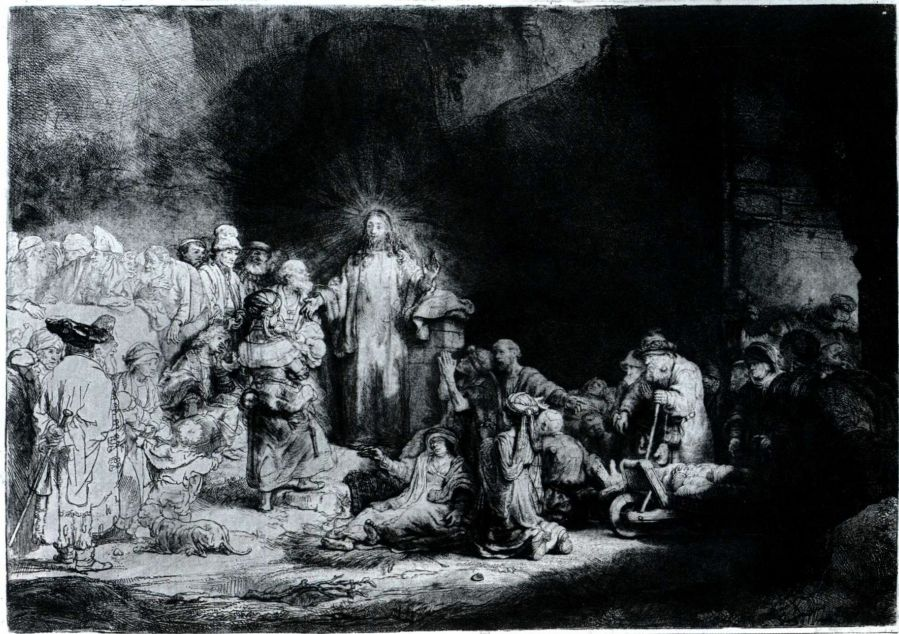

图20\.24 伦勃朗·凡·莱茵：《一百荷兰盾版画》。约1647年。蚀刻和干刻，27\.8x32\.4厘米。纽约大都会艺术博物馆。H．O．Havemeyer藏品，H．O．Havemeyer夫人遗赠，1929（29\.107\.35）

第二十章 尼德兰的巴洛克艺术 719

材料与技法

蚀刻、干刻与选择性擦拭

蚀刻（etching）是凹版印刷的一种。这种新式技术需要艺术家用酸液在金属版上蚀刻出图案。第一道工序是在金属版上涂一层蜡状物质。艺术家不是直接在金属版上刻出凹槽，而是用铁笔在金属版的蜡状涂层上轻轻地“刻画”，将图案上的蜡状涂层除去，露出下面的金属。然后把金属版放入酸性液体中，暴露在酸液中的金属与酸发生反应，在金属表面蚀出凹槽。接着，取出金属版，擦净，上墨。多余的墨被擦掉，只留下凹槽中的墨。像雕版那样，要给金属版覆上湿纸，然后用力压。但由于残余的酸会不断腐蚀金属，形成的蚀刻线可能会不均匀，而且金属版浸在酸液中的时间越长，凹槽可能越深。所以，蚀刻画真正的创作过程很像素描（艺术家甚至会随身携带处理过的金属版），但完成阶段还包含着偶然因素。

不同种类的纸使得人们在版画中有可能创造更丰富的色调。17世纪，包括伦勃朗在内的几位版画家使用的纸材质多样、产地不一，从精制条纹纸到奶油色结子花麦片纸，再到使黑色显得更黑的茶色中国纸和日本纸。伦勃朗也用羊皮纸甚至猪皮来印版画。

干刻（drypoint）的运用使得对黑色色域的探索进一步扩大。干刻是一种用又细又硬的刻针直接在金属版上刻图的工艺，它将会吸墨的毛刺\-即金属锉屑\-保留下来。这种方法可以形成黑色更密集的区域，如伦勃朗的《一百荷兰盾

版画》（见图20\.24）。干刻工艺常与蚀刻和雕版结合起来使用。

另一种创造更大色域可供选择的工艺是不把金属版完全擦净。这叫选择性擦拭（selective wiping）。这种技法可获得纯黑色并产生明暗对照的效果。在一些情况下，伦勃朗似乎根本没有怎么擦拭金属版，而是让它大部分沾着墨。这种选择性擦拭在当时被用来创造夜间的暗影效果。伦勃朗的暗色版画激起了人们对这些暗色蚀刻画的狂热，并在17世纪末的时候产生了一种新型的蚀刻法，叫做网点刻法（mezzotint，又译“美柔汀”）。这是一种在金属上刻出多处凹纹的工艺，运用这种工艺整块金属版（叫“拉毛”版）印出来都是暗部，只有那些被艺术家弄平的地方才会印出颜色较淡的部分，称为亮部。近年来，由于经过处理的“拉毛”版实用性很强，这种工艺又兴起了。

上述两种工艺都允许改动。印出的首张版画叫做一份试版清样（state）。无论是干刻还是蚀刻，印出一份样本之后，艺术家都可以修改。用同一块印版或雕版进行的第二次印刷叫第二次试版。一块印版可以有多份试版清样。所以雕版或印版非常宝贵，可以使用多年\-\-甚至在艺术家死后也能用，从而给艺术家的家人或其他人带来收入。雕版或印版可以买到，制作新印版的人还能生产出新的试版清样。有时艺术家会磨去印版的表面（称为“销”版），以防止他人未经许可使用它。

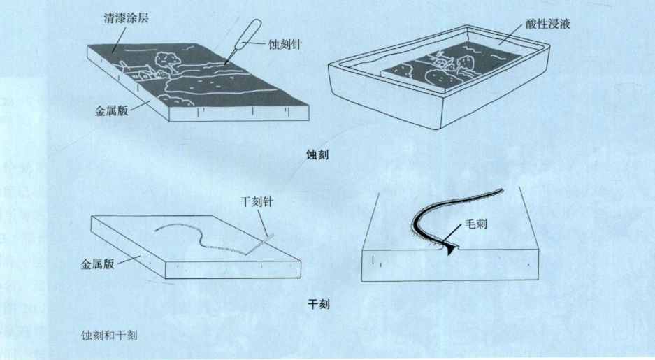

的兴趣凌驾于其他一切之上，而伦勃朗对明暗对照法的运用更注重人物的情感。两人的技法也有明显的差别，伦勃朗用的是厚涂法，一层层厚厚地涂抹颜料和透明色料，可以表现出纹理的效果，富于美感。这幅

画是暮年的伦勃朗创作的几幅大型自画像中的一幅。他曾得到一面“大镜子”（有文件记录了它被打破一事），也许正是靠了那面镜子，他才画出了这么大的自画像。

720 詹森艺术史

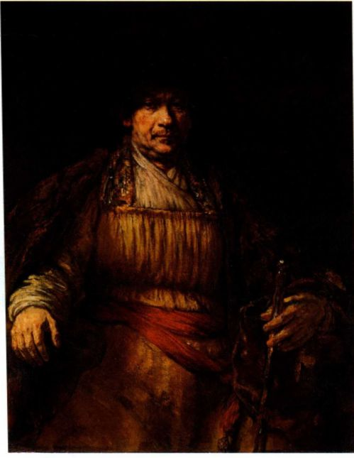

图20\.25 伦勃朗·凡·莱茵：《自画像》。1658年。布面油画，

133\.6 × 103\.8厘米。纽约弗里克美术馆

伦勃朗的晚期作品 伦勃朗晚年的作品以宗教题材为主。《浪子回头》（The Return of the Prodigal Son，图20\.26）创作于他去世前夕，这幅画也许是他最动人的画作，也是他最平和的作品\-艺术家的生命即将跨入永恒。画中弥漫着柔和、静默的气氛，令观众在心理上对这组人物产生亲近感。这种情感上的联系在这幅画中表现得可能比伦勃朗以往任何艺术品都要强烈和亲密。在17世纪，艺术家常常挖掘把家产花在酒和女人身上的浪子的冒险生活的另一面。在这里，钱已花光、穷困潦倒、受尽屈辱的儿子回到家中\-得到一个欢迎的拥抱。在伦勃朗的画中，他一生所累积起来的同情心以一种普适的形式表现出来，那就是悔恨和宽恕。

市场：风景画、静物画和风俗画

当时，意大利艺术以私人赞助或教会赞助为主，而北部欧洲艺术则主要以开放的市场为主。当然，肖像画和群像画，如市民警卫队群像画，也属于订制作品，但大量的绘画作品则是“冒险”（on spec）绘制的\-也就是说，画家希望它们投放在开放的市场上通过画商、集市、商店或奖券等途径出售。我们知道

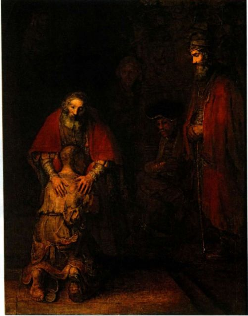

图20\.26 伦勃朗·凡·莱茵：《浪子回头》。约1669年。布面油画，2\.6 × 2\. 1米。圣彼得堡埃尔米塔什博物馆，Inv．GE\-742

（见第701页的原始文献），鲁本斯当时把一些画存起来供自己使用，而这些并不是订制品。兴许是考虑到王侯赞助人的需要，鲁本斯画过许多大型作品，但在荷兰，当时的绘画大都为小型作品，题材也适合中产阶级家庭的口味。荷兰的大多数艺术品买主更喜欢具有本地特色的题材：如荷兰当地的风景、建筑景观、静物和风俗（日常）场景。我们知道，这些题材产生于16世纪下半叶（见第十八章第653页）。随着它们的范围完全确定下来，艺术家们的创作开始专门化。尽管这一潮流并不局限于荷兰，但无论在数量还是种类上，荷兰绘画都是其源头。

这些新形成的“门类”中最丰富多彩的要数风景画了，它描绘的既有人们熟悉的景物，也有虚构的自然景象。风景画成为了17世纪荷兰绘画的一个主要组成部分，画中的人物通常很小，有时甚至没有。我们可以在老彼得·布吕盖尔的作品（见图18\.37）和意大利绘画如卡拉奇的《逃亡埃及途中的风景》（图19\.8）中找到这种风景画兴起的萌芽。但在尼德兰，作品的真实感是风景画中一个共同的主旨，几乎可以称得上是“大地肖像”。有一个同时代的人曾说，风景画“······缺了什么都可以，就是不能缺太阳的温暖和暖风的颤动”。

第二十章 尼德兰的巴洛克艺术 721

图20\.27 扬·凡·霍延：《乌得勒支附近的佩库斯门》。1646年。木板油画，	36\.8x57\.2厘米。纽约大都会艺术博物馆。Francis Neilson赠，1945年\(45\.146\.3\)

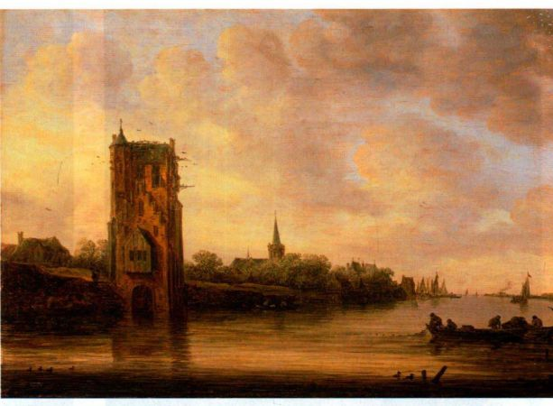

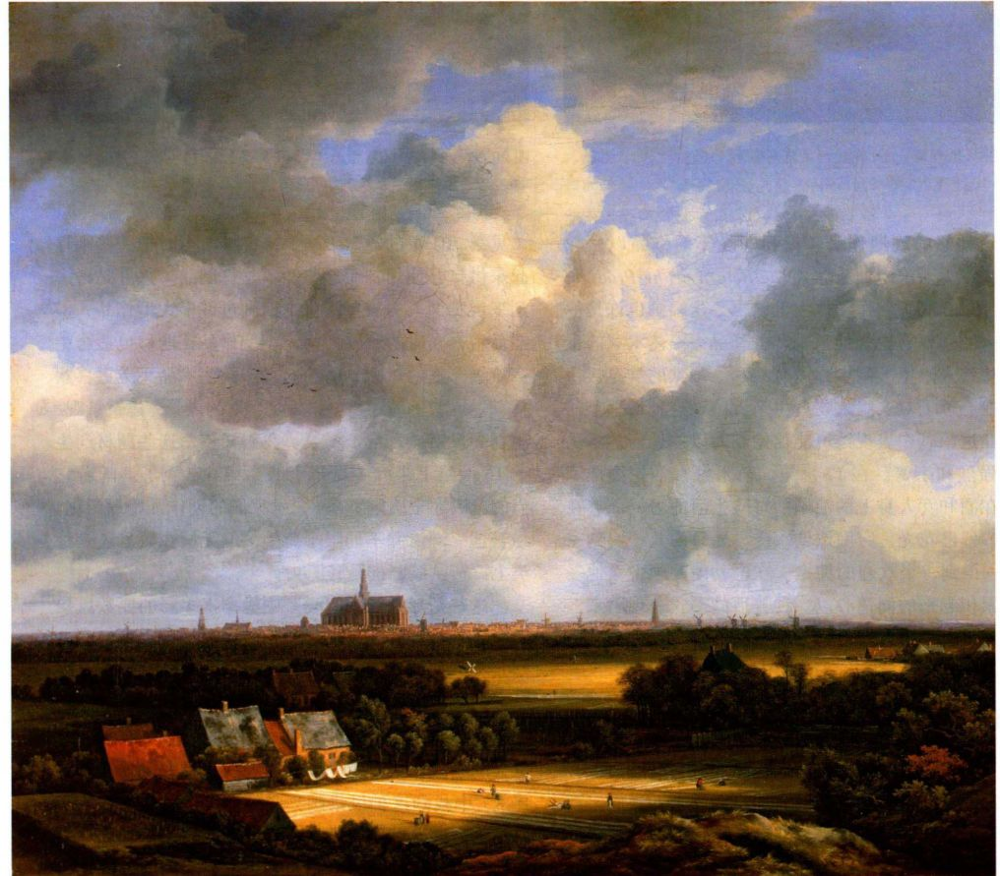

图20\.28 雅各布·凡·雷斯达尔：《哈勒姆附近的漂布园》（Bleaching Grounds Near Haarlem）。约1670年。布面油画，55\.5 × 62厘米。皇家绘画陈列室，莫里茨皇家美术馆（Mauritshuis），海牙，Inv．1\.55

722 詹森艺术史

图20\.29 雅各布·凡·雷斯达尔：《犹太墓园》，1655\-1670年，布面油画，

根。Julius H\.Haass为纪念其兄Emest W\.Haass博士而赠

第二十章 尼德兰的巴洛克艺术 723

风景画：扬·凡·霍延

扬·凡·霍延（Jan van Goyen，1596\-1656年） 的海景画《乌得勒支附近的佩库斯门》（Pelkus GateNear Utrecht，图20\.27）属于那种因画常见景物而在当时大受欢迎的风景画：阴沉的天空下，透过潮湿的空气，越过一片宽阔的水面，遥远的地平线上远远地站立着一座城镇。这幅画表现了凡·霍延那种用日常景物入画却能创造出美的感受，塑造出荷兰这一“低洼之地”每时每刻受到大海的威胁却又离不开大海的忧郁情绪的独特能力。

同其他早期荷兰巴洛克风景画家一样，凡·霍延常常只用灰色和褐色作画，只在需要强调的部位使用绿色调，但就是用这几种有限的颜色他创造出了近乎无限多样的艺术效果。在荷兰，风景画的这种色调风格往往伴随着极其简约的构图，这种现象我们在同时期的单色静物画（图20\.31）中就可以见到。凡·霍延曾在好几个城市（哈勒姆、莱顿和海牙）工作过，他是一位很有影响力而且极其多产的

画家；据考证，他创作了1200多幅油画和800幅素描。他的家庭也是艺术家相互之间关系密切的证明\-凡·霍延的女儿就嫁给了风俗画家扬·斯蒂恩（见第727\-728页）。

城市风光画：雅各布·凡·雷斯达尔

可识别的城市风光画\-一种描绘阿姆斯特丹、哈勒姆、德文特（Deventer）等城市，包括它们的郊野乡村和美丽沙丘的全景式风景画\-在整个17世纪都非常流行。在雅各布·凡·雷斯达尔（Jacob vanRuisdael，约1628\-\-1682年）的画笔下，这些风光成为了在天空映衬下的城市轮廓以及天空的准确记录。在十七世纪的城市风光画中，天空一般占据画面的四分之三，这幅描绘哈勒姆的画（图20\.28）就是如此。雷斯达尔创作了很多以哈勒姆风光为题材的画，被称为哈勒姆小景（Haarlempjes）。教堂尖顶、风车和残垣断壁都可以辨认出来，如画中那座在宗教改革以前名为圣巴沃教堂的大教堂（Grote\-Kerk，见图

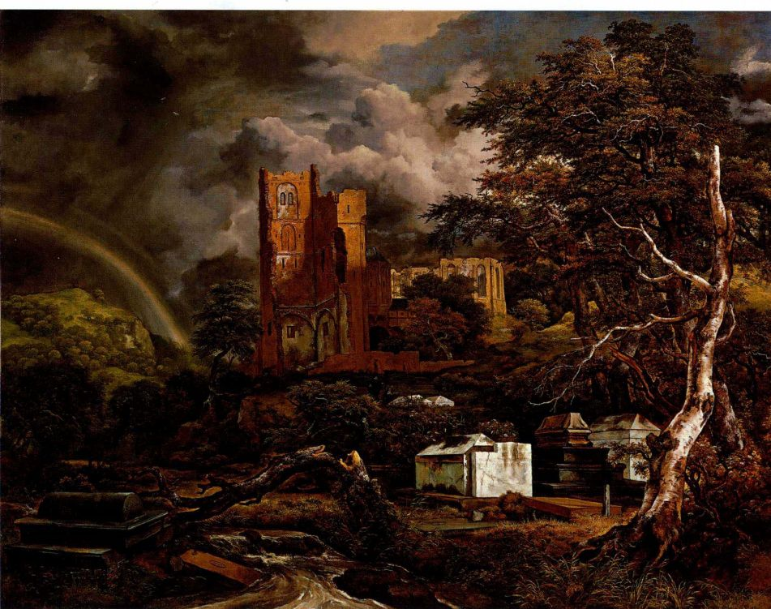

1\.42 × 1\. 89米。底特律艺术学院，底特律，密歇

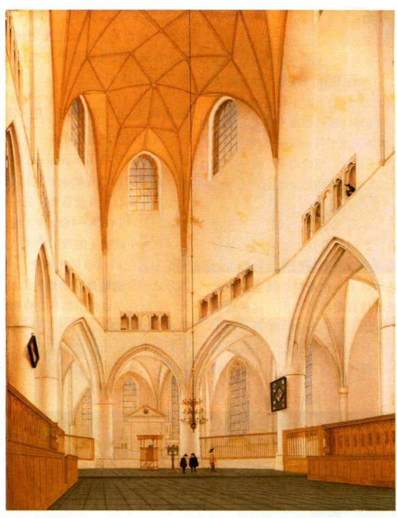

图20\.30 皮埃特·萨恩列达姆：《哈勒姆圣巴沃教堂唱诗班席内景》。1660年。木板油画，

70\.4 × 54\.8厘米。伍斯特美术馆（Worcester Art Museum），伍斯特，马萨诸塞。CharlotteE\.

W．Buffington 基金，1951\.29

20\.30）。前景处的漂白场上，来自国内外的亚麻经过清洗，被铺在太阳底下漂白。哈勒姆的水是出了名的纯净，这座城市也因此以亚麻漂白业和啤酒酿造业而闻名。

戏剧性强烈是雷斯达尔的《犹太墓园》（TheJewish Cemetery，图20\.29）最重要的特点，雷斯达尔作的几幅该遗址的素描也保存了下来。自然的力量是这片荒凉场景的主宰，除了阿姆斯特丹附近的这片犹太墓地之外，整个风景都是虚构的。正如我们在伦勃朗的作品（图20\.24）中见到的那样，整个17世纪，阿姆斯特丹都有犹太人居住\-其中来自德意志和东欧的犹太人常常较为贫穷，而不久前从巴西迁来的则更富有一些，从巴西来的犹太人原本在那里躲避西班牙宗教裁判所的迫害。这片名为生命之家（BetHaim）的墓地属于后一部分犹太人，即原先居住在葡

萄牙和西班牙的犹太人。每座墓都标明了死者的姓名，虽然整个墓地看起来像是古代遗迹，但它们全都是17世纪时才兴建的。雷斯达尔以这个墓地为对象画的几幅素描和其他艺术家创作的版画依然保存完好。犹太人在阿姆斯特丹属于外来者\-“异类”\-这可能也是此类主题流行的原因。当年来到阿姆斯特丹的外国人略带好奇甚至充满敬畏地拜访这个群体并用文字对其做过描述。

除了荒凉的景物是虚构的之外，雷斯达尔还在作品中加入了其他非现实的元素：背景中那座荒废的建筑据考证为艾格蒙德（Egmond）修道院（属于天主教），它暗示着犹太人与天主教徒之间的一种可比性（或互补的关系），在荷兰共和国，这两者都被归正宗取代了。所以，墓地、坟墓、崩塌的修道院废墟和死去的树木\-这种死亡的主题说明此画是纪念短暂人生的

724 詹森艺术史

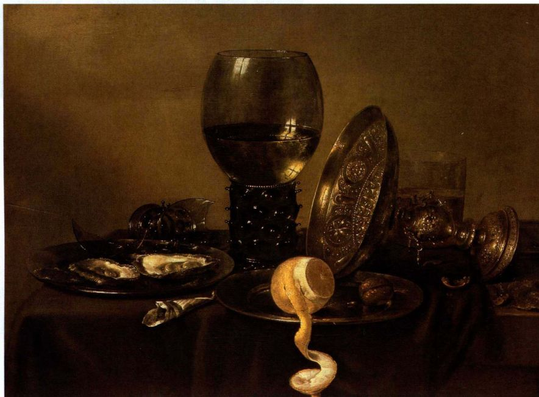

图20\.31 威廉·克拉兹·海达：《静物》。1634年。木板油画，	43 × 57厘米。博伊曼斯·凡布宁根博物馆（MuseumBoijmans\-van Beuningen），鹿特丹，荷兰

第二十章 尼德兰的巴洛克艺术 725

虚空画。“Vanitas”（虚空）一词出自《圣经·传道书》中的“虚空的虚空”一语。这是一篇关于时间流逝和必死的命运的经文，而这幅画也是以视觉形式对人生苦短的直观提醒。但画中有一道彩虹横跨墓地，这象征着上帝的允诺和救赎。《犹太墓园》所激起的那种敬畏感150年后成为了浪漫派“崇高”概念的基础。

建筑画与皮埃特·萨恩列达姆

与《犹太墓园》的戏剧性氛围和舞台化背景不同，许多油画、版画和素描描绘的是西班牙系犹太会堂和众多朴素的归正宗教堂内景。皮埃特·萨恩列达姆（Pieter Saenredam，1597\-1665年）的《哈勒姆圣巴沃教堂圣坛内景》（Interior of the Choir of St\.Bavo＇s Church at Haarlem，图20\.30）是他为画中的这座教堂创作的11幅作品之一，作品的本意并不限于单纯记录教堂的建筑。事实上，画中所展现的是一个有所夸张的教堂景象，让人感到这座中世纪建筑的内部比其实际更为巨大。萨恩列达姆创作这些画时下了很大气力。首先，他既画下教堂的内景素描，又通过测量画下教堂的精确图样。下一步，他把两者结合起来画出草图。最后才会正式画教堂，最后的作品中用到了测

绘图样中的准确细节，又有素描中的夸张成分增强作品的艺术效果。这座教堂在雷斯达尔的《哈勒姆附近的漂布园》（见图20\.28）中位于画面的中心。这张画表现的是教堂在新教时期一切陈设都被搬走且原有壁画都被粉刷后的样子，画面的异常平静使其具有了一种引人冥想的水晶般的纯净感。（萨恩列达姆和弗兰斯·哈尔斯百年以后都将葬于此处。）教堂内的小人儿提供了教堂建筑规模的参照，他们往往是故事中的角色。请注意右边那个从三联拱廊探出身子的男子。

静物画：威廉·克拉兹·海达

荷兰静物画常表现吃剩的食物和酒\-暗示着享乐\-和高脚水晶杯、大小不等的玻璃杯和银盘等奢侈品，选择这些题材入画是因为它们彼此形状各异、色调不一、纹理也各不相同。花卉、水果和海贝有时也会出现在画中。这一切都是静物画世界的一部分。从题材选择上看，荷兰的静物画与佛兰德斯静物画差别不大；克拉拉·彼得斯和扬·德·黑姆等许多艺术家当时也往来于两个地区之间。

哈勒姆艺术家威廉·克拉兹·海达（Willem Claesz\.Heda，1594\-1680年）对各种物体的表面和映像极

图20\.32 拉歇尔·鲁伊斯：《花卉静物》（FlowerStill Life）。1700年后。布面油画， 75\.5 × 60\.7厘米。托莱多美术馆，托莱多，俄亥俄。Libbey捐资购买，Edward Drummond Libbey赠，1956\.57

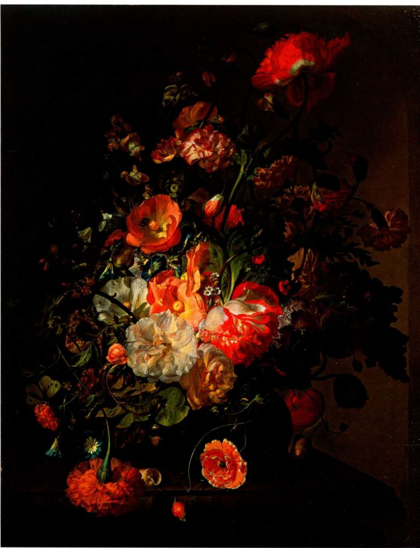

感兴趣，他的这幅《静物》（图20\.31）对此表现得淋漓尽致\-柠檬粗糙的边缘，稀溜、黏滑的牡蛎，玻璃杯上的闪光，窗户在玻璃杯上形成的多个映像，酒杯（roemer）上的滴粘饰（prunt），以及银盘上的雕花。海达就是因为作品中这些的光影效果而成名，而作品的色调使这种效果更加强烈：这幅画以单色为主，与同处17世纪中叶的扬·凡·霍延的风景画（图20\.27）极为相似。这两位画家的作品都与佛兰德斯画家克拉拉·彼得斯和扬·德·黑姆的彩色静物画（图20\.11和20\.13）形成了鲜明的对比。海达的画中，桌子上放着白酒、柠檬、牡蛎和一锥形瓶胡椒粉\-这件作品中出现的一点点珍奇开胃品\-尤其是牡蛎是众所周知的壮阳物。但打破的玻璃杯和打翻的银制高足盘暗示着画面所涉及的场景发生了某种突然变故。坐在桌边的人突然被迫离席。时间为这个画面垂下的

幕布似乎使这些物品蒙上了一层奇怪的感伤。构图的不稳定以及一丝去也匆匆的痕迹喻示着人生的短暂易逝与虚空。

花卉画与拉歇尔·鲁伊斯

独立的花卉静物画似乎起源于佛兰德斯，但它的发展则在南、北尼德兰都有。拉歇尔·鲁伊斯（RachelRuysch，1664\-1750年）是当时荷兰最重要的花卉画家之一，并在其有生之年就已声名卓著。鲁伊斯的艺术生涯漫长而且多产，她在阿姆斯特丹、海牙和杜塞尔多夫（Düsseldorf）都工作过，在杜塞尔多夫时，她与作为肖像画家的丈夫朱利恩·波尔二世（JuriaenPool II，1665\-1745年）珠联璧合，一同成为帕拉丁选帝侯（Elector Palatine）的宫廷画师，直至选帝侯去世。我们甚至可以说，鲁伊斯命中注定就是花卉

726 詹森艺术史

画家，她父亲是解剖学和植物学教授。鲁伊斯熟悉她画的每一朵花，每一只蝴蝶、蛾子和蜗牛。从《梅罗德祭坛画》（图14\.9）里的瓶中百合等早期作品中的花卉我们可以看出，花还可以具有超乎其外在之美的深意。图20\.32中，有的花还带着杂乱、失真的梗，它们构成了一片狂放的色彩。与海达的《静物》（图20\.31）中的破碎玻璃杯一样，鲁伊斯的这幅静物画中有的花已倒伏、低垂，暗示的也是虚空这一主题。

风俗画：扬·斯蒂恩

风俗画 17世纪末的风俗画还延续着原有的题

大事年表

1639年\-日本实施欧洲人隔离政策；允许保留一个荷兰贸易站

1655／60年\-雷斯达尔创作《犹太墓园》

1656年\-克里斯蒂安·惠更斯发明摆钟

1666年\-维米尔创作《情书》

1676年\-安东尼·凡·列文虎克首次在显微镜下观察到细菌

材，但也加入了更多的情节。这时的风俗画常表现家庭和客栈内景。人物大都不再为半身像，而被表现为全身像，即使画幅很小，这样也能产生更强的亲密感。从滑稽可笑到深刻内省，扬·斯蒂恩、扬·维米尔和

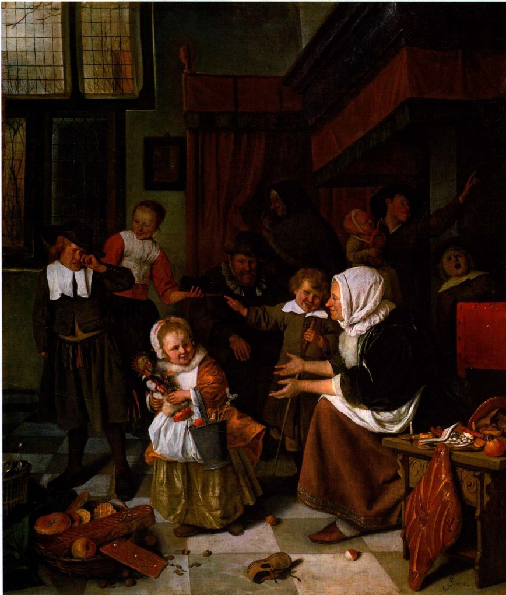

图20\.33 扬·斯蒂恩：《圣尼古拉斯节的宴会》。约1665\-1668年。布面油画，82 × 70\. 5厘米。阿姆斯特丹国家博物馆

第二十章 尼德兰的巴洛克艺术 727

42\.5 × 38\. I厘米。华盛顿国家美术馆，

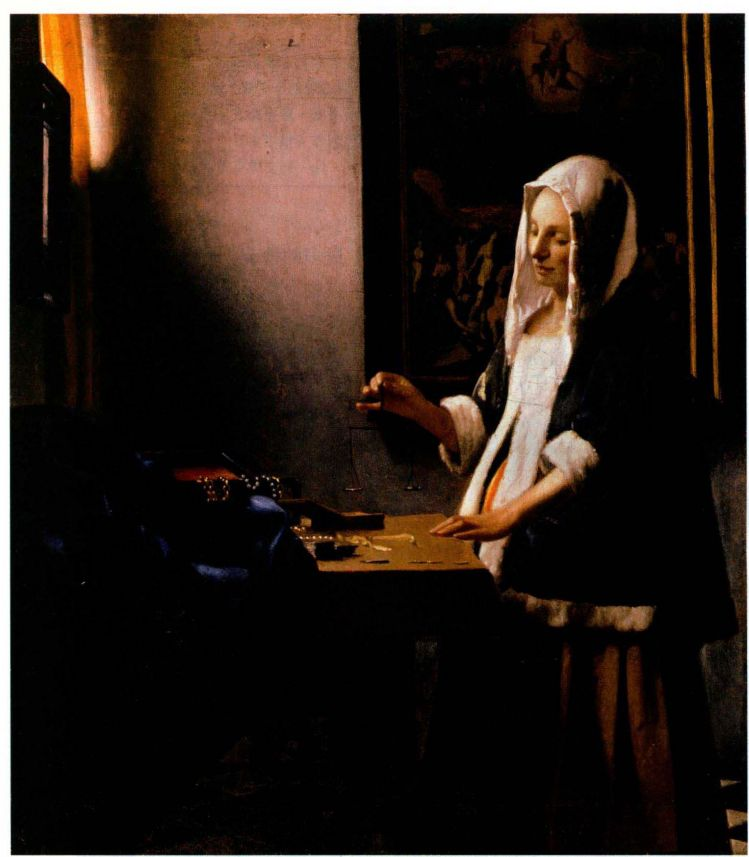

图20\.34 扬·维米尔：《持称女子》，约1664年。布面油画，

Widener藏品（1942\.9\.97）

杰拉德·特·伯赫的风俗画题材十分丰富，反映了17世纪人们的家庭、家族、人际关系乃至当时的社会风尚。扬·斯蒂恩（Jan Steen，1626\-1679年）的《圣尼古拉斯节的宴会》（The Feast of St\.Nicholas，图20\.33）既表现了一个滑稽的场景，又刻画了家庭关系的亲密。圣诞节前夕，圣尼古拉斯刚刚造访过这家人，给孩子们留下了玩具、糖果和糕饼。小女孩和小男孩都很喜欢自己得到的礼物。小女孩抱着一个施洗约翰模样的娃娃，拎着一个装满糖果的桶，小男孩则摆弄着一根高尔夫球杆和一个高尔夫球。每个孩子都兴高采烈，除了左边的那个哥哥，他只得到了一根用来责打淘气孩子的桦树条（由女仆拿着）。但他很快就会破涕为笑：坐在背景处的祖母招手叫他到床前去，那里藏着一个玩具。

斯蒂恩津津有味地讲述着这个故事，用许多令人

愉快的细节来修饰它。在荷兰所有的风俗画画家中，他的视角最为敏锐，也最有幽默感。为了增加收入，他曾开过一个小酒馆，这也许是他对人类行为的洞察力为何如此敏锐的原因。他对时间的选择和对人物的把握常让人联想到弗兰斯·哈尔斯（见图20\.16、20\.17和20\.18），而他的叙事方式则源于老彼得·布吕盖尔的传统（见图18\.38）。斯蒂恩也是个天才的历史题材画家，虽然他作品中的某些部分确实有诙谐的意味，但这些作品常常传达着严肃的寓意。《圣尼古拉斯节的宴会》就具有这样的内容：施洗约翰娃娃意在提醒人们，精神上的富足相对于物质财富的多寡更为重要，无论这些物质财富是多么令人愉悦。

隐私风俗画与扬·维米尔

相比之下，在代尔夫特艺术家扬·维米尔（Jan

728 詹森艺术史

图20\.35 扬·维米尔：《情书》。1665\-1668年。

布面油画，43\.8 × 38\.7厘米。阿姆斯特丹国家

博物馆

第二十章 尼德兰的巴洛克艺术 729

Vermeer，1632\-1675年）的艺术观念里，风俗画就没有明显的故事性。他画中的人物多为单个妇女，场景也似乎是正在独自一人忙于日常杂务的一个个私密瞬间。这些人物存在于一个永恒的“静物”世界之中，仿佛被咒语定住了似的。在《持称女子》（WomanHolding a Balance，图20\.34）中，一名穿着那个年代式样华丽的家居服装的年轻女子正凝视着手中的天平发呆，面前的桌子上散放着一串串珍珠和许多金币。作品呈现了一个静物世界\-画中的珍珠、黄金、图画和毛皮仿佛具有魔力，让我们看到了一个私密世界中永恒却又是刹那间的一幕，事实上，在画中的这个世界里，我们的观念是不被承认的。背景处的画描绘的是末日审判时的基督，那时每一个灵魂都要经过称量。这可能暗指女子腹中孩子的灵魂，那幅画中的场景与她本人的活动也相对应：她正在考虑腹中胎儿的未来。天平的秤盘曾经被认为盛的是金子或珍珠，但对此画的科学分析表明，其实里面什么都没有，只有点点阳光。这幅画的私密色彩浓厚，宁静祥和，但世俗感也极强，其光学效果使得作品表面微微发亮。

维米尔画中的光线常常来自作品左侧的窗户，它们在织物表面形成光斑，对光和映像的运用是其作品

的一大特色。这些特点使画面达到绝对和谐的效果，为了获得它们，古老的和新式的技巧画家似乎都用上了。维米尔可能用过暗箱（camera obscura），这是一种光学实验装置（照相机的前身），可通过暗箱内壁上的透光孔成像。这个孔是原始的透镜，暗箱外的景物通过它在箱内形成倒像。从这幅画中我们看不出维米尔是否临摹过这类影像，但他可能受到了它们的启发。这样的影像会闪闪发光，这种特点常出现在维米尔作品的局部（如这里的珍珠和天平上的光）。这些闪光的区域被称为“弥散斑”（dises of confusion）。暗箱在当时已为人们所熟悉，有相当多的证据表明，荷兰艺术家们曾经将其用于创作。而且，现代显微镜的发明者安东尼·凡·列文虎克也生活在这个时期，他就住在代尔夫特，这些都反映出当地人对实用光学的兴趣。

这种新的观看方式可以与只有一个灭点的单点透视这种老办法配合使用。有人已指出，维米尔的一些画上钻了一个洞（用来穿针线），以造出一个单点透视系统。图20\.34的灭点就在提着天平的那根粉红手指左边。它是确定画中所有元素平衡状态的基准。

维米尔对光的表现性的精通把他对外表真实的关

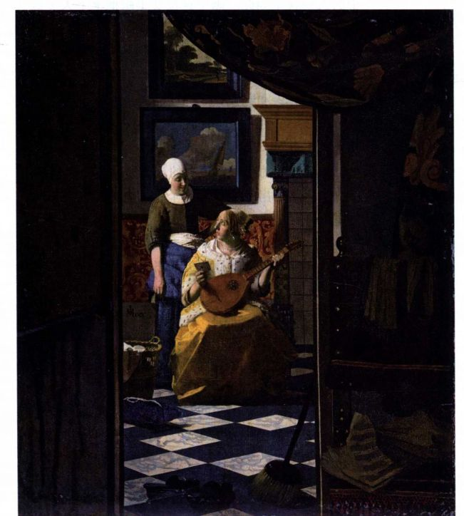

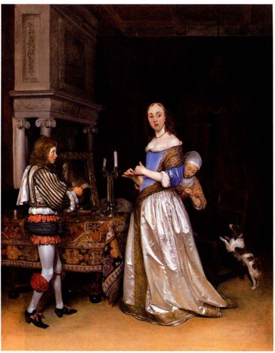

图20\.36 杰拉德·特·伯赫：《梳洗的淑女》。约1660年。布

面油画，76\.2 × 59\.7厘米。底特律艺术学院，底特律，密歇根。

Founders Society购，Eleanor Clay Ford基金、General Membership基金、

Endowment Income 基金和特别活动基金，65\.10

注提升到了诗意的层面。他关心光的所有视觉和象征意义。《持称女子》也是对艺术家宗教信仰的宣告：他是天主教徒（与扬·斯蒂恩一样），居住在信奉新教的荷兰，在那里，尽管在私人住宅中做礼拜还是被容许的，但他的信仰在公开场合下是官方禁止的。

与维米尔同时代的一个人曾谈到，他看过“他［维米尔］的一些作品，他的技艺最特别、最奇妙之处在于透视法”。这位评论者所说的一定是《情书》（TheLove Letter，图20\.35）或类似的画，在这些画中，艺术家利用花瓷砖地板和门使透视法的效果显得格外突出。而且，在X光下，我们也确实能观察到针孔处的灭点。这幅画的主题涉及三重隐私\-女子与情人（情书发信人）之间、女子与女仆（递给主人这封私人信件）之间、我们与这个场景（我们凝视着\-也许是窥探\-这个场景）之间。

情书作为绘画主题在17世纪很常见。图20\.35中收信的女子身着华丽的貂皮和缎子衣服，佩戴着珍珠饰品，坐在一幅海景画的下方。根据象征文学，这幅场景代表女子的爱人身在远方，情书由海路寄来。

鲁特琴是一种充满性意味的乐器，传统上象征恋人间的鱼水和谐。女子饰有貂皮的黄色缎子披肩以及珍珠耳环和项链也出现在维米尔另外的至少三幅画中。在他死后整理出的财产清册中曾经有一件白毛褶边的黄色缎子紧身上衣，它可能就是一件绘画道具。

但在某种程度上，所有这些事实还是没能触及维米尔绘画那种神秘的、催眠般的、真正新颖的特性。我们不知道维米尔的老师是谁，也不知道他是如何形成自己的独特风格的。扬·凡·爱克之后，没有一个画家能像维米尔那样专注地去看。没有哪个画家用这种严谨但个性化的方式记录自己的所见。

杰拉德·特·伯赫的精致风俗画

杰拉德·特·伯赫（Gerard ter Borch，1617\-1681年）的作品也许是荷兰最优雅甚至最精致的风俗画，这位画家在小城兹沃勒（Zwolle）工作，但曾在荷兰（他在哈勒姆和阿姆斯特丹都工作过）和欧洲四处游历。他出身艺术世家，但关于他的赞助人或业务，我们知道得很少。特·伯赫画肖像画和风俗画；他的这两种画多为小型画（大概只有笔记本那么大），但画中人物却是全身像，而且穿着最时髦的衣服。《梳洗的淑女》（Lady at Her Toilet，图20\.36） 中的人物就是如此。画中这位女士跟他笔下大多数女性一样，身穿缎子衣服，特·伯赫以刻画绸缎这种精美而奢华的织物而闻名。通过划分出对比极为强烈的明暗区域，艺术家便可表现出织物的质感，而让绸缎长裙垂至地板和鞋扣，则绸缎的特点可以表现得更逼真。图20\.36中的这身衣服在另一幅画里的女主人公身上也出现过，这种重复说明，特·伯赫事先画了些可以反复使用的图样。画中的人物站在一个似乎是17世纪末风格的房间里，但这个房间有可能是虚构的，它里面有一个大理石四柱壁炉，背景处放着一张有罩篷的床。画中还有一张铺着土耳其织毯的桌子和一名衣着艳丽的男僮（类似装束的男僮或信使也在其他同时代艺术家的画中出现过）。房间的朴素凸显了女子的新潮和时髦，她看上去与维米尔的《情书》（图20\.35）中的女主人公同样富有，但优雅却要胜过后者。女主人公的女仆正在整理她的衣服。一面镜子镶在当时流行的镀金框中，镜中照出了女子的侧面；实际上，从那个角度是看不到她的。提香、武埃和布歇都创作过以“梳妆的维纳斯”为题材的作品（见图17\.30、21\.3和22\.5），但这个女子是一个现实中的维纳斯，她惊人的美貌由四周的一切装饰物映出。这幅画预示着18世纪荷兰人生活的豪华和富丽。

730 詹森艺术史

小结

17世纪，由于宗教和政体不同，南尼德兰（常被称为佛兰德斯）和北尼德兰（后来的荷兰共和国，常被称为荷兰）分立进而分裂，两个地区的艺术赞助也因此而分化。西班牙统治下的佛兰德斯信奉天主教，荷兰共和国的主流宗教则是归正宗。所以，由大型订制项目提供资金的天主教祭坛画都在佛兰德斯制作，而风俗画、静物画和风景画在佛兰德斯虽然也有人画，但它们却是荷兰艺术最重要的题材。佛兰德斯和荷兰都涌现出了许多肖像画\-市民警卫队肖像成为荷兰的重要题材。艺术家频繁往来于两地之间。

佛兰德斯

彼得·保罗·鲁本斯及其画坊主宰着佛兰德斯艺术。鲁本斯是安特卫普艺术的领袖，在那里他开创了巴洛克风格。这种风格又通过画坊中的艺术家个人和合作项目传播开来。鲁本斯的画气势恢弘，充满了活力和表现力。他从意大利回国后，基本上把意大利巴洛克风格的气势和活力带到了北部欧洲。他的作品中也可以看到米开朗基罗、卡拉瓦乔和提香的影响。鲁本斯较重要的订制作品多为祭坛画以及为意大利和法国富有的统治者所作的肖像画，包括玛丽·德·美第奇组画。鲁本斯画坊里的艺术家或是他作品的完成者和合作者，或是后来独立创作，完成他们自己接到的重要订单。

鲁本斯的助手安东尼·凡·代克主攻肖像画和历史画。他也去过意大利，但后来成了英格兰查理一世的宫廷画师。他的画以优雅和色彩效果而著称，后者受过提香的影响。

佛兰德斯静物画有多种形式：既可作为人物画的背景，也可以是独立的作品。扬·布吕盖尔和鲁本斯创作的一幅

关于五种感官的画是人物画与静物画珠联璧合的典范。克拉拉·彼得斯的作品都是独立静物画，题材既有花卉也有食物。弗兰斯·斯奈德斯创作野味静物画，扬·德·黑姆绘制繁复精细的（豪华）静物画。

荷兰共和国

荷兰共和国的绘画集中在乌得勒支、哈勒姆、阿姆斯特丹和代尔夫特这几个城市里。亨德里克·特布吕根等乌得勒支艺术家多为卡拉瓦乔的追随者。哈勒姆艺术家主要创作肖像画和风俗画\-在笔法和人物塑造上都有创新，这种创新在弗兰斯·哈尔斯的单人像、双人像和群像画中就有所反映。他的市民警卫队肖像画具有革命性的意义。弗兰斯·哈尔斯也拥有众多追随者，但他们比鲁本斯的追随者更为独立。朱迪思·莱斯特就是其中之一，她是一位风俗、肖像和静物画家。

伦勃朗及其画派在阿姆斯特丹绘画界占有统治地位。伦勃朗创作了许多历史画、肖像画和蚀刻版画。他以对人物内在人格的刻画和对某个场景或瞬间所隐含的悲怆力量的揭示而著称。他的作品以动人而闻名。

市场：风景画、静物画和风俗画

风景、静物和风俗画是荷兰绘画艺术市场的主要组成部分。许多风景画的创作灵感来自真实的风景，我们可在扬·凡·霍延和雅各布·凡·雷斯达尔的作品以及皮埃特·萨恩列达姆的建筑画中辨认出这些地点。荷兰静物画与佛兰德斯静物画的相似之处是，它们在17世纪初时比较朴素简洁，后来则变得更加精细复杂\-如拉歇尔·鲁伊斯的花卉静物画。维米尔对风俗画的贡献在于，他的作品多为单个人物独处，以此表现出强烈的隐私感。扬·斯蒂恩和杰拉德·特·伯赫是17世纪下半叶比较重要的风俗画家。

第二十章 尼德兰的巴洛克艺术 731

