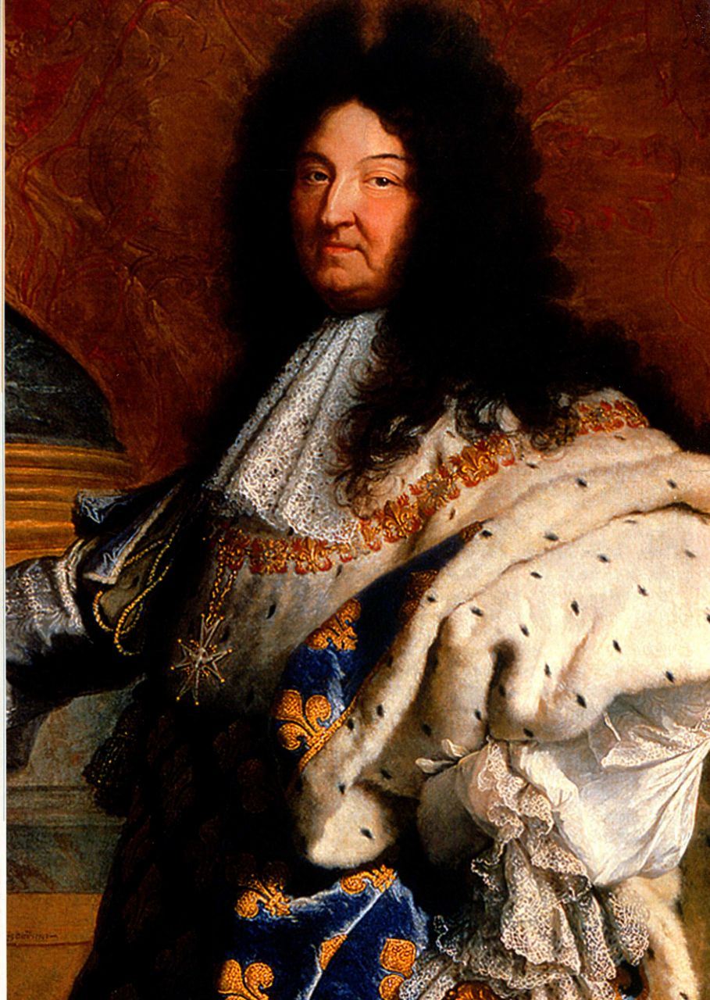

第二十一章 法国和英国的巴洛克艺术

在风云动荡的17世纪，法国和英国这两个君主制国家经历了剧变，前者由专制统治者（absolute ruler）领导，后者则由与议会分享权力的君王统治。两国在前一时期的宗教战争和王朝斗争中遭受了重创，国库消耗严重，人口急剧减少，社会发生了剧烈的分化。在这个时期，作为之前宗教改革与反宗教改革

特点的神学论战仍在继续，天主教成为法国的主流宗教，而新教则在英国取得了统治地位。

每一任法国和英国君主都既努力使这些互相对抗的力量达到微妙的平衡，又试图支持自己所选择的宗教。整个欧洲的情形都是如此，但单个的小冲突最终汇集成一场几乎席卷所有国家的兵燹\-三十年战争（1618\-1648年）。

英国面临着更多的剧变，因为国王正在与议会进行激烈的斗争。1642年，局势恶化，内战爆发，结果是国王查理一世受审，并于1649年因叛国罪而被斩首。君主制被废除后，清教徒克伦威尔被任命为国家元首和护国公。由于其本身还带有君主制的弊端，他的统治逐渐变成了一种独裁政治。1658年克伦威尔死后，他的政府马上就陷入了混乱。两年后的1660年，议会把王位封让给那位被砍头的国王的儿子查理二世（Charles II，1649\-1685年），众所周知的王政复辟时期开始了。不幸的是，旧有的宗教对抗和经济危机仍未消除，查理二世的继任者詹姆斯二世（JamesII，1685\-1688年在位）的统治很快陷入了危险境地。在所谓的1688年光荣革命中，这是一个相对温和并

无流血的事件，属于执政阶层的辉格党人和托利党人宣布荷兰共和国统治者、联省执政奥兰治亲王（Princeof Orange）为英国国王，他就是1689到1702年在位的威廉三世（William III）。1689年的《权利法案》确立了议会的无上权威，创造了一种独特的政体，它将逐渐影响世界各国，尤其是北美的英属殖民地。

战争极易蔓延，若要取胜就需要一个高效的政府体系，而且欧洲各国的君主很快就意识到统一国力、控制经济的迫切需要。法国于17世纪中叶一跃成为欧洲在军事和文化方面最强大的国家，路易十四（LouisXIV，1638\-1715年）相当成功地实现了这种中央集权。路易重提古老的君权神授思想\-即君主的权力直接得自上帝这一观念\-目的是通过控制贵族、课税增收和约束地方势力来增强国力。他依靠的是一种名为专制主义的君主政体，这种政体将全部权力赋予君主。法国的专制君主制不同于英国的君主立宪制，君主立宪制是在统治者和其他机构之间分割权力，议会的地位最为重要。但所有的欧洲君主国在一定程度上都具有神权观念。为了维护法国的优越地位，从1688到1713年，路易十四针对他的对手西班牙、

图21\.10细部，亚森特·里戈：《路易十四像》

第二十一章 法国和英国的巴洛克艺术 733

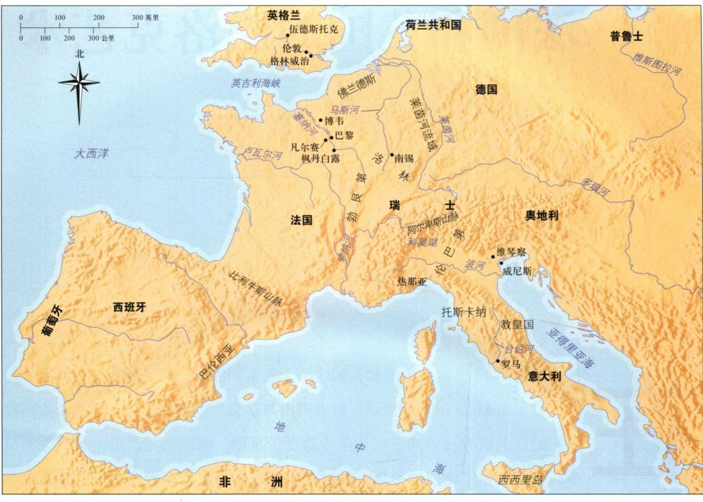

地图21\.1 17世纪的欧洲

荷兰共和国、德意志和英国采取了一系列军事行动。虽然最终战败，但法国在1715年路易去世时仍是一个世界强国。

在战争和社会动乱中，付出最惨重代价的也许是农夫和平民，他们在不断增长的税赋、破坏性的自然灾害以及随之而来的食物短缺、饥荒和物价上涨的打击下几近破产。城乡暴动频频爆发，但这类反抗注定要被政府残酷地镇压。不过，尽管一些社会成员一贫如洗，但其他人还是享受到了新的财富和成功。英法两国都从对殖民帝国的冒险中赚取了巨额利润，它们还开发了能运送更多种类商品的贸易路线，这些商品改善了全欧洲人的生活方式。由于重商主义和全球市场的发展，一个日益富有的城市商人阶层崛起了，他们四处搜罗艺术品，用来布置和装饰自己的居所。

在新兴的首都巴黎和伦敦（见地图21\.1），市政扩展工程正在开展，建筑工程尤其引人注目，其宏伟风格象征着国家的财富。17世纪末，巴黎作为欧洲的艺术中心，已能与罗马分庭抗礼。法王亨利四世（1589\-1610年在位）、路易十三（1610\-1643年在位）和路易十四（1643\-1715年在位）在雄心勃勃且富于才干的大臣和顾问的辅佐下，为这一激动人

心的转变营造了良好氛围。法王的大臣和顾问包括苏利公爵（Duc de Sully）、枢机主教黎塞留（Richelieu）和马萨林（Mazarin），以及让\-巴普蒂斯特·柯尔贝尔（Jean\-Baptiste Colbert）。国王和官僚都承认艺术表现君权之威严的强大能力，于是他们开始了一项囊括所有人文和科学学科\-绘画、雕塑、建筑、景观设计、装饰艺术、理论和应用科学、哲学和文学\-的庞大赞助计划。特别是路易十四，他利用艺术来宣传他的专制主义政策。他采用了太阳和希腊神祇阿波罗这两个象征意象，所以人称太阳王。这一象征使路易拥有了古老的血统，这样的血统适合他作为专制统治者所持有的原则。他下令创作肖像画并兴建建筑，其中体现出的光荣理念反映了他的愿望，使自我统治的最高权威具体化，并由此让法国的王权具体化。

这一时期，英国和法国的宫廷充当了艺术最大的赞助人。艺术史家几乎全都把古典主义风格与这两个国家联系在一起。通过对古典语汇\-从建筑上的立柱、柱式和三角楣到绘画中的服装式样\-的运用，古典主义体现了对古代世界的一种回应，它对古罗马帝国宏大风格的再现暗示着权威、秩序和持久的传统。虽然晚期枫丹白露画派的风格主义在法国一直持续到

734 詹森艺术史

1625年左右（见第625\-627页），但古典主义很快就成为17世纪法国艺术的标志。1660至1685年间，即路易十四统治的鼎盛期，它成为法定的宫廷风格。古典主义原则也支配着建筑领域，新建的卢浮宫和凡尔赛宫代表了法国巴洛克古典主义最突出的成就。

在英国，古典主义也支配着艺术和建筑领域，特别是伊尼戈·琼斯和克里斯托夫·雷恩爵士设计的医院、教堂和村居。1666年伦敦大火之后，在为了重建城市而进行的庞大的修复工程中，建筑蓬勃发展。但17世纪英国永久的艺术成就在文学方面：既诞生了威廉·莎士比亚、约翰·邓恩（John Donne）和约翰·弥尔顿（John Milton）的著名作品，也有皇家委员会翻译的《钦定本圣经》（King James Bible）。

法国：路易十四风格

因为凡尔赛宫及其他大型建筑工程为法国国王歌功颂德，我们很容易把路易十四时期的法国艺术看作是专制统治的表达方式。对于1660到1685年这段时间，这种感觉是正确的，但那时，17世纪法国绘画和雕塑都已具有了突出的古典特征。法国的历史学家不愿把这种风格称为巴洛克，而是称其为路易十四风格（Style of Louis XIV）。他们也用这个术语来描述路易十四之前的艺术，尤其是他父亲路易十三时期的宫廷艺术。另外，学者们常用“古典的”这一词语形容这个时期的艺术和文学。在这种背景下，该词有三重含义。它是“最高成就”的同义词，暗示着路易十四风格相当于意大利的盛期文艺复兴或古希腊的伯里克利时代。它还指对古希腊罗马的形式和题材的模仿。最后，这一词语表明了古代艺术和文艺复兴所共有的平衡和克制特质。后两个含义所描述的可被更为准确

地称为古典主义（classicism）。由于路易十四风格与意大利巴洛克艺术相似，虽然有所更改，但我们仍可称它为巴洛克古典主义。

法国油画和版画

在法国工作的众多外国艺术家从该国风格和传统中寻求灵感，而法国艺术家则常常去意大利和尼德兰工作。路易十三希望召集一批能够在法国建立巴洛克风格的中坚艺术家，于是他开始以官方名义将这些艺术家召回巴黎。被召的艺术家包括一直在罗马进行创作的画家尼古拉·普桑和西蒙·武埃，以及从佛罗伦萨回到其法国北部的家乡的版画家雅克·卡洛。

雅克·卡洛：一个过渡人物 17世纪初最重要的艺术家之一是蚀刻版画家、雕版画家雅克·卡洛（Jacques Callot，1592\-1635年），他记录真实经历的小型版画启发了他的同胞乔治·德·拉图尔（将在后面讨论）和年轻的伦勃朗。卡洛对材质产生刺目的色调对比和复杂细节能力的探索反映了源于15世纪用批量生产的版画传播信息的传统。但他对当代人物和事件的生动刻画为他在当时的艺术界确立了稳固的地位。在他早期职业生涯的大部分时光中，卡洛主要为佛罗伦萨的科西莫二世·德·美第奇（Cosimo IIde＇Medici）宫廷服务，他在那里创作的版画，灵感主要来自戏剧，特别是即兴喜剧。1621年回到家乡南锡城（Nancy）之后，卡洛开始把几乎全副精力放在蚀刻技法上，他作品的题材也发生了变化。1626年，即布雷达的荷兰守军投降（见图19\.36）后不久，他游览此地，并制作了六块印版来表现它的全景。

卡洛对战争的人性和政治状况的洞察力最充分地体现在《战争的巨大创伤》（The Great Miseries ofWar）系列蚀刻版画中，这个系列表现了他对三十年

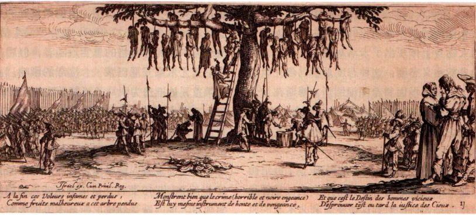

图21\.1 雅克·卡洛：《绞刑树》，选自《战争的巨大创伤》。1633年。蚀刻版画，9 × 23厘米。伦敦大英博物馆

第二十一章 法国和英国的巴洛克艺术 735

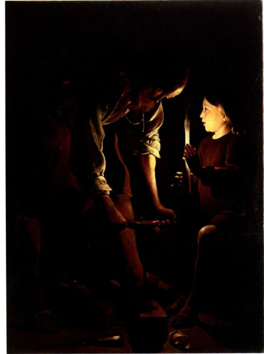

战争感受的积淀（学者们曾认为卡洛是1633年创作这个系列的，但现在他们认为创作时间是1629年到1632年）。在该系列的18幅蚀刻版画中，卡洛揭露了侵略军带来的苦难、破坏和贫困。有几幅专门讲述士兵犯下的罪行，而另一些，包括《绞刑树》（Hangman＇s Tree，图21\.1），则着重关注对施加暴行的法国军队的惩罚。画面底部的题字写道：“最后，这些被遗弃的卑鄙窃贼像一片片倒霉的果子一样吊在树上，他们迟早会感受到上天的公正。”尽管画幅很小（只有20多厘米），但画中有近50个人物。不协调的透视关系强调的是小而细长的风格主义的人体；但在右方的人物身上体现出了卡洛对服装式样和人物姿势所持的自然主义态度，这种态度是新巴洛克风格的特点。这个凄凉的场面和希罗涅缪斯·博斯在《尘世乐园》（图14\.24）中描绘的地狱景象一样令人不安，而且可能程度更甚，因为它的基础是艺术家本人对战争惨状的体验。

乔治·德·拉图尔与卡拉瓦乔的影响 17世纪初的许多法国艺术家都受到了卡拉瓦乔的影响，尽管我们仍不清楚他们是如何接触到这位意大利艺术家的风格的。他们大部分是在法国各省辛苦工作的二流艺术

图21\.2 乔治·德·拉图尔：《木匠约瑟》。约1642年。布面油画，130 x 100厘米。巴黎卢浮宫

家，但有几位艺术家形成了极富原创性的风格。其中最优秀的是乔治·德·拉图尔（Georges de La Tour，1593\-1652年），但他的重要性在19世纪才得到承认。虽然拉图尔在法国北部的洛林（Lorraine）从事他的事业（因此同样是三十年战争的直接受害者），但他绝不是个一般的乡土艺术家。除了被任命为国王路易十三的画师之外，他还承接洛林省长的重要订件。从业之初，他创作别具一格的风俗画，后来转向对天主教教义的信徒有吸引力的宗教画，天主教是当时法国的主要宗教。他的用光和对注重细节的写实技法的依赖主要得自卡拉瓦乔的北部欧洲的追随者（见第711页），他可能曾在荷兰共和国拜访过这些艺术家。

拉图尔成熟的宗教画有效地表现了基督教教义中深奥的神迹。《木匠约瑟》（Joseph the Carpenter，图21\.2）的每个细节都经过了仔细的观察，人物看似卑微，所以起初人们也许会误认为这是一幅风俗画，但其中蕴含的虔诚精神很快就打动了我们。画中的两个人物呈侧面像，所以我们难以看到他们的表情。拉图尔赋予了每个手势和表情最大的深意。男孩耶稣举着一支蜡烛，烛火强化了虔诚的氛围，使画面充满亲密、柔和的感觉，这是艺术家最喜欢的一种手法。这幅画有卡拉瓦乔《召唤圣马太》（见图19\.2）的那种力量，但简化的形式、暖色和停滞的运动是拉图尔笔下沉静、焦点明确的宗教幻象的特色。

西蒙·武埃与装饰风格 虽然西蒙·武埃（SimonVouet，1590\-1649年）成为了在罗马的法国卡拉瓦乔主义画家的领导者，但他在整个艺术生涯中使用了多种风格进行绘画创作。早年，他陪同他的艺术家父亲去过英国和君士坦丁堡，但他最重要的异国之旅是罗马。1613年到1627年间，他在罗马生活。在那里，他成为卡拉瓦乔风格的忠实追随者，但后来也受到波洛尼亚艺术家安尼巴莱·卡拉奇的影响。武埃非常受人敬重，被推选为罗马圣路加学院的院长。1627年路易十三以官方名义将他召回法国后，他定居巴黎，成为当时最重要的画家。武埃很快就摆脱了卡拉瓦乔风格的一切痕迹，发展出一种华美的风格。这种风格赢得了极高的赞誉，所以他被任命为国王的首席画师。17世纪30和40年代，法国的正式风格就诞生于武埃的画室。他的画受到威尼斯艺术家的影响，以其鲜艳的色彩和用光而著称，从而为皇家住宅和数量不断增

736 詹森艺术史

图21\.3 西蒙·武埃：《镜前的维纳斯》。约1640年。布面油画，165\.7 x 11 4\.3厘米。卡内基美术馆，匹兹堡。Horace Binney Hare夫人赠

加的法国贵族宅邸的内部形式提供了一种新的、鲜亮悦目的装饰风格。

《镜前的维纳斯》（The Toilet of Venus，图21\.3） 可能是为国王的一个情妇所作，是武埃就此题材创作的数幅画作之一。这个题材流行于威尼斯，脍炙人口，提香和韦罗内塞也创作过此类作品，鲁本斯也曾涉足这个题材。女主人公让人想到柯勒乔的《朱庇特与伊俄》（图17\.24），但她身上没有后者那种赤裸裸的色情。相反，武埃让他的维纳斯充满了法国独有的优雅美感。对连续的涡旋的圆形的运用、近乎全裸的人体、对织物的兴趣和明亮的色彩，这一切只暗示着性爱，这个主题的吸引力将一直保持到18世纪，成为绘画中洛可可风格的基础。武埃还是新一代艺术家的老师，包括为路易十四的凡尔赛宫工作的艺术家、景观设计师和皇家园艺师安德烈·勒诺特尔以及后来建立法兰西皇家学院的皇家画师夏尔·勒布仑（他拒绝让自己的老师成为院士）。

尼古拉·普桑与巴洛克古典主义 尽管之前有武埃对绘画的影响，但17世纪40年代以后，古典主义在法国占据了至高无上的地位。对古典主义的兴起贡献最大的是尼古拉·普桑（Nicolas Poussin，1594\-1665年），他是17世纪最具影响力的法国画家之一。但除了在巴黎逗留过失意的两年之外，普桑的整个职业生涯都在罗马度过。在罗马，他款待并教导来访的法国艺术家，吸收拉斐尔和卡拉奇古典式绘画构图的经验，发展起自己的理性古典主义风格。赞助人把普桑的画带回法国，这些作品对法国宫廷产生了影响。事实上，17世纪60年代，在制定法兰西皇家学院的课程时，国王的最高顾问让\-巴普蒂斯特·柯尔贝尔和艺术家夏尔·勒布仑选择普桑的古典主义风格作为法国艺术家模仿的典范。但后来，普桑与武埃的竞争旷日持久，他们相异的传统之间的较量贯穿到了下一个世纪，你方唱罢我登场，哪一方都无法长期占据上风。

普桑与历史画：宏大风格的古代题材 1624年初，普桑经威尼斯到达罗马，并开始学习透视法和解剖学，研究古代雕塑，如《拉奥孔》、《观景楼的躯干》（The Belvedere Torso）和《观景楼的阿波罗》，以及古代石棺和陶瓶上的浮雕，还有拉斐尔的绘画。《罗马将军之死》（The Death of Germanicus，图21\.4）反映了他的大部分学习成果。在接下来的两个世纪中，

这件作品将成为对豪壮的临终场景进行艺术描绘的一个范本，事实上它也可能是艺术史上这一题材的首例。它是一幅典型的历史画，讲述了死亡、忠诚和复仇这几个极具震撼力的主题。故事出自塔西佗（Tacitus）之手，19世纪才定型。日耳曼尼库斯（Germanicus）是一位罗马将军，指挥过抗击日耳曼部落的战役。在提比略的怂恿下，日耳曼尼库斯的养父，也就是叙利亚的统治者，毒死了这位实力强大的将军。普桑描绘了他生命垂危时的情景，在他的左边，忠诚的士兵们在发誓报仇，他的右边则是陷于悲痛的家人。复仇的许诺被安排在画面中央，引人注目，而人物则用手势表达出他们的悲伤、忠诚和痛苦。被这两群人围住的日耳曼尼库斯成了构图的焦点，该画的构图效仿了描绘墨勒阿革洛斯之死的古代作品（见图7\.62）。建筑物为人物活动提供了一个舞台，这些人被水平地排列在一个长方形空间里，就像在古希腊罗马檐壁中那样。后方的床帷把人物活动限制在一个不深的空间内，增强了戏剧性，营造出一个更为紧密的环境。

普桑的这件早期作品是他抵达罗马仅几年后绘制的，大概是为枢机主教弗朗切斯科·巴贝里尼的秘

第二十一章 法国和英国的巴洛克艺术 737

原始文献

尼古拉·普桑（1594\-1665年）

选自一份年代不明的手稿

普桑的艺术观点对于1648年法兰西学院的建立起到了关键作用，而且由于这座学院的卓越声望，他的艺术观点也对17到19世纪整个欧洲的美术学院的活动产生了重大影响。

崇高样式包括四个方面：主题或题目、观念、结构和风格。第一个要求是其他所有要求的基础，即：主题或题目须宏大，如战争、英雄行为和神圣事件。然而，如果画家所着手的题材宏大，他首先必须全力避免沉湎于琐碎的细节，以免损害故事的庄严。他应该大胆描绘高尚和重要的细节，摒弃一切粗俗、内容贫乏的东西。所以，画家不仅要巧妙地构思主题，还应有明智的头脑，能充分领会题材，并选择自然地适于修饰和完善题材的细节。挑选卑劣题材的人以

题材为庇护，因为他们缺乏创造力。因此，懦弱应遭到鄙视，低劣的题材也应被人唾弃，对于这样的题材，多少技巧都是无用的。至于观念，它只是专注于万物的精神的一部分，就像荷马和创作奥林匹亚宙斯雕像的菲迪亚斯所实现的那种观念，而宙斯在点头之间就能令宇宙震颤。对物的描绘应表达出物本身的观念。结构或局部的构成方式不应用心研究，不应费力追求或设计，而是应尽可能顺其自然。风格即作画绘图的某种特殊方法，它以独特的方式得到实现，实际运用及理念使用过程中起作用的非凡才能产生了这种方式。风格以及态度和品位都源自天然、发自内心。

SOURCE:ALAIN MEROT,NICOLAS POUSSIN\. TR\. BY FABIA CLARIS \(LONDON: THAMES AND HUDSON LTD\.,1990\)

书卡西亚诺·达·波佐（Cassiano dal Pozzo，1588\-1657年）制作的，此人是一个重要的艺术赞助人。这幅画的构图、背景和英雄主义历史题材（见本页的原始文献）是典型的普桑的古典主义风格。

《劫夺萨宾妇女》 《劫夺萨宾妇女》（TheAbduction of the Sabine Women，图21\.5）既表现了普桑对古典主义的忠实，也展示了他的理性风格的严格规定，他的这种风格是为了回应他所认为的盛期巴洛

克的过度之处（见第671页）而发展起来的。立体感很强的人物像雕塑一样“凝固在活动中”。实际上，这些人物有许多由希腊化雕塑而来，但主要的一组人物受到了乔瓦尼·博洛尼亚的《劫掠萨宾妇女》（图17\.10）的直接启发。普桑把他们放置在经过复原的古罗马建筑前面，他相信这些复原在考古学上是正确的。夸张的姿势和表情充分地展现了情感，但这种情感不是自发的，所以无法打动我们。整个场景像是在

图21\.4 尼古拉·普桑：《罗马将军之死》。1627\-1628年。布面油画，

斯艺术学院，明尼阿波利斯，明尼苏达。William Hood Dunwoody基金，58\.28

1 47\.96 × 198 \.1 2厘米。明尼阿波利

738 詹森艺术史

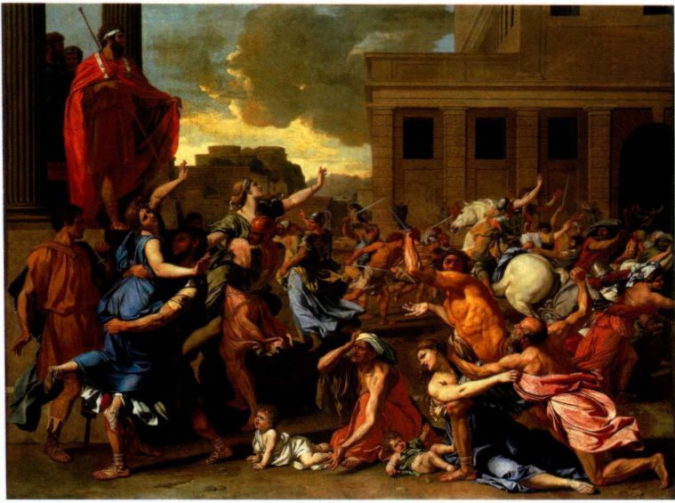

图21\.5 尼古拉·普桑：《劫

夺萨宾妇女》。约1633\-1634

年。布面油画，1 \.54 x 2\.09米。

纽约大都会艺术博物馆。Harris

Brisbane Dick基金，1946年

演戏，这种特点的产生是有充分理由的。开始作画之前，普桑把小蜡像放在一个像舞台一样的小底座上摆来摆去，直至得到他满意的构图为止。

今天，普桑作为一个了解自身想法的艺术家给我们留下了深刻的印象，他向朋友和赞助人陈述自己观点的大量信件可证实这一印象。他认为，绘画的最高目标是表现高贵和严肃的人类行为。甚至《劫夺萨宾妇女》也体现了这一点，这幅画的主题曾被许多人称赞为确保古罗马未来的爱国行为。根据李维（Livy）和普鲁塔克的记述，这些萨宾人是被罗马人绑架为妻的年轻妇女；这些妇女后来在对立双方之间充当了调停人。显然，她们并不愿意顺从，因为剑已出鞘、儿童沦为弃儿、老人饱受苦难。但普桑对这一切显然持超然态度，缺乏同情，使这件作品被贴上了英雄主义的标签。他诉诸理智，即更开阔的历史观，而不是感官。普桑抑制色彩，突出形式和构图。他相信观众必定“理解”每个人物的情感，因为他们都与故事有关。之后的历史证明这样的信念对他的学生夏尔·勒布仑产生了很大影响，勒布仑为法国绘画确立一种得到公认的宫廷风格。

这些观点并不新鲜。我们回想起贺拉斯的箴言“诗如画”，以及达芬奇关于绘画的最高目标是描绘“人类灵魂的意图”的声明（见第561页）。然而，在普桑之前，没有哪个艺术家在绘画与文学之间做过这样的类比，或如此一心一意地将这种相似性付诸实践。他的方法解释了《劫夺萨宾妇女》中使画

面显得如此冷漠的那种视觉修辞法。有关这一题材的素描初稿（图21\.6，这幅素描实际上是为此画的另一个版本而作的）表明艺术家深思熟虑的过程。普桑和鲁本斯一样，用鹅毛笔、墨水和淡彩预先设计出许多作品的构图。在这个例子里，他把人物放置在前景处，古建筑则作为活动场所被安排在背景之中。这种思路与卡拉瓦乔和卡拉瓦乔主义者的方法形成了强烈的对比，他们坚持“根据自然”作画，也就是说，根据活的模特作画，无需初稿为助。普桑认为历史画对智力的要求更高，是从想象力生发

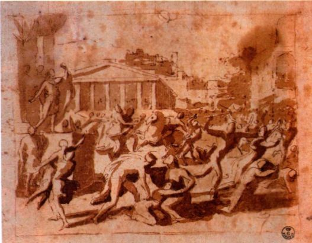

图21\.6 尼古拉·普桑：《劫夺萨宾妇女》。约1630年。水墨素描，16\. 1 × 20\.7厘米。设计与版画档案馆，佛罗伦萨乌菲齐美术馆

第二十一章 法国和英国的巴洛克艺术 739

出来的。普桑可能认为这些差别是显著的，也许还是无法理解的，据说他曾对当时的一个人说：“卡拉瓦乔来到世上就是为了毁灭绘画。”

普桑与理想风景画 恬静、和谐的“理想”风景画并不表现某个特定的地点，而是描绘一般化的、常常十分优美的处所。因为人物在这类环境中只居于次要地位，所以普桑选择在这一主题上进行探索的确不同寻常。理想风景画质朴的美和忧郁的宁静体现在他的《在帕特莫斯岛的圣约翰与风景》（Landscape withSt．John on Patmos，图21\.7）中，此画延续了卡拉奇的古典式风景画传统。这是一片远古的景色，建筑的残垣断壁散布其间，既表现了那个真实的地点，也表明了关于古代的观念。两边的树木平衡了构图，多数废墟都平行于画面。圣约翰斜躺着，侧身对人，面朝左方。生命将尽的圣约翰住在帕特莫斯岛上，据说境况颇为悲惨。普桑画的另一幅与之成对的画《圣马太与风景》（Landscape with St\.Matthew）表现了面朝右方的圣徒，但两幅作品都是独立创作的。普桑在罗马为教皇乌尔班八世的秘书创作了这两幅画。画的构图让人联想到精神世界符合自然法则的理性布局\-种真正适合巴洛克古典主义而且在巴洛克古典主义手中得到最充分探究的二分法。普桑的神迹风景画展示了物质世界、理性和神话的相似建构。

克劳德·洛兰与田园诗风景画 普桑强化理想风景画的英雄特质的同时，伟大的法国风景画家克劳德·洛兰（Claude Lorrain［Claude Gellée］，也可叫克劳德；1604／05？\-1682年）则呈现为田园诗的情调。他也是在罗马度过了几乎整个艺术生涯，最初只是个面点师。1625到1627年间，克劳德返回南锡作短暂停留，在那里，他与同乡雅克·卡洛相熟。他后来临摹了卡洛的《战争的巨大创伤》系列中的蚀刻版画（图21\.1）。克劳德在南锡的家人是三十年战争的受害者，所以这个系列对他可能有着特别切身的意义。在罗马期间，克劳德与几位艺术家一同工作，他是阿格斯提诺·塔西（见图19\.10）的学生兼助手。与许多北欧人一样，克劳德全面考察了意大利周边的乡村，即坎帕尼亚，他当场绘制的无数素描显示了他的观察力。他也是已知最早的在户外绘制油画习作的艺术家。不过，速写只是其风景画的原材料。为了预防伪造，1635年左右，克劳德开始把自己的油画画成素描。他把这些素描作为记录收入一本名为《真本》（LiberVeritatis ［The Book of Truth］）的书里（见第743页的艺术史家的观点）。从这些素描背面的注释中我们才知道他的画为“田园画”，这是一种盛行于16世纪的威尼斯的文学性画种，其代表是乔尔乔内和提香等画家的作品（见图16\.30和16\.31）。

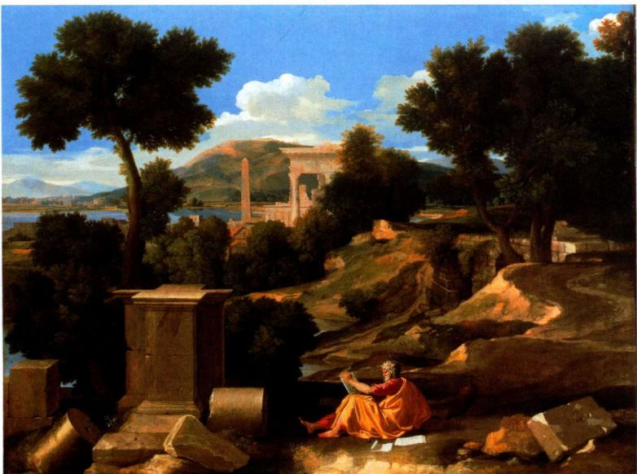

图21\.7 尼古拉·普桑：《在帕特莫斯岛的圣约翰与风景》。1640年。布面油画，100\.3x136\.4厘米。芝加哥艺术学院。A．A．Munger藏品。（1930\.500）

740 詹森艺术史

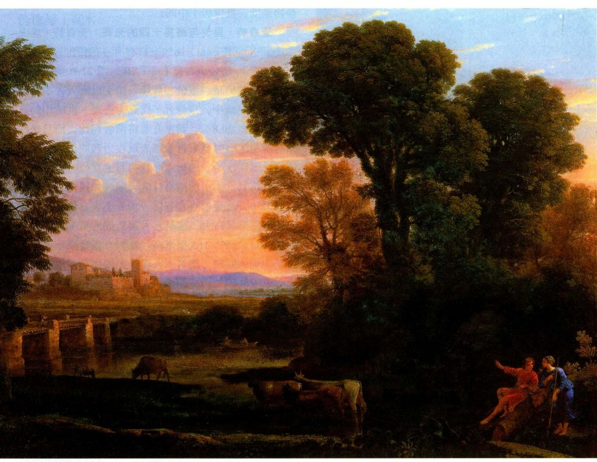

图21\.8 克劳德·洛兰：《田园风景》。约1648年。铜板油画，

39\.3 × 53\.3厘米。耶鲁大学美术馆，纽黑文，康涅狄格。Leonard C\.Hanna，Jr，B\.

A．1913，基金。1959\.47

克劳德的题材多为历史性的或是田园生活，比如 一画种的地位非常低下。当时流行的艺术理论把对普

通自然界的表现列在绘画类型等级的底层（风景画仅

排在静物画之上）。在有学养的赞助人的鼓励下，克

劳德渐渐不再描绘海港的日常生活，而是用历史、《圣

经》和神话故事来装点自己的海景画和风景画，由此

提高了这个画种的地位。

夏尔·勒布仑与皇家学院的建立 法国的君主制

在艺术中也像在现实中一样，试图维持严格的控制，

所以1648年在巴黎成立了皇家绘画与雕塑学院。12

位最早的创建人之一就有艺术家夏尔·勒布仑（Charles

Le Brun，1619\-1690年），17世纪60年代，他帮

助学院重组为一个正规机构。虽然学院后来与路易

十四的专制统治联系在一起，但在创办之时，国王才

10岁，他的母亲安妮代为执政，枢机主教马萨林则是

国家事务的实际掌控者。不过，在随后的若干年里，

学院和君王的思想方式将达成一致并彼此强化。

《田园风景》（APastoral Landscape，图21\.8）。在画里， 他并不追求地形学上的精确，而是力图再现充满古代遗风的乡间的诗意本质。克劳德的许多画是古代文本的视觉叙事形式，如维吉尔的史诗故事和诗歌。这些作品像这幅画一样，常常笼罩在清晨或黄昏雾蒙蒙且光线充足的空气中。我们可以说克劳德的风景画是“光线里”的画，也就是说，他笔下的阳光（多为日落）位于画面中央和画中的地平线上，所以建筑及其他元素看起来近乎剪影。这个例子是在铜板上绘制的，铜板是17世纪的艺术家常用来创作小幅绘画的一种画板。这些铜板画的表面富有光泽。在这里，空间静静地扩展开来，而不是像普桑的作品那样一步步向后退去。一缕怀旧之情、在回忆中放大的往昔体验在画面上弥漫开。正是这种发端于古代文学的怀旧情绪构成了它的主题。

克劳德成功地提升了风景画的地位，而传统上这

1661年路易十四亲政后，他的首席顾问让\-巴

第二十一章 法国和英国的巴洛克艺术 741

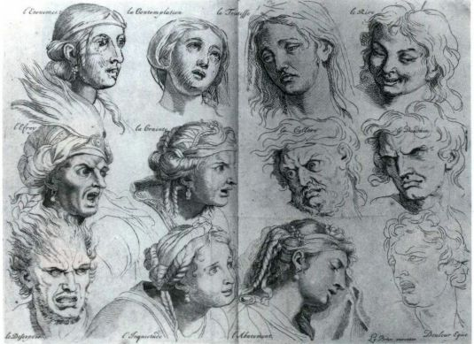

图21\.9 亨利·泰斯特林（Henri Testelin）临摹自夏尔·勒布仑《表情》

（The Expressions），《亨利·泰斯特林绘最高超画家的感情》（Henri

Testelin＇s Sentiments de Plus Habiles Peintres）中的图版六，巴黎，1696年。

蚀刻版画，33\.1 x 45\. l厘米。纽约大都会艺术博物馆，Rogers基金，

1968年（68\.513\.6（6））

普蒂斯特·柯尔贝尔建立了一个行政机构来支持这位专制君主的权力。在这个以控制全国的思想和行为为目标的体系中，视觉艺术的任务就是歌颂国王。与服务于同一目标的音乐和戏剧一样，正统的“皇家风格”是古典主义。柯尔贝尔和勒布仑对视觉艺术进行集权化控制，他们是国王所有的艺术项目的监督人。作为皇家艺术赞助资金的主要分配者，勒布仑的权力非常大，实际上他成了法国艺术的独裁者。

勒布仑于1663年就任学院院长，之后他以一套规章制度为基础，设立了一系列严格的实践和理论课程。他在学院里广作演讲；有几次演讲专门研究普桑的艺术、向拉斐尔致敬和考察面相（脸部表情）。1668年左右，他用一套加有注解的素描对人的面部表情进行了整理，这些素描在他死后以雕版画的形式出版（图21\.9）。他的讲稿评述了表现恐惧、愤怒和惊奇等强烈情绪时眼、眉、口的活动，与1649年笛卡尔发表的《论灵魂的激情》（Passions of the Soul）一致。勒布仑的图解就是要让艺术家们作为公式来使用，在他们的作品中形成观众能容易“看懂”的叙事。

这一教条很大一部分源自普桑，在罗马，勒布仑曾跟随普桑学习了几年。学院还设计了一种按画法、表达和比例为古今艺术家打分的方法。古代艺术家得分最高，其次是拉斐尔及其画派，接下来是普桑。“过分强调”色彩的威尼斯艺术家排名很低，而佛兰德斯和荷兰艺术家则更低。题材也进行了分类：历史（即叙事题材，不管是古典文学、《圣经》还是神话）最高，

静物最低，肖像居于中间。

亚森特·里戈与路易十四的光辉 亚森特·里戈（Hyacinthe Rigaud，1659\-1743年）的传世之作《路易十四像》（Portrait of Louis XIV，图21\.10）表现了专制统治的力量、激情和辉煌。国王以真人大小的全身像呈现在画中，很像凡·代克为查理一世所作的肖像画（见图20\.8）。画家有意将两者相比，而且这件作品遵循了当时皇家肖像画表现权力和威信的公式化特点：运用统治权的标志和这位君主在位时期之富足的象征符号。画中的路易身着天鹅绒加冕袍，袍子以貂皮镶边，有金色百合花饰。他看上去自信、威武、庄重\-而且高大，这是艺术家造成的错觉，因为他的描绘对象只有165厘米高。这幅肖像自豪地展示了国王匀称的双腿（路易本人设计的增加身高用的高鞋跟突出了腿部），因为作为一名舞蹈家，这是他的骄傲。实际上，17世纪50年代直至加冕这段时间，国王都积极地参加了让\-巴普蒂斯特·吕利（Jean\-Baptiste

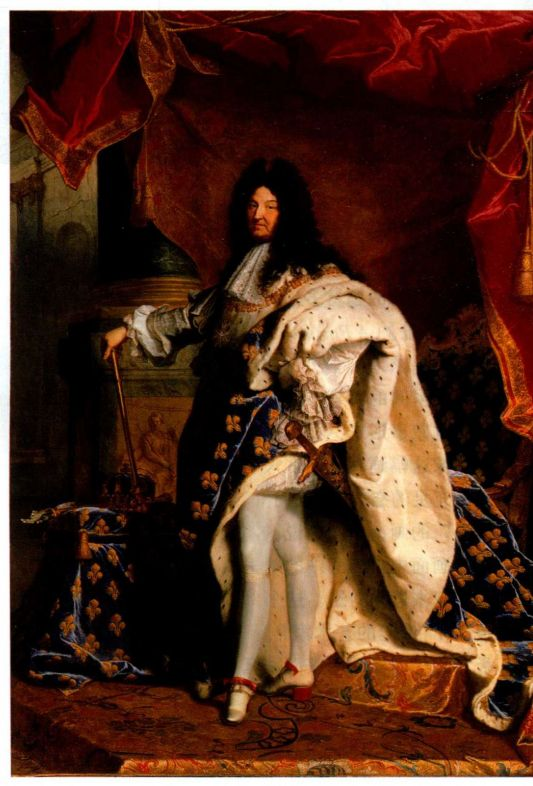

图21\.10 亚森特·里戈：《路易十四像》。1701年。布面油画，2\.8x1\.9米。巴黎卢浮宫，Inv．7492

742 詹森艺术史

伪作与《真本》

艺术品伪造\-未经允许，蓄意复制或制作艺术品，意在欺骗的行为\-长久以来一直对艺术家和收藏者造成严重的威胁。艺术品伪造者把目标对准了首饰、雕塑、油画和版画，他们通常希望卖出赝品，以获取私利。

伪造者可能模仿古今艺术家的作品或风格。在古代就已有过关于仿米隆和普拉克西特勒斯作品的伪作（见第五章）的记载。我们还知道，米开朗基罗曾伪造过“古董”（见第179页），他把雕像埋起来，以形成类似损耗效果的光泽。为了做旧，伪造者会使用真实的材料，如旧纸、自制颜料、用过的画布以及被大号铅弹射过的木头（以模仿生满虫眼的老木头）。

不仅艺术家会因伪作而遭受金钱上的损失，而且他们的声誉也会因冒充其作品的劣质艺术品而受到损害。阿尔布

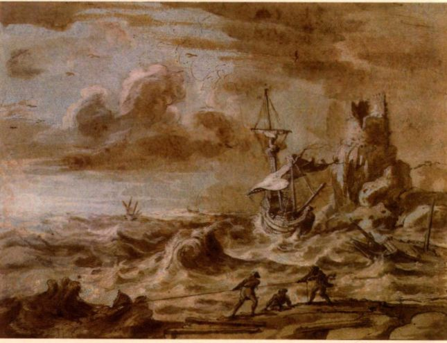

克劳德·洛兰：《暴风雨》。约1635年。鹅毛笔、褐色淡彩，蓝色纸上加的白色高光加浓了色彩。		19\.5 × 26厘米。承蒙伦敦大英博物馆保管委员会许可

雷希特·丢勒的情况就是如此（见第十八章），他1506年访问威尼斯时，发现著名版画家马尔坎托尼奥·拉伊蒙迪（约1480一约1527年）正在出售自己以丢勒的木刻风格制作的雕版画，上面有丢勒姓名的花押字。丢勒控告了他，虽然拉伊蒙迪可以继续创作雕版画，但他不能在上面签丢勒的名字。

克劳德·洛兰遭遇过类似的麻烦，他想出了一个独特的解决办法。我们从作家菲利波·巴尔迪努奇（FilippoBaldinucci，1625\-1697年）那里得知，克劳德发现另一个艺术家塞巴斯蒂安·布冬（Sébastien Bourdon，1616\-1671年）擅长模仿他绘画的光影和色调效果。事实上，布冬的模仿技艺非常高超，他在参观了克劳德的画室之后，画了一幅风景画，声称是克劳德的作品并卖掉了它。其他艺术家也发现克劳德的技法和构图很容易模仿。

为防止一切类似的欺诈行为，1635年左右，克劳德决定编纂《真本》，这是一本素描集，里面的素描复制了从那时起他所有的油画。在每一幅素描的背面，他都注上了作品被送交的赞助人、买主或地点的名字；有时他还写上创作日期和关于作品主题的说明。收藏者可以查阅此书，核对某幅画是否收入了书中\-从而挫败一切潜在的伪造者。

到他去世前为止，克劳德已为195幅画绘制了素描。他并未保留1635年以前的画的记录，所以约有50幅作品不在画册中。克劳德是个多产的画家\-已知创作了1200多幅素描，但画册只收录了按照他的油画成品绘制的素描（见上面

的克劳德的素描《暴风雨》）。现藏于大英博物馆的《真本》由规格为19\.5x26厘米的单页组成，它们按照四张白页、四张蓝页的顺序排列。学者们推测，克劳德选择这些颜色的纸来表现油画的光影效果。这一方法也表明他可能并不是按年代顺序绘制这些素描的。他用鹅毛笔、墨水和褐色（有时为灰色）淡彩来画这些素描，用白色粉笔和几笔金色来加高光。这类费时的细节在书中年代较晚的素描中表现得尤为明显，说明克劳德不仅仅用这本画册来复制油画，而且用来创作可作为技艺娴熟的独立艺术品的精美素描。

今天的艺术品商人和收藏者常常依赖于一类相似的名为“catalogue raisonné”（作品全集）的书。这种出版物由专家在多年的仔细研究之后编成，它用文字和配图记录了某一位艺术家所有已知的、已核实的作品，和一些被归入他名下（但未经鉴定）的作品，以及关于每件作品的大小、当前状况和来源记录（所有人）的相关信息。但在对伪作的斗争中最重要的恐怕是可加以利用的多种科学技术了\-从碳定年法到红外光谱学\-它们可以对作品的材料和创作步骤进行分析并测定年代。然而，即便有这些先进的鉴定方法，对于有问题的作品的真伪，专家们的意见并不完全一致，因为这些技术常常只能核实作品的创作时间或地点，并不能确定作品出自哪位艺术家之手。所以，我们仍要依靠鉴赏力以及艺术史家的经验和专门技能。

Lully，1632\-1687年）的芭蕾舞剧表演。从视觉艺术到表演艺术的一切艺术门类都在王室控制之下\-里戈的画就是这一事实的例证，它表现了路易作为法国核心人物的统治地位和无与伦比的声望。

法国的古典主义建筑

建筑工程由于规模大、显眼、公开，所以能比绘画更好地把宫廷的价值标准传达给广大观众。法国建筑中的古典主义风格表现了古罗马帝国的那种宏伟和权威，强化了君主制所信仰的传统、无所不在、专制、力量和永恒等理念。巨大的规模和形式上的重复都体现了这些含义广泛的概念，它们的具体体现就是巴黎市中心和城外修建的皇家建筑以及凡尔赛的宫殿和花园。

1655年，路易十四宣称：“朕即国家”。这一声明不仅是政治性的，还代表着一种艺术和审美意图。路易为他的王室和廷臣所作的建筑规划规模巨大，象征的不是某个个人或某个君主，而是整个法国。他首先翻新了卢浮宫，这是其父王在位时就已动工的一个工程，但后来证明不堪负担。路易想把整个宫廷迁往一个四面空阔的地方，以便他能更有效地控制廷臣，所以他开始在位于巴黎城外几英里的凡尔赛建造宫殿和花园。这些复杂的建筑工程共有一种风格\-巴洛克古典主义。

弗朗索瓦·芒萨尔 建筑中的巴洛克古典主义的基础是由一群建筑师奠定的，其中最有名的是弗朗索

瓦·芒萨尔（François Mansart，1598\-1666年）。莱斯科在卢浮宫引入的古典主义（见图18\.4）在亨利二世统治下的16世纪中叶达到极盛，并由萨罗蒙·德·布洛斯（Salomon de Brosse，约1571\-1626年）在玛丽·德·美第奇的卢森堡宫里延续下来。芒萨尔可能于1618年在德·布洛斯手下开始了他的职业生涯，表现出了较早成熟的才华。不到五年，他就确立了自己的声誉。

虽然芒萨尔显然从未去过意大利，但他通过其他把巴洛克元素引入设计并加以改造的法国建筑师而熟悉了这种新的意大利风格。他最重要的建筑是城堡，在这一领域，法国文艺复兴传统的重要性超过了所有来自意大利的影响。所以，芒萨尔的早期设计也是最具古典风格的。巴黎附近的麦松府邸（Château deMaison）是17世纪40年代为金融家勒内·杜·隆戈伊（René du Longeuil）修建的，体现了芒萨尔的成熟风格。城堡外部与德·布洛斯开创的先例差别不大，尽管它古典式的逻辑和清晰超越了之前所有法国建筑的设计。不过，建筑的内部开辟了一片新天地。通往大楼梯的门厅（图21\.11）体现了帕拉第奥的影响，帕拉第奥的论著为芒萨尔所熟知并欣赏。雕塑被用作建筑设计的一个必要部分，这是一种由德·布洛斯提倡的独具法国特色的观念。展翼的鹰（取自主人的纹章）使横贯的檐口线显得更柔和，也连接起穹顶拱肋的起拱点之间的空间。这些复杂的弧线和下方接近消失的平面墙表明，这个建筑尽管具有古典主义特征，

图21\.11 弗朗索瓦·芒萨尔：麦松府邸门厅。	1642\-1650年

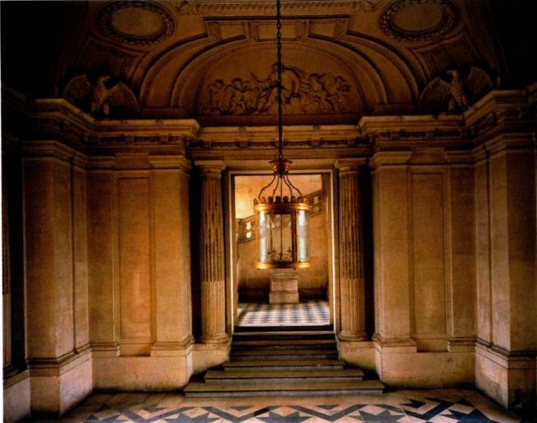

744 詹森艺术史

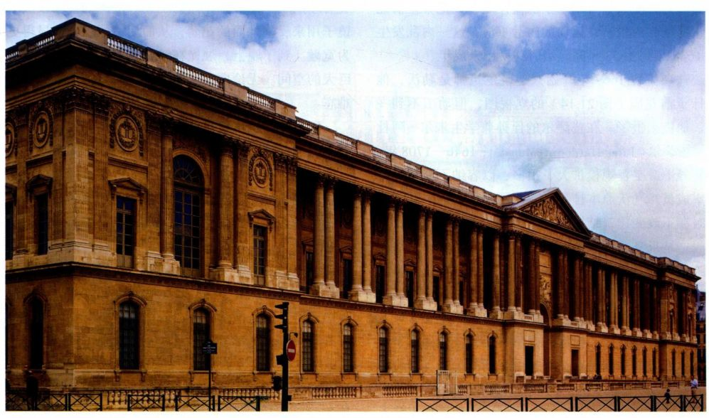

图21\.12 路易·勒沃、克劳德·佩罗和夏尔·勒布仑：巴黎卢浮宫东立面。1667\-1670年

但它完全符合巴洛克风格。

卢浮宫 这座宫殿的施工已断断续续地进行了一个多世纪，按照弗朗西斯一世时期莱斯科的最初设计进行；剩下的工作就是用一座壮观的正立面给东面的方形庭院封口。柯尔贝尔对法国建筑师提交的设计方案并不满意，其中包括芒萨尔去世前不久提交的设计，所以他把贝尼尼请到巴黎，希望这位最著名的罗马巴洛克艺术家像在意大利为教皇设计建筑一样为法国国王设计。1665年，贝尼尼在巴黎待了几个月，提交了三个设计方案，它们的规模都大大超过了现有的这座建筑。经过大量争论和密谈，路易十四拒绝了这些方案，把这个难题交给了一个委员会，其成员包括：宫廷画师夏尔·勒布仑；已为卢浮宫（包括阿波罗长廊、王后园和南立面）做了大量工作的宫廷建筑师路易·勒沃（Louis Le Vau，1612\-1670年）；以及非职业建筑师出身的解剖学家、古建筑研究者克劳德·佩罗（Claude Perrault，1613\-1688年）。这三个人都是这个建筑的负责人（图21\.12），但我们有理由相信佩罗担负着主要责任。当年他的支持者和反对者肯定是这样想的，而且他常被要求为其设计作辩护。

佩罗按古罗马神庙正面的样子来设计中央部分，两翼则像向外打开的神庙侧面。这种神庙样式要求只用一种独立柱式，但卢浮宫有三层。佩罗解决了这个难题，他把第一层当作神庙的墩座墙（podium），把

上面两层掩在柱廊后面。虽然柱廊本身由于使用了双柱而招致争议，但此后这种处理方式成了法国古典主义建筑的一个特点。

卢浮宫的东立面象征法国古典主义战胜意大利巴洛克，成为皇家风格。它还把路易十四与恺撒的荣耀联系在一起，由此宣告法国在政治和文化方面已成为新罗马。这种宏大而优雅的设计在某些方面体现的是一位考古学家的思想，但这位考古学家也知道如何选择那些能与宫殿旧有部分相容的古典建筑元素。古代在观念和细节上的这种新生是佩罗的主要贡献。

佩罗依靠弟弟夏尔·佩罗（Charles Perrault，1628\-1703年）获得了他的地位，夏尔·佩罗作为路易十四时期柯尔贝尔的营造长官，在贝尼尼逗留法国期间，出手削弱了他的影响力。可能克劳德·佩罗也持有大约20年后其弟在《古今之争》（Quarrel of theAncients and Moderns）中提出的观点，夏尔·佩罗声称：“荷马和维吉尔犯过无数错误，而现代人不会再犯这些错了，［因为］古人还未完全具备我们的这些规则。”卢浮宫东立面呈现的不仅是古典的复兴，也是克劳德·佩罗所认为的美之永恒典范的精华，意在超越罗马人的一切建筑。实际上，佩罗曾为维特鲁威的著作作注，并有关于柱式的著述。

凡尔赛宫 路易十四最大的计划是距巴黎市中心18公里的凡尔赛宫（图21\.13）。国王强迫贵族住在

第二十一章 法国和英国的巴洛克艺术 745

巴黎城郊，使其置身于王室的监控之下，他希望借此防止那场名为投石党运动的内乱重演，这一内乱发生在1648年到1653年间，当时路易还未成年。

这项工程1669年开始兴建，建筑师是勒沃，他设计了前花园（图21\.14）的立视图，但动工不到一年，他就去世了。在芒萨尔的侄孙兼学生朱尔·阿杜安\-芒萨尔（Jules Hardouin\-Mansart，1646\-1708年） 的领导下，工程规模扩大了很多，以容纳不断增加的王室成员。勒沃原本计划将前花园作为宫殿主景，但此时在不改变建筑结构的情况下前花园被延伸了很长一段。结果，勒沃原先设计的与卢浮宫东立面相仿但更为华丽的正立面看起来就显得重复、不成比例了。它的正楼只有一个长70多米的厅堂，即壮观的镜厅（Hall of Mirrors，图21\.15）。两头分别是战争厅及与之对应的和平厅。镜厅的豪华效果让人想到枫丹白露的弗朗西斯一世长廊，但其中用到的大镜（由较小的镜面组成）是独一无二的，因为这种镜子非常罕见，代表着政权的巨大投入。这种大型镜子制作技术是在威尼斯发明的，柯尔贝尔的代办把它带到了法国。这

类奢华的细节意在强化路易王朝和法国的最高权威。镜子用来反映外面的花园，从而使镜厅在白天显得更为宽敞。到了晚上，烛光在镜中数不清的投影照亮了巨大的空间。无论白天还是夜晚，镜子的效果都令人难忘。

巴洛克元素虽然没有得到建筑师们的正式承认，但还是出现在了宫殿内部。这一转变反映了国王本人的品位。相比建筑理论和宏伟的古典式外表，路易十四对能为他和他的廷臣们提供合适环境的奢华室内设计更感兴趣。所以他最听信的人不是建筑师，而是画家勒布仑，勒布仑的目标是让所有门类的艺术都为表现国王的权力服务。为达到这一目标，他从对罗马的记忆中自由取材，而且卓越的意大利巴洛克风格的装饰设计定曾给他留下深刻的印象。勒布仑虽是普桑的弟子，但他最早却是师从武埃，后来还成了一流的室内装饰家。在凡尔赛，他雇用建筑师、雕塑家、画家和室内装饰家，创造出一种空前辉煌的总体效果。战争厅（图21\.16）在许多方面更像是贝尼尼那座充满戏剧性和运用了多种技法的科尔纳罗礼拜堂（图

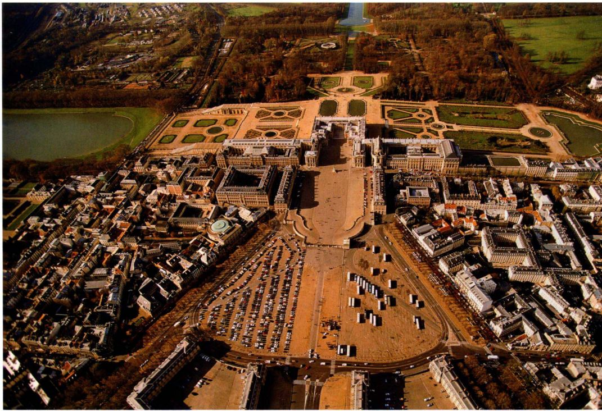

图21\.13 凡尔赛俯瞰图

746 詹森艺术史

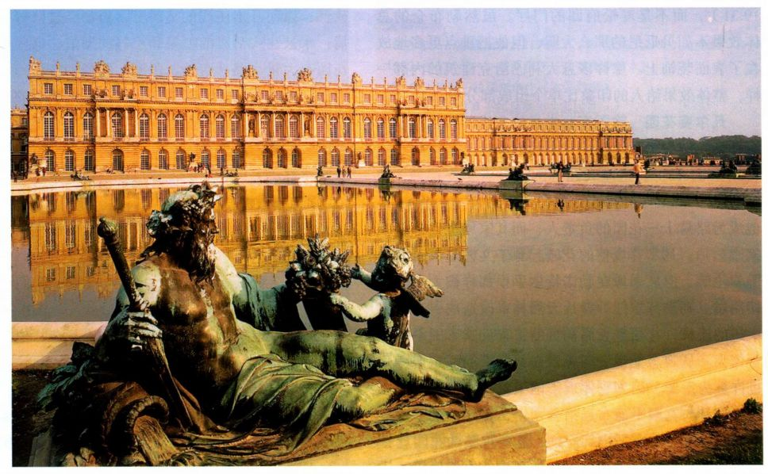

图21\.14 路易·勒沃和朱尔·阿杜安\-芒萨尔：凡尔赛宫正楼前方的花园。1669\-1685年

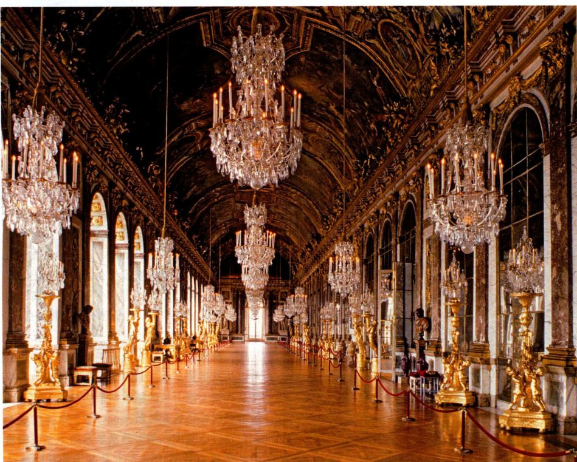

图21\.15 阿杜安\-芒萨尔、路易·勒沃和勒布仑：凡尔赛宫镜厅（Galerie des Glaces）。1678年动工

第二十一章 法国和英国的巴洛克艺术 747

19\.31），而不是麦松府邸的门厅。虽然勒布仑的总体效果不如贝尼尼的那么大胆，但他把重点更多地放在了表面装饰上。像许多意大利巴洛克建筑的内部一样，整体效果给人的印象比单个组成部分更深。

凡尔赛花园 除了富丽堂皇的室内装饰以外，凡尔赛给人印象最深的是前花园西面绵延几公里的园林（见图21\.13）。这座大园林的设计者是安德烈·勒诺特尔（André Le Nôtre，1613\-1700年），1643年他成为路易十三花园的负责人，而其家族世代都是皇家园艺师。凡尔赛规整的花园起源于文艺复兴时期的佛罗伦萨，但从未像在勒诺特尔手中那样被大规模地使用过。勒诺特尔把一整片天然林木改造成一个中规中矩的园林，这项庞大而耗资的工程反映了国王的高贵伟大。从观念上说，园林景观与宫殿一样重要\-也许更为重要，因为它体现了国王对大自然的支配。景观设计与宫殿平面布局结合紧密，实际上成了建筑空间的延续。与宫殿内部一样，这些规整的花园意在为国王出席公共活动提供合适的环境。它们形成了一系列“户外房间”，可用来举办路易宫中必不可少的那些盛大的游园会和演出。

专制主义精神不仅体现在宫殿本身，而且更为明显地体现在这种强加于整个乡间的整齐的几何装饰上。勒诺特尔的设计需要驯服大自然：树林遭到部分

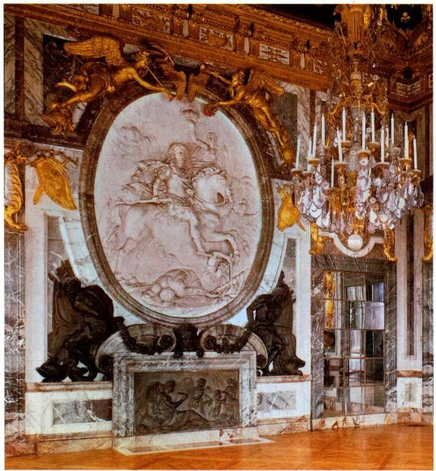

图21\.16 阿杜安\-芒萨尔、勒布仑和夸兹沃：凡尔赛宫战争厅（Salonde la Guerre）。1678年动工

砍伐，以便开出庄严的林荫道，植物经过修剪变成树篱，水被注入活泼的喷泉和宁静的湖泊。这些规整的花园有大量小路、台地、水潭、曲径和花坛，它们构成了一个统一的几何形整体。在离宫殿较远的地方，花园的布局就变得不那么规整了，划入了当地树木茂密的区域和开阔的草地。自始至终，经过精心规划的林荫路都给人以无尽的视觉惊喜。这种景观设计的一个特别重要的方面就是雕像，这些雕像大部分表现的是太阳神阿波罗的形象，这是路易十四最喜欢的一个象征意象。

也有人贬低这些精致、广阔的花园。我们能够从这些非难者身上探知凡尔赛的生活状况。大臣圣西蒙（Saint\-Simon）公爵并不是路易的崇拜者，他在日记中记下了这样一番话：

凡尔赛······是最乏味的地方，那里没有景色，没有树木，没有水，没有土壤；地上全是流沙或沼泽，所以空气很糟糕·····［在花园里］你能感受到清爽的阴凉，但这阴凉的旁边就是一大片酷热地带······无处不在的对大自然的暴行令我们不由自主地感到不快和厌烦。从地下抽取上来并在各个角落汇聚起来的丰沛流水发绿而浓稠，浑浊不堪；它向外散布着湿气，不健康、显而易见；气味就更不用说了。我可能永远也说不尽如此大的一座宫殿的这些恐怖的缺陷。

Memoirs of Louis XIV and His Court and of the Regency by the Duke of Saint\-Simon\.Vol\.Il\.

\(New York: P\.F\. Collier and Son,1910,p\.889\)

朱尔·阿杜安\-芒萨尔风格 在凡尔赛，朱尔·阿杜安\-芒萨尔受到勒沃的设计的束缚，人们可通过荣军教堂（Chuch of the Invalides，图21\.17）来更好地欣赏他本人的风格。这个教堂在今天之所以出名，是因为拿破仑墓就建在其中。这座建筑最早为一个医院的组成部分，该医院诊治在路易无休止的战争中致残的众多士兵，把他们聚集在一起，远离巴黎的大街小巷，以免他们造成骚乱。这个建筑群包括许多宿舍、餐厅、医务室和两个礼拜堂\-简易、无装饰的供士兵用，精美、有穹顶的供国王用，国王参观医院时，可以从这里居高临下俯视士兵。阿杜安\-芒萨尔的设计从视觉上把士兵的牺牲与他们对国王的忠诚及专制的绝对权威联系了起来。

在平面图中，荣军教堂呈希腊十字，四角各有一个礼拜堂（图21\.18）；它是基于米开朗基罗和布拉曼特设计的圣彼得大教堂的集中式平面设计的。它的

748 詹森艺术史

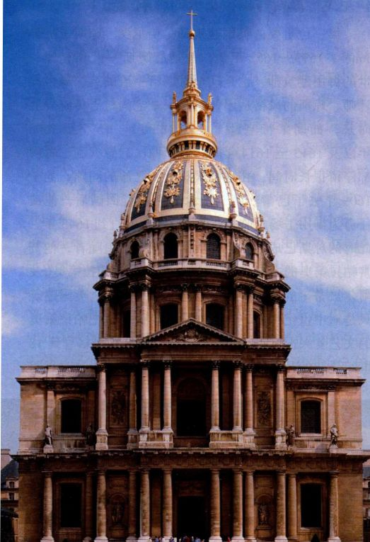

图21\.17 朱尔·阿杜安\-芒萨尔：巴黎荣军教堂，1677\-1691年

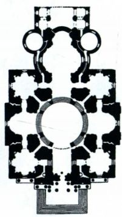

图21\.18 荣军教堂平面图

穹顶也体现了米开朗基罗的影响，但它包括三层外壳而不是通常的两层。正立面反复凹凸，具有马代尔诺所采用的那种渐强效果（见图19\.13），它与穹顶结合之紧密，恰如波洛米尼设计的位于纳沃纳广场上的

大事年表

1608年\-探险加拿大的萨缪尔·德·尚普兰在魁北克殖民

1633\-1634年\-普桑创作《劫夺萨宾妇女》

约1642年\-拉图尔创作《木匠约瑟》

1643年\-路易十四加冕为法国国王

1648年\-法兰西皇家绘画与雕塑学院成立

1666年\-莫里哀的《厌世者》首演

1669\-1685年\-建凡尔赛宫

圣阿涅塞教堂（见图19\.22）。穹顶是最具独创性，且最具巴洛克风格的地方，这是阿杜安\-芒萨尔设计的一大特点。它高而修长，从鼓形壁的基座开始，沿着一条连续的曲线直升向灯笼式天窗上的尖顶。第一层鼓形壁支撑着另一层低矮的鼓形壁。它的窗户为穹顶内部的绘画提供了光线。这些窗户隐藏在一道“假壳”后面，“假壳”顶部有一个大开口，所以描绘壮丽的天国景象的绘画似乎被神秘地照亮并悬浮于空中。荣军教堂大胆的舞台式照明可以将它确定地划入巴洛克风格之内。

雕塑：贝尼尼的影响

雕塑中正统皇家风格的确立方式与建筑大致相同，接受罗马和贝尼尼1665年造访的影响。在巴黎期间，贝尼尼为路易十四雕刻了一尊大理石胸像。他还受托为国王制作一尊骑马像，这件作品后来在罗马完成并运回巴黎，且在巴黎被重新加工。现在立在凡尔赛宫。

安东尼·夸兹沃 贝尼尼的影响可见于安东尼·夸兹沃（Antoine Coysevox，1640\-1720年）的作品， 安东尼·夸兹沃是一个很长的法国知名肖像雕刻家世系中的第一人，也是勒布仑在凡尔赛雇用的艺术家之一。夸兹沃为战争厅制作的表现路易十四凯旋的大型灰泥浮雕（见图21\.16）保留了贝尼尼骑马像的姿势，但不那么张扬。在一尊表情鲜活的勒布仑赤陶像（图21\.19）中，夸兹沃刻画了这位艺术家双唇微分、头转向一旁的样子。肩线以下堆叠的衣饰让人想到贝尼尼的路易十四胸像的总体轮廓。但勒布仑的脸是写实的，精细地刻画了人物性格，这些都是夸兹沃本人的风格特色。

皮埃尔\-保罗·皮热 在17世纪的法国雕塑家中，皮埃尔\-保罗·皮热（Pierre\-Paul Puget，1620\-1694年）是盛期巴洛克风格的最佳代表。直到柯尔贝尔去世、勒布仑的势力开始衰落之后，他才得到宫廷的重用。他最出色的雕塑作品《克罗托那的米罗》

第二十一章 法国和英国的巴洛克艺术 749

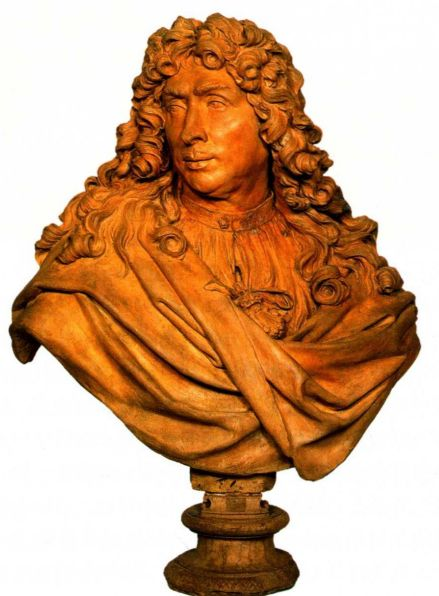

图21\.19 安东尼·夸兹沃：《夏尔·勒布仑胸像》。1676年。赤陶，高66厘米。伦敦华莱士收藏馆

（Milo of Crotona，图21\.20）由于和贝尼尼的《大卫》（见图19\.29）相似而受益。虽然皮热的作品更平静，但他成功地传达出了这位遭受狮子攻击、手却卡在树桩里的英雄的惊人力量。那头动物从背后发起攻击，爪子深深地插进米罗的大腿，米罗痛苦地扭动着、叫喊着。激烈的动作使雕塑充满《拉奥孔》的那种紧张感。我们猜想，这种对古代的模仿就是这件作品被路易十四接受的原因。

英国的巴洛克建筑

英国人从巴洛克绘画和雕塑的发展中获益良多，但对其贡献微薄。主要来自意大利、佛兰德斯和荷兰共和国的外国艺术家独霸英国宫廷。查理一世统治期间，宫廷画师凡·代克既创作肖像画，也绘制寓意画。他死后，许多宫廷艺术家沿用了他的肖像画风格，在视觉艺术方面极少创新，这种局面一直持续到1660年查理二世复辟为止。1666年伦敦大火之后，城市重建使建筑成为优先考虑的对象，而建筑此后也成为英国最重要的艺术成就的代表。

伊尼戈·琼斯与帕拉第奥的影响

第一位重要的英国建筑师是伊尼戈·琼斯（InigoJones，1573\-1652年），他是詹姆斯一世和查理一世的御用建筑师，也是这个时期第一流的英国舞台设计师。琼斯的风格从园林式私家豪宅的村居传统发展而来，如朗莱特宅邸（见图18\.30）。1597至1603年以及1613至1614年间，琼斯两次赴意大利，每次都停留很长时间，在这两次意大利之旅的间隙，他于1609年去了巴黎。第二次意大利之行回国后，他被任命为御用工场总监，并担任这一职务直到1643年。此时的琼斯已成为帕拉第奥的一个坚定追随者，他赞赏帕拉第奥的古典式设计原则，他收藏有帕拉第奥（及阿尔贝蒂）的著述并为之作注。琼斯之前，英国建筑只是对中世纪和文艺复兴样式的模仿。他把帕拉第奥的文艺复兴古典主义介绍到英国，但这种风格直到18世纪最初的几十年才在英国扎下根来，因为这时兴起

图21\.20 皮埃尔\-保罗·皮热：《克罗托那的米罗》。1671\-1682年。大理石，高2\.7米。巴黎卢浮宫

750 詹森艺术史

了一股建筑热潮，并引发了被称为“帕拉第奥复兴”的潮流。

琼斯在伦敦的白厅宫（Whitehall Palace）中建造的宴会厅（Banqueting House，图21\.21）符合帕拉第奥著述中的原则，但它并未照搬帕拉第奥的任何一座建筑。这一宴会厅原计划用来举办宫廷典礼和假面剧表演（一种集舞蹈、戏剧和音乐于一身的大型演出），但1635年之后，夜间娱乐活动被禁止，因为火把冒出的烟正在损害天花板凹格中鲁本斯的画《詹姆士一世的神化》（Apotheosis of James I）。宴会厅本质上是一座维特鲁威式的“长方形公堂”，由两个立方体建筑组合而成，有一个半圆室用来放置国王的宝座。琼斯把它设计成一座帕拉第奥式的别墅。它更像一座文艺复兴时期的宫殿，而非同时期阿尔卑斯山以北设计的任何建筑。琼斯用一种规整的古典语汇和比例法则分三部分建造了这座建筑。爱奥尼亚式和混合式的半露方柱为建筑增添了一种朴素的优雅，第一层楼的窗户上方相间的弓形和三角形三角楣产生了一种节奏感。屋顶轮廓线下方的花环和上方的栏杆增强了整个建筑的装饰性。这座建筑的装饰可能比原初构想的更少；它的每一层都曾砌有彩色石块，但正立面的表面后来经过了重新处理。琼斯的简约风格作为正统古典主义的一盏指路明灯，在英国屹立了200年之久。

克里斯托夫·雷恩爵士

如果不是1666年伦敦大火造成的破坏，17世纪

大事年表

1603年\-莎士比亚的《哈姆雷特》

1619\-1622年\-伊尼戈·琼斯建造宴会厅

1637年\-笛卡尔的《方法论》

1642\-1649年\-英国内战

1651年\-托马斯·霍布斯的《利维坦》

1666年\-伦敦大火

1675\-1710年\-雷恩爵士的圣保罗大教堂在伦敦修建

1687年\-牛顿用公式表示万有引力定律

末最重要的英国建筑师克里斯托夫·雷恩爵士（SirChristopher Wren，1632\-1723年）可能依然是个业余建筑师。我们可以将雷恩看作巴洛克时期的文艺复兴式艺术家兼科学家。这位奇才最先学的是解剖学，然后研究物理学、数学和天文学，并由于对几何学的理解而深受艾萨克·牛顿爵士的尊敬。雷恩早年先后在伦敦格雷欣学院（Gresham College）的天文学系和牛津大学任教授。他对建筑的兴趣直到30岁左右才表现出来。他的科技知识也许影响了其建筑的外形；的确，之前没有哪个建筑师花如此大的力气来隐藏建筑的支架。只有具备了全面的几何学和数学功底的建筑师才能获得这样的成效，而雷恩的建筑所表现出的技术上的熟练程度一直令他的评论者感到困惑。

1666年那场灾难性的火灾之后，雷恩被提名为负责重建城市的短期皇家委员会的成员（见第三部分末尾的附加原始文献）。几年后，他开始为圣保

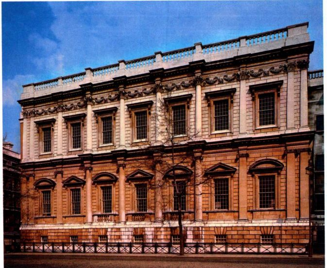

图21\.21 伊尼戈·琼斯：宴会厅西立面，

白厅宫，伦敦。1619\-1622年

第二十一章 法国和英国的巴洛克艺术 751

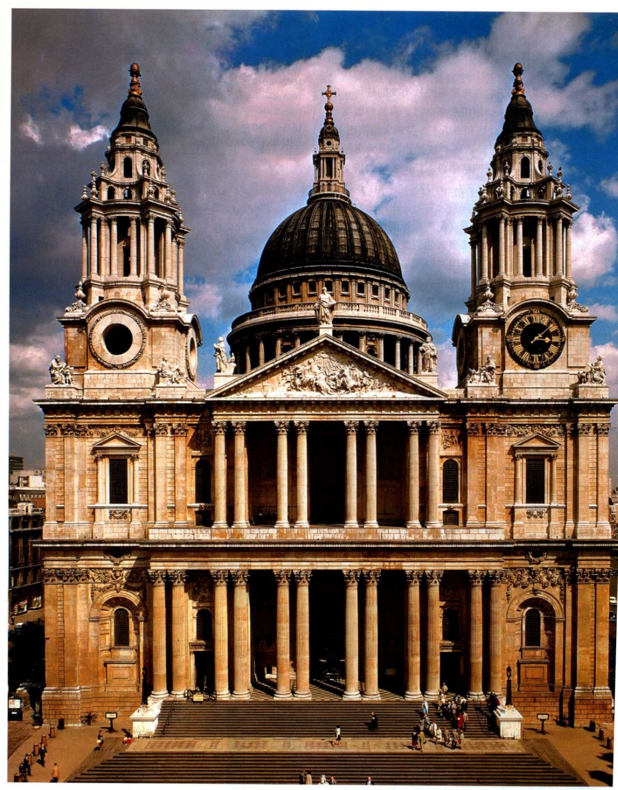

图21\.22 克里斯托夫·雷恩爵士：伦敦圣保罗大教堂正立面。1675\-1710年

752 詹森艺术史

罗大教堂的重建进行设计（St\.Paul＇s Cathedral，图21\.22），这是在大火灾中被毁的多座教堂之一。雷恩偏爱集中式教堂，他最初构想的圣保罗大教堂为希腊十字形，十字交叉处上方有一个巨大的穹顶。这个构思以米开朗基罗为圣彼得大教堂设计的平面图为基础，显然受到了琼斯之前一个设计方案的启发。这一世纪之初，琼斯曾参与圣保罗大教堂哥特式结构的修复工程，但他的建议被教堂主管拒绝了，他们更喜欢传统的公堂式结构，认为这更适合新教教堂。最后，它的平面布局变成了拉丁十字，包括圣彼得大教堂在内的多数天主教堂都沿用这种结构（图21\.23），这一结果颇具讽刺意味，因为这项建筑计划本来可以为英国的新教教堂创造一套新的建筑语汇提供契机。

雷恩唯一的一次出国经历是在1665至1666年，其间他游览了法国，遇到了贝尼尼，当时贝尼尼正应路易十四之邀在巴黎为卢浮宫做设计和建造工作。我们可以在圣保罗大教堂的正立面中看到这次旅行所产生的影响，这个正立面与阿杜安\-芒萨尔的荣军教堂正立面惊人地相似。荣军教堂也启发了穹顶的三部分建造方式，与圣彼得大教堂一样，这个穹顶的直径是中堂和侧堂宽度之和。但圣保罗大教堂的穹顶比建筑高出很多，巍然耸立于正立面之上。支撑它的扶壁被巧妙地隐藏在一面隔墙后面，这面墙反过来又支撑了扶壁。琼斯的古典主义风格也体现在穹顶中，它看起来像布拉曼特设计的小神殿大幅放大后的版本（图16\.8）。圣保罗大教堂最新的巴洛克式设计反映了雷

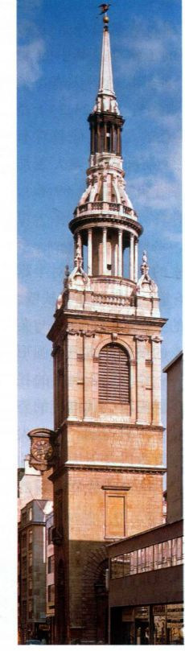

图21\.24 克里斯托夫·雷恩爵士：

伦敦圣玛莉里波教堂尖塔。1680年

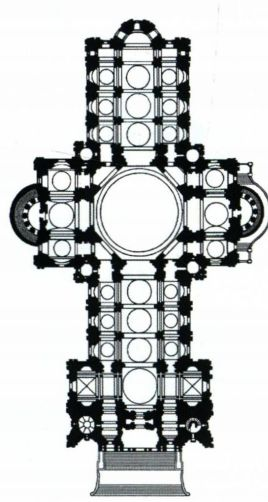

图21\.23 圣保罗大教堂平面图

恩对当时意大利和法国建筑的全面了解。事实上，雷恩认为巴黎是“欧洲最好的建筑学校”，他也同样受到了罗马巴洛克风格的影响。灯笼式天窗和钟楼的上部表明他知道波洛米尼位于纳沃纳广场上的圣阿涅塞教堂，也许是通过素描或雕版画了解到的。最终完成的建筑不仅反映了设计方案复杂的演变过程，也反映了监督施工进程的委员会后来所作的改动。1718年，这一委员会解除了雷恩的职务。

对于雷恩和牛顿（1697年牛顿被任命为圣保罗大教堂专员）而言，在对宇宙和人类在宇宙中的位置的新理解方面，数学和几何学都具有核心作用。在雷恩暮年撰写并由他儿子于1740年提交给皇家学会的《五册书》（Five Tracts）中，他说，建筑必须符合“自然理性”，这是永恒美的基础。换句话说，建筑必须运用理性的（即抽象的）几何形式，如正方形、圆形，以及比例、透视与和谐原则\-但它不能牺牲多样性。这种理性和多样性在雷恩为圣保罗大教堂做的设计中表现得很明显。

第二十一章 法国和英国的巴洛克艺术 753

1666年的伦敦大火为雷恩提供了重建和重塑伦

敦城及其天际线的机会。除圣保罗大教堂外，在87

座被损坏或被毁的教堂中，他的工作涉及其中的52

座，为其中的许多教堂设计了各具特色的尖塔。圣

玛莉里波         教堂尖塔（图21\.24）是

他最有名的设计例证（应该注意的是，这些教堂有

许多，包括这一座，在“二战”期间的伦敦大轰炸

中被毁，但现已被修复）。这个尖塔非常高（高69米），

至今也高于周围的建筑。以一种奇异的方式把多个组

件堆叠起来就得到了这个高度，这些组件包括：一个

两层基座（有拱形入口）、朴素的阁楼、有成对半露

方柱的钟楼，以及柱廊围绕的圣堂，圣堂顶部有扶壁，

支撑着灯笼式天窗和方尖碑形的尖顶，这个尖顶与荣

军教堂的尖顶相似。为体现教堂的虔诚，雷恩在圆形

圣堂基部设计了12张“弓”\-实际上是倒转的托

架。这样造出的是一座复杂的多层尖塔，其挺直的姿

态具有哥特之风，但其样式却基于古典母题。这种尖

塔以前从未出现过。雷恩在这座教堂以及大火之后的

教堂改造中进行的创新成为英国巴洛克式教堂建筑的

特色。

约翰·范布勒和尼古拉斯·霍克斯穆尔

英、法、意三国巴洛克元素的结合在布伦海姆宫（Blenheim Palace，图21\.25）中表现得更为明显，这是天才的业余建筑师约翰·范布勒爵士（Sir JohnVanbrugh，1664\-1726年）在雷恩最有才华的学生尼古拉斯·霍克斯穆尔（Nicholas Hawksmoor，1661\-1736年）的协助下设计的一座宏伟的建筑。虽然布伦海姆宫被认为是范布勒最伟大的作品，但这一建筑实际上是由霍克斯穆尔完成的；不过结构上结合得天衣无缝。布伦海姆宫巧妙地将多个元素结合起来：英国城堡的密集、乡村豪宅（如朗莱特宅邸，见图18\.30）的开阔、法国城堡（如枫丹白露宫，见图18\.3）的散漫闲适，以及受范布勒的对手雷恩爵士启发的正立面。然而，把布伦海姆宫及其围边柱廊与圣彼得大教堂的广场（见图19\.14）作比较时，可以看出范布勒的设计更接近贝尼尼的风格。主楼用一种巨柱式科林斯柱式把神庙的圆柱式门廊与文艺复兴式的宫殿融为一体，而侧翼则全用一种低矮的多立克柱式。这种即使用当时宽松的标准来衡量也算极端的折衷法也贯穿在细节中。范布勒与琼斯一样，对戏剧具有浓厚的兴趣，他

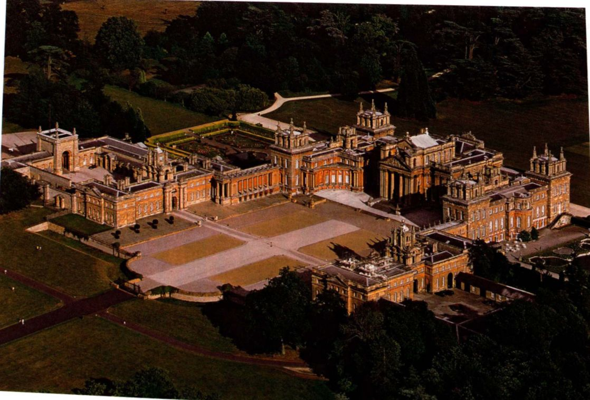

图2125

还是一个广受欢迎的剧作家。布伦海姆宫因其戏剧风格和宏大雄伟而成为英国实力的象征，从建筑本身及其四周的庭园来看，它都可与凡尔赛宫相媲美，但更为质朴。这座主要为炫耀和娱乐而设计的建筑是英国赠予马尔博罗公爵（Duke of Marlborough）的礼物，以感谢他在西班牙王位继承战期间的1704年统领英军于布伦海姆宫之战中战胜法德军队。

小结

17世纪初，法国和英国这两大君主国似乎面临着无休止的危机。接连不断的政治、社会和宗教动乱困扰着两国，每一任君主都试图巩固权力、集中管理。从英国的君主立宪制到法国的专制主义，王权都占有绝对优势。但其统治下的社会则处于不断剧变之中。尽管资产阶级的财富有所增长\-外加新兴的重商主义制度、不断增加的贸易路线和有利可图的殖民帝国\-但大多数人遭受着极度贫困。欧洲的农民在不断加大的赋税重负下变得更为脆弱，又被剥夺了参与政治的权利，他们意识到，除了发动暴力起义，他们无法改变政府。与此同时，贵族也明确地表示了对正在掠夺他们实利和特权的集权当局的不满。

在这种紧迫的背景之下，欧洲各国的君主再度宣扬古老的神授王权。他们利用艺术来表现君主制的力量和威信，法英两国的宫廷成为最重要的艺术赞助者。宏伟的巴洛克艺术和建筑不仅象征着他们的权威，还象征着国家的骄傲和荣耀。古典主义由于以古希腊罗马传统和无上权威为标准而成为宫廷偏爱的风格，而宫廷是这个喧嚣时代品位的决定者。

法国：路易十四风格

路易十四时期的艺术种类多样，从卡洛尖刻的纪实版

画到拉图尔的冥想式宗教画，再到武埃华美的装饰性绘画。到了1640年，普桑冷静的古典主义已在法国巴洛克艺术中居于主导地位。在罗马创作的普桑主张艺术家应钻研法兰西学院确定的“伟大”的艺术主题：叙事、英雄的斗争、宗教和古代题材。17世纪60年代，他的古典主义风格成为在1648年成立的法兰西学院培养的法国艺术家的典范。与普桑一样，克劳德·洛兰也偏爱理性的古典主义，这种风格渗透在他精致的田园诗风景画中。同时，雕塑体现了贝尼尼的影响，这一点可见于安东尼·夸兹沃和皮埃尔\-保罗·皮热情感丰富的雕塑作品中。

仍留在法国土地上的本国艺术家确定了法国艺术的格调。这些受雇于宫廷的艺术家专为歌颂国王服务。从亚森特·里戈的象征性肖像画到外观华丽的卢浮宫正立面，大多数法国艺术品都倾向于宏大的展示，意在向广大观众传达君主制的价值标准。17世纪最宏伟的建筑工程或许要数凡尔赛宫及其庭园。古典风格、重复的结构和巨大的规模表现了路易十四的权力，反映了他的专制主义君主制哲学。

英国的巴洛克建筑

与法国一样，英国的巴洛克艺术和建筑都处在古典主义风格的主导之下。虽然英国画坛主要是来自意大利、佛兰德斯和荷兰共和国的外国艺术家的天地，但英国建筑却形成了一种与众不同的民族风格。第一位重要的英国建筑师伊尼戈·琼斯把安德烈亚·帕拉第奥的文艺复兴古典主义引入英国，这种风格可见于伦敦白厅宫的宴会厅。在该世纪的下半叶，克里斯托夫·雷恩成为英国最优秀的建筑师。以备受同时代人称赞的娴熟技术而著称的雷恩建造了这一时期的一些最杰出的建筑，包括经过修复的圣保罗大教堂。1666年的大火给雷恩提供了重建和重塑伦敦及其天际线的机会，城市中许多经过重新设计的教堂都打上了他建筑才华的烙印。

第二十一章 法国和英国的巴洛克艺术 755

