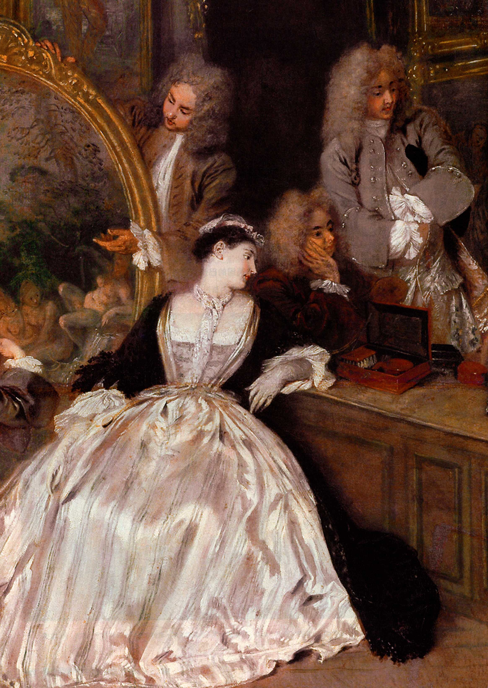

*图22.4细部，让-安托万·华托：《热尔桑画店》*

# 第二十二章 洛可可艺术

在法国，洛可可风格是与路易十五（Louis XV，1710-1774年）联系在一起的，因为这种风格盛行的时间大致相当于他生活的时代，但在路易十五出生前50年，带有洛可可风格的迹象就已显现了。那是在17世纪末巴洛克风格大行其道之时，历经路易十六（Louis XVI，1774-1792年在位）及其妻子玛丽·安托瓦内特（Marie Antoinette）的暴政，一直延续至1789年的法国大革命（French Revolution）。

正如哲学家弗朗索瓦-马利·阿鲁埃（François-Marie Arouet，1694-1778年）——他的笔名伏尔泰（Voltaire）更为人熟知——所指出的，18世纪应该感谢过去。在艺术方面，普桑和鲁本斯的影响贯穿其间。而二人追随者之间的论战比米开朗基罗和提香的支持者有关素描与色彩优劣的争论（见第759页）要更为久远。在这层意义上，洛可可与巴洛克一样，仍然归属于文艺复兴的时代范畴。

虽然巴洛克与洛可可有相似之处，但这两种风格之间存在着一个根本的差别，简言之，就是幻想。如果说巴洛克用一种壮丽的方式来展现喜剧场面，那么洛可可的舞台更小，更为细致。它用巧妙的办法再现了一个脱离现实的王国，令人心仪。在某些方面，法国的洛可可艺术体现了贵族品位的变化，他们重申自己作为（艺术家）赞助人的能力，并开始选择用源于大自然的程式化图案和一种更为家居化的艺术——私密的而非公开的——来装饰他们在巴黎的新邸（公馆）。“洛可可”一词使用得非常恰当，既表现了自然的特质，也暗含着与轻浮的宫廷生活十分吻合的装饰感。这个词是19世纪时出现的一个贬义词，取自法语“rocaille”（意为“鹅卵石”）和“barocco”（巴洛克），特指18世纪初那种冗繁且矫揉造作的品位。随后“Rococo”一词用来描述意大利花园中用于装饰人造洞穴的鹅卵石、石块和贝壳（形状俏皮且不规则），这后来成为了法国室内设计的核心主题。

虽然有时被视作巴洛克风格的最后阶段，但洛可可艺术还是创造了自己独特的风格，代表着一个创造性、智慧性活动高度发达的时代。法国艺术家仍然按照皇家绘画与雕塑学院的传统接受训练，强调使用真人模特进行创作、学习解剖学以及练习透视法和比例关系；除了这些课程，还会展开关于拉斐尔和普桑艺术风格的讲座。但艺术家们也开始探索新的题材，或者以新方式来表现旧题材。在18世纪，对于富于诗意的田园画（克劳德等巴洛克艺术家已实践过这类田园画）的兴趣变得越来越浓。这时的赞助人日益受到以理想化的天性生活的“纯真之人”观念的影响，而为了满足艺术市场和赞助人的需要，艺术家们转向田园画，以及用爱与失去、浪漫的约会和诗意的冥想等作为主题的作品。这些主题的吸引力非常强大，法兰西学院甚至设立了一个名为雅宴画的新种类，由让-安托万·华托引入绘画领域。今天有一些学者批评洛可可艺术中公然的色情倾向及其逃避现实的态度。但值得赞扬的是，这种风格歌颂爱情，并且拓宽了艺术中所表现人类情感的范围，把家庭也作为重要的主题包括进来。

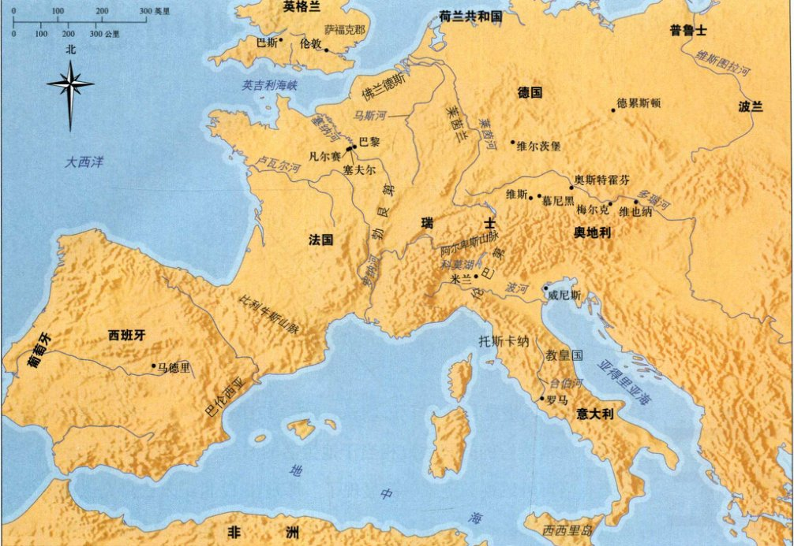

*地图22.1 洛可可时代的欧洲*

虽然与法国的联系最为直接，但洛可可艺术影响并不仅限于法国，还波及了英国、西欧和中欧的大部分地区（见地图22.1）。长久以来由外国艺术家主宰的英国艺术界诞生了一个独特的画派，并且于1768年成立了皇家艺术学院，其举办的年度展览吸引了大批伦敦的时髦主顾和本国最知名的艺术家。在西欧和中欧，尤其是德国和奥地利，紧跟着三十年战争（1618-1648年）所造成的破坏而来的是18世纪的重建时期和朝圣教堂的增加，这些教堂的建筑和装饰所体现的正是洛可可风格。意大利艺术家，如提埃波罗及其助手，用这种精致、优雅的新风格在中欧的教堂和宫殿里绘制天顶湿壁画，也为他们的家乡威尼斯创作类似作品。在那里，卡纳莱托的实景画或城市风光画也成为了外国参观者威尼斯之旅的绝佳纪念品。

同是在18世纪，欧洲人继续在新大陆拓展自己的殖民地。军队为攫取遥远的土地而征战，尽管耗尽国家的钱财，却成功地把异国物产输送回祖国，其中包括羽毛、珠宝和金属，无不令收藏者垂涎，同时也被艺术家用于创造新的艺术形式。另外，欧洲艺术常涉及这些异域外邦，虽然用的是虚构或寓言性的形象；此外，也极大地丰富了赞助人的收藏。美学也在这一时期兴起，而伊曼纽尔·康德（Immanuel Kant，1724-1804年）则创立了一种新的哲学类别，它声称人类最重要的是拥有判断美的能力。在表演艺术方面，威尼斯作曲家安东尼奥·维瓦尔第（Antonio Vivaldi，1678-1741年）和德国作曲家约翰·塞巴斯蒂安·巴赫（Johann Sebastian Bach，1685-1750年）创作了精彩绝伦的歌剧以及合唱音乐，而伦敦也成为了正统剧院的聚集地，其中著名的有海马克剧院（Haymarket）、特鲁里街剧院（Drury Lane）和科芬特花园歌剧院（Covent Garden）三处。

## 法国：洛可可的兴起

1715年路易十四去世之后，以前依附于凡尔赛宫廷的贵族进一步摆脱了皇室本就松弛的控制。路易十五在父王去世时年仅5岁，直到1723年正式加冕。洛可可初期（1715-1723年）被称作摄政时期，之所以如此称呼，是因为法国当时由路易的堂兄、奥尔良公爵菲利浦（Philip，duke of Orléans）进行摄政统治。由于当权的是贵族，贵族阶层重新获得了很多权势和威信。他们抛弃了凡尔赛那种严格、苛求的宫廷生活，许多人决定住在巴黎，不再回到他们在外省的城堡，于是在巴黎建造了漂亮的城中宅邸，称之为公馆（hôtel）。大约从1350年起，公馆就一直被用作地主贵族在城市的住所，但在17世纪，它们却演变成社交中心，这个潮流一直保持到18世纪。公馆中私密的小房间常成为举办沙龙的场所，而沙龙（salon）则是一种知识性和娱乐性兼具的非正式聚会，通常由有权势的妇女（也就是斯塔尔夫人［Madame de Staël］和拉法耶特夫人［Madame de La Fayette］）主持，在巴黎贵族中间极为流行。这些房间里装饰着绘画、瓷器和小雕像，营造出一种奢华、轻松的氛围。因此，绘画只是弥漫于大革命之前法国各地精致之风的产物。这些绘画作品以及室内设计将影响整个18世纪西欧和中欧的风貌。

### 绘画：普桑派对鲁本斯派

17世纪行将结束之际，在法兰西学院内部出现了一种争论，结果形成了两大派系：普桑派（Poussinistes）对鲁本斯派（Rubénistes）。在这场以素描与色彩问题为焦点的论辩发生时，普桑和鲁本斯皆已不在人世。法国艺术家熟悉普桑的画，因为他一生都坚持把画从罗马送回巴黎。他们也从卢森堡宫中的玛丽·德·美第奇组画了解到鲁本斯的作品。保守派支持普桑的观点：达于心灵的素描高于刺激感官的色彩。鲁本斯派（许多成员为佛兰德斯派的继承者）则认为色彩比素描更忠于自然，他们还指出，虽然不可否认素描是建立在理性的基础上，但它只能引起少数内行的兴趣，而色彩却能打动所有的人。从这一论点可以得出重要的结论：它表明外行人应该成为作品艺术价值的评判者。而文艺复兴时期则认为作为一门人文学科，绘画只能由受过教育的人来欣赏。色彩派最终取得了胜利，这部分还要归功于画家让-安托万·华托在当时极受欢迎。

**让-安托万·华托** 鲁本斯派最著名的一员是让-安托万·华托（Jean-Antoine Watteau，1684-1721年）。华托出生在瓦朗谢讷（Valenciennes），这里直到他出生前几年还是南尼德兰的一部分。同时华托也非常喜欢当地最伟大艺术家鲁本斯的艺术风格。1702年移居巴黎后，华托绘制了许多仿鲁本斯法国时期作品的素描，包括玛丽·德·美第奇组画（见图20.5）。华托为新兴的洛可可风格及与之相关的新题材做出了重大贡献。他笔下充满幻想的景象展现的是田园诗般的贵族生活画面：人物举止优雅，衣着奢华，服饰色彩柔和、亮丽，宛若身处梦境一样的天然景色之中。在作品中，他常把戏剧和真实的生活天衣无缝地交织在一起，并加入了即兴喜剧（commedia dell'arte，一种即兴式意大利戏剧）中为人熟知的角色，营造舞台般的环境，以作为角色活动的背景。姿势经过精心设计的角色在观众心中唤起凄凉的爱情、悔恨或怀旧等情感，使画面充满伤感的气氛。这类作品日益受到法国收藏者的追捧，这个主题也很快在全欧洲流行开来。

因为华托的幻想画没有太多的历史或神话基础，他的绘画作品打破了多条学院规则，也不符合任何既有的类型。为了吸收华托为院士和接纳他的浪漫画风，法兰西美术学院创造了一个新的画种，名为雅宴画（fêtes galantes，意为“风雅的游园集会”或“露天娱乐活动”）。这个画种也因此进入了由学院院士安德烈·费利比恩（André Félibien，1619-1695年）在17世纪时建立的类型等级。处于第一位的类型是历史画，它被视作艺术的最高形式，因为人们认为它对想象力的要求最高，所以创作的难度也最大。接下来的是肖像画、风景画和静物画。1712年加入学院时，华托被要求创作一幅入院作品，但他5年后才交出。这件作品就是《舟发西苔岛》（A Pilgrimage to Cythera，图22.1），题材是对爱的召唤，同时含有古典神话元素。后来被视为爱情之岛的西苔岛（Cythera）是关于阿佛洛狄忒（维纳斯）从海水的泡沫中诞生这一古希腊神话发生的场景之一。作品的题目让人想到这个传统题材，但这幅作品在法兰西学院的记录中被记录为雅宴画，恐怕是第一次使用该术语。

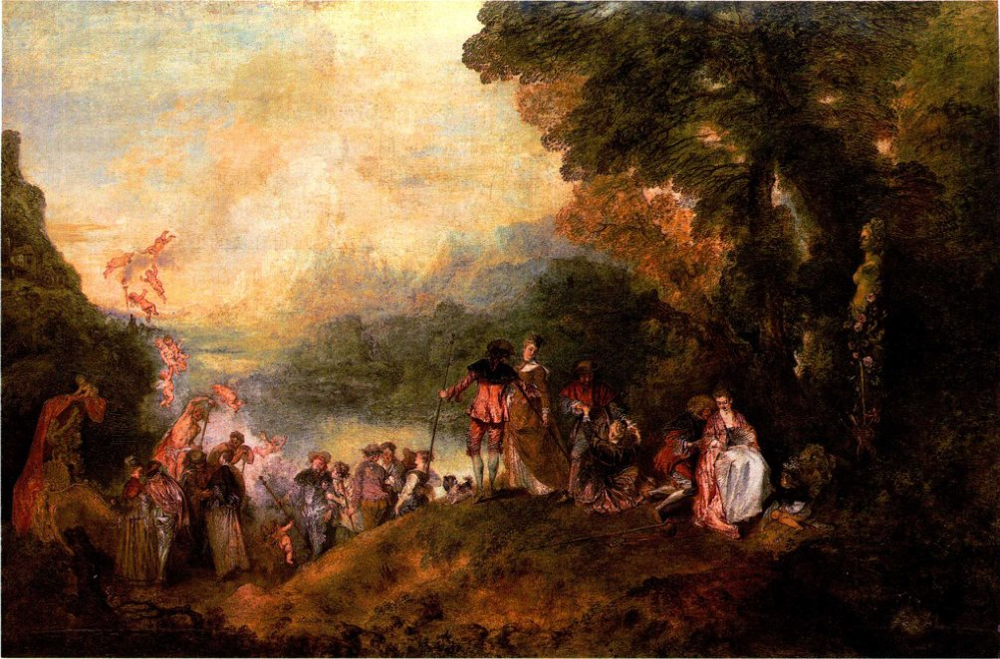

*图22.1 让-安托万·华托：《舟发西苔岛》。1717年。布面油画，l.3 × 1.9米。巴黎卢浮宫*

我们不清楚画中的情侣们是刚刚抵达还是正要离开这个岛，但可以肯定的是，华托创造了一个令人流连但略显忧郁的爱情之地。情侣们可以不受打扰地、自由自在地享受人类的激情和自然的美景。人物活动在前景处从右至左展开，像一个连续的故事，这表明他们可能即将登船。一对恋人还沉浸在多情的约会中；而在他们身后，另一对情侣则站起身来，跟在第三对情侣后面走下山坡，其中不愿走的那位年轻女郎正回头渴望地看着女神的圣林。年轻的情侣们在一群群小爱神的陪伴下，向维纳斯表示敬意，戴着花冠的维纳斯像立于画面右端。柔和的颜色——淡淡的绿色、蓝色、粉红色和玫瑰红色——暗示着情人之间的温存关系。微妙的色调渐变反映了鲁本斯对华托的影响，对于确立鲁本斯派的至高地位起了推动作用。

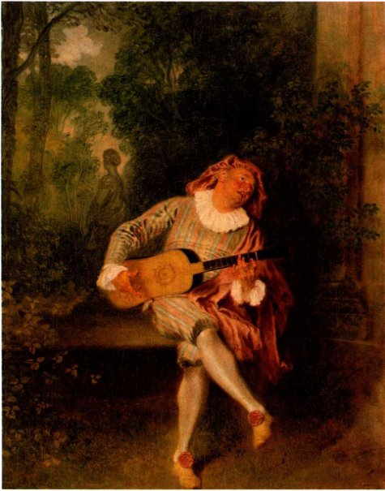

*图22.2 让-安托万·华托：《梅兹庭》。约1718年。布面油画，55.3x43.2厘米。纽约大都会艺术博物馆。Munsey基金，1934年（34.138）*

作为一幅时髦的聚会雅集绘画，这幅作品让人想起了林堡兄弟彩饰手抄本的精美插图以及鲁本斯的《爱之园》（见图20.6）中那些优雅的人物，但华托改变了人物与背景之间的比例，添加了几分乔尔乔内和提香式的动人风姿。华托的人物身材苗条，举止优雅，与背景比起来显得很小，在与大多数巴洛克风格的作品相比时就更是如此了。但风景并未覆盖整个画面，而是传达出它田园诗般的甚至有点哀婉的氛围。华托通过人物淡淡的感伤和踌躇，以及风景、其中的雕塑传达出相似感受，创造出一种怀旧感，暗含着对未曾实现激情的渴望。

华托的《梅兹庭》（Mezzetin，图22.2）也使人体会到这种怀旧气氛，乐手梅兹庭是即兴喜剧中的一个常见人物，其名字的意思是“半拍”，他扮演的角色是一个多情的求婚者。他弹着吉他，唱着一支求爱的情歌，背景是一个园林般的地方，远景处有一尊女子雕像。学者们认为他是在向这尊雕像演奏。而且有人指出这幅画的主人是华托的朋友让·德·朱利安那（Jean de Jullienne，一部关于这位艺术家的传记的作者；见原始文献），它可能讲述了让追求爱妻的故事。惆怅的乐手尽力向右上方看，视线落在画面之外。但那身带有精致的玫瑰红色、淡蓝色和白色条纹的古怪衣服，配上黄色的鞋子以及玫瑰红色的扁圆帽和短披风，将这个场景的氛围从忧郁变为迷人。这个身处淡绿色背景中一身淡色的孤单矮小的人物无论从情绪、人物类型还是服饰和背景的颜色来看都属于典型的洛可可风格。

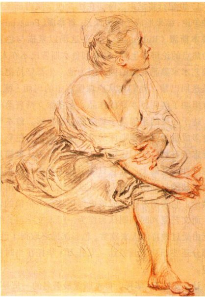

*图22.3 让-安托万·华托：《坐着的年轻女子》。约1716年。三色素描；红色、黑色和白色粉笔，淡黄色纸，25.5 × 17.1厘米。纽约皮尔蓬特·摩根图书馆*

华托的用色是他被归为鲁本斯派一员的有力证据。但他作为一名素描大师（这暗示着他也是一个普桑主义者）的创新和创造力在于把色彩与线条结合起来（见材料与技法）。虽然之前包括鲁本斯在内的艺术家可能也用红色或黑色粉笔画过素描（用白色粉笔加高光），但三色素描（trois crayons）技法却是华托的专长。在《坐着的年轻女子》（Seated Young Woman，图22.3）中，他将这三种粉笔用到了极致，勾勒女子身体，腿、手、脸的局部（嘴唇、鼻尖）、颈背、乳房用红色，与用在她衣服、眉毛和拢在头顶的头发等处的黑色和白色形成对比，体现了人物活泼的性格。这些颜色使这幅人物充满了生气，平添自然之感。在其大量的素描作品中，华托通常着重表现画中人物的姿势、动作、手势和表情，这一幅素描之外，许多作品是其油画中人物的习作。

> **原始文献：让·德·朱利安那（1686-1767年）**
**
**——安托万·华托（1684-1721年）生平概述****
>
> 后来当上哥白林挂毯厂厂长的染布工朱利安那是华托的终身好友，也是其作品的收藏者。华托去世后，朱利安那请人把他的所有素描都制成雕版画，然后他又买来了华托的多幅油画，也照上述的办法处理。他为华托撰写的传记于1726-1728年出版，一同出版的还有根据华托油画和素描作品制作的350幅雕版画，它们分为两卷，书名是《不同角色的特点》（Figures de différents caractères）。后两卷随后出版。
>
> 华托学习的兴趣越来越浓，他深深为这个宫殿［卢森堡官］中鲁本斯所创作的画廊组画所打动，经常跑去研究这位大师的色彩和构图。很快他就获得了一种更加自然的品位，与他从吉洛（Gillot）那里学到的迥然不同······
>
> 华托个子中等，体质虚弱，但思维敏捷、锐利，而且十分敏感。他少言寡语，但说话得体，文章也写得漂亮。他几乎总是沉浸在冥想当中。华托对于大自然和所有取景于大自然的名家异常崇拜，然后刻苦的工作却使得他变得有点忧郁。他态度冷淡、笨拙，所以不仅有时难以与朋友相处，还时常自找别扭。他除了冷淡和善变之外，并没有其他缺点。可以说，在他活着的年代以及死后的岁月中，没有哪个画家能获得像他一样的名望。他的画虽已涨到天价，但直至现在仍是抢手货。人们可以在西班牙、英国、德国、普鲁士、意大利及法国的许多地方见到这些画，其中尤以巴黎为甚。我们还必须承认，再没有比他的作品更适合小规模收藏的了。华托的作品勾描准确，色彩真实，笔法细腻，无人可以模仿。他不仅是雅宴画和乡村画高手，还在军事题材方面有过人之处，尤其擅长画行军和士兵宿营的场面。其中军人那朴实、自然的个性更是使这类作品获得了高度评价。他甚至还留下了几幅历史画，同样品位上乘，充分表明了一点：如果他把历史画作为主攻画种，那么在这个领域也可以取得同样巨大的成功。
>
> 虽然华托的一生非常短暂，但作品数量极大，足以让人以为他的寿命很长，然而这实际上只能说明他极其勤奋。实际上，就连消遣和散步时他也在观察大自然。如果觉得景色极佳，他当场就会用素描画下来。他的研究性素描、被挑出来制成雕版画的素描作品，以及作为独立作品的素描数量完全可以证明这个说法。
>
> *SOURCE: A DOCUMENTARY HISTORY OF ART, VOL II. ELIZABETH GILMORE HOLT ED. (PRINCETON, NJ: PRINCETON UNVERSITY PRESS, 1982)*

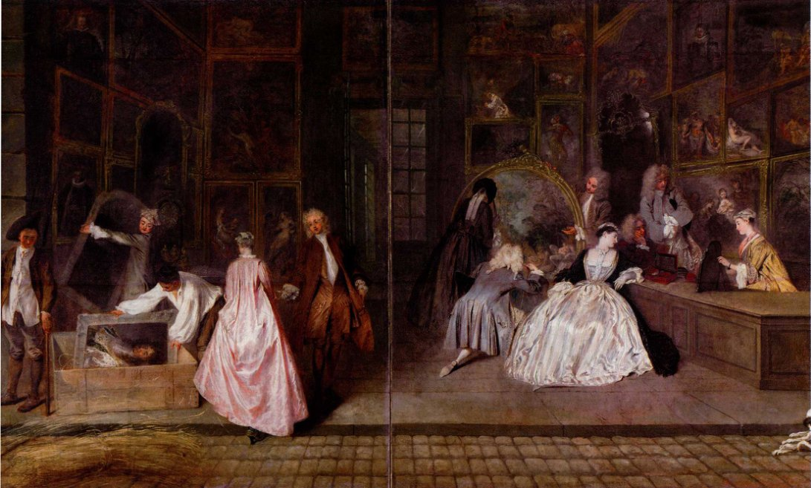

*图22.4 让-安托万·华托：《热尔桑画店》。1721年。布面油画，163 x 308厘米（后来被分割成两块，然后重新接合起来）。夏洛腾堡宫（Schloss Charlottenburg），国家宫殿与园林管理局（Staatliche Schlōsser und Gärten），柏林*

华托最著名的作品之一《画店》或《热尔桑画店》（The Shopsign 或 Gersaint's Signboard，图22.4）也是这样的风格，并不拘泥于形式。这块招牌是为了给华托的朋友、艺术品商人埃德梅·热尔桑（Edmé Gersaint）的商铺做广告而创作的，但它实际上表现的并非热尔桑的画廊。热尔桑在关于这件作品的记述中指出，此画是在华托从伦敦旅行回来后完成的，他接受了华托“伸展伸展手指”的建议下，并委托他创造这样一幅作品。华托的身体一向不好（不久之后，他就因肺结核去世了），热尔桑的话暗示着艺术家把这件作品作为短暂恢复期的组成部分。这段叙述的真实性一直受到怀疑，但这件作品却是华托的最后一幅作品。此画（原本顶部为拱形）据说只用了8个早上就完成了。它本是用于室外陈列的，但只展示了15天（也许是因为天气，或因为很快就被人买走了）。热尔桑说这幅画吸引了许多艺术家和过路人，他们对画中人物自然、优雅的身姿赞叹不已——这些特点今天仍为人津津乐道。左方背朝观众女子身上宽大的玫瑰红缎子衣服吸引着人们的目光；右方无精打采地斜倚着的女子则与这个人物形成了一种平衡关系。女士们老练而舒适地欣赏着店里高挂在墙上的三四排画，店员在一旁热心地照应着。学者们认为店里的画不是确有画作的模仿，而是佛兰德斯画派和威尼斯画派风格的变体创作。这个说法似乎也有些道理，尤其是把这件作品与老扬·布吕盖尔的《视觉的寓言》和它所表现的真实绘画陈列室（见图20.10）作比较之后。店里的存货还包括各种钟表和镜子，它们给人琳琅满目的感觉，也让观众想起旧制度（Ancien Régime）。支持这种联想的是左方一幅仿里戈作品（见图21.10）的路易十四肖像，正被装进一个大板条箱。虽说从一个层面来看，国王形象的出现暗示着旧时代的离去（国王驾崩于1715年，刚过几年），实际上也和店名大君主（Au Grand Monarque，向伟大的国王致敬）构成了调侃。华托把这件商业画变成一幅精致、柔美且敏感的杰作，展现了他作为画家的非凡才能。

> **材料与技法：色粉画**
>
> 色粉笔（pastel）是将彩色粉笔（或粉末）同胶水、汁液、阿拉伯树胶或乳浆混合（或用其过滤），再揉成圆筒形的小管。今天色粉笔的制售方式也基本上与洛可可时期相同。填料和水能使色粉笔用起来顺畅。色粉笔可软可硬，但都必须先经过干燥，以便包装成画笔。
>
> 15世纪末，达芬奇就曾使用过色粉笔（1499年的伊莎贝拉·德·埃斯特肖像），但其他艺术家普遍使用色粉笔还是在16世纪。不过艺术家们只是用它来绘制初稿，而非完整作品。然而到了18世纪，艺术家们认识到这种材料的潜能，开始创作以完整作品形式呈现的色粉画。色粉笔和当时流行的三色素描技法（见华托，图22.3），它们的优点是都可以同时表现线条和颜色。由于17世纪末、18世纪初围绕着素描（即线条）与色彩的优劣发生了许多争论，而批评家们对能够两者兼备的艺术家褒奖有加（如拉斐尔），所以色粉笔的使用可以当作是对这一争论的回应。线条可以模糊成一片、也可以互相叠加或者形成排线，所以一根单线就可以成为一个色区，几根单线合起来则能形成一个色彩更加鲜明的色块。
>
> 艺术家主要用色粉笔来画肖像画，轻涂数笔，即可凸显人物的活力、情感或表情，从而使画中人看上去更加生动、逼真。罗莎尔巴·卡列拉（Rosalba Carriera，1675-1757年）是最伟大的色粉肖像画家之一，这位威尼斯艺术家以善于揭示对象激烈的心理活动而著称。卡列拉在生前就享有盛誉，她的主顾遍布各国，英国、法国、德国和波兰都有她的藏家。她分别于1705年、1720年和1721年成为罗马圣路加学院、波洛尼亚克莱门蒂纳学院（Academy Clementina）和法兰西学院的院士。1720-1721年在巴黎旅行时，她受到了法国宫廷和包括亚森特·里戈（见第二十一章）和华托（见第759-763页）在内的法国艺术家欢迎，华托还以她为对象画了几幅素描。她精湛、直接的技法，配合以模糊甚至朦胧的人物形象，体现出一种含有挑逗暗示的性感，正如这幅多尔塞第二公爵（second Duke of Dorset）肖像所表现的那样。
>
> 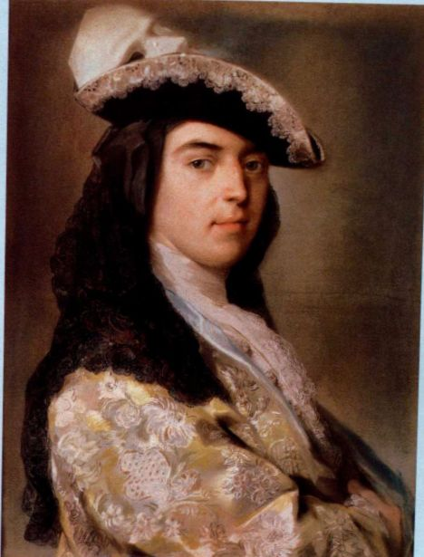
>
> *罗莎尔巴·卡列拉：《夏尔·萨克维尔，多尔塞第二公爵像》（Charles Sackrille，Second Duke of Dorset），约1730年。纸上色粉画，63.S × 48.3厘米。私人收藏*

**弗朗索瓦·布歇** 在华托于1721年英年早逝之后，弗朗索瓦·布歇（François Boucher，1703-1770年）一跃成为法国绘画界的重要人物。布歇以其幻想作品、田园诗风景画和描绘中产阶级日常生活的绘画而闻名。他是蓬巴杜夫人（Madame de Pompadour）的宫廷画师，蓬巴杜夫人是路易十五的情妇，也常在政治上为他提供参谋，此外她还是重要的艺术赞助人。布歇为她画肖像和其他作品，包括为她巴黎城外的私人休养所而作的《镜前的维纳斯》（The Toilet of Venus，图22.5）。虽然这不是蓬巴杜夫人的肖像，但它可能暗示的是她在1750年凡尔赛宫上演的《镜前的维纳斯》一剧中扮演维纳斯这件事。与武埃笔下充满美感的女神形象（见图21.3）相比，布歇的维纳斯已变成了一个青春永驻的存在。她那粉红色的皮肤、脚下粉红色的躺椅和织物上的立体玫瑰花饰遥相呼应。维纳斯围着一件淡蓝绿色衣服。这幅悦目而充满情色意味的作品在人物类型以及对纹理和色彩——浅淡的粉红色、玫瑰红色和蓝色——的感官化用法方面都体现了典型的洛可可风格。如果说华托把凡人之爱提高到神话的层面，那么布歇就是把嬉闹的情色上升到了神的国度。他揭示了丰富人们日常生活的幻想。事实上，布歇笔下所表现的充满梦想和欲望的欢乐景象真实再现了其王室、贵族赞助人奢侈且精力旺盛的生活方式，他的作品对这些人有巨大吸引力。

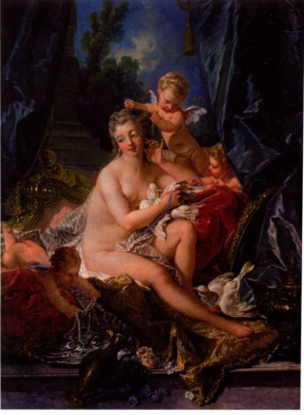

*图22.5 弗朗索瓦·布歇：《镜前的维纳斯》。1751年。布面油画，109.2x85.1厘米。纽约大都会艺术博物馆。William K．Vanderbilt遗赠。1929年（20.155.9）*

**让-奥诺雷·弗拉戈纳尔** 用绘画把幻想变为现实是让-奥诺雷·弗拉戈纳尔（Jean-Honoré Fragonard，1732-1806年）的特长——至少是布歇的这位高徒的名声所在。弗拉戈纳尔还是一位才华横溢的色彩画家，1752年，他赢得了著名的罗马大奖，并从1756年起，在罗马度过了5年光阴。回到巴黎后，他主要为私人收藏者工作。白日梦、调情、放荡，可以称为洛可可艺术的精神，在他的《秋千》（The Swing，图22.6）一画中融为一体。一则传闻是这样介绍这幅作品的：圣朱利安（Saint-Julien）男爵找到另一个艺术家加布里埃尔-弗朗索瓦·道庸（Gabriel-François Doyen），请道庸为他画这样一幅画——我的情人“坐在一架秋千上，身后则是一位主教在推秋千，请把我安排在可以看到这个可爱人儿腿的位置；如果你想让画面变得更生动的话，甚至可以让我看到更多”。道庸拒绝了这个委托，但把它移交给了弗拉戈纳尔。

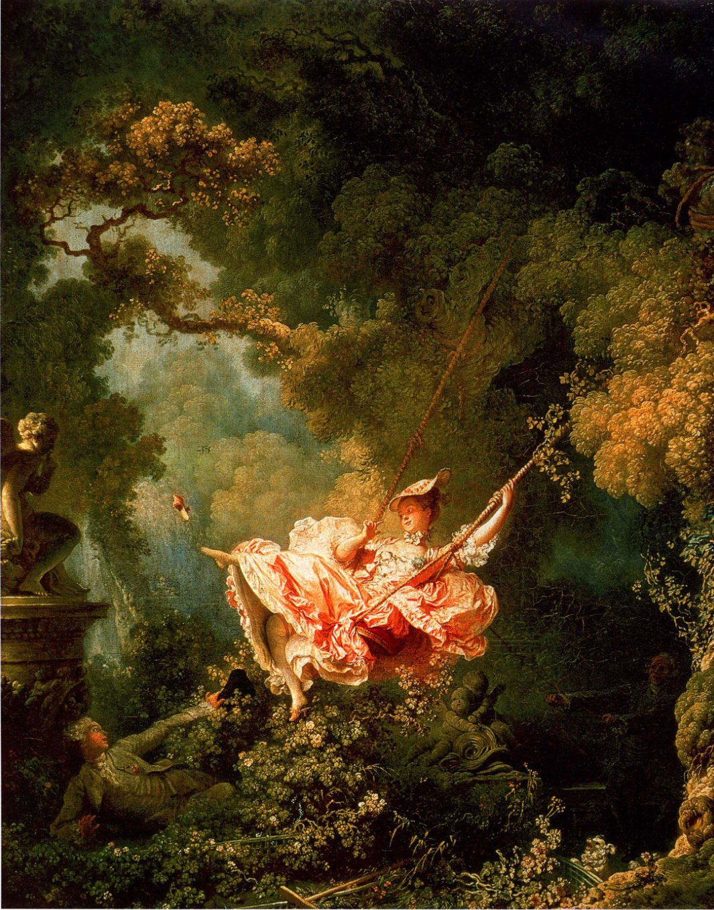

*图22.6 让-奥诺雷·弗拉戈纳尔：《秋千》。1767年，布面油画，82.9 ×66.0厘米。伦敦华莱士博物馆（Wallace Collection）*

这幅画是表现“风流韵事”的一个例子，反映了艺术家与赞助人在这一性爱幻想中的共谋关系，而那名教士则被瞒过。与布歇的《镜前的维纳斯》一样，这幅“闺房画”带给观赏者艳遇和窥淫的刺激，唯一的不同是它以户外为背景，整个场景好似一个舞台。周围场景的纯洁和天真使得秋千荡向观看者（即赞助人）这个动作更加具有挑逗感。画面左方的丘比特雕像把一根手指放在唇上，暗示着它也是这一出轨行为的同谋，而作为观众的我们如今也成为了参与者。弗拉戈纳尔的许多作品中都有雕像，这是为了回应或强化主题。这一幕发生在一片葱翠的树阴里，为隐蔽在树丛中的这个“爱巢”提供了封闭的环境，使这次艳遇不至于春光外泄。树木茂密、花草丛生、阳光灿烂的景色让人感到春夏的温暖，暗示着性和生殖力。灿烂的柔和色彩则创造出超脱凡俗般的朦胧气氛，增强了弗拉戈纳尔所编织的这个幻想的淫荡感觉。

弗拉戈纳尔集中体现了洛可可艺术耽于声色的特点，而其作品的一大特征就是极其精湛的用色技巧。他的作品包括性爱幻想画、亲切随意的习作以及田园诗风景，都是能为其富有赞助人提供消遣的题材。

**让-西蒙·夏尔丹** 在中产阶级家庭里长大的让-西蒙·夏尔丹（Jean-Siméon Chardin，1699-1779年）日后飞黄腾达，当上了法兰西学院的财务总管和沙龙主持（Tapissier），负责在学院展览上布置展画。这个角色特别值得注意，因为虽然夏尔丹积极投身于学院生活，但他的专长却是静物画，而这认为是学院的题材等级中最低的画种。可是，通过他灵巧的手，将这一画种提升到一个极高的地位，而且赢得了别人的尊重。对静物画和风俗画（同事们鼓励夏尔丹画人物，作为提高其地位的一种手段，从此，风俗画就成为他的另一项专长）的兴趣是由那时保存在法国的许多17世纪荷兰和佛兰德斯绘画作品所激发的。大约在1550年之后，越来越多的荷兰和佛兰德斯艺术家定居法国，他们通过法国拍卖行的荷兰绘画拍卖项目与故乡保持密切的联系。他们激起了法国人对外来绘画的强烈兴趣，而事实上，夏尔丹的一些赞助人就是17世纪荷兰和佛兰德斯艺术品的重要收藏者。

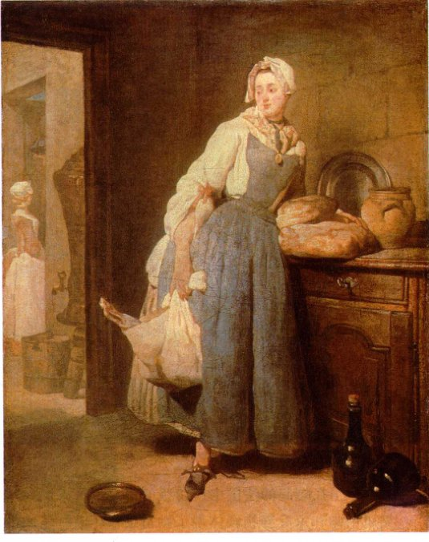

*图22.7 让-西蒙·夏尔丹：《市场归来》。1739年。布面油画，47 x 37.5厘米。巴黎卢浮宫*

作为一名日常生活的敏锐观察者，夏尔丹的风俗画不表现象征寓意，而是肯定现有社会秩序和价值标准的正确性，从而起到道德训诫的作用。对于他的赞助人——正在崛起的法国中产阶级的成员——来说，这类风俗画和家庭静物画体现了勤奋工作、节俭、诚实和热爱家庭这些美德。夏尔丹所描绘的家庭场景安静闲适，深深触动了他那些久经世故的赞助人的心弦；对这些画的需求非常强烈，所以他常常要为自己最受欢迎的作品绘制多个复本。夏尔丹的作品也会通过版画的形式复制，使那些没有钱买原作的人也可以负担得起。

《市场归来》（Back from the Market，图22.7）表现的是一个巴黎中产阶级家庭的生活。这种隐藏在日常生活中的美和清晰的空间秩序感只有荷兰艺术家扬·维米尔（见图20.34和20.35）能与之相比。但是，夏尔丹的技法与任何一位荷兰艺术家都大不相同。与早期荷兰静物画的精确相反，夏尔丹的笔法线条柔和，只显现物体的形状，而不是展现清晰的轮廓。夏尔丹并不会画出每一个细节，而是试图揭示物体的内在属性；他简化形式，巧妙地改变它们的外观和结构。如果考虑到他越来越喜欢单纯的写意，色粉画对他的吸引力就是可以理解的了。当夏尔丹晚年视力渐渐衰退之时，他也常常须转向这种绘画形式。在这一幅及其他风俗画作品中，他将最微不足道的物品中蕴含的复杂美揭示出来，并赋予它们永恒的尊严。

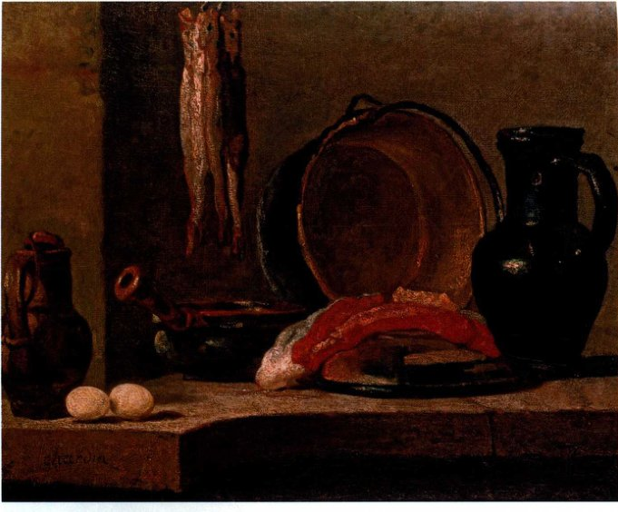

*图22.8 让-西蒙·夏尔丹：《厨房静物》。约1733年。布面油画，32 × 39厘米。阿什莫尔博物馆，牛津大学。W.F.R.Weldon夫人遗赠*

夏尔丹的静物画描绘的通常是同样朴实的环境。而荷兰静物画则不同，多是精细地集中刻画几样器物。《厨房静物》（Kitchen Still Life，图22.8）表现的不过是厨房中的日常用品：陶罐、一个砂锅、一个铜锅、一块生肉、熏鲱鱼、两个鸡蛋。但它们看上去却是那么的重要，每一件物品的位置都与其他物品保持着稳固的关系，每一件都是那么值得艺术家以及观众注意。从极为平衡的构图来看，夏尔丹很关心形式问题，但尽管如此他还是以一种近乎敬畏的态度来对待这些物品。抛开它们的形状、颜色和质地不谈，对作者而言这就是普通人的生活以及价值观的象征。

《吹肥皂泡的少年》（Blowing Bubbles，图22.9）无疑是荷兰风俗画以及静物画传统中常见的虚空象征发展而来的产物。只能维持瞬间完好的肥皂泡象征着人生的短暂，这正是此画的主题之一。然而，夏尔丹选择了一种有趣且可爱的方式来向观众表达他的意思。他画了两个孩子，年长的男孩可能正在教身旁热切地观看的小男孩吹泡泡，这并不奇怪，因为游戏是夏尔丹作品的常见主题。他经常描绘正在玩耍或打牌的幼童或少年。但是与大多数洛可可绘画不同，这件作品中的人物维持原来的尺寸，并不进行任何缩小，因为他们的大小会影响我们对现实的理解。选择这种比例来进行绘画就大大增加了我们在现实世界中遇见类似场景的可能性。

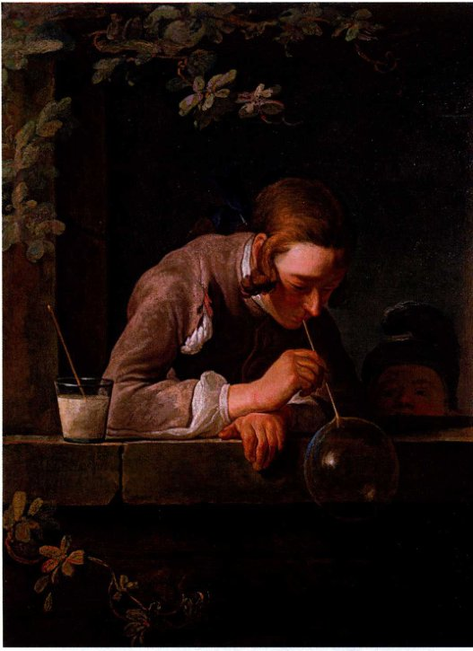

*图22.9 让-西蒙·夏尔丹：《吹肥皂泡的少年》。约1733年。布面油画，93 × 74.6厘米。华盛顿国家美术馆。John W.Simpson夫人赠*

**伊丽莎白-路易丝·维热-勒布伦** 肖像画可以使我们最为清晰地理解法国洛可可艺术，因为人形象的改变是这个时代的本质特征。在贵族肖像画中，男性都给人以财大气粗的错觉，因为这是其高贵出身的标志。但最优秀的洛可可肖像画却是以衣着精致的女性为对象，在一个崇拜爱情和女性美的社会里，这一事实并不令人惊讶。实际上，洛可可时期最杰出、最多才多艺、也最为成功的肖像画家之一便是伊丽莎白-路易丝·维热-勒布伦（Élisabeth-Louise Lebrun，1755-1842年）。作为玛丽·安托瓦内特的宫廷画师，维热-勒布伦的职责是美化君主形象，因此在18世纪80年代法国大革命爆发前夕，她的处境很危险。但她从战争中幸存下来，见证了路易十六的旧制度过渡到后革命时期。

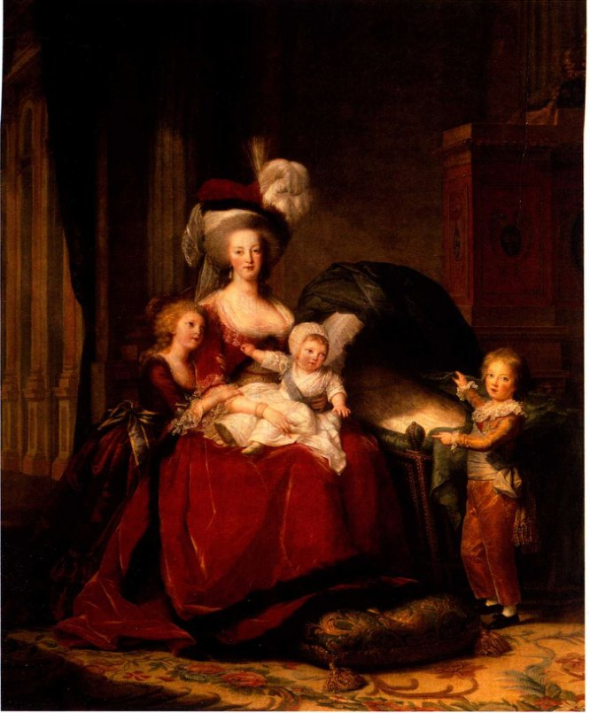

*图22.10 伊丽莎白-路易丝·维热-勒布伦：《玛丽·安托瓦内特和她的孩子们》。1787年。布面油画，2.75x2.15米。凡尔赛宫国家博物馆，凡尔赛*

《玛丽·安托瓦内特和她的孩子们》（Marie Antoinette and Her Children，图22.10）充分表现了维热-勒布伦为这位皇室母亲所选取的幻想场面，这也是王后最希望在其凡尔赛宫生活中出现的场景。儿女绕膝的玛丽·安托瓦内特一副“平常”、谦恭的妇女形象。在那个习惯了高婴儿死亡率的年代，空摇篮的形象就表示着一个婴儿的夭折，这也说明了王室都是普通人。王后的大儿子路易·约瑟夫（Louis Joseph，人称皇太子［dauphin］；仅仅两年后，他就夭折了）用手指着苏菲（Sophie）的空摇篮。二儿子路易·夏尔（Louis Charles）则坐在母亲的腿上，女儿玛丽·特蕾丝（Marie Thérèse）站在母亲身边。这类并不仅仅表现家庭场景，而是专门刻画母亲和孩子的肖像当时在绘画和文学中都十分流行。事实上，母性为女人一生之缩影这样的观念就是在这个时期完全成熟的。维热-勒布伦的肖像画成为了王室私密生活的写照，意在表现18世纪法国最为特别的一个家庭之中的平凡和普通。

> **大事年表**
>
> 1701-1714年 - 西班牙王位继承战
> 1715年 - 路易十四去世
> 1718年 - 法国人开辟新奥尔良
> 1723年 - 路易十五加冕成为法国国王
> 1767年 - 弗拉戈纳尔创作《秋千》

## 法国洛可可式室内装饰

正是在18世纪初室内的私密空间里，洛可可的优雅和魅力尽显无遗。这一点在以凡尔赛宫为背景的维热-勒布伦的玛丽·安托瓦内特肖像中体现得淋漓尽致，虽然经过了一定程度的修饰。不过凡尔赛宫并非社交界的唯一衡量标准。散居在巴黎的贵族公馆很快就变成了社交中心。在由国家资助的建筑活动日益减少之时，“为私生活而设计”这一理念变得重要起来。由于在城中建造的公馆空间狭窄、地形不规则，所以这些公馆很少能有出众的外部造型。于是建筑师们便把主要精力都放在房间的设计和装饰上。公馆要求有一种舒适的室内装饰风格，可以为个人的想象力提供充分空间，避免像在凡尔赛宫那样受到古典主义的束缚。

对于法国装饰格调的发展，室内设计师所受到的重视是举足轻重的。他们的雕版画确立了新的设计标准，希望后来的工匠们也可以遵守，因而后世的工匠们丧失了大部分的独立性。设计师还与建筑师合作，而此时建筑师也更多地进入了室内装饰领域。雕刻家通常负责建筑雕饰的制作，而与之合作的画家则将作品镶在门的上方，建筑师与他们一道把装饰艺术提高到了美术的层面，从而确立了一个延续至今的传统。装饰艺术与美术的结合在家具中表现得最为明显。法国的家具师又被称作镶饰家具细木工（ébénistes，来自“乌木”一词，乌木是他们最常用的镶面薄板木料），他们采用新材料和新工艺，从而推动了室内装饰的变革。镀金材料、金属和珐琅常被用于创造洛可可风格中羽毛般的装饰效果。这些工匠有许多原本是荷兰人、佛兰德斯人、德国人或者意大利人。

装饰艺术在洛可可时期所扮演的角色独一无二。公馆的室内不仅仅是物品的集合。而且是由品位精到的收藏家以及迎合他们苛刻趣味的优秀建筑师、雕刻家、室内装饰家和经纪人用心组合起来的整体。一个房间，就像一件家具，包含着多个工种的劳动：细木工、雕工、金匠和银匠、室内装修工和瓷工。这些工匠制作出各式各样的精美制品放置在室内，而房间通常被涂成白色，装饰镀金线脚，墙上和门上方则镶嵌着色彩柔和的洛可可绘画，这一切都因镜子和光线而显得更加明亮。艺术家们致力于营造总体效果，虽然按照传统来说每一门手艺都是一个独立的专业，必须服从严格的规定。正是他们合力激起了席卷欧洲贵族和上层中产阶级对于新奇事物的贪婪欲望。

**尼古拉·皮瑙** 从洛可可时期完好无损保持至今的房间寥寥无几；大部分已被毁坏或进行了改造，要不然就是其中的物品和装饰丢失。即便如此，我们也可以通过巴黎瓦朗日维尔（Varengeville）公馆中一个经过复原的房间（图22.11）充分了解其外观。这个房间应该在公馆的底层，紧贴花园台地，它是1735年左右尼古拉·皮瑙（Nicolas Pineau，1684-1754年）为维拉尔公爵夫人（Dutchesse de Villars）设计的。皮瑙曾在俄国住过14年，与其他法国工匠一起参与了彼得大帝的新城——圣彼得堡的建造。他为公爵夫人设计的房间加入了许多当时流行的洛可可特征。为了营造豪华的效果，在白色的墙壁表面贴上了镀金的灰泥装饰图案：阿拉伯花纹、C形扇贝纹、S形涡卷纹、怪异的鸟、蝙蝠翅膀和枝状茛苕叶饰。雕刻精美的家具的细部用镀金青铜制作。一切都沉浸在涡旋卷曲的图案海洋中，由世上所见过的最精微的设计感和最复杂的材料统一成一个整体。就纹样丰富的壁炉和华丽的枝形吊灯架而言，装饰与功能之间已不存在明显的区别。绘画也完全融入了整个装饰系统，房间有两扇门的上方镶着布歇的画（这些画作甚至开创了一个名为“门头饰板”［overdoor］的装饰品类）。

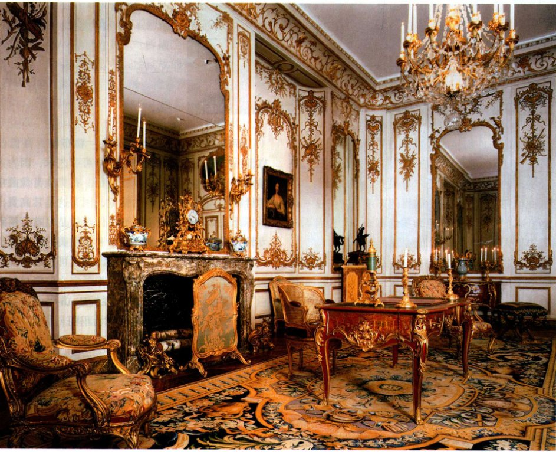

*图22.11 尼古拉·皮瑙：瓦朗日维尔公馆里的房间，圣热尔曼林荫大道（Boulevard St．Germain）217号，巴黎，约1735年（左面墙上的壁炉架不是房中原有之物）。原镶板可能是皮瑙定做的。雕花、彩绘、贴金橡木，5.58x12.35x7.07米。摄于1995年左右。纽约大都会艺术博物馆。Charles Wrightsman夫妇赠，1963年（63.228.1）*

从餐具和茶具到盛装有趣的百花香盒（图22.12），瓷器曾是室内的主要装饰元素之一，尤其是塞夫尔（Sèvres）生产的瓷器。塞夫尔是路易十五设立的一家瓷器制造厂，其风格紧随他的情妇蓬巴杜夫人的口味。在这个百花香盒中，百花香的芬芳香气可以从船形器的舷窗透出。在布歇的《镜前的维纳斯》（图22.5）中，右下角也有一个类似的器皿（但它不是塞夫尔的产品）。这些瓷器后来在德国受到了更大的欢迎，正是因为麦森（Meissen）瓷器的流行，把洛可可绘画和色粉画中的色彩（浅玫瑰红、淡绿色和青绿色）——化作镀金的立体艺术品。

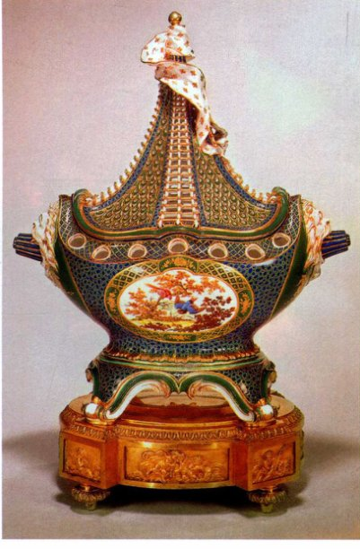

*图22.12 百花香盒（Potpourri container），约1758年。塞夫尔皇家瓷器厂，法国。彩饰和金饰软黏土瓷器，不包括底座，瓶的尺寸为37.5 × 34.6 × 17.5厘米。纽约弗里克美术馆*

**克洛狄翁与法国洛可可雕塑** 法国洛可可时期的雕塑被用于室内装饰，它们形式多样，专门为近距离观看而设计。其中一个典型例子是克劳德·米歇尔（Claude Michel，1738-1814年）的小雕件《宁芙和萨梯尔狂欢》（Nymph and Satyr Carousing，图22.13）。克劳德·米歇尔人称克洛狄翁（Clodion），是洛可可时期一个成功的雕刻家，他后来转变了自己的风格，以适应更为朴素的新古典主义。克洛狄翁的学艺之路始于凡尔赛宫，后来还赢得了享誉盛名的罗马大奖。他对洛可可艺术最大的贡献就是把布歇和弗拉戈纳尔的幻想画变成妖艳而色情的立体作品。这件雕塑开放、轻盈的构成方式与贝尼尼的一件作品有着密切关系，但尺寸更小，也就产生了一种更为亲昵、温婉的效果。虽然克洛狄翁也承办过几组大型大理石雕，但他最为人称道的才能还是在于运用赤陶这种让人有亲近感的材质。

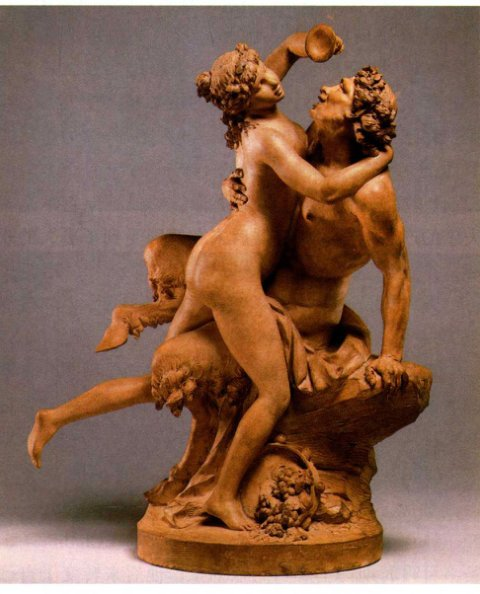

*图22.13 克劳德·米歇尔（人称克洛狄翁）：《宁芙和萨梯尔狂欢》。约1780年。赤陶，高59厘米。纽约大都会艺术博物馆。Benjamin Altman 遗赠，1913年（14.40.687）*

## 英国：绘画与版画制作

洛可可艺术的影响还波及了英吉利海峡的彼岸，在那里有一代又一代外来艺术家（荷尔拜因、真蒂莱斯基、鲁本斯、凡·代克）活跃着，而荷兰和意大利艺术家的作品也被广泛搜集。洛可可促生了中世纪以来的第一个拥有国际影响力的英国画派。版画的生产并非只用于新版画的创作，更重要的是复制传播绘画作品，使其拥有更多的观众，产生更广泛的影响，夏尔丹和鲁本斯的作品尤其如此。这项工作被证明对英国公众特别喜爱且收藏量越来越大的风景画和风俗画非常有益。

### 威廉·荷加斯与叙事画

威廉·荷加斯（William Hogarth，1697-1764年）是尼古拉·希利亚德（见图18.28）以来第一个重要的英国本土艺术家。荷加斯最早从事的是雕版画创作，但不久便开始绘制油画。虽然可以肯定他从威尼斯、法国绘画以及凡·代克的作品中吸收了色彩和笔法方面的知识，但他的作品极富原创性，可谓前所未有。18世纪30年代，他以一种新型绘画一举成名，他把这种画描述为：“现代的道德主题·······与舞台表演相仿。”新画种是伤感喜剧风行的结果，这种喜剧试图通过讽刺进行道德教化，如理查德·斯梯尔（Richard Steele）的作品。荷加斯的作品与约翰·盖伊（John Gay）于1728年创作的《乞丐歌剧》（The Beggar's Opera）意趣相同，他的一幅画就是以这部尖刻的社会和政治模仿剧为素材。他的作品以及据其翻印并公开销售的版画都是系列画，某些细节重复出现在各个场景中，以求保持整个系列的统一。荷加斯的道德画以反面例子来宣扬严肃的中产阶级美德，反映了对纯真年代及其价值观的渴望。在英国新兴的富裕中产阶级中获得了巨大成功。

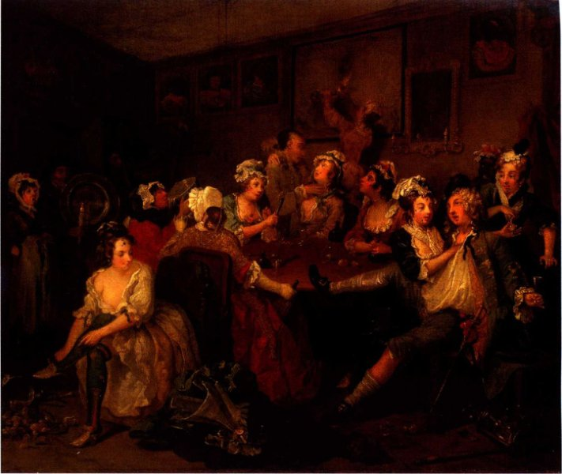

*图22.14 威廉·荷加斯：《欢宴》，《浪子历程》系列第三场，约1734年。布面油画，62.2x74.9厘米。伦敦约翰·索恩爵士博物馆*

在《浪子历程》（The Rake's Progress）之一《欢宴》（The Orgy，图22.14和22.15）中，艺术家刻画了一个耽溺于酒色的年轻败家子（在后面的故事中，这个恶棍因债务而被捕、结成了一项金钱婚姻、沉迷于赌博、进入债务人监狱，最后在一个疯人院中死去）。故事发生在伦敦一个著名的妓院——玫瑰酒馆。前景处整理鞋子的姑娘正在为一个粗俗的舞会做准备，其中要用到她身后的银盘和蜡烛；左面，一个尿壶里的污物泼在一盘鸡肉上；背景处，一名歌手拿着当时一首情色歌曲的散页乐谱。画中充满滑稽的视觉线索，它们给这幅社会罪恶的讽刺之作增添了喜剧成分，而观众则可以一点一点地发现它们。荷加斯既运用了华托那种闪亮的色彩，也像扬·斯蒂恩那样将叙事作为重点（对比图22.1和20.33）。他的道德故事画令人愉快，观众因此乐于接受他的教诲，而不是因严肃的说教而敬而远之。

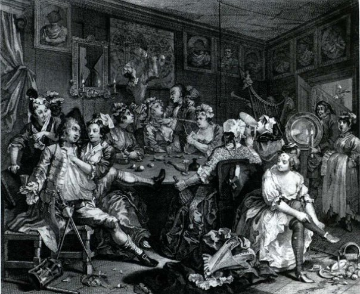

*图22.15 威廉·荷加斯：《酒宴（欢宴）》（He Revels），《浪子历程》系列第三场，1735年。雕版画。纽约大都会艺术博物馆。Harris Brisbane Dick基金，1932年（32.35（30））*

### 托马斯·庚斯博罗与英国肖像画

肖像画依然是英国画家唯一的稳定收入来源。该国最伟大的肖像画大师托马斯·庚斯博罗（Thomas Gainsborough，1727-1788年）早期进行的是风景画创作，但随后作为英国上流社会最为钟爱的肖像画家而大获成功。他的早期作品，如《罗伯特·安德鲁和他的妻子》（Robert Andrews and His Wife，图22.16），拥有一种抒情诗般的魅力和淡淡的、轻柔的感伤。虽然这些特点受到其赞助人和收藏者的赏识，但在他后来的作品中却并不常见。户外背景虽明显带有法国洛可可艺术家布歇和弗拉戈纳尔的痕迹，但很大程度上却是英国艺术家弗朗西斯·海曼（Francis Hayman，1708-1766年）的创造，庚斯博罗还在伦敦学习艺术时就已与他结识。18世纪50年代，庚斯博罗甚至还为海曼的一些作品画背景，但他很快就青出于蓝。与凡·代克在《查理一世狩猎像》（见图20.8）中所用的手法，或者哈尔斯在《花园里的结婚画像，伊萨克·马萨和比阿特丽克斯·凡·德·莱恩肖像》（图20.17）中所使用的尺寸更大、兴致更高的人物相比，庚斯博罗笔下冷淡的乡绅和他的妻子身处质朴的环境，一切看上去都是那么舒适、自在。画中的风景源出于雷斯达尔（见图20.28）一派，但氛围更加开放、阳光宜人。两个人物在不经意间流露出的优雅好似华托的风格。这对新婚夫妇并不亲自耕地。妻子穿着款式时髦的衣服，而丈夫则带着一杆来复枪，以表明他的乡绅身份（打猎是有钱地主的特权）。但这幅作品还是表现了这位绅士与土地的紧密联系，因为英国人的身份感大都源自土地。由对乡土的依恋，产生了对大自然的尊重，这种尊重进而又成为了英国风景画的基础，而庚斯博罗本人就是英国风景画早期的重要贡献者。

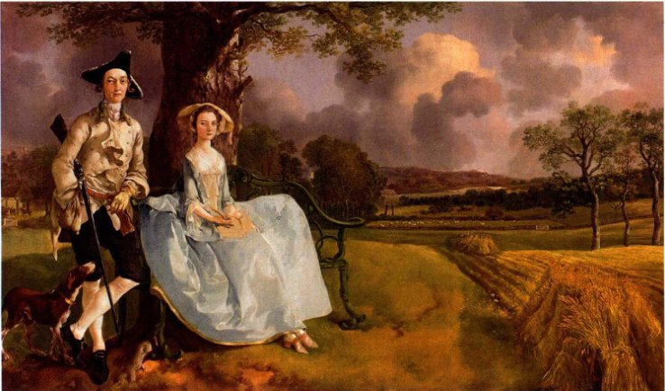

*图22.16 托马斯·庚斯博罗：《罗伯特·安德鲁和他的妻子》。约1748-1750年。布面油画，69.7 × 119.3厘米。伦敦国家美术馆*

庚斯博罗一生主要在外省工作，先是在他的家乡萨福克郡（Suffolk），然后到了热闹的巴斯城（Bath）。晚年搬到伦敦居住，在那里他的作品发生了很大变化。著名悲剧女演员莎拉·西登斯（Sarah Siddons，1755-1831年）的精彩肖像画（图22.17）展现了他晚期的风格特点：人物沉静优雅，以18世纪末的方式演绎了凡·代克的贵族风度，而流畅、清晰的技法却又让人想起鲁本斯，将穿着时髦、梳着新潮发型的画中人塑造得极其迷人。1857年，即此画完成的70多年后，19世纪法国批评家特奥菲尔·托雷-博尔热（Théophile Thoré-Burger，1807-1869年）极为精辟地概括了这幅肖像画的独特之处：

> 这位伟大的悲剧女演员投入全部的精力和情感来诠释激情，而她内心也强烈地感受到这种激情。对于她来说，用悲剧缪斯一般的寓意肖像画或是强调部分特点的绘画，不如使用这种简单的时装半身像效果好。这幅肖像画以充满诗意的方式表现了人物的性格，慎重地挑选所要刻画的姿势，用色大胆，处理手法自由。就这些层面来说，这幅肖像画是别出心裁的，而且又是独特非常，可以说其他任何画家都画不出这样的作品。若要寻找相似的作品，只能是徒劳，因为不存在类似的画。韦罗内塞的作品有点像——不，这是一幅个性化十足的创造物。这就是天才的表现。

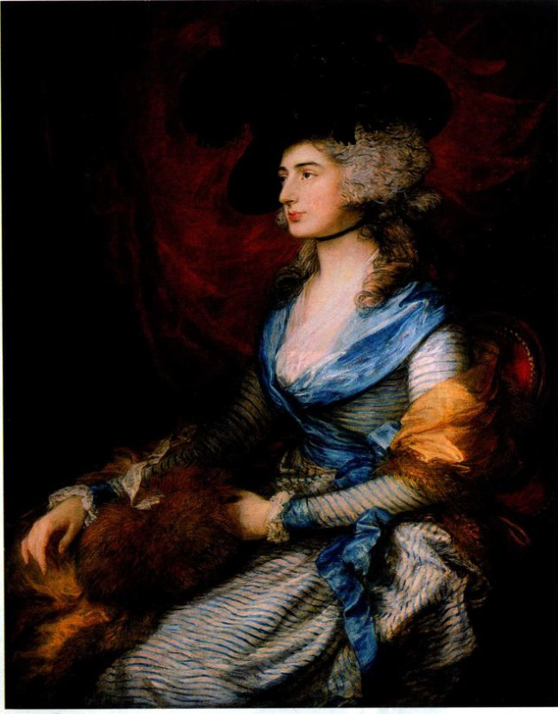

*图22.17 托马斯·庚斯博罗：《西登斯夫人》（Mrs．Siddons）。1785年。布面油画，125.7 × 99.1厘米。伦敦国家美术馆*

### 乔舒亚·雷诺兹

正如这位法国批评家尖锐的评论所暗示的，庚斯博罗画《西登斯夫人》是为了打败他在伦敦艺坛上的主要竞争对手乔舒亚·雷诺兹爵士（Sir Joshua Reynolds，1723-1792年），后者曾把西登斯画成悲剧缪斯的化身（图22.18）。西登斯是这个时期少数几个著名的英国女演员之一，她因扮演悲剧角色而成名，关于她的表演，批评家威廉·哈兹利特（William Hazlitt）写道：“力量汇聚在她的眉头，激情从她的胸部流出，就像从神龛放射而出。她是悲剧的化身。”

在这幅肖像画里，雷诺兹主要利用表情和姿势来表现西登斯的品格力量，而这里的表情和姿势借鉴了米开朗基罗西斯廷天顶画中先知以赛亚的形象（图16.17）。从英国皇家美术学院1768年建院时起就一直担任院长的雷诺兹就是学院派画法（即模仿早期绘画大师）的倡导者，他是在罗马住了两年后精通这种画法的（见原始文献）。在《演讲集》（Discourses，他每年向学院院士做的演讲）中，提出了他认为必要的规则和理论。他的观点本质上与夏尔·勒布仑相同；而且与这位法国艺术家一样，雷诺兹发现很难在实践中贯彻自己的理论。虽然他爱用宏大风格来表现历史画（像普桑一样），但他的大部分画作都是利用寓意手法来美化人物的肖像画。我们在这幅西登斯肖像中就见到了这一点，因为雷诺兹把西登斯化身成缪斯，坐在自己的宝座之上，两旁是寓意人物——“怜悯”和“恐惧”。

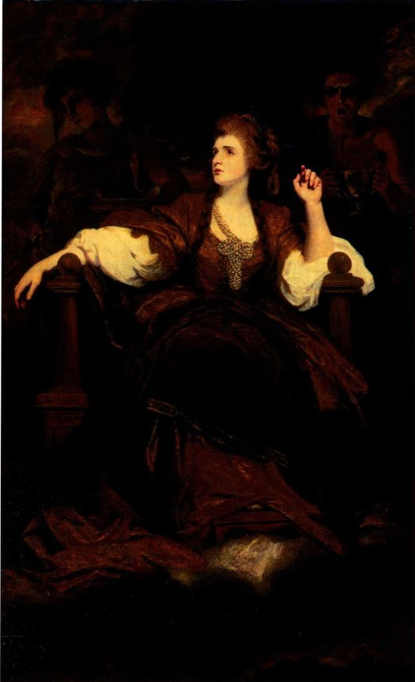

*图22.18 乔舒亚·雷诺兹爵士：《扮成悲剧缪斯的西登斯夫人》（Mrs．Siddons as the Tragic Muse)，1784年。布面油画，2.36 x 1.46米。亨利·E.·亨廷顿图书馆和美术馆 (Henry E.Huntington Library and Art Gallery），圣马力诺，加利福尼亚*

虽说雷诺兹的风格受到了威尼斯画派、佛兰德斯巴洛克艺术家甚至伦勃朗的用色和光影处理手法的影响，但他还是形成了自己的风景画技法。他的风景画作品反映了对于土地的典型英国式态度，以及土地与个人自由和幸福的关系。他大度地称赞庚斯博罗，表扬庚斯博罗用画家而非诗人的眼光来看世界。尽管两位艺术家有许多不同之处，但无论在艺术上还是哲学上，他们的共同点比他们相互承认的还要多。雷诺兹和庚斯博罗都以凡·代克为师，但他们从老师身上学到的东西不尽相同。两人都强调其作品的视觉感染力和技法，只是程度上有所不同。

> **大事年表**
>
> 1707年 - 《合并法案》将英格兰和苏格兰合并
> 1719年 - 丹尼尔·笛福发表《鲁滨逊飘流记》
> 1768年 - 英国皇家美术学院在伦敦成立
> 1785年 - 庚斯博罗创作《西登斯夫人》

> **原始文献：乔舒亚·雷诺兹爵士（1723-1792年）**
> 
> **——选自《1769年1月2日在皇家学院开学仪式上的演讲》**
>
> 伦敦的皇家学院成立于1768年11月，它遵循100多年前创建的罗马圣路加学院和法兰西学院之原则。一年一度在伦敦举办的展览成为皇家学院的主要特色，虽然在理论上，教学才应是一切学院的根本。学院的首任院长乔舒亚·雷诺兹爵士在他的第一次演说中阐明了学院的教学原则。
>
> 学院的最大优势就是······它将成为艺术杰作的储藏所。这些是可供天才利用的材料，没有它们，即使拥有最高等的智慧，也是徒劳无益或是注定要走弯路的。通过研究这些权威的范例，可以立刻获得集历史经验而成的对于“优秀”的定义。前人缓慢且困难重重的发展历程教会了我们去走一条更短、更简单的路。学生一眼就能了解许多艺术家花费毕生精力才探知的原理·······在这个国家，有多少天生大才之人就因为缺乏类似的机遇而被埋没！
>
> 诚然，拉斐尔并没有机会在这样的学院中学习；但整个罗马就是他的学院，尤其是米开朗基罗的作品。我愿大胆断言，在我们的学院里，我们将获得一项别国无法拥有的优势。希望大家可以牢牢记住在这里看到的每一件作品······
>
> 但考虑到在其他国家，这类机构常常倒闭······我必须冒昧地提出几条能使那些错误得到纠正的建议······
>
> 其中最重要的一条就是：年轻的学生们应绝对服从通过大师们的实践而确立起来的艺术法则，应该将为各个时代所认可的典范当作完美和确实可靠的向导，模仿它们，而不是批评。
>
> 我确信，这是艺术上唯一有效的进取之道，一开始就抱有怀疑的人至死也无法度过艺术的入门阶段。因为有一句格言的话说得好：“自以为是者必将学无所成。”因此，对于“规则是天才的脚镣”这种错误、粗鄙的观念，应该尽一切可能来反对。
>
> *SOURCE: SEVEN DISCOURSES DELIVERED IN THE ROYAL ACADEMY, BY THE PRESIDENT. (CHAMPSHIRE: SCHOLAR PRESS, 1971)*

## 德国、奥地利与中欧的洛可可艺术

洛可可式建筑延续了波洛米尼和瓜里尼的巴洛克建筑的“富于弹性”的曲线造型，只是更为精致、小巧。很快便与中欧的建筑样式结合起来，而在中欧和意大利，巴洛克风格占有牢固的根基。意大利风格在此受到欢迎并不稀奇。在遭到三十年战争蹂躏的奥地利和德国南部地区，17世纪末以前对于艺术的赞助都非常有限，新增建筑的数量也一直很少。而到了18世纪，这些国家，都开始了重建，特别是天主教地区。巴洛克是一种外来的风格，使用者主要是旅居此地的意大利艺术家。直到17世纪90年代，本土建筑师才走上前台。在接下来持续50多年的高度活跃期里，产生了建筑史上一系列最富想象力的作品。这些建筑的出现是为了颂扬国君和主教，他们被人纪念的原因通常只是他们对于艺术的慷慨赞助。中欧的洛可可式建筑比法国的更大、更繁复。而且绘画、雕塑与其出现的场景结合得更为紧密。宫殿和教堂都装饰着天顶湿壁画和雕塑；而这些壁画和雕塑不管怎样丰富多彩，也不适合用在家庭内部，但它们体现的趣味却正是促成洛可可式法国公馆诞生的那一种。

### 约翰·菲舍尔·冯·埃拉赫

奥地利人约翰·菲舍尔·冯·埃拉赫（Johann Fischer von Erlach，1656-1723年）是中欧第一位洛可可建筑大师，他曾在罗马学习，传承了意大利的建筑传统。他的作品象征着建筑业中心从意大利向阿尔卑斯山以北地区的决定性转移。他的代表作是维也纳的圣卡尔教堂（St. Charles Borromaeus［Karlskirche］，图22.19和22.20），它是为了纪念1713年瘟疫结束而建，很像上个世纪建造的威尼斯安康圣母教堂（见图19.27）。这座教堂是献给与皇帝查理六世同名的一位反宗教改革圣徒的，关于他的象征符号在教堂中随处可见。菲舍尔·冯·埃拉赫运用了几种意大利和法国建筑标准，把波洛米尼的圣阿涅塞教堂正立面与万神殿的圆柱式门廊（见图19.22和7.39）结合起来，获得了不同凡响的效果。此外还加上了一对仿图拉真凯旋柱（见图7.28）的巨柱，柱子上雕刻着表现圣徒生平的浮雕。这两根柱子象征着赫刺克勒斯之柱（直布罗陀海峡），代表查理六世对西班牙王位的所有权。它们还取代了塔楼的位置，塔楼则变成了角楼，这让人想起莱斯科卢浮宫庭院的正立面（见图18.4）。教堂赞美身为基督徒统治者的查理六世，并提醒人们，不断威胁奥地利和匈牙利的土耳其人直到1683年才在围攻维也纳时被打败，这主要应归功于波兰国王约翰三世的介入，但直至1718年土耳其人依然是严重的威胁。菲舍尔·冯·埃拉赫利用一些西方建筑标准代表作中的元素，创造了一个全新的作品，同时兼具旧传统的全部高贵和尊荣。

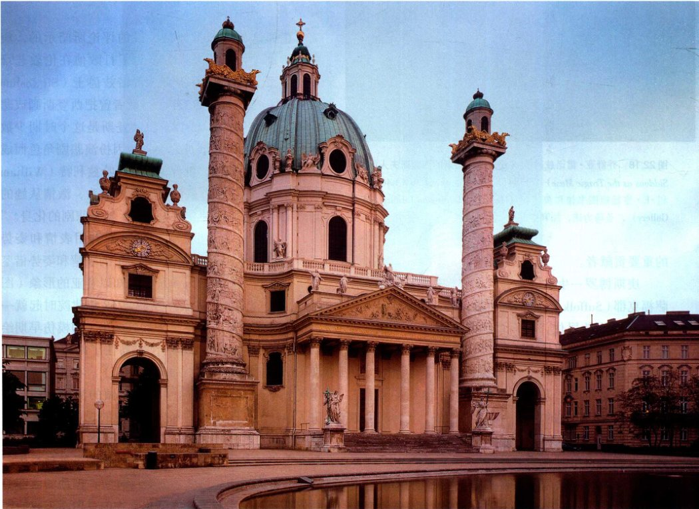

*图22.19 约翰·菲舍尔·冯·埃拉赫：圣卡尔教堂正立面，维也纳。1716-1737年*

整个正立面特别宽，这要归功于它所处的位置（图22.19）。它遮住了与其等长的椭圆形教堂主体建筑，在侧面有礼拜堂，还有一个很深的唱诗班席。比同时代的任何意大利建筑师都更为大胆，菲舍尔·冯·埃拉赫把古罗马帝国艺术的硬性元素融入教堂的弹性曲线，表现了基督教信仰改造古代艺术的能力。确实，接下来轮到意大利对北方的新变化做出反应了。

> **大事年表**
>
> 1703年 - 彼得大帝营建圣彼得堡。它是1918年以前的俄国首都
> 1716-1737年 - 菲舍尔·冯·埃拉赫在维也纳修建圣卡尔教堂
> 1740-1748年 - 奥地利王位继承战争

*图22.20 圣卡尔教堂平面图*

### 雅各布·普兰德陶尔

奥地利建筑师雅各布·普兰德陶尔（Jakob Prandtauer，1660-1726年）与菲舍尔·冯·埃拉赫生活在同一个时代。身为泥瓦匠、雕刻家和建筑师的普兰德陶尔首先是在德国南部工作，在发展本地传统方面拥有骄人的成绩，而在奥地利，这些传统就意味着朴素、优雅的外部造型与广阔的景色融为一体。普兰德陶尔倾注了毕生心血的作品是梅克尔修道院（Monastery of Melk，图22.21），它气势雄伟，这主要归功于它的位置——坐落在俯临多瑙河的一处悬崖之上。它静静地矗立在那里，仿佛在向人们展示天国的荣光。以教堂为中心，这些五颜六色的建筑形成了一个紧凑的整体。图书室和皇家礼堂设在侧翼，这里由西面的臂状结构连接，两臂相交于一个高耸的阳台，那里视野开阔，可将修道院外的景色尽收眼底。虽然普兰德陶尔从未去意大利考察过原作，但通过阅读意大利建筑文献，还是形成了其创作的基础。

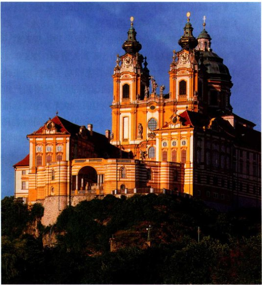

*图22.21 雅各布·普兰德陶尔：梅克尔修院教堂，奥地利。1702年动工*

### 巴尔塔扎尔·诺伊曼

巴尔塔扎尔·诺伊曼（Balthasar Neumann，1687-1753年）的作品是中欧洛可可式建筑的顶点，他的设计风格轻巧而优雅。他学的专业是军事工程，1720年从米兰回国后，被任命为维尔茨堡主教宫（Residenz［Episcopal Palace］）的建筑师。虽然建筑的基本平面布局早已确定，诺伊曼还是对它作了很大的改动，但1723年，上级要求他征求巴黎和维也纳顶级建筑师的意见。最后的结果是，他将德国、法国和意大利的最新设计理念巧妙地结合起来。非凡的帝王大厅（Kaisersaal，图22.22）是一个椭圆形大厅，粉刷时用的是18世纪中期最受欢迎的颜色：白色、金色和其他各种轻淡色彩。为了突出其装饰，圆柱、半露方柱和额枋在结构上的作用被尽可能削减。窗户和分割拱顶而成的节段用连续的带状装饰线脚围起，白色的墙面遍布不规则的装饰图案。这些类似花边的卷曲图形是法国风格的标志（见图22.11），在此巧妙地融入了德国的洛可可建筑（基本图案让人想到菲舍尔·冯·埃拉赫早期的室内设计）。充足的日光、曲线和反曲线的运动以及轻盈优美的灰泥雕饰令帝王大厅有了一种与罗马巴洛克相去甚远的精巧。拱顶和墙壁显得薄而柔韧，好似轻易就可以被空间扩张力穿透的薄膜。

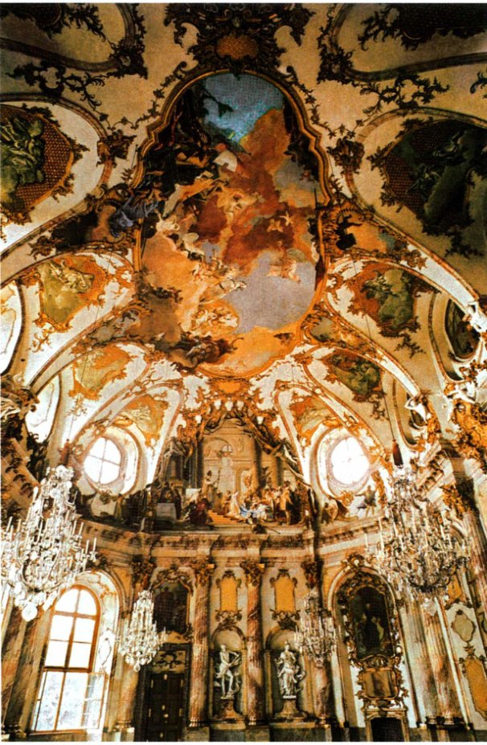

*图22.22 巴尔塔扎尔·诺伊曼：主教宫帝王大厅，德国维尔茨堡。1719-1744年。湿壁画为乔瓦尼·巴蒂斯塔·提埃波罗所绘，1751-1752年*

### 多米尼库斯·齐默尔曼

与巴尔塔扎尔·诺伊曼同时代的多米尼库斯·齐默尔曼（Dominikus Zimmermann，1685-1766年）的一个作品也许是18世纪中期最优秀的设计，那就是位于巴伐利亚乡间绰号为“Die Wies”（“草地”）的朝圣教堂。它的外表朴实无华，相比之下，内部的华丽足以让任何来此的人震惊（图22.23和22.24）。教堂内部的富丽堂皇反映了这样一个事实：建筑师和他负责湿壁画的哥哥约翰·巴普蒂斯特·齐默尔曼（Johann Baptist Zimmermann，1680-1758年）最早接受的是灰泥细工的训练。内部设计由彩绘灰泥雕饰和绘画构成。与菲舍尔·冯·埃拉赫的圣卡尔教堂一样，这座教堂大致为椭圆形。但由于使用了成对的独立支柱来支撑天顶，空间就显得更为灵动、复杂，好像德国哥特时期的厅堂式教堂。就连洛可可式装饰分割天花板的方式也不难让人联想到位于施瓦本格明德的哥特式圣十字教堂（见图12.52）所使用的网状穹顶。在这里，瓜里尼关于哥特式建筑的预言性重新评估变成了现实。

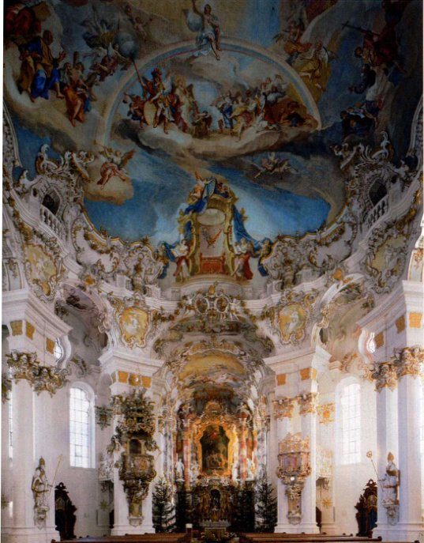

*图22.23 多米尼库斯·齐默尔曼：“草地”内部，上巴伐利亚，德国。1757年*

> **大事年表**
>
> 1714—1718 年——威尼斯与土耳其之战
> 1730 年——克莱门特十二世成为教皇
> 1732 年——卡纳莱托创作《威尼斯耶稣升天节》

*图22.24 “草地”平面图*

## 意大利

正如源于意大利的建筑风格在阿尔卑斯山以北地区发展到登峰造极，许多意大利的洛可可绘画也是在其他国家创作。一百年来，威尼斯在艺术上一直停滞不前，好像一潭死水。但在18世纪的最初十年，洛可可艺术在这里兴起，改变了意大利晚期巴洛克风格怯懦不前的状态。意大利式洛可可与巴洛克的不同之处在于，韦罗内塞的色彩主义和华丽壮观重获赏识，但多了一分优美的感性色彩。擅长巴洛克幻景技法的威尼斯色彩画家们活跃在遍布欧洲的重要艺术中心，尤其是伦敦、德累斯顿和马德里。他们并不孤单，许多来自罗马和意大利其他地区的艺术家也在国外工作。

### 提埃波罗与幻景式天顶装饰画

意大利幻景式天顶装饰画的最后，同时也是最精细的一个阶段以乔瓦尼·巴蒂斯塔·提埃波罗（Giovanni Battista Tiepolo，1696-1770年）的作品为代表。提埃波罗的大半生都在威尼斯度过，他的作品就是洛可可风格的最佳诠释。提埃波罗在德国住过两年，而在生命的最后岁月，他在西班牙为查理三世工作。他对光和色彩的把握、优雅而巧妙的手法以及非凡的创造力使他蜚声海外。提埃波罗创作维尔茨堡湿壁画（图22.22、22.25和22.26）时正处于其艺术生涯的巅峰时期。他在薄纱般的天花板上利用绘制和雕刻的方法创造了许多让人误以为是建筑开口之处，使得下面的观众不会再注意到上面天花板的空间边界。与巴洛克天顶画不同（对比图19.11和19.12），我们在这些开口中并未看到在迸发的强光推动下蜂拥而出的人群；相反，蔚蓝的天空和阳光照射下的云朵中偶尔会出现有翅生物，在无垠的空间内翱翔。只有在天花板的周边才会出现密集的人群。

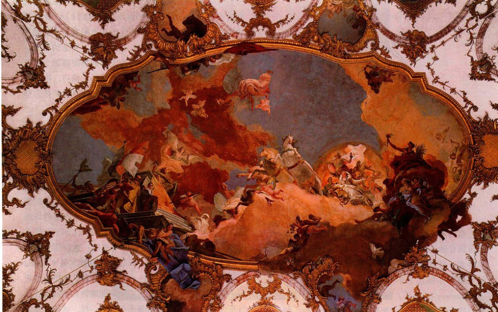

*图22.25 乔瓦尼·巴蒂斯塔·提埃波罗：天顶湿壁画（细部）。1751年。维尔茨堡主教宫帝王大厅*

在建筑一端原本为窗户的地方画着《腓特烈·巴巴罗萨的婚礼》（The Marriage of Frederick Barbarossa，见图22.22和22.26）。作为一幅公开展示的画，它像韦罗内塞的《利未家的宴会》（见图17.33）一样充满了喜庆的气氛。艺术家效法韦罗内塞，把发生于12世纪的事件放在当代场景之中。雕刻的丘比特形象拉开通向婚礼的镀金灰泥幕布，“显露”这个带有象征意味的幻想画面，这里表现出的舞台式幻景技法可与贝尼尼相媲美。但是，这支欢乐的队伍中意外地出现了古典主义元素，使得主要人物有了一种高贵的自制，恰好与这个场合的隆重气氛相称。

提埃波罗后来应邀到马德里皇宫工作，成为受到邀请的一大批意大利艺术家中的最后一位。在那里，他遇到了提倡复兴古典主义的德国画家安东·拉斐尔·门格斯，而门格斯的出现也标志着洛可可时代的终结。

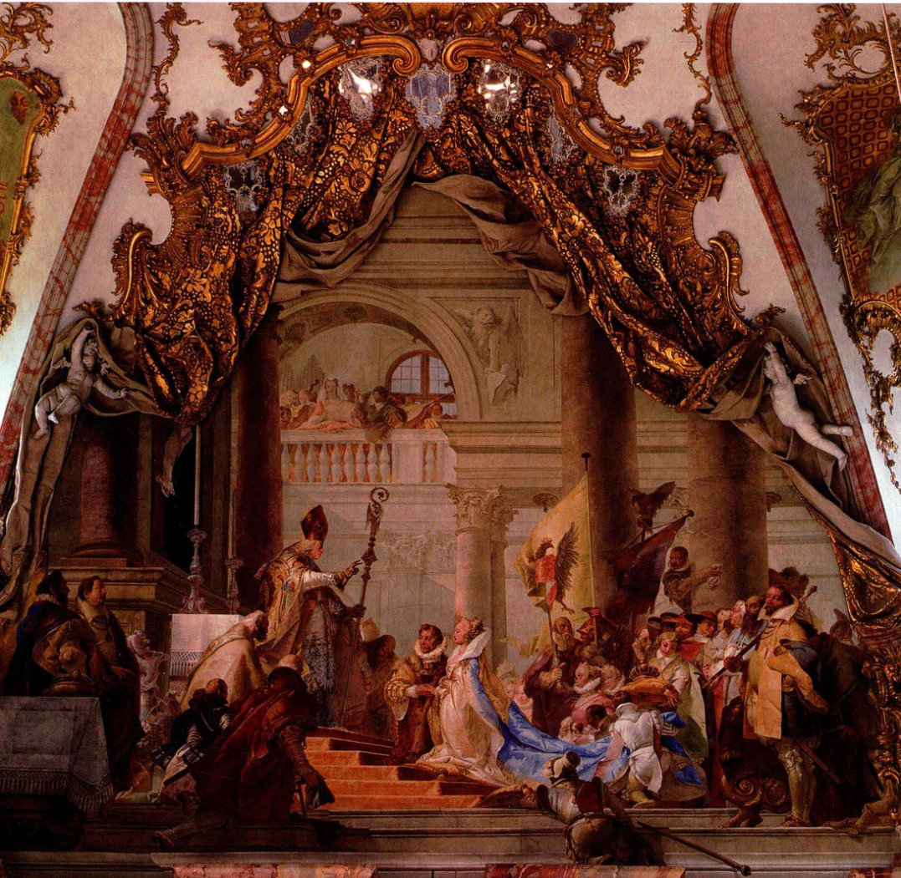

*图22.26 乔瓦尼·巴蒂斯塔·提埃波罗：《腓特烈·巴巴罗萨的婚礼》（局部）。1752年。湿壁画。维尔茨堡主教宫帝王大厅*

### 卡纳莱托

18世纪，意大利国内的风景画形成了一种继承洛可可艺术特点的新类型：这些画被称作实景画（vedute）。这种风景画新类型的历史可追溯至17世纪，当时许多外国艺术家，如克劳德·洛兰（见图21.8），都开始了擅长描绘罗马的乡村景色。然而，1720年之后的实景画出现了明确的城市特征，描绘范围缩小到建筑或城市风光。最著名的实景画家是威尼斯的卡纳莱托（Canaletto，即乔瓦尼·安东尼奥·卡纳尔［Giovanni Antonio Canal］，1697-1768年）。他的作品深受英国人欢迎，特别是那些学业结束后进行游学（Grand Tour）的年轻人，他们把这些画作为纪念品带回祖国。后来，与其他几位威尼斯艺术家一样，卡纳莱托长期旅居伦敦，在那里创作风景画来表现这座城市的新面貌，其中可见雷恩建造的教堂塔楼（见第752-753页）。《威尼斯耶稣升天节》（The Bucintoro at the Molo，图22.27）是一组以威尼斯为主题的风景画中的一幅，这组画是住在威尼斯的英国企业家约瑟夫·史密斯（Joseph Smith，后被任命为英国驻威尼斯领事）委托创作的。史密斯后来把这组画制作成一套蚀刻版画出版，以满足那些买不起油画原作的人对威尼斯纪念品的需求。这幅作品表现了一个深受喜爱的主题：耶稣升天日当天，庆祝完海洋婚典之后，总督乘坐着他的画舫从利多岛（Lido，威尼斯城的海滨岛屿）返回圣马可广场。这次公共庆典仿佛一台壮丽的舞台表演，而卡纳莱托则恰好抓住了其中的高潮时刻。

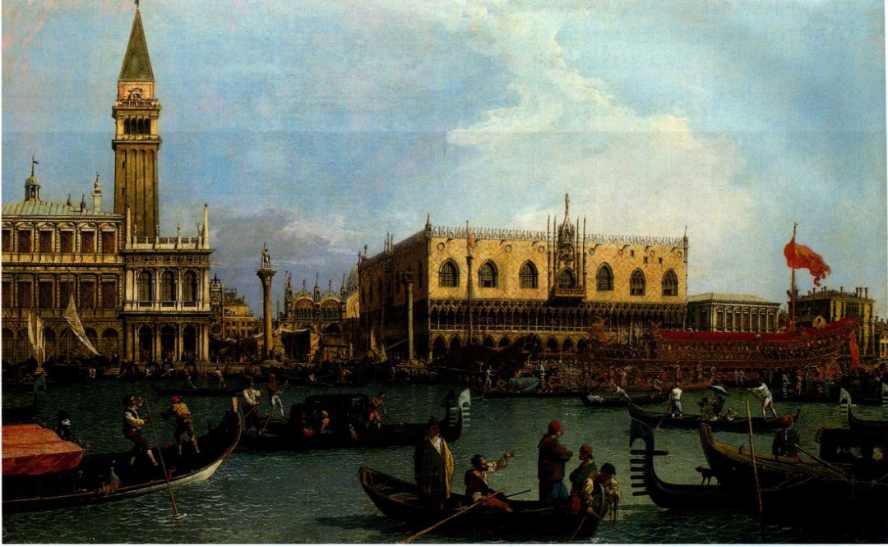

*图22.27 卡纳莱托：《威尼斯耶稣升天节》。约1732年。布面油画，77 × 126厘米。英国皇家收藏*

大体上说，卡纳莱托的风景画在地形描绘上是准确的，但也难免篡改事实。虽然为了构图的需要，他通常只做一点微小的调整，但他有时会相当随意地处理画面，或是将不同地点的景色进行合成。他大概使用过某种机械或光学设备，来提供其创造所需的场景，很有可能是暗箱，即照相机的前身（见维米尔，第728-729页）。作品的生动和活力，以及他那稳当的构图感大部分归功于他所接受的透视法训练。正如前文例子中所述，卡纳莱托常在画中加入表现威尼斯日常生活的小插曲，使得他的作品多了一份人情味，也使之成为富有意味的文化记录。

## 小结

年深日久的传统依然统治着18世纪的法国。君主制继续统治，大革命前的政策和实践仍在路易十五和他颇具影响力的情妇蓬巴杜夫人统治期间延续。在路易十五的漫长统治时期，法国贵族重获自由，并开始巩固实力。但财富还是为少数享有特权的人所得，富人与穷人、贵族与农民之间巨大的不均衡发展正是这个时代的特点。

17世纪的作品气势宏大、充满激情与活力，而色彩则通常为深暗或强烈，而18世纪兴起的洛可可风格就是对这种风格的某种回应。洛可可艺术特点是色彩柔和，尺寸小巧，人物和背景精致优美，恰好反映了贵族所钟爱的轻曼和奢侈风格。这些富裕阶层热衷于在巴黎建造精美的公馆（市内宅邸），并广泛地赞助各类艺术，用来装饰自己的新居。公馆是举办知识界和金融界精英的沙龙及其他聚会的场所，拥有豪华的厅堂，这些厅堂粉刷成柔和的颜色，装饰以绘画和雕塑，趣味盎然，令人宾至如归，营造出贵族赞助人所追求的愉快、轻松氛围。洛可可风格的魅力和吸引力使其受到全欧洲的欢迎，无论是英国、中欧还是西欧都能感受到它持久的影响。

### 法国：洛可可的兴起

从一定程度上说，洛可可艺术在法国的兴起是伴随贵族（其主要赞助人）权力上升而出现的。画家让-安托万·华托察觉到主人的乐观精神，从而把洛可可艺术带到了受人尊敬的地位。他首创了雅宴画，利用变化微妙的色调帮助鲁本斯派在色彩与素描之争中巩固了相对于普桑派的优势地位。弗朗索瓦·布歇和让-奥诺雷·弗拉戈纳尔则在寓言性肖像画和风景画中延续着享乐主义这一传统，而伊丽莎白-路易丝·维热-勒布伦的作品则以玛丽·安托瓦内特的肖像画为主，并如王后所愿，把她装扮成一个普通的法国妇女。与之形成鲜明对比的是让-西蒙·夏尔丹，他恢复了静物画和风俗画原本低贱的地位，那些通过观察细致而画出的作品充满了从容的高贵气质，以及丰富的道德训诫内容，令人们得以重温17世纪的荷兰及佛兰德斯传统。雕塑同样体现了洛可可艺术私密和情色的创造倾向，尤其是克洛狄翁的作品。然而洛可可风格得以最充分展示的还是在公馆的室内装饰中，其影响席卷了欧洲贵族和上层中产阶级。

### 英国：绘画与版画制作

英国画家借用洛可可艺术的元素，从而形成了自己独特的风格。英国公众特别喜欢收藏风俗画和风景画，威廉·荷加斯和托马斯·庚斯博罗等画家就很好地把握住了这种不断增长的需求。荷加斯善于创作带有讽刺性的日常生活画，而实际上就是稍作掩饰的说教叙事画，这类作品中常有滑稽的细节，给画里所蕴含的严厉社会批判平添了一种轻松感。庚斯博罗则专长于肖像画，常把人物置于其保护人和观众都认同的典型英国式风景中。乔舒亚·雷诺兹也从事肖像画创作，他的画法讲究、优雅，很快就占领了流行的制高点，受到英国贵族主顾的大力追捧。

### 德国、奥地利和中欧的洛可可艺术

在德国和奥地利，洛可可主要表现在建筑领域。建筑师们对早已在中欧盛行的意大利巴洛克风格进行改良，继承了其曲线造型和“富于弹性”的特点，只是更为优雅、小巧。三十年战争之后，人们开始在新建的教堂、宫殿及其他建筑物中使用新式洛可可风格。这些建筑中用于装饰的绘画和雕塑与建筑环境保持着紧密联系。在圣卡尔教堂中，建筑师约翰·菲舍尔·冯·埃拉赫利用西方建筑的一些标准元素，创造了一个全新的建筑类型，充分反映了基督教信仰改造古代艺术的能力。巴尔塔扎尔·诺伊曼的帝王大厅或多米尼库斯·齐默尔曼的“草地”教堂等建筑精致、优雅的内部装饰则体现了中欧洛可可艺术的最高水平。

### 意大利

许多意大利艺术家都在国外工作，所以大部分的意大利洛可可绘画是在其他国家完成创作。尤其是乔瓦尼·巴蒂斯塔·提埃波罗，他为几座德国、奥地利教堂和宫殿绘制了幻景式天顶装饰画。威尼斯画家卡纳莱托创造的威尼斯实景画深受英国青年一代喜爱，他们把这些作品作为其游学的纪念品带回英国。

## 附加原始文献

### 乔瓦尼·薄伽丘（1313-1375年）

**《十日谈》，摘自“第一天”**

> 薄伽丘《十日谈》中讲述100个故事的年轻人为了躲避鼠疫，逃离了佛罗伦萨。在这本书的开头，薄伽丘描述了疾病的恐怖与疫情的蔓延，以及由此而产生的社会解体。
>
> 在我主降生后第一千三百四十八年，意大利的城市中最美丽的城市——就是那繁华的佛罗伦萨，发生了一场可怖的瘟疫。这场瘟疫不知道是受了天体的影响，还是威严的天主降于作恶多端的人类的惩罚。染病的男女，最初在鼠蹊间或是在胳肢窝下隆然肿起一个瘤来，到后来愈长愈大，就有一个小小的苹果，或是一个鸡蛋那样大小。一般人管这瘤叫“疫瘤”，不消多少时候，这死兆般的“疫瘤”就由那两个部分蔓延到人体各部分。这以后，病征又变了，病人的臂部、腿部，以至身体的其他各部分都出现了黑斑或是紫斑，有时候是稀稀疏疏的几大块，有时候又细又密。
>
> 大多数病人都在出现“疫瘤”的三天以内就送了命；而且多半都没有什么发烧或是其他的症状。甚至只要接触到病人穿过的衣服，摸过的东西，也立即会染上了病。
>
> 到后来，几乎无论哪一个人都采取了冷酷无情的手段：凡是病人和病人用过的东西，一概避不接触，他们以为这样一来，自己的安全就可以保住了。有些人以为唯有清心寡欲，过着有节制的生活，才能逃过这一场瘟疫。于是他们各自结了几个伴儿，拣些没有病人的洁净的宅子住下，完全和外界隔绝起来。也有些人的想法恰巧相反，以为唯有纵情欢乐、纵饮狂歌，尽量满足自己的一切欲望，什么都一笑置之，才是对付瘟疫的有效办法。
>
> 下层阶级，以至大部分的中层阶级，情形就更惨了。他们因为没有钱，也许因为存着侥幸的心理，多半留在家里，结果病倒的每天数以千计。又因为他们缺乏适当的医治，无人看护，几乎全都死了。白天也好，黑夜也好，总是有许多人倒毙在路上。许多人死在家里，直到尸体腐烂，发出了臭味，邻居们才知道他已经死了。城市里就这样到处尸体纵横。等坟地全葬满了，只好在周围掘一些又长又阔的深坑，把后来的尸体几百个几百个葬下去。就像堆积船舱里的货物一样，这些尸体，给层层叠叠地放在坑里。只盖着一层薄薄的泥土，直到整个坑都装满了，方才用土封起来。
>
> 其实除了说天主对人类真是残酷到极点，还能怎么说呢。从三月到六月，佛罗伦萨城里，死了十万人以上。在瘟疫发生之前，谁也没想到过城里竟住着这么多人。唉，宏伟的宫室，华丽的大厦，高大的宅第，从前达官贵妇出入如云，现在却十室九空，连一个最低微的仆从都找不到了！有多少显赫的姓氏、巨大的家产、富裕的产业遗下来没有人继承！有多少英俊的男子、美丽的姑娘、活泼的小伙子，在早晨还同亲友们一起吃点心，十分高兴，到了夜里，已到另一个世界去陪他们的祖先吃晚饭了。
>
> （方平、王科一译）
>
> *SOURCE: GIOVANNI BOCCACCIO, DECAMERON. TR. JOHN PAYNE, REV. CHARLES S. SINGLETON (BERKLEY, CA: UNIVERSITY OF CALIFORNIA PRESS, 1984)*

### 佩特拉克（1304-1374年）

**摘自十四行诗集《爱情小诗》第七十七首。**

> 人文主义者佩特拉克在阿维尼翁遇到了遥不可及的劳拉（Laura），他在自己很多首十四行诗中纪念着对她不朽的爱情。这首出自《爱情小诗》（Rime Sparse）第七十七首的诗歌，描述了他对劳拉肖像的感受，这幅肖像是由他的朋友锡耶纳画家西莫内·马丁尼绘制的。肖像画并没能保存下来，但是佩特拉克的诗歌将这位十四世纪的画家与著名的古希腊雕塑家波利克里托斯相提并论。此类对古代旁征博引以表达人类情感的做法，与视觉艺术家从宗教虚实中挖掘情感内容的创新可谓并驾齐驱。
>
> 如果让波利克里托斯和他的同行一道
> 欣赏这幅劳拉的肖像画稿，
> 他们也只能领悟出千分之一的美妙，
> 而对我来说，她却让我神魂颠倒。
> 西莫内肯定是在天国看见了她，
> 而后她又从天堂来到了人间的村寮，
> 在天堂西莫内画出了这幅画，
> 让我们又一次目睹了她的美貌。
> 这是一幅只有在天堂，
> 才能完成的画，而在人间
> 人的肉眼看不见她的美质和神妙。
> 西莫内为我们做了一件好事，
> 如果他在人间尝够了人生的苦难，
> 出入红尘，就画不出这位天仙的高蹈。
>
> （李国庆、王行人译）
>
> *SOURCE: PETRARCH: THE CANZONIERE, SONNET 77. TR. A. S. KLINE. HTTP://WWW. TONYKLINE.CO.UK*

### 但丁·阿利吉耶里（1265-1321年）

**《神曲·炼狱篇》**（The Divine Comedy：Purgatory）第十首

> 炼狱的第一层是犯了骄傲之罪的人们。但丁遇到了一位著名的抄本彩饰画家，后者领悟了骄傲的虚无和声誉转瞬即逝的性质，这里通过乔托的名声迅速压倒奇马布埃而得到了说明。
>
> 我向他说道：“啊！你不是奥德里西么？
> 你是阿哥比奥的光荣，也那门艺术的光荣：
> 在巴黎，那门艺术有插图画之称。”
> 他说道：“兄弟，博洛尼亚的佛兰科
> 描绘的书页要更加多姿多彩，悦目喜人，
> 如今，光荣完全属于他，属于我的只有一部分。
> 我活在世上时绝不会如此礼让，
> 因为我一心所追求的
> 就是出类拔萃的伟大理想。
> 正是由于这种妄自尊大，我才在这里受到应得的惩罚；
> 我若不是在仍可犯罪时求告于上帝，
> 我还不会来到这里。
> 啊，人类才能的虚妄光荣！
> 尽管它未到衰败凋零的年龄，
> 它在枝头保持绿色的时间，却又是何等短暂！
> 奇马布埃曾以为在画坛上能独领风骚，
> 如今则是乔托名声大噪，
> 这就使此人的声誉光彩顿消。
>
> （王维克译）
>
> *SOURCE: DANTE ALIGHIERI'S, DIVINE COMEDY, TR. MARK MUSA. (BLOOMINGTON, IN: INDIANA UNIVERSITY PRESS. 1986)*

### 卡勒尔·凡·曼德尔（1548-1606年）

**摘自《画家之书》**（The Painter's Treatise）

> 凡·曼德尔的这本著名荷兰与佛兰德斯画家的传记出版于1604年，可以说是乔治·瓦萨里的意大利艺术家传记的姊妹篇，后者于1550年首次出版。凡·曼德尔本人就是一名画家，他的著作以扬·凡·爱克开篇，因为这位画家被认为是油画技法的发明者，而且他与自己的兄弟休伯特一起，成为尼德兰绘画传统的开创者。
>
> 据说用胶和鸡蛋作为调和剂（蛋彩画）的绘画艺术是从意大利进口到荷兰的，因为，正如我们在乔瓦尼·奇马布埃的传记中所指出的，这种方法首先在佛罗伦萨被人使用，那是1250年······
>
> 据布鲁日人所说，约安内斯（扬·凡·爱克）是一个有学问的人，聪明且富有创造性，研究过许多与绘画相关的问题：他研究了很多种颜料；他研究炼金术和蒸馏法。后来，他采用了一种方法，使用油来给自己的蛋彩画上光，于是这些闪烁着光泽的绘画让观看它们的人都感到非常愉悦······
>
> 约安内斯曾绘制了一幅木板画，他为此花了很多时间······他根据自己新发明的方法给完成的木板画上光，并把它放在阳光下晾干······木板在接口处开裂，散落开来。约安内斯······下定决心，决不让太阳再破坏他的作品。
>
> 因此······他致力于发现或发明某种能在房子里干燥的上光油，可以远离阳光的照射。他已经研究过许多种油料和自然能提供的其他类似材料，发现亚麻籽油和坚果油干燥性能是所有油中最好的。······
>
> 经过多次实验，约安内斯发现，这些油可以很容易地与颜料混合，一旦干燥变硬之后，具有抗水的能力。由于其本身的光泽，油让色彩显得更鲜活，不必再使用上光油。让他感到最惊讶也最高兴的是，用油调和的颜料与用鸡蛋和胶调和的颜料相比，使用起来更加容易，混合得更为彻底······
>
> 约安内斯······创造了一种新型绘画，让世界惊奇不已。······这个崇高的发现，油画，是艺术达到自然主义再现所需要的唯一的东西。
>
> 如果古希腊的阿派里斯和宙克西斯再次复生到这个国家，见识到这种新的画法，他们的惊喜，绝不会亚于好战的阿喀琉斯见到炮火轰鸣·····
>
> 凡·爱克兄弟一起创作的最引人注目的作品是根特圣约翰教堂的祭坛画······
>
> 祭坛画中央画板上表现的是圣约翰获得启示的场景，其中的长者们在崇拜羔羊······在上半部分绘有玛利亚的形象，圣父和圣子在给她加冕······
>
> 玛利亚身旁是拿着乐谱歌唱的小天使。他们被画得如此精致，如此完美，人们可以很容易地根据他们的面部表情，判断出谁在唱高声部、高音对应声部、中声部和低声部······
>
> 亚当和夏娃也被画了出来。我们可以观察到，亚当对打破上帝戒律心怀恐惧，因为他面带忧虑的表情······
>
> 凡·爱克兄弟的祭坛画只展示给少数地位崇高的人士，或者奖赏那些能够妥善保管画作之人的人士。有时在重要的节日期间，它也被展示出来，但画前往往人头攒动，很难走到它的近前。那时安放祭坛画的礼拜堂里会充斥着各色人等和画家，无论年长还是年轻，还有各类艺术爱好者，他们就如同蜜蜂和苍蝇围绕一篮子无花果或葡萄那样，蜂拥而至······
>
> 一些佛罗伦萨商人，将约安内斯在佛兰德斯绘制的一幅上乘之作送给了那不勒斯国王阿方索一世·····当它到达意大利时，一大群艺术家赶来观赏这幅奇妙的作品。但是，尽管意大利人非常仔细地检查了这幅画，触摸它，闻它，感受颜料与油的混合物所产生强烈的气味，并且从中得出各种结论，然而都不能了解其中的奥秘，直到西西里岛的墨西拿的安东奈罗，前往布鲁日学习油画技术为止。掌握了这门技术之后，他将其引入了意大利，正如我在他的传记中所描述的那样······
>
> 约安内斯曾经用油画画过一个场景中的两幅肖像，一个男人和一个女人，他们的右手彼此相握，仿佛他们被信任女神用婚姻联合在一起。这幅小画被布鲁日的一位理发师继承。西班牙国王菲利普的阿姨、匈牙利国王路易的遗孀玛丽······碰巧看到这幅画。这位爱好艺术的公主对这幅画极其喜欢，她赐予这位理发师一个官职，给他带来了每年一百荷兰盾的收入。
>
> （艾红华译）
>
> *SOURCE: KAREL VAN MANDER, DUTCH AND FLEMISH PAINTERS. TR. CONSTANT VAN DE WALL (MANCHESTER, NH: AYER CO. PUBLISHERS, 1978)*

### 乔治·瓦萨里（1511-1574年）

**摘自《意大利杰出画家、雕塑家与建筑师传-从奇马布埃到我们的时代》**

> 瓦萨里受到他赞助人亚历山德罗·法尔内塞的启发而开始写作这本名人传记。这部书首次出版于1550年，1568年又再次扩充，瓦萨里在意大利各地的采访是本书的基础。瓦萨里个人认识他书中的很多艺术家，其中包括米开朗基罗。瓦萨里视他为偶像，而低估了其他艺术家的价值，特别是拉斐尔。尽管很多艺术史家耗其一生来证明瓦萨里叙述中的一些细节是错误的，他的著作依旧是学习意大利文艺复兴艺术的出发点。
>
> 他是上帝的特殊赐予，而非人类力量所能造就的奇才。······如果不是兴趣多变，性情浮躁，学习许多知识却经常半途而废的话，他本应在学问上有伟大的造诣。······事实上，对艺术精熟的了解使他在创作中经常半途而废，因为他感觉人的手不能实现想象的完美表现，由于他的构思总是那么艰难、细腻、奇妙，尽管他的手十分灵巧，却从来不能完美地再现它们······
>
> 莱奥纳多又为弗朗切斯科·德尔·乔孔多画了一幅他妻子的肖像《蒙娜丽莎》。在冥思苦作4年后，又未能完工。······这幅肖像是艺术能在多大程度上模仿自然的典范，最灵巧的手能描绘出的一切细节，在这里都充分表现出来了。······蒙娜丽莎本人十分美丽，莱奥纳多为她画像时，请来乐师、歌手、小丑进行表演，使她始终保持欢快状态，将人物肖像画中一贯具有的忧郁神情一扫而光。莱奥纳多的这幅画中的微笑如此动人，似乎神圣地超越了人的范畴，看到它的人都惊奇不已，感到画作像真人一样栩栩如生。
>
> ······乌尔比诺的拉斐尔·桑齐奥，一位才华罕见、风度优雅的艺术家······他生性谦虚、善良，就像那些和蔼、温柔，又知书达礼、举止端庄的人一样，在任何场合下，其一言一行都让各阶层的人感到亲切、友善。······在拉斐尔身上，极其罕见的天资与仁慈、勤勉、善良、谦虚等美好的品质相容，它们足以掩盖最丑陋的恶行和最糟糕的缺点······
>
> 当拉斐尔决定转换并完善自己的风格之前，他从来没有进行过必要的人体研究，而只凭从老师佩鲁吉诺那里见过的方式，注入自己靠本能领悟的优雅风格······但是，眼见自己在这个领域无法达到米开朗基罗的完美境界······反复思量后，拉斐尔打定主意，如果说在某些方面自己无法与米开朗基罗抗衡的话，那么却可以在其他方面赶上甚至超越他。因此，他不想浪费时间去模仿别人，而是努力钻研，力图使自已在绘画的其他领域成为最出色的大师······
>
> 当米开朗基罗完成教皇尤利乌斯二世的雕像（后来遭到毁坏）时，布拉曼特——拉斐尔的朋友和亲戚，因而也就是米开朗基罗的仇敌，发现教皇非常珍爱米开朗基罗的雕像，便趁米开朗基罗离开罗马之机，图谋劝说教皇放弃墓室，使他回来后不能再继续墓室的工作，他们说一个人若在生前修墓便是凶兆，会加速此人的死亡。教皇尤利乌斯二世曾在教皇宫为他的叔叔西克斯特斯建了一座礼拜堂，即西斯廷礼拜堂，他们劝教皇在米开朗基罗回来后让他绘制该礼拜堂的天顶画。在布拉曼特和米开朗基罗的其他竞争者看来，这将迫使米开朗基罗退出他所钟爱并精通的雕塑，转而从事湿壁画，由于米开朗基罗从未做过湿壁画，这样一来他就会败给拉斐尔······因此，当米开朗基罗返回罗马后，教皇尤利乌斯二世不再着急要完成他的墓，而是让米开朗基罗为西斯廷礼拜堂的拱顶绘制饰画。米开朗基罗百般推辞，并竭力举荐拉斐尔······米开朗基罗看到教皇的态度如此坚决，若自己一味推辞，恐惹恼教皇，只好屈从。······米开朗基罗决意独自完成整个礼拜堂的饰画······壁画刚完成一半，教皇······对米开朗基罗的才华坚信不疑，希望他继续完成剩下的部分，确信他会把另一半做得更好。就这样，米开朗基罗独自承担了全部工作，并用一年零八个月的时间将其全部完成。期间，就连研磨颜料也是他亲手完成的。米开朗基罗曾多次抱怨说，由于教皇的催促，他根本无法按照自己的原意完成它，教皇总是不停地问他何时才能完成。有一次，米开朗基罗当着许多人回答教皇说：“只有在我本人满意后才能完成。”教皇则说：“尽快完成它，完成我们的渴望，那我们将非常高兴。”他最后补充说，米开朗基罗如不能尽快完成饰画，他会命人把他从脚手架上扔下来······和那些在下面作画的老艺术家一样，米开朗基罗也希望能对某些部分进行润饰······以便整个作品更丰富多彩、鲜艳醒目。教皇得知饰画尚缺乏装饰······便打算完成饰画的最后装饰。但重新建造脚手架需要很长时间，教皇没有耐心，因此，天顶画保持了原来的样子。······
>
> 当时，乔瓦尼·贝里尼和其他威尼斯画家没有钻研古代艺术品，而是尽可能地模仿自然，但是他们的风格极为粗俗、晦涩，毫无生气，那时提香也遵循他们的风格。但后来，约1507年左右，乔尔乔内·达·卡斯特尔弗兰科因对当时流行的风格不满意，竭力开创了一种新风格，使绘画更柔和、更具有立体感。······但他仍然常把活生生的自然界实物摆在面前，并根据实际情况，用柔和或冷峻的色调进行临摹。乔尔乔内在绘画前从不先做素描，因为他坚信直接用色彩作画而不是参照素描才是最真实、最好的方法，也是真正的构图艺术。乔尔乔内没有意识到，若想使画面平衡、匀称······画家首先必须在纸上勾勒出各种草图，看一看如何将各种不同的部分有机地融合起来······如果一个艺术家想要理解和把握裸体，他必须极端认真、细致地对其进行研究，而要做到这一点就必须借助素描······
>
> 提香目睹了乔尔乔内的绘画风格和方法后，决定放弃长期遵循的贝里尼风格，转而采用乔尔乔内的风格。不久，他对乔尔乔内风格的模仿达到出神入化的地步，以致他的作品曾多次被误以为是乔尔乔内所作。······
>
> 这些提香晚年的作品在方法上与他年轻时的作品迥然不同。他早期的作品都十分精致、细腻，无论远观还是近赏都非常漂亮。但他后期的作品笔法更大胆，着色更雄浑，故不适合近视，但若远观，则效果极佳。了解这个道理，我们就会明白那些竭力效仿提香的画家的作品为何总是显得拙劣、矫揉造作。许多人都以为提香的作品都是一挥而就的，但事实并非如此，持这种想法的人大错特错。众所周知，提香总是反复润色、修改，因而必定付出了巨大心血。提香所使用的方法巧妙、优美而令人惊奇，这使他的画总是显得自然逼真，同时也给人以一气呵成的假象。
>
> （刘耀春译）
>
> *SOURCE: GIORGIO VASARI, THE LIVES OF PAINTERS, SCULPTORS, AND ARCHITECTS. EVERYMAN'S LIBRARY EDITION, ED. WILLIAM GAUNT (1963 EDITION, FIRST PUBLISHED 1927)*

### 摘自1563年特兰特宗教会议的教谕与敕令（Canon and Decrees of the Council of Trent, 1563年）

> 天主教教会对北欧那些独立的“改革”教会（由马丁·路德1517年抨击教会之后建立）的增长做出了回应，试图阻止宗教改革的步伐，赢回从罗马教会（Roman Church）手中失去的地区和信众。天主教会在16世纪和17世纪早期所采取的一系列措施被整体称为“天主教改革”（Catholic Reformation）。这一发展的众多举措之一就是特兰特宗教会议，该会议由教会领袖召开的三次会议构成，分别于1545-1547年、1551-1552年和1562-1563年召开。以下这段文字出自特兰特宗教会议颁布的最后一次教谕，时间为1563年12月3日至4日期间，内容旨在回应当时新教对宗教图像的攻击。
>
> 圣会议要求所有主教、所有主持教育的人、所有管理灵魂培育的人，都必须与天主和福音教会保持一致，这是从基督教最初所得到的教诲，与圣父的教诲和神圣会议的教谕一致。它们首先指示忠实勤勉地进行代祷和向圣人祈祷，崇拜圣人遗骨，并合法地使用图像。再者，我们应当有，尤其在圣堂内应当有基督，上帝之母童女玛利亚，和其他圣徒的像，并应当尊重景仰它们。这并不是因为我们相信它们里面有任何神性或能力，而因此崇拜它们，或向它们求什么也不是因为我们信靠神像，有如古时将盼望寄于偶像的外邦人所行的，而是因为我们将那向它们所表示的尊敬归之于它们所代表的基督和圣徒。这是神圣会议教谕所规定的，特别是第二次尼西亚会议所规定的，反对图像的敌对者。
>
> 主教们又要留心将以下的教育人：藉着绘画或其他表现所描写的救赎奇迹，可使人得教诲，并可时常使他们想起信仰条文；诸圣像也可使人民得大益处，不仅是因为圣像可以将基督所赋予人民的恩赐指示人民，而且是因为圣像可以将上帝藉着圣徒所行的神迹，和他们有益的榜样陈列于信徒眼前，好叫他们可以为这些事感谢上帝，可以效法圣徒修身律己，并且受鼓舞去敬爱上帝，培养虔诚······
>
> 倘若这些圣洁和有益的作为中有弊端潜入，圣会议渴望把它们一概扫除；在这种情形下，凡对未受教育者暗示错误的教理，产生危险的错谬之神像就一概不得设立。总之，主教们要尽心竭力使所看见的没有一件是不合规则的、不当的，或零乱的、凡俗的、非礼的，因为“上帝的殿永称为圣，是合宜的”。
>
> *SOURCE: CANONS AND DECREES OF THE COUNCIL OF TRENT. TR. H. I. SHROEDER. (ROCKFORD. IL TAN BOOKS AND PUBLISHERS, 1978)*

### 马丁·路德（1483-1546年）

**摘自《反对图像与圣礼中天堂的先知》**（Against the Heavenly Prophets in the Matter of Images and Sacraments，1525年）

> 路德在1517年通过公开批评教会的某些做法，其中包括出售赎罪券，发动了新教改革运动。他的行动很快就激发了北欧的一些类似的改革者，其中有些人对教会的艺术和音乐服饰传统的谴责更为极端，安德烈·博登斯坦·冯卡尔斯塔德（Andreas Bodenstein von Karlstadt）就是他们中的一员，他的观念激发路德在1525年写就了这篇文章。
>
> 先将图像通过神的话语从心中抽出，使它们毫无价值、被人藐视，这是我完成捣毁图像任务的方法······因为当它们不再驻留在我们心中，只被眼睛观看时，它们就不再有害。但卡尔斯塔德博士对心灵的事物并不关心，他改变了顺序，只把图像从视线中去除，而让它们留在人们的心里·
>
> 我允许且并不禁止外在的图像消除，只要这一事务在没有骚乱和哗然的情况下进行，只要它由适当的权威来完成······我一开始就说，根据摩西的律法，除了上帝的崇拜图像应该被禁止之外，并不禁止其他的图像。另一方面，十字架或任何其他神圣的图像不是被禁止的。现在请注意！你们这些图像的破坏者，我鄙视你做了相反的事！······
>
> 因此，我们读过，摩西的铜蛇被保留下来（《民数记》21：8），直到希西家毁坏了它，完全是因为它已经成为被崇拜的偶像（《列王纪下》18：4）······
>
> 然而，从福音来看待图像，我要说，我要宣布，没有人必须暴力地捣毁图像，即便是上帝的图像也不行，一切都是自由的，谁也不会因为没有暴力地捣毁图像而获罪······
>
> 我也不会谴责那些捣毁了它们的人，特别是那些捣毁上帝和偶像崇拜图像的人。不过，用于纪念和见证的图像，如十字架和圣人的图像，是可以被容忍的。正如上文中所说，即便是摩西的律法也会容忍它们。它们不仅应该被容忍的，而且为了纪念和见证，它们是值得赞扬和尊敬的，正如约书亚（《约书亚记》24：26）和撒母耳（《撒母耳记》7：12）的见证石。
>
> *SOURCE: LUTHER'S WORKS, VOL 40. TR. BERNHARD ERLING, ED. CONRAD BERGENDORFF. (MINNEAPOLIS. MN: AUGSBURG FORTRESS PUBLISHERS, 1958)*

### 乔瓦尼·彼得罗·贝洛里（Giovanni Pietro Bellori，1613-1696年）

**摘自《现代画家、雕塑家与建筑师传》（Lives of the Modern Painters，Sculptors，and Architects）中关于卡拉瓦乔的部分**

> 贝洛里在1672年于罗马发表了自己的著作，它提供了以17世纪意大利艺术家为主的传记信息与评论。他关于卡拉瓦乔的绘画“来自自然”（from nature）的文字，对于理解17世纪的观念至关重要，也对于认识当时人们对卡拉瓦乔的作品及其方法的尖锐批评至关重要。
>
> 他（卡拉瓦乔）并不承认模特之外的其他老师，也并不选择最好的自然形式，但他对艺术的模仿是惊人的，没有艺术······
>
> 现在，他开始用自己的天才来画画。他不仅忽略了最优秀的古代大理石雕塑和拉斐尔的名画，而且还鄙视它们，只有自然成为他画笔表现的对象······卡拉瓦乔······越来越因自己引入的色彩方法而著称，他的色彩不像前人那样柔软和节制，而是借助大胆的阴影得到了强化，大量的黑色给予形式以雕塑感。他以这种方式创作，走得如此之远，以至于他从来没有把人物放在日光下，而是将他们放置在封闭空间的深褐色氛围之中，一束强光垂直照在身体的主要部分，其余部分则隐入阴影之中，通过强烈的明暗对比，给予人物以力量。当时在罗马的画家对他的创新留下了深刻的印象，年轻的画家尤其喜欢聚集在他的周围，称赞他是唯一真正的自然模仿者。他们把他的作品看作是奇迹，争先恐后地遵循他的画法······脱去模特的衣服，将灯盏放在高处；不注重学习和教导，在广场或大街上都很容易找到老师或用来复制自然的模特。这种简便的方式吸引了许多人，只有习惯于老办法的老画家们，才会为对自然的新的关注而感到震惊，他们也没有停止谴责卡拉瓦乔和他的画法。他们散播言论说卡拉瓦乔不知道如何走出地窖，还说他毫无创造和设计，缺乏礼仪和艺术，他所画的所有人物都只被一盏灯照亮，而且都在同一平面上，没有任何层次。然而，这些指责并不会阻碍他声望的增加······
>
> 他从来没有在画中使用过淡蓝色的色调，相反，他总是用黑色来画底色和暗部，也用黑色为肌肤调色，将光线的力量限用在少数几个地方。此外，他如此彻底地遵循模特，甚至说画面中没有一笔是他的功劳，那是自然的作品。他否定了其他所有的规则，并认为不拘泥于规则才是艺术的最高成就。由于这些创新，他获得如此之多的好评，一些具有伟大天才、在最好的学校学习过的艺术家，都受到激励而跟随着他。尽管拥有所有这一切，但他并不具备艺术很多重要的因素。他既没有发明，也不懂礼仪，还没有设计，更没有任何关于绘画科学的知识。
>
> *SOURCE: ITALIAN & SPANISH ART, 1600-1750: SOURCES AND DOCUMENTS. ED. R. ENGGASS AND J. BROWN. (EVANSTON, IL: NORTHERN UNIVERSITY PRESS. 1999)*

### 菲利波·巴尔迪努奇（1625-1697年）

**摘自《詹洛伦佐·贝尼尼骑士传》**（Life of Cavalier Gianlorenzo Bernini)

> 作为艺术家、学者和美第奇家族的顾问，巴尔迪努奇在1682年出版了充满赞美之辞的贝尔尼尼的传记，就在这位艺术家去世之后不久。这本书的写作受瑞典女王克里斯蒂娜的委托，它仍然是了解贝尼尼信息的主要来源。
>
> 贝尼尼是第一个尝试将建筑、雕塑和绘画以这种方式结合在一起，以形成优美整体的人，持这一观点的人是普遍的。他通过去除所有令人反感的姿势的统一，在不违背良好规则的前提下打破姿势而做到了这一点，当然他也没有将自己束缚在规则之中。对于这个问题，他常说，那些不会时不时游离出规则之外的人，永远也不会超越规则。但他也认为，那些没有熟练掌握绘画和雕塑的人，不应该进行这样
> 的尝试，而是应该继续植根于良好的艺术规则中。他一开始就知道，自己的强项是雕塑······
>
> 在贝尼尼和我们的时代之前，也许没人能更为灵巧和大胆地对待大理石。他从当时的在罗马的很多伟人身上获益良多，赋予自己的作品一种惊人的柔软性。虽然有些人指责他人物的衣袍过于复杂和尖锐，他反而认为这是自己技巧的特殊体现。通过它，他证明自己已经攻克了大理石雕塑的巨大难关，让作品灵活起来，并找到了结合绘画与雕塑的方式，之前没有任何艺术家能做到。
>
> 实在难以描述贝尼尼在作品中注入的爱。他说当自己开始创作时，就像是进入了一个乐园。
>
> *SOURCE: ITALIAN & SPANISH ART, 1600-1750: SOURCES AND DOCUMENTS. ED. R. ENGGASS AND J. BROWN. (EVANSTON, IL: NORTHERN UNIVERSITY PRESS. 1999)*

### 康斯泰因·惠更斯（1596-1687年）

**摘自《惠更斯自传》**（Autobiography）

> 康斯泰因·惠更斯（Constantijn Huygens，1596-1687年）是从尼德兰被派遣到威尼斯和伦敦的外交官，他也曾是奥兰治的斯塔德胡德·弗雷德里克·亨利（Stadhoulder Frederick Henry of Orange，1625至1647年在位）的秘书和顾问，之后效力于奥兰治的威廉二世（William II of Orange，1647至1650年在位）。惠更斯曾担任伦勃朗的“激情系列”（Passion Series）的中间人，也是伦勃朗作品的推动者之一。这段摘自他自传的文字，既称赞了伦勃朗本人，也赞美了伦勃朗作品中的情感内容，并且将他与当时的画家扬·列文斯（Jan Lievens，1607-1674年）相比较。惠更斯叮嘱这两位艺术家要保留作品的记录，还要前往意大利游历。
>
> 第一个，我称之为绣花匠之子的人，名为扬·列文斯；另一个生长在磨坊中的人，是伦勃朗。他们二人都还年轻，从面容上来看更像是男孩而不是男人，我既不能也不愿意根据他们的作品和技巧来判断。正如前文所述的鲁本斯的情况，我希望这两个人能够编制一份作品清单，并对他们的绘画做出描述。每个人都可以适度地解释他的画法，并且说明他们如何设计、构图和绘制出每幅作品以及这样做的原因，以便所有后来人能够钦佩这些作品，同时得到教育。
>
> 我斗胆贸然提出，伦勃朗以其确定的笔触和鲜活的情感而高于列文斯······伦勃朗·······将他所有的爱倾注于一幅小画，他在这幅小尺寸的绘画中所达到的成就，其他画家在他们最大尺幅的作品中都无法企及。我举一个例子，他有一幅作品，画的是悔改的犹大将银币，也就是出卖我们无辜的主的价钱，归还大祭司。这幅画，堪与意大利所有绘画，与最古老的时代遗留下来的所有奇妙美丽之作相媲美。一个绝望的犹大（更不用说画中所有其他令人印象深刻的人物），一个疯狂的犹大，尖叫着乞求宽恕，但却毫无希望，希望的所有痕迹都被从他的脸上抹去。他的目光狂野，他毛发被连根扯下，他的双手紧握到流血不止的地步，盲目的冲动让他双膝跪倒，整个身体都仿佛写着令人同情的丑恶。
>
> 我把这一切与有史以来被制造出的所有的美相比较······（看到）一个青年，一个荷兰人，一个乳臭未干的磨坊工人，能够在一个人物身上倾注这么多，把一切都描绘出来。即使我写下这些文字，我依然深深地感到惊奇。所有荣誉都归于你，伦勃朗！
>
> 前往特洛伊，前往整个亚洲，前往意大利，与将希腊和意大利的桂冠加诸这位荷兰人相比，只是一个较小的成就，这个荷兰人从来没有闯荡过他家乡之外的地方，就创造了这样的成就······然而，我确实要指出这些著名年轻人的一个缺点，对此我几乎要自己从写作中撕裂出来。我已经批评过列文斯的自信，伦勃朗也是如此；迄今为止，他们谁也没有意识到用几个月的时间在意大利旅行的必要。这自然是愚蠢的，即便对于如此辉煌的人物也不例外。如果有人可以让这些年轻人产生这个念头，这会对他们做出真正的贡献，以弥补尚待完善的艺术力量所缺乏的唯一元素。我多么欢迎他们认识拉斐尔和米开朗基罗，用这些巨人的创造，给他们的双眼呈上一场享宴！他们将会何等迅速地超越所有这些前辈，给予意大利人前往荷兰的必要理由。但愿这些生来就为了将艺术提升到巅峰的人们，能够更好地认识自己！
>
> *SOURCE: ERNST VAN DE WETERING AND BERNHARD SCHNACKENBURG AND OTHERS. THE MISTERY OF YOUNG REMBRANDT. (WOLFRATSHAUSEN: EDITION MINERVA. 2001)*

### 克里斯托夫·雷恩爵士（1632-1723年）

**《老圣保罗大教堂火灾后（1666年9月5日-1667年2月26日）的报告》**（Report on Old St．Paul's after the Fire [between September 5, 1666 and February 26, 1667])

> 克里斯托夫·雷恩在伦敦大火之前，就已经提交过旧圣保罗大教堂及其现状的报告，但是现在，他的报告将成为国王准许重建这座教堂的依据。这次大火将圣保罗大教堂夷为平地，也摧毁了伦敦的心脏地带。
>
> 致圣保罗牧师公会教长关于大教堂毁坏情况的建议。
>
> 虽然历经时代，遭受气候的侵蚀，我们依旧保留了整个伟大的老圣保罗大教堂，还有新修复的部分，然而后来的火灾对它造成了如此严重的损毁，让它现在像是历时2000年的古代废墟，要想充分地修复它，就像修补阿尔戈的战船（阿尔戈英雄的船）一样困难，原来的部分将很难保留下来。
>
> 这一伟大教堂的第一部分损毁是由几个原因造成的，首先是原来的建筑本身，因为它并没有很好地造型和设计，无论墙壁看起来何等厚重，都不足以承受拱顶的重量（正如我在之前的报告中所指出的），而且建筑所用材料不佳，因为它似乎是用其他一些古代废墟中的石头建成的······第二个造成损毁的可能原因，出现在最近这次大火之前，那就是伊丽莎白女王治下发生的前一次火灾，大火吞没了整个屋顶。掉下来的木材落在了拱顶上，肯定是拱顶开裂的一个主要原因，也是某些地方墙壁外倾、偏离其新垂直轴线25厘米以上的主要原因，现在这种情况更为明显······
>
> ······看到我们的病人如此恶劣的状况，我们要为他找到治愈的良方，期望艺术可能会对他施加影响，在此，我们必须效仿医生，当他发现自然的全然衰败时，他会运用自己的技能缓解衰败，根据病人的状态给更好的解决办法留机会。问题在于，从哪里开始采取措施最为恰当，以便应对当下使用的需要。
>
> *SOURCE: LYDIA M. SOO. WREN'S "TRACTS" ON ARCHITECTURE AND OTHER WRITINGS. (NEW YORK: CAMBRIDGE UNIVERSITY PRESS, 1997)*