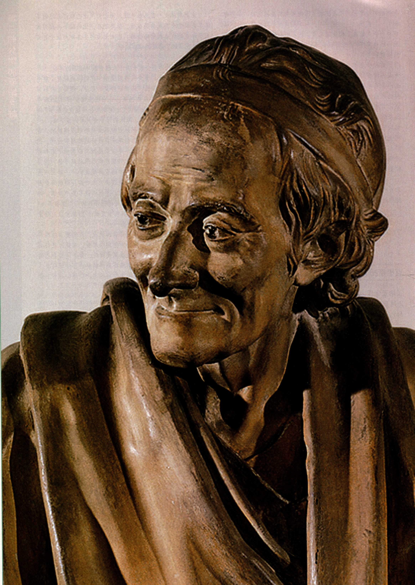

*图23.27 细部，让－安托万·乌东：《伏尔泰坐像》*

# 第二十三章 启蒙时代的艺术：1750-1789年

> “我们的观念正在发生剧变，变化是这样迅速，似乎预示着一场更大的变革即将到来。这场革命的目标、性质和局限有待于未来去裁决，而对于它的缺点和不足之处，后人也能作出比我们更为准确的判断。”
>
> ——让·达朗贝尔

法国哲学家、科学家让·达朗贝尔（Jean d'Alembert）在1759年说出这段预见性的言论，而西方世界确实正在兴起一场革命，一场至今仍未结束的革命。这次革命带来了一种崭新的世界观，指导我们现代生活的社会、科学、经济和政治准则都由这种世界观衍生而来。达朗贝尔恐怕也没有意识到当时他正在见证现代世界的诞生。

两场关系密切的革命宣告了新世界的来临：18世纪中叶首先兴起于英国、然后逐渐蔓延到全世界的工业革命，以及分别于1776年和1789年爆发于美国和法国的政治革命。民主、个人自由、资本主义、社会主义、工业化、技术创新、城市化和“进步说”（即通过科学和知识，朝着更好生活不断向上的发展过程），这些只是这个时代所产生的众多现代概念中的一部分。

支撑这一转变的力量正是启蒙运动，指的是18世纪主要形成于英国、法国、德国和美国的现代哲学（见地图23.1）。这种新思潮的基础是17世纪末由英国哲学家约翰·洛克（John Locke，1632-1704年）以及物理学家、数学家艾萨克·牛顿（1642-1727年）所奠定，他们可能是当时最有影响的两位思想家了。两人都认为经验主义（empiricism）是哲学和科学的基础，并提倡理性思维。对牛顿来说，经验主义意味着从数据和观察出发，而非迷信、神秘主义、宗教、道听途说或是异想天开，然后再以合乎逻辑的方式来处理这些信息。而对洛克而言，经验主义则是将经验确立为概念形成的唯一基础。不能再认为思想是与生俱来或是上帝所赋予的了。洛克宣称，人生而为善，而且对于生命、自由和财产拥有与生俱来的权利，这样就推翻了原罪说。他把政府的职责定义为保护这些天赋权利；政府若做不到这一点，公民就可以弹劾政府，即使是通过革命的方式也在所不惜。

一开始这些思想的影响只是涓涓细流，后来却发展成了滔滔洪流，支持洛克和牛顿革新观念的根本前提触发了整个18世纪论著和理论界的大爆炸。领导这次哲学突进的是启蒙哲学家（philosophes），这是人们对法国哲学家的通称。其中最著名的有伏尔泰（弗朗索瓦-马利·阿鲁埃的化名，1694-1778年）、让-雅克·卢梭（Jean-Jacques Rousseau，1712-1778年）和德尼·狄德罗（Denis Diderot，1713-1784年），狄德罗曾与达朗贝尔一道编写了52卷本的《百科全书》，是世界上第一部百科全书，试图记录当时世界和知识的状况，从而成为启蒙运动、经验主义的缩影。

除了确立基本人权、逻辑和新的道德秩序，启蒙思想还开创了现代科学。比如，人们发现了电和氧气，就我们所知，如今的化学和自然科学也是在那时建立起来的。科学还推动了工业革命的发生。到了18世纪中叶，英国中部地区最早的一批工厂已经在以不可思议的速度生产着布料，劳动者这个概念被重新定义为第一批工厂工人。他们的工资仅能维持最低生活水平，在巨大的厂房里，他们被拴在隆隆作响的织机上，四周还充斥着震耳欲聋的噪声。矿工们挖出的煤和矿石用于冶铁，这才有了第一座金属桥梁。1765-1782年苏格兰工程师詹姆斯·瓦特（James Watt）对蒸汽机作的改进使得采矿业和纺织业得以加速发展，也使罗伯特·富尔顿（Robert Fulton）能够在1807年成功制造出第一艘蒸汽船，迎着急流和众人的怀疑沿哈得孙河（Hudson River）而上，并以令人无法置信的速度从曼哈顿到达了奥尔巴尼（Albany）。

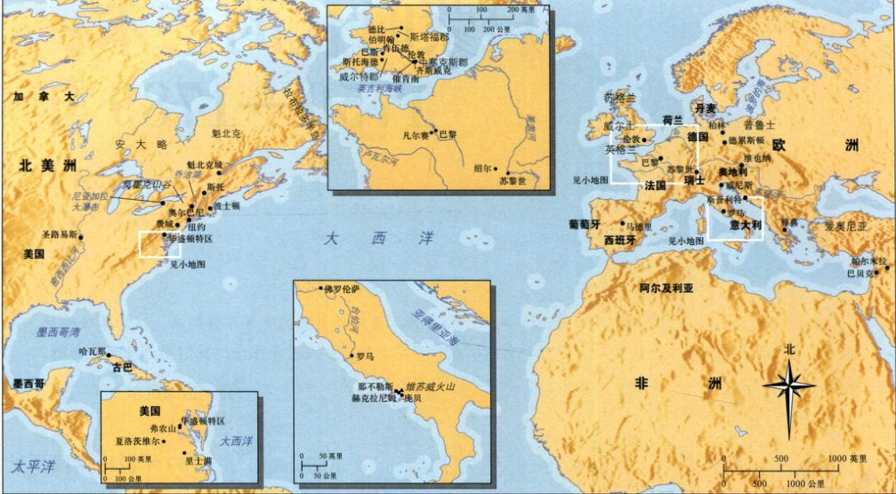

*地图23.1 启蒙时代的欧洲与美洲*

18世纪下半叶是世界从古老迈向现代的转型期。艺术很好地反映了这种转变，正因为它是多变且多元的，可以在一件作品中同时包含几种近乎矛盾的态度。这个时期的主流风格是新古典主义（Neoclassicism），意思是“新式的古典主义”，常常表现当时人们观念中古代希腊和罗马人的光荣事迹和行为。但应该看到，并不是所有标榜新古典主义的作品都是以古代为背景；它们的内容可能是当时的风俗场景或大事件，拥有古代的外表或感觉，并信奉类似的道德观念。

对于新古典主义所接受的启蒙逻辑和道德体系，表述得最充分的人也许就是伏尔泰了。在他的戏剧、诗歌、小说和小册子中，伏尔泰用逻辑来抨击他所谓的“迫害大众、但享有特权的正统”，指的正是教会和政府，仿佛一切不合理的制度或观念都会成为其讽刺的对象。他相信科学能够推动文明进步，而且依靠逻辑运行的政府是造福于民的，而非仅让贵族受益。“进步说”也是伏尔泰提出的。伏尔泰认为新文明的典范是古代希腊和罗马共和国，它们不仅是最早的民主国家，还产生了第一批理性主义哲学家。新古典主义中所使用的词汇取自古代艺术、受古典艺术影响的文艺复兴，以及17世纪法国画家尼古拉·普桑。

与此同时，艺术上出现了另一条似乎对立的线索：浪漫主义（Romanticism）。我们将在下一章中看到，浪漫主义约在1800年达到全盛，浪漫主义一词正是对于当时世界观彻底变化的一种回应。与新古典主义的逻辑及其通过科学控制自然力的愿望不同，浪漫主义重视情感和直觉，相信未经雕琢、不受约束的大自然至高无上。让-雅克·卢梭是这个观点的主要支持者，他在《论艺术与科学》（Discourse on the Arts and Sciences，1750年）中对此有明确表述。在文中，他主张回归自然，认为人生而为善，而非生来有罪，我们运用天生的感觉或本能来区别善恶，即区别令自己快乐或悲伤之事。感情会左右他们的选择，而非理性思考，后者只是用来解释抉择。他还指出，社会通过习惯、价值观和风俗，最终将其理性化的标准强加于个人，使他们脱离最初真实而自然的本能。卢梭赞美他所谓真诚而充满生命力的“高贵的野蛮人”，谴责当代文明的虚荣、做作；总而言之，他反对一切让人们无法运用自身基本情感力量的社会约束。

理性与情感并存于艺术之中，有时两种因素会出现在同一作品当中，但比例通常不等。然而两种态度的支持者均激烈地抵制洛可可艺术，因为他们觉得它淫荡、轻浮甚至邪恶，通常与贵族和特权这两大被启蒙运动谴责的罪人联系在一起。虽然人们呼唤一种以古典价值观为基础的新艺术，但谁也无法确定它具体的形式。直到18世纪80年代，新古典主义风格才随着雅克-路易·大卫的绘画而达到其全盛时期。与此同时，新古典主义还可能以多种伪装形式出现，有时甚至包含了几分洛可可式的优雅，这提醒着人们洛可可艺术仍然存在。同时，浪漫主义对强烈情感、非理性、无法解释的事物，以及自然的强大力量却越来越有兴趣；讽刺的是，到了18世纪90年代它的风头居然盖过了新古典主义，要知道大卫成名和1789年法国大革命才刚刚过去十年而已。虽然在这个世纪的下半叶，英法两国统治着艺术界，这也是我们接下来讨论的重点，但新古典主义与启蒙运动一样，都是国际性运动，斯堪的纳维亚、奥地利、德国和俄国都堪称其优秀代表。

## 1760年之前的罗马：新古典主义的源头

18世纪时罗马是世界艺术的中心，几乎每个立志成为画家、雕塑家或建筑师的人都希望去那里学习，可以直接观摩古代艺术品以及文艺复兴、巴洛克时期的艺术珍宝。1666年，法兰西学院在罗马开设了一所附属学校，而在接下来的一个世纪，英国人则在那里建立了一所非官方学校。罗马有几所学院也向外国人开放，几位居住在罗马的知名艺术家，例如庞贝奥·巴托尼、安东·拉斐尔·门格斯和加文·汉密尔顿，都利用自己的工作室作为教学场所。同时艺术家们也会合办短期的私人学校。

来罗马的并不只有艺术家，因为不来意大利做一次“游学”，绅士教育就不能算完整。这种旅行的路线包括北方地区（佛罗伦萨、托斯卡纳、翁布里亚和威尼斯）和那不勒斯。从那不勒斯出发，可以到赫克拉尼厄姆和庞贝，这是两座保存完好的古罗马城市，对它们的发掘分别始于1738年和1748年。但罗马才是旅行的高潮。绅士、王侯和贵族，一切有文化追求的富人会从西方世界各地，包括美洲殖民地，聚集到罗马。其中英国人数量最多，伦敦甚至还有一个名叫玩票者协会（Society of Dilettanti）的考古组织，有很多会员。这个团体资助了对雅典卫城（1751年）、帕尔米拉（Palmyra，1753年）、巴贝克（Baalbek，1757年）、斯普利特（Split，意大利语为“Spalato”，1757年）和爱奥尼亚（1764-1769年）的发掘，并用豪华的对开本为它们出版图册，为力求在作品中再现准确历史的艺术家们提供了最为丰富的珍贵参考资料。罗马本身就是一个巨大的挖掘场，古董商人们疯狂地搜寻器物和雕像，再卖给旅游者。这些旅游者带走的不仅是罗马艺术品，还有对古典风格的鉴赏力，这种风格后来出现在其乡间住宅和花园的设计中。

考古发掘激发了人们对古代的兴趣，并且点燃了艺术家的想象力，特别是对与赫克拉尼厄姆和庞贝的发掘。古代重新得到关注的另一个原因是德国学者约翰·温克尔曼（1717-1768年）的著作；他是著名的古董收藏家枢机主教阿尔巴尼的图书管理员，这位枢机主教在罗马的阿尔巴尼别墅与博尔盖塞（Borghese）别墅及加比多里山一样均为古物博物馆，是每个游学之人的必游之地。1755年，温克尔曼发表《关于绘画和雕塑中对希腊艺术之模仿的思考》，1765年，他又出版了巨著《希腊艺术史》（History of Greek Art）。后者是当时拥有读者人数最多的书籍之一，这也解释了它所造成的巨大影响。在这两部作品中，温克尔曼把希腊文化提升到至高无上的地位，而这是其在古典传统中从未真正拥有过的：一个完美的时代之后到来的只有模仿和衰落。但温克尔曼在希腊艺术中看到的不仅仅是美，他还看到了与启蒙思想相似的道德品质：“希腊杰作普遍且最为显著的特征是高贵的单纯和静穆的伟大（noble simplicity and calm grandeur [edle Einfalt, stille Größe]），这种特征存在于手势和表情之中……在诸般激情当中，所有希腊雕像的表情都揭示出伟大、严肃的灵魂。”他进而得出结论：“想使自己变得伟大，如果有可能的话，甚至使自己变得无法比拟，唯一的方法就是模仿古人。”对于温克尔曼巨大的影响力，新古典主义提出了它的战斗口号——创作体现“高贵的单纯和静穆的伟大”且富于道德寓意的作品。

### 新古典主义的基本艺术原则：门格斯、巴托尼、汉密尔顿

人们重新对古代产生了兴趣，在此影响之下，三位在罗马工作的艺术家开始为新古典主义建立基本的原则，他们是门格斯、巴托尼和汉密尔顿。德国人安东·拉斐尔·门格斯（Anton Raphael Mengs，1728-1779年）1740-1765年期间曾断断续续地在罗马工作。在温克尔曼的极力推荐之下，枢机主教阿尔巴尼委托他为阿尔巴尼别墅画一幅天顶湿壁画，这令他声名远扬。他的《帕纳塞斯山》（Parnassus，图23.1）于1761年完成，温克尔曼则在图像志方面提供了帮助。画面中枢机主教变成了阿波罗的样子，周围是七位缪斯女神，可以辨认出大部分女神的形象来自枢机主教的朋友。这件作品模仿了拉斐尔为梵蒂冈宫所做的同名湿壁画。在风格上，门格斯除了仿效拉斐尔之外，还吸收了古代作品的元素。他的作品结合了拉斐尔的平面性（planarity，物体和人体平行于画面）和线性（linearity，物体和人体有明晰的轮廓）。人物形象模仿拉斐尔的作品，以及不久前在赫克拉尼厄姆和庞贝出土的壁画。画中阿波罗的姿势很容易让人联想起《观景楼的阿波罗》，这件作品藏于梵蒂冈宫，它的盛名亦得益于温克尔曼。为了平面性，门格斯放弃了巴洛克风格的幻景式天顶画技法（见图19.11，可使天顶看起来像是打开的一样，展露出天空）。他把天顶画绘制得仿佛拉斐尔的壁画，唯一不同的是挂在了天花板上。门格斯放弃了当时流行的花哨洛可可画法，大胆地运用了一种能逐渐化入平坦表面的致密笔法。所有这些要素（平面性和线性、朴素而细致的画法，以及古典式人物和主题）都在新古典主义风格中扮演着重要的角色。

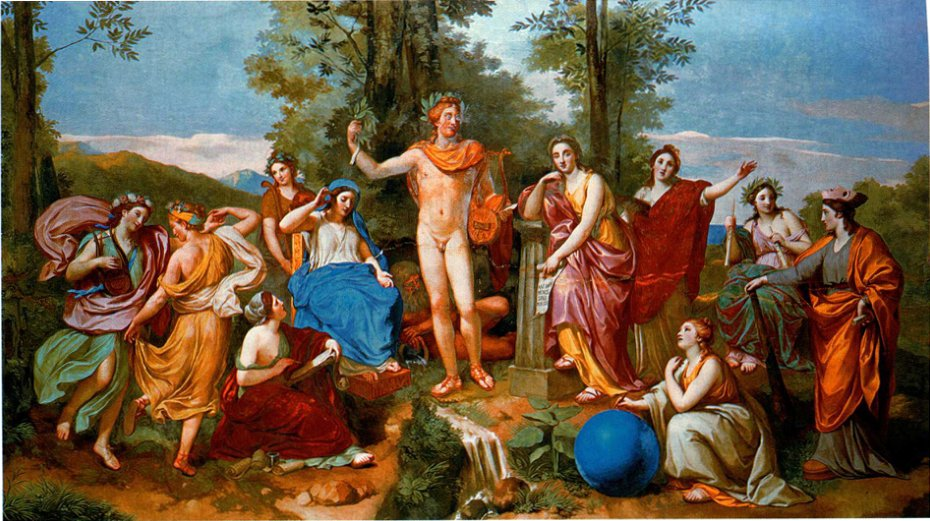

*图23.1 安东·拉斐尔·门格斯：《帕纳塞斯山》。1761年。罗马阿尔巴尼别墅天顶湿壁画*

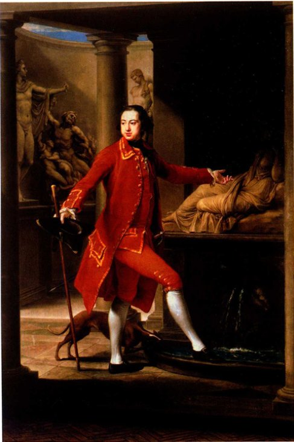

*图23.2 庞贝奥·巴托尼：《托马斯，第一任顿达斯勋爵》。1764年。布面油画，298 × 197厘米。齐特兰侯爵（Marquess of Zetland），阿斯科府邸 （Aske Hall），新约克郡*

在历史画家庞贝奥·巴托尼（Pompeo Batoni，1708-1787年）1764年所做《托马斯，第一任顿达斯勋爵》（Thomas，First Lord Dundas，图23.2）中也可以见到许多同样的特点。巴托尼作品中最有名的是肖像画，游学中最殷实的绅士排着队让他画像，就像顿达斯一样。除了干画法、对线条的强调和平面性（请注意顿达斯采取了一种古怪的扭身姿势，这是为了与画面平行），令人同样感兴趣的是其古代背景：顿达斯与《拉奥孔》和《观景楼的阿波罗》的复制品站在一起，这些复制品就作为道具摆放在巴托尼的画室里。巴托尼的好几幅肖像画都使用这个背景，改变的只是画中人的姿势，而人物的姿势大都取自一尊有名的古希腊雕像。在这幅画里，巴托尼在低头舔饮的狗和画中人之间作了一个类比，喻指顿达斯一直畅饮文化之泉，而滋养这眼泉水的正是他对古人的专心研究。他身后朴素的多立克柱象征着罗马之行灌输给他的坚强、高贵个性。

通常认为，对新古典主义发展影响最大的罗马艺术家是苏格兰画家、古董商人加文·汉密尔顿（Gavin Hamilton，1723-1798年）。将近1761年的时候，他画了一幅取材于荷马史诗的油画《安德洛玛刻哀悼赫克托耳之死》（Andromache Bewailing the Death of Hector）；1764年，此画被制成一幅流传广泛的雕版画（图23.3）。每个到罗马的人都在汉密尔顿的画室里看过这幅画，因为他是当时不可不见的画家之一。没去罗马看这件作品的人可以在1764年由艺术家协会举办的展览上见到，艺术家协会是一个设在伦敦的组织，每年都为会员举办一次展览。在1768年皇家学院开办之前，这里一直公认为是最重要的艺术家聚会场所。这幅表现哀悼的画肯定为已经习惯于洛可可欢乐、虚幻和放荡的眼睛带来了一场地震。其寓意是：在婚姻中提倡忠诚，反对不检点；赞美坚定的无私奉献，远离刺激的欺骗；要美德，不要堕落。构图中的一些要素则是受到了古罗马石棺和坟墓建筑的启发，但汉密尔顿在构图方面最重要的灵感来源是普桑的《罗马将军之死》（见图21.4），这件作品当时保存在巴贝里尼宫中。这两幅画的左边都有一个缩进的筒拱，同样的平面型构图也都是由向侧面伸展的床来确定，床上方都拉着床罩，床上都放着一具尸体。汉密尔顿后来还画了其他歌颂美德和刚毅精神的作品，这些主题在洛可可时期之前对于艺术家们来说极其重要，虽然他并不是第一个重新采用的人，但他的作品起到了催化剂的作用。18世纪六七十年代，各个门类都有越来越多的艺术家开始创作类似的说教题材作品。

> **大事年表**
>
> 1666年 - 法兰西学院在罗马设立附属学校
> 1738年 - 对赫克拉尼厄姆的发掘开始
> 1748年 - 对庞贝的发掘开始
> 约1761年 - 汉密尔顿创作《安德洛玛刻哀悼赫克托耳之死》

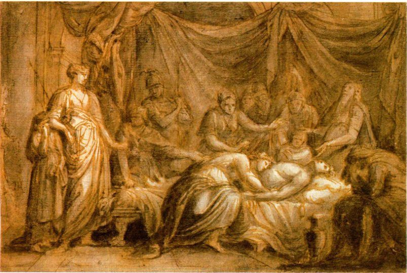

*图23.3 加文·汉密尔顿：《安德洛玛刻哀悼赫克托耳之死》。1764年。Domenico Cunego根据约1761年的油画制作的雕版画。耶鲁大学英国艺术中心，Paul Mellon藏品*

## 1760年之前的罗马：浪漫主义的源头

18世纪50年代起源于罗马的还有另一股艺术潮流，它强调激发观众内心的强烈情感，这是一种被称为“浪漫”的特质。这个潮流的源头是版画家乔瓦尼·巴蒂斯塔·皮拉内西（Giovanni Battista Piranesi，1720-1778年），当时他已是知名的罗马实景画家，作品为游学的绅士都想把他的作品当作旅游纪念品带回国。就好像在威尼斯他们会买卡纳莱托及其他艺术家的实景画一样。温克尔曼褒扬希腊人而贬低罗马人，这激怒了皮拉内西，他决心捍卫古罗马传统，并通过创作《罗马古迹》（Roman Antiquities）实现了这一目标。这是一部四卷本的著作，完成于1757年，其中有数百幅描绘古罗马废墟的蚀刻版画。这些蚀刻版画绝不仅仅是对于遗址的记录。皮拉内西常常按照从下向上的次序呈现这些建筑（图23.4），使它们变成若隐若现的庞然大物，不仅证明了古罗马人伟大的工程伟绩，还证明了古罗马文明无比的力量及至尊地位。与这些建筑骇人的规模相比，在光照强烈的残垣断壁间漫步的奇特游人就显得十分渺小。那些建筑似乎不是人类建造的，而是由一个神秘消失的高大巨人文明所修建。岁月磨损了他们的建筑，以致其现在纷纷崩塌，蔓草丛生，显得别具神韵。

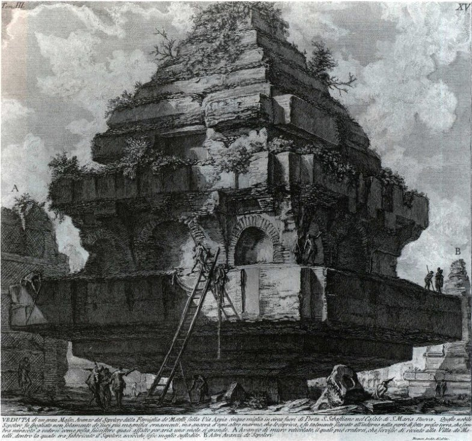

*图23.4 乔瓦尼·巴蒂斯塔·皮拉内西：《梅塔利之墓》（Tomb of the Metalli），《罗马古迹》（Antichità Romane）第三卷图版XV，约1756年。蚀刻画，42.5 x 46.5厘米。纽约大都会艺术博物馆，Rogers基金，1941年从图书馆移来，（41.71.3（15））*

这些形象体现了皮拉内西本人面对古罗马文明时的敬畏，引起人们满怀伤感地沉思时间的破坏力，当年那个一度不可一世的庞大帝国就是被时间所慢慢侵蚀。画家创作这些版画并不只是为了提供知识，还在于令观赏者的脊背颤抖。在其中我们发现了情感的萌芽，与新古典主义的“高贵的单纯和静穆的伟大”形成鲜明对立。

在18世纪，皮拉内西试图唤起一种敬畏感，通常认为这是由那个时代所谓的崇高（sublime）而引发的。崇高不是一种风格，而是一种特质或属性。有趣的是，这个词在1756年流行起来，这是皮拉内西出版其作品的前一年；同样是在这一年，英国政治家埃德蒙·柏克（Edmund Burke，1729-1797年）发表了一篇题为《论崇高和美的观念之起源的哲学探究》（A Philosophical Inquiry into the Origin of Our Ideas of the Sublime and Beautiful）的论文。这一研究更多针对的是心理学而非美学，但其对于艺术领域的影响是巨大的。他把美定义为光滑、精致和优雅等特质的体现，这些特质使人产生快乐、愉悦和爱的感觉。而崇高却是朦胧、阴暗、力量、巨大和无限的，是一切激发惊骇、恐怖、不安和敬畏情绪之物。崇高产生的是“心灵所能感受到的最强烈情感”。随着那个世纪的发展，越来越多的艺术家接受了崇高这一概念，用绘画、雕塑和建筑作品来迎合观众对敬畏或感动的需求。

## 英国的新古典主义

看起来英国人似乎更容易接受新古典主义，这不仅因为启蒙运动诞生于英国，还因为这个国家早在18世纪初就已在文学上与古代发生了紧密的联系。那时正是英国诗歌中奥古斯都时代或古典时代的全盛期，其主要作家，如约翰·德莱顿（John Dryden）、亚历山大·蒲柏（Alexander Pope）和塞缪尔·约翰逊（Samuel Johnson），从作品形式到内容上都竭力仿效活跃于第一位罗马皇帝奥古斯都·恺撒（公元前63-公元14年）时期的作家，这些英国诗人也翻译过许多此类作家的作品。此时的英国拥有前所未见的和平与繁荣，与奥古斯都·恺撒时代的认同感部分也源于此，因为两个时代的特征同样是稳定、经济繁荣和文化昌盛。英国贵族中信奉自由主义的一派以古罗马为榜样，把与国王分享权力的英国议会政体与罗马共和国的民主政体联系起来。我们将会看到，到了18世纪20年代，这些自比为古罗马元老院的自由主义者希望自己在乡下的住所也能够依照古罗马的样板来建造。

### 雕塑与绘画：历史主义、道德观与古代

英国人尤其容易接受由门格斯、巴托尼和汉密尔顿确立的新古典主义基本原则。汉密尔顿以古代为背景的说教画具有巨大的影响，受其影响的艺术家非常多，从18世纪60年代的少数几人增加到之后数十年中的几十人。不过，对古典风格的喜爱也只是对一种风格或外表的爱好而已，道德寓意则几乎被忽略。装饰艺术的情况尤其如此（见第796页的材料与技法）。

**托马斯·班克斯** 汉密尔顿的影响不仅仅局限于绘画领域，还波及了雕塑，托马斯·班克斯（Thomas Banks，1735-1805年）的作品恰好反映了这一点。1772至1779年班克斯在罗马学习时雕刻了一座大理石浮雕《罗马将军之死》（The Death of Germanicus，图23.5）。班克斯利用基于考古学得来的准确建筑细节和家具（比如，请注意那张克里斯莫斯靠椅［klismos chair］）来证明这个场景的真实性，将带有古典风格的人物排列成一行，形成一种既平又浅的檐壁式构图，反映了启蒙运动对逻辑的重视。与汉密尔顿的《安德洛玛刻哀悼赫克托耳之死》一样，忠诚的妇人和孩童表达了对垂死将军的深切悲痛，而忠心耿耿的士兵们则举臂发誓，一定要报杀害将军之仇。类似的连绵曲线强化了两组人物的强烈情感，但汉密尔顿笔下的人物，尤其是安德洛玛刻，似乎模仿了米开朗基罗笔下男女先知那种极具爆发力的伟岸风采。接下来我们将看到，18世纪80年代新古典主义在法国达到鼎盛时，将放弃曲线设计，采用一种更为朴素的几何形网格构图，以强调人物捍卫道德的坚定决心。

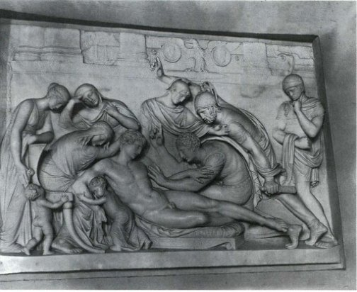

*图23.5 托马斯·班克斯：《罗马将军之死》。1774年。大理石，高76.2厘米。霍尔卡姆府邸（Holkham Hall），诺福克（Norfolk），英国。*

> **材料与技法：约赛亚·威基伍德与碧玉细瓷器**
>
> 碧玉细瓷器实际上反映了英国人对一切带有古典风味事物日益增长的需求，这种瓷器由约赛亚·威基伍德（Josih Wedgwood）发明，18世纪70年代中期开始由他位于斯塔福郡（Staffordshire）的工厂生产，名为伊特鲁里亚工厂（Etruria）。碧玉细瓷器（jasperware）是一种耐用的无釉瓷器，饰有古典风格的浅浮雕或小型人物图案。大多数碧玉细瓷器是在有颜色的底子上，尤其是蓝色和灰绿色，饰以白色浮雕。1775年，威基伍德雇请雕塑家约翰·弗拉克斯曼（John Flaxman，1755-1826年）来负责大部分图案设计工作，他的设计主要以威廉·汉密尔顿（William Hamilton）收藏的古希腊陶瓶为范本。对于这些直到本世纪中叶才被发现的希腊陶瓶，通常认为出自伊特鲁里亚人之手，所以威基伍德的工厂取名为伊特鲁里亚。汉密尔顿的藏品原本存放在那不勒斯，1772年卖给刚刚成立的大英博物馆，不过在18世纪60年代，它们就被印成了多卷大型对开本图册，临摹起来十分方便。
>
> 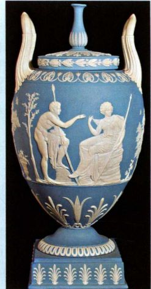
>
> *约翰·弗拉克斯曼：《赫斯帕里德斯园中的赫剌克勒斯》（Hercules in the Garden of the Hesperides). 1785年设计，约1790年由威基伍德制作。碧玉细瓷器，高35.7厘米。陶器博物馆及艺廊，特伦特河畔斯托克（Stoke-on-Trent）*
>
> 图中是一个由弗拉克斯曼设计的花瓶，表现了赫剌克勒斯在赫斯帕里德斯花园中的情景，于1785年设计，但后来才制作出来。弗拉克斯曼把汉密尔顿一个陶瓶上的二维瓶画转变成为适合用于碧玉细瓷器的三维浅浮雕。他保留了汉密尔顿陶瓶上人物的清晰轮廓线、侧面像和基本外形，但巧妙地增强了希腊原作的雅致感，主要通过简化线条实现，这还可以使之更为优雅。
>
> 与大多数威基伍德器饰一样，这个场景并没有反映高贵性格的行为、决心或某个决定性瞬间。弗拉克斯曼表现了正在花园里休息的赫刺克勒斯，他第十一个任务就是要在这个花园里偷走本属于宙斯的金苹果，而守护它的则是有一百个头的海蛇怪和阿特拉斯的女儿们——赫斯帕里德斯姐妹。这个画面更像是古典风格的雅宴画，而非为了体现赫刺克勒斯勇气和威力的行为。漂亮的颜色和精巧的设计重现了洛可可的情调，提醒人们对古典的爱好也可以是这样的，即喜爱一种风格或外表，不必过于顾虑其主题是道德的还是色情的。
>
> 威基伍德的发迹要感谢工业革命，因为其正是以大规模生产为基础的。威基伍德把弗拉克斯曼的同一设计用在不同物品上：花瓶、壁炉镶板、饰板、圆形饰和花几（大型装饰性花盆架）。公司专门从事古典艺术、雇请弗拉克斯曼则全部要归功于威基伍德的合伙人托马斯·本特利（Thomas Bentley）。之后他们又在伦敦开办了一个展室来宣传他们的器物，还独创性地印刷了一份产品目录，并广为发送。这两个人不仅大规模生产艺术品，还大规模销售艺术品，让大众能以合理的价格买到高质量的作品。他们还满足了大众对名人越来越深的迷恋，因为他们的圆形饰有用名人肖像为内容的，这实际上是提前承担了大约75年后摄影以及20世纪大众传媒的角色。弗拉克斯曼设计了作家塞缪尔·约翰逊、在伦敦造成轰动的女演员莎拉·西登斯（见图22.18）等著名人物的侧面像。
>
> 在英国，工业革命增加了财富，使得上层中产阶级出现，威基伍德正是在满足这些新主顾的需要。艺术不再只为王室、贵族和教会服务了。需求量非常巨大，威基伍德不得不于18世纪80年代初在伊特鲁里亚工厂安装了第一台蒸汽机，用以提高生产效率。
>
> 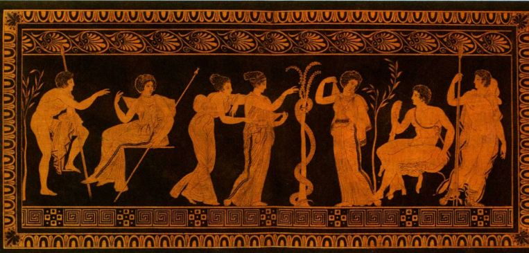
>
> *《赫斯帕里德斯园中的赫刺克勒斯》，皮埃尔-弗朗索瓦·于格·当卡尔维尔（Pierre-François Hugues d'Hancarville）：《尊敬的威廉·汉密尔顿珍宝室中的伊特鲁里亚、希腊和罗马古董收藏》（Collection of Etruscan，Greek and Roman Antiquities from the Cabinet of the Honorable William Hamilton）插图。1766-1767年。第二卷，图版127*

**安吉莉卡·考夫曼** 安吉莉卡·考夫曼（Angelica Kauffmann，1741-1807年）是在英国新古典主义发展过程中最为重要的艺术家之一。她出生于瑞士，18世纪60年代在罗马学习，1766年移居伦敦。她是乔舒亚·雷诺兹的朋友，1768年皇家学院成立时的创立者之一，当时雷诺兹任院长。在20世纪以前，她是学院所接纳的两名女性其中一个，这个数字从负面反映了男性的偏见，而从正面反映了年仅27岁的考夫曼在业界所享有的高度声望。作为一名女性，她得不到研究男性裸体的机会，而在当时，一名历史画家要想成功，对男性裸体的研究是至关重要的，而这也令她的成功显得更加难得。18世纪只有少数几个女性艺术家在男性的世界里成功开拓出一番天地，她是其中唯一的一位历史画家。其他人要么是静物画家，如巴黎人安妮·维叶莉-考斯特（Anne Vallayer-Coster，1744-1818年），要么是肖像画家，如王后玛丽·安托瓦内特最喜欢的艺术家玛丽-伊丽莎白-路易丝·维热-勒布伦和阿德莱德·拉比尔-古丽亚（Adélaide Labille-Guiard，1749-1803年）。后两位法国女性虽然也称得起是那个时代最优秀的画家，但来自男性世界的偏见过于强大，她们均被指责雇用男性画家来替自己作画。强调平等的启蒙哲学也许能为女性获得更大的社会、经济和政治自由提供理论前提，但在现实生活中，女性艺术家在18世纪始终只能是二等公民，偶尔获得进入伦敦和巴黎的艺术学院的机会（法兰西学院一次只接收四位女性）。另外，男性艺术家笔下的妻子或母亲形象都无比僵硬，其特点仅仅是能生育、长相标致，但柔弱无能、消极被动、多愁善感、庄重娴静，正如我们在班克斯的《罗马将军之死》中所见。

与众多同时代艺术家一样，考夫曼也在古希腊罗马文学中寻找题材。在1769年的第一届皇家学院展览会上，她提交了《赫克托耳向安德洛玛刻道别》（Hector Taking Leave of Andromache）；三年后，她又展出了《安德洛玛刻与赫卡柏在赫克托耳的骨灰前哭泣》（Andromache and Hecuba Weeping over the Ashes of Hector），两幅画都着重刻画了既是妻子又是寡妇的女主人公，表现其对婚姻的坚贞。考夫曼说教画的经典之作是1785年左右创作完成的《科内莉亚（格拉古兄弟的母亲）将她的孩子视为珍宝》（Cornelia Presenting Her Children as Her Treasures [Mother of the Gracchi]，图23.6）。画中的主人公把养育子女和照顾家庭放在第一位。虽然也把一个女人描绘成母亲，但她一反由男性制定的旧框框，创造了一个主动、果决、克制的女性形象。在这个公元前2世纪的古罗马历史故事里，一个前来做客的朋友向科内莉亚·格拉古炫耀她的珠宝。科内莉亚并未拿出自己的珠宝，而是骄傲地介绍她的孩子们，其中的两个，即提比略和盖乌斯（Gaius），后来都成了伟大的政治家。为了培养儿子们的领导才能，科内莉亚请来了世界上最好的家庭教师，而且据说她是用谈话而非乳房使他们“断奶”的。科内莉亚还一直担任两个儿子的助手和顾问；除了以美德和才智著称之外，她还是罗马共和国历史上最有影响力的女性之一。作为一个在男性世界里奋斗的女艺术家，考夫曼必定会认同科内莉亚，而画中科内莉亚的相貌也与艺术家本人相似。

在《科内莉亚将她的孩子视为珍宝》中，考夫曼创造了一种朴素的、纪念碑式画法，强化了那位母亲的力量和高贵。虽然人物优雅的手势和优美的身段还是属于洛可可风格，但支配整个画面的却是毫无装饰的地板和墙，以及以科内莉亚为顶点而构成的稳定三角形构图。不过，科内莉亚主题并非只有考夫曼一人采用，其在艺术家中间相当流行。它不仅说明了美德是什么，还反映了当时新产生的对于家庭成员重要性的关心，这种关心源于让-雅克·卢梭的启蒙学说，他主张父母在家中养育儿女，直至他们长成少年，而不是把他们送给奶妈和保姆抚养。

> **大事年表**
>
> 1725年 - 伯灵顿和肯特开始建造齐斯威克宅邸
> 约1750年 - 工业革命在英国发动
> 1765-1782年 - 詹姆斯·瓦特改进蒸汽机
> 1767年 - 小约翰·伍德在巴斯设计皇家新月楼
> 1768年 - 英国皇家学院成立
> 1775-1784年 - 美国革命
> 1776年 - 亚当·斯密发表《国富论》

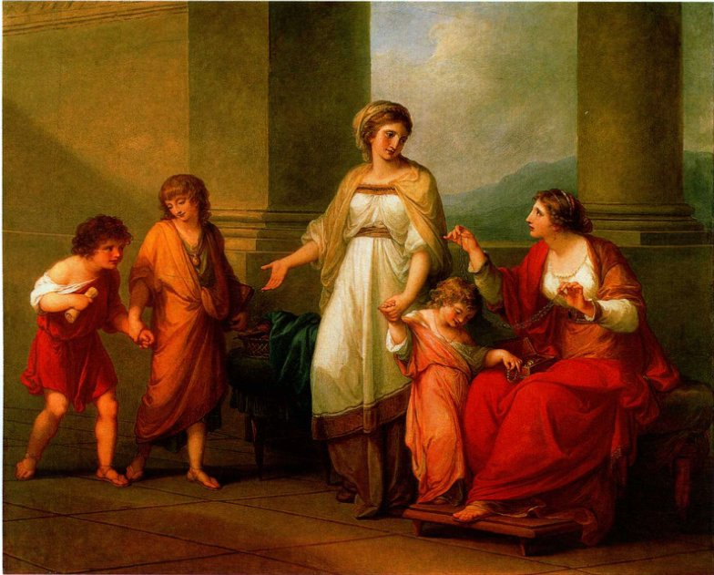

*图23.6 安吉莉卡·考夫曼：《科内莉亚（格拉古兄弟的母亲）将她的孩子视为珍宝》。约1785年。布面油画，101.6 × 127厘米。弗吉尼亚美术馆，Richmond Adolph D.与Wilkins C. Williams基金，75.22*

### 当代历史画的诞生

启蒙运动的经验主义在两个方面对历史绘画产生了重大影响：一是对历史主义的大力强调，当描绘一个发生在古代的事件时，服装、背景和道具都必须令人信服，要符合时代特点；第二个影响在于对当时具有重要历史意义的大事件的呈现。在此之前，对这类重大时刻的表现通常要运用寓言和象征手法，而非描绘真实场景，画中人物一般都身着古希腊罗马服装，以体现事件所应有的庄重感。但启蒙运动要求绘画必须合理、真实，每一个细节都能使同时代的人信服，就像我们今天希望历史电影所做到的那样。这种要求不仅适用于历史，还适用于当代事件。

**本杰明·韦斯特** 在当代历史绘画推广中贡献最大的艺术家也许要算本杰明·韦斯特（Benjamin West，1738-1820年）了，他是最有成就的英国新古典主义历史画家之一。韦斯特是贵格会教徒（Quaker）出生在费城郊外并在那里长大。他1760年前往罗马，在那里跟随门格斯学习，并同加文·汉密尔顿成为了朋友，还专心研究古代艺术以及受古典风格影响的文艺复兴大师们，尤其是拉斐尔。1763年，他在伦敦永久定居，还不到三年就大获成功，这部分要归功于其新颖的新古典主义风格。他是1768年皇家学院的创立者之一，在乔舒亚·雷诺兹去世之后，他于1792年成为院长。他毕生都是众多美国艺术家的良师益友，而且始终以其新大陆传统而自豪，他甚至还支持过美国革命。

韦斯特的成名之作包括1768年创作的《阿格丽品娜和日耳曼尼库斯的骨灰》（Agrippina with the Ashes of Germanicus）和1769年的《雷古鲁斯告别罗马》（Departure of Regulus from Rome），前者属于忠贞寡妇主题的道德画（见图23.3），而后者则表现了一个古罗马将军拯救祖国时那种坚忍的自我牺牲精神。这两幅画都贯彻了启蒙运动的历史主义观念，把画面设置在令人信服的真实古罗马城市背景里，浮雕般的人物排成一行，平行于画面，并以古典建筑为背景。

1770年，韦斯特宣布他正在创作一幅当代历史画《沃尔夫将军之死》（The Death of General Wolfe，图23.7），所绘事件发生在1759年魁北克（Quebec）的法国印第安人战争（French and Indian War）期间，这个消息震惊了伦敦艺术界。沃尔夫打赢了魁北克之战，成为战争的转折点，也使他成为了民族英雄。在听到韦斯特的计划之后，国王乔治三世（George III）表示他绝不会购买一幅表现他的士兵身穿现代军服的画，而雷诺兹也不赞成对得体原则的违背，其认为绘画应该描绘寓言性的神化场景。但这幅作品在皇家学院展出后，立刻得到了公众的称赞。画面十分具有说服力，观众感到他们仿佛亲眼目睹了伟大民族英雄在一个遥远国度为了祖国献出生命的那个瞬间，而其中的异域格调又令前来看画的公众着迷，好像如今的电影观众一般（见本页的艺术史家的观点）。

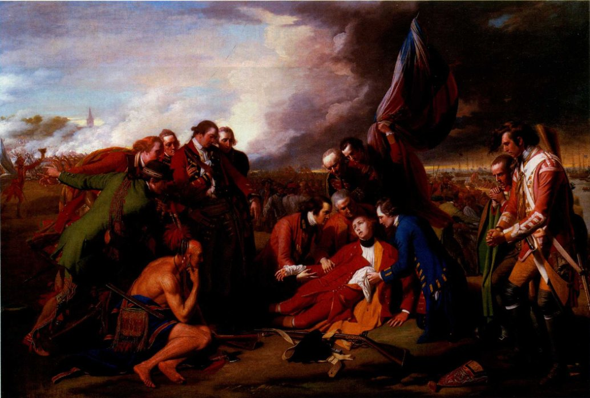

*图23.7 本杰明·韦斯特：《沃尔夫将军之死》。1770年。布面油画，1.51x2.13米。加拿大国家美术馆，渥太华。Westminster公爵赠*

此画成功的另一个原因是韦斯特将人物和事件抬高、古典化，实际上创造了一种现代经典风格。当时的观众承认自己所面对的基本属于一个传统的哀悼基督式场景（见图14.17），他们的英雄是现代的基督或殉道者。周围的“使徒”表现出自责和焦虑的情绪，但他们的强烈情感是高贵的、克制的，符合古典的得体规则，可与普桑相媲美。人物则取用对立平衡姿势，侧身而立，有古代浮雕或者拉斐尔笔下的圣徒、使徒或希腊哲人（见图16.25）的那种雕塑感；他们是现代的，同时又是古典的。唯一不动感情的是那个易洛魁人（Iroquois），也就是卢梭口中那种“高贵的野蛮人”，韦斯特把他表现得仿佛古代河神般高贵、沉着。易洛魁人超然事外离群，可以思考整个事件，而不让情感妨碍他对眼前所发生之事的理解。在绘画技法方面，韦斯特则是模仿在罗马结识的汉密尔顿、门格斯和巴托尼，表现为他画人物时先勾勒再上色，并用清晰的轮廓线使其显得更加高贵。

> **艺术史家的观点：韦斯特的《沃尔夫将军之死》的难解之意**
>
> 艺术史上充满了难解之谜，对于1900年以前的艺术来说，最常见的未知因素包括作品的创作者、创作日期、创作原因及其寓意。艺术史家们常常不得不依靠猜测，这是一种充满风险的策略，但优点是能够开启理性的对话，而这种对话有可能最终得出明确的答案。本杰明·韦斯特的《沃尔夫将军之死》就提出了试探性的问题以及对其的猜测。最明显的问题是：韦斯特为什么要画这个题材？答案的关键恐怕在于威廉·约翰逊（William Johnson）这个人物，也就是画面左方穿绿色大衣的那个人。火药筒上刻着他的名字以及一幅标有“莫霍克（Mohawk）山谷”和“安大略湖（Ontario）”这两个地名的地图。这些土地已经割让给他这位由美洲人任命的印第安事务主管。更重要的是，他是乔治湖（Lake George）之战和尼亚加拉要塞（Fort Niagara）之战的英雄，所以象征着美洲人对于赢得法国与印第安之战的重要作用。虽然此画秉承历史主义风格，但韦斯特所描绘的情景却是虚构的：约翰逊从来没有去过魁北克，印第安人帮助的是法国人而非英国人。韦斯特是在美国革命刚刚开始时创作此画的（波士顿大屠杀发生在1770年），把约翰逊画进作品中与历史不符。他这样设计是为了让英国人意识到他们亏欠了殖民地居民（画中以约翰逊为代表），而他们也是支持英国的忠实公民；同时让英国人知道承认他们自认已经获得的让步对于实现和解的必要性。这一分析可以解释画中多个异常之处，但唯一能证明它的只有符合逻辑这一点。虽然只是猜测，但为研究提供了一条新路。

## 建筑与室内设计：帕拉第奥风格的复兴

在英国，建筑领域中复古倾向的产生远远早于绘画和雕塑，其源头是科伦·坎贝尔（Colen Campbell）分别于1715、1717和1725年出版的三卷本论文集《英国的维特鲁威》（Vitruvius Britannicus）。坎贝尔主张创造一种英国建筑样式，以古代样式和安东尼奥·帕拉第奥受古典风格影响的别墅作为基础。这种样式不仅让人怀古，还运用几何学、数学和逻辑学创造出一种完美的和谐感（见第201-209页）。坎贝尔的观点基于第三代沙夫茨伯里伯爵（third Earl of Shaftsbury）、启蒙哲学家安东尼·阿什利·库珀（Anthony Ashley Cooper）于1712年发表的一篇文章。在这篇名为《关于艺术或设计学的书信》（Letter Concerning the Art，or Science of Design）的文章中，沙夫茨伯里提倡一种以广闻博识的趣味为基础的反巴洛克式民族建筑，也就是古人及其后继者（尤其是帕拉第奥）的风格。沙夫茨伯里写道：古代建筑的比例和布局反映了古希腊和古罗马人的高贵和美，其对文明的“有品位之人”具有强大的影响，这样的观点听起来与温克尔曼大约50年之后讨论雕塑时的说法极为相似。建筑是美，而非功用。

坎贝尔和沙夫茨伯里都反映了英国人与罗马天主教的对立。在英国，巴洛克建筑是与两种罪恶联系在一起的：信奉教皇制的罗马和法国王室。作为约翰·洛克的资助人和学生，沙夫茨伯里拥护个人自由，把古代建筑等同于民主政治。他还是一名辉格党党员，这是一个以反君主制闻名的自由主义党派。（托利党则是拥护君主制的保守主义党派，它曾支持信奉罗马天主教的斯图亚特［Stuart］王朝国王詹姆斯二世，詹姆斯二世死于1701年。）1714年，辉格党上台，结束了为期13年的政治动乱。其支持民主的党员们对复古建筑有特殊的认同感，因为其自视为现代的古罗马元老院议员，而元老院议员除了在城中建有府邸之外，在乡下还拥有别墅。在《英国的维特鲁威》出版前，几乎默默无闻的坎贝尔很难仅凭自己的能力满足想建造帕拉第奥式乡间别墅的辉格党人。他的三卷本论文集中就有很多幅他自己在帕拉第奥启发下设计的图样，后来在18世纪余下的时间里成为建筑师的重要参考书。英国建筑师大都人手一套坎贝尔的《英国的维特鲁威》、维特鲁威的《建筑十书》以及帕拉第奥的《建筑四书》。

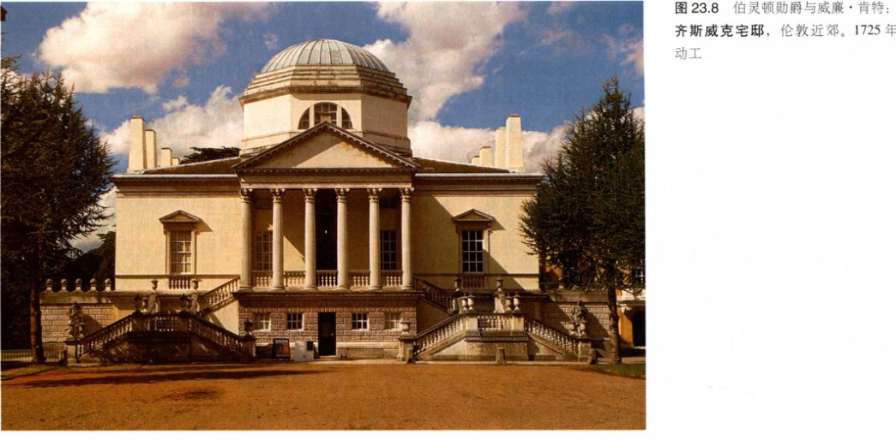

*图23.8 伯灵顿勋爵与威廉·肯特：齐斯威克宅邸，伦敦近郊。1725年动工*

**乡村别墅：齐斯威克宅邸与蒙蒂塞洛** 我们可以在坎贝尔的赞助人伯灵顿勋爵（Lord Burlington）身上发现《英国的维特鲁威》的影响。在1719年的意大利之旅后，伯灵顿成了一名业余建筑师，并最终取代坎贝尔成为帕拉第奥风格的领军人物。1725年，伯灵顿与艺术家威廉·肯特（William Kent，1684-1748年）一起设计了齐斯威克宅邸（Chiswick House，图23.8），位于伯灵顿在伦敦郊外的地产之上，是帕拉第奥风格复兴时期最著名的宅邸之一。这座富丽堂皇的宅邸模仿帕拉第奥的圆厅别墅（见图17.37），伯灵顿勋爵曾在游学期间研究过这个建筑。但外部楼梯的设计灵感源自坎贝尔1715年设计的旺斯特德宅邸（Wanstead House）正立面，这个设计出现在《英国的维特鲁威》的第一卷中。

齐斯威克宅邸的出色之处在于它的简洁和条理性，这也使得伯灵顿勋爵的成功变得容易理解了。这座建筑是个立方体。墙面光滑无装饰，所以人们可以清楚地看到墙壁的几何形状和窗户样式。自墙壁伸出的希腊神庙式圆柱门廊也是一种简单、清楚的结构。甚至凸起的八边形穹顶圆厅以及其上模仿古罗马浴场的三窗洞半圆形高侧窗也是几何式的。在这里我们看到了表述清晰的动机和逻辑，体现了美德、高贵和共和政体等理想。与沙夫茨伯里一样，伯灵顿认为建筑是一门与道德和审美有关的人文学科，而非功用。

帕拉第奥风格的复兴主宰着英国乡村建筑领域，甚至还越过大西洋，传到了美国，那里最杰出的代表之一是业余建筑师托马斯·杰斐逊（Thomas Jefferson，1743-1826年）在弗吉尼亚州夏洛茨维尔（Charlottesville）设计建造的蒙蒂塞洛（Monticello，图23.9）。杰斐逊建造蒙蒂塞洛的第一阶段是1770年到1782年，他从英国帕拉第奥风格建筑师罗伯特·莫里斯（Robert Morris）于18世纪中叶出版的书中抄来了一处平面设计，又从帕拉第奥的《建筑四书》中照搬了一种正立面样式。但雅致的长窗设计却是法式的，是他在18世纪80年代任驻法大使之后所作的多处改动之一。虽然做出了一些妥协，帕拉第奥式布局及其协调的特点依然清晰可辨。

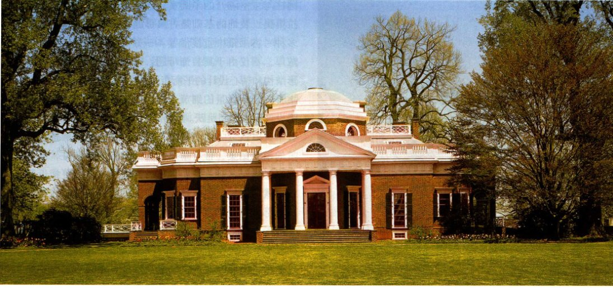

*图23.9 托马斯·杰斐逊：蒙蒂塞洛。1770-1782年初建，1796-1809年扩建。夏洛茨维尔，弗吉尼亚*

**城市规划：巴斯** 英国复古风潮最重要的代表也许就是巴斯，这个休养胜地早在古罗马时期就因其温泉而成为疗养胜地。由于有大量在世纪中叶因经济发展而富裕起来的伦敦人前来“洗温泉浴”，这个宁静的小镇必须通过扩建进行款待。在开发过程中，当地建筑师老约翰·伍德（John Wood the Elder，约1704-1754年）和小约翰·伍德（John Wood the Younger，1728-1782年）起到了重要作用。18世纪40和50年代，老约翰·伍德在复古风潮的影响下，立志重现古罗马的风采。他设计了一座皇家体育馆、一座公共广场和一个圆形广场，虽然只有最后那个设计成功地实施。这座建于1764年的圆形广场包括33栋连在一起的房子，围成一个圆圈，被三条街道分割开来。所有房子的正立面完全相同，而且连续不断，就像由外翻至内的罗马斗兽场（见图7.36）。1767年，小约翰·伍德又设计了包括30栋房子在内的月牙形皇家新月楼（图23.10），抢走了父亲的风头。小约翰·伍德在充当墩座墙的地下室上方立起帕拉第奥风格的巨柱式爱奥尼亚立柱，使正立面看上去更加宏伟、统一且富丽堂皇。伍德父子的城市广场设计十分新颖，英国在整个19世纪一直在重复使用。

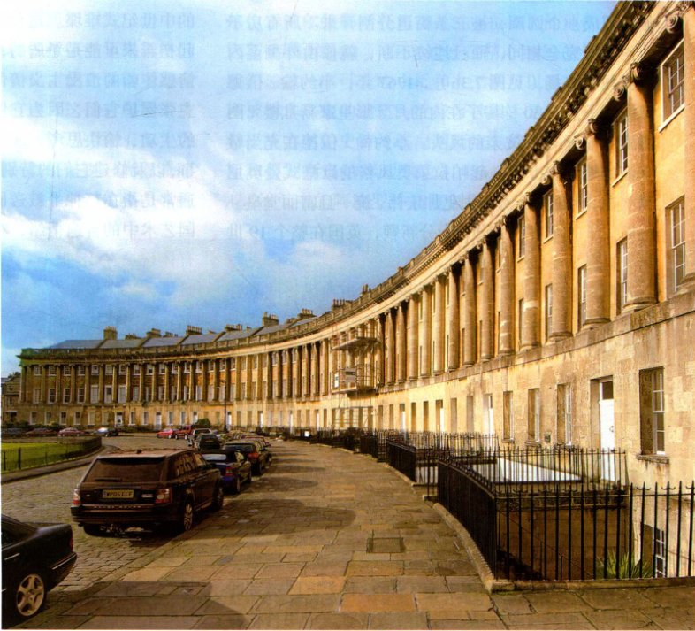

*图23.10 小约翰·伍德：皇家新月楼。1767-约1775年。巴斯，英国*

**新古典主义室内设计** 英国人对古典风格的喜好还延伸到了室内设计领域，这主要跟一个人有关：罗伯特·亚当（Robert Adam，1728-1792年）。亚当是个富有的苏格兰建筑师，1754至1758年游学期间，他亲自登上古罗马废墟，协助皮拉内西测量、记录损坏程度日益恶化的建筑物，并把它们复原在纸上。回到英国后，他在伦敦开业，很快成为城中最流行的建筑师。虽然他设计过几座宅邸，但他的专长是翻修室内装潢、设计附加结构，尤其是为乡村住宅。

他的杰作之一是1767至1769年建成的肯伍德别墅（Kenwood）中的侧图书室（图23.11）。图书室的天花板采用罗马式筒拱，房间两头各有一个用科林斯圆柱与主室隔开的半圆室。这种设计理念主要来自帕拉第奥。装饰的基础是古典母题，可以从当时出版的多种考古书籍中直接借鉴。一方面，图书室古典风格浓厚，不仅由于其装饰母题，还因为它的对称、几何形结构和精心设计的平衡布局；另一方面，它充满动感，主要归功于大量的细节和图形迫使观众的目光在一个个设计元素之间跳跃。亚当的用色特点是淡彩和亮色，其中又以浅蓝、白色和金色居多。变化了的圆形、优美的植物图案、带有华丽柱头的雅致凹槽圆柱，这些元素形成了一种欢快、别致、高雅的情调，更接近洛可可式的雅趣，而非新古典主义的道德说教。在装饰壁画部分，亚当常常求助于意大利人安东尼奥·祖奇（Antonio Zucchi），偶尔也请1781年嫁给祖奇的安吉莉卡·考夫曼来帮忙。正如我们看到的，考夫曼的新古典主义风格能够在古典元素与洛可可之间达到一种平衡，而这正是支撑亚当轻松型古典主义所必需的。

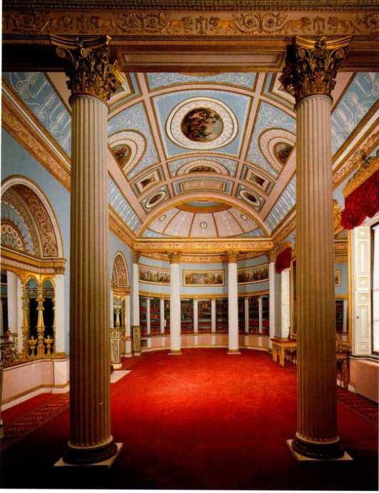

*图23.11 罗伯特·亚当：图书室。1767-1769年。肯伍德别墅，伦敦*

## 英国早期浪漫主义

建筑师约翰·范布勒爵士不仅是英国巴洛克艺术的重要代表人物（见第754页），他还将哥特式设计运用在家居建筑之中：1708年修建自己位于伦敦的宅第克雷蒙特（Claremont）时，他把屋顶边缘做成厚实的中世纪式雉堞。这种背离巴洛克和古典风格的决定起初看来可能是矛盾的，但范布勒心中已经有了渴望情感体验的浪漫主义情怀。范布勒反对拆毁老建筑，主张保护它们，因为它们激起了“更多关于曾经住户的生动、愉快思考，或是有关发生在其中的不寻常之事，以及修建它们的特别缘由”。对于奇异体验的渴望，通常是指在精神上被送回遥远的过去，逐渐成为了英国艺术中的普遍情绪，在绘画、建筑和景观设计中均有体现。在18世纪最后的几十年里，仅仅有奇异体验是无法满足观众的；观众想要一种敬畏或恐怖的感觉，就像现代人选择去看恐怖电影时那样。

### 建筑与景观设计：崇高与如画

我们不知道是什么原因促使爱德蒙·柏克在1756年撰写了论文《论崇高和美的观念之起源的哲学探究》，但影响他的因素必定包括这个时期日益增长的对于体验强烈主观感受的渴望。这是与对逻辑和经验主义所抱坚定信念并存的重要方面。我们已经看到皮拉内西是如何在其古罗马遗迹蚀刻版画中营造出敬畏和伤感情绪，这些蚀刻版画风行全欧洲；在“崇高”一词流行起来以后，这些作品也常常被贴上“崇高”的标签。但英国人主要是在视觉艺术中培养起了对崇高的喜爱，这是一种对最原始的情感的体验，主要是接近恐惧的那些情感。这种喜好首先体现在建筑和庭园设计中。

与此同时，英国人还提出了另外两个概念，或者叫做原则，均都不属于风格的范畴。其一是如画（picturesque）。这个术语最初被用在英格兰北部湖区的旅行指南中，意思是风景画一般的优美景色。随后也逐渐用来指借由变化多端和令人愉快的出奇而趣味盎然的事物。实际上，与崇高一样，它变成了美的又一个代名词，因为美体现在光滑、对称、和谐等让人产生快乐、愉悦和爱的特质中。这个时期形成的另一个重要概念是联想学说（associationism），由20世纪的历史学家首创，用来描述18世纪对于在建筑和庭园设计中层层叠加大量联想的喜好，其多为奇思异想，设计的目的常常是为了激发强烈的情感和陶冶性情。启蒙运动中的研究和出版物极大地增进了人们对历史和世界的认识，而这种认识如今仍源源不断地注入艺术之中。比如，温克尔曼和皮拉内西赋予了古希腊艺术和古罗马艺术独立的身份，此前它们一直只是在古典艺术旗帜下融合为一；现在艺术家们可以参考希腊人的“高贵的单纯和静穆的伟大”或罗马人的雄威了。尽管建筑一直以来就包含多种联想，但现在这些联想变得更为广泛、精确和规范，其文学性也更强，能够激发观众强烈的情感。

**英式庭园** 伯灵顿和肯特将帕拉第奥复兴风格的齐斯威克宅邸四周庭园进行了美化，使之显得更加自然，即不带设计和人工干预的痕迹。这是对房屋本身风格的彻底背离，和以凡尔赛花园（见图21.13）为代表的几何式庭园也大为不同，似乎是逆时尚潮流而动。弯弯曲曲的小径、草坪覆盖其上的起伏小山、蜿蜒曲折的池塘和参差不齐的树林纷纷映入向宅子走去的游客的眼帘。如画的不对称取代了整齐的几何式对称。然而，看似自然的庭园并不是要再造一处野性的自然；而是对古典时代的理想化幻想，仿佛深受英国收藏者喜爱的克劳德·洛兰风景画（见图21.8）中所绘的景色。乘坐四轮马车前来的贵族们甚至还戴着特制的黄色“克劳德”眼镜，能使所看到的景色蒙上一层温暖的微光，就像这位法国大师画中所呈现的一样。一方面，我们可以把这些庭园称为新古典主义的作品，因为其意在唤起人们对古典时代的怀念。但另一方面，它们又是浪漫主义的，因为要在心理上把观众送入一个失落的世外桃源，一种伴随着强烈情感的洗礼。

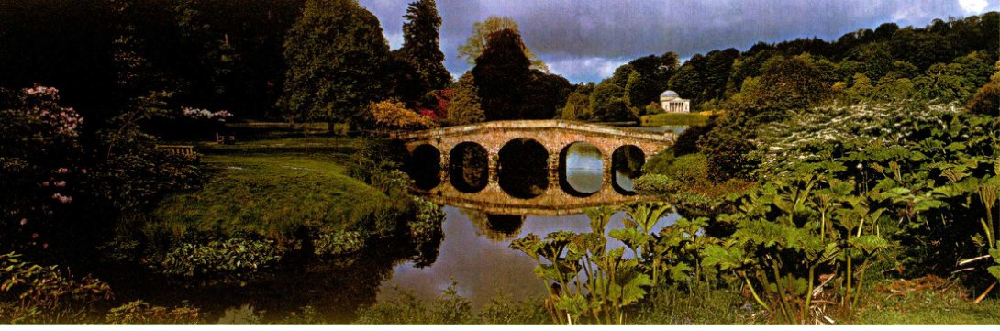

*图23.12 亨利·福利特克劳福特与亨利·霍尔二世：英国威尔特郡的斯托海德庭园园景，可望见一座万神殿复制建筑。1743年设计，1744-1765年建造，后来有添加*

肯特可能负责了齐斯威克的大部分园林设计工作，而他后来也是以景观设计师的身份为人所熟知，而非建筑师。一般认为他奠定了英式庭园的基础，他最优秀的作品恐怕是18世纪40年代在斯托（Stowe）建造的庭园了。肯特在园中四处点缀着古典式庙宇和哥特式“废墟”，其位置都经过精心安排。但遗憾的是，肯特设计的庭园保留下来的极少。保存得最好的庭园则是由肯特和伯灵顿的两名追随者建造的，他们分别是建筑师亨利·福利特克劳福特（Henry Flieroft，1697-1769年）和银行家亨利·霍尔二世（Henry Hoare II，1705-1785年）。1743年，他们开始在霍尔位于威尔特郡斯托海德（Stourhead）的地产上营建庭园（图23.12）。在这处经过精心组织的景色中，我们通过一座可爱的小桥和人工湖可以看到了远处一座被树木环抱的建筑，很像万神殿，是根据克劳德取材于维吉尔的史诗《埃涅阿斯纪》的一幅画《埃涅阿斯和得罗斯岛的岸边景色》（Coast View of Delos with Aeneas）中的阿波罗神庙复制而来。围湖修成的小路是对埃涅阿斯冥界之旅的比喻，湖本身就象征着冥界的入口阿夫纳斯（Avernus）湖。湖旁的一个人造洞室内放置着宁芙与河神的雕像。因此，斯托海德庭园不仅别致多样、风景如画，还与历史和文学有着多重联系。这个庭园并不局限于希腊和罗马母题，它还包括了乡土风格的小屋、哥特式尖塔、土耳其式帐篷和中国式桥梁。园中还有肯特在斯托遍造的那种仿制废墟，正如当时的人所形容的那样：“把想象力提升为高贵的热情，让心境软化为诗意的伤感。”

换句话说，英式庭园不仅再现了古典时代的高贵，就这方面而言，它可被称作是新古典主义的。它还迎合了当时正在形成的浪漫主义品位，这种品位的特点是喜好异域情调，渴望体验强烈的情感。它实际上是对废墟体现出来时间的破坏力和道德寓意的一种皮拉内西式思考。柏克把崇高一词用在戏剧中，而我们也可以从前面的引文看出，这个时期也在使用这个词。最后，英式庭园的多姿多彩恰好反映了人们对大自然之美的喜好。整齐的几何布局和舒适的美现在被如画的多样性取代，而后者则是当时最能使观众获得愉悦和乐趣的。进入浪漫主义时期后，英国人越来越喜欢在他们的建筑和庭园中营造这种新趣味（见第四部分末尾的附加原始文献）。

**哥特复兴运动：草莓山** 正当伍德父子把巴斯变得像一座古罗马城市，而帕拉第奥式乡宅在英国各地涌现的同时，一场哥特复兴运动也正在展开。当时人们普遍认为哥特式建筑起源于英国，因此其被理解为一种民族建筑，人们对其的兴趣部分要归功于当时面世的一些关于这种风格的早期文献。而在此之前，对于这种风格的研究十分贫乏，无人知道这些建筑是何时修建的，也不知道它们其实属于不同的时代，而每个时代也都有不同的风格。在本世纪中叶之后，开始出现鉴别重要建筑及其修建年代的书籍，但这种风格的吸引力大部分在于它的“崇高”特点。大教堂通常是冰冷、昏暗及阴沉的，其巨大的空间让人感到压抑。随处可见的中世纪废墟则唤起人们关于死亡、悲伤甚至恐怖的联想。1764年，贺拉斯·沃波尔以一座鬼魅城堡为背景创作的《奥托兰图堡：一个哥特式故事》（The Castle of Otranto：A Gothic Story）出版，标志着哥特式小说作为一种文学类型的兴起。本书开启了一股中世纪热，其巅峰是维克多·雨果（Victor Hugo）1831年的《巴黎圣母院》（Notre-Dame de Paris）；在这部小说里，昏暗、给人不祥之感的大教堂是可怕的驼背隐士加西莫多（Quasimodo）的家。

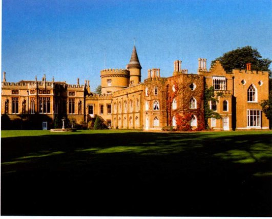

*图23.13 贺拉斯·沃波尔与威廉·罗宾逊（William Robinson）及其他人：草莓山，崔肯南，英国，1749-1777年*

使哥特复兴成为时尚这一荣誉也应该归功于贺拉斯·沃波尔（Horace Walpole，1717-1797年），因为他与一群朋友重新设计了他在伦敦郊外崔肯南（Twickenham）的草莓山（Strawberry Hill）乡宅（图23.13）。翻修始于1749年，用了25年才全部完成。这所房子带有明显的中世纪特点：墙顶有锯齿状雉堞（crenellated battlements），墙上开有花格窗。对于沃波尔来说，哥特式就意味着如画，因此这座L形建筑物的形状既不规则也不对称，像是由不同时期的附加结构堆积而成，产生这种感觉实际上是因为这座建筑是在一段很长的时间里零零碎碎地建起的，而每个部分的设计者也都不同（比如，新古典主义建筑师罗伯特·亚当设计了角塔）。但从外表上一点也看不出崇高的感觉，反而有一种洛可可式的精致。雉堞小巧并不厚重，窗户开口浅贴墙面，这使墙体显得分外纤柔，如纸一般薄，看上去的感觉与城堡使用的厚墙有很大不同。

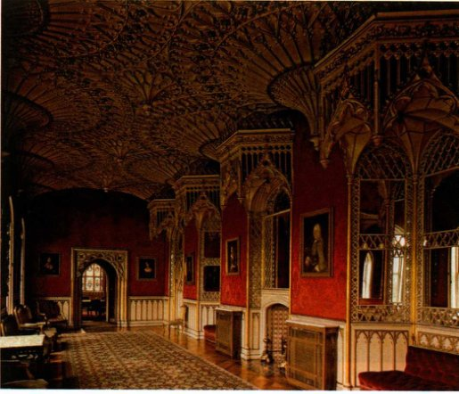

*图23.14 草莓山画廊*

宅邸的内部装饰也带有明显的洛可可风格特点，比如画廊就很好地体现了这一点（图23.14）。沃波尔强烈要求房间在历史细节上达到准确无误，很多建筑结构是他从当时用于研究的中世纪建筑雕版画中照搬而来。比如，画廊天花板就来自威斯敏斯特修道院中的亨利七世礼拜堂（对比图12.50）。墙上可能会挂有华丽的锦缎，但它们看起来却十分秀丽雅致，仿佛贴着花边纸一般，而薄薄的镀金扇形拱顶优雅又不失轻巧。在当时沃波尔关于“迷人而可敬的哥特式”和这种风格赋予当时建筑的“新奇的古怪气氛”的描写中，他表达了他对待历史时的嬉戏态度。沃波尔的哥特复兴在许多方面像亚当的古典复兴一样注重雅趣和装饰，这也暗示着两者其实都代表了洛可可风格正在向真正的浪漫主义复兴转变。

### 绘画：理智与情感并存

在英国，正如哥特复兴与古典复兴一同兴盛，绘画领域的浪漫主义也与新古典主义并存。浪漫主义的暗流甚至出现在本质上为古典风格的绘画中，这种怪事突显了风格分类的局限性。像飞蛾扑火一般，这个时代的趣味日益转移到大自然的震撼力量、对自由的原始情感以及本能的体验，甚至还包括非理性的奇观。事实上，启蒙运动常常否定它的逻辑和经验主义基础，任由自己被奇异、奇妙、恐怖和神秘的情感力量荡涤。到世纪末，对崇高体验的渴求将变得极为普遍。

**乔治·斯塔布斯** 尽管专门画马，一般认为乔治·斯塔布斯（George Stubbs，1724-1806年）还是一位新古典主义画家。同时，他创作了浪漫主义的一些早期作品，也是最快对柏克关于崇高和美的论文（1756年）作出直接回应的艺术家之一。18世纪60年代初，斯塔布斯开始创作一系列作品，大概包括21幅油画，内容是狮子攻击马或牡鹿，其中的一幅就是1770年的《狮子攻击马》（Lion Attacking a Horse，图23.15）。斯塔布斯的创作动机就来自柏克。他接受挑战，要求他描绘一个能够唤起观众崇高情感的恐怖自然事件。斯塔布斯的主角是动物，与人类不同，它们完全被大自然控制，与自然融为一体，实质上是获得解放的自然力量的化身。我们可以看出，这匹白马象征着善良和纯洁。它的嘴、眼睛、鬃毛和腿都因害怕和痛苦而紧绷。邪恶的代表则是狮子，它那黑色、有力的爪子刺入马背，把皮撕开，露出胸廓，而同时它却显得那么冷漠。狮子的身体没入暗色的风景之中，将其邪恶的力量与令人恐惧的黑暗以及从大地上喷涌而出的自然力融为一体。不祥的暴风云预示着马的命运，它们仿佛要把整个场景笼罩在一片暗影中，而我们以为这发生的时刻就是那匹在劫难逃的骏马死亡之时。韦斯特在《沃尔夫将军之死》中同样利用自然的力量来强化人物的情感强度和心理活动。

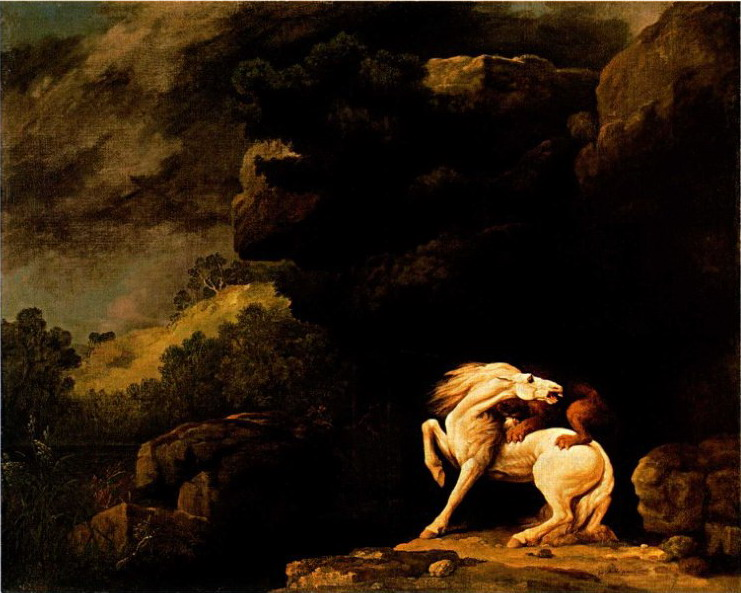

*图23.15 乔治·斯塔布斯：《狮子攻击马》。1770年。布面油画，96.5 × 125.7厘米。耶鲁大学美术馆，纽黑文（New Haven），肯塔基。耶鲁大学美术馆之友捐赠，1961.18.34*

**约瑟夫·赖特** 虽然通常被归入新古典主义阵营，但理智与情感，新古典主义与浪漫主义，启蒙运动中这些对立面也同时出现在来自德比郡（Derby）的约瑟夫·赖特（Joseph Wright，1734-1797年）笔下。赖特的大半生在英格兰中部度过，其中主要是工业革命中心伯明翰附近的德比郡，在那里他专画肖像画。他的主顾中包括富有的工业巨头。但今天最让人熟悉的却是他的风俗、历史和风景画，这些画常以夜晚为背景，这样一来他就能尽情释放他对于描绘复杂光影效果的爱好。

1768年的《抽气泵之内的小鸟试验》（An Experiment on a Bird in the Air-Pump，图23.16）是为宣传德比郡一个颇有声望的科学组织——月亮协会（Lunar Society，赖特为其会员）而创作的组画之一，虽然它是一幅风俗画，但其风格可以归类为新古典主义。此画用色严谨，表面平滑，注重勾描。画表现的是启蒙运动主题，旨在颂扬科学。1.8米的尺寸一般为历史画专用，而且赖特挑选了一个可以展示自己描绘强烈表情能力的题目，这种能力是成为伟大历史画家的先决条件之一。赖特呈现了一个演示气泵的场景，气泵是一种能够产生真空的装置，一般用来做气体实验。在这幅作品中，真空被用于阐明氧气的属性；空气被从倒扣的碗里抽走后，鸟将会窒息。做这个实验时，常常会用到一种人造气囊，当空气完全用光时，它会像人的肺部一样变瘪。赖特选择了一种更为戏剧化的表现方式——用一只活鸟。但讲演者的手就悬在真空装置上方，准备在鸟死亡之前放入空气。这种死亡的威胁给赖特表现这个房间里存在的多种情感创造了条件，其中最激动的是那个害怕得转过头去的女孩，她的妹妹则在好奇地观看实验。父亲用科学逻辑向害怕的女孩解释说小鸟会活下来，而讲演者则自信地看着画面之外的我们，他根据经验很清楚实验的结果。理性之光将驱逐迷信和神话。

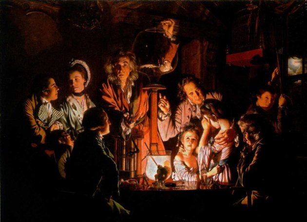

*图23.16 约瑟夫·赖特：《抽气泵之内的小鸟试验》。1768年。布面油画，1.82 x 2.43米。伦敦国家美术馆*

然而，这个场景仍然保持着一种神秘气息，明显的特征是把人物带离黑暗的微弱烛光和窗外诡异的月光。蜡烛和月亮可以看作隐喻或象征：前者表明理性之光将驱散迷信的黑暗，而月亮则代表月亮协会，这个协会每个月都在满月后的第一个星期一聚会。但一种浪漫主义的神秘感也笼罩着画面，与启蒙运动的科学以及经验主义的清晰透明针锋相对。

赖特1785年创作的《印第安酋长的遗孀望着亡夫的武器》（The Widow of an Indian Chief Watching the Arms of Her Deceased Husband，图23.17）则在新古典主义和浪漫主义之间作了更为明显的划分。这幅画回到了新古典主义的贞洁寡妇主题，但女主人公既不是安德洛玛刻也不是阿格丽品娜，而是一个美洲印第安人。依照部落风俗，她必须在毫无保护的情况下，到死去丈夫的武器旁连续坐30天。这名悲恸寡妇的忧郁姿势和美丽侧影让我们联想到古典雕像，她的形象非常有可能是赖特从某件古代雕像上直接借鉴来的，使她和她的美德显得更加高尚。与温克尔曼形容的希腊雕塑一样，她平静、沉着，甚至淡泊。但就在此处，新古典主义止步了，而浪漫主义开始占据主导位置。这片美洲荒原在欧洲观众心目中是一个奇异之地，它饱受威力无穷的自然力的摧残，正在喷发的火山、不祥的暴风雨、可怕的闪电和猛烈拍打海岸的激浪无不是大自然力量的直接表现。那棵被雷电击毁的孤树是一个令人不寒而栗的象征，代表着死亡和毁灭；裹卷着烈日的旋风形成了一个幽深的全能空间，给人无限之感，它将成为下个世纪浪漫派艺术家最喜欢的一个意象。在此，我们看到的是一片壮丽景色，不只是为了提升寡妇的坚忍精神，因为这考验着她的忍耐力，还反映了她不安的情感状态。

当然，作为18世纪人们眼中的异国“原始人”，印第安女人本身就能像英式庭园中的中国、土耳其和哥特母题那样吸引英国观众。更重要的是，这个印第安寡妇让当时的观众想起卢梭的“高贵的野蛮人”。她是一个纯朴的女人，浑身散发着大自然的美德和纯洁，没有被文明的虚伪腐化。

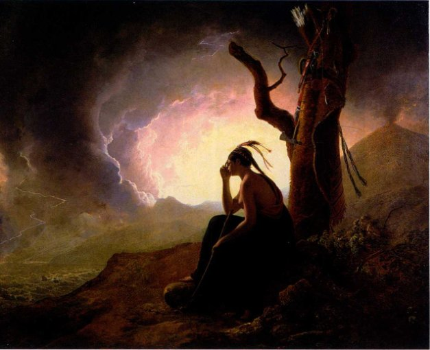

*图23.17 约瑟夫· 赖特《印第安酋长的遗孀望着亡夫的武器》。1785 年。101.6 × 127 厘米。英国德比博物馆及美术馆*

> **大事年表**
>
> 1743年 - 开始在斯托海德兴建庭园
> 1749年 - 沃波尔开始重修草莓山
> 1757年 - 柏克发表《论崇高与美》
> 1762年 - 叶卡捷琳娜大帝加冕
> 1770年 - 斯塔布斯绘制《狮子攻击马》
> 1781年 - 福塞利创作《恶梦》

**约翰·亨利·福塞利** 探求心灵最深处和自然界内部蕴含的不可思议之力，这都是出生于瑞士的英国画家约翰·亨利·福塞利（John Henry Fuseli，1741-1825年）所关注的领域。福塞利最初打算当一名神学家。在苏黎世（Zurich），他师从于著名哲学家约翰·雅各布·博德默尔（Johann Jakob Bodmer，1698-1783年），博德默尔向他介绍了莎士比亚、但丁、荷马和约翰·弥尔顿的作品，以及源自古代斯堪的纳维亚的中世纪史诗《尼伯龙根之歌》（Nibelungenlied），日耳曼人认为这部北欧史诗可以与荷马的《奥德赛》和《伊利亚特》并列。他还跟诗人、相士约翰·卡斯帕·拉瓦特（Johann Kaspar Lavater）成了朋友，虽然拉瓦特对相貌反映精神状态和个性这个问题很有兴趣，但他反对唯理主义。拉瓦特对心理学的爱好深深地影响了福塞利。同样重要的是，拉瓦特使福塞利直接接触到了德国的“狂飙运动”（Sturm und Drang），这是兴盛于17世纪60年代中期到80年代的一场文学运动，诗人约翰·沃尔夫冈·冯·歌德（Johann Wolfgang von Goethe，1749-1832年）也是参与者之一。一般认为这是首个浪漫主义运动。这个团体受到卢梭的巨大影响，强调大自然的纯洁、贞德以及情感至上。歌德的《少年维特的烦恼》（The Sorrows of Young Werther，1774年）是当时人们读得最多的一本书，它讲述了少年维特抛弃上流社会，爱上一个藐视他的女人，最后绝望自杀的故事。在这里，自杀实际上成了脱离文明、回归自然的一种极端方式。我们在书中看到了一种新英雄，事实上是一个反英雄的形象，他确立个人的道德准则，遵从自我的激情，以获取自由、满足个人的需要。正如我们将要看到的，这些价值观都成为了福塞利艺术的基础。

1764年福塞利迁居伦敦。在雷诺兹的鼓励下，他开始从事绘画工作，并于1770年前往罗马，成为包括托马斯·班克斯（见第795页）在内的英国和瑞典艺术家圈子的领导者。他不理会温克尔曼对希腊雕塑的静穆伟大和高贵的单纯这些特点的奉承，也不赞成文艺复兴盛期以拉斐尔为代表所倡导的完美和谐，而倾心于米开朗基罗的西斯廷礼拜堂天顶画，尤其是《最后的审判》（见图17.12）中硕大、扭曲、肌肉发达的人物。他还受到帕尔米贾尼诺（见图17.27）和罗索·菲奥伦蒂诺（见图17.1）等风格主义画家作品中变形的人体结构的影响。

如同他选择风格一样，福塞利挑选题材也同样具有主见。他没有选择古罗马历史学家李维和普鲁塔克著作中的高尚、贤德之事，而是选取荷马、莎士比亚、弥尔顿、斯宾塞和莪相（Ossian，18世纪60年代詹姆斯·麦克弗森［James Macpherson］托名的一个古盖尔［Gaelic］史诗诗人）作品中令人身心都感到痛苦的故事，其中多数都含有色情暗示。情节越可怕、越扭曲越好，而且在罗马时，福塞利周围的艺术家都偏爱类似题材。18世纪80年代，福塞利的题材在英国绘画界占了上风，甚至本杰明·韦斯特也用莎士比亚作品和《圣经》中耸人听闻的故事来作画。

1779年福塞利回到伦敦时，他作品的题材和风格已基本确定，我们可从1790年的《托尔大战尘世巨蟒》（Thor Battering the Midgard Serpent，图23.18）中看出。作品取材于《尼伯龙根之歌》，这个史诗故事讲述了导致众神死亡、宇宙和一切道德规范终结的劫难。巨狼斯科尔（Skoll）吞食了太阳，他的兄弟海蒂（Hatii）则吃掉了月亮，使世界陷入黑暗。地震使得世界分裂，放出了许多怪物，尘世巨蟒耶梦加得（Jörmungandr）就是其中之一，它从海中冒出，一心要让自己的毒气遍布大地和天空。众神和巨人们与怪物进行了激烈的战斗，画中的雷神托尔则承担了杀死耶梦加得的任务，虽然他最后也死于蛇毒。画面散发着壮烈的恐怖气息，在这恐怖面前，船夫后退了，面色惨白的众神之王沃坦（Wotan）畏缩了。新古典主义的平面性、严谨画法、稳定的明暗分布以及匀和的涂绘被迸射的光、暴风骤雨般的巴洛克笔法和戏剧化的构图所取代。这件作品富于想象力的地方很多，包括紧紧盘绕的巨蟒、退得远远的船和船夫，以及托尔猛力地向上一刺。从巨蟒所处的低视角看去，托尔米开朗基罗式的身量仿佛赫剌克勒斯一样强壮有力。全画充斥着鲜血、水，以及起伏的肌肉、蛇呼出的热气和夜的黑暗，这个通过蛇眼看到的景象把观众完全拖入一片蛮荒之地，直接置身于狂暴、骇人的搏斗之中。

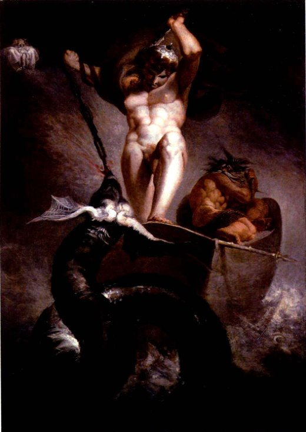

*图23.18 约翰·亨利·福塞利：《托尔大战尘世巨蟒》。1790年。布面油画，133 x 94.6厘米。伦敦皇家艺术学院*

虽然托尔是勇气和牺牲的集中体现，但福塞利通常喜欢描绘并非传统意义上的英雄，他们遵从个人的激情，是个人自由的典范，尤其是在面对要求他们顺从、压抑欲望的社会压力之时。除此之外还能怎样解释他对弥尔顿史诗《失乐园》中撒旦的赞赏？福塞利曾无数次地描绘身处浑沌界的撒旦号召军团对未堕落的伊甸园世界发动进攻的情景。福塞利本人就是艺术自由的典范，其独特的风格和非传统题材都是最佳证明，当然还有他那些高度个性化的画作，如1781年的《恶梦》（The Nightmare，图23.19）上。这件作品的含义一直是个谜。然而显而易见的是，画面充斥着性：从人物的色情姿势，到母马穿过“像阴道般”分开的窗帘，到淫荡的红色布料无不如此。但压在女人肚子上的梦魔（一种趁着妇女熟睡时与她们交媾的恶魔）究竟是她在精神紧张之下想象出来的怪物，还是福塞利本人被压抑的欲望？画布背面画着一个女人，暗示着画中暴露的性欲来自福塞利本人，虽然这个人物身份不明，但很可能是一个拒绝了艺术家求婚的苏黎世女子，那是1779年他去伦敦途中发生的故事。

不管答案是什么，这幅个性十足的画作都是不同寻常的，它效果强烈，独一无二，充满不同寻常的恐怖元素。它探索人心深处的性欲，蔑视一切对绘画内容想当然的预期。我们随着福塞利转入了浪漫主义时代，而欧洲普遍开始进入这个时代则是在将近1800年的时候。

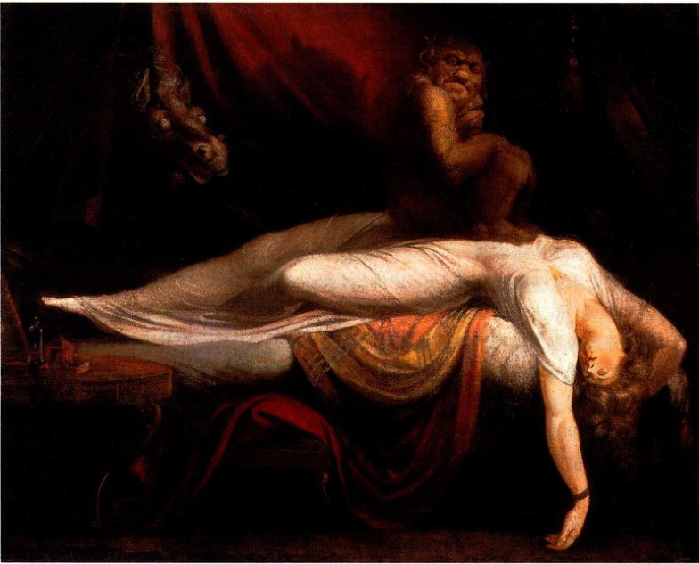

*图23.19 约翰·亨利·福塞利：《恶梦》。1781年。布面油画，101 × 127厘米。底特律艺术学院。Bert Smokler夫妇和Lawrence A. Fleischmann夫妇赠*

## 法国的新古典主义

与英国一样，法国对洛可可艺术的反对始于建筑领域，但显现于18世纪五六十年代，而不是一二十年代。到了18世纪70年代末，它已从最初优雅、理性、以17世纪法国古典主义建筑为主要基础的浪潮，发展到一个朴素、令人敬畏甚至充满空想的阶段。新古典主义的这个重要时期对绘画产生了深刻影响。虽然包括启蒙运动代表和政府在内的许多方面反复呼吁创造一种基于古代标准的新道德主义艺术，但画家们在迎接这一挑战方面仍是行动迟缓。直到70年代末，才有大批画家开始向这个目标努力，而直到80年代末，才随着雅克-路易·大卫及其朴素型新古典主义的出现形成了一种新风格，一直盛行到19世纪。

### 建筑：理性古典主义

法国新古典主义建筑的第一个阶段是反对洛可可艺术的过度表现：不对称、优雅的动势、华丽的装饰和曲线美。新建筑遵循理性化的设计，所以常被称为“理性古典主义”。建筑物的所有构成部分就它们对整个结构的必要性而言，必须是几何式的，而且还要对称且合乎逻辑。虽然新古典主义建筑的这个理性阶段在理论上是以自然为基础，但它的榜样却是17世纪时法国的古典主义建筑。

**理论起源和蓬巴杜夫人的影响力** 首先向洛可可艺术发动进攻的是建筑师雅克-弗朗索瓦·布隆代尔（Jacques-François Blondel，1705-1774年），他在1747年皇家建筑学校开学典礼上发表演说，其中指责洛可可风格过于华丽，而且华而不实。在这次演说及后来出版物中，他呼吁回归17世纪伟大建筑师们的古典主义风格：克劳德·佩罗、尼古拉-弗朗索瓦·芒萨尔和路易·勒沃（见第745-749页）。布隆代尔引用启蒙运动的理性原则，要求建筑必须合理、朴素、实用、对称。它们理应是方正端庄，而不是弯曲扭转，而且不能有多余的装饰。正立面应当反映建筑的内部布局和社会用途。

布隆代尔的理性主义得到了著名作家阿贝·马克-安托万·劳吉尔（Abbé Marc-Antoine Laugier，1713-1769年）的支持，劳吉尔在其《论建筑》（Essay on Architecture，1753年）和《建筑评论》（Observations on Architecture，1765年）中宣称，建筑的风格必须为功能所决定，而非美。他的理论也抨击装饰，只允许使用圆柱、额枋、三角楣和墙壁这些必不可少的元素，因此这种用法也是合乎自然的。他反对半露方柱、壁龛以及任何非实用的墙饰或式样。建筑的组成部分必须以自然为基础，《论建筑》卷首那幅著名的雕版画就是例证：一个简陋的小屋，其实是人类的第一座建筑物，只由四根插在土中、排成长方形的天然树干以及嫩枝搭成的人字形屋顶组成。这种结构是希腊柱梁系统和三角楣正立面的原始形态。劳吉尔的美学观点也把哥特式建筑包括进来，他认为其高耸的石柱合理、自然，好像一片树林，而且他喜爱哥特式的宽敞和光线。扶壁是结构的一部分，所以理应存在。

理论家让-弗朗索瓦·德·纽佛热（Jean-François de Neufforge，1714-1791年）把理性主义建筑简化成一种指向未来的朴素本质，他也是《建筑学基础选集》（Basic Collection of Architecture，1757-1768年）的作者。这一多卷本论文集从头至尾全是他自己的设计图样，借鉴了古代风格和帕拉第奥的作品，但主要是英国帕拉第奥式建筑师的元素。把建筑还原成基本的几何形：方形房屋，裸墙，朴实的长方形无框窗户。尽管他在其他方面并无太高的声望，但这本论文集成了当时一部重要的参考书，许多法国建筑师都人手一本，希望从中获得灵感。

建筑复古风的另一股重要推动力来自路易十五的情妇蓬巴杜夫人，洛可可风格的同义词（见第763页）。1746年，她的影响力又得到了进一步加强；这一年，路易十五带她来到凡尔赛宫。随后她立即让她的弟弟，即未来的马里尼（Marigny）侯爵，当上了建筑总管。这个职务使他成为法国艺术界的支配者，因为他负责监督所有与艺术、建筑有关的委托业务，并兼职管理艺术学院。蓬巴杜夫人派他和建筑师雅克-热尔曼·苏夫洛一道进行游学，从1749年持续到1751年。侯爵趁此机会接受了一次古典教育，为他之后对法国人的品位进行彻底改革做好了铺垫。回国后，他请苏夫洛完成佩罗造的卢浮宫（见图21.12），当时的卢浮宫简直可以说是破败不堪，其毁坏状况经常为人所诟病。

**昂热-雅克·加布里埃尔** 卢浮宫建成之后，马里尼侯爵命令新任命的首席御用建筑师昂热-雅克·加布里埃尔（Ange-Jacques Gabriel，1698-1782年）在今天的协和广场北侧建造两座政府大楼。现在游客们依然可以在那里见到两个完全一样的巨大建筑物正立面夹住了皇家大道。加布里埃尔从未去过罗马，对他而言古典主义很大程度上就意味着17世纪的法国古典主义。这两座建筑与佩罗的卢浮宫十分相似，这里都不必给出它们的插图；主要的区别在于，佩罗正立面中的双柱变成了单柱，中央的三角楣被推到两头，像书挡一样夹住柱廊。

除了法式古典主义风格之外，加布里埃尔还使用帕拉第奥风格，它最精致的表现是迷人的凡尔赛花园楼小特里阿农宫（Petit Trianon）。这是1762年蓬巴杜夫人命加布里埃尔修建的。这座建筑是朴素和简约的典范，整体呈一个立方体，每一面都被科林斯式半露方柱等分成五个跨间，而每个跨间都有一扇长方形高窗，方形窗格与底楼地板相接；还有一扇方窗，方形窗格直接安在顶楼地板上。科林斯式半露方柱支撑着简单而平直的檐部，顶上有古典式栏杆。在楼背面朝向庭园的正立面（图23.20）上，半露方柱被圆柱取代，负责支撑起檐部，但也没有三角楣。

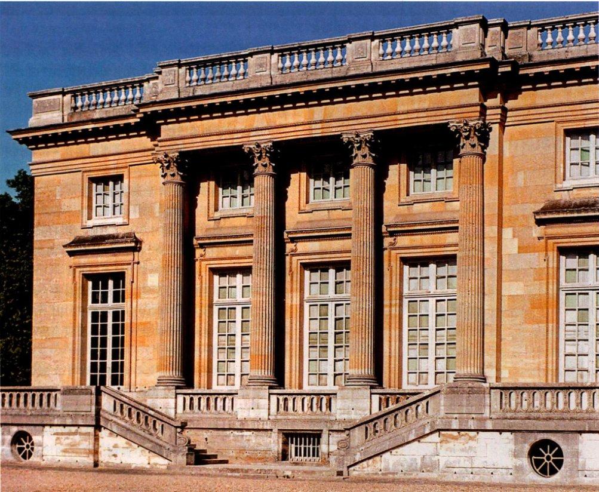

*图23.20 昂热-雅克·加布里埃尔：小特里阿农宫朝向花园的正立面，凡尔赛。1762-1768年*

**雅克-热尔曼·苏夫洛** 布隆代尔的热情追随者苏夫洛（Jacques-Germain Soufflot，1713-1780年）设计了一大批理性主义建筑。遗憾的是，他的代表作圣杰尼耶夫教堂（Sainte-Geneviève，图23.21）经过了非常大的改动，其中包括其名称和功能，导致它目前的样子极易引起误解。1755年，马里尼指派苏夫洛负责这个项目。不到两年，建筑师就完成了他的最初设计，这个设计拥有一种清晰的几何布局：一个等边希腊十字，入口有六根柱子的圆柱式门廊。中央宽阔的正方形十字交叉处上方，一个半球形穹顶（仿照罗马的万神殿）架在由四个窄墩柱支撑的鼓形壁上，每个墩柱是由三根圆柱围成的三角形。佩罗的卢浮宫是设计师参考的范本。卢浮宫东立面有三角楣的部分启发了他的门廊设计，内部一排排支撑檐部的科林斯立柱灵感则来自卢浮宫的柱廊。支撑穹顶的鼓形壁很大程度上源自佩罗用在卢浮宫礼拜堂穹顶上的环形围柱。但苏夫洛遵照劳吉尔的设想，把古典的清晰、高贵与哥特的轻巧、空间结合起来，让宽敞的教堂内部光线充裕。由于大胆地使用了隐扶壁，得以消除墙的厚重感，而且大量使用的竖式窗使得建筑更为通透。

可惜的是，教士和公众都批评苏夫洛1757年的设计，致使教堂受到了连累。添加了一个半圆室，耳堂被拉长，破坏了原始设计的完美对称。为了适应这些新增的部分，苏夫洛不得不加大穹顶的尺寸，结果使它更接近克里斯托夫·雷恩的圣保罗大教堂穹顶（见图21.22）。但最严重的摧残行为发生在法国大革命期间。出于废除宗教、显扬法国英雄的热忱，新成立的法兰西共和国督政府于1793年宣布把这座建筑改造成纪念民族领袖的万神殿。为了使其变成一座阴郁的陵墓，必须通过筑墙把窗户围起来，内部装饰也要全部清除。而19世纪之后做出的后续改动则彻底毁掉了苏夫洛的最初设想。

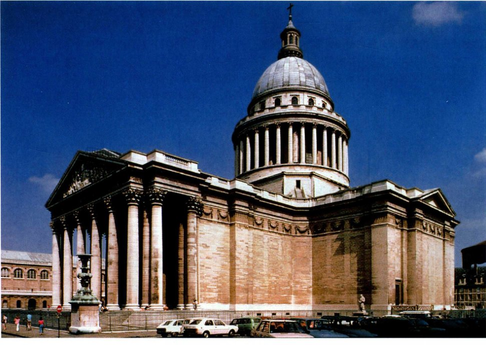

*图23.21 雅克-日耳曼·苏夫洛：万神殿（原圣杰尼耶夫教堂），巴黎。1757-1790年*

### 新古典主义的高峰：朴素与空想

18世纪70年代，法国建筑开始转向一个更加朴素的新阶段，这个阶段不再致力于遵守古时的规则，而是更加专注于把建筑简化为基本的几何形。这些几何形的体积异常庞大，给人以皮拉内西式的敬畏和力量感。对这个转变贡献巨大的建筑师包括马利-约瑟夫·佩尔、克劳德-尼古拉·勒杜和艾蒂安-路易·布雷。

**马利-约瑟夫·佩尔** 马利-约瑟夫·佩尔（Marie-Joseph Peyre，1730-1785年）是布隆代尔的学生，1751年获得罗马大奖。随后他遇见了皮拉内西，并与他的新导师一起勘查了戴克里先和卡拉卡拉浴场（见图7.71和7.66）。这同时也决定了其事业方向，因为他抛弃了维特鲁威和帕拉第奥的规范和得体原则，梦想着建造不朽、雄伟的建筑。1765年，佩尔发表《建筑作品》（Architectural Works），书中涉及他的理想建筑设计及其所依据的哲学。他强调规模和洞穴般的巨大空间，尤其是提倡使用反映了罗马人超凡工程技术的拱顶和穹顶。现代建筑必须追求柏克所定义的崇高，追求令人敬畏、壮丽雄伟的效果。建筑师应当减少装饰和细节，转而借助罗马人那种庞大的设计来引发强烈情感反应，包括震惊、恐惧、敬畏、崇敬和激情。

法国大剧院（今天的法兰西剧院，图23.22）是佩尔1767至1770年与另一位见解相似的建筑师查理·德·怀利（Charles de Wailly）一同设计，体现了他在论文中所主张的朴实和庞大，但离崇高的感觉还有一段距离，很大程度上受制于这个项目执行中的种种限制，比如与加布里埃尔的小特里阿农宫那种古典雅致相比，它显得更为简朴。这座建筑有一个高耸的圆柱式门廊，两层楼高，没有三角楣。佩尔没有采用优雅的科林斯或爱奥尼亚式圆柱，而是使用了粗糙无槽的托斯卡纳多立克式圆柱。唯一的“装饰”是石头上的条纹和粗糙表面。拱门和窗户都没有边框，所有的孔洞都深陷在墙中，使墙壁看起来可畏而沉重。圆形和长方形的设计、檐部硬朗的水平线都遵循几何学原理。佩尔的剧院是一座气势雄劲的大楼，有令人印象深刻的体积、令人畏惧的厚重以及合理的几何布局。

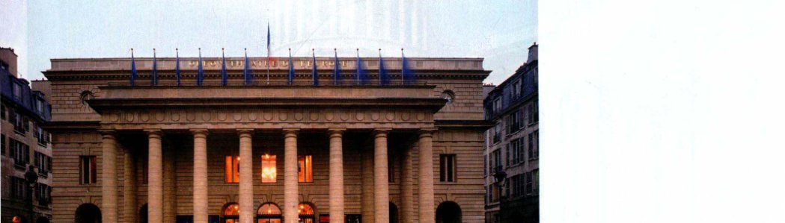

*图23.22 马利-约瑟夫·佩尔与查理·德·怀利：法国大剧院（Théatre Français，又名奥德翁剧院［Théâtre de l'Odéon］）正立面，巴黎。约1778-1782年，1767-1770年设计*

**克劳德-尼古拉·勒杜** 比佩尔的法国大剧院还要简练的作品来自克劳德-尼古拉·勒杜（Claude-Nicolas Ledoux，1736-1806年），布隆代尔的另一个学生。勒杜深受佩尔的《建筑作品》、皮拉内西的著作和纽佛热的《建筑学基础选集》影响。他不需要去意大利实地观摩那些大师的杰作。到了18世纪60年代中期，他已成为一个受人欢迎的巴黎建筑师，设计了许多最为著名的公馆，即私人住宅。18世纪70年代，他开始设计朴素的帕拉第奥式住宅。1771年，勒杜成为绍尔（Chaux）皇家盐矿的巡察员，这一盐矿位于法国东南部弗朗什孔泰（Franche-Comté）地区，并在1774到1779年间为此设计了许多建筑。入口处通往盐矿门房的门廊是托斯卡纳多立克风格的，其特点十分鲜明，所使用的圆柱既无凹槽也无底座，而是从平台上直接立起。这些圆柱后面的墙壁有一个原始风格的巨形拱门，由未经切割的天然石块砌成。矿长办公楼的入口是一个大厅，其非正统式样的立柱被厚厚的方石块均匀截断，与设计师80年代创作的巴黎埃托瓦（Étoile）海关（图23.23）所使用柱子样式相同。这个建筑的正立面基本上也与矿长办公楼一样，只不过是扩展到了建筑物的全部四个侧面。

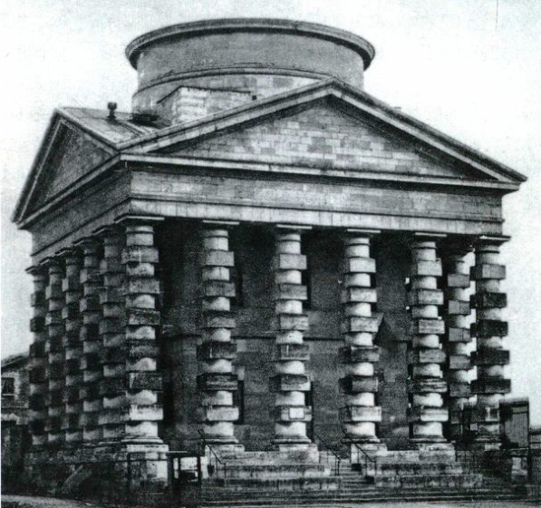

*图23.23 克劳德-尼古拉斯·勒杜：埃托瓦海关，巴黎。1785-1789年。巴黎国家图书馆（此海关现已毁）*

在绍尔，勒杜产生了一种乌托邦式的建筑设想，即要让每个等级雇员的需要都得到满足。他深深为卢梭对没有社会隔阂之世界的幻想所打动，并且受到了一个名为重农学派的启蒙主义经济学团体在社会哲学方面的影响，重农学派倡导一种像机器润滑过一般运作的经济制度。在其中，劳动者处于受人尊敬且不可或缺的地位。在理论上，他想把绍尔设计成同心圆的形状，重要功能对称地集中在中央，而不那么重要的则位于最外层。这种设计的要点是，同心圆建筑逐渐化入周围的乡野，从而与大自然融为一体。他常常根据居住者的职业来设计住宅。比如，河务局大楼是一节巨大的管子，如果这栋楼实际建成了，那么绍尔河完全可以从它中间流过（图23.24）。箍桶匠则住在轮子形状的房子里。不管主人属于哪个阶层，每栋住宅都有一种朴素的基本几何形状，赋予其一种与高尚文明相称的重要感和纪念感。尽管勒杜的空想式建筑是对逝去已久的伟大文明力量和雄威的浪漫追忆，但它同时又从过去的建筑语汇中解脱出来，彻底地把建筑简化成抽象形式，把新古典主义从复古转变为一种关于纯净和完美的未来主义幻想。

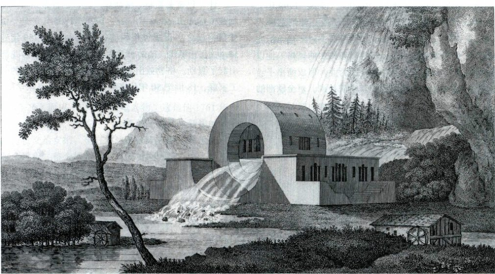

*图23.24 克劳德-尼古拉斯·勒杜：河务局大楼，绍尔理想城。约1785年。巴黎国家图书馆*

与大多数空想式建筑师一样，勒杜没能实现他对绍尔的许多建筑设想，因为大都相当不切实际。讽刺的是，他最终实现的一种崇高设想，却是为人人讨厌的收税员服务的，这些人代表着苛政，而非乌托邦式的政治。1785年到1789年期间，勒杜为环绕巴黎的24公里新城墙设计了50多座税门或海关。它们的造型各不相同，但与插图所示的埃托瓦海关一样，相同的是全部都体积庞大，未经装饰，严格遵循几何布局，造型以圆筒形、方形、三角形和圆形为基础。古典式的比例和协调让位于被夸大了的雄伟，以产生令人敬畏的观感。

**艾蒂安-路易·布雷** 与勒杜同时代的艾蒂安-路易·布雷（Étienne-Louis Boullée，1728-1799年）同样致力于用抽象形式的元素来创造一种纪念碑式的建筑样式。与勒杜一样，他并没有去过罗马，但在创作中会模仿皮拉内西、纽佛热和佩尔的风格。他以设计相对简朴的帕拉第奥式公馆为业，但成绩平平。1782年退休后，他在皇家建筑学院授课，对全欧洲的下一代建筑师产生了相当大的影响。他所设计并发表的空想式建筑非常不切实际，所以永远也无法建成，而他也清楚这一点。但它们是重要的，因其反映了法国人对于崇高日益增长的兴趣，而这正是发生在18世纪80年代。这种爱好即便无法通过真实的建筑表现，至少也可以表达在纸上。

布雷最著名的空想作品之一是他为艾萨克·牛顿设计的陵墓（图23.25）。其构思是一个由三道同心圆支撑的中空球体，共有150米高，象征着一颗沿着三条轨道运行的行星。球顶上部约四分之一的区域被打上了小孔，用来透光，使得内部的天花板看起来像是满天星斗的夜空。下方则摆放着牛顿纪念碑，与建筑不可思议的庞大体积相比，它却显得那样矮小，完全隐没在微弱的光线里。布雷在素描中使用大片的阴影和乌云，使他的建筑看起来大得骇人，同时也把这座大厦转变成对宇宙威力和人类无足轻重之存在的一种参悟，令看到他的人无不印象深刻。布雷采用一种理性的几何语汇来构想这样一座雄伟的建筑，并希望用它来显扬从古至今逻辑性最强的思想家之一，多么讽刺的巧合啊！

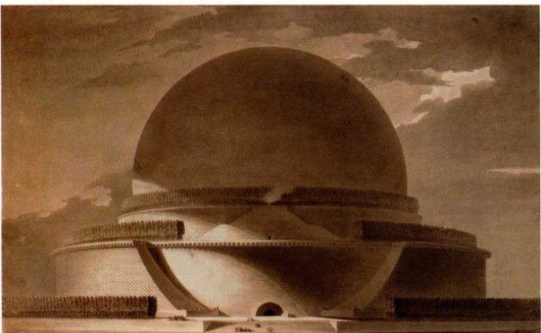

*图23.25 艾蒂安-路易·布雷：《艾萨克·牛顿墓设计方案》。1784年。墨水与淡彩素描，39.4x64.8厘米。巴黎国家图书馆*

### 绘画与雕塑：表达启蒙运动价值观

17世纪50、60年代，法国绘画和雕塑并不像建筑那样倾向于古典主义。直到80年代，最充分表现启蒙运动对理性、道德重视的也并不是历史画，而是更低级的风俗画。

**让-巴普蒂斯特·格勒兹** 让-巴普蒂斯特·格勒兹（Jean-Baptiste Greuze，1725-1805年）是一位凭借一己之力促成风俗画流行的艺术家。1759年到18世纪70年代，他的日常生活画在巴黎各个沙龙都引起了轰动。格勒兹出身于里昂地区的一个普通的劳工家庭，18世纪50年代来到巴黎，成名于皇家学院。一个富有的收藏家资助他在1755到1759年期间去意大利旅行，但格勒兹离开巴黎时是一个风俗和肖像画家，回来时依然如此。

不过，他却因《乡村新娘》（The Village Bride，图23.26）而成了巴黎的时髦人物。这是他1761年交给沙龙的作品，表现了一个新教徒婚礼，新娘的父亲把嫁妆交给女婿，坐在右边的公证人则尽职地记录了整个过程。整个场景洋溢着美德的力量，这个整洁、正派、勤奋的宗教家庭中每个成员都表现出家庭友爱、奉献和尊重他人的品质。此画体现了卢梭的社会信条：与更有教养但放荡的贵族相比，质朴的穷人更贴近自然，所以满怀“天生”的美德和真诚的情感。格勒兹还把人类家庭与母鸡一家进行了比较，这两个家庭中都有一个成员与集体分离，借此强化了这个关于普通人天生本能的观点。评论家和公众都热烈地谈论画中人物手势和情感的真实性，将其与普桑笔下的高贵人物（见图21.5）相比，以示赞许。

格勒兹试图达到历史画中情感和手势的那种力度，但他也受到了当时戏剧的启发，这也就解释了当父亲高声发表他关于婚姻之神圣的动人演说时，人物为何都被摆成舞台造型（tableau vivant，“活人画［living painting］”，即舞台上的演员像在画中一样静止不动，以表现一个意味深长的时刻）。

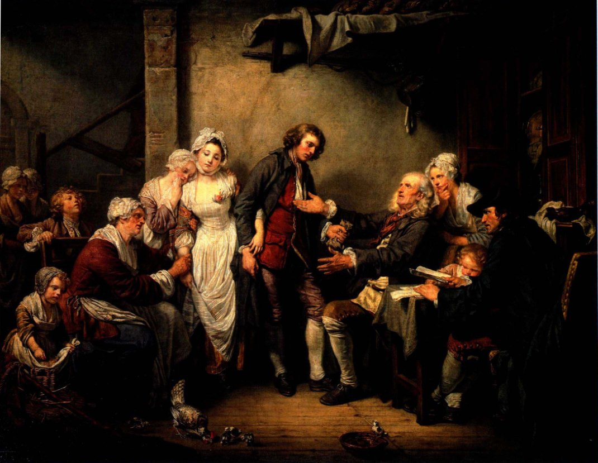

*图23.26 让-巴普蒂斯特·格勒兹：《乡村新娘》或《婚礼，岳父给女婿嫁妆的时刻》（The Marriage，The Moment When a Father Gives His Son-in-Law a Dowry）。1761年。布面油画，91.4x118.1厘米。巴黎卢浮宫*

格勒兹还深受其朋友狄德罗的影响。狄德罗在他匿名发表的沙龙评论里支持格勒兹，而他的沙龙评论可以在秘密流传于全欧洲和俄国的报纸《文艺通信》（Correspondence littéraire）上找到，通常被认为是最早的艺术批评（见第816页的原始文献）。格勒兹在画中完美地记录了狄德罗的市民剧（drame bourgeois），这种新的感伤剧是这位启蒙哲学家18世纪50年代创造出来的，以普通中产阶级人士为主要表现对象。与中产阶级背景和强化美德的感伤情绪同样重要，狄德罗对戏剧中逻辑和自然主义也是十分强调，这种强调正是启蒙运动的特点。对话必须使用散文体，而非韵文体，同时必须指示演员融入角色，互相表演，而不是向观众表演，否则就会破坏事件的真实感。换句话说，他希望观众忘记自己是在剧院里，从而真正进入他的戏剧世界。同样，格勒兹也希望观画者沉浸在他描绘出的场景中，进而忘掉自己正站在画廊里。

由于很大程度上借鉴了荷兰和佛兰德斯风俗画，同时还想迎合喜爱夏尔丹般幻觉主义（见第765页）的观众，《乡村新娘》充满了写实的细节，也很注意构图。所有人物都是个性化的，而不是被塑造成理想的典型。他们显得如此真实，结果当他们在格勒兹后来的画中再次出现时，公众认定自己看到的是同一个家人故事的续篇。我们随后将看到，格勒兹的写实主义、道德说教以及意义丰富的舞台造型瞬间将在约20年后兴起的法国新古典主义中占据显要位置。

> **原始文献：德尼·狄德罗（1713-1784年）**
>
> **选自格勒兹的《1763年沙龙》**
>
> 狄德罗发表在非法出版物《文艺通信》（Correspondence littéraire）上的双年沙龙展评论被普遍视为艺术批评的开端。下面要讨论的这幅画全名为《被孩子搭救的瘫子》（The Paralytic Succoured by His Children）或《良好教育的成果》（The Fruit of a Good Education），此后被俄国的叶卡捷琳娜二世得到，狄德罗充当了中间人。格勒兹在一个类似于《乡村新娘》的环境中画了一个瘫痪的老人得到他的大家庭体贴照料的情景。
>
> “现在要谈到值得我赞助的那个人，那个小伙子格勒兹。我暂时先不看他那些较小的作品……而是立刻来到他的《孝顺》（Filial Piety）面前，这幅画叫《良好教养的回报》（Reward for Providing a Good Upbringing）也许更为合适。
>
> 首先，我喜欢这种类型：它是有寓意的画。得啦，你必须承认！难道你不认为画家的画笔太长时间都用来描绘放荡和邪恶了吗？看到它终于要与富于表现力的诗歌在打动人、教导人、告诫人和鼓励人向善上一争高下时，难道我们不应感到高兴吗？鼓起勇气，格勒兹，我的朋友，你必须继续画这样的画！”

**让-安托万·乌东** 对启蒙运动经验主义做出最出色示范的法国雕塑家也许就是让-安托万·乌东（Jean-Antoine Houdon，1741-1828年）了。格勒兹和乌东都在创作中运用写实技法，但乌东与格勒兹不同，他把写实主义藏在古典主义的表象里。他是皇家学院看门人的儿子，所以差不多算是在学院里长大的。他没受过多少教育，也没什么野心，但极其刻苦。他对克洛狄翁优雅的神话作乐场面（见图22.13）以及许多法国雕塑家偏爱的复杂寓言并不敏感，他的兴趣常常是相当科学化的。1765至1768年期间，乌东在罗马的法兰西学院靠领取补助金研究写实的古罗马胸像。1767年，他用石膏制作了一具真人大小的去皮男性躯干像，详尽地展示了人体的每块肌肉，同时还像普拉克西特勒斯的《赫尔墨斯》（见图5.61）那样以精确的对立平衡姿势靠在支撑物上。

正如人们对他这种经验主义个性所料想的那样，乌东专门创作肖像，而且成了为启蒙运动服务的肖像艺术家。他为几乎每个重要人物都塑了像，包括狄德罗、卢梭、路易十六、俄国叶卡捷琳娜二世（Catherine II）和本杰明·富兰克林（Benjamin Franklin）。乌东那不可思议的捕捉人物外貌和个性的才能在《伏尔泰坐像》（Voltaire Seated，图23.27）中完全体现出来，插图中是一件赤陶复制品，石膏原作已经遗失了。雕塑家让人物穿上古罗马式的托加袍，戴上古罗马式的束发带，坐在古式座椅上，使人看起来古意昂然。颈部皮肤上的松垂皱褶、因无牙而凹陷的嘴、脸上深深的皱纹和低垂的双肩无不体现了伏尔泰的年老虚弱。但乌东出色地捕捉了这位启蒙哲学家敏捷的思维和敏锐的才智：他的头转向一边，嘴角微翘，一只手放在椅子扶手上，另一只手则紧握扶手。

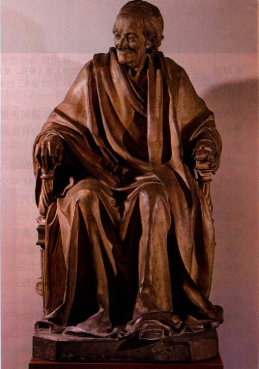

*图23.27 让-安托万·乌东：《伏尔泰坐像》。1781年。依照大理石原作制作的赤陶模型，高119.3厘米。伏尔泰学院及博物馆，日内瓦，瑞士*

1785年，由于找不到合适的美国雕塑家，弗吉尼亚州议会选中了乌东来制作一尊《乔治·华盛顿像》（George Washington，图23.28）。乌东同年抵达美国，住在弗农山（Vernon）为华盛顿塑像。他把华盛顿表现成一名引退的将军，虽然身着军服，但剑已不在身边，挂在一把由13根棍子组成的古式束棒上，13根棍子象征着美国最早的13个州（束棒则是古罗马地方官随身携带的权标）。华盛顿靠在手杖上，站在一架犁前，象征着他要解甲归田。他的对立平衡姿势和高贵的气质使他身上洋溢着古典气息。在当时经验主义影响的写实细节表面之下，我们感觉到一位古希腊或古罗马元老院议员的威严及其崇高的道德意志。

> **大事年表**
>
> 1734年 - 伏尔泰发表《哲学通信》
> 1751年 - 狄德罗和达朗贝尔出版《百科全书》
> 1774年 - 勒杜开始在绍尔修建皇家盐矿
> 1784年 - 大卫创作《贺拉斯兄弟的宣誓》
> 1789年 - 法国大革命开始

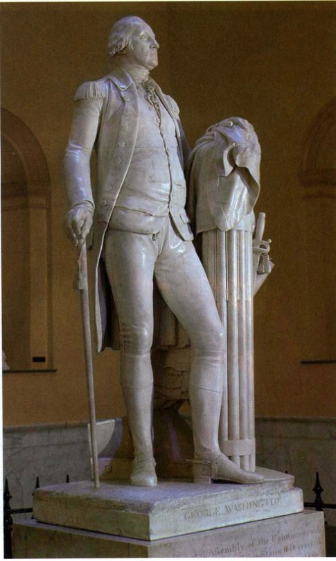

*图23.28 让-安托万·乌东：《乔治·华盛顿像》。1788-1792年。大理石，高1.88米。藏于弗吉尼亚州议会大厦，里士满，弗吉尼亚*

### 新古典主义的顶峰：雅克-路易·大卫的绘画

风俗画在启蒙时代法国的统治时间并不长久。1765年格勒兹的声望达到了顶点。1774年路易十六任命夏尔-克劳德·唐吉维莱尔（Charles-Claude d'Angiviller）为建筑总管，潮流开始转向历史画。唐吉维莱尔致力于消灭洛可可艺术的放荡风气，并用富于道德观念的历史画来代替。从1777年开始，他经常订制被称为“大型作品”的巨幅油画，一般都取材于古人高尚、正直的事迹，以及法国历史上可供鉴戒的事件，其中包括一批以中世纪和文艺复兴为背景的绘画作品。如今这些作品大部分已被人遗忘，但这个项目在艺术家中间引发了对于创作伟大历史画的追求，甚至是激烈的竞争。唐吉维莱尔的项目在18世纪80年代终于有了成果，那就是雅克-路易·大卫（Jacques-Louis David，1748-1825年）的出现。他革命性的绘画成为了新古典主义的缩影，从而简化了一个非常复杂的时代，以及一个内涵远远超过大卫其自身风格的复杂术语。

大卫花费了将近20年时间才找到自己的艺术声音，即他与众不同的成熟风格。1766年他开始了科班学习。1774年他获得了罗马大奖，之后的1775至1781年期间，他在罗马进修。他的进步过程十分缓慢，而且异常痛苦；直到1780年，在临摹了巴贝里尼宫中的《最后的晚餐》之后，他似乎才发现自己的才能所在，而那幅作品是由卡拉瓦乔的法国追随者瓦伦丁·德·博洛涅（Valentin de Bologne）在前一年创作而成。德·博洛涅强烈的写实风格以及戏剧性的明暗分布，触动了他的内心（见第818页的原始文献），而他也十分喜爱这种凸显出雕塑般清晰人物和物品的风格。1781年，他提交给学院一幅描绘古罗马将军贝利撒留的画，展现了他刚刚发现的这个美学新天地。这件作品使他得到了学院的认可，也为他赢得了大批崇拜者，多数为他的学生，还为他争取到了第一笔来自唐吉维莱尔的重要订单。

> **原始文献：艾蒂安-让·德雷克鲁兹（1781-1863年）**
>
> **选自《路易·大卫，他的学校与时代》**（Louis David，son école et son temps)
>
> 19世纪20年代初，大卫对他的学生艾蒂安-让·德雷克鲁兹（Étienne-Jean Delécluze）说了下面这番话，德雷克鲁兹将之发表在他1855年写的关于大卫的一本书里。在这里，大卫描述了他1779年发现卡拉瓦乔和卡拉瓦乔主义者这件事对他造成的影响。但他在结尾处却宣布与卡拉瓦乔断绝关系，转而拥护拉斐尔，这也正好反映了他的晚期作品在风格上的变化。
>
> “我到罗马以后所见到的意大利绘画作品之中，最突出的特点是色彩和阴影的强度。这是与法国绘画的虚软无力最大的不同之处；对于这种我以前一无所知的新明暗关系，以及这种令人难忘的、生机勃勃的造型，无不给我留下了如此深刻的印象；甚至在来到意大利的最初岁月里，我以为艺术的全部秘密就在于此，就是16世纪末的一些意大利色彩画家那样重现自然界中清晰、坚实的造型……我只能理解和欣赏卡拉瓦乔、里韦拉和他们的学生瓦伦丁画中的野蛮，但在其他方面值得赞赏的画则视而不见。我的趣味、成长过程甚至智力都有点粗俗，我必须摆脱这个缺点，以达到博学或纯正的状态，没有达到这种状态的人当然也能欣赏拉斐尔在梵蒂冈宫中的画，但这种欣赏是茫然的；他们既不理解这些画也不具备从中获益的能力。”
>
> SOURCE: ANITA BROOKNER, JACQUES-LOUIS DAVID. (NEW YORK: HARPER & ROW, 1980)

大卫用了三年时间来完成唐吉维莱尔的订单《荷拉斯兄弟的宣誓》（The Oath of the Horatii，图23.29），1783至1784年间他又在罗马将它润饰了一番。当大卫在自己的罗马画室中首次展示《荷拉斯兄弟的宣誓》之后，立刻引起了国际轰动，参观者不停地排队来观看这件革命性的作品。1784年沙龙开幕几天后，《荷拉斯兄弟的宣誓》从罗马运抵巴黎，延后进行的盛大出场更是引发了激烈的公众讨论。

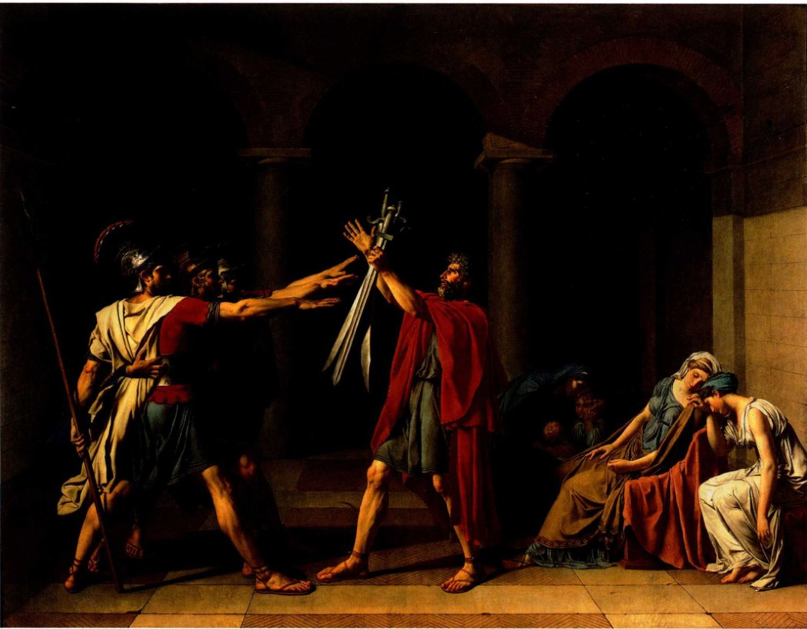

*图23.29 雅克-路易·大卫：《荷拉斯兄弟的宣誓》。1784年。布面油画，3.3x4.25米。巴黎卢浮宫*

该画取材于公元前7世纪的一个古罗马故事，它在李维和普鲁塔克的作品中都出现过。讲述罗马与邻国阿尔巴（Alba）之间的一场边界争端，最终通过双方各派出三名勇士进行比剑而得到解决。代表罗马的是贺拉斯三兄弟，代表阿尔巴的是库里亚提乌斯（Curiatii）三兄弟。但贺拉斯兄弟的姊妹卡米拉（Camilla）与库里亚提乌斯兄弟中的一个订了婚，而贺拉斯兄弟中的一人也娶了库里亚提乌斯兄弟的一个姊妹，这使得故事更加错综复杂了。在激烈的打斗结束后，只有贺拉斯兄弟中的贺拉提乌斯（Horatius）还活着。唐吉维莱尔给大卫的指示是画贺拉提乌斯回到家，他的妹妹因为他杀死其未婚夫而诅咒他，却被他杀害的那个瞬间。但大卫却画了一个文学作品中没有的场景：贺拉斯三兄弟在父亲的带领下，宣誓战斗到底。构图相当简单、鲜明：在大卫笔下，身体因严峻决心而紧绷的强壮男子，与软弱无力、缩成一团的痛苦女子卡米拉和库里亚斯（Curiace）之妻形成鲜明对比，而这两个女人都将失去自己的哥哥、丈夫或未婚夫。

无疑，大卫受到从加文·汉密尔顿1764年创作《布鲁图的宣誓》（Oath of Brutus）以来出现的众多宣誓画影响。通过大卫，这种充满意味的戏剧性瞬间变成了新古典主义历史画的标志之一，他也借此创造了这样一种舞台造型：倡导目的高贵而正直的行为，而这种行为通常意味着将国家置于家庭之上，当事人要付出惨痛但必要的牺牲。贺拉斯兄弟刚强的献身精神通过朴素的构图得到了强化，体现在朴实无华的浅空间之中，甚至画中既无装饰也无底座的托斯卡纳多立克式圆柱中，这种圆柱在50年代曾因勒杜而在法国风行一时。此外，还体现在把人物和建筑排成一行、平行于画面的坚定平面性之中，以及地板、拱门和勇士组合生硬的几何造型上。人物如像雕塑般坚实、凝固的清晰轮廓线也是很好的体现。由于这种平面性和线性，大卫比他的偶像普桑更像个“普桑派”艺术家，而其人物形象也出自普桑的作品。线条和几何形是理性的两样工具，现在已经完全战胜了洛可可艺术那刺激感官的色彩和笔法。

然而，卡拉瓦乔式的自然主义和强度令这幅画具有相当的力量，并把它与文艺复兴和巴洛克古典主义区分开来。使边线加深、绘画的戏剧性增强的是一道刺目的光，它投下了清晰的阴影，这种效果得自卡拉瓦乔（见图19.2），此外还有对纹理、地板上大理石缝隙这样细节的注意。这幅作品惊人的逼真，画家对背景和服装都做了大量细致研究，以求重现公元前7世纪的罗马。

尽管普遍认为《荷拉斯兄弟的宣誓》是典型的新古典主义画作，是大卫笔下几幅定义这一风格的作品之一，但它还是淌着浪漫主义的暗流。这个可怕的场面会令观赏者充满恐惧、脊背发凉。这是一幅关于道德决心和逻辑的画，反映了卡修斯在伏尔泰的《恺撒之死》（Death of Caesar）中所宣称的：“真正的共和主义者，其唯一的父亲和儿子就是美德、神、法律和国家”，而这幅作品又不仅限于此。在这个场景新古典主义式的凝固沉静之下，是大屠杀前的紧张。我们可以从父亲被光照亮的手指中察觉这种紧张，因为其与剑的锋利相互呼应。这幅逾4米长的巨画描写的是即将到来的暴行，背景处那不祥的阴影中有一种看护的力量，试图保护孩子们，使他们免于伤害。

1789年法国大革命爆发，大卫成了狂热的革命者。1792年新的共和国成立之后，他又变成了权势人物。他同时还是国民大会的成员，负责管理艺术事务，实际上就是共和国的宣传部长。他投票赞成处决国王，并把革命领袖乔治-雅克·丹东（Georges-Jacques Danton）送上了断头台，另外还成功地关闭了皇家学院。他大部分时间都用来签署逮捕令了，导致没有时间进行大量创作。

18世纪90年代初的两件重要作品都是被暗杀的革命者肖像，通常认为是两幅成对的作品。然而只有一幅保存了下来——《马拉之死》（The Death of Marat，图23.30）。1793年5月，它与配对的另一幅画一同在卢浮宫展出，之后政府宣布它将永久悬挂在国民大会的会议厅里。这是一幅宣传画。马拉是国民大会议员，以及一家民粹主义报纸的编辑。他是个忠心耿耿的革命者，平民的维护者。但他也是个无情的人，令人又恨又怕。人们都非常鄙视他，结果有一个来自卡昂的革命反对者夏洛特·科代（Charlotte Corday）将刀刺入了他的胸膛。当时他正横过浴缸，在一张轻便写字台上写着什么。由于一种能毁容且致命的皮肤病，他大部分时间不得不泡在浴缸里。

大卫在马拉遇刺前一天还去看望过他，在作品中描绘了他在浴缸里咽气的情景：一只手仍然握着为法兰西共和国辩护的那支羽毛笔，另一只手则拿着科代用来转移他注意力的假请愿书。与《荷拉斯兄弟的宣誓》一样，这幅作品运用了写实技法，注意细节，明暗分布鲜明，且具有平面性。但作者这回把画像向画面推近了许多，几乎与画布表面平齐，马拉用来写字的箱子和科代那把深深地刺入观众所处空间和马拉身体的沾血的刀只在几厘米开外。

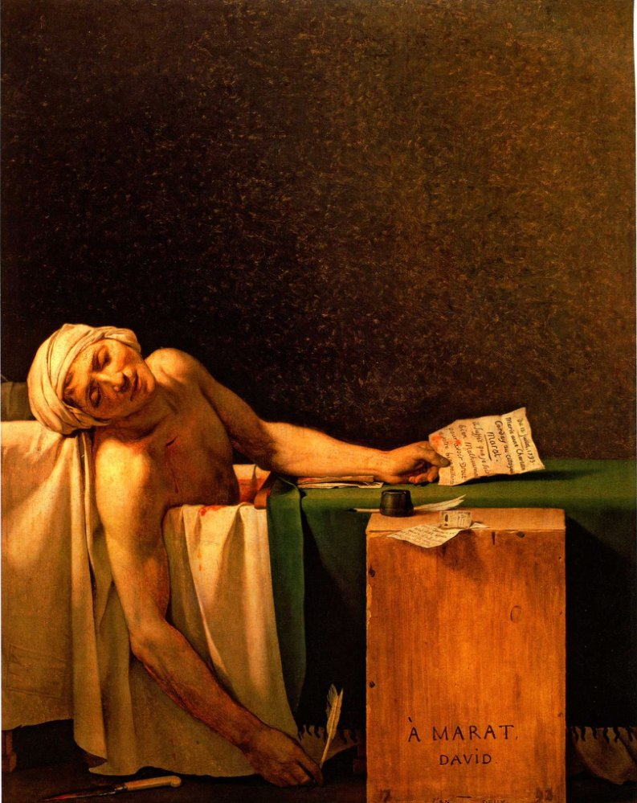

*图23.30 雅克-路易·大卫：《马拉之死》。1793年。布面油画，165.1 × 128.3厘米。布鲁塞尔比利时皇家美术馆*

对于当时的人来说，这幅画就像现代的新闻报道一样。但即便如此，它也只不过是一个带有宣传性的谎言。实际上马拉的浴室相当豪华，并不是像这里见到的这种共和国时期修道院般的房间。画中的这个房间简朴到了如此地步：被单上打着补丁，板条箱用来当写字台。此外，马拉当时是出了名的丑陋，但在这里他却拥有希腊神祇般的体格和天使般的面容。颓然垂下的手臂毋庸置疑是来自下十字架、哀悼基督或圣母哀子场景中的基督（见图16.12和17.32），而且取自大卫学生安尼-路易·吉罗代在前一年创作的一幅《圣母哀子图》。被单则让人联想到基督的裹尸布，而普通的写字箱被抬高为陈旧的墓碑。像韦斯特在《沃尔夫将军之死》（见图23.7）中所做的那样，大卫利用宗教意象来美化世俗人物。大卫还对此画做出了一点个人方面的曲解：在板条箱上，他在自己的签名上方写上“致马拉”。虽然此画是受委托而作，但由于大卫是政府成员之一，所以在一定意义上可说是他自己安排的一个任务，而且也是他自己想要完成的一幅画。这种献辞无疑使得画作显得像是画家的个人声明，宣称其中所包含的强烈情感，虽然是集体悲痛的体现，但却属于他一人。从表面看起来，这幅作品源自一个可回溯至普桑、拉斐尔、卡拉瓦乔，甚至古代的古典传统，但我们将会看到，它强烈的个性与浪漫主义时代相去不远，而这个即将来临的时代则是第二十四章的主题。

## 小结

18世纪下半叶，西方文明进入了现代时期。人们必须不断适应多变的政治价值观、日新月异的社会经济环境以及各种新的科学理论。发生在美国和法国的政治革命逐渐把政权从世袭王族转移到国民手中。不断发展的哲学观则刺激了土地改革、科学发现和技术进步，反过来又导致最终蔓延至全球的英国工业革命。社会在前进，新兴而富有的中产阶级需要新的奢侈品，也包括艺术品。这些变化的根源在于启蒙主义，一种在18世纪形成的全新批判思维方式。启蒙思想随后带来了基本人权的确立、全新道德秩序和现代科学的巩固。理性主义统治一切，经验和观察成为了理论的基础。生活在今天这个现代世界之中，我们依然能感觉到这些剧变的影响。

艺术成为这个纷繁时代最好的反映。新旧风格混合在一起发展。洛可可和巴洛克艺术余迹犹存，同时新的潮流也在涌现。主流风格是新古典主义，强调逻辑和理性，喜欢刻画取自古代希腊和罗马的说教主题。艺术中出现的另一条脉络是提倡情感、想象和自然至上的浪漫主义。

### 1760年之前的罗马：新古典主义的源头

古代和文艺复兴艺术珍品的产地罗马作为世界的艺术中心而称雄于世界。这个城市不但吸引了大量寻觅灵感的艺术家，还有许多在意大利作“游学”的富人们。不久前的考古发现，重新激起了学者和艺术家对古代的兴趣，其中尤其是在赫克拉尼厄姆和庞贝的发现。艺术批评家约翰·温克尔曼在其影响巨大的著作中鼓励人们支持希腊艺术在道德和审美上的优越性，并对它做出新的评价。安东·拉斐尔·门格斯朴素的笔法、庞贝奥·巴托尼肖像画强烈的线条处理以及加文·汉密尔顿的说教题材鲜明的严肃性是奠定新古典主义风格的基础。

### 1760年之前的罗马：浪漫主义的源头

与此同时，浪漫主义出现了。版画家、出版家乔瓦尼·巴蒂斯塔·皮拉内西通过以令人敬畏的巨大建筑为内容的生动实景画来赞美古罗马文明，这些建筑恰好体现了崇高这种特质，而其本身又经常与令人产生敬畏、担忧甚至恐惧感觉的巨大、阴暗、力量和无限联系在一起。英国政治家埃德蒙·柏克在论文《论崇高和美的观念之起源的哲学探究》中为崇高下了定义。皮拉内西和其他人越来越信奉崇高，这反映了观众对艺术的新要求：激发强烈的情感，甚至是害怕或恐怖，以及使他们产生狂喜的情绪。

### 英国的新古典主义

在英国，投身于启蒙运动的君主制反对者和众多知识分子都认同古罗马人，并仿效这个文明的政治、文学和艺术。在此基础上，他们通过扩展的方法而创造了新古典主义艺术。但这时的新古典主义还只是处于声誉渐起的阶段，同一件作品中常常会出现几种风格或影响。许多英国艺术家从希腊和罗马艺术、文学中取材，但并不总是选取具有道德寓意的题材。安吉莉卡·考夫曼的作品反映了这种矛盾的情况，因为她常常在色情和贞洁主题、洛可可式的优雅和新古典主义的庄重之间摇摆不定。

当代历史画的传统也诞生于这个时期。由于启蒙运动强调逻辑，本杰明·韦斯特和约翰·辛格尔顿·科普利等艺术家开始构想用令人信服的方式，即通过准确地描绘服装和背景来表现有历史影响的当代事件。韦斯特的《沃尔夫将军之死》和科普利的《沃森和鲨鱼》（Watson and the Shark）中有大量混合着古典姿势、静穆的庄重和道德暗示的真实细节，而这正是新古典主义风格的特征。

建筑中的复古风早在1715年就已出现，标志是科伦·坎贝尔的论文集《英国的维特鲁威》，随后这种风气最终传到了美国。坎贝尔支持古人及其后继者，尤其是安东尼奥·帕拉第奥的建筑，而且当时人们对帕拉第奥式乡村别墅的需求猛增。复古风延伸到城市规划中，如疗养城市巴斯；还蔓延至装潢领域，体现在罗伯特·亚当的室内设计中。

### 英国的早期浪漫主义

在英国，部分人既有对逻辑和经验主义的需求，同时还渴求情感和主观体验。在建筑和景观设计领域，新古典主义对伟大古代的怀想与浪漫主义对异域情调的喜爱和对引发强烈情感的渴望结合起来。英国人对崇高风格的爱好成功地化入庭园设计，在这个领域，它与“如画”的有趣多样和“联想学说”的多层意义特别好地融合在一起，而这两个概念都是在英国发展成熟的。同时发生的哥特式复兴运动也反映了浪漫主义的情感，其重点是由压抑引发的崇高情感。画家们也感受到新古典主义和浪漫主义的双重引力。乔治·斯塔布斯和约瑟夫·赖特常常把两种倾向融合起来，而亨利·福塞利则完全以崇高的恐怖景象作画，把我们一下子带入了浪漫主义时代。

### 法国的新古典主义

法国人对启蒙运动产生了类似的反应，艺术开始从洛可可的浮华转向新古典主义的理性主义。这种复古风首先出现在建筑领域，其特征是朴素的几何结构和建筑物巨大的体积，而这也是马利-约瑟夫·佩尔和克劳德-尼古拉·勒杜建筑作品的特点。法国画家和雕塑家明确地表达了他们对主流思想的反应。在18世纪60年代让-巴普蒂斯特·格勒兹的风俗画在巴黎各沙龙中引起轰动，体现了启蒙运动对逻辑和写实主义的强调，而让-安托万·乌东的肖像雕刻则把对象表现得既写实又具有古典风格。但法国新古典主义的顶点无疑是雅克-路易·大卫的说教历史画，尤其是他的《荷拉斯兄弟的宣誓》。大卫以在格勒兹手中流行起来的舞台造型为基础，创造了一种充满高贵之美的戏剧性构图，但其中潜伏的恐怖暗流也反映了对浪漫情调的偏爱。