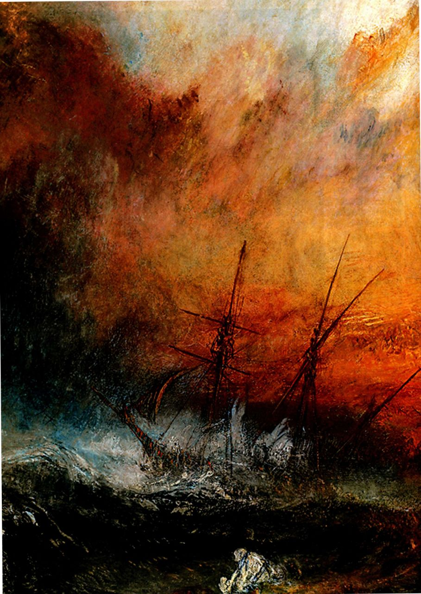

# 第二十四章 浪漫主义时代的艺术：1789\-1848年

新古典主义的完结和浪漫主义的诞生并没有确切的时间，正如理性与情感这两种分别来自新古典主义和浪漫主义的元素并存于1750至1789年的启蒙时代（见第二十三章，有时甚至并存于同一件作品中），新古典主义和浪漫主义也肩并肩地从1789年繁荣到1848年，期间爆发了法国大革命和欧洲工人暴动。如果

说理性的新古典主义成分盛行于这个时期的前一阶段，那么情感的成分则在后一阶段略占上风。

无论在外观或风格上新古典主义的特色是如何鲜明，在后一阶段的作品中仍带有浪漫主义色彩。浪漫主义一词直到1798年才出现，这一年德国作家、诗人弗里德里希·冯·施莱格尔（Friedrich von Schlegel， 1772\-1829年）把它用到了诗歌当中。这个术语本身源于英国贺拉斯·沃波尔等作家的哥特式小说（见第805页），这种小说所表现的阴郁气氛在18世纪下半叶风靡一时。而到了18世纪末，西方世界开始感觉到意识领域正在发生一场根本性的转变，这种转变在19世纪上半叶达到了高潮。

意识领域的变化是伴随着法国大革命、拿破仑战争以及工业化和城市化进程而来的一个间接结果。启蒙运动似乎是失败的，因为并没有出现社会改革和进步，有的只是骚动和混乱。法国大革命也许带来了共和政体、政治解放、民族主义和公共机构的成立，其中也包括博物馆，但它在1792年就已使欧洲大部分地区陷入了战争，还导致约17,000人在罗伯斯庇尔（Robespierre）1793至1794年的恐怖统治期间遭到

图24\.9细部，约瑟夫·马洛德·威廉·透纳：《运奴船》

处决。由于害怕启蒙主义改革会引起革命，欧洲各国政府纷纷镇压自由主义者，实行严厉而反动的保守主义。拿破仑·波拿巴（Napoleon Bonaparte）从听命于督政府的军队指挥官跃升为反对它的政变领袖和临时政府的执政官，最终于1804年成为世袭皇帝，这也宣告了法兰西共和国的终结，拉开了拿破仑战争的序幕，该场战争一直持续到1815年。在拿破仑的鼎盛时期，法国曾占领了欧洲大部分地区。

战争的军事需要使得上世纪始于英国的工业革命得以加速发展，即便1815年拿破仑战败而恢复的和平也很难减缓它的势头。人们一波接一波地从贫穷乡村前往城市充当制造工人。新产生的无产阶级脱离了农村中那种令人心安的、一切都可预见的传统生活，在这里他们必须出卖劳动，如今他们遭遇到的则是难以忍受的工作环境、维持最低生活水平的工资、匮乏的城市住房设施。按其设计能力，这些城市根本无法容纳增长如此显著的人口。这个时期产生了现代劳工以及劳资冲突，在1848年随着卡尔·马克思（KarlMarx）和弗里德里希·恩格斯（Friederick Engels）发表《共产党宣言》（Communist Manifesto）以及一场

🔴第二十四章 浪漫主义时代的艺术：1789\-1848年 823

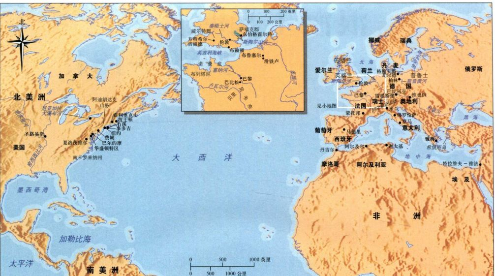

地图24\.1 浪漫主义时代的欧洲与北美洲

波及全欧洲的工人革命爆发而达到高潮。工业革命还催生了强大的资产阶级，那些富有的中产阶级掌握着生产资料，要求在政府中得到更大的发言权。

在这漫无尽头的危机面前，西方世界发现有必要在逻辑和科学经验主义等启蒙主义价值观之外信仰些别的东西。于是在法国人让\-雅克·卢梭和德国狂飙运动（见第二十三章）的推动下，兴起了一种对个人主观情感的信仰。到了本世纪末，18世纪的强大暗流已浮现出来，成为西方的独特心理。当时的艺术家、作家、作曲家和知识分子都开始鼓吹强烈的情感、直觉和不受束缚的创造才能。通常认为这个时代本就沉溺于“个人崇拜”。在知识分子和文化精英看来，想象力的彻底解放和创造自由取代了规则、标准和逻辑。正如法国浪漫派作家维克多·雨果所说的：“一切体系都是虚假的，只有天赋才是真实的。”从这个角度来说，思想就是大自然的导管，是接近强大宇宙力量的唯一手段，艺术家的目标就是进入这个储存着更高现实所在的容器，并把其表现出来。所以真诚和真实就变得至关重要了。启蒙主义道德观在这里并不适用。被暴行、苦难、混乱和丑陋激发出来的强烈情感取代了正直、高尚的行为以及与理想美联系在一起的尽善尽美。浪漫主义导致了一种崇拜：不仅是对奇异体验的崇拜，而且是对恐怖、可怕和极端体验的崇拜。唯一性成为艺术中的一种权威价值；模仿他人的特色、创新或个性就是造假。因此，浪漫主义不是一种风格，而是一种

态度，是一种对抛弃逻辑、任凭天赋引领的特许。

浪漫主义既把人带回遥远的过去，这其中包括埃及、罗马、雅典、中世纪和文艺复兴，同时也关注当下穆斯林或美洲这类由于“差异性”（otherness）而被认为奇异、原始、一般来说劣等却迷人的文化。浪漫主义的思维无视启蒙主义高贵和美德的价值观，而是装满了残暴、苦难和性压抑。大自然是天才人物最喜欢的目标之一。它是真理的源泉，在一个极端，艺术家受到它令人畏惧的宇宙力量强烈吸引；而在另一个极端，又被它不可思议的美迷住了。对于体验了启蒙运动的经验主义之后仍然信仰上帝的艺术家来说，大自然是神性的显现。但对于不信上帝或至少质疑上帝存在的人来说，对死亡永恒性的恐惧则弥漫在他们的艺术中，这是一种现代特有的心理，在启蒙运动之前的基督教世界是不可能存在的。

强烈情感的另一来源就是吞没整个欧洲的民族主义。在本世纪下半叶，这种民族主义将导致不同的政治实体统一成德国或意大利等国家（见地图24\.1）。对国王或贵族的勉强效忠如今被一种强大的个人结合体所取代，而其正是以共同语言和集体体验作为基础，这也是另一种得到艺术家认同并成为其作品基础的情感。在某种程度上受到民族主义的推动，艺术家们将放弃意大利式古典风味的世外桃源，转而集中展现本国乡村与众不同的特点。

🟩824 詹森艺术史

图24\.1 弗朗西斯科·戈雅：《理性的沉睡产生魔鬼》，选自《幻想》

（第一版，1799年，图版43）。约1799年。蚀刻、飞尘蚀刻、干

刻和雕刻刀，21\.5 × 15\.2厘米。纽约大都会艺术博物馆。M\.Knoedler

赠，1918年

\(18\.64\(43\)\)

绘画

在所有种类的视觉艺术中，绘画在我们的观念中是与浪漫主义结合得最为紧密的，因为与雕塑和建筑不同，绘画容许感情自然流露。事实上，许多艺术史家认为习作或速写都是最典型的浪漫主义绘画形式，无论是彩绘的还是素描的。虽然一些最著名的浪漫主义画作由于夸张的用色和有力的构图而带有巴洛克的色彩，但浪漫主义绘画也可以毫不困难地通过严谨的用色与构图，塑造出传达恐怖情感的冷漠形象，就像新古典主义那样。

西班牙：弗朗西斯科·戈雅

在19世纪的最初几十年中，西班牙艺术的霸主是弗朗西斯科·戈雅·卢西恩特斯（Francisco Goya yLucientes，1746\-1828年），这位艺术家的作品在许多方面浓缩了当时欧洲最新的心理状态和议题。1786年，查理三世（Charles III，1759\-1788年在位）任命戈雅为皇家画师，使他直接置身于委拉斯凯兹的传统（见第690\-694页）之中。在戈雅看来，支持君主制与拥护自由主义改革并不冲突。国王承认有必要把死水一般的西班牙带入18世纪，因此允许一定程度的经济和社会发展，这给了进步力量希望。戈雅正是这个进步团体的一分子。他是个开明的西班牙人，崇拜法国启蒙哲学家。他的社交圈都持有同样的见解，这其中就包括了他的许多贵族主顾。但法国大革命吓坏了欧洲各国的统治者，引发了反对革命的压迫浪潮，因为现在启蒙运动与革命而不是改革联系在了一起。教会和政府都打压自由派改革者。西班牙与法国开战，并与英国这个往日的敌人结成同盟。在逆转活动达到顶点时，戈雅于1793年神秘地染病，双耳失聪，奄奄一息。

理性的沉睡 想知道戈雅对这个时期危机的反应，可以从《理性的沉睡产生魔鬼》（The Sleep of ReasonProduce Monsters，图24\.1）中获得一些端倪。这是用蚀刻和飞尘蚀刻法（aquatint）的80幅系列版画《幻想》\(Los Caprichos	［The Capriccios］）中的一幅，这套版画是他于1797年设计，随后由他自费出版，并无获利。在画中，我们看到艺术家趴在象征着理性的几何形墩子上沉睡，他身后则乱糟糟地飞起一群不祥的猫头鹰和蝙蝠，它们分别象征愚蠢和无知。在为这幅版

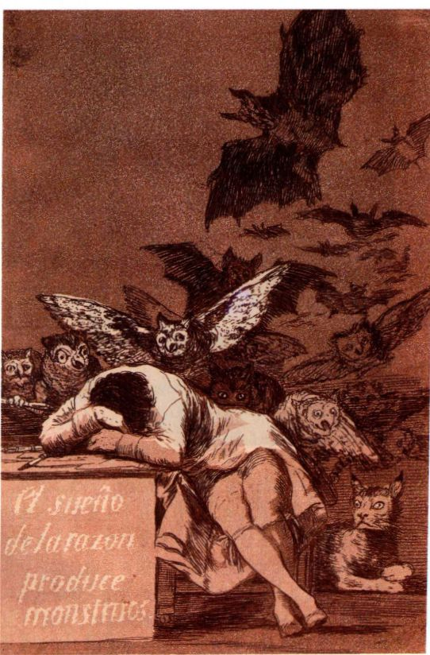

画所做的一幅习作空白处，戈雅写道：“作者的······意图是驱除流行的有害教条，用这件幻想之作支持真理的有力宣言，使其永垂不朽。”这幅版画介绍了整套组画后半部分的内容：讽刺各种罪恶、迷信和无知，角色都是女巫、怪兽和恶魔，实际上表现了启蒙主义逻辑被中止时世界的模样。但人们同样容易把《理性的沉睡产生魔鬼》解释成揭示戈雅本人个性另一面的作品，那是非启蒙主义的一面，是情感的、非逻辑的，与理性毫无关系。引向这种解读的线索是那只被拴在地板上的山猫，它十分警觉，而这是一种在夜间猎食的食肉动物。它的腿与戈雅交叉的双腿和双臂形成呼应，而它长有尖耳的头又把它与猫头鹰和蝙蝠连在一起。虽然在传统观点中，猫是邪恶的象征，但这里它似乎既是戈雅，又是他身后的怪兽。戈雅这是在宣告他有权放弃理性，转而用想象来表达自己最强烈的感情，以及内心最深处的心理状态，即释放他心中的恶魔，并利用一切合适的风格手段和象征。

皇家委托 戈雅仍旧为教会和政府作画，这是他除了肖像画之外的另一条谋生之道。1800年，国王委

🔴第二十四章 浪漫主义时代的艺术：1789\-1848年 825

图24\.3 弗朗西斯科·戈雅：《1808年5月3日枪杀起义者》。1814年。布面油画，2\.67x4\.06米。马德里普拉多博物馆

图24\.2 弗朗西斯科·戈雅：《查理四世

一家》。1800年。布面油画，2\.79 × 3\.35米。

马德里普拉多博物馆

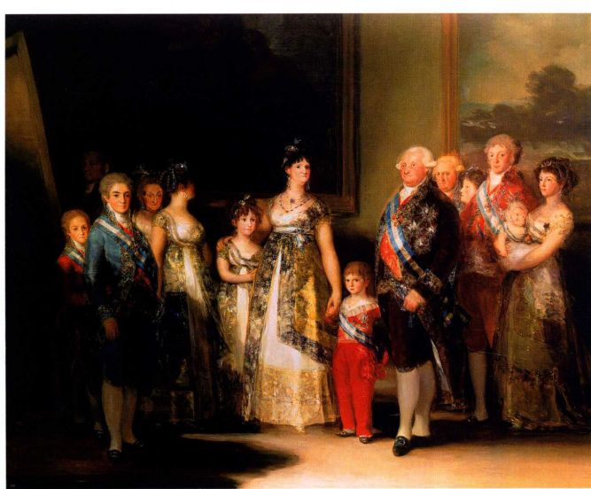

托他画《查理四世一家》（The Family of Charles IV，图24\.2）。这件作品绝对不是对这个王室家庭肖像的简单记录，而且肯定也不是一件意在重申这个家庭神圣特权和无上权威的宏大作品，因为它通过揭示基本人性和平凡这个主题打破了传统的做法。理解此画的关键是了解戈雅要使它能与委拉斯凯兹的《宫娥》（见图19\.38）相匹敌，后者是一幅皇家藏画，在宫中尽人皆知。在两幅画中，艺术家本人都在场，而国王全家则均以两幅模糊的大油画为背景集体亮相。而且，戈雅画中皇后玛丽亚·路易莎（Maria Luisa，中央站立者）采取的姿势与委拉斯凯兹画中的公主一样。但

戈雅的肖像画里没有那面非常重要的镜子，而在《宫娥》中，这面镜子照出了国王夫妇，是在构图上和主题上把全画统一起来的基石，它不仅解释了整个场景，还确定了人物的等级顺序。但《查理四世一家》中的镜子在哪里呢？我们必须先问另一个问题，这也是人们对于戈雅的画总会问的一个问题：每个人都在专注地凝视着什么？最有可能的答案就是他们自己。其实他们正在照一面镜子，这是一面未被画出的镜子，画中的戈雅则在人物看着镜子时画下他们的镜中映像。

19世纪的法国批评家特奥菲尔·戈蒂埃（ThéophileGautier）机敏地注意到了他们的不自在，把国王夫妇

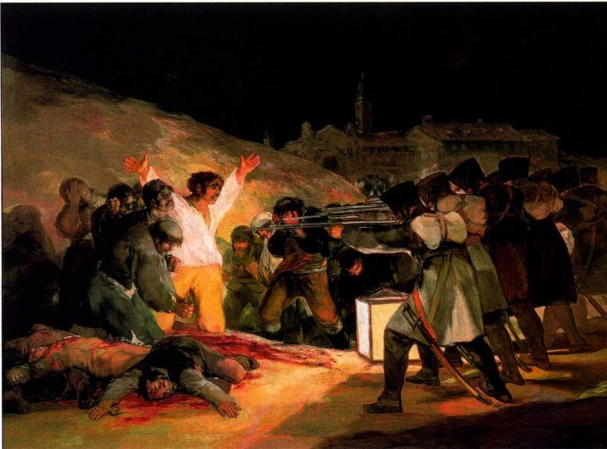

🟩826 詹森艺术史

形容成像“中了奖的街角面包师和其妻子”。戈雅还把画中人还原成为具有人性的动物。他们的衣着也许是高贵的，但这家人穿着这样的衣服就像他们摆出虚假的贵族姿势一样显得极不协调，因为他们的姿势缺乏我们在凡·代克和里戈的皇家肖像画（见图20\.8和21\.10）中见到的那种自信。这些人物看起来寂寞、孤立甚至害怕。戈雅把每个人都表现成一个个体，他们对生存意义充满怀疑，而且还受到萦绕在全人类心头的疏离感的困扰。这种在面对无限之际所具有的浪漫主义式的敬畏感是戈雅的创造，他将其用到了国王一家身上。启蒙运动和法国大革命都否认上帝的存在，这意味着生存的意义是不可知的、超出理解力之外的。这种具有惊人现代感的心理状态在房间里投下了一片漆黑的阴影。令人感到意外的是，查理四世最终还是收下了这幅肖像画，但他自己从没喜欢过。

戈雅在全画中采用了艺术史上最炫丽的一种笔法（在复制品中难以看清），甚至在巴洛克式的大胆方面超越了委拉斯凯兹。充满力度的用色为画面平添了无限的生气，整幅画闪耀着夺目的光芒，尤其是衣服、珠宝和勋章，显然这样的表象使国王一家看不见隐藏在表面之下的真意。

一种更强烈的无用感弥漫在戈雅1814年创作的《1808年5月3日枪杀起义者》（The Third of May，1808，图24\.3）之中。这是作者1810至1815年期间针对1808年法国占领西班牙一事所作的多幅油画、素描和版画之一。内阁的腐败迫使查理六世于1807年退位，取而代之的是他的儿子费迪南德七世。1808年拿破仑的军队开进马德里，费迪南德被废黜，拿破仑的兄长约瑟夫·波拿巴（Joseph Bonaparte）登上王位。受到启蒙思想教育的西班牙人起初乐观地以为进步的法国会改良自己的国家。但在马德里，一场由民族主义驱使而发动的人民起义导致了双方的恶性战斗，乃至随后的大规模屠杀，几天之内就蔓延到全国，此后一直延续了六年之久。戈雅这幅富于表现力的巨画是在拿破仑被废、费迪南德恢复王位之后创作的，表现的是1808年5月3日对西班牙起义者进行的集体处决，地点就在马德里城外的一座小山之上。

与表现具有高尚品质、美德和坚强意志的模范人物著称的新古典主义历史画相比，这幅画是多么的不同啊！戈雅刻画了被卷入强大历史洪流的无名人物们。在这里，我们目睹了仿佛机械一般的屠杀过程。那个举起双手的起义者穿着黄白两色服装，而这正是教皇专用的颜色，他做出基督在客西马尼花园里遭罗马士兵突然袭击时的姿势。他的右手有一个伤口，让人联想到圣痕。

但讽刺的是，戈雅并不承认这些暴民是殉道者。他们心中充满了死亡的恐惧，而非献身的狂喜。并没有突然出现让他们复活的圣光，这个不真实场景背后的教堂一直是模糊不清的。当那四平八稳的灯笼熄灭时，将只剩下永恒的黑夜，而由于灯笼的几何形状和光亮，可以解释成启蒙运动的逻辑和进步的象征；对于无尽的黑夜来说其象征的则是前景处那具毫无生气的尸体，他的脸已经化成一团用颜料堆砌而成的血污。看不到脸的行刑者也是历史车轮上微不足道的部件，但他们却漠视受害者对死亡的恐惧和求饶的哭喊。

戈雅创作《1808年5月3日枪杀起义者》时正是他迫切需要工作的时候，他希望用这幅作品获得王室的青睐，所以他将其编造成一件表现牺牲于暴政执行者之手的西班牙人的作品。但此画的真实主题却是死亡的无名和战争的残忍。这幅作品的力量就在于能够逐渐灌输给观众一种强烈的恐怖感，使人正视对自己必然死去这一无法避免的命运。

黑色绘画 戈雅越来越多地在自己的作品中使用真正的浪漫主义风格，而且是以一种前人几乎没有尝试过的方式，在颜料中耗尽自己的情感。他最著名的画作包括“黑色绘画”，这些作品直接画在他位于马德里郊外农舍的墙上。这种做法是个明显的信号，表明它们是永不出售的私人作品。每一个画面都是昏暗、阴郁、可怕或者令人毛骨悚然的，这可能反映了戈雅病愈后的消沉情绪，以及他对启蒙运动失败和文明本质上无理性的失望。我们不知道戈雅是否为这些作品取了名字，也不清楚它们的主题，这就意味着那件一般称作《农神吞掉他的一个孩子》（Saturn DevouringOne of His Children，图24\.4）的作品，未必就是描绘了这个古典神话故事。我们看不到任何通常与农神相关的标志，而且那孩子看上去也并不像个孩子。从某些方面来看，这幅画并不需要标题，它已经用恐怖、无理性和疯狂充分表达了自我。富于表现力的笔法使画面充满了力量，给人留下深刻的印象；戈雅事实上把色彩同它们所表现的形象分离开来，并赋予它们独立的生命，这样既可以反映他本人内心最深处的情感，也强化了主题。用色的力度使画作爆发出原始的活力，突出的表现就是这里一片尖锐的红色，那里又见一团耀眼的明褐色。手臂和腿萎缩、扭曲，实际上已变成了有弹性的骨头，似要被黑暗所吞噬。显而易见，我们又一次目睹了“理性的沉睡”。

英国：精神强度及与大自然的纽带

在英国，最严格按照戈雅所行道路前行的是威廉·

🔴第二十四章 浪漫主义时代的艺术：1789\-1848年 827

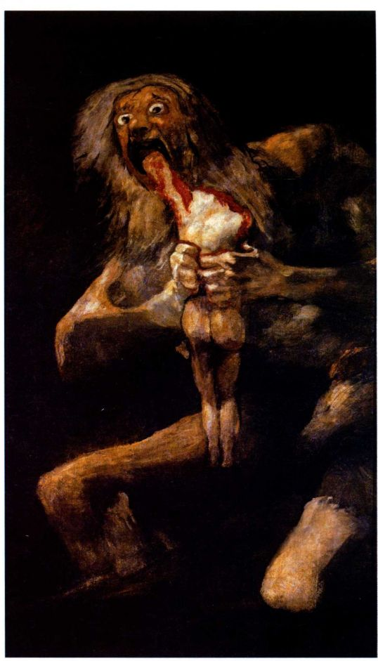

图24\.4 弗朗西斯科·戈雅：《无题《农神吞掉他的一个孩子）》。约1819\-1823年。从墙上割下来、以画布为衬底的壁画，1 45 × 82\.9厘米。马德里普拉多博物馆

布莱克，继续在任想象力和激情肆意挥洒的狂想世界中驰骋。然而，浪漫主义时期的许多画家都效法威廉·华兹华斯（William Wordsworth，1770\-1850年） 和珀西·比希·雪莱（Percy Bysshe Shelley，1792\-1822年）等诗人，沉醉于大自然之中，让它的美和情态澡雪自己的情感，或对其伟大力量和所隐含的无限世界敬畏不已。

威廉·布莱克 在英吉利海峡彼岸的伦敦，艺术家威廉·布莱克（William Blake，1757\-1827年）所面对的问题与影响戈雅的问题极其相似，他的反应也是退入一个个人的视觉世界。布莱克热烈称赞让\-雅克·卢梭及其关于人性本善的理论：人生来是纯朴的野蛮人，之后被社会带有约束力的虚伪风气腐化。他对欧

洲文明的规则和习俗深恶痛绝，认为这妨碍了个人自由和男女平等。他厌恶欧洲的实利主义和精神缺失，谴责制度化的宗教像一般政府和社会那样专制。他在物质世界里寻找精神真理的满腔热情使他于18世纪80年代对激进宗教产生了兴趣，但并非沉迷。他最早的职业是雕版工。随后于1779年在皇家学院登记入学，但不到一年就离开了，声称院长乔舒亚·雷诺兹和作为社会缩影的机构本身打压想象力、创造力和进步。实际上，布莱克很大程度上是自学成才的。虽然并非一名遁世者，但布莱克十分孤独，生活在社会的边缘。18世纪80年代中期以后，他不曾在学院里展出过作品，而他终其一生也未获得过任何评论家的注意。

虽然布莱克极不喜欢学院，却支持历史画，认为这是一种改良社会的工具。不过他刻意回避油画，认为油画是与学院的人为等级互相关联的。他进而转向中世纪的手抄本彩饰寻求灵感，并制作自己的插图书籍，以求召唤他心中榜样所具有的精神特质。布莱克最早是一名颇有声望的诗人。18世纪80年代末，他开始发行自己的诗歌，一般都赞美大自然、自由、青春和想象力，指责文明的彻底堕落，还指出这种堕落源于对理性的过度依赖。将近1793、1794年的时候，布莱克陷入了深深的抑郁，这种情绪的产生要归结于法国大革命的暴力和混乱、英国对法国宣战以及英国首相威廉·皮特（William Pitt）针对法国大革命激进局面而制定的镇压措施。与戈雅一样，布莱克当时见证了启蒙运动的失败。

此刻，在布莱克的作品中，图画开始凌驾于诗歌之上。与此同时，他的艺术也达到了成熟阶段，其象征就是12幅异常巨大的彩色版画，其中包括《麻风病院》（The Lazar House，图24\.5）。这些作品大部分作于1795年，从未按书籍的形式装订或展示过，所以我们并无法确定原来的观看顺序，也无从知道布莱克打算怎样使用它们（见第829页的材料与技法）。然而，这些版画全部都与他对世界早期历史的幻想有关。在他的想象中，人出生时仍然依恋他们刚刚离开的那个无限世界，而且这时的人品德良好、自由自在、充满想象力。随着年龄的增长，他们受到理性的控制，失去了自由和道德，被实利主义吸引，从而陷入了有限世界。这组绘画的主题并非全都来自布莱克的创造，其中有一些来自莎士比亚、弥尔顿的著作以及《圣经》。正如我们已讨论过的（见第807页），这都是这个时代在寻找崇高意象时最为钟爱的资料。布莱克之所以利用这些题材，是因为它们能融入自己的哲学体系，并形成有力的支撑。《麻风病院》出自弥尔顿《失乐园》的第十一篇，

🟩828 詹森艺术史

布莱克制作版画的步骤

为了制作包括《麻风病院》（见图24\.5）在内的12幅系列版画，威廉·布莱克发明了一种与独幅版画（monotype）十分类似的方法。独幅版画这种印刷技术在19世纪末大为普及，但这之前则极少被使用。独幅版画包括在版面上绘图，然后把纸压在湿版上，得到图的反像，反像不同于原始图像，其表面显得更为色彩斑驳，但更加柔和。正如“独幅版画”一词所示，一般只压印一次。不过，在最初涂上的颜料被完全吸收之前，可以得到几份版画，而每一份的颜色都比前一份淡。

此篇中天使长米迦勒让亚当展望未来，直面他所犯之罪的后果，即各种形式的死亡：从第一次由于暴力（亚伯被亲生哥哥该隐杀害）而出现的死亡，到因病死于一所麻风病院（为病人和垂死者设立的收容所）。在布莱克所描绘的麻风病院里，可以发现长着怪异胡须的死神手持一幅卷轴，有可能是象征着法律，即理性的镇压工具，而右方垂头丧气的狱卒则代表精神缺失和邪恶，这个形象在布莱克以前的作品中反复出现。

从18世纪70年代中期起，布莱克开始受到米开朗基罗、风格主义画家和中世纪艺术的影响，所有这些影响都可以在这幅画中找到，但是已经经过布莱克个人风格的改造。我们看到了米开朗基罗式的夸张肌肉（见图16\.21），以及手抄本彩饰的曲线（见图10\.9）。画中没有表示环境的背景，只注重人物本身，还选择了一个庄严、恐怖的场面，这些特点的源头都是福塞利（见图23\.18、23\.19）。布莱克极为欣赏福塞利，时不时地试图与他结交，但都没有成功。

布莱克专注于自己的假想世界，而且到了惊人的程度。他宣称其幻象是神灵展现给他的：“我日夜受到天国使者的指引。”虽说我们不得不对这一陈述抱怀疑态度，但他的艺术确实不是写实风格（即忠实地描绘现实），而是一个能够释放他强烈道德信念、历史观以及对乌托邦式未来想象的概念式狂想世界。物体的立体感不强，空间深度最大程度地减弱，用来强化他作品形象背后的理想观念。

约翰·康斯太布尔 在这个时期，风景画逐渐成为了探索真理的主要工具。顾及自然在浪漫主义意识形态中的重要地位（与大自然结合、表达亲身体验到的自然精华的需要），此为必然。约翰·康斯太布尔（JohnConstable，1776\-1837年）是这个时期因风景画而引人注目的两位英国艺术家之一。康斯太布尔在萨福克郡的斯陶尔山谷（Stour Valley）中的东伯格霍尔特（East

材料与技法

布莱克在制作包括《麻风病院》在内的系列版画时，所用的方法如下：先用黑色颜料在一片硬纸板上面勾勒出图的轮廓，通常还要加上少许立体效果和细节。随后用纸在硬纸板上压印大约三次，压印的力度均不大，以免一次沾掉太多颜料。这样会得到一份简单的无彩黑图。在那之后须在硬纸板上涂上各种颜色，然后将其压在有黑色图样的压印纸样上。接下来，他会用水彩为作品润色。据说，布莱克在制作版画时通常使用油画颜料，但考虑到他对这种材料的厌恶，最有可能用的还是蛋彩颜料。

Bergholt）村出生并长大，大半生都用来描绘这片肥沃的农田。在他之前，通常认为农田过于平凡，不合适作为绘画的题材。康斯太布尔没有在兴旺的家族农场和磨坊里工作，而是在1799年得到机会到伦敦的皇家美术学院就读。但他最终意识到自己不过是在学习如何重复传统的绘画手法，于是毅然回到伯格霍尔特，绘制“艰苦的写实习作”。他在画室里把这些素描和油彩速写扩展成为完整的作品，但保留了它们清新、细致的特点。康斯太布尔甚至从科学的角度对风景画展开思考：“绘画是一门科学，应该被当作一种对自然法则的探究来追求。那么风景画为什么不能作为自然科学的一个分支呢？作画其实就是一种实验。”康斯太布尔尤其善于捕捉自然界瞬息变幻的特性\-云、光和空气。他曾以天空为题画了无数习作，因为它是“基调、标准和抒发感情的主要工具”。

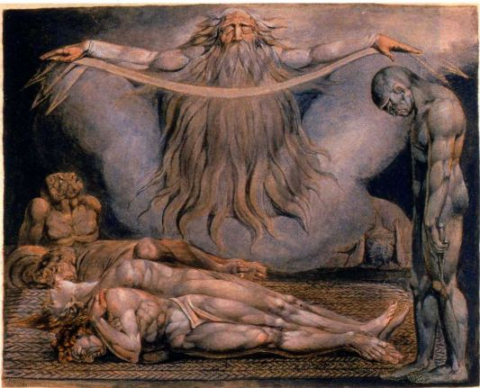

图24\.5 威廉·布莱克：《麻风病院》或《死亡之屋》（The House ofDeath）。1795年。彩色版画，48\.5 × 6 1厘米。这幅版画表现的是弥尔顿的诗《失乐园》第11篇的部分诗句。伦敦泰特美术馆

🔴第二十四章 浪漫主义时代的艺术：1789\-1848年 829

原始文献

约翰·康斯太布尔（1776\-1837年）

选自致约翰·费舍尔（John Fischer）的一封信

索尔兹伯里大教堂副主教费舍尔是康斯太布尔的终身至交。这封写于1821年10月23日的信反映了康斯太布尔对英国风景之美的感受。

我是一条怎样的河呢？说到从磨坊水坝等处流水的声音、多么希望跟你一起去新森林（New Forest）垂钓！那会垂柳、腐烂的老木板、沾满泥的柱子和砖房，我喜欢这类东西。莎士比亚能使万物变得富于诗意；他向我们讲述了可怜的汤姆在“羊圈和磨坊”之间来回游荡的故事。只要我还在创作，

康斯太布尔的作品中充满了他在感受斯陶尔山谷之美时心中涌出的情感；“绘画只是感觉的另一种说法”，他曾这样声称（见本页的原始文献）。他的画既合乎科学原则，也饱含主观的元素，如1821年的《干草车》或《风景：中午》（The Haywain或Landscape：Noon，图24\.6）。从1811年起，他一直在皇家学院展出他的作品，这幅画也不例外。我们感觉到蓝天正在驱散乌云，潮湿的空气令万物闪闪烁烁。点点鲜亮的色彩消解了物质世界，使空气熠熠生辉。

就永远不会停止描绘这样的地方，它们一直是我之所爱。我真的期望亲眼看到你所描述的美景，也会很高兴与你做伴，“与一个不会对大自然无动于衷的人作伴”。但我应该尽最大努力来画好我的家乡；绘画对我来说不过是感情的另一种说法，一谈起“无忧无虑的少年时光”，我就会想到斯陶尔河两岸的一切；也就是说，在我下笔以前，脑海中就已经出现了那方的影子。

SOURCE:CHARLES ROBERT LESSLIE,MEMOIRS OF THE LIFE OF JOHN CONSTABLE\. ED\.J\.MAYNE\.\(LONDON: PHAIDON PRESS, 1951\)

天空是一曲关于主观性的交响乐，各种情感在其中交织；大地也是如此，它可能是阴暗、起伏的，如剧烈、有力地扭曲的树枝，也可能是欢快、平和的，如远处平铺开来的干草地。康斯太布尔在画中使用了许多有趣的细节，除了干草车，还有狗、小舟、远处田间的收割者和从磨坊中喷出的烟。这不是个完美的世界，因为不曾表现理想美或古代的阿卡迪亚。这其实是一处特别的场景，将其全部的特点都以一种用心的方式表现出来。

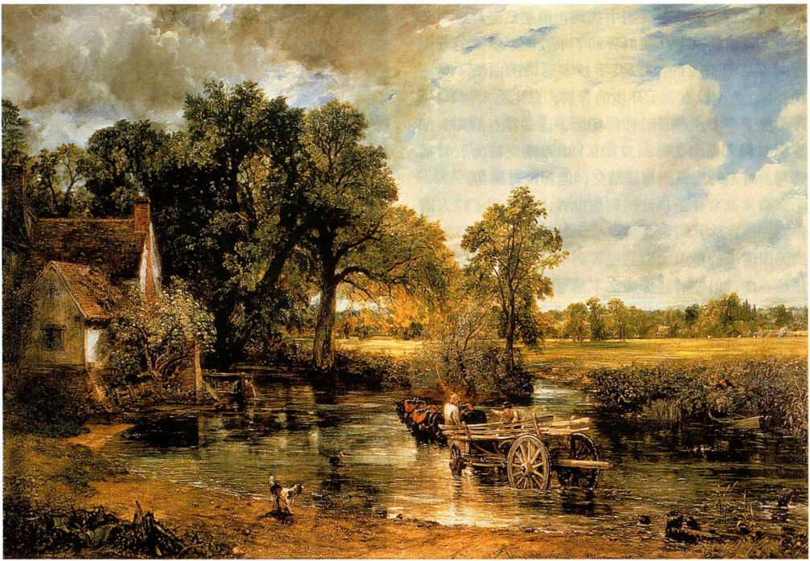

图24\.6 约翰·康斯太布尔：《干草车》或《风景：中午》。1821年。布面油画，	1\.3x1\.85米。伦敦国家美术馆

🟩830 詹森艺术史

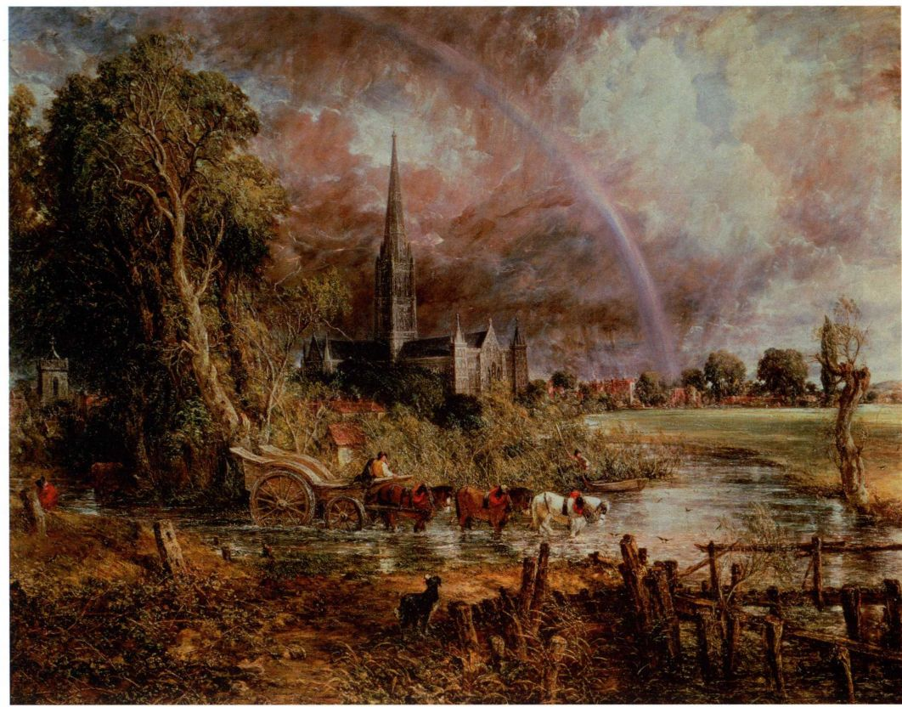

图24\.7 约翰·康斯太布尔：《索尔兹伯里大教堂》，1829\-1834年。布面油画，

151 \.8 × 189 \.9厘米。私人收藏，伦敦国家美术馆借展

对于风俗画而言，这幅画1\.8米的尺寸显得不同寻常，而这也算得上一种用来提高风景画地位的策略，尽管有所争论，同时还是一种争取注意力的尝试。这幅作品依据的是大量户外习作，大部分作于1814至1816年期间，后来在艺术家伦敦的画室里发展成大型的展示形式，他冬天就在这个画室中工作。《干草车》中的生活节奏缓慢，农业劳动者习惯性地干着他们重复了几千年的农活，而且与自然快乐、和谐地相处，这些都是康斯太布尔笔下所有以斯陶尔为对象的画作的特点。对英国农村来说，这是个社会、经济都不稳定的时期，而这也给康斯太布尔家的产业带来了巨大的财务压力，当时产业由艺术家兄弟负责经营。然而在康斯太布尔充满诗意的画中看不到这种危机的影子，反而着重表现了个人对土地的依恋，以及艺术家孩提时代所熟悉的那种生活。

19世纪20年代，康斯太布尔的风景画变得越来越阴郁、动荡，因为家族病和事业上的一无所成使他受

到周期性抑郁症的折磨。主观性诗情的重要性开始超越经验主义的观察，在《索尔兹伯里大教堂》（SalisburyCathedral from the Meadows，图24\.7）中达到了顶点。此画是1829年，也就是作者妻子去世一年后开始创作的。当这幅画1831年在学院展出时（后来经过了修改），康斯太布尔附上了詹姆斯·汤姆逊（James Thomson）赞美乡村生活的浪漫主义诗作《四季》（The Seasons）中的几行诗，描述一个年轻姑娘在情人的怀抱中死去后出现了彩虹，象征着希望。这个热情洋溢的戏剧性场面及其实现方式都一目了然：树木、流水和天空都达到了狂热的状态，由遒劲、不安的笔触和刺目的明暗冲突所激起，所使用的颜料甚至是用调色刀厚厚地涂抹到画布上。左方的巨大梣树可被视作生命的象征，而左方更远处的坟墓则是死亡的象征。索尔兹伯里大教堂的尖塔高耸入云，直至成为天空中一个小点。这座大教堂是构图中最稳定的因素，象征着信仰和复活。康斯太布尔最后加上了彩虹，据说是受到雅各布·雷

🔴第二十四章 浪漫主义时代的艺术：1789\-1848年 831

144\.8 × 236\.2厘米。伦敦泰特美术馆。

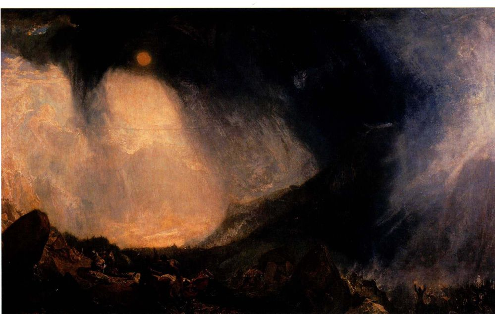

图24\.8 约瑟夫·马洛德·威廉·透纳：《暴风雪：汉尼拔和他的军队翻越阿尔卑斯山》。1812年。布面油画，

斯达尔某一版《犹太墓园》（见图20\.29）中的彩虹形象的启发。但康斯太布尔的画并不是由枯燥寓言性符号堆砌而成的古典式绘画，而是充满激情地展示了源于极个人的问题且深植于内心的情感。与17世纪荷兰画家笔下更加讲求实际的世界（见图20\.28）或克劳德·洛兰的古典幻景（见图21\.8）相去甚远。

约瑟夫·马洛德·威廉·透纳 这个时期第二位重要的英国风景画艺术家是约瑟夫·马洛德·威廉·透纳（Joseph Mallord William Turner，1775\-1851年）。在基本的创作前提方面，康斯太布尔和透纳迥然不同。康斯太布尔以科学研究式的精确来描绘熟知的土地，而透纳则立志与地位最高的历史画争雄，所以他给其风景画披上了一层华丽的外衣：历史基调、对早期绘画大师的模仿和隐喻性主题。当时康斯太布尔的风景画逐渐有了越来越多的动荡、象征和隐喻，事实上是追求一种通常与历史画联系在一起的复杂性，而他也正在不知不觉地进入透纳所擅长的领域。当透纳描绘强大得无法控制的自然之力时，他也接触到了柏克定义的那种崇高。这在18世纪最后十年间就已经成为了透纳的专属领域。

18世纪90年代初，透纳从受人雇用的水彩地形图画师起步。1799年，他以24岁的年纪成为了皇家学院的预备院士，称得上前无古人。虽然他也像康斯

太布尔描绘斯陶尔那样画过大量详细而精确的乡村风景习作，但他对于创造伟大艺术有着无比的冲动，促使他把过去包括克劳德·洛兰和雅各布·雷斯达尔在内的重要风景和海景画家都当作了对手，不过他的风景画在构图、题材和风格上都与这些画家相似。模仿是为了在他们自己的规则下胜过他们；他画的太阳更明亮，空气更潮湿，薄雾更朦胧，空间更深远。与康斯太布尔一样，他对不可捉摸自然属性（风、光、倒影、空气）的处理仿佛有魔力一般。

由于追求宏伟的效果及其自身丰富的想象力，透纳把壮观的神话和历史瞬间融入风景画，创造出具有史诗般雄伟气势的历史风景画。1812年的《暴风雪：汉尼拔和他的军队翻越阿尔卑斯山》（Snowstorm：Hannibal and His Army Crossing the Alps，图24\.8）是他最著名的历史风景画之一，而这一画种正是他在18世纪90年代末所开发出来的。这件作品表现的场景是公元前218年布匿战争期间迦太基将军汉尼拔率军翻越法国境内的阿尔卑斯山，对罗马人发动突然袭击。一大片混乱的人群遍布下面的山谷，汉尼拔的军队在阿尔卑斯山村里抢夺急需的生活用品。而上方则是猛烈的暴风雪、狂暴的风、横冲直撞的暴风云和从不祥的太阳发出的令人目眩的光，剧烈变幻的自然力似要吞噬下方渺小的人类；但那些人太专注于自己眼前了，

🟩832 詹森艺术史

图24\.9 约瑟夫·马洛德·

威廉·透纳：《运奴船》或《奴

隶将已死的和垂死的扔下甲

板\-台风来了》。1840年。

布面油画，90\.8 × 122\.6厘米。

波士顿美术馆，Henry Lillie

Pierce基金，购入，99\.22

并没有注意到。我们几乎看不见那位伟大的汉尼拔将军，他已经化为背景里一头大象背上的小黑点。

在拿破仑战争期间，透纳创作过几幅关于迦太基的画，这个强大的航海帝国颇受当时英国人认同。但是，《暴风雪》可能暗指拿破仑1800年率军翻越阿尔卑斯山进犯意大利一事。不过，无论指的是法国还是英国都无关紧要，因为作品的主题是关于帝国的愚蠢。而在当时，帝国扩张无论在法国还是英国都是个引起激烈争论的问题。当透纳在学院展出《暴风雪》时，他附上了自己未完成的诗作《希望之假象》（TheFallacies of Hope），虽然只是几行，但还是就汉尼拔大军的抢劫行为和最后的失败做出训诫。这幅画与后来包括1817年的《迦太基帝国的衰亡》（Decline ofthe Carthaginian Empire）在内关于迦太基的作品一样，并不是要美化或谴责人类的行为，而是要把人类行为和文明纳入一个更宏大的宇宙体系。在那里，与崇高宇宙力量那无情、无法控制的威力相比，它们显得微不足道。透纳的目标是让观众感觉到大自然深不可测的广大，而非表现某一处风景（虽然此画以他在阿尔卑斯山画的习作为依据），这也算是一种浪漫主义的想法。因此有一片半透明的薄雾笼罩着卑微的人们，一道耀眼的永恒之光终结了一个急剧后退的漩涡。在透纳笔下，埃德蒙·柏克的崇高概念达到了极致。但相比大自然的绝对力量，“希望的假象”则显得更为骇人。这种浪漫主义观念认为无限的宇宙是个未知领域，死亡是永恒的，我们已经在戈雅的作品中见过这种现代心理。

对大自然的直接体验在透纳晚期作品中变得更加强烈。这时形象开始消失，取而代之的则是一片半透明的模糊色彩，似乎压在画布表面，让观众感觉身陷其中。现如今透纳最为人所知的就是他晚期的抽象画风，于将近1838年的时候形成，1840年的《运奴船》或叫《奴隶将已死的和垂死的扔下甲板\-台风来了》（The Slave Ship 或 Slavers Throwing Overboard the Dead and Dying\-Typhoon Coming on，图24\.9）就是很好的例子。这些晚期作品在透纳在世时就备受责难。当时人们认为他疯了，因为这些作品几乎无法看清，当然也就无法理解。另外，他所讲述的史诗故事不再来自神话或历史，而是看似不太重要的当代事件。他的早期作品也许具有朦胧感，但总有足够的线条安排来表现确切物体，以及清楚的空间进深和空间关系，如《暴风雪》那样。后来这种可理解性消失了，取而代之的则是一片象征着雾、光和大气本质的朦胧色彩。

《运奴船》表现的场景是一次台风将至，生病和垂死的人被扔进海里。与康斯太布尔一样，透纳也受到詹姆斯·汤姆逊的《四季》的启发。在诗中，诗人描写一次台风时，鲨鱼“受到冒着热气的人群的气味，或疾病的恶臭，以及死亡气息的引诱”，尾随一艘运奴船的情形。影响透纳的还有当时报纸上的一篇报道，叙述了一名船长为了收取保险金而丢弃奴隶的事，这些钱用来赔偿在海上丢失的货物，并非那些因病死亡者。透纳给了我们一个人类苦难的特写镜头：近处是因为求救而尽力伸长的手、一条即将永远消失在海里

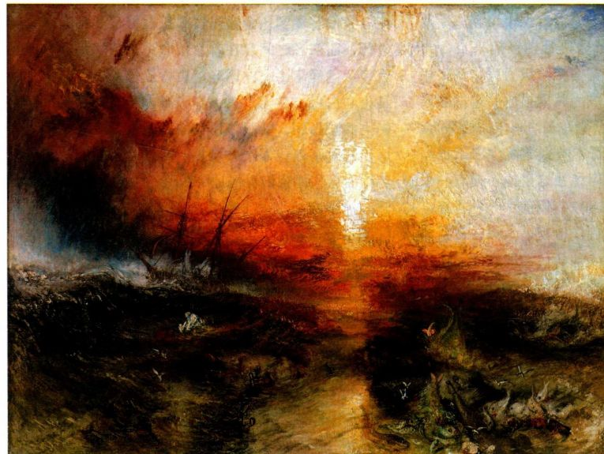

🔴第二十四章 浪漫主义时代的艺术：1789\-1848年 833

的腿、用来鞭打人的链条和镣铐，以及那令人毛骨悚然黑色食肉鱼和被血染红的海水。远景则是运奴船，正驶向狂暴的台风，准备为了自己的生存而斗争，它的距离和寂静象征着奴隶贩子的无情漠视。灼热的阳光把天空笼罩在一片血红之中，阳光照耀的范围似乎无边无际，与肆虐大海的全能交相辉映。

这幅悲惨、恐怖的画作是在英国禁止奴隶贸易几年之后创作的。透纳无疑让我们感受到了奴隶贩子的无情、残忍，使我们有唾弃他们的冲动。但此画在主题和寓意方面带有一种挥之不去的含混性：鸟吃鱼和人的尸体，鱼以其他鱼类和被抛弃的奴隶为食，奴隶贩子则为了生存与暴风雨搏斗。此画既揭露了奴隶贩子的不道德，也同样反映了日常生活中斗争和命运的作用，唯一永恒不变的只有大自然的可怕力量。

德国：弗里德里希的泛神风景画

在德国艺术家卡斯帕·大卫·弗里德里希（CasparDavid Friedrich，1774\-1840年）崇高风格的风景画中，人类的命运是用一种令人不寒而栗的凄凉和令人不安的静默来体现的。他成熟期的作品彻底抛弃了叙事性历史画，在他有生之年也没有因此而得到任何赞誉，虽然也有一小群他的崇拜者会购藏。透纳关注的焦点是整个生命的微不足道以及人类在面对全能宇宙时的努力，而弗里德里希则关注通过尘世到达永恒精神存在的过程。他的风景画实质上是有关泛神论的，这是一种特别德国化的现象。他细密、写实的作品具有形而上学的色彩，也使它们具有了一种神圣气息。

弗里德里希出生于波罗的海港口城市格赖夫斯瓦尔德（Greifswald），当时归瑞典管辖；他来自一个以制作蜡烛和肥皂为业的富裕中产阶级家庭。在格赖夫斯瓦尔德，他发现了后来成为其素描原始素材的质朴风景，而这些素描则成为了他许多油画作品的基石。1794至1797年期间，他在哥本哈根学院学习素描，之后到德累斯顿继续他的学习，在这里他还拥有一个终其一生都在使用的画室。1807年以前他只画素描，故意回避历史题材，此外还创作地貌风景画，包括波罗的海地区许多地方的景色。他随后的油画作品也保留了这些年所形成的硬线画法。

渐渐地，弗里德里希的风景素描中出现了隐喻，并常以成对的形式表现周期性主题，如每日时刻或四季。他在早期油画中延续了这种风格，其中包括《海边的僧侣》（Monk by the Sea，图24\.10），与之相配的则是作于1809至1810年间的《橡树林中的修道院》（Abbey in an Oak Forest，图24\.11）。前者应挂在左侧，

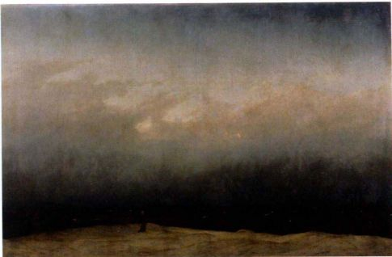

图24\.10 卡斯帕·大卫·弗里德里希：《海边的僧侣》1809\-1810年。布面油画，1 \.08 × 1\.70米。柏林国家博物馆国家画廊（Nationalgalerie）

观看时也应按照从左到右的顺序。在压抑得似要爆炸的广袤苍穹下，站立着一名僧侣，那小小的身影周围是一片荒芜、抽象的景色，海滩、大海和天空事实上都已化作模糊的横带。艺术史学者一般把《橡树林中的修道院》中描绘的葬礼解释成这位僧侣的葬礼，这也许是因为抬棺的圣方济各会托钵僧穿着和《海边的僧侣》中僧侣一模一样的僧袍。如果说第一幅画描绘的是生对死的沉思，那么第二幅就是关于死亡的，证据就是画面中被雪覆盖的冷漠墓地、阴郁的送葬队伍、狂乱但不结果实的橡树、哥特式修道院的残骸以及黄昏时分阴沉的冬日天空。修道院显然就等同于橡树，它们共同构成了一道下葬队伍将要穿过的大门。安装在修道院正门的耶稣受难像表现了宗教希望。花格窗顶部的椭圆与空中银色的新月（复活的象征）遥相呼应。我们感觉到一个通过仪式正在修道院和天空之间进行，而两者之间存在着直接联系。正如月亮重现时就表示已经历了一次循环，黄昏让位给黑夜，继之以日出和白昼，冬天过去，春、夏、秋又来临；所以人们由此联想到，紧跟着死亡的就是来世或者重生。但这依然是一幅让人十分沮丧的图景，并未说明我们死后的命运，使我们畏惧地平线另一边的未知世界。

神学家格塔德·路德维希·科塞嘉顿（GotthardLudwig Kosegarten）是弗里德里希的好友，他的泛神论思想也深深影响了弗里德里希。科塞嘉顿曾在波罗的海中的鲁根（Rügen）岛岸边布道，用令人敬畏的荒凉海岸景色来比喻上帝。他的泛神论在德国远远称不上特别，很大程度上就是歌德、席勒（Schiller）和赫尔德（Herder）狂飙运动（见第807页）的产物。

对于18世纪末的德国民族主义来说，赫尔德起到了重大的激励作用。民族主义是浪漫主义在政治上的表现，在弗里德里希的画中也有所反映。在《论语

🟩834 詹森艺术史

图24\.11 卡斯帕·大卫·弗里德里希：《橡树林中的修道院》。1809\-1810年。布面油画，111\.8 x 1 74厘米。柏林国家博物馆国家画廊

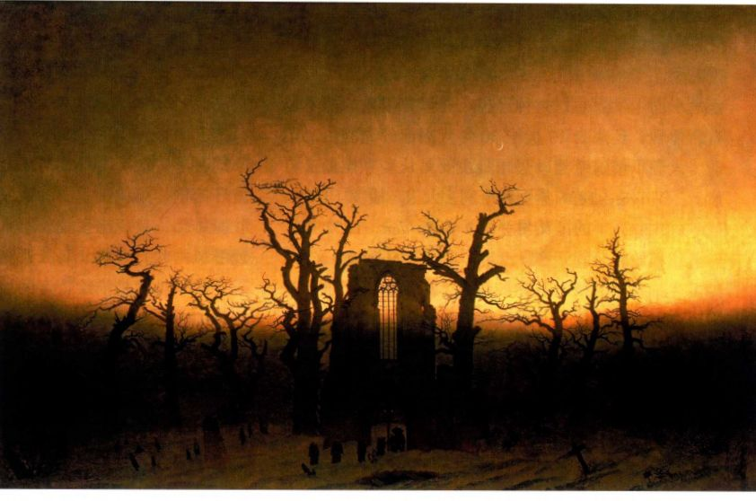

言的起源》（Origin of Language，1772年）里，赫尔德表示语言不是神赐的，而是源于一个民族的集体体验。这一论点也引发了以解释这一体验为宗旨的研究，比如，赫尔德收集整理了一部德国民歌集，而格林兄弟（Grimm brothers）则到处搜集民间故事。这种以寻根为目的、着眼于遥远过去的深入研究显然是浪漫主义的，因为这在人民中间形成了一种情感的纽带，其强度是以往他们对贵族实利性质的效忠所无法比拟的。至于歌德，他宣称哥特式建筑原产于德国；与古典建筑不同，它不以计算为前提，而是依赖以富于浪漫色彩的直觉。高耸的大教堂就是模仿北方大森林的高大橡树而建。

在弗里德里希的《橡树林中的修道院》中，最显著的母题就是哥特式废墟和不结果实的橡树。选用这些母题也并非巧合，因为作者知道观众可以立刻认出这些民族标记。此画是在民族危亡之时创作的。1810年时统一的德国还不存在，只有由大约300个德语国家和自由城市组成的松散联盟，叫做神圣罗马帝国，名义上由奥地利哈布斯堡王朝的皇帝统治。向往统一的汹涌情感在拿破仑军队进占时遭到了压制。弗里德里希画中崩塌的修道院和有条纹的橡树象征着民族主义的死亡，冬日的寒意、死一般的寂静和正在消失的太阳所发出的暗淡之光则反映了当时的民族情绪，尤其是弗里德里希本人的心情。

美国：作为隐喻的风景画以及风俗画的流行

17、18世纪对于战斗中的英属美洲殖民地来说，

艺术并非优先考虑的事情，当时存在的唯一艺术市场基本属于肖像画，雕塑产品大多都是风标和墓碑。在联邦党人时期（1789\-1801年）和19世纪的最初几十年，这种状况并没有明显的改变，但第一批艺术学院和美术馆已于19世纪的头25年间建立起来，其中包括宾夕法尼亚美术学院（Pennsylvania Academyof Fine Arts，1802年）、波士顿文艺协会（BostonAtheneum，1807年）和位于纽约的国家设计学院（York＇s National Academy of Design，1825年）。到了1825年，纽约已经超过费城，成为全国最大、最富有的城市，这很大程度上要归功于开通了长616公里的伊利（Erie）运河。这条运河从布法罗（Buffalo）流入奥尔巴尼境内的哈得孙河，把内地的原料和产品汇集到纽约市。纽约同时还成为了美国的艺术之都，所以接下来关于当时直到20世纪美国艺术的讨论都将以纽约为中心展开。

19世纪20年代，风景画的地位开始提高。到了40年代，它已经超过了肖像画，成为美国艺术界最受尊敬的种类。作为一个历史不长的国家，美国开始专心寻找自己的特性，以便同旧大陆的传统区别开来。威廉·科伦·布莱恩特（William Cullen Bryant， 1794\-1878年）和拉尔夫·沃尔多·爱默生（RalphWaldo Emerson，1803\-1882年）等文学界人物认为土地本身就是美国的财富，并将其未经破坏的原始状态与欧洲人口稠密、资源枯竭的土地作比较。美国拥有极其丰富的自然资源，是名副其实的伊甸园。他们还把这片原始土地解释成上帝的显现，在每一片青

🔴第二十四章 浪漫主义时代的艺术：1789\-1848年 835

图24\.12 托马斯·科尔：《牛轭形河流（雷雨后的霍利奥克山，诺坦普顿，马萨诸塞景观）》。1836年。布面油画，1\.31x1\.94米。纽约大都会艺术博物馆。Russell Sage夫人赠，1908\(08\.228\)

草、每一缕阳光和每一滴水珠中都能发现他的存在。凝思大自然就是与上帝交谈。这种信念不仅源自赫尔德和伊曼纽尔·康德（1724\-1804年）等德国哲学家的形而上学思想，这种思想在弗里德里希的画中也有所体现，还来自19世纪30年代兴起的先验主义运动。人们了解这个运动恐怕最主要是从爱默生的《自然》（Nature，1836年）和亨利·大卫·梭罗（HenryDavid Thoreau）的《瓦尔登湖》（Walden，1852年） 等著作开始。在以下这段出自《自然》的著名引文中，爱默生描述了心灵与自然的统一，以及随之而来的艺术家或作家的职责\-将这种统一引入艺术：

站在空旷大地之上，我的头脑沐浴在欢欣大气之中并升腾于无限空间，一切卑劣的自高自大和自我中心都消失无踪。我变成一个透明的眼球；我无足轻重；我遍览一切；宇宙精神之流在我体内循环往复；我是上帝的一部分······

在其他地方，爱默生还写道：“诗人必须是个狂想者，他的灵感是一种巧妙的意外，而他的意愿则是让意志屈服于宇宙力量。”美国风景成为了这个年轻国度的象征。

托马斯·科尔与哈得孙河画派 美国的第一个艺术运动是以风景画为基础展开的，诞生于19世纪20年代，被称作哈得孙河画派。得名的原因是这一派艺术家虽然大多数在纽约拥有画室，但最初都聚集在哈得孙河流域，然后才在19世纪30至50年代散布到新

英格兰各地。从春到秋，这些艺术家遍游纽约和新英格兰各地，以这片独特的土地作为对象来绘制习作，练习的形式一般为素描，然后在冬季回到其纽约的画室里，将它们发展成大幅油画。画派的领导者是托马斯·科尔（Thomas Cole，1801\-1848年），他在1825年夏季进行了一次沿哈得孙河而上的写生之旅，在那之后就开始创作第一批重要的风景画。起初，他画的风景壮丽雄伟，呈现出蛮荒、原始的大自然，画中常常出现暴风雨吹打树林、乌云遮暗大地、树木被闪电击毁等景象。虽然是描绘特定的地点，但风格却是以欧洲风景画的传统手法和程式为基础，极少注意细节。

但到了19世纪30年代，科尔的用色变得更加严谨，他的作品也不再那么程式化，变得更加具体，采取康斯太布尔身上那种忠于自然的浪漫主义态度，《牛轭形河流》（The Oxbow，图24\.12）就是很好的体现。此画完成于1836年，为了参加国家设计学院的展览而作。对于这片从马萨诸塞州西部霍利奥克山（Holyoke）山顶望见的激动人心的景色，科尔用其展现了美国风景中的自然奇观。前景是壮丽的荒野，随处可见枯萎或被风刮倒的树木，乌云倾倒下滂沱大雨。除了科尔本人在他的阳伞旁仰望我们（实际上是在宣告他对原生态大自然的偏爱），前景处再也没有人类的迹象了。山下被阳光照射的远方山谷里，肯塔基河及其平原为距离、高度和山脊的清晰轮廓所隔断。如果近距离观察还可以发现那不只是一块天然平原，还有耕地和村落，但与大自然是如此和谐，仿佛已融入其中。这里是受到破云而出的神光保佑的“伊甸园”，

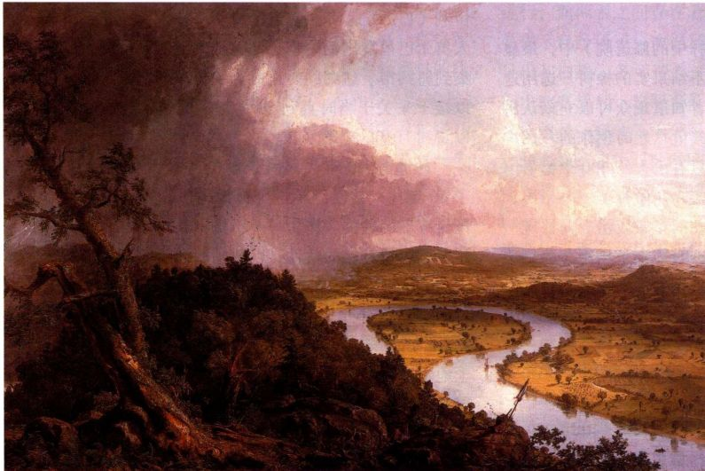

🟩836 詹森艺术史

图24\.13 威廉·悉德尼·芒特：《音乐的力

量》。1847年。布面油画，43\.2 × 53 \.3厘米。

克利夫兰美术馆2002。Jr．Leonard C．Hanna

基金，1991\.110

这正是美国人对其土地的形容。科尔在远处的山丘上粗略地蚀刻下诺亚这个名字，并将其伪装为开发过的森林，以此强调上帝在这片土地的存在；这些字母倒转过来就成了希伯来文中表示“Shaddai”的那个词，意为“全能者”。

科尔画中的殖民者尊重大自然及其循环和自然进程，与之完全契合。在前景的荒野里，死树和幼苗象征着生命的循环\-死亡和复活。这幅作品首先是对美国壮丽国土的一曲赞歌。科尔记录下美国风景的磅礴气势和多样情态，从前景的荒凉、壮丽，山谷宁静的田园风情，到远山的巍峨、浩茫。在《牛轭形河流》中，我们看到艺术家按照爱默生所定义的浪漫主义方式狂热地抒发自我，与大自然和上帝结合。

《牛轭形河流》同样是一幅政治绘画，1836年展览的观众们都可以体会到这一点。大多数哈得孙河画派画家也选择去描绘显现在美国土地之上的上帝荣耀，有一部分人会效法科尔，用风景画来评论吸引国人注意的经济和社会问题。1829至1832年间的欧洲之行使科尔直接了解到透纳的绘画，并增强了他对于用风景画表现具有历史意义主题的兴趣。随后，1836年科尔画了一套名为《帝国之路》（The Courseof Empire）的组画，一共五幅，追溯一处遗址从原始政体到农耕社会、帝国繁荣、帝国衰落，最后成为一片废墟的转变历程。就像透纳的风景画是对社会和政治问题的隐喻一样，科尔的作品也是如此。他的观众可以在《帝国之路》中看到对于当时全国有关进步的

热烈争论的反映。争论的一方是赞成杰斐逊“农业美国”观点的美国人；另一方则是杰克逊放任主义经济学的拥护者，信奉不受限制的工业、商业和金融发展。与小说家詹姆斯·费尼莫尔·库珀（James FenimoreCooper，1789\-1851年）一样，科尔也是个早期的环保主义者，十分反对人们对荒原的快速破坏以及对土地的不尊重态度。他关于健康发展的设想停留在杰斐逊的农业社会，在这个社会里美国人与土地能够和谐相处。他认为杰克逊的政治策略带有帝国的特征，不仅会造成土地破坏，还会导致美国最终毁灭。在《牛轭形河流》中，科尔宣告了他个人对荒原的偏爱，并拥护农业文明的美德，因为农业文明中的美国人尊重他们与上帝所订的契约。

威廉·悉德尼·芒特与风俗画 从美利坚合众国宪法得到批准之日起，北方和南方因奴隶制而起的冲突就一直折磨着这个国家，构成了最急需解决、同时也是最具隐患的问题。它不仅出现在风景画中，还出现在风俗画中，当时与风景画一同流行于美国大众之中的另一画种。在大艺术家手中，风俗画基本不会局限于描绘当代生活。与风景画一样，它高度关注国家所面临的最紧迫问题。美国最早的著名风俗画家之一是威廉·悉德尼·芒特（William Sidney Mount，1807\-1868年），他在纽约长岛上的石溪（StonyBrook）长大，并在这里度过了大半生，同时也找到了自己的创作题材。1826年，18岁的芒特进入国家设计学院学习，但只待了一年。随后他成了一名肖像

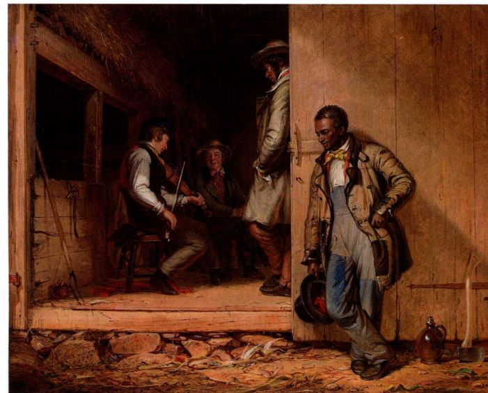

🔴第二十四章 浪漫主义时代的艺术：1789\-1848年837

图24\.14 安尼\-路易·吉罗代：《恩底弥翁的沉睡》。1791年。布面油画，49 × 63厘米。巴黎卢浮宫

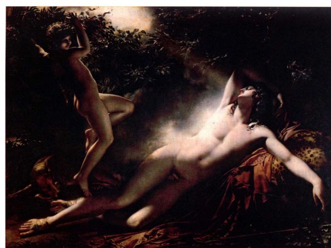

画家，虽然也在国家设计学院展出历史画作品，但未获成功。1831年后不久，他回到石溪地区，从此未曾离开，专注于风俗画，描绘他最熟悉的世界。

在1847年的《音乐的力量》（The Power ofMusic，图24\.13）中就可以见到作者所处的那个世界，此画是对其所居住的事多吉（Setauket）中庞大非裔美国人群体的一种认可。芒特在放弃历史画，转向风俗画的同时，显然没有丢弃历史画的传统，因为日常生活场景仍然具有新古典主义的平面性、几何布局和坚实感，但又利用写实细节、特异性和美国题材对这些特点做出了微妙的调整。畜栏的精密透视和方形开口的几何形状让人联想到文艺复兴绘画精确的空间结构和秩序（见图16\.25）；经过精心勾描和造型的人物则采取古典的对立平衡站姿。他们似乎是有个性的人，但又巧妙地进行了理想化。芒特坚决要创造一种不依赖欧洲的美国艺术；他甚至拒绝赞助人出钱让他作欧洲游学的提议，为的就是保证关于美国艺术设想的纯粹性。对他而言，新古典主义元素与其说是夸张平凡生活的手段，不如说是把具体、独特细节转变成寓意的有力象征。旧大陆的艺术或许是芒特构图的基础，但其重要性已经为作品的美国性大为削弱了。

《音乐的力量》是一幅复杂的作品，将杰斐逊关于美国民主的基本原则与弥漫全国的种族主义的虚伪并置一处。刚刚放下斧子和水罐去听提琴演奏的黑人工人在身体和构图上都独立于谷仓中的白人世界。为了进一步揭露种族偏见，芒特将黑人工人与谷仓中的马进行对比，他故意把谷仓门洞画得方方正正，使其看上去像黑乎乎的方形马厩开口；通过把同一种几何

形用在非洲裔美国人和马身上，芒特着重表现了他们与谷仓中心白人领地的分离。芒特还把黑人与允许进入马厩的白人工人进行对比；他们的姿势相同，但面朝不同的方向，两人都放下了工具和水罐，专心听音乐。看不见的乐声把两个人物联系在一起，事实上象征着精神连通、情感和谐以及全人类的同一性，虽然我们的外表可能千差万别。从某种意义上说，在这幅成为美国象征的作品里，事多吉丝毫没有得到出场机会，这证明了将国家进行无情分割之界线的存在，同时呼吁大众的同情和理解。构图也许是新古典主义的，但向往平等和民主的情感却是浪漫主义的。

法国：浪漫主义时期的新古典主义绘画

18世纪末和19世纪初，新古典主义主宰着法国艺术，这要归功于雅克\-路易·大卫在绘画上的巨大影响（见第817\-820页）。大卫一生有大约400个学生，但1800年之后，当时追随者中最有才华的人开始同他争夺公众的注意。虽然大卫说服了新成立的共和政府废除法兰西学院，但最后还是得到恢复，只不过职能得以重新定义；但在督政府时期（1794\-1799年）和拿破仑时期（1799\-1814年），卢浮宫的双年沙龙展照旧举行，同以往一样是艺术家获得成功的关键。

安尼\-路易·吉罗代与原初主义艺术家 罗马法兰西学院的自费生安尼\-路易·吉罗代（Anne\-LouisGirodet，1767\-1824年）是大卫最具才华的学生之一。在赢得罗马大奖之后，吉罗代于1791年把《恩底弥翁的沉睡》（The Sleep of Endymion，图24\.14）从罗马送回巴黎，把一种全新的新古典主义绘画类型介绍

🟩838詹森艺术史

到法国。这幅画在1793年的沙龙上展出，获得普遍的赞誉。作为规定之一，角逐罗马大奖的学生们都要绘制一幅裸体人物油画。吉罗代的人物符合新古典主义的模式：一个轮廓清晰的古典式裸体，用严谨的笔法精心绘制而成。但吉罗代的裸体人物既不刚健也不高洁，而是男女莫辨，却异常性感。他所选择的题材也令人吃惊。此画取材于古典神话，主题是放纵的享乐主义，而当时除吉罗代之外的每个画家都在描绘高贵的牺牲行为。吉罗代画的故事与月亮女神塞勒涅（狄安娜）有关，描述的是塞勒涅不顾一切地爱上了凡间的牧羊人恩底弥翁，于是令他永远沉睡，以便每晚都能来看他。我们在此看到的是其中一次夜间探望，泽费罗斯正在把树枝向后拉，以便塞勒涅引诱沉睡中的牧羊人。大卫作品中刺目的斜光让位给了更柔和、更肉欲的光照，温柔地爱抚着恩底弥翁。这种明暗对照法突出了牧羊人柔软、漂亮的肌肉起伏。月光从背后把人物照得雪亮，刻画出他结实、优雅的曲线外形。

虽然内容是色情的，但完全不是一幅表现挑逗性嬉闹场面的洛可可绘画，不过一种强烈而原始的淫逸气氛还是得以保留，神秘的月光在其中扮演了重要角色。艺术家把柯勒乔的明暗对照法和朦胧的渐次渲染（见图17\.24）与布龙齐诺的优美轮廓（见图17\.8）结合起来，而吉罗代在罗马时就直接研究过这两位艺术家。创作出的作品与其说讲了一个故事，还不如说反映了一种精神状态，其特点是强烈的自然冲动，这也是浪漫主义的特质之一。

18世纪90年代末，一批自称为原初主义者（Primitives）的大卫追随者从吉罗代的《恩底弥翁的沉睡》中获得了启示。随后以古典神话为基础的感官之爱主题变得流行，如丘比特与普绪克	\(Psyche\)、海尔馨斯（Hyacinth）在阿波罗的怀中死去。光从人物背后照来，以凸显坚实的轮廓，并创造一种优美的起伏线条。1792至1793年间，约翰·弗拉克斯曼在罗马为荷马《伊利亚特》和《奥德赛》所作的希腊瓶画风格（见第796页的材料与技法）雕版插图得以出版，使得这种对突出轮廓线的风格更为流行。在那些简练得令人吃惊的雕版画中，弗拉克斯曼把人物和物品简化为单纯的线条，不加阴影，也没有立体感，但很快就风靡了全欧洲，极大影响了浪漫主义时代的艺术风格和母题。虽然大卫工作室中的原初主义艺术家受到弗拉克斯曼和吉罗代的强烈影响，但他们同样欣赏希腊瓶画那极其简约的明晰风格，以及15世纪意大利绘画的朴素形式。与盛期文艺复兴相比，这些特点当时都被认为是“原始”的，该画派的名称正是由此而来。

让\-奥古斯特\-多米尼克·安格尔 画家让\-奥古斯特\-多米尼克·安格尔（Jean\-Auguste\-Dominique Ingres，1780\-1867年）曾是一名原初主义画家，但为时不久，对轮廓和线条的高度强调成为其新古典主义风格的标志之一。安格尔1797年进入大卫的工作室，1801年获得罗马大奖，但由于拿破仑战争的缘故，他直到1806年才拿到奖品。在前往意大利之前，法国立法会议委托他创作一幅《王座之上的拿破仑肖像》（Portrait of Napoleon on His Imperial Throne，图24\.15）。他在1806年沙龙上展出了这幅画，但立刻遭到人们，甚至拿破仑本人的猛烈批评。安格尔的新古典主义元素表现为严峻的大卫式平面性、压缩空间和对线条或轮廓的强调，但他的边线更加清晰生动，仿佛拥有独立的生命，拿破仑所穿长袍的白边就是很好的例证。

但从那以后安格尔不再模仿大卫和原初主义画派，而是开始了自己的浪漫主义。不过这一举动并未抹杀新古典主义在其作品中的份量，也无法否认他被公认为19世纪上半叶新古典主义风格伟大旗手这一事实。安格尔让拿破仑肖像的每一寸画布都填满华丽

图24\.15 让\-奥古斯特\-多米尼克·安格尔：《王座之

上的拿破仑肖像》。1806年。布面油画，2\.66 x 1\.6米。

军事博物馆（Musée de I＇Armée），荣军院 \(Palais

Invalides），巴黎

🔴第二十四章 浪漫主义时代的艺术：1789\-1848年 839

富贵，黄金、宝石、貂皮、大理石、花毯、珍奇物品随处可见。拿破仑一只手握着查理曼大帝的黄金王杖，另一手抓着法国中世纪的手形象牙棒，那是国王们公正的象征。这两样东西都是拿破仑本人皇家渊源的证明。而精美的镀金宝座则像是古罗马帝国之物，弯曲的靠背形成了一个环绕皇帝头部的光环，当时的观赏者不难发现这效仿的是凡·爱克兄弟《根特祭坛画》（见图14\.12）中屏画里的圣父，祭坛画当时安放在卢浮宫的拿破仑博物馆中，是拿破仑数量庞大的战利品之一。安格尔甚至让拿破仑摆出与凡·爱克兄弟画中上帝一样的姿势，与圣像式的正面姿势结合在一起暗示着拿破仑具有相同的品质，或者至少得到了上帝的认可。安格尔笔下的拿破仑还与弗拉克斯曼一幅线刻画中的宙斯相似，同样加强了作品的神化效果。

安格尔用这幅冷若冰霜的非凡画像呈现了一个冷漠而超凡的拿破仑，但其异国风味和浪漫主义情调极其浓厚的内容必定引起了1806年沙龙观众的强烈兴趣，甚至令他们感到敬畏。虽然安格尔喜欢用严谨的笔法和坚实、冰冷的表面，而非色彩强烈的形态，但他依然是个了不起的色彩大师。在《王座之上的拿破仑肖像》中，他所用的颜色与物品在富丽堂皇上是相称的，而且具有凡·爱克兄弟画中灿烂油彩呈现的那种宝石般的特质。在捕捉各种纹理方面，他们的写实水平也基本相当。安格尔对高饱和色之间复杂关系的调和十分感兴趣，同时也关注构图中各种复杂设计元素之间的平衡。

在意大利，安格尔研究了古代艺术，并深深爱

上了拉斐尔的古典主义作品。但作为浪漫派画家，他的兴趣十分广泛，甚至是异乎寻常的，对于中世纪、拜占庭和早期文艺复兴艺术他也有所涉猎。在四年奖学金期满之后，安格尔又自费在意大利住了14年，尽管经常穷困潦倒，但他总是像个浪漫主义艺术家那样画自己想画的作品。他定期将画寄回巴黎展览，但总是遭人嘲笑。其中一例就是《大宫女》（GrandOdalisque，图24\.16），这幅作品由拿破仑的妹妹、那不勒斯皇后卡罗琳·摩瑞（Caroline Murat）1814年订制，后来于1819年提送沙龙。

这幅画的异域风情比拿破仑肖像还要浓重，其表现了一个土耳其宫女，是东方主义（Orientalism）在绘画方面最早的例子之一（拜伦的浪漫主义诗作《海盗》［The Corsair］的主角也是一个穆斯林侍妾，其发表与此画的订制是在同一年），而东方主义正是当时西方人对北非、近东伊斯兰世界文化迷恋的称呼。这种迷恋产生的原因从某种程度上说是拿破仑1798至1799年间发动的埃及战役，以及由政府出资、于1809至1822年间出版的24卷本《埃及志》（Descriptionde l＇Égypte），其中有对这个地区及其文化和习俗的详细描写。东方主义实际上反映了欧洲的帝国主义及与之伴随的优越感：认为非基督教的阿拉伯文化不但异己、奇特，还是劣等的，表现为落后、淫荡、暴虐和粗野。在这里，异国题材使安格尔得以破格以一个不是希腊女神的裸体女子为题，尽管她的姿势很容易让人想起以“斜倚的维纳斯”为内容的大量文艺复兴和巴洛克画作，以及古代的阿里亚德妮雕像。为了让

图24\.16 让\-奥古斯特\-多米尼克·安格尔：《大宫女》。1814年。布面油画，9 1 × 1 62厘米。巴黎卢浮宫，Inv．RF1158

🟩840 詹森艺术史

画中人物对巴黎观众产生更大的吸引力，安格尔赋予这位奥斯曼后宫女奴一副欧洲人的容貌，甚至是拉斐尔式的面孔和发型。虽然这个人物妩媚而淫荡，而且大麻烟斗、香炉、扇子和头巾也“证实”着异国场景的真实性，但作为一个整体，此画传达一种文雅的美，精致、理想化、看似古典，令人神怡。

安格尔用标志性的优美古典式线条来着力刻画女奴的肉体。沐浴在一片爱抚般光影之中的人体徐徐地凸起、凹下，悦目而优雅。它的轮廓线条慵懒而性感，清晰的边线、棕黄颜色与周围的物件形成对比。物件的丰富色彩、华美的布料和孔雀羽毛使画作的色情氛围更加浓厚。沙龙的观众还注意到，宫女的背部脊椎

骨太多了，她的右臂也有些过长了；但就安格尔而言，两者连绵的曲线是优雅构图必不可少的组成部分，右臂的线条甚至可以与布帷的折痕接续起来。

1821年，安格尔受委托为家乡蒙托邦（Montauban）的大教堂绘制一幅巨画《路易十三的宣誓》（TheVow of Louis XIII）。此画给安格尔的生活带来根本的变化。他当时正住在佛罗伦萨，身无分文，要不是因为这幅画，恐怕早已被人遗忘。在1824年的沙龙上，安格尔展出了这幅作品，引发热烈评论，一致认为他是古典传统的大救星，从此大受欢迎。由于拿破仑1815年最终倒台，1801年被任命为皇帝御用画师的大卫被流放到布鲁塞尔，当时他所有学生的事业都陷

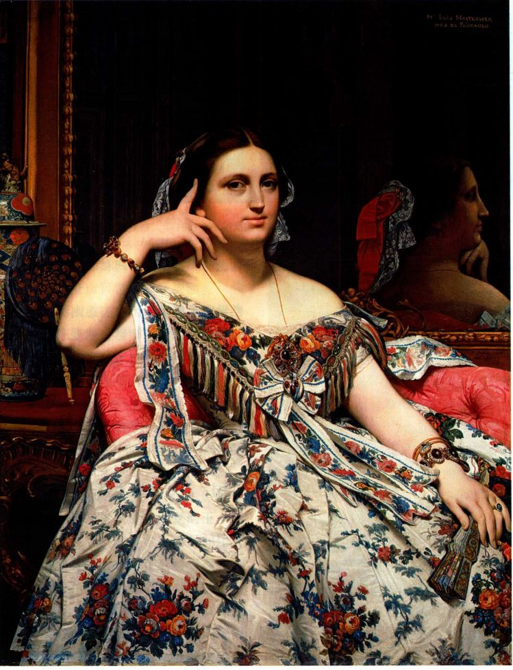

图24\.17 让\-奥古斯特\-多米尼克·安格尔：《安·莫阿泰瑟夫人像》。1856年。布面油画，1 20 × 92 \.I厘米。伦敦国家美术馆

🔴第二十四章 浪漫主义时代的艺术：1789\-1848年841

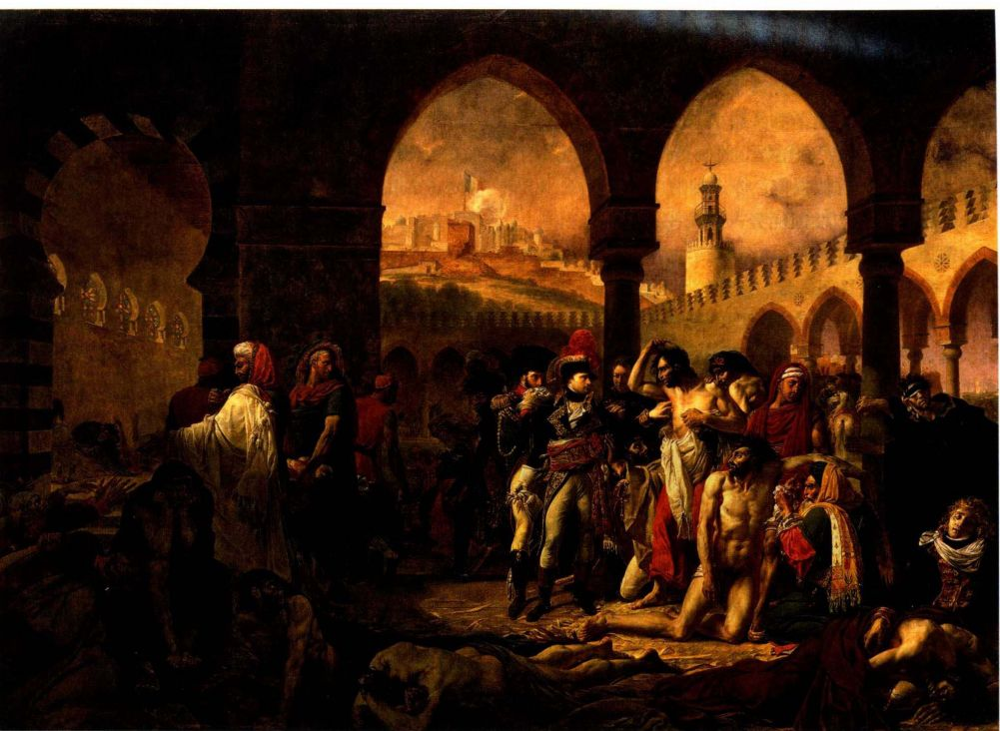

图24\.18 安托万\-让·格罗：《1799年3月11日拿破仑视察雅法鼠疫病院》。1804年。布面油画，5\.32x7\.20米。巴黎卢浮宫

入了停顿，取而代之的是涂绘式的新一代浪漫主义艺术家。于是，安格尔被默认为古典主义的保护人、线条高于色彩之地位的捍卫者、“伟大艺术的强健传统”和理想美的拯救者，能够使之超越浪漫主义者不受约束的情感主义。1825年，安格尔进入了法兰西学院，虽然这里是他原来蔑视的地方，但不久后他还成为院长。安格尔还被授予法国荣誉勋章。他的画室也成为了有抱负青年历史画家的首选。

因为历史画在学院中地位最高，所以安格尔把自己定义为历史画家，但他的强项是肖像画，特别是妇女肖像。他1856年创作的《安·莫阿泰瑟夫人像》（Portrait of Madame Inès Moitessier，图24\.17）就是很好的例子。这件作品是1844年订制的，在接下来的12年中，安格尔这位理想美的保护人把一个富有银行家的妻子变成了一个完美的古典形象，一位尘世间的女神。他赋予她光滑细腻的肌肤，优美的曲线形肩膀、胳膊和手，以及一张拉斐尔式的脸。饰有繁复的玫瑰花图案的长袍、珠宝和孔雀毛扇子也用来作为装饰，在她身后还有一面镀金框的镜子。光洁的颜料表面（不带任何涂绘笔触）、精确的勾描，以及复杂

构图与丰富用色的调和都令她更加完美。

莫阿泰瑟的姿势可以让人联想到各种古典原型，而她以手撑头的沉思姿态则源自赫克拉尼厄姆的古罗马壁画。镜中的侧影显然变了形，这幅作品中的古希腊味道再明显不过了；同时还给作品蒙上了一层诡异的心理面纱，强化了人物手势的内省意味，使画作染上一种神秘的气氛，把莫阿泰瑟所处物质环境的现实实体性变成一种美的精神化身。虽然风格显然是新古典主义的，但这种神秘的气氛却使此画有了浪漫主义特征。

法国：涂绘浪漫主义与浪漫主义风景画

正当安格尔带着新古典主义进入19世纪之时，大卫的另一个学生安托万\-让·格罗却开辟了一条另类之路，抛弃了线条、秩序、清晰的理性空间及均匀的漫射光，以及古典主义对大胆笔触、耀眼色彩、激烈的戏剧冲突、混乱空间、不合理的明暗分布和极端情感的排斥。之后又出现了泰奥多尔·热里科和欧仁·德拉克洛瓦，在19世纪20年代把涂绘浪漫主义推向前台，所以时人把浪漫主义一词用在艺术上，而原来它只用于文学和音乐领域。同样是在19世纪，法国

🟩842 詹森艺术史

的风景画开始从新古典主义的阴影中摆脱出来。法国浪漫主义风景画绝不像英国那样，含有对未来灾难和世界毁灭的启示，也不像德国和美国那样深受泛神论影响。这里的风景画更加宁静，更有诗意。

安托万\-让·格罗 格罗（Antoine\-Jean Gros，1771\-1835年）1785年进入大卫的工作室。在法国大革命的混乱当中，大卫居然为格罗弄到了一张前往罗马的通行证，但格罗抵达这个城市时，这里已对反对教皇的法国人关闭了。一个偶然的机会，他在米兰追随了拿破仑，于是与其一道行军，他的艺术给这位将军留下了深刻印象。之后拿破仑委托格罗把他的战斗场面画下来，美化他的战争。在宣传和军事战略上同样才智超群的拿破仑精心地调整着自己的公众形象，倚重艺术来巩固自己的政治地位。他极力确保自已委托创作的作品能在沙龙上展出，因为在那里每个人都可以看到，而且能得到新闻界的报道。

对于法国的浪漫主义来说，拿破仑时代就是催化剂。拿破仑战争的戏剧性场面、荣耀、勇武和冒险场面为艺术想象力提供了无穷无尽的素材。北非战役则把欧洲人带入了阿拉伯世界这个禁地，赋予其发现了奇妙异国题材的机会，于是艺术家们把这个题材带回给渴望新体验的欧洲人。1804年，格罗接到了第一件委托\-《1799年3月11日拿破仑视察雅法鼠疫病院》\(Napoleon in the Pesthouse at Jaffa,11 March 1799, 图24\.18）。在那一年的沙龙展出之后，获得巨大成功。这幅7\.2米宽的作品不仅是为了宣扬皇帝的勇敢和领袖才能，也是为了强化其人道主义者的形象。鉴于他的许多次战斗，尤其是在雅法（当时属于巴勒斯坦，今天是以色列特拉维夫［Tel Aviv］的一部分）的战斗中所造成的巨大人员损失，这种形象在宣传上是必要的。在雅法战役期间，法国士兵中爆发了黑死病。传说为了让军队镇定下来，拿破仑无畏地进入了隔离医院，并走到病人中间。在画中，我们看到将军像基督医治病人那样勇敢地碰触一名受害者身上的疮口，仿佛他的到来真的可以令濒死之人重新站起。但这幅作品却忽视了一个事实：拿破仑在撤离雅法时下令毒死了这些生病的军人。

虽然格罗在画法和笔法上比较严谨，接近大卫的风格，但这幅作品却带有一种动荡不安的戏剧效果。产生这种效果的是昏暗的阴影、迸射的光线、鲜红的斑点、迅速后退的连拱廊以及被云层遮住的天空。混乱压倒了一切。虽然拿破仑作为构图定点被安排在画面中心，但他随时也可能被淹没在骚乱之中。我们的目光投向他周围那一圈已死、垂死和生病的人，其

中就包括前景的阴影中那些米开朗基罗式的人体和拿破仑身旁“复活”的裸体人物。这里的男性裸体既没有大卫式的英勇豪迈，也没有吉罗代式的美丽动人，而是无助的、可怖的。拿破仑的英勇举动并无法完全吸引观众的注意力，因为还有身心痛苦所带来的悲观情绪，以及西方人眼中阿拉伯侍从和伊斯兰建筑的异国情调（这幅画大大加速了安格尔的《大宫女》中所见到东方主题的流行；见图24\.16）。巨大的拱门可能是在构图上向大卫的《荷拉斯兄弟的宣誓》（图23\.29）致敬，但又没有新古典主义斯多噶精神的清晰叙事，而是体现了充满激情的浪漫主义异国情调，以及一种恐怖无常的凶兆。

泰奥多尔·热里科 一旦想象力丧失了其能量来源（拿破仑战争），格罗的事业很快就衰落了。大卫的其他知名学生和追随者，如吉罗代，也同时失去了光彩。此时代表未来的是泰奥多尔·热里科（ThéodoreGéricault，1791\-1824年）及其追随者们。热里科出身富有，无需为生计操劳。他基本是自学成才，经常去拿破仑博物馆（即卢浮宫）临摹色彩大师们的作品：鲁本斯、凡·代克和提香。但格罗才是他的榜样，而

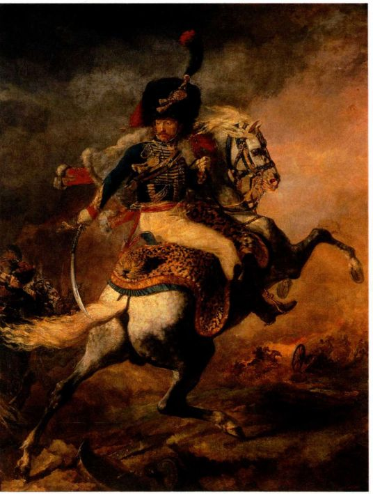

图24\.19 泰奥多尔·热里科：《轻骑兵军官》。1812年。布面油画，

3\.49 × 2\.66米。巴黎卢浮宫

🔴第二十四章 浪漫主义时代的艺术：1789\-1848年 843

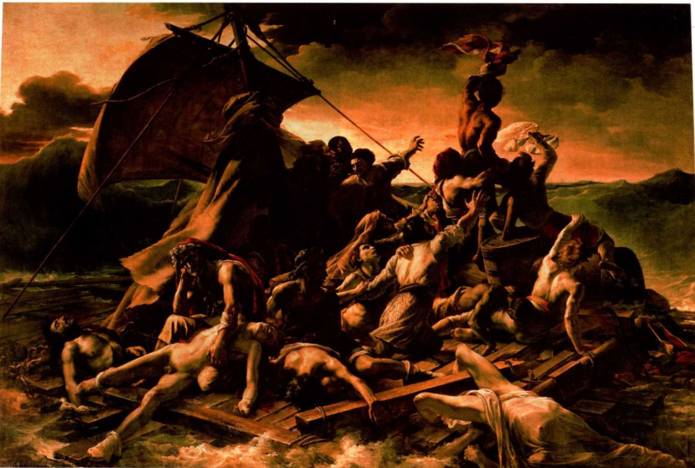

他提交给1812年沙龙的《轻骑兵军官》（ChargingChasseur，图24\.19）在艺术上的根源显然是格罗和鲁本斯。刚健的笔触、马儿斜向画内的角度、大胆的明暗对比、马儿右腿的起伏轮廓以及闪动的色彩，这都与大卫的风格大相径庭，却极为接近鲁本斯。格罗笔下隔离医院中混乱情形所体现的大卫式平面性完全消失了。此画作于拿破仑的俄国战役期间，是英勇的象征；然而想表现的并不是具体的人或事。扭身向后的轻骑兵和用后腿站立的马儿都体现了在激烈战斗期间充盈于战士身心的力量。而且有趣的是，骑手和马之间在构图上颇为相似，这说明骑兵英雄气概背后的推动力是纯粹的动物性力量。这幅画表现了原始的情感和肉体的张力，完全看不到新古典主义的理性或关于美和道德的教条。正如伟大浪漫主义作家司汤达（Stendhal，马利\-亨利·拜尔［Marie\-Henri Beyle］的笔名；1783\-1842年）在其1824年的沙龙评论中所说：“大卫画派只会画人体，但显然拙于描绘灵魂。”

但《轻骑兵军官》暴露了热里科在正规训练方面的欠缺。换句话说，他其实并不会素描。在接下来的自学中，他以古希腊罗马作品为范本，在皇家博物馆

（卢浮宫在1815年拿破仑第二次下台和路易十八复辟君主制确立之后的称呼）临摹盛期文艺复兴画家的作品。1816年，他前往意大利，在佛罗伦萨逗留了一段时间，把米开朗基罗的美第奇陵墓（见图17\.3）描成图，接着又去罗马研究古代艺术品。1817年末，在回到巴黎后不久他开始考虑创作第三幅也是最后一幅要在沙龙上展出的作品\-《梅杜萨之筏》（TheRaft of the Medusa，图24\.20）。他首先画了许多习作，然后在1818至1819年间最终将这幅作品完成。1816年，隶属于政府的梅杜萨号在西非海岸附近沉没，当时船上约有400人。船长霸占了六艘救生艇，让给政府的文武官员使用，而剩下的150名乘客则被安置到一只临时拼凑的木筏上，船员们还任由木筏随波漂流，随便大海摆布。当大约两周后乘客们最终获得解救时，只有少数幸存者。无情的船长十分无能，是由路易十八政府出于政治考虑而任命的一个贵族。报纸上纷纷声讨这个轰动一时的事件，认为其恰好反映了路易政府的腐败。

热里科决定将幸存者第一眼看见船的那个瞬间画下来，而非船长将木筏放走这一政治意味更浓的场

景。所以说这幅画的主题是求生过程中痛苦的身心体验，而非对不义行为的谴责。热里科似乎是在再次参观格罗的《1799年3月11日拿破仑视察雅法鼠疫病院》之后想到这个主题的，因为前景处满是杂乱的米开朗基罗式裸体人物。前景处已死者和垂死者的身体作为起点，构图沿着一条明显的巴洛克式对角线（见图20\.1）向后退去，在抬起疯狂招手的黑人的那群人之中达到高潮。我们的目光追随着这排挣扎、扭动的人体，从死亡转向了希望。但这幅画不仅仅是关于希望的，因为画中并没有英雄，也没有坚忍不拔的道德模范。更准确地说，其主题是人类反抗大自然的斗争，热里科的目标是令观众感受到海难者所遭受的磨难和困苦。纪念碑式的人体具有学院式、古典式比例，是人类不幸境遇的全景展示，折射出令受害者痛苦的死亡、自相残杀、搏斗、疯狂、疾病和饥渴。这种赤裸裸的现实主义能够实现，部分要归功于更加严谨的笔法，这强化了我们内心深处与场景的联系，仿佛正被舞台上的光照亮；我们也身处这个粗劣的木筏之上，在茫茫大海里上下颠簸，任凭海风漫无目的地狂啸。

热里科此后再没有在沙龙上展出过自己的作品。过了不到六年，32岁的他就去世了。他晚期的作品不像《梅杜萨之筏》那么气势雄伟，也没有卖弄地将古典原型引入构图，并使两者融为一体。这种做法的基调还是浪漫主义的，但其他方面都是巴洛克的。更确切地说，热里科晚期的作品很大程度上以色彩风格为主。1820年的伦敦之行使他更坚定了这种手法，因为他在那里看到了康斯太布尔和透纳的作品。他的技法体现在一套极为出色的男女精神病患者肖像画中。这套画共有十幅，完成于1822至1823年的冬天，那也是他余生的最后几个月。这是他对精神和人类苦难的又一次探索，就如《神经病男子的肖像》或《受到军阶幻想折磨的男子》（Portrait of an InsaneMan 或 Man Suffering from Delusions of Military Rank， 图24\.21）一般。遒劲的笔触实际上象征着心理活力，用来揭示折磨画中人物的心理错乱状态，包括焦虑、恐惧和一种暗示着人物对自身重要性妄想的冷峻姿态。充满同情的描绘并未削弱笼罩着人物全身的强烈疏离和非理性的感觉。与安格尔笔下《安·莫阿泰瑟夫人像》女神般的完美和宁静不同，热里科的神经病男子象征着不完美，体现了多种精神变态和怪癖。他既是浪漫主义对启蒙主义所尊奉的理性主义的反感，同时也是对关心社会边缘人群身心痛苦的反映。

欧仁·德拉克洛瓦 1822年，欧仁·德拉克洛瓦（Eugène Delacroix，1798\-1863年）成为涂绘浪

图24\.21 泰奥多尔·热里科：《神经病男子的肖像》或《受到军阶幻想折磨的男子》。1822\-1823年。布面油画，81 x 65厘米。OskarReinhart “Am Römerholz”收藏，文特图尔（Winterthur），瑞士，Inv\. no\.1924\.7

漫主义的旗手，这是曾令热里科垂涎三尺的地位。德拉克洛瓦比热里科小七岁，两人背景相似，都是巴黎人，也都出身富贵。与热里科一样，他基本上无需为生计操劳，同样也是自学成才。他研究过卢浮宫收藏的重要杰作，尤其是鲁本斯、提香和韦罗内塞的作品。参观格罗和热里科的画室则是最让他激动的经历。1818年，他帮助热里科，为《梅杜萨之筏》中的一个人物做模特。《希俄斯岛的屠杀》（Scenes from theMassacre at Chios，图24\.22）是他1824年提交给沙龙的作品。在前景处罗列了各种悲惨和痛苦的情形，其灵感显然来自格罗的《1799年3月11日拿破仑视察雅法鼠疫病院》以及热里科的《梅杜萨之筏》中成群的死者和垂死者。1820年，希腊人举行起义，反抗统治者奥斯曼帝国。第二年，土耳其人突袭希腊希俄斯岛，毁灭村庄，2万人几乎被尽数屠杀或充作奴隶。德拉克洛瓦的画就取材于这件事，在某种程度上可以理解为对希腊独立的支持，此外也表达了浪漫主义对民主和个体自由的热爱。

在德拉克洛瓦作品的中景和背景那一片模糊的烟雾和骚乱中，焚烧和杀戮正在进行着，但前景处有一

🔴第二十四章 浪漫主义时代的艺术：1789\-1848年 845

原始文献

欧仁·德拉克洛瓦（1798\-1863年）

选自其《日记》

德拉克洛瓦从1822年开始写日记，断断续续地一直到1863年去世为止。他说“只为自己”写日记，希望能“对自己大有益处”。这段引文摘自“1824年5月14日”一条。

自己的城堡。独居但创作丰富的诗人是享有心中珍宝的人，而当迷恋他人之时这份珍宝就将离弃我们。当人们完全屈服于自己的灵魂时，它才会完全打开自己······

新奇在于创造入画之物的心灵。

折磨我内心的是灵魂的孤独。我交游越广，越是沉迷于日常习惯或享乐，孤独感就似乎离我越远，愈加躲入

SOURCE:JOURNALS OF EUGÈNE DELACROIX, TR\. WALTER PACH\. \(NEW YORK: CROWN PUBLISHERS,A DIVISION OF RANDOM HOUSE INC\. 1948\)\.

群被集中起来等待处决或为奴的希腊人，此处却奇怪地不见任何暴力的影子。相反，笼罩在他们身上的是顺从、即将失去爱人的绝望以及无能为力，这种悲观情绪的象征正是那全副武装的奥斯曼守卫侧面像，典型的不祥之兆。德拉克洛瓦利用前景人物的蜷曲及其起伏的轮廓、乱堆的尸体来加深背景里暴行的混乱感。随着岁月的流逝，这幅画浓烈的色彩已变暗了许多，特别是蓝色和红色。而原来，这些色彩给人视觉上明

快的效果，而大胆的笔法和鲜明的明暗对比也强化了这种效果。显然，这些特质是从鲁本斯借鉴而来，把前景处那群人组织起来的两个不对称构图的金字塔如此，以及向纵深空间的对角线式进深同样也是如此（然而，德拉克洛瓦颠覆了把某个英雄置于金字塔顶的传统手法，把土耳其卫兵象征的恶人放了上去）。德拉克洛瓦也受到了康斯太布尔用色和笔法的影响，后者有包括《干草车》（见图24\.6）在内的三幅风景画在

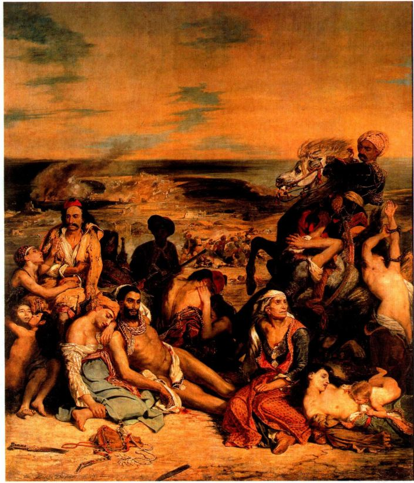

图24\.22 欧仁·德拉克洛瓦：《希俄斯岛的屠杀》。1824年。布面油画，4\.17x3\.54米。巴黎卢浮宫

🟩846 詹森艺术史

3 \.69 × 4\.94米。巴黎卢浮宫

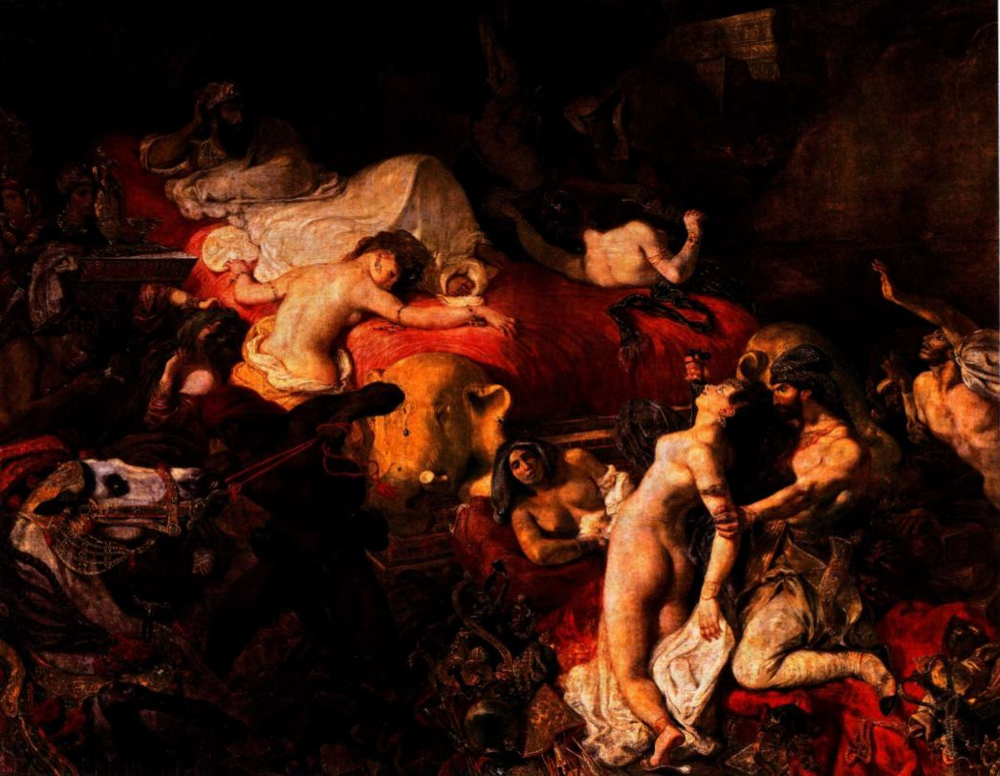

图24\.23 欧仁·德拉克洛瓦：《萨丹纳帕勒斯之死》。1827年。布面油画，

同一个沙龙上展出。见到这几幅画后，德拉克洛瓦在最后一刻改画了天空，使其变得更加明亮，同时还在人物的衣服上加入了鲜艳的色彩。

诗人、批评家夏尔·波德莱尔（Charles Baudelaire，1821\-1867年）将这幅画形容为：“向毁灭和无法治愈的苦痛致敬的可怕赞歌”，而此画也确实将德拉克洛瓦送上了卓越浪漫派画家的地位。这是浪漫主义一词首次用于形容一位视觉艺术家，使他成为与作曲家埃克托·柏辽兹（Hector Berlioz，1803\-1869年）和作家维克多·雨果齐名的艺术界人士。当然，德拉克洛瓦同样具有那二人的浪漫主义热情（见第846页的原始文献）。因此，1824年就成了至关重要的一年。这一年中热里科去世，康斯太布尔被引进巴黎，安格尔从意大利回国，当时还不知道自己即将被选定为古典传统的卫士。

1825年，德拉克洛瓦前往英国。与热里科一样，这次旅行使他对英国的风景和文学有了进一步

的了解，特别是莎士比亚的戏剧、拜伦勋爵（GeorgeGordon Byron；1788\-1824年）的诗歌和沃尔特·司各特（Walter Scott，1771\-1832年）的小说。德拉克洛瓦后来借助他们以及但丁、歌德作品中的意象来激发自己的想象，同时修养自己的心性。他阅读活动的产物之一就是1827年的《萨丹纳帕勒斯之死》Deathof Sardanapalus，图24\.23），取材于拜伦1821年的无韵诗《萨丹纳帕勒斯》。亚述的最后一个国王萨丹纳帕勒斯因为淫荡和冷漠被起义者推翻。他既不反抗也不逃跑，而是选择了自杀。沉浸在拜伦笔下国王精神世界之中的德拉克洛瓦虚构了他死时的情形：他命令阉人把所有心爱的财物都带到床前，包括妻妾、僮仆、马和狗，然后床下垒起一个柴堆。在《希俄斯岛的屠杀》前景中的各种鲁本斯式特征在这个作品中得到了强化。而这幅作品混乱的构图可能会引起幽闭恐惧，其中唯一的统一因素就是那张红色的床。从透视的角度来看，它十分歪斜，仿佛一个漏斗，把大量奇

🔴第二十四章 浪漫主义时代的艺术：1789\-1848年 847

图24\.24 欧仁·德拉克洛瓦：《阿尔及尔妇女》。1834年。布面油画，1 80 × 229厘米。巴黎卢浮宫

珍异宝所蕴含的活力和所造成的凌乱无序全部引向构图的定点\-那位呆滞、漠然的君王，同时也是倦怠无聊的集中体现。与《希俄斯岛的屠杀》一样，德拉克洛瓦无视古典式的空间和体积，让起伏的轮廓、缤纷的色彩和混乱的构图来同时表现毁灭、恐惧、暴虐、权力、绝望、淫荡和冷漠这些完全不同的精神状态。但是这幅表现肆意毁灭的巨画触怒了1827年沙龙的几乎每一位观众，因为画中大卫的古典程式荡然无存，也不含有任何赎罪的寓意，有的只是引人入胜的恐怖。以现代人的眼光来看，这件作品带有强烈憎恨女性的倾向，反映了男性暴力以及对女性的羞辱和控制。

在19世纪30年代的一次北非之旅之后，德拉克洛瓦的风格产生了变化：配色更加鲜亮，对颜料的处理也更加自由。1832至1833年期间，德拉克洛瓦受邀用绘画记录杜克·德·莫尼（Duc de Mornay）在摩洛哥的外交活动。在兴奋之下，他画了几百幅水彩画，为他余生的创作提供了奇妙的东方主题。在摩洛哥，德拉克洛瓦进入了一个充满奇特建筑、服饰和风景的世界，日照强烈，布料、瓷砖和室内纹饰的色彩鲜艳得不可思议（展现了一种与他本人作品相当的恐怖虚空［horror vacuii］）。此后德拉克洛瓦的用色变得更加丰富，可从1834年在巴黎根据习作创作的《阿尔及尔妇女》（Women of Algiers，图24\.24）看出这一点。

德拉克洛瓦必须获得特别的许可才能进入伊斯兰深闺的隐秘世界，而这幅作品则恰好捕捉到了艳窟淫乱、与世隔绝的气氛。我们几乎能闻到熏香的香气、花香和水烟袋里冒出的烟。德拉克洛瓦使用的颜色与主题一样刺激着观赏者的感官。色彩呈斑点状，轮廓线大多不是连续或勾描而成的，而是通过相邻色彩的堆叠形成。覆盖整个画面的色彩海洋融化了新古典主义的平面性和空间。这一技法开始把色彩同所应表现的对象分离开来，为一种即将来到的新艺术风格奠定了基础，这就是印象主义。

浪漫主义风景画

大卫的新古典主义影响十分强大，甚至波及了19世纪头几十年的法国风景画。此时的风景画以平面化、程式化为特点，大多模仿普桑和克劳德·洛兰。1824年的沙龙举足轻重，而康斯太布尔的风景画在其中的展出为法国风景画家开启了可能性，受到他强烈自然主义和浪漫主义倾向影响的年轻一代画家纷纷将其作为自己的创作基础。在随后几十年中，他们使风景画在法国成为了一个富有生命力的绘画类型，其受欢迎程度与历史画不相上下，同时也为19世纪60年代印象主义兴起铺平了道路。

让\-巴普蒂斯特\-卡米耶·柯罗 第一位重要的

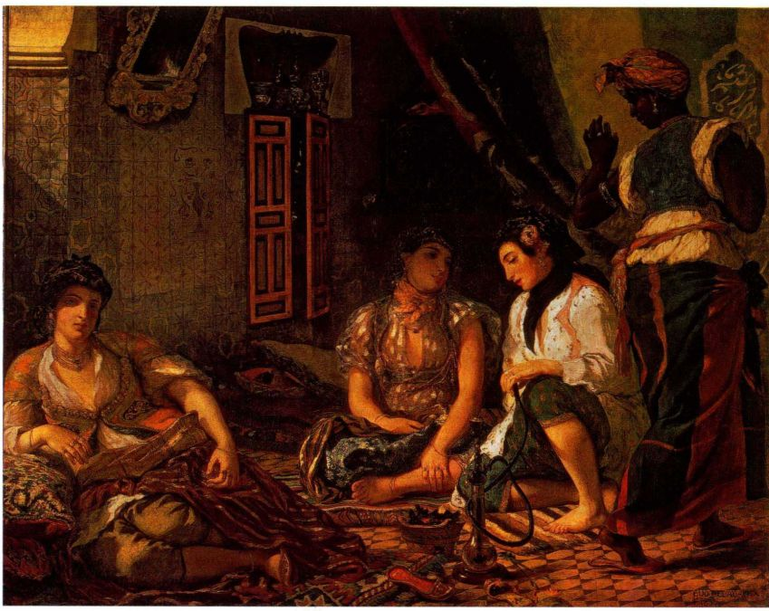

🟩848 詹森艺术史

图24\.26 让\-巴普蒂斯特\-卡米耶·柯

罗：《清晨：宁芙之舞》。1850年。布

面油画，97\. 1 × 1 30厘米。巴黎奥赛博物

馆（Musée d＇Orsay）

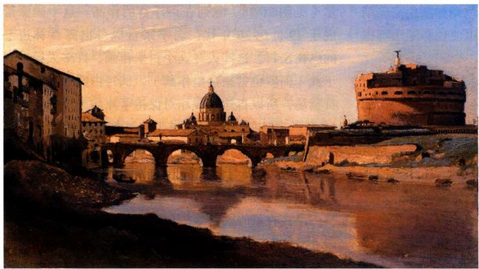

图24\.25 让\-巴普蒂斯特\-卡米耶·柯罗：《罗马之景：圣天使桥，圣天使堡和圣彼得大教堂圆顶》（View of Rome：The Bridge and Castel Sant'Angelo with the Cupola		Peter's\)。	1826\-1827年。帆布衬底的纸上油画，22 × 38厘米。旧金山美术馆（Fine Arts Museum of SanFrancisco），馆购，Archer M\.Huntington基金， 1932\.2

19世纪法国风景画家是让\-巴普蒂斯特\-卡米耶·柯

罗（Jean\-Baptiste\-Camille Corot，1796\-1875年）。康斯太布尔的《干草车》在1824年沙龙展出时，柯罗已经形成了自己对风景画的看法，其中就包括浪漫主义所信仰的忠于自然。柯罗的风景画并未受康斯太布尔的影响，而是以古典主义为基础。1822年，他师从于巴黎古典主义风景画家维克多·贝尔坦（VictorBertin），从老师那里获得了有关素描基础的知识。更重要的是，贝尔坦强调要绘制名为“色彩速写”（pochades）的小幅户外	（plein\-air）习作，即用油彩快速绘制的色彩习作。贝尔坦在工作室里将速写发展成面向沙龙的公式化大幅油画。然而柯罗却极少这样做，至少最初并未这样做；他的小幅户外速写一般就是最终产品，这种情况持续了许多年，而且从来没

有展出过。1825年，柯罗来到意大利，创作了他的第一批重要作品，大约150幅小画，大部分是描绘著名遗址的。纸面油画《罗马之景》（View of Rome，图24\.25）是其中的典型代表。这幅作品是用了大概一个小时当场完成的，是对康斯太布尔所说“瞬间真实”如实、客观的体现。我们深信自己看到的是圣天使堡（Castel Sant＇Angelo）和圣彼得大教堂，以及真实而非程式化的云朵。我们能感觉到石头所反射太阳的炙热，能看到清晰勾勒出建筑物和桥梁轮廓的黄昏阳光。柯罗并没有把风景理想化，而是显示出一种对古典式清晰和稳定的癖好，很容易让人想到普桑和克劳德。有力的垂直线和水平线把构图牢牢地固定在以滑腻笔法绘成的画面之上。画家笔下的建筑尽管画得不甚准确，外表也并不动人，却有一种宏伟的感觉。

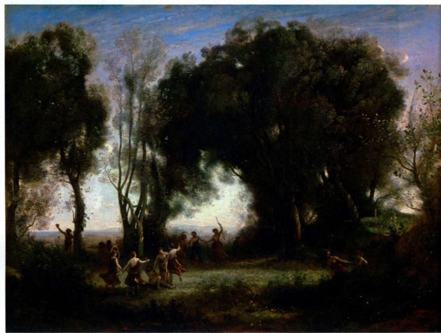

🔴第二十四章 浪漫主义时代的艺术：1789\-1848年 849

在大自然的启发下，柯罗创作出了色调和颜色完美结合的绘画，同时还富有诗意，此外也使色彩笔法与古典格局完美地融合在一起。

在1834年第二次意大利之行后，柯罗集中精力在沙龙上争取注意，还增加了一种创作类型\-大型历史风景画，比如《荒野中的夏甲》（Hagar in theWilderness）。这一改变使他偶尔能卖出几幅作品，并为他赢得了一些关注。直到19世纪40年代末他开始创作自己的第三类画（抒情风景画）时，才开始真正受到欢迎，名利双收。柯罗的灵感不再直接来自大自然，而是记忆中的景色及其所激起的浪漫情绪，比如1850年的《清晨：宁芙之舞》（Morning：Dance ofthe Nymphs，图24\.26）。这些画以理想中的世外桃源作为主题，常常使用克劳德·洛兰风格的日出或日落为背景，用轻如羽毛的笔触将泛着银色光泽的绿色、蓝色扫到画面上。一切都那么轻柔，宜人的曲线韵律上下起伏，没有任何宏大的场面来妨碍这场连续不断的视觉芭蕾。浮上心头的是华托慵懒的雅宴画（见图22\.1），而非康斯太布尔动荡不安的《干草车》。

泰奥多尔·卢梭与巴比松画派 与柯罗不同，巴比松画派（Barbizon School）的画家在艺术上直接以康斯太布尔为榜样，这些人大部分是学院出身。他们信奉康斯太布尔所谓对大自然的直接印象，除此之外，他们还研究17世纪重要的荷兰风景画家，如雷斯达

尔（见图20\.28）陈列在卢浮宫的作品。这个画派形成于19世纪30年代，名字来自枫丹白露森林边上的巴比松村。这些人在这个村里作画，许多人还定居于此（柯罗也常来这里作画）。枫丹白露森林是皇家狩猎场，所以自然景观相对保持了原貌，没有受到仅65公里之外的巴黎所酝酿工业革命的打扰。名气最大的巴比松画家是皮埃尔\-埃蒂安\-泰奥多尔·卢梭（Pierre\-Étienne\-Théodore Rousseau，1812\-1867年）。卢梭师从两位有学院背景的艺术家，此外他还经常临摹卢浮宫收藏的风景画，从中学到了绘画的基本技巧。19世纪30年代初期至中期，他的作品才偶尔为沙龙接受，1837至1848年间，甚至被沙龙排斥在外，因为他的自然观太不合时宜。他的生活放荡不羁，1848年在巴比松永久定居。

1842至1843年间的《桦树下》（Under theBirches，图24\.27）是卢梭的优秀作品之一，而他的作品可能是巴比松画家中最为多样化的。这幅画是以画家在法国中部贝里地区历时7个月的旅行期间画的习作为基础，后来在画室中完成。与康斯太布尔和柯罗一样，卢梭的作品极力避开矫揉造作的技术性、程式化母题，转而去捕捉大自然的精髓。我们很容易感觉到这是某个具体的地点；每一棵树看上去都各具特色，每一缕云彩也都是独一无二的。我们能感觉到黄昏来临，以及秋日里湿冷的空气。除了天空的青绿色和叶

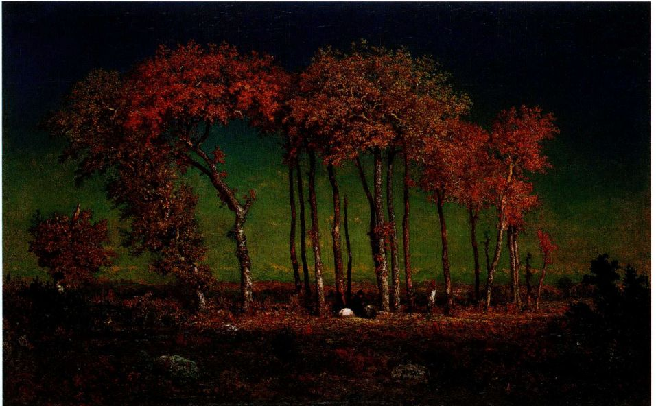

图24\.27 皮埃尔\-埃蒂安\-泰奥多尔·卢梭：《桦树下》。1842\-1843年。木板油画，42\.2x64\.4厘米。托莱多艺术馆，俄亥俄

🟩850 詹森艺术史

子的橙棕色这少许亮色，卢梭的用色灰暗、朴实，再现了土壤、腐烂动植物和幽深灌木丛的特点。作者的点画法令景色跃动起来，生动无比，树和灌木有力的轮廓也强化了这种效果。我们感觉到大自然的生长和永动。难怪卢梭会被沙龙拒之门外，在保守人士看来，他那阴郁、朴实的画作及其夸张的笔法无疑既丑陋又沉闷。

雕塑

与绘画相比，雕塑对于19世纪初的艺术家来说是一种受到严格限制的艺术手段。拿历史题材这一最宏大类型的圆雕来说，其表现对象很大程度上局限于人体。自文艺复兴以来，人体雕塑大多模仿古代作品。在19世纪，全欧洲的雕塑家一致仿效一两种以希腊和罗马标准为基础、体现某种德行或美之观念的古典人体模式。但在将近1830年的法国，艺术风气发生了显著变化，为试验留出了一点空间。19世纪20年代德拉克洛瓦一举成名，浪漫主义绘画也处于兴起的过程当中，随之而来的则是崭新的、更为开明的路易\-菲利普（Louis\-Philippe）君主立宪政体（七月王朝），它是因1830年革命和查理十世（Charles X）退位而

大事年表

1789\-1799年\-法国大革命

1798年\-华兹华斯和柯勒律治出版《抒情歌谣集》第一版

1804年\-拿破仑自封为皇帝

1808年\-法国占领西班牙

1809\-1810年\-弗里德里希创作《橡树林中的修道院》

1814年\-戈雅创作《1808年5月3日枪杀起义者》

1814年\-拜伦勋爵出版《海盗》

1827年\-德拉克洛瓦创作《萨丹纳帕勒斯之死》

1832年\-爱默生发表《自然》

产生的。资产阶级在新政府和整个社会中的地位得到提高，开创了一个中产阶级趣味的时代。这两股力量赋予了少数艺术家创造浪漫主义雕塑的信心。

浪漫主义时代的新古典主义雕塑：安东尼奥·卡诺瓦

从18世纪80年代起，新古典主义开始了其在雕塑领域长达100年的统治，使其地位更加巩固的则是安东尼奥·卡诺瓦（Antonio Canova，1757\-1822年）。卡诺瓦在罗马工作，随后成为当时最著名的雕塑家，接受欧美各国的订件。他是新旧大陆大部分雕塑家竭

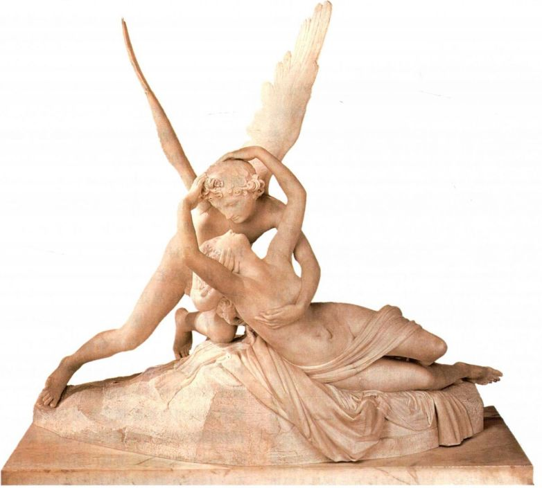

图24\.28 安东尼奥·卡诺瓦：《丘比特和普绪克》。1787\-1793年。大理石，

米。巴黎卢浮宫，MR1777

🔴第二十四章 浪漫主义时代的艺术：1789\-1848年 851

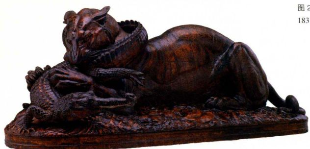

图24\.29 安托万\-路易·巴里：《老虎吞噬恒河鳄》。

1831年。绿锈石膏，高43厘米。底特律艺术学院

力仿效，并试图追随的艺术家。

卡诺瓦出生于威尼斯附近，长大后他的才华很快就得到了赏识，这也为他赢得了定居罗马所需的资金支持。到了18世纪80年代，对他作品的需求已十分巨大。1787年，一个英国旅游者向他定购了一件名为《丘比特和普绪克》（Cupid and	Psyche，图24\.28）的作品。卡诺瓦先用灰泥制作模型，然后助手们用大理石做出一个坯子，最后由卡诺瓦完成作品。在最终阶段，他创造出了极其多样的表面纹理，其中包括冷感十足的肌肉光泽，这也是许多模仿者无法完成的。精心组构的连绵优雅的轮廓线同样无人能及，在《丘比特和普绪克》中，性感的手臂和腿部的弯曲形状恰好体现了这一点，飘拂的布料、将人物缓缓抬起的椭圆形小丘也起到了相同的作用。

卡诺瓦所表现的不仅是理想化的古典模式，也不仅是高贵的单纯和静穆的伟大。他还揭示了一种强烈的情感，一种时常与浪漫主义时代联系在一起的情感。在作品中，爱上凡人普绪克的丘比特正在亲吻她，把她从维纳斯因嫉妒而施下的永久沉睡中唤醒。也正是由于这一吻，普绪克像丘比特一样拥有了不死之身。卡诺瓦捕捉到表情和手势中所蕴含的温柔和激情，这种情感在1780年以前是完全无法想象的。这实际上反映了18世纪70年代罗马福塞利艺术圈和80年代英国艺术家对精神状态的全情关注。卡诺瓦是加文·汉密尔顿（见第793页）的密友，除了把古罗马文物介绍给卡诺瓦之外，汉密尔顿肯定还使他注意到英国同行们在艺术中探索的情感强度。

法国浪漫主义雕塑：与古典模式决裂

古典式圆雕关注的焦点是一或两个具有古代风格的人物，他们是美、德行、高贵或完美等美德的化身。雕塑家要想脱离古典模式，既需要勇气，也需要相当大的想象力。但少数艺术家，特别是安托万\-路易·巴里和弗朗索瓦·吕德，探索了新的主题、情感及构成方式。

安托万\-路易·巴里 当安托万\-路易·巴里（Antoine\-Louis Barye，1796\-\-1875年）把一尊表现老虎吞鳄的石膏像（图24\.29）提交给1831年沙龙，并赢得了金奖之时，同行们都震惊了。沙龙没有展出动物雕塑的传统，而且1828年巴里展出的也是人物胸像。但巴里喜欢动物，经常在动物园里创作。此外，他还是德拉克洛瓦的朋友，后者所涉及的浪漫主义题材就包括狩猎和动物搏杀，这也在题材上为巴里对动物解剖的兴趣提供了传达的媒介。与斯塔布斯的《狮子攻击马》（见图23\.15）一样，《老虎吞噬恒河鳄》（Tiger Devouring a Gavial of the Ganges）充满了浪漫主义的恐怖、蛮力和原始本能，而且任由其自由释放，毫不顾及道德、法律，也不管是否文雅。这是在荒野里发生的一场殊死搏斗。为了激起浪漫的想象，巴里选择了奇异的动物，而且经常挑选传统上不会互相捕食的动物（老虎不吃鳄鱼）。此外搏斗的场景一般都放在异国背景之中，如印度的恒河。作家的构图充满动感，有多种形态和纹理，增强了混乱搏斗和野兽力量的表现力。19世纪40年代，巴里开始用青铜大批制作各种尺寸的动物雕塑，并成功地将其卖给世界各地的中产阶级爱好者，因此名声大噪。

弗朗索瓦·吕德 弗朗索瓦·吕德（FrançoisRude，1784\-1855年）却仿佛与名望无缘。这位雕塑家把民族主义热情带入了富于比喻意味的作品，他最有名的作品是巴黎凯旋门上的《马赛曲》（“LaMarseillaise”，图24\.30）。1809年吕德进入美术学校学习雕塑，1815年拿破仑战败时，他作为拿破仑的同情者逃到布鲁塞尔。1827年返回巴黎，凭着一股浪漫主义时代特有的民族主义热忱，开始研究法国雕塑史。以枫丹白露派和乔瓦尼·博洛尼亚（见第595页）的法国文艺复兴传统开端，随后深入到更加久远的过去，一直追溯到克劳斯·斯留特尔（见第472页）。

1833年吕德受委托制作凯旋门上的四组雕塑之

一，这个任务的人选非他莫属，因为其基本都是关于

🟩852 詹森艺术史

爱国热情的。1815年拿破仑被流放时，凯旋门早已停工，路易\-菲利普和他的内务大臣们认为完成这座纪念碑可以证明新政府对民族和解的支持。所以雕塑项目包括由不同艺术家创作的四件作品，分别排列在拱门四周，对法国政治领域的各个部分都有所表现。吕德之所以能得到这个任务，要归功于他提交给1833年沙龙的一件雕塑，表面上带有浓厚的新古典主义风格，随后大获成功。描绘一个赤身裸体的那不勒斯少年渔夫和一只乌龟一同玩耍的情景。对于我们后来在《1792年志愿军出征》（The Departure of the Volunteers of 1792，《马赛曲》的正式名称）中所见到爆炸一般的混乱场面，这件作品几乎没有提供任何迹象。

作品的场景旨在向1792年面对奥地利和普鲁士联军威胁时自愿集结起来保卫新生的法兰西共和国的人们致敬。背生双翼的寓言性人物象征着法国和自由，他带领着一群来自本国不同历史时代的战士。吕德并未刻画某个具体的事件，而是表现了一种永恒、全能的民族主义精神，其源头就是人民大众，一听到号召就被完全激发出来。虽然这些人物的身体比例和姿势都是古典式的，并以浅浮雕的形式平行于墙面排列，但构图却是狂乱的，像一个由手臂、腿部和扭动躯干组成的陀螺，为上方昂然疾驰的“自由”带领下所迸发出的爱国精神增添了无穷能量。那拥挤不堪的混杂人群让人想到德拉克洛瓦的《萨丹纳帕勒斯之死》（见图24\.23），其中充满了堆在一起的牺牲者和物品。1836年首次向公众展示时，《1792年志愿军出征》受到了一致称赞，被认为是凯旋门上的四件雕塑作品中最好的。因为成功地体现了民族精神，还得到了《马赛曲》这个绰号。但是吕德本人从这个项目中获得的声誉并没有维持太久。由于得不到雕塑家赖以为生（不同于画家）的订件，他也就没有机会进一步扩展《1792年志愿军出征》中创造的美学意味。

建筑中的浪漫主义复兴

1789至1848年间，震撼欧洲的社会、政治动乱导致了对稳定和安宁的追寻，在建筑领域表现为各种复兴风格。建筑师们不再创造新样式，而是热衷于恢复老样式。在一个支离破碎、变化无常、变动不居的世界里，对往昔的熟悉提供了安慰和连贯性。从理智上为这种“古为今用”辩护的是德国哲学家格奥尔格·威廉·弗里德里希·黑格尔（Georg Wilhelm FriedrichHegel，1770\-1831年），他提出的演进理论认为历史是一个相互作用的事件连续、逐步的辩证演变过程。

大事年表

1787年\-卡诺瓦创作《丘比特和普绪克》

1798年\-爱德华·詹纳培养出天花疫苗

1792年\-纽约证券交易所成立

1815年\-拿破仑败于滑铁卢战役，拿破仑战争结束

因此，现在依赖于过去，同时也包含了过去。黑格尔的演进理论是19世纪许多思想的基础，也是查尔斯·达尔文（Charles Darwin）物种进化理论（1859年）和卡尔·马克思将历史视作一场阶级斗争的辩证唯物主义（1867年）背后的关键支撑力量。在建筑方面，黑格尔理论带来的结果是建筑师们充分利用每一种已有的建筑风格，而选择依据则是其是否能使人产生联想、是否具有如画的特质，或者是否带有异国情调。埃及、希腊、罗马、罗马式、哥特式、文艺复兴、巴洛克、中国、土耳其、安妮女王、乡间茅草屋，这一切都在19世纪的欧洲建筑中复活了。建筑师就一个项目提出几种不同风格建议的情况屡见不鲜，而在一座建筑里发现几个时期的风格也是常有的事。

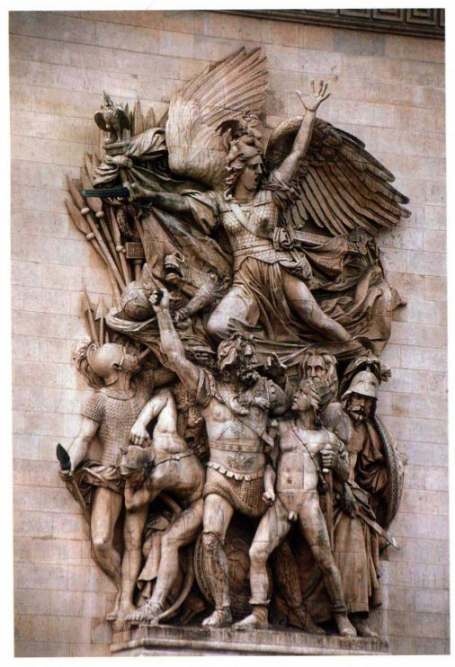

图24\.30 弗朗索瓦·吕德：《1792年志愿军出征（马赛曲）》。

1833\-1836年。石头，约12\.8x7\.9米。巴黎凯旋门

🔴第二十四章 浪漫主义时代的艺术：1789\-1848年 853

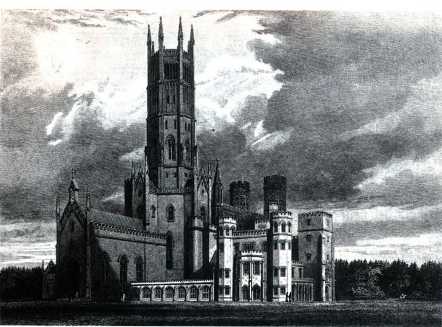

图24\.31 詹姆斯·怀亚特：方特希尔修道院，方特希尔·吉福德，威尔特郡，英国。1796\-1813年（J．Britton的雕版画）。私人收藏

英国：崇高和如画

尽管英国建筑师在19世纪上半叶尝试了每一种想得到的复兴风格，但哥特式复兴和古典式复兴显然是他们的最爱。在数量上超过哥特式复兴建筑的恐怕只有古典式复兴建筑了。不过，浪漫主义时期英国建筑的最大特点是折衷主义（eclecticism）。

哥特式复兴 在英国，崇高类型建筑的鼎盛时期是18世纪90年代。哥特式复兴建筑包括詹姆斯·怀亚特（James Wyatt，1746\-1813年）的方特希尔修道院（Fonthill Abbey，图24\.31），位于威尔特郡的方特希尔·吉福德（Fonthill Gifford）。其主人威廉·贝克福德（William Beckford）想要抢走草莓山（见图23\.13）的风头，于是建造一座体现哥特式传奇小说的恐怖和阴郁的中世纪住宅。这所宅子高达惊人的36米，不仅外观极像哥特式大教堂，规模也与之相似。宅子内部到处可见中世纪风格的细节和无尽的阴暗、狭窄的走廊，加上巨大而高耸的塔楼，让人产生柏克所谓“无限崇高”的感觉。室内不仅大胆地融合了多种元素，而且还因各部分不规则的整合而显得别具一格。

大多数复兴者并不追求崇高，而是通过历史主义、异国情调、如画和联想主义特质（见第804页）来满足自己对浪漫主义的渴望。最著名的哥特式复兴建筑是由查尔斯·巴里爵士（Sir Charles Barry，1795\-1860年）和A．W．N．普金（A．W．N．Pugin，1812\-1852年）设计的议会大厦（图24\.32）。它是在老楼被烧毁后政府于1836年下令重建的，竞赛要求新楼

用两种“英式”风格（哥特式或伊丽莎白式）中的一种进行设计，而97件参赛作品中有91件用的是哥特式。巴里是建筑师总长，其最著名的是古典式或文艺复兴式复兴风格的作品。不出预料，他把建筑设计成一种对称、整齐的样子。他还明智地聘请了英国一流的哥特专家普金来设计出楼内外的每一个哥特式细节。普金凭借缜密的历史准确性，用华丽的垂直风格（见第422页）来设计这些细节。一般认为如画的塔楼也是普金的贡献。哥特式复兴风格非但没有变得崇高，反而在很大程度上走向了如画和联想，专门用于唤起民族自豪感。

古典式复兴 19世纪的古典式复兴建筑中，绝大部分实际上是对古代建筑直截了当的模仿，比如格拉斯哥（Glasgow）和爱丁堡这样的城市，几乎全部是以新古典主义风格修建的。在古典式复兴方面，崇高类型建筑的最佳代表人物可能是约翰·索恩（JohnSoane，1753\-1837年），他所设计的英格兰银行可谓这方面的典范。1788年，索恩被任命为银行总监（首席建筑师），此后一直担任这个职务直至去世前不久。在此期间，银行不断扩建，最终成为由几十座大楼组成的复杂建筑群，这些大楼全部由索恩设计（大部分毁于1927年的一场火灾）。正如统一公债部（图24\.33）所表现的，索恩受到皮拉内西的影响，把建筑设计得十分巨大，但建筑内部却朴素无华，这也反映了劳吉尔（见第809页）对他的影响（他拥有多本劳吉尔的论著）。统一公债部内部的设计意图是唤起古罗马的崇高、伟大，所以将巨大的中央大厅扩展成带有棱拱

🟩854 詹森艺术史

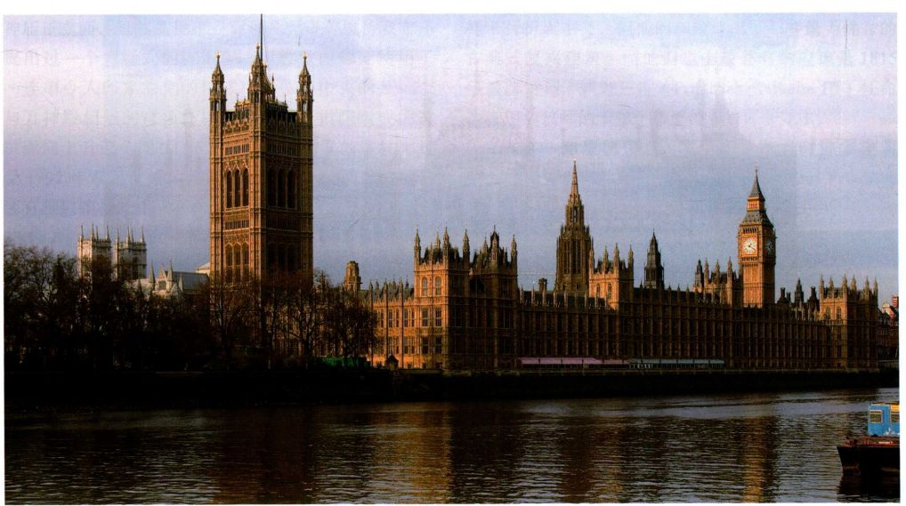

图24\.32 查尔斯·巴里爵士和A．W．N．普金：议会大厦，伦敦。1836年开工

和筒拱的跨间，让人想起戴克里先浴场（见图7\.71）。

公共浴室所用的那种弓形窗增强了这种联想，为了显得朴素和突出几何形状，这些窗户并没有安装窗框。

折衷主义 约翰·纳什（John Nash，1752\-1835年）是这个时期最倾向折衷主义的建筑师之一。从某种意义上说，他正是这种风格的代表人物。索恩的折衷主义倾向同样很突出，二人生活在同一个时代。纳什可以灵活、快速地在不同风格之间切换，往往有惊人的大胆设计。他并不拘泥于风格，其特点就是奇巧、多样，而大多数建筑也是多种元素不对称的组合，令它们看上去仿佛附加结构的堆积。他今天可能设计一个带有茅草屋顶的小村庄，明天就可能会设计一栋意大利风格的别墅，随后也许是一座带有中世纪雉堞的宅邸。

1815年，纳什将流行的“东方”样式用在布赖顿的摄政王皇家亭阁（Prince Regent＇s Royal Pavilion at Brighton，图24\.34）之中。他接手时，这座建筑已按照帕拉第奥风格建起了一部分，造成了一些障碍。但他迅速地解决了这个问题，在整个帕拉第奥式正立面上安装铁架，以支撑生铁铸造的洋葱形穹顶和尖塔。在亭阁内外则使用哥特式、中国、伊斯兰和印度的建筑元素，创造出一个美轮美奂的奇幻世界，迎合了时人对异国他乡和遥远过去的浪漫主义渴望。

美国：新生共和国的古代风格

在美国古典式复兴似乎无处不在，因为这个新建

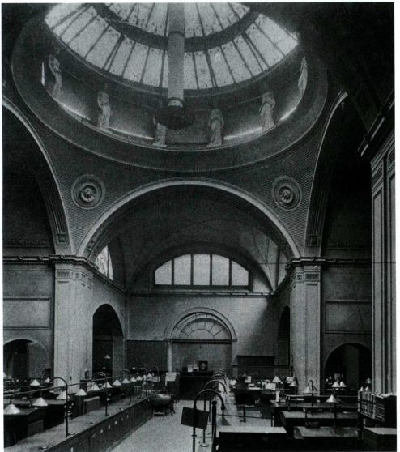

图24\.33 约翰·索恩爵士：英格兰银行统一公债部，伦敦。1797\-1799年，毁于1927年的一场火灾

立的共和国模仿的正是古代希腊罗马的民主制度。白宫和国会大厦是新古典主义风格的，而大部分教堂、银行和政府大楼在设计时则加上了希腊\-罗马神庙式的正立面。然而当时哥特式也是非常流行的教堂样式。

托马斯·杰斐逊 托马斯·杰斐逊是一位业余建

🔴第二十四章 浪漫主义时代的艺术：1789\-1848年 855

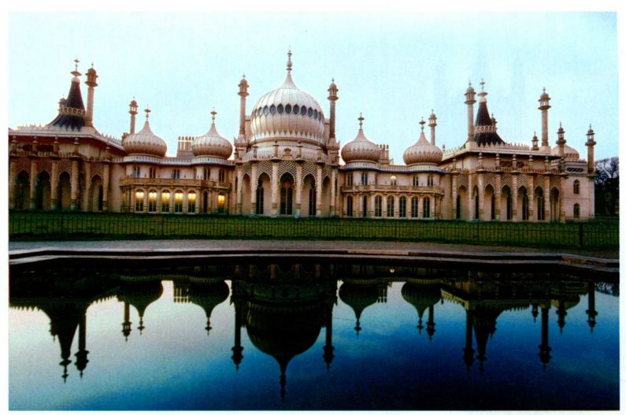

图24\.34 约翰·纳什：皇家亭阁，布赖顿，英国。1815\-1823年

筑师，曾把自己的住宅蒙蒂塞洛（1770\-1782年）设计成一座帕拉第奥式别墅（见图23\.9），而弗吉尼亚州议会大厦（1785年）则以尼姆的方形神殿（见图7\.46）为蓝本。杰斐逊浪漫主义时期最出名的工程是位于夏洛茨维尔的弗吉尼亚大学校园（图24\.35）。与蒙蒂塞洛和弗吉尼亚州议会大厦一样，这个校园也是仿古风格的，以追忆希腊和罗马的民主传统，以及这两个为西方艺术和文化打下基础的伟大文明。校区是1804至1817年期间设计的，包括两排帕拉第奥式别墅，每排五栋，之间由带有屋顶的柱廊相连，而柱廊另一边就是学生宿舍。充当教授寓所和教室的这十栋别墅各不相同，象征着个人主义，在美学上引入了一种如画的多样性。每一栋别墅都与传统保持着各不相同的关联：多立克式别墅模仿罗马的戴克里先浴场，爱奥尼亚式模仿同样位于罗马的福尔图娜神庙。在两排别墅的尽头各有一座外观与万神殿相似的圆形建

筑，起连接彼此的作用。这里就是图书馆，在与杰斐逊共事的建筑师本杰明·拉特罗布建议下于1823至1826年间修建。最后，把这两排别墅隔开的草地（自身又分为三个部分）让整个建筑群具有了风景如画的英国园林那种自然主义特征。杰斐逊在夏洛茨维尔的天才之处就在于用新古典主义的形式创造了一个关于新共和国的象征，表现这个新兴国家的主要特征\-个人主义和统一。

本杰明·拉特罗布 本杰明·拉特罗布（BenjaminLatrobe，1764\-1820年）是联邦时期最著名的美国建筑师，1795年从英国移居美国。他是杰斐逊的朋友，这也为他获得建造美国国会大厦的委任起了一定作用。他修建了美国第一座希腊复兴建筑（1798年），后来又修建了第一座哥特式复兴建筑。他最有名的工程是1804至1808年间设计的巴尔的摩（Baltimore）大教堂。教堂外部具有爱奥尼亚立柱的希腊\-罗马式

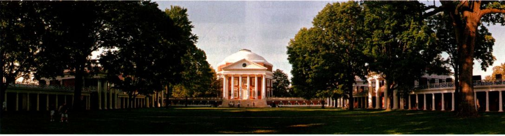

图24\.35 托马斯·杰斐逊：弗吉尼亚大学，夏洛茨维尔。1804\-1817年设计，1817\-1828年建造

🟩856 詹森艺术史

神庙正立面，虽然这种正立面平凡无奇（拉特罗布还提出过一个哥特式的方案）。但教堂内部则使用了一连串令人印象深刻的拱顶厅，位于中央的是一个与万神殿相似的穹顶，从一道由弓形拱门组成的连拱廊向上升起（图24\.36）。拱门和朴素的墩柱则是受1792年索恩设计的英格兰银行统一公债部启发；装有雅致镶板的穹顶让人联想到罗伯特·亚当（见图23\.11）。但这种折衷主义（即选择完全不同的元素用在同一座建筑中）似乎很成功。简单的基座是装饰性拱顶的衬托，其共同点则是精致的纯朴。

法国：帝国风格

古典式复兴在法国的发展方向是由拿破仑规定的，他下令在巴黎建造几座罗马风格的建筑，以巩固其皇帝形象。今天位于玛德莲广场（Place de laMadeleine）上的玛丽·玛德莲教堂（Church of Mary Magdelene）是献给法国士兵的“光荣庙”，直接模仿古罗马的科林斯式神庙方形神殿（见图7\.46）。凯旋门自然是为了再现古罗马凯旋门的风采，而40米高的青铜旺多姆圆柱（Vendôme Column，原名大军柱）则模仿了图拉真凯旋柱（见图7\.28），纪念1805年拿破仑在奥斯特里兹（Austerlitz）所获得的胜利。实际上，在波拿巴统治期间几乎没有真正建造过什么东西，他最大的影响也许来自其住所的室内设计，一般称为“帝国风格”（Empire Style）。

最出色的一个例子是建筑师夏尔·佩尔西埃（Charles Percier，1764\-1838年）和皮埃尔\-弗朗索瓦·方丹（Pierre\-François Fontaine，1762\-1853年） 为约瑟芬·波拿巴（Josephine Bonaparte）在巴黎郊外的马梅松城堡（Château de Malmaison）所设计的豪华卧室（图24\.37）。卧室富丽堂皇，运用了安格尔1806年画的拿破仑肖像（见图24\.15）中相似的异国素材及饱和色。装饰着天鹅和丰饶角的大床是罗马样式的，华盖则像军中的帐篷，顶上立着一只象征皇帝的鹰。三脚脸盆架以赫克拉尼厄姆和庞贝的出土文物为依据制作而成，但支撑脸盆的狮身人面像是埃及式的，脸盆本身的纹饰又是希腊式的，这正是浪漫主义喜好如画的多样性和联想学说的折衷主义特性。虽然所用素材种类丰富，但房间并没有复杂感；相反，看上去严肃、笨重，要归功于浓重的色彩、物品的重量（甚至连帷幔都显得厚重）和作为基础的几何布局。

德国：创造一个新雅典

虽然普鲁士建筑师与其英国、法国、美国同行一

样奉行折衷主义，但他们却设计出了一些最为优秀的古典式复兴建筑。而他们当中最著名的应该是1815年被腓特烈·威廉三世（Friedrich Wilhelm III）任命为御用建筑师的卡尔·弗里德里希·辛克尔。

卡尔·弗里德里希·辛克尔 与当时许多建筑师一样，卡尔·弗里德里希·辛克尔（Karl Friedrich

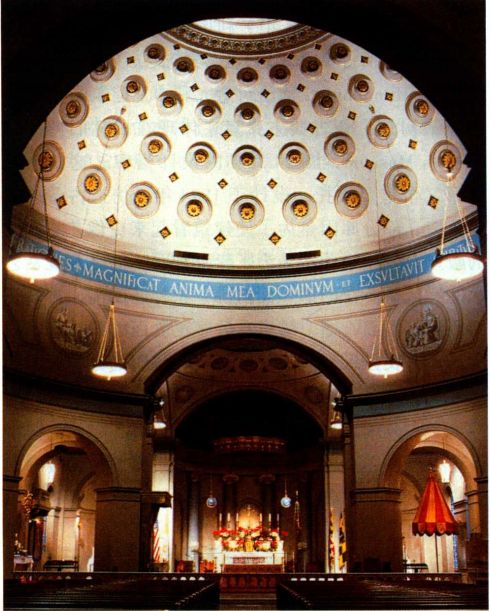

图24\.36 本杰明·拉特罗布：巴尔的摩大教堂（圣母升天教堂）内部，巴尔的摩，马里兰。1805年开工

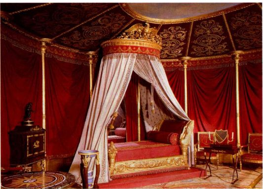

图24\.37 弗朗索瓦\-奥诺雷·雅各布\-德斯马特（François\-HonoréJacob\-Desmalter，根据夏尔·佩尔西埃和皮埃尔\-弗朗索瓦·方丹的设计）：皇后约瑟芬·波拿巴的卧室。约1810年。马梅松城堡，勒耶\-马梅松（Rueil\-Malmaison），法国

🔴第二十四章 浪漫主义时代的艺术：1789\-1848年 857

__大事年表__

1812—1815 年——美国与英国的 1812 年战争  
1815—1823 年——纳什在英国布赖顿建造皇家亭阁  
1836 年——巴里和普金开始在伦敦修建议会大厦  
1844 年——萨缪尔·莫尔斯发明电报  
1845—1849 年——爱尔兰土豆荒  
1848 年——欧洲工人革命

Schinkel，1781\-1841年）利用每一种可能的风格进行创作，包括古典、罗马式、哥特式、文艺复兴和隆德伯格（Rundbogen，德语对意大利本土建筑的称呼）。但他最初是个新古典主义者，体现在柏林旧博物馆（Altes Museum，图24\.38）的设计当中。这是他收到第二个重要委托，设计于1824年，仿造古希腊神庙建造，部分原因是为了使建筑看起来更像艺术珍宝的殿堂。人们来此不是为了崇拜神明，而是来观赏艺术的。入口所在的那一面仿佛一座神庙的侧面（真正的侧面是素面石墙，可以在柱廊正立面的两头看到的边，上有长方形窗户），这是一种聪明的方法，因为既表现出神庙的感觉，又不完全照搬神庙的样子，还避免了古典式复兴中过多使用的三角楣正立面。博物馆建在高台之上，可从中央的一道楼梯上去，楼梯与巨柱式希腊立柱赋予建筑一种沉静的雄伟气度和强烈的中轴感。宽阔的楼梯则与上方的顶楼（即二楼）遥相呼应，那里有一个有穹顶的房间，用作雕塑陈列室。辛克尔不愧为建筑大师，可以自由运用如此完美的比例和规模，而对称、符合理性的室内设计也与外部的和谐相映成趣。

1815年拿破仑倒台后举行的维也纳会议上，普鲁士成为了一股重要的政治力量，由腓特烈·威廉三世发起的建筑计划以增强其帝国野心为设计目标。旧

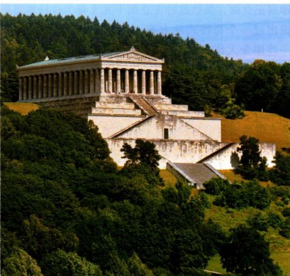

图24\.39 利奥·冯·克伦策：瓦哈拉，雷根斯堡附近，德国。1821年设计，1830\-1842年建造

博物馆超凡魅力的一部分就来源于柏林与古代雅典的荣光和高贵特质之间巧妙的联系。

利奥·冯·克伦策 辛克尔在普鲁士最强劲的竞争对手是巴伐利亚皇太子路德维希（Ludwig）的御用建筑师利奥·冯·克伦策（Leo von Klenze，1784\-1864年）。与威廉三世一样，路德维希大力支持日耳曼民族主义，将近1820年时，他委派克伦策设计一座纪念日耳曼名人的建筑瓦哈拉（Walhalla，图24\.39），名字是从日耳曼神话中英雄们的长眠之地而来。这座放满了人物胸像的建筑建于1830至1842年间，位于雷根斯堡（Regensburg），俯瞰多瑙河。与众多古典式复兴建筑一样，瓦哈拉实际上是古希腊多立克式神庙的翻版。它位于一座山的山顶，这个特点从考古上来说是准确的，从而增添了其浪漫主义风

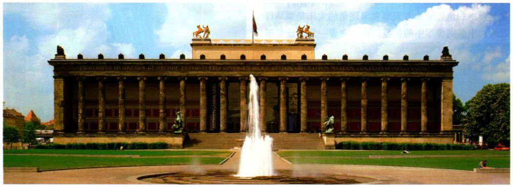

图24\.38 卡尔·弗里德里希·辛克尔，旧博物馆，柏林，1824\-1830年

🟩858 詹森艺术史

味。但这座建筑的与众不同之处在于其复杂的楼梯结构，那冷峻的几何形状和迫人的庄严感很容易让人想起勒杜（见图23\.23）。攀爬那些没完没了的台阶需要耐心，可以让参观者亲身体验瓦哈拉中所尊奉的名人们获得的丰功伟绩，以及他们所达到的高度。瓦哈拉反映了人们在怀古中逃避现实的浪漫主义心态，而对于有历史影响的建筑物的直接模仿则是这个时期许多建筑的特点。

小结

启蒙主义引起的政治和社会变革在19世纪上半叶没有一点减弱的迹象。城市化、工业化、法国大革命和拿破仑战争带来的不稳定状态席卷欧洲。工业革命继续改造社会的进程，带来了城市化、资本主义以及资产阶级、无产阶级的空前崛起。移民涌入城市寻找工作，忍受着混乱、低劣的居住状况和难以承受的工作环境。知识分子和文化界把这些危机视作启蒙主义的失败。于是他们不再强调理性主义、逻辑、经验主义和科学，转而寻求建立在情感、想象、个人天赋和自然基础上的更高真理。态度上的转变带来了19世纪上半叶的浪漫主义。此时的艺术家们醉心于大自然，任由大自然所蕴含的更高真理涤荡自己的心灵。否则他们就选择躲进异域文明、遥远的过去或自己狂野的想象世界。艺术家探求的不再是道德和固定不变的价值观，而是心灵深处和肉身体验的极限。

绘画

在西班牙，戈雅是这种新浪漫主义精神的代表，他的肖像画和当代历史画作品充满了不安的心理状态，反映现代人对于来世的怀疑，描绘文明内在的残忍无情。在英国，威廉·布莱克也关注文明的暴政，把他对社会的厌恶倾入按中世纪手抄本格式所绘制的幻想画中，并用这些画来迎接新宗教。风景题材特别受到英国浪漫派画家欢迎，浪漫主义者认为风景是宇宙力量或神性之所在。康斯太布尔打破了强调理想美和意大利式世外桃源的古典主义程式，描绘斯托山谷中的景色，记录细节，展现自己对大自然的强烈反应。与之相反，同时代的透纳则以其表现无限感的崇高风景画而闻名于世。在德国，弗里德里希赋予其风景画一种神性的力量，悖论地将神的复活诉诸存在。到了19世纪20年代，美国人宣称风景是其国家象征，把原始荒野当作伊甸园，认作上帝的化身，从而将把新大陆与旧大陆的风格区别开来。

新古典主义在法国继续存在，因为安格尔延续了大卫

的古典主义传统。虽然安格尔支持素描、平面性构图和理想美，但其题材多为浪漫主义，间或是东方女奴这样的异域主题。但流行开来的则是涂绘浪漫主义，而非新古典主义的；其有力的笔法、浓烈的色彩以及动态的巴洛克式构图创造出充满活力，甚至混乱交杂的形象。拿破仑战争引发了这股始于格罗的潮流，格罗在描绘拿破仑军威的同时，也刻画了其战争的暴行。拿破仑倒台后，热里科进一步发展了涂绘浪漫主义，成果就是1818年表现海难者海上苦难的《梅杜萨之筏》。涂绘浪漫主义的代表人物是德拉克洛瓦。19世纪20年代，他凭借希腊背景或受文学启发的异国题材绘画而崭露头角，这些作品通常表现的是恐惧、死亡和苦难。从一定程度上说，正是德拉克洛瓦的成名才使安格尔被冠古典主义传统卫士的名声，以追求理想美和高尚趣味著称于世。

雕塑

在浪漫主义时期，新古典主义在欧美雕塑艺术中占据着统治地位，很大程度上是由于意大利人安东尼奥·卡诺瓦的强大影响力。虽然卡诺瓦塑造的人物具有古典外表，却表现了与浪漫主义相联系的强烈情感。只有少数雕塑家试图脱离古典模式，创造浪漫主义雕塑，其中就包括弗朗索瓦·吕德。他在巴黎凯旋门上充满活力的《马赛曲》准确地捕捉到了民族主义精神；还有安东尼奥·巴里，专门刻画珍禽异兽之间发生的野蛮搏杀。

建筑中的浪漫主义复兴

复兴风格是浪漫主义时期及随后建筑的主流。在一个受到战争和工业革命严重影响的不稳定世界中，过去的建筑风格散发出熟悉、稳定的气息，还迎合了浪漫主义对异国情调的兴趣。希腊复兴和哥特式复兴风格在这个时期可能十分常见，但仅次于此的则是埃及、文艺复兴、农舍、摩尔式和中国风格（仅仅列举其中几个）。在英国，约翰·索恩是最有名的古典式复兴建筑师之一，A\.W\.N\.普金则是最有名的哥特式复兴建筑师之一。约翰·纳什是负责布赖顿皇家亭阁的建筑师。设计弗吉尼亚大学的托马斯·杰斐逊以及设计巴尔的摩大教堂、美国国会大厦的本杰明·拉特罗布均是著名的古典式复兴建筑师。罗马是拿破仑统治期间法国少量建筑工程的灵感来源，而这时法国建筑中最出名的是被称为“帝国风格”的室内装潢，主要以古罗马帝国为范本，但也涵盖了少量埃及和希腊母题。最有名的德国建筑师包括卡尔·弗里德里希·辛克尔和利奥·冯·克伦策。虽然他们采用多种不同互相对立的风格，但最出名的仍然是古典主义作品，如辛克尔的柏林旧博物馆和克伦策位于德国雷根斯堡附近的瓦哈拉。
