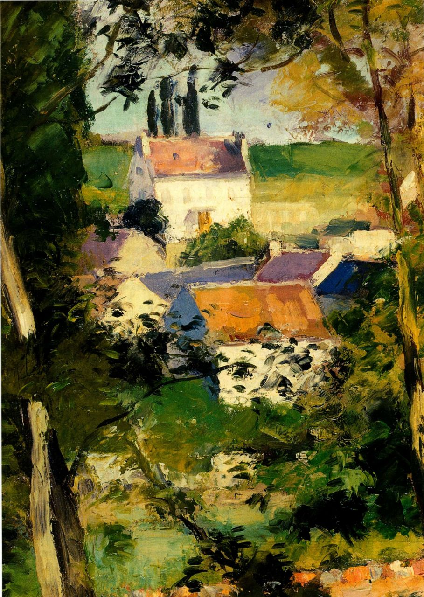

第二十五章 实证主义时代：现实主义、印象主义与拉斐尔前派，1848\-1885年

1848年之后，作为一种知性态度与风格潮流的浪漫主义开始消失，逐渐为现实主义（Realism）所取代。人们愈来愈多地倚重物理学、生理学、经验主义和科学，将其作为理解自然、社会和人类行为的途径。确凿的事实成为构筑知识大厦的材料，而非感觉。实证主义（Positivism）

通常指19世纪40年代所出现的实用主义（pragmatism）与物质主义（materialism）新思想。

这一术语为法国哲学家奥古斯特·孔德（AugusteComte，1798\-1857年）所确定，其在1830年开始撰写一部名为《实证主义哲学》（Positive Philosophy）的多卷本系列著作。孔德表示，社会进步应该基于可观测的事实与可检测的观念。换而言之，即建立在科学的基础上。这种研究社会的学术新方法被称为社会学。

19世纪30、40年代，与孔德的社会学并行而来的是通俗且散播广泛的活页文选《生理学》（Physiologies）。这是一部短篇论文集，极其细致地分析了法国社会的不同阶层，不仅包括律师、修女、社会女性等职业与类型，还包括郊区园丁与30岁女性这样的特定类别。快速工业化和城市化使得当时的世界正经历着巨大变革，而《生理学》就是理解当时强烈转型的一种方式。

在政治领域，强硬的新实用主义被称为“现实政治”（德语为“Realpolitik”），这是德意志帝国首席大臣奥托·冯·俾斯麦（Otto von Bismarck，1815\-1898年）在将近1870年时为造就统一德国而熟练运用的概念（地图25\.1）。在宗教上，实证主义

图25\.17细部，卡米耶·毕沙罗：《埃尔米塔什登山路，蓬图瓦兹》

导致18世纪怀疑论的复苏。19世纪40年代摄影的兴起成为了实证主义的代表，但绝大多数人都不将其看作艺术形式，而认为摄影不过是忠实复制自然和记录快速变革世界的工具。

在艺术领域里，实证主义导致了后来现实主义的产生。现在，艺术家和作家并不会将人间生活理想化或虚构地戏剧化，而是将其不加修饰和美化地再现出来，并将之形容为“白驹过隙”。早在1846年，诗人兼评论家夏尔·波德莱尔就呼吁基于现实生活的艺术，他曾写道：“时尚生活的盛会与成千上万漂泊的个体（罪犯与姘妇），游荡在大城市的地下······所有这些向我们证明，我们只需睁开眼睛，就能看到我们的主人翁。······”而19世纪50年代末期，现实主义成为新艺术与文学的战斗口号。评论家朱尔\-安托万·卡斯塔那雷（Jules\-Antoine Castagnary，1831\-1888年） 是现实主义的宣扬者，他在回顾1857年的沙龙时写道：“没有必要回顾历史、在传说中寻找庇护，或是唤起想象的力量。美就在眼前，而非头脑之中；美在当下，而非过去；美在真实，而非梦幻。”

现实主义者并不推崇想象力的自由驰骋、异国情调或是崇高价值，他们坚实地立足大地，通常不动情

第二十五章 实证主义时代：现实主义、印象主义与拉斐尔前派，1848\-1885年 861

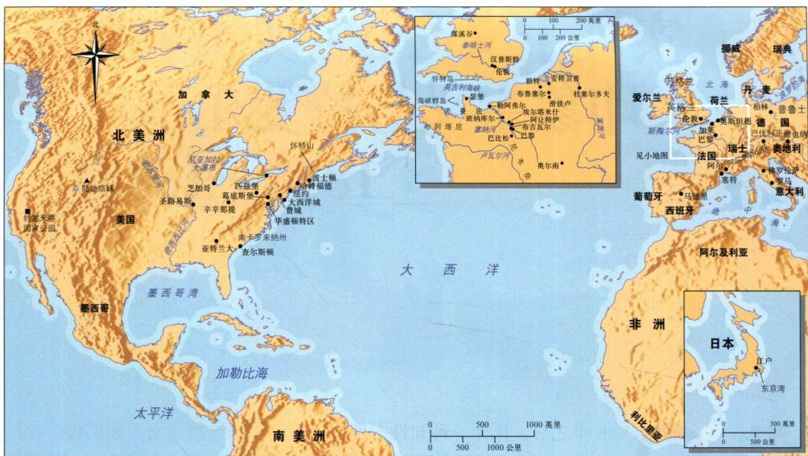

地图25\.1 实证主义时代的欧洲与北美

感，而且乐于直率地描绘现代生活，其创作领域从乡村农民的艰苦生活，拓展到被蹂躏的城市贫民，再到迅速增长的都市中产阶级与暴发户的休闲享乐。在风景画中，这种现实主义后来发展成为印象主义。印象主义画家通常在巴黎及其周边地区进行创作，记录从乡村到郊区的景色转变，以及工厂、铁路对乡村的侵蚀。他们还观察到了富有巴黎人的涌入，及其在乡间农场所建造的奇特周末度假别墅。这些人还会在塞纳河与瓦兹河等地举行的竞舟会中比赛，并在沿岸时髦的场所中聚餐、跳舞、游泳。印象主义者在户外作画，动作快速而笔触大胆、色彩强烈。他们以直接经验为主，捕捉着眼前的世界，完成的作品上的闪烁的速写感觉折射出当代世界的变幻无常。

印象主义者致力于创造一种经验主义的具象艺术，或者说一种现实主义艺术，而由其风格发展而来的副产品却是现代主义的到来。对其后几代艺术家而言，印象主义明亮的色彩和宽阔的笔触具有抽象特质，似乎对画面主题等具象成分发起挑战。20世纪的评论家和历史学家将艺术向抽象的转变称为“现代主义”（Modernism）。印象主义同样标志着先锋派（avant\-garde）的出现，意指某些艺术家与艺术观念对于他们的时代而言显得新颖、激进、令人震惊。事实上，这意味着艺术家的作品逐渐开始只为少数人所理解，即先锋派艺术家同仁、少数艺术专家及收藏家。先锋派与包括工人阶级在内普通公众之间的关系发生断裂，

而公众普遍乐于参观受公众高度关注的学院派展览。这种断裂体现为商业画廊的兴起，后来甚至成为展示新艺术的主要场所，也显示出学院派沙龙的权力在整个西方世界的衰落。现实主义是现代主义艺术中抽象特质的出发点，但我们必须记住，这首先是一个关注社会剧烈变革的运动，而且恰好产生于影响整个欧洲的1848年革命之际。

法国的现实主义

1848年法国爆发了一场起义。共和党人、自由主义者和社会党人此时联合起来，要求在政府中享有更多的发言权。他们还提倡无阶级社会，认为无论民众全体还是政府都不能控制生产资料。当国王路易一菲利普拒绝他们的要求之后，武装起义已不可避免。在国王退位之后，临时政府迅速被制宪议会取代。虽然工人阶级已经按照新政府的规定组织了劳动组织，但是仍然没有自己的代表，于是揭竿而起，开始攻打议会。巴黎城中展开激烈巷战，致使一万名民众死伤。无产阶级起义所造成的阶级革命冲击波辐射到整个欧洲，各个主要城市里都发生了类似活动。就连英国也遭到了威胁，社会主义者的宪章派鼓动工人要求自身权利，这一要求得到相当彻底地贯彻，甚至到了聚集武器、进行军事训练的地步。正如当时一位法国作家所说，欧洲社会“成为了恐惧的牺牲品；自从野蛮人

862 詹森艺术史

景》（Scenes of Bohemian Life）而闻名。库尔贝在左

岸结识了文学圈中的先锋派人物，与波德莱尔、社会

主义者记者皮埃尔\-约瑟夫·蒲鲁东（Pierre\-Joseph

Proudhon，1809\-1865年），以及评论家兼作家尚

弗勒里（Champfleury，茹勒\-弗朗索瓦\-费利克斯·

于松［Jules\-François\-Félix Husson］的笔名，1821\-

1889年）结为好友。主要受蒲鲁东的影响，此时的库

尔贝已经由共和主义转向社会主义。与此同时，尚弗

勒里劝说库尔贝重拾自己的乡村之根，绘制奥尔南的

单纯世界。这位作家本人则热衷于收集民间艺术品，

对通俗版画、儿童艺术和漫画等非精英艺术颇有兴趣。

库尔贝于1849年秋天回到奥尔南，并在家中阁

楼里绘制了宽近7米的《奥尔南葬礼》（Burial at

Ornans，图25\.1），这件作品后来被1850\-1851年沙

龙接受。对于很多参观者来说，这幅画就是一种公然

的侮辱。它表现了普通的外省人，描绘手法粗糙、形

式沉重，丝毫没有优雅或美化。奥尔南当地的居民充

当了库尔贝的模特，其中许多人都可以辨识出来。库

尔贝不仅记录了他们的衣着与举止，还有各自独特的

面部特征，包括球形的鼻子、皱纹奇特的面孔和蓬乱

的头发。阴冷的风景也同样真实，那是基于奥尔南墓

地的习作而绘制。库尔贝的现实主义还拓展到了对人

物的平等表现方面。尽管大胆的笔触和明暗对照法可

以令人联想到他所喜爱的艺术家伦勃朗和委拉斯凯兹，

但是此处并无巴洛克风格的戏剧性，也没有突出某一

人物的构图设计，画面中的狗与牧师或市长一样重要。

库尔贝也没有运用古典模式，这与本杰明·韦斯特不同，

后者在《沃尔夫将军之死》（见图23\.7）中对人物进行了

金字塔式的分组。与之相反，库尔贝的作品采用了大胆、

简单的构图，常见于海报、月份牌和歌曲单等通俗艺

术中，这是人民的艺术，而不是学院的。

画面看来十分平常，很难判断表现的到底是什么

具体事件。画面左方是抬棺人和棺木，旁边有牧师和

助手，再向右则是小城中的贵族，最右侧是妇女。一

座挖开的坟墓位于前景中央，但无从得知这是谁的葬

礼。而且作品似乎也不是死亡终结的宣言，尽管这是

最有可能的题材。然而可以确认的是，这幅作品是社

会礼仪的记录，精确地表现了奥尔南那里的性别、职

业与阶层区分。更为重要的是，它居然堂而皇之地将

外省中产阶级的活动提高到与历史事件相同的崇高地

位。事实上，这是对历史画的僭越，尽管其受到极度

推崇。正因如此，库尔贝的作品遭到众多巴黎人排斥。

奥尔南中产阶级所代表的政治威胁也同样令人厌恶，

他们在第二共和国期间拥有相当可观的选举权力，能

古斯塔夫·库尔贝 古斯塔夫·库尔贝（Gustave

Courbet，1819\-1877年）来自瑞士边境小镇奥尔南

（Ornans），位于侏罗山脉（Jura Mountains）脚下。

他父亲曾是农民，后来成为此地富足的地主和酒商。

库尔贝于1839年前往巴黎学习绘画，在19世纪40

年代末成为左岸咖啡馆中的主导人物，后者则因亨利·

穆杰（Henri Murger）的作品《波希米亚人的生活情 够改变国家选举结果。除此之外，这些人对许多巴黎

入侵罗马以来，还没有哪一次恐惧能与之匹敌。”

最终保守主义的力量大获全胜。在法国，拿破仑的侄子路易·拿破仑·波拿巴（Louis NapoleonBonaparte，1808\-1873年）以绝对优势当选第二共和国总统，在名义上得到普遍承认。然而到了1852年，他解散了议会并让自己“当选”为皇帝，称“拿破仑三世”，并建立第二帝国。在他统治下的法国一片繁荣，但后来终结于1870年的普法战争。

直到19世纪40年代，工业革命才在法国发展起来，而现在则以爆炸的方式扩展开来，而路易·拿破仑所制定的新金融体制也创造出了前所未有的财富。国家处于金融家、工业家、制造商、律师和商人的统治之下，中产阶级兴盛起来，而其对物质财富的欲望也水涨船高。1855年的巴黎世界博览会好像新消费主义的镜子，全世界都参与其中，展示自家的产品。这次巴黎博览会是对1851年首次伦敦世界贸易博览会（万国工业博览会）的应对之举，旨在形成竞争。在巴黎，财富与休闲享乐时间的增加成就了大饭店、咖啡馆、百货商店、剧院、俱乐部、公园和赛马跑道，而来自不同社会阶层的人们则在这里聚集、购物。

巴黎城经过翻新换上荣耀的现代外衣。这一工程始于1853年，路易·拿破仑的内政部长乔治\-欧仁·奥斯曼（Georges\-Eugène Haussmann，1809\-1891年）发起了规模巨大的市政改建项目，从而造就了那一条条宽阔的大街，穿过老城的中世纪养兔场，而两旁则伫立着时髦的现代公寓。工程造就了壮丽的景观，而诸条要道则确保国家在遭遇起义时，军队能够迅速调动部署。此外以包括歌剧院和火车站在内的宏大城市建筑为支撑点，城市中还点缀着优美的庭园、花园和广场。

19世纪40、50年代的现实主义：描绘当下社会境况

法国的现实主义与1848年革命同时兴起。现实主义是一种高度政治化的风格，以自诩为“旗手”的古斯塔夫·库尔贝和“农民画家”让\-弗朗索瓦·米勒为代表。现实主义拥护劳动者和乡村平民，也正是这些人向巴黎贵族与中产阶级所享有的权威和特权发起挑战，并在某种程度上促成了1848年起义。

第二十五章 实证主义时代：现实主义、印象主义与拉斐尔前派，1848\-1885年863

3\. 1 3 × 6\.64米。巴黎奥赛博物馆

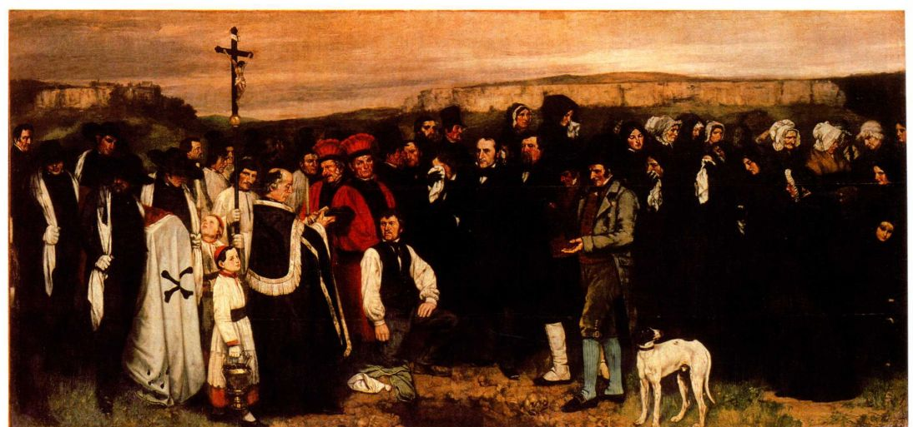

图25\.1 古斯塔夫·库尔贝：《奥尔南葬礼》。1849\-1850年。布面油画，

中产阶级而言则是一剂清醒剂，提醒其记住自己极力掩盖的外省出身。

库尔贝在1850\-1851年沙龙中展出了另一幅描绘奥尔南的画作\-《碎石工人》（The StoneBreakers，图25\.2）。其中表现了两位面对面、与真人等大的工人。库尔贝在城外遇到了这些敲打石头、铺筑道路的劳动者。他再次异常精准地描绘了人物，褴褛的衣衫、粗重的工作和指甲缝里的污垢，无不宣告着自己的贫穷与所属的社会阶层。库尔贝笔下的人物具有石头一般的强烈细节，而他们那不为人知的面孔最终将人物转变为无生命的物体，仿佛岩石或工具一般。此处的构图再次脱离了常规结构，让我们的目光在画中不同事物间跳跃。

尽管公众对于这幅蕴含社会主义内涵的作品毁誉参半，但两派政治阵营都对画面的真实性大加赞赏。正如《奥尔南葬礼》一样，库尔贝运用多种颜料使用方式，有些是用调色刀直接抹在画面上的，实质上将艺术家转变为一位艺术劳动者。大胆的颜料使用方式加强了人物的实体力量，以自身的实际存在最终成为物质对象的代言人。在《奥尔南葬礼》和《碎石工人》中，人物所处的空间都很浅显，并且被推至画布的前景。画中的景物显得相当扁平，仿佛就是一块幕布，迫使观众的视线停留在前景之中。库尔贝从没承认《碎石工人》具有社会主义意向，但正如艺术家本人所描述的那样，“人类悲惨境遇的完全表达”弥漫着社会不公，而这正是1848年革命所造成的结果。库尔贝没有将乡村生活表现为田园诗或滑稽剧，而是着眼于残酷的现实。

1855年，库尔贝的11幅作品为巴黎世界博览会所接受，而这项活动旨在推动法国经济与工业。博览会的美术部取代了该年的沙龙展，重点宣传安格尔和德拉克洛瓦这些法国绘画大师的作品。为了自己的艺术生涯，库尔贝做了任何一位在世的艺术家都未曾作过的事，并成功引起轰动效应：他在博览会会场附近委托他人建造了一座古典风格的建筑，在其中开办自己的个展，《奥尔南葬礼》也在展出作品之列。库尔贝将展览命名为“关于现实主义”（Du Réalisme），并出售一份名为《现实主义宣言》（Manifesto ofRealism）的小册子。他在其中发表了以下声明：“站在转化习俗、观念以及我们这个新纪元面貌的立场上，我遵循自己的主张，不仅作一个画家，也要做一个人。简而言之，我的目标就是创造有生命的艺术。”库尔贝不停地向学院派的价值观发起挑战。他用当代世界的鲜明形象替代了不可侵犯的希腊罗马传统，他笔下的图像在图像志和构图方面不包含任何特殊含义，背离了古典传统或历史绘画。他大胆地将颜料涂抹在画布之上，从而破坏了学院派颜料处理技法的精致感。无论安格尔新古典主义作品中坚实平滑的表面，还是德拉克洛瓦作品里所体现的威尼斯画派或鲁本斯式绘画传统，都被他摒弃。虽然没有被沙龙拒之门外，但库尔贝拒绝借助沙龙来发展自己的事业，而是转向了商业展览。

让\-弗朗索瓦·米勒 如果将库尔贝的作品与1850\-1851年沙龙上的另一幅现实主义作品\-让\-弗朗索瓦·米勒（Jean\-François Millet，1814\-1875 年）的《播种者》（The Sower，图25\.3）相比，就可

864 詹森艺术史

图25\.2 古斯塔夫·库尔贝：《碎石工人》。1849年。布面油画，1\.6x2\.59米。原藏于德累斯顿历代大师画廊（Gemäldegalerie），据说毁于第二次世界大战期间

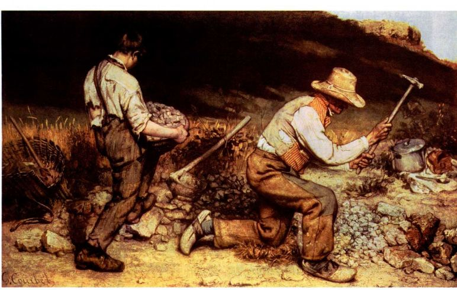

以看到库尔贝的绘画是多么的实事求是且不带感情。与库尔贝一样，米勒也生长在乡村，出生于诺曼底的瑟堡（Cherbourg）附近，来自一个富有的农场主家庭。他的整个成长经历都浸染在土地与农村生活无休止的季节循环中。米勒受过良好的教育，阅读兴趣十分广泛。在选择从事绘画工作后，他先是完成了在瑟堡和巴黎的学习，随后便开始创作肖像画。作品中的深暗色调折射出他对17世纪西班牙绘画和伦勃朗的挚爱。在19世纪40年代末期，米勒返回巴黎，并与若干位巴比松画派（见850页）的风景画家结交为友。1848年创作了第一幅农民绘画作品《筛谷者》（LeVanneur）。在之后的生活中，表现农民生活的画作成为了他的专长。1848年巴黎流行霍乱，米勒在巴比松永久定居下来。

紧随1848年革命的脚步，米勒尊崇农民形象的作品也受到了具有政治倾向的解读。正如《播种者》所显示的，米勒笔下的劳作者与库尔贝的一样，都是贫穷的受压迫者：他们衣衫褴褛，过着在田地中不停辛勤劳作的生活。他们的形象模糊而庞大，让刚刚经历1848年革命的巴黎观众胆战心惊。然而更令人害怕的是，米勒十分尊崇农民的形象。这位无名播种者身材魁梧，庞大的动态形体吞噬掉了画面绝大部分空间。然而，其与库尔贝《奥尔南葬礼》中的人物不同，并不类似某个个体，而是某种类型。我们可以将其描述为高贵的农业工人，全心全意地劳作只换来少得可怜的报酬。米勒所运用的深色明暗对照法很容易令人联想到伦勃朗，后者也喜欢将劳作者投射在昏暗的阴影中，使之与土壤混为一体，仿佛正从大地中浮现出来，成了大地的化身。而这种解读也会因颜料沙砾般

的粗糙而凸现出来。大手一挥的姿势强烈鲜明，身体的轮廓波动起伏，都将形象与自然本身永恒循环的能量联系在一起。尽管米勒在农民题材的选择上具有现实主义特征，但在感性层面上他无疑是浪漫主义的，其作品追求诗意与情绪，而不是绝对的事实。

奥诺雷·杜米埃 奥诺雷·杜米埃（HonoréDaumier，1808\-1879年）也在此时首次在沙龙展上露面。他以创作漫画闻名，但作为画家却几乎默默无

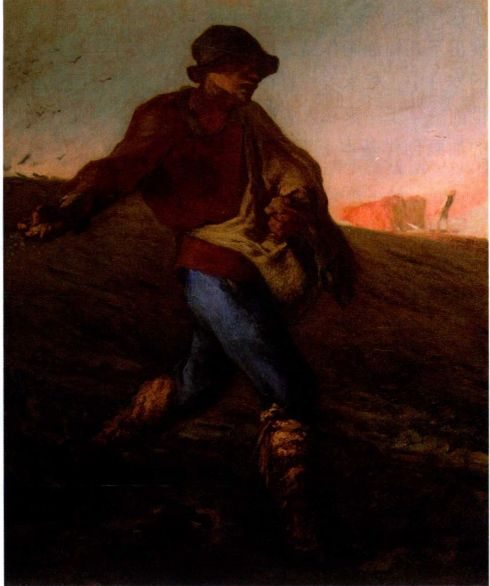

图25\.3 让\-弗朗索瓦·米勒：《播种者》。约1850年。布面油画，

1 01\.6 × 82\.6厘米。波士顿美术馆，17\.1485

第二十五章 实证主义时代：现实主义、印象主义与拉斐尔前派，1848\-1885年 865

图25\.5 奥诺雷·杜米埃；《三等车厢》。约

1863\-1865年。布面油画，65\.4 × 90\.2厘米。纽

约大都会艺术博物馆，H\.O\.Havemeyer收藏，H\.O\.

Havemeyer夫人1929年遗赠，29\.100\.129

闻。1830年前后，杜米埃的石版画（lithograph）定

期刊登在巴黎报刊上（见第911页的材料与技法）。规模可观且有文化的中产阶级公众出现，而造价低廉的纸张以及印刷工艺的发展则导致了现代报纸的产生，报纸上的石版画和木刻版画插图也为其流行做出了重要贡献。杜米埃主要为社会主义倾向的报纸《漫画》（La Caricature）和《喧闹》（Le Charivari）创作作品，两者都致力于政治性与社会性的讽刺文学，可以说与杜米埃的作品是天作之合，因为杜米埃恰好热衷社会事业，将一生都用来揭露社会的丑恶现象。他批判的对象也包括从政府腐败、镇压行径到暴发户贪婪、虚荣嘴脸的众多题材。杜米埃的石版画迅捷、精妙地记录了在快速发展变化着的巴黎，以及其中涌现出的不同职业、阶层与类型的人物，这也在某些方面应合了《生理学》手册中冗长而切实的描述。他所塑造的人物预示了19世纪60、70年代城市现实主义与印象主义艺术家观察表现的人物类型。在《释放这个人是安全的！》（lt＇s Safe to Release This One！，图25\.4）里，可以体会到杜米埃尖锐的洞察力、刻薄的幽默以及简练的绘图技巧。该作品创作于1834年一次巴黎工人起义之后，大量穷人与无辜市民在起义中丧生。画面中以漫画手法表现了梨形身材的超重国王路易\-菲利普，把着那位手戴镣铐工人瘦弱的手腕，在感觉不到脉搏之后竟然宣布可以将他释放。

毫无疑问，杜米埃想成为真正的艺术家。正是出于这样的想法，他在1849年和1850\-1851年沙龙中展出了几幅油画作品，但并没有引起关注。在接下来的岁月中，杜米埃一直在私底下创作油画，但仅在去世前一年于一家私人画廊中再次展出过。因此杜米埃的油画创作基本上不为人所知。他似乎曾在19世纪

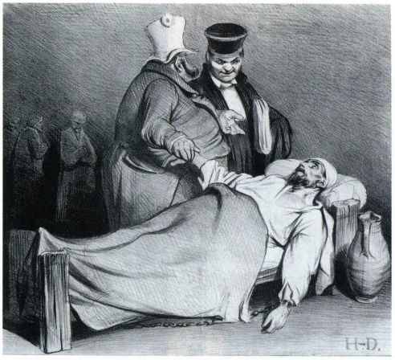

图25\.4 奥诺雷·杜米埃：《释放这个人是安全的！》。约1834年。石版画

40年代自学过油画创作，而他的油画也与其职业性作品形成鲜明对照，基本都是充满怜悯的作品。这里杜米埃省却了幽默与讽刺，依赖其漫画家的能力来精确捕捉人物特征与类型，极其明确地把握住了当代城市生活的心理状态，在1863年前后创作的《三等车厢》（The Third\-Class Carriage，图25\.5）中得到了完美的体现。杜米埃在此捕捉到一个特殊的现代情境\-“孤独的民众”。成群的工人塞满了火车的三等车厢，而且不得不满足于坚硬的长凳，而不是头等车厢宽大的丝绒座椅。作为增长中的城市居民的一部分，他们来自各种类型，但都默默无闻，忍受着日常的往返行程。前景中疲乏的一家是画面的焦点，他们比身后的小市民阶层显得更为朴素贫穷，代表着被赶出家园的乡下贫民，来到巴黎寻找机会，却成为了现代城市化

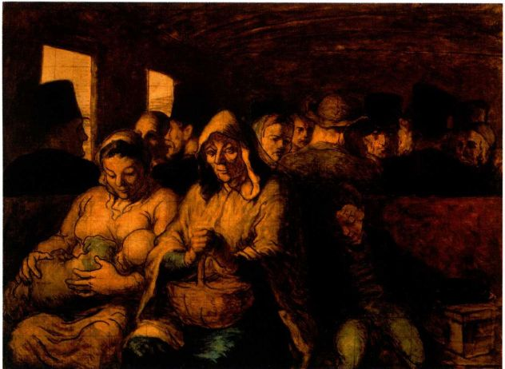

866 詹森艺术史

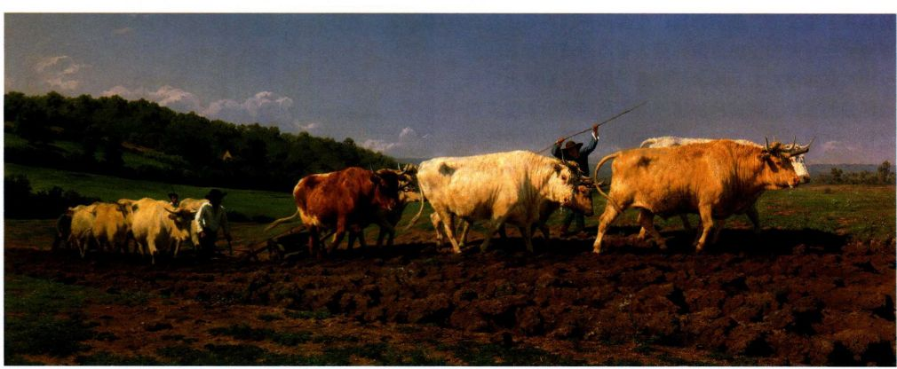

图25\.6 罗莎·博纳尔：《尼韦奈耕作：为葡萄园施肥》。1849年。布面油画，

1\.75 × 2\. 64厘米。巴黎奥赛博物馆

的牺牲品。他们被囚禁在膨胀的阴暗之中，与窗口透入的明亮光线隔绝开来。但杜米埃还是将他们表现为坚韧高贵的形象，画中两位妇女如同米勒笔下的播种者那样，具有宏大的形体。看来单纯的农民家庭转变为圣母子与圣以利沙伯。杜米埃与他所敬仰的米勒都曾被贴上过“现实主义”与“浪漫主义”的标签，而他的绘画同样结合了现实主义主题与浪漫主义强烈的悲天悯人情怀。

罗莎·博纳尔 罗莎·博纳尔（Rosa Bonheur）是参展1850\-1851年沙龙的第四位现实主义画家，并获得了相当的关注。她的父亲是绘画教师，同时也是一名社会主义者，提倡充分的男女平等，而博纳尔则跟从父亲学习绘画。很早以前她就立志成为一名在男性世界里的成功女性。博纳尔并不绘制那些传统意义上适合女性的小幅静物画和水彩画，而是大幅的动物题材作品，以此展示最杰出的学院派画家才能具有的精湛技法。但她并不以德拉克洛瓦和巴里的浪漫主义世界中那些异域生物为主题，而是描绘包括牛、羊、马在内的家畜。受到自然历史学科的经验主义科学观影响，博纳尔会仔细研究自己的题材，并力争精准描绘，通常在细节上刻画入微。1841年时，她开始在沙龙上展出作品，而其声誉也于19世纪40年代日渐增长起来（见第四部分末尾的附加原始文献）。

1848年，新生的第二共和国表现出实证主义式的愧疚，想要记录法国外省的农业状况，于是委托博纳尔创作一幅大型油画。在1850年沙龙上，她向观众展示了这幅宽达2\.6米的作品\-《尼韦奈耕作：为葡萄园施肥》（Plowing in the Nivernais：The Dressing of Vines，图25\.6）。主题的灵感据信是来自乔治·桑的小说《魔沼》（The Devil＇s Pool），而乔治·桑（George Sand，1804\-1876年）是阿曼蒂娜\-奥萝尔\-露茜·

杜班（Amandine\-Aurore\-Lucile Dupin）的笔名，即杜德万（Dudevant）男爵夫人。作为一名成功的女性作家，她是博纳尔的行为榜样。在《魔沼》的前言里，乔治·桑声明这本小说“将使文明世界的男人回忆起原始生活的魅力”。当时工业化正在显著地改变着法国的面貌，形成复杂的城市中心，其中充塞着过度拥挤、住宅匮乏、阶级冲突以及人口流动混杂等弊病。乔治·桑提倡回归自然，返回单纯的“原始”世界，这样的主题也同样出现在米勒的画作之中，随后甚至成为了世纪末文化群体中的流行主题。博纳尔对动物的兴趣部分地反映了其对自然的关注。1860年之后，她离开巴黎并永久定居在巴比松附近的枫丹白露森林。她与同伴娜塔莉·米卡斯（Nathalie Micas）共同生活，并且向社会习俗发起挑战，她们身着男性服装、剪短发，还在公共场所吸烟。

为了创作《尼韦奈耕作》，博纳尔在法国中部的乡村尼韦奈生活了几个星期，研究这里土地、动物、农具和地方服饰的独特之处。沙龙的常客们非常欣赏她绘制周密、细致入微的作品，并给予好评。博纳尔的作品与米勒的《播种者》不同，实事求是而不动情感；但与库尔贝的《奥尔南葬礼》也有显著差别，她剔除了乡村生活中的不雅之处。我们或许可以看出尼韦奈牛群身躯的高大笨重，但是感觉不到牲畜的气味；这里没有劳动的汗水，没有土地的气息，尽管所有这些都出现在画面之中。博纳尔所做的正如《生理学》一样，记录、编目并呈现。牛群的庞大规模与游行式的排列甚至赋予了画面庄严之感。

现实主义对学院价值观与中产阶级品位的抨击

通过以历史画的规模来表现外省中产阶级与农民，库尔贝抨击了法国艺术学院的价值观与中产阶级

第二十五章 实证主义时代：现实主义、印象主义与拉斐尔前派，1848\-1885年 867

的品位。事实上，他声称当代生活，特别是当代社会环境，就算并非比历史事件更为有力的绘画题材，至少也与其一样有力。库尔贝的出现敲响了绘画类型等级区分的丧钟，而这种传统可以追溯到艺术学院成立之初。讽刺的是，世纪末的先驱画家又回归历史画和宗教画。19世纪60年代，爱德华·马奈（ÉdouardManet，1832\-1883年）继续着库尔贝摒弃学院价值标准的进程，为的是描绘现代世界的社会环境。他以城市而非乡村生活为中心，绘制了布洛涅森林（Boisde Boulogne）中的音乐聚会。那是一座位于巴黎西郊的新公园，上流人士经常流连于此；他还描绘了聚集在隆乡（Longchamp）的时尚人物，隆乡是布洛涅森林中的新赛马场。马奈笔下还出现了在歌剧院举行的时髦假面舞会，交际花及其顾客，新咖啡馆、舞厅与餐馆中新出现的消闲活动。他的画作通常比较复杂，包含各种典故，致密地隐藏着多重意味。作品种类十分丰富，使得马奈可以在捕捉现代社会中的能量、心理状态与变化同时，还能够对学院价值观品头论

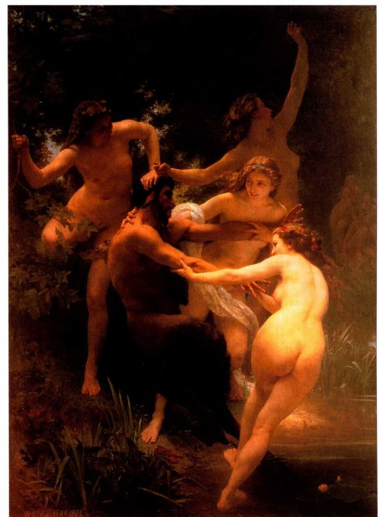

图25\.7 阿道夫\-威廉·布格罗：《宁芙与萨梯尔》。1873年。布面油画，		2 \.7 5 x 1 \.8米。斯特林·克拉克与弗朗西·克拉克艺术研究院（Sterling and Francine Clark Art Institute），威廉姆斯城（Williamstown），马萨诸塞州

足，《草地上的午餐》（Luncheon on the Grass，见图25\.10）就是如此。马奈向1863年沙龙提交了这幅作品。为了理解它，首先需要浏览一番19世纪60年代所盛行的学院价值观，而这正是沙龙评审团所采用的价值标准。

官方艺术及其范例 19世纪60年代，很难把巴黎美术学院所教授的某种艺术定义为学院派，但绝大部分学院派人士仍然坚信历史绘画、希腊罗马样式，以及安格尔所代表的古典主义风格具有至高无上的地位。女性裸体是最受欢迎的题材之一，遍布于沙龙展之中。然而，那些并非普通的裸体，而是维纳斯、狄安娜、酒神的女祭司或者宁芙，全部都是具有古典血统的高贵存在。风俗画中的裸体形象也同样流行，大都出现在闺房之类的色情场景，或者诸如古罗马一类的历史背景之中。尽管如此，这些作品依然因为保持着唯美与完美的古典传统而备受推崇。

当时最著名的学院派画家是阿道夫\-威廉·布格罗（Adolphe\-William Bouguereau，1824\-1905年）， 时任法兰西学会会长，并荣获法国荣誉军团勋章，是当时最为著名的法国艺术家。除吉普赛人、乡村少女与宗教题材外，他还绘制神话题材作品，例如1873年的《宁芙与萨梯尔》（Nymphs and a Satyr，图25\.7）。画中宁芙嬉闹着将萨梯尔拖入水中，这是一幅公开的情色画面，背景中抓住萨梯尔犄角的那位宁芙毫不掩饰其狂喜与兴奋，而这正是画面主题的缩影。布格罗的自然主义手法使得肉体、姿态与表情中的纵欲之感更为显著，这也折射出实证主义并不满足于古典题材的常规运用，而是要记录下这些题材的倾向。即便是布格罗笔下理想化的女性形象，也仿佛真实人物一般，与女神相去甚远。不仅仅因为她们的肉体具有自然主义特征，还要归功于她们的骄奢淫逸，这显然不是古代希腊人或罗马人的特征。

尽管布格罗直到20世纪仍然坚持古典传统，但他并非这种正在消亡传统的代言人。除极其精湛的技法之外，他的作品还具有极为鲜明的心理刻画，在此处则表现为好色与放荡。而类似的心理刻画将在后来成为艺术家全力关注的问题。布格罗的图像通常设置在自然背景之中，以增强对自然欲望的表达，并反映出当时人们逃离复杂城市化和工业化世界的渴望，希望回归更为简朴的阿卡迪亚时代，隐居乡间。

雕塑与古典主义传统保持着紧密的联系，同样关注于女性裸体。让\-巴蒂斯特·卡尔波（Jean\-BaptisteCarpeaux，1827\-1875年）是当时的杰出雕塑家之一。《舞蹈》（The Dance，图25\.8）是他最为著名的作品，来自1867年新巴黎歌剧院委托他创作的四座大理石

868 詹森艺术史

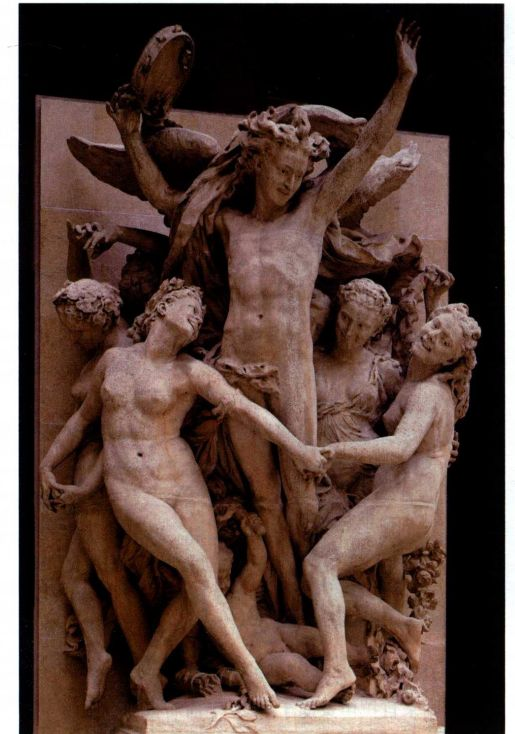

图25\.8 让\-巴蒂斯特·卡尔波：《舞蹈》。11867\-1869年。石膏，4\. 19 x 2\.97米。巴黎歌剧院博物馆

雕刻。雕塑安置在歌剧院正面，每座都代表着歌剧的某个组成部分。插图中的石膏模型比最终的大理石作品还要鲜活精确，直立的有翼男子象征舞蹈，如同代表性爱的五朔节花柱；周围充斥着欢喜雀跃、身材匀称且满怀虔诚的酒神女祭司。萨梯尔潜伏在舞蹈的斗篷下面，强调这场仪式化舞蹈所具有的放荡意图。

当《舞蹈》在1869年揭幕时，评论家们予以其当头棒喝，宣称其中的人物粗俗、迷醉。自然主义手法确实让舞者看上去是裸露，但并不是裸体。身体上关节、膝盖和肉体的肌理清晰可见，而卡诺瓦则倾向于将这些细节表现得完美、平滑（见图24\.28）。虽然人物出自古典传统，但并不像希腊人或罗马人，而是类似第二帝国的国民。一年之后，人们逐渐适应了卡尔波的自然主义，这件当初“过分色情”的作品也成为了遵循古典传统的杰作，好评如潮。

由于动态的巴洛克式构图与对于肉欲、欢乐的过度表现，《舞蹈》成为其背景歌剧院（Opéra，图25\.9）的完美补充。由查理·加尼埃（Charles Garnier，1825\-1898年）设计，这座建于1861至1874年间的歌剧院

具有与雕塑相同的特性。歌剧院成为第二帝国富足奢华的象征，折射出中产阶级观众的矫饰品位，而后者恰好是布格罗和卡尔波的赞助人。这座建筑是奥斯曼巴黎城市设计的关键，同时也是歌剧院大街的情节聚焦之处，是若干要道的枢纽。

歌剧院标志着19世纪古代风格的复兴运动延伸到巴洛克风格，这一现象可与60年代的古典复兴和哥特式复兴相媲美。双柱支撑的柱廊暗示出来自佩罗所设计卢浮宫的影响（见图21\.12），加尼埃将路易·拿破仑归于路易十四的家族谱系。圆柱顶部升起的分段拱出现于立面两端，令人想起莱斯科所设计的卢浮宫方形庭院（见图18\.4）。色彩与质感的变换无穷无尽，附生的雕塑与装饰令人目不暇接。作者大量借鉴、重组文艺复兴与巴洛克时期的建筑形式（即两种风格中全部元素所具有的十足密度），造就了繁茂炫耀的风格，与当时物质主义的炫阔挥霍相得益彰，十分切合暴发户的品位，尽管这些人为过时的金融贵族所不屑。

爱德华·马奈 马奈所作《草地上的午餐》（图25\.10）是对中产阶级价值观和学院派品位的谴责，同时也是现代世界中关于艺术本质的宣言。马奈出身于巴黎中产阶级家庭，师从著名的学院派画家托马斯·库蒂尔（Thomas Couture，1815\-1879年）；但他真正的老师其实是那些曾临摹过的卢浮宫中的绘画大师：哈尔斯、提香、西班牙画家委拉斯凯兹和戈雅。马奈是咖啡馆的常客，与库尔贝尤为投缘，而后者正是他的榜样。马奈的朋友还包括现实主义小说家波德莱尔和艺术评论家埃米尔·左拉（Emile Zola，1840\-1902年）。与众多现实主义作家和艺术家一样，马奈也是“名流”（flâneur）的一员。这是一种早在19世纪30年代就浮现出来的社会类型，正当《生理学》手册出现之际。这种类型最初以英国贵族与花花公子

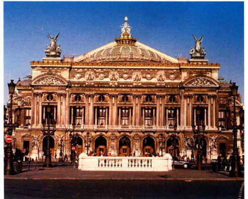

图25\.9 查理·加尼埃：巴黎歌剧院。1861\-1874年

第二十五章 实证主义时代：现实主义、印象主义与拉斐尔前派，1848\-1885年 869

图25\.10 爱德华·马奈：《草地上的午餐》。1863年。布面油画，2\.13x2\.69米。巴黎奥赛博物馆

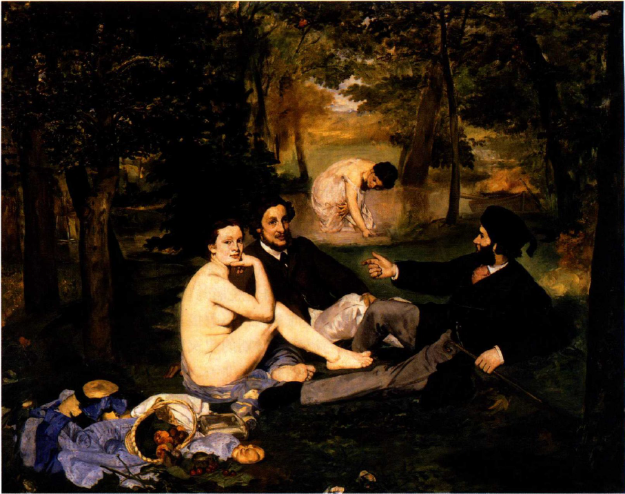

为主，原意指衣着毫无瑕疵的男子，其举止完美、得体，通过报纸和闲谈时刻把握着社会的时尚。马奈整天低调地在巴黎大街小巷闲逛，精心观察着现代生活的短暂瞬间，并将其转化为绘画或文字形象。名流诙谐且爱好结交朋友，并以讥刺中产阶级为乐。马奈的密友波德莱尔是当时最为著名的名流之一。

出于这样的背景，马奈创作了《草地上的午餐》，表现两对男女在布洛涅森林野餐的场景。该作品被1863年沙龙的评审拒之门外，而那年遭到评审团拒绝的艺术家也是有史以来最多的。这种情况引起广泛的强烈抗议，路易·拿破仑只好宣布应该举行一次“落选者沙龙”（Salon des refusés），专门展出落选艺术家的作品，而且是与1863年沙龙联合举行。很多遭到拒绝的艺术家都不愿意屈就于这个被视为低人一等的展览，然而马奈却并不介意。

参观落选者沙龙的观众创造了参观人数的历史纪录，他们特地前来嘲笑这些艺术家，特别针对马奈的《草地上的午餐》，因为这件作品已经上了所有报纸的头版。这幅作品将一位裸体女性置于当代场景中，其身处公园，并与衣着整洁的男子为伴，这本身就形成了一则丑闻。公众怒不可遏，认为画中的裸女必定是妓女。即使评论家告知人们这幅作品的灵感来源是藏于卢浮宫的著名作品《田园协奏曲》（见图16\.30）也无济于事，而《田园协奏曲》同样表现了与衣着整齐男子并肩而坐的裸女。有位作家甚至成功辨识出坐着的人物实际上

是模仿马尔坎托尼奥·拉伊蒙迪笔下河神的姿势，河神形象则来自拉伊蒙迪于1520年前后根据拉斐尔《帕里斯的裁判》而创作的版画（见图16\.29）。然而没有人意识到，背景中的女子是华托所作《沐浴者》（TheBather）的翻版，而这幅作品也收藏于卢浮宫，马奈最初也曾准备将相同的名字用于自己的作品。

至于评论家们，他们认为即使参考了如此权威的艺术作品也不足以抵消马奈一贯的离经叛道。他罪大恶极、厚颜无耻地采用了两米多见方的画幅尺寸，这通常为历史画专用。那么，马奈为什么要基于艺术史上的素材来创作当代图像呢？答案可能就蕴含在这些人物的矫揉造作之中，尽管难以置信，但二者的确相互关联。一位艺术史学家曾指出，画看上去就像是美术学院的学生摆起各种姿势戏仿某幅名画。实际上，马奈在告诉我们，人们不能生活在过去，但这正是众多学院派艺术家的选择。正如波德莱尔在1846年所宣告的那样，马奈也强调艺术家必须在现代世界中找到属于自己的题材与主人翁。进而言之，他还向人们展现了一个可悲的事实，古典裸体传统已经被降格为经过粉饰的色情主题。同样，马奈也可能将艺术史上的素材用作一种策略，从而使自己融入伟大艺术的漫长传统中。实际上，他确实在宣称自己的自然主义不仅是艺术应该走上的正确方向，而且其像古代伟大艺术一样至关重要、充满生机。

马奈的绘画风格使得评审们和公众认为其不过是

870 詹森艺术史

图25\.11 爱德华·马奈：《奥林匹亚》。1863年。布面油画，1\.3x1\.89米。巴黎奥赛博物馆，RF2772

一名不合格的哗众取宠者，只配在落选者沙龙中展示自己的作品。对于这群人所遵循学院派的标准而言，马奈既不会造型，也无力创造可以感知的空间。画面看上去仿佛初步草图，远非完成的作品。人物有如平面的剪纸，轮廓线呈现脆弱的剪影式，夸张的宽笔触省略了塑造形体所必需的明暗过渡与中间色调，这些都使作品趋于扁平，明显的例子就是长裤上用于表示皱褶的阴影仅是一条简单的暗色笔触。背景中涉水的女子相对于她所处的位置显得过大，似乎漂浮在坐着的人物之上。人物、树木、色彩鲜艳的衣物与篮子所构成的静物，均悬浮在空间之中，无法彼此连接聚集成一个条理分明的连贯空间结构。

马奈破坏了文艺复兴时期窗口式的错觉空间，转而运用新的逻辑关系，那是笔触所构成的感官的波涌，丰厚润泽的颜料生动地覆盖整块画布。我们因笔触而感到赏心悦目，他受委拉斯凯兹和戈雅启发而形成了精妙的黑色调和草地上的绿色调的变化，以及将暗色与亮色并列而置的灵巧手法，让我们的目光在亮色域之间跳跃，在暗色域之间流连。颜料处理和色调对比等手法所具有的抽象性质是绘画的新结构，视幻空间与造型不复存在。马奈以《草地上的午餐》开创了20世纪评论家所谓现代主义的传统，其将会持续到下一个世纪，而且一直都强调艺术的抽象性。对于自己的作品如此不逊地对抗学院传统中的完整的素描与造型、打击中产阶级的艺术品位，马奈无疑欣然处之。此外，他的艺术还创造出飞逝的瞬间感，折射出现代世界的快速改变，这正是名流们颖悟之眼所捕捉到的世界。

令人吃惊的是，马奈被1865年沙龙接受，参展作

品是1863年的《奥林匹亚》（Olympia，图25\.11）。这幅作品俨然表现了一位交际花，拥有富裕的上层社会顾客群。这幅裸体画以提香的《乌尔比诺的维纳斯》（见图17\.30）为依据，画中的女子是第二帝国绅士头脑中的现代女神形象。从此以后，“奥林匹亚”这个名字在巴黎尽人皆知，成为了有势力的交际花和情妇的代名词。“奥林匹亚”一词所具有的古典烙印其实是一个策略，用以暗讽沙龙中色情裸体作品的寓意性伪装。

马奈的《奥林匹亚》描绘了当时巴黎的状况：众多富有的男士拥有情妇，还时常光顾妓院，而正是这群人出于色情的需要来购买学院派的裸体画，所谓的古典不过是掩饰而已。与提香笔下的维纳斯不同，马奈的奥林匹亚无比真实却不加美化，以至于她看似生硬呆板，笨拙无情，缺乏肉感的曲线美。进一步来说，她的表情完全是一种应酬，以大胆、自信的凝视回应观众的目光。这种有力的凝视令男人手足无措，激起了他们对于控制欲极强的独立女性所具有的最深恐惧。她吸引观者的方式在风俗画中极其罕见，反映出马奈对巴黎社会新出现的社会流动性的兴趣，以及他对阶层之间的相互影响、金钱与商品在当时社会中的重要地位的关注。

埃德加·德加与日本风 埃德加·德加（EdgarDegas，1834\-1917年）同马奈一样出身富裕家庭，他的父亲掌管着家族银行的巴黎分行。与马奈的另一个共同之处在于，德加也有几分名流的气质，但由于其过分遁世的生活风格而未能成为其中一员。他崇敬安格尔的艺术，曾师从安格尔的追随者，在早期作品中强调素描和造型。到了1865年，德加成功融入了

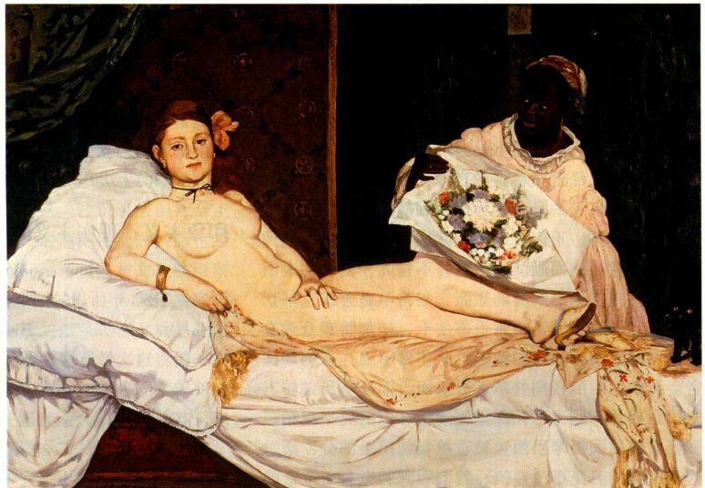

第二十五章 实证主义时代：现实主义、印象主义与拉斐尔前派，1848\-1885年 871

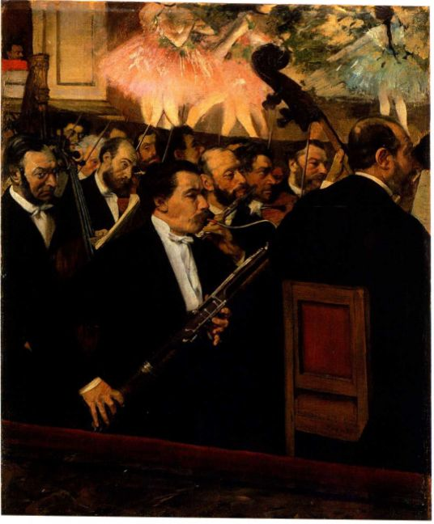

图25\.12 埃德加·德加：《巴黎歌剧院管弦乐队》。1868\-1869年。

布面油画，56\.5 × 46\.2厘米。巴黎奥赛博物馆

马奈和波德莱尔在盖尔布瓦咖啡馆（Café Guerbois）的交际圈，转而捕捉现代巴黎的面貌。受马奈启发，他发展出一种适合自己题材的绘画方法与创新的构图设计，赋予其图像自发、瞬间的性质，将观众置于不为人所注意的、名流通常会选择的窥探位置。现在他会去描绘奥斯曼大街、女帽商店、隆乡赛马场、咖啡馆音乐会、歌剧演出、酒吧和咖啡馆场景。德加敏锐的双眼捕捉到社会所有阶层的人物类型，从中产阶级到表演者、社会边缘人和工人阶级，无所不包。

德加19世纪60年代的经典之作是《巴黎歌剧院管弦乐队》（The Orchestra of the Paris Opéra，图25\.12），作于1868至1869年间。画作最初只有位于前景里的巴松管演奏者的肖像，后来范围扩大到其他乐师，很多人的身份都可以得到确认。这幅作品本质上是风俗画，不仅表现了乐队成员，还有舞台上的芭蕾舞舞者。然而画面的主题并不是天才勤奋的表演者，而是现代生活本身的紧张、兴奋与破碎，这一切都以真实的方式表达出来。事实上，德加将观众放在一个凹洞之中，让我们感到自己仿佛不受注意的窥探者。我们采取的视角并不来自正面，而是有所偏转，对绘画而言不同寻常，却是剧院常客们的典型视角。画面右部的大提琴手形象被直接裁切掉一部分，暗示这里所看的只是乐池左侧，我们看到的也只是全景的

片断。对芭蕾舞者的处理也是同样，她们的头部和腿部都被裁在画框之外。

在人物塑造方面，墙壁、舞台、乐队前排的人物以及芭蕾舞者都是基于同样的准备\-稍许倾斜。无论演奏乐器时斜拉的手臂还是舞者的四肢都是如此。空间似乎被压缩了，远景与近景戏剧性地重叠在一起，暗色的大提琴头部映衬着色彩鲜艳的芭蕾舞短裙。图像仿佛沿绘画平面向上攀爬，而非退入空间之中。精确的线条勾勒出人物与器物，但活跃的笔触四处挥洒，在舞者的短裙上表现得最为明显。这为画面增添了些许自发性与短暂性，令观众得以充分感知这一瞬间。

学者们通常将德加的创新性构图归功于日本版画的影响，后者正是在19世纪50年代晚期涌入了巴黎市场。当年美国海军司令马修·佩里（MatthewPerry）率领四艘火轮战舰驶入东京湾，迫使日本在200年的闭关锁国之后向西方敞开了大门。到了60年代早期，世界市场上的日本产品比比皆是。扇子、花瓶、和服、漆柜、折叠屏风、珠宝和茶具是西方家庭中最为常见的商品。法国人对日本文化情有独钟，他们对此的痴迷被人称为日本风（Japonisme），英国人和美国人也沿用了这一词汇。日本馆是1867年巴黎世界博览会最受欢迎的展区。引起艺术家特别关注的是日本版画，最初作为易碎商品的包装辅料而运抵法国，但在50年代晚期成为马奈交往圈子中的收藏品，当时的艺术家认为这些版画充满视觉上的魅力。

正如安藤广重（Andō Hiroshige，1797\-1858年） 的《龟户梅园》（Plum Estate，Kameido，图25\.13）那样，日本图像的制作对于西方的欣赏眼光而言极其另类。形式扁平，轮廓尖锐，对空间加以压缩。前景似乎快碰到观众的鼻子，而后景则被推到前景空间之内，远近之间毫无过渡。将观众放在树上，眺望远景中微型化了的主要活动场景，仅就这个观念而言，西方艺术家就会将其视为激进之举。然而，日本版画干脆的轮廓、生硬的裁切与紧缩的空间无疑影响了德加和马奈，尽管其采用的手法并不明显，也从未进行过直接的临摹。

印象主义：现实主义的另类形式

印象主义（Impressionism）是充满敌意的保守评论家在1874年所用的词汇，来评论“艺术家无名协会”（Société anonyme des artistes）举办的首次展览。现在一般将这次展览视为首届印象主义作品展，1874至1886年间，同样的展览还举行过八届。那位评论家的反应与公众一样，认为这些作品潦草无比，给人的感觉紧紧只是“印象”，远非最终完成的作品。实际上，“印象”一词当时已经用来评论马奈和德加的现实主义作

872 詹森艺术史

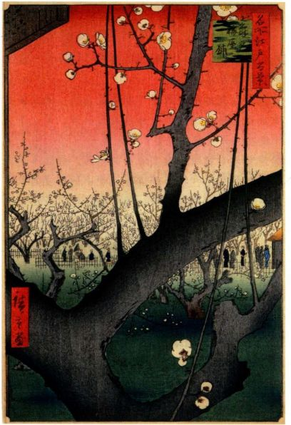

图25\.13 安藤广重：《龟户梅园》，出自《名所江户百景》系列。1857年。木刻版画，34 × 2 1\.7厘米。纽约布鲁克林艺术博物馆，Anna Ferris捐赠。

品，所针对的正是其中草图一般的特性。该词也出现在克劳德·莫奈根据勒阿弗尔（Le Havre）港所绘制的油画标题之中，这幅作品参加了首次印象主义展览，名为《印象：日出》（Impression：Sunrise）。当向友人解释自己的艺术观点时，莫奈偶尔也会使用“印象”一词（见第874页的原始文献）。

印象主义作品与马奈和德加的现实主义作品一样，都类似未完成的草图，也同样饱含瞬间感和展现现代的欲望。此外，印象主义也是实事求是地去再现对象。许多学者甚至将马奈和德加的作品也归于印象主义之列，部分原因是为了将他们的作品与库尔贝、米勒朴实的乡村现实主义加以区别，并表明印象主义与这两位艺术家所共同据有的都市感和现代感。印象主义者确实与马奈和德加一样，关注记录法国社会正在发生的转变，特别是新贵们的消闲活动。虽然也绘制城市场景和风俗画，但他们逐渐将注意力放在巴黎周围原本沉睡的村庄中发生的演变。一方面不断变为建有工厂、商业码头和铁路桥的忙乱郊区；而另一方面，也出现了餐馆、赛舟会和划船活动，以供前来度周末的巴黎人游乐。印象主义者关注的焦点是风景与市景，而非人物。他们不会在画室里根据模特构建作品，而是倾向于在户外以直接感受的方式作画，记录下风景与天气条件，见证时间中飞逝的瞬间。与其说他们

描绘了物体，不如说描绘了在物体表面跳跃的彩色光线。事实上，他们画的并非心之所知，而是目之所见。

克劳德·莫奈 克劳德·莫奈（Claude Monet，1840\-1926年）是印象主义发展过程中的领袖，他出生并成长于诺曼底地区的勒阿弗尔。莫奈间断性地师从颇有造诣的风景画家欧仁·布丹（Eugène Boudin，1824\-1898年），布丹通常选择在户外作画。但是为了从身为杂货商的父亲处获得经济支持，莫奈被迫前往巴黎，选择具有学院派思想的自由画家夏尔·葛列尔作为自己的老师。莫奈在画室里结识了奥古斯特·雷诺阿，雷诺阿与年长许多的卡米耶·毕沙罗后来成为了印象主义画家中的核心人物。19世纪60年代早期，莫奈不得不前往阿尔及利亚服兵役。与德拉克洛瓦一样，他所体验到的强烈光线与色彩与诺曼底海边白云朵朵的温和天气迥然不同。在之后的60年代，莫奈与友人们绘制巴黎周围的风景，并结识了柯罗和巴比松画派艺术家，莫奈也从那里获得了许多与户外作画相关的鼓励。然而，对莫奈及其同伴而言，户外绘画并不是小型习作，而是大幅的最终作品。他们在风景中运用大胆的笔触迅速作画，力图捕捉事物表面所反射的光线，以及光线所具有的色彩。马奈会在商店买回的颜料中添加调色油以保持颜料润滑，而莫奈则完全、或几乎不加调色油，为的就是保持颜料干燥，让色彩凌驾于颜料的塑形能力之上。对于最终的作品，莫奈也不会给其涂上光油，因为那会损害色彩的效果。莫奈大量运用原色和间色这种传统色轮上的主要色调。他的做法同样受到了当时色彩学研究的影响。色彩学成功证明了互补色的强度在并置时会增大，例如蓝色与桔色、红色与绿色、黄色与紫色等（见第876页的材料与技法）。

《班纳库尔的塞纳河畔》（On the Bank of theSeine，Bennecourt，图25\.14）表现了莫奈调色板的效果，这幅1868年的作品创作于巴黎上游的小城，那里是巴黎人夏天乘火车前去度周末的众多小城之一，位于塞纳河和瓦兹河流域。在这些城中巴黎人还建造了许多令人印象深刻的别墅。艺术家运用浸染着阳光的耀眼白色、亮蓝色和绿色，其间点缀着红、黄两色的色点。阴影中的树叶和青草等物则保持原本的颜色，并没有变暗。棕色也不污浊，而是充满了光线的茶色。莫奈强调色彩的力量，于是将图像拉近绘画平面，不容许暗示深度。画中没有使用塑造形体的明暗对照法。树木的枝叶只是平面的侧影，起映衬作用的湛蓝天空也同样扁平。房屋在水面上的倒影沿绘画表面倾泻而下，增强了明朗流淌的光线与深蓝的河水的平面性。致密的蓝天实际上与河水中较深的蓝色具有相同的浓度，

第二十五章 实证主义时代：现实主义、印象主义与拉斐尔前派，1848\-1885年 873

原始文献

利拉·卡波·佩里（Lila Cabot Perry，1848？\-1933年）

图25\.14 克劳德·莫奈：《班纳

库尔的塞纳河畔》。1868年。布面

油画，8 1\.6 × 1 00\.7厘米。芝加哥艺

术学院，Potter Palmer夫妇收藏

节选自《克劳德·莫奈回忆录：1889\-1909年》\(Reminiscences of Claude Monet from 1889 to 1909\)

佩里是一名美国移民画家，在法国的创作以印象主义风格为主。莫奈并没有公开阐述过其艺术理论，于是佩里的记述就成为了解其观点的最佳材料。

他从来不收学生，但如果他愿意，那么一定是最有启发性的老师。我记得他曾经对我说过：

“当你外出作画的时候，尽量忘记你眼前的东西，不论树木、房屋、田地或者其他什么。你只要这样想就可以，这里是个蓝色的小方格，那里是粉色的椭圆，还有黄色的长条，

借由这种关联暂时将天空推向前景。唯一暗示出空间深度的元素是斜向退入透视之中的小舟。莫奈大胆斑驳的笔触也起到维护作品平面性的作用，笔触的形态随着所表现的事物而变化，赋予画面一种闪烁不定的感觉，向观众表明所见到的是随时间流淌的那一瞬间。

同样重要的是，当时人们认识到作者笔触所代表的正是现代生活的不稳定性与易变性。这些作品看起来与之前的风景画毫无共同之处，缺少克劳德·洛兰的古典主义面貌，也没有荷兰风景画家的巴洛克式传统与朴实的色调，甚至连浪漫主义作品中的情感结构也无从得见。正像主题一样，作品的外表也是现代的。我们可以确定，那位衣着时髦的女子不是当地人，而是一个巴黎人，当下正划着小舟。

大约在19世纪60年代中期到70年代中期，莫

然后把你眼前所见的画下来，色彩和形状都保持原样，直至还原出你刚才脑海中天真的印象·····\.”

他认为，对于主题的第一眼很可能是最真实、最无偏见的。此外，首次作画时应该尽可能地将画布画满，无论多么潦草，这样才能在一开始就确定整体的色调······

莫奈的绘画哲学是画眼睛真实看到的东西，那既不是你认为自己应该看到的东西，也不是置于试管中的孤立对象，而是包裹在阳光与空气之中的事物，其阴影还反射着蔚蓝的天幕。

SOURCE:THE AMERICAN MAGAZINE OF ART,MARCH 18,1927\.

奈开始描绘现代巴黎的场景，其中包括新现代的象征，例如圣拉扎尔火车站（Gare St\.Lazare）的车流和《嘉布遣大道》（Boulevard des Capucines，图25\.15）。后者是奥斯曼所规划的新大街之一，位于歌剧院附近，两旁净是些时尚的公寓与商店。在这幅关于街景的作品之中，莫奈使用闪烁的笔触、鲜明的明暗对比准确捕捉到了城市大街与人行道的律动，同时还着重表现了富有行人的白衬衣与高礼帽，以及一簇粉红气球等细节。这幅绘画创作于摄影师纳达尔（见第893页）工作室的阳台，首届印象主义展览正是在这里举行。较高的斜向视角对市景画而言实属罕见，却是城市景观摄影的常用角度，赋予了画面戏剧性和活力，以及创作这幅画的目的\-捕捉现代世界的昙花一现。

奥古斯特·雷诺阿 在葛列尔的画室里相识，并

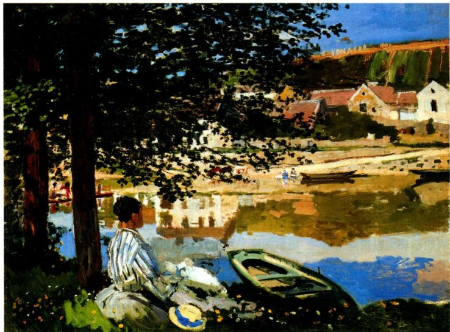

874 詹森艺术史

图25\.16 奥古斯特·雷诺阿：

《赛舟会午餐》。1881年。布面油

画，129\.5 × 1 72\.7厘米。现属于华

盛顿特区菲利普斯博物馆（Philips

Collection），1923年购入

与莫奈结为好友之后，奥古斯特·雷诺阿（AugusteRenoir，1841\-1919年）也发展出了自己的印象主义风格\-色彩明亮、笔触大胆，热衷表现现代题材。他经常与莫奈一起作画，绘制风景作品。但雷诺阿也受人物画传统的吸引，于是在其创作生涯中涵盖了风景画与人物画两种类型。

作于1881的《赛舟会午餐》（Luncheon of theBoating Party，图25\.16）是雷诺阿最为知名的风俗画作品之一。这幅作品以夏都村（Chatou）的弗尔乃兹（Fournaise）餐馆作为背景。这个小村庄正好位于塞纳河中的小岛上，距离巴黎的圣拉扎尔火车站约15公里，特别受泛舟爱好者的喜爱，而此类餐馆恰好也迎合了巴黎人的口味。远景中的帆船、小舟和商船隐约可见，另外还可以瞥到铁路桥的一角。

参加餐馆聚会的都是城里人，只有餐馆老板的儿子阿尔庞内斯·弗尔乃兹（Alphonese Fournaise）除外。他斜倚着栏杆，强健的臂膀说明他整天都在拖拉那些出租小船。雷诺阿细致地再现了人物服装，让我们能够分辨出他们所属的社会类型。例如戴高礼帽的男子似乎比戴草帽的年轻人更加保守、富有，他的原型是一位收藏家，而那些年轻人的形象则来自雷诺阿的友人。雷诺阿甚至画了一系列划船草帽，既有画面下部右方坐着人物所戴的城市风格草帽，也有画面上部右方男子所戴的乡村草帽，还有20年前流行的水手帽，高礼帽绅士左边的人物就戴着这样的帽子。阳光灿烂的乡村休闲场景令人愉悦、放松，给人以美感，而餐桌上奢华的宴席以及用于桌布那丰富灿烂的笔触则加

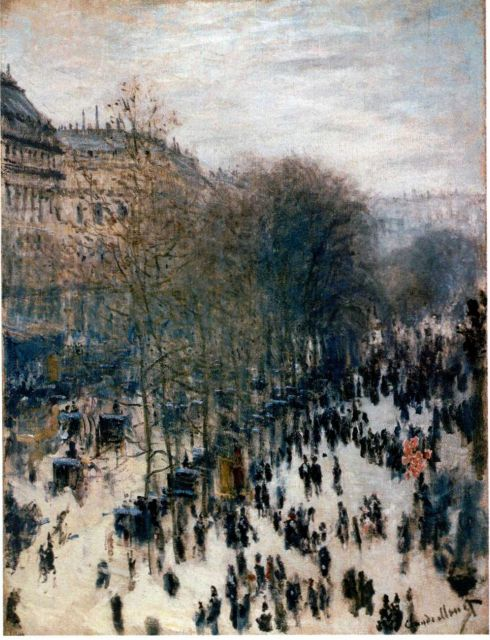

图25\.15 克劳德·莫奈：《嘉布遣大道》。1873\-1874年。布面油画，79\.4 × 59\.1厘米。密苏里州堪萨斯城纳尔逊\-阿特金斯艺术博物馆\(Nelson\-Atkins Museum of Art\)

强了其感官之美。这幅作品具有与现实主义相关的瞬间性，部分要归功于作者闪烁、轻柔的笔触，以及不对称的构图。画面从左部向右部退去，具有与德加《巴

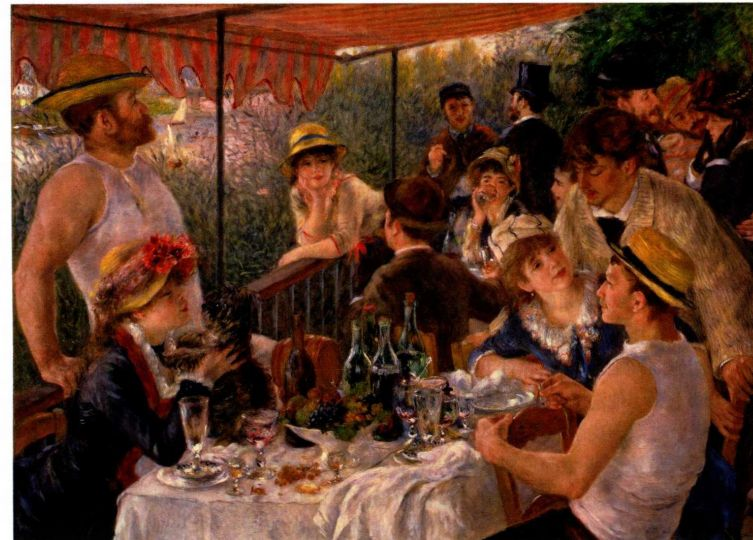

第二十五章 实证主义时代：现实主义、印象主义与拉斐尔前派，1848\-1885年 875

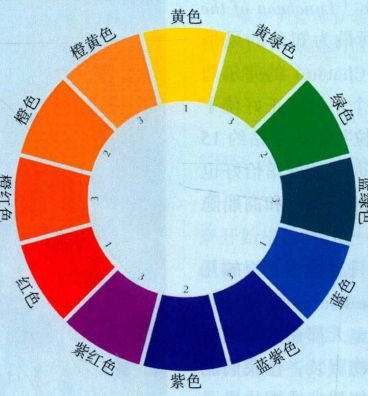

材料与技法

印象主义的色彩理论

印象主义不仅仅是以现实主义为前提，基于自发经验在画布上捕捉色彩与光线的结果。科学发现、技术发展与日常实践也在这种风格的演变过程中扮演了重要角色。而化学家米歇尔\-欧仁·谢弗勒尔（Michel\-Eugène Chevreul，

能量都可以上升到几乎振颤、爆裂的程度。

欧仁·德拉克洛瓦可能是第一位受谢弗勒尔理论影响的艺术家，尽管他在早年间就凭借自己的直觉发现了相似的概念（见第845页），而且确实在绘画中将对比强烈的小块色彩并

1786\-1889年）所发明的色彩理论正是其中之一，前者在1839年出版《色彩和谐与对比的原则》（ThePrinciples of Harmony and Contrast of Colors）中系统阐述了该理论。谢弗勒尔在巴黎哥白林织造厂的染色车间工作，他注意到色彩的强度不仅由色彩本身决定，还受到其与周围色彩关系的影响。原色（红、黄、蓝）与两种原色调和而成的复合色（绿、桔、紫）在并置时显得更为强烈，他将这种关系称为同步反衬（simultaneouscontrast，第3号色又结合了相邻两种复合色）。将亮色置于暗色旁边的明

暗对比也会对色彩的力量产生影响。

橙红色

蓝绿色

传统色轮

列放置。但是，印象主义者却是首批以原色和复合色作为主要色彩进行绘画的艺术家，虽然他们用色的范围早已超越色调的局限。为了保持色彩强度，印象主义者开始在预先准备好的画布上直接作画。相比运用暗棕色或棕红色来打底的传统，这样使画布可以显得更为明亮。卡米耶·柯罗开创了运用较为明亮的画布作画的方式。当时他开始将银色用在绘画中，据说这可以帮助他协调蓝绿两色的紧张关系。似乎当时并没有哪位印象主义者阅读过谢弗勒尔的书籍，但是到19世纪60年代末期，他的理论已经成为了众多对色彩感兴趣艺术家的必修课。

并置红绿、蓝橙和紫黄之类的互补色能够获得最大强度的色彩效果，而这几对色彩在传统色轮上恰好处于相对的位置。在纯红旁配以纯绿，红色会更红，绿色会更绿，每种色彩的

黎歌剧院管弦乐队》相同的裁切方式及片断感。

《赛舟会午餐》是雷诺阿放弃印象主义风格之后不久的作品。他与若干位同伴开始相信评论家的意见，认为现实主义者不懂素描，其艺术也缺乏过去伟大艺术所具有的永恒、宏大和持久。在《赛舟会午餐》里，雷诺阿开始为人物造型，甚至运用清晰的轮廓来描画器物及人物。正如我们所见，先锋艺术家们在19世纪80年代将回归某些与古典艺术相联系的价值观。

卡米耶·毕沙罗 毕沙罗（Camille Pissarro，1830\-1903年）是印象主义者中老一辈的领袖，比其他画家年长十岁左右。他在1855年从家乡加勒比海地区的圣托马斯岛来到巴黎。19世纪60年代期间，毕沙罗找到了曾指导过他的柯罗，同时也开始研习库尔贝和夏尔·多比尼（Charles Daubigny）的风景画。后者是著名的巴比松画派艺术家，通常在户外作画，尤以在小舟上创作而闻名。毕沙罗对于发展现代激进艺术的努力丝毫不亚于他对风景画的热情。后来他在60年代晚期形成了类似于莫奈的风格，具有直接感受与自发的特点，并大量使用明亮的色彩。但与马奈、莫奈、德加和雷诺阿不同，毕沙罗从未将自己视为巴黎人，而是选择居住在巴黎周边的乡村，后来逐渐变成了城市的郊区。

在1867年夏尔·布朗（Charles Blanc）的《绘画与版画法则》（TheGrammar of Paintingand Engraving）中，这些理论得以复述，书中同时还收录了德拉克洛瓦对于同步反衬应用的论述。

虽然有时也绘制工厂和火车，但他更像一名关注民众的社会无政府主义者。农民和农场才是他青睐的题材，而非市民与郊区娱乐。在巴黎期间，毕沙罗与同辈艺术家们聚集在盖尔布瓦咖啡馆社交。他不仅指导年轻艺术家，而且还是艺术家无名协会的成员兼仲裁员，参加了该协会的全部八次展览。

毕沙罗是一位谨慎理性且深思熟虑的画家，正如60年代期间的莫奈，他也喜欢在户外作画，并在那里发展出了鲜艳的色彩使用风格与大胆的颜料施涂手法，特别适合用来捕捉天气状况与具有飞逝感的画面。他的构图通常极为复杂，例如1875年作于巴黎郊区蓬图瓦兹的《埃尔米塔什登山路，蓬图瓦兹》（ClimbingPath at the Hermitage，Pontoise，图25\.17）。他在画面深景处的村庄前绘制了一片浓密、扁平的树木，起到屏风的作用。远景的一瞥与通向右方的小径形成对比，后者仿佛正沿画布蜿蜒而上，而不是退入其中。树干、树叶和岩石则以宽阔的笔触和大胆的调色刀平涂手法完成，结果使其如同平面、甚至抽象的物体。而远处的房子则以透视法来建构，仿佛坚实的立方体，其实体性与前景的平面化截然相反。虽然毕沙罗表现出巴比松画派画家所共有的对自然与乡村生活的热爱，但

876 詹森艺术史

图25\.17 卡米耶·毕沙罗：《埃尔米塔什登山路，蓬图瓦兹》。1875年。布面油画，54 × 65厘米。纽约布鲁克林博物馆，Dikran K\.Kelekian捐赠基金购入，22\.60

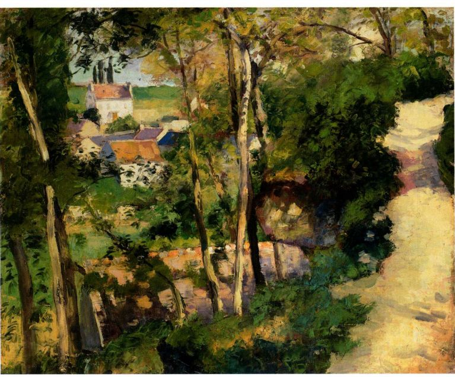

他同时还强调绘画创作中的抽象特质，将平面与立体、几何直线与无结构的有机形并置，或将透过平涂树木看到的深景和沿画面而上的小径并置，使彼此较量、抗衡。这种复杂但又极具结构性的构图日后对同辈印象主义画家保罗·塞尚产生了巨大的影响，而后者又转而影响了帕布罗·毕加索和立体主义。

马奈与印象主义 从19世纪60年代晚期到70年代中期，莫奈、雷诺阿和毕沙罗三人的风景画风格彼此最为相似。然而，尽管参展的36位艺术家中的大多数都注重色彩画法，并经常运用明亮的色彩在户外作画，1874年举办的所谓“首次印象主义展览”并非旨在呈现某种特定风格或艺术运动。其实这次展览就是为了向公众提供年度沙龙之外的观赏选择。德加曾参加过其中的大部分展览，同时是展览的极力宣传者之一，但他多次否认自己是印象主义者。他的作品中缺少对色彩和光线的强调，这无疑将他与画展的核心人物区分开来。马奈从未与印象主义者一起展出作品，他这样做的目的是为了能获得沙龙认可，从而可以进入学院。然而他在19世纪70年代时却采用了印象主义的色彩风格，并于1873年与莫奈一起在巴黎近郊阿让特伊（Argenteuil）的户外作画。尽管马奈的颜料仍然保持着润滑的状态，他的色彩从没有实现真正的强度。

马奈在其最后一幅现实主义杰作《女神游乐厅的吧台》（A Bar at the Folies\-Bergère，图25\.18）中使

用了斑斓的色彩。这件作品创作于1881至1882年间，具有典型的马奈风格，其中富含典故与隐藏的信息，这在现实主义与印象主义的作品中都不常见。画中的大部分图像都出现在镜子里，平滑的镜子仿佛是另一幅绘画，代表着幻影。女招待背后所反射的幻象是欢快、喜庆的现代生活。舞厅内人头攒动、活力四射的场景实质上象征着当时的巴黎夜生活。但是作为实像而非折射影像的女招待却以悲伤、空洞的眼神望着观众，其所流露的疏远孤立之感才是当代城市生活的真实写照。虽然有些变形，但女招待的背影同样出现在镜子里；她的身体略微前倾，摆出一副活跃与忙碌的样子。镜子中的影像说明有位衣冠楚楚、戴高礼帽的男子正在接近她，可能是想来吧台购买饮料和水果。但有些艺术史家认为他与女招待有着某种秘密交易，并引证当时很多女招待兼任妓女的事实，还指出她们与女神游乐厅的享乐与欢宴一样诱人。这种意见无疑解释了镜像中女招待身体那不合理的变形，其实表明她身兼两职。撇开这种解读不谈，两人相遇的安静瞬间从喧闹的镜中世界回到了现实，反映出现代生活的特质\-无名、随机的偶遇，以及城市的疏离。画面似乎也正在就物质主义对现代生活的浸透发表评论。女神游乐厅消费高昂，为的是迎合富人的口味。吧台处引人注目的静物式景象则捕捉到了音乐厅的奢华富丽。但尽管镜子中的影像欢乐华美，画面中却充满了空虚与悲伤，令人联想到金钱并不能买来幸福。马奈的画作通

第二十五章 实证主义时代：现实主义、印象主义与拉斐尔前派，1848\-1885年 877

图25\.18 爱德华·马奈：《女神游乐厅的吧台》。

1881\-1882年。布面油画，95 \.3 × 1 32 \. 1厘米。

伦敦考陶尔德艺术学院画廊（Courtauld Institute of

Art Gallery），Samuel Courtauld 信托基金

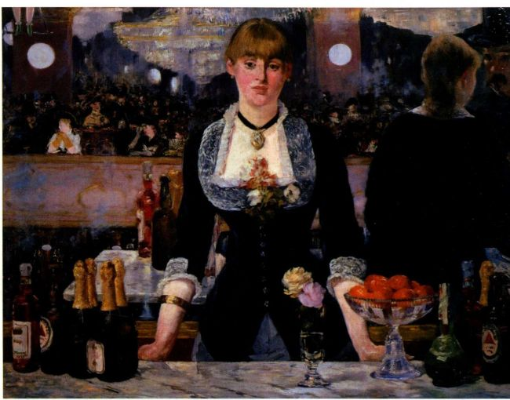

常都像精心编织的谜题一般，并没有固定的解释，对各种解读都敞开大门，甚至包括其中的自相矛盾。

贝尔特·摩里索 贝尔特·摩里索（BertheMorisot，1841\-1895年）是印象主义画家中的关键性人物。她出生于安逸的巴黎家庭，与姐妹艾德娜（Edna）在19世纪50年代晚期开始正式从事绘画工作。当时的美术学院并不招收女学生，于是这对姐妹只好师从那些不甚重要的艺术家，但这些老师大都知识广博，而且相当支持她们作画。她们在60年代早期倾向于风景画创作，还曾前去拜访柯罗。柯罗被她们的作品所打动，多次与其见面，甚至赠送了一幅作品供她们研习。摩里索姐妹都具有柯罗式的风景画作品被1864年沙龙接纳。次年，贝尔特的一幅人物画再次入选沙龙。艾德娜在1869年结婚，之后停止了绘画工作，但贝尔特则继续她的艺术家之路。

身为女性，摩里索不能光顾盖尔布瓦咖啡馆，但这并不妨碍她与先锋派圈子中的艺术家交好，甚至成为其最受欢迎的一员。她参加马奈、德加等现实主义艺术家举办的晚餐或一周一次的沙龙。沙龙一般都在某位成员的家中举行，马奈的母亲就曾举办过类似的活动。摩里索与马奈的友谊尤为深厚，曾为他的七幅作品当过模特。日后摩里索的笔触日益疏放，色彩也逐渐明亮。她创作风景画和人物画，描绘城市、郊区和海滨的现代消闲活动。她笔下的人物通常是女性和孩子，对她而言这是最容易看到的题材。虽然画中女子衣着时髦，但并不漂亮、轻浮或愚钝，这些女子更像是充满智慧的思考者，懂得如何管理自己的形象。她们从未被表现为男性的附庸，这一点与雷诺阿《赛舟会午餐》中的女性截然不同（见图25\.16）。我们

可以感到摩里索实际上自己界定了一个女性世界，与男性世界一样正当合理，具有重大意义。

摩里索的作品也可以被看作富足女性的活动目录：采花、喝茶、照料孩子、阅读缝纫，或者在郊区和海滨度假。但真正令那些同辈先锋艺术家印象深刻的无疑是她杰出的技法与高妙的处理：大胆的笔触奇妙地造就出人物与器物的形体，同时还在画布表面呈现出颜料交织而成的抽象色毯，这种灵巧的配比手法甚至连马奈也是赞赏不已。莫奈、德加和雷诺阿都是1894年杜兰·鲁埃（Durand\-Ruel）画廊摩里索纪念展览委员会的成员。《夏日》（Summer＇s图25\.19）又名《布洛涅森林中的湖泊》（The Lake inthe Bois de Boulogne），展示了摩里索的精湛绘画技巧，而画中所描绘的流行场所消闲活动也是现实主义和印象主义的经典题材。衣着时髦的人物具有典型的摩里索特征，她们之间并无交流，而是陷入深思，也有可能是在平静地观看，而通常认为这些举动是男性特有的标志。在用色范围上更接近于马奈和柯罗，而与莫奈有所差异，但画面还是展现出了夏日里万物表面所漫衍开来的光线。摩里索采用了德加所发明的非对称式裁切构图，增强了笔触、画痕所造就的自发性特点。

玛丽·卡萨特 与摩里索一样，玛丽·卡萨特（Mary Cassatt，1844\-1926年）也是以女性的视角解读印象主义，而她的现实主义甚至反映了当时妇女运动中所产生的社会问题。卡萨特是美国人，出生在富有家庭，成长于匹兹堡。她在费城的宾夕法尼亚艺术学院学习绘画，为了能让她的艺术家之路更加顺利，她的家人也随之迁到这里，这种举动在当时的确非比寻常。1866年，卡萨特前往巴黎，最初师从一位向女

878 詹森艺术史

图25\.19 贝尔特·摩里索：《夏日》。约1879年。布面油画，45\.2x74\.5厘米。伦敦国家美术馆，Lane于1917年遗赠

性授课的艺术家，之后被著名的学院派画家让\-里昂·热罗姆（Jean\-Léon Gérôme）收为学生。她还曾在帕尔马和罗马学习绘画，1874年返回巴黎，此后一直在巴黎生活，直到去世。她与德加成为好友，并抛弃自己的学院派风格，转向现实主义。应德加的邀请，卡萨特参加了1879年的第四届印象主义展览。此时她的作品色彩明亮、笔触强烈，注重表面的感觉，同时还采用了现实主义的非对称裁切式构图。

与德加和马奈一样，卡萨特也是一位人物画家。自19世纪70年代晚期开始，她最为著名的创作题材就聚焦于歌剧院包厢中的女性，雷诺阿和德加也创作过同样题材的作品。卡萨特同样也绘制居家的女性形象，她们时而阅读书籍，时而探访亲友、喝茶、缝纫或浴儿。她的表现手法与摩里索一致，笔下智慧的现代女性衣着优雅、举止得体，进行着休闲的活动。后来在80年代，卡萨特放弃了包厢题材，日益专注于家居场景，特别是母子形象。

学者们通常认为卡萨特的选题受到其作为女性所面对的约束的影响。体面的女性不能像男性那样独自前往某些场所。但更为重要的是，卡萨特认为女性在社会中扮演着重要的角色，即使主要局限在家庭里。她的观点与当时的妇女运动不谋而合，共同推进了社会进步。1878年，国际妇女权利大会（InternationalCongress of Women＇s Rights）在巴黎召开，议程的第一条就是讨论妇女急需获得更好教育的问题。随后在80年代，法国就在法律中规定了中学的免费义务教育。教育不仅使得女性得以进入职场，而且有助于她们更好地管理住宅与家庭。国际妇女权利大会同时也讨论了女性在抚养子女方面的重要角色，提倡母亲自己哺

乳、照料孩子，而不是通过雇佣奶妈的方式解决。这种立场反映出70年代的社会潮流\-社会学家普遍认为抚养孩子具有重要意义，部分原因在于欧洲的婴儿死亡率过高，法国尤为如此。很多人认为，家庭是走向更加健康社会与国家的基础，而这种基础恰恰要靠母亲的双手完成。她们应该在身体、情感方面养育子女，其中就包括注意孩子们的卫生与保健。

在这样的社会背景之下，卡萨特创作了大量描绘家居场景或母亲照料子女的作品，例如作于1891至1892年间的《给孩子洗澡》（The Child＇s Bath，图25\.20）。水罐和水盆以今天的眼光看来可能显得古怪、过时（因为当时只有美国才装设有大范围的家用下水管线），但定期洗澡对于19世纪晚期的巴黎并不普遍，当时人们通常一周只洗一次澡。这幅画作不仅与健康有关，还融入了强烈的情感与身体动作，画中女子碰触孩子时所表现的日常而温柔的方式就是最好的证明。

作品包含了所有与现实主义相联系的成分\-时尚的中产阶级装饰、明亮的色彩、笔触的自发性，以及由高视角带来的倾斜构图。画作的风格反映出卡萨特在这一期间极其关注日本版画，这种关注不仅表现在高的视角，对于形体与轮廓的大胆处理同样说明了这一点。作者同时还受到了文艺复兴艺术的影响，色彩颜料具有粉笔式的柔美和松软，近似于蛋彩画的风格，而强烈的轮廓线则像15世纪的欧洲绘画那样明确有力。卡萨特的众多母子题材作品都与文艺复兴时期对圣母子的描绘相似，暗示女性在创造良好社会过程中的重要角色。此外，还反映出19世纪80年代之后现实主义的发展方向。正如雷诺阿的《赛舟会午餐》那样，众多画家开始创作更为宏大的作品，不禁令人

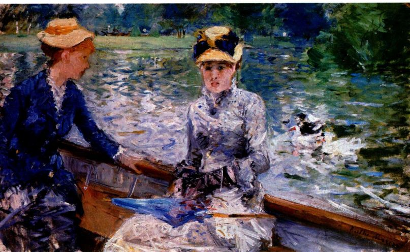

第二十五章 实证主义时代：现实主义、印象主义与拉斐尔前派，1848\-1885年 879

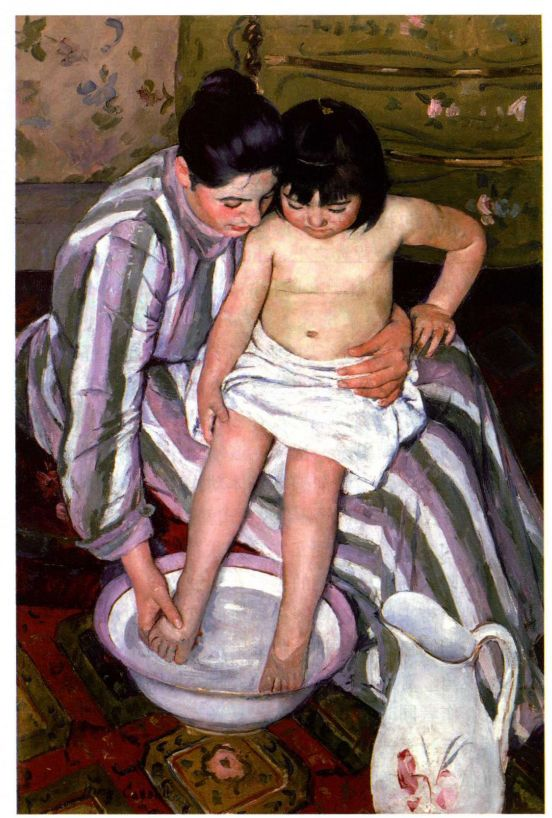

图25\.20 玛丽·卡萨特：《给孩子洗澡》，1891\-1892年。布面油画，1 00\.3 × 66厘米。芝加哥艺术学院，Robert S\.Waller收藏

回想起过去的古典艺术。

19世纪90年代的莫奈 在1886年最后一次印象主义展览中，其核心小组的凝聚力早已不复存在，取而代之的则是新的关注焦点与风格。1883年马奈去世，标志着库尔贝于19世纪40年代开创的艺术运动终结。而莫奈则活到了20世纪，虽然从未放弃现实主义这一艺术创作前提，他对于印象主义的忠诚也从未改变，然而他却成功创作出当时最为抽象的绘画作品。与此同时，这些作品越来越如梦境一般朦胧美好。

19世纪80年代早期，莫奈开始创作系列作品，重复绘制同一主题。题材包括干草堆、鲁昂大教堂以及成行的白杨。有关干草堆的作品最先出现，从1890年开始莫奈一共绘制了30幅有关该题材的作品。他的目标在于表现不同时间、不同季节以及不同天气条件下的同一对象；而且他认为生命并不是凝固的，而是处于持续的变化之中。创作系列作品意味着画作的构图基本保持同一模式。莫奈一次又

一次地绘制单座平面式三角形干草堆，偶尔也会有两座。干草堆位于前景中的田地之上，地平线处有成行的树木、房屋以及遥远的山丘，映衬着顶上的天空。排除了构图的困扰，莫奈专心于色彩的处理，这正是他的挚爱。每一幅作品的色彩都不相同，理论上说是为了捕捉空气与光线条件，同时也是作者享有驾驭色彩自由的体现。

在1891年的《清晨薄雾中的干草堆》（Wheatstack，Sun in the Mist，图25\.21）中，莫奈主要运用了橙色和蓝色这两种互补色，通过彼此映衬使得整幅画面振颤、发光。莫奈闪烁的笔触现在已经发展成为长条纹或者长度、方向各异的线条，增强了光线摇曳的效果，赋予干草堆梦幻般的性质，令人过目不忘。与英国风景画家康斯太布尔和透纳相同，莫奈也注意捕捉整体的气氛，虽然人们对于这一点也有所争议，有人认为莫奈对色彩极为感兴趣，所以在这方面的努力超过了将颜料转化为空气效果的用心程度。莫奈在画室中重复画了许多以干草堆为题材的作品，表明他不只进行经验主义式的绘画创作。在1891年巴黎杜兰·鲁埃画廊《干草堆》系列作品展的目录中，评论家古斯塔夫·吉奥夫罗伊（Gustave Geoffroy）强烈主张该系列是关于体验的作品，而非眼见。这些作品实际上是莫奈对干草堆、对自然的情感回应。吉奥夫罗伊诗意地解读了这些作品，将某幅作品里的干草堆描述为“成堆的闪亮宝石”，另一幅中则又成为了“壁炉的火焰”。莫奈干草堆绘画的虚构性似乎超越了现实性，尽管其本人否认这一点，但他无疑超越了19世纪70年代印象主义的经验论，转而创作诗意的幻象，这一点与其梦幻般的奇异世界并行不悖。而对于幻想世界，我们在下一章中将讨论的象征艺术先锋艺术家尤为精通此道。

英国的现实主义

“现实主义”在英吉利海峡另一端的情况则迥然不同，不过这一术语在英国从不用于形容艺术。在这里，实证主义创造了一种更为具体的自然主义，这既是对自然真理的热情，也是对社会类型的兴趣。英国的工业革命领先了法国近100年时间，但对于工业化和城市化的弊病及其造成的贫困，我们已经通过查尔斯·狄更斯（Charles Dickens，1812\-1870年）以堕落的伦敦为舞台的连载小说耳熟能详。廉价、丑陋的批量产品取代了极其精美的手工产品，而后者曾是贵族与上流社会一度青睐不已的商品。工人不再是经过长期训练的工匠，也不会为自己的产品而骄傲，他们已经沦为了从早到晚盲目劳动的人形机器，不停生产

880 詹森艺术史

图25\.21 克劳德·莫奈：《清晨薄雾中的干草堆》。

1891年。布面油画，65\. l x l OO厘米。明尼阿波

利斯艺术学院（Minneapolis Institute of Arts）

着毫无个人标识的劣等产品。

正是这样的环境促生了最为激进的社会党组织\-宪章派（Chartist），并为基督教社会主义注入了新的能量。这种以《圣经》为基础的信仰笃信社区福利，以及放弃或分享个人财富。在这样的社会背景之下，德国政治哲学家卡尔·马克思（1818\-1883年）与社会党人弗里德里希·恩格斯（1820\-1895年）共同发表了《共产党宣言》。该作品于1848年在英国

大事年表

1849年\-库尔贝创作《奥尔南葬礼》

1852年\-拿破仑一世的侄子路易·拿破仑·波拿巴自称为第二

帝国皇帝拿破仑三世

1859年\-查尔斯·达尔文出版《物种起源》，阐述进化论1863年\-马奈创作《奥林匹亚》

1885年\-马克思主义党派在俄国成立

1891年\-莫奈创作《清晨薄雾中的干草堆》

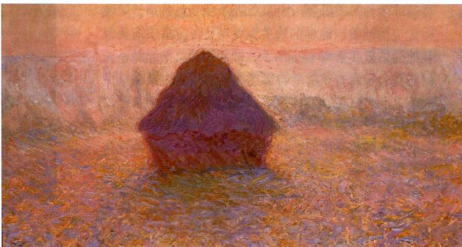

出版，这里是两人当时生活、工作之所在。

然而，力图阻止人们堕入工业地狱的却是艺术家、教育家、作家、艺术评论家与环境保护主义者约翰·拉斯金（John Ruskin，1819\-1900年）。在维多利亚时代，他的影响力仅次于维多利亚女王，并且远播至英国之外，甚至影响到美国人的品位。1846年拉斯金的影响力开始彰显，他在一年之内出版了四卷本《现代英国画家》（Modern British Painters）的第一卷， 此后又于1851至1853年间出版了《建筑的七盏明灯》\(Seven Lamps of Architecture\)。

当代社会需要追求新的精神与道德，这是拉斯金最为著名的信条之一，同时这也就要求人们坚持真理，认同自然的神圣。他提倡艺术教育应普及到社会所有阶层；不仅是中产阶级消费者，作为生产者的工人阶级也要接受艺术教育。拉斯金坚信艺术是必需品，而非奢侈品，因为其在生活与道德观塑造方面有重要的作用，伟大的艺术能够造就伟大的民族。而拉斯金所指的艺术不局限于绘画、雕塑与建筑，也包括装饰艺术，以及所有需要手工制作的美好之物，这与中世纪的观念十分相似。拉斯金本人深受教会学运动（Ecclesiology Movement）影响，该运动最早于19世纪30年代出现在英国，旨在颠覆英国圣公会日益增长的社会、道德惰性，或许应该称之为彻底的衰落。这一运动采用了多种措施，其中包括恢复教堂仪式，

几乎达到了接近天主教仪轨的程度。

拉斯金对自然与宗教的强调标志着19世纪中叶对单纯生活向往的开始，人们开始拒绝城市化与工业化带来的进步。正如我们所见，罗莎·博纳尔与乔治·桑几乎在同一时间号召人们回归保持着“原始”世界面貌的乡村。对拉斯金而言，这种更为纯净的原始世界存在于自然或中世纪基督教灵性之中。“逃离现代世界，追寻原始生活”，这样的观念在19世纪末成为主流主题，然而其种子早在世纪中叶就已埋下。

拉斐尔前派

约翰·拉斯金支持拉斐尔前派（Pre\-RaphaeliteBrotherhood），这是一个1848年9月成立的秘密团体，三位发起者都是皇家美术学院的在校生：威廉·霍尔曼·亨特、约翰·埃弗里特·米莱和但丁·加布里埃尔·罗塞蒂，其中最后一位是拉斐尔前派社团的领袖与代言人。他们在画作上署名“PRB”，质疑皇家美术学院的艺术以及早期拉斐尔之后绝大部分意大利文艺复兴绘画，认为这些作品堕落、颓废，运用污浊的明暗对照法来蒙蔽真理与事实，但给予前拉斐尔时期优雅轮廓、悦目构图等浅明的形式品质以高度评价。这群年轻人与拉斯金一样憎恶中产阶级的品位与物质主义，他们视15世纪意大利与尼德兰早期画家为英雄，例如扬·凡·爱克（见第480页）。在他们眼中，

第二十五章 实证主义时代：现实主义、印象主义与拉斐尔前派，1848\-1885年 881

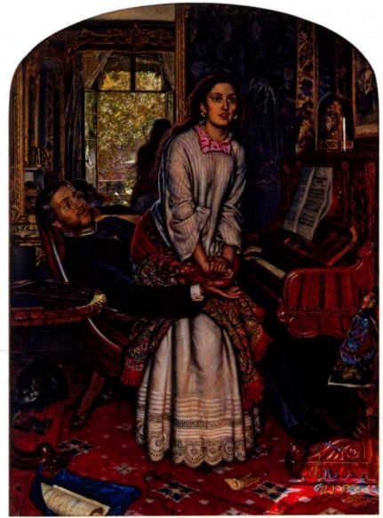

威廉·霍尔曼·亨特 拉斐尔前派中，最具宗教感的人物是威廉·霍尔曼·亨特（William Holman Hunt，1827\-1910年）。他来自一个贫困的工人家庭，作品的特征是维多利亚时代的道德教谕与强烈自然主义的结合。《苏醒的良心》（The Awakening Conscience， 图25\.22）创作于1853至1854年间，受到狄更斯《大卫·科波菲尔德》（David Copperfield）中片断的启发：书中大卫的朋友、纯朴的渔夫佩戈蒂	（Peggoty）前去寻找他的挚爱艾米丽（Emily），但她却随某个品行全无的花花公子私奔了。亨特讲述了当时现实主义文学中成千上万名贫苦女性的故事，她们将卖淫视为自己改善生活的唯一希望，尽管这无疑会将其导向毁灭。当坐在情人膝头歌唱时，这位被包养的女子逐渐为抒情的歌曲所打动，想到了自己的家庭，突然憎恶起自己罪孽的生活，决定必须立刻从中逃离。亨特描绘了一个散落着极度拜金主义者所喜爱的耀眼、庸俗之物的房间，并以堪与扬·凡·爱克比肩的显微镜一般的观察力来表现细节。后者的《阿诺尔菲尼夫妇像》（见图14\.16）在1842年纳入伦敦国家美术馆的收藏。在评论学院派展览的文章中，拉斯金将亨特画作中的事物描述为具有“可怕的光泽”和“致命的新意”，反映出“时代的道德邪恶”。正如《阿诺尔菲尼夫妇像》一样，画中的每一件器物似乎都具有某种象征意义。在桌下抓鸟的猫折射出被包养女子以掠夺他人为生的处境，接近正午的时钟表示留给她行动的时间已然不多了；背景里的镜子反射出一扇敞开的窗户，这正是自由的象征，窗外灿烂阳光下自然的美好与纯洁正在召唤她。《圣经》里的告诫遍布图像，画面底部的书页正是来自《箴言》里的道德篇章。虽然器物与人物繁多，但观众却看不到构图的模式或者悦目、美感十足的轮廓线，因为这正是拉斐尔前派嫌恶的元素。

福特·马多克斯·布朗 年龄较长的画家福特·马多克斯·布朗（Ford Madox Brown，1821\-1893年）是拉斐尔前派的职业导师与教父式人物，其作品中对于细节与伦理问题的处理十分具有启发性。他的《工作》（Work，图25\.23）始作于1852年，直到1865年拉斐尔前派解体时才得以完成。这幅作品是真正的基督教社会主义布道词，表明高贵的工作能够治愈各种社会顽疾；此外，作品还是苏格兰随笔作家兼历史学家托马斯·卡莱尔（Thomas Carlyle，1795\-1881年）笔下《过去与现在》（Past and Present，1843年）一书的图像版本。书中“反动的社会党”主张伟大头脑为

这些画家的作品简朴直接，以诚挚、真实的努力再现大自然。同时，他们还认为这些作品更具精神性和道德感，正是宗教感极强的晚期哥特式风格。

图25\.22 威廉·霍尔曼·亨特：《苏醒的良心》。1853\-1854年。

布面油画，74\.9 × 55 \.9厘米。伦敦泰特美术馆

工人们设想令人满意的工作，而“反动的社会党”则是马克思描述卡莱尔时所用的词语。卡莱尔将此类体力苦工视为“自由流淌的通道，由高贵的力量挖掘而成······排去苦恼和脓水······用肥沃的青草地取代致命的沼泽”。

布朗作品的场景中充满各种器具与细节。其中一幅画的背景是伦敦郊区汉普斯特（Hampstead）的希斯大街（Heath Street），这里的劳动者被称为“挖土工”，终日精力充沛且满怀自豪地铺设下水管道。在画面右部有两位正在观察的绅士，仿佛“哲人”一般，那是持手杖的托马斯·卡莱尔和基督教社会党人弗雷德里克·德尼森·毛里斯（Frederick Denison Maurice）。挖土工身后则是骑马的闲散富人。画面左侧有位卖野花的小贩，没有任何技巧与知识，所以被认定是天性懒惰之人。前景中被酒鬼父亲遗弃的流浪儿年方十岁，观看工人干活的同时照料自己的兄弟姐妹，布朗在一份小册子中详细记录了这些细节。即便是前景中的狗也反映了艺术家对伦敦社会类型人物的严谨记录；杂种流浪狗和挖土工的小公狗紧张地盯着中产阶级人士的优雅小灵犬。此外，布朗无瑕的笔触还记录了夏日正午明亮的光线。正如亨特的《苏醒的良心》，画框上也出现了一段《圣经》引文：“你必汗流满面才得糊口”（《创世纪》3：19），意指人类因吃了知识之树的禁果犯下原罪，所以受到上帝的诅咒。

图25\.23 福特·马多克斯·布朗：《工作》。1852\-1865年。布面油画，1 37 x 1 98厘米。英国曼彻斯特市曼彻斯特美术馆（Manchester ArtGallery\)

图25\.24 约翰·埃弗里特·米莱：《木工作坊里的基督》或《父母家中的基督》。1849\-1850年。布面油画，86\.4x139\.7厘米。伦敦泰特美术馆

约翰·埃弗里特·米莱 拉斐尔前派最初以圣经与文学题材绘画闻名。虽然背景设定在富有宗教色彩的历史之中，但主题却选自当时伦敦的相似事件，以作为一种道德教谕。这种手法在约翰·埃弗里特·米莱（John Everett Millais，1829\-1896年）的作品《木工作坊里的基督》（Christ in the Carpenter＇s Shop，图25\.24）中清晰可见。该作品于1850年在皇家美术学院展出，但恶评如潮。画作将基督表现为一个小男孩，手受了伤，而他的父母正在其作坊里安慰他。房间里的每一样东西都有象征意义，预示着基督日后成为了救世主。他割伤的手掌预示圣痕，表兄施洗约翰所端的水碗意喻洗礼，门外的羊群象征会众，而墙上的工具，尤其是梯子，则表示耶稣将被钉十字架。米莱对现实主义细节的关注可能超过了拉斐尔前派中的任何一位成员。举例来说明，为了创作这件作品，他曾前往木工作坊绘制刨木与木工肌肉的习作，并照着一串羊头描绘了羊群。

这幅作品不仅仅是对于耶稣童年风俗性场景的一次绝妙再创造，同时也是对工艺与劳动品质的赞赏，将其中所具有的精神归于勤勉工匠的品性。米莱还在耶稣的手指甲下画上了污垢，与库尔贝处理其碎石工人的手法一样，进一步将耶稣认定为工人阶级的一员。

威廉·莫里斯 1856年前后，另两位年轻的画家加入了拉斐尔前派，他们就是威廉·莫里斯和爱德华·伯恩\-琼斯。莫里斯（William Morris，1834\-1896年） 后来也设计建筑，并成为了有名的诗人，但他真正的愿望是贯彻拉斯金的理论，用设计优美的手工产品替代劣质的批量产品。真正恢复中世纪时的情况，将工人与他们的产品重新联系起来。1859年，莫里斯与拉斐尔前派以及拉斯金圈子中的建筑师、画家、设计师合作，设计、装潢了自己的住宅。之后他又于1865年与其中几位艺术家合伙开办一间设计公司，最终取名为莫里斯公司（Morris＆Co）。这家公司专门制作优美的手工织物、壁纸、挂毯、地毯、瓷砖、家具和

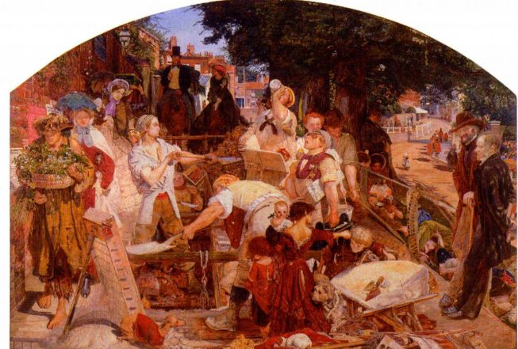

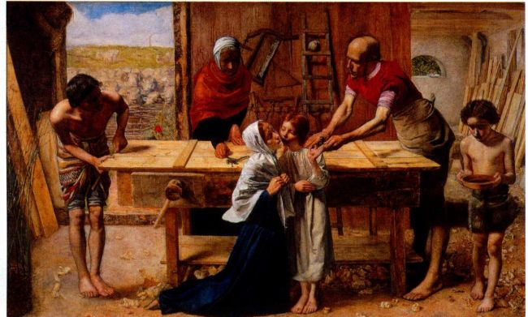

第二十五章 实证主义时代：现实主义、印象主义与拉斐尔前派，1848\-1885年 883

彩色玻璃，莫里斯本人设计了大部分壁纸与织物；而他的设计才能很快又转移到书籍装帧设计之中，也成为了莫里斯擅长的领域，享有国际声誉。

莫里斯及其公司的图案与色彩风格兼具有机与哥特风格，带有自然与灵性的光环，而这种美学观在莫里斯于1867年设计的餐厅（图25\.25）中展露无遗。这座餐厅位于新建的实用艺术博物馆\-南肯辛顿博物馆（South Kensington Museum）之中，这里就是维多利亚和阿尔伯特博物馆的前身。金底的嵌板主要由伯恩\-琼斯绘制，表现一年的十二个月。莫里斯负责设计的壁纸是费工费时，且需要手工印刷的木刻作品，平面抽象的图案以橄榄枝为基础。简朴的箱子也由伯恩\-琼斯负责装饰，其设计者是建筑师菲利普·韦布（Philip Webb），这位建筑师还设计了天顶与壁纸之上的浮雕带。正如手工制作是通向物质真理的重要法则，形式也遵循着拉斯金所提倡的功能性原则。设计师不再使用预先制作的石膏线脚、支架与装饰，壁纸也不再模仿19世纪40年代之前覆盖上层阶级家庭墙壁的奢华织物，建筑内部的木材同样抛弃了昂贵木材一般的装饰纹理。莫里斯对实用艺术的冲击影响深远，直接开创了“工艺美术运动”（Arts and CraftsMovement），并迅速传播到美国境内。

唯美主义运动：个人心理与压抑的性欲

当威廉·莫里斯在工艺美术运动中努力维持拉斯金道德与精神计划的活力时，拉斐尔前派群体已于1860年解体。以米莱为例，他转向了表现逸闻趣事的风俗画，并于1863年讽刺性地就任皇家美术学院院长。

19世纪50年代，少有创作的罗塞蒂倾向以中世纪视觉元素所构成的艺术形式来表达自己的心理状态，关注的焦点并非社会道德观。爱德华·伯恩\-琼斯继承了罗塞蒂视觉艺术的发展方向，最终形成了众所周知的“唯美主义运动”（Aesthetic Movement）。贯穿两人画作的是受压抑的性欲潜流，这也是维多利亚时代对于英国严格道德准则的反映。当时不容许展示性的吸引力，甚至不容许讨论性。

但丁·加布里埃尔·罗塞蒂 今天，但丁·加布里埃尔·罗塞蒂（Dante Gabriel Rossetti，1828\-1882年） 最为人所知、欣赏的作品均创作于拉斐尔前派解散之后。作为该团体最初的领袖与代言人，他在创作原则上的转变具有重大意义。始作于1864年的《贝娅塔·贝娅特丽齐》（Beata Beatrix，图25\.26）与罗塞蒂晚期的风格最为接近。这是他妻子，同时也是其长期模特伊丽莎白·西达尔（Elizabeth Siddal）的肖像，她在1862年通过服用过量鸦片酊而自杀身亡。鸦片酊是提取自鸦片的成瘾性药剂，用于止痛，但经常被人滥用。

罗塞蒂将西达尔描绘为贝娅特丽齐（Beatrice），其是与罗塞蒂同名（但丁）的意大利诗人但丁在《新生》（La Vita Nuova，约1293年）中的虚幻情人。罗塞蒂的画作以其简朴与线性趋向著称，具有早期文艺复兴的风格（对比图15\.17）。贝娅特丽齐手中的日晷显示为9点，那正是西达尔停止呼吸的时刻；带有光环的鸽子令人联想到圣灵，正将致命的罂粟放在贝娅特丽齐膝头。背景中，但丁与情人走在佛罗伦萨的大街上，迷失在薄雾之中。在他们相遇之前，贝娅特丽齐的死亡就已经注定。西达尔身穿中世纪服装，飘拂

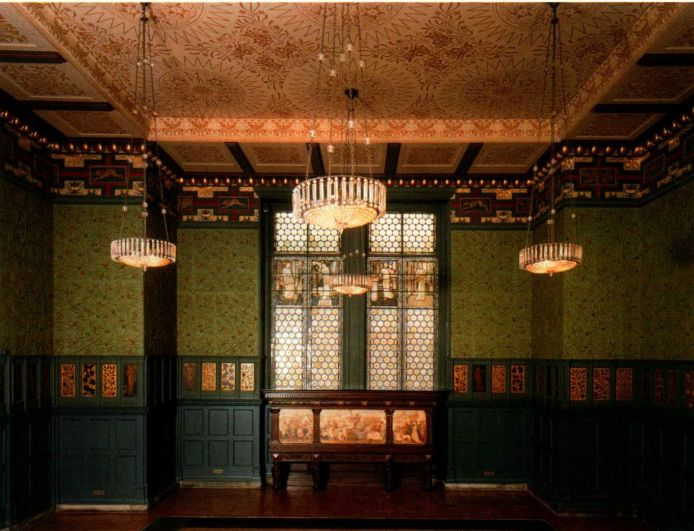

图25\.25 威廉·莫里斯（莫里斯公司）：绿色餐厅或威廉·莫里斯大厅\(Green Dining Room\[William Morris Room］）。1867年。伦敦维多利亚和阿尔伯特博物馆

884	詹森艺术史

的红色长发是典型的晚期哥特风格，头部也为桔色和黄色的“圣光”所包裹。画中人似乎正经历着由生到死的过渡，其表情暗示着祈祷、渴望、顺从，甚至性欲，这些全部都是罗塞蒂在失去爱人时心理状态的反应，同时也包含他本人的性挫败感。起伏的轮廓增强了情色暗示的力度。眼前的作品与拉斐尔前派作品中的现实主义和社会关注相去甚远，然而我们正见证着一种新艺术的崛起，对于幻想与深层的心理欲望的表达正是其擅长之处。

爱德华·伯恩\-琼斯 与罗塞蒂一样，爱德华·伯恩\-琼斯（Edward Burne\-Jones，1833\-1898年） 也甘愿逃离现代世界，生活在中世纪里，他于1873至1878年间创作的《维纳斯礼赞》（Laus Veneris，图25\.27）就是最好证明。作品题材出自唐怀瑟（Tannhäuser）的传奇故事\-一位骑士在与维纳斯的肉体之爱和与其情人的纯洁爱情之间饱受折磨。德国作曲家威廉·理查德·瓦格纳（Wilhelm RichardWagner）在1845年将其改编成歌剧，使之闻名于世。伯恩\-琼斯表现了正在聆听少女赞歌的维纳斯，美国小说家亨利·詹姆斯（Henry James，1843\-1916年）曾在评论中将该作品描述为“苍白暗淡、病弱无力，正是伯恩\-琼斯先生所有同代年轻人的样子”。这种说法也适用于维纳斯的形象，她倦怠懒散的躯体表达着渴望、失落与性压抑。维纳斯坐在绣有她生平故事的挂毯背景前，而左方的窗户似乎与挂毯一样超越现实，故弄玄虚；而窥探成癖的骑士正从窗户向内张望。宽敞的男性空间与拥挤、封闭的女性世界之间暗示了一种紧张的性关系。古怪的线性图案覆盖着整幅作品，但画中的所有事物都具有相同的结构，整个图像也仿佛变成了一张精致的挂毯。

在《维纳斯礼赞》中，拉斐尔前派直率的道德感与现实主义已不复存在，取而代之的是一个奇特、压抑的梦幻世界。在这个世界当中，占据主导地位的并不是行为、决心或事实，而是郁积于怀、受到压抑的情色心理。伯恩\-琼斯在格罗夫纳画廊（GrosvenorGallery）展出了这幅作品，那是一家相对较新的画廊，致力于推广我们现在称为唯美主义运动的艺术作品。诗人阿杰诺·查尔斯·斯温伯恩（Algernon CharlesSwinburne，1837\-1909年）是这一新艺术观念在英国的催化剂，而他正是在19世纪50年代受到法国评论家特奥菲尔·戈蒂埃的影响。戈蒂埃是“为艺术而艺术”的主要倡导者，主张艺术的首要功能是美，吸引人们的感官，而不是在其中投射道德观或讲述故事。罗塞蒂和伯恩\-琼斯都响应了斯温伯恩的号召，但是唯美主义运动中最为著名，同时也声名狼藉的人物则是美

大事年表

1848年\-卡尔·马克思发表《共产主义宣言》

1851年\-赫尔曼·梅尔维尔创作《白鲸》

1863年\-首条地铁在伦敦建成

约1864\-1870年\-罗塞蒂创作《贝娅塔·贝娅特丽齐》

1864年\-惠斯勒创作《白色交响曲二号：白衣少女》

1877年\-维多利亚女王加冕为印度女皇

国画家詹姆斯·艾博特·麦克奈尔·惠斯勒。

詹姆斯·艾博特·麦克奈尔·惠斯勒 詹姆斯·艾博特·麦克奈尔·惠斯勒（James Abbott McNeillWhistler，1834\-1903年）成长于新英格兰和俄国，曾在巴黎师从夏尔·葛列尔（Charles Gleyre，1806\-1874年）学习绘画，并于1855至1859年间居住在巴黎。惠斯勒在葛列尔的画室中结识了莫奈，后来又与库尔贝结交，并确立了自己小有名气的现实主义画家的身份。他善于在作品中描绘、捕捉城市落后地区的生活即景。此后他再也没有返回美国，而是在1859年迁居伦敦，但之后仍继续长期驻留于巴黎，直到60年代都频繁往返于两地之间。通过这种方式，惠斯勒保持着其在巴黎的交际圈与友谊，并持续向沙龙提交

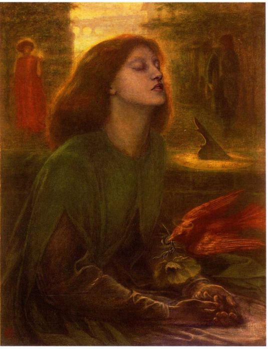

图25\.26 但丁·加布里埃尔·罗塞蒂：《贝娅塔·贝娅特丽齐》。

约1864\-1870年。布面油画，	86\.4 × 66厘米。伦敦泰特美术馆

第二十五章 实证主义时代：现实主义、印象主义与拉斐尔前派，1848\-1885年  885

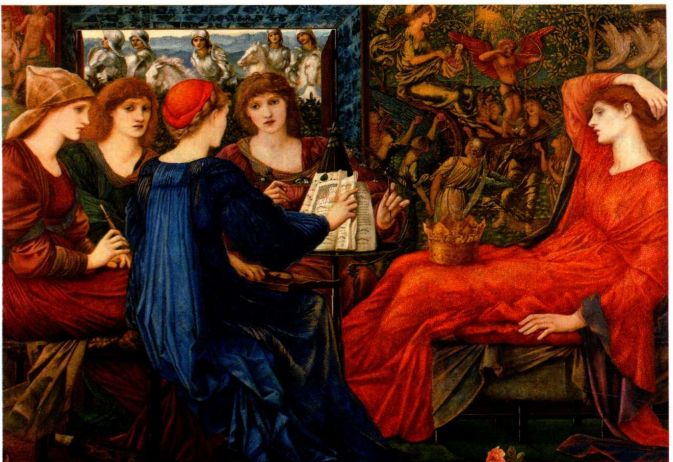

图25\.27 爱德华·伯恩\-琼斯：《维纳斯礼赞》。

1873\-1878年。布面油画，1\.24 × 1\.86米。英国

泰恩河畔纽卡斯尔（Newcastle\-upon\-Tyne）莱恩

画廊（Laing Art Gallery）

作品。惠斯勒经由库尔贝和马奈认识了戈蒂埃，并在伦敦与斯温伯恩成为好友。

1863年，惠斯勒放弃了法国现实主义，转而追

求唯美主义，《白色交响曲一号：白衣女郎》（Symphony

in White   :1   White Girl）就是这一时期他艺术转

型的例证。作品标题是后来所拟，可能受到戈蒂埃诗

作《白色大调交响曲》（Symphony in White Major）

的启发。惠斯勒将作品提交给1863年的“落选者沙

龙”，其展出的位置与马奈《草地上的午餐》相去不

远。与戈蒂埃各种白色景象交织其中的复杂诗篇相似，

这幅画中也搭配了一系列白色、柔和的黄色与红色。

这是一幅艺术家情妇乔（Jo）的全身肖像，她身着白

色衣裙，站在基本为白色的背景前。虽然戈蒂埃与斯

温伯恩在观念上影响了惠斯勒，但在视觉方面他显然

更迷恋日本风格，这种影响在1864年的《白色交响

曲二号：白衣少女》（Symphony in White No\.II：The

Little White Girl，图25\.28）中体现得更为明显。此处，

乔斜倚在惠斯勒伦敦寓所的壁炉旁，身边摆放着日本

青花瓷器、扇子以及一簇樱花，这些均是当时日本的

代名词。在某一层面上，这幅作品是抽象色彩、形体

和构图的感官的展示。惠斯勒运用轻薄、细小的笔触

以及几乎透明的颜料层，创造出白色、黄色、红色、

粉色和蓝色的交响，各种色彩在画面上翩翩起舞。他

弹奏着这首用柔和的色彩与形式谱成的乐曲，乔裙子

映衬着由线条、框架组成的长方形壁炉、镜子以及镜

像中的画框。画面右侧的花朵则是另一处神来之笔；

德加早期曾运用日本方格的构图设计来创造片段感与

自发性，而在此处这种应用却使得花瓣看起来仿佛正

飘散而去。

作者最初将这幅作品构思为对安格尔的礼赞，在

构图上与其《安·莫阿泰瑟夫人像》（见图24\.17）呼应，以此感谢这位伟大古典主义画家创造完全之美的能力。但是作品中的心理状态却与罗塞蒂的《贝娅塔·贝娅特丽齐》（见图25\.26）相似，惠斯勒着重描绘了他梦幻沉思、留有飘逸长发的情人。乔在镜中的映像如同幽灵一般，后来这个形象启发斯温伯恩创作了一篇诗歌，惠斯勒将其贴在画布的背后：“艺术，你这幽灵，我的姐妹／白色姐妹／抑或我是幽灵？只有天知晓。”

之后的十年中，惠斯勒的作品日益抽象，正如1875年的《黑色与金色小夜曲：坠落的焰火》（Nocturnein Black and Gold： The Falling Rocket，图25\.29）所示。1877年，惠斯勒的这幅作品与另外七幅表现泰晤士河的夜景画（nocturnes）一起在格罗夫纳画廊展出，这些作品的风格均虚无缥缈，以轻薄的蓝灰色调绘制而成，全部意味在于支持其“为艺术而艺术”的立场。《坠落的焰火》是当时最为抽象的作品，年事已高的拉斯金甚至指责惠斯勒“把一罐颜料丢在了公众脸上”。作品描绘了克莱莫尼花园（Cremorne Gardens）的焰火，这是伦敦切尔西区时髦的夜总会。题材允许惠斯勒将现实主义和抽象两者兼容在一幅作品当中，并创造出令人信服的图像。但是，即便作者完成了现实主义表现当代生活的要求，这幅作品却是其在画室里完全凭主观想象而编造的。惠斯勒给自己的作品取名为“交响曲”、“奏鸣曲”和“小夜曲”，正如这些标题所暗示的，他将绘画看作视觉音乐，即绘画在本质上是抽象的（见第889页的原始文献）。同时是出于这种类比，伯恩\-琼斯才会经常绘制演奏音乐的少女。如果不是标题为《坠落的焰火》，我们绞尽脑汁也无法理解画面表现了什么，只能尽情感受惠斯勒对色彩的

886 詹森艺术史

图25\.28 詹姆斯·艾博特·麦克奈尔·惠斯勒：《白色交响曲二号：白衣少女》。1864年。布面油画，76 \. 5 × 51\.1厘米。

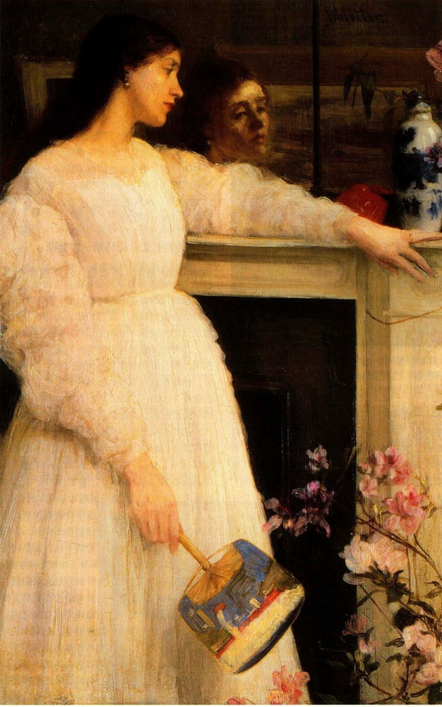

伦敦泰特美术馆

第二十五章 实证主义时代：现实主义、印象主义与拉斐尔前派，1848\-

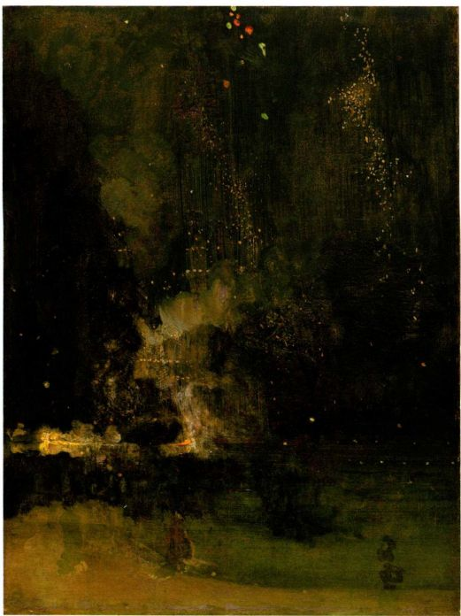

图25\.29 詹姆斯·艾博特·麦克奈尔·惠斯勒：《黑色与金色小夜

曲：坠落的焰火》。约1875年。木板油画，60\.3 × 46\.7厘米。底特

律艺术学院（Detroit Institute of Arts），Dexter M\.Ferry Jr\.捐赠

抽象展示\-橙黄两色的色点懒散地飘浮而下，映衬着薄纱般的蓝、灰、棕三色背景。正如《白色交响曲二号》那样，惠斯勒的画面带有一种精美异常的日本风格，形状与标记几乎不存在一般，我们看到的只是一种色彩漂移到另一种色彩所形成的色彩薄雾之中。通过格罗夫纳画廊的展览，惠斯勒将艺术带入了并非由经验构成的主观王国，这里依靠的是个人的幻想与美学。无意之间，惠斯勒已经将其后20年间流行的艺术形式展现在观众眼前。

美国的现实主义

1848年革命虽然没有波及美国，但还是引起了新的移民浪潮。对于美国来说，内战是更为鲜明的焦点，对这个国家的自然、心理以及经济形成了全面冲击。“伊甸园”在内战中被彻底破坏了，之后对于美国的比喻也由镀金时代（Gilded Age）所替代。这是马克·吐温（Mark Twain）及其合著者所采用的词语，他们在1871年描述强盗大亨的著述中使用这个词汇作为标题。“强盗大亨”（robber baron）指美国的投

机者、制造商、工业家、庄园地产投资人以及铁路、煤铁巨头，借由剥削工人而攫取了大量财富。这些新近获得的财富使他们摇身一变，成为了渴望所有欧洲事物的美国贵族阶层。曾在欧洲学习的美国画家约翰·辛格·萨金特（John Singer Sargent，1856\-1925年） 是他们最为青睐的肖像画家（见第890页的艺术史家的观点）。强盗资本家及其家人前往欧洲旅行，带回欧洲的家具与艺术品，并修建起欧洲风格的别墅与城堡。该时期的另一特征就是旷日持久的西部扩张，人们履行着自己所认为的天赋使命，对北美大陆展开无节制的侵占。调查小组绘制了新领土的地图，而报酬低廉的工人们则在1869年建成了横贯大陆的铁路。到1890年，政府通过设立保留地与武力歼灭的方式征服了美洲土著民族。

科学现实主义：托马斯·埃金斯

费城人托马斯·埃金斯（Thomas Eakins，1844\-1916年）是美国最早且最具影响力的现实主义画家之一。他的作品着重表现现代社会，题材中不仅包括中产阶级的消闲活动、流行的体育运动以及战后美国的娱乐，还包括诊疗室场景，将外科医生描绘为现代英雄，并突出了麻醉与消毒等外科新技术所起到的重要作用。埃金斯甚至在自己的现实主义当中引入科学方法，使得作品与马奈、德加的现实主义区分开来。埃金斯曾在1866至1869年间在巴黎师从一位声望颇高的学院派画家，在此期间曾见过马奈与德加的作品。

返回费城之后，埃金斯的首批作品是一系列划艇题材画作，例如《单人划艇中的马克斯·施密特》（MaxSchmitt in a Single Scull，又名《单人划艇冠军》［The Champion Single Sculls］，图25\.30），其反映了体育运动的日益流行，并将费城斯库尔基尔河（Schuylkill）上的竞舟赛冠军马克斯·施密特表现为现代生活中的英雄。虽然作品看上去仿佛创作于户外，实际上并没有采用印象主义般快速记录的手法，而是用长时间进行精心重构。埃金斯的绘画基于缜密的科学测绘完成，以确保写实的精确性。他曾创作过大量船只与划船手的透视习作，因此画中河流的退去在数学上准确得令人惊叹，因此将小舟稳固地锁定在空间之中。画家还细致地研究过光线效果与解剖学。在宾夕法尼亚艺术学院任教期间，他让学生对着裸体模特写生，而非一般模仿古典人物石膏像的方法，因此激怒了同事，还受到公众蔑视。对现实主义的要求驱使他记录下每一个微小细节，对于远处桥梁背后的汽轮与风景也是如此，其细节化程度已经远远超越了视线的正常范围。不久以后，埃金斯还会运用摄影作为素描之外的预备

888	詹森艺术史

图25\.30 托马斯·埃金斯：《单

人划艇中的马克斯·施密特》或

《单人划艇冠军》。1871年。

布面油画，82 × 117\.5厘米。

纽约大都会艺术博物馆，Alfred

N\.Punnett 捐赠基金和George D\.

Pratt捐赠，1934．（34\.92）

音乐是声音的诗歌，绘画则是视觉的诗歌，主题与声音或色彩的和谐毫无关系。

詹姆斯·艾博特·麦克奈尔·惠斯勒（1834\-1903年）

但有价值的是它们的结合，正如《扬基之歌》······则是纯粹的音乐。

艺术应该独立于所有樊篱，孑然于世，尽情地去吸引喜爱艺术的眼睛或耳朵，不应该将此与其他无关的情感混淆起来，诸如虔诚、悲悯、爱情、爱国情感等。所有这些都与艺术无关，正因为这样，我才坚称自己的作品是“结体”与“和声”。

原始文献

节选自惠斯勒自传：《温柔的树敌艺术》（The GentleArt of Making Enemies，1893年）

伟大的音乐家了解这一点。贝多芬等人创作音乐，纯粹的音乐；交响曲用此音键，协奏曲或奏鸣曲则是另外的······

彼此仅以曲调来区分，虽然其本身也有平庸粗俗之处，

习作手段。他的现实主义同时也有对于现代人心理的刻画。施密特孤独地处于河面中央，仿佛某种形式的异化，他陌生的表情也说明了这一点。施密特转身瞥见的是“我们”，而不是埃金斯\-落在他身后的划船手。

人像与自然主义风景：温斯洛·霍默与艾伯特·比尔施塔特

温斯洛·霍默（Winslow Homer，1836\-1910年） 差不多与埃金斯在同一时期居住于巴黎，当时他已经产生了描绘现代世界的想法。1857年，作为杂志插图画家的霍默开始了自己的艺术生涯，记录最新的时尚活动与社会活动，后来创作题材还涉及内战。1866至1867年间，霍默在巴黎生活，观摩了库尔贝、米勒和马奈的作品，但此时他尚未感受到印象主义的全部冲击力。返回纽约之后，霍默的作品开始以当代生活里中产阶级的室外消闲活动作为场景，例如槌球游戏、在最新的海滨胜地游泳，以及在新罕布什尔的白山骑马出游等，这遍及各地的一系列娱乐活动由于铁

SOURCE:THE GENTLE ART OF MAKING ENEMIES\. \(NY:PUTNAM, 1925\)

路的开通而成为可能。

然而，霍默并没有描绘某个飞逝的瞬间，反而去创造反映美国生活与问题的人物象征图像，如同米勒笔下的法国农民一样。他的象征手法体现在1872年的《挥鞭》（Snap the Whip，图25\.31）中。该作品是儿童游戏的视觉记录，乍看之下仿佛美国版的印象主义，因为图像里展现的是一个阳光普照的场景，色彩强烈清晰，笔触闪烁迅速。但霍默的色彩并不具有印象主义画家般的强度，笔触也不及他们松散。这幅画作与色彩和光线无关，也没有以经验来捕捉特定场景或者稍纵即逝的瞬间，一切都是凝固的。人物经轮廓与形体无不经过精心的塑造，宏大感十足；而单间校舍的几何形状和山峦陡峭的背景又增强了人物的实体性，这些景物与孩子们的运动方向平行。赤足的孩子们身穿朴素的乡村服装，如同身后仅有一间屋子的学校一般。他们是纯朴与健康的象征，投射出这个新近统一国家的单纯、未来与希望。游戏本身就是统一的象征，孩子们用手臂连在一起，其坚固程度由其最薄弱的环节决定。在内战与肆意增生的工业化所带来

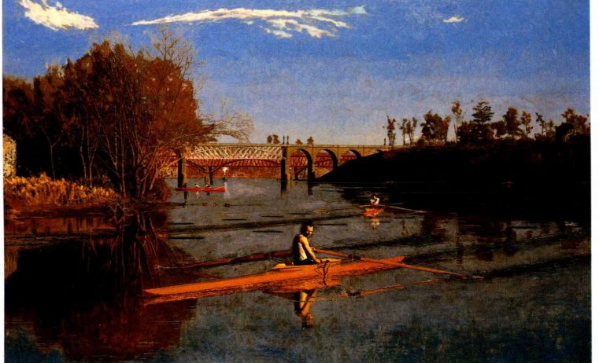

第二十五章 实证主义时代：现实主义、印象主义与拉斐尔前派，1848\-1885年	889

艺术史家的观点

艺术家的声誉与艺术史方法论的变革

艺术史方法论的改变有时会影响到学者对艺术家的态度，某些曾经显赫一时但后来逐渐淡出人们视野的艺术家也可能获得新生。美国画家约翰·辛格·萨金特（1856\-1925年）就是其中一例。在其生活的时代，他是最著名的艺术家之一，同时也获得了巨大的经济收益。他甚至可以被视为美国艺术家的典范，其在欧洲生活、创作，对于欧洲艺术观持包容的态度，使得众多美国暴发户争相效仿。

萨金特出生并成长于佛罗伦萨，曾在巴黎的美术学院学习，后于1879年荣获沙龙勋章。萨金特在1886年定居伦敦，这部分是出于小说家亨利·詹姆斯的鼓励。1887年，他开始了首次前往美国的职业之旅，并立刻成为上流社会的肖像画家，绘制了一批名人肖像，其中包括纽约的威廉·亨利·范德比尔特（William Henry Vanderbilt）和波士顿的伊莎贝拉·斯图尔特·加德纳（Isabella Stewart Gardner）。到1892年，萨金特已经成为伦敦最受欢迎的肖像画家，可能也是欧洲大陆最受欢迎的肖像画家。他的成功部分要归功于描绘昂贵织物与家具的华丽图像，而艺术家强烈的笔触感又使这种特色得到了强化。

萨金特是先锋派的拥护者，也是克劳德·莫奈的朋友，还购买过莫奈和马奈的作品。他自己的创作风格与马奈在绘画中的大胆尝试有几分相似，而且二人同样敬仰委拉斯凯兹。萨金特还曾创作过大量的印象主义风景画和市景画，其中又以水彩画居多。然而讽刺的是，萨金特被人遗忘的原因竟是20世纪的现代主义。他处理颜料的手法完美，具有抽象特质，曾为现代主义者所推崇；但他的作品却被看为保守之作，没有任何新颖之处。更为糟糕的是，萨金特先锋派式的笔触被精心包裹在过时的社会肖像画之中。

对萨金特的重新评价始于20世纪50年代，当时人们已经恢复了对印象主义水彩画中颜料处理手法的欣赏。在之后几十年中，后现代主义及其更为宽泛的艺术观取代了现代主义，萨金特的声誉也日渐增长（见第三十章）。再现性艺术再次成为时尚，艺术史家们开始从艺术品实际上是时代精神反映的角度来鉴赏艺术。现如今，一般将萨金特的肖像画视为维多利亚、爱德华以及镀金时代晚期社会的具体表现。

以20世纪70年代兴起的性别研究为例，该领域的研究者关注萨金特对女性的大胆表现，其在1897年为纽约社交名流伊迪丝·斯托克斯（Edith Stokes）所创作的《斯托克斯夫妇》（Mr\.and Mrs\.I\.N\.Phelps Stokes）就是最佳例证。萨金特并没有展现一位端庄、贤淑的女性，而是画出了敢作敢当的斯托克斯夫人，一位19世纪90年代“新女性”的代表（见第903页）。在妇女运动强烈要求男女享有平等权利的时代，许多女性极力

的幻灭感之下，当时的美国步履蹒跚，《挥鞭》是国家失去天真、纯洁的体现，同时也在呼唤、怀念着迅速淡入记忆的价值观。

19世纪50年代，同实证主义相关的细节化自然

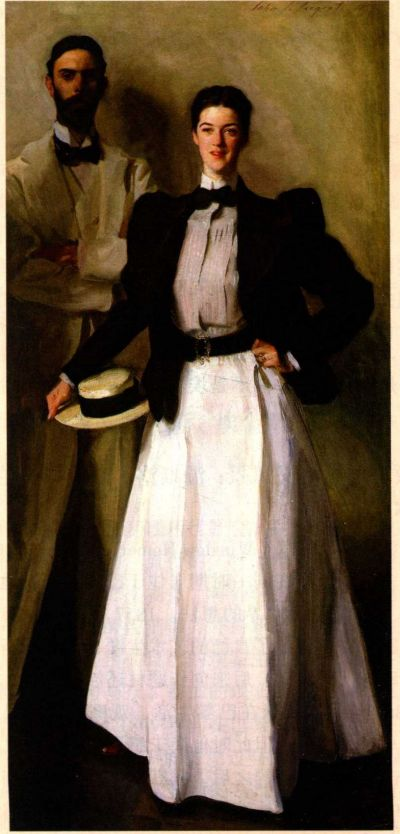

约翰·辛格·萨金特：《斯托克斯夫妇》。1897年。布面油画，214x101厘米。纽约大都会艺术博物馆，Edith Mintum Phelps Stokes（MRS．I．N．）遗赠，1938．（38\.104）

维护其独立性，并向传统的性别角色发起挑战。独立的新女性反对维多利亚时代将妇女限制于家中的传统习俗，她们走出家门，接受教育，而且大都身体健壮、精力充沛，张扬地表现自身的性别魅力。她们抛弃了安逸的女性服饰，甚至穿着男性服装，或者改自男款衬衫的服装。她们不再牺牲自我，而是积极地实现自我。萨金特笔下的伊迪丝·斯托克斯就是这样一位女性，甚至抢走了丈夫的风头。在当时来讲，这是对女性形象的激进表现，不仅折射出人物的个性与艺术家对女性问题的认同，而且也反映出作者本人反对习俗与社会预期的愿望。

主义与科学式记录在美国风景画中日益占据主导地位。但是，这些作品在本质上还保留着浪漫主义传统，因为其持续强调着国内荒野的崇高、庄严。记录细节的渴望在艺术家兼探险家的作品中表现得尤为明显，

890 詹森艺术史

图25\.32 艾伯特·比尔施塔特：《落基山脉：陆地顶峰》。1863年。布面油画，1\. 86 × 3 \.07米。纽约大都会艺术博物馆，Rogers基金，1907年（07\.123）

图25\.31 温斯洛·霍默：《挥鞭》。

1872年。布面油画，56\.5 × 92\.7厘米。

俄亥俄州扬斯顿市巴特勒美国艺术研

究所（Butler Institute of American Art，

Youngstown\)

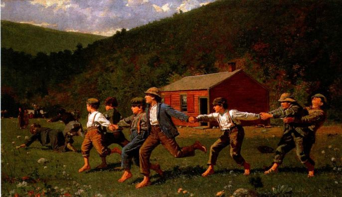

这些画家不仅前往西部，还前往南美洲和北极地区旅行，记录壮丽的奇异场景，艾伯特·比尔施塔特（AlbertBierstadt，1830\-1902年）就是其中之一。

艾伯特·比尔施塔特是一位德裔艺术家，生长于马萨诸塞州，曾在杜塞尔多夫艺术学院学习。1859年，他跟随调查陆上通路的部队穿越了落基山脉，成为第一位见证这一壮丽山区卓越风景的欧裔美国人。1863年，比尔施塔特根据旅途中的速写和照片在纽约的画室中创作了《落基山脉：陆地顶峰》（The RockyMountains，Lander＇s Peak，图25\.32）。画作依旧按照哈得孙河画派的崇高风景画传统（见第836页）来完成，比尔施塔特准确捕捉到了落基山脉那巨大的规模，就连大瀑布也相形见绌。水晶般的湖泊折射出神奇的光线，爱好和平的美洲土著与大自然和谐相处。

该作品创作时正值美国内战当中最为激烈的几次战役期间，当展览这一巨幅画作时，通常将其视为和平的象征，因为其主题远离你争我夺的战场，向美国

人保证，伊甸园的某个部分仍然没有遭到玷污。内战之后，此类作品对西部移民活动产生了重大的鼓舞作用。随着铁路线的开通，这些作品也促进了偏远地区旅游业的发展。

摄影：批量生产艺术的机械方法

1839年，商业化摄影几乎同时在法国和英国出现。作为一种机械工艺，摄影势必引发批量生产与流行文化，其与工业革命的精神完美契合，而这一切又都仿佛那么自然。摄影同时也是实证主义时代的完美工具，但最初它只被视为一种编目学、文献学以及科学调查的记录方式。摄影具有客观的外表，与大多数现实主义和印象主义实事求是的再现方式并行不悖。

摄影的潜力古来有之，过去曾以暗箱的形式存在，指的是一端钻有小孔的盒子，光线从小孔进入，将外部物象的倒置图像投射在另一端的内壁上。维米尔和

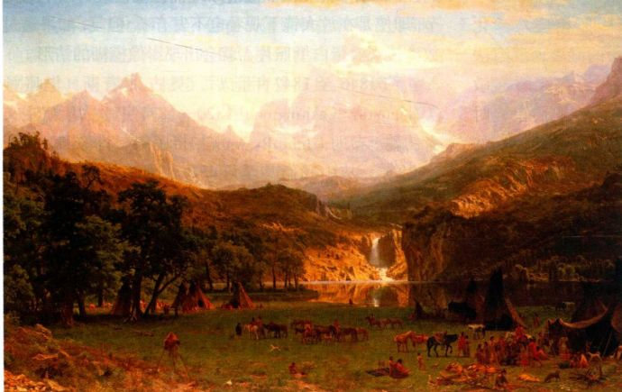

第二十五章 实证主义时代：现实主义、印象主义与拉斐尔前派，1848\-1885年 891

卡纳莱托等人都曾运用暗箱来绘制作品。然而，如何以机械程序来“固定”映像仍是当时悬而未决的问题，其意义尤为重大，因为这意味着不通过素描的方式，就可以使映像持久永恒。

首创

在18世纪早期，人们发现了银盐（silver salts）的感光性，但直到1826年，法国发明家约瑟夫\-尼塞福尔·尼埃普斯（Joseph\-Nicéphore Niéce， 1765\-1833年）才制作出第一幅摄影图像。那是一幅记录其窗外景象的模糊照片，曝光时间长达8小时。他还与艺术家路易\-雅克\-芒代·达盖尔（Louis\-Jacques\-Mandé Daguerre，1787\-1851年）进行合作， 后者在发现了碘化银的感光性之后，运用水银烟雾在覆盖有碘化银的铜版上固定成像，最终于1838年将达盖尔银版照相法（daguerreotype）公诸于世。法国政府购买了该技术的所有权，并免费提供给全世界使用，只有英国除外，原因就是当时英法之间的激烈经济竞争。这项发明代表民族与帝国的胜利，法国借由这项发明不仅能够记录本国的不朽业绩，同时还能将其殖民地记录下来，特别是与埃及有关的各种事件。银版照相法也被视为一种极具共和观念的媒介，因为其与绘画和雕塑不同，价格十分低廉，所有社会阶层都可以拥有自己的肖像。

与此同时，英国的威廉·亨利·福克斯·塔尔博特（William Henry Fox Talbot，1800\-1877年）在1839年宣布，他能够在纸上固定图像，无需借助金属或玻璃。后来他在1841年取得了这种新型正负片摄影术的专利权，称之为碘化银纸照相法（calotype），一种利用加盐纸张的成像技术。与一次仅能产生单独图像的银版照相法不同，碘化银纸照相法能够从负片中获得无穷无尽的正片纸面图像。

然而到了19世纪50年代，银版照相法与碘化银纸照相法均为同时出现于英法两国的湿版珂罗酊法（wet\-collodion process）所取代。这种技术采用非常敏感的感光剂火胶棉（溶解于醇醚的硝棉），将曝光时间缩短到一秒之内，产生出容易翻制的清晰负片。然而这种技术的处理难度极高，需要事先准备摄影用的玻璃板，使用后还要进行处理。这就表示要用化学方法保持玻璃板一直处于湿润状态，并随身携带可移动的暗房。大约在同一时期，路易\-戴瑟瑞·布劳卡\-埃弗拉尔（Louis\-Désiré Blanquart\-Evrard，1802\-1872年） 发明了蛋白成像技术（albumen print）\-将加盐的蛋清覆盖在纸上，创造出更为精细的平滑表面，用较少的颗粒就可以展示出更多的细节。在之后的三十至四十年

间，摄影师一般都是先用珂罗酊湿版来记录图像，再以蛋白纸成像。

1846年，塔尔博特出版了一部以摄影作为插图的书籍《自然之笔》（The Pencil of Nature）。标题“自然之笔”所指为光，可以在附有感光材料的表面“作画”。摄影（photograph）一词源自希腊语，指光线与素描。塔尔博特在书中表述了许多摄影在未来将会遭遇的基本问题。他并不把这种媒介视为能够科学记录世界的媒介，而是一种阐释手段（interpretativevehicle），向人们提供感知、理解现实的全新方式。然而直到20世纪，这些深刻的见解也没能使大众抛弃旧有观念，还是将摄影看作记录真实的工具，并认为其是机械化及其相关社会弊病的象征。

记录世界

19世纪50年代，摄影术最为流行的用途是记录世界、人群、风景和器物。人们基本把这些图像看作事实，然而我们接下来将会看到摄影师是如何通过各种方式来操纵控制图像的，其中包括对于题材和事物的选择，也就是将什么摄入镜头，将什么排除在外。

肖像摄影 美国人尤为喜爱摄影，艺术家兼发明家塞缪尔·莫尔斯（Samuel Morse，1791\-1872年）在1839年将摄影术带回美国，此时距离法国政府收购并免费提供摄影技术不过几个星期的时间。很快美国各个城市中都出现了摄影工作室，运用达盖尔银版照相法为人们拍摄肖像照片。这种摄影形式长期以来在美国都广受欢迎，即使后来欧洲已采用新技术后这种情况也维持了很长时间。美国人特别青睐这种技术在细节表现上的丰富性及其单纯的真实性，对于被摄影者的直率表现更加强了这一点。他们坐在简单的背景前，为的就是尽量不分散人们对照片中人物面部或身体特征的注意。银版照相法能够清晰地捕捉哪怕最为微小的细节，即使是在放大镜下观看也不失清晰。但是，如果透过放大镜观看蛋白纸照片，就会出现影像模糊的情形。

约1846至1847年前后，奥古斯塔斯·华盛顿（Augustus Washington， 1820\-1875年）为废奴主义者约翰·布朗（John Brown）拍摄了银版肖像照片（图25\.33）。从中我们甚至可以数清布朗头发的数量，其脸上的皱纹和手中的掌纹尽显，就连钉扣子的线都能看清！与大部分欧洲摄影师不同，美国肖像摄影师鼓励其顾客在拍照时表现出自己的个性。毫无疑问，布朗肖像照中表露的严肃、坚决、甚至对抗的姿态都是这位废奴主义者自己的设计，也可能经过了华盛顿的诱导。摄影师准确捕捉到布朗宣誓的姿势，历史学家认为他手中拿的正是“地下通路”（Subterranean

892 詹森艺术史

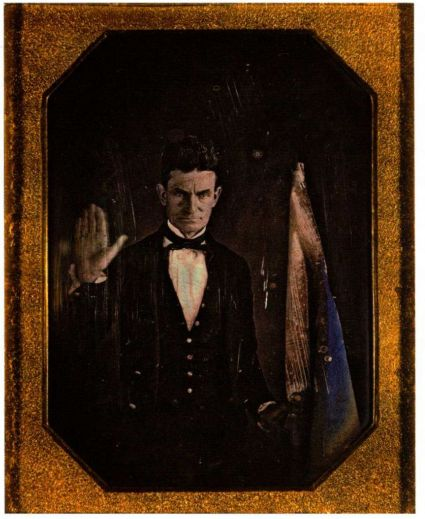

图25\.33 奥古斯塔斯·华盛顿：《约翰·布朗》。约1846\-1847年。

四分之一达盖尔银版摄影，9\.91 × 8 \.26厘米。华盛顿特区史密森尼学

会（Smithsonian Institution）国家肖像画廊（National Portrait Gallery）

的旗帜。“地下通路”是布朗为“地下铁路线”所起的名字，他计划通过这种方式将逃亡奴隶运往北方。华盛顿位于康涅狄格州哈特福特（Hartfort）的摄影室极其成功，但布朗去委托其为自己拍照时肯定将他看作了废奴主义同志。华盛顿是自由的美国黑人，还是政治上的激进分子，很可能正像布朗所认为的那样。但是后来华盛顿确认了一个可悲的事实\-黑人的肤色使得自己在有生之年无法获得平等的权利。随后他转卖了自己的摄影工作室，在内战之前移民到非洲新近成立的利比里亚共和国。

19世纪五六十年代，欧洲最大的肖像摄影工作室归阿道夫\-欧仁·迪斯代里（Adolphe\-Eugène Disdéri）所有。他将总部设在巴黎，但在马德里和伦敦都有分部。他旗下的大批工作人员运用希腊圆柱和织物垂饰等相同的道具与背景，拍摄了大量肖像照片，以满足中产阶级顾客的强烈渴望。1854年，迪斯代里发明了印有多个图像的肖像名片（carte\-de\-visite），使得照片更加流行。这种名片一般是访客时留下，其上印制着多幅本人的小照片。

这个时期最著名的早期肖像摄影师之一是巴黎的加斯帕尔·费利克斯·图尔纳勋（Gaspard\-FélixTournachon，1820\-1910年），人称“纳达尔”（Nadar）。他最初是记者兼漫画家，后来为了石版漫画的创作，而将摄影作为一种协助手段，并计划制作一部收录当时一千位最著名人物的《纳达尔名人集》（Le

Panthéon Nadar）。他开始利用公众对名人的痴迷之情，大量印制包括作家、演员、表演者以及艺术家在内的巴黎文化名人蛋白纸照片，从中获取了丰厚利润。纳达尔作为漫画家的技巧为其照片的拍摄提供了无法估量的帮助，使之创作出肖像照片异常深刻，准确捕捉到像中人的神秘气息。

1854至1855年间，纳达尔为艺术评论家特奥菲尔·戈蒂埃拍摄的照片（图25\.34）就充分展示了他的技巧。照片中的戈蒂埃虽然处于静止状态，但具有极强的现场感。放低的相机使得戈蒂埃的形象十分高大，分开衣襟间突出的腹部也加强了这种效果。摄影师艺术性地将人物的右部处理为对焦不准的模糊状态，这种做法对于追求写实的美国摄影师而言无疑难以容忍，但纳达尔运用这种手法来很好地衬托出戈蒂埃另一半对焦清晰的身躯。他在这位作家的前额处打光，使得眼睛被投射下来的阴影所覆盖，暗示出敏锐的精神力量与忧郁的沉思之感。随意凌乱的波希米亚式服装则彻底将戈蒂埃从迪斯代里拍摄中产阶级时所营造的幻想世界中解脱出来。

风景摄影 风景与肖像在摄影中占据着主导地位，因为风景摄影使人们足不出户就可以环游世界。为了实现法国政府记录其非洲殖民地的梦想，巴黎记者马克西姆·杜坎（Maxime du Camp，1822\-1894年）于1848至1852年间对法国在非洲和中东的领地进行

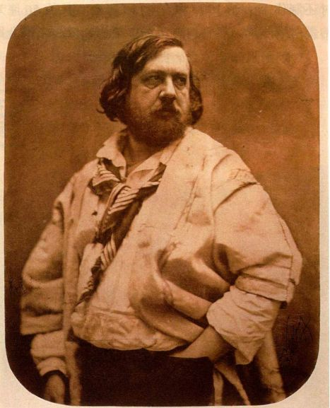

图25\.34 纳达尔：《特奥菲尔·戈蒂埃》。1854\-1855年。含盐蛋白纸成像，衬以纸板。巴黎奥赛博物馆

第二十五章 实证主义时代：现实主义、印象主义与拉斐尔前派，1848\-1885年 893

图25\.35 卡尔顿·沃特金斯：《约塞米蒂山谷的优美全景》。1865\-1866年。蛋白纸成像，41x52\.1厘米。洛杉矶J·保罗盖蒂博物馆（J\.Paul Getty Museum）

大事年表

1853年\-美国人佩里准将打开了日本通向西方的贸易大门

1854年\-纳达尔拍摄《特奥菲尔·戈蒂埃》

1861\-1865年\-美国内战

1876年\-亚历山大·贝尔取得电话机的发明专利

拍摄，并于1852年出版了由125幅照片组成的《埃及、努比亚、巴勒斯坦与叙利亚》（Egypt，Nubia，Palestine andSyria）。较之这种昂贵的影集，立体照片（stereocards）显然更为流行，其在19世纪60年代的地位就如同今天的CD唱片一般。立体照片由两张相同的照片构成，拍摄所用的照相机安装有两个镜头，模仿人类的双眼视像。通过特殊的取景器，两张平面的照片显现为一张立体图像。为了满足人们对于立体照片的庞大需求，分销公司一时间囤积起了300,000张不同的照片。快速复制的照片通常品质较差，后来由于采用了宽5厘米、长13厘米的小尺寸照片得以解决，当然也存在着尺幅更大的照片。

如同画家一样，一大批美国摄影师专攻风景摄影，其通常与测量队一起前往西部旅行，记录那里象征美国形象的崇高荒野。其中最早也最著名的是卡尔顿·沃特金斯（Carleton Watkins，1829\-1916年），从1861年开始，他拍摄了成百上千张玻璃板立体照片，其中包括约塞米蒂国家公园（Yosemite）的景观，同时还制作了大约1000幅宽约46厘米、长约56厘米的蛋白纸照片。尽管也在市场上出售，但在沃特金斯

眼中这是一种艺术，而非文献记录。他早先居住于纽约的奥尼昂塔（Oneonta），后来于1851年随淘金热的潮流西迁至旧金山，在那里拍摄银版肖像照片，并为测量队拍摄了大量记录土地的照片。听闻约塞米蒂的壮丽景观，沃特金斯在1861年离开测量队，前去那里拍摄壮观的原始风景。为了将广阔的土地摄入镜头，他认为有必要采用更大的成像媒介，于是发明了使用大玻璃底片的巨型相机。之后，沃特金斯开始乘坐有篷货车旅行，车上承载着重达一吨的设备，其中包括湿玻璃版和一间暗房，为的是玻璃版曝光之后可以立即进行处理。

最终的结果正如我们在《约塞米蒂山谷的优美全景》（Yosemite Valley from the Best General View， 图25\.35）中所见。这张照片拍摄于1865至1866年间的第二次约塞米蒂之旅，亲眼目睹过的人无不震惊；凭借这张照片，沃特金斯成功说服林肯总统将约塞米蒂设为国家公园。与比尔施塔特表现陆地顶峰的绘画一样，沃特金斯准确捕捉到了美国荒野的壮观景色。在山脉顶峰的对比之下，约塞米蒂瀑布显得小了许多，但这其实是美国最高的瀑布之一。沃特金斯在成像过程中逐步营造出极其丰富的质感效果，最终形成了一片繁茂的风景。强烈的色调对比，从右到左的有力斜向构图都很好地营造出戏剧感。为了避免让天空成为一片单调的空白，沃特金斯运用了第二张负片来增加云彩的比重。如果考虑到人工操纵摄像机的程度，即景深与快门曝光时间、取景与构图的选择，以及在暗房中所使用的大量工具，就能够理解沃特金

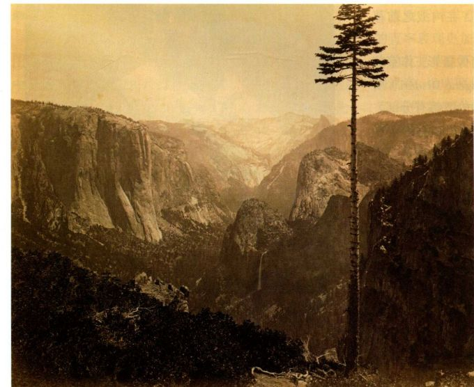

894	詹森艺术史

图25\.37 蒂莫西·奥沙利文：《死神的丰收：宾夕法尼亚州葛底斯堡，1863年7月》，出自亚历山大·加德纳的《加德纳战争摄影写真簿》。1866年。蛋白纸成像，l 7\.8 x 22厘米。华盛顿特区国会图书馆（Library ofCongress）布雷迪内战收藏（Brady Civil War Collection\)

斯将其摄影视为艺术的原因，他甚至在1862年于声望极高的纽约古皮画廊（Goupil Gallery）为这些照片举办了展览。

文献记录 摄影还应用于实证主义的核心精神方面，即将各种社会类型进行分门别类。该用途的最早实例之一是亨利·梅休（Henry Mayhew）的《伦敦劳工与贫民》（London Labour and London Poor，1851\-1862年），这是一部记录工人与街头妓女的图册，其中的插图是理查德·比尔德（Richard Beard）根据银版照片所创作的石版画，后者曾在伦敦开设首家肖像摄影工作室，但不幸的是，那些银版照片现已遗失。运用摄影技术来记录社会类型的最佳例证也许要算阿道夫·史密斯（Adolphe Smith）的《伦敦街头生活》（Street Life in London，1878年）了，但其最初只是每月一期的插图手册，与法国的《生理学》十分类似。史密斯是阿道夫·史密斯·海丁利（AdolpheSmith Headingley，1846\-1924年）的笔名，他是一名社会激进主义分子，曾与摄影师约翰·汤姆逊（JohnThomson，1837\-1921年）结为工作小组，后者曾为各种社会类型的人物撰写过长篇文章。正如导言中所说的，他们将摄影照片当作确认其记述的客观工具：“（我们希望）······将摄影的精确性带入主题的插图之中。这种方式那无可争辩的精确性呈现了伦敦贫民真实类型，防止低估或夸大人物外貌特征。”

虽然汤姆逊的大部分图像都相当客观，不偏不倚，但是其中一些依然强烈、感人，让观者对贫民的境况心生同情，《爬行者》（The Crawlers，图25\.36）就是如此。照片中无家可归的寡妇为打工的母亲照料孩子，它出现在题为《爬行者》的手册中。“爬行者”指贫困的街头露宿者，偶尔得到足够买茶叶的钱之后，会卑躬屈膝地向小酒馆讨要热水。

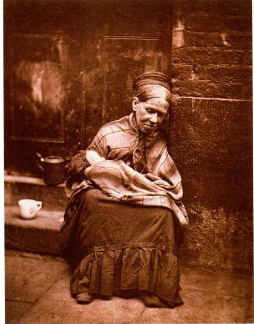

图25\.36 约翰·汤姆逊：《爬行者》。1877\-1878年。

伍德伯里照相印版。伦敦维多利亚和阿尔伯特博物馆

报道新闻：新闻摄影报道

早期的摄影也记录著名的事件，这正是新闻摄影报道的前身。其中最为杰出的摄影作品基本都是关于内战的照片，例如蒂莫西·奥沙利文（TimothyO＇Sullivan，约11840\-1882年）的《死神的丰收》Harvest of Death，图25\.37）拍摄的作品。与沃特金斯一样，这位摄影师也是西部最著名的摄影师之一。在着手拍摄内战照片之前，奥沙利文在马修·布雷迪（Mathew Brady，1823\-1896年）门下做学徒，以此开始了其摄影师生涯。布雷迪当时在纽约拥有美国最

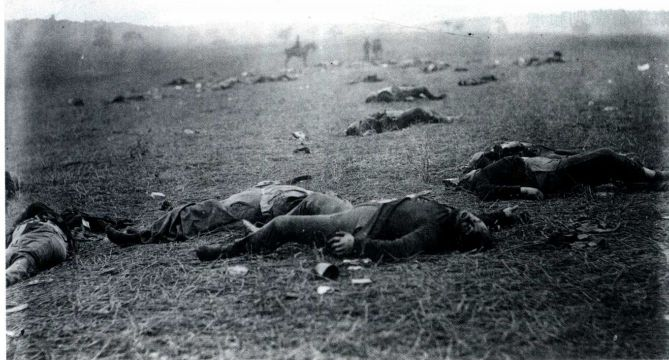

第二十五章 实证主义时代：现实主义、印象主义与拉斐尔前派，1848\-1885年 895

著名的肖像摄影馆。亚伯拉罕·林肯曾在这里拍照30余次，1860年11月他赢得总统选举时还特意感谢了布雷迪当年所拍摄的肖像照片，尽管有所美化。1862至1863年期间，奥沙利文签约、并参加了亚历山大·加德纳（Alexander Gardner）摄影小组的工作，为影集《加德纳战争摄影写真簿》（Gardner＇s Photographic Sketchbook of the War，1866年）拍摄了44张照片。与其1854至1856年间拍摄的克里米亚战争等平庸作品不同，奥沙利文及其同事所拍摄的内战照片精确捕捉到美国内部冲突所带来的可怕破坏，尽管当时相机所需的曝光时间较长，无法拍摄运动图像。

在《死神的丰收》中，我们能够感受到摄影在记录现实方面的力量，画家绘制的图像从未达到如此程度。我们看到了“真实”的人物，“真实”的死亡，1863年7月3日葛底斯堡战役时的真实图像。虽然战地摄影师在拍摄过程中经常挪动器物或者尸体，但没有证据显示奥沙利文在这幅照片中也采用了同样的手法。无论如何，战争的严酷都完美地传达出来。无名战士的尸体形如毫无生气的麦秆，等待他人来收割；而他们模糊的形体与阴郁天空的空虚之间形成的对照令人难以忘怀。照片左右两侧的尸体被裁切了，加强了场景中的残忍，前景中那一个个张大嘴巴的战士就是最好的证明。活着的人被推至背景深处，包裹在晨雾里，仿佛在永无休止的内战之中，生命本身都消融成为纯粹的记忆。

摄影作为艺术：画意摄影和组合成像

并非所有19世纪的摄影师都将这种新媒介视为记录现实的工具。有些人将其看作一种高贵的艺术，是与绘画、雕塑相比肩的正规艺术形式，并深思熟虑如何才能开发摄影的美学潜能。尽管某些批评家认为这种观点十分可怕（见第898页的原始文献），但在摄影术诞生之后的50年间广泛流行于欧洲，而非美国。很多艺术家都运用照相机进行过实验。以德加为例，他的摄影作品独立于绘画之外，而埃金斯则将照片当作预备性素描，并以此来构建作品，但最终的作品看起来并不像照片。众多画家和雕塑家都收集摄影作品，尤以模特的照片居多。有些学者还认为照片影响了艺术家，尤其是现实主义者和印象主义者，但是对于这种观点还有争议。

英国的画意摄影 在伦敦，奥斯卡·古斯塔夫·里吉兰德（Oscar Gustave Rejlander，1813\-1875年） 和亨利·罗宾逊（Henry Robinson，1830\-1901年） 领导着一个摄影小组。前者被称为“艺术摄影之父”，之前曾是一名画家；后者也有画家背景，但后来一度

成为世界上最为著名的摄影师。当时他们的小组创作复合摄影作品，看上去仿佛古代大师的画作或者备受推崇的当代绘画作品。里吉兰德曾运用30张底片来创作作品，而罗宾逊只使用少量几张。他们都实验过拼贴技法，但所产生的图像稍显笨拙，且显露出大量拼接的痕迹，与真实形象毫无相似之处。于是人们将这些作品贬为“花被子”（patchwork quilts）。他们的风格被称为“画意摄影”（Pictorialism），因为那些分段拼接的图像目的在于模仿绘画的感觉。尽管画意摄影的主要实践者都享有很高声望，但是这种“组合成像”（combination printing）的技法并没有成为主流，只是间歇性地有所复兴，到今天情况也是如此。

较为成功的画意摄影者都拥有自己对美学的展望，并通过操控照相机和成像过程来实现要求。虽然在世时少有人知，但如今朱莉娅·玛格丽特·卡梅伦（Julia Margaret Cameron，1815\-1879年）很有可能是英国画意摄影者中最为著名的一位。与里吉兰德和罗宾逊不同，她并不运用组合成像手法，其商标式的特征是柔焦照片\-通过模糊图像使其具有绘画特征，例如1865年的《姐妹精神》（Sister Spitits，图25\.38）。卡梅伦出生在加尔各答，1860年丈夫过世之后迁居怀特岛，很快就与一干著名诗人和科学家成为密友。后来他还对清晰实焦摄影至高无上的地位发

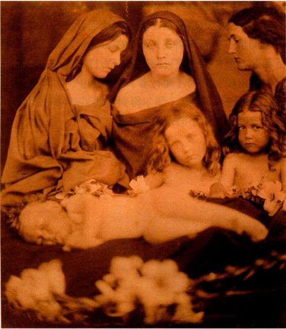

图25\.38 朱莉娅·玛格丽特·卡梅伦：《姐妹精神》。约1865年。

蛋白纸成像，3 1\.6 x 26\. 7厘米。纽约罗彻斯特区（Rochester）的乔治·

伊斯特曼宅邸（George Eastman House），伊斯特曼·柯达公司（Eastman

Kodak Company）捐赠

896 詹森艺术史

图25\.39 古斯塔夫·勒·格雷：《塞特的地

中海》。1856\-1859年。两块玻璃底片拼接，

银盐蛋白纸成像，32\. l × 4 1\. 9厘米。大都会艺

术博物馆，Gilman收藏。

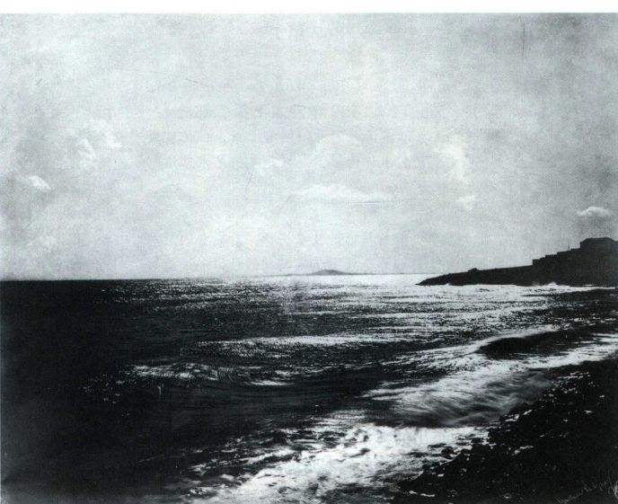

起挑战，令整个摄影界如坐针毡。卡梅伦与里吉兰德和罗宾逊的相同之处在于，她同样使用演员、服装和背景等布景手段，来再现《圣经》、莎士比亚的著作以及桂冠诗人阿尔弗雷德·丁尼生勋爵（Alfred，LordTennyson，1809\-1892年）作品中的场景。在风格上，她的照片令人联想到多位艺术气质并不相同的艺术家，例如伦勃朗和佩鲁吉诺。

《姐妹精神》还表现出唯美主义运动的影响，罗塞蒂的《贝娅塔·贝娅特丽齐》（见图25\.26）是该运动的代表。照片中的场景重现了中世纪晚期或文艺复兴早期的精神气质；其中的女性仿佛佩鲁吉诺笔下的人物，俨然成为了圣母与圣安娜，两个儿童则像天使一般，那个熟睡的孩子像极了幼年的基督。观众也可以将图像看作女性一生的三个年龄阶段，其标题暗示照片中的婴儿很有可能是女孩。卡梅伦运用了模糊前景的手法，并不只是为了让照片看似绘画，还带有心理与象征意味。通过花朵与婴儿形象的消融，使其形体模糊，卡梅伦照片中聚焦的女性已经自觉意识到婴儿的命运是多么难以确定。关心、担忧与质疑同时呈现在她们脸上，我们可以深切感觉到彼此紧靠的人物间那种契合的女性精神，而身后漫漶不清的背景更使她们紧连在一起。虽然图像具有情感元素，但并没有将女性表现为仅仅供男性观众欣赏的对象，更不是男性世界的附庸。与此相反，该图像反映了女性的精神世界，反射出强有力的女性形象。

卡梅伦之所以受人批评，不仅因为模糊的图像被看作作者本人能力低下的表现，而且还在于她选择了

摄影这一行当。作为一名身处男性社会的女性摄影师，卡梅伦很难找到愿意为她工作的男模特。她举办展览也招人非议；尽管维多利亚时代的英国妇女普遍受人尊敬，但这种作为实在极其罕见。后来她将照片出售给一位著名的伦敦经销商，同样遭到了警告，因为当时妇女赚钱被认为是不体面的行为。通过重新设定镜头焦点，卡梅伦不仅挑战了向摄影图像的标准方法发起挑战，也挑战男性专属的职业。讽刺的是，男性摄影师在19世纪末最终还是采用了她的方法。

法国的组合成像 在法国，对于艺术摄影最热情的拥护者是古斯塔夫·勒·格雷（Gustave Le Gray，1820\-1884年）。他最初是一名画家，后来转向摄影，并成为这种媒介的技术创新者之一。勒·格雷是运用套晒（double print）的第一人，并采用这种手法将漂白的天空叠加在海景照片之上。他还发明了纸质负片以及湿版珂罗酊法，这两种技术都使得精细图像与对于更入微细节的表现成为可能。他的摄影方法通常具有较高的画性特征，关注明暗间的强烈对比。为了实现这一点，勒·格雷发明了一种能够产生极其精细色调渐变的方法，以及一项能够在曝光之后两周之内进行成像操作的技术，这样他就可以在暗房中操纵、处理图像了。他还用画笔对负片进行修改、润色，改变色调或者去除某些东西。

以上这些技法都呈现在《塞特的地中海》（Mediterranean Sea at Sète，图25\.39）中，这张照片拍摄于1856至1859年间，为蛋白纸成像，运用了两块湿版珂罗酊玻璃负片\-一片为天空，另一片是海

第二十五章 实证主义时代：现实主义、印象主义与拉斐尔前派，1848\-1885年 897

原始文献

夏尔·波德莱尔（1821\-1867年）

《现代公众与摄影》（The Modern Public and Photography），节选自《1859年沙龙》第二部分

波德莱尔现在主要以其诗人的身份闻名于世，但他曾是19世纪中叶一位重要的艺术评论家，并且是支持艺术家绘制当代生活的有力拥护者。

我相信，正如所有纯粹物质性的技术一样，对摄影的恶劣运用很大程度上要归罪于法国艺术精神的枯竭······诗意与技术是两个彼此厌恶，但都野心勃勃的人，他们之间的敌意仿佛一种本能。当两人在路上相遇，其中一个必须给另外一个让路。如果允许摄影在某些艺术活动中作为艺术的代表，那么

景。勒·格雷暗化了大片的天空与海洋，将简单、空洞的构图转变为杰出的海景作品。云层、光线与海洋的戏剧性交响似乎体现着自然本身的原始生命力。

一般认为勒·格雷是首位入选美术沙龙版画艺术（graphic arts）展区的摄影师，尽管我们并不确信其作品是否在1850至1851年间的沙龙上展出过。勒·格雷这样写道：“摄影的未来不在于廉价，而在于图像的品质······我希望摄影不会堕入工业或商业领域，能够保持其在艺术中的一席之地。”

建筑与工业革命

钢铁是工业革命所带来的产品，它与建筑的关系正如摄影与美术的关系一样模糊不清。在18世纪晚期至19世纪早期，钢铁最初用于修建桥梁与工厂等城市工程。工业革命的故乡英国从1767年开始大批量铸造钢铁，产量直到19世纪上半叶都保持领先。这种情况使得钢铁也在建筑中使用；第一座铁桥则出现于1779年，那是一座横跨煤溪谷狭窄塞文河的拱形建筑物。金属建材很快就被用于制作纺织厂的支柱，在1796至1797年间曾出现内部完全使用钢铁结构的建筑。各种复兴的古代风格继续在建筑中占据主导地位，一直持续到19世纪末。而钢铁使用的范围虽然有限，却将房屋与城市建筑从历史主义中解放出来。这时的形式或设计是由材料与工程学原理来决定的，因此为19世纪80年代现代建筑在芝加哥的出现设置了舞台。在实证主义时代的实用主义与现实主义氛围中，钢铁建筑具有强烈的实用主义特色以及这种利用钢铁材质结构特性的直率表达，与时代精神十分吻合。

钢铁玻璃建筑：火车站顶棚与展览会场

19世纪早期，建筑工人经常使用铸铁（cast iron）

不久之后它就会取代或腐蚀艺术，这都是因为大众的愚蠢与天真。因此，摄影必须回归其真正的职责，即艺术与科学的女仆······让摄影极大丰富旅行者的相册，补足其记忆所缺少的精确性；让摄影装饰自然主义者的图书馆，放大各种微小昆虫的图像，甚至通过若干事实性的呈现，证明天文学家的假设；简而言之，让摄影成为秘书和记录负责人，为那些因为职业原因而需要绝对物质精确性的人服务······但是一旦允许摄影染指无形和想象领域，染指任何因为人类在其中注入灵魂才会具有价值的东西，那将是我们的悲哀与灾难！

SOURCE:ART IN PARIS, 1845\-1862\. TR\.JONATHAN MAYNES\. \(LONDON: PHAIDON PRESS, 1965\)

立柱来修建哥特式复兴教堂。19世纪30年代，随着铁路的出现，也开始建造铸铁的火车站顶棚。这些顶棚必须具有横跨多条平行铁轨与站台的宽度，同时还要保持足够的高度，以便蒸汽与烟尘消散。伦敦的尤斯顿火车站（Euston Station，1835\-1839年）是首个建有铸铁顶棚的火车站，顶棚跨度12米有余。而最宏大的顶棚位于伦敦圣潘克拉斯火车站（St．Pancras Station，1863\-1876年），顶棚的钢桁支架拱的宽度竞超过了80米（图25\.40），其向两边延伸所形成的空间是当时未经分割的最大内部空间。铸铁骨架支撑着整个玻璃屋顶，钢铁与玻璃的这种联合使用通常被称为钢铁玻璃建筑（ferrovitreous）。圣潘克拉斯火车站的每一个拱实际上都是相叠加的双拱，通过桁架（truss）连接，桁架则由两个或多个等边三角形所构成的加固结构组成。桁架自从古罗马时代就为人所知，主要用于加固木构建筑，因此在屋顶与桥梁的建造中常有使用。到了1860年，在跨越大面积空间的金属建筑中，桁架已经无处不在。

诸如圣潘克拉斯火车站顶棚之类的建筑是工程学上的壮举，但在新建铁路桥面前却只能黯然失色，后

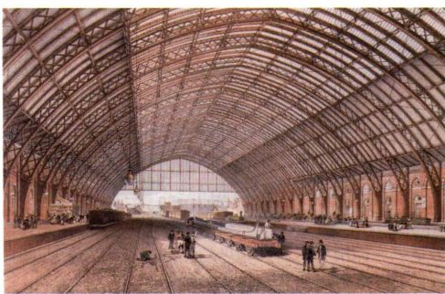

图25\.40 伦敦圣潘克拉斯火车站石版画。1863\-1876年。伦敦科学博物馆（Science Museum）

898 詹森艺术史

图25\.41 约瑟夫·派克斯顿爵士：伦敦水晶宫。建于1851年，1852年在西登汉姆	（Sydenham）重新组装，1936年毁于火灾

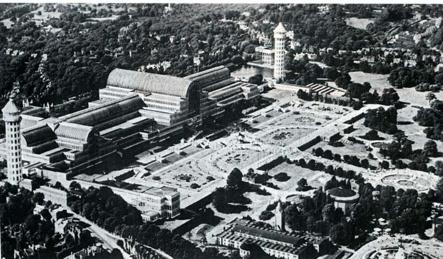

者必须跨越深邃的大峡谷与宽阔的河面。火车站顶棚不过是小规模的桥梁建筑，无论需要什么样的进深，只要将大量的拱装配在一起就可以实现。规整划一的拱本身就是批量生产的象征，反映出工业能够以稳定的步调或节奏制造出无穷无尽的产品，而且其规格也可以达到毫无二致。

19世纪最著名的钢铁玻璃建筑可能是1851年建在伦敦的水晶宫（Crstal Palace，图25\.41），是首次世界贸易博览会\-万国工业博览会的会场。博览会的目的在于展示生产发展、技术革新、农业进步，以及新工业国家所制造的精美实用工艺品，英国希望展示自身作为最先进国家的实力。博览会并不仅是贸易市场，也是西方工业化的庆典。

英国最卓越的温室建筑师约瑟夫·派克斯顿爵士（Sir Joseph Paxton，1801\-1865年）负责该建筑的设计工作，他同工程师们一起架设了相当于一座巨大温室的水晶宫。虽然所采用的钢铁玻璃材质与派克斯顿早期的温室建筑相同，但是形式却有巨大差距。水晶宫类似于英国大教堂，具有筒拱所覆盖的纵深中堂，同样覆盖着筒拱的耳堂较为低矮，一旁侧堂的高度也是逐层降低。博览会结束之后，水晶宫被拆卸开来搬运到西德纳姆区附近，重新组装时又增加了一道耳堂。这座建筑仿佛工业领域的大教堂，象征着工业此时新宗教一般的地位。水晶宫的外形为众人熟悉，玻璃窗格等小型建筑部件的尺寸也十分人性化，让参观者在这座长达565米左右的海市蜃楼般建筑中感到些许轻松自如。

历史折衷主义与技术

水晶宫的外观充满科技感，可能因为其临时性的非传统建筑定位的关系，主要目的是开展以技术和工业为主题的展览。普遍而言，宫廷、剧院和议会等庄

严的大型建筑都不用钢铁来建造，而是采用石材，具有“重现性”（representational），在设计方面重新拾起古典风格、哥特式或文艺复兴时期的样式。例如，加尼埃曾将卢浮宫的元素结合在歌剧院之中，意图将路易·波拿巴与路易十四联系在一起。

布鲁克林大桥 以历史折衷主义来掩盖技术痕迹的做法在布鲁克林大桥（Brooklyn Bridge，图25\.42）中明显地体现出来。这座桥有可能是19世纪跨度最大的建筑，由约翰·罗布林（John Roebling，1806\-1869年）于1867年设计，他的儿子华盛顿·罗布林（Washington Roebling，1837\-1926年）在1883年才完成桥梁的修建。布鲁克林大桥的设计一经公布就被指责为疯狂的梦呓，而落成之后则成为了世界奇观。虽然悬索吊桥当时已经存在，但规模很小。在纽约东河如此之深的河底砌筑桥墩，并建到水面之上90余米的高度，还要跨越布鲁克林与曼哈顿之间极大的距离，与此同时，还要考虑到支撑包括铁路、马车道与人行道在内的五条通路，没有人认为这样的项目具有

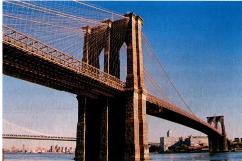

图25\.42 约翰·罗布林和华盛顿·罗布林：纽约布鲁克林大桥。

1867\-1883年

第二十五章 实证主义时代：现实主义、印象主义与拉斐尔前派，1848\-1885年 899

大事年表

1861年\-俄国废除农奴制

1869年\-美国横贯大陆中西部的铁路完工

1879年\-托马斯·爱迪生发明白炽灯泡

1887\-1889年\-巴黎建成埃菲尔铁塔

实现的可能。为了完成这一工程，罗布林不仅采用了与主悬索相连接的纵向铁索，而且还按照相同的间隔在桥墩顶端牵引出多股铁索，形成三角形结构，罗布林认为这些结构起到了桁架的作用。

两座巨大的桥墩是古代复兴风格的折衷体现，其中对哥特式风格的复兴更为明显，这也是当时典型的艺术品位。然而在最初的设计图里，桥墩采用的是埃及塔门样式，该样式在最终定稿中只保留在供铁索穿过的孔洞上，由花岗岩砌筑而成。正如当时每个人注意到的，桥墩的功能仿佛是巨大的古罗马凯旋门。这座桥恰好被称为“美国凯旋门”，不仅表示其巨大的规模和成就，还显示出美国在技术领域里的优越性。

圣杰尼耶夫图书馆 19世纪50年代，美国在铸铁建筑立面的制作方面超越了其他各国。五层或六层的建筑整体都可以为铸铁拱和仿石立柱所包裹，大多作为轻工业制造车间。对于愈宏伟壮观且具有非工业用途的建筑来说，愈少在表面使用铁材。巴黎的一座城市建筑在运用钢铁的手法上十分具有创新性，这就是亨利·拉布鲁斯特（Henri Labrouste，1801\-1875年）在1842年设计的圣杰尼耶夫图书馆（BibliothèqueSainte\-Geneviève）。图书馆的外观（图25\.43）使人回想起文艺复兴时期的建筑风格。从墩柱升起的拱则是受到雅各布·桑索维诺设计的威尼斯圣马可图书馆（1536年）启发。建筑的比例、封闭的底层以及开敞的上层设计效仿了米兰的美第奇银行（约1460年），暗示这座图书馆是知识的宝库。拉布鲁斯特还在第二层设计了半开放式开口以及建筑表面的铭文，与托勒密时代的埃及神庙相呼应，预示图书馆中所藏的书籍是神圣之物，而这些铭文都是伟大作家的名字。

图书馆外部全无极端技术的痕迹，而内部则截然相反。位于第二层的主阅览室（图25\.44）建有两道轻盈的拱顶，立柱和拱顶都由钢铁铸造而成，支撑靠铁丝网加固的石膏天顶。尽管外部主要使用了古典的文艺复兴风格，内部却表现出哥特式风格，而且还建有罗马式的餐厅。但是对于巴黎人而言，金属拱顶让他们立刻联想到新型的火车站顶棚，不仅暗示着现代生活，而且具有旅行感，如此正是书籍的功能。

拉布鲁斯特没“必要”在图书馆中使用钢铁，但是他出于隐喻和象征目的选择了这种材料。对钢铁的

象征使用在一层入口处就表现出来\-密集排列的古典凹槽方柱表明这座埃及的多柱式大厅支撑着钢铁拱，仿佛现代的铁桥，提醒人们书籍才是通向未来的桥梁。

宣示未来：埃菲尔铁塔

埃菲尔铁塔（Eiffel Tower，图25\.45）是该时期最为著名的钢铁建筑，由法国工程师古斯塔夫·埃菲尔（Gustave Eiffel，1832\-1923年）于1887至1889 年间完成设计，后来用作1889年巴黎世界博览会的入口。为了建造铁塔，埃菲尔主要从他曾建造的大量桥梁中挪用了桁架式塔门结构。埃菲尔铁塔高达300米，是当时世界上其他建筑高度的两倍，因此得以俯瞰巴黎。铁塔的设计主要归功于结构上的整体性，而非标准的建筑风格，它的问世惹恼了巴黎人，被他们视为眼中钉。镂空的铁塔看起来削瘦、脆弱，埃菲尔后来在底座上增添了拱门，并在两座平台上增加了有机形式的装饰（20世纪30年代被移除），以便观者能够适应他激进的空想式建筑。

然而正如公众逐渐接受布鲁克林大桥一样，他们最终辨认出底部拱门的熟悉面貌，也迅速将埃菲尔

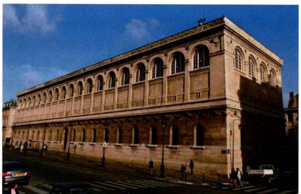

图25\.43 亨利·拉布鲁斯特：巴黎圣杰尼耶夫图书馆。设计于1842年，修建于1842\-1851年

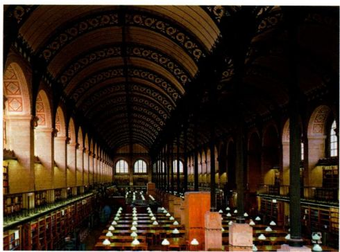

图25\.44 圣杰尼耶夫图书馆主阅览室

900 詹森艺术史

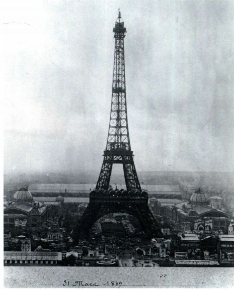

图25\.45 古斯塔夫·埃菲尔：巴黎埃菲尔铁塔。1887\-1889年

铁塔当作凯旋门一般看待，同时还是法国技术与工业胜利的征兆。同时也是人民胜利的宣言：只需少量费用，任何人都可以乘坐电梯升到上部的平台。普通市民可以在这里俯瞰教堂与宫殿，这是传统与特权的精神堡垒，然而19世纪向民主不断迈进的步伐已将其摧毁。埃菲尔铁塔成为人民之塔，如果算不上法国的象征，至少也是巴黎的象征。更为重要的是，其为下个世纪的建筑指明了方向，同时也是现代主义的方向之一\-摆脱历史内涵的局限，产生了充分表现新建筑材料性质与几何性的风格。

小结

1848年革命呈燎原之势，撼动了欧洲的许多国家，这一年还恰逢物质主义与实用主义哲学的兴起，替代了浪漫主义幻想。新政府与新视野再一次重塑欧洲社会。欧洲人逐渐将科学与经过检验的事实视为所有知识的基础。在这个实证主义时代，艺术表现出现实主义特征。艺术家们不再美化生活，而是直率地描绘现代时期的现实，其表现的题材既有穷人的悲惨境遇，也有富人的休闲活动。在风景画中，现实主义发展为印象主义，记录了法国乡村向巴黎郊区转变的历程。

法国社会发生了极大的变化。工业化与中产阶级兴起的步伐迅速有力，巴黎具有了现代面貌。艺术家们记录着法国富有戏剧性的社会转型。古斯塔夫·库尔贝与让\-弗朗索瓦·米勒以表现劳动阶层的生活方式与活动见长。罗莎·博纳尔则转向动物世界，将自己的艺术创作建立在对解剖结构与运动的科学观察之上。从19世纪60年代开始，爱德华·马奈和埃德加·德加等艺术家将其现实主义聚焦于城市生活，而克劳德·莫奈与卡米耶·毕沙罗等印象主义者则依赖细致的观察来记录自然与人造物的色彩。

英国的现实主义

与此同时，英国的工业化与城市化为某些人带来了新的财富，却让其他人陷入绝望、无助的贫困之中。许多知识分子谴责粗俗物质主义的兴起与道德观的沦丧。在艺术领域，这个时代的实证主义精神促生了细节化的自然主义，强调真实表现自然，关注社会问题。拉菲尔前派关注当代伦敦在工业与道德方面的罪恶，运用高度细节化的自然主义风格创作，有时还吸收中世纪的精神气质作为现代社会的寓言。在装饰艺术中也出现了对精神与自然主义的类似强调，威廉·莫里斯所领导的设计公司制造出众多优美的手工产品。与法国相反，英国的现实主义消失得很早，在19世纪60年代就为唯美主义运动所取代。惠斯勒是唯美主义的领袖，他们拥护为艺术而艺术的美学观，同时也探索了个人的幻想与受压抑的性欲。

美国的现实主义

与1848年革命相比，内战对美国的冲击最为巨大。以温斯洛·霍默为例，他创作的肖像画与自然主义风俗画结合了关于战争的象征意象。同时代的托马斯·埃金斯在他对当代美国的现实主义再现中，融入了科学的自然主义。

摄影的到来：批量生产艺术的机械方法

摄影是实证主义时代的完美工具，最初被用来记录世界，支持科学调查。肖像与风景是受人青睐的题材。然而，许多摄影师将这种媒介视为艺术，而不是机械的工具。这些摄影师被称为“画意摄影者”，他们通过设计题材与操纵图像来模仿绘画。

建筑与工业革命

钢铁促使建筑从复兴古代风格的折衷主义里解放出来。其最初主要用于修建火车站顶棚一类的非庄严性建筑，通常与玻璃建材结合在一起。钢铁建筑具有实用主义的骨架结构，其形式或设计追随功能，不具有任何历史内涵。为1889年巴黎世界博览会而建造的埃菲尔铁塔则是这种现代建筑设计方式的缩影。

法国的现实主义

伴随着路易·波拿巴在1848年革命之后对权力的掌控，

第二十五章 实证主义时代：现实主义、印象主义与拉斐尔前派，1848\-1885年 901

