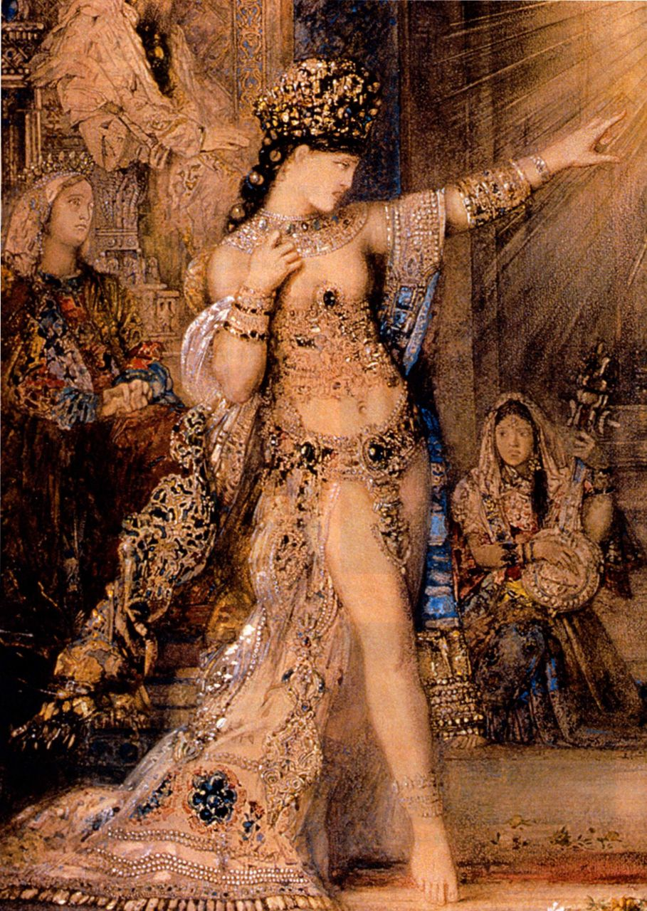

# 第二十六章 进步与无止境的渴望：后印象主义、象征主义与新艺术风格，1880\-1905年

19世纪末，文化呈现出二元性的特点。一方面，有人乐观地沉醉于工业化世界所带来的财富、奢华与技术进步；另一方面，有人将这些视为堕落、无所节制和道德崩坏的征兆。前者生气勃勃，心怀骄傲，后者则绝望、焦虑。从他们的观点来看，这个时期既是“美好的时代”（La Belle Époque），也充斥着“世纪末”（Le Fin de Siècle）情怀。

从19世纪末到第一次世界大战爆发，实际上出现了前所未有的经济增长与繁荣局面，主要得益于1870年普法战争之后的持续了40年的和平。国家的巩固已经基本完成，许多国家都采取共和政体。德法两国加入了英国和比利时的行列，成为真正的工业化国家，在1914年时德国的钢铁产量达到了英国的两倍。美国也加入到这个强势的群体之中。受资本主义与炽烈的民族情感激发，帝国主义势力日益强大，导致其对非洲、亚洲部分地区和太平洋诸岛的瓜分，将其变为各自的封地，进行经济上的掠夺。真正的世界市场也在此时形成，货物、服务、资本和人口穿过国境线在全世界持续流通。

始于18世纪的现代时期此时进入了被称为“现代性”（modernity）的新阶段，以“新工业革命”（NewIndustrial Revolution）为其标志。蒸汽机技术得到改良与提高，电能、电话、内燃机、汽车、潜艇、飞机、石油、电影与各种机械日益融入现代生活；而其发展步伐则更加迅速，使得现代生活越来越舒适、高效。

图26\.16细部，古斯塔夫·莫罗：《显灵》

1901年，古列尔莫·马可尼（Guglielmo Marconi）发送了穿越大西洋的无线电信号，世界从此变小了。

城市强调现代性，从而失去特色与人性，成为吸引人们的磁石。随着工业化扩张，人们的乡村家园被连根拔除。新的城市居民较之乡村居民而言，缺乏对传统的尊敬，但对新观念则敞开了胸怀，使其随着报刊与人们读写能力的极大提高而迅速传播开来。城市居民脱离了传统体制，以国家作为自己身份的标识，增强了该时期强烈的民族主义特色。人群与观念聚集于城市，使其成为社会改革的强大中心，特别是对于社会主义与马克思主义来说。报纸、杂志和书籍揭露了穷人的悲惨生活与工作条件，成为引发变革的鼓动力量，尤其是附有摄影插图的出版物。

塑造该时期的另一个重要因素是“新女性”的出现，其致力于改变约束性法规，以及维多利亚时代的社会习俗。妇女运动在1825至1850年间同时出现在欧洲和美国，并在该世纪最后25年里形成强大力量。此时的妇女们组织起来，强烈要求政治、经济、教育与社会方面的平等。到19世纪90年代，“新女性”一词出现，以美国为代表的大众媒体发明了一种新图像来

🔴第二十六章 进步与无止境的渴望：后印象主义、象征主义与新艺术风格，1880\-1905年 903

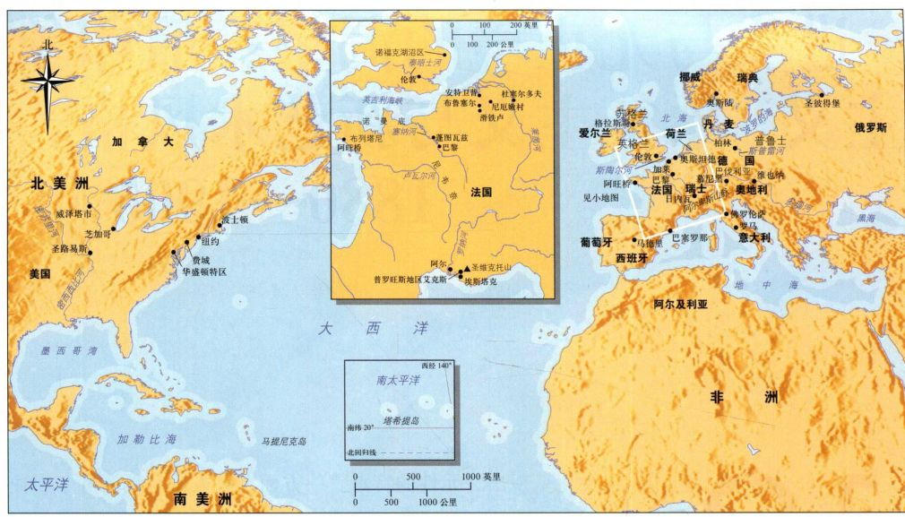

地图26\.1 1904\-1914年的欧洲与北美洲

对其进行表现：新女性高挑健壮，独立自主，摒弃了维多利亚时代的束缚与习俗，穿着舒适的男式服装，甚至张扬自己的性魅力。新女性对大多数维多利亚时代的男性造成了威胁，于是将她们的独立看作对自身权力的挑战。这些男性更喜欢女性待在家里，不必去接受教育，在经济上也不需要独立。男性艺术家也不例外，蹂躏和控制“荡妇”（femme fatale）成为流行的题材，这是男性恐惧的视觉表达。与此同时，人数不断增加的女性艺术家从女性视角来表现女性，赋予她们在社会中的重要性与尊严，正如之前的玛丽·卡萨特和朱莉娅·玛格丽特·卡梅伦所做的那样（见第二十五章）。这些艺术家与将女性描绘为性对象、依附于男人的传统决裂开来。

在19世纪晚期的世界舞台上，欧洲的优越感鲜明地增长起来。虽然民族主义导致了尖锐的政治分歧，但欧洲以及美国、加拿大、澳大利亚和新西兰这样与欧洲相关的国家还有相似的生活方式与心态。他们认为自己属于“文明”的世界，其他一切地方或者民族都处于“落后”状态。欧洲人认为启蒙运动的哲学与科学达到了顶峰，创造出最具智慧、最高贵的人种。欧洲人具有前所未见的种族意识，白人则自认为高人一等。查尔斯·达尔文在《物种起源》（1859年）和《人类起源》（1871年）中所阐述的进化论遭到了扭曲，用以支持白人至上的观点。如果生命是通过“适者生存”的“自然选择”产生“最优秀的种族”，那么毫

无疑问，先进的欧洲文明似乎就是那“最优秀的种族”。

然而，很多文化人类学家拒绝将某个社会视为优于其他，并认为部落社会与西方文明世界一样复杂。他们争论道，任何文化的习俗与价值观念都适合其所处的环境与条件。虽然如此，那些哀叹工业化、怀疑不受限制之进步的人，却将新近获得的殖民地与开拓地看作未被污染的乌托邦，看作逃离现代文明物质主义魔掌的天堂。他们延续着让\-雅克·卢梭在18世纪所开创的传统，称那些地区为“浸染着自然的原始社会”，因此美德与纯洁才得以保留，并且与宇宙间的精神力量紧密联系。

19世纪末出现了研究精神领域的新方式。人类学家证明基督教的仪式、实践与信仰并非独一无二，其与部族文化和东方宗教均有相似之处。对于这一观点最强有力的表达来自詹姆斯·弗雷泽爵士（Sir JamesFrazer，1854\-1941年）所撰写的多卷本著作《金枝》（The Golden Bough），书中甚至宣称巫术与宗教之间只存在极其细微的差别。通过投身宗教来逃避进步的人日益增多，其受到西方正统宗教的吸引，也着迷于通神论（Theosophy，或译“神智学”）和玫瑰十字会（Rosicrucianism）等受到东方启发的宗教，还有很多人转向泛灵论和超自然现象。

19世纪晚期的另一大特征就是心理学的兴起。德国心理学家威廉·冯特（Wilhelm Wundt，1832\-1920年）以科学方法为基础，成功将心理学从哲学

🟩904 詹森艺术史

转型为一门自然科学，在其1874年出版的《生理心理学原理》（Principles of Physiological Psychology） 中有关于此点的详尽阐述。俄国学者伊凡·巴甫洛夫（Ivan Pavlov，1849\-1936年）的研究引发了对人类行为如何适应经验与环境的讨论。维也纳的精神病学家西格蒙德·弗洛伊德（Sigmund Freud）也开始形成其无意识理论，并于1900年出版了《梦的解析》（Interpretation of Dreams）。人们对于人类头脑与驱使人类回应的基本力量日益关注，远远超出了科学的范畴，逐渐渗透到流行文化与上层文化之中，而诸如奥古斯特·罗丹和爱德华·蒙克等各种类型的艺术家都注重这种不可见的力量，其深植在人的大脑之中，产生出性冲动与焦虑等外在表现。

在很多方面，进步都是19世纪晚期的口号，艺术家们也就其所具有的力量做出回应。大多数艺术家拒绝进步，寻求精神性、乌托邦、或者原始的替代品；其结果就是产生了广泛的风格与运动，其中最主要的有后印象主义、象征主义和新艺术风格。大部分艺术家以马奈和印象主义精彩的形式创新为基点，创造出更为抽象的艺术作品，而不再具象。他们的艺术也高度个人化，不反映群体的想象。因此，文森特·凡高和保罗·塞尚等艺术家逐渐发展出独特的标记形式。其作品通常画面奇异，描绘幻想或梦境；同时也具有精神性，在现代性粗糙的物质主义中寻求信仰，寻求关于存在的更深刻的解释。很多艺术家都在古典时代、中世纪以及《圣经》等历史中找到了自己的主题，而这正是现实主义者极力拒斥的内容。即便是现代建筑也充满了幻想与精神性。以新艺术风格为例，其成功地将建筑从复兴古代风格的折衷主义里解放出来，创造出看似奇异怪诞，却无与伦比的有机形式。与此同时，19世纪80年代、90年代杰出的芝加哥建筑师建造出第一座玻璃钢铁结构的摩天大楼，以及由水平线、垂直线构成的、具有严格现代几何形式的复杂住宅，弗兰克·劳埃德·赖特就是其中高手。尽管如此，建筑师们还是在现代建筑与住宅中投入了强大的精神力量，建筑与进步的关系有多紧密，其与宇宙间各种能量的联系就有多亲近。现实主义与印象主义力图捕捉现代世界的本质，而后印象主义、象征主义和新艺术风格则主要为脱离现代世界、提供解毒剂而奋斗。

后印象主义

20世纪早期的英国艺术评论家罗杰·弗莱（Roger发明了后印象主义（Post\-Impressionism）一词，

用来描述印象主义之后的先锋派艺术，印象主义则是这些具有新方向艺术的出发点。保罗·塞尚、乔治·修拉、文森特·凡高与保罗·高更等后印象主义艺术家都发展出个人的独特风格，但1880至1904年间仍然具备将这些艺术统一起来的条件。后印象主义者反对现实主义和印象主义的经验主义前提，以创造更为宏大、更具有普遍意义甚至幻想性的艺术为主要目标。后印象主义者还反对印象主义的集体式观看方式，每位艺术家都有自己的美学观念。然而与印象主义者一样，许多后印象主义者继续在日本艺术中挖掘美学观念。他们也保留了印象主义者反资产阶级和反学院派的传统，同样借助艺术家的合作画廊或者私人画廊来宣传他们的艺术。

保罗·塞尚：迈向抽象

实际上，保罗·塞尚（Paul Cézanne，1839\-1906年）是与大多数印象主义者同一时代的人，他在后印象主义风格兴起之时发展出了自己的风格。塞尚出生于法国南部的普罗旺斯地区艾克斯，家庭富有但疏于社交，他在1861年放弃了法律专业，而来到巴黎学习艺术。塞尚虽然名义上在绘画学院学习，但主要靠自学，在卢浮宫里临摹德拉克洛瓦和库尔贝等人的画作。1864至1869年间，塞尚提交给沙龙的作品粗糙模糊，还经过多次反复绘画，表现神秘、病态但毫无特色的狂欢、强暴和谋杀。这些作品遭到了拒绝，正如反资产阶级、反学院派的塞尚所预料的那样。这些作品的部分意图就在于令沙龙评审震惊。塞尚在其中运用了调色刀和库尔贝式的深暗色调，同时也受到德拉克洛瓦浪漫主义意象和马奈大胆题材的启发。他甚至绘制过一幅《现代奥林匹亚》（ModernOlympias），在首届印象主义展览上展出，而他也继续参加了其后两届印象主义展览。

1872年，塞尚离开巴黎，前往蓬图瓦兹，之后在毕沙罗的建议下来到奥维尔（Auvers）附近地区（见图25\.17），当时毕沙罗已经在那里生活了。这位年长的艺术家成为塞尚的良师益友，二人因想要创造具有现代风格的艺术而联系在一起。塞尚开始绘制风景，有时与毕沙罗一起作画。在毕沙罗持续的影响下，塞尚的情绪主义消失了，调色板也明亮起来，色彩也变得更丰富，他的构图也具有强烈的结构整体性，虽然在他早期的作品中就已经表现出来，但此时才真正开花结果。正如塞尚在后来所说的，他“想要让印象主义坚实起来，像是博物馆里的艺术”。在之后的十年间，我们会逐渐看到塞尚是如何实现其目标，1885至

🔴第二十六章 进步与无止境的渴望：后印象主义、象征主义与新艺术风格，1880\-1905年 905

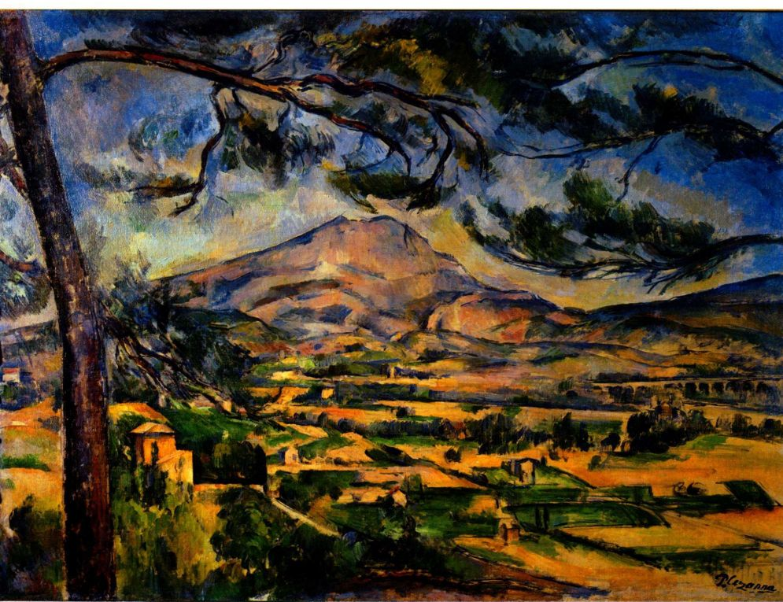

图26\.1 保罗·塞尚：《圣维克托山》。约1885\-1887年，布面油画，64\.8 × 8 1 \.4厘米，Samuel Courtauld信托基金，伦敦考尔陶德艺术学院画廊

1887年前后在普罗旺斯绘制的《圣维克托山》（MontSainte\-Victoire，图26\.1）就表明了这一点。这幅作品具有典型的印象主义风格，表现了一片阳光明媚的风景，笔触宽阔且色彩清晰明亮。画面乍看之下似乎闪闪发光，但之后就凝固了。塞尚将图像锁定在相呼应的形体结构之中。前景树枝弯曲的曲线也出现在远处的山脉与小丘之上；绿色牧场边缘的斜线回响着房屋、山坡和成簇平行的泼溅式笔触所具有的方向性，这些笔触在绿色的松针上表现得最为明显。正如树木右方的建筑具有坚实的立体感，毗邻的绿色牧场与赭石色田地具有平面性，二者的结合仿佛积木，在大地上浮现出来又很快消解在色彩的细薄平面之中。大多微小但众多的垂直笔触掩藏在风景里，与画面强烈的水平感互相制衡，暗示出隐含着的网格。

这幅作品中的很多方面都可以从两个截然相反的角度来看待。它具有印象主义式的闪动，但在结构上则显得凝固静止。画面表现的是深远的全景，然而风景也具有平面性，且经过了压缩，因为远处的天空与前景里的树枝处于同一个平面。这种矛盾的部分原因

在于成行的白色笔触形成了一片织毯，似乎将松枝和天空同时织入其中。画布表面的每一道笔触都是一个强调平面的平板印记，然而又通过彼此叠加，形成了笔触之间的空间感，或者说深度。甚至线条也具有双重功能\-山脉顶端的线条可以被解读为阴影，为了制造出深度，也可以被看作平涂的轮廓线。画面中的具象与抽象之间存在冲突，表现的显然是真实世界，但又一直提醒着我们，眼前所看到的是涂在平面画布上的平面颜料、线条与色块。我们能够感觉，解决所有这些冲突，并获得二维、三维空间的平衡需要花费的时间。塞尚大部分作品的创作都需要几年时间，其中的每一处画痕都经过深思熟虑（见第907页的原始文献）。

除风景之外，塞尚还绘制熟人的肖像（他从未接受过正式委托，因为父亲为他提供适当的津贴）、静物画和人物画，特别是风景中的浴者，在所有这些类型中我们都可以感受到同样的冲突与受抑制的张力。在1879至1883年间的《静物，盘中苹果》（StillLife withApples in a Bowl，图26\.2）里，我们立刻就感受到夏尔丹式的不朽之感（见图22\.8）。高脚果盘

🟩906 詹森艺术史

图26\.2 保罗·塞尚：《静物，盘中苹果》。1879\-1883年。布面油画，43\.5x54厘米。丹麦哥本哈根卡尔斯伯艺术博物馆

保罗·塞尚（1839\-1906年）

节选自写给埃米尔·贝尔纳的通信

贝尔纳曾与高更一起创作，并最终形成了阿旺桥派（thePont\-Aven）。1904年春天，他在普罗旺斯地区艾克斯见到了塞尚，之后两人一直保持通信。这封信完成于两人会面前后。

原始文献

让每个物体或者平面的各个面都朝向中心点。平行于地平线的线条产生广度，这是自然的一部分，或者你更愿意说它是全能上帝展现在我们眼前的一部分奇观。垂直于地平线的线条产生深度。但是对我们人类来说，自然的深度更甚于其广度，由此需要引入光线的振颤，以红色和黄色来表现，同时还需要足够的蓝色来给人以天空的印象。

我要重申已经告诉过你的事情：用圆柱体、球体和圆锥体来处理自然，每一事物都设置在合理的透视之中，

SOURCE:PAUL CÉZANNE: LETTERS\. ED\. JOHN REWALD, TR\. MARGUERITE KAY\. \(LONDON:BRUNO CASSIRER,1946\)

中的苹果与盘子里的苹果形成了平衡，白色桌布的皱褶与壁纸上的树叶花纹也同样平衡。每一事物都被框在桌子那强烈的水平边缘之中。每个苹果都具有强烈的实体感，仿佛由厚涂的颜料笔触构成，其形体也用明显的线条精心描绘出来。桌布的褶皱同样具有造型感，幻觉式的触感因平行块状颜料的使用得以加强。但画面还具有紧张不安的能量与优美的平面性：高脚果盘拒绝退入空间之中，因为其后部的边缘向前突出着。盘子也是如此，其边缘消失在苹果背后，我们很难想象两处断边会在空间中汇合在一起。在空间感上桌面也令人迷惑，因为它同时向前、向上倾斜，而非安置在空间之内。大块笔触显然是平面的痕迹，用紧张的能量覆盖着画布。古怪的室内静物与桌布的褶皱似乎就聚集着这种能量。其间，壁纸的树叶图案不时

地将这种空间状态颠覆，仿佛逃离了原来属于二维的位置，成为了立体的生命，如同苹果或桌布褶皱一样。塞尚并没有忠实地遵照自然来创造图像世界，他坚持个人的美学规则，并承认艺术的每一步发展都在本质上具有抽象性。绘画首要的是将颜料涂抹在画布上，创造出线条与色彩所组成的结构。

在其生命的最后十年，塞尚的艺术日益抽象，于1897至1900年间创作的《从毕贝姆采石场看圣维克多山》（Mont Sainte\-Victoire Seen from Bibemus Quarry， 图26\.3）即为一例。圣维克托山是塞尚所喜爱的题材，甚至为此沉迷；此山出现在塞尚60余幅晚期的油画与水彩画之中。早期的圣维克多山画作着重表现深远风景（见图26\.1），然而此处却被更加压缩的图像所取代。具象物体的彼此叠加是少数几个表现深度的技巧之一。

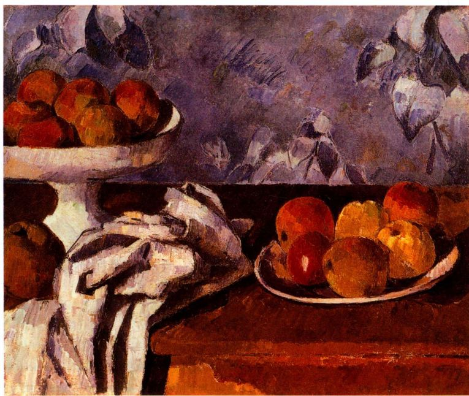

🔴第二十六章 进步与无止境的渴望：后印象主义、象征主义与新艺术风格，1880\-1905年 907

图26\.3 保罗·塞尚：《从毕贝姆采石场看圣维克多山》。约1897\-1900年。布面油画， 64\.8 × 80厘米。巴尔的摩艺术博物馆

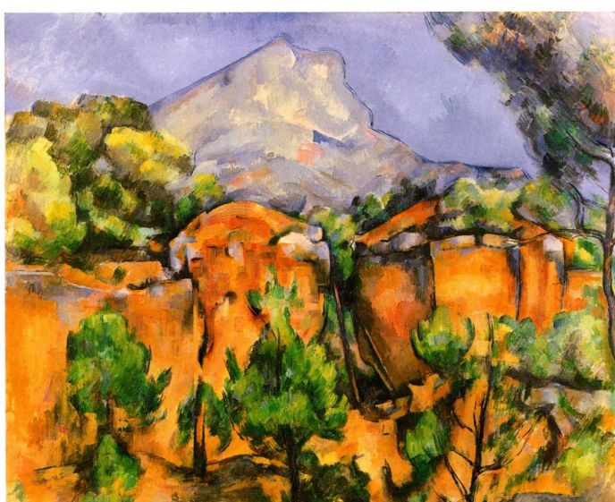

除此以外，这幅图像就是一张由笔触、线条和色彩所精心建构的致密结构，请求人们将之当作复杂无垠的织毯来观看。前景的树木流溢到采石场的岩石之中，又在右上方挤入了天空。天空与山脉融为一体，只有顶峰的边线才将两者区分开来。无论平面多么致密，画面都与任何一幅印象主义作品一样，矛盾地充满了光线、空间和运动。观看如此与世隔绝的图像，我们会不由自主地感受到塞尚所走过的艺术道路。他抑制了早期浪漫主义作品里的张力与能量，将其疏导进新的努力之中，创造出的图像在对自然的直接观察与抽象自然形式的欲望之间保持了平衡。这幅作品出自一名将绘画从再现功能中解放出来的艺术家之手，他赋予后来艺术家发明图像的权力，不再去依附于绘画本身的固有法则。19世纪90年代晚期，巴黎杜兰·鲁埃画廊开始展出塞尚的作品，对艺术家产生了强烈影响，特别是帕布罗·毕加索和亨利·马蒂斯。

乔治·修拉：寻找社会与画面的和谐

乔治·修拉（Georges Seurat，1859\-1891年）与塞尚一样，想要创作出更接近古代伟大艺术的印象主义作品。他曾于1878年短暂师从一位美术学院中安格尔的追随着，后来在布列塔尼半岛服满一年义务兵役后又返回巴黎，在那里度过了短暂的余生。修拉开设了自己的画室，并于1884年以一幅题名为《阿涅尔浴场》（A Bathing Place，Asnières）的大型作品将自己的新风格公诸于世。这幅作品描绘了一群在塞纳河里游泳的

工人，地点位于巴黎工人阶级居住的郊区，距离修拉长大的地方不远。但画作遭到沙龙的拒绝，在1884年“独立艺术家协会”（Independent Artists）的首次展览上才得以与公众见面。这个新成立的艺术家组织仿佛印象主义者的艺术家组织一样，专门展出没有通过沙龙评审的作品。修拉参加的下一个展览于1886年举办，这也是最后一届印象主义展览，他提交了《大碗岛的星期天下午》（A Sunday Afternoon on the Island of La Grande Jatte，图26\.4）。这两次展览的日期都具有重要意义，分别标志着印象主义时代的终结与后印象主义的兴起。

《大碗岛的星期天下午》明显起源于马奈的现实主义作品以及莫奈的印象主义作品，表现了中产阶级在阳光明媚、色彩艳丽的周日午后进行休闲活动的场景。这幅作品仿佛是各种人物类型的目录，当时的观众不费吹灰之力就可以辨识出来，例如牵着猴子招摇过市的交际花和在画面左下方抽着烟斗、挽起袖子的船夫等等。修拉的类型目录也将狗收录在内，前景与塞纳河上的小舟里都出现了不同种类的狗。他采用肖像式手法来绘制人物，每个人都表现为侧面、正面或斜侧面的剪影，模仿古罗马著名建筑师维特鲁威为神庙雕像所设计的布局。修拉声称，“正如菲迪亚斯为了表现泛雅典娜节而为帕特农神庙创作了檐壁浮雕，他也想将现代人的行列塑造成那样，具有浮雕的基本形式······”。这并非夸大之词，这幅作品高2米、宽3米，尺幅方面就意味着其具有大型历史画的功能，

🟩908詹森艺术史

图26\.4 乔治·修拉：《大碗岛的星期天下午》。1884\-1886年。布面油画，2\.08× 3\.08米。芝加哥艺术学院，Helen Birch Bartlett 纪念收藏

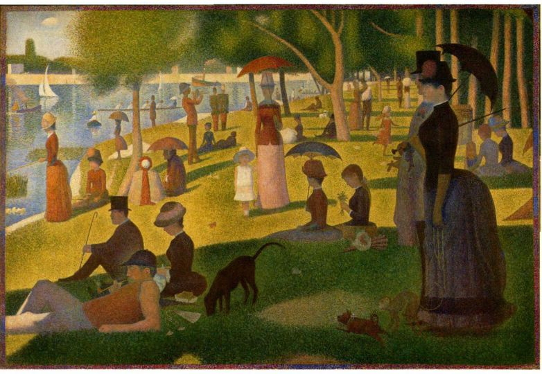

正如普桑和大卫的艺术传统。修拉如同一位历史画家，对画面中每一个成分都绘制过极为细致的习作，甚至还先绘出一幅单独的风景画，之后才将人物嵌入其中，如同舞台布景一般。

夏凡纳的影响 评论家们注意到，修拉的《大碗岛的星期天下午》容易令人联想到皮埃尔·皮维·德·夏凡纳（Pierre Puvis de Chavannes，1824\-1898年） 的古典风格壁画作品。这位艺术家的作品无处不在，其在19世纪80年代可谓家喻户晓。夏凡纳的绘画着重表现田园诗般的神话与圣经题材，其中的生活宁静充足，无忧无虑，《神圣树林》（The Sacred Grove，图26\.5）就是其中一例。在夏凡纳的世界里几乎没有运动，更没有声嘶力竭。每一图像都不会呈现出几何

式的外观，却秩序井然；或纵伸、或水平，温柔松弛的平面性将每一事物都和谐地排列在一起。装饰化的平面性使人想起古代壁画和14、15世纪意大利的早期湿壁画。此处的细节简化到最少的程度，赋予画面宁静、疏朗的面貌。夏凡纳倾向以侧面和正面轮廓来表现人物，常带有原始的生硬感，而简化手法的使用也增强了原始纯真的氛围。夏凡纳在19世纪60年代早期从学院派画家中突现出来，其古典主义与布格罗的古典主义（见第868页）有极大差别，尽管夏凡纳的古典化梦幻图像也吸引了大批保守观众。到19世纪80年代，他的作品还将吸引先锋派艺术家的目光，他们从中看到了幻想的世界与抽象的简洁，认为这正是现代世界的避难所，同样也是极力想要到达的地方。

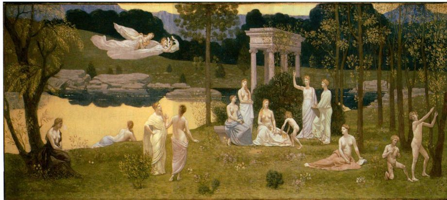

图26\.5 皮埃尔·皮维·德·夏凡纳：《神圣树林》。1884年。布面油画，93x231厘米。芝加哥艺术学院，Potter Palmer收藏

🔴第二十六章 进步与无止境的渴望：后印象主义、象征主义与新艺术风格，1880\-1905年 909

图26\.6 乔治·修拉：《莎玉舞》。18891890年。布面油画，1 69 × 139厘米。荷兰奥特洛市（Otterlo）科罗勒\-穆勒艺术博物馆（Rijksmuseum Kröller\-Müller）

修拉与新印象主义 修拉受夏凡纳影响的程度有多深，其艺术设想与夏凡纳的差别就有多大。修拉并不想逃入遥远的过去，他的目标是创造乌托邦式的现在，描绘中产阶级和工人阶级宁静、享乐的诗意图景。他的信仰不仅仅是古典主义，也包括科学。修拉很熟悉美国物理学家奥格登·洛德（Ogden Rood）的色彩理论，他相信色彩经由人眼进行光学混合之后，可以比调色板上的色彩更为强烈。他由此建立起自己的色彩平面\-首先涂上薄薄一层部分混合的固有色，在上面再用短小的笔触涂上相关的色调，最后以原色或间色点画一层等大的色点。正如修拉的友人兼评论家费利克斯·费内翁（Félix Fénéon）在1886年的文章中所说，最后一层“·······色彩，孤立于画布之上，在视网膜上混合起来。因此我们看到的不是物质色彩（颜料）的混合物，而是具有不同色彩光线的混合物”。虽然修拉对与洛德的理论有些误解，但无关紧要，因为其理论本身就是错误的。他相信自己的色彩比印象主义者的更具光彩，他称自己的技法为“色光主义”（Chromoluminarism），学者后来则称之为“点彩主义”（Pointillism）或“分色主义”（Divisionism）。修拉认为这种技法确实可以创造统一、甚至振颤的绘画，是系统化的印象主义。正如他笔下的人物一样，修拉规则的色点平面看起来具有机械性，仿佛印象主义的

主观手眼反馈已经为以规则色点来记录色彩、光线的机器所取代。

在评论印象主义展览的文章中，费内翁将修拉的风格称为新印象主义（Neo\-Impressionism），即全新的印象主义。在19世纪90年代之前，很多艺术家受其科学方法、现代外观与宏大感的吸引，着手实践新印象主义理论，其中很多人在进入20世纪后仍采用这种艺术方式。新印象主义虽然具有独特的技法，但是因此就撇开其艺术意义不谈也是错误的。修拉是社会主义支持者，并致力于创造中产阶级与工人阶级共享的乌托邦。他对于和谐完美的社会抱有社会主义式的幻想，而且相信科学就是实现的力量，这些想法都影响了修拉的艺术方法。

修拉的实验方法将他引向了查理·亨利（CharlesHenry）的理论，后者在1885年的论文《科学美学》（AScientific Aesthetic）中对这一理论有所概述。亨利主张色彩与线条都承载着特定的情感意义，例如黄色或从水平线上升起的线条意味着幸福，而蓝色或下降的线条则预示着忧伤。生命的最后五年中，修拉在其重要作品中运用了这种理论\-批表现马戏团与酒吧等城市流行娱乐场所的风俗画。创作于1889至1890年间的《莎玉舞》（Le Chahut，图26\.6）欢快且具有节日气氛，观众无法忽视占据主导的黄色调与向上冲

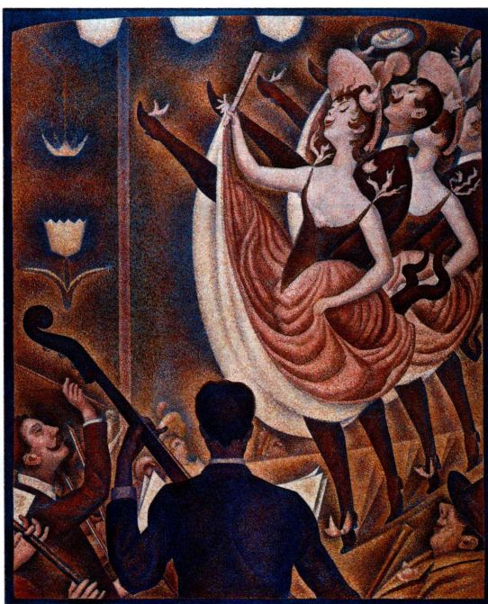

🟩910 詹森艺术史

石版印刷术

油不溶于水。从这个原理出发，慕尼黑皇家印刷局的地图检察员阿罗斯·塞尼菲尔德（Aloys Senefelder）在1800年之后不久发明了石版印刷术（lithography）。艺术家主要用油性蜡笔或者墨水在石头上作画，称为制版墨（tusche）。然后将石版用水打湿，水被吸入石头的孔隙之中，用制版墨画过的地方除外。之后印刷工再涂上印刷油墨，油墨只会附着

材料与技法

年时，纸张的价格更为低廉，人们的阅读能力也增长了，这两种因素使得石版印刷对报刊发行商的吸引力大增，所发行的报刊销量也呈上升势头。在众多以石版技术进行创作的报刊插图画家中，奥诺雷·杜米埃是最著名的一位（见图25\.4）。

伴随较大型印刷机的出现以及多色印刷技术的发展，石版印刷成为海报制作者最青睐的媒介。海报在19世纪末出现，

在画有制版墨的地方。之后将石版付诸印刷，将反向图像印在纸张上。石版印刷需要极其熟练的技巧，艺术家们通常只和熟练的石版画师合作，后者完成技术部分。“拉动”印刷品这一说法就是指其控制纸张在印刷机上的印刷过程。该工艺后来的改进技术使得艺术家能够在纸上用制版墨

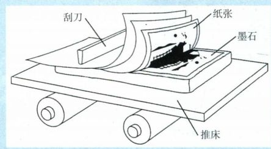

旨在运用图像与附加文字来进行宣传。当时的广告客户需要展示产品，通常运用强烈的色彩，这样海报才能够在贴满了各种广告的建筑外墙上引人注意。艺术家回应了其需求。大幅彩色石版印刷海报覆盖了建筑、商用货车和公共汽车的各个侧面，反映出消费主义对欧洲的侵蚀。艺术界迅

绘画，然后再转移到石版上。艺术家立刻接受了石版印刷，使其成为19世纪和20世纪最为流行的印刷材质之一。

雕版随印刷次数增多会有所磨损，需要经常加强线条（见第十四章、二十章：材料与技法），但是石版并不需要维护，仿佛运用一块石版就可以生产无穷无尽的印刷品。将近1830

速承认许多海报画家的艺术价值，并在1889年巴黎世界博览会的自由艺术宫中举办了海报展览。收藏家开始购买海报，画廊也开始出售海报，就连艺术家在创作海报时都会考虑到收藏家的需要。现在，劳特雷克是创作彩色石版印刷海报的艺术家中最受欢迎的（见图26\.7）。

直至今日还影响着我们对于那个时期的认识（见本页的材料与技法）。

劳特雷克是一位漫画大师，《拉·古留》（LaGoulue，图26\.7）就表明了这一点。这幅作品描绘了受人欢迎的红磨坊伴舞女郎被观众环绕的场景。运用简单符号以及色彩、线条构成的平面，作者成功捕捉到舞者的身体运动及其内心的孤独与疏离。画面右部反复出现的剪影式双脚又流露出舞蹈的集体精神。修拉式帽子轮廓线标示着不同的人物性格与类型。拉·古留本人与表演者软骨瓦伦丁（Valentin le désossé）之间形成了辛辣的对比，后者以其奇异的舞蹈而闻名。修拉在画面中容纳了一个宏大的立体世界，而劳特雷克的图像则像纸张一样薄，并且极具讽刺性。甚至连文字都在强调过分放纵与消费主义的精神意味，“红磨坊”（Moulin Rouge）一词重复了三次。虽然在海报中使用文字并不是创新之举，但通常只出现在顶端或底部，从未像现在这样与图像充分结合。在这里文字的大小与字体也同样发生了改变，“红磨坊”一词起伏的形式与三色油墨的切分制造出音乐一般的韵律感。

日本艺术和德加均是劳特雷克的偶像，同时也是其艺术的出发点。如果《拉·古留》中出现了日本版画的装饰模式，那么创作于稍晚之后的油画《红磨坊》

去的线条。这一场景表现了修拉工作室附近一家夜总会康康舞表演的终曲部分，刻画得异常真实，其中表演者的身份都可以一一确认。他们与走道另一侧的观众一样，具有类型目录的功能。修拉运用了德加式的连贯风格、裁切与合成的构图，并将之凝固，将人物甚至煤气灯等陈设转变为力量十足的图像。他充满热情地信仰科学、技术与机械，将其作为获得进步与平等的工具，而后来几代艺术家也继承了修拉的信念。

劳特雷克：半上流社会的艺术

修拉等其他后印象主义艺术家形成了新的先锋派群体，但矛盾的是，他们使艺术走上了深奥、难解的道路，并不为大众所理解。在19世纪末，艺术家亨利·德·图卢兹\-劳特雷克（Henri de Toulouse\-Lautrec，1864\-1901年）成功地捕捉到城市中的勃勃生气，对公众造成了强烈影响。他表现费尔南多杂技团（Cirque Fernando）的绘画就展示在杂技场里，那些表现舞厅、酒馆与夜总会的作品也陈列在相同的地方，当然他也会和艺术家联盟共同展出作品。然而，劳特雷克对大众最深刻的影响却是通过大幅彩色石版画海报造成的。这些海报是流行演出的广告，张贴在巴黎各处。他表现城市夜生活的图像成为了一种共识，

🔴第二十六章 进步与无止境的渴望：后印象主义、象征主义与新艺术风格，1880\-1905年 911

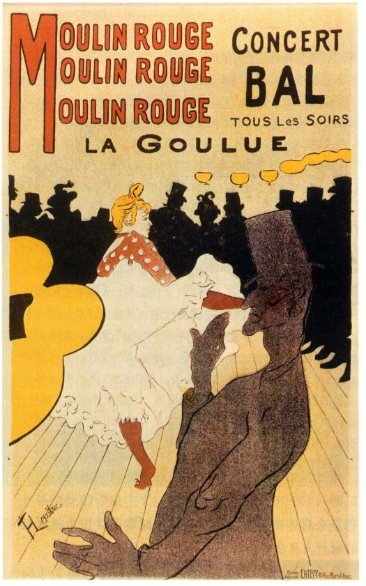

图26\.7 亨利·德·图卢兹\-劳特雷克：《拉·古留》。1891年。

彩色石版画海报，1\.90 × 1\.1 7 米。私人收藏

（At the Moulin Rouge，图26\.8）则更突出地显示来自德加的影响。但是劳特雷克戏剧性的嘲讽能力与漫画技巧将其与自己的师承区分开来\-德加的画面更为微妙。前景妇女的面容为煤气灯所照亮，看上去艳丽非常，具有面具的特征，从而奠定了画面的基调。在这充满欢乐的房间里，我们感受到了社会中愚蠢的自负与虚伪，每天晚上都在欢乐的伪装之下上演。劳特雷克死于酒精中毒，一定像其他人一样了解这个放纵的世界。他自己也被画入了背景之中，就是四位排成一行的戴高礼帽男子中的第三位。他描绘了世纪末的堕落世界，而凡高和高更等艺术家则尽力逃离这个世界。

文森特·凡高：借由色彩与象征的表达

在成为画家之前，荷兰艺术家文森特·凡高（Vincent Van Gogh，1853\-1890年）曾从事过布道、教书和艺术经销商等职业。凡高想过一种精神充实且

有利于社会的生活，受这种愿望的影响，他最终确认只有通过艺术才能到达其所追寻的理想世界。经过基础的艺术学习，他于1883至1885年间在荷兰尼厄嫩村（Nuenen）的家中作画。他的父亲是村里的牧师，凡高在那里深为贫苦农民的高贵、虔诚、坚定和顽强所打动。他在这个时期的重要作品反映了他对社会底层农民的同情与尊敬，如《吃土豆的人》（The PotatoEaters，图26\.9）。他写给兄弟提奥（Theo）的信件多达650页，其中一封表达了当时的情感：“我尽力突出这些在灯光下吃土豆的人，他们伸向盘子的手曾经挖掘过土地，代表着体力劳动，代表着他们如何通过诚实的劳动来获得食物。我想要给人们一种印象，这些人的生活方式与我们这些文明人截然不同。”我们在此处看到了凡高对简单生活的尊敬与赞赏，这样的生活以直接接触自然为基础；同时凡高也表现出对资产阶级价值观和城市现代化的质疑。米勒是凡高在艺术上的榜样，其对农民有力且充满同情的描绘同样可以在凡高的作品中看到。凡高还向善用沉暗色调的同乡伦勃朗学习，虔诚的外表笼罩着这场谦卑甚至仪式化的晚餐。真正使这幅作品与众不同的是凡高稚拙的绘画技巧，但赋予了画面原始、天然的能量，同时也在农民身上灌注了汹涌的自然生命力，折射出艺术家本人对主题不可遏制的热忱与激情。粗糙的手指与手掌、突出而扭曲的面容、波浪起伏的衣物以及屋顶的桁梁全部向后退去，彰显了蓬勃欲出的力量。钟表和表现耶稣受难的画作似乎跳将起来，而非挂在墙上。画面中每个物体似乎都爆炸开来，只有疲惫的劳动者享用简朴晚餐这一事件宁静安详。凡高厚重激越的笔触，传达了他强烈的热忱与怜悯，增强了农民们强大的在场感。

凡高曾短期就读于安特卫普美术学院，在那里研习鲁本斯的绘画，并收集了一些日本版画。凡高在比利时过得并不愉快，于是前往巴黎投奔兄弟提奥，提奥当时在一家画廊管理当代绘画部。1886至1888年间，凡高在巴黎直接接触了印象主义和新印象主义艺术，热情吸取其经验，正如他热情地从事其他事情一样。在为直率的社会主义者、颜料供应商唐吉老爹所绘制的肖像《唐吉老爹肖像》（Portrait of PèreTanguy，图26\.10）里，凡高欢快地使用了鲜活的原色和间色。同时也保持了激情的笔触，并且以更系统化的方式来运用。划过唐吉的笔触赋予画面一种神韵，使之散发出安宁平和的光彩。凡高甚至用佛像坐姿来表现这位朋友，两手交握。唐吉身后挂了一墙日本版画，凡高对这些版画的推崇不仅具有明显的美学理由，

🟩912詹森艺术史

会／凡高博物馆

🔴第二十六章 进步与无止境的渴望：后印象主义、象征主义与新艺术风格，1880\-1905年 913

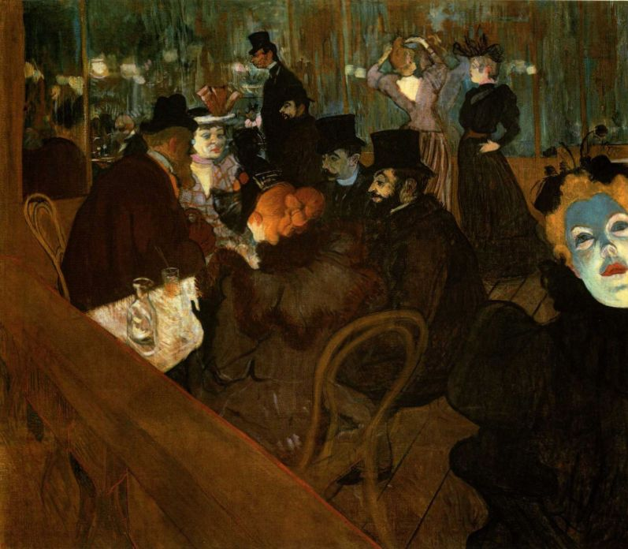

图26\.8 亨利·德·图卢兹\-劳特雷克：《红磨坊》。1893\-1895年。布面油画，1 23 × 141厘米。芝加哥艺术学院，

Helen Birch Bartlett 纪念收藏

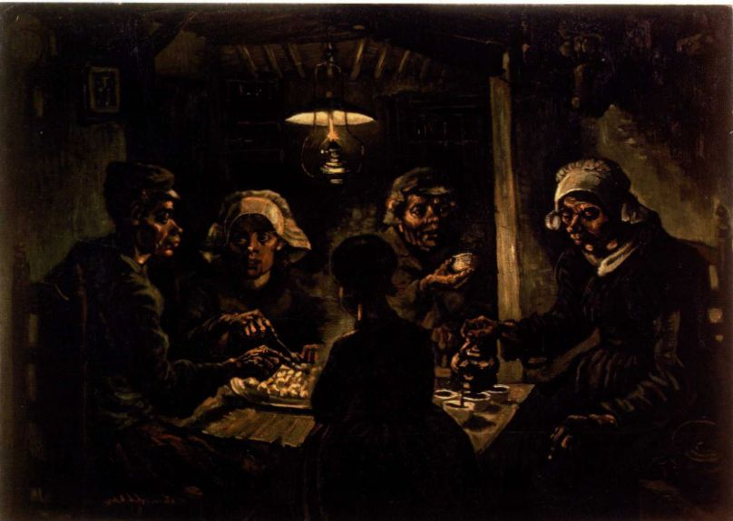

图26\.9 文森特·凡高：《吃土豆的人》。1885年。布面油画，

82 × l 1 4\.3厘米。阿姆斯特丹文森特·凡高基金

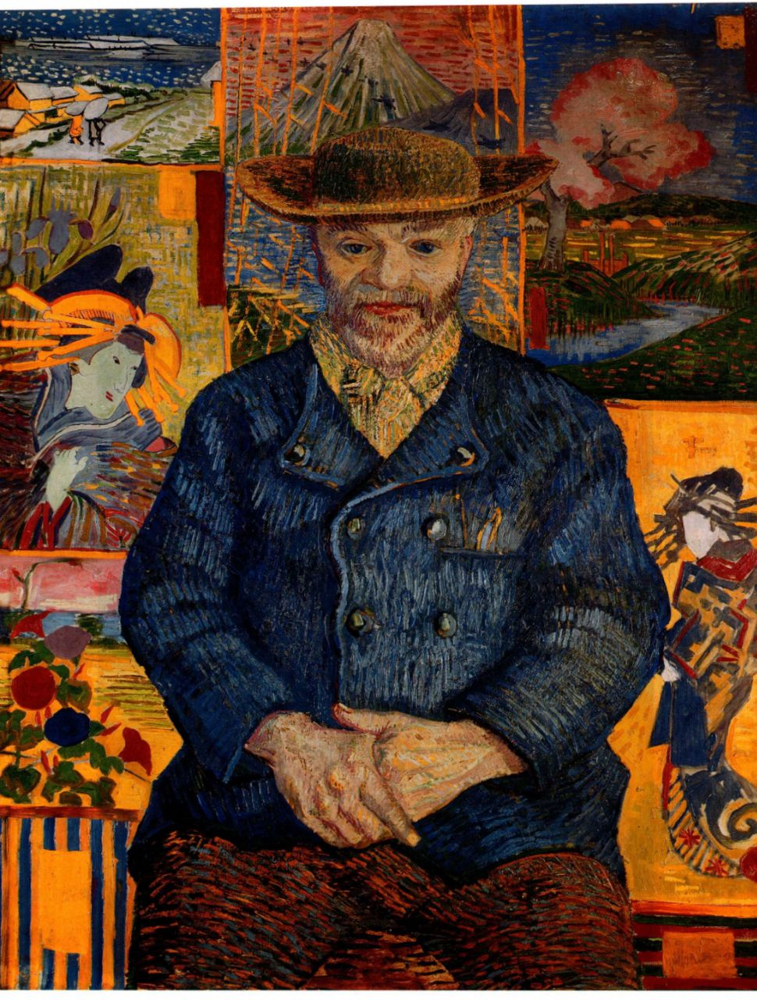

图26\.10 文森特·凡高：《唐吉老爹肖像》。1887\-1888年。布面油画，92 × 75厘米。巴黎罗丹博物馆

🟩914 詹森艺术史

图26\.11 文森特·凡高：《夜间咖啡馆》。1888年。布面油画，72\.4x92\.1厘米。纽黑文耶鲁大学美术馆，Stephen Carlton Clark 遗赠，B．A．1903\.1961\.18\.34

还是因为其代表着一个理想世界。凡高开始鼓励同辈的巴黎画家跟他联合起来，在沐浴着灿烂阳光的法国南部组织一个艺术家社群，称为“南部画室”（Studioof the South），凡高把它想象为西方的日本。

但是，只有保罗·高更赞同这个设想，尽管两人总共共处了两个月。凡高独自一人生活在阿尔（Arles），其艺术却在普罗旺斯的风景中茁壮成长起来，在1888至1889年间精力旺盛地创作出最有力的一批作品，包括《夜间咖啡馆》和《星月夜》。凡高强烈但难以控制的情感主宰了一切，其绘画日益具有表现主义特色\-运用色彩来传达情感，而非记录现实。他在作品中还采用了一种个人化的象征语汇。在《夜间咖啡馆》（Night Café，图26\.11）中，凡高表达了自己对阿尔这个邪恶巢穴的厌恶，他想要“用红色和绿色表现人性中的可怕欲望”。象征性地使用互补色在视觉上创造出一种刺目尖刻的气氛，台球桌、桌面、吧台和天花板上不和谐的绿色使得整幅画面更为酸楚。墙壁那恐怖的血红色则渗入令人烦躁的地板之中，那火焰般的黄色似乎暗示着地狱，与幸福毫无关联；天花板上煤气灯所散发的光线更是加强了这种气氛。

在凡高的大部分作品中，在俗布道者人格发挥着巨大的作用\-赞扬所有生命，渴望世间和谐。这一点在《星月夜》（Starry		，图26\.12）里有所体现，简朴乡村居民那被炉火照亮的家园令人心动，安稳地

大事年表

19世纪80年代\-欧洲各国殖民非洲

约1885\-1887年\-保罗·塞尚创作《圣维克托山》

1888\-1889年\-文森特·凡高创作《夜间咖啡馆》

1891年\-保罗·高更首次游览塔希提岛

1899年\-克劳德·德彪西创作《夜曲》

坐落在山谷之中。从长方形窗户透出的黄色光线将这些房子与天宇中黄色的圆形星辰联系在一起，形状的对比则形成了阴阳平衡。生气勃勃、向上螺旋升起的柏树占据了前景的重要空间，与教堂陡峭的尖顶相互照应，两者都耸入布满火焰式星辰的天空，将大地与神秘的事物联系起来。天空因壮观的焰火而闪亮，星辰的光环与欢快翻卷的云朵回应着下方山峦与树丛的起伏。凡高利用象征性艺术语汇绘制出了他所梦想的原始世界和理想国：单纯谦逊的人们在自然的滋养下，与宇宙间各种力量和谐共处，过着祥和宁静的生活。尽管凡高狂热地投入创作，并在其中呼吁人道，但他极度烦恼，终日沮丧而消沉。他开始逐渐怀疑自己的绘画能力，在完成《星月夜》后不到一年就自杀身亡了。

保罗·高更：逃离现代社会

保罗·高更（Paul Gauguin，1848\-1903年）是第四位重要的后印象主义艺术家。与凡高一样，高更

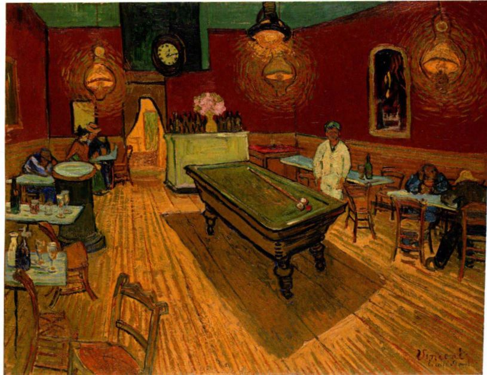

图26\.12 文森特·凡高：《星月夜》。1889年。布面油画，73 × 93厘米。纽约现代艺术博物馆，LillieP．Bliss遗赠（472\.1941）

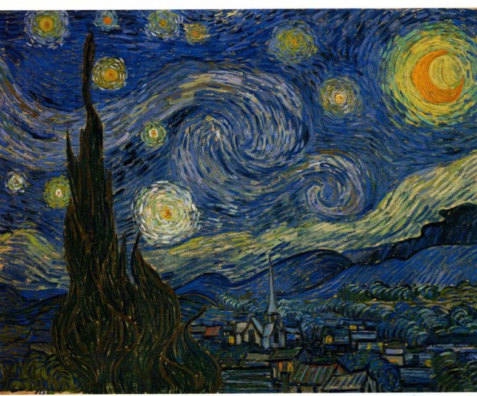

也反感先进文明，同样渴望有一个乌托邦来取而代之。然而他对社会的弃绝可能是当时所有艺术家中最为激进的。高更曾是一位股票经纪人，后来为艺术所吸引，开始收集印象主义作品。19世纪70年代，他自己开始绘画。1882年，高更放弃职业，全身心地投入绘画创作。他曾师从友人毕沙罗，后者向他介绍了塞尚的作品。高更还参加过1881至1886年间的最后四次印象主义展览。1886年，高更离开巴黎，开始四处流浪，以寻找更有意义的生活。他认为这样的生活存在于为自然所环绕的单纯社会里。所以高更先去了阿旺桥村，那是一个位于布列塔尼半岛的遥远乡村。当地居民穿着独特的本地服装，所具有的强烈虔诚之心令人向往。

高更于1887年离开布列塔尼前往加勒比海的马提尼克岛（Martinique）短暂停留，1888年又返回阿旺桥村，在那里与同仁埃米尔·贝尔纳（ÉmileBernard）一起绘画。他们共同发展出一种风格，称之为“综合主义”（Synthetism），意指其综合图像作品基于想象与情感，与对现实的模仿和经验式复制相反。他们追寻真实直接的艺术，尽可能摆脱文明的影响。在创作过程中，他们转而求助于多种乡土和原始的素材，其中包括稚拙的流行插图作品，特别是宗教文本插图，以及民间艺术、儿童艺术与中世纪艺术。他们还受到14世纪意大利“原初主义艺术”（primitives）以及埃及和美索不达米亚艺术的吸引。尤其吸引他们

的是中世纪的彩色玻璃窗画，因为这些作品具有宗教功能与饱和的色彩。其中镶嵌的珐琅也为他们所喜爱，像玻璃窗画一样，以曲线形的铅条来分割平面的色块。

中世纪玻璃窗画与珐琅镶嵌的影响在高更的《布道后的幻象》（The Vision after the Sermon，图26\.13） 里表现得十分明显\-起伏的蓝色波浪线勾画出每一个物象。高更表现了一群布列塔尼妇女，她们刚听过关于雅各和天使搏斗的布道。艺术家赋予这群妇女盲目天真的虔诚，使她们能在牛这样的世俗之物中看到灵性，而那只牛的外形则与牧师刚刚描述过的两位圣经人物相仿。大胆构图的观念来自日本版画（见图25\.13），高更将牛和搏斗者分置在树木两边，在一片强烈神秘的红底色上形成极其鲜明的对比。妇女们在幻象中所看到的东西显然只存在于另一个世界，而且似乎神奇地飘浮在空中。每一物象似乎都支配着高更的作品，具有无形的虔诚感。系住帽子两边的帽带像蛇一样生气勃勃，画面右部两个背对观者的妇女所戴的帽子仿佛有生命一般。平涂的曲线形式，甚至形中之形遍布于画面各处，像牛与搏斗者一样飘浮着。

虽然充满乡村魅力并远离巴黎，但是布列塔尼对于高更而言在地理位置上过于接近现代文明及其堕落的物质主义。于是1891年，高更前往法国南太平洋的殖民地塔希提岛（Tahiti），他相信在这个偏僻小岛上能够找到让\-雅克·卢梭所谓的“高贵的野蛮人”。

🟩916 詹森艺术史

图26\.13 保罗·高更：《布道后的幻象》或《雅各与天使搏斗》。1888年。布面油画，73 × 93厘米。爱丁堡苏格兰国家美术馆

保罗·高更（1848\-1903年）

节选自给扬·费迪南德·维卢姆森（Jens FerdinandWillumsen）的通信

丹麦画家扬·费迪南德·维卢姆森是高更在布列塔尼地区的一位朋友。高更在1890年秋天前往南太平洋地区之前写了这封信。

至于我，已经下定了决心。我很快就会去塔希提岛，那是大洋洲的一座小岛，不用花钱就能得到生活必需品。我想忘记过去所有的不幸，我想自由地画画，不管别人怎么看，我想死在那里，并被这里遗忘······

欧洲正为后代酝酿着一个糟糕的新纪元：金钱的王国。

他们自然天真，是根植于自然的“原始人”，与宇宙和谐相处。高更在塔希提岛上也感到自己能够“回到过去······回到童年时代的木马，那美好老旧的木马。”（达达在法语中即是“木马”之意。）他期望生活在热带的伊甸园，发现人类存在最为基本的真理。他在1897年的《我们从哪里来？我们是什么？我们往哪里去？》（Where Do We Come From？What Are We？ Where Are We Going？，图26\.14）中就描绘了这样一个伊甸园。果实挂在树上等待人们采摘，一尊神像守护着岛民的幸福安宁，给予日常生活以祝福和强烈的精神性，并指向天堂与来生。繁茂、葱郁、美好的热带

原始文献

一切都腐烂化脓，甚至人和艺术也是如此。至少在那里，在永恒的夏日蓝天下，在丰饶肥沃的土壤中，塔希提人只要伸出手去采集食物，此外无需工作。欧洲的男人和女人则只能在无休止的劳动中获得生存，饥寒交迫，成为贫困的牺牲品，而塔希提人却完全相反，他们是不为人所知大洋洲天堂小岛上的快乐居民，生活对他们而言只有甜美。在他们眼中，生活就是歌唱与爱······一旦我的物质生活安排妥当，我就能全身心地投入艺术创作，不用顾及任何艺术上的猜忌，也不需要任何低贱的交易。

SOURCE:THE GENESIS OF MODERNISM\. ED\. SVEN LOEVGREN\. \(NEW YORK: HACKER ART BOOKS,1983\)

风景仿佛一张深色的抽象挂毯，个个物象中平面的曲线似乎轻柔地飘浮着。这里的生活停滞迟缓，无忧无虑，时间仿佛静止。当这幅作品在巴黎展出时，评论家们毫不出人意料地将其与夏凡纳流淌着牛奶与蜂蜜的古典世界相提并论（见本页的原始文献）。

正如标题所表明的，这幅画表现了已经在文艺复兴艺术中出现过的生命三阶段。出生画在右部，青年在中央，老年在最左部。中央的人物显然是一个塔希提夏娃。画面中的神像形象是塔希提神祇希那（Hina）、爪哇（Java）佛像与复活节岛巨石像的复杂混合。双腿被扭转向两边分开，模仿埃及人像；上部角落题在

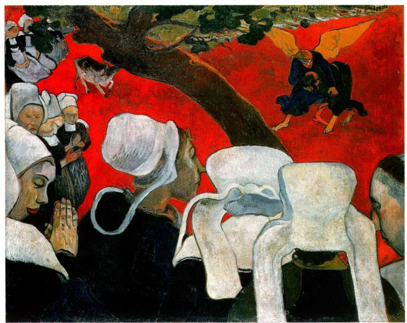

🔴第二十六章 进步与无止境的渴望：后印象主义、象征主义与新艺术风格，1880\-1905年 917

图26\.14 保罗·高更：《我们从哪里来？我们是什么？我们往哪里去？》。1897年。布面油画，1\.37 × 3\.75米。波士顿美术馆，Arthur

Gordon Tompkins 遗赠

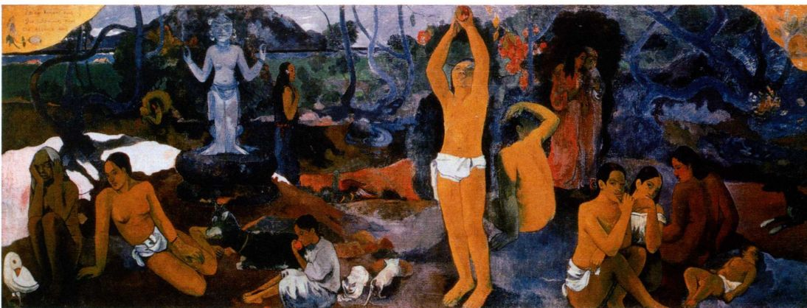

亮金底色上的标题和署名则令人回想起拜占庭和文艺复兴早期的圣像。最左部的老年妇女形象来自高更在巴黎人种博物馆所看到的秘鲁木乃伊。图像中弥漫着精神气息，仿佛中世纪彩色玻璃窗画，还有日本版画的大胆形式与色彩。整幅画面是对不同文化、宗教和历史时期的非凡综合，见证了高更描绘人类内心自然神秘力量的欲望。

高更认为西方艺术和西方文明的更新是一个整体，必须从传统之外着手。他建议其他艺术家回避希腊罗马形式，转向波斯、远东和古埃及寻找灵感。这种观念本身并不新颖，只是一个多世纪以前“高贵的野蛮人”这种浪漫主义神话和启蒙运动思想的延续，而最终的根源则是关于人世乐园的古老信仰。人类曾经在这样的乐园里生活，也许有一天会回到这里，找回自然纯真的状态。高更之前没有任何艺术家走得如此之远，将“原始主义”信条付诸实践。他对南太平洋地区的朝圣远不止纯粹的个人意味这么简单，还象征着欧洲400年扩张的终结，世界上大部分地区已经处于西方的统治之下。一度曾如此振奋人心而又残酷无情的殖民主义是帝国建造者所追寻的目标，但在很多人眼中却变成了西方文明堕落的标志。

象征主义

虽然高更称自己的艺术为综合主义，但他很快就被贴上了象征主义者的标签。象征主义（Symbolism）是一场文学运动，诗人让·莫雷亚（Jean Moréas，1856\-1910年）在1886年的《费加罗文学》littéraire）上的文章宣告了象征主义的到来。《恶之

花》（Flowers of Evil，1857年）的作者，诗人波德莱尔是该运动的先驱，诗人斯特凡·马拉美（StéphaneMallarmé）和保罗·魏尔伦（Paul Verlaine）堪称最为活跃的代表。另一位诗人古斯塔夫·卡恩（GustaveKahn）简明扼要地概述了该运动的实质，他在莫雷亚的宣言发表后不久写道，作家的目标是“将主观客观化······而不是将客观主观化”，这意味着每一天当代世界都遭到人们弃绝，却被某个抽象地表达感受、情绪和深层恐惧与欲望的梦幻所取代。象征主义一词很快拓展到艺术领域，而高更则总是人们想到的第一位重要象征主义艺术家。绘制表现主义幻想的凡高也被认为是象征主义艺术家。1891年，艺术评论家乔治\-阿尔伯特·奥里叶（Georges\-Albert Aurier）用五个形容词来界定象征主义：“观念的、象征的、综合的、主观的和装饰的”。1898年《我们从哪里来？我们是什么？我们往哪里去？》在巴黎安布罗瓦·沃拉尔画廊（Ambroise Vollard Gallery）展出时，高更感到运用象征主义术语来进行描述是强人所难。于是他从塔希提岛寄来信件，强调这幅画是“音乐性的”，宣称其通过线条、色彩和形式的抽象性质来传达信息，而不是通过轶事典故。与此同时，理查德·瓦格纳的歌剧在巴黎掀起狂潮，并在全欧洲和美国巡演，这些作品启发了象征主义作家和画家，他们同样运用抽象方式来投射强烈的情感渴望与最基本的心理状态。

纳比派

高更的影响极其巨大，到19世纪90年代时，平涂的曲线有机图样已经无处不在。以劳特雷克为例，

🟩918 詹森艺术史

他的海报（见图26\.7）就是以此为基础，并在许多油画中都运用了这种形式，其中就包括《红磨坊》（见图26\.8）。高更还影响了纳比派（Nabis）的形成，这是一个由年轻巴黎艺术家在1888年所成立的秘密组织，成员包括爱德华·维亚尔和皮埃尔·博纳尔（PierreBonnard），高更阿旺桥村时期的绘画所具有的创新性和精神性令他们震惊不已。“纳比”一词是希伯来语中的“先知”，正如名称所暗示的，其成员沉迷于宗教。较之自我放逐到塔希提岛，这或许是更简便的逃离现代性之法。

他们在精神层面上的兴趣非常广泛，包括神秘与超自然领域。在人们向现代粗钝的物质主义寻求慰藉的同时，还关注于涤荡欧洲与美洲大陆。除近东和远东宗教之外，很多纳比派艺术家都狂热追随通神论和玫瑰十字会。通神论的神秘主义可以上溯到柏拉图的思想，而19世纪的通神论则伴随着“通神会”（Theosophical Society）而出现，这是俄国移民海伦娜·博拉瓦茨基（Helena Blavatsky）夫人1875年于纽约成立的组织。她是术士、灵媒兼神秘主义者。通神会声称所有宗教在本质上是相同的，力图解释所有事物之间神秘的连通性。高更的《我们从哪里来？我们是什么？我们往哪里去？》尝试以图画形式来综合不同的宗教与文化影响，纳比派也寻求在艺术中传达通神论神秘主义的途径。但是维亚尔和博纳尔并没有到遥远的地方去寻找超验性图像，而是表现日常生活、消闲活动以及法国本土风景。

尽管纳比派在19世纪90年代以失败告终，但爱德华·维亚尔（Edouard Vuillard，1868\-1940年） 和皮埃尔·博纳尔都成长为卓越的艺术家。抛弃了纳比派的宗教本质，他们保持对运用抽象来表达情感的强调。德尼（Maurice Denis）曾将其总结为一段常被人引用的文字：“绘画在成为战马、女裸体或什么轶闻典故之前，在本质上首先是一个平坦的平面，覆盖着具有特定秩序的色彩。”现实消解在情感的抽象之中，这一点可见于维亚尔在1893年创作的小型家居场景油画《求婚者》（TheSuitor，图26\.15）。这是艺术家最喜爱的室内场景主题，具有神秘而非世俗的氛围。他描绘了自己的裁缝母亲、他的姐妹及其丈夫，后者是受人尊敬的画家，也是纳比派的一员。真实的世界消失在颜料所谱写的诗歌里。丰富斑驳的笔触与柔和但灿烂华丽的色彩创造出宁静美好的气氛。桌椅、人物和成匹的布料都仿佛漂浮着的平面幽灵一般，荡漾在颜料、色彩与形式的迷人海洋之中，俨然中产阶级家庭生活甜美私密、步调缓慢的化身。

法国其他象征主义作品

两位先于象征主义运动的艺术家也被囊括在其麾下\-古斯塔夫·莫罗和奥迪隆·雷东。莫罗成名于19世纪60年代，雷东则在70年代崭露头角。两人都因出现在若里\-卡尔·于斯曼（Joris\-Karl Huysman）的象征主义小说《违反自然》（ÀRebours，1884年）中而恶名昭著。于斯曼的主角是一位厌世的古怪之人，他隐入奇异的梦幻世界，其中充满了各种超现实的事物，例如背着宝石镶嵌贝壳的活海龟，以及莫罗和雷东的绘画作品。

古斯塔夫·莫罗古斯塔夫·莫罗（GustaveMoreau，1826\-1898年）的意象世界结合了奇特的浪漫主义题材与混乱神秘的心理状态，并将其设置在超自然的背景之中。在他1876年前后创作的大型水彩画《显灵》（The Apparition，图26\.16）里，表现了莎乐美与施洗者约翰的头颅，依她所要求而割取。但是头颅并没有像传统上常见的那样放在托盘里，而是流淌着鲜血，为明亮的圣光所环绕，并神奇地浮在空中。我们还可以看到善与恶、男与女的大胆倒置，因为莎乐美的肉体欲望导致了施洗约翰遭受斩首酷刑；如果她不能拥有活着的他，也要拥有死去的他。背景与服装具有暧昧的近东风格，宽阔的大厅则因皇帝的财富而令人眩目。花朵、服饰、圆柱和墙壁由细小的宝石般笔触绘制而成，让一切物象都闪烁发光，令人联想到德拉克洛瓦。甚至此处的用色也是德拉克洛瓦式的，然而其古典的结构则属于安格尔。在莫罗笔下，莎乐美的

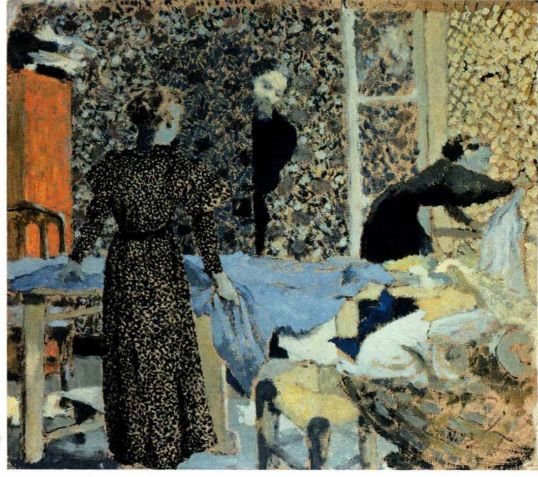

图26\.15 爱德华·维亚尔：《求婚者》。1893年。布面油画，31\.8 × 35\.6厘米。马萨诸塞州北汉普敦市史密斯学院艺术博物馆，Drayton Hillyer 基金购买，1938．SC．1938：15

🔴第二十六章 进步与无止境的渴望：后印象主义、象征主义与新艺术风格，1880\-1905年 919

故事不再是单纯的插图，而成为性与死亡的恐怖幻想，通过令人眼花缭乱的珠宝式笔触和从画面内部流溢而出的奇特光线得以表达。

奥迪隆·雷东 象征主义者认为奥迪隆·雷东（Odilon Redon，1840\-1916年）也是其中的一员，他的极端图像可能更具幻想与梦幻特征。雷东的素描与版画传达着朦胧的想象，这些想象的图景包裹在黑炭笔或石版蜡笔丝绒般的模糊之中。他从戈雅的版画（见图24\.1）里汲取灵感，并且可能在1878年的巴黎世界博览会上看到过布莱克的绘画作品（见图24\.5）。雷东的风格在其于1882年题献给埃德加·爱伦·坡（Edgar Allan Poe）的系列作品中展露出来，此处的插图（图26\.17）是其中一件版画印刷品。波德莱尔和马拉美将爱伦·坡的恐怖心理故事翻译成法文，在那里非常流行。雷东受到爱伦·坡浪漫主义情绪的启发，但其作品并不是爱伦·坡作品的插图，而是自身独立的“视觉诗”（visual poems），唤起了爱

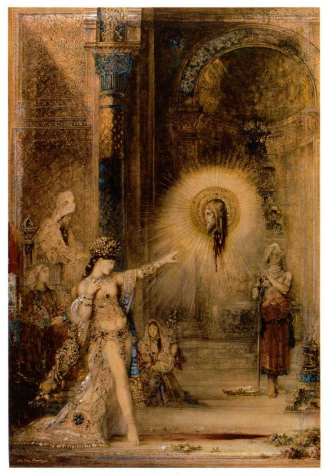

图26\.16 古斯塔夫·莫罗：《显灵》或《莎乐美之舞》。约1876年。

水彩画，106 x 72厘米。巴黎卢浮宫，RF2130

伦·坡想象中那恐怖的幻觉世界。如果说戈雅创造了极其强烈、令人毛骨悚然的梦魇，雷东则绘制了朦胧的诗意梦幻。万事万物都漂浮滑翔，盘旋不去，边缘柔和且不平滑，彼此之间的界限模糊不清。雷东的世界里每一物象都没有确切的形体，似乎处于某种奇特的演化流动之中。此处的气球宁静地变形为长有毛发的眼睛，离开了天空，仿佛带着神秘的货物升入天堂，而原始的植物则具有焰火般的叶片，在可怕阴暗的大海映衬下微微发光。复活超验的内涵，生命、死亡与永恒的过渡仪式以及不可言说的事物都包含在作品之中，但是图像的叙事意义仍是一个谜团。其中无所不在的是困扰的心理状态与对不确定的恐惧。

亨利·卢梭 在法国原始主义画家亨利·卢梭（Henri Rousseau，1844\-1910年）的作品中，表现出象征主义对人类本能冲动与性欲望的关注。卢梭曾是海关官员，退休之后在晚年开始从事绘画。他将安格尔派的边线明晰的学院派风格作为自己的理想（见图24\.16）。在1910年的《梦境》（The Dream，图26\.18）里，他表现了一位裸女，神秘地躺在沙发上，身处舞台布景般的纸板式幻想密林之中，动物充满野性的双眼正窥探着她。我们假设这些动物都是雄性，生殖器形状的橙色大蛇直接指向裸女，乐师手中的竖笛也是男性性欲的传统象征。丛林中生长着艳丽斑斓的花朵与果实，其所具有的原始生长力因天空中满月的亮光而加强。卢梭的艺术在有生之年并没有得到官方的认可，但帕布罗·毕加索及其圈子在1905年重新发现了其价值，在他稚拙的绘画中看到了创造的诚恳，以及他们认为学院派艺术所缺少的真实。

法国之外的象征主义

奇特的梦幻式意象并非巴黎的专利。到了19世纪80年代，象征主义（或者说幻想）、空想与心理学出现在整个西方世界，包括美国。

马克斯·克林格尔 柏林象征主义的最佳代表人物可能是画家兼雕塑家马克斯·克林格尔（MaxKlinger，1857\-1920年）。1881年，他创作了十幅系列蚀刻版画\-《一只手套》（AGlove），这些作品完全是暗示性、含糊性与心理特征的产物，正如雷东回应爱伦·坡的作品一样。克林格尔的作品更为传统，更具插图性和叙事性，但同样也是古怪的幻象。该系列中的每一幅版画都表现了寻找丢失手套的徒劳努力。《诱拐》（The Abduction，图26\.19）中的手套被史前鸟类叼走，打破玻璃从窗格中伸出的手臂差一点就能抓住鸟的尾巴，而下方是一丛被粗暴截断的

🟩920 詹森艺术史

图26\.18	亨利·卢梭：《梦境》。1910年。布面油画，2\.05x2\.98米。纽约现代艺术博物馆，Nelson A\.Rockefeller 捐赠

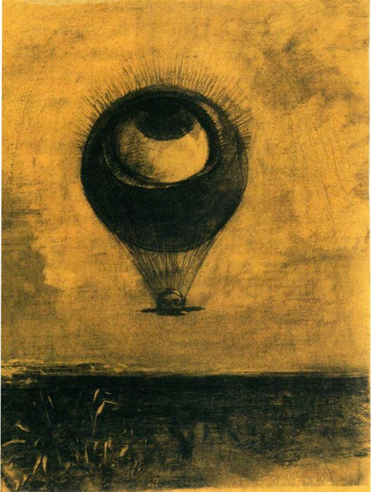

图26\.17 奥迪隆·雷东：《眼睛，一个奇怪的气球升入无垠》（TheEye Like a Strange Balloon Mounts Totard Infinity），出自《埃德加·爱伦· 坡》系列。1882年。石版画，			26 x 17\.9厘米。纽约现代艺术博物馆，Peter H\.Deitsch 捐赠

花朵。正如雷东的《眼睛》，烦扰的心理在这里占据上风，而非理性的故事。拟人的手套代表着物神，是渴望或需要得到的必须占有物。在克林格尔那将物象以奇怪方式并置的视觉世界里，我们感到了外表之下所隐藏的性、渴望、抛弃和激情。

詹姆斯·恩索尔和二十人小组 詹姆斯·恩索尔（James Ensor，1860\-1949年）用他那极端粗鲁、但极富视觉攻击性的绘画显现了比利时的象征主义。恩索尔和高更一样排斥现代社会，终年在父母位于奥斯坦德（Ostend）海滨度假地的纪念品商店楼上过着隐居生活。1877年，他进入比利时美术学院学习，为期三年，但他将该学院描述为“半瞎子的学校”，并声称“所有规则，所有艺术教条正如他们的青铜兄弟一样呕出死亡”。此后恩索尔还加入了社会党与无政府主义者的行列，并于1883年在布鲁塞尔协助成立了与巴黎独立艺术家协会极为相似的组织，称为“二十人小组”（Les Vingt）。该组织广泛地为比利时先锋派艺术家提供不经评审团挑选的展览，参展者包括印象主义、新印象主义和象征主义艺术家。但当其通过展出惠斯勒、修拉和雷东的作品，逐渐成为国际化展览时，作为热爱比利时的民族主义者，恩索尔选择永久地在奥斯坦德隐退，沉浸在自己的世界之中。那是一个厌恶虚伪造作与腐化堕落的世界，摆脱了现代文明世界的价值观。恩索尔放弃了学院派艺术冷冰冰的精致优雅，投入了民间文化，他大喊道：“稚拙无知

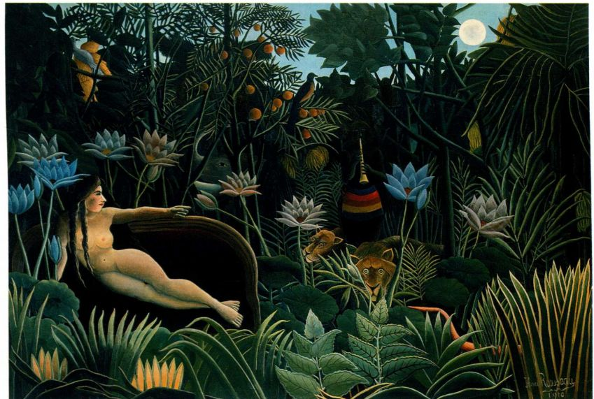

🔴第二十六章 进步与无止境的渴望：后印象主义、象征主义与新艺术风格，1880\-1905年 921

图26\.19 马克斯·克林格尔：《诱拐》（选自《一只手套》）。1881年。蚀刻版画，黑色油墨印刷，8\.9 × 24厘米。柏林国家博物馆版画和素描馆\(Kupferstichkabinett\),426\-92

的绘画万岁！”民族主义与对不真诚文雅的厌恶使他推崇布吕盖尔和博斯的古怪图画。他们所喜欢的狂欢仍然在奥斯坦德的年度庆典上举行，恩索尔的纪念品商店就出售供人们佩戴的面具。

恩索尔成熟期的风格表现在宽达4米有余的巨幅作品《基督在1889年进入布鲁塞尔》（Christ＇s Entryinto Brussels in 1889，图26\.20）之中。其创作于1888年，表现基督再临的场景：在一面印有“社会主义万岁”的旗帜下，骑在驴背上的不大的基督为人群所湮没，被推到了背景里。人们戴着面具，这反而揭露，而非隐藏了当代社会虚假表象背后所具有的贪婪、堕落和道德沦丧。恩索尔不仅挪用了父母商店中出售的面具来赋予形象原始的奇异古怪特性，还以粗糙扭曲的样式来绘制每个形象，这种手法与漫画、涂鸦和稚拙的儿童画等民间艺术相关联。作为互补色的绿色加强了红色的俗气耀眼，而红色又使这幅令人厌恶、幽闭恐怖的绘画更为刺目。这里出现了修拉优雅的《大碗岛的星期天下午》所具有的哲学式对偶关系，修拉的作品曾于一年前在二十人小组的展览上展出，恩索尔也看到过。《基督在1889年进入布鲁塞尔》的相同尺幅表明，恩索尔所表现的邪恶无处不在的混乱画面，正是对修拉盲目乐观地描绘现代生活的讽刺与挖苦。

爱德华·蒙克大部分象征主义绘画都受到高更神秘复杂的图案和抽象手法的影响，同时也被从视觉角度探索现代文明背后最基本的心理力量所驱使。在这方面，可能没有人同挪威画家爱德华·蒙克（EdvardMunch，1863\-1944年）做得同样出色。他的风格在19世纪90年代的巴黎之行后趋于成熟，他在巴黎直接接触了高更阿旺桥时期的绘画，以及凡高在阿尔创作的那些笔触有力、色彩强烈的作品。蒙克的绘画题材类似于他的斯堪的纳维亚友人、剧作家亨利克·易卜生（Henrik Ibsen）和奥古斯特·斯特林堡（AugustStrindberg），他们对性欲的研究、对存在意义的追问，

直达人类头脑中与原始力量相联系的最深处。

蒙克在1893年的《呐喊》（The Scream，图26\.21）中构造了一幅令人恐怖的焦虑图像，当时他刚刚迁居至柏林不久。双手紧扣着骷髅般的头颅，一个古怪扁平、挣扎扭曲的人物表达着内心深处的恐惧，这种恐惧似乎从背后那歇斯底里的风景流入人物内心。人行道向上倾斜的扭曲透视与凡高式的笔触更将不受控制的情感强化到顶点。画中场景可能受到了1883年印度尼西亚喀拉喀托（Krakatoa）火山爆发的影响，这次火山爆发异常剧烈，所产生的巨响震荡了全世界，声浪传播到2400余公里之外，喷涌而出的火山灰飘到了世界各地。在长达六个月的时间里，欧洲地区的日落都呈现为恐怖的血红色或蓝色。蒙克在克里斯蒂安尼亚（Christiania，今奥斯陆）见证了这一末日般的色彩，当时已经深陷抑郁情绪的他在日记中写道：“······我感到一声巨大无比的呐喊在自然中回响。”

奥伯利·比亚兹莱 虽然蒙克的大部分作品中都出现了恐惧无垠的病态心理，但他最常见的主题可能是对性冲动无法控制的渴望，以及冲动所造成的性挣扎，这在荡妇题材中表达的最为明显。这是一个占据当时艺术家与作家头脑的主题，其中最著名的作品是奥斯卡·王尔德（Oscar Wilde）的法语戏剧《莎乐美》（Salomé），随后还引发了莎乐美图像的热潮。英国插图画家奥伯利·比亚兹莱（Aubrey Beardsley，1872\-1898年）的作品即是其中一例（图26\.22），特地为该剧本的1894年版本而创作。莎乐美入魔地举着施洗约翰庄重的头颅，后者虽然死亡但仍然表现出轻蔑的态度。他蛇一样蜿蜒的头发和莎乐美章鱼般的发式将两人都转变为毫无理性的美杜莎，只听凭内心的恨意驱使。约翰的血液流入长有阴茎状植物的黑色池塘，那植物仿佛是阴险的藤蔓，滑向莎乐美身旁。两人噩梦般的对视发生在抽象世界优雅的曲线之中，

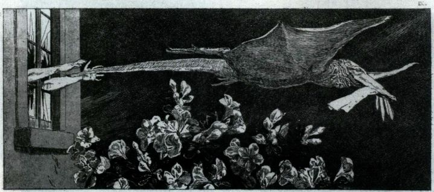

🟩922 詹森艺术史

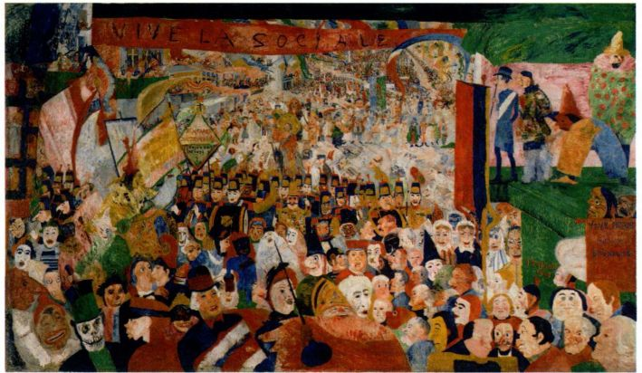

图26\.20 詹姆斯·恩索尔：《基督在1889年进入布鲁塞尔》。1888年。布面油画，2\.6 × 4\. 3米。

洛杉矶J·保罗·盖蒂博物馆

其优雅实属难能可贵，线条时不时地几乎完全消失，扭曲出色情的韵律。我们很快就会看到，这种植物式的卷须特色将纳入新艺术风格（见第929页），于19世纪90年代的建筑与装饰艺术中展现出来。

古斯塔夫·克里姆特 古斯塔夫·克里姆特（Gustave Klimt，1862\-1918年）的作品也充满了有机形式及其所能传达的心理意味，具有令人着迷的魅力。克里姆特的艺术生涯最初始于维也纳，从1902年开始创作以“吻”为中心的系列绘画，其中1907至1909年间的作品最为著名（图26\.23）。虽然折射出自己的个人生活，将情人画入其中，但是这个主题受到了象征主义的启发，并与1897年蒙克所绘的同名作品直接相关，而这两者又同时受到罗丹雕塑《吻》（The Kiss）的影响。蒙克的绘画表现了一对身形类似的相拥男女，但是其只是简单的黑色团块，情人的面孔恐怖地融合在一起，仿佛正在吞噬彼此。克里姆特的同名作品则具有丰富的图案，展示着一位未露出面孔的好色男子，受到情欲的引诱，被一位迷人但漠然的荡妇吸引，从而迷失了自己，就要被那个女人拉入下方的深渊。性感而危险的荡妇成为先锋派艺术和流行艺术的普遍主题，可能要归因于新女性的兴起（见第926页的艺术史家的观点）。

克里姆特将他的人物包裹在图案丰富的金箔长袍里，并赋予其明亮的光环，在形式上受到了拜占庭镶嵌画神圣闪光的启发，克里姆特曾在拉文纳直接学习

图26\.21 爱德华·蒙克：《呐喊》。1893年。纸板蛋彩画，91\.4x73\.7厘米。原藏于挪威奥斯陆市爱德华·蒙克博物馆，2003年5月被盗

过这些作品。他复杂的设计和流动的平面暗示出个人主观认识与社会关系中所固有的不稳定性。画面的背景是一片野花织就的地毯，高高飘浮在从未存在过的天堂之上，同时还表达着美与情欲的精神魅力，以及其昙花一现与痛苦的结局。

《吻》包含了强烈的装饰成分，情人那具有异域风情的长袍表现得最为明显。1897年，克里姆特成为了先锋派艺术家组织“维也纳分离派”（Vienna Secession）

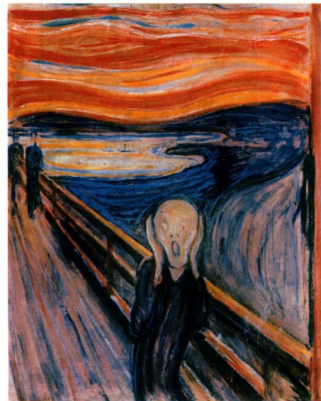

🔴第二十六章 进步与无止境的渴望：后印象主义、象征主义与新艺术风格，1880\-1905年 923

的22位首创成员之一，并且担任第一届主席。维也纳分离派是国际分离派运动的组成部分，该运动最初于1892年产生于慕尼黑，同年传播到柏林。维也纳分离派不仅替代了保守的艺术学院，而且还包括展示实用艺术在内的多种目标，并打破了各类艺术的等级划分。在原有的划分中，绘画与雕塑处于顶点，而装饰艺术则属于较低的艺术工匠级别。

美国艺术中的象征主义潮流

19世纪80年代，一小批美国艺术家开始创作更为虚无、更加忽略现实世界的绘画作品。他们的意象诗意更为浓郁，受到了音乐的启发，在很多方面都反映了惠斯勒的唯美主义观念。然而，乔治·英尼斯和亨利·奥萨瓦·坦纳等美国艺术家却从来没被看作象征主义者。英尼斯被认为是一位以浪漫主义情怀进行创作的晚期哈得孙河画派画家，而坦纳则与托马斯·埃金斯的现实主义联系在一起，反映了其在费城的学习经历。虽然如此，但二者的艺术都具有梦境、幻想的精神气质，而这正是象征主义艺术的特征。即便他们本人不是象征主义者，他们的艺术都受到该运动的影响，达到了与之在精神上息息相关的地步，或者具

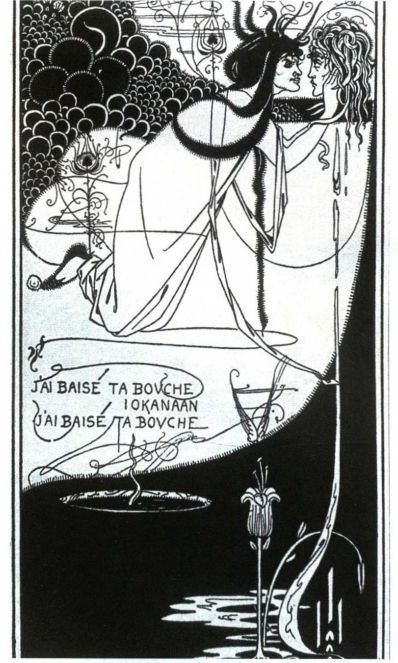

图26\.22 奥伯利·比亚兹莱：《莎乐美》。1892年。钢笔画，

27\.9 × 1 5\.2厘米。新泽西州普林斯顿大学图书馆，特藏部手稿收藏

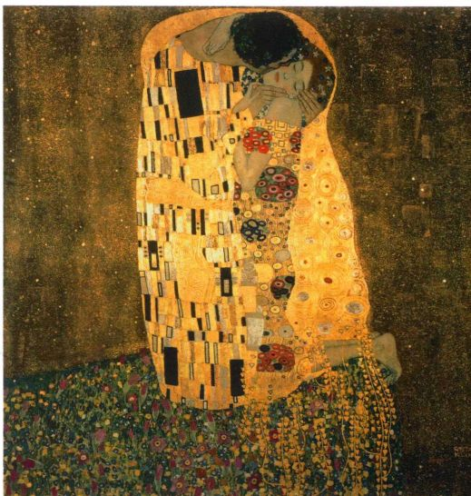

图26\.23 古斯塔夫·克里姆特：《吻》。1907\-1908年。布面油画，1 80 × 1 80厘米。维也纳奥地利国家图书馆

有相同的抽象面貌。

乔治·英尼斯 哈得孙河画派画家乔治·英尼斯（George Inness，1825\-1894年）年轻时曾在法国学习。受到巴比松画派艺术家的影响，从19世纪80年代开始将自己的风景画消解在神秘的薄雾之中，我们直观地看到画面里的树木和人物脱去了物质性，《鳟鱼溪》（The Trout Brook，图26\.24）就是如此。英尼斯宣称：“艺术到底是什么？就是性格气质，是情感的表达。”伊曼纽尔·斯维登堡（Emanuel Swedenborg）的神秘主义与超自然理论长期、深刻地影响着英尼斯，成为他思维生命的主要力量。这些理论中包括这样的观念，神圣全能的力量贯穿于万事万物之中，并将其统一起来。英尼斯力图让自己的绘画传达其在风景中所感受到的深刻精神意味。换而言之，他的作品是一种体验，而不是观看；是情绪，不是观察，很像莫奈的《干草堆》（见图25\.21）。在《鳟鱼溪》中，我们感觉到仿佛上帝就存在于柔和的光线里，柯罗式的绿色调神秘地统一着各个物象。

艾伯特·平克汉·赖德 艾伯特·平克汉·赖德（Albert Pinkham Ryder，1847\-1917年）比英尼斯更进一步，这是一位有些避世隐居倾向的艺术家。他在纽约进行创作，放弃了经验主义的观察，抽象地表达自己的情感。文学激发了赖德的创作灵感，特别是乔叟和爱伦·坡的作品。他还受到《圣经》的影响，并像众多大西洋彼岸的艺术家们一样，为瓦格纳的歌剧

🟩924 詹森艺术史

1888\-1891年。布面油画，50\.5 × 52\.I厘米。华盛顿国家美术馆，Andrew W\.Mellon 收藏

所震撼。1881年，赖德绘制了《齐格弗里德与莱茵少女》（Siegfried and the Rhine Maiden，图26\.25），他在纽约观看过《众神的黄昏》（Götterdämmerung）后，从午夜开始创作，然后着魔一般地不休不眠连续作画48小时，最终完成了这幅作品。1891年，赖德对其再次进行修改，并于美国艺术家协会上展出。此处出现了经过改良的荡妇题材\-妖媚的莱茵少女预言齐格弗里德将遭厄运，因为他拒绝归还那枚全能的戒指，这个传说本身就是两性斗争的化身。大片幻想出来的风景是对展现神秘北欧魄力的瓦格纳音乐做出回应，与沸腾的树木和天空一起喷薄爆发，仿佛吸附了被表现为超自然图像的满月灵魂。我们感受到那股不受控制的力量，其中又折射出不可抑制的情感，这些都通过每一处笔触和扭曲的形式喷涌出来。

亨利·奥萨瓦·坦纳 非裔美国艺术家亨利·奥萨瓦·坦纳（Henry Ossawa Tanner，1859\-1937年） 也受到了巴黎象征主义的影响。他于19世纪80年代在费城师从自由主义者托马斯·埃金斯，成为了现实主义艺术家。在种族主义泛滥的美国，他很难在艺术上被人平等对待，因此在1892年来到了巴黎，并永久定居于此。坦纳在巴黎的作品开始表现出象征主义的影响，当时他实验了抽象手法，并追寻新的题材，甚至创作了若干幅有关莎乐美的绘画。坦纳是牧师之子，宗教意象在他的作品里占据主要位置，例如《天使向牧羊人显现》（Angels Appearing before the Shepherds，图26\.26）。作品的构图独创巧妙，因为坦纳将观众与天使一起放在天空之中。从这个有利的角度，我们能够看到圣地，那是一片令人震惊的线条与画痕的抽象。尽管如此，其中也确实还有山丘、梯田、墙壁以及一座城市。我们甚至可以分辨出牧羊人的火

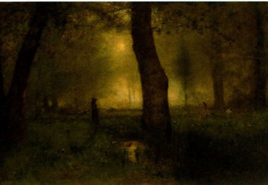

大事年表

1883年\-二十人小组在比利时成立

1884年\-保罗·魏尔伦出版《被诅咒的诗人》

1886年\-弗雷德里希·尼采出版《善恶的彼岸》

1888年\-纳比派在法国成立

1893年\-爱德华·蒙克创作《呐喊》

1897年\-维也纳分离派形成

1900年\-西格蒙德·弗洛伊德出版《梦的解析》

约1910年\-亨利·奥萨瓦·坦纳创作《天使向牧羊人显现》

堆，这是画面中唯一的色彩变奏，其余部分则可以称为蓝色的交响曲。具有灵性的蓝色弥漫在大地、天空和天使身上，将他们联系在一起。尽管颜料的处理手法丰富华丽，但是画中的每一个形象都似乎具有轻盈短暂的性质，物质世界像透明的天使一样虚无缥缈。

罗丹的雕塑

象征主义洞察与描绘存在的内部本质的欲望也体现在奥古斯特·罗丹（Auguste Rodin，1840\-1917年）的雕塑里。他是19世纪晚期最有影响力的雕塑家，独自一人奠定了20世纪雕塑的基础。罗丹的艺术生涯开始得比较晚，遭到美术学院拒绝之后，他不得不就学于教授装饰艺术的美术学校。罗丹的重大突破发生在1880年，他赢得了为新建装饰艺术博物馆设计青铜大门的重要委托。虽然该项目最终成为泡影，但罗丹从那时开始一直坚持创作，直到辞世。他所设计

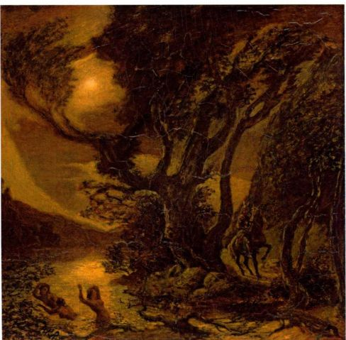

图26\.25 艾伯特·平克汉·赖德：《齐格弗里德与莱茵少女》。

图26\.24 乔治·英尼斯：《鳟鱼溪》。1891年。布面油画，

76\.8 x 11 4 \.9厘米。新泽西州纽瓦克博物馆，65\.36

🔴第二十六章 进步与无止境的渴望：后印象主义、象征主义与新艺术风格，1880\-1905年 925

艺术史家的观点

女性主义艺术史

古斯塔夫·克里姆特的《吻》只是世纪末颓废与放纵的另一个例证，充满了强烈的性冲动，然而这种观点是极为吸引人的。但是我们还能够以另外一种方式重新解读图像，追问这幅作品及该时期的同类作品如何表现女性。不得不承认，这些作品的创作者是男性，作品中反映出男性对女性的态度。现在，我们可以将这幅作品置于19世纪女性主义运动以及新女性崛起这样的背景中，两者都对男性的统治地位造成了威胁。有趣的是，这种解读《吻》等作品的新方法本身就产生于20世纪晚期的女性主义运动。

女性主义产生于20世纪60年代的社会激进主义，其对艺术史研究的影响几乎立刻就表现出来。女性主义艺术史家开始重构其研究领域，考察贝尔特·摩里索、玛丽·卡萨特、保拉·莫德松\-贝克以及凯特·珂勒惠支等女性艺术家的作品。这些研究表明，女性艺术家绝不是处于社会边缘的特立独行之人，她们为19世纪先锋派艺术作出了重要的贡献。在1971年那篇划时代的文章《为什么没有伟大的女性艺术家》（Why Have There Been No Great Women Artists？）中，琳达· 诺克琳（Linda Nochlin）考察了西方关于天才与艺术成功的观念，结论表明社会与经济因素阻碍了女性获得与男性相同的社会地位。这些因素都与能力无关，但造成了“伟大女性艺术家”的相对缺乏。诺克琳的论文激发了对艺术家习艺、参展，以及艺术市场对其创作生涯影响等题目的历史研究。包括葛雷西达·波洛克（Griselda Pollock）和罗斯卡·帕克（Rozsika Parker）等人在内的其他学者甚至更进一步，考察了艺术史词汇中以性别为基础的词语，例如“古代大师”（OldMaster）和“杰作”（masterpiece）等。

诺克琳的论文还激起了对艺术作品进行性别研究的风潮，例如女性裸体、现代生活日常场景等。女性主义学者揭示了这些作品中不为人知的商业与意识形态价值。女性主义

的《地狱之门》（The Gates of Hell，图26\.27）高达5\.18米，受到了波德莱尔的《恶之花》和但丁的《神曲》地狱篇的启发。坐在门楣之上、面对下方混乱残忍的景象陷入深思的思想者的灵感可以确认是源自但丁。后来，这对大门成为了生命毫无意义的隐喻，人们没有能力充分实现自己内心深处隐秘且不受控制的激情，这正是但丁的地狱第二层里那些罪人的命运，这一层地狱对罗丹的影响最大。那是人类堕落之后的世界，充满了永恒的苦难，亚当和夏娃也在下界饱受折磨的灵魂之中。尽管罗丹为这个项目殚精竭虑，但这对大门在他有生之年并没有铸造出来。

罗丹还用《地狱之门》的局部铸造出几尊独立雕像，其中就包括《思想者》（The Thinker，图26\.28）和《三亡灵》（The Three Shades），后者是大门顶部的群雕，

艺术史家尤其揭示了之前为人所忽视的关联，即对女性的描绘与19世纪末对性别角色以及女性性特征的态度之间的关联。在这个时期的艺术中，女性形象经常被简化为善或恶的原型，在社会上具有很大的影响力。母亲被表现为无瑕的女英雄或殉道者，代表善良的女性；妓女、奸妇以及各种荡妇则是恶的化身，正如吸血鬼和梦魔。

贯穿20世纪80年代女性主义艺术史研究的第二波浪潮始于1973年，当时英国电影评论家劳拉·穆尔维（LauraMulvey）运用心理分析的方法引入了男性观众视线具有控制力量的观念。通过研究印象主义与后印象主义的图像，并从观看者和被观看者的角度来考察，女性主义艺术史家逐渐揭示了这种力量的运作方式、视觉上的愉悦感以及社会控制。评论家约翰·伯格（John Berger）在《观看之道》（Ways ofSeeing，1972年）中写道：“男性看着女性，女性则看着自己被人观看。”对于伯格而言，西方艺术折射出男女两性在社会中的不平等地位。葛雷西达·波洛克分析了印象主义绘画中的“女性空间”（Spaces of Femininity），还考察了玛丽·卡萨特和贝尔特·摩里索等著名中产阶级女性艺术家的表现方式，她们描绘的现代生活经验与男性艺术家极其不同。而苏珊娜·瓦拉东（Suzanne Valadon）则是工人阶级蒙马特尔（Montmartre）类型艺术家的代表，在德加等印象主义者的画室里成长起来，绘制具有革命意味的裸体画，表明其懂得在艺术家的凝视下摆姿势意味着什么。

20世纪90年代，第三代女性主义艺术史家拓展了女性主义艺术史的范围，将性别研究、同性恋理论、全球化政治与后殖民地研究也包括在内。然而，19世纪的艺术仍然是这些跨学科研究的肥沃土壤，对该时期的新女性主义研究继续影响着艺术史学科的面貌。

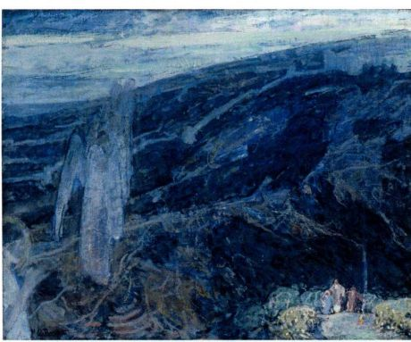

图26\.26 亨利·奥萨瓦·坦纳：《天使向牧羊人显现》。约1910年。布面油画，	65 \.4 × 8 1厘米。史密森尼美国艺术博物馆，NormanRobins 夫妇捐赠

🟩926 詹森艺术史

表现的是同一个人物，只是姿势不同。虽然他的人像都基于熟稔的模特，例如《思想者》就让人联想到他喜爱的艺术家米开朗基罗的作品，却具有陌生的朴实之感。比起雕刻，罗丹更偏爱塑形，主要以石膏或粘土作为创作材质，再由工匠们将模型浇铸为青铜像。我们可以看到罗丹的双手是如何来捏塑具有可塑性的石膏，因为这些模型的表面呈现波浪式的起伏。材质表面并不光滑，有意地保持了粗糙不平的状态，与卡诺瓦不同，后者的大理石雕刻总是给人以优雅、平滑之感（见图24\.28）。在罗丹的作品里，我们可以感受到与人物创造之间的亲密关系，仿佛注视着上帝用泥土创造亚当的过程。裸体人像更加强了这种原始品质，与其说裸体是对古典的借鉴，不如说他们的衣服被剥除下来，以显示其人性的内核，暴露出原始的恐惧与激情。

出于表现的原因，罗丹毫不犹豫地对其人像进行扭曲，粉碎了理想形式与理想美之类古典艺术观念。以《地狱之门》顶上的《三亡灵》为例，米开朗基罗

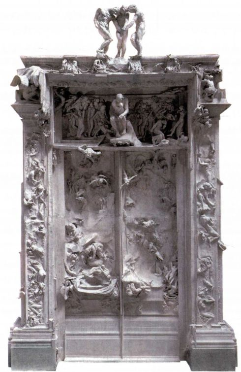

图26\.27 奥古斯特·罗丹：《地狱之门》（整体）。1880\-1900年。

石膏，55 1 x 399 × 94厘米。巴黎奥赛博物馆

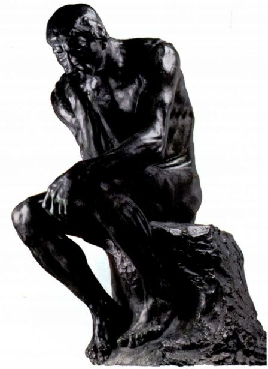

图26\.28 奥古斯特·罗丹：《思想者》。1879\-1887年。青铜，高70厘米。巴黎罗丹博物馆

式的肌肉组织被猛烈地拉紧和扭曲了，让这些亡灵的形式兼具熟悉感与陌生感。这三位离奇的信使从坟墓中升起，将其所携带的永恒黑暗注入下方的人群之中。我们甚至能够在《思想者》身上看到程度较轻的扭曲。思想者庞大的手掌和双脚具有沉重的质感，突出了其生理负担，而那被拉长的手臂则无力地搭在膝头，暗示着内心的惰性与优柔寡断。

罗丹对雕塑残片的运用同样极具表现力，有的作品仅仅是一只手或者一段躯干。这些局部不仅是整体本质的化身，还去除了非本质的部分，将观众的注意力集中于特殊细节。罗丹在1877至1878年间开始为创作圣约翰而制作初步的习作《行走的人》（TheWalking Man，图26\.29），这又是一个扭曲变形的例子。人体的解剖结构再次受到米开朗基罗的启发，而残缺的身体则令人联想到残破的古典雕像。通过去除头部，罗丹转移了对面部及其身份、心理状态的注意，以便能够强调运动，确切地说是前行的行动。罗丹最终决定将其作为一尊独立的作品，在1888年前将它浇铸为青铜像，展示在巴黎的乔治·佩蒂画廊（GeorgesPetit Gallery）里。

《加莱义民》（Burghers of Calais，图26\.30） 则体现了罗丹对心理状态的强调。这尊雕像由该城

🔴第二十六章 进步与无止境的渴望：后印象主义、象征主义与新艺术风格，1880\-1905年 927

图26\.29 奥古斯特·罗丹：《行走的人》，模型制作于1878\-1900年，约1903年浇铸。青铜，高84\.45厘米。华盛顿特区国家美术馆，John W\.Simpson夫人捐赠

尊长们的委托制作，以纪念在1347年英格兰人围城过程中自愿牺牲的六位市民，这是英法百年战争中的重大事件。以处死六位市民作为交换条件，英格兰人同意解除包围，并饶恕该城及其居民。罗丹表现了英勇就义者们身披粗麻袋，沉重地走向监牢与死亡，蛇一般的绳子捆绑着他们（但他们最终得到了释放）。罗丹并没有将他们表现为勇气十足的英雄，而是六位面对死亡的普通男子，在他们所流露的情感中有恐惧、屈从与强烈的痛苦。他们不是统一的行列，而是混乱的一群，每个人都有自己的想法。庞大的双手和双脚、疲惫的身躯以及笨拙的姿势让这些人看上去极具人性。罗丹希望将这尊雕塑安置在市政厅门外广场的平地上，这样就好像人物正从建筑中走出来，使得观者与加莱义民处在相同的空间之内，从而体验他们的伤痛。然而这尊生硬且不甚体面的作品让市议会感到尴尬，只好安置在一处偏远的地方，并加上了高底座。

专注于表达原始恐惧与激情，这一特质将罗丹与象征主义探测精神深度的要求联系在一起。他对这一主题的兴趣早在1864年就初露端倪，所以在某些方面也可以把他看作晚期的浪漫主义者。然而真正使罗

丹成为象征主义者的，是其着力表现文明对个人造成的精神损伤。无论是探索战争的破坏效果，还是探索创造性成就所要付出的情感代价，罗丹都强调现代生活对于人们心理造成的后果。他运用熟悉而又抽象的形式，以及传达强烈心理状态的能力确认了其与象征主义的亲缘关系。浪漫主义号召人们起来行动，例如希腊的独立战争（1821\-1832年），而象征主义者则热衷于同世界保持默想的内趋关系。普法战争（1870\-1871年）和1871年恐怖的巴黎公社是直接行动与热衷政治的无情教训。罗丹、象征主义者和初露头角的心理学转向了隐藏在内心的斗争，努力理解并将之呈现出来。这种内心的斗争将是1914年之前欧洲艺术家关注的对象。

新艺术风格与对现代设计的追寻

1895年，德国企业家西格弗里德·宾（SiegfriedBing）在巴黎开设了一家名为“新艺术之家”（LaMaison de I＇Art Nouveau）的装饰艺术商店。他通过进口日本艺术品和家具而发家，如今则开始提倡日本的整体设计原则：室内空间的每一个局部都应该从属于某个整体风格。以消除美术与装饰艺术之间的差别为目标，他雇用著名建筑师、艺术家和设计师来设计整间商店内部的所有细节，同时还包括家具、花瓶、瓷砖和彩色玻璃窗等独特的商品。这种新风格依据商店的名称而取名为新艺术风格（Art Nouveau）。在欧洲其他地区则有不同的名字，德国称之为“青年风格”（Jugendstil），维也纳则称之为“分离派风格”（Secession Style）。虽然名称因国家而异，但这种风格通常都以有机形式与藤蔓纹样为特征。

新艺术风格可以看作是对威廉·莫里斯的工艺美术运动的回应，其对于设计精美的手工制作产品无比强调，这无疑反映了上述观点。路易斯·康福特·蒂凡尼（Louis Comfort Tiffany，1848\-1933年）的产品设计是另一个影响新艺术风格的重要因素，特别是装饰着有机形图案的彩色玻璃窗（图26\.31）和玻璃灯罩。蒂凡尼在纽约的商店实际上正是宾所开设的新艺术之家的灵感来源。然而工艺美术运动与新艺术风格之间还是存在着巨大差别。例如，许多新艺术风格的艺术家乐于使用批量生产的新型工业材料，而且必须注意，虽然新艺术风格的设计具有明显的有机形式，但往往只是纯粹的抽象图案，而不像莫里斯的设计那样，基于某种确定的植物种类来进行创造。

🟩928 詹森艺术史

图26\.30 奥古斯特·罗丹：《加莱义民》。

1884\-1889年。青铜，     米。华

盛顿特区史密森尼学会的赫斯肖恩博物馆

与雕塑园（Hirshhorn Museum and Sculpture

Garden），Joseph H\.Hirshhorn捐赠，

1966\.66\.4340

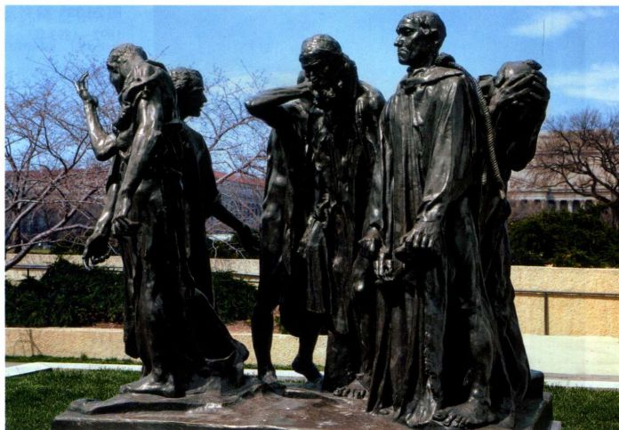

新艺术风格的公共空间与私人空间

与阴暗沉闷的维多利亚时代室内设计相比，新艺术风格轻快的自然主义仿佛一股清新空气，散发出青春、自由和现代的气息。其颇具象征主义的幻想元素，那是一种具有生物形态的幻想形式，在建筑设计之中体现得尤为明显。新艺术风格的设计师们给予建筑外观与内部空间同等的关注。复杂且生气勃勃的立面是新艺术风格的典型特征，赋予建筑某种雕塑的特质，吸引着过往行人。具有活力的对话持续到建筑内部，因为新艺术风格的内部空间律动着运动感。内部装饰与家居陈设似乎就在其所在位置上生长出来，这种效果通常又因玻璃天顶或天窗射入的日光而增强，让空间像温室一般丰饶旺盛，每一事物似乎都自然地生长着。

维克托·奥尔塔 这种风格始于布鲁塞尔，最早出现在比利时建筑师维克托·奥尔塔（Victor Horta，1861\-1947年）的设计里。他出生于根特，曾在根特美术学院学习过素描、纺织和建筑，返回比利时后独立开业，在那之前则是在巴黎工作。1892年，奥尔塔在布鲁塞尔设计了塔赛尔公馆（Tassel House）。设计中最引人注目的部分是楼梯井（图26\.32），具有延展性的锻铁立柱与栏杆轻而易举地被塑形为葡萄藤，并拓展演变成为墙壁、天顶和镶嵌地板上卷曲的须蔓图案。起支撑功能的立柱纤细到了极限，顶部的科林斯式柱头萌生出带状的藤蔓，进而消融在拱中。线性图案还延伸到地板与墙壁，这种设计进一步在视觉上将空间整合起来。阳光从玻璃天顶射入，增加

图26\.31 路易斯·康福特·蒂凡尼：《树林风景》（A Wooded Landscape）。约1905年。玻璃、铜箔与铅。休斯顿美术馆，Brown Foundation Accessions Endowment提供购买资金，96\.765．A，B，C

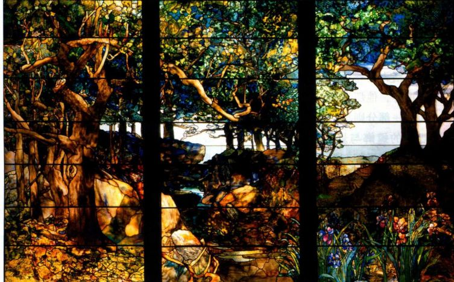

🔴第二十六章 进步与无止境的渴望：后印象主义、象征主义与新艺术风格，1880\-1905年 929

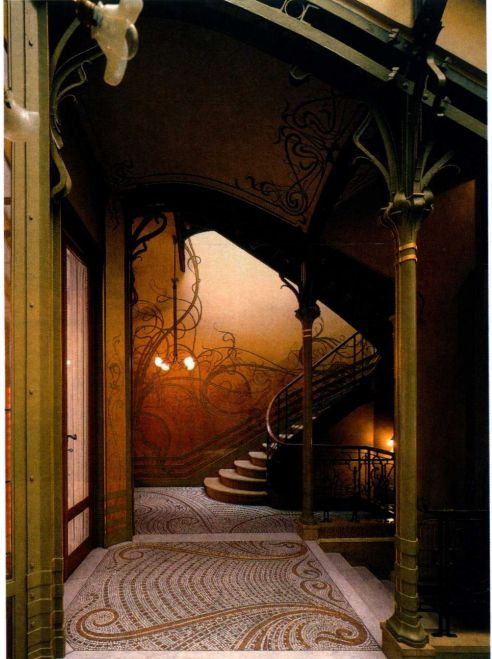

了楼梯井的有机性质。曲线形图案来自多样化的艺术素材，其中包括日本版画和高更的“轮廓画法”（cloisonnism，见图26\.13）。每一事物都饱含有机的流动性和生长与生命的青春之感，创造出打破室内空间传统方盒子性质的效果。

埃克托尔·吉马尔 新艺术风格接下来又进入了巴黎，那里最著名的新艺术风格实践者是建筑师埃克托尔·吉马尔（Hector Guimard，1867\-1942年）， 其以设计1900年开通的巴黎地铁站入口而闻名（图26\.33）。与奥尔塔一样，吉马尔运用锻铁和铸铁进行创作，生锈的材质具有柔和朴实的绿色，而他对于有机形式的敏感处理别具特色。如果说奥尔塔呈现出具有活力的卷曲须蔓，那么吉马尔则唤醒了沉睡的史前世界，他那类似于植物的设计暗示着枝叶与藤蔓，而另一部分则类似于变形后的动物，令人回想起举着双臂的螳螂与恐龙。甚至“地铁”（Métropolitain）一词的字母都变形为奇特的有机图案，形式不规则，还具有原始、恐怖的效果。这对于进入地下新世界的建筑入口而言确实恰如其分，同时这种风格对于高科技的机械世界又具有极大的揭示性，仿佛一个逃避现实的幻想，具有强烈的有机面貌。除公共化程度很高的地铁设计之外，吉马尔的其他创作主要集中在上流社会的私人住宅和公寓建筑领域。即便新艺术风格于

图26\.32 维克托·奥尔塔：布鲁塞尔塔赛尔公馆内部楼梯。

1892\-1893年

1910年前后退出历史舞台之后，他仍坚持这一风格。

安东尼·高迪 到目前为止，那些最为古怪的创作都源自安东尼·高迪（Antoni Gaudí，1853\-1926年）狂野的想象力。高迪的大多数创作都在巴塞罗那完成，这里是继巴黎之后短暂的新艺术风格又一个、也是最后一个据点。他的风格反映出该时期炽热的民族主义情感，强烈地吸收了地中海地区的建筑传统。高迪设计有著名的米拉公寓（Casa Milà，图26\.34、26\.35），一座大型公寓建筑，表达出个人对“自然”形式理想的狂热虔诚，又与奥尔塔的植物式设计迥然不同。建筑结合了西班牙本土的巴洛克风格、银匠式风格（Plateresque，意指精雕细刻的银版）和南部摩尔人的清真寺样式。高迪相信自然界中没有直线，因此创作出波浪起伏的立面以及不规则形态的内部空间，直接破坏了建筑的盒子式结构。建筑外部由巨大的石方砌成，令人联想到陡峭的海边悬崖，而锻铁制成的阳台又仿佛海草，扇贝形的屋檐则模仿海浪的样子。在21世纪的人们看来，那些烟囱可能令人想起软软的圆筒冰淇淋，但在1905年，最有可能让人们想到的则是沙子城堡。其与海滨的联系实际上反映出巴塞罗那与地中海之间紧密的地理、文化和经济关系。作为加泰罗尼亚的首府，巴塞罗那对高迪具有特殊含义，他是加泰罗尼亚民族主义的坚定支持者。

查尔斯·伦尼·麦金托什 高迪的建筑表现了加

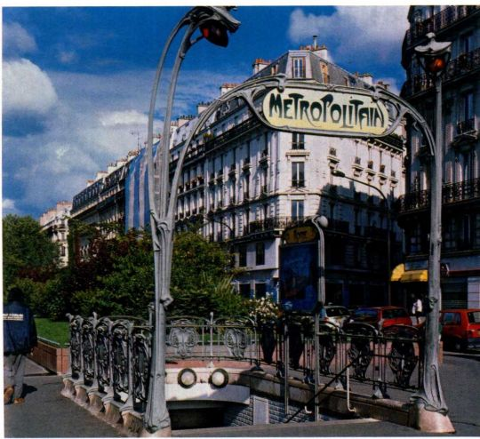

图26\.33 埃克托尔·吉马尔：巴黎地铁站。1900年

🟩930 詹森艺术史

泰罗尼亚的风物与文化，而格拉斯哥建筑师查尔斯·伦尼·麦金托什（Charles Rennie Mackintosh，1868\-1928年）的设计则向人们展示了果断的北部苏格兰感性。麦金托什的建筑通常都被人们归为新艺术风格，而他也确实是以这种风格开始创作的，特别支持工艺美术运动的价值观，并在整个创作生涯中都保持了有机形式的特色。他最为著名的设计是建造于1897

__大事年表__

1889 年——埃菲尔铁塔完工  
1892—1893 年——维克托·奥尔塔设计塔塞尔住宅  
1895 年——西格弗里德·宾在巴黎的新艺术之家商店开张  
1898 年——美西战争  
1900 年——巴黎地铁开通  
1905—1910 年——安东尼·高迪设计建造米拉公寓

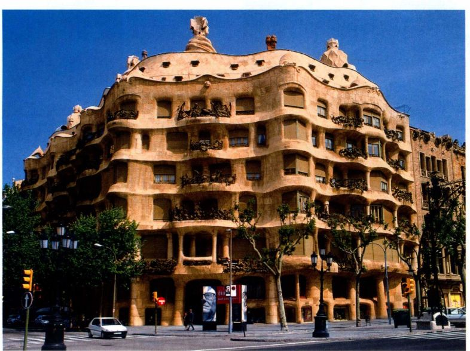

图26\.34 安东尼·高迪：巴塞罗那米拉公寓。1905\-1910年

至1909年间的格拉斯哥艺术学校（Glasgow School ofArt，图26\.36），体现出其作品比高迪、吉马尔或奥尔塔的作品更为主流的特点。建筑立面主要为长方形，占据立面主体的朴素窗户暗示出安妮女王时代的复兴风格，使建筑具有高度几何化的特色。入口上方的悬挑增强了窗户的网格结构，而入口部分则令人联想到苏格兰的男爵塔。入口内设置了拱形巴洛克壁龛或祭坛，在上方的凹陷中装设有安妮女王时代的凸肚窗或观景窗。换而言之，这座建筑是对各种复兴风格的抽象表现，但是各种风格缩减为几何化的本质形式，几乎消失不见。唯一表现出新艺术风格曲线形式的元素是奇特的有机形铁艺装饰，出现在栏杆、围墙和悬挂着灯笼的入口拱门部分，此外还有供玻璃清洁工使用的奇特植物式支架。

麦金托什以室内设计而闻名，其设计保持了几何形与有机形的平衡，正如1904年所设计的格拉斯哥

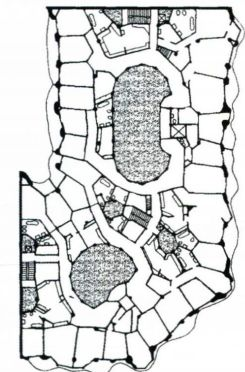

图26\.35 安东尼·高迪：巴塞罗

那米拉公寓典型楼层的平面图

🔴第二十六章 进步与无止境的渴望：后印象主义、象征主义与新艺术风格，1880\-1905年 931

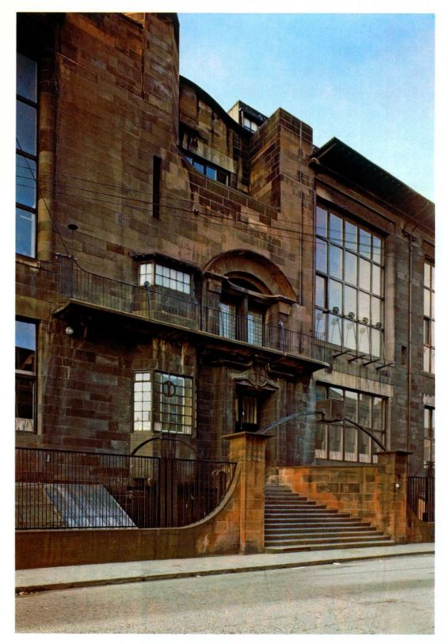

图26\.36 查尔斯·伦尼·麦金托什：苏格兰格拉斯哥艺术学校北立面。1897\-1909年

柳屋茶馆的豪华厅（Salon de Luxe at the Willow TeaRoom，图26\.37）那样。大门与墙壁上柔弱的线性图案暗示着柳树的枝条，优雅的椅子靠背略为鼓胀弯曲，向上收缩，椅子腿则呈曲线形。然而，垂直线与水平线所构成的严格网格将内部空间强烈地组织在一起，却不失优雅精致，椅子靠背上的九格设计就是其标志。抛开风格归属的问题不谈，麦金托什的设计无疑是“新颖”且具有整体性的。包括门把手在内的每一个室内细节都是优美的手工制品。虽然没有奥尔塔和吉马尔那样的植物与动物幻想，麦金托什的想象力同样脱离了历史，并开拓出奇特的新领域，使得茶馆的顾客感到他们仿佛经过一道魔术门，进入了不可思议的仙境。

美国建筑：芝加哥学派

1871年时，没有人会料到芝加哥1871年大火会开启现代建筑的篇章，让美国建筑师们首次领先于世界。大火被扑灭之后，首要的问题并不仅仅是重建城市。芝加哥曾经发展得极为迅速，在房地产业投入了大量资金，现在需要通过建造高楼大厦来最大程度地利用土地。安全电梯的发明使之成为可能，后来伊利萨·奥蒂斯（Elisha Otis）又于19世纪50年代至60年代期间在纽约完善了这一技术。然而，由于1873年国家经济崩溃，那些雄心勃勃的芝加哥建筑项目在10年后才得以开工，而施工期持续了十年。当80年代真正开始建筑工程的时候，年轻的设计师掌控了局面，他

图26\.37 查尔斯·伦尼·麦金托什：格拉斯哥索奇霍尔大街（Sauchiehall Street）柳屋茶馆的豪华厅。1904年

🟩932 詹森艺术史

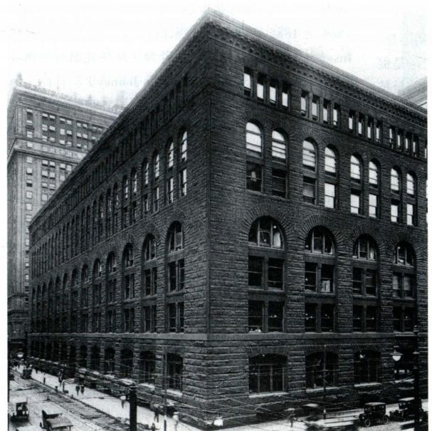

图26\.38 亨利·霍布森·理查森：

芝加哥马歇尔·菲尔德批发商店。

1885\-1887年，毁于1931年

罗马式复兴风格。墙壁内部嵌有一系列铸铁立柱，表明摩天大楼建筑的新时代已经来临，虽然这些立柱隐藏在红色花岗岩与砂岩的外墙内部。这些墙壁全部为自立支撑，而非附着在钢铁上的装饰板。建筑看起来似乎就是石头砌筑的，没有使用任何钢铁材料。之所以让人感觉宏大，是因为其占据了整整一个街区的面积，向人们宣告自己的存在。石方的规模、质感以及深窗处的阴暗空洞为这座重要建筑增添了些许雕塑感。

尽管三层拱门结构也表现出13世纪佛罗伦萨府邸的特色（见图15\.32），但拱门还是令人想起罗马式风格，当理查森运用这一元素时显得尤为如此。建筑的三层布局外观还让人联想到美术学院派建筑（见图25\.9），后者指的是由巴黎美术学院严格的建筑规划而确立的苛刻设计原则。其原则包括“柱基一立柱一檐部系统”，即“基础一上升一顶点模式”。在马歇尔·菲尔德批发商店中，柱基或平台由地下室那一层来表现，上面两层则代表柱廊层和檐部层。尽管与过去的建筑有相似之处，但这座建筑无疑带有众多创新元素。由于其高度的抽象性，就其本身而言就去除了立柱、墩柱、柱头和檐部。统一的石材虽然朴素，却像皮肤那样覆盖着建筑表面，而且石材的用量恰到好处，刚好让建筑免于沦为单纯的骨架结构，暴露内部框架的

据了芝加哥市内的一整个街区。在此理查森的风格演 网格构成。

化到了最为精致的阶段，甚至超越了维多利亚时代的

🔴第二十六章 进步与无止境的渴望：后印象主义、象征主义与新艺术风格，1880\-1905年 933

们主要是工程师出身，基本上没有任何建筑学背景。这就意味着，他们没有任何关于建筑面貌的先入为主的概念，因此不会受到束缚，对于新材料与新技术的态度更加开明。他们抛弃了复兴风格建筑的历史主义，尽可能地令形式符合功用。他们兴建的建筑在技术上复杂异常，工作量也非常大，所以主要建筑师们都结成两人小组，以求互补，分别有伯纳姆（Burnham）和鲁特（Root）、霍拉伯德（Holabird）和罗奇（Roche）， 以及阿德勒（Adler）和沙利文。在这群建筑师中，只有沙利文曾在建筑学校学习\-他曾在麻省理工学院学习一年，在巴黎美术学院学习了半年。

理查森：奠定现代主义建筑的基础

波士顿建筑师亨利·霍布森·理查森（Henry

Hobson Richardson，1838\-1886年）设计了马歇尔·

菲尔德批发商店（Marshall Field Wholesale Store，图

26\.38），在思维能力方面向新一代芝加哥建筑师发

起了挑战。他出生于新奥尔良，毕业于哈佛大学，以

其罗马式复兴风格闻名海外。其作品风格极其著名，

最终以他的名字而命名。理查森的石砌建筑雄壮大胆，

具有极强的质感效果。同时又非常简洁，突出体积与

形式。马歇尔·菲尔德批发商店是一座七层建筑，占

路易斯·沙利文与早期摩天大楼

理查森并不自视为现代主义者，而他也确实不是。但是马歇尔·菲尔德批发商店建筑的抽象特征还是促生了随后的现代主义建筑。与其设计同样重要的是技术的进步。正如之前芝加哥大火所证明的，铁本身并非耐火材料，高热会使其软化、弯曲，温度足够高时铁还会融化。为了克服这一巨大缺陷，必须制造耐火金属来包住铁材。不久之后，20世纪初期出现了钢材和陶砖，后来又发明了混凝土涂层。现代混凝土被称为波特兰水泥（Portland cement），1825发明于英国。这些绝缘材料还有防腐蚀的特性。

另一项同等重要的技术进步是幕墙（curtainwall）的发明。理查森在马歇尔·菲尔德批发商店中使用了自我支撑式墙壁，而幕墙与之不同，悬挂在水平的工字梁边缘。没有这项创新，高大建筑的墙基会为了支撑上方墙体的重量而增大厚度，例如15层的建筑墙基厚度就会达到1\.8至3米，严格限制了楼层的数量。此外，幕墙使得整面墙壁采用玻璃材料

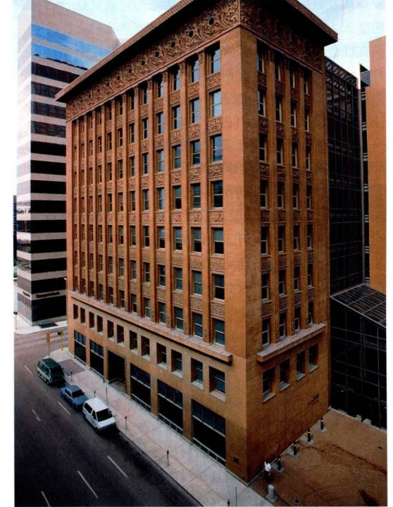

图26\.39 路易斯·沙利文：密苏里州圣路易斯市温赖特大楼。

1890\-1891年，现已被毁

成为可能。芝加哥第一座大范围运用幕墙的建筑是1884至1885年间修建的家庭保险公司大楼（HomeInsurance Building），设计者为芝加哥建筑师中的年长领袖\-威廉·詹尼（William Jenney）。

路易斯·沙利文（Louis Sullivan，1856\-1924年） 是受到普遍信任的建筑师，在发展美学内涵方面承担了重要角色，善于将钢筋骨架转变为强有力的建筑。1880年，沙利文加入了丹克玛尔·阿德勒（DankmarAdler）的芝加哥公司，该公司后来在1883年更名为阿德勒和沙利文公司。阿德勒在1891年离开公司，他曾任工程师、规划师和项目经理人，负责保证建筑工程的正常运行，而沙利文则是提供设计理念的理想主义幻想家。

温赖特大楼（Wainwright Building，图26\.39）是沙利文早期的杰作之一，于1890至1891年间修建于圣路易斯市，而沙利文的大部分建筑都位于芝加哥。通过使用幕墙，沙利文设计的这座建筑反映出钢筋骨架的网格结构，然而出于美学考虑，他将外部的窗间壁（pier）加倍，每隔一条窗间壁后都隐藏着起结构功能的桁梁。对于早期摩天大楼的设计师而言，主要困难在于如何不依靠过时的复兴风格，以及如何能让建筑楼层增多的同时保留引人注目的外观。沙利文的解决方案别具一格：与理查森的马歇尔·菲尔德批发商店一样，建筑四角的窗间壁被加宽，将建筑框在里面；窗间壁之间的水平窗间饰板（spandrel）退入墙体，这两个元素赋予建筑宏大的雕塑感，让人感到其仿佛由坚固的石块进化而成。纵贯七层的巨大窗间壁与庞大的一层檐口增强了建筑整体的宏伟壮观。马歇尔·菲尔德批发商店中学院派的“柱基一立柱一檐部模式”再次出现，但用在温赖特大楼中显得更为古典，因为建筑师采用了网格结构，而没有使用罗马式拱门。

虽然建筑外观汇集了抽象的几何形式，并在很大程度上反映了基础结构，但是沙利文毫不迟疑地设计了檐口与窗间饰板上的赤陶饰板，并采用基于古代叶饰（rinceau）的图案，一种葡萄藤、枝叶或花朵构成的装饰纹样。沙利文想用植物装饰来表现他的信念，即建筑应该运用新技术来促进社会的和谐与进步，这原本就应该是世界自然有机体进化的一部分。与画家乔治·英尼斯一样，沙利文相信斯维登堡的感应理论\-宇宙间的力量贯穿万物，并将其统一起来，而其中每一部分又都是独一无二的个体。沙利文还运用装饰来区别建筑的不同部分，赋予其各自的标示（见上层的窗间饰板）。与此同时，所有部分都紧密地组合为统一整体，窗间壁与窗间饰板所构成的网格结构

🟩934 詹森艺术史

就表现了这一点。繁花似锦的植物为建筑注入了能量，折射出其中人性元素的生命力，并与流过所有事物的宇宙能量流联系在一起。尽管沙利文的建筑实际、实用，而且他也曾说出那句名言：“形式服从功能”，但他同时也是一位充满幻想的象征主义者（见第四部分末尾的附加原始文献）。

到了1900年，沙利文的风格明显变得更加轻盈、欢快及抽象，预示着20世纪现代主义建筑的漂浮感与几何玻璃盒子式特色。这种风格就表现在芝加哥的施乐辛格＆梅耶商场（Schlesinger and Meyer Store， 图26\.40）之中；这原本是一件设计三重开间、左部为九层的建筑，但后来发展成为今天的12层大厦。纤细的垂直窗间壁实际反映了背后的骨架，机械形式的立面也回应着内部的结构性网格。墙壁几乎消失了，为玻璃所取代。温赖特大楼那一整层庞大的檐口在这里也失去了踪影，沙利文设计的顶层“檐部”实际上是一座中空凹入的阳台，覆盖着狭长的屋檐。而屋檐

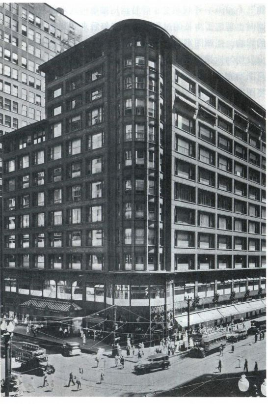

图26\.40 路易斯·沙利文：芝加哥施乐辛格＆梅耶商场（现名为卡森·皮里·斯库特百货商店）。1899\-1901年，1903\-1904年

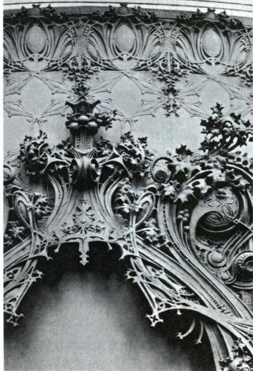

图26\.41 路易斯·沙利文：施乐辛格＆梅耶商场铸铁装饰

也不是沉重的盖子，而像是一片漂浮着的纸板。此处仍然保留了两层学院派的“柱基”，看上去似乎向里缩去，由上面的水平线脚造成，于是嵌有水平窗户的那九层楼看起来像是飘浮在空中。第一层消解在新艺术风格植物形式所形成的狂野、混乱之中，并为铸铁饰板（图26\.41）所覆盖，有效地将建筑与宇宙能量统一起来。伴随着施乐辛格＆梅耶商场的出现，现代主义的摩天大楼美学观可能到达了当时的最高峰。

弗兰克·劳埃德·赖特与草原住宅

弗兰克·劳埃德·赖特（Frank Lloyd Wright，1867\-1959年）先是在威斯康星大学学习工程学，之后从1888年开始为沙利文工作，直到1893年结束。他的建筑敏感性与设计专长却与沙利文大不相同。沙利文专攻商业建筑，赖特的强项则是家庭建筑，尽管他设计的公共建筑也同样出色。沙利文的创新主要体现在建筑立面，而赖特的创新则在于空间，包括内部空间及其与外部空间的关系。赖特的建筑与沙利文一样，都是以自然为基础，他以“草原住宅”（PrairieHouse）崭露头角。之所以这样称呼，是因为这些住宅修建于中西部，以其强烈的水平之势与当地那一览无遗的风景相呼应。

赖特从19世纪90年代早期开始设计草原住宅，

🔴第二十六章 进步与无止境的渴望：后印象主义、象征主义与新艺术风格，1880\-1905年 935

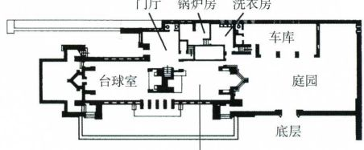

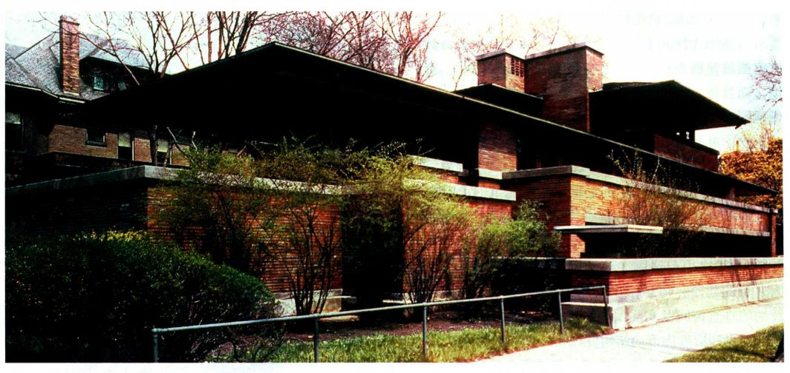

图26\.42 弗兰克·劳埃德·赖特；芝加哥罗比住宅。1908\-1910年

其最高的成就是1908年在芝加哥设计的罗比住宅（Robie House，图26\.42）。这座建筑的建筑风格极为现代，令人震惊，建筑师们需要10年乃至20年的时间才能完全理解，从而发现其内涵。从建筑外部来看，显然不仅仅是水平与垂直的抽象交响，同时也是空间开放与闭合的制衡。屋顶并不像照片中看上去的那样水平，而是略微倾斜，这样鲜明的悬臂屋顶限定了一个空间，而庭院或者底部的阳台则勾勒出另一个。内部空间不仅向外流溢而且彼此交织，因为各个房间，特别是公用厅房普遍没有设置大门与墙壁（图26\.43\)。

赖特一直声称他对复杂空间与设计的设想能力源于童年时的福禄培尔（Froebel）积木游戏，那是他母亲在1876年的费城世界博览会上买给他的。这是弗里德里希·福禄培尔（Friedrich Froebel）开发的玩具，也是他试图在全国推广的幼儿园内容之一。这是最早的儿童积木，属于整体项目的一部分，该项目还包括让孩子们用小棍、黏土与折纸来玩耍，并用各种材料

门厅 锅炉房	洗衣房

来编织东西。福禄培尔的每一个游戏阶段都被称为“恩物”（gift），不仅教会了赖特运用抽象形式来思考，同时也理解了生长的过程。福禄培尔后来受到晶体学的影响，强调图案而忽略构造，让孩子们从中央一行出发均匀地排列出图案，直到用完所有积木为止。一旦图案完成，就鼓励孩子们赋予这些图形象征内容，将图案与植物的生命世界联系起来，或者联系到宇宙万物，例如太阳、星辰等。在1893年的芝加哥世界博览会上，参观日本庙宇的经历对赖特的成长同样重要。他在那里看到了强烈、突出的屋檐和具有严格几何形式的房间，房间都装有滑动门，以便可以彼此相通。日本建筑中的一切都遵循紧密的联锁结构，正如福禄培尔的教育计划一样。

罗比住宅虽然具有抽象和几何化的特点，却与自然、生命保持着共鸣。即使在插图照片里，这座按照赖特指示运用砖块（厚3\.81厘米，长12\.7厘米）水平砌筑的房子，看起来也与大地完美地融为一体，其侧翼则平行于周围的平原伸展开来。赖特将自己的建

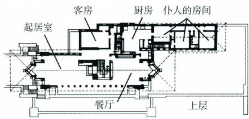

儿童游戏室

图26\.43 罗比住宅平面图

🟩936 詹森艺术史

筑作品设想为有机结构，像水晶成形或树木生长那样不断演化。罗比住宅以及赖特其他很多作品的灵感都来自于一座砖砌的大型火炉，赖特将其视作通向“家庭守护神”的祭坛。住宅的其他部分都围绕这一支点发展起来，一个房间自然地通向另一间或者室外，而室外的设计又巧妙融入环境之中。这种生长感在建筑外部清晰可见，屋顶的侧翼、阶梯地坪和阳台似乎处于持续的运动之中。多变的突出与缩进令人赏心悦目，仿佛光与影的交响。我们通常不会将这种性质与建筑联系在一起，反而认为这是自然本身才拥有的特性。

赖特的室内设计也具有同样的生命基调。弗朗西斯·W·里特尔住宅（Francis W\.Little House，图26\.44）可能是他现存的早期室内设计作品中最为杰出的范例。赖特受威廉·莫里斯工艺美术运动的影响，如果说新艺术风格作品的面貌没有触动他，至少其原则也影响了他的设计。赖特尽可能运用手工制作的优质产品来装点室内的各个细节。与建筑一样，设计和家具也具有几何化特征，维持着建筑中空间的交互作用。但是，铅化彩色玻璃窗和天花板格子图案的几何设计实际上是植物与风景题材的抽象形式，室内的色调则以沉暗、温暖的土地色彩为特色。早期的赖特几乎是一位机械时代的抽象思想者，在观念上摆弄空间，完全与传统决裂开来。他的理论与敏感都极其符合19世纪90年代，然而他同样进入了19世纪的象征主义

大事年表

1883年\-布鲁克林大桥竣工

1884年\-马克·吐温出版《哈克贝利·费恩历险记》

1885\-1887年\-理查森设计建造马歇尔·菲尔德批发商店

约1887年\-高速电梯技术完善

1890\-1891年\-沙利文设计建造温赖特大楼

1901年\-美国钢铁公司成立

领域，主张放弃现代文明，回归自然的怀抱以追求永葆青春的精神力量。

摄影

19世纪末，摄影师思考的首要问题是当时“摄影是否为艺术”的争论。非艺术摄影日益增多，也使得事情更为复杂。网目印刷工艺（half\-tone print）的发明是照片数量激增的原因之一，其使得照片能够直接印刷在报纸、杂志和书籍里，无需石版或凸版印刷。同时也导致了照片明信片的出现，1907至1908年间生产出的明信片多达6\.67亿张，其中大部分都印有照片，通过美国邮政部门寄往各地。照片激增的另一个原因是干版的发明，取代了笨拙且不实用的湿版工艺。现在摄影师的工作速度更快，而且可以前往任何地方。工艺的进步将曝光时间缩短到十五分之一秒，同时装

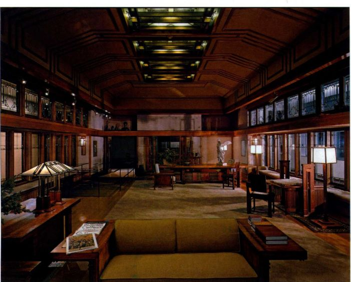

图26\.44 弗兰克·劳埃德·赖特：明尼苏达州威泽塔市（Wayzata）弗朗西斯·W·里特尔住宅。设计于1912\-1914年。现组装在纽约大都会艺术博物馆，Emily Crane Chadboume 遗赠，1972\.1972\.60\.1

🔴第二十六章 进步与无止境的渴望：后印象主义、象征主义与新艺术风格，1880\-1905年 937

图26\.45 彼得·亨利·爱默森：

《收割沼泽干草》（Poling theMarsh Hay）。1886年。铂盐成像。奥斯汀市得克萨斯大学哈利·兰森人文学科研究中心（Harry Ransom Humanities Research Center），Gernsheim 收藏

大事年表

1884\-1888年\-乔治·伊斯特曼发明摄影胶卷与相纸

1888年\-柯达相机问世

1890年\-雅各布·里斯出版《另一半人怎样生活》

1895年\-卢米埃尔兄弟发明摄影机，第一部活动图像问世

1899年\-格特鲁德·克泽比尔创作《你，女人中神圣的艺术》

1910年\-艾尔弗雷德·施蒂格利茨创作《野心之城》

有遮光器的手持照相机也得以问世。三脚架不再是必需之物，现在的照相机已经可以记录运动。1888年，纽约州罗彻斯特市的伊斯特曼干版公司（Eastman DryPlate Company）引进了柯达照相机。这种相机可以装入能拍100帧的纸质胶卷，一旦曝光，连同相机一起送回公司就可以完成冲洗与成像过程。公司的广告宣称：“你按快门，其余的我们来做。”这一时期还出现了单镜头反光照相机，机器中装有一面镜子，可以让摄影师在取景器里看到图像。突然间，每个人似乎都拿起相机拍照，“快照”一词也成为了日常用语。将近1890年时，全世界共成立了161个摄影团体，出版有60种摄影报纸。这种媒介非常流行，连新闻报纸上都开设了业余摄影专栏。

画意摄影与摄影分离派

最初人们认为摄影不过是一种普遍、不用动脑的流行工具，最佳用途就是记录视觉世界。为了对抗

这种观点，各种摄影组织如雨后春笋般涌现出来，将这种媒介标榜为高尚艺术。最早的摄影组织是成立于1891年的“维也纳摄影俱乐部”（Wien KameraKlub），之后不久在伦敦就出现了“连环社”（LinkedRing），而在巴黎也出现了“摄影俱乐部”（Photo\-Club，1894年）。柏林、慕尼黑和维也纳的分离派运动致力于打破艺术的等级划分，并举办艺术摄影展。1902年，艾尔弗雷德·施蒂格利茨离开了保守的纽约摄影俱乐部，成立了“摄影分离派”（Photo Secession），以欧洲分离派群体的名字为自己的组织命名。这些摄影组织的成员来自世界各地，而其成员构成还经常重叠，他们一起举办展览，还出版杂志。所有人都倡导画意摄影的美学观，鼓励摄影作品具有绘画的面貌，反对清晰的聚焦，认为那是明信片、立体镜（stereoscope）、报纸杂志图片以及柯达相机（装有单一固定镜头）的特征。艺术摄影师所拍摄的照片模糊不清，如同朱莉娅·玛格丽特·卡梅伦的作品一样，于是人们再次开始关注她作品的价值。画意摄影作品通常具有高度的质感，摄影师在曝光之前将胶质刷在相纸表面，或者采用表面更为粗糙的相纸。

彼得·亨利·爱默森 英国摄影师彼得·亨利·爱默森（Peter Henry Emerson，1856\-1936年）是画意摄影的典范人物，然而有意思的是，他本人的目标却在于用科学的方法将艺术与科学结合起来，从而创造图像。他想让自己的作品看来具有科学性，而不是

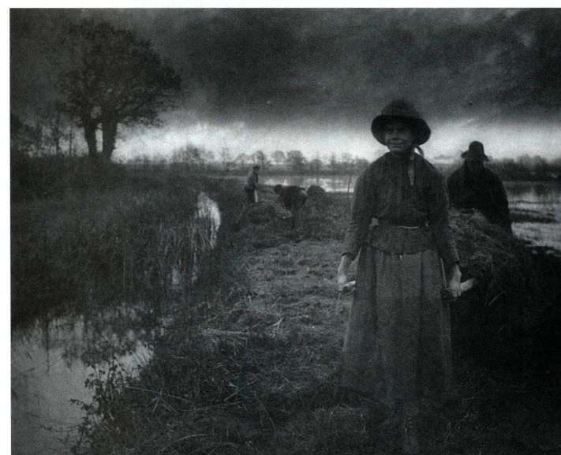

🟩938 詹森艺术史

艺术性。爱默森是医学博士，在1885年放弃本业，专心从事摄影工作。他受到德国科学家赫尔曼·冯·赫尔姆霍茨（Hermann von Helmholtz）视觉理论的影响（该理论主张眼睛在任何时候都只能聚焦于某一区域之内，其余的事物会模糊不清）。为了创作基于科学原理的现实主义摄影作品，爱默森开始制造复制赫尔姆霍茨光学理论的图像。在《清除沼泽干草》（Polingthe Marsh Hay，图26\.45）中，前景中的妇女聚焦最为清晰，而其他部分的图像都有些模糊不清。这张照片出现在爱默森的书籍《诺福克湖沼区的生活和风景》（Life and Landscape on the Norfolk Broads，1888年） 里，那是一套40幅蛋白纸成像照片装裱而成的对开相册，用蛋白纸成像技术能够产生异常精细与柔和的灰色调。爱默森对于英格兰东南部的乡村世界最为着迷，在那里时间似乎凝固了，人们手工收割干草，而不使用新型的蒸汽拖拉机。这幅充满怀旧情怀的照片向我们呈现了人类沉浸在自然里、过着田园生活的浪漫主义景观。讽刺的是，爱默森力图像眼睛一样写实地复制世界的目标反而造成了诗意、永恒的幻象。那是一个柔和的梦境世界，充满了朦胧丰富的灰色调，以及神秘飘浮的暗色与光点，树木则具有幽灵般的剪影式轮廓，光线在运河与沼泽上神奇地微微闪光。

格特鲁德·克泽比尔 各国画意摄影的支持者们从爱默森和卡梅伦那里获得了宝贵的经验，除此之外，他们还创造了具有绘画特色的梦幻式图像。纽约摄影师格特鲁德·克泽比尔（Gertrude Käsebier，1852\-1934年）是这个群体中最为杰出的人物之一。涉足摄影还不到五年，她就于1900年加入连环社，并于1902年成为施蒂格利茨摄影分离派的创始人之一。当摆脱了一场不幸的婚姻之后，克泽比尔在1899年参加了普拉特学院（Pratt Institute）的艺术课程，并很快拿起照相机来创作艺术摄影作品，然而她的生活要靠在工作室拍摄肖像照片来维持。《你，女人中神圣的艺术》（Blessed Art Thou Among Women，图26\.46）是于1899年在日本纱罗上成像的铂盐照片。克泽比尔在其中展示了画意摄影的所有特点：柔和的颗粒状图像，聚焦略微模糊，而且具有令人赞叹的丰富灰色调变化，这种变化原本只有蛋白纸成像才能实现，但是轻薄的日本纱罗让这些特点都更为微妙动人。母亲穿着一件拉斐尔前派式的白色长袍，以引人注目的姿势站在挂着圣母领报图像的后墙前。女儿正要跨出门槛，走向外面的世界，她被圣光一样的光线所环绕，那是她身旁明亮的白色所产生的效果，也体现在母女之间的紧密间隔中。这一场景极具灵性，设置在

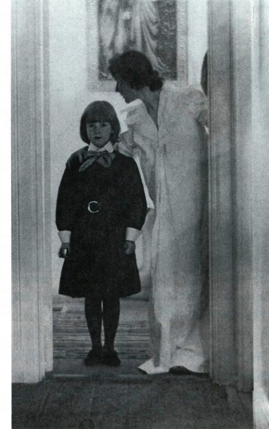

图26\.46 格特鲁德·克泽比尔：《你，女人中神圣的艺术》。1899

年，日本纱罗、铂盐成像，24\. 1 × 1 2\.9厘米。普林斯顿大学艺术博物馆，属于Clarence H\.White收藏

敬献给母性守护与哺育的圣殿里。现代城市化社会的节奏日益加快，趋向于破碎和物质主义，克泽比尔则创造了一座宁静的家庭圣殿，正如照片标题所暗示的，这座圣殿建立在母亲养育照料的基础之上。她的照片像玛丽·卡萨特的《给孩子洗澡》（见图25\.20）一样，具有19世纪晚期的女性主义信念，认为女性在孩子成长的过程中扮演着重要角色；这件作品同时还具有女性联盟或姐妹关系的精神内涵，旨在保护女性的权利与未来，正如卡梅伦的《姐妹精神》（见图25\.38\)。

爱德华·施泰肯 在爱德华·施泰肯（EdwardSteichen，1879\-1973年）与克泽比尔、施蒂格利茨的协助下，摄影分离派得以成立。施泰肯对该运动的早期贡献在于具有绘画性与情绪感的作品，他的风景摄影表现出乔治·英尼斯作品（见图26\.24）的调性与神秘特色。作于1902年的《罗丹与他的雕塑：维克多·雨果和思想者》（Rodin with His Sculptures "Victor Hugo”	and	“The Thinker”，图26\.47）就

🔴第二十六章 进步与无止境的渴望：后印象主义、象征主义与新艺术风格，1880\-1905年 939

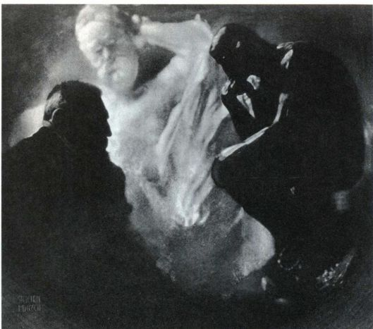

图26\.47 爱德华·施泰肯：《罗丹与他的雕塑：维克多·雨果和思

想者》。1902年。树脂成像，36\.2 × 32\.4厘米。乔治·伊斯特曼之家（George Eastman House）提供

展示了其早期风格。这是一幅树脂成像作品，通过树脂的绘画性效果与模糊的聚焦，施泰肯创造出一幅更像手工制作的图像，而非经由机械复制，证明摄影师能够做出美学上的判断，深刻地影响了图像的意味。施泰肯将罗丹沉思的剪影与《思想者》一起摄入镜头，而两者之间则环绕着幽灵般光亮的维克多·雨果形象。显然，施泰肯将罗丹与《思想者》视为一体。关于这座著名的雕塑，业界还存在着这样的解读方式\-\-雕像实际代表着罗丹本人，以及在艺术作品形成过程中，令人畏缩的创造过程与精神之间的斗争。这种解读方式确实可以解释这张照片，罗丹那被照亮的“头脑”也暗示了这一点，而维克多·雨果浮现为一道幻影，那是罗丹头脑中的虚构形象。虽然这里的罗丹在某些方面被描绘为浪漫主义天才，我们同时也可以感受到他工作时的象征主义心理。灵感并不是从想象力与情感中涌出，而恰好相反，是探寻头脑中深暗之处的结果。

艾尔弗雷德·施蒂格利茨 施蒂格利茨的几位画意摄影师朋友都以纽约城为拍摄对象，然而其作品却矛盾地具有浪漫主义氛围与品性，更适用于拍摄风景，而不是城市的钢筋水泥丛林。到了1900年，纽约后来居上，超越芝加哥成为摩天大楼之城，同时美国在技术和金融方面的实力也跃居世界首位，纽约及其“资本主义大教堂”正是这种优势的标志。尽管施蒂格利茨（Alfred Stieglitz，1864\-1946年）痛恨现代化， 为纽约“疯狂、无用的物质性”扼腕叹息，但从19

世纪90年代早期开始直到1910年，他反复拍摄了这座被谑称为“哥谭镇”（Gotham）的纽约城，1910年的《野心之城》（The City of Ambition，图26\.48） 就是例证。这是一张关于纽约的典型画意摄影照片，雨雪、雾气和蒸汽等天气现象抢走了建筑物的风头。施蒂格利茨在拍摄《野心之城》时，使用了画意摄影中经典的柔焦手法。城市看来赫然耸现，但建筑却隐在阴影里模糊不清，由阵阵烟雾与背后的云朵而凸显其柔和的特性。水面上的粼粼波光像地平线一样引人注目，我们清晰意识到太阳正在建筑背后熠熠生辉。施蒂格利茨利用这种光线奏起了优美的交响，灰色的长方形、丰富的黑色与亮白色和谐平衡。他捕捉到纽约城庞大的规模，称之为“怪物”。通过给纽约罩上的一层面纱，暗示着纽约似乎利用了大自然令人敬畏的力量。

纪实摄影

19世纪末的纪实摄影中，最有力量的作品记录着现代城市那令人发指的工作和生活环境。其中某些最为著名的作品拍摄于纽约，这座人满为患、急剧发展的大都市里塞满了贫困的移民和流动工人，他们即刻成为房东与老板肆无忌惮行为的牺牲品。这群人没有社会机构支持，也没有政府保护。下东区移民贫民窟的情况尤其如此，此外还有“五街顶”（FivePoints）那充满暴力、无法无天的酒吧与妓院，这个地区主要以鲍威利（Bowery）大街为中心。画意摄影所采用的技法与题材通常扭曲了照片中的现实，而纪实摄影师则利用这种媒介的能力来确保观众获得直接、看似真实的记录。某些纪实摄影师认为他们的作品达到了艺术的境界，因为其明显具有传达“真理”的能力；其他人则将纪实摄影用作商业，甚至政治目的。雅各布·里斯就在后者之列。

雅各布·里斯 1870年，雅各布·里斯（JacobRiis，1849\-1914年）从丹麦移民到美国，他后来成为纽约城周边最为艰苦地区的警方记者，那里的堕落与悲惨景象令他震惊不已，从此开始拍摄此地的照片以期待社会改革的发生。里斯将这些图像制成幻灯片在演讲过程中放映，并在报纸和杂志上刊登了一批照片。尽管里斯并不认为自己是一名艺术家，但是其作品具有不可否认的强烈效果。为了保留真实、自然的特性，里斯不会要求拍摄对象事先摆好姿势，而且他还使用了“闪光粉”，这是一种能够闪光的镁粉，即闪光灯的前身。使用了“闪光粉”，他可以在晚上进入廉价公寓、出租房屋和酒吧，瞬间完成拍摄。虽

🟩940 詹森艺术史

图26\.49 雅各布·里斯：《贝亚德街未经

批准的出租住宅，5分钱一个床位》。约

1889年。明胶银盐成像，20\.3 × 25 \.4厘米。

纽约市博物馆，雅各布·里斯收藏，＃155

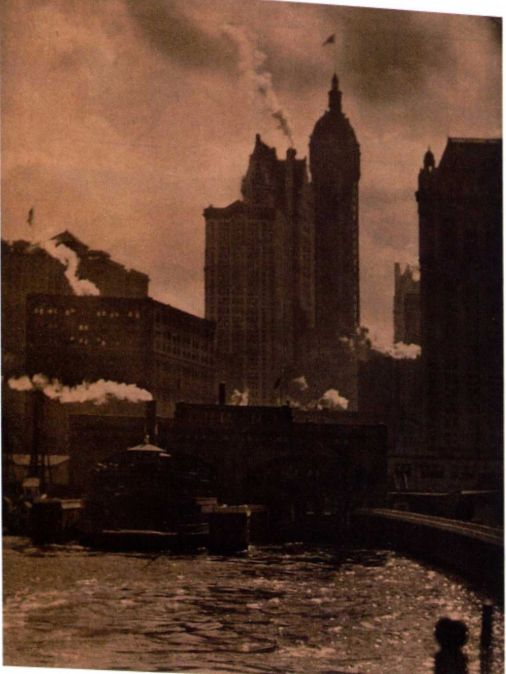

图26\.48 艾尔弗雷德·施蒂格利茨：《野心之城》。1910年。照相凹版印刷，日本纱罗，纸板装裱，34 × 26厘米。大都会艺术博物馆，艾尔弗雷德·施蒂格利茨收藏，1949年（49\.55\.15）

然闪光会让被拍者受到暂时的惊吓，看不见东西，但是可以达到偷拍的效果，正如《5分钱一个床位》（Five Cents a Spot，图26\.49）那样。里斯闯入了贝

亚德街（Bayard）一家挤满客人的睡房，他所拍摄的图像记录了房主对待无家可归者展现的贪婪，毫无卫生、健康可言的环境无疑让这个肮脏非法移民的街区成为疾病孳生的土壤。里斯在革命性的《另一半人怎样生活》（How the Other Half Lives，1890）中使用了这张照片，也促使政府决议将贝亚德街附近的窝棚推倒，最终改建为一座公园。社会摄影师的大军由此在世纪之交涌现出来，其中最为著名的是刘易斯·海因（Lewis Hine）和杰西·塔布克斯·比尔斯Tarbox Beals\)。

运动摄影与活动图片

10多年前，埃德沃德·迈布里奇（EadweardMuybridge，1830\-1904年）曾在约塞米蒂拍摄过一批当时最为杰出的照片。1878年，他受雇于商业大亨、政治家利兰·斯坦福（Leland Stanford），此人同时也是斯坦福大学的创始人。迈布里奇用摄影解决了困扰驯马师和艺术家长达几个世纪的难题：马在奔跑的时候是否四条腿都会离地？迈布里奇沿跑道设置了12架照相机以及标准化的背景帘幕，拍摄出一组连续的照片（图26\.50），一劳永逸地回答了这个问题\-马在奔跑的时候会四腿离地。从此以后，艺术家们就开始借助这些照片来绘制运动中的马匹，德加在1879年时就曾如此。迈布里奇成为一位名人，受费城宾夕法尼亚大学的邀请，进行运动研究，在19世纪80年代期间拍摄了大约10万张裸体与各种动物的照

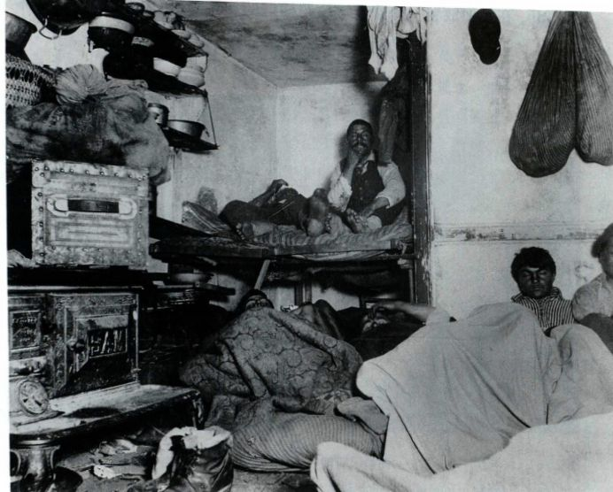

🔴第二十六章 进步与无止境的渴望：后印象主义、象征主义与新艺术风格，1880\-1905年 941

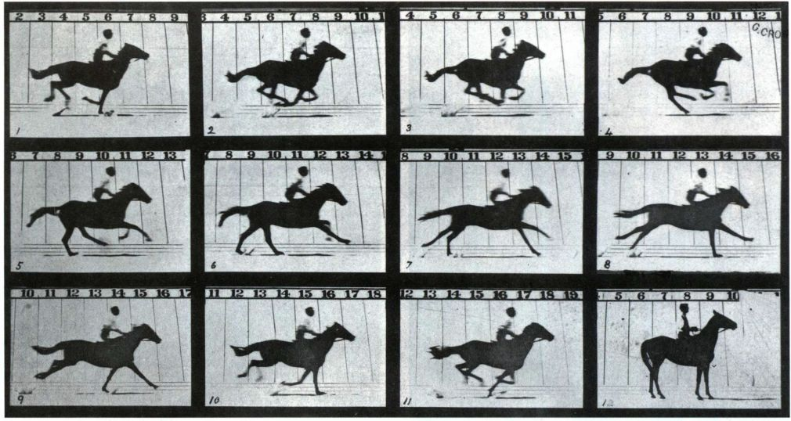

图26\.50 埃德沃德·迈布里奇：《无题》（小跑与疾驰的连续摄影），选自《自然》。1878年12月。照相凹版印刷。纽约州罗彻斯特市乔治

伊斯特曼之家

片。迈布里奇在《动物运动》（Animal Locomotion，1887）一书中包括了其中的781幅。这些运动研究传达出一种特殊的现代活力感，等距重复的系列图像尤其反映出机械时代的生活新节奏。

法国物理学家艾蒂安\-儒勒·马雷（Étienne\-JulesMarey，1830\-1904年）在《自然》（La Nature）上看到了迈布里奇所拍摄的有关运动中马的照片，于是同样迷上了运动研究。他采用一架照相机拍照，将镜头打开，在后面放置一个开有等间距槽口的旋转圆盘。

当槽口转过镜头前时就将图像记录下来，这样一个活动的物体在每次曝光时就展现出不同的位置。由于马雷更为关注运动的机械原理，而非运动对象本身，所以他让自己的模特身穿黑色服装，在身体两侧从手臂到脚分别设有白色的线条，然后拍摄下模特在黑色墙壁前运动的图像。这样一来，在照片上只能看到运动的白线（图26\.51）。虽然马雷认为这些研究毫无艺术价值，但结果却产生出迷人的抽象效果，还影响了那些对于物体穿越空间感兴趣的艺术家们。

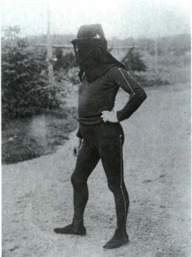

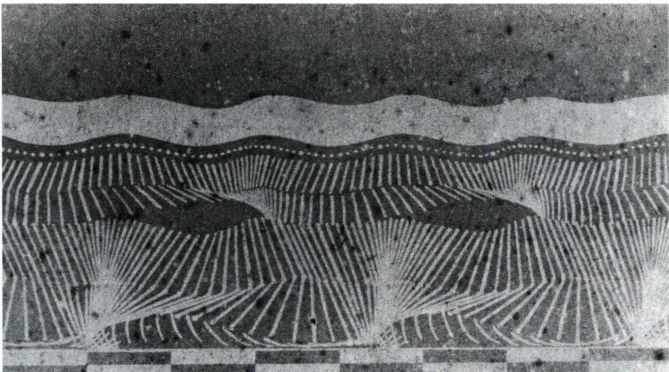

图26\.51（a与b）艾蒂安\-儒勒·马雷：《黑衣男子，四肢有白色条带，从黑墙前走过》（Man in Black Suit with White Stripes Dowen Armsand Legs，Walking in front of a Black Wall）。约1884年。连续摄影。法国博恩市马雷学院（Institut Marey，Beaune）

🟩942 詹森艺术史

小结

1880至1914年间，尽管欧洲与美国的视觉艺术没有形成统一风格，但在整体上却可以看作对现代化发展的回应。对城市生活、新科技、帝国主义和资本主义的矛盾情绪折射出现代性的矛盾特色。实证主义者对科学调查与技术进步持乐观态度，还普遍形成了乐观主义心态；但是理想主义者则试图通过精神性和“原始”文化找到生命的真谛，表明并非所有人都欣然接受现代生活。

后印象主义

出于对印象主义风格创新的回应以及创造独特现代艺术的渴望，后印象主义者走到了一起，他们的风格、题材与技法多种多样，从印象主义的现实主义前提转向了创造乌托邦、私密或者原始的世界。在四位重要的后印象主义艺术家中，乔治·修拉是唯一一位继续表现现代生活的艺术家。他运用光学理论与色彩和线条心理学，试图以克制的理想主义的方式表现现代生活。保罗·塞尚、文森特·凡高和保罗·高更则无法在科学、文明之中找到慰藉，于是选择到喧嚣的巴黎之外创作作品，追求美学真谛，以及精神的真谛。高更尤为特别，他相信某些文化比巴黎、欧洲和美国的文化更为原始，力图吸收这些文化中的艺术习俗与主题，以创造出能够表达诚挚之情的艺术品，还将造作的艺术与现代性联系在一起。当然，并不是所有后印象主义者都离开巴黎去寻找“真实”。图卢兹\-劳特雷克反而将清醒、讽刺的目光投向了巴黎的咖啡馆、舞厅和妓院。

象征主义

仿佛寻找逃离现代生活的途径一般，象征主义者渴望获得真实的体验，使其走上了一条与众不同的道路。他们没有去偏远之地寻求灵感，而是进入了自己的想象世界，将头脑视作美学转型的唯一真实载体。狂野的幻想与奇特的想象是很多象征主义作品的特征。正如马克斯·克林格尔的《一只手套》那样，神秘的叙事情节赋予象征主义作品某种梦幻般的品质，其中的物体具有了个人护身符、甚至神明的功能，恰恰就是弗洛伊德在他同期关于梦境与无意识的著作中所探讨的视觉碎片。事实上，爱德华·蒙克

的《呐喊》里，从痛苦的人物身上不断涌出的几乎就是饱受折磨的无意识本身。

新艺术风格与对现代设计的追寻

新艺术风格被看作一种现代风格，首先抛弃了复兴风格与折衷主义，带给建筑与设计新鲜的面貌。其特别依赖于生物形态的题材，试图形成一种有机风格，打破了传统的建筑盒子，表现出生长与进化的感觉，维克托·奥尔塔的塔塞尔住宅和安东尼·高迪的米拉公寓就体现了这些特色。除创造了不同于过去风格的鲜活面貌之外，新艺术风格对于突破美术与装饰艺术（或实用艺术）以及整体环境创造之间的区分同样十分重要。这些环境艺术品与象征主义一样具有如梦的幻想性质。

美国建筑：芝加哥学派

很多学者认为现代建筑起源于19世纪80年代至90年代，当时正是摩天大楼在芝加哥出现的时间。这里的建筑师们被称为“芝加哥学派”，其中包括路易斯·沙利文，他们运用新型建筑材料与技术，设计了在当时堪称高楼大厦的一系列建筑。更为重要的是，芝加哥学派让形式服从于功能，让设计反映出建筑的金属网格骨架，而不是混合的历史风格。赖特也在芝加哥设计建筑，但他最著名的设计是草原住宅。芝加哥的摩天大楼以其外观而令人瞩目，但赖特也在发展着创新性的内部设计，使一个空间流入另一个，然后再延伸至建筑外部以及周围的土地。虽然沙利文和赖特建筑结构中注入了普遍与精神的特质，以使现代性更有意味。

摄影

19世纪晚期出现了柯达照相机，使得照片无处不在，并进一步挑战了摄影可以成为艺术的观念。摄影师们日益趋向画意摄影风格，其作品看上去像是油画或素描等美术品。与清晰鲜明的纪实摄影作品相反，以格特鲁德·克泽比尔和爱德华·施泰肯为代表的画意摄影者运用柔焦拍摄照片，产生出模仿油画笔触或深度明暗对照法的模糊风格。该时期摄影的另一方面是对拍摄运动的痴迷，这产生出连续摄影作品，最终形成了活动图片。