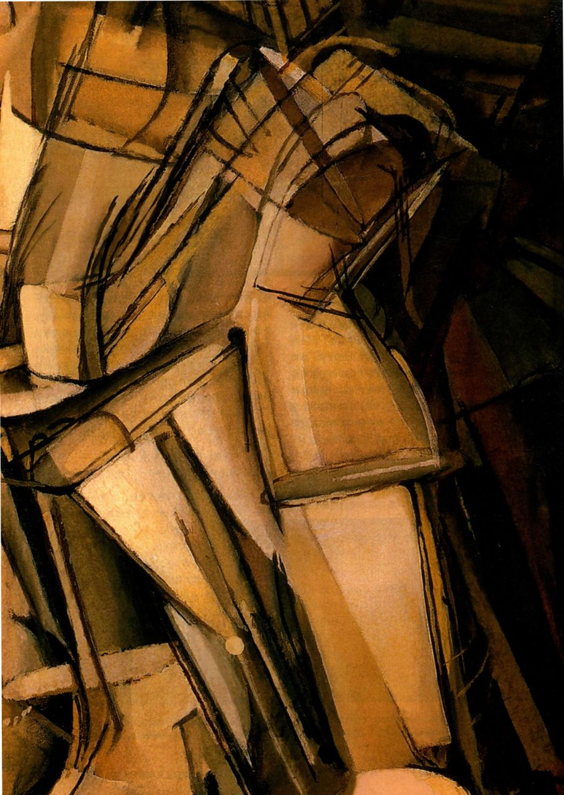

*图27.30 细部，马塞尔·杜尚《下楼梯的裸体，2号》*

# 第二十七章 走向抽象：现代主义革命，1904-1914年

将20世纪的最初几年看作整体现代化时期，当时传统的观念与价值观一去不返，仿佛已经过时淘汰，此说貌似有理，但现实情况要复杂得多。令人震惊的科学发现与新生活方式完全改变了大部分西方工业化地区居民的日常生活。与此同时，传统的价值观与思维习惯依旧存在。20世纪早期文化的特征之一就是对于传统与创新之间竞争的协调。通过结合革命性的新事物与日常事物，一个新型社会形成了。

在政治舞台上，帝国主义继续刺激着民族主义野心，并促进经济增长。这两个因素的结合使得西方世界拥有了强大的军事、工业力量，但这也是另一个巨大缺陷的根源。狂热的民族主义让很多人带有狭隘的爱国主义情感，或称“沙文主义”，使政治、种族、经济和宗教上的差异日益尖锐起来。当然，也有很多人排斥这样的理念，转而接受了启蒙运动所产生的自由主义，将个人的重要性提升到国家之上。但是当强化的民族主义以及随之而来的帝国主义最终压倒一切，在1914年第一次世界大战爆发时达到顶点。在这场战争中，欧洲的大部分国家与德国、保加利亚、奥匈帝国和土耳其展开对抗（见地图27.1）。那是一场浩劫，彻底改变了西方文化的初始构想与雄心。

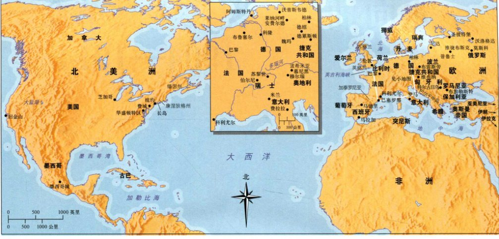

*地图27.1 欧洲与北美：1904-1914年*

科学进步清晰地揭示了传统与创新之间的相互影响。20世纪之初，科学家们认识到牛顿的物理学只能部分地解释原子的性质。所以物理学家们力图理解牛顿原理在哪些方面能够成功地预测原子的结构与活动，在哪些方面则无效。马克斯·普朗克（Max Planck，1858-1947年）的实验带来了重大突破，他在1900年证明能量与物质不可分。他还表明成束的量子能够发射和吸收能量，从而否定了能量以守恒形式存在的观念。于是，能量与物质从此之后就处于持续的流动之中，这一概念还与1902年欧内斯特·卢瑟福（Ernest Rutherford，1871-1937年）发现辐射能相关。1913年，原子本身得到了进一步的重新界定，尼尔斯·玻尔（Niels Bohr，1885-1962年）宣布原子由质子和中子构成。但是，对传统物理学最重大的突破由艾尔伯特·爱因斯坦（Albert Einstein，1879-1955年）提出。爱因斯坦革命性的设想从1905年到1916年陆续以论文形式发表，其中包含了他的相对论。该理论认为时间、空间和运动不是固定的，而是彼此相关，特别是与观察者自己的位置有关。牛顿物理世界的秩序基于能量与物质保持稳定的概念之上，现在却被一种更为复杂、更为偶然的宇宙观所取代。

相似的观念还出现在与人类行为相关的哲学与心理学领域。法国哲学家亨利·伯格森（Henri Bergson，1859-1941年）在20世纪早期具有极大的影响力，就连普通民众都仰慕其名。伯格森主张，人们对生活的体验不是一系列持续理性的时刻，而是凭直觉感受到的随机记忆与知觉，人们将其拼凑起来从而形成观念。因此，这个世界其实是复杂破碎的，或者像哈佛哲学家兼心理学家威廉·詹姆斯（William James，1842-1910年）独立发展出与伯格森相类似的理论，认为一片“轰隆的混沌”。只有知觉能够超越这种混沌。按照伯格森的理论，精神是纯粹的能量，是“生命冲动”（élan vital），能够穿透所有事物的本质。当伯格森在哲学上重新界定意识之时，奥地利精神病学家与精神分析学的奠基者西格蒙德·弗洛伊德（1856-1939年）则通过门诊实践中的观察，继续提炼他关于无意识的观点。弗洛伊德认为门诊观察所得的结果能够为他的结论提供科学基础。尽管方法不同，但他同样发展出人类意识破裂矛盾的理论模式。

艺术家们采取了类似的调查路线，检测与新观念相反的传统艺术创作方式。正如上文提及的哲学家和科学家一样，他们也运用多样的尺度来衡量其成功。诸如帕布罗·毕加索和乔治·勃拉克等艺术家效仿科学家的做法，将画室看作实验室。他们寻求一种全新的视觉感知模式，其中每一个创造、革新都是下一步发展的基石。而意大利未来主义艺术家则对现代性表示欢迎，运用毕加索和勃拉克的激进风格来捕捉现代世界的科技奇迹与新的心理状态。然而，德国表现主义艺术家却在为现代性冰冷、非人的趋向与粗鲁的物质主义寻找解毒剂。他们继承高更在与自然融合的原始世界中追求心灵平和，许多艺术家都转向了更为直接抽象的部落艺术、儿童艺术、民间艺术和中世纪艺术。其中很多人还受到通神论的强烈影响，信仰万事万物之间的神秘交感，并力图在艺术与建筑中捕捉这一点。对于追求精神视觉化的艺术家而言，本质就是抽象，这种直观的新艺术方法是最好的工具。

## 野兽派

野兽派（Fauvism）是20世纪出现的第一个重要风格，其兴起可归入色彩主义传统的一部分，该传统可以沿凡高、高更、莫奈、德拉克洛瓦等人向上追溯到提香和威尼斯画派。然而野兽派画家将色彩的自由表达带上了新高度。凡高和高更对野兽派艺术家的影响最大，这在亨利·马蒂斯（Henri Matisse，1869-1954年）和安德烈·德兰（André Derain，1880-1954年）的作品中显而易见。马蒂斯深谙他所对抗的美学传统，他曾在古斯塔夫·莫罗的画室中接受训练，并在美术学院的体系中接受过最为苛刻的学院派艺术教育。他理解自己深入并背离传统已经到达了何等程度。1905年，马蒂斯的最新作品在秋季沙龙（Salon d'Automne）展出，这是一个对先锋艺术家而言十分重要的展览场所。由于世纪之交时巴黎先锋艺术展览的数量激增，作为经评审挑选的秋季沙龙就享有特殊的地位，评论家们期望在这里看到最为优秀的新作。然而几乎没有任何评论家或观众对他们在1905年秋季沙龙上看到的作品有心理准备。

这一年，马蒂斯不仅超越了他师从莫罗时所受的传统教育，还超越了19世纪90年代的印象主义阶段、塞尚时期，甚至最终超越了新印象主义阶段。马蒂斯受到后印象主义者将色彩作为形式与表现的目标的强烈影响，但他在色彩的独立作用方面走得更远。马蒂斯的实验在某些人眼中太过激进，在秋季沙龙上，艺术评论家路易·沃塞勒（Louis Vauxcelles）因马蒂斯、德兰等人作品中“放纵的纯色”而无比震惊，宣称这些绘画是“野兽”（fauves）。

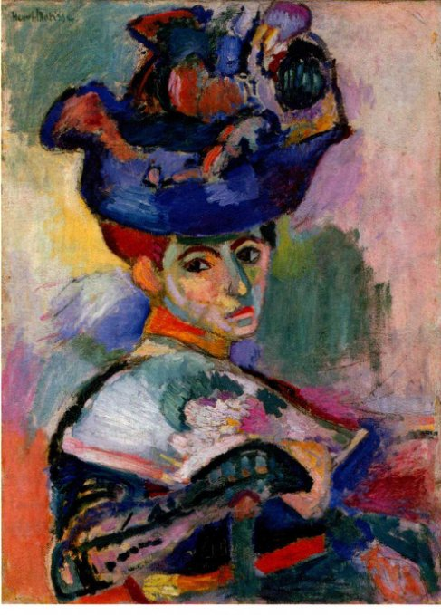

*图27.1 亨利·马蒂斯：《戴帽子的女人》。1905年。布面油画，80.6 × 59.7厘米。旧金山现代艺术博物馆，Elise S．Haas遗赠，91.161*

《戴帽子的女人》（The Woman with the Hat，图27.1）是1905年展出的经典野兽派作品。虽然作品的题材令人回想起色彩主义名家的肖像画传统，甚至可以追溯至维热-勒布伦、彼得·保罗·鲁本斯和提香等人，但马蒂斯的用色则具有全新意味。他用原色和间色来建构肖像，看起来仿佛直接将颜料从颜料管里挤在画布上一样。和塞尚的作品相同，颜料也暗示并否定着透视空间。背景飞溅着绿色、黄色、红色和蓝色，与前景里的人头与身体几乎处于同一个平面之中。前景与背景锁定在一起，就像一片连续、平坦的马赛克。马蒂斯省却了塞尚的结构与宏大感，通过平衡、强烈的互补色调保证了构图的连贯，这些色彩以貌似唐突自发的笔触涂抹在画布上。

通常艺术史家将野兽派作品归于表现主义名下，但是这种做法有待商榷，因为表现主义通常用于展示情感流溢的作品，大多具有饱受折磨、焦虑或痛苦的精神状态。尽管《戴帽子的女人》色彩奔放、笔触混乱，但是其中并不包括被描绘对象或者艺术家本人的心理状态。人物俨然是个支架，仅供设计练习之用，从而将色彩从自然主义或记录功能中释放出来。这一时期马蒂斯的风景画与静物画也有同样的特点。

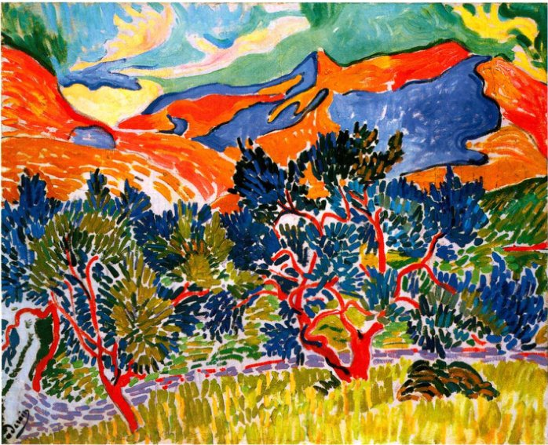

*图27.2 安德烈·德兰：《科利尤尔的山》。1905年。布面油画，81.3 × 100.3厘米。华盛顿国家美术馆，John Hay Whitney 收藏*

安德烈·德兰也将绘画理解为一种智识媒介，而非情感媒介。他的《科利尤尔的山》（Mountains at Collioure，图27.2）描绘了一座法国南部的小山，德兰曾于1905年在那里和马蒂斯一起作画。这幅作品与凡高能量充沛的笔触与高更的阿拉伯式图案有几分神似，但德兰并不愿意吸收先辈作品中的的精神性与原始主义。他的风景与马蒂斯的人物一样，只是欢乐色彩与平面设计间复杂游戏的载体。德兰的首要兴趣是图像创作的形式特性，即抽象的性质，同时特别强调以非再现性的方式来运用明亮的色彩。

野兽派从来都不是一个有组织的群体。被评论家称为“野兽派”的艺术家们很多从1900年以来就是朋友了，他们运用明亮的色彩作画。而在1905年秋季沙龙上一起展出作品则纯属偶然，但正是在这个展览上人们发现了其作品的相似之处。野兽派在1908年瓦解。对马蒂斯而言，野兽派只是艺术创作的又一阶段。正如他所写的那样，艺术“是让人解脱身体疲劳的精神安乐椅”。换而言之，马蒂斯寻求以抽象的方式来运用色彩，以优美、和平、宁静和感性的方式。

1905至1906年间，马蒂斯创作了《生活的欢乐》（Le Bonheur de Vivre，图27.3），从中可以看到作者正从野兽派中脱离出来。这幅作品不仅表现出德兰曲线形图案的影响，而且表明马蒂斯直接接触过高更的作品。事实上，高更的作品就存放在科利尤尔附近，马蒂斯还曾两度参观过。画面中的色彩鲜艳依旧，并不具有现实主义特征，但是色彩现在都被包容在优雅的阿拉伯式图案里。马蒂斯在此处最具创新性的一点就是抛弃了逻辑的空间与尺度，却提高了抽象的程度。一年以前马蒂斯与德兰的野兽派作品无论多么抽象、平面，仍然投射出一个合规律的空间渐进。现在空间从马蒂斯的作品里消失了，中景里两个斜倚着的庞大裸女即便并没有大过前景里的笛子吹奏者和拥吻的情人，至少也与其等大。人物消融于彼此，正如树木消融于天空和山丘，几乎无法分辨出什么在前，什么在后。现实让位于彩色线条与平面所构成的欢快、抽象的管弦乐，这种快乐主义情绪来自于皮维·德·夏凡纳所创作的舞蹈、激情与奏乐的古典田园生活场景。我们似乎见证了一幕原始的仪式或发生在史前的酒神节，那时人们仍和谐地与自然生活在一起。吹管、花环、牧人和具有希腊罗马感觉的裸体唤醒了久远的古典世界，而这正是普桑和克劳德等法国画家所期望的世界。

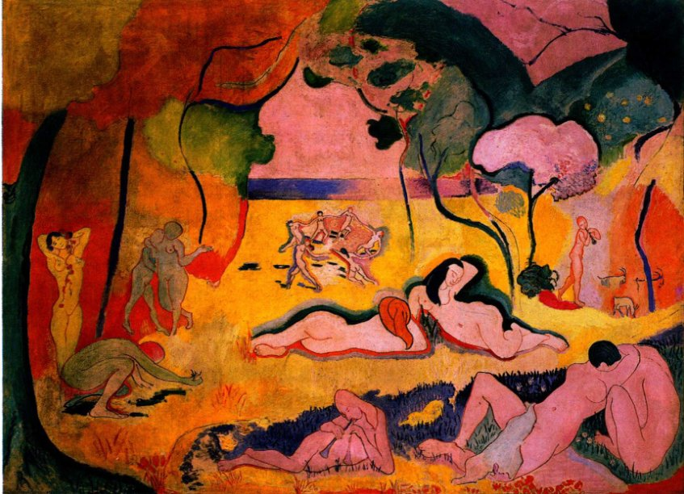

*图27.3 亨利·马蒂斯：《生活的欢乐》。1905-1906年。布面油画，1.73 × 2.38米。宾夕法尼亚州梅仁市（Merion）巴恩斯基金会（Barnes Foundation）*

由于色彩的强度，一般认为《生活的欢乐》是野兽派作品。然而到了1907年，马蒂斯的用色虽仍绚丽多彩，却柔和下来，变得感性、宁静，而非欢快、喧闹。这种新感受表现在1911年的《红色画室》（The Red Studio，图27.4）里。艺术家的画室是作品的题材，虽然仍旧是传统题材，但在马蒂斯的笔下具有了新的意义。一方面，画面中出现了常见事物，例如铅笔、排列成静物模样的画架，甚至几幅马蒂斯本人的作品；而另一方面，《红色画室》向观者提供了全新的视觉体验，艺术家操控着色彩与线条，从根本上重新界定了绘画空间。

正如标题所言，这幅画的基调是红色，宛若一面水平的窗影，蔓延在整幅画布之上。色调基本没有变化，但由于白色的线条，其间或变为地板、墙壁或桌布，之后又跳回了平面里，仿佛一片红色的阴影。勾勒出桌子、高背椅和墙壁的白色线条同时也暗示了缩进趋势，即透视空间；另一方面，图像的二维性也得以增强，马蒂斯没有使用着色线条，画面中出现的更像是细细的画布空隙，从画面之间穿过。红色是能够唤起人们高度感情的色彩，其迷人、豪华、感性且具有慰藉的效果，用有效的方式告诉我们这间画室温暖舒适，令人放松。墙上的绘画好像飘浮在红色块上，表明自身是值得骄傲的成就。马蒂斯也用类似的手法突出了铅笔盒、盘子、花朵和椅子，这些个人用品对他而言一定非比寻常。只有抛弃传统的空间与体量的表现方式，即现实主义，马蒂斯才能够将画中的事物推向前方，使其如此地突出醒目。平涂的红色色块也让马蒂斯能够运用画作以及其他物体，创造出令人惊叹的切分节奏，由此产生的活力暗示了艺术的创造力，而正是这种创造力加强了画室内的安宁之感。

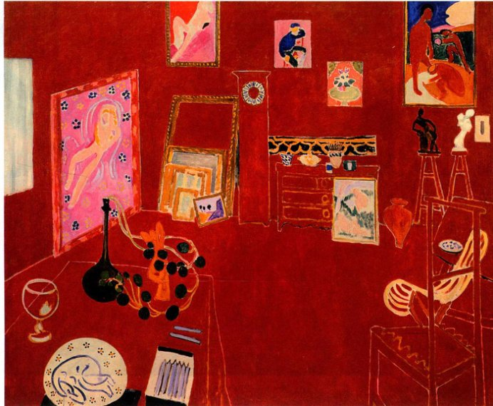

*图27.4 亨利·马蒂斯：《红色画室》。1911年。布面油画，1.81 x 2.19米。纽约现代艺术博物馆，H.Matisse Simon Guggenheim 基金*

> **大事年表**
>
> *   1905年 - 安德烈·德兰创作《科利尤尔的山》
> *   1905年 - 评论家路易·沃塞勒命名野兽派
> *   1907年 - 亨利·伯格森出版《创造的进化》
> *   1911年 - 亨利·马蒂斯创作《红色画室》
> *   1913年 - 马塞尔·普鲁斯特出版《追忆似水年华》第一卷《在斯万家这边》

## 立体主义

20世纪出现的第二个重要风格是立体主义（Cubism），主要在帕布罗·毕加索和乔治·勃拉克的影响下形成。立体主义是对艺术传统与可能性的分析，也是艺术创作的方法，鼓舞关于艺术表象甚至艺术目的的新思维方式。立体主义的形成过程十分漫长，但是恰恰是以上两位艺术家均充分吸收了后印象主义与野兽派的经验之后。在塞尚、德兰和马蒂斯之后，毕加索是扩展抽象领域的第一人。

### 传统的折射与粉碎：《阿维尼翁少女》

毕加索（Pablo Picasso，1881-1973年）出生在地中海沿岸的西班牙城市马拉加，他的父亲是一位画家，最初指导其开始艺术创作。15岁时，毕加索前往巴塞罗那，继续在美术学院学习，并很快就成为巴塞罗那艺术圈中的重要人物，当时其创作也以象征主义风格为主。在将近四年的时间里，毕加索奔波往返于巴塞罗那和巴黎之间，过着绝望、无助的生活。之后他定居巴黎，搬入了蒙马特尔区一幢破旧的房子，称为“洗衣船”（bateau-lavoir），位于蒙马特尔这座俯瞰巴黎的小丘之上。这个城区是贫困文艺先锋的汇聚中心，毕加索很快就成为核心小组的一员，成员还包括作家马克斯·雅各布（Max Jacob，1876-1944年）和纪尧姆·阿波利奈尔（Guillaume Apollinaire，1880-1918年）。1907年，毕加索在画室展示了《阿维尼翁少女》（Les Demoiselles d'Avignon，图27.5），即使其最亲近的同伴也震惊不已。这幅作品的风格与毕加索之前的作品截然不同。在当时人看来，这幅巨大、恐怖的画作简直就是无中生有。

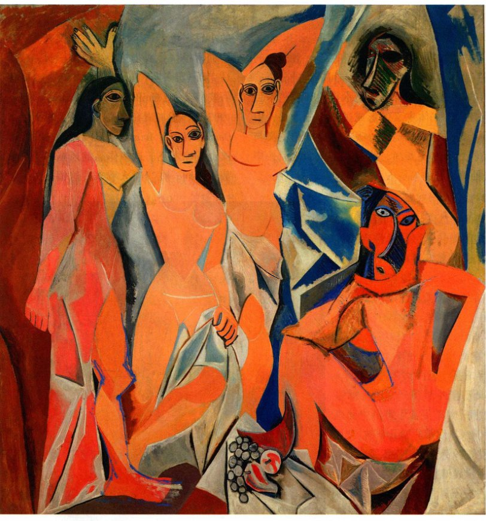

*图27.5 帕布罗·毕加索：《阿维尼翁少女》。1907年。布面油画，2.44x2.34米。纽约现代艺术博物馆，Lillie P．Bliss遗赠*

《阿维尼翁少女》自然不是产生于美学的真空，毕加索借鉴了17、18世纪法国最伟大的历史画作。他为该作品所选的画布尺寸大小，与为传统沙龙所作的绘画尺寸相当。另外的影响则来自马蒂斯，毕加索与其一直都保持着友善的竞争关系，直到年长的马蒂斯在1954年去世。就《阿维尼翁少女》而言，可以看作是毕加索对马蒂斯《生活的欢乐》中空间的模糊性的回应，甚至一种竞争。然而这些艺术来源对于参观毕加索画室的人来说并不明显，因此《阿维尼翁少女》最初激怒了马蒂斯以及其他艺术家。但一旦真正理解了这幅作品，就可以为无数艺术家提供灵感。

这幅作品标题指的是巴塞罗那红灯区。作家较早的习作中已经出现了妓院里的水手形象，他坐在摆着一盘水果的桌前，为妓女所环绕。现在的作品中水手消失了，但仍是原先的题材，观者处于水手所坐的位置，面前放着自古就象征着纵欲的水果。出现在妓院帘幕前，并紧紧盯着我们的五位人物是有史以来最为野蛮反叛的裸体形象。从题材上来看，这幅作品起初是典型的象征主义绘画，主题是男性的纵欲和令人意志消沉的女性。在这一点上，《阿维尼翁少女》表现了19世纪晚期艺术与文学中流行的荡妇题材，同时还代表毕加索个人对女性的矛盾情绪及其对性病的恐惧。

然而毕加索并没有以绘画叙事的传统形式来讲述故事，而是让绘画的抽象性成为自己的代言人。画面的形式野蛮且充满威胁感，空间全无连贯和谐之感，完全无法解读。整幅图像以无数玻璃碎片构成，其相互叠加的方式也让人不可理解。形式没有隐退到空间里，而是飘浮在绘画平面的表面，彼此冲撞。有些图像被涂上了阴影，例如右部分开帘幕的妓女的钻石形乳房。但是毕加索却反转了阴影，事实上将乳房从身体上分离出来。更令人不解是坐在她脚下的人物，其后背和面孔同时正对观众。放水果桌子的倾斜角度就连塞尚都会感到震惊。塞尚曾为这种空间扭曲提供了最直接的原型，这也是1907年巴黎一次塞尚回顾展的题材。翘起的西瓜形状险恶，奠定了画面的尖锐基调；而且其毫不避讳以勃起生殖器的形状呈现，这也表现出画作的主题与性有关。

在同一画面中运用对立风格则是该作品又一令人困扰的特性。左部的三个裸女具有杏仁形的眼睛，面部表情严峻，这里的灵感来自古代伊比利亚半岛的雕塑，毕加索本人曾经收集过这些艺术品。但是右部两张令人惊恐的面孔则截然不同。据传言，在毕加索创作到这一部分的时候，其野兽派友人带他参观过特罗卡代罗宫（Trocadéro）的民族艺术博物馆，毕加索在那里见到了非洲面具，这些面具后来成为高台滑雪道式的鼻子、面部割痕与不对称双眼的灵感来源。这种说法似乎相当合理，马蒂斯和德兰当时已经在收藏非洲艺术品，而毕加索与马蒂斯自1905年以来就彼此相识。在非洲雕刻上可以找到毕加索灵感的直接来源，这些面具的抽象性质与“野蛮主义”必定对艺术家具有强烈吸引力（见本页的艺术史家的观点）。

毕加索坚决否认受黑人艺术（art nègre）的影响，黑人艺术是当时人们对非洲艺术的称呼，然而他本人不久之后就开始收藏非洲艺术品。毫无疑问，艺术史家发现，在20世纪90年代早期，毕加索的艺术素材主要可能来自于他本人的想象。在他的速写簿中，某些乱画的图像出现在他遭遇非洲艺术之前，例如标志阴影的条纹画痕等。蹲伏女子的头部实际上是机智地将女性的躯干变形为人脸，“视觉双关”在毕加索的作品里很常见。但是考虑到毕加索与野兽派艺术家的友谊，难以想象他居然在完成这幅作品之前，没有听说抑或没有参观过特罗卡代罗宫的博物馆。

除艺术素材之外，不可否认的是毕加索四处搜寻灵感的意愿，其视野之内包括自己所画的非洲面具的漫画，虽然当时这些面具被认为是工艺品而不是艺术品；毕加索还参照了希腊古典雕塑，在这幅作品中以大型裸体传统表现出来，与马蒂斯在《生活的欢乐》中对该传统的表现截然不同。但是《阿维尼翁少女》中最为重要的是其所表现的新自由——现在线条、平面、色彩、形体和空白都从模仿再现的角色中解放出来，具有了属于其自身的生命。这幅作品奠定了分析立体主义的基础。

> **艺术史家的观点：原始的神话**
>
> 最近20年以来，艺术史家们批判地研究了西方艺术家从非西方艺术中借鉴题材与形式的做法。这种方式被称为原始主义（Primitivism），引发出许多复杂的问题。由于美学、乃至意识形态方面的原因，现代艺术家受到非西方艺术作品的吸引。从美学角度出发，先锋艺术家将这些作品视为摆脱西方艺术传统影响的手段，特别是摆脱希腊罗马的传统。非西方艺术品在构想形式与空间方面非常另类，所以艺术家们热衷于研究、收藏，甚至效仿这些作品。在意识形态层面，对非西方文化的着迷可以看作让-雅克·卢梭18世纪“高贵的野蛮人”观念的衍生品。这种观点认为未经工业化的非西方土著民族虽然文明程度较低，但更为“自然”，较之生活在城市的西方欧洲民族，其与自然的接触更多，能够更为直接地表达自身情感、性欲和宗教信仰。很多西方艺术家蓄意模仿这些文化，形成了所谓原始主义的西方化风格，以赋予作品活力，并寻找关于美的古老标准的替代品。很多人都认为原有的准则已然失去活力，无关紧要了。
>
> 帕布罗·毕加索和恩斯特·路德维希·基希纳就属于众多追寻原始主义的欧洲现代主义者之列，两人都收集非洲和大洋洲艺术品，并从中汲取灵感。然而，在欧洲艺术家接触非洲和大洋洲艺术之前，他们首先转向农民文化寻找“原始”生活的景观。保罗·高更是将视角从国内转向国外的代表人物，他最初在法国布列塔尼省的农民文化中寻找原始主义灵感，表现在《布道后的幻象》（见图26.13）之中。之后他又远赴塔希提，创作了《我们从哪里来？我们是什么？我们往哪里去？》（见图26.14）。
>
> 农耕文化与以基本生存为基础的文化并不是原始主义的全部来源。以马蒂斯为例，他发明了平涂的装饰性图案，例如《红色画室》（见图27.4），这件作品的灵感来自于马蒂斯在北非伊斯兰地区的旅行，那个地区具有发达的贸易经济和中心城市。因此，“原始主义”一词用来指代对多种文化的借鉴，虽然它们之间几乎毫无关联，但在西方人的想象中却处于相同的地位。某些艺术家甚至关注儿童或者精神病人的作品，从中寻找原始主义素材。这些先锋艺术家们认为非西方艺术作品与儿童和精神病人的作品同样“原始”，这一观念表明人们普遍认为非西方文化粗野、不成熟、无理性，全然不考虑人类学家的研究，后者发现这些所谓的原始文化其实与西方文明一样复杂、深奥。
>
> 一般而言，当欧洲艺术家观赏非西方艺术时，他们并不按照欣赏自己文化艺术的方式去理解这些作品。由于20世纪早期进入欧洲的大批面具等雕刻实质上都是殖民主义的战利品，因此很多相关信息都已遗失。西方艺术家接触这些作品时并不知道创作者的姓名、形成这些作品的文化、其雕刻方式以及最初使用和观看的文化背景。
>
> 20世纪中期，反殖民主义运动发展得如火如荼，西方世界对非西方艺术、文化的态度显然有极大问题。爱德华·萨义德（Edward Said，1935-2003年）的著作《东方主义》（Orientalism，1978年）得以出版，标志着后殖民研究领域的成形。萨义德在书中指出，西方社会、特别是帝国主义社会将自身界定在其所统治社会的对立面。他以殖民主义文学为焦点，表明非西方社会被认为是未开化的野蛮社会，是西方社会先进、理性、慈善的对立面。萨义德的结论同样适用于对殖民地的视觉表现。最近20年间，艺术史家不仅触及了原始主义的美学内涵，还触及了其政治意味。

### 分析立体主义：毕加索和勃拉克

如果说《阿维尼翁少女》借鉴了塞尚井然有序、高度结构化的画作，这是难以置信的事情。但毕加索确实仔细研习过塞尚的晚期作品，并在其对体积与空间的抽象处理中找到了基础单元，并从中生发出多面形体，这就是“分析立体主义”（Analytic Cubism）。为了超越这一点，这位情绪化的西班牙艺术家需要一个对话者，一股稳定的力量，一个能与其讨论自己观念与试验的人。法国艺术家乔治·勃拉克（Georges Braque，1882-1963年）正是他的精神伙伴，并且就住在蒙马特尔，离毕加索画室不远。1908至1910年间，这两位艺术家相互扶持，二人的风格也从《阿维尼翁少女》这样由断裂的形式与空间所构成的再现性绘画，发展成为抽象线条与笔触所构成的朦胧幻象，正如勃拉克在1911年创作的《葡萄牙人》（The Portuguese，图27.6）那样。毕加索和勃拉克的关系非常纠缠，以致他们的风格从1910年开始融合在一起。

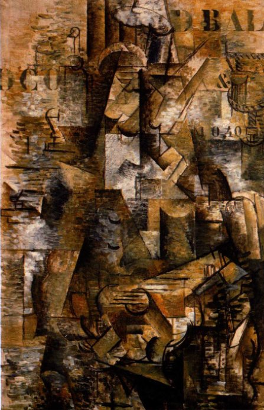

*图27.6 乔治·勃拉克：《葡萄牙人》，1911年。布面油画，116.5 × 81.6厘米。巴塞尔艺术博物馆，Raoul LaRoche于1952年捐赠*

1910年前后的《葡萄牙人》是分析立体主义的典范。《阿维尼翁少女》中的恐惧情感与混乱消失了，勃拉克依据画布的外形设置了线条构成的网格，并安排有对角线和曲线形成的秩序化几何图案，所有元素都令人回想起塞尚对于结构坚实世界的想象。然而，尽管是抽象作品，这些形体也代表着符号。画面下方中央的圆环是吉他的音孔，水平的线条则是琴弦，勃拉克还用水平线来代表手指，物体的混淆或者视觉双关是立体主义的特征。印制的字母与数字来自海报，很可能写的是“大舞会”（Grand Bal）和入场价格表（10法郎40分）。线条与阴影暗示着手臂、肩膀以及逐渐向上收缩的正面姿态人物。在人物背后挂着一幅海报，画面上方右部，可以看到窗户外的港湾。通过这些微妙的视觉线索，勃拉克暗示观众画面其实表现了一位马赛酒吧中的吉他演奏者。传统的题材再次出现，这是一幅风俗画，却以激进的新艺术语汇表现出来。弥漫在画面中并落在每个小面上的光线与空气看起来都是真实或者写实的，却无法创造出连贯的空间与体积。画面中的一切最终都处于流动状态之中，没有什么是绝对的，也包括对现实的单一解读。唯一的现实只是线条与色彩构成的绘画世界。在1909年勃拉克早期作品的展览中，曾创造出“野兽派”一词的评论家路易·沃塞勒将这些画作命名为“立体主义”。马蒂斯称早期立体主义作品似乎是由小方块构成的，正是这种说法影响了沃塞勒。之后，这一词汇就用来描述勃拉克和毕加索进行的分析试验。

### 综合立体主义：拼贴的力量

为了聚焦于结构与线条，毕加索和勃拉克绘制单色图像，希望借此将色彩问题剔除在分析立体主义之外。然而，这种情况在1912年发生了改变，他们开始采用拼贴（collage）手法，将多为纸片的平面图像粘贴在画布上。毕加索在1912年5月创作了最早的一批此类作品——他在画面上粘贴了一片印有藤椅图案的油布，通常此类材料都粘贴在木头上，是修缮破椅子的廉价方式。这种设计让毕加索得以将现实与虚幻的概念复杂化，因为藤椅既是真实也是虚幻的，这既是对藤椅的真实模仿，也是一幅表现藤椅的绘画。

毕加索与勃拉克立刻意识到这一大胆之举还有更为深刻的含意，粘贴的图像确实位于画布之上。马蒂斯一年之前曾在《红色画室》中发布过类似的宣言，他为作品揭幕时曾强调颜料是如何位于画布之上的。文艺复兴时期的观念认为绘画平面是一扇开向世界景象的窗户，然而在这里却被毅然地颠覆了。绘画平面不再是窗户，而成为呈现艺术的浅盘。艺术出现在画布之上，而不是画布之后，这是爱德华·马奈早在大约50年前就已经暗示过的事实。

拼贴彻底改变了勃拉克和毕加索创作图像的方式。艺术家不再拆散物体或者将其抽象为最基本的形式，而开始运用剪纸来综合地建构或安排物体，因此产生了“综合立体主义”（Synthetic Cubism）的称谓。利用大块平面形体来建构图像就意味着，可以在立体主义中引入多样化的质感与色彩，正如毕加索1912年的《吉他、乐谱和酒杯》（Guitar，Sheet Music，and Wine Glass，图27.7）中那样。因为音乐是抽象的，正如立体主义者的艺术一样，所以音乐成为其钟爱的题材，希望能够在绘画与音乐这两种艺术形式之间建立对等的关系。毕加索以真实的壁纸为背景，创作了这幅作品，正如他早期对藤椅油布的使用，壁纸在此处也是虚幻与现实的视觉双关。

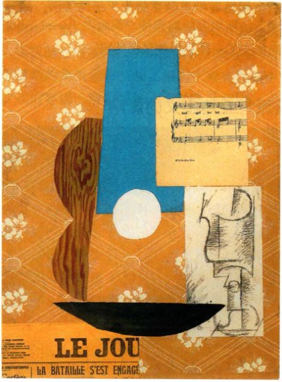

*图27.7 帕布罗·毕加索：《吉他、乐谱和酒杯》。1912年。木炭、水粉和贴纸，62.5 × 47厘米。得克萨斯州圣安东尼奥市迈克奈伊艺术学院（McNay Art Institute），Marion Koogler McNay 遗赠*

毕加索还会创作实体形式与不可触碰空间之间的双关。吉他的音孔本应是负空间，但此处却由实体的圆形纸片来表现，与分析立体主义素描中的酒杯照应。酒杯本应是立体、实在的，在此处却成为了画在米黄纸张上的线条，而纸张本身都比杯子的线描更有实体感。毕加索甚至直接告诉观众他意涉双关，因为他剪下一片报纸贴在画面底部，上面写着“LE JOU”，即报纸（Le Journal）一词的前半部分；其发音在法语中类似于动词“玩”（jouer）或名词“玩具”（jouet）。报纸上的标题是“Bataille s'est engagé(e)”，即“战斗开始了”，指当时席卷巴尔干半岛的激烈战争——希腊、塞尔维亚、保加利亚和黑山为争取独立而对抗奥斯曼帝国（见地图27.1）。毕加索借此表示他与勃拉克之间友好的竞争关系。而也有这样的可能，毕加索微妙地将自己平静的生活和中产阶级舒适生活方式的感官享乐，与巴尔干冲突所带来的可怕苦难进行对比，实际上在批评法国或中产阶级对东方悲剧的无动于衷。

毕加索将综合立体主义拓展到了雕塑领域，并创作了第一件装配各种材料形成的立体构成作品（construction），标志着立体主义在逻辑上发展到顶峰。虽然毕加索最早的构成作品出现于1912年，甚至有证据暗示勃拉克创作构成作品的年代更早，但是毕加索直到1914至1915年间才开始大批创作此类雕塑。其中大部分都是乐器，例如1915年的《小提琴》（Violin，图27.8）。毕加索并没有将纸片粘贴在画布上，而是将平面或略有弯曲的彩绘金属片装置成浅浮雕作品。之前他重新定义了绘画，现在又重新定义了雕塑。雕塑不再是经过雕刻、削凿或浇铸的作品，而是一种组装；与文艺复兴以来的大部分雕塑不同，此处的雕塑还是上色作品。毕加索使用颜料或许有几分讽刺意味，因为绘画中交叉的影线对雕塑而言是多此一举，立体形式不要求艺术家创作阴影幻觉。毕加索再一次创造了关于艺术媒介的双关。在不知道作品标题的情况下，观者不可能确认该作品表现的是小提琴。然而毫无疑问，毕加索更关注创造与音乐对等的视觉形式，在此处表现为形体、色彩与质感的断奏韵律，借此将每一片金属变形为我们几乎能够听到的活泼的音符。

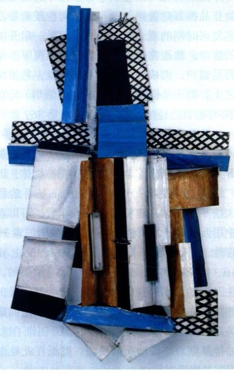

*图27.8 帕布罗·毕加索：《小提琴》。1915年。彩绘金属，95.3 × 65.1 × 19.1厘米。巴黎毕加索博物馆*

> **大事年表**
>
> *   1905年 - 艾尔伯特·爱因斯坦形成相对论
> *   1907年 - 帕布罗·毕加索创作《阿维尼翁少女》
> *   1911年 - 乔治·勃拉克创作《葡萄牙人》
> *   1913年 - 伊戈尔·斯特拉文斯基的芭蕾舞剧《春之祭》上演
> *   1914年 - 詹姆斯·乔伊斯出版《尤利西斯》

1914年第一次世界大战爆发，使得日常生活陷入混乱，也结束了毕加索和勃拉克之间精彩绝伦的视觉游戏。到那时为止，这两位艺术家已经完全改变了绘画与雕塑领域；通过颠覆“艺术形式能为何物”的观念，破坏了长达700年的传统。传统的再现透视空间系统被彻底粉碎，现在线条与色彩传达着形式或表现内容，不再服务于复制艺术家眼中的现实。

勃拉克和毕加索给我们对现实的感知带来了一场革命，与弗洛伊德和爱因斯坦的革命一样极端、彻底。音乐与文学也经历了相似的转型。例如俄国作曲家伊戈尔·斯特拉文斯基（Igor Stravinsky，1882-1971年）以其朴素节奏性芭蕾舞剧《春之祭》（The Rite of Spring）中的编曲改变了音乐。这出剧目于1913年在巴黎上演，但演出时观众发生骚乱，他们认为此剧难听至极。爱尔兰作家詹姆斯·乔伊斯（James Joyce）也在《尤利西斯》（Ulysses）中分解并重构了小说。他从1914年就开始写作这部作品，在其中打破了叙事的连续性，向观众呈现人物个性与心理的多个方面。

然而，与立体主义特别亲近的人物其实是作家格特鲁德·斯坦因（Gertrude Stein，1874-1946年），她与哥哥利奥·斯坦因（Leo Stein）收藏了一批令人震惊的毕加索和马蒂斯作品，并将之展示在巴黎的寓所中。斯坦因由于以下这种话语而闻名于世：“玫瑰是玫瑰是玫瑰是玫瑰（Rose is a rose is a rose is a rose）”，“善良产生红色，粗鲁产生快速、相同的问题；眼睛产生研究，选择产生痛苦的牲畜（Out of kindness comes redness and out of rudeness comes rapid same question, out of an eye comes research, out of selection comes painful cattle.）”。受到塞尚的启发，她的小说与诗歌具有意识流和片断性的抽象性质，希望以此唤起“纯粹存在的激动”。斯坦因的韵律性“词画”（word-painting）也和立体主义一样，拒绝任何绝对。

### 野兽派与立体主义的影响

马蒂斯和毕加索分别将色彩与线条从制造写实幻觉的功能中解放出来，标志着现代艺术发展的里程碑。他们的成就极具创新性，但两人在这些年间的兴趣与感性却有所局限。他们的作品都具有理性和知性的特点，并且悦人眼目，而作品的题材也集中于传统的静物、肖像与人物。两人还为关注其他兴趣与问题的艺术家提供了新的艺术语汇，这些艺术家运用新语言投射出强烈的情感、精神性以及现代性的强度。

## 德国表现主义

德国悠久的表现主义（Expressionism）传统可以回溯到马蒂亚斯·格吕内瓦尔德和阿尔布雷希特·丢勒这样的文艺复兴艺术家，其作品充满了古怪的形象，并极具心理张力。无论怎样，德国表现主义在1905年前后作为一个具有凝聚力的艺术运动浮现出来，尽管包含的问题与风格相当广泛，但其特点基本可以归纳为痛苦焦虑、残酷原始，或者充满激情与精神性，折射出基本的宇宙能量。

首次德国表现主义运动的先驱是保拉·莫德松-贝克（Paula Modersohn-Becker，1876-1907年），她在31岁时就离开了人世，艺术生涯非常短暂。她的艺术活动主要局限于成熟期的两年，然而其间创作的作品却着实令人赞叹，显示了才华横溢的未来发展趋势。1898年，莫德松-贝克定居在沃普斯韦德（Worpswede）区，这里是寻求逃离现代城市生活的艺术家和知识分子的天堂，位于德国北部的不来梅（Bremen）城外。她在那里与两位象征主义作家结交为友，分别是诗人雷纳·玛丽·里尔克（Rainer Maria Rilke，1875-1926年）和小说家卡尔·豪普特曼（Carl Hauptmann，1862-1946年），两人都极力督促莫德松-贝克在艺术中寻求精神性，摒弃自然主义风格。莫德松-贝克定期前往巴黎，在1905至1906年间，她受到高更和塞尚展出作品的极大影响。

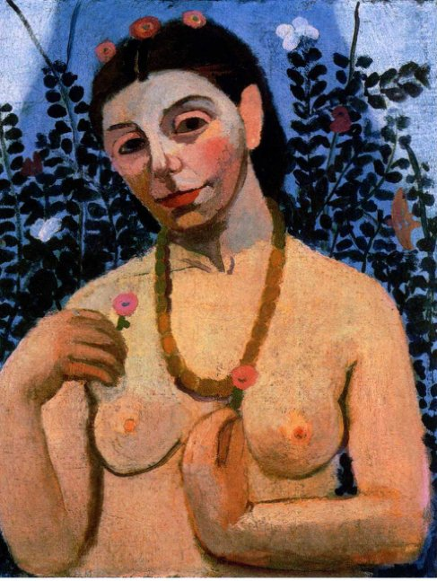

*图27.9 保拉·莫德松-贝克：《自画像》。1906年。布面油画，61 × 50.2厘米。瑞士巴塞尔艺术博物馆巴塞尔公共艺术收藏(Öffentliche Kunstsammlung Basel)*

莫德松-贝克1906年创作了《自画像》（Self-Portrait，图27.9），代表其个人风格正式形成。在这幅极具创新性的肖像画中，艺术家将自己表现为裸体。通过这种姿态，莫德松-贝克再次运用表现女性的裸体形式赋予其创新的生命力与力量，向被动的裸体维纳斯和浴女传统发起挑战，后者是自文艺复兴以来就持续流行的题材。艺术家将自己表现为繁殖力的象征，并采用了大地女神的形象。她绘制了自己的正面像，俨然一幅圣像，并将轮廓线缩减至高更式的简洁曲线。艺术家令人窘迫却充满魅力的姿态表现出原始主义特征，尤其令人回想起高更笔下的塔希提妇女，她的琥珀项链都好似花环一般。她突出展示了两朵小花，将其作为繁殖力的象征；花朵的颜色、形状则与艺术家的乳头类似。艺术家身处的花园同样象征多产。天蓝色的光环神化了她的形象，并增强了自然存在之感。该作品展现的是莫德松-贝克的德国原始主义风格，与高更的原始主义有本质不同。画面中渗透着极具教养的天然之感，反映在颜料的浓稠涂抹上，面具式的脸庞与脖子处更是如此；这一点还反映在令人敬畏的人物姿态之中，尤其是左手的姿势；在笨拙扁平的耳朵与右手粗糙的手指中也有对于此点的展现。尽管画面的色彩优美，但我们仍感受到一种天然原始的能量与质朴感，而这正是大部分德国表现主义作品的特征。

**桥社** 学者们普遍认为德国表现主义始于“桥社”（Die Brücke），这是在1903年构想出的一个艺术团体。当时包括恩斯特·路德维希·基希纳（Ernst Ludwig Kirchner，1880-1938年）和埃里希·赫克尔（Erich Heckel，1883-1970年）在内的四位德累斯顿建筑专业学生决定成立一个艺术联盟，“为德国的新艺术扫清道路”。1905年，这个团体正式成立，其公开目标就是进行反对“老旧既有势力”的艺术创作，创造通向未来的“桥梁”。与众多持进步论的德国人一样，他们的理想很大程度上受到了哲学家尼采（Friedrich Nietzsche，1844-1900年）的影响。在最著名的著述《查拉图斯特拉如是说》（Thus Spoke Zarathustra，1883-1900年）中，尼采呼吁“超人”（Übermensch）的出现，指年轻的高贵人士，具有超越常人的智力、勇气、刚毅、创造力与美。这类人将统治低层大众，后者则安全地聚集在受到传统限制的过去。这个意志坚强的超人将负责领导世界进入充满新观念的光辉未来。

桥社中大多自学成材的艺术家共用一间画室，这里曾是一家肉铺；他们面临的首要问题是找到想表现的主题与表达方式。他们最初关注现代德国人混乱不安的心理状态，并运用强烈的色彩来表现这一点。桥社的领袖基希纳是第一位在艺术上达到成熟的艺术家，他在1907年前后就创作出了成熟作品，而1908年的《德累斯顿街头》（Street，Dresden，图27.10）就是其代表作。这个团体热爱凡高的艺术，不久后又着迷于马蒂斯的艺术，这反映在其作品中的野兽派用色上，色彩从其再现的功能中解放出来。爱德华·蒙克的影响也同样重要，蒙克的作品曾在德国各处展出，而他本人也在1892年之后定居柏林。基希纳作品中令人烦扰的心理基调和错综的图案无疑是蒙克式的，那人头攒动的街头景象唤起了相当于蒙克作品中幽闭恐惧症式的焦虑。与蒙克的大多数作品相同，这幅作品也聚焦于性对抗。鬼魂般的女人看向画面之外，黄衣女人则提起她的裙子，露出衬裙。灼热的粉色、黄色和桔色与令人震动的蓝绿色调形成鲜明对比，创造出令人烦扰不安的不和谐音与性兴奋。永远不会与马蒂斯的画作混淆。

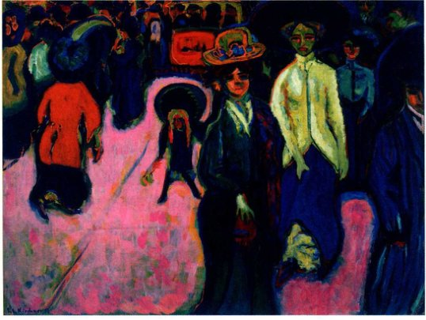

*图27.10 恩斯特·路德维希·基希纳：《德累斯顿街头》。1908年（画上落款1907年）。布面油画，1.51 x 2米。纽约现代艺术博物馆*

1906年，柏林艺术家埃米尔·诺尔德（Emil Nolde，1867-1956年）在德累斯顿的阿尔诺德画廊（Galerie Arnold）举办了个人画展。桥社艺术家为诺尔德有力的用色所吸引，于是邀请诺尔德加入自己的团体。诺尔德较其他成员年长一些，其与桥社的关系也只维持了一年，因为他偏好沉思的气质与高度个人化的风格确实与该团体的集体使命不太融洽。然而他对强烈情感与色彩的专注与桥社的艺术方向基本一致，这个方向也部分出于诺尔德对桥社的影响。1909年大病初愈之后，诺尔德创作了一系列宗教作品，其中包括《最后的晚餐》（The Last Supper，图27.11）。他声称，在这幅作品里“追随了表现深刻的精神性、信仰与柔情的不可遏制的欲望”。该作品是在激动情绪中创作的，几天之内就得以完成，表达了艺术家的个人情感，也表达着耶稣及其门徒的情感。诺尔德让画面中布满了人物，将他们挤压进绘画平面，让他们的强烈情感转移到观众身上。昏暗而充满精神性的红色是作品的主导色，与其互补色绿色形成对照，其间又饰以黄色和蓝色，让画面看来似乎正因情感而燃烧。诺尔德以一种粗鲁的方式用大胆厚涂的颜料建构了人物的面庞与身体，这种效果在复制品中很难看到。刺目、生硬的形式偶尔还出现在下颚与鼻子上，色彩图案具有锯齿状的边缘，例如前景中人物的头发。

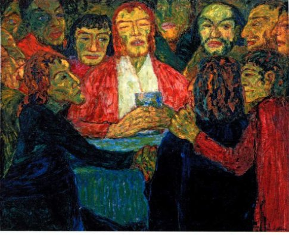

*图27.11 埃米尔·诺尔德：《最后的晚餐》。1909年。布面油画，82.6 × 106厘米。哥本哈根国家博物馆，Kunst Wvz Urban 316*

乍看之下人物的面孔仿佛面具，几近怪诞。但这并不是恩索尔式的面具，或者说其根本不是面具。扭曲变形与不协调的姿势既有造型性，又有涂绘性，强调该场面的力度。人物形象的生涩感增强了直接的情感力量。这也使得画面中的人物更具人性和世俗感，颇为矛盾地给人以更为真实的感觉，尽管绘制手法仍具有草图性。在艺术生涯的这个阶段，诺尔德会定期参观柏林的民俗艺术博物馆，学习那里部族工艺品中的精神性与情感主义。在此处参观者能够感受到诺尔德采用了这些工艺品中的抽象与真率，并力图以此来创造类似的强烈心理效果。

后来桥社的成员逐渐扩展到8、9位，但是到1909年，他们相继迁居柏林。这些艺术家在柏林发现了一个更为成熟的艺术舞台，由赫尔瓦特·瓦尔登（Herwarth Walden，1879-1941年）的先锋艺术杂志《狂飙》（Der Sturm）所统领。《狂飙》创刊于1910年，瓦尔登将其中的观念拓展到1911年成立的画廊。同年底，桥社中的所有艺术家都重新定位了自己的艺术，虽然该团体于1913年最终解散。在印象主义的强烈影响下，其风格也开始发生改变。其中大多数艺术家放弃了蒙克与青年风格（德国的新艺术风格）的起伏轮廓，转而接受断裂的平面性与几何线性形式。

将近1910年时，出现了一种新风格，表现在埃里希·赫克尔1915年的《水晶天》（A Crystal Day，图27.12）里。虽然桥社艺术家仍保持着立体主义的线性面貌，但其普遍运用线条来创造心理张力，而非复杂的画性空间。在这幅作品里，赫克尔使用立体主义的线条与断裂的空间来描绘抽象、普遍的观念。基希纳表现了现代性的虚弱心理与道德沦丧，而赫克尔则提供了一针解毒剂，以一种卢梭式的基本甚至原始的方式与自然及其宇宙能量相统一。在《水晶天》中，赫克尔通过彩色线条的能量捕捉到宇宙的力量，表现天空与湖泊的部分尤为如此，看上去仿佛抽象的立体主义作品。相似的对称锯齿在画面中反复出现，被锁定为一片致密的镶嵌画。即使是角落处的人物也被缩减为简洁的形式，令人朦胧地联想到桥社艺术家极其赞赏的非洲雕塑，这个人物也被编织到表现地面的线条之中。赫克尔让我们感受到一股无处不在的生命力在大自然里汹涌澎湃，将万物联结在一起。

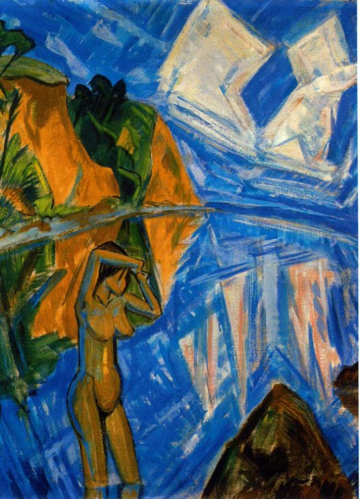

*图27.12 埃里希·赫克尔：《水晶天》。1913年。布面油画，120 × 96厘米。慕尼黑现代绘画馆（Pinakothek der Moderne），柏林Max Kruss 收藏出借*

桥社艺术家渴望创造民族艺术，于是复兴了木刻版画印刷技法，这是文艺复兴早期德国艺术家青睐的艺术形式（见本页的材料与技法）。其生涩的特点为这种技法增添了些许抽象成分，人们能够感受到木材的纹理，这不仅让图像醒目、尖锐，而且赋予其世俗与生命之感。这些特质在基希纳1915年的《彼得·施勒密尔：爱的磨难》（Peter Schlemihl：Tribulations of Love，图27.13）中清晰可见，这幅作品是作者为阿德贝尔德·冯·沙米索（Adelbert von Chamisso，1781-1838年）的散文故事《彼得·施勒密尔传奇》（Peter Schlemihl's Wondrous History，1814年）所作的系列插图之一，这部书讲述了一个男人为了一罐金子而出卖影子（即灵魂）的故事。基希纳的彩色木刻展现了立体主义所运用的暧昧空间，以此来投射不可见的头脑内部活动，随后将之与再现性的世界叠加在一起。观者在此处看到一个男人，他旁边就是自己性心理冲突的显现。画面中的空间错位，形体边缘破裂、尖锐，构图混乱不堪，充满激情的紫红色与冰冷忧郁的蓝色都是能够唤起内心情感的色彩，所有这些抽象的特征使得图像令观众不安、痛苦。基希纳与赫克尔一样，表现出桥社对非洲雕塑的依赖，在男人面部的尖锐折角与刻面上特别明显，然而这里运用以上手法的目的则在于赋予形象野蛮的粗糙感。

> **材料与技法：德国表现主义木刻版画**
>
> 15世纪和16世纪一些最著名的欧洲艺术家都会运用木刻来进行版画创作，但在19世纪早期，这种方法因木版雕刻、石版印刷等商业印刷技术的出现而衰落。这些技术所印制的图像具有丰富的细节，而且操作迅捷，能够大批量生产。但是在19世纪晚期，欧洲艺术家与雕刻家重新将木刻作为一种珍贵的艺术媒介，因为木刻能够产生天然、质朴的图像，与现代图像复制技术的熟练技巧形成鲜明对比。
>
> 日本的木刻版画是一系列设计师、木版工人和印刷工人所创造的精品，19世纪中期的欧洲人热衷于收藏这些作品。19世纪90年代，爱德华·蒙克与保罗·高更重新发明了另一种差异极大的木版印刷形式，即木刻版画。德国表现主义艺术家恩斯特·路德维希·基希纳（见图27.13）以及20世纪早期的凯特·珂勒惠支都曾运用这种方法来进行创作。他们简洁的手工工艺造就了扁平、简化的形体，极具平面性，并能引发强烈的情感张力。日本版画的制作特点是劳动分工，阿尔布雷希特·丢勒等北欧文艺复兴时期的艺术家在创作版画时也是如此。但是现代艺术家却独自一人完成设计、切割与印刷等工序，因此能够在木材纹理中发现其表现性特质；然而这一点事先无法预料，只有在雕刻过程中才会显现出来。蒙克发明了一种极具影响力的技法：先将木块切割为窄小的木条，单独上色之后再组装印刷，这样就能一次印出多色版画。插图27.13中基希纳的木刻版画就是由两块木版印刷而成。
>
> 尽管这些艺术家创作的许多版画作品都好像自发或者看似偶然，但实际上均是深思熟虑的结果：木版的切割方式必须能够保证木材表面保留着浮雕图案，之后经过墨印，才能产生出想要的图像。这里决不能犯错，艺术家不仅必须计划出正负空间，还要反转他想制作的图像，因为一旦交付印刷，所产生的图像就是原初木版设计的镜像。

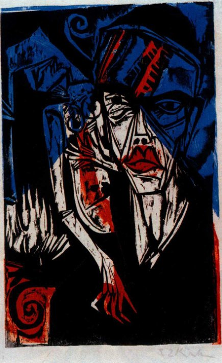

*图27.13 恩斯特·路德维希·基希纳：《彼得·施勒密尔：爱的磨难》。1915年。彩色木刻画、两块木板、布纹纸印制，33.3 × 21厘米。瑞士伯尔尼国家美术馆（National Gallery of Art）与布吕克博物馆（Brücke Museum），Karl Schmidt-Rottluff和 Emy Schmidt-Rottluff收藏*

**青骑士** “青骑士”（Der Blaue Reiter）是第二个重要的德国表现主义艺术团体，从德国南部的慕尼黑发展起来，持续的时间仅有4个月，从1910年12月至1911年3月。与桥社的成员一样，青骑士名下的艺术家们不仅从西方艺术史中汲取艺术形式，还在非西方艺术和民间艺术传统里寻找灵感，力图创造能够展现其怀疑现代工业生活观点的图像。这个团体致力于通过视觉图像来表现精神性，并认为精神性就存在于视觉世界的表象之下。

青骑士的关键人物是俄国艺术家瓦西里·康定斯基（Vasily Kandinsky，1866-1944年）。他1896年离开莫斯科，前往慕尼黑学习艺术，并将俄国的影响也带到了那里，即俄国宗教圣像的精神与民间艺术强健且充满情感的色彩。康定斯基对民间文化的兴趣于1908年再度燃起，于是当年就和画家加布里埃尔·穆特（Gabriele Münter，1877-1962年）迁至穆尔瑙（Murnau），位于巴伐利亚州阿尔卑斯山区慕尼黑以南的地区。康定斯基沉浸在此处的文化之中，深受其装饰与玻璃绘画的直接性和强烈色彩的感染，于是他与穆特都采纳了玻璃画的形式。这两位艺术家也曾在慕尼黑附近的施瓦宾（Schwabing）生活过，那是一片波希米亚风格的聚居地，咖啡馆众多，弥漫着自由主义气息。这一地区是探寻精神性和玄秘事物的温床，而通神论则是人们的日常话题。一种神秘的通神论在20世纪早期吸引了大批追随者，通神论提倡通过冥想与秘传来达到某种精神境界。康定斯基拥有德国哲学家鲁道夫·史坦纳（Rudolf Steiner，1861-1925年）的著述《神智学》（Theosophie），并于1908年在柏林聆听了他的神智学讲座。部分出于史坦纳观念的启发，康定斯基在1910年撰写了《论艺术中的精神》（Concerning the Spiritual in Art），并于次年出版，赢得了全世界读者的好评。他在书中主张必须以绘画的方式记录下个人与宇宙之间的联系，并运用抽象的语汇，其功能如同音乐，描绘着精神的抽象性质。

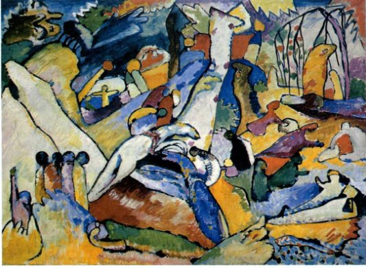

*图27.14 瓦西里·康定斯基：《构图二号，草图》。1910年。布面油画，97.8 x 130.5厘米。纽约古根海姆博物馆，45.961*

虽然谈及抽象时辞令雄辩，但康定斯基并不愿意放弃再现图像，担心观众无法理解他的作品。创作于1910年的《构图二号，草图》（Sketch for "Composition II"，图27.14）就显示了这种犹疑。这幅作品貌似抽象，但其中充满了可辨识的图像，包括人物、山峦、海浪、树木、花朵、太阳，甚至俄国的洋葱形穹顶大教堂，大教堂穹顶缩减为小棍上的球体，与前景中的人物相仿。前景中央是两匹马，一白一青，马上坐着骑手。马匹与骑手是康定斯基作品的常见题材，通常认为是暗指艺术家本人及其偶像圣乔治。圣乔治是《圣经》里的屠龙者，康定斯基与他的类比说明艺术家也要为世界带来新的精神。康定斯基的用色具有民间艺术的节庆色彩，然而这幅作品也保持了当年穆尔瑙绘画的遗风，具有中世纪玻璃窗画似的深暗色调，尤其表现在暗示分割铅条的深色轮廓线上。画面左方队列的人物低下了头，增添了几许虔诚、乃至宗教性的感觉，而右部斜倚着欢快、生动的形体，暗示着古典的田园诗题材，令人回想起马蒂斯《生活的欢乐》。康定斯基的目标不只是描绘其情感、感觉或者某种精神状态，还要记录下其在自己体内所感受到的宇宙力量。

康定斯基总共创作了十套《构图》（Composition），到1911年时，这些作品完全走向了抽象，其中的《构图七号，草图一号》（Sketch I for "Composition VII"，图27.15）就是如此。该作品绘于1913年，是为一幅大型作品准备的无数预备习作之一。然而最终的作品只保留了习作中的某些构图元素，色彩却截然不同。康定斯基将自己的许多作品命名为“构图”、“即兴创作”和“音乐会”，在唤起宇宙能量与音乐般的抽象感方面，作者深受瓦格纳的影响。这些性质与惠斯勒抒情、精美的图像迥然不同，虽然后者也同样渴望创造视觉音乐。马匹、骑手、人物、建筑和特定的风景题材都消失了，取而代之的是色彩、线条与形式的抽象交响。图像似乎混乱，还具有启示性，但是这些充满活力的特质旨在捕捉永恒的宇宙能量，而非预示灾难性的未来。

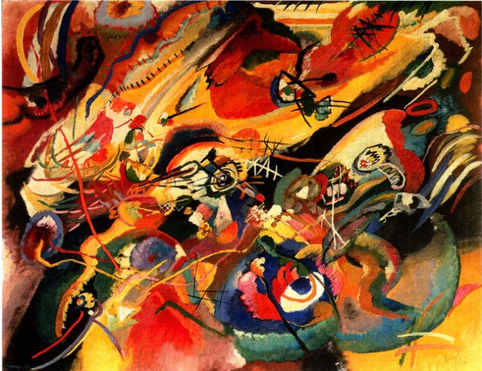

*图27.15 瓦西里·康定斯基：《构图七号，草图一号》。1913年。布面油画，78 × 100厘米。私人收藏*

在1910或1911年，弗朗茨·马尔克（Franz Marc，1880-1916年）结识了康定斯基，二者具有很多相同的目标，特别是在力图表现精神性方面。艺术家曾讨论过动物如何本能地与自然结合进而与宇宙融为一体。（这种信仰更加确定基对马匹与骑手题材的反复表现，该题材出现于1911年）。马尔克声称：“动物具有无瑕的生命感，激起我身上所有美好的东西。”这些话传达出当时艺术家共有的感受，他们相信西方工业化丧失了精神。直到1911年，马尔克一直在描绘写实为主的动物，将其紧密交织在风景之中。而到1913年，他开始运用立体主义手法来表现动物、自然与能量的本能交织，创作于1913年的《动物的命运》（The Fate of the Animals，图27.16）就是如此。

在这幅作品中，马尔克将立体主义的小块面变为充满活力的光线，似乎穿过一块不可见的神秘水晶而透射出来。马匹、狐狸和鹿的形象消解在充满精神性的闪光之中，与光线、乃至宇宙间的生命力结为一体。大难临头的末日感弥漫在画面之中，暗示着死亡或生命循环的终止。那时所有生物都会被吸入宇宙，完成其命运。马尔克在画布的反面写道：“所有生命在烈火中受苦”，表明精神救赎在所难免，而且动物具有接受这一过程的先天能力。马尔克采用了玻璃窗画式饱满深沉的色彩，意指神秘的启示，而在画面中闪过的虚幻光线更增强了作品的启示意味。

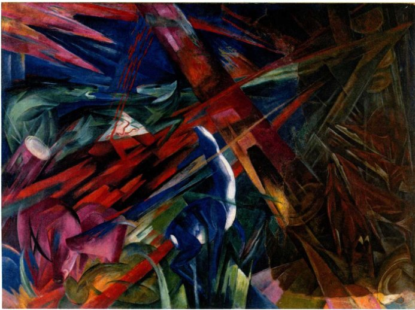

*图27.16 弗朗茨·马尔克：《动物的命运》或《树木展示年轮，动物展示动脉》。1913年。布面油画，1.94 × 2.62米。瑞士巴塞尔艺术博物馆巴塞尔公共艺术收藏，1739*

> **原始文献：瓦西里·康定斯基（1866-1944年）**
>
> 节选自《论艺术中的精神》
>
> 康定斯基希望通过他的艺术为现代人开启一个全新的精神时代。这些评论写于1912年。
>
> 如果让目光迷失在一片色彩之中，你会体验到两种东西。首先，你获得了一种“纯粹物理的效果”，即眼睛本身因美和色彩的其他性质而愉悦。你会体验到满足和快乐，正如美食家品尝佳肴，或者像被风味菜肴挑逗的舌头一样受到刺激。但是，之后其会平静、冷淡的像刚碰触过冰的手指。这些都是身体感觉，持续的时间有限。同时还相当肤浅，如果心灵关闭，其将不会留下持久的印象。
>
> 现在我们要谈论看到色彩的第二种结果——心理效果。色彩能够产生相应的精神共鸣，而物理印象只有在作为通向精神共鸣的阶段时才发挥作用······
>
> 一般而言，色彩直接影响灵魂。色彩是键盘，眼睛是音锤，灵魂则是牵有大量琴弦的钢琴。艺术家就是演奏的手，有目的地碰触某个键，以便引起灵魂的共鸣。
>
> 因此，最终色彩和谐必须依靠对与人类灵魂的刻意演奏。
>
> *SOURCE: CONCERNING THE SPIRITUAL IN ART BY VASILY KANDINSKY. TR. FRANCIS GOLFFING, MICHAEL HARRISON, FERDINAND OSTERTAG. (NY: WITTENBORN, SCHULTZ, 1947)*

青骑士在1912年解体，之前共举办过两次展览。首次展览于1911年12月在慕尼黑的塔恩豪瑟画廊（Galerie Thannhauser）举行，之后巡展德国各地，最终在柏林的狂飙画廊（Der Sturm Galerie）闭幕。参观展览的德国公众显然还没有准备好接受该团体的作品，这些表现自然的抽象图像令人震惊，尽管其再现了玻璃窗画和宗教圣像等传统艺术形式。第二次展览以展出纸上作品为主，在慕尼黑的一家书店里举行。可能《青骑士年鉴》（Der Blaue Reiter Almanac）比他们的展览更为重要，其中收录了成员的作品以及埃及艺术、哥特式艺术、亚洲艺术、部族艺术和民间艺术的复制图像。即便是儿童艺术也在这本年鉴里占有一席之地。伟大的调性作曲家兼通神论者阿诺德·勋伯格（Arnold Schönberg，1874-1951年）在年鉴里发表了一篇谈论音乐精神性的文章，增强了年鉴的折衷主义特色。勋伯格也是一位画家，同时还是青骑士的成员。事实上，这本年鉴是一本简明、直接、具有精神性的艺术目录，康定斯基和马尔克相信这样的艺术与宇宙连接在一起，具有与其相同的目标。

**保罗·克利** 在其漫长的艺术生涯中，瑞士画家保罗·克利（Paul Klee，1879-1940年）触及了《青骑士年鉴》里所表达的多种艺术元素。从严格意义上来说，克利融入青骑士的程度很低。他于1898年前往慕尼黑学习绘画，并在1906年定居于此。克利与康定斯基及其他青骑士成员的关系很好，他在欧洲各地旅行的过程中理解了表现主义等其他现代艺术运动，然而前往突尼斯的两周之旅对他而言则具有决定性意义。正如德拉克洛瓦和莫奈在上个世纪那样，北非明亮的光线与色彩征服了克利。到达突尼斯之后不久，他在日记中写道：“色彩抓住了我······这个幸福时刻的意义在于，色彩与我成为一体。我是一名色彩画家。”但是，与青骑士的关系对克利的艺术发展也同样重要，因为其艺术是对年鉴中所列艺术素材的最全面融合，特别是融合了儿童艺术、部族艺术和音乐。

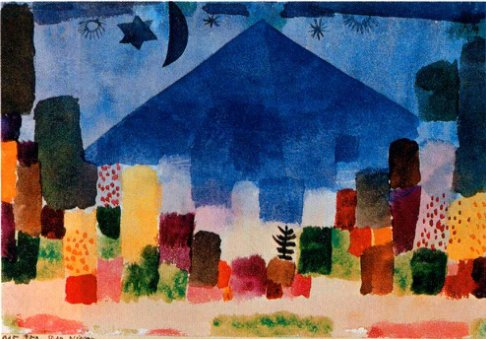

*图27.17 保罗·克利：《尼森山》。1915年。水彩画，18.1x24.1厘米。水彩颜料与铅笔，纸上作画。Hermann and Marguerite Rupf 基金会*

克利受突尼斯启发的色彩出现在1915年的作品《尼森山》（The Niesen，图27.17）里。该作品使用了立体主义的小格子，而运用色彩的抽象手法则令人联想到马蒂斯和康定斯基。图像反映出儿童艺术与民间艺术的直接与天真，同时也具有玻璃窗画般饱和发光的色彩，纸面的白色在透明的水彩色下闪闪发光，创造出鲜艳明亮的色彩效果。我们立刻就可以感受到作为该画基础的精神性，甚至可以重溯作者的脚步。三角形的尼森山在画面中占据主导位置，其岩石般坚硬的几何外形造就了持久、永恒之感，同时还反映了三角形在精神上所蕴含的通神论信仰，在众多事物之中代表与宇宙的神秘感应。夜晚天空中布满了宗教象征，例如犹太教的大卫王之星和伊斯兰教的新月，以及原始象形文字中的太阳。画面中唯一一棵树的枝条暗示着生命与所有生物，其节奏与上方星辰、日头所发散的光线相呼应，进一步通过尼森山联系在一起；而尼森山的外形则在地球万物与宇宙万物之间建立了纽带。

克利还运用了抽象的色彩与形体词汇，并在其中嵌入了若干具象符号，由此呈现出所有事物最为本质的面貌。他以朴素诗意的方式，揭示了自己内心最深处对生命性质与宇宙的感悟，或者像他本人所说的那样，“艺术不表现可见的事物；更确切地说，是让事物显现出来。”较小的作品尺寸与孩子气的绘画手法更为克利的艺术增添了魅力与亲切感。不论油画还是纸上作品，他都坚持采用这种作画方式。

## 奥地利表现主义

德国表现主义的另一个重要中心是维也纳。作为西格蒙德·弗洛伊德的家乡，这是一座压抑气氛尤为强烈的城市，在社会与文化领域占据统治地位的是保守的中产阶级和抵制变革的颓废贵族。那么，维也纳艺术家创造出那个时代某些最为神经质，也最困扰不堪的视觉意象，这一点也就不足为奇了。

**奥斯卡·科科施卡** 奥斯卡·科科施卡（Oskar Kokoschka，1886-1980年）可能是最突出的维也纳艺术家，他1905年进入维也纳艺术与工艺学院（Vienna School of Arts and Crafts），专修肖像画。1908年，科科施卡与古斯塔夫·克里姆特等先锋艺术家一起在维也纳艺术展（Vienna Kunstschau）上展出作品。在这个先锋艺术展上，科科施卡受到凡高启发而创造的肖像作品引发了极大争议，结果导致他被逐出艺术学校。科科施卡称自己的表现主义肖像画为“黑色肖像”，由于画中人普遍苦恼非常，他也逐渐被称为“绘画界的弗洛伊德”，或者“绘画灵魂中的污秽”。科科施卡以类似的方式来描述自己的创作过程：“从他们的脸上，从表情与运动的结合之中，我力图猜测人物的真实本性，用我自己的绘画语言再造存留于记忆中的事物。”

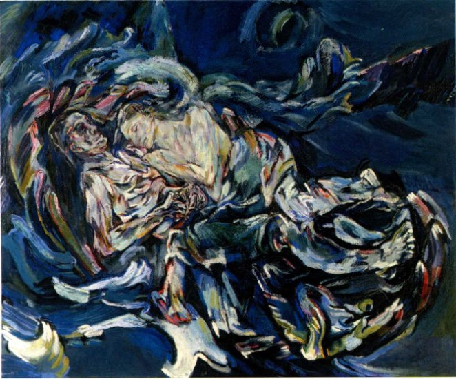

*图27.18 奥斯卡·科科施卡：《风的新娘》。1914年。布面油画，1.81x2.20米。瑞士巴塞尔博物馆巴塞尔公共艺术收藏*

在作品《风的新娘》（The Bride of the Wind，图27.18）的人物中，我们能够感受到科科施卡肖像画中的表现主义特征。这幅作品创作于1914年，是艺术家本人及其情人阿尔玛·马勒（Alma Mahler）的画像，后者是奥地利著名作曲家古斯塔夫·马勒（Gustav Mahler，1860-1911年）美丽聪慧，但又声名狼藉的遗孀。到了1914年，科科施卡与阿尔玛的关系出现危机，并于次年终止了往来，《风的新娘》则是以视觉的形式密封起艺术家的忧虑。他最初想将个人的进退维谷伪装成《特里斯坦和伊索尔德》（Tristan and Isolde）的故事，那是瓦格纳歌剧中的悲剧情人。然而最终的作品标题来自乔治·特拉克尔（Georg Trakl，1887-1914年），这位压抑的维也纳波希米亚式诗人创作的病态作品仿佛梦魇一般。科科施卡通过粗野的笔触和沸腾的涡形构图表达着自己的焦虑。阿尔玛·马勒忘却了漩涡，平静地沉睡着，然而科科施卡则处于无休止的担忧之中；他的身体变形为剥去皮的躯干，双手的形状古怪、粗糙。这对情人睡在飘浮于风景中的停泊之处，其巨大、畸形，如扇贝一般，而风景本身也阴冷且难以控制，仿佛屈从于宇宙的能量，而远处受重力牵引的月亮就暗示了这一点。月亮的力量似乎代表弗洛伊德的性本能学说——因为月亮退入了阴道形的管道里，周围环绕着阴茎形的山峰。这个古怪的环境似乎处于流动状态，不具有固体特征，将整幅图像转变为危险的颜料沼泽。

**埃贡·席勒** 埃贡·席勒（Egon Schiele，1890-1918年）是另一位重要的维也纳画家，同样叛逆中产阶级的习俗。席勒亲眼见到父亲因梅毒而痛苦死去，这可能是造成他关注疾病与道德的部分原因。为了成为艺术家，席勒与其保守的中产阶级叔叔进行了长期的激烈斗争。他修习过维也纳美术学院（Vienna Academy of Fine Art）的课程，之后古斯塔夫·克里姆特立刻将席勒网罗在自己身旁。在克里姆特的邀请下，席勒与科科施卡一样，都参加了1908年和1909年的维也纳艺术展。但他很快就离开了艺术学校，与朋友们一起成立了另一个分离派小组：“新艺术小组”（Neukunstgruppe）。受到克里姆特挑战中产阶级保守主义的鼓动，席勒的生活放荡不羁，后来于1911年与情妇逃离维也纳，生活在附近的小村庄里。

席勒的艺术充满了裸体形象，包括他本人、妓女以及情人的裸体。尽管他也创作油画作品，但最精彩的画作却是纸上作品，例如1910年的《手臂扭曲的自画像》（Self-Portrait with Twisted Arm，图27.19）。裸体题材自古典时期以来就在西方艺术中占据主流地位，但是席勒对暴露身体的表现，极大偏离了古典时期产生、并于文艺复兴期间复苏的英雄式男性裸体传统。此处对身体的直率表现，对病态与人体古怪变形的表现是一种公开的挑衅。很有可能席勒在叔叔切断他的经济来源之后就立刻绘制了这幅作品，似乎在表现墨守成规的中产阶级监护人与独立的波希米亚艺术家之间的冲突。席勒的反叛不仅表现在他恶魔般的怒视目光与大胆扭曲的姿态上，他将自己表现为畸形的食尸鬼这一点也说明了他的反叛精神。无论怎样，我们还感受到一种自省的成分，看到这位20岁的艺术家突出的肋骨、腋毛与乳头；感受到躯体的骨架与肉体；虽然他用目光与我们对峙，但是却脆弱不堪。席勒对材质的处理也颇具艺术感染力，木炭的柔软和飞溅的水彩增强了肉体堕落腐化之感，这同时也是该作品的主题。席勒的艺术生涯在1918年终止，他最终死于流感，而这场流感夺走了两千万人的生命，其中包括席勒怀孕的妻子，她于席勒去世三天前离开了人世。

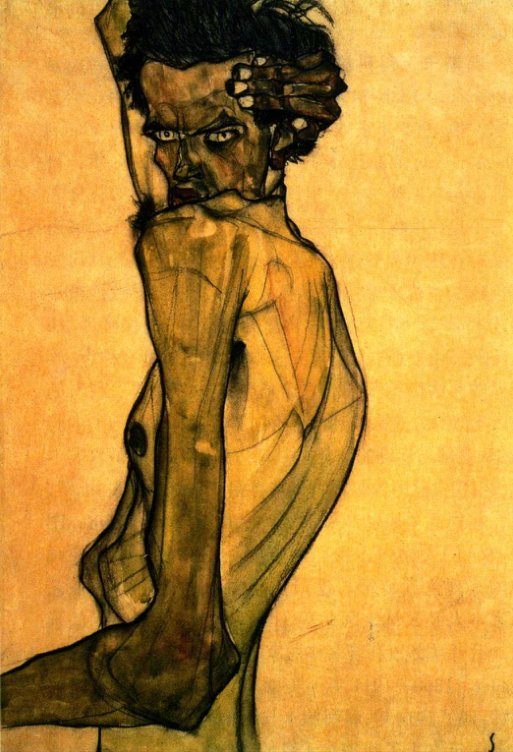

*图27.19 埃贡·席勒：《手臂扭曲的自画像》。1910年。水彩颜料与木炭、纸上作画，45.1 × 31.75厘米。纽约私人收藏*

## 毕加索与勃拉克之后的巴黎立体主义

在法国，立体主义于1911至1912年间得以彻底确立，其范围还波及了毕加索和勃拉克之外的艺术家。个别画家紧密追随着毕加索和勃拉克1909至1910年间艺术发展所展示的潮流，他们于1910年末开始在大型的巴黎沙龙中集体展出作品，同时也在一家私人画廊举办展览，这些艺术家自称为“黄金分割派”（Section d'Or），最初的成员有罗贝尔·德劳内、阿尔贝·格莱兹（Albert Gleizes）、让·梅青格尔（Jean Metzinger）和亨利·勒弗孔尼埃（Henri Le Fauconnier），随后又有费尔南·莱热、罗杰·德拉弗雷奈（Roger de La Fresnaye）、马塞尔·杜尚及其兄弟雷蒙·杜尚-维庸加入。1912年，格莱兹和让·梅青格尔出版了《立体主义》（Du Cubisme）一书，这是首部关于立体主义的著作。

**罗贝尔·德劳内** 罗贝尔·德劳内（Robert Delaunay，1885-1941年）是这个小组中最具影响力的艺术家之一。与当时流行的勃拉克和毕加索分析立体主义作品不同，德劳内在1910年创作的一批表现埃菲尔铁塔的立体主义绘画，其中充满了色彩，而且当时的埃菲尔铁塔也已经成为现代工程学的符号。这些作品的题材也与勃拉克和毕加索不同，着重表现现代性的运动与能量，以及当代世界的持续流动性。

德劳内对现代世界动态活力的关注在1914年的《向布莱里奥致敬》（Homage to Blériot，图27.20）中一览无遗，这幅作品表达了对法国飞行员路易·布莱里奥（Louis Blériot，1872-1936年）的敬意，正是后者发明了现代单翼飞机，并且是飞越英吉利海峡的第一人。德劳内在画面里结合了现代世界的象征：飞机、螺旋推进器和埃菲尔铁塔，这些元素变形为飘浮的球体和旋转的圆盘，仿佛一个万花筒，暗示着旋转的推进器和耀眼的太阳。德劳内不仅通过立体主义空间的模糊性来创造运动感，而且还借助于他所谓的“共时对比”（simultaneous contrasts），即将原色平面与间色并置。这样不仅创造出运动感，而且创造了光线与空间，所有这些都不夹杂任何形式的幻象。

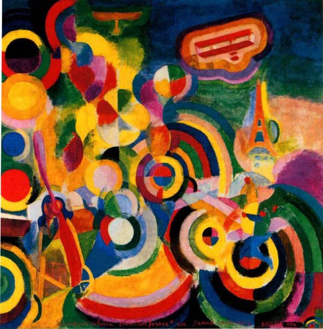

*图27.20 罗贝尔·德劳内：《向布莱里奥致敬》。1914年，布面蛋彩画，2.5 × 2.51米。瑞士巴塞尔艺术博物馆巴塞尔公共艺术收藏*

两年前，德劳内展出了完全抽象风格的作品《共时色盘》，或称《共时对比》（Simultaneous Disks或Simultaneous Contrasts）。这批作品全部由各种色调的圆环构成，正如《向布莱里奥致敬》中的圆环一样。德劳内的色彩理论源自19世纪的色彩理论家米歇尔·欧仁·谢弗勒尔，而他向纯粹抽象的转变则受到其与马尔克、康定斯基交游的影响。德劳内曾参加了首次青骑士展览。这批抽象绘画的某些作品里出现了相互叠加的圆环，表示球体在空间中的关系，《日月》（Sun and Moon）这一画作标题则进一步肯定了这种解读。这些作品可以被看作德劳内试图唤起精神世界与宇宙世界的证据，如同其德国艺术家同伴所追求的那样。即便如此，德劳内对该主题的探究并没有持续很长时间。

**弗兰蒂舍克·库普卡** 在1913年独立沙龙展的评论文章中，阿波利奈尔将德劳内的抽象作品称为“俄耳甫斯主义”（Orphism），指神话中的竖琴演奏者俄耳甫斯，同时暗示抽象艺术与音乐间的对等关系。阿波利奈尔也称弗兰蒂舍克·库普卡（František Kupka，1871-1957年）为俄耳甫斯主义者。库普卡的抽象艺术从神秘主义演变而来，他在生活中还从事灵媒活动，并深深陷入通神论和玄学之中。他可能早在1910年就发展出非具象绘画（nonobjective painting），即不具有任何再现成分的绘画，基于艺术家捕捉不可见超自然力量的强烈愿望而成，他相信色彩与几何形能够表现这种力量。库普卡来自波希米亚（即现在的捷克共和国），曾在维也纳学习艺术，并于1896年移居巴黎。迈布里奇和马雷所拍摄的连续照片中对运动的捕捉让他极其着迷。于是库普卡也开始寻求传达运动的方式，以便表现宇宙间的能量。他的追求体现在1911至1912年间创作的《牛顿圆盘》或《两种色彩的赋格曲习作》（Disks of Newton 或 Study for Fugue in Two Colors，图27.21）里，该作品预示了德劳内的圆盘系列，同时也是不受康定斯基抽象理论影响的独立创作。但是正如标题所示，库普卡与康定斯基一样，也利用了音乐的抽象力量。

在这幅作品里，库普卡通过透明的彩色矩形构成五光十色的螺旋，表现了一种神性之光，其饱和的用色还令人联想到中世纪的玻璃窗画（库普卡也曾创作过名为《大教堂》[Cathedrals]的系列抽象作品）。这幅作品里最显著的是宇宙能量的柔和涌动，艺术家感觉到这种能量在自己体内流淌，力求通过视觉形式表达出来。

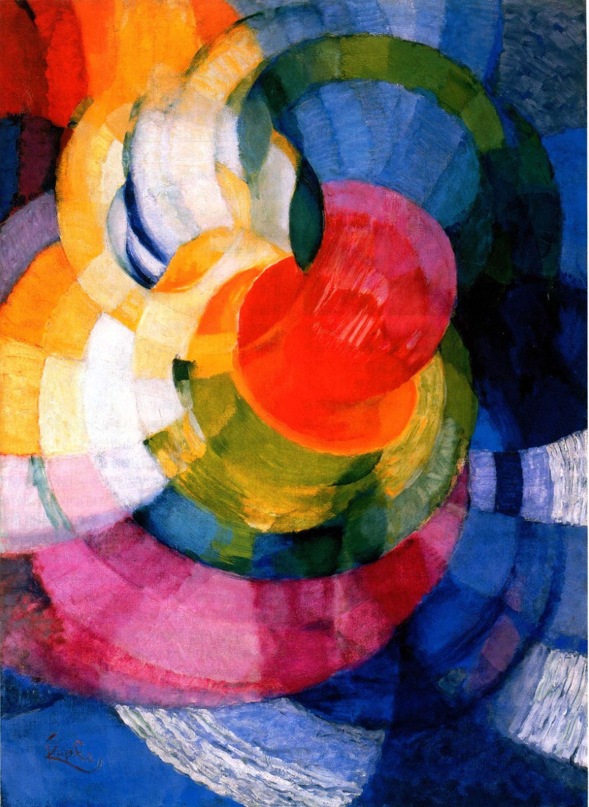

*图27.21 弗兰蒂舍克·库普卡：《牛顿圆盘》或《两种色彩的赋格曲习作》。1911-1912年。布面油画，100 x 73.7厘米。费城艺术博物馆，Louise and Walter Arensberg收藏*

## 意大利未来主义：行动主义与艺术

1909年1月，米兰自由体诗人菲利波·托马索·马里内蒂（Filippo Tommaso Marinetti，1876-1944年）发表了《未来主义宣言》（Manifesto of Futurism），从而发起了未来主义运动，这份小册子后来被散发到数千位艺术家和诗人手中。2月20日，未来主义出现在巴黎《费加罗报》（Le Figaro）的头版。马里内蒂称之为“意大利的重生”，他认为之前的意大利深陷于枯燥乏味、时代错乱的古典历史之中。马里内蒂提倡坚定接受现代性的所有表现形式，包括电力、汽车和机械。他写道：“所有之前使用过的题材都必须丢到一边，以表现我们充满钢铁、骄傲、热情和速度的漩涡般生活。”（见第四部分末尾的附加原始文献。）

对马里内蒂而言，未来主义是一个持续的过程，一种永恒的革命。一旦某个变化发生，另一个改变就必须开始。艺术家们不再是为富有客户制作高水平产品的制造者，而是在社会中起重要作用的一股力量，影响着诸如时尚、游戏、玩具、图画、室内设计、运动、食物以及行为等日常问题。马里内蒂在意大利做巡回旅行，将艺术家、音乐家、剧作家、建筑师和设计师都吸收到未来主义运动之中。他还组织未来主义晚会，在舞台上详细解释自己的理论，其言论对听众而言即便不是侮辱，至少也让人恼火。马里内蒂试图煽动听众行动起来，甚至诉诸暴力，他认为这对于社会有清除罪恶的作用，并极具建设性。他决心生成持久的行动主义，作为意大利文化重生（Risorgimento）的道路。

1909年，马里内蒂在米兰给先锋艺术团体“艺术之家”（Famiglia Artistica）作了一次讲座，之后该团体的几位成员都成为了未来主义者，其中就包括翁贝托·博乔尼（Umberto Boccioni，1882-1916年）。在1909年，这些艺术家大多都是新印象主义者，将分色主义的色彩与力量转型为描绘当代动态世界的手段。他们在宣言中声称“运动与光线破坏了身体的物质性”，而他们的目标就是将运动与能量以绘画的形式表现出来。在视觉语汇方面，他们抛弃了所有让人联想到意大利古典文化的形式，转向科学寻找素材，例如马雷和迈布里奇研究运动的摄影、恩斯特·马赫（Ernst Mach）的冲击波图像，以及威廉·康拉德·伦琴（Wilhelm Konrad Röentgen）发现的X射线，无不证明了所有事物都可以被非物质化。他们以更类似于修拉的方式，希望以科学为基础创造出新的艺术语汇，然而又不规定任何风格。他们的目标在于捕捉运动的强度，捕捉物理、心理和普遍的元素。实际上，他们试图以视觉形式表现伯格森的“生命冲动”。

未来主义者最初追随马里内蒂的领导，这些人同时也是一群行动主义者。但是到了1911年末，他们不再着迷于马里内蒂的计划，而是致力于艺术创作。更为重要的是，在寻找美学方向的过程中，他们从新印象主义转向了立体主义。然而其立体主义与勃拉克和毕加索所关注的问题无关，因为未来主义者们希望传达运动、动态的能量和社会进步。在1911年游览过巴黎并见识到立体主义作品之后，博乔尼绘制了《思想状态1号：告别》（States of Mind I：Farewell，图27.22）。画中他将蒸汽、声音、运动的物体和物理能量表现为充满立体主义块面的断裂世界。火车头上的白色曲线反映出马赫牵引力曲线的特征，而形象模糊、反复出现的绿色调相拥恋人则是受到迈布里奇连续运动摄影的启发。博乔尼不仅拥护现代科技，正如火车、电子交通信号和成束的铁塔所展示的那样，他还赞赏所有物体与能量的持久运动。1911年5月1日，博乔尼于罗马进行了一场讲座，宣称绘画必须捕捉所有物质中的能量。这种能量处于永久的运动里，在消解物体的同时又将其融合在周围的空间之中，他称之为“塑性活力”（plastic dynamism）。

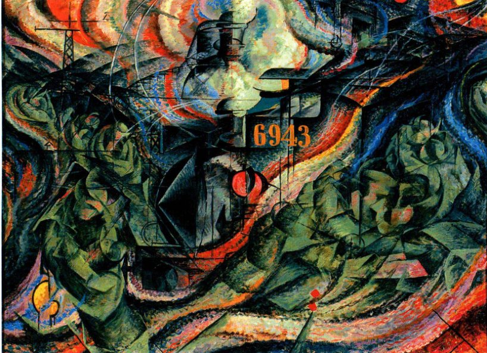

*图27.22 翁贝托·博乔尼：《思想状态1号：告别》。1911年（第二版）。布面油画，70.12 x 96.2厘米。纽约现代艺术博物馆，Nelson A. Rockefeller 捐赠*

在《思想状态1号：告别》中，我们不仅可以感受到火车与人物通过时间和运动而产生的非物质化，部分要归功于博乔尼采用了分色主义技法；我们还能感受到空间的共时存在，仿佛是某种具有形体的事物，如同形式一样生机勃勃。在混乱的图像中回旋流转的还有一股情感能量，即痛苦的离别与消失之感，标题也揭示了该作品的主题。“塑性活力”或融合物体与空间的手法在博乔尼1913年创作的雕塑《空间连续性的独特形式》（Unique Forms of Continuity in Space，图27.23）中显而易见。顶端突出、腿部和躯干处缩小的形式捕捉到能量的运动方向，仿佛被解体的空间本身则像斗篷一般撕裂开来。

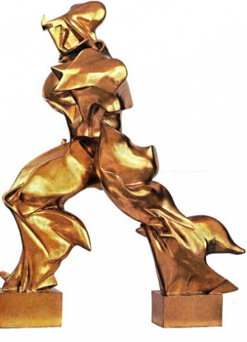

*图27.23 翁贝托·博乔尼：《空间连续性的独特形式》。1913年（铸造）。青铜，111.4 × 88.6 × 40厘米。纽约现代艺术博物馆，Lillie P. Bliss 遗赠*

米兰的安东尼奥·桑泰利亚（Antonio Sant'Elia，1888-1916年）是一位重要的未来主义建筑师，于1914年加入该艺术运动，著有《未来主义建筑宣言》（Manifesto of Futurist Architecture）。桑泰利亚坚信新建筑不应该维持过去建筑的面貌，而必须基于“明确的未来主义美学观，即巨型机车、螺旋通道、铁甲舰、鱼雷艇、安托瓦内特单翼机和赛车的美学观”。他将未来主义建筑视为暂时性的建筑，正如其他承载未来主义观念的事物一样，必须持续替换，以追赶工业发展的脚步。《新城》（The New City，图27.24）中的塔楼设计是对运动与流动性的研究。桑泰利亚将电梯设置在建筑物外部，即飞扶壁所在的位置。建筑周围环绕着电报信号塔，并鲜明地向内缩进，创造出动态的运动感。建筑物还跨越了一条交通要道，更像是未来主义工厂，而非舒适的住宅。桑泰利亚的设计中没有公园、广场或者其他用于休憩、反省的场所。他将建筑设置在无尽的人行道、高速公路、铁道、电梯和跑道之中，其高效的机械世界本身就是一项持久不断的运动。

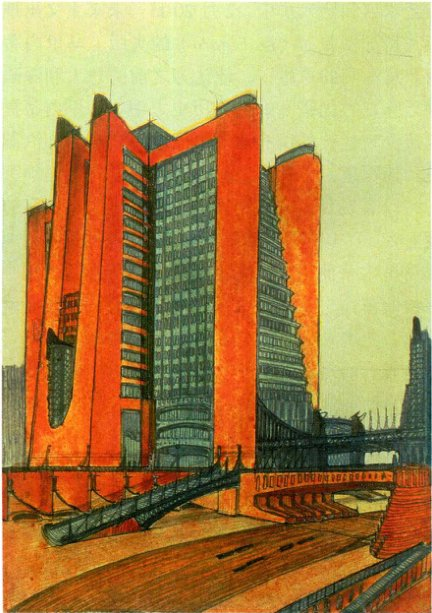

*图27.24 安东尼奥·桑泰利亚：《新城：外部电梯、拱廊、有顶走廊；三层街面-电车轨道、汽车道、钢铁人行桥；灯塔与无线电报》。1914年。墨水、黑铅笔、黄色纸上作画，52.4x51.4厘米。私人收藏*

## 俄国的立体未来主义与至上主义

20世纪最初十年，俄国是主要欧洲国家中工业化程度最低的。尽管如此，这里却成为了先锋艺术的重要中心。俄国的大部分人口都是农奴，受沙皇以及东正教会的统治。虽然正快速奔向现代化，但俄国在某些方面仍深陷在中世纪的传统之中。民间艺术和圣像画传统在文化中占据主导地位，激进的艺术怎能出现？也许要部分归功于该国对改革的急切需要。弗拉基米尔·伊里奇·列宁（Vladimir Ilyich Lenin，1870-1924年）领导了1917年的10月革命（布尔什维克革命），这是20世纪首次由共产党领导的正式革命，并最终为俄国带来了进步，所产生的变革远比18世纪美国或法国的革命更为根本。俄国的转型过程革命性极强，甚至将妇女平等包括在内，而女性艺术家也加入到上述的激进艺术发展活动之中。

**俄国先锋艺术家** 莫斯科有两位当代艺术最重要的收藏家，分别是谢尔盖·休金（Sergey Shchukin）和伊万·摩洛佐夫（Ivan Morozov），两人将自己收藏的马蒂斯和毕加索作品展现在俄国艺术家面前。为了回应这些作品，并与西欧先锋艺术建立联系，俄国艺术家们开始探索立体主义以及其他抽象方法。1910年，一群俄国艺术家成立了先锋艺术组织，称为“方块J”（Jack of Diamonds），以支持实验性艺术作品的展览。两年之后，该团体中分裂出“驴尾小组”（Donkey's Tail），着重效仿未来主义作品。这些艺术群体拥护现代化进程，强调机械与工业，而这正是将俄国带入20世纪的两个关键因素。

在先锋艺术圈子中，柳博夫·波波娃（Lyubov Popova，1889-1924年）是其中杰出的画家之一。她曾于1912年在巴黎学习，1914年又前往意大利学画，亲身经历了立体主义和未来主义的最后发展阶段，这些影响都反映在她1915年的作品《旅行者》（The Traveler，图27.25）之中。画面中描绘了一位带黄色项链、手持绿色雨伞的女子，波波娃将立体主义的断裂手法与未来主义的能量、运动结合在了一起。

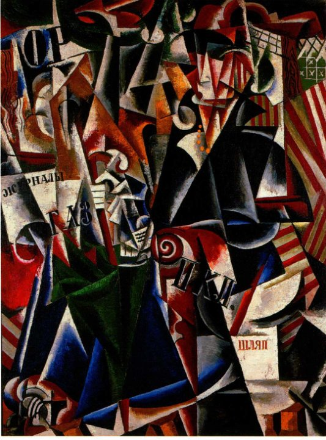

*图27.25 柳博夫·波波娃：《旅行者》。1915年。布面油画，142.2x105.4厘米。加利福尼亚州帕萨德纳市Norton Simon 艺术基金会*

**卡茨米尔·马列维奇** 直到1913年为止，许多俄国艺术家都自称为“立体未来主义者”（Cubo-Futurist），这是卡茨米尔·马列维奇（Kazimir Malevich，1878-1935年）创造的词汇，反映出其风格的双重来源。他曾参加过“方块J”和“驴尾”的展览。1913年，马列维奇为被宣称为“首部未来主义歌剧”的《胜日》（Victory over the Sun）设计了服装与布景。这部激进“歌剧”在圣彼得堡上演，采用了曹姆（zaum）原则，这是俄国进步诗人所发明的词汇。本质上，曹姆是一种基于自造词和句法所构造的语言，其意义通过基本的发音和语言模式来表达。诗人们的意图在于回归语言的非理性和原始基础，不受传统意义的阻碍，表达人类体验的本质。在《胜日》中，表演者朗读了基本由自造词组成的非叙事性文本，同时配以音调不准钢琴所发出的噪音。马列维奇的几何化服装与布景同样具有抽象性质，若干三角形沿着戏服腿部上上下下，而背景帘幕则是被分成两个三角形的正方形，一个三角形是白色，另一个是黑色。

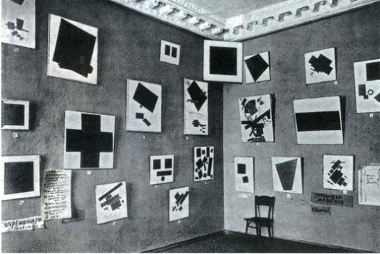

*图27.26 卡茨米尔·马列维奇：《0号-10号：最后的未来主义展览》，艺术家绘画的装置摄影，圣彼得堡。1915年12月*

马列维奇用了两年时间才意识到曹姆原则对自己艺术的意义。1915年，在以类似波波娃的立体未来主义风格进行创作了一个阶段之后，马列维奇在一次圣彼得堡的展览中推出了39幅非具象的几何绘画作品，这次展览命名为《0号-10号：最后的未来主义展览》（0,10 [Zero-Ten]：The Last Futurist Exhibition，图27.26）。其中最著名的作品是《黑色方块》（Black Square），即如俄国圣像画一般挂在屋角的那幅作品。在20世纪20年代的至上主义论文《非具象世界》（The Non-Objective World）中，马列维奇将至上主义（Suprematism）解释为感觉的至上（见本页的原始文献）。这种感觉不只是个人的或者情感的，还具有启示意义，因为世界的抽象本质被转译到绘画之中，并运用了全新的抽象语汇，将现实主义的痕迹剥除殆尽。与同辈俄国艺术家康定斯基一样，马列维奇也是神秘主义者，寻求宇宙的统一，甚至乌托邦式的世界，正如即将到来的1917年布尔什维克革命支持者们那样。《黑色方块》体现了俄国圣像与民间艺术中的神秘主义遗产。

> **大事年表**
>
> *   1904—1905 年 —— 日俄战争
> *   1906 年 —— 保拉·莫德松-贝克创作《自画像》
> *   1909 年 —— 路易·布莱里奥飞越英吉利海峡
> *   1911 年 —— 瓦西里·康定斯基出版《论艺术中的精神》
> *   1913 年 —— 翁贝托·博乔尼创作《空间中连续性的独特形式》
> *   1914 年 —— 安东尼奥·桑泰利亚出版《未来主义建筑宣言》

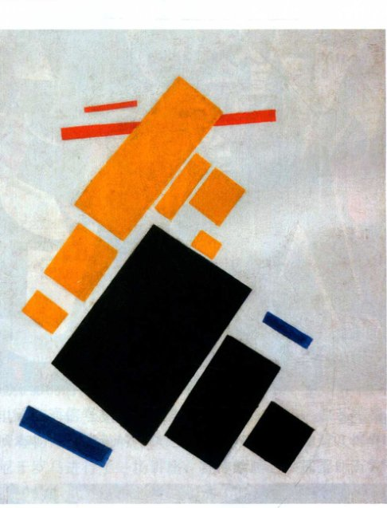

*图27.27 卡茨米尔·马列维奇：《至上主义构图：飞翔的飞机》。1915年（画上落款1914年）。布面油画，58 × 48.3厘米。纽约现代艺术博物馆*

马列维奇的抽象语汇中包括多种不同的几何图形与色彩。在同样作于1915年的《至上主义构图：飞翔的飞机》（Suprematist Composition：Airplane Flying，图27.27）中，他运用了红色、黄色和蓝色几何形，并加入黑色来创造运动、飘浮之感。色彩、尺寸与形体在白色背景的映衬下产生出一种独特的韵律。从一幅构图到另一幅构图，马列维奇通过改变这些特色来变换韵律感。尽管作品标题中出现了“飞机”一词，并暗示出对科技的着迷，但图像本身则是对飞行的体验，表现了由这种交通方式所带来的人与宇宙的新关系。

遗憾的是，马列维奇作品的复制品几乎难以重现原作的特质。《至上主义构图：飞翔的飞机》的画面看起来具有鲜明的边缘和几何感，但是观看原作时，人们会发现这些形体的边缘呈现非常轻微的波浪起伏。马列维奇的绘画也会有人物出现，正如康定斯基的作品那样。他和康定斯基都有力地投射出与宇宙的神秘主义联系，而且马列维奇还使用了白底色，将这种联系从画布之上拓展到无垠之中。

> **原始文献：卡茨米尔·马列维奇（1878-1935年）**
>
> **节选自《非具象世界》**
>
> 卡茨米尔·马列维奇于1919年在莫斯科第十届国家展览的目录上发表了《非具象世界》一文。其中强调非具象艺术如何能够表现感觉，而非物体，因为其除去了所有文明的积累，以获得存在的本质，其目标与被称为“原始主义者”的艺术家们所追求的目标一致。
>
> 以至上主义之名，我理解了创作艺术过程中纯粹感觉的至高无上地位······
>
> 因此，对于至上主义者而言，再现的恰当方式一直都是能够给予感觉表达最充分可能的方式，同时也是忽略事物日常表象的方式······
>
> 当要离开“意志与观念的世界”时，我也为一种近乎恐惧的羞怯所攫取，我曾经在那个世界生活、工作，一度曾认为那就是现实。
>
> 但是一种非具象性获得解放的幸福感将我扔进了“荒漠”，那里除了感觉没有什么是真实的······感觉由此就成为了我生命的实质。
>
> 我所展出的作品里没有“空洞的方块”（指《黑色方块》），而是非具象性的感觉······
>
> 白底上的黑色方块首先在非具象性感觉的表达中形成。“方块＝感觉”，“白底＝感觉”之外的虚空······
>
> 至上主义中产生的方块与形式可以与土著人的原始符号（象征）联系起来，“但是其结合并不代表装饰，而是一种韵律的感觉”。
>
> 至上主义并没有形成一个感觉的新世界，而是再现感觉世界的全新、直接形式。
>
> *SOURCE: KAZIMIR MALEVICH, THE NON-OBJECTIVE WORLD, TR. HOWARD DEARSTYNE. (CHICAGO: THEOBALD, 1959)*

## 立体主义与幻想：夏加尔和基里科

马列维奇去除了立体主义中的几何性，因此立体主义本身的结构消失了。然而，同辈俄国艺术家马克·夏加尔（Marc Chagall，1887-1985年）却在很多作品中采用了立体主义结构。立体主义能够叠加、整合最为分散的物体，正是创造梦境般幻想世界的绝佳工具。夏加尔成长在维捷布斯克（Vitebsk）的犹太区，他的绘画令人回想起更为简单的时代、价值观与宗教仪式。1910年，夏加尔迁居巴黎，在那里立刻就转变为立体主义者，正如《我和村庄》（I and Village，图27.28）所示。但这幅梦幻般的图像很难理解为立体主义对形式的理性分解。夏加尔运用玻璃窗画的饱和色彩与俄国民间艺术的简单形体，召唤出生活本身最为基础的问题。人与动物在几乎镜像般的对称中保持着对等的位置，其头部那半透明、犹如昙花一现的特质让整幅场景显得轻盈、神秘。环状构图象征生命周期，出生如同绽放的花蕾，而死亡则是肩负长柄镰刀的农夫。夏加尔坚决反对任何将其画作与故事或童话联系在一起的做法。他的梦景是立体主义的万花筒，其中充满了艺术家本人认为至关重要的物象与事件。

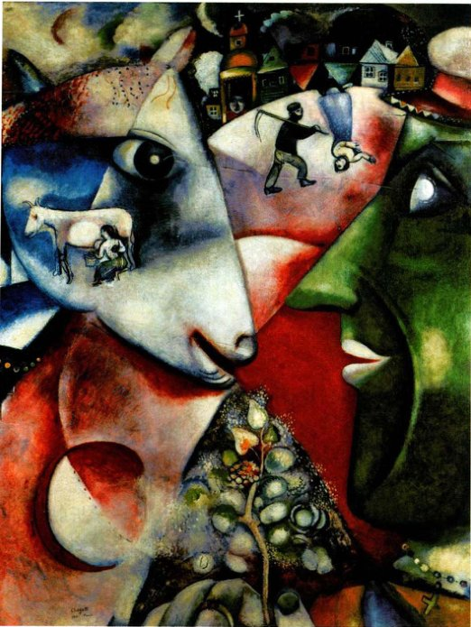

*图27.28 马克·夏加尔：《我和村庄》。1911年。布面油画，1.92 x 1.51米。纽约现代艺术博物馆*

意大利艺术家乔治·德·基里科（Giorgio de Chirico，1888-1978年）几乎与夏加尔同时到达巴黎。基里科于1905至1909年间在慕尼黑学习艺术，受到德国浪漫主义、象征主义艺术家，以及尼采的极大影响。尼采将生命描述为“预兆，隐藏在我们生活并存在的现实之下，实际上隐藏着一个截然不同的现实”。与康定斯基、马尔克和克利一样，基里科也沉浸在慕尼黑周围通神论争论的漩涡之中。到达巴黎之后，基里科抛弃了其先前采用的多个灭点绘画风格，转而依赖与立体主义有些许相似的对角线条与错乱空间，立体主义无疑影响了这一风格突变。基里科将许多场景都设置在空旷的城市广场上，那里仿佛一座舞台，1914年作于费拉拉的《一条街道的神秘与忧郁》（Mystery and Melancholy of a Street，图27.29）就是其中一例。随后他返回了意大利，终老于此。

与意大利未来主义者不同，基里科醉心于古典历史，并没有将其抛弃。但他还是通过唤起浪漫主义的忧郁之情，运用不祥的阴影、强烈的光线以及倾斜的透视创造出不安与怪诞，从而破坏了古典艺术苛刻的权威性。在《一条街道的神秘与忧郁》中，铁路轨道、阴暗的窗户和拱门、行驶中的空货车以及滚铁环的女孩似乎都成为某种象征，但是基里科并没有为观众提供任何线索，并坚称没有此类象征。相反，画面展示的梦景可以让每位观者进行不同的解读，正如每个人对自己梦境中的象征含义反应都不同。基里科称自己的作品是形而上绘画（Metaphysical paintings），他那令人心生困扰的诗意幻想成为了下一个十年中再现性超现实主义的出发点。

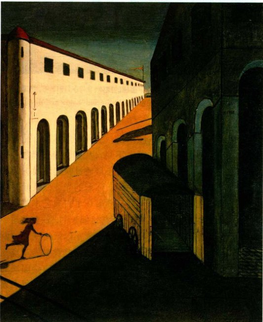

*图27.29 乔治·德·基里科：《一条街道的神秘与忧郁》。1914年。布面油画，87 × 72.4厘米。私人收藏*

## 马塞尔·杜尚与现代艺术的进退维谷

传统与创新之间的张力在马塞尔·杜尚（Marcel Duchamp，1887-1968年）的作品中得以有力彰显。与本章中涉及的大部分艺术家一样，杜尚也曾接受过学院派教育，尽管当时学院派的影响已经减弱。杜尚对美术的传统再现功能十分理解，但同时也理解先锋艺术家对这一传统的挑战，先锋艺术家坚称追求对观念的表达与描绘可见现实截然不同。杜尚在20世纪20年代认识到，传统与创新之间的斗争引发了如何定义艺术的问题，这个问题已然在马蒂斯、毕加索和康定斯基等艺术家的作品中酝酿生成了。杜尚坚信，艺术的真正性质不仅成为一个显见的问题，也成为了艺术本身的基本主题。在这个方面，杜尚引入了艺术中自我批评的观念，并提出艺术作为艺术品的地位问题。

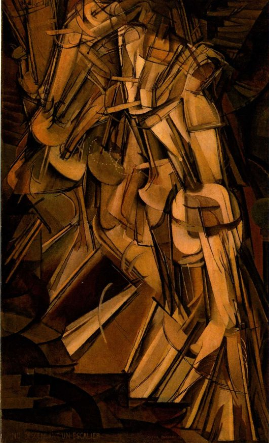

*图27.30 马塞尔·杜尚：《下楼梯的裸体，2号》。1912年。布面油画，147 × 89厘米。费城艺术博物馆，Louise and Walter Arensberg 收藏，1950-134-59*

杜尚在20世纪最初十年在巴黎进行创作，很快就将印象主义和后印象主义融会贯通。1911年即将到来之际，他转向了立体主义，表现在作品《下楼梯的裸体，2号》（Nude Descending a Staircase，No.2，图27.30）里，杜尚曾试图在1912年的独立沙龙中展出这幅作品。虽然杜尚的一些朋友，甚至两位哥哥雷蒙·杜尚-维庸和雅克·维庸（Jacques Villon）都是评审团成员，但掌握大权的陪审团认为这幅作品既不严肃，也不够立体主义，所以杜尚只好将其撤回。该作品最初是一幅诗歌插图，那首诗描绘一位走上楼梯，到达星辰之上的人物。习惯于打破旧习的杜尚绘制了一个具有忧郁面貌的裸体人像，正堂而皇之地走下楼梯，正如他自己所描述的：“这人走下音乐大厅楼梯的样子会更加庄严。”与画室就在隔壁的库普卡一样，杜尚也着迷于马雷的连续摄影作品，正是这些照片启发了其笔下“裸体”的连续运动。因为观众必须知道标题才能知道画中的人物其实未着衣物，而杜尚则将文字强调为作品的组成部分，甚至将标题置于作品之上。杜尚以此举在对艺术本质的探索中走出了重要的一步。界定作品的标题也确定了其含义，并让观众在看过作品很久之后仍能回想起来，其所履行的功能与艺术作品本身一样重要。于是，杜尚在此处简单明了地表达了不仅艺术品与标题不可分，视觉体验与语言体验也是同样。

在1912年，杜尚机器式的人物并非独一无二，该题材成为当时立体主义艺术中的常见形式，折射出这个时代对技术的崇拜，因为技术象征着现代性和科学改造世界的能力。以杜尚的兄长雷蒙·杜尚-维庸（Raymond Duchamp-Villon，1876-1918年）为例，他是一位立体主义雕塑家，偶尔也将生命形式表现为机器的样子，其作品《巨马》（The Great Horse，图27.31）就是如此。最初的素描是一匹写实风格的马，但最终雕塑则成为表现马力的抽象作品：马的身体变为尖端渐细的圆柱体，受盘状钢条的牵引，而腿部像是具有强大推力的活塞。立体主义的块面与几何形式被排列成为活跃扭曲的动物。杜尚-维庸所作马的形象与当时其他大部分机械形式的人物一样，强调工业在塑造现代风尚中的重要作用。与此相反，马塞尔·杜尚的机械化裸体则诙谐、讽刺，颠覆了陈旧之见。

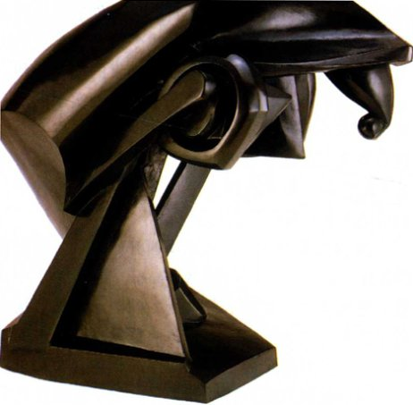

*图27.31 雷蒙·杜尚-维庸：《巨马》。1914年。青铜，高99.7厘米。芝加哥艺术学院*

1913年，马塞尔·杜尚对艺术本性的探寻达到了顶峰，他为艺术带来的革命与毕加索的《阿维尼翁少女》一样伟大。杜尚将一个自行车轮子倒置在凳子上（图27.32），并称之为艺术。之后他将这件雕塑命名为“挪用现成品”（assisted Readymades），因为其结合了两件捡来的批量产品，对艺术只关乎技法和工艺的观念进行挑战。凳子仿佛暗示着基座，车轮则是头部，强调了作品与艺术传统的机敏契合，令人回想起博物馆长廊中成列的胸像。

杜尚没有为艺术品的意义提供任何线索，完全交给观者来判定其内涵，由此也进一步检测了艺术的边界。杜尚坚称其现成品没有任何美学价值。将凳子与车轮放在一起，为彼此提供新的情境，此举对艺术家而言远比最终的作品更为重要。新的情境改变了物体的含义，证明情境是艺术含义的基础。尽管杜尚这样说，但是现成品还是可以被视为美丽之物，具有许多传统上与美联系在一起的特质，例如平衡、对称和新颖。艺术家似乎也呼吁我们关注日常不起眼物品的悦目之处。杜尚在第一次世界大战之前创作了三件挪用现成品作品，但均未曾展出。直到战争期间，他的革新才在艺术界充分地释放出来，我们将在下一章予以讨论。

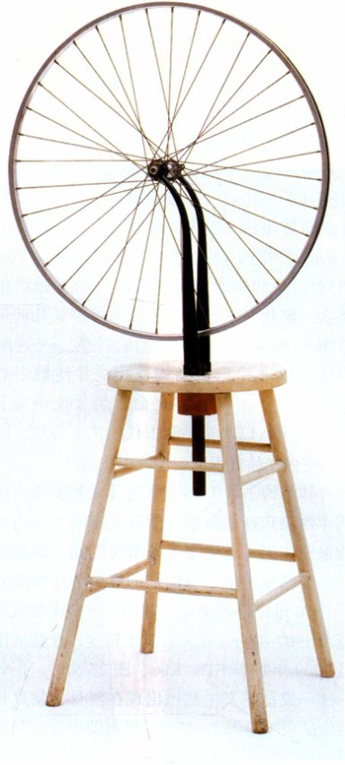

*图27.32 马塞尔·杜尚：《自行车轮》（Bicycle Wheel）。1913／1951年（第三版，作于1913年原作遗失之后）。集合作品：金属车轮与彩绘木凳，128.3 × 64.8 × 42.2 厘米。纽约现代艺术博物馆*

## 现代主义雕塑：布朗库西与马约尔

康斯坦丁·布朗库西（Constantin Brancusi，1876-1957年）的雕塑、毕加索的构成作品和杜尚的挪用现成品，都是战前最具创新性的艺术作品。事实上，布朗库西的作品看上去极为精简、抽象，后来成为了现代雕塑的象征。讽刺的是，布朗库西的生活背景距离现代世界十分遥远。他是罗马尼亚农民的儿子，在喀尔巴阡（Carpathian）山区偏远的提尔古日乌村（Tirju-Jiu）中与羊群一起长大。该地区的装饰性民间雕刻历史悠久，而布朗库西在这方面也优于他人。后来他在布加勒斯特（Bucharest）学习艺术，又于1903年途经慕尼黑，最后定居巴黎，成为奥古斯特·罗丹的助手。但后来他认为“树下无草”，于是开始独立创作。

除罗丹之外，另外一位于巴黎进行创作的雕塑家也可能对布朗库西的艺术产生了影响，他就是富有影响力和远见的阿里斯蒂德·马约尔（Aristide Maillol，1861-1944年）。马约尔从19世纪90年代晚期至20世纪最初几年创作过一些雕塑作品，追随希腊罗马传统，作品整体简洁、宏大，且具有几何式风格，例如1901年前后创作的《坐着的女人》（Seated Woman，图27.33）。马约尔通常将他最喜爱的主题女裸体表现得硕大、健壮，并将人物缩减为严格的几何形式，赋予作品一种古老，甚至原始的特质。在这座雕塑之中，重复的三角形起结构作用，并使得姿势“凝固静止”。马约尔后来将之命名为《地中海》（La Méditerranée），以此来感谢古代的艺术传统，同时也希望人们将该作品置于这一传统中欣赏。

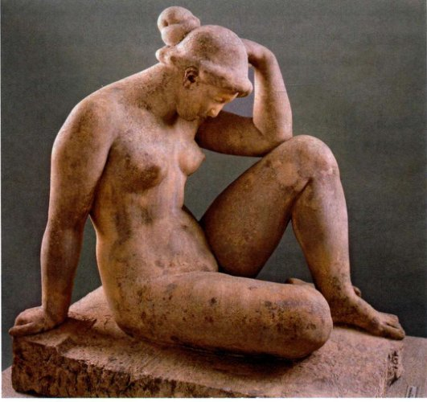

*图27.33 阿里斯蒂德·马约尔：《坐着的女人》或《地中海》。约1901年。石雕，高104.1厘米。瑞士文特图尔市Oskar Reinhart收藏，1931.9*

罗丹和马约尔对于19世纪艺术的影响极为巨大，而布朗库西则选择摆脱罗丹的深远影响与马约尔日益增长的重要作用，并走上一条激进之路。即便不是在题材上，也要在美学上与以往的雕塑传统决裂开来，为随后的20世纪雕塑奠定了基础。布朗库西成熟期的风格随着1907年的《吻》而发生转变，此处插图中呈现的是1909年版本（The Kiss，图27.34）。正如我们所见，这一象征主义主题也出现在罗丹、蒙克和克里姆特的作品里（见图26.23），但布朗库西对其的处理却是独一无二的。两个裸体人物紧紧贴在一起，与最初的石方毫无二致，只以浅浮雕手法刻入了极为简要的细节。此处没有象征主义激情中的心理冲突，布朗库西呈现的是对最高理念的赞颂，即创造生命的普遍需要。石头的几何化与严格形式令人回想起史前的大型作品，例如“斯通亨奇”或者朴素的埃及雕塑。通过其简洁的形式，《吻》摆脱了视觉现实中的混乱，转而追求不可见的本质真理，这正是存在与生命力的核心要义。正如布朗库西本人所解释的：“简洁不是艺术的终结，但是在接近事物真实意义的过程中，人们只要弃置自身即可达到简洁。”

*图27.34 康斯坦丁·布朗库西：《吻》。1909年。石雕，高89.5厘米。巴黎蒙帕纳斯基地T.Rachevaskaia墓*

20世纪最初十年，布朗库西开始进一步简化自己的作品。在《新生》（The Newborn，图27.35）中，他将主题缩减为一个暗示着鸡蛋的椭圆形。其形状也类似于头颅，凹入下陷的部分仿佛是发出第一声哭喊的嘴，窄三角形则是鼻子。然而作品整体异常抽象，我们只能感受到大理石的原始力量，似乎就栖息在生命所隐藏的神秘之中。这件作品具有基克拉迪雕塑的吸引力，也具有非洲面具的简化与几何性特征，而布朗库西对于非洲面具可以说是非常了解。

在布朗库西的作品里，材质与题材之间的关系十分重要，必须同时考虑这两个因素。某种特定材质的视觉效果与精神关联影响着雕塑所传达的意义，艺术家有时会采用传统的大理石或者木材，有时也采用具有工业化外观的材料，例如表面抛光的黄铜。同样，布朗库西在展示作品方面的感性也显示了这样的理解，即观者与雕塑之间的物理关系、情感关系都会影响到作品含义。以《新生》为例，布朗库西坚持将这件作品放在低矮的底座上展出，迫使观者俯下身来，以便能仔细观察。通过这种方式，布朗库西将观者置于观看襁褓中婴儿的成年人角度，唤起敬畏与同情的身体感觉。

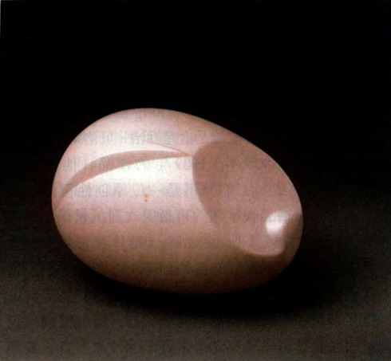

*图27.35 康斯坦丁·布朗库西：《新生》。1915年。大理石，14.6 x 21 × 14.9厘米。费城艺术博物馆，Louise and Walter Arensberg 收藏，1950-134-10*

布朗库西在其漫长的艺术生涯中重复着若干题材，以不同的材料对略有差别的变体进行试验。早在1910年，他就引入了鸟的题材，将之命名为“马扎斯特拉”（Maiastra）。该题材来自罗马尼亚关于一只带有魔力的金鸟的传说，据说这种鸟的歌声具有神奇的力量。20世纪20年代，布朗库西在《空间中的鸟》（Bird in Space，图27.36）里展示了鸟的翱翔。优雅的流线型平稳地立在一截愈来愈细的短圆柱体上，收敛的部分暗示腿与身体的连接处。与放在低底座上的《新生》形成对比，《空间中的鸟》通常放置在较高的几何形底座上展出，仿佛在观众头上盘旋一般。布朗库西在20世纪20年代至40年代制作了大约20个版本，以此来探索飞翔的本质。受到民间传说中灵鸟的启发，布朗库西的鸟类雕塑意在体现自然力量。

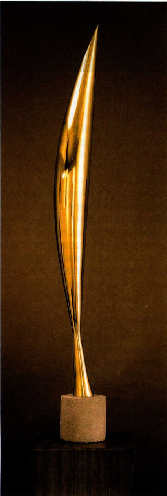

*图27.36 康斯坦丁·布朗库西：《空间中的鸟》。1928年（仅铸有一件）。青铜，137.2 × 21.6 x 16.5厘米。纽约现代艺术博物馆，无名氏捐赠*

> **大事年表**
>
> *   1909年 - 布朗库西创作《吻》
> *   1912-1913年 - 巴尔干战争
> *   1914年 - 第一次世界大战爆发

## 美国艺术

许多在美国进行创作的艺术家都强烈渴望明确建立起美国艺术的感受力，他们在20世纪的最初几年中都有意识地避免效仿欧洲榜样。这些艺术家既远离欧洲学院派绘画的传统古典主义，也不尝试先锋艺术家的挑战性实验艺术。他们通过创作典型的美国题材作品，寻求自身与欧洲艺术家的区别，并通常刻意以反学院派的图形或稚拙风格进行创作。然而，某些美国艺术家也在欧洲先锋艺术中找到了新鲜刺激的艺术语汇，使其能够表达自我对于现代性的反应。

### 垃圾箱画派

20世纪之初，出现了一场美国特有的艺术运动，即垃圾箱画派（Ashcan School），其以纽约市坚韧的城市现实主义为中心。最初该群体的成员都是费城的报纸插图画家，但是罗伯特·亨利（Robert Henri，1865-1929年）成功说服他们转行创作绘画。亨利曾在宾夕法尼亚美术学院跟随托马斯·埃金斯的学生学习绘画。后来垃圾箱画派逐渐转移到纽约；到了1905年，这些艺术家着重表现城市街道、公园和娱乐场所蕴含的能量，同时也捕捉快速改变的社会道德与风尚。他们善于在平凡与日常中发现美，还特别记录了因东南欧移民浪潮与非裔美国人北迁所带来的人口变化。除此之外，新兴的工人阶级妇女与城市公共空间中的各个阶层的混合也是其记录重点。

为了捕捉这股现代城市的能量，垃圾箱画派的艺术家们运用马奈式的笔触，并强调绘画平面的表面，使其绘画极具自发、直接之感，正如19世纪的现实主义绘画一样。这种艺术效果在《沙凯体育俱乐部的男子聚会》（Stag at Sharkey's，图27.37）中表现得十分清楚，这是乔治·贝洛斯（George Bellows，1882-1925年）1909年的作品。他是该画派中最年轻的成员，但并不是一位原创性很强的画家。画中贝洛斯表现了纽约市最受欢迎的娱乐场所之一——汤姆·沙凯（Tom Sharkey）的体育俱乐部，这是一间位于贝洛斯画室对面的酒吧。艺术家采用了位于座椅之上的视角，将观者置于场景之中，使得其中的打斗者仿佛身材魁梧的角斗士一般，赫然出现在我们眼前。我们可以感受到拳击选手的汗水、紧张及其突起的肌肉，以及观众们的热情与参与。该画受到马奈作品的直接启发，亮色与暗色的摇曳闪动以及稠厚的奶油状笔触让绘画表面生动、活跃。此外，弯曲的头颅那富有韵律感的起伏曲线，打斗者用力挥打的手臂与双腿，都让图像律动着强烈的活力，准确捕捉到纽约市天然粗野的生活面貌。

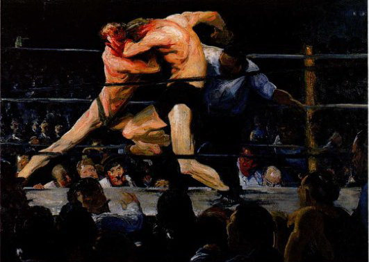

*图27.37 乔治·贝洛斯：《沙凯体育俱乐部的男子聚会》。1909年。布面油画，92.1 × 122.6厘米。克利夫兰艺术博物馆，Hinman B. Hurlbut收藏*

### 军械库展览：现代主义进入美国

直到20世纪20年代，现代主义才进入美国。其首先于纽约的291画廊出现，该探索性画廊归艾尔弗雷德·施蒂格利茨所有。自1909年起，施蒂格利茨开始为毕加索、马蒂斯、亨利·卢梭、罗丹和布朗库西这样具有重大影响的现代主义艺术家拍摄照片，同时也拍摄非洲艺术和儿童艺术题材。对于纽约的现代主义来说，1913年的国际现代艺术展（International Exhibition of Modern Art）极为重要。由于展出地点是军械库街26号，因此这一展览后来被命名为“军械库展览”（Armory Show）。展览展出了400余幅欧洲作品，其中大部分是法国作品，从德拉克洛瓦到库尔贝、莫奈、高更、凡高和塞尚，再到毕加索、布朗库西和马蒂斯。参展的美国艺术家人数达到欧洲艺术家的三倍，但是相形之下他们的作品看起来稍显狭隘，而且乡土气息颇重，大部分都被观众忽视。

报刊评论无情痛斥了激进的法国当代艺术，而观众还是如潮水般涌来。展览持续四周，参观人数达到了75,000人次。观众络绎不绝的原因主要是去奚落杜尚的《下楼梯的裸体》，一位评论家声称该作品看起来像是“木瓦工厂的爆炸”。展览以“新精神”为口号，其象征则选取了马萨诸塞州革命时期的松树旗。美国展览组织者的意图在于创造本土的艺术革命，以动摇传统的中产阶级品位，并形成对当代艺术的意识和欣赏。尽管遭到公众嘲笑，但是这次展览还是促生了若干现代艺术画廊和现代艺术收藏家，而且这些人已经具有足够的冒险精神来投身或支持激进艺术。

### 美国首批现代主义者：达夫与哈特利

当初欧洲刚刚创造出现代主义艺术，美国艺术家几乎第一时间就吸收了这种艺术形式；在欧洲，特别是在巴黎的美国艺术家对野兽派和立体主义艺术运动的接纳最为迅速。1908年，年轻的艺术家阿瑟·达夫（Arthur Dove，1880-1946年）在巴黎生活，他在那里见到了马蒂斯和野兽派的作品。当他返回纽约之时，遇到了施蒂格利茨，并开始在291画廊举办展览。

终其一生，达夫一直在参与纽约市的艺术发展，但他却生活在纽约州和康涅狄格州的乡村地区，甚至在长岛驻锚的船屋里生活过几年。他的艺术聚焦于自然，而非现代，力图捕捉宇宙间的力量。到了1910年，达夫就已经创作了完全抽象的绘画作品，比康定斯基还要早上两年。《植物形式》（Plant Forms，图27.38）出自名为《十诫》（The Ten Commandments）的系列蜡笔作品；在这幅画中，达夫展现了自然的所有成分，而且没有使用具象形式。

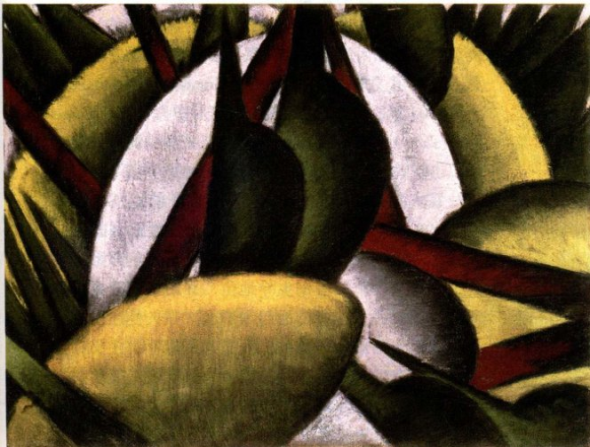

*图27.38 阿瑟·达夫：《植物形式》。约1912年。布面蜡笔画43.8 × 60.6厘米。纽约惠特尼美国艺术博物馆*

与立体主义作品一样，《植物形式》的构图由抽象成分组成，尽管其以合乎常理的方式叠加在一起，暗示出空间的持续后退。这幅作品具有光线与大气效果，以及生命的性质，主要应归功于椭圆形、卵形、圆形和生物形体的运用，暗示植物与树木。我们将绿色、赭石色和棕色与大地和植被联系在一起，白色和黄色则与光线联系起来。曲线形的白色和黄色仿佛是太阳、月亮和山丘，虽然叶片式的形状让人联想到植物和树木，但其同时也是能量不可识别的爆发的象征。我们可以感觉到自然力量和生命力的汹涌澎湃，而且每个形体都可以暗示出众多不同的物象，作家得以传达万事万物之间的相互关联。这幅作品的维度如同宇宙般广阔无垠，但同时也展示了熟稔的自然景观。达夫专注于描绘自然潜能，这日后还成为了美国艺术的主要题材，并且成为施蒂格利茨圈子中诸位艺术家关注的重要问题，下文中将谈及这一点。

> **大事年表**
>
> *   1901-1909年 - 西奥多·罗斯福就任美国总统
> *   1905年 - 艾尔弗雷德·施蒂格利茨的291画廊开业
> *   1908年 - 福特T型汽车上市
> *   1909年 - 乔治·贝洛斯创作《沙凯体育俱乐部的男子聚会》
> *   1913年 - 军械库展览在纽约展出
> *   1914年 - 巴拿马运河开通

施蒂格利茨周围的艺术家还有马斯登·哈特利（Marsden Hartley，1877-1943年），后者出生于缅因州。两人1909年相遇时，哈特利正在用点彩画法绘制新英格兰的树林。1912年，哈特利前往巴黎，并为特罗卡代罗宫博物馆的部族艺术深深吸引，于是带着几分西方中心的语气宣称：人“在这些成人幼稚者面前不会再保持原样；因为他们在烧制泥土时与宇宙观念是如此接近”。他指出艺术必须“由精神必需品来创作”，还指出法国艺术肤浅，缺少灵魂。1913年，哈特利来到了柏林，阅读了诸如雅各布·波墨（Jakob Boehme，1575-1624年）等伟大德国神秘主义者的著作之后，发明了一种综合立体主义的独特形式，其中结合了野兽派与德国表现主义的色彩，创作出充满精神内容的绘画，《德国军官》（Portrait of a German Officer，图27.39）就是一例。这幅作品完成于1914年，后来被施蒂格利茨收藏。

这件巨幅作品是表现艺术家情人卡尔·冯·弗莱伯格（Karl von Freyburg）家族成员的系列作品之一，而弗莱伯格则是第一次世界大战中首批牺牲的战士之一。画面中展示了铁十字架、徽章、头盔、军靴、军龄袖条、饰章、旗帜、马刺和流苏等德国军用装备。在整体感觉上，这幅抽象作品仿佛静物画，在精神上令人联想到维多利亚时代的纪念品盒子。这种盒子通常为亡者而作，装有照片、衣物、头发和纪念品，并将这些都压在玻璃之下。画面中占据主导地位的是一个三角形，其中充满了圆形和菱形，不由得使人想起康定斯基有关几何形蕴含精神性的通神论信仰。在杂乱的色彩、形式与构图中，《德国军官》展现了与康定斯基同时期所作《构图》（见图27.14、27.15）相类似的无限力量，而且其抽象特征似乎暗示着风景，几乎与静物一样容易辨识。返回美国之后不久，哈特利重新拾起了风景画创作，在其中采用的表现主义风格揭示着自然本质和精神力量。

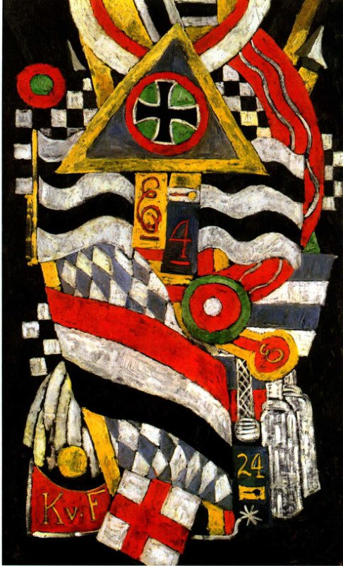

*图27.39 马斯登·哈特利：《德国军官》。1914年。布面油画，173.4 × 105.1厘米。纽约大都会艺术博物馆，艾尔弗雷德·施蒂格利茨收藏，1949年（49.70.42）*

## 欧洲的早期现代建筑

在第二十六章中，我们讨论了现代建筑的两种独特方法，一种诞生在美国，另一种出现于欧洲。路易斯·沙利文和弗兰克·劳埃德·赖特这样的美国艺术家向历史主义与传统的复兴主义发起挑战，彻底消除了建筑形式及其预定功能之间的区分。欧洲也出现了摒弃复兴风格的现象，新艺术风格将现代建筑界定为体现生长与运动的有机风格。整个20世纪期间，现代建筑始终追随由芝加哥学派和新艺术风格所确立的相对两极，即理性、几何性和功能性与个人化、指涉性和表现性。

### 奥地利与德国的现代主义建筑

20世纪最初几十年间，奥地利和德国影响了现代建筑的整体面貌。前一章中讨论过的查尔斯·伦尼·麦金托什（见第930-932页）19世纪80年代曾于欧洲风行一时，并在该世纪末尤为受到维也纳年轻建筑师们的推崇，当时他们正在寻找新艺术风格的替代品。

**约瑟夫·霍夫曼** 奥地利建筑师约瑟夫·霍夫曼（Josef Hoffmann，1870-1956年）特别青睐麦金托什的建筑。1903年，霍夫曼成立了“维也纳工作室”（Wiener Werkstätte），可以看作工艺美术运动的维也纳翻版，这一运动在20世纪早期造就了一批最伟大的实用艺术品。霍夫曼涉足建筑与设计两个领域，并从麦金托什的几何性中汲取灵感。他对立方体几乎痴迷，甚至获得了“方块霍夫曼”（Quadrat-Hoffmann）的绰号。1903年，他设计了波克斯道夫疗养院（Purkersdorf Sanitarium），一座缺少装饰或细节处理的简朴建筑，偶尔出现的窗户会打断白色墙壁构成的整体平面。

霍夫曼的杰作是斯托克雷特府邸（Palais Stoclet，图27.40），于1905年建在布鲁塞尔，是比利时银行家的私人住宅，此人也曾在维也纳生活。正方形与长方形在建筑中明显占据主导地位，并拓展到正方形石面构成的白色大理石饰面与窗户上。霍夫曼还引入了新艺术风格的微妙与精致，而非其有机形态主义，这一点表现在勾勒建筑外边的镀金青铜条带、屋顶栏杆的优雅比例，以及高大垂直的楼梯窗户中。青铜条带与大理石贴面的接缝使得建筑具有了精美的线性表面。为了符合工艺美术运动的精神，霍夫曼亲手设计了斯托克雷特府邸的每个元素，包括花园、家具和餐具。和谐的整体感弥漫其中，产生出具有禅意的宁静祥和，折射出维也纳工作室效仿了工艺美术运动对日本艺术和文化的推崇。

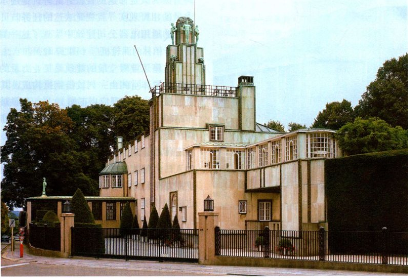

*图27.40 约瑟夫·霍夫曼：布鲁塞尔斯托克雷特府邸。1905-1911年*

**阿道夫·卢斯** 第二位重要的维也纳建筑师是阿道夫·卢斯（Adolf Loos，1870-1933年）。毕业于德累斯顿技术学院（Dresden College of Technology）之后，卢斯前往芝加哥旅行，参观了1893年的哥伦比亚展览会，并在那里驻留了三年，领会了中西部建筑师的功能主义（functionalism），尤其感受到路易斯·沙利文的魅力。返回维也纳之后，他从事室内设计，并为自由主义杂志撰稿，不时撰文斥责新艺术风格的浮华装饰。1908年，卢斯出版了题为《装饰与罪恶》（Ornament and Crime）的功能主义理论书籍。他宣称，除墓葬与纪念碑之外，建筑应该是功能性的，并写道：“现代人，具有现代神经的人，不需要装饰；装饰让他作呕。”卢斯甚至在装饰与粪便般的涂鸦之间划上等号。进一步而言，作为一名社会主义者，卢斯认为装饰与历史主义尤为令人难耐，因为这些都与财富相关，与对手工艺人的压迫相关。

在建于1910年的斯泰纳宅邸（Steiner House，图27.41）中，卢斯对其理论进行了实践。虽然以霍夫曼波克斯道夫疗养院中U型花园的立面为基础，但是卢斯的设计更为朴素，也更加强调体量。他将檐口缩减为纤细到几乎无法觉察的条带。窗户的设计极具功能性，而非美感，水平的窗户尤为如此。1923年，卢斯移居巴黎，盛期现代主义建筑师欣然接受了他的反装饰主义，并将斯泰纳宅邸视为此种风格的典范。

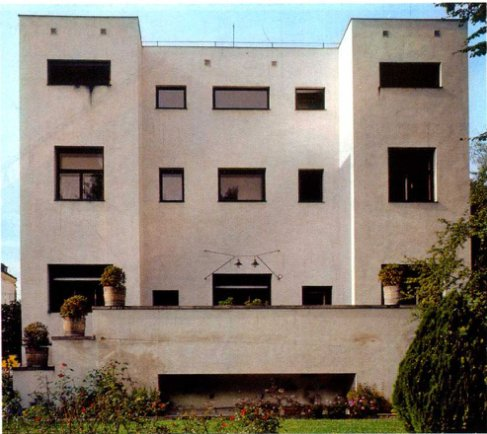

*图27.41 阿道夫·卢斯：维也纳斯泰纳宅邸，面对花园的一侧。1910年*

**赫尔曼·穆特修斯与彼得·贝伦斯** 在德国，政府和工业促进了现代主义建筑的出现。1896年，政府官员将建筑师赫尔曼·穆特修斯（Hermann Muthesius）派遣到伦敦学习英国工业与设计，伦敦在当时高质量的批量生产领域处于世界领先位置。1904年回国之后，穆特修斯被指派在“普鲁士贸易委员会”（Prussian Trade Commission）中担任职务，并承担改革实用艺术教育的任务。为了控制世界市场，他提倡批量生产功能性产品，并采用精心设计的机械式风格。1907年，穆特修斯协助成立了“德意志制造联盟”（Deutsche Werkbund），由建筑师、设计师、作家和工业家所组成，目标在于“选择艺术、工业、工艺和贸易的最优秀代表，结合所有力量向高品质的工业产品迈进”。在建筑方面，穆特修斯号召以辛克尔的古典主义为基础，创造出新的宏大风格，同时也可以反映现代工业的价值观。

穆特修斯推荐的制造联盟成员之一是建筑师彼得·贝伦斯（Peter Behrens，1868-1940年），他曾是杜塞尔多夫一所实用艺术学校的校长。同样在1907年，贝伦斯被提名为德国通用电器公司的设计顾问，负责设计该公司的建筑、产品和营销材料。在制造联盟与通用电器公司之间，贝伦斯获得了在工业化中将德国信仰贯彻为天定命运的授权；此外，他还承担着为工业力量的粗野现实寻找视觉表达的任务。贝伦斯在其最精美的通用电器公司建筑中实现了这一目标——1909年建于柏林的涡轮机厂（图27.42）。

*图27.42 彼得·贝伦斯：柏林A.E.G.涡轮机厂。1909-1910年*

这座工业殿堂般的建筑是工业力量的真正象征。巨大的主体空间由一列铰链钢拱构成，其形式与立面上的屋顶线脚相呼应，正如19世纪钢铁玻璃结构的火车站和展览大厅那样。然而贝伦斯的设计并不是包在历史外壳内的温室，而是一座抽象宏伟的建筑，令人想起高贵的古典神庙和埃及建筑的入口。角落处开有颇具乡村风味的巨型埃及塔门，支撑着庞大的山墙，然而两侧墙壁的窗户却向内凹入，这样钢铁拱的下部就暴露在外，使得成行的拱脚就像一列柱廊。但是贝伦斯声称，建筑的现代性不仅表现在其朴素外表，还在于末端处的巨大窗户，这是一道确定无疑的现代主义透明幕墙，似乎就挂在“三角楣”下。

尽管贝伦斯以涡轮机厂的建筑设计夸大了工业形象，但他并没有采用穆特修斯所提倡的机械风格——“标准化”（Typisierung），即一种类型或者基础单元，相当于批量生产的模件组装建筑，可供所有建筑师采用。这种机械风格将由贝伦斯事务所里另外三位建筑师发展起来，他们是沃尔特·格罗皮乌斯、路德维希·米斯·凡德罗和勒·柯布西耶。

**沃尔特·格罗皮乌斯** 1910年在贝伦斯事务所里工作的建筑师中，沃尔特·格罗皮乌斯（Walter Gropius，1883-1969年）是最为进步的一位。他与阿道夫·麦耶（Adolf Meyer）合作，在1911年接受了设计法古斯工厂（Fagus Factory，图27.43）的委托，这是一家位于莱纳河畔安费尔德的制鞋工厂。格罗皮乌斯精通霍夫曼、卢斯和贝伦斯的作品风格，却转向了芝加哥学派，运用其包裹着钢铁玻璃幕墙的钢铁网格骨架设计。工厂的玻璃立面似乎神奇地从上方的砖面横梁处垂挂下来，甚至让角落处也变得一览无遗。建筑轻盈通透，窗框纤细优雅。水平的不透明板面与玻璃的尺寸完全相同，区分出三个楼层，延续着窗户的模件结构。只有古典的学院派入口和支撑横梁的纤细的砖面伪墩柱借鉴了历史样式。另外，借由法古斯工厂，格罗皮乌斯创造了穆特修斯所追求的机械风格——依附于网格骨架的无装饰建筑。这种建筑类型极其有效，且容易复制，将成为日后玻璃盒子建筑的原型，而后者将在20世纪其余年代占据世界建筑的主导地位。

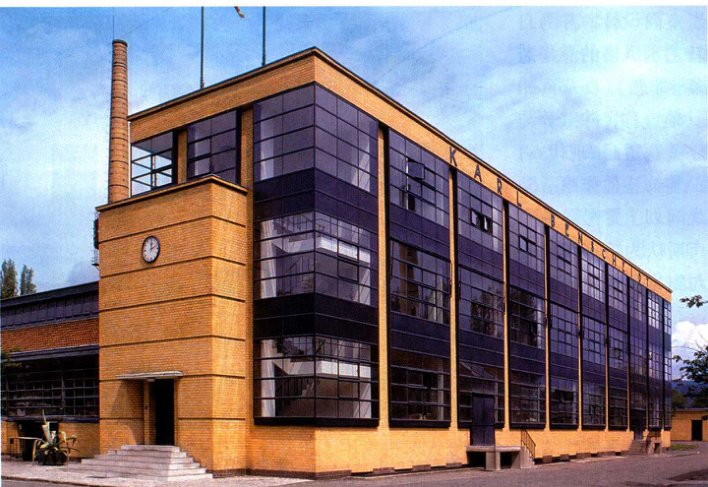

*图27.43 沃尔特·格罗皮乌斯与阿道夫·麦耶：德国莱纳河畔安费尔德的法古斯工厂。1911-1913年*

### 德国表现主义建筑

并非所有德国建筑师都拥护技术、机器时代和穆特修斯的标准化观念，也有人设计出具有表现精神的建筑，意在对抗现代性冰冷、非人性的影响。

**亨利·凡·德·韦尔德** 亨利·凡·德·韦尔德（Henri van de Velde，1863-1957年）也是制造联盟的建筑师，他是比利时人，在比利时最初作为新印象主义画家而获得成功，之后成为新艺术风格的建筑师与设计师。1901年，凡·德·韦尔德成为萨克森魏玛公国（Grand Duchy of Saxe-Weimer）的手工工业顾问。凡·德·韦尔德极力鼓吹尼采的超人理论，并相信有力的表现性建筑扮演着极为重要的角色。他还受到慕尼黑心理学家特奥多尔·李普斯（Theodor Lipps）及其“移情”（Einfühlung）理论的强烈影响，该理论讨论自我向艺术品的神秘投射。这种背景引导凡·德·韦尔德研究了威廉·沃林格（Wilhelm Worringer）1908年的著作《抽象与移情》（Abstraktion und Einfühlung），书中主张通过抽象达到超验境界，同时拥护对生机勃勃的心灵状态进行强烈表达的美学观。

在1903年的希腊与中东之旅中，凡·德·韦尔德被迈锡尼和亚述建筑的简洁与纯粹深深打动，于是在其为1914年科隆制造联盟博览会设计的剧院（图27.44）中，将这些特色转译为现代的语汇。这座建筑的设计意在对抗穆特修斯的标准化风格，而标准化风格在格罗皮乌斯为1914年博览会设计的工厂模型中得到完全展现。尽管凡·德·韦尔德的设计庞大而抽象，但这座建筑似乎是一个有生命的机体，而非冰冷、规范的盒子。建筑内部的每一处空间都可以从外观上推测出来，其均具有专属的标示。由于采用了曲线外观，建筑仿佛在不断地膨胀、呼吸。然而，这不再是新艺术风格所体现的沸腾青春，反映出在建筑中投注精神性与生命力的需要，并通过模仿古代近东文明宏大纯粹的建筑形式，增强了其中的精神性与生命力。

> **大事年表**
>
> *   1908年 - 阿道夫·卢斯出版《装饰与罪恶》
> *   1908年 - 威廉·沃林格出版《抽象与移情》
> *   1909-1910年 - 彼得·贝伦斯设计建造A.E.G.涡轮机厂
> *   1911-1913年 - 格罗皮乌斯和麦耶设计建造法古斯工厂

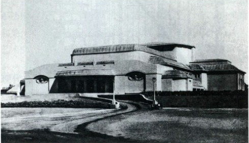

*图27.44 亨利·凡·德·韦尔德：科隆制造联盟剧院。1913-1914年，1920年拆除*

**布鲁诺·陶特** 在1914年的制造联盟博览会上，布鲁诺·陶特（Bruno Taut，1880-1928年）设计的玻璃宫（Glass Pavilion，图27.45）可以视为又一处对精神性的贡献。这座建筑为玻璃制造厂而建，反映出陶特对水晶的神秘性质的信仰。诗人保罗·舍尔巴特（Paul Scheerbart）是玻璃的倡导者，于1914年在《狂飙》杂志上发表的论文《玻璃建筑》（Glasarchitektur）对艺术家和建筑师都产生了极其巨大的影响（见第四部分末尾的附加原始文献）。陶特玻璃宫顶部的横梁上甚至蚀刻有舍尔巴特关于玻璃力量的箴言。

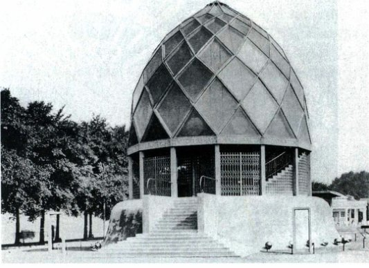

*图27.45 布鲁诺·陶特：1914年科隆制造联盟博览会的玻璃宫*

舍尔巴特声称，只有全部空间都向阳光敞开的玻璃建筑才能够将德国文化提升到新的精神高度。因此，陶特使用玻璃砖建造了墙壁与地板（图27.46）。球状的穹顶仿佛巨大的水晶，由两层玻璃制成；外层玻璃具有反射性，内层则采用了大量彩色玻璃块，像是中世纪的彩色玻璃窗。陶特还考虑到将穹顶设计为哥特样式，其块面让人感受到火焰哥特式拱肋所具有的生命冲动。主要空间的天花板则开设有集中式圆窗，散发出一片彩色的精神之光。

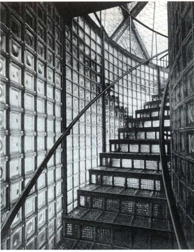

*图27.46 布鲁诺·陶特；科隆玻璃宫楼梯。1914年*

**马克斯·伯格** 一年之前，受神秘主义激发的建筑师马克斯·伯格（Max Berg，1870-1947年）采用了类似的圆形设计，完成了位于布雷斯劳（Breslau）的百年纪念堂（Jahrhunderthalle，图27.47）。该建筑为庆祝德国摆脱拿破仑的统治重获自由一百周年而兴建。伯格的表现主义具有相当的浪漫主义特色，因为钢筋混凝土（钢铁加固的水泥）所建造的庞大建筑很容易令人联想到皮拉内西对罗马崇高伟大的痴迷，以及布雷的空想式建筑（见本卷第1013页的材料与技法）。体量庞大的椭圆形拱像是一座古罗马水道或桥梁，向内弯曲成圆形，直接从地面起拱。天顶的拱肋仿佛是万神殿的样式，但是实与虚的位置颠倒了，因为格子平顶的部分现在成了窗户，造就出天堂之光的光环，穹顶看起来仿佛飘浮在空中。万神殿的圆形开口处在这座建筑中则是闭合的。当时的评论家将这个黑色圆盘比喻为眼睛的虹膜，而飘浮着的整个穹顶则是连接宇宙的巨大眼球。其中一位作家曾这样表述过：“宇宙打开了，以揭示星辰与苍穹的运行。”

1925年，伯格放弃了建筑，将余生都投身到基督教神秘主义之中。但早在1912年，当桥社和青骑士的成员们力图通过绘画、版画和素描，将德国引领进入一个具有更高精神性的世界时，伯格也试图用钢筋混凝土与玻璃达到同样的效果。

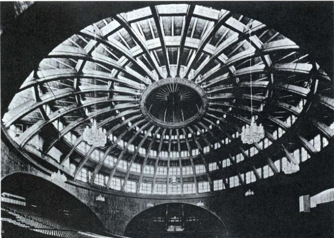

*图27.47 马克斯·伯格：德国布雷斯劳百年纪念大厅内景。1912-1913年*

## 小结

20世纪早期，科学上的突破改变了几个世纪以来关于物质与能量基本性质的古老信仰，使得社会与文化环境对西方现代艺术的持续发展至关重要。一批艺术家重新考虑艺术创作的基本原则。对于许多先锋艺术家而言，仿佛有一道面纱被揭开了，展示出形式与空间的新关系，以及线条与色彩的新功能。关于人类意识的哲学与心理分析学研究同样鼓励大批先锋艺术家去追求自我的新型呈现方式，有些人甚至选择在纯粹抽象中寻找人性的本质。

### 野兽派

当马蒂斯和德兰的作品在1905年秋季沙龙展出之时，其令人震惊且违背常规的面貌是对观众的当头一击，这些艺术家也因此被称为“野兽派”。野兽派的色彩与自然表象之间没有明显的联系，只是用来表现纯粹的形式目的。同样，传统的透视系统也被抛弃，例如焦点透视、物体距离越远则越小等。现在的空间被当作流动主观的元素来处理，服从题材的需要。然而野兽派所表现的题材却毫不激进，一般都是诗情画意的田园风光、肖像和静物。这是克劳德和普桑所追求的类型，1905年的评论家忽视了这一联系，但是马蒂斯及其同伴却理解这一点。

### 立体主义

与野兽派一样，毕加索和勃拉克在立体主义实验之初，也已经理解了之前的艺术传统。事实上，毕加索在1907年创作激进的《阿维尼翁少女》时，曾有意地采用法国学院主义，这幅作品的尺寸与供官方沙龙展出的历史画画幅完全一致。然而如果没有塞尚所发展的美学模式，立体主义就不可能出现。塞尚对自然进行了坚实的结构性思考，为立体主义的形式与线条使用方法指明了道路。而毕加索和勃拉克思考了时空连续统一体，摆脱了绘画只能从一个视角来表现的传统。

### 野兽派与立体主义的影响

野兽派与立体主义中被克制的情感在表现主义以及俄耳甫斯主义的某些方面得以释放。德国与奥地利表现主义者具有原始且通常令人焦虑的情感，他们寻找一种能够传达其感觉强度的视觉语言。保拉·莫德松-贝克以塑造女裸体的新方式做出了示范，涤除了之前裸体绘画的陈腐传统及其毫无个性的色情主义，转而创作强烈宏大的个人化图像。维也纳表现主义艺术家埃贡·席勒以同样的方式来绘画男性裸体，将之转型为表达个人情感的通道，而非集体理想。诸如罗贝尔·德劳内这样的俄耳甫斯主义者则找到了不同的方式，他们追求描绘与宇宙的神秘相遇，运用野兽派的色彩使得含混的立体主义结构明亮起来，以此创造出与生命力一起脉动的无尽空间。马克·夏加尔和乔治·德·基里科等画家也着迷于立体主义的空间重构，努力寻找再现梦境、神话和记忆幻象的方式。立体主义提供了摆脱文艺复兴透视法传统逻辑的途径，产生出错乱空间的新观念，增强其图像中的神秘感。

其他艺术家与艺术群体也纷纷将野兽派和立体主义作为跳板，发展出有时甚至更为理论化的方向。未来主义就是一种具有理论倾向的艺术，该运动中的艺术家相信意大利的古典遗产是国家进步的障碍，他们欢迎自诩为现代标志的工业化、速度、工厂，甚至机械化战争，运用野兽派色彩和立体主义联系形式与空间的观念来传达运动与动态的能量。

### 马塞尔·杜尚与现代艺术的进退维谷

马塞尔·杜尚从全新的方向来创作艺术，发明了挪用现成品，例如《自行车轮》。将自行车轮子放在凳子上的创作手法挑战了大量艺术观念：艺术是手工制品，艺术具有风格和美，艺术是幻觉或者再现，艺术具有固定的含义。现在，艺术变成了观念的载体。

### 现代主义雕塑：布朗库西与马约尔

康斯坦丁·布朗库西将雕塑缩减为体现最精简本质的抽象形式，捕捉到生命与体验的基本真理，将艺术从古典典范和罗丹的影响中解放出来。在布朗库西之前，阿里斯蒂德·马约尔就将自己的人像雕塑简化为简洁宏大的形体，但仍保持了古典雕塑的面貌，唤起地中海地区完美、优美和理想主义的感觉，反映出对现代的逃避，正如马蒂斯的《生活的欢乐》。

### 美国艺术

20世纪之初，美国艺术具有其特有的风格，即垃圾箱画派。一群费城插图画家回溯到马奈的现实主义，从费城来到纽约，记录在曼哈顿发生的剧烈社会变革，其中包括来自欧洲的大批移民、非裔美国人的北迁，以及独立的新女性的涌现。艾尔弗雷德·施蒂格利茨的291画廊与1913年军械库展览力图将现代主义引入美国，并成功地促生了若干支持现代艺术的画廊与收藏家。曾去过欧洲的美国艺术家所创作的艺术品最为进步，其中包括早在1910年就绘制抽象绘画的阿瑟·达夫，以及1915年时在柏林创作表现性的综合立体主义系列绘画的马斯登·哈特利。这两位艺术家都预示了寻求精神表达的方向，这将在两次世界大战期间成为众多美国艺术家所关注的问题。

### 欧洲的早期现代建筑

欧洲的现代建筑首先出现在维也纳和德国，并表现为两个方向：其一是追随芝加哥学派形式服从功能的机械式建筑；其二则是个人化、表现主义的幻象式建筑，以新艺术运动所建立的模式为榜样。维也纳的阿道夫·卢斯致力于设计前一种风格的建筑，摒弃了装饰观念，偏爱简单的形式。沃尔特·格罗皮乌斯也是如此，他所构思的设计样式将建筑视为贴附着轻薄玻璃皮肤的钢铁网格骨架。一批德国建筑师则拥护表现主义路线，特别是布鲁诺·陶特，他使用玻璃建造建筑，让室内弥漫着神秘的光线。马克斯·伯格所设计的钢筋混凝土礼堂不仅宏伟，而且具有罗马建筑的面貌，但天花板却像是飘浮在空中，引领精神力量由此进入。