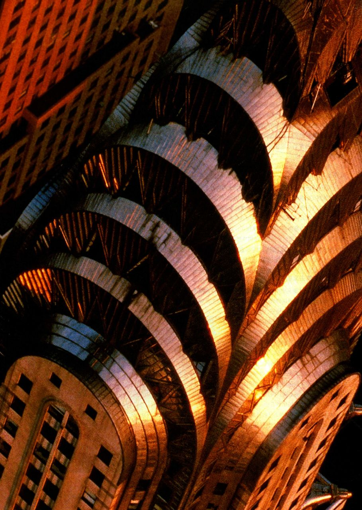

*图28.47 局部，威廉·范·阿伦：克莱斯勒大楼*

# 第二十八章 两次世界大战之间的艺术

第一次世界大战在物质和心理上都对西方文明造成了破坏。这种破坏与生命的丧失令人惊愕，每次战斗都会有无数的战士阵亡。许多人原本以为逻辑、科学与技术能够带来更美好的世界，但情况却出现了可怕的偏差。19世纪的进步并没有造就更美好的世界，反而产生了机枪、远程大炮、坦克、潜艇、战斗机和芥子气等高科技武器。

对很多人而言，民族主义变成了一个具有破坏性的概念，而1917年第一个共产主义政权在俄国的诞生则似乎带来了救赎的希望。共产国际的分支在世界各国出现，其目标是创造一个没有国界的世界，这个世界由无产阶级联合起来，他们就是为资本主义体制提供劳动力的工人阶级。其他人则坚信，如不捣毁旧秩序，就无法建立新的世界秩序，于是极力宣扬无政府主义，在战后的几十年间持续造成威胁。虽然人们具有创造无国家、无阶级世界的欲望，但到了20世纪30年代末，掌握欧洲政局的却是法西斯主义。这是一种极权主义的政治体制，将国家置于个人之上，要求人们向唯一的领袖效忠，对第一次世界大战的战败国具有特别的吸引力。其中受到凡尔赛条约羞辱的德国尤为如此，战后的德国经历了剧烈的通货膨胀，并最终经济崩溃。阿道夫·希特勒（Adolf Hitler，1889-1945年）和纳粹党逐渐迷惑了德国人，并巧妙运用经济危机和反犹主义巩固了自己的权力。意大利和日本也出现了相同的情形，法西斯分子在个人魅力非凡的领导人指挥下攫取了统治权。这几个国家都装备了新技术制造的破坏性武器，终于在1939年再次将世界拖入另外一次大战之中。

当法西斯主义、共产主义、无政府主义和民主主义纷纷在欧洲谋取统治权的同时，美国则在20世纪20年代出现了前所未有的繁荣局面。历史学家将战后的经济与文化繁荣称为“咆哮的二十年代”（Roaring Twenties），那是一个爵士乐、地下酒吧、收音机广播和电影盛行的时代。城市也在20年代逐渐成为国家的标志。技术与机器统治着美国，那里仅用一年时间就兴建起世界最高的摩天大楼。然而，这种令人兴奋的经济发展随着1929年10月股票市场的崩溃戛然而止，甚至使得整个世界都进入了经济低迷期，即贯穿30年代的大萧条。反动的极端运动也影响了欧洲与美国：欧洲出现了法西斯主义，美国则出现了保守的地方主义与孤立主义。尽管如此，30年代仍然标志着美国自由社会与经济改革的到来，这就是富兰克林·德拉诺·罗斯福（Franklin Delano Roosevelt）政府所设立的政策。罗斯福相信经济市场具有与生俱来的不稳定性，于是推行新政，由政府资助创造了数百万个工作机会，其中也包括提供给艺术家的大量机会。

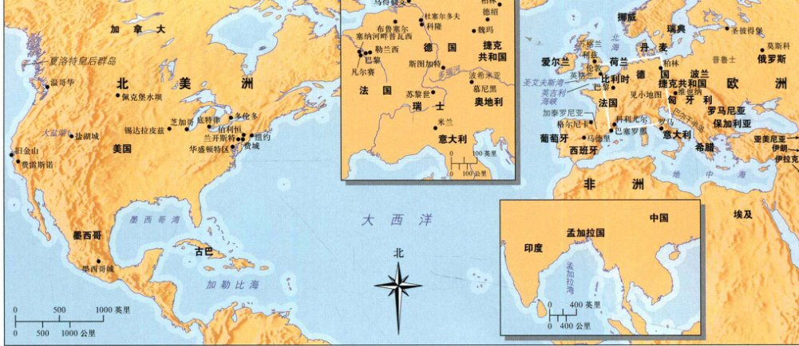

*地图28.1 欧洲与北美洲（嵌入图版为亚洲）*

两次世界大战期间，对于艺术家最具决定性的影响可能就是战争本身，以及赋予战争如此巨大破坏力的技术、科学与启蒙理性主义。战争直接导致了达达主义的产生，其旨在创造无意义的虚无主义艺术，向中产阶级的价值观与传统习俗发起攻击，其中也包括反对技术信仰。达达主义者的目标在于扫清哲学上的障碍，引领人们走上通往世界新秩序的道路。其他艺术家则拥护“机器时代”（两次大战之间时期的别称）的现代化，将其看作创造无阶级乌托邦的捷径。同样也有一些艺术家反对现代化，于是在日益物质主义、丧失灵魂的世界中，寻求更高的真理，或者有意义的精神性。两种艺术家都求助于抽象来实现其愿景。支持技术的艺术家采用机械时代的几何化与机械化面貌，而持反对态度的艺术家则运用有机或者生物形态的语汇来追求更高的真理。

那个时期另一股重要力量则是西格蒙德·弗洛伊德。他关于无意识与梦境的理论影响了超现实主义的形成，并与20世纪20年代至30年代间广泛流行。与很多抽象艺术家一样，超现实主义者力图揭示不可见的现实，但并非精神现实，而是驱动所有人的基本力量。这些不可见的现实深植于人的头脑之中，通过梦境以象征的形式显现。弗洛伊德主张，文明社会的习俗压抑了人们共有的基本需要与欲望，而这个受压抑、不可见的欲望世界与性能量正是人类行为的基础，也是所有人的内部驱动力。他承认文明社会需要压制和引导这些欲望，但是个人却要为此付出代价，即罹患神经官能症，或怀有不满情绪。在超现实主义艺术家、作家和知识分子眼中，弗洛伊德的无意识理论证实了眼睛不可见、意识不可感的现实的存在，而这正是超现实主义图像与风格的出发点。

政治也强烈影响了这个时期的艺术。即便不是绝大部分，但也有很多先锋艺术家都是社会主义者或共产党员，或者最起码也是社会主义和共产主义的同情者，其部分乌托邦式的梦想与美学幻想就来源于这些政治意识形态。伟大的墨西哥艺术家所创造的叙事性、再现性壁画，直接表达了对共产主义的拥护，与科学题材同时出现时更是如此，因为科学被视为创造无阶级理想社会的工具。伴随着希特勒的权力及其国家社会主义党的发展壮大，很多先锋艺术家将注意力转向创作反法西斯作品，并热衷于揭露德国新政府的疯狂思想与暴虐残忍。

这个时期对于种族与民族认同的兴趣也日益增长，在墨西哥和美国黑人的艺术中均有体现。墨西哥壁画家首要关注的是民族认同，并将其与本土居民联系起来，否认自己是欧洲墨西哥人。而美国黑人则力图发现自己的遗产与文化，一如玛丽·卡萨特、贝尔特·摩里索和朱莉娅·玛格丽特·卡梅伦试图从与男性视角相反的女性视角来表现女性，并发展出不同的艺术一样，墨西哥和美国黑人艺术家以相同的方式来对待非洲与本土文化。他们创作了许多迥然不同的作品，表现出对非欧洲文化的不同态度。

## 达达主义

大部分的艺术创作活动都由于世界大战而终止，因为很多艺术家被征召入伍。某些最杰出的艺术家在战争中丧生，例如表现主义者弗朗茨·马尔克和奥古斯特·马克（August Macke）、未来主义者博乔尼和桑泰利亚。但是战争也造就了另一个艺术运动：达达主义（Dada）。这个名称是随机选择的结果，据说德国诗人理查德·许尔森贝克和雨果·巴尔（Hugo Ball）将小刀插入法德字典，刀尖正指着“dada”一词，法语中是“木马”之意。这个词通常与孩子气联系在一起，同时也与诗人构思名称时经常出现的暴力事件有关，与战后精神完美契合。达达主义诞生的故事表明，其基础正是偶发事件与荒谬。达达艺术家坚信逻辑与理性只会引起战争。对他们而言，无意义和荒谬才是震撼观众的工具，并帮助其摆脱中产阶级的自满与传统思维习惯。该运动在深层次上承担着挑战政治现状与文化现状的使命。达达主义于1916年在中立的苏黎世兴起，那里聚集了一大批在战争期间来此避难的作家和艺术家，正如巴尔宣称的那样，他们致力于“提醒世人还有独立的人存在，他们超脱于战争和民族主义，为不同的理想而活”。达达运动的精神还传到西欧和东欧的部分地区，并将成为整个20世纪期间艺术家们的参照。

### 苏黎世达达：让·汉斯·阿尔普

1916年，诗人雨果·巴尔在苏黎世成立了“伏尔泰茶座”（Cabaret Voltaire），将其作为作家和艺术家抗议世界大战荒谬、浪费的表演中心。之所以用伟大的启蒙哲学家伏尔泰的名字命名，是因为其思想正是达达主义者所抨击的逻辑缩影（见第790页）。特里斯坦·查拉（Tristan Tzara）迅速加入巴尔的行列，这位罗马尼亚诗人成为了达达主义最热情的支持者。参与伏尔泰茶座的艺术家和作家们抨击理性思维，因为其孕育了应为战争负责的堕落文明。他们将政治、道德和美学的全部既有价值观作为攻击对象，旨在通过无理性和无政府彻底颠覆中产阶级的旧秩序。最终，他们希望产生“白板”（tabula rasa），为理解世界提供全新的基础。

阿尔萨斯画家兼诗人让·汉斯·阿尔普也是伏尔泰茶座艺术家群体的成员，经常与其他成员一起进行喧闹的表演活动。身着稀奇古怪的服装，带着纸板做的原始面具，艺术家们吟诵着无词句、无韵文的抽象语音诗歌，例如雨果·巴尔“O Gadji Beri Bimba”中的“Zimzum urallal zumzum urallal zumzum zanzibar zumazall zam”。诗歌朗诵几乎淹没在伴奏“音乐”里，而所谓的伴奏不过是噪音而已，通常是没有节奏的鼓点。表演者的混乱让观众愤怒至极，嘘声、口哨和咆哮声不绝于耳。在某些晚会上，查拉会面对观众长篇大论地宣讲散漫且实际上无法理解的达达主义宣言。正如偶然命名了达达一样，“偶然”还出现在作品之中。从帽子里抽出的字词“写”成了达达诗歌，有些时候诗人还同时以不同的语言来朗诵，或者用一种语言同时朗诵某篇诗歌的不同段落。结果，偶然产生的字词以新方式组合在一起，创造了在语音和意义上都颇为新颖的诗作。有些表演还包括黑人舞蹈和黑人歌唱，这是对非洲舞蹈和音乐的称呼，反映出该群体对所谓“原始文化”的兴趣，这些文化被想象为未受先进文明的恶魔所控制。而且，达达艺术家们相信，非洲文化的直接与单纯，让这些文化与自然的原始本质相关联。达达主义表演最为深远的影响可能在于打破了各种艺术之间的界限，视觉艺术家、音乐家、诗人、演员和作家统统联合起来进行创作。此外，达达主义者还破坏了艺术媒介与类型中的等级划分。

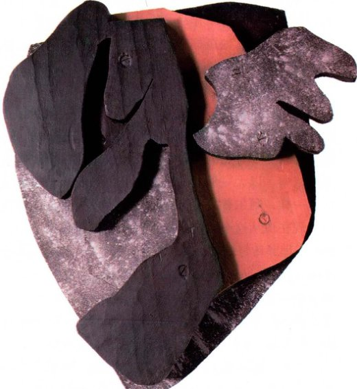

*图28.1 让·汉斯·阿尔普：《埋葬鸟与蝴蝶（查拉之头）》。1916-1917年。彩绘木浮雕，40 × 32.5厘米。苏黎世艺术馆（Kunsthaus）*

苏黎世达达主义者展出的先锋艺术作品涵盖广泛，只要是能够颠覆中产阶级品位与标准的作品都在他们的视野之内，其中也包括基里科和克利的作品。在伏尔泰茶座以及后来的达达画廊（Galerie Dada）中展出的大部分作品都以抽象风格完成。让·汉斯·阿尔普（Jean Hans Arp，1886-1966年）是其中最有影响力的视觉艺术家之一，他的抽象拼贴作品在伏尔泰茶座开业当晚就挂在茶座墙上。阿尔普会将撕碎的方纸块丢落在地板上，以此来创作拼贴作品，纸片所落的位置则决定了作品构图。尽管他声称安排纸片布局的唯有偶然，但他仍有可能巧妙控制了纸片的下落位置。

阿尔普相信是偶然本身重复着自然。对他而言，生命尽管拥有最精细的安排，但也是纯粹的偶然。他曾在慕尼黑与康定斯基一起创作（见第957-958页），那时他接受了神秘的世界观，想象生命力贯穿流转于万物之中，以无一例外的秩序将其统一起来。和康定斯基一样，阿尔普力图捕捉抽象的宇宙力量。这种特点表现在他从这个时期开始创作的浅浮雕作品之中，例如《埋葬鸟与蝴蝶（查拉之头）》（The Entombment of the Birds and Butterflies [Head of Tzara]，图28.1）。阿尔普首先在纸上胡乱涂画以决定各个不同的形体，之后让木匠用木材裁出这些形体，再施以彩绘并组装成抽象作品，令人联想到植物和动物形式，还有云彩、宇宙间的气态物质，以及天堂中的形体。阿尔普最后才为作品命名，这个标题暗示作品也可以被视为面具，表现人类与自然之间的原始联系。

伏尔泰茶座于1916年夏天关闭，随后被其他场所取代。与此同时，查拉的《达达》杂志将该运动的精神传播到世界各地。在1918年末战争结束之时，很多重要艺术家都离开了苏黎世，苏黎世达达也在1919年初落下帷幕。战争结束之后，查拉才听闻同时存在于纽约的达达运动。也许各自的名称并不相同，但至少具有相同的精神。

### 纽约达达：马塞尔·杜尚

纽约达达以马塞尔·杜尚和弗朗西斯·皮卡比亚（Francis Picabia）为核心，二人都为了逃避战争而于1915年离开巴黎。皮卡比亚因其讽刺肖像画而声名不佳，他在画中会以机械来表现人物。摄影师施蒂格利茨（见第940页）的肖像被描绘为“照相机”，具有人的品性，也是施蒂格利茨个性的化身。纽约的达达艺术家并没有伏尔泰茶座或者宣言，也没有表演，他们只是每周在富有作家沃尔特·阿伦斯伯格（Walter Arensberg）及其妻露易丝（Louise）的家中举办一次聚会。1915至1916年间，这些艺术家在名为《291》的杂志里发表他们的先锋艺术作品和观念，这本杂志的赞助人是施蒂格利茨；身为摄影家的他，同时也是美国先锋艺术的首批代理人之一。达达一词在当时并没有用来界定其艺术，只是在后人回顾历史时才出现了这种说法，因为他们的精神与苏黎世达达一致。

纽约达达最突出的作品可能是杜尚的《泉》（Fountain，图28.2），杜尚将其提交给1917年的独立艺术家协会展览。这个协会成立于几十年前，旨在为那些不符合纽约国家设计学院保守标准的艺术家们提供展览机会，而国家设计学院则是当时最重要的展览场所。杜尚将《泉》称为“挪用现成品”（assisted Readymade），此处英语原文借用了美国成衣制作（readymade clothing）的用语，以此来命名那些再次展现某个捡拾物品拼装的雕塑，例如杜尚称之为《断臂之前》（In Advance of a Broken Arm）的雪铲；艺术家借助某个物品，或者将它与其他物品结合起来，例如《自行车轮》（见图27.32）；或者只在上面签名，例如《泉》，他称这些物品为“挪用现成品”。正如第二十七章中曾提及，杜尚于1913年开始运用捡拾物品创作。当时他制作了《自行车轮》，然而直到前往纽约之后才展出这些现成品作品。实际上，《泉》是纽约J.L.莫特（J.L.Mott）铁器厂生产的小便池。杜尚看中并买了它，然后将其翻转90度之后放在底座之上，潦草地写上“R.Mutt”作为签名。这一签名不仅指涉制造商，还暗指流行的穆特与杰夫（Mutt and Jeff）连环画中的人物穆特。作品以穆特的名义送往独立艺术家协会展览。根据协会的规定，任何人只要付6美元的入场费就可以参展。但是杜尚很清楚那些掌握生杀大权的委员会成员不会容忍《泉》持续展出，所以当开幕式《泉》被移出场外之机，杜尚的朋友们组成了吵闹的游行队伍，为的就是吸引公众关注该事。

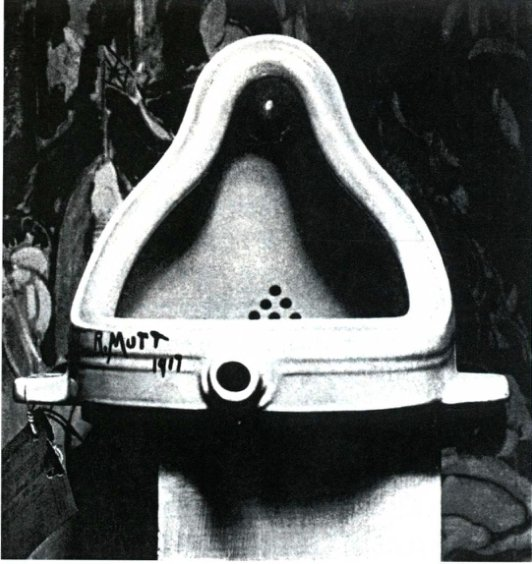

*图28.2 马塞尔·杜尚：《泉》。1917年。艾尔弗雷德·施蒂格利茨摄影，出自《盲男》。1917年5月。费城艺术博物馆，Louise and Walter Arensberg 收藏*

杜尚自己出版了一份叫做《盲男》（The Blind Man）的小报，虽然只有两期，但却在艺术界广为流传。杜尚本人还在《盲男》上发表了一篇文章，继续嘲弄这件作品的作者——R.Mutt。文章还配有施蒂格利茨所拍摄的照片作为插图，照片里的《泉》就放在马斯登·哈特利的作品前（见图27.39），以此坚称《泉》应该在艺术界中占有一席之地。文章为穆特创作现成品的权利进行了辩护：“无论穆特先生是否亲手制作了《泉》都无关紧要。他进行了选择，把一件普通的日用品放在这里，在新的标题与视角下，原本的使用意义也因此消失了·······（创造了）关于这件物品的新观念。”

与杜尚的所有作品一样，《泉》中蕴含多种观念，虽然原作已经遗失，但始终位于20世纪最具开创性的艺术作品之列。这是一座全然观念性的雕塑。观看《泉》的人一定会问，艺术品到底是什么？小便池是艺术品吗？将其提交给展览的挑衅行为是艺术品吗？被移出展览时的喧哗游行是艺术品吗？《盲男》上的有关文章也是艺术品？显然，这些全都是艺术品。而标题对这件作品而言尤为重要，因为这也是雕塑必不可少的组成部分，使得杜尚能够清楚地表明他所攻击的是所有艺术形式中备受尊敬的喷泉。而喷泉则是绝大部分欧洲城市与广场的中心部分，从某种层面来说喷泉甚至是美术的传统象征。讽刺性标题还增强了作品的幽默感，这也是杜尚大部分作品的特点。杜尚告诉我们，艺术可以幽默，也可以违反美学的传统观念，而以最严肃的方式在智力上吸引我们，同样能让我们微笑、甚至大笑。杜尚向有关什么是艺术的观念发起挑战，同时也向技术或手工艺的重要地位，以及艺术家署名的观念宣战。他还追问艺术品的意义如何而来。此处杜尚强调的是情境与意义之间的关系：将小便池从正常情境中抽取出来，这样就改变了小便池的意义（关于杜尚的进一步讨论，见第970-971页）。他甚至允许观众赋予作品意义，并强调这是所有艺术的现实。讽刺的是，与之前的所有艺术不同，杜尚的现成品并没有美学价值，而且在理论上也没有任何预设意义，不过是纯粹发散想法的装置而已。

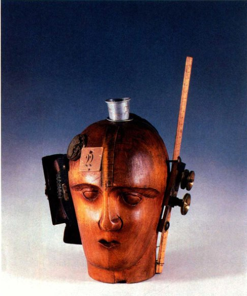

*图28.3 拉乌尔·豪斯曼：《机械头颅》或《时代精神》。约1920年。集成作品，高32.5厘米。巴黎乔治·蓬皮杜中心，国家现代艺术博物馆*

《泉》是件工厂制造的产品，如遇破损，极易调换，杜尚还对艺术品的唯一性相关意义提出质疑。正如20世纪后半叶杜尚成为艺术界举足轻重的人物，由于全世界的艺术家的创作都被称为观念艺术（Conceptual Art）。对这些艺术家来说，一种想法或一个观念前提是作品最重要的组成部分，甚至就是作品本身。

纽约达达非常安静，与苏黎世达达形成了鲜明对照。这个群体处于远离战争的曼哈顿，没有涉及任何政治内容。纽约达达追随杜尚的领导，主要致力于对艺术的界定。更为重要的是，纽约达达无忧无虑、机智诙谐，都表现在皮卡比亚的人形机器与杜尚的《泉》里。此外，纽约达达还运用最高级的双关语、揶揄、讽刺、恶作剧和智力游戏来抨击中产阶级的艺术价值观。此时，具有更敏锐的社会使命感的达达艺术也出现在饱受战争摧残的德国。

### 柏林达达

随着战争结束，达达诗人理查德·许尔森贝克（Richard Huelsenbeck，1892-1974年）离开苏黎世来到柏林。那里他看到了一个垂死的城市，同德国各处一样缺少食物、金钱和医疗，也没有未来可言。德国人，特别是德国工人憎恶军工机械，他们认为这些机械背叛了他们的利益，最终将德国引向战争。作为战败国，德国被课以极为严厉甚至被认为是不现实的赔偿要求，因此每况愈下。通货膨胀日益严重，德国马克一再贬值。公开的阶级冲突在1919年演变为共产党领导的柏林、慕尼黑工人起义，起义受到了右翼军队的无情镇压。取代皇帝的魏玛共和国政府是德国第一个民主政府，但却无力复兴德国经济，1923年拒绝支付战争赔偿一事又让德国蒙受了更多屈辱。法国军队占领了鲁尔河谷，大肆攫取德国的煤矿资源。

在很多人看来，希望出现在东欧的俄国，那里发生的布尔什维克革命让人们开始憧憬由无产阶级统治的无国界世界。于是柏林达达中艺术家和作家们将国际工人的团结看作解救德国之路。然而当时的现实情况也确实令达达的无政府主义和虚无主义派上了用场。柏林达达的成员大都创作政治艺术，在政治上的表现也非常激进，几乎无一例外。其中乔治·格罗斯和约翰·哈特菲尔德等成员还加入了共产党。

诗人许尔森贝克在柏林采用了通常的达达手法，创立了一个名为“达达俱乐部”（Club Dada）的组织，并号召推翻中产阶级当权派，创造平等社会。该团体的主要成员包括拉乌尔·豪斯曼、汉娜·霍赫、乔治·格罗斯和约翰·哈特菲尔德。1920年，他们举办了第一届国际达达博览会（Dada International Fair），以展出全世界的达达艺术为目标。在博览会的中心，天花板上悬挂着身着军装的猪头傀儡，其身上的标语则写道：“被革命绞死。”这是豪斯曼和格罗斯共同完成的作品，也是达达痛恨权威的标志。

**拉乌尔·豪斯曼** 拉乌尔·豪斯曼（Raoul Hausmann，1886-1971年）迅速成为柏林达达的领导者，而他也可能是当时最具视觉创新性的艺术家，正如他在1920年创作的集合艺术作品《机械头颅》或《时代精神》（Mechanical Head 或 Spirit of Age，图28.3）。豪斯曼运用捡拾来的物品进行创作，而这些物品在当时的艺术界显得十分另类，通常都作为垃圾处理。作品中使用了人体模特的头，一个轴环，还有皮夹、标签、钉子和尺子。但是现在我们看到了制作雕塑的新方法，将捡拾来的物品组合在一起，目的在于抨击物质主义的罪恶，以及个性与个人身份的缺失。

豪斯曼以其运用语言和拼贴的手法而为人所知。和苏黎世的雨果·巴尔一样，他也会通过偶然法则进行写作，并表演语音诗歌。对字词、字母和声音的兴趣将他引向了创新性的排印试验，在其中运用从报纸杂志上剪切来的字体与字号各不相同的单个字母，字母的比例变化表示发音时应当如何重读。然后对这些词进行精巧拼贴，其材料就来自各种印刷素材，重新布局在新的上下文里，例如《ABCD》（图28.4）。当然，拼贴手法并不新颖，但以前的使用方式更为精致，尤以立体主义者为甚，立体主义者可以把那些从流行文化中捡来的材料转变为优美的艺术品（见图28.12）。但是豪斯曼的拼贴则保持了原有的面貌和流行文化的感觉，特别是大众媒体中的广告样式。柏林达达艺术家并不将自己的作品称为拼贴，因为拼贴意味着精美的艺术。相反，他们将这些作品称为摄影蒙太奇（photomontages），让人联想到机器批量生产的图像。他们的摄影蒙太奇作品与反艺术相近，在极其荒谬的构图中展示了这个团体锐利的政治主张。

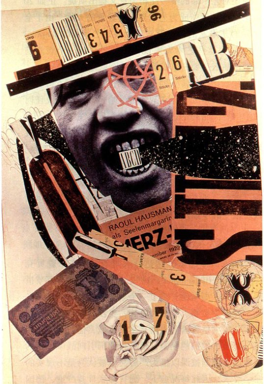

*图28.4 拉乌尔·豪斯曼：《ABCD》。1923-1924年。摄影蒙太奇，40.6 × 28.6厘米。巴黎乔治·蓬皮杜中心，国家现代艺术博物馆*

**汉娜·霍赫** 那个时期，一些最为精美且最为有力的达达拼贴作品都出自汉娜·霍赫（Hannah Höch，1889-1978年）之手，她还是豪斯曼的伴侣。霍赫对德国军人的矫饰肖像照片进行模仿。个别军人或者整营士兵都会雇佣摄影师来创作虚构的肖像照，摄影师首先拍下客户们的照片，之后裁切掉头部，将头粘在事先准备好的图画之中，例如马背上的民兵图像（见第991页的原始文献）。《厨刀裁切的达达作品，德国最后的魏玛啤酒肚文化时期》（Cut with the Kitchen Knife Dada Through the Last Weimar Beer Belly Cultural Epoch of Germany，图28.5）对于柏林达达的发展具有重大意义。霍赫采用了混乱难辨的构图，其中充塞着人物、词语、机器和大小不一、风格各异的字母，并准确捕捉到魏玛共和国狂热的社会、政治与经济张力。她的摄影蒙太奇作品呈现了摄影师为大众媒体所捕捉到的现实。对霍赫及其达达同伴而言，照相机是另外一种机器，与技术进步有关，而后者则导致了战争。霍赫使用“厨刀”重新安排了图像布局，创作手工照片，迫使机器受到人的支配，而非相反。结果产生了旋转的齿轮般效果，反战女艺术家凯特·珂勒惠支的肖像被置于构图中心；德国众生相及其政府魏玛共和国的新领导者则被推向四周，贴上了“反达达”的极端标签，以表示其反对达达与左翼政策。

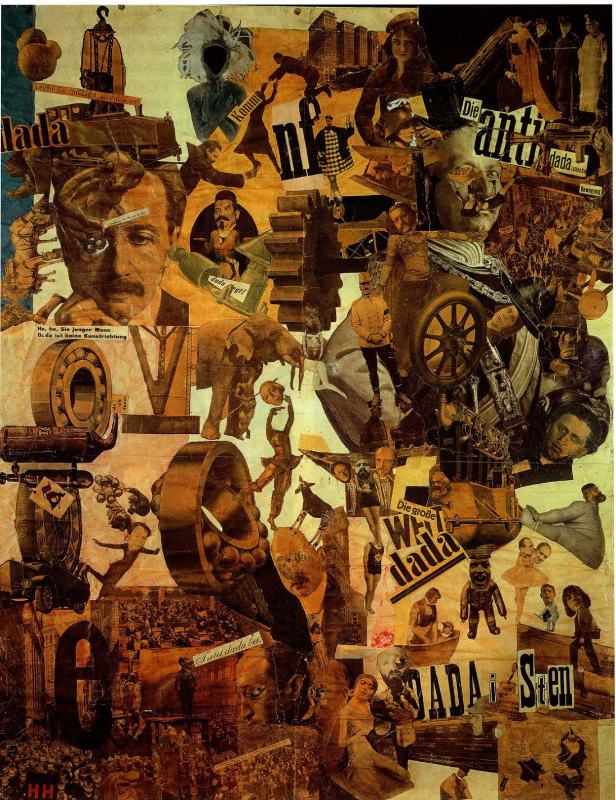

*图28.5 汉娜·霍赫：《厨刀裁切的达达作品，德国最后的魏玛啤酒肚文化时期》。约1919年。拼贴，114 x 89.9厘米。柏林国家博物馆*

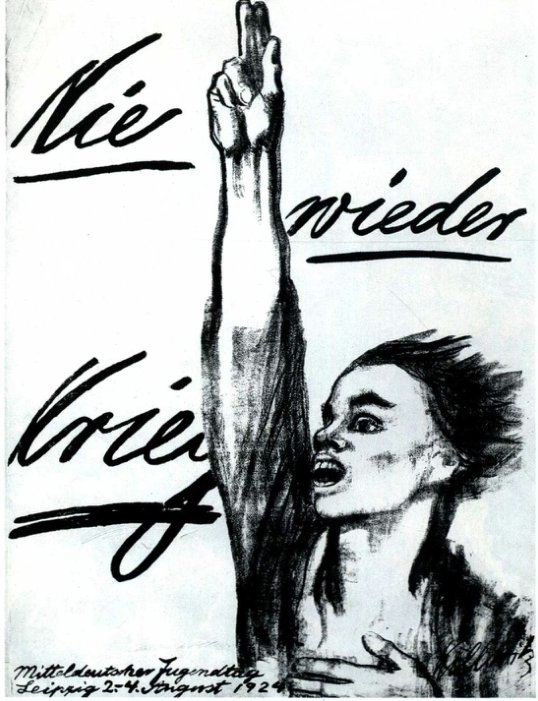

*图28.6 凯特·珂勒惠支：《再也不要战争！》。1924年。石版画，94 × 70厘米。纽约圣艾蒂安画廊*

**凯特·珂勒惠支** 位于霍赫作品聚光灯下的凯特·珂勒惠支（Käthe Kollwitz，1867-1945年）虽然不是一位达达艺术家，但也为柏林达达的政治、表现特性做出了重要表率。珂勒惠支是年长于霍赫一代的艺术家，由于身为女性，结果没能被柏林艺术学院录取。珂勒惠支就读于一家女子艺术学校，后来嫁给了一名医生，定居在柏林的工人阶级居住区。她的丈夫在那里为穷人治病，而这些穷人就是珂勒惠支艺术的表现对象。她刻意回避被学院派和中产阶级视为“精英媒介”的油画，转而创作素描和版画作品，因为此类作品可以批量制作，方便在广大观众中流通。柏林达达艺术家旨在去除政治信息中的杂质，珂勒惠支对于他们而言就是灵感的来源。虽然以20世纪20年代的眼光来看，珂勒惠支的写实风格稍显保守，但她所表达的信息却具有极大影响力，她创作了大批风格强烈的表现主义作品，传达出对工人阶级、女性和战争受害者的同情。此外，珂勒惠支图像中的女性形象远远多于同时代男性艺术家的作品，折射出她的社会主义理想——女性在未来理想化的德国中扮演着与男性同等重要的角色。她的表现主义风格具有典型的锐利笔触、有力的色调对比和强烈的情感，1924年印制的石版画《再也不要战争！》（Never Again War！，图28.6）就是这种风格的最佳体现。

> **原始文献：汉娜·霍赫（1889-1978年）**
>
> **节选自埃杜阿德·罗迪蒂（Édouard Roditi）的访谈**
>
> 在与艺术史家埃杜阿德·罗迪蒂的访谈中，德国达达艺术家汉娜·霍赫谈论了创作达达照片拼贴作品的灵感来源。
>
> 实际上，我们从普鲁士军团官方摄影师的小花招中借鉴了些许创意。他们一般使用油画颜料来印制精美石版画衬底，将一群身着军装的男子安置在营房之前或风景之中，但面部却是挖空的。摄影师在衬底上嵌入顾客肖像摄影的头部，之后再进行人工上色。如果说其中也有任何美学目的的话，那么基本属于非常原始的摄影蒙太奇，旨在美化现实。
>
> 而达达摄影蒙太奇则完全相反，艺术家们会在拍摄下来的现实事物中，加入某些完全非现实的元素······
>
> 我们的整体目标是将机械与工业世界中的事物整合到艺术世界之中。我们的排字拼贴或蒙太奇通过给某些只能手工制作的东西，强加上机器制品的外表，从而达到类似效果。在极富想象力的构图中，我们通常将来自书籍、报纸、海报或者传单中的各种元素组合在一起，创造出机器尚无法达到的布局。
>
> SOURCE: EDOUARD RODITI, DIOLOGUES: CONVERSATIONS WITH EUROPEAN ARTISTS. (BEDFORD ARTS PUBLISHERS, 1990)

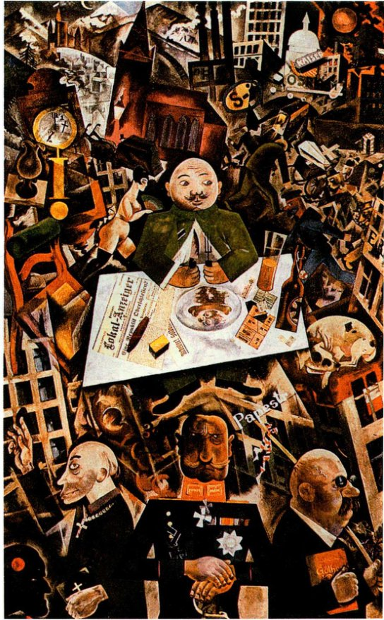

*图28.7 乔治·格罗斯：《德国，一个冬天的童话》。1918年。原为德国汉诺威市 Garvens 收藏，现今下落不明*

**乔治·格罗斯** 乔治·格罗斯（George Grosz，1893-1959年）是早期创作达达摄影蒙太奇作品的艺术家之一，他曾经为柏林达达提供了表现主义元素的示范，并且展现了与珂勒惠支的直接关联。格罗斯曾在战争中两次身负重伤，并经历过一次精神崩溃，德国领导者制定的灾难性方针尤其令他痛苦不已。身体康复并返回柏林后，格罗斯在风格上受到未来主义者的表现性立体主义启发，转向了这种风格，并创作摄影蒙太奇作品。《德国，一个冬天的童话》（Germany，A Winter's Tale，图28.7）是其立体主义风格的典型作品之一。作品里的柏林用万花筒般混乱的背景表现，衬托出几位大型人物。这些人物形象用叠加在画面之上的拼贴展现。他们还包括坐在桌旁木偶一般的“好市民”以及造就他的险恶势力——伪善的教士、粗鲁的将军和邪恶的校长。格罗斯告诉我们，这就是中产阶级的堕落世界，他与很多德国知识分子一样，希望共产主义能够推翻这一切。1920年，格罗斯与珂勒惠支等艺术家一道，加入了国际工人救助会（International Workers Aid）。

### 科隆达达

在科隆，达达运动最初接受来自柏林的领导，但科隆达达从未像柏林达达那样将政治意味包含其中。这里的达达艺术家沉迷于弗洛伊德的无意识理论，并偏爱结合机械与人类外形的组合人像，有时称之为“机械成形艺术”（mechanomorphic art），让人联想到杜尚和皮卡比亚的作品。科隆达达的关键人物是马克斯·恩斯特（Max Ernst，1891-1976年）和约翰内斯·巴盖尔德（Johannes Baargeld，假名，“Baargeld”意为钱袋），两人都挪用了柏林艺术家的拼贴技法。恩斯特和巴盖尔德并非社会的福音传播者，而充当起传统的叛逆者，欣然将自己诙谐廉价、挖苦浮夸的拼贴作品提交给1919年严肃的科隆艺术协会展（Cologne Kunstverein Exhibition），因此引发了一场闹剧。结果次年被禁止参展，于是恩斯特在附近的酿酒厂举办了个展，让观众不得不首先穿过卫生间再进入“画廊”；展出的核心作品是一件雕塑，观众在指导下用恩斯特提供的斧头将之破坏。

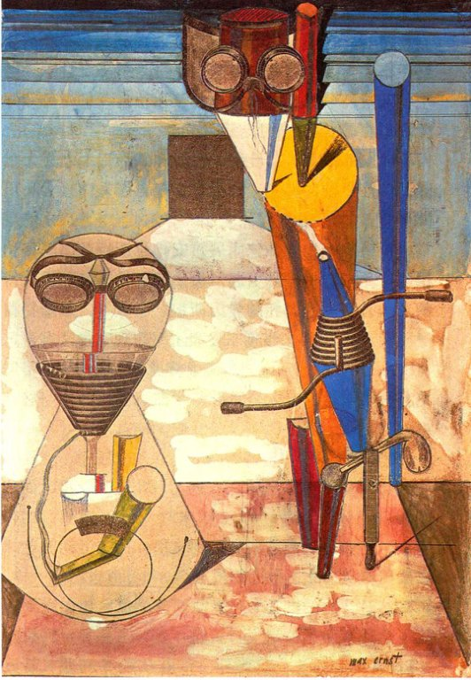

*图28.8 马克斯·恩斯特：《1铜盘1锌盘1橡胶布2卡钳1排水管望远镜1管道工》。1920年。拼贴，30.5 × 22.9厘米*

在这个多产的时期，恩斯特的典型作品是《1铜盘1锌盘1橡胶布2卡钳1排水管望远镜1管道工》（1 Copper Plae 1 Zinc Plate 1 Rubber Cloth 2 Calipers 1 Drainpipe Telescope 1 Piping Man，图28.8）。他在一本1914年版化学设备书籍的插图中，添上了水粉、墨水和铅笔画。通过这里添加一条线，那里点染少量颜料，恩斯特将实验室用具的图像转变为古怪的机器人物，映衬在充满象征的荒凉风景之中。或许我们应该称之为梦境，因为玻璃器凝视着我们；画面还具有基里科式的倾斜透视，线条汇聚为一个神秘的广场，赋予这一小幅拼贴作品一种自然的力量，暗示着某个非现实世界的范畴，即想象世界。恩斯特受到其他创作梦境图像的艺术家影响，但是他本人对于基里科的形而上绘画也十分熟悉，通过友人让·阿尔普熟悉这些作品。恩斯特图像的梦幻性质赋予笔下人物大量的心理意味。当然，恩斯特也深深着迷于西格蒙德·弗洛伊德关于无意识和梦境重要性的理论。

通过阿尔普，恩斯特与巴黎达达运动的两位领导人取得了联系，他们是诗人安德烈·布雷东（André Breton）和保罗·艾吕雅（Paul Éluard）。这两人也受到弗洛伊德的影响，被无意识包含着文明社会所压抑的现实这一观念深深吸引。1921年，他们在巴黎举办了一次小型先锋艺术展，安排恩斯特展出其达达拼贴作品。这些作品引起了极大的轰动，之后恩斯特甚至被誉为“绘画界的爱因斯坦”。次年，恩斯特移居巴黎。1924年，布雷东发表了“超现实主义宣言”（Surrealist Manifesto），其中将恩斯特的1921年展览称为首届超现实主义展览。

### 巴黎达达：曼·雷

1922年，达达艺术正在向超现实主义转型，而这一切就发生在巴黎。1918年末杜尚返回巴黎，1919年皮卡比亚也从巴塞罗那来到这里，达达运动就这样在法国首都建立了自己的根据地。与苏黎世达达一样，巴黎达达背后的推动力也来自于文学家队伍。受到查拉《达达》杂志的启发，三位年轻诗人路易·阿拉贡（Louis Aragon）、安德烈·布雷东和菲利普·苏波（Phillipe Soupault）创立了名为《文学》的报纸。这份报纸的风格极其先锋，上面所刊登的内容在文学界看来几乎没有什么能够称为文学。除查拉的语音诗歌之外，其中还刊登了布雷东和苏波在1920年联合创作的《磁场》（Les Champs magnétique），其以意识流风格写成，是在意识流作用时间长达10小时下完成的。

而美国独立艺术家曼·雷（Man Ray，1890-1976年）则经常出入于巴黎达达艺术家的圈子。他在纽约与杜尚结交为友，并参加纽约达达运动，还追随杜尚于1921年来到巴黎。曼·雷以其摄影师的身份为众人所知，而他在其他很多艺术媒介中的创作也具有超凡的原创性，例如喷枪绘画就是当时相当新颖的手法。最为重要的是，曼·雷是首位在达达艺术创作情境中持续使用摄影手法的艺术家。他经常采用相同的观念前提，像杜尚一样偏爱观念甚于技术，因此将媒介从美术摄影师所加诸的单纯再现中解放出来。至少在达达运动和超现实主义的圈子内，曼·雷使得摄影成为了与绘画、雕塑同等重要的艺术媒介。

*图28.9 曼·雷：《美好的田野》。1922年。明胶银版成像*

1922年，曼·雷对摄影的发展造成了重大影响，同时也影响了达达艺术和抽象艺术。他在这一年使得物影照片（photogram）流行起来；这是一种不使用照相机的一次成像照片，将物体直接放在感光纸上，之后再将两者一起曝光（图28.9）。固体将光线阻隔开来，使其无法直接照射到白色纸面，所以这部分在最终图像中呈现白色；而物体周围或者物体之间的部分则是黑色，因为光线不受阻挡，照射在感光纸上使之曝光。查拉称曼·雷的照片为“光图”（rayograph），他在那一年出版了一本限量发行的书籍《美好的田野》（Champs délicieux），就以曼·雷照片的翻拍图片作为封面，此外书中还收录了12幅光图。

插图中的照片是这组无标题的作品之一，画面中有刷子、梳子、缝纫针、纸卷和布条等可以辨识出的物品。这幅图像与曼·雷的大部分作品一样，很好地展现了达达这一偶然、反叛的艺术与超现实主义富于情感、感性的艺术之间紧密的联系。物品像鬼魂一般神秘，出现在古怪的环境之中；明与暗在这里被反转了，无处不在的黑暗萦绕其间。形体与线条在暗影中进出变幻，有时还会微微颤动，刷子和梳子的边缘就是如此；而另外的部分则清晰、静止，例如中央的椭圆。因为曼·雷采用灯泡曝光，并在曝光过程中数次改变灯泡的位置，借此创造出多个光源，导致某些物品的边缘闪烁不定，其他则退入空间之中，完全不像单纯的平板剪影。他的照片具有融合现实与非现实的魔力，而日后超现实主义艺术也将追随他的脚步。我们可以在图像里感受到真实的梳子和缝纫针，然而这些物件却又像是存在于梦幻世界之中。这些物品和形体之间的相互关系同样无法解释。

曼·雷还采用偶然的创作方法来制作电影，使得其作品拥有与光图相同的梦幻特质。应查拉的邀请，曼·雷参加了1923年“毛心之夜”（La Soirée du Coeur à Barbe），这个活动后来成为代表巴黎达达终结的重大事件。曼·雷将沙子、钉子和大头针随意地撒在未经曝光的电影胶片上，由此创作了一个抽象电影短片，题为《回归理性》（The Rturn to Reason）。这是一个颇具讽刺意义的标题，因为影片中幻影般的白色物体在黑色背景上飘浮闪烁，其所创造的混乱感与理性相去甚远。相反，这里代表了一种看待世界的新方式，即超现实主义方式。尽管该词尚未出现，这个运动也还没有为人们所承认。这部电影不仅将电影引入了巴黎美术界，还促使其他艺术家纷纷创作实验电影作品。曼·雷的这部影片在晚会上放映过后不久，混乱的场面来临了——布雷东、艾吕雅和苏波不请自来，在舞台上咆哮、狂叫，宣称达达已死。虽然在整个20世纪，达达继续为挑战艺术的行为提供智力基础，但是当时的精神显然已经从偶然和非理性转移到超现实主义的心理探索。

> **大事年表**
>
> 1917年 - 马塞尔·杜尚创作《泉》
>
> 1919年 - 魏玛共和国在德国成立
>
> 约1919年 - 汉娜·霍赫创作《厨刀裁切的达达作品》
>
> 1920年 - 达达国际博览会
>
> 1922年 - 詹姆斯·乔伊斯出版《尤利西斯》
>
> 1923年 - 西格蒙德·弗洛伊德的《本我与自我》出版

## 超现实主义

虽然1924年之前并没有超现实主义（Surrealism）一词，但其已经确实存在于当时人们的精神中了。这个运动正式发起的标志是1924年布雷东发表的超现实主义宣言。布雷东写道：超现实主义是“纯粹的精神自动作用，精神用来表达思维的真实运作，或者通过口头表达，或者通过写作等其他途径。思维在理性强加的一切控制消失后得以充分表达自己，摆脱了所有道德和美学方面的羁绊”。新古典主义的理性之神、逻辑的确定性和描绘可观测现实的需要都被颠覆了。达达的虚无主义也被对无意识的探索取代。超现实主义者们认为，我们看到的只是表面现实，而更重要的是发现深藏于无意识世界中的秘密与欲望，正如弗洛伊德主张的那样。在他看来，人类的基本欲望，特别是性欲，决定了我们的个人特性；虽然这些欲望受到文明社会习俗力量的压抑，但会在梦境中显现出来。对弗洛伊德而言，看似偶然的梦中图像实际上充满了象征意味，提供了“通向无意识的康庄大道”，其中包含我们欲望与焦虑的象征。他将自己及其病人的梦用作“原材料”，把梦境图像解析为他认定的真实意义，声称性欲或性问题通常伪装成日常物品出现。以花瓶为例，梦中的花瓶实则女性阴道的象征，而高耸的建筑或者山峦则暗示着男性的性器官。

布雷东的超现实主义宣言提供了进入无意识的若干途径。他鼓励艺术家运用梦幻式图像，叠加不相关的物品，以及意识流风格的写作。布雷东呼吁道：“·····梦境王国和现实王国看似矛盾，然而二者之间未来的解决之道是一种绝对的现实，是超现实。”他强调创造“离奇”（the marvelous）的观念，所有图像，无论是言辞引发的图像还是视觉图像，都应该是神秘的、偶然的，且富于诗意的，让观众／听众在震撼中感受到一个全新的未知现实维度，即超现实。

超现实主义首先是一种文学风格。布雷东为其找到了几个来源，其中包括洛特雷阿蒙（Comte de Lautréamont）创作于1896年的小说《马尔多罗之歌》（Chants de Maldoror），其中有呈现超现实图景的奇异段落，最著名的可能就是以下这段：“······优美得如同一架缝纫机与一把雨伞在手术台上的邂逅。”布雷东所在的文学圈子非常喜爱此类词语的“邂逅”，他们甚至设计了一个游戏，每个参加者都为某句话写下一个词，但并不知道其他人写了什么。一次游戏中产生了这样的句子：“精致的死尸将会饮下新酒。”于是“精致的死尸”（Exquisite Corpse）就成为了游戏名称。纸张被折叠起来，每个艺术家都在自己的区域里画上几笔，但并不能看到其他人所画的内容。结果产生出不相关的物体或者某个奇特的图形，进而形成刺激的图像。但是视觉艺术在布雷东的宣言中几乎没有立足之地，这些艺术家仅在脚注中出现，涉及他们的内容也只有一句话而已。曾经被提及的艺术家包括恩斯特、曼·雷、基里科和毕加索。

### 毕加索与超现实主义

在布雷东所提到的艺术家之中，最让人吃惊的可能就是毕加索了。达达艺术家几乎对立体主义的分析性逻辑思维完全不感兴趣。但是布雷东却将毕加索的立体主义视为解放艺术家想象力的第一步。而且，从20世纪20年代中期开始，毕加索的作品与超现实主义者之间也确实存在相似之处：二者都具有相同的象征与神话成分，其中包括高举双臂、在交配时吃掉雄性的雌螳螂，以及饱受痛苦折磨的弥诺陶。但是毕加索的创作十分独立，虽然他也为超现实主义出版物提供作品，并参加某些超现实主义展览，但他并不自认为是一名超现实主义者。

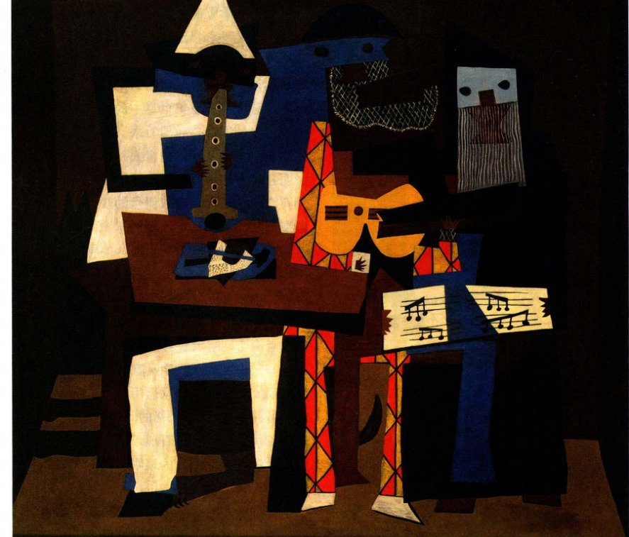

*图28.10 帕布罗·毕加索：《三乐师》。1921年夏。布面油画，2x2.23米。纽约现代艺术博物馆，Simon Guggenheim 基金*

毕加索对于充满性和心理内容的梦境式图像十分感兴趣，这种兴趣表现在1921年创作的《三乐师》（Three Musicians，图28.10）里。这幅作品在传统上被称为即兴喜剧或者意大利喜剧题材，是以遭遗弃的情人为主题的即兴剧，由固定的角色出演。我们立刻就可以感觉到这幅作品不再是以诙谐、机智、天才手法将色彩平面进行连锁的综合立体主义绘画，尽管作品也通过明亮的色调与俏皮的图案暗示出某种幽默，但最终还是黑色占据了主体，乐师的面具也令人惊恐不已。构图中刺目，甚至生硬粗暴的节奏更类似于1907年的生猛作品《阿维尼翁少女》，而非1912年精美的《吉他、乐谱和酒杯》（见图27.5、27.7）。伏在桌下的狗在做什么呢？其头部在室内单调角落的映衬下显出恶魔般的轮廓，而身体则被桌子腿切成薄片，神奇地与乐师的腿交织在一起。这些不只是快活的音乐演奏者，而且还是性欲旺盛的悲惨情人，这才符合即兴喜剧的主题。左部的木管演奏者与亨利·卢梭色情的《梦境》（见图26.18）中那位耍蛇人类似，而毕加索对这件作品的了解正如卢梭本人一样深入。毕加索将音乐场景转变为仪式性的时刻，三人的面具也进一步暗示了这一点，其更具神秘性，而非滑稽性。这幅作品甚至还具有精神上的意味，经由右部的歌手传达出来。歌手具有修士般的外表，因此他应该是单身的。狗头部那黑色的轮廓表示深层的动物欲望，这种欲望驱动着音乐的演奏，而简朴的盒子式房间则成为令人不适的容器、禁锢精神的房间。毕加索创造了一个承载心理意义的梦境世界，而这正是布雷东寻求的世界。

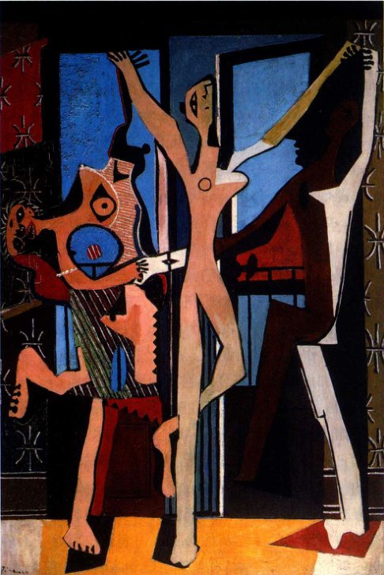

*图28.11 帕布罗·毕加索：《三舞者》，1925年。布面油画，2.15 × 1.43米。伦敦泰特美术馆*

伴随着1924年超现实主义的出现，郁积在《三乐师》表面之下的原始力量得以爆发，后来的作品《三舞者》（Three Dancers，图28.11）就是一例。这幅作品创作于1925年，距离布雷东发表超现实主义宣言尚不足一年。画面中没有出现美惠三女神，而是进行古怪表演、躁动的裸体人物。中央人物的描绘最符合传统，其仿佛在踮起脚尖旋转，又似乎是被钉上了十字架。左部的弯曲人物缩减成为让人无法理解的象形文字形态，而这些组合根本不可能具有单一、完整的意义。她头的形状像一轮新月，以夜晚的天空为背景，壁纸上抽象的百合花图案则代表空中的星星。熟悉的形式常常被消解为令人迷惑的形体与色彩。原本是在光线充足的画室里进行的舞蹈排演，下一刻就转变为午夜的酒神节狂欢。然而始终保持一致的是女性身体的关键角色，无论是色情活动的象征还是精神痛苦的象征。弗洛伊德认为女性的身体具有刺激欲望的力量，同时也引起男性内心的恐惧。毕加索与超现实主义者一样，让女性形体服务于男性观众矛盾的性欲冲动。在这里，象征主义的荡妇题材再一次通过截然不同的形式手法出现在人们面前。

**焊接雕塑** 不可见的深层内心激情驱动着生理欲望，而毕加索也转向雕塑创作来表达其描绘这种激情的渴望，从而引发了第二次雕塑革命。直至1928年末，他一直在焊接金属，进行了长达五年的试验，也以此带动了20世纪40年代的新潮流，确立了钢材焊接作为雕塑重要工艺技法的地位，可与青铜铸造和石材刻凿相比。毕加索开始使用焊接金属，而那正是他决定基于当时自己的线性人物素描进行雕塑创作之时，这些人物实际上就是骨架般的棍状人形。由此产生了金属杆制作的立体雕塑，金属杆代表手绘的线条，仿佛空间中的线描。

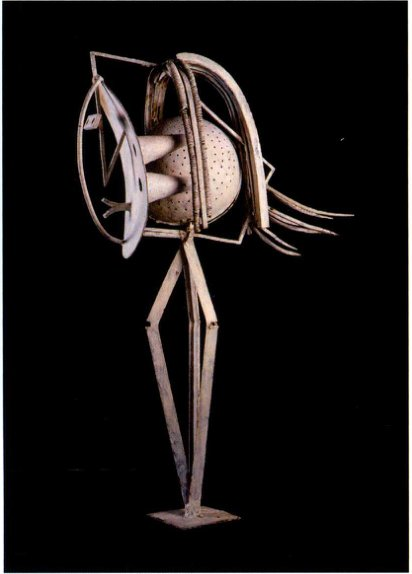

*图28.12 帕布罗·毕加索：《女头像》。1929-1930年。彩绘铁材、金属片、弹簧和漏勺，100×37×59厘米。巴黎毕加索博物馆*

毕加索逐渐从金属杆转而运用各种形式与尺寸的金属进行创作，其中也包括捡拾而来的物品。他在1929至1930年间创作的《女头像》（Head of a Woman，图28.12）中就使用了捡拾现成品，这尊雕像完全就是由漏勺和金属片等构成。毕加索仍然在空间中进行素描，头发、面孔、头颅和身体都体现了这一点，如果人们确实可以将那些抽象形体对号入座的话。毕加索剥离出人物最本质的东西，将肉体的表层扒了下来，以揭示女性隐藏在肉体之下的心理内核。这件雕塑在整体上类似非洲面具，并使用了部落中的象形符号来区分身体的各个部分，例如棍形的腿部等，都增强了作品的原始性质。

毕加索雇佣西班牙同胞朱利奥·冈萨雷斯（Julio González，1876-1942年）来完成焊接工作，后者曾在雷诺汽车制造厂专门学习过这门技术。20世纪30年代，冈萨雷斯创作出自己的作品，例如1935年前后的《头》（Head，图28.13），后来为他赢得“焊接雕塑先驱”的声誉。冈萨雷斯专攻人像和头像，其作品与毕加索的《女头像》一样，表达出原始、心理与幻觉的特质。在这件作品里，雕塑家将人物简化了，使其具有恶毒的夹钳式嘴巴、叶柄一样的眼睛、尖尖的头发和磨损后的面孔，而所有这些又都焊接在一片新月形的金属上；其不仅暗示头骨，而且象征着整个宇宙，让·阿尔普的《埋葬鸟与蝴蝶》（见图28.1）中也出现过相似的手法。

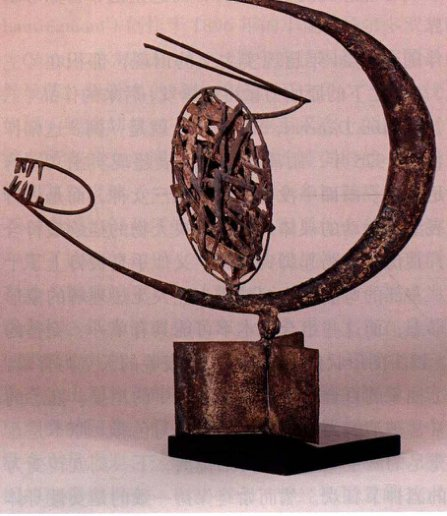

*图28.13 朱利奥·冈萨雷斯：《头》，约1935年。锻铁，45.1x38.7厘米。纽约现代艺术博物馆，购入馆藏，266.1937*

### 巴黎的超现实主义

1925年，与同代人一样，布雷东也在怀疑超现实主义绘画或雕塑存在的可能性。很多人认为视觉艺术创作与写作不同，不存在意识流，因为艺术家在创作过程中总是面对自己的作品，能够看到当下的进度，也知道当下所想到的东西。图像可能看起来是超现实主义的，但创作方法不是。最初，布雷东所支持的视觉艺术家们都依赖自动绘画和偶然的方法来创作作品。1925年末，布雷东组织了第一届超现实主义展览，参展艺术家有恩斯特、毕加索、安德烈·马松和胡安·米罗，但基里科、克利、曼·雷与阿尔普也送来了作品参展。

**安德烈·马松** 自动绘画（automatic drawing）是安德烈·马松（André Masson，1896-1987年）于1924年首创的方法。以这种方法进行创作时，马松首先会在恍惚的状态下绘制一系列线条，以其来激发自己的想象力，然后进一步发展出图像。1926年，马松开始通过唤起其无意识的形式来进行创作——将胶水随意涂在画布之上，然后撒上沙子，沙子就黏着在涂有胶水的地方。在作品《鱼之战》（Battle of Fishes，图28.14）中，他就创造出一个神秘的环境，其中富含原始有机的形式，既暗示生命的起源，也显示出驱动生命的普遍强大的欲望。

*图28.14 安德烈·马松：《鱼之战》。1926年。布面沙、石膏粉、油画颜料、铅笔和炭笔画，36.2x73厘米。纽约现代艺术博物馆，购入馆藏，260.1937*

**马克斯·恩斯特** 为了不被马松领先一筹，恩斯特在1925年发明了擦印法。擦印法（frottage）要求首先在物体上覆盖纸张，然后用石墨进行拓印（rubbing），拓印的对象可以是地板、藤椅和压花，从图像中可以辨识出木材纹理或植物表面形状等不规则图案。最终的图像通常都是充满了鸟兽和古怪生物的原始丛林，具有与马松作品类似的神秘力量。恩斯特还设计了其他激发想象力的技法，他在20世纪30年代开始创作印花（decalcomania）作品，这种方法用稀释的油画颜料将其他物体的表面压印在画布上，创造出具有高度暗示性的不规则机理。日后恩斯特还把印压的图案发展为具有幻觉效果的绘画，创作于1940年的《新娘梳妆》（La Toilette de la marie，图28.15）就是其中一例。恩斯特在这幅作品中运用印花手法创作了头发与长袍，其古怪的质感与画面其余部分的视觉风格形成鲜明对比。男性生殖器形状的长矛、畸形的鸟和新娘、地板上长有四个乳房的大腹怪物，以及墙壁上的画中画，都使这幅现实的场景显得极其非现实，并使其承载了令人惊惶的暴力心理与性心理。

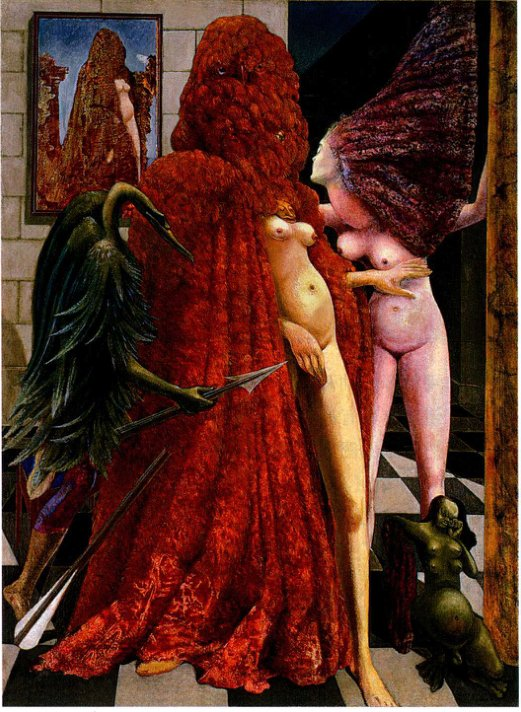

*图28.15 马克斯·恩斯特：《新娘梳妆》。1940年。布面油画，129.5 x 96.2厘米。威尼斯佩吉·古根海姆收藏，1976.76.2553.78*

**胡安·米罗** 来自巴塞罗那的加泰罗尼亚艺术家胡安·米罗（Joan Miró，1893-1983年）于1920年抵达巴黎，他的画室就在马松隔壁。而马松也很快就通过两间画室间墙壁上的小孔向米罗耳语，叮嘱他去见布雷东，而非毕加索，因为“他（布雷东）才是未来”。于是在很短的时间之内，米罗就抛弃了立体主义，开始创作表现其个人想象的绘画。（事实上，他声称自己的创作来自极度饥饿时的幻觉，“我靠每天几枚干无花果活着”。）米罗吸收了马松尖细的线条和克利稚气的素描与朦胧性质（见图27.17），其绘画也变成了生物形式与几何形式的抽象，以颜色种类极少的大片色块作为背景，暗示风景或水域。米罗的绘画日益抽象，在1931年创作的《构图》（Composition，图28.16）中显示得尤为明显。该作品是系列作品之一，这个系列是基于纸板上的拼贴创作，而拼贴图像则来自目录集，米罗特地选择了那些能够点燃其想象力的形体，甚至物品的局部。《构图》的背景里施涂着一片朦胧的色彩，与马松作品中的原始景观属于同一类型。米罗的怪诞世界里存在有漂浮着的奇特曲线形式，暗示史前生物和微生物，同时也暗示着精灵、鬼魂和灵魂。我们甚至能够在其中找到一个故事，例如两个人物飘浮在左上方角落的球上，正在玩耍或者搏斗。可他们到底是在玩耍还是搏斗呢？无论如何，画面中的其他元素都表达了性、斗争和恐惧。米罗运用了最少的色彩语汇和形式语汇，创造出唤起人们原始境遇的神秘图像。

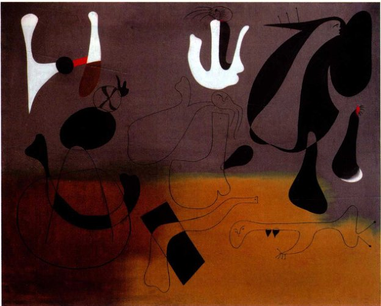

*图28.16 胡安·米罗：《构图》。1933年。布面油画，130.2x161.3厘米。美国康涅狄格州哈特福德市。Wadsworth Atheneum，Ella Gallup Sumner和 Mary Catlin Sumner 收藏基金*

### 具象超现实主义：马格里特与达利

布雷东最初强烈支持基于偶然、自发以及恍惚状态而创作的抽象超现实主义。然而在之后的10年中，各种风格的艺术家都先后加入又离开了这一运动，大部分人甚至将其抛弃，这部分要归因于这个艺术群体具有强势的社会主义和共产主义姿态，但同时也有布雷东自己的原因。他更像是一位超现实主义的教皇，行事极具控制性，仅出于极其勉强的理由就认定某位艺术家是超现实主义者，或非超现实主义者。

**勒内·马格里特** 20世纪20年代末，越来越多的艺术家开始采用具象风格或准具象风格。来自布鲁塞尔的艺术家勒内·马格里特（René Magrite，1898-1967年）就是其中之一。他是布鲁塞尔超现实主义圈子中的一员，这个由艺术家和知识分子组成的团体同样潜心于共产主义思想。1927至1930年间，马格里特在巴黎居住，但是布雷东从未公开接纳他是超现实主义者。马格里特后来返回比利时，在那里度过余生，但直到晚年才获得了声望。他的作品《虚镜》（The False Mirror，图28.17）创作于1928年，可以解读为超现实主义的宣言，宣扬了无意识所具有的更高的现实。画面中是一只神秘眼睛的特写，眼中映出遥远的天空，而虹膜则变形为怪诞的日食；背后正是马格里特所暗示的无意识，能够感知事物现实的无意识。眼睛只看到视觉世界，而非真实的世界。

*图28.17 勒内·马格里特：《虚镜》。1928年。布面油画，54x79.1厘米。纽约现代艺术博物馆*

**萨尔瓦多·达利** 马格里特来到巴黎几年之后，另一位重要的具象超现实主义者也接踵而来，他就是来自马德里的萨尔瓦多·达利（Salvador Dali，1904-1989年）。达利在马德里已经发展出一种细致入微的写实主义风格，并以弗洛伊德著作中描述过的心理情结为主要基础。达利以华丽的姿态进入了巴黎超现实主义世界，公开放映了与西班牙电影导演路易斯·布努埃尔（Luis Buñuel，1900-1983年）合作的17分钟电影《一条安达鲁狗》（An Andalusian Dog）。这部并不连续的影片以阳台上的布努埃尔和一个女人开始，一片云彩神秘地从他们身后飘过，接下来摄影机推向女人一只眼睛的特写，而眼睛则被竖直的剃刀切为小片。这段开场被解读为俄狄浦斯情结的表现，以及失明恐惧所象征的对阉割的恐惧，这正是弗洛伊德著作中有关男性心理发展的两大主题。整部电影都充满了弗洛伊德式的心理分析。达利和布努埃尔依靠蒙太奇手法来创造超现实主义效果，通过并置无关物体创造梦境片断，并不断将物品放入新的情境之中，以此产生“离奇”之感，并唤起无意识。在其中一个著名的片断中，主角拖着两位牧师和两架大钢琴从房间中走过，每架钢琴里还放有一头腐烂的死驴。在另一个场景中，一队蚂蚁从人的手心爬出。

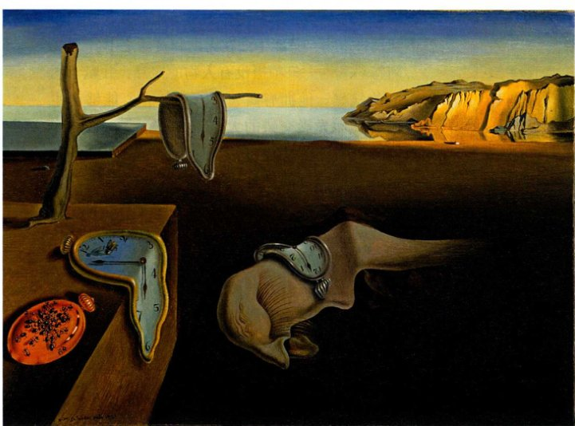

*图28.18 萨尔瓦多·达利：《记忆的永恒》。1931年。布面油画，24.1x33厘米。纽约现代艺术博物馆*

达利运用其称为“偏执判断”（paranoiac-critical）的方法创作绘画作品，这是一种“非理性认识的自发方法，其依据是精神失常时关于解释性与判断性的联想”。达利首先创造了自我诱导的疯狂、偏执状态，再从头脑中的某一件物品开始创作。之后，他对于这件物品以及其他物品做出反应，绘制出的神秘图像反映了释放无意识的非理性进程。《记忆的永恒》（The Persistence of Memory，图28.18）的创作开始于一个没有固定形状的头，而头上还长着拉长弯曲、拖到地上的脖子。看到晚餐时一盘柔软的卡蒙贝（Camembert）奶酪，达利受到启发，于是绘制了柔软的手表。这幅作品没有任何确定的解释，因此可以引发大量联想，其中最明显的一种可能是“时间的消逝会导致不可避免的腐败与死亡”，然而标题却暗示我们回顾过去，而不是面向未来。在这幅颇具争议性的图像里，各种神秘的物品可以被解读为头脑中深层欲望、恐惧、焦虑，特别是对性欲的隐喻，能够从观者本人的无意识中释放出多种多样的解释。

### 超现实主义与摄影

电影与摄影都可以巧妙地处理现实，创造梦境般的片断，于是摄影师将其视为超现实主义的完美表现手段。很多著名摄影师虽然都不在布雷东开列的超现实主义者名录中，但他们仍然深受超现实主义感染，其中包括欧仁·阿特热和亨利·卡蒂埃-布列松。

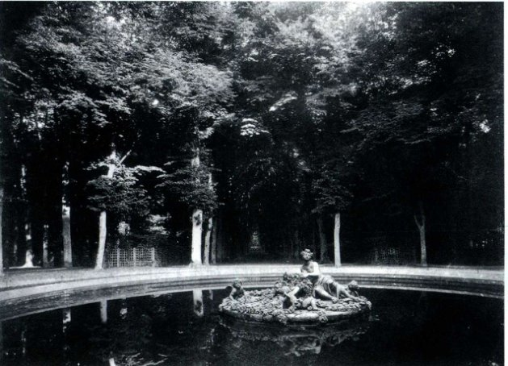

*图28.19 欧仁·阿特热《凡尔赛池塘》。1924年。蛋白银版成像，17.8 × 24.8厘米。纽约现代艺术博物馆，Abbott-Levy收藏，Shirley C.Burden 捐赠品之一*

**欧仁·阿特热** 不论是绘画、雕塑，还是摄影领域，超现实主义作品并不总是精心策划的成果，也可能只是出于偶然，证实了事物表象之下隐藏着离奇这一超现实主义信念。欧仁·阿特热（Eugène Atget，1857-1927年）就是一位偶然创作出超现实主义作品的摄影师，这与他原本的想法截然不同。阿特热通过自学成为商业摄影师，1897年前后专门拍摄巴黎及其郊区的照片。他声称自己的使命是记录迅速消失在20世纪现代化进程中的老巴黎。阿特热对这个项目拥有近乎盲目的热情，结果制作出上万幅照片，却由于找不到销售市场，只能生活在无助和贫困之中。

阿特热基本上只拍摄没有人物的照片，并赋予图像凄凉的气氛。他拥有高超的成像技术，能够产生丰富的质感和光影交错的大范围色调变化。最终作品正如《凡尔赛池塘》（Pool，Versailles，图28.19）那样，具有梦境般的神奇效果。照片里的时间停止了，喷泉的雕像在沉静凝固的氛围中似乎跃然欲生。树木在照片中央形成陷入黑暗的通道，上方的叶片表面则闪动着V字型的亮光，而池塘边缘呈现出鲜明的曲线形式，所有这些都让凝固的画面栩栩如生。雕像、铁栅栏、亮光下的树干和小径，似乎处于一种奇特而又无法解释的对话之中。阿特热有力的图像仿佛进入了没有时间存在的远古时代，但是这些作品直到20世纪20年代才受到人们的广泛关注，当时曼·雷等人着迷于其超凡脱俗的感觉，并对其中的超现实性质赞赏有加。布雷东还在《超现实主义革命》（La Révolution surréaliste）中登载了若干阿特热的摄影作品。

*图28.20 亨利·卡蒂埃-布列松：《圣拉扎尔火车站背后》。1932年。明胶银版成像*

**亨利·卡蒂埃-布列松** 超现实主义对该时期的重要摄影师都产生了极大影响，尽管他们并不属于布雷东的圈子。法国摄影师亨利·卡蒂埃-布列松（Henri Cartier-Bresson，1908-2004年）就是这个群体中的一员，他创作了20世纪最为非同凡响的一批摄影作品。布列松是把握“决定性瞬间”（the decisive moment）的大师，而这一词汇正是他自己的发明，指“在动作和情感最为激烈的瞬间，对于某一事件的即刻识别和视觉组织”。1932年，他使用新型的手持35毫米莱卡照相机拍摄了《圣拉扎尔火车站背后》（Behind the Gare Saint-Lazare，图28.20）。布列松在世界各地拍摄了许多照片，神奇地捕捉到了一种超自然魔力，就像我们在那位一闪而过的侧身男子身上看到的那样，他正以难以理解的方式悬浮在半空中。布列松同样还是运用强烈明暗对比的大师；他能够利用水面波纹形成古怪的象形文字。与阿特热相同，布列松在不同形体与物体之间建立起神秘怪异的对话关系，照片里的钟表、梯子和倒影就是如此，类似的对话遍及图像各处。

### 超现实主义物品

当胡安·米罗开始创作《构图》时，他首先以梦境之类的某个图像作为出发点，随后进入一段心理试探与形式创造的旅程。超现实主义艺术家还会创造出某些物品，不仅引导他们自己，也可以把观众带入这种旅程。事实上，某些近乎物神崇拜或神秘诗意的物品，正是最为言简意赅的超现实主义艺术品；艺术家将其捡来再加以创造，虽然并不具有任何叙事情节，却刺激无意识产生了无尽的联想，而大多都与性和暴力有关。早在1921年，曼·雷就已经创作出第一件超现实主义物品《礼物》（The Gift，图28.21）。这是赠与作曲家埃里克·萨蒂（Eric Satie）的礼物，而其实不过是粘着大头钉的熨斗。其中家庭用品和五金用品的错位感令人震惊，进而创造出某件使人无法识别的东西，其中毫无逻辑或情节可言，但却充满了对暴力、痛苦和性的暗示。

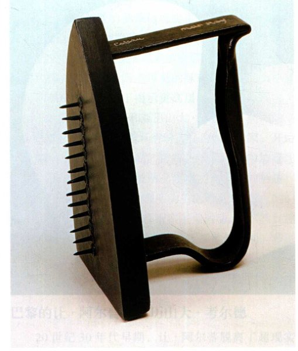

*图28.21 曼·雷：《礼物》。1921年（1958年复制品）。彩绘熨斗，一列13个大头钉顶部粘在熨斗上，15.6 × 9.2 × 10.8厘米。纽约现代艺术博物馆，James Thrall Soby 基金，249.1966*

> **大事年表**
>
> 1915年 - 弗朗茨·卡夫卡的《变形记》出版
>
> 1919年 - 凡尔赛条约签订
>
> 1924年 - 欧仁·阿特热创作《凡尔赛池塘》
>
> 1924年 - 安德烈·布雷东发表首次超现实主义宣言
>
> 1936年 - 奥本海姆创作《物品》

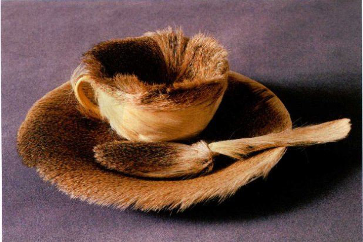

*图28.22 梅雷特·奥本海姆：《物品》或《皮毛午餐》。1936年。贴有皮毛的茶杯、茶碟和汤匙，茶杯直径12.1厘米；茶碟直径23.8厘米；汤匙长20.3厘米。纽约现代艺术博物馆*

最著名的超现实主义艺术品可能出自梅雷特·奥本海姆（Meret Oppenheim，1913-1985年）之手。她是荣格派心理学家的女儿，在1932年18岁时来到巴黎。她曾为曼·雷做过一段时间的模特兼助手。1936年与毕加索共进午餐时，奥本海姆即席发表了一段评论，启发她随后将瞪羚皮毛覆盖在一套茶杯、茶碟和汤匙之上，称之为《物品》（Object，图28.22）。而布雷东将这件作品收入超现实主义展览时，赋予其另一个标题——《皮毛午餐》（Luncheon in Fur），以此来影射马奈那饱含性意味的作品《草地上的午餐》（见第870-871页）。奥本海姆向我们呈现了色情的提出与拒绝。就个别而言，皮毛与饮料都属于感官范畴，但是以这样的方式并置，导致二者之间的关系即便不令人排斥、厌恶，至少也让人感到不安。皮毛将瓷器和汤匙拟人化了，暗示着毛发。这件作品旨在触发无意识，唤起无尽的联想，与受压抑的色情、感性、欲望与焦虑等现实相关的联想。奥本海姆采用最为精简的手段，创造出“离奇”之物，将观者带入了超现实的王国。

## 有机雕塑

米罗与阿尔普的抽象超现实主义启发了众多艺术家，促使他们去寻找隐藏在事物表面之下的普遍真理。正如上个世纪的浪漫主义风景画家那样，聚焦于自然，试图窥探并释放宇宙间不可见的脉动，也就是那种贯穿自然界的脉动。为了揭示更高层次的真理与现实，包括巴黎的让·阿尔普和亚历山大·考尔德、英国的亨利·摩尔和巴巴拉·赫普沃思等人在内的艺术家，开始创作有机形式的抽象作品。这些艺术家经常参加超现实主义展览，偶尔也会被贴上超现实主义者的标签，自从他们的作品以隐藏的现实为主题后更是如此。他们在20世纪30年代加入了超现实主义运动，虽然其兴趣与布雷东有诸多相似之处，但本质上却截然不同。布雷东更关注焦虑、欲望和性等心理状态，而这些以抽象、有机形式进行创作的艺术家则更关注宇宙的强大力量。

### 巴黎的让·阿尔普与亚历山大·考尔德

20世纪30年代早期，让·阿尔普脱离了超现实主义团体，加入另一个以巴黎为基础的国际艺术团体“抽象创作社”（Abstraction-Création），该团体致力于抽象艺术。阿尔普后来还说服友人亚历山大·考尔德（Alexander Calder，1898-1976年）也成为其中一员。现在，阿尔普不再基于偶然操作来创作古怪的作品，而是开始塑造称为《人的凝固》（Human Concretion，图28.23）的系列，将这些形式设想为生长与生命的隐喻。这些作品的有机性质与简洁之感很容易令人联想到布朗库西，但是布朗库西力图将各种事物剥离干净，只突出某一对象的本质，而阿尔普则希望创造活生生的生命体，其似乎正在生长，甚至呼吸，膨胀和收缩。事实上，阿尔普希望复制的是生命本质。他委托工匠将石膏作品翻制为青铜或大理石作品，无论材质如何，作品表面都光滑得毫无瑕疵，赋予其纯洁、完美的光环。

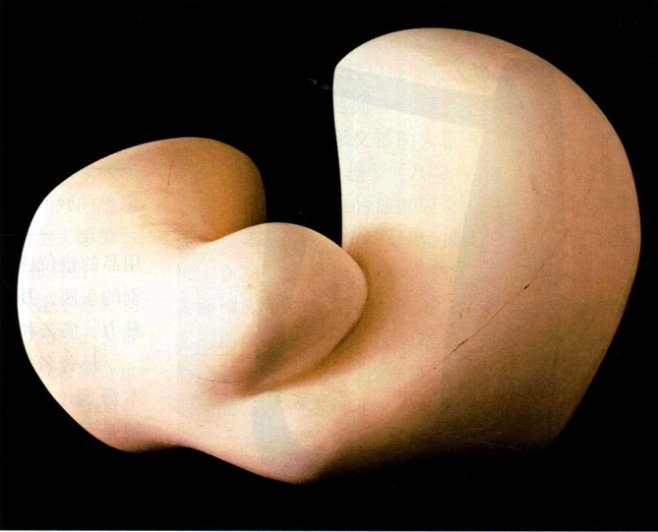

*图28.23 让·汉斯·阿尔普：《人的凝固》。1935年。石膏原作，49.5 × 47.6 × 64.7厘米。纽约现代艺术博物馆，顾问委员会捐赠*

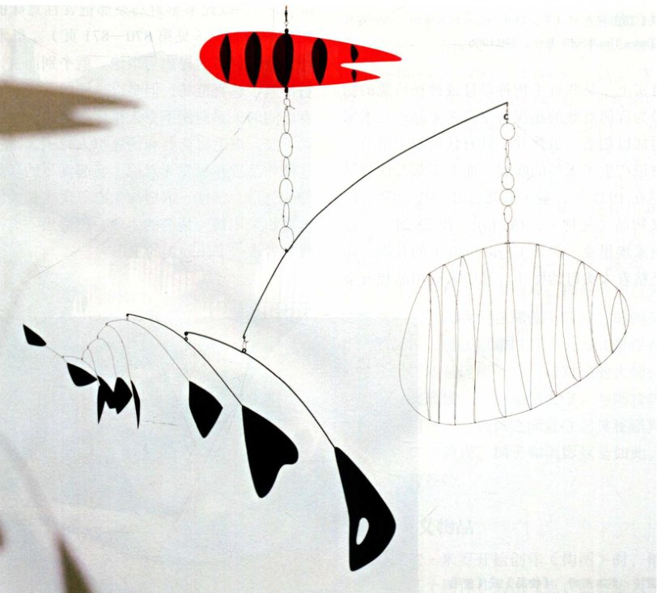

*图28.24 亚历山大·考尔德：《龙虾网与鱼尾》。1939年。彩绘钢线与铝片，约2.59 × 2.90米。纽约现代艺术博物馆，顾问委员会为博物馆楼梯而定制*

考尔德出生在费城，于1926年来到巴黎。他在巴黎与米罗和荷兰抽象画家皮埃特·蒙德里安结交为友。30年代早期，考尔德开始创作“活动雕塑”（mobile），这是杜尚给其动态雕塑（kinetic sculpture）所起的名称。每件活动雕塑都由彩绘的金属片构成，并与铰链的金属线相连，达到了完美的平衡状态。稍一有风吹过，作品就仿佛在空中滑翔、倾斜、翻转。某些活动雕塑还会产生和谐的声响，例如锣似的圆形金属片会在旋转中定时敲打另一片金属。这些作品的尺寸差别极大，既有桌上的摆饰尺寸，也有长达9米有余，要挂在天花板上的大型作品。

考尔德以米罗和阿尔普为榜样，通常采用有机形体进行创作，1939年的《龙虾网与鱼尾》（Lobster Trap and Fish Tail，图28.24）就是如此。他所采用的形式暗示着海洋动物，但是其在整体上又是抽象的，正如米罗的绘画一样，同时表现出微观和宏观两个世界。《龙虾网与鱼尾》中的黑色形状可以被看作鱼群，但是整体看来也可以代表了某种具有骨架，甚至原始的事物。考尔德受到启发而创作的动态雕塑表现了生长与宇宙能量。他只使用最基本的色彩，通常是原色、间色和黑白两色。所有的色彩都从其中产生，所以考尔德的用色也强调了生命的基本构成元素，这是得自蒙德里安的观念，他曾在1930年拜访过蒙德里安的画室（见第1007页）。

### 英国的亨利·摩尔与巴巴拉·赫普沃思

米罗和阿尔普所青睐的有机抽象风格在20世纪30年代越过了英吉利海峡，出现在亨利·摩尔（Henry Moore，1898-1986年）和巴巴拉·赫普沃思的作品之中。1921至1925年间，摩尔曾经就读于伦敦的皇家艺术学院，在之后的五年里，他参观了大量英国和欧洲博物馆，并开始关注各种艺术出版物，由此对布朗库西、阿尔普、米罗和毕加索的当代艺术进行吸收。摩尔还受到当时对非西方艺术强烈兴趣的影响，其中包括对墨西哥前哥伦布时期艺术的关注。

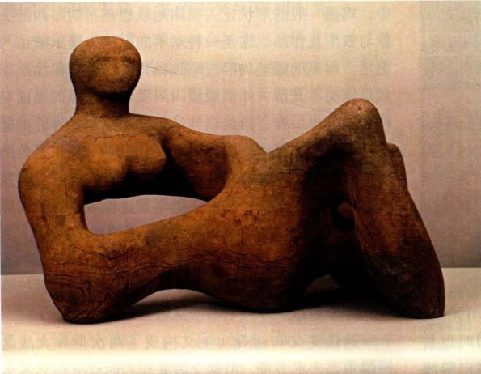

*图28.25 亨利·摩尔：《斜倚的人体》。1938年。绿色橄榄石，长约137.2厘米。伦敦泰特美术馆*

30年代早期，摩尔的风格日益成熟，1938年创作的《斜倚的人体》（Recumbent Figure，图28.25）就是该时期的代表。这件作品让人回想起古典风格中斜倚着的河流女神，而实际上更为直接的创作原型是前哥伦布艺术中的人像。在探索自然形式与人物形体间的关联时，摩尔对投射自然与宇宙更感兴趣，而非古典艺术。这件作品表现的是女性，但是石头仍然保持了其自身的材质特性，仿佛一块在自然中经历了几百万年时光侵蚀的岩石。摩尔极具创造性地暗示我们，人体与岩石完全一样，他甚至让女性身体的形式与石头的纹理契合。岩石中的宇宙力量被转移到人物之中，使之变成大地女神或者繁殖偶像。女性抽象身体的起伏实际上又将她变形为一片风景。摩尔对虚与实的天才处理为作品增添了神秘的氛围；而在作品结构方面，虚实各自所占的比重相当，令人联想到子宫般的神秘洞穴、或者海边岩石中的潮水池塘。

摩尔在1936年的国际超现实主义大展（International Surrealist Exhibition）上展出了与《斜倚的人体》类似的作品，他对此感到十分自然。可能摩尔认为，他表达事物外表之下更高层次现实的尝试与超现实主义具有共鸣之处，但摩尔同样也愿意参加抽象艺术展。在划分艺术流派方面，摩尔的雕塑确实在分类上性质难以确定。

> **大事年表**
>
> 1919年 - 伦敦与巴黎之间的首次商业航道开通
>
> 1927年 - 勒梅特神父提出宇宙大爆炸理论
>
> 1929年 - 弗吉尼亚·伍尔芙的《一间自己的房间》出版
>
> 1938年 - 亨利·摩尔创作《斜倚的人体》
>
> 1940-1942年 - 巴巴拉·赫普沃思创作《彩色雕塑》

巴巴拉·赫普沃思（Barbara Hepworth，1903-1975年）自认为是彻底的抽象艺术家，她同时也是抽象创作社的成员。赫普沃思在1933年前往巴黎旅行，参观了阿尔普和布朗库西的工作室，并遇到毕加索。1935年，她再次来到巴黎，结识了蒙德里安。摩尔也曾经在利兹艺术学校（Leeds School of Art）与赫普沃思相识，并一直与其保持交游。赫普沃思与摩尔相似，同样关注于在抽象形式之中加入不可见的自然力。赫普沃思在30年代早期开始创作抽象作品，几年之内她的雕塑就具有了几何特质。这些作品的风格看来并不坚硬或机械化，而是有机、神秘。战争爆发之后，赫普沃思于1939年移居到英格兰西南端康沃尔郡（Cornwall）的一个小村庄，在这里能够俯瞰圣艾夫斯湾（St.Ives Bay），此时她作品中的有机感与神秘感更为强烈。她的雕塑是对自然的回应（见第1006页的原始文献）。在作品《彩色雕塑（深蓝与红）》（Sculpture with Color [Deep Blue and Red]，图28.26）中，鸡蛋一般的形状让人模糊地联想到布朗库西的头像与新生儿作品。这是一种基本的形体，暗示繁衍与出生。木刻的雕塑均经过细致抛光，白色颜料涂层也显得完美、光滑，如绸缎般闪闪发光；这样的表面与作品的外形一样，给人以纯洁之感。此外，外壳的亮白色更突出了黑暗空洞的神秘，其中是一片深蓝色的天空或水域。绷紧的红色细绳具有阳光的强度，以及生命力的永恒能量。赫普沃思本人这样说道：“细绳是我所感到的自己与大海、风或山丘之间的拉力。”

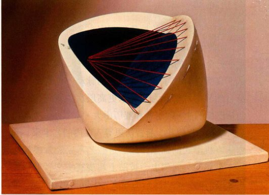

*图28.26 巴巴拉·赫普沃思：《彩色雕塑（深蓝与红）》。1940-1942年。木雕，白色与蓝色彩绘，装有红色细绳和木底座，27.9x25.4厘米。私人收藏*

## 创造乌托邦

达达主义和超现实主义构成了两次世界大战之间的主要艺术力量，但这二者并非当时仅有的艺术运动。众多20世纪艺术家们继续致力于探索抽象艺术。超现实主义者和抽象艺术家通常具有相同的社会目标——拥护个人自由，破坏中产阶级价值观，根除国家主义，摧毁资本主义，创造无阶级的社会（见第四部分末尾的附加原始文献）。很多达达主义者和超现实主义者同时也是社会主义者，并参加了一些共产党的活动。同样，很多抽象艺术家也是社会主义者和共产主义者，但是他们将抽象艺术本身看作创造乌托邦的工具。

两个几何抽象的重要中心同时浮现出来，其一是伴随1917年俄国革命出现的构成主义（Constructivism），其二则是出现在阿姆斯特丹的风格派（de Stijl）。第三个中心是德国的包豪斯，这所艺术学校成立于1919年，在之后的十年间成功晋升为具有重要意义的艺术力量，并经常受到来自俄国的构成主义流亡艺术家以及风格派艺术家的影响。

> **原始文献：巴巴拉·赫普沃思（1903-1975年）**
>
> **《论雕塑》（On Sculpture，1937年）**
>
> 在1937年出版的艺术家谈话录中，英国抽象雕塑家巴巴拉·赫普沃思在以下这段文字中谈到了其作品如何应对普遍的真理，如何应对个人与自然的关系。
>
> 全部生命力都存在于图像之中，包括了所有幻想、所有直觉想象、所有来源于经验的有意选择。观念从我们有意识生命与无意识生命的完美平衡中产生，并通过同样的融合与平衡得以实现。在若干观念中选择一个，以及将我们过去所有经验与当下观念联系在一起的能力，正是我们有意识的头脑；而对于从根本上将观念展现的敏感性来说，其与呼吸本身一样，则是我们的无意识本能······
>
> 当代的构成作品并非因为缺少某种特殊的人的兴趣、戏剧性、恐惧或宗教情感而失败。其感动了我们的内心，因为代表着艺术家的整体经验与幻想，这是他承载观念的全部感性，也是他在生命中实现这些观念的欲望，同时还是对于破坏那短暂、局部力量的彻底拒绝。这是人心中的绝对信仰，是景观中的绝对信仰，也是构成观念的普遍关系的绝对信仰。艺术家作品的抽象形式现在是无意识、直觉性的，这是其个人的表达方式。通过永久解答个人思想中的疑问，其有意识的生命倾向于发现一种解决人类困境的方法，并与媒介联系起来······（抽象）并不是逃避现实或者象牙塔，也不是比例与空间中孤独的娱乐，它是一种在可能的生命中表达信仰的无意识方式。色彩与形式语言是普遍的，并非某个阶级所特有（尽管过去曾经如此）。抽象是一种思想，赋予每个人相同的生命、相同的表达，以及相同的普世自由。
>
> SOURCE: CIRCLE-INTERNATIONAL SURVEY OF CONSTRUCTIVE ART. J.L.MARTIN, B.NICHOLSON, AND N. GABO, EDS. (LONDON: FABER AND FABER, 1937)

### 俄国的构成主义：生产主义与功利主义

抽象艺术与建立革命社会的激进政治主张，二者之间最为直接的联系出现在俄国。在1917年十月革命前后的俄国，艺术家们积极发展新的艺术形式，希望借此带来新的理想社会。以马列维奇至上主义的创新（见第967-968页）为基础，出现了若干个艺术运动，都力图让艺术服务于革命的新社会。

**弗拉基米尔·塔特林** 马列维奇在莫斯科发展其至上主义绘画时（见第967-968页），另一位俄国艺术家弗拉基米尔·塔特林（Vladimir Tatlin，1885-1953年）则在柏林和巴黎进行创作。1914年，塔特林访问了毕加索的巴黎画室，在那里看到后者的构成作品（见第953-954页）。返回俄国之后，塔特林创作了自己的构成浮雕（图28.27），称之为“反浮雕”（counter-reliefs）。他在作品里使用了纸板、木材和金属，上方还覆盖着包括釉料、玻璃和石膏在内的各种材料。与俄国圣像画与马列维奇的《黑色方块》（见图27.26）类似，塔特林的某些反浮雕作品也横跨角落处的两面墙壁；事实上，此举通过室内空间创造出一个小环境。与毕加索多为乐器的构成作品不同，塔特林的作品是非具象的，抽象程度如同马列维奇的绘画一般，而且并无任何联想现实事物的意味。在塔特林的领导下，其他俄国雕塑家也开始运用几何形式来创作抽象雕塑，后来在1922年被正式命名为构成主义。

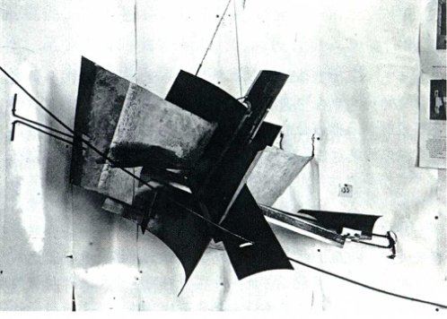

*图28.27 弗拉基米尔·塔特林：《反浮雕的角落》（Corner Counter-Relief）。1915年。混合材料，80 x 150 × 75厘米。据推测已损毁*

1917年布尔什维克革命爆发，塔特林对艺术的态度也随之改变。他拥护共产主义，并全力支持共产党创造理想社会的目标。塔特林在苏维埃教育委员会工作，其注意力也逐渐转向建筑与工程。在他教授的内容中，主要传达出对现代机械的实用性、批量产品的民主性，以及工业材料的有效性的热情信仰。科技现代化是未来，是新宗教，工业效率与材料得以整合到艺术、设计和建筑之中，由此可以制造出一个更美好的无阶级新社会。换而言之，社会革命必须得到美学革命的补充。根据塔特林所谓的“构成生产主义理论”，从用具到衣服、从居住空间到戏院，所有一切都必须具有机械精简的外观。形式必须服从功能，物品需要去除所有装饰，因为其象征着中产阶级价值观和贵族的卖弄炫耀。

塔特林的著名作品之一是《第三国际纪念塔》（Monument to the Third International，图28.28），模型制作于1919年，1920年10月在彼得格勒（圣彼得堡）与莫斯科两地展出。设计高度为396米，如果建成将是当时世界上最高的建筑。倾斜的螺旋形金属框架包围在玻璃制成的立方体、圆柱体与圆锥体四周。这些钢铁玻璃单元将是集会与会议场所，并会分别在一年、一月和一天内完成三百六十度的旋转。工业的钢铁玻璃材料以及作品运动动态的性质，象征着机械新时代与布尔什维克革命的勃勃生机。这座塔楼将是第三国际总部，该组织致力于世界革命，而大楼盘旋上升的螺旋线造型则象征共产主义抱负。

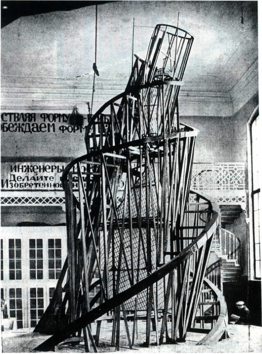

*图28.28 弗拉基米尔·塔特林：《第三国际纪念塔》模型。1919-1920年。木材、铁与玻璃，高约6.1米。已毁，本图为当时拍摄的照片*

追随塔特林“艺术进入生活”（Art into Life）的提倡，很多艺术家即便不是完全放弃传统艺术的创作，至少也暂时搁置下来，转而设计更具功能性的艺术品，为创造无阶级的伟大理想社会贡献力量。亚历山大·罗琴科（Aleksandr Rodchenko，1891-1956年）及其妻子瓦瓦拉·费多洛夫娜·史蒂潘诺娃（Varvara Fedorovna Stepanova，1894-1958年）都属于这种类型的艺术家。20世纪20年代早期，罗琴科停止了至上主义绘画和构成主义集合作品（assemblage）的创作，专心平面设计，插图28.29就是当时他设计的一张宣传扫盲的无标题海报。我们看到的作品与图卢兹-劳德累克等人的新艺术风格海报（见图26.7）差别甚大，后者的作品一般包括有机形式与人性特征，而此处鲜明的机械式几何形式占据了主导，几乎毫无空间感的图像平压在海报表面。甚至连文字也具有严格的几何特征。明亮色彩所创造的力量因图案设计而增强，例如“书籍”一词的形状就像是扩音器，从中发出了“全面的知识”。与此同时，史蒂潘诺娃还在莫斯科一家纺织厂担任设计师。在插图中的运动服上（图28.30），再次出现了明亮的色彩，以及简单却充满能量的机械式几何形。这里没有装饰，也没有任何能让人联想起过去的符号，所有元素都与任何阶级、时代、种族或地区无关。面对创造新社会的难题，构成主义设计师们发明了全新的图形语汇，而这显然是一种现代、实用，且没有阶级差别的语汇。

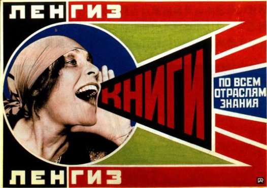

*图28.29 亚历山大·罗琴科：《广告：“书！”》（Advertisement："Boks!"）。1925年。俄罗斯莫斯科市罗琴科档案*

*图28.30 瓦瓦拉·费多洛夫娜·史蒂潘诺娃：《运动服设计》。1923年。纸面水彩墨水画，30.2 × 21.6厘米。Alexander Lavrentiev 收藏*

### 风格派与普遍秩序

1917年，皮埃特·蒙德里安（Piet Mondrian，1872-1944年）在阿姆斯特丹与画家泰奥·凡·杜斯堡（Theo van Doesburg，1883-1931年）、建筑师赫里特·里特韦尔（Gerrit Rietveld，1888-1964年）及其他几位艺术家、建筑师一起，开展了一场名为风格派的艺术运动。虽然没能像俄国艺术家那样得到革命政府支持，但其目标在激进与空想方面却一点也不落后，因为这些艺术家们力图通过抽象来创造完美的整体环境，借此体现宇宙的和谐。与俄国艺术家不同，风格派的任务是有关精神性的。由于蒙德里安和凡·杜斯堡与通神论的联系十分紧密，风格派艺术家和共产主义者一样，寻找一种能够代替民族主义的普遍秩序。他们将自己的风格称为“国际风格”；这一称呼通常用来指代新型的玻璃与钢铁建筑，这样的建筑现代、纯粹、普遍的特质，不具有任何民族的身份象征。

**皮埃特·蒙德里安** 在该团体出版的《风格》（De Stijl）杂志上，蒙德里安发表了一系列表达其艺术理论的文章（见第1008页的原始文献）。他的哲学观基于通神论形成，早在1910年来到巴黎之前，他就对通神论很感兴趣。在大战期间返回中立的阿姆斯特丹之后，蒙德里安进一步受到业余神秘主义哲学家M.H.J.勋迈克斯（M.H.J.Schoenmaekers）的观念影响，后者同时还是蒙德里安的朋友。其所著的《世界新图像》（New Image of the World）对蒙德里安的影响尤为巨大；在蒙德里安的藏书室里，除了自己的作品之外，只有这一本书。勋迈克斯认为宇宙中存在根本性的数学结构，真实的现实正是基于其构成。他相信通过理性地操纵几何形式，艺术家能够进入并呈现这个结构。蒙德里安基于这样的几何学发展出自己的艺术风格，他用勋迈克斯的措辞将之命名为新造型主义（Neo-Plasticism）。蒙德里安通过绘画中的“造型”表达了这样的观念，认为绘画的世界本身具有形态或立体的现实，绘画的现实与宇宙形态的和谐现实相呼应。换而言之，他力图在自己的艺术中复制并不可见的潜在宇宙结构。

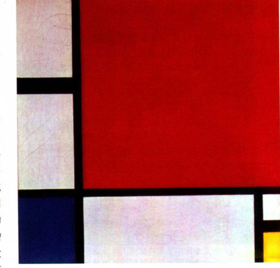

*图28.31 皮埃特·蒙德里安：《红黄蓝构图》。1930年。布面油画，50.8 × 50.8厘米。私人收藏*

从1917年开始，蒙德里安努力通过运用完全几何形的抽象来达到这一目标，但直到1920年返回巴黎时，他才获得成功。一旦建立起个人的风格，他终其一生都予以坚持，1930年创作的《红黄蓝构图》（Composition with Red，Blue and Yellow，图28.31）就是一例。其作品一贯是不对称的，具有令人赞叹的完美和谐之感。蒙德里安极其精确地赋予绘画中每一个元素相等的比重。在这块正方形画布上，每条线、每个矩形都有自身特性。线条独立存在，而非界定彩色矩形的工具。在不同画作里，线条的宽度均不相同，恰好说明了其独特的功能。画面里的所有成分都处于同一个平面上，没有前景远景之分，也没有任何物象位于其他物象之上。尽管绘画平面被完美连锁在一起，但是巨大、乃至无垠的空间感还是得以保留，主要应归功于延伸到画布边缘的矩形。空间与体量融合为和谐的整体，蒙德里安称之为“动态平衡”（dynamic equilibrium），每个成分都释放着能量，但又处于平衡之中。蒙德里安试图捕捉宇宙的复杂性，捕捉其中无限组成部分的独特性，以及将万事万物联系起来的和谐性。

蒙德里安就此题材创作了无数作品。甚至其中所用的颜色都没有改变；原色是所有色彩产生的基础，象征着建构宇宙的单位。但是在原则上，绘画并不是蒙德里安美学计划的最终产品；他只将绘画视为一种权宜之计，直到体现相同原则的建筑、家具和物品可以创造完美抽象的环境为止。而在此之前，世界需要他的绘画。

> **原始文献**
>
> **皮埃特·蒙德里安（1872-1944年）**
>
> **节选自《自然现实与抽象现实》（Natural Reality and Abstract Reality，1919年）**
>
> 下文来自蒙德里安1919年在《风格》杂志上发表的文章，其在此处解释了新造型主义绘画如何运用抽象语汇来捕捉宇宙间的和谐。
>
> 今天的文明人逐渐远离了自然万物，其生命变得愈来愈抽象。
>
> 自然（外部）事物愈来愈机械，我们察觉到自己生命的注意力愈来愈关注于内部事物。真正现代人的生活既不是纯粹的物质，也不是纯粹的情感，而是一种基于人类头脑的独立自主的生活，并逐渐开始意识到自身的存在。
>
> 自然人虽然是身体、头脑和灵魂的统一，却展示出一种经过改变的意识，生命中的每一个表情在今天都有了不同的面貌，即更为抽象的面貌。
>
> 艺术也是如此。艺术将成为人类社会中另一个二元论的产物：是文明外部世界的产物，也是更为深邃、更为自觉的内在意识产物。作为人类头脑的纯粹再现，艺术将要以净化后的美学表达自身，即一种抽象的形式。
>
> 真正的现代艺术家意识到抽象是美的一种情感，同时也意识到美的情感是宇宙的、普遍的。这种认同必然导致抽象造型主义，因为人类只追随普遍之物。
>
> 因此，新造型观念的形式不能从自然或具体事物再现中获得，尽管后者确实在某种程度上显示着普遍性，或者至少将其隐藏其中。新造型观念将会忽略表象的特殊之处，即自然形式与色彩。正相反，其应该在形式与色彩的抽象中找到表达方式，这意味着经由直线与明确的原色来表达······
>
> 我们发现，自然中的所有关系都由某种单一、原始的关系来统治，被界定为两极的对立。抽象造型主义以一种精确的方式表示这种原始关系，其方式就是构成直角的两个位置。这种位置关系是所有关系中最为平衡的，因为其以完美的和谐表达两极之间的关系，并包涵其他所有的关系。
>
> 如果我们将这两极构想为内在与外在的显现，我们就会在新造型主义中看到联系头脑与生命的纽带并没有断裂。因此，这并非对真实生命的否定，我们应该将其视为物质与精神二元论的和解。
>
> SOURCE: DE STIL VOL. I.1919

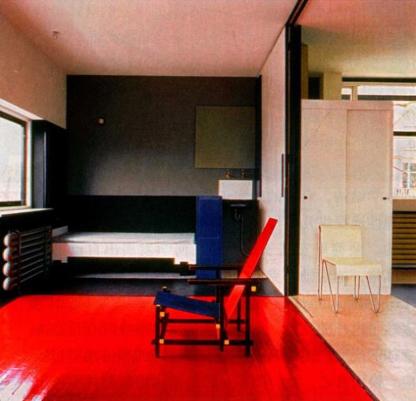

*图28.32 赫里特·里特韦尔：荷兰乌得勒支的施罗德住宅，其中放置有“红蓝椅”。1924年*

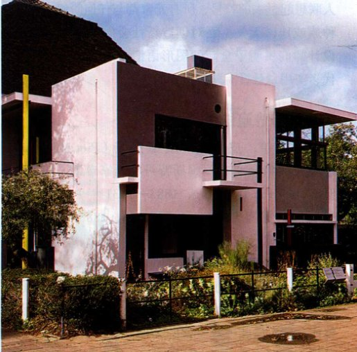

*图28.33 赫里特·里特韦尔：荷兰乌得勒支的施罗德住宅。1924年*

**赫里特·里特韦尔** 蒙德里安的风格派伙伴在建筑与室内设计领域继续贯彻其理论。1917年，家具制造商出身，后来自学成为建筑师的赫里特·里特韦尔设计了“红蓝椅”（Red-Blue chair，图28.32），这是新造型主义在装饰艺术方面的首次尝试。这可能是有史以来坐上去最不舒适的椅子之一，其强调精神上的美感，运用平面与原色来实现蒙德里安的动态平衡。弗兰克·劳埃德·赖特（见第936页）的作品于1911年时在欧洲出版发行；风格派成员发现并充分理解之后，马上就将建筑领域的解决方法运用于新造型主义的理论观念。他们赏识赖特打破“方盒子”的做法，并宣称“新建筑将是反立方体的”。与蒙德里安的色彩、飘浮平面以及赖特的流动空间结合之后，里特韦尔在1924年建造出决定性的风格派建筑，即乌得勒支的施罗德住宅（Schröder House，图28.33），建于一列联排房屋末端。建筑立面具有蒙德里安式的“飘浮”矩形与线条，甚至赖特式的悬臂屋顶也仿佛飘浮了起来。建筑内部（图28.32）按照相同的原则来设计，天花板上悬挂着滑动墙板，使得重构内部空间成为可能。不论建筑内外，施罗德住宅都显得轻盈优美、活泼和谐，体现出动态平衡的原则。

### 包豪斯：创造“新人类”

正如前文所述，大部分达达主义者、超现实主义者和抽象艺术家都是社会主义者或共产党人。他们相信，俄国布尔什维克革命将把世界从中产阶级的物质主义与堕落中解救出来，并在世界范围内建立起一个理想的社会。1922年，左翼艺术家在柏林聚集，参观首届俄国艺术展（Russian Art Exhibition），这是构成主义作品在西方的首次展览。同年，先锋艺术家两次在德国举行会议，试图制定一个社会计划，让艺术为重构社会服务。结果所有这些努力都付之东流。相反，艺术设计学校包豪斯（Bauhaus）逐渐浮现出来，成为提倡用艺术进行社会改革的强大中心。

包豪斯于1919年在德国魏玛成立，创始人是沃尔特·格罗皮乌斯。包豪斯学校在很多方面都体现出穆特修斯德意志制造联盟（见第978页）的风格，因为工作室的目标就是设计高品质、流水线生产的现代产品。然而包豪斯的指导原则更具理想色彩，商业特征较少。包豪斯意为“建造之家”，致力于将艺术与技术结合起来，为“新人类”进行实用的设计。其最初是由两所魏玛工艺学校合并而来，旨在结合美术与实用艺术，像早先的分离派运动那样，赋予其同等重要的社会地位。艺术家被称为工匠或手工艺人，其使命就是为最先进的现代社会创造抽象环境，设计准则以“机器与交通工具的生活环境”为基础。只能使用“基本的形式与色彩”，一切都服务于创造“作为社会必需品的日常用品的标准样式”。与风格派一样，包豪斯也具有导向环境，而不仅仅是有关绘画或雕塑的哲学，而且其更多地涉及纺织、金属和陶瓷制品领域，例如马塞尔·布罗伊尔在1927年设计的铝管椅子、安妮·阿尔贝蒂（Anni Alberti）的抽象图案织物，反而与克利、康定斯基和约瑟夫·阿尔贝斯等人的画作联系较少，尽管他们三人都在包豪斯执教。

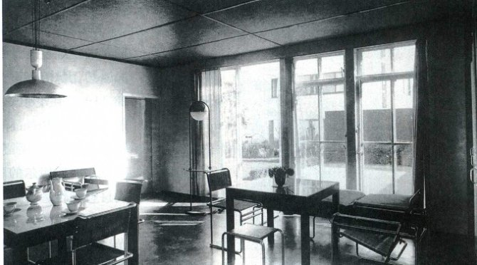

*图28.34 沃尔特·格罗皮乌斯：为制造联盟住宅发展计划设计的两座住宅，位于斯图加特，家具由马塞尔·布罗伊尔设计。1927年*

**马塞尔·布罗伊尔** 1927年，斯图加特市为制造联盟的住宅发展计划修建了格罗皮乌斯住宅（Gropius house），其中的起居室就体现了包豪斯的机器美学（图28.34）。住宅中的家具与照明设备由马塞尔·布罗伊尔（Marcel Breuer，1902-1981年）设计，他毕业于包豪斯，1925年留校执教，负责家具工作室的领导工作。布罗伊尔的所有设计都具有几何外观，使用现代材料制作，易于批量生产。起居室极右方的“瓦西里”（Wassily）扶手椅可能是他最为著名的设计，由光亮的镀镍钢管与棉织物制成。在设计的平面性方面，布罗伊尔显然受到了里特韦尔“红蓝椅”的影响；在就学期间，当时在包豪斯执教的凡·杜斯堡曾在1921年向学生们介绍过“红蓝椅”。但是布罗伊尔用坚固但重量更轻的金属管取代了沉重的木材，依据几何结构形成了轻快开放的设计，让人感觉到至上主义绘画和构成主义雕塑的透明与轻盈，这些特质也体现在塔特林设计的《第三国际纪念塔》中（见图28.28）。布罗伊尔在产品目录中描述了其设计的实用性；他这样写道：这种椅子“提供了一个轻松且充分自我释放的就座机会，其就像装有软垫的扶手椅一样舒适，但不同的是，这把椅子更轻便，也更保健”。

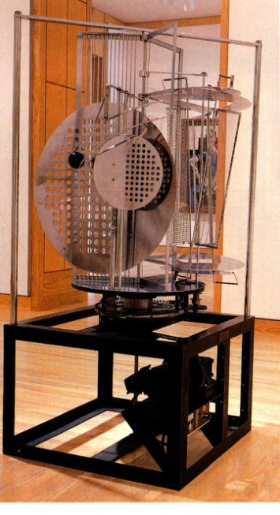

*图28.35 拉斯洛·莫霍利-纳吉：《光线与空间调节器》。1922-1930年。钢铁、塑料等其他材料与电动马达构成的动态雕塑，151.1 × 69.9 × 69.9厘米。马萨诸塞州剑桥市哈佛大学艺术博物馆布什-莱辛格分馆（Busch-Reisinger Museum）*

**拉斯洛·莫霍利-纳吉** 匈牙利的拉斯洛·莫霍利-纳吉（Lázló Moholy-Nagy，1895-1946年）或许是包豪斯学校中最支持构成主义的艺术家，同时也可能是最具影响力的人物。格罗皮乌斯在1923年聘用他担任金属工作室的负责人，但莫霍利-纳吉逐渐成为该校的首席理论家，他尤为关注光线与运动的问题。早在1922年，莫霍利-纳吉就开始设计可以发光的构成主义雕塑，《光线与空间调节器》（Light-Space Modulator，图28.35）就是其中一例。这件机器式的作品用塑料片、钢材和木材制成，由马达驱动沿圆形轨道运转，在周围投射出持续变化的光影效果。在1930年的包豪斯芭蕾舞演出中，这件作品被用作道具，但是莫霍利-纳吉也将其视为研究光影与空间的工具，希望借此找到环境光或舞台灯光的新型运用方式。

**沃尔特·格罗皮乌斯** 很多艺术史家都将包豪斯学校的校舍看作其美学成就的顶峰，这是格罗皮乌斯在1925年包豪斯从魏玛迁往德绍（Dessau）时所设计。这座建筑从中心发射出三座L形侧翼，其一为工作室部（Shop Block，图28.36），其二是课堂，第三翼为讲堂／剧院、餐厅、宿舍和小型公寓。整体设计以结构清晰的几何形为主导。工作室部分仿佛一个中空的玻璃盒子，两侧的玻璃幕墙在拐角处继续延伸，连接着上下两方粉刷的矮墙与底座（socle，指突出于墙壁、基座、立柱或其他上层建筑的结构）。建筑并不令人感到过于厚重、庞大，金属玻璃墙反而给人以轻盈之感。而且由于建筑突出于向内缩进的半地下室之上，看起来仿佛飘浮在空中。

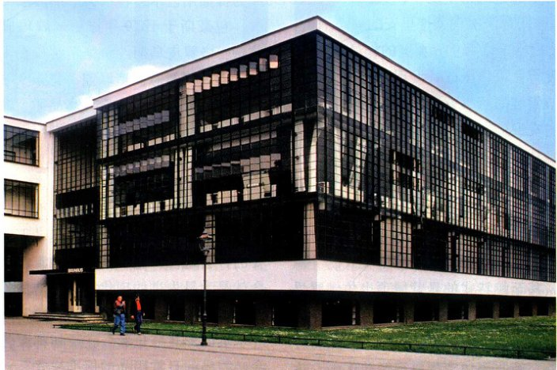

*图28.36 沃尔特·格罗皮乌斯：德国德绍市包豪斯校舍工作室部。1925-1926年*

两次世界大战之间，早期现代主义进一步产生了盛期现代主义建筑（High Modernist architecture，见第933-937页），与风格派作品相比，格罗皮乌斯的包豪斯校舍可能才是前者更典型的代表。盛期现代主义建筑具有简洁的几何形，轻盈得似乎处于飘浮状态。其不加装饰的几何形体凸显体积，而非规模。包裹建筑的墙壁是紧绷的薄膜式镶板，而且如同包豪斯校舍一样，通常采用玻璃幕墙，尽管盛期现代主义建筑师普遍偏爱水平的窗户条带设计。但是盛期现代主义并不仅仅是一种风格，还是一种社会运动，暗示着乌托邦式的社会主义哲学，以及对进步的理性主义信仰。根据其理论，通过创造机器时代的环境，生活能够得到改善。最终，该运动在1932年被简化为一种风格，当时菲利普·约翰逊和历史学家亨利-胡塞尔·希区柯克（Henry-Russell Hitcheock）在不久前开放的纽约现代艺术博物馆举办了题为“国际风格”（The International Style）的展览。他们关注的是建筑外观，而非其社会前提。该展览让美国人注意到了这种风格，盛期现代主义建筑最终被贴上了“国际风格”的标签。

**路德维希·米斯·凡德罗** 1930年，建筑师路德维希·米斯·凡德罗（Ludwig Mies van der Rohe，1886-1969年）成为包豪斯的校长，而学校在1933年就被迫关闭。20年代时，米斯·凡德罗是柏林先锋艺术的中心人物。他曾是贝伦斯的学生，后来跻身于重要现代主义艺术家之列，并于1927年在斯图加特组织了实验性的白色庄园（Weissenhof Estate）展览，很多一流建筑师参与其中，为工人建造价廉物美的住宅。米斯·凡德罗在此时转向盛期现代主义或国际风格，风格派的飘浮式平面设计与赖特复杂的空间规划深深地影响了他。然而其座右铭却是“少即是多”（Less is more），其建筑作品也以严格的几何形与简洁性著称。尽管如此，他设计的建筑却从不朴素，总是不乏优雅的比例和精致之感，看起来华美、奢侈。在资金预算许可的情况下，米斯·凡德罗会采用珍贵材料来增加建筑的精美程度，他曾使用过昂贵的大理石、花面石灰岩、青铜和彩色玻璃。

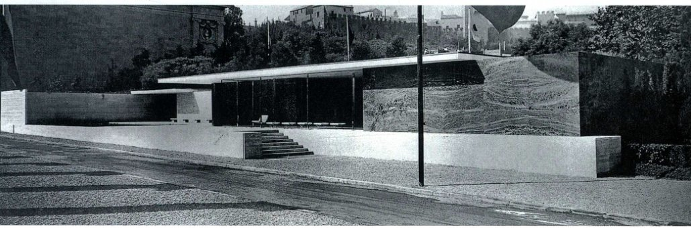

*图28.37 路德维希·米斯·凡德罗：1929年巴塞罗那世界博览会德国馆*

米斯·凡德罗还为1929年的巴塞罗那国际博览会设计了德国馆（German Pavilion，图28.37）。虽然博览会结束之后该馆就被拆除，但仍然体现了上述米斯·凡德罗的设计特色。建筑中没有明显的创新之处，交叠的水平与垂直平面、连锁开放的空间都曾出现在赖特与风格派建筑师的设计之中。米斯·凡德罗的创新并不明显，仅仅体现在简洁的风格上。而几何形则无处不在：德国馆坐落在巨大的长方形花面石灰岩平台上，四周的部分地方环绕着花面石灰岩或者蒂尼安大理石建成的长方形围墙。平台的另一端并非封闭，而是开有一座长方形池塘，边缘对称地排列着黑色玻璃。八道纤细的扶墙支撑着悬臂式平屋顶，扶墙之间的壁面被分为五个部分，其中两部分由缟玛瑙建成，另外三部分的材料则分别是无铅玻璃、毛玻璃和绿玻璃，镶嵌于用铬合金制成的框棂之中（图28.38）。米斯·凡德罗运用最少的形式语汇，创造出奢华优雅的视觉享宴。即便是他为该馆所设计的椅子也同样的简洁优雅，而且与里特韦尔的“红蓝椅”不同，前者的设计极其舒适。这种椅子被称为“巴塞罗那椅”（Barcelona Chair，见图28.38）。

> **大事年表**
>
> 1915 年——弗拉基米尔·塔特林创作《第三国际纪念塔》模型
>
> 1917 年——俄国革命
>
> 1925-1926 年——沃尔特·格罗皮乌斯设计包豪斯工作室部
>
> 1942 年——乐施会成立

### 机器美学

巴黎也出现了机器美学以及与之相随的乌托邦梦想，并在建筑师夏尔-爱德华·让纳雷（Charles-Édouard Jeanneret）的建筑作品中找到了不同的表达方式，他更以“勒·柯布西耶”（Le Corbusier，1886-1965年）知名。在发展激进建筑理论的同时，勒·柯布西耶还是一位画家，以本名“让纳雷”进行绘画创作。他逐渐形成了一种自称为纯粹主义（Purism）的绘画风格，反映出机器美学在其信仰中至高无上的地位，因为很好地体现了古典精神。纯粹主义还影响了法国立体主义画家费尔南·莱热，后者对于现代科技的效率与纯粹早有好感。与莫斯科、阿姆斯特丹和德绍不同，巴黎并没有出现奋力争取实现乌托邦理想的艺术学校或重大的艺术运动。相反，艺术的发展主要靠个人推动。

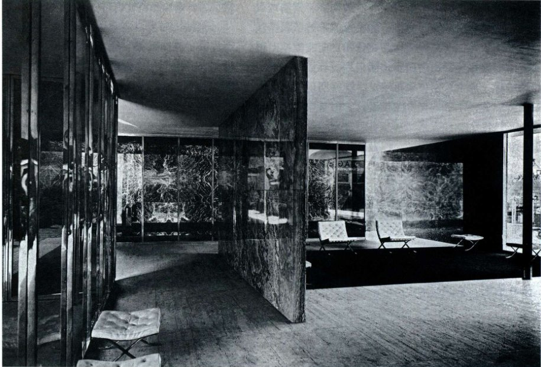

*图28.38 路德维希·米斯·凡德罗：德国馆内部，放置有“巴塞罗那椅”*

**勒·柯布西耶的理想住宅** 勒·柯布西耶是瑞士人，在20世纪10年代定居巴黎之前，他过着相对逍遥的生活。1907年，他在法国里昂结识了建筑师托尼·加尼埃（Tony Garnier），后者在这里发展出一座理想的工业城（Cité Industrielle），使得勒·柯布西耶开始构思社会主义的乌托邦建筑，以及创造易于制造的建筑类型，以便为社会大众提供更优越的居住条件。之后在巴黎期间，勒·柯布西耶在奥古斯特·佩雷门下作兼职，这位建筑师对推广钢筋混凝土（ferroconerete）在建筑中的使用作出了贡献。然而更为重要的是，他证明了钢筋混凝土的实用性，正如马克斯·伯格1912至1913年间通过百年纪念堂（见图27.47）所展现的。钢筋混凝土廉价、适应性强、便于使用、极其坚固，结合了钢的延展性与水泥的抗压能力（见第1013页的材料与技法）。这也将是勒·柯布西耶绝大部分建筑所采用的材料。影响勒·柯布西耶的最后一个元素是其1910年在柏林彼得·贝伦斯工作室的工作经历，当时沃尔特·格罗皮乌斯和米斯·凡德罗都是他的同事。勒·柯布西耶在这里与德国先锋建筑师直接合作，而后者正是为国际风格发展做出重要贡献的人物。而那时的勒·柯布西耶也在准备创造一种基于机器、易于建造的建筑（见第978页）。

> **材料与技法：钢筋混凝土**
>
> 钢筋混凝土（reinforced concrete）在20世纪成为了使用最为普遍的建筑材料之一。混凝土是由沙子、石灰石和水混合而成的水泥，其中包含小石子或者其他材质的碎粒，通常使用坚固的材料。最早的混凝土出现在公元前5600年的巴尔干半岛，罗马人在公元前2世纪就首次开始广泛使用混凝土（见第181-182页）。罗马建筑者运用混凝土来修建桥梁、码头、道路和水渠，也用于修建住宅和重要的城市建筑，例如万神殿（见图7.39）。
>
> 罗马帝国覆亡之后，混凝土几乎从建筑中消失了。其持续复兴始于1824年，当时英国泥瓦匠约瑟夫·阿斯普丁（Joseph Aspdin）取得了改进水泥的专利权。由于类似波特兰岛的一种天然石材，所以这种新材料被称为“波特兰水泥”。阿斯普丁为了制造水泥，会将黏土和石灰石加热到极高的温度，这一工艺今天仍在使用。虽然水泥耐火并能够抗高压，还具有均匀的质量，但其延展性较差，这就意味着水泥不能承托并非均匀施加的压力。为了解决这个难题，工程师们通过在混凝土中嵌入铁棒的方式进行加固。钢筋在19世纪晚期代替了铁棒，19世纪下半叶虽然出现了某种形式的钢铁，但现代钢材直到19世纪末才发明出来。铁和混凝土是完美搭档，因为其彼此互补了对方的缺陷。混凝土保护了铁材，使之不至于轻易软化或者受到腐蚀，而铁则提供混凝土所缺少的延展性。
>
> 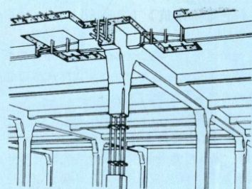
> *弗朗索瓦·阿内比克：钢筋混凝土体系。1892年（根据Curtis的图绘制）*
>
> 在英国和法国，发明家们几乎同时开始注册钢筋混凝土（ferroconcrete）专利，这是钢筋加固混凝土的称谓。最终英国泥瓦匠获得了铁棒与钢缆加固混凝土地板、屋顶的专利，而一位法国园艺师则获得了钢筋混凝土花架专利，并最终设计出护栏、支柱和横梁。但直到19世纪90年代，法国工程师弗朗索瓦·阿内比克（François Hennebique）才设计出钢筋混凝土建造的支柱与板层建筑，每一层地板／天花板都是整体建筑的一部分，而非位于支持框架上的分离元素（见插图）。此后阿内比克的工程技术得以广泛运用于工业建筑，只是简单地模仿了传统的柱梁系统。
>
> 一般认为，将钢筋混凝土引入“高层”建筑的功劳属于法国建筑师奥古斯特·佩雷（Auguste Perret）。20世纪初期，他设计了一些钢筋混凝土公寓和车库；其中最著名的建筑之一是巴黎城外的勒兰西教堂，建于1922年（见插图），采用了苏夫洛的圣杰尼耶夫教堂（见图23.21）的设计理念，同时还兼顾哥特式大教堂的明亮与轻盈。1912至1913年间，马克斯·伯格建造的百年纪念堂（见图27.47）也在推广钢筋混凝土方面发挥了重要作用。最终，钢筋混凝土成为勒·柯布西耶的首选建材（见第1012、1014页），同时也为弗兰克·劳埃德·赖特所青睐（见第1071页）。
>
> 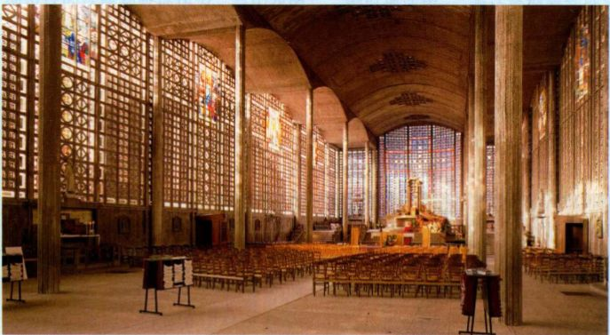
> *奥古斯特·佩雷：法国勒兰西市圣母院（Notre Dame，Le Raincy）。1923-1924年*
>
> 除了坚固性之外，钢筋混凝土的吸引力还在于其低廉的造价。混凝土的组成材料方便易得。作为其中最为昂贵、稀少的成分，钢只占到建筑整体的百分之一至百分之六。1904年，摩天大楼的建造开始使用钢筋混凝土，最早的是辛辛那提市的英加尔斯大楼（Ingalls Building），一座高64米的16层建筑。到了1962年，钢筋混凝土又被用于现代超高层建筑，其中包括芝加哥马里纳城（Marina City）高达60层的双塔楼。从1998至2003年间，世界最大的钢筋混凝土建筑是马来西亚首都吉隆坡（Kuala Lampur）的双子星塔（Petronas Tower），其设计师则是康涅狄格州哈特福德市（Hartford）的西萨·佩里（Cesar Pelli）。双子星塔共有88层，高452米；如果没有钢筋混凝土，造价将会高得令人望而却步，因为马来西亚本土并不出产钢材。然而与世界上大部分地区一样，马来西亚很容易就生产出了高品质的混凝土。

> **原始文献：勒·柯布西耶（1886-1965年）**
>
> **节选自《走向新建筑》（Towards a New Architecure， 1923年）**
>
> 《走向新建筑》一书最初出版于1923年，其中对于建筑师广泛讨论的观念进行整理，并成为国际风格的首部宣言。下文摘录的内容来自首章。
>
> 建筑师通过形式布局实现某种秩序，这完全是其精神的创造；他运用形式和形体来影响我们的感官，能够达到精确的程度，并唤起可塑的情感；他通过创造空间关系，在我们内心唤醒深层的回响，他赋予了我们秩序的尺度，使我们感到与世界之间的和谐一致，他决定我们心灵与理解的不同运动；于是我们感受到美。
>
> 原始的形式是美的，因为可以尽情供人欣赏。
>
> 现代建筑的大难题必定有几何上的解决方案······
>
> 房屋是用于居住的机器。
>
> 标准是逻辑、分析与详细研究······
>
> 人用眼睛来看建筑的创造，而人眼位于地面之上1.7米左右的地方。
>
> 工业如同洪水席卷了我们，翻卷着往其注定的终结而去。工业为我们提供了适合新时代的新工具，因新精神而充满活力。
>
> 房屋的问题是时代的问题。
>
> 如果我们从心灵与头脑中去除有关房屋的僵化观念，并从批评和客观的角度来看待这个问题，那么我们就会得出“房屋一机器”的结论。批量生产的房屋，优美而有利身体健康，同时也有利于精神的健康······
>
> SOURCE: LE CORBUSIER, TOWARDS A NEW ARCHITECTURE, NEW YORK: DOVER, 1986

1922年，勒·柯布西耶与堂兄皮埃尔·让纳雷（Pierre Jeanneret）开办了一家建筑公司。在之后的二十年间，他设计了一系列住宅建筑，对自己的理想住宅理论进行发展和完善，而这也是日后所有住宅建筑的原型（见本页的原始文献）。勒·柯布西耶称其在1914年设计的第一个建筑类型为“Dom-Ino”，因为在这种水泥地板的住宅里，支撑天花板的水泥立柱按照网格结构来布局，很像是多米诺骨牌上的圆点。“Dom-Ino”一词还涉及多米诺骨牌游戏的生产专利权问题；通过这个双关语，建筑师向人们展示了自己的计划——设计一种可以申请“专利”的标准化住宅。到了1923年，勒·柯布西耶已经确立了理想住宅的诸多原则，并在《新建筑五点论》（Five Points of a New Architecture）一文中进行阐述。其中的五点原则如下：第一，没有底层，房屋建在底层架空柱（pilotis）上；第二，平屋顶，其上可以用作花园平台；第三，开放的楼层规划，以支撑结构分割立面；第四，外部幕墙结构自由；第五，带状（水平）窗户最为理想。房屋被抬高了，所以光线更充足、室内也更加私密，在屋顶上建造花园也使得户外景观近在咫尺。很久以后，勒·柯布西耶评论说“这种房屋是居住的机器”，这句话误导了很多评论家，使其认为勒·柯布西耶提倡赤裸裸的功能主义，而不关心美与舒适的问题。事实上，勒·柯布西耶希望以几何形式与机器外观为基础，营造一种古典式的纯粹。他曾这样写道：“建筑是将团块集合在一起公诸于世的游戏，一种精巧、标准且崇高的游戏。”“立方体、圆锥体、圆柱体和金字塔是基本形式，其展现更多的光线。”然而，在这种美学观中，勒·柯布西耶强调的是人与“生活”。机械时代的价值观与技术要为人类服务。他的住宅会运用最先进的技术，呈现机器式的外观，具有机器的效率；而且还光照充足，明亮怡人。

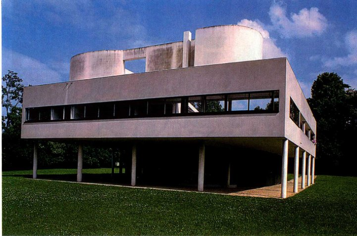

*图28.39 勒·柯布西耶：法国塞纳河畔普瓦西市的萨伏伊别墅。1928-1929年*

1928年，勒·柯布西耶在巴黎城外的塞纳河畔普瓦西市（Poissy-sur-Seine）设计了萨伏伊别墅（Villa Savoye，图28.39），这是他最为著名的建筑作品，从中可以看到《新建筑五点论》中提倡的大部分元素：底层架空柱、抬高的居住空间、水平窗户和屋顶平台，在圆筒状风挡玻璃的保护之下，看上去就像是远洋客轮的烟囱。第二层是主楼层，隔断墙使它具有了开放的空间布局。这一层面对庭院（图28.40），庭院中的一道斜坡通向屋顶。眼睛所见之处都是优美经典的几何形，这是勒·柯布西耶设计美学的基石。这座别墅仿佛一个完美、精确的立方体盒子，包裹着整洁的水泥涂层；底层架空柱为圆柱形，而防风墙则由大量的拱构成。插图28.39的阴影部分模糊了地板上的另一道几何曲线，这里包括车库和仆人住所。与包豪斯校舍和施罗德住宅一样，这座建筑看起来轻盈明亮，几乎是飘浮在底层架空柱之上。

虽然这座别墅抽象且具有超前特质，其仍然与历史上的建筑形成共鸣。我们从中尤其可以感受到经典地中海住宅的白盒子形式，后者也是以庭院为中心，两侧封闭，坐落在俯瞰大海的山上。勒·柯布西耶将他设计的这座别墅描述为“空中花园”，影射神话传说中的古巴比伦花园。别墅庭院的完美形式令人回想起帕拉第奥，而构成柱廊的底层架空柱则是对于多立克神庙的结构做出的回应。连接楼层的坡道（此外另有一座圆形楼梯间）让很多学者联想到迈锡尼城入口处的坡道。这座别墅是国际风格建筑和盛期现代主义的伟大宣言，勒·柯布西耶向我们展示了希腊神庙的现代主义机械时代更新版——坐落在山丘之上，俯瞰自然，弥漫着阳光与空气。

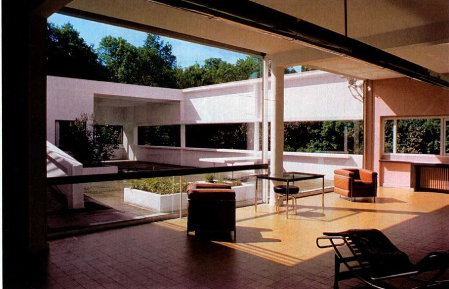

*图28.40 勒·柯布西耶：萨伏伊别墅内景。1928-1929年*

**纯粹主义与费尔南·莱热** 1917年，勒·柯布西耶结识了画家阿梅代·奥赞方（Amédée Ozenfant，1886-1966年），并一起创造了纯粹主义理论；这种理论在本质上具有新柏拉图主义观念，将一切艺术表达都缩减到抽象古典的纯粹性之中，反映出机器式的美学观。干净的线条、纯粹的形式与数学上的清晰性均受到高度评价。1918年，他们发表了题为《立体主义之后》（After Cubism）的论文，指责立体主义风格的扭曲变形；1920年，他们又发表了《纯粹主义》（Purism）一文，以此来命名其理论。勒·柯布西耶也是画家，他以“夏尔-爱德华·让纳雷”的名字创作绘画、写作文章。与伙伴奥赞方一样，他的作品多为静物，采用了立体主义多点透视的手法，但是将物体简化为机器形态的几何形式，布局在与画面平行的平面之中。

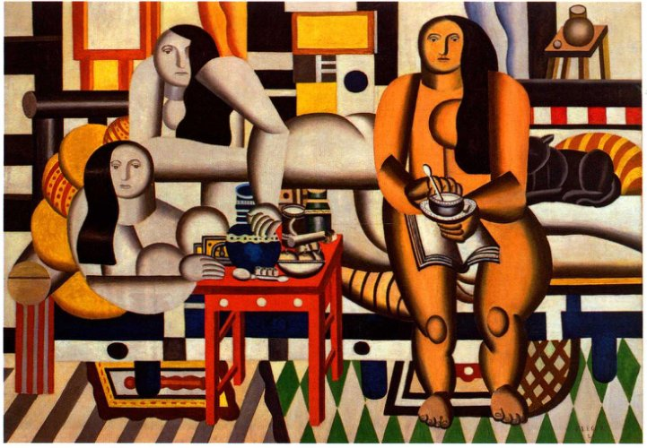

*图28.41 费尔南·莱热：《三女人》或《大餐》。1921年。布面油画，11.84x2.51米。纽约现代艺术博物馆*

立体主义艺术家费尔南·莱热（Fernand Léger，1881-1955年）成为了纯粹主义的追随者，尽管他从未曾称自己是纯粹主义者。莱热确实倾向于这种观念，因为他在20世纪10年代早期就创作出具有机器面貌的立体主义人像，同时他还是坦率的社会主义者，拥护现代性与技术进步。然而在20年代早期，莱热的风格反映出让纳雷（勒·柯布西耶）和奥赞方所提倡的机器式几何性与古典主义特征，1921年的作品《三女人》或《大餐》（Three Women 或 Le Grand Déjeuner，图28.41）就表明了这一点。圆形与圆柱构成了几乎面貌相同的女性裸体形象；而头发和面部等部分也十分相似，几乎到了可以相互置换的程度。事实上，画中的物体看起来都是机器制造的产品，与人物一样，都被简化为立方体、圆锥体、圆柱体和金字塔形式。有生命的对象与人造对象几乎无法区分，这两种类型都按照一定秩序布局在水平线与垂直线构成的致密网格里，毫无深度地附着在画布表面。在色彩方面也保持了最基本的选择，即调和出一切色彩的原色与间色。尽管我们看到的是妓院场景，但莱热还是选取了大型裸体这一古典题材。通过将该题材置入当代世界和谐完美的技术面貌之中，他让古老的题材跟上了时代步伐。就像修拉在30年前所做的那样，莱热实际上告诉我们：机械与科学是新古典主义和世界秩序的基础。

## 美国艺术：现代性、精神性与地方主义

比起欧洲，美国更可能将机器看作进步的标志，因为在第一次世界大战之后，美国已经毫无争议地成为技术世界的领袖。欧洲先锋艺术家追求无阶级、无国界的世界，而美国人反而关注国家认同的问题。无论怎样，美国艺术家普遍缺乏乌托邦式的理想；相反，他们将摩天大楼、工厂和机器看作国家技术领先的象征。但并非所有人都拥护现代化。随着战后经济的繁荣发展，出现了灿烂辉煌的“咆哮的二十年代”，很多艺术家都拒绝物质主义，转而追求精神上的满足。某些艺术家面向自然，寻找普遍真理，另外一些艺术家则在美国中部地区寻找似乎已经过时了的美国价值观，从中汲取力量，他们尤其关注虔诚热心、辛苦劳作的农民生活方式。

仍然有另一部分艺术家对与繁荣并存的贫困与社会不满做出回应。那个时期以压抑的劳动、激烈的工人罢工与无政府主义的威胁为特征。“三K党”（Ku Klux Klan）迅速发展起来，该党对越来越多的黑人处以私刑，导致了种族主义在南方的逐步升温。1920年，第20号修正案（The Twentieth Amendment）确保了妇女的投票权，但并不保障女性在社会与经济方面的平等地位，妇女继续从事那些仅限于女性的工作，而且报酬普遍较低。大萧条让不公平更为恶化，最终导致了30年代具象艺术的兴起，也就是社会现实主义（Social Realism）。

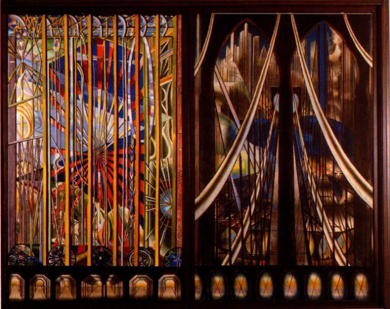

*图28.42 约瑟夫·斯特拉：《诠释纽约》或《城市之音》。1920-1922年。布面油画和蛋彩画五联画，2.53 × 6.86米。纽瓦克市纽瓦克博物馆（Newark Museum）, 37.288 a-e*

### 城市与工业

1915年首次来到纽约时，马塞尔·杜尚惊叹于当地高耸的摩天大楼，称其为现代性的典范。他在美国看到了艺术的未来。摩天大楼与现代工业确实成为了美国的象征，取代了上个世纪在绘画中占据主导地位的风景。这还代表着美国在技术上与经济上的优势地位，因为美国在这个世纪成为全世界最富裕、最现代的国家。第一次世界大战促进了经济发展，开启了一个前所未有的消费主义、物质主义时代。20年代被称为“咆哮的二十年代”，同时也是“爵士乐时代”（Jazz Age），城市文化在其间占据主流；到了1920年，城市居民的数量已经超过了乡村居民。

纽约是美国的象征，其标志就是摩天大楼。从20世纪最初十年的末期开始，这些“资本主义大教堂”成为最受画家与摄影师、雕塑家与设计师青睐的题材；他们表现出这一现代圣像在技术上的全部辉煌，所展现的摩天大楼高耸入云，看不到下方的街道与行人。桥梁、工厂、水坝和炼油厂等所有能够证明美国先进现代化的对象都予以改变，成为宏大的纪念碑，如同埃及的金字塔一般伟大，如同法国的哥特式大教堂一般神圣。

**约瑟夫·斯特拉** 在表现纽约的独特视觉圣像方面，意大利移民艺术家约瑟夫·斯特拉（Joseph Stella，1877-1946年）的作品或许是最杰出的代表。该作品题名为《诠释纽约》或《城市之音》（New York Interpreted 或 The Voice of the City，图28.42），完成于1922年，是高达2.53米的五联作品；中央画板上绘制有一座抽象的塔楼，前景中有纽约的熨斗大楼（Flat Iron Building），周围环绕着或实或虚的建筑。中央画板两侧的画面表现着“百老汇”（白色大道），艺术家将其简化为色彩与光线的抽象。最左侧的画板描绘了曼哈顿下西区的哈得孙河港湾，最右侧则是东区的布鲁克林大桥。每一幅画面都是针对曼哈顿技术奇迹的特写，我们在哈得孙河景观中看到了通讯塔、换气系统和高架铁路。那幅“百老汇”则表现出时代广场晚间的灯光闪烁，当时世界上任何一个地方的广场都难以与之媲美。实际上，这两幅作品是对电力和城市能源的献礼之作。即使在开通35年之后，布鲁克林大桥仍然是世界工程学上的壮举。

斯特拉于1896年来到美国，但在1910年返回意大利求学，并在那里结识了一些未来主义艺术家（见第二十七章）。通过施蒂格利茨的画廊以及与杜尚、曼·雷等人的友谊，斯特拉了解到欧洲的艺术潮流，立体主义也在20世纪10年代成为其最主要的艺术语汇。表现百老汇的两幅画面则特别反映出未来主义的宗旨，其中出现了声波图像，以及马赫式的运动表现方式，博乔尼在《思想状态》（见图27.22）中也曾采用过相同的手法。令人眼花缭乱的万花筒色彩，准确捕捉到时代广场晚间的强烈视觉体验。但是在摩天大楼与布鲁克林大桥的画面中，斯特拉不仅仅再现了表现对象，而且将之圣像化；对象位于画面中心，转变为现代化的象征。斯特拉的用色极其饱和，色彩通常环绕在厚重的黑色线描之中，实际上将图像转变为一面“彩色玻璃窗”。他还在底部增加了祭坛台座（见第515页），进一步强化了作品的宗教感，详细记录了纽约地下的不同通道与公共管道。现在，技术与现代化都被当作新兴宗教来看待。

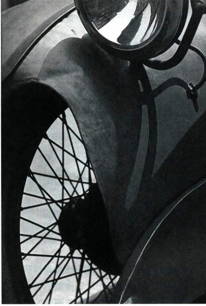

*图28.43 保罗·斯特朗：《辐条车轮》。1917年。负片放大，铂盐成像，33 × 26厘米。乔治·伊斯特曼之家*

**保罗·斯特朗** 事实证明，摄影特别适合用来捕捉机器时代的胜利。然而，诸如艾尔弗雷德·施蒂格利茨的《野心之城》（见图26.48）等最早一批反映现代纽约的照片，却通过一片柔和的绘画式朦胧感，对该城的形象进行了浪漫化处理。年轻的保罗·斯特朗（Paul Strand，1890-1976年）在1915至1917年间拍摄了大量聚焦清晰的高对比度照片，取得了突破性成就。施蒂格利茨立刻意识到这些作品的重要性，并从中选出一批在291画廊展出。《辐条车轮》（Wire Wheel，图28.43）就来自这个时期，其中被抽象化的对象是福特A型汽车，由于其标志着装配线的到来，因此成了机械时代的标志。这张照片抛弃了世纪之交时画意摄影的“涂绘感”（painterliness），并出现了以立体主义为基础的构图新风格，斯特朗曾在施蒂格利茨的291画廊参观过立体主义展览。他通过汽车的特写，创造出倾斜的透视与具有压迫感的裁切手法，于是产生了难以解读的图像，进而形成平面复杂的空间。

1920年，斯特朗与画家兼摄影师查尔斯·希勒（Charles Sheeler，1883-1965年）合作，拍摄了一部意在展示纽约能量与辉煌的电影。电影名为《曼哈塔》或《伟大的纽约》（Manahatta 或 New York the Magnificent），开场的场景是上班族乘坐渡轮到达下曼哈顿，他们成群结队地涌下渡船，在上班途中蜂拥进商业区。电影结尾处，人群在日落时分再次登上渡船。电影采取了多种形式主义的手法，包括快速剪辑、在摩天大楼顶上垂直拍摄、倾斜的角度与鲜明的明暗对比等，赋予了影片汹涌澎湃的能量感与持续的运动感，旨在捕捉现代化的飞速步伐以及城市生活体验的强大趋势。沃尔特·惠特曼（Walt Whitman）作于1860至1881年间的诗歌《曼哈塔》（Manhatta）片段贯穿整部影片，宣告着纽约的伟大与力量。

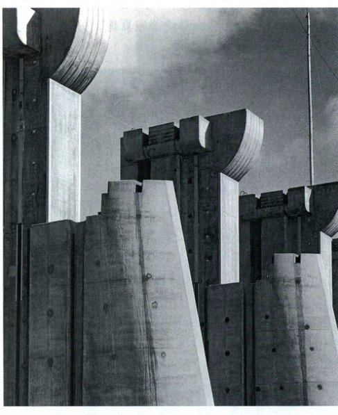

*图28.44 玛格丽特·伯克-怀特《蒙大拿市的佩克堡水坝》。1936年。时代-生活有限公司*

**玛格丽特·伯克-怀特** 斯特朗的硬边美学观不仅影响了美国摄影，还最终改变了整个世界的摄影创作。他的风格特别适于拍摄技术化和工业化图像，能够增强拍摄对象那种机器制作的精确感。摄影记者玛格丽特·伯克-怀特（Margaret Bourke-White，1904-1971年）尤其拥护这种新兴美学观念，她还受到技术性图像的吸引，刊登在1936年11月23日《生活》（Life）杂志第一期封面上的《蒙大拿市的佩克堡水坝》（Fort Peck Dam，Montana，图28.44）就表现了这一点。照片的全部力量都凝聚在其严格、质朴的面貌之中，增强了水坝规模的庞大感；相形之下，下方的工人俨然蚂蚁一般。水坝的每座坝墩都完全一致，似乎是由一台巨型机器模压而来。由于照片两侧的图像经过裁切而不再完整，这些由装配线生产且庞大无比的坝墩似乎正无穷无尽地延伸下去。但是古代亚述或埃及建筑的宏大感还是得以保留，而我们也再一次看到，艺术家宣称现代科技是新的古典主义。

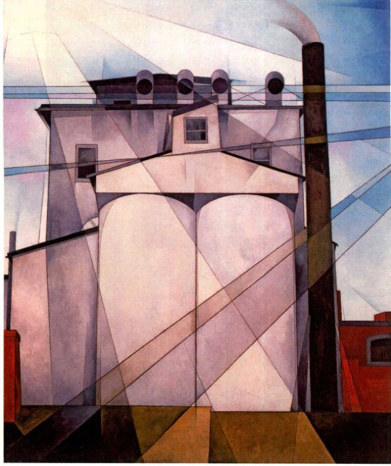

*图28.45 查尔斯·德穆思：《我的埃及》。1927年。组合板上油画与石墨画，91 × 76厘米。纽约惠特尼美国艺术博物馆*

**查尔斯·德穆思** 查尔斯·德穆思（Charles Demuth，1883-1935年）在1927年的《我的埃及》（Egypt，图28.45）中，描绘了其家乡宾夕法尼亚州兰开斯特市附近的现代谷物升降机；德穆思同样将美国现代化转型为古典圣像。德穆思在1912至1914年间曾在巴黎学习，吸收了欧洲的现代主义风格。20世纪20年代末期，他出入于当时最不落俗套的艺术圈子，并与艾尔弗雷德·施蒂格利茨一起参加展览。德穆思的作品风格多种多样，即使在某一特定时期内也是如此；插图中的画作表现出纯粹主义的美国版本，即称为精确主义（Precisionism）的风格。20年代期间，包括德穆思在内的一群美国艺术家发展出这种风格，其具有立体主义的硬边几何特征，但是比立体主义更具再现性。之所以称其为精确主义，不仅是因为精确的几何性与素描手法，还是因为其似乎要捕捉机械化与工业的精确感，这也是作品常见的表现题材。画面的笔触极其细小，以至于这些艺术家们被称为“无瑕画家”（Immaculate），虽然其几乎从未一起展览，也不认为彼此均属于同一团体。乍看之下，《我的埃及》具有明显的立体主义特色，但谷物升降机的物质整体几乎没有经过处理，只有神秘乃至神奇的光束才具有立体主义的断裂感，而这些光线只是让物象略微有些变形。尽管如此，光线仍然赋予建筑一种粗野的力量，或许也可以称之为神秘的超然之感。作品标题表明，类似谷物升降机的农业建筑就是美国的金字塔。烟囱在升降机中灌注了工业的力量，通风管的几何形与存储罐巨大的圆柱体最终将建筑转变为一架高效的机器。

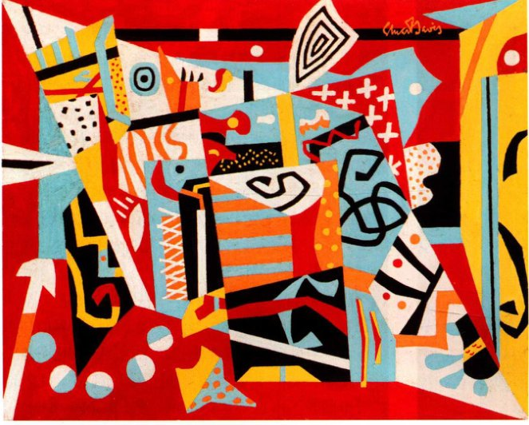

*图28.46 斯图尔特·戴维斯：《六色火热的静物风景-第七大街风格》。1940年。布面油画，91.4x114.3厘米。波士顿美术馆，William H.Lane 基金会与 Karolik 先生收藏交换捐赠，1983.120*

**斯图尔特·戴维斯** 美国艺术家斯图尔特·戴维斯（Stuart Davis，1892-1964年）同样也运用抽象手法，力图捕捉现代体验的本质。1913年的纽约军械库展览（见第974页）让戴维斯全力以赴来支持现代主义，其作品也在20年代晚期日益抽象起来。正如蒙德里安力图找到不可见生命力的视觉对等形式一样，戴维斯也希望创造现代生活体验的对等形式，例如乘坐飞机飞行、从摩天大楼顶上向下观望、聆听爵士乐，或者乘坐飞驰的汽车、摩托车和火车等。他想要捕捉对“我们的时代中，独特真实的新光线、新速度和新空间”的体验。为了实现这个目的，戴维斯采用了综合立体主义语汇，其用色在30年代末逐渐明亮起来，但也仅限于原色、间色和复色，形式也相当轻松活泼，彼此的叠加喧闹无序，正如1940年的画作《六色火热的静物风景-第七大街风格》（Hot Still-Scape for Six Colors-Seventh Avenue Style，图28.46）那样。戴维斯喜爱爵士乐和摇摆舞乐，在解释了如何将色彩用作乐器来构图之后，他进一步描述了这幅安放于第七大街画室里的作品：“主题······正是任何现代城市居民的体验。水果与花朵、厨房器皿、秋日的天空、地平线、计程车、收音机、艺术展和艺术复制品、快速旅行、书商目录、电影、电子标示牌、城市景象与声响的活力，这些乃至成千上万种共同的体验，是我作品所赞颂的基本主题。”烟囱、海景与砖墙包裹在这片色彩、形体与交迭平面所构成的嬉戏喧闹之中，缩减为朴实的象形符号，卡通式的特色也似乎更接近美国的流行文化。戴维斯以几乎难以界定的方式，运用感性准确捕捉到美国的脉搏——华而不实的广告、对新生事物的热爱，以及爵士乐、流动性与无所寄托之感。

### 装饰派艺术与国际风格

虽然摩天大楼已经成为了美国现代性的国家象征，但是相较于欧洲的建筑发展而言，这些建筑在美学上相对保守，特别是与国际风格进行比较之时。后者的独特之处就在于高度。到了1900年，纽约超越了芝加哥，再次成为摩天大楼之城。这里的建筑日益增高，1913年卡斯·吉尔伯特（Cass Gilbert）设计的伍尔沃思公司大楼（Woolworth Building）高达241米，堪称全城之最。在美学方面，这些新建的大楼仍然保持着鲜明的19世纪样式，反映出包括哥特式在内的各种历史风格。“咆哮的二十年代”带来的财富使得建筑公司数量激增，建筑师们竞相设计世界最高的建筑。77层的克莱斯勒大楼和102层的帝国大厦在1930年几乎同时开工建设。

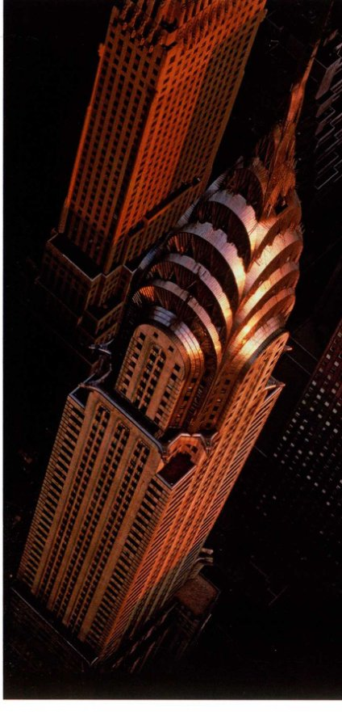

*图28.47 威廉·范·阿伦：纽约克莱斯勒大楼。1928-1930年*

克莱斯勒大楼（Chrysler Building，图28.47）的设计者是不太著名的建筑师威廉·凡·阿伦（William van Alen，1883-1954年），这栋大厦通常被看作装饰派风格中最为精美的作品。装饰派（Art Deco）是一种装饰性的艺术风格，出现在1925年巴黎装饰与工业艺术博览会中（Exhibition of Decorative and Industrial Art）。装饰派的理念与包豪斯学校一样，都力图缩小高品质设计与批量生产之间的鸿沟。这是新艺术风格的派生物，但是用机械时代的几何形与流线型取代了有机形式。装饰派并不像包豪斯那样具有乌托邦式的目标，而是一种主要属于中产阶级的风格流派，沉浸在梦幻与奢华之中。其关心的是装饰外观，并不具备理想主义的实质。在机器美学的几何性与流线型中，装饰派对历史风格进行了大范围吸收，从立体主义的断裂感到美国土著的锯齿形，甚至还包括前哥伦布时期的设计图案。装饰派设计师热爱丰美的色彩、丰富的材料和闪亮的表面效果。由于受到机器几何形式的启发，这种风格通常会汇集各种折角形式，布局参差不齐，或者不连贯，映衬在新艺术风格或青年风格的有机式背景之上。克莱斯勒大楼就体现了这些特点。建筑采取流线型几何外观，逐层缩进的拱使得顶端愈来愈细。火焰式的三角形窗户营造了一种断奏感，大楼的顶部完全为闪亮的不锈钢包裹。角落处装饰的怪兽滴水嘴则采用了1929年克莱斯勒汽车引擎盖上的饰物样式。

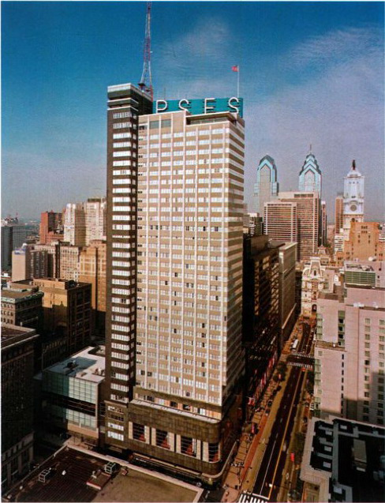

*图28.48 乔治·豪和威廉·埃德蒙·莱斯卡茲：费城储蓄基金会大楼。1929-1932年*

国际风格在这个时候进入了美国，出现在雷蒙德·马修森·胡德（Raymond Mathewson Hood）1931年设计的纽约麦克劳·希尔大楼（McGraw-Hill Building）及乔治·豪（George Howe，1886-1955年）和威廉·埃德蒙·莱斯卡兹（William Edmond Lescaze，1896-1969年）在1929至1932年间设计的费城储蓄基金会大楼之中（Philadelphia Savings Fund Society Building，图28.48）。豪和莱斯卡兹开始设计出一座本身令人瞩目的现代建筑，因为这样的设计在当时的美国独一无二。但是建造的过程已经预示了巨大的经济隐患，因为随着大萧条的深化，潜在的承租人正日益减少。这座大楼具备盛期现代主义的诸多特征，但原本采用悬臂方式支撑建材与玻璃幕墙的计划不得不做出妥协，因为客户坚持窗间壁必须一直贯穿建筑的整个立面，认为这样可以创造强烈的垂直感，并与横向窗户相得益彰。虽然与欧洲的同类建筑相比（见图28.36），费城储蓄基金会大楼看起来厚重有余，轻盈不足，但很好地反映出鲜明的功能主义特征。从外部看来，那些宛若构成主义的方格子仿佛都是基于某个特定目的而设计。

### 寻求精神性

20世纪最初10年，大多数具有创造性的美国艺术群体都将注意力转移到创造美国本土艺术方面。作家、音乐家、艺术家和诗人都感到美国的文化源自欧洲，而现在他们要挖掘美国独有的体验，并试图以本土的方式表现出来。对某些艺术家而言，答案就在美国的现代性之中，斯特拉的《诠释纽约》或《城市之音》和德穆思的《我的埃及》中都反映了这种态度。另外一些艺术家则将目光转向自然，返回到哈得孙画派及其后继者的泛神论浪漫主义。施蒂格利茨察觉到这个美国艺术的问题，于是在20年代决定只展出美国艺术家的作品，并将自己成立于1928年的最后一家画廊命名为“美国领地”（An American Place）。他本人对现代性的态度日益抵触、偏执，直到晚年也没有购买过哪怕一台收音机或者一部汽车；像当时的很多人一样，逃避物质主义，想在现代美国寻找精神归宿。施蒂格利茨在《摄影》杂志中发表了康定斯基《论艺术中的精神》（见第960页）的部分章节，他开始逐渐关注在崇高的自然面前，捕捉与自己的情感对等的视觉图像。

从20年代早期直到1946年去世，参与施蒂格利茨展出的美国艺术家普遍致力于在物质主义的现代世界中寻找更高层次的生命意义，并通常以自然为中心，不过这些艺术家并非一贯坚持这种创作观念。乔治亚·奥基夫（Georgia O'Keeffe，1887-1986年）的作品就曾参加过施蒂格利茨的展出，后来两人于1918年相爱，最终结为夫妇。

> **大事年表**
>
> 1926年 - 乔治亚·奥基夫创作《黑色鸢尾花3号》
>
> 1927年 - 查尔斯·林德伯格飞越大西洋
>
> 1929年 - 股票市场崩溃
>
> 1933年 - 富兰克林·罗斯福推行新政
>
> 1939年 - 约翰·斯坦贝克的《愤怒的葡萄》出版
>
> 1940-1941年 - 雅各布·劳伦斯创作《黑人在北方享有更好的教育资源》

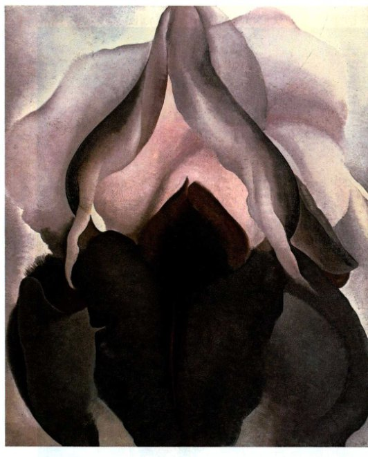

*图28.49 乔治亚·奥基夫：《黑色鸢尾花3号》。1926年。布面油画，91.4x75.9厘米。纽约大都会艺术博物馆，艾尔弗雷德·施蒂格利茨收藏，1949年*

**乔治亚·奥基夫** 1916年，施蒂格利茨首次展出了奥基夫的作品；她当时创作小幅的极少主义抽象水彩画，画面容易令人联想到崇高的风景。将近1920年时，她对自然的再现发展成为花朵特写，1926年的《黑色鸢尾花3号》（Black Iris III，图28.49）就是如此。其中的图像被放大到夸张的程度，实际上成为了抽象图像。要找到奥基夫的绘画来源并不困难，那就是保罗·斯特朗。奥基夫在1917年爱上了年轻英俊的斯特朗，同时也被他饱含力量的摄影作品深深打动，特别是运用特写拍摄照片的方式。她这样写道：这种构图设计迫使观者像她那样专注地观看花朵。但是通过提炼特写手法，奥基夫取得了更多的成就：花朵的形式变为女性身体的组成部分，鸢尾花就令人联想到女性的性器官。花瓣幽雅地消融在背景里，似乎融入自然之中。

可能由于施蒂格利茨的营销手段，评论家们将奥基夫的花朵描述为“公开的色情与性”，这是“咆哮的二十年代”时期道德堕落所造成的结果。这种解读激怒了奥基夫，她否认自己的作品在本质上与性有关。而且，这些作品也确实不是这样。英国作家D.H.劳伦斯（D.H.Lawrence）是奥基夫的朋友，同时也是一名遭禁的色情小说家。在他看来，奥基夫的绘画与肉欲无关，她表达的是自然那充溢、澎湃的力量，其中当然也包括生殖的欲望。对于性的体现就像花朵的开放、散发花粉与繁殖一样自然、优美，且不可或缺。奥基夫笔下神奇的花朵似乎就在我们眼前生长，如果其开始具有云朵、烟雾、臀部和肉体等事物的面貌，那只会增加万物对等相通的感觉，奥基夫认为这正是所有事物都具备的性质。在鸢尾花的微观图像中，奥基夫呈现了一个异常庞大的微观世界，甚至超越了整个宇宙。

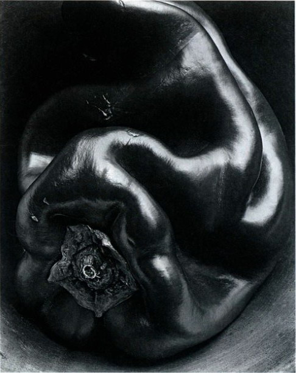

*图28.50 爱德华·韦斯顿：《菜椒》。1930年。明胶银版成像。亚利桑那州图森市创意摄影中心*

**爱德华·韦斯顿** 受到斯特朗、奥基夫两人创作的影响，特写逐渐成为了20年代绘画家与摄影师的常用手法；而且在某些艺术家手中，特写具有与奥基夫绘画相同的精神容量。加利福尼亚摄影师爱德华·韦斯顿（Edward Weston，1886-1958年）所拍摄的《菜椒》（Pepper，图28.50）就属于这一类。通过灯光的布置与裁切，起伏粗糙的蔬菜在某些地方看起来仿佛蜷伏的人体，右部上方是脊背，下方则是臀部；另外一些地方仿佛是胸部、手臂等。

**艾尔弗雷德·施蒂格利茨** 受到奥基夫精神性地放大花朵与风景的挑战，施蒂格利茨从1922年开始拍摄了一系列有关夜空的照片，称之为《对等》（Equivalents）。插图中的照片拍摄于1926年（图28.51）。作品的标题部分指涉自然，因为自然体现了施蒂格利茨本人所察觉到的精神性，这种精神性再通过他转移到照片之中，这样以来照片就成为了自然的精神对等物。照片的图像是抽象的，如同情感与精神的抽象。当然，施蒂格利茨选择天空为拍摄对象来表达神秘感也绝非偶然，因为天空长久以来就是无垠与超验的象征。这批照片的冲击力还在于其尺寸（11.7x9.2厘米），缩小的图像能够表现层次丰富的暗色调；由于整个系列都在夜晚拍摄，只有月光透过云层照射出来，所以黑色是图像的基调。这些照片的魅力还在于致密程度，我们似乎可以感到整个宇宙都被压缩在方寸之间。

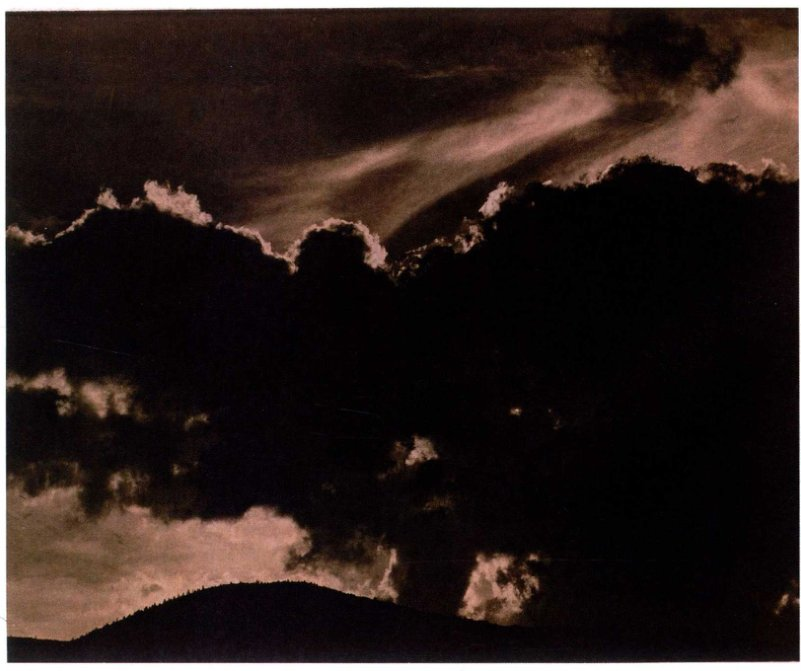

*图28.51 艾尔弗雷德·施蒂格利茨；《对等》。1926年。明胶银版成像，11.7 × 9.2厘米。华盛顿国家美术馆，艾尔弗雷德·施蒂格利茨收藏*

### 地方主义与国家认同

通过现代化的图像或间接、紧凑的抽象风格，纽约先锋艺术家努力追求国家认同与精神性；而一批中西部艺术家则在格兰特·伍德、托马斯·哈特·本顿（Thomas Hart Benton）和约翰·斯图尔特·柯里（John Stewart Curry）的带领下，转向“过时”的具象艺术与地方性图像。本顿和伍德曾在欧洲、纽约与芝加哥学习，尽管这批艺术家都有在现代艺术中心城市求学的经历，但他们大都愿意在中西部进行创作，因为他们就来自这个地区，也比较认同。

该群体最著名的作品是格兰特·伍德（Grant Wood，1891-1942年）创作的《美国哥特式》（American Gothic，图28.52），这位艺术家来自爱荷华州的锡达拉皮兹（Cedar Rapids）。这幅作品1930年在芝加哥艺术学院展出时引起轰动，也让伍德闻名全国。画面旨在提供一个观看中西部世界的窗口，而那正是艺术家成长并生活的地方。虚构的父亲与年长未婚的女儿被表现为拓荒者的虔诚后裔：他们身着老式服装，顽固地与进步历程作斗争。标题取自其住宅的风格，那是一种称为木匠哥特式（Carpenter Gothic）的19世纪风格，容易令人联想到这些居民谦逊卑微的过时生活方式及其强烈的宗教情感，正类似于中世纪时哥特式大教堂修建者的狂热。

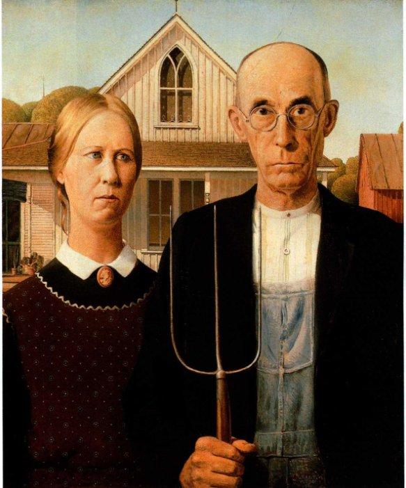

*图28.52 格兰特·伍德：《美国哥特式》。1930年。木纤维板油画，75.9 × 61.9厘米。芝加哥艺术学院，美国艺术之友收藏*

伍德通过建筑立面的大量十字架形式进一步强调了人物的信仰，他还在远景中绘制出教堂的尖顶。我们很清楚这两个人物一丝不苟、良心清白，利落的素描和严格的水平与垂直构图恰好说明了这一点。这种感觉同样源于女性服装与发型的拘谨保守，表明她精心照料着自己的家庭，正如她对待门廊前的植物一样。以严格的正面姿态表现人物，男子紧握干草叉的姿态及其外表，所有这些都显示人物强壮的体魄，以及艰苦的工作条件。这里没有任何现代性的迹象，人物的单纯与质朴说明其生活十分节俭。尽管如此，很多评论家仍然认为伍德在嘲弄画中人及其生活方式，事实上，其中确实也有幽默成分，例如女子警惕地望向一侧，仿佛要确保不会发生任何麻烦。尽管这种解读也有可能存在，但是没有人能够否认，这幅作品似乎捕捉到了美国，特别是美国中西部的某些基本特征。

### 哈莱姆文艺复兴

在20世纪最初20年里，为了逃避种族主义与贫困，无数美国黑人从南部乡村来到北部的工业城市。他们希望能在那里找到工作、公正与平等。然而在北方，新移民们往往发现他们刚刚脱离了贫困的乡村，就陷入了城市的贫民窟；种族主义在南方以“杰姆·克劳法”（Jim Crow Laws）的条文形式出现，而在北方则变形为偏见歧视、居住区划分与二等公民待遇。无论怎样，黑人在纽约哈莱姆区和芝加哥南区汇聚，产生出繁荣的文化局面，并致力于自我发现，力图建立黑人的身份认同。这原本是美国白人独享的东西，但却有组织地将美国黑人排除在外。该运动之后被称为“新黑人运动”（New Negro Movement），而今天人们则更多地将其称为哈莱姆文艺复兴（Harlem Renaissance）。之所以用哈莱姆区的名字命名，是因为这个区通常被描述为该运动的“首都”。

在文学、音乐、戏剧和艺术领域，这一运动的领导人物是哈佛大学的哲学家阿兰·洛克（Alain Locke，1886-1954年），他提倡一种能够体现黑人感性与视角的独特风格，主张将注意力重新放在非洲艺术及其历史上；而这是白人先锋艺术家已经做过的事情，尽管他们以一管之见来呈现非洲艺术与历史，并且只表达其自身的需要与兴趣。洛克鼓励艺术家再现美国黑人及其生活，同时也鼓励描绘黑人独特的生理特征，正如非洲面具通常强调黑人的面容特征那样。事实上，他是在支持艺术家与作家们将“黑人是美的”这一观念公之于世。在推广黑人美学的过程中，洛克鼓励艺术家描绘独特的美国黑人文化，这种文化与欧裔美国人的传统不同，反映了非裔美国人对美国生活与国家身份作出的巨大贡献。

在哈莱姆文艺复兴之前，美国黑人美术家的创作受欧裔美国艺术家创作的启发，他们试图“适应”、符合艺术市场的标准，以此对其产生一定的吸引力，而这些标准的决定者却是白人艺术家。黑人艺术家创作相同的风景画、静物画和风俗画，避免任何涉及黑人的内容出现。在手工艺和民间艺术中，美国黑人则更多受到非洲传统的影响。随着哈莱姆文艺复兴的兴起，艺术家开始将美国黑人作为他们艺术的主题。尽管绝大部分美国黑人艺术家仍遵循现代主义传统进行创作，但他们也为该传统创造出一种新的变体，即将种族认同的问题作为主题。事实上，他们在选择种族主题并进行有力再现的方面取得了巨大成就，其重要性并不亚于形式上的创新。

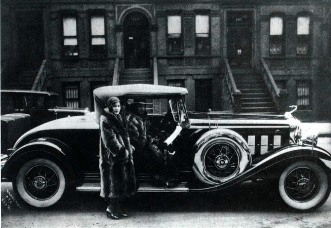

*图28.53 詹姆斯·凡·德·齐：《卡迪拉克车前身着皮毛大衣的夫妇》，拍摄于纽约哈莱姆区127号大街西部。1932年。明胶银版成像*

**詹姆斯·凡·德·齐** 自学成才的哈莱姆摄影师詹姆斯·凡·德·齐（James Van Der Zee，1886-1983年）曾在照相馆工作，在那里精心处理肖像摄影，并根据拍摄对象的要求来创作图像；有时候顾客会身着高级时装，有时却穿着马库斯·加维（Marcus Garvey）的非洲民兵（African Nationalist Militia）军装。凡·德·齐以其多次曝光技术闻名，用这种方法来表现去世亲属升入天堂的场景，或者展望年轻夫妇未来的生活场面，描绘即将出生的健康婴儿。他最著名的照片是《卡迪拉克车前身着皮毛大衣的夫妇》（Couple Wearing Raccoon Coats with a Cadillac，图28.53），这幅照片拍摄于1932年，当时正是大萧条最严重的时期。尽管当时物资匮乏，我们仍然可以感受到哈莱姆文艺复兴的能量与乐观精神。这种情况后来一直持续到30年代，预示着新黑人运动的兴旺发达指日可待。

**雅各布·劳伦斯** 哈莱姆文艺复兴中最著名的画家是雅各布·劳伦斯（Jacob Lawrence，1917-2000年）。在其青少年时期（30年代），他进入联邦政府资助的哈莱姆艺术工作室（Harlem Art Workshop）和哈莱姆社区艺术中心（Harlem Community Art Center）进行艺术方面的学习。劳伦斯经常到市中心区，从这里展出的艺术品中吸收灵感，从现代艺术博物馆的原始艺术展，到墨西哥织物，乃至所有欧洲最新的艺术风格。30年代晚期，他开始创作题献给黑人领袖的大型系列叙事画，他所敬献的人物包括哈里艾特·杜伯曼（Harriet Tubman）、图森·洛弗图尔（Toussaint L'Ouverture）和弗雷德里克·道格拉斯（Frederick Douglass）。图像一般幅面较小、尺寸适中，用广告色在纸板或广告牌上绘制而成。

劳伦斯最为知名的作品是开始于1940年的《移民系列》（Migration Series）。其中表现了黑人移民北方的理由，以及其在南北两地的体验。虽然这个系列具有逸闻集的性质，但是图像本身却通过抽象的形式表达出很多意味，该系列中的第58号《黑人在北方享有更好的教育资源》（In the North the Negro Had Better Educational Facilities，图28.54）就是如此。三个女孩在黑板上写下数字，但是我们看不到她们的面孔。相反，人物的手臂越伸越长，数字的位置也越来越高，暗示教育对人素质的提升，而且开始部分的黑板空空如也。女孩色彩艳丽的衣裙是对生命与幸福的确认，而头发与裙子边缘则呈现出锯齿形和尖角形，显露出一股能量，以及奋斗不已的品质。劳伦斯在此主要展现了黑人的集体精神，这不是个人，也并非个人的表达。他关注人类的精神世界，精神无情而能量充沛地不断前行，以建构更美好的未来。劳伦斯疏朗且色彩优美的作品体现了一种非凡的心理状态，画面中对现代主义空间的运用更加强了这一点。平板的背景将人物推至画面表层，突出展示着他们的形象。

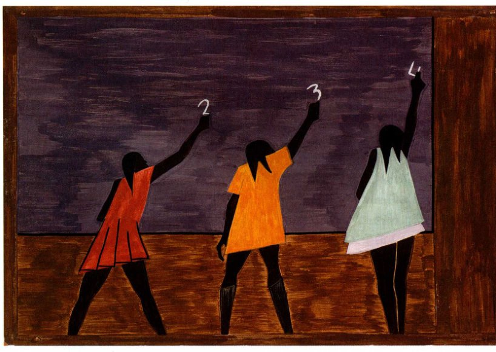

*图28.54 雅各布·劳伦斯：《黑人移民》系列，第58号。1940-1941年。纸板酪蛋白蛋彩画（casein tempera），30.5 × 45.7厘米。纽约现代艺术博物馆，David夫人与Levy先生捐赠*

## 墨西哥艺术：寻求民族认同

1910年，旨在推翻波菲里奥·迪亚斯将军（General Porfirio Diaz）独裁统治的墨西哥革命爆发，最终以1921年阿尔瓦罗·奥布雷贡（Alvaro Obregón）建立改革政府而告终，这场革命触发了文化领域的民族主义潮流，人们开始关注本土传统，同时抵制来自欧洲的影响。由于来自政府的规划和委托，一大批令人印象深刻的壁画作品被创作出来，这些作品转而激发了壁画家流派的兴起，迭戈·里韦拉、大卫·西盖罗斯（David Siquieros）和何塞·克莱门特·奥罗斯科（Jose Clemente Orozco）是该流派的领袖。这些壁画家一般都是社会主义者或共产主义者，他们宣称壁画才是真正的人民艺术。墨西哥壁画家获得了国际社会的认同，并在美国深受欢迎。他们接到了来自美国的大量委托，而讽刺的是，委托人却基本都是大资本家，例如洛克菲勒家族。

> **大事年表**
>
> 1933年 - 帕布洛·聂鲁达出版《土地的居民》
>
> 1934年 - 迭戈·里韦拉创作《人，宇宙的支配者》
>
> 1939年 - 弗丽达·卡洛创作《两个弗丽达》
>
> 1940-1941年 - 雅各布·劳伦斯创作《黑人在北方享有更好的教育资源》

### 迭戈·里韦拉

迭戈·里韦拉（Diego Rivera，1886-1957年）或许是三位壁画家中最著名的一位。他于1907至1921年期间在欧洲生活，主要是在巴黎；同时他也是一位相当熟练的立体主义画家。20世纪10年代晚期，里韦拉被通过壁画创造民族革命艺术的观念所吸引，于是前往意大利旅行，研究意大利文艺复兴时期的壁画。返回墨西哥之后，里韦拉放弃了高端、深奥的立体主义风格，转向15世纪直白的具象艺术，赋予作品不朽、宏大之感，可以看作是对于阿兹特克（Aztec）和玛雅艺术强烈简洁形式的呼应。里韦拉进一步放弃了架上绘画，宣称那是中产阶级的资本主义艺术形式，是卖给富人的商品。他将自己的湿壁画看作公共艺术，为大众而创作。里韦拉也感到自己的艺术应该表现本国人民，而非在墨西哥的欧洲人及其习俗。因此，他的大部分壁画作品都有关民族认同，以及墨西哥风俗传统的独特性。

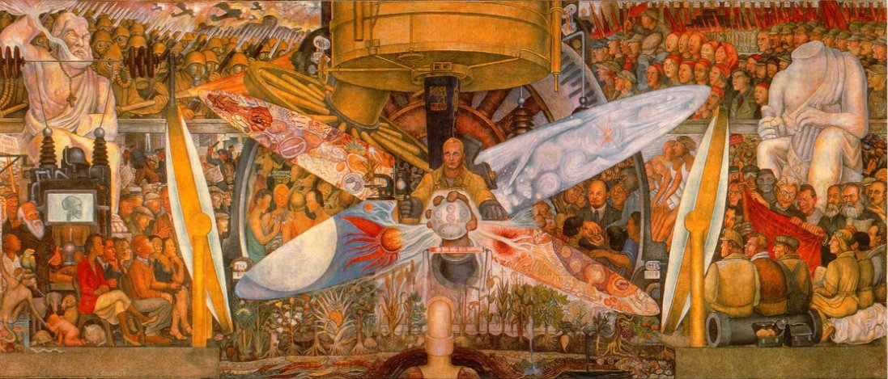

*图28.55 迭戈·里韦拉：《人，宇宙的支配者》。1934年。湿壁画，4.85 × l1.43米。墨西哥城美术宫博物馆*

里韦拉是共产党员，特别支持普通民众与劳动者，其政治理念也在壁画作品中有所体现。1930至1934年间，里韦拉接受了大量来自美国的委托定件，其具象艺术也对美国壁画产生了巨大影响；美国壁画的繁荣应该归功于富兰克林·罗斯福新政的支持，这项政策为艺术家提供了大量创作机会。其中一项主要计划是洛克菲勒中心RCR大楼休息厅的装饰项目。壁画的标题为《人类站在十字路口，满怀希望与崇高的理想，企盼美好的新未来》（Man at the Crossroads Looking with Hope and High Vision to a New and Better Future），由于作品中包括共产党领袖列宁的肖像，结果激怒了定制作品的洛克菲勒家族。洛克菲勒家族出资聘请里韦拉进行创作，之后又破坏了这幅壁画作品。1934年，里韦拉在墨西哥城的美术宫博物馆（Museo del Palacio de Bellas Artes），重新绘制了该作品，并重新命名为《人，宇宙的支配者》（Man，Controller of the Universe，图28.55）。这幅作品赞美科学与共产主义，对里韦拉而言，这二者正是推动进步的孪生工具。人位于构图的中心，其头顶有一架望远镜，右手边则是显微镜，表明人类将会通过科学来掌控未来。两道交叉的椭圆形光环似乎是从人身上发散出来，一个光环描绘微观世界，另一个则是宇宙。人的下方是地球，大地上生长着科学发明的高等农作物。在人的左手边，有益健康的微生物与和谐的宇宙之间出现了列宁的形象，他正在与各个种族的工人们握手。这个场景上方描绘有健康团结的工人。在人的右手侧，聚集着资本主义的恶魔。椭圆光环内展示着患病的器官和不和谐的宇宙，光环之间则是堕落的酒吧场景，衣着考究的中产阶级人物中，还包括小约翰·戴维森·洛克菲勒（John D.Rockefeller，Jr.），其身旁满是令人恐惧的战士与抗议示威的劳动者。

### 弗丽达与布拉沃

里韦拉的妻子弗丽达·卡洛（Frida Kahlo，1907-1954年）也是这个时期一位杰出的艺术家，尽管她的影响力较小。弗丽达在18岁时几乎丧生于一场车祸，复原之后，她开始从事绘画工作，并逐渐形成了一种民间风格，反映出她对殖民地稚拙绘画以及“还愿画”（ex-voto）等民间图像的关注。还愿画是天主教民间画像，描绘人生命中一次疾病获得治愈的神迹，一般用于表达对耶稣的感激。弗丽达的绘画图像都带有个人因素，通常聚焦于自己的精神状态，基本都来表现她与拈花惹草的里韦拉之间混乱的关系，或者车祸的伤病所带来的终身痛苦。弗丽达创作架上作品，通常尺幅较小，虽然以自我为中心，但仍然有意将自己放在墨西哥情境之中。弗丽达笔下的自已经常身着传统墨西哥服装，佩戴传统的墨西哥首饰，其属性容易让人联想到民间信仰和迷信。

*图28.56 弗丽达·卡洛：《两个弗丽达》。1939年。布面油画，1.74x1.74米。墨西哥城国家美术学院的现代艺术博物馆*

1939年的《两个弗丽达》（The Two Fridas，图28.56）就表现出弗丽达对自我身份与心理状态的关注；这幅作品创作于她和里韦拉离婚之时。画面左侧是身着维多利亚时期服装的欧洲弗丽达，反映出她父亲匈牙利犹太人的血统；右侧则是农妇打扮的墨西哥弗丽达，表现她母亲的印第安与克利奥尔出身。更重要的是，这才是里韦拉希望弗丽达能够变成的模样。墨西哥弗丽达拿着里韦拉童年时期的袖珍肖像，血液从她身上流向欧洲弗丽达，后者力图完成这一循环，将个性的两个方面联系起来，同时也是为了将自己与丈夫联系起来。外露的心脏鲜血淋漓，袖珍画具有墨西哥还愿画的超现实冲突，这正是弗丽达所推崇的艺术风格；而人物与长椅的简括轮廓也与朴素直接的民间艺术风格相呼应。与这些简单易懂的部分形成鲜明对照的是某些细致入微的图像，例如心脏与花边，其改变了画面风格，使作品看起来更加古怪。1938年，安德烈·布雷东曾来到墨西哥，将弗丽达称为一位超现实主义者，但弗丽达反对这个称号，她声称自己并不描绘梦境，而是描绘她生命中的现实。她作品的用意不是搅动无意识，而是反映她自己的伤痛与苦难。

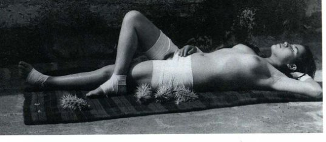

*图28.57 曼努埃尔·阿尔瓦雷斯·布拉沃：《好名声的睡眠》。1938-1939年。明胶银版成像。加州圣迭戈市摄影艺术博物馆*

布雷东还把摄影师曼努埃尔·阿尔瓦雷斯·布拉沃（Manuel Álvarez Bravo，1902-2002年）纳入了超现实主义者的名单。布拉沃自学成才，活跃于墨西哥城的壁画家圈子里，而且同样致力于创造墨西哥本土的艺术。布拉沃的摄影作品与卡蒂埃-布列松一样，具有离奇的性质，这种效果的产生有时要归功于物品的奇异并置，有些则仅仅因为一道古怪沉静、神秘莫测的阴影。在某些方面，布拉沃的超现实主义来源于他对捕捉民间传说与迷信的魔幻本质的追求，《好名声的睡眠》（La Buena Fama Durmiendo，图28.57）就表现了这一点。布拉沃让模特躺在他执教的国家美术学校屋顶上，身下铺有一条墨西哥毯子，模特的手腕、脚踝、双足和髋部都缠着绷带。布拉沃让她的阴毛显露出来，并在她身旁放着多刺的仙人掌果。布雷东1940年时在墨西哥城组织了一次国际超现实主义展览，他希望用这张照片作为展览目录的封面。照片中的模特与多刺仙人掌果之间的关系并不和谐，她裸露着胯部，并古怪地缠满绷带，墙面上还有飞溅的污点。从这些方面看来，就不难理解布雷东做出如此选择的原因。但是布拉沃的初衷并不只是要唤起伤痛、苦难、暴力，以及与性有关的欲望，他也希望能够达到当地传承几个世纪之久的传说的力度。在墨西哥的民间传说里，人们认为多刺的水果能够为熟睡的人遮挡危险。绷带则是因为布拉沃看到舞者的双足都用绷带缠起，这让他联想到前哥伦布时期的舞者浮雕，这些浮雕作品与大地女神科亚特利库埃（Coatlicue）有关，传说中她不需要性爱就可以孕育生命。这张照片是超现实主义字典中的绝佳示例，同时也深深植根于墨西哥传统的神话与巫术之中，事实上以超现实主义规定的方式运用了本土文化。

## 第二次世界大战前夕

1929年10月，美国股票市场崩溃，席卷全世界的大萧条时期从此开始，其所造成的衰落困扰人们长达16年之久。在欧亚两洲，法西斯分子夺取了政权；意大利有墨索里尼（Mussolini），德国有希特勒，西班牙则有弗朗哥（Franco），还有日本的裕仁天皇（Hirohito）。20世纪20年代后期，斯大林（Stalin）使共产主义的俄国成为了极权国家。1931年，日本对亚洲大陆展开侵略。

对欧洲艺术家而言，希特勒的崛起是一个决定性的影响因素。他的政策在那些倾向于建立民主的无阶级世界的人看来，无疑是疯狂至极。希特勒采取侵略性的军国主义政策，相信强大的国家要以残酷有力的军队作为基础。他宣布雅立安人，即作为斯堪的纳维亚人和日耳曼人后裔的德国人是优于其他人种的统治种族，并坚信德国经济与政治衰退的原因在于种族与语言的多样化。他尤其指责犹太人和共产党对德国优势地位的破坏。到了30年代末期，包括犹太人、斯拉夫人、吉普赛人、被认为精神与肉体都有缺陷的同性恋，以及共产党人和持不同政见者在内的无数人都被关入监狱，送往集中营，或被处决。达达主义、超现实主义、风格派、构成主义和包豪斯的乌托邦之梦最终被证明不过是一个梦想。1933年，希特勒关闭包豪斯；1937年，纳粹在慕尼黑上演了一台“堕落艺术展”（Degenerate Art Exhibition），在全体公众面前诋毁德国先锋艺术家。而在美国，社会现实主义和具象的地方艺术阻碍了先锋艺术的发展。地方主义者描绘美国人坚忍不拔、埋头苦干的禁欲主义或充满活力的场面，另外一些艺术家则关注城市贫民的困境。

> **大事年表**
>
> 1922 年——贝内托·墨索里尼攫取意大利政权
>
> 1930 年——爱德华·霍普创作《星期天大清早》
>
> 1933 年——阿道夫·希特勒在德国建立纳粹独裁统治
>
> 1936 年——西班牙内战爆发
>
> 1936 年——弗朗西斯科·佛朗哥成为西班牙独裁者
>
> 1937 年——帕布罗·毕加索创作《格尔尼卡》
>
> 1941 年——日军轰炸珍珠港

### 美国：现代性的挫败

20世纪30年代期间，先锋艺术家继续创作抽象作品，但是在这个被大萧条带来的可怕社会弊病所占据的时期，艺术家越来越难以受到社会上的关注。很多先锋艺术家投身社会，成为社会主义者或共产主义者，支持工人的运动，当时甚至成立了类似于联合会的组织。但是对很多艺术家而言，仅有政治活动是不够的。更多的艺术家采用了社会现实主义风格进行创作，这是一种具象风格，表现重心是普遍深入的社会问题，例如贫困、劳工压迫、苦难的移民工人、城市化与工业化带来的异化，以及尤其体现为三K党私刑的种族主义。

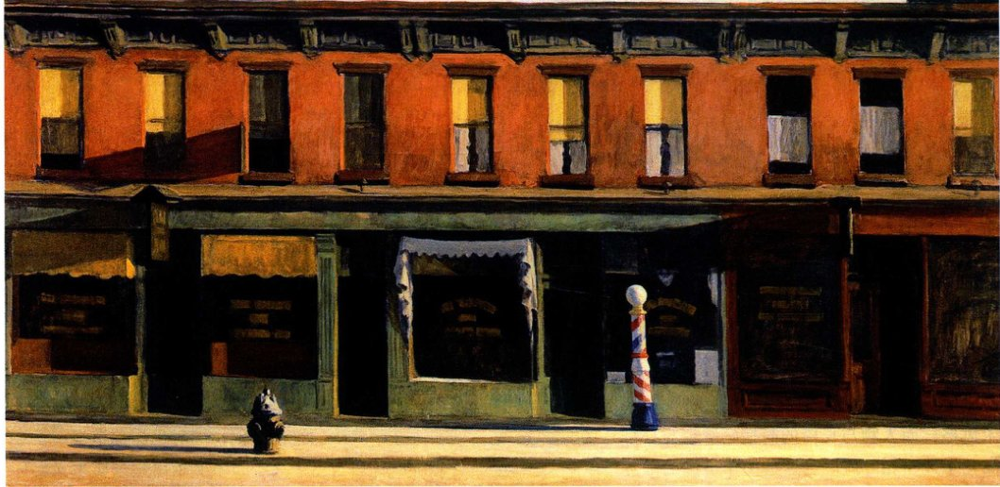

*图28.58 爱德华·霍普：《星期天大清早》。1930年。布面油画，88.9 × 52.4厘米。惠特尼美国艺术博物馆，购入资金由Gertrude Vanderbilt Whitney提供，31.426*

**爱德华·霍普** 这个时期最有力的具象画家之中就包括爱德华·霍普（Edward Hopper，1882-1967年）。他主要活动于纽约，其作品饱含与大城市生活相关的异化情绪，而异化当时正逐渐成为现代美国的普遍问题。霍普的经典之作是1930年的《星期天大清早》（Early Sunday Morning，图28.58）。画面具有离奇的寂静与空洞感，让人心生恐慌，而严格凝固的几何构图更增强了这些品质。二楼的窗户暗示每间公寓里都上演着不同的故事，但是没有任何一个会显现出来，因为住户都隐藏在窗帘背后或阴影之中。消防栓、理发店灯柱，及其之间装有凉棚的空窗户，构成了古怪的关系网。早晨刺目的阳光具有戏院灯光的强度。除去艺术之外，霍普只对电影和戏剧感兴趣，其绘画中蕴涵着电影与舞台特色，表明某些事情即将发生。这些作品被一种神秘感包围，其中的背景是独特的美国环境，使得霍普描绘的抑郁心理也成为了美国特色。

**沃克·埃文斯** 大萧条时期美国政府成为了最主要的艺术赞助人，政府雇用了几万名无业艺术家加入公共事业振兴署（Works Progress Administration）和联邦艺术计划（Federal Art Project），这也是罗斯福新政的重要组成部分。这些项目以抵制种族、民族和性别歧视而著称，为女性和少数民族艺术家提供经济支持。其中一项尤为重要的项目是记录美国城市与乡村的苦难与贫穷，农业安全署（Farm Security Administration）雇用了大约20名摄影师拍摄穷人生活的绝望之处。完成之后，这些照片就交给媒体发布。

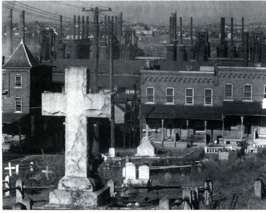

*图28.59 沃克·埃文斯：《宾夕法尼亚州伯利恒市的墓地、住宅与钢厂》。1935年。软片，20.3 × 25.4厘米。大都会艺术博物馆，沃克·埃文斯档案，1944.258.753*

沃克·埃文斯（Walker Evans，1903-1975年）是1935年首批受雇的摄影师之一，但两年后就遭到解雇，因为他行事固执，拒绝拍摄那些鲜明反映美国悲惨处境的照片。相反，其经过微妙处理的照片以美国的心理状态为焦点，表现出阴郁与异化，与霍普的绘画在很大程度上具有异曲同工之妙。在《宾夕法尼亚州伯利恒市的墓地、住宅与钢厂》（Graveyard，Houses，and Steel Mill，Bethlehem，Pennsylvania，图28.59）之中，埃文斯的创作特点得以全面彰显。照片里是一座无人的空城，映入人们眼帘的只有墓地、一排排的工人住宅，以及烟囱和电话线杆所构成的工业风景，其间没有一棵树木，所有这些都传达出美国工人毫无意义、机械空洞的生活周期。除了创造悲剧性气氛之外，埃文斯的天才之处还在于杰出的形式处理与细节化的构图，其微妙的处理使得明与暗、垂直与水平之间形成对照抗衡的关系。

**多萝西娅·兰格** 农业安全署计划中最著名的摄影作品之一是多萝西娅·兰格（Dorothea Lange，1895-1965年）的《加利福尼亚移民母亲》（Migrant Mother，California，图28.60）。兰格采用了30年代常见的锐聚焦手法，创造出一幅异常有力的图像。照片的细节准确捕捉到被拍摄者的穷困；在手、胳膊和扭转的头部所组成的复杂构图中，传达出这个家庭情感上的悲痛与紧张。正是因为这张照片及其新闻故事配文，政府给加利福尼亚州送去了救济粮，并最终为移民工人开设了救济营。这幅作品具有直接的冲击力，证明了摄影媒介具有势不可挡的可信度。

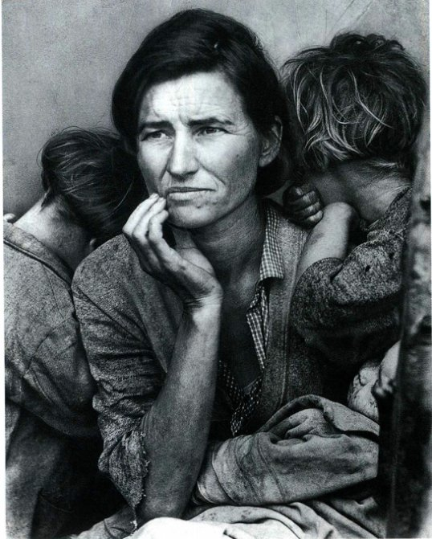

*图28.60 多萝西娅·兰格：《加利福尼亚移民母亲》。1936年。明胶银版成像。华盛顿特区议会图书馆*

### 欧洲：法西斯兴起

如果说美国不得不应付30年代的经济萧条，那么欧洲的情况则更为严重。在那里，法西斯主义的阴云使得世界范围的经济崩溃更为黑暗、抑郁。在很短时间里，意大利、德国和西班牙相继成为法西斯独裁国家，国民的自由被剥夺殆尽，并且严重威胁了周边国家的和平与安全。启蒙运动的逻辑思维引导了近200年的社会进步，但此时也破裂瓦解，取而代之的是一个失去理性的世界。一大批欧洲人都放弃了自己的自由，追随墨索里尼、希特勒和弗朗哥走上了残忍的独裁道路，最终导致了第二次世界大战爆发。

**马克斯·贝克曼与德国表现主义** 20世纪20年代至30年代，德国表现主义得以继续发展，虽然当时其已经采用与桥社和青骑士不同的表现形式，但是仍然保持了可追溯到文艺复兴艺术的暴力、痛苦与怪诞特色。虽然是在柏林达达的背景下讨论乔治·格罗斯的艺术，但一般认为他是一名表现主义艺术家，其作品《德国，一个冬天的童话》（见图28.7）具有明显的政治性与叙事性，表现主义或许是对他更为准确的归类。马克斯·贝克曼（Max Beckmann，1884-1950年）是另一位自20世纪最初10年就开始活跃的表现主义者，其作品涵盖的范围比格罗斯更为广泛，基本以生存的愚蠢和绝望为中心。贝克曼对于人性的悲观观点来自他在第一次世界大战中的体验，正是这些体验让他成为了一名表现主义者，以此来“谴责上帝的错误”。30年代早期，贝克曼的最终风格形成，体现在《启程》（Departure，图28.61）一作之中。该作品为九套巨幅三联画之一，这些画作创作于艺术家去世之前的20年之间，作品形式受到希罗涅缪斯·博斯三联画的启发。两侧画幅中复杂的象征系统表现生命本身，后者被艺术家看作无穷无尽的苦难，充满了各种肉体与精神的痛苦。色彩明亮的中央画板表现的是“国王与王后从生命的折磨中解放出来·····”。贝克曼赋予每个动作与人物特定的含义：手持油灯，力图在黑暗中找到道路的女人背负着象征其记忆的尸体、恶行与失败，除非生命终止，否则没有人能够从中解脱。但是贝克曼认为观众不需要解读这些图像的提示，因为任何解释最终都将与他本人的版本相似；即便细节上有所出入，精神上至少也是一致的。

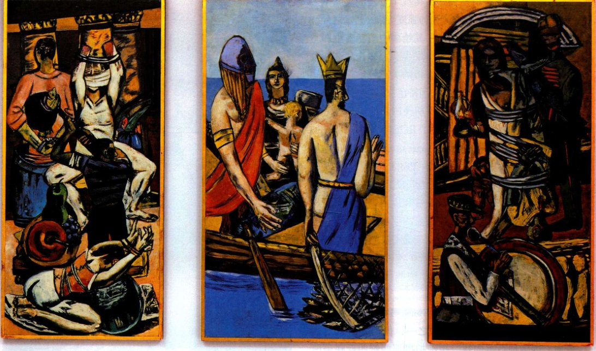

*图28.61 马克斯·贝克曼：《启程》。1932-1933年。布面油画，两侧画板为215.3 × 99.7厘米，中央画板为215.3 × l15.3厘米。纽约现代艺术博物馆，匿名交换捐赠*

这组三联画中丰富的寓言与象征反映出贝克曼早年学习古代大师的成果，以及他对格吕内瓦尔德和博斯作品中恐怖、恼人情调的深深赞同。但神话性叙事成分在贝克曼30年代的作品中才开始出现，似乎反映出艺术家对巴黎超现实主义的熟识。贝克曼生活在法兰克福，但他经常前往巴黎，他可能不仅从巴黎学到了类似毕加索的用色，也带回了超现实主义对神话的强调。贝克曼笔下的人间地狱梦魇充满了怪异的虐待场景，场景的建构以不相关的费解题材为基础，类似于超现实主义梦境图像的构成。

贝克曼开始创作《启程》后不久，德国的生活本身也开始具有了超现实意味，因为希特勒在1933年就任总理。在纳粹看来，任何与第三帝国“雅利安”理想不一致的人都是敌人，而他们对假想敌与弱势群体的威胁恐吓也最终转变为公开的暴力。德国先锋艺术被看作堕落的艺术，受到嘲笑和奚落。这些作品最终被从博物馆里查抄出来，或者损毁，或者卖到瑞士，以便为帝国积累财富。1937年，纳粹从博物馆里取出650件德国现代艺术作品，并举办了一次名为“堕落艺术”的展览，此次展览在慕尼黑开幕，并于其后3年内在全国巡展。贝克曼的作品也出现在这次羞辱性的展览之中，而恩斯特·路德维希·基希纳更是因该展览而自杀身亡。但1937年时，贝克曼已经来到了美国，这里成为大量艺术家的避难所，逃亡的名单中还包括莫霍利-纳吉，后者在芝加哥成立新的包豪斯学校，现在已经并入了伊利诺伊理工学院（Illinois Institute of Technology）。

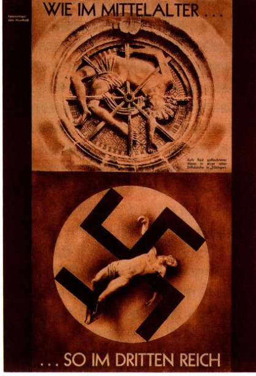

*图28.62 约翰·哈特菲尔德：《如同在中世纪，所以在第三帝国》。1934年。摄影蒙太奇海报。柏林艺术学院，约翰·哈特菲尔德档案*

**约翰·哈特菲尔德** 20年代早期，柏林达达主义者约翰·哈特菲尔德（John Heartfield，1891-1968年）曾与格罗斯、豪斯曼和霍赫一起，在摄影蒙太奇的发展过程中发挥开创性作用。现在，他将目标转向了纳粹，创作出一批最杰出的作品。《如同在中世纪，所以在第三帝国》（As in the Middle Age，So in the Third Reich，图28.62）正是哈特菲尔德蒙太奇技法的杰作。他将各不相同的图像拼贴在一起，之后再进行摄影。他在这幅海报中并置了被钉在纳粹万十字勋章上的受害者，以及人类因其罪恶而在上帝审判之轮上接受惩罚的哥特式图像。哈特菲尔德并不关心这幅图像的本来意义，只是想用该图像来暗示纳粹残酷地将德国带回到黑暗野蛮的中世纪。

**帕布罗·毕加索** 1936年，西班牙内战爆发，效忠国王的保守派与弗朗哥领导的民族主义党派联合起来，力图推翻民选的左派共和国政府，即共和党人或共和制支持者所掌握的政权。在某些方面，西班牙内战是第二次世界大战的预演。希特勒和墨索里尼为包括君主主义者、法西斯主义者和天主教徒在内的民族主义者提供军事与政治支持。支持共和制的则包括共产主义者、社会主义者、加泰罗尼亚和巴斯克的分离主义者，以及由世界各地志愿者组成的国际纵队。1937年4月26日，希特勒的纳粹飞机密集轰炸了并未设防的巴斯克小镇格尔尼卡，致使数千居民丧生。世界被激怒了，生活在其中的毕加索绘制了《格尔尼卡》（Guernica，图28.63）作为回应，这是一幅黑、白、灰色调的巨幅油画，毕加索将其作为对法西斯暴行的抗议，作品曾在1937年巴黎世界博览会的西班牙共和国馆中展出。毕加索运用了立体主义和超现实主义所有的艺术手法，创造出一幅充满痛苦、折磨、悲哀和死亡的噩梦般场景。画面中并没有出现飞机与炸弹，其中电灯泡只是现代性的象征，而导致轰炸的原因正是现代性本身。

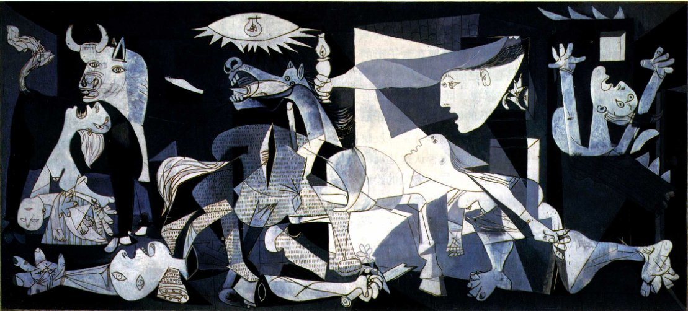

*图28.63 帕布罗·毕加索：《格尔尼卡》。1937年。布面油画，3.51x7.82米。马德里索菲亚王后国家艺术中心博物馆（Museo Nacional Centro de Arte Reina Sofia），马德里普拉多博物馆永久出借*

《格尔尼卡》中的象征系统并没有任何确定的解读，尽管其中也包含某些传统元素，例如母亲与死亡的孩子来源于圣母哀子主题，举着灯火的女人让人朦胧地联想到暗示启蒙的自由女神像，而抓着断剑的死亡战士则是英勇抵抗的常见标志。我们在画中还能感受到人面公牛所具有的威胁，毕加索意在用其来表现野蛮和黑暗的力量，那垂死的马则象征着广大人民。

然而，毕加索坚称这幅画并非针对法西斯主义的政治宣言；然而有意思的是，画中很多人物的处理方式与作者早年的作品截然不同。牛和马来自斗牛题材，毕加索自从30年代早期就开始用斗牛来隐喻性的冲突。马身侧的巨大阴户形泪滴绝不是巧合，同样的情形也出现在士兵古典雕塑断裂下来的持剑手臂上。右方祈祷女人背后的火焰也并非偶然之举，很容易让我们联想起《三舞者》（见图28.11）中颇具性攻击力的舞蹈演员那锯齿形的腹股沟。在这个女人摇摆的胸部上方，公鸡头前侧对的四分之一月亮轮廓则让我们回忆起同一位舞蹈演员那月亮形的头部。这个人物类似于十字架脚下的抹大拉的玛利亚，所以也不会是巧合，同时还让我们联想到戈雅在《1808年5月3日枪杀起义者》（见图24.3）中表现的请愿起义。如果没有标题，几乎所有元素都表明这是毕加索又一幅表现性冲突痛苦心理的作品，正如他早在1907年创作的《阿维尼翁少女》（见图27.5）。而且，该作品与《三乐师》（见图28.10）一样，场景都设置在盒子形的房间里，再一次暗示出这是心灵之府。

但是作品的标题也不应忽视，同样重要的还有士兵粉碎的雕像、受到苦难波及的妇女与儿童、作品在国际博览会上的政治性运用，以及创作背景是反映格尔尼卡遭受轰炸这一事实。在毕加索否认这是反法西斯作品之时，他想说明的可能是，这幅宏大的绘画不只是反对弗朗哥及其同伙的一般性宣传画，此外还包含更多意义。正如面对贝克曼的《启程》一样，我们不禁会感受到恐怖的图像描绘了整个世界的心理状态，其中充满了永恒的冲突与悲惨。不能责怪毕加索运用与性有关的意象来表达这一点，因为这正是他最为了解的事情。然而，毕加索与贝克曼不同，他没有在《格尔尼卡》里提供一叶将我们运送到安全之所的小舟。

## 小结

第一次世界大战从物质上和心理上破坏了西方文明，同时也是欧洲两次大战之间影响艺术的决定性力量。艺术家现在试图破坏民族主义和中产阶级价值观，尤其是资本主义，因为一般将资本主义看作导致战争的根本因素。很多艺术家成为热情洋溢的社会主义者和共产主义者，宣扬由无产阶级统治的无阶级、无国界世界。第一次世界大战直接产生了达达艺术运动，其宗旨在于破坏中产阶级价值观和启蒙运动的理性主义。在俄国、德国、荷兰和法国，很多艺术家都转向几何抽象，想借此创造理想的社会。某些艺术家基于机器美学的抽象形式，力图将无阶级的新社会付诸图像；其他艺术家则运用有机抽象艺术，来揭示隐藏在万事万物表象之下的宇宙力量；还有一批艺术家深受弗洛伊德心理学理论的影响，寻求表达深植在无意识之中的更高层次的现实。

与欧洲相反，美国在一战之后进入了前所未有的繁荣时期，并通过“咆哮的二十年代”达到顶峰。此时的美国是毫无争议的世界科技与经济领袖。国内政治局面稳定，人们缺乏创造无国界、无阶级社会的兴趣。反之，美国具有相当的国家主义特色，摩天大楼和工业正是其国家标志。一批艺术家将技术的象征纳入自己的艺术，而另外一些人则对现代化粗鲁的物质主义丧失了信心，转而在作品中寻求精神性，通常以自然为创作题材。

### 达达主义

达达艺术是第一次世界大战的直接产物。其最初发源于战争期间的苏黎世，以偶然和无理性为基础，旨在破坏中产阶级的逻辑思维。达达主义的创造者们相信，正是逻辑思维导致了席卷欧洲的战争冲突。达达主义也希望为建立更美好的新社会扫清障碍。战后，达达主义传播到柏林，这里的达达具有高度的表现主义特征和政治性，并以摄影蒙太奇为主要创作手法。科隆达达在马克斯·恩斯特的领导下，更具梦幻感与心理特质，而巴黎达达则诙谐幽默，富于分析性，从马塞尔·杜尚、弗朗西斯·皮卡比亚和曼·雷的艺术中汲取灵感；而这三位艺术家在战争期间都是纽约达达的关键人物。

### 超现实主义

达达艺术后来演变为超现实主义，后者于1924年在巴黎由诗人安德烈·布雷东宣告诞生。超现实主义者主要基于弗洛伊德的理论，致力于揭示深植在无意识中的更高层次的现实，特别是被压抑的性欲。他们最初仰仗达达的偶发技法，创造出具有感召力的抽象艺术作品。安德烈·马松采用自动绘画接近无意识，而马克斯·恩斯特则运用擦印、刮印和印花手法进行创作。以萨尔瓦多·达利和勒内·马格里特为代表的超现实主义者也创作具象性梦境风格的艺术，通常将不相关的物体并置在古怪的情境之中，以此来激发人们的想象力。

### 有机雕塑

超现实主义启发了大批艺术家去寻找事物表象之下的普遍真理。巴黎的让·阿尔普和亚历山大·考尔德、英国的亨利·摩尔和巴巴拉·赫普沃思均开始创作有机形式的作品；这些形式仿佛植物、动物和微生物，诱发了贯穿万事万物且永不休止的宇宙力量。

### 创造乌托邦

战争向艺术家提出了创造无阶级、无国界世界的要求。俄国是当时第一个社会主义国家，艺术家们在弗拉基米尔·塔特林的领导下，发展出几何性质的抽象机器美学。在雕塑领域，这种风格被称为构成主义，在观念上以毕加索的雕塑构成作品为其根基。在设计领域，这种风格则被称为生产主义，运用于书籍、海报和服装等的设计之中。生产主义在德国被一所新艺术学校包豪斯接纳，后者由沃尔特·格罗皮乌斯担任校长。这所学校最著名的作品就是格罗皮乌斯设计的校舍建筑本身，成为盛期现代主义建筑发展的顶峰，其以乌托邦理念为基础，具有机械形式的抽象风格。乌托邦式的盛期现代主义建筑在巴黎的宣传者是勒·柯布西耶，在阿姆斯特丹得到了风格派运动的拥护。然而，风格派因为受到通神论的强烈影响，还具有深刻的精神性。风格派绘画的代表人物则是皮埃特·蒙德里安。

### 美国艺术：现代性、精神性与地方主义

美国是世界科技与经济领域的领袖，于是工业与城市，特别是纽约成为了艺术家偏爱的题材；约瑟夫·斯特拉和查尔斯·德穆思的绘画，以及保罗·斯特朗和玛格丽特·伯克-怀特的摄影都表现出这一倾向。欧洲先锋艺术家们则倾向于创造无国界的世界，而美国艺术家与之不同，他们关注的是国家身份问题。但是包括乔治亚·奥基夫和艾尔弗雷德·施蒂格利茨在内的很多艺术家，无法在机械时代冰冷无人性的技术和粗鲁的消费主义中找到慰藉，转而创造富有精神性的艺术。诸如格兰特·伍德等艺术家则回归20世纪之前的价值观，绘制表现中西部乡村的具象作品。美国黑人艺术在两次大战之间兴起，聚焦于种族认同，提供了现代主义的又一变体。

### 墨西哥艺术：寻求民族认同

墨西哥革命引起了民族主义浪潮，艺术家拒绝欧洲陈规，强调本土的传统、技法与题材。壁画家在墨西哥艺术中占据了主导地位，其领导者是迭戈·里韦拉，他将壁画视为人民的艺术。但是民族主义也出现在架上绘画和摄影作品中，例如弗丽达·卡洛高度个人化的画作，以及曼努埃尔·阿尔瓦雷斯·布拉沃神秘的照片。

### 第二次世界大战前夕

1929年，大萧条时期开始；30年代，法西斯主义相继在意大利、德国和西班牙兴起，为西方世界投下了一道阴影。很多艺术家都在作品中反映了这种心理上的改变，例如德国表现主义者马克斯·贝克曼神话题材的三联画、约翰·哈特菲尔德尖锐的政治讽刺作品，以及毕加索表现西班牙内战暴行的巨幅画作《格尔尼卡》。现代美国残酷无情的心理状态体现在爱德华·霍普令人困扰的城市景观作品中，但或许摄影师们更为准确地捕捉到大萧条的破坏性结果，特别是沃克·埃文斯和多萝西娅·兰格的作品；他们受雇于罗斯福新政时期的政府，记录充斥全国的贫困与悲惨。