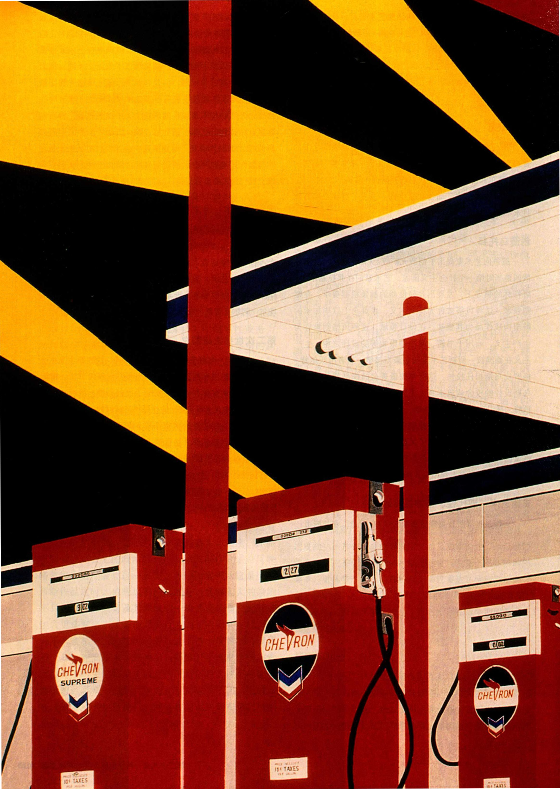

*图29.18 细部，爱德华·鲁沙：《得克萨斯州阿马里洛市标准石油加油站》*

# 第二十九章 从战后到后现代：1945-1980年

学者们传统上将第二次世界大战（1939-1945年）看作艺术世界的转折点，此时艺术中心从巴黎转移到纽约。事实上，20世纪下半叶艺术的分水岭应为50年代，而非40年代。这十年间，杜尚对艺术如何起作用的关注现在成为了一种驱动力。很多艺术家也着迷于这一源自毕加索和勃拉克早期立体主义作品中的概念。艺术与图像创作成为一种语言形式，艺术家们致力于在作品中揭示其视觉语言的结构，以及视觉语言用于表达观念、意见，乃至欺骗或操纵观众的复杂方式。

艺术家同时还意识到，艺术不需要被限制在传统媒介之中，例如布面油画、青铜浇铸或者大理石雕刻。艺术也并非必须挂在墙上或安放在基座上。艺术家可以用任何东西来创作艺术；在50年代末至60年代期间，他们也确实这样做了。他们使用电视机、电影、垃圾、泥土、荧光灯、金属片、丙烯（acrylic）、明信片、字词，乃至整个环境创作作品。行为艺术、大地艺术、观念艺术、邮件艺术、偶发艺术、录像艺术等概念层出不穷，然而这只是50年代中期到70年代末期各种艺术运动与材料革新中的一小部分而已。

在某种程度上，新媒介的激增反映出该时期的扩张精神，美国的情况尤为如此。第二次世界大战结束了美国历时16年的经济萧条与匮乏。到了50年代，美国已经成为消费大国。退伍军人急切地想恢复正常生活，并在结婚之后生育了大量子女，造成历史上的婴儿潮一代。他们从城市搬迁到郊区，住进了千篇一律的新住宅。而且，美国人前所未有地开始购物，汽车、电视机、可以替代劳作的家庭器具、船只和电影摄影机都在其购买范围之中。他们还着迷于所有科技产物，冷战期间的太空竞赛就是其象征。

然而，并非所有人都可以平等享有战后美国的新生活方式。杂志、报纸和电视描绘出美国民主社会里的独特等级，白人男性位于这个父权社会的顶端，将女性和有色人种视为二等公民。40年代晚期至50年代，陆续出现了垮掉的一代、禅宗佛教徒、即兴创作的地下爵士乐手、摩托车手，以及青少年罪犯组成的城市黑帮，这些无不改变着人们的生活方式。

但是，50年代中期的民权运动首次对现状发起了正式挑战，并在随后10年中造成了巨大影响。越战（1964-1973年）激起了旷日持久的反战情绪，还刺激了60年代中期的社会剧变，产生出女性主义运动、同性恋自豪日、黑人民权运动以及绿色和平组织这样的环境保护团体。这是一个解放的年代，旨在打破现状，对所有优越性或既定真理的正确性发起质疑。而艺术就站在这一切的最前沿。但是在艺术革命发生之前，世界艺术的中心已经从巴黎转移到纽约，这一事件通常被认为是“纽约绘画的胜利”，其恰好发生在40年代晚期抽象表现主义兴起之时。

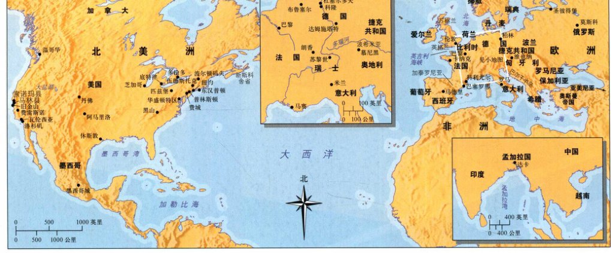

*地图29.1 欧洲与北美洲（嵌入图版为亚洲）*

## 纽约的存在主义：抽象表现主义

抽象表现主义（Abstract Expressionism）由超现实主义演变而来，其根源可以追溯到20世纪最初10年的达达运动（见第984页）。与超现实主义者一样，抽象表现主义艺术家也致力于揭示普遍真理。由此判断，他们也继承了康定斯基和马列维奇的遗产（见第957-967页）。在很多方面，抽象表现主义还受到了深层存在主义（Existentialism）信仰的驱动，存在主义哲学于第二次世界大战之后的废墟中涌现出来。战争不仅破坏了人们对科学与逻辑的信仰，甚至还将进步观念本身摧毁，即创造更美好世界的可能。一度曾是绝对真理的信仰被抛弃了。

存在主义主张，绝对真理并不存在，也没有终极的知识、解释或答案，生命是主观体验的持续序列，每个人都可以从中学到属于自己的东西，并以个人的方式来应对。学习过程的根本在于面对人类存在中最可怕的方面，即对死亡的恐惧，生命的荒谬，与他人、社会和自然的异化等，个人要对自己自由意志产生的行为负责，没有任何关于对与错、好与坏的确定知识。像战后众多知识分子一样，抽象表现主义者也采用了类似的主观角度；其艺术是个人与某一时刻的对质，反映出他们的生理、心理与社会存在。

### 超现实主义向抽象表现主义过渡的桥梁：阿希尔·戈尔基

40年代早期，超现实主义在纽约艺术界占据了主流。1936年末，现代艺术博物馆在成立7周年之际举办了一次重磅炸弹般的展览：“异想天开的艺术，达达和超现实主义”（Fantastic Art, Dada, and Surrealism），让纽约很多艺术家眼界大开。而那些没有被展览说服的艺术家随着欧洲艺术家的大量流入而转变了看法。第二次世界大战爆发后不久，欧洲艺术家就涌入了美洲大陆，安德烈·布雷东、马塞尔·杜尚、安德烈·马松和马克斯·恩斯特都在到曼哈顿寻求安宁的大批艺术家与知识分子之列，这批人的出现对艺术界有着举足轻重的影响。精力旺盛的美国矿主女继承人佩吉·古根海姆（Peggy Guggenheim）曾在欧洲生活，返回纽约之后开办了一家名为“本世纪艺术”（Art of This Century）的画廊，集中展出超现实主义艺术作品。超现实主义无所不在，很多纽约艺术家都满怀热情地采用了这种风格。

正如达达艺术发展为超现实主义的过程一样，纽约的超现实主义也不着痕迹地演变为抽象表现主义。当所有关于神话的象征与暗示消失之后，当所有原始的成分消失之后，也就意味着这种转型完全实现了，此时的图像消解为彻底的抽象，不包含任何对视觉世界的明显指涉。亚美尼亚移民画家阿希尔·戈尔基（Arshile Gorky，1904-1948年）的作品就反映了演变的开端。他的家庭为了逃脱奥斯曼土耳其帝国统治者的种族灭绝政策而离开亚美尼亚，母亲后来在俄国难民营里饿死在戈尔基怀中。戈尔基于30年代来到纽约，其后10年，其立体主义风格开始向彻底的抽象演变。他在康涅狄格州妻子的农场里进行创作，在自然给予的灵感中匆匆画下少量线条构成的抽象素描，之后再于画室之中将这些线性图案发展成为油画作品，1944年冠以超现实主义标题的《肝是鸡冠》（The Liver is the Cock's Comb，图29.1）就是其中一例。

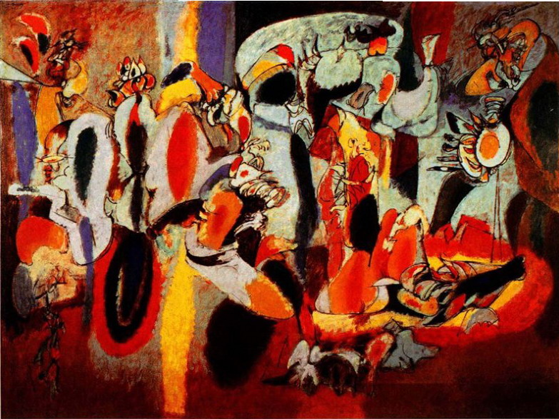

*图29.1 阿希尔·戈尔基：《肝是鸡冠》。1944年。布面油画，1.84 × 2.49米。纽约州布法罗市奥尔布赖特-科诺克斯艺术画廊（Albright-Knox Art Gallery），Seymour H．Knox捐赠，1956年*

画面中充满了金属丝般的黑色线条，以及红、蓝、黄、黑为主导且相互映衬的成片色彩，让人感受到画面的发展过程，仿佛对某一记号或色彩的心理反应引发出下一个记号和色彩，由此循环往复，形成序列，直到作品完成。这幅绘画是对米罗画中生物形体（见图28.16）、马松的自动绘画（见图28.14），以及康定斯基笔下色彩与混沌宇宙（见图27.14、27.15）的回应，但画面更为抽象，更为扁平。我们确实能够进入图像，不仅感受到一片充满某种有机生命的风景，还有其中的敌意或冲突。事实上，很多学者都表明，戈尔基的抽象指涉了土耳其对亚美尼亚人的屠杀，但是画面十分抽象，难以证实这种推断。其中凸现出的主题是艺术创作过程本身，以及我们对图像如何产生的感知。

### 抽象表现主义：行动绘画

3年之后的1947年，杰克逊·波洛克将有力地挥洒颜料（动作）作为绘画创作中无可争议的焦点。这并不意味着其抽象的动作绘画（gesture painting）只关注艺术的创作过程；因为过程本身现在已经成为人类境遇的隐喻，而人类境遇之前曾被通过象形图案和生物形态表现出来。几乎与此同时，另一位艺术家威廉·德库宁也涌现出来，善于运用大胆的动作抽象来表达内心最深处的情感。

**杰克逊·波洛克** 30年代期间，杰克逊·波洛克（Jackson Pollock，1912-1956年）只是艺术界的边缘人物，以打零工为生，甚至还做过博物馆的看门人，而这家博物馆就是今天的古根海姆博物馆。早在40年代早期他刚刚开始进行荣格式心理分析时，就成为了彻底的超现实主义者，创作粗鲁、有力的绘画作品，其中充满逸笔草草的象形图案、图腾和有关原始神话的图像，所有元素都在颜料的海洋中激烈翻卷。波洛克艺术生涯的重大突破发生在1943年，当时佩吉·古根海姆在自己的“本世纪艺术”中展出了他的作品，并提供定期津贴供他进行创作。

1947年，波洛克终于在古根海姆博物馆举行了个展，并揭幕了自己的首幅动作或行动绘画（action painting）作品。行动绘画是50年代时艺术评论家哈罗德·罗森伯格（Harold Rosenberg，1906-1978年）首创的词汇，其代表就是杰克逊·波洛克创作于1950年的《秋韵：30号》（Autumn Rhythm: Number 30，图29.2）。这是一面用建筑油漆绘制的“墙”，高2.64米、长5.26米，无框的画布铺在地板上，漆料通过滴洒、投掷、泼溅的方式落在上面。波洛克从画面的四边进行创作，他声称作品的素材就是自己的无意识（见本页的原始文献）。尽管波洛克的风格表面看来松散、放任，但通过改变油漆的黏度、施涂油漆的画笔或棍棒尺寸，以及作者自己运动的速度、幅度和方向，极其严格地控制着创作材质。他还曾废弃了很多作品，因为油漆未能像预期的那样落在画布上。他绘画中的能量势不可挡，挂在墙上的画作赫然展现在我们面前，仿佛是暂时凝固的大浪，随时都会猛砸下来。我们的目光从一处着力点跳向另一处，从纯白色滴跳向飞溅的黑色，再跳向马松式的自动线条（见图28.14），如此继续下去，无休无止。画面全无可供眼睛休憩的焦点。因为力量连贯渗透在图像之中，波洛克的绘画通常也被描述为“满幅绘画”（allover painting）。

> **原始文献：杰克逊·波洛克（1912-1956年）**
>
> **节选自《我的绘画》**
>
> 1947年杰克逊·波洛克写下这些文字时，他放弃了通常的架上绘画形式，将无框的画布直接铺在地上。他运用普通的油漆，声称自己不仅仅是在抛洒这些颜料，还是勾勒出画布上方空气里某些真实的东西。
>
> 我的绘画并非在画架上完成创作。在绘画之前我几乎从不把画布绷在画框上。我喜欢用大头钉将松弛的画布钉在硬墙或者地板上。我需要坚硬表面的对抗力。在地板上作画让我更加自如。我感觉自己可以更接近画作，更像是绘画的一部分，采用这样的作画方式我就可以在四周走动，从四面进行绘画，也就是说进入画面之中。这种方法与美国西部的印第安沙画画家有类似之处。
>
> 我进一步摆脱了画家通常使用的工具，例如画架、调色板和画笔等。我更中意棍子、铲子和刀子，还喜欢让液体油漆滴下来，或者加入沙子、碎玻璃等其他可以使油漆浓稠厚重的奇怪材料。
>
> 当我“在”画时，我意识不到自己在做什么。只有经过一段“开始熟悉”的阶段之后，我才明白自己做了什么。我并不害怕修改、破坏图像这一类事情，因为绘画有自己的生命。我尽力让其生命表现出来。只有在我与绘画失去联系的时候，情况才会一团糟；否则只会产生纯粹的和谐，这是从容的付出与索取，绘画得以更好地呈现出来。
>
> 我绘画的素材是无意识。我绘制油画作品的方式与素描相同。这是直接的创作，没有预备习作。我做的素描与绘画有关，但并不是专门为绘画而作。
>
> *SOURCE: POSSIBILITIES, I WINTER 1947/48, P. 79. REPRINTED IN JACKSON POLLOCK BY FRANCIS V. O'CONOR. (NY: MUSEUM OF MODERN ART, 1967)*

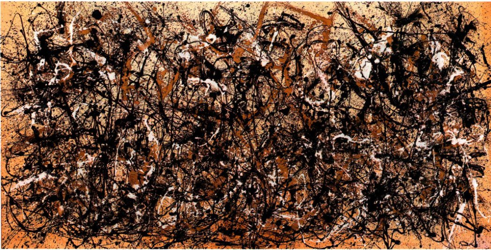

*图29.2 杰克逊·波洛克：《秋韵：30号》。1950年。布面磁漆画，2.64x5.26米。纽约大都会艺术博物馆，George A. Heam基金，1957（57.92）*

在创作过程中，波洛克的每两个动作间都保持着相互制衡的关系，通过情感上的直觉指示下一个肢体动作；由此他建构起自己的图画，正如戈尔基曾经做过的那样。最终的结果并不仅仅是身体的记录，同时也是心理存在的记录。因为艺术家必须面对空白画布的挑战，必须承担落下每一个痕迹时的风险与责任。这样一来，绘画就成为了对于人类所面临挑战的隐喻，还包括为个人行为付起责任的内在风险，在存在主义世界中尤为如此。第二次世界大战摧毁了对科学、进步和理想社会优越性的盲目信仰。唯一能够信任和信仰的只剩下自我，作为对象的自我成为抽象表现主义绘画的唯一主题。

**威廉·德库宁** 波洛克的风格过于个人化，难以产生重要的追随者。而引领了整整一代的动作画家则是来自荷兰的移民威廉·德库宁（Willem de Kooning，1904-1997年），他在纽约格林威治村为艺术而艰苦奋斗了几十年。在亦师亦友的戈尔基的鼓励下，德库宁40年代期间专注于创作受毕加索启发的立体主义—超现实主义绘画，其中大多表现的都是女性形象。他最终于1948年在埃根画廊（Egan Gallery）举办了个展，当时他已然44岁了。德库宁展出的极端作品似乎是强烈的曲线与形体构成的彻底抽象，整幅画布都被涂满，与波洛克满构幅画一样平坦。

尽管大胆的颜料处理手法暗示了作品的自发性，但绘制画面的手工技法实际上非常吃力，德库宁通常会采用类似于超现实主义者的方法。例如，他会通过在画布上绘制线描的方式来激发想象力，不仅在创作之初这样，整个创作过程之中都会采用这种方法。画在已干颜料上的木炭线条既引发构图，又是为了构图而进行的试验，有时甚至还会保留在最终画面上。德库宁也会在画布上写下大型字母，来开始另外一些绘画的创作。与戈尔基和波洛克一样，他通过基于情感与直觉的持续肢体动作来建构画面，最终的结果反映出艺术家的存在和感觉，以及无法控制的欲望。

德库宁的第二次展览震撼了艺术界，此次展览于1953年在西德尼·詹尼斯画廊（Sidney Janis Gallery）举行。他选择了抽象表现主义者不予考虑的事情，即创作具象作品，描绘女人的形象。正如《女人体1号》（Woman I，图29.3）所表现的那样，德库宁经历了从1950到1952年之间的不断挣扎才完成了这幅作品。现在看来，他早期抽象绘画中的曲线模式无疑含有性意味，就像每个人所猜想的那样，评论家汤姆·赫斯（Tom Hess）这样写道，这些作品是“放荡性欲的秘密庆典”。据说德库宁在同一块画布上反复绘制《女人体1号》多达百余次，而且在1952年夏天定居纽约州长岛的东汉普顿之时，他还另外绘制了大批表现女性的绘画。女性人体系列中的另外一些画作俨然女性的类型目录，而非最终作品里充满敌意的形象。绘画的创作过程几乎与最终作品同等重要，仿佛是形式多样的宣泄疏导仪式。《女人体1号》最终作品里的人物是该系列中最暴力、最骇人的一个，之后的形象则具有中性外表，并涵盖了许多特质。

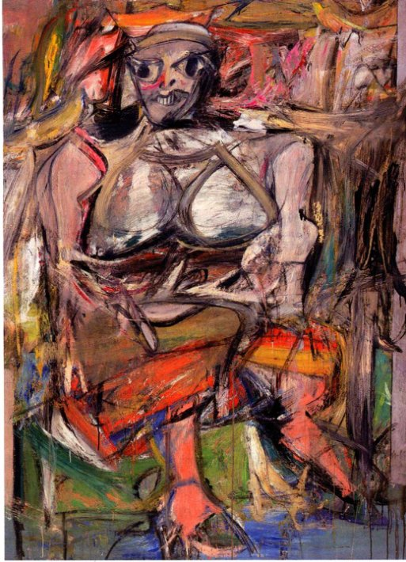

*图29.3 威廉·德库宁：《女人体1号》。1950-1952年。布面油画，1.93x1.47米。纽约现代艺术博物馆，购入馆藏*

《女人体1号》不具有固定的意义，因此向各种解读敞开了大门，正如该系列中的其他女性一样。观众在双眼圆睁、咆哮吼叫的恐怖人物身上看不到任何幽默之处；但德库宁对此表示震惊，因为这个形象的创作在很大程度上正基于当时抽着骆驼牌香烟的广告模特，同时也以原始的丰产女神为基础，例如旧石器时代的《威伦道夫的女子》（见图1.16），德库宁曾将两者都当作自己的素材。德库宁不仅在女性人体系列，而且在所有作品中都释放出自己的矛盾情感，由于情感本身的持续变化，使得他能够持续、反复地绘制同一形象。

### 抽象表现主义：色域绘画

抽象表现主义也有对立面。如果说一面是动作绘画，那么另一面就是色域绘画（color-field painting）。后者并不采用夸张的笔触和强烈明显的颜料，而是运用大片可以令人沉思默想的色彩平面来表达最深入的原始品性，正是这些品性将其与宇宙能量联系在一起。色域画家的目标与动作画家相同，都是要投射自身感受到的崇高人类处境。主要的色域画家40年代时都以基于神话的抽象超现实主义风格开始进行创作，而直到1952年他们还都是亲密战友。

**马克·罗思科** 马克·罗思科（Mark Rothko，1903-1970年）是最著名的色域画家之一。其绘画从这个时期开始深受希腊悲剧的影响，例如埃斯库罗斯的阿伽门农三部曲，罗思科还从基督的受难与复活中汲取了灵感；这些场景都具有极其痛苦的心理状态，以及孤独个体独自面对关于存在、死亡和精神性的终极真理场景。但是所有对形象的暗示都在1947年消失了。1949年，罗思科形成了自己的成熟风格，而且从此开始，他终其一生都予以坚持。

从1949年开始，罗思科的绘画转变为相互叠加的色彩平面，他于1953年创作、高近3米的《61号（褐与蓝）》（No.61 [Rust and Blue]，图29.4）就是如此。画中没有任何情节，也没有象形图案与象征，所有这些元素也从作品标题中消失了。艺术家绘制了他本人所面对的东西，那是我们在未来无可避免的虚空，也是我们与宇宙不可见力量的神秘同一感，这个主题早已在卡斯帕·大卫·弗里德里希的《橡树林中的修道院》（见图24.11）里出现。罗思科这样解释自己的题材——“悲剧、神迷、厄运等等”。他笔下优美的平面轻薄非常，各层色彩交相闪烁，创造出朦胧、微妙的精神之光。色彩平面的边缘参差不齐，仿佛消散在天空的云彩，似乎具有难以捉摸的脆弱感。尽管画作并没有显示创作过程，我们仍能感到罗思科通过独特的印记亲手建构起这些色块，赋予了作品深刻的有机特质。画面空间以一种矛盾的方式同时传达出幽闭与无垠之感。一方面，色彩平面确实覆盖着整幅画布，直至最边缘的所在，飘浮、盘旋在绘画的平面之上；而另一方面，弥漫的蓝底色仿佛一直向外延伸到无垠，画布的边缘都无法将其遏制。不同色域之间尺寸的大量变化令人不禁心生崇敬之感；以画面中部底层那一束纤细微弱的柔和白色为例，似乎与其他色彩的大片色域具有相同的重要性，甚至其重要性等同于整幅画作。

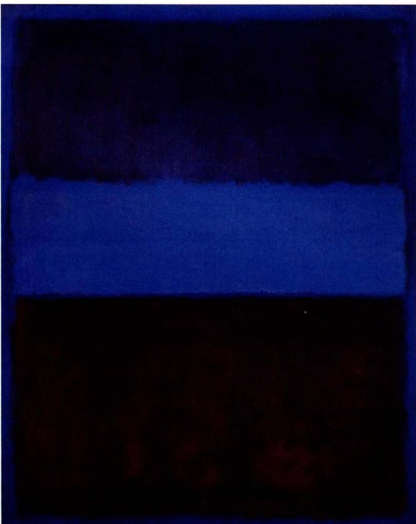

*图29.4 马克·罗思科：《61号（褐与蓝）》，又名《棕色、蓝色、蓝底棕色》。1953年。布面油画，2.94 × 2.32米。洛杉矶当代艺术博物馆，Panza收藏*

撇开色彩的配比不谈，也不管《61号》究竟是适合明黄色和橙色还是更为忧郁的蓝色与棕色，罗思科的色彩中都含有一种隐秘的共鸣，使得作品仿佛从内部闪闪发光，创造出一抹精神的光环。罗思科希望观众可以在近距离观看他的巨幅作品，就如同观看圣像一样，而耸立在观众面前的图像将会使其沉浸在不可知未来的神秘虚空之中，仿佛站立在面对无垠与死亡的悬崖之前。在创作了一系列以黑色为主导的绘画之后，罗思科于1970年自杀身亡。

**巴内特·纽曼** 几乎与罗思科同时，另一位色域画派的重要人物巴内特·纽曼（Barnett Newman，1905-1970年）也开始创作大幅彩色平面作品。在1950至1951年期间，纽曼绘制了《英雄的与崇高的人》（Vir Heroicus Sublimis，图29.5）。在这幅作品中，炽烈的红色覆盖着宽达5米有余的画布，其间规律地被5条不同色彩的垂直线条分割开来，艺术家称这些线条为“拉链”。单一的红色延伸到画布四周，给人以无穷无尽的感觉。脆弱、颤动的拉链仿佛是人物的替代品，在这里缩减到最概括的抽象形式。然而这种处理却让画面生动起来，迫使我们的目光从一条“拉链”跳向另一个；而其仿佛又被分割开来的广阔色域吞噬。观众在观看原作时，就会产生这样的感受。在复制品中欣赏不到纽曼的笔触，其笔触丰富多变、层层相叠，极具生命力，展示出颜料的多种层次以及不同深浅的红色。与罗思科一样，纽曼也想将观众置于崇高的空间里，使其在感受生命力的同时，也能体会到存在的孤独。

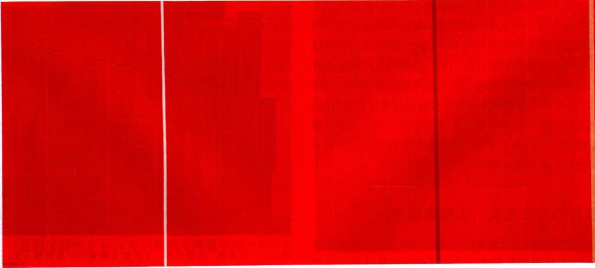

*图29.5 巴内特·纽曼：《英雄的与崇高的人》。1950-1951年。布面油画，2.42x5.42米。纽约现代艺术博物馆，Ben Heller夫妇捐赠，240.1969*

## 纽约雕塑：戴维·史密斯和路易丝·内维尔森

战后的先锋雕塑家和抽象表现主义画家一样，最初都曾是超现实主义者，而且大部分人都深受存在主义哲学的影响。以戴维·史密斯为代表的一批艺术家在创作雕塑的过程中发展形成作品的结构，创造出以抽象形式居多的雕塑。而路易丝·内维尔森等人则保留了超现实主义的象形符号，但是作品的规模却开始扩大，部分要归因于来自抽象表现主义绘画尺幅的影响。

戴维·史密斯（David Smith，1906-1965年）与亚历山大·考尔德可能是20世纪中最重要的美国雕塑家。史密斯曾是一名画家，在看到毕加索和冈萨雷斯焊接钢材雕塑（见第995-996页）的插图之后，他选择焊枪作为其创作工具，并以金属为其创作材料，此后一直坚持这种风格。史密斯与抽象表现主义画家的关系非常好，在1940年搬到纽约州北部的波尔顿码头农场之后，他仍定期前往纽约长住，为的就是与格林威治村的抽象表现主义画家相处。

史密斯沉浸于这个圈子中盛行的存在主义哲学。与他的伙伴们一样，史密斯也致力于在作品中表达自己的生理存在与心理存在。他的艺术生涯与罗思科相仿，早先主要创作表现空间中有机形式的超现实主义线性作品，令人联想到米罗的艺术，之后则转向了全然抽象的标准形式。从40年代中期开始，史密斯运用手头常备的大量金属来建构雕塑作品，他基本不预先绘制草图，也不去事先构想最终作品，而是像德库宁和波洛克一样，通过由各个动作连贯而成的持续反应进行创作，只不过这里他的媒介是焊接材料。这种方法尽管能够让他进行整体创作与思考，但史密斯通常将自己的雕塑设想为绘画作品，以至于从某个特定视角看来，几乎具有平面的特征。

《立方体》系列（Cubi，图29.6）是史密斯晚期彻底标准化风格的代表。这个系列的创作始于1961年，最终共有18件作品。《立方体》系列具有严格的几何性，而这在史密斯的创作中并不常见。他并没有切割钢材的工具，结果不得不向制造商订购经过裁切的长方钢体，之后将其装配成尺寸各异的盒子，最后再基于直觉与个人情感把这些盒子焊接起来。尽管具有稳定的几何特征，但巨大的雕塑看来很难被归类为机械或无感情的作品。这些作品兼具人形和图腾之感，仿佛是巨人或仪式建筑。它们俨然是史前的建筑物，令在场之人心生敬畏，并且可以感受到其中蕴含的强大精神力量。这些放置在高坛上的基本形式作品，好像建构宇宙本身的基石一般，其运动感与坚固性反映出生命本质，而不稳定的排列方式则反映了万事万物的变化无常。在最后的工序中，史密斯会打磨钢材表面，达到粗糙的质感。而且我们也能够从中感受到艺术家本人对作品的触摸与处理，作品由此就获得了令人吃惊的有机特质。

史密斯作品的规模在50年代晚期明显增大了，原因是其在某些方面受到了抽象表现主义绘画作品尺寸的影响。另一位超现实主义雕塑家**路易丝·内维尔森（Louise Nevelson，1900-1988年）** 也采用同样的手法。她在40年代开始崭露头角，到了50年代便开始运用涂成黑色的木材碎片进行创作，将其组装为神秘的黑盒子。而到50年代末期，内维尔森就开始用这些黑盒子堆砌高大的墙体。

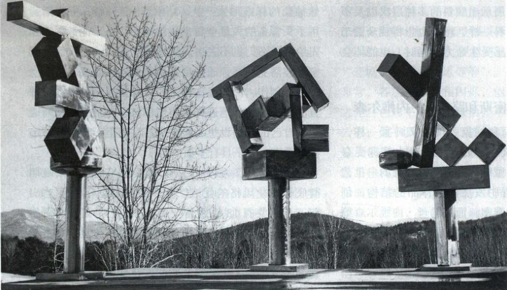

*图29.6 戴维·史密斯：装设在纽约波尔顿码头的《立方体》系列，不锈钢材质。图左：《立方体18号》，1964年，高2.95米，波士顿美术馆；图中：《立方体17号》，1963年，高2.74米，达拉斯艺术博物馆；图右：《立方体19号》，1964年，高2.87米，伦敦泰特美术馆。*

《天空大教堂-月园加一》（Sky Cathedral-Moon Garden Plus One，图29.7）就是上述风格的作品之一。这件作品创作于1957至1960年间。家具与建筑的碎片在其中成为了具有感召性的超现实主义物品，安放在诗意的梦幻场景之中。我们感到自己仿佛正在观看文明的丢弃物与飘浮物，以及早已去世之人的生命片段。但正如标题所暗示的，内维尔森所采用的形式也让人联想到风景和宇宙——圆形暗示着星球与月亮，尖形木材碎片是山峦，木板的堆积则像是岩石的成形。内维尔森还会创作通体金色或者白色的作品，但她要求黑色的作品在展示时要打上蓝色的灯光。蓝光代表黎明或者黄昏，那是转变的时刻，万事万物的面貌都开始发生变化，转变为另外的事物，并被不可见的神秘力量吞噬。

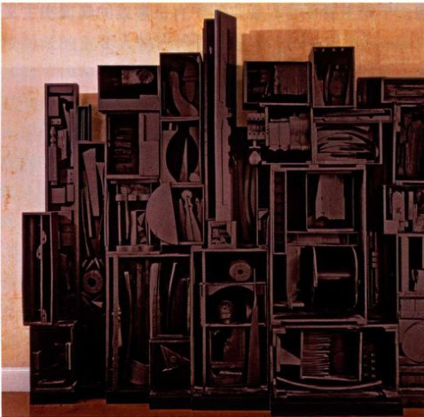

*图29.7 路易丝·内维尔森：《天空大教堂-月园加一》。1957-1960年。黑绘木板，2.77 × 3.1 × 0.48米。现属于纽约Milly Glimcher和 Are Glimcher收藏*

## 欧洲的存在主义：人物表现主义

抽象表现主义是美国特有的风格。通过联邦政府在50年代组织的展览，这种风格的作品开始出口到欧洲。展览虽然表面上以建立良好的国际关系为宗旨，但同时也炫耀着美国艺术的优越地位与刚强力度，是对美国在军事、经济和技术领域所占主导地位的有力补充。然而欧洲艺术家日后也发展出可与抽象表现主义相媲美的艺术风格，其中最有价值的存在主义绘画可能要算是人物画。让·迪比费和弗朗西斯·培根是两位尤其具有影响力的艺术家，二人都单独进行创作，不参加任何群体，也不与任何艺术运动发生联系，在艺术上保持了自己的本色，独立做出各自对人类存在中孤独经验的回应。

### 让·迪比费

年轻时的法国艺术家让·迪比费（Jean Dubuffet，1901-1985年）不太有机会在艺术上出人头地。直到40年代早期，他的艺术创作仍然是时断时续，甚至其艺术信念也处于时有时无的状态，而是将更多的时间投入到家族的葡萄酒生意当中。迪比费的很多看法与达达主义者有相通之处——反艺术、反资产阶级。他最感兴趣的事情是找到一种突破文明所设障眼法的方式，突破美与现实观念的局限。如同康定斯基、马列维奇和蒙德里安那样，迪比费寻求揭示更高层次的真理，这对他而言就意味着宇宙中万事万物的互相联系。

40年代早期，迪比费发现了未经训练之人和精神病人创作的艺术，他称之为生涩艺术（Art brut），并开始收集这些作品，这对他的艺术发展至关重要。迪比费认为，未经传统艺术训练的艺术家不受超我的压抑，其所表达的原始欲望直接连通着宇宙之力。涂鸦、儿童艺术等一切同样不受压抑的自发性艺术创作都属于这个范畴。迪比费在自己的艺术中也采用这种粗野、幼稚、直接的风格，因为他相信这些风格代表着普遍的语言，使得任何人都能够理解和欣赏。

迪比费世界观的另一个重要组成部分是以下这个观念——万事万物都具有同等的神圣性，因为一切事物都由相同的物质与能量构成。创作于1950年的《形而上学》（Le Métafisyx，图29.8）几乎就是这种观念的图解。在这幅生涩风格的作品中，迪比费在厚涂的颜料层上刻出了一个女性形象。这个女人粗糙鲁钝，暗示着大地、古代的石墙以及岩石。这个滑稽又令人反感的女人具有泥土般的外壳，她不仅是矿物质本身，也是永恒本身，因为她仿佛是从偏远的史前遗址中挖掘而来。狂乱的涂鸦式风格极其抽象，我们有无数种方式来解读图像，甚至可以将凌乱潦草的铁丝式线条看作贯穿万事万物的能量。画面甚至还暗示人体可能消解为基本的自然物质。《形而上学》是《女人体》Corps de Dames）系列中的作品之一。这个系列普遍具有粗野的线条与粗糙的质感，其目的是要震撼和挑战艺术界关于美和艺术的陈旧观念。

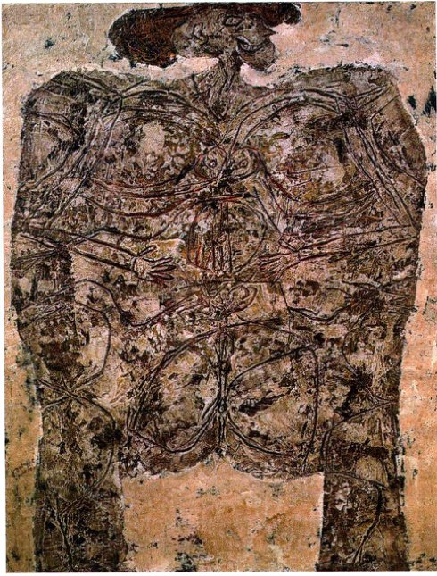

*图29.8 让·迪比费：《形而上学》，出自《女人体》系列。1950年。布面油画，116.2 × 89.5厘米。巴黎乔治·蓬皮杜中心现代艺术博物馆*

### 弗朗西斯·培根

在英吉利海峡的另一端，另一位孤独艺术家弗朗西斯·培根（Francis Bacon，1909-1992年）则以其表达个人存在焦虑的作品在艺术界掀起了轩然大波。一看到他创作于1954年的作品《两扇牛肉之间的头像》（Head Surrounded by Sides of Beef，图29.9）， 我们就会意识到这是20世纪最恐怖的图像之一。培根在第二次大战之后不久就成为了伦敦艺术界的重要人物，其周围的人试图将培根的恐怖绘画看作一种宣言，用于表达艺术家本人在战争中见证的无意义的兽性。但是培根的主题早在战争之前就出现了，可能主要来源于艺术家个人的可怕境遇，包括童年时期遭受的虐待，以及成年之后沉浸在“经典”罪孽之中的生活：终日酗酒、赌博和滥交。

> **大事年表**
>
> 1949年 - 乔治·奥威尔的《1984》出版
> 1950年 - 杰克逊·波洛克创作《秋韵：30号》
> 1957-1960年 - 内维尔森创作《天空大教堂-月园加一》

我们并不能确定这些经历是否能够解释培根的作品，因为培根与迪比费及抽象表现主义艺术家不同，他并不发表关于艺术的见解，也不作宣言，更不会声明绘画的目的就是要填补社会的空虚。像其他存在主义艺术家一样，培根将内心感觉作为绘画的出发点，并声称在创作的最初阶段，他完全不知道作品完成时会是何等面貌。培根第一幅基于委拉斯凯兹《教皇英诺森十世》的作品（他据此创作了45幅作品），同时也是《两扇牛肉之间的头像》里中央人物的灵感来源，最初可能是一个花园场景。这幅作品不仅指涉了委拉斯凯兹的肖像作品，而且还参考了当时教皇庇护十二世的照片，我们在此处可以看到他戴着眼罩的头部；此外还参考了伦勃朗表现公牛剥皮的绘画，以及谢尔盖·爱森斯坦（Sergei Eisenstein，1898-1948 年）在1925年执导的经典无声电影《战舰波将金号》（Battleship Potemkin）的剧照，其中一名护士正在尖叫。培根基于《教皇英诺森十世》创作的绝大部分画作中，焦点都在于画中人那极为原始的叫喊，还在于张大的嘴巴里那个阴暗的黑洞。然而在插图中，这个母题并非主导，因为还有两扇钉起来的牛肉环绕着人物，平衡着人物的作用。此外就是黑暗虚无的背景、玻璃笼子所带来的幽闭压力，以及绘画表面各部分沙粒般的性质，所有这些都让我们看到了一座恐怖之屋，而其无疑正是艺术家阴暗的心理写照。观众无法从这幅作品中摆脱，作者似乎通过大胆的笔触将颜料直接扔在了观众脸上，而那些明显突出于画布表面的笔触又将图像向我们拉近。培根这样描述他的绘画：“没有什么比生活本身更让人恐惧。”

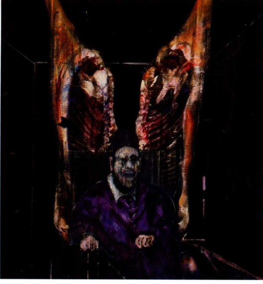

*图29.9 弗朗西斯·培根：《两扇牛肉之间的头像》。1954年。布面油画，128 × 122厘米。芝加哥艺术学院，Harriott A. Fox基金*

## 摒弃抽象表现主义：50年代和60年代的美国艺术

50年代中期，其他风格的涌现已经开始让抽象表现主义逐渐暗淡下来。50年代文化革命的种子得以播散，人们对自由表现十分渴望，而这就需要创造一种全新的艺术形式。组合艺术（Combines）、环境艺术、偶发艺术、极少主义艺术和观念艺术将艺术本身带入一片未知的处女地，从而跨越了将艺术狭隘局限于某种特定标准媒介的藩篱。

> **大事年表**
>
> 1945-1949年 - 让-保罗·萨特的《自由之路》三部曲出版
> 50年代 - 荒诞戏剧出现
> 1954年 - 弗朗西斯·培根创作《两扇牛肉之间的头像》
> 1961年 - 砌筑柏林墙

### 对生命的再次呈现与解剖绘画

50年代艺术领域的戏剧性变革并非由某个人或某一事件触发，但艺术家罗伯特·劳申伯格和作曲家约翰·凯奇确实在其中扮演了重要角色。在劳申伯格解释自已放弃抽象表现主义的原因时，他很可能说出了很多艺术家的心声：“它（抽象表现主义）全部都是痛苦和自我表达，以及关于事物的状态。我只是对这些不感兴趣，我不想通过绘画来改变世界。”劳申伯格当时的密友贾斯帕·约翰斯同样放弃了抽象表现主义。虽然这两位艺术家都使用抽象表现主义动作性的方式绘制作品，但其作品更多是对艺术进行客观、理性的分析，而非感情与原始欲望的爆发。

**劳申伯格与凯奇** 罗伯特·劳申伯格（Robert Rauschenberg，1925-2008年）出生于得克萨斯的工人家庭，后来于1947年前往纽约学习绘画。1948年秋天，劳申伯格进入了北卡罗来纳州的先锋艺术学校——黑山艺术学院（Black Mountain College）。这对他的艺术发展至关重要，他还分别于1951年和1952年再次入学进修。在这所小型文艺学校中，绘画系主任是约瑟夫·阿尔贝斯（Josef Albers，1888-1976年），他和妻子安妮（Anni Albers，1889-1994年）都曾在德国的包豪斯任教。劳申伯格并不愿意师从阿尔贝斯，但是该校体制鼓励学生进行试验，这让劳申伯格从纯绘画转向了艺术观念分析。1951年，他在黑山学院创作了一系列《白色绘画》（White Painting），后来于1953年在纽约斯泰布尔画廊（Stable Gallery）展出。这些作品基本都是在大幅画布上涂上白颜料而成，从中看不出丝毫笔触的痕迹。观众不禁会问，自己应该看什么？而答案首先是他们自己。观众的影子会投射在画布之上，画布也会把彩色光线反射回来，不久还会落满灰尘与污垢。这些画布捕捉着真实的生命，将原始的生命呈现出来，并不附加任何评论和意义。观众可以在其中看到任何他们想看到的东西。劳申伯格和杜尚一样，创作的作品是观念艺术，偶然在作品中起到决定性作用，而作品旨在捕捉世界，但在整个过程中又不会附加任何确定的意义。这些非同寻常的绘画客观、中立，与高度个人化的抽象表现主义相对立，而后者在当时占据主流地位。

约翰·凯奇（John Cage，1912-1992年）是彻底理解《白色绘画》的人之一，这位先锋作曲家以其变体钢琴曲（altered piano）而日渐获得人们关注，他将不同的物品放在钢琴弦下方来改变钢琴的音质。为了回应《白色绘画》，凯奇创作了《4分33秒》（4'33"），这段钢琴曲首先在1952年纽约伍德斯托克音乐节（Woodstock）上被演奏。“演奏”作品的钢琴家只是坐下来，打开琴盖，一动不动地持续4分33秒。在这段时间里，听众会听到来自真实世界的声响：嘈杂声、咳嗽声和听众的耳语，从打开的窗户还会传入雨声和小鸟的叽喳声。最后的声响是琴盖关上的声音，表示乐曲终了。

在这个时期，很多观念作品都力图将艺术家从艺术品的问题中清除出去，同时也让他们停止这样的追问：什么是艺术？艺术怎样发生作用？劳申伯格从杜尚停止的地方开始，尽管前者的艺术从来都不是为了震惊他人或破坏的目的而作。他的态度与方法总是积极的。他是呈现者，不是虚无者。他还是生命的收集者，将生命捡拾起来，以一种积极的方式呈现给我们，让我们自己来思考、解释。进而言之，劳申伯格对绘画本身并不感兴趣，他感兴趣的是再次呈现（re-presenting）绘画。“我不想让绘画看起来仿佛其本身不是的东西。我希望让它看起来更像其本身。而且，我认为用真实世界创造的绘画更像是真实的世界。”

1955年，劳申伯格将真实的世界引入了其艺术。他在此时开始创作集合作品，这是一种结合了绘画、雕塑、拼贴和捡拾物（found objects）的新型艺术品，正如他在1955至1958年间创作的《宫女碑》（Odalisk，图29.10）那样。那是一座四个立面的“灯”，内部装有电灯炮，作品上布满了拼集而成的材料，包括从当时报纸杂志中选来的片段，以及从街头和旧货店觅来的垃圾。标题本身也是拼贴的一部分，因为在建构作品的情节时必须要对其进行考虑。但是，在这件各种材料构成的诗意拼贴中有情节存在吗？《宫女碑》显然有一个主题，因为其充满了性暗示：阴茎形状的柱子挤入底部的枕头里，公鸡位于性感女郎招贴之上，而狗则在下面对她嚎叫、咆哮。在另一面上，拼贴有很多选自连环画的图像，一位躺在床上的女人受到了一名男子的惊吓。作品标题本身甚至也是《大宫女》（odalisque，见图24.16）和方尖碑（obelisk）的双关语，可以按照性意味的方式解读。但是艺术家采用毫无价值的材料，既不暗示任何解释，也不发表任何豪言壮语。作品就是如此而已。这是我们的材料、我们的时代、我们的生命。劳申伯格以非同寻常且具有力度的形式将其再次呈现，并添加颜料与拼贴的诗意氛围。作品以其能量与片段性，捕捉到变幻无常之世界所具有的精神，以及我们体验世界的断裂方式。

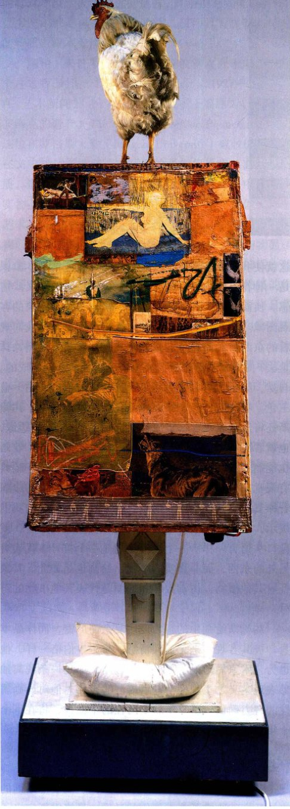

*图29.10 罗伯特·劳申伯格：《宫女碑》。1955-1958年。混合材料，205.7 × 63.5 × 63.5厘米。科隆路德维希博物馆*

**贾斯帕·约翰斯** 1954年，劳申伯格结识了贾斯帕·约翰斯（Jasper Johns，生于1930年），并搬入曼哈顿下区同一座公寓楼的阁楼里，虽然整栋建筑当时已经摇摇欲坠。虽然在劳申伯格创作组合艺术作品之前，约翰斯就在其绘画中增加了物品，但是他的作品确实仍是绘画。他1958年的作品《三面旗帜》（Three Flags，图29.11）就说明了这一点。由于是关于美国的题材，所以很多评论家将这幅绘画划类于波普艺术的范畴。波普艺术是60年代早期在纽约出现的艺术风格，善于从流行文化中汲取图像素材。美国人的骄傲在战后愈发膨胀，美国已经成为世界上最强大、最富有的国家。国旗前所未有地出现在各个地方，而这也已经成为了本国文化的组成部分。然而《三面旗帜》与流行文化无关，因为其只是系列绘画的一部分，艺术家在这个系列中反复绘制扁平的物体，例如数字、标靶和地图，目的在于消除绘制视幻深度的需要。约翰斯在这里绘制了平面（画布）上的扁平物（旗帜），这样我们就不会试图去解读图像，例如追问白色星星是否位于蓝底色之上，因为我们知道实际情况并非如此。进而言之，约翰斯没有将旗帜放在任何情境之中，这就使我们无法在其中找到特定的意义或情感。旗帜是一种符号，约翰斯没有赋予其任何特定的意义或情感。换而言之，约翰斯创造了一幅没有视觉幻象的客观图像。“如何”创作绘画才是艺术家想留给我们观看的东西。约翰斯优美且技巧高超地将蜡质颜料涂抹上去，提醒着我们绘画其实是由画布上的颜料构成的。自然，绘画也可以是色彩，此处的色彩为红、白、蓝三色。唯恐我们忘记绘画也是一件立体的物品，约翰斯还将三面旗帜逐一叠加起来。我们看到旗帜的边缘，也就看到了它的深度。最后，约翰斯提醒我们，绘画也能制造出图像。然而，他并没有呈现给我们一幅具有视觉幻象的图像，我们永远也不会将他笔下的旗帜看作真正旗帜的幻象。通过这种方式，约翰斯向我们展示，图像是一个符号，绘画是一种抽象的语言，就像口头语言一样。一个词语可能是一个符号，代表着另外的东西，而非真实的事物，绘画也是如此。其象征着其他事物，仿佛数字和地图是代表其他事物的符号一样。

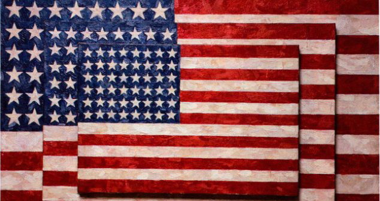

*图29.11 贾斯帕·约翰斯：《三面旗帜》。1958年。布面蜡画，78.4 × 115.6 × 12.7厘米。纽约惠特尼美国艺术博物馆*

约翰斯绘画中的智力运用复杂而严密，而作品本身却极其客观，毫无任何情感。与劳申伯格一样，他也为艺术家们铺设了另外一条道路，那是一条脱离抽象表现主义之主观性与艺术语汇的道路。他对绘画属性的有力确认，以及作品中内在的平面性，将在下个十年之间启发无数艺术家。

### 环境艺术与行为艺术

劳申伯格的组合艺术影响巨大，引发了一系列的连锁反应，造成了艺术创作的激增，最终重新定义了艺术本身。艺术不再只是绘画、雕塑和纸上作品，现在的形式包括毫无限制的各种材质，并且从画廊与博物馆中移到真实世界之中，有时还与日常生活互动，而有时却位于极为偏远的地方，几乎没有人能够看到。很多艺术都不再表现一个物体，反而具有短暂、易逝的特质，根本无法买卖。

**阿伦·卡普罗** 1956年，在波洛克死于车祸的几个月之后，阿伦·卡普罗（Allan Kaprow，1927-2006年）在《艺术新闻》（Art News）上发表了一篇题为《杰克逊·波洛克的遗产》（The Legacy of Jackson Pollock）的文章。这位在罗格斯大学（Rutgers University）执教的画家，在文中描述了波洛克的行动绘画如何逐步具有环境特质，通常是因为作品的规模，以及某些作品中含有现实物品的事实。卡普罗声称，下一步就是要创作环境艺术：“就我看来，波洛克将我们留在了一个重要时刻，我们必须关注、甚至痴迷于日常生活中的空间与物品，并关注我们的身体、衣服与房间。如果需要的话，甚至还有42号大街的宽阔。”卡普罗了解劳申伯格的作品，并对《白色绘画》充满敬畏之情。他关于将日常生活整合入艺术的声明，仿佛是对劳申伯格组合艺术作品的描述。

1958年，阿伦·卡普罗开始创作其称为环境艺术（environment）的作品，建起观众能够亲身进入的装置。他最著名的环境艺术作品是1961年的《庭院》（Yard，图29.12）。作品主要由废弃轮胎构成，具有波洛克绘画式的“满幅”，并且充满了能量，但是这件作品陈列在城市住宅的花园中，艺术家希望观众能够在作品里行走，用身体来体验，此外还可以闻着作品的气味。正如劳申伯格在组合艺术里所做的那样，卡普罗也没有为作品附加任何确定含义，尽管被四处乱丢的合成材料暗示着现代的工业城市环境，并显露出废弃感，甚至是死亡感。

为了学习如何在环境作品里增加音响，卡普罗参加了约翰·凯奇在社会研究新学院（New School for Social Research）开设的作曲课程。课堂里全是艺术家，没有一名音乐家，但几乎每个人都在后来声名鹊起。课上的音乐都是偶然形成的，而且通常不采用传统乐器来演奏。其中一个典型的练习是用一台无线电作曲，同时运用一种偶然的方法，例如《易经》占卜的方式，以此来决定在何时、由何人来打开或关上收音机，以及整个曲子的长度。

这次课程启发卡普罗在环境艺术作品里加入活生生的人。他的作品最初是将各种非艺术的材料拼贴在一起，从地板一直延伸到天花板，与劳申伯格的组合艺术作品有朦胧的相似之处。1959年，卡普罗在鲁本画廊（Reuben Gallery）的“18个偶发，6部分”（18 Happenings in 6 Parts）展览中，向纽约艺术界揭幕了最终作品。他把拼贴而成的环境分为三个房间，观众坐在其中观看、聆听和嗅闻，表演者则作画（劳申伯格和约翰斯参与了）、放唱片、榨橙汁、讲出某些只言片语，而所有这些都由偶然决定。在某种意义上，该作品与劳申伯格式的组合艺术作品十分相似，二者都发生在时间与空间之中，并由人类活动构成。由于卡普罗这件创新作品的标题，偶发艺术（happening）成为这种新视觉艺术形式的名称，当时很多著名艺术家都开始创作偶发艺术，其中也包括劳申伯格。虽然众多艺术家接受了偶发艺术一词，但其他人则使用不同的标签，而这些标签都可以纳入行为艺术（Performance Art）的大范围下，与剧院中的表演不同，发生在某个艺术情境中。

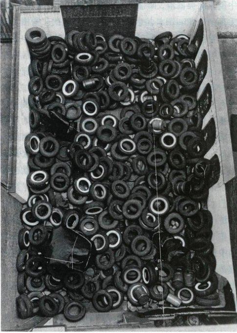

*图29.12 阿伦·卡普罗：《庭院》。1961年。废弃轮胎、柏油纸和油桶，装置于纽约马萨·杰克逊画廊（Martha Jackson Gallery），真实尺寸，已被拆除*

**罗伯特·惠特曼** “18个偶发，6部分”引发社会对于偶发艺术或行为艺术的热潮，一直持续到60年代中期。克拉斯·奥登伯格（Claes Oldenburg）、吉姆·戴恩（Jim Dine）和雷德·格鲁姆斯（Red Grooms）等即将成名的艺术家和劳申伯格一起创作作品。艺术家罗伯特·惠特曼（Robert Whitman，生于1935年）终生创作此类艺术，而他更愿意将其称之为“剧场作品”（Theater Pieces）。惠特曼不仅是卡普罗在罗格斯大学的学生，而且旁听过凯奇的音乐课。1960年，他在鲁本画廊展出了《美国月亮》（American Moon），这件作品集合了以纸张、纸板和塑料为主的各种材料，在材料、人的活动与步调方面，具有神奇的诗意之美。所有这些元素日后都成为了惠特曼艺术的典型特征；其在否定任何解释的同时，又唤起了涵盖广泛的反响（观看本作品及其他戏剧的纪录片请访问以下网址：www.prenhall.com/janson）。如果将卡普罗的行为艺术作品描述为世俗的散文诗，与日常生活保持紧密的关系，那么惠特曼的作品则是抽象的梦幻世界，为其从艺术史家那里赢得了“行为艺术大师”、“最具创新性的实践者”的称号。《美国月亮》中异常激进之处在于电影投影的运用，实际上惠特曼在很多行为艺术中都采用了这种方式，例如1965年的《剪平》（Prune Flat，图29.13）。在录像出现之前，惠特曼就采用了电影作为艺术手段，其做法预示了日后录像艺术和装置艺术的出现。

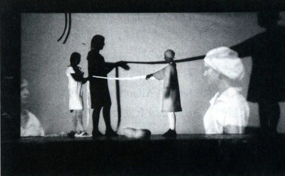

*图29.13 罗伯特·惠特曼：《剪平》。1965年。1976年表演照片*

**乔治·布莱希特** 卡普罗参加1958年约翰·凯奇的音乐课时，另一位艺术家乔治·布莱希特（George Brecht，1925-2008年）也旁听了这门课程。作为课后作业，他为汽车谱了一首题为《机动车日落事件》（Motor Vehicle Sunset Event）的曲子。参加演出的人依照指示抽取卡片，并于日落时分在停车场里分别按响汽车喇叭、摇下车窗、猛关上后备箱盖，并打开引擎盖。布莱希特称这一类作品为“事件”（Events），他随后将其打印在白色卡片上邮寄给熟人，还由此发明了“邮件艺术”（Mail Art）。

到1960年时，布莱希特的事件作品开始呈现极其简化的风格。在作品《三个与水有关的事件》（Three Aqueous Events）中，他在宽约5厘米、长约7.5厘米的卡片上印制作品题目，下方则是三个粗体、加圆点的词：水、冰、汽。收到卡片的人可以用任何他们愿意的方式来回应，甚至可以将卡片镶入镜框。以卡普罗为例，他想到了制作冰茶的点子。《三个与水有关的事件》中到底哪一部分是艺术品呢？是观念还是卡片本身？是整个事件的执行过程？而谁又是其中真正的艺术家，并让收件人成为创造者呢？布莱希特在提出经典的杜尚式问题之外，还将艺术融入了日常生活，并使其走下了美学与理性的圣坛，这是高尚艺术所专有的特权。1962年，布莱希特所开创的先例促生了一个基于纽约的国际艺术运动——激浪派（Fluxus）；该运动同样致力于创作观念艺术，打破艺术与生活、艺术家与非艺术家、博物馆与大街等物的区分惯例，而行为艺术正是其中的一个重要组成部分。

**乔治·西格尔** 乔治·西格尔（George Segal，1924-2000年）在新泽西州的乡村继续沿着卡普罗开拓的道路前进；他运用真实物品和石膏人像，创作出具象而非抽象的环境艺术作品，以此作为对卡普罗环境艺术与偶发艺术的回应，1963年的《加油站》（The Gas Station，图29.14）就是如此。其中的表演者仿佛凝固了一般，简化为幽灵般惨白的人体模型。西格尔利用真人创作了这些模型，他还使用医用石膏绷带印取真人形体，并以此来制作模具，最后再浇出石膏像。与劳申伯格和卡普罗一样，他打破了艺术与生活之间的屏障。但是，他的艺术却并不具有中立性，而是充满了情感，尽情发表自己的宣言。西格尔的作品谴责了他在当代生活中感知的异化；这种异化就表现在人像当中，它们通体惨白，似乎被抽离了生命。这些人像大多无精打采、筋疲力尽，而且孤独无助，仿佛被束缚在水平线与垂直线构成的严格几何背景之中。

他作品里的某些象征甚至来自更传统的艺术。例如《加油站》里高挂的宝路华时钟，这是“死亡暗示”（memento mori）的题材，飘浮在一片宽达3米有余的黑色背景之中，外形与地板上的轮胎遥相呼应。自动售卖机、轮胎、存储高性能汽油的油罐，以及加油站本身都暗示着科技、快速、高效率的现代性生活。然而，在这个物质性的场景当中，缺少了某种具有意味的东西，就是人的互动与精神。通过追问现代生存的意义，西格尔保持了他在抽象表现主义时期所形成的存在焦虑。尽管经常使用诸如可乐瓶子一类的当代产品来赋予环境艺术作品现实感与现代感，但西格尔从来都不是在赞扬这些消费文化的产物，也在质疑包括广告在内的大众媒体图像对观众的操纵。他的雕塑在精神与风格上更接近爱德华·霍普（见图28.58）的绘画，而不是波普艺术，但人们还是曾经错误地将西格尔与波普艺术联系在一起。

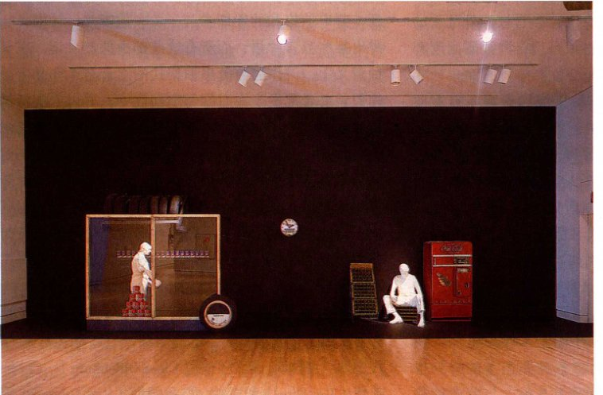

*图29.14 乔治·西格尔：《加油站》。1963年。石膏人像、可口可乐贩卖机、可口可乐瓶子、可口可乐木板箱、金属售货处、橡胶轮胎、轮胎架、油桶、电子时钟、水泥块、木框厚玻璃窗，2.59 × 7.32 × 1.22米。渥太华加拿大国家美术馆*

## 波普艺术：以消费文化为主题

波普艺术（Pop Art）是60年代早期出现于纽约的艺术风格，还曾于50年代以截然不同的面貌出现在英国。由于这种风格经常从流行文化和通俗文化中提取图像，因此获得了波普艺术的称谓。波普艺术家与劳申伯格、卡普罗一样，再次呈现了来自生活的人工制品，即大众媒体中的图像，然而他们通过传统的绘画形式来呈现图像，而非新的媒介。约翰斯和西格尔偶尔也会使用流行图像，波普艺术家则与他们不同，其所关注的流行文化产品是那些被艺术史家描述为低俗艺术（low art）的形式，即商业艺术；他们还将低俗艺术并入高雅艺术之中，即美术。然而，他们通过这种方式颠覆性地揭示了大众媒体的操纵力量。最为知名的波普艺术家有美国的罗伊·利希滕斯坦、安迪·沃霍尔、爱德华·鲁沙和英国拼贴艺术家兼画家理查德·汉密尔顿。

**罗伊·利希滕斯坦** 罗伊·利希滕斯坦（Roy Lichtenstein，1923-1997年）也是卡普罗的密友。他在1960年来到罗格斯大学任教，当时他还是一位抽象表现主义画家。然而在一年时间之内，利希滕斯坦就创作出了可称为波普绘画的作品，部分原因在于卡普罗的影响，而后者的格言就是“创造不像艺术的艺术”（见第1053页的原始文献）。

利希滕斯坦提取和再现的当代生活并不像卡普罗、劳申伯格和西格尔作品中的城市街头场景，他选取了电话簿、报纸中的拙劣黑白广告，以及漫画书里的乏味画面。他首先对这些图像进行裁切，再将其调整为迷人的图画，正如《溺水的女孩》（Drowning Girl，图28.15）那样。按照传统来说，由于利希滕斯坦发现了低俗艺术中的美，并将之提升到了高雅艺术的地位，所以他应该得到赞赏。他对流行文化大加赞赏，特别是美国文化。首次展出时，利希滕斯坦的绘画风格十分激进，被大多数人看作丑陋、可怕之物，很多人甚至都不认为这是艺术。毕竟这些作品看起来是出自漫画书的图像。而且，艺术，特别是现代主义艺术应该推动艺术前进，探索抽象的新方面。高雅艺术不应该具有低俗艺术的面貌，也不应该带有再现特质。

> **大事年表**
>
> 1953年 - 詹姆斯·华生和弗兰西斯·克里克解析DNA结构
> 1957年 - 苏联发射人造卫星一号
> 1961年 - 阿伦·卡普罗创作《庭院》
> 1963年 - 肯尼迪总统遇刺
> 1964年 - 甲壳虫乐队参加埃德·沙利文秀
> 1969年 - 库尔特·冯内古特出版《五号屠宰场》

利希滕斯坦的作品不仅仅模糊了美术与大众文化之间的界限，他还像约翰斯那样对艺术的语言充满兴趣，特别是对于感知的问题。约翰斯的《三面旗帜》就曾经对他产生过深刻的影响。利希滕斯坦不是在单纯地模仿连环漫画，他还利用这种技法中的“本戴圆点”（benday dots）制图方式；那些小圆点一旦集合到一起，就能够在印刷材料上创造色彩与阴影的效果。利希滕斯坦着迷于扁平圆点和黑线的使用方式，以及如何产生立体感幻觉的问题。如果从近处观看，他的大幅绘画图像就会消散为平面的抽象图案，从实质上变成了抽象表现主义作品。

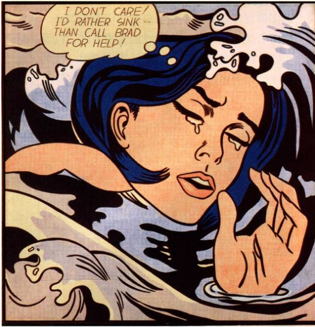

*图29.15 罗伊·利希滕斯坦：《溺水的女孩》。1963年。布面油画，1.72x1.70米。纽约现代艺术博物馆，Philip Johnson基金会，Bagley Wright 夫妇捐赠*

1961至1964年间，利希滕斯坦为绘画选取的图像形成了一种独特模式：男性都被描绘成强壮、精力充沛的战士和战斗机飞行员，而女性则处于情感错乱的状态，或者依附于男性，或者幸福地在家中忙碌。利希滕斯坦运用其冷漠的才智，让自己的绘画成为当代社会的镜子，揭示出深植在媒介中的模型化趋势。但是其绘画本身看起来又是客观、无情感的，丝毫没有暗示争论或艺术家本人的想法，既没有手（笔触）的介入，也没有情感介入。

> **原始文献：罗伊·利希滕斯坦（1923-1997年）**
>
> **节选自乔安·马特（Joan Marter）的访谈录**
>
> 在艺术史家乔安·马特1996年所作的访谈中，罗伊·利希滕斯坦谈论了阿伦·卡普罗的环境艺术和纽约的偶发艺术对其波普艺术的巨大影响。
>
> **乔安·马特**：在一次访谈中，你这样说过：“尽管我觉得自己所做的艺术与环境艺术几乎毫无关系，但偶发艺术的思想核心却让我很感兴趣。”
>
> **罗伊·利希滕斯坦**：偶发艺术让我感兴趣的不仅仅是思想核心······其中很多艺术家都倾向于使用美国对象，而非巴黎画派的对象。我说的是轮胎，还有奥登伯格和戴恩偶发艺术里的那种广告之类的东西。这些作品就像是一条美国大街，在某些方面受到波洛克的影响。环境艺术似乎是拓展波洛克的创作范围，其作品基本都具有相同的满构图感。如果现在看波洛克的作品，我认为其确实很美丽，我做不到这么多充满活力的事情，比如香烟头、油漆，还有那些用来创作的材料。这些作品对偶发艺术产生了很大影响。由于环境艺术会把你包裹起来，而我想包裹的方式就是波洛克的绘画包裹你的方式，那些绘画巨大无比，仿佛没有尽头。而且都是满构图的，所有都是。我想波洛克绘画中的某些东西进入了环境艺术，而环境艺术又可以说是偶发艺术的某种背景·······但是对我影响最大的可能是美国对象，而非法国对象。
>
> **乔安·马特**：（在阿伦·卡普罗的作品中）你还记得什么特别让你感兴趣的东西吗？
>
> **罗伊·利希滕斯坦**：他做的轮胎作品（《庭院》，马萨·杰克逊画廊［Martha Jackson Gallery］，1961年，见图29.12）。还有用纸条做的作品，纸上写着字（《词语》，斯莫林画廊［Words，Smolin Gallery］，1962年）。我从他那里得到最重要的东西，我想是那种“艺术看起来不一定要像艺术”的想法，或者说你做的很多东西都在那里展出，只不过是因为其看起来像艺术。你总是认为艺术家应该具有原创性，也不管他的艺术是什么风格。我很晚的时候才开始创作抽象表现主义风格的作品，那是在1961年，之所以这样是因为在我眼里这看起来像是艺术······而我也很高兴他（卡普罗）能够喜欢这些（我的《瞧米奇》［Look Mickey］等其他首批波普绘画），因为大部分人第一眼就开始讨厌了。
>
> *SOURCE: OFF LIMITS RUTGERS UNIVERSITY AND THE AVANT-GARDE, 1957-1963, ED. JOAN MARTER. (NJ: RUTGERS UNIVERSITY PRESS, 1999)*

**安迪·沃霍尔** 几乎与利希滕斯坦同时，安迪·沃霍尔（Andy Warhol，1928-1987年）也开始基于漫画书创作艺术品。当艺术经纪人莱奥·卡斯泰利（Leo Castelli）决定为利希滕斯坦做代理，而非沃霍尔时，后者又转向了其他种类的流行图像，即产品设计和报刊照片。沃霍尔最著名的作品是《坎贝尔汤罐头》（Campbell's Soup Cans，图29.16）。1962年在洛杉矶费鲁斯画廊（Ferus Gallery）举办首次展览时，他制作了32幅汤罐头图像，组成了一片生机勃勃的艺术景象。坎贝尔公司一次提供了32种汤罐头，即32幅沃霍尔运用丝网印刷（silkscreen）技术制作的绘画。通过这种技术，他只不过是将摄影图像印制在画布之上，就像费鲁斯画廊展览中的作品；或者印制在纸上，例如他自己的版画作品。

沃霍尔尽可能以一种单调的方式安置这些作品，作品之间的间距相同，并且都放在隔板之上，就像汤罐头在超级市场里摆放的那样。正如汤罐头是出自流水线的批量产品，沃霍尔也在他称为“工厂”（The Factory）的工作室里批量生产自己的绘画。助手们在其监督下工作，而他只有在作品背后签名的时候才有机会碰触产品。沃霍尔以杜尚式的姿态，告诉我们绘画也是商品，人们购买的不过是一件带有名字的产品，即沃霍尔；而艺术则是观念，不必与技法或手工技术有关。但是，沃霍尔同时也就产品设计的伪装功能发表评论，讨论其如何隐藏所推销批量产品的信息，而包装又是如何刺激我们的购买行为。沃霍尔要传达的信息在于，坎贝尔汤罐头无处不在，渗透到美国最为偏远的角落，批量生产的标准性与消费主义统治了美国社会。事实上，这些汤罐头就是一幅现代美国的肖像画。与利希滕斯坦一样，沃霍尔既不赞扬，也不谴责。

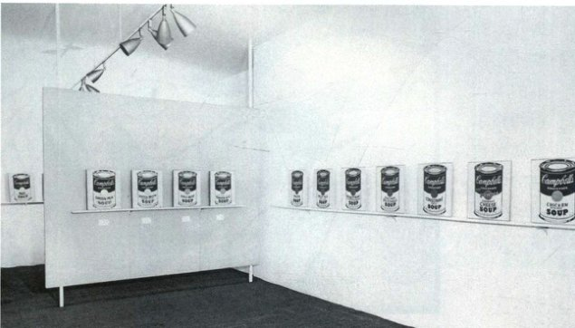

*图29.16 安迪·沃霍尔：《坎贝尔汤罐头》装置图，费鲁斯画廊。1962年。匹兹堡安迪·沃霍尔博物馆*

沃霍尔是匹兹堡人，于50年代晚期在纽约成为了一位成功的女鞋插图画家，从而直接认识到了广告与产品包装的欺骗和操纵力量。他还痴迷于大众媒体对公众意见的影响，并于1961年开始从垃圾桶找到了大量报纸照片，并运用丝网印刷技术将其印制在画布上。他的图像包括撞车、电椅以及名人照片，例如猫王（Elvis Presley）、伊丽莎白·泰勒（Elizabeth Taylor）和玛丽莲·梦露（Marilyn Monroe）。正如《金色的玛丽莲·梦露》（Gold Marilyn Monroe，图29.17）那样，沃霍尔的风格完全复制了报纸杂志那种廉价且没有个性的再现方式。他在此处重现了60年代彩色印刷报纸的马虎粗糙，色彩通常都与图像配合得不好。我们看到的梦露是一位不具人格的媒体名人，那华丽的红唇与明亮的金发本应让她充满魅力，但却因过分耀眼的色彩和肮脏的黑油墨显得俗气、可怜。她的个性令人无动于衷，只缩减为一抹尽人皆知的微笑。创作该作品的动机部分要归因于梦露近期自杀身亡，暗示了还有另外一个梦露，而那个梦露并非其公共人格的组成部分，只不过是为追捧名人的大众所创造出来的美化形象。梦露的形象实际上只是一种产品包装，就像是华丽的坎贝尔汤罐头包装一样，其目的在于销售产品，并不能告诉我们任何有关产品本身的信息。沃霍尔让梦露的面庞飘浮在一片金色海洋之中，模仿基督教的圣像，以此将梦露神化。而这幅作品的基调并无情感，使得梦露的头部在天堂般的金色面前相形见绌，影射了肖像背后的悲剧，极其尖锐地暴露了公共形象与个人真实之间的巨大鸿沟。

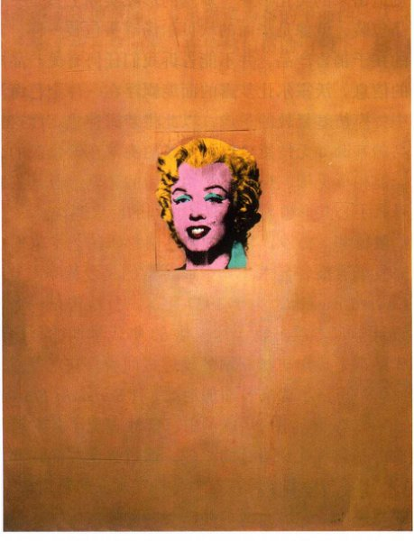

*图29.17 安迪·沃霍尔：《金色的玛丽莲·梦露》。1962年。人工聚合颜料、丝网、布面油画，2.11 × 1.40米。纽约现代艺术博物馆，Philip Johnson 捐赠*

**爱德华·鲁沙** 与此同时，洛杉矶的艺术家们也独立发展着波普艺术，其中最著名的是爱德华·鲁沙（Edward Ruscha，生于1937年）。鲁沙曾是一名平面设计师，专攻书籍设计，他60年代早期的很多绘画作品都呈现出机械制图的硬边式面貌。在《得克萨斯州阿马里洛市标准石油加油站》（Standard Station，Amarillo，Texas，图29.18）中，鲁沙表现了其对符号学或产品包装视觉语言的兴趣。通过强调并简化几何性，将屋顶与标牌组织在有力且直穿画面的对角线上，他强烈突出了标准石油加油站光滑的现代国际风格。电子标向灯照亮了加油站，仿佛其存在本身就是一个值得庆祝的事实。不过，大部分图像只有立面。加油站的情况就是如此，因为建筑都逐渐向后退去，最终消失不见。鲁沙还展示了艺术的“立面”，因为建筑的具象图像转为抽象，并消失在平面与色彩的人为构成之中。与沃霍尔和利希滕斯坦一样，鲁沙的图像也不具有人性特征，呈现机械式的面貌。这给人以人工合成之感，恰恰体现了乔治·西格尔在《加油站》（见图29.14）里所感叹的主题。

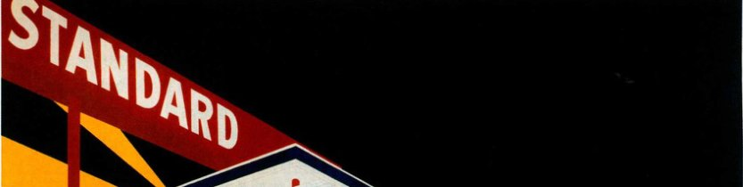

*图29.18 爱德华·鲁沙：《得克萨斯州阿马里洛市标准石油加油站》。1963年。布面油画，1.65 × 3.04米。新罕布什尔州汉诺威市达特茅斯大学胡德艺术博物馆 (Hood Museum of Art) James J. Meeker捐赠*

**英国波普艺术** 60年代早期波普艺术在美国出现，而在这之前其已经于50年代中期在伦敦崭露头角了。为了抗议当代艺术学院（Institute of Contemporary Arts）的保守传统，一小批艺术家形成了“独立小组”（Independent Group），旨在将当代生活带入当代艺术。战争造成了英国的经济衰退，而且几乎没有任何可以缓解局面的创作出现。因此，面对当时大批涌入伦敦的美国杂志，英国人更容易欣赏其中的名人宣传，以及家庭用具、汽车和住宅的广告。早在美国人之前，英国人就曾经着迷于领导美国社会的科学技术。独立小组在艺术家理查德·汉密尔顿（Richard Hamilton，1922-2011年）、爱德华·保罗齐（Eduardo Paolozzi，1924-2005年）和评论家劳伦斯·阿洛韦（Lawrence Alloway，1926-1990年）的领导下，接受美国大众文化，并在艺术中对其极尽赞美。

理查德·汉密尔顿运用柏林达达艺术家创造的拼贴技法（见第988页），并从漫画书、健美杂志和性感女郎杂志上剪切图像，创作了1956年的《什么让今天的家庭如此不同？如此诱人？》（Just What Is It That Makes Today's Homes So Different, So Appealing？，图29.19）。在这幅纸拼贴作品里，房间各处散布着录音机、电视机和太空时代的真空吸尘器。灯罩上装饰有福特汽车的标识，而咖啡桌上的火腿罐头俨然是一尊雕塑。举重者手里拿着一根棒棒糖，上面写着波普（pop）一词，这是阿洛韦选用的词语，声明这是一幅“波普图像”（Pop image）。与美国的波普艺术相比，50年代的英国波普艺术对大众文化持一种更为赞赏的态度。

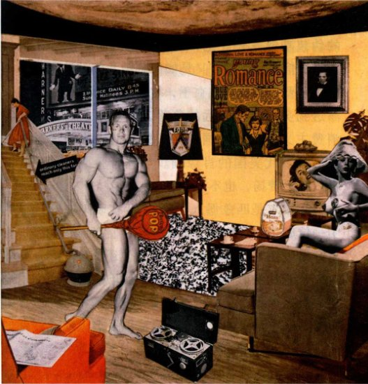

*图29.19 理查德·汉密尔顿：《什么让今天的家庭如此不同？如此诱人？》。1956年。纸面拼贴，26 × 24.8厘米。德国图宾根美术馆（Kunsthalle Tübingen），Zundel收藏*

## 50年代与60年代的形式主义抽象艺术

克莱门特·格林伯格（Clement Greenberg）是40年代最有影响力的艺术评论家，其影响一直持续到60年代。格林伯格为《国家》（The Nation）和《党派评论》（The Partisan Review）这两份杂志撰写艺术评论文章。他最初拥护波洛克的形式主义，但在40年代，他逐渐开始提倡一种全然抽象的艺术，一种针对色彩、质感、形体和构图等艺术媒介内在属性的艺术。这类作品强调媒介的形式主义或抽象性质，并认为除本身之外与任何事物都不相关。格林伯格的理论对画家、雕塑家和评论家思考艺术的方式产生了巨大影响。他的评论文章为50年代、60年代的后涂绘性绘画和极少主义艺术奠定了基础。

### 形式主义绘画

形式主义绘画（formalist painting）出现在抽象表现主义的全盛时期，即50年代早期；在很大程度上，这就是对抽象表现主义的回应。正如劳申伯格、约翰斯、卡普罗和波普艺术家抛弃了波洛克和德库宁的主观成分，形式主义画家也在追求一种无情感的艺术。他们将鲜明的动作笔触替换为光滑的平面，不留下艺术家手工或情感的任何痕迹。德库宁的抽象表现主义风格中具有推拉式的立体主义空间，而形式主义画家则取消了这种空间，着重强调画布的平面性，从根本上消除了所有空间感。在格林伯格的引领下，他们受到抽象表现主义形式发展的吸引，对其情感内容则完全不感兴趣。这些艺术家也接受了抽象表现主义创作巨幅作品的方式。该时期的形式主义抽象风格包括：后涂绘性抽象、硬边抽象和极少主义。

**海伦·弗兰肯塞勒** 格林伯格认为海伦·弗兰肯塞勒（Helen Frankenthaler，1928-2011年）是新形式主义艺术家之一。弗兰肯塞勒受到波洛克的启发，于将近1950年时开始在未经打底的画布上作画，而且只运用黑色颜料，让颜料充分渗透到画布之中，创造出光滑的表面效果，试图以此突破波洛克“滴画”（drip painting）的局限。她通过这种技法开始了一系列推演变化，并在1952年的突破性作品《山脉与海洋》（Mountains and Sea，图29.20）中成功发展出“染色绘画”（stain painting）。她当时刚刚从加拿大的新斯科舍省（Nova Scotia）返回，使用木炭在未打底的画布上迅速创作了暗示风景的构图。她的创作方式与波洛克相同，都将画布铺在地板上，然后再把稀薄的油画颜料倾倒在画布上，倾斜的画布使得颜料在其上流动，而通过改变画布的倾斜角度则可以描绘图像，没必要使用画笔。稀薄的颜料会渗入画布，与画布合为一体，并具有水彩的透明度。格林伯格赞赏其绘画的平面性，以及颜料那种不可触的特质；他还认为颜料本身的可触性具有立体性质，最终会导致空间的幻觉。格林伯格声称观众并不会感受到艺术家的双手，甚至是她本人的存在，并赞扬作品中与其“表现主义”性质相对立的无指涉“装饰性”。波洛克首先使用未经打底的画布，而弗兰肯塞勒则首创了使用稀薄、透明油画颜料的技法，这种方式在50年代和60年代促生出一批染色绘画画家，其中最著名的是“华盛顿色彩画派”（Washington Color School）。然而，弗兰肯塞勒的追随者与她本人不同，他们的作品具有彻底的抽象性，并不指涉任何事物。

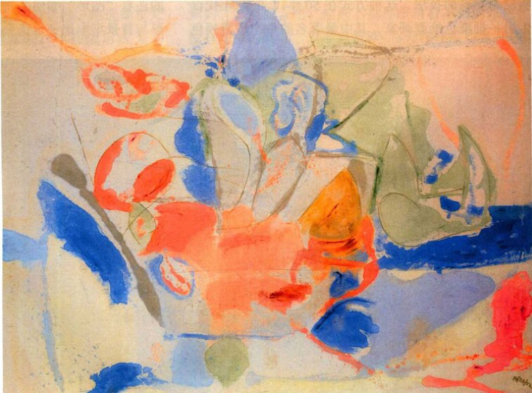

*图29.20 海伦·弗兰肯塞勒：《山脉与海洋》。1952年。布面油画与炭笔画，2.2x2.95米。艺术家个人收藏，长期出借给华盛顿国家美术馆*

格林伯格个人对弗兰肯塞勒的痴迷明显地让他对其作品中的抽象表现主义元素视而不见。现在，弗兰肯塞勒以及很多追随者都被视为后涂绘性抽象（Post-Painterly Abstraction）艺术家，这个词语指的是此类绘画抽象光滑且不露笔法的性质。但是在50年代和60年代，人们普遍认为弗兰肯塞勒属于第二代抽象表现主义者。正如作品标题所暗示的，《山脉与海洋》反映了她对新斯科舍省风景的体验。弯曲爆裂的构图所具有的能量似乎体现着自然本身令人敬畏的力量，而柔和透明的色彩与白色的无底画布则唤起了阳光的明亮炫目之感。尽管作品在本质上是抽象的，但其中还是充满了各种指涉形式，弗兰肯塞勒直至今日的作品中仍然可以见到这种特色。

**埃尔斯沃思·凯利** 1948至1954年间，埃尔斯沃思·凯利（Ellsworth Kelly，生于1923年）在巴黎发展出一种具有独特美国烙印的抽象绘画风格。在这些年间，他开始将绘画缩减为最为概括的简洁形式，某些评论家将其称之为硬边抽象（Hard-Edge Abstraction）。为了让自己的头脑从早年的艺术中解放出来，凯利以周围世界中的形式作为抽象的基础，他尤其注重负空间（negative space），例如桥梁下方的桥洞、阴影或者窗户。他的绘画中只使用若干几何形以及纯粹的原色和间色，对于形式如何在空间中移动、色彩如何相互作用这类问题进行探讨，同时关注的还有“图形”如何关联于“背景”。凯利通常都将图形与背景牢牢地锁定为一个单元，似乎在同一个空间的平面上并存共生。

在1963年的《红蓝绿》（Red Blue Green，图29.21）中，凯利将一个红色长方形和一个蓝色曲线形放置在绿色背景上。画面的左部似乎是稳固的，而右部则具有运动感。当观众站在这一宽达3.5米的巨幅作品之前时，会一时感觉到绿底色侵蚀着蓝色，而突然又会感到蓝色流入到绿色之中。换而言之，图形与底色之间的关系反转了。但是色彩的纯粹强度也决不容忽视，以这样巨大的画幅呈现时尤为如此。凯利的天才之处在于其简洁的方式，他将一切都剥离干净，其中也包括他自己的感觉，以此创作一幅关于色彩与运动的绘画。就这幅作品而言，他亲手创作了有关红、绿、蓝和运动的绘画作品。

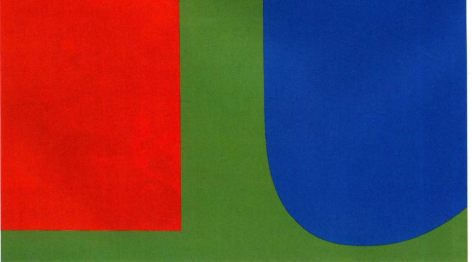

*图29.21 埃尔斯沃思·凯利：《红蓝绿》。1963年。布面油画，2.34x3.45米。加利福尼亚州圣地亚哥市拉霍亚地区（La Jolla）的当代艺术博物馆*

**弗兰克·斯特拉** 凯利从欧洲返回之时，另一位年轻艺术家弗兰克·斯特拉（Frank Stella，生于1936年）则开始了其在普林斯顿大学的学习。他选择在大学接受艺术教育，而非艺术学院，这在战后成为了一种相当普遍的现象。在毕业那一年，斯特拉来到纽约，并因其“黑色绘画”（black painting）而成为这里人们谈论的话题。他的黑色绘画曾在1959年纽约现代艺术博物馆的“美国艺术家16人展”（Sixteen Americans）上展出。这批作品是由黑色平行条带所构成的纯粹抽象作品，贯穿其间的白色细线其实就是画布本身。斯特拉不久后就开始运用色彩作画，并采用极其巨大的尺幅，1965年的《印度女皇》（Empress of India，图29.22）就是一例；后者宽达5.69米。受到约翰斯《三面旗帜》（见图29.11）内在平面性的启发，斯特拉也开始绘制纯平面的作品。

> **原始文献：弗兰克·斯特拉（生于1936年）**
>
> **普瑞特艺术学院讲座**
>
> 1959年，弗兰克·斯特拉在纽约普瑞特艺术学院（Pratt Institute）为学生们举行了一次讲座，他讨论了自己的绘画作品，之后就在现代艺术博物馆的“美国艺术家16人展”上展出。他特别阐述了在自己看来当时画家面对最为紧迫的形式主义问题：如何创作一幅与画面各部分之间关系无关的作品。
>
> 有两个必须面对的问题，其一是空间问题，其二则是方法问题。对于空间问题，我不得不处理一些关系绘画的问题，也就是平衡画面不同部分之间的关系。最显而易见的答案是对称关系，可以让画面各处都保持对称。但是问题仍然存在，那就是如何在深度空间里做到这一点。开放平面之上的对称图像或者结构一旦放入视幻空间，就不再是对称的了。我所找到的解决办法是，以一种贯穿始终的节奏来处理规则图案，将视幻空间从绘画中挤出去。当然可能还有其他方法，但是除了以上那种之外，我只知道如何运用色彩的强度来解决这个问题。余下的问题就只是找到一种颜料涂抹的方法，使之能够符合设计，并对其进行补充。我采用油漆技法和工具解决了这个问题。
>
> *SOURCE: PRATT INSTITUTE LECTURE, 1959*

在《印度女皇》中，不存在图形与背景之间的关系，也没有立体主义和抽象表现主义的推拉式空间。事实上，画面既无层次，也无构图，其中的V字形是决定性因素——四块绘有V字形的画布头脚相抵地拼在一起。斯特拉这样描述自己的作品：“你看到的就是你看到的。”换而言之，绘画不是你眼睛看不到的东西，没有隐藏的意味、象征或指涉。尽管将作品命名为《印度女皇》这样具有暗示性的标题，斯特拉仍希望自己的绘画被当作实体来看待，仿佛具有自己的独立生命，远离各种关联指涉（见第1057页的原始文献）。

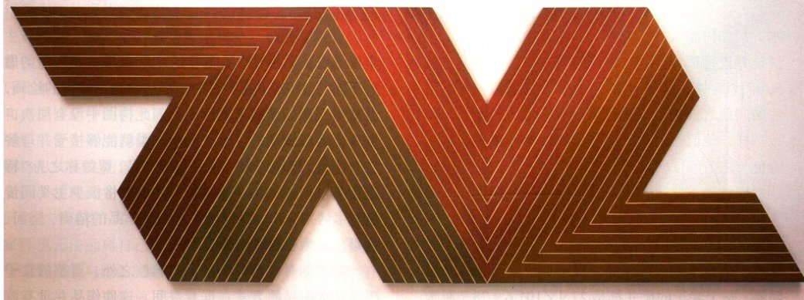

*图29.22 弗兰克·斯特拉：《印度女皇》。1965年。布面金属粉聚合乳胶画，1.96 × 5.69米。纽约现代艺术博物馆，S.I.Newhouse 爵士捐赠*

追随斯特拉的艺术家和评论家们肯定了这种抽象艺术的价值，因为其颇具发明新形式设计的能力，例如斯特拉本人就能够创造无空间感的完美平面绘画，以及创新性的画布形式。然而，此类作品的力量还在于其宏大的规模与强烈的运动感，V字形方向的改变创造出新的运动线条。由于斯特拉采用的艺术语汇极为简洁，而且经常以几何前提来决定构图，所以评论家们通常将这个时期的绘画称为极少主义艺术(Minimal Art)。

### 形式主义雕塑

60年代时涌现了一批雕塑家，其创作时大多使用一种数学或观念为前提，在雕塑领域实践斯特拉在绘画领域进行的工作。这种依赖几何性的新作品强调观念，而非情感内容，而且青睐批量生产的方式与材料。他们的雕塑作品后来被称为极少主义艺术。艺术家们通常不会亲自制作艺术品，而更愿意为工匠提供指令，由工匠来完成制作，这种方式其实更像是工厂的制作。与波普绘画一样，极少主义雕塑没有艺术家手工的痕迹，而这种痕迹在传统上被看作个人情感与表达的标志，同时也是艺术家技法完善程度的证明。然而在极少主义雕塑中完全没有艺术家的痕迹。进而言之，艺术家会采用非传统、非艺术的材料来创作艺术，例如树脂玻璃、荧光管、电镀钢和镁片等，继续对材料进行探索，所得的新材料在很大程度上造就了50年代晚期至60年代的艺术创作特色。艺术家所关注的问题之一正是创作看来不像艺术的艺术。与斯特拉一样，他们希望自己的艺术能被看作独立的物品，避免与之前的任何事物发生关联。

**唐纳德·贾德** 极少主义的特征在唐纳德·贾德（Donald Judd，1928-1994年）创作于1969年的雕塑《无题》（Untitled，图29.23）中展露无遗。这是一件由铜盒子制成的作品，雕塑家决定盒子的外形与间隔，每个盒子的尺寸都是22.9x101.6x78.7厘米，间隔为22.9厘米。这件艺术品基于数学前提创作，而非直觉或艺术感性，在这个方面与戴维·史密斯的做法不同（见图29.6）。贾德的作品仿佛是斯特拉的绘画，由基本元素的系列重复而成，因此构图中没有层次，也不会唤起观众的情感。观众一眼就能够接受并理解他的作品。雕塑成为一件真实的物品，贾德称之为“特定物品”（specific object），并以此将极少主义同传统艺术区别开来，而评论家则因其作品的精确、坚固、色彩、质感和规模而赞叹不已。

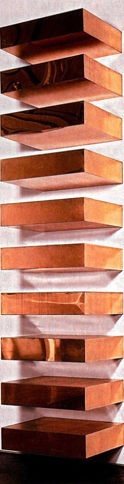

*图29.23 唐纳德·贾德：《无题》。1969年。十个铜盒子，每个盒子的尺寸为22.9 × 101.6 × 78.7厘米，间隔22.9厘米，整体尺寸为厘米。纽约古根海姆博物馆，Panza收藏，91.37.13*

除了具有“真实物品”的属性之外，贾德的盒子还以日常用品的方式占据着空间。这件作品并没有放在基座之上展示，也没有使用任何玻璃箱子为其提供保护。我们面对贾德的作品时，就仿佛面对一张桌子、一把椅子。通过抛弃声明某件物品是艺术品的各种特性，极少主义唤醒我们意识到了观看艺术的空间。换而言之，物品周围的空间成为了艺术品和艺术体验的组成部分。

**丹·弗莱文** 在极少主义者中，光雕塑家丹·弗莱文（Dan Flavin，1933-1996年）的作品最为严格地遵循了数学模式。他以运用常见的荧光灯创作作品而闻名，其雕塑中既有彩色光线，也有白光。弗莱文会在商店购买灯管，尺寸依次为61、122、183、244厘米。

尽管在插图中很难一睹作品的原貌，但弗莱文欺人眼目的简单作品实则壮观优美，即便只使用白色灯光时也是如此，例如《唯名论的三：致威廉·奥卡姆》（The Nominal Three [To William of Ockham]，图29.24）。光线向四周发散，其所具有的神奇特质产生出催眠的效果，令人心情平静，沉浸在其投射出的古典式宁静之中。对某些观众而言，这甚至是精神性的体现。然而，弗莱文的作品其实是严格的形式主义之作，几何前提决定了其形式，在此处则表现为一根灯管向两根、乃至三根灯管的过渡。作品中没有任何暗示的意图，但是弗莱文在作品完成之后，为其取了一个有暗示意味的标题。

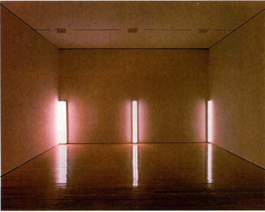

*图29.24 丹·弗莱文：《唯名论的三：致威廉·奥卡姆》。1963年。荧光灯固定装置与日光灯，每座高1.83米。纽约古根海姆博物馆，Panza 收藏，91.3698*

弗莱文的雕塑一般极其精简，只由一根白色或彩色灯管构成；有时他会将灯管垂直立在地板之上，有时则会以45度角斜放在角落。通过极少主义，艺术回到了“零点”，缩减为赤裸裸的本质，似乎已经无路可行。

## 多元的70年代：后极少主义

极少主义和形式主义抽象的冷静、客观特质在60年代中期的当代艺术中占据了主导地位，遮蔽了关注主观性和人物形象的其余艺术风格。即便是波普艺术都换上了无感情和机器制作的面貌。但是在60年代后几年里，确实出现了一种基于情感、人类、指示性和再现性题材的艺术形式。越战过程中，由民权运动引导了旨在挑战现状的社会变革，艺术家们在其中开始将形式主义抽象看作是对逃避现实的纵容。极少主义让那些现代先锋艺术家完全丧失了与社会的联系，回到了个人隐居的世界中。到了60年代中期，艺术家再也无法远离自己的情感，或是回避当时引起热烈争论的社会与政治问题。60年代晚期，美国艺术家开始将人的成分重新放进艺术，很多人都关注致使国家分裂的问题。对此的回应多种多样，艺术家们似乎在用无穷无尽的媒介来处理无穷无尽的问题。现在，很多艺术家都在创作暂时性或观念性作品，这些作品无法进行收藏，从而去除了艺术品内在的物质性。

虽然受到美学前提驱使，但这些艺术家依旧反映了60年代社会变革的反物质主义姿态。社会变革的主力军是女性、非裔美国人、拉美人和少数族裔，而这些人却被白人男性占统治地位的艺术机构普遍忽视，所以站出来抗议自己被排除出艺术界的现状。他们在博物馆门前示威，谴责这些机构的偏见；他们创作的艺术着重针对性别、民族、种族认同和性取向等问题，而博物馆的策展人与管理者们则认为这些创作并非主流，而且偏离了正确的美学观。正如印象派艺术家在100年前所做的那样，被剥夺了展览权利的艺术家开始成立自己的画廊，取代了博物馆的角色来展出作品。由于70年代的多元主义紧随极少主义之后出现，其在很多方面都可以看作对隐士美学的回应，而这十年间的艺术也被称为后极少主义（Post-Minimalism）。

### 后极少主义雕塑：几何与情感

某些后极少主义雕塑家保留了极少主义的几何性，但是几乎从不创作超然物外的朴素作品。恰恰相反，其作品中的几何形式承载了强有力的情感。

**伊娃·海瑟** 伊娃·海瑟（Eva Hesse，1936-1970年）是60年代杰出的后极少主义艺术家之一。但是她年仅34岁就因脑肿瘤病逝，而在其如此短暂的艺术生涯中，她所取得的成就着实令人震惊。海瑟出生于德国汉堡，为了逃避纳粹对犹太人的迫害随父母来到纽约，并在那里长大成人。海瑟的创作材料多种多样，而且非同一般，她甚至曾在气球表面上覆盖混凝纸（paper-mâché），之后再涂上丙烯颜料。海瑟作品的抽象形式全部基于几何原理完成。这些雕塑揭示了其成形的滴流、淤积、流淌、延伸和干涸过程，所以暗示了有机形式与有机过程，以及生长与性。1968年，海瑟开始使用玻璃纤维，这后来成为了她的标志性材料，但也可能是她罹患脑肿瘤的诱因。

《无题》（Untitled，图29.25）是海瑟的经典之作，而该作品的起点正是极少主义的几何形式。构成作品的四个长方形单元暗示着盒子，也暗示着画框中的绘画，因为其四边呈卷曲形式。与几何性相矛盾的是作品起伏、褶皱的表面与边缘，这将玻璃纤维变形为一种有机材质，尤其令人联想到皮肤。长方形中央两边向下垂有奇特的绳子状乳胶附着物，暗示了手臂与双腿，然而其只不过是抽象的元素，正如那四个长方形单元。这件作品里充满了矛盾，同时还呈现出有趣与恐怖、几何与有机、色情与可憎、抽象与所指的对立性质（见第四部分末尾的附加原始文献）。在海瑟的雕塑中，孱弱、厌倦、腐烂和衰老可能是最有力的品性，这在《无题》倾斜摇摆的“双腿”中得到了最好的表达。

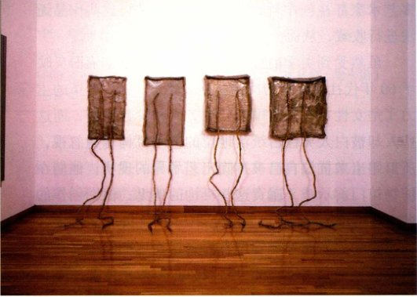

*图29.25 伊娃·海瑟：《无题》。1970年。玻璃纤维覆盖的金属网、布面乳胶与金属线（四组），整体尺寸为2.31 x 3.75 × 1.08米。爱荷华州得梅因市得梅因艺术中心（Des Moines Art Center）*

**理查德·塞拉** 同时期涌现出的雕塑家还有理查德·塞拉（Richard Serra，生于1939年），他也是海瑟的朋友。塞拉在一系列作品中就雕塑的属性展开探索，其中包括“过程艺术”（process art），即创作的行为本身就是艺术，例如将熔融的铅水猛浇在地板与墙壁接合的部分，这是一种杰克逊·波洛克式的行动雕塑，通过其产生的作品激烈有力，泼溅在墙壁与地板之上。这种艺术还促生了特定地点艺术（site-specific art），因为如果不对作品进行大量改变，就无法将其从创作的地方移开。

60年代晚期，塞拉所创作的物品变成了极其沉重的几何形铅块，围绕重力、恐惧，以及生与死等主题展开。在作品《角架》（Corner Prop，图29.26）中，一块重达数千公斤的巨大铅块被一根铅棍小心地支撑在墙角，此外再无他物确保这种微弱的平衡状态。这件作品与塞拉的大部分雕塑一样，传达出决不会让人误解的坍塌威胁，以及一种令人胆战心惊的危险气氛。在另外一件更骇人的作品中，塞拉将一块巨大的长方形铅板放在地板上，而将另一块铅板直接以直角角度悬挂在第一块铅板的正上方。他希望观众可以在铅板上走动，并从悬挂的铅板下走过。塞拉雕塑的外貌可能与极少主义艺术类似，但是其中充满了情节与情感。

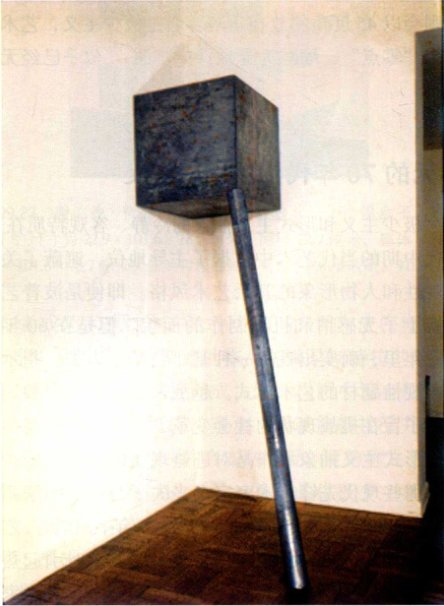

*图29.26 理查德·塞拉：《角架》。1969年。铅锑合金，盒子尺寸为63.5 × 63.5 × 63.5厘米，柱高2.03米*

### 大地艺术与特定地点艺术

60年代晚期，后极少主义美学的影响范围极其广泛，不仅完全超越了画廊的限制，甚至还摆脱了艺术界的束缚。很多作品都创作于无人居住的偏远地区。一些艺术家开始用大地、雪原、火山、闪电和深海海底场景创作雕塑，其作品通常是暂时性的，所以保存到现在的只有照片和图纸。作品中还经常具有强烈的几何成分，反映出极少主义艺术和硬边抽象的影响。但其他方面则相反，这些雕塑中普遍承载着各种指涉，包括环境问题、政治问题，以及关注存在性质的本体论问题。这一点可以在下面将要讨论的罗伯特·史密森以及克里斯托和珍尼-克劳德夫妇的作品中看到。

**罗伯特·史密森** 大地艺术（earthwork）是控制、处理自然环境的艺术，其中最著名的作品之一是罗伯特·史密森（Robert Smithson，1938-1973年）创作于1970年的《螺旋形防波堤》（Spiral Jetty，图29.27）。史密森是塞拉的朋友，他在60年代中期至晚期成为了纽约艺术界的名人，这要归功于他撰写的一些艺术文章，其中经常以环境论的方法来讨论土地与自然。他同时也创作“无地点雕塑”（nonsite sculpture），这些作品是由来自特定地点的岩石与石块所构成的“风景”，史密森将大多出自新泽西州周边地区的石头放在几何形的箱子、镜盒里，并置于画廊的地板之上。另外还有一幅地图或鸟瞰照片来展示真实地点的“风景”。史密森并没有绘制风景作品，而他也以貌似极少主义雕塑的形式再次呈现了真实之物。观众见证到的是土地的熵（entropy），是其稳步衰变，因为土地从一个地点被转移到了另一个地点。

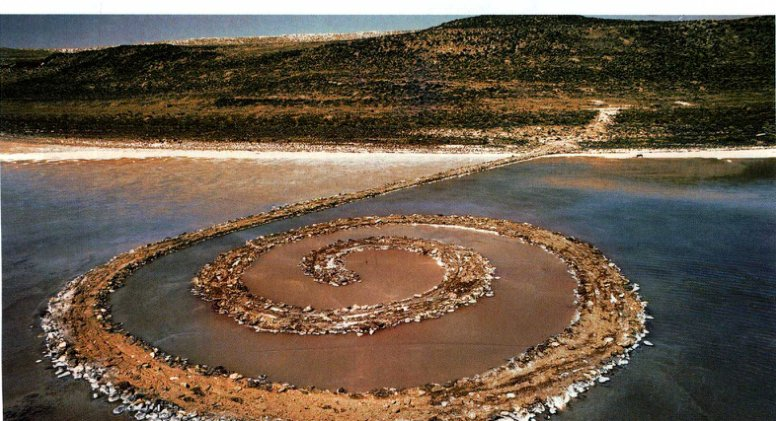

*图29.27 罗伯特·史密森：《螺旋形防波堤》。1970年。全长457.2米，宽4.572米。位于犹他州大盐湖*

与海瑟的雕塑相同，史密森看似极少主义的作品中充满了各种暗示与问题，在《螺旋形防波堤》中显得极为明显。这件作品长457.2米，宽4.752米，共动用了6650吨泥土、黑色玄武岩和盐水晶，后者堆放在防波堤的另一侧。作品位于犹他州大盐湖（Great Salt Lake）的一个偏远区域，看上去仿佛工业废墟，到处丢弃着生锈的废弃采矿设备。正如时间慢慢摧毁文明以及其他所有事物一样，防波堤最终也会在湖水的侵蚀下消失。而这段堤坝呈螺旋形，在原地围绕自身盘旋。其所拦截的微生物让湖水呈现红色，仿佛是史前文明的遗迹。《螺旋形防波堤》不仅是一个供人们欣赏的极少主义几形式作品，同时还是一座强有力的雕塑，运用时间作为自身的主要组成部分，讲述着万事万物的退降（熵）。

**克里斯托和珍尼-克劳德** 克里斯托（Christo Javacheff，生于1935年）是一位出生于保加利亚的美国艺术家。1958年，他在巴黎结识了珍尼-克劳德（Jeanne-Claude de Guillebon，1935-2009年），这位法裔美国艺术家后来成为了克里斯托的妻子与艺术合作者。克里斯托在巴黎时热衷于创造一种社会对话，通过挑动听众的方式促使其思考当下的世界。他与珍尼-克劳德曾用一批具有极少主义外观的大桶堵塞了巴黎的一条街道，阻止行人通过。在克里斯托最著名的创作中，他将未经确认的物品包裹在织物里，激起观众对其中物品以及艺术家行为动机的好奇心。1964年，这对夫妇移居纽约。克里斯托和珍尼-克劳德一起进行创作，他的目标是操控一个大型的环境或建筑。他们最初于1961年在科隆创作了一个小规模作品《包裹码头》（Dockside Package），后来又于1965年创作出大规模作品——二人在澳大利亚多岩石的海滩上，覆盖了929平方米的区域。从那个时候开始，这对艺术家又包裹了无数建筑和一座桥梁，并使用飘浮的织物环绕了11座岛屿，以这样的方式创作特定地点雕塑。

> **大事年表**
>
> 1952年 - 美国试验首个氢弹
> 1952年 - 海伦·弗兰肯塞勒创作《山脉与海洋》
> 1959年 - 法国新浪潮电影出现
> 1963年 - 丹·弗莱文创作《唯名论的三：致威廉·奥卡姆》
> 1969年 - 阿波罗二号宇航船登月

《奔跑的围栏》（Running Fence，图29.28）的计划在1972年形成，后来于1976年执行。这件作品看似极少主义艺术，因为其是由预制的精确部件组合而成，位于加利福尼亚州索诺玛县（Sonoma）和马林县（Marin）一处长达39.3公里的多山地带，延伸贯穿了特定的空间，尾端深入海洋。每段围栏均高5.5米，由固定在钢柱之上的织物构成。但是这件作品并不只是这些物品本身；在展示两周之后，艺术家会移除所有材料。作品实际上还包括了实现观念的整个过程：从与政府官员、土地所有者（多为大农场主）进行的冗长交涉开始，然后要雇用并监督大量的工人制造作品，之后还要进行拆除工作。整个过程历时4年，其中所遇到的最大障碍是当地居民的强烈反对。但是对话最终提升了人们对土地的认识；而且迫使人们去观看土地、思考土地，最终认识到土地在情感与美学上的价值。作品标题中使用了“围栏”一词，实际上提出了土地应该如何使用，应该为谁所用的问题。

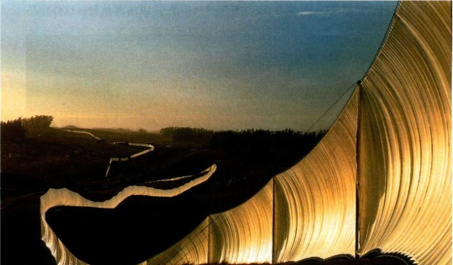

*图29.28 克里斯托和珍尼-克劳德：《奔跑的围栏》。1972-1976年。织物，5.48米x39.3千米。位于加利福尼亚州索诺马县与马林县*

装设工作完成之后，《奔跑的围栏》就彻底改变了当地的风景。围栏本身就像是驶过山丘与溪谷的一队航船。前来体验的人数可能有几十万之多。在反映这件作品的纪录片里，一位曾经反对安装围栏的农场主，向我们描述了他和儿子在某天晚上睡在围栏旁边的情景，他们聆听着围栏在风中的沙沙声，望着夜空中的星星，经历了一次具有改造性质的体验。其后，围栏被拆除了，什么都没有留下，除了对体验的记忆、送给土地所有者的织物，以及克里斯托为填补320万美元资金缺口而创作的几百幅素描；而全部资金都是由克里斯托和珍尼-克劳德夫妇先行支付。

> **艺术史家的观点**
>
> **研究不存在的对象**
>
> 到了70年代，艺术史家和评论家们讨论着当代艺术中的“艺术品非物质化”问题。这意味着艺术不再仅仅是某件物品了，艺术也可以是某种不能买卖的东西；也许是某种昙花一现的事物，只能在很短一段时间里被观看，这让学者和批评家难以对艺术展开研究、分析和讨论。艺术家们现在使用褶皱的纸张、放在火山口的面包，或者雪地上的图案来创作暂时性雕塑作品。很多创作暂时性艺术的艺术家都会运用摄影来记录他们的作品。照片本身成为艺术品，使得学者能够研究艺术家的创作。
>
> 还有一小部分艺术家几乎只运用暂时性媒介进行创作，而且并没有保存任何记录作品的照片、影片或者图纸。那么，学者并不了解其艺术生涯及贡献成就的情况也就不足为奇了，他们甚至可能是完全不了解。60年代出现的行为艺术家可能是最易受到攻击的一个群体（见第1049页）。以伊冯娜·雷纳（Yvonne Rainer）和罗伯特·惠特曼为例，他们在60年代的追随者甚多，对当时的艺术产生了巨大影响，但是今天却几乎被人们遗忘了。他们的行为作品也许只表演一次，也许持续几周，之后就完全消失了。在60年代期间，惠特曼的创作活动尤为引人注目。他将电影融入到行为艺术作品（见图29.13）之中，这是极其创新的手法，预示了将在80年代广为流行的录像装置艺术（见第1101-1102页，比尔·维欧拉）。与其行为艺术一样，惠特曼的装置也消失了，它们被拆卸下来放进仓库，并非像传统绘画和雕塑那样，可以提供供人们欣赏的机会。现在，惠特曼的剧场作品偶尔还会被搬上舞台；其中一件作品《剪平》收藏在纽约迪亚艺术中心，该中心还拥有作品的“乐谱”、服装的细节设计图和对于表演的指示说明。

## 观念艺术：作为观念的艺术

尽管早在20世纪的最初10年，法国艺术家马塞尔·杜尚就开始将观念作为艺术的焦点（见第970页），美国艺术家乔治·布莱希特也开始在50年代创作观念艺术作品，但是观念艺术（Conceptual Art）一词直到60年代才被人普遍使用。当时的很多艺术家逐渐在创作中强调观念，而非美学风格。当然，所有的艺术中都有观念，但是这些观念极其紧密地与艺术的形式属性关联，无法离开形式存在。在观念艺术中，艺术通常只作为观念存在，没有文字之外的视觉显现，而观念或信息可以通过一段文字、图表、地图或文献照片的方式来表现。除了纯属观念范畴的作品之外，还存在以视觉和美学为基础的作品，其中也蕴含观念性成分。以史密森的《螺旋形防波堤》为例，我们知道这件作品具有类似的元素，即缓慢消失的特质，然而这在1970年作品完成初始是不可能见到的。但是在观念艺术家看来，思想、观念或信息才是作品最强烈的属性。

**约瑟夫·科萨斯** 60年代末，越来越多的艺术家开始基于观念创作艺术作品。1970年，纽约现代艺术博物馆举办了一届题为“信息”（Information）的观念艺术展，并将“艺术提供信息与观念，而非美学”作为展览主题。展览的策划人是艺术家约瑟夫·科萨斯（Joseph Kosuth，生于1945年）。科萨斯本人最具特色的作品是创作于1965年的《一把椅子与三把椅子》（One and Three Chairs，图29.29），他在作品中结合了折椅的大幅明胶银版照片、真实的椅子，以及一张字典中“椅子”定义的照片。通过图像之外文字的使用，科萨斯向我们展示了其意图是多么理性、多么不具备美学观念。

这件作品成为了符号学的经典研究对象，而当时符号学对于大学和艺术界中的小部分人来说是个流行话题。在符号学的语汇中，真实的椅子是“所指”，照片则是指示某把特定椅子的“能指”，而字典的定义是理想化的非特定椅子。通过将一把椅子的三个不同版本以特定的方式排列在一起，科萨斯确定了内容，并引导观者去思考语言与意义的问题，而不是考虑美和表达等典型的艺术问题。在阅读椅子的定义时，我们会留意到定义旁边的真实椅子。如果那里并没有椅子，我们将很可能会联想到个人经验中的另一把椅子。如果我们只观看椅子的照片，可能会想到照片的主题并不必然是椅子，而是缺少某个坐在椅子上的人。标题也是作品的重要组成部分，同样负责为作品提供情境，暗示我们可以将这些椅子当作同样的椅子来看待，即看到一把椅子；我们还可以将其视为三把各具不同背景的椅子。换而言之，这件作品像极少主义一样，其中具有不掺杂感情的直接性，这既是美学观的视觉呈现，更是观念本身。最终，建构意义的任务落在了观众身上。

> **大事年表**
>
> 1970年 - 女性主义运动在美国发展普及
> 1970年 - 伊娃·海瑟创作《无题》
> 1971年 - 四名抗议越战的学生在肯特州立大学被杀害
> 1976年 - 克里斯托和珍尼-克劳德创作《奔跑的围栏》
> 1977年 - 首部《星球大战》上映

《一把椅子与三把椅子》中还体现了60年代中期出现的摄影新方法。摄影师们通常自己拍摄，并辛苦地洗印尺寸较小的照片，但是现在摄影已经不再是专业摄影师的专用媒介。装置艺术、大地艺术、行为艺术和观念艺术中都在使用照片，这些艺术家们运用艺术媒介创作的早期作品通常规模庞大。而他们现在拍摄作品的照片则洗印成相似的尺幅，准备与绘画一较高下。一般来说，这些艺术家并不亲自拍摄照片，也几乎没有人自己洗印。令传统摄影师最为震惊的是，他们经常将摄影与其他媒介结合在一起运用，像科萨斯的《一把椅子与三把椅子》那样，破坏了历史悠久的媒介同一性。

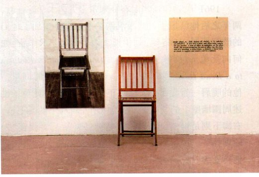

*图29.29 约瑟夫·科萨斯：《一把椅子与三把椅子》。1965年。木折叠椅、椅子照片、字典中“椅子”定义的放大照片，椅子尺寸为82.2 x 37.8 × 53厘米；照片板尺寸为91.4 × 61.2厘米；文字板尺寸为厘米。纽约现代艺术博物馆，Larry Aldrich基金会*

**约瑟夫·博伊斯** 德国观念艺术家约瑟夫·博伊斯（Joseph Beuys，1921-1986年）作品之中的观念异常复杂、丰富，几乎难以确定其艺术的本质。物品、图表、照片和行为极其紧密地相互关联在一起，其中任何一个成分都难以独立存在。博伊斯的创作以杜塞尔多夫为中心，70年代时许多世界一流的艺术家都居住在这里，其艺术景观可能仅次于纽约。博伊斯在发展此地的艺术氛围过程中发挥了重要作用。他的影响不仅激励了德国艺术家勇敢面对本国的纳粹历史，而且还鼓励他们重新发掘德国的浪漫主义传统，在艺术中注入精神性，正如20世纪早期的德国表现主义艺术家那样。

两个因素在博伊斯的艺术发展中起到了关键作用，其一是艺术家第二次世界大战中的亲身经历，他曾担任希特勒纳粹空军的飞行员；其二则是激浪派艺术家（见第1051页）1963年时来到了杜塞尔多夫。博伊斯将自己在二战中的一段经历描述成一个神话故事，他驾驶的飞机于1943年的暴风雪中被击落于克里米亚半岛，当地的游牧民族鞑靼人救了他一命，将他包裹在动物油脂和层层毛毡里以防他被冻死，而油脂和毛毡后来也成为了博伊斯大部分雕塑作品的基础材料。无论博伊斯战争时经历的情况到底如何，无疑对艺术家本人造成了极大创伤，他在40年代晚期进入杜塞尔多夫艺术学院（Düsseldorf Art Academy）之后不久，就消失在了德国乡间，专心在那里从事农业劳动，以清除自己的罪恶感与焦虑感。

1961年，博伊斯当时在杜塞尔多夫艺术学院任教，两年之后他结识了一些激浪派艺术家，并参加了他们的欧洲巡展。1965年，博伊斯表演了行为艺术作品《如何向死兔子解释绘画作品》（How to Explain Pictures to a Dead Hare，图29.30）。在3个小时的时间里，他的嘴唇一直在翕动，似乎正在向臂弯里的死兔子讲述周围墙壁上的绘画。绑在博伊斯左脚底下的是毛毡，右脚下则是钢铁，前者代表“精神温暖”，后者代表“强硬理性”。博伊斯的头上涂抹着蜂蜜和金色颜料，将他转变为一位萨满巫师；这里指一个运用巫术来治愈疾病的高级祭司，头上的蜂蜜则意味着生命力。这个神秘仪式一般的行为艺术作品向观众述说着传统绘画创作的毫无意义之处，而那正是必须得到解释的艺术；同时也传达了一种需要，运用一种更具精神性、更自然的沟通形式来替代绘画的需要，这种艺术的意味能够被观众感受到或者察觉到，而非理智上的理解。博伊斯创作这件行为艺术作品的目的在于创造一种魔术般的艺术，可以促使观众在自己的生命之中灌注精神性。任何观看过这个行为艺术的人都会为之着迷，过目难忘，即便他们也许并不能完全理解这个作品。而博伊斯的物品，例如座椅上堆放着油脂的破旧木椅子，也在以同样的方式感染着观众。

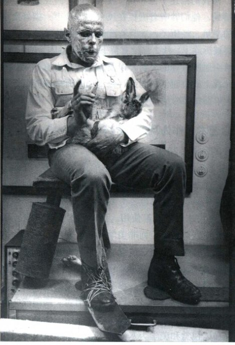

*图29.30 约瑟夫·博伊斯：《如何向死兔子解释绘画作品》。1965年。表演于德国杜塞尔多夫施梅拉画廊（Galerie Schmela）*

### 电视艺术：白南准

60年代早期，另一位韩裔音乐家、行为艺术家兼雕塑家白南准（Nam June Paik，1932-2006年）也在杜塞尔多夫加入了激浪派活动。白南准最初从事音乐工作，但在德国达姆施塔特（Darmstadt）师从约翰·凯奇学习作曲之后不久，他于1958年成为了一位激进的行为艺术家，探索各种非传统的艺术媒介。1963年，白南准在杜塞尔多夫生活，并在激浪派的项目中表演行为艺术，此时的他还开始运用电视机来创作艺术。白南准将电视称为“电子超高速公路”，声称这才是未来的媒介，并终身致力于电视媒介的创作活动。白南准后来移居纽约，在索尼公司推出低价位摄影机之后，他也经常创作录像作品。

白南准70年代之后的作品范围日益庞大、复杂，其中的典型作品就是创作于1995年的《电子超高速公路：大陆美国》（Electronic Superhighway: Continental U.S.，图29.31）。这件作品与大量电脑控制的录像频道连接，并由大量显示器构成，镶嵌在美国48个大陆州的霓虹灯地图之中。快速变换的图像分别与各个州相关，只有纽约州除外，因为代表这个州的显示器与纽约霍利·所罗门画廊（Holly Solomon Galler）的监控录像连接，这正是作品展示的场所，也是插图中照片的拍摄地。

在《电子超高速公路：大陆美国》中，白南准重申了电视在美国社会的盛行，并将电视与快节奏的持续讯号流一并呈现出来，后者是美国广播电视的典型特征。作品赞颂美国的通俗文化，不仅表现为霓虹灯和电视媒介的使用，而且也表现在录像所播放的美国史料之中。白南准告诉我们，电视即美国，电视实际上就是真实的生活，因为绝大部分美国人都在通过电视屏幕来体验世界。白南准并没有谴责这一媒介，在这一点上与激浪派艺术家的客观立场相抵触，他只是单纯地展示了电视界定当代生活的力量。

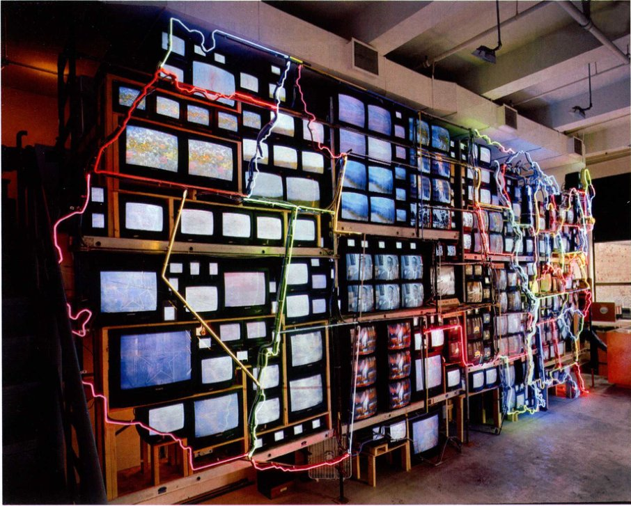

*图29.31 白南准：《电子超高速公路：大陆美国》。1995年。装置：47信道闭路电视录像、313台视频、录制有声音的激光影碟、钢铁架和霓虹灯，4.57 × 9.75 × 1.22米*

## 具有社会关怀的艺术

到此为止，本章所讨论的战后艺术家都不具有社会关怀。有些艺术家（比如利希滕斯坦和沃霍尔）表达了一定的社会关怀，却以一种颠覆性的方式将自己要传达的信息隐藏起来，使之不复清晰可见，对他们批评的群体更是如此。而一种反文化的氛围开始在先锋艺术界中盛行开来，与60年代晚期美国乃至世界范围内的社会变革并行而来，当时几乎没有创作政治艺术的艺术家了。到了70年代，针对社会问题的创作细流逐渐发展壮大，而且影响也极其巨大，社会问题在最近35年的先锋艺术中扮演了重要角色。具有社会关怀的艺术成为了70年代后极少主义艺术的关键组成部分。

### 街头摄影

并非所有人都能享受到50年代经济繁荣与科技进步所带来的利益。包括众多杰出摄影师在内的观察者们感觉到了美国社会的严重问题。部分受到沃克·埃文斯摄影作品的启发，他们将照相机对准了沉积在社会平静表面之下的不公正，而其作品通常被称为“街头摄影”（street photography）。他们享有拍摄这些照片的自由，因为摄影并没有被绘画和雕塑的现代主义美学观束缚手脚，而后者则提出了日益抽象且不具任何指涉的艺术要求。

**罗伯特·弗兰克（Robert Frank，生于1924年）** 或许算得上战后最著名的街头摄影师，他于40年代从瑞典移民美国。1955年，弗兰克前往美国各地，在日常公共场所里拍摄直率的非设定姿势照片，并发表在一本名为《美国人》（The Americans，1958年）的摄影杂记中。美国出版商认为他对美国的看法冷漠无情，弗兰克不得不来到法国寻找出版者。最终，美国版本于1959年发行，杰克·凯鲁亚克（Jack Kerouac，1922-1969年）为其撰写了导言；他是小说《在路上》（On the Road）的作者，“垮掉的一代”的代表人物。

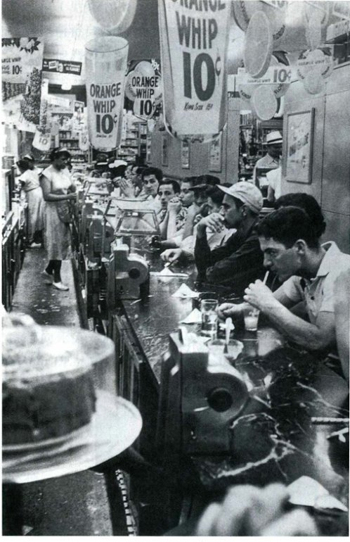

*图29.32 罗伯特·弗兰克《底特律杂货店》。1955年。明胶银版成像，27.9x35.6厘米*

与友人乔治·西格尔一样，弗兰克通过自己的作品来反映他对20世纪美国的异化和精神缺失的关注。《底特律杂货店》（Drug Store，Detroit，图29.32）是他表现美国空虚、异化和绝望面貌的经典之作。照片中大量醒目的广告让我们联想到安迪·沃霍尔的《坎贝尔汤罐头》，广告下有15位男子，买了橙汁奶油鸡尾酒等东西，每位顾客似乎都对他人漠然无视。在柜台的另一侧，为白人男性尽责服务的是非裔美国妇女，她们却只能赚取最低工资。正如前景中被密封在盒子里的蛋糕，这些女招待也似乎被密封在柜台之内，忙碌地服侍他人。炫目的日光灯照射在漆布、丽光板和塑料表面，令人联想到那个时代失去活力的效率与现代美学，而柜台里的自动点唱机则单调、整齐地排列着，正对顾客，似乎正在宣称“卖、卖、卖”这一美国商业精神的宣言。

与埃文斯、兰格和伯克-怀特不同（见第1019、1030-1031页），弗兰克尽量不让照片拥有精致的画面。他故意将照片洗印得模糊不清，颗粒明显，使得肮脏的黑色与白色形成鲜明对比。这些照片的粗糙、生硬透射出一股令人忧虑不安的潜流。我们可以感受到他在那些非正规场面前拍摄照片的速度；他在本能的驱使下，使用35毫米的单反相机拍摄了这一场景。照片拍摄于底特律市中心，但后来在60年代晚期的种族暴动中几乎全部被毁，想来也算并不出人意料（关于该时期另一位纪实摄影师，请见走近艺术第31页，李·弗里德兰德）。

### 非裔美国人艺术：种族认同

其他美国艺术家很快也加入了街头摄影师的行列，并开始创作一些60年代艺术界看来不可思议的艺术作品。他们大都抛弃了极少主义和抽象风格，转而创作针对美国困境与问题的作品，特别是有关于种族、民族背景、性别和性取向的作品。由于民权运动日益高涨，非裔美国人艺术家在创作基于其文化遗产的艺术方面受到了挑战。在大学与艺术学院里，他们和其他人一样接受抽象艺术训练。但是他们所处的社会群体迫使其创作出完全相反的艺术作品，即含有黑人因素的叙事性艺术。想要在这两点之间达到平衡，确实是一个挑战。

**罗马尔·比尔登** 1963年，一批在纽约活动的美国黑人艺术家组成了一个松散的小组，名为“螺旋”（Spiral），旨在支持民权运动。他们在比尔登（Romare Bearden，1911-1988年）的工作室聚会，比尔登是毕业于纽约大学的数学家兼哲学家，并于40年代逐渐成为了一名专业艺术家。1963年，马丁·路德·金爵士（Sir Martin Luther King）在华盛顿特区举行示威游行，受这一事件的影响，比尔登在螺旋小组之内提议进行一个集体项目，由所有成员联合创作一幅关于黑人身份的大型照片拼贴作品。虽然没有一个人愿意参与，比尔登还是独自完成了这个项目；利用从报纸杂志上裁切下来的图像制作拼贴作品，而这件作品也让他一举成名。

> **原始文献**
>
> **罗马尔·比尔登（1911-1988年）**
>
> **节选自1984年约瑟夫·雅各布斯（Joseph Jacobs）的访谈录**
>
> 罗马尔·比尔登谈论了拼贴对他如此重要的原因，以及他与爵士乐的关系。
>
> 拼贴吸引我的一个原因在于，可以让我进行快速创作，这是一种非常20世纪的态度。机器不断进步，现在又有了电脑，这一切都扼杀了人们的耐心。这是一个过于紧张的世纪，人们不可能再像凡·爱克那样进行绘画创作。很多现代的超级写实主义绘画看起来都像凡·爱克的作品一样细致入微，其实是艺术家使用了照片或者幻灯片的缘故，其将图像投射在画布上，然后再比照着画。拼贴更多地是在于剪切，而非实际上画某些东西。这是一种更加直接的获得图像方法，只要剪下来放在一起就可以了。
>
> 媒介的物质性并非吸引我创作拼贴作品的原因。而且我本人也不认为拼贴可以作为抽象表现主义的延伸。与之相反，我会在立体主义的情境中构思拼贴作品。如果我和抽象表现主义有什么争执的话，那么可能是空间的自然主义问题。如果在画布的某个地方画上一大片蓝色，在另外的地方画上橙色，那么你就画出了阳光，这是自然主义的空间与光线。我更愿意将事情向前推进，并非仅仅出于创作立体主义作品的原因，而是要创作平面的绘画，不用深度和透视的技巧来愚弄人们的眼睛。而在平面上进行拼贴恰好使我达到了这个目的······
>
> 你可以在我的作品与爵士乐之间找到类似之处。就像你刚才所讲的，在作品创作之先有一种精神，和作品一起发展演变，类似于演奏爵士乐时的即兴创作······（爵士乐）具有韵律成分，同时也有间歇。当你听厄尔·海因斯（Earl Hines）的钢琴演奏时，真正重要的是琴键敲响之间的寂静······间歇的重要性还体现在婚礼上所扔的五彩纸屑，其让人眼花缭乱，但真正让这一切发生的是纸屑之间的空间。
>
> *SOURCE: FROM SINCE THE HARLEM RENAISSANCE: 50 YEARS OF AFRO-AMERICAN ART. (ORGANIZED BY THE CENTER GALLERY OF BUCKNELL UNIVERSITY, 1985.)*

比尔登拼贴作品的构图方式基于立体主义，正如1964年的《宗教仪式的流行：洗礼》（The Prevalence of Ritual: Baptism，图29.33）那样，但其主题具有独特的非裔美国人特质。比尔登在北卡罗来纳州的夏洛特市长大，之后才移居纽约的哈莱姆区。他作品中断裂的图像向人们展示了一场洗礼，反映出宗教在黑人文化中的重要性。人物的面孔不仅传达了黑人的相貌特征，而且在某些情况下还暗示着非洲面具。这件作品的作用在于追寻美国文化中的非洲来源，并巩固仪式与社群的重要地位。拼贴构图的切分方式率直、粗野，甚至具有即兴创作的特点，似乎与该时期的黑人爵士音乐家有关，例如查理·帕克（Charlie Parker）和约翰·柯川（John Coltrane，见第1067页的原始文献）。比尔登作品的力量在于其将大量信息与能量集中在一幅图像之中的能力，并使得作品中处处都洋溢着非裔美国人经历的活力与本质，雅各布·劳伦斯的小幅蛋彩画也具有同样的力量（见图28.54）。

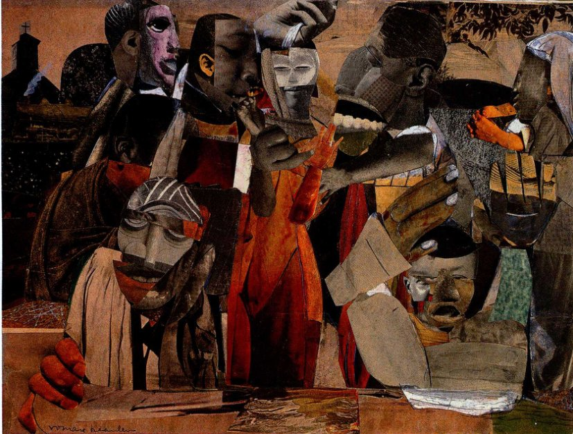

*图29.33 罗马尔·比尔登：《宗教仪式的流行：洗礼》。1964年。光化学图像拼贴、合成物、纸版铅笔画，23.2x30.5厘米。华盛顿特区史密森尼学会的赫斯肖恩博物馆与雕塑园，Joseph H. Hirshhorn捐赠，1966年*

**迈尔文·爱德华兹** 几乎与比尔登同时，迈尔文·爱德华兹（Melvin Edwards，生于1937年）则采用了一种截然不同的方式来反映其种族背景。爱德华兹在得克萨斯州的休斯敦长大，后来到洛杉矶的南加州大学学习焊接钢材雕塑。南方对于黑人滥用私刑的消息令其愤怒不已，但是这种现象随着破坏民权运动的三K党活动而日益恶化。1963年，爱德华兹开始创作其系列浮雕作品，题名为《私刑碎片》（Lynch Fragments，图29.34），将铁链、长钉和野蛮的金属碎片结合起来，所有部分都被涂成棕色调，并且涂上油来防止生锈。

爱德华兹现在已是一名纽约居民，但他的创作主题一直没有更改。虽然其作品并没有固定的解释，但让我们切实感受到压迫、奴役、暴力、愤怒和肤色。这些似乎也在暗指非洲雕塑（艺术家否认了这一点）和宗教仪式，作品大胆的正面表现形式也展示出对抗与尊严。这些在本质上具有抽象属性的作品为各种解释提供了可能，我们也可以将其看作一种自传体创作。在《私刑碎片》系列的很多作品里都出现了马蹄铁，这正是来自艺术家在叔叔休斯敦城外农场参观的回忆。与同时期的极少主义艺术相比，爱德华兹的政治性与表现性艺术呈现出截然不同的面貌。

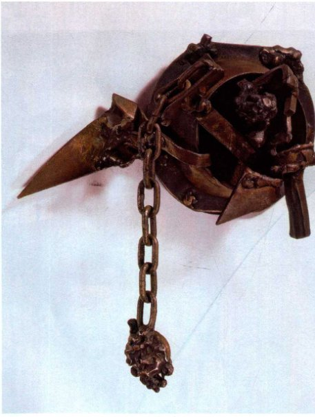

*图29.34 迈尔文·爱德华兹《私刑碎片：某个明媚的早晨》。1963年。焊接钢材，36.2 × 23.5 × 12.7厘米。艺术家个人收藏*

**大卫·哈蒙斯** 大卫·哈蒙斯（David Hammons，生于1943年）在60年代晚期崭露头角，而艺术界一般将其当作一位离奇古怪的行为艺术家。其作品不仅安放于非裔美国人社区，还出现在博物馆和艺术画廊中。在1982年的晚期作品《更高的目标》（Higher Goals，图29.35）里，我们可以看到杜尚式的幽默；这件作品最初安放在哈莱姆区，而此处的照片则拍摄于布鲁克林。作品最初的灵感来自艺术家邻里的青少年，他们在本该上课的时候打篮球。这些青少年仿佛在告诉艺术家，体育才是通向成功之路，而教育并不是。

《更高的目标》由高达12米的篮球筐构成，其上装饰有风铃；篮筐仿佛精神捕手一般，排列成彩色几何图案的瓶盖则暗示非洲艺术题材与设计。正如标题所示，作品表达了设置与非现实目标对立的更高现实目标，前者可能意味着成为职业篮球运动员，而后者则是接受教育。作品中鲜亮的装饰物具有仪式，甚至图腾的性质，提出了这样的问题：人们应该尊敬什么？祖先的精神应该置于何处？

哈蒙斯的作品显然是幽默的，也是引人思考的，但它们也很“酷”地与邻里、在邻里之间进行着某种交流。与此同时，作品还满足了艺术界的最高要求，尽管这一点对于这位关注社会事务的艺术家而言，只不过是次要的考虑。

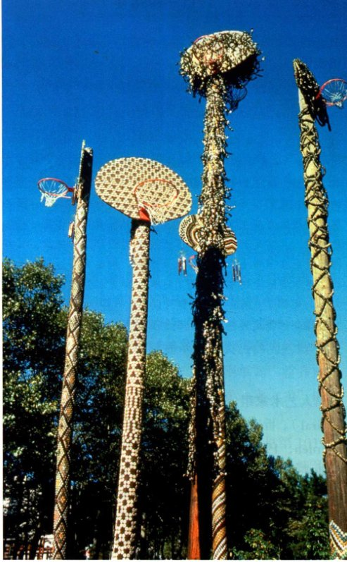

*图29.35 大卫·哈蒙斯：《更高的目标》。1982年。木柱、篮球筐、瓶盖等物品，高12.19米。装置展示在纽约布鲁克林，1986年*

### 女性主义艺术：朱迪·芝加哥与性别认同

贝蒂·弗里丹（Betty Friedan）于1963年出版的《女性的奥秘》（Feminine Mystique）标志着女性主义运动的开端。一批女性艺术家几乎同时开始了针对妇女问题的艺术创作。南希·斯佩罗（Nancy Spero，1926-2009年）就创作出了简单却异常有力的表现主义图画，描绘女性所遭受的暴力对待；而米米·史密斯（Mimi Smith，生于1942年）则首创了现在所谓美国“服装艺术”（clothing art），并创作极少主义风格的物品，例如1966年的《紧身褡》（Girdle）。其完全由橡胶防滑垫制成，揭露了女性衣着的不适。

> **大事年表**
>
> 1957年 - 杰克·凯鲁亚克的《在路上》出版
> 1959年 - 菲德尔·卡斯特罗执掌古巴政权
> 1963年 - 贝蒂·弗里丹的《女性的奥秘》出版
> 1968年 - 民权领袖马丁·路德·金爵士遭到暗杀
> 70年代 - 女权主义运动在美国发展壮大
> 1973年 - 美军撤离越南
> 1979年 - 朱迪·芝加哥创作《晚餐会》

在女性主义运动的背景下，《晚餐会》（The Dinner Party，图29.36）可能是其间最著名的作品。朱迪·芝加哥（Judy Chicago，生于1939年）组织了作品的创作工作——由400余名女性在1974至1979年间完成。60年代晚期，芝加哥是一位具有献身精神的女性主义者。70年代早期，她在弗雷斯诺的加利福尼亚州立大学发起了一个女性主义艺术项目，这也是首个女性主义艺术项目。之后不久，芝加哥又与艺术家米里亚姆·夏皮罗（Miriam Schapiro，生于1923年）一起，在巴伦西亚的加利福尼亚艺术学院发起了第二个类似项目。这些活动的本质在于鼓励女性，针对性别问题创作艺术，而艺术界以及大学、艺术学院的科系都认为这是芝加哥无法完成的任务，因为这些作品并不符合现代主义形式主义的美学规范，这也就表示其并非严肃艺术。女性主义艺术项目旨在为女性艺术家提供支持，并重新界定当代艺术中的美学观。

《晚餐会》反映出芝加哥个人的转变，从创作极少主义抽象物品与绘画的艺术家转变为以多种媒介和装置，并针对女性问题进行创作的艺术家。这件作品向众多女性献上了敬意，芝加哥认为她们被历史忽视、贬低并省略了。她不辞劳苦地研究这些被遗忘的人物。芝加哥设计了一张可以容纳39个人的三角形桌子，每一边都可以坐13个人，而每一个位子都在于赞颂一位重要女性，从古代女神一直涵盖到20世纪的偶像，例如乔治亚·奥基夫。此外，还有919名女性的名字被镌刻在白色地板砖上，覆盖了三角形桌子内部的地面。每个座位上都放置着一块手制瓷板，以不同时代的风格绘制出阴道的图像。以美国诗人埃米莉·迪金森（Emily Dickinson）的座位为例，她的生殖器官周围为蕾丝花边环绕，而法国王后阿基坦的埃莉诺（Eleanor of Aquitaine）的生殖器周围则是百合花。每个座位下都各有一块做工精细的绣花地毯，其风格也与各自所属的时代相对应。

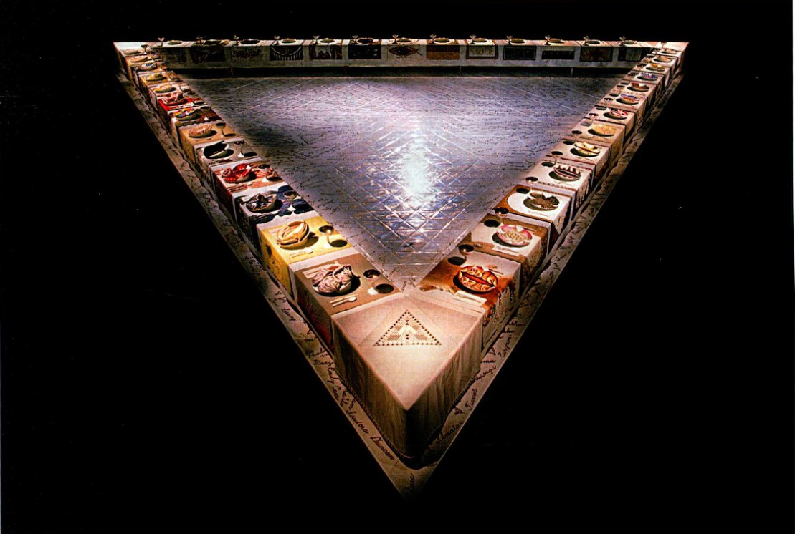
*图29.36 朱迪·芝加哥《晚餐会》。1979年。混合材料，0.91 × 14.63 × 12.8米。纽约布鲁克林艺术博物馆*

芝加哥没有像男性艺术家创作环境艺术时那样使用推土机、链锯、起重机和焊接设备，而是有意地采用了与女性相关的媒介，例如彩绘瓷、陶器和绣花。她成功创作出了一件优雅、美丽的作品，同时又通过精妙的手法使其具有了宏大的规模，甚至横跨一千年的历史。作品中还呈现出一种群体感与仪式感，因为我们感觉到，芝加哥仿佛将最后晚餐这一基督教男性题材挪用，并转变成为女性的精神圣餐。

## 晚期现代主义建筑

现代主义建筑在第二次世界大战之后得以稳健发展，美国的情况尤为如此；而之前这里则偏好传统主义建筑，例如哥特式风格的摩天大楼，这在前一章中已经讨论过了（见第1020-1021页）。但是现在的现代主义建筑只是一种外观或风格，其已经不再像风格派和包豪斯的盛期现代主义建筑那样（见第1007-1012页），也脱离了构成生产主义的艺术与设计定式（见第1005-1007页），而是充满了乌托邦式的理想和革命的热忱，力图改变世界。然而，这个时期某些最具影响力的建筑仍然出自杰出的早期现代主义和盛期现代主义建筑师之手，其中包括赖特、米斯·凡德罗和勒·柯布西耶。凡德罗继承了国际风格的美学观，擅长设计轻盈、飘浮的几何式建筑，其上还装设有简洁轻薄的玻璃幕墙。而弗兰克·劳埃德·赖特、勒·柯布西耶以及后来发迹的费城建筑师路易斯·康则发展出一种雕塑性建筑，强调团块与建筑的物质存在，而且也不为作品中的指涉含义担心。

### 国际风格的持续：路德维希·米斯·凡德罗

战后的晚期现代主义建筑发展为玻璃盒子，并如雨后春笋一般在城市中心拔地而起，点缀着美国城市的环城路，这种情况从60年代和70年代开始日渐明显。玻璃盒子成为公司总部必不可少的形象，贝聿铭（I.M.Pei）和亨利·N·科布（Henry N. Cobb）设计的波士顿约翰·汉考克中心（John Hancock Center，1977年），斯基德莫尔（Skidmore）、欧文斯（Owens）和梅里尔（Merrill）设计的芝加哥西尔斯塔（Sears Tower，1974年）均是如此。如果我们要选择一座可以代表晚期现代主义的摩天大楼建筑，那应该是凡德罗设计的纽约西格拉姆大厦（Seagram Building，图29.37）建于1954至1958年间，内部装潢由菲利普·约翰逊设计完成。模仿该建筑的作品遍及全世界，但是这些仿作几乎都难以企及凡德罗所达到的程度，也难以接近他“少即是多”的美学观。

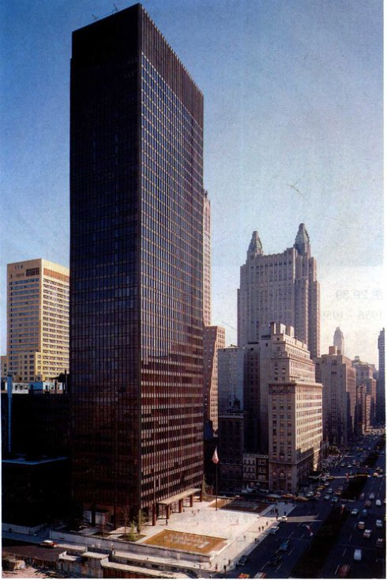

*图29.37 路德维希·米斯·凡德罗和菲利普·约翰逊：纽约西格拉姆大厦。1954-1958年*

我们能够在西格拉姆大厦中感受到极少主义的姿态。凡德罗开始将建筑从城市环境中移出，于是就将这座39层的大楼建在高于街道地平线的广场上。广场简约而华丽，由粉色花岗岩铺成，其中还有两座浅水池，对称分布在建筑两侧，广场四周则环绕有一道低矮的蛇纹石大理石墙。玻璃与青铜建成的轻盈建筑坐落在底层架空柱柱廊之上，使得第一层的空间完全开放，而且包括石材在内的每一个细节都具有精致的比例，给人以完美优雅之感。希特勒掌控德国政权之后，凡德罗加入了拉斯洛·莫霍利-纳吉在芝加哥成立的新包豪斯学校，因此西格拉姆大厦还表现出芝加哥学派的影响，强调建筑的网格骨架结构。为了表达与网格结构功能主义的渊源，凡德罗在窗户之间使用了I形梁作为竖窗棂，有效强调了建筑的垂直感，水平间距的比例极其完美地与顶部和底层的薄屋檐相制衡。建筑内外都采用了奢华且完美和谐的材料，更为建筑本身的精妙比例添光增彩。

### 雕塑性建筑：具有意义的团块

凡德罗的建筑作品在本质上没有任何指涉内容，有如极少主义雕塑一般。然而，同辈建筑师弗兰克·劳埃德·赖特和勒·柯布西耶则将晚期现代主义建筑带上了不同的道路。他们的建筑即便尚不能算是带有彻底的表现主义风格，也包含了指涉的有机形式。这些作品都是水泥浇筑而成的厚重建筑，具有强大的雕塑感。

**弗兰克·劳埃德·赖特** 与西格拉姆大厦同时，赖特设计了曼哈顿以北50个街区的古根海姆博物馆（图29.38）。这座建筑将不同的样式发挥到了极致，虽然带有几何性，但并不是毫无指涉含义的机械式网格结构，而是由曲线占据主导的有机形式。这座建筑由水泥浇筑而成，显得沉重、庞大，具有雕塑感。螺旋形的建筑以蜗牛壳为基本形式，实质上内部只有一个巨大的空间（图29.39）。赖特的目标是脱离稳定的长方形画廊样式，创造一种全新的景观体验。他希望观众可以乘坐电梯来到顶层的巨大“花瓶”，之后再沿着螺旋形坡道漫步而下。坡道呈现受重力牵引而自然下降的样子，坡度为3度。由于坡道狭窄，观众与艺术品之间的距离不会太远，因此就形成了与艺术品间的亲密关系。而螺旋形坡道也让人无法回顾已经走过的地方，也无法预览将要到达的地方。

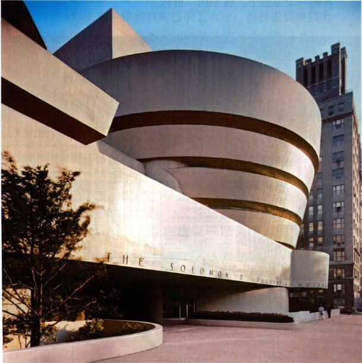

*图29.38 弗兰克·劳埃德·赖特：纽约古根海姆博物馆。1956-1959年*

这种运动感，或者说持续的流动感，以及建筑本身的膨胀与收缩，形成了凹凸曲面之间的韵律交响，这也是该建筑的特色之一，图29.39就很好地体现了这一点。坡道的宽度也在逐渐改变，形成了另一个膨胀收缩的形式。为了增强有机感，赖特还在建筑里融入了日光与水体，建筑顶部开有一扇巨大的天窗，天窗正下方的地板上则是一个水池。古根海姆博物馆的参观者在其中体验着旅程与冒险，因为每个人都聚集在同一个屋檐下，属于同一群体。

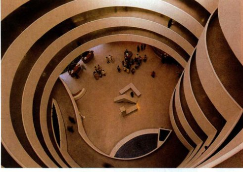

*图29.39 弗兰克·劳埃德·赖特：纽约古根海姆博物馆内景。1956-1959年*

**勒·柯布西耶** 与赖特相同，勒·柯布西耶晚期的建筑作品也具有十分突出的雕塑感。在1947年的马赛公寓区（图29.40）建筑项目中，勒·柯布西耶得以将自己理想的公众集合住宅（Mass Housing）的观念发展起来，将建筑构想为一个自足的社区环境。可以说他是在钢筋混凝土结构之中嵌入了预制公寓，共有23种户型，仿佛“酒架上的酒瓶”。其中两个楼层内开设有商店和饭馆，甚至还有一家旅馆，而楼顶上则安装着体育设施，还有一家儿童保育中心。然而在美学方面，这座建筑与萨伏伊别墅相去甚远（见图28.39）；此处并没有飘浮的空间与薄墙，只出现了鲜明的体量与混凝土的粗糙质感。由此就不难理解这种晚期的表现主义风格有时也被称为“粗粝派”（Brutalism）的原因，这种建筑风格具有醒目的低矮厚重形式、混凝土的粗糙外表，或者金属未完成时的粗糙表面，以此赋予了建筑功能性的工业化外观。底层架空柱廊打开了这一层的空间，变形为活生生的有力双腿，勒·柯布西耶还将其与女性大腿的曲线美联系在一起。每间公寓都有一座纵深的阳台，在美学上增加了雕塑感，而在功能上为下个楼层提供了遮蔽，因为墙壁是由实心玻璃建成的。这些阳台叫做“遮阳板”（brises-soleil），日后成了热带地区标准的建筑样式。

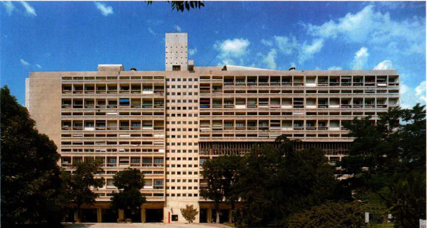

*图29.40 勒·柯布西耶：法国马赛的公寓区。1947-1952年*

法国朗香教堂（Nôtre-Dame-du-Haut，Ronchamp，图29.41）是勒·柯布西耶雕塑性建筑的杰作，建于1950至1955年间。建筑内部的空间十分简单，只有一道长椭圆形的中堂，外部则呈现各种斜面与曲面变化。混凝土覆盖的墙体厚重庞大，混凝土浇筑的空心屋顶尽管看起来飘然欲飞，其实同样沉重无比。参观者可以从墙壁上的裂缝进入小教堂，就仿佛从礁石的裂缝间滑进滑出。突出的立面令人联想到船首，而屋顶则像是船身，暗示诺亚方舟和圣彼得的渔船等救赎的化身。但是这些形式也可以表示修女的风帽、祈祷的双手和教堂尖顶。小教堂左右两侧的垂直塔楼式结构仿佛是附近卡纳克史前遗址的巨石墓葬（见图1.24）。原始的感觉一直延伸到洞窟一般的建筑内部，天花板的高度从祭坛上方的9.5米急剧地下降到内部中央的4.7米。微弱的彩色光线透过厚墙上的彩色玻璃进入，温柔点亮了内部空间，并赋予其一种神秘的氛围（图29.42）。撇开宗教不谈，任何来参观朗香教堂的人都会被传送进入一个神秘、奇幻的国度。

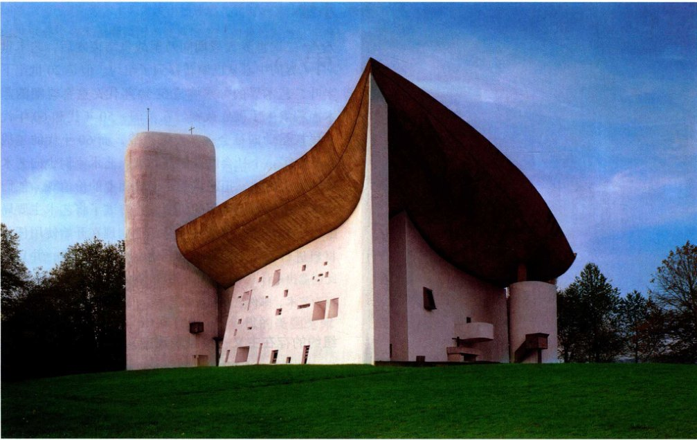

*图29.41 勒·柯布西耶：法国朗香教堂，东南面观。1950-1955年*

> **大事年表**
>
> 1945年 - 联合国成立
> 1950-1955年 - 勒·柯布西耶设计朗香教堂
> 1961年 - 砌筑柏林墙
> 1962年 - 路易斯·康设计孟加拉国家议会大楼
> 1975年 - 个人计算机出现

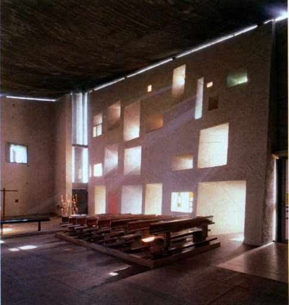

*图29.42 勒·柯布西耶：朗香高地圣母礼拜堂内景*

**路易斯·康** 路易斯·康（Louis Kahn，1901-1974年）是一位难以定位的艺术家，他曾先后被归类于表现主义、粗粝派和“原始后现代主义”（Postmodernism）派别之中。他在50岁之后终于找到了自己的建筑语言，而这主要归功于他1950至1951年间在罗马美国学院（American Academy）的经历。从埃及的金字塔到古罗马浴室与水渠，再到雅典卫城，他在那里认识到地中海古代建筑的重要性与力量。这些建筑具有鲜明的雕塑形式与纯粹的几何特质，让人感受到超越时间的宁静与古典的辉煌，这也成为了康建构其现代主义美学观的基石。50年代末，康发现了勒·柯布西耶晚年的表现主义和粗粝派风格，康曾这样说过：“他是我的老师，尽管他本人对此并不知情。”康抛弃了国际风格利用薄墙对轻盈体量的强调，他设计的建筑作品浑厚沉重，让人联想到古代文明，似乎具有不受时间侵蚀的特殊能力。

康在1962年设计了孟加拉首都达卡市（Dacca）的国家议会大楼（National Assembly Building，图29.43），这座钢筋混凝土建筑体现了其设计风格。议会大厅位于建筑中央，四周呈环状分别环绕有会议室、新闻办公室和清真寺，其中用未加屋顶的走廊将各个部分区分开来，创造出一座阳光充溢的城池。宏大的三角形、长方形和圆形空间刺穿了每层建筑环的厚重墙壁，让阳光得以射入，在实质上完成了空间的建构。整体建筑群仿佛是一座堡垒，外墙具有古代的崇高感，然而其功能却与勒·柯布西耶的遮阳板一样，旨在遮挡印度次大陆的强烈阳光。我们将会在下一章中看到，康具有指涉含义的建筑将在日后启发下一代建筑师。

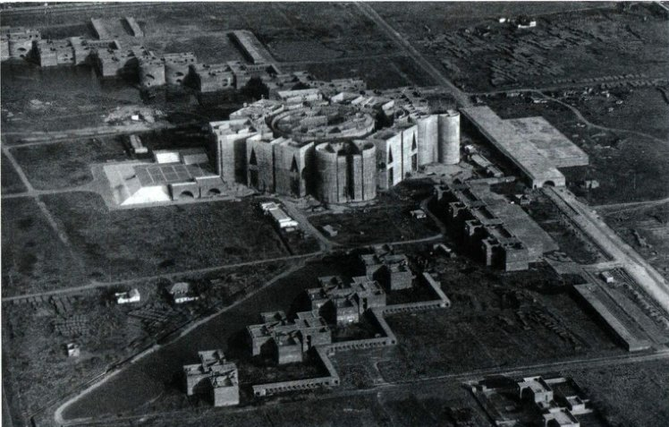

*图29.43 路易斯·康：孟加拉首都达卡市国家议会大楼。1962年*

## 小结

第二次世界大战期间乃至战争结束之后，艺术世界的中心从巴黎转移到了纽约。但是20世纪下半叶，艺术界的分水岭是在50年代，这个时期的艺术面貌发生了彻底改变。在美国，50年代和60年代的民权运动向社会现状发起挑战，而60年代的越战则开启了一个社会剧变的新时期。艺术家们也向艺术现状发出挑战，拒绝接受任何表面上的价值观。他们质疑艺术如何起作用的机制，并打破了将艺术主要局限在绘画和雕塑领域的壁垒。他们现在开始使用任何材料进行创作，其中包括词语、大地和垃圾，并且以此创造出不计其数的艺术新形式，例如环境艺术、大地艺术、行为艺术、邮件艺术和观念艺术。

### 纽约的存在主义：抽象表现主义

抽象表现主义是战后第一个重要风格，于40年代晚期出现在纽约。阿希尔·戈尔基的超现实主义作品则是通向抽象表现主义的桥梁，后来这种风格又发展为杰克逊·波洛克和威廉·德库宁的动作绘画。波洛克喜欢将颜料用力泼溅在画布上，以此令身体行动成为了绘画的中心，也成为对于人类境遇的隐喻。德库宁以类似的方式，通过运用大胆的表现性抽象手法创作具象绘画，作品所表现的主题多为女性。

抽象表现主义的另一个分支是色域绘画，即运用大幅色彩平面来表现与宇宙力量相连的原始性质。马克·罗思科、巴内特·纽曼等色域画家的目标与抽象表现主义艺术家一样，都想投射出他们所感受到的极端的人类境遇。

战后的先锋艺术家同样沉浸于存在主义哲学之中。诸如戴维·史密斯等艺术家发展出抽象形式的构图；而路易丝·内维尔森等艺术家则保留了超现实主义的象形符号，但是作品规模也开始日渐庞大。

### 欧洲的存在主义：人物表现主义

很多欧洲艺术家都抵制美国文化的控制与抽象表现主义的优势地位。有些人发展出自己的方式，解答在艺术中表现人类存在孤独感的问题。这些艺术家拒绝纯粹的抽象，而是青睐于人像创作，使得他们得以张扬个体在宇宙中的位置。法国画家让·迪比费相信未经训练的艺术家与宇宙能量的联系更为直接，而他也着重对生涩艺术进行探索。与之形成对照的是英国艺术家弗朗西斯·培根，他内观自身，描绘来自个人生活的邪恶场景，创作出具有强烈困扰心理的绘画。

### 摒弃抽象表现主义：50年代和60年代的美国艺术

从50年代开始，激进的新艺术形式涌现出来，并最终遮蔽了抽象表现主义的光芒。罗伯特·劳申伯格的组合作品将绘画、雕塑与捡拾物结合起来；贾斯帕·约翰斯描绘俗文化物品的无感情绘画则再次呈现了日常生活的常见之物；阿伦·卡普罗创作偶发艺术；乔治·西格尔创作环境艺术；乔治·布莱希特甚至通过观念艺术突入了艺术的新领域。波普艺术出现于50年代的英国和60年代的美国，在艺术家理查德·汉密尔顿、罗伊·利希滕斯坦、安迪·沃霍尔和爱德华·鲁沙的作品中得以发展，他们在自己的作品中结合了来自连环画、广告与产品包装的商业图像。这些艺术家模糊了美术与流行艺术的界限，并且突出了大众媒介对文化微妙而又普遍、深入的影响。

### 50年代与60年代的形式主义抽象艺术

40年代，颇具影响力的艺术评论家克莱门特·格林伯格发展出一种形式主义方法，提倡仅仅基于作品的形式特性来理解和欣赏艺术，例如线条、形体、构图等元素，而非通过作品与艺术史传统的关系，或者创作的环境。在此后20年里，形式主义画家寻求创作完全抽象的艺术，避免在其中混杂任何情感。他们将鲜明的动作笔触转化为光滑的平面，不透露任何艺术家手工或情感的痕迹。从海伦·弗兰肯塞勒的后涂绘性染色绘画到埃尔斯沃思·凯利和弗兰克·斯特拉的硬边抽象作品，对平面性的强调在本质上消除了一切针对三维空间的幻觉。形式主义抽象雕塑则表现为极少主义风格，这种作品中同样见不到情感内容或者艺术家的手工痕迹。雕塑家唐纳德·贾德和丹·弗莱文选择了非传统材料，包括树脂玻璃、荧光管和电镀钢，持续其对于新媒介的探索，而这也是50年代晚期到60年代绝大部分艺术的典型特征。

### 多元的70年代：后极少主义

面对战后的社会动乱，艺术家们无法再对当时的争论与问题无动于衷。60年代晚期，很多艺术家开始将人的成分重新纳入艺术，并开始讨论政治、社会和环境问题。他们的回答多种多样，而他们选择的媒介也同样种类繁多。由于70年代的多元主义紧随极少主义而出现，这十年间的艺术也经常被称为后极少主义。雕塑家伊娃·海瑟和理查德·塞拉保持了极少主义的几何性，但在其中插入了极为有力的情感内容。其他艺术家的作品 ছাড়াও只能存在很短的一段时间，而且放置的地点也远离传统的美术馆或博物馆，事实上，他们去除了艺术作品的物质性。罗伯特·史密森的大地艺术、克里斯托和珍尼·克劳德的特定地点艺术都改变了风景的面貌，在其中浸透了新的意味和个人化的涵义。观念艺术是当时的另一个潮流，其产生根源可以追溯到20世纪早期马塞尔·杜尚的创作。这种艺术是彻底的观念性存在，而且只作为观念存在，尽管某些作品也具有重要的视觉与美学形式，但其中更多地蕴涵观念成分。最重要的观念艺术家则是约瑟夫·科萨斯和约瑟夫·博伊斯。

### 具有社会关怀的艺术

具有社会关怀的艺术风格是70年代后极少主义的关键成分。60年代期间，被白人男性主导社会所忽视的群体发动了一场社会革命。在很短时间之内，大批被剥夺权利的艺术家也开始抗议受到传统艺术界的排斥。他们开始创作那些在博物馆策展人和管理者看来不具备商业价值或美学价值的作品，探究性别、民族、种族认同和性取向中固有的问题。街头摄影师也参与到这一艺术运动中来；以罗伯特·弗兰克为例，他将镜头对准了潜伏在美国社会平静表面下的不公。美国黑人艺术家罗马尔·比尔登、迈尔文·爱德华兹和大卫·哈蒙斯等人则专门创作与黑人身份有关的艺术作品。后来的女性主义运动造就了朱迪·芝加哥这样的艺术家，其创作直接针对性别特征。

### 晚期现代主义建筑

现代主义建筑在第二次世界大战之后繁荣起来，其在美国的发展尤为令人瞩目。但它更多的是一种外观或风格，并不具备国际风格和构成生产主义的乌托邦式理想。路德维希·米斯·凡德罗继承了国际风格的美学观，设计出为玻璃薄墙包裹的几何性建筑，轻盈得仿佛毫无重量。弗兰克·劳埃德·赖特和勒·柯布西耶则走上了另一个方向，选择在建筑中融入历史涵义，发展出雕塑性的建筑，强调团块与体量。建筑师路易斯·康的设计风格也是如此。