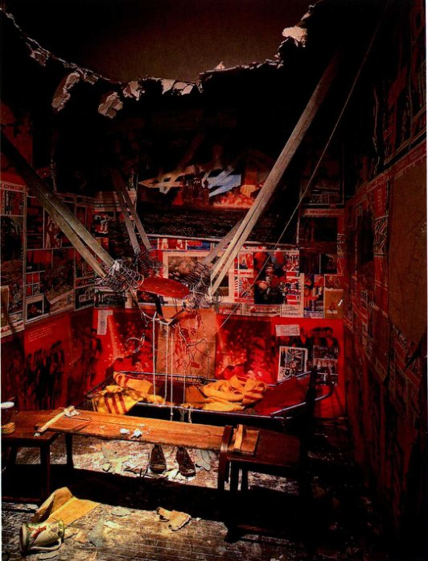

*图30.29 细部，伊利亚·卡巴科夫《从公寓逃入空间的男子》*

# 第三十章 后现代时代：1980年至今的艺术

20世纪80年代以来，艺术界关注的艺术风格通常被称为后现代艺术（Postmodern art）。60年代中期，欧洲文学评论界确定了“后现代”这一术语的含义，并首先在文学领域使用；这个圈子的核心人物是法国哲学家雅克·德里达（Jacques Derrida，1930-2004年），其理论也被称为“解构主义”（Deconstructionism）或“后结构主义”（Post-Structuralism）。

欧洲后现代主义的核心前提在以下这种观点中得以体现：所有文学与艺术都是符号的复杂建构，而这些符号的意义则由其情境决定。以拉斐尔的祭坛画为例，在其最初的情境，即16世纪的天主教徒在教堂中观看时，具有一种意义；而现在置于声望颇高的博物馆中作为美术作品展出时，又传达了不同的信息。观者将个人体验带入作品之后，情境也会随之发生改变。后现代主义者们认为，并不存在固定的意义，因此也就无所谓永恒的真理。70年代晚期，艺术家和评论家吸收了这一理论，并将之运用于艺术领域。后现代理论现在已经成为了大部分艺术创作与评论的驱动力。

当然，这些观念并非在70年代晚期突然出现。马塞尔·杜尚早在20世纪最初十年就有过类似表述，而观念艺术家们也是如此，例如60年代的乔治·布莱希特和约瑟夫·科萨斯。50年代和60年代期间，罗伯特·劳申伯格、安迪·沃霍尔和罗伊·利希滕斯坦都对这一问题很感兴趣。虽然后现代主义在视觉艺术领域的灵感来源就是这个时期，但艺术界真正自觉进入新时代的情况直至70年代晚期才出现。在很大程度上，这种新生的自觉产生于新艺术杂志《十月》（October）上的评论文章，反映了德里达的观点（见第四部分末尾的附加原始文献）。现在，一大批艺术家和评论家们更为公开地追问以下问题：符号如何获得意义？什么才是信息？谁制造了信息？信息的目的是什么，或为谁服务？谁是观众？这些又为我们提供了有关信息的哪些情况？谁控制着媒体？他们为了谁而控制媒体？越来越多的艺术家开始将日常图像运用于新的情境之中，以此揭示或解构更深层次的社会、政治、经济与美学意义，美国艺术家辛迪·舍曼和德国艺术家希格马·珀尔克就是如此。这批艺术家中的大部分人都青睐大众传媒，并经常以此作为创作材料，包括摄影、电子标牌、告示牌和录像等。

虽然这种后现代主义姿态是80年代艺术界的一个主要特征，然而这也只是最近25年间艺术界所关注的无数问题之一。多元主义是这个时期的典型特征，实际上是对于70年代多元主义的一种继承，而当时的多元主义与后极少主义息息相关。但是现在，这种艺术风格在后现代理论中找到了哲学基础。通过对一切系统化、解读、阐释或真理的否认，后现代理论颠覆了风格、媒介、议题、题材等权威等级的狭隘视角。对他们而言，信息比具有简便易识的个人风格更为重要，而后者曾是现代主义的特色之一。艺术家们也向现代主义赋予个性和作者身份的高度价值发起挑战，有些人开始以组群形式进行创作，例如“游击队女孩”（Guerilla Girls）、“材料组”（Group Material）和“合作项目”（Collaborative Projects [Colab]）。

后现代时代还重新界定了艺术界自身的性质。艺术机构放宽了视野，开始接纳来自全部民族和种族的艺术家，以及所有类型的媒介、风格和议题，同时也不在价值观之间做出高低之分。在这样一个全新的多元文化环境中，70年代的边缘艺术家成为了主流。而且，来自世界各地的艺术家，不仅仅是美国和欧洲的艺术家，在塑造当代艺术面貌的过程中起到重要作用。“大地魔术师”（Magiciens de la Terre）是呈现这一新世界的里程碑式展览，在巴黎国家现代艺术博物馆（蓬皮杜中心）举办，展出全世界艺术家的作品，尤其强调那些被排除在主流之外的艺术家，而非追随欧美潮流之人。

接纳各国艺术家的举动折射出最近25年间的全球重构趋势：政治与经济领域的重组使得苏联放弃了对于共产主义的严格坚持，中国实行改革开放，开始进行资本主义市场经济试验，并对外来贸易与投资敞开国门；90年代，欧盟诞生，美国、墨西哥和加拿大也签署了《北美自由贸易协定》（NAFTA）。各个领域的壁垒纷纷坍塌，前往他国的交通比以往都要便捷。

而艺术世界的创造背后还隐藏着另一股重要力量——美国民权运动和独立运动的持久影响。独立运动主要于50、60年代出现在后殖民时期的亚、非两洲，确立了自身文化传统的地位，而且与主流文化一样具有存在与发展的价值。在过去的25年间，各种文化逐渐编制成一张世界文化的大网。但是在创造“地球村”的过程中，通讯领域所发挥的作用可能最为巨大，电视、移动电话、通讯卫星、电脑和国际互联网将整个世界联系起来。后工业时代也是信息的时代。今天，世界一流艺术家来自各个国家，包括黎巴嫩、伊朗、以色列、柬埔寨、泰国、韩国、日本、中国、南非、马里、俄罗斯、哥伦比亚、巴西、古巴和冰岛。

现在的学者以各种角度作为分析艺术的出发点，其中包括性别、性取向、民族、种族、经济和政治，以此来证明艺术品中多层次的意义与观念。在某种程度上，这一趋势始于60年代晚期，伴随民权运动和越战而来，从当时挑战现状合理性的社会变革中产生。

事实上，后现代主义标志着现代主义时代走到了尽头。现代主义将现代艺术看作基于过去风格的线性演进，持续将艺术推向“新”的阶段。对新事物的追求曾是现代主义的核心要求，并一直持续到50年代和60年代，在弗兰克·斯特拉和唐纳德·贾德的艺术作品中都可以看到（见第1057和1059页）。在这些年间，艺术中的一切屏障都得以清除，70年代的多元主义使得各种风格与媒介激增。在某种程度上，这几乎意味着已经没有什么新事可做了。到了80年代，艺术家获得了拒绝创新的许可。他们不仅在文明史中一切可以想见的风格与媒介中大肆吸收艺术成分，并将其按照看来合适的方式组合在一起；诸如费利克斯·冈萨雷斯-托雷斯、杰夫·昆斯、奇奇·史密斯和达米安·赫斯特等一流艺术家甚至不关心自己是否创造了一种独特的风格，完全依靠作品的主题将其联系在一起，而非面貌。

在这样一个媒介复杂、且解释方式持续变化的世界里，学者们在后现代主义内涵方面并没有达成一致。这个词语首先用于描述60年代欧洲出现的哲学潮流，但今天的学者与历史学家却以更为随意的方式进行使用，实际上囊括了1980年以来的所有艺术形式。事实上，他们更多地用这个词来指代现代主义之后的艺术，这也是本书中使用的含义。

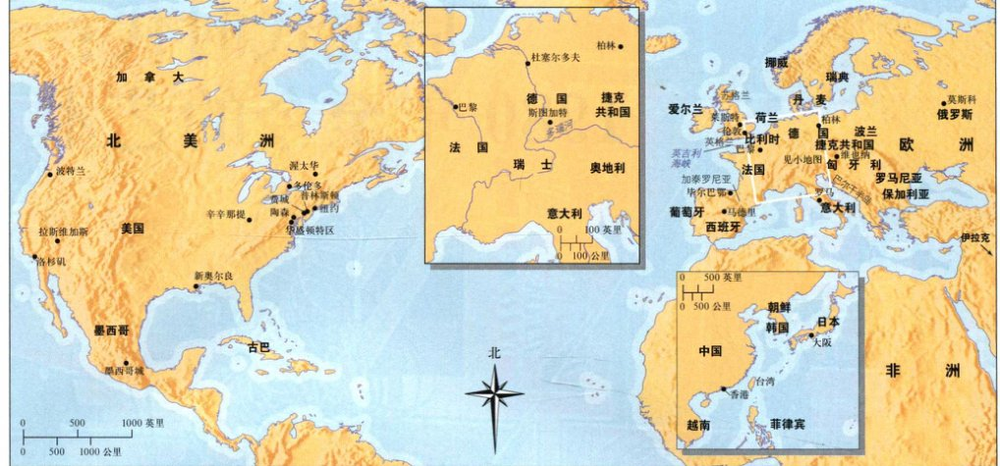

*地图30.1 欧洲与北美洲（嵌入图版为亚洲）*

## 建筑

60年代，建筑领域的后现代主义伴随其方法宣言出现，建筑师罗伯特·文丘里在著作《建筑的复杂性与矛盾性》（Complexity and Contradiction in Architecture）一书中，号召建筑师们创造一种新的建筑，抛弃现代主义国际风格的冰冷与抽象。新建筑应该是有所指涉的，这意味着建筑要让人回想起历史上的建筑风格，或者包含指涉历史与现在的题材。进一步来说，建筑师应该享有设计方面的自由，不必遵循现有的规则或原则。他们也享有诙谐幽默的自由。文丘里的思想逐渐为建筑界所接受，一种被建筑界称为“后现代”的建筑在80年代得以涌现。该词语用来指那些与早先时代、风格有关的建筑。

欧洲后现代主义的基本观念认为，不存在任何一种普遍流行的权威风格或原则，因此80年代以来的建筑作品体现了广泛的问题与兴趣点，远远超越了指涉性建筑的范畴。修正现代主义也是其中之一，我们也可以将其称为高科技（Hi-Tech）建筑，因为其高度科技化的外观；另一种则是解构主义理念，与德里达的解构主义理论有关，并且接受了以下观念：建筑不必是固定的结构或逻辑，可以对其进行多样的解读。

### 后现代建筑：有所指涉的风格

以国际风格为典型代表的现代主义建筑遵循严格的法则，并且颇具抽象性。某些建筑评论家以及广大公众都认为这种风格冰冷，而且毫无人性可言。后现代主义建筑与19世纪的建筑一样，再次拾起了指涉早期建筑风格的内容。这些建筑有时会投射出一种场所感，使自身产生出独特的光环，让那些使用建筑的人们感到与众不同。虽然后现代主义建筑直到1980年左右才出现，但是一小批建筑师从60年代就开始提倡和实践这种新建筑风格，罗伯特·文丘里和查尔斯·摩尔就是其中两位。

**罗伯特·文丘里** 罗伯特·文丘里（Robert Venturi，生于1925年）在《建筑的复杂性与矛盾性》中抨击了现代主义建筑，并颠覆了建筑领域的既有法则。他以“少即乏味”（Less is a bore）向米斯·凡德罗的“少即是多”发起挑战，而且认为建筑作品可以是建筑师所希望的任何样子。文丘里坚持认为，过去的艺术与建筑中充满了复杂性与矛盾性，生活本身也是如此，所以建筑也应该这样。建筑并不应该表现为纯粹、简洁或常规、死板，而应该复杂、丰富，充满了指涉历史与当代的内涵。建筑应该包涵意义，即便是像风格主义建筑中的那种矛盾性。建筑结构既可以严谨庄重，也可以幽默风趣。文丘里的偶像是路易斯·康，而后者也主要活动于费城，其设计的孟加拉达卡市国家议会大楼（见图29.43）就充满了明显的历史指涉。文丘里着迷于康对象征主义和历史沉积的大胆运用。1972年，他再一次激怒了整个建筑界，因此其与同为建筑师的妻子丹尼丝·斯科特·布朗（Denise Scott Brown）合作出版了《向拉斯维加斯学习》（Learning from Las Vegas）。这对夫妇声称，洛杉矶和拉斯维加斯就是今天的古罗马城，是文艺复兴时期的佛罗伦萨，他们认为这些美国城市中的综合商业区、霓虹灯标牌和高速公路反映了时代的需求，是一种建筑新语汇，而这正是建筑师应该接纳的东西。

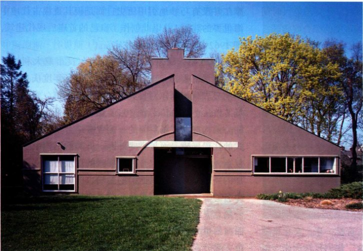

*图30.1 罗伯特·文丘里：费城栗树山的法娜·文丘里住宅（Vanna Venturi House）。1962年。文丘里和斯科特·布朗联合公司*

文丘里也实践了自己所宣扬的理念。1962年，他为母亲在费城的栗树山（Chestnut Hill）设计了一座住宅（图30.1）。建筑仿佛现代主义的抽象作品，其中到处可见平面、严格的几何形、清晰的线条，以及形式与空间的交互作用，在立面中央的大裂口上表现得最为明显。但是，这所住宅保持了指涉意义，形成了对于传统美国住宅的滑稽模仿——比如倾斜的山墙封顶（实际屋顶要低矮许多），前部的门廊，而后部巨大的长方形墙体则仿佛是一道烟囱，其实这是假烟道，真正的烟道是前部低矮的部分。这样一来，文丘里就通过大量的建筑样式典故，让这座住宅复杂起来。以中央裂口为例，源自康的中世纪式城池建筑，其中建有开槽口的护墙，过梁嵌入墙体之中。文丘里设计中的“过梁”似乎支撑着立面的左右两个部分和被隔断的“拱段”（segmental arch），飘浮在入口之上，同时也是入口的框架，令人回想起埃及的塔门。文丘里使得这座比例过大的建筑中充满了幽默、讽刺与影射之处，将传统的美国住宅转变为一部丰富的建筑宣言。

**查尔斯·摩尔** 在后现代建筑的发展过程中，同时代的加利福尼亚建筑师查尔斯·摩尔（Charles Moore，1925-1993年）发挥的作用与文丘里一样重要，而他也同样以路易斯·康作为自己的偶像。摩尔意识到，综合商业区和高速公路使得景观日渐相似，美国的特定场所感正在迅速消失。对他而言，要赋予现代美国富有意义、独特鲜明的身份，在设计中挖掘历史元素是当下唯一的出路。然而与文丘里不同的是，摩尔并没有巧妙地引用历史，而是极其重视古代地中海世界的建筑，并以此创作了自己的首座后现代建筑，即1962年为自己设计的住宅。

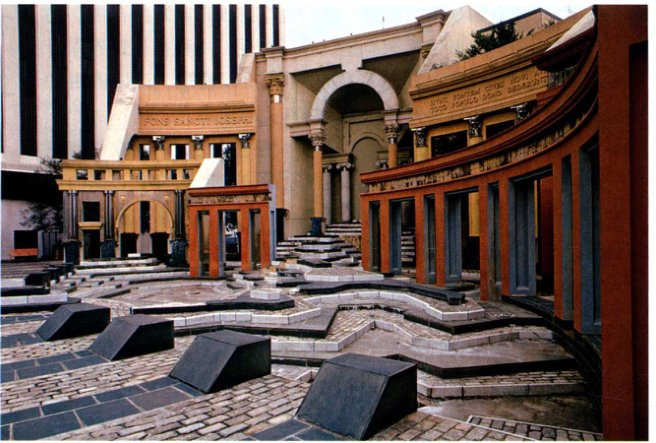

*图30.2 查尔斯·摩尔、U.I.G.和佩雷兹联合公司：新奥尔良意大利广场。1975-1980年*

1975年，摩尔接受了为新奥尔良市意大利社区设计广场的委托，该广场主要用于举行年度庆典，其中明显表现出摩尔对古典时期的敬仰之情。意大利广场（Piazza d'Italia，图30.2）由嵌在广场上的一系列同心圆构成。广场封闭的一侧建有结合了所有古典柱式的柱梁屏障。而越靠向外圈，屏障的结构也就越发复杂，并且在一侧上升为阶梯式的层层行列；逐层增加的高度是对阿尔卑斯山的隐喻，一旁以意大利河流命名的喷泉与池塘则自台阶喷涌而出。铺地石构成了一幅意大利地图，阿尔卑斯山位于上升阶梯的位置，而西西里岛则位于广场的中央，由此来突出新奥尔良市大部分意大利裔居民的历史传统。凯旋门和古典样式的凉廊通向广场，同时也有助于将广场与周围的街道和办公楼区分开来。柱梁屏障上的色彩令人回想起庞贝城的湿壁画。喷涌水流的立柱装饰着不锈钢材质的爱奥尼亚涡形饰和霓虹颈箍，为夜晚增添了一抹亮色。摩尔的设计同时还让人回想起罗马的特莱维喷泉（Trevi Fountain）、60年代美国炫目的小餐馆，以及古罗马柱廊的残垣断壁，通过这些元素的运用整合出一幅现代景观，创造出鲜明有力的场所感。

**SITE** 在另一个极端，后现代建筑师可以放弃历史主义的凭空捏造特质，转而依赖趣事、惊奇、震撼、机智和暧昧不明来进行创作。在SITE（意为“环境雕塑 [Sculpture in the Environment]”）所设计的百利店面（Best Products）中，我们可以看到上述所有特性。SITE设计小组成立于1970年，艾莉森·斯盖 (Alison Sky)、米歇尔·斯通（Michelle Stone） 和詹姆斯·怀恩斯（James Wines）是其奠基人。1976至1978年间建于马里兰州陶森市的倾斜展示厅（Tilt Showroom，图30.3）就是该小组机智聪颖的杰出代表。建筑立面似乎正在不稳定地提升或下降，仿佛一扇在开启过程中发生故障的车库大门，产生的效果绝对带有超现实主义特性。此类趣事或故事在百利的休斯顿店面中也得以复制，后者的立面崩塌成一片废墟，而在弗吉尼亚州的里士满展示厅内，砖头像壁纸一般剥落而下。SITE称这些项目为“反建筑”（de-architecture），因为建筑本身看来就像自我毁灭。但是在耸立的墙壁和同样建筑单调重复的世界中，建筑师正在面对这样的挑战，考验其是否可以设计出能够在混乱的城市街区里脱颖而出的店面。显然，SITE小组从美国高速公路文化中汲取了经验，这正是文丘里推崇有加、并在《向拉斯维加斯学习》一书中所描述的内容；一种能够吸引消费者的本土标牌与建筑语汇。

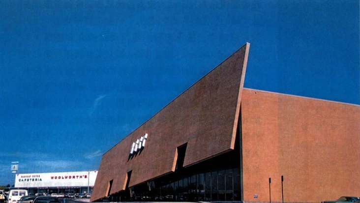

*图30.3 SITE（环境雕塑）：马里兰州陶森市百利公司倾斜展示厅。1976-1978年（已毁）*

**菲利普·约翰逊** 70年代晚期，后现代建筑已经无处不在。即便是菲利普·约翰逊（Philip Johnson，1906-2005年）这样坚定的现代主义者，也无法抵挡后现代主义巨大的吸引力，成为其有力支持者之一。在这之前，他担任了1931年现代艺术博物馆国际风格展览的策划人，也是米斯·凡德罗西格拉姆大厦的合作设计者。然而，当1978年约翰逊揭幕与合伙人约翰·伯奇（John Burgee）合作设计的纽约AT&T大楼模型时（AT&T Building，图30.4），每个人都认为他疯了。这座摩天大楼是路旁“会说话的建筑”（architecture parlante）的巨型实例，甜筒形的冰激凌摊就是典型的“会说话的建筑”。约翰逊的AT&T大楼在造型上俨然一座巨型的18世纪美国奇彭代尔（Chippendale）高脚柜橱，建筑顶部有典型的奇彭代尔涡形装饰，底部则是支撑着28个“抽屉”或楼层的高脚柜腿。有些观察者认为这座建筑仿佛一部投币电话，硬币从顶端投入，余款则从底部掉出来。建筑底部还令人回想起布鲁内莱斯基的帕奇礼拜堂（见图15.11），后者同样具有藻井，并在拱门之上开有圆窗（插图中不能看到这个部分）。尽管约翰逊的设计诙谐、讽刺，这座美国历史的伟大象征还是很好地维持了严峻宏大之感；当人们在与街道平齐的位置上体察建筑庞大基座部分时，尤其会有这种感受。其完全融入古典传统之中，唤起了庄严甚至严峻的文艺复兴式空间感。

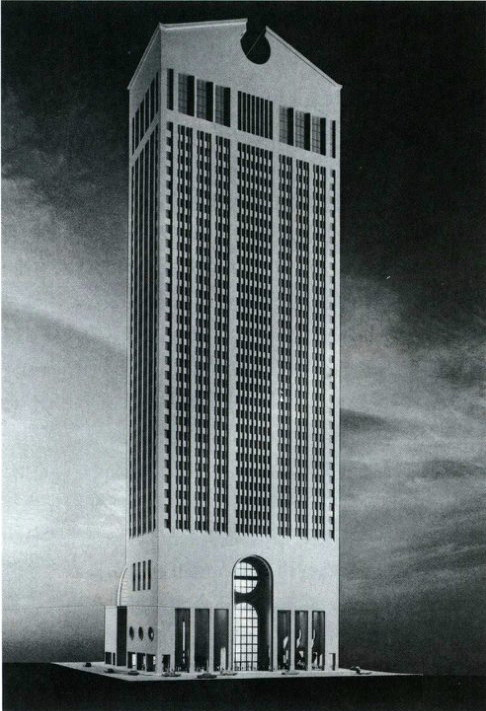

*图30.4 菲利普·约翰逊和约翰·伯奇：纽约AT&T大楼模型（现为索尼大楼）。1978-1983年*

**迈克尔·格雷夫斯** 建筑师迈克尔·格雷夫斯（Michael Graves，生于1934年）来自新泽西州的普林斯顿市。在他获得1980年俄勒冈州波特兰市公共服务部大楼（Public Services Building，图30.5）项目过程中，约翰逊发挥了重要作用。该建筑比约翰逊的AT&T大楼要复杂很多，也难以进行诠释。而且，这件作品中充满了悖论，建筑表面的每一处设计都要求人们以多种方式来观看，同时表现了平面性与雕塑性、具象性与抽象性，历史性与现代性。建筑外形是一个伫立在平台上的帕拉第奥式立方体，立面和内部附属广场的轮廓则是对于正方形整体或者近正方形样式的回应；例如大量镜面玻璃窗都镶嵌在栗色窗间壁限定的正方形之内，每扇窗户都是边长1.22米的正方形。这里的墙壁可以被看作平滑的壁画，一道现代主义的薄膜伸展紧绷在金属骨架之上；但转瞬间又具有了立体感与雕塑感，大型玻璃窗前面的栗色直立支柱突出了这一效果。这些直棂式的支柱变成了半露方柱的沟槽，顶部是伸臂柱头（bracket capital），支撑着上方巨大的拱心石。但如果将拱心石与米色墙壁看作一体，拱心石就会融入框架玻璃窗户的平拱。建筑的立面甚至可以被看作人形图案，半露方柱和拱心石构成一张巨大的面孔，柱头是眼睛，而半露方柱则可能是双腿。这座建筑就像一场异想天开的游戏，但同时也有严肃的元素，令人回想起历史上的伟大样式，例如帕拉第奥风格、风格主义，以及格雷夫斯最为推崇的前辈约翰·索恩，索恩的影响在此处表现为卓越的半露方柱结构（见图24.33）。庞大的幕墙窗户、厚重的角柱，以及突出的“山墙”又让人联想到贝伦斯的涡轮机厂（见图27.42）。这一切都并非巧合，贝伦斯的设计是早期现代主义建筑的杰作之一，而且恰恰创作于现代主义抛弃所有历史指涉之前。

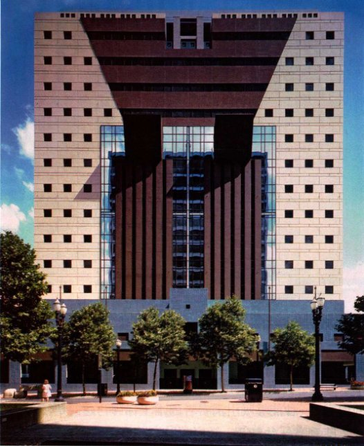

*图30.5 迈克尔·格雷夫斯：俄勒冈州波特兰市公共服务部大楼。1980-1982年*

**詹姆斯·斯特林** 与格雷夫斯一样，伦敦建筑师詹姆斯·斯特林（James Stirling，1926-1992年）也十分敏感复杂、难以解释，他设计的斯图加特新国家美术馆（Neue Staatsgalerie in Stuttgart，图30.6）就表明了这一点。这座集博物馆与剧院为一体的建筑群坐落在陡峭山坡的一侧，脚下就是公路，高处则是城市街道。与路易斯·康的国家议会大楼相同，斯特林大胆堆砌的简单形式与“之字形”坡道同样回应古代文明，其中又以埃及文明最为明显，因为构成狭窄走道的正是巨型塔门结构。砂岩与画面石灰岩交替的模式暗示了中世纪意大利建筑，而博物馆庞大的波浪式窗户则与派克斯顿的水晶宫、贝伦斯涡轮机厂的大型幕墙窗户相呼应。曲面窗户同时还暗示了巨大的钢琴，提醒人们注意到建筑的剧院功能。粉蓝两色的管状栏杆和支撑博物馆“山墙形”入口的蓝色工字梁都是高科技工业产品，骨架式的出租车平台也是如此，后者的玻璃钢铁结构俨然派克斯顿的水晶宫，而其形式则让人回想起古希腊神庙。正如文丘里和格雷夫斯的设计一样，所有那些为人所熟知的素材都天衣无缝地融合为统一整体，将过去带入了当下。最终的成果是一座风格独特的现代建筑，其中还透露出路易斯·康式的宏大感，对于当时的建筑界而言十分重要。

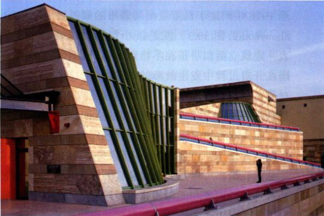

*图30.6 詹姆斯·斯特林：斯图加特新国家美术馆。1977-1983年*

### 新现代主义：高科技建筑

70年代晚期到80年代，后现代主义融合了历史主义和象征主义，这对于开创建筑新自由来说至关重要。建筑师们摆脱了纯粹现代主义的狭隘樊篱，获得探索一系列新可能性的自由，而这些对于可能性的探索远远超出了后现代主义折衷的历史指涉。80年代和90年代的经济增长推动甚至鼓励艺术领域的自由创作，私人和企业投入建筑项目的资金数量也达到了前所未有的额度，为建筑业和建筑景观注入了巨大能量。正如20年代纽约房地产商竞相建造世界第一高楼一样，现在世界各地的客户都力图建造最壮观、最激动人心的建筑——一种打着国际烙印的建筑。各个层次的大众不再满足于乏味、普通的现代主义建筑。即便是90年代的美国综合商业区都成为了查尔斯·摩尔的地中海迷你城，很多早年修建的现代主义风格建筑也都改头换面，拥有了后现代主义外观，维多利亚风格、安妮女王风格、都铎王朝风格和罗马式风格也同样流行起来。

继承文丘里和摩尔衣钵的重要后现代建筑在90年代逐渐没落，取而代之的则是令人振奋的多样化发展，将建筑导向了真正的后现代主义时期。众多建筑师重新审视现代主义，并通过70年代晚期出现的艺术新自由使其再次充满活力。新现代主义的极端形式是高科技风格，这种风格的建筑仿佛一部部强大的工业机器。与后现代建筑一样，高科技设计的直接来源是50年代和60年代若干少见先例，例如詹姆斯·斯特林设计的英国莱斯特大学工程学院（Engineering School of University of Leicester，1959-1963年，图30.7）。这座建筑与其说是学校，不如说它更像工厂；通风口与维护用升降机都以大胆的手法暴露在外。其体量与棱角轮廓都显示出涌动的能量，而这正是粗粝派的典型特征（见第1072页）。高科技现代主义建筑最著名的原型可能要算1971年的巴黎蓬皮杜中心（Pompidou Center，图30.8）。建筑师理查德·罗杰斯（Richard Rogers，生于1933年）和伦佐·皮亚诺（Renzo Piano，生于1937年）在建筑中将设施部分暴露在外，而非隐藏在内部。这些设施显露在建筑周边的脚手架上，而在经典的现代主义建筑中，这些部分本该属于玻璃盒子结构。升降电梯、自动扶梯、下水管道、电线和通风管都作为外部“装饰”鲜明显现。除了向建筑美学发起挑战之外，这种设计还拥有完全打开内部空间的优势，为任何必需的分隔构造与布置提供了可能。

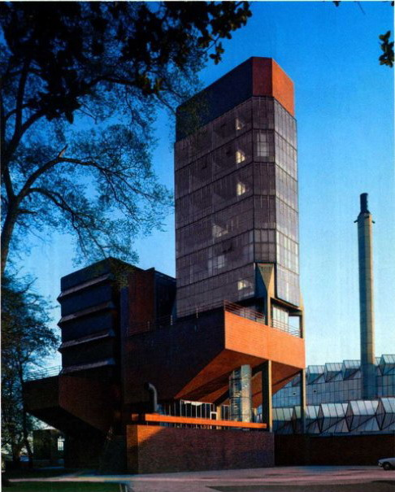

*图30.7 詹姆斯·斯特林：英国莱斯特大学工程学院。1959-1963年*

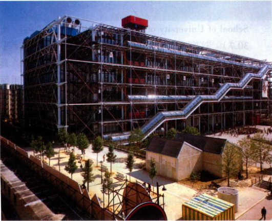

*图30.8 理查德·罗杰斯和伦佐·皮亚诺：巴黎乔治·蓬皮杜国家艺术与文化中心。1971-1977年*

**诺曼·福斯特** 70年代晚期，高科技现代主义涌现出来，令人眼界大开的汇丰银行（HKSB，图30.9）在某种程度上就宣告了这种风格的到来。该建筑由诺曼·福斯特（Norman Foster，生于1935年）于1979年设计，造价高达十亿美元。而这其实是一座并不像摩天大楼的摩天大楼，办公大楼的典型网格结构消失不见，取而代之的是复杂的装配结构，宛若一架机器。建筑由四个单元构成，每个单元又包括四座庞大无比的墩柱，一直延伸到矩形建筑两侧的最高处。巨型桁架支撑结构从墩柱上悬挑出来，而楼层地板就悬挂在悬臂上，形成层叠的群组，每组6至9个楼层不等，福斯特将这些群组称为“村落”。升降电梯只在每个村落的公共楼层停留，其余楼层之间则由自动扶梯相连。包括升降电梯在内的所有服务设施都置于隐藏在建筑两侧的机井之内，使得建筑内部空间消除了所有根本的障碍（图30.10）。福斯特将底层设计为广场，使之面向四周的街道敞开，广场各处的水平高低并不相同，因为各条街道本身就处于不同的水平面上。广场顶部建有庞大的曲面天花板，穿天花板而过的自动扶梯则上升进入无比壮观的中庭，纵穿10个楼层，高约59米；正如图中所示，中庭两旁是属于工作区域的楼厅。在建筑南侧，电脑控制的镜子（光管）跟踪太阳移动，将日光反射到第二组镜子上，后者再将日光导向广场。广场由此就获得了足够形成阴影的自然光线。机械、力学、巨型桁架结构、屋顶维护和隐藏的服务机井都对建筑内外的面貌产生了巨大影响，使之获得了体现工业力量、效率和功能主义的外观。

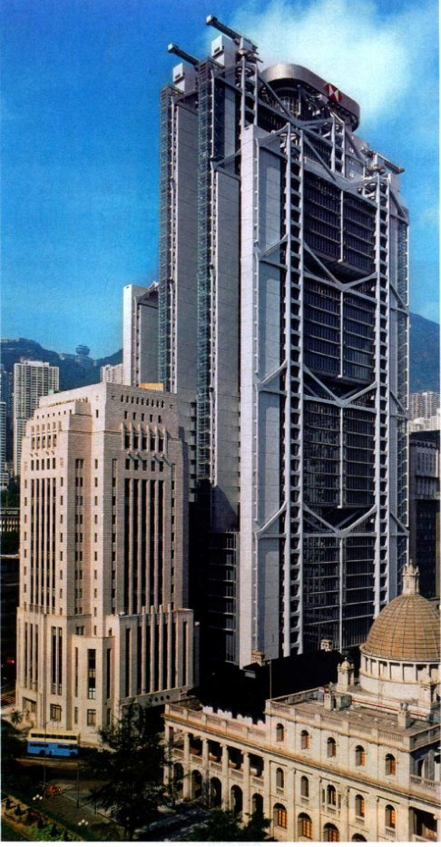

*图30.9 诺曼·福斯特：中国香港汇丰银行。1979-1986年*

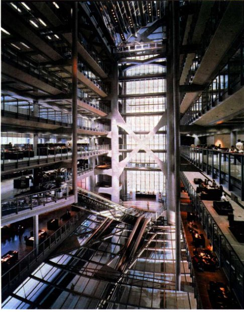

*图30.10 诺曼·福斯特：汇丰银行内景*

**伦佐·皮亚诺** 如果说福斯特的汇丰银行大楼具有高科技风格的外观，其复杂性与规模则令人眼花缭乱，甚至震惊不已，那么伦佐·皮亚诺设计的关西国际机场（Kansai International Airport，图30.11、30.12）则以其简洁性令人惊叹。机场的停机楼建于1988至1994年间，长达1.7公里，是世界上最长的建筑。这座机场建造在距离大阪海岸线5公里的人工岛上，通过火车、汽车和水翼艇与陆地连接。机场通常是一个混乱的场所，设计如此规模的机场确实是一个巨大的挑战。而皮亚诺的解决方案堪称神来之笔：建筑像个长长的机翼，入口则位于类似飞机襟翼所在的位置，构成T形平面的基础。内部依然保留了机翼的外形，让旅行者仿佛置身飞机之中。正如在艺术建筑里一样，参观者立刻就能知道应该进入何处，走向何方。国内航班停靠在距离入口最近的地方，国际航班则停靠在两端。层叠的玻璃钢铁墙体让旅行者能够随时看到自己所处的位置，电脑控制的穿梭列车可以将其迅速送达各自的目的地。这座建筑的风格理性、清晰，使得标示牌的存在都成为多余。其还为光亮的太空时代金属所包裹，并兼具符合空气动力学原理的流线型结构，立刻就引发人们对飞行技术与效率的信任感。

*图30.11 伦佐·皮亚诺：日本关西国际机场鸟瞰。1988-1994年*

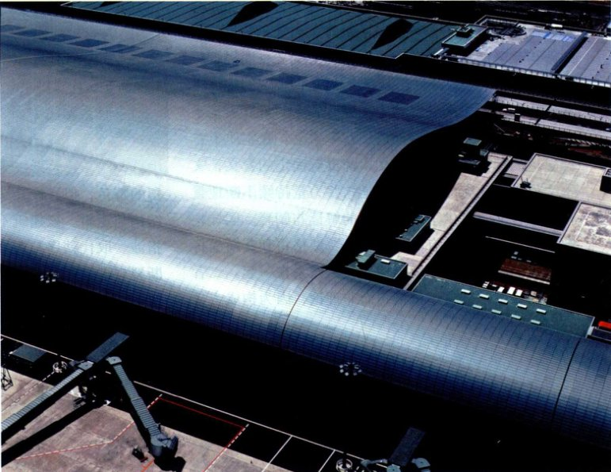

*图30.12 伦佐·皮亚诺：日本关西国际机场屋顶。1988-1994年*

### 解构主义：对抗现代主义的权威

1988年，纽约现代艺术博物馆举办了名为“解构主义”（Deconstructivism）的展览。一共有7位建筑师参展，其作品展示出构成主义的几何性与平面性，创造出一种“瓦解、错位、背离和变形”的建筑，而这正是与菲利普·约翰逊联合策展的马克·威格雷（Mark Wigley）在展览目录中所写的评语。本次展览的提议者是建筑师彼得·艾斯曼（Peter Eisenman），最初拟定的标题为“侵犯完美”（Violated Perfection），这个标题可以让所有人都毫不费力地判定解构主义的实质内容。然而，解构主义一词尽管广为流行，但其拥护者中并无人认同某个特定的解释，甚至也无法断定谁是解构主义者。展览的策展人基于德里达的解构主义理论创造了这个术语。在本质上，德里达的理论认为，任何文本都没有固定的含义，文本之外存在无穷的力量，正是这些力量持续不断地重构文本含义，提供了永无止境的解读与阐释。同样，解构主义建筑也没有固定的含义。威格雷和艾斯曼将建筑中的解构主义与俄国构成主义联系在一起。二者之间的联系基础在于风格，而非理论，因为构成主义要求建立一种新秩序，一个乌托邦式的完美状态，而解构主义则聚焦于拒绝一切既有结构和逻辑。

讽刺的是，绝大部分参展建筑师对于德里达的兴趣很小，甚至完全没有。他们即便关注德里达，也只是经由间接途径，而非通过阅读德里达的深奥著述。一股重要的潮流在80年代出现，向建筑必须符合某个单一理念或理想的观念发起挑战。这些建筑师对抗建筑必须激起某种完美、秩序或逻辑之感的想法。

**蓝天组** 沃尔夫·普里克斯（Wolf Prix，生于1942年）和赫尔穆特·斯维辛斯基（Helmut Swiczinsky，生于1944年）是解构主义运动的早期支持者，他们组建的维也纳公司蓝天组（Coop Himmelblau）也参加了1988年的“解构主义”展览。他们的美学观突出体现在两人1983年为一家维也纳法律事务所设计的屋顶会议室中（图30.13）。任何解释和逻辑都不适用于这种建筑现象；屋顶似乎要爆炸开来，造就了一种灾难感，与通常联系着法律行业的沉着保守格格不入。即便是建筑材料也与下方的19世纪公寓楼形成了强烈冲突，十分刺眼。建筑形式的平面性或许暗示着构成主义雕塑的特色，但是设计缺乏俄国构成主义运动的清晰、结构与逻辑。该建筑不包含任何历史主义或建筑上的指涉。取代秩序与逻辑的是一种尖锐、冲突、倾斜、断裂与错位之感，然而这些属性并不意味着破坏、捣毁、解体或者灾难。更确切地说，建筑师们渴望打破建筑的预设观念。

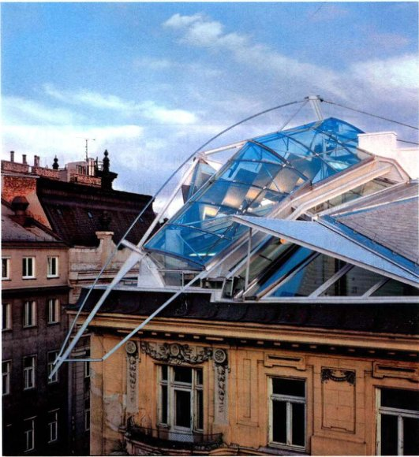

*图30.13 蓝天组：维也纳屋顶会议室。1983-1988年*

**扎哈·哈迪德** 扎哈·哈迪德（Zaha Hadid，生于1950年）毫无疑问是解构主义建筑师，但她对德里达并无兴趣，而且声称自己的作品并非基于理论构成，而是基于自觉。哈迪德出生在伊拉克，后来到伦敦求学，并以伦敦作为自己的活动中心；她还受到了至上主义那种有力几何形式（见第966-968页）的强烈影响。哈迪德的设计一般都展示了她对创造易感流动空间的关注，这种空间鼓励人们走入其中，在建筑内尽情游览。

在2003年开馆的辛辛那提洛伊斯和理查德·罗森塔尔当代艺术中心（Lois and Richard Rosenthal Center for Contemporary Art in Cincinnati，图30.14） 里，宽阔漂移的至上主义式平面与构成主义式的盒子在博物馆立面中上升下落，钻进钻出。哈迪德将这个立面描述为“城市地毯”（Urban Carpet），而事实上，人行道缓缓蜿蜒至建筑内部，欢迎人们进入其中。底层是一座园林大厅，即封闭的公园，同样也是为了吸引人们进入而造。一系列鲜明的坡道占据着大厅的主导地位，并延伸在整体空间之中。坡道通向一层夹楼，夹楼则通向展厅。在街道上可以看到展厅及其外形，诱使公众进入博物馆。由于该博物馆没有陈列展览，只举办临时展览，哈迪德设计了如此形式多样的空间，以便容纳各种类型的艺术品。展厅似乎悬挂在空中，并在不同的高度飘浮着。这种生机勃勃的流动感不仅存在于博物馆内部，而且也存在于街道、人行道与博物馆的关系之中，这也是哈迪德作品的特色之一。

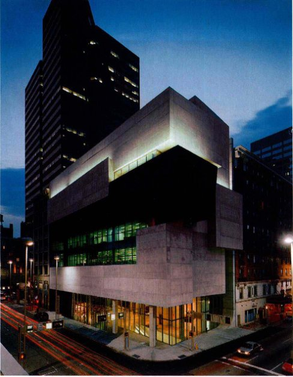

*图30.14 扎哈·哈迪德：辛辛那提洛伊斯和理查德·罗森塔尔当代艺术中心。2003年*

**弗兰克·盖瑞** 弗兰克·盖瑞（Frank Gehry，生于1929年）也参加了1988年“解构主义”展览，是当时参展的七位建筑师之一，但他自视为独立建筑师，拒绝人们将他与任何风格或团体联系起来。尽管如此，他的设计还是像蓝天组的屋顶办公室一样，具有无序感、断裂感与能量感。他最为著名的设计是毕尔巴鄂古根海姆博物馆（Guggenheim Museum，Bilbao，图30.15），很好地体现了其设计特点。该博物馆独特的形式与语汇使得建构任何特定含义、联系任何建筑指涉的努力都显得徒劳。人们将其形式描绘为船舶、游鱼，盖瑞本人则将其称为“一朵绽放的花蕾”；但从根本来说，该建筑运用了庞大的体量，是对于抽象雕塑创作的探索，还清晰展示了建筑师享受其设计自由时的纯粹喜悦。

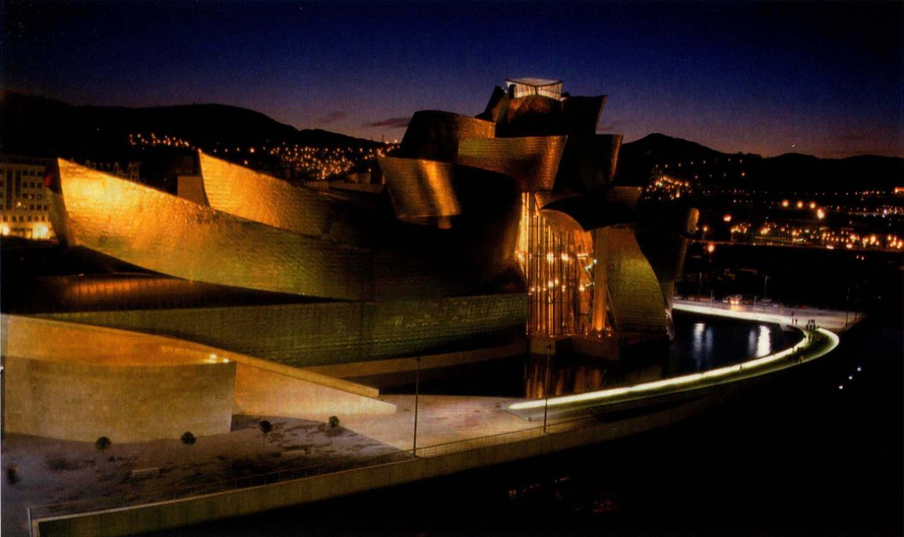

*图30.15 弗兰克·盖瑞：西班牙毕尔巴鄂古根海姆博物馆。1992-1997年*

> **材料与技法：建筑中的计算机辅助设计**
>
> 90年代早期，建筑师们开始在设计过程中使用CAD技术（计算机辅助设计）。在“无纸工作室”里，设计师运用计算机程序来绘制图纸，不再使用传统的建筑图，或者木材与纸板制成的模型。这种设计方法最初引起了很大争议，因为其抛弃了创作中古老的直觉过程，而这种过程要求用手接触纸张或者用木材、纸板制作模型。
>
> 弗兰克·盖瑞运用CAD程序生成了毕尔巴鄂古根海姆博物馆极其复杂的形式。如果没有这种先进科技，建筑及其钛金属外壳恐怕很难建成，就算可以建成，其建筑经费也会高得令人却步。盖瑞与合伙人希姆·格林福（Him Glymph）选择的CAD程序是CATIA；这一程序最初由法国达梭系统（Dassault Systems）开发，用于数字化设计与精确制造极其复杂的产品，例如法国航空工业的机翼与机身生产。
>
> 或许对于盖瑞和格林福而言，CATIA更为重要的作用不在于简化了建筑设计，而是使得生产制造成为可能。没有这一程序，盖瑞就无法把自己的设计图交代给工匠与工人，而后者在将平面图准确转化为立体形式的过程中，会遭遇严峻的挑战，而这即便不是不可能完成的任务，至少也令人生畏。弗兰克·劳埃德·赖特当年就遇到了巨大的困难，找不到承包商愿意修建他那极其不规则、高度有机化的纽约古根海姆博物馆。而盖瑞和格林福则将计算机文件发给制造商，制造商再将数字化信息输入计算机的自动装置，然后由该装置来制造各种样式的产品。从外形独特古怪的窗户到不规则的钛金属板，建筑物的所有细部都可以通过这种方式来生产制造。CATIA还大大降低了成本。之前建筑的大块部分如果尺寸不同、形状各异，就无法以经济的方式批量生产，而从此之后这就不再是问题了。计算机程序能够制造任何独一无二的产品，而制造过程正如现代主义建筑中成千上万的统一窗户与工字梁一样便捷，成本也一样低廉。
>
> 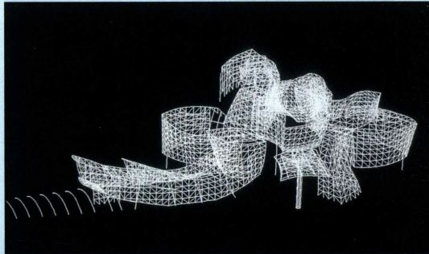
> *西班牙毕尔巴鄂古根海姆博物馆的电脑生成示意图*

这座建筑的曲线性团块与正统的解构主义背道而驰，后者十分强调平面与棱角。盖瑞运用计算机技术设计了建筑中的复杂形式，而这种技术同样是建筑施工所需工具的组成部分（见第1088页的材料与技法）。博物馆甚至让人感到了高科技的气息，因为覆盖钢铁骨架的是一张轻薄的外壳，由成千上万块微小钛瓦组成。这些钛瓦在光线下闪闪发光，随着时刻与天气的变化，呈现出银色、蓝色和金色等不同色彩。建筑内部同样无比壮观：有一小部分传统的直线形房间用来放置现代艺术品，与容纳当代艺术的不规则大展厅形成了鲜明对照。其中之一被称为“船厅”，那是一条由两面厚重的曲面墙壁形成的悠长走廊。宽阔的入口大厅或许是建筑中最壮观的部分，这里有狭窄的通道交叉其间，又与升降电梯间相连；中庭中设计了由窗间壁构成的螺旋形条带，与一大片窗户与天窗相对。

20世纪末的建筑设计日渐多样化，毕尔巴鄂的古根海姆博物馆就是一例，所有设计应该遵循的规则似乎都被取消了。同样重要的是，这反映出建筑已经超越了单纯设计建筑物的界限。建筑师们再一次开始创造城市的显著标志。从构思来看，这座博物馆的设计意图就不仅仅是建造一座博物馆，还意在改变这座西班牙工业港口的面貌，重拾其文化的宝藏，将之变为一处旅游胜地。而这恰恰正是实际发生的情况：盖瑞设计了20世纪最伟大的建筑之一——弗兰克·劳埃德·赖特50年代设计纽约古根海姆博物馆（见图29.38、29.39）的附属馆，以其大胆独特的设计风格著称，甚至可以与正馆相媲美。

> **大事年表**
>
> 1980—1982 年——迈克尔·格雷夫斯设计公共服务部大楼
> 1989 年——柏林墙倒塌
> 1989 年——中国北京天安门广场政治风波
> 1989—1998 年——丹尼尔·里伯斯金设计犹太博物馆
> 1991—1992 年——南非共和国取消种族隔离政策
> 1992—1997 年——弗兰克·盖瑞设计毕尔巴鄂古根海姆博物馆
> 1994 年——尼尔森·曼德拉当选南非总统
> 2001 年——基地组织的恐怖分子袭击美国
> 2003 年——扎哈·哈迪德设计罗森塔尔当代艺术中心

### 建筑、体验与记忆：丹尼尔·里伯斯金

丹尼尔·里伯斯金（Daniel Libeskind，生于1946年）设计了柏林犹太博物馆（Jewish Museum，图30.16），这座建筑很好地反映出如今建筑多样复杂的程度，而且建筑还经常用来唤起公众，使其认识某些历史与社会问题，甚至有时可以成为城市的核心特征。犹太博物馆于1989至1998年间建于柏林，这座建筑让人回想起艾斯曼在1988年所界定的解构主义风格：其立面断裂曲折、尖锐错乱，还带有穿孔。尽管由锯齿状的变换平面构成，这一点类似哈迪德和蓝天组的作品，但是里伯斯金的建筑充满了隐喻与含义。外部的高科技锌涂层粗野狂暴，仿佛堡垒或孤独的岛屿。建筑的平面布局（图30.17）沿两条线组织起来，其一是连续曲折的锯齿线，通向“无垠”；其二则是断裂的直线，构成了一个宽约4米、高约27.5米的空洞（图30.18），该空间时断时续，贯穿建筑呈锯齿形的6个部分。其中某些通道被完全封死，其他的则可以从桥上或窗户中看到，但无法进入。锯齿形线条传达了一种旅途蜿蜒之感，对于一座犹太博物馆及其中的文物而言相得益彰；简朴的空洞象征着种族灭绝受害者的坟墓，同时也让人感受到犹太民族的永恒存在与繁衍。里伯斯金称博物馆的平面布局为破裂的大卫之星。同时这座博物馆又仿佛一道闪电，也有很多人将闪电看作表现上帝之怒的工具。这个形状还让人联想到纳粹党卫军，这隶属于希特勒的特种警察部队就曾在其军服上印有闪电图案。犹太博物馆将其极其动感、甚至暴力的建筑分割为默哀、沉思和哀恸三个部分，满载意味与情感，这是蓝天组和哈迪德的解构主义建筑中全然不顾的特色（见图30.13、30.14）。请里伯斯金担任建筑师这一举动甚至都别有意味；后者现为美国公民，但出生在波兰，是犹太种族灭绝幸存者的后裔。建筑师弗兰克·盖瑞曾这样说道：“你能在建筑中感受到他对种族灭绝的愤怒。”

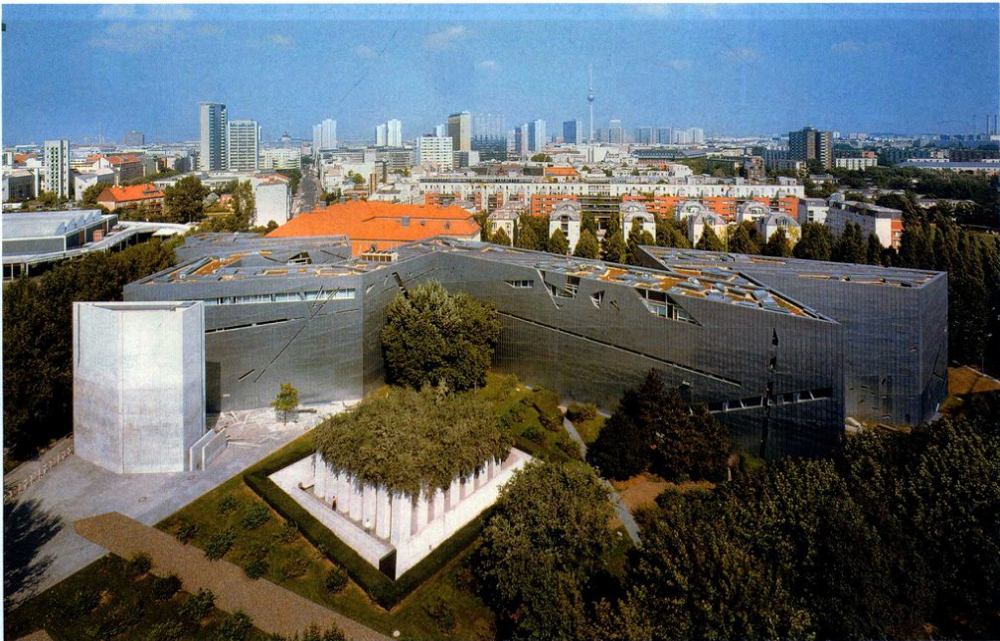

*图30.16 丹尼尔·里伯斯金德：柏林犹太博物馆。1989-1998年*

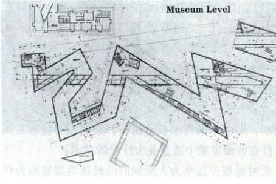

*图30.17 丹尼尔·里伯斯金：柏林犹太博物馆平面图*

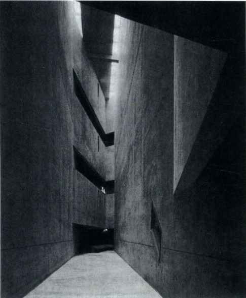

*图30.18 丹尼尔·里伯斯金：柏林犹太博物馆的空旷内景，内部架设有跨桥。1989-1998年*

## 后极少主义与多元主义：无限可能

从60年代晚期开始，后极少主义者抛弃了极少主义朴素的面貌（见第1055-1058页），重新将人物、艺术家手工痕迹、主观性与指涉引入艺术。70年代，对极少主义的回应伴随着广泛的议题、风格与材质同时出现。80年代期间，这种多元主义开始获得广泛认同，进而从边缘艺术变为了主流艺术。与此同时，德里达的后现代理论也为多元主义提供了理论基础，它反对所有权威的美学观与哲学立场。“在任何特定的时期，有且只有一种风格是正确的，能够推动艺术向前发展”，类似上述这种现代主义观念彻底消亡了。事实上，如果用一个词来囊括80年代以来的艺术，那就是“多种多样”。艺术市场也成为了真正的全球市场，来自各个大洲的艺术家尽情发展各自的风格，以几乎无限的媒介来表达广泛的题材。艺术变得复杂无比，难以恰当地将某位艺术家分门别类，或者给他／她贴上标签。

在最近25年间的艺术发展中，对于绘画的兴趣再度复苏，装置艺术流行开来，摄影与录像也取得了重要媒介的优势地位。艺术中最为流行的主题包括种族、民族和性别问题，对身体与死亡的关注，以及后现代分析或解构，即探究图像与艺术如何承载意义。如果说仍有某种因素将这个时期联系为一体的话，那就是现代主义及其权威姿态已经死亡的信念，以及艺术能为何物、艺术与何物相关的可能性不受任何拘束、乃至无限的信念。

### 绘画回归

1980年，绘画重新回归到人们的视野。虽然之前并没有完全消失，但是60年代晚期和70年代期间，观念艺术、录像艺术、行为艺术和大地艺术遮蔽了绘画的光芒。到了70年代晚期，受德里达影响的艺术评论将绘画与现代主义联系在一起，文中谈论到“绘画的死亡”。即便如此，一连串以绘画为主的展览依旧在70年代晚期至80年代期间于伦敦、纽约、德国和意大利相继开幕。在1982年谈论绘画复兴的著述中，评论家阿基利·博尼托·奥利瓦（Achille Bonito Oliva）在导言里这样写道：“作品的非物质化与创作过程的非人化是70年代艺术的特征，这严格遵循了杜尚的艺术道路。该特色现如今已经被手工技巧的恢复所压倒，创作过程的愉悦将绘画传统再次引入艺术。”克里斯托·若阿基米德（Christos Joachimides） 是另一位坚定的绘画拥护者，他赞美绘画的原因在于，现在“主观性、幻象、神话、痛苦和优雅使得其地位得以恢复”。80年代美国、西欧和日本激增的个人与企业财富助长了对于绘画的需求。70年代的经济衰退结束后，对艺术的需求日益增长，人们需要能够买到并悬挂在收藏家家中或企业大厅里的艺术。

此时涌现并逐渐为人所知的绘画新类型被称为新表现主义（Neo-Expressionism），这个挪用而来的标签指那些既具有涂绘性，又具有表现性的作品。新表现主义最初于70年代出现在德国和意大利，之后进入美国。德国那些颇为自觉的画家恢复了北部欧洲浪漫主义与表现主义传统，深深浸淫在本国文化之中。约瑟夫·博伊斯通过其神秘的行为艺术，催生了德国历史的复苏。他还与另外一些艺术家开始对于包括希特勒第三帝国遗产的探索。

**安塞尔姆·基弗** 安塞尔姆·基弗（Anselm Kiefer，生于1945年）是博伊斯在杜塞尔多夫艺术学院任教时的学生。基弗善于以神话题材创作史诗规模的图像，并由此唤起长达几个世纪的德国历史。在巨幅画作《致无名画家》（To the Unknown Painter，图30.19）中， 挥打上去的颜料让能量由画面中迸发而出，透视角度强烈的田垄则猛冲向一座古怪的巨大坟墓。冰冷荒凉、全无生机，这幅色调灰暗的图像似乎显示出死亡的氛围。冬季休耕的田地在春天会长出新的农作物，生命的循环生生不息。基弗以表现性手法运用了颜料和强烈的构图，而其手法则可以被看作对于自然持续运动与力量的隐喻。受到博伊斯使用的象征性物品的启发，基弗通常在绘画中结合真实材料，赋予其一种博伊斯式的仪式魔力。他将稻草插入颜料中，这样即使历经多年之后，观众仍然能够闻到稻草的气味。自然不仅表现为作品中的图像，同时也确实在场。然而，画作中的稻草终将分解，不能像田垄那样再次回春。

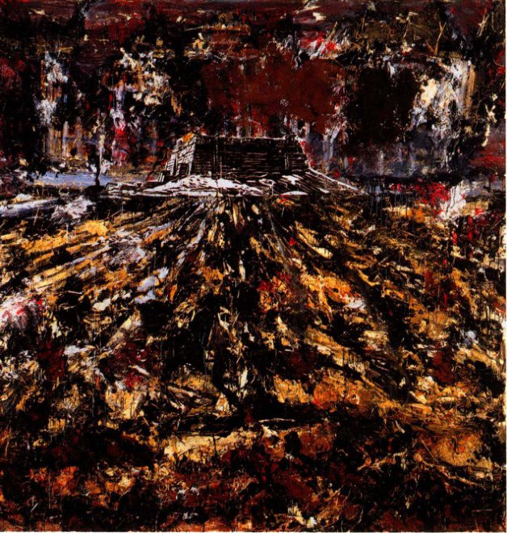

*图30.19 安塞尔姆·基弗：《致无名画家》。1983年。油画、乳化液、木刻、虫胶、乳胶和稻草，2.8 x 2.8米。宾夕法尼亚州费城艺术博物馆*

坟墓怎能适合这幅图像？正如标题暗示的，这是一座画家的陵墓。我们可以推断那是德国画家的坟墓，因为作品并非手绘而成，而是以大幅的木刻来表现。从文艺复兴时期到20世纪早期的表现主义者（见第958页），这种被北部欧洲艺术家广泛使用的媒介一直就与德国艺术联系在一起。地堡式的外形仿佛掩体，使得这座孤立、稳固的建筑似乎为漩涡般的自然力所环绕，不仅代表了德国的神话历史，还有驱策德国艺术家长达几个世纪之久的浪漫主义精神。从基弗的其他作品中可以得知，这些破坏性的力量象征了希特勒对德国浪漫主义传统的曲解，后者通过操纵这一传统为自己的种族主义计划服务。在第三帝国时期，所有先锋艺术家都遭到了镇压，即便是支持纳粹党的艺术家也落得同样下场。

在一幅关于国家身份的绘画中，基弗的表现主义风格与浪漫主义题材表明其支持北部欧洲浪漫主义传统的影响。他让我们确信，这一传统再次由安全的人所继承。图像中充满了丰富的象征、隐喻和交叠连锁的解释，多样而复杂，反映了基弗作品中涵盖的史诗规模，以及他所创造的神话题材。

**让-米歇尔·巴斯克雅** 在80年代涌现的众多美国新表现主义者中，让-米歇尔·巴斯克雅（Jean-Michel Basquiat，1960-1988年）是最令人激动的艺术家之一。他来自纽约的中产阶级家庭，父亲是海地人，母亲则是波多黎各人。巴斯克雅17岁辍学开始写诗，后来成为了一名街头艺术家，以“SAMO”（读音近似“same old”，意为“一样老”）作为签名。通过研读艺术书籍，他为自己的创作积累了渊博的艺术史知识，此后便开始绘画创作。年仅22岁时，巴斯克雅就成为了国际明星。但是在27岁时因吸毒过量身亡。

在1983年的作品《吹喇叭的人》（Horn Players，图30.20）中，巴斯克雅将诗歌与涂鸦手法结合在一起。更重要的是，他从70年代的多元主义中汲取了经验，出色整合了当时文本运用、创作过程艺术、叙事手法，以及针对社会政治的策略；此处针对的就是种族身份问题。巴斯克雅也从抽象表现主义和波普艺术中受益良多；前者表现为动态的颜料处理，后者则是卡通式的图像与参照大众文化的手法。

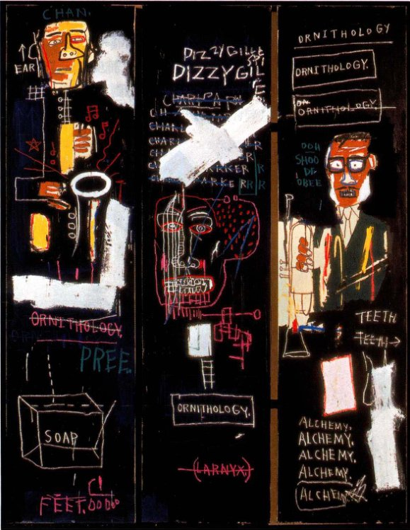

*图30.20 让-米歇尔·巴斯克雅：《吹喇叭的人》。1983年。布面丙烯和油彩棒，2.44 x 1.9米。私人收藏*

巴斯克雅是一位多产的艺术家，他创作迅速，并且带有强烈的意识流特质。我们可以切实感受到他的绘画、书写作品及删除行为。通过迫使观众解读和拼凑画面的方法，作者成功地将我们拉入画布之中；让我们在体验萨克斯管声响的同时，思考词语的重复及其韵律，并且分析其精妙的用色。这幅作品里就点缀有鲜亮的粉色、蓝色，以及黄色和绿色。所有元素都以一种有力的方式呈现出来，使得我们无法忽视巴斯克雅的用词，例如意指爵士乐魔力的“炼金术”（alchemy）、向爵士乐手查理·帕克（绰号为“鸟”）致意的“鸟类学”（ornithology），以及影射乐感的“耳朵”（ear）。他使用的词语让人回想起50年代的狂野力量，例如“敲打诗社”（Beat poetry）、即兴爵士乐和抽象表现主义，同时也可能联想到80年代的嘻哈乐。巴斯克雅创造了强烈的感性体验，与自己认同的人们分享着对于黑人音乐家蒂奇·吉莱斯皮（Dizzy Gillespie）和查理·帕克的激烈感受。他的大部分作品都以美国黑人音乐家、歌唱家和运动员为表现对象，反映出艺术家们如今已经赋予种族、民族和性别认同以重要的地位。

**伊丽莎白·默里** 1978年，纽约惠特尼美国艺术博物馆（Whitney Museum of American Art）举办了一届美国艺术家展览，主题为“新图像绘画”（New Image Painting）。这次展览不仅声称绘画生气勃勃、状态良好，还宣告了一种全新绘画类型的出现。这种绘画在看似抽象的作品中嵌入了一些具象物品。在这个时期，伊丽莎白·默里（Elizabeth Murray，生于1940年）创作的作品呈现了彻底的抽象风格，因此没能参加此次展览。但是在短短几年之内，她就开始在抽象风格中添加具象成分。由于这些可辨识的元素之间存在关联，于是成为了心理状态的隐喻。默里1983年的作品《意料之外》（More Than You Know，图30.21），表现了作者朝着指涉性抽象风格发展的趋势。乍看之下，这幅绘画似乎由全然抽象的形体构成。但是很快我们就会意识到，映衬在灰蓝色构成主义矩形之上的大片有机曲线其实是一把靠背细长的椅子。之后我们还会看到，大部分灰色的矩形仿佛一幅悬挂在黄色墙壁上的绘画。而最后，人形的绿色部分则好像一张四腿被压垮的桌子；桌子上又有一块白色，似乎是一张纸片，而旁边那个烦扰的生物形态令人回想起蒙克的《呐喊》（见图26.21）中的头颅。作者颇为紧张地对图像加以控制，另外还使用了被压垮的桌子与刺目的色彩，以及看似未完成的颜料处理和地板的剧烈倾斜，以上这些因素都说明了这一点。就连绘画的外形都显得狂野错乱。默里集合了十张画布，将其重叠起来，形成了参差错落的轮廓，将绘画转变为一架疯狂旋转的风车。作品中的一切似乎都是不固定的，好似漂浮在海上风暴中的碎片一样摇摆不定。在隆起的立体画作中，默里持续聚焦于日常生活的心理压力，以及隐藏在家庭和睦之下的尖锐现实。

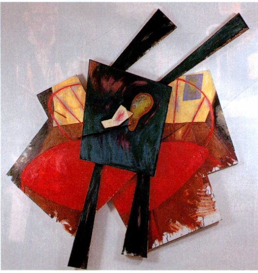

*图30.21 伊丽莎白·默里：《意料之外》。1983年。十张画布拼成的油画，2.82 x 2.74 x 0.2米。纽约佩斯威尔登斯坦画廊（Pacewildenstein Gallery），Edward R.Broida 收藏*

### 雕塑

雕塑领域的后极少主义美学结合了极少主义的几何形式，以及各种指涉和情感；后者在伊娃·海瑟和理查德·塞拉的作品中（见第1059-1060页）有所表现。后极少主义风格依然可以在80年代至90年代间的雕塑中见到；其出现在多样化的形式之中，既有美丽神秘的手工制品，也包括直接易懂的公共纪念碑。马丁·普耶尔的作品显然属于前者，而林璎的越战纪念碑则是后者。

**马丁·普耶尔** 马丁·普耶尔（Martin Puryear，生于1941年）是一位杰出的雕塑家，善于创作物品，而非装置。在雕塑中，他如评论家奥利瓦谈论绘画时说过的那样，“通过创作愉悦来恢复手工技法”。普耶尔曾参加“和平工作队”（Peace Corps）在西非国家塞拉利昂的服务活动，还曾在瑞典学习过版画和木工技艺，而且游历过日本。他后来于1973年定居布鲁克林，在那里成为了同辈艺术家中的一流雕塑家。

普耶尔首先引起人们注意的一件作品是1985年的钢木雕塑《魔咒》（The Spell，图30.22）。我们震惊于作品的曲线之美、圆锥的优雅尖细，以及矩形开口的变化多样；平板木条拥有细细的条纹，其充实的质感让“木条”看起来像是一个篮子。对编制篮子的影射暗示手工艺和匠人，进而暗示了人的存在。我们可以感受到这件物品是由手工精心制造，与批量生产和机械制作的极少主义艺术截然不同。我们还能感到普耶尔的艺术背景不仅仅来自非洲，虽然他可能曾在那里见到过手工精湛的器皿和仪式用木器；他的艺术灵感还来源于瑞典，因为他曾在那里学习过木工；此外还有日本，那里具有制作功能性和装饰性木器的悠久传统。然而，仅仅由于普耶尔是一名美国黑人，就认定其艺术参照了非洲艺术的说法本身就是个错误。他的雕塑与民族身份和政治无关，只是反映出作者在多种文化中的广泛体验。通过以木材作为艺术媒介的方式，他得以将这些体验熟练、完美地表达出来。

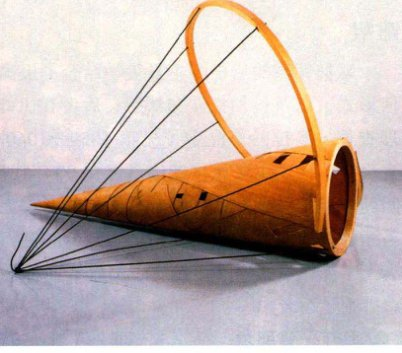

*图30.22 马丁·普耶尔：《魔咒》。1985年。松木、雪松与钢材，1.42 x 2.13 x 1.65米。艺术家个人收藏*

《魔咒》拒绝人们对其的解读。这件雕塑就像地板上的陷阱，仿佛一件容器，但又不是。尽管标题暗示着神秘与巫术，但作品中并无任何与仪式有关的内容。相反，我们可以察觉到木材的本质，因此令人联想到自然。而无处不在的却是人的成分，即手工艺的成分。伊娃·海瑟虽然以截然不同的风格进行创作，但普耶尔与她一样，二者都将极少主义朴素的几何形变形为一个神秘、温暖的有机物品，充满了对于人的有力暗示。

**林璎** 林璎（Maya Lin，生于1959年）的越战纪念碑（Vietnam Veterans Memorial，图30.23）是80年代伟大的后极少主义雕塑之一。最初接到这个项目的委托时，作者尚在耶鲁大学建筑学院学习。这是一个令人望而却步的项目，因为当时人们对于越战抱有十分强烈的情感与看法。林璎的设计方案以其简洁的特性而引人注目，又以作品的中立性而显得聪颖独创，同时还兼具崇高情感的冲击力。她在作品中开列出战争中的阵亡者与失踪者名单，从1959至1975年按时序排列。名字蚀刻在黑色花岗岩石板上，而这些石板又在大地上刻出了一道V型的伤口。观众从左方看起，这里呈现的是1959年首批阵亡者的名单，花岗岩石板升出地面之上。刻满名字的石板逐渐升高，延伸到75.2米之外，阵亡的美国人越多，石板的高度就越高。人名的数量不断增加，观众在情感上立刻就被如此之大的数目所震惊。

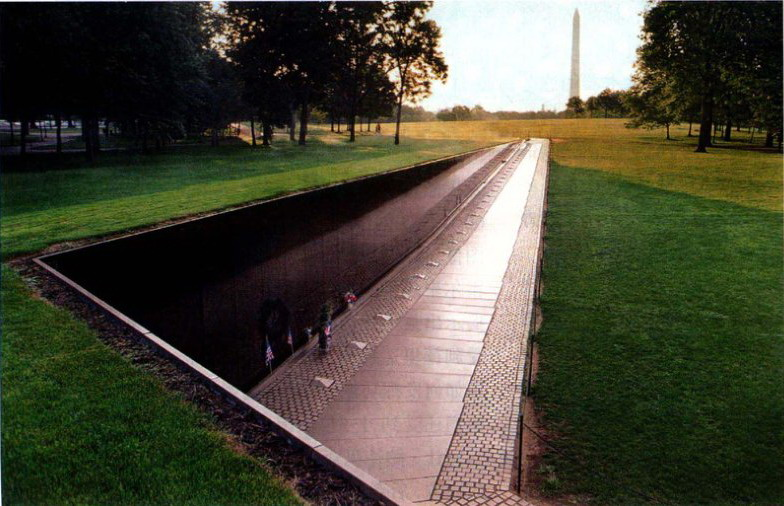

*图30.23 林璎：越战纪念碑。1982年。黑色花岗岩，长150.42米。位于华盛顿特区国家大草坪*

在高3米有余的顶部，花岗岩石板以130度的角度折转，之后则逐渐下降，延伸出另外一个长75.2米的部分。愈是临近美军从越南撤军的1973年，死亡士兵的数量就愈少。花岗岩在末端时再一次消失于泥土之中，很多观者在此都可以感受到生存的虚无感。抛光石面仿佛一面镜子，将生者的影子映照在亡者的名字之上，由此产生的冲击进一步加深了人们的失落感。这座纪念碑与传统的英雄主义具象纪念碑截然不同，例如吕德的《马赛曲》（见图24.30）；后者歌颂为国家民族献身的精神。在某种意义上，花岗岩墙壁扮演着巨型墓碑的角色。虽然这件作品采用了极少主义雕塑的形式，但经由其中的指涉含义转变为一座杰出的后现代纪念碑，充满了强烈的情感。

## 解构艺术：情境成为意义

到了1980年，很多艺术家都开始创作探索如何发挥图像功能的艺术作品。沃霍尔和利希滕斯坦早在60年代就创作过此类艺术，他们挪用了大众媒体中的图像，以此来展示这些图像如何影响公众的感知。沃霍尔聚焦于令产品看来诱人的伪装，而利希滕斯坦则揭示出某种社会典型（见第1051-1054页）。现在，受到德里达解构主义思想的影响，更多的艺术家就图像如何发挥功能、情境如何影响意义的问题展开探索。他们还受到另一位法国后现代哲学家或后结构主义哲学家让·鲍德里亚（Jean Baudrillard，1929-2007年）的影响，后者的拟像（simulacrum）理论影响尤为重大。

鲍德里亚曾这样写道，当代美国文化的基础是“超级现实”（hyperreality）的观念，通过包含电影、电视在内的大众媒体，美国人创造了一个虚假、完美、永恒的世界，仿佛比现实本身更加“真实”。实际上，复制品取代了真实，观看图像和通过图像体验世界成为一种真实经验的拟像或视觉替代。艺术家们现在则开始表现这种拟像的情景，挪用大众媒体的图像，分析情境如何影响意义。

实际上，这些艺术家的作品将社会环境中使用的图像进行了组构。他们通常挪用图像与设计图案，并将其放置在另外的情境之中，以披露或解构原始图像所呈现的社会、美学、政治和经济体系。最终的结果造成了对原始图像权威性的澄清，甚至破坏。通过将图像置于新情境的方法，艺术家们揭示了图像最初如何用来宣传某个群体观点的过程，而这些人的想法通常要损害他人的利益。

**希格马·珀尔克的绘画** 60年代至70年代期间，整个艺术界都聚焦纽约，其他艺术中心基本都被忽视了，对于欧洲的艺术中心来说更是如此。德国的情况尤为典型，杜塞尔多夫的艺术家们创作出某些该时期最为重要的一些作品，然而只有约瑟夫·博伊斯获得了国际认可。直到80年代中期，纽约艺术界才发现了希格马·珀尔克（Sigmar Polke，1941-2010年）、格哈德·里希特（Gerhard Richter），以及伯恩哈特·贝舍（Bernhard Becher）与希拉·贝舍（Hilla Becher）所组成的摄影小组。与安塞尔姆·基弗和其他部分杜塞尔多夫艺术家一起，他们终于在20世纪末征服了纽约、伦敦和巴黎的艺术舞台。

珀尔克及其密友里希特的绘画让人眼界大开，这些作品是对于德里达后现代解构主义理论的直接体现。德国艺术家在60年代围绕着“图像如何取得意义”这一课题进行创作；事实上，杜塞尔多夫的艺术家们已经发展出了独立于德里达的后现代主义形式，他们早在60年代中期就创作了这些后来才引起关注的绘画作品，在创作时间上要早于德里达的理论在艺术家中广为流行的时期。他们在杂志上看到罗伯特·劳申伯格、波普艺术，特别是罗伊·利希滕斯坦和安迪·沃霍尔的作品，并受到其强烈影响。这些艺术家还精通达达艺术和激浪派艺术（见第1051页），这两种艺术形式在1963年正式来到杜塞尔多夫，而早在1958年，这里就举办过首届战后达达展览。博伊斯的精神性是众多艺术影响中最为重要的一环。在他于艺术学院任教时，这些艺术家都曾在那里学习。

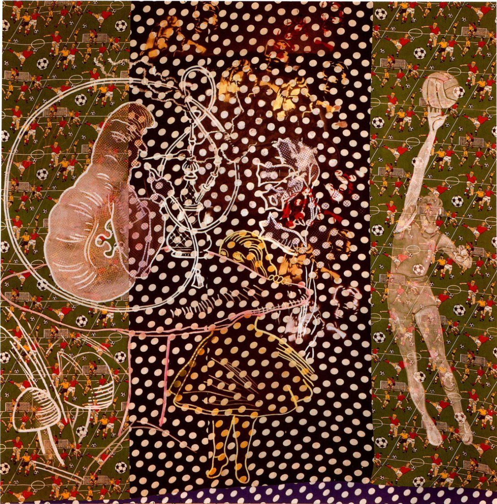

*图30.24 希格马·珀尔克：《爱丽丝漫游奇境记》。1971年。布条上的混合材料，3.2 x 2.61米。科隆私人收藏*

如此背景下，珀尔克的绘画作品将挪用而来的图像、图案和来源各不相同的设计结合起来，1971年的《爱丽丝漫游奇境记》（Alice in Wonderland，图30.24）就是如此。珀尔克在足球运动员和圆点花样的织物上，采用沃霍尔的方式机械印制了来自其他媒介的图像，这一手法通常被称为“挪用”（appropriating）。在这幅作品里，白色的篮球运动员图像取自杂志，爱丽丝和抽水烟袋的毛虫则直接来自《爱丽丝漫游奇境记》的插图。在复制品中，很难清晰看到50年代风格的男女头部轮廓；这部分其实为红、黄两色，经手工反复印压而成。珀尔克从流行文化中借用了所有图像，然后在巨幅绘画中将其呈现出来。他不使用画布，而是在商店出售的印花布上进行创作。在不同的情境中分别看待这些图像，其解读方式会与在此幅作品中整体解读时发生变化。换而言之，二者之间的关系创造了一种情境，影响并改变着他们的意义。珀尔克避免赋予作品固定的意义，相反，他允许观者从这片万花筒般的图像里编织任何他们能想象得到的故事。

“常见的流行图像如何建构我们的世界”是珀尔克所关注的问题。他就“人们眼之所见如何变成脑之所知”的问题展开探索，其中还包括了其进一步拓展成为“心之所信”的过程。他考察图像建构我们思考、感觉和态度的方式。在《爱丽丝漫游奇境记》中，珀尔克塑造了童年时期盲目乐观的图景，天真无邪的儿童相信完美的冒险、健康的运动和迷人的童话故事，而这些都是大众媒体宣传和室内设计的结果。但是与美国波普艺术家的作品不同，珀尔克的绘画更具情感内容。织物上飘浮着鬼魂般苍白的剪影，圆点和足球运动员之间则压印有50年代的人物头像，创造出一种缥缈，甚至是浪漫的特质。缺失感和失落感，以及生命和万事万物在自然中的流逝，赋予了珀尔克的绘画以惊人的精神属性。

**摄影与LED标牌** 艺术界对于绘画的热情在80年代得以持续，但摄影、录像和装置艺术在同一时期也成为了重要的艺术形式。辛迪·舍曼、劳里·西蒙斯（Laurie Simmons）、路易斯·劳勒（Louise Lawler）、芭芭拉·克鲁格和理查德·普林斯（Richard Prince）是首批向画家发起挑战的后现代摄影师。虽然最初在商业上没有获得成功，但到了80年代末，摄影师已经取代了画家的地位。现在看来，与绘画相比，他们的艺术作品似乎与当下更为相关，因为其着重于呈现世界。正如鲍德里亚所指出的，我们实际上是通过镜头来体验大部分的世界，而非亲身去体验。与今天的很多艺术家一样，这些后现代摄影师还受到了德里达和鲍德里亚理论的深刻影响。像约瑟夫·科萨斯以及在60、70年代期间开始使用照相机的先锋艺术家那样（见第1063-1064页），这些艺术家中的大部分人都对拍摄和洗印照片的机械过程不感兴趣。其中有些艺术家并不亲自拍摄，也就更没有人会去自己冲印照片。让这些艺术家颇感兴趣的是揭示图像的情境对其意义的决定性作用，这还进一步展现了大众媒体是如何通过颠覆性的内容重构来操纵观众。

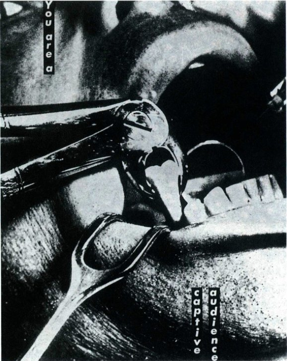

*图30.25 芭芭拉·克鲁格：《你是被俘虏的观众》。1983年。明胶银版成像，122 x 96厘米。纽约玛丽·伯恩画廊（Mary Boone Gallery）提供*

芭芭拉·克鲁格（Barbara Kruger，生于1945年）在《你是被俘虏的观众》（You Are a Captive Audience，图30.25）中就鲜明表达了这一立场。这是一幅高1.22米的照片，同时也洗印了30厘米的小型版本。克鲁格直接挪用了一张拔牙的照片，然后将标题直接叠在图像上。她通常用红底色来衬托白色文字，红色暗示俄国的宣传色。尽管看来痛苦，这幅令人不安的图像却成功创造了一个“我们与他人”的对立状态。我们就是被俘虏的观众，受到大众媒体的折磨摆布，克鲁格因其平面设计的经历而对此了然于心。通过结合直率的图像与精确的文字，克鲁格传达出这样的含义，广告实则反映了某个人的目的；这个人可能关心我们的利益，也可能对此全然不顾。强烈的特写捕捉到广告造成的巨大影响，并强调了促销与营销如何入侵我们的个人生活与私有空间。

克鲁格揭示了媒体的原始力量，而辛迪·舍曼（Cindy Sherman，生于1954年）则更关注媒体的微妙之处，以及观众参与意义决定过程的情况。从1977年开始，舍曼开始创作一个称为“电影剧照”（Film Stills）的系列作品；拍摄对象就是她自己，而身处的环境则类似B级电影剧照。她为每张照片单独设计了背景与女性人物，而自己则负责扮演角色，身着不同的服装、假发，旨在令人们无法分辨出照片里的人物其实是由同一个人扮演。这种舍曼本人永远是主角的情形在创意上十分重要，其变装则呈现出女性下意识的外形变换，以符合由大众媒体强化、甚至决定的社会类型。在《无题电影剧照15号》（Untitled Film Still #15，图30.26）中，舍曼扮演了一位“性感宝贝”，焦急地等待约会或情人的到来。但这是真实发生的情形吗？舍曼留给观众猜测的空间。艺术家可能暗示了一个故事，却没有提供足够的限定信息。事实上，观者想象的故事与其个人背景、经历和态度相关，与晦涩的照片本身关系较少。舍曼的“宝贝”也很有可能并非为了约会，而是为了化装舞会才装扮成这副模样，她关注的目光也可能正投向下方的街道。根据其中的内容可以编造出无数故事，还可以把十字架挂件、过时的高背椅子和砖墙等细节也考虑在内，这些东西与艺术家年轻和衣着暗示的当代生活方式之间产生了冲突。移除其中的任何一个元素，这个故事就会发生改变。通过一个貌似简单的策略，舍曼十分有力地揭示了图像被注入意义的复杂方式（见第1099页的原始文献）。

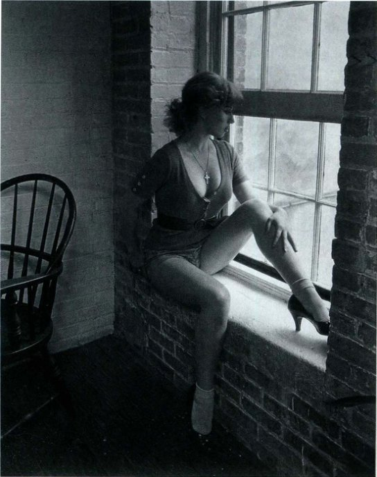

*图30.26 辛迪·舍曼：《无题电影剧照15号》。1978年。明胶银版成像，25.4 x 20.3厘米。艺术家和纽约大都会影业提供*

> **原始文献：辛迪·舍曼（生于1954年）节选自访谈录**
>
> 在以下这段珍妮·西格尔（Jeanne Siegel）1988年所作访谈的节选中，舍曼谈论了自己在摄影作品中的角色扮演。
>
> **辛迪·舍曼：** 我仍然想创作出电影式的图像，但是我更想进行独自创作。我意识到自己可以拍摄某个角色的照片，捕捉这个角色对于取景框之外事物的反应，这样可以使得观者假设有另外一个人的存在。
> 事实上，当我和罗伯特·龙戈（Robert Longo）拜访大卫·萨勒（David Salle）时，才意识到如何解决这个问题。大卫那时正在为廉价的侦探杂志社工作。在无聊地等着罗伯特和大卫结束“艺术会谈”时，我发现杂志上那些米的照片激活了某种东西（我讨论问题时从来都不是一个人，毕竟在那个时候我的身份是“女友”）。
>
> **珍妮·西格尔：** 现实中的电影明星对《无题电影剧照》有什么影响呢？似乎你着迷于欧洲影星，你曾在某些谈话中提到让娜·莫罗（Jeanne Moreau）、碧姬·芭铎（Brigitte Bardot）和索菲亚·罗兰（Sophia Loren）。她们有什么吸引你的地方呢？
>
> **辛迪·舍曼：** 可能是因为她们并没有像美国的年轻明星那样被美化了。同时期的美国女演员在我看来就是漂染着金发、珠光宝气和身着毛皮的性感炸弹。但是让娜·莫罗和索菲亚·罗兰在我眼中显得更为脆弱，更像是来自下层阶级，也更符合工人阶级妇女的特征。
> 那时我力图效仿一大批不同类型的人物，不想固定在某一种上。我看了很多这些女星出演的电影，但我更多是受到电影本身和电影感觉的启发，这些女星的影响其实比较少。
>
> **珍妮·西格尔：** 那么你的《无题电影剧照》与真实的电影剧照有什么关系呢？
>
> **辛迪·舍曼：** 40年代和50年代的电影剧照海报中，通常都会出现一幅性感或者漂亮的画面，以此吸引人们来看电影。恐怖电影宣传海报中则会出现惊恐尖叫的女性形象。
> 而我最喜欢的电影图像中并没有这些元素，而且我的作品显然是受到了我所喜爱图像的启发。其实那些图像更接近于我自己的作品，因为这两种图像都表现了一种处于潜在暴力与性之间的沉思人物类型。然而，我意识到建立这种直接联系是一个错误，因为我的作品在比较中消失了。我认为自已的人物并没有被他们的角色吸收，所以就不能够在任何一部所谓的“电影”中真实存在。与真实剧照进行对比的话，他们看起来难以令人信服。他们对自身角色的讽刺性认识得过于充分了，这可能就是为什么很多人都面带迷惑的原因。我的“剧照”表现的是角色扮演的虚假，同时也是对专横“男性”观众的蔑视，正是他们将图像误读为性图像······
>
> **珍妮·西格尔：** 有关这些作品的另一个关键是一种看法，认为“男性”目光决定了传统观点。你是只从这个方面来看待问题，还是同时包括了一种女性对于自身的检视？
>
> **辛迪·舍曼：** 因为我是女性，所以我自动假设女性会有一种对于角色的直接认同。我希望男性能够对人物心怀同情，并且清楚展示其所扮演的角色。我没有料到的是，有些人认为我这样做是为了迎合男性。我能够理解女性主义者的批评，他们因此断定我不过是在重复女性作为受害者和性工具的陈词滥调。
>
> SOURCE: FROM AN INTERVIEW WITH JEANNE SIEGEL FROM ARTWORDS. 2 ED. JEANNE SIEGEL (NY:DA CAPO PRESS, 1990). COPYRIGHT 1988 BY JEANNE SIEGEL. REPRINTED BY PERMISSION OF JEANNE SIEGEL.

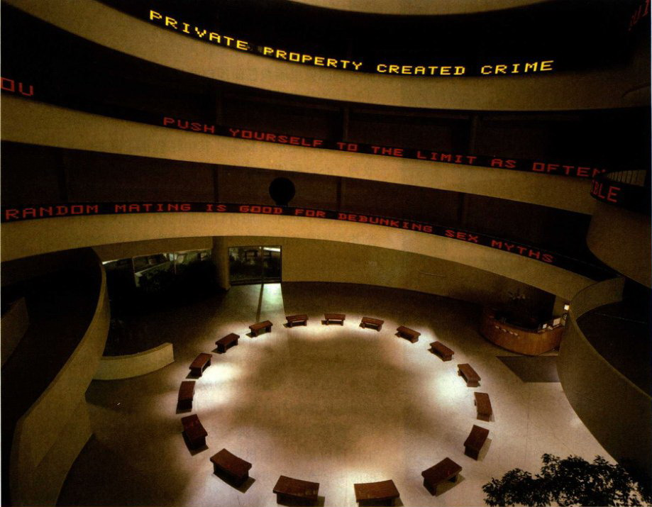

*图30.27 詹妮·霍尔泽：《无题》，选自《真实性》、《煽动性檄文》、《生活系列》、《生存系列》、《岩石之下》、《哀恸》和《儿童课本》。1989年。延长的螺旋形三色LED电子显示屏，40.6 x 4937.8 x 15.2厘米，特定地点尺寸。纽约古根海姆博物馆*

和克鲁格、舍曼一样，詹妮·霍尔泽（Jenny Holzer，生于1950年）也运用自己想要揭露的媒介进行创作。霍尔泽针对的目标是已经变为真理的广告标语。1977年，她开始撰写自己所谓的“口号”（truisms），并将其印在海报、传单、T恤和帽子上。最后，她又将这些标语转移到电子标牌，甚至在1982年时使用了纽约时代广场的大型电子广告牌。80年代中期，霍尔泽开始运用LED（发光二极管）标牌进行创作，她本人也正是以这种作品而为人所知。霍尔泽使用的口号是人们编造的格言警句和俏皮话，表达了内容广泛的态度与偏见，例如“谋杀也性感”、“男孩女孩一个样”、“过剩不道德”和“道德是给小人物准备的”等。事实上，她呈现了克鲁格“我们与他人”对立状态的两个方面，但冲击力一样强烈。她的作品唤起了这样的意识，即某个人力图将某个立场强加给他人。霍尔泽在1989年为古根海姆博物馆创作了口号装置（图30.27），LED标牌沿弗兰克·劳埃德·赖特设计的螺旋形坡道延伸开来，下方则是排成仪式圆圈的长凳，座位处还蚀刻有口号字句。无论观者转向何方，他们都难以避免被操纵、控制，不得不接受长篇大论的说教。但什么是真理？谁在讲话？对谁讲？

**雕塑** 杰夫·昆斯（Jeff Koons，生于1955年）以全然不同的媒介，就美术雕塑与大众文化的关系，以及两者之间的区分展开探索。昆斯的作品中富含观念性问题。多样化的观念驱使他采用多样的媒介，并创作出多种风格的作品。昆斯持续推进雕塑的界限，其创作出的物品本身就跨越了很大范围。既有挂在充水鱼缸中的两个篮球，也有青铜铸造的水中呼吸器；既有兔子形状的彩色气球，也有花朵制成的小狗，高达13米。

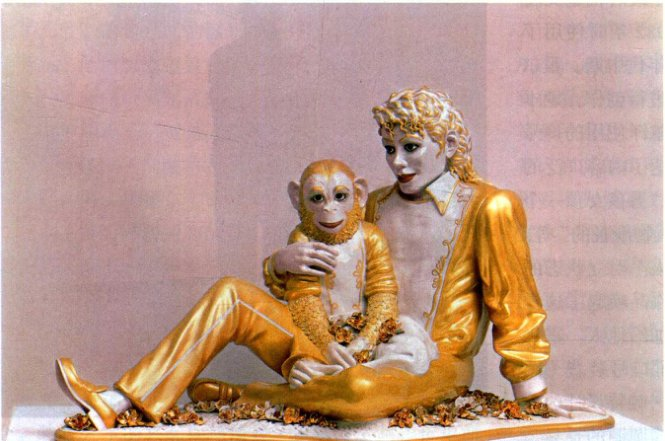

*图30.28 杰夫·昆斯：《迈克尔·杰克逊和泡泡》。1988年。陶瓷，106.7 x 179.1 x 82.5厘米。索纳本德画廊（Sonnabend Gallery）提供*

1988年的陶瓷雕塑《迈克尔·杰克逊和泡泡》（Michael Jackson and Bubbles，图30.28）却是一件截然不同的作品。像沃霍尔的印刷品一样，这尊雕塑也由工厂负责制造，意大利工匠按照昆斯的详细指示制作了这件限量版作品。艺术家本人并没有绘制或设计作品的图像，而是以杜尚式的方式进行了选择，图像来自于歌手及其黑猩猩宠物的宣传照片。作品的华丽令人回想起17世纪的意大利巴洛克雕塑（见第十九章）和18世纪的法国瓷器，然而艳俗的金色涂料、涂着口红的双唇，以及来自流行文化的图像，这些因素都赋予了作品一种粗糙的面貌，仿佛批量生产的礼品玩偶。昆斯也意识到这一点，于是将主题以真实的尺寸呈现，让作品看来就像一尊表现希腊诸神的古典雕塑。他将大众媒体中的图像放入美术情境之中，赋予其全新的意义。昆斯将其从媚俗（kitsch）的纪念品转变为有关艺术定义的有力宣言，进而探索了美术和“低俗”艺术之间的区别。由于纪念品本质上是一件商品，昆斯也通过这一点提醒我们，艺术其实也是商品。昆斯以沃霍尔式的手法，再一次捕捉并模仿了名流宣传的浮华。但是人像的低矮与陶瓷材质赋予了作品短暂易碎的辛酸感，暗示生命与声名的昙花一现。昆斯将杜尚、沃霍尔和德里达的影响熔于一炉，使之符合以消费为导向的80年代。

## 装置艺术与录像艺术的力量

“装置艺术”（Installation art）最早出现于50年代晚期，当时的作品被称为环境艺术，后来在80年代广泛流行起来，与摄影一样成为了重要的艺术媒介。装置艺术的兴起促使詹妮·霍尔泽从制作传单海报，转而进行大型LED标牌的环境展示。基弗在画布中结合了真实的材料，急切地使用真实的事物，在1980年之后的大部分艺术作品中十分常见。

**伊利亚·卡巴科夫** 在80年代涌现出来的大批装置艺术家中，来自俄国的伊利亚·卡巴科夫（Ilya Kabakov，生于1933年）是其中最有魅力的一位。他于1988年从莫斯科移民纽约。1981至1988年在俄居住期间，他创作了称为《十个人物》（Ten Characters）的系列房间，复制了共产主义体制下俄国政府分配给人民的破旧社区公寓类型。每间屋子里都居住有一个想象出来的人物，具有“非同寻常的理想，吸纳一切的激情只为他独自所有”。《从公寓逃入太空的男子》（The Man Who Flew into Space from His Apartment，图30.29）是一间引人注目的小卧室，我们看到房间中的人实现了飞入太空里的梦想，从弹簧弹弓发射，猛冲向天花板，影射美苏之间的太空竞赛。和其他房间一样，这个房间也附有俄国小说家陀思妥耶夫斯基（Fëdor Dostoevski）所写的可怕故事。文本、坍塌的天花板、柔软的吊索和混乱的状态构成了苏联生活的图景，令人难耐的贫穷造就了毫无希望的虚幻国家，在幻想中逃避成为摆脱日常苦工的唯一方式。我们在这件作品中看到的不仅仅是一个人的生活幻灭，还是塔特林、构成主义者、达达主义者和共产主义世界心中乌托邦之梦的破碎。卡巴科夫的装置呈现为一个真实事件的遗迹；与其他遗迹一样，都具有强烈的气氛，而这种效果在传统绘画与雕塑作品中几乎难以做到（见本页的原始文献）。

*图30.29 伊利亚·卡巴科夫：《从公寓逃入太空的男子》，出自《十个人物》。1981-1988年。混合材料装置，真实尺寸*

> **原始文献：伊利亚·卡巴科夫（生于1933年）**
> 
> **《论装置》（On installations）**
>
> 卡巴科夫在《十屋》（Ten Rooms）中谈论了自己的装置，这些作品所针对的就是苏联的生活。他尤其强调空间在自已装置中的重要性，并声称空间的精神造就了作品的情调与意味。
>
> 这种“空间精神”是怎样抓住你的呢？首先，房间总是破坏性的，而且并不均衡，临近荒谬的边缘；或者反过来说，是癫狂的均衡。其次，房间看起来呆滞、压抑，昏暗不明，但并不是因为窗户太小或者灯的亮度不足；重要之处在于，白天和夜晚光线的安排都令人痛苦，还非常可怕，为那个场所带来了一种奇特的不适感。房间效果的第三个重要特色是从规划阶段到施工过程的劣质荒谬。每件东西都是个欺诈，远没有完工，到处是污垢和裂缝。就连其中最为耐久的材料也不过是古怪的临时性材料，制作相当随意，只是为了“过关”而已。
>
> 让人尤其沮丧的事情在于每样东西都又老又旧，还很不干净，完全没有高贵的“时光铜锈”，而一般认为那才是“过去美好时光”的印记。称其“老旧”，是指其老朽、无用。尽管这些物件可能昨天才完成制作和上色，但已经成为了应该被抛弃的过时之物。每个地方，每件东西，都给人以布满灰尘的肮脏印象，墙壁、天花板、地板和房屋角落都是如此。但更奇怪的是这些房间居然还包括了私人套房，而这些套房又不属于任何人，并非谁的房间，其实也没有人在意。没人喜爱这些房间，只是暂时栖身其中罢了，离开后根本不会记得，这里就仿佛一个车站、地下通道或者公共汽车站的洗手间。
>
> 充分相互联系的群居生活是正常的生存手段，这种俄国传统的“公社”形式后来也进入了苏维埃现实社会。人成为了公社中或自愿、或驯服的参与者，被永远淹没、消解了。而另一方面，公社救护你、支持你，让你不至于消失，不在孤独绝望、物质和道德缺乏的状态中腐烂。你生命的每一秒都属于某个集体······周围空间的氛围在本质上就是其“精神”······你立刻就可以感受到这一点，而你所要做的只是选择自己要进入哪个空间。
>
> SOURCE: ILYA KABAKOV, THE TEXT AS BASIS OF VISUAL EXPRESSION. ED. ZDENEK FELIX. (COLOGNE: OKTAGON, 2000)

**比尔·维奥拉** 录像和电影装置是极为普遍的装置类型，这种形式来自罗伯特·惠特曼在60年代早期创作的电影装置（见第1049页）。在从事此类创作的艺术家中，比尔·维奥拉（Bill Viola，生于1951年）是最著名的一位，他也是最早专门创作录像艺术的艺术家之一。70年代维奥拉从锡拉丘兹大学（Syracuse University）毕业之后，开始创作录像艺术；到了80年代早期，他将录像与包含真实物品的装置或环境艺术结合在一起。虽然维奥拉的作品并不总具有清晰、连贯的叙事情节，却具备一贯的主题，通常都以一种强烈、混乱的方式追问存在的意义。

*图30.30 比尔·维奥拉：《穿越》。1996年。音像装置，双信道彩色录像投射在1.83米高的屏幕上，播放时间10.5分钟。1997年在洛杉矶大中央广场（Grand Central Market）放映时的一幅屏幕*

《穿越》（The Crossing，图30.30）是维奥拉最著名、也最为简洁的作品之一。在并置的两块屏幕或同一屏幕的两面，同时放映两段时长约10分钟的投影：一位衣着普通的男子从远方走来，穿越一段空洞黑暗的空间；他的身体越来越大，直到充满高3.65米的屏幕才停止。在其中一段投影里，水开始向他滴落，最终变成一片洪水，将人物整个冲走。而另一段投影中，小火苗从他脚下燃起，火焰愈燃愈高，最终将他完全吞噬。投影结束时，水又奇妙变回了水滴，而另一块屏幕中的火焰也神秘地化为烟尘。录像里的声音震耳欲聋，分别展示瓢泼而下的水声和火焰的噼啪声，增强了图像的力量，而且提升了图像对人内心的冲击。维奥拉的水火自然象征物似乎将人物完全摧毁。这两种力量也可能形成了一个转变过程，让人体消融在精神的国度，并穿入更高层次的现实，与不可见的宇宙力量合为一体。我们并不知道。录像让人感受到身体和感官的存在，之后又通过一种无情的方式将我们留在了存在的虚空之中。现在的时代中科技能够延长生命，绝症也有望治愈，比尔·维奥拉等艺术家却选择回归到20世纪早期对于精神的追求。而其他一些艺术家绕开了精神问题，将注意力完全放在死亡上。

### 多种风格汇于一身：冈萨雷斯-托雷斯

后现代艺术家抛弃了传统的媒介、风格和内容区分，以多种媒介和风格进行自由创作。培养某种容易识别的“面貌”或特征并不重要。费利克斯·冈萨雷斯-托雷斯（Felix Gonzalez-Torres，1957-1996年）就是这种态度的典型代表，杰夫·昆斯和奇奇·史密斯、达米安·赫斯特、蔡国强也是如此。冈萨雷斯-托雷斯的创作范围涵盖了相当广泛的媒介与社会议题，他最为著名的作品就聚焦于艾滋病的心理影响及人们对这种传染病的态度。冈萨雷斯-托雷斯生于古巴，通过1981年的马列尔偷渡事件（Mariel boat lift）来到美国。“以极少主义方式进行创作的观念艺术家”是对他最为准确的界定，他在创作中正是以尽可能简洁的手法呈现自己的理念。尽管语汇简洁，但作品的情感冲击极其强烈，其中的内容与暗示也意味深远。

冈萨雷斯-托雷斯的创作媒介包括七巧板、镜子、灯丝，乃至活生生的摇摆舞演员。他在1991年的作品《无题》或《洛杉矶的罗斯像》（Untitled 或 Portrait of Ross in L.A.）中还使用了糖果作为创作媒介。这是一座极少主义风格的金字塔，由多彩糖果堆积在画廊角落处而成。糖果总重约80公斤，这正是冈萨雷斯-托雷斯的合作者罗斯·雷考克（Ross Laycock）的体重，他早先死于艾滋病的并发症。观众通常会在守卫的引导下，拿走一块糖果，而逐渐缩小的糖堆就象征着罗斯健康的恶化。通过鼓励博物馆参观者的参与互动，冈萨雷斯-托雷斯希望能启发公众，使其意识到与艾滋病相关的很多问题，其中包括用以对抗疾病的公共基金不足这一现实，以及患病者和爱他们的人所付出的情感代价。

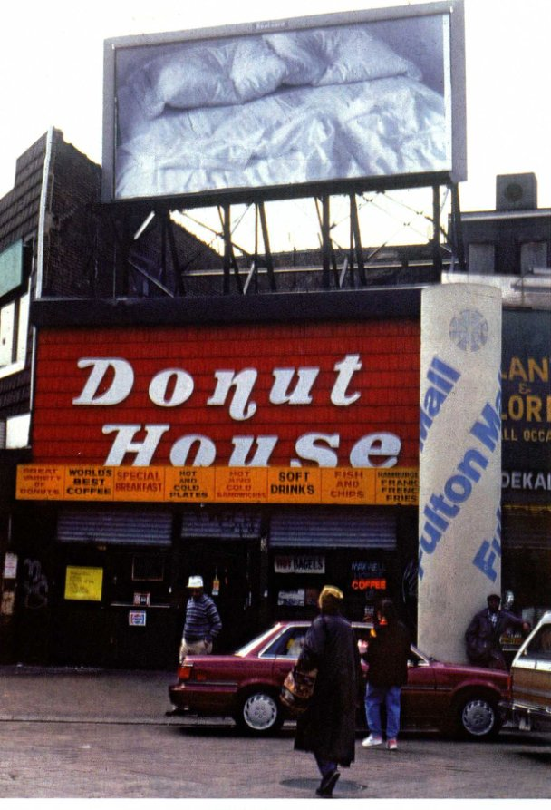

*图30.31 费利克斯·冈萨雷斯-托雷斯：《无题》。1991年。广告牌。费利克斯·冈萨雷斯-托雷斯基金会*

与众多80年代的艺术家一样，冈萨雷斯-托雷斯将自己的艺术从纯粹艺术情境中抽离，放入了公共领域。1991年，结合纽约现代艺术博物馆的展览，他在城市中安装了24个广告牌，张贴有未经整理、空无一人的蓝色调的床铺照片，令人心生寒意（图30.31）。这些牌子与传统的广告牌不同，充满了谜团，迫使人们追问是谁人所做、为何而做。而这正是纯粹的后现代图像，具有高度的暗示性，能够对其进行广泛的解读。尽管具有某种政治目的，但冈萨雷斯-托雷斯并非喊口号的人。但即便没有文本，未经整理的床铺这一简单图像也传达了大量的信息，唤起了人们对亲密关系和爱的想象，同时还可以感受到失落、缺失，乃至死亡终局。艺术家希望这幅图像可以使人们意识到有数千名男同性恋者死于艾滋病，还有那些受此病侵害的异性恋和儿童。作品背后的意义聚焦于痛苦和失落，冈萨雷斯-托雷斯希望其能够让公众认识到这种疾病的危害。1996年他死于艾滋病，享年38岁。

> **大事年表**
>
> 1981年 - 桑德拉·戴·奥康娜就任联邦最高法院大法官
> 1982年 - 林璎设计越战纪念碑
> 1983年 - 芭芭拉·克鲁格创作《你是被俘虏的观众》
> 1991年 - 万维网建成
> 1991年 - 苏联解体
> 1991年 - 欧盟成立
> 2003年 - 蔡国强创作《光环》

### 对身体的执迷

冈萨雷斯-托雷斯反映了艾滋病危机在后现代时期对艺术家们的巨大影响，以及他们为了吸引公众关注这一疾病所做出的努力。艾滋病蔓延到美国社会的各个方面，但可悲的是罗纳德·里根（Ronald Reagan）政府并没有重视这个事实。冈萨雷斯-托雷斯则通过有力的方式展示这个题材，并鼓励了很多艺术家纷纷追随他的脚步。他的作品还表现出对身体和人类脆弱性的全新关注，而这正是艾滋病病人的死亡与痛苦所带来的结果。

**奇奇·史密斯** 纽约艺术家奇奇·史密斯（Kiki Smith，生于1954年）在艺术创作中着重探索身体的脆弱性和生命的短暂。80年代，她在一件作品中使用了八个盛满血液的罐子，而且罐子之间完全一样；另一件作品中则出现了若干涂成银色的水冷却瓶子，瓶身上蚀刻有“眼泪”、“乳汁”、“唾液”、“呕吐物”、“精液”、“尿液”和“汗液”等体液的名称，让观者相信罐子里确实盛放着这些液体。由于包含着重复元素，作品本身极其类似于极少主义艺术。然而人们面对血液时的观念性想法却包含着人内心的强烈感应，具有巴洛克艺术和德国表现主义的情感冲击力。通过将人体缩减为携带病菌并会受到侵袭之体液的方式，史密斯否定了个体性和独特性。她揭示了所有人皆互相关联的自然要素，在人体内外往复循环。

临近1990年时，史密斯开始建构全身人像；她通常会使用纸张、混凝纸和蜡等易逝材料，以此作为对脆弱身体和生命短暂的隐喻。在1990年的无题作品中（图30.32），史密斯十分聪明地再现了古典的裸像传统。然而，我们看到的既不是希腊诸神，也不是英勇的运动员和士兵，史密斯选择来表现有血有肉的凡人。女人的乳房渗出乳汁，男人的阴茎流出精液，这些是滋养、生殖和生命的特征。但是死亡牢牢控制着整件作品，垂在支柱上的松弛身体与皮肤的可怕色泽都是死亡的征兆。史密斯在作品中呈现了整个生命周期，但弥漫其中的却是衰败的忧伤和无法逃脱的死亡宿命。

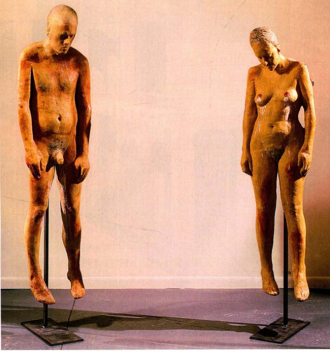

*图30.32 奇奇·史密斯：《无题》。1990年。金属架上的蜂蜡与微晶蜡像，装置高度为1.95米。纽约惠特尼美国艺术博物馆（Collection Whitney Museum of American Art）*

**达米安·赫斯特** 对死亡、衰败和无常最有力的呈现出自英国艺术家达米安·赫斯特（Damien Hirst，生于1965年）。赫斯特的个性张扬，经常被公开指责为无赖。他是一个成立于1988年伦敦艺术家小组的领袖，当年还在伦敦的某座仓库里举办了题为“凝固”（Freeze）的学生展览。因为其过分血腥的主题，这个小组在艺术界掀起轩然大波，还引来了暴风雨般的批评狂潮，而赫斯特本人的作品更是其中的焦点。那是一条飘浮在福尔马林储存槽中的鲨鱼尸体。赫斯特后来还是继续创作优美轻盈的绘画，将死蝴蝶添加进来，甚至还有将死苍蝇粘在巨幅画布上之类的极少主义抽象作品。在1993年的作品《母子分离》（Mother and Child Divided，30.33）中，母牛和小牛都被劈为两半，浸泡在满是福尔马林的容器里。赫斯特在此采用了极少主义的重复手法，将解体的牛放在完全相同的储存槽里，由此形成了科学客观之感，使人觉得那些半扇的死牛都是通过复制而来。极少主义储存槽起到框架作用，母牛和小牛则是“现实主义图画”。这种大胆呈现的优美与可憎拥有一种不寻常的魔力。然而正如卡巴科夫的装置作品一样，我们面对的是真实物体，同时也面对着其中蕴含的力量。我们与死亡面对面，同时还有为了延长动物尸体保存时间而做的徒劳努力。这件作品尤为强烈的方面在于母牛与小牛的分离，令人心酸地联想到母子之间曾经的情感羁绊。虽然很多评论家都谴责赫斯特的作品过于哗众取宠、自我标榜，但他展示在福尔马林槽中的动物却是有关生命与死亡的隐喻，极具冲击力，令人过目难忘，也是他的艺术获得成功的证明。

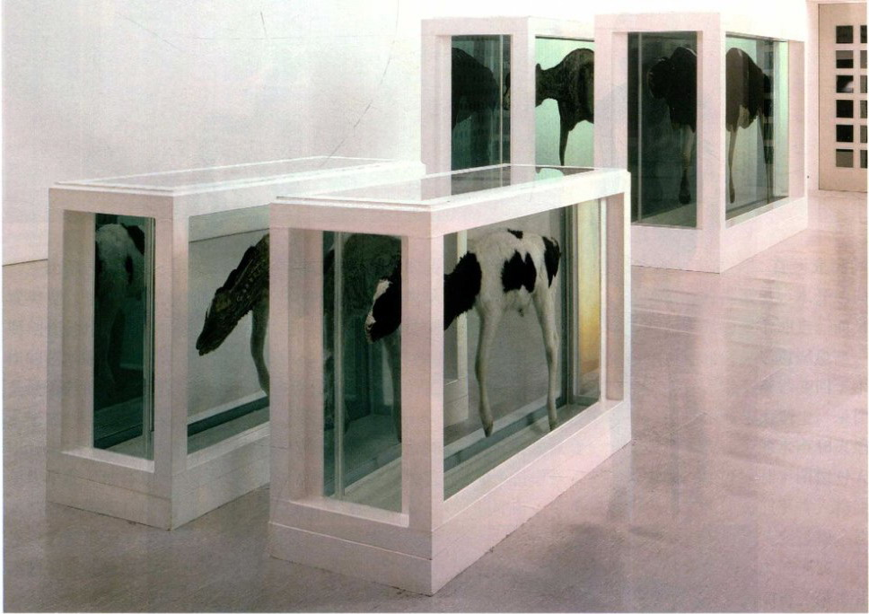

*图30.33 达米安·赫斯特：《母子分离》。1993年。钢、玻璃钢复合材料、玻璃、硅胶、母牛、小牛、甲醛溶液，两个储存槽尺寸为 90 x 322 x 109厘米，另两个储存槽尺寸为 102 x 169 x 62.5厘米。阿斯楚普·费恩利现代艺术博物馆（Astrup Fearnley Museet for Moderne Kunst)*

> **艺术史家的观点：变幻的艺术市场**
>
> 当代艺术世界正如艺术本身一样复杂、多样。博物馆、画廊、私人代理人、拍卖行、艺术展销会、国际博览会、社会各个阶层的收藏家、评论家、策展人、艺术史家、书籍，以及包括互联网在内的大量媒体，所有这些不过是21世纪五花八门的艺术市场中的某些片断。
>
> 这样的影响力联合体与中世纪晚期和文艺复兴早期的世界有太多不同；那时的艺术市场主要由艺术家行会、学徒制度，以及贵族与教会掌控的赞助人制度决定。16世纪和17世纪时学院出现，特别是1648年法国皇家美术学院的成立，标志权力转移到学院系统及其展览（巴黎称其为沙龙），后者负责展出学院成员与学生的作品。历史学家也在这个时期出版了最早的艺术书籍。18世纪，巴黎和伦敦出现了著名的艺术拍卖，并开设了首批公共艺术博物馆，很多人认为最早的艺术评论也在此时开始（见第815-816页）。19世纪，法国沙龙从举办学院成员展转为公开展览，并由评审团选择作品，展出了几百位艺术家的几千幅作品。欧洲各国和美洲的艺术家都渴望参加巴黎沙龙，虽然沙龙以法国艺术家为主，但实际上已经成为了首个国际展览盛事，并且是吸引赞助人、获得商业成功的重要途径。19世纪末，已经流连于艺术界的艺术代理人成为一股重要力量，巴黎的情形尤为如此。
>
> 现在，一位善于挑选“重要”艺术家且颇有威望的代理人对艺术家生涯的影响最为深远。参加重要博物馆的展览或者作品被人收藏也是同样，纽约现代博物馆、洛杉矶当代艺术博物馆、伦敦泰特美术馆、科隆路德维希博物馆和巴黎国家现代艺术博物馆都是重要的博物馆。众多博物馆中只有为数不多的几个以举办高品质展览和收藏当代艺术而知名。
>
> 艺术家们也力求参加大型国际展会，这是19世纪法国沙龙在20世纪的变体，通常由策划人出面邀请艺术家，而非向评审团提交作品。威尼斯双年展是最早的国际博览会之一，1903年首度举办，地点就在威尼斯的一座公园里。现在，该展览每两年举办一次，展览场地是各国的永久场馆，用来展示各自艺术家的作品。此类国际展会的目的通常是对主办城市进行宣传，促进当地的经济发展。例如，安德鲁·卡耐基（Andrew Carnegie）于1895年在匹兹堡建立了卡耐基艺术博物馆，次年又筹划了现今名为“卡耐基国际展”（Carnegie International）的展览，旨在吸引各国对于匹兹堡的注意。然而，威尼斯双年展和卡耐基国际展只在第二次世界大战之后的那段时期声望显赫，很快就纷纷出现了其他重要的国际展事，例如德国的卡塞尔文献展（四年展）和巴西的圣保罗双年展等。在最近几十年间，许多国际双年展相继登上艺术舞台，其中包括伊斯坦布尔、哈瓦那、开罗和约翰内斯堡双年展。对美国艺术家而言，惠特尼美国艺术博物馆是一个重要场所，成立于1930年，通常举办年度展或双年展。
>
> 尽管艺术博览会和画廊掀起了一股热潮，但是大部分当代艺术仍然处在古代大师和印象主义的阴影之下。20世纪期间，欧洲早期现代主义也成为了遮蔽当代艺术的一股力量。直到70年代，当代艺术才成为时尚。1973年，纽约苏富比成功拍卖了罗伯特·斯库尔（Robert Scull）和埃塞尔·斯库尔（Ethel Scull）的波普艺术收藏，并引起轰动，激发了购买在世艺术家作品的热潮。苏富比和佳士得都在18世纪时于伦敦成立，如此重要的拍卖行长期以来都在拍卖当代艺术品，但是数量较少，也没有大肆宣传。但是斯库尔收藏拍卖之后，数不胜数的收藏家涌入了当代领域。最近25年间，当代艺术拍卖与印象主义、欧洲现代主义艺术拍卖都十分引人注目。收藏热潮还刺激了大量国际艺术博览会的出现，其中包括瑞士巴塞尔的巴塞尔艺术博览会、迈阿密海滩的迈阿密-巴塞尔艺术博览会、伦敦的弗里茨艺术博览会、纽约的军械库展览、巴黎的当代艺术国际博览会（FIAC：Foire Internationale d'Art Contemporain）。每年这些高端艺术博览会都会吸引数以万计的收藏家和参观者，为了物色新作品和新艺术家流连于此。
>
> 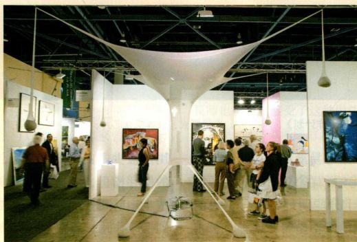
> 
> *国际艺术博览会：艺术／巴塞尔／迈阿密海滩，2005年12月1日至4日*

### 世界性艺术：蔡国强

20世纪见证了世界性艺术的崛起，然而这一现象的端倪早在50年代就已经出现。通过国际网络和卫星通讯，即便是身处最偏远地区的艺术家也不必在孤立的环境中创作。越来越多的艺术家能够接触到纽约、伦敦、巴黎、杜塞尔多夫和东京等地的艺术创作，而且其人数已经达到了前所未有的程度。喷气式飞机将艺术家从韩国带往开罗，从约翰内斯堡带往圣保罗，从巴塞尔带往卡塞尔，出席各种展览和艺术博览会（见第1105页的艺术史家的观点）。整个世界的艺术都联系在一起，于是世界变成了一座巨大的美术馆。在某个半球谈论艺术，而不顾及其他地方艺术的发展已经成为几乎不可能的事情。现在全世界的艺术家都在使用共同的艺术语言，针对相似的问题，热切追随着彼此的创作。虽然存在巨大的差异，但了解其他文化和价值观的渴望让来自各地的艺术形式更容易被人接受，或许也更激动人心、更为流行。差异得到接纳与尊重，而不会被看作低等遭到否定。

似乎只有蔡国强（Cai Guo-Qiang，生于1957年）才适合作为本书的结尾。他是一位中国艺术家，但是自1995年以来就一直生活在纽约。在今天人们最为关注的艺术家中，蔡国强将中国的背景与视角带入了崭新的全球性艺术，从而大大丰富了世界视觉语汇。与冈萨雷斯-托雷斯和昆斯一样，蔡国强首先是一名观念艺术家，以种类繁多的媒介进行创作。他的作品以装置和爆炸为主，称为“焰火”，这是他的标志性风格。火药和焰火是中国的发明，通过使用这种媒介，蔡国强突出了自己的文化身份。然而促使他选择火药的原因则是另外的美学思想与观念。艺术家曾这样解释道：“火药让你感受到处于存在核心的某些强烈物质，虽然你可以按照自己的喜好来布置火药，但是你无法控制爆炸本身。这赋予了你极大的创作自由。”蔡国强用火药来“作画”，作品有时就像是中国书法。与其他抽象表现主义作品一样，他的绘画蕴含着卓越的指涉，呈现出为了展现沟通宇宙能量而作的努力。蔡国强甚至在爆炸中涉及了“阴阳”观念；作品在迸射的一瞬间，同时表现出创造和破坏的力量。

*图30.34 蔡国强：《光环：中央公园爆炸计划》。2003年。虎尾焰火、计算机钛芯片、炸出下落星星的爆破筒*

2003年，蔡国强受纽约市和中央公园管理局的委托，在中央公园创作了一件爆炸作品。作品名为《光环：中央公园爆炸计划》（Light Cycle：Explosion Project for Central Park，图30.34），历时4分钟，分为三个部分：“烽火台”、“光轮”和“白夜”，依次表现为光柱、系列光环和小型爆破筒爆炸出的耀眼白光。蔡国强对爆炸的控制程度着实令人称道，他可以运用这种方式来创作线图和绘画。通过自己的作品，他希望捕捉到一种精神实质。蔡国强曾说自己的作品是“为外星人而作”，而他许多爆炸作品都以“为外星人作的计划”作为副标题。艺术界的全球化让蔡国强在某一瞬间得以望向地球之外，创造为宇宙而作的艺术。

## 小结

艺术史家将80年代之后称为“后现代时期”，这个词语来自欧洲60年代的解构主义或后结构主义哲学，通常用于表述大量知识分子逐渐相信绝对意义和真理并不存在。他们认识到情境决定意义的事实，而情境又在不断变化之中。由此多元主义成为后现代艺术的特色，与现代主义的立场刚好相反。现代主义相信在任何特定时期，有且只有一种风格最能推动艺术向前发展。后现代主义还破坏了现代主义对风格、独特性和原作者的强调，现在的艺术家都采用多样化的风格，甚至进行群体创作。后现代姿态同样造就了世界性艺术，使得人们开始了解所有的艺术形式，认为它们值得关注，应该接受。通讯革命将世界缩小为一个地球村，促进了世界性艺术的出现。

### 建筑

建筑领域与现代主义的决裂出现于60年代，建筑师罗伯特·文丘里在其中扮演了关键角色。文丘里提倡建筑不仅要包含与建筑历史相关的传统指涉，还要包含当代意象、元素和材料；由此产生了一种新与旧的折衷混合，众多建筑师也很快就接受了这种做法。他们将现代主义“玻璃盒子”的生硬、简洁抛诸脑后，创作出复杂、甚至暧昧的建筑作品，其中又常常充满了诙谐机智之处，令人愉悦。到了80年代，从迈克尔·格雷夫斯建于俄勒冈州的公共事业服务部大楼似是而非的人形立面，到詹姆斯·斯特林复杂而具有感召力的德国新国家美术馆，后现代建筑在世界各地的城市中纷纷出现。某些艺术家回归到现代主义风格，例如诺曼·福斯特设计的汇丰银行，但他在作品中采用了称为“高科技”的工业化风格，为现代主义注入新的活力。诸如蓝天组公司和扎哈·哈迪德等人，则选择了解构主义风格，推翻了人们对于建筑的陈旧观念。后现代主义的多样性也表现在建筑用途之中，以毕尔巴鄂的古根海姆博物馆为例，弗兰克·盖瑞将其设计为城市的象征；而丹尼尔·里伯斯金的犹太博物馆则意在唤起人们对种族灭绝和犹大历史的认识。

### 后极少主义与多元主义：无限可能

70年代的多元主义在90年代广泛传播开来，艺术家们对多种多样的题材、风格和媒介进行探索。绘画也在80年代再次流行，安塞尔姆·基弗和让-米歇尔·巴斯克雅的新表现主义，以及伊丽莎白·默里的抽象作品更是形成了对于绘画流行趋势的助推。后极少主义美学观继续存在于80年代和90年代的雕塑作品里，马丁·普耶尔有机感性、手工精美的物品和林璎强烈感人的越战纪念碑是其中的杰出代表。以多种媒介进行创作的艺术家们也探索着图像在不同情境中功能与意义的改变。在摄影、录像和装置艺术中，艺术家们分析了流行的象征符号、图像乃至媒介本身，以此揭示与阶级、性别、性取向和种族中少数人群相关的问题。

## 第四部分 附加原始文献

> **威廉·钱伯斯爵士（1723-1796年）**
> 
> **节选自《中国建筑、家具、服饰、机器与器皿设计》**(Designs of Chinese Buildings, Furniture, Dresses, Machines, and Utensils)
>
> 威廉·钱伯斯爵士（Sir William Chambers）是一位英国建筑师，同时也是皇家学院的奠基人之一。他年轻时曾在瑞典东印度公司工作，还在亚洲居住过九年，成为了中国建筑专家。他后来在罗马和巴黎学习建筑，还聆听过雅克-弗朗索瓦·布隆代尔的著名讲座。1755年，钱伯斯成为了一名受人尊敬的伦敦建筑师。下文所引的段落就是出自他有关中国建筑和手工艺品的著作（1757年），反映了“如画”在18世纪中期英国的重要地位；同时还表明，异域文化被英国人看作下等文化，虽然令人着迷，也能够刺激人的感官，但毫无疑问仍然是“异类”。
>
> 一般而言，中国建筑并不适合欧洲，然而对于需要各种景观的大面积公园和园林，以及需要容纳很多房间的宏大宫殿来说，我认为以中国品位来装饰其中的某些次要部分也未尝不可。多样性总是令人愉悦的，和谐与悦目的创新有时会替代美感。历史告诉我们，身为建筑师的罗马皇帝哈德良，在罗马人极度推崇希腊建筑的时候，修建了自己位于蒂沃利的别墅，并以埃及等其他国家的风格设计了其中某些部分。
>
> SOURCE: ELIZABETH GILMORE HOLT, A DOCUMENTARY HISTORY OF ART. VOL. IL. (GARDEN CITY, NY: DOUBLEDAY ANCHOR BOOKS, 1958)

> **让-奥古斯特-多米尼克·安格尔（1780-1867年）**
> 
> **节选自《安格尔的艺术主张》**（The Doctrine of Ingres）
>
> 莫里斯·德尼（Maurice Denis）是19世纪晚期的一位画家，他根据安格尔的笔记和自己学生时代的回忆写下了这些格言警句。
>
> 艺术应该描绘的对象只有美······不论你是怎样的天才，如果你违反自然的法则，只是按照模特来绘画的话，那你就永远是模特的奴隶，你的绘画手法将仿佛被奴役了一般。与此相反的例子来自拉斐尔——他驾驭模特的能力极高，在记忆中完全掌握了模特，因此模特不能对他发号施令，只好服从于他······
>
> 在美中陶冶自己······走路时抬头望向天空，而不要像在污泥中寻食的猪一样紧盯地面······
>
> 古代的人像之所以美，只因为其类似自然之美······自然如果类似于古代的美，那将美得一如既往······
>
> 我要在画室的门上写着：素描学校，我培养画家。
>
> 素描是艺术的正道······
>
> 素描就是一切，是艺术的全部。绘画的物质过程十分容易，8天内就可以全部学会·······
>
> 在鲁本斯面前，戴上马用眼罩。
>
> SOURCE: FROM THE CLASSICISTS TO THE IMPRESSIONISTS: ART AND ARCHITECUTRE IN THE 19TH CENTURY, ED. ELIZABETH GILMORE HOLT (NEW HEAVEN: YALE UNIVERSITY PRESS, 1977)

> **罗莎·博纳尔（Rosa Bonheur，1822-1899年）**
> 
> **节选自《罗莎·博纳尔回忆录》**（Reminiscences of Rosa Bonheur）
>
> 博纳尔的父亲雷蒙德（Raymond）是一位风景画家，师从空想社会主义者亨利·德·圣西蒙（Henri de Saint-Simon），后者将艺术家看作自己“新天主教”的神父，并认为未来世界的救世主将是一个女人，博纳尔对此也持相同的看法。这些回忆录于1910年出版。
>
> 我从来没有让我画面中的姐妹在日常生活环境中穿着男性服饰。
> 然而，如果你看到我穿男装，这根本不是为了让自己显得奇特古怪，只是为了方便作画而已。想想吧，我曾有一段时间整天都待在屠宰场里······我也着迷于马匹。现在除了在市场研究动物之外，还有比这更好的去处吗？我不得不承认，女性的衣着非常麻烦。这就是我决定恳求当局允许我穿男装的原因。
> 但我穿的只是工作服而已，别无其他。“蠢货”的绰号从来也没让我烦心······
>
> 两年之前（1896年10月8日），俄国皇室来访巴黎，美术部部长希望向他们介绍法国艺术界的重要人物······我穿着漂亮的黑天鹅绒套装，还带着毛皮小帽子。
> 从我进入卢浮宫的那一刻起，必须说，我不知道自己头上的灰毡帽到底怎么了。我是唯一的女性，身处在一大群男人之中······所有的眼睛都转向了我，我找不到可以隐藏自己的地方。这是一个艰难的考验，而那一天我真的很想念我的男装，真的······
>
> 除了变装之外，世上没有哪个女性比我更懂得欣赏微妙之处了；唐突甚至粗野的天性从来没有让我的心停止向往成为完美的女性······
> 为什么我要为女性身份而骄傲呢？我的父亲是一位热情洋溢的人性布道者，他反复对我强调：女性的使命是升华人种，她们就是未来世纪的救世主。多亏了他的教育，我认识到女性伟大而高贵的雄心，我为自己身为女性而感到光荣，我至死都支持女性独立。而且，我相信未来就属于我们。
>
> SOURCE: VOICES OF WOMEN ARTISTS, ED. WENDY SLAKIN (ENGLEWOOD CLIFFS. NJ: PRENTICE HALL, 1993)

> **路易斯·沙利文（1856-1924年）**
> 
> **节选自《办公大楼的艺术价值》**（The Tall Office Building Artistically Considered）
>
> 沙利文在1896年写下这篇论文，其中记录了自己的观点。而在此之前，他已经完成了若干座摩天大楼的设计，其中就有温赖特大楼（见图26.39）和保障大楼（Guaranty Building)。
>
> 这片土地、这个时代的现在面临着全新的情况，即······兴建高层办公大楼的需求······
> 办公室是处理生意的必需场所；高速电梯降机的发明与完善，让一度冗长、痛苦的垂直升降变得快捷舒适；钢铁制造业的发展使得安全坚硬、造价低廉的建筑能够获得前所未有的高度；在大城市里，人口持续增长，随之而来的则是集中拥挤，地价上升，刺激了楼层数量的增加······因此形成了被称为“现代办公大楼”的高耸建筑······
> 问题是，我们应该怎样设计、呈现这种枯燥无味的高耸建筑······永恒的竞争总是激烈得令人瞠目结舌，感性与文化高雅的更高形式是基于更底层、更热烈的激情，我们又如何来呈现它们呢？
>
> 高层办公大楼的主要特征是什么？······高。对艺术家的天性来说，高耸的特征就是其令人毛骨悚然的方面·······每一寸都必须轻盈无比，甚至上升到狂喜的极致，从下到上都是一个整体，没有任何不和谐的线条······
>
> SOURCE: LIPPINCOTT'S MAGAZINE, MARCH 1896

> **保罗·舍尔巴特（1863-1914年）**
> 
> **节选自《玻璃建筑》，本文于1914年在《狂飙》杂志上发表**
>
> 保罗·舍尔巴特是一名德国表现主义作家兼建筑师，他在1913年的文章《玻璃建筑》中阐明了一种有关玻璃的理论，并使其概念化。他就玻璃在建筑中的美学价值和技术价值进行了预言。
>
> 为了将我们的文化提升至更高层面，我们必须······改变我们的建筑。而只有使我们居住的房间摆脱封闭特征才能做到这一点。然而，唯有引入玻璃建筑才能改变房间的封闭；玻璃使得阳光、月光和星光进入房间，所以不仅要有玻璃窗户，还要建造尽可能多的通体玻璃墙和彩色玻璃墙。
>
> SOURCE: KENNETH FRAMTON, MODERN ARCHITECTURE: A CRITICAL HISTORY. (NY: OXFORD UNIVERSITY PRESS, 1980)

> **菲利波·托马索·马里内蒂（1876-1944年）**
> 
> **节选自《未来主义的成立与宣言》**（The Foundation and Manifesto of Futurism）
>
> 这份宣言以马里内蒂1908年的宣言为蓝本，并成为了20世纪创新性艺术家发布其观点的普遍格式。
>
> 1．我们要赞美对危险的爱，赞美能量的性质，赞美大胆的力量······
>
> 3．到目前为止，文学赞美了具有思想的凝固、狂喜和沉眠，我们希望赞美具有攻击性的运动、狂热的失眠、奔跑、危险的跳跃、手铐和斗殴。
>
> 4．我们宣布，有一种美的新形式加强了世界的辉煌灿烂，那就是速度之美。赛车上装配的管子像蛇一般，发出爆发性的气息·······似乎要冲过爆炸的赛车比《萨莫色雷斯的胜利女神》还美······
>
> 7．哪里的美都不如战斗中的美强烈。所有杰作都打有侵略的烙印。诗歌应该对未知的力量发起猛攻，使其蛰伏在人的脚下······
>
> 9．战争是世界上唯一真正的保健法，我们要赞美战争，赞美军国主义、爱国主义，赞美无政府主义的破坏举动、置人死地的美丽观念和对妇女的蔑视。
>
> 10．我们要捣毁博物馆、图书馆，对抗道德、女性主义和所有功利主义的懦弱胆怯······
>
> 我们在意大利发布这篇具有颠覆性和煽动性的宣言，在其带领下我们找到了未来主义，我们还会解放意大利，使他摆脱无数博物馆压在她身上的无数坟墓······
>
> 赞赏古代绘画有如将我们的情感倒入坟墓，我们应该把情感注入行动与生产的狂暴洪流中去······
>
> 我们当中最年长的人30岁，这样我们就有至少10年时间来完成我们的任务。当我们40岁时，让那些更年轻、更大胆的人们把我们投入废纸篓吧，就像扔掉无用的手稿那样！
>
> SOURCE: THEORIES OF MODERN ART, A SOURCEBOOK BY ARTISTS AND CRITICS, ED. HERSHEL B. CHIPP WITH CONTRIBUTIONS BY PETER SELZ AND JOSHUA C. TAYLOR. (BERKELEY, CA: UNIVERSITY OF CALIFORNIA PRESS, 1968)

> **安德烈·布雷东（1896-1966年）与列夫·托洛茨基（1879-1940年）**
> 
> **《宣言：面向自由的革命艺术》**（Manifesto：Towards a Free Revolutionary Art，1938年）
>
> 安德烈·布雷东是超现实主义风格的领导者，而列夫·托洛茨基（Leon Trotsky）则是俄国共产党的领袖，为了逃脱斯大林的肃清运动而前往墨西哥居住。两人共同撰写了以下这篇宣言，反对以俄国和德国为代表的极权主义政体，号召艺术家创造一种革命艺术，一种可以改变世界观的艺术。该宣言于纽约左翼杂志《党派评论》上出版。出于政治原因，墨西哥壁画家迭戈·里韦拉最初替代托洛茨基与布雷东联合署名。
>
> 在当今世界中，我们必须认识到，这些条件遭到了前所未有的广泛破坏，智力上的创造已经没有可能了。由此必然出现日益明显的堕落情况，不仅是艺术品的堕落，也是“艺术”人格的鲜明堕落。在希特勒掌控的政体之下，哪怕只对自由表示些许同情的作品都是不容存在的，所有创作此类作品的艺术家都会遭到清除。无论这个政体多么肤浅，毕竟那些仍然愿意拿着纸笔，愿作政体奴仆的人减少了；所谓奴仆的任务就是按照命令，依据最坏的美学准则来赞美这个政体。如果报道可信，那么苏联的情况也是如此，那里热月党人的反击行动现在正达到高潮。
>
> 毋庸置疑，我们并不认同时下流行的口号：“不要法西斯，不要共产党！”（Neither fascism nor communism！）。这是乡巴佬发脾气一般的陈词滥调，他们保守、惊恐，坚守“民主”历史的破碎残余。真正的艺术并不仅仅是以现成品为原型玩弄各种变体，而应该坚持表达当下人民、乃至人类的内在需要。真正的艺术必须是革命的艺术，必须渴望进行完善和改革社会的重构。而其必须要做的是，将智力上的创造从枷锁中解放出来，将所有人都提升到孤独的古代天才才能达到的高度。
>
> SOURCE: THE PARITISAN REVIEW, 1938, VOL. IV #1, FALL 1938, PP. 49-53, TR. DWIGHT MACDONARLD

> **伊娃·海瑟（1936-1970年）**
> 
> **节选自辛迪·内姆瑟尔的访谈**
>
> 以下这段谈话出自1970年海瑟与艺术评论家辛迪·内姆瑟尔（Cindy Nemser）所作的访谈。之后不久，海瑟就因癌症身亡。
>
> 艺术与工作、艺术与生活紧密关联在一起，我的整个生活都显得荒谬、可笑。我生命中没有一件事不是极端的，身体状况、家庭和经济状况都是如此。我的艺术、学校和朋友是我最珍贵的回忆。现在我又患上了绝症，一切都显得那么极端、那么荒谬。除了存在和生存下去，艺术现在是我最重要的事情，我和艺术连接在一起，前所未有地亲近、契合，而荒谬正是其中的关键词······艺术不得不处理矛盾和对立的问题。我在作品中使用的形式就存在矛盾。我总是意识到自已应该让秩序对立于混乱、线丝对立于团块、巨大对立于微小，我会尽力去找到最荒谬或最极端的对立······我总能意识到荒谬性及其形式上的矛盾，这永远比制作某些均衡正常、比例和尺寸正确的东西有意思。
>
> SOURCE: ART TALK: CONVERSATIONS WITH 12 WOMEN ARTISTS (NY: CHARLES SCRIBNER'S SONS, 1975)

> **罗莎琳·克劳斯（生于1940年）**
> 
> **节选自《先锋派的原创性》**（The Originality of the Avant-Garde）
>
> 罗莎琳·克劳斯（Rosalind Krauss）是1971年创刊的艺术评论杂志《十月》的创办人之一。以下这段文字出自1981年《十月》中的文章。
>
> 我要主要谈一下谢丽·利文（Sherrie Levine），因为其最根本之处就在于起源的观念和原创性思想。
> 利文采用盗取的图像作为创作材料。她在创作摄影系列期间，从爱德华·韦斯顿的小儿子内尔·韦斯顿（Neil Weston）手中拿到了父亲的照片，然后直接将照片翻拍下来，从而侵犯了韦斯顿的版权。但正如人们所指出的，即便是韦斯顿的“原作”，拍摄的也不过是他人提供的原型——一系列希腊“库罗斯”雕像。在我们的文化中，这些男性裸体像长期以来已经经过了加工与增殖。可以说利文的盗窃行为发生在韦斯顿照片的表层面前，将照片从幕后带入了原型整体；而在这个整体中，其反过来又是盗窃，因为本身就是复制。
> 于是，利文的作品以一种直率的方式对作品起源的现代主义思想进行了解构，其行为不可能是现代主义的“外延”。这好像复制品之间的对话，是完全后现代主义风格的，而这也意味着其不能被看作先锋艺术。
> 由于其对传统进行了猛烈抨击，我们或许会将利文的作品看作先锋艺术向前迈进的脚步。但其实并非如此。后现代主义解构了起源与原创性这对姐妹观念，在自身与先锋艺术的观念领域之间做出区分，并在一道鸿沟之后审视现代主义，由此划下了历史的界线。先锋艺术与现代主义并存的时代终结了，这是一个明显的事实。对话的观念使其不同于一个新闻事件，使这个时代成为了历史。这是文化实践的复合体，其中包括去除了神话色彩的评论与真正的后现代主义艺术，两者都在回避现代主义的基本主张，通过揭露虚构的条件而对这些主张的影响进行清算。因此，当我们回望现代主义的起源问题时，可以形成一种奇特的新视角，看到其在无尽的复制中裂成碎片。
>
> SOURCE: OCTOBER MAGAZINE, 1981 (CAMBRIDGE: MIT PRESS, 1981)