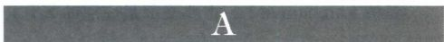

柱顶板（abacus）：古典柱头顶上位于额枋之下的石板。

修道院（abbey）：（1）由院长（男院长：abbot；女院长：abbess）领导的宗教群体；（2）这一宗教群体所在的建筑群，修院教堂通常都有规模较大的唱诗班席位，以便提供足够的空间容纳修士或修女。

学院（academy）：学习的场所，这个词来源于雅典附近一座花园的希腊语名称。公元前5世纪至公元6世纪期间，柏拉图以及后来的柏拉图派哲学家们在这座花园里进行哲学讨论。最早的美术学院是绘画学院，由乔治·瓦萨里于1563年在佛罗伦萨建立。后来成立的学院有：1648年在巴黎成立的皇家绘画与雕塑学院、1768年成立于伦敦的皇家艺术学院。这些学院的目的在于通过教育、展览、讨论以及间或的经济支持来推动艺术的繁荣。

茛苕叶饰（acanthus）：（1）一种地中海植物，叶片呈刺状或者齿状；（2）一种与此类植物叶片相类似的建筑装饰，用于装饰线脚、檐壁和科林斯式柱头。

檐饰（acroterion，复数为acroteria）：放在三角楣顶端或者两角处的装饰性雕塑。

丙烯（acrylic）：一种合成的颜料调和介质，可溶于水，开发于1960年前后。

行动绘画（action painting）：指抽象艺术中对颜料的自发性、自由性运用，例如20世纪30年代到50年代期间先锋艺术家的艺术实践。

空气透视（aerial perspective 或 atmospheric

重要词汇

perspective）：参见透视（perspective）。

侧堂（aisle）：教堂中平行于建筑纵深轴线的过道或走廊，通常位于教堂中堂的两侧，但有时由成列的墩柱或圆柱与中堂区隔开来。

蛋白成像术（albumen print）：一种摄影工艺，使用鸡蛋中的蛋白来制作成像底板。

一次完成直接画法（alla prima）：绘画技法的一种，一次性将颜料画上去，不施加或者很少施加底色。

祭坛（altar）：在敬神仪式中放置牺牲或贡品的土丘或构筑物。在天主教教堂中，指弥撒中使用的一种类似于桌子的构筑物。

祭坛作品（altarpiece）：放置在基督教教堂祭坛或后部的绘画或雕刻艺术作品。它可以是单画板作品，也可以是三联作品（tritych）或多联作品（polyptych），后两种都有彩绘的侧屏，用铰链连接在一起。也被称为“reredos”或“retablo”。

交错体系（alternate system）：一种在罗马式教堂建筑中发展而来的系统，以便为开间跨度为侧堂跨度两倍且覆盖着交叉拱顶的中堂提供足够的支撑力。支撑中堂连拱廊的墩柱在尺寸上交错变化；更为厚重的复合墩柱支撑着聚合推压力的中堂拱顶，通常为圆柱的较细墩柱支撑着侧堂的拱顶。

阿玛宗族（Amazon）：希腊传说中的一个女战士部族，据说居住在黑海附近。

半圆室回廊／回廊（ambulatory）：一种有顶的走廊。（1）在长方形公堂里，指围绕半圆室的半圆形走廊；（2）在集中式教堂里，指环绕中央空间的环形侧堂：（3）在修道院里，指围绕着中央开放庭

重要词汇 1111

院的有顶柱廊或连拱廊。

圆形竞技场／圆形剧场（amphitheater）：一种双剧场。一种通常为椭圆形平面布局的建筑，由阶梯式观众座席和通向剧场中心区域的走廊构成。

双耳细颈瓶（amphora，复数为amphorae）： 一种大型的希腊储藏瓶，通常瓶体为椭圆形，底部逐渐变细。瓶口处伸出双耳回卷到肩部。

沉思像（Andachtsbild）：德语，意为“宗教图像”，指一种用于个人敬拜的绘画或雕塑，首先在北欧地区发展起来。

动物风格（animal style）：一种可能起源于古代伊朗地区的风格，以风格化和抽象化的动物形象为特征。

环形（annular）：源自拉丁语中的“环”，指环状形式，特别是指环形的筒形拱顶。

壁角柱（anta，复数为antae）：指希腊神庙墙壁前部末端，一种经过加厚的类似于半露方柱的结构。神庙壁角柱之间的圆柱被称为“扶壁间立柱”（inantis\)。

《启示录》（Apocalypse）：《新约》的最后一篇。在这个篇章中，福音书作者圣约翰描述了他看到的幻象，在帕特摩斯岛（Patmos）、天堂的经历，人类的未来以及末日审判。

使徒（Apostle）：由耶稣拣选的十二位学生，在他有生之年陪伴左右，在他去世之后传播福音。传统上的使徒包括：安德烈、巴多罗买、大雅各（西庇太之子）、小雅各（亚勒腓之子）、约翰、加略人犹大、马太、彼得、腓力、迦南人西门、达太（或犹大）、多马。然而在艺术中被表现却并不总是这十二位使徒，因为“使徒”一词有时也被用来指代其他早期的基督徒，例如圣保罗。

半圆室（apse）：罗马长方形公堂末端或两端的半圆形或多边形壁龛；在基督教教堂中，半圆室通常设置在中堂东部末端，位于耳堂或唱诗班席以东的位置。有时在耳堂的末端也建有半圆室。

次半圆室（apsidiole）：连通教堂主半圆室的小型半圆室或礼拜堂。

飞尘蚀刻法（aquatint）：类似于蚀刻的版画技法，但是底版或其某些部分覆盖有沥青、树脂或盐溶剂。当加热底版时，会形成颗粒状的表面，印制的版画具有丰富的灰色调。印版制成后往往还要添加一些蚀刻线条。

水渠／高架水渠（aqueduct）：拉丁语，意为“水的管道”。（1）用于长距离运输水流的人造渠道或管道；

（2）支撑水渠跨越山谷河流的地上建筑物。

连拱廊（arcade）：一组由墩柱或圆柱支撑的拱，附于墙壁则形成假拱廊。

拱／拱券（arch）：跨越开口的弯曲结构，石拱通常由楔形石方砌筑而成，这样的石方称为楔形拱石（voussoir）。楔形拱石的窄面面向开口方向，以此确保石方的稳固。最高处的楔形拱石称为拱心石／拱冠（keystone）。拱的形状很多，例如哥特式的尖拱和古典的圆拱。

大主教（archbishop）：管理一个教区的主教。

建筑柱式（architectural order）：基于圆柱与檐部的建筑系统，建筑元素（柱头、柱身、柱础等）的形式及其彼此之间具有清晰的关系。五大古典建筑柱式有：多立克式、爱奥尼亚式、科林斯式、托斯卡纳式和复合式。

额枋（architrave）：古典檐部最底层的部分，例如直接砌筑在圆柱上的一排石方。

拱门饰（archivolt）：拱外侧的装饰条带，或者半月楣外侧的一系列条带，通常以雕塑作为装饰。

拱形结构（arcuation）：在建筑中运用拱或一系列拱。

阿里乌斯教义（Arianism）：一种早期基督教信仰，由4世纪亚历山大港的神父阿里乌斯（Arius）创建的教义，后来被谴责为异端，受到压制。该教义的绝大部分今天已经佚失。

粗灰泥层（arriccio）：石头或水泥墙上施涂的一层粗糙的灰泥，为湿壁画提供平滑的基底层或底层。

生涩艺术（Art brut）：法语，意为“粗糙未经润色的艺术”。生涩艺术是一种直接且高度情感化的艺术，来自于儿童和精神病人的艺术，这是一些现代艺术运动的灵感来源。

方石砌体（ashlar masonry）：使用精心雕琢的石方和细腻的黏合材料砌筑的建筑，外表平整均匀。

联想学说（associationism）：一个20世纪的艺术史术语，指建筑和风景设计中可以运用让人联想起早期建筑、艺术、历史或文学的母题与元素。

中庭／前庭（atrium）：（1）古罗马住宅中央的庭院或入口处的开敞庭院；（2）教堂前部的开敞庭院，有时为柱廊或连拱廊。

阁楼（attic）：建筑主檐口或檐部下方的一层，通常装饰有窗户和半露方柱。

微粒彩屏干版（autochrome）：路易·卢米埃尔（Louis Lumière）1903年发明的彩色摄影方法，使用覆盖着三种颜色的淀粉颗粒的玻璃板作为滤镜，然

🟩1112 詹森艺术史

后通过溴化银乳液成像。

自动绘画（automatic drawing）：现代艺术中绘画技法，艺术家试图尽量减少自我意识和智力对于所画线条或图案的控制，转而依赖潜意识冲动来指引绘画的方向。

先锋派（avant\-garde）：法语，意为“向前的力量”。19世纪和20世纪的欧洲先锋派艺术家在题材与技法创新方面都开辟了新的道路，反叛了艺术界既有的规则传统。

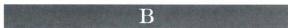

酒神祭司（bacchant）／酒神女祭司（bacchante）： 酒神巴库斯（希腊神话中为狄俄尼索斯）的男祭司和女祭司，或者为他欣喜若狂的女性追随者，后者有时也被称为美娜德。

祭坛华盖（baldacchino）：通常建于祭坛上方的棚罩，其中最重要的是贝尼尼为罗马圣彼得大教堂修建的华盖。

栏杆／矮墙（balustrade）：（1）由短柱支撑的栏杆；（2）偶尔也用于指代低矮的胸墙。

宴饮画（banquet piece）：静物画的一种变体，通常描绘餐后的场景。这种绘画更关注餐具器皿而不是实物，结合了典型的虚空主题。

洗礼堂（baptistery）：独体建筑或教堂的一部分，用于举行洗礼仪式。它的平面布局通常为多边形，其中包括一座洗礼盆，或者有石材、金属的容器，用来盛放仪式需要的圣水。

筒拱（barrel vault）：由连续的半圆拱组成的拱顶，其外形呈半圆柱体。

棱窗格（bar tracery）：窗花格的一种，用于固定玻璃的棱条相对细薄。

页底饰（bas\-de\-page）：法语，意为“页面的底部”，这是一种画在彩饰手稿文字下方的插图或装饰。

柱础／底座／基底（base）：（1）圆柱或墩柱最底层的部分，位于柱身之下；（2）墙壁、穹顶、建筑最底层的部分，偶尔也用于指代雕像或绘画的基底。

长方形公堂／公堂式教堂／大教堂（basilica）：

（1）古罗马一种大型的长方形建筑，承担公共集会场所和法院功能。该建筑通常由中堂、侧堂，以及一座或多座半圆室构成；（2）在基督教建筑中，指一种来源于古罗马公堂的长方形教堂，由一个中堂、一个半圆室、两个或四个侧堂或侧礼拜堂构成，有时还包括一座门廊；（3）指代罗马最初的七座教堂，或

者其他享有同样宗教特权的教堂。

雉堞（battlement）：实体部分和开口交替出现的墙体，最初为防御而设计，后来用于装饰。参见锯齿状雉堞（crenellated）。

开间（bay）：建筑内部的次分空间。一系列开间通常是由连续的建筑支撑结构区分开来的。

观景楼（belvedere）：一种用于观看周围环境的建筑结构，或者位于建筑屋顶，或者是位于花园等自然环境中的独体建筑。

本笃会（Benedictine Order）：公元529年由努尔西亚的本笃（约480\-约553年）创立于蒙特卡西诺。该教派不像其他早期教派那样严苛，在成立之后的两个世纪期间，传播到西欧的绝大部分地区和英格兰。

道德圣经（Bible moralisée）：一种具有插图装饰的圣经，每一页上都绘有四对插图，表现圣经故事场景及与之相关的榜样。

主教（bishop）：若干教堂或一个教区的精神监察人。他的宝座放置在该教区最重要的教堂里，该教堂也被称为大教堂。

黑绘式（black\-figured）：一种古希腊的陶器装饰风格，以在红底色上绘制黑色图案为特点。黑绘式之后又发展出红绘式风格。

假拱廊（blind arcade）：没有开口的连拱廊，拱与支撑结构都作为装饰附着在墙壁表面。

印版图书（block books）：15世纪的木刻版书籍，通常为宗教内容，图像与文字往往雕刻在同一块木版上。

酒店画（bodegónes）：尽管在现代西班牙语中“bodegón”意为“静物”，但在17世纪的西班牙，该词指代表现食物与饮料的风俗画，委拉斯凯兹的一些作品就是如此。

书籍封面（book cover）：保护书页的硬封皮。在中世纪，书籍封面常常由贵金属制成，做工精细，镶嵌宝石，雕刻有装饰图案等。

日课经／时祷书（book of hours）：供个人使用的祈祷书，其中包括罗马天主教会所规定的七个祈祷时刻的经文（例如辰经、晚课等）、当地圣徒的敬拜仪式，有时还包括日历。这样的书籍通常都装饰着精美的彩饰，为上流社会的人士而制作，以他们的名字为祈祷书命名是一种非常普遍的现象。

托架（bracket）：一种用石材、木材或金属制成的平顶墙上支架，以支撑雕塑、檐口、横梁等部件的重量。托架的底部有时为涡卷形，被称为涡卷形托架。

重要词汇 1113

开口三角楣（broken pediment）：参见三角楣\(pediment\)。

青铜时代（Bronze	Age）：青铜被用于工具和武器制作的最早的年代。在中亚地区，青铜时代出现于新石器时代之后，约为公元前3500年，青铜时代之后的铁器时代开始于约公元前1900年。

画笔素描（brush drawing）：参见素描（drawing）。

好壁画／湿壁画（buon fresco）：参见湿壁画（fresco）。

雕版刀（burin）：一种用于雕刻的金属工具，末端为楔形，边缘尖锐。

扶壁／扶垛（buttress）：一种突出的结构，建于墙壁外侧作为支撑，通常被用来抵消墙内拱顶或拱所产生的侧向推压力。在哥特式教堂建筑中出现了飞扶壁（flying buttress），这是一种建于侧堂屋顶上方的拱桥，一端建于坚固的墩柱上，另一端则支撑着中堂墙壁的上部，此处由主拱顶产生的侧向推力最大。

拜占庭（byzantium）：马尔马拉海上的城市，由古希腊人建立，公元330年时更名为君士坦丁堡，现称伊斯坦布尔。

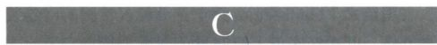

恺撒（Caesar）：古罗马独裁者盖乌斯·尤利乌斯·恺撒（Caius Julius Caesar）的姓，后来成为皇帝的代名词；由此出现了德语词“			（皇帝）和俄语词“		（沙皇）。

书法（calligraphy）：源自希腊语“优美的书写”。（1）使用羽毛笔、芦苇笔或毛笔写出的装饰性或形式化的手写文字；（2）来源于文字或与文字相类似的设计，用于构成某种图案。

碘化银纸照相法（calotype）：发明于19世纪30年代，是首次使用负片并在纸张上成像的摄影技术。

髑髅地（Calvary）：耶路撒冷城外的小丘，耶稣被钉死在十字架上的地方，也被称为各各他。髑髅地一词源于拉丁语“calvaris”，意为“头骨”；各各他一词是阿拉姆语“头骨”的音译。这座山丘被认为是埋葬亚当的地方，因此传统上被视为“头骨之地”。参见各各他（Golgotha）。

宝石雕刻／贝雕（cameo）：玛瑙、贝壳等其他多层材质上的浅浮雕，浮雕上的题材多为侧面图像。图案呈现某种颜色，而背景则是另一种较深的颜色。

暗箱（camera obscura）：拉丁语，指一种黑暗的封闭空间或者箱子，一面有一个小开口或者透镜，光线由此射入，从而在对面的墙壁上投射出颠倒的图

像。这一原理很早就为人所知，但是直到16世纪时才被用于绘画的辅助工具。

带槽铅条（cames）：彩色玻璃窗上的铅条，用于固定玻璃。

坎帕尼亚（campagna）：意大利语，意为“乡村”，首字母大写时通常指代罗马附近的乡村。

钟楼（campanile）：源自意大利语单词“campana”， 意为“钟”。钟楼多是或圆或方的独体建筑。

纳骨室（camposanto）：意大利语，意为“神圣之地”，指教堂附近的墓地，通常是封闭的。

法则（canon）：一种律法、规则或准绳。

华盖（canopy）：建筑中的一种装饰性顶盖，架设或覆盖在雕像与神圣之物上方。

柱头（capital）：圆柱或立柱最上方的部件，它支撑着额枋。

枢机主教／红衣主教（Cardinal）：罗马教廷枢机主教团成员，枢机主教团是选举教皇并担任其顾问团的机构。

加尔默罗会（Carmelite Order）：起源于12世纪的一个隐修会，自称是先知以利亚在巴勒斯坦加尔默罗山（Mt．Carmel）建立的隐修团体的后裔。13世纪早期，这一教派传播到欧洲和英格兰，经圣西蒙·斯托克（St\.Simon Stock）改革之后，成为三大托钵修会之一。

加尔都西会（Carthusian Order）：圣布鲁诺（Saint Bruno）在1084年创立于法国夏尔特尔的教派组织，以其严苛的教规而著称。参见夏尔特尔会\(Chartreuse\)。

样稿／漫画（cartoon）：源自意大利语“cartone”， 意为“大纸”。（1）为绘画或设计所制作的全尺寸素描，之后被复制的墙壁、画板、挂毯等介质上；（2）一种绘画或版画，通常具有幽默或讽刺色彩，呼吁公众关注某些行为或人物。

雕刻（carving）：去除石材或木材等坚硬材料的多余部分，从而形成人物或图案，与需要增添材料的塑造技法相反；（2）以雕刻技法制作的作品。

女像柱（caryatid）：以女性雕像代替圆柱作为建筑支撑部件；承担同样功能的男像柱称为“atlas”（复数为 atlantes）。

暗堡（casemate）：一种墙壁经过加固的房间或隔间，通常用于存储火炮和弹药。

嫁妆箱奁（cassone，复数为cassoni）：一种盛放嫁妆的意大利箱子，通常具有雕刻、绘画、镶嵌、镀金等装饰，极其精美。

🟩1114 詹森艺术史

浇铸（casting）：一种复制雕塑作品的方法，将石膏或金属溶液等坚硬材质倒入模具中。

铸铁（cast iron）：一种在高炉中商业化生产的硬而脆的铁，融化后被倒入模具冷却，增加硬度。19世纪早期，铸铁被广泛用于建筑材料，后来被钢材和钢筋混凝土取代。

地下墓窟（catacombs）：基督教早期的地下墓地，由设置坟墓的龛室、举行纪念仪式的小礼拜堂，以及通道构成。

作品全集（catalogue raisonné）：某位艺术家作品的全部清单，同时配有详尽的年表和对艺术家风格的讨论。

主教座（cathedra）：某一教区主教的宝座。参见大教堂／主教教堂（cathedral）。

大教堂／主教教堂（cathedral）：主教所在的教堂；主教的管理总部；主教座的所在地。

内殿／神殿（cella）：（1）神庙中最重要的封闭房间，用于放置偶像，也被称为“naos”；（2）指代神庙建筑的主体，以区别其外围部分。

定心装置（centering）：在建筑施工过程中，用于支撑拱、拱顶或穹顶的木支架。

集中式教堂（central\-plan church）：（1）一种四臂等长的教堂，十字交叉处往往建有穹顶，也被称为希腊十字教堂；（2）平面布局成圆形或多边形的教堂。

镂刻镶嵌（champlevé）：一种珐琅工艺，在金属表面蚀刻出凹陷，然后用珐琅填平。

高坛（chancel）：教堂中祭坛的周边区域，通常以屏风隔开，供教士与唱诗班使用。

礼拜堂（chapel）：（1）私人或附属的礼拜场所；（2）教堂内部的礼拜场所，但是祝圣名不同。

夏尔特尔会（Chartreuse）：加尔都西会的法语称谓，意大利语为			。加尔都西会由圣布鲁诺（约1030\-1101年）在1084年创立于法国格勒诺布尔（Grenoble）附近的夏尔特尔，这是一个隐修教派，修士应该过沉默、祈祷和禁欲的生活。

雕饰工艺（chasing）：（1）一种运用不同工具来装饰金属表面的技法；（2）完成青铜铸件毛坯的后续工序。

城堡（château，复数为châteaus 或 châteaux）： 法语中的城堡，现在也用来指代大型的乡间住宅。

半圆区（chevet）：哥特式建筑中教堂东端发展出的一系列建筑部分的统称，包括唱诗班席、半圆室、半圆室回廊和呈放射状布局的多个礼拜堂。

V形图案（chevron）：一种V字形的装饰元素，通常以二方连续的形式出现，形成水平的锯齿形图案。

明暗对照法（chiaroscuro）：意大利语，意为“明亮与昏暗”。在绘画中，指的是主要运用光线和阴影的造型方法。

唱诗班席／圣坛（choir）：在教堂建筑中位于半圆室和中堂／耳堂之间的方形或长方形区域，供教士和唱诗班使用，通常以台阶、栏杆或屏风与其他部分区隔开来。也称高坛（chancel）。

唱诗班席隔屏／圣坛隔屏（choir screen）：一种通常装饰着雕刻的屏风，有时也被称为十字架坛隔屏（rood screen），它的功能是将圣坛／唱诗班席与中堂或耳堂区隔开来。在东正教教堂中，它因为装饰着圣像而被称为圣像隔屏（iconostasis）。

基督生平（Christological cycle）：一系列描绘耶稣基督生活的插图。

失蜡法（cire\-perdu process）：金属浇铸方法。首先用蜡塑形或用蜡覆盖在形体表面，然后再包裹以黏土。当中间层的蜡融化流出之后，再注入金属溶液（通常为青铜）或液体石膏。

西多会（Cistercian Order）：由莫莱姆的罗贝尔（Robert of Molesme）在1098年创立于西笃的教派，以改革本笃会，重申其俭朴生活的最初理想为目标。

城邦（city\-state）：包括一座城市及其周边乡村地区的自治政治体。

古典主义（classicism）：运用或基于古代希腊罗马艺术与建筑风格和规则的艺术与建筑，强调关于平衡、秩序和优美的特定准则。

高侧窗（clerestory）：高于临近屋顶的墙壁上的一排窗户，其目的在于为室内提供直接光照，例如在长方形公堂或教堂内就是如此。

掐丝工艺（cloisonné）：一种珐琅工艺，将细丝黏附在金属表面，形成中空区域，再用珐琅填入，构成一定的设计图案。

修道院／修院回廊（cloister）：（1）用于隐修的宗教场所，例如修道院或修女院；（2）附属于教堂或修道院的开放庭院，为回廊所环绕，是修士／修女学习、冥想和活动的场所。

克吕尼教派（Cluniac Order）：公元909年由鲍姆的布鲁诺（Berno of Baume）在法国克吕尼建立的教派，在中世纪的宗教改革运动中具有领导地位，并与奥托王朝的统治者和教廷具有紧密的联系。

抄本（codex，复数为codices）：使用羊皮纸而不是纸草纸，并因此能够装订成册的手稿。公元1世

重要词汇 1115

纪至4世纪期间，这种书册逐渐替代了之前书写文本常用的长卷（rotulus）或“卷轴”形式。

箱子／藻井（coffer）：（1）一种小箱子或匣子；

（2）位于天花板上的一种逐渐缩小的几何形嵌板。

拼贴（collage）：一种由剪切的材料碎片黏合成的组合物，有时艺术家还会添加某种线条或形式。

柱廊（colonnade）：支撑过梁或檐部的一系列等距立柱。

小型附壁圆柱（colonnette）：一种小圆柱，通常是装饰性的，附在墙壁或墩柱上。

书尾题署／出版商标记（colophon）：（1）书末的出版信息；（2）出版商的印刷标记。

色域绘画（color\-field painting）：一种抽象绘画技法，将细薄的颜料涂在不施底色的画布上，让画布被颜料浸透，而最大限度地减少艺术家的干预。

巨柱式（colossal order）：采用希腊或罗马柱式的圆柱、墩柱或半露方柱，但是柱身通常延伸到两层或两层以上，这一点并不遵循古典的比例规则。

圆柱（column）：一种近圆柱体的直立建筑支撑结构，通常由相对细长的柱身、柱础和柱头构成。当嵌入墙壁时，被称为附壁圆柱。装饰着环绕柱身的浮雕带的圆柱，有时会被用作独立的纪念物。

复合图像（composite image）：一种结合了主题的不同图像或不同视角的组合图像。

复合墩柱（compound pier）：一种附有壁柱或圆柱的墩柱。

混凝土（concrete）：一种由沙子或碎石混合了砂浆与瓦砾的混合物，发明于古代东亚地区，后来被罗马人进一步发展起来。混凝土在中世纪时期基本上被忽视了，直到16世纪早期，布拉曼特用它修建圣彼得大教堂时才得以恢复。

龚戴色粉笔／炭精笔（conté crayon）：一种用石墨和黏土制作的绘图笔，能够产生层次丰富的天鹅绒般的色调。

连续叙事（continuous narration）：在同一个艺术空间内，描述同一人物或角色的不同阶段。

对立平衡（contrapposto）：意大利语，意为“设为对立”。这是一种由希腊人发展出的样式，用以表现人物的运动姿态。人体的各个部分被非对称地布局在中央轴两侧，格外关注重量的分布。

梁托／叠涩（corbel）：（1）一种从墙壁伸出的支架，用于扶助支撑；（2）建筑中一层结构之上向外伸出的另一层或一种水平结构。

叠涩拱顶（corbel vault）：由逐渐收拢的石方

层或砖层形成的拱顶，建材层在拱顶最高处闭合。

科林斯风格（Corinthian style）：一种建筑上的古典装饰风格，以具有凹槽柱身的圆柱为特色，其柱头雕刻有茛苕叶饰和涡卷饰（volute）。

檐口（cornice）：（1）古典三角楣突出的框架部分，包括下方的水平结构和两侧的斜边；（2）位于墙壁等建筑部件上方的突出的水平结构，或者出于装饰目的将其进行横向分割的部分。

反宗教改革（Counter\-Reformation）：16世纪早期新教改革之后，在罗马天主教廷内部出现的自我更新与改革运动，意在抵抗新教的影响，也被称为天主教改革。其原则在特兰特宗教会议（1545\-1563年）中得以确立和采纳。

宫廷风格（court style）：参见辐射式（Rayonnant）。

锯齿状雉堞（crenellated）：尤指中世纪欧洲的防御工事和城堡建筑中的一种锯齿形墙壁（城垛），枪眼（crenel）为使用武器所设，城齿（merlon）则用作防御性的盾牌。

石圈（cromlech）：源自威尔士语，意为“凹岩”，指一种由直立的巨石组成的石圈，可能是不列颠地区史前举行仪式时所使用的。

网状影线（crosshatching）：在素描和蚀刻版画中，一组平行线条与另一组平行线条以不同的角度相交，来表现不同程度的明暗与阴影。另参见影线\(hatching\)。

十字交叉处（crossing）：教堂中耳堂与中堂相交的部分，此处经常建有穹顶或塔楼。

横截面（cross section）：（1）建筑中一种图纸，绘制的是一个贯穿建筑的想象性截面，以揭示建筑的结构设计；（2）指为了揭示其结构而绘制的贯穿任何物体的想象性截面。

地下礼拜堂（crypt）：教堂中一种空间，位于圣坛地下，通常建有拱顶，因此圣坛部分的地平也经常高于中堂。这一空间常用作墓葬和小型礼拜堂。

楔形文字（cuneiform）：古代美索不达米亚人在黏土上制作的楔状的文字符号，作为他们的书写系统。

幕墙（curtain wall）：现代建筑中的一种非承重墙壁，建筑的重量由底层的钢结构来承载，幕墙的功能在于形成立面。

库克洛佩斯墙（cyclopean）：用来形容以巨大粗糙的石块建成的结构，古希腊人认为它是由传说中的独目巨人族库克洛佩斯所造。

🟩1116 詹森艺术史

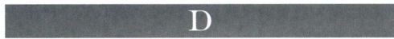

达盖尔银版照相法（daguerreotype）：最初是一种镀银铜版照相法，其表面在碘蒸气中形成碘化银，曝光后在水银蒸气中成像。这一技术是由达盖尔发明的，并于1839年公诸于世，后来在普及过程中又经过了修改，缩短了工艺时间。

印花（decalcomania）：一种由艺术家马克斯·恩斯特所发展的技法，将施涂在其他平面上的颜料压印在画布上。

祈求（deësis）：源自希腊语中的“恳求”，这一类作品表现的是位于圣母玛利亚和施洗约翰之间的升座基督形象，多出现在拜占庭镶嵌画中和最后审判的题材里，圣母玛利亚和施洗约翰在此的角色是人类的代祷者。

齿饰（dentil）：一种成组出现的长方形小装饰图案，与牙齿相类似，用于装饰古典风格的檐部。

地卡（dikka）：清真寺中供宣礼人唱诵祷文的小平台。

闪长岩（diorite）：一种火成岩石，非常坚硬，通常是黑色或深灰色。

双联板／双联画（diptych）：（1）最初是用于书写的两块木板，用铰链连接在一起；（2）一对象牙雕板或木板绘画，通常用铰链连接在一起。

狄庇隆陶瓶（dipylon vase）：一种希腊丧葬陶瓶，底部有孔，祭酒通过这些孔洒在死者身上，发现于雅典附近的墓地，并以该墓地名称命名。

掩盖的象征（disguised symbolism）：在绘画细节中“隐藏”的意思，承载着象征意义。

石台（dolmen）：一种由两块或两块以上的巨石搭建的结构，通常是两块直立的巨石支撑一块横置的顶石。它被认为是史前时代的坟墓。

穹顶（dome）：真正的穹顶是一种圆形、多边形或椭圆形的拱形屋顶，外观呈半球形或半卵形。支撑它的可能是圆环状或鼓状的墙壁、支撑拱，以及其他相关结构。历史上出现的穹顶式屋顶类型繁多。

穹拱（dome vault）：穹顶的拱形部分，它们共同形成了穹隆的圆形外观。参见穹顶（dome）、拱顶（vault）、拱（arch）。

多明我会（Dominican Order）：圣多明我于1220年在图卢兹建立的托钵会组织。

中庭式住宅（domus）：拉丁语，意为“房子”，指一种自成一体的罗马家庭住宅，其中的房间通常围绕两个露天庭院来布局。第一个庭院称为中庭

（atrium），用于娱乐和商谈事宜；第二个庭院里往往建有花园，四周围绕着围柱廊	（peristyle）或柱廊，是专供家庭成员所用的场所。

捐赠人／供养人（Donor）：定制艺术作品的赞助人或客户，他们可能会被表现在作品之中。

多立克风格（Doric Style）：古典建筑的一种简洁风格，柱身平滑或者带有凹槽，柱头形状类似于靠垫，还有由嵌板（metope）和三垄板（triglyph）构成的檐壁。

素描（drawing）：（1）一种铅笔、钢笔、墨水、木炭等绘制的作品，通常绘在纸上；（2）一种使用墨水、涂料等的类似作品，由画笔绘制而成，常被称为画笔素描；（3）结合上述技法以及其他技法的作品。素描的尺幅可大可小，可以是快速画成的草图，也可以是精工细作的成品。它的形式多样，包括对眼见之物的记录、研究另一件作品的习作、与某段文字相关的插图，以及技法上的辅助。

方石结构（dressed stone）：一种砌石技术，最外层的石方打磨得非常平整，制造出平滑整饬的效果。

滑稽图饰（drôleries）：法语词，意为“诙谐滑稽”，用于指代中世纪晚期手抄本页边和家具木刻中鲜活的动物与小型人物图画。

鼓石／鼓形壁（drum）：（1）圆柱柱身的构成单元；（2）一种支撑穹顶的环状墙壁。

干刻／干刻版画（drypoint）：凹版印刷（intaglio） 的一种类型。首先使用尖锐的金属针将线条或者图案雕刻在（常用的）铜版上，这一过程会产生出金属屑的毛刺，所以当铜版覆盖上油墨时，油墨就会被毛刺部分保留下来，从而制造出一种柔和深暗的色调，而且印出的每张版画效果都独一无二。毛刺在印制几张版画之后就会消失。采用此工艺印制的版画都称为干刻版画。

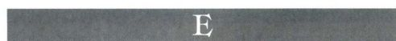

大地艺术（earthworks）：通常指一种规模极大并对自然环境作出改变的户外艺术品。

钟形饰（echinus）：在多立克柱式或托斯卡纳柱式中，一种类似于靠垫的圆形部件，位于柱身和柱顶板之间。

立面图／立面（elevation）：（1）一种建筑图纸，看起来像是投射在与建筑立面相平行的垂直面上；（2）用于指代建筑的垂直立面。

重要词汇 1117

寓意书（emblem book）：一种基督教题材画家的参考书，为他们提供与圣徒以及其他宗教人物相关的物品、事件的范本。

凸饰（embossing）：一种金工工艺，通过锤打金属箔的背面，在正面形成凸起的浮雕图案。

经验主义（empiricism）：一种哲学和科学观念，认为知识应该通过观察来获得，证据的积累应该通过反复实验来实现。

珐琅（enamel）：（1）半透明的彩色玻璃状物质，将其粉末覆盖在金属表面，然后放入窑炉中烧结。两大主要的珐琅工艺有：镂刻镶嵌（champlevé，法语词，意为“凸面”），在金属表面镂刻出需要珐琅装饰的部分；掐丝工艺（cloisonné，法语词，意为“分割区域”），用金属细条在装饰表面围出小格，然后填入珐琅。（2）采用以上工艺所制作的作品。

蜡画法（encaustic）：一种绘画技法，将颜料融入热蜡作画。

附壁圆柱（engaged column）：一种附在墙壁上的立柱，通常为半圆柱形状。

雕刻／雕版（engraving）：（1）一种在金属或宝石表面刻出图案作为装饰的技法；（2）一种版画技法，首先用尖锐的钢铁雕版刀在金属版（通常为铜版）上刻出图案，去除刻线两侧出现的毛刺，然后将油墨擦入V形的凹槽，并擦去刻版表面多余的油墨。将潮湿的纸张覆盖在刻版上，用力按压，在纸张上就会形成与刻版图案相反的图像。如果用细钢针替代刻刀完成雕刻，并保留刻槽上的毛刺，就会得到干刻雕版，这种雕版以更为柔和的线条为特色。这两种技法分别称为雕版与干刻。

檐部（entablature）：（1）在古典建筑样式中，指圆柱之上的全部结构，通常包括额枋、檐壁和檐口；（2）指古典风格建筑中的这部分结构。

凸肚（entasis）：指圆柱柱身的鼓胀。

环境艺术（environment）：在艺术中，环境艺术指的是地球成为环境艺术的舞台，作品可以无比庞大但又极其简约和抽象。作品可以是永久性的，也可以是暂时的。大地艺术一词也被用于指代这样的作品。

蚀刻版画（etching）：（1）一种版画，在附着耐酸树脂的铜版上作画，并用尖锐的铁笔（stylus）将画出的图案刻入铜版。然后将铜版浸入酸溶液，酸会蚀入刻画的线条。最后加热铜版，去除树脂层，再涂上油墨在纸张上进行印刷；（2）这种技法本身也叫做蚀刻。

圣餐礼／圣餐（Eucharist）：（1）指圣餐仪式，

即纪念最后晚餐的仪式；（2）指圣餐仪式中所用的面包和葡萄酒。

福音书作者（Evangelists）：指传统上被认为是福音书作者的马太、马可、路加、约翰。福音书是新约的前四篇，记述了基督的生平与死亡。福音书作者通常与其象征图像一同出现，这可能来源于启示录中升座羔羊周围的四只动物，也有可能源于以西结的幻象：有翼的男子或天使代表马太，有翼的狮子代表马可，有翼的公牛代表路加，鹰代表约翰。这些象征也可以代表福音书作者单独出现。

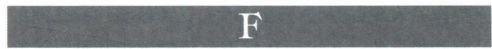

正立面（façade）：建筑的主立面或前立面。

玻璃釉／釉陶（faience）：（1）玻璃釉料经烧结后形成的光亮的不透明物质，为埃及和爱琴海地区所使用；（2）一种覆盖着彩色不透明釉的陶器，通常装饰有精美的图案。

教父（Fathers of the Church）：基督教信仰早期的教师和捍卫者，最常被表现的是四位拉丁教父：公元4世纪的圣杰罗姆、圣安布罗斯、圣奥古斯丁，以及公元6世纪的圣格里高利。

钢筋混凝土（ferroconcrete）：参见钢筋混凝土\(reinforced concrete\)。

钢铁玻璃建筑（ferrovitreous）：19世纪建筑中，运用铁（后来为钢）与玻璃建造的大型建筑（例如：火车站、展览大厅等）。

搭扣（fibula）：一种通常带有装饰的扣针、带扣或胸针。

细丝工艺品（filigree）：用交织的金属细丝制成的精美的装饰性作品

尖顶（finial）：一种相对较小的装饰性部件，位于山墙、尖塔等结构的顶端。

火焰哥特式（Flamboyant Gothic）：一种晚期哥特式建筑的风格，支撑彩色玻璃窗的棱窗格为复杂的尖顶形状，通常如火焰一般。

柱槽（fluting）：在建筑中，在圆柱或壁柱的柱身上垂直凿刻出的装饰性凹槽。柱槽间可以形成尖锐的边缘，例如多立克风格；也可能被狭长的条带或平边区分开来，例如爱奥尼亚风格、科林斯风格和复合风格。

飞扶壁（flying buttress）：建筑外部的单拱或组拱，连接独立的墩柱以传导拱顶的推压力。

书页（folio）：手抄本或书籍中的一页，正反两

🟩1118 詹森艺术史

以及哥特式画框顶端的三角形部分。

楼廊（gallery）：教堂侧堂上一层，位于高侧窗之下。在立面分四层的教堂里，楼廊位于三联拱廊之下，中堂连拱廊之上。

守护神（Genius）：一种半裸的有翼人物，通常是纯装饰性的，但也经常代表某种抽象概念的拟人化形象，或者代表某人、某地的守护精灵。

风俗［画］（genre）：法语词，意为“种类”或“类别”。在艺术中，常被用于指代描绘日常生活场景的绘画。

几何式阿拉伯花纹（geometric arabesque）： 通常由多边几何形而不是流动的有机形构成的复杂图案与设计，在伊斯兰艺术中常用作装饰。

底料（gesso）：一种由白垩粉或石膏与黏合剂调和而成的细腻混合物，用于给蛋彩画和木板油画打底。

动作绘画（gesture painting）：一种绘画与绘图技法，艺术家真实的身体动作在作品的笔触或线条中反映出来。艺术家杰克逊·波洛克与这种技法的联系尤为紧密。

诸神与巨人族之战（gigantomachy）：出自希腊神话，指诸神与巨人族之间的战斗。

贴金／镀金（gilding）：（1）将黄金或金黄色金属的箔片以机械或化学的方法附着在绘画、雕塑或建筑装饰表面；（2）使用这种金属装饰的工艺。

一天之量（giornata）：由于湿壁画干燥周期较短，艺术家只能在墙壁施涂可供一天使用的湿石膏，也就是一天之量的工作。该词源自意大利语“giorno”，意为“天”，所以“giornata”意味着“一天的工作”。

死者卧像（gisant）：墓葬中，一种表现死者横卧的肖像雕塑，有时将死者表现为腐败的状态。

透明色料／釉层（glaze）：（1）在绘画表面或其局部覆盖的一层细薄的透明油彩，以改变色调；（2）陶瓷器进入瓷窑烧制之前，覆盖在表面的一层玻璃状物质，可以作为保护层，更多地是作为装饰。

釉面砖（glazed brick）：彩绘后放入窑炉焙烧的砖。

面只标记一个页码，正面标记为“		，背面标记

字体／洗礼盆（font）：（1）印刷中的一整套字体，字母与数字都遵循统一的设计与风格；（2）洗礼堂中盛放圣水的石质或金属容器。

透视缩短法（foreshortening）：一种缩小或变形被表现对象与绘画平面不平行部分的方法，以此来传达人眼所感知到的立体感。

形式主义（formalism）：艺术中对形式而非主题的强调，例如线条、形状、色彩和构图等。因此，任何时代的艺术都可以单纯基于形式元素来进行评判。

罗马广场（forum，复数为fora）：古罗马时代的城市中主要的公共广场，是公众集会的场所，也是司法与商业活动的中心。

四门厅清真寺（four\-iwan mosque）：一种具有长方形内部庭院的清真寺，四面的大型拱顶厅堂或凹室的出口面向这个庭院。

方济各会（Franciscan Order）：阿西西的圣方济各（乔瓦尼·德·贝尔纳多内［Giovanni deBernardone］，约1181\-1226年）建立的托钵会。这个教派的修士以仿照基督的生活为宗旨，秉持贫穷与谦卑、传道、照料穷人的精神需要。

湿壁画（fresco）：意大利语，意为“新鲜”。这是一种在石膏上用水溶颜料作画的技法，这样颜料就会被石膏吸入，成为壁面的一部分。好壁画／湿壁画（buon fresco）指在湿石膏上作画的技法；干壁画（fresco secco）指在干燥的石膏上作画的技法。

饰带／檐壁（frieze）：（1）一种延伸的条带，具有绘画或雕刻装饰；（2）在古典建筑的檐部结构中，位于额枋与檐口之间部分。多立克式檐壁由交替的三垄板和嵌板构成，嵌板上多有雕刻。爱奥尼亚式的檐壁通常装饰着连续的浮雕。

正面描绘（frontality）：以正面视角来表现主题。

擦印法（frottage）：将纸张放置在粗糙的平面上，并用某种绘画材质（例如铅笔）进行拓印的方法，这样纸下的图案就会呈现在纸上。

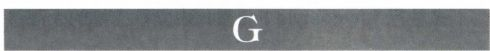

山墙（gable）：（1）建筑中为檐口／屋檐与屋顶两侧斜坡所框出的三角形区域，在古典建筑中，也被称为三角楣（pediment）；（2）一种具有类似形状的装饰元素，例如哥特式教堂大门上方的三角形结构，

光轮／后光（gloriole或glory）：上帝、基督、圣母马利亚以及圣徒头后或身后放射状的光圈。位于头部的光圈称为光轮（halo或nimbus），包裹整个人物的椭圆形光圈称为杏仁状光轮（mandorla，意大利语，意为“杏仁”）。这种光圈暗示人物的神性或神圣属性，然而它最初用于国王与神祇头部后方，为的是区别于常人。

重要词汇 1119

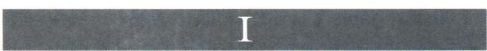

金叶（gold leaf）：（1）被锤打得极其之薄的金片或金“叶”，用于装饰彩饰手抄本、木板油画、雕塑，或者贴在镶嵌画嵌片的背面；（2）银叶（silverleaf）也为人所使用，但它最终会失去光泽。有时也称为金箔和银箔。

各各他（Golgotha）：源自阿拉姆语中表示“头骨”的词语，指的是耶路撒冷城外耶稣基督被钉死在十字架上的小丘，也被称为髑髅地。参见髑髅地（Calvary）。

戈耳贡女妖（Gorgon）：希腊神话中的一种可怕的女性怪物，她有巨大的头部，蛇是她的头发。男子被她们看一眼就会变成石头。美杜莎是最著名的戈耳贡女妖，珀耳修斯得众神襄助，将其杀死。

福音书（Gospel）：（1）新约的前四篇，讲述基督的生平与死亡，由福音书作者马太、马可、路加和约翰所作；（2）福音书的复本，通常装饰着丰富的彩饰。

颗粒工艺（granulation）：一种将金属颗粒或小金属球焊接在金属表面的装饰工艺。

刮印法（grattage）：一种绘画技法，将画布铺在粗糙物体的表面，通过刮去油彩的办法在画布上形成图像。

希腊十字（greek cross）：垂直相交、四臂等长的十字。

希腊十字教堂（greek\-cross church）：一种采用等臂希腊十字形布局的教堂，由中央空间和四个由此延伸出的等长房间构成。

单色画（grisaille）：一种单一色彩的素描或绘画，其中只有黑、白、灰调子。

单色玻璃（grisaille glass）：绘有灰色图案的白玻璃。

交叉拱（groin vault）：一种由两个筒拱垂直相交而构成的拱，拱棱（groin）是两个拱顶相交形成的边棱。

地面线（ground\-line）：人物脚下真实或暗示的线条。

平面图（ground plan）：一种表现建筑的图纸，看起来像是建筑底层的水平切面，也称为“plan”。

珠状饰（guttae）：在多立克式的檐部，饰带上方一种类似于珠子的小突起，可能源自最初在木构建筑中使用的木栓。

\(Hallenkirche\)。

厅堂式教堂（Hlallenkirche）：德语，意为“厅堂式教堂”（hall church），指的是一种中堂与侧堂等高的教堂。该类型是在罗马式建筑中发展起来的，尤为常见于德国的哥特式教堂之中。

光轮（halo）：绘画中，环绕在圣徒、天使或神祇头部周围的圆形光环或部分圆环光环，被用来表现人物的神圣属性；在中世纪绘画中最为常见，但在更为现代的艺术作品中也有所运用。又称为“nimbus”。

偶发艺术（happening）：一种融合视觉图像、观众参与即兴表演的艺术，通常于公共空间中，在艺术家不经意的引导下进行。

中国风格（hataiji style）：		“hataiji”字面意义为“中国”，该术语用于描述奥斯曼土耳其艺术中的一种图案，由风格化的荷花花苞等花朵、盘曲的枝叶和茎蔓构成。

影线（hatching）：版画和素描中为表现阴影而使用的成组的平行线条，相交的两组平行线条称为网状影线（crosshatching）。

纹章式构图（heraldic composition）：一种依据中心轴线对称布局的图案。

神圣比例（hieratic scale）：一种艺术技法，以人物尺寸的大小来表示其重要性，最重要的人物最高大。

象形文字（hieroglyph）：一种通常基于人物、动物或实物的象征符号，被用作文字、音节或发音。这些象征构成了埃及的早期书写系统，在古埃及建筑和文字记录中经常可以见到。

高浮雕（high relief）：参见浮雕（relief）。

公馆（hôtel）：法语，意为“饭店”，但也用于指代优雅的城中宅邸。

家庭教堂（house church）：家中的私人敬拜场所；最早的基督教教堂就位于私人住宅之中，将家中居室修饰为宗教仪式场所。

人文主义（humanism）：一种强调个人价值、人类的理性能力、人类向善潜能的哲学。意大利文艺复兴期间，人文主义鼓励学习希腊、罗马的古典文化。通常与天主教会的教义形成冲突。

多柱厅（hypostyle）：屋顶由立柱支撑的大厅。

厅堂式教堂（hall church）：参见厅堂式教堂 种绘有基督、圣母、圣徒等一个或多个神圣人物的木

圣像（icon）：源自希腊语中的“图像”，指一

🟩1120 詹森艺术史

板画，在东正教会中尤受尊崇。

破坏圣像运动（iconoclasm）：8世纪和9世纪期间天主教会的教义禁止崇拜或制作宗教图像，这一教义导致很多艺术品被毁坏，对该教义合法性的争议导致了教会的分裂。16、17世纪的新教教会也实践破坏圣像运动。

图像范式／圣像学／图像志（iconography）：（1）在艺术中为了传达特定意义而描绘的图像；（2）研究艺术中被描绘图像的意义，图像可以是无生命的物品，也可以是事件或人物；（3）一件艺术作品的内容或主题。

幻觉主义（illusionism）：在艺术术语中，指通过使用绘画等方式，让人眼感知到某种特定现实的技法。除绘画之外，也可以被运用于建筑与雕塑。

厚涂（impasto）：源自意大利语，意为“使成糊状”，用来描述施涂得非常厚重的颜料，多指油画颜料。

扶壁间立柱（in antis）：建筑术语，指希腊或罗马建筑中的立柱位置，当立柱位于两墙交界处时就称为扶壁间立柱。

刻纹（incision）：使用尖锐的工具在坚硬材料上刻出的切口。

乌银镶嵌工艺（inlaid niello）：参见乌银（niello）。

街区建筑（insula，复数为insulae）：拉丁语，意为“岛屿”。（1）一种古罗马的城市街区；（2）一种罗马“公寓”，为混凝土或砖砌的单体建筑，或者是围绕着中央庭院的连体建筑，可以达到5层之高。底层为商店，上层为居住区域。

凹版印刷（intaglio）：一种印刷技术，图像由刻入印版的线条凹陷中容纳的油墨印成，雕版、蚀刻和干刻都属于凹版印刷。

细灰泥层（intonaco）：湿壁画中，颜料层底下的一层细腻的灰泥层。

爱奥尼亚风格（lonic Style）：一种古希腊建筑风格，代表性特点有：刻有凹槽的柱身、柱头上的涡卷饰、柱础，以及连续的饰带。

门厅（iwan）：清真寺等其他伊斯兰建筑中一种拱顶大厅，一边开口，而且开口通常都面向内部的庭院。

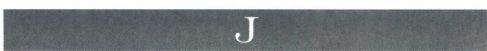

侧壁（jambs）：建筑开口处两侧的垂直侧边。在罗马式和哥特式教堂里，门窗的侧壁通常会向外倾

斜，呈八字形，从而为雕刻装饰提供了更大的空间。

日本风（japonisme）：在19世纪的法国艺术和美国艺术中，一种表现出日本艺术影响、特别是日本版画影响的绘画或图像风格，日本的版画正是在当时流传到了西方。

耶稣会（Jesuit Order或Society of Jesus）： 罗耀拉的圣依纳爵（1491\-1556年）于1534年创立的教会组织，尤为致力于服务教皇。这个教派在天主教反宗教改革与新教改革的斗争之中发挥了强大的影响，并且在传教活动中具有举足轻重的作用，将基督教传播到东亚地区和美洲新大陆。罗马的耶稣堂是耶稣会的母堂，它的设计与这一新教派的传教宗旨相得益彰。

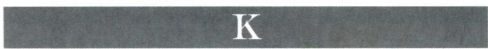

要塞（keep）：（1）中世纪城堡内最为坚固的中心部分或中央塔楼，除了防御功能之外，有时还被用作生活区域，又称主塔（donjon）；（2）中世纪建有防御工事的城堡。

拱心石／拱冠（keystone）：拱最高处中央的石方或楔形拱石，是最后一块被放置在拱上的石方，它的重量让拱的结构稳定坚固。

媚俗（kitsch）：德语，意为“垃圾”，在英语中，该词被用来表述一种粗俗感伤的感性，与美术中“高雅”艺术的精致相对。

考丽（kore，复数为korai）：希腊语，意为“少女”。指一种希腊古风时期的雕像，表现的是身着长袍站立的女子形象。

库罗斯（kouros，复数为kouroi）：希腊语，意为“青年男子”。指一种希腊古风时期的雕像，表现的是站立的裸体年轻男子形象。

酒瓮（krater）：一种古希腊容器，具有各种各样的外形，用于调和酒与水。萼形酒瓮（calyxkrater）是一种钟形容器，把手位于器底；涡耳酒瓮（volute krater）则具有形似卷轴的把手。

库法体（kufic）：最早发展起来的一种阿拉伯文字的普遍形式，以具有棱角为特征，在伊斯兰世界的不同地方，出现了具有各自独特性的变体。

艺术馆（kunstkammen，德语，复数为kunstkammern；荷兰语为kunstkamer）：字面意义为艺术之屋，在16世纪时发展起来，它是展示绘画和自然历史陈列品（贝壳、骨头等）的博物馆的前身，其收藏是百科全书式的。

重要词汇 1121

细脚杯			：古希腊和古罗马时期的一种浅底杯，具有水平向延伸的把手，通常由细长的柄脚连接杯体与底座。

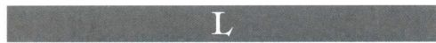

月时劳作（Labors of the Months）：一年各个月份应该进行的不同工作。表现这些劳作场面与人物的图画通常出现在彩饰手抄本里。月时劳作的场面有时也会结合表现黄道带的星座符号。

拉玛苏（lamassu）：古代东亚地区的一种宫殿守护者，通常以雕塑的形式表现，其形象是一种有翼的人首公牛或狮子。

尖顶窗（Lancet）：一种常见于哥特式建筑中的细长的尖顶窗户。

风景画（Landscape）：一种以户外的自然场景为主题的素描或绘画。

灯笼式天窗（lantern）：一种位于穹顶、屋顶或塔楼顶端的一种相对较小的结构，通常设有开口，让光线射入下方的封闭区域。

拉皮泰族（Lapith）：古希腊神话中的部族，打败了马人。这一战斗场景通常表现在瓶画和雕塑中。

拉丁十字（latin cross）：一种三臂等长而第四臂长于其余三臂的十字。

平信徒修士（lay brother）：加入修会但尚未发愿，仍属于普通信众的信徒，有别于教士或修士。

长身细颈瓶（lekythos，复数为lekythoi）：一种希腊油罐，罐身呈椭圆形，细颈、缘口凸出，弯曲的单把手从器唇下部伸出，落在肩部，油罐底部有较薄的器足。这种容器主要用于盛放药膏和丧葬供品。

人文学科（liberal arts）：传统上认为它可以追溯到柏拉图，包括了完整的教育所必需的学科：语法、修辞、逻辑、算术、音乐、几何、天文。中世纪和文艺复兴时期，这些学科经常以寓言的手法被表现在绘画、版画和雕塑中。

门楣／过梁（lintel）：建筑中一种由两个直立支撑所举起的横向梁，可以是任何材料制成。

石版画／平版画（lithograph）：版画的一种，使用蜡笔等油性物质将图样设计绘制在多孔的石板上（后来也使用金属板），图案固定之后，润湿石板，施涂的油墨只保留在绘出的油性线条的表面，然后就可以轻松地将图案印在纸上。这一技法是在1796年前后由阿罗斯·塞尼菲尔德发明的，很快就流行起来。它也被广泛地用于商业印刷，因为一版可以印出大量

印张。

凉廊（loggia）：一种有顶的长廊或者连拱廊，至少有一面是开敞的。它可以是单体建筑，也可以是某座建筑的一部分。

纵截面（longitudinal section）：一种显示建筑或物体纵向结构的截面图。参见横截面（crosssection\)。

百叶窗（louvers）：一组叠加在一起的板或板条，可以打开让空气进入，但又具有一定的倾斜度以避免阳光直射和雨水溅入。

浅浮雕（low relief）：参见浮雕（relief）。

半月形饰面（lunette）：（1）位于拱顶之下或门窗之上的半圆形或尖形的墙面。中世纪教堂大门上方的半月形饰面称为半月楣（tympanum）；（2）一种具有同样外形的绘画、浮雕或窗户。

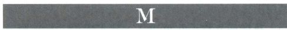

穆斯林学校／学院（madrasa）：一种伊斯兰宗教学校。

庄严圣像（Maestà）：意大利语，意为“庄严”，在14、15世纪时被用于指代表现升座圣母子的图像，圣母子周围环绕着天庭的圣徒与天使。

巫术宗教题材（magico\-religious）：艺术中涉及超自然的主题，通常以此唤起超自然的力量来达成人的目的。例如史前的洞窟壁画被用来确保狩猎的成功。

古波斯僧／占星术士／博士／国王（magus，复数为magi）：（1）古代米底和波斯的祭司家族的成员；（2）基督教文学中，三贤或三王之一，他们从东方远道而来，给新生的耶稣献上礼物。

杏仁状光轮（mandorla）：一种环绕在神圣人物身体周围的光。

风格主义（maniera）：13世纪绘画中的“希腊风格”，表现出来自意大利和拜占庭的影响。

手抄本彩饰（manuscript illumination）：手写的文书、卷轴或书籍上的装饰性素描或绘画。彩饰手抄本通常制作于中世纪时期。

私室（maqsura）：一种统治者专用的封闭的隔屏，通常位于某些重要的伊斯兰皇家清真寺的米哈拉布前。

殉道堂（martyrium，复数为martyria）：在基督教殉道者的坟墓上或某个曾经发生过重要神迹的地方建造的教堂、礼拜堂或圣龛。

🟩1122 詹森艺术史

马斯塔巴（mastaba）：一种古埃及坟墓，呈长方形，四面为斜坡，平顶，其中建有一座供奉礼拜堂和通向墓室的通道。

模具／母版（matrix）：（1）一种尚未煅烧，用来给瓷器成型的模具或压模；（2）在印刷中，指任何表面具有线刻、雕刻或堆塑图像，用于印刷的版子。

毛索洛斯陵／墓庙（mausoleum）：（1）公元前4世纪，毛索洛斯及其妻子阿尔泰米西亚在哈利卡纳苏斯建造的巨大陵墓；（2）泛指大型的丧葬建筑。

回形纹饰（meander）：一种用于建筑和雕塑的复杂直线性装饰图案。

媒介／调和剂（medium，复数为mediums）：

（1）艺术家创作所使用的材料或技术；（2）调和颜料的介质、浆料等。

巨石（megalith）：源自希腊语，“		意为“巨大”，“lithos”意为“石头”，指在石圈和石台墓中使用的巨大石方。

谒见大厅（megaron，复数为megarons或megara）：源自希腊语中的“巨大”一词，指米诺斯、迈锡尼的宫殿或住宅中的中央接待厅。

竖石（menhir）：一种巨大的直立板石，史前人类有时将其成行排列。

中石器时代（Mesolithic）：石器时代中，旧石器时代与新石器时代之间的过渡时期。

嵌板（metope）：多立克式檐壁的组成部分，位于两块三垄板之间，有时没有装饰，但多数情况都装饰有绘画或浮雕。

米哈拉布（mihrab）：一种通常装饰华丽，位于清真寺麦加朝向墙中心的一个壁龛，向祈祷者指明麦加的方向。

宣礼塔（minaret）：指清真寺里或其附近的塔，召集信徒每天5次的祈祷。在伊斯兰世界，宣礼塔的形式变化多种多样。

敏拜尔（minbar）：一种带台阶的讲坛，见于较为重要的清真寺的米哈拉布右侧。每周五午间祈祷之后，在这里进行安息日布道。

细密画／袖珍画（miniature）：（1）彩饰手抄本中的单幅插图；（2）一种极小的绘画，特别是指象牙、玻璃或金属上的肖像画。

弥诺陶（Minotaur）：希腊神话中的一个牛头人身怪物，居住在克里特岛上克诺索斯宫的迷宫里。

模型／模特（model）：（1）雕塑的最初形式，通常是已经完成的，但是先于铸造或雕刻工序；（2）按比例制作的建筑初样或复原的建筑；（3）为艺术

家摆姿势的人。

塑造（modeling）：（1）雕塑中，以黏土、蜡等柔软物质来制作人物或图案；（2）绘画和素描中，通过色彩变化、光线阴影等来制造三维立体效果。

组块／模数（module）：（1）某个图案中的一个片段；（2）一个基本的单元，例如建筑某个组成部分的尺度，多种基本单元决定了建筑其他部分的建造比例。

线脚（molding）：建筑中，凸起于任何表面的具有独特轮廓的狭长装饰性条带，由于光影对比所造成的图案的不同，丰富了建筑表面的变化。

修会（monastic order）：一种宗教团体，其成员共同生活在一起，遵循既定的一套规则。

独幅版画（monotype）：用铜版或其他版子印出的唯一一幅版画，除此之外，再无其他。

镶嵌画（mosaic）：墙壁、拱顶、天花板或地板上的装饰性作品，由带颜色的材料制成的小块构成，这种小块被称为嵌片（tesserae），嵌在石膏或水泥之中。罗马人使用经过打磨成型的彩色石块，他们的作品通常是地板镶嵌。早期基督教使用色调明亮的玻璃嵌块，也包括金块，表面略呈不规则形状，制造出一种完全不同的闪光效果。

清真寺（mosque）：伊斯兰宗教中用于社区礼拜祈祷的建筑，通常也兼具其他功能，其中包括宗教教育和公众集会。

母题（motif）：图像题材，某个母题可以在同一幅艺术作品中出现多次。

莫扎勒布（mozarab）：用于指代中世纪时期的西班牙基督教文化，它在穆斯林成为伊比利亚半岛的主导文化与政治统治者的时期发展起来。

壁龛样式（muqarnas）：伊斯兰装饰中的一种独特类型，由多个类似于壁龛的结构构成，它们相互叠加，成行排列，通常用于建筑的过渡部分。

壁画（mural）：源自拉丁语“murus”，意为墙壁，指一种大型绘画或装饰，或者直接制作在墙上（例如湿壁画），或者完成之后固定在墙上。

缪斯（Muses）：希腊神话中九位掌管艺术与科学的女神，她们在音乐与诗歌之神阿波罗的带领之下，通常包括：司英雄史诗的卡利俄佩（Calliope）、司历史的克利俄（Clio）、司情诗的厄刺托（Erato）、司音乐的欧忒耳佩（Euterpe）、司悲剧的墨尔波墨涅（Melpomene）、司颂歌的波吕许谟尼亚（Polyhymnia）、司舞蹈的忒耳普西科瑞（Terpsichore）、司喜剧的塔利亚（Thalia）、司天文的乌刺尼亚（Urania）。

重要词汇 1123

飞檐托块（mutules）：多立克式建筑的特色之一，外形为扁长方体，位于檐口之下。

内殿（naos）：参见内殿／神殿（cella）。

前廊（narthex）：教堂入口处的横向大厅，有时是封闭的，但其中一面往往通向前面的前庭。

写实／自然主义（naturalism）：一种艺术风格，旨在描绘自然世界所呈现的面貌。

中堂（nave）：（1）罗马长方形公堂的中央通路，有别于两侧的侧堂；（2）基督教公堂式教堂的中央通路，从入口处一直延伸到半圆室或者耳堂。

大墓地（necropolis）：希腊语，意为“死者之城”，被用来指代坟场墓地。

新石器时代（Neolithic）：约始于公元前9000年至公元前8000年，这个时期出现了最早的人类定居社会，人们蓄养动物、种植谷物，很多新技术也在这个时期出现了萌芽，例如纺纱、织布和建造房屋。

新石器时代（New Stone Age）：参见新石器时代（Neolithic）。

乌银（niello）：填在贵金属板（通常为金、银）表面刻线里以形成图案的暗色合金。

尼刻（Nike）：古希腊的胜利女神，等同于雅典娜和古罗马的维多利亚（Victoria）。她通常被表现为身生双翼的女性形象，衣袍在风中飘荡。。

光轮（nimbus）：参见光轮（halo）。

夜景画（nocturne）：描绘夜晚场景的绘画，通常强调人造光线的不同效果。

非具象绘画（nonobjective painting）：抽象艺术中，不致力于再现物品、人物等对象的绘画风格，画面中不具有日常生活和自然世界中可见的物象。

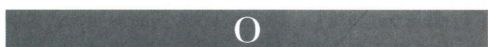

方尖碑（obelisk）：一种具有四个侧面，逐渐向上缩小，顶端为金字塔形的高大石柱。方尖碑本来是古埃及的巨石（megalith），有些方尖碑后来被运送到了其他国家。

明窗／圆窗（oculus）：拉丁语，意为“眼睛”。（1）穹顶顶部的圆形开口，阳光由此射入；（2）圆形的窗户。

宫女（odalisque）：土耳其语，意为“后宫女奴”或“情妇”。

油画（oil painting）：（1）一种使用油作为颜料调和剂的绘画，最初画在覆盖底料（也用于湿壁画）的木板上，后来则画在绷紧的画布上，画之前画布要涂白或涂胶。后一种方法自15世纪以来成为了主导的油画创作方式。油画也可以画在纸张、羊皮纸、铜板等材质上；（2）绘制这种绘画的技法。

油画草图（oil sketch）：以油画技法绘制的，具有非正式特征的作品，有时是为最终作品所做的草稿。

旧石器时代（Old Stone Age）：参见旧石器时代（Paleolithic）。

视觉图像（optical images）：一种基于眼之所见而不是记忆的图像。

祈祷像（orant）：一种站立的人物形象，人物双臂举起，呈祈祷的姿态。

合唱队席／贵宾席（orchestra）：（1）古希腊剧场中，位于舞台前方、观众席之下，供合唱队使用的圆形区域；（2）古罗马剧场中的类似区域，但它是重要宾客的坐席。

东正教（Orthodox）：源自希腊语，意为“观点正确”。东方的东正教会在5世纪期间与西方的天主教会分裂，从效忠罗马教皇改为效忠君士坦丁堡的拜占庭皇帝及其任命的教宗。有时也被称为拜占庭教会\(byzantine church\)。

正交线（orthogonal）：在以透视法建构的画面中，一种垂直于绘画平面，交于灭点的想象线条。

竖石板（orthostats）：直立的石板，是墙壁下部的组成部分或者沿墙壁下部排开，通常是为了保护泥砖等较易损坏的材料。

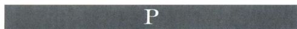

宫殿（palazzo，复数为palazzi）：意大利语（法语为palais），通常用来指代大型的政府建筑或者重要人物的城中宅邸。

旧石器时代（Paleolithic）：通常分为上中下三个阶段，始于约公元前35,000年。此时的人类社会以游牧狩猎为主要生活方式，会使用石制工具，后来发展出骨制工具和燧石工具。有些人群生活在洞窟之中，在旧石器时代的晚期，洞窟内出现了装饰，此时的人们也制造小型的骨雕、角雕和石雕。

调色板／用色／石板（palette）：（1）一种通常为椭圆形的薄板，一端有可供大拇指伸入的孔，画家用它来盛放和调和色彩；（2）某位画家所使用的色彩范围；（3）埃及艺术中的一种石板，通常装饰有

🟩1124 詹森艺术史

浅浮雕。较小石板的一面有圆形的凹陷，被认为是用来盛放眼部化妆品，较大的石板则属于纪念物。

画板（panel）：（1）一种用于绘画的木板，通常用来绘制蛋彩画，作画之前要在木板上涂一层底料。大型的祭坛作品需要将两块或两块以上的画板连接在一起；（2）近期，纤维板等其他复合材料也被用来制作画板。

万神殿／先贤祠／纪念堂（pantheon）：源自希腊语中意为“全部”的“		和意为“神”的“theos”这是一种希腊化时期或罗马时期的神殿，敬献给所有的神。后来，此类建筑成为一国杰出人物去世后的坟墓所在地或纪念堂。

万能之主（pantocrator）：将基督表现为宇宙统治者的图像，经常出现在拜占庭教堂的穹顶和半圆室镶嵌画中。

纸莎草／纸莎草纸／纸莎草书（papyrus）：（1）一种高大的水生植物，大量生长于东亚、埃及和阿比西尼亚；（2）将细薄的纸莎草茎芯条排在一起，经过浸泡、压制和干燥制成的一种类似于纸的材料。古代埃及、希腊和罗马都把它用作书写材料；（3）一种写在这种材料上的古代文献或书卷。

羊皮纸／羊皮书／羊皮画（parchment）：发明于公元前2世纪，根据其诞生地小亚细亚的希腊城市帕加马而得名。（1）用经过漂白的兽皮制成的一种类似于纸的材料的统称，广泛用于中世纪时期的手抄本。犊皮纸（vellum）是用小牛皮制成的一种高级的皮纸；（2）以这种材料为载体的文献或小型画。

受难（Passion）：（1）宗教语汇中，用来指代耶稣生命最后一周所发生的事件；（2）以绘画、文学、戏剧或音乐形式对这些事件的表现。

淡色／色粉笔／色粉画（pastel）：（1）一种柔和的色彩；（2）一种用粉笔、胶水和颜料混合而成的画棒；（3）用这样的画棒绘制的图画。

基座（pedestal）：一种为雕像、花瓶、立柱等制作的结构性支撑物。

三角楣（pediment）：（1）古典建筑中，一种由下方的横向檐口和上方的两条斜坡檐口框出的三角形低矮山墙，通常都装饰有雕塑；（2）位于门窗或壁龛上放的类似建筑部分，如果檐口以一定角度发生转向，或者被打破，那么这一部分就被称为开口三角楣（broken pediment）。

双耳细颈罐（pelike）：一种希腊储存罐，双耳阔口，罐肩短小或无肩，有底座。

穹隅（pendentive）：一种球面三角形，用于

实现穹顶的正方形／多边形开口向圆形底座或鼓室的过渡。

行为艺术（Performance Art）：一种由演员或艺术家表演的艺术类型，通常以即兴的方式与现场观众展开互动，这曾是该艺术发展过程中某一阶段的首要目的。这类艺术无法保留下来，某些事件可能只有摄影记录。

围柱式（peripteral）：描述某一建筑被一列立柱或柱廊所围绕的样式。

围柱中庭／围柱廊（peristyle）：（1）在罗马住宅或中庭式住宅（domus）中，周围环绕立柱长廊的露天花园中庭；（2）围绕着建筑或者庭院的立柱长廊。

垂直［哥特式］风格（Perpendicular ［Gothic］ style）：英国哥特式建筑的第三种风格，其中棱窗格以垂直线条为主，扇形拱顶也在这一风格中得到了广泛应用。

透视法（perspective）：一个在二维平面内表现空间关系与三维立体对象的体系，目的在于制造出类似于人眼感知的效果。在大气或空气透视法中，当被表现对象距离绘画平面越来越远，色彩的饱和度和明度就会随之减弱，明暗之间的对比同样会减弱。在彩色的艺术作品中，距离绘画平面越远的对象，其色彩就会更趋向于一种浅淡的蓝灰色调。15世纪在意大利发展起来的科学或线性透视法，则是一个基于正交线交汇于地平面灭点的数学体系。横线与正交线在远处垂直相交源自数学的推导。由于这种方法预设了一个绝对静止的观众，并且强加给艺术家严格的限制，所以几乎很少在画面中得到贯彻一致的运用。尽管传统上认为它的发明者是布鲁内莱斯基，但最早关于透视法的理论性文本是莱昂·巴蒂斯塔·阿尔贝蒂的《论绘画》（1435年）。

启蒙思想家（philosophes）：启蒙时代的哲学家与知识分子，他们的著作对当时的艺术产生了重要影响。

物影照片（photogram）：一种不用照相机，而是将物体放在感光纸上，然后再用光线照射曝光，形成的影子一般的照片。

照片／摄影（photograph）：相对长久或“固定”的图像形式，通过让光线穿过照相机镜头作用于感光材料而形成。照片也常被称为“print”。

摄影蒙太奇（photomontage）：一种摄影方法，将多幅照片的整体或局部拼合起来形成新的图像。这种技法在20世纪20年代被达达艺术团体大量使用。

广场（piazza，复数为piazze）：意大利语，意

重要词汇 1125

为“公共广场”，法语为“		，德语为

画面（picture plane）：绘制绘画的平面。

如画（picturesque）：具有视觉上的意义或愉悦感，仿佛是一幅绘画。

墩柱（pier）：一种直立的建筑支撑结构，通常为长方形，并且有时还有柱头与柱础。在众多罗马式与哥特式教堂中，当立柱、半露方柱或者柱身附着在该结构上时，它被称为复合墩柱（compound pier）。

圣母哀子（Pietà）：意大利语，兼具“怜悯”与“同情”之意，指一种表现圣母在死去的基督面前悲痛不已的图像。当指代基督上十字架之后某一特定时刻的记录场景时，通常也用“lamentation”一词。

宁静之石（pietra serena）：一种在意大利托斯卡纳地区使用的灰色砂岩。

半露方柱／壁柱（pilaster）：一种扁平的垂直元素，通常突起于墙壁表面，并且具有柱础、柱身和柱头结构。它通常是装饰成分，不具有结构功能。

朝圣式唱诗班区（pilgrimage choir）：罗马式教堂中，由半圆室、半圆室回廊和放射状礼拜堂所构成的整体。

朝圣式布局（pilgrimage plan）：基督教教堂中普遍的设计，这些教堂都是中世纪欧洲朝圣者朝圣之路上的落脚点，以设计有侧堂为特色，目的在于容纳更多的朝圣者。参见朝圣式唱诗班区（pilgrimagechoir\)。

支柱（pillar）：泛指直立的建筑支撑结构，包括圆柱、墩柱、半露方柱等。

架空柱（pilotis）：一种由钢筋混凝土建构的支柱。

小尖塔（pinnacle）：塔楼、墩柱、扶壁等建筑支撑物上小型装饰结构，在哥特式建筑中最为普遍。

平面图（plan）：参见平面图（ground plan）。

板窗格（plate tracery）：一种窗格样式，坚固石墙的开口里都装有玻璃。

户外（plein\-air）：通常指用油画颜料在户外绘制的草图，其目的在于捕捉风景等其他物象即时的光线效果。印象派画家极力鼓励这种方法，他们将户外草图带回画室，再加工成完成的作品。但是很多户外草图都被认为是艺术杰作。

墩座／墩座墙（podium）：（1）伊特鲁里亚与古罗马神庙的高大底座；（2）建筑物看似此类底座的底层。

多联作品（polyptych）：一种祭坛作品或宗教艺术品，由多块画板／雕板等构成，通常用铰链连接在一起。

门廊（porch）：泛指建筑外部的附加结构，一种有顶的入口通道。

门（porta）：拉丁语，意为“门”、“大门”。

大门（portal）：一种门或大门，通常尺寸巨大，并且还有精美的雕刻装饰。

圆柱式门廊（portico）：一种由圆柱支撑屋顶或檐部加三角楣的结构，通常从台阶进入。它为建筑提供了有顶的入口，也连接着建筑及其周围的空间。

柱梁结构（post and lintel）：建筑中的基本结构之一，两根或多根立柱支撑着横梁，横梁可以是位置最高的部件，也可以是墙壁或屋顶的支撑。

粉拓法（pouncing）：一种将纸板上的草图转移到墙壁或其他表面的方法，首先在草图的线条上扎出小孔，然后撒上碳粉，碳粉就会透过小孔落在墙面上，形成图案。

普桑派（Poussinistes）：17世纪末、18世纪初，法兰西学院那些注重“素描”的艺术家，他们认为素描更诉诸理性而不是感官。该术语源自对法国艺术家尼古拉·普桑的尊敬。参见鲁本斯派（Rubénistes）。

祭坛台座（predella）：祭坛作品的底座，通常装饰着与主画面题材相关的小型场景图像。

预示（prefiguration）：将旧约人物和故事的表现，作为新约人物和故事的先兆与铺垫。

原始主义（primitivism）：现代艺术家对非西方艺术（例如非洲艺术、部族艺术、波利尼西亚艺术）风格、形式与技法的挪用，属于先锋艺术运动创新的一部分。这些艺术家也借用其他的素材，包括儿童和精神病人的艺术。

版画／照片／印刷品（print）：一种复制的图片或图像，通常印在纸上且数量巨大，图像来自木版、金属版、石版或摄影。

前殿（pronaos）：希腊或罗马神庙中，一种位于内殿（cella）之前的开敞前厅。

豪华静物画（pronk）：该词意为华丽炫耀，被用来指代表现奢华物品的静物画。

门道／山门（propylaeum，复数为propylaea）：（1） 庙堂或其他封闭建筑的入口，通常装饰华丽；（2）雅典卫城西端的巨大入口。

来源（provenance）：一件艺术品的起源地与相关信息。

《诗篇》（Psalter）：（1）旧约中的《诗篇》， 据信其中一部分出自古代以色列国王大卫之手；（2）《诗篇》的副本，有时会根据宗教仪式的需要来编排，而且常常装饰着丰富的彩饰。

🟩1126 詹森艺术史

讲道坛（pulpit）：教堂中高起的平台，神职人员在这个平台上讲道或者主持宗教仪式。它的围栏或者围墙可能具有精美的装饰。

小天使（putto，复数为putti）：经常在古典艺术和文艺复兴艺术中出现的裸体男孩，通常长有双翼。当他手持弓箭的时候，就被视为爱情的化身，称为丘比特或小爱神（amoretto）。

塔门／牌楼门（pylon）：希腊语，意为“门道”。（1）埃及神庙或前庭的巨大入口建筑，通常是开有入口、两边倾斜的厚重墙壁，或者由建在中央入口两侧的墙壁构成；（2）大门、桥梁或大街两旁的高大建筑，是入口处的标志。

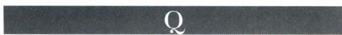

麦加朝向（qibla）：朝向麦加的方向，即穆斯林祈祷时所面对的方向。清真寺里的麦加朝向墙为人们指示出这个方向。

四分拱（quadrant vault）：一种半筒形拱顶，其横截面不是半圆形，拱形为四分之一圆形。

可移动绘画（quadra riportate）：在拱顶曲面的嵌板上描绘的图像。

四叶形饰（quatrefoil）：一种装饰图案，由从同一中心发散出的四个叶片构成。

辐射式礼拜堂（radiating chapels）：用以指代中世纪教堂中，沿半圆室回廊（有时也包括耳堂）依次排开的各座礼拜堂。

辐射式（rayonnant）：哥特式建筑风格，被描述为“辐射状的”，13世纪中期在路易九世的巴黎宫廷中发展起来，也被称为宫廷风格（court style）。

现成品（readymade）：因艺术家赋予了新的情境或标题而被转化成艺术品的普通物品。使用现成品是20世纪早期达达和超现实主义艺术运动的重要特色。

红绘式（red\-figured）：一种古希腊的陶器装饰风格，以在黑底色上的红色图案为特点。这一风格在公元前6世纪末发展起来，取代了之前的黑绘式风格。

食堂（refectory）：（1）进食以补充体力的房间；

（2）修道院、学校等其他大型机构的餐厅。

宗教改革（Reformation）：16世纪早期的宗教运动，其目的在于改革天主教会，最终导致了新教教

会的建立。

画带（register）：一种包含有浮雕、湿壁画等装饰的水平条带。当出现多层水平条带时，画带就被用来确定不同的视觉平面以及视觉叙事中不同的时间。

钢筋混凝土（reinforced concrete）：强度、特别是拉伸强度得到提升的混凝土，通常采用埋入钢杆或钢丝网的方式，1900年前后引入法国。很多大型现代建筑只有采用钢筋混凝土才能建造出来。

浮雕／浮雕感／凸版印刷（relief）：（1）人物或图案的一部分突出于它们所被雕刻或塑造的背景平面之上。根据突出高度的不同，以这种方式制作的雕塑被称为高浮雕（high relief）或浅浮雕（low relief）。当浮雕极浅时，称为扁浮雕（schiacciato，意大利语，意为“平地”）；（2）在绘画或素描中形体的明显突出之感；（3）一种印刷方法，高于印版平面的线条浸入油墨被印刷出来。

圣物箱（reliquary）：用来储存和展示圣物的容器。

壁联柱（respond）：（1）一种凸出于墙壁的半墩柱、半露方柱或类似结构，其功能是支撑过梁和拱，另一端由独立的圆柱或墩柱来支撑，正如连拱廊的末端那样；（2）柱廊背后墙壁上的一系列半露方柱，看起来像是与柱廊的立柱两两相配，但实际上主要起装饰作用；（3）中世纪教堂里，复合墩柱上的一种细长的柱身，似乎在承载拱顶的重量。

角状杯（rhyton，复数为rhyta）：古代一种陶瓷、金属、石头制成的饮用或倒注容器，有时做成人物或动物形状。

拱肋（rib）：一种纤细突出的拱状结构，横向或者交叉支撑拱顶，因而将拱面区分为多个部分。在晚期哥特式建筑中，它的首要作用是装饰。

肋拱（ribbed vault）：一种拱顶风格，突出于拱顶表面的拱肋沿着拱顶区隔面的相交线向上升起，拱肋既可以提供支撑，也可以作为拱顶表面的装饰。

罗马式（Romanesque）：（1）11世纪至13 世纪期间中世纪建筑的风格，基于古罗马建筑样式，使用罗马的圆拱，以厚重的墙壁作为支撑结构，而且窗户相对较小；（2）任何“类似于罗马”的文化及其人造物。

十字架坛隔屏（rood screen）：教堂中的一种挂着十字架的隔屏，将公共的中堂区域与唱诗班席分开来。参见唱诗班席隔屏（choir screen）。

玫瑰窗（rose window）：一种巨大的圆形窗户，镶嵌有彩色玻璃，还有石质窗棱，通常位于哥特式教

重要词汇 1127

堂的立面与耳堂末端。

喙形舰首／喙形讲坛／讲坛（rostrum，复数为rostra）：（1）古代战船船头一种喙形的突出物，用于撞击敌人；（2）罗马广场中，装饰着被俘战船喙形舰首的平台，是发表演说的讲坛；（3）用于发表公众讲话的平台、舞台等。

长卷（rotulus，复数为rotuli）：拉丁语，意为“卷轴”，一种卷起的手写文本。

拓印（rubbing）：一种复制浮雕表面图案的方法，将纸铺在浮雕上，然后用铅笔、炭笔等摩擦，也被称为擦印法（frottage）。

鲁本斯派（Rubénistes）：17世纪末、18世纪初，法兰西学院那些在绘画中注重“色彩”的艺术家，因为色彩诉诸人的感官，被认为更忠实于自然。该术语源自对佛兰德斯艺术家彼得·保罗·鲁本斯的尊敬。参见普桑派（Poussinistes）。

粗面石工（rustication）：一种石工技巧，砌筑时使用表面粗糙的石方，并且留下明显的交错接缝。

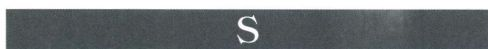

神圣会谈（sacra conversazione）：意大利语， 指代一种表现圣母子与圣徒的绘画，画中人物都出于同一个空间背景里，好像彼此之间在对话交流。

圣器室（sacristy）：教堂中靠近主祭坛的房间或附属于教堂的小型建筑，用于存放宗教仪式中使用的器具和服饰，也被称为圣衣室（vestry）。

沙龙／沙龙展（salon）：（1）宫殿或私人住宅中一种优雅的大起居室或大会客厅；（2）由政府资助，在巴黎卢浮宫举办的在世艺术家绘画雕塑作品展，最初两年一届，后改为一年一届；（3）采取巴黎沙龙模式的大型公共展览。

圣所／圣殿（sanctuary）：（1）神圣的场所或建筑；（2）建筑内部一个特别神圣的地方，例如神庙的内殿、教堂祭坛周边的区域。

石棺（sarcophagus，复数为sarcophagi）：一种大型棺材，一般都为石质，通常还装饰着雕刻与铭文。该术源自希腊语中的“肉体”与“吞噬”。

萨梯尔（satyr）：森林之神的一类，被认为是希腊酒神狄俄尼索斯（或罗马酒神巴库斯）好色的同伴。他们被表现为长着山羊腿和尾巴的男性男子形象，头上长着角和尖耳朵。年轻的萨梯尔也被称为农牧神\(faun\)。

萨兹（saz）：意为“魔法森林”，该术语用来

描述蜿蜒缠绕的枝叶图案，这是奥斯曼土耳其帝国时期哈塔伊风格（hatayi style）的重要组成部分。

扁浮雕（schiacciato）：意大利语，意为“平地”，用来描述多那太罗及其同辈的一些艺术家所创作的浅浮雕。

科学透视法（scientific perspective）：参见透视法（perspective）。

缮抄室（scriptorium，复数为scriptoria）：修道院里的一种工作室，用于抄写手抄本和绘制插图。

涡卷形结构／卷轴／手卷（scroll）：（1）一种建筑装饰，外形为部分卷曲的螺旋形，爱奥尼亚式和科林斯式柱式中都具有这样的装饰；（2）一种手写文本的形式。

公会学校（scuola）：意大利语，意为“学校”。在文艺复兴时期的威尼斯，指致力于行善的兄弟会组织，通常在神职人员的主持下进行。

干壁画（secco或asecco）：参见湿壁画（fresco） 词条中的干壁画（fresco secco）。

截面图（section）：一种建筑图纸，它所呈现的建筑看起来像是被垂直于水平面的平面切开。横截面（cross section）指沿横向轴线切开的截面；纵截面（longitudinal section）指沿纵向轴线切开的截面。

选择性擦除（selective wiping）：在蚀刻工艺中，有计划地擦去版面特定区域的油墨，以制造印刷作品的明暗与色彩变化。

六分拱顶（sexpartite vault）：参见拱顶（vault）。

渐次渲染（sfumato）：意大利语，意为“烟雾笼罩”，用来描述人物造型中极其微妙的光影渐变，达芬奇在创作中尤为青睐这种方法。

刮刻装饰（sgraffito ornament）：一种装饰技法，刮去材料的表面层，通过色彩的对比来形成图像。

柱身（shaft）：建筑的立柱中，柱础与柱头之间的部分。

女先知（Sibyls）：希腊罗马神话中，具有占卜和语言能力的女性，人数众多。她们也被表现在基督教艺术中，因为人们认为女先知也预言了基督的降临，尤为著名的作品是米开朗基罗的西斯廷天顶画。

侧堂（side aisle）：罗马长方形公堂或基督教教堂中，与中堂平行的通道，由联拱廊或柱廊与中堂区分开来。有时中堂两侧各有一个侧堂，有时两侧各有内外两个侧堂。

西勒尼（sileni）：森林之神的一类，陪伴在酒神狄俄尼索斯（或巴库斯）周围。他们是酒神的导师和饮伴，塌鼻厚唇，嗜酒如命。类似于萨梯尔，他们

🟩1128 詹森艺术史

基本上也是人类形象，只不过长着马的尾巴和耳朵。

丝网印刷（silkscreen printing）：一种印刷工艺，挤压颜料或油墨，使之透过模板特别是事先备好的织物，以印出图案的方法，也称为“serigraphy”。

银叶（silver leaf）：参见金叶（gold leaf）。

银尖笔（silverpoint）：一种14世纪和15世纪期间用银制作的绘画工具（笔），它能够画出极细的线条，而且能够保持笔尖的尖锐。

银盐（silver salts）：溴化银、氯化银、碘化银等对光敏感的化合物，被用于制作摄影材料。这种感光性首先是由约翰·海因里希·舒尔茨（JohannHeinrich Schulze）于1725年发现的。

铁锈红（sinopia，复数为sinopie）：意大利语，源自小亚细亚古城锡诺普（Sinope），该城以其出产的砖红色颜料而著名。在湿壁画中，全尺寸的底稿就是用这种颜色绘制在第一层粗石膏或粗灰泥层（arriccio）上。

特定地点艺术（site\-specific art）：只为一个场所而创作的艺术品，这个场所也是作品的组成部分，对它的创作与意义具有关键作用。

草图（sketch）：一种通常快速完成的素描、绘画等艺术品，其目的在于理解和发展艺术技巧，有时草图可以引发更为完整的艺术品。

底座（socle）：建筑基础向外突出的部分，类似于立柱的柱础等。

拱肩（spandrel）：两个邻近拱的曲面外侧相连接的部分；如果是单拱，指的是曲面外侧从起拱点到拱心石的部分。

狮身人面像（sphinx）：（1）古埃及一种人首狮身、兽首狮身、鸟首狮身的动物，通常被雕刻为极其巨大的雕像；（2）希腊神话中的一种动物，通常被表现为长着女性头颅、乳房、鹰翼的狮身形象，出现在古典艺术、文艺复兴艺术和新古典主义艺术中。

尖塔（spire）：一种建于屋顶上的高塔，通常与教堂联系在一起，多见于哥特式建筑。

战利品／夺用（spolia）：拉丁语，意为“动物身上剥下的兽皮”，被用来指代（1）战争中的战利品和（2）被再次使用于不同环境的建筑与雕刻残片。

起拱点（springing）：拱与其基础相接的部分。

内角拱（squinches）：建在方形或长方形角落处，跨越对角线的拱，其功能在于实现向上方穹顶圆形截面的过渡。

大厅（stanza，复数为stanze）：意大利语，意为“房间”。

钢（steel）：经过化学工艺加工的铁，具有更优越的硬度、延展性和强度。

石碑（stele）：源自希腊语，意为“站着的石块”，指一种直立的石板或柱石，有时雕刻有图案或铭文。

台基（stereobate）：古典建筑、特别是希腊神庙的底部结构。

立体镜（stereoscope）：一种光学仪器，使用者能够用它把两幅根据两只眼睛分别观看的角度而拍摄的照片结合在一起，合成的单幅照片具有双眼观看的深度感和稳固性，首先由查尔斯·惠特斯通爵士（SirCharles Wheatstone）在1838年演示。

静物（still life）：指代描绘家庭用品、食物等日常物品的绘画，有时也指雕塑。

柱桩（stilts）：指支撑着上部结构的支柱；20世纪建筑中，通常是钢筋混凝土制成的。建在柱桩上指建筑某个部分之上还有高大的支撑物，例如上心拱（stilted arches）的结构就是如此。

有顶柱廊（stoa）：希腊建筑中一种有顶的柱廊，有时是极长的单体建筑，供会面或散步之用。

斯多噶派（stoic）：芝诺（Zeno）于公元前300年前后创建的哲学学校的成员，命名自他任教的雅典城内的有顶柱廊（stoa）。该流派的主要论点是人应该释放他的全部激情。

建材钢（structural steel）：用于建筑的钢材，藏在建筑之中，既不可见，也不暴露在空气中。

细灰泥（stucco）：（1）一种用于覆盖建筑墙壁的混凝土或水泥；（2）一种用于建筑装饰的灰泥，例如檐口和装饰线脚或浮雕雕刻。

习作（study）：一种预备性草图、素描、绘画等艺术作品，供艺术家探索艺术上的可能性，解决问题，然后再创作完整的作品。后来，习作也常被视为完成的艺术作品。

柱基（stylobate）：希腊神庙台基之上的平台或砌筑地面，构成立柱的基础。

尖笔／铁笔（stylus）：源自拉丁语“stilus”， 罗马人的书写工具。（1）古代用于在柔软材料制成的板子（例如泥板）上书写的尖头工具；（2）用于干刻或蚀刻、类似于针的工具。

崇高（sublime）：19世纪的艺术中，艺术的理想与目标是引发观众的敬畏感，让观众产生高度宗教、道德、伦理和智力意图的感觉。

凹浮雕（sunken relief）：一种浮雕雕塑，人物或图案低于石头表面，具有鲜明的轮廓。

叠加柱式（superimposed orders）：建筑墙壁

重要词汇 1129

上两列或多列圆柱、墩柱或半露方柱上下叠加的样式。

宴饮（symposium）：古希腊的一种集会，有时是知识分子和哲学家讨论观点的集会，通常在非正式的社会场合中进行，例如晚餐聚会。

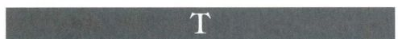

圣龛（tabernacle）：（1）朝拜的场所或房间；（2）一种有华盖的壁龛或凹陷，用于放置图像；（3）古犹太人的便携式圣龛，用于放置约柜。

舞台造型（tableau vivant）：一种通常来自于神话、《圣经》或文学素材的场景，被表现为舞台背景中身着戏装、静立不动的人物形象。

接待室（tablinum）：拉丁语，意为“书写板”或“书写记录”，指罗马住宅中，前庭尽头或位于前庭与第二个庭院之间的房间，家庭记录保存在这里。

蛋彩画（tempera painting）：（1）使用蛋黄和水来调和颜料所作的绘画，14世纪和15世纪期间，蛋彩画被绘制在涂有底料的木板上，使用金叶和用绿色或棕色作为底色（underpainting）的做法早于蛋彩画；（2）绘制此类绘画的技法。

暗影主义（tenebrism）：绘画中强烈的明暗对比。

赤陶（terra cotta）：意大利语，意为“焙烧的泥土”。（1）陶器，通常为红褐色，但往往施有不同颜色的釉层并且经过焙烧，用于陶器、雕塑、建筑材料或者建筑装饰；（2）用这种材料制作的物品；（3）这种自然材料的色彩。

嵌片（tessera，复数为tesserae）：一种彩色的石头、大理石、玻璃或衬金玻璃小块，用于制作镶嵌画。

剧场（theater）：古希腊一种户外的戏剧表演场所，通常是半圆形布局，设有阶梯状的观众席位、合唱队席位和布景台。

基廷会（Theatine Order）：16世纪由近期解体的圣爱会（Oratory of Divine Love）成员建立的宗教组织，其目的在于改革天主教会，它的成员承诺培养他们的精神生命，从事慈善工作。

浴场／浴宫（thermae）：古罗马人的公共沐浴设施，由不同类型的浴池和社会体育设施构成。

圆墓／圆形神殿（tholos）：一种圆形布局的建筑，通常具有神圣性质。

外推力（thrust）：拱、拱顶或穹顶产生了侧向压力，必须在这种力最集中的地方通过墙壁的厚度或某种形式的扶壁来抵消。

圆形画／圆形浮雕（tondo）：一种圆形的绘画或浮雕。

窗格（tracery）：（1）哥特式窗户上的装饰性石质作品，在早期窗格或板窗格中，窗户看起来像是从坚固的石头中切割出来的，在棱窗格中，玻璃占据主要的部分，纤细的石头仿佛是被后加到窗户上的；

（2）使用不同材料在墙壁、圣殿、建筑立面等部分制作的类似装饰。

耳堂（transept）：公堂式教堂中与中堂垂直相交的横臂，通常将中堂与唱诗班席或半圆室区分开来。

截线（transversals）：在根据透视法建构的画面中，截线指与画面（横向）平行、表示距离的线条。它们与正交线相交，形成网格，画面中的元素依据这个网格来布局，以暗示出空间感。

知识之树（Tree of Knowledge）：伊甸园中，长着亚当和夏娃所吃禁果的树，偷吃禁果之后，他们的纯真状态就遭到了破坏。

生命之树（Tree of Life）：生长在伊甸园里的树，它的果实会让人长生；在中世纪艺术中，它经常被用作基督的象征。

楼座（tribune）：教堂中一种平台或走廊，位于中堂上方，俯视侧堂。

三联拱廊（triforium）：中堂墙壁的组成部分，位于连拱廊和高侧窗之间。它通常由每个开间内分布三个开口的假拱廊构成。当中堂墙壁分四层布局，出现楼廊时，三联拱廊就位于楼廊与高侧窗之间。有时耳堂与唱诗班席墙壁上也建有三联拱廊。

三垄板（triglyph）：多立克式檐壁的组成部分，隔开连续的嵌板，并被开槽分为三个区间。

三联作品／三联画（triptych）：一种祭坛作品或宗教图像，可以是雕刻，也可以是绘画，由中央板与两侧屏构成。

凯旋门／巨拱（triumphal arch）：（1）一种大型拱门，有时是一组三个拱门，由罗马皇帝建造，用于纪念他的军功，通常装饰着表现他军功场景的浮雕；（2）教堂东端巨大的横向拱，跨越了祭坛和半圆室，将它们与教堂主体分隔开来，经常装饰着镶嵌画或壁画。

三色素描（trois crayons）：使用三种颜色，通常为红、黑、白所绘制的素描，一种流行于17世纪和18世纪的技法。

乱真（trompe l＇oeil）：法语，意为“欺骗眼睛”，指一种旨在欺骗观众的眼睛，让人相信艺术品是现实的、是空间中真实存在的立体物体或场景的艺术。

战利品／胜利饰品（trophy）：（1）在古罗马时期，

🟩1130 詹森艺术史

指从被打败的敌人那里得到的军备和战利品，并挂在树上、柱子上公开展示；（2）艺术中对这些物品的再现，是胜利的象征，用于纪念或装饰。

门间柱（trumeau）：大型门道中，位于门楣中央下方的支撑柱，正如罗马式和哥特式大门的情况一样，通常都装饰着雕塑。

桁架（truss）：一种三角形的木制或金属架子，用于支撑屋顶，有时在室内可见，有时被天花板遮挡起来。

塔托／小角塔（turret）：（1）作为大型构件组成部分的小型塔状物；（2）建筑角落处的小塔，通常建在建筑上层之上。

制版墨（tusche）：一种含蜡的类油墨液体，用于印制版画中的纯黑色（或纯色）区域。

三角楣／半月楣（tympanum）：（1）古典建筑中，一块通常呈三角形的凹进区域，往往装饰着雕塑，也被称为三角楣（pediment）；（2）中世纪建筑中，大门或窗户的拱与门楣／过梁之间的拱形区域，通常装饰着浮雕。

预示论（typology）：将基督之前的形象、人物和象征等与基督之后的形象、人物和象征一一对应。

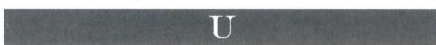

底色（underpainting）：参见蛋彩画（tempera painting\)。

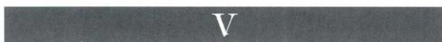

灭点（vanishing point）：以科学透视法绘制的画面中，所有正交线相交并消失的点。

虚空（vanitas）：该术语出自《传道书》1：2（“虚空的虚空”），指的是时间的流逝、生命的短暂、死亡的无可避免。这类表现虚空主题的作品尤见于17世纪的北部欧洲艺术。

拱顶（vault）：一种拱形的屋顶或天花板，通常由石头、砖或混凝土建成。具有一些特点鲜明的变体，所有拱顶的侧向推压力集中点上，都建有扶壁。（1）筒拱是一种半圆形结构，由连续的拱构成，平面布局可以是直线形的，也可以是环形的；（2）交叉拱是由两个相同尺寸的筒拱相交形成的，相交的拱顶部分形成一个拱面分为四个区隔的开间，相交处有突出的拱棱；（3）肋拱指的是拱棱处增加拱肋的拱顶，目的在于加固建筑结构、装饰拱面。当拱肋沿拱面对角

线布局，并且呈半圆形时，就构成了穹顶肋拱；（4）六分拱顶指的是横向拱肋穿过拱面中心点，将之分为六个区隔的肋拱；（5）哥特式拱顶通常都是四分拱顶，所有的拱基本都呈尖顶形；（6）扇形拱顶是一种精致的肋拱，使用了类似于圆锥形的窗格元素，这种拱顶是在15世纪的英格兰发展起来的，其目的在于装饰。

实景画（veduta，复数为vedute）：一种景观绘画，通常表现城市风景。

犊皮纸（vellum）：参见羊皮纸（parchment）。

写真主义（veristic）：源自拉丁语“verus”， 意为“真实”，描述一种超级写实、强调个人特征的肖像画风格。

圣衣室（vestry）：教堂中用来存放服饰（神职人员的外衣）和圣器的房间，也被称为圣器室\(sacristy\)。

恶行（vices）：通常以寓言的手法与七美德一起被表现，罪恶包括：骄傲、嫉妒、贪婪、愤怒、暴食、淫欲和懒惰，而有时也会被其他罪恶，例如不公和愚蠢所替代。

别墅（villa）：最初指大型乡间住宅，在现代语境中，也指单体住宅或近郊住宅。

德行（virtues）：包括三种神学美德：信仰、希望、慈善；四种基本美德：审慎、正义、刚毅和节制，通常以寓言的手法来表现，尤见于中世纪手抄本和雕塑中。

涡卷饰（volute）：一种螺旋形的建筑元素，在爱奥尼亚柱式和复合柱式中尤为常见，但也用于建筑立面与内部装饰。

还愿作品（votive）：敬奉、崇拜神或圣徒时使用的一种宗教图像。

楔形拱石（voussoir）：一种用于建拱的楔形石方。

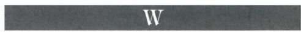

薄涂（wash）：在水彩画与水墨画中使用一层透明的色彩或水墨，偶尔也被运用于油画。

水彩画（watercolor painting）：运用以水调和的颜料绘制的作品，通常画在纸上。

拱腹（webs）：用砖、水泥、石头等制造的筑体，用于填充拱肋之间的空间。

西面工程（westwork）：源自德语词“Westwerk”， 指加洛林、奥托和德国罗马式建筑中，教堂巨大的西立面，通常是钟楼或者结合有钟楼的样式，包括底层入口、中层门厅、上层礼拜堂或楼廊，后来的建筑中

重要词汇 1131

又增加了耳堂与十字交叉处的塔楼。

侧屏（wing）：祭坛作品的侧板，通常两面都有装饰，用铰链与中央板连接在一起，这样就可以打开或关闭，展示不同的图像。

木刻（woodcut）：一种版画，在木板上沿着纹理雕刻出图案，在表面凸起的部分涂上油墨，然后印刷的方法。

锻铁（wrought iron）：与铸铁相比，指一种较纯的铁，容易锻造，冷却缓慢，所以可以手工锻打成形。

珍宝馆（wunderkammer，复数为 wunderkammem）： 字面意义为“奇迹之屋”，是16世纪出现的博物馆的前身。这类房间展示来自世界各地，特别是异国他乡、遥远国度的神奇之物。被展示的物品包括：化石、贝壳、珊瑚、动物（骨骼、兽皮等）、宝石，以建立百科全书式的收藏为努力目标。参见艺术馆\(kunstkammen\)。

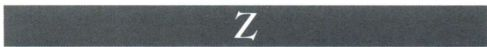

塔庙（ziggurat）：源自亚述语“ziqquratu”， 意为“山顶”或“高度”。指古代亚述和巴比伦地区，一种由泥砖建成的金字塔形土丘或塔状物，是神庙的底座。它的外观或者呈阶梯形，或者被回旋上升的宽阔坡道环绕，给人以阶梯感。

黄道带（zodiac）：一条环绕天堂的想象条带，包括太阳、月亮和主要星球的运行轨迹，以及12个星座，即十二宫分区，人们将十二宫与12个月份联系在一起。十二宫包括：白羊宫（公羊）、金牛宫（公牛）、双子宫（双生子）、巨蟹宫（螃蟹）、狮子宫（狮子）、室女宫（室女）、天秤宫（天平）、天蝎宫（蝎子）、人马宫（射手）、摩羯宫（山羊）、宝瓶宫（持水者）、双鱼宫（鱼）。它们经常被表现在罗马式和哥特式教堂的大门上，与月时劳作的图像一起出现。

